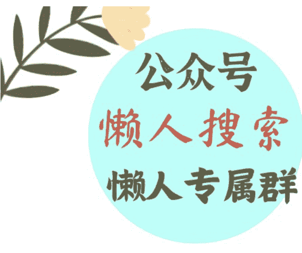
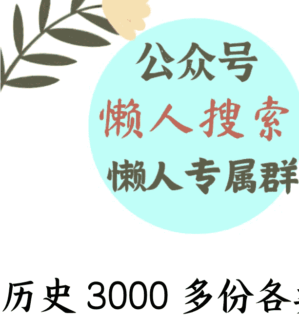

# 知识萃取三步法（得到压箱底的手艺）

241122

整理：公众号懒人搜索，懒人专属群独享

懒人微信：lazyhelper

什么叫知识萃取？为什么今天突然说起这个话题？我先解释两句。

所谓知识萃取，用最通俗的方式解释就是，把知识从它所在的主体身上提炼出来，然后转述给别人听。比如，得到App的课程，是协助老师把知识提炼出来，然后做成课程。再比如，得到的听书产品，不管你叫它解读也好，拆书也罢，它的本质也是知识萃取，只不过萃取的对象从人变成了书，把一本书里的知识提炼出来转述给别人听。

听到这，有人可能更蒙了。这不就是概括总结吗？小学语文时就学过啊。再说，假如我不从事教育，不从事知识服务，这个事跟我压根就没关系啊。

别着急，这个过程其实并没有那么简单。因为在整个知识萃取的过程中，有三道关口。而跨过这三道关口的能力，不仅可以用于设计课程，它几乎可以迁移到所有领域。

懒人微信：lazyhelper

第一道关口，是从被动到主动。著名的教育家李希贵校长说过一句话，叫，学习是人的本能，但教育不是。没错，人类有天然的好奇心。但我们往往只想搞清楚自己好奇的事，因此有了学习这个行为。学习的本质是你想搞清楚你的好奇，而教育，是我要把一个原本不属于你的好奇安装在你的心里。

尤其是成年人的学习，因为没了考试和分数的约束，要想调动成年人的学习行为，你就更要学会激发他的好奇。从这个角度看，知识萃取的第一个分支能力，是让对方从被动接受，到主动好奇，是管理注意力，激发好奇心的能力。

你看，这个能力是不是几乎每个人都需要？

第二道关口，是从内行到外行。什么意思？比如我说一段话，美国联邦基金利率是指美国同业拆借市场的利率，这种利率的变动能够敏感地反映银行之间资金的余缺。听完什么感觉？是不是好像每个词都认识，但连在一起又不太懂。你要是去找名词解释，你会发现，为了搞懂一个概念，你必须得先搞懂另外十个概念。

没错，今天我们已经进入一个分工极其精细的时代，不同行业的知识，就像不同的物种，他们所说的话别人很难听懂。因此，为了把内行人的知识讲给外行人听，你首先要自己踏过内行的门槛，同时带着外行的体感。因此，你至少要具备，快速学习的能力、快速调研的能力，以及快速驾驭信息的能力。

你看，这些能力是不是几乎每个人都需要？

第三道关口，是从过去到此刻。你看，每个领域的知识有那么多，请问，你要讲哪些？不讲哪些？取舍的标准是什么？针对这些问题，我们通常会先问自己，此刻人们需要什么，关心什么。同时，只有站在此刻，我们才知道一个领域里曾经诞生过的知识当中，哪些已经过时了，哪些需要重构，每个观点在它的领域里都是什么地位。比如，今天读凯恩斯的方式肯定和100年前不一样，今天读弗洛伊德的方式肯定也和100年前不一样。

换句话说，你需要为每一个知识，找到它此刻的讲述方式。这需要我们搞懂每个领域在关心什么，有哪些趋势。不管是请教专家，还是搜集资料，总之我们得搞懂这个问题。

你看，这个感知趋势的能力，是不是每个人都需要？

说到这，我们再看一眼知识萃取这四个字。表面上看这个能力是用来做课的，但事实上，它背后隐含着管理注意力的能力、驾驭信息的能力，以及感知趋势的能力。大概率上，你所在的行业也需要这些。

正好也快年底了，假如你所在的公司，需要年底交流经验，沉淀这一年的方法论，希望今天的内容能对你有用。

估计听到这，有人可能会说，得到8年来沉淀的方法，那岂不是得有几万字的篇幅？刚才花了那么大的篇幅做铺垫，怎么还不赶紧开始？

别着急。一来，这套方法其实并不复杂，它有一个非常简洁，几乎是一听就懂的版本。二来，其实从今天开篇的第一段开始，我们就已经在演示这套方法。

注意，重点来了。这套方法简单说，其实只有三步。也就是回答这三个问题。

- 第一，我要回答，或者要解决什么问题？
- 第二，关于这个问题，你以为的旧答案是什么？
- 第三，关于这个问题，实际上的新答案是什么？

你可以回想一下我们今天前半部分的内容。

首先，我提出了一个问题，这个问题是，什么叫知识萃取？

其次，关于它的旧认知是，这个能力只有从事教育行业的人需要。

最后，关于它的新认知是，这套方法不是只针对教育工作者的，它的底层是驾驭信息的能力，是管理注意力的能力，是感知趋势的能力。这些能力每个人都需要。

注意这个结构，简单说，这个结构就是，问题是什么，答案不是什么，而是什么。问题+不是+而是，这在我们得到内部，被称为一个最小化的交付闭环。只有完成这个结构，你才算完成了一次知识的交付。

听到这，有人可能又会说，讲述的方式千千万，为什么一定要采取这个结构呢？

两个理由。

第一，这个结构更符合知识的本来面目。

问你个问题，什么叫知识？知识的本质，不是概念，而是方案。没错，你看到的所有现存的东西，它们最初大概率上，都是某个问题的解决方案。只有把问题和答案连在一起，才叫知识。

比如，说个我经常举的例子，红缨枪。你觉得红缨枪这三个字是知识吗？很多人可能觉得莫名其妙。但是，仔细想想，红缨枪为什么是红的呢？这很奇怪啊。毕竟，过去红色的染料是很贵的，犯不上把士兵的枪头染成红的啊。据说这是因为，士兵手握枪的时候，假如刺中敌人，敌人的鲜血就会顺着枪杆流下来。流到手上，士兵的手就滑了，握不住枪。怎么办？就需要往枪头上缠一块布，随便什么布都行，只要能吸血，能防止血流下来就行。而这块布因为染了敌人的血，就变成了红色的。

你看，红缨枪，这最初也是个方案。只有找到它当初对应的问题，其中的知识，其中的思考，才会浮现出来。

从这个角度看，万事万物背后都隐藏着知识，而把它萃取出来的关键，是找到它当初所要解决的问题。

同样，这个逻辑放在各行各业都成立。

比如，你是一家银行的行长，你发现有的员工效率特别高，你让他去培训其他人。估计这时，很多人都会习惯性地传授自己都做了什么，而忽略掉了自己当初为什么这么做，是要解决什么问题。结果就是，听的人只看到了方法，却不知道这个方法是用到什么地方的。

再比如，你要学习奈飞的企业文化，就要知道奈飞身处的美剧行业，是个从不眷恋存量的行业。因此，奈飞就必须跑得比行业更快，公司内部就要养成善变的企业文化。

换句话说，只有把问题和答案连在一起看，我们才知道一个知识的真相是什么。哪些有用，哪些值得学。

听到这，有人可能又会问，你刚才说的不是三步吗？中间不是还有一个，旧答案是什么吗？为什么要有这一步？直接“问题+答案”不就得了？

这就要说到第二个原因，引出旧答案，是为了倒逼增量价值。

比如，问题是，怎样才能获得成功？答案是，你需要有个好人缘。

这个答案对不对？对。有没有价值？没有。因为这个答案谁都知道，属于正确的废话。为了避免这种情况，我们就需要多问一句，有哪些答案，是即使我不说，别人也知道的？而那些不在别人原有认知里的，就属于增量价值。这才是值得用户花时间了解，值得被做成课程的知识。

当然，除了知识层面的考量，其中也有注意力层面的考量，我们今天就先不展开了。

关于这个话题，咱们先说到这。

最后，眼看着快到年底了，很多公司都在开展内部交流，假如你要提炼这一年沉淀下的知识，或者在公司内部交流经验，也希望今天的内容对你有用。

历史 3000 多份各类付费文章以及年费三千多的副业社群资源, 见懒人专属群内部分享!

付费群, 白嫖勿扰!

懒人专属群更新记录:
https://lazybook.fun/#/blog/record2