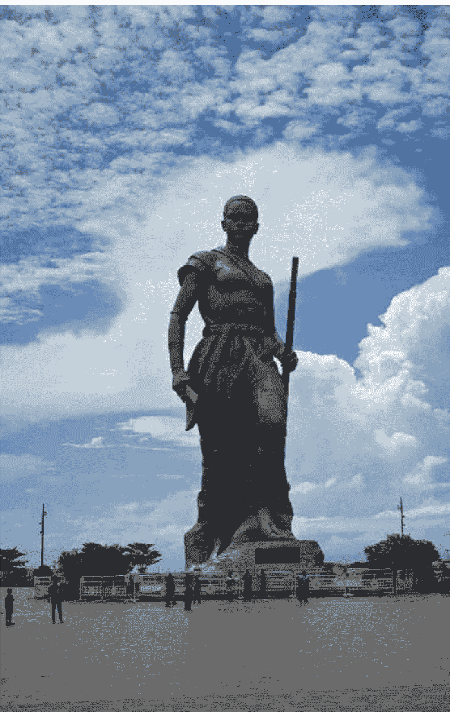

# 非洲，中国老板的“快乐福地”？

241125

整理：公众号懒人搜索，懒人专属群独享

懒人微信：lazyhelper

今天这个标题是不是很眼熟？从前年开始，就有大量的把快乐福地这个句式作为标题的文章。所谓快乐福地，其实是句调侃，说的是那些适合出海做生意的地方。这些确实有机会，也确实有挑战。快乐福地这四个字，多少有点痛并快乐着的意味。

我大概统计了一下，被称为中国老板快乐福地的地方包括韩国、沙特、越南、柬埔寨、墨西哥等等。但是，在各类标题里出现频次最高的地方就是非洲。

前段时间，中非合作论坛刚刚在北京召开，论坛上对中非关系的最新定位是新时代全天候中非命运共同体。

但是，有机会是真的，有挑战也是真的。要知道，整个非洲由54个国家组成，不同地区差异很大。那么，不同地方的市场到底什么样？在当地做生意需要面临哪些问题？具体到个人，当地的工作生活又是怎样的？

懒人微信：lazyhelper

为了搞清这些问题，我们前段时间特地采访了两位在非洲工作多年的得到同学，拿到了很多第一手的信息。不瞒你说，尽管很多趋势我们在新闻上都看到过，但是听到这些具体的故事时，那个触动的深度还是很不一样。

我们采访的第一位得到同学是虎哥。虎哥跟我同龄，从事能源行业，2005年大学毕业的时候，他就被公司外派到了东非的苏丹，到现在他在苏丹工作了将近20年，也已经成了公司在非洲分公司的总经理。我们是在他2023年回国的时候认识的，当时虎哥小范围地分享过在苏丹的经历。分享用了12分钟，现场光掌声就占了2分钟。

第二位同学是山东威海的雪梅老师，今年35岁，从事的是法语翻译工作。雪梅老师是25岁去了非洲中西部的刚果（布）。过去我们说的刚果，其实是个比较笼统的叫法。准确说，这其实是两个国家，一是刚果（布），全称刚果共和国，首都是布拉柴维尔，雪梅老师目前就在这个城市。另一个是刚果（金），全称是刚果民主共和国，首都是金沙萨。

先说个个人感受，在采访中，我们能明显感受到，尽管他们两位都有这样那样的吐槽，但他们都特别喜欢非洲这个地方。这个感觉就像，你大学时参加了一场军训，尽管吃了不少苦，但你还是会感激这段经历。

## 第一，很多非洲人对中国企业的印象什么样？

注意，这个初始印象非常关键，它是你后续和当地人合作的基础。初始印象从哪来？不取决于你，而是取决于你之前来的上一批人。

比如，早年前往墨西哥的大都是义乌的零售商贩。因此中国产品给墨西哥人的第一印象就是物美价廉，性价比高。再比如，早期出海沙特的大都是国内的科技企业，或者是从事基建的央企。因此沙特人觉得中国公司在很大程度上代表着技术先进，实力过硬。

而早期前往非洲的中国人，有不少是从事采矿行业的，或者是农民。这就导致苏丹当地人觉得中国人做的大多是劳动密集型产业。再加上早期有很多二手商贩，会把国内淘汰的商品卖到非洲，尽管价格便宜，但质量很一般。这就导致很多当地人早期并不会把中国企业和高端制造联系到一起。

比如虎哥在2005年前往苏丹的时候就发现，假如你是个亚洲人，穿得西装笔挺，那么当地人跟你打招呼就会经常用日语或者韩语。因为他们不太会把中国职员和精英联系在一起。

但是现在，情况已经有很大的变化。说两个细节你感受一下。

懒人微信：lazyhelper

比如，在虎哥所在的苏丹，中国人已经渗透到当地的每一个行业。借用虎哥的话说，你只要出门溜达，就一定能碰到中国同胞。中国人去非洲打拼，几乎很少有给非洲人打工的，都是给咱们自己人打工。现在的很多中国公司出海非洲的生意，其实都是围绕央企国企做承包分包的业务。非洲当地的基建、消费行业，以及超市餐馆，都有大量的中国人在经营。现在在北京飞埃塞俄比亚的航班，动不动就一整个机舱全是中国人。

还有个细节，中国的传音算是出海非洲的前辈公司了。他们在非洲的融入深到什么程度？很多非洲人说起传音手机都很自豪，他们觉得这是非洲的国货品牌，是他们的骄傲。再比如，虽然苏丹的官方语言是阿拉伯语，但有很多当地人交流时，要么是用带点方言的中文，要么是用带点中式方言的英语。你可以感受一下，中国公司与当地人的协作有多密集？

再比如，雪梅老师所在的刚果（布）。10年前刚到刚果（布）首都布拉柴维尔的时候，她差点都不想下飞机，因为周围太荒凉了。但现在布拉柴维尔的情况有了很大的改观，比如她居住的地方附近就有一条很像国内的网红街。而且更关键的是，当地都很喜欢做中国人的生意。他们觉得中国人普遍比较富裕。你看，这也和十多年前大不一样。

你看，我们可以从苏丹和刚果（布）的情况，大概看出非洲市场对中国公司的印象变迁。过去我们代表着劳动密集产业，而现在我们越来越多地代表着质量可靠，而且在当地的协作网络也越来越广阔。

## 第二，关于当地的经营环境

这个情况就要复杂得多了，很难概括出一个统一的趋势。假如非要用一个词概括，那就是多样。说几个细节你感受一下。

比如，按照通常的想象，非洲的很多地方比较落后，劳动市场应该不健全，雇佣关系应该类似于临时工说开人就开人。但事实上，很多地方的情况正好相反。比如苏丹，这里有很浓的法属殖民地的色彩，而当地的劳动法直接对标法国。一般来说，只要雇员工作的时间超过24个月，就属于正式员工，公司就要跟他签订终身制合同。假如解聘一个正式员工，需要支付10到20年工资的赔偿金。注意，不是10到20个月的赔偿金，而是10到20年。同时，给当地员工上医保，需要1+n，1就是员工本人，n就是他的n个家属。职工全家生病，都需要走公司的医保。过去这个n还没有上限，最近几年稍微规范一点，限制在7个人以下。

听到这，你可能会说给员工多一点保障，能有利于提高他们的积极性，这不也挺好的吗？确实有好的一面，但也有麻烦的一面。主要是因为很多非洲人有点过分松弛了。比如苏丹，当地人有句口头禅：five minutes，5分钟。意思是等我5分钟，马上就好。但问题是，这个5分钟只是个比喻，实际上可能要几个小时。比如虎哥的公司，有当地员工上午10点请假说要去祈祷，需要5分钟，但实际上你在中午吃饭前是肯定见不到这个人的。但祈祷这个事公司出于尊重当地文化，又不可能不批。再比如，苏丹人还有句口头禅，叫No problem。注意，这也只是句口头禅，虎哥告诉我说，No problem就意味着一定是一堆的problem。

听到这，有人可能觉得按照这个工作风格，中国员工和当地人的合作能融洽吗？还真能。根据虎哥的观察，非洲老铁有个优点，心大，不记仇。今天就算你冲他发脾气，催着他工作，人家第二天也跟没事人似的，照样请你到他家里做客。

再比如，很多人觉得非洲的很多市场还处在初期阶段，竞争应该不太激烈。但不好意思，非洲的很多领域比咱们国内还要卷得多。比如刚果（布），对很多行业来说，当地最大的客户就是政府。而这几年受石油价格波动的影响，刚果（布）财政紧张，发包的工程数量明显变少，项目的要求也更严格。说白了，竞争对手变多了，但是蛋糕却在变小。

再比如，很多人觉得非洲的一些地区相对落后，意味着当地的监管不够严格。但事实上也想错了。有些地方的监管不是不严格，而是过度严格。比如刚果（布），税务、海关、人力资源等机构的突击检查很频繁。他们会查每个雇员的身份信息和劳动合同，发现一点问题就马上罚款，甚至可能勒令项目停工。再比如，有些地方的税收政策很多，像刚果（金），企业要面临十几种税费，包括行政税、卫生税、广告牌税等等。据说在当地最如鱼得水的小公司大都是印度人经营的。因为印度国内的市场复杂度不亚于刚果，印度公司已经积累了一套应对的方法。

## 第三，非洲有哪些机会？

尽管有这样那样的挑战，但总体看，非洲的机会还是非常多的。

首先，基建。这也是当地最大的机会之一。比如刚果（布），除了首都布拉柴维尔的基建相对完善，其他地方都有很大的发展空间。大量的地区还不通路，不通电。比如2020年的时候，雪梅老师去参加一个乡村道路的验收，白天去晚上回，而返程的时候沿途经过几个村庄，愣是没看到一丁点光源。再比如，供水、教育、卫生，非洲很多地区在这些方面都比较落后，也有不小的发展空间。

再比如，前往非洲工作的机会正在变多，待遇也在变好。在几个海外岗位招聘网站上，包括外聘网、驻外之家等等，外派非洲职位的月薪普遍要高于国内的同类职位。比如电工、厨师、销售等等，学历要求专科及以上，月薪普遍在1.5万到3万元之间。

再比如，非洲目前有14.5亿人，其中25岁以下的年轻人占比超过60%。互联网用户总数超过5亿，电商市场的年复合增长率超过14.4%。根据海关总署的数据，2024年的前7个月，中国对非洲出口1.19万亿元，同比增长了5.5%。中国在过去的15年都一直是非洲最大的贸易伙伴。这意味着非洲的消费和电商领域，或许都存在着巨大的增长空间。

这些领域在起步初期，也许会遇到各式各样的问题，但非洲总体是一个新兴市场，企业一旦熬过起步期，后面就能占据巨大的先发优势。

## 最后，假如有人想去非洲闯荡，今天的两位老师还有这么几句叮嘱

一是，一定要充分尊重当地的文化和当地的人。说个细节，假如坐出租车，最好看一眼牌照上司机的名字，然后用名字称呼司机，以示尊重。这能帮你快速融入当地。

二来，做好吃苦的准备。比如，中国前往非洲，机票动辄一两万元，坐飞机需要20个小时，多数在当地打拼的人都很长时间才能回一次家。

三来，多点冲劲，享受在当地经历的一切。在采访结束时，虎哥正好出差去西非中南部的贝宁。路过当地的亚马逊女神铜像，据说这是漫威电影《黑豹》里瓦坎达女战神的原型，象征着勇气、智慧与永不退缩。虎哥拍了张照片发给我，我放在文稿里了，也把这张照片送给正在看这期节目的同学。

当然，非洲的实际情况要远比今天的讲述更加丰富且复杂。我们今天只是选取了一个侧面来讲述。假如你有出海非洲的打算，也希望今天的节目对你有所启发。

贝宁，亚马逊女神像，电影《黑豹》
中瓦坎达女战神的原型

好，以上就是今天的内容

公众号
懒人搜索
懒人专属群

微信:lazyhelper

历史 3000 多份各类付费文章以及年费三千
多的副业社群资源，见懒人专属群内部分享!

付费群，白嫖勿扰!

懒人微信：lazyhelper

## 懒人专属群更新记录：

https://lazybook.fun/#/blog/record2

懒人微信：lazyhelper