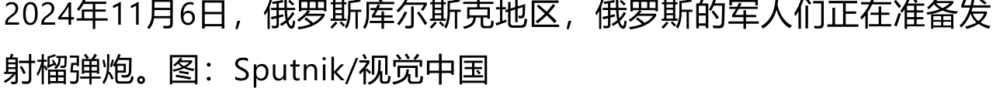
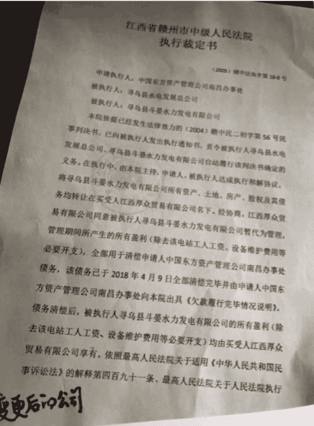
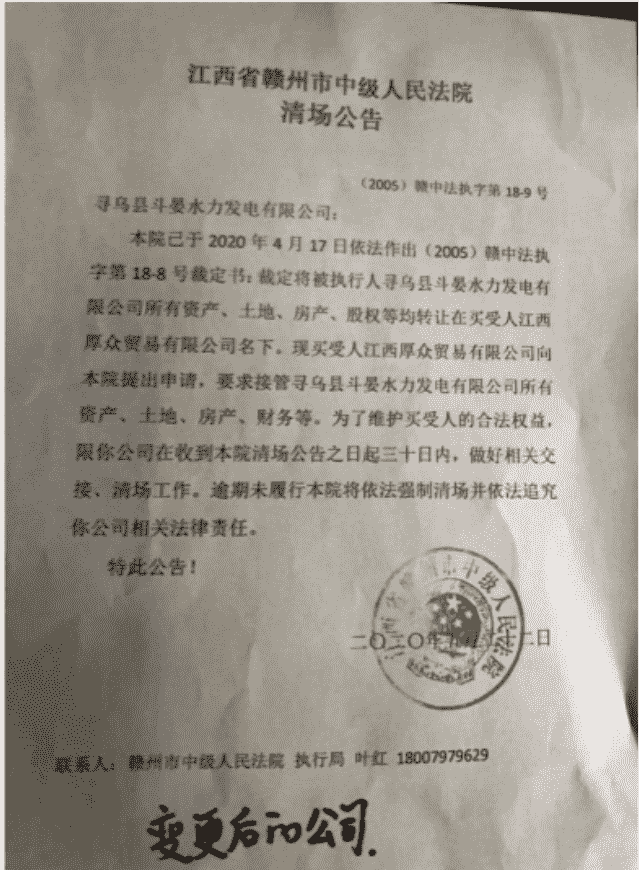
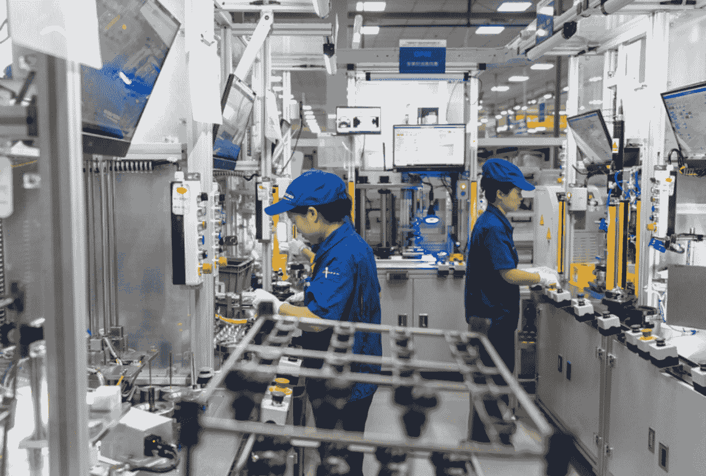
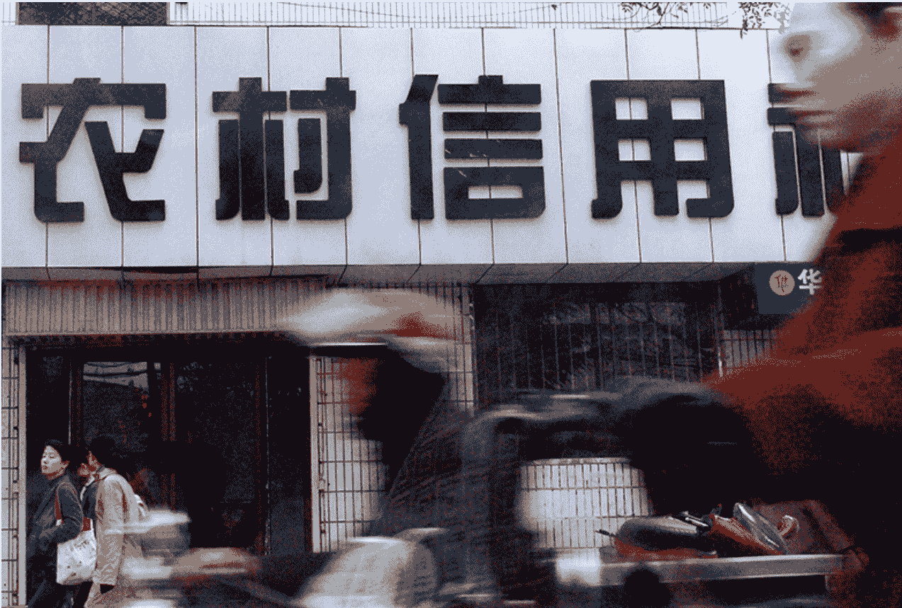
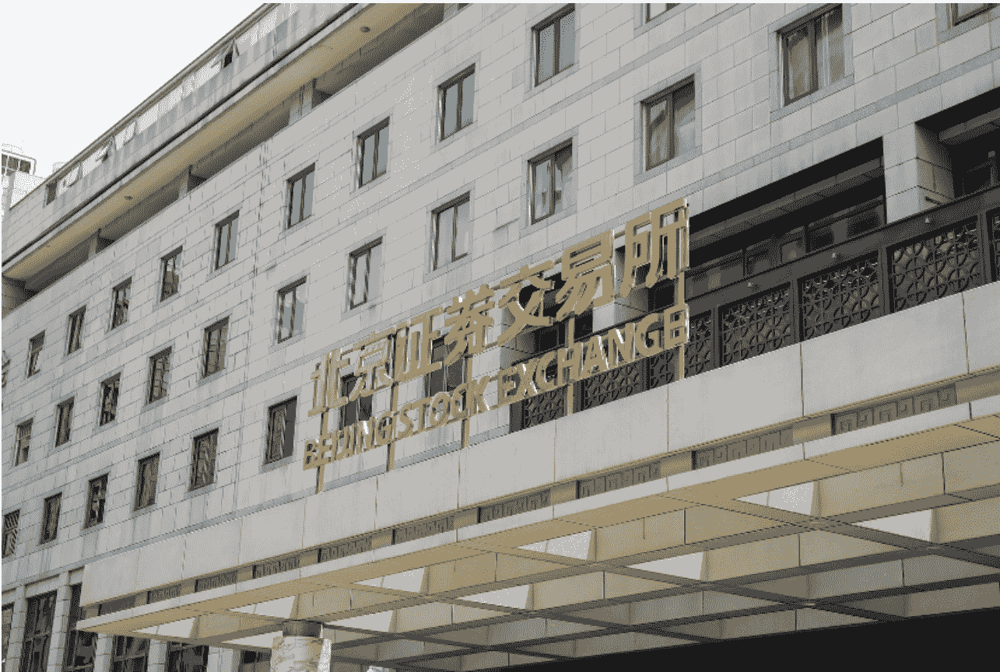
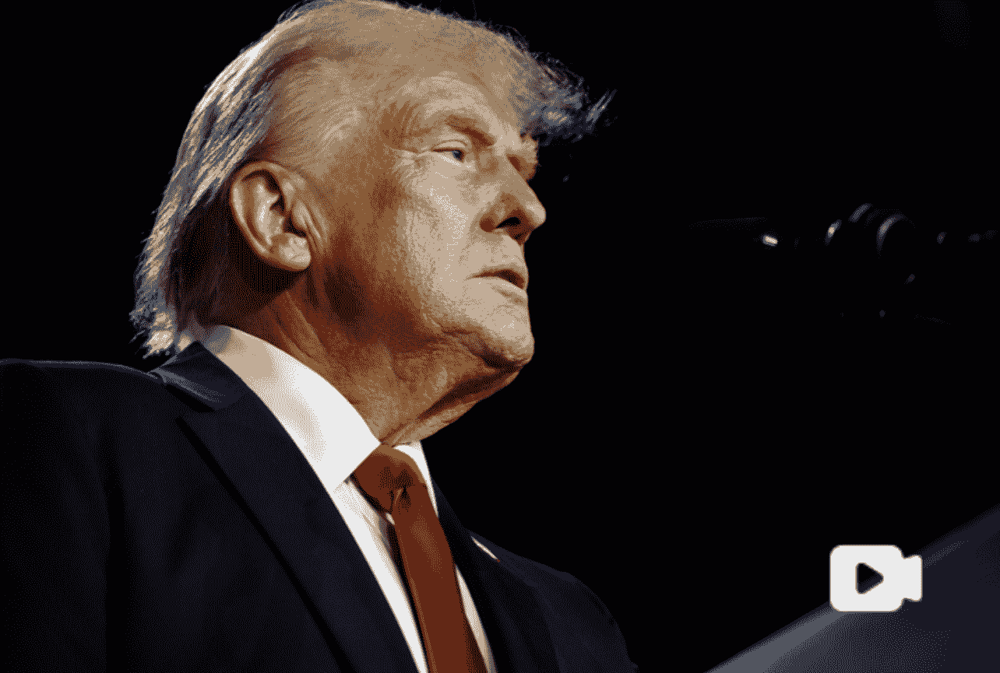
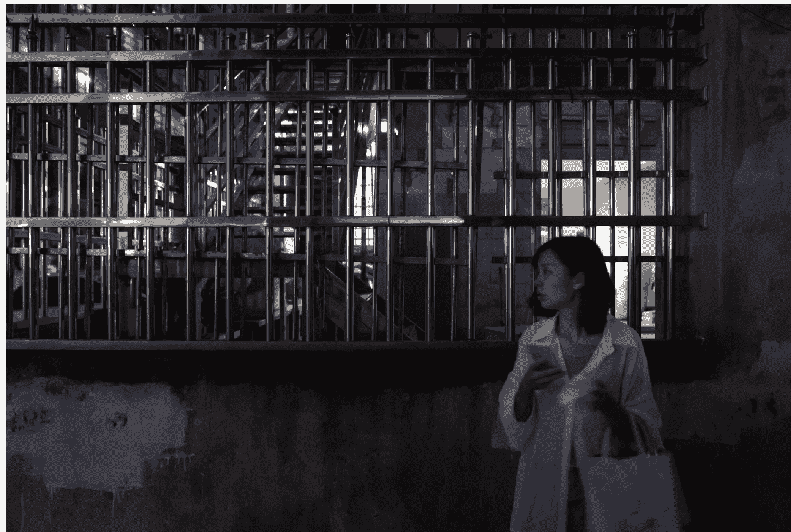
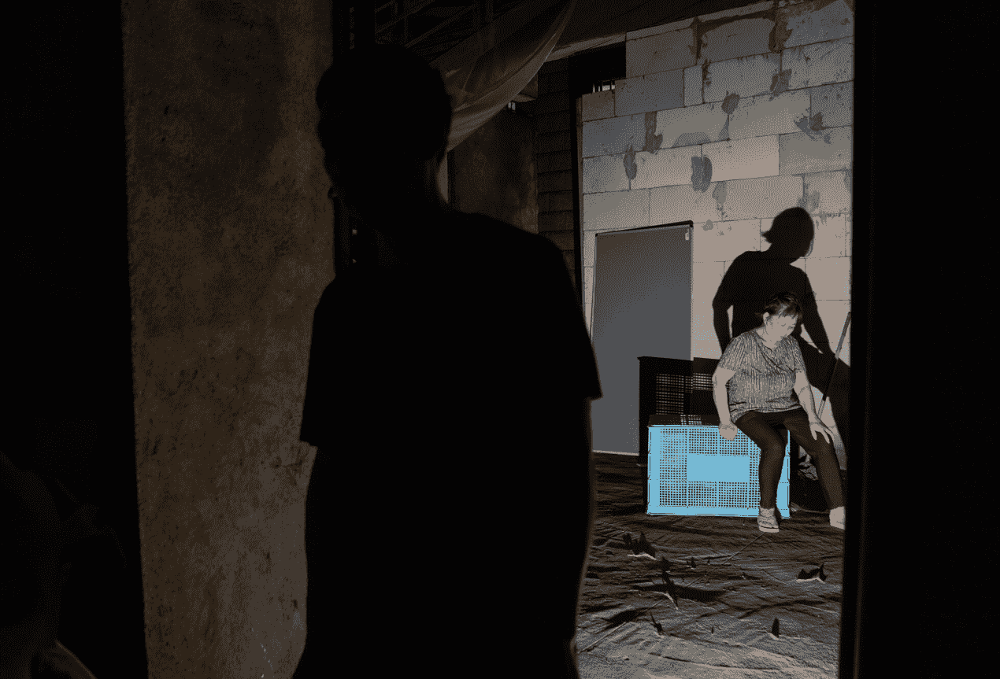
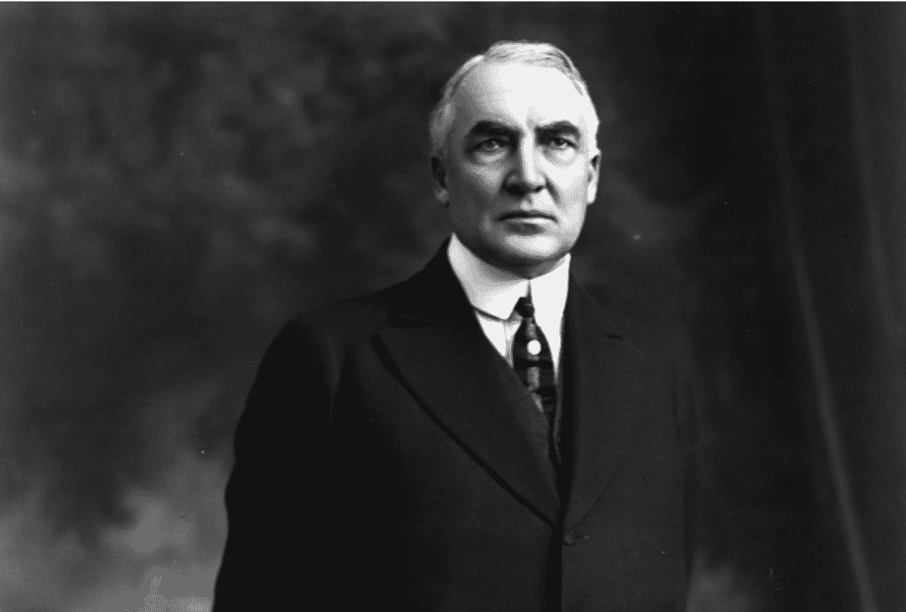

- 执行法官连环诈骗案 20
- 高风险省联社改革“深水区” 50
- 北交所缘何暴涨 56
- 智能驾驶供应链进入淘汰赛 61
- 直播间“神药”生意经 69
- 国家公园立法 82

# 财新周刊
Caixin Weekly

# 特朗普回归
美国选民再次选择了特朗普，
美国的方向骤然掉头回转，
全世界准备好了吗？

P.28

定价：人民币40元 港币60元 www.caixin.com

2024年 第44期 11月11日出版
总第1130期
邮发代号：32-235

ISSN 2096-1251

2024年11月6日，特朗普宣布在2024年美国总统选举中获胜。（图片经AI修复）

## 财新观察 | 让更多外资成为“耐心资本”

### CAIXIN | 听文章

时隔19年，外国投资者战略投资A股上市公司迎来新政策。日前，商务部、中国证监会等六部门修订发布《外国投资者对上市公司战略投资管理办法》（下称《办法》）。据相关部门介绍，修订后的《办法》主要从五方面降低了投资门槛，旨在进一步拓宽外资投资证券市场渠道，发挥战略投资渠道引资潜力，鼓励外资开展长期投资、价值投资。这再次释放了中国政府推动高水平对外开放、以更大力度吸引和利用外资的明确信号。让更多外资成为长期资金和“耐心资本”，既能够促进利用外资扩总量、提质量，也有助于推动中国产业升级和资本市场健康稳定发展。

2005年，商务部等五部门发布《办法》，正值中国“入世”不久。《办法》实施以来，外国投资者累计战略投资600多家上市公司。近年来，引进更多优质外资成为国内资本市场进一步发展壮大的内在需求。中共二十届三中全会审议通过的《中共中央关于进一步全面深化改革 推进中国式现代化的决定》（下称《决定》）提出，“有序扩大我国商品市场、服务市场、资本市场、劳务市场等对外开放”“提高外资在华开展股权投资、风险投资便利性”。另外，随着外商投资法、证券法、公司法等法律出台或修订，相关监管制度发生重大调整，有必要根据新的形势修订完善《办法》。在此背景下，外国投资者战略投资A股上市公司的门槛降低，实属水到渠成。

具体来看，《办法》降低外资战略投资A股上市公司的门槛，主要体现在：允许外国自然人实施战略投资；放宽外国投资者的资产要求；增加要约收购这一战略投资方式；以定向发行、要约收购方式实施战略投资的，允许以境外非上市公司股份作为支付对价；适当降低持股比例要求和持股锁定期要求。这些“技术性”改进积极回应了外资的部分关切。当然，外资是否流向A股、引进来是否能长久留住，影响因素有很多，投资门槛和锁定期只是一方面，更与国内经济景气度、证券市场投资价值以及监管体制是否健全等因素密切相关。归根到底，能否让外资成为“耐心资本”取决于它们对A股市场乃至中国经济的信心和预期，更多杂志关注TG频道《@QiKan2023》。

引导中长期资金入市，提升空间极大。《决定》提出“发展耐心资本”“支持长期资金入市”，这就要求打通社保、保险、理财等资金入市的堵点。此外，外资特别是其中的战略投资，也可以成为A股的长期资金、“耐心资本”，而非满足于短期投机盈利的“热钱”。《办法》所规制的战略投资是外国投资者通过上市公司定向发行新股、协议转让、要约收购等方式取得并中长期持有上市公司A股股份的行为。从其定义来看，这类战略投资具有长期资金的属性，有成为耐心资本的潜质。

近年来，针对外资的种种关切和诉求，中国持续扩大高水平制度型开放，一大亮点就是优化资本市场跨境互联互通机制、不断提升外资投资A股的便利度。近日，证监会负责人表示，证监会将坚定不移持续推进市场、机构、产品全方位制度型开放，深化境内外市场互联互通，拓宽境外上市渠道，鼓励和支持更多外资机构来华投资展业。数据显示，在今年二季度A股市场的投资者持股结构中，境外机构和个人仅占4.10%。虽然所占比例并不高，外资仍是中国证券市场的重要参与者，其中的战略投资更是可以发挥独特的“一级半市场”作用，增强国内资本市场活力。

这要求人们正确认识和看待外资，为外资机构营造着良好的舆论环境。毋庸讳言，资本都是逐利的，外资也不例外。随着中国经济体量增加、产业结构升级、科技和管理水平提高，以其在中国经济中的比例自然会有所下降，但是，这并不意味着中国不再需要外资了。如今，中国推动经济高质量发展、建设创新型国家、挫败“脱钩断链”图谋，都离不开外资参与；中国资本市场稳定健康发展，也同样需要外资，其中的战略投资更是其基石。

在引入战略投资方面，中国不乏经典案例。世纪之交，工、农、中、建四大国有商业银行曾面临“技术性破产”。从2003年底开始，国有商业银行股份制改革拉开大幕，具体改革步骤为“重组—股改—引战—上市”，中国银行业从此“涅槃重生”并逐步跻身全球前列。在这一过程中，境外金融机构作为战略投资者发挥了重大作用，帮助重塑了国内银行业的公司治理，提升了其经营管理的水平。时移世易，当前A股上市公司的经营状况已与当年不可同日而语。不过，外国投资者的战略投资仍有其不可或缺的重要作用。让更多外资也成为中国资本市场的长期资金、“耐心资本”，在相关政府部门和监管机构释放进一步“引进来”的诚意之后，还需要推动经济持续回升向好，并有健全的市场化、法治化的体制机制做保障，如此才能形成近悦远来的良好局面。■

## 最新封面报道 | 特朗普回归

CAIXIN|听文章

CAIXIN|看视频

点我打开视频

文|财新周刊 曾佳 发自美国首都华盛顿，路尘、胡暄 发自北京

“很多人告诉我，上帝饶我一命是有原因的。这个原因就是要拯救我们的国家，让美国恢复伟大。现在，我们要完成这项使命。”美东时间11月5日深夜，现年78岁的共和党候选人、曾在2017—2021年间担任美国第45任总统的特朗普，以比多数民调机构所预测到的更大胜幅再次当选，并将于2025年1月20日宣誓就职。

美国上一次出现由已卸任总统再度当选的例子，还是在19世纪末担任第22任和第24任总统的格罗弗·克利夫兰。根据美国宪法，特朗普在完成2025—2029年的这个任期后，将不能再争取连任。

在同步举行的美国国会改选中，共和党亦夺回了参议院的多数党地位，并有望守住众议院的控制权。此外，在特朗普上次担任总统期间，美国联邦最高法院的偏保守派法官人数，已是偏自由派法官的2倍，呈现6:3的对比。在特朗普将再次掌政之际，行政、国会和司法等美国政府三大权力分支的主导权，料将全部收归到保守势力手中。

相比2016年使大多数观察者跌破眼镜的意外当选，特朗普此次重夺白宫之路，显得颇有准备。过去他在野的这四年里，即使经历一连串司法诉讼的追究和被控在2021年1月6日煽动“国会山暴乱”的压力，但“特朗普主义”对共和党的控制不但没有松动，在2024年的共和党总统初选中，特朗普也很快出线，毫无意外地夺得提名权。

即使到11月投票之际，发生在2024年7月的戏剧性遇刺事件已不再是选民最热议的话题，但特朗普在此一劫中的个人表现，对在全球动荡局面下，渴望美国拥有一位“强势领导人”的选民仍有号召力；特朗普在遇刺幸存后斩获的民调弹升，也重塑了大选格局，迫使现任的民主党籍美国总统拜登放弃连任，由60岁的美国副总统哈里斯临时代打。

虽然在拜登退选后，民主党内的“换帅”过程堪称顺畅，没有再爆发新的内部龃龉，自8月以来，哈里斯的民调也曾一度有超越特朗普的态势，但进入选前倒数的10月以来，迟迟无法树立清晰个人号召和议程的哈里斯，民调又被特朗普超越。

特朗普的非传统政坛支持者——诸如特斯拉的首席执行官（CEO）马斯克，也通过掌控的社交媒体平台X和他的SpaceX公司成功回收火箭等舆论事件，直接或间接地替特朗普造势。直到选前一刻，哈里斯的民调水平出现了小幅上扬。但多数民调机构仍在最后关头对选情给予“五五开”“不相上下”的评估，并将这场选战定性为“近年来最难预测结果的大选”。

然而，自美东时间11月5日晚间开始计票不久，特朗普便占据了上风。在各个指标性地区，特朗普的表现均好于他的2020年连任失利之战。而哈里斯在美国绝大多数的县份，包括民主党的传统优势区，得票率都未及四年前的拜登。

当晚8时许，特朗普就夺下佛罗里达州。在这个拉丁裔选民角色吃重之地，特朗普的得票率也由上届的51.2%爬升到56%。而在一向“偏蓝”的纽约州，特朗普更比四年前增长近10个百分点，拿下44%的选票，创下自上世纪90年代以来共和党总统候选人在纽约州的最佳表现。特朗普赢面的扩大，意味着一届主打“去监管”的新政府可能上台。即便开票尚未结束，美国市场情绪已大为提振，美元应声走高。

随着各州开票的推进，美国内外的观战者颇为震动地见到，不论是在对选举结果最富决定性的七个摇摆州，还是其他州属，特朗普的得票表现都超过他在2016年和2020年的记录。在摇摆州激战中，特朗普率先拿下南部“阳光带”的北卡罗来纳、佐治亚两州，使胜利天平开始明显倒向特朗普一方。

此后，随着民主党拥有一定传统优势的“蓝墙三州”——宾夕法尼亚、威斯康星和密歇根州于2016年后再次被特朗普攻破，特朗普再度当选已成定局。美东时间11月6日凌晨，特朗普赢得的选举人票跨过270票的当选门槛，确定在本届美国总统选举中胜出。在计票过程最晚确定归属的摇摆州亚利桑那和内华达州，则使特朗普最终囊括的选举人票达到312票，并把哈里斯的得票数压制在226票。

令观察者瞩目的是，除了按各州人数比例分配的选举人票，特朗普此次在全美所夺下的由个人选民投下的普选票也超过7300万张，与哈里斯拉开一定差距，未再重复他于2016年对阵希拉里时留下的“赢了选举人票、输了普选票”的轨迹。

11月5日晚上，特朗普在他的佛罗里达州居所——海湖庄园所在的西棕榈滩和支持者们一同观看了开票过程，并迎来了他三次参选美国总统中的第二场胜利。

当地时间2024年11月6日凌晨，特朗普在佛罗里达州棕榈滩会议中心发胜选讲话。图：JimWatson/视觉中国

大选靴子落地后，“特朗普交易”连日掀起美股狂欢。11月6日美股开盘后，三大股指均创历史新高。由于马斯克和特朗普高调结盟，特斯拉涨近15%。与特朗普去监管、推动加密货币主流化等政策相呼应的大型科技股、银行股、加密货币概念股、能源股大涨，担忧受到新一波贸易战冲击的中概股则普跌。美元指数一度触及四个月以来新高，非美元货币普跌。离岸人民币兑美元汇率一度站上7.2。

在经过一夜的沉淀后，11月6日下午，败选的哈里斯致电特朗普，祝贺他的胜利并承认自己败选。随后，哈里斯在她的母校、有“黑人哈佛”之称的霍华德大学发表了败选讲话，称自己“承认选举(结果)，但不会放弃激励了这场竞选的斗争。这场斗争——是为了自由、机会、公平和所有人的尊严的斗争”。哈里斯还用一句格言，安慰了自己的近6900万名支持者——“只有在足够黑暗的时候，星星才会显现”，并呼吁全美民众共同促成权力的和平交接。

当地时间2024年11月6日下午，美国现任副总统、民主党总统候选人哈里斯在哥伦比亚特区的霍华德大学发表讲话，表示接受输掉选举的结果。图：AngelinaKatsanis/视觉中国

相对于2020年大选时，开票过程用了近四天才确定由拜登胜出，特朗普的此次当选计票过程堪称利索。开票近三小时后，特朗普在全美各地和各分类人群中，表现都优于已往的势头就已浮现。到开票近五小时之际，胜局就已被特朗普锁定。

由于目前特朗普仍在四项联邦和州层面的刑事案中遭到起诉，且在其中一起开审案件中被一审定罪，这也使特朗普成为美国首位背负刑事重罪罪名的前总统和总统当选人。但美国法律并未禁止他的参选资格，他的司法诉讼也不会影响他再次当选后宣誓就职。

今年美国大概有2.44亿合格选民。截至11月5日投票日之前，全美大约一半的注册选民完成了邮寄投票或提前到场投票，七个摇摆州的提前投票声势更是达到历史新高。尽管部分州的计票尚未完成，据《华盛顿邮报》测算，今年美国大选的投票率预计为65%，接近2020年66%的纪录。

除了选举正副总统，美国选民此次也一并改选美国国会众议院所有435席议员、参议院的三分之一席次——33名参议员，以及州长等非联邦级别的地方官员。特朗普个人格外强劲的势头，也体现在他的总统得票率，普遍高于共和党籍的国会议员和州长的得票率。

特朗普确定当选后，多国政府及欧盟、北约等多方均发出祝贺信息，表示期待与下一届特朗普政府合作。在俄乌冲突如何处理立场上频频与特朗普相左的乌克兰总统泽连斯基，也很快同特朗普进行了通话，并期待与其再次会面。

11月7日，中国国家主席习近平致电特朗普，祝贺他当选美国总统。习近平指出，历史昭示我们，中美合则两利、斗则俱伤。一个稳定、健康、可持续发展的中美关系符合两国共同利益和国际社会期待。希望双方秉持相互尊重、和平共处、合作共赢的原则，加强对话沟通，妥善管控分歧，拓展互利合作，走出一条新时期中美正确相处之道，造福两国，惠及世界。

除总统选举计票外，美国国会改选的全部结果底定，可能还需要几周时间。但《库克政治报告》等权威民调机构预计，共和党大概率将保住众议院多数党地位。而在新一届参议院，共和党已确定掌握52席的多数。

这意味着，截至2026年底美国下次中期选举之前，特朗普将拥有充分的行政—立法协同条件，可更强势地推进各领域的激进议程。

在共和党的政纲、光谱与人事路线均已受特朗普大幅改造的局面下，早在一年前就已开始为再度入主白宫而招募执政团队的特朗普阵营，恐将迅速推出比首次主政时，更具鲜明保守派主张共识和激进行动力的官员团队。

在司法争讼上，特朗普将可通过其所任命的司法部长终结他在联邦层级被起诉的诉讼，甚至有可能特赦2021年“国会山暴乱事件”的参与者。

此外，大幅改动美国税制、建立美国的“加密货币国家储备”、对外普遍加征关税、进一步解构全球自贸体系等，都在特朗普扬言推动的清单上。

在外交层面，特朗普曾夸口要“迅速解决”的乌克兰冲突，可能会导致欧洲盟友的反弹、北约内部裂痕的扩大，以及俄罗斯全球战略优势的回升。

而在美国的另一权力分支——美国联邦最高法院的九名大法官中，有两人可能会在未来几年内因年龄因素卸任。未来四年里，若特朗普有机会任命多达两名新任大法官，则偏保守派和偏自由派大法官之比，将从当前的6:3倾斜到极其罕见的8:1。外界不乏担忧，大法官光谱比例的严重失衡，将进一步削弱美国司法分支对行政分支的牵制功能，威胁美国宪制运行的根基，且有可能对美国社会的日常生活带来更多激进的变化。

2021年，战胜特朗普的拜登在宣誓就任美国总统之际，曾称现在已到“治愈美国的季节”，并呼吁：“让这个悲伤的、妖魔化的严峻时代，就在这里、在此刻终结吧！”然而，四年之后，美国选民却以更鲜明的输赢比例，再次选择了特朗普，使美国国家的方向骤然掉头回转。

为何民主党和拜登当初承诺的“治愈”诉求，没有再次使选民信服？而让特朗普从“国会山暴乱”的烟尘中重新爬起的，又是怎样的一片土壤？

※财新数据专题《特朗普回归带来的经济影响》，结合本篇深度报道和汇率、外贸等多维数据资讯，数据通Pro会员专享。

## 特朗普的新基盘

由特朗普掀起的这场让美国社会大面积“右转”的红潮，在投票日迫近之际虽略显苗头，但蔓延之势仍令外界诧异。

美东时间11月5日晚6时，印第安纳州和肯塔基州的投票站率先关闭，总统选举计票由此开始。

起初，一切似乎都与选前民调所暗示的方向相符：美国全国广播公司（NBC）针对已投票选民所做的出口民调显示，选民在本届选举中最关注的问题是美国的“民主状态”，这与经济议题并驾齐驱。但由于两党都宣称自己正在捍卫民主制度，这一指标的实际指向趋于模糊。

此外，大约七分之一的投票者将堕胎权作为投票决策时的主要考虑因素，大约三分之二的投票者认为堕胎应获得合法化，两者都与哈里斯以及民主党的竞选纲领相呼应。与此同时，出门投票的选民还被证明超过一半是女性。由于哈里斯的性别，女性选民的积极参与起初也被认为是有利哈里斯的明显信号。

美东时间晚7点，印第安纳州与肯塔基州迅速被特朗普收入囊中，这未引起任何人的惊讶——这两州都是共和党的传统阵地，与此同时，哈里斯也稳健地拿下传统蓝州佛蒙特。计票开始大约两小时后，虽然仍未有任何摇摆州的结果出炉，但特朗普在所有已开票的州都录得超预期的得票率。这一趋势让民主党内的紧张情绪骤然上升。

局面的重大转折点，出现在特朗普的居住地佛罗里达州。尽管佛州在过去几届选举中，已经脱离了原本的摇摆州地位，而变得日益接近“红州”。但特朗普在本届选举中，仍“翻红”了上次多数人投给拜登的希尔斯伯勒县和皮内拉斯县。在民主党过去最坚定的票仓之一、全美古巴裔最大聚居区迈阿密—戴德县，特朗普不但赢过哈里斯，还建立起高达11个百分点的领先优势。

与此同时，哈里斯在四个原本稳操胜券的佛州县份均落后于2020年拜登所取得的成绩，还在以波多黎各人为主的奥西奥拉县以1.5个百分点的差距输给特朗普。

拉丁裔选民大幅倒向特朗普的程度，超乎许多人的预期。佛州结果出炉一小时以后，《纽约时报》修正其选举预测，开始将胜选者预测的指针倒向特朗普。

随后的几小时内，特朗普的当选预期不断扩大。在佐治亚和北卡罗来纳这两个关键摇摆州，哈里斯都显出颓势。根据已开选票的追踪统计，几乎全美所有的行政区，都发生了较四年前更倾向于共和党的明显偏转。在开票直播间，以红色偏右箭头标记出的“转红”标记遍布各地，仅有极少数的几个向左“转蓝”标记浮现。

随着哈里斯赢得选举的可能路径越来越窄，在民主党支持者聚集的霍华德大学，现场人群尽管仍保持乐观，但气氛已开始发生变化。美东时间午夜11时40分，美媒宣布特朗普在北卡罗来纳州确定胜出，将哈里斯翻盘的机会进一步压缩。

几十分钟后，美媒又宣布共和党夺取参议院主导权。紧接着，佐治亚成为第二个宣布特朗普胜出的摇摆州。此时，哈里斯阵营宣布取消了她原定要在投票当夜于霍华德大学举行的演说，并开始劝说支持者先行离场。这时，特朗普将二次入主白宫的趋势已经明朗。

又两小时后，此次大选的兵家必争之地宾夕法尼亚州，也遭特朗普以50.5%的得票率拿下，哈里斯欲凭借全拿“蓝墙三州”扳回选举人票数的最后希望破灭。随后，另外两个“蓝墙”州——密歇根和威斯康星，也各以1个百分点上下的票差，尽入特朗普之手。希拉里2016年败选时上演的“蓝墙三州”遭攻破的往事重现。

当地时间2024年11月6日，在摇摆州宾夕法尼亚州费城的一家酒吧，电视屏幕上播放着美国总统选举结果的新闻。图：EDJones/视觉中国

在一片错愕的民主党内和亲民主党的美国媒体平台上，人们都在试图追问这个问题：是哪里出了错？从哪一刻开始，哈里斯和民主党的竞选策略，脱离了选民更关切的现实话题？胜利的天平，又是从何处开始倾向于特朗普的？

在特朗普斩获全部摇摆州之际，在选前有七成多选民认为“美国正走在错误的道路上”的民调结果，得到对民主党而言冷峻而真实的体现。

据美联社对最早完成95%选票统计的1300多个县的票数分析，在九成二的县份，特朗普与对手的得票差距，都呈现对特朗普有利的改善趋势。和上届相比，特朗普得票率增幅的中位数为2个百分点。

过去四年，美国经济经历后新冠时期的严重通胀，致使工薪阶层生活承压，这被视为特朗普此次成功翻身的首要原因。另一方面，特朗普在竞选中，将美国南部边界的非法移民涌入问题，上升为美国形同遭到“入侵”的国安问题和攸关美国普通人生命的治安问题，这也成功唤起不少选民的焦虑和危机感。

在9月上旬哈里斯和特朗普之间惟一一次大选电视辩论中，选民对整场辩论印象最深的一幕，就是特朗普声称安置在俄亥俄州春田镇的海地移民“在吃人们养的狗。那些从外面进来的人，在吃人们养的猫”。尽管并没有数据证明移民的犯罪率高于本土居民，但民调一直显示，美国选民在治理经济和加强边境安全的问题上更相信共和党；而在保障堕胎权和维护民主体制上更相信民主党。

哈里斯是美国史上首位兼具非裔和南亚裔身份的女性总统候选人。她身上的多元色彩浓重，其根据地加州的进步主义倾向突出。在美国公众眼中，哈里斯的个人形象，与近年来在美国职场和高校引起正反两面议论的DEI运动（在机会分配上强调多元、平等和包容性等指标）紧密挂钩。这反倒也使哈里斯容易在白人——特别是白人男性选民当中格外承压。

由于左翼进步派色彩明显的哈里斯一旦当选，可能会更好地保障堕胎自主权、移民和LGBTQ等群体的权益，这也使得不愿受到更多新迁入移民进一步争夺工作机会的中下阶层，以及在美国局部地区不满治安问题趋于严重的中产阶层，以及文化保守倾向较为明显的部分拉丁裔选民，均比历史平均投票记录更加背离哈里斯。

而在特朗普一侧，虽然共和党组织起来的基层拉票活动范围远逊于民主党；最后两个月内特朗普的筹款规模也仅为哈里斯的三分之一，但特朗普在每次公开发言时主打的核心政策问题——“与四年前相比，现在你的经济状况更好了吗？”显然有所发酵。而哈里斯不愿批评拜登，以及她无法清晰与拜登政府的政策后果进行切割的竞选身段，也引来特朗普阵营的频频攻击。

政治风险研究咨询公司欧亚集团（Eurasia Group）总裁布莱默（Ian Bremmer）认为，特朗普的胜利或可置于全球其他选举的大背景中来看：2024年是全球大量国家都举行选举的“超级大选年”。在已落幕的英国、日本、法国、南非、印度等选举中，执政党都遭遇程度不一的挫败，因为全球仍处于新冠疫情后的余波中，各国国民都深切感受到经济、民生相比疫情前的退步。布莱默称，在为日常开销所苦的蓝领美国人眼中，特朗普又一次被视为“理解民生疾苦的反抗性角色”。哈里斯7月入局本届美国大选后，虽一度激发了民主党阵营许久未见的新鲜感和欢腾氛围，但她终究未能抵御这一波席卷全球的反建制和抗议浪潮。

2023年1月12日，美国纽约，人们在一家超市内购物。图：朱子于/视觉中国

遭遇重挫的民主党阵营，一面消化哈里斯被特朗普全面压制带来的苦涩和难堪，也正反思全美选民集体“右转”的动因。有分析认为，近年来，民主党内稳健温和派和左翼进步派的裂痕一步步加深，某种程度上为特朗普的再次崛起创造了政治空间。特朗普此番成功攻入拉丁裔、年轻选民等民主党几大传统票仓的腹地，也许会撬动美国政治版图的重组。

此次，特朗普不但拿下全部七个摇摆州，在纽约和新泽西等“深蓝”州，特朗普的得票率更取得两位数的增长。几乎所有类别选民对特朗普的支持都有所上升，包括黑人和亚裔。甚至在自身所属的女性和少数族裔中，哈里斯也未能取得拜登在2020年大选中取得的成绩。在出口民调中，仅53%的女性选民支持哈里斯，低于2020年拜登取得的55%。与此同时，特朗普在男性选民中赢得的优势，则从2020年与拜登几乎持平，扩大到13个百分点。哈里斯在选战末期将焦点置于保障堕胎权利的打法，并未获得预想中女性选民的广泛认同。

2022年6月，保守派法官占多数的美国联邦最高法院推翻“罗伊诉韦德案”的判决，在全美范围内围绕堕胎自由和性别权利掀起一场政治风暴。

在同年底的中期选举中，民主党鲜明反对这一判决、支持女性堕胎权利的立场，获得相当大程度选民的认同。今年，民主党亦选择推动堕胎权保障公投作为助选动员工具，试图利用“公投绑大选”唤起更多潜在支持者或特朗普的潜在反对者。11月5日大选当天，共有10个州的堕胎权利表决如期举行。除佛罗里达州因3个百分点的差距未能通过修正案、内布拉斯加与南达科他州的表决遭到否决，其他州都通过进一步保障堕胎权的修正案。

然而，这一结果并未如民主党所期望的那样，兑现为支持哈里斯的选票。民调显示，虽然哈里斯对拥有大学学历的白人女性拥有令人瞩目的号召力，但不具大学学历的白人女性选民明显更支持特朗普。这部分人群在对哈里斯至关重要的“蓝墙三州”为数众多，构成合格选民的四分之一或更多。选前一个月的民调中，这批选民中有过半数（53%）认为，拜登的政策“伤害了她们”，特别是通货膨胀和边境非法移民涌入带来的安全威胁等问题。

CNN选举专家哈里·恩腾分析，民主党面临的问题并不是保障堕胎权不受欢迎——在摇摆州（如亚利桑那州和内华达州）以及非摇摆州（如密苏里州），保障堕胎权措施都获得大多数人的支持；但问题是，在出口民调中，仅有14%的选民表示这是他们的首要问题。

另一方面，民调也注意到了某些性别刻板印象的存在。自由派研究机构Galvanize Action今秋进行的一次调查显示，在“内化性别歧视”（潜意识中更认可“女性应服从男性”）程度较高的白人女性群体中，特朗普比哈里斯领先很多。另一份由盖洛普10月发布的民调也指出，工薪阶层的白人女性更倾向于将特朗普看作一位强有力的领导者，而不是哈里斯。直到选举结果揭晓——不具大学学历的白人女性选民，发生了比不具大学学历的白人男性更明显的“转红”趋势：在她们当中，这次仅有35%投票给哈里斯。

另一方面，美国拉丁裔选民的历史性分化，也使民主党“从长期来看，可能因全美少数族裔人数的增长而占据优势”的论断遭遇颠覆。

在本届大选中，哈里斯仅赢得约55%的拉丁裔选民选票，特朗普则赢得另外45%。这是共和党候选人自2004年以来在拉丁裔选民中获得的最佳成绩。四年前，拜登曾赢得66%的拉丁裔选民选票。

拉丁裔人口是美国当前增长最快的族群，有3620万合格选民，占选民总数的14.7%，总人口占到美国人口的18.7%。目前新增的美国公民中，有70%是拉丁裔。多份不同时间点的民调结果都显示，主要居住在美国南部的拉丁裔选民，最关切的是经济焦虑与非法移民威胁——这正是特朗普主打的话题。

变化同时发生在不同的拉丁裔族群中。在佛罗里达州，拉丁裔人口过半的县发生了最为强烈的偏共和党转向，“右转”幅度达到惊人的18个百分点；在拉丁裔人口不足10%的佛州县份，转向共和党的变化幅度仅为6个百分点。在得克萨斯州，特朗普以3个百分点的优势赢得墨西哥裔美国人的大本营伊达尔戈县。在加州中部，同样观察到拉丁裔族群的“转红”趋势。

拉丁裔美国人曾是民主党的坚定拥趸。但过去几年里，拉丁裔选民的右转已经不是秘密。就全美范围而言，2020年大选时拜登获得拉丁裔选民比例约为59%；2016年希拉里则曾拿下这一群体66%的支持率。但在2023年的民调中，拉丁裔人口中有最大比例（32%）的人认为，“两党都不关心我”，且有40%的人认为自己的生活并不令人满意。在拜登任内发生的通货膨胀叠加房地产剧烈波动后，已使有八成家户均为工薪阶层的拉丁裔选民承受重负。

北京大学国际关系学院教授朱文莉分析，通过这次大选，可以看出美国的拉美裔选民并不是一个整体。民主党内偏进步派的文化和社会立场，可能与拉美天主教文化背景的保守立场存在距离——包括家庭观念、天主教信仰、对堕胎权利的认识，以及对经济政策的看法。

另一方面，TikTok、X等社交媒体，在大众选民的日常生活和信息流通中也扮演着越来越中心的角色，民主党在传统权威媒体中享有的优势正被逐渐抵消。

据《华盛顿邮报》报道，Instagram或者TikTok上的“网红”平时靠发布运动、化妆品视频吸引粉丝；到了大选时，他们每发一个帮助特定候选人助选的帖子，就能赚取上千美元，这种缺乏透明度和监管的做法招致许多批评。此外，今年美国大选的一大突出媒体生态，就是播客节目的兴盛。

特朗普和副手万斯都参加了多场高人气的播客节目畅谈自己的政纲和个人生活细节，而哈里斯在各类媒体上的受访表现，被认为整体而言不如特朗普，缺乏鲜明的个人特色或明确主张。

选前一天，拥有超过千万名订阅者的美国知名播客主播罗根（Joe Rogan）选择为特朗普站台，更被看作特朗普的号召力对中青年男性选民和知识阶层选民的扩张体现。

## 人事与政策前瞻

在2017年首次入主白宫之际，素人出身、从未担任过民选官员的特朗普，曾将许多建制派的共和党人纳入执政团队。但在首个任期内，特朗普与共和党建制派的裂痕不断加深，人事动荡频发。特朗普在今年10月告诉播客主持人罗根，自己担任总统期间犯下的“最大的错误”，就是任用了一些“坏人和不忠诚的人”。

对再度当选美国总统的特朗普而言，其第二任期的议程已比首次当选时更为明晰。在大选期间，特朗普就将移民问题作为其竞选活动的核心焦点。他提出要对非法移民实施大规模驱逐出境，并声称将出动国民警卫队和军队逮捕非法移民。2023年3月，特朗普在艾奥瓦州的造势集会上表示，他将向纽约、芝加哥、洛杉矶、旧金山等民主党人治理的城市派出联邦军队，“将犯罪从我们的城市中赶出去”。

马里兰州国民警卫队的退役少将琳达·辛格（Linda L. Singh）对此撰文称，美国的《叛乱法》赋予总统在国内部署军队、镇压叛乱的权利，却未明确限制这一权利。如果总统动员军队压制异议，这将破坏美国文武分治及和平移交权力的原则，威胁美国制度。

特朗普还称要恢复于2019年出台的《移民保护协议》，这要求寻求美国庇护的移民，在美国的移民法庭开庭前要留在墨西哥境内。他还承诺再度出台旅行禁令，禁止一些穆斯林为主国家的公民入境。

2023年9月12日，墨西哥华雷斯，移民在铁丝网外等待，美国得克萨斯州国民警卫队正阻止他们入境。

特朗普在竞选期间还说，他打算废除美国当前的“出生公民权”（Birthright citizenship）制度。这项制度于1868年写入美国宪法第十四修正案，规定任何在美国领土出生的人都会自动成为美国公民。特朗普称，他将通过行政命令，取消非法移民所生子女的公民权。

然而，多数法律专家认为，此举必须通过宪法修正案才能实现，特朗普要推动此类修宪案十分困难。若特朗普试图以行政命令取消“出生公民权”，很快会被法院推翻。

在税收政策上，特朗普承诺将延长2017年的减税法案，将企业所得税率由当前的21%降低至15%，这一减税政策将有利于美国企业及富人。他还承诺，将废除《2022年通胀削减法案》中为应对气候变化而征收的税额。对于工薪阶层，则提出了对小费免征所得税的政策，这在美国通胀大潮中对基层劳动者颇具吸引力。

围绕特朗普在竞选过程中遭遇的司法争讼，目前由保守派大法官主导的美国联邦最高法院在今年7月作出一项裁决，首次明确认定：美国卸任总统在职期间的公务行为可享有免于被刑诉的豁免权。美国联邦最高法院还具体判定，特朗普2021年1月6日在国会山骚乱案中的部分涉案行为，属于美国总统的“公务行为”，其他行为则将交由地区法院审定是否属于公务行为。

这项攸关美国总统职权范围界定和对三权分立原则作出重大诠释的裁决，让不少美国宪法和法律专家感到意外。当时6名支持或部分支持这项裁决结果的大法官，均为偏保守派大法官，其中有3人是特朗普上次担任总统期间所任命的。

反对这项裁决的偏自由派大法官Sonia Sotomayor比喻，这一豁免权裁决“就像上膛的武器一样重塑了美国总统制度”，任何美国总统只要想将自己的利益、政治前途、经济利益置于国家利益之上，都可以任意使用。她忧虑，美国总统已经是美国最有权力的人，甚至可能是世界上最有权力的人，而公务行为被豁免于刑事起诉的美国总统将“变成法律之上的君主”。

甚少涉入美国选举的美国联邦最高法院作出有利于特朗普的这项历史性裁决后，有法律界人士担忧，特朗普有可能成为史上权力最大的美国总统，因为限制总统权力的宪法围栏被拔除了一部分。理论上，由于被刑诉的司法风险骤降，再度执掌美国的特朗普，可能会更无顾忌地对总统职务的边界进行试探。

竞选期间，特朗普誓言要对政治对手实施报复。他还试图改革文官制度，让美国联邦政府能更容易地解聘公务员，并计划引入大量通过政治任命而入职的官员，取代政治中立的常任公务员，以掌握美国联邦政府的中层结构。批评者则认为，此举是为了将忠于特朗普路线的人选纳入美国联邦政府，这会破坏美国联邦政府的行政效率和非党派的中立性。

如今，重掌白宫且身边已聚集大量愿效劳者的特朗普，可能会把“忠诚度”作为挑选新团队的首要条件。今年10月，特朗普过渡团队的联席主席卢特尼克（Howard Lutnick）公开声称，将根据职务候选人对特朗普本人及其政策的“忠实度”来分配新一届政府的职位。

在美国财政部长的任命上，现年68岁的保尔森对冲基金公司创始人约翰·保尔森（John Paulson）和现年77岁的保守派电视节目主持人拉里·库德洛（Larry Kudlow）等人被视为可能的财长人选。

早在2016年特朗普上一次赢得共和党提名后，保尔森就公开支持特朗普，并在当年的大选中担任特朗普的经济顾问。保尔森还是特朗普阵营的主要“金主”之一，在本届大选竞选期间多次帮助特朗普举办筹款活动。今年3月，彭博社在一篇报道中援引消息人士称，特朗普曾表示将任命保尔森出任财长。

库德洛因在CNBC等美国媒体担任主持人而闻名，长期以来主张减税和放松管制。他曾在2018—2021年担任白宫国家经济委员会主任，负责为特朗普提供经济建议。在特朗普政府任职期间，库德洛支持了特朗普于2017年推出的减税政策。库德洛在公开场合提倡的政策与特朗普的主张类似，但据路透社报道，库德洛在私下对开征全面关税持怀疑态度。

曾在特朗普第一任期担任美国贸易代表、对特朗普关税政策影响甚巨的莱特希泽（Robert Lighthizer），亦有机会出任财政部长或商务部长，也有可能重回美国贸易代表一职。

在特朗普的上一任期中，莱特希泽曾主导了美国针对中国、欧盟、加拿大等贸易伙伴开征的高额关税，被视为美国贸易保护主义的标志性人物。在人事更迭频繁的特朗普政府中，莱特希泽也是少数完成了四年任期的官员之一。

2020年6月17日，美国华盛顿，美国时任贸易代表莱特希泽在参议院财政委员会关于时任总统特朗普2020年贸易政策议程的听证会上作证。图：Andrew Harnik/视觉中国

2023年，莱特希泽还出版《没有贸易是自由的》（No Trade Is Free）一书，主张通过实施贸易保护主义措施，在美国国内保留足够多的制造业岗位，以防止美国的社区和城镇产业空心化，避免美国中产阶级家庭的沦落与崩坏。

莱特希泽不仅在实行贸易保护主义、重振美国制造业等经贸问题的立场上与特朗普高度一致，还深得特朗普的信任。根据美国投行Piper Sandler今年10月的一份报告，莱特希泽曾告诉华尔街基金经理，特朗普将在上任后迅速宣布对中国征收60%的关税、对各国商品全面征收10%的关税。许多经济学家担忧，莱特希泽的政策主张最终将推高美国的进口成本，最终引发严重的通货膨胀。

若莱特希泽不再出任贸易代表，曾在上届特朗普政府担任美国贸易代表办公室主任的格里尔（Jamieson Greer）、担任副贸易代表的杰里什（Jeffrey Gerrish）亦有可能出任这一职位，继续推进特朗普的贸易议程。

在外交和安全团队的任命上，来自田纳西州的联邦参议员哈格蒂（Bill Hagerty）、来自佛州的联邦参议员卢比奥（Marco Rubio）以及曾任特朗普国家安全事务助理的奥布莱恩（Robert O'Brien）被视为潜在的国务卿人选。从对华立场来看，上述三人均属于共和党内的对华鹰派人物。

哈格蒂曾在特朗普任期内担任美国驻日大使，被视为潜在国务卿人选中的领跑者，亦被认为有可能出任财政部长、商务部长、贸易代表等职位。担任美国驻日大使期间，他曾推动美国与日本达成贸易协定，巩固了美日之间的同盟。今年2月，哈格蒂曾投票反对向乌克兰提供军事援助的法案，以施压拜登政府解决美国南部的边境问题。

卢比奥为古巴裔美国人，曾在2016年参加共和党初选，后来转为特朗普的忠实支持者。作为共和党内的鹰派人物代表，卢比奥在对古巴、伊朗等国的政策上均持强硬立场，在俄乌问题上则与特朗普的立场相近。卢比奥还推动过大量针对中国企业的制裁，并要求取消中国的最惠国待遇。2020年，中国外交部宣布对卢比奥实施制裁。

奥布莱恩在2019—2021年间担任特朗普首届政府的最后一位国家安全事务助理，被视为传统的外交政策保守派。奥布莱恩曾多次指责中国，称中国对美国及其盟友的“主权和经济构成了威胁”。2021年，中国外交部宣布对在涉华问题上严重侵犯中国主权、负有主要责任的28名人员实施制裁，奥布莱恩名列其中。

对于下一任美国防长的任命，现任美国众议员的迈克·沃尔兹（Michael Waltz）、曾任特朗普政府国务卿的蓬佩奥（Mike Pompeo）以及来自阿肯色州的联邦参议员科顿（Tom Cotton）等人为潜在人选。这三人亦属于对华鹰派人物，其中科顿在2020年、蓬佩奥在2021年都曾遭到中国制裁。不过，在俄乌问题上，蓬佩奥及科顿目前的立场则与特朗普相左，两人均支持对乌克兰持续提供军事援助。

## 外交风暴再起

在俄乌冲突僵持、哈以冲突爆发、俄罗斯与西方全面交恶等国际情势背景下，特朗普时隔四年重返白宫，也牵动着美国对国际热点议题的政策转向。影响所及，时长范围有可能远超其四年的总统任期。

特朗普在上一个总统任内的单边主义外交政策，仍让各国记忆犹新。包括美国的盟友、伙伴在内，各国均对此感到担忧和不安，并纷纷准备避险措施，以应对巨大不确定性的降临。在人员配备更齐全的第二届特朗普政府中，在他第一个任期内出现的种种极端作风是会得到修正，还是照常延续？

2017年，特朗普在首次就任美国总统后的第三天，就宣布美国将退出奥巴马政府主导的“太平洋伙伴关系协定”（TPP）。这一次，特朗普则誓言将在重返白宫后的第一天，就终结拜登政府发起的所谓“印太经济框架”（IPEF）——这是美国与十余个亚太国家之间搭建的一项更加松散的贸易、供应链、基建合作机制。

在竞选期间，特朗普曾批评哈里斯“一定会让我们卷入第三次世界大战，因为她太无能了”，“如果选她做总统，我们的儿子们和女儿们都会被迫应征入伍，到一个谁也没听说过的国家打仗”。这些话语，被认为是特朗普无意让美国卷入更多冲突、有意从各个地缘热区中进行战略收缩的潜台词。但这些主张进入政策执行层后，又会被如何实施？

曾任特朗普白宫国家安全事务助理的奥布莱恩和美国国防部前助理副部长科尔比（Elbridge Colby），都被认为有望成为特朗普第二届政府的国家安全智囊。10月底，58岁的奥布莱恩和45岁的科尔比接受《纽约时报》采访，阐述了他们各自眼中的世界局势和美国应当采取的外交安全政策。

科尔比是特朗普政府《国家安全战略》白皮书的起草人之一，属于年轻一代的对华鹰派，近两年越来越活跃。科尔比的核心立场是“中国是美国的最大挑战”，因此他认为美国应当调动世界其他地区的资源来集中应对所谓的“中国威胁”。奥布莱恩则一般用“从实力出发达成和平”（peace through strength）来归纳自己的各项主张。

奥布莱恩曾为美国减缓对乌军的援助主张辩护道，所有战争都会以谈判收场，美国应该在经济上加码对俄罗斯的打压，让俄方在谈判桌上处于不利地位。他还称，一味追求战场上的军事升级代价更大，也可能滑入失控的局面。

针对美国如何加强对亚太地区的投入，奥布莱恩主张，美国应该协助菲律宾、越南和印度尼西亚强化军备，为它们提供类似美国长期以来向以色列提供的军援赠款、贷款和武器转让。他还声称，美国应该将2024年11月6日，俄罗斯库尔斯克地区，俄罗斯的军人们正在准备发射榴弹炮。图：Sputnik/视觉中国

对美国的盟友尤其是欧洲国家来说，特朗普在俄乌问题上的立场仍是最迫切的担忧。

特朗普及副手万斯都对美国继续无偿支持乌克兰表示了质疑。特朗普声称若他上台执政，他会在短时间内通过谈判结束俄乌战争，但未说明具体做法。万斯则表示，就算美国一直为乌克兰输血，由于人力不足等内在限制，乌方“不太可能赢得战争”。据媒体报道，特朗普考虑推动的停战方案，包含冻结当前交战前线、默认俄罗斯对乌克兰当前约20%国土的占领、沿交战接触线建立“非军事区”、推迟乌克兰加入北约进程等与乌方“胜利计划”相悖的条款。

奥布莱恩认为，特朗普不会像外界担忧的那样，一上台就叫停美国对乌克兰的援助。特朗普的做法可能是一方面继续和欧洲盟国一同援乌，同时敞开美国和俄罗斯的外交通道，最终以谈判的方式解决乌克兰问题。奥布莱恩还声称，特朗普会让这个过程始终伴随“一定程度的难以预测性”，令俄罗斯政府处于被动、失衡的状态中。

特朗普一向将北约和美国的北约盟友大体视为美国的经济拖累。特朗普今年表示，如果自己重新上台，将重估美国在北约中的角色。

学界认为，特朗普不太可能让美国直接退出北约等国际联盟，但这些欧美主导的国际机制仍会因美国的消极参与而遭到削弱。

比如，特朗普政府可能会拒绝派遣美国驻北约大使、减少对北约磋商的参与、缩减美军在欧洲军事存在，或以不同的方式解释甚至直接推翻北约军事联盟的基石——北约协议第五条共同防御条款。

今年2月，特朗普曾用戏谑的方式批评军费占国内生产总值（GDP）比重不足2%的北约成员国说，他“鼓励”俄罗斯攻打那些国家。这一表态随即引发美国一众盟友以及拜登政府的强烈批评。

过去一年多来，欧洲各国接连举行选举。欧洲右翼势力扩大等内部政治不确定性显著上升，催生北约成员国为规避风险而采取的多重举措。

这包括，北约计划在德国的美军基地新设“北约第二司令部”，预先将北约的部分指挥权和日常事务从美国转移到欧洲。为确保乌克兰能够得到长期支援，乌克兰与美、英、法、德等20多国，分别签署10年期的一对一防务合作协定。

美国智库德国马歇尔基金会主席Heather Conley分析，如果任何一名美国总统提出要正式退出北约，这一流程会耗时12个月，也必然会招致美国国内汹涌的反对，因为这无益于美国自身安全利益。

麻省理工学院政治科学教授Barry Posen认为，特朗普似乎并没有一个确切的北约政策框架，他可能会延续其交易性的处事风格，比如要求减少美国驻欧部队来促成俄乌停战；而美国的欧洲盟友或将考虑购买更多美国武器，来换取特朗普继续履行北约承诺。

欧洲对外关系委员会（ECFR）研究部门负责人Jeremy Shapiro表示，国际组织很少“完全死掉”，但它们会“慢慢地淡出历史舞台”。如果特朗普否定了北约存在的意义，即美国对其他北约盟国的安全承诺，那么北约很快就会被遗忘。“所有北约成员原本都相信，自己之外的其他盟国——尤其是美国，会给本国提供安全保障。这是北约之所以为北约的一种团结。如果这个安全保障消失了，北约就会沦为一个只剩下布鲁塞尔总部大楼的僵尸组织。”

面对特朗普单边主义的回归前景，欧洲提前备好了整套应对预案。据美国政治新闻网POLITICO援引欧盟外交官员的说法，欧盟领导人汲取了特朗普第一任期中在经贸问题上对欧盟发难的教训。在欧委会主席冯德莱恩等领导层的指令下，欧盟组建了一个“特朗普工作组”，专门研究潜在的新一轮欧美经贸冲突中，欧洲如何确保在接招时足够迅速、团结、有效。欧盟官员称，如果特朗普对德国汽车等欧洲核心产业出手，欧盟将予以凌厉的反击，逼迫特朗普接受公平谈判。

在加沙问题上，特朗普前一任期的中东政策一般被认为是他最有系统性、相对条理明晰的外交政策。他一直大力支持以色列和沙特等阿拉伯盟友，同时试图对抗和孤立伊朗。

2024年11月7日，加沙地带杰巴利耶难民营，几名巴勒斯坦人用梯子靠近一座被以色列空袭击中的房屋，以疏散受害者。

特朗普此前近四年的执政，很大程度上改变了中东的地缘政治现实：一方面，在特朗普的促成下，阿联酋、巴林等海湾阿拉伯国家接连与以色列实现关系正常化，整个海湾地区的地缘力量对比遭遇一轮重新调整。另一方面，在特朗普政府的“极限施压”政策下，美国和伊朗一度在海湾地区陈兵对峙，而特朗普单方面“撕毁”奥巴马政府签署的伊朗核协议、引发伊朗以拒绝履约作为反制，则加剧了海湾各国和以色列对伊朗威胁的担忧。

特朗普在总统任内采取的“一边倒”偏向以色列的巴以政策——包括承认耶路撒冷为以色列的首都并将美国使馆迁至耶路撒冷、承认以色列在约旦河西岸建设犹太人定居点的权利等，都被认为给本轮哈以冲突埋下了部分诱因。正是在特朗普的支持下，长期处于以色列强势政经和安全压力下的巴勒斯坦各派别愈发不安，由此滋长了主张武力对抗路线的哈马斯的挑衅行动。

对于新一轮加沙冲突，特朗普没有像哈里斯和拜登政府那样优先考虑达成停火和营救有人质，而是坚称以色列“必须取胜”。特朗普还反复强调，若他主掌白宫，哈马斯一年前对以色列的袭击绝对不会发生。他还时常夸耀自己与以色列总理内塔尼亚胡的私交，并强调他们两人“几乎每天都通话”。

但到目前为止，特朗普并未详细阐述自己对加沙战争的具体看法，包括他是否将内塔尼亚胡坚持的“消灭哈马斯”视为结束战争的前提。中国社会科学院国家全球战略智库国际政治研究部主任赵海对财新分析，特朗普有可能会寻求让以色列停战，但他的操作方式可能是表面升级，实则在背后推动双方尽快谈判，这是特朗普一贯的做法。

特朗普开启第二任期后，所有国家无一例外都可能面临特朗普的关税大棒威胁。

特朗普在本次竞选中放言，他将对所有美国进口货品征收10%—20%的关税。他还提出，要完全取消美国联邦个人所得税；将他在2017年推行的企业减税法案永久化，用对外提高关税来填补对内降低所得税产生的财政缺口。

彼得森国际经济研究所（PIIE）主席波森（Adam Posen）分析，其实加征关税的目的，正是逼迫美国消费者改变消费行为。如果某种商品的关税上调，随着时间的推移，消费者会减少对这种商品的消费并转向其他替代品，从这个商品中得来的关税收入就会下降，实质上无法取代其他税收，同时企业也会因为营业额下滑而减少缴纳企业税。

波森预计，如果特朗普真的落实20%的全面对外关税，第一年的关税收入大约是美国GDP的1%—1.5%，但之后将逐步下降。

美国宾夕法尼亚大学沃顿商学院的估计认为，由于减税成本高昂，特朗普拟议的新增关税不会带来大量收入，他的经济计划将导致美国财政更加入不敷出，预计10年内会额外增加3.5万亿—5.0万亿美元的联邦赤字。再加上特朗普收紧移民政策将减少美国劳动力供应，加快工资增速，势必会引发美国再通胀并推高利率，并带动美元走高。

波森指出，特朗普议程的“根本缺陷”在于，它破坏了过去数十年美国两党一直遵循的宏观经济稳定政策。“在世界各国，这种政策都为经济持续增长、低通胀提供了土壤。而特朗普用双边谈判和讨价还价带来的短期利益，远远无法抵消不确定性带来的宏观经济成本。一旦华盛顿在全球市场和各国要价，美国国内外的无数投资者和企业一定会采取措施降低自己的脆弱性。“美国政府是无法控制或阻止这种反应的”。

波森同时坦言，特朗普在政治外交舞台上刻意营造不安全感，可能会比在宏观经济领域渲染不可预测性，更能达成他的预期效果。

连特朗普自己都在一次福克斯的采访中承认，他的关税税率数字其实是一种“修辞”，“我可以说100%、200%，或者500%，我不在乎”。

在2017年特朗普初任美国总统时，美媒曾经报道过他和时任美国贸易代表、特朗普对华经贸策略的主要推手莱特希泽在白宫的一次经典对话。

当年9月，美国正在考虑如何推进和韩国的自贸协定谈判。特朗普对莱特希泽说：“你有30天时间，如果你没从韩国那里得到让步，我就不谈了。”

莱特希泽答道：“好的，那我就告诉韩国人他们有30天时间。”

“不不不，”特朗普打断莱特希泽，并指点他说，“你不能这么谈判。你不要告诉他们还有30天，否则他们就会一直拖。你就跟他们说‘特朗普很疯狂，他随时可能叫停谈判’。我确实会随时撤出。你们都要明白我随时可能走人。”

特朗普反复强调：“你跟他们说，如果现在你们不妥协，这个疯子就要退出谈判。”

美国对外关系委员会（CFR）前主席Richard Haass则警告道，长期来看，滥用这种谈判伎俩的弊端大于利好。不可预测性虽然可以暂时威慑住对手，但会伤及自己的队友。

## 中美关系何往

在今年的选战中，中国政策并未成为两大阵营争锋辩论的焦点。

美国战略与国际研究中心（CSIS）中国商务经济项目主任甘思德（Scott Kennedy）说，尽管中美关系对长期跟踪全球经济和政治的人很重要，但根据最近的一个调查，中国议题在美国选民的考量中优先级非常低。他认为，特朗普上台后会采取何种对华政策，仍然有多种可能的版本。

“如果特朗普上任后，推进竞选中所说的关税政策，并且把现有的对华科技限制措施进一步扩展，那对中国经济会相当不利。但如果我们看到的是一个‘生意人特朗普’（deal-maker Trump），那反而有可能让中美关系在一个更有建设性的层面逐步稳定。目前我们还不知道，也没那么快会知道特朗普的新政府究竟会怎么做，中国届时又会怎么回应。”他说。

甘思德指出，11月5日的大选结果只是第一步，对于未来的政策方向，目前只能有一些模糊的判断，只有等到明年1月份总统就职并选择自己的政策团队成员后，才能逐渐明朗。他还指出，尽管大选结果的确可能对中美关系和中国经济产生重要影响，但“最终形塑中国经济未来方向的人在北京，不在华盛顿”。

特朗普在今年竞选期间扬言，他将“完全消除美国对中国的依赖”。为实现这一目标，特朗普提出，要对中国输美商品征收60%的关税，取消中国享受的贸易最惠国待遇，升级美国关键技术的对华出口管制，限制中资对美国企业、土地等多领域投资，收紧美国对华签证等学术和商务交流政策。如果这些主张全都付诸实施，烈度最大的摩擦和波动，料将在半导体、生物科技和金融领域首先发生。

“根据我对特朗普身边人、团队成员还有忠实支持者的了解，他们觉得未来10年是最关键的。”美国彼得森国际经济研究所高级研究员马永哲（Martin Chorzempa）告诉财新，“他们认为，如果美国现在不切割和中国的经贸纽带、寻找对中国商品的替代，推迟只会导致成本更高。”

马永哲分析，所有迹象都显示，特朗普再度上台后，“拜登政府的‘小院高墙’对华出口管制策略，会被一个全新的框架代替”。

他还认为，虽然特朗普的行事做法常常带有“交易性”，但特朗普任期内和中方的经贸谈判“不能算十分成功”，所以特朗普重返白宫后，关税可能不再只是对中国的施压筹码，而是结果。

马永哲警示，要提防特朗普祭出最严厉的制裁——就是有向下穿透力、授权二级制裁的“特别指定国民清单”（SDN清单）。

SDN清单被视为美国制裁工具包中的“核武器”。拜登政府迄今没有把中国头部企业列入SDN清单，主要将其用于在俄乌冲突爆发后对俄罗斯施压。如果特朗普新政府将标志性中企放入SDN清单，全球供应链会受到前所未有的搅动。

所谓给予中国的贸易最惠国待遇，则是指任何美国给其他国家的贸易优惠，也都必须提供给中国。或者说，中国可享受美国对某件商品设置的最低关税税率。据PIIE的研究，如果美国取消中国的贸易最惠国地位，中国和美国的GDP和就业市场受到的打击将持续多年。中方很可能会以人民币贬值来缓解冲击。根据中方应对办法的不同，2025年中国GDP增速可能会降低0.3至1.5个百分点。如果此举实施，对美国GDP的影响则预计会从2026年开始显现。根据中方可能采取的反制举措的强弱，美国2026年GDP增长可能会抹去0.1至0.2个百分点。

特朗普此前对中国加征的关税，已经很大程度上参考了前述美国对不享受最惠国待遇的国家实施的第二类关税；从这个角度说，中国在美国的最惠国待遇实际上早已部分崩坏。特朗普对华贸易举措迄今为止造成的危害程度，大约等同于美国取消中国最惠国待遇所产生的预期后果的三分之一。

在中美科技竞争激化之际，对于美国政府收紧对华出口和对美投资的“成效”，美国商界和学术界评价不一。

由于美国盟国的企业对美国敏感行业进行的投资更多，所以美国政府的投资审查强化并非只针对中国。总体上，美国盟友国家接受了更多外国投资委员会（CFIUS）的审查。

美国经济学家指出，美国在出口、投资等领域行使域外法权，其实常常会和美国自身的产业政策目标发生冲突。当一个敏感技术领域的跨国公司决策是否投资美国时，如果考虑到即使这笔对美投资的规模很小，美国政府未来还是有可能干预这家公司的其他投资，那么这家公司或许会放弃投资美国。长此以往，这可能令美国和全球供应链之间的沟壑加深。

高科技产业的外来投资如果因此流向美企的竞争对手，或者让美企自身因在中国市场营收下滑而减少对研发部门的投入，美企在全球的竞争力将面临挑战。美国企业缩小在华运营规模、减少本土接触、向中国派驻更少的高管和职员，将阻碍美国业界对中国发展现状及时获得正确的认知。在两国博弈长期化的背景下，这种透明度的缺失并不利于美国制定最佳的对华战略。

对外经济贸易大学中国WTO研究院院长屠新泉对财新表示，虽然没人敢断言特朗普不会兑现他的60%对华关税承诺，但这么做似乎“有点不太可能”，因为特朗普上一轮对华加征关税之后，过去几年一直维持在这个关税水平。这说明，美国也认为从自身角度出发，再提高关税将损害本国的利益。屠新泉预计，相比实施60%关税，美国取消中国最惠国待遇的可能性更高，因为这一举措的弹性很大，美国仍然可以自主调整实际对华关税税率。

美国企业界人士担心，深度融入对方国家市场和供应链的本国企业，最可能沦为中美经贸冲突加剧的筹码——例如在华营收占两成的苹果和特斯拉。屠新泉对此表示，如果特朗普政府在经贸问题上对中国出手，中方应当反制，但不应该针对已经在中国投资耕耘的外资企业，而是应当聚焦中美贸易本身。

新一届特朗普政府如果加码对华经贸打压，可能会在全球其他地方引发连锁效应。但屠新泉认为，特朗普上台可能反而对中欧关系有缓和作用，欧委会代表团特地选在美国大选投票日前后访问北京，因为欧洲许多国家也警惕特朗普的回归，欧盟现在有更大的动力和意愿和中国增进沟通、相互让步、促成和解。

赵海对财新表示，在中美关系面临越来越多挑战的情况下，中方最好的应对方案是管好中国国内的事情，包括经济问题，为中国经济注入新动力，尤其是创新动能，届时美国就不得不调整对华政策，而不需要中国去应对美国。“中国制定对美政策不应该以应对美国为目标，中国国家发展战略应该根据人民自身的需要、全球宏观局势、追求世界多极化的总体目标来制定。如果将目光或政策选项局限于应对美国，那么中方会受到限制，长期陷于被动的状态中。”

北京大学国际关系学院教授贾庆国也表示，从中国角度而言，中方不能跟着特朗普的步伐走，而应该坚持做自己认为对的且符合自己利益的事情。在贸易问题上，就算面临美国的高关税，中方也没必要完全对等地回应。如果特朗普政府限制和中国的科技交流，中方也没有必要去反向限制，而是可以选择鼓励交流。

布莱默认为，不论美国政治形势如何变化，“整个世界地缘政治环境的风险系数都会继续升高，全球治理会越来越缺失”。他称，希望美国新一任总统上任后，美国和中国作为全球两个大国，能够围绕俄乌战争和加沙冲突开展更多对话，“也许其中一方愿意在俄罗斯身上做得更多，然后另一方愿意对以色列施加更多压力，这种外交交换是我们现在急缺的”。■

侯吴婷、李忆、王晶、罗子琳对此文亦有贡献

更多报道详见：【专题】美国大选全记录、特朗普2.0时代：影响与变局

## 最新财新周刊|执行法官连环诈骗案

## CAIXIN|听文章

文|财新周刊 单玉晓

2021年3月底，北京致优越投资管理有限公司(下称“致优越公司”)老板黄向辉，委托律师给江西省赣州市中级法院执行局时任局长曾军打了个电话。没承想，这通简短的电话，揭开了一场跨度长达10年、金额达3700多万元、受害人数众多的骗局。

黄向辉没有在赣州中院打过官司，但一个据称在该院执行的案件和他相关。律师先是电话里向曾军说了案号和当事人身份信息，后又通过微信给曾军发了三份赣州中院出具的执行裁定书、一份执行标的款收款证明和一份清场公告，请他帮助核实是否属实。这些文件都加盖了赣州中院执行局的印章。转天，曾军查阅了法院的卷宗，发现除了案号真实存在，律师提供的当事人信息和卷宗里的完全对不上，五份司法文件也根本不在卷宗里。

白纸黑字加盖法院公章的文件居然是假的？黄向辉确定自己被骗了。骗他的人，正是曾军的下属——赣州中院执行局女法官叶红。

叶红是一名老法官，现年61岁（1963年3月生），赣州当地人。叶红1981年大学毕业后参加工作，先是在部队医院，1984年起到赣州中院工作。此后的35年里，叶红做过赣州中院法警、助理审判员、审判员，2003年6月开始一直在该院执行局工作，2018年退休，后返聘至2019年。

发现被骗后，黄向辉很快向赣州市纪委监委举报叶红。2021年4月7日，根据赣州市监委指定，赣州下辖的瑞金市监察委员会对叶红的违法线索进行初步核查，当天决定对叶红监察调查。次日，退休在家的叶红被带走留置。瑞金市监委出具的情况说明显示，叶红到案后，主动向调查人员供述了她诈骗他人钱款的违法犯罪事实。调查人员核实后发现，除黄向辉，叶红还骗了蓝佐文、周茂平、邱治期等商人，而这些人是在2021年上半年接到公安机关协助调查的通知后，才恍然大悟——法官叶红是个骗子。

随后，叶红案被移交警方侦办。经指定管辖，江西省遂川县检察院以涉嫌诈骗罪、滥用职权罪对叶红提起公诉。2023年10月31日，遂川县法院作出一审判决，以诈骗罪判处叶红有期徒刑15年，以滥用职权罪判处有期徒刑6年，决定执行有期徒刑19年6个月。叶红不服判决提出上诉，称有自首情节，应从轻处罚。两个月后，江西省吉安市中级法院裁定驳回上诉，维持原判。二审认定了叶红的自首情节，但称不足以对其从轻处罚。

叶红是法院、当事人两头骗，并且诈骗金额、人数都不在少数。根据两审法院认定的事实，从2010年至案发时的2021年，叶红虚构其本人是斗晏水电站资产处置案件的执行法官、通过她可以办理斗晏水电站债权转让从而获得其资产的事实，伪造了多份赣州中院裁判文书和赣州中院指定其个人账户为法院标的款账户的证明，使用赣州中院作废收据等进一步骗取他人信任，10年间骗得黄向辉、周茂平、蓝佐文、邱治期等人共计3718万余元。

案结并未事了。叶红进监狱后，邱治期等人并不相信判决书所说叶红将诈骗款挥霍一空的说法，他们继续将矛头指向对公章管理存在疏漏的赣州中院，希望通过申请国家赔偿，讨回被骗的本金以及利息。

叶红一边打着执行案件的幌子行骗，一边还滥用职权为执行当事人违规解封，构成滥用职权罪。叶红案再次暴露出执行乱、执行难的顽疾。谁来监督执行权，执行体制改革将何去何从？

### 拆东墙补西墙

法院审理认定，叶红诈骗从2010年始，到2021年案发截止。事实上在2010年之前，曾有四五年时间，叶红还曾尝试围绕水电站项目“拼缝”牟利。叶红本人也对办案机关表示，她起初不是想骗钱，“只是通过牵线搭桥赚点钱”。

综合多份银行交易流水、证人证言以及叶红的供述，2005年前后，中国长城资产管理公司南昌办事处（下称“长城资产南昌办”）委托江西省明理律师事务所，去推广斗晏水电站的债权。斗晏电站位于赣州市寻乌县龙庭乡斗晏村附近，为珠江水系干流之一东江上源寻乌江上的一座水力发电枢纽工程。资料显示，其电站装机容量3.75万kW，总库容1.097亿m3，属大（二）型水库。

时任明理律师事务所主任钟建华后来向办案机关表示，他推荐了一两年，没有回应。2005年的一天，他到叶红办公室聊天。叶红问他最近有没有好的项目，可以一起合作。钟建华告诉叶红，他手中有斗晏水电站不良资产处置项目，说这个项目需要找一个有实力的老板投资。叶红当即表示认识不少有实力的老板，希望钟建华把相关资料拿给她。不久钟建华向叶红提供了斗晏水电站净资产评估报告等材料。

几个月后，叶红通过朋友的朋友，认识了在美国做生意的老板张其润。叶红供述，她告诉张其润，斗晏水电站有将近5000万元的债权要处置，问他是否有兴趣投资，并向他出示了钟建华提供的项目资料。张其润去实地考察后约叶红见面，请叶红协调运作相关事宜。叶红称，张其润承诺事成后给她一定比例的干股。叶红还提出要一些运作期间的费用，张其润向叶红个人账户汇入500万元协议定金。叶红说，收到钱后，“虚荣心作祟，挥霍了一大部分”。

在和张其润商谈合作期间，叶红告诉钟建华已经找到老板了，但没有透露自己获利之事。钟建华表示斗晏水电站收购项目还在洽谈，以后再说。大约过了半年，张其润问叶红水电站项目的情况，叶红告诉他还在洽谈，张其润起了疑心，提出撤资，并要求叶红赔偿损失200万元。

叶红担心张其润到法院闹事，为了息事宁人，同意退还张其润500万元投资款并赔偿损失。但张其润此前汇给叶红的钱都被挥霍掉了，叶红说，她当时想，只有找到下家，才能暂时填上资金缺口。

2008年上半年，叶红又通过一位朋友认识了浙江老板王德。用同样的说辞、同样的条件，叶红成功向王德推荐了斗晏水电站。叶红后来向办案机关说，王德表达出收购水电站的意愿，请她去协调这个项目并承诺给叶红10%或20%的干股作为回报。叶红要求一些前期运作费用，王德就向叶红支付了500万元协议定金。之后，叶红用这笔钱来填补张其润的投资款和赔偿款空缺。

过了一段时间，王德认为收购水电站一直谈不妥，也提出撤资，并要求叶红赔偿100万元损失。为了息事宁人，叶红也同意了其撤资和赔偿要求。事实上，这笔投资款早就被叶红用光了，叶红无法拿出退还王德的钱款，于是就接着寻找下家。

又过了几个月，叶红通过朋友认识了老板邓斌。听闻叶红的一番介绍，邓斌也表示想要收购斗晏水电站并让叶红去协调。不久后，邓斌向叶红的账户汇入600万元协议定金。这笔钱也被叶红挥霍了，后来水电站项目没有谈妥，邓斌也提出撤资，叶红同意并向其支付了17万元利息。

就这样，三名老板先后入局，但叶红称实际没有从中获利。她向办案机关表示，左右挪腾后，“反而贴出了300多万元，再加上日常开销大，这时候实际欠下500万—1000万元的债务”。

### 一骗到底

为什么一而再、再而三介绍老板投资斗晏水电站？叶红称，她认为这个项目有投资价值。水电站大多属国家所有，但也有一些小型水电站由私人运营。有投资圈的人士向财新表示，水电站属于一次性投入较大却能长期稳定产生收益的优质项目，“确实赚钱，每天都是哗哗的流水”。

更重要的是，按照叶红所说当时的“规矩”，如果能介绍老板成功投资一个项目，她就能从中获得一定的干股。虽然叶红不承认是在骗张其润、王德、邓斌，但结合钟建华及叶红的说法，叶红拿到钱后并没有付诸行动，积极促成这桩买卖。

钟建华出具证言称，叶红向他了解斗晏水电站的情况，但没有介绍感兴趣的老板给他具体洽谈这个项目，也没有明确说过哪个人有投资意向，钟建华也没有带过叶红介绍的任何人与长城资产南昌办的负责人对接。

在不掌握项目实质进展的情况下，如何让老板们掏出这么多钱？叶红的话术是：反复以赣州中院法官的身份，对外宣称有很多人脉和信息，项目可以帮忙协调下来。她辩解称“拼缝”行为不是诈骗，说她始终认为钟建华一定能谈下这个项目，所以也没有实际去斗晏水电站了解、考察，只是偶尔会向钟建华问起项目进展，也没有去对接相关资产管理公司洽谈收购一事。

只想着坐享其成的叶红心态转变出现在2009年。当时，邓斌提出撤资后不久，叶红通过他人得知，斗晏水电站资产重组项目无法谈成。司法文书显示，那一年，斗晏水电站债权债务纠纷已在赣州中院执行和解结案，钟建华随后也告诉叶红该水电站无法收购。而当时张其润、王德、邓斌先后提出撤资并要求叶红赔偿利息，再加上自身挥霍无度，面临较大的资金缺口。叶红供述说，那时她“萌生了去骗人补窟窿的想法”。

怎么骗？叶红的骗术围绕手中的司法权展开。她编造了斗晏水电站在中国东方资产管理公司南昌办事处（下称“东方资产南昌办”）有5800万元债权一事，并称东方资产南昌办已在赣州中院申请债权执行，叶红是该债权执行案的执行法官。

有了法官身份的加持，又有五名老板先后入局被骗。

第一名老板叫蓝佐文，是叶红在一次饭局中认识的。2010年初，叶红向蓝佐文编造了自己是斗晏水电站债权执行法官一事，问他是否有兴趣收购债权。为增加可信度，叶红还向蓝出示了斗晏水电站的资产评估报告资料，以及她事先伪造的执行裁定书等。蓝佐文对这桩买卖深信不疑。他向办案机关表示，2010年底至2011年底，自己多次将协议定金共计860余万元打入叶红的个人银行账户。为了拖延时间，叶红多次以斗晏水电站有盈利款为由向蓝佐文汇款。但之后，蓝佐文找到叶红，说好像没有斗晏水电站收购这回事。叶红于是主动将他之前给的协议定金797万余元退还给蓝佐文。

蓝佐文退出后，叶红继续施骗。第二名入局的投资人就是黄向辉。2011年，叶红通过朋友认识了北京致优越公司法人代表黄向辉。叶红向黄出示了加盖法院公章的东方资产南昌办关于斗晏水电站的债权执行裁定书，这份裁定书记载了叶红编造的具体内容。黄听完介绍后，对通过司法执行程序收购水电站颇有兴趣，并亲自去现场考察了一番才决定投资，他对中院盖章的司法执行裁定书和叶红的法官身份深信不疑。

接下来，叶红开始与黄向辉协商钱款，说是水电站职工安置及协议定金可以直接打到叶红个人的农行账户。为何不打到法院公账？叶红拿出一份加盖赣州中院公章的文件，上面说法院不设立独立账户，为了管理标的款，将叶红名下农业银行的账户指定为标的款账户。叶红还告诉黄，斗晏水电站在东方资产南昌办有债权要偿还，可以将该水电站委托第三方公司管理，产生的盈利用于先行归还债务，等债务执行完后可以将资产、土地等过户到黄向辉名下。

黄向辉便按照叶红的要求，在2012年分五次向叶红个人账户汇入860万元的职工安置费和近50万元诉讼、执行保全费。收到上述款项后，叶红又以法院名义出具了一份执行裁定和赣州中院盖章收款票据，让黄的下属到她的办公室去取。

据黄向辉的弟弟向办案机关表示，2014年和2015年，叶红又以执行费、设备维修费等名义要求黄向辉汇款，黄汇款360万元。其间为了安抚黄，叶红以水电站盈利款的名义转回了186万元。到2018年，黄多次催问斗晏水电站项目进展，为拖延时间，叶红伪造了东方资产南昌办出具的清场公告，2020年又先后伪造了一份执行裁定书和清场证明给黄向辉。

据黄的弟弟计算，将近八年时间里，黄向辉共计给叶红个人账户转款1270余万元，但所谓的投资项目丝毫没有进展。

除了诈骗黄向辉，叶红同时还骗了其他人。她说，看着周围的人都在经商，加上自己花销也大，“就先想搞到钱，以后的事情再说”，便多次向朋友散布债权处置信息。商人刘虹、周茂平、邱治期接连上钩。

2013年左右，叶红通过朋友的妻子认识了老板刘虹，她向刘虹编造了和黄向辉同样的谎言。刘虹也信了叶红的话，就向叶红名下的农行账户汇入了997万元协议定金。到2015年前后，刘虹因为别的事情需要资金，便将其所认为的对斗晏水电站的债权转给在赣州当地做生意的周茂平，两人签了协议。周茂平除了给刘虹997万元本金，还支付了492万元利息。

为隐瞒欺骗刘虹的事实，叶红专门请刘虹向赣州中院写了一份转让申请。拿到申请书后，叶红重新伪造了一份关于斗晏水电站的执行裁定书，给了周茂平，说是将斗晏水电站过户到周茂平的公司。

2016年左右，叶红还以执行费、水电维修费、安置费等多种名义，要求周茂平向其汇款。周也非常相信叶红，汇给叶红私人账户380万余元。后来，周茂平多次当面或打电话向叶红询问斗晏水电站的债权执行情况，叶红都以债权没有执行到位等借口推脱。为拖延时间，叶红还在2020年伪造了一份执行裁定书给周茂平。

同一时期，叶红用同样的套路骗了另一名老板邱治期。

### 如何圆谎

从年龄上看，被骗的老板都在四五十岁，久经商场。这些中年人为何会对叶红的话深信不疑？邱治期告诉财新，一是叶红的执行法官身份，二是她伪造的司法文书加盖了法院公章，三是这些行为都发生在叶红任职期间，且都在赣州中院办公场所，身份、公章和场所无疑都增强了可信度。

50岁的邱治期是赣州当地人，在离家不远的广东湛江干工程。2009年，他和叶红在一个“仙婆子”家中认识，之后慢慢熟悉。2011年左右，叶红对邱治期说，斗晏水电站在赣州中院已经流拍过两次，现在她是案子的执行法官，如邱治期有钱，可以直接收购。叶红告诉邱治期，收购这笔债权大致需要6860余万元：东方资产南昌办5600万元的债权、水电站工人安置费900万元、执行费用100万元，还有“赞助费”260万元，其中5600万元债权可以10年内偿还，只有剩下的钱需要先期筹备。邱治期说，那时考虑到水电站是长期盈利的好项目，有些心动。

为了印证叶红的说法，邱治期特意约了电力系统的朋友一同去斗晏水电站考察，二人判断这是桩值得长远投资的赚钱买卖。邱治期称，叶红特意叮嘱他到现场考察时不要告诉水电站的人自己是去“搞电站”，理由是水电站很多人在闹事，“说出去以后不好接管，看完后有兴趣跟她说就行”。

决定投资后，邱治期按照叶红的要求，专门成立了一家公司用于接管水电站，并将900万元打入了叶红提供的她个人账户。为什么放心把钱打到私人账户？叶红又使用了欺骗黄向辉的那套话术。邱治期讲，叶红向他提供了一份盖有赣州中院公章的证明文件，这份落款时间为2020年11月13日的“证明”写道：“根据最高人民法院及国家财政部颁发的文件规定，法院不设立独立账户，要求所有标的款进入赣州市财政局账户。本院为了便于管理标的款账户，特对赣州市中级人民法院执行局主办案件的执行法官设立专门账户。户名：叶红，农行卡账号：284******为本院指定标的款账户”，该文件还加盖了赣州中院红色公章。

邱治期汇款后，叶红向其出具了“赣州市法院系统执行标的款往来收款票据”。这份收据上面写的收款单位是赣州中院，还有案号、案由、申请执行人、交款人、交款金额、执行部门、收款人等信息。收据上有编号并加盖赣州中院标的款专用章。

一系列操作使得邱治期深信不疑。在汇款900万元之后，叶红还向邱治期索要了260万元“赞助费”。一直到2016年，邱治期还按照叶红的要求陆续汇入100万元执行费。总共汇入1260万余元后，邱治期要求叶红将斗晏水电站过户到其名下。他称，叶红表示“现在形势不好，这里在查，那里在查，你都等了这么久了，多几个月也没关系”。

2020年5月，叶红向邱治期提供了一份赣州中院的清场公告。这份公告称该院已于2020年4月作出执行裁定，将寻乌县斗晏水电站所有的资产、土地、房产、股权等转让给邱治期的公司，为维护买受人的合法权益，限寻乌县斗晏水电站发电公司在收到该公告30日内做好交接、清场工作，逾期未履行法院将依法强制清场并追究法律责任。这份文件同样加盖了赣州中院的公章，写明联系人是赣州市中级法院执行局叶红，还留下了叶红的电话。

水电站过户一事一拖再拖，邱治期多次催促叶红。直到2021年接到公安机关的协查通知，邱治期才发现被骗了。

在案证据证明，叶红骗蓝佐文、刘虹、周茂平、黄向辉的套路和邱治期相同。“根本不会想到，法院的人会去骗人。”周茂平对财新讲，她听说叶红是赣州中院执行局的老法官，并且叶红出具的文件上面盖有法院的公章，这让她更加确信事情不是假的。

叶红不仅伪造了赣州中院一系列司法文书，还伪造了钱款收据。这些收据是怎么开的，为何会盖上公章？叶红曾向办案机关表示，这些收据是2010年以前赣州中院执行过程中收款的凭证，都事先盖好了收款专用章，但在2010年以后就宣布作废了。“作废之后，中院没有将这些收据及时收回，我就刚好利用了。”

在诈骗过程中，叶红为了圆谎，还请在职或离职的同事，一同出面对接投资人。邱声鹏曾是赣州中院执行局的法官助理，当过叶红的书记员，2020年5月从赣州中院离职。他的证言称，2020年8月中旬，叶红说，赣州中院时任院长派她去广州处理该院一名法官退休后遗留的案件，并要求她带一个书记员前去，叶红就推荐了邱声鹏。就这样，叶红让邱和她一起去广州出差，还强调不要开公车去，只开私家车。已经从法院离职了，为何要参与法院事务？邱声鹏称，叶红相当于自己在法院的师傅，比较相信她的话，同时自己又不方便向院长核实事情到底是否属实。此外，出差内容只是工作，不需要参与执法。因此，即便是当时已经离职了，邱声鹏也一口答应了叶红的请求。

在去广州途中，叶红告诉邱声鹏，案子涉及斗晏水电站，还牵扯落马的赣州官员马玉福，而马玉福案还未审判，希望当事人息事宁人，等审判之后再处理。

据公开资料，马玉福是江西赣县人，2019年6月落马时任赣州市委常委、统战部部长，2019年12月被开除党籍、公职，2020年3月提起公诉。2021年9月，马玉福因犯滥用职权罪、包庇黑社会性质组织罪、受贿罪，一审被判有期徒刑13年。

邱声鹏说，到达广州，他听到叶红对黄向辉派来的下属黄某和谢某说，“这个事情要慢点来，等马玉福判完来”。话说了一半，叶红和黄去隔壁的房间谈，谢某和邱声鹏互相加了微信。后来谢某在微信上问邱声鹏寻乌县斗晏水电站项目的进展，邱声鹏按照叶红提供的口径作答。邱声鹏说，直到叶红被抓，他才知道根本没有寻乌县斗晏水电站这个案子。

黄向辉的下属黄某的证言说，叶红还曾在2018年6月请黄向辉派人去和斗晏水电站的代管人员谈资产交接事宜。之后，黄向辉派其和谢某到赣州中院，叶红和一名女性书记员以及两名男子在法官接待室接待了他们。叶红称两名男子是水电站的工作人员。他们称，再过两个月就可以交出斗晏水电站，叶红当时也在边上说再给他们两个月时间，“我再组织你们交接”。据黄某讲，女书记员在一旁做记录，之后还把谈话记录的内容交给黄向辉一方和水电站一方签字。

邱声鹏讲，叶红本人不懂电脑，所有材料都是书记员按照格式写好，分别按顺序由叶红及相关领导签字，方可拿去盖章。“如果要在纸质文件或材料中盖赣州中院的章，需要签发稿及要盖章的文件经办公室公章管理人员核实后再盖章，可以我们自己用公章盖。”

叶红案发后，2021年4月，赣州中院执行局向办案机关出具了关于叶红执行工作分工情况的说明，上面写道，在2017年4月实行法官员额制前，叶红是该院执行局执行案件承办法官，按照工作安排，案件立案后，局领导将案件交给叶红承办，相关的执行实施工作由其具体办理。法律文书经合议庭合议，交局分管领导审核、签发。拘留、拘传、搜查、罚款、扣划银行存款、清场公告等决定性文件层报分管院领导审批。2017年4月之后，叶红未入员额，为案件执行实施人员，案件立案后分给员额法官，再由员额法官交由叶红完成交办的现场调查、财产处置、和解协调等具体执行实施工作。法律文书由合议庭会签，由合议庭对案件法律适用把关。拘留、拘传、搜查、罚款、扣划银行存款、清场公告等决定性文件层报分管院领导审批。

赣州中院执行局在前述说明中还提到，2019年以来，该局试行分段集约化执行，发送执行通知书、财产报告令、制作查扣冻裁定、发起初次网络线上财产查控、移交评估后网络拍卖、标的款管理发放等事务性工作集约办理。

### 钱去了哪里

叶红已经被绳之以法，蓝佐文、黄向辉、周茂平、邱治期等人的心依然悬着——被骗走的钱如何追回，损失能否弥补？

判决书最终认定，叶红总共骗了3718万余元。其中，黄向辉1140万余元（已剔除归还的186万元）、周茂平1386万余元（含刘虹支付给叶红的997万余元，不含周茂平支付给刘虹的利息492万余元）、邱治期1129万余元（已剔除归还的186万元）、蓝佐文62万余元（剔除已经归还的797万余元）。

钱都去了哪里？叶红曾向办案人员表示，这些钱一部分填补了先前给张其润等人的赔偿窟窿和中间人介绍费，一部分用于买房、装修、购买家具及车位；还有一部分，叶红经常坐飞机去北京、上海和美国、澳洲、欧洲等地旅游、购买奢侈品，同时还供其女儿出国留学。在判决叶红有期徒刑的同时，法院判令其退赔被害人的实际经济损失，其被查封的赣州森林公馆140.64平方米房屋一套、地下车位一个以及大众轿车一辆、首饰等物品62件，作为叶红的可供执行的财产，按比例退赔被害人。

为继续追讨被骗的钱款，2024年以来，邱治期、黄向辉、周茂平分别向赣州中院申请国家赔偿。理由是，叶红向他们提供的是以赣州中院名义作出的裁判文书，公章是真实的，赣州中院应当对这些人的钱款及利息损失承担赔偿责任。

“国家机关工作人员在对外实施职务行为时，打着国家机关的名义行使职权，如果损害了老百姓的利益，按照《国家赔偿法》的规定，国家机关就应当承担国家赔偿责任，于行政机关如此，于司法机关也是如此。”黄向辉的律师对财新说，黄向辉向赣州中院申请国家赔偿，几经波折对方接收了材料，至今仍未答复是否受理此案。10月17日，律师再次与法院联系，赣州中院有关人员讲正在研究，将在半个月内给答复，“但至今还没给答复”。

邱治期告诉财新，2024年4月至今，其委托律师三次前往赣州中院要求受理国家赔偿申请，但该院立案庭“以需要研究、需要汇报为由，至今未作出立案或不立案的通知”。此外，周茂平的国家赔偿申请也尚未获受理。11月7日，财新就黄向辉等人申请国家赔偿一事联系了赣州中院赔偿办，截至发稿未获回复。

### 如何监督执行权

打着法院旗号行骗的同时，2019年叶红还滥用手中的执行权，违法帮助案件当事人解封已经被查封的财产。这一情节被认定构成滥用职权罪。

判决书显示，有一起发生在多名当事人及公司之间的民间借贷纠纷，由广东省珠海市中级法院作出民事调解书，案件进入执行阶段。珠海中院查封的被执行人公司和个人名下的房产位于赣州市辖区内。2016年，珠海中院委托赣州中院执行，叶红是此案的承办人。

案件受理后，赣州中院作出执行裁定书，下达协助执行通知书，查封被执行公司位于赣州市一处地下车库，查封期限是2018年至2021年。2019年春节过后，该公司实际控制人钱细珠找到叶红，提出想解封前述地下车库，叶红答应了。之后，在债权人不知情的情况下，叶红找到律师刘俊材，向其谎称自己有好姐妹的亲戚，已经与债务人达成执行和解，因人在国外，要找一位律师全权代理签执行和解协议。刘俊材看了叶红提供的案件材料，以此制作了委托代理合同和授权委托书交给叶红。

之后，在债权人不知情、未授权的情况下，叶红于2021年3月组织钱细珠和刘俊材签了执行和解协议，约定钱细珠将160万元打给申请执行人，后者同意申请解除之前被查封的地下车库。2019年4月，刘俊材以申请执行人的名义向赣州中院提交解除财产保全申请书。同日，赣州中院作出裁定书、协助执行通知书并送达赣州市不动产登记中心，后者解除了对涉案地下车库的查封。在此之前，钱细珠先后向叶红朋友的账户分别汇款160万元、220万元，叶红将这些钱取现，存## 最新财新周刊｜增量政策效果初显

### 听文章
文 | 财新周刊 范浅蝉

受益于9月底以来一揽子增量政策逐步落地和已出台的存量政策持续显效，2024年10月中国制造业重回扩张，服务业扩张加速。

近日公布的10月财新中国制造业采购经理指数（PMI）录得50.3，高于9月1.0个百分点，重回扩张区间；财新中国通用服务业经营活动指数反弹1.7个百分点至52.0，为8月以来新高；在两大行业同步扩张的带动下，当月财新中国综合PMI回升1.6个百分点至51.9，为近四个月来最高。

财新智库高级经济学家王喆表示，9月底以来，一系列增量政策陆续推出。从财新中国PMI各项数据看，市场需求止跌回稳，乐观情绪有所恢复，政策效果开始显现。不过，当前就业市场压力依然较大，价格水平仍较为低迷，增量政策扩内需、促就业、保民生等方面效果如何，值得密切关注。此外，2024年全年经济增长目标的实现，有赖于居民消费需求的持续恢复，在更大范围内以更大力度增加居民可支配收入，亦应成为增量政策发力点。

## 制造业再度扩张

10月，财新中国制造业PMI多数分项指数回升。

具体来看，10月制造业生产指数、生产经营预期指数在扩张区间升至近四个月、五个月新高；主要受内需改善拉动，新订单指数重新升至荣枯线以上，反映外需水平的新出口订单指数则在收缩区间回升。成本上涨带动原材料购进价格指数、出厂价格指数重回扩张区间；供应商配送时间指数虽仍在荣枯线下，但较9月改善。

尽管供需向好，制造业就业指数已经连续两个月落在收缩区间，10月录得2023年6月以来最低；随着生产加速，原材料库存指数在扩张区间微降；由于产量增加以及出货延误，产成品库存指数在扩张区间下降。

华创证券首席宏观分析师张瑜认为，10月制造业PMI回升至荣枯线以上，受政策变化影响较大。这主要体现在两方面：一是或受资金端改善影响，生产大幅改善；二是耐用品受“两新”政策（大规模设备更新和消费品以旧换新）影响，产需持续释放。

财新中国制造业PMI和国家统计局制造业PMI中，生产指数和新订单指数均上升，显示供需改善，且两个生产经营预期指数改善尤为明显，显示增量政策陆续落地，提振了市场信心。

10月国家统计局、财新中国制造业PMI中的两个价格指数均有回升。广发证券首席经济学家郭磊预计，10月工业生产者出厂价格指数（PPI）环比增速有望小幅转正，同期名义国内生产总值（GDP）同比增速将初步好转。平安证券首席经济学家钟正生则预测，10月PPI环比增速或从-0.6%回升至0%，同比跌幅或扩大至2.9%。

市场信心改善叠加国庆假期来临，10月服务业景气度在扩张区间回升。分项指数中，新订单指数结束连续两个月放缓后开始反弹；受市况改善拉动，经营预期指数在扩张区间升至6月以来新高；企业连续两个月增加用工，但依然谨慎，就业指数回落至仅略高于临界点位置；投入品价格指数在扩张区间小幅回落，销售价格指数则小幅升至50.0荣枯线上。

## 增量政策发力

2024年三季度，中国经济增速继续放缓，当季GDP同比增长4.6%，拖累前三季度累计同比增速降至4.8%，但环比增速明显回升。

华泰证券首席宏观经济学家易恒预计，2024年四季度和2025年一季度，GDP环比增速年化水平可能回升至6%—7%，较二三季度的3%—4%明显抬升，同比增速也可能回到5%以上。也就是说，2024年中国增长路径可能呈U形，即一季度和四季度增速较高，而二三季度偏弱。

中金公司首席宏观分析师张文朗近日在标普全球“2024年中国信用观察研讨会”上表示，本轮稳增长与过去相比有一些不同。过去稳增长中，基建、房地产投资被看作重要抓手，目前中国传统基建已经发展较快、基数较大，虽然仍有空间，但稳增长的抓手也在向“促消费”倾斜。同时央行创设支持资本市场的两项结构性货币政策工具，也体现对资本市场的重视。

郭磊称，从短周期来看，本轮经济的约束因素包括房地产销售、投资下行带来的产业链收缩效应、提前还贷对城市居民部门消费的挤压，以及化债背景下地方政府投资的收敛带来的资本形成总量不足，所以本轮政策围绕地产、消费、广义社融三大切入点，是非常准确的，经济边际变化较快亦证明了这一点。

除了已经逐步落地的货币金融政策、加大对重点群体支持保障力度的财政政策，市场更关注的是用于支持地方化解隐性债务、支持房地产止跌回稳等政策更多细节。11月8日闭幕的十四届全国人大常委会第十二次会议审议通过了国务院关于提请审议增加地方政府债务限额置换存量隐性债务的议案，决定在压实地方主体责任的基础上，增加6万亿元地方政府专项债务限额置换存量隐性债务。为便于操作、尽早发挥政策效用，一次报批，分三年实施。

此外，财政部长蓝佛安在10月12日的国新办发布会上强调，逆周期调节绝不仅是已经进入决策程序的四项政策，还有其他政策工具正在研究中，包括中央财政还有较大举债空间和赤字提升空间。这些政策有望在年底的中央经济工作会议和2025年3月的全国两会上揭晓。

中诚信集团董事长毛振华呼吁，政策力度还可以更大。“从目前中国经济的运行情况来看，一次性增加国债发行规模和赤字率突破3%是有必要的，并且需要向市场传递清晰的信息。”

## 专栏｜中国经济挑战在内不在外

### 听文章
文 | 迈克尔·斯宾塞
斯坦福大学经济学荣休教授、商学院前院长

自新冠疫情以来，中国出现了历史上罕见的通缩压力。在当前发展阶段，中国经济的潜在增长率在5%—6%，然而与生产能力相比，总需求不足导致难以实现增长潜能。

不难找到可能削弱外部需求的因素，发达经济体特别是美国对中国出口商品加征高额关税，并限制某些先进技术对华出口。与此同时，更广泛的贸易摩擦正在加剧，特朗普再次当选美国总统，可能预示着将会有更多贸易及其他方面的限制措施出台，未来全球体系中民粹主义、单边主义和分裂趋势将加深。这未必意味着中美关系将出现根本性转变，但确实表明了双方关系持续紧张。

但是，中国已经进入一个新的发展阶段：国内需求（尤其是非贸易部门的需求），而非外需，应该占据总需求的大部分。中国人均国内生产总值（GDP）达到1.3万美元，已经接近中高收入经济体。因此，中国经济中，非贸易部门的占比也应接近高收入经济体的水平，需要占GDP的三分之二左右。

这意味着，即使全球其他国家对中国出口的需求非常强劲，也无法抵消中国国内非贸易品需求不足带来的缺口。中国经济增长的主要障碍是国内总需求不足，这主要是因为居民消费不足。

偏高的失业率叠加经济前景的不确定性，使得中国家庭更加倾向于预防性储蓄，而从全球来看，中国居民储蓄率本就偏高。更重要的是，占中国居民财富约70%的房地产价值下降，对消费产生了显著的负面影响。正如美国在2007—2010年次贷危机后所经历的，修复居民部门的资产负债表损伤绝非易事，更不可能迅速实现。房地产活动低迷也影响了地方政府的财政状况。长期以来，中国地方政府严重依赖“土地财政”，地方财政困境加剧了通缩压力。

中国内需不足的第二个原因是民营企业投资不足。除了需求疲软，私营部门信心低迷也是重要原因。贸易和投资限制以及地缘政治紧张，导致外国直接投资减少，但这对中国经济的影响相对较小。

过去，公共投资一直是中国总需求的主要引擎。在中国高速增长的30年间，资本形成总额占GDP的40%以上，其中大部分由政府主导。但是地方财政紧张，很难继续大规模投资，而且为了弥补总需求缺口而过度投资是不明智的，中国政策制定者非常清楚这一点。

当前的通缩压力并非完全出乎意料。从出口和投资拉动型增长模式转向内需和创新驱动的模式，是一场根本性的结构转型。如果所有环节都完美同步，那才令人惊讶。

无论如何，中国政策应对已经开始。首先，中国政府正推出一揽子增量政策，旨在稳定房地产市场。例如，对在建已售未交付的商品住房项目，政府计划在年底前将贷款审批通过金额近乎翻倍，以促进项目竣工，降低购房居民的损失。

同时，中国政府一直在重申“两个毫不动摇”。若这一政策能保持连贯，市场信心将逐步恢复，刺激私营部门的投资。近期，政府还强调充分激发全社会的积极性、主动性、创造性，这将有助于调动因担心犯错而“躺平”的政府部门的积极性。

对中国经济前景的全面评估，不应仅关注其短板。中国拥有众多优势，尤其在科技和创新人才方面。这些人才推动中国在电动汽车、锂电池、太阳能、人工智能、量子计算及生物医学等领域取得了领先地位。随着一些结构失衡问题逐渐解决，这些优势将带来更大的发展空间。

从这个角度来看，中国当前经济面临的挑战主要源自内部结构失衡，而非完全由外部环境恶化引起的。中国政府有能力克服这些困难，例如财政政策的重点向提振消费倾斜，这有助于平滑再平衡过程中的压力，避免陷入自我强化的螺旋式下行。

中国所面临的挑战确实严峻，但并非无法克服。制定明确且具有针对性的政策，中国有望在两三年内重拾经济增长的动能。

## 专栏｜中国经济挑战在内不在外

### 听文章
文 | 迈克尔·斯宾塞
斯坦福大学经济学荣休教授、商学院前院长

自新冠疫情以来，中国出现了历史上罕见的通缩压力。在当前发展阶段，中国经济的潜在增长率在5%—6%，然而与生产能力相比，总需求不足导致难以实现增长潜能。

不难找到可能削弱外部需求的因素，发达经济体特别是美国对中国出口商品加征高额关税，并限制某些先进技术对华出口。与此同时，更广泛的贸易摩擦正在加剧，特朗普再次当选美国总统，可能预示着将会有更多贸易及其他方面的限制措施出台，未来全球体系中民粹主义、单边主义和分裂趋势将加深。这未必意味着中美关系将出现根本性转变，但确实表明了双方关系持续紧张。

但是，中国已经进入一个新的发展阶段：国内需求（尤其是非贸易部门的需求），而非外需，应该占据总需求的大部分。中国人均国内生产总值（GDP）达到1.3万美元，已经接近中高收入经济体。因此，中国经济中，非贸易部门的占比也应接近高收入经济体的水平，需要占GDP的三分之二左右。

这意味着，即使全球其他国家对中国出口的需求非常强劲，也无法抵消中国国内非贸易品需求不足带来的缺口。中国经济增长的主要障碍是国内总需求不足，这主要是因为居民消费不足。

偏高的失业率叠加经济前景的不确定性，使得中国家庭更加倾向于预防性储蓄，而从全球来看，中国居民储蓄率本就偏高。更重要的是，占中国居民财富约70%的房地产价值下降，对消费产生了显著的负面影响。正如美国在2007—2010年次贷危机后所经历的，修复居民部门的资产负债表损伤绝非易事，更不可能迅速实现。房地产活动低迷也影响了地方政府的财政状况。长期以来，中国地方政府严重依赖“土地财政”，地方财政困境加剧了通缩压力。

中国内需不足的第二个原因是民营企业投资不足。除了需求疲软，私营部门信心低迷也是重要原因。贸易和投资限制以及地缘政治紧张，导致外国直接投资减少，但这对中国经济的影响相对较小。

过去，公共投资一直是中国总需求的主要引擎。在中国高速增长的30年间，资本形成总额占GDP的40%以上，其中大部分由政府主导。但是地方财政紧张，很难继续大规模投资，而且为了弥补总需求缺口而过度投资是不明智的，中国政策制定者非常清楚这一点。

当前的通缩压力并非完全出乎意料。从出口和投资拉动型增长模式转向内需和创新驱动的模式，是一场根本性的结构转型。如果所有环节都完美同步，那才令人惊讶。

无论如何，中国政策应对已经开始。首先，中国政府正推出一揽子增量政策，旨在稳定房地产市场。例如，对在建已售未交付的商品住房项目，政府计划在年底前将贷款审批通过金额近乎翻倍，以促进项目竣工，降低购房居民的损失。

同时，中国政府一直在重申“两个毫不动摇”。若这一政策能保持连贯，市场信心将逐步恢复，刺激私营部门的投资。近期，政府还强调充分激发全社会的积极性、主动性、创造性，这将有助于调动因担心犯错而“躺平”的政府部门的积极性。

对中国经济前景的全面评估，不应仅关注其短板。中国拥有众多优势，尤其在科技和创新人才方面。这些人才推动中国在电动汽车、锂电池、太阳能、人工智能、量子计算及生物医学等领域取得了领先地位。随着一些结构失衡问题逐渐解决，这些优势将带来更大的发展空间。

从这个角度来看，中国当前经济面临的挑战主要源自内部结构失衡，而非完全由外部环境恶化引起的。中国政府有能力克服这些困难，例如财政政策的重点向提振消费倾斜，这有助于平滑再平衡过程中的压力，避免陷入自我强化的螺旋式下行。

中国所面临的挑战确实严峻，但并非无法克服。制定明确且具有针对性的政策，中国有望在两三年内重拾经济增长的动能。

## 最新财新周刊｜高风险省联社改革“深水区”

### 听文章
文 | 财新周刊 张宇哲 丁锋

近几年持续推进的新一轮农信社改革逐渐触碰到“最难啃的骨头”：在地方财力承压、金融风险相对较高的省份，如何在化解风险的同时，推进省联社改制、促进其公司治理走向完善。

财新从多个渠道获悉，近期国务院批复的省联社改革方案有了重要的方向性调整，对于风险相对较高的省份，按照组建省级统一法人的模式推进改革。

据财新了解，这正是河南省在省联社改制为河南农村商业联合银行、揭牌仅八个月后，就又宣布要组建省级统一法人——河南农商行的原因。

2024年7月23日，河南省人民政府办公厅印发《扎实推进2024年下半年经济稳进向好若干措施的通知》，其中提到，推进河南农商行组建，统筹推动中小银行机构清收不良资产、清理问题股东、多源补充资本。7月28日，河南农商行筹建工作小组公告称，河南农村商业联合银行、郑州农村商业银行等25家法人机构，拟以新设合并方式组建为河南农商行。

“最新方案是组建省级统一法人。”一位河南农信系统知情人士告诉财新，调整方向的主要原因是在农信社整体风险较高的省份搞联合银行模式不再被看好，因此转而组建省级农商行，计划分批次逐步把所有农信社甚至部分村镇银行吸收进来。

“目前资产质量较差、风险较高的农信社主要集中在东北、西北地区，以及中部的河南、山西等几个省份。”一位资深金融监管人士告诉财新。

央行发布的《中国金融稳定报告（2021）》显示，从2021年4月底发布的金融机构评级结果看，辽宁、甘肃、内蒙古、河南、山西、黑龙江、吉林等省份高风险机构数量较多，主要包括农商行、农村合作银行、农信社、村镇银行在内的农村中小金融机构。

在这些高风险机构较多的省份中，辽宁、山西、河南的省联社改革方案均已获批，河南和山西均组建了联合银行，辽宁组建全省统一法人的辽宁农商行。据财新了解，吉林、内蒙古、甘肃亦将按照省级统一法人模式组建省级农商行。

本轮农信系统改革自2020年开始酝酿，曾是2000年初上一轮改革产物的省联社成为被改革对象。这是因为近几年辽宁、山西、河南等多地农信系统爆发股东掏空、内部人控制、监管失守交织的大案，甚至造成数千亿元的巨额资金损失。对于省联社如何改，讨论中的模式大致有四类：一是省级统一法人模式，二是银行控股公司模式，三是金融服务组织协会模式，四是联合银行模式。但在最近几年的实际操作中，逐渐分化为两类，即统一法人模式和联合银行模式。

2024年1月，国家金融监督管理总局（下称“金监总局”）副局长肖远企在国务院新闻办发布会上表示，对于农村信用社这个体系，以转换农村信用社省联社功能定位、规范履职行为为重点，“一省一策”启动实施农村信用社改革。

从目前已经披露的各省份改革方案看，到底什么情况下适合改制成联合银行、什么情况下适合建立省级统一法人模式，似乎并没有明确的规则和标准；几个选择联合银行模式的省份，又分为“自下而上”参股（如浙江）和“自上而下”控股（如山西、河南）两种方式，为何会有这样的差异亦不明晰。

一位多年跟踪研究农村金融改革的地方金融监管人士认为，目前分类指导、“一省一策”的改革原则在实践中不易操作，最终结果可能会出现依葫芦画瓢简单复制、“多省一策”的现象；建议中央在深入调研的基础上，研究出台具有统领性的改革指导意见，将风险化解和改革一体化推进，明确改革中的基本原则，作为审批改革方案的政策依据。

### 省级统一法人模式辨析

从联合银行到省级统一法人的农商行，河南省联社改革一波三折，也反映了高风险省份省联社改革之不易。

2023年11月揭牌的河南农商联合银行，是由河南省属国有企业出资发起设立，在河南省农村信用社联合社的基础上改制而来；河南农商联合银行向18个省辖市农商银行参股注资，省辖市农商银行再向辖内县域法人农信社参股注资，形成“省控市、市控县”的三级股权和管理架构。

前述河南农信系统知情人士称，组建省级统一法人河南农商行后，省辖市农商行和县域农信社将成为省农商行的分支机构，不再是“上参下”的参股关系。

据7月28日河南农商行筹建小组的公告，参与组建河南农商行的25家法人机构，除了河南农村商业联合银行，还包括郑州、新乡、濮阳、济源四个地市的23家农商银行（农信联社）和荥阳利丰村镇银行。

河南农村商业联合银行的公开数据显示，截至2023年11月末，河南农村商业银行系统共有135家市县农商银行（农信联社）。前述河南农信系统知情人士说，河南省农商行吸收合并下面行社，将分批推进，压力小的先合并，第一批的25家都是资产质量相对好、风险相对低的，既包括郑州农商行这种规模大的，也包括济源农商行这种规模小但质量相对较好的，新乡和濮阳的农商行质量则参差不齐。

一位吉林农信系统人士告诉财新，2024年9月中旬吉林省联社的改革方案获批，改制为省级统一法人；10月中旬，吉林省联社启动最新的改制方案，拟分三批合并市县行社，第一批由长春农商行牵头，与十几家一直没有改制的农信社合并，组建吉林省农商行，因为这十几家农信社基本没有股权纠纷；第二批再选择部分资产质量相对好的行社合并；有股权争议或相对处于困境的行社第三批合并。据吉林省银行业协会数据，截至2023年7月末，吉林农信系统共有县级法人行社52家。

“按照先易后难的次序合并，这是参照辽宁省改革经验作出的安排。”据知情人士透露。

2023年9月获批开业的辽宁农商行是全省统一法人，由沈阳农商行与北票市农村信用合作联社等30家农信社以新设合并的方式组建设立。七个月后的2024年6月，金监总局辽宁监管局又批准辽宁农商行吸收合并36家农村中小银行机构，包括25家农商行、11家村镇银行。

长期研究农信社改革的招联首席研究员、复旦大学金融研究院兼职研究员董希淼认为，“原来下面的小法人机构权力很大，贷款随便批，经营很不规范，导致案件频发”。他举例说，某省联社的理事长上任一年多后，仍然搞不清楚全省农信系统实际有多少不良贷款，“如果改制成省级统一法人，管理上相对好一点，至少贷款统一审批、人员统一招聘，不至于随便什么人都招进来”。

据财新统计，2022年以来，在“一省一策”政策的引导下，已有十多个省份完成或获批省联社改革方案，其中七家已完成组建并开业。这七家机构中，辽宁、海南采取的是省级统一法人的农商行模式，浙江、山西、河南、四川、广西选择了联合银行模式。

采取联合银行模式的五家中，只有经营业绩在全国农信系统和省内银行系统表现均优异的浙江省联社，保持两级法人地位不变、“下参上”入股，即浙江农信各下属行社入股省农商联合银行，最大程度沿袭了原有业务模式和管理架构；其余四个省份均为省政府出资的省属国企控股联合银行，然后“省控市、市控县”，通过“上参下”形成三级股权和管理架构。

据财新最新了解，目前对风险机构较多省份的省联社，监管方面的意见认为改制为省级统一法人更合适，即组建省级农商行，吉林、内蒙古、甘肃等省份都是如此。

“统一法人是化解风险最根本的一步，机构规模越大，抗风险能力越强。”前述吉林农信系统人士认为。

前述河南农信系统知情人士认为，改制为省级统一法人有利有弊：好处是管理权限上收，有利于强化管理；但也要考虑到决策链条变长带来的管理挑战。比如，有多位业内人士提醒，统一法人并不等于必然化解风险，此外还要避免造成资金的虹吸效应，导致基层农商行、农信社偏离支持县域、支农支小的定位。

省联社改革选择统一法人模式还是联合银行模式，标准是什么？董希淼认为，经营相对规范、小法人机构风险相对低、整个区域经济金融环境相对好的省份，可不改变小法人机构的身份，组建联合银行。

对于风险较高的省份，应先化险再改革，否则可能出现类似河南省联社改革一波三折的情形。此外，要看地方政府的意愿和财力，能真金白银注入多少资金；如果通过发行地方政府专项债补充资本，也面临后续还本付息的压力。

在前述资深金融监管人士看来，如果对于高风险省份的省联社“一刀切”地采取省级统一法人模式，要避免认为规模越大就越能抗风险的假象。高风险机构合并在一起，如果公司治理没改变，还是高风险机构。

他建议，对于经营管理相对好的县域法人，仍保留县域法人的独立地位；对于风险高的县域法人，要么通过地方政府注资引进战略投资者，比如允许经营好的农商行跨省并购；要么该破产就破产，市场化退出。

### 关键是如何处置风险

据财新了解，目前对于风险机构较多的省份组建省级统一法人，改制中匡算资本金缺口的大致流程是：首先确立拟成立的省级农商行的风险敞口；其次确定改制需要的资本金缺口；第三，确定资本金缺口的补充方式，这正是当下地方政府面临的难题。

"风险敞口跟资本金缺口是有关联的。"前述吉林农信系统人士举例解释，比如资本金缺口有1000亿元，但是地方财力不足，可能只能拿出500亿元，所以当地农信社要拼命去清收不良资产。"不良资产收回得多，资本金缺口就小，地方财政负担就小。"

财新从多位地方农信社人士处了解到，为了组建河南农商行，除了常规的不良资产清收，近期河南农村商业联合银行又开始了力度更大的新一轮不良资产清收。据河南省联社内部通报，截至2021年年底，河南农信系统平均不良率约15%，表内表外不良贷款数千亿元，平均资本充足率仅为约2.9%。而吉林省联社改革也面临类似的挑战。

2022年7月，在由中国农村金融杂志社主办、四川省联社承办的中国农金30人论坛2022年度重点研究课题"农村中小银行不良资产处置方式探讨"开题会上，吉林省联社风险总监邵玉提出三方面建议：
- 不良资产的处置应与机构风险的处置有机结合；
- 应更多突出省级联社的指导协调作用，比如与地方政府、财税部门的协调；
- 在政策层面上，建议能够以省联社代表法人机构参股地方资管公司，并通过省联社改革，明确省联社不良资产处置的经营管理指导地位，为不良资产处置提供根本解决之道。

目前高风险省联社的化险途径有两类。一种是先把不良贷款挂账，通过以后的利润弥补。据财新了解，吉林省联社拟在四家国有大行的吉林省分行建立托管账户，将部分不良资产托管挂账，类似本世纪初四大行改革中财政部与四大行建立的共管账户，目的是“以时间换空间”。

另一种化险途径是像河南省联社那样向地方农信社借款，类似“打白条”。据知情人士透露，这笔钱由省内的100多家法人农商行、农信社借给河南省联社，目前挂在河南农村商业联合银行账上，定义的账目是“二级准备金”。

上述两种不同的风险处置方式，都属于“以时间换空间”来化解风险。在一位曾多次参与处置金融风险的资深金融监管人士看来，如果没有资金注入，不管是挂账还是通过设立SPV发债，都相当于“打白条”，“风险并没有真的被处置掉”。

### 改革化险资金何来

前述吉林农信系统人士告诉财新，统一法人模式的改革难点有三：
- 原来的风险敞口怎么办？
- 资本金的缺口怎么补？
- 原有股东如何有序退出？

过去几年，省级政府发行的中小银行专项债券，是地方城商行、农商行、农信社等中小银行补充资本和改革化险的工具之一，已覆盖20多个省份。

中小银行专项债启动于2020年7月。彼时国务院常务会议首次提出，在新增地方政府专项债限额中安排一定额度，允许地方政府依法依规通过认购可转债等方式，探索合理补充中小银行资本金的新途径；优先支持具备可持续市场化经营能力的中小银行补充资本金，增强其服务中小微企业、支持保就业的能力。

2023年2月央行发布的《2022年第四季度中国货币政策执行报告》显示，2020年至2022年新增5500亿元地方政府专项债券用于补充中小银行资本金。

中小银行专项债的发行高峰在2023年。据财新统计，2023年中小银行专项债券累计发行2182.8亿元，是2022年发行规模630亿元的3倍多，覆盖了24个省份，并创下2020年发行中小银行专项债券以来的新高。2020年、2021年、2022年中小银行专项债的发债规模分别为506亿元、1594亿元、630亿元。

但2024年以来，只有广西壮族自治区于3月27日发行了一期60.2亿元中小银行专项债，期限十年、每半年付息一次，债券本金从第六年起至债券到期日分五年等额偿还。彼时的募资披露文件显示，这笔60.2亿元债券募集资金，将由自治区财政厅委托广西金融投资集团阶段性注资广西农商联合银行，用于补充资本，深化改革。

此前2023年12月，广西亦发行了一笔27.8亿元的中小银行专项债，用于阶段性注资广西壮族自治区联社改革后的新设机构，即后来的广西农商联合银行。

目前已组建的七家农商联合银行或农商行中，仅辽宁、广西通过发行中小银行专项债补充资本金。据财新了解，目前多省份暂停了中小银行专项债的申请。

“前几年承接中小银行专项债的这些银行，利率成本都变成负担了，这两年的贷款利率远低于此前的中小银行专项债发行利率。”一位地方省联社人士表示，此前是各地符合条件的中小银行才可以申请中小银行专项债，用于化险、改制、商业化转型，“现在暂停了”。

公开信息显示，此前发行的中小银行专项债期限均为十年，2020年发行的第一批中小银行专项债利率普遍在3.10%以上；此后随着利率整体下行，2023年中小银行专项债发行利率回落到2.82%—3.10%。

此外据平安证券研报统计，2020年发行的中小银行专项债，不少债券从存续期的第六年起偿还本金，第六年至第十年每年偿还20%的本金。这意味着，一年多后的2026年，这些中小银行专项债将进入还本期。中小银行专项债的还款来源主要是银行的分红，但近几年中小银行面临息差收窄和大行下沉竞争的压力，盈利状况并不乐观。

分析人士指出，专项债注资中小农村金融机构的问题还在于，发债注资和改制并没有形成绑定，“发债注资之后，下一步怎么改制、如何化解风险，必须有明确的方案”。

2020年7月1日召开的国务院常务会议也明确，中小银行专项债以支持补充资本金促改革、换机制，将中小银行完善治理、健全内控机制等作为支持补充资本金的重要条件。但前述资深金融监管人士指出，在实际操作中，“其实类似于名股实债，并未与改革和完善公司治理捆绑”。

前述资深金融监管人士认为，在地方农信系统改革化险中，若地方政府拿不出资金，存款保险基金管理有限责任公司作为风险处置平台完全可以发挥作用。

多位知情人士向财新透露，包商银行风险处置之后，财政部、央行对于是否继续动用存保基金化解金融机构风险存在一定分歧。

从国际经验看，存保基金管理机构承担的主要职责之一，是按照市场化规则处置风险机构，在成本最小化的原则下主导处置问题机构的全过程。不过，此前的风险机构处置多由地方政府主导，存保基金管理机构很难发挥大作用。

据财新多方了解，目前各方意见不一的一个原因是存保基金规模有限。据央行披露的数据，截至2023年末，存保基金余额810.123亿元。

但前述资深金融监管人士认为，“关键不在于存保基金规模的大小，而在于市场化化险处置机制的建立。如有必要，可允许存保基金向央行申请再贷款”。

### 统筹村镇银行改革的挑战

在各地省联社改革的同时，村镇银行的改革化险也在持续推进，且两者有所交叉。

在河南组建省农商行最新方案涉及的25家法人机构中，就包括荥阳利丰村镇银行。2024年6月，辽宁农商行吸收合并的36家农村中小银行机构中也包括11家村镇银行。2024年8月《内蒙古日报》刊登的内蒙古农商行筹建进展公告称，内蒙古自治区农信社联社、93家内蒙古农信法人机构及其发起设立的26家区内村镇银行，将以新设合并方式组建内蒙古农商行。

一位熟悉省联社改制的人士向财新指出，省联社改制和村镇银行改革化险，可以理解为大改革和小改革的关系。如果村镇银行不参与省联社改制，那可能就被主发起行以“村改支”或“村改分”（即村镇银行被发起行收购并将转为母行的分行或支行）的方式实行结构性重组，这两项工作要达到的目的是一致的。

2024年9月10日，内蒙古自治区联社召开全面提升不良资产清收处置质效专题座谈会和加快推进村镇银行改革化险工作座谈会。会议指出，要充分汲取教训，切实履行主发起行职责，不能当“挂单和尚”。

村镇银行于2006年底由原银监会推出，初衷是为了补充农村金融体系，也为民间资本进入银行业打开渠道。从设立之初起，村镇银行的设立和管理一直是主发起行制度；主发起行必须为银行业金融机构，制度初衷是加强村镇银行的经营合规性，控制风险；主发起行包括国有大行、城商行、农商行等，其中农商行占了相当高的比例。

2007年至2018年的十多年间，村镇银行的数量和贷款规模迅速扩张，到2021年末最高峰时达到1651家。但此后，受经济下行、大型金融机构发力“三农”领域带来竞争压力、地方区域性风险暴露以及自身经营过于激进和管理不善等因素，一些村镇银行的风险开始暴露。2022年，河南等地多家村镇银行出现“取款难”，更是暴露出小微农村金融机构的治理难题。

2020年底，原银保监会发布《关于进一步推动村镇银行化解风险改革重组有关事项的通知》（下称《通知》）后，各地开始着手推进村镇银行结构性重组。2023年以来，金融管理部门持续推进中小银行改革化险，村镇银行的改革重组和风险化解开始提速。

财新从业内人士处了解到，2023年下半年，金监总局内部发文继续推进村镇银行改革化险，在2020年《通知》的基础上进一步明确村镇银行改革化险思路，提出村镇银行可兼并省内同一地市或相邻县域村镇银行；主发起行可收购其他银行发起设立的村镇银行；大中型银行可以吸收其发起设立的村镇银行改建为分支机构，地方中小银行可吸收在注册地及分支机构所在地发起设立的村镇银行改建为分支机构；主发起行适度集中，实施集约化管理。

从金监总局公开的信息来看，2024年以来截至11月5日，已有超过60家村镇银行被吸收合并；而2020年至2023年，仅有29家村镇银行被吸收合并。

从公开披露的信息看，村镇银行改革重组最常见的模式是，村镇银行被主发起行吸收合并、改制成为主发起行分支机构，即“村改支”“村改分”，其中又以“村改支”占大多数。此外，还有一些主发起行以补充资本、增持股份、引进战略投资者等间接方式优化村镇银行结构。

一位参与村镇银行改革化险的律师告诉财新：“在实践中，很多主发起行很纠结：对村镇银行到底是吸收合并还是增资？两者各有利弊，但总体而言，增资是治标不治本。主发起行增资后，村镇银行还是面临缺人才、缺管理、缺技术的困境，且机构小，抗风险能力差；增资提高村镇银行净资产后，后期主发起行如果吸收合并还要出更多的钱。”

一位银行业资深人士称：“其实一直不太能理解，在有农商行的情况下，为什么还要设立这么多的村镇银行。说是支农支小，但两类机构是雷同的。现实中，村镇银行为了生存会高息揽储，存款成本高，贷款利率也得跟着高，最后选择去村镇银行贷款的企业多数是高风险倾向的。”

将村镇银行吸收合并为主发起行的分支机构，也面临一些挑战。前述律师指出，主发起行决定吸收合并村镇银行时会做清产核资，当前情况下，清产核资的结果往往跟村镇银行年审的结果差异很大；大部分问题村镇银行应对不良资产损失的拨备计提不充分，也并没有完全暴露风险，尤其在《商业银行金融资产风险分类办法》实施后，村镇银行计提拨备的压力就更大。

“有些村镇银行的清产核资的时候，会发现银行已经变成了负资产，或者每股净资产低于1元。这时候小股东就很难接受，怀疑主发起行是不是故意要从我手中低价拿走股份。另外，如果银行是负资产，主发起行要怎样让股东决策同意它去收一家资产为负的银行呢？收过来就会拖累资产报表。”前述律师指出。

前述吉林农信系统人士告诉财新，目前主发起行吸收合并村镇银行的案例中，相当一部分是应监管的指导。不过，对于村镇银行的原有股东如何有序退出、退出的股权如何定价，有待出台明确的政策，以减少摩擦。

> “若把经营不善的村镇银行，硬压给好银行接手，这个坑谁来填？这是否相当于对好机构的一种惩罚？”前述资深金融监管人士认为，这涉及经营相对好的部分农商行及其股东权益能否得到保护的问题。

■

## 夏怡宁对此文亦有贡献

## 最新财新周刊|北交所缘何暴涨

文|财新周刊 全月 岳跃

在A股这轮急涨中，最耀眼的是北交所。

北证50指数在27个交易日内就创出127.21%的涨幅，领涨全市场；北交所个股成为最赚钱的标的。至2024年11月7日，256家北交所上市公司中，75只个股创历史新高，区间涨幅超100%的就多达218家。

开市交易将满三年的北交所，此前也有两次热潮。开市之初，精选层公司平移至北交所，大量新增资金涌入，加之北交所新股流通盘小、市盈率低，很快被整体拉高；但因整体市场规模较小，上涨昙花一现。2023年9月，《关于高质量建设北京证券交易所的意见》发布，明确北交所投资者准入条件与科创板互认，北交所开户数快速超过600万户，接近科创板开户数的六成；北交所个股因其无融券、无高频量化、无“老庄”等特点吸引大批资金，北证50指数一个月涨幅超过25%，单日成交额也首次突破百亿元。

与前两次上涨类似，北交所股票这轮上涨依然是政策驱动及流动性改善的结果，不过这轮上涨所覆盖的个股数量、涨幅高度、资金吸引力、持续时间都是空前的。截至11月6日，北证50指数的涨幅远超同期各类A股指数3至4倍，市场笑为“北交牛”。

“‘北交牛’一方面是盘子小、资金推动的原因；另一方面在于北交所上市公司多是专精特新的‘小巨人’公司，很有投资价值，但也伴随着高风险。”一位北交所投资人士表示，“投资初创企业投得准能大赚一笔，投不准就可能血本无归；北交所相当于各部委先检查一遍，才能挂上专精特新、‘小巨人’标志。”

北交所近期明确表示，将创新挂牌审核机制，针对区域性股权市场培育的专精特新中小企业开通审核绿色通道，允许符合条件的专精特新“小巨人”企业、制造业单项冠军企业通过公示审核快速挂牌。同时，各方也在纷纷推动北交所与沪深交易所、新三板的互联互通机制，希望全方位畅通中小企业直接融资渠道。

目前256家北交所上市公司中，专精特新企业有95家，9月24日至11月7日平均涨幅155.95%，与全市场155.30%的平均涨幅几乎持平；涨幅前20的公司中，9家为专精特新企业。北交所全市场95家专精特新上市公司平均市值24.77亿元，百亿市值的仅有华岭股份(430139.BJ)和曙光数创(872808.BJ)。

国金证券研报认为，由于较低的机构持仓占比和原本较低的成交量，大量资金进入推动了指数独立行情，跑出显著超额收益。

※财新数据专题《本轮“北交牛”缘何出现》，结合本篇深度报道和北交所成交量、估值倍数、融资融券余额等多维度数据，数据通Pro会员专享。

### 小水池里的“风浪”

11月7日，北证50指数盘中突破1400点，创1416.14历史新高，585.46亿元的成交额，位列北交所开市以来第三；最终收于1408.90点，涨幅3.39%，再度领涨A股各类宽基指数，公众号懒人搜索，懒人专属群分享

9月24日，国务院新闻办罕见地在股市开盘前举行发布会，中国人民银行、国家金融监督管理总局和证监会的“一把手”出席，宣布两项合计8000亿元额度的新货币政策工具，支持股票市场稳定发展，A股市场情绪明显提振，上证综指创下单周12.81%的涨幅。

国庆节后，北证50指数冲高回落四个交易日后，继续开启强劲涨势。至11月7日，北证50自9月24日以来的涨幅达134.91%，在宽基指数中位列第一。而同期的上证综指、沪深300等都在初期暴涨后横盘至今，涨幅为26.26%、29.04%。

虽与沪深两市近期成交金额基本超2万亿元不可相比，但北交所此前日均交易额仅约30亿元，而9月27日以来北交所日成交额大增，在100亿至600亿元之间宽幅波动。10月18日以来，北证50成交额15个交易日中有14天站上300亿元；10月25日、29日、11月6日更是超过500亿元，分别为590.17亿、532.96亿、617.41亿元。

至11月7日，北交所上市公司中市值过百亿元的仅5家公司，194家公司不足30亿元。一位市场人士分析：“经历年初DMA（交易所直连）的收缩，机构资金不太会碰小票，炒作资金在小市值个股中兴风作浪，成就了一批‘10倍股’。北交所个股较干净，没有太多暗庄，一小部分资金就可拉升股价，形成赚钱效应，吸引更多资金入场。”

对于近期北证50的大涨，博时基金唐屹兵认为有三个因素：其一，北证50受市场情绪和流动性影响较大，本轮行情主要受A股情绪和流动性共同改善而驱动；其二，北证50是30%的涨跌幅限制，高于沪深主板、创业板和科创板，且成分股市值较小，历史股价弹性大，市场上涨时其高弹性易受投资者关注；其三，10月18日2024金融街论坛年会上，北交所董事长周贵华释放了积极信号，投资者对后续北交所改革有了积极预期。

256只北交所股票在9月24日至11月7日区间内，252只涨幅超50%，占比98.44%；其中，218只个股涨幅超100%；前五名涨幅均逾400%，分别是艾融软件（830799.BJ，704.98%）、联迪信息（839790.BJ，443.36%）、华岭股份（433.57%）、华信永道（837592.BJ，422.59%）、天马新材（838971.BJ，407.54%）。

在这轮暴涨中，专精特新企业并非唯一选股标准。

艾融软件是北交所首只“10倍股”，9月24日以来，股价从9.22元一度涨至10月22日的107元高点，15个交易日涨幅超940%。作为金融IT解决方案供应商，该公司历史业绩并不亮眼，过去十年净利润从未超1亿元，目前市值已近200亿元。但艾融软件题材丰富，涉及华为鸿蒙、华为欧拉、华为鲲鹏、跨境支付、互联网金融、人工智能等，都是当前最热门的投资方向。不过，暴涨背后游资身影浮现，号称游资“大本营”的东方财富拉萨团结路营业部、东环路营业部不下十次登上艾融软件的龙虎榜，买入金额过亿元。

这轮涨幅排名第六的艾能聚并非专精特新企业，然而区间涨幅达445.51%。艾能聚自10月23日起连续五个涨停，股价从最低时8元涨至30.78元，市值超30亿元。

利尔达（832149.BJ）也不是专精特新企业；2024年三季报亏损4900万元，延续2023年亏损的态势，而在9月24日至11月6日，股价涨幅高达266.58%。

从高股息率角度看，股息率超1%的北交所上市公司共10家，9月24日至11月7日平均涨幅127.61%，比全市场平均涨幅低30%，包括9月25日上市的瑞华技术（920099.BJ）。2024年三季度现金分红过1000万元的公司，如中航泰达（836263.BJ）、龙竹科技（831445.BJ）、朗鸿科技（836395.BJ）区间涨幅分别为193.44%、143.63%、150.59%。

### 做市商如何发挥作用

北交所与主板市场最大的不同在于众多制度创新，包括最早实行注册制，以及紧随科创板推出做市商机制；但在这轮暴涨过程中，落地一年有余的做市商制度在平抑股价方面发挥的作用很有限。

做市商制度又称报价驱动制度，一般是在证券、衍生品等金融资产市场上，具有一定资本实力、信息资源和信誉的机构，向交易的买方和卖方提供双边报价，并基于此报价接受交易者的买卖要求、促进交易完成的制度。做市商扮演着提供双边报价的市场角色。

做市制度在国际成熟市场很常见，大批投资银行参与做市交易，在市场上以极小的价差不断买入卖出并获得丰厚利润，还衍生出规模巨大的暗池市场（Dark Pool）。大量的做市交易有利于缩小市场买卖价差，降低投资者交易成本，增加市场订单深度，提升市场流动性；加之做市商较其他市场投资者定价更客观、理性，有助于提升定价效率，可起到市场稳定器作用。

2001年银行间债券市场首先引入做市商制度，此后银行间外汇市场、新三板等陆续引入做市商制度，2022年5月科创板也启动股票做市交易业务试点。

北交所做市制度始于2023年2月20日，初期主要解决市场流动性不足的问题。2022年全年平均换手率为207.97%，相较科创板的644.80%和创业板的1304.61%，北交所都处于较低水平；全年1577.31亿元的成交额与科创板的10.94万亿元相比，差距巨大。业务启动半年后，14家做市商为近60家北交所上市公司做市，占比超25%。截至2024年11月5日，北交所有18家做市商，为117家上市公司提供做市服务。

做市商可采取多种方式完成做市交易，最常见的是库存管理制，做市商手中会持有一定的证券，根据市场供需变化调整仓位。市场需求增加时，做市商可提高卖价；反之，供给增加时，做市商压低买价。

北交所做市商制度仅运作一年多，仍处于探索阶段。一位北交所资深投资者表示：“无论是新三板还是北交所，做的一直是解决流动性问题，并无连续性的做市模式；加之北交所没有卖空模式，必须要先有股票才能提供卖出报价，而大部分券商没有存量，此时进场买入再卖出，对平抑股价作用不大。”

北交所做市的股票来源大致分为定向增发、大宗交易、二级市场竞价三种方式。由于北交所上市公司股权相对集中且估值较低，不愿打折卖给做市商，故而做市商多从二级市场买入股票，因此北交所做市商的券源相对有限。在这波上涨前，北交所做市商手中没有囤积足够多的股票，无法有效进行做市交易。

成熟市场的做市方法包括通过高频交易系统低买高卖的统计套利、利用股指期货和股票不同期限的差价套利、采取期权等衍生品对冲或放大波动的套利以及算法自动做市交易等手段，A股市场受限于衍生品工具有限，这些方法难以实现。

做市制度设计的初衷是通过做市商提高股票定价效率以增强流动性。北交所做市商报价义务上的最小价差比科创板有所调降，报价时长也有所增加，更符合北交所流动性分化、交易时段不均匀等特点。北交所做市商库存股的持股上限为已发行股票的5%，与科创板相同。市值大、流动性好的专精特新企业备受做市商的追捧，但此类公司券源不易获得。

据了解，做市券商投资北交所普遍规模为几千万元，并分散在数十只股票；几十万至几百万元的持仓量，和一个普通中小型个人投资者相当，很难左右股价，更谈不上平滑股价。“遇到明显的单边行情，若股票存量或资金量不够，做市商难以发挥作用。”某券商高管说，“北交所池子不大，公司不会投入更多资金。”

截至2023年底，北交所做市商16家，做市股票备案198单，涉及股票88只；与做市商加入前相比，做市标的股票日均换手率增加34%，相对买卖价差、日内波动率分别下降18%、7%。

北交所做市商的投入力度相差较大。至11月5日，国金证券为60只北交所股票做市，位列第一；中信证券、国投证券分别为54、51只，排名第二、第三。此外，银河证券为24只股票做市，兴业证券为14只股票做市；东吴证券、浙商证券、财通证券、国泰君安的做市股票数量均为10只；中信建投、申万宏源为9只股票做市。

“北交所的做市商资格申请标准需要较高的净资本条件，头部大券商容易达标却对北交所投入的资金、人力和注意力有限，而布局北交所较深的中小券商很难进入做市行列。基于此，监管在做市启动半年后下调了券商净资本的门槛。”一位业内人士表示。

2023年9月1日，《证券公司北京证券交易所股票做市交易业务特别规定》正式发布，除了近一年的资本金从100亿降低至50亿元，近三年的分类评级中有一年为A类A级以上且近一年为B类BB级以上即可。此外，做市券商的北交所保荐家数排名需要在前20或者新三板做市成交金额排名前50。

### 辨析30%涨停板

“30%涨跌幅限制，在行情平稳运行时没有被太多关注。一旦市场活跃，大量短线资金就可能因其价格弹性大而集中流入，进而导致股票价格异动。”申万宏源研究所首席市场专家桂浩明公开撰文指出，近期北交所股票的大幅上涨，在很大程度上与这一交易制度有关，“当然，这里存在某些非理性因素”。

桂浩明认为，现在北交所股票普遍上涨较快，参与的投资者中有一些对公司也不真正了解，只是看中每天涨30%的交易制度。“这些投资者与其说是买卖股票，不如说是在交易情绪。一旦行情调整，相关股票也可一天下跌30%，这个风险是必须要加以防范的。”

相较沪深两市，北交所股票具有更大价格弹性，更易吸引短线投机者。这种板块间的“交易制度红利”，创造了套利空间。不少市场人士认为，不管是10%还是30%的涨跌幅，已不能起到抑制市场大幅波动、保护投资者的作用，涨跌幅限制的交易制度亟须改革。

从1996年12月起实施至今，中国股市特有的涨跌停板制度，在减少股票暴涨暴跌方面发挥了一定作用。但随着市场发展，该制度逐渐暴露出一些问题和缺陷，例如某些机构、庄家可利用涨跌停板制度，用较少的资金将股价封住，之后不断完成换手。

“一看涨停了，散户更使劲冲进去，这种低成本收割模式在当前中小股炒作中尤为突出。放开涨跌停板，没了标志性信号，会增加控制涨跌的成本，可有效控制市场操纵行为。”某券商高管此前对财新表示。

于是，在2015年“股灾”后，不少声音呼吁，应与国际市场看齐，取消涨跌停板制度。

中国证监会第七任主席肖钢在卸任后于2020年6月出版的著作《中国资本市场变革》中，分析了涨跌停板制度的四个弊端：一是磁吸效应。价格达到一定涨跌幅度后，会出现加速达到涨跌停板的效应；由于投资者加速完成交易，会造成价格的波动性增加。二是波动溢出效应。当股票的供给与需求严重不匹配时，本应在当日内完成的价格大幅变动被涨跌停板限制住，股价会在更多的交易日持续波动。三是价格发现延迟效应或天花板效应。由于涨跌停板，股票均衡价格的变动幅度或超过涨跌幅限制，所以只能在后续交易日向均衡价格靠拢，从而延迟价格发现时间。四是交易干扰效应。股价触及涨跌停板时，限制了市场流动性。

一位资深私募人士举例道，A股市场此前常有新股上市后拉二三十个涨停板的情况，“这种价格和价值严重背离的一个重要原因，就是人为设置了涨跌幅度，利好不能一天内消化，接着各种游资进来推波助澜，必然暴涨暴跌”。

一些市场人士认为，在市场流动性方面，当股价封在涨跌停板时，买卖盘无法找到足够的对手方，流动性就会降低，从而引发恐慌情绪和抛压，类似于银行的“挤兑”，最终加剧市场波动。若没有涨跌停板，投资者总能以低价卖出股票，不会出现卖不掉的情况。

在系统性反思2015年“股灾”后，中国人民银行原副行长吴晓灵主编的《中国A股市场异常波动报告》（下称《报告》）也提出，涨跌停板制度的初衷是为了抑制暴涨暴跌，但抑制暴涨暴跌的核心要素是上市公司信息公开透明、及时公布，为防止暴涨暴跌而设置涨跌停板仅是治标不治本。“涨跌停板制度使得市场定价功能缺失后，机构投资者的定价能力差异也无法及时展现，不利于培养机构的专业能力，这也是目前机构行为散户化的一大原因。”《报告》建议，放开涨跌停板有助于在暴涨暴跌的环境下提升股市流动性、减小恐慌情绪，从而缓和和市场波动。

肖钢也在他的书中建议：一是考虑将涨跌幅限制统一放宽。比如放到20%时，在10%的位置上增设一个波动性中断机制（自动暂停几分钟，再以这几分钟的集合竞价价格恢复交易），这样既可防止错单和操纵，也可提供一个冷静期。二是盘中可对个股放宽涨跌幅，类似个股熔断。比如第一级涨跌幅先设为10%，若10%的水平涨/跌停超过一个小时，再将当日涨跌幅逐级再放宽至20%、30%乃至更高。

三是根据前一日涨跌幅决定下一日涨跌幅限制。比如第一个交易日为涨/跌停，第二个交易日就可将涨跌幅放宽至20%；如果再涨/跌停，下个交易日继续放宽，以此类推。

清华大学五道口金融学院副院长、鑫苑金融学讲席教授张晓燕此前对财新表示，可以尝试挑选标的试点取消涨跌停限制。“对于市值大、流动性高、不容易被操纵的个股，比如从上证50中随机抽出三分之一，可以尝试放开涨跌停限制一段时间，比如三个月。如果不影响日常交易，在流动性、透明性、市场效率都提高了的情况下，再逐步推至全市场。对于全市场的股票，可尝试作出差异化分层安排，不同流动性股票对应不同的涨跌幅设置。”

“在监管政策的实施过程中，给市场准确的细节和明确的时间安排都非常重要。从放开涨跌停板这个试点来说，从征求意见、收集意见到推出等环节，监管层面和市场参与者都需充分沟通讨论。特别是在具体实施过程中，监管部门最好给市场一条特别清晰的时间线；市场参与者有了清晰的预期，可能会减少一些不必要的价格和流动性的波动。”张晓燕建议。

## 专栏 | 警惕“特朗普交易”的溢出效应

+ CAIXIN| 听文章
CAIXIN| 看视频
点我打开视频
文 | 高占军
国家金融与发展实验室（NIFD）特聘高级研究员

所谓“特朗普交易”，是指投资者押注特朗普胜选所做的交易，通常是做多美股、美元和加密货币，做空美国国债。之所以如此操作，主要是考虑到特朗普当选后可能实施的政策对各类资产价格的潜在影响。比如，特朗普倾向于放松管制、下调企业所得税和提高关税，市场预期这有利于提振美国经济，并促进企业尤其是制造业的业绩增长，所以做多股票和美元；而其企业减税、增加关税和财政扩张计划，会导致更高的赤字和更多债务，并使通胀和利率居高不下，故而卖出美国国债；特朗普热衷数字资产，因此比特币大涨等。市场的预期未必总是对的，但这正是当下“特朗普交易”的内在逻辑。

在2024年11月5日（美东时间，下同）总统大选日之前数月，“特朗普交易”便随着选情和民调的变化而起伏不定，但始终未停。最近的显著变化出现在大选日前后：先是11月初有民调显示哈里斯获胜几率增加，于是投资者大量增持国债并同时削减对特朗普的押注。摩根大通的客户调查显示，在截至11月4日的这一周，美国国债净多头仓位达到约三个月以来的最高水平。但当5日深夜特朗普胜出的迹象渐显后，美股、美元和比特币开始上涨，美债价格下跌。随着6日凌晨特朗普被确认已有把握赢得大选，上述交易更是达到一个新的高度：美股创历史新高且成交大增，美债收益率飙升，美元兑主要货币创下2020年以来最大涨幅，华尔街的“恐慌指数”VIX现8月以来最大跌幅，比特币飙升至历史新高。

但在笔者看来，“特朗普交易”并不仅限于美国国内，其国际溢出效应也十分显著。新兴市场首当其冲，将因特朗普的“美国优先”政策而蒙受损失。特朗普在2018年发动的贸易战，阻止了新兴市场股市的上涨，导致其相对美国股市长期表现不佳持续至今。这一次，又多了一个威胁：特朗普的竞选承诺指向扩张性财政政策，这被视为通胀，也会削弱发展中国家降低借贷成本的能力。

新兴市场中，最具代表性的国家是美国最大的贸易伙伴墨西哥。11月6日墨西哥比索暴跌3.3%，推动新兴市场货币指数创下2023年2月以来的最大单日跌幅。新兴市场资产已面临一系列宏观挑战，其中许多挑战将因特朗普未来的政策实施而加剧。

特朗普的贸易政策不仅会对墨西哥产生特别负面的影响，也会对欧元区以及与之密切相关的中、东欧地区形成负面冲击。大选后短短一个交易日内，欧元、英镑和瑞士法郎兑美元分别急跌1.84%、1.24%和1.56%。东欧货币跌幅最大，因市场担心欧洲经济和货币政策可能受到制约，而国防开支会增加。

亚洲国家也不能幸免。日元和韩元兑美元分别大跌1.99%和1.69%，人民币的跌幅也超过1%。对中国股市而言，特朗普即将胜选的消息传出后，仅引发当天尾盘出现部分抛压，第二天大盘却整体放量上涨2.5%。看来，9月底以来出台的一揽子增量政策以及未来可能有更多刺激和改革举措的预期，使中国资产有了更强底气来迎接可能的外部挑战和压力。

但特朗普的政策具有两面性，或者说是双刃剑，在提振美国经济和风险资产的同时，也会伤及自身。比如，其移民、关税和财政扩张政策三者的结合，会导致赤字扩大、债务猛增，使通胀和利率水平居高不下。11月7日美联储虽仍一如各方预期降息25个基点，但未来的降息路径却充满不确定性。此外，虽然特朗普的亲商策略可能会再次点燃美国商业活力，并导致强劲的资本支出，但未必能够完全抵消关税上调和移民减少对企业利润造成的潜在不利影响。

当然，特朗普本人未来的政策实施也存在诸多变数，所以需做多方准备。对中国来说，为迎接可能的高关税挑战，应储备足够、针对性强的增量刺激和改革措施。此外，还必须认识到，美国的强美元与高利率若持续，会限制中国进一步宽松货币政策的空间，这使得扩张财政政策的必要性进一步提升。

## 最新财新周刊 | 智能驾驶供应链进入淘汰赛

CAIXIN | 听文章
CAIXIN | 看视频
点我打开视频
文 | 财新周刊 余聪 刘沛林

10月以来，数家智能驾驶供应链企业IPO（首次公开募股），或宣布私募市场新融资。智能驾驶赛道再次热闹起来。

2024年10月24日，智能驾驶解决方案供应商地平线（09660.HK）以3.99港元/股在港交所挂牌上市，当日股价一度涨超30%；到11月6日，股价接近5港元/股，市值约634亿港元。即便如此，地平线市值仍未能达到其在一级私募市场的估值最高点——87.1亿美元（约合677亿港元）。

“大家都在看地平线上市反应如何。”一名自动驾驶初创企业人士向财新称，诸多智驾供应商的上市目的地都是中国香港，“地平线上市后的股价、估值表现都不错，这对业内其他玩家是极大的鼓舞”。

地平线招股书披露，按照解决方案装机量计算，2021至2023年，地平线国内市场占有率从1.1%提升至9.3%；2024年上半年，这一比例提升至15.4%，是中国智能驾驶解决方案商中市占率最高的公司，但仍落后于以色列公司Mobileye、日本瑞萨等外资供应商。

“地平线还要看禁售期结束后股东套现情况，以及后续走势如何。”一名国际基金管理层人士告诉财新，香港市场对硬科技公司的理解不够，此前多家智驾概念股表现不佳，“只有多些行业头部公司选择香港，才能判断香港市场的定价能力”。

2023年末和2024年8月，自动驾驶一级供应商知行科技（01274.HK）、智能芯片公司黑芝麻智能（02533.HK）先后登陆港交所，上市当天均破发，股价持续低于发行价，截至11月6日收盘，二者市值分别在51.49亿港元和138.31亿港元。而两者此前在私募市场的估值分别为33亿元人民币（约合36亿港元）和22.18亿美元（约合173亿港元）。

“2019年之前私募市场普遍溢价严重，智能驾驶企业的估值模型多是参考美股。”前述基金管理人士告诉财新，目前投资机构退出压力较大，全自动驾驶概念的公司大多选择美股上市，“对于（上市）价格不能要求，能发能上就是成功”。

10月25日，自动驾驶公司文远知行（NASDAQ:WRD）在纳斯达克IPO，当日股价一度较发行价上涨超27%，但在上市第五天破发，目前股价基本与发行价持平。另一家头部自动驾驶公司小马智行也已进入美股上市倒计时阶段。

一众IPO阵列中的智驾公司，大多成立于2016年前后。按创始人背景大体分两类：科技和互联网公司背景的创始人大多选择全自动驾驶——即L4路径创业，文远知行和小马智行均属此类，是当时美元投资机构热捧的明星公司；另一类创始人来自汽车或上游供应链，以辅助驾驶即L2切入赛道，这类公司多获得了下游车厂资本加持。例如，黑芝麻智能创始人单记章来自全球图像传感器龙头豪威（OmniVision）；知行科技创始人宋阳则来自全球最大的汽车零部件供应商博世。

按照国际自动机工程师学会标准，汽车自动驾驶技术可划分为L0至L5共六个级别：L1至L2为辅助驾驶技术；L3及以上为自动驾驶；L4是指在绝大部分场景下，车辆可实现自动驾驶，不需要人类驾驶员干预。

私募市场一度将智能驾驶尤其全自动驾驶，视作汽车电动化之后又一巨量风口，希望在智驾领域投出下一个“宁王”（宁德时代）或者“比王”（比亚迪）。

但近三年来，L4商业落地不及预期，L2各路企业混战，当2023年私募市场全线退潮时，曾经备受资本追捧的智驾公司进入淘汰赛阶段。

辰韬资本执行总经理刘煜冬向财新称，智驾行业头部公司商业化表现较好，同时也有上市的能力，这类公司都在加快迈向二级市场；部分二线公司商业化不强但仍有投资并购价值，国际供应链企业、上市公司可能会考虑并购机会，公众号懒人搜索，懒人专属群分享。

### 高阶不走量、低阶不赚钱

光智资本是一家主要关注汽车供应链企业的财务顾问公司，其合伙人王尔德向财新回顾称，就智驾领域的融资行情而言，作为新冠疫情第二年的2021年仍是大年，融资金额和数量都比2019年、2020年多，热度持续到2022年的年中戛然而止。

2022年1月，小马智行完成D轮融资，投后估值从C轮的53亿美元飙涨至85亿美元；3月，以智能泊车业务起家的纵目科技完成10亿元E轮融资，投后估值约80亿元；5月，文远知行宣布拿到博世牵头的接近4亿美元D轮融资，投后估值接近44亿美元。

但自2022年下半年开始，汽车供应链领域的私募市场融资快速降温，2023年更趋谨慎，很多智驾明星企业都拿不到新钱了。

曾经获得广汽资本多轮投资的自动驾驶初创企业禾多科技即是一例。

这家曾一度对外称估值高达10亿美元的公司，2023年下半年开始再无新钱到账，如今公司已人员涣散、业务停摆。

据财新了解，目前禾多科技多名核心员工已加入四维图新（002405.SZ）。四维图新的主营业务已从早期的电子导航地图延伸至芯片、地图、云和智能驾驶等领域，2017年参与了禾多科技天使轮投资，此后又接连追加了三轮投资。

诸多曾经专注L4路线的智驾企业，为获得现金流转向L2和L2+业务，谋求整车厂量产订单。然而，曾号称“降维打击”的诸多L4公司，在上下游挤压中转型艰难：上游高算力芯片在供应受限预期下价格坚挺；而下游车厂正在价格战残酷厮杀中，对辅助驾驶等技术很难高溢价采购。

“L4公司一旦换便宜芯片算法得重来，推出车规级量产方案还得再等一年。”一家智驾国产芯片公司的高管告诉财新，一些没能储备足够资金熬到量产上车的智驾公司，目前已经相当危险。

与此同时，L2赛道已供过于求，几乎所有智驾供应链公司都在“以亏损换量产”。

地平线财务数据显示，2021年至2023年，其营收分别为4.7亿、9.1亿和15.5亿元；经调整净亏损分别为11亿、18.9亿和16.4亿元。2024年上半年营收9.35亿元，同比增长151%；经调整净亏损为8.04亿元，同比略有收窄。

知行科技2024年半年报则显示，营收同比增长17%、至6.36亿元，但毛利仅为0.4亿元，同比增长9%；亏损0.9亿元，同比缩窄1%。

从需求端来看，工信部近期披露，2024年上半年中国乘用车新车销售中L2级渗透率为55.7%，其中具备领航辅助驾驶功能即L2+的新车渗透率为11%，即市场上目前主流产品仍是基础L2。

领航辅助驾驶被视为“高阶L2”，是指一定道路场景范围内点到点智能驾驶。领航辅助驾驶具体分为城市和高速场景，前者因难度更大、应用场景更多，成为头部选手竞逐的产品高地。高阶L2的头部供应商是Momenta、华为等；不可忽视的另一派力量是车企自研，蔚来汽车（09866.HK/NYSE：NIO）、小鹏汽车（NYSE：XPEV/09868.HK）均已上车自研城市领航辅助方案。

“基础L2”功能则是指LCC（自适应巡航）、AEB（自动紧急刹车）等功能，这一领域供应商众多，主机厂也倾向于在市面上采购成熟、低价方案。

10月11日，四维图新CEO程鹏指出，过去融资环境较好时，车企尚能布局全栈自研；如今融资环境明显趋紧，全栈自研不再行得通，“车企应更多通过合作获得智能驾驶低阶方案，差异化的高阶方案则更多依靠自研”。

不过，高阶不走量、低阶不赚钱，是目前所有智驾玩家面临的困境。高阶方案在新车宣传上吸睛，但实际上车量不大，供应商还要和自研的主机厂抢活。低阶方案虽走量但竞争激烈，博世等传统零部件大厂仍处优势地位。

另一些公司则选择港口、矿山等更细分的应用场景落地智驾方案，且开始开发中东等海外市场。

辰韬资本参与超过十家自动驾驶公司的天使轮投资，主要应用场景是在港口、矿山、城市配送。刘煜冬称：“过去辰韬的投资策略中，我们没有聚焦应用在开放、载人场景的自动驾驶公司，因为开放场景本身技术挑战较大、商业化落地慢，而矿山、港口这类封闭场景技术难度较小。”比如矿山无人驾驶本身是千亿元级赛道，并且客户支付能力强，优先考虑的不是低价而是生产安全；另外矿企不像很多主机厂追求自研，不会和供应商形成竞争关系。

11月7日，自动驾驶商用车公司希迪智驾在港交所递交招股书，其主要产品正是自动驾驶矿卡及物流车等。招股书显示，截至2024年6月30日，以收入计算希迪智驾在中国自动驾驶采矿市场排名第一。

国内市场卷成“红海”，小马智行、文远知行、宏景智驾、元戎启行、地平线等一系列智驾供应链厂商，目前均在加速布局海外市场。2024年9月，文远知行宣布和网约车平台Uber合作，其自动驾驶车辆将于年底接入Uber、落地阿联酋首都阿布扎比。

### 跑出头部公司

地平线能在一众IPO公司中不破发，部分原因是它被视为自动驾驶赛道的头部标的。以车型定点数量和技术能力计，地平线、大疆卓驭和Momenta三家公司被视为智驾解决方案供应商的前三强。

事实上，这三家业务各有侧重，无法按市场份额进行绝对比较。其中地平线和大疆卓驭在基础L2领域出货较多；L4起家的Momenta则主要为高阶L2。

地平线成立于2015年，创始人余凯原为百度深度学习实验室负责人。离职创业时的方向是当时火热的AI物联网赛道。2019年，新能源汽车销售爆发，智能驾驶解决方案受到业内关注，他开始转向汽车业务。目前，地平线定位于乘用车辅助驾驶和高阶智能驾驶解决方案供应商，以其芯片为核心，绑定了轻舟智航等一众软件服务商。

地平线目前的产品有三套：Horizon Matrix Mono、Horizon Matrix Pilot及Horizon Matrix Super Drive，分别对应主动安全（如自动紧急刹车和自适应巡航）、高速公路辅助智能驾驶，以及包含城区智能驾驶的全场景功能，目前基础功能产品是主要收入来源。截至2023年底，国内有200款以上车型搭载地平线主动安全系统，超过25款车型搭载高速公路辅助智驾系统。

随着征程6系列更高算力芯片发布，地平线2024年四季度推出城区智能驾驶的标准版量产方案，计划在2025年三季度量产上车。余凯称，为研发Horizon Matrix Super Drive，地平线投入了超过1000名工程师，目标是成为智驾标杆。

征程6系列芯片最高算力为560TOPS，而上一代征程5才128TOPS，试图覆盖从L2到L4的全套方案。TOPS是算力单位，1 TOPS即每秒完成1万亿次计算。

目前在智驾芯片中，针对高阶方案，车企和自动驾驶企业多采用英伟达的Orin芯片，算力为254TOPS，而英伟达即将量产的下一代芯片平台Thor最高算力超过1000TOPS。

“现在各家车厂都想构建自己的软件能力，但这需要时间。”一名地平线工程师称，地平线的高阶智驾是软硬一体交付，在交割面没有软件和硬件的明显区别，但从商业模式上还是卖硬件。“随着整车厂软件能力跟上，我们可以收敛到只做芯片，等到市场成熟了，开放软件生态给其他人去做。”地平线有意提高中低端芯片的交付标准化程度，开拓更多一级供应商客户，并通过一级供应商服务车企完成智驾系统落地。

传统汽车供应链关系明确，车企处在金字塔最顶端，往下依次是一级供应商、二级供应商和三级供应商。这一合作网络如今更为多元，许多芯片厂商也在直接和主机厂合作。

招股书显示，2021年至2023年地平线分别累计获得44款、101款、201款车型定点，而在2024年上半年攀升到275款。但作为一家芯片公司，地平线显然没有足够的资源能力服务越来越多的车企项目，迫切需要生态伙伴尤其软件方案商的合作。

一名地平线内部人士称，公司需要不同的合作伙伴完成对主机厂客户产品的开发和交付。轻舟智航、鉴智机器人、觉非科技等均是地平线的软件生态合作方。其中成立于2021年8月的鉴智机器人已经获得地平线三轮融资；轻舟智航曾在2022年底获得地平线投资。

据财新了解，地平线征程6系列芯片的主要客户包括理想汽车（02015.HK/NASDAQ：LI）、比亚迪（002594.SZ）、上汽集团等十余家车企。轻舟智航、鉴智机器人等合作方正在基于征程6芯片开发高阶方案，最早于2025年量产交付。低阶方案市场竞争激烈，地平线希望凭借征程6上探高端市场，抢占英伟达的市场份额。

改变交付方式后，地平线营收结构发生了明显变化，产品解决方案营收占比从2021年的44.6%降至2023年的32.7%；而不需要亲自定制开发的授权及服务营收占比，从2021年的43.3%上升至2023年的62.1%。

大疆卓驭以性价比起家，也在尝试提供更高价格带的产品。2016年，无人机巨头大疆启动智驾供应链项目大疆车载，主攻智能驾驶系统核心零部件。2024年6月启用“卓驭”品牌。

2022年9月，大疆车载推出了适用于10万元以内车型的智能泊车方案，引发市场关注。同期，纵目科技的泊车功能在长安汽车（000625.SZ）旗下深蓝SL03车型量产，该车型起售价约为17万元，而包含智能泊车在内的辅助驾驶功能还需额外花费2万元订阅。

大疆该泊车方案使用的芯片为德州仪器TDA4，算力仅8TOPS。同期，Nullmax、百度、智驾科技MAXIEYE等自动驾驶解决方案公司，均基于TDA4部署了泊车方案。“大疆是少数把德州仪器TDA4芯片用好的公司，足见其技术能力。”前述自动驾驶初创企业人士评价称。

2024年3月，大疆车载推出价格7000元的高阶智能驾驶方案，再探中低端车型市场。该方案包含七个摄像头、一块100TOPS算力的高通8650芯片，无需激光雷达、毫米波雷达等硬件，也无需高精度地图。而包含激光雷达等传感器以及大算力芯片的方案，成本通常在万元以上。

大疆卓驭采用的硬件中，单目相机、双目相机、智能驾驶域控制器等零部件均是自研、自造，相较其他方案商具有更大成本优势。目前大疆卓驭称已与上汽通用五菱、上汽大众、一汽、东风、奇瑞等达成合作，2024年有20多款合作新车上市。此外，大疆卓驭披露其集成激光雷达和摄像头的激目系统，计划在2026年量产，瞄准单车价格25万元以上市场。

总部位于苏州的Momenta，是一众L4起家的智驾公司中转身最快的选手，2022年即在上汽智己项目上落地量产方案，目前已和上汽集团、比亚迪、吉利汽车，以及奔驰、本田、通用等多家车企达成合作。今年6月，证监会披露Momenta境外发行上市备案通知书，称公司计划赴美上市。

Momenta是纯软件公司，目前主要使用英伟达芯片、定位较高，主推城市领航辅助和高速领航辅助。一名专注自动驾驶赛道的早期投资人称，Momenta的订单多是某个车型的高配版本，这意味着不易走量。

因而Momenta希望“下沉”市场，基于更便宜的芯片开发、获得更多上车机会。今年4月，高通联合Momenta推出智驾系统，并强调适合在10万至20万元的主流乘用车上搭载。高通的Ride智驾芯片目前价格比英伟达Orin X低约30%。

纯软件公司在中国市场被认为壁垒不高且竞争激烈，造车新势力企业多有自己的智驾软件团队。

2023年末，Momenta成立芯片公司新芯航途，顺为资本、真格基金均参与了投资，试图从软件拓展到硬件，类似地平线“芯片+解决方案”模式。此外，Momenta还着力布局海外市场，目前已经拿下丰田和奔驰的海外订单，因为海外客户对软件付费有更高的接受度。

目前，智驾供应商最大的共同对手是跨界者华为。2023年11月，华为联合车企合作伙伴成立“鸿蒙智行技术生态联盟”（下称“鸿蒙智行”），其合作伙伴包括赛力斯、奇瑞汽车、北汽集团和江淮汽车（600418.SH），品牌名称分别为问界、智界、享界和尊界。今年8月，华为车BU董事长余承东公开称，鸿蒙智行旗下车型将全部标配华为智驾系统。

合作造车之外，华为还以自动驾驶供应商的身份和多家车企合作。2024年4月，广汽传祺宣布在轿车、SUV、MPV全领域搭载乾崑智驾、鸿蒙座舱等华为技术，首款车型将于2025年一季度上市交付。随后8月，比亚迪旗下品牌方程豹和华为签订了智能驾驶合作协议，方程豹车型将全面搭载华为智驾系统，首款合作产品“豹8”于11月上市。

不过一名Momenta人士指出，目前智驾供应链还处于共同做大市场的阶段，“我们之前埋头苦干了很久，是华为一下子让自动驾驶‘破圈’了，我们都是受益者”。

### Robotaxi远远不够

文远知行和小马智行美股上市给了私募投资人“一个交代”。

两家公司在2022年上半年完成私募市场D轮高估值融资后，上市IPO就只是时间问题，在一级市场募资难的当下，投资人宁愿折价退出。

一名拟上市自动驾驶公司人士告诉财新，这一波自动驾驶企业上市，多是在投资人压力之下自降估值上市，“一直卡着之前的高估值没有意义，通过上市获得现金流才是最实在的”。

该人士称，其所在公司就需和投资人沟通降估值、到期协议延期等流程，为了达成上市目的，公司创始人甚至带着破产清算协议去和投资人谈，以最坏的结果来促成投资人接受上市估值折价。

“早期美元基金投资人相对有弹性，后期进入的国资较难接受折价上市，因为这会在明面上造成国有资产流失。”该人士无奈称。

私募市场缺乏资本弹药，L4公司开始突出其Robotaxi业务。但伴随着两家公司披露收入情况，Robotaxi的故事难以自洽。

比如，小马智行目前在北上广深四个一线城市运营Robotaxi共250辆，上半年相关服务收入仅为116.8万美元，占总营收的4.7%。财新了解到，小马智行内部预计，最早在2025年实现Robotaxi单体运营收支平衡，实现大规模商业化的时间点还需三到五年。

王尔德分析称，小马智行的营收大头是无人驾驶卡车，Robotaxi占比不足5%。“但他们一直以来的融资故事都是Robotaxi，显然这比卡车‘性感’得多。市面上大量无人驾驶卡车公司在苦苦挣扎，而小马智行在卡车领域也不具稀缺性。”

被称为“Robotaxi第一股”的文远知行，其招股书甚至未披露Robotaxi运营规模，仅称已在全球7个国家的30个城市开展自动驾驶研发、测试及运营。文远知行将Robotaxi服务和自动驾驶货运服务的收入都计入服务板块，不单独披露。

事实上，Robotaxi的商业模式尚未跑通。一名国内自动驾驶公司人士称，处于推广阶段的Robotaxi更多是象征性定价，车队运营、线下和线上安全员等成本高于网约车。“根据内部测算，无人车安全员成本每公里在7元左右，而网约车运营总成本仅2元左右，司机成本一般仅占30%——这意味着司机成本每公里才0.6元。”

百度曾宣布，年内量产的新一代萝卜快跑单车成本25万元——这一价格不包括电池，电池成本一般占总车三分之一。若想达到出租车或网约车的响应速度，在一个大型城市部署规模势必过万辆，一次性投入的车辆最低成本就高达数十亿元。

国外Robotaxi领域以谷歌旗下Waymo、通用汽车旗下Cruise等巨头孵化公司为主，创业公司也难以负担扩张的资金需求。

文远知行本次IPO募资4.6亿美元（约合33亿元人民币），其中30%资金用于扩大Robotaxi业务。小马智行的募资规模尚未披露，实际上仅靠上市募集资金也难以大幅提高车队运营规模。

这两家公司更紧迫的需求是让各自的高阶L2方案落地。2022年5月，文远知行和一级供应商博世合作，明确将自动驾驶方案应用于L2至L3的前装量产。2024年3月，文远知行和博世合作的首个高阶智能驾驶项目量产交付，该方案已搭载于奇瑞星途星纪元ES、ET两款量产车型上。

文远知行营收由产品和服务板块构成，前者主要为出售自动驾驶出租车和小巴等自动驾驶车辆；后者是以自动驾驶和高级辅助驾驶（ADAS）服务为主的系统服务。

凭借和博世的合作，文远知行服务收入占比从2021年的26.5%大幅提升至2023年上半年的近90%，不过2024年上半年回落至86%。2024年上半年服务收入同比下跌21%，总营收同比减少17.81%至约1.5亿元。

小马智行入场稍晚，2022年11月才成立辅助自动驾驶业务部门，2023年4月才发布首个乘用车辅助自动驾驶方案，本计划在2024年内和新车企极石汽车合作量产，但因极石汽车未能规模量产，该合作没有让小马智行在L2业务上打开局面。2024年三季度，小马智行放弃了辅助驾驶的前装量产业务，转回高级别自动驾驶乘用车和卡车。2022年1月，小马智行和物流企业中国外运（601598.SH）成立合资公司运营卡车车队。合资公司成立时，中国外运就向合资公司注入了100余辆卡车订单。同年7月，小马智行又和三一重卡成立合资公司，共同开展L4级别自动驾驶重卡的研发、生产和销售。

招股书显示，小马智行卡车业务客户包括了合资公司和整车厂，其中合资公司拥有190辆自运营或合作运营自动驾驶卡车。2024年上半年，其自动驾驶卡车（Robotruck）相关服务收入为1803.5万美元，占总营收的73%，是公司主要收入来源。

财新了解到，目前小马智行卡车业务的收入来源主要是合资公司卡车运营。小马智行卡车负责人李衡宇此前告诉财新，合资公司有超过100辆卡车在运营，干线物流车辆日均里程多、单车收入高，车队年营收过亿元，此外还可以向卡车整车厂等输出自动驾驶方案。

艰难寻求收入来源的同时，两家公司不约而同地在寻求中东资本和“出海”市场。中东资本对投资自动驾驶有明确的产业发展诉求。2016年，阿联酋人口最多的城市迪拜就提出，到2030年，25%交通出行将由自动驾驶车辆完成。中国—阿联酋共同投资基金分别于2021年12月、2022年3月投资了文远知行、小马智行。文远知行于2023年7月取得阿联酋首个、也是目前当地惟一一个国家级全域自动驾驶牌照，可在阿联酋全国公共道路开展车辆测试及运营。

成为全球物流枢纽，是沙特的国家战略目标之一。2023年以来，沙特制订了陆上交通分步计划：到2030年，15%的公共交通车辆实现自动驾驶；25%的货运车辆实现自动驾驶目标。

小马智行在2023年10月获得了沙特新未来城（NEOM）1亿美元投资，需在当地落地合资公司，提供Robotaxi研发、制造和服务运营。同期，小马智行还与阿布扎比投资局合作，加入新成立的自动驾驶产业集群，并获得在限定区域的自动驾驶路测资格。

一家中国自动驾驶公司人士向财新解释，美元基金收缩后，中国智驾企业面临融资真空期且估值较低，恰好中东资本在全球寻求科技投资机会以支持自身产业转型，双方一拍即合。此外，中东资本在投资上有地缘政治考量，希望在欧美和中国之间平衡风险。

### 私募市场洗牌

智驾行业IPO增多的同时，私募市场交易也明显回暖。

2024年9月，易航智能、宏景智驾先后完成新一轮融资，后者投后估值为30亿元，前者未披露官方数据，据内部人士透露公司估值也在30亿元上下。

10月24日，国际汽车零部件供应商安波福（Aptiv）宣布向注册于上海的智驾初创公司MAXIEYE投资5.7亿元、占股18%，成为后者第一大投资人股东。安波福的前身是美国汽车零部件巨头德尔福（Delphi），2017年由德尔福原电子与安全、电子电气架构业务分拆而来。而MAXIEYE主要向乘用车和商用车提供辅助驾驶（ADAS）、自动驾驶（ADS）系统产品及解决方案。

10月28日，地平线生态公司轻舟智航宣布完成数亿元C+轮融资，而其在6月刚刚融完数亿元人民币的C轮。

11月5日，元戎启行官宣获得主机厂1亿美元融资，背后这家主机厂实为长城汽车。元戎启行CEO周光称，过去两年市场融资困难，很多企业拿到的都是政府救济性融资，金额也较小，元戎拿到主机厂投资有一定的行业意义。

元戎启行成立于2019年，于2023年推出不依赖高精地图的高阶智能驾驶方案，并于今年8月上车长城魏牌新蓝山车型，以及10月上市的Smart品牌新车型。Smart是吉利汽车和奔驰集团合资运营的品牌。

易航智能、宏景智驾主要业务集中在基础L2领域。宏景智驾主要客户为比亚迪、江淮汽车等；易航智能主要客户为北汽集团、上汽大通。而轻舟智航同时提供L4和L2的智驾方案，在L4领域主要运营无人驾驶小巴。

宏景智驾战略市场负责人张晓告诉财新，L2业务是公司的业务基石，“第二增长曲线”则是自动驾驶氢能卡车。宏景智驾本轮融资中，老股东沙特阿美风险投资（Aramco Ventures）旗下基金Prosperity 7 Ventures（P7）已是第四轮跟投。2024年10月27日，沙特阿美与宏景签署战略合作备忘录，沙特阿美下属交通物流、新能源氢能等部门与宏景合作，短期目标是在当地落地装备宏景自动驾驶系统的氢能卡车和自动驾驶班车；长期要在沙特本地组装和制造氢动力车辆。

前述易航智能内部人士称，易航的策略是向中高阶方案延伸，用地平线征程6芯片实现高速领航辅助和城市记忆行车，目前这一领域的竞对是大疆卓驭。但他认为：“大疆用的是德州仪器的芯片，而我们用地平线芯片，或可挖掘国产芯片方案的需求。”

轻舟智航主机厂客户主要是理想汽车和广汽集团，出货量大的理想汽车尤为关键，基于征程5芯片的高速领航辅助功能是理想L系列入门车型标配。一名业内人士称，如果没有理想汽车的项目，轻舟智航的市场价值会大幅缩水。

目前，政府、国企等国有资金，已替代美元基金成为智驾公司的主要领投资本。易航智能投资方有浙江金控、湖州市德清县产业发展投资基金；宏景智驾投资方包括浙江衢州国资背景的智盛产投。轻舟智航6月C轮融资时，投资方包含中关村科学城公司，后者是北京市海淀区国资委的三级子公司。

最初成立于北京的禾多科技，2021年拿到广州市花都区融资后，2023年将注册地变更至广州。MAXIEYE上一轮融资完成于2023年10月，领投方为宁波镇海产业基金；2024年2月，MAXIEYE注册地址也从上海变更为宁波市镇海区。宏景智驾获得智盛产投投资后，也会有相应的落地计划。

整车厂和供应商均在押注智驾公司。安波福投资MAXIEYE引起业界关注，二者实际颇有渊源。MAXIEYE创始人周圣砚、首席运营官杨腾飞、CTO郭恩庆均曾在安波福任职。早在2018年，MAXIEYE与安波福即达成合作，共同开发面向商用车的智能驾驶解决方案。

安波福中国及亚太区总裁杨晓明指出，希望通过对MAXIEYE的战略投资，寻找更适用于中国市场的解决方案，加速智能驾驶在中国的普及。

一名来自MAXIEYE合作伙伴的人士向财新分析，外资智驾供应商和本土供应商的差别主要在于成本控制。目前中国公司在技术方面其实没有明显优势，在激烈的市场竞争中有时不惜亏钱做项目，“安波福和MAXIEYE合作，可以增强协同、摊薄成本”。

一旦智驾公司无法获得整车厂长期订单、实现量产，也会被资本快速抛弃。曾经的明星公司禾多科技现已经营困难。禾多科技早期业务瞄准L4，创始人倪凯曾任职于微软和百度，参与创建了百度无人驾驶团队。2021年6月，博世前高级副总裁蒋京芳加入禾多，职位是合伙人、高级副总裁，开始加速量产业务布局，帮助禾多拿下奇瑞、东风等多个项目。

2017年至2023年，禾多科技累计完成七轮融资。但2023年下半年后，禾多的融资再未能推进。一名曾在禾多工作的人士称，公司资金管理不清晰、量产项目进展也不顺，“2023年下半年即陷入窘境，开始拖欠员工工资”。

2024年2月，蒋京芳离开禾多加入知行科技，并带走部分核心技术人员，同期禾多大规模裁员。“公司从500多人裁到300多人，希望等到重组或并购机会。”前述曾在禾多工作的人士称。2024年7月，广汽集团作为着重要股东曾考虑重组禾多，但最终未出手。前述曾在禾多工作的人士称，广汽集团牵头重组禾多时提出了很多合规要求，最终重组方案因未获部分国资背景股东认可而无法推进。

长城汽车孵化的自动驾驶公司毫末智行成立于2019年，曾宣称拿到了外部合作订单，但迟迟没有落地。据财新了解，毫末智行在长城汽车内部已边缘化，长城汽车已与元戎启行、Momenta达成了部分的车型合作，毫末智行翻身更难。

一名熟悉长城的人士称，毫末智行自己的产品没有做出来，背靠长城也没有用，还是被市场上其他竞对取代了。2022年末，毫末智行宣布城市导航辅助功能上车，是业内最快实现功能应用的公司之一。但据财新了解，毫末智行这一功能尚未开发成功，而元戎启行、Momenta则已开始量产。

今年2月，亟须提振内外信心的毫末智行宣布获得成都武侯区金控投资，称金额超亿元。但一名熟悉毫末智行的人士称，本轮融资用途并非乘用车智驾，而是与成都武侯区合作，在清洁、安防等场景加快机器人落地。

张晓直言，智驾行业已进入洗牌阶段，谁能拿到融资、谁能上市，都由市场作出选择，拿不到融资的公司将面临出清。周光则认为，高阶智能驾驶说到底是人工智能的竞争，拼的是人才和算力，这类资源有限，市场空间不大。■

## 最新财新周刊 | 直播间“神药”生意经

## CAIXIN | 听文章

文 | 财新周刊 赵今朝，邢丹荻（实习）

无需检查结果，不用望闻问切，只要几分钟，就可以完成“症状咨询”到“下单买产品”的互动全过程。而推荐解决方案的主播并不学医，自称“家中有医生”。

这样的场景真实发生在抖音某直播间里。直播间鼓励“家人们”不管肩颈腰背酸痛，还是头昏眼花、睡眠不好，都可以打在屏幕上与主播沟通。一位名为“心想事成”的用户进入直播间，开始抱怨膝盖不舒服，无法长时间爬山徒步，询问原因和处理方法。

接收到信息的主播头头是道地分析起来：膝盖疼痛可能的原因包括半月板损伤和膝关节积液，若无肿胀感，考虑“风湿”或者上年纪后发生关节退行性变化。“你这样的情况用二号链接，每天早中晚三次涂抹。”产品推荐末了，主播还不忘变着法地让消费者增加购买量，建议三支起拍，单支不好退，三支包退，退货时开封那支自己留用，无需收钱。

上述“直播带货”并不罕见。作为一种新的沟通媒介和销售推广方式，它正在逐渐深入健康领域，随着今年双“十一”促销临近，生意愈发火爆。近年来，达人、品牌方、药店纷纷加入保健养生直播带货浪潮，多方参与之下，直播渠道以令人惊讶的速度向前发展——以抖音为例，有研报估算，2021年至2024年其电商保健品行业年复合增长率达120%。

与此同时，“三品一械”直播间虚假宣传、违规广告、销售误导、品质缺陷等乱象频出，营销套路更是令人不设防。“三品一械”指的是药品、医疗器械、保健食品和特殊医学用途配方食品。另外，财新在采访中发现，食品冒充保健品或药品违规宣传功效的现象也不在少数。

主播话术精湛、剧本动人。10月15日，北京阳光消费大数据研究院发布调查报告，列举了主播虚假宣传的典型案例。比如，介绍“玉米须桑叶茶”时，声称“三高越严重越管用，降三高秘方，已帮助上万人”；营销“医用液体止鼾器”时，强调“产品从根源上给你解决，能除能断”；推荐“金仕康左旋肉碱加铬胶囊”保健品过程中，显著标注“速效减肥健康瘦，火辣身材吃出来，不运动、不节食、不拉肚子”。

主流直播带货平台内容审核趋严后，一些商家转战私域，这一部分市场少有约束，以“敢讲”“复购率高”著称。尽管经营效果差异大，不少私域依然吸引到了忠实粉丝，狂热者从早到晚听直播及回放，掏出绝大部分个人收入购买产品，甚至对普通食品可以防病、治病坚信不疑，令在“域”外的家属忧心不已。

随着网络直播带货业态飙起，在助推新业态发展的同时，如何避免“神药”虎视眈眈，盯住健康焦虑人群，围猎公众的钱包？

### 直播间“受害者”

如果不是去年12月的一次生病经历，王萌很难意识到母亲受保健养生直播间荼毒如此之深：她在大学宿舍突发急性肠胃炎，疼得“死去活来”，打电话告诉母亲时，对方的反应是：先别去医院，喝一下“海巴戟酵素原液”就可以缓解。因症状严重，室友最终唤来救护车将她送往医院，没有造成恶劣后果。

王萌母亲是山东某县的一名退休护士，沉迷于保健养生直播间近两年，后期表现近乎疯狂。2022年，她母亲偶然在抖音上关注了一位健康达人，名为“苏博精研”。一次因为手机内存有限，她母亲卸载过抖音，但在微信视频号再次刷到同一个主播，至此一发不可收拾。因为做过子宫良性肿瘤切除手术以及有糖尿病家族史，她母亲健康焦虑严重，甚至一度无根据地怀疑王萌也患病。

财新注意到，在抖音平台上，这名达人橱窗里陈列着上百种产品，但表现低调，只有三条视频记录，内容多是个人照片配上鸡汤文字，比如“心有猛虎”“沉默是金”等，签名写着“生如蝼蚁，美若天神”。而在微信视频号里，该名面容清秀的、自称“苏博士”的中年男子摇身一变成为“肿瘤科医生”，头像照身穿白大褂，直播常讲授“中西医学科普知识”，内容涵盖“如何睡个好觉”“焦虑抑郁情绪缓解”“捍卫阳气，不生病”等各类主题。

现在，她母亲几乎每个月都会从“苏博士”处购买各种产品。前述“海巴戟酵素原液”是最常见的一种，四盒600余元，一盒可服用三天。此外，还会购买六盒9000余元的橡胶树种子油凝胶糖果以及复配益生元膳食纤维固体饮料、羊肚菌、有机蔬菜等其他产品。

“怎么神奇怎么吹。”在主播的反复教育下，王萌母亲已经认可，“海巴戟酵素原液”功效包括但不限于护肤、缓解感冒症状、补充维生素、治疗癌症。有人曾经拿着长疹子的照片询问“苏博士”如何治疗，得到的回复是——外用“海巴戟酵素原液”，坚持涂抹后情况会有改善，并建议去医院检查，遵照医嘱治疗。

王萌（化名）母亲从主播处购买的产品。2022年至今，她母亲几乎每个月会购买一次，四盒600余元，一盒可服用三天。该产品既不是药品，也不是有一定保健功能的保健品，只能归类于普通食品。图：受访者提供

事实上，王萌母亲所购买的产品既不是治疗疾病的药品，也不是已经备案或注册、具备一定保健功能的保健品，而只能归类于“普通食品”。而据财新观察，在直播宣传问题中，食品冒充保健品或药品违规宣传功效的问题非常普遍。

日常生活里，王萌母亲还会践行“苏博士”宣扬的“健康饮食”理念，不吃肉类，只摄入购买的产品和“纯生态环保蔬菜”来补充营养。王萌回忆：“在家时每天逼我吃、喝这些，我一个月瘦了十斤。”

在王萌家中，产品纸箱堆满了一面墙，进门处还摆放着20多个红酒瓶大小的空瓶。王萌回学校后，母亲会邮寄产品给她，宿舍角落里也摞着一堆纸箱。

王萌感觉母亲已逐渐进展到“魔怔”的地步：在家时，会从早到晚一直开外放、循环播放“苏博士”直播回放。到直播日晚七八点，她母亲会双手举着手机，准时进入直播间，聚精会神地听课，还会积极主动给主播点赞、互动。

王萌偷听过直播的内容：前两个小时聊天，讲产品用法、科普“医学知识”并回答群成员问题，后面半小时唱歌，她母亲将此视作一种“心理治疗”。直播间人数一般在300—400人，假期时接近700人。

她初步估计，2022年至今，母亲在“苏博士”处购买产品花费接近10万元，平均到一个月至少有三四千元。

巨额开销之外，更严重的是，两人母女关系因此恶化——“只要我放假回家，就会因为保健品跟母亲闹一场。”王萌发现，越来越难在保健品这件事上与母亲形成有效沟通，“只愿相信这个人（苏博士）说的话，不愿相信其他人”。

与王萌母亲宽泛的保健需求不同，李文父亲从直播间购买保健品的目的很明确。

李文介绍，父亲今年60岁，家住河北省农村，以干农活为生。因为患有糖尿病，父亲之前一直坚持服用降糖药，并控制饮食。然而，今年秋收季来临，干活时间一长就容易感到饿，她父亲对此颇有怨言。

恰好这时，快手直播间出现一种治疗糖尿病的“新理论”进入父亲视野，正中其怀——服用“疏唐粉”，可以帮助细胞吸收糖分，病人无须严苛对待饮食。

依照主播介绍，他是糖尿病专家王钢柱的弟子，王钢柱是“疏唐粉”研发者，身兼“世界中医药学会联合会内科糖尿病专业委员会副会长”“石家庄糖尿病医院院长”等重要职位。李文父亲听信这套说辞，并决定买回家试试。

购买过程并不容易。首先，每人须填写姓名、地址、联系方式等个人信息，并交499元加入“体系”。然而，与客服加上微信后，要学习其提供的课程资料，最终通过考试才能获得购买资格。李文父亲花十几天通过考试后，拿到了第一桶“疏唐粉”，费用已包含在入“体系”所交的499元内。若想继续购买，一桶价格为366元。按直播间里的说法，“疏唐粉”至少要吃一年。

财新注意到，国家市场监督管理总局网站确实可以查到一款名为“中唐牌疏糖粉”保健食品的注册信息，功能为调节血糖，注意事项提示不能代替药物。可实际上，李文父亲购买的是“疏唐粉”草本固体饮料，而非“疏糖粉”，不仅写法有细微差距，就连产品包装上也明确提示本产品并非且无法替代“保健食品”。

李文（化名）父亲购买的草本固体饮料。一个月前，李文父亲听信主播介绍，相信该产品对糖尿病病人有效，于是购买了此款产品。服用后，她父亲开始疏于控制饮食，甚至选择停用配合治疗的糖尿病药物。

服用“疏唐粉”后，李文父亲开始疏于控制饮食，最近甚至停用了配合使用的降糖药。李文内心很焦虑，主播账号评论区已有声音质疑“疏唐粉”是骗术，但她父亲偏不信，反而认为是同行恶意竞争。

直播间的“花招”远不止于此。“套路第一，其次才是产品。”一名直播运营公司人士表示。

进入其运营的拼多多直播间看见，一名身穿红色旗袍的中年女性正在宣传名为“黄金脑动力”的产品。她自称是三名孩子的母亲，自己孩子服用此款产品后，成绩提升明显。“孩子学习不好的，老年人记不住东西的，给我扣’健康’两个字”，讲故事间隙，主播还不忘与直播间观众互动。

到上链接、下单环节，这名主播假意输错价格，使得观众购买价比原设定价格低。“粉丝们怎么都88（元）拍到的”“干妈们，88（元）能不能去退款”，主播和助播相互配合，促使观众产生占便宜的心理，吸引更多人购买。

各种营销路数齐下，像王萌母亲、李文父亲这类在直播间购买健康养生产品的人群逐渐壮大，且消费地域下沉趋势明显，逐渐渗入三、四线城市甚至农村。

北京阳光消费大数据研究院对3000余人的问卷调查显示，68.07%的受访者表示有过“三品一械”直播带货消费经历，购买主要原因是方便、价格便宜和受主播宣传推介影响。

随之而来的，越来越多直播保健品“受害者”及家属在社交媒体上现身说法，讲述“被坑”的经历，直播带保健品的虚假宣传、违规广告、销售误导、产品品质缺陷等负面舆情不断。虽然平台方已加强宣传内容审核、管控，但乱象仍层出不穷、屡禁不止。

比如，在北京市市场监督管理局“政民互动”板块上，早在2022年5月就有民众反映过“苏博士”诱导老年人消费的行为。该投诉者称，母亲在微信和抖音观看直播后高价购买了一箱保健品，直播宣称该产品能消炎、抗癌，母亲喝后发现只是普通果汁，并没有直播宣传的治疗效果。该投诉者在微信粉丝群就产品功效问题提出质疑，被群主踢出群聊。然而，直到今日，这位主播仍活跃在直播界。

诸多不无夸张的带货场景背后，是直播营养保健行业在模糊的政策法规空间内高速、野蛮地增长。

### 背后的生意经

营养保健产业链上下游都感受到直播对市场的巨大冲击，一些逐渐式微的线下渠道“玩家”也卷入直播浪潮。

告别传统媒介造就的“脑白金”“三株口服液”等保健品风靡全国的时代，2015年之后，受严监管、信息传递加快以及保健品购买方式多元化等多因素影响，保健品销售渠道已发生过一轮迭代——传统直销、药店商超渠道逐步退化，电商渠道崛起。

因渠道分散、全面调研统计难度大，各方对电商是否取代直销成为保健品最大消费渠道的说法不一，但不可否认的是，电商渠道已经处于领先地位。据兴业证券研报，以代表性保健品“膳食补充剂”销售数据来看，电商渠道占比从2013年的14.4%增长至2023年的56%，十年间增长近4倍。

竞争激烈的电商渠道还在持续分化，尽管货架电商仍是线上主要市场，但增长的“重头戏”逐渐从货架电商转移到直播，后者发展速度十分迅猛。

高增长有直观的表现。电商数据分析平台蝉魔方研报显示，按照近两年行业商品交易总额（GMV）分布规律，估计2021年至2024年抖音电商保健品行业年复合增长率达120%，带货最主要的方式是直播。8月，快手磁力引擎泛健康业务负责人金宇飞公开披露，目前，快手大健康行业GMV增长率达43.2%，已经远超线下终端和网上药店销售增长率。

据了解，保健品直播体量最大、增长最快的平台是抖音。快手在体量上紧随其后，微信视频号量小但增速快，淘宝、拼多多、京东等平台也有一定直播业务。小红书更擅长品牌营销，直播销量相对较低。

一名长期关注保健养生赛道的投资人指出，保健品很多时候不会产生立竿见影的效果，因此销售秘诀之一就是反复教育客户。相比线上货架展示，直播讲解可以更高效地获得信任、留住客户。

为了适应变化和抓住机会，保健品公司也在调整销售布局。以汤臣倍健为例，兴业证券研报提到，2017年公司提出“电商品牌化”战略，布局天猫、京东等多元化电商平台，2022年开启传统电商直营化改革，抖音、快手等新电商渠道发展迅速，2023年在抖音渠道增速超过100%。年报显示，2023年，汤臣倍健市场推广费同比增加近四成，其解释称“主要系线上渠道数字媒体投放、直播推广所致”。

一家头部保健品企业人士告诉财新，公司线下投入仍高于线上，有时遇到“大促”等特殊时期，会考虑配合一场直播，而一些刚崭露头角的新锐品牌更加侧重线上投入，直播恰恰是电商市场中一条“收割得非常快”的渠道。成立于2018年的“诺特兰德”也是凭借其海量达人分销网络成为保健品界的“黑马”，销售额80%或来自线上，主要途径就是直播带货。

在所有直播带货的类型中，所谓“达人”带货的“达播”是最核心形式，尤其在以达人为主导的视频社交平台上。“达播走量快，自带粉丝群体和带货倾向。”前述保健品企业人士提到。以抖音为例，“达播”贡献保健品赛道65%以上份额。

一个有趣的现象是，在抖音、快手等主流直播带货平台上，健康保健赛道并无公认的“顶流”达人。

据蝉魔方研报，保健品行业带货达人类型主要以时尚颜值达人、知识教育达人、海外旅居达人等为主。比如粉丝500万以上的头部达人，如董先生、刘媛媛、广东夫妇等，主题内容包括品牌溯源活动、生活感悟、知识分享、搞笑日常等；粉丝100万—500万的肩部达人，如刘阿倩、糖妈糖包在美国等，主要关注精致生活、励志语录、常居海外双教职家庭日常等。

“达人一般不会专注于一个很垂的领域，这样受众有限。”前述保健品企业人士说。

尽管法律未明文规定禁止“医生带货”，但国家卫健委等九部门提出严肃查处医疗机构工作人员利用职务、身份之便直播带货。因此，平台上较为活跃的健康赛道专家型达人很多并非医疗机构任职人员，而是拥有健康领域相关证书或者擅长科普人士，这类达人大部分居于腰部及以下。

当考虑直播带货时，保健品公司或直播运营机构会优先选择与粉丝多、带货力强的综合型达人合作，而由专家型达人发布“种草”短视频或者资讯。商家“拼资本”选择“达播”带货，目的不仅仅在于短期内引爆销量，更是一种宣传造势的方式。

商家寻找“达播”费用可观。据财新了解，主要涉及四个方面：平台佣金、达人佣金、坑位费以及投流费用等其他费用。

有两笔钱要给到达人。第一笔是达人带货佣金，按照GMV计算，通常在几个点到几十点不等，跟产品利润空间、达人地位、品牌影响力有关。保健品行业利润较高，抽佣比例也相对较高。第二笔是单独的“坑位费”，即上架直播间商品的固定链接费用，通常为“一口价”，顶尖的主播坑位费20万元及以上，肩部主播通常5万—10万元，腰部及以下主播可能无需坑位费。

“新品上市期，企业看重广告效益，佣金和坑位费预算会更充足。”前述保健品企业人士说。

直播平台也会收获佣金。以抖音为例，保健品类目按照GMV的约3%比例计算。此外，商家有时还需承担电商代运营公司代理、平台广告投流、硬件设施添置、数据服务等费用。

如何评价一场“达播”的效果？多名行业人士提到，通常新品上市、打造爆品或做活动时，企业会看重GMV增长，放低RY（用户从直播跳转到其他页面或应用的比例），核心目的是全域吸引流量。但如果在平销期或者产品自然流量减少情况下，企业会愈发看重RY营销。

也有企业选择“店播”，即品牌官方自己直播。财新注意到，哈药集团、仁和药业、华北制药、江中制药、康恩贝、汤臣倍健等品牌都在抖音开通了直播间，进行推广活动。以“汤臣倍健官方旗舰店”账号为例，目前拥有87万粉丝、190万点赞。新抖数据显示，10月9日至11月7日，该直播间带货直播65场，新增粉丝5614人，总销售额250万至500万元。

前述保健品企业人士表示，从量上讲，“店播”销量远不及“达播”，但可以用于维护日常老客户。据蝉魔方统计，2023年5月—2024年4月，抖音电商保健品行业带货方式渠道中，店播占15%。

还有一众业内新“玩家”也纷纷支起架子、摆上手机，试水“直播”，主要是市场空间受线上渠道严重挤压的药店。

10月底，财新注意到，有大参林大药房、山西荣华大药房、五洲通大药房等多家药店在抖音直播带货，橱窗涵盖益生菌粉、褪黑素、鱼油软胶囊、红参片、敷料、创口贴等产品，观看人数个位数到两位数不等。

“越来越多。”四川百姓源大药房连锁有限公司董事长、川合会医药公益联盟会长王好杰列举部分正面案例：山西某连锁药店销售额下降，原本计划关闭几家门店，但是在启动电商引流项目后销售额又逐渐回归正常水平；位于一线城市的药店直播引流效果更好，北京已有连锁直播间做到了超10万人次。

浅尝辄止的案例也不少。较早在抖音试播的好药师大药房和叮当快药目前已在平台停播，益丰大药房、一心堂、漱玉平民、老百姓等头部连锁虽已开设抖音账号，但近期未开播。

王好杰分析，线上直播与传统药房经营的“路子”截然不同。直播想吸引流量，需要由专业技术团队写文案、选品，对主播口才、形象、专业知识要求高，而药店直播间往往同质化严重，关注者多为同行，并非广泛的社会大众。他认为，直播间可以通过讲解慢病调理、急救知识、情景化演习等方式吸引流量、养足人气，再带货、促销。同时通过直播将本地客户二次引流到线下店铺，并在店铺创造更多的场景将人留住，比如膏药试贴、健康监测、舌诊、脉诊、测视力等。

“零售药店行业人流已经下滑30%，药店现在必须要解决人流的问题，只有人走进门，才能带来效益。”王好杰说。

### “私域只讲毛利”

一面是保健品销售给平台贡献的高增长，一面是负面舆论的压力，作为获益方和管理方，直播带货平台“既管又放”。这也折射出其背后的矛盾心理。

“放”体现在准入门槛降低。多名行业人士坦言，达人直播间采取“宽进严出”策略，带保健品和滋补类产品，达人几乎没有硬性的、特殊的准入门槛，但一旦出现问题被投诉，经核查确认后就会遭到处罚，轻则就是限流，重则封号。保健品品牌“进场”虽有一定标准，但部分平台要求并不高。

“管”则体现在内容治理趋严。目前主流直播带货平台对直播的限制有三个层面：
- 第一，禁止以介绍健康养生知识等形式，变相发布医疗和“三品一械”的广告；
- 第二，禁止利用广告代言人作推荐、证明；
- 第三，严禁过度渲染商品功效。

9月1日，抖音再次发布新规，从严治理“虚假雷同内容导流获利”，具体包括“不得夸大甚至虚构自身医疗水平，打造‘神医’‘名医’人设诱导欺骗用户，违规获利”。仅2024年8月，抖音医疗处理同质化视频3.7万条，并对1711个违规账号实施了无限期封禁、短期禁言等处置。

杭州一家直播代运营公司主播称，她公司运营的众多品类中，医疗健康类所需要规避的违规词最多，抖音不允许保健养生品类主播直接提及治疗疾病的功效。如果主播说出违禁词，直播间会被平台限流，比如原本在线200人，限流两天后只剩四五十人。快手也有类似的限制。

网络上流传着各种版本的直播间违规自查“秘籍”，总结出的违禁词众多，既有“包治百病”“彻底康复”“一盒见效”等夸大效果的表述，也有“调节内分泌失调”“促进新陈代谢”“防癌抗癌”“预防老年痴呆”等描述功效的词语，还有“无毒副作用”“无依赖”等保证承诺性的说法。

但平台有政策，商家亦有对策。最直接的办法就是熟读话术，在规避违禁词后，尽量将内容完整串联起来。前述主播过去讲解一款进口解酒片时，她会婉转地说“解一解，排一排”。财新在直播间里听到过类似“呵护小心肝”“解什么（省略毒字）”“排什么（省略毒字）”等隐晦表达。

“公域渠道功效性宣传卡得很死，很多话不能讲，影响推广效果。”前述投资人表示，最后，大家会找新路子——公域严格，就转去私域，公域仅充当前端引流的工具。

有很多通往私域的“桥梁”——塞在快递包裹里的二维码、直播间下方的链接、会员入会礼等。

“想方设法让你添加微信进群。”前述投资人提到。刘丽曾在快手刷到一个中医养生类直播，主播正在讲解具有疏肝作用的“手指操”。过一会儿，直播间右下方出现一个健康养生课堂链接，刘丽点击领取后，页面自动跳转进微信，显示添加客服好友的界面。加上客服后，她被拉进一个群聊中，群里经常发红包，每天还可以接收到课程链接。刘丽通过观看课程知道了一款号称原材料采摘极其艰难的“藏药”，并买来治疗腰酸腿痛。

对于商家，私域好处颇多，不只是可以躲避大平台内容监管。

前述保健品企业人士提到，公域平台上消费者“货比三家”，接收信息多元，也更易流失，而私域可以获得更精准的消费者个人信息，并进行分析，沉淀人群，提高复购率。有些品牌私域做得很好，比如近年来快速崛起的全品类泛母婴企业Babycare公开宣布拥有400万私域用户。

> “公域要讲合规，私域只讲毛利。”前述投资人如是形容私域的生态。

私域运营者采用各种“花招”来培养用户黏性：主打陪伴，提供情绪价值；组织用户出去旅游；发放生日券，展现人文关怀；答题抢红包等。为了加深印象，有运营者会要求用户听直播答题，把答案写在纸上，然后拍照发到群里，参与领红包活动。

辐射全国，打破时空界限，一些运营较好的私域直播在弱监管的环境中，已无缝深入不少民众的生活。

“进群时，抱着消磨时间的心态，听多了就会买。”周天母亲三年前开始通过微信群的链接观看直播，并购买保健品。因为有高血压，他母亲尤其关注“降血压”“清洁血液”概念的直播间内容。她手机里有几十个群，早上7点开始就有直播，一直到晚上八九点，多的时候他母亲可以一天听七八场，碎片时间全部被占据。周天提到，他母亲退休金每个月仅3000元左右，一半以上花在保健品上。

王萌母亲所在的私域也发直播链接，号召群成员学习、参与，群里还会相互交流产品效果信息、吹捧主播。直播间的声音成为她母亲从早到晚生活的背景音。播放时，母亲不准王萌大声说话，也不允许触碰手机，她曾试图打断，换来的是她母亲“特别凶狠的瞪眼”。身边亲朋好友因为母亲过度沉迷逐渐减少与王萌家的往来。今年5月，她母亲一度想要奔赴主播所在地去当面感谢他，但她并不知道主播身居何处。

### 政策模糊地带

中国法学会消费者权益保护法研究会副秘书长陈音江曾密切观察直播带货这种新型网络经营模式，也深知因涉及经营主体较多、法律关系复杂，而且相关法律法规不够明确具体，导致直播带货消费纠纷数量快速增长。

近日，他所在的北京阳光消费大数据研究院同北京市食品药品安全法治研究会、消费者网联合发布了“三品一械”直播带货消费调查，旨在全面呈现该领域消费维权的现状以及目前存在的问题。

调查汇总2023年8月至今年8月舆情总数据发现，直播带货问题舆情中，宣传问题最为突出，其中虚假宣传数据高达30.50%，违规广告占比为13.35%；销售问题中的销售误导现象较为突出，比例为17.66%；产品质量问题中的产品品质和资质分别占比17.15%、13.62%；售后服务和退换货仅占2.97%和4.31%。

主流直播带货平台中，涉及直播带货问题舆情相对较多的是抖音，舆情占比27.10%，体现为虚假宣传、销售误导和产品品质问题；其次是快手，舆情占比19.17%，淘宝、京东、小红书占比也超过10%。舆情在头部主播方面并不凸显，问题更多集中在一些粉丝量较小的主播群体。

为何侵权行为屡禁不止？“直播内容的法律属性和主播等主体的责任尚未明确。”陈音江指出。他进一步解释，虽然《互联网广告管理办法》规定，发布“三品一械”等产品广告，应当在发布前由广告审查机关审查，否则不得发布。问题在于，直播间推销“三品一械”的行为虽有广告效果，但并没有在法律上真正纳入“广告”范畴监管，处于政策的模糊地带。

“直播带货与线下‘一对一’销售行为不同，互联网有放大宣传的作用，影响人群面更广。”陈音江分析。前述调查同样体现出直播在人群中起到的广告作用：近八成受访者认为主播在直播间介绍“三品一械”产品会起到广告宣传效果，明星主播甚至会起到广告代言的作用。

当直播带货出现最常见的“虚假宣传”问题后，现有处罚力度也不足以威慑违规人员。陈音江介绍，虚假宣传依据《反不正当竞争法》处罚，构成虚假宣传的，处20万元以上100万元以下的罚款；情节严重的，处100万元以上200万元以下的罚款。

“对于明星主播，一场直播收入就可能上千万元，罚款只是九牛一毛，很难起到震慑作用。”陈音江说。

“三品一械”直播带货问题已经受到监管方关注。上海、北京、成都、宁夏等多地均在直播带货合规指引中单独提及这一品类的管理。上海、宁夏明确“三品一械”不适宜以网络直播形式营销；成都可以网络直播营销，但需事先通过审查。2024年8月，北京发布指引，虽有规范但相对宽松：可以直播营销以及在遵守《广告法》相关规定的前提下发布广告，但不得以介绍健康、养生知识等形式，变相发布广告。

陈音江表示，首先要肯定各地发布指引的价值，有助于引导和促进商家诚信守法经营，尤其是直播间的销售行为，但也要客观认识到，指引只是一个地方倡导性行为，不具有法律强制力，想要真正解决这一领域的乱象，仍需更高层级法律法规的不断完善。

调查报告建议，参照《电子商务法》《广告法》等有关法律法规，完善“三品一械”直播带货相关法规或规章制度，进一步明确主播在直播间宣传推荐“三品一械”及相关食品内容的法律属性，细化有关违法行为的界定和处罚标准，早日将直播间里的“三品一械”宣传纳入有效监管，营造良好网络消费环境，维护消费者合法权益。

目前，相关法律法规尚不健全，普通人如何避免“掉坑”？调查报告指出，首先消费者应通过正规平台和商家购买“三品一械”产品，选购前要查看直播平台公示的商家信息，查看其是否有营业执照，如果平台没有公示商家营业执照，建议尽量不要购买其商品或服务。其次，不要轻信主播的产品功效宣传和承诺保证，要根据自身实际需要理性消费，确实存在某些疾病的患者，要及时到正规医院诊断治疗。

此外，陈音江建议，消费者要保存好直播视频、聊天记录、支付凭证等证据，遇到问题及时联系商家和平台协商解决。如果协商不成，可以向当地消协组织或市场监管部门投诉，也可以申请仲裁或到法院提起诉讼，依法维护自己的合法权益。

> "尤其是不要听信主播的诱导私下交易。否则，一旦权益受到损害，很难依法维权。"陈音江提醒。

部分人群更容易在直播间“迷失”，比如老年人，他们需要更多家庭和社会的帮助。中国老年学与老年医学学会老年心理分会委员、江西中医药大学人文学院教授吴寒斌认为，随着年龄的增长，老年人或面临健康焦虑的增加，这可能导致他们对保健品抱有不切实际的期待。由于生理功能退化、认知能力下降以及社会活动减少，老年人更易受到信息不对称影响。这些因素使他们面对直播间中大量信息时，难以迅速做出明智的决策，因此更容易受到直播间的暗示和影响。

为了改善这一状况，吴寒斌建议，家庭成员应提供更多的陪伴和情感支持，同时创造更多线下社交活动的机会，这有助于缓解他们对健康的过度担忧。此外，帮助老年人全面理解保健品的功能和限制至关重要，明确保健品和食品不能替代药品和其他必要的医疗措施。通过这些措施，让老年人能更加理性地应对健康焦虑和参与直播间活动，避免受到不实宣传影响。■

文中保健品购买者及家属均为化名，周信达、许雯、关聪对此文亦有贡献

## 显影 | 被“玩具枪”击倒的家庭

十年前，第一次听到王引鹏因涉枪被抓，其父亲王金忠并没有太过惊慌。他知道儿子从小是个军迷，喜欢摆弄各种“玩具枪”，家里有不少相关收藏，以为只是购买渠道违规，东西要被没收。直到一纸无期判决到手，他才对“枪支”有了新的认识。

王引鹏儿时照片。王金忠回忆说，儿子从小就喜欢“舞枪弄棍”，酷爱穿军装。

2010年，公安部修订了《公安机关涉案枪支弹药性能鉴定工作规定》，枪口比动能从大约16焦耳/平方厘米降到1.8焦耳/平方厘米。

相关论文提到，从中国裁判文书网检索数据结果可以看出，2010年后违反枪支管理规定犯罪案件数量增长急剧，甚至是井喷式增长。据公安部官网披露，2011年至2015年之间，"公安部部署开展打击网络贩枪犯罪专案行动"当中，全国共破获非法制造贩卖气枪、仿真枪等各类枪支案件9000余起，抓获犯罪嫌疑人8万余名。

根据2010年修订的《公安机关涉案枪支弹药性能鉴定工作规定》，当所发射弹丸的枪口比动能大于等于1.8焦耳/平方厘米时，一律认定为枪支。枪弹痕迹检验专家吕晓森介绍，该标准是各种枪支对猪，特别是对猪眼睛进行射击试验后的结论。

1.8焦耳/平方厘米是什么概念？中国政法大学刑法学教授罗翔举例：鸡蛋从二楼掉下来超过2 焦耳/平方厘米。中国内地的枪支管理标准为当前世界上最严苛的枪支界定标准之一，中国香港的枪支标准是7.077焦耳/平方厘米。两地枪标的差异，也直接导致王引鹏从香港代购的23支玩具枪，有16支被认定为枪支。

2021 年，河北保定，王金忠夫妇在抽屉里放着儿子王引鹏小时候的 “玩具枪” 。

同类案件真正进入大众视野是 2016 年， 54 岁的赵春华在天津摆设打气球摊位，其中有 6 支枪形物被鉴定为枪支，一审获刑三年六个月，后被二审法院以 “ 主观恶性、人身危险性相对较低 ” 改判为有期徒刑三年，缓刑三年，当庭解除羁押措施。

被判无期徒刑之后，王引鹏整个家庭陷入泥沼：姥姥姥爷相继病倒入院；母亲胡玲芳陷入重度抑郁；父亲王金忠突发心肌梗死；妻子随后就很少跟王家联系，也不接受孩子与老人通话， 2021 年经起诉离婚。

2021年，胡玲芳在保定家中。儿子入狱后她患上了抑郁，养只狗作安慰。

2021年，保定，王金忠在打电话。退休后他把精力都用在为儿子申诉上。

“老家的人到处传，说王引鹏走私武器被抓啦，我们现在都不愿意去解释了。”王金忠说。身体稍有恢复后，刚退休的他就开始为儿子申诉写文件。从秦皇岛中院、河北省高院到最高法，都去逐级申诉；省高检、最高检及检察长、中央政法委……可能沾边的单位，也都去寄材料。为了翻案，早在六七年前，老两口就花光了积蓄，此后陆续找亲戚借了40万元。律师费、申诉费、探监的差旅费……其间还有数次被骗的经历：有人跟他们说可以花钱找人疏通，夫妻俩前前后后给了26万元，没有结果。

直到去年2月，日复一日的申诉终于有了回响，河北省秦皇岛中院作出再审决定，并在今年3月以“未造成严重后果……综合考虑本案的具体情节及社会危害性”为由，改判为十年六个月。

今年10月一到，老两口就换了新的发型，布置了儿子的房间，通知了王引鹏的朋友们，并提前一天驱车赶到承德，17日早晨七点钟，一行人守在监狱门前，等人出来。王引鹏出狱后，换上母亲为他准备的新衣服，才发现尺寸太大了，他比10年前瘦了很多。

2024年10月17日，保定，王引鹏回到家楼下，一位老邻居握住他的手：“还记得我吗？”“当然记得。”

当晚，王引鹏在接风宴上给父母敬酒。

接风宴毕，一家人回到家中团聚。

因涉枪被判无期的不止王引鹏一个。

在浙江金华服刑的易松龄也在等消息，他所得到最高法的回复是“争取在符合法定条件时能被依法予以减刑、假释”。经过两次减刑，他目前的刑期至2035年6月24日止。

2012年是易松龄生活脱轨的起点。当年1月，开快递站的他刚刚开始帮经营淘宝店的曹某代买“玩具枪”。据易松龄的妻子罗佳丽介绍，为了维护生意，易松龄会帮曹某进货并存放在自己的仓库，每件赚取20—30元的进货、发货费用，为的是给即将出世的孩子多攒点儿奶粉钱。

从2月到4月，易松龄仓库中“玩具枪”的库存维持在20—30支，共计获利约5000元。在4月24日出事这天，刚好有两批物流同时到货，其中一箱还未签收，这让易松龄手上枪状物存量骤增到79支，经温州市公安司法鉴定中心鉴定，其中70支为枪支。

出事之前，罗佳丽不是没有担心过“玩具枪”的买卖有风险，她以为可能只是缺少某些经营资质。他们对一年多前经公安部修订过的最新《公安机关涉案枪支弹药性能鉴定工作规定》并不了解。

2021年，罗佳丽从杭州来义乌探望公婆。她把儿子交给自己的母亲带，一人去杭州找了份工作。

2021年，浙江义乌一个城中村中，易松龄的母亲谈起儿子的遭遇，泪流满面。

易松龄的父母在一家眼镜厂内打零工干体力活儿，结束一天的工作后在工厂院子里休息。

如今，罗佳丽已在监狱外为丈夫的案子奔走12年。丈夫被捕时，她怀着4个月的身孕，现在儿子已经上小学四年级。有天晚上，儿子忽然主动问：“妈妈你能不能跟我说一下我爸爸的事情，外婆说，要等我长大再告诉我，但我现在还是想知道。”罗佳丽说：“爸爸不是坏人，只是关于这个‘玩具枪’，法律上有一些规定，爸爸不知道，违反了这个规定，被警察叔叔带走了。”

2021年，四川资阳，罗佳丽陪伴当时上小学的儿子的。为丈夫申诉多年，罗佳丽攒了不少信件车票，儿子望着十分好奇。

严志远是国内首位因出售“玩具枪”被判无期徒刑的当事人。在浙江台州警方通报的“6·23”特大网络贩卖枪支案中，严志远是案中主要人员之一，被警方查处1000余支非军用枪支，一度被称为“枪王”。

严志远原是一个淘宝店主，他的网店主营迷彩服和“玩具枪”，长期从成都荷花池批发市场进货。被台州警方查处的1000余支“玩具枪”，就存放在他和货主共用的出租屋仓库中。经严志远网店达成的66支“玩具枪”交易，发生在2010年9月至2011年7月，正是公安部枪支鉴定标准刚刚改变的阶段，严志远丝毫没有意识到自己已经违法，以为只是件小事，一审阶段甚至没有聘请律师。

其母亲李代琼收到无期判决后一时无法接受，其继父声称能够想办法，于是李代琼拿出了自己的全部积蓄，又借了几万元贷款交给其继父。但其继父并没有解决任何问题，并在不久后失去了联系。

严志远被捕时已是一对4岁双胞胎女儿的父亲。当时25岁的他和女友尚未结婚，出事之后女友离开了，两个女儿被托给母亲照管。如今，已经踏入青春期的双胞胎姐妹性格内向，爱好画画和Cosplay。家庭变故让姐妹俩早早学会了替家庭分担压力，参加漫展时，她俩会带上自己做的蛋糕、面包到现场卖，赚零花钱贴补家用。

2021年，成都，李代琼和两个孙女在家吃晚饭。严志远入狱后，李代琼一人带俩孙女生活。

2021年国庆节，成都，严志远的双胞胎女儿参加漫展。李代琼说，俩孙女喜欢动漫，常在假期做蛋糕、 面包，拿到漫展现场卖，赚点零花钱。

面对即将到来的高考，姐妹俩感到迷茫，奶奶没法给出意见，父亲则希望女儿们去读法律。严志远在写给母亲的信里曾提到：“现在是法治社会，你在教育时也应该教她们些法律知识，买些这方面的书给她们看，不仅是为了防范走向犯罪，更多的是懂法用法对自身进行保护。过去我们生活的权益很多都受到侵占，只是我们都不懂法，只能眼睁睁看着。我很早就想过，等两个女儿长大了，一定让她们去报法律方面的学校，就算两个不能去，也至少一个得去。这不仅关系女儿们的一生，更关系到我们一家人的权益保障。”

去年春节前，李代琼去衢州监狱探视，严志远因肾病未愈，插着导流管坐在轮椅上，已经做过三次手术的他，正在排队等待下一次治疗。

### 见信佳！

今天给你们打视频电话，回来还是忍不住给你们写下这封信。说实话，我知道手机APP这东西，你们奶奶肯定不常用，但你们呢？你们要多数教奶奶，别没耐心。今天视频电话，等了你们十多分钟才连上，我知道可能是网络的原因，也不会怪你们。

其实，你们没法联系我，也只有等我电话，但希望你们多关心我们监狱的微信公众号，有什么疑问也可以来电向民警咨询。还有之前可视电话预约公众号全省统一变更，你们可以通过微信关注：“浙江监狱”公众号，点击右下角“便民服务”进行注册绑定（新的小程序名称叫浙江监狱便民服务+）。你们绑定我的身份审核通过后，再在我的名字上添加其他出现在视频上的家属。记住，可视电话要下载APP才能会见（关注“迅为科技”公众号下载）通过“便民服务”审核预约后，可视电话APP下载登陆即可。

视频会见的方法，我写下来都觉得多，所以只有靠你们两个女儿上心了。不要怪老爸说句伤心的话。要不是有奶奶随时提醒你们给老爸写信，打视频电话，可能你们都忘记有我这么一个爸爸了。说好的写信，寄你们去参加志愿者活动的相片，一个多月过去了，毛都没见到。伤心呀！

说实话，和你们电话视频，我是越来越没有存在感了。让你们给我介绍下你们的生活，你们就两个眼睛看着我，找不到一句话说，看我像看一个陌生人。老爸好伤心的，你们知道吗？老爸看到别人收到女儿的来信，不是关心老爸生活怎样，吃得好不好，穿得暖不暖，总是问学习、问考试、问朋友……老爸好伤心的。

2021年，严志远从狱中寄给女儿的信。尽管每月有视频会见，严志远还是保持写信的习惯。李代琼说两个孩子在视频时一直沉默，不知道怎么跟父亲沟通。

在2013年左右，北京市检察院也发现了一批涉枪案件，嫌疑人多为农贸市场售卖玩具枪的摊贩。其中，2012年5月，大兴区某农贸市场赵某、朱某夫妻俩售卖“玩具枪”等案里，警方鉴定的43支枪状物中，有18支被认定为刑法意义上的枪支，可以判处十年以上有期徒刑。后大兴区人民检察院检委会经过研究，决定对赵某、朱某做不起诉处理。

杨卫华是王引鹏、易松龄、严志远的申诉代理律师，在他参与过的庭审中，屡屡提及枪支标准的问题。

浙江省高院刑二庭法官虞伟华于2016年曾发表文章《不要让仿真枪刑事案件成为损害司法公信力的一笔“负资产”》：“世界上大多数国家把枪口动能8焦耳作为枪支杀伤力标准的下限，转换为比动能就是7.8焦耳/平方厘米。我国台湾地区确定为发射动能达到20焦耳/平方厘米以上。不考虑具体社会条件，对枪支概念和认定标准作以任意解释，是当前涉仿真枪案件处理出现混乱的根源。”

2018年3月，最高人民法院研究室刑事处《最高人民法院、最高人民检察院关于涉以压缩气体为动力的枪支、气枪铅弹刑事案件定罪量刑问题的批复》的理解与适用中指出：“近年来，涉枪案件呈现出多样性、复杂性的特点。特别是，一些涉以压缩气体为动力且枪口比动能较低的枪支的案件，涉案枪支的致伤力较低，在决定是否追究刑事责任以及裁量刑罚时唯枪支数量论，恐会悖离一般公众的认知，也违背罪责刑相适应原则的要求。司法实践中，个别案件的处理引发社会各界广泛关注，法律效果和社会效果不佳。”

随着“两高”批复的实施，“玩具枪”被鉴定为枪支的买卖及持有的案件渐少。不过，各类五金件被认定为枪支散件的案件仍屡有发生，有从事外贸出口等行业的企业主，被以“非法制造和买卖枪支罪”判处十年以上有期徒刑、无期甚至死缓。

### 图片编辑|董德

### 被“玩具枪”击倒的家庭

看似玩具，却把这些家庭拖入罪刑深渊。

10月17日傍晚下班高峰期，一辆私家车逆着车流，驶入了河北保定保变电气厂区，停在一幢职工宿舍楼下。一名40来岁的中年人走下车，路边随即响起鞭炮声，伴着礼花。几位年长亲属一拥而上，先后拥抱他。有个路看过热闹的小学生问母亲：“这是在结婚吗？”母亲摇头回答：“不是的，你先看，我晚点再给你解释。”

这名40来岁的中年男人叫王引鹏。2016年因走私武器罪被判处无期徒刑，2024年经再审程序，改判为有期徒刑十年六个月，同年10月17日从承德监狱刑满释放，回到了曾供职的保定变压器厂厂区里的家。

王引鹏出狱的全过程，被贾东东（化名）用摄影机同步记录下来。他也曾因在二手网站购买三支“玩具枪”，被以非法买卖枪支罪判处三年缓刑。刑期结束后，他开始制作“玩具枪”案件的纪录片，此次专程搭火车从长沙赶到河北，表示“要给历史留下一份资料”。

### 什么是枪？

十年前，第一次听到王引鹏因涉嫌买卖枪支被抓，其父亲王金忠并没有太过惊慌。他知道儿子从小是个军迷，喜欢摆弄各种“玩具枪”，家里有不少相关收藏，以为只是购买渠道违规，东西要被没收。直到一纸无期判决到手，他才对“枪支”有了新的认识。

2010年，公安部修订了《公安机关涉案枪支弹药性能鉴定工作规定》，枪口比动能从大约16焦耳/平方厘米降到1.8焦耳/平方厘米。

相关论文提到，从中国裁判文书网检索数据结果可以看出，2010年后违反枪支管理规定犯罪案件数量增长急剧，甚至是井喷式增长。据公安部官网披露，2011年至2015年之间，“公安部部署开展打击网络贩枪犯罪专案行动”当中，全国共破获非法制造贩卖气枪、仿真枪等各类枪支案件9000余起，抓获犯罪嫌疑人8万余名。

根据2010年修订的《公安机关涉案枪支弹药性能鉴定工作规定》，当所发射弹丸的枪口比动能大于等于1.8焦耳/平方厘米时，一律认定为枪支。枪弹痕迹检验专家吕晓森介绍，该标准是各种枪支对靶，特别是对着眼睛进行射击试验后的结论。

1.8焦耳/平方厘米是什么概念？中国政法大学刑法学教授罗翔举例：鸡蛋从二楼掉下来超过2焦耳/平方厘米。中国内地的枪支管理标准为当前世界上最严苛的枪支界定标准之一。中国香港的枪支标准是7.077焦耳/平方厘米。两地枪标的差异，也直接导致王引鹏从香港代购的23支玩具枪，有16支被认定为枪支。

同类案件真正进入大众视野是2016年。54岁的赵春华在天津摆设打气球摊位，其中有6支枪形物被鉴定为枪支，一审获刑三年六个月，后被二审法院以“主观恶性、人身危险性相对较低”改判为有期徒刑三年，当庭解除羁押措施。

### 推动再审

被判无期徒刑之后，王引鹏整个家庭陷入泥沼：姥姥姥爷相继病倒入院；母亲胡芳玲陷入重度抑郁；父亲王金忠突发心肌梗死；妻子随后就很少跟王家联系，也不接受孩子与老人通话。2021年起起诉离婚。

“老家的人到处传，说王引鹏走私武器被抓获。我们现在都不愿意去解释了。”王金忠说。身体稍有恢复后，刚退休的他就开始为儿子申诉写文件。从秦皇岛中院、河北省高院到最高法，都去逐级申诉；省高检、最高检及检察长、中央政法委……可能沾边的单位，也都去寄材料。为了翻案，早在六七年前，老两口就花光了积蓄，此后陆续找亲戚借了40万元。律师费、申诉费、探亲的差旅费……其间还有数次被骗的经历：有人跟他们说可以花钱找人疏通，夫妻俩前前后后给了26万元，没有结果。

直到去年2月，日复一日的申诉终于有了回响，河北省秦皇岛中院作出再审决定，并在今年3月以“未造成严重后果……综合考虑本案的具体情节及社会危害性”为由，改判为十年六个月。

今年10月一到，老两口就换了新的发型，布置了儿子的房间，通知了王引鹏的朋友们，并提前一天驱车赶到承德。17日早晨七点钟，一行人守在监狱门前。等人出来，王引鹏出狱后，换上母亲为他准备的新衣服，才发现尺寸太大了，比他10年前瘦了很多。

### 等待假释

因涉嫌被判无期的不止王引鹏一个。

在浙江金华服刑的易松龄也在等消息，他所得到的最高法的回复是“争取在符合法定条件时能被依法予以减刑、假释”。经过两次减刑，他目前的刑期至2035年6月24日止。

2012年是易松龄生活脱轨的起点。当年1月，开快递站的他刚刚开始帮经营淘宝店的曹某代买“玩具枪”。据易松龄的妻子罗佳丽介绍，为了维护生意，易松龄会帮曹某进货并存放在自己的仓库，每件赚取20-30元的进货、发货费用，为的是给即将出世的孩子多攒点奶粉钱。

从2月到4月，易松龄仓库中“玩具枪”的库存维持在20-30支，共计获利约5000元。在4月24日出事这天，刚好有两批物流同时到货，其中一箱还未签收，这让易松龄手上枪状物存量骤增到79支。经温州市公安局司法鉴定中心鉴定，其中70支为枪支。

出事之前，罗佳丽不是没有担心过“玩具枪”的买卖有风险，她以为可能只是缺少某些经营资质。他们对一年多前经公安部修订过的最新《公安机关涉案枪支弹药性能鉴定工作规定》并不了解。

2013年9月26日是易松龄的28岁生日。他在这天收到了一纸无期徒刑判决书，因为手里的枪支最多，他被定为主犯，判得最重。易松龄提出上诉：他只是帮助曹某进货、发货；79支枪中有54支在运输途中，系其主动供认，不在其控制范围，亦未全部付款；他也不知道这些从汕头玩具厂发货的涉案枪支有杀伤力，没有犯罪故意……2014年1月，二审法院驳回易松龄的上诉主张，宣布维持原判。

从没让自己操过心的孩子忽然成了买卖枪支的重刑犯，易家父母想不通。易松龄的大学同学黄涛在判决几个月后才得到消息，“当时我们听了都觉得不可思议”，没想到易松龄会因“玩具枪”被判刑，且是无期徒刑，“杀人放火贩毒，我们都知道是犯法的，但那个时候在淘宝上一搜，起码几十上百页都在搞这个事情（售卖‘玩具枪’），高速公路边上都有卖‘玩具枪’的摊摊”。

如今，罗佳丽已在监狱外为丈夫的案子奔走12年。丈夫被捕时，她怀着4个月的身孕，现在儿子已经上小学四年级。有天晚上，儿子忽然主动问：“妈妈，你能不能跟我说一下我爸爸的事情，外婆说，要等我长大再告诉我，但我现在还是想知道。”罗佳丽说：“爸爸不是坏人，只是关于这个‘玩具枪’，法律上有一些规定，爸爸不知道，违反了这个规定，被警察叔叔带走了。”

### 学法懂法

严志远是国内首位因出售“玩具枪”被判无期徒刑的当事人。在浙江台州警方通报的“6·23”特大网络贩卖枪支案中，严志远是案中主要人员之一，被警方查处1000余支非军用枪支，一度被称为“枪王”。

严志远原是一个淘宝店主，他的网店主营迷彩服和“玩具枪”，长期从成都荷花池批发市场进货。被台州警方查处的1000余支“玩具枪”，就存放在他和货主共用的出租屋仓库中。经严志远网店达成的66支“玩具枪”交易，发生在2010年9月至2011年7月，正是公安部枪支鉴定标准刚刚改变的阶段，严志远丝毫没有意识到自己已经违法，以为只是件小事，一审阶段甚至没有聘请律师。

其母亲李代琼收到无期徒刑判决后一时无法接受，其继父声称能够想办法，于是李代琼拿出了自己的全部积蓄，又借了几万元贷款交给其继父。但其继父并没有解决任何问题，并在不久后失去了联系。

严志远被捕时已是一对4岁双胞胎女儿的父亲。当时25岁的他和女友尚未结婚，出事之后女友离开了，两个女儿被托给母亲照管。如今，已经踏入青春期的双胞胎姐妹性格内向，爱好画画和Cosplay。家庭变故让姐妹俩早早学会了替家庭分担压力，参加漫展时，她俩会带上自己做的蛋糕、面包到现场卖，赚零花钱贴补家用。

### 变化之中

在2013年左右，北京市检察院也发现了一批涉嫌案件，嫌疑人多为农贸市场售卖玩具枪的摊贩。其中，2012年5月，大兴区某农贸市场赵某、朱某夫妻档售卖“玩具枪”等案里，警方鉴定的43支枪状物中，有18支被认定为刑法意义上的枪支，可判处十年以上有期徒刑。后大兴区人民检察院检委会经过研究，决定对赵某、朱某做不起诉处理。

杨卫华是王引鹏、易松龄、严志远的申诉代理律师，在他参与过的庭审中，屡屡提及枪支标准的问题。

浙江省高院刑二庭法官虞伟华于2016年曾发表文章《不要让仿真枪刑事案件成为损害司法公信力的一笔“负资产”》：“世界上大多数国家把枪口动能8焦耳作为枪支杀伤力标准的下限，转换为比动能就是7.8焦耳/平方厘米。我国台湾地区确定为发射动能达到20焦耳/平方厘米以上。不考虑具体社会条件，对枪支概念和认定标准作任意解释，是当前涉仿真枪案件处理出现混乱的根源。”

2018年3月，最高人民法院研究室刑事处《最高人民法院、最高人民检察院关于涉以压缩气体为动力的枪支、气枪铅弹刑事案件定罪量刑问题的批复》的理解与适用中指出：“近年来，涉案案件呈现出多样性、复杂性的特点。特别是，一些涉以压缩气体为动力且枪口比动能较低的枪支的案件，涉案枪支的杀伤力较低，在决定是否追究刑事责任以及裁量刑罚时唯枪支数量论，恐会偏离一般公众的认知，也违背罪责刑相适应原则的要求。司法实践中，个别案件的处理引发社会各界广泛关注，法律效果和社会效果不佳。”

随着“两高”批复的实施，“玩具枪”被鉴定为枪支买卖及持有的案件渐少。不过，各类五金件被认定为枪支散件的案件仍屡有发生，有从事外贸出口行业的企业主，被以“非法制造和买卖枪支罪”判处十年以上有期徒刑、无期徒刑甚至死刑。

### 图片说明
- 03 王引鹏儿时照片。王金忠回忆说，儿子从小就喜欢“舞枪弄棍”，想要穿军装。
- 04 2021年，周诗芬在保定家中，儿子入狱后她患上了抑郁，养只狗作安慰。
- 05 2021年，保定。王金忠在打电话，退休后他把精力都用在为儿子申诉上。
- 06-07 2024年10月17日，保定。王引鹏回到家楼下，亲友先后拥抱他。一位老邻居握住他的手：“还记得我吗？”“当然记得。”
- 08 当晚，王引鹏在隔壁换上给父母敬酒。
- 09 《风窗》采写，一家人回到家中原籍。
- 10 2021年，浙江义乌一个城中村中，易松龄的母亲说起儿子的遭遇，泪流满面。
- 11 易松龄的父母在一家眼镜厂内打零工干体力活儿，结束一天的工作后在工厂院子里休息。
- 12 2021年，罗佳丽从杭州来义乌探望公婆。她把儿子交给自己的母亲，一人去杭州找了份工作。
- 13 2021年，四川资阳，罗佳丽陪当时上小学的儿子，为丈夫申诉多年，罗佳丽攒了不少信件车票，儿子看着十分好奇。
- 14 2021年，严志远从狱中寄给女儿的信。尽管每月有视频会见，严志远还是保持写信的习惯。李代琼说，两个孩子在视频时一直沉默，不知道怎么跟父亲沟通。
- 15 2021年，成都。李代琼和两个孙女在家吃晚饭。严志远入狱后，李代琼一人带俩孙女生活。
- 16 2021年国庆节，成都，严志远的双胞胎女儿参加漫展。李代琼说，俩孙女喜欢动漫，常在假期做蛋糕、面包，拿到漫展现场卖，赚点零花钱。

## 最新财新周刊 | 国家公园立法
CAIXIN | 听文章
文 | 财新周刊 康佳、杨玉琪

2024年9月10日，《国家公园法（草案）》（下称“草案”）首次提请十四届全国人大常委会第十一次会议审议，三天后草案向社会公开征求意见。据悉，在一个月的征求意见期里，全国人大常委会法制工作委员会共收到1万多条公众意见。清华大学国家公园研究院院长杨锐认为，法律未来出台，意味着从2013年十八届三中全会至今的国家公园体制建设告一段落。

“建立国家公园体制”提出已逾十年。2015年，青海三江源地区最先开展国家公园的体制试点，大熊猫、东北虎豹、武夷山等国家公园试点之后相继开始。2021年10月，国家主席习近平在《生物多样性公约》第十五次缔约方大会（COP15）上宣布，中国正式设立三江源、大熊猫、东北虎豹、海南热带雨林、武夷山等第一批5个国家公园。次年，自然资源部、财政部等四部门联合印发《国家公园空间布局方案》，遴选出49个国家公园候选区（含正式设立的5个国家公园），总面积约110万平方公里。

多地创建国家公园的热情高涨。不过时至今日，国务院仍未批复第二批国家公园的名单。业内人士指出，这一定程度上是出于要“依法设立”国家公园的考量。

2018年，国家公园相关立法工作启动。但因与《自然保护地法》的立法顺序等问题，《国家公园法》一度延宕，在第一批国家公园正式设立前未能出台。2022年4月之后立法进程加速。

酝酿多年的《国家公园法》不仅会影响第二批及后续国家公园的设立，指导未来几十年“以国家公园为主体的自然保护地体系建设”，也关系到10.3%的国土陆域面积上的2.26万种植物、4200种脊椎动物的生存，以及周边数千万居民的权益。

2020年9月9日，祁连山国家公园试点区青海片区，生态管护员王学清（右）在巡护过程中捡拾垃圾。图：李江宁/中新社/视觉中国

草案总结了试点阶段的一系列实践经验和探索。有学者认为，相较于过去“严禁人类活动”的保护区管理制度，草案保留了域内人类活动，留下“特许经营”的开口，由“保护”向“保护与发展”迈出了一步。国务院发展研究中心研究员苏杨认为，从解决保护与发展这对矛盾的角度看，《国家公园法》确立了“生态保护第一”的国家公园管理机构。国家公园主管部门与地方政府之间权、责的边界，是过去试点过程中最为复杂、矛盾最多之处。一些专家指出，草案尚需进一步明确分配央地之间、同级之间尤其是跨省国家公园内不同部门的权责利。

时间表已迫在眉睫。根据《国家公园空间布局方案》，国家公园统一规范高效的管理体制到2025年应基本建立；到2035年基本完成国家公园空间布局建设任务，基本建成全世界最大的国家公园体系。《国家公园法（草案）》在征求意见阶段获得了可比肩《环境保护法》的关注度，它又如何成为一部管用、好用的法？

### 结束“九龙治水”

1956年10月，原国家林业部草拟了《天然森林伐区（自然保护区）划定草案》，并在广东肇庆市的鼎湖山区域建立了中国首个自然保护区，以保护那里已经成长数百年的亚热带原始森林。此后，浙江天目山、海南尖峰岭、广西花坪、云南西双版纳、吉林长白山等地陆续建立以保护特殊生态系统为主要目的的自然保护区。

除林业部门外，环保、农业、旅游、文物等各个部门也相继推进“圈地保护”。苏杨等曾发文梳理，至2015年前，先后有15个以上的政府部门在各自职能范围内建立了本行业管理的自然保护地，普遍实行“中央和省挂牌并委托市县管理”的体制。另据统计，中国至2018年，设立了风景名胜区、森林公园、湿地公园、地质公园等13大类的自然保护地共1.18万处，覆盖了陆域国土面积的18%。

这些保护地着力点各不相同。如自然保护区侧重于对原生自然环境区域予以划定、保护；风景名胜区则划定具有观赏、文化等价值的区域，并为人们提供休憩场所。由于各主管部门和地方政府“先占先建”“先报先建”，导致保护地常有空间重叠、多头管理的情况，单个的保护地则显现出面积小、破碎化、孤岛化，影响保护效果。

苏杨称，更重要的是既往的各类自然保护地的实际体制难以支撑其保护任务。例如，部分国家级自然保护区管理局实际上管理主体为县级政府，管理局权力仅相当于县林业局在部分空间的部分林业行政权，“如果县政府在保护区范围内招商引资，只要不涉及林地，保护区管理局什么也管不了”。

北京大学资源能源与环境法研究中心主任、法学院教授汪劲撰文表示，上世纪90年代“分税制”后，中央财政投入不力，地方政府认为国家级自然保护地属于中央财政事项的范畴，对保护投入基本上没有动力，仅关注其开发收入活动。

这从新疆卡拉麦里山国家级自然保护区的面积变化中可见一斑。保护区蕴藏丰富的油气、煤炭等多种矿产资源，为给矿产开发让路，保护区总面积从1.89万平方公里一路“瘦身”，最低至1.28万平方公里，面积削减了近三分之一。

有的地方政府甚至出台政策和条例，为保护区内的开发建设活动“扫清障碍”。如《甘肃祁连山国家级自然保护区管理条例》将上位法《自然保护区条例》中禁止的十项活动缩减为狩猎、垦荒、烧荒三项，为开矿、采石、挖沙等活动开“绿灯”。

对于级别更低的保护区，也有削减和退让的情况。2016年，黑龙江制定《省级自然保护区调整管理规定》，取消了保护区“5年内不得再次调整”的要求。该规定出台6年内，黑龙江各市、县政府违规直接发文撤销自然保护区40个。

“九龙治水”权责不清、效果不佳，成为国家公园体制试点的重要动因。2013年11月，中共十八届三中全会首次提出“建立国家公园体制”。

“国家公园”的理念源于美国，1872年世界上第一个国家公园美国黄石公园诞生。从最初的保护自然美景、独特的地质特点、生态多样性，逐渐演化到记录人文历史、开展教育和游憩等内容。至2022年3月，全球的“国家公园”数量已达到了6004个。

按照初衷，中国的国家公园希望打破行政边界和部门切割，由一个部门负责领土范围内所有国土空间的用途管制职责，对山水林田湖统一保护、统一修复。2015年，国家发改委等13部委印发通知，确定在青海、云南等9地开展试点。

试点之初，工作由国家发改委牵头。2018年机构改革后，揭牌的国家林业和草原局加挂国家公园管理局牌子，负责国家公园的设立、规划、建设和特许经营等工作。这意味着，在中国延续了60多年的自然保护地行业管理体制，基本变为林草部门统一日常管理。

经过几次新增和退出，国家公园体制试点最终包括三江源、神农架、武夷山、钱江源、湖南南山、普达措、大熊猫、东北虎豹、祁连山和海南热带雨林10个。它们在2020年后陆续完成评估验收工作。

### 国家公园法“难产”

自国家公园试点开始，业内就希望先出台《国家公园法》，再依法设立第一批国家公园。2017年，中办、国办印发《建立国家公园体制总体方案》。

2018年机构改革后，国家林草局启动立法工作，北京大学和另外9所高校参与了最初草案的起草。汪劲回忆，2019年7月，国家林草局召集全国人大法工委和司法部有关部门领导及专家学者汇集北大研讨草案，大家认为草案基本成熟，应当尽快提交审议，并在2020年试点结束后，为第一批国家公园的正式设立提供法律依据。

中办、国办2019年6月印发《关于建立以国家公园为主体的自然保护地体系的指导意见》，提出建立有中国特色的以国家公园为主体的自然保护地体系。它借鉴世界自然保护联盟（IUCN）对保护地的界定和分类，将自然保护地按生态价值和保护强度高低，依次分为国家公园、自然保护区、自然公园三类。

那么，先出台国家公园法还是自然保护地法？作为自然保护地的一部分，是否还需单独出台国家公园法？二者的法律关系如何界定？

国家公园生态价值最高、保护强度最大、利益关系最复杂，汪劲认为，各类自然保护地立法所面临的重点、难点问题在《国家公园法》立法中都有集中体现。基于当时的现实情况，它的出台时机也比《自然保护地法》更为成熟。

北京林业大学生态法研究中心主任杨朝霞教授则认为，国家公园已试点数年，而《自然保护地法》涉及的范围更大，一些经验还没有积累。“我们可以先重点突破，之后保护地体系其他法律或环境法典可以参考它的内容。”

争议过程中，2021年习近平在COP15期间宣布，中国正式设立第一批5个国家公园。因立法工作延宕，《国家公园法》未能成功与国家公园的正式设立相衔接。

长期关注国家公园体制试点工作的永续全球环境研究所（GEI）生态保护与社区发展项目主任彭奎认为，“这里面当然涉及很多通过评估发现的体制机制性问题没有解决，但整个国家公园的立法进程其实是滞后的。”随之而来的疫情，更使立法进程进一步延宕。

2022年，中央环保督察指出，国家林草局在推进自然保护地系列法律、国家公园管理机构正式设立等工作上滞后。随后立法工作重新步入轨道。据国家林草局2022年发布的督察反馈问题整改工作进展情况报告，已形成《国家公园法（草案）》第二次征求意见稿，并向37个有关中央国家机关征求意见，已报送自然资源部，拟征求社会公众意见。

“2017年总体方案虽然已经把体制的顶层设计做好了，但始终没有将其主要内容变成一部法律，因此无论是对相关政策法规制定的指导作用，还是对中央生态环保督察等的依据作用都没有全面体现，”苏杨说，“如果变成法律，这是非常好的一个事情。所以说只要有法就是一个进步。”

除了《国家公园法》的出台，按照立法计划，生态环境法典也在编纂。汪劲说，通过适度法典化与单行法的结合，未来环境法典的自然生态保护篇中，将有专门的章节来规定国家公园及自然保护地。先行立法所探索的制度创新将不局限于国家公园本身，对其他自然保护地立法也可以提供具有指导性的法律原则和条文的立法依据。

2013年初，全国人大官网公布《环境保护法》修订草案一审稿时，公众提出了1万多条意见，促使其不断修订并经四审通过，成为“史上最严厉的环境保护法律”。而本次全国人大网站公布《国家公园法（草案）》一审稿后，同样获得超过1万多条的意见。汪劲认为，这表明公众对这部法律的关注程度非常之高，已经可以比肩当年的《环境保护法》。

如何划出、设立国家公园，是草案第一个要解答的问题。2022年，国家林草局发布《国家公园设立规范》等5项国家标准，贯穿了国家公园设立、规划、勘界立标、监测和考核评价的管理全过程，对于国家公园必须具备的“国家代表性”的定义进行明确。

根据草案第十一条，国务院国家公园主管部门会同国务院有关部门，根据自然生态空间分布和系统性保护需要，编制国家公园空间布局方案，遴选国家公园候选区，报国务院批准后实施。遴选候选区应就相关区域自然生态空间的国家代表性、生态重要性和纳入国家公园保护和管理的可行性，进行深入评估论证。

汪劲认为，国家公园的边界，决定了利益格局和发展方式。它的建立应依据法律规定的一系列清晰、客观的标准。

目前事关设立、规划等工作的几项标准均为推荐性的国家标准，一是法律效力薄弱，二是标准模糊，难以形成有力的约束。“缺乏法律的约束，部门的规划内容就容易被背后的权力和利益所左右。”汪劲说。

杨朝霞也认为，尽管目前规划出49个国家公园候选区，但还需从法律层面设置和完善标准体系。应采取“定义+列举”的方式，准确界定“国家公园”的概念，要能与自然保护区、自然公园的概念区分开来，以便遴选出国家公园、自然保护区、自然公园等，继而予以分类保护。规定国家公园的设立条件，建立健全国家公园的标准体系和技术规范，防止地方“一窝蜂”式地设立国家公园。同时，草案需提出编制国家公园空间布局方案的总体要求和主要内容。

而在苏杨看来，它的边界并不清晰，有很大的弹性。“怎么管决定了怎么划”，如果建成“禁区”，划定范围将格外麻烦且开很多的“天窗”。但如果允许适应性的管理方式，可以增加划定大区域和“跳区式”空间结构国家公园的可行性。

除了准入门槛，退出机制也一定程度上反映着体系的反馈能力。财新了解到，在《国家公园法》的分组审议发言中，有多位全国人大常委会委员提到应对国家公园的调整和退出机制做出明确规定。杨朝霞认为，尽管概率极小，但如遭遇极端天气事件、自然灾害、气候变化等导致保护目标大面积丧失、死亡，不再能达到国家公园标准时，应有明确的调整和退出机制。

### 央地关系待理顺

设立国家公园之后，由谁来管理？又怎么管？

在国家公园诞生地美国，由联邦政府设置土地征收的专项资金，用于解决国家公园的土地权属问题。目前，其国家公园超过95%的土地属于美国联邦所有，基于此，美国联邦政府的国家公园管理局实行垂直管理，不受属地政府的干预。

而中国国有土地、集体土地叠加不同形式、不同年限的土地承包制也加大了国家公园自然资源资产统一管理的难度。如武夷山国家公园的国有土地占比仅为29%，而第一批试点的钱江源国家公园，国有土地占比仅为20%。

“除了三江源和东北虎豹，其余的国家公园国有土地的占比都比较低。”汪劲认为，增加中央事权是其中关键。对此，他曾提出将国家公园自然资源资产所有权代表行使主体登记为国务院自然资源主管部门，逐步改变目前分级行使所有权的模式。

苏杨认为，结合之前的一些文件和草案，国家公园内外事权形成了基本分工，但还存在交叉，例如特许经营既涉及市场监管的地方事权，又是国家公园管理机构必须要掌握的一项权力。他认为，国家公园和以往常见的“画一个圈就是保护区”的本质区别，就在于国土空间用途管制涉及的“权、钱”制度上发生了根本性变化。但对地方试点而言，国家公园与传统自然保护地的区别并不显著，甚至陷入更多限制与停滞之中。

杨锐认为，国家公园属于全民所有，是全民共享的资源，决定了它首先是中央政府的责任。他起初支持全部由中央直管，实践后意识到中国土地等各方面的制度设计都有一个特点——中央和省级政府的一致性高于别的国家，于是认为部分国家公园一定时期内由省级政府代为行使职责，再逐渐过渡至中央直管的尝试也可以观察。

第一批5个国家公园主要采取三种管理模式。其中，东北虎豹国家公园为中央垂直管理模式，管理机构的基本支出、小水电退出、工矿企业关停、生态移民等均被列入中央预算内支出项目；海南热带雨林国家公园则采取中央委托省级政府管理模式；三江源、大熊猫、武夷山均为中央与省级政府共管。在“央地共管”和“委托省管”模式下，国家公园管理机构的基本支出和项目支出等，纳入省级部门预算管理。

事实上，“钱由谁出”兹事体大。以大熊猫国家公园为例，虽然设有国家林草局驻成都专员办来统筹四川、陕西、甘肃三省的管理工作，但三地的管理局、下设分局的人事调配、干部任免等均不受其管理。专员办既无预算编制，也无资金分配权，缺少对各省管理局的约束。

在杨锐看来，国家公园长久的发展取决于权责利的清晰化，如果能够把不同利益主体的权责利都划分得很明确，并写到法律和政策制度里，将是建设过程中一个最关键的进展。

针对这一关键点，草案第六条写明，国家公园管理局负责国家公园的监督管理工作，按照规定设立的各国家公园管理机构负责单个公园的保护和管理工作，履行行政执法职责。所在地方政府行使本行政区域内国家公园的经济社会发展综合协调、公共服务、社会管理、防灾减灾等。第四十二条提到，国家建立以财政投入为主的多元化国家公园资金保障制度。有关政府应当按照财权事权与支出责任划分原则，将所需经费列入本级预算。但所谓“财政投入为主”是指国家财政还是地方财政，草案并未明确。

汪劲认为，从国家公园的管理模式——究竟是采取中央直管、委托管理还是央地共管，到具体的中央、地方事权如何划分，中央、地方财政如何投入，草案对这几个最关键问题的描述还比较模糊。

各个国家公园的客观情况差异极大，可能限制了统一模式的施行。但杨朝霞认为，可依据前期十个试点及第一批国家公园的经验，将相似的国家公园分类后，再针对每个类型制定专门的细则和财政支出方案。“比如所有国家公园，最低都要有一定比例，如20%的中央财政投入。三江源这个地方穷，武夷山本身经济发展好，这时候就要调节中央负担的比例。中央财政向西部地区、贫困地区倾斜，既照顾到了当地经济社会的发展，更为公平，也有利于问题的解决。”

财权、事权不清晰或分配不合理，带来的是委托和代管边界的模糊，这让汪劲有些担忧。“以前国家级保护区的方法就是出政策，将中央的事权交给地方，结果有些地方通过政策捞钱。要避免重蹈覆辙。”

苏杨心中国家公园的理想模式为“园依托地加强保护，地依托园绿色发展”，即在法律出台和政策调整到位的情况下，国家公园依靠地方政府强大的行政和执法力量，处理防火防疫、环境破坏等问题以及人、林、地、矿、水等历史遗留问题，地方则在公园管理机构的指导下依托国家公园优质的资源环境和较多的专项资金支持，进行生态产业化发展。但囿于人口密度、土地权属等因素，他认为未来中央直管、委托管理和央地共管三种模式将继续并存。

跨省则是另一个难题。目前的5个国家公园中，除海南热带雨林国家公园外，其余4个均跨省。如何跨省协调保护工作，在草案中没有体现。

以闽赣交界的武夷山国家公园为例，福建省管理机构的资金保障程度始终高于江西。参与试点工作的中国环境科学研究院研究员李俊生指出，两省的经济发展、财政实力、环保意识等基础都不相同，“钱都是中央出还好，如果落到地方呢？肯定会影响到他们的积极性”。

彭奎也认为，两省不能实现系统管理的情况下，保护效率和发展前景都会受到影响，“它对国家公园的潜在利用也有一定风险。比如说这个省的某个区域可以做旅游、那个省相邻地盘不能做，不能做的肯定会有想法”。

多位受访者认为，草案应添加关于跨省协作的内容。杨朝霞认为，可借鉴已出台的《长江保护法》和《黄河保护法》的跨省协调机制，“让想干事的能干成事，能干事的干大事”。

### 保护与发展的博弈

与黄石公园所在荒野不同，中国的国家公园及周边往往分布着大量社区和原住居民，人地矛盾更为突出。据中国科学院科技战略咨询研究院黄宝荣的统计，第一批5个国家公园内分布着约63.66万人口，周边5千米、10千米和20千米范围内分别分布着约79.05万、206.70万和453.17万人口。

如果按至2035年全国将建成49个国家公园推算，未来全国的国家公园及其周边区域将涉及数千万乡村人口。既要“坚持生态保护第一”“实行严格保护”，又要强调“绿色发展”“民生改善”，中间的平衡点何在？

发布于1994年、2011和2017年两次修订的《自然保护区条例》规定，禁止任何人进入自然保护区核心区，因科研需要必须进入的，应当事先向自然保护区管理机构提交申请和活动计划。“全国没有一个保护区能够按照《自然保护区条例》来严格管理，它的很多规定完全脱离实际。”苏杨说。

由苏杨等人主编的《中国国家公园体制建设报告（2021—2022）》介绍，“保护”一词可对应英文中的protection和conservation，前者强调禁止一切利用，后者允许在保护的前提下合理合法地进行资源利用上。英美历史上，保护与发展完全对立的观点一度占主导，至上世纪中叶开始逐渐转变。1956年，IUCN用conservation替代了原机构名中的protection。

在上世纪经历环境急剧破坏期和随之而来的“抢救性保护”阶段，“严格保护”长期占据中国环保领域主流。近年来，随着国际国内对环境和人类关系认知的深化，“保护”的内涵和外延有了新演变。

这一点从国家公园体制的相关表述也可得见：2017年发布的方案称，国家公园将实行“最严格的保护”和“生态保护第一”；至2019年，国家公园核心保护区内原则上禁止人为活动；2024年审议的草案中，则变为“坚持生态保护第一、统筹保护和发展”。

杨锐认为，“生态保护第一”包容性强，既明确了生态保护的地位，也不排斥国家公园多目标、多功能的属性。作为面积巨大的管理区域，国家公园不可避免以多目标状态存在。当关系协调一致时，保护、利用、社区、生态游憩、自然体验兼容；而当其他目标严重影响了生态系统保护，其他目标就应让位。在草案的“保护和管理”章节，国家公园划分为核心保护区和一般控制区。核心保护区内允许原有居民必要的生产生活活动以及确需保留、无法避让的已有重要设施的运行、维护等四类人为活动。

核心保护区允许四类活动，被认为相较于《自然保护区条例》进步巨大。“终于不是国家公园‘保护’法了。”彭奎庆幸道，“草案至少可以看出国家公园不是只为自然做，也不是围绕动物做，而是围绕人来做，进步显著。”

中国科学院生态环境研究中心研究员、美国国家科学院外籍院士欧阳志云是草案的专家顾问之一。他表示，应该对保护区内的“无法避让”设施建设等进行明确，“核心控制区、一般控制区都能做什么、不能做什么，应该有一个明确的清单，法无禁止即可为”。

杨朝霞也持相同观点，他建议草案中单独拟定条文，加强对占用国家公园建设重要基础设施的审批和管理，并针对不同类型的违法行为，设置相应的法律责任。

从另一个角度讲，这也是一种基于现实情况的妥协。相较自然保护区，国家公园的面积更大、范围内的生产生活活动更多——据统计，第一批5个国家公园内基本农田、住宅区等“天窗”数量超过了400个。

“许多自然保护区的面积较小，尤其核心区居民已被大量迁出。相较之下，国家公园范围内有许多村社甚至是镇，居民的生产生活和国家公园高度重叠，很大一部分的集体林等自然资源被纳入国家公园。必须考虑到他们的生存，保障他们的权益。”山水自然保护中心主任赵翔说。

汪劲认为，中国国家公园的所有制构成背景决定了应当在多考虑所有权的结构和模式的基础上，确立与各种所有权制度相适应的基础性制度，例如国家公园试点中为实现生态系统保护可能出现对园区范围内非全民所有自然资源实行征收、征用、赎买、租赁、置换等方式，所有这些都应当按照依法、自愿、有偿的原则，通过协议保护、设立保护地役权等方式，做出主体地位平等且明确的法律规定，减少行政权力和行政命令的干预。

人与自然的共生共存正在成为一种新的共识，但赵翔提醒，二者之间并没有一个标准的安全线。如青藏高原，适度的家畜啃食可以促进草场的自然更新，而在大熊猫保护区，野生的大熊猫灵敏机警，闻到家畜粪便味道后便会远远躲开。

“还是要根据不同区域、不同的生态系统去看，比如在以大熊猫为保护目标的这些区域，限制人的活动还是很必要的。”赵翔认为，因不同的国家公园之间物种、生态需求差异极大，应在《国家公园法》之下，各个国家公园“一园一法”制定科学的、可落实的方法，再给予后续的长期监测来做出适应和调整。

汪劲强调，应当强化依法行政，尽可能减少仅仅靠行政机关自行制定标准和技术规范或者自主制定政策实施管理的做法。即使是“一园一法”，也应当强化能够在法律当中写清楚的内容或者授权行政法规、部门规章来制定，而不能直接放手给地方自行决定。

### 特许经营探路

寻求人与自然、保护与发展的平衡点时，特许经营因能为国家公园及周边社区提供资金，调动地方积极性等，被许多参与者视为体制建设的重要尝试。杨锐称，如果没有特许经营这一工具，国家公园和地方之间的关系可能更难处理。

“我们的国家公园强调全民共享。”彭奎认为，良好运用“特许经营”既可以体现出国家公园服务的“公益性”，又可以带动当地原住居民的发展，一举两得。

早在试点之初，三江源、武夷山等国家公园就开始探索“特许经营”，但它们对何为“特许经营”理解不一。旅游业发达的武夷山国家公园将竹筏、漂流、观光车等纳入特许经营行列；东北虎豹国家公园纳入了林下种植；三江源则由玛多云享自然文旅有限公司（下称“云享自然”）在黄河源区开展“有限定条件”的生态旅游。

云享自然的生态旅游在很长一段时间内被认为是“特许经营”试点中的亮点。旅行公司Viva旅行家的创始人马伟介绍，他们曾与云享自然合作，在疫情期间向三江源输送了第一批商业运营的旅行者，公司负责客源，云享自然负责对接当地的接待、交通、住宿等。

与传统的单个景点相比，三江源是一个大的地理单元，可以满足许多新兴的旅行者需求，于Viva这类公司是有利可图的。但因只有一家公司拿到黄河源的特许经营权，可带游客进入国家公园不对普通公众开放的区域，云享自然也受到“高价”“垄断”等诟病。2024年初，云享自然在黄河源的特许经营活动被有关部门中止，其他多地的“特许经营”也被按下暂停键。

与当地社区、居民的利益分配是“特许经营”不得不解决的问题。玛多县从事旅游行业的旭日昂秀告诉财新，在成立国家公园之前，当地的酒店、民宿、旅行社都可以接待外地的游客，两湖一碑、年保玉则、阿尼玛卿山等主要景点由文旅部门管理，交门票后便无其他限制。国家公园设立后，许多景点都无法涉足，他们只能带游客去阿尼玛卿山一处，收入大大缩减。他曾去国家公园管理局咨询如何办理“特许经营许可证”，被告知他们这样的小企业拿到证的可能性微乎其微。

在赵翔看来，引入外部力量后，社区无法普遍受益，就可能会增加未受益人群对于国家公园里自然资源使用的压力，最终给环境和生态带来负面影响，威胁到“生态保护第一”的目标。

草案中并未出现“特许经营”的字眼。草案第三十八条、三十九条写明，国家公园区域内不得开设与保护目标不一致的参观旅游项目。在国家公园区域内开展经营性服务的，可以由国家公园管理机构以竞争性方式选择服务提供者。

汪劲认为，草案中相关的规定，如“以竞争性的方式选择服务提供者”这类模糊的表述，因缺乏限定条件，影响法律层面的约束和监督，“例如应该如何公开竞争、防止垄断，门票的收入如何分配等这些内容都应出现在草案里才对”。

中国绿发会副秘书长马勇认为，作为全民所有的资源，国家公园经营服务的竞争性方式应进一步明确，同时应强调过程中的信息公开，不能仅是发包方和承包方之间的二元结构，社会第三方、当地原住居民等都应该可以获取相关信息，以便监督和跟进。

“要让地方政府知道建了国家公园以后，还是有特许经营制度支持的规范的绿色发展道路可走。”苏杨认为，如果法律能呈现更多特许经营模式，地方政府也能自发探索一些产业规划、引入专业机构，但草案语焉不详甚至回避“特许”二字，难以给地方提供实践指引。

他强调，特许经营的重点在于规范经营，业态要符合绿色发展需要，这对地方政府的能力提出了挑战。如江西某地质公园近年来旅游业旺盛，每日上山人数动辄上万，造成了极大的生态破坏，但旅游业人均产值还不足200元。

苏杨认为，国家公园的特许经营，需培育区别于传统旅游业的业态。以广东丹霞山大众观光旅游转变为生态旅游为例，需要培育的生产要素包括自然教育课程体系和线路设计、以志愿者为主体的研学导师、以企业化方式运行的宣传推广和销售体系等。“这种业态设计不仅客均单日产值高，更重要的是丰富了夜间的活动，使客人留宿下来，比如说白天可以观鸟和进行文化体验，夜里观星，如果天气不好还有替代性的产品，去夜观两栖爬行动物和昆虫等，从而更全面地带动当地的吃、住、行、游、购、娱产业链。”

马伟和旭日昂秀都希望之后能够获得清晰的白名单，以及能够参与特许经营竞争的标准和方式。“我们肯定希望有一个清晰顺畅的流程和标准，达到条件后就可以在国家公园备案。游客来选择时，也可以找到一个非常明确的入口和我们这样的服务机构。”马伟说。

### 社会如何共享

一直以来，有关国家公园的探讨和实践都更集中于“园内”，比如建设、管理国家公园。“园外”相隔山水的普罗大众如何参与、共享国家公园，则关注较少。

草案一方面提出国家公园景区的门票及公园内的游览场所、交通工具等另行收费项目，实行政府定价或政府指导价，鼓励面向公众设立国家公园免费开放日；另一方面，鼓励和支持志愿者、志愿服务组织和其他组织依法开展与国家公园有关的志愿服务活动。这被多位业内人士视为一种进步。

彭奎认为，国家公园管理机构管辖的范围广阔，承担角色众多，许多方面的专业性都受限，通过购买服务、与第三方合作、引入市场和公众力量，可以更好地实现保护目的。“全民参与”不是一句口号，比如自然教育，靠国家公园自己的力量很难做，就可以引入自然教育机构。NGO（非政府组织）愿意来做保护和特许经营的技术服务，企业愿意捐钱做共享品牌，高校可以承担科研服务，社会公众可以来做志愿者。让大家都有机会参与其中，他才会有认同感和拥有感。

黄石公园有超过20万人次的志愿者，是全民共享的典型案例，但中国国家公园的志愿者体系还不够健全。根据山水自然保护中心2024年发布的《中国国家公园志愿者体系研究报告》，目前仅有三江源国家公园“志愿者服务之家”和海南热带雨林国家公园设有专人协调沟通志愿者事宜。

理想状况下，国家公园志愿服务信息平台将为全民共享国家公园提供一个人人可参与的窗口，但真正实现这一目标距离尚远。目前，国家公园整体存在志愿者资金投入总量不足、志愿者培训缺乏专业性、公众无法及时获取志愿服务信息与参与渠道等问题。

除了志愿者个人，马勇认为，社会组织能在提高意识、宣传科普、自然环境教育等多个方面发挥作用，补充政府能力不足的同时，还能起到监督作用：作为资源所有主体之一，社会组织理应能够通过信息公开等方式，评估国家公园的建设效果，“到底有没有达到设定国家公园的目的和目标，不能管理机构自说自话”。

公益诉讼是近年来社会组织参与和监督环保相关议题的重要方式，如云南绿孔雀栖息地就因自然之友的公益诉讼而得以保全。此次草案也因未有公益诉讼相关内容收到许多反馈意见。马勇称，由于国家公园维护国家资源和社会公共利益，法律明确规定有环境公益诉讼制度，国家公园法作为专门法也理应写上一条。

就草案总体而言，汪劲表示，立法不是制定政府政策措施，而是要制定一部实实在在的确立国家公园内各类行为权利义务关系的法律规则，所有条文措辞要清晰明了。

汪劲认为，对照二十届三中全会决定提出生态文明体制改革要建立基础性制度、突出重点制度和完善社会治理手段等明确具体要求，草案还有很大的提升空间。他说：“《国家公园法》并非行政管理法，不应由行政机关唱主角，而应在尊重原有物权的基础上，配置协商机制，即包括特许经营在内的许可机制、强有力的监管机制等，最终建成多元共治的现代国家公园体制。”

王逸吟对此文亦有贡献

## 阅读 | 筑一道堤坝，抵挡时间的海啸

### CAIXIN | 听文章

文 | 蒲实

媒体人

书籍的诞生，是人类历史演化之物。在没有书的手稿时代，阅读是贵族阶级的特权，必须动用特殊资源；即使在印刷书籍出现后的许多个世纪里，买书也得靠苦心经营的关系，还需付出时间、精力，以及跋山涉水。

正因如此，书籍曾经分外珍贵，甚至价值高昂。然而到了21世纪，书籍排山倒海地充塞进出版市场：每半分钟就有一本新书被印刷出来，每小时120本，每天近3000本，每月近9万本……普通读者一辈子恐怕都读不完出版业一天生产的书。这样的生产规模，使得书籍成为并不那么稀缺的物品，以至于每年有几百万本无人问津的图书被销毁。

是书籍发生了质变，还是今人已不似故人？又或是书与人的关系发生了变更？书的内在价值，是否已在成百上千年的冲刷中被侵蚀、被稀释？这使得这个追问变得必然：书籍诞生之初，源头处的那些渴望是否依旧存在？

带着这个问题，我采访了来北京塞万提斯学院参加圆桌会议的西班牙作家伊莲内·巴列霍（Irene Vallejo）。她不仅是一位研究文献学和阅读史的学者，也因其所著《书籍秘史》（El infinito en un junco）成为国际知名作家。

巴列霍告诉我，她从未想象过这本书会成为风靡西班牙的现象级作品，也从未预料到，她会随着这本书被翻译成各种语言从而踏上国际之旅。

她自身的生命轨迹与她探索的书籍历史之谜就这样奇妙地交织在一起。

### 在深渊边缘寻求平衡

见到巴列霍时，她穿一身青绿色的裙子，很清瘦秀气，有些天真的脸，看上去似乎从未经历过生活的风霜。

1979年生于西班牙萨拉戈萨的巴列霍，自小迷恋希腊与罗马神话，长大后相继在萨拉戈萨大学、佛罗伦萨大学攻读古典语言学，并获博士学位，还曾赴英国牛津大学深造。多年来，她兼顾教学和写作，既为报纸杂志撰写专栏，也出版过小说、散文和童书。

她告诉我，写《书籍秘史》时，她正处在人生非常艰难的时期。

“我的第一个儿子，出生后就患上了严重的心脏病，必须长期住院。那时我很焦虑，也很恐惧，以为这将意味着我写作生涯的终结。”

她是在医院里一边照顾儿子，一边开始写作这本将近500页的《书籍秘史》的。

“在医院的那几个月里，我一直想，这将是我的最后一本书。”

我很惊讶，她能够在如此心焦、悲伤以及需要处理大量繁琐事务的日子里，写这样一本需要高度专注、跨越时空和文化、涵盖诸多人文历史文学知识的著作。

性格不同的作家习惯于在不同的状态中写作，巴列霍告诉我，“在那些艰难的日子里，写这本书就像我的避难所。每天花在写书上的一两个小时，都是我一天最快乐的时光，也是我惟一能够忘记焦虑和恐惧的一两个小时。我可以摆脱现实世界的烦恼，沉浸在专注和创造的愉悦里。”

阅读她的作品时，我发现，在灰暗的个人境遇和糟糕的形势下写作，正是巴列霍与书籍天然建立的一种亲密关系。写作对她来说是一种逃离，助她“在惊涛骇浪中舍掉宿命论的小船”。

在书籍诞生之初，埃及的亚历山大图书馆扮演了至关重要的角色。在书中，巴列霍形容这座图书馆建立于“深渊边缘的平衡”，倒很符合她自己进入写作这种劳作时的状态。

基于考古证据，19世纪德国艺术家奥·冯·科文（O.VonCorven）绘制的亚历山大图书馆艺术效果图。

亚历山大大帝渴望建立一个混血帝国，而图书馆是他象征性地在精神上和平占有世界的方式。

图书馆首先有一个规模宏大的翻译计划。精通希腊语和不同语言的学者被招募而来，完成了犹太人《摩西五经》的希腊语译本，译自古伊朗语的200多万行诗，编纂了从神话时期到亚历山大征服时期王朝与法老功绩的年表，将巴比伦传说译为希腊语。

在亚历山大图书馆的书架上，希腊人、犹太人、埃及人、古伊朗人、印度人的文字和平共处。

然而，亚历山大一死，这座图书馆便临渊而立。他手下的将军纷纷开始模仿他的一切——他的手势、穿着、常戴的帽子，甚至低头的方式；一边怀念他，一边忙着瓜分他作为遗产留下的世界帝国，将他的近亲逐一清除，将昔日并肩作战的忠诚抛诸脑后。

在这场斗争中，拔得头筹的是托勒密。他将年轻国王的遗体据为己有，并从亚里士多德在雅典创办的吕克昂学园聘请了继续兴建图书馆的人——法勒鲁姆的德米特里。

来亚历山大之前，德米特里也曾在政治旋涡里挣扎过长达十年。他学着老师亚里士多德的分类法，冷静地进行图书分类，试图寻找世界的结构。但同时，他的个人经历让他意识到，拥有图书馆相当于在钢丝上走平衡步，相当于面对混乱搭建出和谐的建筑物，也相当于筑一道堤坝，抵挡时间的海啸。

这里的“深渊”并未被明确地描摹。但巴列霍告诉我，书籍是与现实平行的另一个世界；在两个平行世界之间，书写和阅读，正是在深渊边缘寻求平衡的渴望和行为。

### 被黑暗包围时的拯救

在当代人波澜不惊的日常生活中，书籍很多时候成了一件难以与其他新媒体形式媲美，甚至过量生产的产品。阅读提供的快感，因为需要付出更多深层次的努力，也未免显得有点过时。然而，当我们身处历史的大灾难和生活的小悲剧时，它的拯救力量反而体现出来。就像埋藏在地下深处的震源，平日里恐怕难以察觉，越是身处绝境，越具有震慑的力量。

20世纪，在残酷的机械化世界大战中，集中营或劳改营里的人们通过读书获得生命尊严感的故事不计其数。如巴列霍所言，“书是被疯狂包围时的安慰，靠着想象力和对文字的信仰，使得自我救赎成为可能。”她在书中举例，在奥斯维辛，许多文弱书生比其他强壮的人更能熬过那段苦日子，那些能与周围可怕环境自我隔离、逃匿到内心世界的人，会少受点苦。

巴列霍在学生时代曾经遭遇过霸凌。她在课堂上被嘲笑，在学校被打，而这只是触及了现实的表面。“那是原始部落掠夺机制的早期表现。我被移除了群体保护的圈子，有一道想象的铁丝网，而我被排除在外。如果有人骂我，或把我从椅子上拽下来，其他人不会在意。”

这种侵犯会变得习以为常，司空见惯，不被人注意。欺负她的那帮人，还有角色分配：一个是老大，其余的都是她忠实的手下。这些人模仿她戴牙齿矫正器的模样，往她身上砸球，在体育课上掰断她的小指头，将快乐建立在她的恐惧之上。在8到12岁那段最糟糕的日子里，她和另一个中国移民女孩同时被欺负掠夺。

可想而知，她对童年的记忆不是纯真，而是原始的野蛮，贪婪、暴力和恐惧并存的晦暗无光。她对这一切保持了很久的沉默，她以为告密是最坏的行为，让大人掺和进来有失尊严。

“出于被曲解的自尊，出于难为情，我遵守了规则。”她说，想成为作家是一种后知后觉的叛逆行为。随着成长，她渴望说出那些年少时以为不能说的话，变成当年自己避之唯恐不及的“告密者”。“写作的根源常常是黑暗。是我内心的阴暗面滋养了这本书，滋养了我所有的文字。”

这是多么矛盾的一件事：来自黑暗的精神源头滋养了这本充满温情的书，它的文字如波光粼粼的清溪，从古希腊罗马的世界流淌进当下的生活。她说，在被欺负的那些年里，四个素未谋面的人帮助过她，他们都是诗人和小说家，包括杰克·伦敦和康拉德。

通过阅读，巴列霍明白，“我的世界只是同时存在的许多世界中的一个。”书的存在，让她可以将舒服的幻想收藏在自己内心的房间里，外面下起冰雹时，进去躲一躲。这个发现改变了她的一生，使得她后来成为研究阅读史的学者，并使得她将自己的研究所得变成了作家的创造。

当她翻阅到早年刚尝试文学创作时写下的一段文字，她发现，经历了苦难的自己，曾在书中找到过救命稻草。这段文字与她在学校被当众霸凌的经历有关。当她被迫吞下被人依次吐了唾沫的面包时，她想象自己是进入到野人岛的女船长，被原住民部落欺负；但她忍着，活下来，追随地图，到达了藏宝地，获得了宝藏。这种想象的力量庇护着她，也藏匿着她在现实世界中不受人重视的尊严。

曾在萨拉戈萨小学受人排挤的小女孩为亚历山大图书馆深深着迷，“因为它为所有时代没有家园的人创造出了书籍中的家园”。在学校和医院度过的两段黑暗岁月里，写作对于巴列霍来说是纯粹的疗愈，给予她自我解脱的维度，“我与历史上不同的人交流，让我在人类历史的尺度下思考自己的痛苦，我在其中找到了希望与安慰”。

### 不失去与根的联系

或许正是因为巴列霍与书籍建立的这种亲密纽带，才让她对历史的解读如此亲切。远古的宏大历史，在她的叙述中具有了唠家常的品质，有血有肉，栩栩如生。

她描摹古罗马社会精英的心态是爱模仿、有野心、好竞争，这使得那时以贵族精英为创作主力的群体中，“有作家接受挑战，受到激励，就有作家为传统所累，受到压迫。时时刻刻的比较让人窒息，诗人和小说家在创作时总是背负着集体自卑感”。

在罗马的史诗中，她读出古罗马怀旧的激情、痛苦的情绪、军事上的主权、忌妒心和占有欲，她并不排斥或讽刺这一切，相反，这些都让她着迷。她告诉我，西方文学的第一个词是“愤怒”，《伊利亚特》的六韵诗就此开始。正是阿喀琉斯的愤怒，开启了一条通往欧里庇得斯、莎士比亚、康拉德、福克纳、洛尔迦和鲁尔福的道路；古罗马也建立在欲望和愤怒之上，正是它兼容并蓄、错综复杂的爱，拎起了一条从古至今的思想线索，抵达了今天的读者。

故事诞生之初，文字与书籍皆非我们的必需品，是一种人造的发明。文字一开始并不受欢迎。“创新”并非古希腊人所喜欢的行为；古人没有现代人“进步”的观念，他们认为新事物带来的是堕落。后来，有些吟游诗人开始将诗歌誊写在莎草纸上。书写的行为意味着，将诗歌以文字的形式固定下来，不再改动。这与不断变化、生长着的口传诗歌有了质的不同。

这一行为诞生了两部作品，《伊利亚特》和《奥德赛》。这两部作品没有署名，是某位接触了文字的诗人，将自己信手拈来的长诗写下来，串联成前后关联的故事。就像牙牙学语的孩童成为了能识字的成年人，语言从一种声音的存在成为文字的存在。这种存在形式影响了我们的历史。

阅读曾是王公贵族的特权活动，在残酷的战争和宫廷阴谋斗争的间歇，国王们享受着身边一群特殊学者的陪伴。托勒密王朝延续了近300年，家族共有14个国王，而图书馆的黄金时代处在托勒密一世到四世的统治时期。托勒密二世即位后，即以亚里士多德的个人图书馆为中心，开始建造图书馆。托勒密三世即位后，还在继续修建图书馆。

随着帝国逐渐出现裂痕和不可避免地走向衰亡，亚历山大图书馆的藏书却一直不断增加。这座建于公元前3世纪的建筑，于3世纪毁于战火，直至1995年才复建于托勒密王朝时期图书馆的旧址上。

对于巴列霍来说，书籍不是一本一本的罗列，而是地图上的路线。每本书都有它在自身系谱中的位置，有着自己的起源、关联和依存关系——

荷马是乔伊斯和尤金尼德斯基因中的一部分；柏拉图的洞穴寓言在《爱丽丝漫游奇境记》和《黑客帝国》中回归；弗兰肯斯坦博士被玛丽·雪莱想象为现代普罗米修斯；古老的俄狄浦斯王重生于不幸的李尔王；厄洛斯和普赛克的故事出现在《美女与野兽》中；赫拉克利特对博尔赫斯的影响，萨伏对莱奥帕尔迪的影响，吉尔伽美什对超人的影响，琉善对塞万提斯和《星球大战》的影响，塞涅卡对蒙田的影响，奥维德的《变形记》对弗吉尼亚·伍尔夫《奥兰多》的影响，卢克莱修对布鲁诺和马克思的影响，希罗多德对保罗·奥斯特《玻璃之城》的影响。卡尔德隆创作了《人生如梦》。叔本华加入对话，“人生和梦是同一本书的书页。”

在没有文字的世界里，遗忘是一种无时不在的威胁。法律、信仰、发现、知识和身份，这些如果不能流传，每代人就要辛苦地从头再来。文字让这条记忆的河流得以延绵不断地延续，“以亚历山大图书馆为代表的图书馆，不仅是收藏书的场所，也是知识革命已发生的场所。这种搜集信息和分享信息的概念，也是互联网诞生最原初的种子。亚历山大图书馆的线索从埃及一直贯穿到了文艺复兴和启蒙运动，延伸到现在。我对这些文本和思想如何保存下来非常感兴趣。它们不断被重新创造，但又从来不失去与根的联系”。

《书籍秘史》面世后大受欢迎，使巴列霍的职业作家生涯有了一个新的开端。她儿子的身体也逐渐好了起来。这让她感到，“一定是有什么事情发生，才让我与他一起来面对困境。它的能量一定在这本书里。”

她说，很多读者是在疫情期间发现这本书的，很多人那时正在为亲人和爱人担心。这本在医院里用了四年写完、又用了一年编辑的书，或许与全人类当时的焦虑和关切神奇地产生了共鸣。

“当我们在孤独中阅读和写作时，我们都试图属于一个更大的事物，试图理解他人，试图进入他人的脑海，脱离了仅仅是自己的状态。”她告诉我，即使身处痛苦和绝望中，只要具有潜入另一个世界的能力——那是另一个地点、另一个空间，“它会将你带离愤怒与焦虑，让你进入到可能性的世界，超越那些预定的观念和可见的现实”。 ■

## 专栏｜哈定总统百年前推动中美商贸

CAIXIN|听文章
文|王笛
澳门大学历史系讲座教授

1920年，《密勒氏评论报》主编鲍威尔（John Benjamin Powell）为了给自己的报纸找一些固定的广告商，决定回一趟美国，于这年秋天启程。

出发前几天，他忽然收到美国达兰公司的亚洲代表、上海美国商会主席哈劳德·达兰（J. Harold Dollar）的邀请，说在美国俱乐部给他饯行。参加聚餐的，还包括卡尔·舍兹（Carl Seitz），一位著名的经营木柴生意的美国商人。他们告诉鲍威尔，他们草拟了一个《中国贸易法案》，旨在帮助上海的美国商人；希望他能去华盛顿走一趟，和联邦政府沟通，设法说服国会，使此法案获得通过。舍兹表示，倘若答应他的请求，在华盛顿的住宿费将由上海的美国商会承担。他希望鲍威尔能够让国会要员了解此法案的重要性。鲍威尔还没有去过华盛顿，也渴望去华府走走，对政府和国会如何运作也比较好奇，当即便答应了。

从美国西岸到纽约的途中，鲍威尔在芝加哥逗留。因为也给《芝加哥论坛报》写新闻调查，他前去拜访了报社老板罗伯特·麦考米克（Robert R. McCormick），提及说服国会通过《中国贸易法案》的使命。麦考米克说：倘若你今天坐半夜的火车，明早6点可抵达俄亥俄州的麦瑞昂（Marion），我们驻麦瑞昂的政治新闻记者费尔·金斯莱（Phil Kinsley），明天早上6点会在火车站等你，而后引见你拜访刚当选的第29任总统哈定。

次日早上6点半，鲍威尔与金斯莱在麦瑞昂的火车站碰了面，金斯莱直接带他去了哈定的家。哈定总统告诉鲍威尔，他对中国一直感兴趣，因为他的一位姑姑曾经在中国传教。但后来鲍威尔考察了这件事情，发现其实他的姑姑在印度传教，鲍威尔嘲讽地评论道：“美国人混淆中印这件事不足为奇，而且我早已习惯了。”

鲍威尔给了哈定他预先写的一本关于《中国贸易法案》的小册子，向他介绍美国在亚洲的贸易不断加大，很有发展前景。新法案如若通过，不仅可以进一步开拓美国在亚洲的商务，还可以为美国赢回名声。他向哈定进一步解释：“在亚洲的商务界，美国的名声因一些美国冒险家和小混混的为非作歹而受损。新法案的通过，可以使美国在亚洲的商务有章可循、有法可依，从而树立一个崭新的形象。”哈定听罢，很热情地回应道：在去华盛顿就职前，帮不了什么忙，就任以后，将尽力协助，“最终让国会通过你梦寐以求的法案”。

鲍威尔到了华盛顿，当他开始为法案游说时才发现，只要不是国家的紧急法案，要获得国会的通过，需经过漫长的过程，少则几个月，多则几年。几位履历丰富的老记者告诉他，在华盛顿，说客们通常要等好久，最终等到饭碗都丢了。不过，鲍威尔觉得不必遵照行规，要随时随地拜访一些国会议员和其他有关人员，公众号懒人搜索，懒人专属群分享

后来，鲍威尔通过共和党国会议员雷奥尼达斯·戴尔（Leonidas C. Dyer），在国会中提出关于对华贸易的这个议案。召开听证会是一项法案必经的例行程序，鲍威尔拜访了纽约一些进出口贸易公司的老板，邀他们各派一位代表赴华盛顿参加听证会。时任商务部长霍伯特·胡佛（Herbert Hoover）在中国当过矿务工程师，召开听证会那天，也应鲍威尔的邀请前来参会。

此时中美贸易已经引起美国各界关注。为了最大限度利用大众心理，就法案的名称问题，鲍威尔与戴尔进行了协商，最终商定以《中国贸易法案》（China Trade Act）命名。胡佛部长对法案很有兴趣，国务院和商务部则不然。鲍威尔拜访了数不胜数的人，经过不懈的努力，法案受到了全美各商会的欢迎。

在波士顿，鲍威尔拜访了一位去过亚洲的银行家，他对中美贸易也相当关切。为了欢迎鲍威尔的到来，他在银行家俱乐部里设酒宴，赴宴者包括波士顿市长和对外贸易代表。市长当即给马萨诸塞州的国会议员发电报，要求他们不遗余力支持《中国贸易法案》。在不长的时间里，美国参众两院审核批准了这个法案。该法案的执行由商务部负责。据美国商务部的文件，实施日期是1922年9月19日。

作为中美两国之间贸易积极的推动者，鲍威尔凭借其个人魅力与交际能力，成功促成了法案的通过。这不仅反映了个人在推动政策变革中的努力与坚持，也揭示了国际贸易中商业利益与政治力量之间的微妙关系。

《中国贸易法案》通过前，商务部仅派一位驻华代表，当然很难有所作为；法案通过后，美国商界气象大换，经商务部派遣，各方专家前来中国，就中国经济状况等问题分析调查，为美国商人在中国的商业活动拓展铺平了道路。■

## 专栏｜德国Z世代的纸书迷恋

CAIXIN| 听文章
文 | 王竞
作家

我女儿今年26岁，在位于法兰克福的一家世界500强公司工作，忙得没多少时间读书。几个月前，她在机场书店买了本小说，带到度假地，躺在海滩上读完了。

故事讲的是21岁的德国网球女孩，因为受伤，从世界第一的排名滑下来。在美网公开赛开赛前一个月，她从慕尼黑飞到夏威夷，进行私人集训，决意重返巅峰。一到夏威夷，她就在沙滩上见到一个强壮俊美的男生，夹着冲浪板，浑身湿淋淋地迎面走来。接下来的情节发展曲曲折折，让读者欲罢不能。

现在这本书被我继承过来，因为我从今年法兰克福书展回来后，就对这类叫“新成人”（New Adult）的类型小说另眼相看。世界最大书展上的排山倒海之势，不是由畅销书作家、《智人之上》作者赫拉利在现场带动的，而是被一批来自德国、美国的年轻女作家及其同辈女粉丝掀起的。书展把一个比足球场还大的展厅单独开辟给这类书，并惊呼德国年轻人又开始读书了！

包括我女儿在内的出生于1997—2012年间的这一代人，被称为“Z世代”。他们因为爱读被严肃文学所不齿的新成人小说，竟成为德国出版业的担当。德国书业协会公布的一项数据显示，从2019至2023年间，16到19岁年轻人购书消费上涨了77%。德国书业正在被年轻的消费者撬动。

猛一看，新成人小说似乎并无十分新奇之处，故事极重浪漫言情，无论神秘幻想型还是田园牧歌式，都主打“浪奇风”——浪漫加奇幻。跟所有类型文学一样，新成人小说也严格遵循套路，有禁忌之爱、仇敌变恋人及慢热叙事等选项，还有职场、旅行、体育、历史传说、心理健康等细分。了解中国网络文学布局的人，在这里能看到眼熟的结构。只是德国新成人小说更讲究品质，其中的佼佼者，已经频繁登上了《明镜》周刊畅销榜。

每代人都有成长小说。1774年，歌德《少年维特之烦恼》问世；1951年，塞林格《麦田里的守望者》出版。作为Z世代的父母，我们不仅读过这些经典，还吞噬了琼瑶的《几度夕阳红》《窗外》。

德国媒体分析，新成人小说之新，在于它处理的不是初恋。它点中了备受忽略的年龄阶段的穴，即结束了青春期，且初尝了人生滋味，但对现实生活及其游戏规则依然懵懂的年轻人。它的阅读人群精准定位在了18—28岁的女性，即我们的Z世代。

这类题材的吸引力我懂，但让我百思不得其解的是，德国的Z世代怎么回归纸质书了？我敢打赌，在北京地铁里，连一个读纸书的年轻人都找不到，当然也甭想捞出一个不玩手机的。

女儿拿着她送我的这本书，做了一番展示：新成人小说早就不光是纸书了，更是好物。每本书大约350页，形成3厘米的平均厚度，除了封面封底和书脊，剩下的三个宽边，满格地喷绘上与封面统一的色调，行话叫刷边；再撒上碎金亮片，把书这个长方体整体美妆起来。书的物感得到强化，既视感饱满充盈，无需翻开已想拥有。

社交媒体上的虚拟空间需要实物的支撑，这个你懂的，女儿说。她在她的ins上就是这么晒度假的：湛蓝的海水，金色的沙滩，比基尼下小麦色的长腿，旁边摆着这本叫《也许是爱》的美轮美奂的书，完美呈现了度假的浪漫。

这张图下点赞无数。“还有人以为我天天都过这样的日子呢。”女儿扮了个鬼脸，在网上大家都只晒好的一面，谁都不知道谁的真实情况。

她的“人间清醒”是我的安心丸。这是不是跟我们在她快16岁时才给她买了第一部智能手机有关？

最近，德国关于Z世代的讨论成为热点。美国心理学家乔纳森·海特（Jonathan Haidt）的一个提法引起强烈共鸣：在真实世界，Z世代是最被爱的一代，因为他们的父母，60后的我们，学会了怎样爱孩子。然而，在虚拟世界中，我们却失去了孩子，他们变成了胆小焦虑的一代。Z世代是拿着智能手机进入青春期的第一代地球人，他们孤独地面对网络信息泛滥，我们则撒手让他们被算法操控、受比对心理吊打，却连袖手旁观的份儿了都没有。因为在虚拟世界，我们无法与他们在同一个场域。

德国新成人小说的兴起，源自疫情三年。在抖音海外平台TikTok上，德国年轻人成立了读书社群，在BookTok标签下交流小说中的爱情和梦想，对抗抑郁及焦虑。这个社群还在壮大，读书也戴上了社群活动的光环。

爱情和梦想网剧也有，你们为什么读小说？我还是搞不懂。

女儿说，只有文字还能留给人一些自由想象的机会，否则网上到处都是完美得不得了的影像人设，女生心理压力太大了。

看来，读纸质版的小说，在小说里发现、安慰并鼓舞自己，则是年轻女性的自救和反抗。这些小说大概率将会在几年后消失，而不会像歌德和塞林格的作品经典永流传。那又怎么样！

## 逝者｜昆西·琼斯：可以当千里马的伯乐

CAIXIN | 听文章
文 | 老丁
乐评人、媒体人

2024年11月3日，美国音乐人昆西·琼斯（Quincy Delight Jones Jr.）在洛杉矶贝莱尔社区的家中去世，享年91岁。

作为唱片制作人、词曲作者、编曲家以及电影和电视配乐人，琼斯在70多年职业生涯中拿下28项格莱美奖、7次奥斯卡提名。更为人知的是，他是流行天王迈克尔·杰克逊（Michael Jackson）的黄金搭档，二人合作创作出许多经典作品。

琼斯1933年出生于芝加哥。少时，他的母亲被送进精神病院，对他影响颇深。父亲随后组建新的家庭，并全家迁往西雅图。琼斯曾开玩笑道，“如果我有一个好的家庭，我可能会是一个糟糕的音乐家。”孩童时并不安分的他，学习小号后茅塞顿开，13岁就在夜总会演奏爵士乐，14岁跟随日后被誉为“灵魂音乐之父”的雷·查尔斯（Ray Charles）学习编曲作曲。

高中毕业后，琼斯进入西雅图大学。上世纪50年代，他曾加入爵士乐队，任小号手和编曲，先后在欧美、中东巡演。1957年，他搬到巴黎，跟随法国作曲家布朗热（Nadia Boulanger）和梅西安（Olivier Messiaen）学习作曲。

1961年，琼斯回到纽约，接受水星唱片（Mercury Records）纽约分部音乐总监的职位，三年后升任水星唱片副总裁。凭借敏锐的商业嗅觉、出色的管理能力，他是第一位在美国大型音乐公司担任高管的非裔美国人，也成为最早一批在唱片业拥有话事权的非裔美国人。他还名列第一批重要的电影音乐创作人，为近40部电影配乐，多次拿下格莱美最佳编曲、最佳器乐表演以及提名奥斯卡最佳配乐。1969年，美国宇航员巴兹·奥尔德林（Buzz Aldrin）首次登月期间，播放了弗兰克·辛纳屈（Frank Sinatra）版本的Fly Me to the Moon，也经由琼斯之手改编。

这一系列创举都可以让琼斯青史留名，而更为全球乐迷熟知且赞叹的，是他担任迈克尔·杰克逊的制作人，可谓对流行音乐史诗级的贡献。二人合作的传世神作Off The Wall（1979）、Thriller（1982）和Bad（1987）三张专辑影响了几代人，其中Thriller销量超过1亿张，成为流行音乐史上空前绝后最畅销的唱片。

他们的天作之合并非偶然。因出演电影《新绿野仙踪》，迈克尔认识了担任配乐的琼斯，两人一拍即合。1978年时，迈克尔还是家族乐队杰克逊五兄弟的成员，在音乐上有很多个人想法但无法实现。失望的他决定单飞独唱，并拒绝了家族兄弟的合作。身兼音乐人及唱片公司高层的琼斯，动用了平生所学，帮助迈克尔实现艺术上的追求，包括音域、唱腔和气质。当时的迈克尔只是想做一张属于自己的专辑，但琼斯想得更远，不仅要契合潮流，还要引导潮流，于是有了Off The Wall这张将黑人放克、灵歌、摇滚等元素注入迪斯科舞曲的战绩，并奠定了迈克尔在“太空步”舞技方面的地位，激发起无数的年轻人回到舞池。

到Thriller时，迈克尔已经具备了成熟的创作能力，和琼斯共同制作出传世之作Billie Jean和Beat It。据说Beat It是在琼斯“逼迫”下完成的，并邀请传奇吉他手艾迪·范·海伦（Eddie Van Halen）跨刀演奏，最终造就了这首位列《滚石》最佳100首摇滚吉他Solo的惊世作品。琼斯的音乐制作理念足够敏锐、先锋，且有远见，和迈克尔珠联璧合，共同实现了对流行音乐的重新定义和超越。

琼斯不仅是在音乐领域负有盛名，还是积极的社会活动家和慈善家。他举世公认的创举也是在1985年发起组织了公益活动“为了非洲”（USA for Africa），并制作了公益歌曲 We Are the World。迈克尔召集了45位当红歌星共同演唱完成了这首流行音乐史上的最伟大的单曲之一，为1983年—1985年间埃塞俄比亚饥荒的受害者募集到近7000万美元。

晚年的琼斯有些口不择言。毕竟曾经登上过流行文化的巅峰，经常有些爆料和大放厥词的举动，猫王、披头士、泰勒·斯威夫特都被他“攻击”过，甚至连曾经最亲密的合作伙伴迈克尔都没放过。但意识到不妥后，他也会道歉。

琼斯对中国很友好，曾被聘为2008年北京奥运会开闭幕式文化艺术顾问，并与谭盾等音乐家合作。

迈克尔于2009年去世，15年后琼斯也与世长辞。这些对20世纪产生过深远影响的音乐家，代表了一个时代和流行音乐及流行文化所能到达的高度。当下的流行音乐已发生翻天覆地变化，不可能再有下一个迈克尔，也不可能再有下一个琼斯。他们都曾是弄潮儿天花板，某种意义上，伯乐比千里马更难得，尤其是琼斯这样本身还可以当千里马的伯乐。 ■

## 前瞻｜巴西里约举办G20峰会

CAIXIN| 听文章
CAIXIN| 看视频
点我打开视频
文 | 财新周刊 侯吴婷

11月18日至19日，二十国集团（G20）领导人第十九次峰会将在巴西第二大城市里约热内卢举行。这是作为南美洲最大经济体的巴西首次担任G20轮值主席国。本届峰会的主题为“构建公正的世界和可持续的地球”，将聚焦全球不平等、可持续发展和全球治理改革等议题。

巴西自2023年12月“接棒”印度成为今年的G20轮值主席，任期至2024年11月30日结束。巴西G20协调人利里奥称，巴西今年的优先事项是减少全球不平等、增强社会包容和消除饥饿贫困，将致力于在G20层面促进全球经济、社会和环境的可持续发展和能源转型，推动包括联合国在内的全球治理机构和多边开发银行改革。

G20成立于1999年，最初为财长和央行行长会议机制，2008年国际金融危机爆发后开始召开领导人年度峰会。G20成员的经济总量约占全球GDP的85%，占全球贸易的80%，成员人口约占世界总人口的三分之二。

本届里约G20峰会的参与方预计将包括19个G20成员国，以及欧盟和非盟。非盟是继欧盟后G20的第二个区域组织成员。在2023年印度新德里举办的G20峰会上，代表非洲55个国家的非盟被吸纳成为G20的正式成员。

巴西作为全球大豆和玉米的重要生产国，希望借主办G20系列会议，强调巴西在缓解全球粮食不安全方面发挥的作用。巴西总统卢拉今年7月宣布，将在11月的G20领导人峰会上正式建立“全球反饥饿与贫困联盟”，并欢迎任何有兴趣的国家加入。

今年里约峰会的召开背景，还包括峰会前夕落幕的美国政府换届选举，以及正在中东地区和乌克兰境内持续的两场冲突。巴西为G20设置的目标之一，正是防止地缘政治分歧阻碍成员间取得共识和进展。

巴西 G20协调人利里奥希望，在 G20 部长会议上尽量回避地缘政治议题，以寻求更多共识。不过，今年2月的G20财长和央行行长会议上，各方仍因加沙和俄乌议题的分歧未能发表联合声明。

乌克兰并非G20成员国，俄罗斯则是其中一员。俄罗斯总统普京已表明今年不会赴里约参会。目前巴西也未邀请乌克兰参会。2023年新德里G20峰会上，俄乌领导人均未出席，当时东道国印度未邀请乌克兰参会，俄方则由外长拉夫罗夫出席。2022年印尼巴厘岛G20峰会上，乌克兰总统泽连斯基通过视频讲话参会，俄罗斯总统普京同样缺席了线下会议。

过去数周，里约热内卢发生了一系列暴力事件，犯罪分子在市中心劫持了多辆公交车，并以此为路障阻挠警方的行动。为保障G20峰会顺利举行，里约热内卢州政府近日称，将在峰会期间派出军队增援当地的安保工作。

## 国风 | 投向大学的百亿元社会捐赠给了谁？

CAIXIN | 听文章
文 | 财新周刊 范俏佳

高校单笔大额捐赠从千万向亿元级跃升，多数由中央部属和省属公办高校接收，马太效应凸显。

明善道日前发布的《2023中国高校基金会大额捐赠观察报告》(下称“报告”)显示上述信息。报告基于高校基金会年报等公开信息，统计到2022—2023年国内高校基金会接收471笔金额大于等于1000万元人民币的大额捐赠。

报告显示，2022年，新发起的高校大额捐赠项目协议捐赠总额首次突破100亿元。单笔大额捐赠从千万向亿级跃升，自2019年以来，每年新发起的协议捐赠额1亿元及以上项目逐年上升，截止到2023年占比已达16%。

报告显示，上市公司或其负责人成为主要捐赠力量，2023年过半(52%)的大额项目由其捐赠，为2015年以来新高。2022—2023年，79%的大额捐赠项目由企业/企业家捐赠。校友捐赠在年度高校基金会接收的大额捐赠项目中的占比在2023年达到新高41%，成为大额捐赠的最重要且稳定的来源。

整体看，高校捐赠流向依然集中在头部高校。报告发现，2022—2023年有116所国内高校基金会接收到1000万元及以上的大额捐赠，其中绝大多数为省属公办和中央部属公办高校。有17所高校2015—2023年每年通过基金会接收1000万元及以上大额捐赠，是大额捐赠的频繁接收方。它们全为中央部属、拥有“双一流”学科的高校，除四川大学和西北工业大学，均位于东部和中部。

在资金用途方面，“学科建设”为重点流向。2022—2023年，“学科建设”“学生培育”“师资建设”“基础设施建设”和“科教创新”为高校基金会大额捐赠的前五位用途。自2017年起，“学科建设”成为高校大额捐赠首要支持的用途，至今涉及“学科建设”的大额捐赠项目占比依然在50%左右。

2015—2023年，近90%学科建设类捐赠项目由中央部属高校接收。华北和华东高校接收相关项目数量是西北和西南高校项目的10倍多，马太效应凸显。

中央和地方的社会捐赠配比政策，加之大额捐赠人的捐赠对象经常锁定学校而非学科，造成政府配捐、社会大额捐赠往往集中于少数拔尖的学校。

医学、工学和交叉学科是获学科建设类大额捐赠支持最多的学科门类。2015—2023年，捐赠用途为“学科建设”的项目中，捐给医学的最多，其中超过40%的项目协议捐赠规模在1亿元及以上，且集中于10所大学。这10所高校中，7所的医学学科入选“双一流”建设学科。

在2017年“双一流”建设《实施办法》颁布、强调交叉学科建设后，捐给交叉学科的项目数量在2018年同比激增3倍，其中智能科学与技术、区域国别学获最多大额捐赠支持。

捐赠人对高校身份的重视仍高于学科。“双一流”建设启动以来，学科建设类大额捐赠中80%以上流向“双一流”建设相关的高校，但其中仅一半（54%）支持该高校所对应的一流学科，46%捐给了其他未认定为一流学科的领域。

## 心智 | 当老年人沉迷短剧

CAIXIN | 听文章
文 | 蓝玲

老年版霸道总裁短剧爆火，部分老年人沉迷其中，还投入了大量金钱，甚至因此忽视了自己的健康。为什么这些短剧对老年人有如此大的吸引力？

短剧的套路是吸引人的重要因素。即便是“见多识广”的年轻人也难以自拔，更何况老年人，尤其这些剧情还是根据他们的情感需求量身打造。

许多老年人在年轻时将大量精力投入家庭与子女，忽视了自己的情感需求和个人兴趣。随着子女长大离家、伴侣去世或社交圈缩小，一些老年人的社交需求得不到满足。他们渴望情感联结、陪伴与关注，也希望得到尊重与认可。然而，现实中，一些老年人可能感到被忽视或边缘化。

老年版霸总短剧拥有理想化的爱情故事和戏剧化的情感表达，剧中的主角通常有令人艳羡的财富、地位和爱情，这些特质可能满足了一些老年人对情感联结的需求。通过观看这些短剧，他们或许能暂时摆脱现实生活中的平淡与孤独，感受到关注与重视，获得自我价值和情感上的满足。剧中的主角人到晚年依然充满活力，享受爱情与生活的美好，这种理想化的晚年生活或许正符合部分老年人的期待。

对老年人而言，即便拥有稳定的退休金和生活保障，他们仍然要面对诸多现实问题，如孤独、健康恶化以及对死亡的恐惧。这些问题常常让他们感到压力和焦虑，促使他们寻找缓解的途径。而沉浸于短剧、短暂逃离现实，不失为一种减轻压力的方式。

短剧中的理想化情节为老年人提供了一个暂时放松的虚拟世界。这个世界淡化了衰老、疾病和死亡的沉重感，取而代之的是充满活力的爱情、温情。沉浸在这些虚构的情感体验中，老年人能够暂时缓解现实生活中的压力和焦虑，享受片刻的安全与幸福。

根据发展心理学家埃里克·埃里克森的理论，人在不同的生命阶段会经历不同的心理冲突，而老年阶段的核心冲突是“自我整合与绝望”。

在这个阶段，个体通常会回顾自己的一生，评估成败得失，思考人生的意义，并尝试与自己的人生和解。如果老年人能够坦然接受自己的一生，包括成就、失败与平庸，他们将体验到“自我整合”，并获得“智慧”，即对人生的接纳与内心的平和，此时，死亡也将不再带来痛苦。然而，若他们陷入对未竟目标的遗憾或对死亡的恐惧，他们可能会体验到“绝望”，并伴随着深深的失落感与无助感。

当老年人难以与过去和解，他们可能会寻找其他途径来缓解内心的失落。短剧中的理想化情节通过心理补偿机制，能够暂时帮助老年人缓解负面情绪。他们将自己与剧中角色联系起来，暂时体验到剧中角色的成功或幸福，仿佛这些情感体验属于自己。通过这种方式，短剧不仅提供了情感上的慰藉，还帮助老年人暂时逃离现实中的遗憾与失落。

老年人沉迷于短剧，部分也可归因于多巴胺的作用。多巴胺是一种在运动控制、行为选择及强化学习等多种认知功能中起重要作用的神经递质。当人们获得预期或意外的奖赏，尤其是当实际奖赏超出预期时，多巴胺分泌会增加。这种奖赏预测误差机制会促使个体重复某些行为，以期获得更多奖赏。

短剧情节短小但浮夸、情感波动剧烈、奖赏反馈迅速，能够强烈地刺激老年人的情绪，使他们感到愉悦，甚至产生明显的“爽”感。随着年龄增长，老年人的多巴胺系统功能会有所下降，这可能导致他们对日常生活中的奖赏敏感性降低。然而，短剧通过提供强烈且即时的情感刺激，在某种程度上弥补了这一缺失，从而促使他们长时间沉浸其中。

老年人沉迷于短剧，不仅会影响其心理状态，还可能带来一系列负面后果，首当其冲的是经济损失和健康隐患。有网友在社交平台上分享，父母在短剧上的消费金额高达数千甚至上万元，且多是在凌晨进行充值。

长时间沉迷短剧可能导致老年人作息紊乱、减少身体活动，忽视健康管理，进而引发睡眠障碍、视力下降、颈椎和腰椎疼痛等问题。短剧虽然能暂时缓解孤独感，但长期依赖虚拟世界无法真正满足情感需求，反而可能加剧孤独与焦虑，最终形成恶性循环。

当老年人沉迷于虚拟世界时，他们与现实中的社交关系可能变得疏远。过度依赖短剧带来的情感满足，会减少他们与家人、朋友的互动。这种社交疏离可能加剧他们的孤独感，进一步强化对虚拟世界的依赖，最终导致自我封闭。当然，这也可能与抑郁、认知衰退等其他的心理因素相关。

大多数短剧与其说是满足老年人的精神需求，不如说是为了获利而迎合他们的情感脆弱点。那些换汤不换药的套路剧情，充斥着密集的“爽点”，却缺乏现实根基；依赖情绪推动情节，却缺乏逻辑和深度。

真正能够为老年人提供情感支持的，还是要依靠家人的陪伴关怀和与同龄人的交流互动。现实中，很多人与父母分居两地，除了长假，很难陪伴老人。因此，不妨多通过语音或视频与老人交流，必要时提供技术支持，帮助他们适应这些新的沟通方式。还可以根据老年人的身体状况和兴趣爱好，鼓励他们参加社交活动，例如广场舞、书法、绘画等兴趣小组。帮助他们增加与同龄人交流的机会，减少对电视、短视频等媒介的过度依赖。

夕阳无限好，愿所有老年人老有所乐、老有所安，安享晚年。■

更多精彩请阅读：【专题】心智

## 天眼 | 凛冬将至

CAIXIN | 听文章
图 | 视觉中国

当地时间2024年11月6日，加沙纳赛尔社区，来自Beit Lahia和Jabalia的流离失所的巴勒斯坦人正在接受慈善组织分发的食品。据路透社报道，以色列外交部11月4日宣布，已正式致函联合国，取消1967年与联合国近东巴勒斯坦难民救济和工程处（近东救济工程处）达成的合作协议。近东救济工程处主任专员菲利普·拉扎里尼4日说，以色列已将进入加沙地带的援助卡车数量减少至平均每天30辆，这是长期以来的最低水平，占冲突前进入加沙的商业和援助物资的6%，无法满足加沙约200万人的需求。据联合国机构半个月前发布的报告显示，整个加沙地带面临饥荒风险，约86%人口处于“极度严重”饥饿状态。报告说，面对即将到来的寒冬以及雨雪等恶劣天气，加沙民众只能挤在临时搭建的帐篷内，几乎没有食物、干净水源和卫生设施。■