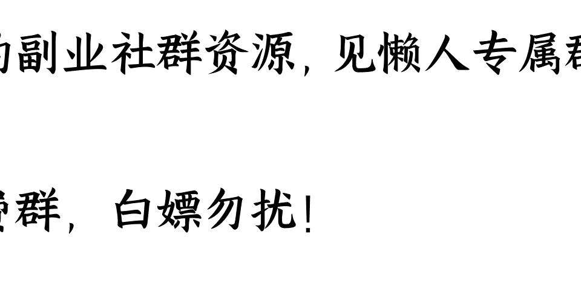

# 2024 年度关键词：宁在一思进，莫在一思停

241223

整理：公众号懒人搜索，懒人专属群独享

懒人微信：lazyhelper

临近年底，各个机构陆续发布了今年的年度关键词。你可以把关键词当成一个线索，顺着它能看到过去一年人们的情绪、状态，以及大家关心的事。

发布关键词的机构很多，而且相关的发布目前还在持续。因此今天我们稍微聚焦一点，看看其中影响力最大的，由四大词典发布的年度关键词。四大词典，也就是牛津、剑桥、韦氏、柯林斯。

今年，他们都选了哪些词呢？

## 第一个关键词：《柯林斯词典》选“brat”

第一个，咱们来说说《柯林斯词典》。《柯林斯词典》是英国的老牌词典，在发布关键词这件事上历来效率很高。几乎年年都是冲在第一个发布。而 2024 年的热词，早在 11 月就已经发布。

这个词是，“brat”。

它的字面意思是顽童，但又有点偏负面，指的是调皮、捣蛋、难以管教的孩子。没错，意思就接近于咱们常说的“熊孩子”，算是贬义。但注意，这回柯林斯选这个词看重的并不是它的本义，而是今年在欧美社交媒体上流行的一种新解释，指的是自信、独立，甚至有点享乐主义的人。

这个词最开始流行的契机，要说到英国新生代歌手查莉·XCX（Charli XCX）发布的同名专辑《Brat》。这张专辑的中文名字被翻译成“我心狂野”。专辑里面的大部分歌曲，都在表达一种“我要做自己”的生活态度。

由于这张专辑是在今年6月发布的，还在欧美社交媒体上引发了一种叫做“brat summer”的审美潮流。也就是，在这个夏天勇敢做自己。

更关键的是，这个词的影响力还延伸到了政治层面。比如，哈里斯在竞选期间，就特意换掉了竞选团队TikTok账号的背景，用的就是查莉·XCX专辑的配色，青柠绿的颜色做底色，然后配上低饱和度的黑字，目的就是为了吸引更年轻的选民。

最近，中文互联网上也在流行一个意思和brat很接近的词，叫做“Chill guy”，指的是那些随和、冷静、有松弛感的人。最后，假如用一句话来总结这两个词要表达的态度，也许是奥斯卡·王尔德的那句，做你自己，因为别人都有人做了。

## 第二个关键词：《牛津词典》选“Brain rot”

好，这是个相对温和的关键词，接下来的关键词，就带有一定的反思意味了。

第二个关键词，咱们就来说说最受关注的《牛津词典》。从2004年开始，《牛津词典》就开始公布年度关键词，到今年正好是20周年。我们都知道，牛津选词向来很跳跃，几乎没有任何轨迹可循。比如，去年选的词是“Rizz”，简单来说就是个人魅力。再比如，更早之前的2015年，直接就是一个笑中带泪的表情。

而今年，牛津选出来的关键词是“Brain rot”，字面意思是“大脑腐烂”，简称脑腐化。

据说，这个词最早出现在梭罗的散文集《瓦尔登湖》里，梭罗的原话是，当英格兰努力防止马铃薯腐烂时，难道就没有人努力防止“大脑腐烂”吗？当时梭罗批判的是社会贬低复杂思维，偏好简单内容的趋势。

但今年这个词又有了新的含义。根据牛津大学出版社的介绍，“Brain rot”，指的是人们因为沉迷短视频等快节奏的网络内容，而造成的精神疲惫。

过去一年，这个词在《牛津词典》语料库的使用率，增加了230%以上。而这个词流行背后的原因，也能在今年牛津的备选词里找到答案，这就是“Slop”。这个词的本义是指“污水”，在 19 世纪中期经常被用来批评感伤主义的文学作品，荼毒人的大脑。而现在，“Slop”指的是电子垃圾，尤其指由大模型生成的垃圾内容。

而且脑腐化这个词不是第一次流行。历史上只要媒介发生重大的革新，这个词就会被提出来。比如，小说流行的时候，人们说小说会导致脑腐化。报纸出现的时候，有人担心报纸会让人降智。到了 20 世纪，大家又认为电视看多了伤脑子。到了今天，这个词用来描述互联网，描述 AI 生成的垃圾内容。

互联网未必一定会导致脑腐化，但这个担心还是有必要的。

比如，中文互联网上有个词叫慢脚文化，这大概是所有家长最厌恶的东西之一。所谓慢脚文化，指的就是那些所谓的降智内容。家长讨厌它，是因为这些东西特别吸引小孩，尤其是小学生，被称为是小学生中的暗网。但其中的一些内容，又偏偏没有触发违禁的标准。说白了，你明知道它有问题，但又拿它没办法，只能任由算法不停地推送，要么就干脆别让孩子看手机。而就在今年年底，相关部门发布了整治算法乱象的通知，类似的内容推送或许后续会受到严格的监管。

再比如，今年澳大利亚的官方词典《麦考瑞词典》给出的年度关键词是 enshittification，翻译过来的意思是“垃圾化”。这个词，最早是由加拿大科幻小说家科利·多克托罗（Cory Doctorow）创造的。科利·多克托罗认为，很多在线平台最开始提供的是优质的服务，但随着时间的推移，为了追求更多的利润，服务质量就会出现明显的下滑，而这个过程就称之为“垃圾化”。

牛津语言协会主席卡斯珀·格拉斯沃尔就说，回顾过去二十年牛津年度词汇，你会发现社会越来越关注虚拟生活的发展，网络文化已经渗透到我们的生活中。没错，而牛津今年选出这个词，实际上就是对这种现象的反思。说白了，技术会带来进步，但技术也可能会带来恐慌和危险。

## 第三个关键词：《韦氏词典》选“Polarization”

第三个关键词，咱们再来说说公布结果最晚的《韦氏词典》。韦氏的关键词直到12月才公布，他们今年的年度代表词是 polarization，也就是“两极化”。

《韦氏词典》特约编辑彼得·索科洛夫斯基（Peter Sokolowski）在接受美联社的采访时说，“Polarization”这个词起源于19世纪初，在英语语言体系里是一个相当“年轻”的词。但是最近几年，无论是在正规媒体，还是在社交媒体上，这个词的使用量都相当高。

其实，这个词的流行，跟今年的一件大事密切相关，这就是美国总统大选。

在今年大选期间，很多选民都担心候选人会对国家生存构成危机。根据美国民意调查网站AP VoteCast的统计，80%选哈里斯的选民都担心特朗普的观点过于极端，而70%投票给特朗普的选民对哈里斯也是同样的感受。说白了，就是人与人之间观点的裂痕更深了。

这方面还有一个佐证。今年《经济学人》的年度词汇是 Kakistocracy，意思是“最坏统治”，这个词在特朗普成功竞选后热度飙升。《经济学人》的原话是，这个词简洁有力地概括了美国一半人口和全球大部分地区的忧虑。换句话说，在美国，共识的撕裂或许已经成为普遍的现象。

## 第四个关键词：《剑桥词典》选“Manifest”

最后一个关键词，咱们来说说《剑桥词典》。今年《剑桥词典》的年度关键词是 manifest，直接翻译过来是指显化、显现。

但根据《剑桥词典》给出的新定义，manifest指的是，用具象化或者自我肯定的方法，来帮助你想象自己如愿以偿的场景。什么意思呢？咱们来说一个具体的现象。之前，TikTok上有一类视频很火，就是很多博主会用“3-6-9 方法”来提升自己的执行力。也就是每天早中晚，分别把自己的愿望写三遍、六遍以及九遍。没错，有点让语言显灵的感觉。

根据《剑桥词典》编辑部的说法，manifest 这个词在过去被查阅 13 万次，是 2024 年度浏览次数最多的单词之一。

其实，仔细回顾这个词的流行过程，多少也带点名人效应。

比如，英国歌手 Dua Lipa，“啪姐”，也是目前全球最流行的女歌手之一。她在采访中表示，成名之前她一直有一个愿望是登上格拉斯顿伯里音乐节的舞台。而为了实现这个愿望，她每次写歌的时候就会想象这首歌在音乐节上表演的效果，然后倒逼自己不断改进。最终 Dua Lipa 如愿以偿。

再比如，英国足球运动员奥利·沃特金斯也曾在采访中表示，他会在脑海里经常想象自己拿下奖杯的场景，来鼓励自己坚持下去。说白了，这就跟过去流行的“吸引力法则”一样，通过一种很强的自我暗示，来激励自己不断向目标前进。

乍一看这个行为有点玄学的意味，假如在中文语境里找到一个对应的词翻译，我觉得也许是那句“念念不忘，必有回响”。一旦有了目标，当你在想象如何接近它的时候，你就已经在接近它了。就像王家卫在《一代宗师》里的另一句台词，宁在一思进，莫在一思停。

关于四大词典年度关键词的盘点，咱们先说到这。最后，假如请你用一个词，来描述自己的2024年，你认为是什么呢？你会怎么选择自己的年度关键词呢？请来留言区一起分享。

历史3000多份各类付费文章以及年费三千多的副业社群资源，见懒人专属群内部分享！

付费群，白嫖勿扰！

懒人专属群更新记录：

https://lazybook.fun/#/blog/record2