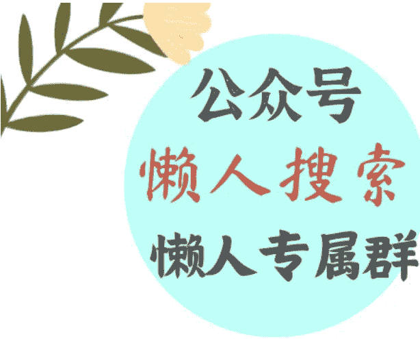
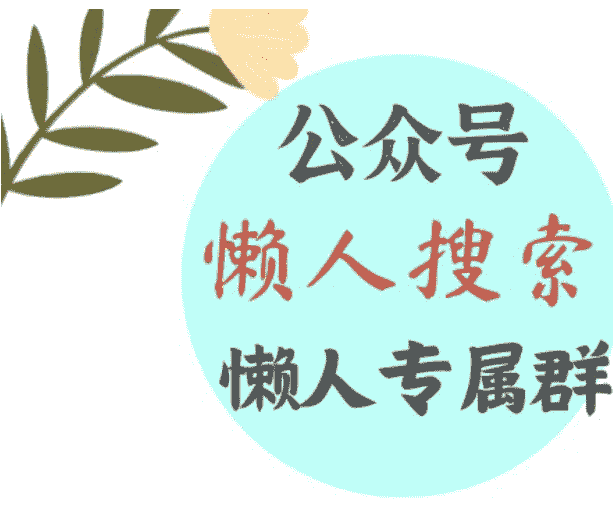

# 优衣库不用新疆棉，是怎么回事？

241202 文/卢克文工作室嘉宾 风雨如歌

整理：公众号懒人搜索，懒人专属群独享

懒人微信：lazyhelper

最近，优衣库创始人柳井正公开表示“优衣库不用新疆棉”的言论，引发了舆论的强烈不满，不少人呼吁抵制优衣库，就像曾经抵制日本汽车那样。

本来我也是这个想法，不过在仔细了解事情的来龙去脉后，发现没有那么简单。

问题来了，真相到底是怎样的呢？

柳井正的言论，是在接受BBC记者采访时发表的。

网上盛传一段BBC采访柳井正的视频，BBC的记者用英文问，“优衣库想做顾客能信的供应链，在人权和环境影响方面有透明度，这是不是因为优衣库是否使用新疆棉方面的争议，你在2021年的回答里既没肯定也没否定，你能澄清优衣库的产品里有用新疆棉的吗？”

柳井正则回答，“不，我们现在不用新疆棉，产品写了棉花用的哪的，实际上再说就政治化了，问题到此为止吧”。注意，这段翻译字幕是英文的。目前大多数人看到的，就是这个视频，时长是3分钟。然而实际上，这个版本是经过剪辑的，真正的版本是日文原版，时长有9分半。

日文原版里，BBC记者的原话是“考虑到环境和人权，是否对供应链进行了改革，新疆棉的话题几年前成了话题，您当时以政治中立为由没给回答，现在是否用了新疆棉花，能否给个答复”？

为啥记者的原话，在两个版本里会如此不同呢，因为英文版经过了剪辑拼接，实际上是后期加上去的，压根不是原话，这就让意思很不一样了。

而柳井正的日文原话回答是“没有使用新疆棉，你一定要聊是哪的棉花，唉再说就政治化了，我们就此打住吧。”

可以看到，经过后期剪辑和翻译加私货，英文版里的柳井正强调的是“我们现在不用新疆棉”，但日文原版是“没有使用新疆棉”。

两者的差别在于，前者给人的感觉是原来用了新疆棉，为了适应西方的政治正确，而刻意不用了；后者的意思，并没有说原来有没有用，只是说现在不用。

意思有很大的不同。

总的来说，柳井正的回答是比较偏向中立的，就是不想涉及政治，只能说，BBC 不愧是地球头号假新闻，通过不要脸的剪辑手法，整出了个大新闻。

而我们的某些媒体，在没有分辨真相的情况下，就急着转发扩散，先收获流量，等形成了批评优衣库的舆论浪潮，再出来指责民粹主义言论破坏了营商环境，逼走外资，二次收获流量。

赢两次。

当然，考虑到柳井正确实说了“没有使用新疆棉”，虽然就此打住了，但批评一番也是应该的，你要是不说这句话，BBC 也没法剪辑。

是你给了食材，人家 BBC 才能加工。

不过呢，要是说优衣库一点新疆棉都不用，或者和新疆一点联系都没有，是不可能的。以供应商为例，优衣库在中国的代工厂和生产厂，合计有 269 家之多。

考虑到新疆棉花的产量，占全国棉花的比例在八成以上，这些代工厂不可能完全不用，要是全部用进口棉花等材料，成本要高一大截。

和新疆的联系，总是会有的。

不过我们知道，打压新疆是西方的政治正确，优衣库又不能明着说，对于这个问题，优衣库的做法就是低调一点，你不说我 不说，明面上就是中立。

你 BBC 非要问我有没有用到，那我 只 能说没有。类似的做法，不是个例。

2021 年时，某姆超市就被人发现偷偷下架了新疆商品，比如和田大枣，不仅是和田大枣，一切新疆商品在 APP 里都搜不到了，引发大批消费者的不满，排队退会员卡。

但过了一段时间，有人发现情况不太对劲，某姆超市的货架上出现了“深圳大枣”，问题在于，深圳是不产枣的，哪来的“深圳大枣”呢？

除了枣，货架上的“新疆长绒棉袜”也不见了，换成了“清新长绒棉袜”，产地显示是佛山，佛山又不产棉花，哪来的长绒棉呢？

你懂的，弄个洗澡蟹还不容易？

要是美国政府不满怎么办？

能怎么办？我说产地是佛山就是佛山，是深圳就是深圳，你查得出来？什么，你说我造假？先运到深圳，在深圳包装，哪里包装的，产地就是哪里。

重新定义产地，也不算造假呀。

于是该超市有没有卖新疆商品，就是一个薛定谔的事情。优衣库的选择，本质上和某姆超市是一样的，就是明面上别说，私底下做了就做了。

肯定有人说，你这个态度是在洗地。实际上我们要认识到，中日产业链的竞争力已经拉开，放在十年前，“抵制日货”是必要的。

可 2024 年的今天，随着日货的竞争力越来越差，不需要刻意抵制，它自己也会衰退。最典型的就是汽车，2012年时，日系车在中国市场还是如日中天的。

绝大多数人买车，首选通常是日系，毕竟日系不算贵，性能也过得去，作为代步车挺合适，当时的国产车，普遍是被瞧不上的。

但 2022 年后，国产车经过多年的技术积累，终于靠着新能源浪潮，迎来了爆发，日系的市场份额大幅下滑，就算降价打骨折也止不住颓势。

当竞争力逐渐落后，你鼓励大家买日系车，消费者也不买账。差不多的价格，我能买到性能更好的国产车，就没道理当冤大头，去买个性能和配置差得多的日系。

优衣库同理。

随着国产品牌的崛起，未来压根不用抵制，优衣库在中国市场也会越来越卖不动，它被挤出去的原因，将是消费者不再喜欢它的款式、服务和质量。

这是两国产业竞争力差异下的必然。

但不得不说，产业竞争力的拉开是一把双刃剑。

国内产业竞争力越强，国产品牌的份额就越高，外资能赚到的钱就越少，这是一个没办法的时候，我们不可能为了让他们赚到钱，而刻意压制国内产业的发展。

只能从别的方面想办法，比如鼓励外国的农产品、原材料向我们多出口，鼓励中国游客出国消费等等，这样多少可以平衡双方的利益。

然而，这些办法对中小型国家有用，对于日本这样的规模较大的国家，就不太管用了，毕竟制造业才是国家的核心竞争力，旅游业属于锦上添花的。

从向中国消费者出售制造业产品，到转变为接待中国游客，实际上是一种产业降级。

赚到的钱，是比从前要少的。

当他们感觉不再能从我们身上赚到钱的那一刻，就是真正要脱钩的时刻。也许到了那一天，不需要 BBC 刻意剪辑，柳井正也会明确表态。

微信:lazyhelper

历史 3000 多份各类付费文章以及年费三千多的副业社群资源，见懒人专属群内部分享！

付费群，白嫖勿扰！

## 懒人专属群更新记录：
https://lazybook.fun/#/blog/record2