# 懒人副业周刊

整理日期：241203

懒人专属群的群友大家好。小懒继续给大家带来生财周报~

> 副业周刊来自某年费3000多的付费社群资源帖。
本文档为懒人专属群内部分享，懒人手动整理。

懒人风向标系列单独用在线文档分享，地址见专属群总链接。

一些帖子跳转飞书查阅，如需破解复制权限，可以用这篇文章分享的油猴脚本搞定

如果要保存飞书文档，可以用这个插件搞定：终于破姐飞书，本地备份！

里面的飞书链接文档小懒有备份，失效的话到专属群总链接里找备份地址

往期的生财周报合集（含在线版和离线版），见懒人专属群内分享。

希望大家有收获~


标题加了(精华帖)的表示精华贴，前面为截至今日的点赞数。

以下是目录，内容有些多。大家可以挑兴趣的内容阅读。懒人专属群更新记录（点此跳转）

- 懒人专属群介绍：https://lazybook.fun/#/blog/group
- 专属群更新记录：https://lazybook.fun/#/blog/record2
- 懒人通才计划：https://lazybook.fun/#/data/13course
- 懒人手册：https://lazybook.fun/#/

## 目录

### 【副业认知】2篇
- (28赞) 品牌广告投放：线上与线下的平衡与差异
- (21赞) 企图心：关于成功，最基本的一项品质
  - 为什么要有企图心
  - 什么是企图心
  - 如何培养企图心

### 【副业技能】4篇
- (68赞) 从0到1：影视解说视频生产流程及YouTube与TikTok变现策略
- (40赞) 「概率思维：掌握因果，洞悉一切的必然性」
  - 概率-运气-因果
  - 一切都可能是因果
  - 因果真的存在的吗？
  - 坚持的重要性
- (25赞) 「提效，适合手搓档和小红书脑图」发现WPS有3个神奇的功能
- (22赞) 省心省力！用一个RPA脚本搞定小绿书、小红书、公众号爆文的自动发布

### 【AI相关】22篇
- (14赞) AI写作航海9月：21天全勤打卡与实操分享
- (9赞) 新人的同城发售航海复盘
- (137赞) AI应用在苹果商店付费应用总榜夺冠
- (90赞) 借助AI做历史解说大片，单月变现4万，附保姆级教程
- (79赞) 我用Cursor快速找到头像的AI算法实现
- (85赞) AI+出海：AIGC原创短视频带货赚美金实操指南
- (精华帖)(84赞) 使用Cursor构建公众号矩阵发表管理系统：从零到完整功能实现
- (54赞) AI实用英语场景对话视频的惊人涨粉现象
- (43赞) AI视频玩法：动物融合创造战斗力爆表的怪兽
- (43赞) AI魔改抽象整活儿视频，半月狂吸10w粉，好玩又实用，保姆级实操教程
- (40赞) AI代写：普通人最容易变现的AI项目
- (41赞) 怎样通过Cursor编写复杂产品及AI协作编程
- (36赞) 30天收入13万，AI出海新机会，3D仿真动漫视频玩法攻略
- (精华帖)(60赞) 不懂设计也能轻松制作海报的AI工具指南
- (33赞) 闲鱼消息提醒插件编写教程
- (35赞) 利用AI工具copycoder + bolt 三句话复制想要复制的网站
- (38赞) AI原创影视解说新玩法，1条视频100万播放，保姆教程来了
- (26赞) AI音乐视频制作：从油管网站失败到新尝试
- (26赞) 安装Cursor时我踩的坑：系统版本与参数错误详解
- (20赞) 技术节省小绿书运营时间：搬运小红书图片的探讨
- (21赞) 3分钟1条AI幽灵娘视频，日吸粉1000+，短视频爆粉新玩法
- (18赞) 如何在10分钟内运行土豆君的代码找到自己的头像
- (12赞) 如何用AI制定可执行的航海计划
- (9赞) 科技类公众号运营：AI助力提升效率与内容创作

### 【YouTube】5篇
- (73赞) Youtube自动化工具分享：数据采集与批量视频下载
- (64赞) YouTube赚钱，我应该做什么？如何选赛道？分享我的观点与看法
- (25赞) YouTube无人值守视频循环直播工具让你快速达到YPP
- (20赞) 为什么1-3分钟视频的播放量不如1分钟以内的短视频？
  > 前言：有人跟我反馈，他做的视频超过了1分钟，同时在3分钟以内，他觉得播放量不如1分钟以内，问我还能不能做，我的回答是能是的。
- (5赞) 关于做YouTube要掌握的认知——提升时长

### 【小红书】5篇
- (精华帖)(105赞) 人工智能在医疗领域的应用与挑战
- (精华帖)(54赞) 如何在小红书上创建一个赚钱的蒲公英账号（接广版）
- (36赞) 小红书合同模板私域变现副业实操玩法分享
- (20赞) 转型小红书职场博主，粉丝突破10万，接广变现6位数心得复盘

### 【抖音】4篇
- (精华帖)(181赞) 抖音星图短剧新号一个月变现10万的方法分享
- (精华帖)(51赞) 传统行业如何通过抖音从零起盘实现年营收500万
- (46赞) 从拥挤赛道中打通的小众搬运玩法详解

### 【海外项目】3篇
- (27赞) 外贸员转型跨境TikTok：0-1创业全过程
- (8赞) 2024西班牙TikTok电商市场调研报告
  - 1. 入驻条件
  - 2. 入驻流程
  - 3. 重要注意事项

### 【微信】2篇
- (58赞) 公众号爆文（个人IP向）日更3个月，涨粉2万+，深度拆解我的创作经
- (10赞) 公众号项目收益提升策略：半托管运营实操经验分享

### 【其他】10篇
- (精华帖)(132赞) 红包装封面项目：从0基础到进阶玩法拆解
- (43赞) 淘宝逛逛带货玩法答疑及产值增长分享
- (41赞) 从创业失败到自媒体百万利润：一个96后青年的成长与转型之路
- (30赞) 高鹏分享热门玩法：再次吃肉的机会
- (22赞) 人工智能在医疗诊断中的应用与挑战
- (19赞) 一文讲清楚投放广告赚钱的底层逻辑
- (11赞) 利用好投放工具，开本地商家沙龙，每周一次，场场爆满，几乎0成本
- (10赞) 建材行业如何找到第二增长点？门窗工厂云连锁增长复盘


(9赞) 从运营商转型大健康：实效型中医健康服务赛道的探索与展望

### 【星主的收藏夹】5篇
- (47赞) 比特币的崛起与不可理解性
- (39赞) 找 PMF 就是要做没壁垒的事
- (38赞) 钦文专访刘润：走进刘润本人的“底层逻辑”
- (37赞) 创业：了解世界运作与利润、风险、合作及信任的重要性
- (22赞) 有效的经营者：战略目标与人才传承的双重责任

### 【星主问答】1篇
- (194赞) 应届毕业生创业困境：坚持还是转向稳定工作？

### (28赞) 品牌广告投放：线上与线下的平衡与差异

作者：小马宋
日期：2024-11-29

线下广告要不要投？问题：来自@您好请讲我是小夏 小马宋读书群71群
品牌在做广告投放时，如何平衡线上广告与线下广告之间的投放比例才能使利益最大化，这两类广告的作用有哪些差异呢？
回答：

这是个很典型的问题，尤其在今天媒体环境比较复杂的情况下。我来讲讲我个人的看法。

线上广告的好处，是比较精准，而且很容易算出回报率，对于初创公司很适合，因为公司可以根据投放回报来计算自己的收益。相对来说，线下广告的投放不仅回报周期慢，而且也很难精确计算投资回报比，所以创业初期用线上投放是比较好的方式。

前提是你的投放比要比较高，要有利润。除非你大概明白，你在亏损的情况下，多久可以达到盈亏平衡并开始盈利，这个是需要靠数据计算和经验的。

既然线上的投放可以被精确地计算回报，那只要是赚钱的，我当然可以大量投放是不是？那，肯定不是的。因为线上的投放回报是动态的，你的同行和平台都在盯着你，一旦你的投资回报比过高，也就是有过高的利润，同行就会蜂拥而至，过来把你的利润拉低。就算没有同行的帮忙，平台也会精准计算出你的利润，平台会调低你的曝光率，让你少赚一些，那你就只能增加广告投放的量，也就是给平台交税。所以只要是依赖平台流量的广告投放，最终都会变成勉强维持生计，赚点辛苦钱而已。而且稍不留神，就有可能滑向亏损。或者过一段时间，突然发现投放逻辑变了，因为平台可以随时调整它的规则，以更利于它来赚取利润。

所以单纯依靠线上投放而获得的销售额是极其不稳定的，我见过很多品牌，去年卖10亿，今年可能连5亿都不到了。可能只有少数情况例外，就是你拥有了持续创作爆款视频的能力，或者你拥有极其忠诚的粉丝，你可以比较稳定地获得流量。但这种情况是极少数，我觉得大部分品牌做不到，我们就不讨论这种情况了。

所以线上投放的好处是回报可见，丰俭由人，但不好的地方是平台掌握着生杀予夺的大权，很多事你没有任何筹码，在平台面前你粉丝再多也是个屁。而且线上投放的工作比较细碎，也不是可以无限投放的，你投100万广告，回报比是1:5，投1000万的时候，可能就只有1：2。它并不支持无限复制扩大地投放。（参考我前天的一篇文章）

还有一个问题，线上广告投放因为追求精准，它只展示给那些你的“精准用户”，这种成交有点像私下交易，是默默发生的。这样以来，你会发现，你在线上GMV到了10亿，可能还不是一个2亿规模的线下品牌有名。因为这个线下品牌的成交，是靠大量的“无效传播”达成的。它成交1单，可能就有99个无关客户围观了你们的成交，这其实就是线下广告的不精准性带来的。但我们又怎么算得清楚呢？未来这99个人，难道就不会成为我们的客户吗？

一个看了特斯拉广告的客户，他今天也许不会买车，但五年后他也许会买啊。所以线下广告的作用是持久的、缓释的、广泛的，假以时日，线下广告会打造越来越强的品牌力。

那我们就接着说说线下广告。它很难计算广告回报，见效的周期也比较长，所以今天的品牌方对投放线下广告心存疑虑，这是可以理解的。但线下广告有好处，它就是线上广告的反面。

对奢侈品、高端品牌来说，为什么它要向大众传播广告？因为只有大众认可了这个品牌的高级，拥有这个品牌的顾客才有成就感、满足感和高级感。就像吃鸡游戏中，那些不充值的用户并不是没有用的，因为他们就是人民币玩家的陪玩，是其他游戏者的NPC，他们也是游戏的重要一环。这就跟那些看了你广告却不购买或者买不起的顾客一样，他们也是很重要的。

对于非奢侈品，即使有些顾客现在不买，但他们总有一天会用得着，所以线下广告这时候是充当种草的作用。所以，线下广告是不紧急但很重要的东西，可是你一定要做。

你的问题，想知道该如何计算最大收益，我的答案是，计算不了。

线上广告可以计算，线下广告无法计算，我的建议是，如果你有足够的资金，那就多投一些线下广告，不要管它有没有收益、收益是多少，反正投了肯定有用。当然技术是不断进步和变化的，今天的线下广告也有可能用一些互动来测算它的部分效果。

小马宋有个客户是做中式服装的，他们就在楼宇广告中增加了企业微信的二维码，通过添加微信的数量来测算广告效果。而且他们在微信上的转化率极高，这就是可以线下线上联动了。

军事上有一个术语，叫范弗里特当量。在朝鲜战争期间，美军指挥官詹姆斯·范弗里特（James Van Fleet）提出了一种火力使用标准。范弗里特当量大概相当于过去我们认为的火力值的十倍。如果轰炸一个阵地需要100发炮弹，范弗里特就要用1000发。你说1000发炮弹哪一发打中了目标？我也不知道，也许有900发炮弹都是浪费的，但是这种浪费不可避免。但是如果你只打了100发，你就无法保证这个阵地被打击摧毁，你就可能死更多的攻击步兵。

投广告也是一样的，我们只要有足够的弹药，那就投出去，前提是你投了也死不了，饿不死。最好是按照营业额的固定比例去投放，把它当成一个固定的成本，然后再安排自己的企业经营活动。因为保证成功很重要，成功就是需要浪费很多行动和金钱。

这就是饱和攻击。华为当年看到了手机领域的机会，他们看到了小米的成功，原来在苹果和三星之外确实有机会再创建一个手机品牌。所以华为把它过去半死不活的手机业务重新调整，成为主攻的阵地，成为华为最重要的战略。2016年，小米手机的研发人员大概是200人左右，华为的重兵投入，一下子就投放了12,000人去做手机研发。

因为华为知道手机业务如此重要，所以是不惜兵力和资源投入，浪费是必然的，但华为期待的是胜利，看重的是成功，只要是能获得胜利，资源的投入就可以不计成本。这就是大企业看准目标后的决策和决战的信心。因为失败的代价更高。

当然有些常年投放广告的公司和品牌，他们可以通过长时间的计算和观察，获得对线下广告回报的一定经验，这可能也是你持续投广告获得的回报之一吧。

评论区：
暂无评论

### (21赞) 企图心：关于成功，最基本的一项品质

作者：兰陵王
日期：2024-11-25


一篇文章讲透梦想的本质、命运的一切。

2021年4月10号，我好像突然顿悟了成功之道，或者说巨人之路，并在朋友圈写下了这样一条公式：

巨人之路 = 企图心(意愿) × 生态位(战略) × 模型树(能力)

其中企图心是前提，对应我们经常所说的意愿，一个人首先要有做某件事的强烈意愿，接下来一切才会开始。我们常常所说的努力、坚持、激情等，也都包含在里面。

其次是生态位。光有企图心还不够，有多少人在北上广努力着、奋斗着，他们是最想改变命运的一群人，然而现实很残酷，大多数人终其一生也都无法在北上广拥有自己的一套房。究其本质是因为，努力并不等于成功，只有在正确的事情上努力，才能取得成功。选择比努力重要。

一个人的未来如何，努力本身最多只占50%，在我眼里，努力和辛苦是廉价的。在一线城市的写字楼里，谁不加班？谁不努力？谁不辛苦？关键看你的选择，有没有活在趋势里，有没有在正确的赛道上，有没有在风口上努力。——《写作是最好的自我投资》

最后是模型树。有了想改变的意愿，有了正确的生态位，仍然还不够，我们还必须具备相应的能力和认知。而模型树，就是通往这一切的钥匙。

如此，企图心+生态位+模型树，就完成了个优美的闭环。这就是成功之道，或者说巨人之路。

其实我在大学那阵也感悟了类似的公式，当时的想法是: 成功 = 努力 × 方向 × 能力。

努力就是我们所说企图心，不过企图心远不止努力，还包括坚持，还包括激情，还包括很多东西;
方向就是我们所说的生态位，不过那阵还不懂什么是生态位，否则我会比现在厉害得多;
能力对应的就是今天的模型树，不过我那时也没感悟模型树，否则我也会比现在厉害得多。

生态位我已经写过了，《成为第一》《深耕细作》《与众不同》《生态位》那几篇文章就是讲生态位的;今天这篇文章，我们来讲讲「企图心」。

#### 为什么要有企图心

当我写下“为什么”这三个字的时候，好多往事浮上心头，我的经历可以说就是企图心最好的例子。

一、企图心能带来你所需要的一切

企图心就像一支画笔，有了它，一切的东西都可以长出来。都说「寒门难出贵子」，这话我不完全否认，但我想说，命运总有漏网之鱼，只要你拥有一颗强烈的企图心，一颗远超他人的企图心，一颗永不熄灭的企图心。

跟你讲讲我的故事吧。

我出生在一个贫困的农村家庭，6岁，当其他孩子都在享受美好童年的时候，我母亲生了一场大病，并从此一直瘫痪不起。为了给母亲治病，花掉了父亲前半生辛辛苦苦积攒的所有积蓄。对于一个农村家庭来说，这简直就是毁灭性的打击。如果你是农村人就会知道，农村人根本不敢生病，基本上一场大病就会夺走这个家里的一切。所以，我几乎是在6岁就开始就体会到了人世间的一切辛酸苦辣。有的人是18岁以后才成年的，而我的成年礼在6岁那年就完成了。

邻居会欺负你，他们会经常找你茬，找各种理由骂出各种难以启齿的话；他们还会发动周围所有邻居组成一个“联盟”，一个类似农村精英阶级的联盟，他们聚在一起，通过欺负老实人获得成就感；他们还会杜绝自己的子女跟你做朋友，我曾经的朋友们，因为经常偷偷跑出来跟我玩，都会被他们的家长骂……这仅仅是我童年的冰山一角。

如果你在我6岁的时候遇见我，你会相信，一个出生贫寒，父母也没念过书的人，将来会变得很厉害吗？

如果你在我高中的时候遇见我，你会相信，一个无论怎么努力都考不进班上前五，最后还差7分才能够到一本线的人，将来会变得很厉害吗？

如果你在我复读的时候遇见我，你会相信，当时我和宇环站在学校的天台上，天真的说，将来有一天我们要去改变世界，你会相信今天我们真的在接近那个梦想吗？

如果你在我大一的时候遇见我，你会相信，一个看似普通，没有任何特长的男生，将来他写的文章会被上市公司打印出来发给员工阅读吗？

……

你不会相信，也想象不出来，就连我自己当时也不知道我将来会变成什么样。

但是我一直有一个珍贵的东西——企图心。虽然我不知道我将来会做什么，会变成什么样，但是我知道，我将来一定会成为一个厉害的人，我会改变世界，我会让世界变得更美好。

就是这个东西，让我从一张白纸，逐渐变成了一张风景画；让我从一个零认知的人，不断阅读、思考、实践，最终变成一个有极高认知的人。

很神奇，企图心似乎知道我要什么。我喜欢创业，于是它让我感悟了知识树，让我具备快速学习任何知识的能力；光有努力和能力还不够，选择大于努力，于是它让我感悟了生态位，让我刚大学毕业就找到人生的方向。

这就是企图心的重要性，即使你现在什么也没有，但只要你心中有一颗强烈的企图心，你就能慢慢长出你所需要的一切。

### 二、企图心是一切改变的前提

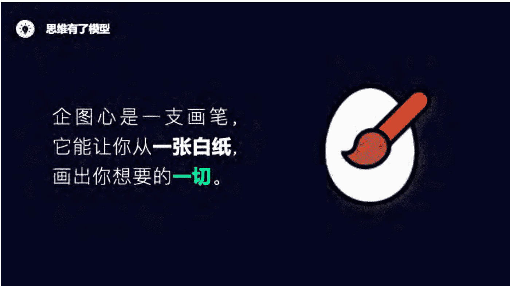

有句话说「你永远叫不醒一个装睡的人」，其实这句话不够准确，准确来说应该叫做「你永远叫不醒一个没有企图心的人」。

以前我总是想帮助身边每一个朋友，想告诉他们阅读的重要性，想告诉他们生态位的重要性，想把我的知识树分享给他们。

但后来逐渐发现，根本就做不到。

因为他们对此没有企图心，他们并没有那么想要改变。

我有一个好朋友，她妹妹的成绩不是很理想，问我有什么办法没有。我是研究学习方法的，很想给她妹妹推荐知识树高中版。但我最后没有那么做，因为她妹妹对学习方法没有强烈的企图心。

同样，我身边很多好朋友，有厉害的，也有不厉害的，他们想改变现状，想具备跟我一样的认知，可是当我给他们推荐书籍、推荐知识树的时候，他们却将我的建议拒之门外。

我就知道了，其实他们所谓的想改变，并不是那么的想。

所以我现在不再好为人师，因为我开始意识到，企图心是一切改变的前提，如果他对此毫无企图心，那么不管你再怎么想帮助他，他的内心都是毫无波澜。


### 三、企图心是一切平庸的根源

最近突然感受到了一种更大的无奈。

如果一个人长时间没有企图心，最终这个人将彻底被击溃，淹没在残酷的现实和汹涌的人潮中。

很多人大学毕业，进入社会工作一两年后，很快就会意识到一件事情“这个社会远比我们想象的更现实，像我这样的人，一没背景，二没能力，三没机缘，注定这一生大概也就是这样了。算了，就这样吧，努力工作，争取找个好老婆/好老公，将来买个房子（首付），买个车子（首付）”。

如果你去观察他们，你会发现，他们已经没了激情和目标。生活中除了无聊和郁闷，似乎再也没有别的色彩了。看着别人的成功也觉得无所谓了，麻木了。

虽然几年前还有那么一丝艳羡，还有个崇拜的偶像，但现在什么感觉都没有了。每天的生活就是麻木地工作、闲聊、发呆、看无聊的电视或沉迷于网络。

心酸吗？心酸。这就是大多数人最后的归宿。

其实我心酸还不是他们最后的归宿，我心酸的，是他们早早的就向命运妥协了，对这个世界不再抱有任何的企图心。

就像马戏团的大象，小的时候因为被驯兽师用锁链拴住，从来没有挣脱过，等他们长大，即使换上细绳，也不再试图逃跑了。

这就是我们常常所说的“认命了”。

用更准确的话来表述就是“不再对这个世界抱有任何的企图心了”。

这是一个人跟现实交手之后，发出的最后宣告，宣告完之后他的人生就被判上了死刑。


### 什么是企图心

那什么是企图心呢？

简单来说就是“一个人对做成某件事情的意愿” 。

这里面有两个关键词“某件事情”和“意愿”，它们分别对应着企图心的大小和强弱。

如果这件事比较小或比较容易，比如“我要减肥”，我们把这种企图心叫做愿望；如果这件事比较大或者不容易实现，比如“我要改变世界”，我们把这种企图心叫做野心 。

如果这个意愿比较微弱，比如“我要是能瘦下来就好了”，我们把这种企图心叫做想法；如果这个意愿比较强烈，比如“我一定会瘦下来的”，我们把这种企图心叫做渴望 。

这是比较专业的解释。

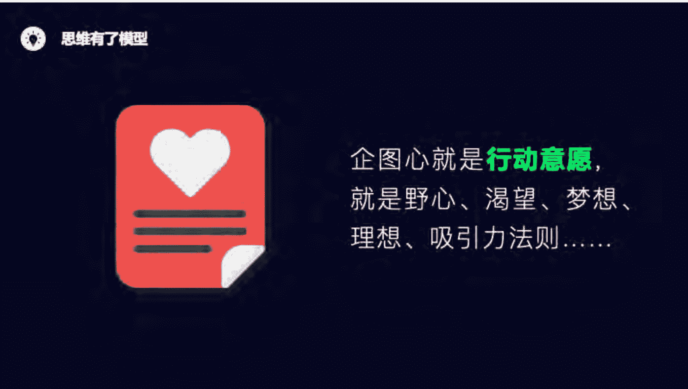

但是我更喜欢另外两个解释，一个叫做“吸引力法则”，一个叫做“天命”。它们分别来自两本书，一本叫做《秘密》，一本叫做《牧羊少年奇幻之旅》。

一直以来我们都以玄学的角度去看待《秘密》以及里面提到的“吸引力法则”，好多人因此误入歧途，觉得只要我向宇宙下订单，宇宙就会带给我想要的一切。

像极了我一个信教的邻居。她经常跟我们说，只要煮饭前祷告一遍，米饭就会增多。

我寻思，这玩意儿还能违背能量守恒定律？

其实这也不怪她，很多人看完《秘密》之后也是这样想的。我无意批评这种行为，但我想提供给你另一种看待“吸引力法则”的角度。

其实吸引力法则不是向宇宙下订单，那是忽悠人的鸡汤，你不是块磁铁，想啥就能吸引来啥。吸引力法则讲的是，你要时刻保持强烈的企图心，也就是对做成某件事保持强烈的意愿。

当你对某件事有了强烈的企图心，你就会一直朝着它前进，你会充满动力和热情，你会坚持很久。

这个过程中，你成功的概率会逐渐增大，并因为你在这件事情上的投入，会吸引来很多人……最终，你会有很大概率做成这件事。

> 类似稻盛和夫所说的「心不唤物，则物不至」。如果你连想都没有想过，那肯定不会成功；但如果你开始想了，那么会有一定的概率成功，并且随着你的行动、成长，成功的概率会逐渐增大。

但并不是100%会成功，比如我高中的时候想考厦门大学，这个意愿强烈到我会在我一切能写字的地方，都刻上了“厦门大学”这四个字，但我最终并没有考上厦门大学。

因为意愿（企图心）只是前提，后面还有方向（生态位），还有能力（认知、技能……）。有能力并且在正确的方向上努力，才能获得成功。

这就是《秘密》这本书对企图心的理解，他们把它叫做“吸引力法则”。另外还有一个解释我也很喜欢，是《牧羊少年奇幻之旅》里提出来的，他们把企图心叫做“天命”。

每个人生下来都有属于自己的天命。有的人不相信自己的天命，不敢追逐自己的天命；有的人后来抛弃了自己的天命，忘记了自己的天命。

这就是《牧羊少年奇幻之旅》这本书想告诉我们的哲理。

在书的开篇，圣地亚哥做了一个奇怪的梦，他梦见埃及金字塔下面埋着一个宝藏。解梦的老妇人告诉他那是真的，并建议圣地亚哥应该立马启程去寻找那个宝藏。

但圣地亚哥并没有相信老妇人的话，正如我们不敢相信我们曾经一闪而过的梦想一样。

幸运的是，圣地亚哥又遇到了一个老人，老人告诉他，很多人以为自己无法选择自己的命运，这是最大的谎言，人应该勇敢去追寻自己的天命。

圣地亚哥好奇地问：“什么是天命？”

老人告诉他：

天命就是你一直期望去做的事情。人一旦步入青年时期，就知道什么是自己的天命了。在人生的这个阶段，一切都那么明朗，没有做不到的事情。人们敢于梦想，期待完成他们一生中喜欢做的一切事情。但是，随着时光的流逝，一股神秘的力量开始企图证明，根本不可能实现天命。

并说出了那句经典的话「万物皆为一物，当你想要某个东西的时候，整个宇宙都会合力助你实现愿望」 。

听完老人的话，圣地亚哥决定启程寻找自己的天命——去埃及金字塔。

路途中遇到了很多挫折与诱惑，几次差点放弃。但男孩最终坚持了下去，并找到了自己的天命。

这个过程中，作者把我们在追寻梦想的过程中会遇到的东西，通过故事一一道来，比如挫折、运气、预兆、行动、诱惑、知识......

这就是《牧羊少年奇幻之旅》想告诉我们的，要勇敢的去追寻自己的天命。我曾经一直用它来帮我做重大的决策，后来事实证明，几乎每次都是正确的。


但我一直没有太懂这背后的机制是什么。直到最近我好像突然有所顿悟，所谓天命，就是那些曾经在我们脑海里一闪而过的梦想，也就是我们所说的企图心。

当这些一闪而过的梦想出现时，大多数人都把它否定掉了，只有少部分人选择相信，并为之付诸行动。

这就是书中所说的“相信天命，尊重预兆，付诸行动”。

其实它跟《秘密》那本书所说的东西是一样，都是在讲要相信自己的梦想，并立马付诸行动，只不过《秘密》这本书讲了很多玄学的东西在里面。

以上就是企图心的各种解释，它有很多名字，比如意愿、愿望、渴望、梦想、野心、天命......不同名字对应的企图心大小不一样，强弱不一样。

### 如何培养企图心

那么懂了企图心，我们应该怎么做呢？如何去改变我们的命运呢？

#### 一、建立企图心

前面我们说，企图心就是“一个人对做成某件事情的意愿”。

企图心有大小之分，有强弱之分。所以一个好的企图心，一定是一个很大、很强的企图心。

正如星云大师在他的《自在：人生哲学》中讲道「做人要有做好人、做大人、做伟人、做专家学者的企图心；要有希圣希贤、成佛做祖的企图心，如此才不会空到人间走一遭」。

那么如何体现企图心的大小呢？我认为它需要一个参考指标，也就是现实。

比如一个亿，对王健林来说就是小目标，而对普通人来说就是野心。所以企图心一定是跟你当下的现实挂钩的。

由此，我们可以得到一个公式：意愿 - 现实 = 企图心的大小

但遗憾的是，很多人已经不再对生活抱有希望，年纪轻轻就已经变得很佛系，所以很难建立一个大的企图心。这种情况应该怎么办呢？

从我个人的经验来说，一个人想要改变的意愿，取决于“他想要的”跟“他的现实之间”的差距，所以重点在于，如何刺激这个差距。

我总结出来一共有两种方法：

- 一种是内在的刺激。这种刺激比较难，需要他找到自己的天命，然后这个天命会驱动着他去前进。比如我的天命就是，让更多人用知识树学习，帮中国解决应试教育的困局，为中国培养10000+巨人，为时代开启知识革命。
- 一种是外在的刺激。比如一个男生原来并不注重自己的身材，突然有一天他的世界闯入了一个女生，看着对方那么优秀，而自己这么挫，意愿与现实的差距就出现了。这种方法的好处是，它比较简单。只要你不宅，多出去看看外面的世界，多见见优秀的人，你就会产生企图心。但坏处也比较明显，它不够持久。除非你能不断地接触优秀的人，不断地看到更大的世界，否则就会容易三分钟热情。

所以我建议，前期可以通过外界来刺激自己，但最终你要找到自己的天命，你要发自内心的渴望某件事，而且这件事一定要远远超出你的现实，如此才能不断的激励你前行。

正如孔子所说「取乎其上，得乎其中；取乎其中，得乎其下；取乎其下，则无所得矣」。

刘邦、项羽之所以能有后来的成就，得益于他们从小就有着极大的抱负。一个小小的亭长，居然有着一统天下，号令群雄的野心；一个小屁孩看到秦始皇出游的盛大场面，居然会口出狂言“彼可取而代之”。

当然，企图心也不总是一开始就要立志远大，它也是会成长、调整的。

比如曹操，他并不是一开始就想挟天子以令诸侯，他原本是打算为朝廷卖命，做个大臣，后来因为刺杀董卓失败，加之一系列事情，使他看到了号令群雄的可能性，才诞生了极大的企图心。

但不论哪种，我都希望大家是一个永远对美好事物有企图心的人。如果哪天，你不再对这个世界抱有企图心，就是你彻底对这个世界妥协的时候。

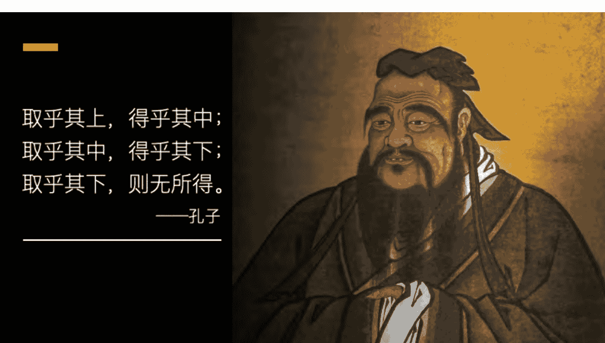

> 取乎其上，得乎其中；
> 取乎其中，得乎其下；
> 取乎其下，则无所得。
> ——孔子

#### 二、强化企图心

企图心除了有大小之分，也有强弱之分。

比如同样的两个穷人，他们都想出人头地，其中一个人愿望很强烈，另一个人可能就要佛系很多；比如同样在一个公司，有的员工就很有进取心，有的员工则要佛系很多。

造成这种现象的，就是各自的企图心强弱不同。强弱的不同，最后会导致各自的努力程度、做事的热情都会有所不同。

那么如何加强我们的企图心呢？

##### 1、企图心要足够明确

很多人的企图心是模糊的，这会降低企图心的强度。

望梅止渴这个故事应该都听过：

曹操在行军途中找不到水源，士兵们都非常口渴，于是他传令道：" 前边有一片梅子林，结了很多果子，梅子酸甜可以解渴。"
士兵听了后，嘴里的口水都流了出来，曹操利用这个办法促使部队尽快赶到了前方，找到了水源。

在这个故事中，水就是模糊的企图心，梅林就是明确的企图心。

模糊的企图心会让人逐渐失去信心和耐心，明确的企图心会人坚定不移、充满动力。

> 大多数人并不清楚自己想要的是什么，他们只知道，自己想得到更多的东西。你可以把自己的生活想象成一家很大的邮购公司。如果你给一家邮购公司写信说’请给我寄一些好东西来’，你肯定什么都得不到。我们的愿望也是一样。我们必须确切地知道自己心里渴望的是什么才行。
> ——《小狗钱钱》

尽可能的把你的企图心具体化，这能立马加强你的企图心。

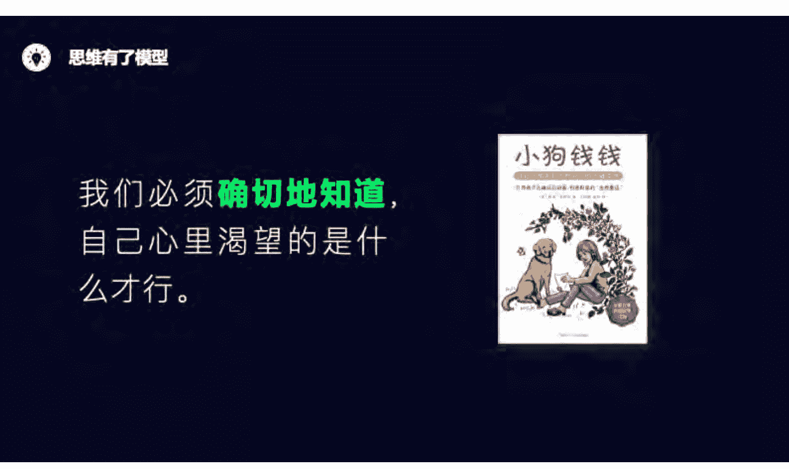

##### 2、企图心要视觉化

第二种方法是，把你的企图心视觉化。

《小狗钱钱》《秘密》《牧羊少年奇幻之旅》等书中都提到了同样的东西“想象它已经是你的了，把它视觉化，去感受你已经拥有它时的感觉，你甚至可以把它打印出来，这样每天都能看到它、强化它”。

我曾经把乔布斯的海报挂在我的书桌对面，这样每次我学习的时候都能强化自己的企图心。事实证明这是有用的，它能激励你不断朝着自己的梦想前进。

> 假装它已经为你所有。——《秘密》

> 视觉化是成功的大秘密。每天闭上眼睛几分钟，去视觉化你已经拥有你想要的事物，并去感受“已经拥有它”的感觉。——《秘密》

建议你拿一本相册作为你的梦想相册。收集一些与自己的愿望有关的照片，把它们贴在相册里，然后每天看几遍。我们要通过图片来思考。人们把这种行为称作’视觉化’。成功的人之所以成功，就是因为他们一直梦想着自己成功的那一天，不停地想象着自己实现了理想时的情形。
——《小狗钱钱》

这就是视觉化的魅力，它能极大的帮你加强你的企图心。

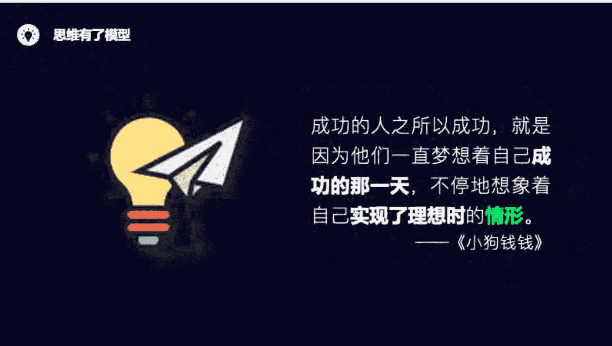

#### 三、立马行动

企图心不是阿拉丁神灯，你想要的东西它不会自己走到你身边。

这个道理虽然浅显，但是真正懂得它真谛的人却是不多。

正如我们好多人学完知识树，就一直在幻想自己拥有极高认知的样子，却从来不去实操。这怎么可能成为厉害的人呢？

> 不要原谅自己，看到好的时机就一定要去做，我心里想的跟行为是一致的。我们这样坐着一定没有什么好运来的啦。——蔡志忠

> 宇宙喜欢快速行动。不要拖延、不要猜测、不要迟疑，当有机会、有冲动、有内在灵感推动的时候，行动吧。——《秘密》

> 炼金术士回答说，“你需要学会的一切，这次旅行都教给你了。只缺少一样，那就是行动。”——《牧羊少年奇幻之旅》

但行动真的是很难，毕竟人生来懒惰；或者，有时候我们容易犹疑不决，不知道该不该行动，比如要不要跳槽？这个时候我们应该怎么办呢？

答案就是：遵循预兆，相信直觉。

直觉的强大要远远超乎你的想象，心理学研究发现，我们潜意识大约占了90%以上，它就像一个隐形的超级处理器。而我们的直觉，就是这种超级处理器最后计算出来的结果。

虽然它没有一个清晰的逻辑，只有一个经过复杂运算后的结果，但它的准确性却是极高的。很多时候，我们依据直觉做出的决策，事后证明都是正确的决策。

而预兆，就是直觉在提醒你，可以行动了。

> 相信你的直觉。那是宇宙在启发你，那是宇宙以接收的频率在与你沟通。当你产生了本能或直觉，就跟随它，你将会发现宇宙正如磁铁般，把你引领到你想要的事物那儿去。——《秘密》

> 上帝在我前进道路上布下预兆，男孩想，并对自己的想法感到吃惊。在这之前，他一直把预兆视作凡间的事情，就好像吃饭或睡觉之类的事情，他从未想过，这是上帝给他指点迷津的方式。——《牧羊少年奇幻之旅》

我很难说这种预兆的本质是什么，我只能说我经常照此行事，它可能是一种直觉，人的直觉远比我们想象的强大。


#### 四、永不妥协

其实我们每个人都有过企图心，我们把它叫做梦想。

小的时候，老师问“你将来长大想做什么？”我们会回答“科学家、宇航员……”但是当我们长大以后，我们不再相信梦想，觉得那幼稚、荒唐、可笑。

我们把那些遥远而不可及的梦，用匣子锁了起来，并用铁链包裹着，沉到了深不见底的海里。只是在偶尔午夜梦回的时候，会突然闪过一个念头——曾经我也有过梦想。

就像《牧羊少年奇幻之旅》的开篇所写道的：

男孩看出父亲也想云游四方，这个愿望一直存在，尽管几十年来他一直将这个愿望深埋心底，为吃喝而操劳，夜夜在同一个地方睡觉。

关于这个问题，我曾经跟朋友讨论过。为什么有的人走着走着，就不再有梦想了？

最后我们发现，梦想并不是一夜之间就突然消失的。它是在我们与现实交手的过程中，被慢慢地、一点一点地磨灭的。

被磨灭的原因，是因为他从中无数次感到了挫败，最终绝望、妥协了。

正如马戏团里的大象，小的时候被锁链拴住，挣扎过很多次，但没有一次成功过，后来也就不逃了，被同化了。

关于此，我想告诉你一个哲理：没有人可以打败你，除非你同意。

这是我非常喜欢的作家海明威，在他的《老人与海》中所要阐释的哲理。原话是这么说的「一个人并不是生来要给打败的。你尽可以把他消灭掉，可你就是打不败他」

海明威所要阐释的关于“败”的定义，跟军事战略家鲁登道夫所阐释的“败”的定义完全如出一辙。

鲁登道夫在他的《总体战》这本书中对战争有一句定义，我认为点出了战争的本质「战争以一方失去战斗意志为结束」。

翻译一下就是，真正的失败是意志上的失败。

不论你遇到过多少挫折，此刻正在经历怎样的磨难，那都不叫失败。只有当你放弃挣扎，彻底向现实妥协那一刻，你才真正失败。

否则，没有人可以打败你，即使是死亡。


- 推荐电影：《肖申克的救赎》《当幸福来敲门》《马戏之王》
- 推荐书籍：《牧羊少年奇幻之旅》《小狗钱钱》《褚时健传》《老人与海》
- 评论区：暂无评论

### 【副业技能】4篇

#### (68赞)从0到1：影视解说视频生产流程及YouTube与TikTok变现策略

作者：A 😇路途
日期：2024-11-27

大家好，我是路途。一直在深耕短视频内容出海项目。近几个月越来越多小伙伴都意识到各个平台对内容的要求都越来越高了，特别是TikTok和YouTube。经过几个月的测试，我总结了一套影视解说视频生产流程目前流量很不错，看完这篇文章，相信你也能学会如何从0到1剪出一个优秀的原创解说作品了，内容可能比较长，请耐心阅读～有问题可以评论留言哈

文章移步：【腾讯文档】YouTube和tiktok变现超强玩法！一文教会你如何从0到1剪辑影视解说 https://docs.qq.com/doc/DQXhJRUZvWFdIuOdo

评论区：
- 老彭：终于露脸了啊！途哥！
- Yang Zhao：谢谢路途详细的讲解，只是听说YouTube上的影视解说，存在被片方投诉侵权的风险
- A米：给路总打call[666][666][666]
- 吕吕：版权问题如何规避
- A 😇路途：影视切片有，影视解说版权没有，而且按照这个方式是纯自己原创解说
- A 😇路途：记得保存好工程文件，TikTok和YouTube如果出现误判，可以拿你剪辑的工程文件去申诉。
- A 😇路途：[呲牙][呲牙][呲牙]
- A 😇路途：评论区可以交流的[呲牙][呲牙][呲牙]

#### (40赞)「概率思维：掌握因果，洞悉一切的必然性」

作者： 兰陵王
日期：2024-11-27

每次一个思维模型，帮你解决人生核心议题


> 这个世界的一切，都可能是被因果所支配的。

而所谓运气，只是因为你还没有掌握到所有的因果。等你掌握了所有的因果，所有事情对你而言，都是必然。

##### 概率-运气-因果

我曾经在北辰青年实习的时候，负责打磨过一个课程，其中有一个模型，令我记忆尤为深刻，这个模型叫做「概率思维」。

分享这个模型的人是一家上市公司的老总，当时我们联系到他，想请他来分享一下对他影响最大的模型是什么，他分享的模型就是概率思维。

我现在还记得他的原话，大意是说「从我过去几十年的经验来看，有一个模型尤为重要，这个模型就是概率思维，一切都是概率，如果你明白了这个道理，世上的一切事情都非常清晰了」。

从那时起，我就一直在思考「概率思维」在实际生活中的运用案例，以及其背后的本质。

公众号懒人搜索，懒人专属群分享

但是很长一段时间，我都没有得到我想要的答案。

但是又隐隐觉得概率好像跟我们常常在提的运气有关，或者说，概率就是运气本身，这两个其实就是一回事。

所以我又开始思考，运气的本质是什么？

关于运气，大家听得最多的就是「很多成功人士最后都会说，我能有今天的成就，只是因为 我运气比别人好」。

是的，很多人经常把这句话挂在嘴边，用来合理化自己的平庸——我之所以还没成功，是因为 我运气不好。


对于这种观点，我实在不敢苟同。

诚然，运气是存在的，但是那些成功的人，他们之所以会成功，绝对不仅仅是因为运气好，他们大多数都有很多人不曾具备的品质，比如抓住机遇的能力，比如执行力，比如社交能力，比如认知能力，比如思维方式等等。

为什么这么说？我举个例子：

比如我经常跟朋友说，有些人我看一眼就知道这个人此生不会有太大的成就了。

为什么这么说？这背后其实就是基于某些基本的成功素质的。

比如企图心，那些有成功潜质的人，他们会抓住一切机会学习、思考和工作，而有些人即使每天有一堆空余时间，他们也从来没有想过要利用这段时间来做点什么，全部都拿去玩手机、打游戏、刷剧了。

比如好奇心，很多人是拒绝接受任何新事物、新观念的，比如我就曾想帮助过一些人，我想把模型树、生态位等东西分享给他们，但是他们拒绝接受，也不愿意花一个小时去尝试一下。

除此之外还有很多品质，他们都不具备，反正你按照他们当下的认知状态、工作状态、资源状态，就几乎可以断定，这个人将来不会有太大的成就了，即使有机会，他也抓不住。

所以，成功绝对不仅仅运气好就可以的。


但是，运气确实也是存在的，只是它不像我们想象中那样——是个玄学。

运气的本质，其实就是概率。

比如，你明天心血来潮，去买一注福利彩票，突然中了一千万，你把这解释为运气，其实你也可以把它解释为概率。

而成功的人，因为他们一般都具备某些品质，比如企图心、好奇心、执行力、高认知等等，所以他们成功的概率更大。

普通人成功的概率可能只有百万分之一，而成功的人因为他们的某些品质，成功的概率可能提高到了千分之一、百分之一、十分之一、二分之一，甚至是无限接近于百分之百。

那么概率的本质到底是什么呢？

我在打磨第六期训练营，写到第五课《结构思维》时，因为要研究知识本身的结构到底是树状结构还是网状结构，涉及到了因果律这个东西。

于是我开始对因果展开了深入的思考和研究，这一研究，我好像突然把很多事情都想通了，其中就包括运气和概率。

运气的本质，概率的本质，其实都来自于因果的缺失。


#### 一切都可能是因果

一切都可能是因果，一切都可能是被决定的。

如果你要做事情A，事情A做成的因B可能有X个，那么你只要掌握了这X个因，你就能百分之百做成事情A。

这里面不存在运气，也不存在概率。

日常生活中会出现运气和概率，都是因为我们并没有掌握到做成一件事所有的因果。

而没有掌握到的这部分因果，就被我们解释为运气或者概率。

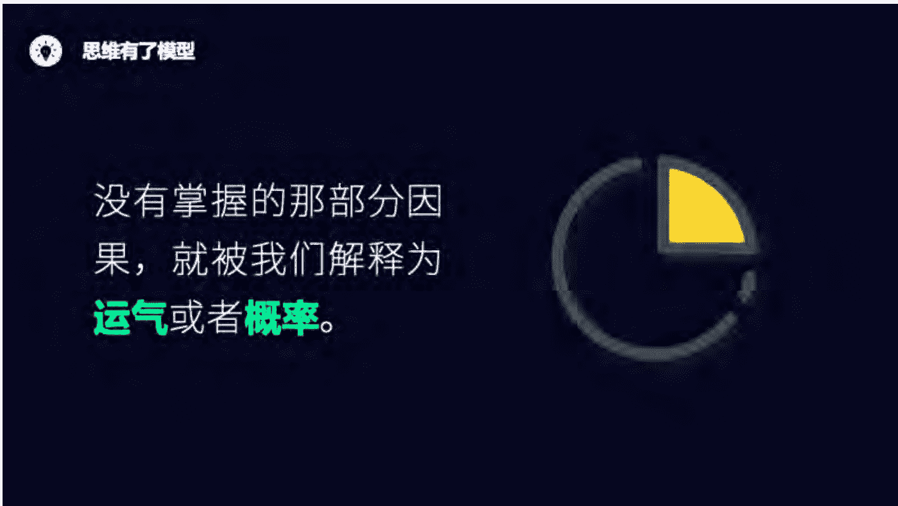

但是这个洞察能够成立需要一个前提，就是“这个世界真的是被因果所统治的吗？”、“这个世界真的是被决定的吗？”

这是一个重大的哲学问题，古往今来有太多科学家和哲学家都在探讨这个问题，但一直没有拿出一个确切的答案。

跟「决定论」相生相伴的还有另一个重大的哲学问题「自由意志」，人有自由意志吗？

就这个问题，很多哲学家的观点是，这个世界是被决定的，即决定论。

持这个观点的哲学家有一个强有力的帮手，那就是物理学，从物理学的世界观来看，一切事物都在按照某种宇宙法则而运转，这种世界观也被称为「机械论」，即世界像一架精美的机器一样在运转。

但也有一些哲学家认为人是有自由意志的。

他们认为人的大脑有实体之外的东西存在，比如灵魂，或者某种不受物理法则驱使的东西，这种东西使得我们拥有一定的自由意志。

但这种猜想是无力的，尤其是在脑神经科学诞生以后，科学家们发现人类所有的思维活动都依赖于我们的记忆，而记忆其实就是某种物理信息、化学信息。

所以很可能，人是没有自由意志的。

但好消息是，现在的脑神经科学还没有完全研究透我们的大脑，所以我们还可以期待，人是有自由意志的。

但到此为止，我们基本可以下一个阶段性的结论了：

- 1、宇宙法则是客观存在的。（这一点经验和科学已经证明了）
- 2、我们可能有自由意志，也可能没有自由意志。（更大概率可能是没有）

所以对于这个世界是否是被决定的，我个人持有这样的意见：

我偏向于决定论，但在彻底知道自由意志是否存在之前，我个人保留一种稍微折中的观点——即宇宙法则是客观存在的，但是人也可以拥有自由意志，这两者实际并不冲突。


举个例子，比如三天不吃饭人就会饿得慌，但我仍然可以选择一直不吃饭，直到饿死。

- ①宇宙法则是客观存在的：不吃饭人就会饿，这是宇宙法则，人要存活就需要能量的持续供应。
- ②人也可以拥有自由意志：但我仍然可以选择不吃饭直到饿死，这是我的自由选择，即自由意志。

当然，这种自由意志也可能是被决定的，即“即使饿了也不吃饭”这个念头也是被决定了的。

当然，这是一种更大意义上的决定论。

这种更大意义上的决定论是否存在，可能只能等脑神经科学来解决了。

但在此之前，我们至少可以得到一个十分确切的结论「宇宙法则是存在的」。

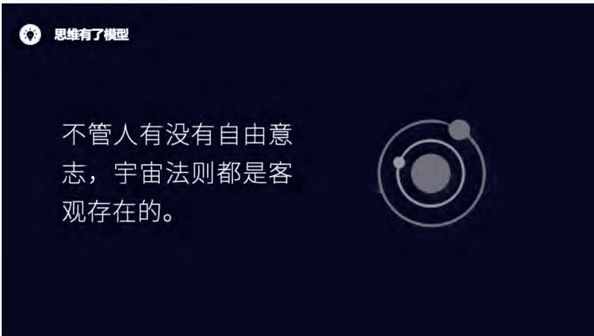

这一点，我想应该不用证明了。

如果宇宙法则并不存在，如果所有东西都是孤立地被创造的，那么如今我们所学的一切知识都将失去意义，包括哲学、物理学、生物学、化学、心理学、经济学、管理学、营销学……

关于这一点，如果我们再深入探讨一下，其实就得到了知识的第一原理。

这也是我在第六期训练营里的一个哲学性洞见，即学习不仅仅是记忆，还需要契合知识本身的特点，即我们的学习，到底学的是什么？

我的答案是，我们所学的所有知识都可以被分为两类：一类是宇宙法则型的知识，比如人性、科学；一种是人为创造的知识，比如单词、汉字。

对于后一种知识，它的逻辑一般比较混乱，有的甚至根本就没有逻辑，这种知识直接利用记忆术强行记忆就可以了。

而对于前一种知识，则完全不一样了，因为这些知识都是宇宙法则本身。而如果是宇宙法则本身，那么它一定具有某种特点，这种特点是什么呢？

我称之为第一原理的线性发散。

比如，我们如今一切的力学知识，都是万有引力公式和牛顿三大定律的线性发散。

但这，需要基于一个大前提，即因果是存在的，因为宇宙法则需要作用于实体。

但因果真的存在吗？

#### 因果真的存在的吗？

要谈因果，就一定绕不开一个鼎鼎大名的哲学家，大卫·休谟。

在大卫·休谟之前，很多人都把因果作为一种基本常识，比如把一个鸡蛋从十米高的地方扔下去（假设地面是坚硬的），你就知道它一定会被摔碎，这就是因果在起作用。

所以很多哲学家们都自然地认为，宇宙就是根据因果律而发生的一连串事件。

亚里士多德还据此提出了他的四因说：即质料因、形式因、动力因、目的因。

后来托马斯·阿奎那还根据亚里士多德的宇宙论，把四种因按照等级进行了排序：即目的因>动力因>质料因>形式因。

然而，后面有一个哲学家横空出世了，这个哲学家就是大卫·休谟。休谟犀利地指出「因果可能是不存在的，它可能只是人类的一种错觉」。


休谟的理由是，我们能观察到的永远只是前后两件事情，我们观察到它们总是前后相继地出现，所以我们就认为这两件事物之间必然存在某种关联，这种关联就是因果关系。

但休谟接着说，我们并没有观察到这两件事物之间的关联，我们只是自然而然地猜测这两件事物之间存在关联，但我们无法证明这两件事之间是一定存在这种因果关联的。

休谟说，这只不过是我们的一种思考习惯，为了某种生存本能，总是喜欢期待一件事情伴随着另一件事而来，总是喜欢把前后相继的两类客体联系起来。

所以休谟得出结论，因果关系可能是不存在的。

休谟的这个推论从逻辑层面来说，确实说得通。但我认为这里面存在一个漏洞，这个漏洞是什么呢？就是解读因果关系的角度。

休谟论证因果关系可能不存在的角度，我们可以把它称之为一种自下而上的角度，即从事件本身反推“我们根本无法观察到因果“，进而得出因果可能是不存在的。

但如果我们换一种角度，我把这个角度称之为自上而下的角度，即从设计者、从造物主、从宇宙法则的角度出发去推理。你就会发现，因果是必然存在的，否则这件事情会变得无比荒谬。


我们假设这个宇宙有个设计者，或者按照哲学家们的话来说，假设这个宇宙有个造物主，那么他会怎么去设计这个世界呢？

根据物理学的研究成果来看，这个设计者可能会创造两个东西：

- ①物质和能量
- ②决定物质和能量的法则

那么关键来了，如果法则是存在的，那么它必须作用于实体才有意义，否则这个法则是没有意义的。

而法则作用于实体的过程，其实就是因果关系的本质。

我们打个比方，比如你是一个孩子王，为了让大家玩起来，于是你设计了一套游戏规则。但这套游戏规则，如果没有一个人遵守，那么这套规则就是没有意义的。

宇宙也如此，如果宇宙法则不能作用于实体，那么它就是无意义的。


但显然，如果真有一个全知全能的设计者，真有一个全知全能的造物主，它一定不会如此愚蠢，创造一套毫无意义的宇宙法则出来。

因此，我们可以得出一个推论：只要宇宙法则是客观存在的，那么因果关系就是必然存在的。

那么问题来了，宇宙法则是真实存在的吗？

我认为这个点也很好论证。首先给出结论，我认为宇宙法则很大概率是存在的。

这点物理学已经给出了答案，不论是牛顿的万有引力公式，还是麦克斯韦的麦克斯韦方程组，还是爱因斯坦的质能方程式，还是杨振宁的规范场论，都可以看出宇宙法则存在的证据。

但还有可能有个可怕的事实，就是今天所有的知识都是假的，物理学也好，生物学也好，都是假的，那么我们还能证明宇宙法则是存在的吗？

我的答案是，仍然可以得知宇宙法则是存在的。

因为如果宇宙法则不存在，那么宇宙就必须是静止的，不会存在物质和能量的流变。

但显然，宇宙不是静止的，物质和能量一直在流变，宇宙在膨胀，行星在运转，植物在进行光合作用，人会经历生老病死……

因此，必然有法则在支撑着一切。

这也很好解释，如果有造物主，假设他能创造出宇宙这么美妙的东西出来，那么它一定不会蠢到，不创造规则让物质和能量自由流变演替，而非要自己亲自动手，每时每刻都要创造无数的孤立物体出来，而且还要负责旧物质的消亡……

这也太辛苦了，就算是驴，也得停下来吃点黄豆才能继续拉磨吧？

开个玩笑，这个点其实还是很好理解的。如果真有设计者，真有造物主，那么它创造宇宙的过程，大概跟我们创造人工智能的方式是相似的。

我们创造人工智能是怎么创造的呢？就是提供一套算法，让其自由演化。而宇宙法则，就是宇宙的算法。

我之前看过一个纪录片，具体叫什么突然给忘了，它讲的就是人类通过计算机模拟造物主的过程，程序员们一开始创造了一些“程序小人”，以及一套算法，这套算法有点类似于自然选择，运行几遍，这些“程序小人”就开始学会了正常走路，而且还学会了攻击其他程序小人。

而宇宙法则跟这个是非常类似的，宇宙法则就像计算机里的算法，物质和能量就是那些基础代码，点击运行，这些基础代码就能在程序员的算法之下自主运行。


当然，你也可能会说，造物主可能是不存在的，那么这个世界还会存在自然法则吗？

当然，而且是更有必要存在，因为没有造物主，也没有自然法则，那么物质和能量就必然是静止的。

因此我们得出一个结论，不论怎样，自然法则都是应该存在的，而自然法则一旦存在，那么因果就是必然存在的，否则自然法则就是无意义的。

那么得到这个结论，对我们有什么意义呢？

意义大了去了，从此以后你将明白，一切都是被因果所支配的，一切都是被自然法则所支配的。

你将明白知识的重要性，思考的重要性，学习的重要性，复盘的重要性，概率思维的重要性，坚持的重要性……

这里我们只展开讲几个小点，其他的大家自己去思考。

#### 坚持的重要性

如果要问做成一件事的要素有哪些，那么其中的一个核心要素一定是坚持。

为什么说坚持对于做成一件事来说异常重要呢？

要明白这个问题，我们先得定义清楚「怎样才能做成一件事」，根据前面的推论，这个世界是被因果所支配的，所以只要我们能够掌握到这件事的所有因果，那么我们就能百分之百做成这件事。

但问题就在于，我们很难掌握到做成一件事的所有因果，或者说，由于某种认知的局限，我们几乎不可能掌握到做成一件事的所有因果。

因此，概率就产生了。

打个比方，假设做成事情A需要10个要素（假设每个要素的权重都是一样的），而你只知道其中的5个要素，其他5个不知道，所以只能靠蒙。于是对你来说，那未知的5个要素对你来说就是一个概率事件。

假设蒙对的概率是10%，这10%的成功概率，就是我们常常所说的“运气”。

那么坚持，在这里面充当的角色是什么呢？

就是对运气的对冲。

坚持的本质就是对运气的对冲。


为什么说「坚持是对运气的对冲呢」？

道理很简单，还是上面那个案例，假设只要成功一次就算成功，那么如果你只重复1次，你成功的概率就是10%；但是如果你重复2次，那么你成功的概率就会变成19%……

你会发现，重复得越多，你成功的概率就越大，重复得足够多之后，这个概率就会接近于100%。

也就是说，当数量很小的时候，就会存在概率，也即运气；当数量很大的时候，成功就会接近于必然。

而坚持的意义，就是把运气变成必然。

#### 坚持，就是对运气的对冲！

这有点像掷骰子，假设掷出“点数为6”一次就算赢，那么你只掷1次，成功的概率就只有六分之一；而如果你掷2次，成功的概率就是三十六分之十一。

你会发现，掷的次数越多，你成功的概率就越大，只要你一直掷，一直掷，总有一次点数会为6，总有一次会成功。

注：赌博不同，它不是中一次就算成功，除非你能设计出这样的策略。赌博是条不归路，普通人请踏踏实实寻找生态位，在里面深耕细作。


明白这一点之后，我非常兴奋，因为它使我更加懂得了坚持的意义。

举个例子，比如做小红书，我就惊人地发现了坚持在里面的意义。

同样的写作技巧，为什么有的文章爆了，而有的文章没有爆呢？当然，这可能跟选题有关，但是我发现，这里面其实也隐藏着因果关系和概率思维。

比如，一篇文章刚发出去之后，因为系统是随机推荐的，所以它可能把我的文章推荐给了不感兴趣的人，所以一开始，文章的阅读量很差，点赞的人也很少，于是系统就判定这篇文章不行，就不再给我推荐了。

但我并没有沮丧，我仍然坚持写，结果突然有一篇文章，系统在随机推荐的时候，刚好推荐给对这篇文章感兴趣的人，于是点赞、收藏、关注的人非常多。

而这些关注我的人进而又去看了我那些没有爆的历史文章，觉得好看，给我点了赞，进而被平台再次推荐给了更多人，结果大数据就对冲了概率，使得我的文章恢复了正常的推荐状态。

你看，这里面有一个非常核心的东西，叫做阅读的人数，人数就是对概率的对冲。

而坚持的意义，也是为了这个。

前几天我把我的这一洞察分享给了一个朋友，他也在做小红书，但是一直没爆，我怕他丧气不做了，于是就告诉他，坚持是对概率的对冲，一定要继续坚持下去，你的方向是对的，坚持下去一定会等到爆发的那天。

结果不出所料，过了两天，他的一篇文章就爆了，随之而来，他的其他文章也被更多人看到，也开始在呈现出一种爆款的趋势。

你看，这就是概率、运气、坚持之间的关系，如果在以前，你可能只会肤浅地概括为运气就完了，完全不懂这背后的底层逻辑，同时也不知道坚持的意义为何。

但如果你懂了因果律，你就知道，原来坚持是对运气的对冲。

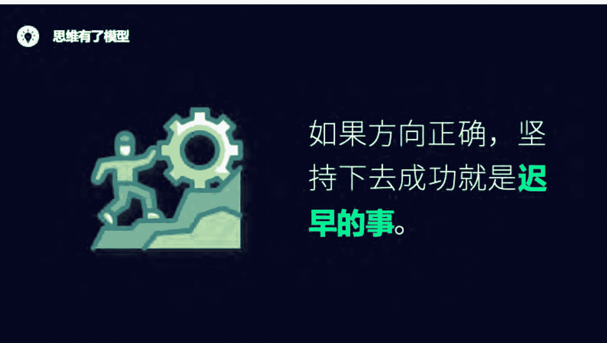

#### 认知的重要性

但这事绝对不仅仅是一个简单的坚持就完了。

你还需要不断去掌握更多的因果，从而提升成功的概率，减少不确定性，减少坚持的时间，减少重复的次数。

而这，就是认知的意义。

我们为什么要不断学习？我们为什么要不断复盘？我们为什么要不断提升我们的认知？认知的本质到底是什么？

认知不是知识，知识只是认知的另一个表象名字。

认知的本质是因果，你所掌握的因果总和就是你此刻的认知水平。


只是，不同的人掌握的因果有所差别：有的人掌握着更高级的因果，即第一原理层面的，能一眼看穿事物本质；有的掌握着更多的因果，即多元思维模型层面的，看待问题更加全面。

所以他们成功的概率更高。

而不断学习、不断复盘，掌握更高级、更多元因果的过程，就是认知提升的过程。

人们常说「你无法赚到你认知范围之外的钱，即使凭运气赚到了，也会凭实力亏光」。

这句话的意思其实是，你无法赚到“你没有掌握的因果“之外的钱，因为你没有掌握这些因果，所以你只能凭运气赚钱。

而运气是个概率事件，所以你终有一天会拿到失败的那个概率。

这就是认知的意义，认知不是一种虚无缥缈的东西，认知就是事物之间的因果关系。

认知越高，说明你掌握的因果关系越底层、越完备。因此你在做一件事的时候，做成的概率就越大，试错的成本就越小，只需要坚持很短的时间就能立马看到正反馈。

而学习的意义，复盘的意义，就是为了提升认知，从而掌握更加底层、更加完备的因果关系。

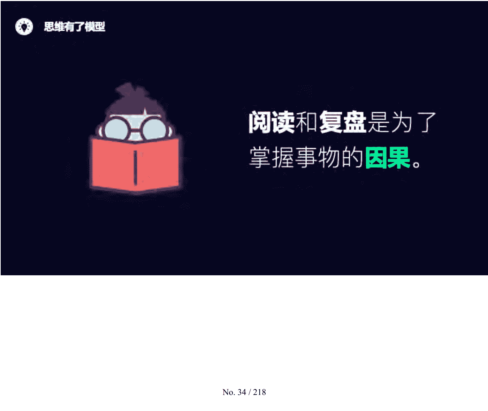

由此，我们得出了一个非常有意义的认知「坚持，绝对不是简单的、傻傻的坚持。坚持的过程中，一定要不断学习和复盘，寻找做成这件事背后所有的因果关系，进而提升自己的成功概率」。

我举个例子，我那位做小红书的朋友为什么这两天突然写出了一篇爆文？

不仅仅是因为他的坚持，还因为他不断在补全做成这件事的因果要素，比如他开始改选题、改标题、改内容、改图片、改介绍、改昵称、改头像……

每改一样，他成功的概率就增加一点。

然而大多数人的坚持却不是这样，很多人的坚持，都只是低水平的重复，他们懒得从经验中复盘，懒得去像巨人学习，懒得去思考背后的成功要素。

所以他们成功的概率，几乎一直都没有怎么变化过过。


#### 控制变量法

那么具体如何才能提升认知呢？

提供两个大方向：一个是跟别人学，一个是跟自己学。

跟别人学就是我之前讲到的「巨人思维」，学习方法我之前也分享过了，你可以采用我的学习方法去学习，它能快速帮你吸走任何巨人的精华认知，这个学习方法叫做「模型树」。

关于这点，这里就不再详细展开讲了，因为之前已经讲得太多了，我们主要讲讲如何跟自己学。

跟自己学的核心是什么呢？有几个比较重要，一个就是我们常常所说的复盘，从成功中复盘，从失败中复盘。

很多人是完全不做复盘的，这很可惜；还有些人是经常复盘但是不懂复盘，这更可惜。

我经常跟朋友说一句话「不复盘的经验，意义不大；不提炼模型的复盘，意义不大；不放进模型树的模型，意义不大」。

所以，要想充分发挥经验的意义，你就得做好复盘。

那么如何才能做好复盘呢？有两个东西非常重要：第一，要把复盘结果提炼为模型；第二，要把提炼好的模型放进模型树。

具体如何操作，这里就不再多讲，下次有缘咱们单独拿一篇文章来详细展开讲。


那么除了复盘，还有其他更厉害的东西吗？

还有一个，这个东西叫做「控制变量法」。

严格意义上来说，控制变量法也属于复盘的一种形式，不过这种复盘的方式比较独特，因为它从一开始就设定好了目标，以及需要复盘的内容。

厉害的是，这种复盘方式把寻找事物之间的因果关系发挥到了极致。

传统的复盘，主要通过成功来确定哪些因果是正确的，然后通过失败来确定哪些因果是错误的。

但问题是，这种确定是很模糊的，你无法完全确定某个要素就是正确的或者就是错误的，你只能大致确认。

像「事后诸葛亮」、「幸存者偏差」等这些词，就表达了人们对于事后复盘这件事的怀疑。

这种怀疑其实是有道理的，我们确实无法通过普通的复盘，来精确确定事物背后的因果关系。


那么如何才能通过复盘，来精确寻找事物背后的因果关系呢？有没有一个简单而强大的方法？

有，这个方法就是一直被我们所忽视的「控制变量法」。

控制变量法一直被科学家们用来寻找事物背后的精确因果关系，我们从初中学习生物、化学、物理开始，就接触了这个寻找事物背后精确因果关系的方法。

然而很遗憾的是，一旦我们离开课堂，走出学校，却完全把它给遗忘了。

这实在令人感到可惜。我在想，为什么人们会抛弃这么强大的一个寻找因果关系的工具呢？

可能原因有两个：
- ①人们可能不知道复盘的本质，是在寻找事物背后的因果关系，从而拿出解决问题的方法论。
- ②人们可能不知道控制变量法，是一个非常简单而且强大的，用来精确寻找事物背后因果关系的工具。

那么什么是控制变量法？

简单来说，就是把其他所有要素都固定住，仅留一个要素来变化，然后观察这个要素对整个事情的影响。

比如小时候学的一个生物学实验，如果我们要观察光照对植物生长情况的影响，就得保证其他一切条件，比如水分、养料、土壤等等，都是一样的，仅留光照这一个条件来变化，从而就能精准确定光照对整个事情的影响。

发现了吗？

这其实就是精确寻找因果的一个很好的工具，通过控制变量，来精确观察某个要素对整件事情的影响。

然而，我们走出校门之后，却把它遗忘在了学校里。

公众号懒人搜索，懒人专属群分享

##### 思维有了模型

##### 控制变量法能够得到更精准的因果。

其实，如果我们能在一些事情上稍加运用，很快就能提升我们对一件事情的认知，很快就能寻找到事物背后的因果关系。

打个比方，我是怎么快速而精准地寻找到爆款文章背后的因果关系的呢？除了我对人性的深刻洞察，还有一个方法就是控制变量法。

比如我发现，同样句式的标题，同样的写作技巧，同样深度的文章，为什么有的文章读者就很喜欢，而有的文章读者就不喜欢呢？

我把过去的文章拿来分析之后就发现，原来问题出在选题上。一篇文章爆不爆，从选题上几乎就已经注定了。

再比如，我在做自媒体的时候，为了确定标题的重要性，我就对一篇文章反复进行标题的修改，内容不动、封面图不动，仅仅只是修改标题，然后我就发现，标题不同，最终的阅读量差别太大了。

于是我就坚定了一件事情，在选题无敌的基础上，标题也是其中的核心要素，因此应该多花点时间去取一个好的标题。

再比如，我在做小红书的时候，小号「学习有了方法」爆了，但是大号「思维有了模型」一篇都没有爆，于是我猜想，可能是小红书的用户不太喜欢我大号的某些选题。

但我怎么确认是选题出了问题呢？

很简单，我把我小号的两篇爆款文章复制到大号，看看情况怎么样，结果果然不出所料，那两篇文章都爆了，于是我便知道，大号没爆的原因之一，可能是选题出问题了。

你看，这就是控制变量法，它能帮我们快速且精确地确定事物背后的因果关系。

当然，我上面对控制变量法的运用，还没有达到科学实验那样的要求，没有严格做到控制所有变量，但即使是如此，它就已经足够强大了。

这个方法分享给你们，其实严格意义上也不叫分享，毕竟你们之前都学过了，算是提醒你们，提醒你们控制变量法很强大，而且它也可以在日常的生活和工作中用起来，它能快速地帮你们寻找到事物背后的因果关系。


OK，这次的思维模型就分享到这里。

其实因果律是一个非常非常底层的思维方式，某种意义上来说，一切都是被因果所决定的。

所以，要想成为一个厉害的人，要想做成一件事，你就要尽可能地寻找到事物背后的因果关系。

以上，就是我最近最大的感悟之一，与大家共勉。

#### 评论区：
- 米拉在西班牙：厉害的人，通过表象看本质，中间就是不断的刻意练习！
- 努力努力再努力：[强]
- 兰陵王：[强]

### (25赞)「提效,适合手搓档和小红书脑图」发现wps有3个神奇的功能

作者:一一
日期:2024-11-27

#### 项目实操

发现WPS有3个神奇的功能,

今天用WPS修改东西的时候,发现WPS存在3个神奇的功能。

文章润色对于写文章手搓档,能节省不少时间。

脑图对于写文章或做小红书导图的,也能节省不少时间。

自动纠错对于大量文章内容纠错,也很好用,毕竟一般AI对话纠错,字数有上下限。

下面说说具体功能,和其他软件区别在哪里。

#### 一、自动文章润色:

重点来了,wps文章润色,这里是不限制doc文本字数的,

文章字数是500字,还是5000字,还是5w字,都是不限制的。

这点对于自动手敲文章的人,有大用。

润色过程中,也会对识别出来的错别字,直接进行修改,

对识别出来冗余的文字,进行修改。

点击这里:

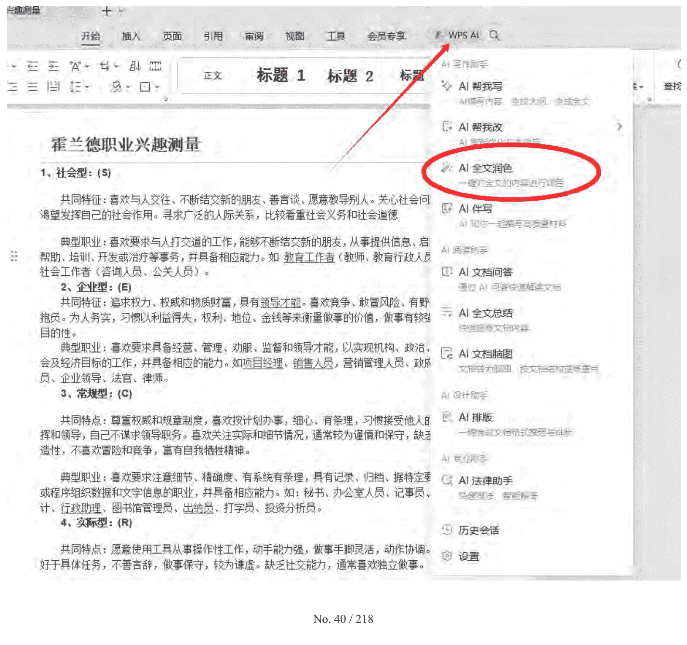

完事就会出现这个：

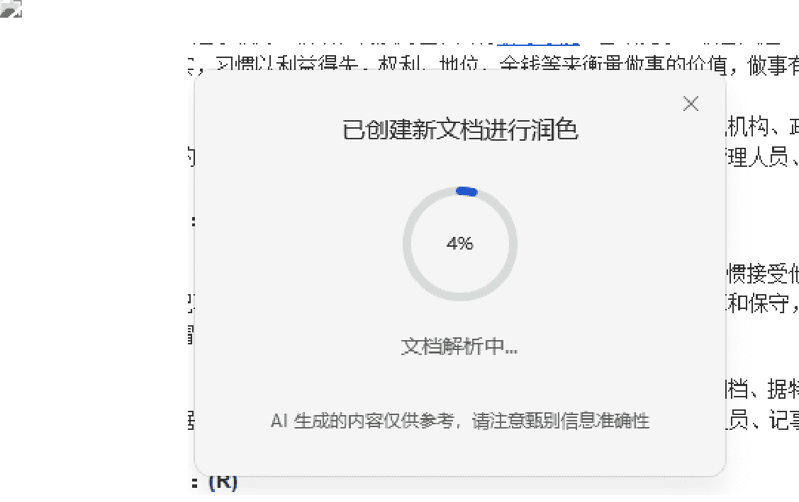

然后屏幕下方就会出现这个：


然后就等时间，文章越长，等待的时间就越长。

出来的内容，就是右侧的修订，可以点击同意或者不同意。

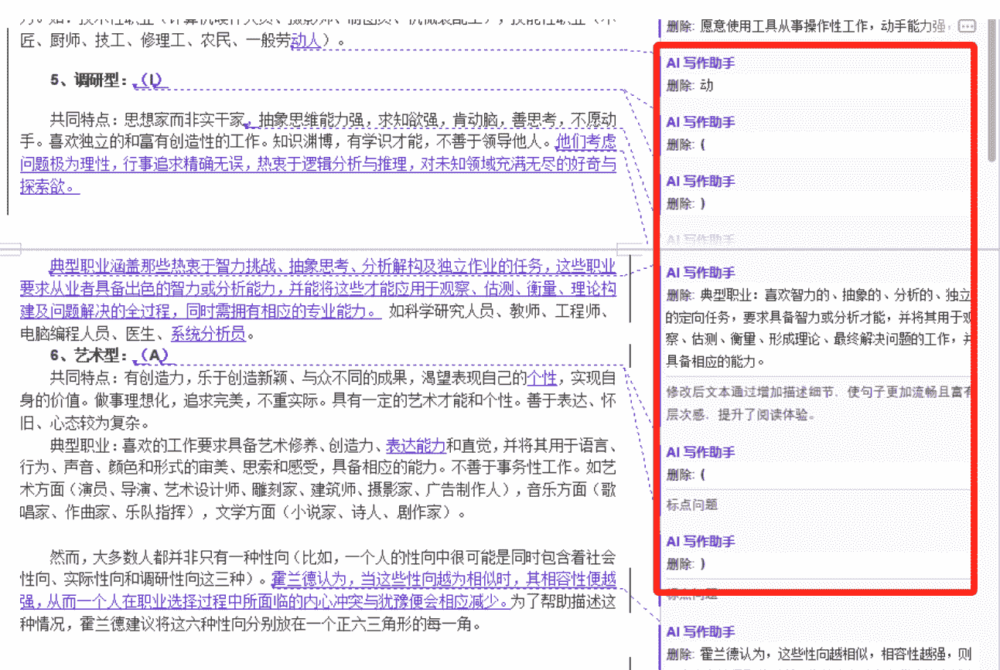

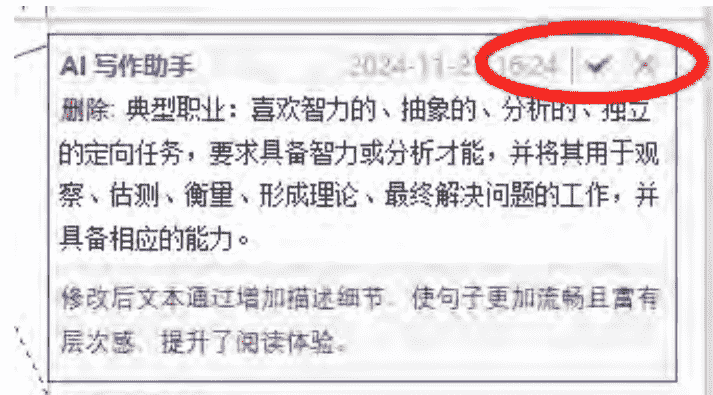

点击完成就修改完成了

#### 二、自动形成思维导图：

WPS自动形成脑图，和其他软件的区别，这个脑图内容相对很详细，细枝末节都体现出来了

转化完后，再转成其他软件进行排版，极大的减小了时间。

对文章字数有限制，要在8w字以内。

但也满足一般的需求了。

还可以选择2种模式，脑图模式，或者树形图模式。

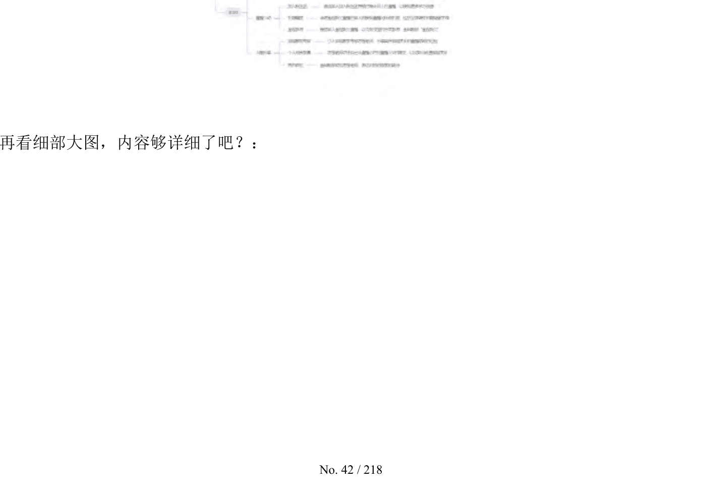

这是我生成的一个2.5万字的文章的导图，先看小图，就知道内容有多详细了吧？


再看细部大图，内容够详细了吧？：

公众号懒人搜索，懒人专属群分享
- 7点开始之前
  - 直播间互动
    - 点赞转发 —— 鼓励家人们点赞并转发直播间，与老师一起分享直播间的精彩内容
    - 打出天数 —— 家人们在直播间打出自己来到直播间的天数，以示参与和记录自己的学习历程
    - 持续转发 —— 强调持续转发的重要性，要求家人们打出“持续”二字，以示对学习的坚持和热情
  - 学习态度
    - 学习经典 —— 提问家人们学习经典是否只需一遍，还是需要多次学习，并根据回答进行引导
    - 逐字稿价值 —— 强调逐字稿的重要性，鼓励家人们将其视为经典，长期阅读和学习
    - 温故知新 —— 引导家人们理解“温故而知新”的意义，鼓励反复阅读逐字稿以获得新的感悟
  - 能量场与共振
    - 同频共振 —— 描述直播间为能量场高的地方，鼓励家人们感受同频共振的效应
    - 现场跟读 —— 通过比较现场听演唱会与家中听歌的不同体验，强调现场跟读和能量共振的重要性
  - 逐字稿的价值
    - 逐字稿获取 —— 说明逐字稿无需花费即可获得，但鼓励家人们以高价值的心态去学习和使用它
    - 逐字稿的影响力 —— 分享万松老师和志里老师通过逐字稿实现的蜕变，激励家人们相信逐字稿能带来个人成长

这是树形图：


#### 三、全文文本校对：

这个全文文本校对，和其他AI软件有什么不一样？

这个不限制字数，你1000字也能校对，1w字也能，10w字也能。

想一下AI对话校对的时候，一般输出就限制字数，字数一多就要好多轮对话，这个只用点一次即可。

下面是步骤：

点击审阅


点击左侧的校对：

No. 43 / 218

公众号懒人搜索，懒人专属群分享

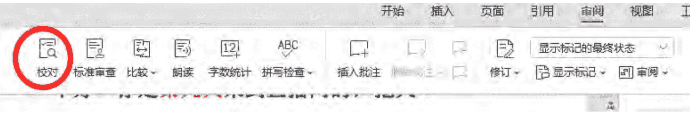

点击通用校对和公文校对，看个人选择。右侧有个人专属词库，可以添加，对于专有名词添加后，不再进行纠错。


点击校对后弹出窗口，校对内容很快，也就十几秒：

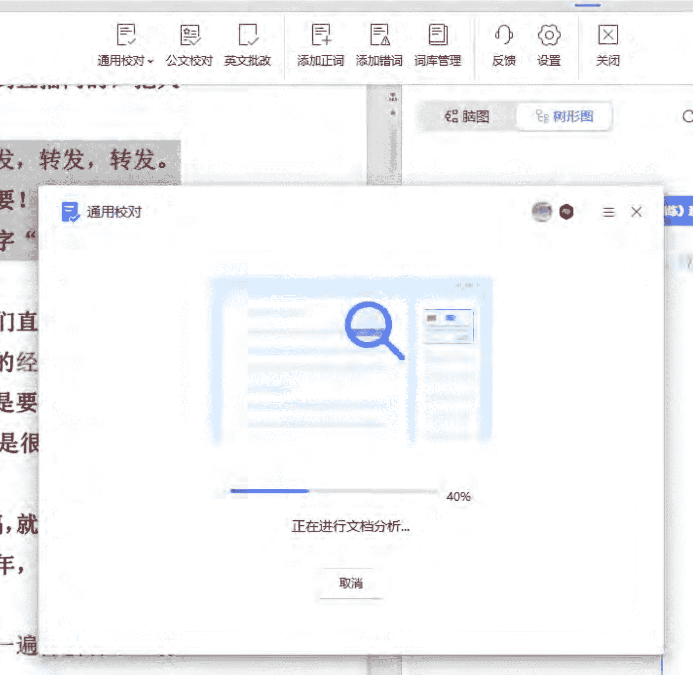

然后点击开始修改：


右侧会有弹窗，根据需要，点击替换，下面还有人性化的内容，点击小箭头后可以点击全部替换，也可以点击最下方一键替换：

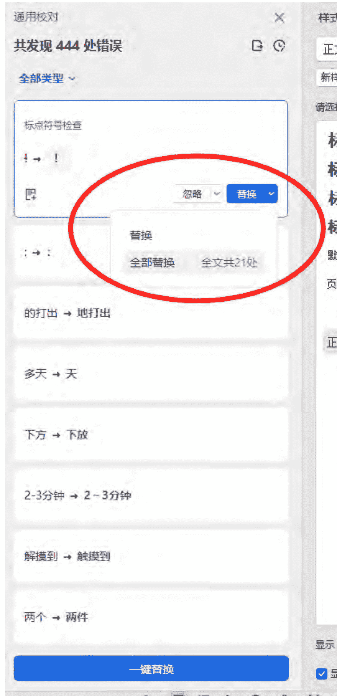

End:

以上3个功能需要WPS会员，需要的可以在某鱼上买一个试一下。

对于提效的效果还是不错的。

#### 评论区：
- 佳文：确实不错，为了WPS的AI功能， 充了5年的大会员
- 七天@生财有术：本wps会员学会了！

### (22赞)省心省力！用一个RPA脚本搞定小绿书、小红书、公众号爆文的自动发布

作者: 陈序员大康
日期: 2024-11-25

上一篇文章: 终于实现了,同时支持公众号文章、小绿书的一键生成+自动配图+自动排版+自动发布(附:最新RPA脚本)

脚本实现了,自动调用coze工作流,生成文章,并自动发布公众号爆文和小绿书的功能。不过经过使用和大家的反馈发现以下问题:
- 1. 脚本分成了多个导致安装脚本相对麻烦
- 2. 运行过程中缺乏提示信息,导致排查错误困难
- 3. 还有就是希望可以自动勾选原创
- 4. 希望加上小红书的发布,这样小绿书素材也可以发布到小红书

我觉得都很有道理,所以就安排上了,经过我最新的合并和开发,我将之前的所有脚本合并成了一个,目前这个脚本可以实现以下功能:
- 1. 自动调用小红书改写小绿书工作流
- 2. 自动调用公众号coze改写工作流
- 3. 新增了服务号的发布兼容
- 4. 新增了小红书的发布兼容
- 5. 新增了自动勾选原创(公众号文章的)
- 6. coze工作流新增了更通用的总结小绿书生成工作流(适用多个领域的内容生成)

接下来,来说一下这个脚本的安装和使用吧,为有更好的阅读体验,请跳转阅读

#### 用一个RPA脚本搞定小绿书、小红书、公众号爆文的自动发布

#### 评论区:
- 死生原点:大佬,看起来很帅,很🐮,而且我仔仔细细看了一遍,但是完全跟不上思路[撇嘴],应该是由于我很少使用RPA的原因吧,我努力,挤点时间,用电脑实操学习体验一下,[调皮][调皮]
- 笑笑:大佬好,这两天在研究自动化,请问一下coze出现这个问题,需要怎么解决呢,用专业版coze还是需要换一个大模型! Execute Fail: [大模型图片提示词][702112103] blocked by record, block_type=UserLimitation 702112103
- 陈序员大康:嗯,可能确实写的还不够细点,还是要理解一下具体的流程原理才行。
- 陈序员大康:这个提示是用户受限制了,目前我这边是发现,一段时间内调用太频繁就会出现
- 死生原点:没有没有,是我自己基本功太差啦,没有最基础的认知

### 【AI相关】22篇

### (14赞)AI写作航海9月：21天全勤打卡与实操分享

作者： 韩艳艳
日期：2024-11-25

因为白天上班晚上赶稿子，赶在报名最后一天登上了【AI写作航海9月】的大船。也是全勤打卡21天，S级8次，好事11次。分享实操细节15次，拿“钱”说事13次。 也伴随着【打卡心路变化】...... 

对于看了我的，对打卡这件事，我会多一点真诚，我当初是小白的时候，给了我方法论指导，但同时，我也需要在实操的时候，有人拿着根笔，指着我的屏幕告诉我：...chatGPT生成的表格不能通过点击“复制”图标去复制，而且要选中表格粘贴到excel中，再复制到word里才是表格...但是Claude生成的表格只有点“复制”图标才能粘贴到word中...详情请看：https://yypy33v1ybq.feishu.cn/docx/BCCedDJswOXPzoxv1decfliRnvd


#### 评论区：

暂无评论

### (9赞)新人的同城发售航海复盘

作者: 车夫子
日期: 2024-11-26

大家好,我是车夫子。许久不见,甚是想念。上个月参加了同城发售。写一下我这个小白的心路历程吧 背景情况:没有从事过任何销售工作,i中带e 的程序员一枚,如果您也是小白的话,欢迎看看文章。首先需要说明的是:我没有华丽的辞藻,只能说说我的心路历程,给和我一样的小白一些力量,仅此而已。其次,文章3000字左右,第一次写这么长的文字,心里也没有把握,不知道写的是不是利他,但总要去突破自己,所以写的不好的话,请见谅哈。最后,点个小赞,感谢支持。移步飞书: https://x47m86hb9r.feishu.cn/docx/RgF1d0G9ToWBlUxGBrgcrBnDnMf?from=from_copylink

#### 评论区:
- Tim 天豪:车车老师优秀!
- 刘卡卡:优秀 不错的尝试

### (137赞)AI应用在苹果商店付费应用总榜夺冠

作者： 亦仁
日期： 2024-11-28

太强了，cursor编程做的应用现在苹果商店付费应用总榜第一🎉 AI时代，每一个生财圈友，不管会不会编程，都有机会实现这样的奇迹。 这个是花生的复盘

https://t.zsxq.com/JUy8Q

#### 评论区：
- Chor君：现在编程越来越简单了[呲牙][呲牙]
- Chor君：逆天呀！第一
- AI进化论-花生：有点走运，感谢亦仁推荐🥺 希望下个月的Cursor航海能帮更多圈友找到创造的快乐
- 风声：太强了，甚至刷到一个小号发了个分析你的笔记就有四五百个赞，花生大佬化身为流量哈哈，起号的圈友可以蹭起来，这能算风向标吗[旺柴]期待航海
- 若尘：期待航海

### (90赞)借助AI做历史解说大片，单月变现4万，附保姆级教程

作者：高鹏圈
日期：2024-11-27

大家好，我是高鹏。

今天继续分享一个热门玩法。

最近这种震撼的历史解说短片的流量太猛了。

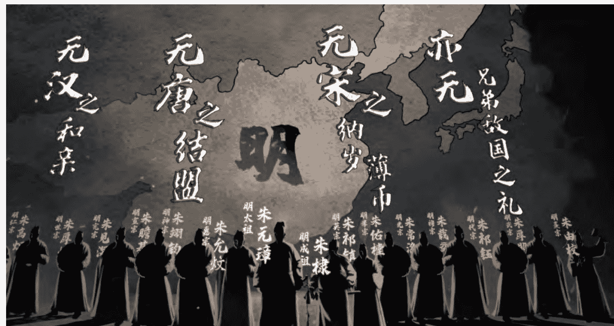

感受一下每条视频的数据，注意看到的是它的点赞数据，并不是播放数据，是非常厉害的。

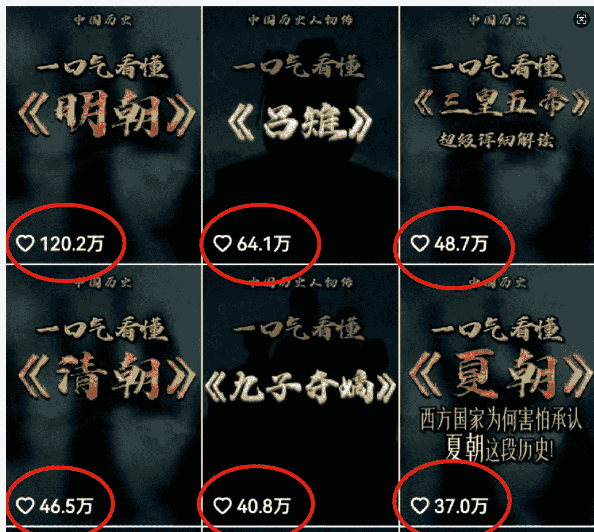

这种视频它是怎么做出来的呢？其实全程用AI就可以搞定。

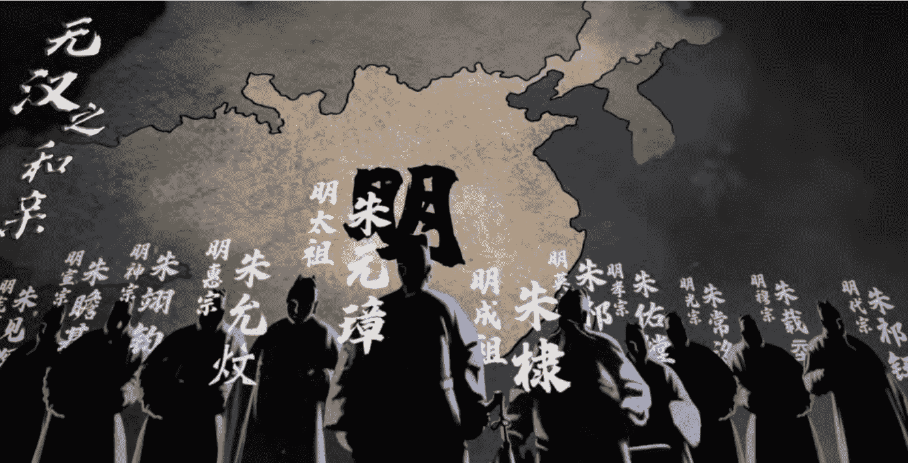

这种视频的文案讲的是历史的大事件，或者某一个历史名人的奇闻趣事，话题的关注度本身就是比较高的。

视频的画面是由前景的人物还有暗色的背景共同组成的，通过加上一些动画和特效，还有前景和背景的强烈的色彩对比，就形成了视觉上的强烈反差这样的一个震撼效果。

配的背景音乐一般都是古风的纯音乐，跟画面和内容是相呼应的，也增加了视频的代入感。

接下来给大家具体拆解，怎么样借助AI做出这种高质量的历史解说的视频。

首先要借助AI写出来超有意思的文案，还有旁白的配音。

提示词需要借助一款智能体，这个智能体提前都已经训练好了，文章结尾会给大家提供。

我给这个智能体投喂的第一条指令是这样的，我说：一口气看懂袁天罡，不少于500字，开头先不要透露是谁，说一些它的独有特点，增加神秘的色彩，最后才抛出主人翁是谁。

这条指令由三个部分组成，第一部分相当于任务的下达，就是让AI解读袁天罡这个人。

第二部分就是给他规定一个字数。

第三部分就是给它做一个设定，就是前面应该怎么样，后边应该怎么样。

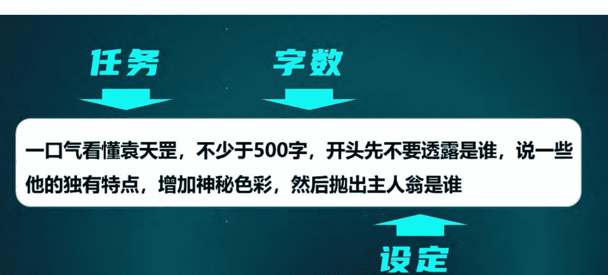

这条指令我投给AI之后，他就按照我的要求，给出了这样的一段袁天罡的大概500字的介绍。

公众号懒人搜索，懒人专属群分享

而且AI非常聪明的是，它不是一开始就说“谁谁谁出生于什么时候，哪儿的人”。

而是先说这个人有什么样的独特特点，做了什么样的让人很钦佩的事情，最后再说“那这个人就是谁谁谁”。

文案符合爆款短视频的一个逻辑，效果还是不错的。

![图片]

有了文案之后，人工大概的再润色一下，就可以用配音工具直接配音了。

建议大家挑选一个中年男性比较浑厚的配音风格，这样配音会更加有历史的厚重感。

![图片]

接下来要解决画面的问题，首先要做的一个工作就是得到分镜的提示词。

我们还要借助刚才这个智能体，我们再给它一个指令，告诉它先以表格的形式给出分镜的脚本，画面的描述。

这样AI就会1、2、3、4、5、6地列出来很多镜头的画面描述，也就是分镜的脚本。

# 公众号懒人搜索，懒人专属群分享

> 请以表格的形式给出分镜脚本，画面描述

好的，以下是以表格形式呈现的分镜脚本：

| 镜号 | 画面描述 |
|---|---|
| 1 | 夜幕笼罩，繁星点点。一位身着古装、气质神秘的人物仰头凝视星空，眼神深邃而专注。 |
| 2 | 一间昏暗的书房内，堆满了古籍和星象图。人物坐在桌前，手持毛笔，在纸上绘制着复杂的符号。 |
| 3 | 繁华的街道上，达官贵人骑着高头大马，身后跟着随从。人物站在人群中，远远地看了一眼，微微摇头，似在心中已有论断。 |
| 4 | 一位平民百姓前来求见，人物仔细端详其面容，而后轻声说出一番话语，百姓露出惊讶又敬畏的神情。 |
| 5 | 皇宫内，皇帝坐在龙椅上，人物恭敬地站在下方，向皇帝陈述着自己的见解。皇帝时而皱眉，时而点头。 |
| 6 | 人物与另一位学者在庭院中激烈讨论，手中比划着，周围的花草树木随风摇曳。 |
| 7 | 一间密室里，人物独自面对一本古老的预言书籍，烛光摇曳，映照出他凝重的表情。 |
| 8 | 战场上，硝烟弥漫，士兵们奋勇厮杀。人物站在远处的山巅，俯瞰着战局，若有所思。 |

但是每一条的字数比较短，就是一个大概的场景的描述，是没有办法直接投喂给AI绘画工具生成图片的。

所以还要做一个工作，用一款AI绘画描述词扩展的智能体。

直接把上一步它给到的简短的分镜提示词投喂给这个智能体，然后他就补充了很多细节和扩充，这个描述词就可以拿来进行AI绘画了。

> 夜幕笼罩，繁星点点。一位身着古装、气质神秘的人物仰头凝视星空，眼神深邃而专注。

以下是为您生成的这幅素描风格彩色写真画的详细描述：

```
夜幕深沉，如一块巨大的黑色绸缎笼罩着大地。繁星点点闪烁在浩瀚的夜空，如同璀璨的宝石镶嵌其中。
一位身着古装的人物出现在画面中央，他身着一袭黑色镶着暗金色纹路的长袍，长袍随风微微飘动。腰间束着一条宽大的腰带，上面镶嵌着宝石。
他的面容在夜色中显得神秘而迷人，棱角分明的脸庞透着冷峻。深邃而专注的眼神仰头凝视着星空，那眼神仿佛能够穿透无尽的黑暗，直抵宇宙的深处。他的眉毛浓密而英挺，微微蹙起，似乎在思考着宇宙的奥秘。
他的头发高高束起，几缕发丝在微风中轻轻摆动。身后的背景是一片寂静的山峦，在夜色中只显出模糊的轮廓，愈发凸显出人物的孤独与神秘。
整体色调以深沉的蓝黑色为主，点缀着繁星的银白光芒，营造出一种神秘、悠远的氛围。
```

接下来第三步AI文成图，用到的是垫图功能。

先找一张我们认为比较符合感觉的一张图片，比如说我找到了这样的一张人物垫图。

![图片]

打开之前我给大家分享的这款功能超强的AI绘画工具，里边有一个上传图片的选项，我们点一下。

![图片]

接下来把垫图上传之后，在绘画描述词的框里边，把刚才分镜头的描述词直接粘到这儿，点下边的生成。

# 公众号懒人搜索，懒人专属群分享

然后AI就给了两幅它生成的图片，我觉得还是非常有感觉的，跟咱们想象的袁天罡的这种形象还是比较相符的。

![图片]

接着再用到一款抠图工具，这个操作就非常简单了，上传后直接点抠图，它就能够把人物从画面里面抠出来。

![图片]

抠完了之后，点右上角的导出，注意一定要导出PNG格式的图片。

![图片]

我们用同样的垫图方式，来生成一些相关古代宫殿以及山水的一些背景图。

![图片]

最后一步就是剪辑成片，把刚才得到的每个分镜头的背景图，以及人物还有旁白的配音，全部导入到剪辑工具里。

再添加一些文字的特效，人物入场的特效、背景缩放平移的动画效果。

最后加一个古风的背景音乐，还有字幕，这个视频就制作完成了。

# 公众号懒人搜索，懒人专属群分享

![图片]

这种号做起来之后，商业化模式有这么几种。

第一种可以做橱窗带货，像一开始给大家展示的号，它主要就是做橱窗带货和星图商单。

它的橱窗带货，一个月销出去1300多件，单价几十，还是比较香的。

![图片]

第二个也是它的核心板块，就是星图商单。

第三个可以去吃一些流量收益，参加各种分成计划，现在很多平台都有这个活动，尤其是一些海外的平台，给的效益也还是比较高的。

而且现在海外基本上还没有人做，属于一个空白期。

好，今天的分享就在这里了。

关于刚才提到的几款AI提示词的智能体，以及用到的各种工具，统一放到文档里了：https://svj4gxvm0v3.feishu.cn/docx/LgvSdKE8qodsVtxQy87cc2UZnwe?from=from_copylink

我是高鹏，深耕网创9年，这是我拆解的第695个落地项目玩法，更多项目玩法，欢迎找我聊聊呀~

评论区：

- 嘉应岛主：分享拆解得很细，还有工具AI提供，厉害了[强]。我今天先刷一下生财的帖子，明天实际操作一番后，补充评论[强]
- 华龙：好文
- 船长：这个就比较厉害了
- 阿卡：最近有刷到视频号在直播讲历史（画面就一张简单的动态图，周边弄了央视直播风格）、挂车卖历史书📚
- 小郭：感谢分享
- Safe1868：只看懂了那是画江湖之不良人大帅[微笑]
- 0封：智能体跳转不了
- 晨晨：感谢分享

### (79赞)我用 Cursor 快速找到头像的 AI 算法实现

作者： 土豆君

日期： 2024-11-25

鱼丸发了一个找头像活动，5000人生财墙找到自己的头像，真有意思，大家都在找头像，我找了快15分钟眼都看花了，仍是没找到圈友的头像😅（对，不是我自己的，因为我的被找到了，而我找不到她的）

这么有意思的事情为什么不拉上 Cursor？必须的，对不对[旺柴]！ 于是我找到 Cursor就实现算法功能！！！只能说AI牛逼！

然后我把过程写下来花了。。嗯20分钟[捂脸] 感兴趣可以看下过程记录，嘿嘿。文末有代码[嘿嘿]

https://t.zsxq.com/R3nuz https://ktnwm6ohjn.feishu.cn/docx/NqmkdxL5Zo1Ih8xGBKfcIpLAnOh?from=from_copylink

鱼丸 | 亦仁助理
2024-11-25 19:05

#会员日 5000 人生财墙正式发布！快来参与有奖互动

11月会员日的主题为：抢 5000 个生财墙名额

原帖直达： https://t.zsxq.com/QDGE7

活动上线后，5000 个名额在短短 3 小时内就被热情的圈友们一抢而空！星球评论区、微信朋友圈都被大家的激动和喜悦刷屏啦～人多墙小，恭喜抢到「生财墙」名额的圈友们！你们将在墙上拥有自己的专属位置，成为生财文化中的一份子。

展开全部

![图片]

会员日 官方活动

查看详情

范来福、辛亥、vipyinzhiwei、夹子、辣辣、好奶茶、阿倩Michelle、Snow、文文、陈大其等114人表达了态度

> 帮我用python写个图像匹配的代码，在一个 14173 x 3701 的许多头像的图片上，匹配到 大约是 64x64 一张头像。我会提供一张自己的不同分辨率的头像图片，然后用这张图片取 大图里面查找，找到就返回头像范围的截图。能实现么？

我可以帮你实现这个图像匹配功能。我们可以使用 OpenCV 库来完成这项任务。以下是实现代码：

```
import cv2
import numpy as np

def find_avatar(large_image_path, template_path, threshold=0.8):
    """
    在大图中查找目标头像

    参数:
        large_image_path: 包含多个头像的大图路径
        template_path: 要查找的单个头像图片路径
        threshold: 匹配阈值，越高要求越严格

    返回:
        找到的头像图片列表，每个元素为(x, y, w, h)和匹配度
    """
    # 读取图片
    large_image = cv2.imread(large_image_path)
    template = cv2.imread(template_path)

    # 将模板图片调整为64x64
    template = cv2.resize(template, (64, 64))

    # 获取模板尺寸
    h, w = template.shape[:2]

    # 模板匹配
    result = cv2.matchTemplate(large_image, template, cv2.TM_CCOEFF_NORMED)

    # 找到匹配位置
```

![图片]

![图片]

![图片]

![图片]

评论区：

- Yhx：好家伙我直呼好家伙
- 辛亥：绝了！就得是土豆哥的行动力才能挣大钱！
- 诗媛：rice太棒了
- 阿紫：哈哈哈，土豆牛逼！！！！！！
- 豚小祖：好家伙，
- 福脑斯：我19点多看到的时候试了Ai产品，不过不行，结果大佬已经做出来了，太强了[强][强][强]
- 雨飞：好家伙，佳文赶紧来学
- Rice：哈哈哈还得是土豆啊！！

### (85赞)AI+出海：AIGC原创短视频带货赚美金实操指南

作者：Lisa学姐

日期：2024-11-26

大家好，我是 Lisa , 90后福建人在深圳创业，深耕跨境领域3年，目前all in AI+出海赛道。

现在正是AI的时代，因为这个契机我把 AI 深度结合在了跨境领域，现在跑通了 AIGC+跨境电商的变现模型，这个市场需求太大了！今天我就把整个变现模型和实操方法分享给大家，希望更多人能实现 AI+出海，别墅靠大海！

之前写了一篇关于"一个传统媒体人的 AI 跨境逆袭之路"的帖子，吸引了很多朋友的关注，大家都很期待让我出一篇实操的帖子，今天我就出一篇以“AIGC原创短视频带货赚美金”的保姆级实操帖，让小白也可以轻松入局跨境电商，一起出海赚美刀。

完整版内容请移步飞书阅读：

https://xa06j6z232m.feishu.cn/docx/JxWxduUFhoN2z9xA8eocqwKBnwb?from=from_copylink

评论区：

- 好想吃鲤鱼：权限没开
- 七天@生财有术：哇，写的太详细了，保姆级喂饭。好奇目前业务收益和人员配置怎么样？
- Lisa学姐：已经开了哈
- 黛比：保姆级喂饭教学
- 水心：真的是保姆级喂饭教学，感谢分享！
- 上上签：好绝
- 提问：请问现阶段如何利用ai覆盖其他品类，比如服装类目可以需要用模特，那么换脸或者生成图片在转动态视频是合适的，那么其他类目有解决方案吗？假设现在卖的是一个鼠标，那么用ai能否批量做出合适的视频展示场景和产品？并且看起来真实不会一眼就是ai
- 新生🍁：厉害厉害，这个办法也可以生成产品图，不用P图了

### (精华帖)(84赞)使用Cursor构建公众号矩阵发表管理系统：从零到完整功能实现

作者： 钱塘江鲤

日期： 2024-11-29

之前分享过如何使用 Cursor
完成简单的提效工具和脚本开发，那么我们如何使用 Cursor 构建一个稍微复杂功能完备的可视化
产品呢？下面是一个我两天时间从零开始开发一个公众号矩阵发表管理系统的过程，从素材库
采集到公众号自动化发布，借助AI

一步一步最终完成了整体功能的开发。 项目全程使用 cursor 和部分 Windsurf 完成，没有借助其他
工具，至于为什么我不使用 bolt.new 或者 V0
做网站的第一版本设计呢？因为我觉得目前没有必要引入更多的工具，不是说没有用，而是在
初始阶段我们在一个工具可以做到80分的情况下没必要引入过多的工具。

目前第一版已经完整实现了从数据查看、素材管理、数据采集、AI改写、定时发布、多账号矩
阵等完整的全自动流程功能。也彻底踢掉了目前主流的影刀RPA的低效方式，整体上AI改写和
矩阵发布或者数据获取的效率比我之前使用的影刀方式高出几倍不止（后面我再写篇分享把我
之前一直在用的影刀流程开源）。

下面是整体过程实现的总结：

https://ia0969wpr2.feishu.cn/docx/K3BidxkyHodPfMxlzEOc1W64nbe

评论区：

- 浪子：很棒
- 车夫子：高产
- 死生原点：精通代码，编程者，掌握这个数字时代的命脉，底层规律
- 华龙：太牛了
- 无名：太牛了，这思路绝了。
- 涛涛：啊，我正打算搞这个，写到一半了还在调试，看到你已经都实现了，并且比我规划还要
好。佩服
- 亦仁：这套工具的开发思路很好，不过考虑到公众号目前已经属于极度内卷的项目，如果这套工
具是在一个更具长期商业价值的平台，想象力会更大。比如，在YouTube领域，对标下vidiq。
- 钱塘江鲤：收到老大，这下方向有了，接下来按照这个思路怼一个

### (54赞)AI实用英语场景对话视频的惊人涨粉现象

作者： 大鹏

日期：2024-11-29

大家好，我是大鹏。

最近发现一类账号，专门用AI做这种实用英语场景对话的视频，超级简单，但，涨粉惊人!

下面这个号用15条内容涨粉1.2万，还有这个号用44条内容就涨粉5.5万!

![图片]

#### 怎么变现?

常见的变现方式就是卖虚拟资料，把这些常用对话整理一下放在网盘里，有人下单后自动发货。

或者带一些别人的英语教学课程、书籍赚取佣金

![图片]

最重要的是，这种账号的粉丝价值极高。

这种视频吸引的一般都是准备出国或者已经出国的人群，这个人群里高净值用户含量极高。

积攒一波这样的粉丝到私域里，把后端机构对接一些，比如出国留学服务机构、英语培训机构，赚取cps也很香！

#### 视频怎么做?

非常简单，全程用AI就能搞定!

接下来我一步一步带着你操作一遍:

- 搞定文案
这一步交给AI就可以了，先把这段提示词喂给AI，告诉他的角色、任务和要求等等

![图片]

之后咱们直接从他提供的选题里面选一个告诉他，比如我直接选第4个，它会自动生成对话文案，文案这一块就这么搞定了

把提示词存好，每次想做内容跑一遍就行。

![图片]

#### 2、英文配音怎么做？

建议用这个微软配音工具，免费还好用。

![图片]

打开软件后在左侧框中输入其中一个角色的台词，右侧上方选择语种，这里面内置了很多国家的语言英语、日语、韩语、西班牙等等好多

如果做其他国家的语音对话也是可以的，譬如做日韩留学的号，就可以改成日语韩语，这里我们直接选英语

![图片]

因为我们要生成的是对话，所以句子之间的停顿最好设置的长一些，可以点开“高级设置”，把停顿设置为800ms以上，出来的句子会比较适合我们做剪辑。

生成后下载到本地即可，另一个对话同样这么生成后下载。

![图片]

#### 3、制作配图

这个同样也可以用AI搞定，但是画图得用提示词，如果不会写提示词怎么办？

不用担心，可以让AI帮你写，把这段提示词喂给AI，他就会给你索要场景，直接告诉他场景和人物AI就能自动帮你生成提示词了

![图片]

然后拿着这些内容，打开即梦AI，选择AI生图功能，把前面生成好的提示词填进去点击生成，出图效果非常不错，挑选一张效果最好的下载保存就好了.

# 公众号懒人搜索，懒人专属群分享

![图片]

#### 4、视频剪辑合成

最后一步，把前面生成的音频和图片素材导入到剪映里面做剪辑，两个音频导入后按照句子错开，根据对话做排列，图片长短根据音频调整一下

最后点击识别字幕功能，识别两次：第一次"翻译语言"那块空着，会出现英语字幕；第二次勾上"翻译语言"，会出现中文字幕，这样双语字幕就做出来了

![图片]

好了，以上就是这种AI英语场景对话类视频玩法的全流程了

总体来说还是很简单的，感兴趣的抓紧操作起来吧~

另外，前面提到的提示词、工具和详细制作教程都打包整理好了

https://ucuu4d5tq2.feishu.cn/docx/Nh8KdQe9aobnk9xgKZcc6Ry7nTg?from=from_copy

我是大鹏，深耕网创多年，更多项目玩法，欢迎找我聊聊呀~

评论区：

- 柒柒：很简单的实操项目。
- 劳模姐：看起来不难，周末赶紧试试
- 大鹏：很简单
- 大鹏：[坏笑]
- 小熊：留学和出国考试的人员数量断崖式下降。所以各家都在抢这部分流量。
- Harris：真不错
- 黄大妖：学到了，立马试试，谢谢圈友！

### (43赞)AI视频玩法：动物融合创造战斗力爆表的怪兽

作者：大鹏

日期：2024-11-26

大家好，我是大鹏。

今天再给大家分享一个最近非常热门的AI视频玩法——动物融合

想象一下把两只常见的动物合体变成一只战斗力爆表的怪兽有多震撼!

看个视频案例:

https://www.douyin.com/user/MS4wLjABAAAABf3xAuWzcRXeF3GRZWrlqA3rcF5i8XjroyQYN1aQ?from_tab_name=main&modal_id=7431212318735748363

一条这种视频前后也就十几秒，但流量是真的爆炸!

下面这个账号发这种视频条条大热门，点赞都是好几万，这个点赞量，后台播放量基本都得破百万了

这要是参加了流量分成计划，一条视频怎么着也得有三四位数的收入了。

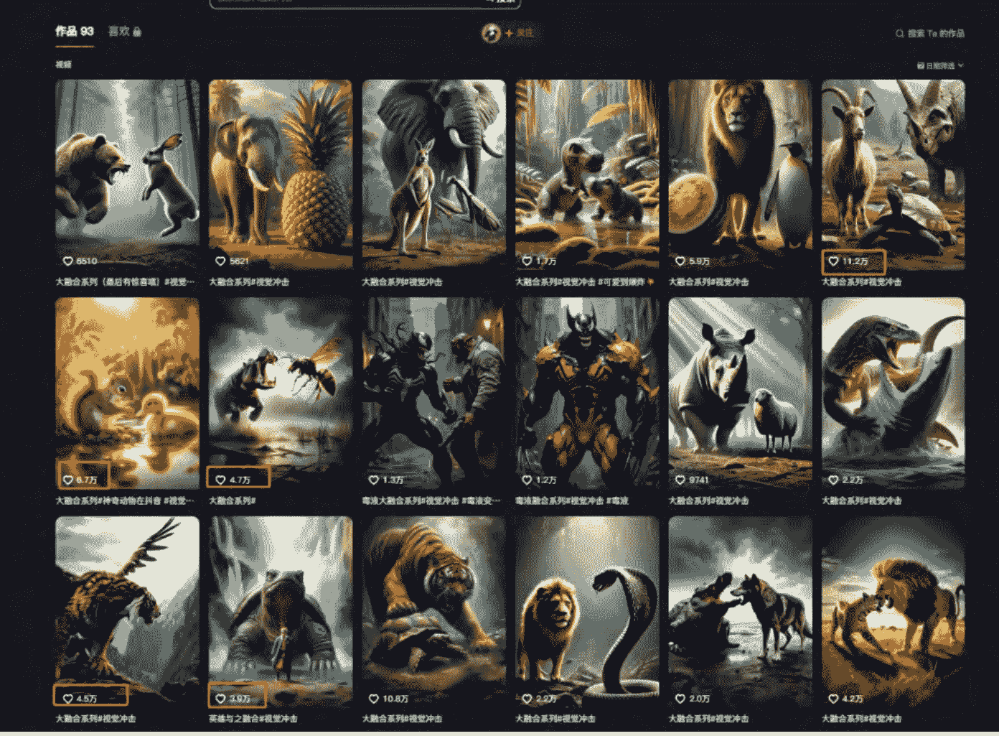

其实这东西做起来一点也不难

制作原理：就是先生成一张合成前两只动物的图片，然后再生成一张两个动物融合后的图片

之后再利用可灵的图片转视频功能把两张图片变成视频

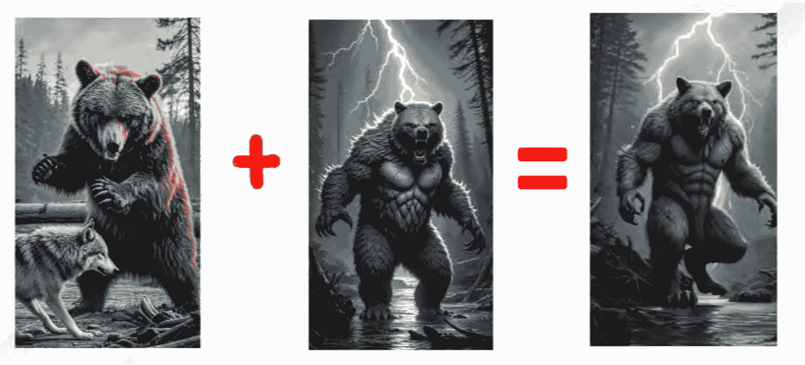

接下来我一步一步带着你操作一遍：

#### 第一步，生成合成前两只动物的图片

打开即梦AI，选择AI作图功能

输入提示词：一张【熊与狼】面对面的图片，两者都处于【愤怒的】状态。【熊站立挥爪，强壮的身体、棕色毛发】；【狼匍匐前进，灰色皮毛、尖耳朵】。背景设定【在森林边缘，河边，有倒下的树木】，渲染出激烈的对峙气氛，突出这两头强悍动物的力量对抗感。

选择一下图片生成比例，点击生成，他这里会直接给你生成四张图片，挑一张效果最好的下载保存就行了


#### 第二步，生成两只动物融合之后的图片

输入提示词：一只融合【熊与狼】特征，非常恐怖的怪兽，外观凶狠且无缝融合，这只怪兽拥有【熊的体型与狼的耳朵，熊的力量与狼的狡猾】，表情凶狠，露出尖牙，目光凶悍，背景是【在森林边缘，河边，有倒下的树木】，闪电，增强其危险且令人敬畏的气氛。

生成好之后，挑一张效果最好的下载保存


#### 第三步，图片生成视频

打开可灵AI，使用这个AI视频功能，把这个增加尾帧按钮点开，然后把两张图片分别拖进去。输入提示词：“狼和熊相互靠近，融合成了一只怪兽，天空电闪雷鸣。”

点击生成，稍等一会儿视频就生成好了。


不要和我杠可灵收费的问题，每次生成花10个灵感值，每天登录送66个值，可以做6个，再借一下周围朋友的手机账号薅几次羊毛：

假设你需要5个号，就下五个浏览器：chrome、edge、360、firefox、sougou……每个浏览器都登录一遍可灵，只需要在首次的时候扫一下码，后续每次都会自动登录。

#### 第四步，剪辑合成

把生成好的视频和变身前的图片一起导入剪映，添加上入场动画、背景音乐、特效，一条怪兽变身的视频就搞定了。

公众号懒人搜索，懒人专属群分享

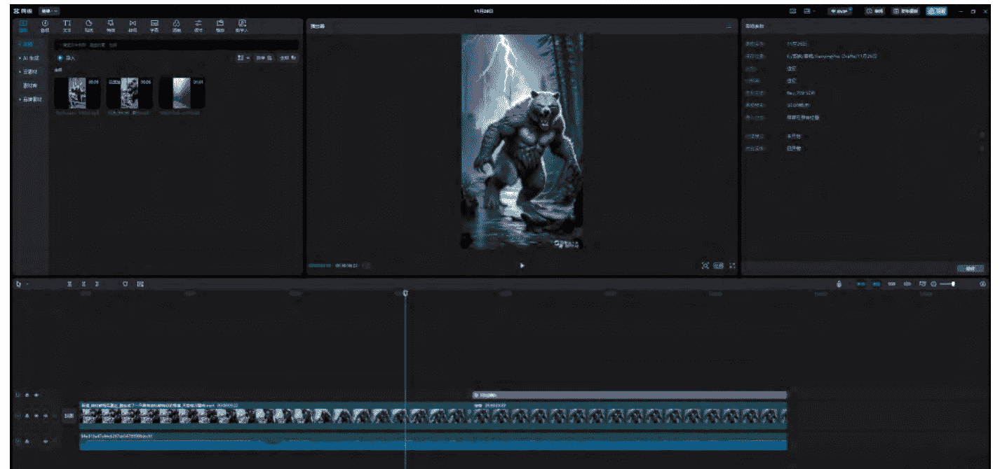

有老铁说想生成其他动物，但不会写提示词怎么办？

很简单，点开这个表格：

https://ucuu4d5tq2.feishu.cn/docx/CWKkddQ6mowAWAxYJalcfV1cn2c?from=from_copylink

你只需要把上面提示词【】里面的内容按照这个表替换掉就可以了，一行一个变身，保你不带重样的。

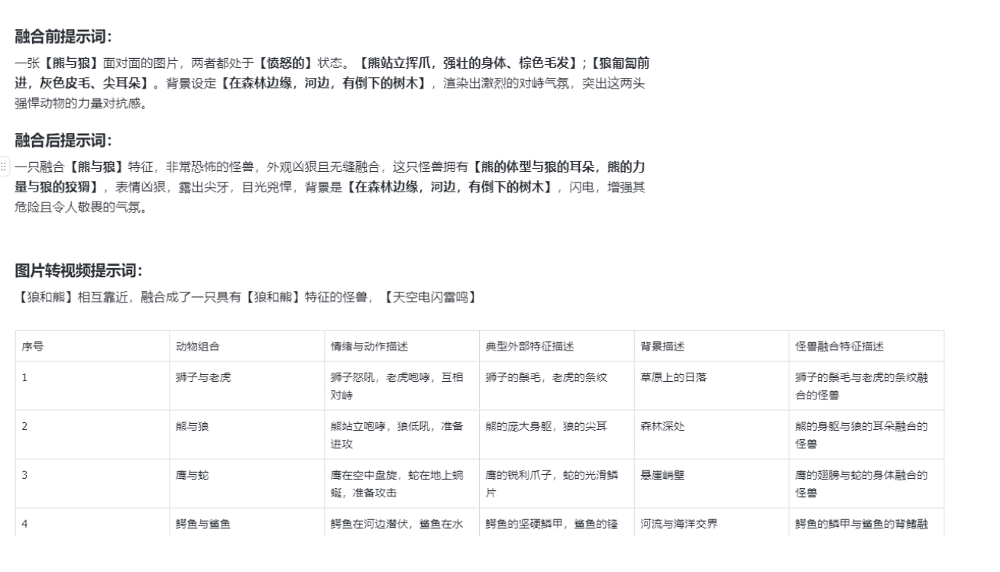

#### 变现方式：

- **1、赚流量费**

这些视频同步到视频号和抖音，开通创作者分成计划后，就能躺着赚流量费了，不过最好的赚流量费的地方是TK和youtube，现在youtube上的shorts也能开通YPP（广告分成）计划，这两个平台的流量分成是要比国内的高不少的.

- **2、小红书商单**

小红书千粉之后就能开通蒲公英，就可以接商单赚钱了，千粉账号每单150-300左右。

- **3、收徒**

跑通闭环之后，就可以把这个玩法教程打包卖铲子收徒，但前提是自己一定跑通了，赚钱没问题，但不能抱着割韭菜的心态去收徒。

好了，以上就是这种AI动物融合视频玩法的全流程了

总体来说还是很简单的，感兴趣的抓紧操作起来吧~

我是大鹏，深耕网创多年，更多项目玩法，欢迎找我聊聊呀~

#### 评论区：

皇帝凌乱：你的成品视频可以看看吗

万航宇：还挺好玩儿的，明天试试[破涕为笑]

大鹏：没发传视频啊……

大鹏：[强]

上上签：挺有意思

万航宇：请教一下，图片转视频，有的时候两只动物不融合咋办呀，直接切镜头到尾帧了[捂脸]

大鹏：加点细节，比如两只动物逐渐相互靠近，融合成了一只具有狼和熊特征的怪兽。还有就是多生成几次，这个有随机性

万航宇：好的，谢谢。

### (43赞)AI魔改抽象整活儿视频，半月狂吸10w粉，好玩又实用，保姆级实操教程

作者：大鹏

日期：2024-11-25

最近大家应该经常刷到过这种AI版甄嬛传视频吧？

“甄嬛掏枪”、“甄嬛打架”、“妃子们骑摩托车”等等

正式庄重的古装剧，突然冒出各种无厘头的画面，新奇，好玩，吸引眼球~

最近这种短视频数据非常火爆，点赞量轻轻松松几万上十万

有的账号起号短短半个多月，粉丝就已经涨到了10w+，光是流量带来的创作者分成收益都给这些创作者们带去了不少收益。

这种视频怎么制作？

最近就有粉丝问我这种AI恶搞的抽象视频是怎么制作的？

方法其实很简单，今天就给大家拆解一下：

#### 第一步，准备素材

去网上搜一段影视剧视频，导入到剪映里面（直接截图也可以）

比如我找的这段甄嬛传的视频，把视频导入到剪映里面，找到两人同框的画面暂停，点击右上角三条杠，点击这个“导出静态帧画面”，可以选择下保存位置，保证自己能找到就可以了。


#### 第二步，图片转视频

打开海螺AI，点击这个海螺视频功能，把刚才保存的图片上传上去，接下来就可以发挥你的想象输入一下提示词，提示词还是比较关键的，会直接影响视频的生成效果

比如我输入的关键词：“镜头较快转换，两人突然拔枪对射，快速暴力，两人殊死搏斗，电影版的辉煌”

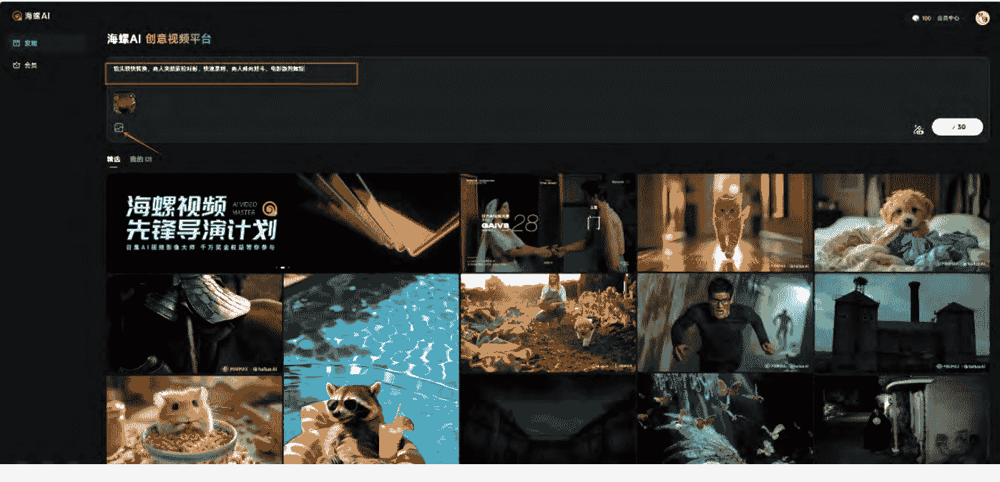

输入完成后点击生成，稍等一会儿视频就生成好了，如果生成的效果不好可以重新修改下关键词再次生成就行了，直到你满意为止。

#### 第三步，视频拼接剪辑

打开剪映，把我们刚刚用AI生成的视频放到导出关键帧的地方，然后把原视频后半段删掉，这样视频就拼接好了，最后再配上背景音乐，就可以导出发布了。


除了这种枪战的视频，还有打架的、接吻、骑车的等等很多形式，制作原理都是一样的，无非就是关键词不一样，大家可以发挥一下你的想象力，说不定就有出其不意的效果。

这种视频除了好玩还能变现？

- **1、接广告商单**

只要有流量的地方就可以有广告位，有广告位就可以收广告费。

我看到有不少这类视频已经插入了广告，本来无厘头的AI片段突然出现已经很让人意外了！

再出现一些创作者自己剪辑的广告，就更有反差感了，效果真的非常好，短视频是真的被他们玩明白了。

- **2、知识变现**

这种视频本身是很新奇的，很多人都有学习需求，或许是因为好玩，或许是装逼需求~

不管拿来做什么，有需求的地方就有钱赚，只要你学会了这种玩法，再去教会别人，那你做的事情就是有价值的，你可以有偿教学，自然而然就可以变现了。


- **3、创作者分成计划**

创作者分成收益可以说是短视频创作者最容易获得的一种收益，当你的短视频得到曝光后，附带的广告也就容易得到曝光和用户点击，创作者就可以得到相应的广告收入。


评论 1912

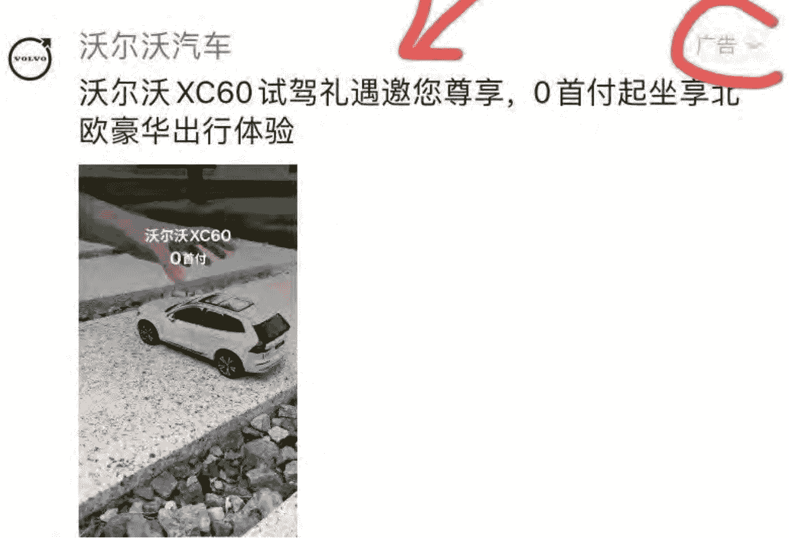

好了，以上就是这种AI恶搞的抽象视频玩法的全流程了

总体来说还是很简单的，就是个信息差

感兴趣的抓紧操作起来吧~

操作过程中需要用的提示词我整理了个文档，有需要的自行下载：

链接： https://pan.quark.cn/s/48dc3e20165e

我是大鹏，深耕网创多年，更多项目玩法，欢迎找我聊聊呀~

#### 评论区：

> 心净亦如心镜：必须用电脑吗
> 大鹏：用电脑方便点

### (40赞)AI代写：普通人最容易变现的AI项目

作者： Dreamland

日期：2024-11-26

【AI代写】普通人最容易变现的AI项目。为什么我敢说这样的话，主要是因为我亲自上手不到半个月就变现了差不多四位数左右

这对于大部分普通人来说是目前比较容易变现的了，当然其他的我也不知道。如果你还在为项目纠结的，可以去试着做一下AI代写项目

毕竟代写的市场足够大，所以才有AI的市场空间

更多的内容在我的飞书上：

https://uibsm1uo6r.feishu.cn/docx/TvpydmW9ToDIY0xQnwVcD7Wmncg?from=from_copylink

| 日期 | 单数 | 收益 | 记录时间 |
|---|---|---|---|
| 11.16 | 2单 | +112.5 | 2024/11/23 14:50 |
| 11.18 | 4单 | +187.5 | 2024/11/23 14:16 |
| 11.19 | 2单 | +75 | 2024/11/23 15:17 |
| 11.20 | 2单 | +125 | 2024/11/25 10:40 |
| 11.21 | 2单 | +137.5 | 2024/11/23 15:30 |
| 11.22 | 1单 | +50 | 2024/11/23 17:36 |
| 11.23 | 4单 | +232.5 | 2024/11/25 9:57 |
| 11.24 | 1单 | +20 | 2024/11/25 9:57 |
| 11.25 | 1单 | +25 | 2024/11/26 21:17 |
| 11.26 | 1单 | +50 | 2024/11/26 20:33 |

#### 评论区：

Dreamland：这是最近半个月亲身实操的结果！欢迎评论留言交流！关于AI代写和其他AI相关的项目

金子：你好。我是参加过Ai代写航海。但是都是接PPT多，有时3-4天才能修改完，价格也低。您是接稿子比较多吗？抢单我感觉也比较难抢的到，您有什么技巧可以分享一下吗？您是靠接淘宝单达到4位数？

Dreamland：是的，就淘宝的，ppt主要是看你做什么类型的，商业的贵一点，老师的便宜，你擅长做什么类型ppt呢？

诗淇：小红书的客单价高些

Dreamland：还是和赛道还有行业有关系

诗淇：也有，不过Ai代写可以写的内容很多，可以一边学一边接，其实都不难

Dreamland：主要是要学，写贵的

诗淇：我不想接低价单，有单也不想做，低于10块一张ppt算低价了吧？

### (41赞)怎样通过Cursor编写复杂产品及AI协作编程

作者： 易焘

日期： 2024-11-28

如果仅仅让Cursor编写贪吃蛇、PDF图片转换这类功能单一的产品，那就太小看Cursor了。Cursor能否开发有一定复杂度涵盖一系列功能的产品呢？

通过21天的独自“航海”，我通过Cursor完成3个有一定复杂度的项目：

- 1、模仿“块时间”APP开发一个微信小程序
- 2、完善爬取和下载网页内容的Chrome插件
- 3、开发一个轻量级的WordPress主题模板

并从中总结了9个Cursor编程的思路。

全文请看： https://kxgiimtbac.feishu.cn/docx/GCIadxlmZo0jdMxtNX6cbvOsn3d


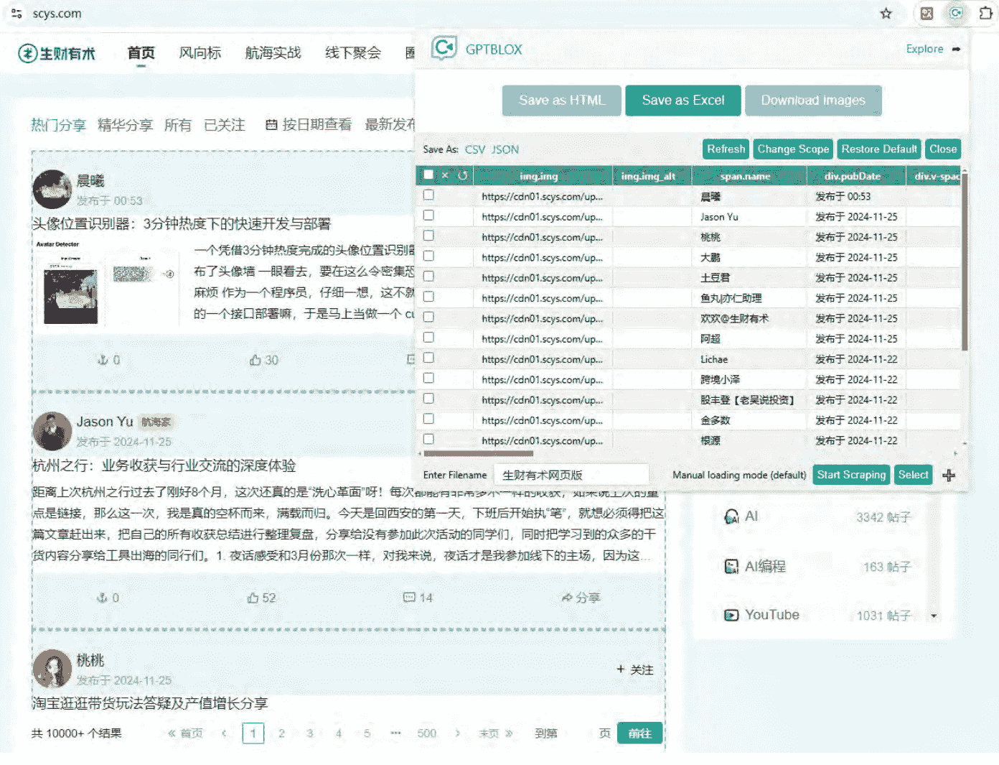

公众号懒人搜索，懒人专属群分享

## Black Myth: Wukong

Chat for Black Myth Wukong

Chat with Sun Wukong

BUY NOW

## Black Myth

## Discover Black Myth with Our Comprehensive Guide

Black Myth: Wukong is an action RPG developed by Game Science, inspired by the legendary Chinese novel Journey to the West. Since its global release on August 20, 2024, the game has taken the gaming world by storm, quickly becoming one of the most-played single-player titles on Steam. Praised for its stunning visuals, rich cultural backdrop, and top-notch combat mechanics, Black Myth: Wukong has earned overwhelmingly positive reviews from players.

Set in a vast and mythological world, players take on the role of Sun Wukong, embarking on an epic adventure filled with hundreds of unique enemies and monumental boss battles. Every encounter challenges both skill and strategy, immersing players in a deeply engaging experience.

Our Black Myth offers a comprehensive look into the game's intricate world. Whether you're searching for tips on mastering its complex combat system, looking to uncover hidden secrets, or eager to dive into the rich lore behind Black Myth: Wukong, we have everything you need to enhance your gameplay.

More Guide

## PC Specifications

- Minimum System Requirements
  • Operating System: Windows 10 64-bit
  • Processor: Intel Core i5-8400 or AMD Ryzen 5 1600
  • Memory: 16 GB RAM
  • Graphics Card: NVIDIA GeForce GTX 1060 (6GB) or AMD Radeon RX 580 (8GB)
  • DirectX: Version 12
  • Storage: 130 GB available space

- Recommended System Requirements
  • Operating System: Windows 10 64-bit or newer
  • Processor: Intel Core i7-9700 or AMD Ryzen 5 5500
  • Memory: 16 GB RAM
  • Graphics Card: NVIDIA GeForce RTX 2060, AMD Radeon RX 5700 XT, or Intel Arc A750
  • DirectX: Version 12
  • Storage: 130 GB SSD for optimal performance

## Discussion Forum

- Twitter
- Reddit
- Steam Community
- IGN Review

## Custom Products

More Products

- Wukong Collector
- Wukong Collectible Figure
- Wukong Weapon
- Wall Art Poster
- Graphic T-Shirt
- Mini Skirt
- iPhone Skin
- Art Print

## Official Medias

#### 评论区：

小花：大佬[强]

多爸：大佬[强] 学习了

希行：感谢分享

No. 79 / 218

### (36赞)30天 收入 13 万，AI出海新机会，3D仿真动漫视频玩法攻略

作者：高鹏圈

日期：2024-11-26

大家好，我是高鹏。

今天继续分享一个热门玩法。

用AI做逼真的3D动漫，比如下面这个油管的号就凭借发这种动漫图片，看上去很简单的操作，但是一个月能搞六位数。


有的小伙伴可能比较疑惑了，这种动漫图不是满大街都是吗？能做起来就是运气好而已。

我研究了一下，还真不是。

仔细看他的作品，会发现他发的作品都是知名度比较高的动漫ip的形象，图片很像真人的效果，但是看上去又不是cosplay。


这种图与下面的普通cosplay的图，或者手办图片有很大的区别，当然更不是像原著里边纯动漫的图片。


这种号商业化模式也很简单。

第一个就是做出海的流量效益，比如上面那个就是油管的号，我们都知道油管的效益还是比较高的。

第二种就是做国内的动漫图片，参加一些平台的分成计划等等。

第三个就是可以手办带货，带一些手办的商品。

今天给大家详细的拆解这种AI逼真3D动漫的图片是怎么做出来的。

首先就是要得到AI绘画的描述词，我给到AI的第一个指令是这样的，就是由三大板块组成。

第一个是任务，我说：我要用AI绘画软件，制作一张火影忍者里边谁谁谁的图，现在需要绘画的描述词。

接下来是素材，我会提供一张这个人的图，请你详细分析这张图。

最后是要求，请你详细分析这张图，给出我直接可以做图的描述词。

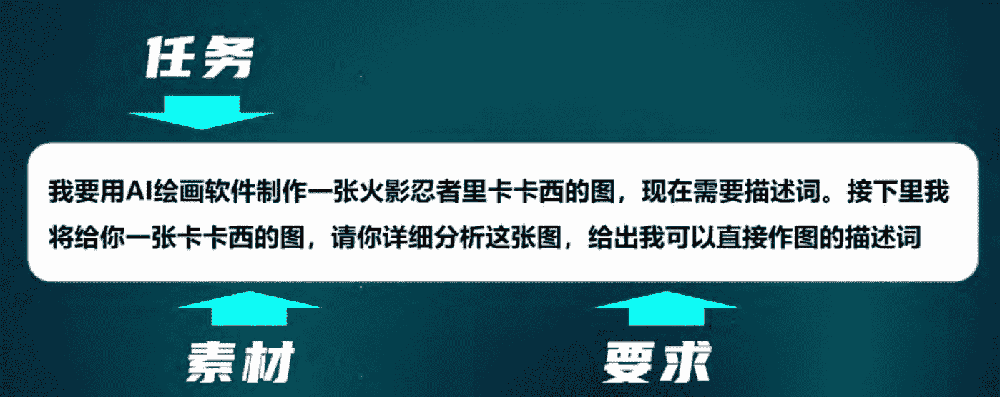

投喂给AI之后，AI说：当然可以，请你上传这张图。

然后我就把这张图上传上去了。

接下来它就给了很多这个图片的特征的描述，比如说他的发型是什么样的，头戴、眼睛、面部服饰等等。

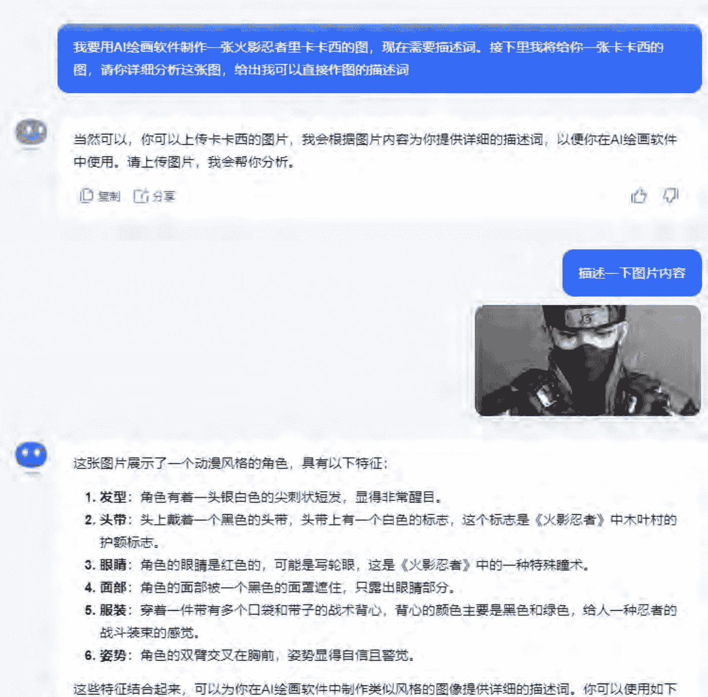

但是它虽然把每个部分都给出了描述，而实际上作为AI绘画提示词，我们要的是一大段，不会这样去区分。

所以我继续给了AI一个指令，这个指令有两个部分组成。

第一部分就是我告诉AI任务，请将特征总结词句融入一整段文字。比如说发型，一头银白色尖刺状短发改成一头银白色尖刺短发的发型。

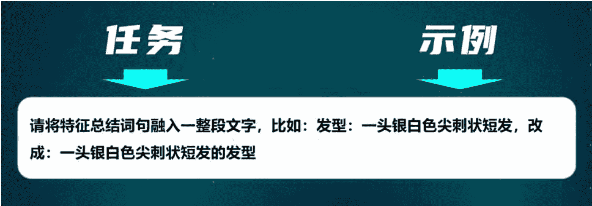

我给它这样一个改写的示例，然后AI就把原来分开的各个部分的描述，给汇总成了一整段，这样一整段就可以作为绘画的描述词了。

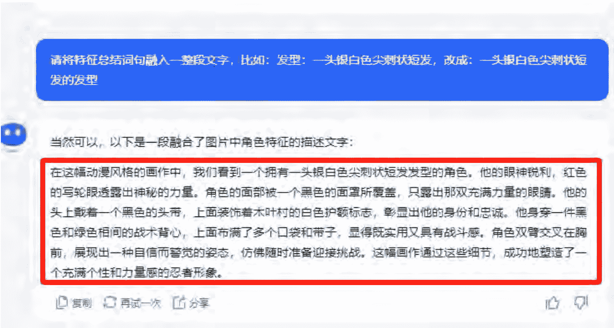

接下来就是利用AI，根据刚才的文字生成图片。

用到的还是Recraft的这款工具，在刚刚过去的一周被评为综合能力比MJ和SD还要厉害的一款AI的工具。

把刚才得到的提示词粘贴到左边这个框里面，直接点生成，它就会生成两个很接近真实效果的形象。

这个指令要注意一下，在输入这个提示词之后，后边一定要加一个“要真实风格，不要卡通风格”这样的话，这样才能生成看上去很逼近的真人效果的图片。

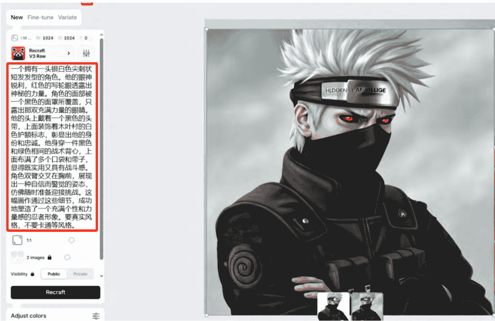

接下来就是第三步，让这张图片动起来，有3D的感觉。

用到的就是LeiaPix这个工具，来到它首页，点左上角有个Upload，也就是上传图片的意思，点一下这个按钮，然后接下来按提示上传刚才得到的这张图片。

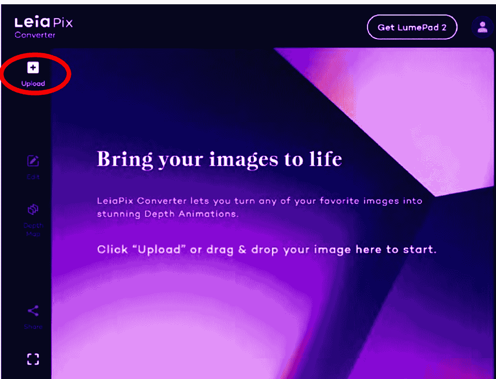

然后在图片的右侧会出现一些选项，选择第二个，就是让图片横向水平地旋转，实现3D化的感觉。

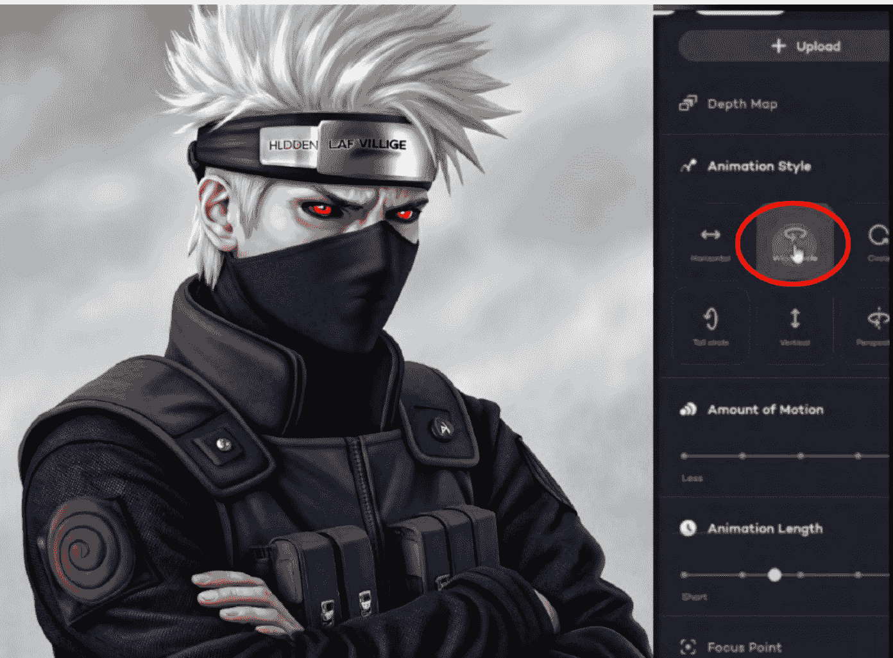

这样的话这张图片就有了3D来回旋转的感觉，把它导出备用。

最后一步就比较简单了，就是剪辑成片。

我们把一个一个的人物形象导入到剪映里，然后添加转场，多个片段进行拼合。最后添加一个BGM，就是这个动漫当年经典的BGM添加进去，视频就制作完成了。

## 公众号懒人搜索，懒人专属群分享


好，今天的分享就到这里了。总的来说并不复杂，只不过这里边涉及到很多工具，还有它的使用的一些细节。

关于刚才提到的AI绘画描述词生成的提示词，以及AI绘画的工具，图片转3D的工具，统一放到文档里了：

https://svj4gxvm0v3.feishu.cn/docx/BJndmajNoMnr6xAMHKcV4m8nVh?from=from_copylink

我是高鹏，深耕网创9年，这是我拆解的第694个落地项目玩法，更多项目玩法，欢迎找我聊聊呀~

评论区：
- 白也：请问案例账号叫什么？
- 毛豆：我也想问，这截图都截了，还把账号名隐藏了[憨笑]

### (精华帖)(60赞)不懂设计也能轻松制作海报的AI工具指南

作者：廖望
日期：2024-11-29

对于不懂设计的人，做海报是真头疼。不具备审美，做出来的海报更是在审美之下。但是又不得不做。自媒体引流、社群招新、课程发布都需要用得上。

文档内有详细的制作步骤：

https://gg3338qf45y.feishu.cn/wiki/EXqGwrlNi1tLkkLQiTcdCgZn0d?from=from_copylink


评论区：
- 亦仁：用ai做海报，这块可以重点挖掘挖掘，有很多需求，可以再研究研究，看怎么让ai做海报升级到2.0，3.0，4.0。
- 伯言：ai相关的ppt能做海报吗
- 廖望：[社会社会]多谢亦仁指点
- 廖望：就我了解的AI PPT来说，模板都相对固定，用来做海报可能不太合适。
- 简单：稿定设计里面有很多模板，也可以直接套用，请教亦仁能否展开说说（用ai做海报，这块可以重点挖掘挖掘，有很多需求，）
- 简单：海报更多是个性化定制，AI的优点是快速响应，批量生成。能否在展开说说挖掘需求

### (33赞)闲鱼消息提醒插件编写教程

作者：骄阳
日期：2024-11-27

大家好，我是骄阳，于是编写了一个闲鱼信息提醒插件，把编写的过程写下来分享给大家。
Just Enjoy[转圈] 详情请查阅飞书文档：
https://w63nbfedzw.feishu.cn/docx/HN2Md8wzaomnG0xf71tcdbyYnTf?from=from_copylink

评论区：
- 百哥：老哥真是行动派和实力派
- 百哥：这里有一个精华帖
- 骄阳：[呲牙]比较简单，也有这个需求，刚好有空就做了
- 葫芦侠老刘：大神给力！昨天我还在困扰呢，不过比特浏览器无法用你这个[流泪]
- 骄阳：比特浏览器是Chrome内核，可以加载插件啊，是安装了没法用吗？
- 骄阳：比特浏览器的方法已更新到文档。
- 葫芦侠老刘：谢谢，真乃行动派！！
- 葫芦侠老刘：哈哈给力，搞定，有声音了

### (35赞)利用AI工具copycoder + bolt 三句话复制想要复制的网站.

作者：路过蜻蜓
日期：2024-11-27

大家好，我是路过蜻蜓，一个喜欢潜水在生财偷偷学习的小透明。

在生财潜水很久了。在朋友的鼓励下，今天打算自己也来分享一下。

刚好亦仁也发布了关于AI超级标。

少说话，直接上实操

```
https://efhb85rrm7.feishu.cn/docx/PSIOdJ2HCoyjIzxv9GOcIz9Hnhb
```

#项目实操# #生财技能# #AI编程# #Youtube#

评论区：
- 多爸：新大陆啊，报名了 cursor 航海，想仿写一些网站，正愁提示词怎么写~[强]
- 路过蜻蜓：可以直接发url给cursor 让学习写。
- 平子：哇，开眼界了。一套组合拳下来，直接生成新网站
- 平子：想提个疑问，就是比如已经生成了首页，然后其他的页面是怎么关联生成？
- 路过蜻蜓：比如在参考首页的UI 等设计的情况下，帮我生成个定价页面。一般AI会自动关联的。如何关联不成功，直接让他关联一下。

### (38赞)AI原创影视解说新玩法，1条视频100万播放，保姆教程来了

作者：高鹏圈
日期：2024-11-28

大家好，我是高鹏。

今天继续分享一个热门玩法。

借助AI做经典影视剧的二创，比如这条作品跑出了非常高的播放量。


因为我们知道传统的影视解说，现在是比较卷的。

但是像这种基于经典的影视剧，借助AI生成的二创作品，看上去新奇有趣。尤其是像四大名著这样的IP自带流量，目前做的人还不多。


今天就给大家详细的拆解，怎么样借助AI来做这种经典影视剧的二创，也算是一种最新形式的借助AI的影视解说作品了。

首先我们要做二创，不是把原剧进行解说，跟我们原来做影视解说的思路完全不同，我们的整体思路就是用原剧里的IP重新创作一个故事出来。

所以需要解决创作灵感的问题，这个就要借助AI了，我们这儿用到的是豆包，指令由三个部分组成。

首先是我告诉AI我的目标是什么，我想做一个60秒的AI小短片。

然后告诉他主题，是关于贾宝玉和林黛玉之间的爱恨情仇故事。

接下来是要求古代的场景，跳出原著，请你帮我想一点情节和对话。

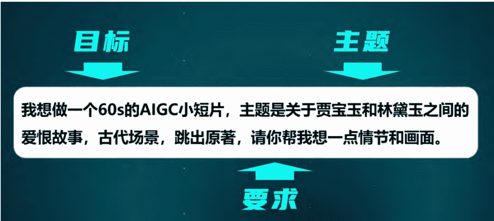

然后AI就生成了对应的镜头，以及每个镜头对应的时长，还有每个镜头描述的情节是什么样的，画面是什么样的，功能还是非常强大的。

> 我想做一个60s的AIGC小短片，主题是关于贾宝玉和林黛玉之间的爱恨故事，古代场景，跳出原著，请你帮我想一点情节和画面。

以下是一个60s的AIGC小短片关于贾宝玉和林黛玉跳出原著的爱恨故事情节及画面构思，你可以根据实际需求进行创作调整：

- 镜头1：初遇惊鸿
  - 时长：0:00-0:08
  - 情节：繁华的古代集市上，人来人往，热闹非凡。贾宝玉身着华丽锦袍，手持一把折扇，风度翩翩地在集市闲逛。突然，一阵风吹过，街边楼上的轻纱帘子被掀起，露出了林黛玉娇美的面容，她正凭栏而望，眼神中透着一丝忧郁与灵动。贾宝玉瞬间被吸引，仰头凝视，四目相对，时间仿佛凝固。
  - 画面：全景展示热闹的集市，人群熙熙攘攘，各种摊位琳琅满目。镜头聚焦到贾宝玉身上，他的服饰细节清晰可见，随后随着风的吹动，镜头缓缓上移到楼上的林黛玉，特写她的面容和眼神，最后再回到两人对视的画面。

- 镜头2：花园邂逅
  - 时长：0:08-0:18
  - 情节：贾府的花园中，繁花似锦，绿树成荫。贾宝玉在花园中踱步，似在寻觅着什么。忽然，听到一阵轻柔的吟诗声，顺着声音走去，发现林黛玉正坐在花丛中的石凳上，手持书卷，轻声吟诵着自己新写的诗词。贾宝玉悄悄走近，在她身后倾听，待她念完，不禁拍手称赞，林黛玉回头，面露娇羞又带着些许惊喜。
  - 画面：先以远景展示美丽的花园全貌，然后镜头跟随贾宝玉的脚步移动，切换到中景展现林黛玉吟诗的姿态，最后特写两人的表情互动。

- 镜头3：误会生隙
  - 时长：0:18-0:28
  - 情节：贾府举办宴会，众多宾客云集。贾宝玉被其族子弟拉着寒暄应酬，期间有一位富家千金对贾宝

第二步就是要得到分镜的对话和配音，因为我们视频里会用到贾宝玉和林黛玉他们之间的人物对话。

所以在原来的指令的基础上，再继续给他指令，说：不错，那每个镜头请再补充一些人物的对话。

这样的话他把刚才的每一个镜头后边都加上了一组人物的对话。

比如说第一个初遇惊鸿，贾宝玉说这世间竟有如此脱俗之人，仿若仙子下凡。林黛玉就很害羞的说，哪来的登徒子这般直勾勾的瞧人。

公众号懒人搜索, 懒人专属群分享

> 不错, 每个镜头再补充一些人物对话

以下是在每个镜头基础上补充了人物对话的内容, 以便让这个关于贾宝玉和林黛玉的 AIGC 小短片更加生动丰富:

#### 镜头1：初遇惊鸿

- 时长：0:00-0:08
- 情节：繁华的古代集市上, 人来人往, 热闹非凡。贾宝玉身着华丽锦袍, 手持一把折扇, 风度翩翩地在集市闲逛。突然, 一阵风吹过, 街边楼上的轻纱帘子被掀起, 露出了林黛玉娇美的面容, 她正凭栏而望, 眼神中透着一丝忧郁与灵动。贾宝玉瞬间被吸引, 仰头凝视, 四目相对, 时间仿佛凝固。
- 人物对话:
  - 贾宝玉(惊讶又欣喜, 喃喃自语): “这世间竟有如此脱俗之人, 仿若仙子下凡。
  - 林黛玉(微微一怔, 面露羞涩, 轻声嗔道): “哪来的登徒子, 这般直勾勾地瞧人。”

#### 镜头2：花园邂逅

- 时长：0:08-0:18
- 情节：贾府的花园中, 繁花似锦, 绿树成荫。贾宝玉在花园中踱步, 似在寻觅着什么。忽然, 听到一阵轻柔的吟诗声, 顺着声音走去, 发现林黛玉正坐在花丛中的石凳上, 手持书卷, 轻声吟诵着自己新写的诗词。贾宝玉悄悄走近, 在她身后倾听, 待她念完, 不禁拍手称赞, 林黛玉回头, 面露娇羞又带着些许惊喜。
- 人物对话:
  - 贾宝玉(轻拍手掌, 满脸笑意): “林妹妹这诗词吟得绝妙, 真真是才情过人呐!”
  - 林黛玉(脸颊泛红, 起身行礼): “哟, 原是宝哥哥, 这般悄无声息地过来, 倒是吓了我一跳。我不过是随心而发, 哪有哥哥说的那般好。”
  - 贾宝玉(赶忙上前扶住林黛玉): “林妹妹莫要 你这词句清新雅致, 我听着欢喜得很呢。”


这个对话有了之后, 用之前我给大家分享的AI配音工具, 把这个对话配音, 后边视频剪辑的时候会用到。

接下来第三步就是用AI来文字生成图片。

首先要做的工作就是得到每一个分镜头所对应的AI绘画的提示词。

我继续用刚才的AI, 我说继续根据每个镜头的情节部分转换成一段SD的提示词。

公众号懒人搜索，懒人专属群分享

继续根据每个镜头的情节部分，转换成一段SDXL提示词

以下是根据每个镜头情节转换生成的SDXL提示词，你可以根据实际需求在AI绘画工具中进行调整和生成画面：

#### 镜头1：初遇惊鸿

繁华古代集市场景，人来人往，热闹非凡，各种摊位摆放着琳琅满目的商品，有卖绸缎的、卖小吃的、卖古玩的等等。阳光明媚，洒在街道上。街边是古色古香的楼阁，楼阁的栏杆和门窗有着精美的雕花。贾宝玉身着华丽的锦袍，锦袍以红色为主色调，上面绣着金色的云纹图案，领口和袖口镶着白色的狐毛。他手持一把折扇，折扇上画着山水墨画。他风度翩翩地在集市中闲逛，脸上带着好奇与闲适的神情。此时，一阵风吹过，街边楼上的轻纱帘子被掀起，露出了林黛玉娇美的面容。林黛玉身着淡蓝色的罗裙，裙边绣着精致的粉色花朵图案，外披一件白色的轻纱披风。她的头发梳成发髻，插着几支简单而雅致的玉簪。她正凭栏而望，眼神中透着一丝忧郁与灵动，目光似乎在追寻着什么又透着淡淡的哀愁。贾宝玉瞬间被吸引，仰头凝视，四目相对，时间仿佛凝固，两人的眼中都透着惊讶与一丝别样的情愫。

提示词：

Ancient bustling market scene with people coming and going, extremely lively. Various stalls are filled with a dazzling array of goods, such as silk, snacks, antiques, etc. The sun is shining brightly on the street. There are antique pavilions along the street, with exquisitely carved railings and doors and windows. Jia Baoyu is dressed in a magnificent brocade robe, mainly in red, embroidered with golden cloud patterns, and the collar and cuffs are lined with white fox fur. He holds a folding fan with a landscape ink painting on it. He strolls casually in the market with a curious and carefree expression. At this moment, a gust of wind blows, lifting the light gauze curtain upstairs on the street side, revealing the delicate and beautiful face of Lin Daiyu. Lin Daiyu is wearing a light blue silk skirt, with delicate pink flower patterns embroidered on the hem, and an outer layer of white gauze cloak. Her hair is combed into a bun, with several simple and elegant jade hairpins inserted. She is leaning on the railing, looking out, with a hint of melancholy and liveliness in her eyes, as if searching for something and also exuding a faint sadness. Jia Baoyu is instantly attracted, looking up and staring, their eyes meeting, time seeming to stand still, and both of their eyes showing surprise and a hint of special affection.

它就把每个镜头对应的提示词都整理出来了，而且把它写成了可以直接投喂给SD的英文提示词。

这些提示词看上去都比较长，大家做一些筛选，把重要的导演视角的动作场景以及描述人物之间的互动，他们的姿势服饰等等，这些关键的信息保留下来。

接下来我们要用到ComfyUI，文生图的一个工作流。

这个我不太建议大家在本地直接用自己的电脑做，因为它对配置要求非常高，我们可以借助云端。

打开它首页之后，找到这个ComfyUI的选项，我们点进去。

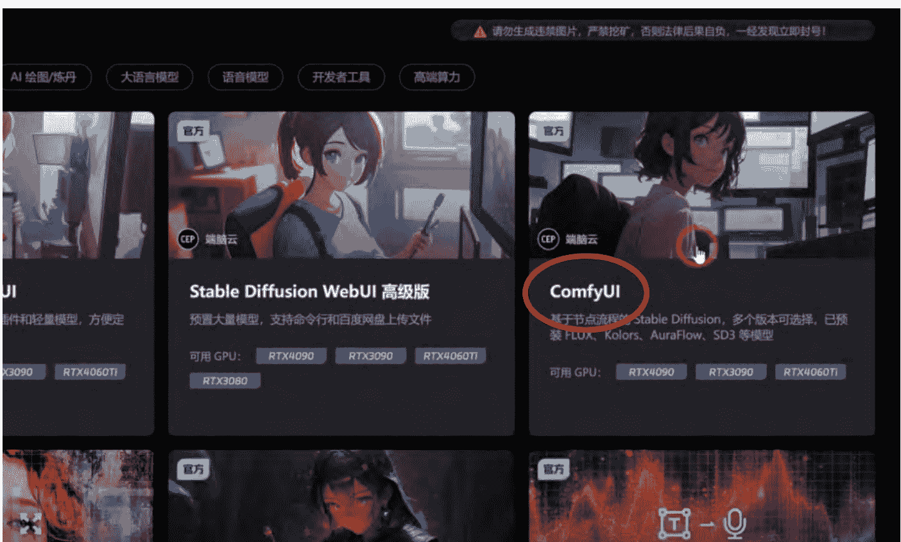

这个地方，我们直接用它的轻量版就ok了，没必要用高级版。

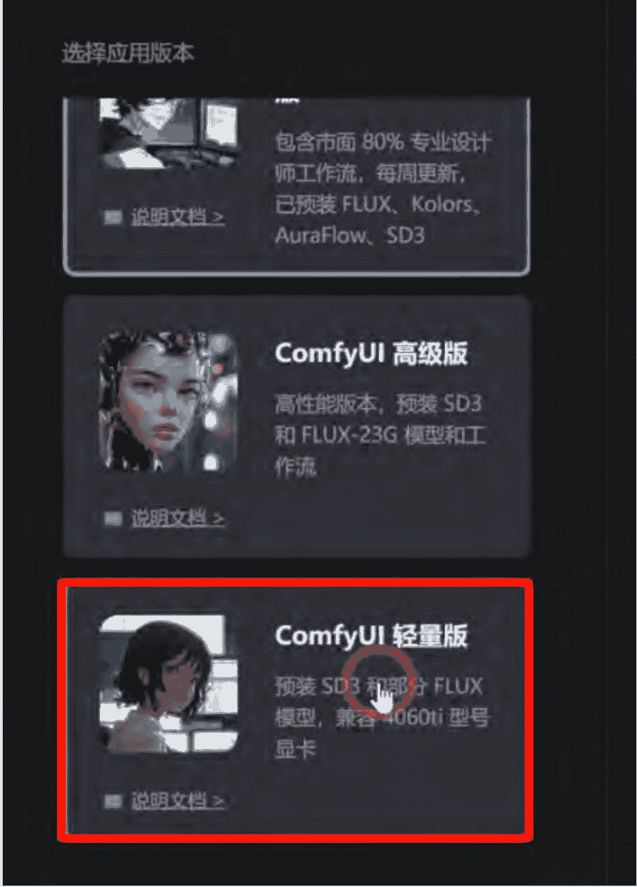

然后在弹出的页面里边选择文件夹，然后选择models，接下来在下一级文件夹里边选择Lora。

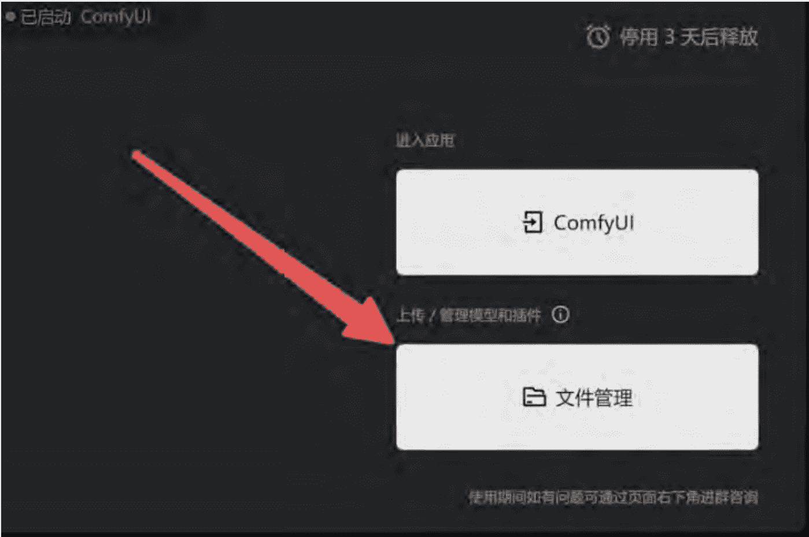


然后一步步上传我给大家准备好的这个LoRA的模型。

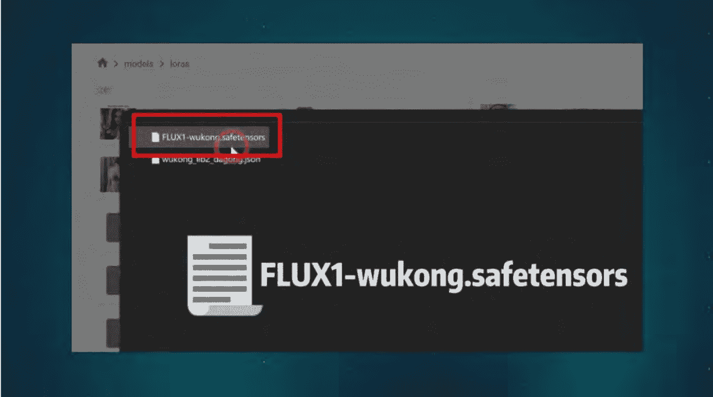

然后回到这个页面，再点击这个ComfyUI。

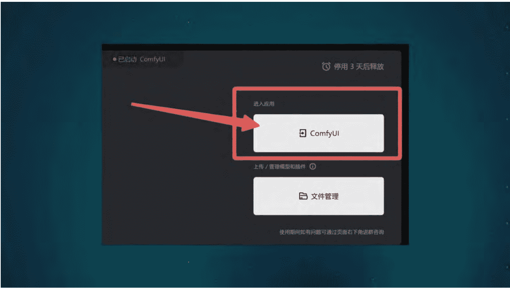

进去之后，在左上角会看到一个Import，导入工作流的选项，我们选择第一个。

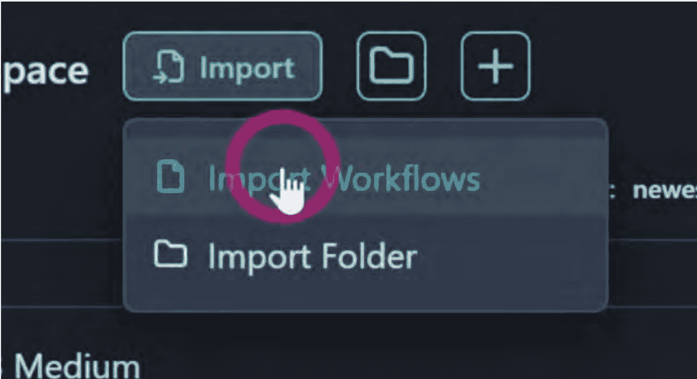

接下来按照提示把我给大家准备好的这款工作流直接上传上去。

上传之后，打开这个工作流，你会发现可能看上去比较复杂，但实际上我们需要改的地方就两个。

一个就是这个LoRA的加载器，选择刚才上传好的这个LoRA模型。

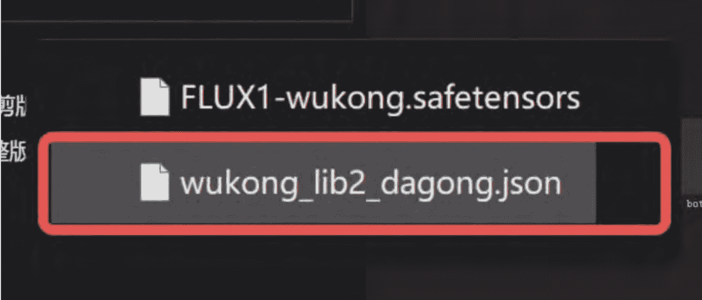

第二个就是工作流的加载器，加载一下我们刚才上传好的这个工作流，就这两步。

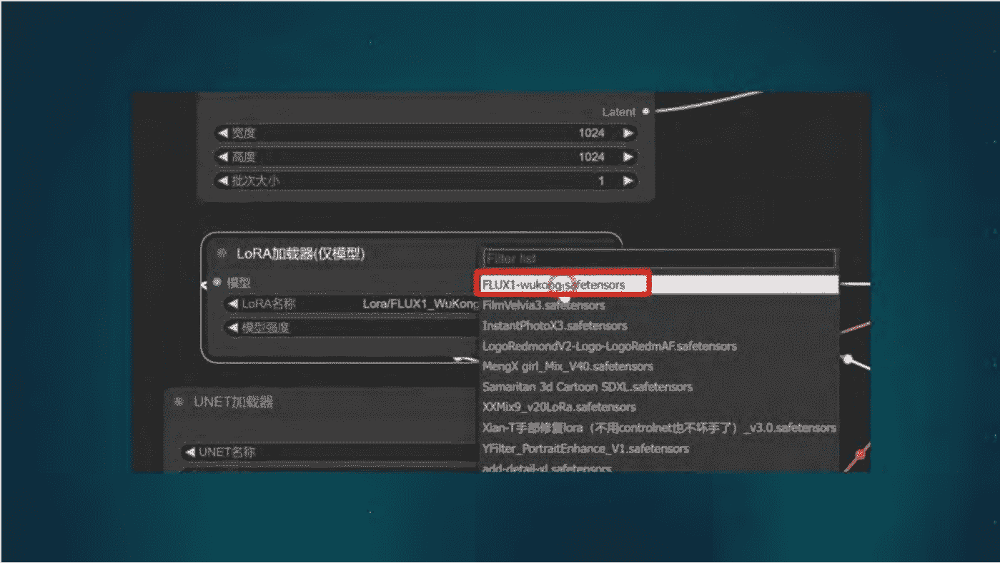

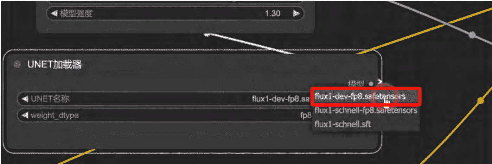

接着把我们上一步得到的分场景的提示词，粘贴到文本编辑器里，然后点右侧的添加提示词队列，这样它就生成了对应的图片。

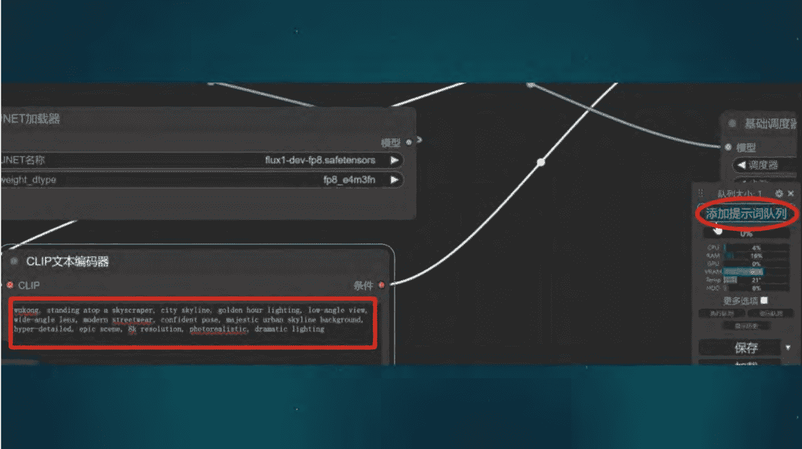


接下来就是要把图片转成视频了，在这儿我用到的工具呢是Runway，当然大家也可以用可灵、即梦等等，把静态的图片变成动态的视频。


有了分镜头的视频之后，接着就是剪辑成片了。

把刚才得到的每一组镜头的视频画面，还有对话的配音同步导入到剪映里，添加一些转场特效，再加一些音效，还有背景音乐，视频就制作完成了。

## 公众号懒人搜索，懒人专属群分享


这种号做起来之后，商业化模式也有很多。最常见的就是吃流量的收益，参加一些分成计划。

再就是可以去接一些商单广告，现在AI相关的广告还是比较多的。

好，今天的分享就到这里了。

关于刚才提到的云端的ComfyUI以及它的各大工作流，还有LoRA模型，统一放到文档里了：https://svj4gxvm0v3.feishu.cn/docx/Q3CjdOaSuo2DOgx4rMjcvGpkn5f?from=from_copylink

我是高鹏，深耕网创9年，这是我拆解的第696个落地项目玩法，更多项目玩法，欢迎找我聊聊呀~

#### 评论区：
- 燕子：手把手喂饭，谢谢
- 弃天：照着大佬的方式一步步实操了下，结果出图的人物全是黑神话悟空的脑壳~~

### (26赞) AI音乐视频制作：从油管网站失败到新尝试
**作者**：黛比
**日期**：2024-11-26

【一心三用】发布AI音乐视频，继0基础制作油管网站失败后当晚的尝试。由于昨天（25号），被制作“YouTube下载器”的尝试整得晕头转向。新人小白不甘心一进生财就碰壁放弃、失去信心，看到发布的精华帖，所以赶紧在当晚启动了AI音乐。（2024年11月21日注册）

目前属于刚注册的原因，可能还搜不到名称；球友们感兴趣可以搜索账号，一起见证项目落地！篇幅有限，详见飞书：项目原作者：

原文已在飞书中引用，感谢！ https://phe2w1qbel.feishu.cn/docx/H7qtdpRzyoapupxaNKFclSFInYg?from=from_copylink

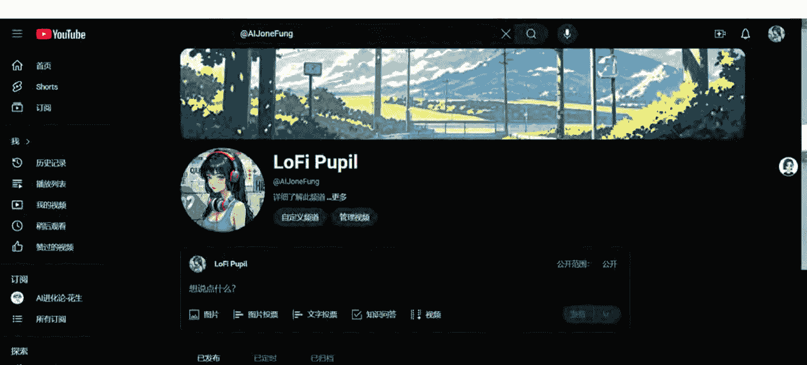

#### 评论区：
- 老彭：哈哈哈刚开始尝试，真的很消耗心力，特别容易被这些工具整得无数次想放弃。。。
- 星星✨：能发现这么多实用工具太棒啦~(｡･ω･｡)~
- 星星✨：黛比真是行动派😤哈哈🤷‍♀️
- 龙：原来豆包作图这么好用，我也试试！
- 黛比：目前豆包AI的中文理解是很透彻的~
- 黛比：感谢引路人哈哈哈哈（真诚
- 老彭：MJ的图质量是真的高很多，要不说这个平台有门槛（也是模仿的同个对标）

### (26赞) 安装Cursor时我踩的坑：系统版本与参数错误详解
**作者**：石头
**日期**：2024-11-28

刚加入生财的小白，参加了Cursor的航海，在安装Cursor时遇到了一些坑，为此还新买了一个电脑😂。看到大家分享都用飞书文档，也尝试写了下[呲牙]

详见：https://kcnw69vrcnma.feishu.cn/wiki/GEU4wTkRoiDoROksWfNcwByQnYe

#### 评论区：
暂无评论

### (20赞) 技术节省小绿书运营时间：搬运小红书图片的探讨
**作者**：陈序员大康
**日期**：2024-11-29

小绿书带货还是火啊，不过几家欢乐几家愁。有人赚到钱，有人说一点阅读量都没有。不过！今天，咱不谈如何做小绿书，这个交给运营的高手。

我一个技术，就只研究如何用技术节省搞小绿书的时间。

前段时间，有看到有人说可以直接搬运小红书的內容到小绿书，我之前有做过搬运小红书到小绿书的，但是为了原创，我是完全改写的，图片有的时候不适配，限定太多，很多改出来不能用。后来，有人说其实可以直接搬运小红书的图片，做个MD5值的修改和一些二创，然后发布，目前不会有问题。那这就简单了，弄个工作流搬运小红书，那不是完全没有内容焦虑了？

那么今天我就把如何从分析到搭建完整分享出来。在开始之前，虽然是小白级教程，但首先还是确保你知道Coze，并大概知道工作流是个啥。如果不知道，得先去了解一下Coze。

#### 一、流程分析

经过分析，我们需要完成：输入链接 ➡️ 工作流提取原文内容 ➡️ 对文案部分进行改写 ➡️ 对图片部分进行伪原创 ➡️ 最后输出。流程图如下：

跳转阅读体验更佳：
https://b121w2zgwvx.feishu.cn/docx/KmYCdqalbouQ3txtC2zcDGOMnEh

### (21赞) 3分钟1条AI幽灵娘视频，日吸粉1000+，短视频爆粉新玩法！
**作者**：大鹏
**日期**：2024-11-25

大家好，我是大鹏。

今天给大家分享一个有意思的赛道——AI幽灵娘视频。跟之前的美女号玩法差不多，涨粉都非常快！

下面这个账号最近才开始发这种视频，条条爆款，都是几千几万的点赞，涨粉也嘎嘎猛！


像做这种视频，变现方式相对来说比较简单：可以涨粉卖号，也可以等账号粉丝涨起来之后换赛道带货，或者是把“老色胚”引流私域变现都是可以的。主要是这种视频做起来简直不要太简单！

那么具体是怎么做的呢？废话不多说，我们直接上实操。

#### 第一步：生成AI图片

打开哩布哩布AI平台，网址：https://www.liblib.art/。在主页搜索关键词“幽灵娘”，可以看到里面有很多现成的模型，可以直接拿来用。

挑选你喜欢的模型，点击进去。

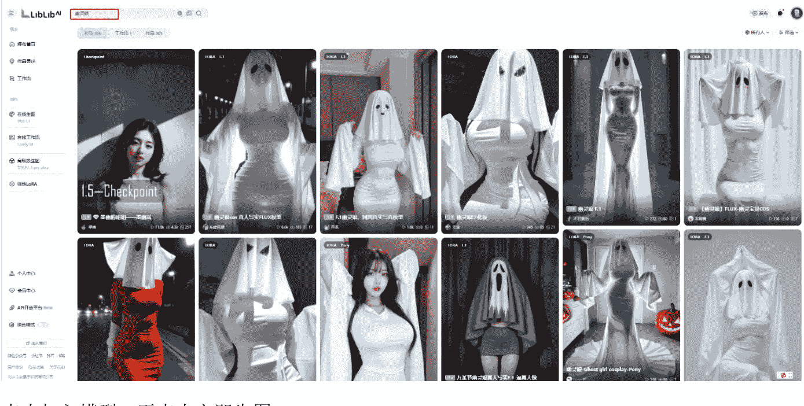

点击加入模型，再点击立即生图。

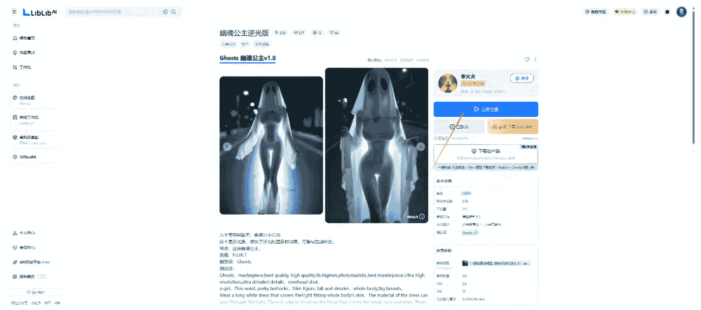

进入生成页面之后，可以先在下方调整一下生成图片的尺寸。然后把提示词粘贴进来，最后点击生成，耐心等待几分钟，生成好之后下载到本地备用。

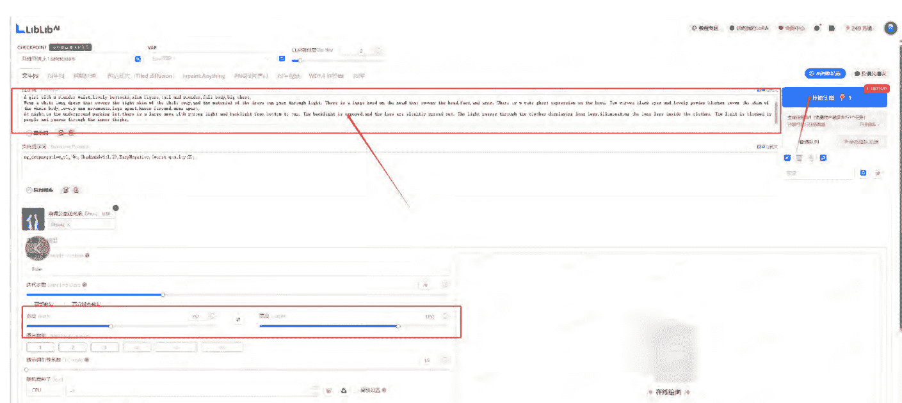

#### 第二步：图片转视频

打开即梦AI，网址：https://jimeng.jianying.com/ai-tool/home。选择图片生成视频功能，把刚才生成的图片导入进去，下面写一句话描述，比如：“让图片中的美女舞动起来”。最后点击生成，耐心等待视频生成即可。生成完成后点击下载保存到本地。

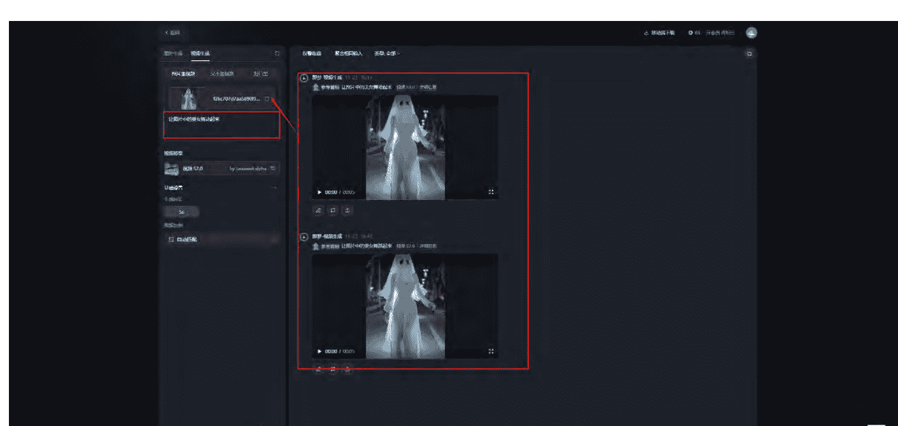

#### 第三步：剪辑合成

打开剪映，导入生成的视频片段，找一首音乐添加进来。然后开头加点特效和动画就可以导出发布了~

## 公众号懒人搜索，懒人专属群分享


以上就是这个AI幽灵娘玩法的全流程了。总的来说玩法比较简单，比较适合新手操作，比较容易拿结果。

操作过程中需要用的提示词我整理了个文档，有需要的自行下载：

链接：https://pan.quark.cn/s/f284005895d9

我是大鹏，深耕网创多年，更多项目玩法，欢迎找我聊聊呀~

#### 评论区：
暂无评论

### (18赞) 如何在10分钟内运行土豆君的代码找到自己的头像
**作者**：林幻雨
**日期**：2024-11-26

大家好，我是林幻雨。

昨天一直在忙没有顾上找头像，今天早上第一件事先看看圈友土豆君的帖子。我发现群里面还有部分圈友不太会使用土豆君的代码，于是简单做一个小小的教程。

活动本身链接是：https://t.zsxq.com/QrzhX
土豆君帖子链接是：https://t.zsxq.com/pUGYs

接下来正式开始。使用的软件是Cursor。接下来请移步飞书：https://ba9gvofzgow.feishu.cn/docx/E78Wdhxy5oGGGWx4w8xcmv9On3e?from=from_copylink

#### 评论区：
- Crazy、倾听：万物可代码[捂脸]找的眼废了
- 林幻雨：小白也能掌握的AI编程你值得拥有[得意]
- Crazy、倾听：看了好几个AI的帖子，属实看不懂[破涕为笑]老了，跟不上
- 林幻雨：阿紫的那个帖子很详细，可以试一下
- Crazy、倾听：好的[抱拳]晚上抽空看看，现在搬砖中

### (12赞) 如何用AI制定可执行的航海计划
**作者**：陈旭
**日期**：2024-11-25

生财技能-如何用AI获得可执行的航海计划

前2天我在航海项目中通过AI帮我选出了2个适合我的航海。其实方法很简单，我选择的航海一个是AI写作，一个是闲鱼虚拟资料，我觉得也比较符合自己。但是我看了航海路线图了解这两个航海的基本路线，但我觉得还是要先行动起来，等下个月航海开始后，能有明确的方向和目标。

要想知道这2个航海到底怎么做、做哪一类，还需要更加深度的思考和分析。于是我这2天与AI深度沟通后，让我找到了清晰可执行的这2个航海项目路线，希望对和我一样对航海比较模糊、没有目标和计划的船员们有帮助。

由于篇幅过长请跳转至飞书文档详细查看：
https://bcrnswxww2.feishu.cn/docx/Sl4adZn4GoKr5VxU1fgckYM5npf?from=from_copylink

#### 评论区：
- 东兴：你好，链接看不了呢
- 陈旭：稍等一下，我修改一下
- 陈旭：没设置好，现在可以看了。
- 七天@生财有术：作为一个Ai小白竟然感觉还挺有用!
- 亦仁：我想到了一个很好的适合你的定位，等你进传术师群之后告诉你
- 陈旭：好的，老大

### (9赞) 科技类公众号运营：AI助力提升效率与内容创作
**作者**：柒。
**日期**：2024-11-26

大家好，我是柒。（也可以叫我晓智），炼丹家AI工具创始人，专注AI写作、绘画，经营相关用户体量10万+。

科技类公众号现在效益整体有所下滑，但是红利期还没过。可以通过AI把时间成本降下来，矩阵效率提起来。

下面顺着聊聊科技软件公众号运营体系，重点是快速编写软件合集文的详细案例。文章2000字左右，可轻松阅读。如果这篇文章对你有所帮助，点个小赞，感谢支持~

移步飞书：
https://i23vi4cvyf.feishu.cn/docx/PCivd0U5Yo3ZHDxfPBZctADVnSc?from=from_copylink

#### 评论区：
暂无评论

### 【YouTube】5篇
### (73赞) YouTube自动化工具分享：数据采集与批量视频下载
**作者**：龙
**日期**：2024-11-27

【工具分享】用Cursor开发了两个YouTube自动化工具，分享给大家~大家好哇，我是龙~

我用Cursor开发了两个YouTube自动化工具，分享给大家，功能如下：
- YouTube数据采集器：可以用Excel批量导入频道ID/频道URL/用户名，自动采集频道数据及爆款视频数据。
- YouTube批量视频下载器：可以用Excel批量导入视频链接，实现全自动下载。

工具详细使用教程见：YouTube https://e6tnf5bko1.feishu.cn/docx/CInv16Ydoc0Atxe72vcnvG3nre?from=from_copylink

#### 评论区：
- 嘉应岛主：牛～
- 龙：感谢鼓励哈哈哈[让我看看]
- 薇薇：太厉害了👍
- 龙：啊啊啊蟹蟹[爱心]以后更有动力给大家分享了哈哈哈
- 老彭：来了！！！！干货！
- cc：请问这个下载视频的应用，是怎么跳过油管机器人验证的。您开发时，有遇到这个问题吗。现在我都是填了cookie才能下载视频。
- S：他调用了油管的API，算是正规军，你的那个是外面去下载，会触及反爬机制。
- cc：ok，那我也改成这个

### (64赞) YouTube赚钱，我应该做什么？如何选赛道？分享我的观点与看法
**作者**：书情小跟班
**日期**：2024-11-27

有一个圈友，问了我一个不是三言两语能解答的问题，这里就专门写一篇文章好了，她问的问题如下：


关于选赛道，文档没写完，到时候补上，我先回答一些更底层的认知吧：

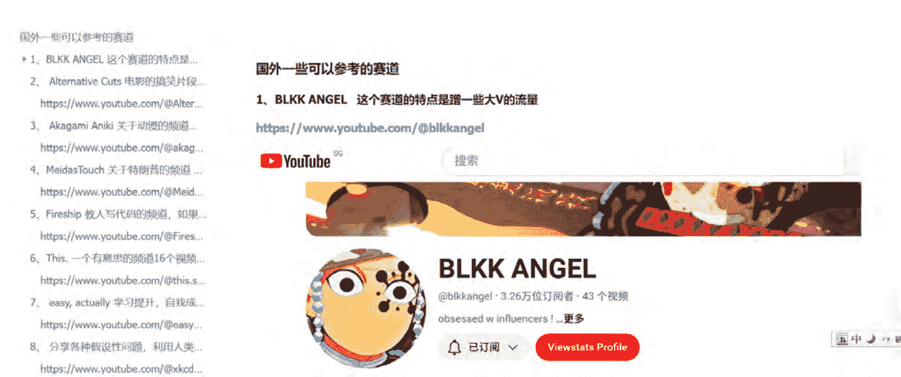

文章接下来围绕下面这张图展开：

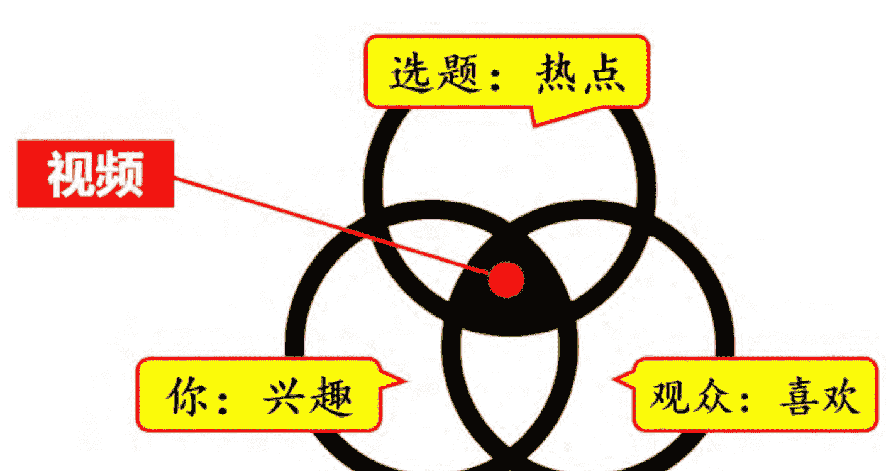

再啰嗦一下，这个帖子她估计没看。你要抄，要靠流量赚钱，先看看别人加入了PYY没有啊？你要搞清楚，你是纯纯的通过流量赚钱，还是你只是在YouTube上引流。

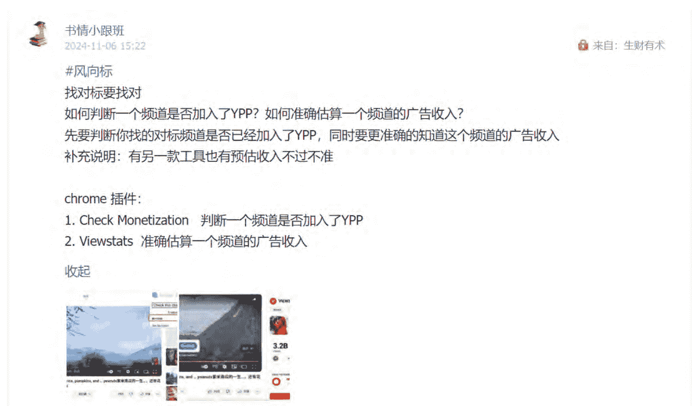

我在点评儿童赛道就有说过：


好了，回到正题，我们看图说话：


#### 自媒体选题指南：三条腿凳子的平衡

所有做自媒体的人应该把上面这样一个图放在脑子里，永远不要忘记，这是你的指南针，它是如此重要。

下面我来给大家讲解一下。这就像一个凳子的三条腿，你可以想象，一个凳子如果只有一条腿是坐不稳的，两条腿就像拄拐杖，三条腿才是稳定的。这三条腿代表你、选题和观众之间的关系，它们要达到一个平衡。也就是说，这三者同样重要。一个凳子三条腿差不多长度，所以用这种形式来表现它们之间的相互关系。

我们首先解决选题的问题。在热点中选题，首先能保证观众对你这期节目的兴趣，基本的播放量就会有所保证，因为这是一个热点。那么什么是热点？大家感兴趣的就是热点。

##### 举一个公司的案例

某知名品牌“某杜”，我还特意进行了打码：

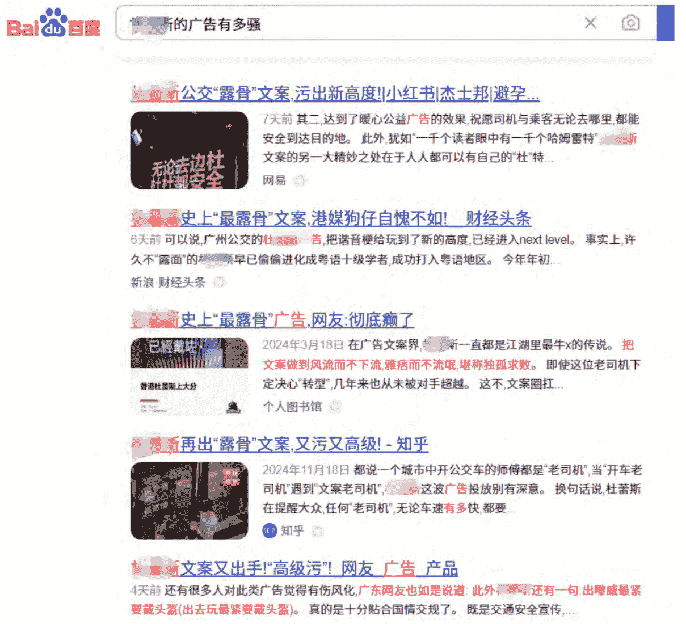

你说“某杜”营销玩得这么溜，在它的领域占有一席之地也是很好理解了吧。还是正经一点吧，下面举一个专业人士的高端操作。

##### 举一个个体的案例

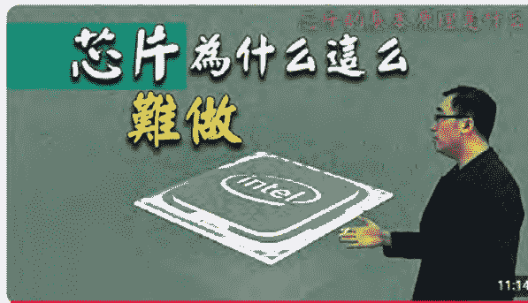

美国禁止中国芯片，卡我们的脖子。你看李永乐老师，他从美国打压中兴这个事件入手，做了一期节目，解释为什么他们可以打压我们，为什么芯片难做。他展示的是专业知识，但他蹭的热点是中美关系的国际博弈。

热点是热点，你是你，你能不能蹭得上，还是得看你自己，你太重要了。整个世界虽然是客观存在的，但我们作为个体来体验这个世界，中心就是你。你可以做任何方向，以任何形式去做。兴趣无比重要。虽然你可以勉强自己抓热点，解决观众的问题，做到一个能养活你或者赚点小钱的频道，但是你会变得不快乐，做得很痛苦，越做越痛苦。一定要做自己感兴趣的东西。如果不知道自己的兴趣，坚决要找到它，哪怕一年、三年、五年才能找到。从你找到兴趣那一刻起，你做的都是兴趣。注意，这个兴趣不是找到后就一辈子干那个事情。你找到时，这个兴趣可能只维持一年，你就认真快乐地干一年。第二年，兴趣转变了，你干别的东西去，没毛病。兴趣解决了，那么持续输出的问题就解决了。

感兴趣的东西要全力以赴去做，全力以赴把它当做一个生意来做。生意要有客户，在YouTube和自媒体世界里就是观众。你要追逐热点，因为观众喜欢，你也应该喜欢。追逐热点不是为了讨好观众，而是因为你对某个专业的兴趣，通过热点看到这个东西和你的专业相关。兴趣解决了，持续输出也没有问题，接下来要考虑的点就是观众。你不能自嗨，自己唱独角戏，眼里没有观众。下面列举眼中有观众的案例与思考：

- 1、真正厉害的诺贝尔物理学家给初中生讲物理，一定比初中的物理老师讲得好。他不会说我要讲的物理只有博士生、博士后才能听得懂。既然你出来做，就必须尊重观众，而不是迎合他们。你得知道观众是谁，比如初中生，我是一个物理学家，我要给初中生讲物理，没有必要摆高级，不要讲得他们听不懂。你要清楚地知道对什么样的观众讲什么样的内容，尽最大努力让你的目标观众听得清楚、明白，还觉得有趣、放松。
- 2、费曼学习法的核心就是把复杂的东西讲到不会的人也能懂。你可以在网上搜搜看，有讲量子物理给5岁小孩、初中生、家庭妇女的多个版本，都可以讲。值得警惕的一个点：我们要做观众喜欢的内容，但如果做不好，就会变成迎合观众，被观众绑架。所以你要坚持自己的兴趣，不要堕落到只是迎合观众或取悦他们的低级趣味。在这个过程中要时时刻刻检讨这三条腿，义正词严、光明正大地蹭热点，坚守你的兴趣和鲜明的个性，坚定的三观。然后，跟谁都能说上话，了解主要观众的心理，把视频的精华内容以他们喜闻乐见的方式呈现。

还是回到这个图：

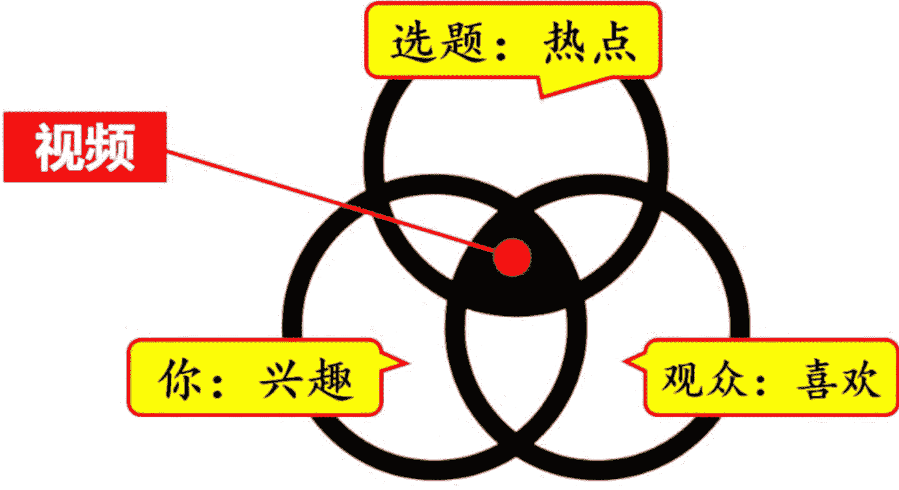

如果这是一个平面，从立体角度看，哪个是最基础的呢？就是你，你是整个事业、项目、频道的根基。没有你，整个项目就不存在。在一个小白刚开始做的时候，一定是先从个人的兴趣入手，这个时候，忘记观众，别去看涨粉，别去看观看量。这时根本不需要考虑观众的问题。

#### 当他的兴趣、形式、内容方向全部确定时，再花时间琢磨自己的视频如何才能让观众喜欢。

你做视频就在这个中心区域里头去做。有没有蹭热点？是不是你感兴趣的东西？以自媒体的专业人士的修养来要求自己。既然出来做，就把它做好，做到别人看的人逻辑清晰，生动活泼，看完以后有所教益，最起码是一个快乐的被陪伴的时光。

拿我自己来举例，我从去年分享YouTube相关的内容，这个时候，没人要求我要分享啥，写了也不会有精华，为什么要分享？因为是刚好在做，也就顺手写了相关帖子。写这些帖子，是从我自我的兴趣出发。我是程序员，一些最新的技术，是用英文来写的，那么就避免不了上网。避免不了上网，就避免不了顺手看YouTube。看着看着，就顺手做了YouTube。

关于蹭热点这事，也是纯属偶然。我去年写帖子的时候，没几个人看，现在有人看，说明有热点嘛。这个热点的来源自于生财在推YouTube，我在生财发关于YouTube相关的内容其实就是间接就蹭了热点了。

小结一下：

- 1、我先是自己有兴趣，做自己感兴趣的事，分享自己感兴趣的内容。
- 2、生财恰好在推YouTube，我写的帖子就刚好蹭了热点有人看。

很多东西，你只有长期泡在某个领域才能了解到这个领域的一些外人不为人知的常识。比如说，我不说海外住宅IP，如果是外行人，根本就不知道有这个东东。你说你要疯狂上杠杆，你要多账号做，上矩阵，但是呢，你的IP有问题。有些人甚至用免费的节点来做，就是图省钱，做得累死累活，回头发现白做了。如果用免费的节点，有些人用这些免费的节点做点啥不好的事，那么你用的这个节点就被标志为风险IP。你在这个有风险的IP上猛做，大做，特做，想着接下来有回报，这里就给你泼一个冷水，让你清醒下，你就是活在梦里，所做的一切都是徒劳无功。

我写的帖子，你之所以耐着性子花时间看，那是真的为你好，让你少走弯路。之前在生财写的帖子，我都记录到这个飞书文档，这样你就不用一个个去翻了。这一点也是从观众的角度考虑，给你们方便。

做YouTube的一些常识 https://rlwxa0zgke.feishu.cn/docx/P2DYduGbkoW0nqxcRZgcL6xKn7I

#### 评论区：
- shirley：好早，真的是越棒的人越努力哦[玫瑰]

- **嘉应岛主**: 已收藏，感谢分享，重点去看了 YouTube的常识[强]。我特别喜欢文中：这个兴趣不是找到后就一辈子干那个事情。你找到时，这个兴趣可能只维持一年，你就认真快乐地干一年。第二年，兴趣转变了，你干别的东西去，没毛病。一定要做自己感兴趣的东西。如果不知道自己的兴趣，坚决要找到它，哪怕一年、三年、五年才能找到。从你找到兴趣那一刻起，你做的都是兴趣。
- **希声**: 先赞后看
- **小高**: 1
- **一卒**: 感谢，正好在思考这个问题，帮到我了
- **目光**: 挺有启发的，我最近一直在看有什么赛道是值得做的，看着看着才发现，我漏了考虑自己的兴趣
- **书情小跟班**: 恭喜你

### (25赞) YouTube无人值守视频循环直播工具让你快速达到YPP

作者：书情小跟班
日期：2024-11-26

为了避免牵扯利益相关，这里隐去了具体是什么工具。这个工具可以进行多平台直播，但是呢，我们要快速达到YPP，只要在YouTube上重播就可以了。


在操作的时候，选择 Video File，上传我们准备好的视频。


视频上传成功。


如果你付费了，下面是可以选的，选择重播几次。


如果你想 在其他平台也直播，那么你就需要先绑定你的账号才行。


最后是关于费用：

| **Standard 标准**<br>For Creators (创作者)<br>$10/月<br>年付$114<br><br>• 3个频道多流<br>• 跨平台聊天<br>• 流健康监控<br>• 实时分析<br>• 含Restream Studio | **Professional 专业**<br>For Creators (创作者)<br>$24/月<br>年付$282<br><br>• 5个频道多流<br>• 2个团队席位起<br>• 配对通道<br>• 无限量云录制<br>• 含Restream Studio (无水印/自定义Logo) | **Business 商业**<br>For Companies (公司)<br>$120/月<br>年付$1434<br><br>• 8个频道多流<br>• 团队工作空间<br>• 网络播放器(1000观众)<br>• SRT摄取<br>• 含Restream Studio (RTMP源/联合制片人)<br>• 上传串流(2小时/视频/25槽/5GB) | **Enterprise 企业**<br>For Companies (公司)<br>定制计费<br><br>• 25+频道多流<br>• 25+团队席位<br>• 无限工作空间<br>• 单点登录(SSO)<br>• 流备份<br>• SRT摄取/集中计费 |

为什么买这个？这个套路涨时长，之前我分享的套路是涨粉丝不涨时长。

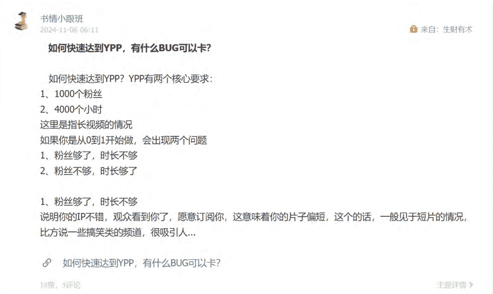

现在这个帖子，通过直播拉时长，你的小伙伴给你挂机实实在在涨时长。

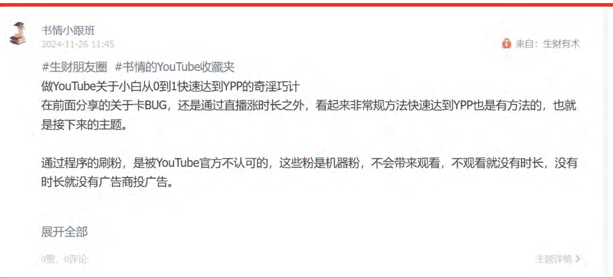

具体套路要怎么玩，看每个人的需求了。

#### 评论区：
- **小吉玛丽亚**：6！这就是YouTube的无人直播呀！
- **风澜**：一顿操作看到一个r开头的工具，是这个么
- **拾悦说**：是吗？是r开头的吗？

### (20赞) 为什么1-3分钟视频的播放量不如1分钟以内的短视频？

作者：书情小跟班
日期：2024-11-29

前言：有人跟我反馈，他做的视频超过了1分钟，同时在3分钟以内，他觉得播放量不如1分钟以内，问我还能不能做，我的回答是能的。

补充下：如果你的视频明明能在1分钟之内把要表达的内容表达清楚，就没有必要非得把时间拉到1-3分钟，切记。

说明下：长短片指的是1-3分钟的视频，后续不再赘述。

这里先回答，为什么长短片的播放量不如1分钟以内的短视频：

习惯影响：
过去几年观众并没有见过这种长短片的形式，突然在他们习惯的15秒、20秒、30秒视频中出现一个长短片的视频，自然会感到不适应，甚至有种上当受骗的感觉。

人们的习惯往往一时半会是改不了的，正如在电商的初期一样，先付款后发货，人们同样是存在着质疑、不信任。万一商家不发货怎么办，钱不就损失了嘛？人们更习惯线下一手交钱、一手交货。但是现在大家都已经习惯在网上购物了。

#### 为什么我推荐你坚持做1-3分钟的长短片？

YouTube官方推出长短片自然是有它的道理，官方在推，这也意味着补贴和推动。让制作3分钟长短片的人发现其RPM（每千次展示收入）相当可观。

因此，我们只需跟随平台的发展方向，即便目前推荐效果不佳，也要耐心等待风口来临。至于优化推荐的问题，这是YouTube数千名工程师需要解决的问题。

#### 为什么我推荐你要立即行动起来？

立即行动意味着你有先发优势，同时抢占第一波红利。我们需要提前布局，等待风口来临。

YouTube花费了大量精力来拓展视频时长限制，并进行推荐，这意味着未来它一定会找到一种方法，无论是通过补贴还是强推，来推动这一功能的发展。目前，它还没有完全准备好，这只是时间问题。

#### 为什么短片的封面是可选的？

这里涉及一个视频给用户的展现方式，不同的展现方式做不做封面其实是不一样的逻辑。

##### 1. 你的视频是被系统推荐的

节奏比较快的视频，这个时候封面没那么重要，因为用户是滑动到你的视频，那么在这种情况下黄金三秒就很重要，你需要快速地吸引观众的注意力。

##### 2. 你的视频是观众主要选择的，这个时候就要建议做封面了

长短片的视频可能包含一个完整的知识点或小故事。在这种情况下，观看逻辑不再是简单的遇见模式，而是观众主动选择观看。

这个时候为其制作封面是值得的，其实你应该把它当成长视频来看待了，你确实是需要通过封面来点题，让观众通过你的封面了解这个长短片讲什么内容，从而做出判断是否花时间看。

还有一个情况，那就是这些长短片可能会被添加到以长篇为主的播放列表中。当长短片被加入播放列表时，其封面图的重要性就显现出来了。因为在播放列表中，观众会选择性地观看和跳跃式浏览，因此封面图能够帮助观众判断是否值得观看。

##### 建议：
如果你的内容属于知识分享或故事类，那么建议你制作封面图。

如果你的内容是抖腿、扭屁股、搞笑、娱乐这类，就没有必要专门制作封面图。你可以直接使用系统自动截取的画面作为封面，因为这类视频的主要流量来源于短片推送，而不是频道浏览或观众首页上的点播。

#### 评论区：
- **板寸头**：老师，我24号开始平均每天发两个短视频，目前发了10多个只有4个视频有400-500的播放量，其他一些只有个位数的播放，是不是正常？
- **老彭**：长短片，收益媲美长视频，然后走的是短视频流推荐，岂不美哉
- **毛豆**：书情自己的油管做的怎么样？你分享的这么多油管教程和经验是你自己的实践经验么，或者至少验证过？还是这些是网上找的教程发到生财？我经常搜youtube相关的主题，看你分享的最多，但是有一些是不对的，恐会误导圈友。所以冒昧的问一下
- **毛豆**：如果不是自己的实践经验，怎么保证分享的内容是对的呢？
- **毛豆**：整复杂了，我意思是，你教人做油管，是不是得分享你的知识和经验。如果是别人分享的东西，放个链接或者注明下出处。而不是拿过来发到生财，当成自己的东西，然后里面的内容讲的对不对，自己也无法确定，这不合理吧？
- **Keep.**：老师，您好，Youtube中级功能解锁能用国内号码验证吗？
- **书情小跟班**：能

### (5赞) 关于做YouTube要掌握的认知——提升时长

作者：书情小跟班
日期：2024-11-26

YouTube官方目前为了对抗TikTok的用户争夺，把流量倾斜到Shorts，这是事实。那么想要在YouTube上赚钱，Shorts是获取流量的好时机。

套路是通过Shorts从YouTube平台公域获得流量，获得订阅数，再通过首映的方式把时长拉上去。

#### 这里为什么提首映？
这是一个很多小白忽略的点，首映对于订阅你的观众是强提醒，这一点非常重要。在首映开始前2分钟，您和您的观看者会看到一个直播视频，其中显示了视频首映的倒计时。您可以从多种倒计时主题中进行挑选。

正常发视频是没有所谓的倒计时的。长视频目前不是YouTube主推，这种小铃铛不是首映，如果没有主动点小铃铛，那么订阅你的人不一定知道你发了视频的。


但是首映是不一样的，首映是一个强提醒，有倒计时，可以展示预告片，把一些吸引人的片段展示在预告片上，提前一步把你的观众吸引。

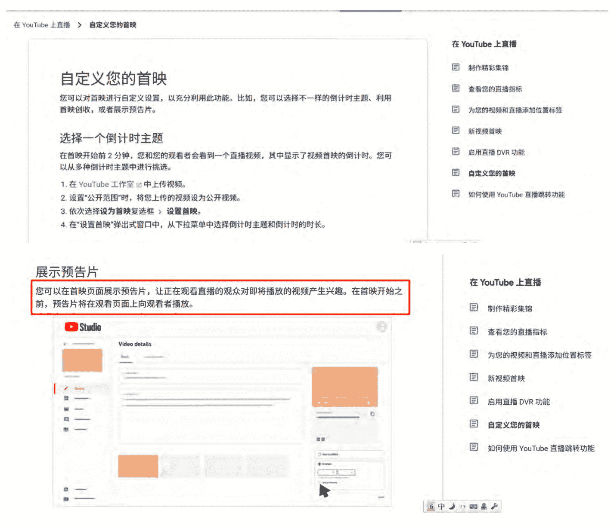

这里要注意一个点：

#### 注意事项
资格条件：创作者需达到以下条件才能使用此功能：频道订阅人数超过1,000，且没有未解除的社区准则警示。

#### 首映的好处
超级留言和超级贴纸是粉丝与创作者在实时聊天期间进行互动的两种方式。在互动中顺带做引流，有自己的课卖，引流到私域卖课，那是非常香了。

如果你是做Shorts，一个思路是粉丝来了后，可以把多个Shorts做一个合集，弄成一个长的视频，通过首映，但是不互动的方式，让你的粉丝收到提醒。

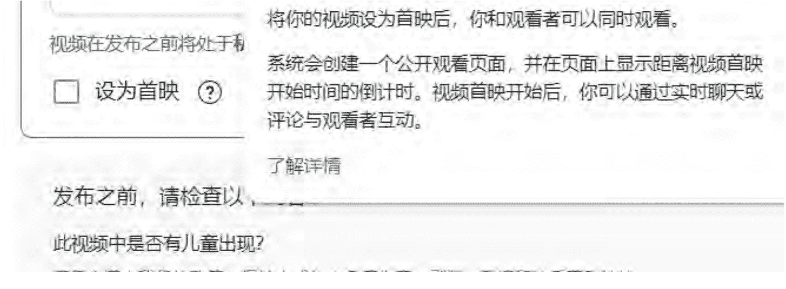

设置提醒后，观看者会分别在首映开始前30分钟以及首映开始时收到通知。

具体的官方说明在这：
- 在 YouTube 上直播自定义您的首映
- 在YouTube上直播新视频首映

#### 评论区：
暂无评论

### 【小红书】5篇
### (精华帖)(105赞) 人工智能在医疗领域的应用与挑战

作者：叶凡🌱funny
日期：2024-11-28

最近的2个月小红书动作非常多，最大的一个动作之一，就是在抓小红书站外导流，不让发微信号。小红书导流监控迭代升级之后，很多朋友也都收到了违规提示，包括我们自己的账号，从警告到禁言全站私信评论区7天禁言+限流，继续违规就升级到14天……

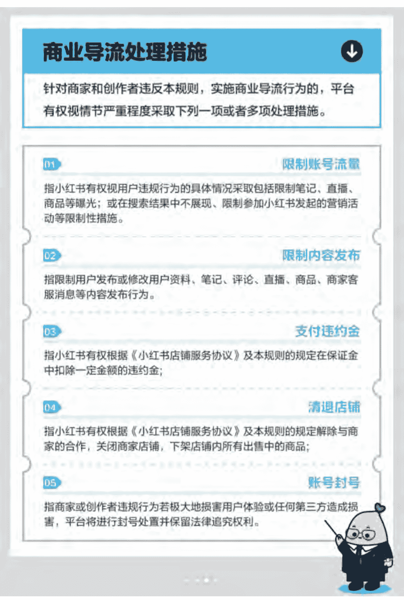

原本常见的留微信方式，都会被平台管控。比如，之前专业号还能把群聊名称设置为微信号，现在不行了。以前交个聚光保护费，可以让用户发微信，现在也不行了。

### 主要违规场景示例


### 交易导流商业秩序治理规则公告

亲爱的小红书创作者和商家：
站外交易缺乏平台保护易造成用户权益受损，为维护平台经营秩序，也为更好地保护用户权益，平台现明确商业导流行为治理原则如下：

1. 什么行为会被判定为商业导流❓
在任何向消费者展示或与消费者互动场景中，发布/推送第三方商品信息，或诱导至第三方，可能产生骚扰消费者或影响消费者交易安全等损害消费者合法权益的行为。

常见违规方式：
- 提供微信号/电话或引导加微信/电话等联系方式至站外交易
- 发送其他平台的链接等至站外交易

2. 违规进行商业导流权益会受到哪些影响❓
根据不同的违规程度，创作者信息发布、商家商品发布/店铺流量/店铺状态等会受到影响，情节严重的将会被封号等。

若您有商业诉求，建议注册小红书企业号（https://xhslink.com/a/CwSJe8gD3nCV）或开通小红书店铺（xhslink.com/fyBvcZ）在站内完成交易哦~

商业广告署在此温馨提醒：请大家严格遵守商业导流治理规则，共同维护良好的交易环境，保障每位用户的合法权益。交易导流治理将陆续开启，让我们一起打造一个安全、健康、可靠的社区。

所以有预算、获客成熟的老板，直接选择做聚光投流，光明正大地给客户发微信号。

那不花钱的账号，还有没有导流活路？——分享两个最近测试可行的导流方式

### “摩斯”密码
【使用方式】：在私信时，用点数代替微信号/手机号的数字，直接发给用户。可以延伸出用任何emoji代替点数，还可以用扑克牌的数字排列一下，拍一张照片。

## 公众号懒人搜索，懒人专属群分享

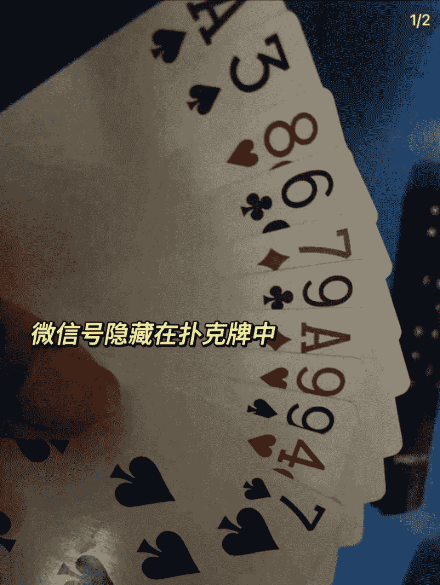

微信号隐藏在扑克牌中
素材来源：叁斤_

【缺点】：我第一次看到的时候觉得很赞，但是实操的时候发现，它有一个弊端，当你的微信号里边有数字“0”的时候，是没办法用点数代替的。

### 02 小号发微信笔记
【使用方式】：先用小号发一篇带微信号的笔记，可以分别在下面3个场景下使用：
- ①在用户私信咨询的时候，发你的这条小号的笔记；
- ②用大号收藏小号的笔记，把收藏夹公开，引导用户去看你的收藏夹；
- ③引导用户进微信群聊，用小号在群里发小号的笔记。

这个方法以前其实也已经在使用，只不过现在管得更严格。如果像以前，对微信号不做任何处理的方式，你的笔记只有自己看得见，别人是看不到的。

那怎么样才能够不被检测出来呢？

我经过大量的案例测试和思考总结，我找到了一个方法，可以套用，我自创个名字叫“看似”合理。就是说，在这个图片的**「这个位置」，本身就可能是一串「数字和字母」（你的微信）**。比如说英文报纸，里边本身就有大量的字母，那你把微信号混在里面，「看着好像很合理」，所以就没法快速识别出来。

## Shanghai Students' Post
年轻化的传播方式让传统文化更有生命力。

# The Power of Pop Culture
As a child, I didn't like Peking Opera. In my eyes, it was boring. The actors sang and spoke in strange ways and their clothes looked "ancient." That was until last year, when I saw a video of an actress singing "Queencard" in a Peking Opera style. I started thinking the traditional art form was really cool.

My story might help explain why the new C-drama *Love Game in Eastern Fantasy* (《永夜星河》) is so popular among young people, both at home and abroad. Although the show is set in ancient times, it develops in a game-like way. The female lead Ling Miaomiao (Yu Shuxin) finds herself inside a fantasy novel. To get back to the real world, she must finish many tasks. When I first saw her struck by lightning (被雷击中) — and the words "The End" appear on the screen — I laughed out loud. It felt like I was playing a game myself!

The drama also uses modern language. Ling sometimes says things like "What? Did I break the law?" or "How much did these special effects cost?" These words fit the character and add fun to the show.

This show is an example of pop culture's role in spreading Chinese culture. The *Global Times* (《环球时报》) calls online novels, online dramas and online games the "three carriages (三驾马车)" of this effort. The key is to interest young people first. If they are curious, they will want to learn more. Now, people are talking about the traditional skills behind the props in *Love Game in Eastern Fantasy*. They are also learning more about Chinese folklore (民间传说), like *Shanhaijing*, and philosophy (哲学), like "harmony (和谐) with nature," because of the show. This is the power of pop culture.

+ C-drama 中文电视剧
+ female lead 女主角
+ fantasy novel 奇幻小说
+ special effect 特效
+ character n. 人物, 角色
+ pop culture 流行文化
+ online novel / online drama / online game 网络小说/网剧/网游
+ prop n. 道具

+ traditional /trəˈdɪʃənəl/ adj. 传统的
+ explain /ɪkˈspleɪn/ v. 解释
+ abroad /əˈbrɔːd/ adv. 在国外
+ develop /dɪˈveləp/ v. 发展
+ task /tɑːsk/ n. 任务
+ fit /fɪt/ v. 适合
+ role /rəʊl/ n. 角色, 作用
+ effort /ˈefət/ n. 努力

本文配有朗读音频 本文配有练习(习题请见B版)
SSP 语篇难度分为9级，初中基础版覆盖2至4级。

## SSP Student Reporter's Club
《上海学生英文报》双语学生记者团
正在招募

那是不是只要图片里本身就有字母和数字，就一定没问题呢？

我拿键盘照片，做了一组案例对比：

- X 上面的图，把微信「放在空格键」的这张不行，发出去被系统私密了；
- V 下面这张，把微信「放在按键」上可以发出去。


箭头
54分钟前 浙江

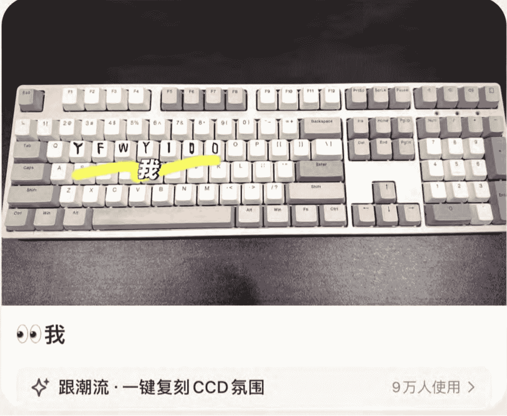

所以，大家发现没有，非常重要的关键点，一定要把握住微信放置的位置！！！ 问一问自己，「这个位置」出现数字和字母，看着合理吗？

掌握这个宗旨，我带大家做5组测试题 ，都是我已经发布测试过的。

你边看边记下自己的答案，最后文末对一下正确答案！边学边练，相信你肯定能掌握！

## GO! 考试开始！

### 小红书导流方式选择题（单选，每题2分）

请根据以下图片，选择发布之后，是否会被平台自动检测违规？

### 第1题：便利贴纸

- A. 违规❌
- B. 不违规✅


### 第2题：汽车车牌

- A. 违规❌
- B. 不违规✅


👀👀车牌✅

### 第3题：面膜包装

- A. 违规❌
- B. 不违规✅


### 第4题：赵丽颖照片

- A. 违规 ❌
- B. 不违规 ☑️


### 第5题：个人海报

- A. 违规 ❌
- B. 不违规 ✅


👀云朵旁🌥️
9分钟前 浙江

好了，以上正确答案是：ABBBB，满分10分，评论区交流一下你得了几分哈哈

可能比较有难度的是第4题和第5题，为啥这2个可以呢，其实是因为这个图，你忘掉自己是导流目的，忘掉那串数字字母是微信，仅作为一张海报图，排版上出现数字和字母是不是也是正常的？

好了，相信大家都已经掌握啦，然后你们就可以举一反三的去做自己的导流图啦~~

最后，再强调2个细节：

- 1. 尽量用小号配合导流。

因为虽说平台他不能直接检测出来，但是拦不住你可能会 被同行投诉举报 呀。用大号就有被举报首罚风险。

我拿我的A账号举报我发了微信的B号，测试了一下，举报成功了。对，没错，自己举报自己，浅浅牺牲一下自己哈哈哈～

不过，比较神奇是，A收到了举报成功的消息通知，但是，我的B（被举报的号）并没有违规提醒，而且笔记还正常展示，没被私密。

我个人猜测可能是被举报的次数还没有到达一定的量，但能明确一点，被举报还是会判违规，毕竟系统已经给了A违规回馈。

- 2. 如果是经由大号发的微信，在用户确认收到后，立马撤回

以上就是不花钱的导流方式思考和分享，欢迎大家交流更多好用的导流方式，最后，祝大家微信导流爆单！

#### 评论区：

- 阿宝：学习了 厉害[强]
- 喵姐：这操作，人才啊[666]
- 哎呀小柠檬：厉害
- 亦小亮：赵丽颖这个我这边确实不行
- 旭宏：“我拿我的A账号举报我发了微信的B号，测试了一下，举报成功了”[捂脸] 太有钻研精神了！[强][强]小姐姐你的盖洛普排第一的天赋是“学习”吧？
- 叶凡 🌱 funny：天呐，你把我午休的瞌睡都震惊跑了，真的是“学习”😱😱
- 叶凡 🌱 funny：你是盖洛普优势教练吗
- 叶凡 🌱 funny：哈哈，实践出真知[耶]

公众号懒人搜索，懒人专属群分享

### (精华帖)(54赞) 如何在小红书上创建一个赚钱的蒲公英账号（接广版）

作者： 佐伊123
日期： 2024-11-25

【项目实操】如何做一个赚钱的小红书蒲公英账号（纯纯接广版）

自从前阵子群里回复了一下关于小红书起号的几个问题以后，就陆陆续续收到不少圈友的咨询，趁着今天有空，给想了解蒲公英接广的圈友们做个简单的介绍，市场肯定还是有的，不过这段时间小红书平台对素人水下笔记和蒲公英直发笔记查得越来越严，很多工作室损失惨重，新手还是谨慎入坑。

（个人介绍不写了，业务做的比较杂也不是大佬，但是在小红书推广这块已经投入两年，投流/报备笔记/水下笔记都在做，多的时候日百+报备笔记，关于报备笔记这块的经验应该是比较准确的，并且作为品牌方角度写的账号分析，应该对于做账号的人更有价值。）

以下是目录：
- 一、什么是蒲公英报备笔记
- 二、蒲公英报备笔记收入情况
- 三、返点是什么，怎么返
- 四、如何开通小红书蒲公英后台接广
- 五、选择一个合适的赛道
- 六、品牌方选择账号的几个维度（划重点）：
  - 6.1 笔记数据（划重点）
  - 6.2 美化笔记数据
  - 6.3 笔记流量来源
  - 6.4 粉丝画像
- 七、报备笔记发展空间

细节内容比较多，还请大家移步飞书
https://r0w01nn96m.feishu.cn/docx/DJogd2O9ioPCSXxjxUlcNTO3n1h?from=from_copylink

#### 评论区：

- 七天@生财有术 :很不错的一个具体业务的分享，我身边也有一些博主对于蒲公英返点这一流程比较疑惑。好奇写完后，佐伊觉得通过小红书蒲公英做赚钱的账号，主要核心是什么呢？我看到了品牌方会如何选账号，比如渠道来源，或者性别年龄分布。有什么人为可以优化调整的吗？
- 向丹 :刚好在品牌方工作，最近在小红书找博主投放，分享前几天我的一点心得（我分享在朋友圈的版本） 原文如下：

这段时间过了一把做甲方爸爸酷酷烧钱的爽感，同时也感受到了下甲方爸爸是如何选择博主合作的。很有趣的现象。粉丝4000+，单篇笔记报价250，另一个粉丝1900，单篇笔记报价1000，差了8倍。

这个报价是博主根据市场价格，心理预期定下来的价格。为什么会有8倍的价格差异？ 简单来说赛道不同，一个做的是时尚买手 人设不同，一个是大学生人设

作品质量不同，明显1900的账号，图片质量，整体美感，都高很多。 还有个原因，可能是大学生不太敢要价哈哈哈哈哈。 另外

甲方爸爸更愿意把钱花在哪种博主身上， 第一最好是真人出镜的，可以露脸的，真实感，分享感。有喜欢的，甲方对于价格没啥感觉差个一千两千，无所谓的。

第二是有多个场景的，昨天找了三十多个博主，其中最喜欢的也是最贵的是一个妈妈人设的IP，有和老公孩子出去玩的，在家的，露营的，各种场景，场景越多，代表的是丰富的广告位。

第三个才是粉丝粘性互动多不多，评论收藏多不多，粉丝画像是否符合甲方爸爸产品，最近作品数据如何等。 以上~

- 七天@生财有术 :这个也欢迎补充到正文，很不错的想法。
- 向丹 :好滴
- 👑善士笔记👑 :我们现在也在大量找博主合作，怎么联系
- 佐伊123 :我们也是每天都在邀约找账号，中介的号会更稳一点，现在倾向于多找中介，不过好像不能留联系方式

### (36赞) 小红书合同模板私域变现副业实操玩法分享

作者： 黄岛主(副业项目)
日期：2024-11-26

大家好，我是黄岛主！

今天分享的是小红书上引流私域卖合同/协议模板的副业项目玩法，这个项目比较简单粗暴，需求量也很大，小白都可以无脑操作，而且也不需要去剪辑什么的，直接制作图片发笔记就可以了。如果你刚接触小红书项目，没有什么太好的赛道，我是建议做合同协议模板，因为真的非常简单。目前我们这个项目单天变现几百很正常。

我们自己操作这个项目有一段时间了，目前做了离婚协议模板、租房合同模板等，我们可以做垂直一个行业的、也可以做综合多个行业的，都可以的。并且我们前期走的私域测品、后期走的店铺去做流量变现的，整体来说还是拿到了不错的结果，这个合同模板的赛道还有个好处，就是可以溢价升单，因为这个很多模板类的有用户需求定制哈。

https://o0yvn3o31a.feishu.cn/docx/NHqhdgtEFo3joWxfsWxcnwIAn0b?from=from_copylink

#### 评论区：

- 不懂就问：岛主，流量卡渠道能推一下嘛？
- 黄岛主(副业项目)：可以的 找我就行了
- 不懂就问：哪里能找到你
- 黄岛主(副业项目)：星球私信我 我发给你渠道

### 转型小红书职场博主，粉丝突破10万，接广变现6位数心得复盘

作者： 王多维
日期： 2024-11-28

大家好，我是生财二年级学生王多维，目前在做小红书博主+小红书运营顾问

今年年初转型职场和生活博主，涨粉6万+，粉丝突破10万+，变现6位数。

今天给大家分享一些我今年做小红书的心得体会，希望能帮助到正在做小红书的朋友，感兴趣的可以移步飞书！

https://m7y7vqso3n.feishu.cn/docx/ZHxfdK8U5oene9xc4dIcTdMDnSO?from=from_copylink

#### 评论区：

暂无评论

### 【抖音】4篇

### (精华帖)(181赞) 抖音星图短剧新号一个月变现10万的方法分享

作者：唐杰
日期：2024-11-26

生财圈友大家好，我是唐杰，距离上次分享快手聚星时隔一年多，今天分享一下抖音星图短剧一个月时间，从一个新号变现10来万的方法

加入生财这2年当中从小白到过手15+个实战项目

有了自己1家公司，同时还组建了3个合伙分公司

很多朋友见证着我这一路的成长

也感谢成长路上朋友们不惧风雨携手同行

同时感谢生财提供的平台让信息更加透明化

这一路跌宕起伏的人生中，非常感谢她的一路陪伴

```
https://mvh6uii5p7e.feishu.cn/docx/MlWddFhNeozTwwx8cizcfCAZnnf?from=from_copylink
```

#### 评论区：

- 上上签：链接打不开
- 唐杰：好了
- 上上签：感谢
- Mr.老吴：喂饭级教程[强]感谢分享
- monica：还有后续吗？还是有点看不懂要怎么剪辑；可以出个视频吗？
- 唐杰：这么详细了！找对标抄袭他的文案，下载原片抄对标开头，混剪后边内容
- 唐杰：你按照文中步骤了，全程没有阻挡
- 朱朱julia🌸：请教一下，这个佣金分成是根据点击进入购买正片的金额变现的吗？你们是做矩阵吗几个号？一般看到的成交都不高呀。怎么做到的变现这么多[抱拳]

### (精华帖)(51赞) 传统行业如何通过抖音从零起盘实现年营收500万

作者： 艺豪别墅—王哥
日期： 2024-11-25

传统行业如何结合抖音，从零起盘做到年营收500w 圈友好，我是在河南盖别墅的小王，介绍一下如何从线下到线上通过抖音获客，一年营收500w（2023年）；

结合我的经历，我想说90%的传统企业可以通过抖音获客，而且更加容易；

到现在为止我们还是在用这套方法在获客，方法其实很简单，只要把握好其中的几个关键点，基本都能做成，目前基本没有介入付费，感兴趣的朋友可以移步飞书

https://p1m39y7kqh.feishu.cn/docx/Q76YdX281oFz0BxJnbicxnuTnZc?from=from_copylink

#### 评论区：

- 更绪：看完了，感谢分享，我觉得你这个获客思路，可以再针对性加上seo的布局，视频内容再铺点搜索词，吃更长尾的流量
- 艺豪别墅—王哥：是的，视频上可以从这方面多考虑
- 潇湘妃子：河南省以外的想建房可以不？哈哈
- 我是一头驴：您好，省外想盖房咨询吗？
- BLUE：快手、视频号也一起做做
- 艺豪别墅—王哥：可以沟通沟通～，面积大可以去
- 艺豪别墅—王哥：咨询可以的，
- 艺豪别墅—王哥：辅助做的有，就是发，没咋运营

公众号懒人搜索，懒人专属群分享

### (46赞) 从拥挤赛道中打通的小众搬运玩法详解

作者：阿超
日期：2024-11-25

【适合新手】【抖音虚拟资料】从拥挤赛道中打通的小众搬运玩法详解

大家好，我是阿超，一个互联网新手中的老手，今天要谈的不是大家熟知的文件翻新、也不是打印拍摄、也不是单纯的图片去重处理、而是一个比较小众但目前还好用的搬运玩法-「爆款图文转视频」。

这次文章整体服务于～如何更快辅助新手跑通0-1，所以内容比较干，比较简洁，建议新手1：1执行更好。 下面是整篇文章的目录： 
自我介绍 
一、实操SOP
- ①、前期准备
- ②、七天养号法
- ③、找爆款对标
- ④、爆款图文转视频
- ⑤、引流三件套
- ⑥、变现/话术
二、百问百答摘选
三、项目分析
- ①项目优势
- ②项目劣势
结语 
具体玩法移步飞书阅读： 【抖音虚拟资料-从拥挤赛道中打通的小众搬运玩法详解】 👉 https://w9qs13d2em.feishu.cn/docx/JWJjddMddo8Ibexi56tcFUkAncc

#### 评论区：

- 拾一：阿超兄弟在抖音虚拟这块没得说 👍 👍 👍
- 阿超：哈哈谬赞了～谢谢拾一哥夸讲
- 大卫：执行能力超级牛。
- 不言：厉害了
- 希平：写的真好[呲牙][呲牙][呲牙]
- 佳佳：厉害了，有收获[666]
- 阿超：感谢大家的夸赞，我就厚脸皮收下了哈哈哈[偷笑]，希望能真正帮助到想做这个项目的
- 阿超：[偷笑]

### 【海外项目】3篇

### (27赞) 外贸员转型跨境TikTok：0-1创业全过程

作者： Sara Cao
日期：2024-11-25

外贸员转型做跨境TikTok，我的0-1创业全过程 
☑项目开始 
☑遇到挫折 
☑开始稳定 
☑我的思考 
全文我放在飞书链接里了 tiktok 跨境

```
https://m7ovejdhs9.feishu.cn/wiki/Xgdyw1vCpiZsIxkMCVUc95rxnHf?from=from_copylink
```

#### 评论区：

- 摘星：很棒！
- 嘉应岛主：其实做工厂型视频也是可以的，只是得筛选有跨境经验的工厂才行，你简单做只是发工厂一些视频，往精品做你不得不一个会外语的人去配合拍摄（要不就做个数字人）

### (8赞) 2024西班牙Tik Tok电商市场调研报告

作者: 梁小伟
日期: 2024-11-25

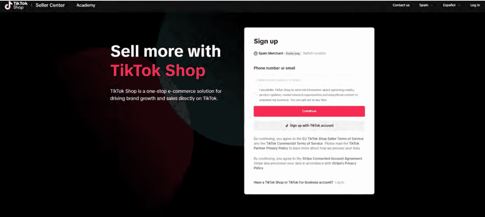

TikTok Shop西班牙站点在经过一段时间的筹备后,终于宣布将于今年12月正式对广大商家和消费者开放!

- 1. 入驻条件
  - 1. 个人卖家：
    - 需要提供居住地址和身份证明文件(如DNI、护照、驾照等)。
    - 提交身份证号码、姓名、出生日期等相关信息。
  - 2. 企业卖家：
    - 需提供本地仓储证明,确保在西班牙发货。
    - 上传公司营业执照、VAT税号和法人身份证明文件。
    - 满足平台特定销售流水要求,例如欧洲亚马逊年销售额超100万美元(随平台政策动态调整)
- 2. 入驻流程
  - 1. 获取邀请码:TikTok Shop西班牙站点目前采取邀请制注册。
  - 2. 完成注册:通过邀请码进入官网选择“个人”或“企业”类型注册。
  - 3. 提交资料:按要求上传身份证明或企业资质文件。
  - 4. 绑定银行账户:配置用于收款的有效银行账户。
  - 5. 等待审核:审核周期为2-6个工作日。
  - 6. 上线运营:审核通过后,进行商品上架与店铺装修,准备开店。
- 3. 重要注意事项
  - 1. 售卖时间:TikTok Shop已于7月1日上线,但全面售卖功能预计将于2024年12月开放。
  - 2. 市场机遇:西班牙电商市场发展迅速,预计2024年市场规模将继续增长,成为欧洲电商增长最快的国家之一。

#### 西班牙TikTok电商市场调研与深入分析

西班牙作为南欧的重要电商市场，凭借其年轻化消费群体、高互联网普及率和快速发展的社交电商生态，正迅速成为跨境电商的蓝海市场。本文通过市场背景、消费者行为、竞争格局以及TikTok的独特机遇，结合数据与实际案例，为商家提供全面的市场洞察与落地策略。


##### 1. 西班牙电商市场体量与增速

**市场体量**

西班牙电商市场在欧洲排名第四，仅次于英国、德国和法国。

市场规模：2023年电商销售额达到653亿欧元，预计2025年将突破750亿欧元，年复合增长率保持在10%左右。

互联网普及率：高达93%，其中超70%的用户有在线购物习惯，且每月网购频率平均为3.4次。

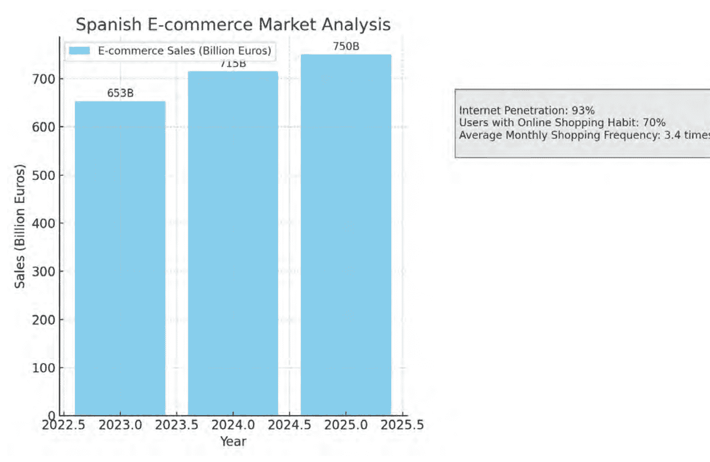

**增长驱动因素**

- 1. 移动设备购物的普及：65%的电商交易通过手机完成，社交电商的爆发是重要驱动力。
- 2. 疫情后电商消费习惯固化：西班牙消费者更倾向于使用在线渠道满足衣食住行需求。

##### 2. 消费者购物习惯与行为洞察

**购物习惯**

西班牙消费者偏好价格透明度和促销活动，节日营销（如黑五、圣诞节）对销量提升作用明显。

环保意识高涨，可持续发展商品（如可降解材质、再生产品）更受消费者青睐。

对品牌有一定忠诚度，但如果新品牌能够在价格、质量和服务上实现较高性价比，也易获得消费者青睐。

**支付方式**

- 1. 主流支付方式：
  - PayPal：覆盖率超55%，为消费者提供快速和安全的支付体验。
  - Visa和MasterCard：占主导地位，常用于大额交易。
  - Klarna等分期付款服务：年轻人群体中使用率显著上升。

**热销品类**

- 时尚与服饰：特别是连衣裙、运动鞋、箱包等。
- 电子产品：智能手机、充电宝、家用小电器。
- 美容与个人护理：护肤品和彩妆。
- 家居与DIY用品：小型家具、园艺工具等。

西班牙消费者购物比例：服装鞋靴以及电子数码品类位居前三名

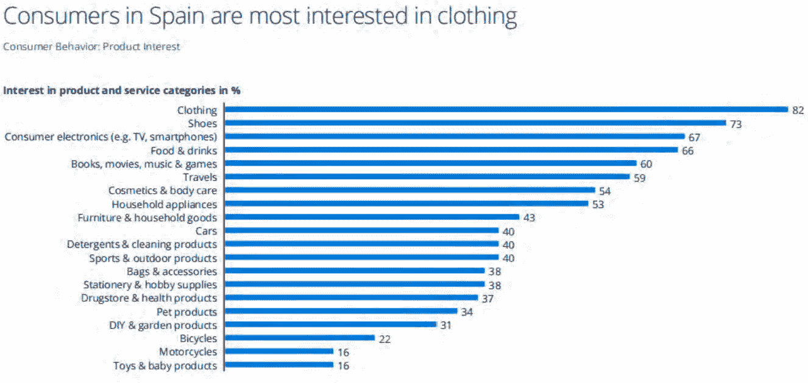

##### 3. 主流电商平台与竞争格局

**平台格局**

- 1. 亚马逊西班牙(Amazon.es) :
  - 占市场份额超40%，提供物流服务Prime会员体验。
  - 主打品类包括电子产品、图书、日用消费品。

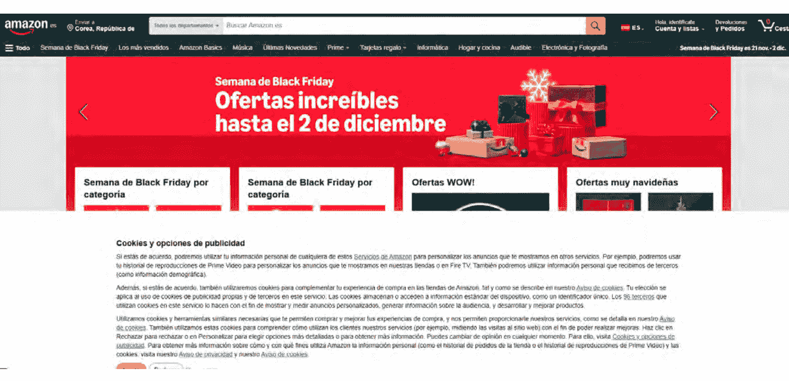

- 2. Zalando: 
  - 西班牙时尚市场的佼佼者，以多样的品牌选择和便捷的退货政策闻名。


- 3. 速卖通(AliExpress) :
  - 中国商品的主力出口平台，低价策略深受价格敏感型消费者喜爱。


- 4. El Corte Inglés: 
  - 本地知名百货品牌，主打中高端消费群体，产品覆盖日用品、时尚、电子等。

公众号懒人搜索，懒人专属群分享


- Shein：时尚快消品牌，通过社交媒体快速获取年轻用户市场。

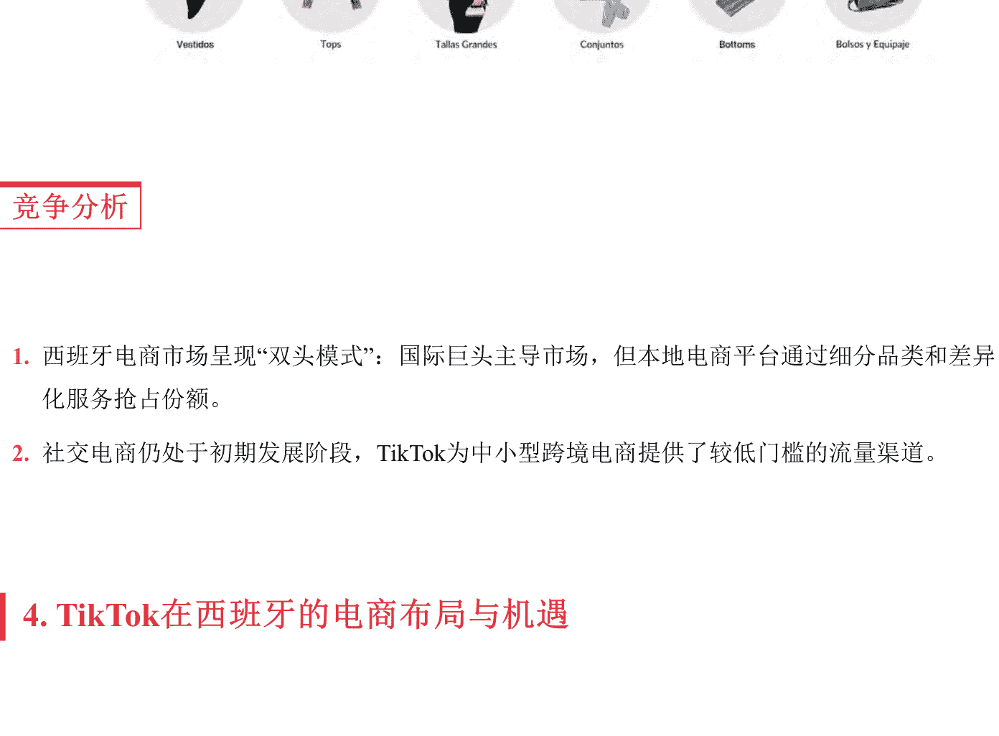

#### 竞争分析

- 1. 西班牙电商市场呈现“双头模式”：国际巨头主导市场，但本地电商平台通过细分品类和差异化服务抢占份额。
- 2. 社交电商仍处于初期发展阶段，TikTok为中小型跨境电商提供了较低门槛的流量渠道。

#### 4. TikTok在西班牙的电商布局与机遇

用户渗透率：根据statista数据统计，截止2024年4月TikTok的用户份额位居西班牙社媒第五


#### 平台现状

TikTok在西班牙拥有1500多万月活跃用户，日均使用时长超过90分钟。

用户群体集中在18-34岁，兴趣广泛且消费潜力强。

短视频内容的强社交属性，使TikTok成为品牌渗透年轻用户的核心渠道。

#### 西班牙TikTok用户数（百万）


#### 用户分布


#### TikTok广告受众情况

根据PipiAds数据显示，截止到2024年11月，全球TikTok广告受众排名中，西班牙受众排名23，有2020万受众，相比上月新增受众37万人，增长迅速。


#### 广告与内容形式

- 1. 高互动广告：
- 2. 使用短视频和挑战赛（如#TikTokMadeMeBuyIt），通过有趣、轻松的形式引导消费。
- 3. 达人推广：
- 4. 与本地KOL合作是快速打入市场的有效方式。例如，与10万至50万粉丝的小型网红合作，转化率显著提高。
- 5. 直播电商：
- 6. 西班牙消费者对直播购物的接受度尚处于探索期，但趋势向好。建议品牌从短时促销直播切入，逐步建立观众群体。

#### 5. 电商基础设施与法规

##### 物流与配送

- 1. 快递服务: Correos、SEUR、DHL等提供高效物流,但偏远地区配送时效仍需改进。
- 2. 自提服务: 消费者越来越倾向于选择取货点,约69%的订单选择自提。
- 3. 跨境物流: 跨境电商需优化运费和退货政策,以应对消费者对服务的高期待。

##### 税务与法规

- 1. VAT：21%的增值税适用于大部分商品。
- 2. 关税政策:跨境卖家需注意产品的CE认证要求,尤其是电子产品和健康用品。

#### 6. PipiAds等数据工具如何赋能选品与市场分析

##### 1. PipiAds:

通过PipiAds,可以分析西班牙市场中投放效果最佳的广告类型和产品趋势。


##### 2. SimilarWeb:

提供网站流量、受众画像等数据,帮助了解竞争对手的来源及表现。


- 3. Google Trends：可实时追踪西班牙消费者的搜索趋势，捕捉节庆热点（如复活节相关消费品）。


#### 7. 实操建议

选品策略：

- 1. 美区爆款同步西班牙复制
- 2. 亚马逊爆款同步西班牙复制测试
- 3. PipiAds独立站爆款同步西班牙复制测试

内容创作与本地化：

通过TikTok短视频展示产品卖点，例如使用UGC创作实测对比内容。

融入本地文化元素（如地中海风格），增加消费者情感联结。

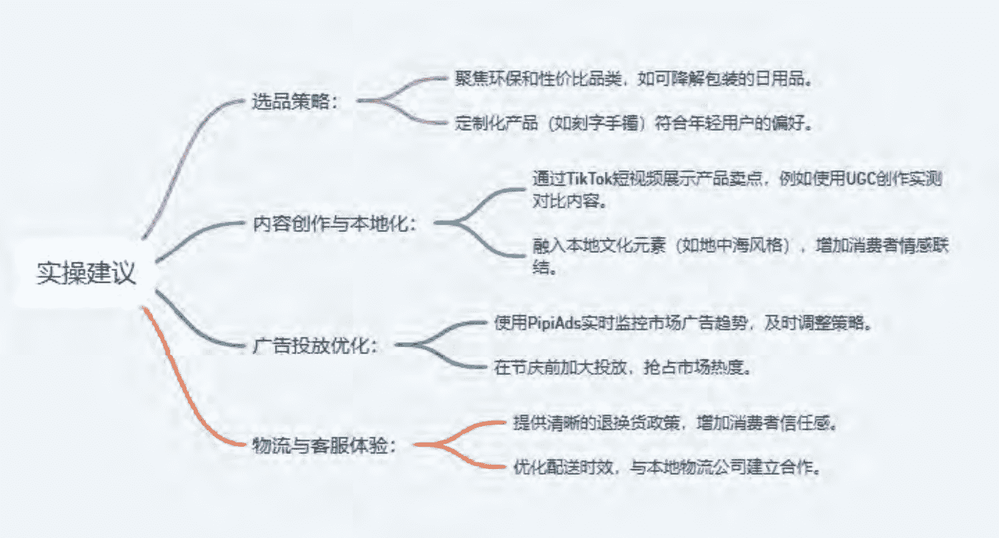

#### TikTok独立站投放案例

##### 西班牙TikTok投放营销案例一：

复古潮流风T恤 累计投放广告展现106.2M播放 售价€39.95，拿货成本￥15

美区爆款同步复制西班牙市场

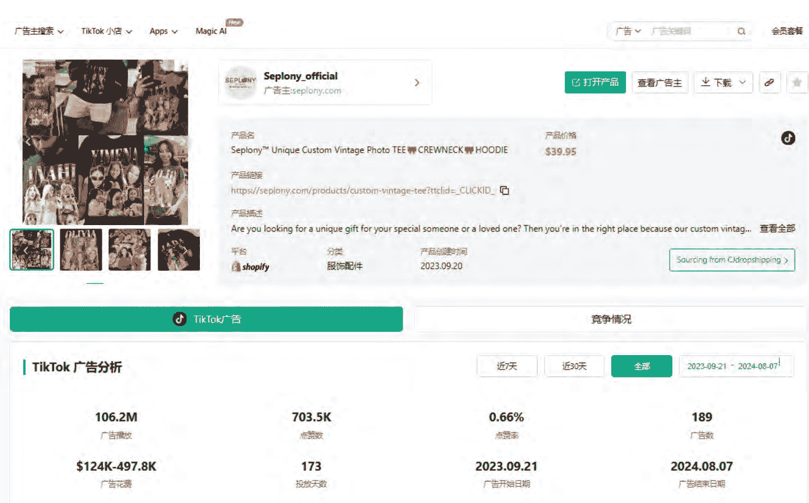

```
https://www.pipiads.com/zh/product-search/650b47a3b3470104275dc363/
```

2300万播放广告素材：情侣属性搭配文案情绪价值

##### 西班牙TikTok投放营销案例二：

定制胶卷照片钥匙扣 累计投放广告展现38.6M播放 售价$26.98，拿货成本￥5

老品了，反反复复全球各地投放

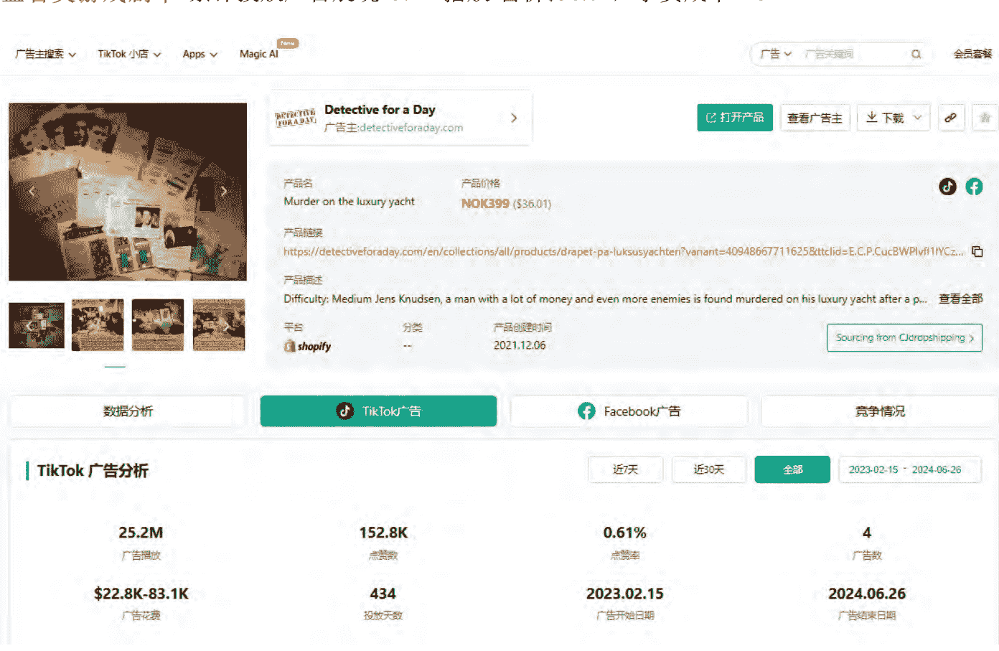

```
https://www.pipiads.com/zh/product-search/648d0749cf323252f5f6547f/
```

2550万播放广告素材： 通过真实的情侣互动场景营造情感共鸣，利用“个性化礼物”的主题打动目标受众，特别是情侣人群。

##### 西班牙TikTok投放营销案例三：

益智类游戏剧本 累计投放广告展现25.2M播放 售价$36.01，拿货成本￥8


```
https://www.pipiads.com/zh/product-search/63ec8a95f3fc19727baa1f1a/
```

1270万播放广告素材

通过简短视频展示游戏细节和吸引力，强调2-3小时即可解决案件的特点，迎合喜欢快速体验的用户需求。

##### 西班牙TikTok投放营销案例四：

旋转回旋镖累计投放广告展现38.6M播放售价$27.6,拿货成本￥7.5


https://www.pipiads.com/zh/product-search/62a4bdb4a955371f2441cc4d/

直观展示了飞行旋转玩具的核心功能
搭配简单易懂的文案和生活化的户外场景,成功引发观众对产品的好奇与购买欲。产品定位新奇创意小物件市场,目标人群涵盖年轻人和玩具爱好者

##### 西班牙TikTok投放营销案例五：

刺绣牛仔裤累计投放广告展现25M播放售价$58.28,拿货成本￥35


https://www.pipiads.com/zh/product-search/6639905555c75455898f4679/

西班牙电商市场凭借其高增长潜力、年轻化消费群体以及对社交电商的强烈接受度,为品牌提供了前所未有的机遇。通过深度挖掘消费者需求,灵活运用TikTok等新兴社交平台的营销优势,结合数据分析工具(如PipiAds)精准洞察市场趋势,并实施切合本地文化的运营策略,商家不仅能快速切入这一蓝海市场,还能建立长期竞争优势,稳步实现品牌增长与市场份额扩张。

一般新市场都有新机会,相对门槛也会高一些。可能量刚开始不会很大,但也有一些红利。

评论区：

暂无评论

### (6赞) TikTok投流：流量成本上升与投资回报的思考

作者：子白

日期：2024-11-27

最近来咨询TikTok投流的越来越多了，这反映了一个趋势：自然流量越来越少，流量成本越来越高。每个人来我都会问他：你来做TikTok电商，有没有确定好，你是娱乐一下玩一玩，还是真来做生意的。

既然是做生意，那有两句话得信：

生意是一种投资，光投钱还不够，还得投脑力投体力。白嫖别人的，最后会发现自己被嫖的最厉害，白白浪费了时间。我始终觉得免费的东西最贵。

只要是赚钱，不要在意用哪种方式。比如在流量的来源上，有些人一直只做自然流量，可如果付费流量能让你快速赚钱，投产比也不错，为何不赚?

僵化的思维是自己赚钱的最大障碍。关于投流，最近遇到最多的问题有这么几个：我的广告费用一直增加，为什么就是不出单？甚至连曝光量都没有怎么办?

TikTok为何不给你曝光？一般是两个原因：很多人以为我去把别人的素材扒下来，直接强挂车，然后设置 ads only，坐等订单。

殊不知，就算你没有把视频发布在账号上，TK也会检验你的素材是不是原创，跟数据库中的视频有没有重复。如果有，那么视为“盗用视频”，轻则这条视频不给流量，重则整个账号挂掉。

所以一定要有混剪的动作，而且要重新制定脚本，加上新鲜素材，重新剪辑，这样高质量的混剪，已经相当于全新视频了。

但凡做过千川的，都知道字节使用ECPM逻辑。其中P代表预估，即竞价能力与预估的点击率(CTR)、转化率(CVR)以及出价(BID)有关。对于一组新广告，系统在不知道你的CTR及CVR情况下，就会变成价高者得。所以前期出价要高，舍不得孩子套不着狼。

你新户新产品，刚投流肯定亏钱。谁能保证一开始就投的正?我一般认为，早期投流是为了拿数据，通过广告后台去看自己是素材有没有问题(点击率，完播率)，产品有没有问题(加车率、付费率)。然后去迭代自己的素材，去改变自己的营销策略。

为了拿到更多的数据，早期可以出价高一些，出价高才能跑出去>拿到足量数据>针对性地迭代>最后出单。

所以一两百美金根本测不出来结果。你数据量不够的时候，没办法得出结论。你今天出门看到5个女生穿裙子，然后得出结论：这个城市的女生都爱穿裙子。这样的结论可信吗?

样本量不够，没有统计学规律。

#### 评论区:

暂无评论

### 【微信】2篇

### (58赞) 公众号爆文（个人IP向）日更3个月，涨粉2万+，深度拆解我的创作经

作者： 好姑娘黄黄啊

日期：2024-11-29

生财圈友们好！我是黄黄，前4A广告公司策划，目前是自由职业者，生财二年级学生，公众号爆款（IP方向）新手。

加入生财一年多以来，看了众多圈友分享的内容以及参加航海项目实战，我有尝试做过得物、小红书、视频号带货等等，让我在探索自媒体初期赚到了一些小钱，但大部分都以失败告终，账号不是被封了，就是踩到某个坑之后没有任何一点流量了。

同时我也意识到公域平台对我这样的小型个体户来说，并不是真正适合长久发展的地方，而我本人也更倾向在私域卖产品。但像得物、小红书、知乎这些平台在引流上相对来说就没有那么丝滑，稍微有一点风吹草动就违规了。

深思熟虑之后，我选择「微信公众号」作为下一个流量增长点。

我是在9月初的时候重启了公众号，刚开始第1篇数据稍微有点差，连续更新3天后，有1篇突然阅读过万了，我就知道属于我的机会来了，一定要接住这一波流量。

所以假期我也坚持更新，连续更了20篇文章之后，收获了上百万的阅读量，流量主收入突破8000+，涨粉1.2万，引流800多人加微信。

截止目前发帖为止，我已经通过公众号涨粉2万+，引流至微信2000多人，流量主+私域产品变现5万左右。虽然我觉得自己这点成绩还不够耀眼，但我的老师张可粒以及生财赛道运营官瓜斯老师鼓励我要勇敢分享，所以我就将这3个月运营个人IP账号的经验做了复盘。

本次复盘贴总结了我从的全部经验，分为四个部分来详细拆解我做IP类公众号的思路和经验思考，希望可以给大家在后期运营公众号（个人IP向）提供一些帮助： 1、2、3、4、

全文总共8000字左右，全部读完预计10分钟，链接直达：

https://v00gv8edzj.feishu.cn/docx/QQ5vdVzP3o5qEBxx9Pclaj5nBL?from=from_copylink

评论区：

张可粒：太棒啦我黄黄！！爆文牛逼！！

琛：膜拜

王一杰：太棒啦

好姑娘黄黄啊：谢谢美粒的夸夸，爱你[爱心][爱心][爱心]

好姑娘黄黄啊：嘻嘻，一起加油呀[玫瑰][玫瑰][玫瑰]

好姑娘黄黄啊：感恩圈友的夸夸，一起加油呀[玫瑰][玫瑰][玫瑰]

朝暮拾花：优秀了，深夜拜读，学到好多

眯眯眼都是怪物丶：太厉害辣

### (10赞) 公众号项目收益提升策略：半托管运营实操经验分享

作者： 张稳健

日期： 2024-11-25

公众号半托管运营实操经验分享 今天，继续来聊一聊我对公众号项目的一些整体看法 目前来看，公众号项目想要扩大收益，可以从以下几个角度入手 1、账号数量提升
目前我看到效率最高的方案就是通过半托管分成的方式，招募账号
https://ma0g2u36irl.feishu.cn/docx/THvFdFRzvooCF5xvZeecXFZUnuh

评论区：

暂无评论

### 【其他】10篇

### (精华帖)(132赞) 红包装封面项目：从0基础到进阶玩法拆解

作者：拾一

日期：2024-11-26

大家好，我是拾一，22年下旬开始探索副业，目前主营虚拟资料项目。还有60天就过年了，每到年末，都会有很多人下场红包封面这个项目，去年做的晚了些，但也引流了2000多人，变现接近1w。

非常感谢亦仁哥搭建的平台，23年一直潜水，今年年初发布了关于小学资料的帖子，获得了很多关注，感受到了真诚利他带来的喜悦和成就感！在生财继续沉淀10个月之后，再次给大家带来项目深度复盘和详细玩法拆解，分享下自己的一些经验，让大家少走弯路。

感谢好友的帮助完稿，全文共9000字，小白可以快速入手，有经验的朋友也可以找到一些进阶思路，趁现在布局是很合适的，大家可以一起交流学习起来~❤

一、项目背景 二、变现方向 三、核心逻辑 四、如何开店 五、图文制作 六、平台运营 七、私域运营 八、封面制作

为了更好地阅读体验，可移步飞书：https://rb2nhlgqdO.feishu.cn/docx/Y2aNdfwtgo0yRxxl0GOcCZofnlf?from=from copylink

#### 评论区：

蓝蓝：一哥牛逼，学起来！

拾一：[嘿哈]

阿超：拾一太棒了👍保姆级实操很细节，受用很大~搞起来

拾一：[爱心][爱心][爱心]

上上签：我的天，这真是保姆教学了

般若2：太棒了，开干

周彦充：去年我搞过，赚了几元钱，哈哈，真的赚到第一元钱了

### (43赞) 淘宝逛逛带货玩法答疑及产值增长分享

作者：桃桃

日期：2024-11-25

评论区，包括微信上有圈友问了一些细节操作我把常问的几个点拿出来给大家统一答疑一下。希望大家看完能帮助到大家。至于目前产值，也给大家打波鸡血。所以大家不要纠结政策改不改啥的，上有变化，下有对策不是。先做了再说。

https://ycnnq7733utx.feishu.cn/wiki/YyY4wVK1cinz9TkaDpccLUOknUb?from=from_copylink https://ycnnq7733utx.feishu.cn/wiki/AXwQwm5Jgipgz3kJ0FfcGa8Hnrg?from=from_copylink

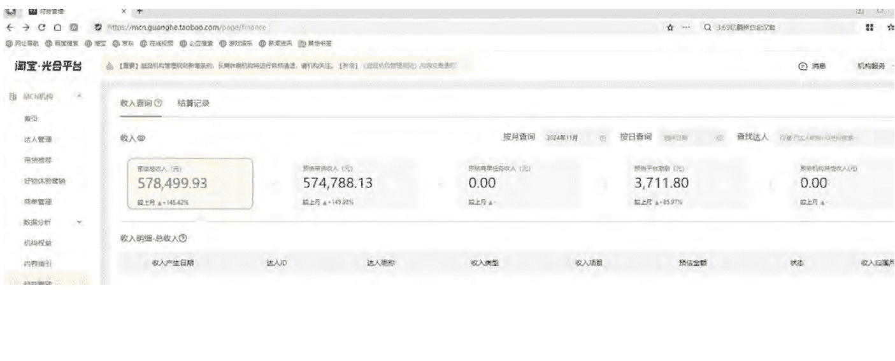

#### 评论区：

烟火尘埃口：怎么链接？想加入

凯莉粒：同问

安歌：带人不

天气：60W是用了多少个号？大佬

0封：怎么加您 咨询下

晨希：怎么加入

我的执着：能加入吗

Crazy、倾听：开了一个号，是不是我发视频多了，一天9-12个视频，才200多销售额[捂脸]

### (41赞) 从创业失败到自媒体百万利润：一个96后青年的成长与转型之路

作者：水龙

日期：2024-11-27

我是水龙，一个热爱创业的96后，大二开始创业，带着团队做文化衫定制，干到百万营收，因受疫情打击，创业失败负债上班，上班还清网贷之后。

在去年某个偶然机会进入自媒体圈，开始做自媒体，从素人起步，通过自媒体带货赚佣金的形式，存到了自己的人生的第一个七位数存款。


这篇文章，我将自己的成长分成了三个阶段，逐一拆解我的成长路径，将可复制的步骤，都详细地写出来，希望对后面打算做自媒体赚钱的同学，有所帮助。

小白该如何开始做自媒体，才能真正地持续赚到钱呢?

不会拍短视频，不会直播，不会做小红书，抖音等公域引流，纯靠私域，小白能不能把自媒体做起来?

我在过去一年通过自媒体带货赚佣金的形式，实现了百万利润，找到了最适合普通人做自媒体赚钱的路径。

对于个人时间比较零散的上班族，宝妈，学生群体来说，做自媒体带货赚佣金的形式是最好的。

过去做自媒体主要的赚钱方式就是接广告和带货，但随着这两年经济变差，很多自媒体大V都开始接不到好的广告，而带货也是越来越难，越是就有很多博主都开始开课，做知识付费。

过去大V做知识付费主要是在抖音平台，随着今年视频号起来之后，有很多大V也开始在微信上卖课，做知识付费，这对于我们普通人来说就是绝佳的商机。

在私域上，大V卖课普遍都会开分销，分销比例从20%到100%不等，那为什么大V卖课会成为我们普通人做自媒体赚钱的商机呢？

先说一下，普通人做自媒体的痛点是什么？

- 1. 没流量
- 2. 没内容
- 3. 没产品

那大V们来私域上做知识付费，对于我们普通人的好处是什么？

- 1. 可以通过小额度的付费，进入他们的私域社群，通过他们，我们可以低成本地链接到很多高质量的人群，从而拥有自己的高质量私域。
- 2. 可以通过学习大V的内容，获取到高质量的内容，从而有自己高质量的内容输出。
- 3. 通过直接分销大V的产品，可以直接不用自己做交付，让大V完成交付，自己还可以赚到不少的佣金。

也就是说，我们普通人做自媒体赚钱的整体逻辑就是：

付费大V的知识产品—在大V的圈子里学习获得高质量私域—通过自己高质量的内容输出和私域好友建立信任，带货赚佣金。

把这个商业逻辑和大家讲清楚之后，接下来，我会结合我的成长经验，给大家拆解我的成长阶段，在拆解之前，必须要强调一下：

写作是做自媒体赚钱的基础，也就是你可以不会短视频，不会直播，但是你必须养成输出表达的能力。

我在过去一年主要的带货方式是三种：朋友圈、社群、公众号，而这三种形式，都是需要个人大量的写作。

#### 一、新手起步，先苦练基本功

什么是新手阶段？

公众号懒人搜索，懒人专属群分享

- 1. 没有混过圈，对于圈内的人不熟，不懂混圈规矩，对于类似生财，淘金，破局，玩赚等付费社群都不太了解，更不了解里面的人。
- 2. 没有内容输出习惯，从没有在朋友圈写作带货课程，没有写过个人IP公众号，没有经营过自己的付费社群，甚至也没有建立过自己的免费社群。
- 3. 对于常用的知识付费平台，类似知识星球，小报童，墨问等等不太了解和使用。

......

总的来说，就是处于缺乏个人人脉资源和信息资源的阶段。

那自媒体新手阶段该如何成长和赚点小钱呢？

我们做自媒体私域带货赚佣金，记住：

- 1. 私域增长是每天必做的事情
- 2. 要将基本功练成肌肉记忆才能持续不断地赚钱。
- 3. 做离钱最近的事，卖最容易卖的产品

##### 1. 大量获取圈内信息

新手付费进圈第一件事就是要好好学习基础知识，了解圈内的信息，认识人，了解圈内规矩，多在社群冒泡，多说话，多提问，多获取信息。

##### 2. 反复训练朋友圈、公众号，私域增粉能力

1、朋友圈带货训练

新手阶段朋友圈每天最少发2到3条，主要包括以下类型：## H5 1、成长圈，干货带货

个人成长感悟、赚钱感受，干货经验等。

内容来源：知识星球，小红书，公众号文章。

可以关注一些小红书或者公众号教人赚钱的博主，大量阅读他们的文章。早期如果自己没有二次创作能力，可以将其中自己比较强烈有感受的内容复制粘贴转发到自己的朋友圈，但最好用自己的话重新表达一遍，再发到朋友圈。

这类朋友圈的字数最好是200到500字，记得要及时展示支付按钮，也就是可以通过配图或者评论区销售自己最近卖得不错的产品。

举个例子：

水龙
记录第一个100

做陪伴群这个事情，我有以下几个感受：

- 1. 发起人是最大的受益者：
  - 每日的输出倒逼输入，只要能坚持一年，一定会形成良好的创作习惯；
  - 通过低价的付费可以很好的筛选互联网每天接触的泛流量，可以筛选出真正去资源对接、项目合作的人，减少时间成本，同时通过每天的输出，群里也会对你的性格、生活了解得特别清楚；
  - 会形成良好的工作规划习惯，干掉拖延症。能说出365天分享，就意味着要养成自律习惯，而超级个体，最重要就是生活规律、学习自律了。

- 2. 社群成员非常受益：
  - 这类社群，是我最喜欢加入的。我也加入十几个陪伴群，30到200元都有，我最喜欢加入早期的群了。这类社群，一般是集结了群主最优质的资源，和群主处成朋友非常容易，多支持一下场面就行，用低成本杠杆出高合作，就是在这种群了；
  - 在这类社群，经常会有很多有价值的资料、案例和信息，一年365天，我基本可以不买课了；
  - 花2000元加个100个陪伴群，如果有2000个微信好友，那这个微信就非常值钱了。

- 3. 陪伴群不适合做贵，应该做宽，做覆盖面：
  - 有朋友见我做了这个群，就说你应该收399呀。说真的，现在知识很卷了，一个陪伴收那么贵干啥？所以我定价的时候，就想清楚了，500人群，单价不超过100，越早越便宜；
  - 尤其是长期主义的，这个陪伴群更要做便宜，你要让更多的人去了解你，去知道你的思想；
  - 因为陪伴群本身应该卖的是“思想”而不是产品。


2023年10月31日 00:32
水龙 2023年10月31日 00:33 恭喜沉心好友获奖，陪伴群也正式涨价到39.9啦❤️，大家关于这个社群的看法，欢迎留言
純陽先生丨性商教育丨... 2023年10月31日 10:42

这是我去年卖自己陪伴群的时候，采用的个人感悟+底部配图带货的形式。如果前期不太会带货，那就先不用带货，等自己有了合适的知识产品之后，这个是要每天刻意训练的带货形式。

#### H5 2、夸夸圈，建立信任

在混社群以及和他人私聊过程中，要及时收集他人的夸赞，以及一些对于有利于你个人人设的内容，要经常输出到朋友圈，加强陌生私域对你的个人好感。

记住：别人夸你是最好的用户证言。

有新手这里就经常问我：很少人会夸我怎么办？
两个方法：
- 1. 多帮助他人，多帮助群友
- 2. 主动夸别人，正常来说，你夸别人，别人也会夸你。

为了突出重点，社群的聊天截图，记得养成用稿定设计软件打码，标注重点，重视自己的朋友圈配图美观。如果不会，可以在水龙的入门课里有教。

##### 举个例子：

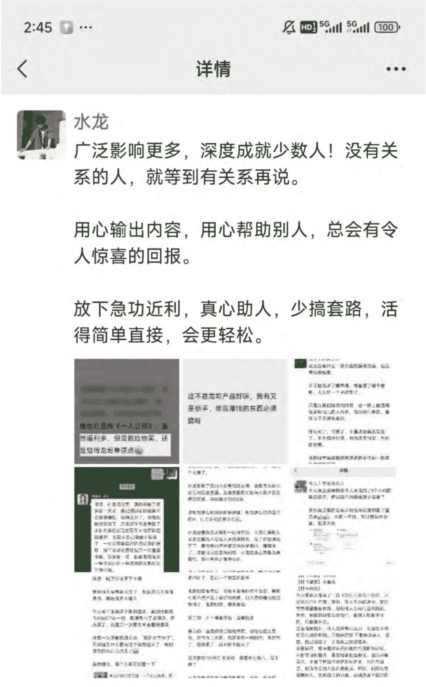

这种用户证言的方式，对于建立私域信任是非常有帮助的，尤其是你后面成交高客单产品的时候，用户证言是他们非常关注的，所以，一定要重视。

#### H5 3、生活圈，强化人设

美好生活，家庭聚会，朋友见面，生活美照等等，朋友圈也要自己生活的一面，才会有温度。

一些比较受欢迎的人设：老婆奴、正能量的创业者、宝妈、大厂人等等，选择你身上最明显的特点，去持续分享。

##### 详情

水龙
不知不觉真到了该结婚的年纪啦，趁着双十一，今天花一天时间去金店买了手镯，戒指和项链。

从没碰过这些东西，在抖音和小红书真恶补了好多知识。

得一佳人，实属不易，尤其是我这种无背景，能力一般的人，所以，遇到了，更要珍惜，更要好好对她。

愿执子之手，与子偕老。


提到了：凡凡老婆
2024年11月11日 17:49
评论

这类朋友圈的原则就是：真实，让别人也参与到你生活里，让他们感受到，你是朋友，而不只是来销售的。

总之朋友圈发圈原则：除了即兴表达，一定要认真写内容，字数起码100个字，能展示支付按钮，就大方的展示支付按钮。

#### 二、快速成长，IP变现

什么是成长阶段？

##### 1、围绕大V产品，建立自己的付费社群

当自己付费了一定的知识产品之后，通过分销大V的产品，去做个自己的付费社群是非常重要的：
- 1. 可以筛选自己积累的私域中对自己信任度更高的，进行更深入的运营和维护。
- 2. 可以降低自己在圈内的社交成本，让别人有机会给你打钱。

新手不建议做免费社群，一定要做付费社群。冷启动的话，可以将自己分销成功的人打个标签，或者给自己付费过的人打个标签，当人数超过20人以后，再拉一个付费社群。当然自己极度不自信的时候，你可以做一个免费社群，先去练手。

总而言之，做社群是一定要去做的。

建立好社群之后，要学会在社群中采用水军带货、社群演讲带货等，学会分享自己的IP故事，建立一个可以持续分享赚钱的社群。

新手最担心的是社群运营死了，怎么办？社群都是会死的，不用过度在意。做社群就是要不断建立自己【一对多】的销售能力，训练自己的公开表达能力。

做死一个，那就在合适的时机再开一个，不断运营，不断精进，最后就会成为社群运营高手。当你熟练建立付费社群以后，你的收入就会大幅度提升。

##### 2、做付费专栏，建立自己的内容壁垒

付费社群属于社交型产品，专栏就属于内容型产品。

在成长阶段，要左手搞流量，右手做内容。一款内容型产品，可以用于赠礼，更低成本地与他人建立关系，而好的内容，也会降低转化粉丝的成本。

我的自媒体专栏，积累了大量铁粉，很多粉丝都是看完专栏之后，就直接和我购买其他产品了，所以一款性价比很高的内容型产品是非常重要的。

新手该如何做自己的内容型产品呢？
很简单，学会去解答他人的问题，大量解答，将解答的答案整理成合集，而这个合集就是一个很好的付费专栏。

这种低价专栏，不仅可以让你在社交中不用重复回答他人的问题，还可以很好地解决白嫖的问题，让你的单位时间效率变得更高，更值钱。

##### 3、参与圈内活动，寻找商业机会

参加圈内的打榜活动，可以有几个好处：
- 1. 最低成本买到圈内的知识产品，经常可以买了就分销赚回门票，并且小赚一些钱。
- 2. 通过当志愿者、KOL分销等，可以免费地链接到圈内很多高手，快速扩充自己的信息源。
- 3. 在活动过程中，可以和顶级销冠免费地学习写销售文案、运营技巧、文案技巧等。

总而言之，想要提升自己的人脉和个人势能，圈内的活动，在成长阶段，要尽可能地多参加。

参与活动，要不断去分析活动的利弊，寻找赚钱的机会和获取私域的机会。
记住：人多的地方，就是充满商机，活动越大型，商业机会就越多。

参与圈内打榜活动，最重要的就是要学会和他人建立合作联系，学会抱团。做到几个点，可以很好地帮你赚到更多的钱：
- 1. 找机会成为你认识的某个大佬的销冠，并且和大佬绑定较好的关系。
  销冠不需要多，就像混圈不需要多一样。重要的是找到有格局、足够利他的大佬，和他做深度的绑定。我就是成为老马的销冠之后，他是圈内的前辈，我借助他的资源，在圈子里不断去扩大自己的人脉圈，然后有了我自己的基本盘。所以，死磕一个大佬，会比你到处混圈要更好，尤其是属于上升期的大佬。
- 2. 获得销冠是最好地提升自己势能的方式，想要拿下销冠，需要你日常学会团结那些比你弱的人，在合适的机会，才能一战成名。
  想要成为强者，你就得团结弱者，团结的弱者越多，你就会成为领袖，你的能量就越大，在合适的机会，你就会被他们托举成为圈内红人。所以日常要做的事情，就是多帮助比你弱的人。
- 3. 要有破釜沉舟、不破不立的勇气，要比其他人敢于重仓某个活动，才有可能成为佼佼者。
  圈内打榜，一般都会涉及到自己掏钱，也就是自己想要拿下某个销冠，可能要付出一定的金钱代价。所以，当你看到某个榜，你需要花一定代价，当你有足够的闲钱，而你十分缺乏势能的时候，你一定要敢于花钱。

记得花钱、赚钱，只有敢承担一定的风险，才有可能获得巨大的收益。看准了某个活动，就要重投，要么不出手，出手，在自己能接受的代价范围内，想尽办法拿下第一。

圈内通过分销打榜成为顶级高手，实现百万收入、千万收入，都有案例，所以打榜在你成长阶段是非常需要研究的事情，一定要仔细、认真研究。

##### 4、苦练专业技能，更具有个人分销竞争力

项目或者技能+IP是持续赚钱最重要的方式。

你要选择某个常青树领域，持续深耕，不断精进这个技能，让自己更具备差异化竞争力。
例如：爆文写作、小红书、闲鱼、AI写作等等。

选择某个长期赚钱的方向，在这个小领域上，不断去研究，从学员开始，再到成为老师，成为专家。这样子，你在分销的时候，你就具备了他人不一样的竞争力。

公众号懒人搜索，懒人专属群分享

#### 三、成为高手，建立联盟

什么是高手阶段？

当你有了一定数量的铁粉，有了一定的被他人认可的内容，有了一个大家都认可的标签或者技能，那你最需要的就是通过公开发售，去快速提升自己的影响力。

在这个阶段，你最需要的就是找到适合自己的商业模式，建立自己可以持续赚钱的产品体系。

##### 1、跑通低客单社群发售，私域裂变，不再缺私域

社群裂变是社群增长最重要的方式，也就是通过开高比例分销+奖励制度，让自己运营的社群有较高信任的兄弟，通过分销让他们赚到钱，自己可以赚到影响力和流量的方式，快速打爆自己。

以陪伴群为例：
一般来说，陪伴群运营到人数200人左右，就会出现增长缓慢，而社群也会随着时间慢慢消亡。那如何在短时间快速提升自己的社群人数，获得影响力？这里需要的就是发售，通过发售，将群快速增加到500人。

当然发售之后，是要做一定的变现，才能可持续。我在IP星球里，也专门写了低客单发售教程，是要去好好学习，并且实战的。

##### 2、跑通专栏发售，学会借势KOL，实现十倍转化

内容型产品发售的好处，就是可以通过内容本身就和用户建立较大的信任，在用户心里留下专家影响，后续可以通过顾问式销售，成交更高客单的产品。

而专栏，这类内容型产品发售，需要自己创造影响力事件或者自己的某个标签深入人心，有了一定的KOL积累之后才可以发起的。可以通过榜一，或者某个标志性事件，就可以发起自己的专栏发售。

- 例如自己写出多篇10万+爆文，就可以快速发售自己的爆文专栏。
- 例如拿下某个大V的销冠，自己在这个圈内也有了一定影响力，就可以快速发售。

这种内容型发售，记得内容是日常积累的，一定要对内容严格把控，这样子才会产生用户的口碑裂变。

##### 3、建立十、百、千、万元产品体系，实现睡后被动收入

我们做自媒体带货赚佣金，是围绕着大V的产品体系去建立自己的个人产品体系。一般大V的产品，都会从低价到高价，为了更好地进行分销赚佣金，我们通过分销赠送自己的产品，那就得建立自己的十、百、千、万元产品体系。在建立的过程中，一定要有自己的交付明确边界点，价格对应好对应的服务。

##### 常见组合：

我自己围绕着大佬们的产品体系，建立的IP产品体系如下，是可以给很多兄弟作为参考的：
专栏-社群-俱乐部-合伙人

内容型的10元专栏产品，我写一遍，就可以持续卖；而百元的社交型产品，我可以通过每日的优质内容分享，和他们建立较强的信任，从而筛选出需要进一步放大个人IP的同学，通过资源和流量赋能，构建了我自己的IP俱乐部；对于俱乐部中，打算和自己长期绑定、共创自媒体事业的，我推出了万元客单合伙人。

每个产品，对应的价格，有不同的服务，层层递进。

当然，还有更多的商业产品体系，要根据自己的个人特色，去不断完善自己的体系，并且将每个产品都做到一定数量。这样子，你就只需要不断付费大V，获取流量，不断沉淀流量。当你的体系运转起来之后，就可以实现每天被动收入、睡后收入了。

##### 4、建立圈内联盟合作，让IP可穿越周期性

拥有了自己的内容和产品体系之后，想要在圈子里放大自己，获得更多商业变现机会和流量合作机会，就得建立自己的合作联盟以及自己的核心小团队。

一般常见的合作方式就是你做内容，别人给流量，然后变现分钱；或者你搞流量，别人做内容交付，合作分钱。

我们作为超级个体，一人公司最大的好处就是我们的试错成本很低。所以，当我们在圈内认识到很多其他IP，并且他人表达出合作意向的时候，一定要去多尝试合作。如果合作得好，你就会拥有多一个变现渠道；哪怕合作失败，我们及时止损就可以了。

核心小团队是因为我们日常在发售，或者和他人合作的时候，都需要出人出力。因为私域是比较贵的，不能随意让他人参与进来，一般都是员工。但请员工是非常贵的，所以我们最好是从自己的学员中挑选自己的核心成员，给他们更多的流量支持，给他们更多的特权，让他们愿意和自己更深入的共创事业。

拥有自己的线上核心小团队，会让你在和其他人合作的过程中，更加的高效。

以上三个阶段，对着每个步骤，严格执行，将自己的执行力拉满，你肯定可以和我一样成为一个赚钱的自媒体IP。

评论区：
安俊：跟着龙哥赚了不少钱！龙哥值得！
艺涵：水龙哥！值得！冲鸭！
徐铮：新手，IP，团队，龙哥写的太详细了，把分销带货的成长阶段拆透彻了。确实跟着龙哥学了不少东西，赚了不少钱！
老马：很厉害，龙哥写的真好

公众号懒人搜索，懒人专属群分享

### (30赞)高鹏分享热门玩法：再次吃肉的机会

作者： 高鹏圈
日期：2024-11-29

大家好，我是高鹏。

今天继续分享一个热门玩法。

又可以吃肉了，兄弟们，昨天网易重磅上线了一款app叫做小蜜蜂。

要知道像这种一线大厂，每次它推出一个新的东西的时候，都是咱们普通人的大机会。

想象一下如果当年抖音刚上线的时候，你就去玩了，还怕做不起来吗？那些千万级别的号，基本上都是一开始就开始玩了。

刚上线的这个小蜜蜂，现在安卓苹果双端都有了。

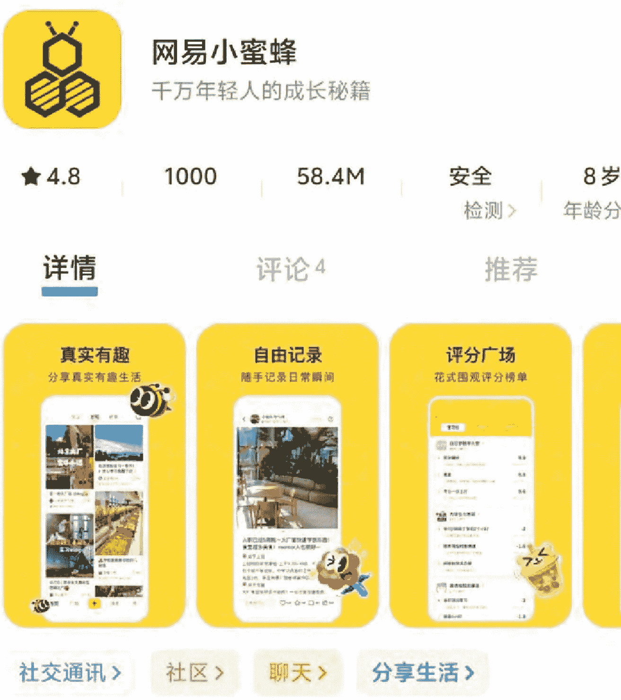

我也去试了一下，它的页面整体来说还是比较简洁干净的，运行起来也比较流畅。

官方给到的slogan是年轻人分享交流日常生活的内容社区。

也就是说它和抖音快手小红书等等一样都是内容驱动的。

#### slogan
年轻人分享和交流生活日常的内容社区

从它的页面和功能来看的话，大家可以看出来它特别像是小红书，因为它对标的就是小红书。

大家可以看一下，左边是小红书，右边就是小蜜蜂，排版都是一样的，也是这种双列的瀑布流。

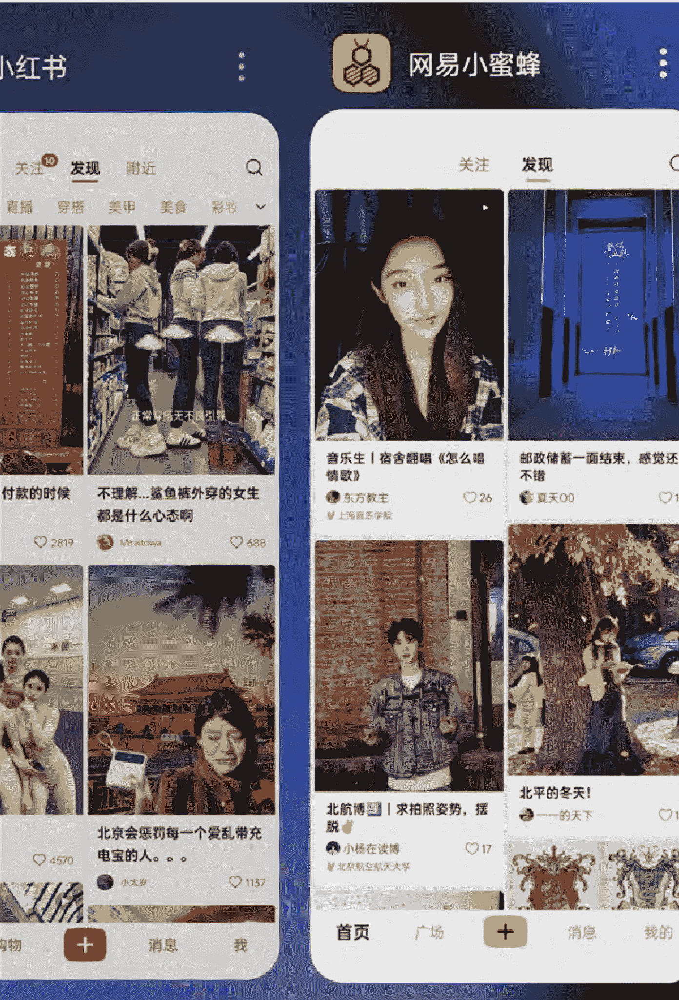

现在的话作为用户，跟小红书一样，可以发图文的笔记，也可以发视频的内容，包括参与一些话题都是可以的。

他跟小红书之间的一个最大的区别，就是它支持职场工卡的验证，你验证了你的职场身份之后，会得到平台更多的支持。

我为什么说它对于普通人来说是一个机会呢？
首先它是大厂推出的，第二是新的平台。

像这种新的平台推出的时候，他都有一个发展周期，大概是会经历这三个阶段。
首先是初创期，初创期就是蛮荒发展的时代，尤其是像这种内容平台，它刚开始没有内容，你就直接去搬都是可以的。因为站在平台的角度来说，平台上没有的东西就是原创。

第二个阶段就是发展期，这个时候越来越多的作者涌入进去，各赛道也会变得稍微的拥挤。这个时候平台就开始对内容创作者要求内容的质量，以及原创度等等。

最后一个阶段就是它的成熟期，这个时候是最卷的时候了，平台上的创作者已经非常饱和了，各个赛道都相对来说比较拥挤了，你需要去找一些相对来说更加好做的细分领域。


总而言之，越早入局肯定是越容易做起来的。

我们作为普通人到底应该怎么去入局呢？给大家推荐两个板块。

根据平台它的定位和调性以及它的slogan，你就能够发现它对于职场和生活这两个板块是更加的扶持的。作为定位和赛道选择来说，这两个板块无疑更容易跑出来。


网易对于种草这一块一直都是虎视眈眈的，就在前不久，它的云音乐里多了一个入口，这个入口的名字呢叫笔记。明眼人一看就知道他想做啥，明摆着就是想做种草，现在突然单独推出了小蜜蜂，而且非常像某红书，这是铁了心要做种草这板块。

刚才说了两个赛道，职场和生活，它的内容我们怎么来做呢？
一开始我说了，像这种平台初创期，它是比较缺内容的，直接去对标小红书和小绿书的职场和生活这两个板块的内容就可以了。


商业化模式，目前来说平台上有一个打赏机制。就是如果用户看到自己喜欢的图文或者视频内容，可以去打赏。单次打赏的话就是几十块，但是它现在是不限次数的，有点像公众号里有人发了文章，别人觉得你的文章不错，下边挂一个赞赏的按钮。现在这是它唯一的作为内容创作者的商业化模式。

目前关于电商的相关商业模式还没有，但是刚才我说了，他发力的就是种草这个板块。所以未来小红书有的东西它肯定也会有的。

重点就是先瞄准你自己的领域尽早的去入局，先把号做起来，这是最关键的。

这就是今天给大家分享的这个机会。

因为它是对标的小红书，所以你去他平台上去玩的时候，就直接参考小红书的玩法就可以了。

关于小红书上生活和职场这两个板块，我这边有三套小红书的玩法，里边包含有几十节的视频课，统一放到文档里了：https://svj4gxvm0v3.feishu.cn/docx/DzpbdyyPgopeVYxxnRycRqaqnMe?from=from_copylink

我是高鹏，深耕网创9年，这是我拆解的第697个落地项目玩法，更多项目玩法，欢迎找我聊聊呀~

#### 评论区：

璟曦：一刷帖都是网易的和大学生在发😂

ToNet：和脉脉有啥区别

### (22赞) 人工智能在医疗诊断中的应用与挑战

作者：Sitin彭涛

日期：2024-11-29

大家好，我是Sitin彭涛，连续3年超百万收益的90后创业者。

我的千里会创办满3个月了，从2024年08月26日-11月26日，3个月的时间收入超90W+，首次公开复盘我这一路来的发售、交付细节操作，主要分为六大步：

- 一、灵感源泉：用户需求，同行调研
- 二、爆款秘诀：精准定位，卖点聚焦
- 三、小步快跑：灰度测试，组合出击
- 四、趁热打铁：迅速交付，惊喜连连
- 五、顺势而为：集中资源，引爆市场
- 六、真心感谢：铭记于心，外化于形

希望能帮助到同样准备做高客单价产品的朋友们！

### 一、灵感源泉：用户需求，同行调研

我做千里会这个合伙人产品并不是心血来潮，我是从2018年开始做公众号创业的，一开始做客单价比较低的副业有道星球、写作赚钱星球、各种小报童产品，到后面三位数的出海赚美刀社群，四位数的python、AI爆文、AI代写等训练营，我做了不少产品。


这些年，我也凭借自己和团队的认真交付，收获到了一批铁粉，他们总是无条件支持我，无论产品高低。有一天，我的铁粉问我：能不能有这么一个品，买了之后，我后续出的品可以给铁粉打一波折扣？

我当时就觉得是应该去回馈一下我的铁粉，同时我也发现了目前的一些问题：

- 1、我的产品线很多，最长时间陪伴的品就是训练营，最长2-3个月就结束了，有些比较支持我的用户在训练营结束后的问题其实不好解决，他们需要长期陪伴；
- 2、我也需要给一些一直在买我很多产品的铁粉一些福利回馈，至少他们不需要原价再买；
- 3、目前支持我的铁粉散落在我的各个社群，触达起来比较麻烦，我大概率需要一个地方，把我的铁粉们聚集起来，同时带他们赚到钱。

想是这么想了，但是解决起来并不容易。例如我的大多数高客单品会有合作的讲师，如果要给我这边铁粉折扣，这个折扣比例不能妨碍到合作讲师的利益，又比如说如果给价格福利肯定是面向所有铁粉，有些学员是原价购买了我好几个高客单品，那到时候就会觉得自己多花了钱，观感就不太好...

为了响应用户需求以及存在的产品体系问题，我花了六位数购买了市面上的大多数同行产品，去感受他们的运营模式，发现觉醒的生态做的不错，但好像也有一些地方不太适合我这边的情况。直到4月份去和阿猫老师线下见面，发现他对私域运营了解透彻，我当时就马上购买了几万的觉醒商业私教，请他帮我给这个品提一些指导性意见。

我在生财有术好几年了，也经常刷帖子，看内容，研究商业模式，当时很多灵感都是从这里来的，非常感谢这个圈子。毫不夸张地说，这里应该是学习同行、和同行交流最合适的地方。

### 二、爆款秘诀：精准定位，卖点聚焦

后来我们就商量怎么把这个产品卖爆，把所有产品梳理分类后，总结出来IP+项目肯定是可以打的，但如果仅仅是项目+IP，差异度很小，IP基本都是这个模式，如何凸显出我们的卖点呢？

一开始还想过是不是可以讲编程这个点，后来给否了，因为对大多数人来说，编程这个还是很让人感觉到有难度，在咨询阿猫老师的建议后，又和自己内部团队反复商量，最后打出了AI这张牌。因为目前市面上AI相关的合伙人产品比较少见，而这个又很符合我的未来发展，我本身也准备在AI领域深耕，又很符合我当下的定位，比如我手头就有不少AI相关产品，AI爆文、AI代写等等。

关于定价，说实话，我一开始是奔着万元圈子去做的，所以福利拉的很满，我旗下几万的产品都拿出来赠送，并且还赠送了一期重交付的AI代写训练营，还有我的1V1咨询，超多的流量赋能等等，起码也得定个1万块钱吧？

但是后来阿猫老师建议我不要一开始定太高，原因是：

- 1、快速扩充到100人很重要，因为这里面的KOL也会帮你去卖，这样后面会有更多增长，这个势能和慢慢卖到100人还是很不一样。
- 2、刚开始定太高，后期不好涨价，如果一开始定价1万或者6999，结果卖的不理想，就被架住了，也不能降价，就会很尴尬，倒不如一开始低一些，卖的还OK再继续涨。

我觉得阿猫老师说的非常对，所以一开始的内测价（最低价）定的就是3999，因为真的特别划算，所以基本有意向的都会入，想卖的KOL也卖得动。

关于时间，考虑到我自己还交付1V1语音咨询这些权益，交付起来会比较吃力，所以一开始我想的是交付4-5年，但在阿猫老师指点下，最后敲定的是7年。

首先是1V1语音咨询，其实可以不用定死，改为早期用户不限次数，后续加入成员限制次数，甚至取消，这样还可以让用户觉得早进早划算一点。另外实际上不会每个人每天都来打电话，但就会让人觉得很值，事实上我在回访的时候，也发现很多人是冲着无限次电话咨询来的。而且还有一个解决办法是，每次电话前，有一个详细的流程让咨询人准备好充足的背景信息和需要询问的问题，这样交付的效率会很高，每次电话后，让咨询人写复盘发到社群，小助理会做好整理，这样一来，也实现了一鱼多吃。

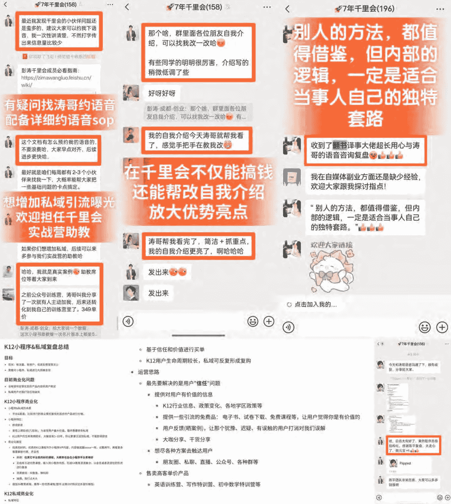

其次是知识付费的续费率其实很低，如果能一次性续费完很长的一段时间，其实是赚的，把年限拉长，用户一看一年才几百块钱，就会觉得占便宜，很想买。

这里真的感谢阿猫老师的指导，从开始就把调子定下来，后续的一系列动作才可以达到预期，私教名不虚传！

### 三、小步快跑：灰度测试，组合出击

产品权益和卖点捋完后，因为海报设计还需要时间，所以我就先拿着锤子便签和一篇写清楚自己为啥做千里会的初衷的公众号文章，去做灰度测试。我也总结了4个很重要的地方：

#### 1、社群：铁粉群——高客单价群——自己的普通付费群——他人的高价付费群

灰度测试要讲究顺序，先熟悉再陌生，先高价再低价。因为我的社群有几百个，所以当时我们团队的小梦就直接拉了一张表格，把我所有的社群按价格排序，给我节省了不少时间。

在社群的宣传文案有两个细节很重要：

一是说明我现在在内测，外面没有公布这个品，只有你们能享受这个内测价，让铁粉感受到被重视。类似话术有：“请大家千万不要外传，因为还在内测中”，“大家已经是超级铁粉了，提前和大家说这个消息”，“到时候的发售价格应该在5000-10000的范围，但是咱们是铁粉，只要3999元！！！”

二是发文案的时候，要注意哪些用户跟自己互动，每个社群发完我都会在微信上备注千里会意向，方便后面我私聊时能精准成交。

#### 2、朋友圈：盲盒、连续剧

这也是阿猫老师传授的一招，循序渐进地在朋友圈展示自己卖的一个过程。

第一阶段：可以说说自己的商业认知、自己的想法，想做一个圈子来和支持我好几年的兄弟们一起做点事情，主要是说自己为什么做这个品？

第二阶段：说明自己已经在内测了，但是具体权益海报还没出，只在几个铁粉圈子里试运营，已经多少个人购买了，感谢支持，一定用心交付等等，勾起朋友圈的好奇心，同时也是为后续自己正式开卖做一个铺垫，让大家有一个心理预期。

第三阶段：说自从透露出有这个品，太多人来问了，海报都还没出，真有兴趣的可以私信来看权益，接受盲定。

第四阶段：我当时是在七八十的时候开始说，已经盲定了快xx个人了，群内大佬真的很多，好有安全感，满100人的时候会群内发大红包！这段动作也帮助我迅速突破了100人的关卡。


保持1天起码5-6条的频率，让用户像看电视剧一样。这里也有一个管理小技巧，我会把有用的截图发到内部团队群，让团队小伙伴提供一些可以写的灵感，我再完善发圈，这样大大节省了我的时间。

#### 3、私信：主动询问痛点

私聊成交很重要，尤其是高客单用户。

我会在私信前看看客户之前跟我的所有聊天记录，不得不说，黑科技真的好用，这也是我能够轻松管理10W+私域的原因，对客户有一个大致了解后，我会表示一下真的很感谢之前的支持，再结合他自身情况分析为什么他适合加入千里会。

这里也提醒我们一个点，这种高客单的铁粉平时是需要回访维护的，像我之前就会在训练营交付期间定期回访，询问学习进度，甚至给到资源支持，大家就觉得我挺靠谱的，因为平时有联系，所以这时候去私聊售卖，也有话题可聊，并不会尴尬。

#### 4、回访：问为什么加入

用户证言极为重要，可以清楚用户更期望哪些交付，让我们后续的交付更加丝滑，客户更加满意，还可以借此机会清楚哪些权益用户更喜欢，调整迭代自己的宣传文案，而且通常这种回访时，用户还会提供很多好评，简直一举三得。

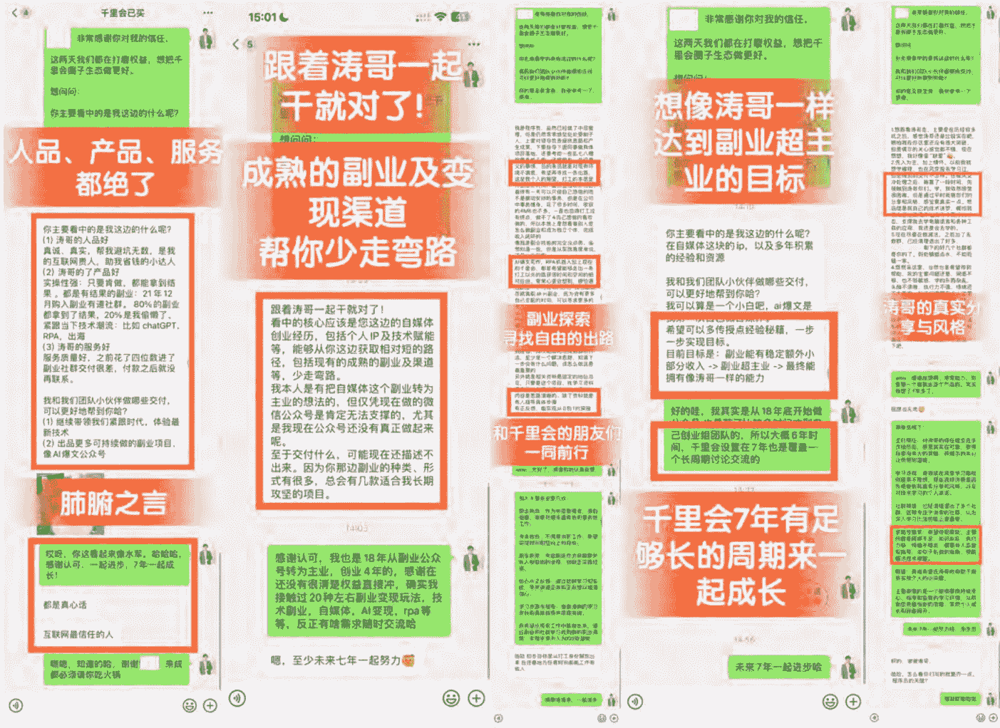

说实话，作为一个i人，初期每天私聊20人左右，真的有点累，但这个回访动作，让我得到了很多的用户反馈，有些真的挺暖心的，我突然就觉得累也值得，更应该好好做好千里会，让追随我的兄弟都能有所收获。

### 四、趁热打铁：迅速交付，惊喜连连

内测期间就收到了150+铁杆粉丝的支持，其实我是挺受宠若惊的，毕竟四位数的客单价，对很多兄弟来说，可能是半个月甚至一个月的工资了，兄弟们如此支持我，我也愿意拿出120%的诚意。

除了每天在千里会群里给大家输出一波干货，一有空就私聊千里会成员询问大家需要的支持外，还带着团队伙伴一起卷起来，那段时间半夜十一二点还在确认工作细节是常态。

但时间花在哪里，收获就在哪里。

2024年9月1日，千里会旗下产品一览表&千里会成员成长地图正式与大家见面。

产品一览表里不仅包含了我旗下AI+项目+IP所有产品，分佣多少，如何兑换都一目了然，成长地图还分为通用地图、三大方向地图，只为让大家更快更清晰了解在千里会的产品资源以及如何学习，直到现在，这些文档依旧在不断更新，只为给大家展现更优质的服务。


| 产品分类 | 产品名称 | 原价 | 优惠后 | 分销佣金比例 | 分销钩料合集 | (链接跳转花漾汇)详细教程 |
|---|---|---|---|---|---|---|
| 精选优惠、免费学习 | [AI写作变现]训练营 | 649元/期 | 内部享受优惠价 |  |  |  |
|  | [AI读写文件]训练营 | 249元/期 | 内部享受优惠价 |  |  |  |
|  | [RPA机器人]入门进阶实战 | 1999元/年 | 内部享受优惠价 |  |  |  |
|  | [出海赚美刀]星球+社群 | 599元/年 | 内部享受优惠价 |  |  |  |
|  | [Python办公自动化]视频课 | 499元/终身 | 内部享受优惠价 |  |  |  |
|  | 公众号写作机器人 | 1299元/终身 | 内部享受优惠价 |  |  |  |
|  | 自动写知乎机器人 | 1099元/终身 | 内部享受优惠价 |  |  |  |
|  | 闲鱼批量发布商品机器人 | 999元/终身 | 内部享受优惠价 |  |  |  |
|  | 自动搜索抖音视频并评论的RPA机器人 | 899元/终身 | 内部享受优惠价 |  |  |  |
|  | 抖音自动回复私信机器人 | 899元/终身 | 内部享受优惠价 |  |  |  |
|  | 抖音自动评论达人粉丝的作品机器人 | 899元/终身 | 内部享受优惠价 |  |  |  |
|  | 小红书发布视频和图文(可控小翼车) | 899元/终身 | 内部享受优惠价 |  |  |  |
|  | 小红书发布视频和图文(创作者中心) | 899元/终身 | 内部享受优惠价 |  |  |  |
|  | 小红书自动搜索并评论的机器人 | 899元/终身 | 内部享受优惠价 |  |  |  |
|  | 自动添加微商好友机器人 | 899元/终身 | 内部享受优惠价 |  |  |  |
|  | 微信全自动回复好友并进群 | 899元/终身 | 内部享受优惠价 |  |  |  |
|  | 自动化操作剪映图片批量转视频 | 899元/终身 | 内部享受优惠价 |  |  |  |
|  | Twitter自动搜索并评论机器人 | 1099元/终身 | 内部享受优惠价 |  |  |  |
|  | Tiktok自动搜索并评论机器人 | 899元/终身 | 内部享受优惠价 |  |  |  |
|  | 海量导出百度文库思维导图机器人 | 899元/终身 | 内部享受优惠价 |  |  |  |
|  | 一键采集小红书作品数据 | 899元/终身 | 内部享受优惠价 |  |  |  |
|  | 多平台视频同步机器人 | 899元/终身 | 内部享受优惠价 |  |  |  |
|  | 百度文库思维导图自动生成小红书 | 899元/终身 | 内部享受优惠价 |  |  |  |
|  | 小绿书仿写机器人 | 899元/终身 | 内部享受优惠价 |  |  |  |
|  | 知乎自动私信博主粉丝机器人 | 899元/终身 | 内部享受优惠价 |  |  |  |
|  | [5分钟搞定ChatGPT]小短课 | 99元/终身 | 内部享受优惠价 |  |  |  |
|  | [独立开发者首次飞行指南]小短课 | 49元/终身 | 内部享受优惠价 |  |  |  |
|  | [5分钟搞定AI绘画]小短课 | 49元/终身 | 内部享受优惠价 |  |  |  |
|  | [手把手教你海外赚钱]小短课 | 19.9元/终身 | 内部享受优惠价 |  |  |  |
|  | [100个效率提升工具]小短课 | 12元/终身 | 内部享受优惠价 |  |  |  |
|  | [50个RPA自动化机器人]小短课 | 11元/终身 | 内部享受优惠价 |  |  |  |
|  | [5分钟搞定个人网站搭建]小短课 | 10元/终身 | 内部享受优惠价 |  |  |  |
|  | 精涛1v1线下咨询(24小时内) | 5000元/次 |  |  |  |  |
|  | 彭涛七年千里会 | 4499元/年 | 420% | 彭涛千里会好课合集(扫码看):4499元/7年 |  |  |
|  | 彭涛1v1线上咨询 | 2000元/小时 |  |  |  |  |
|  | 升级加入入门进阶实战 | 1999元/一年 | 私域老客助德(huguan725) | 彭涛AI外的力量(扫码看):1999元/ |  |  |
|  | 线下闭门聚会 | 200元/次 |  |  |  |  |
|  | 线下群菜聚会 |  |  |  |  |  |
|  | 彭涛周边一套束 | 200元/束 |  |  |  |  |
|  | 彭涛周边文化礼 |  |  |  |  |  |
|  | 彭涛周边马克杯 |  |  |  |  |  |
|  | 彭涛周边帆布包 |  |  |  |  |  |
|  | Python网课 | 4499元/期 | 私域老客助德(huguan725) | 彭涛Python配套资源包和训练营(扫码看):4499元/期 |  |  |
|  | AI写作变现 | 2999元/期 | 私域老客助德(huguan725) | 彭涛AI写作实操笔记(扫码看):2999元/期 |  |  |
|  | AI读写文件 | 2499元/期 | 私域老客助德(huguan725) |  |  |  |
|  | 看宝实战 | 999元/期 | 私域老客助德(huguan725) |  |  |  |
|  | 公众号批量写机器人 | 9990元/年 | 50% |  |  |  |
|  | 小红书笔记批量维护(小时的大号维护) | 1800元/年 | 50% |  |  |  |
|  | 小红书自动搜索并条件评论的暗刷工具 | 1600元/年 | 50% |  |  |  |
|  | 小红书上新发布机器人(创作者中心) | 1500元/年 | 50% |  |  |  |
|  | 公众号写邮件机器人 | 1299元/终身 | 50% |  |  |  |
|  | 小红书矩阵评论 | 1100元/年 | 50% |  |  |  |
|  | 小绿书矩阵写机器人 | 1100元/年 | 50% |  |  |  |
|  | 自动写知乎机器人 | 1099元/终身 | 50% |  |  |  |
|  | 闲鱼批量发布商品机器人 | 999元/终身 | 50% |  |  |  |
|  | 自动搜索抖音视频并评论的RPA机器人 | 899元/终身 | 50% |  |  |  |
|  | 抖音自动回复私信机器人 | 899元/终身 | 50% |  |  |  |
|  | 抖音自动评论达人粉丝的作品机器人 | 899元/终身 | 50% |  |  |  |
|  | 小红书发布视频和图文(可控小翼车) | 899元/终身 | 50% |  |  |  |
|  | 小红书发布视频和图文(创作者中心) | 899元/终身 | 50% |  |  |  |
|  | 小红书自动搜索并评论的机器人 | 899元/终身 | 50% |  |  |  |
|  | 自动添加微商好友机器人 | 899元/终身 | 50% |  |  |  |
|  | 微信全自动回复好友并进群 | 899元/终身 | 50% |  |  |  |
|  | 自动化操作剪映图片批量转视频 | 899元/终身 | 50% |  |  |  |
|  | Twitter自动搜索并评论机器人 | 1099元/终身 | 50% |  |  |  |
|  | Tiktok自动搜索并评论机器人 | 899元/终身 | 50% |  |  |  |
|  | 海量导出百度文库思维导图机器人 | 899元/终身 | 50% |  |  |  |
|  | 一键采集小红书作品数据 | 899元/终身 | 50% |  |  |  |
|  | 多平台视频同步机器人 | 899元/终身 | 50% |  |  |  |
|  | 百度文库思维导图自动生成小红书 | 899元/终身 | 50% |  |  |  |
|  | 小绿书仿写机器人 | 899元/终身 | 50% |  |  |  |
|  | 知乎自动私信博主粉丝机器人 | 899元/终身 | 50% |  |  |  |

2024年9月10日，千里会新人内训暨第一次圆桌对话。

一个小时的圆桌会议，看似不长，但想呈现一个不错的效果，背后也需要花时间去筹划。从开会讲什么、什么时候讲、具体的材料准备、以及会后由什么承载回放链接、邀请大家参与复盘小活动……每一个环节都需要打磨丝滑，做得越细节才越容易给出超预期的交付，当时收获了特别多的好评。

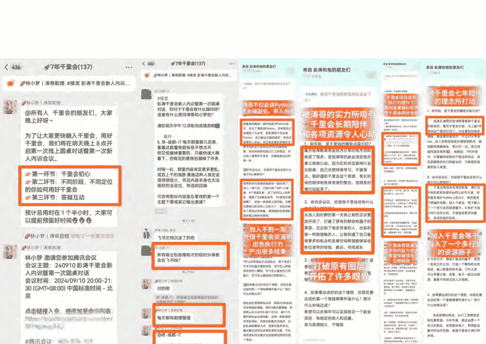

但做到这一步好像还是差点意思，于是我又私下花钱请有结果的教练带着大家一起做项目，千里会的副业项目也因此全面开花。

- 2024年09月12日—09月27日，千里会网盘拉新赚钱实战营；
- 2024年09月27日—10月09日，千里会公众号快速入门实战营；
- 2024年10月09日—10月24日，千里会小绿书项目实战营；
- 2024年11月11日—11月24日，千里会朋友圈变现实战营；
- 2024年11月12日—12月12日，千里会小绿书进阶变现行动营；

## 公众号懒人搜索，懒人专属群分享


都是团队精挑细选的，且打磨了一次又一次的项目训练营交付SOP，不仅有保姆级教程，还有沉淀问答库，适合所有对副业感兴趣、零基础的小白随报随学，千里会成员全部免费学习，且100%分销。

很多兄弟感叹“项目根本学不完”，加上交付确实也不错，所以大家吃了定心丸，打心底里相信跟着我有肉吃，除了跟着做项目赚到钱的兄弟，还有一些擅长销售的也借着我的训练营把门票赚回来了。截止目前为止，5个项目实战营我就发放了XX元佣金，还不包含给大家颁发的里程碑奖励、其他礼物奖励。

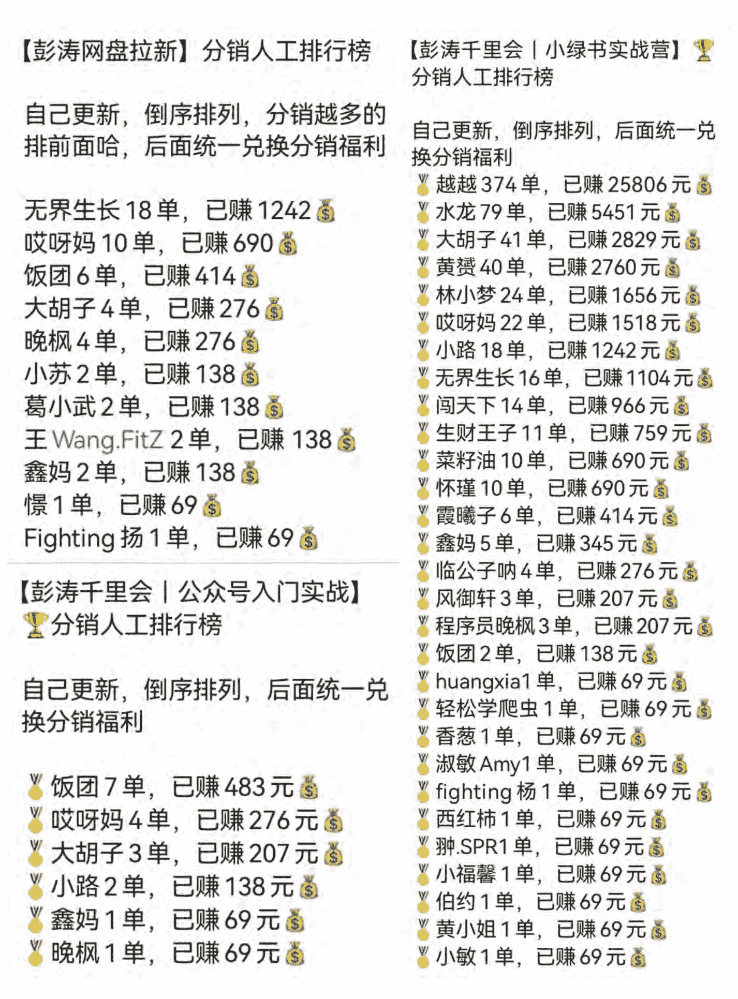

而不断涌入的新流量，尤其小绿书，直接带来1000+人，让我又看到了新的趋势，目前团队给千里会成员的交付已经撑得住，是时候筹备公开课了。

### 五、顺势而为：集中资源，引爆市场

千里会“万事俱备”，也预热的足够久了，是时候借助“外部的东风”来放大势能了。不吊大家胃口哈，10月24日—10月30日，通过为期一周的公开课，千里会成员又增加了52人，发售业绩为23.3W。至此，千里会已经来到200+人的里程碑式节点，千里会生态也在稳步扩建中。

而能取得如此好的成绩绝不是我一个人的功劳，这里面也包含了大家的倾情支持，简单分享三个我认为会影响整体效益的要点：

#### 1、流量要足够大：公开课邀人+连麦嘉宾双管齐下

在公开课筹备期，我们私下与许多KOL就紧密联系过，确保有足够多的KOL可以帮忙打榜拉新，这里还有一个小细节：不过早拉KOL进群，因为战线拉得太长、群内陆续进人的话会造成大家注意力疲软，所以当时确认可以帮忙打榜后，我给大家都备注了标签，在打榜前一周才正式邀请大家。

既留有足够的的时间让KOL帮忙拉新，又能让大家在动力充足时进行冲榜。并且我还邀请了7位大咖助力连麦：阿猫老师、微笑哥、水龙老师、蓉儿老师、靠谱老师、临公子、理白老师。在各位KOL和连麦嘉宾的联合助力下，公开课人数达到7137人，这也为后期打胜仗做好了坚实的铺垫。

#### 公开课安排

- **10月24日** 20:30-21:30
  - 主题：没有上过一天班，如何成为一人公司
  - 图文干货：从小厂程序员，到年入百万创业者，素人如何靠自媒体改变命运
  - 大咖连麦：对话阿猫 | 没有上过一天班，如何成为一人公司
- **10月25日** 20:30-21:30
  - 主题：从0到1年入200W+，普通人如何利用AI实现逆势增长
  - 图文干货：小白如何靠副业实现财务自由，互联网5种变现模式大揭秘
  - 大咖连麦：对话微笑 | 从0到1年入200W+，普通人如何利用AI实现逆势增长
- **10月26日** 20:30-21:30
  - 主题：从兴趣到职业，一个人如何从0到1自媒体实现小而美的创业
  - 图文干货：低门槛高变现，零基础小白如何用AI写作赚到副业第一桶金
  - 大咖连麦：对话蓉儿 | 从兴趣到职业，一个人如何从0到1自媒体实现小而美的创业
- **10月27日** 20:30-21:30
  - 主题：如何用私域IP和项目虚实结合实现经济独立
  - 图文干货：小绿书风口！每天操作10分钟，轻松月入四位数
  - 大咖连麦：对话水龙 | 如何用私域IP和项目虚实结合实现经济独立
- **10月28日** 20:30-21:30
  - 主题：从0-1成为年入500W+的医疗IP，自媒体红利到底给了普通人多大的机会
  - 图文干货：如何边上班边摸鱼，靠公众号做个人IP实现月入5位数
  - 大咖连麦：对话梁靠谱 | 从0-1成为年入500W+的医疗IP，自媒体红利到底给了普通人多大的机会
- **10月29日** 20:30-21:30
  - 主题：利用下班后3小时，普通人持续副业变现百万之路
  - 图文干货：普通人如何不追风口，沉淀复利资产，做击穿周期的IP
  - 大咖连麦：对话临公子 | 利用下班后3小时，普通人持续副业变现百万之路
- **10月30日** 20:00-20:50
  - 主题：普通人如何做有长期价值的IP，持续10年稳定营收百万
  - 图文干货：做好自媒体，真的不难——致所有千里会学员的一封信
  - 大咖连麦：对话理白 | 普通人如何做有长期价值的IP，连续10年稳定营收百万

#### 引爆AI·项目变现公开课

进群总人数达到7137人
立即长按扫码进群
免费领取价值199元的《20+吸金副业项目变现手册》

#### 彭涛 | 七年千里会创始人

- 7年，7次直播连麦，7次图文干货，值！
- 90后创业者+AI技术自媒体博主
- 连续3年超百万收益
- 深耕教育与技术领域10年+
- 矩阵号累计30W+读者
- 10W+私域，1W+付费用户

#### 收钱转账邀人流程 简单丝滑
#### 倒计时超大红包 刺激发圈出单
#### 跟着涛哥走 红包天天有
#### 满屏泼天富贵 近涛者富
#### 一屏装不下的大红包 谁看了不说一声牛
#### 涛哥又撒钱了！

彭涛千里会分销打榜群(140)
10月30日 晚上23:55
快来抢最后一个名额
大家一起冲！卖爆涛哥！！！
大家一起冲！卖爆涛哥！！！
大家一起冲！卖爆涛哥！！！
大家一起冲！卖爆涛哥！！！
大家一起冲！卖爆涛哥！！！
冲！
+1
深夜+1
太牛逼了白哥！
太牛逼了白哥！
太牛逼了白哥！
谢谢涛哥的大红包 千里会值得
第200个送阅读器
今天最后12小时涨价了，大家可以借这个福利，发一波圈，说说为什么推荐加入千里会，发了的小伙伴，截图发群，我会根据情况，请大家吃个鸡腿发18.8-66的随机红包哈。

10月30日 中午12:23
哇！！涛哥又撒钱啦！
快薅涛毛哈哈哈哈


#### 2、内容要够硬核：副业项目+公开课分享交付到位

在公开课前期操办的三个副业项目，不仅让千里会成员安心学习，同时也让愿意前来协助的KOL看到“为什么要来帮千里会”的价值所在，时不时show出“肌肉”很重要。并且所有千里会成员在加入后马上可以参加一期原价1999元的AI写作变现训练营，交付够实在，是长久生存之道。

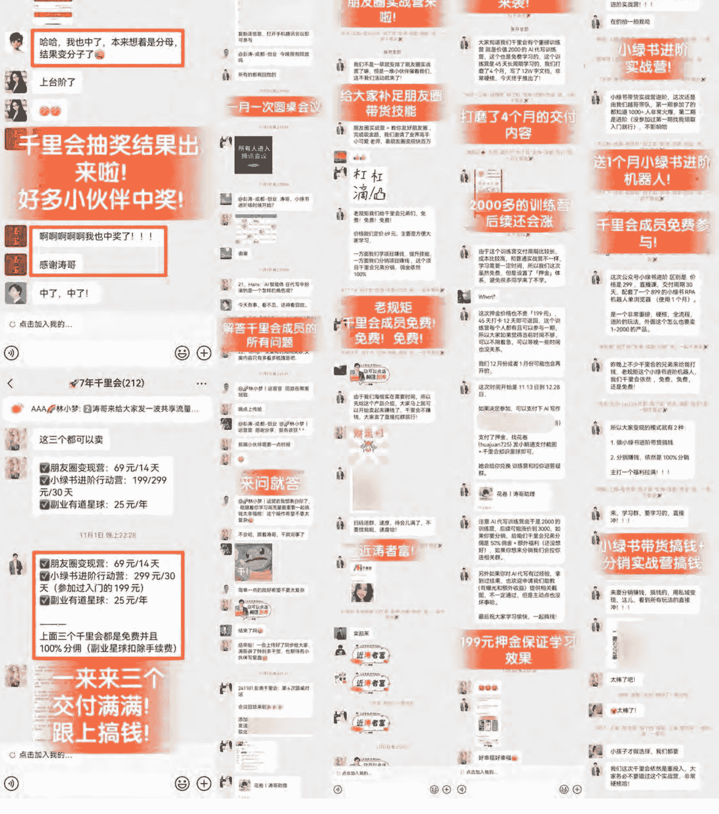

团队一起花心思打磨的7篇公开课分享稿，从我的成长故事、3个副业项目的实战拆解、公众号、个人IP以及想对千里会成员说的一封信，几乎囊括了我创业这些年来所有的心法和方法，再经过两位操盘手彩卉、小梦修改润色，每一篇稿子都饱含诚意，也有好些千里会成员因为分享稿想要靠近我，真诚真的是必杀技。

还有我们7位嘉宾的超强助攻，不仅带来超多福利权益送给报名的千里会成员，还通过发朋友圈、远超约定的一小时的直播助力为千里会打call，真的很感动，大家的好我都铭记在心。彩卉老师的直播实力也是非常具有感染力，不管是临场发挥，还是跟单催单，从20点-24点的全程直播助力，把我们都折服了！

#### 3、团队协作要给力：外部操盘+内部运营携手并进

外部操盘：彩卉老师带着团队一起给我们写文案、搞直播、进群溯源、做海报等，井井有条、丝毫不慌是公开课运营的基调，后续跟单催单更是让人拍手叫好，细节拉满。比如提供私聊谈单话术、维护社群氛围、撰写倒计时钩子文案等，全程参与的兄弟应该都感触蛮深的，学习到了很多公开课运营细节。

内部助力：在实战营期间，除了涉及一些重大决策需要我做主外，很多其他事情，如社群运营、海报对接、文案撰写、信息同步等都由我们团队小伙伴们负责，有她们在，我轻松不少，也可以将更多精力集中在千里会向外发展的业务上。就拿跟单这个事来说，当时团队的小梦和虾仁就给我梳理了填写问卷的、直播间互动的意向客户，给我省下不少搜索的时间。

### 六、真心感谢：铭记于心，外化于形

为啥我的团队能连续肝一周依旧干劲满满？因为我就算自己很累很忙，也会去私信交流送去感谢以及每晚下播后给大家发大红包鼓舞士气。


为啥我总是有那么多贵人助力，帮我拉新，跟我连麦？因为我分佣让利足够爽快，比如开50%分佣，简化收款程序；比如打榜群发一条朋友圈就有18.88元，优质朋友圈18.88~66元不等的红包；比如拉人进群有钱，后面转化了还有钱，你跟我连麦，我更是会想方设法给你送钱送客户送资源。


看上去是我亏了，实际上是我赚了，千里会的名声就这样打响，很多大佬都愿意帮忙宣传千里会，这个价值是巨大的，有长尾效应的。

为啥我的产品一出就那么多人买单？就算发售结束了，现在依然进人不停？因为我会感谢用户，在我看来对用户最好的感谢就是拉满交付，带大家赚钱。

说的天花乱坠都不如来场交付更实在，所以从进群欢迎仪式、到1V1语音咨询、线上圆桌会议，再到马上花钱请教练再开展新的训练营，带着大家一起学习副业项目，一起分销赚钱......

让大家切身感受到，“我带着千里会兄弟们一起成长搞钱，是认真的！”11月份又带着千里会兄弟们一起搞朋友圈变现实战营、小绿书进阶实战营、AI写作变现训练营、闲鱼变现实战营，12月还有小红书、AI智能体，主打一个想学什么学什么，想分佣低、中、高客单的兄弟也有合适的选择。

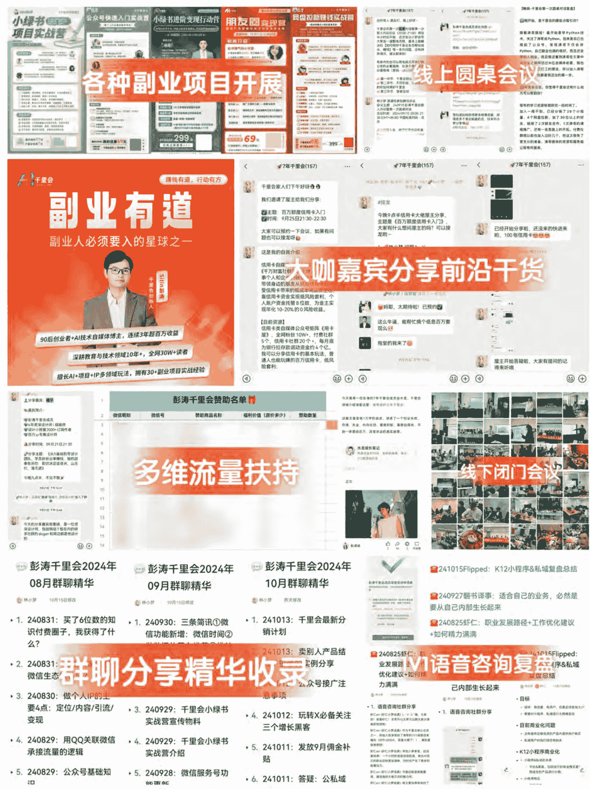

以上就是我的分享，简单总结下6条卖爆经验：

### 一、灵感源泉：用户需求，同行调研

做产品不要凭感觉，而是靠数据说话，真正去了解用户、同行。

### 二、爆款秘诀：精准定位，卖点聚焦

找到自己的差异化优势，为什么买我不买他？

### 三、小步快跑：灰度测试，组合出击

社群、朋友圈、私信回访三步走，小范围测试产品的可行性。

### 四、趁热打铁：迅速交付，惊喜连连

在用户刚付款、最有注意力的时候，马上交付。

### 五、顺势而为：集中资源，引爆市场

流量、内容、团队协作，缺一不可，学会集中身边所有的力量。

### 六、真心感谢：铭记于心，外化于形

心里记得别人的好，行动上也要有所表示，说的好听不如做的好看，赢人心，赢口碑，未来更顺利。

评论区：
- 亦仁：很多图好像没传成功？
- Sitin彭涛：啊，谢谢亦仁老师提醒马上检查一遍
- Sitin彭涛：检查了一遍，应该是图片多加载慢，都有的哈[拥抱][拥抱]

### (19赞)一文讲清楚投放广告赚钱的底层逻辑！

作者：陈磊
日期：2024-11-25

大家好，我是陈磊，专注于广告投放。

运营出身（技术派），做广告投放5年，深耕教育、招商加盟、电商、网服等行业，个人累积消耗超2000万。投产比：私域茶叶，当天投产1：2，平台行业大盘消耗第1，陪伴客户从0到1项目起盘。教育行业，投产比1：3以上，做私域加粉为主，累计加粉量100万+。累计帮助2000+的客户在广告投放上避坑。

投广告是花钱的工作，而花钱的是为了赚更多的钱，很多人很怕花钱，付费流量根本不敢买，从而错过了放大的机会。文中会提到一套低风险的方法论，可以帮你用最少的钱打通一条路。

公式：
- 流量数量 X 销售转化率 X 产品单价 = 销售额
- 销售额 - 广告花费 - 其他成本 = 利润
- 广告花费 / 销售额 = ROI

一个项目想赚钱必须跑通流程，开出第一个单子，赚到第一块钱，如果流程跑不通，一块钱都赚不到。这是一个商业上的规律，任何赚钱的生意都是跑通了一个完整的流程。

前端投广告买流量，流量买过来给到了销售，销售聊天成交客户，成交后售后交付产品，这个就完成了流量变现的流程。

做为老板或流量操盘手，你需要做的是核算成本，广告成本、产品成本、其他成本，ROI等，核心就是ROI，如果ROI正向，说明你赚到了钱，拿赚到的钱继续投广告，一步一步的放大流量，滚雪球一样，保证ROI正向的情况下，把日耗从300到500，从500到1000，从1000到5000，到10000......

对你而言，用的是最初的5000或10000的广告费，一个月投100万广告费，并不是要准备100万的现金，都是这样滚雪球似的叠加出来的，风险最大就是最初的一笔广告费。

这里引入一个概念，资金周转率。

1万的广告费，1：3的ROI，1：2是保本线。
1万广告费，1个月花完，可以赚1万利润。而1天花完，可以1天赚1万，拿赚的钱进行复投，1个月至少是30万的利润。成本都是最初的1万广告费，而这个过程就诠释了为什么要提高资金周转率，在投产比正向的情况，资金周转的越快，赚的钱越多，各项成本也会变低。

分享一条经验，这一条价值10万，如果你的业务还没有测试出来，不要直接放大投放，而是要先做最小模型的投放，例如你的预算是10万，拿出来5千或1万去做第一波测试就可以了，千万不要上来就投10万，这样可能会血本无归。

### 第一笔的5000或10000的广告费如何使用？如何测试？如何控制成本？

滚雪球最重要的不是滚，而是有一个雪球，我的策略是这样的，5000分成5份，1份1000元。现在大部分平台都是OCPM，平台按照千次曝光扣费，转化目标出价，这个目标可以是加粉行为，也可以是表单提交，私信咨询，私信留资等转化目标，例如：一个表单出价20，平台跑出来的成本是30块，按照平台赔付规则成本超出20%，平台就会赔付你超出的广告费到你的广告账户。

我这边打法比较保守，出价都是由低到高测试。

先有一个方向策略，链路预览没问题的话，用第1个1000块跑数据，数据跑出来后，如果不错就是继续放第2个1000，如果数据不行就做数据分析，根据分析结论制定新的投放策略，再用第2个1000去跑数据，数据出来后再进行分析判断，不错就放第3个1000，有问题就找问题。以此类推，直到找到正确可以放大的方向，这个过程就是测试，这个我有一套完整的数据优化方法论，在我这投放的客户都懂。

而且这套方法论暗合实践论，思想就是投放策略，测试就是实践，用实践结果协助完善思想，用完善后的思想指导实践，直到成功为止。如果需要可以找我获取，目前已经在陈磊随笔上发表，投放是一门花钱的艺术。

5000块就是5次机会，10000块就是10次机会，投放经验可以降低出错的概率，用最少的测试机会拿到结果。告诉大家一个秘密，在广告投放上最值钱的就是投放策略，是遇到问题的决策，决策对了，方向对了才能拿到结果。

方向找到了，在保持投产比的情况下，加大投放，加快资金周转率，在有限的时间里多转一圈，就多了一圈的钱。

评论区：
- 三 可游：10,000块钱真的有这么好测试吗？[撇嘴]，我们都是量大砸的，你这样的话周期会拉很长，也不一定能见得起量吧
- 陈磊：因人而异吧，盘子大，预算多，当然可以了

### (11赞)利用好投放工具,开本地商家沙龙,每周一次,场场爆满,几乎0成本。

作者: 丛政
日期: 2024-11-26

大家好, 我是老丛

在过去的几个月, 我靠着朋友提供的信息, 抓住了一次机会, 切入了付费投流赛道, 拿到了一定的结果。
https://hcn9k3ag2a4j.feishu.cn/wiki/BawswQS5iiEvFt...

之后也把这套打法做了保姆级的攻略在生财做了分享
https://mvdaj1881kj.feishu.cn/docx/Z2gldbBtfoQjNcx...

最近我又原创了一套新的模型, 就是同城线下的沙龙。

大家可能会好奇, 不就是开沙龙吗? 这个有什么难的或者不一样的?

那我问大家的是: 你可以做到每周都开, 并且所有人都是付费来的, 人数能稳定在30人左右吗?

难度在哪里? 流量的不确定性。

多数大家都是靠私域, 或者是做同城矩阵又或是个人ip, 才能组织一场或者连续多场沙龙, 但也也很难说周周开。

我们基本做到了通过投流实现客户数量的确定性, 以及客户的付费意愿, 门票成本能覆盖掉投放成本。让这个模型可以持续的去做。这套打法非常适合短视频自媒体本地生活以及网络公司, 其实也可以放大到各行各业。

下面我完整的拆解一下以及把实操过程分享给大家。

#### 1. 投放

账户余额：10,001.38
账户日预算：不限预算 修改
11月营销局来袭~

##### 账户整体数据（近7天）

| 指标 | 数据 | 环比 |
|---|---|---|
| 消耗 | 2497.48 | +55.62% |
| 点击数 | 1681 | +76.39% |
| 展示数 | 5.97w | +106.57% |
| 点击率 | 2.82 | -14.55% |
| 转化数 | 78 | -8.24% |
| 平均转化成本 | 32.02 | +69.60% |

展开趋势图
素材报表
线索管理
评论管理
巨量学
产品智推

你的11月擎报来啦!
洞悉行业风向 传递产品价值 了解详情

通投广告 更多 >
4 投放中
0 审核建议
0 广告超出
巨量广告 推广管理 广告账户

在过去一周大家可以看到，我花了2497元，获得了78组主动咨询的客户，其中加到微信上的差不多在50组左右，来的客户意向很明确就是要参加沙龙，而且我的广告素材里面也说了门票是99元，所以除了时间不合适的基本都来了，最后的结果是实际报名人数24人，换句话就是，我的投流成本直接被门票费覆盖掉了。而场地就在我的公司，水都是一个客户送的，除了买了点水果之外，就没有其他成本了。

#### 2. 来的人群都是什么人？

多数都是小老板，行业有餐饮，家居建材，汽车后市场，教培，地产等等，还有一些想学习新媒体的朋友，他们主要的目的就是学习新媒体，学习如何快速起号，突破几百几千播放量，以及如何快速获取精准客户，因为他们的付费能力是有限的，我们主推的产品是投流的培训/代投，以及短视频的陪跑和代运营，客单价在4980-3万。

#### 3. 抖音进线回复

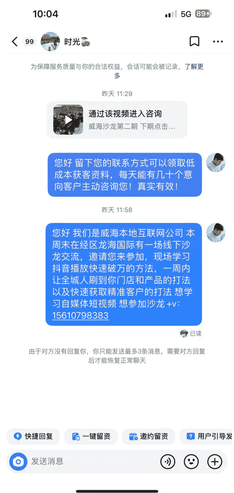

因为很多人看到广告进线之后没有产生主动咨询或者留咨，所以手动回复很重要，会有一些客户会被钩子话术吸引加到微信上。

#### 4. 销售转化，这个模型最大的好处就是销转非常轻，一个人就能独立完成，而且不用花太多时间。给大家看两组客户的销转。

#### 5. 会前准备

签到人员负责登记，登记好之后引导就坐，销售提前分配好客户，客户到的早的和客户聊聊，到点了就正式开始

#### 6. 分享环节

我们分享目前很轻，一个主持开场，介绍，讲讲认知做做铺垫，之后我上去分享，PPT我发到后面大家也可以学习下。之后就是主持介绍主要产品，销售配合意向客户做转化。


剩下的就是打磨分享内容，提高现场和现场后的签单率，整体而言，通过沙龙实现客户的签单还是比较容易的，因为一场沙龙下来，总是有一些高质量客户可以被过滤出来深入洽谈合作方案的。

附件里的沙龙PPT和一些物料大家可以学习参考。

其实思路放大一下的话，很多行业都可以尝试这套打法，无论是法律，家居建材，教培等等，包括现在做ai的摄影培训的，以及各种类型培训机构等等，都可以尝试。

背景板:


### 海报

#### 助力实体商家
线上获客沙龙
威海经区龙海国际A座1705
11月30日 13:00-15:00
99元/位
限30人，找我留座

#### 主讲人介绍
丛政
星展传媒创始人
星展联盟发起人
全国300+短视频团队合伙人

马天贺
巨量官方认证讲师
六年自媒体运营经验
五年教育培训经验

以恒
累计商业流量1亿+
累计线上获客10万+
累计培养20+流量操盘手
累计项目起盘10+，变现超千万

#### 适合谁？
- 01 所有想通过线上获客的实体老板
- 02 做短视频花了很多钱没有拿到结果的老板
- 03 自己做账号播放卡在几百的老板
- 04 希望自己（或团队）拥有做账号能力的老板

#### 讲什么？
- 01 拆解威海旅游自营盘单月营收200万的核心
- 02 拆解乳山生蚝案例--ToB行业如何渠道拓展
- 03 拆解威海二手车半年销售600台的秘密
- 04 投1万，赚10万，拆解各行业付费投流的玩法

#### 真实案例分享 一切用结果说话
威海旅游
单月引流8000人
单月变现200万+

二手车
半年销售600台

月子中心
100块钱15个转化

乳山生蚝
1个人1个月1000条视频

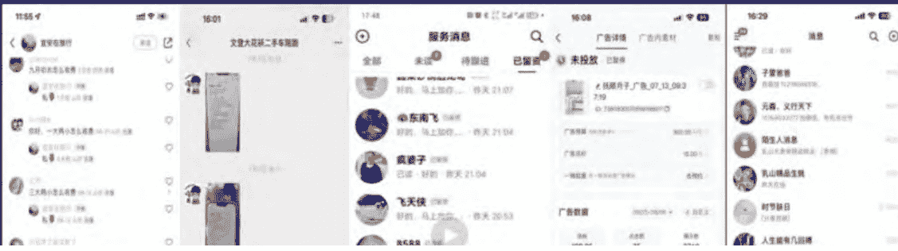

## 公众号懒人搜索，懒人专属群分享


#### 实体商家获客沙龙
开启学习新体验

#### 易拉宝

#### 星展联盟

#### 短视频创客沙龙（威海站）主讲人
丛政
星展传媒创始人
星展联盟发起人
全国300+短视频团队合伙人

以恒
累计商业流量1亿+
累计线上获客10万+
累计培养20+流量操盘手
累计项目起盘10+，变现超千万

马天贺
巨量官方认证讲师
六年自媒体运营经验
五年教育培训经验

#### 助力实体商家
手把手教你精准获客

如果大家有相关需要，我们也有讲师团队可以落地去帮大家做分享和会议。

还有60天过年，希望大家都可以在年底拿到结果！

#### 评论区：
- 申铭呀：干货 我拿到青岛跑跑试试[爱心]感谢大佬分享

### (10赞) 建材行业如何找到第二增长点？门窗工厂云连锁增长复盘
作者：楚川
日期：2024-11-25

大家好，我是楚川，是本地生活的实战派，天鹅到家“单月GMV破7000万，9个月3亿，1年300多万新用户”的操盘手，超6000+实体企业服务经验。并建立了一套可复制、可持续的本地生活方法论。

写在前面：这是跟豪雅门窗深度复盘的总结，建议做家居建材的朋友可以深读，也欢迎找楚川探讨。

你必须得承认，抖音短视频颠覆了很多实体行业，甚至包括工厂。

就比如，包括我们自己，也没想过用抖音流量让一家陷入增长困境的门窗工厂找到第二个增长曲线。

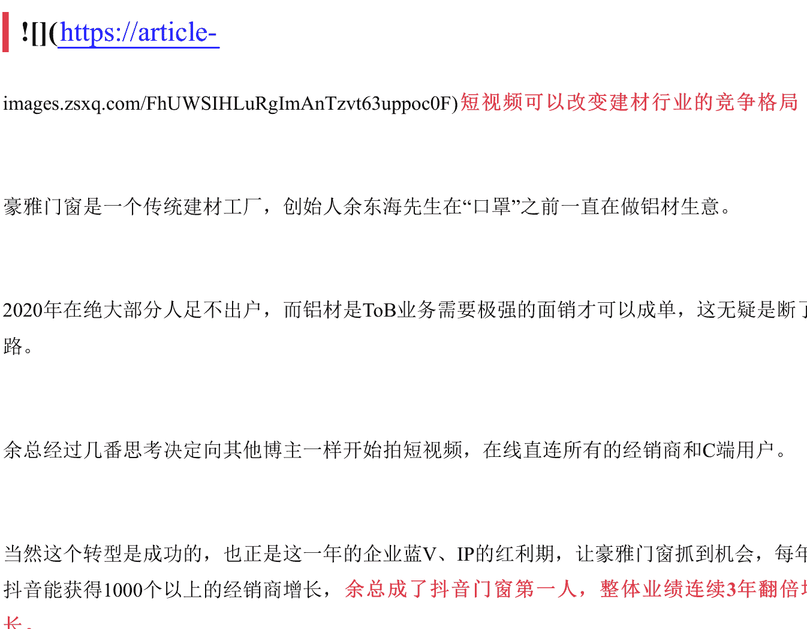

豪雅门窗是一个传统建材工厂，创始人余东海先生在“疫情”之前一直在做铝材生意。

2020年在绝大部分人足不出户，而铝材是ToB业务需要极强的面销才可以成单，这无疑是断了财路。

余总经过几番思考决定向其他博主一样开始拍短视频，在线直连所有的经销商和C端用户。

当然这个转型是成功的，也正是这一年的企业蓝V、IP的红利期，让豪雅门窗抓到机会，每年在抖音能获得1000个以上的经销商增长，余总成了抖音门窗第一人，整体业绩连续3年翻倍增长。


但是，进入到2023年，抖音蓝V红利不再，同行竞品也在不断杀入，双重冲击下豪雅门窗也开始增长乏力，亟需新的破局点。

2024年5月余总带领团队找到楚川，想从本地生活赛道再次找到新的增长。在经过多次面谈沟通及摸底后，我们认为可以尝试一轮。

于是协助豪雅门窗梳理经销商体系，选择配合度、转型意愿强烈的客户作为豪雅门窗的首批加盟商，将各门店翻牌变成豪雅门窗的线下网点，从一个工厂开始组建140多家实体门店的地网。品牌总部统一打流量，线下加盟商负责履约交付。

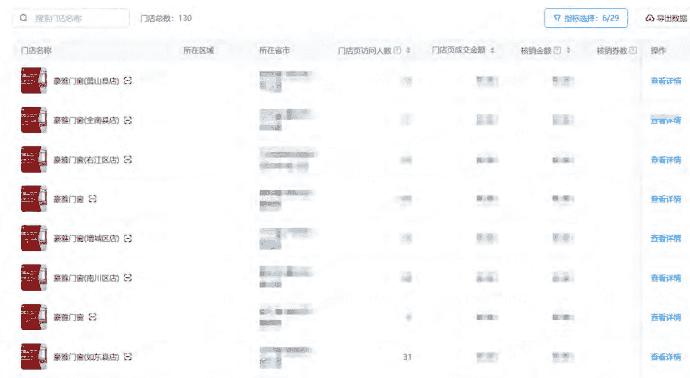

豪雅门窗门店体系

再联合品牌总部和经销商的力量做抖音职人矩阵，从品牌渗透率、抖音SEO、卖门窗几个方向入手，一个月做到千万以上的曝光基数。

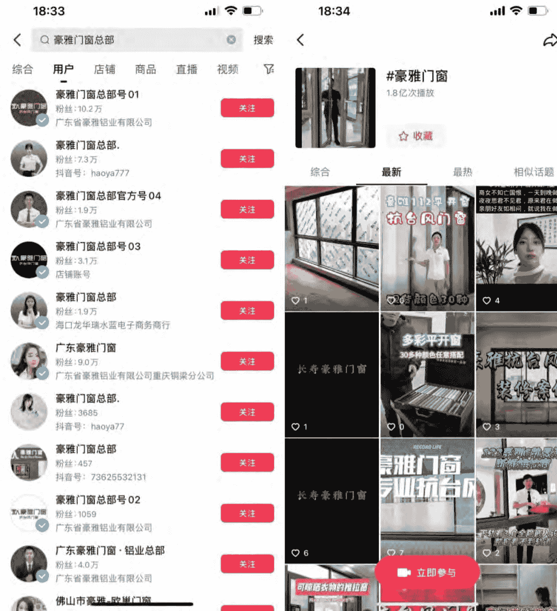

所有的线索进线后梳理内部运转的全流程，从首次跟进、线索分发到回访都做全套SOP梳理，再针对性做局部优化。

2024年7-10月，我们协助豪雅门窗再一次完成了新的升级，最近我们从品牌定位、核心卖点、加盟体系做了调整后，下一轮增长速度会更快。

| 姓名 | 电话 | 意向线索 | 意向门店 | 操作 |
|---|---|---|---|---|
| 未命名 | *******2635 | 普通线索 | | 查看详情 分配 通话 私信 |
| 未命名 | *******4315 | 普通线索 | | 查看详情 分配 通话 私信 |
| 未命名 | *******2797 | 普通线索 | | 查看详情 分配 通话 私信 |
| 未命名 | *******7708 | 普通线索 | | 查看详情 分配 通话 私信 |
| 未命名 | *******3649 | 普通线索 | | 查看详情 分配 通话 私信 |
| 未命名 | *******8015 | | | 查看详情 分配 通话 私信 |
| 未命名 | *******9002 | 普通线索 | | 查看详情 分配 通话 私信 |

### H5 升级后豪雅门窗的获客
在楚川的角度，当豪雅门窗做到1000家连锁店的时候，就具备了从第三梯队的品牌跃迁到第一梯队的潜力，而且在资本价值可以获得更高的溢价。

通过这次合作，我们也坚定认为短视频的确可以改变建材行业（工厂）的竞争格局，加速企业转型，豪雅门窗找到第二增长点后的实践也就是半年时间。

不仅豪雅门窗，所有的建材行业工厂都可以在短视频找到新的增长点。

建材行业的真实情况到底如何？

### 1、存量用户竞争，大平台开始角逐家装赛道
建材行业已经进入存量用户竞争时代。过去地产盛行时代，靠渠道和用户主动上门就能吃到饱。现在是用户萎缩，进入存量用户竞争，必将你死我活。

疫情三年时间改变用户习惯，用户主动上门找建材商的行为骤减，直接加速建材行业获客方式的变革。

贝壳2021年花80亿收购圣都家装、2023年15.5亿收购爱空间，用家庭装修覆盖14个城市，代表大佬下场到家装建材行业，短时间快速吃到上百亿市场。

2023年京东上线装修自营，路边社消息将收购生活家，发力家装市场，此类有存量用户的大平台都下场，让建材商的可生存空间更低。


2024年10月抖音五金建材潜在用户人群，足够看出当下属于流量洼地

从2024年的生存环境来看，建材企业就没有退路，只能迎面而上，在大平台没有下场的赛道中亲自下场获客，直面C端用户才是真正王道 。

### 2、渠道获客成本连年递增，短视频渠道想象空间巨大
最近楚川在走访6个城市的家装公司，也包括土巴兔装修平台都了解到目前家装公司获客成本连年上涨。

其中南京、芜湖、深圳的成交成本均在12000元以上，毛线索800元以上。

以门窗为例，作为装修公司的供应商，那利润肯定会一直萎缩到负值。豪雅门窗的余总明确表示，2024年8-9月铝材销售和家装公司供应版块属于亏损状态，直连门窗经销点的体量在增长。

从中国门窗品牌的销售通道来看，传统实体店渠道63%为主要方式，而互联网仅为6%，那就说明还有海量空间可挖，短视频无疑就是一个自带筛选功能的销售挖掘器。

| 渠道类型 | 占比 |
| :--- | :--- |
| 家装和相关渠道 | 18 |
| 互联网 | 6 |
| 设计师 | 13 |
| 线下渠道 | 63 |

再从门窗品牌的4个可建立的壁垒来看：品牌壁垒、研发设计壁垒、销售渠道壁垒、大规模交付壁垒，只有第三项为当下最简单、最容易建立的。

按我们的计划，豪雅门窗2-3年内做到全网2-3亿传播量，成为抖音渠道销售第一，这就是销售渠道壁垒，未来再拓展到视频号、小红书，做全渠道营销、用户心智建立，还是有想象空间。

一切已有参考答案：自媒体是建材企业的最快跑出来的赛道，天网地网做好营销壁垒，留存足够多经销商和C端用户，最后终成行业知名品牌。


### 3、建材行业如何在存量用户竞争中突围
那如何门窗建材行业如何能在这种竞争中突围呢？楚川走访了10多家公司，也得到以下3个答案：

### 1、真正尊重线索，尊重用户，内部流程化做提效。
我们认识不少公司在用新媒体渠道获得线索基本上没有认真跟进，流量漏斗和销售管理均没有做好，导致成本上涨，用我们的方法6个月左右，至少可以优化到50%的原有成交成本，特别优秀可做到5-20%。

### 2、企业卷内容能力，挖掘用户需求点，击穿一个细分领域。
短视频渠道适合快速转化和成交，必须要求精准线索，因此我们在产品选择一定是单一卖点、某系列产品打透，豪雅门窗从10月开始就定位打“抗台风门窗”，预计未来1-2年强行给用户种草，一切短视频场景以这个为主，做到一个细分领域打透打穿，才能降低一切边际成本，从而提高利润。

### 3、企业全面提升服务质量，从选购、安装、交付做到极致。
目前在行业中持续有增长的都离不开用户体验服务，也就代表用户逐渐觉醒，不再是简单交付就能了事。

2024年11月听到大连门窗的企业传授经验，他们一个区域可以做6000万一年，从客户选购、安装、交付做到极致，卫生都会打扫干净，最后售后让客户满意为第一原则。最终用户，就能得到市场救赎。

我是楚川，如果你想获得更加体系化的建材行业打法，可以链接。跟有结果的人学习，才能拿到结果，因为结果不会说谎。

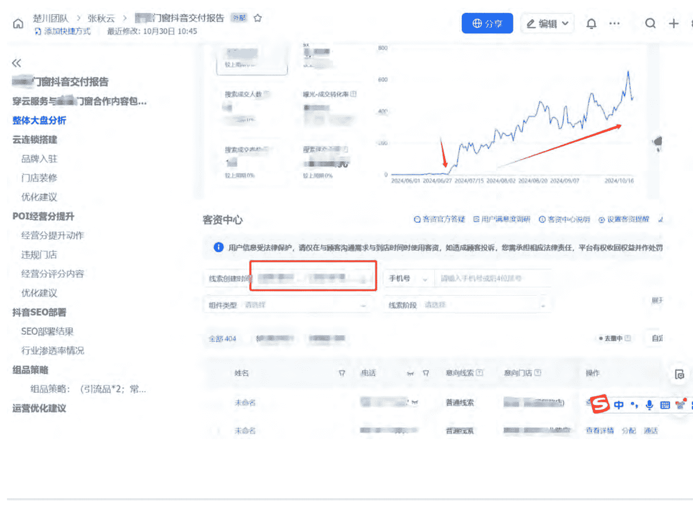

#### 评论区：
- 嘉应岛主：好久没看到楚川的帖，抢一个沙发
- 胖大魔：[阴险]要门窗界的价格屠夫，悍马也来参与一下
- 楚川：干
- 楚川：[呲牙]

### (9赞) 从运营商转型大健康：实效型中医健康服务赛道的探索与展望
作者：秋闯
日期：2024-11-27

从运营商转战大健康行业中的实效型中医健康服务赛道，风口赛道，未来可期。做了一年多的运营商项目后，遇到瓶颈，迷茫了很长时间，筛选了很多项目，现在转战离火大运的大健康项目中的实效性中医健康服务赛道，也属于强功效型，养生按摩赛道，做一个心路历程的分享，也希望各位圈友能够多提宝贵的建议。

https://teylbi2rk7.feishu.cn/docx/CCRgd19lhot3urxEYGNcJUk3nGg?from=from_copylink

#### 评论区：
- 嘉应岛主：个人浅见，如果MVP你的单店运营可以，之后扩大几家店（主要作用是检验效果以及后续你要找新闻媒体报道），那就稳扎稳打走。当然有听说过做中医卖理疗卡在小红书可以，据说今年效果是20W小爆款有将近100条线索（道听途说不确定），如果需要门店支持，我老爸东莞的跌打门店是可以配合，只是人流其实一般。
- 秋闯：单店运营已经可以了，目前以市政府村医培训的口切入，没做传统招商投广告的方式做，门店配合这块可以沟通下
- 立明：获客的话，百度线索直播了解一下
- 秋闯：盘古吗
- 立明：最近很多人起号引流，中医粉还是容易的
- 戴巍：是个好生意。可以参考小美医生，小儿推拿加盟模式。供应链如果能挣钱，摆脱靠技师的能力，都是不错的生意
- 戴巍：转给做连锁品牌的好友了
- 秋闯：感谢感谢

### 【星主的收藏夹】5篇

#### (47赞) 比特币的崛起与不可理解性
作者：亦仁的收藏夹
日期：2024-11-29

比特币又涨了起来，它对于我而言不是某一种加密货币，也不是所谓个人在今天财富自由的机会，而是代表了一整类事物。这一类事物的共性是：你看不懂它，也很难理解它，甚至会否定它，认为它没有存续下去的可能。但是它就那么存活下来，而且以你预想不到的速度发展壮大。

https://mp.weixin.qq.com/s/EVvLOiJQWMi634YXn68wpA

#### 评论区：
- X：就跟当初别人不看好的充电宝业务一样，现在收费还比之前贵的多
- ：以一种无法理解的速度增长
- 时间的朋友：存在即合理。
- 永飞：不懂

#### (39赞) 找 PMF 就是要做没壁垒的事
作者：亦仁的收藏夹
日期：2024-11-28

没壁垒意味着你有进入的空间，没壁垒意味着成功者不止一个，成功者不止一个意味着一定有某些可以学习的规律。

https://mp.weixin.qq.com/s/Ww38EG4-e1DgAOPdidVwjg

#### 评论区：
- 悦悦子Cheer：这篇确实给了很不同的视角

#### (38赞) 钦文专访刘润：走进刘润本人的“底层逻辑”
作者：亦仁的收藏夹
日期：2024-11-26

“所有醒着的时间，只要你做的是你喜欢做的事，就不分什么叫工作，什么叫娱乐。娱乐是让你觉得开心的事，可是工作就让我开心，为什么工作让我开心，是因为我选的让我开心的事，当成了工作啊。”

https://mp.weixin.qq.com/s/srXDLPrjUDG_Z8Y81taTng

#### 评论区：
- 嘉应岛主：从文中（第一你应该要做培训，你必须要输出你的那个商业的理念；第二你应该做咨询，这是你想干的事；第三你要写文章，写专栏，更多的人知道你，这得通过文章才能知道；第四你要写书，只要印成书，就觉得这个更加靠谱更权威；第五你要去参加各种各样的产业的论坛）看出写作输出链接演讲非常重要

#### (37赞) 创业：了解世界运作与利润、风险、合作及信任的重要性
作者：亦仁的收藏夹
日期：2024-11-27

创业确实可以让你真正了解世界是如何运作的、利润有多大、如何思考风险、如何与人合作、如何完成工作以及伙伴关系和信任的重要性。

https://mp.weixin.qq.com/s/fbIvPLRwGg4H0DUrHGdcbw

#### 评论区：
- 暂无评论

#### (22赞) 有效的经营者：战略目标与人才传承的双重责任
作者：亦仁的收藏夹
日期：2024-11-25

有效的经营者有两大责任：一是带领企业实现战略目标；二是把企业交给年轻一代，培养年轻一代做好接班人。一家企业成功与否，取决于基础是否稳固，取决于能否打好人才基础。
https://mp.weixin.qq.com/s/29ETwVMpIx-W3FalYvp62Q

#### 评论区：
- 暂无评论

### 【星主问答】1篇

#### (194赞) 应届毕业生创业困境：坚持还是转向稳定工作?
日期：2024-11-28

提问：
亦仁你好，我是今年2024年的应届毕业生，在刚毕业一个月左右，我加入了星球。跟了一次航海，并且自己也在创业，但效果并不佳，这半年来拿到具体的收获结果，并不是很高，我想问问在这种情况下，我是坚持继续去创业，还是先去找一份稳定的工作先积累资金跟自己的个人经验

回答：
先找工作，养活自己，积累资金，至少24个月没有收入也不会慌的数量。

过程中，业余时间多尝试副业，多读精华帖提高认知，多刷风向标寻找机会，多下场实战增加体感，多跟着航海积累技能。

创业，或者副业赚钱，是一个长期的事情，不能背着炸弹创业。故事里面我们看到一些人背着炸弹创业最后成功的，但现实上，90%背着炸弹创业的都是炸得粉身碎骨。

越是急着想赚钱，越是赚不到。越是不急着想赚钱，想认真给用户创造价值，想长期一点经验，你就越容易赚到钱。

#### 评论区：
- 帅彬丨蟹老板：主业副业结合，副业做好了，主业脱离
- 香香一号：这个QA太及时了，我也是几乎一样，这下有了方向了，感谢亦仁大大!!
- 张微笑：啊哈哈哈哈，我也是今年毕业，4月份加入生才，7月底跑通一个业务一下子挣的比工资多，感觉自己厉害了，8月中旬辞职，然后10月份副业收益锐减，焦虑的睡不着。最近正开始再找个工作
- 知秋：基本要保证副业挣的比主业大于五倍，且能长期稳定挣下去才建议辞掉主业。一旦辞去主业，恰好副业又崩盘，往往打击的是情绪，情绪一上头就容易过度焦虑，陷入死循环。
- 新生🍁："越是急着想赚钱，越是赚不到。越是不急着想赚钱，想认真给用户创造价值，想长期一点经验，你就越容易赚到钱。”受益匪浅
- 罗国梁：讲的真好[强]
- 知行：我是90%之一[流泪]
- 爱猫的老宋：还好我已经习惯负债12个月创业了，希望顺顺利利年底能还完[呲牙]