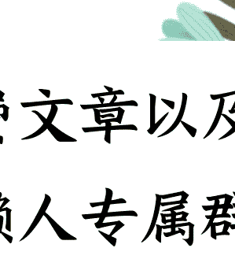

# 古代的帝王将相都认为读历史有大用，他们到底是怎么读的？

241204 知乎高赞

整理：公众号懒人搜索，懒人专属群独享

懒人微信：lazyhelper

## 知乎原问题：

人生算法：古代的帝王将相都认为读历史有大用，他们到底是怎么读的？

无论记录的是一个人，还是一群人，它所记录的核心都是人，人的思想，人的行为，人的语言，以及人与环境的相互影响。

籍由历史的记录，我们与那些原本毫无联系的古人们也可以亲密接触，去了解他们的遭遇、经历，以及最终走向的不同结果，去感悟他们的所思所想。

人生不可能一遍遍重来，去等着你找到最适合的路；但历史可以一遍遍重读，直到你从中发现最本质的道理。

历史里最大的规律，就是从历史里真的可以发现规律。

古代的帝王将相都认为读历史有大用，他们到底是怎么读的？

## 知乎回答：

Zpuzzle 北京师范大学文艺学博士 1.4万人赞同了该回答

## 01

打个比方，欧盟如果要配合美国围堵中国，最好的破局办法是什么？

这个，翻一下战国史就知道，“连横”只要在整个围堵网上打开一个缺口，所谓围堵也就不攻自破。

要获得这个知识本身并不难。以连横破合纵，在中国历史上被无数次验证过。对于中国这种历史悠久的国家来说，数千年的文献资料积累，能提供的学习的东西非常非常多。这是很多历史较短的新兴国家所不能比的。

只不过，对于大多数人来说，唯一的问题是，除非你干到外交部长或者同等级别，又或者是在乱世里能拉起队伍割据一方的人，否则除了打打嘴炮、写写文章之外，你知道这个知识似乎也没多大用。

所谓“以史为鉴，可以知兴替”，对于帝王将相而言并不是一句虚话。虽然历史并不是简单的重复，但是只要历史经验够丰富，也是大致能知道国家的“兴替”规律的。

至于普通人学历史，自然不具备如帝王将相一样的操作机会，甚至也不具备影响能力，但这并不表示普通人学历史就没有任何用处。

最起码，你可以多看一看不在大历史之中的普通人是如何生存的，以及个人努力在历史的大潮面前是如何的不值一提。

就像是最近这些年，我经常能看到知乎上有人把自己和父母的几套房子算进来，说自己有千万资产可不可以不上班。又有人说，自家有千万资产，是不是可以让孩子躺平。但只要你自已看一下历史就知道，假如一个人现在30岁，正常情况下他能活80岁，那么自己的孩子要继承遗产就要到50年之后——那时候孩子差不多也得50岁了。

在历史上，50年是什么概念呢？

那是从开元盛世到天宝之乱，从万历平倭到大清入主，从十全武功到鸦片战争，从甲午战败到抗日胜利，从《辛丑条约》到朝鲜停战协定签字，从改革开放初期的人均GDP比不过非洲到如今总GDP世界第二。之于外国，则是从甲午战败到迎接太上皇入主，从铁幕落下到苏联解体……

总之，50年的历史看起来不算长——毕竟以现在的医疗条件，不出意外，几乎所有人都能活到50岁以上。但50年也不算短。而你如果回到1900年，对一个目睹了八国联军烧杀抢掠的人说，50年之后，中国人就能打败八国联军，就算翻个个，来个十六国联军也不怕，那些人也会觉得“这人莫不是个疯子”？

在这样尺度的变化面前，即便是顶级的政治家都不敢保证自己能预见三五十年的世界是什么样子，却偏偏是一些莫名其妙有了点钱的普通人，觉得自己可以给自己规划一条未来五十年乃至一百年都不出错的道路。

之前我还看到过有个作家提出过一个有趣的写作计划。他说，从秦始皇一统中国算起，到现在为止也就是2200年左右的时间。那么，假如说一个人能活70多岁的话，那么如果我们能找到30个前后相续的人，把他们的故事连起来，就能书写另一个视角的中国历史。

70多岁的人在历史上好找么？其实很好找。也不过就是30个人的一生而已。

而所谓“今三世以前，至于赵之为赵，赵王之子孙侯者，其继有在者乎”，人家赵太后都明明白白了“无有”。在真实的历史中，一个家族从兴起到衰落，能传三代就已经是百里挑一。“旧时王谢堂前燕，飞入寻常百姓家”，只要你稍加留意，会发现这种事情无时无刻不再出现。

当然，另一方面，个人对于历史也不要太悲观。

有记载的人类历史到如今数千年时间，无论怎样的风云变幻最终都会过去，“是非成败转头空，青山依旧在，几度夕阳红”。面对再大的苦难，只要能活下来，只要能熬过去，最终也还是会见到所期待的曙光。

正如《基督山伯爵》所讲，“等待”与“希望”是人类的最高智慧。对于普通人来说，能从历史中读到这一点，或许就已经可以受用无穷。

古代的帝王将相都认为读历史有大用，他们到底是怎么读的？

看到这个问题的时候，我突然想起一段很有意思的历史。

两个现代“精英”的故事——毛泽东和蒋介石。

1935年的5月，毛泽东带领的红军，一路向西。

当时的红军队伍大概还有三四万人，疲惫不堪、缺兵少粮。

在他们屁股后面，是蒋介石从各地调兵遣将，集合而来的二十万大军，由薛岳同志率领。

西面，是滇军孙渡部沿着雅砻江的布防。

东面，则有川军杨森的第二十军和郭勋祺、陈万仞等部的联合阻截。

现实逼得他们不得不继续往前走，直到来到历史上很有名的一个地方。

四川安顺场。

然后，每个人心里都响起了一首歌（如果可能的话）：

大河向东流啊……

因为，前面横亘着的就是波涛汹涌的大渡河。

然而，红军并不能像歌里唱的那样“说走咱就走”。

在他们面前，除了有大河天险，主要渡口上还布满了川军刘文辉的部队。

当时红军面临的“绝路”，有一部电影名字可以形容：

十面埋伏。

## 02

从后面的结果来看，这条“绝路”，其实是毛泽东率领的红军自己选的。

对此，蒋介石一开始完全没有想到。

中央红军刚刚离开江西苏区的时候，鄂豫皖"剿匪"总司令部秘书长杨永泰就曾对他说过：红军很可能渡过金沙江进入川西。

对此，蒋介石嗤之以鼻：你TM懂不懂历史？不懂就多去看看书。

蒋介石之所以有这个错觉，是因为他曾经看过一段历史。

大概72年前，有一个领袖，带着一支农民军，同样被追了半个南方，同样被打得还剩三四万人的队伍，同样的5月，就是在大渡河边迎来了全军覆没。

现在，学过中学历史的人基本上都知道，这个领袖叫石达开，这支队伍就是太平军。

蒋介石知道这段历史，当然不是靠中学历史课本。

后来有历史学家推测出，当时的蒋介石正在非常认真地看一本书。

《庸庵文续编》。清末北洋幕僚薛福成所著。

书中记载的，就是1863年石达开率领的太平军在大渡河边被清军歼灭的悲惨遭遇。

当情报最终证实中央红军向着大渡河边的安顺场走去时，蒋介石激动了：我以为只有我这种不看书的人不懂历史，没想到你毛泽东浓眉大眼也不懂历史。中国版图这么大，你为啥非要走石达开的死路？

蒋介石在看《庸庵文续编》的时候，一定也在不停地拿毛泽东率领的红军和石达开做对比，最后得出了一个他想要的结论：历史总是会重演啊。

蒋介石感到，毛泽东成为"石达开第二"的结局已经注定了。

在《红军长征在贵州史料选辑》一书里曾经记载了蒋介石当时给各路将领发的电报：

> “大渡河是太平天国石达开大军覆灭之地”“希各军师长鼓励所部建立‘殊勋’”。

翻译一下就是：这段剧情我很熟，之前已经有人演过了，演的非常好。现在大家也要照着剧本这么演，争取早点演完大结局，演得好的还有盒饭吃。

他不仅这么想，而且希望所有人都这么想。

最好他的老对手毛泽东也这么想。

## 03

但毛泽东不这么想。

据记载，毛泽东当时也在看那本《庸庵文续编》。

对于石达开的故事，毛泽东比蒋介石应该更熟悉。

和蒋介石这种喜欢“临时抱佛脚”看书的人不一样，毛泽东一直就很喜欢看历史。

很多人都以为毛泽东第一份工作是图书管理员，其实并不是。

对于一个有师范院校毕业文凭的26岁青年来说，每个月拿8块钱工资的图书管理员并不算什么正式工作。

要知道，当时那些大学教授们的月工资大概是毛泽东的，嗯，30到50倍。

按现在大学教授的工资来算，差不多相当于一个本科学历的人毕业后找了一份月工资只有几百元的工作。

我觉得，这只能算兼职。

毛泽东第一份正式工作，其实是长沙一所小学的教师。

准确地说，是小学的历史教师。

我们有理由相信，当年毛泽东之所以选择走石达开走过的老路，不仅经过了深思熟虑，更是基于他对历史的精准判断（据说还找过当地一个亲眼见证过石达开覆灭的老秀才谈过话）。

毛泽东认为，石达开之所以被围困在安顺场而不能渡河，一个很重要的原因是他没有处理好和少数民族的关系。

石达开率领的天兵，很看不起当地的彝族土司，动不动就发个文恐吓：逆我者亡，顺我者昌。没事别惹我，小心砍你全家！

直接导致他在陷入清军重围的同时，还遭到彝族武装的袭扰，无法顺利通过彝区。

在吸取这一条教训后，毛泽东下令：一定要和彝族兄弟姐妹搞好关系。

进入彝民区后，尽管红军遭到了一些彝民的追打，甚至被抢去武器、扒去衣服，但官兵仍坚决执行上级命令，不作还击，还反复向彝民宣传“同红军联合起来打倒汉官，打倒压迫你们的军阀”。

红军的首领刘伯承甚至还和彝族沽基家族首领小叶丹歃血为盟。

这成为红军避免成为“石达开第二”的两大关键之一。

## 04

另一个关键，是渡河的时间。

石达开的队伍到了大渡河边后，不断延误渡河时间，甚至还因为他的儿子出生，就地庆祝三日。

结果在此期间，河水暴涨，耽误了最佳渡河时间。

石达开的队伍5月14日就到了安顺场，但直到6月3日还在望河兴叹。

而红军5月24日才进入安顺场，6月2日就全部渡河完毕。

在这过程中，有一个细节成为了影响红军渡河速度的决定性因素。

这个细节也隐藏在历史中。

我曾从另一本书里，读到过这个惊人的细节。

在长征结束三十多年后，1970年12月，毛泽东曾经在与调任北京军区司令员的李德生谈话时，突然问他：“你看过顾祖禹的《读史方舆纪要》吗？”

《读史方舆纪要》，是清初顾祖禹写的一部巨型历史地理著作。

大部分人可能并没有听说过，但在历史上，这是本分量很重的书。

从重量上来说，可能比4本《红楼梦》摞起来还重。

全书接近300万字，对于文言文不过关的人来说，别说300万字了，光《读史方舆纪要》这个书名可能都读不进去。

但毛泽东读了。

不仅读，而且滚瓜烂熟。

罗章龙是毛泽东年轻时的挚友，也是党内最早的一批成员，后来因为分裂党，而和陈独秀、张国焘一起成为影响党史的著名人物。

他老了之后，干了另外一件对党史影响很大的事——写回忆录。

在他的回忆录里曾记载，《读史方舆纪要》是毛泽东在湖南第一师范时最热爱的著作，青年时代的毛泽东几乎把这本书翻烂了，在第一师范时，毛泽东最喜欢的事情就是滔滔不绝地与人讨论《读史方舆纪要》。

## 05

我之所以要提到这本书，是因为在这本书里曾详细介绍了一座大铁索桥的历史来历、地理位置等信息。

这个桥直到现在仍然存在，就横亘在大渡河上。

现在，学过中学历史的人，应该都知道这个桥叫什么名字了。

泸定桥。

这个桥成了红军横渡大渡河，避免陷入石达开绝境的另一个关键。

红军急行军赶到安顺场后，很快击溃了对岸的敌人，并且组织先遣队陆续过江。

但安顺场架桥很困难，而船又不够，全军难以在短时间内从这里过江。

5月26日，毛泽东抵达安顺场，听取刘伯承、聂荣臻详细汇报过河和架桥的情况后，想起了他读过的那本《读史方舆纪要》。

书中记载的泸定桥就在离安顺场一百多公里的地方。毛泽东当场拍板：

红军沿大渡河两岸赶向安顺场以北一百七十公里的泸定桥，限两天赶到。

于是，我们现在才能从课本里读到那篇著名的《飞夺泸定桥》。

红一军团第四团一昼夜疾行一两百公里，然后又组织22位勇士手攀桥栏、脚踩铁索，打下了泸定桥，创造了长征历史、乃至党史上最著名的一场战斗。

只不过这也留下了历史上的一个著名疑问：既然泸定桥这么重要，为什么国民党不选择炸了它？

现在有很多解释，比如炸了怕激起民愤啊，国民党要给自己留退路啊，红军速度太快来不及炸啊……

这中间，我觉得还可能有一个原因：没有读过《读史方舆纪要》的蒋介石并没有真正意识到泸定桥的重要。

历史本就有很多解释，而这也正是历史的魅力所在。

全军顺利通过大渡河后，毛泽东长长地舒了一口气。

然后嘲讽对手道：我们的行动已经证明，中国共产党领导的红军不是太平军，我和朱德也不是“石达开第二”。

这感觉就像，DOTA里红血反杀、劣势偷家，拆掉兵营后在所有人频道打字：?????

## 06

故事讲完了。

我觉得，这个故事里面就隐藏着这篇文章标题的答案。

为什么古代帝王精英都认为读历史有大用？

因为，历史是过去无数个世代里，对曾活着的人的记录。

无论记录的是一个人，还是一群人，它所记录的核心都是人，人的思想，人的行为，人的语言，以及人与环境的相互影响。

藉由历史的记录，我们与那些原本毫无联系的古人们也可以亲密接触，去了解他们的遭遇、经历，以及最终走向的不同结果，去感悟他们的所思所想。

人生不可能一遍遍重来，去等着你找到最适合的路；但历史可以一遍遍重读，直到你从中发现最本质的道理。这个道理，我们把它称为“历史的规律”。

我一直觉得，历史里最大的规律，就是从历史里真的可以发现规律。

就像毛泽东通过历史，最终带领红军顺利渡过大渡河，避免成为“石达开第二”一样。

然而，历史就像案例教学法的一个个案例，只负责把事情用最真实、客观的方式讲清楚。

从里面能读出什么东西来就是自己的本事了。

比如同样是读《资本论》，毛泽东读的并不多，但却成为马克思主义中国化的奠基人。

而蒋介石虽然吹嘘自己读《资本论》读到废寝忘食，但直到自己被撵到台湾，也没搞清楚自己为什么会失败。

从这个角度来看，毛泽东读到的是历史，而蒋介石读到的大概是历史故事。

> 欲改造中国，有两件事是最为急迫的：其一，是对中国历史上的治理经验加以系统地整理与批判；其二，是做实地的调查研究。——毛泽东 1920年

## 07

但上面这种说法，仅仅解决了“历史有大用”的问题，却没能解决“帝王精英”的问题。

为什么往往只有帝王精英才会反复强调“历史有大用呢？”

因为一个很残忍的真相是：帝王精英们生下来，就注定了他们要干的都是大事。而历史里所记载的，恰恰就是这些帝王精英们干过的大事。

富二代要创业，不去看《乔布斯传》，难道去看《养猪能手谈母猪散养》啊？

按照教科书的标准说法，人类的历史，是由广大的人民群众创造出来的。

这被称为历史唯物主义。

但真实的历史里，却几乎没有人民群众的身影。即使有，也不过是拢在一起的冰冷数字，或是一场大战里微不足道的注脚。

就像是《人类简史》里总结的：

> 在现代晚期之前，总人口有九成以上都是农民，日出而作、胼手胝足。他们生产出来的多余粮食养活了一小撮的精英分子：国王、官员、战士、牧师、艺术家和思想家，但历史写的几乎全是这一小撮人的故事。于是，历史只告诉了我们极少数的人在做些什么，而其他绝大多数人的生活就是不停挑水耕田。

不仅仅是历史，甚至于直到《金瓶梅》以前，那些传奇小说里记载的也是这些帝王精英们的故事。

就像毛泽东曾经说过的那样：“有一天我忽然想到，《水浒传》《三国演义》……这些小说有一件事情很特别，就是里面没有种田的农民……我发现它们颂扬的全都是武将，人民的统治者，而这些人是不必种田的。”

是的，你没有看错，《金瓶梅》之所以在中国文学史上具有那么高的地位，不是因为她“开放”，更不是因为那些“不可描述的场景”。

而是因为，她是中国历史上第一部以中小市民视角写的小说，在这部小说里终于没有了帝王将相、才子佳人、英雄传奇，有的只是普普通通的社会日常生活。

包括性生活。

总结一下吧。

历史当然有用，通过历史，我们可以去发现规律、找出规律，并以之来指导实践。

但对绝大部分人而言，这样的规律并没有什么鸟用。

这就像“为什么懂得很多道理，却仍过不好这一生”一样。

不是这些道理没用，而是对你没用；准确地说，是多数时候你根本没有机会去用到这些道理。

你懂得再多历史，从中读出再多的规律，也不过是屠龙之术、纸上谈兵。

这就是为什么那些出生贫寒，却又胸怀经世致用之学的古代牛人，想尽办法也要投身乱世，哪怕搞也要搞出一个乱世来的原因。

比如孜孜不倦劝朱棣作反的姚广孝。

不是乱世，历史再有大用，你又何处去用呢？

当然，我也并不是说，因为我们都是平头老百姓，所以就不用读历史。

毛泽东19岁的时候就看完了《御批历代通鉴辑览》，共一百一十六卷。

《御批历代通鉴辑览》是什么书？

它上起伏羲氏，下至明亡，几乎是中国古代史籍中记事时间最长的一部编年通史，被称为万世君臣的政治教科书。

但看这本书的毛泽东，当时不过是一个穷山村里走出来的农家子弟。

他当然不会想到，三十多年后，自己真的创建了一个新的国家政权。

所以说嘛，一个人的命运，当然要靠自我的奋斗，但是也要考虑到历史的进程。

而人生的魅力就在于，你永远也不会知道，自己处在什么样的历史进程里。

微信:lazyhelper

历史3000多份各类付费文章以及年费三千多的副业社群资源，见懒人专属群内部分享!

付费群，白嫖勿扰！微信：lazyhelper

# 懒人专属群更新记录:

https://lazybook.fun/#/blog/record2