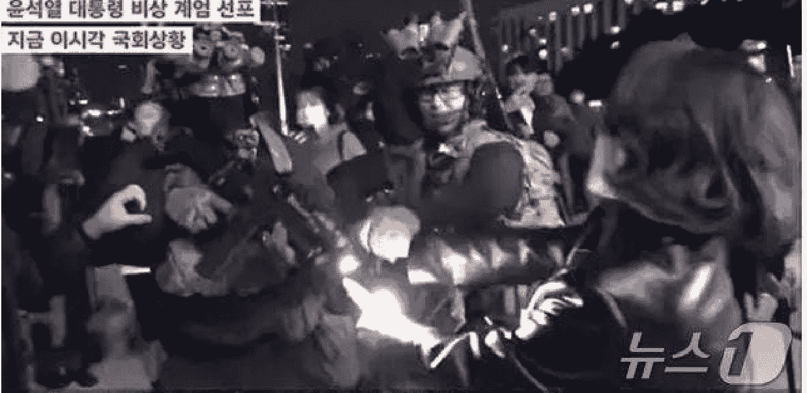

# 懒人专属群周报（第110期）
北京时间2024年12月06日出品

懒人专属群群友大家好，我是小懒人~

第110期《懒人专属群周报》，与君共读。

希望咱们专属群独有的《懒人专属群周报》可以作为群友们喜欢阅读的一份类似周刊的读物。

之前的离线版合集地址见咱们专属群总链接，小懒都有备份。

懒人微信：lazyhelper

# 目录
- 关系攻略（节选）
  - 为什么不要“随便找个老实人嫁了”
  - 习题
- 为什么不能收走老公的工资卡？
- 新闻评论
  - 尹锡悦与韩国媒体
  - 被社交媒体直播的戒严
  - 与媒体合不来的总统
  - 不给总统面子的媒体
  - 性少数内容创作者的策略
    - 性少数创作者面临的三重挑战
    - 伪装：隐藏于主流之下
    - 过滤：游走于灰色地带
    - 垂直化：利用商业逻辑
- 懒人收藏夹
  - 照着做，你早晚会成为那帮既得利益群体里的一分子
- 擦边
- 和菜头问答
- 总结

# 关系攻略（节选）
作者：熊太行

## 为什么不要“随便找个老实人嫁了”
> 知识点：美国的心理学家研究发现：热情、健谈、外表好看的人吸引人，此外，男人喜欢挑年轻的、身材好的，女人喜欢挑受教育程度和收入高的。你理想的结婚对象“老实人”无一符合。

提前说一句：

说“我是男生，没必要看”的，再见，祝你幸福。你们根本不懂熊老师的苦心。

这是一篇个人魅力指南。

这篇好多人等着看，那就早一点发出来，春节后职场我们已经准备了迅猛的一波，在春暖花开的日子，也该谈谈感情了。

好多女生喜欢说：“找个老实人嫁了。”更有的令人发指：“随便找个老实人嫁了。”最要命的是，有人是真的相信可以随便找个老实人嫁了。

老实人是什么人？我私下做了好多调查，大概如下：

- 读书的时候中等或者中偏下；
- 30岁了，几乎没谈过恋爱；
- 内向，羞涩；
- 话少沉默；
- 不太会社交；
- 吸引异性比较困难；
- 有一份工作，收入不高，但很少失业。

看上去是一座不设防的城市对吧。我今天就要告诉你们，尽量避免这样的人。

什么样的人是我们喜爱的人？很遗憾，没有一种是“老实人”。

### 1. 热情和正能量
那句“随便找个老实人嫁了”，是一句对现今处境不满的气话。如果真的这么去择偶，以后的麻烦还很大。

一个人究竟为什么会喜欢另一个人？1977年，美国学者Folkers和Sears做过一个测试，被测试者的人听了两种完全不同的媒体采访。其中一部分受访者的回答全是积极的：“我喜欢福特总统”“圣地亚哥是个好城市我很喜欢”“《星球大战》太棒了”“我喜欢我的《市场营销》课程，老师很好，讨论也很好”……另一部分的受访者的回答全是消极的：“什么烂人”“脏死了”“完全看不懂好嘛”“课上那么多人，居然要我站着听”……结果毫不出人意料，所有读到或者听到这段采访的人，都觉得那些正能量的人更吸引人，而那些不断说出负面评价的人，被测试者打分很低。

> “你们不要论断人，免得你们被论断。”——《马太福音》，这句古老的话是有道理的。

一个热情的、对事物抱有好奇心的人，容易交到朋友；愤世嫉俗的、充满负面评价的人，或者觉得什么都没意思的人，就很难吸引到别人。

“老实人”都缺少热情，也缺乏称赞别人的能力。大多数的老实人，都是沉默内向的人。

### 2. 社交能力强、健谈
美国学者Leary等人曾经做过一个关于健谈者的研究，他们把人们说话的录音给那些接受测试的人来听，有的录音是碎嘴子，絮絮叨叨，有的特别沉闷，有的特别严肃，有的完全风趣幽默，有的条理清晰。大家几乎无一例外地把这些说话无聊、严肃、抓不住重点的人拎出来打了低分。那些口才好的人，全都是高分。

有趣的是，如果一个人口才很好，但是最后录音谈话结束的时候假装打翻了咖啡，听众对他的评估会更高。人们宁愿看优秀的人不完美，有失误，也不愿意看着一个笨人小心努力。如果一个笨人最后还会打翻了咖啡，那就笨蛋加三级，评分到了谷底。

挑酒店你挑星星多的，选馆子你选评分高的，修车你选技术好的，看医生你选科室领导，交朋友，没别的标准，大家都喜欢能聊的。

我的公司注册的时候，就选了“能聊”两个字，其实是朋友遍天下的期许，不过当时怕觉得不严肃，就跟我老板说：“这个名字好，可以搞人工智能。”

我们都喜欢能聊的人，但是一个能聊的人绝对不会被描绘为“老实人”，而是“性格很好的人”“才华横溢的人”。

### 3. 外表好看
我们之前谈过以貌取人的话题，这里不再多说了，外表好的人确实是更加吸引人，外表一般的人，可以认真打扮一下，改善自己的短板。我们做这事不是让我们遵从世俗，而是因为改善自己的外表花销没有想象的那么多，也有很多多快好省的法门，而它带来的效果特别惊人。

婚姻市场上，如果一个人被描绘为“老实人”，一定是不打扮，买衣服也是随随便便的。被介绍人描绘为“老实人”，在外貌上比“一般人”的评价可能还要低一些。

### 4. 教育程度和收入高的
我也很想告诉大家，只要有真爱，学历和收入都不叫事，只可惜，社会心理学的各种统计、研究都支持一点：男人倾向于挑年轻的和外貌好的（女人会被挑体重），女人的学历收入没那么重要。女人倾向于挑学历和收入高的，男人的年龄大一点或者外貌差一点一般没那么重要。

我们再把“老实人”放在这个标准下面研究一下吧：

婚姻市场上，一个人如果教育程度高，他的学位、学历、学校出身就会被排在条件的第一位，不信你们看看那些公园的父母相亲角就知道了，一个清华硕士的牌子举起来，呼啦一堆人。同样，年薪五十万和年薪一百万，也都是介绍人会重点提及的。有这样的条件，不会被描述为“老实人”，而是“能力很强的人”。

## 老实人真的性格好吗？
老实人剩下的，就只有“性格好”了。别忙。真正的性格好，就应该是阳光、健谈、注意自己的外表的人，这样的人多半受教育程度也很好，收入也不低。所以老实人的“性格好”，其实是内向、回避冲突、不敢维护自己的利益、沉默寡言……

很多种心理障碍都有这样的表现：

### 精神分裂症
精神分裂症一般都伴随着社会性的退缩，美国的一批精神病学家曾经对大批18~20岁的青年进行了分析，预测出了195位后来被确诊为精神分裂症的青年。这批人都符合这四条（但是符合这四条的未必都是分裂症）：少于两个朋友、喜欢在小圈子里社交、自觉比别人敏感、没有一个固定的女朋友。此外，感情淡漠、不注意自己的外表，不爱洗澡不讲卫生，也可能是一些发病的早期表现。

精神分裂症有以积极症状为主的1型（民间所谓的武疯子）和消极症状为主的2型，2型男性发病率多，1型女性更多。1型那种话多爱激动的好判断，2型那种沉默寡言的，特别容易被认为是“老实人”。另一个坏消息是，2型的遗传可能特别高。以及，有的精神分裂症症状，梅毒是病因。

### 抑郁障碍
这样的患者可能话少，问十答一，不爱出门，任何过去想做的事情都不再做了。此外比如回避型人格障碍、社交恐惧障碍，都是可能显得是“老实人”的。

## 找个老实人的真相
“找个老实人”其实是一种对婚姻发展情况的不满意，如果家中长辈建议你“找个老实人”，或者塞给你一个老实人，那就是“逼婚”。不要真的就服从安排去跟老实人就算了，除非你愿意放弃自己对婚姻的期待。

至于如果你的闺蜜、朋友，自己说要找个老实人算了，那基本上是对自己的情况不够满意，一半是赌气，一半是自嘲，这个时候，赶紧称赞她、拥抱她才是正确的方案。如果顺势找老实人发给她，她会对你特别失望。（想想我们读过的那篇《千万别给人介绍对象》）

## 仅仅是内向的“老实人”怎么办？
如果觉得自己社交能力很差，跟人沟通有困难，就要去看心理咨询师，咨询师一般会对你的情况作出判断，自己不要对着书，就诊断出自己得了什么病。如果真的是到了需要医疗的地步，他们会选择转介去精神科。

如果仅仅是社交技能和认知上有问题，他们会给你一些训练加以矫正，效果很好。这种事情是要一对一的，可能需要几个月的训练，不要指望着在一个专栏之后留言熊老师几句话就可以开解。

当然如果程度比较轻，一些自我调适是可以做的。回到我们的开头，做一个别人喜欢的人需要做到：

- 热情、正能量；
- 提高自己的说话技能；
- 提高自己的外表水平；
- 进修学位和在职场上获得提升。

所以那些着急忙慌的年轻朋友们可以看看，我之前讲论的都归于这几块：

- 世界观；
- 技能；
- 外观相貌；
- 职场上的提升；

搞对象这件事篇篇用得上。

还有些年轻朋友问我，说怎么还不谈关于恋爱的事儿。

恋爱的诀窍是魅力，魅力之道，恰恰在一男一女之外。

# 习题
如果你是一个老实人，现在被介绍一个比较开朗、阳光的姑娘，展示自己的魅力的最佳方式是（单选）：

- A. 我的收入很好，你如果愿意嫁我，我可以把工资卡给你。
- B. 我的心地很好，如果你愿意嫁我，我发誓永远对你忠诚。
- C. 别人觉得我闷，不过是因为我懒得理那些俗人，跟你在一起，我可以变得很浪漫。
- D. 我苦练武功十几年，以后没人敢欺负你了！
- E. 我有一套北京三环内的三居室，领证后房子加上你的名。

答案是E。

A尽量不要做，除非你有工资以外的很多收入，不然不要交出工资卡，钱分开用分开花的夫妻关系会比较健康。再说老实人的工资……这东西能有多少钱呢。原因我回头会专门写一篇。

B. 这叫空头支票。

C. 是符合我们今天的攻略的，证明自己有良好的社会适应能力，跟自己在一起对方不会无聊，但是如果和E来比较，仍然是E更加有效。

D. 是一些武侠世界或者混社会人士的态度，最好尽量避免。

E. 记得我们文中提到的吗？研究表明女性会看重受教育程度和经济收入，你已经用买房证明了你的眼光、你的资历（在京是土著、已落户或者呆够了五年），用加名字表现了你的诚意。这个表态在婚恋市场上的价值很高，比证明自己“不是闷、而是闷骚”不知道高到哪里去了。

# 为什么不能收走老公的工资卡？
懒人备注：各管各的，可以多出，但一定不要上交工资卡！

> 知识点： 人要有进步，靠的是激励。 打游戏、听音乐，有些事本身能带来愉快。这些活动中人们受到的是内部激励。大部分人工作仍然需要外部激励，就是名和利。剥夺配偶的收入，只给少数的零花钱，他的工作失去了激励，就不再努力，一条废柴大叔之路就在眼前。

我在《千万不要随便找个老实人嫁了》里面提了一句：夫妻俩最好各管各的钱。果然有同学问我：为什么啊。

已婚的同学可以说说，你家的钱是怎么管的。未婚的同学可以想想，父母的钱是怎么管的。

细细想想以下三个问题：

- 主要收入来源是谁（用百分比表示）；
- 由谁来保管财产；
- 投资决策谁来做。

结婚之前，最好就这三个问题达成一致。最差的一种方式就是，女人把男人的钱拿走，只留一点零花钱。我管这类家庭叫“妻子所有制”家庭。更要命的是，有些愚笨的人，总是认为这是自己实力的表现，在朋友圈里还炫耀此事。有一些明白人，不会当面说，会嘿嘿评价说：“男人的怨气会压着”。其实情绪真的只是简单的一层，关键是一个男人、一个家庭的黄金十年都可能这么被毁掉。

给大家讲一个奶牛的故事：

> 今天我们说大城市，喜欢说北上广或者京沪深，上海一般会被第二个提及，但上海是中国最富有、商业气息最浓厚的城市。 如果有上海的同学，可以问问家里的老人，这座城市30年前是什么样。 1988年，朱镕基被派到上海当市长，此前的上海，靠着一点工业底子苟延残喘，1988年的财政收入居然比1985年少30亿元。大家的住房很小，交通混乱城市也很脏，那几年和深圳相比，上海就像个乡下。 上海是一头好奶牛，产生的税收被中央拿走去发展别的事业、支援落后省区了，没有投资在上海身上。大家努力工作也并没有什么好处，挣多少钱都要被拿走的。 朱镕基到上海，也争取来了一个政策：中央对上海实行了财政包干，交一个数给中央，剩下的都上海自己留着。 这个政策激发了上海的活力。几个月后上海的工业增长速度从前几年的4%增长到了8%。中央从上海得到的收入，远比过去攥紧政策时候收的要多得多。

在你决定拿走老公的工资卡，把他变成奶牛之前，记得想想上海的故事。财务包干是个好政策，不要拿走老公的工资卡，规定一个任务，也许才是更好的选择。拿走他的全部工资（可能只有8000元），让他不思进取，十年后挣8000元划算，还是请他上交3000元，挣得多了都归他，让他积极加班、接私活儿挣钱，两年后月入20000元交给你10000元划算？

如果老公是个领导干部，不花钱，也不知道自己挣多少钱，那工资卡上交是可以的。如果老公是个工薪族，那一定不要这么做，不然后果很严重：

- 1. 觉得不公的男人会厌倦工作，根本没有挣钱的动力。人需要激励，努力工作之后，一杯啤酒，一台最新款的游戏机，都可能成为犒赏自己的很好的礼物。把一个人的收益全部剥夺，给一点早餐午餐的钱，这是奴隶社会的做法。自由人比奴隶的效率要高得多，考古学家过去看金字塔，总觉得应该是多少奴隶用血泪换来的，后来挖出一个工人房的遗址，发现大家宿舍宽敞，还有娱乐用具，吃得也不错。努力工作这件事只能利诱，不能威逼。

- 2. 缺钱会让男人无法完成必要的社交。一些同事出去吃饭的场合，不请客没有任何问题，如果AA还觉得艰难，下次大家自然就不叫你了。如果是家庭有困难，大家一般都能理解，如果是媳妇儿家教太严，大多数人都会觉得你是一个沟通能力很差的人。怕老婆的同事更容易受欺负，不过也有例外，我知道有机关里出过这样的事，要把一个人派到高原上去工作，该人的老婆大闹一场，闹得领导也胆战心惊，只好换了另外一个软柿子拉倒。

- 3. 缺钱会让男人养成一些不适合自己年龄特点的爱好。有些爱好是挺花钱的，比如玩手游、打牌、喝酒、供养活佛、盘手串，有的爱好就挺省钱，比如下棋，下象棋不花钱，现在修车摊儿少了，过去这是棋友会，不过在QQ上下棋，几乎没有花费。还有的爱好多少能赚点儿，比如钓鱼，我也喜欢钓鱼，但一直是小杂鱼杀手，看许多高手找河边钓鱼，带着俩糖饼坐一天拎回去鱼四斤高高的，回来还能省菜钱。然而，这种爱好是45岁甚至50岁才应该有的爱好，事业上稳定了，没啥大增长了的爱好。对年轻男性来说，如果这两点入迷，基本就算是职业报废了。

- 4. 没钱他怎么给你送礼物。我曾经遇到一个妻子的求助，问我说为什么他们的关系没过去谈恋爱的时候好了。我说，表现在哪里呢？过去节日他都送我礼物，现在都不送了。“他的钱谁管着。”“我管着。”“那他哪里来钱？去抢吗？”确实有一些工种，专门给可怜丈夫准备的。我有次遇见一个快车司机，兼职选手，说工资是媳妇管着，晚上出来开快车挣零花，不想早回去，回去心烦。这婚姻，套用赵本山的话说就是“再发展下去就是植物人儿”。

这里要多说一句，夫妻之间的很多问题，是可以靠钱解决的，钱在他手里，你可以定规矩。我知道有的企业，工资很高，但是犯错了要扣绩效，要求又苛刻，很多人都拿不到全份工资。

## 5. 控制欲出战争，钱能买和平。
对男同学来说，我也鼓励你们一定要把钱拿在手里，有的人不善理财，或者畏惧自己的老婆，其实钱的妙处很多。比如婆媳矛盾无法根治，除非丧母、丧妻或者离异。不过钱是缓解婆媳关系的好东西，我经常说，婆婆和媳妇有矛盾，要让一方得面子，一方得实惠。你月入两万，把工资卡交给媳妇，然后对她说：“不许你这么冲我妈吼”，她会听你的吗？如果你手上有钱，“今天受委屈，辛苦了，上次看见那件九千多的大衣，明儿咱们过去买下来。”人能改变吗？当然能了。觉得难？谁告诉你说服只能用嘴的？用钱更好嘛。

## P.S. “女人要攥住钱”的错误思想是从哪里来的
复盘一下自己的初恋吧，是小学高年级还是初中？校园里的恋爱，大多数情侣都会自己花自己的钱，有的时候会通过礼物这种方式产生经济联系。小时候不追求控制的女性，为什么会突然决定控制男人的金钱了呢？错误思想不是从天上掉下来的，她一定是受了一些影响。

- A. 父母。父母的管钱方式会影响子女，所以如果你的女朋友建议结婚后把工资卡交给她，恭喜你，可能会迎来一个强势的丈母娘。大多数女性都已经知道抵制妈宝男了，但女妈宝的危害大多数人还无法理解，有的男生喜欢这种女妈宝，尊称为“乖乖女”，认为这样的女性性经历可能会更少。其实妈宝不分男女，因为背后站着的都是同样苛刻的妈妈。大多数主张女儿接管工资卡的丈母娘都算着这笔账：“管钱能减少婚姻崩溃的概率。”“就算崩溃了，女儿手上也还有一笔钱。”

- B. 朋友。同龄人之间往往也会互相攀比，看谁对老公的管理能力强。有些女性会把这种闲谈太当真，要知道有些人是会吹牛的。如果真用某些管理经验去对付自己老公，婚姻会迅速质量下降，最终走向崩溃。无论是父母还是朋友，提出这个提议的女性大多数都是“容易被忽悠的人”。这种人有些是社会经验不足，但大多数是性格里就有缺陷，到中年后被忽悠信各种奇怪宗教，老年后买各种保健品、传谣信谣的，总是这批人。如果有好的家庭背景或者工作平台，“容易被忽悠的人”也能有比较高的经济地位或者社会地位，不过大多数人，都处在社会的底层，受教育程度很低，收入也很低。换句话说，非要你的钱，说明她见识上比较Low，受教育程度高、家庭背景也好的女人很少会追求控制丈夫的收入。

其实可以参考的是中年人和老年人的再婚或者续弦。我经常对大家说，要做人际关系上的成年人。再婚者中的大多数都是各挣各的，各花各的，老年人再婚尤其如此。心理学家们曾经调查了同性婚姻的生活质量，发现这种婚姻的幸福感相当高。仔细研究之后发现，同性伴侣之间不会出现这类表达：“我是女生，你得让着我。”“我是女生，钱当然都该给我管！”不特别强调性别角色的同性伴侣，会更平等地分担家务、分担家庭支出。拿到结婚证或者披上婚纱不会让一个人变成成年人，理解婚姻当中的尊重、公平和平等，这才是真正的成年。

# 习题
看完这篇文章，一位丈夫决定要回自己的工资卡，这时他应该做的事情不应该包括：

- A. 盘账，清点电子账单或者去银行打账单；
- B. 赎买，许诺更高的回报，申请把工资卡拿回来；
- C. 挂失，直接办新的，从此不给女人了；
- D. 说服，跟妻子沟通，告诉她这件事的利弊。

正确答案是C。

挂失这件事太直接和粗鲁了，我确实说拿着男人的工资卡弊端很多，但我也同时说，能用钱解决的问题不要争吵。用分成模式的方式说服妻子，是一个很好的主意。

有些个别情况，夫妻一方可能是要接手对方的财产的。比如：酒精依赖、吸毒、精神疾病等。躁狂是双相情感障碍的一种表现，躁狂期的病人可能会大把花钱、拼命举债，这种情况下，配偶可能要负担起管控财产的任务了。

# 新闻评论
新闻实验室是小懒付费订阅的通讯录，年费300多。小懒整理分享，仅供专属群群友查阅。如有余力，可以自己到Newsletter上自费订阅。

## 尹锡悦与韩国媒体
从媒体的视角出发，看看这场戒严以及背后的绝望总统。

当地时间昨晚（12月3日晚）10:25分左右，韩国总统尹锡悦在毫无预兆的情况下突然通过全国电视讲话宣布戒严。仅仅过了155分钟，韩国国会投票推翻该戒严令。戒严开始6小时后，尹锡悦在凌晨召集的内阁会议上正式解除戒严。这场短命的戒严，让全世界都关注到现任韩国总统的绝望和荒不择路。本期新闻实验室会员通讯，我们从媒体的视角出发，看看这场戒严以及背后的绝望总统。

# 被社交媒体直播的戒严

这是一场在社交媒体上被全程直播的戒严。晚上10:50分左右，也就是尹锡悦宣布戒严的25分钟后，反对党领袖李在明在YouTube上开始直播，观看人数一度达到7万人。观众们先是看到他在一辆车里，他说：“没有理由宣布戒严，我们不能让军人统治这个国家。……我正在去国会的路上，请到国会来支持我们。”

抵达国会后，他发现大门紧闭。于是，李在明在人们的帮助下翻墙进入，这样的画面也被直播出去，引发大量传播。

当时在直播的不只有李在明。国会议长禹元植在主会议厅内等待其他议员到来的时候，也通过YouTube直播了两个小时。随后，他开始在全会议上投票否决戒严令，并在整个过程中保持了YouTube上的直播。

值得一提的是，禹元植和李在明同属一个党派（共同民主党），这个党是目前韩国最大的在野党。两年前，共同民主党就在国会中赢得了多数席位；在今年4月的国会选举中，该党又扩大了领先优势，而总统尹锡悦的国民力量党则惨败，这也让他成为韩国数十年来第一个从来没有在国会中获得多数席位的“跛脚鸭”领导人。

尹锡悦在2022年赢得大选时，会员通讯571期曾经专门介绍。当时我们提到，他的胜利优势非常微弱，不到一个百分点。而执政两年后，他的支持率不断探底，上个月甚至只有17%。扩大了国会控制权的在野党对尹锡悦施加了多重压力，包括：
- 要求对尹锡悦夫人收受奢侈品手袋、操纵市场、干政的丑闻展开调查；
- 上周，国会表决将尹锡悦提出的2025预算案砍掉30亿韩元；
- 已经弹劾了尹锡悦政府的几名成员，据传正在酝酿弹劾尹锡悦。

突然发出的戒严令，被认为是尹锡悦在重压之下荒不择路的昏招。

说起社交媒体上的直播——除了政客之外，还有普通人的直播和视频片段也在网上流传。人们几乎可以通过社交媒体实时见证议会厅外紧张而混乱的气氛，看到武装部队与政客、助手发生冲突，看到直升机在国会上空盘旋，看到部队砸碎了议会大楼的门窗。

共同民主党副发言人安贵玲和一名士兵发生冲突的画面也被拍了下来并迅速传播。人们看到，她对一名拦住她的警察喊道：“你难道不觉得羞耻吗？”她边喊边伸手拉扯这名士兵的步枪。

社交媒体上流传的画面还显示，一群人围住了载有军方人员的车辆，阻止他们进入国会。有人评论说，这些人是“民主的盾牌”。 当国会投票推翻戒严令后，国会大楼里的人们发出欢呼，这样的场景也被直播了出去。

当然，社交媒体此次起到重要作用的前提，是韩国在宣布戒严之后并没有断网，也没有试图控制媒体——各大媒体都在正常报道，个人的社交媒体账号也没有受到限制。

> 这是为什么呢？《天下》杂志 引用一位前韩国高阶将领的话说：“如果他们认真要实施戒严，所有的通讯都会被切断，媒体会被封锁，还会实施宵禁，而且国会中的反对派成员很可能已经被逮捕了。……给我的感觉是，总统只是为了团结右翼势力而采取这样的政治策略。但如果是这样，真的太愚蠢了。”

这样看来，这更像是一场做戏式的戒严。倘若戒严令严格实施，社交媒体上的记录和传播将会变得困难很多。

# 与媒体合不来的总统

尹锡悦不仅是一位不怎么受民众待见的总统，也是一位与媒体有种种过节的总统。无论是韩国媒体还是国际媒体，都普遍认为他的两年多任期对韩国的新闻自由产生了明显的负面影响。

在记者无国界组织的新闻自由排行榜上，韩国2022年的排名是第43位，2023年的排名是第47位，到了2024年已经下降到第62位。

尹锡悦对新闻自由产生的负面影响包括：
- 第一，用法律手段威胁提出批评意见的媒体。
尹锡悦是检察官出身，作风强硬。上任后，他迅速拿起自己熟悉的法律武器，想要收拾对自己提出批评意见的媒体。2022年9月，尹锡悦赴美出席联合国大会。当时，美国总统拜登在活动中承诺提供60亿美元对抗艾滋病、肺结核及疟疾，而尹锡悦在合照结束下台后就跟身边的幕僚说：“如果那群臭崽子在国会没让它通过，拜登那张该死的脸要往哪摆？”尹锡悦以为自己是私下点评，谁知画面和声音都被媒体拍了下来。MBC电视台播出了这段影片。尹锡悦本人则回应：媒体的错误报导扭曲事实，且会对韩美同盟关系造成负面影响。随后，他的国民力量党以诽谤罪控告MBC的4名主管。在他任期的前18个月里，尹锡悦政府至少针对11起报道事件提起了诽谤诉讼。2023年5月，警方突袭了一名MBC记者的家——她正是曾经报道过尹锡悦失言事件的记者。这一次，她被指控的罪名是将韩国司法部长的个人信息转发给另一名记者。
- 第二，建立专门的机构打击所谓的“假新闻”。
和不少带有威权主义倾向的政客一样，尹锡悦也以“假新闻”的名义打压他不喜欢的媒体。2023年，韩国文化体育观光部在韩国新闻基金会设立了“假新闻举报与咨询中心”，这被认为是政府将自己树立为真相的仲裁者。
- 第三，干预相关监管机构的人事安排。
韩国通信委员会（KCC）历来是一个平衡、公正的监管机构，但尹锡悦将它的五名成员，削减为只有两名成员，而且都是由他直接任命的。这削弱了这一监管机构的独立性和公正性。
- 第四，用经济手段对媒体施加限制。
上面提到的报道失言事件的MBC，在播出尹锡悦失言视频后，不仅失去了登上总统专机随行采访的机会，也失去了政府广告收入。尹锡悦政府还突然将地方广播公司YTN的多数股权出售给私人实体，并削减公共广播公司TBS的资金。在做出这些决定之前，政府并没有给这些公共广播公司足够的时间来调整其商业模式，这使它们的生存面临风险。

根据《The Diplomat》的总结，尹锡悦政府施加的压力并不仅限于新闻机构，还影响到了首尔国立大学的无党派、非营利性的事实核查中心SNU FactCheck。这个中心由首尔国立大学传播研究所与32家媒体机构合作运营，在国民力量党对该平台上事实核查内容的所谓偏见提出批评和诉讼后，韩国领先的搜索引擎Naver突然终止了对该中心的财政支持和运营支持，令该中心难以为继。

# 不给总统面子的媒体

当然，把“打压新闻自由”的帽子扣在尹锡悦一个人头上，也并不合适——许多政客都有驯服媒体的冲动。尹锡悦的前任文在寅，也曾试图推进关于“假新闻”的立法惩罚，只是在面临海内外的诸多批评之后才搁置了这一法案。政客有这样的冲动很正常，关键是：制度是否有足够的韧性支撑住媒体的自由与权利。

至少从这次戒严事件来看，答案是肯定的。如《纽约时报》一篇报道的标题总结的：《戒严并没有让韩国媒体沉默，而是给它们赋权》。

报道说，尹锡悦宣布戒严后，各种政治派别的新闻机构，包括与人民力量党意见更为一致的右翼媒体，都一致批评尹的做法以及任何试图限制新闻自由的行为。比如，韩国最大的日报之一、倾向于保守派的《朝鲜日报》发表社论，称总统的行为是一种国际性的尴尬。社论还说，尹锡悦需要向公众交代他打算如何对这种状况负责。

而自由派的《韩民族日报》上则发表社论称：“大韩民国最大的安全隐患是：尹锡悦。”

一个代表新闻记者和媒体行业工作者的工会联盟在一份声明中谴责尹锡悦，称他的行为“反民主”、“违宪”，是对“半个多世纪以来全国人民用鲜血换来的民主和新闻自由的历史性成就的否定”。

从这个角度说，尹锡悦在这场闹剧般的短暂戒严中，至少做了一件好事：团结了韩国的媒体和媒体人。

# 性少数内容创作者的策略

> 中国的性少数内容创作者并非简单地选择顺从或对抗，而是发展出一套灵活的“变通策略”，创造性地生存和表达。

内容创作者在算法主导的社交媒体平台上需要与技术和人工斗智斗勇。对于那些创作内容被认为是“敏感”议题的创作者来说，就更是如此了。他们需要更加有策略和有创造性地发出声音并且被看见。

本期新闻实验室会员通讯，我们借由最近发表在学术期刊《Convergence》的一篇论文，了解中国的LGBTQ+（性少数）内容创作者是如何与不透明的算法机器与审核制度玩“游戏”的。论文的作者是在剑桥大学读社会学硕士的石剑南。

# 性少数创作者面临的三重挑战

论文研究者总结，在中国的数字空间中，性少数内容创作者面临三重挑战。它们与算法相互作用，对创作者的表达空间构成限制。

- 第一重挑战是“异性恋规范”（heteronormativity），也即在一个社会里不成文的“默认设置”，假设每个人都是异性恋，并且把异性恋关系和生活方式看作是正常的、理想的、甚至是唯一正确的。社交媒体平台的算法通常基于主流的异性恋规范进行设计和训练，这可能导致LGBTQ+内容被边缘化，难以获得推荐和曝光。比如说，平台可能会根据用户的性别、年龄、兴趣等信息进行推荐，而这些信息往往预设了用户的异性恋身份，从而将性少数内容排除在外。
- 第二重挑战是“网络文明”的规训。中国政府倡导的“网络文明”强调网络空间的“清朗”和“健康”，对“不良信息”审查和控制。这种审查制度不仅针对色情、暴力、政治类等内容，也波及性少数相关的内容，因为后者常常被视为“不健康”或“不符合主流价值观”，甚至是代表“西方价值观的侵蚀”。
- 第三重挑战是商业化的驱动力。社交媒体平台的商业化运作逻辑也对内容创作产生了深远的影响。平台鼓励内容创作者通过广告、电商等方式进行变现，这导致内容创作趋向于迎合市场需求和大众口味。而LGBTQ+内容由于其相对小众的受众群体，往往更难获得商业上的成功。

那么，性少数内容创作者们如何应对这三重挑战呢？论文研究者采用了多种方式结合的研究方法，来回答这个问题：

- “拾荒式”民族志（scavenge ethnography）：研究者 在抖音、B站和小红书三个平台进行有目的性的参与式观察，收集相关的内容，并与网友互动。
- 深度访谈：研究者对10位LGBTQ+内容创作者进行了访谈，受访者来自不同的平台，涵盖了不同的性取向和性别认同。值得一提的是，研究者招募受访者的方法比较特别：他在一个加密的线上论坛上发起了一个关于如何在算法控制下发布性少数内容的讨论，这个论坛通过隐藏在问卷二维码背后的安全链接进行访问，保证了参与者的匿名性和安全性。共有41位活跃用户参与了讨论。研究者在论坛的讨论帖中积极留言，并从中挑选潜在的受访者，向他们发出访谈邀请。最终，研究者从41位论坛参与者中挑选了10位进行深度访谈。
- 开源调查：研究者利用公开的专利信息和算法备案系统，了解算法的设计逻辑和运作机制，以及平台在商业利益和监管压力之间的博弈。

基于这些研究方法，研究者总结出性少数内容创作者采用的三种主要策略。

# 伪装：隐藏于主流之下

第一种策略是伪装（Camouflaging），也即将性少数相关的内容隐藏于看似主流的异性恋内容之下，实现“在可见中不可见”（invisibility through visibility）的效果。

伪装首先发生在词语的层面。比如，用“通讯录”指代“同性恋”，用“室友”来指代同性伴侣，是最常见的伪装方式。这些说法既可以避免直接提及同性恋关系从而被算法识别，又能够让社群成员心照不宣地理解其中的含义。

这种伪装的表达背后也是一种态度。论文中举了一则获得五万点赞的抖音视频的例子，视频内容是两个年轻人在床上嬉戏摔跤，他们把异性恋情侣用来展示浪漫的流行标签“电影无法表达真爱，我们能！”改成了“电影无法表达真爱，我们也不能！”，因为“我们只能做室友”。视频下方最受欢迎的一则评论说：“如果你俩不相爱，我就立马吃掉我的手机。”

论文研究者强调：采用伪装词，与其说是一种逃避审查的方法，不如说是一种“算法焦虑”（algorithmic anxiety）的体现——算法的不透明性和不可预测性，使得内容创作者难以掌控内容的传播范围和受众群体，从而产生焦虑感。伪装策略可以帮助他们更好地控制内容的可见度，让合适的人看到这些内容，让另一些人看不到，降低风险。

与之相关，性少数内容创作者们非常注意限制APP获取过多个人信息。比如，有人会限制获取位置信息，因为位置信息是算法推荐的重要依据，这样可以在一定程度上防止自己被家或学校附近的人看到。再比如，一些创作者会避免将不同的社交媒体账号关联起来，防止身份被过度曝光。即使已经向家人朋友出柜，一些创作者仍然会拒绝授权平台访问手机通讯录，以避免在算法不透明的情况下被意外曝光。

女同性恋还会使用“#宝宝辅食”之类的标签来避开男性受众，创造一个只有女同性恋的安全讨论空间。

而用户则常常在与自己性取向一致的内容下方留言“大数据记住我！”，期待获得更多的类似内容推送。

总的来说，伪装策略是LGBTQ+内容创作者在异性恋规范的网络世界中生存和表达的重要手段。他们一方面可以规避风险，另一方面又可以创造属于自己的数字空间，分享经验，建立联系，在主流文化的缝隙中开辟出一片天地。

# 过滤：游走于灰色地带

第二种策略是“过滤”（Filtering），或者更通俗地说，就是“打擦边球”。为了应对“网络文明”的要求，性少数内容创作者们巧妙地运用过滤策略，在可见性和合规性之间取得平衡。

论文中举了抖音直播主“Bear_Socks”的例子，他每天凌晨2点直播，把自己的粉丝称为“彩虹家族”。论文研究者描述了一个具体的“擦边”场景：在直播中，他身穿白色卡通T恤坐在座位上，一只脚撑在座椅上，另一只脚则放在地上。当把袜子穿在抬起的脚上时，他同时拉伸了一下布料，以展示其质量——并展示他的腿。尽管他的语气和手势都很淡定，但他还是有意将胯部对着镜头。然后，他会用袜子遮挡敏感部位，并提醒粉丝“文明发言”，在暗示性表达和规避审查之间找到平衡点。

除了物理遮挡之外，也有创作者在视频中使用马赛克模糊特定区域，以降低内容的“不文明”程度。他们会在视频发布前逐帧检查，确保内容符合平台的审核标准。

添加免责声明文字是另一种过滤方法。比如，在展示健身或舞蹈等身体内容时，一些创作者会在视频上添加文字说明，“仅展示健身成果，无任何不良暗示”，以避免被误解或举报。

这些“过滤”策略能够奏效，其实有一个前提，那就是平台并不愿意将这些内容完全封杀。为了盈利，平台希望有更多的活跃度，不会对擦边内容进行严厉的封禁，除非是政府有明确的要求。

而另一方面，内容审核又是沉重的成本，平台不能向审核中投入无穷无尽的资源。论文研究者从字节跳动等公司的公开专利文件中发现，一则视频的审核也许只是从中自动提取八个帧，这种节省成本的做法显然也会给擦边内容提供一定的生存空间。

# 垂直化：利用商业逻辑

第三种策略是“垂直化”（vertical）。它指的是将内容定位于特定的细分市场，以满足特定用户群体的需求。虽然“垂直化”的概念源于商业逻辑，旨在提高内容的商业价值，但LGBTQ+内容创作者也巧妙地利用了这一策略，在商业化浪潮中寻求平衡，在不完全顺从平台商业目标的同时，建立和维护性少数社群。

研究者发现，抖音在专利中披露：“每个帖子在推荐给用户之前，都需要在标签系统的每一层中找到匹配。”然后，有标签的视频就可以与同样有标签的用户进行匹配，从而完成推荐。在算法备案系统中列出的202种算法里面，大多数视频平台都有类似的推荐模式。

尽管垂直化是肇始于商业逻辑的策略，但性少数内容创作者们也在积极利用这种算法特性。首先，他们会积极地“打标签”，以让自己被分类为某些标签之下。即使平台提供的内容分类选项并不包含与LGBTQ+直接相关的类别，但性少数内容创作者们仍然相信，只要自己和目标受众能够被定位在同一个“垂直领域”，算法就能够将内容精准地推荐给目标用户。

第二，一些创作者还会推荐一种很有意思的方法，帮助准备向父母出柜的性少数。这种方法就是：使用父母的手机，去和性少数类别的内容互动，这样他们的时间线上就会出现一些与性少数相关的垂类内容。这些内容会让他们对性少数增加了解，为之后的出柜打下基础。

然而，论文研究者也指出，“垂类”的概念在某种程度上也是一种“算法想象”（algorithmic imaginary），即人们对算法如何运作的理解和想象。由于算法的复杂性和不透明性，人们往往会简化或曲解算法的逻辑，并将其投射到自己的实践中。LGBTQ+内容创作者对垂直化策略的理解和运用，也体现了这种“算法想象”。他们试图通过垂直化来掌控算法，但实际上，算法的运作机制远比他们想象的要复杂，创作者永远无法保证自己的内容一定会被推给最适合的受众——比如，文中就提到，有创作者的视频被家人看到，导致意外出柜。

另一个很有意思的点是：性少数内容创作者对平台商业化工具的使用，有时候是为了“图一乐呵”，以及和受众创造更强的连接感，而不是为了真的赚到钱。比如，上文提到的抖音直播主“Bear_Socks”，他的抖音商店里就没有一件商品是在过去30天卖出超过3件的。但是，袜子、内裤之类的商品是一种对于身份的表达和娱乐。还有一位跨性别内容创作者，将内容链接到的商品是一瓶绿茶——显然，这位创作者是在用“绿茶”的比喻义来实现恶搞的效果，增进和受众的连接感，而不是真的要赚钱。

总的来说，这篇论文的核心论述是，中国的性少数内容创作者在异性恋规范、网络文明和平台商业化的三重压力下，并非简单地选择顺从或对抗，而是发展出一套灵活的“变通策略（workarounds）”，创造性地生存和表达。这些策略，其实并不只适用于性少数群体，其他类别的“敏感内容”创作者或边缘群体，也已经在使用类似的策略，试图在重重限制之下依然有所表达。

# 懒人收藏夹

## 照着做，你早晚会成为那帮既得利益群体里的一分子

> 记忆承载

那天系统性的聊预期管理，有个读者留言讲了很多他在职场里的遭遇。为了节省篇幅，我就不叙述他的问题了，直接谈谈我的看法。

结论性的讲，天底下的职场一共就两种。一种是有可能有钱途的，一种是根本就没钱途的。

我们先看可能有钱途的那种环境。这种环境下，你一定会遇到某一类同事，什么样呢？像我这号的。我给你描述下，当我还不是老板的时候，我是怎么做事的。我回顾一下自己的职业生涯，除了作为实习生的时期，除了刚毕业的第一年，后来就再也没有被动的接受过什么信息。什么叫做被动地接受信息？就是我的工作是上头安排下来的，或者是老板安排，或者是老板通过主管分拆，总之，是别人发起的。然后我被动的接受，我按照别人的要求去做，做的结果被人家指指点点，跟我讲，这里不是这样，那里不是那样。成天调整来调整去。

这种做事的模式是什么呢？你去看红楼梦，里面有一段，王熙凤协理宁国府。王熙凤管理宁国府时，那帮下人就是这么做事的。她们早上递交牌子给王熙凤，报告自己做了什么，支领了什么，王熙凤挑出毛病，告诉她们，这里算错了，重算，那里搞错了，重做。刚刚参加工作的人，这个水平是正常的。但是你注意，宁国府那帮人，都是做老了事儿的，依然是这个水平。所以我说，我只有刚毕业的时候，是这样子，此后再没有过。

那我此后是怎么做事的呢？我再给你举个例子，还是红楼梦，林黛玉进贾府，王熙凤跑到贾母这里来见林妹妹，自己的婆婆贾赦的夫人，自己的姑妈王夫人，都在场。王夫人就讲了一句话，她问王熙凤，这个月的月钱，发了么？

顶头上司王夫人为什么要当众讲这句话？因为贾母跟林黛玉说，管家的是王熙凤，有什么吃的用的，尽管找她。董事长发话了，有事找副总，那么作为总经理的王夫人坐不住了，她要干嘛？要刷存在感。这个时候王熙凤是怎么回答的？唯唯诺诺的讲，我这就去发？那你就别干了，你这个能力，还是去当下人吧。

反过来，王熙凤当众讲，还需要你说？我早就做完了。那你同样别干了，你这个情商，还是去当下人吧。

王熙凤一共说了两句话。第一句话是说月例银子一早就发过了，这句话是告诉顶头上司，也是告诉大家，我办事，你放心。第二句话是说领导你前日里让我准备的衣服，我备下了衣料，就等林妹妹来选。这话什么意思？是告诉大家，王夫人还是总经理，而且这个总经理当的很称职，人家一早就知道林妹妹要来，一早就吩咐过我这个副总经理要做好接待工作。同时，我这个副总经理也很称职，我早就办妥了领导交办的事情的同时，也没有自作主张。最后的颜色，款式，还是要王夫人过目，还是要林妹妹同意。既体现了自己的能力，又邀了功，还替领导在大领导面前，挣了面子。一石三鸟。

王夫人交办过么？根本就没有。

公众号懒人搜索，懒人专属群分享

重要么？

不重要。

王熙凤当下做的事情，就是我们那天讲预期管理里面的向上管理，她完成了对王夫人这个直接上司的向上管理的同时，也替王夫人对她的上司，贾母，进行了间接向上管理。

你对比一下，宁府下人和王熙凤之间，是什么的不同？

这是工作方式方法就不同呀。

我当年还是个基层员工的时候，和我的同事聊天，他和我 是平级的，甚至他的工作经验比我 还多几年。

他抱怨，客户总是让他把代码改了一版又一版，领导总是一会儿让他往东，一会儿又让他往西，好像从来没思考过似的。

我就反问他，同一个客户，同一个老板，为什么不这样对待我呢？

你有没有想过，你带给你的客户，带给你的老板的预期是什么？

在老板眼里，他不知道你手头有哪些事情，分别可以对公司产生什么样的价值。

在客户眼里，他不知道你究竟在为他这个客户做些什么。

那人家当然瞎指挥，因为在他们眼里，你带给人家的预期是零价值，你没价值，明白么？

你没价值也就意味着他们随意让你往东往西，是没有成本的。

那他们当然这样对待你，当然是这样一个决策模型。

为什么他们对我 不一样？

因为我时时刻刻让我的老板，让我的客户知道我手头有多少事情，为了做什么这些事情，我做这些事情带给他们的利益是什么，以及我做的每件事的成本是什么。

那他们还会对着我瞎指挥，随便干扰我么？

当然不会。

因为我改变了他们的预期，因为我让他们知道，每一次瞎指挥，都是有成本的，这个成本，是他们买的单。

人意识到要买单，人才会变得谨慎。

这是工作方法的不同，这是预期管理水平的不同，所以我5年后就变成高管了，8年后就变成老板了，而他，始终待在基层。

你注意，这不是工作结果带来的差别，这是工作方法带来的差别。

王熙凤管贾府，最后闹了个大亏空，这是结果，善于预期管理的人，工作结果未必是好的。

可是再来一千次，一万次，让老板重新选，他们依然会选择王熙凤。

因为王熙凤的工作方法，才有可能引导老板的预期，俗称他觉得你能，比你能不能那个结果，重要一千倍。

人是根据预期做决策的，不是根据结果。

预期管理做到这一步，就算完善了么？

不，这仅仅是预期管理刚起步。

进一步的向上管理体现在什么地方？

体现在你要把你的诉求，让领导替你讲出来，而且，还要让领导觉得，那是她的诉求。这才是向上管理的更高阶段。

这样的例子在王熙凤身上太多了，我就不举了。她出场两次了，我换个人，换个袭人来举例子。

袭人作为宝玉房里的大丫鬟，是她不喜欢晴雯，是她觉得这些妖艳的女人会与自己争宠。

那么她是怎么做的呢？

一哭二闹三上吊么？

不，她是站在王夫人的角度，讲了一番话。

王夫人作为宝玉的妈，担心宝玉被勾搭坏了，尤其在金钏投井，宝玉被打之后。

袭人每天都在琢磨自己的老板，到底在想什么，然后她借着老板之所忧，出了一个方案。

什么方案呢？就是说宝玉岁数也大了，和姐姐妹妹住在一起，终究不是个事儿，倘若弄出点什么，坏了家族的名声。

家族名声是王夫人这个当家主母最主要考虑的问题，宝玉的前程是她这个母亲最主要考虑的问题。

人家袭人讲的都是老板最关心的话题，只不过，捎带脚，把自己的竞争对手晴雯，给送走了。

<u>这才是真正的办公室政治，这才是正确的向上管理。</u>

你去看看，那些但凡有利益可图的企业里，老板身边都有这样的高手。

他们成天干嘛呢？把各种方案预埋在老板的脑袋里，最后某一天，老板就会自己产生一个想法，然后提出来。

他们再去执行。

<u>明面上看，是老板的想法，他在执行，实际上，老板的想法，是他前期潜移默化，埋进去的。</u>

<u>所谓老板看到的都是让他看到的，老板想到的都是让他想到的。</u>

<u>我当年在职场时，就是袭人式的向上管理，和我同级的，几乎都是袭人式的。</u>

<u>我们会明着斗么？不会的。我们都是借老板的大脑，行彼此攻伐之事。</u>

<u>这才叫预期管理的高级阶段。</u>

换言之，只要有利益，或者有可能有利益，一定会出现袭人级的高手。

如果没出现，就一种可能。你这块地，你们这家公司，早就被高手们探明，是废矿，人家都走了。

剩下的是一个茫然无措的，也没前途，也没资源的老板，带着一群宁国府下人一样不带脑子的下属，胡搞瞎搞而已。

他倒是想有个高手来对他进行预期管理，对不起，人家看不上，人家根本就不来。

<u>所以人这辈子，方式方法很简单。</u>

如果你总要瞎搞，那你的问题是搞不尽的，任谁来了看到你那堆自找的问题， 也是无语。

<u>如果你肯正常一点，希望自己的付出不白费，那就照着我那天系统性聊预期管理的几个部分去做，那就是通关攻略。</u>

<u>前人把预期管理的套路探明了，你就照着做，你早晚会成为那帮既得利益群体里的一分子。</u>

# 擦边

# 槽边往事

当你看不懂网上舆论风潮的时候，我有一条判定标准可以送给你：

如果在什么议题上，原本处于极端对立的两群人取得了观点的高度一致，形成舆论上的「合流」，那么这个观点就不可信。

比如说道德极度保守主义者和女拳师都反对所谓的「擦边直播」、「擦边视频」，那么大概率他们这么反对既不是为了道德，也不是为了女性权益。而是通过限制他人自由，来彰显自身的话语权。也就是说，他们不关心具体的人，具体人的具体处境，他们更关心自己秀肌肉。

这是极度虚伪的行为，让道德出现了明显的双重性。一方面这种道德在严厉地指责乃至惩罚网上的人，尺度极为严格，站方也极为配合。另一方面，你却看不见这些义愤填膺的人，无论隶属于什么群体，在现实生活中没有按照统一标准去约束自己周围的人。

在网上，女生露出锁骨以下膝盖以上的部位都不可以。但是当这些人的亲戚、朋友、同事在出轨、婚外情、包养情人、洗脚嫖娼的时候，却并没有什么严厉的谴责和激烈的反对。陌生人擦边都不行，自己人到处插入却没问题，这就是虚伪，这就是双重标准---在道德和性的问题上，「我」和「我的自己人」有更高的权限和更大的自由度。而之所以「我」喜欢挥舞道德大棒，今天「鉴婊」，明天「鉴擦」，只是因为这样可以很方便顺手地殴打他人而已，「我」天然地不在大棒范围之内。

双重生活，双重面孔，双重标准，所以每次我看到人们在网上就道德问题发表激烈言论时，我都会觉得很好笑，觉得很荒谬。如果大家都是真正的道德清教徒，从里到外，从私人生活到公众生活，完全以道德为先，那我觉得没多大问题。问题是这里的道德带着明确的双重性，那你让我怎么可能去相信呢？一群羊为什么要听一头狼关于素食好处的讲演？

说得刻薄一点，网上的这些道德狂在现实生活里并不敢触碰自己的亲戚，自己的朋友，自己的同事，自己的老板，知道在道德问题上攻击他们会踢到铁板，所以选择网络来拍胸脯、贴胸毛、表演现代版的沉塘、浸猪笼。原因是后者成功的几率很大，而且成本极低，代价几近于零，如此惠而不费彰显自己力量的机会，为什么不呢？而在现实生活中维护一下道德，代价可能自己完全承受不了，他们很清楚这一点，于是选择性监督，选择性执法。

前几天，我在文章里贴了一张龙纹身小婴儿的照片。立即就有人来抗议：婴儿纹身这种图片影响不好。我当场就直接拉黑，没有一秒钟的迟疑。这种人只要出现第一个，就会出现第二个，很快就会出现一群。你满足他们在网上提出的一个道德要求，很快他们就会合唱起来，监督你的每一张图，每一个字---不是他们真的关心内容，也不是他们真的关心内容的社会影响，而是他们喜欢这种用道德硬控他人的感觉，方便又顺手，而且很有个人成就感。

所有执行双标的人我认为都不可信，他们的话都不可听。当人们在网络上讨论「擦边」的时候，并没有几个人真正关心性，关心心理健康，关心社会价值导向，他们真正关心的是禁止。道德狂大多是控制狂，「饿死事小，失节事大」，就是这种控制狂推导出来的极限理论，因为这样甚至可以控制别人的生命。

正如一句古老的互联网箴言所说：「唯有魔法能够击败魔法」。控制狂不止一种，有基于道德的控制狂，也有我这种基于拉黑的控制狂。所以我常年维护数万人之众的黑名单，目的就是在我这里，除了我自己这唯一的一个控制狂以外，不存在其他任何一个控制狂，更不用说形成一群控制狂。

我是控制狂，但也是人人所见，人人所知的控制狂。虽然有社会危害，但是因为是个人，因为完全公开，所以危害程度有限，而且人人对此都很警觉。同时，我起码知道自己是控制狂，控制文章内容，控制文章插图，控制留言区内容，我知道这一点，却不用什么「为你好」、「为社会好」的大义名分做掩饰。

至于说到我自己，我并不看所谓的「擦边」视频。因为我记得很清楚，当初老师和媒体告诉过我，看这些东西会让人分心，造成学习成绩下降，无法考取大学。同时，也会让身体变得虚弱，影响发育水平，造成长不高、眼镜近视、肥胖等等问题。更糟糕的是，它会在侵蚀我的道德，诱使我走上淫邪乃至违法犯罪的道路，过上快乐而放纵的人生，再也无法成为社会的栋梁之材。
我现在正干等着我发育呢。

# 和菜头问答

> "决定一个人辞职的因素是什么？我总是想，却下不了决心，这样活的也不快乐，看到您写的心念通达，我反复看了两遍，不知道自己到底如何才能下定决心辞职，是不是体制内辞职本来就很难下定决心？"

我有过类似的经历，你面前的路我已经先走过了一遍。

首先，希望你要理解清楚，从体制内到体制外这是两个不同的职业环境。中间的跨越很大，不是简单的职场转换，基本上算是转换人生。所以，你得考虑好自己的承受能力。

其次，意愿和能力并不是一回事。你要追求快乐的人生，追求心念通达，那么你是否有对应的能力？最低限度上，你有没有一门手艺可以让你在江湖里谋生？我当年敢于辞职，是因为当时我凭写专栏已经能够养活自己，也没有什么家庭负担，更有一帮朋友的支持。后来，能够拿到互联网公司的工作邀约，那则是意外之喜。

最后，你最好直面自己，问清楚自己的不快乐究竟是为了什么？我知道有一些人总是不快乐，总是觉得存在某个快乐彼岸，然后永远也抵达不了。那样的人，无论怎样变换处境，都不会改变心情。最多短暂地开心几天，然后又陷入到抱怨中去。

我有一个不是那么政治正确的想法：人们把快乐的价值过高估计了，但很少去考虑什么自己的快乐究竟建立在怎样的基础之上。

如果一定要我给出一个辞职的标准的话，那我认为如果你在原先的职位上，可以运用自身的能力有所建树，甚至成为不可或缺的人选，那么辞职是个可选项。简单说，因为你的存在能创造价值，因为你的离去会造成损失，那么你就可以走。而如果你的去留都波澜不惊，那么倒是应该放下关于快乐不快乐的念头，认真花点时间思考一下自己做了什么，能做什么。

读者 用户要努力的彬：

> "找不到热爱的事情是因为积累不够还是没找到呢？恳请菜头叔回答。"

很难啦，这从来就不是件容易的事情。很多人寻寻觅觅一辈子，到最后都没有找到自己热爱的事情，对付着就过了一生。讲起来其实也没有那么复杂，只是在这里解答给你，我相当于就少了一篇专栏内容，感觉有些亏。

但既然你问到了，名字又起得那么用力，那就简略回答你：没有什么热爱的事情，有的是你对自己的认知。

每个人都想做这个，想做哪个，等真正去做的时候又发现自己的兴趣并不在此，好像也并没有启发起激情和热爱。问题并不是出在事情上，不是找没找到，累积够不够，而是不能正确认识自己。

对外寻找热爱之事的过程，说穿了其实是向内发现自我的过程。当你弄清楚自己是个什么人，那么你自然知道你能做什么事，做什么事能最大发挥自己的特长，从中获得人生的价值感。你觉得找不到自己热爱的事情，那是因为你的热爱对象本来就是一些妄念啊。你之所以会热爱一些幻影，追逐一些泡沫，是因为你不知道自己是谁啊。

你去看看那些真正找到自己热爱之事的人们，他们并不是张牙舞爪，也不会眉飞色舞，而大都沉静专注，原因是他们认清了自己，就不会心神散乱，随风起舞。

读者 用户Vincent：

> "一般讲到成年人是指做事有章法的人，次第是不是就是做菜的章法呢？记得小时候有部动画片，叫《中华小当家》，诠释了什么是料理，什么是厨艺。凭着热血自己上手，就发现完全不是那么回事。如老师所说，次第并不是简单的顺序，否则按着菜谱做就能确保万无一失。而如果是指各阶段之间的顺序，那前提是首先要精通各个阶段，谈顺序才有意义。"

> "但有个问题想问您，比如肯德基这样的快餐，所有的配料和步骤都是标准化程序化的，做这种快餐能算做厨艺么？"

先说一点题外话，现在网上的人们很流行用电影和剧作为讨论依据，我个人非常不赞同这种做法。我自己也写过一些剧本，因此我知道剧情服务的是戏剧性，而不是真实，所以并不合适拿来作为严肃讨论的依据。剧中人这样做或者那样做，目的不是为了求真，而是为了吸引观众看下去，让观众产生兴奋、期待、好奇的心理。

戏剧化给人以强烈的心理冲击，相比之下，生活就显得淡而无味，这并非是什么好事。因为我们就在生活之中，需要对不那么戏剧化，不那么夸张，不那么热血的日常生活保持足够多的兴趣。

你问的肯德基，其实是一类问题。我不认为肯德基、麦当劳以及各种火锅需要什么厨艺。事实上，它们在商业上的成功恰恰在于摈弃了厨艺，采用标准流程和标准食材，去掉了厨师厨艺的人为因素，保证了出品的稳定持续。

也就是说，即便很难吃，也能做到全世界各个门店同样的难吃，不会难吃得横看成岭竖成峰。对于大规模连锁餐饮店来说，保持出品的稳定和同一，是最为核心的需求，厨艺反而是它们避之不及的麻烦。

读者 用户Nicholas：

> "评论区有位朋友提到编程，恰好我最近在自学日语，于是想到一个问题：无论是编程语言还是自然语言，我在面对他们时看到的都是一个浑然天成的整体，比如输出一句“hello world”或是“おやすみなさい”，背后都复杂的语法逻辑或文法关系，而我在学习的时候很难一下子意识到全貌，只能先通过全盘接受和模仿，然后再逐渐纠正过往的错误概念。"

> "我的意思是说，是不是存在某些技能很难分割出一种由简入深的次第，只能先像雾里看花一样让自己陷进去盲人摸象？还是说所有技能都能可以在专业的指导下分为几种必要的次第，能够让人沿着这种顺序实现可复制的速成？"

你问了一个非常好的问题，这一点限于篇幅因素，我在原文里没有展开写。

这里，我们单纯就学习语言进行讨论。学习语言有没有次第？当然有。我自己也对学习语言很有兴趣，所以花了许多时间在网上搜集了不同的学习方法。你所说的盲人摸象，本就是其中一种学习方法，它要求学习者如同婴儿学习母语一样学习第二外国语。

因此，一开始根本不允许学习什么语法，什么句法。而是从“这是什么”“那叫什么”开始学常用的单词和表达法。甚至在这个阶段，都不允许做翻译，把外国语一一翻译为母语。相反的，要求学习者整体地把表达法拿来用，变成一种舌头和眼睛的肌肉记忆。

接下来的次第是从童书读起，这样不需要字典也能够猜测文字和句子的意思。然后慢慢进阶到比较复杂的阅读材料，用字典配合阅读新闻或者是小说。同时，花大量时间和使用这种语言作为母语的人交谈，交谈时除了紧急情况，双方都不允许使用其他语言，也不允许对方开口纠正自己的语法错误。

最后，是去这种语言的环境里生活一段时间，在生活里实际运用，达到和人沟通复杂概念和话题的能力。根据实测，即便是阿拉伯语、中文、日文这样极为困难的语言，也可以在不到一年时间里达到自如听说阅读的水平。

所以，的确存在着次第，而且是由浅入深，由易而难。你所提出的问题，是误以为在修行次第的每一步，都要达到极为精准正确的程度。那是学语法应付考试的做法，不是学语言的做法。

学习语言的核心是为了交流，在这个基础上衍生出了不同的方法和流派。如果你花一点时间去了解一下，会发现它们都有自己的次第，也都有明确的核心。学校教育那种发教科书，大家学习语法的学习方式，只不过是因为它适合学校这种机构进行集体授课，有利于考核测试，但未必是学习语言的最好方法。如果语言就是语法，就是结构，那么婴儿永远也学不会说话。

在学习的过程中，一种是随手可得的共同知识，一种是不共的默会知识。

默会知识就包括教授者的经验、心得、感悟以及总结整理出来的学习次第。学校教育和学徒教育的区别就在这里，念完三年技校还是不会电焊，但是给师傅端茶送水的学徒可能半年就出师了，原因就是书传和心传是两回事。

对于你自己而言，第一次找到默会知识，按照次第完成某项技能训练之后，其实是可以外推的。起码，在类似的技能学习中，次第是共通的。如果我现在去学做西餐，那么学习速度肯定会远远快于当初我学中餐的速度。

懒人公众号导读：

小懒做了个网页，汇总一些公众号的原创文章列表，并用脚本自动更新，“文章荒”的话可以到这里看看有没有兴趣的内容：

地址：https://lazybook.fun/#/gzh/gzh_list

小懒在博客懒人收藏夹上面也更新了不少文章。

大家可以看看有没有兴趣的哈，小懒觉得体验还是不错的~

一些文章有访问密码，见咱们专属群群消息即可。

地址： https://www.lazyblog.top/

# 总结

本周周报到这里就结束了，合计2.1w字

小懒会准备好PDF和epub版本，方便大家多平台查阅。

在茫茫互联网不断搜索查找优质内容，希望带给大家愈加有收获的内容。

大家的分享也很多，希望每个群友都有收获。

咱们专属群的更新记录可以查看这里：

https://lazybook.fun/#/blog/record2

平时大家如果需要找软件工具，可以到懒人手册上找看看先：

手册地址： https://lazybook.fun/#/

