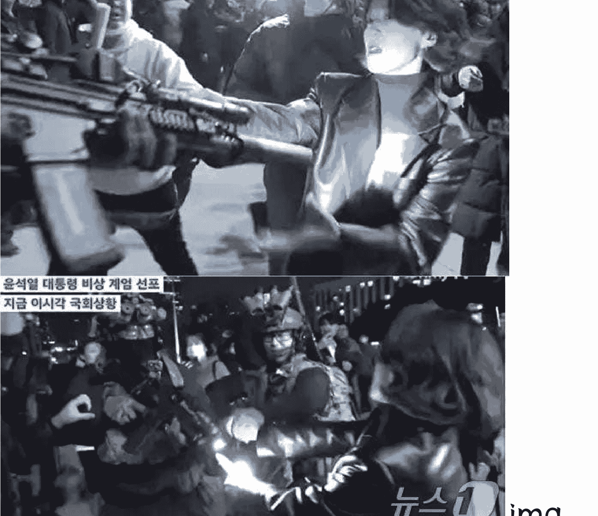

# 尹锡悦与韩国媒体

241206 新闻实验室

整理：公众号懒人搜索，懒人专属群独享
懒人微信：lazyhelper
新闻实验室的付费连载更新见专属群周报内分享

当地时间昨晚（12月3日晚）10:25分左右，韩国总统尹锡悦在毫无预兆的情况下突然通过全国电视讲话宣布戒严。

仅仅过了155分钟，韩国国会投票推翻该戒严令。

戒严开始6小时后，尹锡悦在凌晨召集的内阁会议上正式解除戒严。

这场短命的戒严，让全世界都关注到现任韩国总统的绝望和荒不择路。本期新闻实验室会员通讯，我们从媒体的视角出发，看看这场戒严以及背后的绝望总统。

## 「被社交媒体直播的戒严」

这是一场在社交媒体上被全程直播的戒严。

晚上10:50分左右，也就是尹锡悦宣布戒严的25分钟后，反对党领袖李在明在YouTube上开始直播，观看人数一度达到7万人。

懒人微信：lazyhelper

观众们先是看到他在一辆车里，他说：“没有理由宣布戒严，我们不能让军人统治这个国家。……我正在去国会的路上，请到国会来支持我们。”

抵达国会后，他发现大门紧闭。于是，李在明在人们的帮助下翻墙进入，这样的画面也被直播出去，引发大量传播。

当时在直播的不只有李在明。国会议长禹元植在主会议厅内等待其他议员到来的时候，也通过 YouTube 直播了两个小时。 随后，他开始在全体的会议上投票否决戒严令，并在整个过程中保持了 YouTube 上的直播。

值得一提的是，禹元植和李在明同属一个党派（共同民主党），这个党是目前韩国最大的在野党。两年前，共同民主党就在国会中赢得了多数席位；在今年 4 月的国会选举中，该党又扩大了领先优势，而总统尹锡悦的国民力量党则惨败，这也让他成为韩国数十年来第一个从来没有在国会中获得多数席位的“跛脚鸭”领导人。

尹锡悦在 2022 年赢得大选时，会员通讯 571 期曾经专门介绍。当时我们提到，他的胜利优势非常微弱，不到一个百分点。而执政两年后，他的支持率不断探底，上个月甚至只有 17%。扩大了国会控制权的在野党对尹锡悦施加了多重压力，包括：

- 要求对尹锡悦夫人收受奢侈品手袋、操纵市场、干政的丑闻展开调查;
- 上周，国会表决将尹锡悦提出的 2025 预算案砍掉 30 亿韩元;
- 已经弹劾了尹锡悦政府的几名成员，据传正在酝酿弹劾尹锡悦。

突然发出的戒严令，被认为是尹锡悦在重压之下荒不择路的昏招。

说回社交媒体上的直播——除了政客之外，还有普通人的直播和视频片段也在网上流传。人们几乎可以通过社交媒体实时见证议会厅外紧张而混乱的气氛，看到武装部队与政客、助手发生冲突，看到直升机在国会上空盘旋，看到部队砸碎了议会大楼的门窗。

共同民主党副发言人安贵玲和一名士兵发生冲突的画面也被拍了下来并迅速传播。人们看到，她对一名拦住她的警察喊道：“你难道不觉得羞耻吗?”她边喊边伸手拉扯这名士兵的步枪。

社交媒体上流传的画面还显示，一群人围住了载有军方人员的车辆，阻止他们进入国会。有人评论说，这些人是“民主的盾牌”。

当国会投票推翻戒严令后，国会大楼里的人们发出欢呼，这样的场景也被直播了出去。

当然，社交媒体此次起到重要作用的前提，是韩国在宣布戒严之后并没有断网，也没有试图控制媒体——各大媒体都在正常报道，个人的社交媒体账号也没有受到限制。

这是为什么呢？《天下》杂志引用一位前韩国高阶将领的话说：“如果他们认真要实施戒严，所有的通讯都会被切断，媒体会被封锁，还会实施宵禁，而且国会中的反对派成员很可能已经被逮捕了。……给我的感觉是，总统只是为了团结右翼势力而采取这样的政治策略。但如果是这样，真的太愚蠢了。”

这样看来，这更像是一场做戏式的戒严。倘若戒严令严格实施，社交媒体上的记录和传播将会变得困难很多。

## 「与媒体合不来的总统」

尹锡悦不仅是一位不怎么受民众待见的总统，也是一位与媒体有种种过节的总统。无论是韩国媒体还是国际媒体，都普遍认为他的两年多任期对韩国的新闻自由产生了明显的负面影响。

在记者无国界组织的新闻自由排行榜上，韩国 2022 年的排名是第 43 位，2023 年的排名是第 47 位，到了 2024 年已经下降到第 62 位。

尹锡悦对新闻自由产生的负面影响包括：

- 第一，用法律手段威胁提出批评意见的媒体。

尹锡悦是检察官出身，作风强硬。上任后，他迅速拿起自己熟悉的法律武器，想要收拾对自己提出批评意见的媒体。

2022 年 9 月，尹锡悦赴美出席联合国大会。当时，美国总统拜登在活动中承诺提供 60 亿美元对抗艾滋病、肺结核及疟疾，而尹锡悦在合照结束后就跟身边的幕僚说：“如果那群臭崽子在国会没让它通过，拜登那张该死的脸要往哪摆？”

尹锡悦以为自己是私下点评，谁知画面和声音都被媒体拍了下来。MBC电视台播出了这段影片。尹锡悦本人则回应：媒体的错误报导扭曲事实，且会对韩美同盟关系造成负面影响。随后，他的国民力量党以诽谤罪控告MBC的4名主管。

在他任期的前18个月里，尹锡悦政府至少针对11起报道事件提起了诽谤诉讼。

2023年5月，警方突袭了一名MBC记者的家——她正是曾经报道过尹锡悦失言事件的记者。这一次，她被指控的罪名是将韩国司法部长的个人信息转发给另一名记者。

2023年9月，检察官搜查并没收了做调查报道的媒体Newstapa和JTBC电视网的办公室以及几名记者家中的材料，理由又是对尹锡悦的刑事诽谤。原来，2022年初，Newstapa曾报道过一段采访录音，其中一名消息人士称，时任高级检察官的尹锡悦掩盖了一起银行和房地产案件。

突袭、搜查、起诉，尹锡悦把他检察官生涯中熟悉的这一套频繁用于对付媒体。另一个例子是，他下令警察多次突击搜查The Tamsa的记者和制片人的办公室和住所。The Tamsa是一个YouTube频道，曾报导涉及尹锡悦、他的妻子、岳母（已因伪造证件而入狱）和司法部长的贪腐指控。

- 第二，建立专门的机构打击所谓的“假新闻”。

和不少带有威权主义倾向的政客一样，尹锡悦也以“假新闻”的名义打压他不喜欢的媒体。2023年，韩国文化体育观光部在韩国新闻基金会设立了“假新闻举报与咨询中心”，这被认为是政府将自己树立为真相的仲裁者。

- 第三，干预相关监管机构的人事安排。

韩国通信委员会（KCC）历来是一个平衡、公正的监管机构，但尹锡悦将它的五名成员，削减为只有两名成员，而且都是由他直接任命的。这削弱了这一监管机构的独立性和公正性。

- 第四，用经济手段对媒体施加限制。

上面提到的报道失言事件的MBC，在播出尹锡悦失言视频后，不仅失去了登上总统专机随行采访的机会，也失去了政府广告收入。

尹锡悦政府还突然将地方广播公司YTN的多数股权出售给私人实体，并削减公共广播公司TBS的资金。在做出这些决定之前，政府并没有给这些公共广播公司足够的时间来调整其商业模式，这使它们的生存面临风险。

根据《The Diplomat》的总结，尹锡悦政府施加的压力并不仅限于新闻机构，还影响到了首尔国立大学的无党派、非营利性的事实核查中心 SNU FactCheck。这个中心由首尔国立大学传播研究所与32家媒体机构合作运营，在国民力量党对该平台上事实核查内容的所谓偏见提出批评和诉讼后，韩国领先的搜索引擎 Naver 突然终止了对该中心的财政支持和运营支持，令该中心难以为继。

## 「不给总统面子的媒体」

当然，把“打压新闻自由”的帽子扣在尹锡悦一个人头上，也并不合适——许多政客都有驯服媒体的冲动。尹锡悦的前任文在寅，也曾试图推进关于“假新闻”的立法惩罚，只是在面临海内外的诸多批评之后才搁置了这一法案。

政客有这样的冲动很正常，关键是：制度是否有足够的韧性支撑住媒体的自由与权利。

至少从这次戒严事件来看，答案是肯定的。如《纽约时报》一篇报道的标题总结的：《戒严并没有让韩国媒体沉默，而是给它们赋权》。

报道说，尹锡悦宣布戒严后，各种政治派别的新闻机构，包括与人民力量党意见更为一致的右翼媒体，都一致批评尹的做法以及任何试图限制新闻自由的行为。

比如，韩国最大的日报之一、倾向于保守派的《朝鲜日报》发表社论，称总统的行为是一种国际性的尴尬。社论还说，尹锡悦需要向公众交代他打算如何对这种状况负责。

而自由派的《韩民族日报》上则发表社论称：“大韩民国最大的安全隐患是：尹锡悦。”

一个代表新闻记者和媒体行业工作者的工会联盟在一份声明中谴责尹锡悦，称他的行为“反民主”、“违宪”，是对“半个多世纪以来全国人民用鲜血换来的民主和新闻自由的历史性成就的否定”。

从这个角度说，尹锡悦在这场闹剧般的短暂戒严中，至少做了一件好事：团结了韩国的媒体和媒体人。

历史 3000 多份各类付费文章以及年费三千多的副业社群资源，见懒人专属群内部分享!

付费群，白嫖勿扰!

## 懒人专属群更新记录：
https://lazybook.fun/#/blog/record2
懒人微信：lazyhelper