公众号懒人搜索，懒人专属群分享

# 懒人副业周刊

整理日期：241210

懒人专属群的群友大家好。小懒继续给大家带来生财周报～

> 副业周刊来自某年费3000多的付费社群资源帖。
> 本文档为懒人专属群内部分享，懒人手动整理。

懒人风向标系列单独用在线文档分享，地址见专属群总链接。

一些帖子跳转飞书查阅，如需破解复制权限，可以用这篇文章分享的油猴脚本搞定。

如果要保存飞书文档，可以用这个插件搞定：终于破解飞书，本地备份！

里面的飞书链接文档小懒有备份，失效的话到专属群总链接里找备份地址。

往期的生财周报合集（含在线版和离线版），见懒人专属群内分享。

希望大家有收获~


标题加了(精华帖)的表示精华贴，前面为截至今日的点赞数。

以下是目录，内容有些多。大家可以挑兴趣的内容阅读。懒人专属群更新记录（点此跳转）

懒人专属群介绍：https://lazybook.fun/#/blog/group
专属群更新记录：https://lazybook.fun/#/blog/record2
懒人通才计划：https://lazybook.fun/#/data/13_course
懒人手册：https://lazybook.fun/#/

# 目录

- 懒人副业周刊
- 目录
- 【生财认知】2篇
  - (精华帖)(102赞) 银发经济“会带来哪些商业蓝海？”
  - (20赞) 以弱胜强的本质：从竞争模型到生态位的思考
    - 竞争激烈的时代，人类应该何去何从？
    - 竞争的本质是，以强胜弱。
    - 如何才能以强胜弱？
      - 一、计
      - 二、谋
      - 三、信息战
      - 注意事项
      - 一、同为攻防，主动出击
      - 二、以最强打最弱
      - 三、战争跟竞争的两大区别
- 【生财技能】1篇
  - (31赞) 如何像素级复刻爆款视频
    - 1. **单个视频能爆的核心要素**
    - 2. **文案复刻**
    - 3. 画面复刻
    - 4. **语音复刻**
- 【好事分享】3篇
  - (精华帖)(65赞) 从0到1：机械行业新产品评估自动化程序的实现
  - (56赞) 从编程新手到微信小程序开发者：我的副业探索之路
    - 开发心得分享：
    - 开发使用的技术栈
  - (37赞) 小白独立学习《航海手册》并完成贪吃蛇网页游戏
- 【AI相关】14篇
  - (精华帖)(122赞) 人工智能与未来社会：机遇与挑战
  - (94赞) 纯小白如何通过AI写作在闲鱼实现流量变现
  - (56赞) 我是如何通过cursor赚取第一笔金的
  - (42赞) AI制作的儿童睡前故事视频：选题与制作指南
  - (49赞) 一文讲透AI写作交稿避坑指南，做靠谱写手订单接到手软
  - (36赞) 一个框架，两次进阶，三个原则：与AI高效沟通协作的秘诀
  - (28赞) 微信对话生成器：需求量大、制作成本低、可付费变现的AI工具项目
    - 1、微信对话生成器。
    - 2、实现需求
    - 3、怎么收费
    - 4、关于一些问题
  - (27赞) 利用Cursor开发AI应用：从零基础到实践分享
    - 在本文你可以看到：
    - 超级标AI应用模板
    - 模板示例
    - 示例功能描述：
    - 如何使用模板自定义自己的AI工具
    - 如何在本地部署
    - 如何在本地运行
    - 部署到vercel
    - 技术栈选择
    - 模板Prompt
    - 更多工具
    - 可商用unsplash图片下载
    - 创建下载目录（如果不存在）
    - 构建保存路径
    - 如果图片已存在，跳过下载
    - 搜索图片
    - 获取200x200尺寸的图片URL
    - 下载图片
    - 保存图片
    - 使用示例
    - 替换成你的 Unsplash API access key
    - JSON 文件路径
    - 创建下载器实例
    - 执行下载
    - 公众号文章批量导出
    - 批量保存截图
    - 如何挖掘需求
    - 如何自己发现需求
  - (24赞) 如何在Cursor编程中实现代码版本管理?
  - (22赞) 如何使用Cursor AI编码工具开发浏览器插件：从环境搭建到功能实现
  - (21赞) cursor航海提前预习实操问题记录
  - (21赞) 重生之我想当程序员，用半天时间学会使用Cursor爬了生财有术
  - (20赞) 如何用Cursor一键部署网站
  - (18赞) 年入千万的团长如何写快团团卖货文案
- 【YouTube】8篇
  - (精华帖)(189赞) YouTube变现：探索多种靠谱的变现渠道
  - (精华帖)(173赞) 哈喽大家好，我又来了，有幸成为YouTube shorts的教练，自然是要认真对待。
  - (精华帖)(118赞) 解说类账号的定义与作用
  - (85赞) 30个强大好用的YouTube工具推荐
  - (44赞) AI Shorts视频复刻教程：怪物融合与动物舞蹈
  - (30赞) 如何选择YouTube赛道并快速达到4000小时播放时长
  - (20赞) YouTube Shorts涨播放量的一个套路
  - (14赞) 短视频时长选择：从6秒到1小时，平台策略与用户需求的变化
- 【小红书】6篇
  - (精华帖)(117赞) 一人公司通过聚光投放在小红书一年内吸引4万客户：深度复盘
  - (44赞) 小红书广告变现分析：1800个博主数据揭示的运营策略
  - (42赞) 小红书电商新手选品与测品方法解析
  - (34赞) 从0到1：小红书虚拟资料项目实现月入过万
  - (28赞) 小红书幼教班本PPT赛道变现玩法：原创与定制的蓝海策略
  - (23赞) 小红书素人号玩法：单日增长1w公众号流量的策略
- 【海外项目】3篇
  - (精华帖)(113赞) SHEIN跨境电商指南：从背景到全托管模式的新手攻略
  - (44赞) 出海创业：流量获取与支付工具选择的关键挑战
  - (16赞) 黑五热潮下的商家挑战与反思
- 【闲鱼】3篇
  - (60赞) 闲鱼虚拟产品操作过程分享
  - (精华帖)(119赞) 闲鱼虚拟付费玩法：超级擦亮投放
  - (35赞) 闲鱼付费推广实战经验分享：用钱买曝光，转化成交全靠你
    - 闲鱼付费推广的核心逻辑
    - 流量来源拆解：搜索流量是核心
    - 权重与推广匹配：爆款优先，权重高就行！
    - 推广适用场景：新账户福音
    - 自然流量提升：带动效果明显
    - 成本与利润：精准选品为王
    - 基础准备：推广前的必修课
    - 推广成功的核心：理解平台规则
    - 玩转推广：单品打法 vs 批量玩法
- 【微信】2篇
  - (精华帖)(156赞) 100阅读变现20万，拆解10个公众号类型，带你了解公众号变现多样性
  - (32赞) 网盘拉新：公众号SEO玩法，通过AI洗稿无脑发文，小白也能轻松玩！
- 【线下实体】1篇
  - (10赞) 低付费打投放大户的赛道：家装公司吃本地生活红利
- 【其他】13篇
  - (50赞) 手把手教你低成本注册商标
  - (47赞) 得物0元购实操指南：单账号500元变现及批量操作策略
  - (43赞) 2024年B站精细化变现指南
  - (38赞) 二手机入局转转2.0的经验分享
  - (34赞) 美元换RMB攻略：100刀换900+毛爷爷，实操测试无手续费，汇率优秀
  - (28赞) 克服心理障碍，主动寻求帮助以事半功倍
    - 一.成名作：
    - 二.找到优势
    - 三.创投思维
    - 四.聚焦长期目标
    - 五.一放手容易亏钱的原因
    - 六.商业逻辑的通路是什么？
    - 七.选项目逻辑：
    - 八.成长属性
    - 九.怎么透过现象看本质？
    - 十.个人问题和调整
  - (25赞) 山本五十六的刺杀与《庆余年2》的情节关联
  - (23赞) 年度CMSEO大会回顾：Kyle Roof探讨蝴蝶记忆与SEO优化
    - Kyle Roof: Does The Butterfly Remember? Training Your Brain For Better
    - ②标签与思维局限
    - ③好奇心与批判
    - 最后提下他的演讲主题：毛毛虫与蝴蝶的隐喻
    - 检索成本与排名：谷歌的专利也明确，用户行为与seo的关系巨大：
    - 内容策略：
  - ### Tim Soulo: Long Time No See. Here's What's New At Ahrefs
  - ### From Clicks To Commerce: How SEO Experts Can Dominate eCommerce
    - 1. SEO与扑克的相似点
    - 期望值计算（EV）在SEO中的应用：
    - SEO中的常见误区与优化策略：
      - 1. “玩得太松” vs 专注优化
      - 2. “赌注太高” vs 理性投入
      - 3. 不适应游戏规则
    - 高效执行与团队扩展：
      - 1. 小细节的效率提升
      - 2. 自动化与仪表盘管理
      - 3. 团队分工与外包
  - ### Travis Jamison: How To Stay Rich
    - 那该如何保持财富？
    - 多元化投资
    - 投资策略框架
  - ### Ross Hudgens: Data-Driven Lessons From 12+ Years Of Content-Led SEO
    - 顶部导航优化
    - 站内导航和内容整合：
    - 主图的使用：
    - 内容推荐
    - 优化内容的可见性
    - 关键词研究
    - 关键词研究的误区
    - 内容布局
    - 内容创作与观众心理：
    - 油管的推荐算法与SEO策略的对比：
    - 成功的YouTube频道案例：
    - 关键词和话题的选择：
    - 编排技巧
  - ### Jared Codling: Growth Hacking To Supercharge Your Profit
    - 低成本漏斗构建策略
    - 优化问卷长度
    - 优先级的评估：
    - 进行科学测试：
    - 广告优化举例：
    - EDM邮件策略：
    - 测试其他环节的优化：
  - ### Jason Hennessey: How To Scale Your SEO Agency To Eight Figures
    - 成功的秘诀：不怕失败
  - (22赞) 普通人如何通过手机搬运实现宠物赛道从0到1的稳定变现
  - (22赞) 教育科技公司创始人分享千万级用户项目经验
  - (15赞) 以“小黄书”为例，来分析一个新平台，当下是否值得入场！
  - (8赞) AI搜索引擎崛起对SEO的影响：流量分发机制的剧变
  - (6赞) 企业TOB与TOC业务推广平台选择指南
- 【星主的收藏夹】5篇
  - (86赞) 三生有幸：生命、生活与生意的和谐统一
  - (78赞) 商业与个人规则：聚焦品牌与执行力
  - (52赞) 乔布斯谈被苹果解雇：人生中最具创造力的时期
  - (37赞) 特斯拉命运的齿轮始于2006
  - (23赞) 战略的根本：思维方式

## 【生财认知】2篇

### (精华帖)(102赞) 银发经济“会带来哪些商业蓝海？

作者: 黄海
日期: 2024-12-02

各位生财圈友好,我是黄海。我一直比较关注日本市场,认为对中国消费有借鉴作用,也投了一个老年人相关的项目:关于「银发经济」,分享一个好消息和一个坏消息:

好消息是,从数据看,当下中国的老龄化程度远没有日本高。衡量老龄化程度的重要指标,是看65岁以上的人口占总人口的比例。今天的中国是15%,日本则是30%。

坏消息是,中国社会的老龄化速度更快,能“摸着发达国家过河”的日子越来越少。从数据看,今天中国的老龄化程度约等于日本1994年的水准,但中国肯定不需要30年就能摸到30%。

日本有一些非常有趣、针对老年人的消费业态。Club Tourism,是日本最大的老年人旅行社。2024年携程就是表现最好的中概股之一。这家旅行社的很多营销做法,对中国消费者而言都非常传统,一点都不“数字化”。比如,它会定期邮寄实体杂志给会员,介绍旅行目的地,给用户种草。

从1993年成立至今,Club Tourism实现了年收入1600亿日元,换算成人民币大概在100亿左右。旅游并不是高毛利的行业,日本的人工成本也更高,公司利润率维持在大概2%左右。

就像这家旅行社的名字所展现的,它为用户提供的都是强社交属性的产品。例如它会定制一辆旅游专列火车,内部经过重新装修之后,能够承办各式各样的活动,例如演讲、表演、戏剧等。而日本一些知名的旅游城市,例如京都、大阪、名古屋等都可以乘坐火车串联。在中国,目前同类型的定制专列更多针对家庭亲子群体,而非老年人。,例如登山游、美食游、摄影游、绘画游、庙宇游、温泉游、旅居游等,每个主题系列都会配备专业的讲解和老师,在途中分享知识。针对那些追求信息深度的用户,也可以参加相应的历史游;特别热爱运动的,也有骑行游和马拉松游。

日本另一个非常有趣的针对老年人的业态,则是老年健身房。其中一个专门针对老年女性的健身房,名字叫做「Curves」。它提供的服务不是针对长肌肉或减肥,而是带领用户进行康复性的操课锻炼,调节身体机能,提前预防疾病。

「Curves」的选址也非常巧妙,通常会选择在超市或地铁旁边,对买完菜顺路健身的女性非常友好。这与邻国韩国的健身市场形成了鲜明的对比,很多韩国的健身房直接限制老年人进入,甚至消费者在呼吁政府立法,以禁止歧视。

而日本这家针对老年人的健身房则开出了超2000家。与之形成对比的是中国最大的连锁健身房品牌「乐刻健身」,目前只有1300家门店。

我在调研过程中惊讶地发现,「Curves」宣称他们年龄最大的会员现在已经101岁。

「Curves」的母公司是做老年人生意的高手,还开发出了另一种专门针对老年群体的休闲娱乐生意,就是「老年KTV」。

当然银发经济创业也有不少坑。在中国,创业做一个老年品牌的悖论在于,如果明确地将用户定义为“老年人”,出于“不服老”的心态,反而会影响用户的购买决策。

而老年人品牌是典型的需要少说多做的事:在产品上多为老年人考量和设计,但在营销上少主打这一点。我在长沙投资的项目「东茅街茶馆」从不声称自己是“银发经济”的产物,但在事实上吸引了很多中老年消费者每天光临。

在我经常分析的运动鞋服领域,安踏、耐克、李宁等品牌都希望树立有活力、敢于挑战、不畏艰难的理念和形象。

相比之下,足力健是一个主打老年人的品牌,但更多是在产品上优化,也少在营销上强调。

日本的消费品公司,一直以细腻的产品设计和用户洞察著称。日本最大的运动鞋品牌「亚瑟士」,在打造面向老年人的产品时,也在更多强调产品的改进。例如在鞋底添加增强树脂材料,给用户更好的防滑与支撑功效;例如设计敞开式的鞋舌,让用户无需手提,实现一脚穿脱。

曾经有市场调研机构,对日本最著名的几个消费品公司,无印良品、优衣库和宜得利,进行了核心消费群体的抽样分析,分析后发现如果你打算在日本做一个目标受众是年轻人的品牌,这似乎代表着你要面对的是小众市场。

服装行业最大的两个企业——优衣库和ZARA,后者始终坚持快时尚属性,前者则主打无年龄差、全年龄段皆可穿着。之前我在东京调研时发现,欧洲的快时尚品牌在日本的存在感并不强。

中国有很多消费品品牌会在市场调研时强调,自己的目标受众是18-35岁的一二线城市的女性用户。通常这被认为是中国最有消费意愿的用户群体。

但长期来看，这是否一个好的定位呢？未来中国社会还需要那么多迎合年轻人的品牌吗？年轻人能否一直是中国消费主力呢？

当然这些将年轻人视为目标用户的品牌都有合理的考量：年轻人更爱尝试新鲜事物、消费习惯尚未完全定型、还有机会深入用户心智。相比之下，老年人就更加保守、更难以取得信任。

染博士的创始人曾经给我分享了一个细节：在所有短视频素材和直播间里，他都要求主播，将语速放慢到平时的50%。

如果创始人并不属于某个消费群体，想要做这个人群生意，就缺乏天然的用户体感，需要通过更加努力的学习来弥补。所以很多创业者愿意做和自己年龄相仿、或者更年轻一些的消费者的生意，自己养狗就做宠物品牌，自己养猫就做猫粮品牌，有带娃的需求就做童装品牌。

在旅行和消费品之外，另一个中老年群体的刚需消费是居住。

例如，日本有很多中老年人之间组成了养老搭子，生活在二三线城市，约定一起居住生活但保持适当的距离，并不依赖彼此；有困难的时候则全力帮助对方。

除此之外，她们还会定期在家中组织周末沙龙，邀请医生、音乐家、脱口秀演员等前来分享，已经坚持了10年以上，甚至成为了城市的交友中心。甚至她们之间还进行了遗嘱委托，其中一人去世后，其他人有权帮他处理后事。

目前国内这样的职责通常由社区和居委会承担，未来可能会有越来越多自治组织出现。

另一个有趣的案例是“跨代共居”。一些日本老年人愿意出租一部分空间给年轻人，收取相对少的房租，但获得更多接触新鲜事物的机会。年轻人也会愿意将自己的困惑向长辈请教，互相照顾和成全。日本的社区还会对公共空间进行改造，让不同年龄段的人获得更多交流的机会。

在日本的核心城市地段，还衍生出了一种特别的业态叫“社区食堂”。东京政府会对其进行补贴，促进更多老年人在这里交流互动。甚至把学生食堂也和老年食堂放在一起，提供更多跨代交流的机会。

这不仅为老年人提供了更加多样化的营养餐饮选择，提升居民总体健康水平；还在客观上建立起人员的关怀机制，如果有老人超过3天没来吃饭，就可能要到家里进行探访。

从选择配乐、寿衣、发型、妆发，到自己躺到棺材里体验，一站式全包，甚至还提供出版个人传记的服务。这样的服务模式旨在缓解老年人的死亡焦虑。

但随着中国以更快的速度进入老龄化社会，未来中国商业世界一定会出现相应的创新，商业机构、政府、家庭......每个社会角色的分工可能也会随之变化，值得提前思考。

评论区：

七天@生财有术：黄海老师提到的这点很有启发，当我们做的产品人群跟自己不在一个同温层的时候，如何保持对用户的敏锐洞察。

> “如果创始人并不属于某个消费群体，想要做这个人群生意，就缺乏天然的用户体感，需要通过更加努力的学习来弥补。所以很多创业者愿意做和自己年龄相仿、或者更年轻一些的消费者的生意，自己养狗就做宠物品牌，自己养猫就做猫粮品牌，有带娃的需求就做童装品牌。”

看来做业务的过程中，需要不断增加用户体感，不只是看数据，还要多去一线跟用户聊天。

五阿哥：几个月前航海做短视频带货想做染发产品，发了的一百多条视频才出一单，对标的账号主要都是直播带货的方式(她们卖货确实多”，我做短视频并不适合，考虑到要大投流，团队搭建等，最后还是放弃了

Bon Appétit：持续关注[呲牙]，需要轮椅 扶手椅可以联系我，医疗床，现在主做轮椅 看婴儿车一样，我们的轮椅空间应该很大[发呆]

石头：感谢分享啊，受益良多，我们这社区食堂已经有蛮多了，这么多起来也是因为现在的老龄化

He：值得深思的文章

小高：感谢黄海老师的演讲，让我看到了冲击力的一面，我也是做旅游业的，现在中老年出国旅游的还真不少

胖大魔：[旺柴]穿亚瑟士多年经验，亚瑟士不适合跑步，也不适合老年人穿，鞋底太软了。没有支撑

胖大魔：我们这边社区食堂骗补贴居多

### (20赞) 以弱胜强的本质：从竞争模型到生态位的思考

作者： 兰陵王
日期：2024-12-02

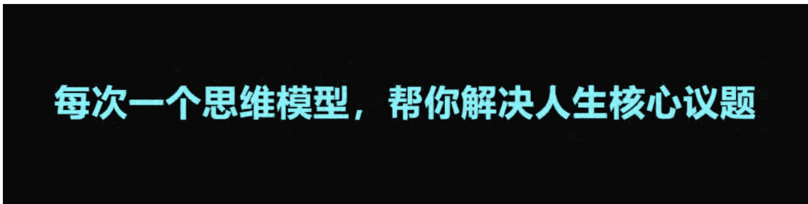


所有的以弱胜强，都是以强胜弱。

这是战争之道，也是商业竞争之道。

我从大四的时候开始研究竞争，得到了4个模型「深耕细作、与众不同、错位竞争、成为第一」，并根据这4个模型，一举拿下了学习方法这个生态位，成为了这个领域的小巨人。

当然，我那时候还不知道「生态位」这个概念。

毕业之后，我开始接触生物学，偶然得到了「生态位」这个概念，突然一下子把之前的4个模型打通了，得到了一个更本质的模型。

但我后来逐渐发现，生态位并不是竞争的本质，它只是生物在自然选择之下，为了生存，试出来的一种最优解 。

最优解并不是本质，它只是一种现象，一种策略，一种方法，只不过它是生物给出的最优解方法。

那么，生态位的本质是什么呢？

一个偶然的契机，我接触到了兵法，我在兵法中找到了答案——以强胜弱 。

#### 竞争激烈的时代，人类应该何去何从？

兵法就是研究「战胜」的本质的，它既是战争之道，也是竞争之道。

这篇文章我们就来看看，到底什么是兵法？我们能够从里面得到什么启发？战胜的本质到底是什么？竞争的本质到底又是什么？

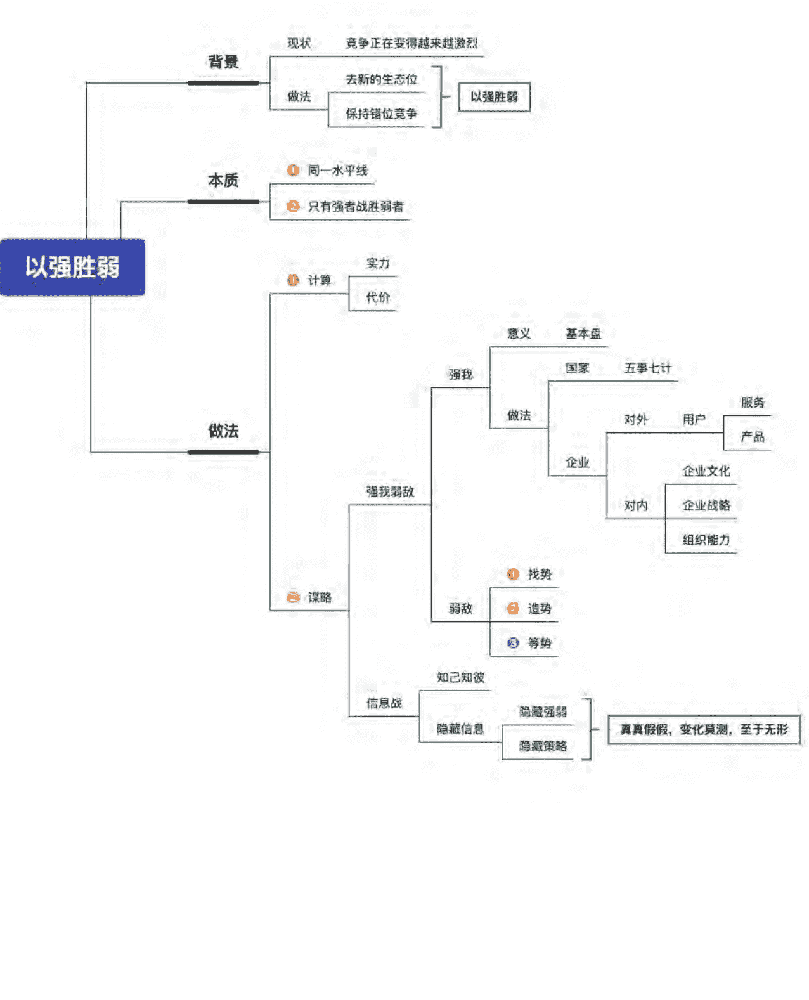

近两年有个词非常火，内卷。

它描述的是一种「恶性竞争」的社会现象，虽然每个人都变得比以前更努力了，然而社会整体的收益却并没有得到任何的增加。

最经典的案例就是之前的教培行业，虽然有些人在上完补习班之后考出了更好的成绩，但是由于每所大学每年所招收的学生数并没有增加，所以单从“考大学”这个指标来说，学生并没有取得任何的新收益，这就是内卷。

不过把“内卷”用来概括今天所有的竞争，却是一种误解。

因为我们今天的很多竞争都是有好处的，它能倒逼企业变得更好，它能提升社会的整体效益。

不过即使我们明白这一点，也丝毫无法减轻我们内心的焦虑。

因为竞争确实是越来越激烈了，我们的生存难度正在变得越来越大。


为什么会产生这样的现象呢？

这其实是一种自然的演化趋势，并不是“哪个坏蛋”或者“哪群坏蛋”刻意而为之，它是一种自然发展规律，每个人只是想要活下来，想要活得更好而已，它就变成这样了。

而且，更糟糕的是，这种趋势似乎是不可逆的。

也就是说，未来的竞争情况还会更激烈。

除非人们找到新的生态位，比如新的可用能源、比如新的宜居星球等等。否则，只要资源是有限的，生物之间就会存在竞争，这是自然的铁律。

这有点类似王东岳的递弱代偿理论。

当人们之间的竞争越来越激烈的时候，人们的生存难度就会变大，这个时候如果我们想要保持我们原来的生存优势，就不得不提高我们的生存能力。

而当每个人的生存能力都提高之后，竞争又变得更激烈了，于是生存难度又变得更大了。

因为人们的生存难度变得更大了，所以我们又不得不再次提高我们的生存能力。

……

你发现没有，这是一个无解的死循环。

也就说，竞争一定会变得越来越激烈，这是一条不可逆之路。

那怎么办呢？两条路：

1. 从人类的角度来说：人类必须去寻找新的生态位，比如新的清洁能源，比如移民火星，比如探索宇宙等等。因为竞争的源头来自于资源的有限性，所以我们必须从源头解决这个问题。
2. 从个人的角度来说：不要扎堆竞争，每个人都要去寻找自己的生态位，跟别人形成错位竞争，这能一定程度上减轻个人的竞争压力。

针对个人的竞争之道，针对个人的生存之道，后来我写了《成为第一》、《深耕细作》、《与众不同》、《生态位》这几篇文章。

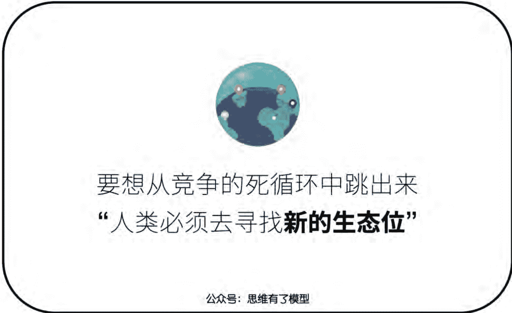

但我最近发现，其实错位竞争也好，生态位也好，它们并不是竞争的本质，它只是竞争的方法论之一。

竞争的本质其实在战争里面，而且孙子早在2500年前就已经给出了答案，这个答案就写在《孙子兵法》里面。

叫做「以强胜弱」。

#### 竞争的本质是，以强胜弱。

这个世界根本就没有以弱胜强。

因为所有的以弱胜强，本质上都是以强胜弱。

一直以来，人们都非常热衷于看那些“以弱胜强”的传奇案例，比如赤壁之战、官渡之战、巨鹿之战等等。

因为这能满足人们对英雄、对谋略的向往之情，毕竟谁不喜欢“谈笑之间，樯橹灰飞烟灭”呢？

但可惜，历史上根本就没有以弱胜强的案例，不仅人类历史上没有，从逻辑上来说，整个生命史上都没有。

所有的以弱胜强，在逻辑上来说，都是以强胜弱。

我的证明如下：

假设，有两股力量，一股叫做力量A，一股叫做力量B，力量A大于力量B，如果这两股力量在同一条水平线上碰头，谁会获胜呢？

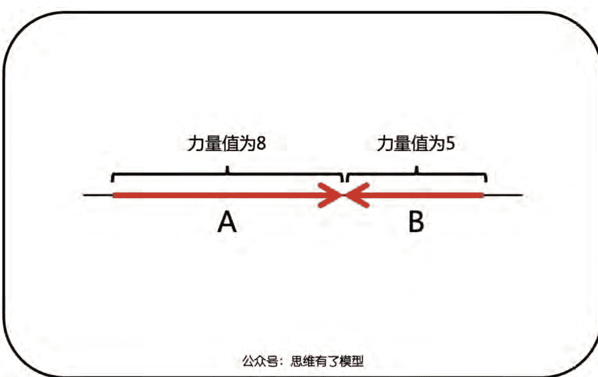

答案当然是：力量A获胜。

那么历史上那些以所谓弱胜强的案例都是怎么发生的呢？

很简单，弱的一方面找到了或者制造了某种势，在这个势里面，“弱”的一方面比“强”的一方更强，所以弱（其实是强）的一方获得了胜利。

我举几个例子：

##### 1、官渡之战

参战兵力：曹操2万兵力，袁绍11万兵力。

伤亡情况：曹操8千兵力，袁绍10万兵力。

单从数字上来看，这绝对是一次经典的以弱胜强的案例。但事实上真的是以弱胜强吗？

曹操的强：

- ①集中兵力：不是分兵把守黄河南岸，而是集中兵力，扼守要隘，重点设防，以逸待劳，后发制人。（类似企业的深耕细作）
- ②名正言顺：挟天子以令诸侯，名正言顺。（我是正当企业，而对方是灰色企业）
- ③信息优势：袁绍的谋臣许攸投靠曹操，并给曹操带来了信息和计谋。曹操采用了许攸的建议，偷袭了袁绍的鸟巢，烧掉了袁绍的粮草辎重，断掉了袁绍的补给。
- ④敌将投奔：张郃、高览听闻鸟巢被破，于是投降了曹操。
- ⑤声东击西：曹操听从了谋臣许攸的建议，声东击西，分散了袁绍的兵力，致使关羽斩杀了袁绍的大将颜良，袁军溃散。（这一招类似企业的错位竞争，我深耕细作，而对方分散多元）。

袁绍的弱：

- ①决策无能：相比曹操，袁绍实在是差太多了，尤其是在决策上，屡次失误，他手下的谋臣，比如沮授，多次给他提出了极好的策略，结果都被他否决了。（在今天来说，就是企业的创始人无能，企业的战略不行，虽然资本雄厚，但没卵用）
- ②大将投奔：谋臣许攸投奔曹操，并给曹操带去了很多机密信息；张郃、高览听闻鸟巢被破，也投降曹操。（类似公司企业高管被挖走）
- ③大将被杀：颜良、文丑、淳于琼三位大将都被曹操用计斩杀。（类似企业高管纷纷离职）
- ④补给被断：鸟巢被曹操偷袭，粮草辎重被断。（类似企业现金流被断）
- ⑤军心动摇：大将投奔的投奔，被斩杀的被斩杀，一战接一战的失利，粮草辎重还被烧了，导致军心动摇，失去了气势。（类似企业员工彻底失去了工作动力）

……以及各种因素，就不一一列举了。从这些点可以看出，曹操并不弱，袁绍也并不强。

这里面的核心在于，士兵的数量并非强弱的“唯一指标”。

就像今天的企业，不能单纯以资本论强弱一样，企业的创始人、企业的战略、企业的组织能力、企业的产品、企业的服务......这些都是重要因素。

所以强弱是各种指标的综合，曹操虽然在兵力上比袁绍弱，但在其他方面都远远强于袁绍。用一张图来展示就是这样的：

| 曹操兵力 | 袁绍兵力 |
| --- | --- |
| 曹操谋略 | 袁绍谋略 |
| 曹操领导力 | 袁绍领导力 |
| 曹操大将 | 袁绍大将 |
| 公众号：思维有了模型 |

##### 2、赤壁之战

参战兵力：孙刘联军5万兵力，曹操20万兵力。
伤亡情况：曹军战死数万，病死十余万。

孙刘之强：

- ①以逸待劳：相对于操军的长途跋涉，孙权的部队可以说是非常的安逸了，体力充沛，此为第一强。
- ②地利优势：孙权的军队熟悉水战，而曹操的北方士兵都不善于水战，长江天险极大地提升了孙刘联军的战力，这为后面的火攻打下了基础，此为第二强。
- ③信息优势：曹操熟读《孙子兵法》，一定不会不知道对方可能会用火攻这一计谋，但曹操依然信心十足，因为他在信息上缺失了，他不懂气候学，洞庭湖一代因为地形风的原因，可能会吹东南风，而这一点周瑜是知道的，此为第三强。

曹操之弱：

- ①舟车劳顿：曹操远道跋涉而来，而且长期征战，士兵的身体早已疲惫不堪。（正如公司长期加班不是长久之计）
- ②水土不服：导致曹操赤壁之战大败的最大元凶就是这个，曹操攻打孙刘联军的时候，正值瘟疫盛行，孙权的军队具备一定的免疫力，而曹操的军队从北方而来，水土不服，染上了疾病，死伤大半，再加上饥寒交迫，更是雪上加霜。（正如身体健康是革命的本钱）
- ③组织能力：新收编的刘表部队，虽有七八万之众，然而还没有来得及磨合就上了战场，士兵心怀猜疑，士气不足。（类似于企业刚刚新招员工，就让新员工投入战斗）
- ④不善水战：北士卒不习惯坐船。（类似企业刚刚踏足一个新领域）
- ⑤士气不足：初战失利、不善水战、战船被烧，疾病侵袭，饥寒交迫，死者大半，一系列原因导致曹操的军队士气低靡。（类似企业员工对未来失去了信心）

还有一系列因素，可以看出，虽然曹操兵力雄厚，而且谋略过人，但因为天时地利人和都不占，导致他的军队看似强大，实则虚弱。

更可怕的是，曹操的虚弱还被周瑜给识破了，在信息上也失去了优势，导致谋略上处处被动。

这里面的核心还是在于，强弱并非只在于兵力这一个指标，甚至也不完全在于主公谋略。

曹操个人的领导才能没得说，而且也深谙兵法，但是组织能力不行，新收编的军队还没磨合，而且长途跋涉，还不熟悉水战，不懂气候学，更要命的是还染上了疾病。

所以，这些指标综合起来，最终导致两方的力量天平发生了倾斜。

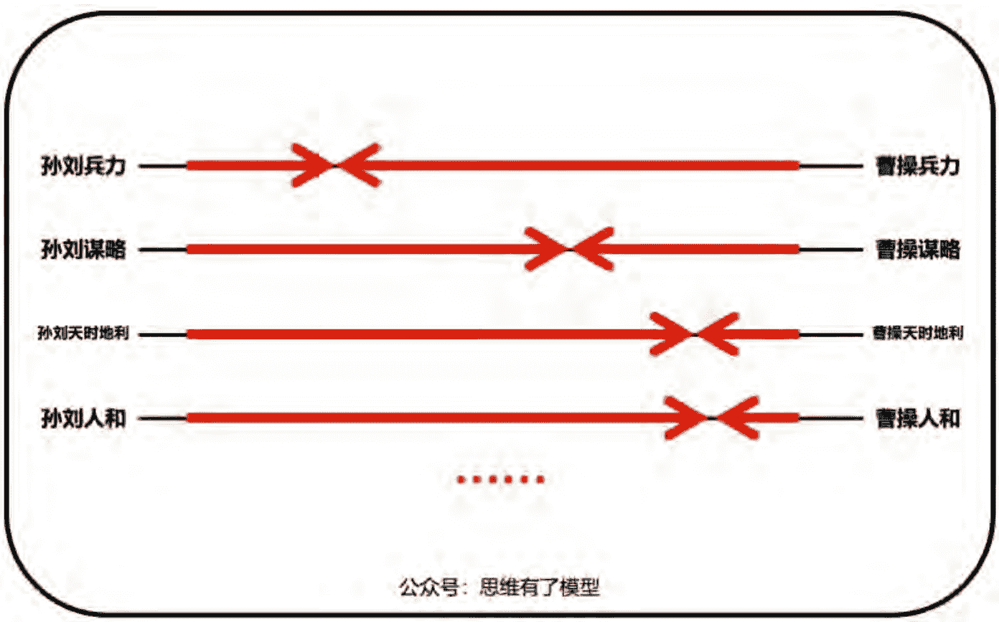

以上就是为什么曹操和孙刘能够在各自的交战中以弱胜强的原因，表面上看曹操在官渡之战中是弱势的一方，孙刘在赤壁之战中也是弱势的一方，但实际上，二者都是强势的一方。

当然，这种强，并不完全是一开始就具备的，有的强是在谋略的制造下体现出来的。

比如曹操采用声东击西，分散袁绍的兵力，从而达到了以强击弱的效果；比如孙权借助诈降、火攻、东南风，烧毁了曹操的战船。

这就是战胜的本质「以强胜弱」。

它在逻辑上是无懈可击的，它就是不证自明的公理。

什么是逻辑？什么是不证自明？回到刚刚这张图：

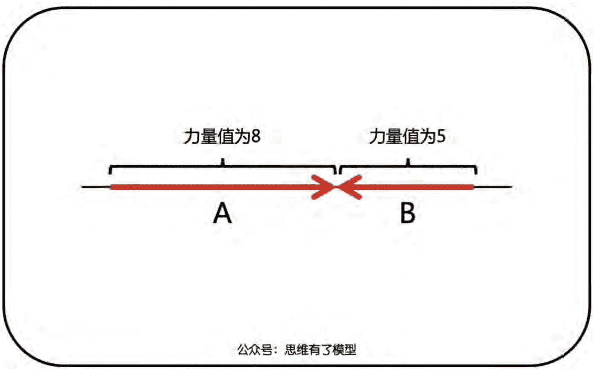

在同一水平线上，根本不可能出现以弱胜强，如果某一方获胜了，那么那一方必定是强的那一方。

这就是逻辑，这就是宇宙法则。

如果没有这样一条法则，那么这个世界就会完全乱套，就会失去规律，因为任何的强不再具有意义。

希望大家再认真体会一下红色字体那段逻辑，它就是整个「战胜」的第一原理。

为什么要体验逻辑？逻辑真的这么重要吗？

在西方部分哲学家的眼中，他们甚至认为，只有逻辑才是绝对真实的，只有逻辑才能通往宇宙的终极真理。

因为现实会欺骗我们，眼见未必为实。你以为你看到的是颜色，其实根本没有颜色，只是你大脑对光波的加工而已；你以为你听到的是声音，其实根本没有声音，只是你大脑对声波的加工而已......

只有逻辑能触达真理。

西方最厉害的演绎思维，非常核心对一点就是，它必须基于绝对正确的起点。那么如何才能保证起点绝对正确呢？

答案还是逻辑。

以正确的逻辑为起点（也叫不证自明的公理），才能进行正确的演绎推理。

比如著名的「在同一平面（二维），两点之间，线段最短」，这就是绝对正确的逻辑起点。

在这种绝对正确的逻辑起点上去做演绎推理，才能得到一套稳固的知识体系，否则你可以想象一下，如果今天的某些数学知识是错误的，那对建筑、机械、科技、航天来说，将是毁灭性的灾难。

而「以强胜弱」就是这样一条类似于欧几里得五大公理的逻辑，而且它还是被孙子、曹操等人实践过了的逻辑，具有绝对的真实性。

又因为它是逻辑，是战胜的本质，所以它不仅适用于战争，也同样适用于竞争；而且它不仅适用于地球，也适用于地球与外星人之间的战争，甚至适用于整个宇宙。

总之，宇宙间一切的对抗、竞争、竞技，都需要遵守这一法则。


但是上面那段逻辑，其实还有个bug，什么bug？

其实也不算bug，逻辑好的读者可能看出来了，我加了一个限制条件「同一水平线上」。

在现实世界里，我们很难找到完全处于同一水平线上的对抗，很难找到力量都能集中到同一水平线上的对抗。

在现实世界里，我们一般都有多股力量，而且它们分散在各处。

那么这个时候，刚刚那个第一原理还有用吗？

当然有用，这就是第一原理的强大之处，所有东西就是基于它的延伸和演化，掌握了它就可以解决一切与之有关的问题。

比如我举个例子，为什么现实世界里会出现“以弱胜强”的案例？

就是因为弱的一方找到了某种势，或者制造了某种势，这个势就是一条新的水平线，在这条新水平线上，弱者成了强者，强者成为弱者，于是以弱胜强就发生了。

但是你知道，其实是以强胜弱，只不过是在一条新的水平线上发生罢了。

声东击西就是一个典型的案例：

正面抗争肯定打不赢，因为在这条水平线上，对方比你强，你必败无疑。

那怎么办呢？

分散敌人的兵力，然后逐个击破。虽然正面抗争打不赢，但是我先把你力量分散，然后再打击你的脆弱部分，在这条新的水平线上我比你强，我就能战胜你。

#### 所以，本质上还是以强胜弱。

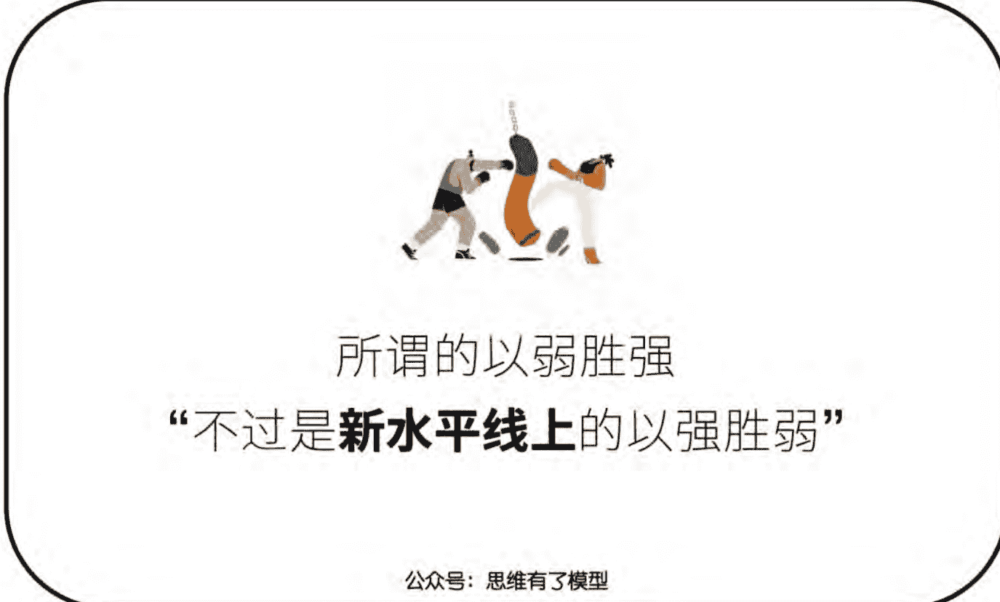

这就是战胜的本质，也是《孙子兵法》的核心思想。

《孙子兵法》开篇第一章就讲“计”，什么是“计”？

注意，这个“计”不是计谋的计，而是计算的计。

计算什么？计算各自的力量，看看是否满足以强胜弱的条件，满足了才能打，不满足绝对不能打。

当然也不是绝对不能打，打还是可以打的，但是如何才能打呢？

这就是后面的谋，通过谋略来达成以强胜弱。

但注意，即使是谋，也还是要计算，谋略以后计算发现还是无法满足以强胜弱，那也不能打，只有等到以强胜弱这个条件满足了才能打。

所以，《孙子兵法》绝对不是一篇关于奇技淫巧的兵法，谋在实力计算后面，打在计算后面，打是最不重要的，其次是谋略，核心是计算，计算什么？计算是否满足以强胜弱的条件。

《孙子兵法》称之为「先胜而后战」。

什么意思？就是满足了以强胜弱的条件才能打。

可见孙子的智慧，他不仅是个军事学家，更是一个逻辑学家。

他深刻地洞察到了「从逻辑上来说，根本就没有以弱胜强这一说法，虽然在开战之前，确实会有强弱之分，但是在开战中间，一定是强胜弱，这是自然法则，这是自然铁律」。

所以，要满足了以强胜弱的条件才能打。

此之谓「先胜而后战」。

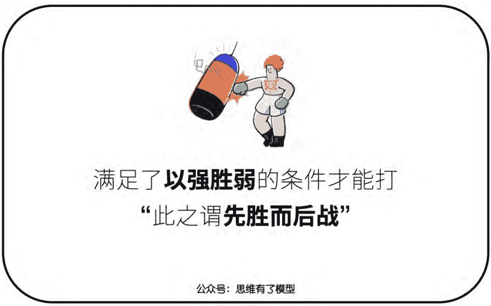

太精彩了！

建议大家抽空一定要用模型树去看看《孙子兵法》，其思想极其深刻，对今天的我们来说，具有极大的启迪性。

正如英国著名战略家李德哈特对《孙子兵法》的评价：

世上只有两部军事战略书籍，这两本书超越所有其他兵书战策，就是《孙子兵法》和克劳塞维茨的《战争论》，而《战争论》比起《孙子兵法》来说，还是过时了。——英国著名战略家李德哈特

#### 如何才能以强胜弱

那么，如何才能以强胜弱呢？

如果我现在没有别人强，我怎么才能战胜他呢？

如果我现在已经是最强，我如何才能巩固住这个地位呢？

很简单，还是回到刚刚那条第一原理「在同一水平线上，只有一方能获得胜利，就是强的这一方面」。

我们死死抓住这句话。

获胜的关键，就是想尽一切办法创造出这样一个条件：在某个水平线上，让我比对方强。

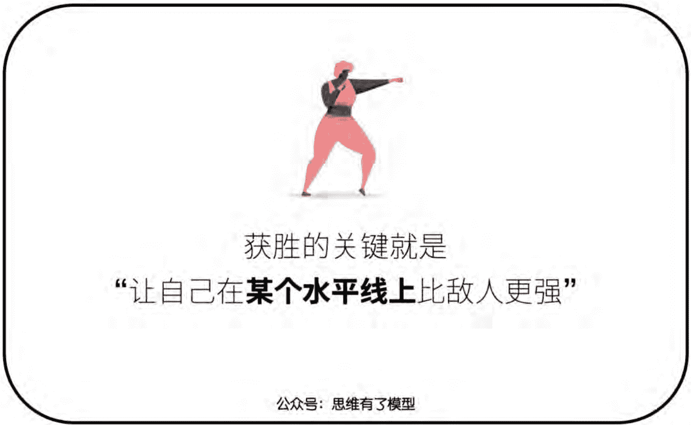

不过，第一步还不是这个，孙子的厉害之处在于，他敏锐地洞察到了，在“谋”的前面还有一个步骤，叫做“计”。

##### 一、计

计谋，计谋，我们经常把这两个字合在一起念，但其实在《孙子兵法》里面，“计”和“谋”是两个意思。

《孙子兵法》开篇第一章就讲“计”，什么是“计”？

这个“计”不是计谋的计，而是计算的计。

计算什么？计算各自的力量，看看是否满足以强胜弱的条件，满足了才能打，不满足绝对不能打。

当然也不是绝对不能打，打还是可以打的，但是如何才能打呢？

这就是后面的谋，通过谋略来达成以强胜弱。

但注意，即使是谋，也还是要计算，谋略以后计算发现还是无法满足以强胜弱，那也不能打，只有等到「以强胜弱」这个条件满足了才能打。

这就是计的重要性，计是谋的前提，更是打的前提。

千万不能瞎谋，更不能贸然进攻，一定要先计算清楚，看看敌我双方的形势。

所谓知己知彼，百战不殆。意思不是说，知己知彼就能百战百胜，而是说知己知彼，看看是否满足「以强胜弱」，不满足就不打，满足才打，这样就永远不会失败。

孙子将其浓缩成一句话「先胜而后战」。


先计后谋，先计后打

“先胜而后战”

公众号：思维有了模型

而如何才能先胜而后战呢？

答案就是计，计算双方的实力。

###### 1、计算实力

但注意，这个计算实力不是瞎计算，一定要紧紧围绕「在同一水平线上，只有强者战胜弱者这一种结果」这个第一原理。

所以，我们首先要看看对方有多少水平线。

比如赤壁之战，周瑜就不能单看兵力这一个水平线，他还要看天时、地利、人和这些水平线，要看到各种水平线。

这就是周瑜的厉害之处，其他大臣都只看到兵力这一条水平线，所以个个都劝孙权早点投降，但是周瑜不同，他看到了曹操在兵力之外的虚弱。

他看到了在其他水平线上，自己能够以强胜弱的可能。

这就是优秀军师的强大之处，他能看到别人看不到的维度。

在这个基础之上，我们才能去做强弱对比。

记住，一切抛开水平线谈强弱的行为，都是耍流氓。

回到我们今天的商业竞争，就是要看到对方的每一个生态位，要看到对方的领导者、组织、战略、产品、服务、品牌、资本、供应链、渠道商等等这些维度。


###### 要看到各种水平线

> “不要老被一个水平线所锚定”

公众号：思维有了模型

然后再去看，在每条水平线上对方的实力如何，孙子兵法把这个叫做「虚实」。

如果对方在某条水平线上或者某几条水平线上比你弱，你就可以从这些点切入进去，实现以强胜弱。

这就是《孙子兵法》里面所讲的「避实击虚」，避开对手强劲的部分，去打击敌人虚弱的部分。

简而言之就是一句话，计就是计算自己与对方在各个水平线上的实力，看看自己在哪些地方满足以强胜弱，哪些地方不满足以强胜弱。

然后从那些满足以强胜弱的地方切入。

但如果摸不清敌人的虚实呢？

这就很难办了，在战争里面最重要的东西就是信息，信息不足或者信息错误，就无法摸清敌人的虚实，从而就很容易出现以弱打强的局面。

不过《孙子兵法》也给了一些方法，比如先虚晃一枪，看看对方的反应，然后再根据对方的反应来判断敌人的虚实。

在拳击上，也经常会有这样的虚拳，就是想看看对方的反应，从而判断对手的虚实。

除此之外，斥候和间谍也是获取信息的重要方式，尤其是间谍，一个优秀的间谍，其对战争的贡献不亚于一个优秀的军师。

巧妇难为无米之炊，一个优秀的军师，没有信息也很难做决策。

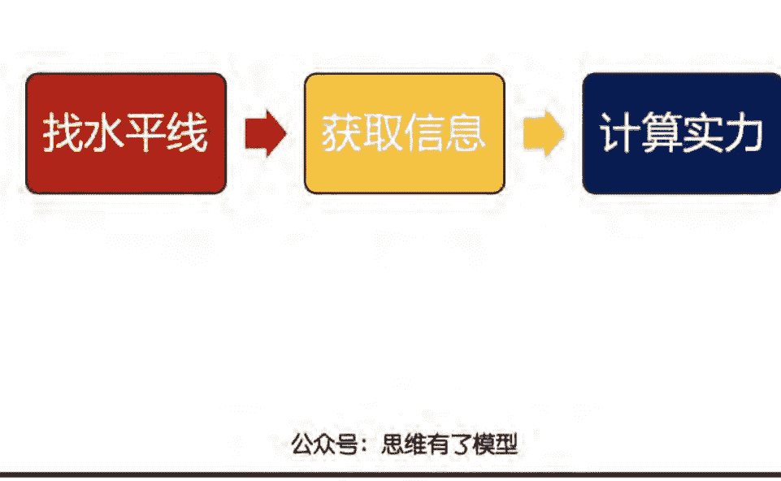

以上就是关于计算实力最重要的几点。除了计算实力，我们还需要计算一个东西——代价。

###### 2、计算代价

并不是满足了「以强胜弱」就能打。

你还要计算代价，如果付出远小于收获，那就不要打。

古人常讲「穷寇莫追」，为什么？

给人家留条活路，对方是亡命之徒，要硬啃下来是会付出很大代价的。

但也不是不能追，而是要巧追。

东南西北先留条活路，让对方逃命，打消敌人的拼死之心，然后等对方跑累了，再设计歼灭他。

反正核心就是尽量减小获胜的代价。

这里面有个原则非常重要，叫做求全思维，孙子非常重视这一点。

什么是求全思维，就是能不打就尽量不打，不战而屈人之兵才是上策。

保护好对方的财产与人民，因为投降之后，对方的财产也是你的财产，对方的人民也是你的人民；而且，你自己的财产和军队也能得以保全。

项羽就没做到这点，为了泄愤，他攻入咸阳城的第一件事就是杀人，并烧掉了阿房宫，据《史记》的记载「烧秦宫室，火三月不灭」，大火足足烧了3个月。

##### 二、谋
什么是谋？
谋就是我们经常所说的谋略、计谋。
那么谋什么呢？核心还是那四个字「以强胜弱」。简而言之就是，找到或者制造某种势能，让我们在同一水平线上比对方更强。

谋就是找到或者制造某种势能
“让自己比对方强”
公众号：思维有了模型

那么如何才能让我们在同一水平线上比对方更强呢？
我们可以把它拆分为两部分来分析：强我+弱敌。

###### 1、强我
首先是强我。
什么是强我？强我就是「基本盘」，就是「打铁还须自身硬」。
很多人喜欢耍小聪明，很享受那种「虽然实力不济，但是我机智过人呀」的感觉。
这是用兵的大忌。
聪明如越王勾践，回到越国之后，也不是立马对吴国发动攻击，为什么？因为自身实力不济呀！
这也是《孙子兵法》有别于《三十六计》的地方。
《三十六计》所谓的谋，更多是弱敌之策，这是二流的谋。那什么是一流的谋呢？一流的谋就是先强我，先让自己变得强大，先让自己处于不败之地。

> 昔之善战者，先为不可胜，以待敌之可胜。不可胜在己，可胜在敌。故善战者，能为不可胜，不能使敌之可胜。——《孙子兵法》

什么意思？
牛叉的人应该是先让自己处于不败之地。
简单来说就是，你管得了自己，管不了别人。
为什么？因为管别人是一件很难的事，需要满足各种条件，而且有概率在里面，但是管好自己却很容易，所以要先管好自己。

赤壁之战，如果曹操敌军队不得病，或者如果曹操知道东南风，那么历史又将是另一种结局了。
正如杜牧所说的「东风不与周郎便，铜雀春深锁二乔」，如果没有东南风，铜雀台恐怕就要多添两位美女了。
所以孙子反复强调，先让自己强大起来，这才是基本盘！

善战者，立于不败之地，而不失敌之败也。是故胜兵先胜而后求战，败兵先战而后求胜。——《孙子兵法》
道德经也在强调类似的理念：
夫不争，则天下莫能与之争。——《道德经》
这就是谋的基本盘——先强我，即先让自己处于不败之地。

那么具体应该如何强我呢？
《孙子兵法》给出的答案是五事七计：

> 兵者，国之大事，死生之地，存亡之道，不可不察也。故经之以五事，校之以计而索其情：一曰道，二曰天，三曰地，四曰将，五曰法。道者，令民与上同意也，故可以与之死，可以与之生，而不畏危。天者，阴阳、寒暑、时制也。地者，远近、险易、广狭、死生也。将者，智、信、仁、勇、严也。法者，曲制、官道、主用也。凡此五者，将莫不闻，知之者胜，不知者不胜。故校之以计而索其情，曰：主孰有道？将孰有能？天地孰得？法令孰行？兵众孰强？士卒孰练？赏罚孰明？吾以此知胜负矣。——《孙子兵法》

我来翻译一下：
- 道：即政治。
- 天：即天时。
- 地：即地利。
- 将：即将帅。
- 法：即法制。
- 主孰有道：军民一心
- 将孰有能：将帅有才
- 天地孰得：天时地利
- 法令孰行：法纪严明
- 兵众孰强：兵力强大
- 士卒孰练：训练有素
- 赏罚孰明：赏罚分明

这就是《孙子兵法》所强调的基本盘，对应到今天，就是一个国家的政治、经济、科技、军事、文化、教育，做好这些就能立于不败之地。

国家的基本盘就是“政治、经济、科技、军事、文化、教育”
公众号：思维有了模型

诸葛亮就是输在政治和经济上，明明阿斗扶不起来偏要扶，六出祁山，劳民伤财，最后硬生生把蜀国给拖垮了。所以司马懿骂他这是逆天而行，意思就是不遵循天道。
这就是基本盘的重要性，这个没做好，再聪明也没用。

对应到企业我认为就是三个方面：
- （1）对外：用户
  用户就是企业的道！
  很多企业喜欢整天盯着竞争对手，这是大忌，企业的道是用户而不是竞争对手。
  那么用户看什么呢？
  - 产品与服务。
  有的公司是产品驱动，比如苹果；有的公司是服务驱动，比如海底捞。这都可以，它们的本质是一样的。
  但是有些企业却不这样想，他们认为营销才是最重要的，这是不对的，如果你的产品是个垃圾，越大力营销越会让更多人知道你的产品是垃圾。
  可口可乐之所以以营销为主，因为可乐本身就是一个无敌的产品。即使这么久了，也依然没有能与之抗衡的产品，可见其产品的无敌。
  在我看来营销其实是产品的放大器，营销是后面的0，而产品是1，没有1后面的0没有意义。
  服务同理，如果你的公司以服务为主，那么服务就是你的产品。

- （2）对内
  对内则要复杂一点，它涉及到企业的方方面面。
  比较核心的有这些：
  **企业文化：** 决定企业的凝聚力和企图心，类似政治对国家的重要性。
  **组织能力：** 包括管理、制度等等，类似孙子所说的法令孰行、兵众孰强、士卒孰练、赏罚孰明等等，当然，现代管理学比这个更完善。
  **企业战略：** 核心是生态位，决定了企业做什么和不做什么，是一切的根基。
  **企业创始人：** 企业的精神领袖，也是战略的主要制定者，类似军队的将帅。

###### (3) 时机
大概可以分为三个层面：时代趋势、国家政策、欲望发展。
**时代趋势：** 比如理论的发展，牛顿力学、电磁学、相对论、量子力学；比如技术的进步，蒸汽机、电、计算机、手机、互联网......
**国家政策：** 比如改革开放、碳中和......
**欲望发展：** 比如人们对美好生活的追求，人们对懒惰、快乐、快速的追求等等，从书籍——碎片文章——短视频——虚拟现实，就是一条欲望发展之路，人们总是在追逐更快的、更强的刺激。
时机这东西，早一点不行，晚一点也不行，要刚刚好才行。
贾跃亭曾经提出来的东西，后来都应验了，但是他提得太早，时机未到，不好做。

当然，他的失败还跟贪婪有关，做的东西太杂，没有一个深耕细作的，如果他专心做好一个，乐视现在可能是个伟大的公司。
这就是强我的另一个超级重点，我将其称之为「深耕细作」。

《孙子兵法》称之为「集中兵力」，这点跟毛主席当年的一个军事战略非常相似「集中优势兵力打歼灭战」。
为什么深耕细作是强我的一个超级核心呢？
因为我们前面讲到，抛开“同一水平线”讲“强弱”的行为都是耍流氓。
简单来说就是，即使你的整体实力很强，但是如果你的力量太分散，那么在每一条水平线上你可能都是弱者，会被敌人逐个击破，最终一败涂地。
乐视就是极好的案例。
所以，力量要集中，这是强的前提。

反应到企业来说，就是要找准你的生态位，然后在里面深耕细作，高筑护城河。
这些护城河可能有哪些呢？
可能有规模优势，可能有先发优势，可能有主场优势，可能有渠道优势，可能有经验优势……在你深耕细作这条路上，你会积累很多这样的优势。
这些优势，这些护城河，就是你能否立于不败之地的关键。
反应到个人来说，也是如此，一定要找到自己的生态位，然后在里面深耕细作，不断积累。
千万不要「这里一下，那里一下」，否则最后你会发现「自己一事无成」。

###### 2、弱敌
强我讲完了，下面讲讲弱敌之策，这可能也是大家最喜欢的部分。
首先，我想告诉你一个原则「不论你是强者还是弱者，都要尽可能地去弱敌」。
为什么？因为我们要尽可能地减小获胜的代价！
我小时候就不懂这个道理，为了在同龄人面前装逼，彰显自己的拳头很硬，打架的时候经常喜欢拿自己的拳头去打别人的拳头。
这是很傻叉的行为。
而李叫兽就很聪明，他从小就懂得以强胜弱这一点，他说「打架的第一原理，就是拿自己最坚硬的地方去打敌人最脆弱的地方」。
你看，多聪明，人家那么小就深谙《孙子兵法》。
这是对于强者而言，那么对于弱者来说呢？
那就更要想尽一切办法弱敌了（当然，要在强我的基础上，因为强我才是基本盘），本身就比对方弱，还不弱敌，那就真的一点获胜的可能都没有了。

那么如何才能弱敌呢？
我把弱敌分为三类：找势、造势、等势。

###### （1）找势
什么是找势？
所谓找势，就是找「我强敌弱」的点。
用《孙子兵法》的话来说就是「避实击虚」，找势就是找敌人虚弱的点。

> 夫兵形象水，水之形，避高而趋下；兵之形，避实而击虚。——《孙子兵法》

用兵就像流水，水是从高往低流，用兵是避实而击虚。
《孙子兵法》的虚实篇非常重要，是用兵的核心，大家一定要好好看看。
正如唐太宗对其的评价：

> 朕观诸兵书，无出孙武。孙武十三篇，无出虚实。夫用兵，识虚实之势，则无不胜焉。——李世民

翻译一下就是：我读过的所有兵书，没有超过孙子的，而孙子的《孙子兵法》又以虚实为核心，用兵能识虚实之势，则战无不胜。
简而言之，用兵的第一原理就是「以强击弱」。

《三体》之所以如此精彩，就是书中的主人公罗辑等人，在一场看似绝望的对抗中，找到了敌人的虚实，最终在一条新的水平线上，完成了以强胜弱。
那么三体人的弱有哪些呢？
首先，三体人不能撒谎；更重要的是，在对宇宙社会学的洞察上，三体人并不比地球人有优势；而且三体人在歌者文明面前，跟地球人在歌者文明面前，并没有任何区别。
凭借这三点，罗辑等人把战场从“拼科技”这条水平线，拉到了“拼宇宙社会学的洞察”这条新的水平线上，完成了一场力量悬殊到绝望的「以弱胜强」。
着实令人大呼精彩！
当然，以强击弱并不是个秘密，这一点懂兵法的人应该都知道，但难就难在如何准确找到敌人的弱点。
那么如何才能快速而且准确地找到敌人的弱点呢？
刚刚我们前面讲了有几种方法：比如火力侦查，虚晃一枪，看看敌人的反应；比如斥候，派探子去打探情报；比如间谍，深入敌人内部，获取一手信息。

这些都是战争中比较常用的手段，但到了现代战争，基本上都是拼科技了，二战中图灵通过计算机破译了德军的大量情报，为二战的胜利做出了极大的贡献，这就是现代信息战的典型案例。
除此之外，在商业竞争中，我认为企业创始人的认知也是极为重要的。
如果你能够洞悉人性，能够洞悉商业的本质，就能够快速根据竞争对手的业务布局，找到他们的弱点。

当然，要良性竞争，不要做违法之事。
什么是良性竞争？我提供一条计谋「错位竞争」。
现在很多人都在提错位竞争，什么是错位竞争？
很简单，就是《孙子兵法》里面所说的避实击虚，看看对手的生态位是什么，看看对手哪些地方是实的，哪些地方是虚的，然后避开对手的实，把对手的虚作为自己的生态位，这就是错位竞争！
我举个例子：
京东就是典型的错位竞争（避实击虚）的案例。淘宝早期的时候，啥都做，鱼龙混杂，品质很难保证，所以品质难以保证就是它的虚，就是它的弱点。
刘强东敏锐地洞察到了淘宝的这个弱点，做了自营，仅仅通过这一条就抢走了淘宝的很多追求高品质的用户，这就是错位竞争。
黄峥也如法炮制，做了拼团，抢走了淘宝的很多追求性价比的用户，这也是错位竞争。
当然，这也不怪淘宝贪心，因为它本来是最强者，最强者就应该占据最肥沃的生态位。不过它的命运就是，很容易被其他竞争对手逐个击破。
现在像“得物、唯品会、小红书、抖音”等这些平台，也都在对电商领域虎视眈眈。

根据我个人的洞察，商业的发展趋势，就是不断细分市场，不断深耕细作，不断与众不同的过程。
这是大势所趋。
因为后来者只有通过这样的策略，才能完成对强者的颠覆式创新。
所以，作为先来者，作为最强者，你必须要自己革自己的命，自己去颠覆自己，去分化新的公司做细分市场。
李善友教授把这种创新称之为边缘创新，在我看来也不叫边缘创新，本质其实很简单，就是在新的水平线上，完成对大公司的以强胜弱。

所谓错位竞争就是避实击虚 / “在新的生态位上以强胜弱”
公众号：思维有了模型

OK，以上就是关于找势的部分。
但如果已经尽力了，还是找不到敌人的弱点怎么办呢？
或者说找到了敌人的弱点，但敌人即使是弱点的地方也还是很强怎么办？
那就要造势了。

###### （2）造势
如果说找势是一种佛系的弱敌之策，那么造势就是一种积极的弱敌之策。
什么是造势？
就是用尽一切办法去制造某种势能，在这个势能之上，使得我强敌弱。
具体来说，造势可以分为两种：
- 1. 削弱敌人的整体实力
- 2. 分散敌人的整体实力
我们一个一个来看。

###### ①削弱敌人的整体实力
在战争里面比较常用的有这么几条。
**以逸待劳：** 我先跑到前面休息，此为逸，等敌人跑过来累得不行，此为劳；或者是经常去骚扰敌人，折腾敌人。反正就是不要让敌人太安逸，不要让敌人休息。
> 佚而劳之。——《孙子兵法》
毛主席总结红军的战术，核心也是这个。
> 敌进我退，敌驻我扰，敌疲我打，敌退我追。——毛主席

**除敌首领：** 在战争中经常比较用的还有离间计，简单来说就是把敌人的谋士或者将军全部离间掉，项羽就中了刘邦这招；除此之外，还有直接斩掉敌将的首领，官渡之战，关羽就直接斩掉了颜良的首级，没有了将军的士兵立马就会乱做一团。
> 亲而离之。——《孙子兵法》
> 擒贼先擒王。——《三十六计》
反应到商业上一般体现为挖人，直接把对手的骨干都挖走了。

**松懈防备：** 在战争里面，没有防备是一件很可怕的事。所以，很多用兵之策都是用来削弱敌人的防备的。比如《三十六计》中的隔岸观火、笑里藏刀、暗度陈仓等等；在《孙子兵法》兵法里也有很多描述，比如：
> 攻而必取者，攻其所不守也。——《孙子兵法》
要想做到攻无不克，就要攻击敌人没有防备的地方。
不过把这一点发挥到极致的还是《三十六计》，它怎么做的呢？
利用我们神经元的一个机制，这个机制跟习惯有关，一件事如果是老是重复，我们就会习惯这件事，防备心就会下降。

###### 此计就是三十六计中的瞒天过海。
公元589年，隋朝大举攻打陈国。战前，隋朝将领贺若弼因奉命统领江防，经常组织沿江守备部队调防。每次调防都命令部队于历阳集中，还特令三军集中时，必须大列旗帜，遍支警帐，张扬声势，以迷惑陈国。
果真陈国难辨虚实，起初以为大军将至，尽发国中士卒兵马，准备迎敌面战。可是不久，又发现是隋军守备人马调防，并非出击，陈便撤回集结的迎战部队。如此五次三番，隋军调防频繁，蛛丝马迹一点不露，陈国竟然也司空见惯，戒备松懈。直到隋将贺若弼大军渡江而来，陈国居然未有觉察。隋军如同天兵压顶，令陈兵猝不及防，遂一举拔取陈国的南徐州。

**调虎离山：** 如果敌人占据有利地形，或者其他有利的势能之众，要把他从那个势能中调出来。
这招在战争中也经常用，但核心在于如何才能把对方调出来，这是个难点。
《孙子兵法》给出一计「攻其所必救」，简单来说就是跑去偷敌人心爱的、心疼的东西。
比如打王者荣耀的时候，跑去偷敌人的老巢，就是一种攻其所必救。
除此之外还有很多计谋，比如利用敌人的贪婪，先送他一点“肥肉”，等对方出来取，再一举拿下。文丑就是中了曹操这一计谋，被偷了人头。

**弱敌气势：** 如果敌人气势正强，一定不要正面硬刚，先削弱敌人的气势，再进攻不迟。
曹刿论战就是经典案例：
> 夫战，勇气也。一鼓作气，再而衰，三而竭。彼竭我盈，故克之。——曹刿
这一点《孙子兵法》也经常提到，比较经典的案例就是「穷寇莫追」。
为什么穷寇莫追？可能很多人都不知道原因。
其实不是不能追，而是要巧追。
原因我其实在《恐惧与逃避：关于拖延的一切》已经揭示了，如果敌人没有活路，他就会立马从逃跑状态转变为硬刚状态，所谓狗急跳墙就是这个道理。
这个时候敌人都气势很强，千万不要硬刚，要给他留条活路，让他逃，等敌人跑累了，气势没了，再设计一举歼灭。
> 归师勿遏，围师必阙，穷寇勿迫。——《孙子兵法》
从商之道也是，做事不要做绝，把别人逼上绝路就不好搞了。

关于如何削弱敌人的整体实力就讲这么多，方法论是讲不完的，大家自己去举一反三。
下面我们讲讲如何分散敌人的整体实力，这才是最强的计谋。

###### ②分散敌人的整体实力
前面说到，战胜的本质是「以强胜弱」，准确来说就是「同在一水平线上，只有强者能获胜」。
一定要死死抓住“同一水平线”这几个字，抓住了它，你就抓住了通往「以强胜弱」的钥匙。
那么这几个字的精髓在什么地方呢？
精髓就在于，它透露出了一个秘密：
即使敌人的力量再强，但如果敌人的力量是分散的，或者我制造条件让敌人的力量分散，那么我就可以集中力量打歼灭战。
这个东西在商业里面的变形，就是错位竞争。

我举个最经典的案例「田忌赛马」，这就是典型的错位竞争。
背景：田忌跟齐威王赛马，一共有3场比赛，但是田忌的3匹马都比齐威王要略逊一筹，所以老输。
策略：孙膑看完后给田忌献了一计，以自己的下等马对战对方的上等马，以自己的中等马对战对方的下等马，以自己的上等马对战对方的中等马。
战况：
- 下等马VS上等马：输
- 中等马VS下等马：赢
- 上等马VS中等马：赢
三局两胜，田忌赢得了比赛。
太精彩了，孙膑完全把「以强胜弱」这条法则发挥到了极致。
从整体实力来看，田忌比齐威王弱，没有胜的可能。但是比赛并不要求比整体实力，这个比赛的机制使得对手的实力被分散了。
对方有3匹马，但对方每次只能出一匹马，那我就可以充分利用「以强胜弱」这条原则来调整我的策略，以上等马对战对方的中等马，以中等马对战对方的下等马。
这就是《田忌赛马》这篇文章背后的深层寓意，它在告诉我们在整体实力不如对方的时候，要懂得错位竞争。

那么如何才能跟对手错位竞争呢？
- 1. 核心就是：我的力量要集中，对手的力量得分散！
- 2. 再结合找势里面的一条：找敌人的弱点，避实击虚。
概括成一句话就是：把敌人的力量分散，找敌人的弱点，然后集中力量，打他最弱的那个点。
如此，就能够实现弱者对强者的逆袭。
这种竞争策略在商业上有个名词，叫做“颠覆式创新”或者“第二曲线”，它的本质就是上面这个。

###### 分散敌人，避实击虚

###### “错位竞争”

然而由于人性里面的贪婪，人们总是想搞个大的，总是这也想做，那也想做，最终导致每一条水平线都不如别人。

最后的结局就只能是，强者被后来者所瓜分或者颠覆，弱者永无出头之日。

这就是大多数人平庸的根本原因：

总是喜欢「这里一下，那里一下」，最终没有一件事做得好，没有一件事胜过别人，以至于老了才发现，自己竟然一事无成。

别人都没有分散他，他自己先把自己给分散了。

所以，不论是企业也好，还是个人也好，一定要记住这点，战胜的核心之一，就是「敌人分散而我集中」。

但要是敌人也集中怎么办呢？

《孙子兵法》给出的答案是「分而击之」。

那么如何分而击之呢？《孙子兵法》和《三十六计》都给了一些招，比如声东击西、围魏救赵、攻其必救......

核心就是用计把敌人的主力部队骗走，然后去偷袭他的脆弱部分。至于用什么计，这要看情况。

具体就不展开讲了，大家可以自行去百度「声东击西、围魏救赵、攻其必救」这些成语。

获胜的关键在于我实而敌虚
“若敌实，则分而击之”

下面我主要讲讲第三点「等势」。

###### (3) 等势

找完势、造完势之后，有时候还需要等势。

很多人就输在“等势”这一点上，性子急，等不得，最终就坏大事了。所以，耐心也是取胜的关键之一。

那么等势具体等什么呢？

###### ① 等我变强

前面提到「谋的基本盘是强我」，而强我是很需要时间的。

如果这一点都等不了，那么后面的一切都白谈。

就像很多人，整天就想着如何在哪儿找个秘籍，然后立马屌丝逆袭；却不愿意花时间去积累自己，不愿意把基本功打扎实，因为他急于求成，没有耐心。

这里我一定要提醒一下，急于求成，是成功路上的大忌。

基本功一定要打扎实，急不得。

《孙子兵法》把等分为两种：行胜和势胜。其中行胜就是积累自己，让自己越来越强。

越王勾践就是积累自己，等自己变强的典型案例。

卧薪尝胆10年，什么概念？你不得不佩服他的忍耐能力。

记得小时候，教室墙上就挂着这样一条语录「苦心人，天不负，卧薪尝胆，三千越甲可吞吴」。

成大事之人，必须要有远超他人的耐心和毅力。

苦心人，天不负
“卧薪尝胆，三千越甲可吞吴”

###### ② 等敌变弱

《孙子兵法》里面有很多是关于等敌变弱的点，比如「锐卒勿攻」，当敌人锐气正盛的时候，不要打，等他兴奋劲、狠劲过去了，等他士气变弱的时候再打。

再比如「归师勿遏」、「击其惰归」也是同样的道理，追击归师他会跟你拼命，不要打；等到对方疲惫的时候，再狠狠的打。

> 故善用兵者，避其锐气，击其惰归，此治气者也。——《孙子兵法》

再比如「多方以误」也是同样的道理，当敌人实力很强的时候，一定要防备避战，要耐心忍耐，并等敌人犯错，等敌人犯错。

没有人永远不犯错，耐心等，等对方犯错。

当然，你还可以主动引对方犯错，这就是造势了。

如果敌人士气正盛
“等他一等，熬他一熬”

###### ③ 等待时机

有时候还需要等待时机。

比如赤壁之战的时候就有两处等待时机的地方，等什么？等疾病流行，等东南风。

所谓「万事俱备，只欠东风」就在于一个等字。

该等的时候能够等下来，才能成就霸业。

姜文说得好「让子弹飞一会」。

OK，以上就是以强胜弱的所有部分，分别是强我和弱敌，弱敌又分为找势、造势、等势。

如此四者下来，敌我两方的实力天平，就会发生极大的倾斜。这个时候再计算一下强弱和代价，如果满足，就可以开打了。

等一下，这里面还漏了一环！

漏了哪一环？

信息。

###### 三、信息战

几乎前面的每一个计谋都需要涉及到信息。

1. 计算双方的实力需要信息；
2. 计算战胜的代价需要信息；
3. 弱敌之策需要涉及信息；
4. 以强击弱需要隐瞒信息。

前面两点很好理解，我主要解释一下第三四点。

前面我们提到了，你懂兵法，敌人自然也懂兵法，甚至比你更懂；你知道以强击弱，敌人自然也知道以强击弱。

所以，当你在对敌人用计谋的时候，当你拿自己的强去打敌人的弱的时候，敌人不会傻站在那儿，等你削弱他的实力，等你以强击弱。

他肯定会作出反应。

比如，当你以强击弱的时候，他偷偷把自己的弱切换为强，那你就傻眼了。

所以，前面这些计谋要想成功，除了「强我」以外，基本上都需要基于这样一个前提——敌人不知道你要XXX。

我将其提炼为一个模型「隐藏信息」。

隐藏什么信息？

两个东西：你的虚实+你的计谋。

首先，你自己的虚实不能被敌人知道了，否则他也会用以强胜弱的计谋来攻击你；其次，你制定的计谋不能被敌人知道了，否则敌人将计就计，你就麻烦了。

那么如何才能隐藏我们的虚实，如何才能隐藏我们的计谋呢？

大概可以分为这么四个层次：

###### 1、凡事保密

首先，自己不要向敌人泄漏信息。

保密做到极致，甚至连自己人都不能透露，因为天下没有不透风的墙，即使是自己人，也可能会泄漏信息。

具体怎么做呢？

只告诉下属做什么、如何做，而不告诉他整体的作战计划。

> 孔子说：“民可使由之，不可使知之。”也是这个道理，每个人只知道自己的任务，为将者掌握全局。——《华杉讲透〈孙子兵法〉》

如果能做到这点，即使敌人派斥候来，派间谍来，也是毫无办法。

###### 2、迷惑敌人

做好保密工作之后，还要去迷惑敌人，引诱敌人犯错。

迷惑敌人的方式有很多，说两个常用的：

###### ① 假动作

假动作的目的，就是欺骗敌人、迷惑敌人。

比较经典的就是足球赛和拳击赛，经常做假动作，为的就是迷惑敌人。

###### ② 虚张声势+扮猪吃虎

把自己的弱的包装成强的，把自己的强的包装成弱的。

前者也就是我们常说的虚张声势，后者也就是我们常说的扮猪吃虎。

> 兵者，诡道也。故能而示之不能。用而示之不用。近而示之远，远而示之近。——《孙子兵法》

兵者，诡道也。因此，有能力而装做没有能力，实际上要攻打而装做不攻打，欲攻打近处却装做攻打远处，攻打远处却装做攻打近处。

不过，这一条如果遇到高手，有时也容易被识破。

那怎么办呢？

###### 3、猜疑链+博弈论

别慌，我们有专门对付高手的方法，那就是「博弈论+猜疑链」。

什么意思？

比如还是声东击西，你声张虚势，高手肯定会猜你这可能是在声张虚势；你知道高手肯定会猜到这一层，于是你反其道而行之，把声东改为真的，把击西改为假的；高手也会猜，万一你预判了他的预判呢？你也会猜，万一他预判了我的预判呢？......无穷无尽。

这就是猜疑链。

这种情况，就看谁道高一尺了。

空城计就是猜疑链的经典案例，结果还是诸葛亮道高一尺。

当然，打仗不能全靠猜疑链，这里面存在概率，万一对方不懂这些，直接干上去，那你就傻了。

那怎么办呢？

###### 4、变化无穷，至于无形

把隐藏信息做到最极致，就达到了一种「假假真真，真真假假，假中有真，真中有假，真假难辨，变化无穷，至于无形」的地步。

倘若你能做到这一步，那就可怕了，任何人都无法得知你的信息，即使你把信息主动泄露给他们，他们也不敢相信。

正如《孙子兵法》所说的：

> 形兵之极，至于无形；无形，则深间不能窥，智者不能谋。——《孙子兵法》

杜牧注释说：

> 此言用兵之道，至于臻极，不过于无形。无形，则虽有间者深来窥我，不能知我之虚实。强弱不泄于外，虽有智能之士，亦不能谋我也。——杜牧

用兵的极致，就是变化无穷，以至于无形。如果能达到这种境界，那么即使敌人有打入我内部很深的间谍，也无法窥视；即使敌人有智谋之士，也无法对我用任何的计谋。

那么如何才能做到这种境界呢？

我认为有两点很重要：

1. 假中有真，真中有假。
2. 变化无穷，至于无形。

首先，你不能全是假的，那样很容易露馅，要假中有真，真中有假，假假真真，真真假假，让敌人真假难辨。

其次，你还要变化，不变化就很容易让敌人看出规律，一变化起来，信息就会变得混乱，没有规律。

而且，不是瞎变化，而是要尽可能地让你的变化没有规律，这样敌人就无法从里面获取信息。

做到这两者，大概就能在一定程度上做到「变化无穷，至于无形」了。

用孙子的话来说，就是达到了用兵的极致。

形兵之极，至于无形
无形，则深间不能窥，智者不能谋
——《孙子兵法》

###### 注意事项

###### 一、同为攻防，主动出击

一个人，既是攻击方，也是防守方。

简单来说就是，你必须主动攻击，同时也要注意防守。

注意防守比较好理解，你打别人的时候，别人也会打你，别人打你的时候你就属于防守方。

那么我们为什么要主动攻击呢？

这一点可能很多人没想明白。

但另一句话大家应该都听过「进攻是最好的防守」，为什么进攻是最好的防守呢？

很简单，核心还是以强击弱，避实击虚。如果你只是被动防御，那么你面对的肯定就是敌人最强的一面，而不是敌人最弱的一面。

但如果你主动出击，那么你就能够用自己最强的地方，去击打敌人最弱的地方。

所以：

1. 你必须主动出击；
2. 进攻是最好的防守。

这也是搏斗的底层原理，一定要主动出击，绝对不能只防守。

因为只有主动出击，才能将「以强胜弱」发挥到最大化。

“因为只有主动进攻才能避实击虚”
进攻是最好的防守

###### 二、以最强打最弱

不仅要主动出击，而且要以最强打最弱。

这一点我们在开头讲计算代价的时候已经讲过，一定要尽可能地减小获胜的代价。

我小时候就不懂这个道理，总是拿自己的拳头去打别人的拳头，这是一件最傻叉的行为。

记住，一定要尽可能地以自己最强的地方去打敌人最弱的地方。

但注意，千万不要做违法的事哈。

###### 三、战争跟竞争的两大区别

另外，还要小心，战争跟竞争还是稍微有些不同的，不同在哪里呢？

###### 1、摧毁敌人VS利益最大化

战争主要以摧毁敌人或者吞并敌人为目标，说得夸张点，不是你死就是我亡。

竞争则有所不同，他并不追求消灭敌人，消灭敌人并没有多大意义，竞争的目的是为了获得利益最大化，只要你不干涉我的利益，你做啥都与我无关。

基于这点，我们会发现一个秘密：最强者不玩错位竞争。

如果你是最强者，那么你就应该去占领那些最肥沃的生态位。因为你是最强者，没人能打败你。

所以某种意义上，错位竞争其实是弱者的生存策略。

不过，强者也不是完全可以肆无忌惮，因为弱者并不会永远是弱者，他在跟你错位竞争的时候，会逐步强大起来，最后就可能会威胁到你。

历史上颠覆式创新的案例很多，大公司基本上都是被那些错位竞争的后来者给干掉的。

那怎么办呢？

1. 首先，你要深耕细作，不要盲目地多元化。
2. 其次，你要自己革自己的命，自己颠覆自己，具体参考李善友的《第二曲线》和克里斯坦森的《创新者的窘境》；
3. 最后，你可以加入他们，比如买他们的股票。

###### 2、有退路VS无退路

除此之外，商业跟战争还有一个地方是不同的。

在战争里面是很难有退路的，要么消灭敌人（或者让敌人投降），要么被敌人消灭（或者自己投降）。

但商业却有所不同，这条走不通，我可以走其他路，即使失败也不影响性命，大不了重头再来。

当然，压力过大，跳楼自杀的除外。

所以，基于这条区别，隐藏信息并不完全适合商业。

你需要适当展示你的实力，你需要适当展示你的强大。这是很有必要的，因为别人有退路，如果他发现你实在太强了，他就会打消跟你竞争的念头，进而去进攻其他生态位。

对于一些执着于一定要跟你竞争的人，再采取上面的计谋进行打击。

如此，就基本上能够把战胜之道发挥到极致了。

而对于弱者来说呢，你也不必气馁。

正是因为商业并非战争，所以我们每个人都并非只有一条路可走，我们每个人都能找到属于自己的生态位，就像自然界的每个物种一样。

等我们在这个生态位强大了，我们甚至有可能去颠覆那些庞然大物。

这，就是错位竞争，就是颠覆式创新。

商业并非战争
“每个人都可以找到自己的生态位”

OK，此文写到这里基本上算是告一段落了。这是我今年最大的感悟之一，分享与你，希望能够对你有所启发。

最后，我再总结一下:

所谓战胜之道，战争之道，竞争之道，总结起来无非就四个字「以强胜弱」。

愿诸君得此兵法秘籍，慎用。

勿要忘记我辈创业之人的使命「为社会创造价值，为国家变得更强大，为人类文明变得更美好而奋斗」。

吾辈勿要把眼光局限于争夺一城一池，我们的未来在星辰大海，在千秋万代。

评论区：暂无评论

## 【生财技能】1篇
### (31赞)如何像素级复刻爆款视频
作者：旋子
日期：2024-12-02

大家好，我是旋子。视频号头部玩家，近半年300万gmv，利润70W+，100多个账号，搭过30多个直播间，也帮助过100多个视频号新人走出第一步！

现在已经11月底了，很快就要迎来双十二、元旦、过年际，熟悉自媒体的朋友都知道，这又是一波风口期，尤其是电商行业的小伙伴。

要想在电商方面顺利出单，模仿爆款视频是非常关键的一步。

只要不断产出高质量视频，被视频号、抖音、快手等社交平台推荐，就能成功达成被动收入，一天赚个小几百没有问题，这是我们团队最近一周的成绩：

目前我们的学员已经达到了：平稳出单、偶尔爆单。

一开始通过在平台上搜索自己带的品，或者一些带货大V账号，找到对标好的账号、爆款视频后，我们就要开始进行像素级复刻。

在进行像素级复刻的时候，我们要从文案、画面、语音三方面进行复刻，来达到一个相似度90%，甚至是青出于蓝的效果。

#### 1. 单个视频能爆的核心要素

###### 文案
好的文案能够吸引用户点赞、转发、评论。
好的文案能给用户种草商品，让用户产生购买欲望。

###### 画面
画面用来展现文案，让文案的内涵更容易被用户接受。对于真人出镜口播视频，画面主要指：
- 出镜人的镜头表现力：表情神态、动作
- 出镜人的服化道/背景（辅助塑造出镜人的形象）
- 混剪素材：辅助提示视频变现力，商品种草

还有一些影响画面表现的因素：
- 字幕（重要，一定要有清晰的字幕）
- 动画特效
- 清晰度

###### 语音
视频号的用户人群目前还是老年人居多，他们眼神不好，字幕对他们来说很重要，但是语音的表现力更重要。

一个好的，有感染力的语音可以给视频加分很多。

#### 2. 文案复刻

对于流量视频：爆款文案直接拔下来，一字不改就可以了。

对于带货视频：带货视频文案往往较长，1分钟起，长的有6、7分钟。而且带货文案往往会可能存在一些违规词，以及一些因为语音识别不到位出现的语义歧义。所以我们需要对带货文案进行简单改写。

简单改写要点：
1. 改写明显的时间错误；
2. 改写语句不通顺的地方；
3. 改写违规词。

改写案例：红色为删除或改写部分

> **原文：**
> 8月7号，立秋还有不到半个月了，你要是能刷到这条视频，那说明在茫茫人海当中，你绝对是个有福气的人。
> 那如果你还能耐住性子把这条视频看完，我敢保证，对你肯定有非常大的指导价值。尤其是最后一个，你一定要竖起耳朵听好了。同时呢，也别忘了转发给你相亲相爱的一家人。
> 你看一下下面这一排，不管是红心还是啥的，随便点一个就行。老话里有说，立秋养生有三忌：
> - 一、吃果不吃瓜，西瓜性寒生冷，立秋天气转凉了，易伤脾胃；
> - 2. 吃蜜不吃姜，秋冬的天气比较干燥，大量的吃姜啊，容易上火；
> - 3. 切勿贪凉，秋季的昼夜温差很大切勿贪凉，伤了脾胃。立秋后，我们要多吃这些食物。
> 老话说，宁可黄芪当饭，不要鸡鸭鱼蛋。尤其是黄芪，配上党参、麦冬、西洋参煮水喝。老祖宗称之为元气四宝茶。把这四宝加水煮20分钟，每天1杯。
> 如果你自己怕买错不会搭配，或者说没有时间煮的话，可以点开我的头像，下方有一个商品橱窗，里面就有科学配比好的独立小包装，一次一包，开水冲泡即可。趁着现在厂家还有活动，抓紧时间带回去，好好爱自己爱家人。

> **改写后：**
> 距离8月7号，立秋还有不到半个月了。
> 你要是能刷到这条视频，那说明在茫茫人海当中，你绝对是个有福气的人。那如果你还能耐住性子把这条视频看完，我敢保证，对你肯定有非常大的指导价值。尤其是最后一个，你一定要竖起耳朵听好了。同时呢，也别忘了转发给你相亲相爱的一家人。你看一下下面这一排，不管是红心还是啥的，随便点一个就行。
> 立秋养生有3忌。第一：吃果不吃瓜。西瓜性寒生冷，立秋天气转凉了，吃东西要多注意。第二：吃蜜不吃姜，秋冬的天气比较干燥，吃蜜润，吃姜干。第三：切勿贪凉。秋季的昼夜温差很大，切勿贪凉。立秋后，要怎么吃才好呢？
> 老话说，宁可黄芪当饭，不要鸡鸭鱼蛋。尤其是黄芪配上党参、麦冬、西洋参煮水喝。老祖宗称为元气四宝茶。这四宝加水煮20分钟，每天一杯。如果你自己怕买错不会搭配，可以点开我的头像，下方有一个商品橱窗，里面就有科学配比好的独立小包装，一次一包，开水冲泡即可。趁着现在厂家还有活动，抓紧时带回去，好好爱自己爱家人。

#### 3. 画面复刻

（以下为对标视频画面帧文字示例）
帮人也要看人
重视人品
有一种人你不能帮

我对你的态度
由你决定
说的再好也没用

条件越好的家庭
对子女越重视
陆老师
十年情感电台主持
你的专业情感导师

越重视和关心

尽量别上夜班或者
两班倒的工作
夜班和两班倒的工作哈
付老师
国家二级心理咨询师

仔细观察对标账号形象，有几个特点：
1. 人物形象都是专家、老师形象（穿着正式、儒雅）；
2. 神态动作自然，很自信，有感染力；
3. 背景偏暗色系，会进行模糊处理；
4. 左下角会有人物介绍（注意，写的模糊一点，专业身份信息，最好不要设计心理、医疗等领域，容易违规）；
5. 采用上中下布局：顶上标题，下面字幕。字幕较大。

复刻要点：
1. 人物形象：参考对标账号穿衣服，人物位于视频中间，正对或者微微倾斜，手部要有动作，这样显得很自然（可以5-7秒手动一下）。
2. 拍摄时的神态、动作：多练习找感觉。参考课件。

- 3、背景复刻：提前准备类似图片背景，画面调整成和对标账号一样的上中下布局形式。
- 4、人物介绍、布局、字幕复刻：详细在视频剪辑教程中讲解。

#### 4. 语音复刻

语音复刻是最难的，如果你的语言表现力不好，建议使用爆款语音，可以使用剪映的文字朗读功能或者数字人，但是带给观众的效果肯定没有真人语音感染力强。

我们是模仿，是对标，内容有了，但表达出的效果还是得靠我们自己。

口播所用的语音，我们可以用网络技术，也可以自己私下苦练。

但是提高视频的质感，提升你视频的专业度和可信度，好的背景至关重要。

试想，如果背景杂乱无条理，在拿着你的货说专业生产，也拿合格证等，带给观众的可信度也不强，成交度就不高。

背景用得好，能让你的画面从50分变到80分，就像这样。


希望大家学会之后能立刻执行起来，2024年的最后一波风口，错过就真的是明年了。

而且它的受众是五六十岁的中老年人，对你的颜值和视频精美度要求不大，小白做起来比较简单的项目，我现在做起来很多学员之前都是宝妈。

把视频做起来后，也可以发到抖音快手等平台上，实现一鱼多吃。

希望这些能激励大家，祝大家早日入手视频号，实现月入过万!

###### 评论区：
- L!N/林林/小林：恭喜旋子成功刮起旋风[呲牙]
- 壹叁捌：目前处于眼高手不知道多低的状态[微笑][呲牙]
- 五阿哥：这是数字人吗

## 【好事分享】3篇

## (精华帖)(65赞) 从0到1：机械行业新产品评估自动化程序的实现

作者：进阶的阿讯
日期：2024-12-04

大家好，我是阿讯。近期看到很多圈子用AI编程做了很多互联网、自媒体相关的工具，。

为了探索AI在制造业的应用，我在去年就尝试用AI工具进行新产品评估。然而，由于新产品评估涉及到许多精确的产品参数处理，直接应用现有的AI并不容易，评估的准确性和细节要求让我始终未能突破。

直到最近，我看到Cursor

AI编程工具的出现，这让我重新点燃了将新产品评估自动化的想法。通过Cursor，我终于能够克服了以往面临的技术瓶颈，实现了精准、高效的产品评估自动化。这不仅节省了大量时间，也提升了工作效率。

今天，我就来分享我如何在没有编程基础的情况下，通过Cursor开发出这个工具，以及AI在传统机械制造行业中的应用前景。

文章中我会分享这个学习过程中我发现的，真的是每搞明白一个就感觉迈入AI程序员一大步，从一头雾水变成半头雾水。

具体内容还请移步飞书 https://fnuz0veosn.feishu.cn/docx/EPfRdVzX0okzdHxdKYRcele9nnb?from=from_copylink

###### 评论区：
- 百哥：厉害了，学以致用
- 铁酱酱：看不太懂，点个赞再说[呲牙]
- 时兴淘太狼：桌面不错
- 阿程：为什么我每次点击运行之后代码要从头到尾输出一变，不能只运行部分代码吗
- 科学羊：自动化行业在AI编程领域还是有门槛的，关键还是在于经验
- 进阶的阿讯：对的，程序本身不难，难在程序员很难理解制造业的需求，需要实际经验。 而机械行业的工程师又没有开发程序的经验，😄
- 进阶的阿讯：这个要看具体运行界面了，我也还在摸索，可以看cursor的航海手册
- 阿泽kk：看了一下这个最最核心是不是构建一个自动化算法?

## (56赞) 从编程新手到微信小程序开发者：我的副业探索之路

作者：BIM通
日期：2024-12-04

大家好！

我是今年9月份加入生财的新人，一直以来潜水学习。作为一名上班族，我渴望通过副业实现财富自由。虽然编程基础有限，但一直在不断尝试。前段时间看了油管上@AI进化论-花生 大佬用 Cursor 制作 AI 聊天网站的视频，被其强大功能深深吸引。跟着视频，我复刻了一个聊天网站 https://aichatbot-ten-snowy.vercel.app/。

后来因为老婆特别喜欢看星座运势相关内容，我决定一鼓作气，用了7天时间开发并成功上线了一个星座运势的微信小程序，成就感满满！程序相关截图在文末，欢迎大家体验并提出改进建议。

最近参与了 Cursor 的航海计划，刚听完第一课，这里分享一些使用 Cursor 开发和部署项目的心得，希望能对大家有所帮助。预祝大家都能顺利上岸！也特别希望能与对 Cursor 感兴趣的朋友多交流开发技巧、踩坑经验，互相学习进步！

开发心得分享：

- 1. 前期规划与构想。 在项目初期，做好功能设计和构想十分重要。充分利用 .cursorrules 文件，将代码规则和技术方案记录下来，让他随着开发进度及时更新详细的 README 文件和关键代码注释。小提示：Cursor 有时可能忘记之前的工作，这时让它读取 README 文件了解项目进度是个好办法。
- 2. 善用 GitHub 管理项目。 每完成一个满意的设计，要及时提交并推送到 GitHub。Cursor 在修复 bug 时有时会改动过多，甚至破坏已有成果。如果发现问题，可以直接回滚到之前的版本，避免无谓的浪费时间。
- 3. 避免完全依赖 Cursor，学会引导。 避免直接将后台报的错误抛给 Cursor，容易让他陷入死循环。在遇到 bug 时，引导cursor从分析代码结构、前后端接口、程序架构上解决问题。如果你能大概判断出问题所在，提供清晰的方向给 Cursor，可以显著提高问题解决的效率。
- 4. 向 ChatGPT 请教，解决上线难题。 在微信小程序的发布审核中，我遇到了“涉及信息资讯”“深度合成技术”“算命、占卜、风水”等问题，多次被驳回。后来向 ChatGPT 请教，根据它的建议调整了程序内容，并在功能描述中优化了表述，最终顺利通过审核。
- 5. 用自动化脚本提升应用性能。 我的程序调用智谱 API 生成星座运势，用户实时查询时会较慢。为此，我用 Cursor 写了一个定时任务脚本，每天零点自动生成星座运势并存入数据库，用户查询时直接访问数据库，大大提高了应用速度。

#### 开发使用的技术栈

前端：

- 1. 框架： uni-app (基于 Vue3)
- 2. 样式： SCSS
- 3. 状态管理: Vuex
- 4. 请求库: uni.request
- 5. UI组件: 自定义组件

#### 后端：

- 1. 框架: Python FastAPI
- 2. 数据库: MySQL
- 3. AI模型: 智谱AI ChatGLM

希望我的经验对大家有所帮助!期待能听到更多有趣的案例和经验,也希望我们可以共同成长!附上微信小程序相关截图,欢迎体验!如果有任何改进建议,也非常期待您的指点。感谢大家阅读!


###### 评论区：
- AI进化论-花生: 开始做自己的项目,太有东西了,好完整
- BIM通: [呲牙][呲牙]
- 书伟说: 大佬 小程序的cursorrules方便学习下吗
- 嘉应岛主: 我也想开发个结婚登记照或者婚纱照手机壁纸小程序,可惜动手我还是弱于动手~

BIM通:
## Role: 你是一名资深开发工程师,你要全程帮助一个不懂技术的小白完成微信小程序的设计与开发。
###### Goal: 你的目标是以用户容易理解的方式帮助他们完成小程序的设计和开发工作。你应该主动完成所有工作,确保项目顺利部署上线。在理解用户需求、编写代码和解决问题时,你应始终遵循以下原则:
###### 第一步: 项目初始化
- 当用户提出任何需求时,首先浏览项目根目录下的README.md文件和所有代码文档,理解项目目标、架构和实现方式。
- 如果还没有README文件,创建一个。这个文件将作为项目功能的说明书和你对项目内容的规划。
- 在README.md中清晰描述所有文件的用途、布局结构、样式说明等,确保用户可以轻松理解程序的结构和样式。
###### 第二步: 需求分析和开发
###### 理解用户需求时:
- 充分理解用户需求,站在用户角度思考。
- 作为产品经理,分析需求是否存在缺漏,与用户讨论并完善需求。
- 选择最简单的解决方案来满足用户
###### 编写代码时:
- 使用uniapp前端框架开发,后端使用python,数据库使用mysql。
- 确保代码结构清晰。
- 采用响应式设计,确保在不同设备上都能良好显示。
- 使用CSS Flexbox和Grid布局实现页面结构。
- 都要添加详细的中文注释。
- 确保代码符合W3C标准规范。
- 优化图片和媒体资源的加载。
###### 解决问题时:
- 全面阅读相关代码,理解页面结构和样式。
- 分析显示异常的原因,提出解决问题的思路。
- 与用户进行多次交互,根据反馈调整程序设计。
###### 第三步: 项目总结和优化
- 完成任务后,反思完成步骤,思考项目可能存在的问题和改进方式。
- 每完成一步都要更新README.md文件,包括页面结构说明、优化建议、系统架构、以及项目完成进度。
- 优化程序页面加载性能,包括CSS 压缩和图片优化。
- 确保小程序跨平台都能正常显示。
在整个过程中,确保使用最新的技术开发最佳实践。

- BIM通: 动手开干吧,你会一发不可收拾[得意]
- 书伟说: 非常感谢

## (37赞) 小白独立学习《航海手册》并完成贪吃蛇网页游戏

作者：若愚师兄
日期：2024-12-06

航海第一天 迎难而上，小白苦恼成长记-① [流泪]拿着金子去变现 制作《航海手册》的教练们、前辈们的辛苦付出，真是无私到无敌了。

这么好的教程，能否独立学会呢?[西瓜]看手册、听高手讲、学习圈友问题、尝试不在群里请教，独立实战! 先说结果，独立用教程提供的方法，完成了贪吃蛇网页游戏。

如果没时间，可以直接看第10点，挖掘了“花生教练”的一个cursor“秘籍”。

飞书:

文章里面有很多“提示词”，小白可以直接使用。建议亲自手打使用。我有一个感悟 交钱学习有“老师”教的，都不赚钱；

自己琢磨，顺藤摸瓜、按图索骥，就算照葫芦画瓢的，也能赚到钱。项目实操 项目拆解

#航海好事#Cursor#ChatGPT https://scnsk912rm25.feishu.cn/docx/Bpk8djuaxoNMYdxkJzEcC4rxnbe


我想做一个贪吃蛇的游戏，也可以....txt

我给cursor的提问是“我想做一个贪吃蛇的游戏，也可以在网上分享给我的朋友，应该怎么操作”

他的回复是我提供的TXT文本。

我现在需要按他的“使用 GitHub Pages 部署的步骤：创建一个 GitHub 账号 创建新的仓库 上传这些文件到仓库 在仓库设置中启用 GitHub Pages” 但是我不会用，请你一步一步教我这个小白

好，现在我们一步一步教你如何将贪吃蛇游戏部署到 GitHub Pages上，以便和朋友分享：

#### 1. 创建 GitHub 账号
- 访问 GitHub 网站，点击右上角的“Sign up”按钮。
- 填写你的邮箱、密码等信息，创建一个新的 GitHub 账号。

#### 2. 创建新的仓库
- 1. 登录 GitHub 账号后，点击右上角的“+”号，选择“New repository”。
- 2. 在“Repository name”中输入仓库名称，比如“snake-game”。
- 3. 选择“Public”作为仓库的可见性，以便所有人都可以看到。
- 4. 勾选“Add a README file”（添加一个 README 文件）可以方便你描述项目内容。

###### 评论区：
- 咖咖：好久没有在生财这么认真的看一篇分享了。有趣有用，感谢分享这心法[强]
- 知行：最后一句深表赞同[微笑]
- 若愚师兄：[抱拳][抱拳]感谢大家的评论和点赞～ 一个好的环境，真的能感染～ 前面有这么多高能量的朋友，散发着光芒给我们力量，还在滂沱大雨的路上给我们撑伞！希望有更多还没动手的小白们，可以在我分享的文章中，找到动力，这也是效仿前路径的布施。赠人玫瑰🌹手留余香，一起做知识的传递者[太阳]。

## 【AI相关】14篇

## (精华帖)(122赞) 人工智能与未来社会：机遇与挑战

作者: Gary
日期: 2024-12-02

大家好，我是Gary，三年产品，两年解决方案经验，前某国企广东地区大数据业务负责人，一年把业务从两百万干到了五千万。以前也尝试过很多轻创业的项目，但基本都没有拿得出手的结果，这次刚好是离职状态看到亦仁的超级标，又想要往AI行业发展，所以就直接冲了。这是第一次在生财发帖，写得有不够清楚的地方还请大家多多谅解!

这几个月时间达人秀变身视频在YouTube和国内的视频平台都比较火，不少圈友的帖子里都有提到过，这里就简单介绍下。达人秀变身视频是基于文生图和图生视频技术实现的一类相对简单的AI视频类型，很简单，基本内容就是人物+动物变身+美国达人秀评委表情混剪。

在AI内容泛滥的现阶段，达人秀变身视频制作简单、复刻爆款成本低，且仍然能够在各个平台(至少亲测国内视频号和快手是有的)获取一定的流量，这一个月在最初版本的基础上多出来很多变种，比如肌肉男变身、赛博科技变身和我自己改良的真实场景变身等等。

目前的成果汇报(11.8开始发布第一条视频，数据截至12.2) :

- 1. 『24天』**YouTube: 7w关注超3.6kw播放:开通第四天，收益已经108刀啦**
- 2. 『20天』**微信视频号:2w关注超2.5kw播放:收益300元(变身类视频真的很难拿视频号的广告费)** 
- 3. 『20天』**快手:1w关注1.3kw播放:收益0元，刚刚开通广告(快手叫磁力万合，1w粉开通)** 

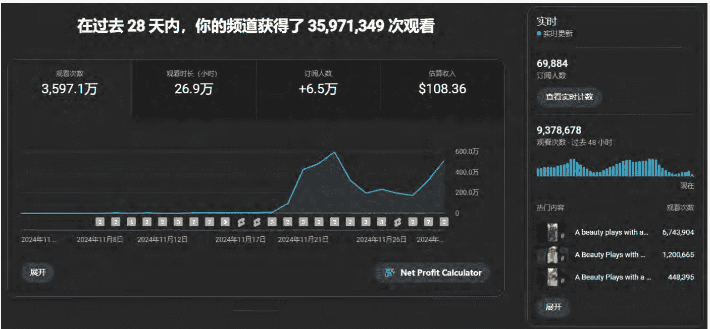

本文档包含较多图片和视频，辛苦各位移步飞书阅览~：《24天7w粉开通YPP收益108刀，我的AI达人秀变身千万播放视频制作流分享》-飞书云文档(feishu.cn)

###### 评论区：
- 希声：厉害666
- Gary：跟希声大佬学习！
- 波哥：太厉害了！
- 波哥：我这边也是shorts不到一个月，还没爆
- Gary：可以根据完播率曲线和对标账号的视频逐步优化下内容结构，我是前期每天至少三个视频慢慢调整之后好起来的，猜测完播率应该是帮助自己判断内容质量的最重要指标了～
- 许老师～生财投资孵化：执行力拉满了[强]
- 波哥：好的， 感谢～！
- 土豆君：太牛啦

公众号懒人搜索，懒人专属群分享

## (94赞) 纯小白如何通过AI写作在闲鱼实现流量变现

作者: 陈bu懂
日期: 2024-12-04

#项目实操 圈友们好,我是99年的兔子,今年刚毕业,满腔热血投身AI写作变现项目。现在全职深耕这个领域,最高做到月入17w,最快10天收入破10w+,带过的学员已上百,闭环教学实现AI写作变现0-1,帮无数小白从迷茫到稳稳赚钱。

但是!我知道圈里很多朋友还在淘宝接单,被压得像“黑奴”一样,接单价低得离谱,辛辛苦苦熬夜却赚不到几个钱!我也经历过这种压榨———————作为曾经在淘宝新手村一个月接46单的“黑奴中的战斗机”,那种被平台和低价订单玩弄的感觉,真是扎心。

够了!是时候“革命”翻身了!别再当别人的赚钱工具人!我在这里直接给大家分享流量武器,让你能自己掌控订单,不再看别人脸色过日子!这次,不是让平台赚,而是让自己赢!

万字实操干货,请移步飞书:(真保姆级教程)纯小白玩转AI写作闲鱼流量
https://strczxjzdj.feishu.cn/docx/HepUdm5XEoIBrNx9UC3cJGyXnFc?from=from_copylink

## 评论区:
- 启点: 先赞后看[强][强]
- 柒柒🧲: 太详细了[玫瑰]
- 陈bu懂: [玫瑰]
- 陈bu懂: [玫瑰]
- 水水: 方便透露一下收入比例吗,收学员和接单分别占比多少呢
- Egbert: 必须点赞,内容太干了
- 满目山河空恋远: 怎么链接
- 陈bu懂: 可以找官方鱼丸奥

## (56赞) 我是如何通过cursor赚取第一笔金的

作者：薇薇
日期：2024-12-02

我是如何通过cursor 赚取第一笔金的。圈友们好，我是薇薇。我大学学的是英语专业，之后工作也一直从事英语相关的工作。接触cursor前，从不曾接触过代码开发，也没有学过编程。

这几天，我通过圈友的分享，学会了使用cursor开发简单的软件。 这一篇文章，详细的记录了我是接触cursor的使用历程，也介绍了我是如何通过cursor开发的软件赚钱的。大家移步飞书，一起交流学习吧：

同时我也是12月cursor航海中的一名实习志愿者，希望所有cursor的船员们能一起开心靠岸咯 #航海好事 #cursor

#youtube https://lxvp0jknskn.feishu.cn/wiki/MrY7wlSlBiw1RJk7JzccXovsnAf

###### 评论区：
- Lucas：真棒[玫瑰]
- 薇薇：谢谢哦 其实我都不好意思分享的 经验比较低级拙劣[捂脸]
- 龙：好厉害，开发完直接发布去卖！！！
- 薇薇：哈哈 谢谢龙大佬 你当教练都这么忙 还有空来支持我 谢谢谢谢[玫瑰][玫瑰][玫瑰]
- 龙：没有，我是觉得你真的很厉害哈哈哈，开发完去卖然后也出单了，这块执行力真的很强！！！我开发完一般都是自用，没想过直接挂去卖，看到你挂闲鱼也受到启发了！！！
- 薇薇：嗯嗯 做出来的东西最好是能变现呀哈哈
- 刘一笔：棒
- 薇薇：谢谢哦[爱心]

## (42赞) AI制作的儿童睡前故事视频：选题与制作指南

作者：高鹏圈
日期：2024-12-03

大家好，我是高鹏。

今天继续分享一个热门玩法。

最近用AI制作的儿童睡前故事视频，非常受欢迎。


尤其是小红书上家长也多，讲的故事具有很大的教育启发意义，画面看上去也很可爱。

所以家长和孩子都喜欢看。


关键这种视频，全程都可以用AI来制作，并不复杂。

那么怎么样像他一样制作出来这种很有意思，而且非常受欢迎的儿童睡前故事视频呢？

首先就是要找选题，要做这样一期视频，首先要确定这期视频要讲什么样一个故事主题。

我们用到的方法就是对标，直接去找爆款视频，看看他们都做的什么样的选题。

选题要确定两个方面的内容，第一个就是这个故事它讲了一个什么样的主题；第二个就是这个故事里会有什么什么样的主人翁。

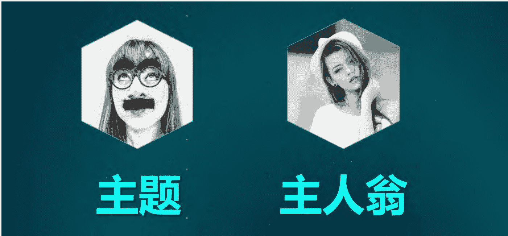

比如说我借鉴了这样的一个爆款，这个爆款视频里讲了一个这样的故事。

叫做妈妈凶你并不是不爱你，围绕这个主题，它的主人公是小熊和他的熊妈妈。

有了选题之后，接下来就是利用AI来写原创的故事。

这个用到一款AI的智能体，这款智能体就是专门写儿童睡前故事的，我已经帮大家训练好了，文章结尾直接去用就OK了。

直接把故事的主题还有主人翁丢给AI，它就能够直接构思出来一个故事。

从前在什么什么地方住着小熊和熊妈妈，然后小熊是一个什么样的小家伙，有一天什么什么事儿，然后第二天又怎么怎么样，最后再把这个故事升华一下，这个智能体还是非常好用的。

![图片]

有了故事的文案之后，接下来就是借助这个故事生成相应的描述词。

这个地方我给AI的指令是这样的，我说：我提供一篇睡前的故事文案，需要从里边提炼分镜的画面描述词，以表格的形式整理好发给我，然后把故事的原文附在后边。

这样AI就帮你123456等等，把每个分镜的画面是什么样的，都整理出来了。

| 镜号 | 分镜画面描述词 |
|---|---|
| 1 | 茂密的森林里，有一座温馨的小熊家，小熊和熊妈妈生活在这里，小熊调皮可爱，活力满满，正好奇地在周围探索着。 |
| 2 | 小熊浑身脏兮兮的，一脸贪玩后的满足，太阳渐渐西斜，小熊意识到错过回家吃饭时间，有些心虚地往家走。 |
| 3 | 家里，熊妈妈满脸怒容，对着小熊大声说道：“你怎么这么不懂事，让我担心又着急！”小熊则低着头，一脸委屈。 |
| 4 | 第二天，小熊和小伙伴们在森林深处快乐玩耍，四处奔跑、嬉戏。 |
| 5 | 天色渐暗，小熊独自在森林里，一脸惊恐，四处张望，发现自己迷路了，满脸懊悔。 |
| 6 | 熊妈妈在森林里焦急地穿梭寻找，眼神急切慌乱。 |

这些描述词看上去都是一两句，就比较简单，如果直接拿去投喂给AI绘画工具，它可能生成的不太精准。

所以我们还要做一步，就是描述词的细化。

这个地方我们要用到另外一款AI的智能体，就是专门帮咱们补充细化AI绘画描述词的。

把刚才的分镜头的描述词，直接发给这个智能体，然后它就填充了很多的细节，生成了一大段，这一大段里边你可以挑着去用，还是非常简单的。

![图片]

有了细化的分镜头的描述词之后，然后就是AI文生图，还是用到之前给大家分享过的AI绘画工具。

这个地方要用到它的垫图功能，在上边选择导入一张我们的垫图，然后再在下边粘贴刚才得到的细化之后的分镜头描述词，点生成。

然后它就生成了两幅对应的图片，这两幅图片觉得哪个好用就用哪个。

![图片]

最后就是剪辑成片，先要做的工作就是把我们一开始得到故事的文案配音。

这个配音的时候要注意一下，选择的声音风格，最好是女性的比较柔美的这种感觉，讲出来轻声细语的，就像给孩子讲故事的妈妈的形象，语速就选择正常的语速。

![图片]

配音搞定之后，把配音和得到的分镜头的多组图片同步导入到剪辑工具里，然后音画同步，这个视频就制作完成了。

![图片]

像这种号做起来之后，它的商业化模式主要有两种。

第一种就是儿童绘本的带货。

比如说像绘本的带货，这个号他的店铺挂了一本这样的儿童绘本，几十的客单已经售出去3600多份了，还是非常厉害的。

![图片]

## 中信出版·姥姥山（儿童绘本）

25.9 35.9 已售3646

商家券 10元 新客 退货包运费

第二种就是把这个号跑通了之后，带一些小弟，交给别人怎么样复制你的模式。

今天的分享就到这里了。

关于刚才提到的几款AI提示词的智能体，以及AI绘画的工具等等，统一放到文档里了：https://svj4gxvm0v3.feishu.cn/docx/PqOQd5ebCoFg8WxsilUc3m0onGb?from=from_copylink

我是高鹏，深耕网创9年，这是我拆解的第698个落地项目玩法，更多项目玩法，欢迎找我聊聊呀~

评论区：

暂无评论

## (49赞) 一文讲透AI写作交稿避坑指南，做靠谱写手订单接到手软

作者：Cheese海盐芝士
日期：2024-12-02

是不是很多AI写手们经常发现自己的稿子，乍一看很完美，但客户一读就说“你这是AI水的吧？”、“AI无脑出骗我钱的吧？”、“求求你了，好好修改，太水了吧？”、“别用AI糊弄，以为我看不出来吗？”

给客户交稿子，在你按下提交键之前，有哪些地方需要再三检查？

能做到交稿时没有硬伤，让客户心甘情愿确认收货~让客户觉得你真的有用心写稿而不是AI水一个给他随意交付

这篇《AI写作交稿避坑指南》将帮你发现所有潜藏的AI痕迹，提前发现自己给自己挖的“坑”，确保提交给客户的稿件没有硬伤，轻松化身“靠谱写手”，拥有更多回头客、转介绍

海盐写作稿件的质量很高，23年9月、10月的老客户到今天24年10月、11月，还在来找海盐代创作，并且推荐朋友、同学、同事来找海盐代创作~~

相信你也可以一样做到找到问题、修正动作、刻意练习，是成长的最快路径

只有干货，坐稳发车

https://atbs4xk1uw.feishu.cn/docx/UqFjdBtbOoSwRgxJpgtc9UFnnCe?from=from_copylink

评论区：

小易：有收获
忧愁小松鼠：专业
凡夫俗子：实用
上上签：学习了
Rae：海盐大法真好哇~

## (36赞) 一个框架，两次进阶，三个原则：与AI高效沟通协作的秘诀

作者：周知 1.0
日期：2024-12-04

一个框架，两次进阶，三个原则，关于与 AI 沟通协作的一切（2W字慎入）

大家好！我是周知 | AI 工作流专家 | AI觉醒派主理人
2024 年快结束了，依旧会看到这样有趣现象：
这个是不是你？问 GPT 找答案的时候，永远是"这个怎么做？那个怎么搞？"许愿式让他一键搞定你的输入愿望。它满足不了你，不智能，傻叉等标签就贴上了。

但有没有想过，是我们打开方式错了，其实跟 AI 对话，和跟人对话是一样的，需要学会表达和提问～

和它真正聊过才发现，AI 远比想象中聪明，更像是一位"思考伙伴"，懂分析、会思考、能创造

其实它最强大的能力，不是"找答案"，而是"解决问题"。

我总结了，过去一年半和 AI 沟通协作的底层逻辑。希望对你有帮助。
原文地址：https://aiawaken.feishu.cn/wiki/ECVxwsQTRi87iDke4iscXG2zn11

![图片]

评论区：

Cozyy：读完啦！很有收获[玫瑰]
扇扇：[玫瑰]感谢分享

## (28赞) 微信对话生成器：需求量大、制作成本低、可付费变现的AI工具项目

作者：侠狼
日期：2024-12-06

亦仁的超级风向标，所有小工具都可以用AI再走一遍，自己再做一遍。

我这里提供一个需求量大，制作成本低，可直接付费变现的项目与思路，具体落地实现，就看生财圈友落地去实操了。

这个工具还是比较适合新手小白去试试去做一做的，有难度，难度不会特别夸张，有兴趣的可以折腾。

正常情况下，1-3天可写完基础内容生成，收费+打包可能会消耗一些时间，正常来说7天，你就可以用这个工具去进行收费了，而且需求量非常的高。

#### 1、微信对话生成器。

做项目之前，我们打开指数查询工具，看一下微信对话生成器这个工具的需求量，可以看到月搜索是有一万多的。

![图片]

百度上面也有很多的网页版的这个工具，我们都简单浏览一下，打开后就会发现，基本都是一个简单的一个页面的代码，部分做的精品一些的，就是收费的了。

而且，都未曾实现，我所需要的，数据批量导入，图片批量导出功能，所以这里就有付费需求了。

只要涉及到批量生成的，就有搞头，减少人工，一般需要批量的工具也是工作室，创业者相关，好，需求落地，开干。

### 2、实现需求

这个工具主要痛点是，涉及到批量生成图片合成资源，且批量导出，是非常考验服务器的压力的，对带宽有要求，所以市面上百分之九十九的，都不会给你批量合成且批量导出功能，只能一个一个去生成图片的。

所以，这个功能就只能做本地打包的，至于怎么开发打包，具体可以问GPT，或者Cursor。

![图片]

基本需求可实现，就可以实现技术选型了，因为我本人会vue，所以我用vue实现了这个功能，批量导入，批量导出。

按照指定数据格式就可以了，这个工具是我之前写的，我也是昨天才知道，原来vue代码是可以使用Electron打包成可视化客户端去给用户使用的。

![图片]
![图片]

部分批量出来的图片内容，具体的实现的相关代码，就不贴出来了，其实就是一个json数据格式，参考如下。

```javascript
<script>
export default {
    name: "DataPre",
    data() {
        return {
            inputData: "",
            messageList:  [
                {
                    "id": 22,
                    "nickname": "女",
                    "content": "我今天跟你在一起的时候突然有点冷。",
                    "timestamp": "2024-07-02T10:21:00Z",
                    "avatarSrc": "2-1.png",
                    "isReply": false
                },
                {
                    "id": 23,
                    "nickname": "男",
                    "content": "为什么?",
                    "timestamp": "2024-07-02T10:22:00Z",
                    "avatarSrc": "2-2.png",
                    "isReply": true
                },
                {
                    "id": 24,
                    "nickname": "女",
                    "content": "是因为你美丽动（冻）人啊。",
                    "timestamp": "2024-07-02T10:23:00Z",
                    "avatarSrc": "2-1.png",
                    "isReply": false
                }
            ]
        }
    }
}
</script>
```

当然，以上只是其中的一个例子，想这个类型的还有非常的多的。

比如最近很火的这个朋友圈类型的。

河南一女子40年不睡觉，专家监控48小时后，发现奇特睡觉方式

![图片]

根据资料显示，这位来自河南的李大姐已经40年没有睡过觉了，专家大呼不可能，《走近科学》栏目组都知道了她的奇人奇事。北京朝阳医院睡眠呼吸疾病诊疗中心的专家郭熙恒对此进行深入研究，经过48小时连续检测，李大姐在与人进行交流的时候大脑就已经进入深度睡眠，一般普通人睡眠时都会经历五个时期，入睡期、浅睡期、熟睡期、深睡期、快速眼动期。而李占英奇就奇在她可以直接跳过前面三个阶段，达到深睡期。她的另一个神奇之处，她睡觉时并不是所有的神经都进入睡眠状态。这也意味着她睡着后，还是能有意识和人对话，只不过相对于清醒状态下，她的反应会迟钝，语言表达能力也会减弱。再结合她睡觉时间短的特点，确实会给人造成她不睡觉的假象。

![图片]

以及小红书，种草类型的微信对话聊天记录的广告的，有非常的多。

不仅限于微信，淘宝，小红书，抖音，等平台，这些都可做，越齐全，越可以卖大钱。

比如，土味情生成。
比如，情感语录。

![图片]

比如，知乎图文语录类型。

![图片]

比如，发疯文学。

![图片]

至于数据怎么来？淘宝有一大堆这种语录，然后合成生成就行。

具体的操作方案其实都很简单，都是批量套用模板的。

### 3、怎么收费

如果你是一个完全的新手程序员，想要去单独对接微信支付开发，难度是非常的高，我们简单实现就好。

具体的实现思路有很多，个人比较建议的是，采用卡密激活的形式来进行存储读取，售卖+自动发货平台，实现自动化。

自动发货的平台有很多，具体可以上百度去找，也就是打包成客户端，然后让Ai帮你设计一个卡密生成的方案，密钥，跟解码对得上，那就可以了。

具体的实现，让Ai写就可以，我这边为了方便，就用我自己的GPT问了，反正思路对的就行。

公众号懒人搜索，懒人专属群分享

> 能否用JS代码做一个类似于卡密的系统？比如我给一个秘钥，然后解密的时候，读取这个秘钥还有剩余多少条可使用？

是的，你可以使用JavaScript来实现一个类似于卡密系统的功能。这个系统包括生成秘钥、存储剩余使用次数以及解密和检查剩余使用次数等功能。为了简化说明，这里提供一个基本示例，演示如何实现这些功能。

###### 1. 准备工作

首先，需要安装Node.js，并创建一个项目目录。在该目录下初始化项目：

```
npm init -y
```

###### 2. 安装必要的依赖库

为了加密和解密数据，可以使用 crypto-js 库。

```
npm install crypto-js
```

###### 3. 创建基本文件结构

在项目目录中创建以下文件:

- index.js : 主逻辑文件。

###### 注意事项:

1. 持久化存储:上面的示例将所有数据保存在内存中的对象里。如果需要持久化存储(例如保存到文件或数据库)，需要对代码进行扩展。
2. 安全性: 实际应用中，应确保关键操作如加解密、读写数据等环节的安全性，例如通过HTTPS传输数据等。
3. 异常处理: 添加更多异常处理，以应对可能出现的问题，如无效输入、读取失败等。

这只是一个基础实现，根据具体需求你可以进一步扩展和完善该系统。例如，可以添加用户身份验证、多种类型的卡密支持、批量生成卡密等功能。

> 假设，我坐离线存储，就是做加密，解密，然后时效性，比如，固定这个客户可用30天，其他客户通过我代码生成的可用365天，我要怎么做?能做吗?

是的，你可以实现一个离线存储系统，并且对秘钥进行加密、解密，同时添加时效性(如30天或365天)。为了实现这个功能，你需要在秘钥中存储生成日期和有效期，然后在每次使用时检查是否过期。

下面是一个示例代码，演示如何创建带有时效性的秘钥，并检查其剩余使用次数及有效性:

###### 1. 准备工作

确保已经安装了Node.js，并在项目目录下初始化项目:

如果有能力的，是全栈开发的，我的个人建议是考虑，Vue+Python+MySQL。

> 使用Python实现Token令牌接口登录，MySQL存储这个客户的账号密码信息，或者卡密信息，后续客户要迁移，也是比较方便的，售后方便。

并且有Python后端的化，还可以提示客户版本更新，不然就是一个完全的离线的，可控性并不强。

#### 4、关于一些问题

工具是离线的，怎么使用时取决于客户，基本上没有太多风险，就是看怎么去进行使用的。

具体的难点解决点就是在于，如何实现批量，图片跟，视频都属于大资源内容，很消耗带宽，如果宽带小了，会导致服务器卡，这就是没人做批量的原因。

但是如果你把这个作为本地工具来用就可以实现批量。

具体的实现逻辑思路，使用存粹的JS代码实现后，在打包客户端是最好的解决方案，门槛低。

希望这个文章对各位程序员有帮助吧。

###### 评论区：

- 老彭:狼来了[旺柴]
- 侠狼:已经躺平了，N年没更新的。[旺柴]
- 天扬:请问文中开头用的指数查询工具是什么?

## (27赞) 利用Cursor开发AI应用：从零基础到实践分享

作者：彩笺
日期：2024-12-06

朋友们好，这次有幸成为了Cursor-零基础做软件应用的教练，想拿出来一些好东西分享给大家。

从最开始使用Cursor至今，出于各种目的我已经做了好些个工具或者网站了，有些是好玩、有些是我自己会用到

比如前段时间我自己会用的工具有：批量下载可商用的图片、截图批量保存、公众号批量导出；但是我感觉它们”分量“还不够！

有点像家里比较穷，不好意思拿这些东西出来招待大家。

昨夜突然闪过一个念头，自从亦仁发布超级标以来，YouTube shorts相关的精华帖不少，同时也有好几个利用Cursor结合Youtube Shorts的分享，但是AI应用的就太少了，几乎是没有(我没瞅见)。正好我之前有使用Cursor制作AI工具站模板出来，我觉得这一块或许会有打算做AI工具的朋友需要。拿出来分享给大家。同时，作为附带，一些我自己用Cursor制作的好用的工具、灵感来源，也一并分享出来，凑个大礼包。

H5 在本文你可以看到：

- 详细的超级标AI应用的模板：稍作修改就能使用，对于Cursor船员更是近乎0难度
- 更多的Cursor工具：最近我做的用的比较多的几个工具分享
- 我是怎么挖掘需求的

#### 超级标AI应用模板

AI应用，包含AI 网站，AI APP，AI 插件。这里分享AI网站的模板；在我看来网站、最简单、容易变现、容易发布、容易有流量。

现在我见到的大多数的AI应用，都离不开一点，那就是给AI模型的输入。

无论是图片生成、人工智能助手、各种各样的AI生成、都需要给AI一定的输入内容，然后它返回给你想要的东西。

最常见的形态，就是gpt、claude这样的Chat。

一个多月前，我决定好专心出海的时候，就用Cursor制作过一个这样的模板，麻雀虽小五脏俱全，该有的功能都有。我会尽可能的掰开了去描述其中细节。

模板示例

为了方便你使用，我已经在模板网站上添加了使用案例：

我创建了使用AI制作鸡尾酒的页面，对应文件在 /src/components/cocktail.astro

示例功能描述：输入你期望的鸡尾酒的颜色、口味、饮用场景

它会为你生成详细的鸡尾酒风味描述、配料表、制作步骤、酒精度、卡路里和碳水含量、装饰建议

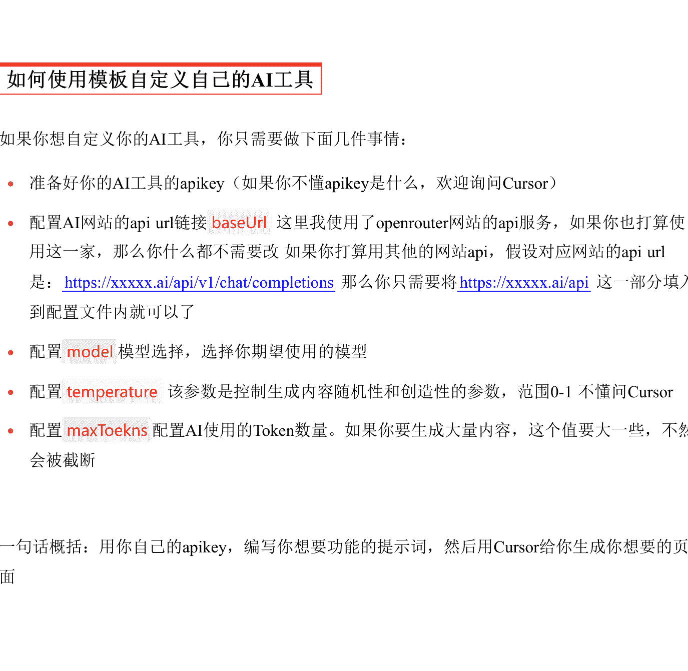

##### 如何使用模板自定义自己的AI工具

如果你想自定义你的AI工具，你只需要做下面几件事情：

- 准备好你的AI工具的apikey（如果你不懂apikey是什么，欢迎询问Cursor）
- 配置AI网站的api url链接 baseUrl 这里我使用了openrouter网站的api服务，如果你也打算使用这一家，那么你什么都不需要改。如果你打算用其他的网站api，假设对应网站的api url是：https://xxxxx.ai/api/v1/chat/completions 那么你只需要将https://xxxxx.ai/api 这一部分填入到配置文件内就可以了
- 配置 model 模型选择，选择你期望使用的模型
- 配置 temperature 该参数是控制生成内容随机性和创造性的参数，范围0-1。不懂问Cursor
- 配置 maxTokens 配置AI使用的Token数量。如果你要生成大量内容，这个值要大一些，不然会被截断

一句话概括：用你自己的apikey，编写你想要功能的提示词，然后用Cursor给你生成你想要的页面。

##### 如何在本地部署

需要安装的环境有：nodejs、npm、git（如何安装问cursor）。

##### 如何在本地运行

首先将这份代码，拷贝一份到你的github账号。

打开模板仓库链接：AI应用模板


点击图中红线部分，使用此模板并创建一个新的仓库。

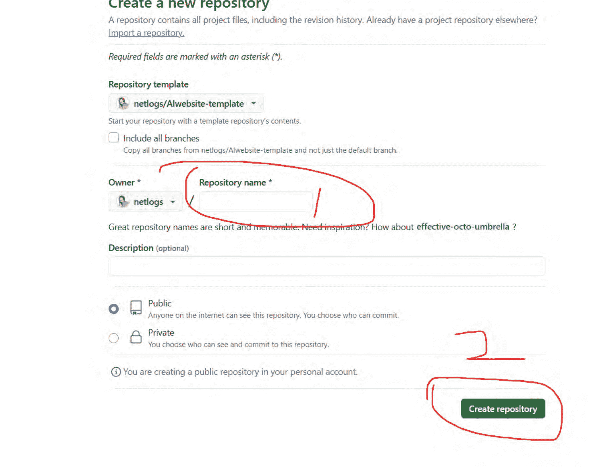

在1的位置，输入你的仓库名称，点击Create repository。他会拷贝一份我的代码到你的git仓库。

在这之后点击你仓库的这个位置：

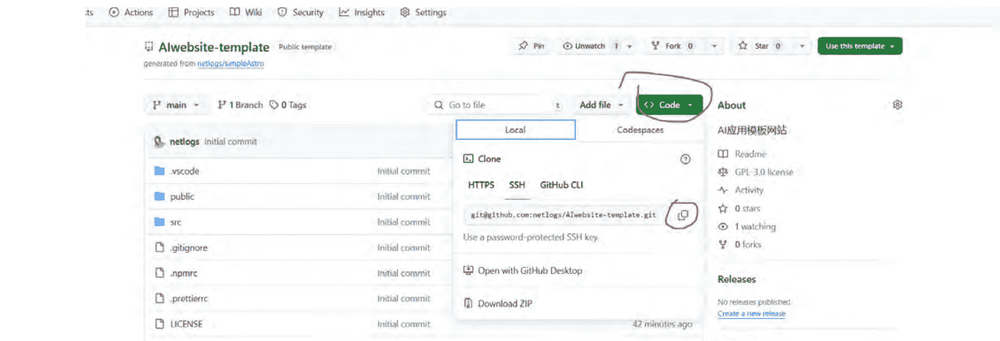

打开你的cmd命令行窗口，或者Cursor中的Terminal。

1. `git clone git@github.com:yourname/yourrepositoryname.git` 克隆（记得把链接换成你的）

```bash
git clone git@github.com:yourname/yourrepositoryname.git
```

2. 在第一次克隆中，你可能会遇到一些账号问题，让你填写邮箱、等，你可以询问Cursor: 我第一次使用git clone 克隆我自己的github仓库，需要配置什么。

3. 克隆成功之后，此代码文件夹就在你本地了。

4. 在你的代码文件夹下，执行命令 `npm i` 安装相关项目依赖（不会操作可以问cursor，或者按住shift在你的代码目录内点击右键，你会看到在此处打开终端等差不多的内容）。

5. 执行成功之后，执行 `npm run dev` 运行本地测试，如果你执行成功，会看到类似于下图的内容（主要是那个Local 链接）。

```bash
liarpzu@Snow MINGW64 /y/devlop/AIwebsite-template (main)
$ npm run dev

> astroship@2.2.0 dev
> astro dev

10:24:18 [WARN] [config] The adapter @astrojs/vercel/serverless provides experimental support for "astro:env get Secret". You may experience issues or breaking changes until this feature is fully supported by the adapter.
10:24:18 [types] Generated 2ms

astro v4.16.6 ready in 893 ms

Local    http://localhost:4321/
Network  use --host to expose

10:24:19 watching for file changes...
```

6. 在代码目录创建一个文件 `.env`，里面写上 `OPENAI_API_KEY="sk-or-v1-97cd94b96xxxxx"` 后面那一串是你的apikey。

7. 打开图中的蓝色链接，这是你本地的测试，任何代码的改动，在你保存代码后，都会实时的更新的链接网页内。

8. 在项目readme中，也有详细描述，都可以看。

##### 部署到vercel

Cursor航海手册内有对应描述，欢迎查阅，当前已经有朋友根据手册成功部署了自己的网站。

唯一需要注意的点是：在下图对应位置，你需要填上你本地 `.env` 文件里的apikey。

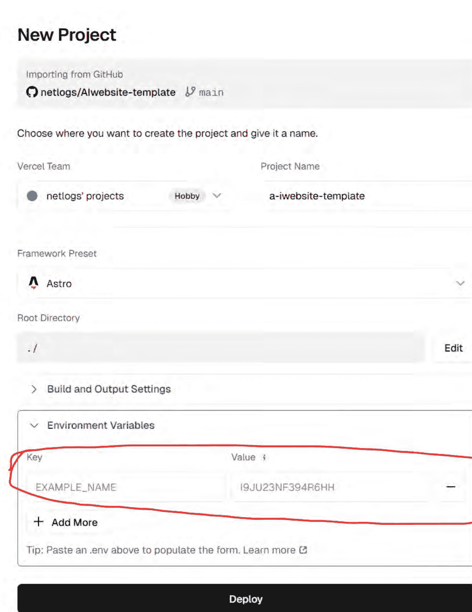

##### 技术栈选择

技术栈我选用了astro，原因有以下几点：

- astro文件内可以直接写html，对新手友好，在此模板代码内，鸡尾酒制作页面就是用纯html写的（Cursor写的不是俺写的）
- 当你学会了html，结合Cursor的辅助，你很容易就能大概玩懂astro，难度曲线很低很低
- astro后续可以支持你写更复杂的项目，他有成熟的生态

最后，你可能还会担心，看不懂，没关系，Cursor航海才开了2天，现在看不懂、说不定一周后、两周后、圣诞节，你就能看得懂了。

我个人觉得，一步步走完航海手册，就算看不懂代码都没关系了，完全可以用Cursor用自然语言的方式告诉你模板项目，哪个地方是做什么的，让他做出如何如何的改动。

甚至，面对未知你不知道如何用自然语言描述，那就把我上面说的内容粘贴过去吧！

##### 模板Prompt

这里就不提供了prompt了（过去好久了，我哪知道当时怎么写的：），原因如下：

- 如果你想使用此模板创建自己的AI应用，你可以直接拿去用
- 如果你想练手，当前Cursor里面有不少练手项目，你也可以根据当前模板的形态，功能，自己尝试写Prompt
- 我可以打包票的表示：小白也能使用Cursor生成此模板，因为我就是用自然语言去描述生成的，并且我压根不会astro，准确来说我不会任何的前端代码 orz
- 当前Cursor航海手册的内容，足以支持你走到这里。

##### 更多工具

###### 可商用unsplash图片下载

批量动物图片下载：

- ACCESS_KEY = "xxxxxxx" 这里的代码需要更改为你自己的apikey，在unsplash官网免费申请
- JSON_PATH = "animals.json" 批量下载关键词，需要在同文件夹内新建一个animals.json，在里面按照json格式输入关键词
- 你也可以让Cursor将其改变为任何你想要的形态

prompt:

1. 让Cursor分析该文件的实现逻辑和细节，让他用自然语言描述其过程，你就得到了一份prompt
2. 如果你想自定义，询问Cursor吧！

textjavascripttypescriptcsshtmlbashjsonmarkdownpythonjavaccpprubygorustphpsqlyaml
Copy

```python
#multiDownloadunsplashimage.py
import requests
import json
import os
```

```python
import time
from datetime import datetime

class AnimalImageDownloader:
    def __init__(self, access_key):
        self.access_key = access_key
        self.base_url = "https://api.unsplash.com"
        self.headers = {
            "Authorization": f'Client-ID {self.access_key}'
        }
```

```python
    def load_animals(self, json_path):
        '''
        从JSON文件加载动物名称列表
        '''
        try:
            with open(json_path, 'r', encoding='utf-8') as f:
                data = json.load(f)
                animals = data.get('animals', [])
                print("加载的动物列表: ")
                for i, animal in enumerate(animals, 1):
                    print(f"{i}. {animal}")
                print(f"\n总共加载了 {len(animals)} 个动物名称")
                return animals
        except Exception as e:
            print(f"读取JSON文件时出错: {str(e)}")
            return []
```

```python
    def download_animal_image(self, animal_name):
        '''
        下载指定动物的图片
        '''
        # 创建下载目录（如果不存在）
        download_dir = "animal_images"
        os.makedirs(download_dir, exist_ok=True)
        
        # 构建保存路径
        file_path = os.path.join(download_dir, f"{animal_name}.jpg")
        
        # 如果图片已存在，跳过下载
        if os.path.exists(file_path):
            print(f"图片 {animal_name}.jpg 已存在，跳过下载")
            return False
        
        try:
```

```python
            # 搜索图片
            search_url = f'{self.base_url}/search/photos'
            params = {
                "query": f'{animal_name} animal', # 添加 'animal' 关键词以提高相关性
                "per_page": 1,
                #"orientation": "square" # 优先获取方形图片
            }
            response = requests.get(search_url, headers=self.headers, params=params)
            response.raise_for_status()
            
            results = response.json().get("results", [])
            
            if not results:
                print(f'未找到 {animal_name} 的图片')
                return False
```

```python
            # 获取200x200尺寸的图片URL
            image_url = f'{results[0]["urls"]["raw"]}&w=200&h=200&fit=crop'
            
            # 下载图片
            image_response = requests.get(image_url)
            image_response.raise_for_status()
            
            # 保存图片
            with open(file_path, "wb") as f:
                f.write(image_response.content)
            
            print(f"已下载 {animal_name} 的图片")
            return True
        except requests.exceptions.RequestException as e:
            print(f"下载 {animal_name} 图片时出错: {str(e)}")
            return False
```

```python
    def download_all_animals(self, json_path):
        """
        下载JSON文件中所有动物的图片
        """
        animals = self.load_animals(json_path)
        if not animals:
            print("没有找到动物列表或列表为空")
            return

        print(f"开始下载 {len(animals)} 个动物的图片...")
```

```python
        success_count = 0
        for animal in animals:
            print(animal)
            if self.download_animal_image(animal):
                success_count += 1
                time.sleep(1) # 添加延迟以避免API限制

        print(f"\n下载完成！成功下载 {success_count}/{len(animals)} 张图片")
        print(f"图片保存在 'animal_images' 目录下")
```

```python
###### 使用示例
if __name__ == "__main__":
    # 替换成你的 Unsplash API access key
    ACCESS_KEY = "xxxxxxx"
    
    # JSON 文件路径
    JSON_PATH = "animals.json"
    
    # 创建下载器实例
    downloader = AnimalImageDownloader(ACCESS_KEY)
    
    # 执行下载
    downloader.download_all_animals(JSON_PATH)
```

##### 公众号文章批量导出

见我上一个文章：https://articles.zsxq.com/id_owghd5djd88x.html

##### 批量保存截图

有时候需要保存截图，但是需要截图之后，发送到一个聊天框，右键保存，或者用windows自带截屏工具，需要手动点击保存，图片多了很麻烦。

于是制作了这么一个网站，当你复制图片后，点击网页，ctrl-v就可以将图片粘贴进去，然后一键保存到本地。

甚至还可以继续优化，比如为批量的图片命名~

https://bulkscreenshotdownload.com

##### 如何挖掘需求

在Cursor航海群里，还有昨日花生老师的直播分享中，很多朋友会问如何挖掘需求。

出海一个多月，我将需求分为两种：

1. 从我的眼中发现的需求点，可能受众会很小，旨在唤醒我的好奇心
2. 从数据网站挖掘的他人都会有的需求

着重聊一下第一种吧，第二种在出海手册里面都有写，我也会看哥飞的公众号学习，(上面的公众号文章批量导出就是导出哥飞文章来看)。

##### 如何自己发现需求

万能大法：写日记。

对你没听错，就是写日记。越详细越好。

生财之前有篇帖子，好像是小排老师写的，你看不需求，那是你离得不够近，就像地图上的陆地和海洋的边界，看上去是圆滑的，但是当你凑近了看，你会发现各种各样的锯齿。

很多时候不是我们看不到需求，而是太司空见惯了，我们会下意识的忽略我们耳熟能详的常见事物，因为我们知道、理解，所以我们远远的看一眼，就知道那是什么。

但是，当你把你的思考，经历以文字记录下来之后，他们就会从你的潜意识，真实的跃迁到你的眼前，此时你会对他们具象化。

举个例子：

某天和朋友的聊天记录

- 怪物猎人明年要发售新作荒野了，狠狠的期待了。

如果我没有把他记录下来，那么我只会收获对新游戏即将到来的喜悦，然后知道大概时间之后去买，去玩。这句话只会在我当前的记忆里停留一秒。

但是当我记录下来之后，我开始审视每一个字眼，回忆相关的记忆。

1. 游戏有很多武器、以及大量的技能、配装，不同武器适合不同的技能特性，在之前的游玩时，这一部分是复杂的、有趣的、有时候需要查攻略的，那我是不是可以针对这个新游戏，注册一个wiki网站，游戏发售后，将游戏攻略制作出来。这不就是需求吗？
2. 游戏是新发售的，那上google trends看一眼吧，果然，游戏名字是个新词，并且热度超高，拿去google一下，很多人会问这些问题：游戏是哪一天发售？游戏是前作的dlc？还是新作？这不就是需求么？大可以提前布局制作网站吃这部分的流量。
3. 扩展联想一下，除了这个游戏，还有很多大作，明年都发售，都去搜一下不就是一大把的需求，同时，对于一些老的游戏，也可以上semrush等网站搜一下，看看还有没有什么用户关心的，又没有多少竞争的需求点呢？

公众号懒人搜索，懒人专属群分享。

最有趣的是，我比较懒，一篇日记我都没有写，也就是无聊了翻翻最近的回忆，然后让其中的常见的关键词在我的脑海浮现，相当于闭着眼睛翻阅记忆。

一个月前，我会很头疼于，都是怎么挖掘需求的啊，我怎么一个都找不到，我小时候的好奇心都哪去了，我指定是废了。

现在，我可以清晰的感受自己的变化，世界好像变得清晰了一些，好奇心好像也回来了一些，有时候甚至会想到一个词，然后废寝忘食的去扒拉相关需求，很多没见过的内容，属于是开眼了。

除此之外：

还需要多实践多实践多实践。

，重要的事情说三遍，我这一个月做了近10个网站，虽然他们几乎全军覆没，但是实践过程中，那种逐渐的把一些方法论刻在脑子里的感觉，妙不可言。

最后，如果你想参与到超级标AI应用，欢迎分享基于你的内容优化的网站代码，也非常欢迎去我的模板仓库下提交Issue和Pull Request来改进这个项目。

评论区：

卡卡：我明天试试

彩笺：[社会社会]

## (24赞)如何在Cursor编程中实现代码版本管理？

作者： 云飞

日期：2024-12-05

【如何在cursor编程中实现代码版本管理？】

大家好，我是云飞，盈腾科技创始人，其他就不介绍了，大家能在网上搜到。我接触cursor纯粹是因为前段时间在杭州招几个算法，招了一个半月，只顺利到岗2个。后来，让我们其中一个同事去测试cursor效果奇好后，就让研发团队全员使用“Cursor 本地IDE”双IDE辅助开发模式，从此就从BOSS撤下了招聘。

OK，这是我跟cursor的际遇，后来我自己也尝试使用，过程中算是积累了一下经验吧。AI编程是亦仁发布的第三个超级标，应该大多数人还是比较感兴趣的，恰好我看到昨天看到有人问及这个cursor编程中的代码版本管理问题，就索性写篇帖子，给大家分享一下。算是交作业吧！

首先呢，我们要知道，为什么我们要管理代码版本。其实很简单，就像我们写日记一样，我们希望每次写的东西都能保存下来，这样我们就可以随时翻回去看。代码也是一样，我们希望每次修改的代码都能记录下来，这样如果出错了，我们就能找到问题出在哪里。

那么，我们该怎么做呢？这里就要用到一个工具，叫做Git。Git就像是一个超级好用的日记本，可以帮助我们记录每一次代码的修改。

首先要安装Git：去Git的官网下载安装包：我们首先要到Git的官网上去，找到适合我们电脑操作系统的Git安装包。网址是[]。在官网上，你可以根据你的电脑是Windows、macOS还是Linux来选择不同的安装包。

下载好安装包后，我们只需要双击这个安装包，然后按照提示一步一步安装就可以了。这个过程和安装其他软件没什么两样，跟着指示走就对了。

安装完成后，我们需要检查一下Git是否安装成功。这很简单，我们只需要打开命令行（在Windows上是命令提示符或PowerShell，在macOS或Linux上是终端），然后输入 `git --version`，如果安装成功了，它会显示出Git的版本号。

第一步，我们要在我们的项目文件夹里，告诉Git我们要开始记录了。这个过程就像是我们拿一个新的日记本，准备开始写日记。我们只需要在项目文件夹里打开命令行，然后输入 `git init`，这样Git就会帮我们准备好一个日记本。

第二步，我们要告诉Git，我们有哪些东西要记录。这就像是我们告诉日记本，我们要写哪些事情。我们只需要输入 `git add .`（注意最后那个点不要忘了啊），这样Git就会把我们所有的文件都加到日记本里。

第三步，我们要把我们的记录保存下来。这就像是我们写完日记后，要把日记本收好。我们只需要输入 `git commit -m '你的提交的信息'`（这个地方就写你对当前这个版本的命名），这样Git就会帮我们保存好这次的记录。

如果你发现最近的修改导致了一些问题，想要回到之前的某个版本，Git也可以帮你做到这一点。你可以通过以下步骤来回滚到某个版本：

- `git log`：首先，我们需要查看所有的提交记录，以找到我们想要回滚到的版本。可以使用命令来查看提交历史。
- 在提交历史中，找到你想要回滚到的那个提交的ID（一串数字和字母的组合）。（如图1）
- 使用命令 `git checkout <提交ID>` 来回滚到那个版本。这样，你的代码就会回到那个提交的状态。(如图2)

说白了，为了实现这个代码回滚，记住这4个命令就够了，可以放在记事本上，随时复制粘贴。

`git init`：这个命令用于在当前目录下创建一个新的Git仓库。当你开始一个新项目，或者在一个已有项目中首次使用Git进行版本控制时，你需要运行这个命令。它会在项目目录中创建一个名为.git的隐藏文件夹，这个文件夹包含了Git仓库的所有必要文件。

`git add .`：这个命令的作用是将你当前工作目录中的所有更改（比如新文件、修改过的文件或者删除的文件）添加到Git的暂存区（staging area）。暂存区是一个准备提交的地方，你可以在这里选择哪些更改需要包含在下一次提交中。命令中的 . 代表当前目录及其所有子目录。

`git commit -m`：这个命令用于将暂存区中的更改提交到本地仓库的提交历史中。-m 参数后面跟着的是提交信息，这是对你所做更改的简短描述。每次提交都会创建一个新的快照，记录下当前项目的状态，并且这些快照会按时间顺序排列。

`git checkout`：这个命令用于将你的工作目录切换到指定的提交状态。提交ID是每次提交的唯一标识符，通常是一个长字符串，比如 `a38502e3b656b84f47b58eb1ada5490703ab269b`。如果你想回滚到之前的某个版本，你需要先使用 `git log` 找到对应的提交ID，然后执行该命令。

log 命令查看提交历史，找到你想要回滚到的提交的ID，然后使用这个命令加上那个ID来切换到那个版本。

这四个命令结合起来，就能让你在Git中初始化仓库、添加更改、提交更改以及在需要时回滚到之前的版本。OK，了解上面这么多就足以让你实现代码版本管理了，你再也不用担心Cursor突然抽风把代码给你改坏了。学有余力的，可以继续往下再看看。

第四步，如果我们想要尝试一些新的东西，但是又怕弄坏了原来的代码，我们可以用Git来创建一个新的分支。这就像是我们在日记本里，开始写一个新的故事。我们只需要输入 `git branch 新分支的名字`，然后输入 `git checkout 新分支的名字`，这样我们就可以在新的分支上尝试新的东西了。

第五步，如果我们觉得新的分支上的东西不错，想要加到原来的代码里，我们可以用Git来合并分支。这就像是我们把新的故事加到原来的日记里。我们只需要输入 `git merge 新分支的名字`，这样Git就会帮我们把新的分支上的东西加到原来的代码里。如果在这个过程中，我们发现有冲突，也就是新的分支上的东西和原来的代码有不一样的地方，Git会帮我们解决这些冲突。

这就是我用Git来管理代码版本的简单过程。希望这个方法能帮到大家，让我们的编程之旅更加顺利。加油！！一起生财有术！！ https://git-scm.com/

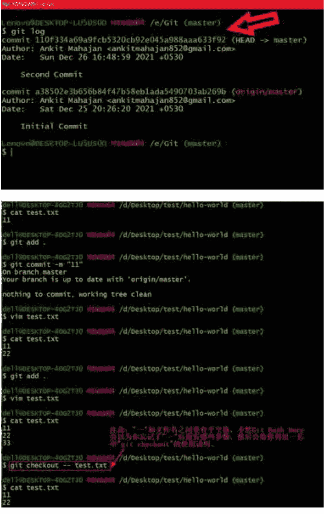

评论区：
- 晨冬：建议安装TortoiseGit 免去命令行的困扰
- 少川：感谢，今天刚用cursor，没有用git, 后来改的面目全非[流泪]
- 宏頓wes：我用的 GitHub Desktop，稍微方便点，但是还得每次提交
- 冬丽传奇：感觉还是要对代码要有了解才行
- 希行：感谢分享
- 侠狼：小乌龟好用，推荐，哈哈
- 晨曦梦呓：cursor (vscode) 插件里面也有很多不错的git插件：https://marketplace.visualstudio.com/search?term=git&target=VSCode&category=All%20categories&sortBy=Relevance

## (22赞)如何使用Cursor AI编码工具开发浏览器插件：从环境搭建到功能实现

作者：阿杰努力成长
日期：2024-12-05

大家好，我是阿杰。

今天给大家分享一篇详细的教程，教你如何使用Cursor这个AI编码工具来开发一个浏览器插件。

本文完整记录了从环境搭建、项目初始化到功能开发的全过程，特别适合想入门浏览器插件开发的朋友。

通过这篇教程，你将学习到：
- 1. 如何使用脚手架快速初始化Chrome插件项目
- 2. 如何创建和使用.cursorrules文件指导AI编码
- 3. 如何让AI生成产品需求文档并据此开发功能
- 4. 如何进行插件测试和功能迭代

整个开发过程借助Cursor的AI能力，即使你没有太多开发经验，也能轻松完成一个实用的浏览器插件。

文章包含大量实操截图，保证你能一步一步跟着做出来。

下面是整体过程实现的总结：https://hqhhkfm2ink.feishu.cn/wiki/NVGJw9fNViOkL7kWdIIcqk5Zn9c?from=from_copylink

#AI编程 #Cursor

评论区：
- 暂无评论

## (21赞)cursor航海提前预习实操问题记录

作者：龙马
日期：2024-12-03

cursor航海提前预习，实操中碰到了一些问题，就将问题和解决办法记录了下来，有需要的圈友可以看看：
https://ggof9gymx.feishu.cn/docx/OuWgdGxyZoE9zgx7FbCcTlExnXc?from=from_copylink

评论区：
- 彩笺：[强][强] 我稍微给你补充一下， 1. 关于第一条安装python，你可以直接问cursor如何在windows上安装python，他会给你一个简短精炼有效的回复 2. 关于apply应用代码；聊天的时候上面有两种模式可以切换，CHAT模式需要你自己apply，COMPOSER模式会自动的给你apply
- 何勇：已经用cursor完成了一款小红书小绿书图文生成器的开发，很强的工具
- 奕辰：可以分享下吗[呲牙]

## (21赞)重生之我想当程序员，用半天时间学会使用Cursor爬了生财有术

作者：柒霖
日期：2024-12-02

重生之我想当程序员，用半天时间学会使用Cursor爬了生财有术。这可能会没有太多逻辑性，没有太明确的标题~只是提供了我制作python爬虫的思路。Cursor也让我赚到了技术圈的第一块钱~

第一次接触到Cursor，还是看到了@阿紫说的你问我吴佳文学会没有？我看完后下载了Cursor，看了码叔编程入门彻底安装好了，我电脑上第一个编程程序~

我想着，我来自生财，那我也用之生财，（仅做测试~大家别模仿）。

> 亦仁: 可别乱爬生财有术，已经有一堆”前辈”被封号且不支持解封了。2024-12-02 13:38

亦仁哥点名，开始Ctrl+I 按出我的提示框，开始用上我的想法。

我想制作一个爬虫软件，想爬https://scys.com/这个网站，但是会跳出https://scys.com/conn/web/login这个页面，让我们先进行扫码登录。这需要给予30秒时间给用户扫码，判断扫码登录，当提示出扫码成功、已确认，等待进入https://scys.com这个页面，爬取精华分享内容，做成xlsx表格导出，导出名字为精华_时间。

这是我的第一段提示词，后续会陆续暴雷，因为在没有任何基础的人心里这是简单的流程图。（没有保存最终页面）

接下来我们换个角度去操作：
- 1. 目标网站
- 2. 目标网站是否需要登录
- 3. 登录后进行判断是否登录成功
- 4. 登录成功后找到目标
- 5. 找到目标栏的标题 如：当登录成功后，判定精华分享点击它，再进行获取页面所有文章标题，进行判断文章数量，点击一个采集一个内容，文章数量采集完切换下一页继续判定文章数量继续采集直到无法切换下一页

（span 是html，我们可以进行F12来进行查找），可是还是失败了，不能爬到我想要的内容。

提示词进行修改。还是无法找到精华分享。他的selector 能否用这个来判定点击：`#app > div.content-mt > div > div > div > main > div.leftContainer > div.mixFilter > div > div > div.select.wrap > div.button.active > span`（这里是 selector）。抓到了这个标题栏，精准找到“精华分享”。

但是“精华分享”确定可以之后，却出现了文章内容抓取的问题。增加提示词进行修改。

提取文章内容失败。文章点击进去，等待网页加载完毕，获取selector文章标题：`#app > div.content-mt > div > main > header > div.title`。获取selector内容：`#app > div.content-mt > div > main > div.content.ql-editor`。提示出这个，就知道是自己想要的了，已经开始区分出来了。

使用新的选择器：
- 标题：`#app > div.content-mt > div > main > header > div.title`
- 内容：`#app > div.content-mt > div > main > div.content.ql-editor`

但是生财精华那么多，大晚上要采好久我等不住。所以又增加了提示词：“能否自己设置提取文章数量”。

主要改进：
- 添加了参数来控制文章数量
- 在处理文章时检查是否达到数量限制
- 添加了文章计数和进度显示
- 修改了主程序入口，允许设置文章数量

我设置了只爬10条。

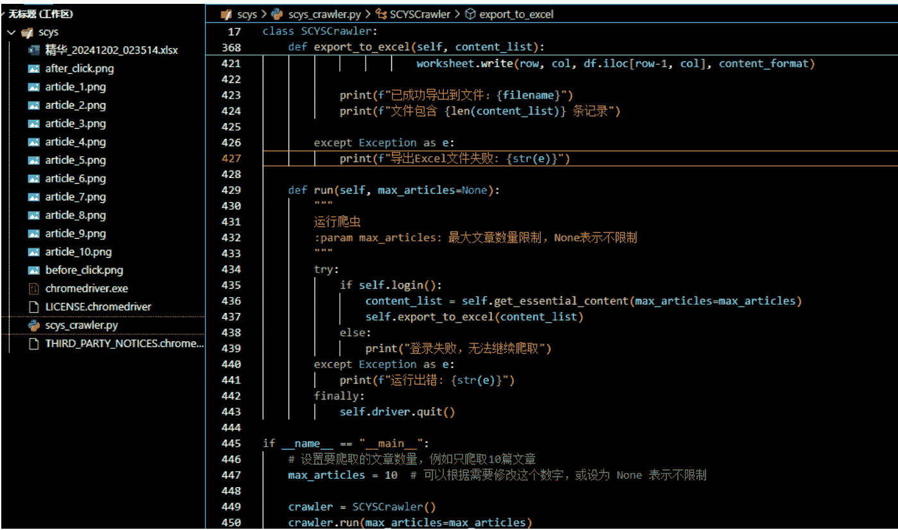

最终结果：
| 标题 | 内容 | 作者 | 日期 |
| :--- | :--- | :--- | :--- |
| 2024 年收官之战：12 月航海即将启航，船员名单揭晓！ | □ 2024 年收官之战：12 月航海即将启航，船员名单揭晓！<br>随着 2024 年的尾声渐近，我们迎来了今年最后一场大规模航海——12 月航海。<br>这一次，以 16245 人次的报名船员数量，创下了今年单期航海的新纪录。看到这个数字时，团队成员们都很激动，一方面是觉得这个数字承载了大家满满的热情，是大家对我们的激励；另一方面也感知到我们身上肩负的责任，我们必须更加努力，不断优化迭代，为大家带来更好的航海体验，以不辜负每一位船员的信任和期待。<br>上周六，亦仁在航海家见面会里分享：“当我不再那么结果导向到时候，我开始看见过程，更有耐心让事情一步一步完成。”<br>是呀，不积小流，无以成江海；不积跬步，无以至千里。所以在航海正式开始前，我们也期待大家以航海为起点，更注重参与航行的过程，耐心走，回头看，每一步都算数。<br>好了，话不多说，现在就为大家公布分组后的船员名单。让我们一起带着这份期待，背包启航！<br>从明天起，志愿者团队将开始陆续邀请每位常规航海船员登船，鱼丸团队邀请高阶航海船员登船，确保每位船员都能准时加入航海实战。<br>12 月 4 日，下周三（航海 Day0），12 月航海将正式扬起风帆，甲板上的勇士们，你准备好接受挑战了吗？<br>前几天我在航海家 2024 全国见面会的分享 整理了逐字稿 分享给大宾 希望能 | 未知作者 | 未知日期 |

## 也因为Cursor 让我赚到技术圈的第一块钱

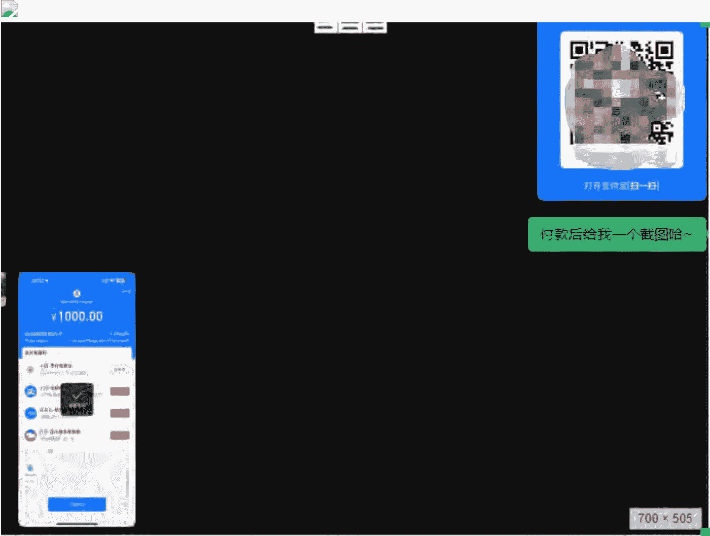

实际是亏钱~因为第一次接这种单子，不是他根据关键词来收费的，我只是收费了1个关键词的价格，结果他有5个关键词。

评论区：
- 柒霖：小透明第一次投稿，希望大家别介意[撇嘴]已经在尽力用文字表达了
- 亦仁：可别乱爬生财有术，已经有一堆“前辈”被封号且不支持解封了。
- 柒霖：[生病]第一次抓到，亦仁大哥，结果是不好的评论[流泪]，明白，我不会乱爬，仅测试，测试完就删除[委屈]
- 蓝弈：文章内二维码记得打码[奸笑]
- 柒霖：这还有机会改么[尴尬]
- 蓝弈：文章右上角看看，可以修改[偷笑]
- 柒霖：OK OK 我改好啦
- 佳文：爬的风险很高，不止是亦仁老大说的封号风险，有一些网站爬了还入刑，建议别这么大张旗鼓的做。https://mp.weixin.qq.com/s/Te_bfk_qrgQVzB-RHL8wiA

## (20赞)如何用Cursor一键部署网站

作者：大臣
日期：2024-12-06

圈友们好，我是大臣。

这期航海上了cursor的船，并且开发出了第一款能解决我一个小需求的工具。我想分享这个工具，于是突然想到，我能不能让cursor开发一个工具分享的网站，并且教我如何部署上线？

秉着“把手弄脏，实干兴邦”的原则，我已经成功利用Cursor搭建出了这个网站并上线。

于是有了现在这篇文章，为了方便圈友们观看，请大家移步飞书：《如何用Cursor一键部署网站》。

这篇文章能教会你：
- 1. Cursor的基本使用方法
- 2. 如何上线自己的网站

下面是我网站的效果图，网址：https://my-website-six-drab.vercel.app/ (需要魔法才能访问)

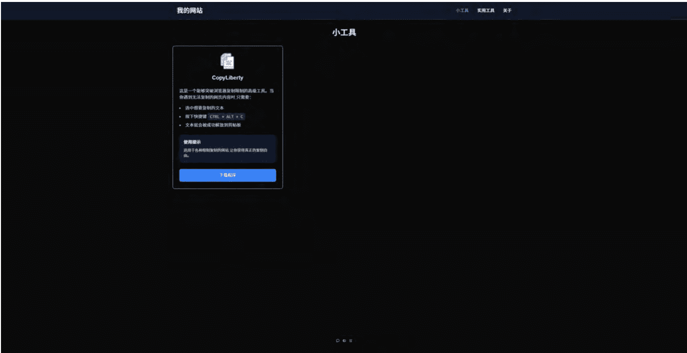

## (18赞)年入千万的团长如何写快团团卖货文案

作者：菜菜
日期：2024-12-02

【年入千万的团长，都是这么写快团团卖货文案的（附AI傻瓜式解决方案）】

说起电商平台，这些名字你肯定脱口而出：淘宝、京东、拼多多、抖音……但是，可能很少有人知道，这是一家社交电商平台，做的是熟人生意。

入驻的商家是有一定影响力的宝妈博主，吸引的用户群体也是宝妈，这些博主在公域做内容引流到私域后，利用自己，把东西卖出去。上游，能接到商家的带货广告及佣金；下游，能用内容和产品留住粉丝，可谓是一举两得。

可不要小看快团团的商业价值，据了解，2023年，平台达成GMV，DAU3000万。

在快团团生态体系下存活着的团长中，年入千万的人不在少数。在平台上，每天有100万+SKU的开团产品。快团团的崛起，除了社交属性之外，它的文案也是一绝。

目前，请一个快团团的文案至少5000元一个月，我做了一个AI助手，可以把文案干掉了。

请移步飞书阅读：https://balfcirt91j.feishu.cn/docx/MdlDdjJ95owccvxIDobcCFitnCb?from=from_copylink

评论区：
- 尘世 : 没写完吗[疑问]

## 【YouTube】8篇

## (精华帖)(189赞)YouTube变现：探索多种靠谱的变现渠道

作者：A 🤖 路途
日期：2024-12-04

大家好，我是路途，深耕内容出海项目，主做tiktok、youtube内容出海变现。又见面了，上周我写了一篇文章关于我们做TIKTOK和Youtube赛道的影视解说流程，亦仁大大评论说可以多聊聊油管的变现方式。我回复说马上码字，修修改改，文章终于算是码好了哈哈。

关于变现方式，我发现大部分人在思考做youtube变现的时候基本有一个问题，就是都只盯着YouTube合作伙伴计划（YPP），其实适合在Youtube上变现的方式还有很多。所以今天这篇文章我就跟大家聊聊我认为比较靠谱的几种变现渠道。详细文章请移步：【腾讯文档】YouTube油管到底如何变现？给大家盘点一下 X 种靠谱的变现渠道：
https://docs.qq.com/doc/DQURTRFRFbGR3Vmtk

评论区：
- 龙：短视频爆了跳转长视频学到了！！！
- 风生：好详细 感谢分享
- 亦仁：很全面[强] shorts目前有投放功能吗
- 芷蓝：好厉害。
- 大米：[强][强][强]
- 土豆君：哇，好详细学习了，感谢！！！
- A 🤖 路途：亦仁老大，YouTube Shorts 有投放功能，广告主可以通过 Google Ads 在 Shorts 中投放多种广告形式来触达用户，展示位置一般会在shorts 播放的前 中 后出现，这种广告可以选择是否跳过。还有一种bumper广告，这种广告还没有尝试过
- 亦仁：shorts投pod你尝试过吗

## (精华帖)(173赞)哈喽大家好，我又来了，有幸成为YouTube shorts的教练，自然是要认真对待。

作者：老馬🐎内容出海
日期：2024-12-03

从航海家聚会回来就连夜赶稿，补全这次YouTube shorts航海的解说板块。在我看来，解说板块更加的落地和务实，AI的内容始终无法标准化。

因为它是靠创意以及深度剪辑来驱动的精品内容，所以它和标准化本身就是冲突的。当你发现了一个AI赛道，拼命模仿复刻，等你出师了，一抬头，大量的账号在跟你赛马。它不具备门槛，本身的逻辑仅仅是提示词，出图，出视频，简单的剪辑而已。

所以你要不停的换赛道，跟新赛道，那你整个工作流，就要反复的调整，还要跟平台博弈AI限流的问题。对于制作AI赛道的创作者来说，好，我对AI类的愚见先讲到这里。

想要稳定高质量产出，本身我们做内容出海就举步维艰。那么，要给自己加成的更多的是最重要的。

你的技能树不能仅仅只是简单的工作流就完成的技能。你需要了解海外文化，你需要具备综合能力，所以更快、更全面地对海外内容有更多的认知，在制作过程中渐渐学会更多的技能，这才是值得推崇的事情。这种东西，谁也带不走，谁也抄不走。

这也是本次Shorts航海，我想传达的本意：这里很难，但很有趣，对比国内，你会走得更远。那么，这是第一弹，有关解说板块的大类。本篇会详细手把手教你实操故事号的两大分支。这中间涉及到尝试使用海外的社媒平台获取信息，当然，还涉及到一些剪辑技巧，以及有趣的模版化文案制作方法。

我的内容比较枯燥，如果你对这个板块感兴趣，希望可以耐心观看，反复阅读和实操，你一定学得会，这是对我最好的尊重！先到这里，等下还有第二弹：
https://yemahuyou.feishu.cn/docx/AiOEdxSxYow1sGxgk3rc7tv0nNc?from=from_copylink

评论区：
- 萝卜白菜叫我青菜：好详细
- 小黄：凌晨三点多[捂脸]老马辛苦了
- 波哥：太详细了，辛苦老马，3点多发帖，4点多修改，诲人不倦！
- 土豆君：太强了，满满的干货，老馬老师辛苦了！
- 小川：感谢老马的分享，对话类观察好长一段时间。有看到一些使用（很大的黄豆表情）搭配字幕流量很大，有看到三个月内达到20万粉丝的。寻找了一圈只发现剪映可以通过字幕自动生成emoji表情，想请教一下🤗有没有可以自动生成这样比较大的黄豆表情的网站或工具
- 老馬🐎内容出海：看万物解说 里面分享的有 这种emoji网站
- 姜强：你好大佬，有个疑惑问一下，用别人的解压视频混剪，会不会有版权问题，或者已经有人在YouTube用过了但我们不知道，对开通YYP有影响。谢谢
- 老馬🐎内容出海：会的 有一定影响 但你的主题不是解压素材 而是展现文字以及特效 所以受影响还是小一些 比单纯混剪展现解压的风险低。

## (精华帖)(118赞)解说类账号的定义与作用

作者：老馬🐎内容出海
日期：2024-12-03

我对解说的评价其实就一句话：其实说科普解说比较笼统，很多人会认为，科普解说是科学科普，地理人文这种讲解的视频，其实不是，如果我们换个概念来理解的话，它就是十万个为什么，你没见过的东西，现象，事物，我都可以解说出来。

但如果在创作者的角度上来看，我更容易把它称呼为“那么为什么叫这个名字？”。

爆款视频解说也叫原视频解说，在操作手法上，它的好处是你借鉴的都是爆款的视频，经过你的二创去重以后再次跑了一遍，那你的流量也会相对来更加的好，但它的缺点也很明显，当你遇到这个小气的博主，他可能会过来diss你，版权警告你，要你赔偿删掉视频之类的情况。
https://yemahuyou.feishu.cn/docx/FylYdbDiYoRHUhxwvSRcfbeandb

评论区：
- 暂无评论

## (85赞)30个强大好用的YouTube工具推荐

作者：汤姆CC
日期：2024-12-06

大家好，我是汤姆CC，这是我首次发长篇帖子，如有不足之处，还请大家多多包涵。我目前是大三计算机专业的学生，热衷于探索各种网站、软件与资源，尤其对AI领域充满兴趣，时常沉迷于各类AI工具的研究与尝试。

一天早上刚睁开眼，就看到我彭哥（老彭）的消息，原来是我发的那条风向标引起了他的兴趣。他问我有没有什么特别之处，我一边揉着眼睛一边跟他说“没有啥特别之处”。聊着聊着，我们的对话就从风向标跳到了做一个YouTube工具合集的话题。彭哥鼓励我说：“你应该试试做个大合集！”于是，我就开始了这场工具整理之旅。这次整理工具箱花了两天时间，期间浏览了一百多个网站，整理了30多个很有用的工具，感觉自己都快变成工具专家了[捂脸]。最终，完成了这篇工具箱，希望能给大家带来些实际帮助。如果你们也有好用的YouTube工具，欢迎在评论区分享，一起让这个工具箱更强大！

本篇文章将工具按照以下几大类进行整理：热门爆款的选题挖掘工具、频道对标挖掘工具、关键词挖掘与SEO工具、频道分析工具、内容创作工具、下载工具以及YouTube其他小工具。详细工具请看飞书链接：
https://dvsjtc6ey3f.feishu.cn/docx/CZwhdVGXJoeWWVx9cTqcpPWRnYb?from=from_copylink

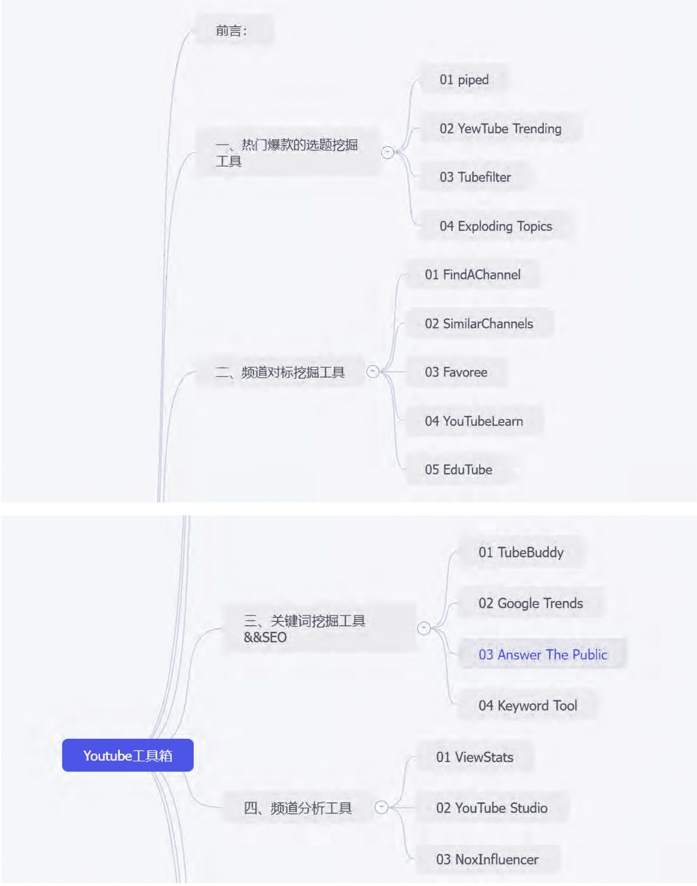

#### 封面工具
- 01 Canva
- 02 Ostendo

#### 五、内容创作工具
- 免版权音乐工具
  - 01 TuneTank
  - 02 NCS (NoCopyrightSounds)
- 免版权视频 && 免版权图片
  - 01 Pexels
  - 02 Pixabay
  - Y2mate (YouTube下载器)

#### 六、下载工具
- downsub
  - 01 YouTube Monetization Checker

###### 评论区：
- Grace：及时雨啊
- 汤姆CC：[表情]
- 戴巍：赞，大三就有这个视野了，快赶上亦仁当年大学水平了[呲牙]
- 汤姆CC：谢谢夸奖[表情]，不过赶老大还很远，我之后继续加油[奋斗][奋斗][奋斗]
- 龙：已经分享给做yb的圈友们，帮大忙了！！！[哇]
- 汤姆CC：有用就好[表情][表情][表情]
- 辛亥：奈斯[机智]帮你转发一下
- 汤姆CC：谢谢亥哥[表情]

## (44赞)AI Shorts视频复刻教程：怪物融合与动物舞蹈
作者：土豆君
日期：2024-12-02

大家好，我是土豆君，最近都在研究AI生成的shorts视频。之前有研究AI动物故事视频的复刻，最近发现了一些更简单的AI视频，数据表现都还不错，就研究了下制作过程，分享一下~

移步飞书：之前分享过的实操技能，有兴趣可以看一下~
- 【生财技能】AI动物故事视频复刻与批量生产
- 【生财技能】抛弃显卡！ComfyUI+Flux纯网页跑图喂饭级教程
- 【生财技能】海螺AI图生视频如何用RPA提升10倍速高效产出视频？
- Youtube 项目拆解
https://ktnwm6ohjn.feishu.cn/docx/HqgGdQEvnoO4pzxUV5AcN6e6nRg?from=from_copylink
https://wx.zsxq.com/group/1824528822/topic/2858241444858581
https://wx.zsxq.com/group/1824528822/topic/4848244528852218
https://wx.zsxq.com/group/1824528822/topic/2858211254588441

###### 评论区：
- 来来：不错不错，通俗易懂容易操作
- 土豆君：来来大佬！😳这么快？？？😂
- 双菱：你写的也很快啊
- 李香君：真厉害啊土豆老师
- 土豆君：香君老师也很厉害！
- 土豆君：很慢啦写了好几天😭
- 半空中：即梦的首尾帧功能是不是没了，我的点击视频生成，没有首尾帧的选项
- 土豆君：有的，你要切换用视频模型1.2

## (30赞)如何选择YouTube赛道并快速达到4000小时播放时长
作者：丞心
日期：2024-12-03

航海明天就开始了，相信做YouTube的小伙伴们很激动，毕竟关乎到挣美刀，花人民币，想想就开心。好了进入正题，赛道那么多，我该选哪个赛道做什么呢，后面还有4000小时的播放时长大门槛，我该怎么在短时间达到呢，废话不多说，让我请出我们的claude教练吧，小伙伴们，直接码住

详情请移步飞书观看完整版
https://k0tjdc5ov25.feishu.cn/wiki/TkSCwkVSDi1YMDkhjU9cxgmdnxe?from=from_copylink

###### 评论区：
暂无评论

## (20赞)YouTube Shorts涨播放量的一个套路
作者：书情小跟班
日期：2024-12-02

这个人有115万粉丝
https://www.facebook.com/joshua.s.smith.980/reels/

以一个视频为举例，在后面，我会说说他的一个套路
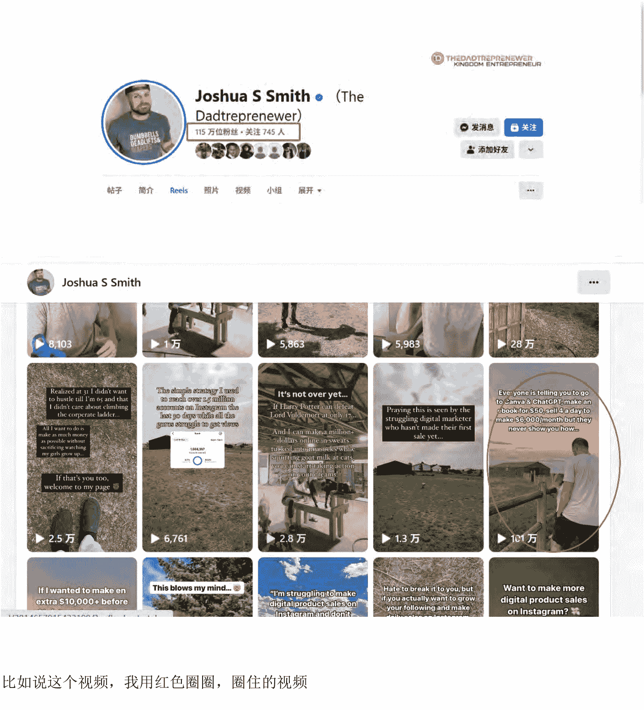

比如说这个视频，我用红色圈圈，圈住的视频


英文如下：
Everyone is telling you to go to Canva & ChatGPT, make an ebook for $50, sell 4 a day to make $6,000/month but they never show you how... Until you find my page.

中文翻译文字如下：
每个人都在告诉你去 Canva 和 ChatGPT，花 50 美元做一本书，每天卖出 4 本，每月赚取 6,000 美元，但他们从来没有教过你怎么做......直到你找到我的网页。

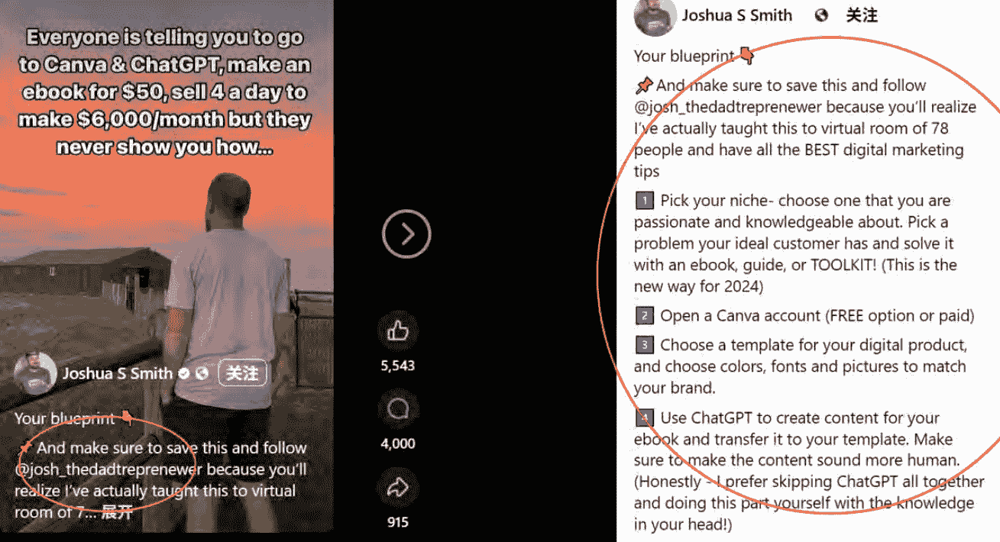

英文如下：
Your blueprint 👇

📌 And make sure to save this and follow @josh_thedadtrepreneur because you’ll realize I’ve actually taught this to virtual room of 78 people and have all the BEST digital marketing tips
- 1 Pick your niche—choose one that you are passionate and knowledgeable about. Pick a problem your ideal customer has and solve it with an ebook, guide, or TOOLKIT! (This is the new way for 2024)
- 2 Promote on Instagram by creating short form video content to drive traffic to your Stan Store. Make valuable, shareable, inspirational and educational content.

Now obviously this is just a quick overview…
If you want to learn this process in-depth and how the big time digital marketers are doing this to make a full time living, while stealing my exact 7-figure tools and setups to get you going even faster…
💥 comment: Join and I’ll send you the free blueprint

中文翻译文字如下：
##### 你的蓝图 👇
请务必保存并关注 @josh_thedadtrepreneur ，因为你会发现我实际上已经向 78 人的虚拟房间教授了这一点，并拥有所有最棒的数字营销技巧。
- 1 選擇你的利基--選擇一個你有熱情和知識的利基。选择你的理想客户所面临的问题，并通过电子书、指南或工具包来解决！(这是2024年的新方式)
- 2 通过创建短视频内容在 Instagram 上推广，为您的 Stan Store 带来流量。制作有价值、可分享、有启发性教育意义的内容。

很明显，这只是一个快速概述……
如果你想深入了解这一过程，以及大牌数字营销人员是如何做到这一点，以赚取全职生活，同时窃取我确切的 7 位数工具和设置，让你更快地…
💥 评论：加入我们，我将向您发送免费蓝图

##### 套路说明：
他的视频，我通过秒表记录的时间是4-5秒左右，但是图片的文字
```
Everyone is telling you to go to Canva & ChatGPT, make an ebook for $50, sell 4 a day to make $6,000/month but they never show you how… Until you find my page.
```
就单单去读完都超过5秒了，他这里给了一个勾子 Until you find my page. .直到你找到我的网页，那么我的网页 有啥呢？

很长很长，看到结尾的时候，他有一个互动 💥 评论： 加入我们，我将向您发送免费蓝图，我们看评论有800多条的一个评论。

他这个视频这么设计有效地提高了短视频的完播率和重播率。

视频上的文字你都没怎么看，视频就已经放完了，等你全部看完后，他的视频都已经播放好几次了，这其实就是在卡系统的BUG。

如果你之前做过短视频但播放量不理想，可能就是因为完播率和重播率太低，但是他的这个套路，让看他视频的观众不得不反复的看他的视频。

系统检测到这一点你的视频完播率和重播率高，会被系统误判为你的视频内容质量好。这导致平台会加大对这个视频的流量覆盖。

勾子的设计也是非常的有套路：
其他爆款视频套路都差不多，其中一个点，能够引发观众的一个好奇心的同时那就是尽可能短，对方没怎么留神，视频已经放完了，完播率和重播率卡住系统推荐的BUG，大家可以沿着这个套路试一试。

## (14赞)短视频时长选择：从6秒到1小时，平台策略与用户需求的变化
作者：书情小跟班
日期：2024-12-04

我在文章中加粗的字
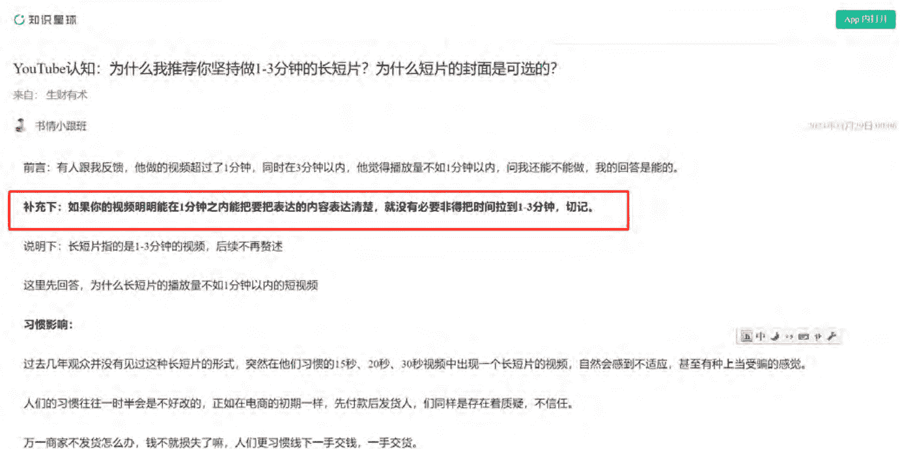

> 补充下：如果你的视频明明能在1分钟之内能把表达的内容表达清楚，就没有必要非得把时间拉到1-3分钟，切记。

如果你在几秒的短视频的领域取得不错的成绩，那么还是建议你继续做短片，而不是1-3分钟的长短片，这篇文章就做一个补充说明。

最初，短视频平台只允许上传6秒的视频，随后逐渐扩展到15秒、30秒、1分钟，再到3分钟，甚至10分钟。如今，TikTok允许上传长达一个小时的视频。

这种不断突破平台原有设计初衷和边界的现象，是为了应对竞争的需要。YouTube这个平台一直以来以长视频为主，曾经抵制短视频。然而，当TikTok强势进入市场时，YouTube不得不推出自己的短视频形式。

YouTube也面临着挑战。如果不推出短视频，他们将失去用户，YouTube起初对短视频无所适从，因为这会分流他们的长视频观众。

然而，当TikTok下载量不断攀升时，如果不采取行动，YouTube将无法留住用户。YouTube最初推出短视频时，显得有些犹豫和被动。尽管如此，由于其庞大的用户基础，从长视频转向短视频是顺应人性的选择，相对容易。

这里说的为什么我推荐你坚持做1-3分钟的长短片，主要的点在于，你原来是在做长视频，但是当你明显感受到长视频的播放量不能让你满意的时候，你可以采取的一个行动。

回到短视频本身，它的基因和特征就在于“短”。一个很好的例子是博客演变为微博，成功之处就在于限制了字数，这符合人性。一旦这种符合人性的趋势被打开，就无法逆转。

因此，YouTube上有一部分观众只看短片，而原本只看长片的观众因为没有选择才去其他平台观看短片。

现在YouTube提供了短片服务，使得许多观众无需频繁切换平台，就能在同一平台上观看不同长度的视频内容。

在YouTube这个平台上，假设有20%到30%的用户不观看短视频，但我们要知道，在27亿月活跃用户中，如果超过70%的人既看长视频又看短视频。其中，接近一半的用户可能只看短视频，因此这个群体的规模是非常庞大的。

理解短视频的精髓在于它的特征和DNA——“短”。在一个以短视频为主的平台或应用中，你自然期望它们是简洁明了的。

如果前一个视频是30秒，而后一个突然变成3分钟，观感可能会不太好。当然，如果后者非常精彩，那就另当别论。但在相同质量下，短视频通常更受欢迎。

在这个网址 https://www.tubebuddy.com/blog/profitable-youtube-niches/，提到了 15 个最赚钱的 YouTube 利基市场，即什么类型的内容最赚钱?

##### 1. Making Money Online（网上赚钱）
Coming in hot with a CPM of $13.52 is content surrounding strategies for making money online.
围绕在线赚钱策略的内容以 13.52 美元的每千次展示费用 (CPM) 成为热门内容。

##### 2. Digital marketing（数字营销）
This topic includes social media marketing and is backed by folks who know their way around SEO.
本主题包括社交媒体营销，并得到了解 SEO 的人们的支持。

##### 3. Personal finance（个人理财）
From debt-reduction to crypto investing, this category runs the gamut. And advertisers are keen to throw money at an audience seeking out this type of advice.
从债务减少到加密货币投资，这一类别包罗万象。广告商热衷于向寻求此类建议的受众砸钱。

##### 4. Educational（教育）
With a $9.89 CPM, the education bucket includes a very broad range of tutorials, courses, lectures, teaching inspo, and even nursery rhymes. But keep in mind, if you’re creating content for kids, you need to meet YouTube’s quality principles for kids and family content to monetize each video.
教育类别的每千次展示费用为 9.89 美元，包括非常广泛的教程、课程、讲座、教学灵感，甚至童谣。但请记住，如果您要为儿童制作内容，则需要满足 YouTube 针对儿童和家庭内容的质量原则，以便通过每个视频获利。

比如说排名第4的教育类，只有几秒的短片，很显然并不能传递什么信息，这要求你在视频中把你做的长视频的内容精华再精华，尽可能的短，把你发的这个长视频的内容比较精彩的内容剪辑出一个1-3分钟的短篇。

其实在长视频有一个指标是关键的前30秒，这个参数在YouTube频道后台也是可以看到的，如果你是做的以教育类的频道，做1-3分钟的长短片是适合的，同时这也对你做出的挑战，在兼顾内容的传播上，尽可能的短让人有兴趣看。

当然，能看1-3分钟的长短片，这类人也不是那么纯娱乐性质的观众，在这么短的时间，你可以分享一个知识点，讲解某一个专业名词。

以上，就是我对于为什么我推荐你坚持做1-3分钟的长短片的做的一个补充。希望能给大家带来启发。

###### 评论区：
暂无评论

## 【小红书】6篇

## 【精华帖】(117赞)一人公司通过聚光投放在小红书一年内吸引4万客户：深度复盘
作者：更绪
日期：2024-12-04

圈友大家好,我是更绪,四川南充人,深耕小红书平台,前段时间写了一篇实战复盘贴,嘿嘿,有幸被加了个精华,关于在小红书卖虚拟资料的👇

文章中提到,我是在武夷山这边卖茶叶,考虑到明年底应该会离开武夷山,去大城市发展,也算是给这近一年的武夷山生活打个总结,

本文会完整复盘这段业务从0到达成这个成绩的全过程,并且会整理出完整的聚光投放获取客资的SOP步骤，仍然有很多从业者没用过聚光,如果你正在从事小红书这个平台,一定会有一些参考意义!

1. 投放是趋势,且聚光依然有红利
2. 模仿并优化,一篇笔记完成破局
3. 迫不得已投聚光,打开新世界大门
4. 我在投放过程中踩过的坑
5. 各行业,小红书聚光投放获客SOP流程
6. 从这段经历得到的感悟

下面是飞书好读版👇:
https://t.zsxq.com/2UzX3
https://qxgrvnd4nbk.feishu.cn/docx/JtloduXlUow6mzx9HHTcO9V2nub?from=from_copylink

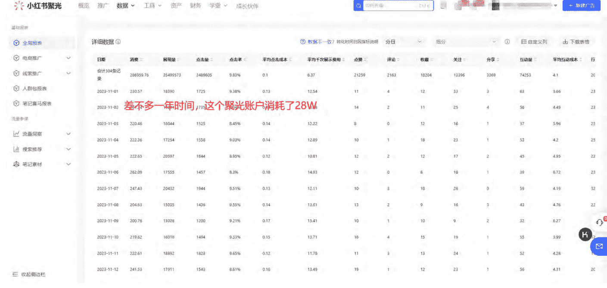
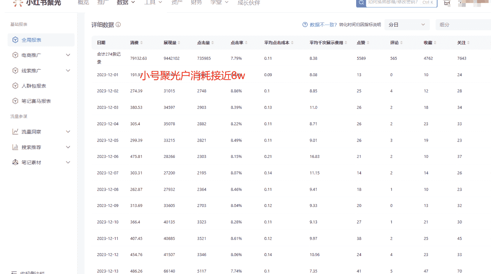

#### 小红书店铺端卖了2W单
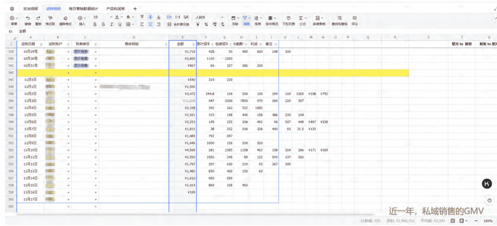

###### 评论区：
- 更绪：感觉我有点像给聚光打广告的，小红书把广告费结一下[害羞]
- 景歌：请问下 这里的服务商 跟 代理 有区别吗（服务商怎么找呀）
- 更绪：应该没区别，叫法不一样，能有返点就行
- 米斗设计：感谢分享，已加精华，666🎁
- 肥仔梁：1、洞察用户需求、2、模仿同行笔记
- 大东：简单粗暴，学到了。
- 卷卷：天，这篇文章好像单独给我上了一节私教，我做普洱茶的，最近想做小红书。直接拿来就用啊！感谢分享[强]
- 黛比：我滴妈呀茶叶的快递成本和包装费原来这么贵的嘛[撇嘴]超出茶叶本身。

## (44赞)小红书广告变现分析：1800个博主数据揭示的运营策略
作者：李子木
日期：2024-12-03

11月底，亦仁在我的一篇帖子下建议“做小红书广告变现的分析”，我觉得非常有意思，开干。

但做起来才发现，数据处理不太容易，我花了二十几个小时，翻了将近1800个博主的蒲公英后台，才把基础数据搞定。

不过，统计下来的5张表，可以分析出挺多东西，也能从更全局、更高的维度来看待小红书广告变现和运营，我觉得挺值的。这件事情，或许可以每年做一次。

需要说明的是，博主接广告的数量、报价，是我人工统计的，虽然为了减少误差，我在每个赛道、每个粉丝量级选择了10个接过广告的、平均阅读量最高的博主来进行统计，但毕竟是取样分析，样本量在小红书所有博主中只是极小部分，所以仍可能存在误差，请知悉。

完整内容，请移步飞书文档：小红书广告变现不完全指南 - 飞书云文档

###### 评论区：
- 微信用户：请问文中提到的这些博主大部分是mcn公司的还是独立的
- 九溪：数据都是自己一个一个手动爬的？
- 李子木：广告数据是蒲公英后台一个个翻看记录的，这个不好爬
- 李子木：文中 10 个博主，都是独立博主，参考价值更大
- 微信用户：厉害👍

## (42赞) 小红书电商新手选品与测品方法解析
作者：V小刀
日期：2024-12-06

大家好，我是小刀，做小红书电商1年半的时间，涉及的类目包括百货、美妆、美妆工具、功效养生、运动用品等，今天跟大家解析新手小白想要入局小红书电商从0到1的一些注意事项。

小红书电商的难点就在于选品和测品，抓住这两个环节，其他的问题都迎刃而解。

正文内容跳转飞书：https://hi428l7bh89.feishu.cn/docx/XnVhdzJTnoKNvRxkvQEc4JwLnRd?from=from_copylink

#### 01. 开通店铺
店铺类型：
- 个人店、个体店、企业店
新手建议先从个人店入手，0成本0粉丝直接开通店铺。

### 02. 选品
##### 2.1 新手推荐类目
- 家居百货
- 运动户外
- 个护家清
- 白牌美妆&美妆&造型工具
- 服饰鞋包-售后可控的款式
- 功效型产品
- 水果

##### 2.2 选品常见思路
- 抖音选品（考古加和创意中心，重点用创意中心进行选品）
- 小红书站内选品(灰豚数据，小红书上架榜单、小红书app)
- 电商平台选品法
- 对标截品法
- 需求挖掘法

##### 2.3 选品的原则
- 时间就近原则-24小时之内爆单的最好
- 粉丝就低原则-爆了产品的对标粉丝越低越好
- 数据就高原则-产品的销量数据越高越好
注意：最好找到小红书刚刚爆起来，或者处于爆款周期前期的品，后期的品竞争相对较大。

#### 03. 上架
- 善用优惠券提升转化
- 定价低同行几块钱截流
- SKU要学习爆单链接
- 产品详情页不要有水印
- 用妙手可搬运站内链接
- 流量一直低速可以尝试，用999噱头sku拉流量

#### 04. 测品
##### 4.1 找对标
- 对标账号遵循-近期低粉爆款原则，优先找最近一周内的低粉爆款笔记进行模仿
- 对标要在小红书站内找，而不是去抖音找

##### 4.2 制作笔记
- 封面、脚本对标小红书站内笔记
- 素材要找抖音最新素材
- 剪辑的时候保留爆款前3秒
- 视频剪辑去重要到位（平台严格的时候3秒换素材）
- 封面目前可以去重后直接使用

##### 4.3 发布笔记
- 建议一天6条以上笔记
- 发布时间早中晚分布即可，发布间隔1小时以上
- 发布的时候记得打开关联评论语，选择低价（或者噱头sku）
- 一个封面脚本内容至少测试3次对比数据，一个品测试10条笔记起步

##### 4.4 人工干预
500小眼睛/有出单的开始人工干预：
- 评论区干预
- 基础销量干预
- 晒单&带图好评
- 干预的时候要注意节奏避免风控，干预号和店铺号不用连同一wifi

√ 普通人实际结果角度：实拍成功率远低于混剪
√ 平台对于同质化的查处力度不同月份差异较大，可以观察同行数据来综合判断最近混剪&连剪力度。

| 分类 | 项目 | 规则/数据 |
|---|---|---|
|  | 产品名字 | 高马尾头绳 |
| 产品信息记录 | 产品进价 | 参考1688或按 进价=售价*(1-佣金率) 计算；5 |
| 产品信息记录 | 产品售价 | 小红书同行价格（有销量中的低价）；9.9 |
| 产品信息记录 | 产品佣金率 | 优先>30%，放宽也要>25%；49% |
| 产品信息记录 | 产品用户年龄 | 18-40岁占比高（精选联盟参考考古加数据）；24-40 |
| 产品信息记录 | 在小红书是否爆过 | 小红书销量>500起；都爆过 |
| 产品信息记录 | 是否有混剪素材？ | 可混剪的视频素材多不多；是 |
|  | 小红书站内对标账号查询 | 查看红书站内对标账号查看（最好有3个+）； |
| 对标账号 | 账号名字 | 对标账号1；对标账号2 |
| 对标账号 | 粉丝数量 | 低于1000最优，高于5000不优先考虑； |
| 对标账号 | 销量 | 500以上起，建议1000+； |
| 对标账号 | 24小时加购 | 24小时加购越高，证明这个品和内容现在爆的越厉害，不显示证明24小时加购不足100； |
| 对标账号 | 第一条爆文时间 | 15天以内最佳； |
| 对标账号 | 最近一条爆文时间 | 24小时内最近，超过一周不优先考虑； |
| 对标账号 | 混剪？实拍？ | 前期先对标混剪，实拍的不作为对标； |
|  | 是否合适选品？ | 完全符合、可以测试、不符合；完全符合 |

选品思路

评论区：
V小刀：之前内容有点问题，修订后重新发布哒
李千万：学到了，期待多更
清欢：哇塞！刀姐简直是掌管小红书爆单的神！太详细了[流泪]
冉冉：干货太多了，非常细节全面！！小红书实操宝典🐮
福脑斯：[色][色][色]谢谢大佬
腾飞的鹰：干货满满 行走的指南针💯
王厚道：绝对好

## (34赞) 从0到1：小红书虚拟资料项目实现月入过万
作者：610🎬
日期：2024-12-03

各位生财的圈友大家好，第一次发帖，多多指教。这里是610，今年刚刚加入生财的一年级新生。

7月参加公众号爆文和视频号带货，8月参加视频号口播带货，虽然都跑通了0到1，但一直没出现爆款，收益只有几十块。10月我参加了小红书的虚拟资料这个项目。

从最初的发笔记引流到私域成交，到后面开通店铺，再配合上闲鱼平台，目前做了三个月，共变现大概1w➕。

具体可移步至飞书：https://qx1qybiik3d.feishu.cn/wiki/BPoewmiETiBPXzkJMPscBWhHnXU?from=from_copylink

评论区：
Xin：你好，想请教一下我是上周开小红书店铺 K12方面的资料，然后选择虚拟定制，没几天就给下架了。你有这情况吗？该怎么解决呢？🧐
610🎬：有！我上传英语啥的 就被下架！然后我就没卖这个了
一网：记得对接上网盘拉新，用户转存，你还能多赚一笔！
刘枫：圈友方便加个V交流交流吗？

## (28赞) 小红书幼教班本PPT赛道变现玩法：原创与定制的蓝海策略
作者：黄岛主(副业项目)
日期：2024-12-03

大家好，我是黄岛主！今天分享的项目是幼教班本PPT赛道的变现玩法，主要在小红书上做私域变现，单价基本上都是单个PPT15-20左右，定制价格高一些30-50这样！那么，这个项目相对于大家来说比较蓝海小众化一些，因为这个是幼儿教育领域里的一个细分化赛道，星球里也有少许圈友在做这个项目。包括我们也是一样，刚从这个赛道里杀出一条血路来。很痛苦，就像带着痛苦面具一样！为什么这么说？因为这个赛道跟其他PPT模板有很大的不同，不同的点就是需要人工原创PPT模板，你还不用人家做好的班本PPT模板，因为随时都能被原作者投诉，也就是说这个赛道的PPT模板压根就没有非原创的。所以，你想发展这个赛道，就必须默默承受着每天的寂寞.....

具体内容可以移步飞书阅读：https://o0yvn3o31a.feishu.cn/docx/FYlvdG3DkoNNDexqcJFcRJrsn9f

评论区：
康康：怎么私信您
黄岛主(副业项目)：私我就行
康康：不好意思，我都没找到私您的方法，要不您私我也行

## (23赞) 小红书素人号玩法: 单日增长1w公众号流量的策略
作者：星城
日期：2024-12-04

小红书素人号的玩法, 最高可实现单日增长1w公众号流量: 大家好, 我是星城, 曾担任3期小红书教练, 之前写文章都比较长, 这次尽量写干练一点, 直接上主题。

1、对标素人笔记, 看时间最短最热的帖子是什么, 照着模仿。能产出流量并转换成功, 我们称之为跑通最小流量闭环。

2、放大流量端。尝试用第二个乃至N个账号, 去复制第一个号的玩法, 我们要测算出来起号率和复制成功率。最终再统计利润和成本。如果放大多个号, 你都可以承接得住, 还能继续赚钱, 我们就考虑如何规模化。

3、常见的思路是, 招员工帮你管理账号, 你继续扩。但做免费流量, 最大的问题是流量都是不稳定的, 有周期性。对于个体小白来说, 招员工管理风险, 场地风险, 租个办公室容易, 守住办公室难。
怎么办? 可以尝试找一堆兼职, 让兼职发帖。思路如下:
- 搜qq群, 各种大学生群, 混进去。
- 微信直接搜, “兼职”、“日结”, 类似的近义词, 有个人发, 也有群发, 找到并且联系他。
- 只要找到1个兼职, 你给他0.5元~2元/个小红包, 让他给你拉一个群。通过以上步骤, 你就拥有源源不断的兼职群。
让兼职发帖, 通常3~5元一篇, 可以和他们约定好, 一周后删帖, 评论区达到多少, 又可以奖励多少。
约半个月, 每天发20~30篇, 你的长尾流量就来了。把时间拉长, 再去判断这样的流量是否有价值, 有价值的话, 再考虑找个员工, 可以接码做, 也可以让员工当商务, 去对接这些兼职资源。
如果嫌麻烦, 直接找那种代发中介, 只不过每篇要让中介赚点小钱。各有利弊。

4、关于兼职的引流细节问题。
- A兼职发帖, 说产品如何如何好, B在评论区回复, “我也用过, 觉得不错”、或“怎么联系、怎么弄等? ”, 引导用户有意向去找你咨询。也就是市面上常见的A种草B收单。
可以是A种草, B收量, 也可以是A种草, B讨论, C收量等。你也可以看实际情况, 不一定每篇都去聊, 当笔记有一定流量, 再去维护评论区。

- 你自己刷到某些帖子, 是分享某某产品, 纯素人用户种草的, 你也可以直接联系博主。给他广告费, 让他评论区推荐你的产品, 或评论区给你“坑位“, 你自己维护。
这类博主应该是纯分享, 他们也不懂市场行情价, 所以基本都是你情我愿, 能给小几百块, 他们就很开心。
这种是坑位费种草模式。因为你靠兼职数量去爆发, 目的还是为了有爆款, 而这个是直接找爆款去做。

- 组合种草类型, 看一下这个视频模版: 6.10
复制打开抖音, 看看【猫猫的作品】真的逆天了, 家人们 kca:/ M@W.zG 04/19 云南白药这个品牌, 众所周知。 第二个界面, 就是品牌方植入的广告。
第三个吃生豆腐, 算冷知识。 总的来说, 就是把这些“实用小技巧”混在一起, 让别人去搜。 这种属于较大品牌或独家品牌的种草方案。
留意一下这个, 你之后刷到这类素材, 你就知道怎么回事了。

- 截流 让兼职去截流人家的评论区, 私信回或把评论区给炒热起来。这类方法适合特别卷或有些违规类目。
如博主在种草一些干货知识, 热度挺大, 你可以在评论区上演a种B收, 再让兼职把你的评论点赞, 给置顶上去。
又或者, 如果评论区人家是直接问怎么联系, 你也让兼职可以私信即可。因为很多用户, 其实都分不清到底看了哪一篇。你留个联系方式, 人家就自己加过去了。

————
透露个数据, 通过第①种形式, 我们有个客户在小红书引导公众号实现一天涨粉1w+。源由是客户员工自己随意发, 安利某个公众号买xx东西更便宜, 的确比全平台都要便宜, 实现增长。
单日1w进公众号, 不过维持了几天就没了, 因为是爆款帖, 后面也容易违规, 热度随渐下滑, 断断续续, 随后我们也通过兼职去铺。
没什么热度, 但有长尾流量, 每天20~30个帖子铺进去, 单日增长30~50粉。也许这才是常态。偶尔有爆款数据会迎来爆发。
这个量说多不多, 说少不少, 能稳定进几十个流量一天, 还是对很多行业有作用的。 ————

基本素人号的玩法就这样, 如果是自热的帖, 目前来说还是通过群聊引导是最安全的。另, 之前写过的小红书/精华帖, 感兴趣可以可以看看:
《亲子研学赛道, 跑通百万模型的复盘》:
《小红书日引流200+, 简单粗暴! 从博主玩法迭代
矩阵玩法2.0版：
《零投放从0开始，小红书2个月8万粉丝的实操经验分享》：
《零成本联动数十几位知乎头部大V，我是如何做到的？》：
《7个月时间从0-1实现100+加盟机构，我如何让线下教育机构快速破局》： ————

今天分享到这里，感谢生财有术，每次想写文章，都是长文，感觉有点压力，这次试试短小精悍风格，也节省大家时间~

好啦，如果还有什么其他见解和方法，我负责抛砖引玉，欢迎交流

~https://v.douyin.com/CeiJ8jLvC/ https://t.zsxq.com/rJwhD https://t.zsxq.com/VMPcX https://t.zsxq.com/QyQAT https://t.zsxq.com/x3wTR https://t.zsxq.com/04q7MFaq7

###### 评论区：
暂无评论

## (精华帖)(113赞) SHEIN跨境电商指南：从背景到全托管模式的新手攻略
作者：M
日期：2024-12-06

Hello大家好，我是Emma梦婷~

很开心上次关于SHEIN的帖子得到了很多圈友的点赞，却被我一时情急给删了(哭笑不得.jpg)

铛铛铛现在它又回来啦

全文分为以下几个部分，欢迎按需服用:

一、我的背景
二、认识希音:低调的独角兽
三、希音红利预计还有多久?
四、shein和temu的区别
五、适合的人群
六、希音全托管模式:新手入局跨境最轻的模式
七、从0-1搞定希音全托管
1.注册开店全流程
2.选品思路和工具
3.找货源
4.图片处理和上架
5.等待上架
6.发货
八、新手避坑
九、小尾巴

欢迎移步飞书观看全文:
https://yoyxm8hqy4.feishu.cn/docx/DaAod9SlroFMCix4sWfcDpdPnvg

评论区:
ikun:个人如何注册?没有工厂
我的执着:开店铺这个就是卡点了，要求营业额达到多少还有场地图片吧[破涕为笑]
走位:请问在淘宝买SHEIN开店入驻可行吗？
M:可以试，有封店风险
M：钞能力可以，注意有封店风险就是了
M：钞能力可以，注意有封店风险就是了
悟参：感谢分享，不知道shein航海那边的节奏怎么样，能搭配手册食用就更香了
嘉应岛主：感谢分享，我也是打算1月份试一试希音，据说TEMU全托管不如半托管，而对于新手全托管先玩比较友好一些，对于shein我也是第一次知道，先看群友的帖。

## (44赞) 出海创业：流量获取与支付工具选择的关键挑战
作者：希声
日期：2024-12-05

在国内竞争日益内卷的环境下，“出海搞钱”成为越来越多创业者和从业者的新选择。

无论是做亚马逊、temu、tiktok等跨境电商平台，还是搭建独立站，或是从事B2B外贸、开发App或插件，出海赚美金似乎成了摆脱内卷的一条出路。

然而，在出海的过程中，除了流量获取是关键问题之外，如何顺利收款并完成结汇，往往是许多人非常关注并且容易踩坑的地方。

不同于国内的微信、支付宝等统一支付环境，海外市场的支付方式五花八门。

欧美用户习惯用PayPal和信用卡，东南亚用户更喜欢现金支付或本地银行转账，南美、日本等地区则有自己的本地支付偏好......

这让许多初入海外市场的创业者感到困惑，不知道该如何选择合适的支付工具。

更别提在实际操作中，还会遇到账户风控、手续费过高、提现结汇复杂甚至资金冻结等问题。

作为一名在跨境电商和独立站领域的从业者，我曾经尝试过各种收款方式，从PayPal、Stripe到空中云汇、派安盈等，被封了不少账号，踩过不少坑。

今天，我将从跨境电商、独立站、外贸和开发者四个角度，梳理从收款到结汇的全流程，希望能帮助更多出海创业者避开雷区，少走弯路。

有些渠道我没有做过，所以是查阅了资料之后整理的，如果有误，欢迎指正。

#### 跨境电商平台的收款到结汇全流程解析
让我们来看下做亚马逊这一类的跨境电商平台的整个资金的全流程是什么样的：

对于消费者：在亚马逊平台上面选择产品——选择好产品——点击结算按钮——选择支付方式——完成支付。

对于亚马逊平台：亚马逊收到客户的款项——处理款项——资金暂存（通常是 14 天左右，主要是为了处理可能出现的退货、换货、客户投诉等问题）。

对于在亚马逊平台开店的商家：发起资金提现——资金到达支付服务商——结汇——资金进入国内的银行卡。


可以看到，在整个过程中，涉及到卖家操作的部分就是“在亚马逊平台上发起提现”和“结汇”两个动作。

当资金过了暂存期后，卖家可以选择合适的提现方式。

一般是通过亚马逊合作的支付服务商（如Payoneer、万里汇、连连、PingPong等服务商）进行提现，提现之后，资金就进入了服务商的账户。

因为卖家提现的一般都是外币（如美元），需要将其兑换成人民币才能在国内正常使用。

所以资金到达服务商之后，我们还需要“结汇”。

#### 独立站的收款到结汇全流程解析
这一步使用的也是第三方结汇平台（如Payoneer、万里汇、连连、PingPong等服务商），这些平台通常在汇率和手续费上有一定的优势，操作也比较简便。

整个过程中，一般资金都是以美元的形式存在，只有经过服务商的结汇操作，美元才能兑换成人民币，进入我们国内的银行卡里。

让我们来看下利用独立站来进行跨境电商销售的整个资金的全流程是什么样的：

对于消费者：在独立站浏览并选择产品 —— 选择好产品 —— 点击结算 —— 挑选合适的支付方式（如信用卡、PayPal 等） —— 完成支付操作。

对于独立站：独立站上需要绑定支付工具来接收客户款项 —— 支付工具对支付信息进行验证（如果支付信息异常则会拒绝这笔订单） —— 款项暂存。

对于独立站商家：当满足提现条件时，在支付工具平台发起提现请求 —— 款项转至商家指定的外币银行账户或支付服务商 —— 若为外币则选择结汇方式（如通过银行或第三方结汇平台） —— 按照结汇流程提交信息 —— 资金兑换成人民币并进入国内的银行卡。

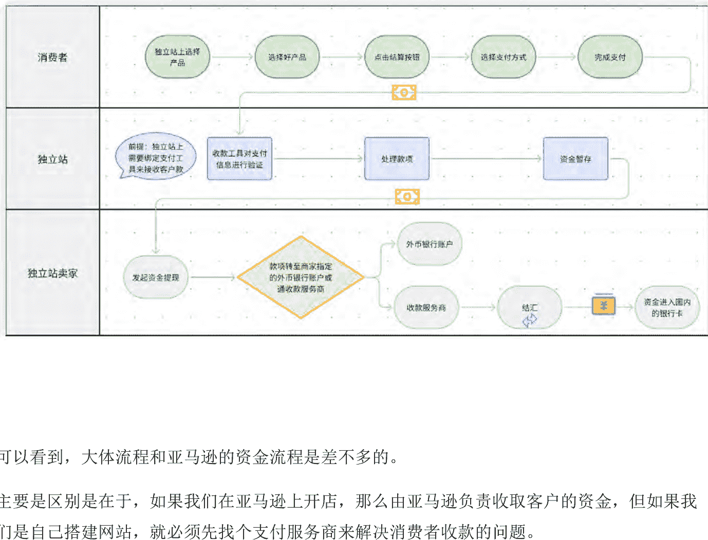

可以看到，大体流程和亚马逊的资金流程是差不多的。

主要是区别是在于，如果我们在亚马逊上开店，那么由亚马逊负责收取客户的资金，但如果我们是自己搭建网站，就必须先找个支付服务商来解决消费者收款的问题。

毕竟海外的消费者不太可能愿意直接把美金直接打到你的银行卡里面，这对海外消费者来说是一件非常麻烦的事情，一般只有外贸的B端客户才愿意这么操作。

收取客户资金的这一步，准确来说叫做“收单”。

有许多支付工具可以完成收单，比如paypal，stripe，派安盈，空中云汇等等。

选择支付工具是很重要的一件事。

因为我们要考虑的事情有很多。

比如不同地区消费者的支付习惯。

欧美地区的用户一般习惯使用paypal和信用卡支付。

东南亚的用户一般习惯用现金支付。

南美地区的用户一般习惯用当地的银行卡来支付。

日本的用户一般习惯用便利店和信用卡来支付。

台湾的用户一般习惯用当地的银行卡和信用卡来支付。

......

而且还要考虑产品属性。

比如你销售的产品是软件产品，是订阅类型的软件（类似腾讯视频会员）；或者你销售的产品是高客单的，用户付不起想要分期付款...

而且还要考虑开通资质的要求。

比如paypal支持大陆营业执照开户，但stripe只支持海外公司开户......而且还要考虑工具的费率。

比如PayPal费率一般为交易额的4.4%+固定手续费，Stripe的费率是2.9%+固定手续费，某些支付工具还会加收一笔月费或者是开户费...

没有一款支付工具是完美的，是可以满足以上所有要求的。

所以一般都是根据需求，来开通不同的支付工具，全都绑定在网站上，不同地区的用户就可以根据自己的需求来选择合适的付款方式。

收单之后，资金就会进入到我们开设的支付工具账户内。

因为资金是外币，所以一般不能直接提现到国内银行卡（如果你有海外银行卡就可以直接绑定提现）。

所以我们还需要再选择一家结汇的服务商来进行资金的“结汇”操作。

幸运的是，上面提到的派安盈、空中云汇、PingPong、连连等服务商都是支持结汇操作的。

没错，许多这类服务商都是既可以帮你收单，还可以帮你结汇，甚至还可以给你贷款...

所以我们只需要在这类服务商上面开通一个海外账户，然后把这个海外账户填入到负责收单的支付工具内，就可以直接把资金提现入账。

后续就可以在结汇工具上面直接操作结汇，资金就能快速进入我们的人民币账户了。

#### 外贸收款到结汇全流程解析

让我们来简单看下外贸收款到结汇的全流程。

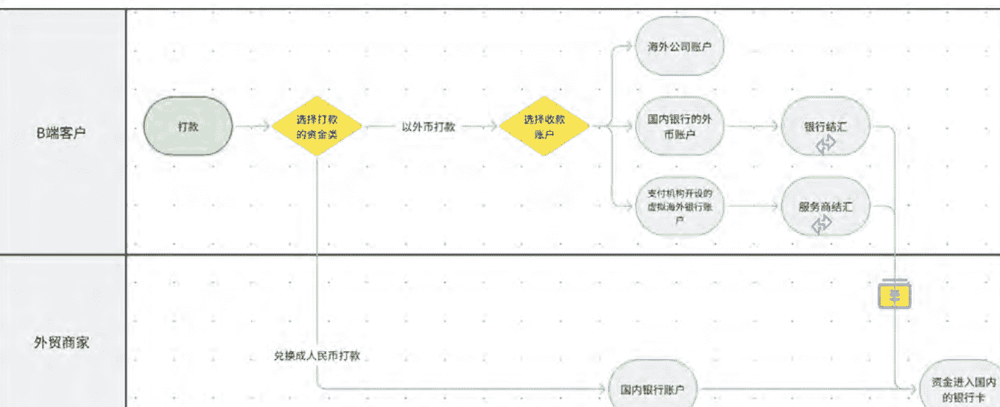

外贸的流程是最简单的，因为面对的都是B端客户，理论上来说，你可以要求客户直接打到你的人民币账户。

当然，这样对客户来说是有点麻烦的（因为客户需要先将他的货币兑换成人民币）。

所以常见的情况一般是注册一个香港公司和香港公司的银行账户，再让客户打款，因为香港账户支持外币直接入账。

当然，国内的许多银行也支持开设外币账户，但是当资金进入之后，就必须结汇成人民币。

而现在还有一些支付服务商，用大陆公司，就可以直接帮你开设出海外的银行账户，并且在上面也可以直接结汇。这些服务商相较于传统银行的好处就是开设账户简单，支持的外币账户更多，且结汇手续便捷，常见的服务商比如万里汇、XTransfer、PingPong（是不是很熟悉，又是这几家服务商）...

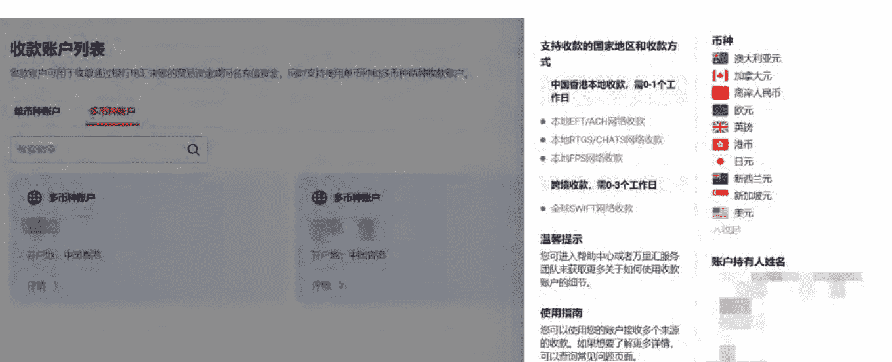

以上只是简单的外贸收入说明，实际外贸操作过程中还涉及到报关、退税等操作。

#### 开发者跨境收款的全流程

开发者可开发的产品包括网站（独立站）、App 或浏览器插件，不同的支付场景和产品形态会影响消费者付款方式和收款工具选择。

如果开发的是如SaaS产品，就可以参考上面独立站收款和结汇的部分，流程基本一致。

唯一要注意的是，在选择支付服务商的时候，一定要问清楚是否支持你的产品，因为大多数国内支付服务商是不支持软件类的产品。

如果开发的是App，那么就要根据Google Play 和 Apple App Store 的要求来设置收款账号。

根据我搜集的资料来看，会收取一个开发者费用，支持大陆的银行卡直接收款，抽佣比例很高（15-30%）。

#### 其他出海方式收款的流程

除了以上列举的四种常见的出海搞钱方式下的收款到结汇的流程，还有一些其他的出海搞钱方式。

- 比如做个自由职业者，在如Fiverr、Upwork等平台接单。
- 比如做YouTube频道，做TikTok赚取播放量佣金和广告费分成，可以绑定国内银行账户、海外银行账户。
- 比如做一些跨境平台的本土店铺。
- ......

针对这些不同的方式，就需要根据平台性质和具体要求来单独搞定收款渠道。

有的是可以绑定服务商账户来直接收款（比如Fiverr可以绑定Payoneer账户来收款），有的可以绑定国内银行账户，而有的则要求必须是海外银行账户才能顺利收款。

#### 独立站常见收款方式/支付工具介绍

我们可以简单地把不同国家和地区的用户付款习惯方式大概归纳为下面六种：

- PayPal、信用卡、本地支付、现金支付、国际汇款、其他付款方式。


当我们越了解用户的付款方式习惯，同时我们的收款工具能够最大程度满足用户的所有付款方式，那么用户下单的概率就更高。

我们可以想象一下，如果在中国，有人搭建了一个网站来销售产品，但这个网站是不支持微信和支付宝付款，那么这个网站即使做得再好，产品再优秀，也一定不会有太好的转化率。

下面介绍一些常见的收款方式/工具，我们可以根据自己要做目标国家市场的用户习惯和自己的资料来选择性地开通。

注意，有许多支付工具是同时支持多种功能的，比如上面案例中罗列出的，可能既可以收单，还可以结汇，又可以绑定电商平台。

###### PayPal

欧美地区使用非常广泛的一个收付款工具，类似国内的支付宝。


使用中国的企业营业执照就可以开通，没有开户费用，有交易手续费：

- 3,000美元以下的，费率为4.4%+0.3美元；
- 3,000-10,000美元的，费率为3.9%+0.30美元；
- 10,000-100,000美元的，费率为3.7%+0.30美元；
- 100,000美元以上的，费率为3.4%+0.30美元。

优点是开户方便（可以自己在官网提交资料直接开户），缺点是费率比较高，同时因为风控很高，如果客户纠纷比较多、退款率高、虚假交易等其他常见原因很容易导致账号被封。

同时PayPal也支持客户使用信用卡直接支付。

所以如果你的目标市场是美国，那么在收款方面一般只需要配置一个PayPal账号就足够了。

###### Stripe

Stripe，由爱尔兰兄弟Patrick和John Collison于2010年创立，总部设在美国旧金山。


Stripe的支付流程简便直接，消费者仅需一张信用卡即可完成支付，无需注册或使用其他账户。

Stripe的收款费率一般为2.9%+0.30美元。

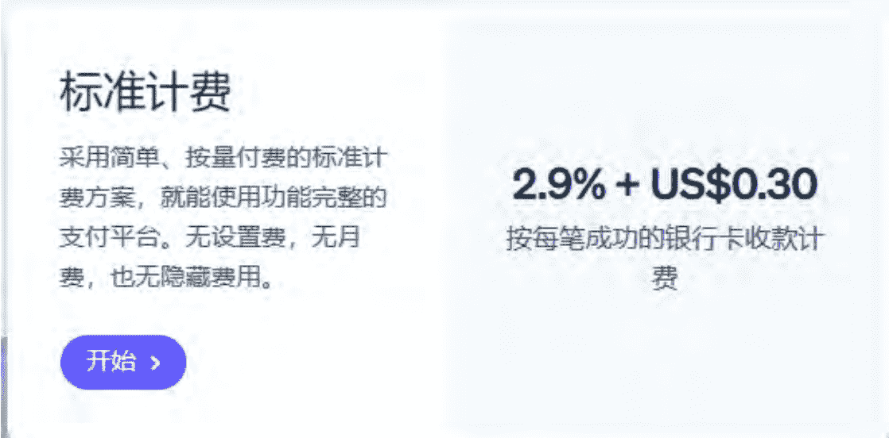

Stripe的优点是用户付款很方便，且支持主流的信用卡方式。

缺点是需要海外公司才能进行注册，并且风控比较高。

对于有条件的独立站卖家，一般会注册个海外公司，然后开通Stripe收款渠道，那么再配合PayPal，做欧美市场就基本没有收款问题了。

###### Shopify Payment

Shopify Payment是Shopify平台内置的支付处理服务，完全集成于Shopify。

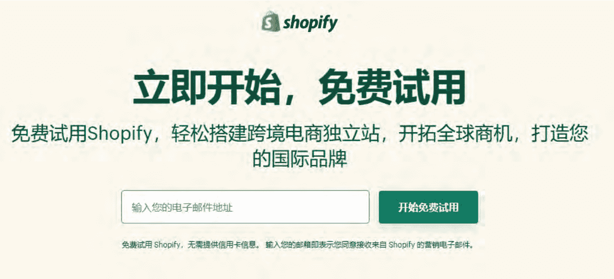

Shopify Payment的费率大概在2.9-3.9%之间。

Shopify Payment的优点：

- 1. 无需支付Shopify的佣金（在Shopify上使用其他收款工具，Shopify都会抽取0.5-2%的佣金）。
- 2. 用户支付流程顺畅。
- 3. 支持信用卡、Google Pay、Apple Pay，还有Klarna、iDEAL等多种本地支付方式。

Shopify Payment的缺点是仅限于Shopify平台的客户，也就是说如果你的网站不是使用Shopify搭建的，那么就无法开通Shopify Payment。

同时Shopify Payment不支持大陆公司注册，并且风控很严格。

###### 2Checkout

2Checkout支持87种货币，覆盖达200多个国家，由Alan Homewood于1999年创立，是一家知名的美国公司，专门提供在线信用卡支付和收款解决方案。


在费用上，2Checkout对每笔订单销售额收取3.5%加上0.35美元的费用，费率相比于Stripe略高。

##### 2Checkout的优点：

- 1. 与很多国内信用卡收款公司不同，它和Stripe一样不收取开户费和年费等额外费用。
- 2. 国内企业信息也可以开户。

2Checkout目前并不提供中文客服支持。因此，使用2Checkout遇到问题时，需要通过邮件与英文客服沟通。

###### 派安盈（Payoneer）、空中云汇（Airwallex）、PingPong、连连

派安盈（Payoneer）、空中云汇（Airwallex）、PingPong、连连等收款工具都比较类似，一般都支持国际信用卡渠道和不同的本地支付渠道。


这些收款工具的优势是：有些支持使用国内的企业资料就可以开户，且风控比较低不会轻易封号。

缺点是一般会有比较高的开户费用，同时费率比较高，回款周期也相对较长。

这些工具一般更适合没有海外公司，但是想要开通信用卡支付渠道的卖家。

###### Payssion

Payssion是一个提供多种支付方式的全球支付平台，它支持超过200种本地支付方式，覆盖全球几乎所有的国家和地区。

使用Payssion的独立站卖家可以接受来自不同国家和地区买家的支付，包括但不限于银行转账、电子钱包、现金支付等。

如果你要做的国家是比较小众的，比如是中东、南美、日本、俄罗斯、台湾等地区，那么针对这些地区就非常有必要开通相对应的本地支付方式，而在本地支付方面，Payssion是比较专业且有优势的一个服务商。

国内企业可以开户，具体开户的要求和费率根据不同国家和付款方式所决定。

###### COD货到付款

对于中东和东南亚等部分线上支付不发达的国家，这里的用户更习惯使用现金来支付。

那么如果我们的目标市场是这些国家的时候，我们可以选择COD（货到付款）的方式来收款。

COD收款依赖于物流服务商来提供服务。一般我们需要寻找有提供COD服务的物流服务商，然后通过物流服务商把货物发出去，同时物流服务商也会在收到款项之后把收来的钱汇给我们。

这种方式的好处是：无需海外公司；更符合当地用户的习惯，同时能增加用户的信任感。

坏处是：费率比较高，同时客户是有拒收的概率。

###### 国际汇款

国际汇款是一种传统而广泛使用的支付方式，适用于全球各种交易。

这种方式通常适合于大额交易和传统外贸业务。通过国际汇款，买家可以直接将资金汇入卖家指定的银行账户。

常见的国际汇款方式包括电汇、西联汇款和银行支票。

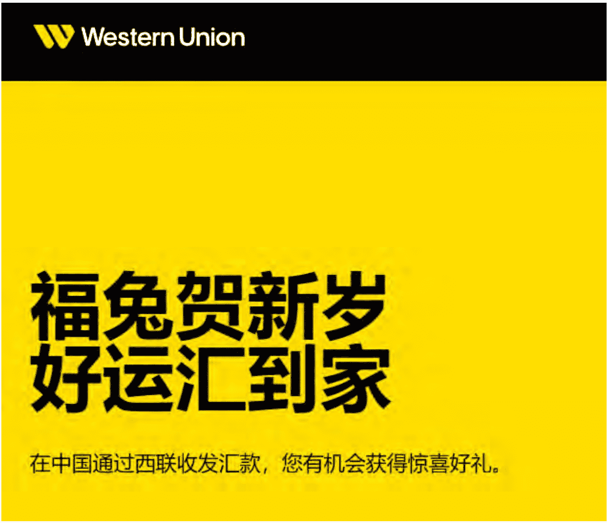

电汇是最常见的一种方式，买家通过自己的银行将款项汇至卖家指定的账户。虽然电汇安全可靠，但处理时间可能较长，通常需要几个工作日。

西联汇款则提供了更快速的汇款服务，特别适合紧急或小额交易。西联的网络遍布全球，转账会更方便快捷。但相较于电汇，西联的费用可能会更高。

银行支票则是一种较为传统的支付方式，适用于那些偏好使用纸质交易记录的买家。

###### 分期付款

分期付款是一种越来越流行的支付方式，特别适用于价格较高的商品或服务。

这种支付方式在吸引价格敏感型消费者方面非常有效，同时也能帮助独立站卖家提高转化率和平均订单价值。

- 常见的分期付款服务商有：Klarna、AfterPay、Sezzle、Affirm等。

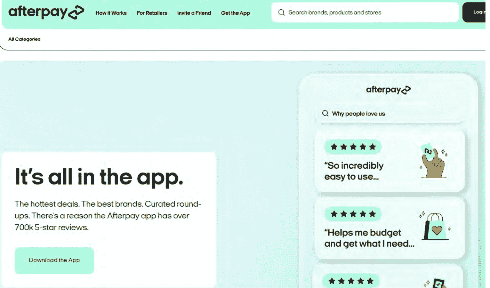

#### 独立站的收款方式推荐

- 1. 如果你的用户主要面向欧美用户，那么最简单的方式就是开一个大陆的PayPal账号，0成本，支持PayPal付款和信用卡付款，而且现在PayPal也支持直接结汇到国内银行卡。

注意要用宽带网络注册，好好养号。

一个PayPal是支持绑定多个网站的。当然，这样做也有风险，就是如果你有某个网站违规，PayPal被搞废了，那么其他网站也没办法收款了。

- 2. 如果你有海外公司，那么最好开一个Stripe，虽然风控很高，但确实好用，能显著提高用户的付款成功率。

- 3. 如果你想开通分期付款，那么可以使用空中云汇。

#### 独立站的收款方式总结

- 1. 在决定选择哪种收款方式/工具之前，重点是要先调研目标市场/国家的用户支付习惯。
- 2. 同时根据公司资料、产品类型、收款费率等再综合来考虑判断。
- 3. 网站上的收款渠道越多，用户的可选付款方式越多，那么就越能提高独立站的转化率。
- 4. 不同的收款工具对于产品类型也会有一定的限制。比如你的网站是销售虚拟类型的产品，那么国内的信用卡收款服务商一般都会拒绝。
- 5. 不管是什么收款工具，都会有一套自己的风控措施。在独立站运营过程中，如果客户经常向收款工具服务商发起投诉和纠纷，当超过风控阈值之后就很容易导致收款账号被封，资金被冻结。所以要保存好平时的采购发票，物流单据，必要时可以用来申诉。
- 6. 收款账户最好多备1-2套，当收款账号异常（被投诉或者被风控无法收款的时候）时至少可以先顶上，不影响生意。
- 7. 如果有条件，可以开设一些海外银行账户，比如香港银行账户（许多银行只要去一趟香港就可以开户），或者是美国银行账户（比如华美银行）……好处是能更加方便地向海外用户收款，还可以用来给客户退款等。

如果分享对你有帮助希望点个赞哦~

#### 我在生财的精华文章

跨境创业？新手下场前必看的赚钱指南！

一个工具管理100个Facebook、Instagram、TikTok社媒账号？指纹浏览器使用全攻略！

【生财技能】如何分析产品/项目的海外市场体量与机会

###### 评论区：

蓝大虎：很详细，谢谢分享[强][强]

希声：谢谢 😂

嘉应岛主：感谢分享，收款太重要了～

希声：😁😁

## (16赞) 黑五热潮下的商家挑战与反思

作者：梁小伟

日期：2024-12-03

黑五热潮来了，似乎不管是大卖，还是小卖，又或者刚入局的卖家，都陷入到了旺季的氛围里。黑五是一个转化促销的好机会，但黑五也是一个竞争更激烈的日子。

看到的是别人爆单的背后，但仔细梳理，爆单需要供应链支持，需要持续大批量的达人建联，需要足够充足的广告预算，是战略布局。

你做好爆单的基础了吗？

每天疯狂烧广告，烧完回过头一计算，稍微不注意，噢，白干。

确实，旺季来了，大家都投广告了，自然流也就少了。有人欢喜有人愁。

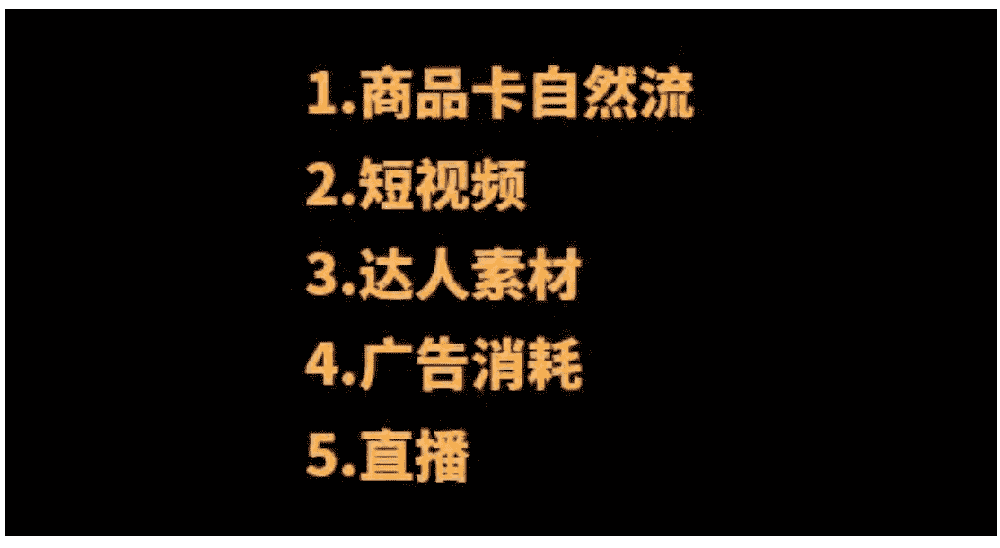

每一个商家其实反复围绕的都是以上这几个流量入口。

我来聊聊，黑五期间，黑五遇到了什么有趣的问题。

这一篇，也是一次复盘的碎碎念随笔。

##### 团队面对旺季造成的压力以及无效努力

01

上个周，团队账号代运营的其中一个店铺，团队每天单品上新10-20条素材。

从拍摄-剪辑-发布-投流 整个步骤都是翻倍去做的。

每天干到晚上十二点。

看起来非常有旺季的感觉，整个团队欣欣向荣，蓬勃发展。

一片大好，就是单量没什么变化。

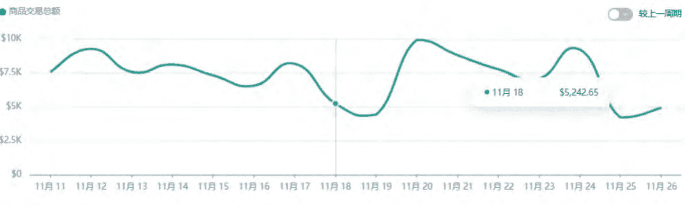

我开始晚上复盘，整个团队的进展。

GMV: 34.2W 美金。10月断货了半个月，11月全力冲刺。

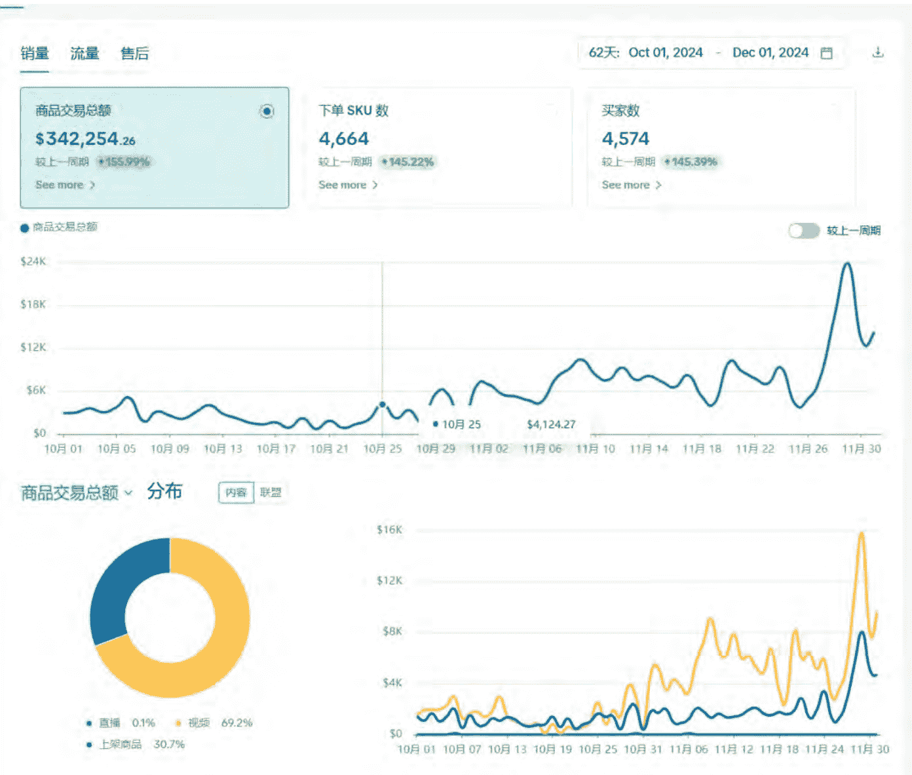

###### 一、广告

广告盈亏平衡线：2.2持平。GMV两个月消耗了 4.7w美金。

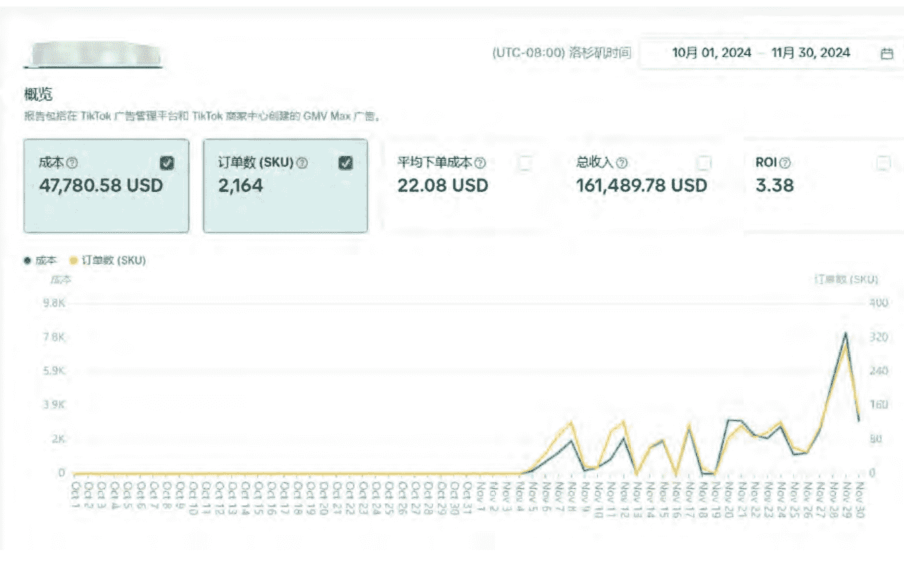

Ads两个月消耗了2万美金。

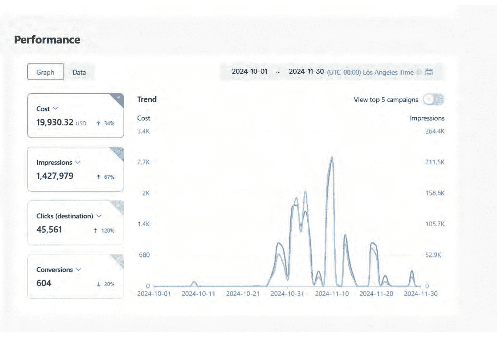

###### 达人侧：

基本上两个月找了四五个达人。

直播：没有直播板块。

自然流：准备了十个号去带。每个账号3-10条一天。

人手：我们负责这个店铺的就三个人手。

基本上这三个人手除了带这个店，每天还要管理团队业务，做中视频。

精力有被分散。

慢慢的，大家也遇到了瓶颈。

从10月-12月，定的100w美金的目标，截止到12月1号。只完成了34w美金。

我一开始还给大家打鸡血，没事的，旺季没啥自然流，竞争比较激烈，我们投流拉量拉起来。

这个店铺，从9月份开始一天几单运营到现在。

11月以前的单量70%都是视频自然流出单。

11月开始广告预算每天3000刀-5000刀。

但相同的GMV，多花了40%的广告成本，没这么多利润了。

我就在想为什么。一个一个的排查。

###### 总结一：

大环境 PipiAds 上面观察，并跟很多商家深度交流，买量最猛的主要集中在

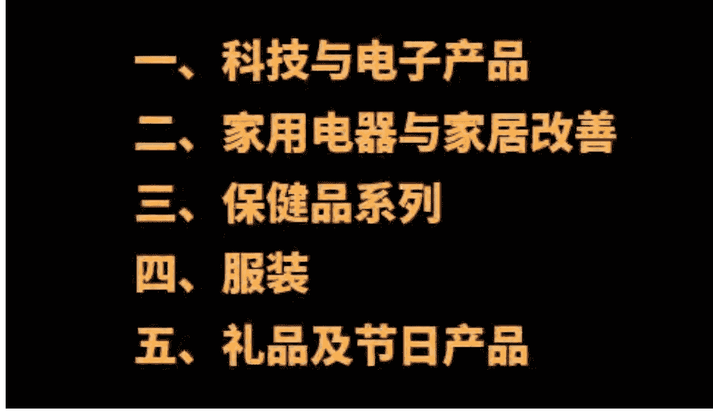

梳理出客户的这个品类，产品类目相对理性，然而淡季更有优势。

| 店铺名称 | 视频数 | 广告费 | GMV |
|---|---|---|---|
| Halara US | ... | ... | ... |
| TYMO BEAUTY | ... | ... | ... |
| vavor store | ... | ... | ... |
| wasytalk | ... | ... | ... |
| Migsley Life | ... | ... | ... |
| FesinGirl LLC | ... | ... | ... |
| The Ordinary Store | ... | ... | ... |
| Crock | ... | ... | ... |

###### 总结二：

团队被事情缠身，而不知道梳理和迭代盲目蛮干。

让我有点意外和生气的是，拍摄数量是上来了，质量下去了。

我偶尔抽查，找到了一堆标题，封面，拍摄光结构，脚本的漏洞。


我就问SOP下，这么简单的错误都会出现，然后负责人A就跟我说，带新人用了很多时间和精力，他也有任务目标。

其实我特别能理解，还一直安慰他们，带新人确实吃力不讨好，但团队要放大就要持续不断的去做，不要用笨方法。要不停的迭代完善的SOP，统一培训时间+统一的答疑时间，给新人研究，去优化方向。

这种时候，更多还是要耐心的继续分享一些小技巧。


然后告诉方法。

注意点：


冲突不是威胁，而是一种能量源泉。这是我们自己的空间站收录的每日推文。

我自己又看了一遍，静下心来。去安慰和理解大家。

###### 公众号懒人搜索，懒人专属群分享

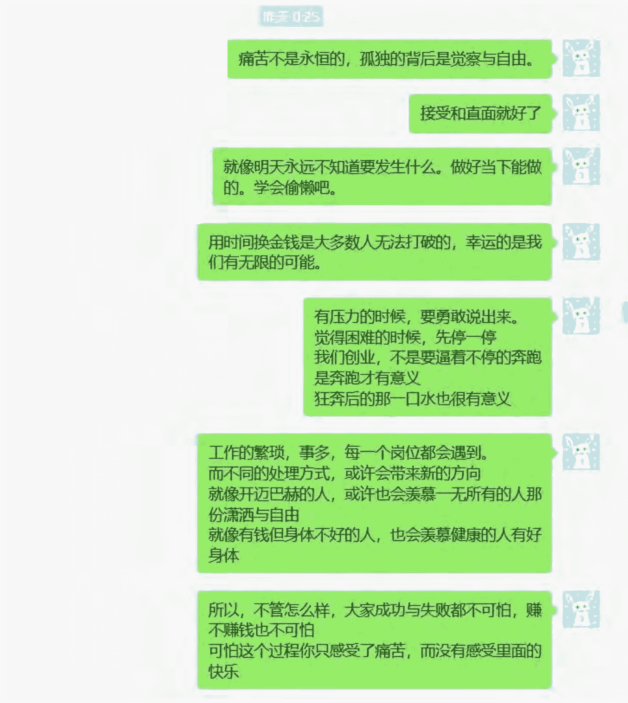

帮助团队解决问题后，我主要抓几个方向。


- 1. 第一点：重新优化和梳理脚本流程
- 2. 第二点：优化了拍摄时间和账号内容
- 3. 第三点：店铺评分
- 4. 第四点：视频质量优化和升级

很多时候，关于做一个项目到底需要什么，其实真正决定做了，就要想清楚这几个问题。

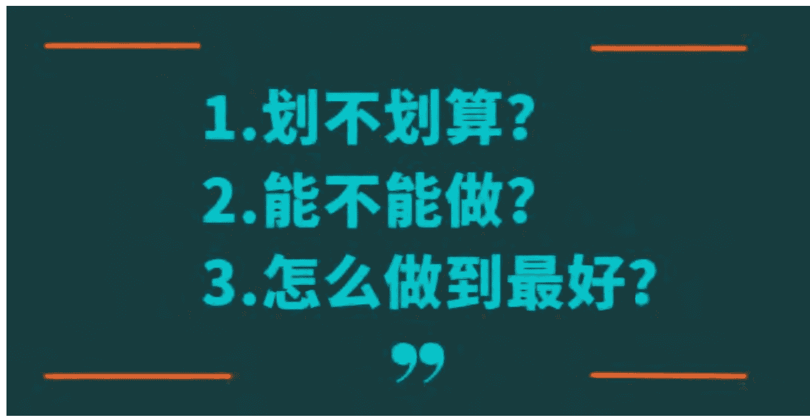

能做和做好其实是两码事。能做可能刚好商品有需求，又或者竞争没有那么激烈。再加上基础的运营功底，也能支撑一个团队的销售额。我就聊聊细致点的内容，看我最近的启发。

###### 1. 关于团队效率与方法论

我发现大家进入蛮干期，没有了属于自己的思考之后，是最为致命的。

我是怎么发现的？我把他们每天剪辑的素材看了一遍，我发现脚本一直没有迭代。我就知道大家陷入了一种思维怪圈。

只想做容易做的事情，又或者重复的事情太多，进入停顿期。落到实处，那就是最近市场调研和对标案例分析做得少了。于是我停了所有人的工作，休息一天，做了几个调整：

- 1.1 每天半小时刷对标案例并总结
- 1.2 每天开会打开 PiPiADS 把同行爆的广告素材分析一遍（逐帧）

我直接逼着大家开始拿回最基本的事情，做到细致：

- 1.3 更新了一批拍摄场景，做一些布景和光线
- 1.4 测试脚本多样性（故事-产品功能-外观展示-搞笑剧情）

###### 1.5 落地的SOP+工作文档

尤其是工作文档和SOP。如果SOP没有更新，我就会去骂，因为这就证明没有沉淀和积累。我可以很直观地获取团队的进展和思路。

店铺评分之前一直是亚马逊仓库发货，9月份评分降到了2.5分，好家伙，黑五活动都快要报不了了。我们花了三个星期的时间，做了以下几个调整：

- 1. 把亚马逊仓库发货的品全部下架
- 2. 低客单高质量产品刷销量
- 3. 客服回复率提高

最终拉回3.9的评分，流量随之上涨。

一系列的调整后，我发现广告降了一半成本，消耗2000刀，也能出200单，单量不仅没跌，利润翻了一倍。

###### 公众号懒人搜索，懒人专属群分享

然后呢，又有意思的点来了。一路发现问题解决问题，我又开始分析店铺流量页面的数据。商品视频曝光高达700万+，可是为什么点击率下滑得这么严重？我一看，好家伙，团队最基本的事情又没有做好。大清早又去骂了几句。

我一看商品卡流量也是，又沉默了。这么大流量，转化率0.09%，辛辛苦苦做这么多流量，结果发现超过5%的同行，真的是铺天盖地的浪费。

- 1. 明年新增5-10款SKU承接流量
- 2. 继续优化视频标签
- 3. 加强号召引导

回归到现状，目前团队差不多做了32万美金的GMV，不说100万的目标吧。至少要完成60%，也就是还有28万是需要12月冲刺的。

我发现做事情，执行能力强不是单一事物，只有对新事物和需要学习的事物，才能体现强执行。

关于团队的对标拆解，我非常推荐去 PiPiADS 给团队看。因为团队直接过滤自然流的视频，直接看广告视频会帮助你过滤很多播放高但不出单的视频素材。广告属性强一点的视频或许播放不高，但转化效果可能会更好。

我是梁小伟，咱们下期见。如果你喜欢我的碎碎念，记得点赞+关注~

评论区：

微信用户：分析总结逻辑性很强，从根本出发解决实际问题，学习到了👍
梁小伟：[呲牙]谢谢认可

## 【闲鱼】3篇

### (60赞)闲鱼虚拟产品操作过程分享

作者：骄阳
日期：2024-12-03

最新在尝试闲鱼虚拟产品，陆陆续续出了一些单。老彭在说约稿，本来觉得这项目挺简单的，没有编写一篇文档的想法，但下午散步的时候想着，可以边散步，边通过语音转文字的方式写一下，于是就记录了下来，分享下项目操作过程给大家。详情请查阅飞书文档：
https://t.zsxq.com/isjGK
https://w63nbfedzw.feishu.cn/docx/ZH7PdHZbsoWVtDxiEAXcYOyInqf

评论区：

老彭：约稿成功[坏笑][坏笑]
老彭：中不中标其实无所谓，最重要是帮助到圈友[坏笑]
kingy123：下个youtube视频也能赚钱？这我真是没想到
骄阳：哈哈，是的，能帮到圈友就很开森了
老彭：对，而且整个过程还特别简单，我写风向标的时候就鼓励大家去实操了
骄阳：我也没想到呢，是客户找过来我才知道的。
乐乐-修养中：超级曝光花完了 不用等结算 可以删掉这个推广然后直接新建计划，只不过新建的效果和之前是不是一样这个最近是没留意
骄阳：那等结算了再开始看看

### (精华帖)(119赞)闲鱼虚拟付费玩法：超级擦亮投放

作者：乐乐-修养中
日期：2024-12-04

目录：最近投的最好效果看图1，目前是擦亮，直接ROI在7，另外加上自然流量出了653单。这个品客单价0.8左右，所以是500左右的总成交额。图2图三是效果最好的号的总效果和投流数据。下面是飞书链接：
https://zwia799oeo3.feishu.cn/docx/FBeJdriQwoIadMxFWpXcwE5hnLf

评论区：

Luck☐：大佬，如果钱花不出去是什么问题？
乐乐-修养中：目前没遇到过花不出去的，顶多烧的慢。我感觉要么是竞争激烈，要么是这个品本身没啥流量，即使通过超级擦亮把你排到前面但是没人点。还有就是可以尝试删掉计划重开。
乐乐-修养中：如果找个品着实不错可以尝试选择自定义推广，增加千次曝光出价。
Luck☐：感谢大佬指点
杜小盼：大佬 你卖的这些会有版权问题吗
乐乐-修养中：有版权问题，找弱版权的或者不管的。对于有风险的品，又想做，可以把这个品所有的不错的链接放到一个表格。经常观察。如果很多天链接都在，说明就能做。如果过几天链接挂了不少，说明这个不可以做。
知秋Project：大佬牛逼，直接通投拉满[强][强]
乐乐-修养中：当然这种也有可能出问题，所以如果是刚开始做建议做一些容易出单的完全的品。慢慢来。

### (35赞)闲鱼付费推广实战经验分享：用钱买曝光，转化成交全靠你

作者：杨小六
日期：2024-12-05

大家好，我是杨小六，一个2019年开始做闲鱼的老咸鱼。

最近看到很多圈友对闲鱼的付费推广功能颇有兴趣。我们团队花了两个月时间进行了系统测试，手把手砸钱验证了各种方法论。这次把实战经验打包分享出来，每一条都是“血与泪”换来的硬核干货，适合已经在闲鱼赚到钱想要扩大的朋友。

如果觉得内容有帮助，点个赞支持一下。如果反馈不多，那这次就算是提前“年终总结”了，下次分享就明年见了哈！

### 闲鱼付费推广的核心逻辑

付费推广的本质就是：用钱买曝光，但点击率和成交能力全靠你！

闲鱼并不直接卖你一个固定的广告位，而是用算法对广告流量进行分配——如果你的产品能转化成交，这个位置会继续给你；否则，直接换人！

换句话说，闲鱼推广的钱只买到了曝光机会，成交完全取决于你的产品优化和运营能力。要赚钱，就得清楚以下公式的每一个环节：

交易额=访客(曝光×点击率)×转化率×客单价

- · 曝光：用推广买曝光；
- · 点击率：靠封面图、价格吸引；
- · 转化率：产品、评价、价格决定；
- · 客单价：单品利润和客单价拉高。

接下来，我们围绕这个逻辑分享关键经验。

### 流量来源拆解：搜索流量是核心

一开始我们以为闲鱼推广流量主要来自“猜你喜欢”的推荐位，但实测发现并非如此！流量的主战场其实是“搜索”，这也是闲鱼上最核心的用户行为路径。

- 如何辨别是否开了推广：
  - o 搜索结果显示“XX人买过”，这表明是通过付费推广获得的流量；
  - o 若显示“XX人想要”，则是闲鱼自然流量；
  - o 还有少部分结果标注“广告”，这是通过淘宝直通车链接到闲鱼的。

### 2. 权重与推广匹配：爆款优先，权重高就行！

闲鱼的推广逻辑会偏向于“爆款和潜力款”。当你开通推广后，系统会自动评估你的产品权重，并告诉你哪些产品被标记为“平台推荐”或“潜力款”“爆品”“新品”。

为什么有这些标签？因为闲鱼不想让垃圾产品占据它的好广告位。所以系统会帮你打上标签，既然知道什么是适合平台的、平台喜欢的产品是什么，你就去推广什么。你只管把爆款交给我，然后充值即可。

- 适合推广的品类：
  - 高利润、高转化率的产品；
  - 刚起步的潜力款，用推广引爆市场。

推广并不是万能的烧钱工具，而是为产品起量服务。你的产品有潜力，推广会让它加速爆发；但如果产品问题多，再多的推广也可能只烧钱不见效果。

### 3. 推广适用场景：新账户福音

实测证明，付费推广对新号、新品非常友好。我们以前用半个月的时间来养号，但通过推广后，养号周期缩短到3-7天，效果非常显著。新号可以通过推广快速突破起步难题。

### 4. 自然流量提升：带动效果明显

通过推广获得的流量，除了直接带来成交，还能拉动一定的自然流量增长。

- · 数据显示，付费推广流量成交占比约70%，自然搜索流量占比30%。
- · 这意味着推广不仅带来了成交，还提升了自然搜索的排名权重，形成流量的正向循环。

### 5. 成本与利润：精准选品为王

推广效果因品类而异，不同产品的投入产出比（ROI）有天壤之别。我们发现以下规律：

- · 曝光量大的类目，虽然花钱快，但不一定能赚钱；
- · 高转化率的产品，能用更少的钱获得更好的成交效果。
- · 如果你能找到曝光率可以大、转化率高的产品，那就赢麻了。

## 核心策略：

- · 精选转化率高、搜索后就要购买的产品做推广；
- · 控制单品利润率，确保推广后仍有盈利空间。

- 举例说明，你去买衣服和盐，衣服看不中可能不买，盐是要买回去做菜的。

### 6. 基础准备：推广前的必修课

推广之前，必须把基础工作做到位：

- 1. 图片：清晰且吸睛，能够在海量产品中脱颖而出；
- 2. 文案：简洁有力，突出产品卖点和价值；
- 3. 价格：设置合理，有竞争力；
- 4. 评价：提前做基础，邀请熟人完成几单，积累信任背书。

注意：推广上线后进入精细化运营阶段，转化率成为唯一衡量标准！

### 7. 推广成功的核心：理解平台规则

闲鱼的推广位置有限，并不是你花了钱就能保住流量。只有在高点击、高转化的情况下，系统才会持续分配流量给你。

理解这个规则后，我们总结了推广成功的几个关键点：

- 1. 曝光是花钱买来的，但转化率是关键；
- 2. 提升点击率的核心是优化图片和标题；
- 3. 提高成交量的关键是优化价格和评价。

## 干货公式：

- · 曝光靠推广；
- · 点击率靠图片价格；
- · 转化率靠产品与服务。

### 8. 玩转推广：单品打法 vs 批量玩法

通过推广，我们摸索出了两种主要打法：

- 1. 单品打法：
  - 选一个高转化率的产品；
  - 做好基础优化后，集中预算推广，引爆流量。
- 2. 批量玩法：
  - 准备多个产品，逐个上线推广；
  - 多账户操作，将规模效应拉满。

终极目标：通投全覆盖，彻底跑通模型，“别墅靠海”不再是梦！

闲鱼推广并不是单纯的“花钱买流量”，它更像是一场以点击率和转化率为核心的运营战。

- · 如果你的产品基础差，即使砸再多钱也可能颗粒无收；
- · 但如果运营扎实、优化到位，推广能让你的业务实现指数级增长。

希望这份干货能帮助大家少走弯路，快速在闲鱼赚到第一桶金！如果有任何问题或想深入交流，欢迎加鱼丸然后找我，多交流才能有进步，同时谈钱不伤感情～

###### 评论区：

暂无评论

## 【微信】2篇

### (精华帖)(156赞)100阅读变现20万，拆解10个公众号类型，带你了解公众号变现多样性

作者：老罗
日期：2024-12-02

我从2017年开始做微信公众号，到今年第8年，所以对公众号有一些自己的理解。公众号有了系统推荐后，玩法很多，但咱们社群里关于公众号多样性的讨论非常少，主要集中在流量主。我花了半个月的时间拆解了10个比较典型的非流量主变现账号，很多账号阅读很低，但是变现金额惊人。比如平均阅读只有几十个，但3个月变现金额20万；也有账号阅读文章简单，但全是高客单。我会从9个维度进行拆解，包括：开始更新时间、平均阅读量、平均转发量、变现金额、发布的内容、代表性的标题、内容结构拆解、账号难点、可以提供素材的来源。那我们开始吧~

完整链接：【腾讯文档】100阅读变现20万，拆解10个公众号类型，带你了解公众号变现多样性。
https://docs.qq.com/doc/DZEhJT0FCRkxaR3pH

评论区：

小鹅：奥公子终于想起来自己知识星球账号了
坤汀：奥公子终于想起来自己知识星球账号了
虎牙：奥公子终于想起来自己知识星球账号了
掩体：奥公子终于想起来自己知识星球账号了
蓝弈：奥公子终于想起来自己知识星球账号了
胖大魔：奥公子终于想起来自己知识星球账号了
土豆君：奥公子终于想起来自己知识星球账号了
嘉应岛主：我大概接触两个朋友长久玩公众号的，现在有几年没有接触，忘记账号名字。记得其中一个其实是做姓氏文化的，他们通过售卖姓氏的茶、酒、月饼等变现，他们经营得还算轻松。

### (32赞)网盘拉新：公众号SEO玩法，通过AI洗稿无脑发文，小白也能轻松玩！

作者：一网
日期：2024-12-02

网盘拉新：公众号SEO玩法，通过AI洗稿无脑发文，小白也能轻松玩！我是一网，今年是生财第四年。

最懂网盘拉新的男人，专注网盘拉新、虚拟资料和私域流量增长与变现。今天给大家分享的主题是网盘拉新的公众号SEO玩法。这个玩法我选择了软件赛道细分的领域：创业博主软件领域。测试了一个月，每天涨粉100+，全是精准的搜索创业粉。这个公众号玩法适合网盘拉新，也适合引流创业粉到私域。网盘拉新的任何赛道都适用，我这里是以软件赛道举例！

为了方便大家理解，我准备了全文思维导图，内容比较多，请移步飞书：
https://z7h6phhn3p.feishu.cn/docx/PiVydqWoDotcSPx7daEcLxFlnte

评论区：

亦仁：网盘变现情况怎么样
一网：不知道亦仁老大问的网盘整体变现还是这个玩法的变现？我这个玩法，我开始准备引流需要工具的创业粉，所以都是用户加微信后，再发网盘链接，损失不少网盘变现流量。很多人看到微信，没有特别强烈愿望的，就没有下一步了。如果直接回复网盘链接，估计还是能变现几千吧。测试了一个月，网盘变现有1000多点，加到微信私域500左右，不过我也就是每天发一篇文章。如果是整体变现的话，目前最高的天花板有一个是20万，不过他是B站爆了一个视频，可遇不可求。少部分变现5位数，能变现的大部分圈友应该3-4位数吧。如果没有做流量能力的，估计也只能当个小副业做。下面是我的下级的一些圈友网盘变现情况。
辉：给个渠道
辉：给个渠道
一网：网盘渠道：https://dt.bd.cn/#/pages/login/register?invite_code=678678

## 【线下实体】1篇

### (10赞)低付费打投放大户的赛道：家装公司吃本地生活红利

作者：楚川
日期：2024-12-02

###### Part1
家装行业内卷，急需流量新渠道

2024年开始找到楚川的家装公司越来越多，并不是因为我们在家装赛道拿到了大结果，而是这个行业到了极度内卷、不得不变的节点，有能力自救的家装公司都在出来找新的流量洼地和机会。

在跟超过50家、且每年交付至少300套的家装公司深度沟通后才知道，这是一个要么被流量裹挟、要么被渠道绑架，想要突破无比艰难的行业。

虽然我们在豪雅门窗和南北旺全铝家居的服务中拿到了阶段性结果，但行业其他品牌面对流量响应速度极慢。我们意识到，家装赛道在自媒体的二次转型已经慢了一步，导致陷入“价格内卷，成本上升”的困境。

此前文章：建材行业如何找到第二增长点？门窗工厂云连锁增长复盘

###### Part2

我们在分析家装市场环境的时候，认为家装必须拥抱短视频，拥抱自媒体，不然就会无路可走。主要从3个层面可以看出家装公司当下的困境。

第一，近3年有家装存量用户的互联网大平台下场装修赛道。

以贝壳成立被窝家装，先后收购圣都家装、爱空间，成为首个破百亿营收的家装公司；其次阿里巴巴、字节跳动和京东都在布局和下场家装赛道，瞄准这个千亿以上的蛋糕。所以中腰部家装公司的正常生产空间会在未来2-3年被大平台严重挤压，过去简单的买流量生意会很快走到尽头。

第二，互联网获客成本上升，短视频本地生活流量处于绝对红利期。

楚川了解到家装公司正常拓客渠道基本上分为线上（百度、抖音、小红书、腾讯系等平台信息流和表单）、线下（公交车、电梯和广告牌等户外广告），以及少部分电台、电视频道的布局。其中三线及以上城市的单个成交成本在1.5万元以上，并且这个成本会逐渐上升。

在跟华东、华南区域的家装公司老板交流后得知，他们都知道自媒体的下半场是真正做内容的拼杀，但团队受限于专业度、没有耐心的问题，一直无法下定决心在短视频中有突破。

目前做信息流为主的商业化流量投放是很简单的线索买卖，当下还能做，到后面这条路不通再想其他办法。这其中断层的信息差在于家装公司的老板和团队没有真正意识到抖音为主的平台推出的本地生活红利点。过去靠信息流投放的痛点是无法形成品牌势能，只能用实体广告来做品宣。

不少老板在做IP的阶段也已经发现流量太泛，本区域的流量占比过低，营销效率大打折扣。

然而抖音本地生活是以区域流量为核心的算法，天然适合“线上导流、线下成交”的逻辑。

据统计，2024年一季度，短视频平台已经成为获取家装家居资讯的首要渠道，用户比例超过60%。

今年上半年，“家装家居”关键词在短视频平台的搜索量同比上涨6倍，“全屋定制”的话题内容播放量更是高达231.3亿次。这些数据增长的背后，不仅有用户兴趣习惯的改变，更离不开家装家居品牌厂家丰富的内容创作。


这个细微的变化可带来的行业巨变没有进入到家装品牌老板的视野，未来增量极度性感。

- 第三，家装消费人群发生变化，必须要在自媒体平台触达用户。
家装家居消费群体在35岁以下占比超过60%，在自媒体平台获取装修信息超过70%，年轻一代已经成为中国家居消费的主流客户群体，在自媒体触达用户这已经不是要不要做的问题，而是必做项。

也就是说，短视频正在成为家装家居品牌和消费者“双向奔赴”的最主要阵地。

###### Part3

家装公司的成交成本逐月上涨，过去闭眼赚钱的时代已经过去。

用户获取家装家居信息透明化的时代，就代表要真正以用户为中心，降低营销成本和提高成交效率，这是核心突破点。

- 第一，从大环境看消费降级的群体会捂紧钱包、谨慎消费，直接导致毛利缩减。
从营销逻辑上看就无法从简单的互联网买线索来做这个生意，因为短视频和表单触达到的人群需求是不精确的，那会直接导致成交效率下降，营销成本也上升，生意没法持续。

家装公司要切本地生活的流量原因也在于此，从区域开始做营销，人群数有上限、流量存在2-3年红利、打法更匹配，成本可控。

短视频矩阵铺天盖地做人群覆盖，自然流量和搜索流量筛选出高精准客户，之后在区域海量内容的基数上用本地推和直播放量，**基本上能把成交成本降低到原有的50-60%，甚至更低。**

本地生活基于门店定位的流量推荐机制，在短视频累积到2万条以上后能有1年以上的长尾效果，对于家装公司属于非一锤子买卖的流量。

- 第二，家装家居消费新群体有独特消费需求，短视频触达方式和内容是生意命脉。
过去消费者对装修有信息差，面对货不对板和服务前后差异基本都息事宁人。当下家装家居消费群体基本上为互联网原住民，可接触到海量的装修信息和资讯，会快速判断家装公司的实力和服务，也具备其他候选公司的能力。

所以在短视频的内容上要真正下功夫，而非简单投放了事。

我们在服务6000多家实体企业的时候发现抖音付费用户有80%以上是新用户，就代表这是在图文时代、付费短视频阶段没有触达到的用户。

抖音本地生活流量中，品牌面对都是全新的客户，对家装品牌完全陌生的用户，只能靠短视频去判断公司好坏，那就说明品牌要在自媒体跟这群人对话，投射你们的服务和产品力！

把过去在线下广告和销售的能量放到本地生活流量池，真正打动用户，让他们知道你们的产品和服务是能够给到他们确切答案。

解决这两个问题，家装公司能在本地生活赛道中再次腾飞。

###### Part4

家装公司要在本地生活中真正用短视频拿到结果，未来2-3年有可持续增长，就必须要全员拥抱短视频。

###### 怎么理解全员转型、拥抱短视频？

过去短视频信息流投放、品牌IP只代表我们在做抖音，这件事大概率跟90%人没关系，持续拿结果的可能极低。

随着本地生活流量权重的提升，不少公司都建立全员营销发短视频的体系，那就说明家装公司必须是从老板、高管、设计师、工程部都要拥抱短视频，参与做短视频、发短视频，与消费者建立长期线上的链接和沟通。全员进入消费者的阵地，消费者在哪里，服务者就应该在哪里。

举例一个100人的家装公司，**每人每天发短视频5条，半年的视频量就是9万条，播放量必定是千万级，** 用这种铺天盖地的方式在区域持续让人知道你是谁，能提供什么样的产品和服务，消费者选择你的可能性就提升了。

抖音是一个无限发传单的媒介，这是品牌持续有占有率的第一站；小红书和哔哩哔哩是在单平台增长平稳额外拓展的平台，吃余利。只有这样家装公司才能抓到自媒体平台下半场红利。

最后，人会重新回到实体店，所以线上-线下一体化，流量信任的货币要到线下体验店做到持续传递。

我们在自媒体平台的海量信息取得消费者的信任后，能够邀约到店就代表要充分尊重客户，避免线上-线下的落差。

这个过程线下的成交场域，如销售、展厅、环境、合同等都要做到丝滑才能真正让成交成本下降。

评论区：
暂无评论

## 【其他】13篇

## (50赞)手把手教你低成本注册商标

作者：Mr.汉松
日期：2024-12-06

大家好，我是汉松~

今天给大家分享一篇详细注册商标的教程，手把手教你低成本注册商标。

~

商标这个东西，在手里不用的时候，可能真的没啥用。但如果你哪一天想用，要么最快需要6个月的时间（遇到复审驳回，可能需要1-2年的时间），要么需要花大价钱去买。

所以作为创业者，在手里放上1-2个商标，我觉得是非常有必要的！！！

这篇复盘来告诉你，我是如何通过官网一步一步将商标注册下来的。

目录：
- 一、商标容易踩的坑
- 二、注册商标分为三类
- 三、官网注册账户
- 四、准备商标名
- 五、开始注册
- 六、商标驳回怎么办

**具体内容还请移步飞书：**
https://yaa7briw5r0.feishu.cn/docx/G9XbdkkkkoqKKLx5yHIcozQ8nAd?from=from_copylink

评论区：
更绪：牛逼，刚好用到
杨盛华：有内容可上手，有深度可借鉴[强]
Mr.汉松：更绪大哥，牛逼。前天看你的抖音解封，我解开了两个21年的账号，太开心了[社会社会]
Mr.汉松：可以上手试一试，试错成本很低。
邵婧 BCA Res*：太棒了吧 最近正在想着要不要注册

## (47赞)得物0元购实操指南：单账号500元变现及批量操作策略

作者：施仁
日期：2024-12-06

我是施仁。如果有什么疑问，最好在文章下方提问，我有空会回复。这样别人有同样的疑问也能在这里找到答案。

先说一下结果，实操如果截止11.21号，按我之前做的一些项目来对比，只能说并不成功。幸好活动延期，前面的努力并不算白费。

目前投入了更多精力和成本，改变了玩法形态。一部分账号改为6天一个周期。先进行快速的变现操作。

飞书更方便观看：
https://udxxg5rx5m.feishu.cn/docx/R1vFd5IsHom16Cxd969cs0rgnXf?from=from_copylink

品牌名/商品名/订单号
- 全部
- 待付款
- 待发货
- 待收货
- 评价

包裹运输中 计划11月15日送达

TY MODELS 水豚卡皮巴拉 可爱卡... 100cm 卡皮巴拉抱枕x1 7天无理由退货(拆封条后不支持) 30天质量问题退货 实付款￥0 催促配送 查看物流 确认收货

包裹运输中 计划11月15日送达

小米 S300 旋转式 米家电动剃须刀 3... S300黑色【七夕悦己礼盒】x1 7天无理由退货(试用后不支持) 30天质量问题退货 实付款￥0 催促配送 查看物流 确认收货

包裹运输中 计划11月14日送达

小米 BE3600 4核高通芯片 路由器 小米 路由器 BE3600 2.5G版 白色x1 7天无理由退货 365天售后保修 实付款￥0 催促配送 查看物流 确认收货

精选好物
全部 待付款 待发货 待收货 评价
得物 已签收 已在12月04日 签收>
HUAWEI 华为手环9标准版 官方标配 柠檬黄x1 7天无理由退货(激活不支持) 买贵补偿 实付款￥10 查看物流 确认收货

得物 交易成功已在11月29日签收
小米自带线充电宝10000mAh22.5... 官方标配 灰蓝色10000mAh x1 7天无理由退货 买贵补偿 官方保修 实付款￥0 超100人回购 旧机回收 评价有礼 再买一单


富乐曼 HD0516倍变焦 29人付款 ¥238


李金铭同款 猫魂MAOHUN CCD复古 1.8万+人付款 ￥126 ¥159

###### 评论区：
大河：现在操作不了了吧？
施仁：活动还在啊
moxi：圈友怎么链接一下
施仁：不是不让留微信[捂脸]。可以找亦仁助理要我联系方式
刘一笔：钻研精神
立明：被老铁玩出花了
半扇咸鱼：你是真能琢磨[强]
施仁：眼看着有搞头怎么能错过

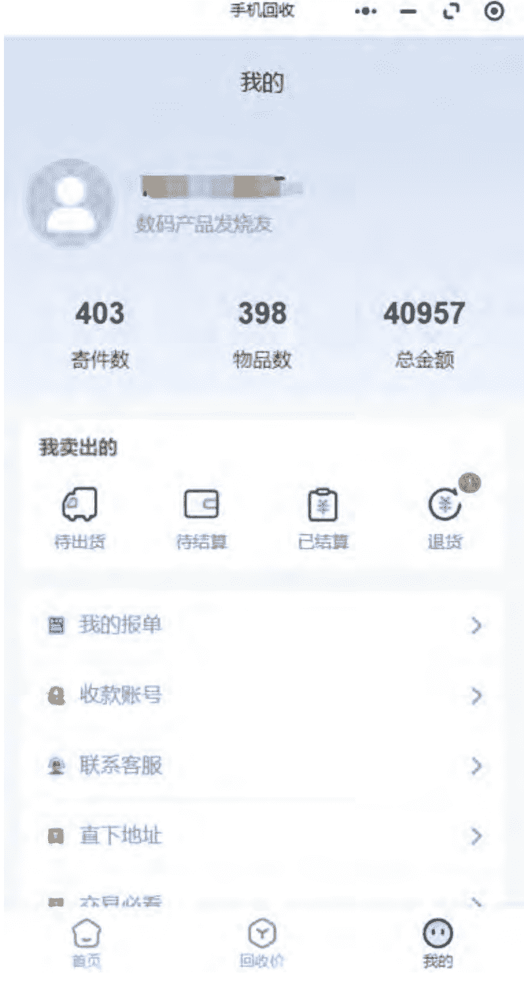

## (43赞)2024年B站精细化变现指南

作者：金多数
日期：2024-12-06

《B站精细化变现指南》 大家好呀，我是金多数。这篇帖子想和大家分享——2024年B站精细化变现指南。分享要点包含但不限于：
- 为什么要做B站
- B站养号方式
- B站变现之短期快速&长期持续
- B站工房变现
- B站引流的10种方式
- B站百问百答合集
详情可见：
https://ivqd5pmg5of.feishu.cn/docx/RLzQdx7TsoI0H1x7S4YcYrW6nce

评论区：
暂无评论

## (38赞)二手机入局转转2.0的经验分享

作者：山人
日期：2024-12-06

二手机入局转转2.0的经验分享

各位生财的圈友，大家好，我是在成都做二手数码的山人，我从事数码行业已经有12年了，卖过新机，干过维修，赛格开过档口，做过二手机直播。现在主做二手机同行批发和回收，实时竞拍以及转转2.0，零售和直播正在跟进中。

其实早就想过分享一下关于二手机，一直没行动，也不知道该从哪里下手比较好，彩虹看到了我女朋友发的资源对接，然后找到了我，期间还语音联系了我，帮我完成了大纲，和大体内容的总结，进度跟进，在这里非常感谢彩虹。生财团队也真的有在发掘各种赚钱的机会，入股不亏👍👍👍

这篇主要是分享一下转转2.0，以下简称转转，先说下目前的收益情况，转转今年2月份是我做的第三个月，毛利是40w，平时能做到15W-30W毛利，净利润占毛利的30%-40%。四五月是一年中最淡的时候，能保本。

以下是飞书链接 https://ycncle3i0u5j.feishu.cn/wiki/Yvw0wn1SQiMJ0Kk7RZ1c3BUQnhc?from=from_copylink

| 业务类型 | 客户...▲ | 销售日期 | 编号条码 | 品名型号 | 颜色 | 串号 | 仓库 | 成本单价 | 成本金额 | 数量 | 销售金额 | 毛利金额 |
|----------|----------|----------|----------|----------|------|------|------|----------|----------|------|----------|----------|
| 销售出货 | 转转2.0 | 2024/2/20 | G2387 | 红米note9 6+128 | 绿色 | 869672054484007 | 转转2.0上架 | 330.00 | 330.00 | 1 | 458.51 | 128.51 |
| 销售出货 | 转转2.0 | 2024/2/14 | G2440 | 红米note9Pro 8+128 | 黑色 | 869632054528138 | 转转2.0上架 | 370.00 | 370.00 | 1 | 472.19 | 102.19 |
| 销售出货 | 转转2.0 | 2024/2/13 | G2453 | 华为nova6 8+256 | 黑色 | 869763049298766 | 转转2.0上架 | 518.00 | 518.00 | 1 | 754.09 | 236.09 |
| 销售出货 | 转转2.0 | 2024/2/20 | G2536 | 小米6 6+64 | 亮黑 | 865873034461065 | 转转2.0上架 | 300.00 | 300.00 | 1 | 517.11 | 217.11 |
| 销售出货 | 转转2.0 | 2024/2/20 | G2659 | vivos7 8+256 | 紫色 | 860251051275178 | 转转2.0上架 | 300.00 | 300.00 | 1 | 570.55 | 270.55 |
| 销售出货 | 转转2.0 | 2024/2/14 | G3097 | 荣耀v40 8+128 | 黑色 | 866089050436407 | 转转2.0上架 | 680.00 | 680.00 | 1 | 706.23 | 26.23 |
| 销售出货 | 转转2.0 | 2024/2/15 | G3170 | 小米8 6+128 | 金色 | 861608047241896 | 转转2.0上架 | 350.00 | 350.00 | 1 | 439.83 | 89.83 |
| 销售出货 | 转转2.0 | 2024/2/20 | G3396 | vivos7 8+128 | 黑色 | 861268051879857 | 转转2.0上架 | 483.00 | 483.00 | 1 | 680.91 | 197.91 |
| 销售出货 | 转转2.0 | 2024/2/26 | G3396 | vivos7 8+128 | 黑色 | 862196055482114 | 转转2.0上架 | 426.90 | 426.90 | 1 | 573.23 | 146.33 |
| 销售出货 | 转转2.0 | 2024/2/26 | G3511 | 红米note10 8+128 | 青色 | 866824051915615 | 转转2.0上架 | 400.00 | 400.00 | 1 | 661.19 | 261.19 |
| 销售出货 | 转转2.0 | 2024/2/17 | G4202 | iQOO u3 6+128 | 黑色 | 868957059752396 | 转转2.0上架 | 308.90 | 308.90 | 1 | 526.53 | 217.63 |
| 销售出货 | 转转2.0 | 2024/2/20 | G4202 | iQOO u3 6+128 | 蓝色 | 863552058917598 | 转转2.0上架 | 372.90 | 372.90 | 1 | 635.87 | 262.97 |
| 销售出货 | 转转2.0 | 2024/2/20 | G4269 | oppo a56 6+128 | 黑色 | 861885052820075 | 转转2.0上架 | 290.00 | 290.00 | 1 | 451.81 | 161.81 |
| 销售出货 | 转转2.0 | 2024/2/14 | G4300 | 小米12pro 12+256 | 蓝色 | 864489054532239 | 转转2.0上架 | 950.00 | 950.00 | 1 | 1407.95 | 457.95 |
| 销售出货 | 转转2.0 | 2024/2/17 | G4336 | 红米k50pro 8+256 | 黑色 | 862104051420989 | 转转2.0上架 | 1120.00 | 1120.00 | 1 | 1521.83 | 401.83 |
| 销售出货 | 转转2.0 | 2024/2/26 | G4351 | oppo A5 3+64 | 白色 | 860525042898879 | 转转2.0上架 | 70.00 | 70.00 | 1 | 234.27 | 164.27 |
| 销售出货 | 转转2.0 | 2024/2/12 | G4490 | 红米k40S 8+256 | 银色 | 862723067335947 | 转转2.0上架 | 800.00 | 800.00 | 1 | 927.11 | 127.11 |
| 销售出货 | 转转2.0 | 2024/2/22 | G4523 | nova9se 8+128 | 蓝色 | 867666060000718 | 转转2.0上架 | 386.90 | 386.90 | 1 | 709.67 | 322.77 |
| 销售出货 | 转转2.0 | 2024/2/14 | G4672 | 华为nova10 8+256 | 黑色 | 867410062529022 | 转转2.0上架 | 412.00 | 412.00 | 1 | 856.83 | 444.83 |
| 销售出货 | 转转2.0 | 2024/2/20 | G4673 | 红米note11 4+128 | 白色 | 866490056283605 | 转转2.0上架 | 445.00 | 445.00 | 1 | 536.79 | 91.79 |
| 销售出货 | 转转2.0 | 2024/2/23 | G4802 | 畅玩40plus 8+128 | 黑色 | 867609060511581 | 转转2.0上架 | 401.00 | 401.00 | 1 | 570.55 | 169.55 |
| 销售出货 | 转转2.0 | 2024/2/26 | G4947 | 红米note11tpro + 8+512 | 黑色 | 862190064019736 | 转转2.0上架 | 900.00 | 900.00 | 1 | 906.23 | 6.23 |
| 销售出货 | 转转2.0 | 2024/2/20 | G5084 | 红米Note8 6+64 | 黑色 | 867956044133747 | 转转2.0上架 | 200.00 | 200.00 | 1 | 308.37 | 108.37 |
| 销售出货 | 转转2.0 | 2024/2/20 | G5127 | 畅玩9a 4+128 | 黑色 | 868302040742521 | 转转2.0上架 | 200.00 | 200.00 | 1 | 318.41 | 118.41 |
| 销售出货 | 转转2.0 | 2024/2/20 | G5127 | 畅玩9a 4+128 | 蓝色 | 867760040490626 | 转转2.0上架 | 120.00 | 120.00 | 1 | 318.41 | 198.41 |
| 销售出货 | 转转2.0 | 2024/2/20 | G5322 | 红米12c 4+64 | 黑色 | 862090061529762 | 转转2.0上架 | 280.00 | 280.00 | 1 | 467.41 | 187.41 |
| 销售出货 | 转转2.0 | 2024/2/20 | G5331 | 真我v20 4+128 | 黑色 | 869891067263899 | 转转2.0上架 | 318.00 | 318.00 | 1 | 527.05 | 209.05 |
| 销售出货 | 转转2.0 | 2024/2/17 | G5407 | vivoIQOONeo855版 8G+256G | 紫色 | 869695046333214 | 转转2.0上架 | 453.00 | 453.00 | 1 | 862.77 | 409.77 |
| 销售出货 | 转转2.0 | 2024/2/15 | G5416 | iQOO5(5G) 8G+128G | 白色 | 860090059324194 | 转转2.0上架 | 380.00 | 380.00 | 1 | 629.63 | 249.63 |
| 销售出货 | 转转2.0 | 2024/2/13 | G5417 | iQOONeo3(5G) 8G+256G | 白色 | 861535046277698 | 转转2.0上架 | 555.00 | 555.00 | 1 | 810.13 | 255.13 |
| 销售出货 | 转转2.0 | 2024/2/17 | G5418 | iQOOPro(5G) 8G+128G | 白色 | 863519041612396 | 转转2.0上架 | 427.90 | 427.90 | 1 | 770.91 | 343.01 |
| 销售出货 | 转转2.0 | 2024/2/14 | G5418 | iQOOPro(5G) 8G+128G | 白色 | 863519041614475 | 转转2.0上架 | 438.00 | 438.00 | 1 | 638.61 | 200.61 |
| 销售出货 | 转转2.0 | 2024/2/26 | G5418 | iQOOPro(5G) 8G+128G | 白色 | 864973049060513 | 转转2.0上架 | 385.00 | 385.00 | 1 | 731.55 | 346.55 |
| 销售出货 | 转转2.0 | 2024/2/17 | G5419 | iQOOZ5x(5G) 8G+128G | 白色 | 861579052119352 | 转转2.0上架 | 424.00 | 424.00 | 1 | 664.03 | 240.03 |
| 销售出货 | 转转2.0 | 2024/2/14 | G5421 | iQOONeo5活力版 8G+256G | 白色 | 869266056905935 | 转转2.0上架 | 650.00 | 650.00 | 1 | 875.51 | 225.51 |
| 总计:2655 | | | | | | | | | 1294369.80 | 2393 | 1708892.78 | 414522.98 |

评论区：
刘一笔：长见识了
Charls-Yin：重要的要有库存封控
山人：是的，11月小米上新，小米系列当时按行情压价500收的，收多了，后面出的都亏了。
山人：[握手][握手][握手]
涿鹿中原：[强][强]
百哥：厉害了

## (34赞)美元换RMB攻略:100刀换900+毛爷爷,实操测试无手续费,汇率优秀

作者：国民弟弟的跨境十年
日期:2024-12-05

太牛了,白赚200,100刀换900+毛爷爷

美元换RMB攻略,已经试过,很靠谱~

偶尔还是会有给中国家人或朋友发钱的需求,也试过不同的平台,大部分汇率不怎么好或者不安全。

最近看到有人用lemfi觉得不错,自己转了一次,白嫖了200+,后续有需求也能用的上。

实操测试汇款100美金到国内支付宝,真的是一分钟入账,而且没有任何手续费,汇率也非常优秀,100美金实际到账支付宝733.26元,如下图所示。

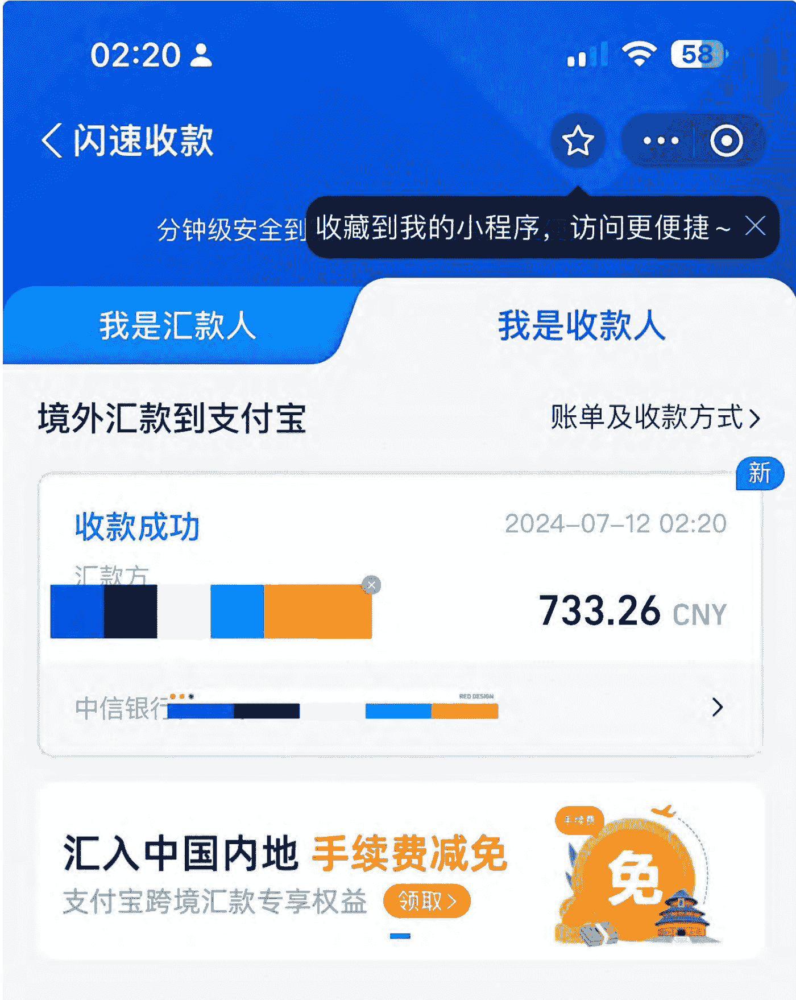

然后在汇款100美金完成后,第二天还得到了官方的30美元奖励,顺便也直接汇款到支付宝了,如下图所示。

主 我刚刚用了你的 code 你有收到返现吗

刚刚收到了，感谢！你收到了嘛？

第二天返现

一般是第二个工作日收到返现

Reply Zebra: 返现 3 days ago 英国 Reply

Okkk 谢谢啦

我收到啦 也谢谢你呀

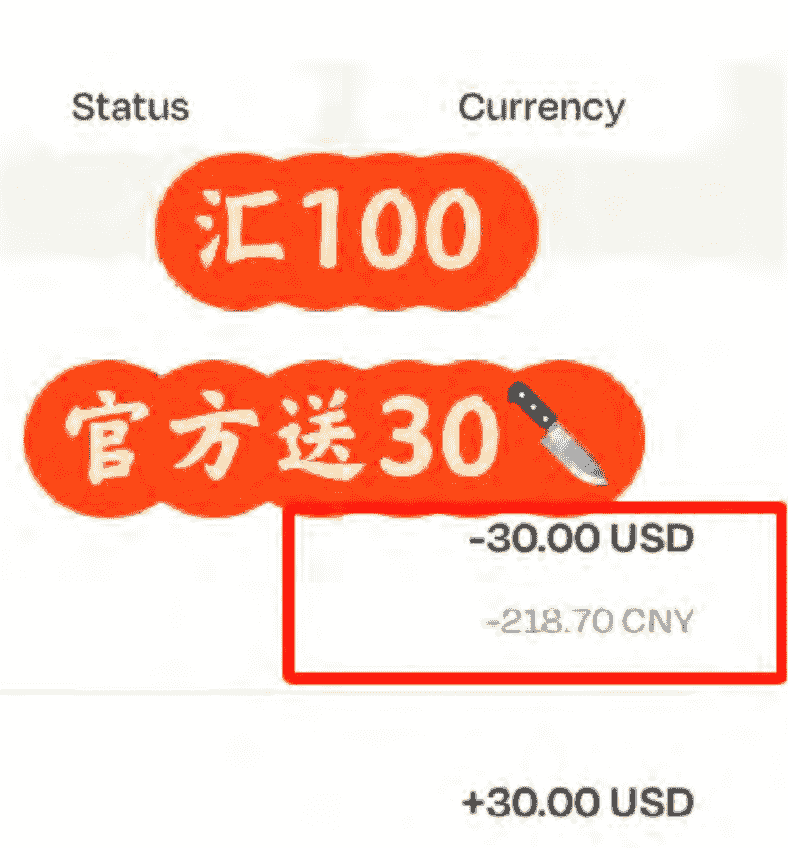

操作也是非常的简单，中国大陆身份就可以；不需要美国个人税号ITIN、SSN等等~

###### 整体体验如下：

- 1. 汇率超级好，比谷歌汇率还高0.02
- 2. 无手续费
- 3. 官方入账，安全稳定
- 4. 一分钟入账
- 5. 用我推荐CODE送30刀

###### 操作流程

手机复制下方链接在浏览器打开，或者手机上直接下载lemfi的APP软件，苹果手机需要海外的苹果ID。

https://lemonadefi.app.link/Xo8jr1tg4Ob

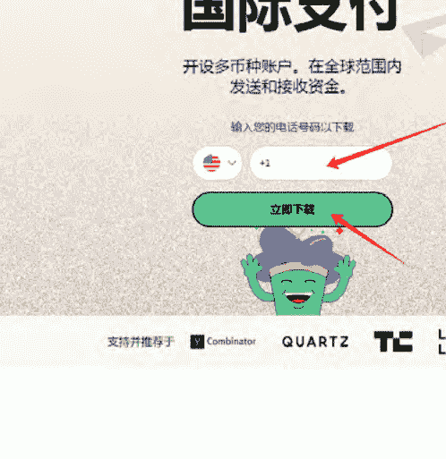

###### 电脑版


###### 手机版

###### 为所有人
提供跨境汇款

告别限制，
拥抱无国界的世界

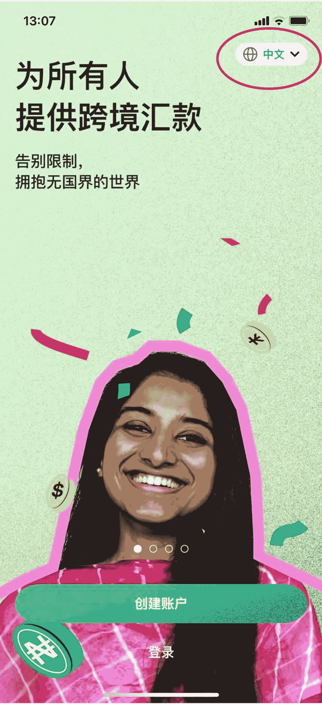

接着打开手机下载安装好的“lemfi”的APP软件，如上图所示可以把右上角的语言设置为中文，这样大家可能看着更方便一些。

第一步：选择国家，输入该国家的手机号，这里就用我的美国实体电话卡演示，建议用自己海外实体电话卡。

###### 我们开始吧

输入您的电话号码来设置您的帐户

+1 7253068628

我们希望您了解 LemFi 产品和服务的最新信息。如您不想收到这些消息，请在此处取消勾选

点击此框，即表示您同意我们的服务条款& 及条件和隐私政策 包括通过第三方和您的移动服务提供商验证您的身份。

继续

有账户？ 登录

接收输入短信验证码。

###### 验证您的电话号码

输入发送到 +17253068825 的6位验证码

9 1 4 3 0 9

没有收到？ 00:49 后重试


###### 保护您的账户

您的银行或其他金融机构绝不会联络您，让您开设 LemFi账户

我明白，请继续

了解LemFi

第二步： 输入我们的一些基本信息。

###### 基本信息

输入您的完整法定姓名（拼音），与政府签发的身份证件上的姓名完全一致。

名字（拼音）

中间名（可选）

姓氏（拼音）

邮箱地址

生日

选择日期

继续

第三步：输入我们的地址，我这里就输入我美国居住的地址信息了（目前是无需地址证明的）。

第四步： 设置我们的账号密码。

###### 保护您的账户

输入至少8个字符的安全密码，包括一个符号和一个数字。

创建密码

确认密码

必须是 8-20 个字符

必须包含至少一个数字或一个特殊字符 (eg $%&)

继续

第五步： 也是非常重要的地方！！！ 一定要记得填写邀请码“SIRYULQV” ，这样在首次汇款100美金后，才有30美金的现金奖励。

###### 有推荐码吗？

如果朋友推荐了您或者您有推荐代码，请使用它在您的第一笔合格的交易中获得现金返还。

```
输入推荐码(可选)
```

```
SIRYULQV
```

继续

第六步： 选择一下我们经常把款汇往哪个国家或地区，我这里选择的是中国区。

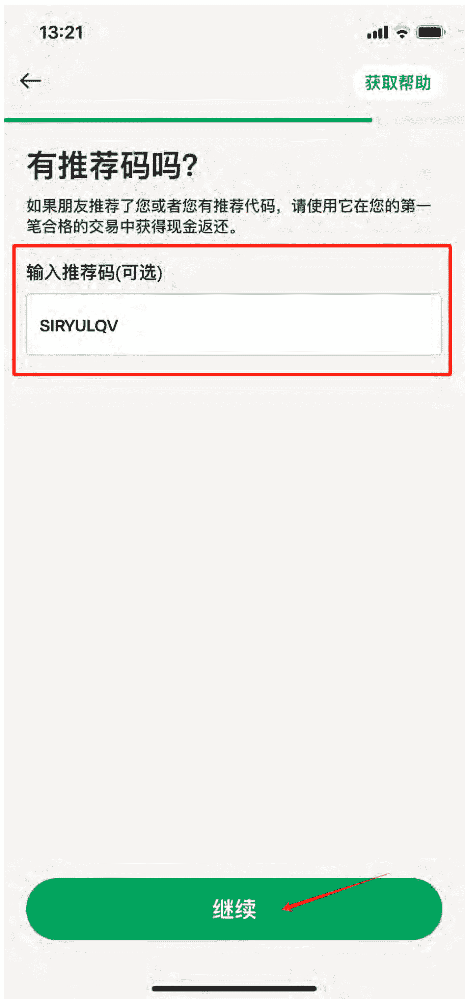

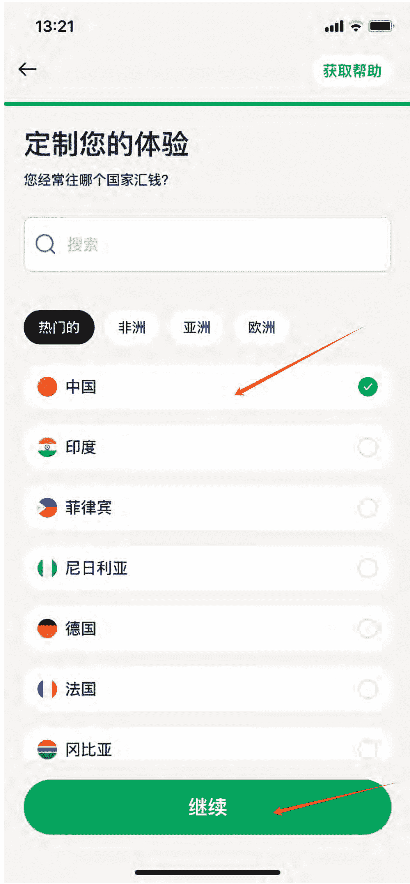

最后一步：验证一下我们的邮箱，去邮箱找到验证邮件，点击里面的链接即可，非常简单。

这样账号的初步注册完成了~

接着我们再验证一下我们的身份信息，弄完这个就可以进行汇款操作了，也非常简单，配合扫描护照，完成一个简单的人脸验证就可以了。

工作日等待大概24小时就会审核通过了，如果你是下午傍晚提交的，审核可能会快一些，时差原因，基本上都是美国工作时间才有人审核。

###### 如何汇款

审核通过后就可以开始汇款操作，每个月的汇款额度为1000美元。如果当月汇款金额超过1000美元，就需要补充提供美国个人税号（ITIN）才能继续汇款。这是为了符合美国税务规定，保障资金合法合规汇出。如果暂时没有ITIN，建议提前申请或合理规划每月汇款金额，避免因为超额而耽误资金转账。

其实大部分人可能一个月不会超过1000美金，所以不补充ITIN也够用了。

我们要汇款的话，需要先把款项充值到这个lemfi里面，如下图所示点击“充值”按钮，用借记卡就可以。

###### 我的账户

隐藏余额 USD $ 10
点击添加账户
汇款
充值
开始
借记卡充值
升级您的账户
取消
其他服务
发送至银行
Mobile Money
请求金额
转换货币
活动
查看全部
卡充值 +1.00 USD
首页 交易记录 推荐 帮助

充值成功后，接着我们开始进行汇款，这里按汇款100美元到国内我的支付宝账户为例演示。

###### 我的账户

隐藏余额 USD $ 10
点击添加账户
汇款
充值
开始
升级您的账户
取消
其他服务
发送至银行
Mobile Money
请求金额
转换货币
活动
查看全部
卡充值 +1.00 USD
首页 交易记录 推荐 帮助


按照提示添加收款人信息等，10秒就能完成汇款。

###### 汇款

输入您想要汇款的金额
国际 本地转账
您汇出
汇率比谷歌高
1 USD = 7.26 CNY
几分钟内
接收者获得
733.26
春日计划
CNY
添加备注
0/18
继续

接着我们立马就会收到支付宝的跨境到账短信，首次需要我们去支付宝手动设置一下收款人信息，以后就会自动入账到我们支付宝余额。

###### 输入收款人详细信息

填写收款人银行账户信息

名字（拼音）

姓氏（拼音）

中国大陆身份证上的法定姓名（拼音）

支付宝的注册手机号码

交易目的

- 汇款给自己
- 保存收款人

① 支付宝收款人要求

请确认收款人账户的详细信息。错误信息可能导致资金损失。

继续

进入支付宝搜索“闪速收款”，就可以查账了。

收藏到我的小程序，访问更便捷~×

我是汇款人 我是收款人
境外汇款到支付宝

账单及收款方式>

汇款方
中信银行

收取成功
2024-07-12 02:20
733.26 CNY

汇入中国内地手续费减免
支付宝跨境汇款专享权益 领取>

汇款100美金达到任务要求后，最晚第二天也会收到官方返现30美金的奖励，这是实打实的奖励，直接把30美金直接继续免费汇款到我国内的支付宝。

刚刚收到了，感谢！你收到了嘛？
Reply Zebra: 返现 3 days ago 美国 Reply
Okkk 谢谢啦
收到啦 也谢谢你呀

以上就是大概的整个操作过程，整个门槛还是相当低的。

以上~

国民弟弟相关创业的故事文章推荐：

https://articles.zsxq.com/id_8n2o7gax71fr.html

###### 评论区：

- Yankee阳基：怎么弄一张国外实体电话卡呢
- 公子李：怎么弄一张国外实体电话卡呢
- Grace：万能的淘宝
- Grace：万能的淘宝，搜索“美国紫卡，月租3刀每月”
- 国民弟弟的跨境十年：某宝搜索“跨境2024”dian
- 国民弟弟的跨境十年：在某宝搜索“跨境2024”Dian
- Queenie：这是lemfi广告主吗[666]

## (28赞)克服心理障碍，主动寻求帮助以事半功倍

作者： 博一博
日期：2024-12-04

之前看过张昭老师的帖子，当时状态，是张老师很牛，给我的距离感比较强，同时我的性格非常不愿意麻烦别人，大部分都自己消化。直到看到群里张老师和亦仁老师的消息，给我当头一棒，随即加了张老师。

一个人如此通透，拿到过大结果愿意说真话，同时愿意帮助你，依据张老师文章里面说的，

> ** 如果下行风险很小，上行收益很大的事情，不要多想，干就是了； **

克服掉自己不愿意麻烦人的心理障碍，主动寻求帮助，会让你事半功倍 。

当放下心理负担尝试和张老师希望面谈下，争取到了这个机会。

我自认为看人还算准的，给我印象最深刻的几个关键词

统一性：不管是文章，还是见面沟通表达，亦或者应对问题的处理方式，能感受到张老师那种言行准则的一致性，而不是为了回复或解决，强行把答案合理和理论化。思想行为一致。

原则性：对商业行为的理解深度，路径，执行方向，管理，选项目，有一套极强的原则标准。

以下是复盘整个内容：

###### 一. 成名作：

30岁之前一定要建立自己的成名作。

a. 这个成名作是你将来赖以为生的东西，锻炼形成自己的一技之长。

主技能如：内容能力，表达能力，销售能力，管理能力，资源调配能力等有商业价值的能力。

好处：当你的价值能够聚焦为特长，就具有稀缺性，只要放在台前就容易形成自己的马太效应。很容易虹吸目的性的资源。

b. 对抗不确定性的支点。不确定性的本质是未知的恐惧。而再你刻意练习下的一技之长，会成为今后心力的动力。

- 成名作：有商业价值 稀缺性 有结果

###### 二. 找到优势

30岁之后，你的优势不是体力。不要和小朋友再体能阶段竞争。

而复盘之前的成功，基于你的优势，用你最擅长的打法做一个项目，做出结果。

做出结果，招人进来弥补你的其他这个短板。快速形成规模化优势，规模化有个很核心的好处，就是快速某一个领域里面，抢占最先到那个机会窗口。

把你之前做的所有生意，重新拿出来看一遍。

看什么？这个生意我什么时候塌陷的？干了多久？有没拿到结果？

再这个事上，把你之前积累的这些优势和经验提炼出来。。

然后把所有的优势串在一起，看有没有一个生意能够把所有这些东西都串起来。形成自己的可迁移结构框架。换到另外一个行业和领域。用一种更容易的方式去释放你的优势和价值。

###### 三. 创投思维

思维层面：要用创投的方式去做生意，而不是当牛马的思维去做生意。

首先改变一个思维，就是不要把自己当牛马。如果你老把自己当牛马，那就一直会用牛马的思维去考虑问题，然后你就跳不出来。老想着自己干，它的商业变现效率就没有办法释放出来。

执行层面：怎么解决？刻意练习，强迫自己啥事都不要自己干。倒逼自己，我不干了，还把钱挣了。

对你来说，就是最大的原则不是选项目，最先需要解决的就是砍掉手脚，不要下场。基于这个立场，再去选项目。但凡这个项目，离不开，还要自己去做，就不要做。当你把自己的手脚砍掉之后，有些东西你就自然不会去选。

标准层面：你下场去做，不是摸简单的0-1的sop。是制定标准，每个环节最佳状态是什么。

是去做标准，不是去解决商业模式行不行的。商业模式行不行，再你选的时候已经确定了，如果是你选的时候商业模式都不行，那你压根不要试。

误区：我带队就能把事情做起来，别人带队就搞不成，这个商业模式是不对的。因为投入的时间精力是不一样的。选完项目打个样，打完样，应该是个200分的样，然后扔出去，下面的人再没有你指导和监督下，能做成150或120，你都有钱挣。算上自己带队工资，大概率是亏的。

考验两个能力：1. 选项目的能力 2. 识人的能力（项目和操作人的属性大不大）

第一选对项目

第二砍掉手脚 要做到很难但做到会很爽

第三节制 有自己的项目库。如果找不到合适的人，连试都不要试，让它烂在那里。因为一动就会有成本。

###### 四. 聚焦长期目标

多做和未来长期趋势下，有商业价值同时确定性的事情，比如，AI出来后，一定有很多人失业，所以我会把更多时间精力放在AI上。

有意向往长期目标下去积累通往路径上所有需要的东西。所有的选择，都是为这个长期目标服务。

长期目标=时间+精力+结果

你的重心放在哪，就应该很精进的花时间资源精力倾尽所有去研究这个技术。

形成自己的特别强势的点。而这个点，拿出来可以围绕这个点，去构建一个商业模式出来。

###### 五. 一放手容易亏钱的原因

###### 利润损耗图：

- 0. 创始人带着团队去搞
- 1. 联合创始人带着团队去做
- 2. 管理层带着团队去做
- 3. 管理层不搞完全叫员工自己去搞
- 4. 加盟商带着员工去搞
- 5. 加盟商雇人去搞

每降一层利润损耗20%，如果想放一层，意味着你自己带着人去搞的时候，利润足够高。否则加上利润损耗，一定会亏本。如果自己带人搞赚钱，一不管或者一放手，就亏钱，证明这个商业模式不成立。因为创始人的工资没算，工资算进去是赔钱的。你带团队去搞的利润不足够支撑能到利润损耗。

###### 解决方案：

- 1. 要么选一个利润足够大的项目。
- 2. 要么提高到的管理能力。

管理能力：让每个细节卡的更死。Sop执行到位。如果项目没问题，利润率没出来，一定是管理问题。

每个项目都能挣钱，要不那个项目已经没了。但是为什么有些人能挣钱，有些不能挣钱？你肯定是再技巧上有差别。这个差别就是你看不到的别人安身立命法宝。

###### 六. 商业逻辑的通路是什么？

要素：获客，变现，产品

你得知道哪个行业，哪个产业更有商业价值。

举例：小女生擅长工具开发，老想开发一个工具，再去销售。

正确做法：先选哪个行业更容易挣到钱？然后围绕那个行业里面更容易挣到钱的产品，再回推使用哪个工具才能更好的去提高它的效率。

做离钱更近的事，先想着把这个东西顺顺利利卖出去，再考虑生产。哪个项目离钱更近一点。

###### 七. 选项目逻辑：

0. 流量原则：根据你团队的基因和属性，倒推回来的。一个项目的生死，是否方便传播是否可以用更低的成本去获客，决定了你的项目能不能做成。你所有的东西都要服务于如何用更简单，更低成本去获客这一件事情。（流量成本足够低，流量数量和稳定度是否能够支撑规模化流量质量是否能够满足项目规模化销转）

- 1. 站再用户端去选项目（举例，招商加盟，投资足够小，回本足够快，操作足够简单）
- 2. 离钱近 利润大
- 3. 市场天花板够高

选项目的考虑问题的出发点，不要老是在想自己。而是用户，因为你的项目跟别人没有什么关系。

###### 八. 成长属性

对事情本质的观察的洞察力，归纳总结，跨界迁移的能力。

一个事上犯了个错误，下个事上还会犯个错误，但两个错误看起来好像不是一个事。

但是归根结底它好像是一个原因导致的。这个事情的底层原因是什么？

底层逻辑虽然能识别到机会，但不具备判断这个机会的价值大小和天花板高低的能力。所以再这个事上的投入心力和深度就不够。所以它的底层逻辑就是，你对事情价值的判断能力不够，这是一个通用的东西。导致你每次都是半途而废。

钱是行走在这个世界的通行证，每个人都知道钱的价值，但很多人并不明白当一个机会出现之后，它到底是值100还是值1万。然后这时候他就会基于自己的认知，觉得这个事不值得去干一下。就那么点，随便搞一搞，事实当你要多搞一下可能就不一样。

###### 九. 怎么透过现象看本质？

基于比我更上位者的视角。更上位者的视角人家就是比你牛逼。不会相信我自己，但是我会相信比我更牛逼的那些人!

很多人盲目相信自己的眼光，会质疑上位者的视角。瘦死的骆驼比马大。你自己没眼光，

真有眼光就不会是现在的你。

我相信总有牛逼的人在我上面，我不相信自己。你自己总是有限的，总有人比你厉害，我会看牛逼的人都决策是什么。我们再做投资的时候，大概率会选一些比你更优秀的人，他们看待事物的东西。然后再这个范围里面再去做选择。

###### 十. 个人问题和调整

核心问题：

- a. 经历过多个领域和项目，能赚小钱但没有形成明确的核心业务或标签。
- b. 缺乏长期目标和清晰的选择标准，导致资源分散，难以沉淀成果。
- c. 习惯亲自下场做事，缺乏系统化管理和资源整合能力。
- d. 项目选择和执行过程中，未能准确判断机会价值和天花板高度。
- e. 现有业务短期能赚小钱但没有商业价值和未来，长期趋势会越来越差。
- f. 选择项目时没有明确标准，容易陷入试错循环。难以准确判断机会的价值和天花板高度。

调整：

梳理过往经历：将以往参与的项目重新分类，找到曾投入最多时间和精力且取得一定结果的项目。总结经验和教训。同时分解出长期目标和短期目标。

短期目标保生存积累资本资源能力，同时关联长期目标，短期服务长期，长期指导短期。不偏离长期目标方向路径。

"做事"转向"控盘": 通过实践和借助ai+大佬经验, 建立工作流标准, 设立监督机制, 反馈机制, 确保项目在不参与的情况下仍能盈利。

逐渐形成自我判断标准, 原则, 系统。接受和正确认识雏形的不完善, 错了可以改, 没有必然乱。

管理: 通过机制和标准管理, 少哔哔, 方向不错, 给予团队成长空间, 再源头调整。

评论区：

暂无评论

## (25赞)山本五十六的刺杀与《庆余年2》的情节关联

作者： 小马宋
日期： 2024-12-05

《庆余年》与刺杀山本五十六 山本五十六是在太平洋战场还在进行时被刺杀的，当然说刺杀也不是很准确，因为他是在坐飞机前往前线视察途中被伏击击落而死的。

山本五十六被称为日本军神，他主导了珍珠港的偷袭事件，日本海军有一段时间曾经称霸太平洋，对美国海军屡战屡胜。不过后来局势慢慢逆转，在中途岛和瓜岛战役失败后，日军士气大减。此时山本决定去所罗门群岛北部视察。

因为山本做事计划性极强，极其守时，他视察的路线和时间安排写得极其详细，这份电报被美军破译，所以在中途拦截击落了他的座机。

为什么要说《庆余年》呢？因为《庆余年2》中有个情节跟这个有关系。

郭保坤被范闲留在北齐负责密探工作，踪迹早就被北齐发现，但是北齐一直没有对他动手，为啥呢？因为北齐担心，把他抓了，会换一个聪明的过来。这段情节以喜剧手法展示，可能很多人觉得只是个笑话，其实真很真实。

刺杀山本前，美军也有过争论，美军认为山本在战略上并不是很强，如果刺杀了他，万一日军换一个更富战略眼光的军事统帅，那就糟了。后来美军评估日本的统帅备选，认为没有人能超过山本才去伏击。

所以要不要击杀敌方头部，也是有很多考虑因素。

在局部战斗中，班排连营团长这些现场指挥战斗的军官，是狙击手狙击的首要目标，因为长官一旦被击毙，整个团队很容易就陷入混乱。所以狙击手并不是像我们在吃鸡游戏那样，看见人就打，而是潜伏很久，就是为了击杀一个高价值目标。

但是愚蠢的军事首领，反倒会帮敌方大忙。

其实二战时期的几个领袖，最懂军事的是毛主席。蒋介石被称为微操大师，就是不断干预前线的战斗布置，军事才能一般。希特勒虽然很爱指挥部队，但军事才能很不靠谱，斯大林在德国进攻苏联前搞了一次大清洗，把有经验有能力的元帅几乎杀光了，自己也缺少军事能力。罗斯福算是比较明智，军事指挥都交给了几位上将。

领袖拥有的应该是政治和领导能力，军事能力不强，也不是问题，只是二战是个特殊时期。 就像韩信说刘邦，陛下不善将兵，但善将将，也就够了。

评论区：

暂无评论

## （23赞）年度CMSEO大会回顾：Kyle Roof探讨蝴蝶记忆与SEO优化

作者：图帕先生

日期：2024-12-03

一年一度的CMSEO大会已经过去了，跟2023年的大会总结一样，图帕先生给大家介绍下大会讲了什么，还有分享嘉宾的PPT。一万多字，废话不多说，上菜！

ps：不知道是灯光、手机还是字体原因，拍摄的相片都很模糊，所以中间会以“照片+PPT”的方式分享内容（有些嘉宾PPT不公开的就没有了）。

## Kyle Roof: Does The Butterfly Remember? Training Your Brain For Better SEO Outcomes

Kyle是老朋友了，同样一贯他测试狂的风格，分享了很多有趣的测试结果，有些连他自己都吓一跳，而且一些测试结果也打了自己的脸。

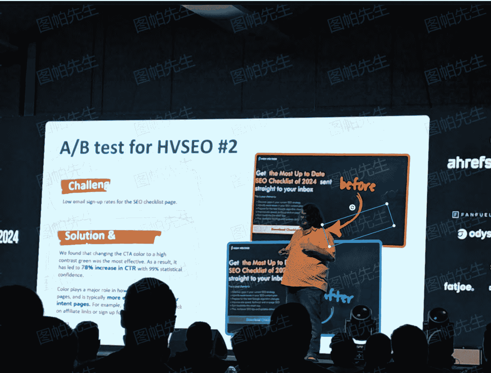

自从养了长头发后，有人说他像Jack Black（功夫熊猫的配音演员），看看其实还挺像。


首先他劝我们不要陷入一个迷思：

###### ① 为什么要做XX？

因为我说了，别人也这么说。

这种思维属于逻辑上的“权威诉求”，即只因某位权威人物或专家如此说，就认为这一说法是对的。这种论据缺乏必要的实证支持，不论是谷歌的发言、行业大佬的声明，还是某个著名公司的案例分析，都需要经过验证、测试和多维度分析。单纯的信任权威并不能帮助我们了解事物的真正本质或趋势。

- 例如：一个谷歌算法更新发布后，许多SEO专家会说“更新之后，SEO排名规则彻底变化了。”但实际上，这种声明并不代表真实性，除非通过深入的分析与数据对比来支持这一论点。我们应该质疑背后的证据，而不仅仅是听从某个专家或公司所说。


###### 还有不要迷信个例：幸存者偏差大家都听过吧。

个例有其局限性，无法代表普遍规律。比如一个商家说“我采用了某个SEO策略，网站流量增长了”，这种单一案例无法有效推断该策略在所有情况下的有效性。

很多SEO论坛上，用户分享他们的成功经验，这些是有价值的参考，但并不能成为广泛适用的结论。我们可以通过测试、数据分析来验证这些轶事，看看它们是否能在不同的行业或网站类型中取得类似的效果。

开篇就已经两次提到了测试的重要性。

还有例如，某个SEO人，或者说网站吧，在某一段时间内遭遇排名波动，立即将其归因于谷歌算法更新，而没有考虑其他可能因素如网站内容质量、外部链接等。

再比如2019年的“core update”后，许多同行说自己流量又大幅度的流量波动。虽然很多人将这一波动归因于更新，但通过他精确的实验分析，发现并不是所有的网站都受到了相同的影响，某些网站依然保持较为稳定的排名。这说明单一的算法更新无法全面解释网站表现的波动，可能还涉及到网站本身的内容和技术层面的优化。

像他去年分享的，他通过一些低预算的实验网站（如最经典的Lorem Ipsum内容站点）进行长时间的跟踪测试，可以发现，即使在大范围的Google算法更新后，某些简单的站点（未优化的内容）仍能维持较好的排名。

SEO并非一成不变，它受到多方面因素的影响。

###### ② 标签与思维局限

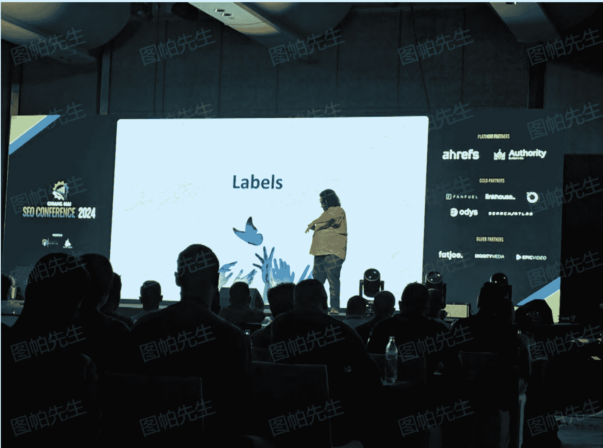

我们基本都会用标签来管理我们的文档、用户，甚至给自己和别人打标签。

虽然标签帮助我们对事物进行快速分类和整理，但它也容易导致思维的狭隘。例如，当我们给自己或他人贴上“SEO专家”的标签时，往往会局限于一个特定的领域，而忽视了跨领域的潜力和机会。

他举例Taylor Walker就是一个打破标签限制的典型例子，起初他在SEO领域表现突出，但后来他也涉足YouTube内容创作，并取得了很大的成功。他没有让“SEO专家”这个标签束缚自己的发展，而是根据市场需求和个人兴趣做出了转型。


行业内的许多人始终活在自己的标签中，例如某些“企业咨询师”可能固守传统的市场定位，而忽视了新兴的商业模式或技术。通过开放自己的思维，结合新的商业趋势，他们或许能够发现新的增长点。

公众号懒人搜索，懒人专属群分享

###### ③ 好奇心与批判

批判的态度有时会导致我们过早放弃新事物的探索，特别是当一个新的理念、工具或技术出现时。批判过多往往源于对未知的恐惧，而好奇心则能够推动我们深入探索，从中发掘潜在的机遇。

Kyle曾经对CRO（转化率优化）持批判态度，认为这只是传统SEO的延伸，然而通过深入学习和实践，后来他发现CRO实际上与SEO并不冲突，反而能够为网站带来更高的转化率。

可能有人会挑刺，啊，怎么有人还不会关于CRO？其实嘛，人总得学习新东西，特别在互联网领域，变化特别快，一年前自己坚信的东西今年可能就打自己脸。但这不是坏事，证明自己是在不断地更新知识库，让自己的认知更加宽广。

在一些团队或公司内，批判态度可能会形成一种文化，导致创新受到抑制。例如，某些公司可能会批判AI写作工具的有效性，但AI确实能够帮助我们提升效率并找到更多创意内容源。如果没有保持开放的心态，我们可能会错过这一技术带来的进步。

甚至是结构化数据，他测试过结构化数据对排名影响不大。

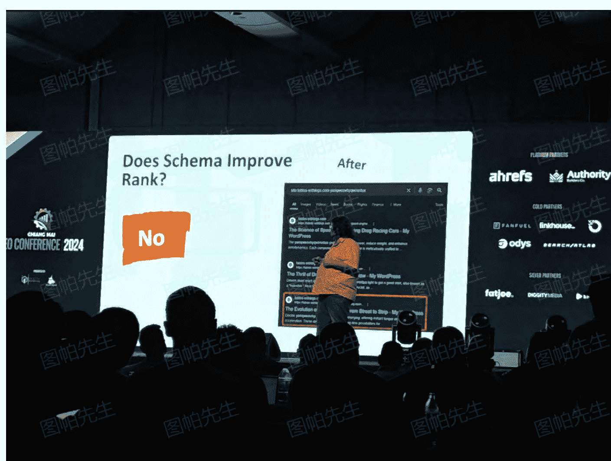

这也是一个很重要的思维，比如有人说结构化数据有多重要，说的人有测试过吗？自己有测试过吗？测试的时候有控制好变量吗？等等。

人家找茬是自己去测试验证，有些人找茬是在敲键盘，哪种做法更能让人信服，不言而喻。

虽然他的测试结果不绝对，但这个思维对我们在流量和网站的优化上是十分重要的——主打一个严谨。

###### 最后提下他的演讲主题：毛毛虫与蝴蝶的隐喻


蝴蝶会记得自己曾经是毛毛虫吗？或者蝴蝶还保留毛毛虫时的记忆吗？

毛毛虫最终蜕变成蝴蝶的过程，象征着一种深刻的变化，这种变化可能是痛苦的，但却是自然的，也是成长的必要过程。这一过程也同样适用于个人职业生涯的转型，不论是从SEO领域到内容创作，还是从传统业务到新的电子商务模式，转型和突破往往伴随着挑战。

这也是一个挺哲学性的思考。

约翰·洛克写过个人身份的连续性依赖于记忆的连续性。

如果蝴蝶没有毛毛虫的记忆，那么它们是否还算是同一个“自我”？或者，它们是否在蜕变的那一刻就已经“死亡”，而新生的蝴蝶是一个新的存在？

大家晚上睡不着也可以思考一下~

而生物学上的论文我也找了一篇，还挺有趣，分享一下

https://journals.plos.org/plosone/article?id=10.1371/journal.pone.0001736

这里再分享一下个人的想法，Kyle今年的分享节奏和演讲状态感觉都比去年要差，有种说不出的违和感。后面终于知道了，他说他离了婚，还有了轻度抑郁，在接受心理治疗。

他也说了，SEO可能是一个很孤独的行业，很多SEO从业者都是默默的做事、默默承受算法带来的压力，虽然收入是不错，在外面也做演讲嘉宾，但不代表心理就是健康的，当然其他行业也很可能是这样。他鼓励观众如果有什么事想倾诉的，可以随时找他。

我觉得这是Kyle非常有人情味的一小段分享，因为我们其实都承受着不同的压力，哪怕自己在别人面前展示得有多自在。而且心理疾病就像发烧感冒，是非常正常的病，不需要妖魔化，也不需要自欺欺人，如果觉得自己有不适，真的需要去看看专业医生，不能畏疾忌医。

## Koray Tugberk: Patents, Leaks & Rankings: Decoding The Blind Librarian

Koray也是测试狂，但更偏向技术，从演讲主题可见一斑：涉及谷歌专利和排名泄露的分析。这里也就简单介绍下，因为里面涉及的专利和文档暂时没时间去一一探讨。而且他的PPT不公开，记笔记的时候也因为全心在理解上下文，错过了拍照时机，所以只能发几张挺模糊的照片凑数，但通过笔记图帕先生还是尽可能地总结出里面有意思的部分。

也由于没有他的PPT，我无法找到对应的谷歌文档去加强理解，而且也不能保证完全理解Koray提到的专业术语，所以笔记部分肯定会有跟嘉宾原意有出入，后面看看能不能再找到。

公众号懒人搜索，懒人专属群分享

这部分请大家多多见谅。

对他的风格感兴趣，有条件的可以蹲蹲他的课程：https://www.topicalauthority.digital/

为优化排名，Koray尝试过多种方法，甚至对竞争对手进行DDoS攻击。

但发现攻击竞争对手反而提升了他们的排名，攻击自己时，自身排名也提高了。

——听着的时候我也觉得哭笑不得

他提出谷歌其实无法理解网页内容，就像一个盲人图书馆，其功能是将书（网页）正确摆放在书架上（排序算法）。

而翻查谷歌专利的意义就在于它们能帮助我们理解搜索引擎工作方式。

对关键词优化与索引优化都有直接的启示。

比如测试下新页面放在不同的位置，效果是否有所不同：

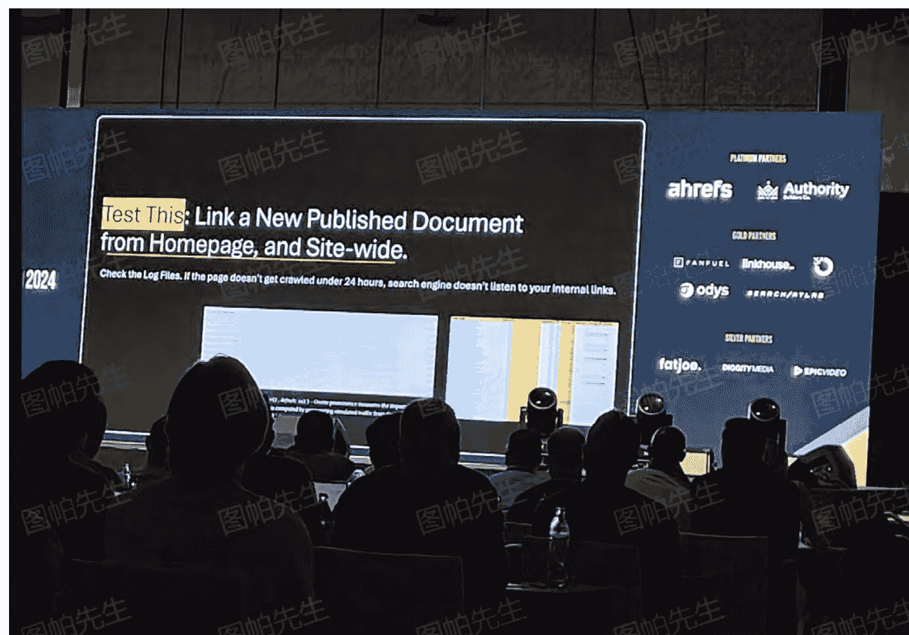

###### 检索成本与排名：

多主题内容的网站会因高检索成本被降权。单一主题网站更容易获得排名优势。

——也就是建议网站内容不要太杂。

他将一个有5000万个URL的网站被精简后，网站性能显著提升，响应时间控制在100毫秒内，而且排名也有改善。

减少网站冗余，能明显提高整体效果。无需发布新内容，通过提高响应时间获得更高排名。

###### 谷歌的专利也明确，用户行为与SEO的关系巨大：

1. 谷歌通过监控用户行为（点击、滚动、鼠标移动等）评估内容质量。
2. 但短时间的点击不一定是负面信号，视用户意图而定。
3. 而且会评估页面核心部分的质量（如前400字符）。
4. 谷歌不仅看内容的最新版本，还会往前滚，看前19个版本的内容质量。

###### 内容策略：

1. 高质量的内容应当集中呈现。
2. 避免无关主题干扰网站整体排名。
3. 使用内部链接优化页面间的信号传递。
4. 通过隐藏不必要的链接减少谷歌抓取负担。
5. 遵循“持续发布”原则，每次更新保证高质量与相关性。
6. 平衡短期热点内容与长期内容的产出。
7. 同时优化外链与内链权重分布，创造更稳定的排名基础。
8. 减少冗余操作（如无效链接和不必要页面生成），避免触发惩罚机制。
9. 优化现有内容而非无限扩展页面数量。

后面发现好多相片都很糊，放了等于没放，就直接展示成文字版了


## Tim Soulo: Long Time No See. Here's What's New At Ahrefs

直接看PPT吧，赞助商Ahrefs的布道时间，不多介绍了

【腾讯文档】Tim-Soulo-CMSEO2024

https://docs.qq.com/pdf/DSHpNWEtVTFVHVHZV?

## From Clicks To Commerce: How SEO Experts Can Dominate eCommerce

Steve的内容，hmmm，怎么说了，可能因为我本来就是在电商领域，所以他说的东西个人感觉是太基本了，而且没多少涉及真正关于电商SEO的具体操作或测试结果。这里简单带过吧

###### 选品思路：

季节性产品、趋势驱动型产品（可以在TikTok、Facebook、抖音上找）

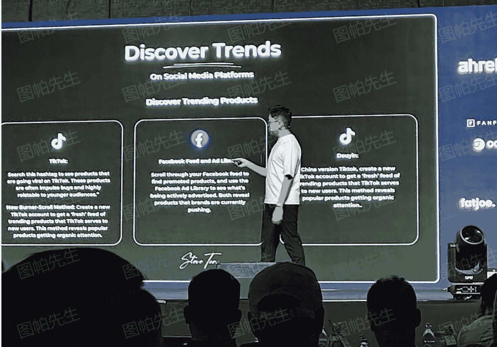

一些趋势产品，比如指尖陀螺，也有SEO机会

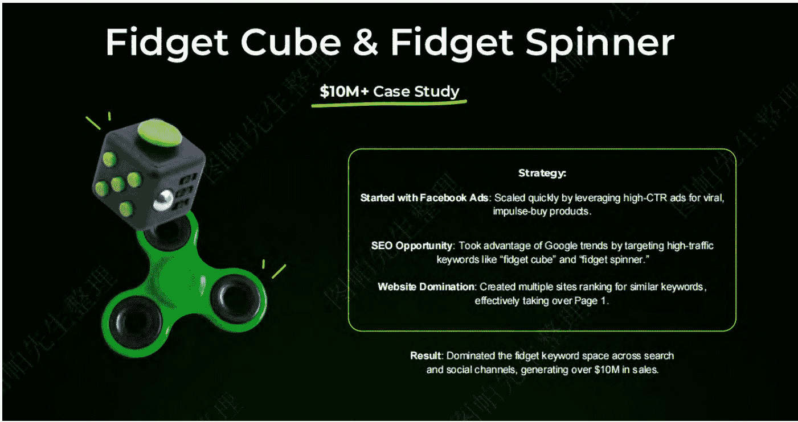

扩量就是广告+SEO

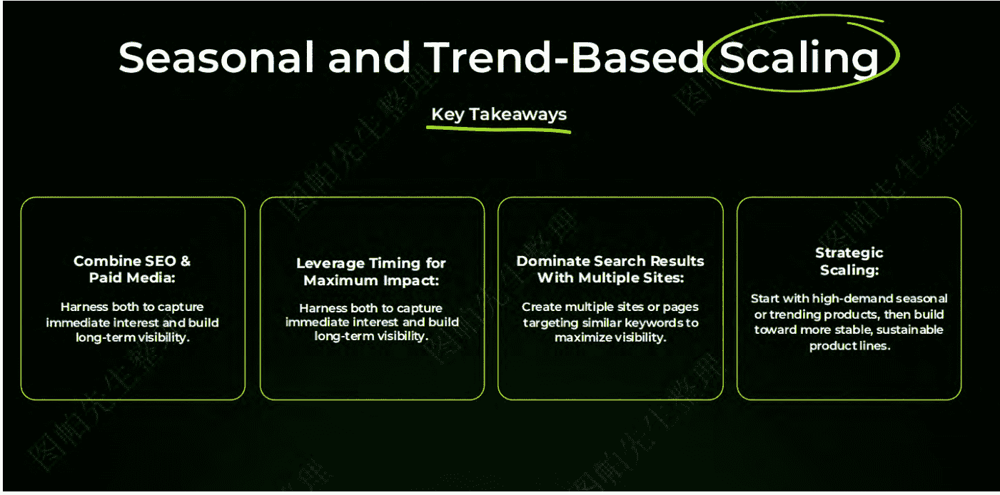

###### 电子商务模式：

Dropshipping：无需持有库存，直接从供应商发货给客户。

白牌：从供应商订购产品，贴上自己的品牌标签销售。

###### Two Main Entry Models

For Starting with eCommerce

1. **Dropshipping:**
   - Low Cost, Low Risk: No upfront inventory; products ship directly from supplier to customer.
   - Perfect for Testing Product-Market Fit: Ideal for beginners to validate product demand with minimal investment.

2. **White-Label Brand with Inventory:**
   - Higher Control and Brand Authority: Opportunity to build your own brand with customization options.
   - Requires Inventory Management: Typically managed through a fulfillment company or sourcing agent.

###### Dropshipping

Low Cost & Low Shipping

- CUSTOMER
  - Places Order
  - Customer Receives the Product
- SELLER
  - Purchase Product From Supplier
- SUPPLIER
  - Ship Product Directly to Customer

- **Advantages:**
  - Minimal Upfront Investment: Start with low initial costs since you don't need to purchase inventory. Ideal for those new to eCommerce or looking to test different products.
  - No Inventory Risk: You're not responsible for storing, managing, or investing in products upfront, reducing financial risk.
  - Flexibility and Scalability: Easily add or remove products to your store and test new ideas quickly to find a winning product.

###### White-Label Brand

With Inventory

- **Advantages:**
  - Build Your Brand: With white-label products, you can create a unique brand identity and establish a long-term connection with customers. You control packaging, labeling, and overall presentation.
  - Higher Profit Margins: Because you're selling a branded product, you can typically set higher prices than unbranded or generic items, increasing your profit margin.
  - Enhanced Customer Loyalty: Branded products tend to inspire more customer loyalty, leading to repeat purchases and positive word-of-mouth.

- **How White-Label with Inventory Works:**
  - Step 1: You purchase inventory from a supplier, who provides products that can be branded with your logo or design.
  - Step 2: Products are held in inventory, either through a fulfillment company or a local agent.

###### 产品研究与选择：

利用AliExpress、亚马逊、TikTok、PiPi Ads、Mine Spy等平台工具进行产品研究。

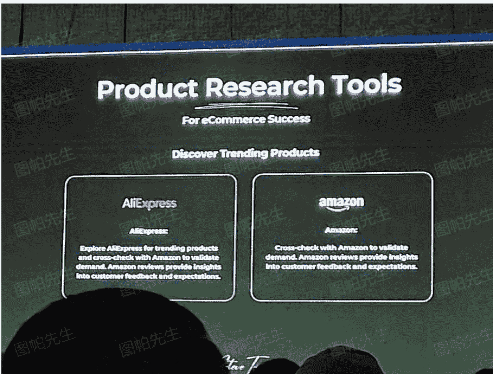

公众号懒人搜索，懒人专属群分享

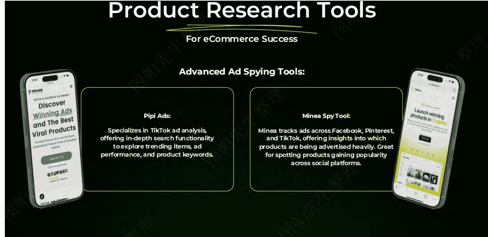

###### 营销与路线图：

确定产品和商业模式，设置商店，增加流量，用广告测试产品市场契合度，长期流量做SEO。

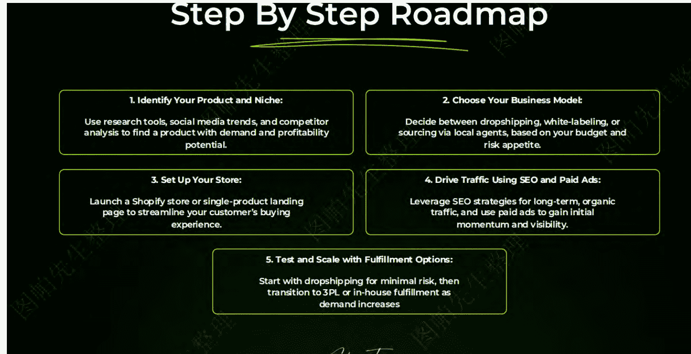

## Nick Eubanks: How To Build Digital Assets I Can't Wait to Buy

Nick是Semrush Owned Media的VP，分享了他收购其他公司业务的心得，也分享了一些如何抓住业务机会的思路。

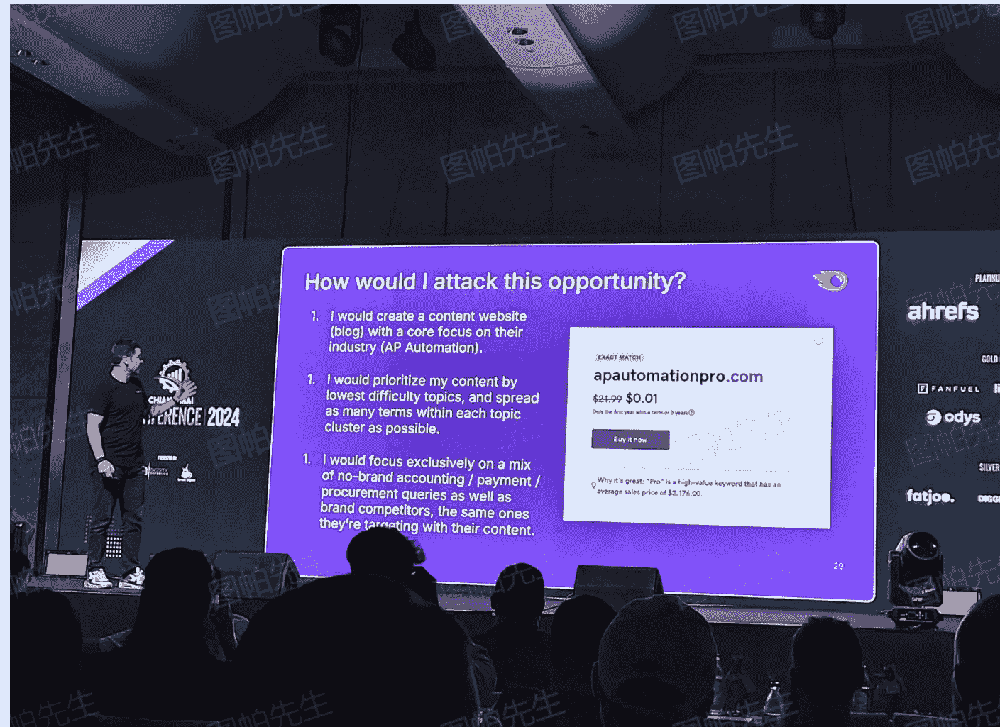

内容通俗易懂，就没怎么做笔记了，大家可以看看PPT

【腾讯文档】Nick-Eubanks-CMSEO2024

https://docs.qq.com/pdf/DSHNqVG93T3RyWnp1

## Koen Bongers: SEO Game Theory: Parallels Between SEO & Poker

Koen老哥上台拿着瓶啤酒边讲边喝，十分豪迈。这份豪迈感觉不少是因为他的经济自信，chill得不得了，在最后展示自己联系方式的时候，也是大方说明加他后不要推销自己的任何服务，可以简单打招呼或投个简历，因为他在招人。

Koen把扑克和SEO结合在一起，是个十分有趣的类比和思路。

###### 1. SEO与扑克的相似点

- 概率思维：提前预判可能的结果及其对应收益——SEO里我理解为关键词难度的判断和投产比的计算。
- 决策树分析：评估每个决策带来的影响，并选择最优路径——SEO里我理解为内容、外链、网站优化的优先级。
- 抗压能力：面对波动时保持冷静，重新调整策略——就是算法波动你hold不hold得住。

###### 期望值计算（EV）在SEO中的应用：

在扑克中，"期望值（EV）"公式帮助玩家判断是否值得下注。同样，在SEO中，这种计算框架可以用来评估以下问题：

- 是否值得进入一个全新的市场？
- 特定关键词的竞争是否带来更高的转化率？
- 页面优化的投入是否能带来预期收益？

例如，当一个网站的流量趋势逐步下滑时，与其盲目投入资源，正确的选择可能是停止该项目，转而优化其他资源。

###### SEO中的常见误区与优化策略：

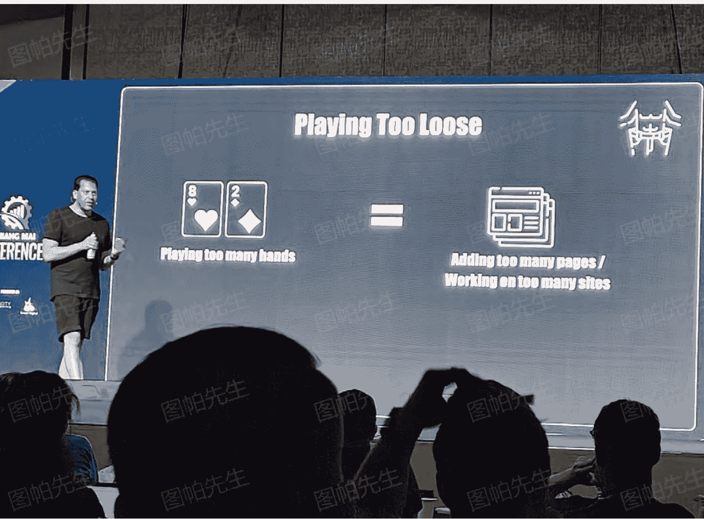

###### 1. “玩得太松” vs. 专注优化

SEO中的“玩得太松”表现在：

- 内容泛滥：大量发布低质量内容，而非专注于核心页面优化。
- 项目分散：同时操作过多网站，资源分配失衡。

###### 解决方案：

- 聚焦更新高价值页面，例如年度流量贡献最大的10%页面。
- 制定清晰的内容更新计划，确保内容的时效性与相关性。

###### 2. “赌注太高” vs. 理性投入

比如：

- 在竞争极为激烈的领域启动新网站，却没有明确的流量或收入基础。
- 继续投资已经没什么希望的项目，但沉没成本过高导致自己不想放弃。

###### 优化策略：

- 通过核心数据（如 Google Trends、人口和 GDP 指标）评估市场潜力，优先布局高性价比的目标区域。
- 根据网站健康状态，及时剔除表现差的页面或子项目，将资源转向增长潜力大的领域。

###### 3. 不适应游戏规则

SEO规则如同扑克的游戏模式，变化随时发生，及时调整策略至关重要。例如：

- 针对谷歌的算法更新，密切关注权威性、内容相关性及用户信任度指标。
- 对于社交媒体流量源的突然排名变化，快速响应，例如利用 AI 生成内容抢占短期优势。

###### 高效执行与团队扩展：

###### 1. 小细节的效率提升

在SEO工作中，微小的时间优化也能带来显著的长远回报：

- 提高打字速度，每年可节省数十小时用于核心任务。
- 利用浏览器书签和插件自动执行常用操作（如 Ahrefs 域名检查）。

###### 2. 自动化与仪表盘管理

通过数据可视化提升决策效率：

- 将 GA（Google Analytics）和 GSC（Google Search Console）数据导入 BigQuery，实现一键更新报告和自定义报表。
- 实现跨域名的排名追踪、流量增减及内容表现的报表。

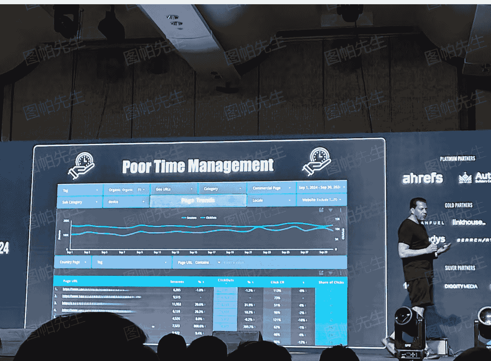

###### 3. 团队分工与外包

他从单人团队到 170 人规模的跨国团队，核心在于：

- 相信同事的工作：减少对开发、内容编辑等基础事务的直接干预。
- 招聘专业人才，专注于自己领域核心增长和优化的岗位，其他的可以外包都外包。

最后他分享了他对 SEO 的未来趋势的看法：

谷歌的算法正朝着整体权威方向发展，这意味着：

- 权威性强的平台（如《福布斯》、《华尔街日报》）将更具竞争力。
- 小型网站应以垂直化、专业化为突破口，通过高质量内容与用户信任度实现突围。

SEO 的成败在于衡量每项投入的回报，避免盲目扩张，减少资源浪费。

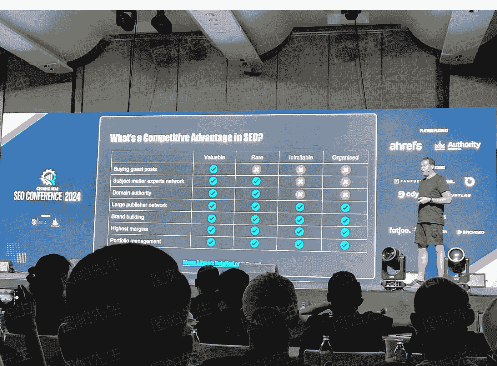

要打造自己的竞争壁垒，就算花钱买客座博客、提高网站权重，还是比较容易被追赶。建立好品牌知名度，想办法提高利润率才是最高的壁垒。

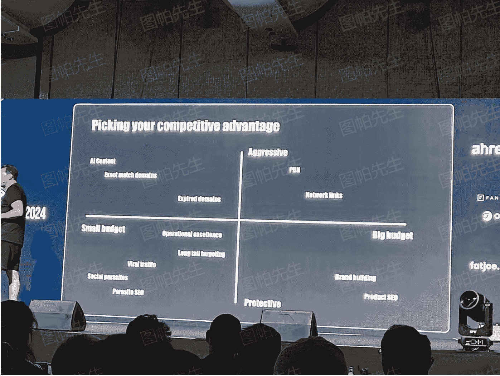

可以根据自己不同情况去提高竞争力，比如：

- 低预算想激进：AI 内容、买过期域名、关键词匹配的域名；
- 低预算又想积极做点什么：做寄生虫外链、打长尾词、运营上下功夫；
- 高预算想激进：PBN；
- 高预算想积极点：品牌建设、做产品 SEO。

Koen 这种交叉学科思维我是非常喜欢的，而且也不妨大胆地说，自己也挺擅长这种思维。比如之前分享的《我是如何不用一条外链把关键词排到第一》里面我就说，SEO 跟健身非常像：SEO 无非是内容和外链，而健身无非是锻炼和吃。人人都听得懂，但不是人人都能坚持下去。SEO 有快速的灰帽或白帽玩法，而健身也有各种激素来加速成效，但后果还是得自己承受。

## Travis Jamison: How To Stay Rich

Travis 教你如何理财。他是投资者、Smash Digital 的创始人。顾名思义，这是对于真正 "Rich" 老板的演讲。对于我们这种还在上班、还房贷车贷的“小弟弟”，算是看个乐呵。当然，像 Koen 把打牌和 SEO 结合去思考，我们也可以把财富管理的思路运用到自己的业务里面。

先说演讲内容：开场他说在场多数人已实现或即将实现财富积累。发财后，保持财富是更重要且少被提及的技能。他也看到过很多凭运气赚钱但靠实力亏钱的案例。大致的流程会像这样：

创业初期的不确定性、长时间投入，导致身体和心理压力巨大；公司成功后实现财务自由的欣喜；然而一个错误的决策可能导致财富归零。

他分享了一个警示性非常大的案例：一位朋友因听信内幕信息，将积累的 1100 万美元投资于 Terra Luna 项目。结果：项目崩盘，财富归零。

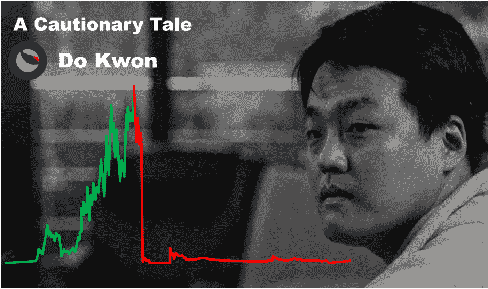

- 教训就是：
  - 发财和保持财富是完全不同的技能。
  - 错误决策和过度自信是财富损失的重要原因。

###### 那该如何保持财富？

###### 多元化投资

但多元化投资也有不适用的时候，比如：

- 过度依赖单一领域或相关性高的资产（如商品类投资）。
- 例如，巴西富豪艾克·巴蒂斯塔因商品市场波动破产。

而我们的流量或者运营也需要多元，不能死磕一种渠道，或者死磕一种运营模式。


###### 投资策略框架

- **避免集中风险**：不要将资产过度集中于一国、行业或个人技能相关的领域。
- **分散到非相关领域**：例如：将线上业务（如 SEO、FBA）扩展到线下（如房地产、农业、制造业）。
- **杠铃策略**：在高风险和低风险之间平衡，避免中等风险的投资。例如：部分资金用于“保本”，其余资金冒险性投资。


而在经济下行时期，如果我要投入到避险资产（如黄金、债券），就要先分析它们在不同经济周期中的表现。

## Ross Hudgens: Data-Driven Lessons From 12+ Years Of Content-Led SEO

Ross 是我个人非常喜欢的部分，因为是最贴切自己的业务，可操作性也非常高。对于新手，可用性非常高；对于老手，也能在已有知识点上进行补充。

###### 顶部导航优化

- **Sticky Navigation 设计**：一种固定导航条的方式，通常应用于网页顶部。用户在浏览页面时，无论如何滚动，导航条都能保持在视窗内。该设计通常有助于提高网站的易用性，尤其是在内容较长的页面中，用户无需滚动回到顶部就能继续进行操作，如跳转到其他页面或点击某些按钮。
  例如，电商网站上，购物车按钮、搜索框和分类菜单常常设计为粘性形式。这样，当用户浏览产品时，始终可以方便地进行搜索或查看购物车，从而提升转化率。
  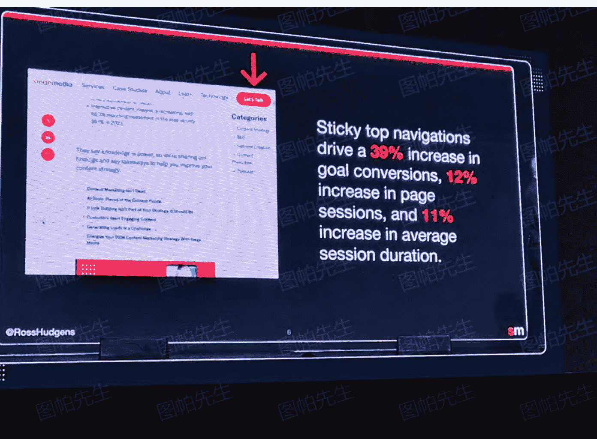
- **导航优化与用户体验**：固定导航不仅仅是为了方便用户操作，还是为了提高用户粘性。它可以让用户在进行多步操作时（例如从首页到产品详情页，再到结算页面）能保持清晰的操作路径。比如一个购物网站，当用户在产品页面时，购物车和支付按钮始终可见，就能大大提高用户完成购买的几率。
- **CTA 设计**：设计时要确保 CTA 按钮具有高可点击性。通过调整按钮的大小、颜色、文字内容和位置，能够有效地吸引用户进行互动。例如，如果是一个促销活动页面，按钮上可以写上“立即抢购”或“限时折扣”，并放置在页面的显眼位置，如右上角。这样能有效提高用户点击的概率，进而提高转化率。

###### 站内导航和内容整合：

- **博客与主站内容的关联**：如果没有在主站导航中突出博客内容，搜索引擎可能会忽视博客的 SEO 价值。博客的内容丰富，且更新频繁，这对提升网站的权重非常有利。因此，将博客内容与网站的其他部分整合，能够提升整个网站的 SEO 表现。
  比如，一个提供金融咨询服务的网站，如果将其“最新动态”或“知识库”部分放入网站顶部导航栏中，用户可以更容易地看到相关的文章或指南，这有助于提高页面的索引率并增加内容的曝光率。
  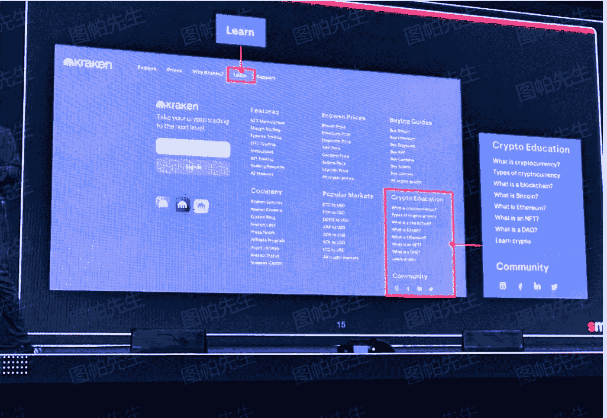
- **内链和内容互联**：博客内容与主站其他页面之间的内链也非常重要。通过在博客文章中嵌入指向服务页面、产品页面的链接，能够有效提升相关页面的权重。例如，在讲解某个金融投资策略的博客文章中，可以链接到网站的“投资服务”页面，既能提供有价值的信息，又能增加相关页面的流量和 SEO 排名。
- **关键词整合**：在博客内容中合理嵌入关键字，并确保每篇文章都有指向主站其他相关页面的内部链接，能大幅度提升该页面的 SEO 价值。优化时，关键词要自然嵌入文章中，避免过度优化和关键词堆砌，以免被搜索引擎判定为“关键词填充”而遭到惩罚。
- **主图的作用**：主图通常是网页上最大或者在第一位展示的图片，它能够在第一时间抓住用户的注意力。很多网站会将主图作为一个“情感触发点”或“视觉引导”，来吸引用户继续探索网页上的内容。对于电商网站，主图可以是某个热销产品或促销活动的宣传图片；对于博客类网站，可以是一个吸引人的封面。
- **图片优化**：虽然主图能够有效吸引注意力，但过大的图片会显著影响页面加载速度，尤其是在移动设备上。为了减少影响，需对图片进行压缩和优化，使图片能够快速加载，同时保持良好的视觉效果。
- **主图的使用**：
  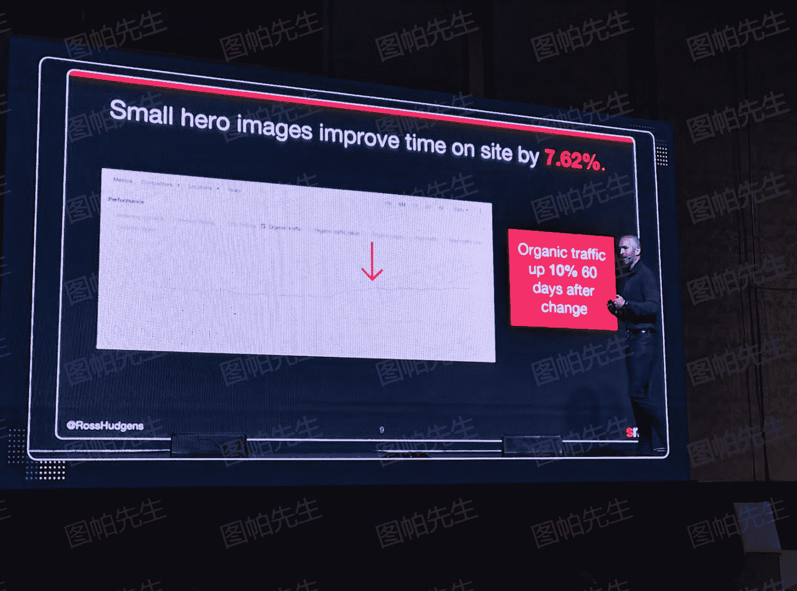
  - 响应式设计：主图需要适应不同屏幕尺寸，因此响应式设计变得尤为重要。在不同设备（桌面、平板、手机）上，图片大小和显示比例需要动态调整，确保其在各设备上都能完美展示，避免图片失真或加载过慢。
  - SEO 图片优化：除了图像的质量和加载速度，图像的 alt 标签也是 SEO 优化中的一个重要因素。为每张主图添加相关的 alt 标签，并自然嵌入关键词，能帮助搜索引擎理解图片的内容。

###### 内容推荐

- **内容推荐逻辑**：设置一个良好的内容推荐逻辑能够根据用户的行为推送相关内容，从而提高用户停留时间，提高网站的粘性。常见的推荐方式包括基于相似内容推荐（如“相关文章”）、个性化推荐（如“你可能喜欢”）以及基于热度推荐（如“热门文章”）。
- **推荐内容的准确性**：通过分析用户的点击行为、浏览历史、以及对不同内容的互动情况，可以有效推测用户兴趣，以便推荐相关内容。例如，电商网站可以通过分析用户的购买历史来推荐类似的商品；博客网站则可以根据用户之前阅读的文章推荐相关主题的内容。
- **避免过多推荐**：尽管推荐内容很有用，但推荐内容过多反而可能导致用户感到信息过载，从而影响体验。因此，在设计推荐模块时，应该确保推荐内容的数量适中。一般来说，推荐内容的数量不宜超过 5-6 个，避免让用户感到选择过于繁琐。
- **内链优化**：通过内链的形式将页面与其他相关页面连接起来，也是提高 SEO 的一种有效方法。比如，在一篇文章的结尾部分，加入“阅读更多”或“相关链接”来引导用户浏览更多内容。这不仅有助于用户继续探索网站，也能够增加页面的权重，提高搜索引擎的抓取效率。

###### 优化内容的可见性

- **重要内容的突出显示**：不仅仅是在首页放置最新和最重要的内容，还要通过内容排序和标签系统将重要的内容推送给用户。比如，在页面顶部或侧边栏展示“推荐文章”、“热销产品”等模块，可以增加这些内容的曝光度。
- **强调核心内容**：根据用户的需求和页面的目的，强调网站的核心内容。例如，在一个教育网站上，最重要的内容可能是“课程”或“注册”，而在一个电子商务网站上，核心内容可能是“商品”或“购物车”。通过将这些内容放置在网站的显眼位置，可以确保用户在浏览时不会错过关键信息。
- **内容分发**：通常一提到内容分发，都会只想到外链、社媒发帖，但站内的内容展示，也是有效分发的一种。

###### 关键词研究

- **长尾关键词的运用**：长尾关键词通常搜索量较少，但竞争相对较小，且能够精确锁定目标用户。例如，一个卖健康食品的品牌，如果能针对如“无糖高蛋白健身食品”这样的长尾关键词进行优化，可以吸引到更精准的潜在顾客，这类顾客更可能转化为实际购买者。
- **关键词的多样性**：在关键词研究时，除了关注搜索量高的主关键词，还应关注一些竞争较低但有潜力的副关键词。这些副关键词虽然流量较小，但能吸引到更加精准的目标受众。
  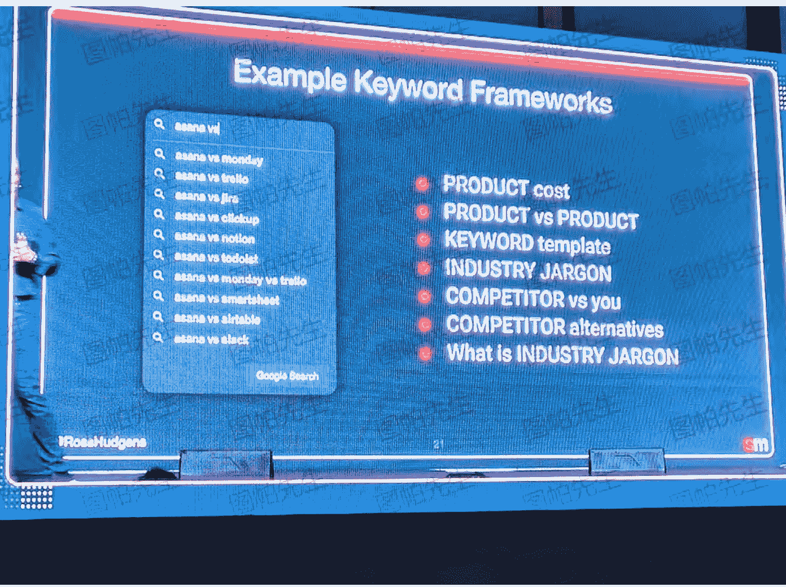
- **关键词的自然嵌入**：关键词嵌入要自然流畅，避免过度优化。尤其是在写作博客文章时，过度重复某个关键词可能导致内容显得不自然，同时也可能被搜索引擎判定为“关键词堆砌”，从而影响 SEO 效果。

###### 关键词研究的误区

- **过度依赖搜索量**：很多人在进行关键词研究时，只看搜索量。实际上，关键词的竞争程度和转化潜力更加重要。即使某个关键词的搜索量很高，但如果它竞争激烈，而且与目标受众的需求不匹配，那么它可能并不会带来很好的转化效果。
- **忽视用户意图**：在选择关键词时，不仅要看搜索量，还要了解搜索者的意图。比如，用户搜索“如何减肥”可能是寻找减肥技巧，但搜索“减肥食品购买”则意味着用户已经准备好进行购买。因此，明确用户意图，有针对性地选择关键词，能提高转化率。
  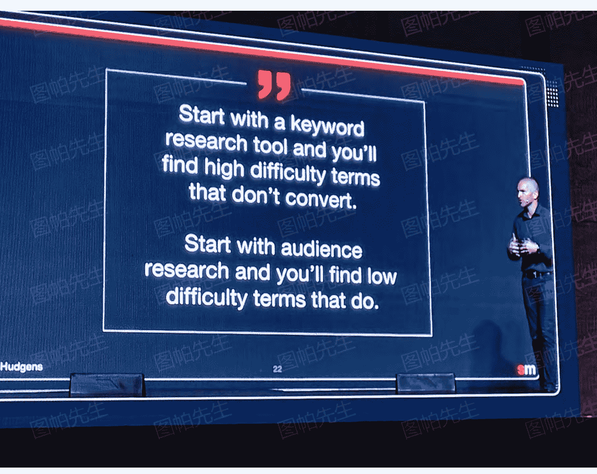
  这点跟去年 Cyrus Shepard 的内容十分吻合。
  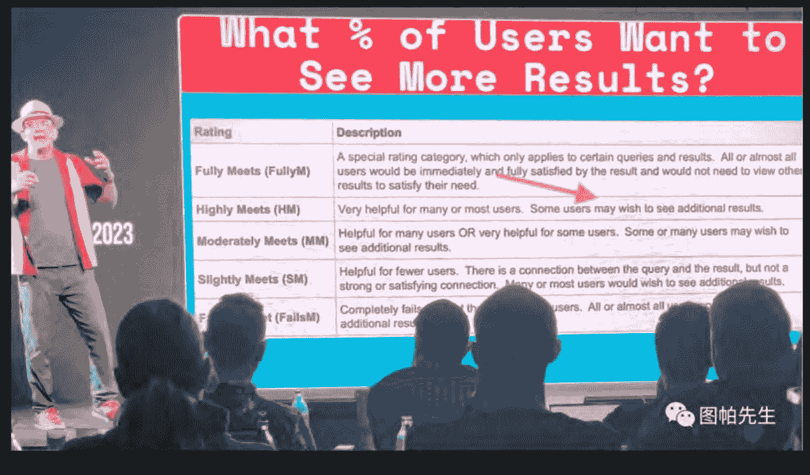
  所以我们做排名的要点不是堆砌关键词，或者是怼外链，而是关注页面内容能不能满足用户的搜索需求，而且能够吸引用户停留，而不用回去搜索结果页看其他网站。

###### 内容布局

文章开篇建议使用 APPB 公式，即：
1. Attention（引起注意）
2. Proof（效果/佐证）
3. Preview（预览）
4. Benefit（好处）

###### The Attention, Proof, Preview, Benefit (APPB) Intro Copy Formula is Ideal for SEO Performance.


This post will show you how to scale your content marketing.
(Step-by-step.)
Our team has published and updated over 300 articles in the first half of 2024.
That’s about 50 per month.
Plus: we’ve maintained our content quality while increasing our organic traffic sessions by 30% year-on-year.

这点其实 Brian Dean 用得很溜了。还有排版：以前 Google 文档的排版也很老套，但现在他们也意识到了要使用不同的字体进行展示。

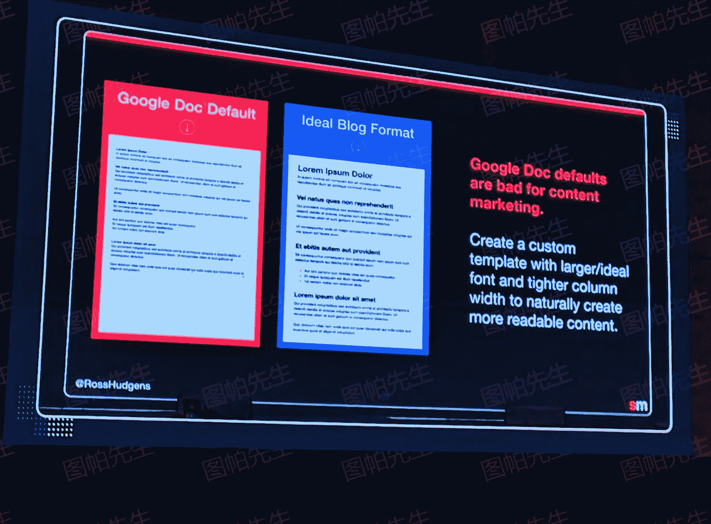

Google Doc defaults are bad for content marketing.
Create a custom template with larger/ideal font and tighter column width to naturally create more readable content.

还有一个博客互动基准的参考值：

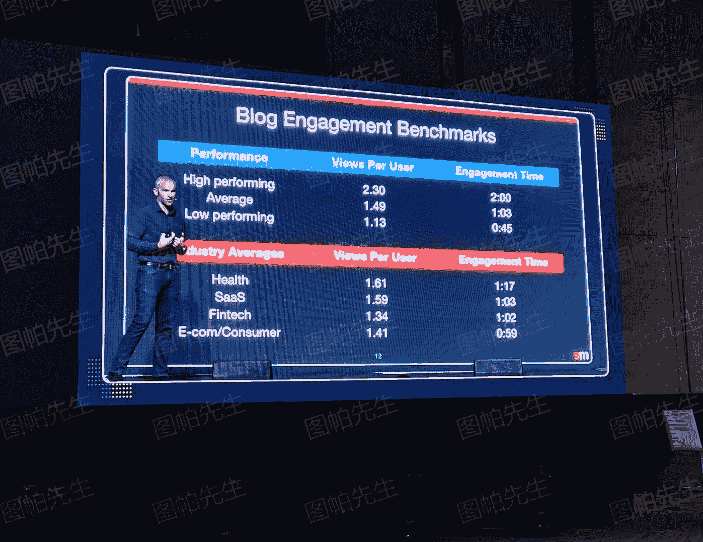

PPT 内容更丰富，建议搭配食用。

## Stan LeLoup: Cracking YouTube For Fun & Profit In 2025

小弟很久之前就写过 YouTube SEO 优化攻略，大家不妨结合来看。Stan 一开始也是说为什么要重视 YouTube，什么“第二大搜索引擎” bla bla，重点总结：

###### YouTube 的推荐机制

YouTube 的推荐算法更加注重观众的观看行为，比如“观看时长”和“点击率”。如果一个视频被点击后，观众看得较久，YouTube 会认为该视频的质量较高，并向更多人推荐。


###### 内容创作与观众心理：

##### 吸引点击

制作的视频需要一个具有吸引力的标题和缩略图，以提高点击率（CTR）。缩略图和标题的设计需要引发观众的好奇心或情感反应，比如“揭秘”、“不可错过”、“惊人”之类的词汇往往能激发观众的好奇心，增加点击率。

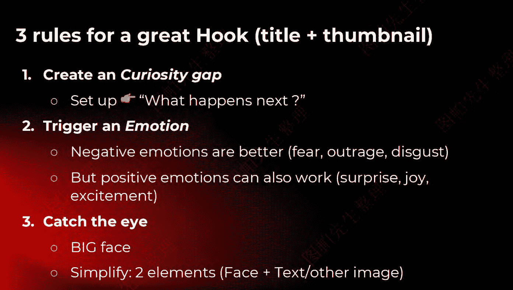

##### 保持观看兴趣

视频内容本身需要足够吸引人，使得观众愿意观看下去。简单来说，就是视频的质量、节奏和吸引力要能够让观众停留更长时间，这对于 YouTube 的推荐算法非常重要。

###### YouTube 的推荐算法与 SEO 策略的对比：

- **推荐策略**：推荐算法依赖于通过点击吸引观众。一旦用户点击了视频，YouTube 会根据其观看行为（如观看时长、互动等）决定是否将该视频推送给更多观众。
  要点：标题和缩略图设计至关重要。内容的创意要能够迅速抓住观众的注意力，产生强烈的情感反应（如惊讶、好奇、愤怒等），进而激发他们点击并观看。
  这类策略的成功往往会迅速吸引大量观众，但也可能是“短暂”性质的，流量在短期内快速增长，随着时间的推移可能会减弱，特别是在没有稳定观众群的情况下。
- **SEO 策略**：通过关键词优化，制作符合观众搜索习惯的视频内容，从而在 YouTube 的搜索结果中排名靠前，吸引有意图的观众。这类策略侧重于通过积累长期流量来获取稳定的观众群体。
  要点：SEO 策略不仅包括视频标题和描述的关键词优化，还涉及对内容的规划，如使用合适的标签、内容框架以及视频的发布频率等。通过优化关键词和标签，使视频出现在观众的搜索结果中，从而获得持续的观看量。
  SEO 策略的好处在于它能够为你的视频提供长期的流量支持，尽管刚开始可能没有立竿见影的效果，但随着时间推移，视频的观看量会逐渐增加，稳定性较高。

###### 成功的 YouTube 频道案例：

- **MrBeast**：作为全球最大的 YouTuber 之一，MrBeast 的成功在于他非常理解观众的心理需求，并不断调整自己的内容策略。他通过大规模的挑战和赠品活动吸引观众，使得这些视频能够迅速获得大量观看。
- **Sam Sulek**：另一个成功的案例是 Sam Sulek。他制作的视频不复杂，但抓住了观众的兴趣点，如健身、挑战等领域。通过对话题和关键词的精确选择，他的视频逐渐积累了大量的观众群体。

###### 关键词和话题的选择：

###### 关键词优化

为了让视频出现在相关的搜索结果中，你需要选择正确的关键词，并在标题、描述、标签中合理安排这些关键词。这一过程中需要考虑观众可能使用的搜索词，确保视频能够在用户搜索时被优先推荐。

###### 话题 hashtag 选择

选择受欢迎且有足够受众的主题也是成功的关键。无论是时下流行的趋势，还是解决用户实际问题的内容，话题的选择决定了视频的吸引力。如果话题过于冷门或过于宽泛，可能难以吸引到精准的观众群体。

###### 编排技巧

开头的引起好奇心已经提到过，而视频里面，建议每3分钟就出现一个“谜”，节奏加快，让观众一直看下去。

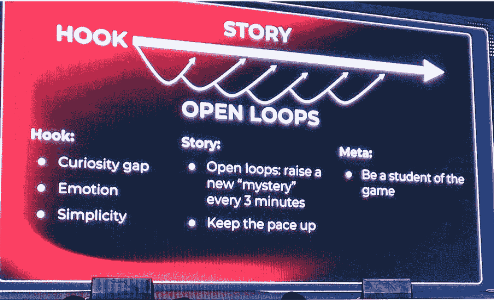

## Jared Codling: Growth Hacking To Supercharge Your Profit

Jared的演讲在电商的应用也是十分契合，比起SEO，他的内容更多是偏向广告和运营层面的测试。

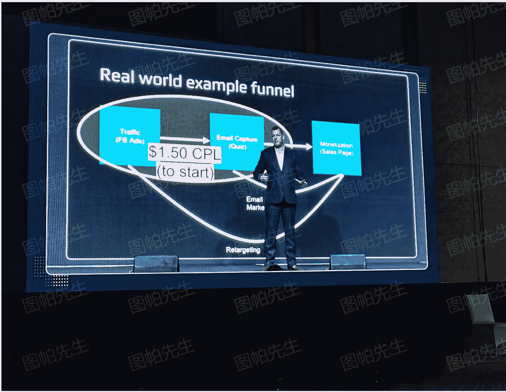

###### 他的背景：

- 创建了多家年收入达到七位数的公司。
- 多家初创公司在短时间内达成百万美元年经常性收入目标。
- 在澳大利亚和南美市场推出减肥公司，90天内实现年收入超过110万美元。

###### 他对于增长黑客的定义：

- 关键在于通过科学测试优化所有环节。
- 目的是以低成本、高效率实现业务增长。

###### 核心方法：

- 以科学的态度对一切思路进行测试。

他举了一个很具体的策略：他与健美网红齐兹销售电子书。

- 初期的邮件主题吸引力不足（如“有一个好主意”）。
- 导致收不到回复，发现很多邮件未被打开。

而后面成功的关键优化在于：

- 改进主题，如“我给你50美元，听听我的想法”。
- 在邮件中直接留下电话号码，吸引对方立即联系。
- 最后，电子书发布后首月销售收入达2万美元。

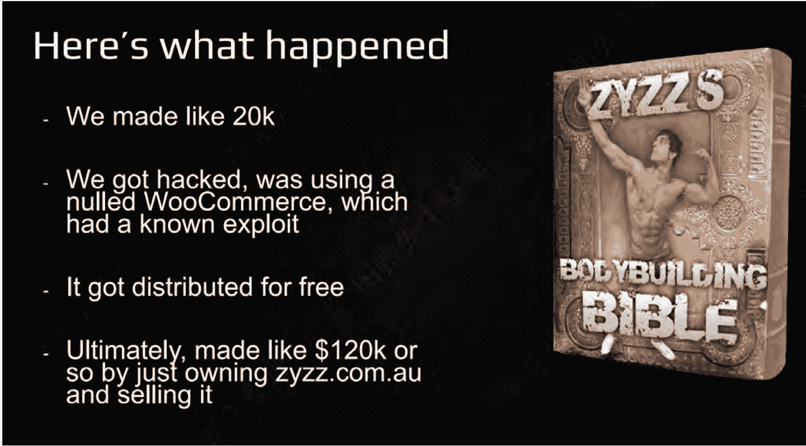

###### 低成本漏斗构建策略

- 他也做了一个测验漏斗：
  - 提供一个卡路里的测验：用户输入数据后，结果通过电子邮件发送。
  - 在等待结果期间，将用户引导至销售页面。
  - 成果：转化成本从每条线索50美元逐步降低至0.09美元。
- 迭代优化广告素材：
  - 测试不同格式（如30秒视频、方形视频、图像广告）。
  - 通过持续优化，实现每个获客成本的显著下降。

###### 优化问卷长度

- 原问卷为8个问题，但成本高、转化率低。
- 之后延长至35个问题，用户需要投入更多时间和精力，转化率反而提高。
- 总结就是：用户自己的高投入感，会增强了产品信任度，从而提升转化。

那如何制定科学测试的流程呢？

- 头脑风暴，列出业务最薄弱环节（如页面设计、结账流程）。
- 然后列出可以测试的点子，无论好坏都记录下来。

###### 优先级的评估：

- 三项标准：
  - 影响力（Impact）：改动能否显著提升关键指标？
  - 信心度（Confidence）：对改动是否有效有多大信心。
  - 易用性（Ease of Use）：实现难度和所需时间。
- 评分公式：优先测试高分组合（Impact × Confidence × Ease）。

###### 进行科学测试：

- 小规模A/B测试（如广告文案、登录页面设计）。
- 大规模结构测试（如改进页面流程、导航布局）。

他又多举了几个例子：

###### 广告优化举例：

- 使用 MidJourney 和 Figma 工具快速生成多种广告素材来提高测试效率。
- 测试广告的变体，最后成本从最高 2.5 美元降至最低 0.17 美元。


还介绍了一个AI工具：makeugc.ai 制作素材

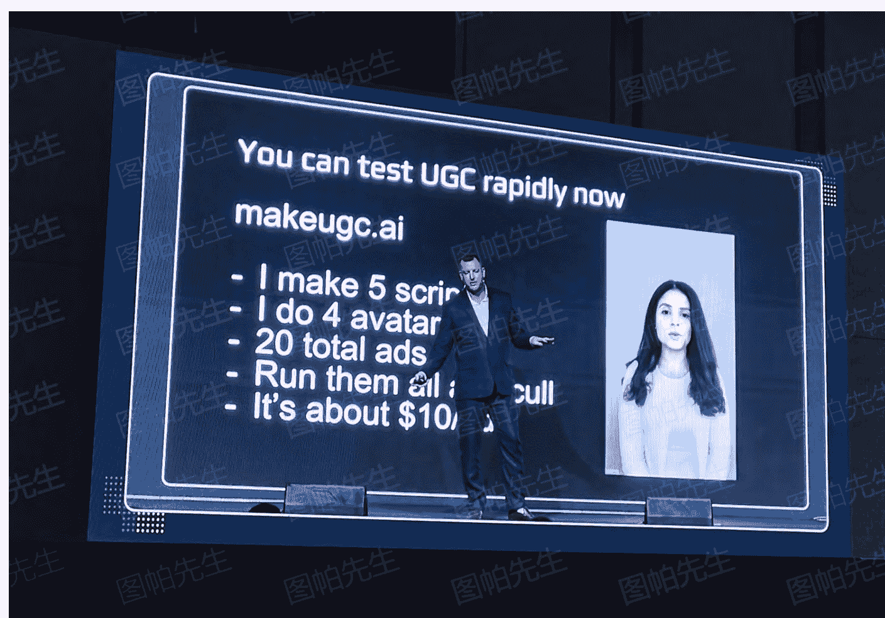

###### EDM 邮件策略：

- 针对不同受众（页面浏览量、购买意向群体）分别定制邮件策略。
- 而且通过短信通知即 SMS 提高转化率。

###### 测试其他环节的优化：

- 调整页面结构：删除或添加导航栏，根据用户信任度测试效果。
- 提升结账体验：使用推荐信和评论增强用户信心。
- 产品漏斗优化：通过重复测试不同流程，确定最佳配置。

最后他建议我们培养长期增长的思维：

##### 持续测试：
- 每日测试：小至广告文案，大至用户漏斗结构，保持不断优化。
- 累积微小改进带来的长期收益。

##### 跨领域应用：
- 涉及营销、电子商务、SEO优化、定价策略等多方面。

##### 结果评估与决策：
- 用数据说话，抛弃低效点子。

##### 快速行动：
- 及时将测试想法付诸实践，不拖延。

##### 优化资源配置：
- 进行高影响、高信心、低难度的测试。

##### 科学决策：
- 利用统计显著性验证测试结果，确保改进有效。

## Jason Hennessey: How To Scale Your SEO Agency To Eight Figures

Jason分享了他的SEO服务扩张的经验，和他对成功的定义：时间与金钱的平衡。

- Jason提出，成功不仅仅是赚多少钱，更重要的是如何平衡时间和金钱。


赚到足够的钱后，成功的标志是你是否能买回你的时间。
如果能让公司独立运作，那自己就能把时间花在旅游和家人身上。
大会过后的一天，图帕先生正好碰上类似的情景。我在清迈体验当地风土人情时，遇到一辆中国牌的汽车。


深深的respect！同时也羡慕他所能拥有的时间。

他能自驾出国，除了过程中所产生的支出费用，更重要的是他能腾出这么长的时间来驱车旅游。如果是某二代，那没得说，如果是一般人，那很可能已经有了一套很成熟的生意体系，能让自己不在场的时候也能产生收益。

Jason早期为了支付大学学费，加入了美国空军，1996年退役后，搬到拉斯维加斯，开始做SEO，逐渐转向SEO行业。他也是通过阅读SEO相关书籍，开始自己的事业。

到2024年，公司年收入为175万美元，净利润率为24%。而前面几年，净利润连10%都不到。

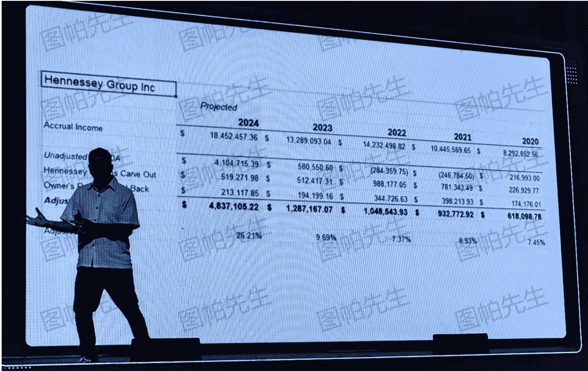

| 指标 | 2024 | 2023 | 2022 | 2021 | 2020 |
|:---|:---|:---|:---|:---|:---|
| Accrual Income | $18,452,457.36 | $13,289,093.04 | $14,232,498.82 | $10,445,569.65 | $8,292,852.56 |
| Unadjusted O.A | $4,104,715.39 | $580,550.60 | $(284,359.75) | $(246,784.50) | $216,993.00 |
| Hennessey Carve Out | $519,271.98 | $512,417.31 | $988,177.05 | $781,343.49 | $226,929.77 |
| Owner's Back | $213,117.85 | $194,199.16 | $344,726.63 | $398,213.93 | $174,176.01 |
| Adjustments | $4,837,105.22 | $1,287,167.07 | $1,048,543.93 | $932,772.92 | $618,098.78 |
| 净利润率 | 26.21% | 9.69% | 7.37% | 8.93% | 7.45% |

而前几年他是故意降低利润，提高公司运行效率，来让自己腾出更多时间去生活。

一开始他通过制作一本SEO指南，专门吸引亚特兰大的律师事务所。

而获得了第一个客户后，就尽量将客户转化为长期合作的案例，以此为案例来吸引更多客户——这也是做乙方的标配了，用案例拉案例。

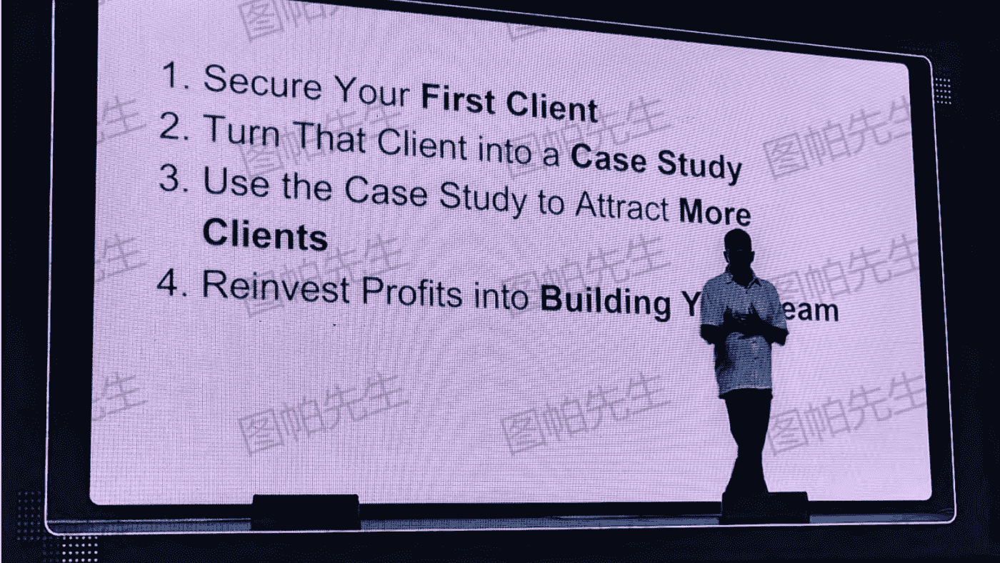

| 步骤 |
|:---|
| 1. Secure Your First Client |
| 2. Turn That Client into a Case Study |
| 3. Use the Case Study to Attract More Clients |
| 4. Reinvest Profits into Building Your Brand |

- 而与客户沟通的时候，不要仅仅是单纯推销，而是教育客户，并帮助他们做出最佳决策，同时也是筛选客户。
- 他不会提前发报价，而是通过电话深入了解客户需求，再给出多个选择，确保客户理解服务的价值。有点像定制服务。

强调公司发展达到一定规模后，团队建设和系统化运营就变得很重要。团队建设最快捷的办法就是招聘比自己聪明的人来管理和运营。而系统化则是建立自己的BI系统，这样就能自定义非常多的数据模板，一来方便自己追踪数据，二是方便客户更直观地看懂数据。

- 业务扩张关键是调整客户价格和增加客户数量。
- 提升平均客户单价，以减少客户数量，降低工作量并提高利润。

###### Road to $1,000,000

- Average Client $12,500 per month
- $1,000,000 / $12,500 / 12 = 7 Clients
- $12,500 × 7 = $87,500 per month
- $87,500 × 12 = $1,050,000 per year

强调公司发展到一定规模后，团队建设和系统化运营就变得很重要。团队建设最快捷的办法就是招聘比自己聪明的人来管理和运营。而且对员工也要有关怀，员工有安全感和幸福感，就会全力为你工作。

###### You take care of your employees, they'll take care of your clients

- Benefit Upgrades 2024
  - Health Insurance
    - Lifting cap on contractor health
    - Minimal medical S increase: Varies by plan, average increase 3.8%
    - Dependent coverage:
      - HD pays 75% of all dependents,
      - Medical and Dental
      - Still under negotiation for other lines
  - New Baby
    - New Baby Bonus!
    - $500 for the birth or adoption of a child.
  - Share a Care Program
    - You can now donate up to 2 PTO days to someone on medical leave.
    - A team member can receive up to 20 PTO days while they are on leave.
  - Other Benefits Launched in 2023
    - Health Stipend for Contractors
    - Pet Insurance
    - UHC Free Money Programs
    - Free Perks Library
    - Financial 1 on 1's and Wellness Webinars
    - Health Webinars

而且对待客户，也是当朋友一样关心：客户女儿出生了专门寄一张贺卡和一份礼物。

###### Patrick McEuen (He/Him) · 1st
Director of Operations | Salesforce Administrator

8h·Edited-

Not all digital marketing agencies are created equal some redefine what a partnership truly means.
A heartfelt thank you to Jason Hennessey and the team at Hennessey Digital for the thoughtful gift that arrived on our doorstep last week. Welcoming our beautiful daughter into the world has been incredible experience, and your gesture truly touched our family.
The results we've had since with them are expected in this business, and genuine connections and going the extra mile is what separates the great from the good.
While I'm still on leave, I couldn't but share how grateful we are to have them as our partners. If you're looking for an agency that cares while keeping up with kind gestures like this, please reach out further.
#Grateful #Partnership #marketing

而且公司的要发展得快，就要加上自动化。比如要搭建自己的BI系统，他的公司自己搭建的后台，可以做SEO audit、追踪关键词排名、看到每个页面的流量、管理内容创作和外链建设各种任务的追踪等等。无论是内部的管理还是对外对客户的数据展示，也是非常便利。

###### 公众号懒人搜索，懒人专属群分享


###### 成功的秘诀：不怕失败

- 他提到许多小型企业在这个阶段面临困境，可能会选择放弃，但应该从错误中汲取教训。
- 不要害怕失败，而是要从失败中获得经验和动力。

评论区：

蓝弈：感谢分享[社会社会]

## (22赞) 普通人如何通过手机搬运实现宠物赛道从0到1的稳定变现

作者：王兴平
日期：2024-12-04

普通人入局宠物赛道，0基础也能上手的保姆级分享

各位圈友大家好，我是王兴平，自己创业8年了，加入星球已经2年了，一直都是做后端没有怎么分享，目前自营盘有国学+旅游+公关品宣。今天给大家分享一下，如何普通人新手小白一个月的时间，一部手机，纯搬运，如何实现宠物赛道从0-1稳定变现。

文章偏实操经验分享，辅助新手更快拿到结果，实现从0-1，不需要多高的剪辑基础，普通人就能做。 下面是文章目录： 1.前言 2.我为什么选择宠物行业 3.我正在做什么 4.项目盈利如何 5.具体怎么做 6.项目需要解决的问题(这个项目的前提) 7.后续业务延伸的问题 8.结束语 ............

话不多说，正文请移步飞书：
https://tv5c6neillx.feishu.cn/docx/GJ3Bd10p1oKfHtxhg2Lc0aWAnAe

评论区：

解解毒：分享的很落地，能结合扩展很多玩法，很多赛道都可以借鉴

王兴平：谢谢哥[可怜]

长庚：补充一点之前获得的信息

卡其宝宝：这是什么时候咨询的问题啊朋友

长庚：年初

卡其宝宝：收到，谢谢圈友分享

亦仁：1.5w收入，利润多少呢

王兴平：8000+

## (22赞) 教育科技公司创始人分享千万级用户项目经验

作者：十一

日期：2024-12-03

各位圈友大家好，我是十一，深圳一家教育科技公司的创始人，专注中小学教育赛道（非教培，不受双减政策影响），公司目前做了两个千万级用户的项目，分别对应中小学老师群体和家长/学生群体。

21年加入生财到现在已经快4年了，除了发了几条资源对接的帖子外一直在默默的潜水。生财对我而言更多是一个了解新玩法的前沿阵地，在生财里看到了很多大佬的分享，受益匪浅；也跟几个圈友进行了或深或浅的合作，拿到了一些结果。

公司去年开了一条新的业务线，一年多的时间也从零做到了千万级的用户数。

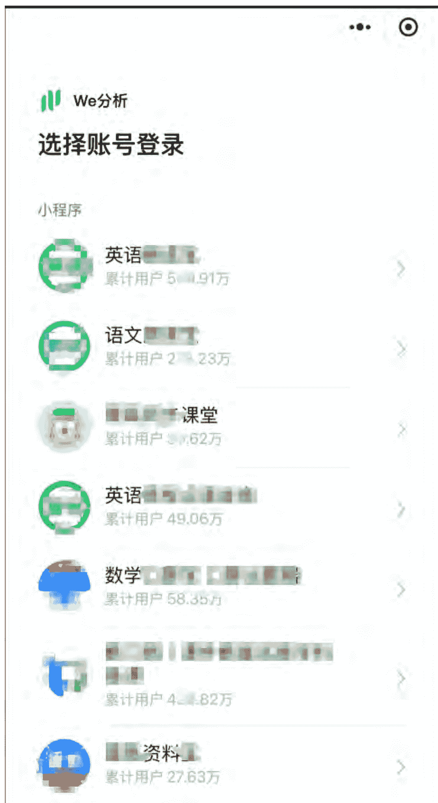

这个项目可玩性和上限都很高，我们尝试了很多玩法：分销、知识付费、引流、低转高、社群等等，有些拿到了结果，有些只是跑通了链路但还没有精力去规模化。我把之前的尝试做了个梳理，算是抛砖引玉，欢迎大家多跟我交流，希望能链接更多有资源、有能力的圈友一起放大。

详细请移步飞书：

https://yxlq5m8r086.feishu.cn/docx/WSz3dKv2nodwO0xELAkcFaYVnJg?from=from_copylink

###### 评论区：

暂无评论

## (15赞) 以“小黄书”为例，来分析一个新平台，当下是否值得入场！

作者：古辛

日期：2024-12-02

为什么古辛一直认为，做电商选品很重要呢，因为选品就是选赛道，不过做电商选赛道，不仅仅包括选具体的品类，还包括选平台。古辛经常给兄弟们分享选品的方法论，和具体的细分品类，很少给大家分享，如何选平台。

因为一直以来都是古辛测完一个平台后，觉得可以做，就直接跟兄弟们说，某个平台能搞，然后就开始针对这个平台分享选品方法和对标号，忽视了给大家分享，如何测一个平台，今天咱们就以“小黄书”为例，给大家分享下，发现一个新的平台之后，如何去确认，这个平台当下是否值得入场？

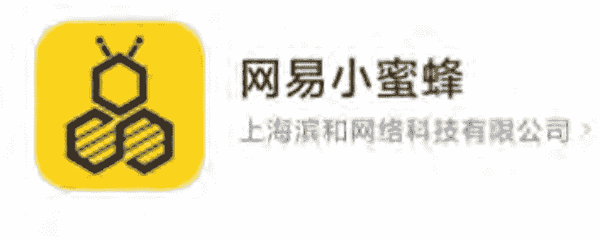

小蜜蜂是网易出的一个对标小红书的内容平台，因为app颜色是黄的，所以就称他为“小黄书”，目前版本更新到1.2，平台相当的新。

看一个平台当下是否值得入场，古辛主要看两个指标，第一个指标，是流量是否够大，就是看用这个平台的人多不多，我们做生意自然是希望在人多的平台做生意，人越多越好；第二个指标，是能否变现，就是我们能否在这个平台赚到钱，无论是在平台开店，还是引流到微信，都可以。

###### 流量是否够大？

###### 1. 下载量

###### 网易小蜜蜂

上海滨和网络科技有限公司 | 4.4星 | 12条评价 | 下载次数：8602 | 大小：58MB | 未上榜 | 应用榜单 | 年龄：详情 | 评论 12 | 精选

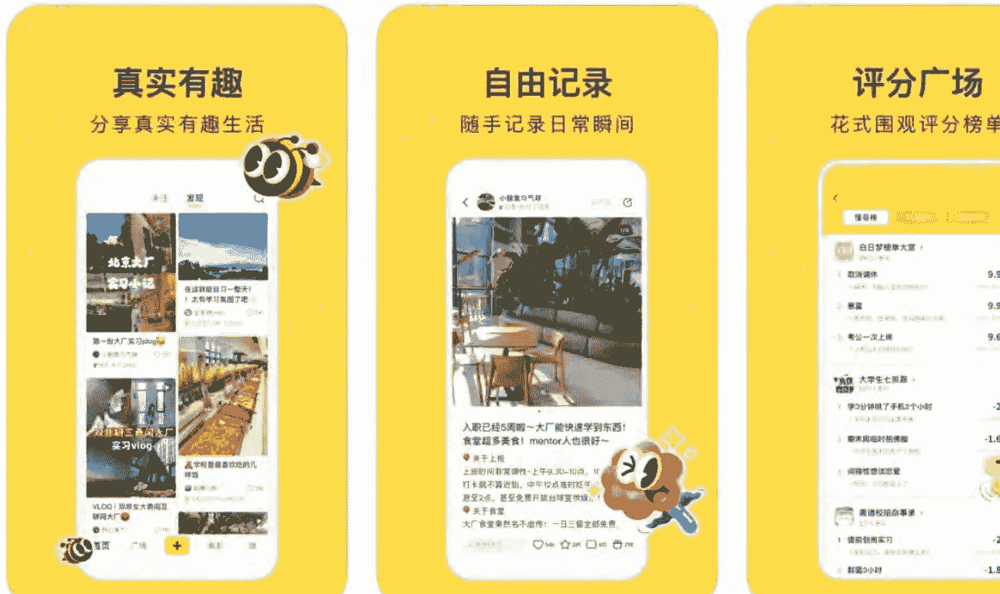

版本：1.2 更新时间：2024.11.27
隐私政策 应用权限
备案号：沪ICP备2024097116号-2A

国内的手机应用市场很分散，几乎每个手机厂家都有自己的手机应用市场，光看单个手机应用市场，没法确认该app的体量到底有多大，但作为参考数据，古辛认为是够用的。

比如小蜜蜂目前是小米应用市场的下载量是8000+，单位是次，不是万次，即使这个数据不是小蜜蜂的真实下载次数，但我们也能从中看出一些东西来，就是目前下载这个app的人，不是很多。

###### 2. 内容点赞量


来财来财～
#来财来财DJ舞#
不吃泡面 88


靠颜值接到了第一条广告
Hannah 56


🇨🇦这个秋天在魁北克🍁🍁
rylee0o 81
乔治城大学

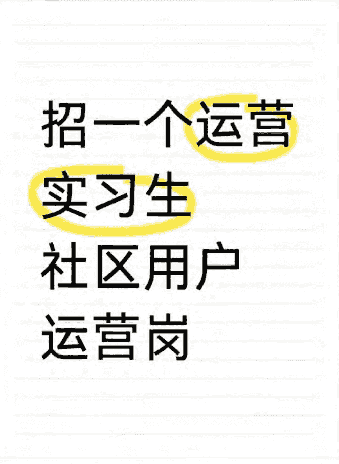

在线招人📢在找实习的看过来
周舟舟 19

小红书是一个内容平台，看一个内容平台的流量大不大，古辛认为看平台内容的点赞量即可。把小红书往下翻几页，你发现点赞量最多的几个帖子，只有80多个赞，说明，目前玩小红书的人确实不多，流量太少。

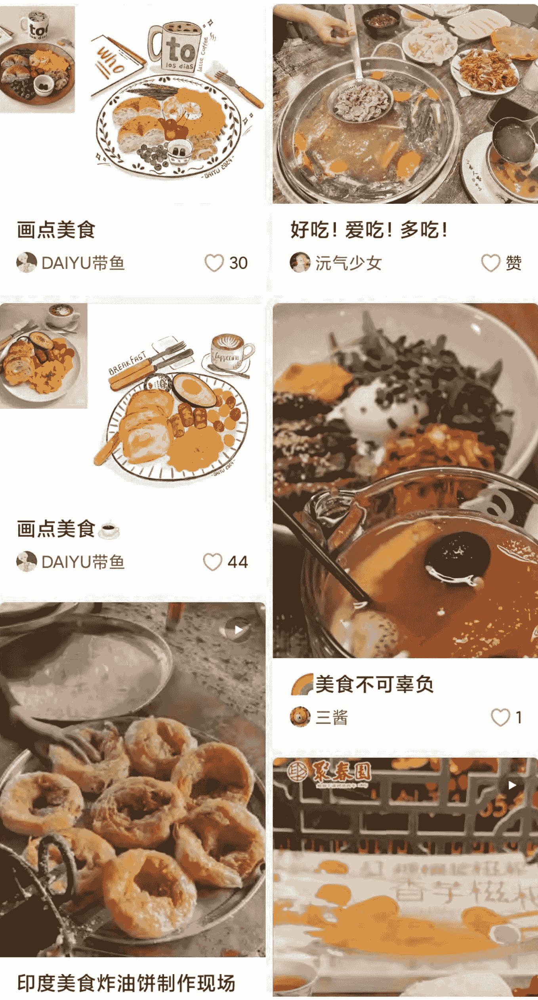

如果担心推送的不精准，无法反应小黄书的真实流量，那么也可以通过搜索几个大词，比如“美食”，“美女”来验证一下流量。

“美食”，“美女”等词，无论放在哪个内容平台，都是流量数一数二的词，如果这些词搜索出来的内容流量还是很少，说明咱们的判断是没有问题的。

其实，做完第一步，查验流量，咱们就发现小黄书目前流量太小，当下不适合入场，但作为教学案例，咱们得把流程走完，继续走第二步，验查变现方式。

###### 3. 中青年女性占比是否够大

这一点对于做电商的人来说，至关重要。因为电商的购买主力，就是中青年女性，如果一个平台中青年女性占比越大，电商就会越好做，如果一个平台男性占比过大，对于电商人来说，慎入。

小红书为啥现在这么值钱，惹得微信，抖音，网易等等巨头们眼馋，都要搞一个“小X书”，其中一个原因就是中青年女性占比很大。

但凡是大的平台，都会有第三方数据机构出该平台的用户性别占比分享；当然，大家也可以通过内容的评论来看，简单粗暴点的，就是搜美女，然后点开头部的帖子，看评论。

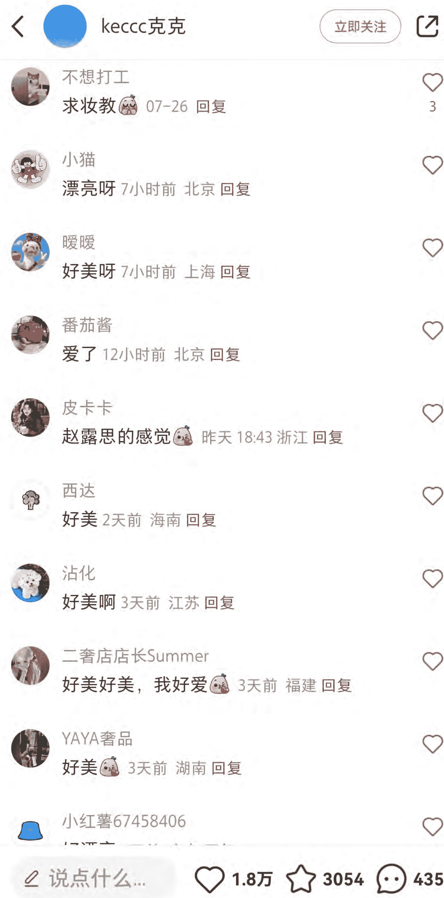

女性多的平台，美女笔记下面的评论是这种；


公众号懒人搜索，懒人专属群分享
大家都在搜：小玉来了黄色战袍
5166条评论
阿礼哥哥 人民看了吗？人民看了我才看


成功的man 你虽有几分姿色，吾心已有党和人民

男性多的平台，视频下面的评论是这种，辨识度非常之高。

想要赚正经的钱，平台的中青年女性的占比，一定要高。

###### 是否能够变现？

###### 1. 是否能够开店？

小黄书目前不能开店，目前想要在小黄书通过直接卖货变现，行不通。

###### 2. 是否能够引流？

搜索 全部 用户
- Incoo有课：11条动态 | 5粉丝 | 关注
- 成都课代表：1条动态 | 4粉丝 | 关注
- 水豚AI课代表：1条动态 | 关注
- 网课小达人：V 大连大学 | 关注
- 阿鱼的服装手绘有课：关注
- 如的道德法治课：1条动态 | 关注
- 一颗橘子手绘课：V 湖北美术学院 | 1条动态 | 16粉丝 | 关注
- 星树宴会设计有课：3条动态 | 关注

古辛一般看一个平台能否引流，一般会搜索“课”，因为卖课程的人，肯定需要引流，这波人无论在哪个平台，都是研究引流最深刻的一批人，想要知道一个平台是否可以引流，直接看他们的号就行。

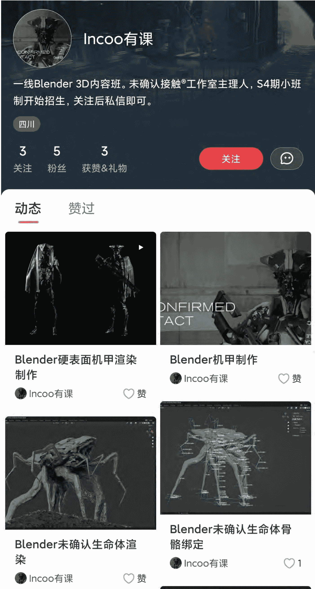

当然，小黄书目前流量太少，没有引流的必要。

###### 3. 是否有其他变现方式？

变现方式有很多，除了卖货，引流，还有接广告，打赏等等，虽然小黄书目前既不能卖货，也不能引流，但这个平台有打赏功能。

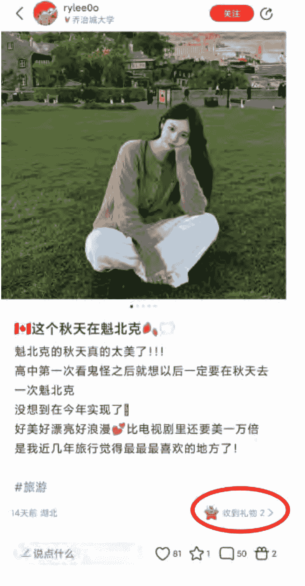

🇨🇦这个秋天在魁北克🍂🍁
    魁北克的秋天真的太美了！！！
    高中第一次看鬼怪之后就想以后一定要在秋天去一次魁北克
    没想到在今年实现了🌟
    好美好漂亮好浪漫💕比电视剧里还要美一万倍
    是我近几年旅行觉得最最最喜欢的地方了！
    #旅游
    收到礼物 2 >

这个是和小红书不一样的点，可能也会成为小黄书的破局点。

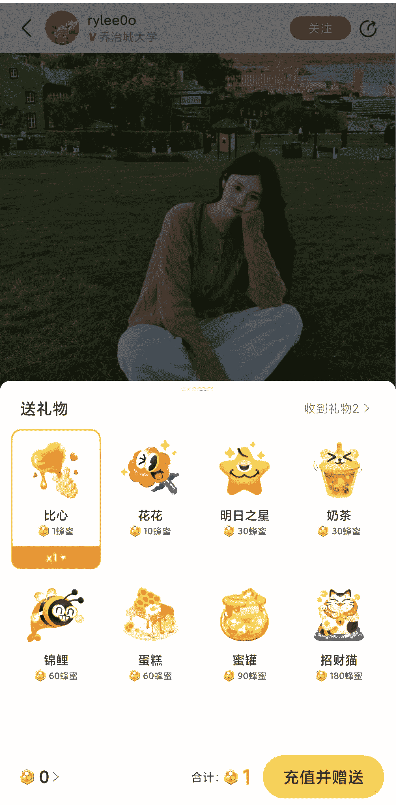

能变现，就能给用户带来创作的动力，打赏这个功能，不仅仅是小黄书和小红书的差距，同时也是小黄书和其他小红书模仿者们的差距。

流量查验完毕，变现方式查验完毕，我们就能得出结论，现在不是入场小黄书的最佳时机，小黄书目前还处于非常早期，不存在流量红利，现在入场小黄书的投资回报率太低，因为这个平台都不一定能活下去，需要再等他成长一段时间，再做判断。

###### 评论区：

更绪：直接从公司的逻辑判断，网易的产品就大概率不值得做

朱小童：我觉得也是，丁三石的产品活下来都挺难

px：网易家的app就直接放弃吧

## (8赞)AI搜索引擎崛起对SEO的影响：流量分发机制的剧变

作者： 白杨SEO
日期： 2024-12-03

GoGo闯：

    1、有个歪果仁说SEO要完蛋了
    阮一峰的《科技爱好者周刊》最新一期_没有链接的互联网_
    表明了一个观点，这个观点是歪果仁写的

    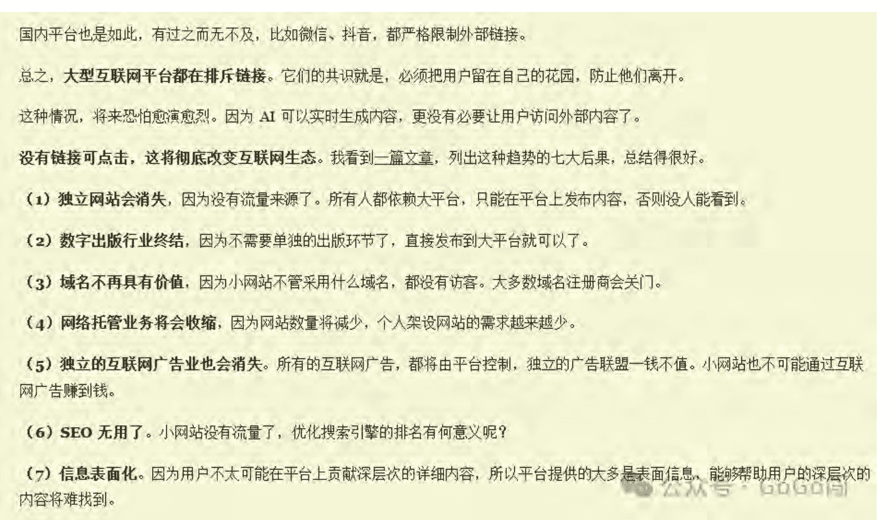

    总结下就是：
    因为ChatGPT这类对话类AI，及基于LLM（大语言模型）衍生出的各类AI搜索引擎（如http://metaso.cn），可以直接提供答案，而无需提供具体链接。各大互联网平台对此感到恐惧，通过各种手段限制用户跳出自己的平台，同时也加快各自AI平台的建构，培养用户习惯，跑马圈地。

    这意味着以往的** 「流量分发机制」 **开始产生了剧烈的变化，那SEO作为其中的小环节，也会产生剧烈影响。

- 1. AI类应用，逐渐分走流量，且可以不提供链接 ➔ AI搜索里，不存在SEO排名
- 2. 非AI类平台，限制用户跳出，且流量供给向自有产品倾斜 ➔ 领地保护越来越强

    由此引申出一个问题：

- 1. 当前国内AI搜索，还是提供链接的，此情况下的SEO，与百度/Google SEO有什么不同。

    2、试着回答

    2.1、排名的概念消失

> 直接给出答案，弱化链接存在，甚至不存在
> _秘塔AI搜索_

###### 公众号爆文标题的类型有哪些？

全网 文库 学术 图片 播客
快捷访问
如何用AI写出10万 爆款标题，详细教程【揭秘】-鑫峰网每日更新【www.xfzyk.cn】
无需提取码


    公众号爆文标题的类型多种多样，根据不同的写作技巧和策略，可以归纳出以下几种主要类型：

- 1. 情感类标题：这类标题通过表达强烈的情感来吸引读者，如“闭嘴！”，“失恋了，难道还要变丑吗”等，能够引发读者的共鸣和参与感13。
- 2. 叙事类标题：强调故事的核心元素，通过分享有趣或稀有的故事来吸引读者的兴趣，如“纽约名流花大钱来找这个花臂的家伙”23。
- 3. 地方类标题：聚焦于特定地域的人群，利用地域差异引发读者的好奇心，如“和XX人谈恋爱”22。
- 悬念类标题
  - 留下部分信息激发好奇心
  - 以问题形式引导读者思考
  - 制造惊奇感，如“惊爆恐吓型”
- 数字+提问类标题
  - 结合数字和提问，吸引注意
  - 如“10个创业者必须掌握的技能”
- 争议性标题
  - 引发思考，如“农民工月入万元还是很穷，钱都去哪儿了”
- 新鲜角度切入
  - 从新元素入手，如“麻将里面的万、饼、条代表什么？”
- 反问标题
  - 以问题形式引导读者思考，如“你心目中的妻子应该是什么样的？”
- 故事型标题
  - 分享个人故事，吸引读者注意力
- 暗藏玄机标题
  - 表面告诉读者什么，实际埋下伏笔
- 痛点类标题
  - 直接戳痛点，如“卷不动的打工人，开始精神离职”
- 干货类标题
  - 分享实践经验或知识，如“2022还没过完，她的年度好物清单已经出炉了！”
- 名人名言式标题
  - 植入大众熟知元素，如“王宝强的草根奋斗之路值得我们学习”

_ChatsGPT-4o（链接？不存在的）_

    公众号爆文标题的类型有哪些？
    公众号爆文标题的类型，通常根据标题的结构和目的分为以下几大类型。这些类型旨在吸引读者的注意力、激发点击欲望或直接满足目标受众的需求：

- 1. 情感共鸣型
  - 特点：通过戳中读者的情感需求，引发共鸣。
  - 适用内容：情感文章、生活感悟。
  - 示例：
    - “原来这才是成年人的真相！”
    - “看到最后，我哭了……”

- 2. 好奇引导型
  - 特点：制造悬念或反差，引发好奇心。
  - 适用内容：揭秘类、知识科普类文章。
  - 示例：
    - “为什么99%的人都没注意到这个细节？”
    - “她坚持30天后，竟然发生了这样的事……”

    在传统搜索引擎中，网页排序因子主要依赖：

- 1. 网页title → SEO基础
- 2. 网页体验（可读/可访问 + 用户互动数据） → SEO基础
- 3. 网站权威可信（备案 + 官方机构/知名大型网站/可信任特征...） → 内容可靠/规避风险
- 4. 流量分发的优先级（合作白名单/自家产品） → 高净值的流量

    在这4个因子中，

- 1. 前2个，常规SEO可以操作
- 2. 第3个，个别SEO可以操作，通过模板修改让搜索引擎误以为权威可信，黑帽的最爱
- 3. 第4个，SEO无法干预！

    在AI搜索中，前2个重要性大幅降低了，因为用户看不到title，打开链接的概率也不大，所以排名的概念彻底消失。

###### 2.2、大部分个人网站SEO消失

> 只有针对平台的SEO才能存活

    但后两个重要性（网站权威可信 & 流量倾斜优先级）仍然存在。

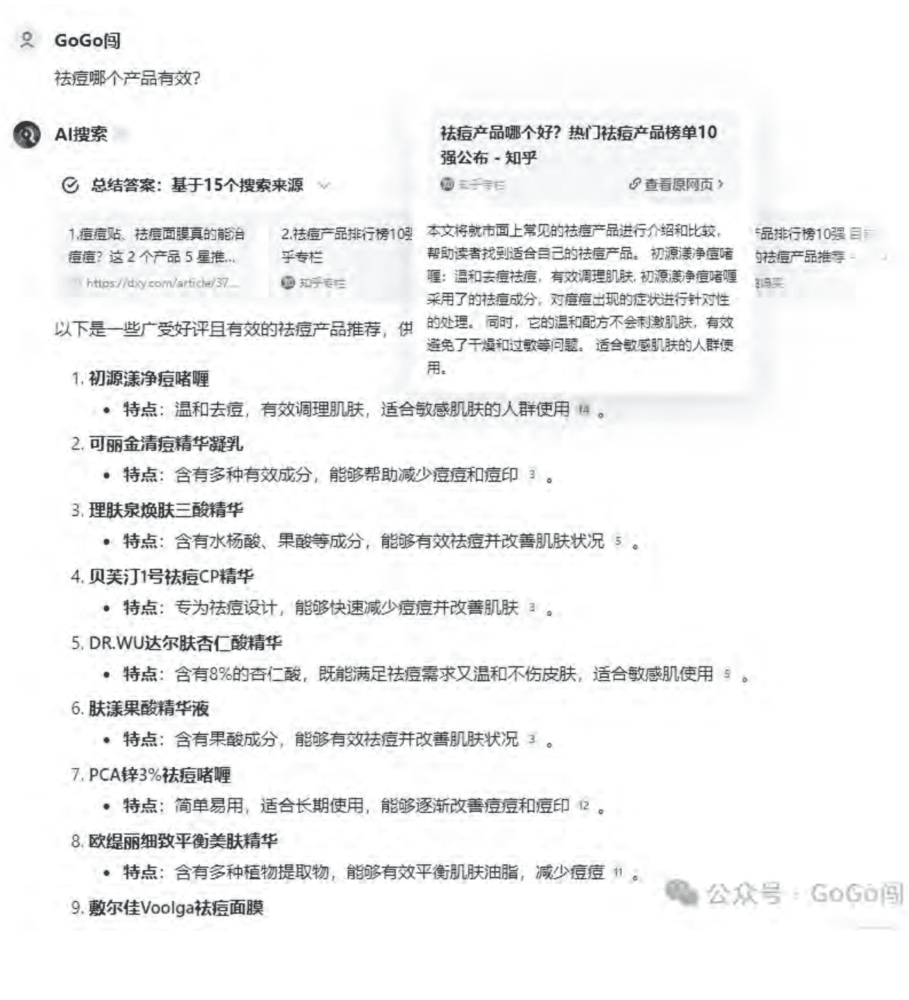

    国内AI搜索，先联网读取文档，再总结成回答。联网读取的文档，链接在回答中，有角标展示的。从这2年的搜索中，基本读取的都是大型知名网站的链接（比如知乎超高频率的出现）。

    这可能意味着，AI模型为保证数据的可靠性，只获取知名网站的数据，众多小网站直接过滤了。

    因此如果要在AI搜索推广具体产品的话，自建网站，可能根本无法获得曝光。

###### 3、网页正文的重要性，将高于网页title

    搜索意图研究，替代关键词匹配研究
    正文意图匹配，替代title关键词匹配

| 特性 | 传统关键词研究 | AI意图研究 |
|---|---|---|
| 核心目标 | 找到高效关键词，提高流量 | 理解用户真正需求，提供更高价值的答案 |
| 分析维度 | 关键词搜索量、点击率、竞争度 | 语义、上下文、情感、隐性需求 |
| 工具与方法 | 数据驱动的关键词挖掘与优化 | 深度学习模型支持的语义和上下文分析 |
| 结果形式 | 排名优化后的搜索结果列表 | 高度个性化的直接答案或交互式推荐 |
| 限制 | 难以应对模糊或多意图查询 | 需要更多计算资源和数据支持，隐私问题挑战更大 |

    传统搜索引擎，依赖网页title、正文和其他元标签的数据，与用户输入的搜索词进行匹配，而基于倒排索引，title在参与召回、召回速度、相关性排序中，都发挥非常重要的作用。

    AI搜索的场景，与传统搜索有很大不同。

- 1. 第一，用户query可以很长，几百字都是很正常的
- 2. 第二，AI会理解用户可能的意图，并返回匹配这种意图的回答（包括引用链接）

    举个例子：

    我语音跟AI搜索说：“今天跟女朋友吃完，打算跟她求婚，给我推荐八王坟附近一个合适的餐馆”

    那么AI根据上述信息，判断我可能需要一个“八王坟附近，安静、浪漫、有小资情调、私密性较好，适合男女朋友约会的饭店”，然后找出正文中能够体现以上特征的网页，并生成回答。

    这意味着，网页title的{饭店名称}并不重要，网页正文中出现「浪漫、约会、安静、私密性、朋友求婚…」等特征，会让AI认为更能符合用户意图。

###### 3、延伸

    每一次「流量分发机制」的改变，都是一次红利，而每一次红利都是财富再分配的过程，虽然这是大概率是在存量基础上进行局部的财富再分配。

    虽我认为是一个机会，但鉴于我过于平滑的大脑皮层，想象不出来过几年会产生怎样的变化。

    不过我认为，前提是AI需要走入千家万户，先有「流量价值」在过渡到「用户价值」。

    流量需要有一个入口承载，因此真正的转变，可能需要能够有「操作系统级AI」的诞生，我悟了，梭哈「APPL、GOOGL、MSFT」!

###### 白杨SEO：

    上面是GOGO闯写的，如果从网站SEO技术优化角度，我确实比不上他。他对“SEO无用了”这个看法，部分认同，部分有不同看法。看完你也可以留言说说。

- 1、大部分个人网站SEO会消失，这点认同。
    因为个人网站不管是从平台获得权重还是盈利都非常难，哪怕是做出海谷歌SEO，因为未来一定是协作团队式。现在AI搜索及AI慢慢普及，我们普通人确实更应该去做平台SEO，而网站可以做为一个最后自己的自留地，我目前就是这样做的。

- 2、排名的概念会消失，这点不大认同。
    为什么？因为排名不只在搜索引擎平台里有。比如电商，比如短视频平台等，有一个基本逻辑，除非用户主动搜索不存在，除非各个平台都变成一个AI软件，否则永远有排名。
    在百度或谷歌搜索引擎里，我们说的SEO排名指网页排名。但在淘宝，微信，抖音，小红书等等，这里面的排名有商品，有公众号，文章，短视频，笔记，即使他们会推AI智能回答，也不会改变用户自主的挑选逻辑。比如微信端，我之前写过：微信搜索新变化，推出AI问答，那些搞长尾词流量还能做吗？

- 3、SEO不只是网站搜索引擎优化这个概念
    现在SEO早已经扩展到全平台均可做SEO，SEO也不仅限于是一个技术，更是一个SEO思维。四年多前我写过的一篇《白杨SEO：我们说的SEO思维到底是什么？详细举例【推荐】》，如果没有看过的朋友，可以再去搜索看看。

- 4、仅从当下来说，AI还没有走入千家万户，还有很远的路要走！

    你可以随便问你身边的朋友，或者问问你自己，你目前AI使用频率如何？更别说很多人还没用。

    上次参加航海家活动，了解到目前AI领域创业项目，不管是AI培训还是AI写作主要营收还在大学生群体为主，国内各个AI更是在疯狂抢用户。国外呢？发展再快，也只是一小部分人先用起来而已。

- 5、还有很多人认为SEO无用了，是因为SEO的效率太慢了。
    SEO，原意就是指通过优化方法去免费获取自然搜索流量，从流量角度获取，本来就比投放见效慢。更别说当下因为短视频，直播的火爆，推荐流量成为了主流，所以SEO这种搜索流量更加被人觉得可有可无，认为无用了！

    但在白杨SEO看来，SEO这种搞用户主动搜索流量，搞精准流量的，永远是最有价值的，尤其TOB业务。当然很多一些比如培训，美容等TOC高客单业务同样是搜索转化更好。

    最后，

    SEO无用了，如果你信了，我就哈哈哈了。就如我以前说过“剩者为王”，在内容和产品过剩，流量红利没有了的背景下，谁能够搞来精准流量，谁能够做好私域流量运营，谁才能真正活下去，并且活好！

> 晴修伞，饱带粮，不管他人如何说，只看自己有没有用 。

    要想在竞争中让自己能够活下来，更应该学习，实战！加油！

###### 评论区：

暂无评论

## (6赞)企业TOB与TOC业务推广平台选择指南

作者： 白杨SEO
日期： 2024-12-06

    前言：这是公众号白杨SEO原创第571篇。为什么想到写这个？因为经常有朋友加我微信过来问，自己做XXX业务，去哪个平台推广更适合之类，所以写出来方便分享，欢迎大家收藏。

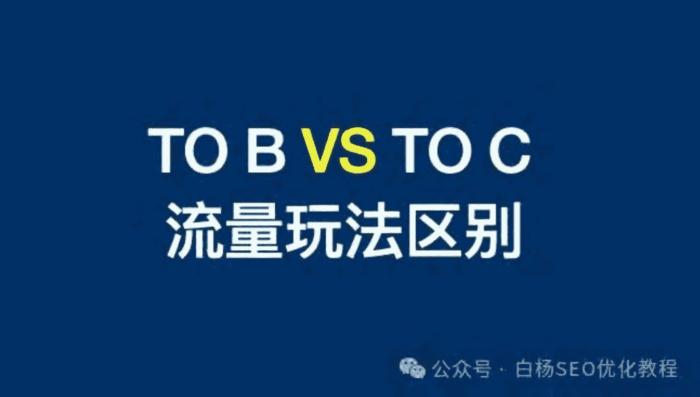

    文章大纲：

- 1. 为什么白杨SEO可以聊这个话题？
- 2. 企业TOB与TOC业务有什么区别？
- 3. TOB与TOC客户各自关注重点有哪些？
- 4. TOB与TOC客户流量增长区别有哪些？（重点）

###### 1、为什么白杨SEO可以聊这个话题？

    很多人以为白杨SEO只是做SEO的，甚至还停留在只做网站优化排名。其实从十年前开始，我就不再只是做SEO了，SEO只是我工作中以及现在做自由职业中一个技能而已。

    为什么我可以聊TOB和TOC这个话题？因为我有十年工作经历，一直在做TOB或TOC，或TOBTOC都做的工作，如图。

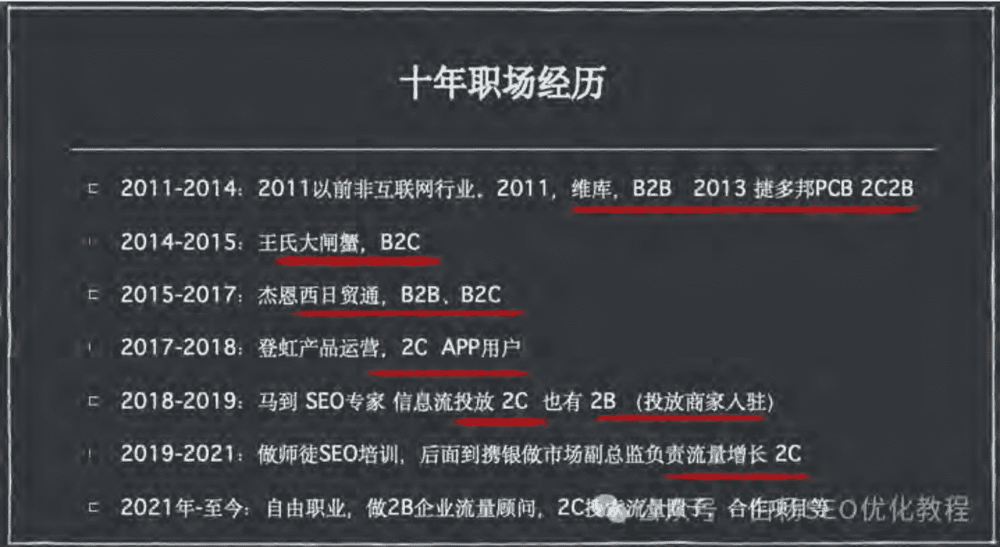

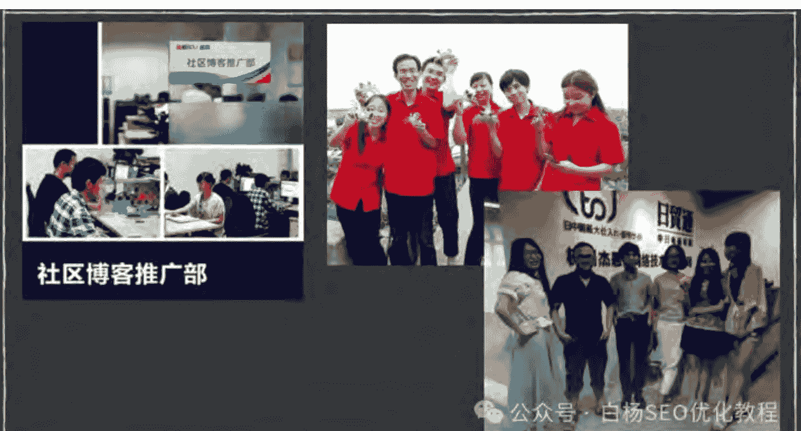

    进入互联网，最开始我是做销售的，后面才转到了网络推广部做外链，做网站SEO，淘宝SEO，做到项目主管，2014年进王氏大闸蟹做运营经理。

    哪怕现在做了近四年自由职业，你也可以理解成一个人创业，他们说的一人CEO，每周都能接触各类TOB或TOC业务咨询怎么搞精准流量等。不管是从理论还是实战都有很丰富的经历，所以可以来聊哈。

    不管你是不是在企业打工，还是自由创业，还是企业老板，均可以看看。

###### 2、企业TOB与TOC业务有什么区别？

    先说下TOB业务是什么?跟B2B有什么关系?

    所谓TOB业务，简单理解就是你的业务服务对象是企业。再白话一点，是企业给你付钱!

    比如白杨SEO最早进入互联网公司维库，我们卖给商家的维库电子市场金牌会员，钻石会员，包括后面在日贸通卖的日贸通会员，这些都是TOB业务。

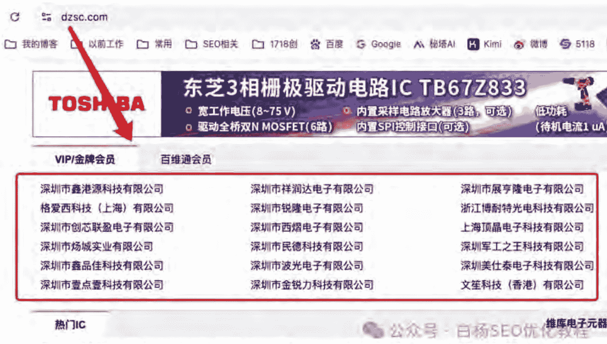

    再比如现在很多代运营公司（不管是百度还是抖音还是哪个平台，不管是做推广还是付费投放)他们都是做TOB服务的。白杨SEO给企业做流量顾问，这个也是TOB的。

    TOB跟B2B有什么关系?B2B是电子商务概念，一般我们指B2B平台。比如我老家维库电子市场就是电子行业B2B平台，比如阿里巴巴就是综合B2B平台。而TOB只是指业务是对企业的。

如果说有关系的话，你可以简单理解，很多TOB业务的企业会去B2B平台上推广，比如去阿里巴巴开店，因为很多潜在客户如果要批发进货，也知道去阿里巴巴这个B2B平台去找。

再说下TOC业务是什么？

所谓TOC业务是指简单理解就是企业对个人服务，白话一点就是个人为你付费。

比如我后面在王氏卖大闸蟹，我们在天猫上卖，我们在网站上卖，这些线上卖主要就是TOC个人中秋国庆送礼买的。比如我在登虹做【和目】APP产品运营，我们的客户就是那些买了云存储看视频的，他们都是个人用户。

再比如白杨SEO运营了快七年的SEO流量圈付费圈子，大部分进来交流的朋友，还是个人用户居多。

企业里TOB业务跟TOC业务只能有一个吗？

不是的，很多企业可能TOB和TOC都有。比如百度，他有TOB的百度推广服务，他也有比如企业产品百度文库会员TOC的个人服务。比如华为，你看他华为手机是TOC个人的，但华为TOB服务很多，如图。

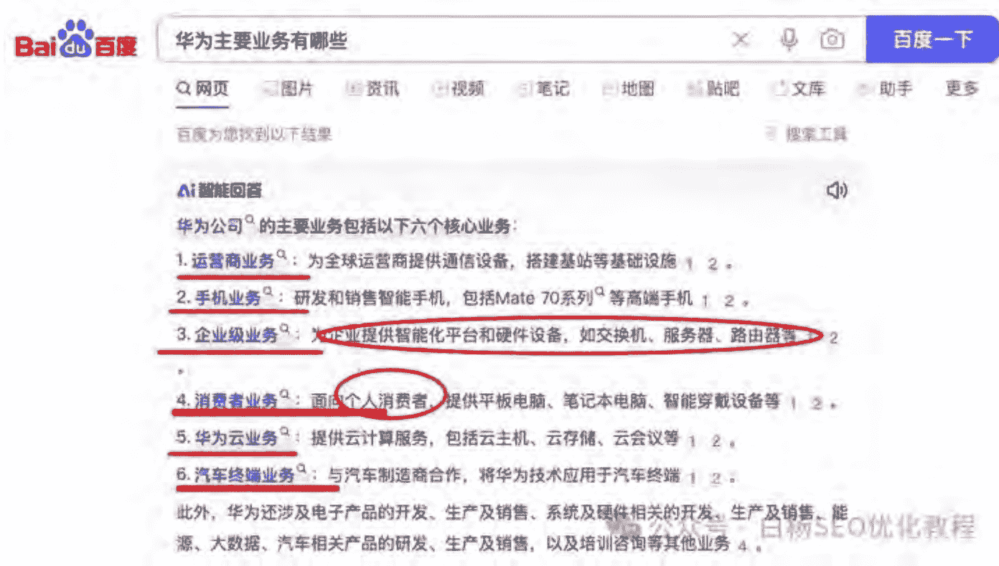

很简单，如果你是上班的，不管你是哪个岗位，你去了解下公司的产品或服务你就知道你们公司的业务是TOB，TOC，还是TOB和TOC都有了。

###### 3、TOB与TOC客户各自关注重点有哪些？

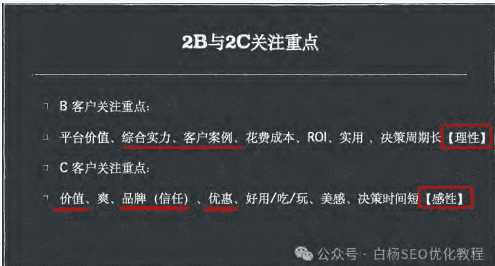

如图，TOB客户关注重点，也就是是否选择你，为你付钱，他会看重，你们的实力，你们的案例，在你这里能得到的价值，价格与服务等。如果非要说重点，就是谁用了你们，然后你们服务好不好！

TOC客户关注重点，分两类，有实力和品质追求的客户追求价值和品牌，一般普通人更看重是不是优惠，划算。比如京东和拼多多上的主要消费者关注重点就不一样。

不管如何，TOC的客户比TOB的客户更感性一些。比如像直播带货为什么这么火，除了看似“便宜”（直播中的东西，你去拼多多搜，拼多多会更便宜）外，就是直播时候还提供了情绪价值，直播更直观！

白杨SEO还要补充一点：TOB服务决策时间长，理性原因是因为企业选择一笔费用支出都要有一个合理的理由，并且如果不是老板亲自买，都还会有各种流程等等。最重要的，现在企业花钱会更加谨慎，因为花钱都是为了赚钱而花，不是像TOC消费花，明白了吗？

###### 4、TOB与TOC客户流量增长区别有哪些？（重点）

TOB客户流量增长方法：

如果是线上，如果你的业务是TOB，如果是商品类，传统的B2B平台如阿里巴巴可以去开店铺推广。如果你是服务类，传统的如百度可以去做推广，不管是付费还是免费。当然，TOB服务，抖音平台千万不要漏掉！

如果是线下，线下你行业的展会，你的行业线下会议都是做客户增长的好地方。

TOB客户增长方法还有最最最传统的电销（电话销售），现在很多都用AI智能打电话筛选了。还有比如老带新，客户转介绍，这些都是方法。

如果从推广角度看，企业中最好要有一个懂推广的人来负责。比如我徒弟在温州某游乐设备公司负责整个推广运营，不管是各平台付费投放，还是各平台自然搜索优化都懂。

如果你的企业没有，要么招人，要么内部人员去培养，去学习。也有的企业说我外包，外包只能解决一时，长期来说，还是要自己养团队更好。

TOC客户流量增长方法：

TOC客户流量增长的方法，这个最快的方式就是花钱投放，不管是投信息流广告，还是投关键词搜索广告。

当下TOC客户最大流量主要就是微信，抖音跟小红书，像微信有广点通投放，可投公众号文章底部广告，朋友圈广告信息流，也可以投微信搜一搜广告。抖音，小红书都有信息流投放和关键词投放。

如果是投信息流投放，你要关注的重点是投放素材和广告文案优化；如果是投用户搜索关键词投放，你要关注的重点是找到有价值的关键词以及素材匹配度。前者很多信息流投放优化师+设计可以搞定，后者要一个懂搜索流量的人配合更好。

如果你是走不投钱的方法推广，可以用网络推广，也可以用直播方式。网络推广分推荐流量玩法和搜索流量玩法，到底需要哪个，可以看我之前写过那篇，如图。

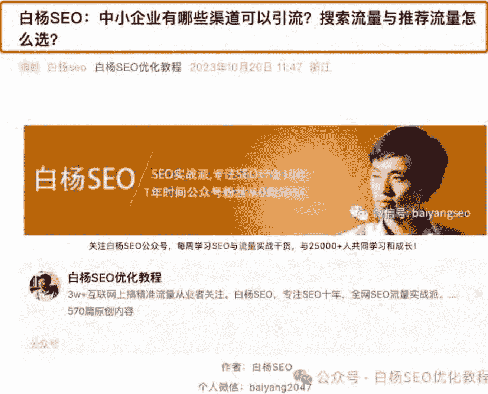

当然，你说我用社群，裂变啥的可以吗？当然可以。但有一个前提，你社群的种子用户哪里来？不还得推广吗？

TOB与TOC客户流量增长方法的区别，主要就是平台选择的区别。如果是TOB业务，主要选百度跟抖音，如果是TOC业务主要选微信，抖音，小红书等。

如果TOB和TOC都有，像抖音，知乎都可以。当然，最重要的是根据你的产品或服务的潜在客户主要在哪个平台来选择！

###### 作者介绍：

白杨SEO，专注SEO十年，全网SEO流量实战派，对互联网精准流量有深入研究。

###### 评论区：

暂无评论

## 【星主的收藏夹】5篇

### (86赞)三生有幸：生命、生活与生意的和谐统一

作者： 亦仁的收藏夹
日期：2024-12-05

王志纲老师提出一个三生有幸的理念：生命、生活和生意，三生合一。生命要丰富多彩，生活要质量，生意能顺带成功。

###### 评论区：

暂无评论

### (78赞)商业与个人规则：聚焦品牌与执行力

作者： 亦仁的收藏夹
日期： 2024-12-06

商业规则：
- 不做市场营销，不做销售。
- 个人品牌 > 商业品牌。
- 更多业务，更多收入来源。
- 更多资产，更多流量和收入。

个人规则：
- 不要分心。
- 停止把一切都做到完美（有截止日期）。
- 停止过度思考（坚持你的计划）。
- 提前一周计划。
- 始终坚持你的计划周（执行你自己）。
- 保持健康（去健身房）。
- 控制你的情绪（避免压力）。
- 找到你的动力。
- 照顾好你的健康。
- 消除坏习惯（并建立好的习惯）。

###### 评论区：

- **Light微光**：不做市场营销，不做销售，这个怎么理解？

- **旭宏**：我觉得可能是指不做夸大宣传，甚至不主动宣传。 通过打磨产品，让产品自己说话，桃李不言，下自成蹊。某些角度看，生财有术社群也没有太多的主动营销，而是专注做“服务好会员”的点点滴滴的工作。现有会员的满意度高了，会有口碑传播和转介绍，能够持续带来复购和新用户。 早期的海底捞也是这样，特别地人无我有+超预期。

- **凯歌**：没有营销策划，就不要开展销售。不谋全局者者，不足谋一域。

- **陈不胖（真不胖）**：流量的核心在于：只吸引，不骚扰。 对于流量来说，用户的每一个动作，点击，点赞，收藏，关注等都是 一个行为，一个动作。 至于是不是产生这个动作，要不要有这个行为，其最终的决策点只有用户，只有用户自己才能决定自己要不要做出这个行为。 一味的引导，一味的营销，一味的销售只会让人反感，感到厌恶，从而导致损失市场，损失流量。 简单来说就是，在菜市场中，无论你把你的菜宣传的有多棒，但是用户自己心中有一杆秤，有属于自己的一份答案，他自己会决定买还是不买。 所以正确的方式是尽量把菜的品质拉升起来，菜好客户自然会买。 不用宣发都可以卖的很好，想办法如何把自己的产品更符合客户的核心利益才是关键。

- **帅小伙儿**：希望亦仁展开一下商业规则第一条

- **大屋顶**：停止过度思考，哈哈哈，太对了。

- **麻雀**：于东来

### (52赞)乔布斯谈被苹果解雇：人生中最具创造力的时期

作者： 亦仁的收藏夹
日期：2024-12-02

> “当时我并未察觉，但从苹果被解雇实际上是我人生中发生的最好的一件事。成功带来的沉重感被重头再来时的不确定和轻松所取代。这让我进入了我一生中最具创造力的时期。”
——史蒂夫·乔布斯，2005年斯坦福大学毕业典礼演讲

###### 评论区：

暂无评论

### (37赞)特斯拉命运的齿轮始于2006

作者： 亦仁的收藏夹
日期： 2024-12-04

> “想象力比知识更重要。因为知识是有限的，而想象力概括着世界的一切，推动着进步，是知识进化的源泉。”

https://mp.weixin.qq.com/s/DUhFlxA_1IdjBIlhELcuNw

###### 评论区：

- **周彦充**：这句话前一个月，我也读到了，哈哈，也收录了。

### (23赞)战略的根本：思维方式

作者： 亦仁的收藏夹
日期：2024-12-03

战略在根本上应该是一种思维方式，是对商业过程的团队的思维方式。
https://mp.weixin.qq.com/s/Vha-PWgubDWh50oaBTYwtg

###### 评论区：

暂无评论