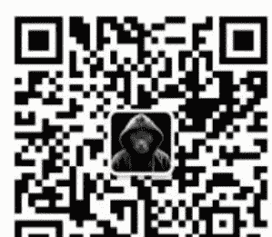

# 推翻叙利亚政权的HTS，到底什么来头？

2024.12.13 文/卢克文工作室嘉宾 云梦竹

整理：公众号懒人搜索，懒人专属群独享

懒人微信：lazyhelper

短短十二天，叙利亚原政府便彻底崩溃。

而夺取政权的，是沙姆解放组织，英文简称HTS，其首领叫艾哈迈德·沙阿，外界很多人以为他叫朱拉尼，其实，朱拉尼只是他的化名。

问题来了，HTS是一个什么样的组织，朱拉尼又是什么人呢？

朱拉尼的父亲，名叫侯赛因·沙阿，在第三次中东战争时，阿拉伯世界战败，以色列军队占领了戈兰高地，住在戈兰高地的侯赛因·沙阿，被迫与家人一起逃离。

随后，他在巴格达大学经济学专业就读，一生专注于区域经济研究，出版了大量教育、农业和军事进步领域的著作。由于侯赛因·沙阿对纳赛尔主义充满向往，被老阿萨德通缉，进而流亡沙特。

这些对于地区命运的思考深深影响了他的儿子。在很多年后，当记者采访身为HTS首领的沙阿，为什么要使用朱拉尼这个称谓时，他告诉记者，朱拉尼是其家乡戈兰高地的化名。

这个名字本身就是回答。

朱拉尼（戈兰高地）代表了三重含义：戈兰高地这是他父亲的故乡，是他父亲走过的道路；戈兰高地是西方及其以色列强加给叙利亚人民的灾难；同时，戈兰高地也是阿拉伯复兴党斗争失败的标志。

父亲是世俗的，朱拉尼小时候也是世俗的，很多同学在采访中提到：朱拉尼聪明且沉默，与一位阿拉维派女孩相恋，但因为双方家庭反对而未能如愿。

此时此刻，没有人会将他和日后的恐怖组织领导人挂钩。

然而在这平静的表象下，却是翻涌的波涛。

六日战争中阿拉伯复兴党的失败，让世俗化民族主义在阿拉伯世界声誉扫地。伊斯兰世界开始向极端思潮偏移，世俗主义在阿拉伯世界的群众基础被严重削弱。

在2001年“9·11”袭击中，美国被重创，朱拉尼随即认为，这是一条行得通的道路。

当2003年伊拉克战争爆发时，他决定参与其中。年轻的朱拉尼加入了伊拉克基地分支，并在伊拉克安巴尔省作战，随后安巴尔省落入基地手中，形势一度向着有利于极端主义的状况转变。

当地占大多数的逊尼派群众一开始是支持的，但当基地组织所推动的极端思潮严重影响居民正常生活时，情况发生了转变。当地民众在经历了复兴党时期的世俗统治后，对于严格的教法并不认可。双方矛盾激化。

当地41个逊尼派部落联合起来和基地组织开干。在初期，这个组织既与基地作战也与美军作战。当时驻伊联军指挥官彼得雷乌斯注意到了这个问题，随后与该组织结盟，成立了伊拉克觉醒会议，共同清理极端分子。美军出钱，当地出人，伊拉克觉醒会议快速壮大，导致伊拉克基地分支濒临覆灭。年轻的朱拉尼也在一次战斗中被俘，进了监狱。

基地组织谴责伊拉克觉醒会议是“肮脏的十字军”，加大了针对该组织成员的报复。而报复加深了双方仇恨，迫使许多逊尼派和伊拉克部落与美军合作。伊拉克觉醒会议在短短一年时间就蔓延到全国，震撼了处于监狱中的朱拉尼。

他开始认识到，不能太极端，太极端就会失败。同时在监狱这个“龙场”里，他得到了不少的资源。最重要的是广识人脉。朱拉尼曾经提到，在其组织建立初期，他之所以可以拉拢其他武装团体，就因为大家在监狱中早就结识。哪怕双方不直接认识，他们的朋友和我在监狱中有过交往。

2011年，刚出狱的朱拉尼赶上了叙利亚内战爆发，“形势大好”，随即拿着IS的钱，去叙利亚组建了“努斯拉阵线”。

“努斯拉阵线”一成立，就显现出了不同。当时，其他恐怖组织普遍面临一个困难：集权程度太低。这是武装组织通病，他们往往是地方豪强或者社区领袖，先在地方拉起一个军事团队，然后再联系自己的狱友进行合作，最终形成了不同的反对派组织。这就意味着大家只有名义上的组织，并没有真正的制度去进行约束。上面的命令，下面是否执行，很多事情纯看心情。例如，伊斯兰解放阵线内的某些下属团体尽管接到了中央领导层的合并命令，却拒绝合并，依旧分散作战，最终被阿萨德的政府军各个击破。

而朱拉尼真正有能力改变这一困局的契机，是因为发现了别的极端组织没有发现的招募渠道：当地商业社交网。这是由叙利亚小商贩组成的网络，他们周游贩卖，对各个地区的人文环境极为熟悉，哪个部落支持巴沙尔，哪个部族反对他，谁家孩子是极端主义的好苗子他们一清二楚。努斯拉阵线通过这个网络，在全国范围内进行成员征募。并依据宗教权威，对征募人员进行统一培训和编组，确保了努斯拉阵线的军事纪律。这样的好处就是成员不是一起进来的，不会一开始就拉帮结派，上层对组织基层的控制力大为提升。

朱拉尼曾经得意地说，我让士兵们进攻他们就进攻，我让他们撤退他们就撤退。“努斯拉阵线”的执行力远强于其他组织，迅速蹿了出来。

壮大后的努斯拉宣布投靠基地，和IS划清界限。之所以这样，是因为IS比基地要极端不少，朱拉尼觉得，要是继续和IS一起，早晚重蹈在伊拉克的覆辙。

2015年9月，俄罗斯宣布进行军事干预，直接改变了叙利亚的力量平衡。短短几个月，政府军兵锋直抵阿勒颇，各大恐怖组织被重创。为了守住阿勒颇，2016年初，各大恐怖组织试图建立一个反对派协商委员会，协调不同派系的力量，并允许该委员会管理反对派区域。

但是各个派系拒绝交权，并且认为，努斯拉阵线需要断绝与基地组织的联系，他们才愿意加入委员会。随后朱拉尼表示，自己可以断绝和基地的关系，但你们也要断绝和其他外部势力的联系，包括土耳其、卡塔尔乃至美国。这个提议立刻被大家无情地否决。此后阿勒颇攻防战打响，内部矛盾重重的反对派武装丢掉了阿勒颇，被迫退往伊德利卜省。

阿勒颇的丢失，让反对派武装感到震撼。虽然俄罗斯的军事实力确实不俗，但几乎所有高层都认为，内因比外因更重要。反对派缺乏统一的政治团结，各个军事派系之间内部分歧不断，未能全力占据城市。他们意识到，必须解决内部问题。

最终，讨论得出了结果：伊斯兰解放组织创始人哈希姆·谢赫从伊斯兰解放组织中脱离，朱拉尼的努斯拉阵线则与基地组织割裂，双方一道成立新的马甲——“沙姆解放组织”（HTS）。

沙姆解放组织从伊德利卜走向大马士革一共走了六步。

- 第一步：就是统一法律。当时叙利亚反对派不同派系之间法律适用不同，就以卖酒为例，在一些区域内，卖酒是正常商业行为受到保护，而在另一些极端派系眼中，卖酒就是死刑。法律的不同严重制约了反对派控制区的经济。基于这个原则，朱拉尼推动了统一法典的施行，并且允许所有教法学家依据法典进行判决。
- 第二步：组建救国党政府。同时根据讨论，叙利亚需要建立一个以逊尼派为主但包容其他教派的统一国家。在宣传中，他们称巴沙尔政府是属于阿拉维派的教派政府，而救国党才是所有叙利亚人的政府，还启用专业技术官僚组成行政机构。
- 第三步：重建军事系统。之前极端组织和反对派的军事系统都是个人领导的团伙。沙姆解放组织成立后进行了重新编组，无论是协调能力还是统一行动能力都有了很大的提高。
- 第四步：在达成共识的情况下组建内部安全系统，对内外进行残酷且惨烈的清洗，一切不服从决议的人都会被警告、逮捕乃至处决。对外则采取暗杀、爆炸等手段，物理消灭不愿意交权的军阀，收编他们的队伍。
- 第五步：鉴于之前斗争中宗教部门对于军事行政的干涉导致了一系列负面影响，将之前一人宗教领袖制改为四人同时领导，只有四人达成一致才能发布宗教指令，大大降低了宗教决策对于其他系统的干预。
- 第六步：重组咨询委员会，依旧采取民主讨论的模式，但所有讨论只能在委员会内部进行，决不允许在外讨论影响队伍士气。曾经有三名指挥官对决策提出了不一样的意见，立刻遭到逮捕。

这一系列举措，虽然残酷甚至是残忍，但事实上几乎重塑了HTS的力量。

当2015年叙利亚反对派第一次围攻阿勒颇时，内部派系分裂，军事指挥不统一，大量极端分子的加入让当地群众对于反对派的统治充满了恐惧，一些原本反对阿萨德的少数族裔因为惧怕极端分子不得不与政府军站在一起。而今天，HTS实现了内部政治的统一，并且软化了内部的极端主张，更大限度地寻求当地群众支持。

更重要的是，外部环境出现了剧烈变化，俄乌之间的冲突让沙姆解放组织具备了统战价值。从2023年开始，泽连斯基就试图在其他区域攻击俄罗斯势力，乌克兰情报局在马里培训叛军，帮助他们伏击驻扎在当地的瓦格纳部队。而在今年年中，乌克兰就派遣了250名教官前往沙姆解放组织区域，帮助他们进行无人机方面的训练。为了学习乌克兰，朱拉尼连个人形象都照抄泽连斯基：泽连斯基蓄了个胡子，他也蓄胡子；泽连斯基穿绿色衣服，他也穿绿色衣服。

对俄乌战争经验的深入学习让HTS在技术层面逐渐领先，尤其是大量无人机的使用。之前坚守数年的阿勒颇在本轮战争中仅仅三天就陷落了，原因之一就是HTS大量使用无人机造成了政府军的恐慌；在哈马，HTS的无人机还击杀了一名政府军情报部门的少将，很影响士气。而叙利亚政府对此毫无准备，当然也可能是无力做太多事情了。

沙姆解放组织的胜利代表伊斯兰极端势力来到了一个全新的高度。他们开始为了取得最终结果团结其他派系、获取群众支持，继而弱化了自己的主张。但HTS真的能脱离恐怖组织的范畴、洗白上岸吗？朱拉尼有没有这样的控制力是值得怀疑的。

在占领大马士革之后，HTS的军事领导指挥官就前往电台安抚少数族裔，并宣称所有叙利亚教派都会得到同等的权利。同时反对派总指挥部宣布严禁干涉妇女的着装或对其衣着、外表提出任何要求。

但在大街上，不少HTS的人毫无顾忌地屠杀阿拉维派战俘与平民，还有前政府人员，相关的处决视频已经满天飞。一些叙利亚女性也在网络上分享了自己因衣着而被HTS威胁的案例。

显然，朱拉尼的控制力并不那么充足，他本人有没有意愿去得罪那些极端派系也是一个问题。

微信:lazyhelper

历史 3000 多份各类付费文章以及年费三千多的副业社群资源，见懒人专属群内部分享！

付费群，白嫖勿扰！

懒人专属群更新记录：

https://lazybook.fun/#/blog/record2

