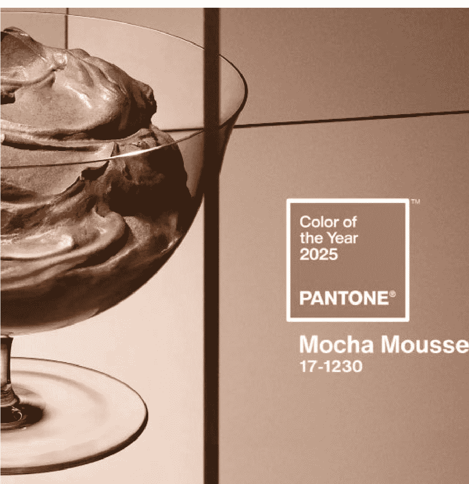

# 连接即权力，共识即商机

241213

整理：公众号懒人搜索，懒人专属群独享

懒人微信：lazyhelper

今天，将从两个话题出发，为你提供知识服务。第一个是，潘通发布2025年度代表色。第二个是，关于眼科医学的新进展。

先来看今天的第一条。上周，12月5日，潘通公司 PANTONE 公布了 2025年的年度代表色，摩卡慕斯，看起来有点像咖啡色，或者焦糖色，又有点美拉德风格。

潘通 2025 年度代表色，摩卡慕斯

摩卡慕斯对应的潘通色号是 PANTONE 17-1230，这也是潘通第 26 年发布年度代表色。注意，潘通发布的不是对过去一年颜色的总结，而是对来年流行色的预测。

那么，为什么明年的年度色是摩卡慕斯呢？潘通的官方说法是，这是一种引人回味、柔和的棕色调，能够将我们的感官带入其所激发的愉悦和美味之中。色彩温暖浓郁，满足我们对舒适的设想。我们总是在生活的各个方面追求和谐感，人际关系、工作、社交人脉。和谐能带来满足感，启发正向的内在平静、安心和平衡，并让我们与周围的世界同步。因此，我们选择了摩卡慕斯作为2025年度代表色。尝试从另一个维度，进一步满足我们对舒适的渴望，包括分享、馈赠和给予的简单愉悦。

好，以上是潘通官方的原文。听到这，有人可能会问。为什么是潘通？它凭什么发布未来一年的年度色？依据又是什么？

今天，咱们就来聊聊潘通这家公司。

首先，为什么是潘通？这个问题我们在去年年度色发布时就讲过。有句话叫，连接即权力，没错，潘通在色彩行业的话语权，就来自它所创造的连接。

本来，颜色这个东西，一度是没有标准的表述方式的。比如，深灰是有多灰？天蓝是哪种蓝？暗红跟猩红又有什么区别？你都很难跟设计师说清楚。尤其是工业时代，商品要大批量生产，假如没有统一的方式描述这些色彩，你甚至都没办法在不同的工厂生产出统一的商品。

怎么办？最早注意到这个痛点的公司就是潘通。1956年，潘通的创始人劳伦斯·赫伯特从纽约长岛霍夫斯特拉大学毕业，在纽约的一家广告公司担任调色师。他当时就觉得调色这个事很麻烦，于是就想办法简化，把当时用到的60种颜料简化到了12种。后来这家广告公司转型，赫伯特就顺势买下了整个公司，并且给公司改名叫潘通。

从1963年开始，潘通找到了一门好生意，这就是，制定色彩标准。也就是，为每一种颜色确定一个特定的编号，并且附上配方。换句话说，只要你知道一个颜色的潘通色号，就能丝毫不差地还原出这个颜色。潘通的创始人赫伯特就说，上帝用7天创造了世界，我在第八天让潘通给世界填上了颜色。

注意，制定色彩编号，这个事本身并不值钱，关键是，你能让人们使用它。潘通色号的本质，就像创造了一种准确的描述色彩的语言，让人们之间可以针对色彩这个事准确沟通。

换句话说，潘通厉害的地方在于，它创造了新连接。让工厂与设计师，艺术家与商人之间，可以在色彩这件事上更准确地展开协作。

那么，潘通发布的年度色预测一定准确吗？未必。要知道，潘通不是唯一发布年度色的机构。比如PPG，这是一家美国的涂料公司，1883年成立。潘通成立之前，PPG就已经连续很多年位居美国财富500强企业。而PPG发布的2025年年度色，是罗勒紫，类似于紫水晶色。你看，跟潘通的预测明显不一样。

换句话说，潘通的年度色，一部分是预测，另外一部分也是在想办法塑造共识。也就是，通过一个故事，让你认同这个颜色。

比如，潘通2023年的年度色是非凡洋红，也就是好多人说的火龙果色。潘通的解释是，它是一个混合的色彩，在这个多面向的世界里，于实体与虚拟之间跨越自如。2023年正好是AI大爆发的一年，这个描述等于是告诉人们，这个颜色很适合用在AI生成的虚拟画面里。同时，潘通还说，非凡洋红来自胭脂虫，胭脂虫是种很古老的昆虫，会产生胭脂红色的染料，因此，非凡洋红将我们与原始之物连结，为我们带来原生力量的讯号。你看，这又押中了环保这个关键词，以及疫情之后人们想出来闯一闯的心情。

再比如，2024年的年度色，柔和桃，背后的关键词都是柔和、疗愈、社群。要知道，这两年正好赶上全世界的新一轮心理学热。潘通的年度色在一定程度上也在回应这个趋势。就像潘通自己说的，2024 年生活各方面正值动荡不安，我们对滋养、同情和怜悯的需求与日俱增，对于和平未来的想象也有增无减。因此要选出一种颜色来强调社群的重要性，柔和桃能让我们联想到拥抱的温暖。

你看，有了这个解释，是不是感觉这个年度色就多了一点说服力？同时，潘通还会在官方网站上，给出一份非常全面的年度色使用说明书，包括它能用在哪些场景，怎样搭配，等等。

当然，你要想获得进一步的色彩服务，是需要付一大笔钱的。借用《快公司》的评论，年度色的发布已经是潘通最重要的营销手段。而根据 LeadIQ 的数据，2024 年，潘通的营收是 3500 万美元，达到了它近几年的峰值。

换句话说，潘通一直在做的事情无非就两类，通过制定色号来实现行业之间的沟通连接，连接即权力。同时，通过发布年度色来创造新共识，共识即商机。

再来看今天的第二条，也和视觉有关。眼看着年底了，顺着色彩这个话题，我们说说过去一年里，来自眼科医学的新进展。假如你平时的工作要频繁用眼，尤其建议你仔细听听。

懒人微信：lazyhelper

咱们要说的三个研究：

- 咱们要说的第一个研究，与干眼症有关。干眼症是除了近视之外，最常见的眼科疾病之一。根据2013年发布的《干眼临床诊疗专家共识》显示，我国干眼症的发病率超过20%。没错，每5个人当中，至少就有1个人受干眼症的困扰。通常情况下，很多人都会选择滴眼药水。但就在今年9月，中山大学眼科中心的研究团队有个很有趣的发现，大笑可以改善眼睛的锁水功能，缓解干眼症的症状。没错，大笑可以缓解干眼症，这个成果发表在《英国医学杂志》上。研究团队招募了大约300名中轻度干眼症患者，随机分成两组。一组是人工泪液用药组，也就是用0.1%的玻璃酸钠，每天滴4次。而另一组是大笑练习组，需要每天练4次，每次重复30遍。在第8周的时候，大笑练习组眼部疾病指数的降幅，比人工泪液组多了1.45分。而到了第12周的时候，大笑组的效果已经明显比人工泪液组好。没错，大笑对干眼症的治疗效果完全不亚于眼药水。而且值得注意的是，按照实验结论，假笑，也行。没错，无论是真笑还是假笑，只要多笑笑，真的可以缓解干眼症。

- 第二个研究，关于白内障。什么是白内障？一个很通俗的说法是，白内障就像是蛋清变成了蛋白。没错，原来眼睛的晶状体是透明有弹性的，但由于里面的蛋白质变性，晶状体变浑浊了，就会阻挡光线的透射。根据官方统计，我国60岁以上人群中，白内障的发病率在80%以上，而90岁以上老人的发病率高达90%。目前，白内障的治疗主要方式是替换人工晶体。但就在最近，这个课题有了新进展。成果来自浙江大学二院眼科中心和美国国立卫生研究院下属国家眼科研究所合作的项目，论文发表在《临床调查杂志》上。研究团队发现，有一类松鼠在冬眠期间，眼睛的晶状体会在低温环境下会变得浑浊，但等它们从冬眠中醒来时，晶状体又恢复到了完全透明的状态。你看，这个过程跟白内障治疗的过程是很相似的。经过进一步研究，他们发现，当松鼠从冬眠中苏醒时，晶状体中的泛素-蛋白酶体系统（UPS）会被激活，而这个系统的主要功能就是降解蛋白质。更有意思的是，松鼠的UPS系统可以非常精准地清理一类物质，也就是α-晶状体蛋白（CRYAA）的聚集物。而这种蛋白质的聚集物，就是造成白内障的主要原因。具体的原理咱们就不展开了，总之，假如这个研究进一步成熟，就有可能研制出新型的白内障药物。

- 第三类研究，咱们说说近视。根据国家卫生健康委公布的数据显示，我国青少年的总体近视率已经超过了 50%。而且早在 2018 年，高三年级学生近视度数高于 600 度的占比，已经达到 21%以上。还有国外学者统计过，一个人一生要花在矫正视力上的费用，可能会高达 1000 英镑。针对近视问题，今年出现了几个新成果。比如，重复低强度红光疗法，也叫 RLRL 疗法。2024 年 6 月，上海市眼病防治中心邹海东教授的团队就公布了这项研究成果，可以有效控制儿童、青少年的高度近视。再比如，自然教室项目。就在今年 5 月，《自然》杂志专题报道了一种新的方法，也就是在教室里模拟户外场景，让学生在室内获得类似户外的视觉刺激。再比如，用 AI 治疗近视。日本大阪大学下属的一个科技公司，正在研发一款自动对焦眼镜。据说这款眼镜可以根据头部和眼球的运动，自动对焦。无论近视还是散光的人都能提高视力。当然，这个项目目前还处在早期研发阶段，假如后续研发顺利，有可能重塑整个眼镜行业。

好，关于眼科医学的进展，咱们先说到这。

最后，总结一下，今天说了两个话题。

- 第一，潘通的商业飞轮是怎么转动起来的。简单说，潘通一边通过编写色号来创造行业内部的连接，一边通过发布年度色制造新的商机。连接即权力，共识即商机。

- 第二，2024年眼科医学的新进展。关于眼科方面，假如你想获取更具体的建议，在这里向你推荐北京朝阳医院眼科主任陶勇老师的课程《给忙碌者的眼科医学课》（懒人专属群的通才计划里已整理），内容很实用，推荐你来看看。

历史 3000 多份各类付费文章以及年费三千多的副业社群资源，见懒人专属群内部分享！

付费群，白嫖勿扰！

懒人专属群更新记录：
https://lazybook.fun/#/blog/record2

懒人微信：lazyhelper