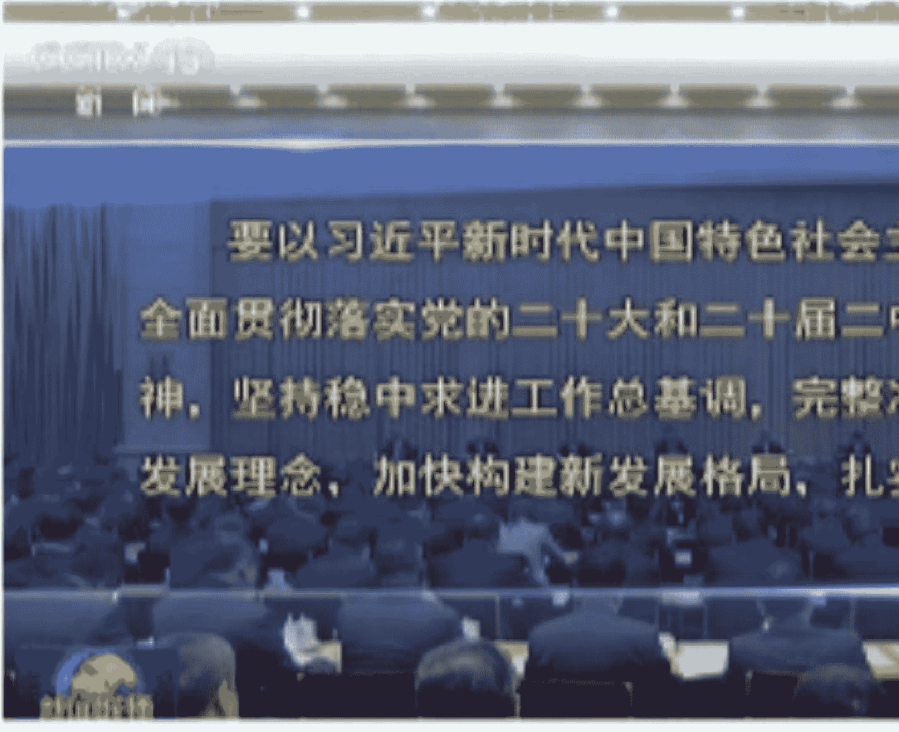

# 2024 中央经济工作会议的四个重点

241212 顾子明

整理：公众号懒人搜索，懒人专属群独享
懒人微信：lazyhelper

新华社电中央经济工作会议 12 月 11 日至 12 日在北京举行。

自二十大以来，年底的三场重磅会议从边开边讨论，变成了连轴开。

内容与措辞上，三场会议高度一致，结构上，连续两年的会议也高度一致，都是包含九项主要工作，分别科技、内需、改革、开放、地产、三农、区域发展、绿色、民生，堪称一本蓝图画到底。

由于内容高度一致，该说的前面政治局会议基本都说完了，政事堂就不做历年常做的对比工作。

今天聊一些好玩的，便于大家理解经济政策的转向与落地。

- 1、大会前，无论是高首席还是钟首富，“发声筒”们的震惊体发言，都在某种程度上被写入了中央经济工作会议，政府主导的投资与消费均大幅提升，并将限制内卷式竞争写入第二项的科技工作内，所以，再来看消费标杆胖东来会前的热议，也蛮有意思的。
- 2、大力发展湾区经济首次被写入会议公告，与海洋战略经济并列，巧合的是，大会前，杭州的马云重回大众视野，大湾区的马化腾在人民网发文，目前看来都是相辅相成的。
- 3、产业宏观政策，受美国换届影响非常明显，23 年的核心政策围绕着是民主党的绿色低碳+，24 年则变成了共和党马斯克的人工智能+，巧合的是，各位北京的 A股 股神这几天都在疯狂的搞豆包概念。

聊完好玩的，再说一下明年出现的四个重大变化：

## 一、“大国大城”下，政府希望房地产止跌回稳

### 1、进城！“大国大城”确立

重点发展从“县城为载体的新型城镇化”变成了“区域重大战略的主体功能区”，治理重点从乡村变成了超大特大城市。这将直接影响国内人口流动和房地产的温差。

### 2、回国！国家投资从海外转国内

海外的重大标志性工程和“小而美”民生项目不提了，国内投资的两重和消费的两新都要加力，意味着国家将更多的财力转向国内，这肯定是要鼓掌支持的。（此处感谢叙利亚老铁刷的大火箭）

### 3、拆迁！提供市场流动性

加力实施城中村和危旧房改造，嗯，十年前的棚改再次搞起来，国家向房地产注入流动性，坐等明年房地产市场的互道XX...

### 4、基建！国家开启新基建

在第一项工作里提出了大力实施城市更新，实施降低全社会物流成本专项行动，这就是 08 年高铁和城市化的科技升级版。

通俗理解，接下来就是 08 年四万亿模式 +14 年货币化棚改的组合升级版，区别在于，08 年是地方版的宏观调控，24 年是上海版的大国大城。

## 二、科技与消费的升级，用人工智能+

### 1、发钱+

给老年人提升养老金、医保补助，给年轻人的两新加补贴，给政府的两重加支持，给企业多层次的金融融资体系，政府可以说是面面俱到了。

### 2、人工智能+

2015 年的两会提出了互联网+，伴随本次经济工作会议提出开展“人工智能+”行动，估计 2025 年的两会也会提出人工智能+，成为下一个五年的中国产业主旋律，初创首创企业需要围绕着 AI 来搞了。

### 3、冰雪+银发

南方年轻人消费北方冰雪，为黑龙江吉林搞出新茅台，不断涨薪的老年人搞起银发经济，解决年轻人的新就业，本质都是财富与消费的转移支付，让有钱人把存款拿出来消费与创新。

通俗理解，就是 14 年互联网+（双创、P2P 等）的升级版，我们接下来要从绿色技术改造传统行业，逐步增加并转向用数字（AI）技术改造传统行业。

数字技术 VS 绿色技术类似于之前常聊的电网 VS 储能，这是一个路线的选择问题，虽然发展并重，但是未来数字端赚钱，还是制造端赚钱，目前特朗普上台后数字端占优，这是要引起重视的。

## 三、货币与财政的大放水，中央模式

要实施更加积极的财政政策。提高财政赤字率，确保财政政策持续用力、更加给力。

要实施适度宽松的货币政策。适时降准降息，央行创新金融工具。

简而言之就是 08 模式的重启，中国重回宽松状态，开始放水，只不过 08 年是地方政府和银行来上杠杆和创新，24 年是中央政府和央行（证监会）来上杠杆和创新，地方的重点是搞“枫桥”，想要进步还是要跑部前进。

## 四、开放！制度性的主动敞开

去年要拓展的“服务贸易、数字贸易”今年还在继续，但去年的“中间品贸易、跨境电商出口”都被取消了支持。

前两者是美国强顺差领域，后两者是中国强顺差领域。

此外，本次还提出了自主开放和单边开放，都是我们先走一步。

再叠加本次承诺的经济制度改革和民营经济立法。

因此，很多西方先发的新兴领域是遍地开放的机会，新时代的马云马化腾王兴，都可能出现，但传统的外贸和汇率，大家就要多琢磨了。

历史 3000 多份各类付费文章以及年费三千多的副业社群资源，见懒人专属群内部分享！

付费群，白嫖勿扰！

懒人专属群更新记录：
https://lazybook.fun/#/blog/record2