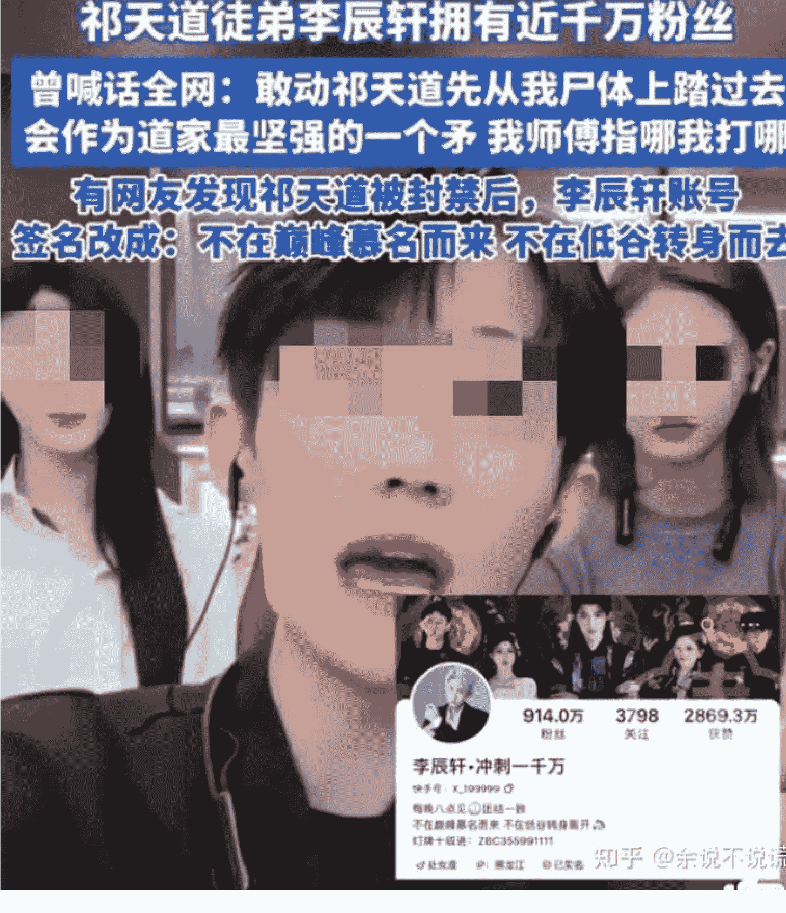

# 4000 万粉网红祁天道直播中骚扰调戏女生，曾因诈骗入狱三年，该如何有效抵制涉低俗、擦边的直播行为？

241216 知乎作者 余说不说谎

整理：公众号懒人搜索，懒人专属群独享

懒人微信：lazyhelper

一群人活在自己世界的人在哪儿自欺欺人就挺好笑的。

自己没听说过的人，就觉得别人 4000万粉丝都是假的，是僵尸粉。

他们就是不愿意相信这个世界上存在着相当一大批和他们处在不同世界的人。

国内主流社交媒体中，快手粉丝的保真量是仅次于小红书的。

祁天道作为快手的顶流主播，活粉数量不会少于千万。

单论粉丝数而言，B 站和小红书上任何一个网红都不够和祁天道相提并论。

包括这些平台上的一些顶流，比如 B 站的飓风影音 tim，或者是红薯上易梦玲之类的“大网红”。

如果有人觉得 tim 和易梦玲这种才算是货真价实的大网红，单纯只是因为你们的调性气质比较相符，被划到用户画像里了，所以想当然地觉得只有他们的知名度才是实打实的。

但不好意思，你去农村老破屋里，去工厂流水线上。

你问一百个人，都不一定有三个人听过 tim 或易梦玲，但这一百个人里至少有三十个知道祁天道。

不同平台和算法造就的信息茧房就是这么割裂。

而且祁天道在五六年前就已经年入破千万了，是官方认证的头部顶流。

现在直播带货比当年更繁荣，他的年净收入就算没有过亿也有大几千万了。

作为对比，飓风影音的 tim 在今年的采访中被问到公司的营收规模。

他回答说今年勉强接近一亿，但净利润也就将将千万这个级别，归属于 Tim 的利润最多也才几百万。

要知道飓风影音员工规模高达一百多人，而且走的是一条高度商业化+高客单价的赛道，算得上是科技自媒体的绝对头部了，但是吸金能力连祁天道团队的十分之一都不到。

我知道很多人会觉得不公平、觉得凭什么、不想承认现实。

但不好意思，现实不需要你的承认，你不承认也只是在骗自己，改变不了现实的一根毛。

现实就是：像祁天道这种没底线没包袱的人，他们的受众比那些有知识、有文化、有素质的人要多多了。

我在之前的一篇回答中提到过一个事实：

带货主播里，有案底人员的比例是高材生的几十几百倍。

- 6. 考试做题不仅是一种智力筛选，也是一种服从度筛选。做题家具有一定的智力优势，但高服从度使得他们缺乏冒险意识，对很多涉及到灰黑地带的暴富路径缺乏了解，就算了解也不敢行动。（以带货主播为例，头部带货主播里案底人员的比例是高材生的几十几百倍）

比如快手一哥辛巴两次坐牢，一次走私，一次售假。

祁天道曾经因为诈骗入狱三年，你很疑惑这种人平台为什么不封。

封不完的，如果把做过牢的主播都给封了，快手的头部网红要消失一大半，这些人你瞅着低俗，但这可都是帮快手搞钱的宝贝疙瘩。

包括这次封号也一样，他以前坐牢三年出来后一样大红大紫，这次才不过拘留 10 天而已。算得了什么？过几个月祁天道解封后照样出来大赚特赚。

你要想理解为什么这种一没才艺、二没知识、三没素质的人能这么火，你就先得理解他的粉丝都是一群什么样的人。

我之前给戒毒所做过一些就业帮扶之类的项目对接，和不少社会 3D 人士都有接触。

这些人里，但凡年轻一点的，快手里关注的类似祁天道这种主播，打底十个起步。

而且他们关注主播的心态和一般人是完全不一样的。

一般人关注主播，是出于“喜欢”or“欣赏”的目的，最多是带着点崇拜。他们不一样，他们是以“追随”、“效忠”的心态去关注这些主播的。

就比如快手上十分流行各种“X家军”，祁天道的粉丝团体就叫“道家军”，还有什么“仙家军”、“驴家班”之类的。

不同的“X家军”就像一个个不同的赛博帮派，这些帮派之间有对立、有联合。

而作为他们其中的一员，很多人在现实中是一名毫无存在感的边缘人。就像戒毒所的那些人一样，爹不疼妈不爱，连个酒肉朋友都没有，只有在互联网上，在各种“X家军”里，才能有一丝归属感。

听到这里，是不是有饭圈那味儿了？不，这比饭圈劲可大多了。

首先，饭圈，饭的大多是公众人物，这些公众人物还需要注意社会影响，就算有一些腌臜事也得藏着掖着。

其次，饭圈的忠诚度很不稳定，一些 idol 行事说话稍不遂人心意，粉丝很容易就脱粉回踩，而且生命周期很短。

饭圈女粉明星能粉个一两年就算长情了，但是祁天道这种呢？

他坐牢三年，在网上也消失三年，出来后，照样一呼百应。

这种粉丝粘性都是饭圈远远不能比的。

# 既然不像饭圈，那像什么？

# 赛博gangs，美国匪帮文化本地化。其实就是把大洋彼岸的底层黑人们玩的东西，换了一套皮。

- 喊麦就是 rap
- 仅退款就是零元购
- 线上出征就是 diss track
- 直播 PK 就是街头火拼
- 街头性骚扰就是 Knockout Game（黑人中很流行的击倒游戏，随机击打路人后脑勺）

祁天道这一类主播的粉丝画像和以前的街头混混是高度重合的，相当于是国内特色的 gangster。

既然是混混/gangster，就一定有抱团、有认大哥、找团体的需求。

只不过这些年国内因为扫黑以及产业转型等原因，大哥越来越少了，再说大哥也不是大冤种，什么人都往里面找。

以前的人攀大哥、加帮派除了认本地那些痞子头子，还可以在传奇这种游戏里去加工会什么的。

但现在这个社会，痞子头子已经没什么生存空间了，传奇也不流行了，都在玩短视频了。

于是，大哥们也变成了线上大主播。

以前那种松散的街头 gangs 也就披了一层“X 家军”的皮。

以前的你问这些人：
——“你混哪条道的？”
——“我洪兴的”、“我 14K 的”、“我跟琛哥的”、“我跟南哥的”。

现在，你问他们：
——“你跟谁混的？”
——“我道家军的”、“我仙家军的”、“我跟辛巴的”、“我跟道哥的”。

虽然形式不同，但内核都是一致的。所以对他们来说，诈骗坐牢、性骚扰什么的算个事吗？

你见过哪个黑人 gangster 因为坐牢被抵制的？他们蹲号子都说 up north trip，憋屈、愤怒、自豪都是有可能的，唯独耻辱那是不可能的。

所以这么多回答下，只有一位答主说到点子上了：

你觉得是污点的东西，别人觉得是勋章。

祁天道不管是曾经的诈骗坐牢也好，还是如今的直播表演性骚扰被拘留也罢，都对他的人气毫无影响。

反而还会拉近他和受众的距离。

我知道很多人会看不惯，但你的看法对于客观现实毫无影响。

这个世界就是有很多底层烂仔，他们的精神世界就只装得下这些东西。现实中不是没人爱，就是连搭个讪都不敢，于是就只能从这些主播编排的剧本中获得一丝“征服高冷女神”的快感。

至于为什么这帮人的精神世界这么贫瘠空洞，除了经济和教育方面的问题以外，还有一个就是他们基本接触不到什么能搬上台面的文化消费品。

底层女性还好点，市场上还有一些给她们定制的文化快餐，比如一些脑残国产剧 or 综艺一类的。

虽然里面也经常会夹杂着一些女权之类的私货，但和主流价值观基本还是有重合的地方。

但底层 3D 男性，那就彻底完犊子了，他们不追剧，也不看电影，大多连游戏都玩不明白，看书就更不用说了。

唯一的乐子就是在网上跟着个大哥摇旗呐喊。

属于是连文化快餐都吃不上，只能吃潲水。

所以这种由底层 3D 男性组成的赛博 gangs 团体，其实比饭圈更无脑、也更危险。

虽然这次的所谓“性骚扰”是提前安排的剧本，但你觉得，如果国内对互联网监管放松一点，以后他们会不会对无辜路人下手？

美国的随机街头击倒路人游戏、以及英国和澳洲 teens……这些可都是臭名昭著的例子，不然你以为为什么澳大利亚会出台禁止 16 岁以下青少年使用社交媒体的法案？

这世上街头混混们的秉性都是一样的，不要觉得国内会有什么例外。

无非是国内互联网监管比较严格，那些主播们大多不敢玩过火罢了。

很多人倒也不必抱着一棒子打死的心态，要求把这些主播全都封杀。

毕竟垃圾集中起来堆在垃圾场里，总比随处散布在街头要好得多。

找提前安排女演员的来配合演戏，总比对无辜路人下手要好得多。

而且这不是很多人连祁天道这个人的名字都没听过吗？

这就说明信息茧房的隔离效果还是很明显的。

就眼下这个经济形势来看，能把这些人给封印在互联网上，而不影响大多数人的现实生活，快手也算是做了一件功德无量的事。

最后叠个甲：

可能很多人看我一直张口闭口 3D 人士，觉得戳到自己了，有点破防。

但不好意思，只要你还能看懂我这篇文章，那你离 3d 阶层就还差得远。

你和祁天道的粉丝就是两个世界的人。这和你收入高不高没任何关系。

历史 3000 多份各类付费文章以及年费三千多的副业社群资源，见懒人专属群内部分享！

付费群，白嫖勿扰！

懒人微信：lazyhelper

# 懒人专属群更新记录：

https://lazybook.fun/#/blog/record2