# 懒人副业周刊

整理日期：241217

懒人专属群的群友大家好。小懒继续给大家带来生财周报～

> 副业周刊来自某年费3000多的付费社群资源帖。

本文档为懒人专属群内部分享，懒人手动整理。

懒人风向标系列单独用在线文档分享，地址见专属群总链接。

一些帖子跳转飞书查阅，如需破解复制权限，可以用这篇文章分享的油猴脚本搞定。

如果要保存飞书文档，可以用这个插件搞定：终于破解飞书，本地备份！

里面的飞书链接文档小懒有备份，失效的话到专属群总链接里找备份地址。

往期的生财周报合集（含在线版和离线版），见懒人专属群内分享。

希望大家有收获~

标题加了(精华)的表示精华贴，前面为截至今日的点赞数。

以下是目录，内容有些多。大家可以挑兴趣的内容阅读。

懒人专属群更新记录（点此跳转）
懒人专属群介绍： https://lazybook.fun/#/blog/group
专属群更新记录： https://lazybook.fun/#/blog/record2
懒人通才计划： https://lazybook.fun/#/data/13_course
懒人手册： https://lazybook.fun/#/

# 目录

懒人副业周刊

## 【生财认知】7篇
- (129赞)如何在赚钱这件事上，做到知行合一？
- (精华帖)(99赞)创投老兵的战略指引：00后的5年规划与方向选择
- (53赞)受邀大航海分享有感：短视频赚钱不限于视频号或抖音，赚钱的能力来自认知
- (46赞)个人消费变化与渠道压榨：通缩背景下的经济困境
- (18赞)中年危机：互联网从业者的失业困境与反思
- (13赞)创业公司在低增长时期的领导力核心：守、攻、正
- (9赞)只工作4小时员子姐分享自由职业心法与自我认知

## 【生财技能】3篇
- (35赞)从二线城市小报记者到旅居全国数字游民，我不上班养活自己的2大秘密武器
- (24赞)90分钟轻松完成年复盘，找到影响人生幸福的深层规律
- (14赞)Mac自动化：每日自动打开网页领取积分的RPA搭建

## 【好事分享】4篇
- (38赞)社恐新人感谢生财平台及鱼丸的支持与帮助
- (32赞)新手小白用Cursor快速开发俄罗斯方块游戏和图片压缩网页
- (18赞)航海第二周船员“分化期”，如何高效辅助船员打卡
- (11赞)图片压缩工具：基于Cursor的PC端应用开发

## 【AI相关】10篇
- (精华帖)(67赞)AI编程普及带来的新机遇与挑战
- (43赞)我是如何用 AI 工作流写公众号，45 天涨粉 14000
- (45赞)cursor彻底改变了普通小牛马的工作方式
- (41赞)2024年10个国产免费AI写作工具盘点
- (39赞)利用AI自动化写小说，一个月成功签约100篇短篇小说，月入四位数
- (34赞)AI顾问经验总结：大厂商业化成果与内容创作启示
- (18赞)奥特曼为何敢定高价？ChatGPT Pro订阅套餐引发热议
- (20赞)如何用Cursor开发提取聊天记录问题的工具及解决BUG的方法
- (11赞)图生视频平台对比：真实性、人话理解和效果评测
- (9赞)OpenAI发布ChatGPT o1正式版：性能大幅提升，错误率降低34%

## 【小红书】4篇
- (精华帖)(111赞)单店月销200W+，小红书电商最强打法保姆级教程
- (精华帖)(69赞)精准引流：小红书残蟹项目玩法分享
- (37赞)小红书礼物赛道的独特优势与市场潜力
- (13赞)小红书账号拆解：31个账号的简介、内容、受众及亮点分析

## 【海外项目】3篇
- (32赞)搭建海外节点最新教程2.0：免费工具+99元腾讯云，实现每月1000G流量
- (23赞)美国公司申请EIN教程：揭秘申请路径
- (8赞)Temu美区半托管运营经验分享：六个月实战踩坑总结

## 【微信】2篇
- (精华帖)(66赞)小绿书业务复盘：内容、选品与带货策略
- (20赞)公众号复盘：5天内从166粉丝自然涨粉至1000人，微信引流300+

## 【YouTube】2篇
- (54赞)YouTube Shorts项目实操：自动养号工具及航海历程分享
- (21赞)自制Youtube Shorts下载工具分享

## 【线下实体】1篇
- (精华帖)(127赞)利用AI在杭州武林夜市摆摊三个月的深度复盘

## 【抖音】1篇
- (33赞)一个月3亿播放，在抖音能赚多少钱？

## 【快手】1篇
- (28赞)快手数字人单品付费打爆保姆级教程

## 【其他】7篇
- (77赞)医生自媒体人分享健康保养与就医指南
- (63赞)我在360的经历与对周鸿祎的观察
- (精华帖)(65赞)从IP卖课到商业挑战：老板们的血泪史与教训（创始人做IP卖课不会发大财，也很难会东山再起。PART2. 是大佬就能做IP卖课？真不是！PART3. 一条创始人IP的方法论总结）
- (44赞)得物平台月入4位数，在家可做，新手小白友好！（附保姆级教程）
- (精华帖)(43赞)网易小蜜蜂平台涨粉策略分享：1晚3账号各增1W粉，引流公众号1000+
- (14赞)“听过不等于能记住：好老师的教学之道”
- (3赞)使用有版权背景音乐的视频处理策略

## 【星主的收藏夹】5篇
- (67赞)弱小和无知不是生存的障碍，傲慢才是。
- (58赞)元认知能力决定个人强弱与财富创造能力
- (32赞)大多数成功的公司在最具挑战、最艰难的时候诞生
- (33赞)NLP的理解层次模型：提升思维能力与个人成长的全面框架
- (17赞)Newsletter：中文世界的信息出入口挑战

***

## 【生财认知】7篇

### (129赞)如何在赚钱这件事上，做到知行合一？

作者： 明白（晚9点半睡觉）
日期：2024-12-13

大家好，我是明白，生财 8 期老圈友。

今天我想分享一个话题：如何在赚钱这件事上，做到知行合一？

如果你经常遇到下面的问题 ——

1. 明明知道参加航海实战，认真打卡很重要，但做不到。
2. 明明知道概率思维很重要，用数量对抗概率，按照正确的方法持续发小红书/抖音/视频号，爆的可能性就会变大，但就是做不到。
3. 明明知道「先完成后完美」很重要，先发出第一篇笔记/公众号文章/YouTube视频/Cursor App，然后持续迭代就可以了。但总是迟迟不动手。
4. 明明知道做一个项目前，找一个对标，像素级的拆解，然后模仿、行动很重要，这样成功概率一定更大。但总是因为一时惰性，还是没去行动。
5. 明明知道赚钱是一件不确定性很高的事情，要降低预期，尽全力做好过程，做好手里的事情，在结果上随缘。但每一次小的行动，结果每一次都失望，让自己焦虑、内耗，没有能量继续行动。

6. 总之就是，我们明明知道，在赚钱这件事上，有些方法/思维/心态是绝对正确的，但我们在行动的时候，总是做不到。

这到底是什么原因？

如果能搞清楚这个原因，并且有一个简单可行的方法，能帮我们在每一次行动的时候，都能在这些方法/思维/心态上做到，那这就好像，一个人知道少吃多动对减肥很重要，如果他也能做到，那一个月时间体重下降，就是一件几乎确定的事情。

上面这些问题，我之前都遇到过，经常是知道做不到，就是无论看了多少厉害的书、赚钱方法/思路/案例，但我的成长，几乎是原地踏步。

后来，经过一段时间的学习、研究、练习、复盘总结，我确实找到一个，操作性非常强的方法，可以解决这个问题。

不夸张的讲，我在个人成长、情绪控制、赚钱方面的进步速度，就是因为这个方法。这个进步变化就像是，一个小孩从蹒跚学步变成了坐火箭。

就像是，一个武功平平的少年，被高手打通了任督二脉，无论学什么东西，都非常的快。 更重要的是，这件事从操作上对每个人来说，都是可行的。但也正因为如此简单，所以很多人会忽视、或者不屑于去做。这也成为阻碍我们成长最大的一个因素。

今天我就来详细的分享一下这个方法，希望带给你一些思考，和进步。

这个帖子我拆解的比较详细，近 8000 字。

飞书好读版本，见链接： https://pznme756ly.feishu.cn/docx/JhIJdd1oLo19YoxvImkciiOcnZc

评论区：
郭伟：有点类似于习惯养成，不过更细化甚至细化到每一个思维，很有收获[强]
小军同学：推荐大家看看《掌控习惯》这本书，再结合这篇文章会有更具象的理解
Crazy、倾听：糟糕的坚持也好过放弃[666]
七喜：很有用，突然想到自己准备高考的时候也是这样，在桌子上，书桌前的墙壁前都写好了目标院校和励志语录，最后真的考上了。现在工作了反倒没有了这种毅力，还是得用老方法呀
麦子摇摆：读完了全文，我比较愚钝，关于“解离”把困难和现实剥离开来，就不焦虑了，不太明白这句话的奥义，还请指点一二，谢谢～
明白（晚9点半睡觉）：这篇文章重点不是解离，可以忽略这个
小黄：大脑会欺骗你，可现实不会
七月：好习惯的养成也需要最大化的提示

***

### (精华帖)(99赞)创投老兵的战略指引:00后的5年规划与方向选择

作者: 优嘉
日期: 2024-12-09

随着2024年接近尾声,摆在每个人面前的问题是:如何在新的一年为自己设定目标、选择正确的方向,避免无谓的尝试?

周末,我有幸与张昭前辈进行了一次深入对话,从他多年的投资和创业经验中,我获得了许多有价值的启发。

特别是在如何为未来制定规划这一问题上,我学到了许多关键的思考方法和策略。在这篇文章中,我将分享与张昭前辈交流的核心内容,尤其是关于战略选择以及执行路径。

这些思路和方法,对于站在2024年底的我们,在2025年及未来五年的规划中,具有极高的参考价值。 希望对你有所启发。

张昭前辈在我们交流时提出了一个非常关键的概念: “以终为始”。

这意味着,无论我们设定什么样的目标,在开始行动之前,必须先明确最终目标是什么,并从这个目标倒推每一个实现步骤。假设,你的目标是:在五年内赚到1000w。

请你,“以终为始”思考,如何达成这个目标?在这里,很多人会存在2个思维误区:
1. 以你现在拥有的资源和能力,来构建商业。
2. 以现在的角度去看未来的世界。

全都是不对的。张昭前辈说了一句很有启发的话: “未来的世界是不确定的，你不能用现在的经验去套未来的规则。”

在对未来规划的过程中,张昭前辈提醒我,要避免“贪多务得”,即不要什么都想做,而是要找到一个主干方向,集中精力深耕。

在这个过程中,所有不必要的选择和分散的机会都需要被“砍掉”。比如,我举了三个方向,他分别做了分析。

前辈对每个方向的情况都分别做了分析,以及分析我的能力和资源匹配性。具体分析,戳文末的文档。

前辈提醒我,确定了方向后,接下来的关键是将五年的大目标拆解为具体的年度规划。这样,我们可以在每一阶段有明确的行动指引,确保每一步都紧紧围绕最终目标进行。

现在是2024年的12月份,要完成目标,从2025年开始。5年时间,怎么划分每年的规划?

有了每个阶段的规划后,你要去思考,你在这个过程中,可能会遇到哪些挑战和难关。在第一年的时候,在摸索业务的过程中,你要先解决怎么生存的问题。

太多人容易面临现实的情况,我都活不下去了。我考虑那么多干嘛?

我见过太多人了,之前说的信心满满,说我一定要怎么样。结果,路上接受了太多的赚钱的诱惑,中间摇摆离开的。所以,我建议你:

站在2024年底,我们不仅要有清晰的目标,更要通过深思熟虑的规划,制定一套符合自身实际的战略路径。

希望这篇文章能为你提供一些启发,也欢迎在评论区分享你对未来规划的思考。无论你的目标是什么,祝你在2025年迈出成功的第一步,开启崭新的篇章。

https://x6rsxr7w31.feishu.cn/docx/Rgh7dSFQaovzf6xoaeLcat3mnGm?from=from_copylink

评论区:
L!N/林林/小林:一看标题我以为又是一篇爹味、说教的,结果是我肯定错了,因为没想到通篇都是肺腑之言,尊重与认可油然而生。[强][强][强]
水心:感谢分享,太棒了!正是我需要的内容!
あした、永い:感谢分享!
丹娜:感谢分享,很有启发
七月:感谢分享
小查Charles:纸上得来终觉浅,绝知此事要躬行
just smile:感谢分享!!
Kennan恺南:感谢分享

***

### (53赞)受邀大航海分享有感：短视频赚钱不限于视频号或抖音，赚钱的能力来自认知

作者: 韩商量·有内韩
日期: 2024-12-13

很荣幸,受瓜斯的邀请,给大航海的AI短视频带货项目做了一次分享。

昨晚直播的逐字稿或回放,大家可以找萌虎或瓜斯去要。

因为是两节课的内容压缩到了一节课,有些疏漏不全,今天发个主题做个补充。

想到哪写到哪,可能会比较凌乱,大家见谅。

首先,是感谢生财有术给了这么个机会,我是一个特别喜欢分享的人,我喜欢分享自己在项目上的真实所见所得。

昨天分享的过程中,有不少圈友提问超出了我分享课件的范围,也局限在了单个平台(视频号),所以我有些疑惑、有些不解、有些感触。

如果你想通过一个副业项目赚钱,首要完成的是0-1的基础沉淀,不应该跳章。更要满足对项目的真实认知,不能道听途说。也要适应变化,不能一棵树上吊死。

以短视频带货为例,有一个通用认知,多账号代表多流量,矩阵规模代表更多机会。

做矩阵是提升自己赚钱的概率,如果你要入局,你首先要其他人尽可能地拉近差距,就是以普通人的能力尽可能注册多个平台的多个账号。

注意,是多个平台!多个账号!

我有一个主题里讲过这个类似的内容:
人人都可以做的视频号带货 https://t.zsxq.com/szOYk

举一反三,你可以用于注册更多抖音或其他平台。

我们讲的短视频带货泛指所有的UGC平台,不管油管、TK、小红书、快手、抖音、视频号、小绿书等等,打法可通用!

UGC时代,推流机制就是兴趣为王,典型的内容产品买方市场,搞的是内容,掌握了流量密码就可以打穿一条街。

完全可以适应变化跨平台处理危机。

在整个视频号带货行业陷入危机的时候,我和我的团队仍然在赚钱。

比如:
- 1、今年7月底8月出,视频号忽然严审,大量封号。我果断停止视频号的带货,然后养号两周,两周后,好几个社群都不做了,只有我的团队还在爆单。关键是我的团队当时每个人重新启动了抖音,一个人单周也能搞个10万GMV。
- 2、现在视频号自然流不正常了，现在大多数在做视频号的团队都不怎么赚钱了，不愿意挪动，然后盲目搞投流，把赚到的钱凭本事亏掉。而我，是直接去大面积打抖音，绕过平台的周期变化！

这是因为，我和我的团队，穿越过好几个周期，我在适应变化：
- 在知乎上带货。
- 在小红书上带货。
- 在视频号上带货。
- 在抖音上带货。
- 以视频号为主带货。
- 现在以抖音为主带货。

没有这种穿越周期的经验和认知，人容易钻牛角尖，会有赌徒心态，去学投流，然后就没什么然后了，投流不适合普通人去打。

昨天我讲到要拥抱变化时，提起一个话题：抖音上个月一个人可以实名21个，现在只能实名6个了。

有圈友问，怎么实名6个啊？

这个问题，我昨天没有回答。这应该是做项目时第一课的内容，我讲的是基于熟手的进阶课。

今天回答一下：去认证蓝V，每一个蓝V都把自己设定成运营。可以设定5个，加上自己的实名就是6个。

所以，如果你认可了短视频平台的创业，你要学全，你要从0开始做，别想着做插班生。

我做分享都是一个完整体系的：
1. 0基础起步，办电话卡、注册账号、开橱窗，注册更多账号，绕过规则注册更多账号。
2. 剪辑基础。
3. 口播技巧、AI数字人应用。
4. 认识行业真实，防止被PUA被割韭菜，学习分辨爆款的能力。
5. 爆款文案的结构拆解。
6. 如何提升爆率。
7. 违规的处理办法。

以上，少一样，你学的就不完整。

那么这些技能有用吗？其实跟赚钱没什么太大关系，技术、工具而已！

赚钱的关键还是项目。

这也是我愿意做免费分享的两个核心愿意之一。

另一个原因还是要提到生财有术的价值观。

听过生财有术第一节认知课的圈友应该和我有两个共鸣：

第一，利他的价值观，我相信利他就是互利。

我承认自己有两个身份，一个是短视频的创业者，当下在做全平台的短视频变现项目；另一个我是一个短视频创业博主，也有在做知识付费。

但是我其实是不卖课的，我与其说是转化粉丝成为会员，倒不如说我是感化粉丝成为我的会员。

于是，我做了一个大胆的决定——免费！

因为我相信利他等于互利，所以我做了两件免费的事：
- 1、免费干货分享，说是干货就是干货，看过我免费课的朋友，自己判断一下，花钱买的课有我讲的干不？
- 2、免费带学徒，这应该是全网唯一的操作了。究其原因，是因为我是靠项目赚钱，是因为在这些项目上我自己是能赚到钱的，所以这种免费带学徒可以通过利他而利己。自己不做项目的人当然就不敢免费了，他也不理解。

人家线下学徒，收9000多一万多，我免费。
人家做教孵化个人IP（创业博主），我免费。
人家线下操盘手两天三夜的课5000多，我免费。

第二个，生财有术的第一课就讲了，要避免割韭菜，你就看教你的人他自己在干啥，他教的是他自己做的，那么大概率就是个好项目。

所以，我带人家做项目，必须是自己在做的，而且是自己一直做的还不错的，还得是我判断可以复制给普通人的。

如果不能复制给普通人，我都不会教，比如投流。

啰嗦这么多，就想表达一个意思：

赚钱这事，不要有定式思维。做短视频带货，就别锁在一个平台上，视频号不好干就干抖音，抖音不好干就干快手。

认识的提升是多次试错做出来，要把一件事打透才能提升认知。

比如昨天有小伙伴问我：快手发了视频没有播放正常吗？

我回答是：坚持下去，等他给你流量为止。

因为快手为了打压营销号，有一部分的新号就是不给你流量，看你是不是个正常更新的博主。

这是快手的一个运营策略，类似去年抖音玩命跳核验是一样的，怕你是个营销号，然后来了个因噎废食！

说到这就要聊聊定式思维有多可怕了。

去年抖音跳核验，导致今年很多朋友一看到跳核验，直接就放弃了。

# 我想说：
你把核验流程走完，你就会发现自己拥有了一个新的非实名抖音号。

我在这个领域能讲到点上，不是我有多厉害，只是因为我做的每一件事都打透了，就算是错，我也要知道他错在哪。

多一点尝试，可能就是柳暗花明。

# 评论区：
Mr_Zhang：昨天晚上听了您的分享，受益匪浅，非常感谢[抱拳]
心净亦如心镜：可以链接一下你吗，
心净亦如心镜：你还收徒吗[666][捂脸]
韩商量·有内韩：这不允许连接，我也不知道咋连接。我是在深圳。
Mr_Zhang：我记得现在是找鱼丸，鱼丸帮忙联系双方
🌼 烟火尘埃□：可以链接一下不？
韩商量·有内韩：得问问鱼丸你
老彭：哈哈哈哈哈一直知道大哥在深圳做ai数字人

## (46赞)个人消费变化与渠道压榨：通缩背景下的经济困境

作者：小马宋
日期：2024-12-09

为国消费：个人消费的变化

这个“个人”，确实就是我自己。最近我发了一、篇讲内容电商的文章，当然文章不是我写的，我只是转发。后来被平台投诉，删除了，投诉的理由我理解，里面确实有一些数据引用有错误。

但主题没错，就是少数平台对商家的压榨，太过分了。

我们都知道今年的情况不好，通缩其实是一个负强化的过程。产能过剩，降价竞争，利润下降，分给员工的收入也减少，然后导致需求（消费能力）不足，消费能力不足进一步导致产能更过剩，一个向下的螺旋会逐步展开。

这时候，由于渠道成了卖货的核心，所以，渠道会抽走最丰厚的那一部分利润，就算有销售，分给生产方的利润也是薄如刀片。

问题更大的是，渠道方的效率很高，需要的员工就很少，虽然赚了很多钱，但大部分人分不到钱。反倒是生产方，服务商，这些用人最多的单位，拿到的利润却可怜。

所以就算渠道赚了钱，也只是分给了极少数人，不能让大多人得利，这也无法让需求提升。

以上是我个人的观点，所以呢，我的消费就倾向于去消费那些可以给更多人分钱的产品和服务。

- 比如尽量去店里堂食，把利润给到商家。
- 比如不去大主播直播间买东西，而是到商家店铺买。
- 比如多去消费服务，而不是实物。因为服务业必须要有人来做，很难用机器替代，服务行业是吸纳就业最主要的行业。那这些钱就会更多的分给从事服务业的人，我自己的车一年开不到几千公里，大部分都是打车了。
- 其他的，比如手机贴膜，理发，打车，修面，足疗，美甲，纹身，家政清洁等等。

虽然我知道自己这么做也没啥用，但我们做一件事并不是因为它一定能成功，而是因为我觉得做这件事是对的。

评论区：
苏珊：如果慢慢的大家都能这么 这么想这么做的话，就有了转机
大强哥：猜测文章讲拼夕夕的
吴都：是抖音

## (18赞)中年危机：互联网从业者的失业困境与反思

作者：牟长青
日期：2024-12-09

- “上不去下不来”的发展困境
- 求职“天花板”
- “上有老下有小”的生存压力
- 35岁
- 求职

前天晚上在家里看了徐峥的新片“逆行人生”，让我感触良多，因此对中年失业这个话题再次产生了兴趣。然后去知乎上面，刷了大量中年失业的真实故事，看完后让我陷入了沉思，导致那天晚上都失眠了。

作为一个80后，我也到了中年的年龄，上有老下有小。其实在自己20多岁的时候，就思考过这个问题，如果自己人到中年，失业了怎么办。因此那时候就很有危机感，从而让自己有了更多努力的动力。

我以前觉得互联网行业是个讲资历和积累的行业，应该失业的几率很低。但看了知乎的那些中年失业的案例后，我觉得自己想天真了。因为里面不少中年失业故事的主人公都是互联网从业者，不少人还在知名大厂工作过，带过上百人的团队。因为年龄大，被裁员后，一开始都是信心满满，觉得自己再找个工作并不难。后面投了上百封简历，都没了回显，才意识到中年再就业有多困难。

今天这篇文章主要分享5个点，为何中年失业找工作困难，自己是否有失业的可能，简单说说自己经历，分享中年失业了该如何破局。如何从一开始降低失业的几率。

### 1：为何35岁以后找工作就那么难？

对于用人单位来说，会思考是招一个35岁以上有经验的，还是招个大学才毕业的性能比更高。

从用人单位的角度看，35岁+的人，最大的优势就是丰富的工作经验，但可能也是唯一的优势。但缺点却是有一大把，比如不好管理，待遇成本高，能否熬夜，能否连续出差，家庭琐事多。因为上有老下有小，更容易被家庭的事情所影响。其实从这个角度，职场歧视中年从业者，跟歧视女性从业者的理由差不多。

大环境不好，企业想要活着，社会很现实，因此35+的中年人就成了最容易失业的群体。很多人感叹，年轻的时候没经验找工作难，现在经验丰富，但年龄大了为何找工作还是难了？

相比刚毕业的大学生，虽然经验尚浅，但一张白纸，可塑性强，待遇要求不高，年轻身体好有吃苦的本钱。因此自然会是大部分企业的首选。

### 2：反思自己，是否有失业的可能性

我的打工生涯都是做市场推广，BD合作为主，如果当初我在北京的时候，没做副业也没写博客，只是按部এম就班只做好自己手上的工作，到今天我有很大的几率失业。

大环境不好，自然推广的需求也会下降。假设我还在北京，年薪应该50万以上了，但这个时候我精力已经有点跟不上了，也没有20来岁的小伙子更有想法。当公司想优化的时候，自然会先考虑我这个工资成本高，但已经没了拼劲和想法的老人。

我今天能做社群这个事情，最大的原因是，我从06年就开始写博客。如果我只有在互联网大厂的工作经验，很大几率我就是废了。这几年我做过两次实体行业，一共亏了百万。公司也尝试了多个新项目，也都是清一色亏钱。

因此假设我失业了，很大几率是不敢创业的，只能退而求其次，降低薪水标准，去一些小公司看能否谋求工作的机会。

### 3：简单说说自己的经历

假设22岁开始工作，到35岁也就是13年的时间。而能做到真正3模35岁以上不失业的人，往往要么是创业成功，要么是成为公司核心管理层，但这样的比例往往只有10%，还有90%的人都有中年失业的风险。

我就是22岁开始进入互联网行业的，但在进入这个行业前，其实我已经混了好几年的日子。高中读的2年制职高，然后读了普通的专科，因为都是很不好的学校，因此读书基本没听过课。只是大学期间，经常去网吧通宵，实践电脑操作。

因为高中和大学都是二年制的，因此19岁我就大学毕业了，然后家里介绍去了一个事业单位做合同工，又混了3年的时间。直到22岁的时候，我担心这样下去，以后老婆都找不到，才果断离职，去成都找电脑相关的工作，然后进入了互联网行业。

我年轻的时候，一直特别有危机感，因此在05年做第一份互联网工作开始，我就开始做副业。记得那时候我工资一个月才800，但用业余时间做个人网站，广告收入最高一个月有2000元。

06年开始北漂，因为全身心做好新工作，那时候副业收入下降，一个月只有几百元。记得09年我在百度的工资才8变8000，因为已经坚持写了3年博客，在行业有点名气，杭州的一个老板请我做推广顾问，每月给我1万，从那时候副业收入已经超过了工资。

因为做副业，我积累了更多的推广经验和人脉资源，才有了我后面做现在这家公司的基础。如果我跟大部分人一样，只按部就班做手上的事情，我现在可能也很惨。中年失业大军里，应该我也在。

### 4：中年失业了后该如何破局

实话说这块我目前还没有太成熟的建议，只能说给大家分享下我的想法。

其实在目前在中国这个社会，只求个温饱不难，但习惯了在办公室的白领，中年失业后很难放下自己的体面，去做这些工作。

- 比如体力三件套：快递，外卖，滴滴，做得好的也能月入过万，最差拿个3-5千还是不难。
- 比如吉祥三宝：保安，保洁，保姆，这些工作门槛相对也不高，没有年龄限制，也能混个温饱。
- 还有足疗按摩行业，只要愿意放下身段，去学习下保健按摩，月入5000以上不难。我去按摩店，喜欢问这些技师的待遇，因此还算了解。哪怕是上了年龄的大妈，普遍也是5变5000以上。如果年轻一点的技师，一般月入过万。

## 公众号懒人搜索，懒人专属群分享

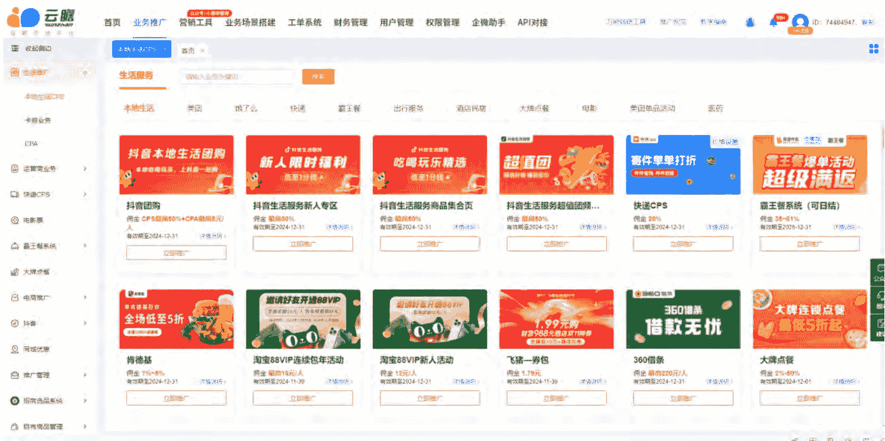

为了写这篇文章，我特别去这个平台注册了个账号研究了下。发现里面各种吃穿住行相关的CPS推广链接，而且都是互联网知名企业，因此有一定的背书信赖。

我以前以为只有外卖这些有CPS，了解云瞻这个产品后，发现居然快递都有CPS。这种确实也是普通人都可以做的副业，但真想月入几千，还是需要有一定的推广经验才行。只是靠自己的朋友圈资源，应该还是很难。

CPS变现我之前也实践过，抖音，快手极速版一直在做类似的新用户下载返现的活动。疫情期间没有事情做，也带着一些学员推广抖音极速版，我分享给身边的家人和同学，也赚了1000多元。记得当时做得好的学员也赚了几千元。

后面我又去尝试了一些游戏CPS的变现，一个游戏也能赚10多元，但感觉比较费时间。当时因为测试游戏CPS，反而导致我在一个游戏里充值了不少钱。

因此在这里不能不提到一个社变“生财有术”，可能对于我身边一些新媒体老板来说，看不上生财里的小项目。但很多普通白领，确实通过生财有术这样的圈子，增加了做副业成功的几率。但前提也是自驱力强的人。

我个人觉得，那些有互联网从业基础的中年失业人员，完全可以加入生财这样的圈子，虽然现在报名费3000多，我觉得也是值得的。总比自己埋头摸索会更好。因为做过互联网，相信学习能力会更强点。

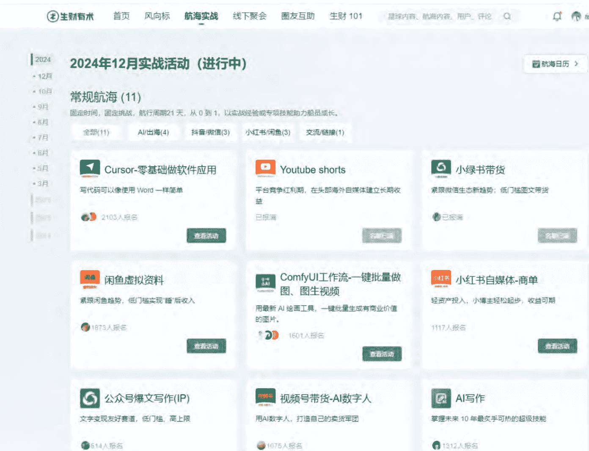

生财有术更多是一个论坛，里面有人会分享自己一些项目赚钱的经历，官方也有大航海这样的产品，带领生财的会员学习。对于少数学习能力强，自驱力强的人，通过这些小项目，月入几千，几万确实是可以的。

### 5：最好还是从一开始就避免自己失业的几率

相信今天看这篇文章的，要么是圈子里的老板，要么是行业里的年轻人。老板们应该不担心失业的问题，但年轻人未来还是有一定失业的风险。

因此从一开始就避免自己失业的几率才是最靠谱的，曾经有段时间我喜欢看咪蒙的文章，特别是关于职场的。记得有一篇是提到优秀的职场人的行为变件，发现里面提到的优点，我年轻的时候基本全占了，因此注定我这类人是不可能失业的。

在我那个年代，并没有咪蒙这样的人给我洗脑，完全是因为个人的性格原因，非常有危机感，因此特别努力。

我表弟目前在我公司，但28推这家公司吧，相对来说业务并不复杂，而且也不需要加班。当然在我们公司也能学到很多东西，如果有自驱力，也有很大的上升空间。

表弟从小家庭条件就不错，大学毕业又来28推这样的公司，我个人觉得其实并不好。如果可以，未来还是想给他介绍个996的互联网工作，年轻人吃点苦并不是坏事。

但现实是，有自驱力的年轻人太少了。有时候看到下面的人，只会按部就班的工作，我内心其实为他们着急的，但毕竟和我无亲无故，我没必要关心那么多。对于大部分普通年轻人，更需要一个强硬的工作环境，促使他们成长。少看点网上的心灵鸡汤。

记得北漂的第一家公司是在360，一家很变态的公司，部门开会永远是用下班时间和周末。甚至很多部门都是强制要求加班，当时很多同事充满了抱怨。但正是经历了360这种变态的公司，后面再去别的公司后，大家会觉得新工作游刃有余，充满了自信。

我曾经有多次劝公司的几个骨干，尝试下做个人IP，比如写文章，拍视频，站台分享等等。但最终能坚持下来的，我一个都没看到。前天晚上的失业，我不是担心自己中年失业，我是担心他们中年失业。毕竟跟了我7、8年的骨干，最终还中年失业，我也觉得没面子啊。所以我在思考，是不是应该坚持干到50岁了。

可能大家觉得有28推公司的平台和人脉，离开28推公司找个工作并不难，比如公司有5个员工离开28推后，都入职了重庆最大的新媒体公司麦芽传媒。但谁能保证，自己中年后，不被公司的年轻人所取代了？那些年薪几十万，当上了公司高管的互联网精英都会失业，因此一切皆有可能。

我做互联网的时候，还是PC时代，因此做副业都是做个人网站和写博客，这些并不影响我的本职工作，反而也因为副业，我的本职工作做得更好。而现在是移动互联网时代，短视频时代，AI的时代。现在的年轻人做副业可以选择做短视频，AI等等。记得曾经公司还组织过同事，用下班时间做副业，但最终还是没能坚持。说实话像28推这么奇葩的公司，我在外面也不多见了。

千万不能让自己完全闲着，如果除了按部就班的工作，就是吃喝玩乐，你中年不失业，谁失业了：）

评论区：
cc：工资越低，越不怕失业
冰是睡着的水：[强]
小军同学：这个确实，反而太多选择[捂脸][捂脸][捂脸]

## (13赞)创业公司在低增长时期的领导力核心：守、攻、正

作者： 楚川
日期：2024-12-10

创业黑马看到的图片，有感而发，做个拆解，大家一起共勉。

当下的经济大环境，看起来每个老板都要成六边形战士。整个经济低速增长期，创业公司要想活下来，能成功，领导力至关重要。

创业公司在低增长时期的领导力核心元素，主要包括守、攻、正三个方面。

- 首先，“守”代表生存能力。对于创业公司来说，确保基本盘的稳定是第一要务。这包括业务的正常运转和团队的和谐协作。基本功的扎实程度，例如产品的质量和组织的效率，也直接影响着公司的生存能力。更重要的是，公司要有正向现金流和盈利能力。这就像盖房子的基石，没有稳固的财务基础，再宏伟的商业蓝图也只是空中楼阁。创业者需要有稳健的财务管理能力，确保每一笔支出都能带来相应的回报，同时保持足够的现金储备以应对突发情况。

- 其次，“攻”代表破局能力。在市场环境不断变化的情况下，创业公司不能固步自封，需要有敏锐的产业升级能力。结合科技与国资的力量，可以为公司带来更多的资源和发展机遇。同时，创业者需要具备破局能力，利用如 AI、出海等策略寻找新的增长点，避免在市场的“下沉”中被淘汰。例如，许多互联网公司在国内市场饱和后，通过出海战略在东南亚、非洲等地找到了新的用户群体，实现了业务的二次增长。这种破局能力需要领导者有长远的眼光和敢于冒险的精神。

- 最后，“正” 代表沟通能力。在创业过程中，合规性是不可逾越的红线。领导者需要确保公司的运营符合法律法规，避免因违规带来的巨大风险。同时，创始人的 IP 塑造和与共进大众的沟通能力也非常重要。一个有魅力的创始人可以吸引的人才和资源，而与大众的有效沟通可以帮助公司更好地了解市场需求，树立良好的品牌形象。例如，一些创业者通过社交媒体分享创业故事和理念，赢得了用户的信任和支持。

总之，创业公司的领导力是一个综合性的能力体系，需要在守、攻、正三个方面都有所建树。创业者不仅要像守城的将军一样，稳固公司的基本盘，确保生存；还要像攻城的勇士一样，敢于突破，寻找新的发展机遇；更要像正直的使者一样，合规经营，与大众保持良好的沟通。只有这样，创业公司才能在低增长时期乃至更长的商业周期中，保持领导力，实现可持续发展。

评论区：
暂无评论

## (9赞)只工作4小时员子姐分享自由职业心法与自我认知

作者：员子姐-优势赋向教练
日期：2022-12-13

大家好，我是每天只工作4小时员子姐。

我是一名职业生涯规划师、盖洛普全球认证优势教练、MBTI高级解析师。

今年是我只工作不上班的第二年，去年我一直在向外探索，跑通了自己的商业闭环。今年我更多是向内修，稳定自己的内核，增强自己的心力，去应对自由职业状态所带来的种种阻碍和困扰。

这篇文章，我没有说太多的成绩和技法，而是给大家分享了这两年中自己总结的心法，以及如何结合自我认知的结果，去找到自己的精准定位。

篇幅比较长，大家请移步飞书：
https://gulggw6ggu.feishu.cn/docx/LjZPdVI5Mo9xzIxtDuNcsAfpnGh?from=from_copylink

感谢生财、感谢靠谱、理白、芷蓝、苏姐等贵人成长路上的托举~

暂无评论
No. 18 / 138

## 【生财技能】3篇

### (35赞)从二线城市小报记者到旅居全国数字游民，我不上班养活自己的2大秘密武器

作者： 超级个体张老板
日期：2024-12-10

各位朋友好，我是张老板，7年互联网自由职业者，今天来分享一篇长文，我7年的自由职业经验总结帖。

主题是：《从二线城市小报记者到旅居全国数字游民，我不上班养活自己的2大秘密武器》 希望对有想做自由职业、想做项目和个人ip的朋友，有所启发。

本篇文章合计约8000字，目录如下：

- 1、如何成为旅居全国的自由职业者？我的2大阶段
    - 1.1、第一阶段：上班族摸鱼做副业项目，收获自媒体第一桶金
    - 1.2、第二阶段：项目+ip并行，实现自由职业稳定创收
- 2、第1个秘密武器：个人IP把儿理论，聚焦一个点突破1000天
- 3、第2个秘密武器：4次迭代小项目赚百万，1克拉的钻石最值钱
    - 3.1、第一阶段：自己干，跑通闭环赚小钱
    - 3.2、第二阶段：带全家6口人干，深耕细分产品一起赚钱
    - 3.3、第三阶段：结合ip，自营陪跑服务，招募500人放大收益
    - 3.4、第四阶段：组建闲鱼ip团队，深耕赛道放大规模

全文比较长，小标题和图片也比较多，为了方便大家阅读，我放到飞书链接里面了，如下：
https://ra12zj49nv9.feishu.cn/docx/CTI0dPgppoZQloxZ78bcZPSUnte?from=from_copylink

评论区：
芝慧：找到把儿，做够有效工作量，最终得到一克lau钻石💎 感谢张老板分享
超级个体张老板：[抱拳][抱拳]

### (24赞)90分钟轻松完成年复盘，找到影响人生幸福的深层规律

作者：兰卡
日期：2024-12-09

快到年下了，可能大家陆陆续续有了写今年年复盘的想法。

一听到年复盘，我不知道你是什么感受，我的第一下意识反应，是压力。是一想到要去回溯一年的记录、整理冗长复杂（还有可能散落在各个地方）的信息、再经过大量脑细胞死亡得出结论的痛苦。

尤其是很多人，到了年末本来就很忙，各种赶进度，还要百忙之中抽出时间写复盘，确实有些挑战人性。然后这个结论还不一定下一年能用得上多少。

啊，何必如此为难自己呢？

于是在收藏了篇怎么写年复盘的文章后，就没有然后了。或者是经历了各种内心慢性折磨和拖延后，终于找个良辰吉日，开始郑重动笔，在此之前可能都已经把这事在心里掂量两三周了。

我自己也经历了这样的挣扎很多年。每次写年复盘，花的最多的精力不在于写，而在于内耗。而且有3个问题始终在困扰我：

- 1. 为什么每一次写年复盘都搞得这么复杂这么内耗？
- 2. 每年的年复盘，下一年好像也没怎么用得上，那还写它干嘛？
- 3. 怎么每次写出来的复盘，都觉得好像按部就班讲了什么，但又差点什么，感觉没太大价值，自己也没什么惊喜感？

过去两年，这3个问题不再困扰我了。我把我摸索出来的经验分享一下，少则1小时就能把年复盘搞得差不多了，多则一个下午收工，还每次做复盘都非常有触动和惊喜，希望能给到你一些启发。

（PS 以下方法，更加适用于个人年复盘。业务年复盘可以参考部分原则和方法。）

要搞定这件事，首先要有一个清晰的标准。一般标准清晰了，怎么做顺带也就有谱了。那么，什么是好的年复盘？我自己摸索出来的经验是，一个好使的、让自己写完后很珍惜的年复盘，应当满足3个标准：

#### 一、轻松感

启动成本低，且写的过程中感受比较好。不谈过程中能发现很多惊喜和感悟，至少没那么挤牙膏一样痛苦。我是个普通人，普通人的一大特性就是，懒。所以事情尽可能简单轻松点。这就意味着我们在写年复盘的时候，要尽可能去找最小阻力之路。而不是完全追求写得尽善尽美，更高更快更强。这样启动成本小，做完后也不会有气血两亏的感觉。

题外话，凡事只追求更高更快更强，而不顾及自己的能力范围和感受，很容易让自己提早报废。80分万岁，给自己留有余力，往往能更长久地做好事，过好生活。

更重要的是，等做了一两次年复盘后，再想到这件事，感受是好的、舒适的、满意的，那就更有可能每年写下去，蹭蹭蹭积累复利。

具体到年复查的执行上，就意味着：
- 不用追求复盘得那么精密，虽然很多教程是这么教的。
- 因为现实情况很有可能是过去的记录散落不全，自己也不想全部回溯一遍。
- 抓取最重要的一些记录，其实就很不错了。

所以，写年复盘的第一步，请你把氛围搞得轻松点。如果条件允许，建议在一个放松的场景下，用一种不那么正襟危坐的姿势完成。比如找个咖啡馆边喝边讲，比如在公园的草地上的坐着聊，比如在家里的沙发上瘫着，旁边放点茶水和小饼干。再不济，先听两首轻音乐，再开始写。主打一个怎么轻松随意怎么来。

年复盘的第二步，可以是：语音随口聊。

如果你用iPhone手机，请直接打开你的备忘录，语音输入；如果你用安卓手机，可以打开飞书妙计或任何一个语音转文字记录软件（或者语音记录，事后再转文字），就聊一个问题：

“我今年最大的收获有哪些？”

然后，不用长时间思考，要的就是想到哪讲到哪。

小嘴叭叭叭，一会儿就讲完了。

于是一篇年复盘的初稿就出炉了。

## 2024年上半年的Gain有哪些?

- 【身心合一】
我意识到身体和心是合一的，因此从原来追求心灵的感受和智慧，到了追求“身心一体的健康和丰盛”。

在自己的生活中，我开始去一点点融入身体活动的习惯，尝试了咏街、瑜伽、躺桩、力量训练、核心功能训练等方式。

也把追求“身心一体的健康和丰盛”，当作了我做内容分享和发现事业机会的方向。

我也遇到了很多的推力，比如发现了一个好的中医，帮我调理自己的气血虚问题。也因此开始注意保暖和减少多思多虑。

比如遇到了几本关于肠胃和饮食的好书，开始理解肠胃的运作以及现代饮食中的种种问题，从而下定决心要去改变自己的饮食习惯。

在这个过程中，我记录了大量的感悟和经验，也在回顾朋友圈和晨间日记的时候发现，走过备忘录真的贼好用。

是不是很粗糙？是不是觉得这算什么年复盘？是不是觉得这都是我的主观感受？

是的，但不要紧，因为第一，一旦你开始做了，拖延症就消失了。

动动手打开语音输入，讲出第一句话的时候，写年复盘的收获已经在来的路上了。

第二，你在随口说的过程中很有可能感觉，我的天，我去年一年怎么干了这么多事？怎么有这么多收获？

## 第三，心比头脑的计算程度快多了。

有可能，你凭着记忆和感觉口头聊了一堆收获后，再去翻文字记录后会发现，要做的是查漏补缺，因为之前口头已经把80%的重要事项和收获讲出来了……

那些完全记不住没印象的事情，就要问问自己，为啥忘了？是不是这件事，其实对我没那么重要呢？

为什么就问“我最大的收获是什么”这一个问题？

因为很多精细化的年复盘问的问题，今年最重要的事有哪些？最高光的时刻有哪些？最大的成就有哪些？最深刻的感悟是什么？等等，都可以包含在这个问题里。

而要按照严格那些年复盘教程的要求一个个回答问题，其实挺麻烦的，一是容易纠结某一件事的分类，而是很容易重复回答。

干脆只回答一个问题，从记忆里一个个翻捡回忆就好。

#### 二、可复用

年复盘不仅仅是下一年宝贵的参考经验，还承担了一个很重要的作用，就是提炼规律。

## 第一，一个人的生命轨迹，一定是有迹可循的。

比方说，当你把两三年、甚至四五年的记录摆在一起的时候，就会很意外地发现，很多现在已经很容易做成的事，是四、五年前在烦恼的课题。而那个时候，会觉得挑战怎么这么大这么难，完全找不到解法。

现在栽的坑、后悔的事情，则可能在多年前就有了蛛丝马迹。

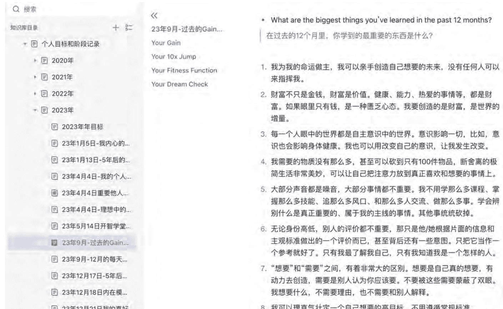
**过去5年的个人成长记录**

所以，有意识地去回顾自己过去发生的事情，就很有可能提炼出：

- 我在反复经历什么样的课题？
- 在这样的课题下，我在反复运用什么样的模式？

这一点非常非常有价值。

当然，如果你感觉自己过去的记录不多，也不必感到有压力，可以现在就快速回忆过去的重要事情，也是一种回溯的方式，量力而行即可。

举个例子，前年我做年复盘的时候，从过去五年零零散散的日志、复盘、心得中就能看出一点：

我绝大多数的痛苦，都是在关系课题上的痛苦。

而人对待所有关系的方式都是一样的。对待他人什么样，就对待自己什么样。

所以归根结底，还是和自己的关系课题。

在这种困境下，我会反复重演一些模式，比如：

- 对自己要求严苛，达不到就全盘否定自己这个人；
- 盲目和他人比较，实际是不了解自己的特质和想要；
- 和妈妈经常吵架，搞得两个人都很生气，事后又后悔；
- 总是忽略自己的感受，强模自己去努力、去完成脑子里设定的目标，搞不定就责怪自己执行力不行；
- 经常产生自责情绪，根本没意识到心里骂自己骂得有多狠；
- 在亲密关系上回避型依恋，很难让自己大胆去爱、不计后果，一想到将来可能还要结婚，就对和另一个人走进婚姻感到恐惧；
- 对健康很漠视，对自己的身体也很陌生，虽然嘴上讲着要健康，但其实对自己身体的不健康程度感受并不强烈，也很回避去直面现实情况，每年根据体检的时候脑子里想一下，我要对健康重视一下，几天后就忘了；
- ……

看到这么明显的事实摆在纸面上，我才意识到，很多工作和生活上的不顺，背后都是内心的课题。

虽然过去多年的惯性思维还很强大，但我已经到了用技术手段没法解决根本问题的时候了，我得认真面对关系课题了。

因此才下定决心，给我自己去年定下唯一的年目标：

解决关系课题，让我和自己的关系质量极大提升。

于是就开始了去学个人成长教练、去大量看心理相关的书、去参加各种身心相关的活动、去写晨间日记……的路程，直到今天。

人生不过百年，从几十次到一百次的年复盘中，就能发现最重要的规律，最影响自己人生质量的规律。

这些规律包括但不限于：

- 我反复在追求什么？
- 我在用什么方式喂养我的欲望，但每次感受并不好？
- 我在哪里一直碰壁，但之前没有意识到？
- 我通过什么品质和支持，趟过了过去的各种挑战？
- 有什么高频发生的事情，一直在内耗我自己？
- 每当我做了什么，就会让我的生命力更加旺盛，不做什么就会萎缩？
- 在什么情况下，我发现不需要那么努力也能有好的收获，甚至比起努力有更好的结果？
- 过去真正让我每次回忆起都感到感动、幸福、自豪、珍惜的记忆是什么？我真正在乎什么体验？
- 我做了什么明智的决定，给我的生活带来非常深远的影响？是什么让我做了这个决定？之后能不能继续支撑我做出下一个明智决定？
- 有谁给我带来了非常大的影响，成为了我真正的贵人？是什么让我能遇到TA，并被TA影响？
- 每当我放下什么后，我的的内心会轻松释然很多，并让我不再被某件事卡住，可以往前走？
- 有什么事，我希望自己可以做得更多，有什么事，我希望自己可以做得更少？如果我总是会这样想却没有做到，是什么在反复干扰我？
- 我在很多事情上，一直在恐惧什么？这种恐惧，给我带来了什么影响？
- 每当我做哪些事，我就会更加有能量和精神？
- ……

这些问题，也可以是我们每次做年复盘的时候，可以选几个提问自己的问题。

那我们具体怎么做呢？

我们之前说过了做年复盘的前两步，也就是：

1. 创造一个轻松一点的氛围
2. 口头讲一遍“我在过去一年最大的收获有哪些？”

这里再增加第三步，就是挑选几个自己有触动的问题，尝试着去回答。

只选几个自己想回答的就好。因为你可能需要回忆，也可能需要从过往的一些记录里回溯，工作量因人而异。选择回答的问题可以少则一两个，多则七八个。如果没有你感兴趣的问题，也可以不选，去找AI对话，让它给你一些灵感。

比方说，对我来说，“反复经历的课题、反复运用的模式”，就是非常重要的问题。因为我很喜欢反思自己。但“我反复在追求什么？”我就不一定会每一次都问自己，因为在过去的觉察中已经有了比较清晰的线索，也在很笃定地往这个方向走。

不必贪多，每个问题都回答，也挺累人的。还是回到好的年复盘的标准上，轻松点，放过自己。

#### 三、抓重点

复盘的最后一步，往往都是总结今年的经验教训和展望明年。

我有两个让自己好过很多的经验：

1. “我只讲三点。”

不管是总结今年的经验和心得，优化点和下一步行动，还是明年目标，最重要的一个标准就是，过几个月还能记得。但凡写了一两个月就忘得精光的，写也没太大意义了……因此，只总结最重要的，放下8

0%没那么重要的，就行了。不管是经验总结、优化点、来年目标什么的，最多写三点，都是一个很好的参考原则。

### 【今年的经验和心得】

什么是最重要的经验？

- 在事情的应用上最高频
- 对自己影响程度最深
- 影响自己最长时间

比如我之前给自己总结了两条经验：
“我一旦开始创作，就有好事发生，一旦停止创作，生命力就开始枯萎”
“定目标时给自己多留一倍时间”

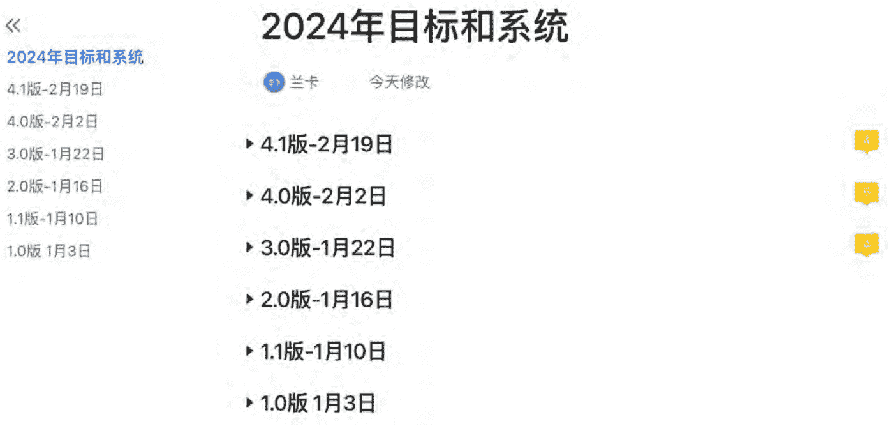

前者就明显比后者更重要。因为前者直接影响了我的事业方向，让我进一步下决心成为终身创作者。后者是在具体执行时的一个细节，不仅作用的场景较少，即使没有改进，对一个人的工作来说影响也没有那么大。

可以试一试，能不能从总结10点，精简到总结5点，甚至强制要求自己，就总结3点。如果心疼自己总结出来的经验舍不得删，可以把它单独放到一个“年复 mainly 复盘备忘经验”的文档里，看来年是不是能用得上。然后把更多精力放在思考，这留下来的3点经验如何最大化发挥价值上。做少得多。

### 【优化点和下一步行动】

不用绞尽脑汁写明年要优化的10大要点。能真的改进三点就不错了，吊打90%的人了。

对自己诚实很重要。一个有效检测方法就是，写完复盘后，看看自己的承诺，发自内心问自己3句话：

- 明年我真的能全部都完成吗？
- 我承诺的时候，身心合一吗？
- 我的身体会感到抗拒和有压力吗？

《精要主义》带给我的一个启示就是：
> “如果一件事不是一个百分之百的Yes，那就是一个百分之百的No。”

如果这件事你不是百分百想做，那就先放放。我的切身感受是，如果真的尊重自己的承诺，真的想做就直接做，还真的做到了，哪怕只有一次，自己对自己的肯定和信心都会大大增强。也才会真的在每次定目标的时候，感受到对未来画面的憧憬，有强烈动力去实现它。

### 【明年年目标】

看明年的目标哪些是最重要的，也可以问自己一个问题：
> “明年发生什么事，就会让我觉得是无比满足的一年？”

如果这个目标还差点意思，那也先放放。

当然，你也可以单独开一个文档，下一次再写年目标。我一般会在写年复盘的时候就写一个初步思路。其实也大差不差了。因为定目标最重要的价值，是让你现在感觉更好，改善你现在的行动。而不是一定要完成。所以有一个航行的方向，这个方向让当下的自己心生向往，感觉行动更有劲了，力量更往一处使了，就很好。

毕竟是个人年目标，倒也不用搞得那么精确，经过大量严密的逻辑推理什么的。毕竟情况随时在变，自己也会在实践的时候产生新知，何必被定死的目标束缚住呢？

**我2024年小幅迭代的年目标**

## 2. 肯定自己占七成

复盘，不是一场自我批判，而是对过去一年生活的觉察和接纳。应该70%是对自己的肯定，30%是优化的空间。我们毕竟活这么多年了，每年都能解决一些新问题、经历一些新事情，怎么可能没有两把刷子呢。那肯定是要拿出来表扬的，不然咋意识到自己这么棒，咋加强自己的优秀品质？学会欣赏和肯定自己，本来就是一门功课。

## 3. 庆祝很重要

做完年复盘后，还可以给自己来个庆祝仪式。
耶！我把年复盘做完了，我好厉害！我今年发现了自己这么多做得好的地方，我可牛逼坏了！我还更加擅变于欣赏我自己了，我又进步了！
然后高调地犒劳一下自己，比如去按摩+吃大餐+找家人朋友分享一下去。

## 庆祝，本身就是完成一件大事的最后一环。

庆祝是一种情感印记。创造积极的感受，会帮助我们强化“及时复盘-优化动作-完成目标”的习惯。就像宝宝学走路的时候一样，当迈出第一步、第二步的时候及时鼓励和庆祝，即使过了一段时间后宝宝自己已经不记得当初的庆祝，但潜意识里一想到走路，感受会很好，会意识到自己会走路是个很了不起的成就，也会更习惯于一直走下去。

如果你看到这里，意味着你已经在脑子里大致过了一遍写年复盘的思路了。而脑子里先构思一遍，其实这件事已经启动了。20%的进度完成!

那最后总结一下写年复盘的整体思路：

### 先启动：
1. 创造一个尽可能轻松的氛围
2. 打开语音备忘录，回答“我今年最大的收获有哪些？”(其实能完成这一步，就已经是个完整的年复盘了，如果你不想继续，完全可以到此为止。)

### 再追问：
3. 从文章中有触动的问题列表中挑选一两个到七八个(也可以自己找其他的问题)，尝试着提炼影响自己人生质量的规律

### 后总结：
4. 总结今年最重要的经验，最多三点
5. 总结下一步行动和优化点，最多三点
6. 提出明年的目标，最多三个(也可以不提，年目标另外再说)

### 收尾仪式：
7. 给自己好好庆祝，大力肯定

最后想说，我的经验非常个性化，建议大家从分享中找到自己适用的点，自由组合即可，只要能在当前自己写复形成思路上加进去那么一丢丢优化点，就很好。祝大家都能写出让自己爽的年复盘，年年岁岁都能从年复盘中挖到宝藏，都因为写年复盘而感到幸福。:)

---

### 评论区：

- **小毛驴**: 关系那一段，很多现代人都这样 [流泪]
- **心净亦如心镜**: 年末总结复盘，顺便在制定新一年的flag
- **高岛岛**: 好棒好棒! 这篇文章澄清了我过去对于年度复盘的很多误区，写的很用心
- **兰卡**: 哈哈谢谢你的反馈！
- **静墨🍬**: 感谢分享 收获很大！

---

### (14赞) Mac自动化：每日自动打开网页领取积分的RPA搭建

**作者：** 悦悦子Cheer
**日期：** 2024-12-09

全程都是使用的 Mac 自己的 RPA 工具：Automator

大家好我是林悦己（悦悦子），一个不用工具就会 die 的重度工具依赖者。这次给大家分享的是，为了解决我自己每日登录网站领取福利的需求，搭建了一个自动化流程分享。

**实现效果：** 每天 10 点，Mac 自动打开通义听悟网页，领取免费时长。

最近开始大量使用通义听悟，发现自己的免费时长不够用了，于是决定每日登录领取积分，但是我这个人又真的很懒，于是念头一转，我的 Mac 是一个成熟的 Mac 了，它应该学会每天自己打开网页，领取积分。

有了这个需求，然后借助我的外籍员工的智慧，用苹果原生的 RPA 工具——Automator 搭建了这个自动化流程！

如果你也是 Mac，你也有这个每日固定 XXX 的需求，相信会对你有帮助。

飞书查看详细步骤：[https://ewtk6agpo4c.feishu.cn/docx/LsEfdICKvo2LRsxvE6icQZxHnVb](https://ewtk6agpo4c.feishu.cn/docx/LsEfdICKvo2LRsxvE6icQZxHnVb)

---

## 公众号懒人搜索，懒人专属群分享

**评论区：**
- **悦悦子Cheer**: 有没有实操成功的朋友？欢迎留言
- **靠岸**: mark

---

## 【好事分享】4篇

## (38赞) 社恐新人感谢生财平台及鱼丸的支持与帮助

**作者：** 维拉
**日期：** 2024-12-09

大家好，我是 11 月刚进生财的维拉，这是我在生财发的第一篇帖子，那什么会让社恐的我来发第一篇帖子呢？那就是，我需要来感谢一下我的鱼丸！

从刚进生财的时候我就发现，不管是新人体验营还是我正式进入生财后，所有跟我对接的都叫“鱼丸”！可能是因为工作的需要和管理，平台弱化了鱼丸们的个性化，都是一样的头像，一样的名字，可是这背后都是很鲜活温柔的人，比如我的鱼丸，我会叫她“丸丸”~

她主动地了解我为什么要进生财？隔一段时间会问我有没有看生财里面的内容？都看了什么板块？有没有有兴趣或者有疑问的问题？在知道我想要报名小红书虚拟资料项目的时候，她主动分享了一些自己的经验，并且给了我非常诚恳落地的建议。

现在我已经开始了我的第一个航海，虽然航海手册非常的细致，群里的教练也在回答大家提出的问题，但是在我跟丸丸提出一些疑问的时候，她还是非常的细致地给我做了解答，慷慨地分享了她的经验，并且化身夸夸团从经验和精神上都给了我很大的支持！

我寻思，我这是有了专属私教吗？那我进生财也太值了吧！所以我决定用一个正式一点的方式表达下我的感谢！

我的 BP 丸丸~ 我一定要把这个项目跑通并且赚到钱，我觉得这是对你最好的报答！

**评论区：**
- **更绪**: 生财的鱼丸有点多
- **维拉**: 是的，可是我的丸丸是不一样的鱼丸！
- **贝小满**: 你可以加上她的微信号，这样生财就知道具体是哪个丸子啦
- **维拉**: 企业号没看到微信名呢，不过我在这，她知我知她老板知就可以啦，哇哈哈哈哈
- **亦仁**: 我知道了，明天给她加鸡腿
- **纪钟**: 感谢好评，已加鸡腿。更巧的是，今天是服务你鱼丸的生日，感动到哭哈哈哈 [可怜]
- **维拉**: 哇，也太幸运了吧！丸丸生日快乐！爱你
- **维拉**: 感谢老板！老板大气！

---

### (32赞) 新手小白用 Cursor 快速开发俄罗斯方块游戏和图片压缩网页

**作者：** 云珞YunL
**日期：** 2024-12-09

你好呀，我是云珞。

对于如何做游戏，如何做网页，什么是编程，我是一个新手小白，零基础，一点也不懂。

前天，我用 Cursor，40 分钟做了一个简单的俄罗斯方块游戏，45 分钟做了一个简单的图片压缩网页，太好玩了，强烈建议大家去学 Cursor，用 AI 做编程。

先给大家看看我做的成果。

第一个，俄罗斯方块游戏。
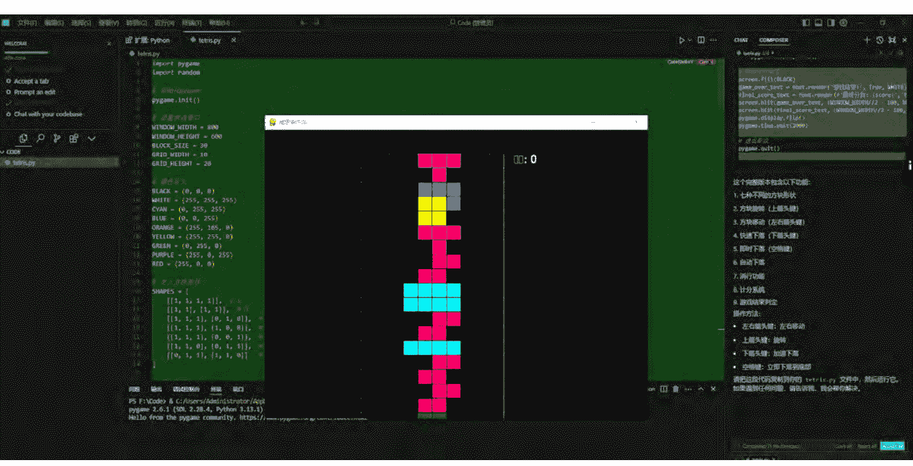
它成功运行了，而且我还可以通过键盘箭头按键控制它的移动方向。

第二个，图片压缩网页。
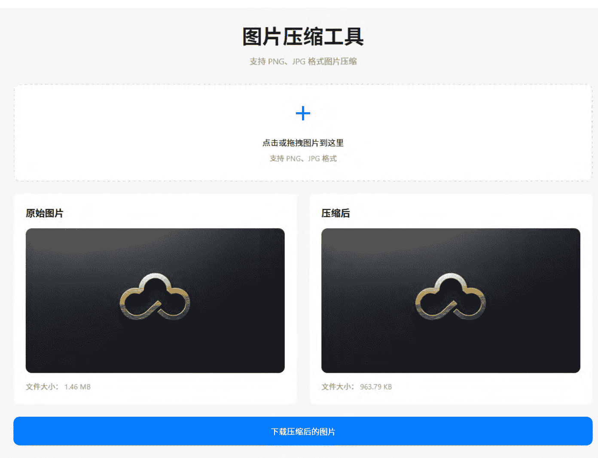
它可以使用，我下载图片，看了一下，确实 1.46MB 的图片变成了 963KB，图片确实被压缩变小了。

就是说，以后我若是有压缩图片的需求，我不用打开别人的网站压缩图片了，我用自己做的网页就压缩图片，完全告别广告。

如果我想让别人使用我的图片压缩网页，我可以用 GitHub + Vercel 的方式实现，不过，目前我还没有这个想法，所以说我没有做。

那我在做出这两个功能的时候，我遇到了什么困难？

我可以给大家简单说

说一下，打消大家对使用 AI 做编程的畏惧感。真的很简单，很快乐，让人很有成就感。

我用了 40 分钟，做出了一个俄罗斯方块游戏，没有计算下载的时间。我完全是一个新手小白。

比如，Cursor 让我下载某个软件，我打开网站之后，本来以为很简单，毕竟我下载过很多软件的电脑版，当时我就在想，只要会上网，那肯定会下载软件呢。没想到，连下载软件我都不会，然后我直接问 Cursor。他就帮我指导了，步骤更详细了。我按照它的步骤，成功下载了 Python。

又比如，我在进行某个步骤的时候，我看他出现了红色，我感觉不太对，我就把那些符号复制过去，问他，这是怎么回事。他就告诉我为什么出错了，又告诉了我解决方法。

又比如，在教程里，有的方法，我没有看到，但是我看到了下一个步骤，我直接跳过教程里有，但我没有遇到的步骤。

再比如，他让我安装某个插件，我不明白为什么要安装这个插件，我就提取文字，修改一下错别字，然后问他为什么要安装这个插件，他就告诉我安装插件的原因，Cursor 太有意思了。

也就是说，我遇到了任何编程上的问题，我完全可以问 Cursor 怎么解决问题。

我用了 45 分钟，做出来了我的图片压缩工具网页，这次花了还包括我在群里提问的时间。

第一个问题，教程里说，按照他的步骤之后，有的代码就自动出现了，但是我的一直没有出现。我在群里提问后才发现，原来是这个原因，我之所以出错，是因为我用的 Chat 输出的指令，原来该用 Composer 输出指令。

# Cursor编程3群-12月航海(387)

教练-彩笺: 一个小小的进阶作业，有没有朋友愿

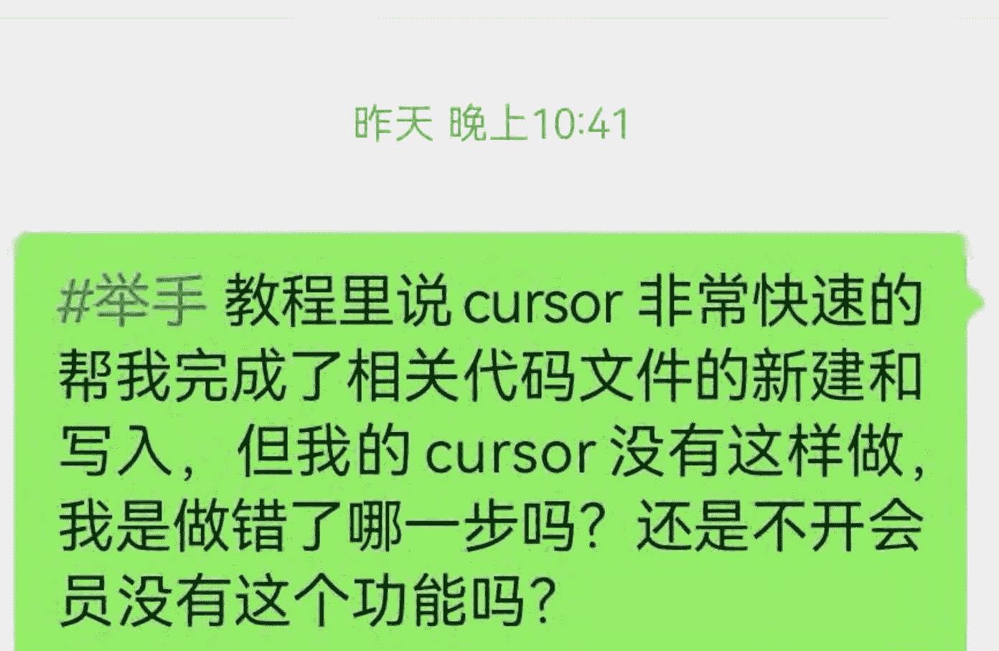

> #举手 教程里说 cursor 非常快速的帮我完成了相关代码文件的新ild 新建和写入，但我的 cursor 没有这样做，我是做错了哪一步吗？还是不开会员没有这个功能吗？

第二个问题，“为什么压缩文件后，文件变大了？”这是我使用图片压缩网页后发现的问题，我继续向Cursor提出这个问题后，他帮我修改了，但是依旧有错误。

这是第三个问题。我问他为什么出现“此网页显示，当前PNG图片已经优化，无法进一步压缩”。我提出这个问题后，他帮我修改了，然后我下载图片看了一下，确实1.46mb的图片变成了963kb，确实变小了。

也就是说我提了两个问题，Cursor都帮我修改好了，做好了。

整个过程，不论是注册Cursor，还是做一个俄罗斯方块游戏、一个图片压缩网页，我只在群里提了一个问题，其他时间，都是我看教程做出来的。

它根本没有我想象中那么难。

那我具体是怎么学习的呢？

第一天，我简简单单看完了一遍教程：https://scys.com/view/docx/YIvBdL38ConF89xdvAckZBPn5e#QnYXdIPxxoHUlPxkCFLcDpB0nng

第二天，我按照教程注册了Cursor，中途我遇到了一点小问题，也解决。

我还把语言设置成了中文。

# 公众号懒人搜索，懒人专属群分享

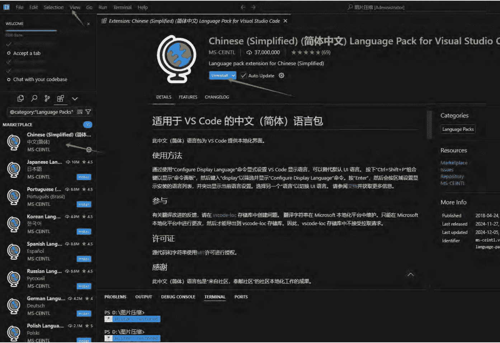

代码保存可以按保存图标，也可以按Ctrl+S保存，还设置了自动保存。三选一。

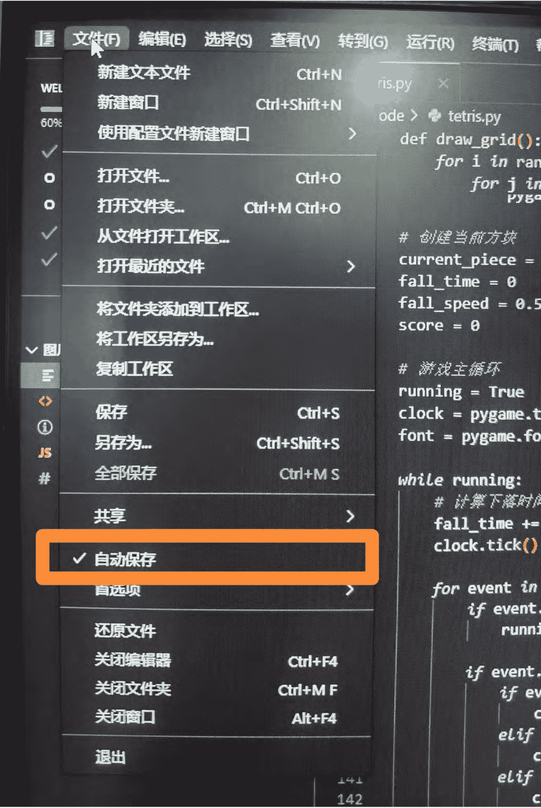

第三天，我用1.4小时，开发了一个俄罗斯方块游戏和一个图片压缩网页。

那我为什么想要学习Cursor呢？

一是在生财看到了刘小排老师，对AI做编程很感兴趣。

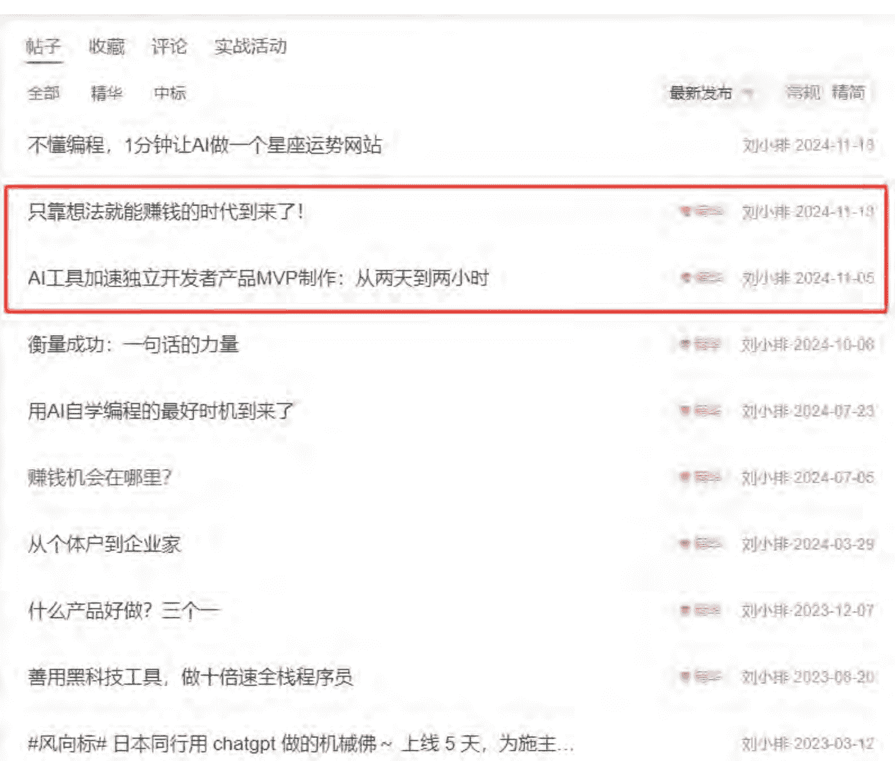

二是看到了花叔关于小猫补光灯的复盘。

他用Cursor 1小时开发的App，靠小红书成为百万爆款，登上了AppStore排行榜Top20。

之后，他做了一个小猫补光灯Pro收费下载的商业化尝试，短短6个小时之后，「小猫补光灯Pro」版本登上了所有付费应用榜的第1名。

安卓跟风出现了很多盗版。

火到小红书官方账号之一数码薯都推荐了他的小红书帖子和账号。

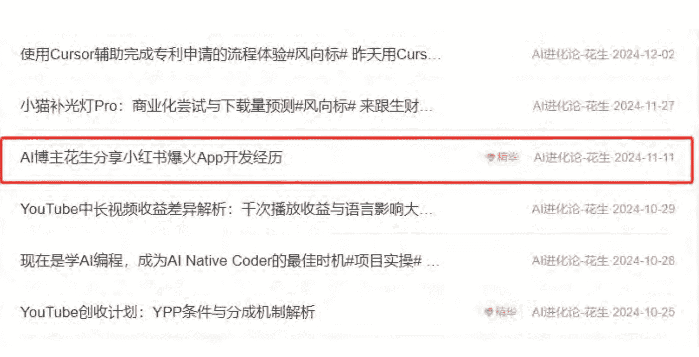

这是我学习Cursor最主要的原因。

在学习Cursor 12月航海手册之前，我真的很担心我学不会，我会遇到很多困难。

没想到，我用1.4小时就开发了一个游戏和图片压缩网页。

我没想到这么简单，这么容易，我真的对AI学编程产生了浓厚的兴趣。

强烈建议大家去学Cursor，用AI做编程。

# 评论区：

- 宋忻：虽然之前也看到Cursor的文章，但不知怎么滴，看了你的开头后我萌生想法：如果我学会了，就可以带着孩子一起去制作游戏，这可比孩子闷头玩游戏强多了！
- 云珞YunL：加油，看着cursor航海手册，很容易

### (18赞) 航海第二周船员“分化期”，如何高效辅助船员打卡

作者：范磊  
日期：2024-12-12

在这期航海-【小红书自媒体-商单】中，我作为乐之~领队的志愿者，辅助28位船员航行。航海分为三个星期，在运营过程中也被我们分成了三个时期：

第1个星期是“了解期”，大多数船员对于这个项目从不了解到初步了解和初步实操，在这个过程中有逐步放弃的，有崭露头角的。第1个星期的船员打卡次数会由高到低，从刚开始的新鲜尝试，到一周左右的了解和分化。

第2个星期就到了“分化期”，有一些船员逐渐摸到了门道，开始了自己实际操作，并逐渐有了反馈。有一些船员遇到了这样那样的问题，会慢慢地放弃。

第3个星期是“疲惫期”、“收获期”。这个时候正常打卡的已经完成了打卡任务，已经不需要过多催促，完不成打卡的需要继续“紧盯”，运营的后期就比较轻松了，只需要对处在危险期的船员多加鼓励，辅助他们完成打卡。

在这里我想说的是：打卡成绩的好坏，并不是志愿者的功模，而是船员通过自身的努力经过，加上我们的用一系列的组合拳进行推波助澜，而最终形成的结果。

举一个例子，就像是在游戏里，船员是【主攻手】，而我们的志愿者在这里就像一个【辅助】，我们负责推送优质信息，盯梢，加血，回复状态。

你说是主攻手重要，还是辅助重要呢？其实两者都重要，缺一不可。 在航行的第8天，我们以第2周的航海实操来分享一下：
https://fanlei666.feishu.cn/docx/BKWpdX6rqo58kJxrsMCcxTrjn8e

# 评论区：

暂无评论

### (11赞) 图片压缩工具：基于Cursor的PC端应用开发

作者：静  
日期：2024-12-09

用cursor 做的图片压缩工具，挺好玩的，花了两天时间，在原有的航海教程下做了微调 需要PC端打开: https://xcv-123.github.io/tupianyasuogongjunew/

# 评论区：

- 空山：您是怎么生成github链接的呀？我查了很多教程都不行，能否指点一下[抱拳][抱拳]感激不尽
- 静：我是直接问的cursor，让它一步一步教我生成能被别人访问的网站，你是到哪一步卡壳了呀

## 【AI相关】10篇

### (精华帖)(67赞) AI编程普及带来的新机遇与挑战

作者：Super黄  
日期：2024-12-10

各位生财圈友好，我是AI产品黄叔。最近一年多All in AI，现在是360和荣耀的AI产品顾问，前阵子受花生启发，意识到了AI产品经理新的范式出现了，说的通用点，就是AI编程普及了，会带来很多新机会，于是约花生录了一期播客，部分文字版本分享在这里，期待和更多朋友有深度交流！

以下是正文：
小猫补光灯和花生，是最近这段时间火爆全网的现象级产品和个人了吧，如果大家还不了解，欢迎使用快速了解一下，要注意，花生给自己的标签是：“”。

昨天我约了花生聊了一期播客，话题聚焦在两个方面，本文是播纲的删减版本，全部内容欢迎到小宇宙收听：
本文主要展开下面四个部分：
01 AI编程的门槛与上限：非程序员也能做“复杂”产品
02 产品开发的新范式：快速验证需求，迭代出爆款
03 Build in Public的重要性：公开开发过程，共创产品价值
04 巧妙利用杠杆：代码加媒体，双轮驱动成长

说实话，我现在还真没看到所谓的上限在哪。因为每个人都能做出不同难度的产品。而且你要知道，我自己是8月29号才开始学的，到现在也就三个月左右，肯定还没碰到自己的天花板。当然，做更复杂的项目时会遇到新的难点，比如数据库啊，后端系统啊，这些以前没接触过的概念。但这些其实都是可以学的，AI真的帮了大忙。那些工程师觉得难的东西，现在借助AI，难度能降低很多。

我觉得真正影响一个人能做出什么项目的，其实就两点：
就比如有个中文系出身的朋友，因为公司没钱找外包，他就自己投入时间，每天学16个小时，最后搭了个几万会员都能用的系统，挺厉害的。

所以啊，至少对我来说，才学了这三个月，离触到上限还远着呢！

对，这个变化真的很明显。我记得去年4、5月的时候，我想做一些插件，里面要用到AI的功能。那时候要自己去读API文档，理解怎么调用AI，真是太难了！

但现在完全不一样了，你只要把文档链接丢给Cursor，让它看一下上下文，它就能直接帮你把调用代码写的出来。特别方便！

所以现在遇到问题，网上随便找个教程，不管是英文的中文的，直接丢给AI，它都能帮你搞定。这种体验跟以前完全不是一个级别的。

花生：是这样的！其实现在AI就像两种状态：
一种是那些特别基础的、常见的能力，因为都在它训练数据里了，它已经完全掌握了，上来就能帮你做。
另一种就是比较偏门的，或者是特别新的东西，那就得你自己喂资料给它看。比如说你要用个新框架啊，或者一些比较小众的技术，就需要把相关文档或者教程丢给它，让它先理解一下你想干啥。

这就有点像是，你在教它认识新东西，让它能懂你的需求。它理解了之后，就能按照你的想法来帮你写代码或者解决问题了。

花生：说到个人素质要求，我觉得还是有一定要求的。
最近接触的人多了，我有一些新的认识。首先要说的是，写代码的能力其实并不是最重要的。从我接触到的很多例子来看，你之前是否会写代码，有没有学过编程，这些真的不那么重要。

更关键的是看。如果没有这种驱动力，你可能很难找到学习的切入点。我理解有些人是冲着'新风口'和赚钱的机会进入这个领域，但我想劝退这样的人。虽然AI编程确实有赚钱的可能，而且潜力不小，但这条路并不容易。你需要很强的耐心，即便AI把编程变得简单了很多，但要做出真正有价值的东西仍然很困难。

做出产品后，还需要推广营销的能力。找到好的需求、做出对他人有用的东西，这需要用户洞察能力。如果只是为了赚钱，不妨先考虑其他途径。
我觉得这比较适合两类人：
举个例子，我社群里位新加坡营销公司的负责人，他们主要帮客户做营销活动。有了AI编程能力后，他就能很快地帮客户制作活动落地

制作落地页或官网。这个技能要么能让他竞争中占优势，要么可以作为额外的收费项目。

所以我认为，如果你真的想创造一些东西，或者觉得AI编程能够直接帮助到你现在的工作，那么你会比较适合学习AI。但要有心理准备，这个学习过程会有困难。不管是报课程、看视频还是加入社群，都不能解决所有问题。所有的教程都只是告诉你做产品的方法，给你一些启发。因为每个人做的产品不一样，编程语言和框架那么多，你可能需要学习教程里没提到的语言。虽然很多知识是通用的，但这需要你有很强的学习能力和知识迁移能力。

花生：对，比如说我的小猫补光灯项目，后来又出了一个可以自拍的pro版本。这两个版本加起来，最近一个月我可能更新了二十几个，接近30个版本了。这些更新里面虽然有改bug的，但更多是在根据用户需求做调整，让产品更符合用户的需要。

花生：让我先介绍一下小猫补光灯这个产品背景。

首先要理解补光色卡这个概念：在光线暗淡的环境下（比如清吧或餐厅），拍照效果通常不太理想。现在很多女生会采用这样的方法：用一部手机显示特定颜色的色卡，把屏幕亮度调到最大，假装玩手机的姿势从侧下方给脸部打光，然后用另一部手机（可能是朋友的手机或自己的第二部 手机）来拍照。

（图2）补光不仅仅是让脸更亮这么简单。不同的光线可以营造不同的感觉和氛围，所以女生们会喜欢不同类型的色卡 - 有的营造氛围感，有的让皮肤显白，有的突出少女感。

在原有的使用场景中，大家都默认需要两部手机：一个用来显示色卡打光，一个用来拍照。因为显而易见，你不可能用同一部手机既显示色卡又自拍，这在当时被认为是理所当然的限制。

但当产品上线后，在一两千条评论中，有两三个用户问：'这个产品需要两部手机吗？'这个问题立即引起了我的注意。这表明：提问的用户可能不熟悉传统色卡的使用方式，他们希望能用同一部手机实现补光自拍。虽然提出这个需求的人很少，但这个需求非常真实。从产品角度来看，这将带来革命性的改变：
- 原来的产品只是把色卡工具化，提升了使用效率。
- 而加入自拍功能后，创造了一个全新的使用场景，没有其他产品可以替代。

更重要的是，这打破了必须和朋友在一起才能使用的限制，一个人也能实现补光自拍，这显著提高了产品的使用频次和留存率。

后来还有一个有趣的功能演进是后置摄像头。当用户提出这个需求时，我最初觉得这完全是个伪需求 - 因为用后置摄像头时，屏幕光根本打不到脸上，怎么补光？但当我友善地询问用户具体需求时，发现这其实是用于对镜自拍的场景：，而屏幕的光正好可以打在脸上。这是个我完全没想到但确实存在的真实场景。

这些例子说明，有些功能虽然提出的用户很少，但结合产品认知的分析，可能会发现它们的重要价值。有时候它们甚至能让产品变得完全不一样，开创全新的使用场景。

花生：对，我觉得这个还挺重要的。这样才能够更好的去挖掘到底用户在什么情况下可能会用这个功能，不然就直接否了。（花生小红书置មាន置顶的两条笔记）

花生：对，如果是做自己的产品，Build in Public真的太重要了。而且我在小猫补光灯这个项目之后，对Build in Public有了新的理解。

## 传统的Build in Public

更多是说，你在做产品的每一步都在社交媒体上同步和宣传，通过这种方式去积累潜在用户和早期种子用户。但在传统概念里，这个过程中和用户的互动其实并不那么频繁。

而小猫补光灯的例子就很不一样了。它在Build in Public的过程中，产品是完全和用户共建的，所有功能都是和用户一起打造。这种方式让产品走向了一个很不一样的方向。

有意思的是，在产品逐渐成熟的过程中，早期的种子用户都能很包容产品的bug和不足。他们会觉得自己像是在和这个产品一起成长，看到产品变得越来越好，他们也会感到很开心。

所以这是一种新的Build in Public范式，和传统的方式很不一样。

花生：对，我非常积极。

花生：对，完全复是这样。第一波支持你的用户真的难得。当你的产品还不够完善的时候，他们愿意来支持你，这显现了他们很可能就是你产品的核心目标用户。即使产品有很多bug，他们也能接受。因为他们这么早就接触到了你的产品，所以他们和产品之间的情感连接可能会更深厚一些。所以真的需要特别重视这部分用户的感受和体验。

后来我在iOS版本发布的时候，我是真的很感谢他们能给我提出这些意见。而且我也希望通过这种方式让他们看到，这个产品不是我一个人拍脑袋想出来的，而是我们一起共建的成果。我是真心想做一个你们需要的产品，就是想传达这样的理念。

花生：我们来聊聊纳瓦尔提到的四种杠杆。

首先是金钱杠杆，就是通过投资这样的方式来获得被动收入。然后是人力杠杆，比如说你开一家公司，雇人为你工作。还有就是媒体和代码这两种杠杆。

跟前面两种比起来，你创造一个产品或者写点东西，即使你在睡觉，别人也能看到、用到，帮你获得被动收入和财富。

说到代码杠杆，虽然理论上它不需要授权，但以前确实被程序员这个群体给"垄断"了。普通人要用这个杠杆，需要投入特别多的时间，一般人真的用不上。不过我觉得现在已经到了一个转折点，普通人也可以用上代码杠杆了。

代码杠杆说白了就是用代码创造一个能解决别人需求的产品。这个产品做出来后，你不需要每时每刻都投入额外的人力。不管是一个人用还是十万个人用，你投入的工作量差别不大。就拿

我做的小猫补光灯来说，从没人用到现在十几万人在用，我需要投入的工作

工作量其实没什么变化。这就是杠杆的威力，它能让你的创造性工作触达更多人，帮你解决更多人的问题。

但是呢，你通常不可能只用一种杠杆。。因为你做了一个再好的产品，想着不用宣传别人就会帮你传播，这种事情基本不可能发生。你得有能力把事情说清楚，让人知道这个东西是给谁用的，能解决什么问题。两种杠杆结合使用，才能帮你实现更大的能量。

以前可能你只能通过不断产出内容来使用媒体杠杆，但说实话，媒体杠杆也不是完全被动的。做自媒体、写文章、做视频的人都知道，你必须得一直坚持做下去。现在各个平台的流量算法机制决定了，内容的生命周期和流量周期都不会太长，所以你得不停地创造。相比之下，产品的时间效度可能会更长一些。而且如果你已经把自媒体做得不错了，产品完全可以帮你放大自媒体带来的能量。

举个简单的例子，如果你只靠自媒体导流，你的流量价值要和别人分成，因为最终的服务是品牌方提供的，大头利润都给了投放广告的品牌。但当你有了自己的产品，你就可以推自己的东西。这样就能把用户和解决方案直接连接起来，让你中间获得更大的收益。你把从获客到提供工具解决问题这整个链条都打通了。虽然可能比不上大厂的规模，但这是个很有意思的模式，能形成闭环，既能帮用户创造更多价值，也能让你自己获得更多价值。

# 评论区：

- 祝铭🌻:生产资料掌握在自己手里,与用户反馈之间打通没有边际效应递减,这个闭环真的很有启发
- 申姐全域营销:真棒
- 小高:666
- 小高:1
- Super黄:总结的好棒
- C颖～:没有收到这篇播客,但是搜到了花生被访谈的另一篇,同样是收获颇丰
- 小柏兔:真棒66 66
- 林花钱:build in public,真棒的概念

### (43赞) 我是如何用 AI 工作流写公众号，45 天涨粉14000

作者： 周知 1.0  
日期：2024-12-11

大家好！我是周知 | AI工作流专家 | AI觉醒派主理人。2016年的公众号红利期，我的公众号发布3篇文章就收获了4万粉丝。但没有坚持的代价是关注数逐渐流失，如今只剩3万多。今年重启更新后，文章阅读量始终徘徊在300左右。即便我用 AI 工作流做公众号流量文，创造过单周 200 万流量、日收益破 5000 的爆文成绩，这个老号依然没有明显起色。依旧没有起色，10月16日凌晨，我做了一个重要决定：放下爆文收益，专注打造真正的IP。目前截止， 正反馈:涨粉15000人， 私域转化3500人， 合作链接， 约稿出书， 投资询问...... 希望对你做公众号公域有启发。 原文地址：https://aiawaken.feishu.cn/wiki/LMDzwxflOiTWOWk5x39cxfu6nxc

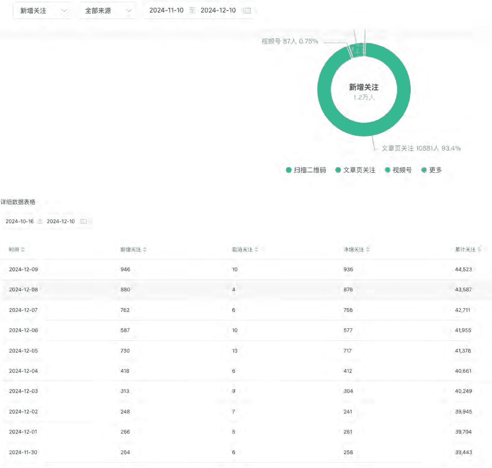

# 评论区:

- 柒柒 🍎:这么好的方法论， 好好的学习吸收
- 宋忻:我学到了， 可以用和ai对话的方式来寻找思路。
- 周知 1.0: [呲牙]
- 自律方法论的大白:巧了昨晚刚好关注到你， 还分析了一下账号。
- 周知 1.0:还挺想知道分析结果
- 青少年心理咨询师:有哪位对OEM定制AI设备 (打印机大小) 用于根据症状配方数据库， 自动调配定量复方油品， 感兴趣的可以联系我私聊[耶]

### (45赞) cursor彻底改变了普通小牛马的工作方式

作者： 差不多先生点亮技能树  
日期： 2024-12-10

cursor没能让我赚到一分钱，但彻底改变了本牛马的工作方式。大家好，我是惜光菌，一个今年4月才加入生财的小金牌志愿者。

背书就不写什么了，虽然在单位里还算出类拔萃，但是我自己总觉得只是矬子里拔将军而已。

这篇文章我只想分享一下cursor带给我这个普通到不能再普通的小牛马的真实改变，以及对于牛马来说一些日常工作使用cursor解决的思路。

第一次发帖，欢迎大佬指点[社会社会] ps.感谢蓝弈 老大帮忙审稿 移步飞📚：https://k1jlm70p5bv.feishu.cn/wiki/PwxbwEIs2ikC1CkoVWMcrc2Vnpg?from=from_copylink

# 评论区：

- 我就叫_马小玉💦：超级棒！惜光是我目前遇到的最好的志愿者！感谢陪伴，感谢这次分享！
- 差不多先生点亮技能树：期待下次再分到一起呀😋
- 蓝弈：知道啦，下一篇应该在路上了[偷笑][偷笑]

### (41赞) 2024年10个国产免费AI写作工具盘点

作者：安七
日期：2024-12-09

嗨，你好，我是安七，主攻AI+写作。

今天这篇盘点一下，2024年我用过的很哇塞的10个AI写作工具，关键是：国产、免费！

#### 01. Kimi

Kimi是由月之暗面科技有限公司开发的智能助手，擅长中英文对话，能够处理复杂的搜索问题，个人觉得它的对话体验感是很不错的（能听int人话），而且它还能识别链接、提取文档要点，总结归纳能力不错。比较适合需要进行中英文写作、内容创作和信息整理的用户。

官网链接：https://kimi.moonshot.cn/

#### 02. WPS AI

一个我平时容易忽略，但是用了觉得“真香”的工具。WPS AI是金山办公推出的智能写作助手，支持文本润色、智能推荐、语法检查等功能。它让我觉得眼前一亮的是 AI PPT 功能。就是你跟它说一句关键词/一句话，然后它根据你的这个做个大纲，哪里有问题直接改哪里，没问题就点击“挑选模板”，可以在线转化为PPT，30秒，非常快！（如图，这是它做的，很精美）

使用建议：适合需要在不同设备上进行文档创作和编辑的用户。

官网链接：https://ai.wps.cn/

#### 03. 文小言

一个我一直在用的写作AI工具。虽然它的对话感没有Kimi好，但是写作方面是我用了这么多AI工具下来，还是觉得不错的一款工具。只要你的提示词写得好，它能满足80%甚至更高的写作要求。

官网链接：https://yiyan.baidu.com/

#### 04. 豆包

豆包我也挺喜欢，页面简洁，舒服。它里面的“智能体”很适合当朋友一样聊天，而且还能给点建议。如果说，你平时有什么不太好找别人聊的话，或者你想找人出谋策划但没有遇到，那它可以当你的军师。“语音通话功能”很强大，挺好的。

官网链接：https://www.doubao.com/chat

#### 05. 魔撰写作

魔撰写作这个我个人用的相对来说少，但是里面的功能我也挺喜欢。它提供AI智写、AI润色、AI改写、智能纠错等功能，而且还能自动提取音视频文案。还是比较适合需要全能AI写作助手的用户。

官网链接：https://x.moyin.com/article?to=aiTemplate

#### 06. 笔灵AI写作

笔灵AI也是一款国产的中文AI写作工具。里面页面就更多、选项功能也很齐全。可以通过深度 深度学习和自然语言处理技术，帮助进行高质量、高效率的文本生成、文章优化、AI问答等操作。它会更适合需要进行学术论文、营销广告创作、社媒文案创作的用户。

官网链接：https://ibiling.cn/template

#### 07. 宙语Cosmos AI写作工具

这个写作神器可以提升中文写作的效率和质量。里面有超多丰富的模板，有200多种不同类型的格式可供选择。其中它的“朋友圈文案功能”我个人比较喜欢，有时候没灵感了会来这里找找。如果你需要快速准确地完成写作任务，而且希望作品展现你个人风格，那这个不错。

官网链接：https://ailjyk.com/pc/creation/model?channel=DVCXBQVT

#### 08. 知文AI学术助手

这个AI操作起来比较简单、高效。本科生、硕士生和博士生写论文一定不要错过。它支持快速生成清晰的大纲和全文，而且定位就是“学术助手”，还是很了解你有什么需求的。

官网链接：https://ykoai.com/?user_sn=14440103

#### 09. 天工AI

天工AI还是比较全能：支持搜索、写作、对话、文档分析、画画、做PPT的全能型AI助手。可以借助它来检索信息、多语言翻译、写论文、写代码、写方案、写汇报、做PPT、归纳总结。适合需要全能型AI助手的用户。

官网链接：https://www.tiangong.cn/

#### 10. 橙篇AI

如果你经常刷AI工具之类的，应该会发现橙篇出现的频率还挺高的。我也用了一下它的AI PPT功能，体验感也很不错~如果说你用WPS AI不习惯的话，可以试试它。里面的选项和功能也很丰富，根据自己需要的去玩。

官网链接：https://cp.baidu.com/

上面就是初步筛选后，觉得还不错的10个国内免费、靠谱好用的AI写作工具，希望对你的写作有帮助~

评论区：
- 🧊达师姐：学习了太适合我这种小白又不想动脑子的人了
- 安七：[呲牙][爱心]
- 上上签：来的及时，正需要

***

### (39赞) 利用AI自动化写小说，一个月成功签约100篇短篇小说，月入四位数

作者: Ai联盟
日期: 2024-12-13

大家好, 我又来了, 上个月我分享了如何靠写短篇小说慢慢变富的帖子。

很多圈友加我想了解百家号付费订阅的事, 我也做了解模解答, 但是很多人发的信息, 我都要第二天才回复, 不是我没看见, 而是这半个月太忙了, 忙着测试新的项目, 希望大家见谅, 今天在这里给大家做一个统一的汇报。

老规矩, 先看数据, 小说短篇稿费

文章图片内容有点多, 请大家看飞书：
https://szxb4qbve7.feishu.cn/docx/ArZHdgfKdozG8ExHeOconZLnQb?from=from_copylink

评论区：
- 翻斗花园：老哥，这个真棒，但是我已经实操啃起来了 就是达不到老哥这个效果
- 行者阿吉：请问一下，百家号每个号是否都需要实名呢？

***

### (34赞) AI顾问经验总结：大厂商业化成果与内容创作启示

作者：陈财猫
日期：2024-12-09

大家好，我是陈财猫。这是一篇很值钱的文章，是我给某大厂当ai顾问的经验总结，我们都赚了不少钱。我们目前拿到了很多结果，标题所言的“商业->商业化水平”绝对不是虚言。这篇文章花了我非常多的心血和时间，全文大约1.3万字，事实上，我推荐每个搞AI内容创作的朋友都看看。

另外做个自我介绍，我是一个提示工程师，目前在AI赛道创业中，也许是国内第一批提出提示词框架的人（在23年2月底发明了提示词框架BROKE），做的GPTs在全世界三百多万个中排过前100，做的prompt AI游戏上过Github trending，用搞科研态度写的提示词工程教材霸榜过当当人工智能新书榜榜1。我最近刚加入生财有术，这是我第一次在生财有术发帖，也许国内在ai圈的小伙伴会认得我。

这篇文章是11月在北京举办的提示词工程峰会的演讲稿。祝你阅读愉快。

下面是飞书链接：
https://richcatai.feishu.cn/wiki/Y3QmwtYWUiqsIIk5RmNcssMcnjg?from=from_copylink

### 输出千篇一律，没有多样性，如何克服平庸？

解决办法：
> “一个凝结核上生长出完全不同的雪花”

- 提供一个或多个初始“种子”作为引导
- 裂变出不同的方向，增增大多样性
- 控制释放给 AI 的信息，预留发挥空间

暂无评论

***

### (18赞) 奥特曼为何敢定高价？ChatGPT Pro订阅套餐引发热议

作者：台风-AI魔法师
日期：2024-12-11

大家好，我是台风(AI魔法师)，GPT写作指令法 <BRTR原则>、ChatGPT指令生成器作者。曾任生财早期的GPT自媒体教练，AI领域公众号矩阵粉丝4万+。

OpenAI第一天发布会，除了发布ChatGPT-o1正式版之外，还推出了全新的ChatGPT Pro订阅套餐，200美金一个月。相当于ChatGPT Plus套餐的10倍价格，也就是接近1500人民币，差不多普通人1/3的月工资了。这价位，都快赶上互联网产品会员套餐的天花板了吧。奥特曼凭啥敢定这么高的价？

#### 01

大家都知道，这次发布的o1正式版本，主打的是满血推理能力，性能方面也有了很大的提升，处理复杂问题的速度提高了50%，错误率更是降低了34%。

但是呢，原来的Plus套餐，连GPT-4o每天都有限额，GPT-o1更是只能一周用几十次。如果是深度玩家或者企业用户，这根本用不尽兴啊。大模型的能力是非常吃算力的，想用的更好、用的更爽？没问题，加钱！

所以全新的Pro套餐，主要的卖还是：首先承诺可以无限使用所有模型（实际打脸就不提了）。同时允许Pro会员使用性能更加强劲的GPT-o1 Pro model，可以提供更多的算力来计算高难度问题。所以说GPT-o1 Pro才是正儿八经的推理满血版。那么这个o1 Pro版本，真正的效果如何呢？

#### 02

说实话，真要让我花1500块买这么一个会员，那肯定舍不得，钱也不是大风刮来的。所以台风找了一个ChatGPT Plus会员的共享平台，来做一波测试。因为实际用的就是ChatGPT官网，只是加了账号跳转，效果是一样的。

#### 03

既然GPT-o1 Pro主打的是推理能力，如果拿普通的内容创作场景来测试，估计很难体现出来。台风特意选择了【推理小说】这个场景，看一看o1 Pro在复杂剧情构建的理解上面，能不能达到人类的水准。

在这次的推理小说创作任务中，我没有规定选题，让GPT自由发挥，并且要直接输出文章。重点提出了几条相互矛盾或者说有难度的要求。比如“要有爽文的传统套leg、俗套的场景，但故事实际非常有深意，越读越有劲。”或者比较抽象甚至离谱的，比如“现在的文学圈子看不起，但是30年后能让全世界的人追捧、非常有共鸣。”……

具体可以看这条现编的提示指令的内容，比较简单。然后把这条提示指令扔给GPT-o1 Pro运行，看看能拿到一个什么样的结果吧...

PS：如果你想要测试中的推理小说的简版提示指令，在文章最后领取。

#### 04

因为GPT-o1 Pro比较吃算力，所以大概等了2分多钟。这就是o1 Pro写出来的一篇短篇小说了。篇幅过长，我就不截全部了。

看到这篇内容的时候，大家有没有发现什么问题？GPT-o1 Pro直接把我的要求和标准当做了小说素材去写了……当然也可以说，可能是因为：我没有明确说明主题由他自己定，不能把要求当素材。我重新补充了要求去跑一遍，发现他还是老样子……但整个故事的逻辑细节倒是好了一些。这次结尾讲了反转的情节安排。

#### ChatGPT o1 pro mode

最后，林迦夜意识到自己也是棋子。他以为自己是侦探来破解命案，却发现自己只是顾寒丹笔下的设定角色。他的推理与挣扎，都在顾寒丹预设的文本里得到呼应。他的名字“林迦夜”可能是文字谜题的一个环节，象征黑夜中梵音的指件。

而读者——真正的读者（30年后的人）将回望此刻。他们会恍悟这故事并不只是谋杀案，更是一则关于时代轮回的寓言。顾寒舟的死亡让作品成为有机生命，在时间中孵化。30年后，人们会在废旧档案中找到这篇小说，如同打开八音盒，曲调无声却撼人心魄。

#### 十三

所谓十次反转：
1. 起初以为是普通谋杀，后发现是精心布局。
2. 前妻嫌疑不成立，编辑入场又被否。
3. 毒并非外来，而是死者自制。
4. 死者疑似自杀却留下谋杀假象。
5. 现场的布鞋印是误导。
6. 八音盒暗藏纸条，表示受害者和凶手身份颠倒。
7. 遗稿隐形墨水文字揭示死者就是“凶手”。
8. 三张凳子和缺失的南方座位指向未来读者。
9. 作者之死不是终结，而是作品开始。
10. 侦探与读者同为被操纵的对象，整个故事是对未来时代的讽喻。

#### 十四

故事收尾，林迦夜站在顾寒舟尸体前，长时间沉默。清晨阳光透过窗户，八音盒不再旋转，墨汁渐干。远处有海浪声，像是时光低语。林迦夜低声道：“原来如此……我们一直都身在他的故事中。”

30年后，当这篇小说被考古般挖出，它将成为惊天经典。所有曾经蔑顾寒丹的人将哑口无言，人们会用各种现代理论诠释这部奇书，无数伏笔会被陆续破解。读者们恍然大悟：这是一部深藏30年、提前为未来读者量身打造的推理杰作。那时，他们会像凶手般把故事剖析干净，又像信徒般对作者顶礼膜拜。

故事终了，却留下无限余韵。30年后的世界，也许正如顾寒舟所料：他们终将臣漫于这部乍看粗鄙的传奇文本。

#### 给“ChatGPT”发送消息

可以看出，哪怕是强如满血版本的GPT-o1 Pro，也没有办法同时兼顾逻辑构建和具体的内容创作细节。我也拿到o1正式版去跑了一遍，它只思考了几秒。输出的故事倒是自己构思的，一个关于虚拟现实混淆的主题，只是缺乏细节，像一个小说概述。

#### ChatGPT o1
思考，持续几秒

### 《迷雾中的回声》

雨夜的城市，总是披上了一层神秘的面纱。霓虹灯下，雨水在街道上跳跃，反射出五彩斑斓的光芒。林晓，一个年轻的侦探，站在案发现场，凝视着那扇半掩的窗户。她的心中充满了疑惑和不安，因为这起看似普通的失踪案，背后隐藏着复杂的谜团。

#### 第一幕：失踪的画家

林晓接到报案，是一位名叫张宇的著名画家失踪了。张宇以其独特的抽象画风而闻名，但最近他的作品风格突然转变，变得异常晦暗。失踪的当天，张宇在自己的画室中消失，留下了一幅未完成的画作和一封神秘的信。

#### 第二幕：未完成的画作

林晓来到张宇的画室，细细观察那幅未完成的画。画中充满了混沌的线条和隐晦的符号，似乎在诉说着什么。她注意到画的背面有一行潦草的字迹：“真相，藏在迷雾中。”这句神秘的话语让她意识到，这不仅仅是一场简单的失踪案。

#### 第三幕：隐藏的线索

在调查过程中，林晓发现张宇最近频繁出入一家名为“迷雾咖啡馆”的地方。她前往咖啡馆，发现那里环境古朴，墙上挂满了各种艺术作品。她与咖啡馆老板交谈，得知张宇最近常与一位神秘男子会面，但从未透露过对方的身份。

#### 第四幕：神秘男子

通过监控录像，林晓识别出那位神秘男子的身影。他戴着一顶黑色礼帽，身形高大，面容模糊。林晓感到，这个男子与张宇的失踪有直接关系。她决定进一步追查这个线索。

#### 第五幕：消失的夜晚

林晓查阅了张宇失踪当天的目击者证词，发现一个共同点：都有提到当晚有一阵强烈的迷雾突然出现。

#### 给“ChatGPT”发送消息

这是o1正式版提供的情的情节逻辑，大家也可以对比一下。

同样我也让竞对Claude 3.5 new跑了一遍，它很快地写了一部叫《记忆收藏家》的推理小说，这本小说倒是完整的，也相对流畅，只是情节构思上也还是差点意思。这也看出来各自的侧重点，o1 Pro强调小说的推理过程，Claude 3.5重在完成小说形态创作。

### 05

但相比之下，GPT-o1 Pro这样的表现，真的把我整不会了。或许像台风这样拿来创作内容，并不是GPT-o1正确的打开方式。至少无主题或者一稿成文不是。当然，本身也是有意为难他，看看能思考成啥样。期待看到更多GPT-o1 Pro的有效推理应用场景吧。

送给大家的【推理小说】的测试用的提示指令。

### 【推理小说作家-BRTR任务指令-AI魔法师台风-v1.0-241209】

**背景：**我想挑战写一部高难度的短篇小说，看似矛盾变态的要求，却造就经典。

**角色：**希望你扮演一名资深的小说作家，擅长编写烧脑的推理小说、悬疑故事。

**任务：**请你根据创作要求编写一篇3000字的推理小说，要完整可发表，能够让普通读者看了大呼牛逼。

**要求：**
- 小说选题和素材你自己定，但要足够牛逼，能做到让现在的文学圈子看不起，但是30年后全世界的人都会追捧这部小说、非常有共鸣。
- 要有爽文的传统套路、俗套的场景，但故事实际非常的有深意，越读越有劲。
- 至少要安排10次以上的反转，各种不经意的隐藏的伏笔，能让读者留意不到，但看到最后又直拍大腿原来如此。
- 字数只有3000字，但能让大家读出30万字的想象空间。

看完台风这波测试，大家对GPT-o1 Pro的表现感觉怎么样？如果真让你花200刀一个月买ChatGPT的Pro会员，你会愿意吗？欢迎在评论区留言讨论。

**评论区：**
- 猫爸：哈哈，暂时不买
- 台风-AI魔法师：哈哈，可以等他先稳一波
- 新柳：动过心嗫
- 台风-AI魔法师：非研究型刚需可以再等等~
- Edward：求chatgpt pro的账号共享平台名
- 台风-AI魔法师：我知道的都暂时下架了，会降智或者封号严重

***

### (20赞) 如何用Cursor开发提取聊天记录问题的工具及解决BUG的方法

作者：大臣
日期：2024-12-09

圈友们好，我是励志要在21天航海，做出21款工具的男人。目前进度5/21。

这篇文章记录的是如何用cursor开发一款提取聊天记录问题的工具，里面提到了我在解决BUG时一些好用方法。这个程序的灵感来源于前几天cursor航海群发布的挑战。

> #### 教练团发出的挑战——
> 一个小小的进阶作业，有没有朋友愿意尝试一下：
> **需求：**总结常见的群聊问题
> **可能的描述：**通过某种办法读取微信群聊的聊天记录，将其中的带有 #举手 或者 #提问 的问题收集起来，最后生成一份总结，包含问题和答案。中间可能需要手动做一些工作，可能最后是手动一部分+软件自动一部分才能完成。
>
> **可能的思考路径规划：**
> 1. 详细描述清楚需求
> 2. 尝试分析完成此需求都需要做哪些工作
> 3. 让cursor看看你说的对不对，有没有需要补充的
> 4. 让cursor分析都有哪些需要手动操作，哪些可以自动
> 5. 根据描述规划每一步要做什么，每一步的结果如何检验是否达到目的

当时我完成这个挑战后，突然想到我以前在做线上教培时，会有很多学员在直播间提问，但讲师可能不会每个都解答到，讲清楚。如果可以把学员们的问题都采集起来，给出专业的解答，我想学员的学习效果会好很多，而且也方便后来者参考。

所以我打算做这个问题采集小助手，但当程序开发完之后，我发现，小了，格局小了。这哪是问题采集小助手啊，只要修改提示词，分析什么文本不行，所以它也就从问题采集小助手，变成了信息采集小助手。

飞书链接：如何用cursor开发一款聊天记录问题分析工具 - 飞书云文档

评论区：

知秋：没有访问权限

大臣：抱歉，忘记开了，现在呢

知秋：现在已经能够访问，谢谢你

大臣：[胜利]

海伦：优秀优秀，大臣加油

### (11赞)图生视频平台对比：真实性、人话理解和效果评测

作者：橘子脑袋

日期：2024-12-13

### 第一、背景

目前图生视频的平台真的百花齐放，大家都卷的不行，各种新功能、新玩法。但哪个平台的图生视频更真实呢？

谁能更听的懂人话？谁的效果更好呢？今天就给大家展示一下吧！以下的观点仅代表个人意见，测试也具有不确定性，请大家理性看待！……

详细内容请移步飞书文档：https://vnjnntym6m.feishu.cn/docx/UWEFdDAb7o5KnMxBPJYcKImUn1e?from=from_copylink

评论区：

来来：你应该使用同一个提示词，这样对比测试比较好一些

橘子脑袋：后面又统一测了，效果还是一般，可以仔细看一下效果对比

### (9赞)OpenAI发布ChatGPT o1正式版:性能大幅提升,错误率降低34%

作者: 台风-AI魔法师

日期: 2024-12-10

大家好,我是台风(AI魔法师),GPT写作指令法<BRTR原则>、ChatGPT指令生成器作者。

曾任生财早期的GPT自媒体教练,AI领域公众号矩阵粉丝4万+。

OpenAI连续12天的发布会,第一天就发布了ChatGPT的o1正式版,还推出了每月200美金的不限量的Pro套餐。

趁着这股热乎劲,台风也体验了一把正式版的o1。

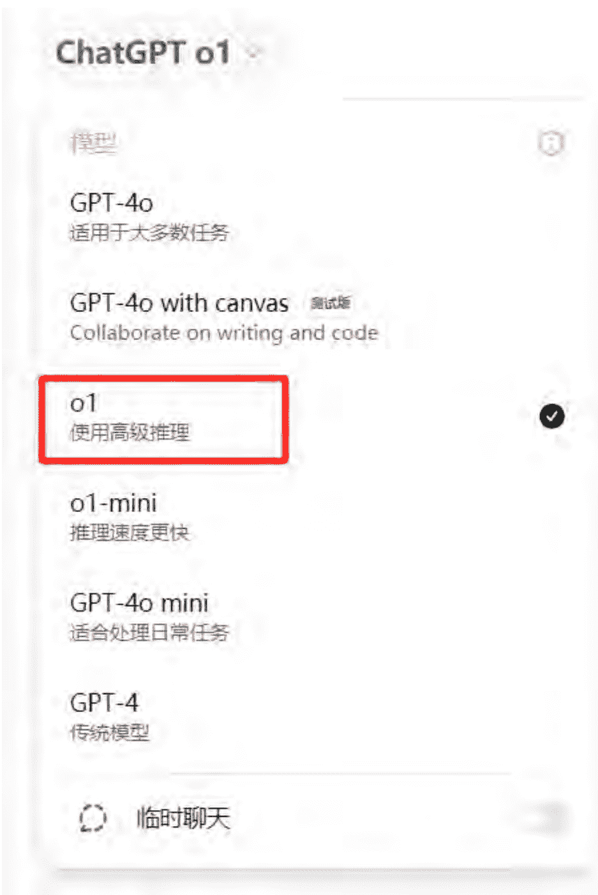

#### 01

按照惯例,先简单看看o1的参数吧。

官方介绍说,新版本性能有了大幅提升:处理复杂问题的速度提高了50%,错误

率更是降低了34%。

在数学和编程方面表现尤其亮眼,拿2024年国际数学奥赛预选题来说,正确率高达83%!这可把GPT-4的13%和预览版o1的56.7%远远甩在了后面。

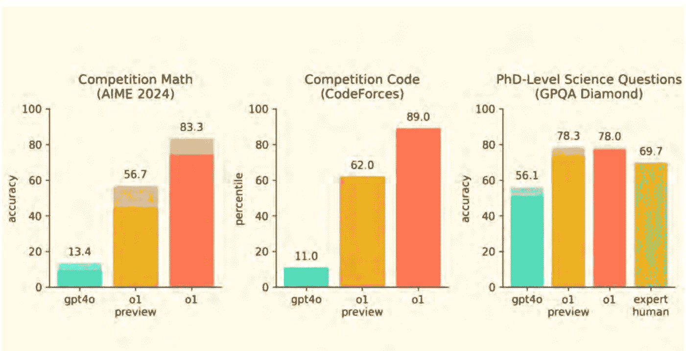

#### 02

o1这次还加了不少实用功能，比如能根据问题难度自动调节响应速度，还支持图片识别功能。

当然台风更关注它在内容创作这方面的表现。

于是现编了个简单的国学鸡汤指令来做个测试。

o1只思考了几秒就开始输出，速度快多了，感觉比GPT-4还快一点。

给出的字数有点夸张，达到了1800字。我只要求了1200字...

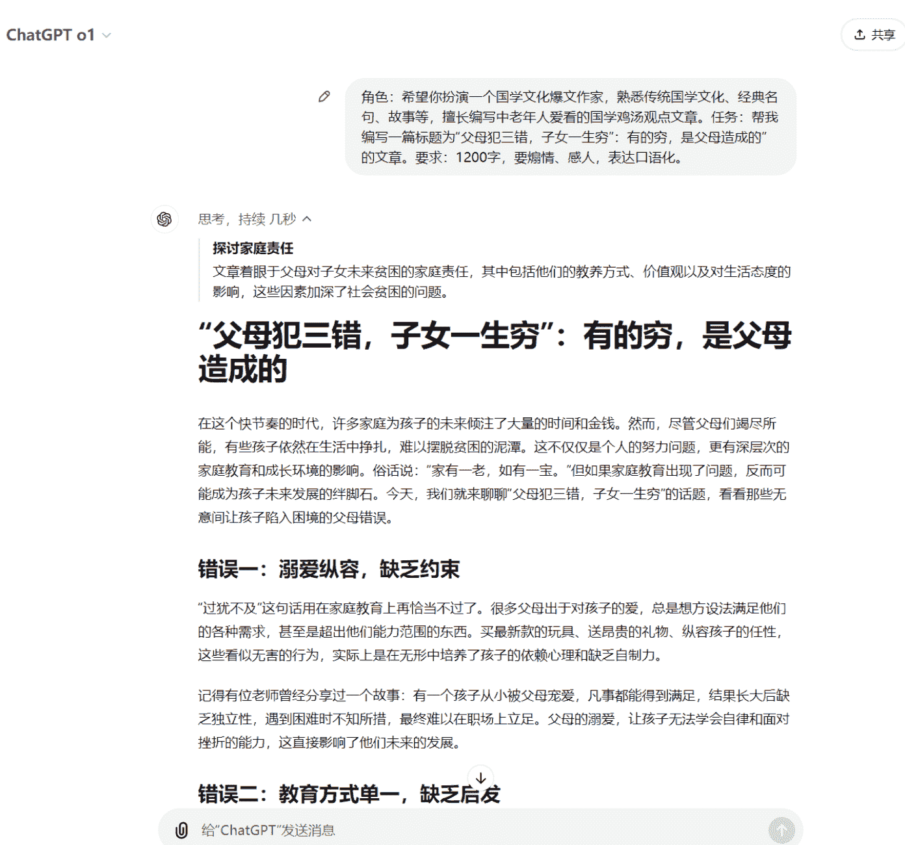

看了一遍内容，o1明显是知道国学文章该怎么写的，内容结构基本符合国学鸡汤的框架雏形，整体内容逻辑性也比较强。

像国学文化、经典名句、故事等元素，只是在角色定义里提到了是要熟悉的技能，o1内容里基本都用上了。

文章之所以那么长，是因为o1自己做了发挥，论述主题之后，还给出了相关建议，衔接结尾之前还有承上启下的一段话，结尾再回顾主题，结构安排上还算可以吧。

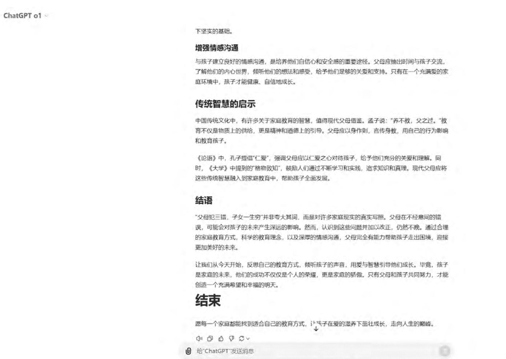

虽然提示词简单，但效果还行。也可以看出，只要大模型能力足够，就可以很好地理解这种看起来抽象实则也算精准的要求，写出70分以上的文案。

#### 03

但我们创作文案，不能只看逻辑，还得重点关注表达风格。

全文看下来确实没有明显的AI味，只是显得相对正式，像个研究员的口吻。

相比之下，用同样的提示词，Claude-3.5-new的表达就自然多了，更口语化。

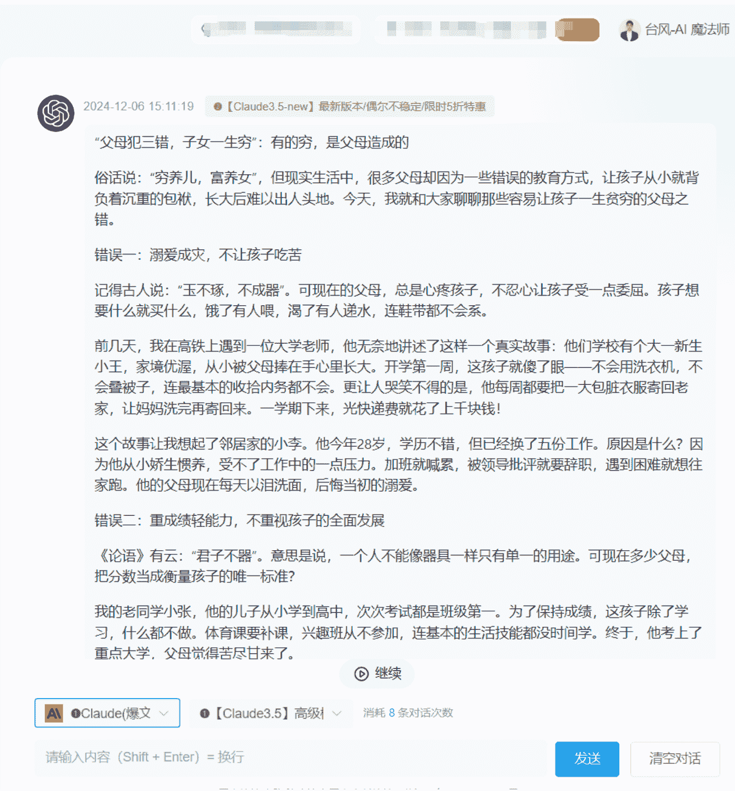

总的来说，o1在逻辑方面表现稳定，符合预期。可能正是因为太注重这一点，反而在表达风格上显得偏弱了。

现在官网上plus会员使用o1每周还是有限额的，大概几十次，肯定是没法满足创作需求的。

200美金/月的Pro套餐呢，不仅不限量，还支持使用更强大的o1 Pro 模式，计算能力更强，思考更深入。

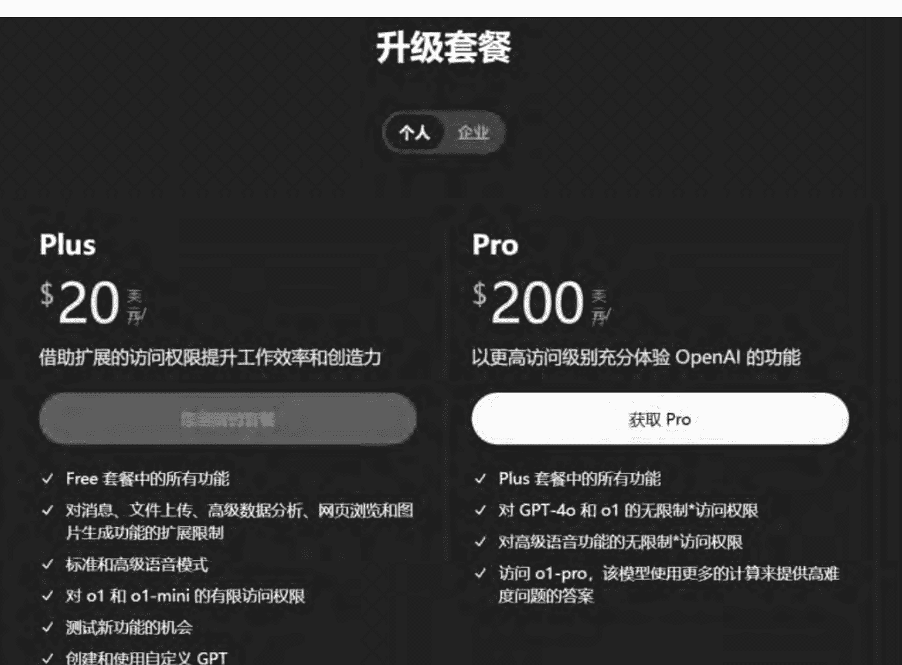

个人感觉，可能更适合需要用到科研或者做方案的场景。

#### 04

台风之所以能成为一个AI超级个体，完全是因为ChatGPT带来的流量红利。

我很感激,在2023年是ChatGPT让我感受到了AI的魅力。

本来这篇文章是打算用o1来扩写润色的，但生成了两遍，我都不大满意。

因为它生成了太多超出要求的东西，甚至是结尾生成了一大堆莫名其妙的东西，像什么标签、版权、联系我们...

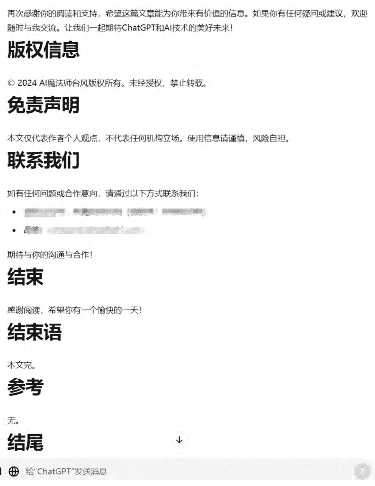

看起来似乎是想多为我考虑一些，但说实话，过犹不及啊，最后还是放弃了，换回我最爱的Gemini。

嘻，回首两年过去了，我和ChatGPT却有了渐行渐远的感觉。

无论如何吧，还是得说一声:

ChatGPT加油!谢谢你。

大家都不要辜负一个如此美好的AI时代。

一切都刚刚开始，一切都会越来越好。

#### One More Thing

附上测试用的简版国学鸡汤指令，由于是为了测试自由发挥的能力体现，所以很简单。

【国学简版-BRTR任务指令-AI魔法

师台风-v1.0-241206】

角色:希望你扮演一个国学文化爆文作家，熟悉传统国学文化、经典名句、故事等，擅长编写中老年人爱看的国学鸡汤观点文章。

任务:帮我编写一篇标题为“父母犯三错，子女一生穷”:有的穷，是父母造成的”的文章。

要求:1200字，要煽情、感人，表达口语化。

大伙有什么想法，欢迎评论区交流。

## 评论区：

暂无评论

## 【小红书】4篇

## (精华帖)(111赞)单店月销200W+，小红书电商最巡打法保姆级教程

作者：deizi*你的小脸

日期：2024-12-11

(无广无微信纯净版) 大家好，我叫戴小胖，抖音ip同名，93年，10年的内容行业创业者，干过广告 mcn 电商，加入生财有术3年了吧，一直在潜水，最近开始分享，有点紧张，希望大家点个鼓励。

先说我是干嘛的，目前主营是小红书电商和小红书ip，小红书电商，月千万级。本人商业IP，月变现100w。小红书疗愈+声音ip的体量在200w粉丝，变现体量1000w+。

电商体量多个店铺都是月100w以上，最高单店单月800w，单条笔记带货最高80w，并且退货率在8%，冬季产品略高，退货率在20%以内，业内无人能出其右。

今天分享:内容较长。详情移步至飞书内容包括:

https://n4dbdw6xhe.feishu.cn/docx/L39kdUeRoomorOxhEZxercxGneb?from=from_copylink

排序

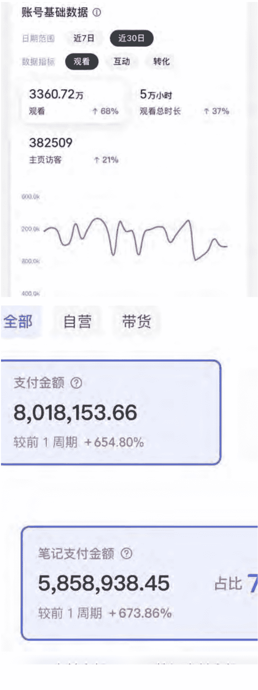

评论区:

老彭:半年没来分享了[旺柴]

早茶月光:牛呀!

更绪:你是我最近听课的那个戴小胖?

腾飞的鹰:牛啊一出场就是王炸

Ex:dy都关注你一年了才发现你也在生财[旺云]

亦仁:可能对于很多小伙伴来说这个模式比较难复制,但是不排除一部分本身在实拍比较好且有供应链沉淀的小伙伴参考。路子比较野,不太适合新手,但是可以拓展一下大家对小红书另类玩法的认知了。

deizi:征服好的谓所你是，征服难的谓所我。你的小脸，通过不断地学习、建设、构建步步为营。征服难的谓所，是建立起自己的护城河。好复制=死得快。只有不断给自己的生意加码,不断给自己的生意加护城河,你才能走得更远。2.难做的事情和正确的事情和必须要做的事情往往是同一件事,你只有把所谓的难做的事情做了,才能超过畏难的人。3.并不是野路子,在我看来这才是合理利用规则、合理对抗规则的正确打法。你所谓的适合新手的那些玩法才是野路子,因为野路子起效快，且容易受到规则制约，不长久。

亦仁:除了成果图+细节实操,能不能提供下对标账号,也是一天50条的账号矩阵?

## (精华帖)(69赞)精准引流：小红书残蟹项目玩法分享

作者：艾小飞

日期: 2024-12-10

大家好! 我是艾小飞, 擅长小rad小红书精准引流 又到吃大闸蟹的季节了, 今天给大家分享一篇去年我做残蟹项目的玩法

前几天我朋友按照我写的步骤来操作, 第一天就赚了300+ 今天我把这篇文章分享出来, 感兴趣的圈友可以试试! 移步飞书文档:

https://lw03aeuj0n.feishu.cn/docx/N2sqdXekQoWm2Wx1D28cGo62nwi?from=from_copylink

评论区:

秋野: 很厉害

秋野: 哈哈哈, 我刚看到残蟹项目的时候, 还以为是残缺项目, 看了一会儿才知道, 真的是大闸蟹的残蟹[奸笑]

小郭: 太细节了

小安: 好文章!

兜兜里有糖: 好久不见你的文章了, 今天读起来还是这么丝滑, 实操干货满满

静墨🦀: 很棒, 完全可以迁移到其他行业! 对于pxx发货分量不足的问题, 是不是可以拍高一规格的发给客户, 这样缺斤少两的问题可能能避免一些。

九里香: 好文章[抱拳]

津渡: 感谢分享! 写得很完整和详细, 能够直接上手。想问下大概月利润能到多少呀求解答[抱拳]

### (37赞)小红书礼物赛道的独特优势与市场潜力

作者：古辛

日期：2024-12-10

小红书是一个比较独特的电商平台，不同于淘宝和拼多多等平台以搜索流量为主，小红书还是一个有推荐流量的内容平台，所以，小红书有一些独属于自己的，蓝海赛道，今天古辛就跟圈友们分享一下，独属于小红书的蓝海赛道——礼物赛道！

小红书礼物赛道古辛自己也在做，也分享给过古辛星球的兄弟们，因为这条赛道非常大，可以容纳很多人，所以古辛就来分享给生财的圈友们，如果大家目前也在做小rad小红书，并且还没有选到适合的品，那么可以考虑一下，小红书礼物赛道。

古辛觉得，礼物赛道在小红书上的市场如此之大的原因，主要有两个，一个是小红书上的用户以女性为主，而礼物的主要用户也女性，这俩的用户群体是重叠的。

二一个是因为小红书是种草平台，很多创新礼物，在电商平台很难卖动，主要就是因为没人知道，但小红书不同，小红书是种草平台，就算用户不知道这个礼物，也有机会被平台推荐，也可能看到，从而购买。

小红书上的礼物市场很大，可以容纳很多店铺，同时，礼物店也比较好做，比如上图这个店，就是做礼物垂直店的，991个粉，卖了7318单。

这个店也是礼物垂直店，174rad 1740个粉，卖了6275单。

今天拿做案例给兄弟们看的，是上图这个店，古辛觉得这个店，具有代表性，值得模仿。

礼物垂直店走的是垂类路线，就是一个细分类目的品，都可以往这个店放，就不走单品路线。
所以几乎所有的礼物垂直店里，都会有很多个品。

礼物垂直店还有一个特点，就是低，中，高客单的品都做，不局限于只做高客单的品，当然，如果只做高客单礼物垂直店，古辛觉得也OK。

对于礼物垂直店，算单个链接的毛利润，就没啥意义，因为这类店的品贼多，看的是总的毛利。

每个平台都会有属于自己平台的特色赛道，古辛认为礼物垂直店，就属于小红书这个平台的特色赛道，如果想要礼物市场，小红书绝对是国内最好的平台，没有之一。

如果圈友们想要做小红书礼物赛道，需要注意以下三点:

#### 1. 用好小红书搜索栏下拉联想词

无论是选品，还是做笔记，都要用好小红书搜索下拉联想词，这些词既可以帮助我们选品，又可以帮助我们理解这个品类，以及获得更多的流量。

比如我们在小红书搜索“礼物”，下拉框就会出现很多联唱词，这些词都是“礼物”在小红书搜索量很大的长尾词，每个都需要好好利用。

#### 2. 找准用户的痛点

礼物这个品和其他品还不一样，其他品的购买者，基本也是使用者；但礼物的购买者和使用者是不同的人，所以，我们要找用户的痛点，主要找准购买者的痛点，谁下单，谁才是我们的客户。

那我们的客户有什么痛点呢?这个赛道的客户,最大的痛点,就是自己不知道该买啥?很多客户,自己是不清楚该买什么礼物的,小红rad小红书恰好又是一个种草平台,能够帮她们解决这个问题。

这也是为什么小红书的礼物赛道,比其他平台都好做的原因,淘宝是必须客户自己搜索,宝贝才会出现,小红书就算用户自己不知道想买啥,宝贝也会会出现。

其次,我们的客户送礼,大多都有同样的心理,就是希望自己的礼物能够小众一点,不是烂大街的,而且还能给收礼者惊喜,这点也说明了,为啥昨天提到的海螺蜡烛,销量会那么高?

#### 3. 贵=好

礼物赛道还有一个特殊性,就是可以激发“贵=好”这条潜规则,如果这个品是自己用,可能大多数人会选择便宜一点的,但如果送人,会选择贵一点的,因为“贵=好”是刻在人潜意识里的一个信息。

虽然我对这个品不懂,但我知道,好的肯定贵,那么我只要买贵的,就一定差不了,所以,礼物赛道,特别是送长辈的礼物,定价高一点,要比定价低一点,更好卖。

小红书礼物赛道,在古辛的眼里,目前就是一个纯粹的蓝海市场,有很多古辛知道很适合小红书用户群体的品,在淘宝每月有几百的销量,但在小红书目前是搜不到的,这意味着什么,相信有过电商经验的兄弟们都懂!

如果圈友们在小红书礼物赛道发了财,别忘了给古辛点赞,哈哈。

评论区:

上上签:要不在讲讲具体的操作,喂个饭

古辛:这是核心机，护城堡垒。。。。。得加钱[旺柴][破涕为笑][破涕为笑][破涕为笑]

阿路hh:因为我有个朋友是这个赛道的,小红书top10,我11月份导过数据,发现7月份过后数据反馈不太理想,一开始以为是礼物赛道上半年优于下半年,但环比23年,确实整体数据下滑挺大,感觉这个赛道消费的模式有所转移

### BLUE:喂饭到掌勺

小花:小红书应该是从8月份开始调整了流量政策,所有行业都受影响,要投流了。

老彭:啊啊啊啊!!!快到圣诞节了,看了一晚上小红书,还是不知道要送女朋友什么礼物!!要死了

### (13赞)小红书账号拆解:31个账号的简介、内容、受众及亮点分析

作者: 奋斗的木鱼

日期:2024-12-09

为学习小红书拆解的小红书账号,目前有31个。内容涉及:账号简介(用来了解定位)、账号主要内容、账号受众、亮点

用来辅助自己账号定位与提升赛道了解,写的比较粗糙,有需要点看看看是否有用

链接👉 https://h24wtd3rug.feishu.cn/sheets/Eav9sCG4KhcakJtfrw6csHEYnPd?from=from_copylink

| 序号 | 账号链接 | 账号简介 | 账号定位 | 账号主要内容 | 账号受众 | 内容类型 | 亮点 | 标题关键词 | 运营动作 | 形式 | 账号价值 | 看完感受 | 作者 | 第一条发布时间 | 账号粉丝数 |
| :--- | :--- | :--- | :--- | :--- | :--- | :--- | :--- | :--- | :--- | :--- | :--- | :--- | :--- | :--- | :--- |
| 1 | https://... | 室友的梦想:在家开999个不重样的小店已改造:日料店小卖部奶茶店食堂夜市摊还想看他改造随我告诉我 | 搞笑日常这感行为大赏 | 宿舍改造-在家开设各类门店 | 18岁以下 | 搞笑 | 1.反差感:宿舍开餐厅 2.超大物品:奶茶、汉堡、试卷、习题 3.连炫酷的视觉效果,每集只有1分钟左右,留着下顺悬念 | 1.笑疯了; 2.我疯了; 3.太牛了; 4.我疯了; 5.炸裂 6.这辈子 | 各大耳熟能详的事物,例如:喜茶、蜜雪冰城、试卷 | 视频 | 情绪价值 | 作者在发布视频过程中,发现了开店的流量极好,因此调整方向,以开店为主题 | 乐物鱼5w | 2022.8.1 | |
| 2 | https://... | 我是朝阳学长全网保险测评up主保险专业出身,产品库已测评7300+专注测评\|保险规划\|储蓄养老 | 保险测评 | 各类保险产品分析 | 需要了解保险或者配置保险的人 | 保险测评 | 1.大标题、简约封面 2.使用大量排行榜的方式来引流+吸粉 | 1.90%人都忽略了; 2.绝镜子; 3.我宣布; 4.王炸; 5.宝藏; 6.闭眼入 7.小亿冷门 8.后悔没早点知道 9.我发现 | 1.花了N天整理; 2.有个致命缺点 3.排行榜、第一名 居然是它 | 图文 | 资讯价值 | 铁杆一开始,账号规划到好的,因为开始就熟练地用“排行榜”来吸粉引流,而且文案和标题都很严肃很符合小红书调性 | 太阳保险测评 | 2023.2.4 | |
| 3 | https://... | 鱼丸是省级非遗工艺 但是个甜话兼送 年轻人不愿意干了 奶奶从事鱼丸制作23余年 今年60多 身体不太行了 他又不愿意寄养这一身功夫 思虑再三回家跟会跟学鱼丸,现在跟爸妈在学习 有讲错做错的辛苦指正! | 1.勤奋、吃苦耐劳、继承家业的老女 2.养成系 | 先是各类职业和女性,间隙两年,变为回家继承家业,做鱼糕 | 1.鱼糕受业; 2.受到情绪驱动的人人群 3.有想传统生活印记的人群 | 短视频 | 1.真实感; 2.镜头捕捉人物特点、动作,行为超强具实感 3.很多细节镜头和长时间工作的快速镜头 | 24岁潮汕女生回乡继承非遗手艺的第一天-N天 | | 视频 | 情绪价值 | 看完,感觉挺真实,让人自然升起一种信任感,很多镜头虽然简单,但很接地气,凸显出人物很多隐藏细节。内容上,最大限度还原真实现状,看评论,很多人都在热议这些细节点。 在简介上,也非常朴素真实名字处理的也赞,特意标注(学习中) 模仿:毕业后的工作也与媒体有关,整体内容与视频都有专业的筛选 | 鲁克公主(学习中) | 2021/9/19 | |
| 4 | https://... | 人生使用手册修叮中VLOG\|教会粉丝做VLOG博主\|终身学习一简三变(请疯狂催更) echa_work@yaat.net | 1.个人生活vlog; 2.穿搭科技等生活分享 | 1.个人生活事件,包括日常吃饭、开箱、生活的感悟等 2.后期逐步转为各类科技测评+推荐+自媒体教学 | 1.有仪式感生活人群 2.对各类拍摄科技喜好或者要入手的人群 3.准备从事自媒体或者正在从事个人自媒体人群 | 短视频 | 1.仪式感 2.影片品质 3.自娱生长,从个人生活成片后不断延伸出自己的能力,竭力后续转化等产品(科技测评、自媒体教学) | 1.4步 2.3分钟 3.3个云楼 4.一个公式 | | 视频 | 资讯价值 | 博主从生活vlog开始切入,分享个人生活,带出各类日常使用的科技设备,然后在积累的经验上,逐步转向“数码+教人自媒体”的博主。博主铁粉指数:23年9.13的vlog神机分享帖子爆了,然后后续帖子“用佳能x10拍摄和我日常拍摄vlog设备”继续有非常好的流量,从后续账号来看,数码测评+自媒体经验分享、流量都很好,这姑娘是写满的用了懒头填满了自己的书\| \| | A-Chu | 2020/1/2 | |
| 5 | https://... | | | | | | | | | | | | | | | |

# 评论区:

> 黛比:直接做“拆解账号博主”,这个资料包挂车变现~

## 【海外项目】3篇

### (32赞)搭建海外节点最新教程2.0：免费工具+99元 腾讯云，实现每月1000G流量

作者：施仁
日期：2024-12-09

我是施仁，之前写过一篇关于搭建海外节点的文章。没想到很多朋友对这篇文章都有需求，这也让我意识到，想做海外相关项目，首先需要有合适的出海工具。

最初我写这篇文章的动机，是因为我自己需要去YouTube下载视频，需求并不多，也没有遇到太多问题。但随着文章的传播，很多朋友反馈他们在搭建过程中遇到了各种问题，需求也变得更加复杂。我自己也发现，通过这个教程搭建的节点，访问某些特定网站时，服务器会出现连接断开的问题。连接断开后，几分钟内无法重新连接，过了一段时间又能恢复。尽管我没有找到具体原因，但我推测问题可能与服务器内的软件有关。

为了找到更好的解决方法，我进一步研究了其他软件的搭建方法。经过多次测试后，发现使用新的搭建方式，电脑和手机都可以正常访问，不会再出现访问特定 网站时服务器连接失败的问题。教程可能看起来有些晦涩，但只要按照步骤操作，一般半小时到一小时就能顺利搭建一个稳定的服务器。下载下来后，把文件后缀的 .1 删除，然后解压。教程在里面。

通过网盘分享的文件：
搭建链接: 
提取码: awpm

评论区:
Maya: 看不了了[流泪]
cc: 404了,,
幸福国度: 看不见了
王一升: 没了[流泪]
施仁: 放云盘了。
施仁: 放云盘了。
施仁: 放云盘了。
施仁: 放云盘了。再看下

### (23赞)美国公司申请EIN教程:揭秘申请路径

作者: 国民弟弟的跨境十年
日期: 2024-12-12

美国公司申请EIN教程史上最全-国民弟弟跨境十年出品。之前讲过超低成本注册美国公司，可以看之前这篇文章: 3分钟搞定美国公司, 150美金, 超简单 https://articles.zsxq.com/id_exggkcb30j69.html。但是用他们家申请EIN费用确实很贵，200 USD，而且要2个月，着实不推荐。那么这里揭秘下申请EIN的路径。

#### 什么是EIN?

EIN是 Employer Identification Number。简单理解就是类似中国企业的税号。雇主身份号码（简称EIN）又称联邦税识别号码，用来识别企业实体。一般而言，企业都需要一个EIN。关于EIN的具体内容，可以看IRS官网：https://www.irs.gov/zh-hans/businesses/small-businesses-self-employed/employer-id-numbers

先说下自己申请的条件:
- 1) 有 ITIN。可以看之前这篇文章: 2022关于中国人开美国公司的问题指南, 史上可 https://articles.zsxq.com/id_01qkizckwh9c.html。这个在大陆也能远程找CAA办理，相对简单容易，就是要等1-2个月。如果有朋友没有，可以看上记文章或找我。
- 2) 有刚注册下来的美国公司。

#### EIN的费用?

- 1. 中国代理的价格都会很贵，不信自己去淘宝问下就可以。
- 2. 找美国代理。大部分美国代理价格都在50-200 USD左右。我沟通了两家美国税务事务所，对方知道我是博主，我就说我的粉丝多，能不能拿个最低折扣。最后压到20-30 USD一个税号，税号在1-2个工作日可以拿到。他们平常至少50 USD。这两家需要的报国民弟弟索取。
- 3. 自己在线申请。钱比较少，相对繁复了些，时间周期2-8周都有。比较费力，不过我也会解释下。

#### EIN如何申请?

1. 美国国税局官网在线申请:
您可以在美国国税局 (IRS) 的官方网站上在线提交申请。访问IRS的网站: https://sa.www4.irs.gov/modiein/individual/index.jsp

选择对应的公司类型。

#### EIN Assistant 填写流程

这里要写 SSN 持有人信息。如果你的 ITIN 填报的时候报错，那么估计是 ITIN 刚拿下来比较新，要等几个月才好用。填入 ITIN/SSN 后会选择这个 LLC 的具体信息。

#### Where is the LLC physically located?
(Required fields)
The only special characters allowed for street and city are - and /. Note: Must be a U.S. address. Do not enter a P.O. box. For military addresses click here.
- Street *
- City *
- State/U.S. territory *
- ZIP code *
- Phone number *
- Do you have an address different from the above where you want your mail to be sent? *

Before continuing, please review the information above for typographical errors.

填入公司的基础信息。

#### Tell us about the LLC.
(Required fields)
The only punctuation and special characters allowed are hyphen (-) and ampersand (&). The legal name may not contain any of the following endings: Corp, Inc, PA. The trade name may not contain an ending such as 'LLC', 'LC', 'PLLC', 'PA', 'Corp', or 'Inc'.
- Legal name of LLC (must match articles of organization, if filed) *
- Trade name/Doing business as (only if different from legal name)
- County where LLC is located *
- State/Territory where LLC is located *
- State/Territory where articles of organization are (or will be) filed *
- LLC start date *

Before continuing, please review the information above for typographical 
typographical errors.

这里都写 NO。

Your Progress: 1. Identify ✓ 2. Authenticate ✓ 3. Addresses ✓ 4. Details 5. EIN Confirmation

#### Tell us more about the LLC.
(Required fields)
- Does your business own a highway motor vehicle with a taxable gross weight of 55,000 pounds or more? *
- Does your business involve gambling/wagering? *
- Does your business need to file Form 720 (Quarterly Federal Excise Tax Return)? *
- Does your business sell or manufacture alcohol, tobacco, or firearms? *
- Do you have, or do you expect to have, any employees who will receive Forms W-2 in the next 12 months? *

选择对应的行业类型。

#### What does your business or organization do?
Choose one category that best describes your business.
- Accommodations: Casino hotel, hotel, or motel.
- Construction: Building houses/residential structures, building industrial/commercial structures, specialty trade contractors, remodelers, heavy construction contractors, land subdivision contractors, or site preparation contractors.
- Finance: Banks, sales financing, credit card issuing, mortgage company/broker, securities broker, investment advice, or trust administration.
- Food Service: Retail fast food, restaurant, bar, coffee shop, catering, or mobile food service.
- Health Care: Doctor, mental health specialist, hospital, or outpatient care center.
- Insurance: Insurance company or broker.
- Manufacturing: Mechanical, physical, or chemical transformation of materials/substances/components into new products, including the assembly of components.
- Real Estate: Renting or leasing real estate, managing real estate, real estate agent/broker, selling, buying, or renting real estate for others.
- Rental & Leasing: Rent/lease automobiles, consumer goods, commercial goods, or industrial goods.
- Retail: Retail store, internet sales (exclusively), direct sales (catalogue, mail-order, door to 2 door), auction house, or selling goods on auction sites.
- Social Assistance: Youth services, residential care facility, services for the disabled, or community food/housing/relief services.
- Transportation: Air transportation, rail transportation, water transportation, trucking, passenger transportation, support activity for transportation, or delivery/courier service.

一般是 Retail。电商一般选择这个。

#### You have chosen Retail.
Please choose one of the following:
- Selling goods exclusively over the Internet (includes independently selling on auction sites).
- Sales from a storefront. Please specify type of store:
- Direct sales. Please specify type of selling method (catalogue, mail order, door to door):
- Auction house
- Other – please specify:

#### Summary of your information
Please review the information you are about to submit. If any of the information below is incorrect, you will need to start a new application.
Click the "Submit" button at the bottom of the page to receive your EIN.

Organization Type: LLC
LLC Information:
- Legal name:
- County:
- State/Territory:
- Start date:
- State/Territory where articles of organization are (or will be) filed:

确认没有问题，就点下图 submit。

然后就是签发出税号。这个是确认副本，可以打印或者截屏，作为证明。同时 EIN 的确认信会向你注册地址发过去，一般是 2-4 周就有信件确认函。现在申请界面会同步跳出一个电子档，让你下载。类似这样，大功告成。

#### 其他 bug
如果报错，原因挺多的，问过美国税务师。他们的说法是，这样的情况需要通过电话和 IRS 沟通申请，一边电话，一边传真，还真是费时费力。

### 其他的申请方法。

通过传真申请，一般需要填 SS-4 表格，需要费时 2-8 周时间。这里就不细说，对比 20-30 USD 的成本，这个时间不值得浪费。

最终这个 EIN 信件，在部分平台是可以作为地址证明使用，如 Stripe 申请的时候，部分审核情况要传 EIN 信件。

内容干货，又细节。还不收藏下，需要的时候还能找到哦。国民弟弟让你又至少省了 100 USD。

以上

# 国民弟弟相关创业的故事文章推荐：
https://articles.zsxq.com/id_8n2o7gax71fr.html

评论区：
暂无评论

### (8赞)Temu美区半托管运营经验分享：六个月实战踩坑总结

作者：七喜
日期：2024-12-09

各位生财的兄弟们见贴欢喜，我是七喜。

前面帖子有写到，我一直在做 Temu，从 5 月份开始重心也跟着平台转移到了美区的半托管。到现在也过去了六个多月，目前订单及回款基本稳定，这期间踩过了 N 个坑，有的坑甚至会直接将我们打击到爬不起来，现在将这些分享出来，希望能帮助一部分人避免踩到这些坑。

简单写了一些，希望对大家能有所帮助。

为了更好的阅读体验，请移步飞书： https://ivvygw9y2ti.feishu.cn/docx/BRxadb2N0otfWTx4BUacwItsnzb?from=from_copylink

评论区：
暂无评论

## 【微信】2篇

## (精华帖)(66赞)小绿书业务复盘：内容、选lam与带货策略

作者：沐木
日期：2024-12-09

大家好，我是沐木，生财三期圈友。我是从9月份开始接触小绿书业务，兼职做了25个号，带货总佣金5.3万。

本文档主要分享我做小绿书，在内容跟选品上的一些思考，以及自己踩过的一些坑。希望这份复盘总结，对刚做小绿书业务的圈友有所帮助，也期待能跟大家探讨交流，把小绿书做得更好。

本文目录：
- 一：小绿书带货数据展示
- 二：小绿书阶段性复盘
- 三：小绿书爆品分析
- 四：小绿书选品思路
- 五：小绿书素材框架
- 六：小绿书素材制作
- 七：小绿书批量化
- 八：小绿书带货的一些注意事项

具体内容请移步飞书：https://k2io5jr3wl.feishu.cn/docx/TkBFdx5UAovI9UxUEYwcZrblnsc?from=from_copylink

评论区：
文案小魔女：没有权限[呲牙]
沐木：权限已经打开了~
GEWO.GUO☁：咋都震么厉害
执笔：好厉害啊
杜小判：25个全是实名号码
沐木：是的，不实名也挂不了品啊
李雪晴：你好，能否链接一下
静墨🍓：请问圈友，是25个号每天都发5条吗？一天要产生100多条内容，每天需要花多少时间来制作素材，对于批量出图和素材有什么建议吗？

### (20赞)公众号复盘：5天内从166粉丝自然涨粉至1000人，微信引流300+

作者：顾希希
日期：2024-12-09

公众号复盘，一周内从166粉丝自然涨粉到1000人，微信引流300+。大家好，我是顾希希，00年，努力在未来2年内抛弃主业，做到只工作不上班。

我在十月底的时候加入生财，这期报了公众号的航海，在航海前我的公众号只有166个粉丝，我计划在航海前就达到流量主的门槛，虽然在制定这个目标的时候，自己心底也并不相信。

5天300多的粉丝，并不是很容易。但最后成功地做到了。我做的动作都有这些。公众号涨粉：https://hvcb4uaejm1.feishu.cn/wiki/TbkuwJM6xi2BJwkM7pqcBTXKnkn?from=from_copylink

评论区：
Olive：是小绿书吗
静墨🧨：很棒哎，好的开始！感谢分享，让我体会到公众号引流私域很高效，这就去做！
顾希希：不客气，很开心能对你有帮助！
顾希希：不是的，就公众号，小绿书我还没尝试这个风口

## 【YouTube】2篇

### (54赞)YouTube Shorts项目实操：自动养号工具及航海历程分享

作者：木辞
日期：2024-12-13

大家好,我是木辞~刚来生财一个月,也恰巧赶上了本期的Youtube Shorts航海实战,听闻各位苦Youtube养号久矣,本期也正好有Cursor的航海教程,我自己写了一个自动化的工具,结合两个航海的内容,跟大家分享下,也希望能帮到大家,希望能认识到 更多AI和出海相关资源的财友,各位一起生财有术。

为了更好的体验,倒数三个数,我们来上链接: Youtube https://ocn3v0tggugm.feishu.cn/wiki/Rtn2wiYmAiPHKJknHLccOA4hn7f?from=from_copylink

评论区:
徐 Ken: 高科技, 厉害[强]
方波妮: 牛牛的, 自动化养号[强]
红烧电饭煲: 🐂🍺
龙: 太牛了!!!
新柳: 圈友们真的太优秀了
土豆君: 牛蛙牛蛙
李香君: 太强了, 真猛
术白: 太优秀了[强][强][强]

### (21赞)自制Youtube Shorts下载工具分享

作者: Rand0mWalk
日期: 2024-12-09

参加了这次的Youtube Shorts航海, 在航海群里看到有一些小伙伴还在为了下载工具发愁, 用Cursor手搓了一个, 我自己用起来还是挺好用的, 分享给大家。

飞书好读版(源码和拿来即用的程序, 以及和Cursor的对话截图): https://fiazd3hbob.feishu.cn/docx/XFsxdK6eXovUQQxPqN4cZJ3bncb

评论区:
靠岸:感谢分析
小花:感谢分享, 是不是文章没有写完
辛拉面:感谢分享, 已成功用cursor生成app

## 【线下实体】1篇

### (精华帖)(127赞)利用AI在杭州武林夜市摆摊三个月的深度复盘

作者: 超人
日期: 2024-12-10

利用AI在杭州最大的武林夜市摆摊三个月,于是我决定做一个小程序。大家好,我是超人,一个有十年开发经验的程序员。

我曾经一边上班一边开发自己的APP,独立开发过短剧类,社交类的APP,且目前都已经上架。后来离职开始全部精力投入自己的项目。由于目前的业务已经相对稳定,APP流量增长也没找到合适的渠道,就想先看看新的赛道。

一个偶然的机会,促使我在杭州最大的夜市利用AI摆摊,想测试下网上爆火的AI能否在线下落地,发现实际情况和网上的火热截然不同,三个月时间发现了很多AI的真相,于是想把这段时间的经历深度复盘下,把踩过的坑一个个总结出来,同时把AI线下实操碰到的问题梳理一遍。

本文详细复盘了这三个月中AI在线下如何受到冷模以及为什么我还要开发夜市专用的AI摆摊软件,现在还做了一款小程序来继续探索AI对普通人的机会。目录如下：
- 一、为什么选择用AI去摆摊 - 首战告败
- 二、反思AI是否是割韭菜
- 三、如何破局 - 开始改变
- 四、小程序开发难点及解决方案
- 五、复盘与反思

下面是飞书好读版 #项目实操##AI摆摊# #项目实操
二维码已打码 https://h0v0176ep4x.feishu.cn/docx/XeJ1d8QAYon2OtxwIvacXLIln8g?from=from_copylink

评论区:
百哥:太强了
杨盛华:超强执行力,用AI放大自己的优势[强]
何勇:实在,靠谱!比那些鼓吹赚多少多少的同学强多了
追梦:真是超人的执行力[强]
超人:是的,纸上得来终觉浅
超人:一起加油
超人:努力让自己的选择变正确
超人:跟这里的大神相比还差很远

## 【抖音】1篇

### (33赞)一个月3亿播放，在抖音能赚多少钱？

作者：张集慧
日期：2024-12-10

很多人应该见过这种，朋友圈形式的图文，流量很大，一条视频，动辄几百万，千万级播放也不算罕见，那这样的视频，变现情况怎样呢？

大部分的账号，变现都不理想，也不稳定，就像图中这个账号，30天GMV不到2w，佣金也就几千吧。

最初看到这样的内容，我就在想，既然这么有流量，变现不好，那就提高转化率，这类内容，有流量是有流量，但是流量很泛，根本不可能带出来用户的购买欲望，要想卖货，就在文案上下功夫。

要想带货，还要内容有流量，那必须遵循几个原则:
- 1、有话题性，这个是有流量的第一核心
- 2、产品与内容的融合，怎样将产品融合到内容中，融合好了，转化自然就来了。

按着上面的思路，于是我试了几条文案。
- 1、胚芽米：用生活中的常见的大米，挖掘出来一个吸引人的点，为什么大米好好的会缺个角？很多人会好奇,完后引导出不缺角的大米是胚芽米，缺掉的角是有营养的胚芽，这样购买的点就出来了。
- 2、彩票摇号机：买彩票发财是很多人的梦想，就那么几个数字，怎样提高中奖率，是彩票人梦寐以求的核心，一个小小的彩票摇号器，是不是真的有用吧，最起码在大奖面前，很多人还是愿意相信的。

互动数据: 3,130 | 16 | 1
图文详情: #彩票中奖 #彩票选号器
商品名称: 发财彩票机大*透双*球选号器电子摇号机一体机神器...
内容质量: 待改善 (电商优选标准)

| 指标项目 | 数值 |
| :--- | :--- |
| 成交金额 | ¥146.4 |
| 预估佣金 | ¥65.85 |
| 订单转化率 | 0.19% |
| 图文观看量 | 3,130 |
| 商品曝光量 | 3,434 |
| 创建订单数 | 6 |
| 成交订单数 | 6 |

其他转化指标: 109.7% 转化率 / 0.2% 转化率 / 0.2% 转化率 / 100.0% 转化率

这样的一张图内容制作起来也很简单,在PPT里面做好一个模板,有新的内容以后,只要换张图片,换个文案,导出图片形式就好了,都不需要什么作图软件。这样简简单单的图片带货形式，不知道大家看了能不能赚到钱。

评论区:
晓光:这种号流量分成多吗?
老彭:抖音现在没有图文流量分成了

## 【快手】1篇

### (28赞)快手数字人单品付费打爆保姆级教程

作者：Mr.Zhao
日期:2024-12-10

【单品日销4W+，快手数字人单品付费打爆保姆级教程】

生财的圈友们大家好，我是迪伟；自从加入生财后，收获和成长颇多，今天也给大家分享下我们今年在做的快手数字人单品打爆的项目，希望对大家有帮助；

今年快手推出了女娲数字人直播系统以后，对于我们中小商家来说，是一个非常利好的消息，大大节省了我们的主播成本；我们在经过了一段时间的实操后，已跑出标准化流程，现将这个流程分享给大家，希望对入局快手的朋友或准备入局的朋友有一些帮助；第一次在星球发帖，希望大佬们多多点赞支持，欢迎链接交流；

文章较长，移步飞书查看：https://s94d3hoOdr.feishu.cn/docx/N510dMHW4os001xx6KOcqmFQneg?from=from_copyllivnk

评论区:
靠岸：留个v交流一下 感谢分析
Mr.Zhao:联系鱼丸哈[抱拳][抱拳]
华仔:这个就是要自己开店找货源，不是做达人吧
Mr.Zhao:对的自己开店
亦仁:这个项目的风险和缺点是什么呢
Mr.Zhao:缺点:利润率低(大概10%左右)，对资金要求高(平台结算会有账期,前期需要自己垫付货款);风险:付费测品投放前期会有亏钱的风险;
Lucia:太棒了!感谢真诚分享!先赞后看[呲牙]养成习惯
Mr.Zhao:[抱拳][抱慢][抱拳][抱拳]

## 【其他】7篇

### (77赞)医生自媒体人分享健康保养与就医指南

作者：梁靠谱
日期: 2024-12-09

你好啊, 我是梁靠谱, 生财五期圈友, 七期、八期拉新销冠, 我主业是一个医生, 支援过疫情和洪水, 参加过急救和重建, 做自媒体这五年, 经营了一个免费的健康星球, 为上万人免费答疑, 再忙也没落下过。这是我根据大家常见的困惑, 写的一个基础版的保养和就医指南, 全文超过两万字, 希望大家作为社会和家庭的顶柱, 在搞钱的时候, 也别忽视了身体健康。每年多赚200万, 多活十年就是2000万了。一起生财有术、长命有术, 加油。

https://p8tchgpz2u.feishu.cn/docx/OSS3dwoeeogJYixmVoUcuLkNnre?from=from_copylink

- 妖怪都画你不画-皮肤篇
- 蒲公英孩子之殇-头发篇
- 这是心灵的窗户-眼睛篇
- 屁股上的仙人掌-痔疮篇
- 国之脊梁的脊梁-颈肩篇
- 别成为现代孙膑-关节篇
- 妈说小孩哪有腰-腰背篇
- 是消化也是免疫-肝胆篇
- 怎么就变态了呢-过敏篇
- 我有一个朋友问-男科篇
- 我还有一个朋友-妇科篇
- 一辈子都在念叨-减肥篇
- 生气留在奶子里-乳腺篇
- 身体的第二大脑-菌群篇
- 车都保养那人呢-体检篇
- 不行了就搬救兵-补剂篇
- 看到了才会敬畏-好物篇
- 熟悉细软跑路径-推演篇
- 男女搭配就不累-差异篇
- 被上帝咬了一口-博主篇

评论区:
亦小亮: 好东西啊
梁靠谱: 好东西给好的人
孟哥: 已看完已收藏,今年多赚两百万🤓
周彦充: 好东西,找了好久终于找到,可以转载发布全文吗?
七月: 靠谱老师的文字和人一样有趣
梁靠谱: 哈哈哈孟总加油,你千万级别
梁靠谱: 可以的,希望可以帮助更多人
梁靠谱:[呲牙]

### (63赞)我在360的经历与对周鸿祎的观察

作者：牟长青
日期:2024-12-12

06年我开始北漂,其中第一家公司就是360,在那里工作了整种两年,前后换了5个部门,发生了很多不为人知的故事,也和周鸿祎有多次的接触。

最近红衣大叔周鸿祎在互联网又开始非常活跃,最近甚至还拍摄了一部短剧。昨天看完短剧,让我又想起了在360工作两年的点滴,还有和周鸿祎接触的一些故事。正好最近又打算继续写博客,就给大家谈谈我在360的故事和我眼中的红衣大叔周鸿祎。

今天的这篇内容会比较长,我希望通过自己的真实经历,让大家对早期的360公司和周鸿祎这个人有更多的了解。昨天我看到另外一篇文章,介绍了周鸿祎完整的54年的经历,阅读量还挺高。说实话里面的不少内容都有偏差,我作为360最早期的员工,知道更真实的一些内幕。

#### 1: 如何入职的360

05年底,我在成都结束自己的第一份互联网工作,做了短暂的全职个人站长。无意间在一个站长论坛加上了当时360联盟的负责人胡少宇,她得知我在找工作,就把我的简历推送给了当时360的副总王航。

王航看了我简历后,当天就给我打了电话,然后又让两个部门负责人在QQ视频面试了我。然后在06年1月份让我去北京面试,并且报报销来回的卧铺车票。

那时候的我刚满23岁,还没出过远门,也没坐过飞机,还特意买的一张机票去的北京,在面试后,才发现机票忘记带过来,连忙又赶回临时住处,拿了机票到360公司报销了费用。因为怕不第一时间报销,又没录取我怎么办。

06年2月份春节刚过,我拖着一个行李箱直接到了360公司,成为了360前150个的初始员工。当时来得匆忙,租的房子都还没找好。王航把我安排跟360各个区域的销售总监住在一起。其中有一个是西南地区的销售总监陈驰,因为是四川人,因此算半个老乡,因此更加熟络。陈驰后面也自己创业,和360另外个销售总监王连涛做了小猪短租这个产品。

#### 2: 360的派系之争

当时自己只是一个才做了互联网半年的新人，其实很难理解一个才100多人的公司，为何会有派系的说法。

刚入职360我是在论坛搜索产品部门做产品专员,后面公司高层觉得我有想法,未来可以培养成产品经理,因此调我去搜索引擎测试部门。我现在都记得王航对我说的话，说网络推广在任何公司都能做，但搜索产品经理，只有360，百度等少数几个公司有这个机会，因此让我试试。昨天写中年失业的那篇，看了一些互联网中年失业的案例，发现产品经理是最容易中年失业的，还好我最终没做产品经理:)

当时360每个副总，都有自己的嫡系，也就是所谓的自己人。而我是王航招聘进来的，理论上就是王航的人。但我在测试部门屁股都还没坐热，王航和胡少宇离职去创业了，也就是做了现在的好大夫在线，相信很多人知道这个产品。胡少宇也是好大夫在线的联合创始人，也是那时候在360公司，对我最照顾的姐姐。后面去北京，也约见过好几次。

从此我在360里就成了无根的野草，没人罩着了。王航当时在上岛咖啡单独请我吃饭，表示让我跟着他一起创业。当时我比较纠结，没完全答应。其中有个小插尘，我以前从来没分享过。就是当时测试部门并不太受公司待见，被周鸿祎还是齐向东群邮件批评了一次。王航让我等等看，如果这个部门被360裁员了，我去他那更顺理成章，毕竟他也不想这么赤裸裸的挖老周的墙角。后面和王航也保持了比较好的关系，2016年我筹备第一届28推大会，王航还友情录制了祝福视频。

但医疗网站并不是我兴趣方向，因此婉拒了王航的好意。后面在测试部门我待着也非常难受，给部门领导表达了离职的想法。（为何难受，后面的内容会提到）

也就在这个时候，当时360的CEO齐向东把我叫去了他的办公室，说知道我一直想做网络推广相关的岗位，问我愿意去360联盟部门不。当时我想在360快半年，都没能发挥自己网络推广的特长，就这么离职了确实不甘心，因此就答应去360联盟部门，齐向东还爽快的给我放了几天假，让我回重庆放松了下心情。

在入职360开始，我就开始写博客了，那时候以优垢、酷6、土豆为代表的短视频网站很火。因此我也写了一些短视频网站的行业分析的文章。被酷6网的创始人李善友看到，然后安排酷6副总韩坤来找我面谈。为了让我快速融入酷6的大家庭，韩坤还邀请我参加了酷6全公司在呼伦贝尔的三天团建旅游。

后面因为类似的原因,08年还参加过优酷在上海的活动,优酷给我安排的机票住宿,并且活动结束后,还和优酷创始人古永锵在KTV唱歌,当时就坐我旁边。我现在都记得,当时古永锵唱了一首张惠妹的《听海》。

后面韩坤让酷6网另外一个站长出生的木蚂蚁杨波跟我对接,但和杨波的接触过程中,感觉他并不太希望我去酷6,因为我们都是草根站长出生,属于同类人,因此后面我就放弃了去酷6的想法。

正好这个时候360推出了短视频搜索,我想既然360也有短视频相关的业务,我何不就留在360做短视频的事情一样。因此半夜给360产品总监陈杰写了封邮件,表达了我对短视频行业的一些看法,并表达想去短视频产品部门的想法。

而当时我在360联盟的业绩很好,因此陈杰愿意我过去,但360联盟又不放人。最终这个事情闹到了周鸿祎那里,也是因为这个事情,第一次被周鸿祎单独面谈,最终在他的首肯下,我成功去了360产品部门。

也是那一次,我才明白了360公司有派系之争,因为离开360联盟之前,部门经理跟我说了这么一句话，你不是在换部门，而是在选领导。因为当时360联盟属于齐向东直管，而360产品部门属于另外个副总石晓虹直管。

#### 3: 因为不懂站队,虽有能力却不得重用

那时候年轻，我只懂做好眼前的事情，不懂职场的那些潜规则。比如说陈杰这个人，后面成为了高级副总裁。但其实在360产品部门的时候，大部分产品经理都不喜欢陈杰，觉得陈杰没什么能力，唯一的优点就是听老周的话，老周说什么，陈杰就执行什么，也不管这个目标是否靠谱。

最终这些产品经理陆续都离开了360，但陈杰却扶摇直上，最终成为了360的高级副总裁。直到我自己创业后才能理解，听老板话这一个优点，就可以掩盖多少缺点了。

那时候我在短视频搜索部门负责推广，陈杰每个月都会给每个产品部门订流量目标，在各个部门负责人看来，这个目标基本都无法完成。但因为我过人的网络推广天赋，那时候每个月的流量目标只有短视频部门完成了。

在这里可以给大家简单分享下自己的推广心得，因为360短视频搜索，是类似百度一样的产品，最终搜索结果会导向各个短视频网站。那时候流行流量交互。就是网站之间互相导流。因此我就同时找到土豆，优垢，酷6，56等等短视频网站交互流量，土豆那边过来的流量，通过360短视频搜索导给优酷，我再把优酷的流量导给酷6，酷6的导给56网，56的流量再导给土豆，弄成了一个循环。最终我空手套白狼，在这些短视频网站每天获取了30多万IP。

另外和短视频网站合作能这么顺利，跟我那时候写博客有很大关系，因为写过大量的短视频行业分析文章，导致各个短视频网站的人都主动找到我，可以说当时国内所有主流短视频网站都向我表达让我跳槽的意向，包括后面才成立的爱奇艺。因此我和短视频公司里面的管理层都很熟悉，自然谈这种流量合作也是水到渠成的事情。按当时优酷的高管私下跟我说的，当时因为我的文章,甚至影响了他们能不能顺利拿到新的融资。

因为在短视频部门的优秀表现，后面让我负责360门户全网的流量互换，而那时候负责门户的老大是另一个副总裁刘峻，而刘峻后面也是字节跳动最早的投资人，早已实现财富自由。

很多时候有对比才有伤害，在短视频部门负责推广只有我一个人，因此也看不出我是否真的优秀。但在360联盟，门户全网，做推广的同时有几个人。基本上我一个人的业绩，比其余同事加起来还多一倍，但那时候可没有奖金的说法，业绩不管高低，待遇是一样的。我努力做业绩，只是想看自己的极限在哪里，从而进步速度能更快，并没有别的太多想法。但因为自己业绩太好，一个部门的同事却不开心了。

后面出现个很离谱的事，因为我的业绩太好，导致另一个同事被降薪了，因为当时她是经理级别进来的，后面换岗跟我做一样的事，因为业绩只有我的1/4，从而公司觉得她不值拿经理级别的待遇。

王航离开后，虽然我先后的大领导从齐向东，石晓虹，再到后面的刘峻，但我只是公司最基层的员工，也不懂去和这些大领导拉近关系，因此也不算他们嫡系的人。

王航的离开，就注定了我在360的职场很难有太大的发展。虽然做出了过人的业绩，每半年都有申请涨薪，虽然也给我涨了，但涨薪三次也只多了1000元。其实最核心的原因，还是周鸿祎当时并不看重推广，觉得产品才是核心。我另一个老同事贾健强（现在6人行旅游网创始人），当时表现出来了产品的天赋，从一个普通员工，很快成为了最重要的内容产品的负责人，待遇也翻了好几倍。

在360工作了快两年，比我先进来的普通员工都分到了期权，后进来的管理层也分到了期权。而我不但没期权，职位和收入也一直没变化，因此让我有点心灰意冷。说实话，论推广能力，当时整个360公司没有一个人能说比我强，而且当时我学习能力也特别、精力异常充沛，经常凌晨3点还给部门领导发小作文。可以说没有自己做不好的推广。现在回想，自己除了管理能力差点，光从业务能力角度，让我做个推广部门总监绰绰有余。

#### 4: 谈谈我眼中的周鸿祎

相比有些互联网公司的大佬，周鸿祎算是比较亲民的，基本每天都会在公司各个办公区域转悠，看看大家的工作进度。不像我在百度工作两年，基本没在办公区域见到过李彦宏。

但因此也给了很多部门负责人压力，年轻时候的周鸿祎脾气并不好，在360的时候我就听过一个传闻，除了齐向东没被周鸿祎直接骂过，其余的中高层都没少被骂，一些女性管理层还经常被骂哭。

那时候圈子里称周鸿祎是最好的产品经理之一，但现在回头再看，早期的产品，除了无心插柳的360安全卫士成功了，其余的产品全部歇菜，所以周鸿祎真的是一个好的产品经理吗？我现在表示怀疑。

可惜那时候我没有现在的认知，要不可以把360产品的各个缺点给老周罗列一堆。周鸿祎还有个怪癖，比如外面的人给他发邮件，夸360的他一律视而不见，但如果是给360产品提BUG的，却会比较重视。

记得当时我已经人在百度，360导航这个产品上线不久，我给周鸿祎发了封邮件过去，指出了360导航的一些问题。结果没过多久，负责360导航的老同事就找到我了，说有什么建议直接跟他提，害他又被老周批评了。

年轻时的周鸿祎，在我眼中是一个斗士，面对再强的同行，也不怕惹事。曾经同时得罪了雅虎，百度，腾讯等互联网巨头公司，大家也知道后面很出名的3Q大战。当初360安全卫士这个产品做出来，就是单纯恶心雅虎助手的，第一目的就是把雅术助手在互联网清理了。所以我前面为何说无心插柳柳成荫了。

虽然我现在并不认为周鸿祎是非常好的产品经理，但周鸿祎做产品的一个思路，一直影响着后来的我。就是周鸿祎说一个好的产品，就是在同行的基础上，做出更多的创新，就是更好的产品。

后面我做大部分项目，也是按照这个思路去做的，因此也少走了很多弯路。但周鸿祎那种不怕得罪人的做事方式，我一直没能学会，虽然我说话也算直接的，但做不到他的程度。

#### 5: 周鸿祎喜欢用身边的人

因为在360工作，也知道一些不算秘闻的秘闻。很多在360的高层都和周鸿祎有非一般的关系。比如当时招我进360的副总王航，传言就是周鸿祎的小学同学。360的副总石晓虹是周减轻的大学同学。当时360的首席技术谢耿是周鸿祎的大学的学弟，360的首席架构师李钊，是周鸿祎在方正工作时候的同事，好像曾还是周鸿祎的领导。记得后面李钊还成为了360的首席科学家。这让我想起百度的首席科学家，曾经也是李彦宏在美国时候的领导。

还有APUS的创始人李涛，在3721时代就跟过周鸿祎，后面2009又回到360担任副总裁，传说是周鸿祎的小舅子。印象在重庆的一次互联网大会，还见过一次李涛，当时是作为360的副总是会议的分享嘉宾之一。

还有个比较有意思的事情，看早期网上的报道，周鸿祎都声称自己是湖北人，确实祖籍是湖北。但周鸿祎是在河南驻马店出生，并且小学，初中，高中都是在郑州读书，可以说是生在河南，长在河南，后面大学在西安交大。

我曾经在猜想，是不是因为在那个年代，还有比较明显的地域歧视。07年的时候我在北京，也短暂谈过一个河南的女朋友，当时她就跟我表达过，因为河南人的身份，经常会听到一些流言蜚语，内心还是挺难受的。

#### 6: 和周鸿祎的几次正面接触

06年底，360经常有新产品上线，因此公司内部开展了一个针对全公司的捉虫计划。就是让所有员工，给产品找BUG，然后有一个找BUG排名，排名靠前的有奖励。

当时我在360联盟部门，但因为有在测试部门的短暂经历，因此我比别的同事更擅长找BUG。因此拿了好几次捉虫计划的第一名，在一次全体员工大会上，周鸿祎直接点名表扬了我，因此让全公司也知道了有我这么一个人。

再后来就是从360联盟调岗到产品部门那一次，因为不光是换部门，而是换大领导，一边不愿意放人，一边要我过去。因此闹到了周鸿祎那里。第一次，也是唯一的一次，去了周鸿祎办公室做了单独的谈话。

周鸿祎那时候也喜欢看网上的各种IT博主，公司一些产品经理，以前就是写IT博客的，然后被周鸿祎发现，觉得这人有想法，然后叫来了360工作。但周鸿祎，并不喜欢在职员工写博客，可能他也担心，有和他同类的人来挖公司的员工。

而06年，07年正是我刚开始写网络推广博客，最有激情的时候。因为写博客事情，周鸿祎给我发过三次邮件，让我少追求外面的虚荣，少写博客，多在公司做事。但其实那时候，我在公司内部也写了大量的文档分享，只是他看不见而已。那时候正是我写博客比较有，因此我并没在意周鸿祎的劝阻，继续写博客。现在回想，还好没听他的，如果听他的，就像我上篇文章说的一样，可能就中年失业了。一边不让我写博客，却又没给我更好的职场发展机会。

当时我写过一篇关于站长统计的博文，里面提到我对论坛数据统计的一些想法。结果被周鸿祎看到了，直接给我打来电话，说让我跟当时的前端部门负责人沟通下产品思路，记得当时的前端负责人叫左文健，也一起沟通了几次，但不知道为何后面没有下文了。也是那一次我手机存了周鸿祎的电话，后面离职了，每年春节还给老周发新年祝福，期间老周也客气回复过。

从360联盟调去产品部门后，每周六会参加一个产品例会，这个产品会周鸿祎，齐向东，石晓虹，刘峻每次都在场，然后就是产品总监，各个产品经理，产品专员。

每周都会有几个人分享自己部门的产品或在外面看到的产品。我人生中的第一次PPT分享，就是在这个产品会上。当着周鸿祎和齐向东的面，分享自己如何做论坛推广的。后面百度视频搜索推出，我还做了一次百度和360视频搜索的对比分析。这个经历让我每周都有和周鸿祎，齐向东等公司高层面对面交流学习的机会，可以说是受益匪浅。当然因为只是个普通专员，大部分时候是默默坐在墙角的位置，也不怎么敢发表自己的观点。

最近的一次和周鸿祎的直接接触，是201 18年我做社群最巅峰的时候，当时掌握了国内大部分的公众号资源。我加上了周鸿祎的微信，给他介绍了我创业的现状，结果周鸿祎的第一句话就是，能不能让些公众号推广360的产品。当时我大脑一下子短路了，不知道如何回答，以为他想白嫖。现在回想还是自己反应太慢，如果现在我肯定会回复他，当然可以，钱到位就行。

这个月28推杭州短剧大会，360旗下的鲁大师赞助了我们活动，我也算再一次赚到了老东家的钱。为何周鸿祎自己要拍短剧，我觉得也是在给自己旗下短剧公司造势做准备。

#### 7: 为何说360是一家变态的公司，但我却感到庆幸

360是一家加班文化特别严重的公司，周鸿祎曾经在员工大会上说过，公司如何有机会超越那些大厂，就是别人在看世界杯的时候，我们在工作。别人回家过春节了，我们在加班。

在360测试部门的时候，基本是每天加班到10点半以后才能走，甚至因为新产品即将上线，加班到凌晨1点半才下班。但任劳任怨的测试部门，因为一次产品BUG，那天正好10点左右就下班了，结果第二天被全公司通报批评。吓得我们测试部门的经理，让我们后面哪怕没有事情，也要10点半以后才能走。

那时候我才23岁，正值身体最佳的状态，但因为高强度的工作，开始出现眼花头晕的症状了。所以最终给部门领导提了离职想法，才有了被齐向东调去360联盟部门的转机。

在360门户部门的时候，部门领导也是直接说，每周至少加班两天。那时候身边同事有非常多的抱怨，觉得360这个公司太变态了。但那时候其实对我没什么影响，因为我本来就是每天9点半以后才离开公司。

因为公司8点的时候提供晚餐，9点半以后打车可以报销。因此我就把公司当成了免费的餐厅，免费的网吧。当时我单身狗一个，回出租屋也是上网，在公司学习效率还更高一点。

在360部门开会永远都是下班后，或者在周末。比如我前面提到每周六有个产品例会。身边的同事其实有很多怨言，难得一个周末，都不能陪陪女朋友。但我却很开心，很多时候，心态决定了一切。

因为在360高强度的工作，只有离开的人才能理解里面的难能可贵，因为后面再难遇到360这么变态的互联网公司，离开360的同事，再去别的公司都能快速适应，游刃有余。

特别记得我从360离职后去了酷讯网，也就是吴世春，陈华，张一鸣所在的公司。才去的第一个周末，准备去公司加班，发现公司大门锁着的。当时我挺理解一个创业公司，居然周末没人加班，可能酷讯网的倒模，从那个时候就成为了必然。

有机会我再给大家分享在酷讯工作的经历，还有和张一鸣的一些故事。如果不是因为这段工作经历，后面我也没有和首富有合影的机会。

#### 8: 360人性化的一面

360从一开始就学习谷歌文化，给员工提供早中晚餐，并且每个小部门每月都有团建预算，每一个季度大部门还会组织去周边旅游。甚至如果你加班太晚，公司还提供了临时的宿舍。临时宿舍我没享受过，当时不懂这个，如果当时多住几次临时宿舍，我可能就升职了:)

部门组织爬山活动，当时还拿了第二名，算男子第一名。现在我都不敢爬山了，哎。

因此在360期间和同事们有非常多的互动，特别是我前后待了5个部门，基本和每个部门的人都打过交道，可以说早期的老同事，每一个人都认识我。比如在测试部门的时候，会频繁和前端技术部门，后端技术部门，美工部门有非常多的接触。

跟部门里的重庆老乡组队划船，也是当时公司公认的第一美女

最开始在论坛搜索部门的时候，身边同级别的同事，基本都是刚毕业的大学生，但我年龄却是最小的，但已经有了半年的互联网工作经验。因此那时候跟部门同事其实没什么共同语言。能同频交流的，基本都是各个部门的产品经理，很多时候不是故意为之，很自然就向公司更优秀的人靠拢了。

和产品部门的同事在欢乐谷

在北京虽然先后待了4个公司，甚至在百度的工作时间更久，但和360的老同事感情最深，认识的熟人也更多。后面去酷讯，所在的市场部因为每个月都有团建，同事之间的感情还不错，但公司没组织过大的团建，因此别的部门同事基本都不太熟悉。在百度这个情况就更严重了，工作两年，印象中没有一次大部门的团建，所在的市场部就几个人，偶尔就是一起吃个饭。而且市场部有3个人，都是以前360的老同事，也是我后面会去百度的主要原因。

和360联盟和编辑部门的同事在河北海边

#### 9: 关于网上的一些报道的错误解读

昨天正好看到一篇介绍周鸿祎的详细经历的爆款文章，里面把周鸿历从出生，到读书，到工作，创业各个阶段的经历都描述了一遍。

所谓外行看热闹，内行看门道，至少我亲身经历的那个时间阶段，这篇文章的描述就和事实有很大的出入。

文章提到周鸿祎离开雅虎，是因为马云突然收购了雅虎中国，因此周鸿祎才辞职去IDC做了投资合伙人。因为想做搜索引擎，所以在2006年投资了奇虎公司。

圈子里其实都知道，奇虎这个公司，是早在2005年周鸿祎就提前画的一盘棋。奇虎这个公司前身确实是重庆的一家创业公司，但早在2005年就已经是周鸿祎的公司。毕竟我都是2005年底给360公司投的简历，周鸿祎怎么可能2006年才投资了:) 其实我还知道更多不为人知的内幕，就不在这里展开了，毕竟都是过去的事。

那篇文章提到360安全卫士最开始只有4个人，记得那时候360安全卫士部门就在我工位旁边，印象中那个时候应该就有10个人了。当时360公司还有个活动室，里面有一些健身器材，还有一个乒乓球台。当时我和傅盛还经常在活动室打乒乓球。

前几年在北京某酒吧门口和傅盛偶遇

#### 10: 360和雅虎中国的恩怨情仇

在做360之前，周鸿祎的创业项目是3721，相信老一代的互联网人都不会陌生。在2003年底，33岁的周鸿祎以1.2亿美元的价格将3721卖给了雅虎中国，出售前马云也代表阿里巴巴向周鸿祎报价了6000万美元收购3721。

在33岁的年龄，在2003年中国房价还是大白菜的时代，可以说周鸿疑已经实现了财富自由。2004年3月，周鸿祎正式出任了雅虎中国的总经理，但在2005年8月雅虎中国被杨致远悄悄卖给了阿里巴巴，周鸿祎从而辞职去做了投资人。可能在周鸿祎眼中，在马云下面做事，是不能忍受的。

也是在这时候和雅虎中国的仇接上了，或者说和马云的恩怨吧。为何我会这么说了，因为当时在360的时候，有一个让我记忆犹新的事情。在一次员工大会上，齐向东坐在上面痛诉马云的各种罪行，说马云就是地痞流氓，不给360留活路。但同时表示不怕雅虎中国，也不怕马云。也是在那时候，360安全卫士和雅虎助手打得火热。

最终过程中我记不得了，但大家能看到最终的结果，360安全卫士后面越做越大，但雅虎助手早就看不到了。

在百度搜索了下，提到雅虎助手的还是0607时候的百度知道，看这当时的舆漫环境，雅虎助手完全就落了下风，被定义成了流氓软件。

| 搜索结果摘要 | 回答详情 |
| :--- | :--- |
| **问题**: 雅虎助手和360安全卫士,哪一个比较好呢? | 5个回答 - 时间: 2007年2月14日 **最佳答案**: 当然是后者啦，前者是流氓软件 后者是清理软件 |
| **问题**: 请问安全卫士360和雅虎助手都是一样的功能吗? | 6个回答 - 时间: 2007年05月16日 **最佳答案**: 1, 雅虎助手是个流氓软件, 360是清理流氓软件的工具! ~2, 雅虎助手... |
| **问题**: 雅虎助手 好用还是 360安全卫士 好用 | 7个回答 - 时间: 2007年04月16日 **最佳答案**: 360安全卫士比较好用一些, 系统分析, 插件管理, 病毒扫描, 网页实时... |
| **问题**: yahoo助手和360安全卫士 | 1个回答 - 时间: 2006年07月14日 **最佳答案**: 在流氓软件闹的最凶的时候, 同样也是雅虎中国官员无意从承认了雅虎... |

更多同站结果 >

后面更知名的3Q大战，我已经入职了百度，算是成为了360的敌对公司。记得在百度工作的时候，工作电脑是不允许安装360卫士的。只是那时候百度更多是在旁边看戏，拿旗助威，还是看QQ和3规硬刚。

今天这篇文章，从早上写到现在，快6个小时的时间，我尽最大的全力，做到真实和客观。希望大家能从另外一个角度，了解早期的360，和现在的红衣大叔周鸿祎。

后面如果有机会，我再分享下在酷讯网的工作经历，还有和张一鸣的一些故事。

**评论区：**

- **周彦充**: 哈哈哈，刚刚看了你写的一篇吃瓜的文章，1.2万字，关于生财，群响，山顶会的[呲牙][呲牙][呲牙]，没想到就看见你在生财发帖了。
- **牟长青**: 生财内容官说，我这些文章也可以来生财分享下[呲牙]
- **牟长青**: 那你说说1.2万那篇吃瓜文，分析得可对
- **周彦充**: 很对，很深刻，也中肯，哈哈，我没加私董，加的会员。
- **周彦充**: 这些内容都挺有意思的，我喜欢，哈哈，真实
- **星辰君**: 吃瓜文章在哪里看啊？
- **周彦充**: 大佬公众号文章
- **牟长青**: 我发现你在小红书的软文，下次提到付费社群的时候，麻烦把我们也加上..

---

作者: 楚川
日期: 2024-12-12

关注楚川应该都记得, 上一篇文章我就说过, 要分享我个人做IP的血泪史。这篇文章适合500-1500万年利润的老板借鉴。

上一篇文章>>>> 企业家与时代变革: 从直播带货争议到与时俱进的挑战, 新旧生产力的冲突

这年头什么生意都不好做, 但在2024年老板站出来做IP卖课: 教人创业、做生意, 看上去成了一件可行、性感的事情。

不过, 今天楚川要以自身经历来打脸了。

这篇文章将从楚川观察到的商业案例、个人亲身经历的事, **跟大家说一说做IP卖课这件事, 看完至少给想做IP的老板少踩100个坑, 少亏100万!**

## PART1.
## 创始人做IP卖课不会发大财, 也很难会东山再起

众所周知, 分众传媒创始人江南春先生都在财富自由阶段签约博商做IP卖课, 尽管两位大佬希望传递的观点是中国企业家精神的传递, 还是被各路博主喷成筛子。

怎么看待这些问题? 站出来做IP、直播卖课的老板超过了中国99%的企业家, 做了很多老板不敢做的事情。

但背后视频的所讲所说, 均来自于服务公司, 那么文案和视频就缺少灵魂。真正传递出去的声音, 空洞且乏味, 对自身企业的品牌和销量是0加持, 只是为第三方卖课公司做嫁衣而已。

那做IP卖课能东山再起吗?

答案也是不能!

坦白说, 很多大佬过去的成功是天时地利人和的结果, 现在天时地利已变, 仅靠IP和粉丝难以再获成功。

## PART2.
## 是大佬就能做IP卖课？真不是！

2021年, 服务完将近5000个客户服务的时候, 我第一次站出来在行业中做分享, 享受到了流量的追逐。

接着在各大社群, 作为本地生活大佬和专家的身份去做分享（美团、群响、区域互联网大会等）, 这是几年创业的高光时刻, 也让我有一种错觉：**我已经是大佬，真正穿越周期的创业者。**

既然都是大佬了, 那么是不是我也可以来做知识付费卖课?

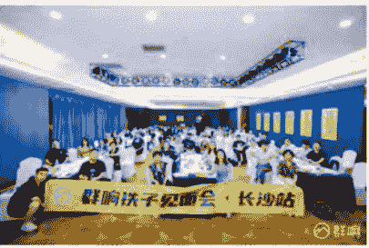

于是，我在2022年第一次尝试做社群，开始输出内容，结果可想而知，还是被不少人喷。

哪怕是用心在输出，还是会被很多人吐槽，理解不了我们的内容，对我们的产品不满意，实际上也让我深刻意识到自己的不成熟，对于知识付费的理解过于片面，甚至也在这种模式上高估自己的能力

服务团队在拍视频上，更多是鼓励输出、努力习惯拍短视频，面对镜头要讲“如何创业、人生观、财富观等”，对于30岁的我实际上很多时候难以说出口。

以及在社群和相关付费产品的搭建，让我感觉是在纯收割市场的行为。

这种照葫芦画瓢的IP操盘让我自己很难相信这件事能再做下去，于是很快叫停、止损。

这个过程我深度思考的问题是：**我是一个行业运营专家，但不是一个拿到了大结果的商业IP，甚至还没真正穿越过创业周期的人，谈何真正教大家赚钱呢？所以流量放大是一个伪命题。**

于是回归用心做短视频和公众号的阶段，在这段沉淀自己的阶段，也写出了第一本运营笔记（见下图），在几个大厂都有扫描版流传，这样持续在做大了影响力。

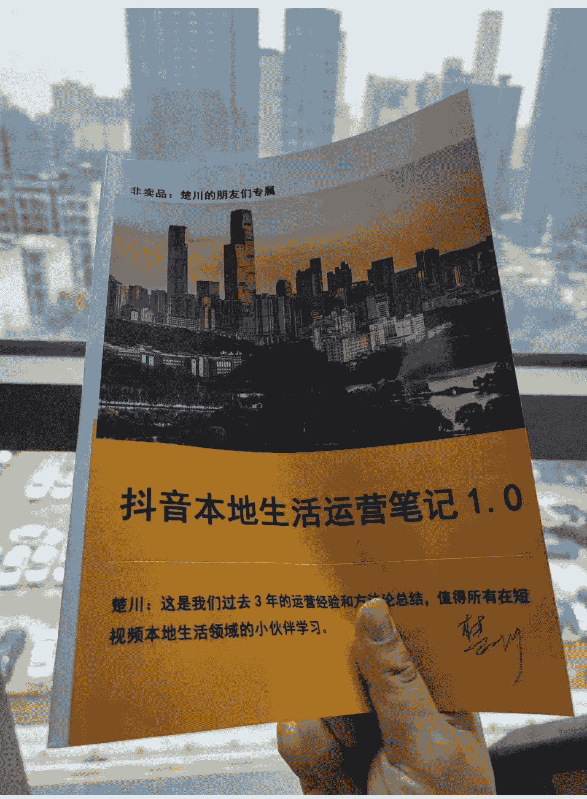

2023年9月，我们接手天鹅到家、心理咨询、求职辅导、门窗建材等细分赛道都拿到行业TOP1的位置。

这时候身边朋友也在劝我说：楚川应该去做IP卖课，前端赚钱再做代运营升单。

然后我的内心又开始了骚动，因为这似乎也成了最优解，或者是让团队盆满钵满的唯一通道。

尽管我在很抗拒，认为创业者应该是做自己的事情，实打实穿越周期，不借用虚无缥缈的影响力。

但这件事还是因为一些内外部的复杂情况给推动下去，并且引入一个成熟的IP运营团队，从IP的包装、内容质感、服化道、私域和商业化变现都做完整规划，当然投入也较高。

从2024年5月正式开始冲刺个人IP，做私域引流、主推线下课。

不过貌似再次犯了同样的错误:年轻的操盘团队会错判我和团队的商业价值,所以在内容和打法都会流于表面,而没关注内核,所有的营销环节就必将做不深。

尽管成绩不差,6-7月的两次线下课学费收了50万,升单代运营合作超过100万。

但我自己一点都不开心,我能深刻感受到自己公众号的内容,没有人在看,没有人转发,因为都会认为这是一个卖课的内容。

朋友圈的内容被折叠的次数也变多,很多内容自己都没有欲望写下去。甚至有朋友主动问到我,楚川以后都是在卖课,不接合作了吗?

大家的疑问是不好好做主营业务,去做卖课收割,哪怕我们初心的通过线下课找到我们的合作伙伴。

但这都是想当然,我们在这一年这块的成本已经高达120万。这是一个不可思议的事,小两个月简单的折腾吃掉我们10%的利润。

这种状态让我自己主动在8月叫停,持续思考了2个月。

我们拥抱了数字人,做IP矩阵,在公域获取私域流量;重新开始写公众号,深度分析商业;朋友圈到处跑,学习和取经,慢慢的私域又重新被激活了;我自己的状态也恢复了,将公司的运营体系和方法论都做了深度整理。

| 发布状态/内容 | 互动数据 |
| :--- | :--- |
| 星期日 21:11 已发表 | |
| 11月25日 已发表 | |
| 11月23日 已发表 | |
| 11月10日 已发表 | |
| 10月14日 已发表 | |
| 07月08日 已发表 | |
| 20个客户年营收一个小目标!短视频... | 332 4 32 5 / 3 0 0 |
| 到家行业的紧箍咒,抖音一城一店到底要不... | 363 7 25 4 / 1 1 |
| 大变革!不到半年,一间建材工厂的短视频... | 342 6 39 6 / 4 0 |
| 正式开放!抖音医药和大健康门类的... | 1,156 10 136 6 / 0 0 0 |
| 短短7个月从30到2500+门店!抖音本地生... | 710 19 60 11 / 8 5 |
| 抖音同城高客单的高效打法(一线实... | 915 7 86 8 / 0 0 ¥0.00 1 |

但很难接受的是这个持续踩坑周期将近1年。

2024年10月,我们的客户和合作方重新找回我们。这是大获全胜的一个月,我们业绩做到全年最高,并且这种增速看起来会持续一段时间。

这个经历让我反思,做IP到底要实现什么?

很多机构的初心没有问题，都是帮助创始人变现。但所有的打法都大同小异，前端卖课、卖资料变成私域流量池，再做持续转化。

绝大部分IP操盘手是没有真正去理解每一位创始人的初心，核心竞争力是什么，甚至无法理解IP和背后公司的商业价值。

#### PART 3. 一条创始人IP的方法论总结

1. 支持所有老板参与视频、知识付费和网红经济的潮流，因为流量意味着商业机会，但出路的背后更要做好整条链路合理、科学的规划。

首先，一个创始人站出来做IP的决策肯定是最难的，就代表难迈出第一步，那必须克服心魔开始习惯拍剪短视频，学会表达、刻意练习。

其次，要想好用流量做什么，流量从各大平台获得后，做好流量线索漏斗数据跟踪，进私域长期转化。这个过程有太多变量，对团队考验极大，尤其是初期人手稀少的阶段（楚川起盘内部5个人，外部有单独拍剪团队），任务量是超负荷。

如果没有全盘做合理且科学规划，项目扑街概率接近100%，因为赛道已经处于白热化的竞争状态。

最后，不要有虚假人设，不需要特意用外部元素显得自己有钱和地位，而是高价值、真想法、高认知的输出，获得的流量和私域用户才是同频的人。不然可能交流5分钟，就能识别一个IP在吹牛和撒谎，这也是这么多IP不断塌房的原因。

2. 一个IP起盘一定要做定位，再多平台运营，借助AI的力量，从文案、素材、剪辑、矩阵等做全面提效，也释放IP的精力。

第一，创始人做IP一定是需要有定位的环节，类似于品牌定位。老板和团队要亲自分析自身的内核，在市场的独特点，再针对性梳理出要卖的产品，并且做成体系。

第二，不同平台的内容接受程度不一样，初期需要多平台运营，提高短视频的营销效率。

第三，必须借助AI的力量把单账号的IP能量放大，从AI找爆款、拆解到文案撰写，素材整理和视频剪辑，都要全面提效。再用数字人做场景克隆，持续用矩阵把内容发布出去，提高IP势能，这样才能提高效率的同时，也释放老板的精力。

最后，楚川踩过坑后，用100多万、自杀式损害自己私域流量的后果证明：创始人做IP其实就是一个对外放大业务的窗口。

一切打法应该归零，都以放大自己的商业价值，公司业务为第一目标，不存在任何曲线救国的方法。

创始人千万别陷入一个IP漩涡：**你在做一个业务创新，你在做大流量，最终再为自己公司赋能，这是伪命题。**

***

**评论区:**

小熊: 认同啊创始人做ip其实是一个对外放大业务的窗口

楚川: 并不是模式的创新，踩过坑才明白

可爱多: 小白学习了。高价值、真想法、高认知的输出吸引同频。

亦仁: 核心是定位不清晰

旭宏: 感谢你分享剖析和反思失败的教训!生财讲成功的帖子太多了，这样的帖子也很有价值。不知道为什么，我个人对“做IP”这个词有点反感。我觉得换成:“老板要不要亲自出来做流量?”、“老板要不要亲自出面搞品牌宣传?”是不是更准确一点。因为做IP是一个伪命题，一个老板是不是IP其实是客观的，做不做=要不要把本来就有的客观事实展示给客户。那么，这个问题就可以深入地变成:老板对公司的价值最大部分是不是搞流量?如果是，就肯定是出来做最好，但如果老板核心能力是做产品的，那就需要看看有没有人比老板本人亲自出来搞流量更高效?如果亦仁、马化腾这种产品经理型、管理型老板出来搞流量，那他们的产品就会失去他们的长时间注意力的聚焦。时间一场，产品的迭代没有竞争对手强的话，做IP搞来的流量越大，反而反噬会越大。因为，流量大只是知名度大，还不是美誉度大，只有具备美誉度的产品，叠加知名度(流量)才能健康发展。个人觉得小公司的老板还是应该专注在优化产品上，搞流量(做IP)是只要把自己的工作客观展示给用户，或许就够了。产品足够好，就可以去KOL型的客户私域里面去宣传(在别人私域里面做IP)，比挑战公域做IP效率更高、效果更好。貌似生财早期也是这样做的?

楚川: 都是知识的诅咒

楚川: 是的，所以我做了弱ip+矩阵，降低我在ip侧的精力消耗

nni: 我不知道我的理解是不是准确。老师的经验是，做IP是为了放大现有业务，给现有业务更多曝光量;而不是新增一条产品线，去为了卖课而卖课。

### (44赞)得物平台月入4位数，在家可做，新手小白友好！（附保姆级教程）

作者： 韩北樱
日期：2024-12-13

在家带娃的宝妈如何利用空余时间做点副业补贴家用？
学生党如何在课余时间多赚点零花钱？
打工人下班后还可以做什么轻副业增加收入？

那么你一定要看完这篇八千字的干货帖，非常适合现在的你去做。我利用空余时间做得物已经五个月了，有个1w+的收入，其中产品价值9000+，佣金3000+，并且随着拍照和文案水平的提升，收入每个月都逐步增加。

今天的分享主要是我做得物的复盘，以及摸索出来的经验，对于平时空余时间多，想要做一个小而美的副业的圈友，是一个不错的选择。

对于普通人来说，得物有两大优势：
- 1、门槛低：0粉就可以获得种草赏金和视频激励，账号14天内发布的内容，其中12篇阅读量≥500就能开通品牌合作。
- 2、难度小：不需要特别专业，更多的是站在已买人的角度，来分享自己的产品使用体验。

这一点可以对比小红书，同一个产品，得物种草会比小红书种草要求低很多，更适合普通人去做。比如一款含氟牙膏好物种草：

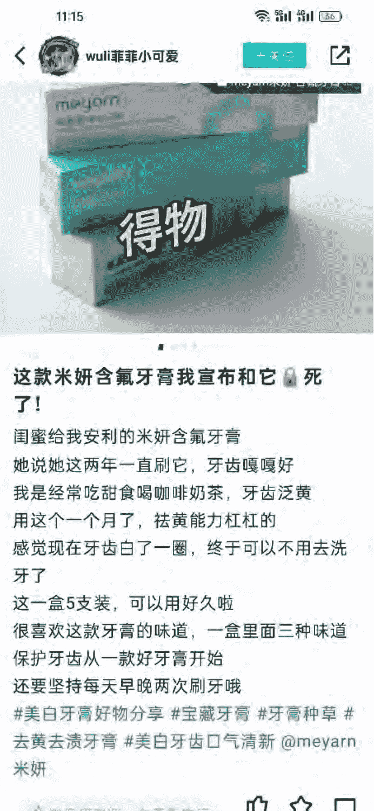

像小红书这种比较专业的，纯从产品角度去推荐的，是不被得物平台所鼓励的，品牌合作也过不了。

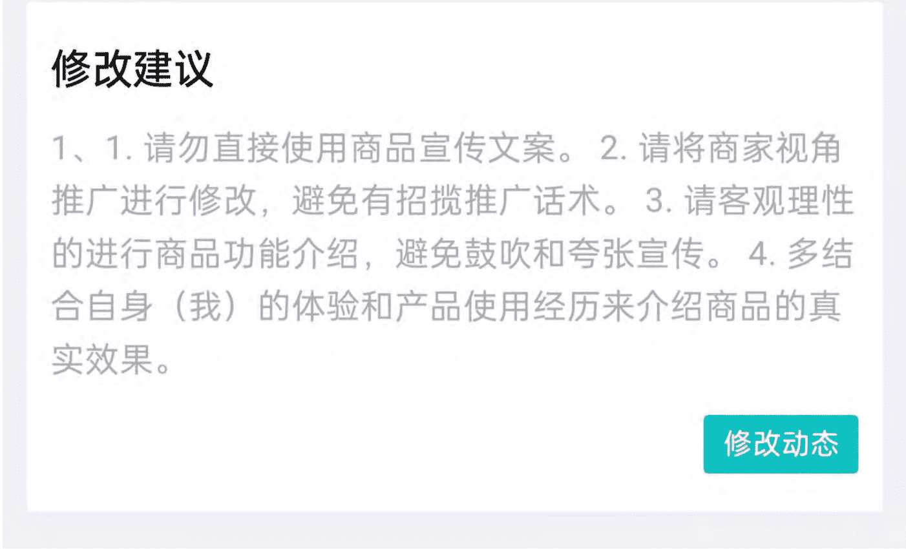

由此可见得物的好物种草真的非常简单。

### 那么得物适合哪些人群去做呢？

大学生、宝妈、平时不经常加班的打工人都可以做。

一个合作，是4-8张图+300字以内的文案，会拍图了半个小时就可以完成一个合作了。利用空余时间做做得物完全没问题，每天在得物投入1-2小时，长期下来也是一笔不小的收入～

具体内容还请移步飞书： https://uiok1bi2iw.feishu.cn/docx/HN33d3tu3ovQdcxMMoUcngIonZe?from=from_copylink

**评论区：**

小花：已全文拜读，用时23分钟，小姐姐写作思路清晰，文字掌控能力极强，是少有的踏实接地气不浮夸的精品分享贴。佩服佩服！

阿宝：收学员吧 变现最快 最多[呲牙]

韩北樱：感谢认可！希望对你有帮助[愉快]

韩北樱：看完这篇大部分人都可以直接上手啦，也算是帮大家省学费了[偷笑]

莉莉周zx1：10月开始做得物的，到现在一个半月还没有见到收益，视频收益也就只有一块多，看不到成绩真的有点沮丧，但是考虑到沉没成本还是决定坚持下去，祝我成功[呲牙][呲牙][呲牙]

韩北樱：加油！现阶段你可以多参加广场的活动，增加曝光拿流量券，找一些热度比较高的商品发动态，这样阅读量上涨快

韩北樱：一定会成功的！！！

LJ：无论是拍视频还是图文，产品都要自购吗？

## (精华帖)(43赞)网易小蜜蜂平台涨粉策略分享:1晚3账号各增1W粉,引流公众号1000+

作者: 拓荒
日期:2024-12-09

《1个晚上3个账号各跑出1W粉,同时引流公众号1000+,我的网易小蜜蜂平台涨粉思路分享》

大家好,我是拓荒,7年游戏开发程序,深圳某上市游戏公司高级游戏开发程序员,加入生财有术快四年了,一直坚持刷生财的精华帖,风向标提升自己的视野和认知。

基于程序员35岁职业危机,一直也在探索各种副业,但基本都没有能拿得出手的结果。这次刚好是看到风向标里面的小蜜蜂项目加上我朋友的助推,才跑通了这个小项目(文末附自动关注安装包)。

这是第一次在生财发贴,写的有不够清楚的地方还请大家多多谅解!

项目起于12月初刷风向标的时候发现了网易新推出了一款对标小红书的软件。其界面和功能与小红书,从频道标签的布局到个人主页的展示,再到消息中心的图标,“感觉相似度95%,哦不能说相似,只能能说简直一模一样”。

就是这个(网易小蜜蜂,别名:小黄书)好家伙,小红书,小黄书,小绿书,召唤红绿灯了说白了就是大公司对标大平台,想要切蛋糕,多好的机会岂能浪费?

重生之我在小黄书做大V。具体内容还请移步飞书观看： https://gvxw3b93.feishu.cn/docx/UiRfdc3uFoKkoHxEJ4Fc05mPnJf?from=from_copylink

**评论区:**

凡夫俗子: 下载了好像无法运行[微笑]

拓荒：看下是不是手机设置了相关的限制。这里我丢给Cursor，给了一份回答，你可以参考下。如果还是不行，就用文档中电脑模拟器那个方案也行，还可以解放手机

凡夫俗子：用模拟器可以，比较丝滑，感谢~！

rita：安卓手机下载不了

拓荒：安装包下载不了吗？我重新传了一份

双喜：关注上限了，有办法恢复吗？多久恢复？

拓荒：思路是取关所有未互关的用户，然后再重新拉取关注列表互关。目前关注上限就是1W

等不到天黑.：完了，我关注500个后不能关注也不能取关注了

## “听过不等于能记住:好老师的教学之道”

作者: 旭宏
日期: 2024-12-09

一个好的老师,不会经常对学员抱怨说:“我不是给你讲过吗?”

## 生财朋友圈

虽然老师说的是客观事实,他的确给学员“讲过”, 但这样抱怨学员的老师肯定不是好老师, 因为“听过不等于能记住”,同样是客观事实。

一个人在学新东西的时候,有太多细节需要“注意”。这些细节,对学员来说,都是陌生的。小白不可能在听第一遍时,就记住每一个细节。只有在实际操作时,遇到某个卡点,解决不了了,做不下去了,才意识到:哦,当时老师教的这个点,是需要特别注意的。当时我没理解,因为我根本意识不到这个点上,我以后会出错。这就叫“不知道自己不知道”,也叫“抓不到重点”。

一个程序要能够运行,必须每个代码的错误都被明确地解决。这些错误代码,就是“卡点”。

学生只是听一遍,不,哪怕是听了几遍,甚至看了老师亲自演示一遍,也还是没办法知道:“自己动手写代码时,会遇到什么卡点”,解决办法就是自己动手做一遍/写一遍/说一遍/拍一遍/剪一遍/直播一遍......

教学的最理想状态,是老师全程盯着一个学生做一遍,就在老师的眼皮底下做,做得对的,夸奖、表扬、激励;做得不对的,当场纠正;卡壳的,当场指导----这时候学生的注意力是非常高的,因为自己卡住了,会尴尬、会羞耻、会不想让这种体验再来一次。背后是人性的表现欲。

但大多数时候,效率最高的“一对一教学”场景非常少,学校里是老师一对多,小初高是一对四十~六十;成人的各种培训,比如驾校、体育项目等也往往是一个培训老师对四~十个左右的学生。

互联网上的各种副业、创业培训，经常会宣传“一对一教学”，甚至宣传“多对一、专属学员群”教学。实际上往往是虚假宣传。因为真正的一对一，是某个时间段内，这个老师就只教你一个人，只为你一个人服务。而网络培训，就是“多对多”，一个老师一天要回复几十个、甚至上百个学员的问题，不可能每个问题都有高质量的回答，甚至不能保证“有回答”，大部分是所谓的“助教老师”来回答。

如果只有“专属学员群”，却没有学员大群，那大概率是骗子、割韭菜的。培训方为了避免学员们一起吐槽，造成炸群，尤其是发生退款时，可以杜绝集体退款现象。

所以，网络培训项目，你只要提前问一下：“有没有学员大群？”回答没有的，不管对方把专属群吹得多好，你都直接给对方标记为骗子吧，错杀好人的概率很小。

### 总结体会

克服这些学习上的困难，好的方法之一是费曼学习法。前面说了学完教程，需要实操一遍才能发现卡点，费曼学习法就是“实操一遍”。把自己学了的东西，讲给别人听，讲的过程中，发现卡住了，讲不下去了，那就是卡点。马上去搜、去问、去试，搜、问、试的过程，会让大脑印象深刻。

小学生经常被要求“默写”，其实默写也是费曼学习法。看十遍不如抄一遍，抄十遍不如默一遍；看和抄，都是输入，默写却是输出。默写其实就是“讲”，就是“表达”，就是“输出”。用输出带动输入，逼自己学习、逼自己进步。因为输出就是“表现自己”，表现到一半卡住时，人会有压力，而压力能够“吸引”人主动输入。

### 费曼学习法的本质是“虹吸作用”

> 内心的压力导致不断“吸入知识”，背后的底层人性是人的自尊心。

虹吸作用是因为：管道外的液体压力，比管道里面的液体压力大，压力差，导致外面的液体不断被“吸进去”。而费曼学习法，也有“内外压力差”：人性中希望被被看见、被鼓励、被关心、被点赞的欲望，而自己目前还不能清晰、流畅、没有卡点地“教会别人”的现实，这欲望和现实之间，就产生了压力差，就逼着人学习、输入。

想让别人做事，必须顺应人性；想让自己做事，也要顺应人性。顺应自己“被认可的欲望”。

当你“在教别人时”，背后是你被认可的欲望，这个欲望，不仅仅是被别人认可，更重要的是：“被自己认可”。被自己认可非常重要，意味着自信，它的反面，就是自卑。当一个人在教别人时，卡住了，就得不到自己的认可，哪怕只是在“模拟教别人、练习教别人”，卡住了，也会有自尊心受挫的感觉。

费曼学习法的底层逻辑，就是人有自尊心和表现欲。理解了原理，就知道其实很简单，不复杂。多用几次，养成习惯，会上瘾。

祝大家“学习上瘾、无法自拔”

共勉！

### 实操方法

因为养成习惯的必要条件，是每天刻意练习；所以养成费曼习惯，也需要每天刻意练习；能每天练习的前提，是每天想起费曼学习法；因为费曼学习法的本质是“虹吸作用”，输出带动输入；所以养成习惯需要每天看见“虹吸作用”。

那么，我们每天都能看见“虹吸作用”吗？是的，每天都看见，那就是：抽水马桶。

以后，每次上洗手间时，想一下：今天，你费曼了吗？

**评论区：**

小花：受教了，我经常鼓励老师教学生的时候要培养学生“爱炫耀”、“好为人师”的习惯，就是希望学生能够输出自己学习的知识，在输出的过程中发现自己的不足，为了更好地输入，主动弥补不足。

旭宏：费曼学习法之所以好，是因为它能“伤自尊”。教别人时自己卡住了，不会教，伤自尊；教别人时别人卡住了，教不会，伤自尊。自尊心受伤了就会继续学，这就是“输出倒逼入”。让别人做事，要顺应人性；逼自己做事，也要顺应人性；敢于“利用”自己的人性的，把自己逼上“老师”的位置。我得好为人师，才能进步不止。

旭宏: [强]

### (3赞)使用有版权背景音乐的视频处理策略

作者：书情小跟班
日期：2024-12-09

关于音乐版权的问题，我们假设一个场景。

情况描述：如果你在发布的视频中使用了背景音乐，后来发现这个音乐是有版权的。目前，你的后台暂时没有收到版权警告。如果哪天收到了，你的疑问是：是不是只需替换或移除背景音乐就不会影响到你的收益，还是说最好把整部影片都删掉？

当你使用了背景音乐，但没有受到版权主张。这里需要注意，“警告”不是一个准确的表达，更专业的术语是“版权主张”。

在我推荐的那本书《YouTube公式》在第一部分：“平台的第二小结 YouTube生态系统”中，注意版权问题这一小章节，看了之后你会对版权有一个更深的理解。

回到我们的问题来，当你后来发现音乐是有版权的，其实不需要等到发现。除非音乐已经过了版权保护期，进入公共领域，否则它始终是有版权的。我们现在常用的知识共享许可（Creative Commons）是一种特别的许可，并不意味着音乐无版权，而是版权持有人允许大家免费使用。

因此，免费和无版权是两个完全不同的概念。有些音乐既免费又无版权，有些则是免费但有版权，而绝大多数音乐是有版权且不免费的。重要的是，对于版权不清晰的音乐，不要等到最后才发现它有版权。应该假设它有版权，并使用那些明确无版权或有版权但允许免费使用的音乐，这才是安全的做法。

当你发现音乐有版权时，通常需要付费使用。如果音乐在YouTube的版权库中，上传时可能会被匹配到，进而产生版权主张。

版权主张的常见结果是，你使用该音乐所赚取的视频收益将归版权持有人。当然，还有更严格的情况，比如对方不收你的钱，但禁止你的视频播放。而最严厉的情况是，你未经授权使用了他的音乐并赚了很多钱。在这种情况下，他不会仅仅通过版权主张来维护自己的利益，因为在他提出请求之前，你已经赚了很多钱。因此，他会直接到法庭起诉你侵权，要求赔偿。比如，你用他的背景音乐制作了一个广告片，并从中获得了500万的广告费，他就会到法庭上告你侵权。

回到版权主张的问题上，可能的情况是，这个音乐在YouTube的版权库中，当你上传视频时，系统会立即检测到并发出版权主张。也可能在上传时没有任何侵权报告，就像你表述的情况，你的后台没有收到任何通知。然而，将来某个时候，如果这是一个非免费的有版权音乐，你可能会收到版权主张。

如果你收到版权主张，通常情况下，在版权主张发出之前，视频赚到的钱归你所有，而在版权主张确立之后，收益则归版权持有人。

对于大多数人来说，使用版权不清晰或错误使用的音乐作为背景音乐上传视频，可能在某个时候会收到版权主张。如果之前没有赚到多少钱，那么有人可能会问，是否可以替换掉或移除这个背景音乐。

如果YouTube在线提供这样的功能或工具，允许在线替换背景音乐，那是完全可以的。不过，并不是所有视频都有这个选项。因为有些视频中，背景音乐与旁白或口播内容紧密结合，可能就不会提供替换选项。当然，如果有这个选项，你可以替换掉音乐。

然而，替换音乐或将某段静音等在线编辑操作，可能会影响视频后续的推荐。也就是说，视频在收到版权主张前，可能每天能赚5块钱，但替换背景音乐后，可能每天只能赚5毛钱，视频的推荐可能会大幅减少。我所描述的这种情况是可能的，但不是必然的结果。

从技术上讲，你可以通过这种方法解除收到的版权主张，但无法确保视频还能像以前那样持续赚钱。因此，与其使用版权不清晰的音乐作为背景音乐，不如一开始就使用版权清晰且得到授权的音乐，这样干净利落，不给自己留下变数。

当然，刚开始做频道时，可能不了解这些技术细节。

你的处理方式：如果将来出现版权主张，你可以选择将视频的收益给对方，或者干脆删除视频。这些都是合理的选择。

一个建议：使用版权清晰的音乐。

当然，凡事都有例外。如果你使用未经授权的音乐是为了蹭热门音乐的热度，那么你可以这样做。无论现在还是将来，如果发生版权主张，你就接受并将赚到的钱全部给对方。这样做的好处是什么呢？你可以通过这些视频吸引大量粉丝。这种方法就是主动抱大腿，主动帮别人赚钱，同时自己也能涨粉。

我之前写的帖子的合集
做YouTube的一些常识
https://rlwxa0zgke.feishu.cn/docx/P2DYduGbkoW0nqxcRZgcL6xKn7I

**评论区:**

- 酷拉皮卡: 请问, 不是开通以后官方会优先分一部分收益给版权方吗? 是全部啊? [发呆]
- 书情小跟班: 音乐版权是别人的, 难道音乐版权的收益不是别人的?

***

## 【星主的收藏夹】5篇

### (67赞)弱小和无知不是生存的障碍，傲慢才是。

作者：亦仁的收藏夹
日期：2024-12-12

> “弱小和无知不是生存的障碍，傲慢才是。”
> https://mp.weixin.qq.com/s/YvR61icgxngOhlT6yIYl0A

**评论区:**

- 谦羽：亦仁老板，洞见本质啊👍👍👍
- 追梦: 我也有这个毛病，很早就知道比特币这个东西，但在自己心里觉得挖矿就是“歪门邪道”、炒币跟赌博没两样、炒股就是“不务正业”、做闲鱼就是“投机倒把”、做知识付费就是“割韭菜”，所以打心底就看不起，就更别说去深入调查研究了。很多类似这样的赚钱机会也就错过了，其实回头想想，我也是犯了“傲慢”的毛病。

### (58赞)元认知能力决定个人强弱与财富创造能力

作者: 亦仁的收藏夹
日期: 2024-12-11

> 元认知能力的强弱, 其实决定了一个人每个方面的强弱, 甚至可以毫不夸张地讲:“一个人的财富创造能力最终也只与元认知能力有关, 其他的因素都是附属因素。”
> ——李笑来

**评论区:**

- 小乔: 张一鸣: 认知是第一位的。一切生产要素都可以被构建。
- 王舒林: 要引用, 上次小马宋老师直接用李笑来老师的话被爆锤了
- 心净亦如心镜: 财富自由之路么. 里面提到了元认知, 最近在看
- 2001范特希: 想到他说的另一句话也很有触动, 万事皆可提前准备, 越早醒悟越好。
- 谦羽: 事上磨, 心上悟👍

公众号懒人搜索，懒人专属群分享

### (32赞)大多数成功的公司在最具挑战、最艰难的时候诞生

作者：亦仁的收藏夹
日期：2024-12-13

大多数成功的公司其实都是在最具挑战、最艰难的时候诞生的，而不是在风和日丽的时候诞生的。
https://mp.weixin.qq.com/s/84rceYCJg0kemG98sbPOdg

**评论区:**

- 麦子摇摆: 所有伟大的企业，都是冬天的孩子

### (33赞)NLP的理解层次模型: 提升思维能力与个人成长的全面框架

作者: 亦仁的收藏夹
日期: 2024-12-10

NLP的理解层次模型为我们提供了一个全面的思考框架, 帮助我们更好地理解自己和他人。通过深入理解每个层次的特点和作用, 我们可以更加灵活地应对生活中的挑战和机遇。同时, 我们也可以利用这个模型来提升自己的思维能力和行动策略, 实现个人成长和发展。
https://mp.weixin.qq.com/s/3qUrOh1QLkb9utMl45ub6g

**评论区:**

- 暂无评论

### (17赞)Newsletter：中文世界的信息出入口挑战

作者：亦仁的收藏夹
日期：2024-12-09

作为一种对于中文的读者来说相对新颖的获取信息的方式，中文 Newsletter 面临着一些特定的挑战：
1. 培养中文读者使用邮箱的习惯；
2. 培养中文读者为内容付费的习惯；
3. 如何被发现；
4. 如何掌握被审查的度。

https://mp.weixin.qq.com/s/HGhuUkJoi8qFWE3wnNoOgA

**评论区：**

- 暂无评论