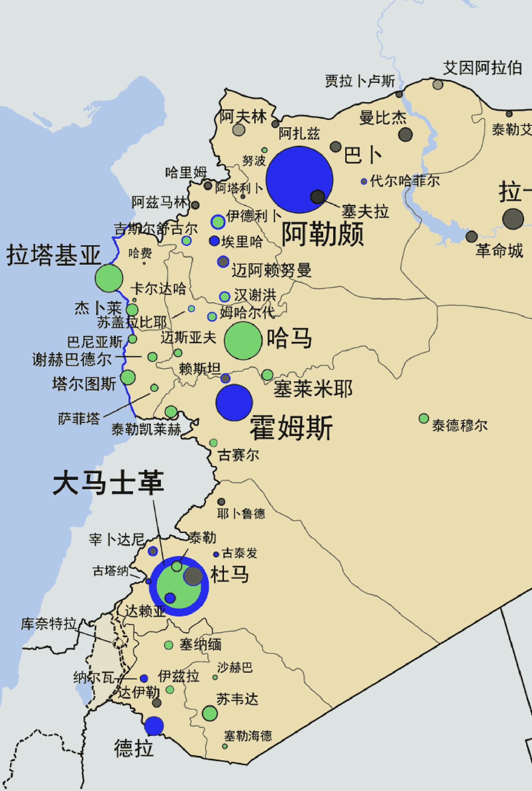

# 叙利亚局势陡然生变，中东乱象有何新看点？

2024 年 12 月 17 日 全球大事件

整理：公众号懒人搜索，懒人专属群独享

懒人微信:lazyhelper


11 月 27 日，相对平静已有四年之久的叙利亚局势，迎来了出人意料的剧变。盘踞在西北部伊德利卜省的反政府武装“沙姆解放组织”(HTS)，突然转入攻势，南下进攻政府军控制的阿勒颇—霍姆斯—大马士革中央城市带。叙利亚南方反政府武装旋即开始响应，形成了南北对进的态势。

12 月 8 日清晨，反政府武装攻入首都大马士革。据俄罗斯国家通信社塔斯社报道，叙利亚总统巴沙尔·阿萨德在当天辞去职务，携家人出走莫斯科。12 月 9 日，沙姆解放组织在大马士革建立了过渡政府。持续 13 年又 9 个月的叙利亚内战，在造成约 60 万人丧生，1200 万多人沦为难民的惨烈结果之后，竟然在短短 12 天里迎来了政权更迭：全世界都为之惊讶。

虽然我在提到叙利亚局势时，用的是“内战”这个说法，但它从来都不是一场单纯的内幕冲突。自 2011 年战争爆发以来，美国、俄罗斯、伊朗、伊拉克、黎巴嫩、土耳其、卡塔尔等十多个国家，都以不同形式，直接参与了叙利亚境内的军事行动。

一度占据叙利亚大片国土的恐怖组织“伊斯兰国”，还有涌向欧洲的上百万难民，更是使叙利亚问题的影响外溢到全世界，让这个面积仅相当于中国湖北省的中东国家，成为了过去十几年国际新闻里的惯常焦点。

我本人从 2017 年开始，曾频繁前往叙利亚及其周边国家做深度采访。每一次从中东回来，都会有朋友问我：叙利亚的情况怎么样了？内战是谁打赢了？这一回，当叙利亚政权更迭的消息传来，相信许多人最关心的问题也是：这是不是意味着战争终于要结束了，中东要逐步走向和平了？它对全球政治和经济，可能产生哪些影响？

在这里，我先把第一个问题的结论告诉你：从政权更迭到实现和平，中间还有很远的距离。在 12 月 11 日晚间的直播中，我已经分析了 2024 年叙利亚“四个政府，五股武装”的分裂局面，你可以对照回放和文稿查看。

阿萨德政权崩溃后，名义上的政府和武装各少了一个，却又冒出了南方武装这股新势力，形成了“三个政府，五股武装”的局面。

三个政府分别是：
- 大马士革的过渡政府
- 北方土耳其扶持的临时政府（SIG）
- 东北方库尔德人建立的罗贾瓦自治政府（AANES）

五股武装，则是：
- 沙姆解放组织
- 北方的叙利亚国民军（SNA）
- 东北方的库尔德人民主军（SDF）
- 新崛起的南方阵线（SOR）
- 美国直接扶持的革命突击军（RCA）

在叙利亚中部的沙漠边缘，还有恐怖组织“伊斯兰国”的残余势力在活动。

新组建的过渡政府，能直接管辖的只有全国 1/5 的领土，远远称不上“大局已定”。

更何况，叙利亚境内的军事冲突，并没有因为政权更迭就宣告停止。在叙利亚北部，土耳其支持的国民军正在和库尔德武装争夺曼比季等城市。美国在 12 月 8 日凌晨，出动空军轰炸了叙利亚中部的 75 个“伊斯兰国”目标。

更活跃的还有以色列：它不仅在 12 月 8 日，越过 50 年前确定的以叙实控线，占领了战略要地戈兰高地附近的缓冲区，还对叙利亚政府军放弃的机场、海军基地、雷达站和军火库实施了超过 300 次空袭，表面借口是“防止重武器流入恐怖分子之手”。

加上俄罗斯还没有撤出它在叙利亚西部的海空军基地，叙利亚乱局中的外力并没有退潮的迹象。

听到这里，你应该已经发现了：要预测叙利亚局势的走向，不光得看内力，看“三个政府，五股武装”的合作意愿，还得看外力，尤其是土耳其、以色列两国的立场。

美国候任总统特朗普已经表态说：“叙利亚一片混乱，但它不是我们的朋友。”“美国不应当参与此事。”似乎流露出不愿直接干涉的倾向。但这并不意味着，美国不会从叙利亚的混乱中借势，来打压它在中东的头号战略对手伊朗；更不意味着美国在中东的大小盟友，比如以色列和阿联酋，会逐渐远离叙利亚。

叙利亚和它的邻国黎巴嫩，以及相隔不远的加沙地带，在过去 14 个月里齐齐迎来剧变，已经彻底打破了中东原有的脆弱势力均衡，而新秩序目前尚未成形。巨大的不确定性，就隐藏在这套新秩序的孵化过程中。

在本期专栏里，我将从叙利亚局势的最新发展讲起，带你了解三个重要问题：第一，为什么在叙利亚的“三个政府，五股武装”中，目前占据上风的是沙姆解放组织。第二，叙利亚未来的政治整合，可能会朝哪个方向发展。第三，土耳其、以色列等周边国家在叙利亚有何战略利益，它们会如何介入叙利亚的政治重建，又会影响中东秩序。

## 01-沙姆解放组织，如何脱颖而出



先说阿萨德政权瓦解后，叙利亚的政治现状。

12 月 9 日，阿萨德政权看守内阁总理贾拉利，宣布将权力移交给反对派组建的叙利亚过渡政府。这个过渡政府，没有经过任何程序上的授权，它其实就是沙姆解放组织建立的救国政府（SSG）的“换皮”。

过渡政府总理巴希尔，就是救国政府的行政一把手；11 个部长，也是救国政府的原班人马。至于沙姆解放组织的军事领袖朱拉尼，他没有加入过渡政府，但俨然已经是真正的国家领导人，不仅高调接受媒体采访，还签发各种政治命令。

过渡政府宣布，它将运行到 2025 年 3 月 1 日，随后启动修宪和选举进程，产生名副其实的新政府。截至 12 月 14 日，还没有国家从外交上承认这个政府，但土耳其、阿联酋、意大利等 9 个国家驻叙利亚的大使馆，已经恢复运行。12 月 12 日，一个土耳其代表团访问大马士革，标志着过渡政府开始了外交“破冰”。

过去十几天，全球媒体最关心的，主要是沙姆解放组织的政治背景。毕竟，它的前身之一，是国际恐怖组织“基地”在叙利亚的分支，曾经多次喊出极端主义口号。它的领导人朱拉尼，早在 2013 年就登上了美国政府的恐怖分子名单，一度被悬赏 1000 万美元。这使得外界不禁担忧，朱拉尼当权之后，叙利亚社会会不会走向全面保守化。

但我个人认为，与其“开天眼”猜测朱拉尼接下来的执政路线，倒不如先搞清楚另外一个问题：叙利亚目前有三个政府，五股武装，为什么只有朱拉尼的势力敢于高调建立过渡政府，并且没有被其他势力否定？

你也许不知道，12 月 8 日第一个打进大马士革的，并不是沙姆解放组织，而是五股武装中的南方阵线。在联合国主持的八轮叙利亚和谈中，代表反政府阵营的同样不是朱拉尼的人，而是总部设在土耳其的民族革命联盟（SNRC），它的直接下级是北方的国民军和临时政府。至于实际控制疆域最大的，则是叙利亚东北部的库尔德自治政府。和这些势力相比，沙姆解放组织似乎缺乏先天优势。但它借助 地理区位、本地执政经验和族群特性，成功补齐了短板。

许多人在旁观叙利亚内战时，会认为：军事上的硬实力，比如兵员和武器数量，是制胜的关键。这个看法当然很有道理，却不够全面。具体到叙利亚，地理区位的重要性丝毫不亚于纸面上的军力。

因为叙利亚有 3/5 的国土属于沙漠和干旱的灌木草场，它的中南部存在大片人烟稀少的无人区，即使能拿下来也缺乏经济价值。但往西看，情况就不一样了。叙利亚西部存在一条狭长的山谷“走廊”，从北方的阿勒颇向南延伸到大马士革。战前叙利亚人口最多的五座城市，有四座分布在这条走廊上，南北两端相距不过 300 多公里。

走廊地带的面积只占整个叙利亚的不到 1/6，却 生活着全国三成以上的人口，还是棉花种植业、轻工业和服务业中心，地位至关重要。内战中期的 2016 年，阿萨德政权的控制区一度萎缩到只占国土面积的 1/4；就因为西部走廊没有被反政府军彻底拿下，它才能维持下去。

说回 2024 年。沙姆解放组织从 11 月 27 日开始的攻势，首先指向的就是北方第一大城市阿勒颇。用三天时间攻下阿勒颇后，它又 沿着纵贯走廊地带的 1 号高速公路，继续向南推进。虽然在 12 月 8 日这天，率先冲进首都的是南方阵线的部队；但到那天为止，沙姆解放组织已经拿下了走廊地带的 2/3，还席卷了叙利亚西部的滨海平原。

在五股武装里，它控制的人口是最多的，军事实力也因为招降了大批政府军，得到显著强化。相比之下，库尔德武装、国民军和南方阵线的基本盘，分别位于叙利亚的东北部、北部和西南方，相对偏僻，美国扶持的突击军更是远在约旦边境线上。这才是沙姆解放组织能凭借 不到 2 万人的兵力，在短短 12 天里抢先获得叙利亚执政权的主要原因。

说完了地理区位，再来看执政经验。如果单论国际声望和外交资源，在叙利亚反对派阵营里，民族革命联盟明显要高出一筹。它在 2012 年就成立了，目前已经 获得美英法德等 15 个国家的外交承认，有自己的行政机构临时政府，也有独立的武装国民军。

问题是，国民军内部派系林立，它既无力对抗政府军，也竞争不过沙姆解放组织，只能一路向北撤退，退到土耳其占领区。至于民族革命联盟和所谓的“临时政府”，更是一直待在土耳其境内。换句话说，这股势力更像是一群海外流亡者，既没有执政经验，和普通叙利亚人也缺少联系。这使得他们在竞争中处于劣势。

相比之下，库尔德人建立的罗贾瓦政府，执政经验其实是最丰富的。它从 2016 年就开始有序运转，有自己的宪法、议会、行政机器和武装力量，一度控制了叙利亚 1/4 的领土和 460 万人口。但库尔德人在叙利亚属于少数族裔，只占总人口的 10%。罗贾瓦政府在内战的大部分时间里，并不反对阿萨德政权，只关心库尔德人的自治地位。这使得它缺乏足够的政治声望，去组建后阿萨德时代的全国性政权。

沙姆解放组织则不然：它从 2017 年开始，就稳定统治着伊德利卜省，辖区内有 400 多万人口。在土耳其的经济援助下，伊德利卜省的交通、电力供应和农业生产得到了一定恢复，还初步建立了税收和教育体系。这意味着沙姆解放组织和它建立的救国政府，相对而言更有执政能力。

在族群背景上，沙姆解放组织的领导层，大部分属于逊尼派穆斯林。这个群体占叙利亚总人口的 74%，而且是反对阿萨德政权的主力。区位优势、执政经验加上族群特性，三者形成合力，使沙姆解放组织在“三个政府，五股武装”的混乱格局中脱颖而出，暂时承担了组建过渡政府的使命。

## 02-从割据到整合，困难何在

好，讲到这里，沙姆解放组织后来居上的原因，我就为你分析完了。你可能想问：率先取得执政权，是不是意味着沙姆解放组织的地位已经稳了呢？我的回答是：不一定，因为过渡政府掌握的资源和它面临的挑战，存在严重的不对等。

在过去的七年里，沙姆解放组织统治的伊德利卜省，是一个以农业种植为支柱产业，民风保守的边缘省份。它的北方就是土耳其占领区，土耳其可以从那里直接输入能源、电力和资金，帮助沙姆解放组织整合经济秩序。甚至伊德利卜省的法定货币，就是土耳其里拉。即便有了这些外援，伊德利卜省还是经常出现通货膨胀和大面积失业，要靠救国政府频繁发布限价法令，才能平息民众的不满。现在，沙姆解放组织控制了整个西部走廊地带，管辖的人口超过 1000 万，大部分是城市居民。这对它的治理能力，无疑是重大的考验。

你可能不知道，长达 13 年的战争，对叙利亚经济的摧残有多严重。2011 年，叙利亚的 GDP 是 675 亿美元，失业率接近 20%，贫困率超过三成，有 70% 的劳动力月收入低于 100 美元。因为长期实行国家管控的计划经济体制，全国有 30% 的工作岗位，是各级政府和国企提供的。在叙利亚的主要经济部门里，东北部有限的石油工业贡献了 1/4 的 GDP，农业贡献了 1/5。

总的来看，这是一个经济基础薄弱，挣扎在贫困线边缘的国家。而在长期战乱之后，叙利亚的状况已经变得愈发严峻。据世界银行估算，2024 年叙利亚的 GDP 可能不足 90 亿美元，比战前缩水了 87%，真实贫困率超过 90%，整个国家的人类发展指数倒退了 35 年。

由于叙利亚处在事实上的割据分裂状态，东北部的石油产区现在由库尔德武装控制，出口收入到不了首都。全国农业生产也因为战争陷入崩溃，连本地人的口粮需求都满足不了。光是让 1000 多万人填饱肚子，避免出现饥荒和人道主义危机，就够新成立的过渡政府忙活一阵了。

或许是考虑到自己缺少管理大城市和复杂财政活动的经验，过渡政府在上岗的第一天，就宣布：留用阿萨德政权的大部分行政人员和央行官员，暂时不搞兴师动众的人事调整。问题是，叙利亚从 2021 年起，就因为滥发纸币，进入了恶性通胀状态，财源枯竭的央行对此也无计可施。

要稳定币值，恢复经济运转，必须有一笔从外部输入的稳定资金。偏偏过渡政府在这一点上，面临一项先天劣势——从 2017 年开始，美国、加拿大、欧盟等发达经济体先后将沙姆解放组织列入经济制裁名单，指控其从事恐怖主义活动，拒绝与其产生经济往来。即使是土耳其政府，在过去几年介入伊德利卜事务时，也是让私营企业打头阵，方便随时抽身。

过渡政府要想获得外部资金，必须先把沙姆解放组织从恐怖主义黑名单里择出来，解除经济制裁。但这显然不是它单方面就能决定的。12 月 14 日，美国国务卿布林肯在约旦和过渡政府的代表做了接触，但他在随后的新闻发布会上表示，现在谈解除制裁，还为时尚早。

那什么时候才是合适的时机呢？这涉及另外两派势力。第一派是还在土耳其流亡的民族革命联盟，以及它下辖的临时政府和国民军。尽管这派势力在叙利亚本土缺乏根基，但它毕竟属于世俗温和派，没有太强的宗教色彩，比较受欧美国家认可，在海外的叙利亚侨民中也有一定影响力。

过渡政府要想尽快解除经济制裁，合法地获取外国援助、投资和侨汇，就得做出愿意分享权力的姿态，把民族革命联盟拉到自己一边。而联盟一派目前开出的条件，是依照 2015 年联合国安理会通过的 第 2254 号决议，先组建所有反阿萨德势力的大同盟，起草新宪法，再在 18 个月后举行全国选举。

过渡政府对这些条件，没有公开拒绝。它给自己设定的执政时间，暂时就到 2025 年 3 月 1 日。这多少显示，沙姆解放组织是有合作的意愿的。目前它还不想单独背上应付叙利亚经济困境的包袱，它需要分担者。

不过，分享权力，至少面临三大考验，分别是 武力、职务分配和族群矛盾。武力方面，沙姆解放组织虽然以战斗力较强著称，但 总兵力长期只有一两万人，不到国民军的 1/3。这意味着双方在重新整合武力时，会就 比例分配问题 展开博弈。沙姆解放组织能不能接受自己在未来的叙利亚军队里，只占第二大份额，目前尚不确定。

第二项考验是职务分配：过渡政府要想和流亡势力联手，就得 把一些中央部委的领导权让出来。这在目前还不是大问题，毕竟新政府还只是一个空架子。但到了地方一级，形势就变得微妙了。

沙姆解放组织长期控制伊德利卜省，它的基本盘都在那里，显然不能轻易放弃。进入大马士革之后，沙姆组织还招降和留用了许多阿萨德政权的官员，双方形成了利益共同体。这意味着 它会要求获得西部走廊城市带的地方控制权，以及西北方的伊德利卜。如果流亡势力愿意接受，西部走廊就变成了半独立的“国中之国”。如果不愿意，双方马上就会爆发冲突，权宜性的同盟会立即走向瓦解。

另一项问题—— 族群矛盾，也很棘手。沙姆解放组织以叙利亚逊尼派穆斯林的代言人自居，自视为多数派。而流亡势力除了逊尼派穆斯林，还接纳了基督徒、世俗派、少数民族土库曼人等族群，自诩具备更充分的代表性。双方的正当性之争已经持续了数年，至今不曾停歇。

另外，在独立的南方阵线武装中，存在大量 德鲁兹人，他们只占叙利亚总人口的 3%。阿萨德政权过去的族群基础，则是宗教少数派 阿拉维派，占总人口的 13%。长期以来，这些少数族群极度惧怕逊尼派穆斯林，担心遭到以众对寡的欺凌。如果让少数族群在沙姆解放组织和流亡势力当中选边站，他们显然更愿意支持流亡势力。

更何况，德鲁兹人现在有自己的武装，阿拉维派政府军也只是刚刚放下武器，恢复武力割据状态并不需要大费周章。一旦出现这种情况，叙利亚的政治整合将提前宣告失败，回到动荡的准内战状态。

族群矛盾还涉及另一派势力，那就是库尔德人。他们只占叙利亚总人口的 10%，但因为在对恐怖组织“伊斯兰国”的战争中作出过重大贡献，又积累了一定的行政管理经验，因此实际控制着叙利亚北部和东北部的大片领土。

叙利亚硕果仅存的几块油田，就处在库尔德武装的控制下。内战爆发前，这些油田每年能为叙利亚创造 30 多亿美元的出口收入。尽管在战争破坏下，叙利亚的石油产量萎缩了 90%，但依然是一笔可观的收入，而且有重建增产的可能。这意味着，应对库尔德人问题，不仅关系到叙利亚的政治重建，还关乎新政权的经济命脉，不可能长期搁置。

截至 2024 年 12 月 14 日，过渡政府尚未与库尔德人势力展开政治对话。代表流亡势力的国民军，则在土耳其的支持下，继续对库尔德武装展开局部军事行动。库尔德人自己的诉求，是在叙利亚国家框架下，享有高度自治地位。

过渡政府对此没有公开反对。但库尔德人拥有近 10 万人的“民主军”，如何处理这支武装，是比自治地位更 大的麻烦。短期之内，叙利亚各派的政治整合还容纳不了库尔德人，东北部的割据状态仍将继续持续下去。

## 03-外力介入，所图何事

好，刚刚我们回顾了叙利亚政治整合的前景。你应该注意到了，土耳其的名字在我的分析中频繁出现。实际上，土耳其和以色列，可以说是阿萨德政权瓦解的直接受益者。但有能力介入和影响叙利亚局势的，还不止这两国。粗略来看，主要利益关联方可以分为三派，分别是受益者土耳其和以色列，中立阿联酋，以及受损者俄罗斯和伊朗。接下来我就为你一一分析，它们在叙利亚各有什么诉求，可能采取何种对策。

先说土耳其。叙利亚内战爆发前，土耳其埃尔多安政府和阿萨德政权维持了近 8 年的友好关系。但形势随后发生突变：土耳其先是公开支持叙利亚民族革命联盟，允许它在自己境内开展活动，并为它提供财政和军火援助。2017 年之后，势力日益坐大的沙姆解放组织也被土耳其接纳为盟友。

阿萨德政权的回应，则是放任战争难民向北涌入土耳其，造成一系列经济和社会问题。截至 2024 年 12 月初，滞留在土耳其境内的叙利亚难民，总数仍在 300 万人左右。土耳其政府宣称，它为了安置难民，已经付出了近 400 亿美元的财政成本，无力再维持。

为了尽快遣返难民，埃尔多安当局在 2024 年秋天，和阿萨德政权进行了一系列接触，但没有收获回音。可以想见，在叙利亚实现政权更迭之后，土耳其政府的第一诉求，依然是从速甩掉难民“包袱”。因此，它乐见叙利亚各派展开有序的政治整合。

但土耳其还有一项特殊顾虑，那就是库尔德人问题。要知道，土耳其自己的 8500 多万人口里，有 19% 属于库尔德人。他们聚居在土耳其东南部地区，长期以来都有 分离主义倾向，和土耳其政府存在深重的矛盾。二十世纪八九十年代，土耳其库尔德人一度建立了激进武装团体 库尔德工人党（PKK，简称库工党），与中央政府展开激烈的游击战。而 库工党，正是叙利亚库尔德人武装崛起的推手。

当叙利亚库尔德人利用内战造成的混乱，形成割据态势时，土耳其政府立即感受到了威胁。为此，它不仅 2019 年，公开出兵入侵叙利亚东北部，在库尔德人势力和土耳其南部边境之间建立“安全区”，还把一手扶持的叙利亚国民军迁入这个“安全区”，支持他们对库尔德武装发动军事进攻。

可以说，土耳其在叙利亚的战略利益，是最复杂的。它既希望尽快遣返难民，又要确保库尔德人不会拥有太大的话语权，还不希望叙利亚新政权有过强的激进宗教色彩，以免殃及自身。这意味着土耳其政府需要在沙姆解放组织和流亡势力之间，充当调解人。

沙姆解放组织在统治伊德利卜省时，给土耳其企业创造了一定的经济收益。土耳其乐见这种情况在叙利亚的经济重建中，得到进一步放大。为此，土耳其外长哈坎·菲丹已经呼吁欧美各国，逐步解除对沙姆解放组织的经济制裁。

至于流亡势力，它是土耳其打压库尔德人势力，对冲朱拉尼的宗教色彩的重要代理人。鉴于特朗普目前表态称，美国无意介入叙利亚的政治重建，土耳其将在叙利亚获得输出影响力的重要机会。

和土耳其的复杂算计相比，以色列的利益要明确得多，那就是扩大自己在国土安全上的缓冲地带。你也许会以为，阿萨德父子和以色列打过两场中东战争，又有戈兰高地争端，关系一定是你死我活的，其实不然。2011 年叙利亚内战爆发之初，以色列曾宣布严守中立，还谴责反政府武装“不是以色列的朋友，是‘基地’组织的翻版”。

直到 2017 年，随着黎巴嫩真主党和伊朗势力加速介入叙利亚，以色列才公开和阿萨德政权决裂。换句话说，以色列最关心的，不是叙利亚政权的性质，而是它是否会被真主党、伊朗等反以势力所利用，充当威胁以色列北部安全的跳板。

从这个角度出发，你就能理解，为什么以色列会在阿萨德政权崩溃之后，大举空袭叙利亚境内的军火库，并在戈兰高地采取咄咄逼人的态势。它要避免叙利亚境内的重武器落入反以武装之手，并向过渡政府施压，巩固今年 8 月以来打击黎巴嫩真主党的成绩。

迄今为止，过渡政府并没有对以色列做出谴责。朱拉尼还在 12 月 11 日公开放话称，他渴望“把伊朗的势力排除出叙利亚”。这就为过渡政府和以色列的潜在合作，提供了机会。只要叙利亚新政权不向真主党和伊朗示好，以色列并不介意它的内部构成。一个相对强势的新政权，反而对以色列的安全利益更有好处。

有赢家，当然就有输家。多年来全力支持阿萨德政权的俄罗斯和伊朗政府，无疑在政权更迭中蒙受了损失，但损失程度并不相同。

当沙姆解放组织向叙利亚西部海岸进军时，它和俄罗斯达成了临时协议，允许俄军继续使用塔尔图斯海军基地和赫梅明空军基地。这两个基地对俄罗斯在地中海和非洲的军事存在，具有非同寻常的意义。只要它们的地位在短期内不受影响，俄罗斯就可以把战略重心进一步转向乌克兰。毕竟，支持阿萨德政权也需要额外支出。

伊朗的直接和间接损失，则要严重得多。在伊朗拱卫自身安全的“什叶派新月地带”中，叙利亚是一个举足轻重的地理枢纽。而从 2023 年 10 月开始，伊朗在巴勒斯坦、黎巴嫩和叙利亚的盟友，相继遭受重创。

这意味着 2025 年特朗普重返白宫后，他对伊朗的“极限施压”政策，有了更大的发挥余地。对伊朗来说，要想在短期内止住颓势，只能诉诸核威慑，加快核武器的开发进度，而这又会引来以色列的空中打击威胁。中东的安全阴影还远未消散。

至于阿联酋等中间势力，它们看重的是两点利益：一是在叙利亚战后的政治重建中，不要出现激进派政权，二是对叙利亚的经济制裁解除后，自己可以参与战后重建。毕竟，按照 IMF 的估算，重建叙利亚意味着一个 2000 亿美元的潜在投资市场。

但在叙利亚的割据局面尚未消失，邻国黎巴嫩也依旧处在准无政府状态的背景下，这个“市场”目前只存在于纸面。短期之内，叙利亚局势造成的负面风险，还是比它带来的良性机会，要大得多。

好了，本周的《全球大事报告》到这里就结束了。文中涉及的外刊文章和信源，我在文稿末尾做了罗列，欢迎你对照查看。另外，我还为你整理了一份从今年 11 月 27 日到 12 月 9 日的叙利亚战场大事记，以及一份关于叙利亚和当代中东问题的主题书单，列在文末。它可以帮助你更好地理解专栏提及的细节。

我是刘怡，《全球大事报告》，下周一我们不见不散。

## 附录一 · 本期专栏提及的外刊文章

### 《大西洋月刊》：

- “The End of a 13-Year Nightmare”, by Graeme Wood, in The Atlantic, December 9, 2024
- “Assad’s Opponents Are Building a New Order”, by Arash Azizi, in The Atlantic, December 9, 2024
- “The Syrian Regime Collapsed Gradually—And Then Suddenly”, by Anne Applebaum, in The Atlantic, December 8, 2024

### 《经济学人》：

- “How the new Syria might succeed or fail”, in The Economist (magazine), December 14, 2024 issue
- “Syria has exchanged a vile dictator for an uncertain future”, in The Economist (magazine), December 14, 2024 issue
- “The Assad regime’s fall voids many of the Middle East’s old certainties”, in The Economist (magazine), December 14, 2024 issue
- “Syrian refugees in Europe are not about to flock home”, in The Economist (magazine), December 14, 2024 issue
- “Who are the main rebel groups in Syria?”, in The Economist (magazine), December 14, 2024 issue
- “Exploiting disarray in Syria, Israel grabs more of the Golan Heights”, in The Economist, December 9, 2024
- “Who will rule Syria now the Assad regime has been toppled?”, in The Economist, December 8, 2024
- “The fall of Syria’s dictator”, in The Economist, December 7, 2024

### 美国战略情报公司 RANE Stratfor 分析报告：

- "Syria Sets Out Toward a New and Uncertain Future”, December 11, 2024
- "What Assad's Fall Means for Russia", December 10, 2024
- "Assad's Fall in Syria Deals Another Blow to Iran's Axis of Resistance", December 9, 2024
- "Syrian Rebels Pushing to Damascus, Regime Facing Imminent Collapse", December 7, 2024

### 《彭博商业周刊》和彭博社专栏：

- "Assad's Fall After 24-Year Rule Creates Power Vacuum in Middle East", by Peter Martin, Henry Meyer, Fiona MacDonald & Sam Dagher, in Bloomberg News, December 9, 2024
- "Assad's Fall: The End of Syria's Brutal Ruling Dynasty", in Bloomberg News, December 8, 2024

部分信息根据 IMF、世界银行官网和英文版“维基百科”整理。

## 附录二·我在叙利亚的现场观察和专题分析

- 《北叙利亚战地手记：罗贾瓦，被入侵的乌托邦》，“端传媒”2019 年 11 月 11 日
- 《罗贾瓦之秋：土耳其侵叙背后》，《三联生活周刊》2019 年第 44 期
- 《巴古兹休止符：直击“伊斯兰国”的覆灭时刻》，《三联生活周刊》2019 年第 15 期
- 《沙姆之烬：穿越叙利亚的时空之旅》，《三联生活周刊》2019 年第 15 期
- 《大马士革的日与夜：战时首都众生相》，《三联生活周刊》2019 年第 15 期

## 附录三·2024 年 11 月 27 日—12 月 9 日叙利亚大事记

- 11 月 27 日：沙姆解放组织冲出伊德利卜省，向东发动大规模攻势。
- 11 月 29 日：沙姆解放组织全面攻入阿勒颇省。
- 11 月 30 日：叙利亚政府军从阿勒颇撤出。土耳其支持的国民军与库尔德武装在北部和东北部爆发军事冲突。
- 12 月 1 日：沙姆解放组织开始南下进攻哈马省。国民军与库尔德武装的冲突进一步升级。
- 12 月 5 日：沙姆解放组织占领哈马。
- 12 月 6 日：政府军逐步撤出霍姆斯。库尔德武装从政府军手中接管代尔祖尔省。伊朗开始自叙利亚全面撤军。同日：南方阵线武装开始行动，迅速攻占德拉等三省。约旦边境的革命突击军西进占领帕尔米拉。
- 12 月 7 日：南方阵线武装进抵大马士革近郊，政府军主力退守大马士革。戈兰高地缓冲区的叙政府军开始后撤。
- 12 月 8 日：美国空袭叙利亚中部的“伊斯兰国”目标。以色列入侵戈兰地带缓冲区，并对叙利亚境内被遗弃的军火库、空军基地、海军基地和雷达站发动轮番空袭。
- 同日：沙姆解放组织攻占霍姆斯和西部海岸地带。南方阵线武装和突击军进入大马士革，政权更迭完成。
- 12 月 9 日：叙利亚过渡政府在大马士革开始运行。库尔德武装将北部城市曼比季移交给国民军。


微信:lazyhelper

历史 3000 多份各类付费文章以及年费三千多的副业社群资源，见懒人专属群内部分享!

付费群，白嫖勿扰!

懒人专属群更新记录:

```
https://lazybook.fun/#/blog/record2
```