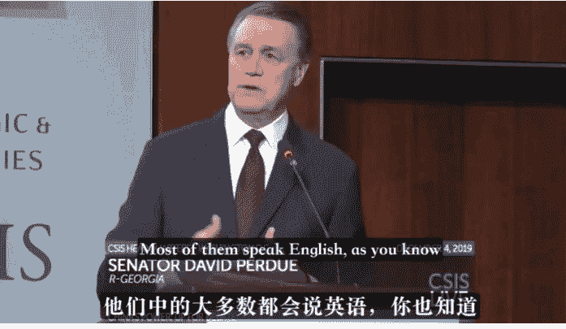
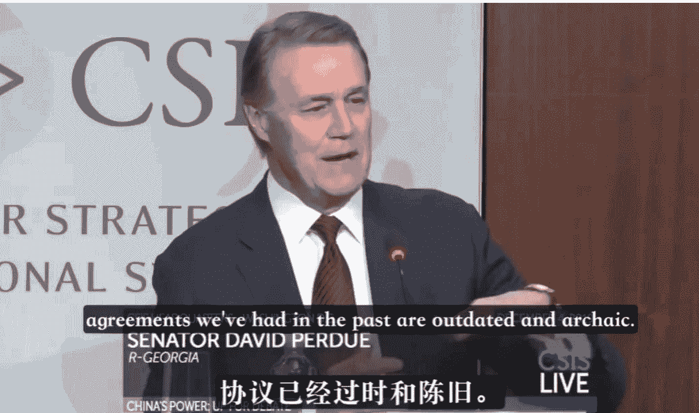
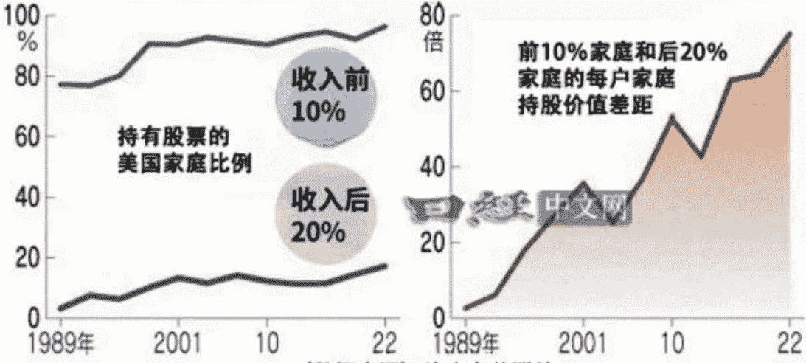
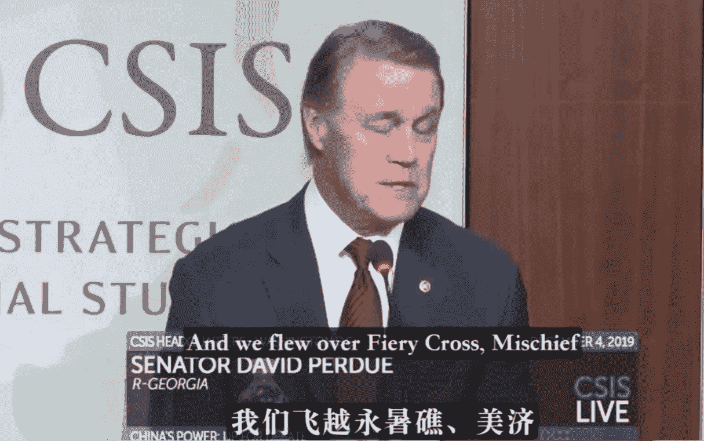
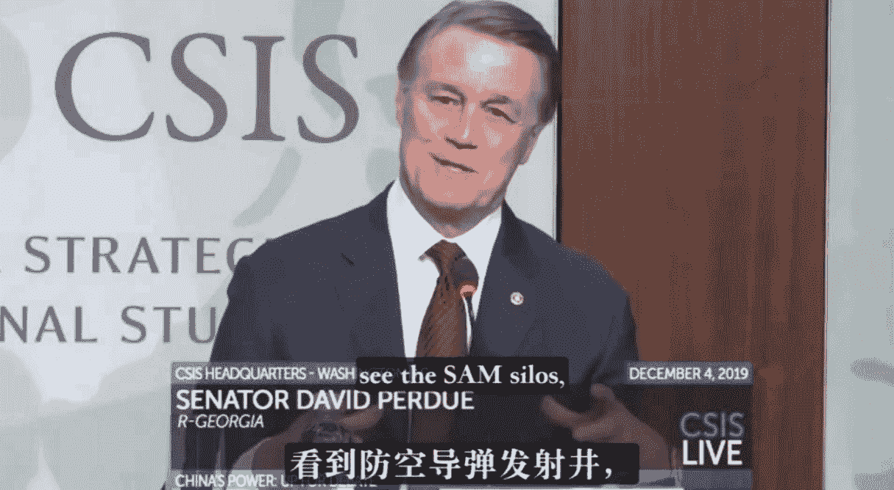
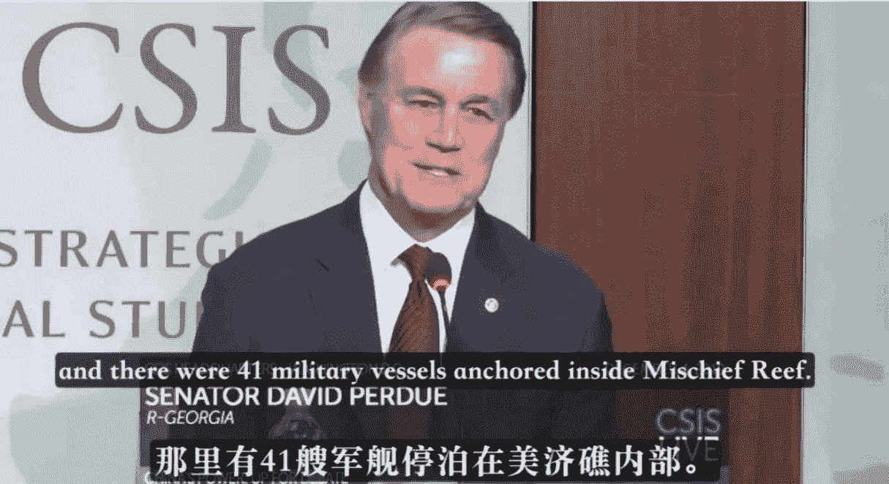
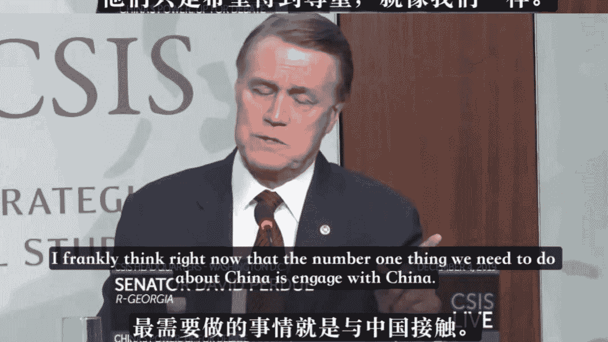

# 新任驻华大使谈中美对抗 已付费

原创 印闲生 江宁知府 2024 年 12 月 17 日 08:03 山东

符正霖 🍉 赠送的付费内容

这是我付费过的内容，和我一起看看。

2024 年 12 月 5 日，Trump 在社交媒体账号上宣布由前佐治亚州参议员戴维·珀杜（David Perdue，1949 年出生）出任美国驻华大使：

> “今晚我宣布前参议员戴维·珀杜已接受我的提名，出任下任美国驻中华人民共和国大使。作为财富 500 强的首席执行官，戴维拥有 40 年的国际商业生涯，并曾在美国参议院任职。

他在新加坡和中国香港生活过，职业生涯的大部分时间都在亚洲和中国工作；担任参议员期间，他曾在军事委员会和外交关系委员会任职，并出任过海上力量小组委员会主席。

> 珀杜一直是我忠实的支持者和朋友，我期待着在他的新职位上与他共事！”

美国驻外大使任命有个特点，驻友好国家大使属于“奖励性质”的岗位，如驻日本大使、驻韩国大使、驻澳洲大使、驻英国大使等，他们并没有太多实质性工作，也很难遇到什么危机考验，安排人选比较随意。

驻华大使则不同，其所需的政治素养与咖位必须足够，和总统、国务卿的关系通常十分密切。

尤其在中美竞争激烈的时代，驻华大使的立场观点往往与总统保持高度一致，以免发出不协调的信号。

以现任驻华大使伯恩斯为例，即将离任的他近期接受采访时表示，“驻华期间用了八成的时间管控美中竞争，其余两成时间则用于进行接触”，并形容这是“正确的平衡”。

不难体会，“八分管控、两分接触”其实就是拜登对华策略的核心。

公众号懒人搜索，懒人专属群分享

珀杜与 Trump 拥有密切的私人关系，是其在参议院的亲密盟友。2016 年大选中珀杜即支持 Trump 并最终获胜，2020 年败选后他支持推翻佐治亚州选举结果的诉讼。

众所周知，Trump 用人逻辑有两条：一是忠诚，二是价值观一致。

如果说国务卿、国家安全事务助理属于综合性岗位，任命初衷未必完全基于对华关系考虑，那么驻华大使的人选则可以相当程度上反映 Trump 本人对待中国的真实态度。

接下来以珀杜 2019 年在知名智库战略与国际研究中心（CSIS）年度“中国力量”论坛上的演讲和访谈为基础，介绍他对中国崛起、中美对抗和两国关系未来的看法，最后展望一下中方的应对之策。

作为总统信赖的参议员，珀杜本人曾多次参加中美贸易谈判。据其回忆，中美双方代表经常用英语进行坦诚、深入、高效的交流，与公开宣传中的叙事存在较大出入。

珀杜认为，美国在上世纪八十、九十年代对中国的认识过于乐观和自负，对中美关系和中国的未来进行了一系列“错误的假设”。

事实证明，中国的文化底蕴、历史传统和政治思维异常坚固，民族主义目标清晰且明确，这使得美方假设最终落空，不得不全盘调整对华策略。

站在当前视角，中国正以前所未有的速度强化军事与科技实力，以海军为例，近几年平均每年下水的舰船吨位数大致相当于 2010 年之前每十年的总量。

这种情况下，摆在美国面前的选择就只剩下两条：

一是再次陷入类似冷战的军备竞赛，但美国因自身财务与资源条件很难重复上次不战而胜的模式；

二是与中国维持对话和接触，借力全球盟友威慑中国，以某种形式的合作实现竞争性共存。

珀杜本人倾向于第二种方案。

So one option is we could slip into an arms race, a Cold War,

SENATOR DAVID PERDUE
R-GEORGIA

所以一个选择是我们可能滑入军备竞赛，冷战，

We cannot afford for us to do that, in

SENATOR DAVID PERDUE
R-GEORGIA

依我看，我们也无力承受。

economic powers and compete and cooperate?

SENATOR DAVID PERDUE
R-GEORGIA

经济大国共存，并竞争与合作？

公众号懒人搜索，懒人专属群分享

从这个意义上讲，珀杜的立场与民主党精英规划的中美关系前景并没有根本性冲突，只是侧重点不同。

具体来说，以 Trump 和珀杜为代表的美国商界人士更多以经济利益为主要考量去思考中美关系，会因应谈判需要而呈现短期的强硬形象。

在美国新一届内阁中，安全领域的高级官员如国务卿卢比奥、国家安全事务助理沃尔兹等以对华立场强硬著称，但反过来对比一下，其上届的国务卿蓬佩奥、国家安全事务助理博尔顿等也都是对华顽固派。

某种意义上讲，安全领域的官员更多负责“唱白脸”。

与之相较，Trump 任命的财政部长贝森特、商务部长卢特尼克等人没有表现出太强的对华敌意，而他们负责的领域才是未来四年中美关系主战场。

珀杜 2018 年 6 月以参议员身份访台与蔡英文会面，台当局在新闻稿中形容其“友台”——这一表述也被不少大陆媒体引用。按照岛内标准，凡是访台或在加强美台交流法案中投赞成票的美国议员，皆属于“友台”范畴。

作为“商而优则仕”的典型人物，珀杜指出了很关键的一点——美国商界看待中美关系的不平衡心理。

珀杜称，在七八十年代中美关系正常化和九十年代中国加入 WTO 谈判时，中国市场对美国的吸引力很小，因此谈判主要围绕着中方产品进入美国市场来设计，并未对中国市场开放设置太多强制性条件。

然而谁都不曾预料到，过去二十年中国从一个国际边缘市场一跃成为拥有 4 亿中产阶级的庞大市场，彻底重塑了世界贸易格局。

于是美国商界便认为，当初中国入世谈判时的种种条件太过“优惠”，已经不符合当前形势，需要进行重塑。

既然中国不愿意主动修改，那美方就得用关税等手段逼着中方重塑。

珀杜从政前曾担任多家跨国企业高管，包括家用企业莎莉公司的亚洲区资深副总裁。加入政坛后，他刻意淡化了与中国的私人关系（2020 年竞选期间主动删除了在长城拍摄的个人照片），时常发表一些强硬言论。

不难体会，珀杜的这一思路跟 Trump 是完全一致的。

前文引用过岛内知名学者吴玉山对 Trump 的观察，在其认知中，代表选票的右翼民粹 > 代表经济利益的重商主义 > 代表安全的霸权竞争。

选举政治中，赢得选战胜利永远是第一位的。

MAGA 精英们想要长期发挥影响力，就必须解决所得分配恶化、传统劳工失业严重等经济问题，否则 MAGA 也终将是昙花一现，甚至会再度遭遇被清算的局面。

那怎么解决美国旧工业带与乡村出现的怨恨情绪呢？

Trump 给出的药方就是重塑国际贸易体系，摆脱以高科技和金融为核心的发展方式，缩小美国与中国之间的制造业差距。

亲民主党媒体认为，不排除下届美国政府取消拜登政府对中国半导体行业的部分出口管制，或以此作为谈判筹码。

因为高科技并不是 MAGA 的基本盘，传统制造业和农业才是，Trump 的支持者们对于高科技领域的政策变动远不如民主党支持者们敏感。

根据美国经济分析局的官方数据，关键摇摆州的人均可支配收入均低于全国平均水平，如果考虑到城乡之间的差距，剔除像亚特兰大、费城这样摇摆州大城市，关键摇摆州乡村选民的平均收入会显著低于州平均水平。

这些人是真正的选战胜负手，决定他们投票意向的主要是日常开支压力，而非任何宏大叙事。

## 特朗普向 WTO 施压，称中国不是发展中国家

ANA SWANSON
2019 年 7 月 29 日

WTO 有允许各国决定自己是否符合“发展中国家”资格的规定，目前该组织 164 个成员国中近三分之二的国家为“发展中国家”，包括新加坡。Trump 曾表示“将使用一切可用的手段”确保这条规定得到修改，以剥夺相关国家的贸易优惠待遇。

公众号懒人搜索，懒人专属群分享

## 美国的低收入阶层并未从股市上涨中受益

## 越是年轻人群，比起资本主义越愿意“依赖政府” (被问及“喜欢什么经济体制”时的回答，2023 年)

| 世代 | 资本主义 | 社会主义 |
| :--- | :--- | :--- |
| Z 世代 (18~26 岁) | 29% | 28% |
| 千禧世代 (24~42 岁) | 34% | 20% |
| X 世代 (43~58 岁) | 39% | 14% |
| 婴儿潮世代 (59~77 岁) | 60% | 16% |

美国是半数以上家庭都持有股票的“股票大国”，但过去几年美股的飙涨并未给民主党加分，因为多数股票集中在少数富人手中，股票上涨让富人与穷人的贫富差距进一步拉大。一旦未来多数美国人不再欢迎股市上涨，将对资本主义制度的根基造成冲击。

接下来谈军事对抗领域。

作为参议院军事委员会成员和曾经常驻亚洲的跨国企业领袖，珀杜熟稔亚太局势，对中美军费支出和军事实力有着深刻认知，被视为涉华“威胁论”的鼓吹手之一。

珀杜认为，美国天价军费中有大量的钱被“虚耗”掉了，根本没有花在刀刃上。

他以军费开支中的“管理费用”为例，2019 年该支出项目占全年军费总额的 14%，而这一数字在上世纪六十年代仅为 2%。

有学者详细对比过中美军费支出明细，中国军费的前三大项目分别为人员生活费（军人薪水）、训练维持费和装备费，美国军费的前四大项目分别为作战与维护费、军职人员开支（军人薪水）、装备采购费、研发费。

这里面军人薪水和装备采购费是一一对应的，中方的部分研发费用很可能由相关领域军工央企自主承担，而美方多出来的“作战与维护费”则是其全球部署的费用——这块中方基本能够省下来。

公众号懒人搜索，懒人专属群分享

众所周知，美国在海外有庞大的军事基地，虽然所在国要负担一部分，可大头还是由美国支付。

军事人员长期驻外的成本非常高，美军大型海外基地的开支通常包括随军家属以及用于医院、学校的费用。

总而言之，正如美国的 GDP 数据一样，其军费开支同样存在服务业占比过大的问题，即里面大量的钱没有用在一线装备列装上。

驻韩美军汉弗莱斯营基地餐厅中用餐的士兵和家属（注意有女眷）。汉弗莱斯营基地生活有美军、军务人员和家属共 4.3 万人，其中军人约 2.8 万，基地里便利店、购物中心、美容院、美甲店、学校、图书馆、医院等日常生活设施十分齐全。

## 表 1 2019 财年美国国防预算各拨款项目支出 (2019 财年不变价格，单位：亿美元) [2]

| 拨款项目 | 基础预算 | OCO | 小计 | 占比 (%) |
| :--- | :--- | :--- | :--- | :--- |
| 行动与维持 | 1,985 | 487 | 2,472 | 34.49 |
| 军事人员 | 1,471 | 47 | 1,517 | 21.16 |
| 采购 | 1,323 | 129 | 1,452 | 20.25 |
| RDT&E | 917 | 12 | 930 | 12.96 |
| 军事建设 | 103 | 9 | 113 | 1.57 |
| 其他 | 370 | 5 | 376 | 5.24 |
| 能源部支出 | 218 | | 218 | 3.05 |
| 其他部门国防相关支出 | 3 | | 3 | 0.04 |
| 小计 | 6,391 | 690 | 7,081 | 98.76 |
| 强制性支出 | | | 89 | 1.24 |
| 总计 | | | 7,170 | 100 |

[1] 根据美国国防部绿皮书整理得到，参见: U.S. DOD, National Defense Budget Estimates for FY 2019, April 2018, p.3, https://comptroller.defense.gov/Portals/45/Documents/defbudget/fy2019/FY19-Green-Book.pdf.

2019 年美国军费开支项目明细，“行动与维持”的比例高达 34.49%。

珀杜认为，世界无法承受一场新的冷战，美国也必须审视自己的财务与战略现实，选择务实的国际协调和更深层次的交流来应对中国崛起，拿出“更具弹性的政策”。

在他看来，随着中国军事实力上升，一些东南亚国家将或主动或被动在中美之间保持战略平衡，甚至靠近中国。

北京强调军备建设的根本目的是通过军力增长的方式改变亚太国家在中美之间的态度以及该地区军力平衡，最终让美国接纳中国在亚洲的影响力。

And we flew over Fiery Cross, Mischief

我们飞越永暑礁、美济

see the SAM silos,

看到防空导弹发射井，

and there were 41 military vessels anchored inside Mischief Reef.

那里有 41 艘军舰停泊在美济礁内部。

珀杜乘飞机俯瞰过中国南海岛礁。

面对中国军力的增长，作为“非主流鹰派”的珀杜又提出了怎样的对策呢？

说来有趣，他的观点是“接触 + 威慑”。

为了解释“接触政策”，珀杜还提到了一些中美可以合作应对的非传统威胁，比如全球有 8000 万流浪人口（2019 年数据），他表示“我们正在批量产生恐怖分子”。

实际上，除国务卿卢比奥曾经是“干预论”的支持者外，绝大多数 Trump 团队成员均反对海外军事干预，无论直接（如阿富汗、伊拉克）还是间接（如乌克兰）。

他们主张用“威慑”来解决问题，习惯于使用激烈的言语（如轰炸莫斯科）+ 漫天要价（如 200% 关税）来恐吓对手，但并不诉诸军事干预行动。

其中的根本原因前面解释过了——Trump 的（大部分）支持者群体不是经济全球化的受益者，他们不赞同美国继续用高昂的军事成本去维持当前国际秩序。

2024 大选期间民主党曾激烈批评 Trump 的外交政策，不过很显然，哈里斯并没有在外交领域得分，反倒是 Trump 的立场引起了选民的广泛共鸣。

另外，珀杜也提到了中国的“单一文化/文明”属性。

“单一文明”在霸权竞争过程中会带来额外优势，但到了秩序塑造阶段，“单一文明”天生的保守倾向并不利于新秩序塑造。

换句话说，即使未来中国取代美国成为亚太地区的主导力量，理想情况下也只会吸纳部分文化接近的国家（如日本、韩国、越南、新加坡等）进入自身圈子，很难构筑起涵盖其他文明（如印尼、马来西亚等伊斯兰国家）的统一阵营。

公众号懒人搜索，懒人专属群分享

在一部分美国政客看来，对华“接触策略”的前提是华盛顿有能力影响中国的政策。反过来思考，中方在面对美国压力时需要表现得刚柔并济，既要有理有利有节，又需要一些弹性，假如中方完全无视美国压力，则支持“接触论”的人就会失势。

回顾拜登四年，民主党政府整体上继承了 Trump 的关税水平，既没有明显增加（光伏、新能源汽车等极个别领域除外），也没有予以削减，唯一突出的举动是发起了“芯片战争”。

以中方视角看，过去四年双方经贸关系算是波澜不惊，在“小院高墙”的框架下维持基本稳定。

相较于经贸领域，过去四年中国在地缘政治层面感受到的压力更大。

如：俄乌战争初期引发的全球性地缘政治紧张，佩洛西访台前后屏气凝神的军演，以及北约被激活/北约亚太化、美日韩三边同盟巩固、AUKUS 联盟建立、美日印澳四方安全对话逐步深入等等。

公众号懒人搜索，懒人专属群分享

由于地缘政治紧张，使得政府/政策和企业的行为方式发生了变化，从“发展第一”转变为“安全第一”或“风险最小化第一”，并由此带来一系列问题，给人一种“戴着镣铐搞经济”的感觉。

假如未来四年地缘政治议题得到淡化、围绕经贸/市场的博弈重新成为对外政策焦点，或许会帮助我们重新聚焦于“发展”。

与 1990 年代或 2000 年代初刚刚入世时不同，今天的中国企业其实已经不惧怕国际竞争了，中外产品的竞争力早已“攻守易势”。

在扩大开放和国际贸易的过程中，一些外国企业、外国政府激烈要求的竞争环境或市场要素，某种程度上也正为我们所需要的。

1999 年深圳的中心还在罗湖，图为待开发的福田中心。也就是这一年，腾讯推出了第一个即时通信软件——OICQ，即 QQ 的前身。

在中国，改革与开放是紧密联系在一起的，每当对内改革遇到阻力时，就需要借助外部压力来为改革增添动力，是为“开放倒逼改革”。

回顾历史，以家庭联产承包责任制为代表的“内源性改革”往往十分困难，需要发起者承担相当大的政治风险（《谁能从官场脱颖而出？》），有些时候甚至是山穷水尽之际的无奈之举。

更频繁出现、发挥作用更明显的，反倒是“外源性改革”，比如: 通过扩大开放、与国际接轨、加入 WTO 来倒逼国内改革，瓦解那些僵化的制度。

以加入 WTO 为例，WTO 的规则实质上就是市场经济的基本运行规则，入世期间人大修改了 3000 多条法律法规，给经济、政治、文化、社会等领域都带来巨大变化。

地缘政治竞争是零和的，消耗性质的，不是你赢就是我输。

经贸竞争则不同，如果因应得当，收之桑榆亦未可知。

印闲生

> “感谢分享”

喜欢作者

739 人付费，1 人喜欢

美国 64
美国 · 目录

上一篇 · 芯片硬脱钩

个人观点，仅供参考

修改于 2024 年 12 月 17 日

## 喜欢此内容的人还喜欢

公众号懒人搜索，懒人专属群分享

### 清朝灭亡后，“封疆大吏”都去哪了？

我常看的号 江宁知府

### 中国的供暖分界线到底在哪里？

我常看的号 江宁知府

### 日本偷袭珍珠港后

我常看的号 江宁知府

