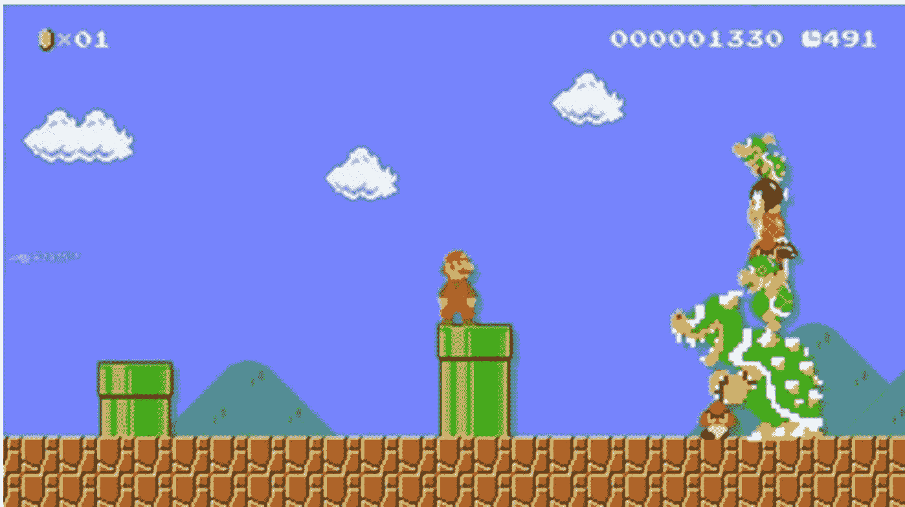
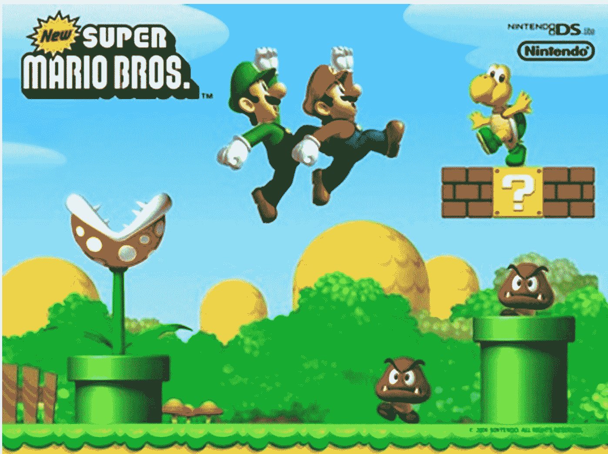

# 懒人专属群周报 (第 112 期)

北京时间 2024 年 12 月 20 日出品

懒人专属群群友大家好，我是小懒人~

第 112 期《懒人专属群周报》，与君共读。

希望咱们专属群独有的《懒人专属群周报》可以作为群友们喜欢阅读的一份类似周刊的读物。之前的离线版合集地址见咱们专属群总链接，小懒都有备份。

懒人微信：lazyhelper

## 目录

- 关系攻略（节选）
- 如何用背锅大法影响爹娘
- 习题
- 婆媳有了矛盾，为什么要站在媳妇这边
- 习题
- 新闻评论
- 你问我答
- 写作与输出
- 阅读与输入
- 读博与职业
- 公共事件
- 懒人收藏夹
- 成熟以后
- 男人没出息，老婆照样有可能从一而终的
- 社交：从批发到零售
- 总结

## 关系攻略（节选）

作者：熊太行

### 如何用背锅大法影响爹娘

> 知识点：老年人会对给别人帮助、不给别人添麻烦特别在意，因为担心受到白眼。用背锅法把关系受损的责任推给老年人，往往会让他们快速行动起来。

前几天写的那篇《为什么不要拿走老公的工资卡》的文章（见第 110 期专属群周报），特别得罪人。

有朋友批评我，说你把事情写得太黑暗，容易教坏年轻人。

我倒是觉得给年轻人营造一种全世界大和谐假象，让他们遇见挑战的时候手足无措两眼一抹黑，才是教坏年轻人。

毒鸡汤才是真正的黑手。

有人跑来跟我说：熊老师，我听网上说要把老公的银行卡拿着，不然他就会变心。

我只好从头劝她：

中国有 6 亿多 4G 用户。

我们《关系攻略》有 4 万多关系户。

你本来就是万里挑一的高级品位，你的味蕾是打开了的。

不要信一些莫名其妙的营销号。

因为女人比男人更喜欢分享朋友圈，尤其是情感类的朋友圈。所以做微信公众号的人，尤其是那些家庭情感号，总是憋着往死里去讨好女人，告诉女人“你特别强大，你现在就去打骂你老公，不然他不听话”，有些女性就是喜欢转发这样的东西，跟男人示威，也跟女性朋友炫耀。

这些东西完全没必要。我是遇见过几个天天写男人不配这个男人不配那个的公号作者，正在很努力地挽救自己的婚姻。

什么是强大的人呐！

遇到问题、解决问题，利用套路、开动智慧。

他的灵魂是深沉而滞重的，他的解决方式又是轻盈而有效的。

这样的人才有魅力。

没事听营销号忽悠去硬刚老公，在朋友圈里用这种东西示威，是最愚笨的方法。

说到“轻盈的解决之道”，春节前还真的遇到过一次。

我的好朋友面包老师以前是果壳网的总经理，现在自己创业。春节前他打电话给我，说：“我遇到麻烦了，马上要过年了，我爸爸突然告诉我，说我刚刚和你妈妈见过面团聚过，现在再去北京，票也不好买。不如你们在北京过年，我自己在老家过年吧。”

一家人最重要是要齐齐整整，尤其是过年。老爷子突然变得固执了，怎么劝都不听。面包老师是聪明、孝顺的人，但这会儿跑来问我，他可能真的是没办法了。

我当时想了想，对他说：“老爷子是不是挺节俭的，心疼钱了？”

“应该是。”

“那就告诉他，如果他不来，你们就因为他的固执被迫一起回去。那就是四人份的交通。”

“好主意！我还订了年夜饭和温泉酒店，我可以告诉他如果我们回去过年，这些就都作废了！”

二十分钟之后面包老师给我回信：“圆满解决！太棒了，你可以写进专栏的案例了！”

这个做法，在人际关系中很常见，我叫它“背锅法”，背锅法的四句口诀我放在这：

如果你要是固执，你就会给我们带来很大的损失。

接受我的建议吧，我们都会方便很多。

背锅法对老年人特别有效。

人到了老年，对财产会很在意，老年人一般会有 20% 的收入会花在健康上，我们在劳动力年龄，讲税前税后。老年人那就是药前药后。身体好的人，可支配的财产就会多一点，所以即使是健康的老人，也会变得更节俭。

所以你父母节俭，不仅仅是因为他们以前穷过，而且因为他们会为以后考虑。

同样，老年人也会希望自己更有用，能帮助别人，能保持老年人的高自尊，很多老年人总是担心自己身体不好，会变得没用、也没有尊严。

一些老年人会对给别人帮助、不给别人添麻烦特别在意，因为担心受到白眼。

有的父母对孩子特别客气，想省钱、怕麻烦，这样的父母，就要用背锅法来哄他们。

这种方式是带绑架成分的。有人说对亲人要不要绑架？

我说，要。

你不绑架，也有人来绑架的。

东野圭吾有一本小说叫做《杀人之门》，主人公有一个学长，屡屡吃定他，小时候骗他的钱，长大了做他的领导拐走他的业绩，后来又泡走他的女神。

那个学长骗人很有一套。

他们在一个骗子理财公司打工，先去老太太家做客，跟人聊天，不卖东西，日子久了，老太太习惯了他们来聊天。他突然带着主人公，这个傻小子过去拜访，淋了一身雨，也不打伞。

“阿姨，我们以后不能来串门了。这家伙业绩没完成，我做他的主管我也有责任，他要解雇，我要调离，这些日子多谢你关照了。”

这孙子扭头就走，老太太赶紧拉住：

“多少钱！多少钱能帮你们完成业绩！”

后来老太太买了诈骗理财，吊死在屋里了。

基本上所有卖保健品和理财产品的人，对老年人都爱用这套：

如果你要是坚持不买，

我们就会消失在你的生活中。（不要！）

买上几万块钱的床垫治疗仪松花粉，

我会感谢你八辈祖宗哒。（好的！）

导游也是这样，399 去云南，1000 多去新马泰的团，一定是把你塞进翡翠商店，买不够钱数就不肯走。如果坚持不走，还要被人格侮辱。

如果你要是坚持不买，

别怪我未来几天不给你好脸色看。

买上几万块钱的 A 货翡翠吧，

你仍然有我的笑脸相迎呀。

发现了没有？仍然是背锅法。

你会发现有些国家的外交辞令也是如此：

如果你国要是在某某事上一意孤行，

将会对两国关系的破裂负全部责任。

悬崖勒马，及时悔改吧，

两国人民世世代代地友好下去，就靠你了呀。

把关系破裂的责任推给对方，这对大多数的人都有效。

它对老年人做推销更有效，是因为老年人在心理上对陌生人的防备最差。

我以前写过一篇十万加文章：《你对父母的了解还不如那个卖保健品的》，就是说对自家的父母要哄，要蒙，要耐心，卖保健品的这几点是非常努力非常用心的。

在哄人的序列当中，这对在乎你的家人和亲密的朋友来说，非常有效。

有人说，我不能用套路对待朋友，这不真诚。

错。

你请朋友吃饭，到结账的时候他要抢，你怎么办？

最有说服力的话，是“我已经团了他家的券！”

如果你要再抢单，我们就要亏了。

让我来解决这事儿吧，这一单能省 120 元。

真诚不真诚？

还是背锅法的活用。

送礼也是，你送领导一个礼物，领导觉得不该要你小年轻的礼物，其实是比较疼人，让你拿回去。

你把东西放下就跳进了电梯，领导没别的选择，就把东西拿走了 (他不拿也不会第二天拍个照说我没拿)。

还是背锅法：

如果你要是再不收，

这东西就要被保洁大爷收走，或者蟑螂蚂蚁消费了。

把它拿回去吧，

这是我的一片心意啦。

用法：

背锅法不要滥用，对亲人，尤其是长辈用，一般都是有很好的效果，情侣之间不要用太多，尤其是你的提议对方特别反感的时候。

这个策略的关键，是对方担心你们关系的破裂，担心双方因为自己的选择而造成比较大的财产损失。

### 习题

请为熊老师设计一个背锅法的文案给更多的关系户，推广 4 月份《关系攻略》在得到上的直播节目 (多选并排序)：

- A. 熊老师就不回答你的问题啦;
- B. 赶紧把关系攻略推荐给你最亲近的人吧;
- C. 如果你要是不去看熊老师在得到上的下次直播;
- D. 熊老师就小拳拳捶你胸口;
- E. 熊老师就可以更好地为大家生产内容啦。

答案是 CABE。

如果你要是不去看熊老师在得到上的下次直播，熊老师就不回答你的问题啦。

赶紧把关系攻略推荐给你最亲近的人吧，熊老师就可以更好地为大家生产内容啦。

今天的题目很简单，选 D 的人你们别跑！给我站住！

### 婆媳有了矛盾，为什么要站在媳妇这边

> 知识点：“老”这个词在心理学上不正确，一般来说，这段岁月被称为“成年晚期”。最幸福的老人和配偶生活在一起，其次的和兄弟姐妹同住，和子女甚至第三代同住的老人，幸福感要低得多。

有位关系户跟我谈到婆媳关系时说：“我们要和父母同住，我当然要向着我妈了。”

等等，你当然要向着你妈了。

为什么向着你妈，是一件“当然”的事呢？

人不是应该讲道理吗？因为自己的基因来自一个人，就无条件地向着她，无论对错，这样真的没问题吗？

这是不少儿子容易陷入的误区，你经常会听到一些小饭馆儿里酒兴正酣的嘴里，硬着舌头逞强的男人：“我——就跟你嫂子说，你跟我说什么可以，你要惹我妈！就！就不成！”

气焰十分嚣张。

挟老妈以抗老婆，背后站着五千年的文明史和诸子百家，不说婆媳关系没法治愈，夫妻关系会很快磨损并走到尽头。

在妈妈眼中，什么儿子才是孝顺的儿子？

- 1. 照顾好妈妈的生活，不让物质上有匮乏。
- 2. 照顾好妈妈的精神生活，不让精神上有空虚。
- 3. 订一份关系攻略（可选），兄弟姐妹（如果有）和睦，不让老太太担心。

敲黑板！

在一个孝子的 KPI 当中，不包括“让妈妈来管家”！

当然了，大事上妈妈的决定权还是很重要的。

#### 1.不要让妈妈当你们的家

康熙、雍正、乾隆这样的厉害皇帝，当了皇帝之后母亲都还在（有的不是亲的），三个人都用不同的方式扮演孝子的形象，但没有一个人把母亲拉出来给自己垂帘听政的。光绪的权力在慈禧太后（他的堂伯母和亲大姨）手上，他们的关系特别紧张。

我曾经讲过遇见向两个领导汇报的局面应该怎么办。当时我跟大家说，天无二日，国无二君，在公司里特有用。在家庭里更是如此。

我会告诉各位男士，不要被妻子拿住银行卡，同时我还要告诉大家，也不要让妈妈把握家里的行政权。

母爱非常伟大，也相当自私。

懂事的朋友或者妻子根本就不会问“我和你妈掉水里……”这么愚蠢的问题。

但是即使很多受教育程度很高的母亲，都会问出这个问题：

> “儿子，等你长大娶了媳妇了，会不会忘了妈？”

真是个对男性的诅咒。

你那会儿可能是三四岁吧，把拖着的鼻涕擦一擦，暗想“媳妇是什么？好吃吗？没概念！”于是你义无反顾地保证：“我肯定向着我妈！”

时过境迁，三十年后你结婚了。妻子成为你生活当中最重要的合伙人。

你要放心地让妈妈变得像一个退休老领导，敬爱她，听她的一些建议，但绝对不能把她看得比妻子重要。

一个男人认为应该“当然向着我妈”，那就是心智上仍然像个孩子的表现。

#### 2.婆媳同住家庭的权力结构

婆媳之间，一定要站在自己妻子的一边。

自古到今的愚忠愚孝，都是做给别人看的。

一味顺从自己的妈妈，婚姻破裂了，最担心的还是老太太，我认识一位老太太，跟媳妇争吵导致儿子离婚之后得了抑郁障碍，整天话都不能说了。

其实击倒人的不是做错事，而是事情做砸了之后袭来的无处可逃的自责。

大多数不同住的婆媳恩怨都是可以忍耐的，真正发生问题的家庭，是婆媳同住的家庭。

这种家庭里，媳妇本身就是一个外人，如果儿子不给他支持和支撑，那很快格局就会变为：

一家三口和一个媳妇。

如果你向着自己老妈，媳妇 (站在管子上的) 眼里的家庭就是这个样子的。

媳妇会感受到自己的无力和被剥夺感，自己的丈夫不支持自己的话，这个家庭是没人支持自己的。

婆婆是恩怨当事人，总不可能老公公和儿媳妇打成一片吧。

但是如果儿子和媳妇联手，这个家庭是两个分公司组成的，老两口和小两口。

有一个搭档双打，感受上就好多了。可以应付各种困难。

这才是正确的相处方式。

#### 3.婆婆的幸福感从哪里来

小夫妻最好不要和公婆一起住，中国最多的住房是两居室，不是没有理由的。

家庭生活就应该是夫妻俩或者三口人。

你看《我爱我家》这样的经典家庭喜剧，编剧和导演根本上就回避了婆媳关系，这个家庭的老太太去世了。

因为如果描写婆媳，怎么样都会被群众喷。

一个喜剧里不应该有婆媳关系，婆媳一起住，已经是半个悲剧，剧情就奔向《中国式离婚》或者《双面胶》了。

因为一些原因，有的婆媳还要生活在一起，比如：

- A. 小夫妻没房，暂时也买不起

“贫贱夫妻百事哀”，为了节省房租就和父母同住，付出的成本可能会很高。

不如换个钱多的工作或者争取加薪，然后搬出去住。

可以和父母很近，但是不应该在同一套房子里。

如果住父母家，母亲就是天然的揸 fit 人 (《古惑仔》用语，管事大佬)，这个时候男人要明白，你和妻子都是父母的房客，你不是这家的大少爷。

最好夫妻两个人不要都挣很低的体制内死工资，应该有一个人的工作能挣计件、绩效、提成，至少有一个人可以多劳多得。

和父母短暂合住可以，不要让这件事长年累月地持续下去！

- B. 婆婆丧偶或者离异

心理学家们研究了许多老年人的情况，发现子女在不在身边，跟幸福不幸福根本没什么关系。

子女根本就不能给老年人带来快乐。

反倒是有了老伴儿的人会比较快乐、健康的人比较快乐、有朋友的人会比较快乐。

所以，要鼓励婆婆参加广场舞天团这样的集体组织，许多老年朋友在一起，大家的生活质量都能提高不少。

此外，许多失去配偶的老年人面临的一个问题是经济困难，两个人的退休金比一个人的多，尤其是男性退休金一般来说比较高，当失去了老爷子的退休金之后，老太太的经济问题需要儿子来考虑，你要给老太太筹划她的养老问题，不让她被骗子坑骗。

有固定和稳定的收入来源、有一群同龄朋友，老太太的生活质量就会很高。

相反，如果单纯地依附于儿子，甚至可能需要儿媳妇的补贴，那婆婆和儿媳的心态就会发生变化，大多数的冲突都是从钱上不公平开始的。

如果老太太在小两口购置婚房的时候出了大头，那这种跟着儿子一起住的要求很难拒绝，这个时候儿子应该尽量改善居住条件，比如换租更大的房子，租用同一小区内的另一套房等方式来解决可能的纠纷。

老破小、脏乱差的出租屋，会让所有人更容易增长负能量，还情绪激动的。

- C. 婆婆要帮忙带孩子

尽量把专业的事情交给专业人士去干，比如照顾产妇，尽量用月嫂，虽然很贵。

这是一个一两个月就走人的人，她可以承担你们家的怨念。月嫂走了，请保姆。

如果非要老人来照顾产妇，那最好就交给丈母娘，生产后的女性因为激素等原因，心理上容易出现问题，容易抑郁和暴躁，跟身边的人起冲突，亲娘受点委屈可以原谅，婆婆基本就要怨念一辈子。

别相信婆媳之内的友谊和真情，在那个特殊时期，过去的欣赏都会很快完蛋的，不要挑战规律，冒那种风险。

孩子上幼儿园之后，夫妻双方都可以松一口气，幼儿园阶段是父母全力忙事业的好机会。

大多数家庭在小学阶段还需要老人帮忙，许多城市里搞素质教育，低年级一周有两天上半天课，平时下午两三点放学，家里有老人接孩子会放心许多。

是不是已经决定请老太太出山了？等等，老爷子怎么办？就这么放在老家了吗？

这是许多漂泊在北上广深的青年容易犯的错误，如果妈妈带孩子的战斗力是 10，那爸爸的战斗力可能只有 2，把爸爸扔在家里跟叔叔姑姑搭伙儿似乎效率很高，带来小家庭这边似乎还碍手碍脚。

这是不对的，如果爸爸生活上比较笨，那就让妈妈在老家陪他，不要分开老两口。

你付不起保姆费就拆散别人夫妻？哪有这样做事的。

不要因为那是你爸妈就觉得没关系，不要觉得他们老了，无所谓，他们是两口子，一样会彼此想念，不在彼此的身边，他们会不习惯。

现在的人营养好了，衰老减慢了，65 岁之后仍然有性生活的老夫妻都很多，分居会带来各种不确定的风险——这不是开玩笑。老年人也会有外遇、离婚的问题。

因为带孩子老太太感受的疲倦或者压力，老太太不会怨恨儿子孙子。

这屋里就一个外姓人，她只会怨恨儿媳。

用婆婆带孩子是非常昂贵和奢侈的，你必须考虑这些隐性成本，如果没有实力处理好老夫妻的生活安排，最好还是老老实实地雇人好了，后患要少得多。

#### 4.钱是一个好东西

我们拆分了几种婆媳同住的模式，最终发现了一个真相：

钱能解决大多数的婆媳纠纷。

所以同住家庭的男人，担子特别重，要把钱拿在自己手里，全给媳妇固然是不行的，但全给亲妈，是万万不行的。

之前我们提到过，婆婆和儿媳妇有了冲突，可以让媳妇给婆婆面子，同时给媳妇送礼。

一边得面子，趾高气扬，一边拿到了礼物，闷声发大财。

我说男人要站在妻子一边，就是这个道理。

妻子和孩子是真正的家人，父母虽然和配偶、儿女一样也是遗产的第一顺位继承人，但要在说三遍：

父母是两口子，父母是两口子，父母是两口子。

两口子应该比成年后的儿女、比自己父母的关系要更近。套用一句人们爱用的大俗话就是：“你老了瘫在床上谁管你啊？”这个答案，就是你最需要在乎的那个人。

对父母来说，老伴儿是在校生，儿女是毕业生，当然应该是在校生更需要关心。

对成年的儿子来说，父母是老领导，妻子是现任领导，当然是现任的领导更重要。

理清楚这件事，你就比别人家那些愚忠愚孝的儿子不知道高到哪里去了。

为什么我对“老实人”的评价比较低，就是因为老实人对套路显出一种漠不关心甚至是清高的厌弃，他们很少愿意去琢磨这种家庭内的平衡，然后在出了问题的时候，老实人往往又会突然想起童年时期妈妈的召唤，认为娶了媳妇忘了娘是特别罪恶的行为。让自己的妻子受气吃苦，却不知道如何去安抚和补偿。

做老实人的妻子，最终的解决方案就是把老实人的钱攥在手里，跟婆婆硬刚。我们之前说过，这是最恶劣的一种家庭关系了。

如果你是一个对人际关系疏于研究的人，最好现在就开始。

有关系户问我，郭靖过去是一个老实人，但是有了一套降龙十八掌（套路），他就成了一个武功很好、能力很强的人，老实人的标签就没有了。

还有人说哎这个不适合我啊，我家没婆婆，都不在了。

真是不会转弯儿啊，你以后有没有可能当婆婆？你的女儿以后有没有可能面对她的婆婆？

P.S

之前讲不要拿走老公银行卡，提到了一句：

“婆媳矛盾不可根治，除非丧母、丧偶或者离婚”。

有人跟我说，熊老师你这么说让我太绝望了，不能根治的话，还结婚干什么？

有好多病都不能根治，比如糖尿病、冠心病、艾滋病、尿毒症、乙型肝炎。

但是可以控制，控制好了，病人生活质量可以很高。

婆媳关系也是如此，大家是会有恩怨，但是可以互相容忍。

对女性来说，婆媳关系的影响可能会在成年后持续终身：

现在的一线城市里，女性的预期寿命接近 80 岁。

一位女性 30 岁结婚，到 50 多岁的时候，婆婆也许才不在了。

而这个时候，你的孩子也将有了媳妇，或者去做别人家的媳妇。一个新的轮回开始，只是我们扮演的角色不同。

奇妙吗？

地球上生活过上百亿人。

他们之间可能有上万亿段关系。

有的妥善地处理，有的引发冲突甚至造成战争。

我们生活在一段和平的岁月里，可以平心静气地研究婆媳、母子和家庭。实在幸运。

人类就是这样生生不息的。

### 习题

婆婆在你们生活的城市帮助你们照顾孩子，但最近觉得想家和水土不服，这时正确的方法不包括：

- A. 请婆婆下馆子，想吃点什么就吃点什么吧;
- B. 出钱送婆婆去旅游，问问她的老姐妹有没有正好也想出游的，可以一起去;
- C. 看看能不能夫妻俩请年假看几天孩子，让婆婆回老家，或者接公公过来团聚一段时间;
- D. 辞职回家，跟婆婆一起带孩子。

答案是 D。

A 和 B 都是常规方案，贿赂婆婆是很好的办法。

B 比 A 更好，当然也会花不少钱。朋友之间一起玩会更好。

C 的意义很重要，我们文中提到的。

辞职做全职妈妈确实是一个解决家庭问题的方案，但与此同时要让婆婆交出孩子，两个人带孩子一定会出问题，孩子同样也面临着困惑：“我的 KPI 是什么，我应该向谁汇报呢？”

大多数时候，提出这个提议都会被当作叫板和冒犯，婆婆会怀疑这是不是一种恐吓和威胁。如果不是深思熟虑的话，不要做这件的事，如果决定做这事，让老公出面去跟婆婆谈。

## 新闻评论

新闻实验室是小懒付费订阅的通讯，年费 300 多。小懒整理分享，仅供专属群群友查阅。如有余力，可以自己到 Newsletter 上自费订阅。

## 你问我答

### 写作与输出

> Anonymous: 方老师，近日您多次提到“输出是最好的输入”，让我也有了写作、记录日常生活和真实想法的冲动。但仔细一想，不知道要在什么平台写？写给谁看？(又希望和读者交锋互动，又担心在国内社交平台发表观点会被骂，我很久没在社交平台输出观点了) 您对还没起步的写作爱好者，有什么实际建议吗？

答：这个问题很好，写作的确需要预想受众，这不仅会影响你的行文风格，也会影响你的内容选择。

对于刚起步的写作爱好者而言，有两种选择是最容易上手的。第一，写给自己，或者更准确说，是写给未来的自己——这个未来，也许是一个月之后，也许是一年之后，也许是更久之后。写作的内容也许是学习和阅读心得，这些可以成为你定期回顾自己信息摄取的依据；或者也可以是日常见闻与感想，这些也可以成为你在年底回顾这一年、29 岁时回顾过去十年的材料。给自己的写作应该是一种有安全感的写作、诚实的写作，因为没有别人来对你评头论足。虽然缺了和他人互动的机会，但是只要时间拉长，一年前的你和一年后的你实际上是可以产生某种对话的，你常常会发现，对于自己一年前或更久之前写下的东西有不少想说的。

第二，写给一个或少数几个值得信赖的朋友，你可以理解为写信。其实，写信真的是一种非常好的写作训练方式，因为你有非常明确的读者，又有想要针对这名读者表达的内容。而且，写信不会让人产生太大的恐惧感，因为“写文章”听起来颇有门槛，但信似乎人人会写，更不会有什么规定的体例、写法。在收到信之后，回信更是一个展开对话的过程。比起微信上的聊天或社交媒体上的评论，这种对话需要沉淀和思考更多，也往往令双方都更有收获。所以，不妨找一个写信的搭子，约定一个频率（比如每周一个来回），可以聊个人生活，也可以聊对时事的看法。

其实这也是 newsletter 的魅力之一。归根到底，我也是在给你们写信，絮叨自己最近的观察和思考，这个感觉比写媒体文章要好很多。

> Anonymous: 方老师提到过“写作要从自己感兴趣的方向入手”。我的问题很具体（笑）: 作为爱猫狗人士，这两年频繁看到虐猫虐狗事件，很想写一些什么—为小动物呐喊 or 呼吁大家做个现代文明人尊重生命。但不知道从哪里下手，目前能想到尝试做个数据新闻：各国宠物保护法 or 情况比较、国内各省市养犬条例等比较（思路有点乱……）方老师您有什么建议么？

答：谢谢提出这么具体的问题——我喜欢这种提问方式！你想写的这个话题很重要，不过我觉得你目前的想法都太“媒体”了。也就是说，它们都像是一家正襟危坐的机构媒体会发表的内容，可能并不是最适合个人写作的方式。

我的一个建议是写故事。呐喊也好，呼吁也罢，可能都没有一个触动人心的小动物与人的故事更能激发人们的保护行动。有一个叫“把话筒递给猫”的公号，就发表这方面的内容（你可能已经关注了），不过这个公号还是更偏爱猫人的同温层，对于本来就比较无感的人可能缺乏影响力。说实话，我也是在养了猫之后才知道原来每只猫狗都会有自己的个性。如果你可以通过故事，让不养宠物的人也可以体会到猫狗的情感和个性（并不一定是天使般的个性，也可以是臭脾气，因为无论个性的好坏，都会让人觉得更像人），那么就已经是很大的成功了。说到底，动物保护议题的动员核心可能不是“呼吁尊重生命”，而是激发共情。

另一个建议是尝试制作“懒人包”，以 FAQ 的形式去回答一些常见的问题和误解，诸如“遭受虐待的人都没被解救，为什么要关心猫狗”、“关心动物福利是不是只是为了展现自己的道德优越感”之类。要回答好这些问题并不容易，所以这个懒人包可能需要持续修订和更新，但它一定会有利于一些基本动物伦理的普及。

> Anonymous: 方老师可以分享一下自己时间管理、精力管理的方法和技巧吗？您同时负责多档更新频率不低的自媒体（播客、newsletter）、教学工作、科研工作，还时常参加各种学术及媒体界的活动，非常好奇您是如何做到的？

答：首先很感谢你说我的播客“更新频率不低”，哈哈，因为新闻实验室播客今年实在是没上几期（预告：最近会上新！），而和另两个朋友一起做的父能量播客也停更已久（预告：最近也会上新！），只有带着学生们一起做的放晴早安以学期为基础持续更新。

其实时间管理并没有什么神秘的地方，我看起来做了很多事情，背后的原因是这些事情本来就互相关联——我的主业是学术研究，在研究过程中需要读很多论文，有的论文我觉得适合拿到会员通讯里面介绍，就成了会员通讯的主题；我在课上和学生讨论的案例，可能也会是在播客和 newsletter 里面聊过的案例；我在参加活动时，也在用田野观察的心态去了解媒体业界的最新情况。总之，我的“多任务处理”并不需要明显的 context switching，所以无谓的消耗比较少。

如果要再延伸一点，那可能是：我很幸运，做的事情基本都是自主选择、有浓厚兴趣的，所以就更少内耗了。有一种说法是，大多数人的拖延症并不需要“治”，因为你拖延的最大原因是：你并不喜欢做那件事。与其强迫自己做，不如换一件事。过段时间你可能又想重新回来做那件事了，到时候自然就不拖延了。

> Anonymous: 能否介绍一下制作播客的流程，用到的软件，网站网页工具，推荐的素材库等。因为看到方老师能同时做几个播客，所以想请教一下高效制作播客的 tips。谢谢。

答：其实软件、工具、素材都是次要的，更重要的是内容定位和选题。如果没有合适的内容定位和能够持续产生的选题，一档播客很可能更新超不过 5 期，而你投入去研究的那些软件、工具、素材也都失去了意义。

如果一定要问工具细节的话：
- 录音：网上很容易找到麦克风推荐，我用的是 Blue Yeti，但 iPhone 的麦克风（在语音备忘录打开“无损”模式）已经很不错。另外录音环境可能比设备更重要——安静，不空旷。
- 剪辑软件：我用的是 Adobe Audition，但 Adobe 全家桶很贵，拿来剪播客也有点高射炮打蚊子。用免费的 Audacity 也可以，小宇宙也提供 Studio 可以剪辑，其实也有人用剪映。
- 素材：从免费音乐库里面选择，我用的是 YouTube Audio Library。另外现在也可以用 AI 来生成音乐和音效。
- 托管平台：直接用小宇宙就好了，可以输出 RSS 全网分发。想要用付费平台的话，Fireside 是比较流行的选择。

## 阅读与输入

> Anonymous: 想請問方老師有什麼關於中港台議題進行深度報導的英文媒體、團隊、記者推薦嗎？這個問題的起因是感覺到自己獲取的信息在中文和英文世界非常割裂，尤其在想要和講英文的朋友們分享中港台議題的時候常常苦於不知道有什麼英文深度報導可以分享

答：《南华早报》是我首先想到的，至少它对中国大陆和香港议题的覆盖都是没问题的，台湾议题可能相对较少。另外，Sixth Tone 对中国大陆议题的部分报道也 OK，虽然比几年前差了不少。在科技议题上，Rest of World 关于中国的报道也值得分享。

还有一家很深度的专注于从经济角度报道中国的英文媒体：The Wire China，质量过硬，但订阅费用不低，每年 199 美元。

> Anonymous: 方老师，您关于珠海撞人事件的 newsletter 中提到，面对众多大型事件，内地民众的信息需求完全无法被满足，疑惑愤怒在沉默中发酵，我个人非常非常感同身受。近日恶性事件密度极高，评论区各种辱骂、互相攻击，都很让人沮丧甚至绝望。在没有任何报道可读的情况下，我们应该怎样消化这些负面情绪并仍然保持乐观心态呢？

答：那就不要看评论区啦。我习惯从学者的视角去看待和思考，比如恶性伤人事件发生，而且我们无法得到详细信息，那就抽离一些，去看看我们对于人性之恶、随机杀人已经有什么研究和了解。这些都是人类社会早已有之的现象，尽管在每个时代有具体的差异，但内里的脉络是一致的。了解这些不一定让你变乐观，但至少会让你更平静（因为对于人类经历的风浪见得更 多了……）。

> 陈默：方老师，出于探索世界的欲望，我看了很多自媒体的文章和视频。然而，我对问题的理解往往只是“知道”，很难形成自己的看法。请问我该如何改进？是否需要去看更“一手”信息源？

答：自媒体的文章和视频为了获得更好的传播效果，往往有一套自己的框架，而且这种框架很可能是大大简化的，将挑选过的事实往里面装。它们的传播目的是你接受这套框架，而不是产生自己的批判性思考。这应该就是你觉得“知道，但很难形成自己看法”的原因。

我很同意你提出的解法：去看更加一手的信息源当然是更好的。一些基本认知框架的建立，可能需要依靠书，甚至是教科书。另外，其实维基百科（英文版）也是不错的起点。

## 读博与职业

> R: 看到方老师您上期回答说读博本身是非常艰苦的过程，想问一下方老师您读博时是如何让自己保持长期的自驱力。一个自己有兴趣的研究方向可以支撑自己去阅读浩瀚的文章，但是在三到四年中只有一个人的旅途中该如何让自己在不断试错的迷茫过程中，对着自己的研究兴趣和目标继续前进呢？以及如何在这期间调整自己心态避免抑郁呢。谢谢方老师的时间🙏

答：我当年避免抑郁的主要方法是运营新闻实验室和在 B 站做 Up 主（哈哈……）其实就是找到一些调剂的方式。所以有段子说，每个 PhD 最终都成了某件学术之外的事情的行家，比如厨神、K 歌之王……

简单来说，学术不是生命的全部。

另外，如果能有一个互相支持的小社群，会是很好的。

> 郁云：方老师，您在通讯（700）里谈读博时想研究中国问题，可主流太美国/白人中心，缺乏多元性和普适性。如当下去欧美做记者面临着前述问题，可国内的问题也非常突出（对内容的限制越来越多、媒体商业模式没有美国成熟等等）。对于有志于做新闻记者/内容、且最关心的是中国问题的毕业生和职场新人，您会更建议留在内地、去香港还是在海外发展呢？

> 程衍樑老师谈过“有时某期激进内容是宁为玉碎，然后你就被迫离开了这个文化圈层。读很多人的回忆录发现他们在一个非常特殊的年代离开了这个国家，去到海外，干很多事，但后来这些事对这个国家的人没有什么影响，其实那挺悲剧的。如果因什么事你被 Ban 掉或者离开，那很大概率填补你的人比你更糟糕。”方老师，请问您怎么看待这个问题？

答：第一个问题，我觉得没有哪种选择是明显更好的，还是看个人的机遇吧。若是有一个具体的、比较理想的机会，就抓住它，不管它是在哪里。然后，对这个地方的优势和劣势有充分的理解，想办法扬长避短，也避免自己逐渐变成一个只能待在某个地方的人，保持住自己的流动性。

第二个问题，其实是同样的逻辑。程衍樑有他的判断，并且在运营 JustPod 的过程中也在践行这种“留在牌桌上”的判断。但其他人也可以有不一样的判断，也可以认为离开的人在新的领域产生了更大的影响，而留下的人在牌桌上只剩下妥协和被同化。而我个人的态度可能更中间：有为了留下和发挥影响而可以妥协的东西，但也有不能退让的原则。

> Martin: 方老师好，我想问下职业规划的问题。在 IT 行业工作六年，待过五家公司。刚开始的职业规划是做产品经理，实际做起来发现和自己预期的差距有些大。曾经以为的光环不再，没有了明确的职业规划。听任公司的安排转做过售前，项目经理。年初被裁员，更加迷茫，不知道自己想做什幺，适合做什幺。现在的工作非常痛苦，想辞职又不知道该做什么？

答：如果你一开始计划做产品经理，相信我接下来要说的你已经非常熟悉了：在“他人需要的”、“我擅长做的”和“能产生收益的”之间寻找重合地带。因为并不了解你更多的背景，所以也无法提供更详细的建议。但我想，经过了六年的职业生涯，你应该对自己擅长的事情有所了解，也对行业本身有一定了解。到头来，职业的名字其实是不重要的——比如，同样是教授，但可以有非常不一样的当教授的方式。更重要的是，认清自己更具体的能力，在具体的职业 title 下面发挥这些能力。

## 公共事件

> Winter: 这半年墙外的人都在说中国随机伤人更多了。中国大陆的随机伤人真的更多了吗？还是说只是人们关注得多了？

答：在一篇已经在墙内被删除的文章中，作者通过头条搜索的方式整理了近年来的随机伤人事件，结论是：“单从已知案例看，今年这类案件确实多一些，尤其和去年相比，两年间信息披露水平应该差别不大。”当然，这并不是很严谨的学术统计，但由于审查等原因，要做很全面严格的统计，并不容易。

我想，人们的关注度肯定不是重要的影响因素，因为这样的事件一旦发生，很自然全社会都会关注，这是人的本能。而近年来对信息传播的控制又是进一步收紧的，在这样的情况下，能够被人们了解的案例都有所增加，这大概确实是表明：这类事件本身增多了。

## 懒人收藏夹

### 成熟以后

和菜头

我现在算是个成熟的中年人了，究竟有没有成熟，我自己也不知道。头发变白，眼睛变花，这些都有迹可循，而且能够验证，成熟究竟是什么，我到现在都没弄明白。

我没弄明白的事情多了，很多到现在都悬而未决。比如少年时代的「时刻准备着」，现在是 2024 年年末，我依然没有找到它的宾语是什么。又比如说「三十而立」，现在我已经快 50 岁，什么算是立，究竟应该立个什么，我自己算是横着还是竖着始终都没能弄清。

小时候我觉得成熟是一件好事，许多现在搞不定的事情，等成熟之后就能搞得定；许多想不明白的问题，等成熟之后就能找到答案；还有那些好吃的，想吃吃不到，等成熟以后想怎么吃就可以怎么吃，想要吃多少就可以吃多少。要这么说的话，那我现在倒算是理解了什么是天真。

我现在时常有一种幻想，幻想自己是一枚西瓜，长在瓜田里。农民伯伯看时候到了，就把我和许多西瓜搬到车上去，准备送到城里去卖。农民伯伯对着城里人宣称所有的瓜都熟了，都肉沙瓤红，包甜。我蹲在一堆瓜里听到这些话就忍不住怀疑：他怎么知道我熟了没有？也许我还依然是白瓤呢？

没有人理会一枚西瓜怎么想，到了这样的年岁，有了这样的皮壳，那么你就是熟了。要我说的话，我觉得那些比我更年轻的世代可能才是真的成熟。毕竟我这一代人经历过计划经济到市场经济的转变，一切都不确定，一切都是第一次。也就是说，我们的经历，我们的经验都是一过性的，都是临时的。不像是我们之后的世代，业绩考核、房贷车贷、孩子教育稳稳当当落下来，落在所有人肩膀上。

因为所有人肩膀上都有，生活都也都类似，所以他们一早就知道这个社会是怎样运作的，自己在这个社会里该做什么不该做什么，那么他们反而应该先行成熟。当网上开始讨论保温杯泡枸杞，并且把这种行为当作是人到中年的象征时，我当时认为和自己无关。现在回想起来，应该是那些比我年轻得多的世代买了保温杯和枸杞，大家把这种自嘲听成了对中年人的嘲讽。至于说我们这些传说中应该用保温杯泡枸杞的人呢？

我们还蹲在河里摸石头---当初我们受到的教育就是摸石头过河，所以养成了这个习惯。一切都不确定，先摸两块石头试试。与此同时，我头顶的桥上密集队列正在快速通过，目标明确，步履坚定。

我没那么坚定，就算是被强制确定成熟之后依然如此。不知道其他成熟的人是怎么一种感受，怎样一种想法，也许他们已经得到了内心的圆满和安然，对生活里的一切都手到擒来，从容不迫。我不行，我觉得到了这把年岁麻烦反而越来越多。要么成熟根本就不是药方，要么我就根本还没成熟。

和二十岁时、三十岁时相比，我反而觉得现在的内心很难把控。二十岁时内心高喊「搞钱搞钱搞钱」，就毅然决然地下河摸石头去了。三十岁时内心高喊「上进上进上进」，就一头扎进火热的生活在石头上玩跳棋。相对而言，那些时候内心世界里以一念代万念，人反倒活得相当牲口，相当简单。

现在不是这样，每天从早到晚我都能感受到心念的波动，一次次被外境所引动。对于外境里的一点点动静，内心都会升起强烈的波澜。就像是我在锻炼时的情况那样，如果我决定专注于呼吸，专注于当下，专注于身体的感受，那么一分钟是按照 60 格那么一格格数着过去的，相当困难。但是稍微放纵一下自己，让脑海里有个什么念头，有个什么情绪升起，放任不管，我能在脑海里给自己直接上一部电视连续剧，我身兼导演编剧摄影主角配角画外音和字幕等等职位。然后一抬手看表，半小时无知无觉地就过去了。

个人经历，生活经验这些东西的累积，并没有让我在遇见人和遇见事的时候内心波澜不惊，笑看潮生潮落。相反，我有很多成见，我有很多偏见，我有很多定解，我忍不住要立即下判断，要立即论个高低好坏，要立即产生喜怒哀乐，要立即决定是喜欢还是厌恶，接纳还是排斥。心念就像是瀑布一样，随时迅猛地从高处流注而下，激发起满天想法和情绪的碎片。

有时候我就很好奇，好奇同一车上的那些西瓜们是怎么解决的？我看那些瓜们好像解决得很不错，每天有事情需要去奔赴，每一次都还兴致勃勃。看起来都相当投入，都相当乐在其中。也许，我最应该做的事情就是抓住一枚正在高速滚动的西瓜，问问对方：「你心里是怎么想的？」这样也许能多一点参考，但是对于中年人而言这种做法太过唐突，只能看着大路上暴土扬烟，西瓜们滚滚而去。

成长好像就是这样的，是一个期待不断落空的过程。「等你长大就知道了」，然后长大了并没有知道。「等你成熟了就都懂了」，然后既不知道是否成熟，也不知道是否懂了。只有蛋糕和巧克力是真的，长大了想买的确可以买，只是真正可以随意买的时候又没有了小时候的那种胃口，也没有小时候想象中的那种欢喜，最后只能是拿去供奉冰箱。

我想，成熟是不是有点像是鲤鱼跃龙门？一旦跃过龙门，生命就会出现质的转变？与此同时，还存在着神秘的禁制，成功化龙的鲤鱼必须保持沉默，不得泄露龙门的位置，也不得讲解如何跃过。或者，他们一旦跃过龙门之后，就只会说龙语，即便对鲤鱼们做开诚布公的讲解，鲤鱼们也一个字都听不懂。

偶尔我也会忍不住去想：万一我是条鲫鱼呢？成熟对于我而言，也许意味着长出更多的刺，生出比刺更多的想法来？

### 男人没出息，老婆照样有可能从一而终的

记忆承载

那天我系统性的讲预期管理的时候，有个读者，问了一个很有意思的问题。

他是个小老板，他问我，他一直在想一个问题，是不是男人没有钱，老婆就不肯跟了，老板没有钱，员工就不肯跟了？

又或者说，如果真的没有钱，还有什么办法来维系家庭，来团结下属。

你这个问题很有意思，你让我想起马老师曾经讲过的一句话。

员工不愿意跟你干了，无非俩原因，要么是钱没给够，要么是把人心伤了。

其实这句话已经告诉你答案了。

这个世界上的人分两种。

一种人是非常现实的，你比如我这个人就非常现实。

13 年前，我在甲方任职，从业体验可以讲拉满了。

尊重给满了，价值给满了，平台给满了，工作体验也给满了。

唯一的问题在于没有股权，这个谁都没有，因为甲方的性质问题。

所以我就走了。

这就叫非常现实，我要什么非常明确，你对我再好也没用，我不太可能因为感性而战胜理性。

我的喜欢是真的，但是该怎么决策就怎么决策，所以我比较适合做投资人。

可是你要知道，大多数人都不是这样的。

很多企业，私企，民企，他根本就不具备甲方的稳定性，他开出的薪酬甚至都未必有市场竞争力。

但依然可以团结相当一批老员工。

这些人可以讲是拿着较低的薪水，跟着老板一直做一直做，那你觉得为什么？

其实就是工作体验。

钱没给够，人还能留下，那就是工作体验拉满了。

就像有些男的，实际上硬条件很拉跨，但人家也有媳妇，有时候他媳妇的条件甚至比他都好。

人家也从一而终，你说为啥？

这个男人，一定给了情绪价值，给了更好的生活体验。

物质是一方面，精神是另一方面，硬条件是一方面，软条件也是一方面。

如果这个世界上完全是硬碰硬，那就像打牌，比大小就好了，刘备之流，就不会有机会，宋江也不可能坐在柴进上首。

但现实世界中，很多人在做决策的时候，不完全是理性的，他有情感羁绊。

他会觉得说自己的老板，虽然没啥钱，也看不出有啥前途的样子，可是人很可靠。

跟他干，只要他有一口吃的，就有自己一口吃的。

这是真的么？这不一定是真的，这就跟梁山好汉对宋江的期待一样。

实际上是什么？

是老板对手下进行了长期预期管理之后，手下人产生的幻觉。

你比如我们都清楚，40 多年前，是没有私企的，当然也没有外企。

那个时候，很多人对单位产生了一种感觉，就是单位是永远存在的。

哪怕东西卖不掉，也总能想到办法来解决。

这个办法不包括下岗的。

你想想看，为什么下岗到来的那一天，很多人是茫然无措的？

答案很简单，因为他从来就没有想过会有这个选项。

那么他为什么会这么想？

其实在 90 年代那次较大规模的下岗前，很多单位性质的企业，都面临过长时间的经营困难，厂里的职工是不知道么？

知道的。

甚至很多人都面临过被拖欠薪水，但是他们依然觉得，不会的，一定不会的。

他何以如此笃定？

就是因为在此之前，他被长期预期管理了。

我们拿个硬币来掷，大家都清楚，这是个概率事件，正面反面一半一半，都学过的。

可是我组织一群人，比如几百个人，搞个场子关起门来我们热火朝天的掷硬币。

假设我人为的去干预，我让这个游戏连续几天几夜，甚至更久，几十天，几百天，掷出来的都是正面。

很快，在这个几百人的群体里，就会建立起一种错觉，觉得明天照样是正面。

这就是我那天讲，大多数人的决策是怎么来的。

其实多数时候都是像这样，根据幻觉来的。

你想想看，很多小破破民企，照样设计技术路线，管理路线，什么工程师，高工，架构师，首席科学家；什么组长，经理，总监，副总，升不上去的还给加个资深的头衔。

你觉得这玩意儿干嘛的？就是哄人的嘛，跟幼儿园老师发小红花是一样的。

让你觉得你是有进步的，让你觉得你的努力工作得到了回报。

从而增加你的沉没成本，你想想看你在这家公司都资深经理了，上班也人五人六的，跳出去未必有这个体验。

看到了么？

公司就是用各种预期管理的手法，来给你制造幻觉，从而干扰你的理性决策。

毕竟这个世界上不是所有人都像我这样，特别现实，特别看重钱与权。

很多人还是很感性的，你设计一个阶梯发展路径，给两朵小红花就能忽悠了。

他们一般来说，都要工作十多年，要到差不多中年以后，某一天，端着个箱子，装满私人物品，离开公司的那一刻，才发现，所谓的名片，所谓的晋升途径，升级打怪，只是个小红花游戏。

所以企业通常都不喜欢中年人，因为长大了嘛，因为不好忽悠了嘛。

人没有被伤害过，就很容易骗，被伤害过的，就不容易骗了呀。

但是大多数人，他在没有被伤害之前，就像刚出道时的武松，会明白这一切么？不会的。

这就是为啥世界上总有两部分人，一部分是玩钱玩权的，一部分是玩小红花的。

所以当你作为一个老板，你没有钱，实际上也提供不了真实的稳定性的时候，你仍然想要保持别人对你的信心。

唯一能做的就是预期管理。

你要去当那个幼儿园老师，你要把大家当小孩子去哄。

俗称让别人把预期建立在你这个人身上，建立在你那些无法被验证的人品上。

好比你虽然给钱不多，但是你尊重员工，你给人家做事的机会。

这个世界上也不是每个人都优秀到可以随意跳槽，而且一定比当下更好。

他也许可以跳槽，甚至也可能跳槽后薪水更高，但是下一个老板未必像你这么会尊重人，未必有像在你这里的工作体验。

更重要的是，他对下一个老板的信任感，未必超过你。

下一个老板可能是比你有前途，问题是，他未必相信人家会分他钱。

你可能没啥前途，问题是，架不住你会预期管理，你的下属觉得你将来万一发达了，肯定会分他钱。

我前面讲过，大多数人都是感性的。

他们不会去理性的分析市场情况，分析人性，他们就是通过跟你相处的过程，单纯的觉得，你不会。

你想想看宋江的 107 个兄弟，被打包卖了之后，依然觉得大哥会不一样。

这实际上就是利用人性的惯性，做预期管理的效果。

而且这种事情咋讲呢，随着你预期管理时间的持续，那些被你预期管理的人，是有沉没成本的。

你像武松对宋江就是这样一种感情。

他实际上已经不信大哥了，但是他之前信太久了，他沉没成本太高，以至于最后断条胳膊都下不了那条船。

包括很多女孩子对男人也是一样，你可能觉得他真的不咋样，问题是，你在他身上已经耗尽了青春。

你没有勇气，也没有那个心气，说再重新选择一次了。

那么作为老板，如果你完整的掌握了那天的那套方法论。

你充分的利用人性的这种依托情感决策的弊端，以及沉没成本原理，也可以在事实上啥都没有的前提下，让别人依然愿意跟着你，选择你。

最后我还是想补充一句，人或许会因为客观现实而辜负了别人对你的期待，但不要从主观上去欺骗。

毕竟你的太太，你的员工，都是因为信任，才没有离开你的。

明白我这句提示么？那天的技巧，不是让你用来坑人的。

## 社交：从批发到零售

和菜头

我十多二十岁的时候是个社交狂魔，学校里同年级的人我认识上百。去食堂吃个饭，进去出来不断点头打招呼，回到宿舍的时候颈椎已经接近脱臼。工作以后依然如此，曾经做过一次统计，最高的一个月有 23 个晚上都是外出和人饮酒作乐。当时我以结交新朋友为荣，经常半夜散场出来吃宵夜，却能隔着一圈人头和另外一桌陌生人聊起来，最后大家干脆拼桌一起喝酒聊天。

三十三岁的时候去北京，也经常出现在各种饭局上。去面见各路社会贤达，也让人观赏“边疆菜头”。在这个过程中，遇见过各式各样的人，其中最奇特的有两位。

一位是自称“摇滚师”的左小祖咒，进门之后和每一个人热情握手，直言不讳地寒暄说：我是来和大家社交一下——那是我第一次知道“社交“这个词还有这种用法。

另一位是在家里开免费流水席的黄珂，来的人彼此都不认识，大家低头吃饭，抬头聊天。一拨人走了，又有下一拨人进来再开一桌。

我在三十五岁之后变得越来越不愿意出门，差不多是从那个时候起，我不再批发式的社交，而是改为零售式的社交。出门的频率很低，每次见三五个人。只要听说是十人以上的聚会，我一般能免则免，想尽办法推脱婉拒。这样一来，邀约我的人也就越来越少，最后基本从社交生活中隔离出来，只和不到十个人保持联系，而且我还觉得这样就已经足够。

不同的人们对社交生活的看法完全不同，有些人宁愿待在家里吃泡面也不愿意出门和一群人吃大餐，一想到要出门见人就会压力上升，心烦意乱；而有些人只要天一黑就坐不住，仿佛沙发上长出了钉子，必须出门见见人，就好像不那么做，自己就会被空虚一口口吞噬掉一样。

这两种极端我都经历过，

无论哪一种都会给人带来困扰，但人却很容易像个钟摆一样在这两头之间晃荡。只有等到年龄增长到一定程度之后，才会逐渐靠近中间位置稳定下来。

如果你也在钟摆上，并且因此而感到苦恼，那么不妨听听我的看法。

有些人说，外出社交一次回来要精疲力竭一星期。这应该是真的，我经历过这种社交场合。

有次朋友介绍我加入一个高端社交圈子，里面不是学者就是企业家，说是这些人“都是资源”。去了之后，一整个晚上都在端着红酒杯绕着桌子走，相互交换名片，道一声久仰，努力回忆对方的事迹作为谈资，就跟参加历史考试一样。走了一万多步之后我就觉得脑子嗡嗡作响，自己正在被海浪不断拍打，而我面前的 30 多个人才寒暄了一半。这种批发式的社交让人非常疲惫，回来我和朋友说再也不去了，以后我自己努力成为资源就好。

也有人说，一星期不出去一趟，见见各色人等，晚上根本睡不踏实。这也应该是真的，我也经历过类似的情形。

社交变成日常生活的一部分，天一擦黑就开始打电话约人，非得去个什么地方大家一起做点什么不行，反正是不能一个人待在家里。逐渐我们就变成了一团人，有时候自己也并不想出门，但是架不住其他人反复邀约，最后还是维持了出勤率。如今回想起来，大家一起出去玩并不是因为快乐，而是一旦形成习惯之后，一个人独自在家发呆，感觉上好像不如一群人围着个茶几发呆，因为前者会变得让人难以忍受。

这样说起来岂不是自相矛盾了吗？其实倒也没有。以前有一种很流行的说法，叫作“避免无效社交”。

它劝说人们，不要往所谓的高端社交圈里扎，不要想着透过社交圈去结识大人物，那只是纯粹浪费时间。

起初我也支持这样的看法，但后来我也能够理解为什么人会热衷于无效社交。除了强烈的企图心之外，其实还是因为好奇心，新鲜感。一想到可以去参加高朋满座的聚会，见到传说中的人物，人就难免觉得兴奋。最后人们离开无效社交，可能并不是因为一无所获。怎么可能一无所获呢？进去本身就是收获，能够交流几句就更是喜出望外。

真正的原因可能还是因为熟悉而产生的厌倦，无论怎样的人物都经不起近距离反复观摩，因为看下来的观感最终会回归普通人。

他们的言谈，表情，乃至彼此之间的交流方式，看久了之后都会进入固定模式，这也就意味着重复，而重复会带来厌倦。你看，这就是同一个人，对同一类社交，前后完全不同的态度。

如果把社交当作是一种瘾，那么就很好理解了。一开始，社交是可以带来快乐的。随着社交的进行，达到相同快乐的难度越来越高，但是社交本身不可能没有天花板。更何况，都不用接近天花板，人就会发现其中相同的套路，因而变得厌倦。无非是有些人的敏感程度高，观察能力强，太早就感到厌倦。而有些人可能要多花一点时间，很晚才抽身而去。

但人还是需要社交，因为我们在演化过程中被设计成如此。你可能也经常听到一种说法：人是一种社会化动物。

什么是社会化动物？人必须要群居，必须要彼此分工合作，才能生存下去。那为什么一定要这样？我看到一些基于生理学的解释说，人类作为一个物种过于弱小，从进化的策略上来看，最有利的生存方式是抱团生活。为此，人类拥有了空前规模的大脑，以至于不能像其他动物一样一旦出生就可以立即独立活动，能跑会跳自行觅食，必须要让父母照顾到两三岁，中途不断发育大脑，才拥有行动的能力。

这样，和其他动物相比，人类幼崽在出生之后很长一段时间里，必须依赖他人才能生存，躺在爸爸妈妈的怀抱里，就会觉得安全舒适，离开爸爸妈妈就会感到孤独恐惧。于是，人类天生就渴望和他人建立起密切的联系，这就是社交的基础。

> 亚里士多德因此说过，脱离城邦孤独生活的人，不是神灵便是野兽。

但是，当一个人在社交生活中无法获取乐趣、新知、惊奇和意外之后，社交生活就会转而变成一种沉重的负担，因为大脑的能耗实在是太高了。社交的人群越大，所要消耗的心神就越多。你就想一想看吧，为什么每年春节都会有拜年群发信息？为什么群发信息做得越来越细致，还会加上你的头衔或者称呼？当然是因为与其消耗人脑，不如消耗电脑啊！像我这种既不愿消耗人脑，又不愿消耗电脑的人，春节就只能装作不在线，心中祈祷对方的大脑的功率太小，信息太多，根本没有注意到我回没回。

> 完全离群索居的生活又如何呢？我认为如果时间很长，一个人很难避免心灵的枯竭。

在 2020 年，因为新冠疫情的缘故，我把自己关在家里好几个月时间。说句实话，一开始的确很清净安宁，但是到了后期感觉和坐牢差不多，下楼去小区门口拿个快递，和门卫打个招呼都觉得是一天一次的放风。

连我的两只猫都对我烦得不得了，因为我整天对他们说个不停，像个年迈而嘴碎的老父亲。所以我后来跑出去约朋友见面，双方的家都不敢进，也进不去，街上也没有什么店还敢继续开着，我们就站在街边哆里哆嗦聊上半个小时，然后各自散去。虽然大家的近况都差不多，但是彼此交换一下情况，竟然也能奇迹般地稳定情绪，带着满心莫名其妙的充实感回家。

> 我想，一个人要能长期离群索居，从阅读、音乐甚至是劈柴中得到内心的满足，那的确是要更近神灵一些。

那么，我的意思是不是先投入社交生活中去，熬到瘾头随时间流逝消耗殆尽，自然恢复正常呢？我倒没有那么悲观，在我看来，比这种电池放电方式更好的方式，是从一开始就不断筛选自己的社交圈。

每次都去大圈子里打一圈，然后发现几个值得进一步交往的对象。再在这些人里，选择出那些彼此能够理解，值得信任，每次能带来新想法新故事新行动的人。也就是说，

> 努力把一大群的那种批发式社交，变成一小群人的零售式社交，

确保每次见面的时候，每个人都能和每个人聊上半小时，最后形成一个非常小但是异常紧密的社交圈子。

在这个圈子里，每个人都懂得聆听对方，每次见面都交换信息，遇见事情总是以理解和鼓励为主，整体的氛围积极乐观，大家都相信个人奋斗，相互支持，共同成长，彼此见证共同的个人发展历程。那么，这样的社交生活就不会很累，也可以尽情倾吐心声，甚至也只有这里才有真正的剖析和批评。因为即便是最好的朋友，内心也会对你觉得不以为然的时候。

> 但所谓朋友，不正是那些知道在什么时机，以什么方式，对你进行批评和劝告的人么？

说到底，社交就是人类社会的盐。没有盐，就会痉挛抽搐，危及生命；太多盐，就会无法忍受，无福消受。

你得找到最合适你的咸度，不再为了加盐还是加水而烦恼，这样你就可以专心生长，和最值得的人建立牢固的纽带，你的社交也将变成你人生的安全网。

懒人公众号导读：

小懒做了个网页，汇总一些公众号的原创文章列表，并用脚本自动更新，“文章荒”的话可以到这里看看有没有兴趣的内容：

地址：https://lazybook.fun/#/gzh/gzh_list

公众号懒人搜索，懒人专属群分享

小懒在博客懒人收藏夹上面也更新了不少文章。

大家可以看看有没有兴趣的哈，小懒觉得体验还是不错的~

一些文章有访问密码，见咱们专属群群消息即可。

地址：https://www.lazyblog.top/

## 总结

本周周报到这里就结束了，合计 2 万字

小懒会准备好 PDF 和 epub 版本，方便大家多平台查阅。

在茫茫互联网不断搜索查找优质内容，希望带给大家愈加有收获的内容。

大家的分享也很多，希望每个群友都有收获。

咱们专属群的更新记录可以查看这里：

https://lazybook.fun/#/blog/record2

平时大家如果需要找软件工具，可以到懒人手册上找看看先：

手册地址：https://lazybook.fun/#/

