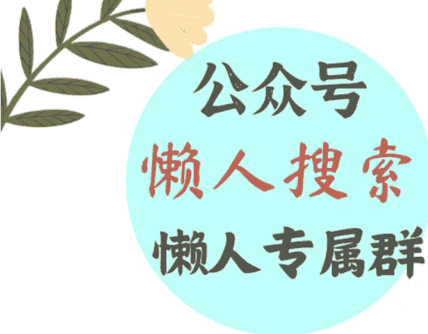
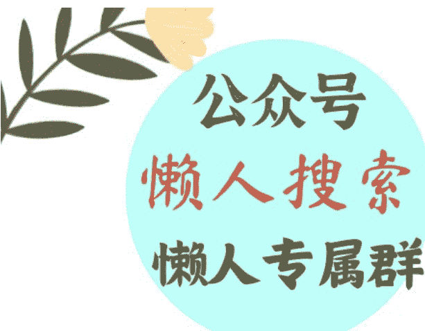

# 危险了!!

241223 守夜人总司令

整理：公众号懒人搜索，懒人专属群独享

懒人微信:lazyhelper




日本在 90 年代的时候，经济烈火烹油，所有人都对未来充满着乐观。当时日本的品牌在全世界都享有很高的声誉。公认的工匠精神更是被人奉为神圣的教条。整个日本社会都沉浸在一种对未来充满期待的美好想象之中。所有的个人行为，家庭规划和社会政策都基于这样的预期。

当时日本女性的地位达到了前所未有的巅峰——她们认为自己与母亲那代人完全不同，以极度反传统的姿态看待一切。随着产业的发展和教育的普及，越来越多的女性能参与到社会经济的分工协作之中，从而获得了一种她们的前辈们从未获得过的社会地位。然而，她们误判了形势，未能巩固这一地位，并构建出一种新型的社会关系，反而在极端反传统的激进行为中把好不容易得到的地位又全部还回去了。整个社会关系重新回到过往的结构之中!

任何社会的产能达到一定程度之后，困扰这个社会的核心问题就不再是生产力低下，而是消费严重不足，所以整个社会的就业会极度的依赖出口。当出口达到一定规模之后就必然会引发外部的冲突和反噬。每个社会到了这个阶段都会不遗余力的以梦想和自由的名义鼓吹消费主义，最先被消费主义观念俘获的自然是年轻的女性。

每个社会发展到了这个阶段，既需要女性参与劳动，更需要女性去扩大消费去消耗掉社会产能。这就是任何社会经历这个阶段时，女性地位都会突然升高的原因。如果你有女儿，需要教会她如何利用这种周期性的机会，去为自己创造一个更有利的生存环境，并与另一方去构建一种面向未来的稳定关系。而避免像一个翻身农奴一样，依然在旧的关系中撕扯和挣扎！

不管是个人、家庭、还是社会，最可怕的就是用往昔的经验和自欺欺人的想象去指导未来的生活。这种生存策略与生存现实的高度背离，是人间一切悲剧的开始！

当年日本的统治者在 80 年代基于乐观的预期，为 90 年代提前多准备了 15 万教师，以应对社会的婴儿潮。结果 90 年代没有迎来婴儿潮，随着产业发展和经济增速见顶，以及城市化区域稳定，人口反而大量萎缩。经济增长持续下滑，迫使当时的日本政府为了保就业创造增量，不得不负债搞各种各样的建设投资——甚至连海边防波堤坝都反复修好几次。这种投资的目的是为了保住就业来延缓经济下滑造成的社会问题。即便是官方通过负债来筹集资金，钱也只有这么多，用在了这个地方就不能用在那个地方。当资金被大量的用于创造就业岗位的投资方向，用于教育和医疗方面的资金，尤其是用于教育方面的资金都是为了甩包袱。

因为日本的教师是有编制的，有编制的老师无法随便解聘或者随便降薪。当时的日本首相提出了一种教育改革的方式。打着为了学生和素质教育的旗号，让短期合同聘用制的老师与有编制的老师一起竞争上岗。同时让学生打分来选择老师。当一些有编制的老师没有学生选择，属于闲置状态的时候，就会被调离岗位，调到一些非教学的打杂性的岗位上，让其受不了自动辞职。同时，加大学生和家长的投诉惩罚力度。那些只签了短期合同的老师，不得不小心翼翼的接受更多的加班和更低的薪水，以避免被学生和家长投诉。在短短的十年中，日本教师群体的抑郁率呈火箭式上升式增长，在 2005 年左右，所有教师有 30% 的人处于精神亚健康状态。有些人甚至不得不放弃这份职业，以更低收入的体力劳动去谋生。

为了降低全社会的教育支出成本，一系列改革，造成了更短的劳动合同和更惨烈的竞争，以及频繁的更换老师，造成了教学质量的持续下降。为了掩饰这种下降，官方以维护公平和降低孩子负担的名义，禁止公布成绩，并降低考试频次。家长们变得越来越愤怒，一方面不得不花更多的钱和精力去进行补习。另一方面则普遍性的迁怒于教师的不负责和不尽心。

社会舆论要求对教师进行更加严格的惩罚，以拯救教师群体的责任心。官方为了继续缩减开支同时平息众怒，只能顺着大家的思路把惩罚的门槛越降越低，把惩罚的力度越提越高。反正教师处于过剩状态，这种极限的压力只会加速让教师群体退出。

民众无法理解复杂的经济问题，只能把问题简单的归因到自己能够接触的末端节点身上。于是，家长们任何一点小事就开始投诉。学生也变得越来越藐视老师的权威，老师不得不小心翼翼的讨好学生和家长。此举只会造成局面螺旋下降的恶性循环!

那个时候甚至流行这样的剧情：某个黑社会成员，突然成为一所学校的老师，用他的权威和手段，让学生们服服贴贴，最后全班的成绩都迅速好转。这种剧情之所以会成为当时受欢迎的流行电影。是因为编剧故意迎合家长们的错误归因：认为这一切都是因为老师无能导致的！

民众是愚蠢的，对许多复杂问题的看法都极其肤浅，往往会试图用一种破坏的方式去求得一个良性的结果。在挫败感的怂恿下会越来越推崇完全不守规则的强力手段！正因为如此，任何制度下的统治者都能把自己的失误巧妙的转化为乌合之众彼此之间的相互憎恨。最后，所有的乌合之众在相互撕扯中还会本能的认为统治者跟自己一边！

请注意，我始终说的都是日本社会！




微信:lazyhelper

历史 3000 多份各类付费文章以及年费三千多的副业社群资源，见懒人专属群内部分享!

付费群，白嫖勿扰!

## 懒人专属群更新记录:

```
https://lazybook.fun/#/blog/record2
```