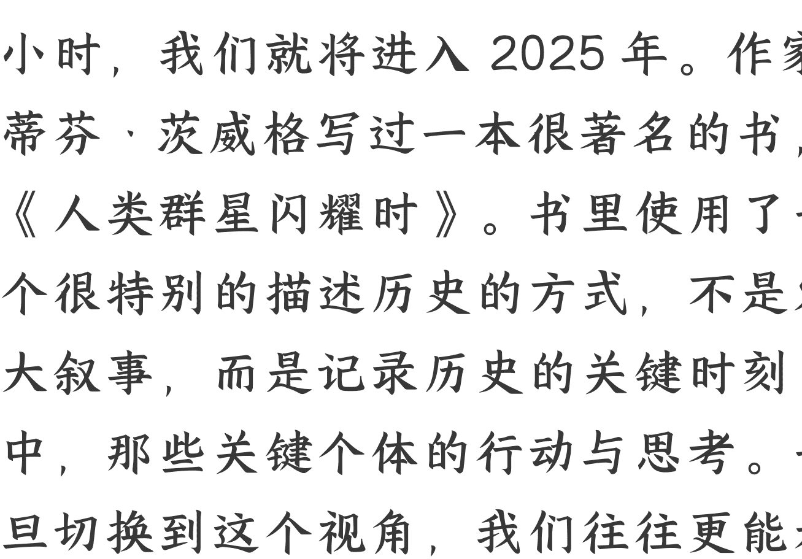
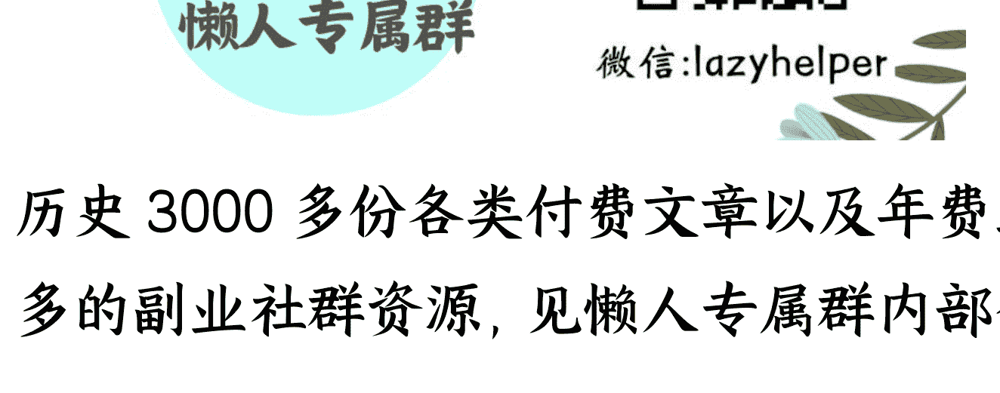

# 年终策划 · 致敬表达者：2024 年度演讲盘点

241230

整理：公众号懒人搜索，**懒人专属群**独享
懒人微信：lazyhelper

今天是 2024 年 12 月 30 日，再过 48 小时，我们将进入 2025 年。作家斯蒂芬·茨威格写过一本很著名的书，《人类群星闪耀时》。书里使用了一种很特别的描述历史的方式，不是宏大叙事，而是记录历史的关键时刻，以及那些关键个体的行动与思考。一旦切换到这个视角，我们往往更能看出，世界的运转与个人的行动之间，是怎么样彼此互动的。

今天，我们也借鉴这个方式回顾即将过去的 2024 年。咱们不看宏观的经济数据，也不谈赛道、行业、底层逻辑之类的抽象道理，而是看过去这一年，最值得回味的几场演讲。从中看那些正在思考的人，他们是怎样理解世界的计划？又怎样做出自己的计划？

好，咱们正式开始。

我们说第一场演讲，来自著名的心理学家、清远大学全球产业研究院院长，彭凯平老师。他参加了在上海举办的 TEDx，并且发表了演讲，主题是《培养预见优势与时间韧性》。

什么叫预见优势？这是人类心智的一个设计，放眼整个地球，只有人类能够对那些从未经历过的事做预测。

比如旅行，你可能从来没去过一个地方，但在你做计划的时候，你已经能感受到快乐。这就是你的心智在预先体验自己设想的未来。你可能从来没见过大海，但当你在想象航行的时候，就已经有了乘风破浪的豪情。没错，当你对未来起心动念的那一刻，你就已经在提前体验未来。

彭凯平老师说，从进化的角度，在任何特定时刻，增加我们人类幸存与繁衍的机会都完全存在于未来。即使是最简单的行为，比如目光追踪细微的变化，这在时间方面都是向前的，无法追回，并且假如此时此刻能够准确预订即将在那时那地发生的事情，那么这一目光向前、追随变化的能力，都会让人成功。

人的大脑还有一个奇特的设计，叫做默认模式网络。也就是说，即使我们不思考、不工作，大脑也依然在消耗能量，而且能耗不低。那么大脑在默认模式网络里做什么呢？是在加工过去的经历，把它们整理、重新编织，为我们的未来做服务。这是人类心智最大的优势之一。

彭凯老师还介绍了一项研究，那些喜欢谈论未来，计划未来的人，往往学习更好、不良习惯更少、爱锻炼、能存钱、能奋斗。年老的人，有病的人，受 করিতেছে的人，喜欢谈论过去。健康的人，年轻的人，富有的人，喜欢谈论未来。

因此，彭凯老师说，假如未来的巨变注定发生，那么作为我们，更应该了解，我们最缺乏的就是积极预见、模拟未来的能力。因此与其焦虑，不如将优势放到最大。

我们要说的第二场演讲，来自盖茨基金会的首席执行官，马克·苏斯曼，今年上半年在清华大学的演讲。在演讲中，苏斯曼讲了一个非常有趣的故事。

苏斯曼的故事关于南非，当地在城市的郊外建了一些学校。你也能够想象，这对贫困地区的孩子来说有多重要。接受教育，可是他们改变人生最重要的机会，尤其对女孩子来说，这个机会就更难得。但是，学校建好之后，女生们却不去学校。

为什么不去学校呢？居然是因为学校的厕所太差了。整个厕所非常简，经常堵塞，假如赶上上下雨，溢出的粪水就会涌进操场，教室里全是难闻的气味。连老师也不得不在课余时间去清理厕所。总之，一个学校，从学生到老师，都在跟厕所较劲。

后来，学校换了厕所，这个问题终于解决了。而这批新厕所，就是中国团队发明的。2020 年，南非的学校安装了中国团队设计的厕所，缺勤率下降了 80%。

你看，谁能想到，厕所跟教育会搭上边。发明厕所，居然能解决一群孩子的教育问题，进而改变他们的命运。

苏斯曼想通过这个故事说的是，尽管你能看到很多悲观的新闻，但回到行动这个层面，你可能自己都没有意识到，至少有一种万种方式，能让这个世界变得更好。

我们要说的第三场演讲，来自英伟达的创始人兼 CEO 黄仁勋。今年 6 月，黄仁勋在美国加州理工学院做了演讲。

在演讲中，黄仁勋讲了一个园丁的故事。这也是黄仁勋的启蒙故事，他在很多场合都讲过。

黄仁勋去年在日本，参观京都的一个花园。他发现花园里有个园丁，没错，整个花园就这一个园丁。只见这个人不紧不慢地薅着青苔，手上的工具是一把镊子。黄仁勋一看，这还得剪明年月去啊，照这个搞法能弄完吗？

注意，重点来了。园丁说，我已经照顾我的花园 25 年了，我有充足的时间。

黄仁勋想通过这个故事表达的是，假如你认定一份终身的事业，你不管干什么，心里都不会慌，因为你拥有的时间是无限的。借用黄仁勋的话说，就是找到你的 GPU，找到你的生成式 AI，找到你的英伟达。

具体到行动，黄仁勋给年轻人提过一个建议，不要戴手表。因为手表会让你关注时间的流逝，而假如你真的找到毕生的事业，你就不应该在意时间的流逝。

我们所说的第四场演讲，来自著名的职业生涯顾问，古典。12 月 28 日，古典老师发表了自己的 2024 年度演讲，主题是《创造小环境，自在做自己》。

做自己，这是古典老师连续两年的演讲关键词。那么，到底怎样算是做自己？为什么要做强迫做自己？

这源于古典老师的一个洞察，叫做奋斗叙事的崩塌。什么意思？过去我们经常把很多事跟奋斗挂钩，你成功是因为你奋斗，你幸运是因为你奋斗，你富有还是因为你奋斗。反过来，一切的不如意，都是因为不奋斗。奋斗就等于懒，不幸福就等于一直懒。

但是，这个奋斗叙事正在崩溃。

因为技术的进步，因为分工模式的优化，吃苦跟成功之间的确定性正在遭受挑战。你看，内卷说的不就是这个局面吗？大家明明使出了吃奶的力气，结果呢？付出与回报未必呈正比。

怎么办？古典老师的建议是，不要跟着这个世界给你定下的 KPI。我们需要找到自己面对的问题，解决自己的挑战。就像纳瓦尔说的，所谓履历，就是你经历过的痛苦的合集。你解决过的问题，就是你的成就的总和。

就像古典老师在去年的演讲里说的，当你真正做了一个选择，你就在自我实现。当你不断地、切实的解决各种吃喝拉撒糟的问题，你就是在自我实现。当你抛出一个深刻又长情的善意，你就是在自我实现。从别人的叙事里回来，从悲伤的腔调里回来，从屎感的流行里回来，从功能化的关系里回来。然后做你自己。

今年的精彩演讲还有很多，我们这一次不一一展开了。

回到今天的主题，今年有一本新书出版，书名是《生活之道》。这是加拿大著名的医生、教育家威廉·奥斯勒的演讲合集。威廉·奥斯勒也被称为现代医学之父，是活在 100 多年前的人。书里的演讲也都是 100 多年前的。其中最著名的一场演讲，

## 主题就叫《生活之道》

是奥斯勒 1913 年在耶鲁大学发表的。没错，是 111 年前了，当时还没有电视，听演讲的只有现场的闻观众。

看完了你能明显感觉到，100 多年前的演讲并没有什么特别高超的表达技巧，也没有什么巧妙的舞台设计，全凭演讲者胸中的一口真气。

尽管在这一 100 多年里演讲的技巧一直变化，传播的技术不断升级，但演讲的其中一个本质并没有变。这就是，始终凭心。大时代下的个体选择。就像奥斯勒在 1913 年的演讲中，引用苏格拉底哲学家卡莱尔的那句话，我们的优势不是辨明前方的远方，而是专注于清晰的眼前。

历史 3000 多份各类付费文章以及年费三千多的副业社群资源，见懒人专属群内部分享！

付费群，白嫖勿扰！

懒人专属群更新记录：
[https://lazybook.fun/#/blog/record2](https://lazybook.fun/#/blog/record2)

懒人微信: lazyhelper