# 懒人风向标

本精选风向标文档仅包括 风向标精选（241111-241217），完整的懒人风向标合集和《懒人副业周周刊》以及千份副业精华专栏见懒人专属群消息。


懒人专属群介绍：https://lazybook.fun/#/blog/group
专属群更新记录：https://lazybook.fun/#/blog/record2
懒人通才计划：https://lazybook.fun/#/data/13_course
懒人手册：https://lazybook.fun/#/
生财专栏：https://lazybook.fun/#/article/money_col
懒人博客：https://www.lazyblog.fun/

## 目录

- 懒人风向标
- 目录
- 【跨境出海】1篇
  - Reddit：高流量与高活跃度的营销推广平台
- 【AIGC】12篇
  - YouTube AI音乐账号纯音乐：快速崛起的爵士音乐变现策略
  - AI冰箱贴生意在小红书上的成功之道
  - Ai男性长相测评：Umax App的发现与信息差挖掘
  - AI助力女性成长：游戏化打卡模式的新探索
  - 海边沙滩写字服务：低成本定制与场景迁移
  - ComfyUI中使用Flux+Redux模型进行背景替换的新思路
  - AI音乐创作：通过YPP的原创内容策略
  - Kimi智能体：一键生成PPT，助力不擅长整理的用户
  - AI应用：圣诞老人给小朋友打电话并录屏惊喜反应
  - AI私人订制数字写真：通过AI建模制作专属模型进行线上写真订制
  - 柔性供应链与AI绘画：印掌门服饰的个性化制造与产权保护
  - AI自媒体账号推荐：裘裘笔记的短视频制作与变现策略
- 【需求挖掘】2篇
  - 新春倒计时账号：零成本年货生意指南
  - 春节前兼职项目：蛇年纪念币的低买高卖策略
- 【公众号】2篇
  - 上班挂着直播2小时，新增关注39，试了下这个“公众号涨粉”方法，百试百灵！
  - 5分钟预估公众号流量主收益的小技巧
- 【小红书】3篇
  - 小红书新模板助力博主快速涨粉
  - 中医与饰品的跨行业结合：抖音小红书涨粉新趋势
  - 独立女性成长视频笔记快速涨粉4万
- 【Youtube】2篇
  - 通过圣诞歌曲长视频和24h无人直播快速开通YPP
  - Youtube 工具
- 【跨境出海】1篇

## Reddit：高流量与高活跃度的营销推广平台

作者：老彭
日期：2024-12-13
点赞数：62

正文：

关于reddit：1、做出海的圈友一定不要忽略了reddit这个平台；2、reddit流量很大，月活高达4.3亿，而且用户的活跃度很高；3、reddit是个很好的营销推广平台；4、生财这方面的帖子比较少，比较稀缺，发帖拿精华帖概率更高（期待有相关贴子）；5、链接：https://www.reddit.com/

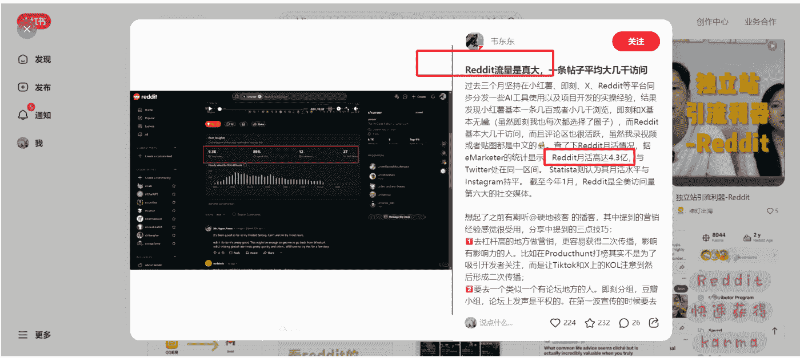

评论区：

rita：这个平台现在挺严的，动不动就封号
坤汀：中标，面包屑，reddit大家可以研究看看，花生做小猫补光灯，也是在reddit挖到的需求
知行：最近听ai类播客，很多app的启动流量也和发reddit的帖子强相关。

## 【AIGC】12篇

## YouTube AI音乐账号纯音乐：快速崛起的爵士音乐变现策略

作者：汤姆CC
日期：2024-12-09
点赞数：75

正文：

YouTube AI音乐账号【纯音乐】现象：这是YouTube上一个爵士音乐账号，这个账号是不到30天起来的，非常适合当对标账号。
变现：不到一个月就开通了收益(一个月62美刀-986美刀之间)，目前已经可以靠播放量来赚取收益。
操作：使用suno来制作这类音乐，然后通过ai生图制作美女打碟画面，然后生成视频，这里需要注意就是人物的一致性。最后剪辑在一起。
思考：
- 1. 根据爆款背后的心理，这个账号满足性暗示的爆款元素；2. 做这个还是需要对爵士音乐有所了解；3. 延展到其他纯音乐或者乐器音乐，比如从萨克斯延伸到口琴等等其他音乐器材；4. 另外也可以在国内平台试试，比如视频号可以做二胡。

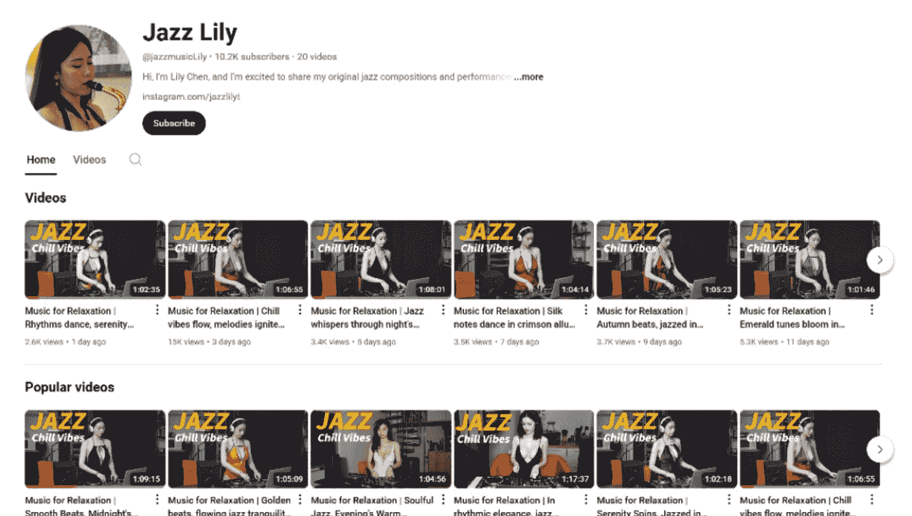
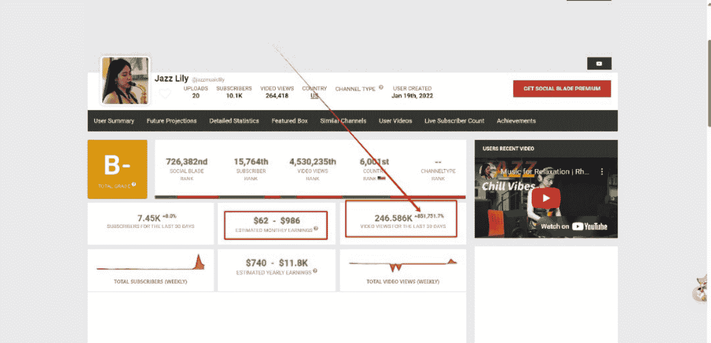

评论区：

嘉应岛主：回头试试Suno
汤姆CC：我试了一下，爵士音乐这种纯音乐可以生成😂，其他音乐类型你们探索一下
一票米范：人物的一致性有什么好的建议吗
汤姆CC：具体我也没啥好的建议，最好用comfyui吧
大河：这打碟的美女是真人吧？
汤姆CC：我看着不像😂，有一股ai味道
梁凉凉：请教一下，这个收益的这个从哪里看呢[抱拳]
汤姆CC：这个网站：
我前几天整理了个YouTube工具箱发在生财了，你也可以去看看，里面有很多有用的YouTube工具[呲牙]
https://socialblade.com/

## AI冰箱贴生意在小红书上的成功之道

作者：瓜斯
日期：2024-12-12
点赞数：53

正文：

最近发现AI上有一些做AI冰箱贴的设计。

这些博主的宣传方式特别简单，视频里是实打实地展示设计过程，连脸都不露，不搞什么花里胡哨的，就是产品实拍直接上怼。虽然内容看着不那么精致，但数据却出奇的好。为啥呢？因为评论区实在太热烈了！一条真实的评论压垮了评论平台，直接把流量算起来了。

而且这些博主都靠精准流量，你让她带明确需求来，全是带着明确需求来，可以说是“准客户”直接送上门。

我加了这些博主做得好，发现产品的单价很高，光是一张冰箱贴的设计（注意，还不包括物料打印），就要400-500块。

更夸张的是，这些博主愁客还得多找，想让他们定制排队还得多等好几天，是个供不应求的需求。

在操作方式上，简单的一些可以直接用Midjourney来生成，网上有很多制作教程，感兴趣的朋友可以搜索“怎么用AI做冰箱贴”了解。

公众号懒人搜索，懒人专属群分享
18:37 27
小墨
关注
茉
美哭了 @柳辞 08-18 回复
柳辞 这ai好真 08-18 回复
长白山吃huo 能设计么 08-17 回复
5A金属制做源头厂家直销 私 08-29 回复
冰箱贴源头厂家 😊😊😊 11-14 福建 回复
老虎🐯 求个咒语呀，宝子 11-14 浙江 回复
冰箱贴源头厂家 😊😊😊 11-08 回复
小红薯630DD846 请问怎么买😭好好看 10-28 回复
冰箱贴源头厂家 好好看😊😊😊 10-19 回复
冰箱贴源头厂家 好好看 10-14 回复
说点什么...
1105 699 79 No. 6 / 50

## 陈陈文创研究所
多多糯米 想约稿！怎么约呀 07-13 回复 作者赞过
小小 能找到 07-13 回复
落梵 原来是狼山啊...... 06-12 回复
陈陈文创研究所 作者 对吖对吖 06-12 回复
Demon 古茗的那个可以买了吗😭，喜欢这款😋 06-03 回复
陈陈文创研究所 作者 🥺🥺现在还没有上哦 06-04 回复
糖果不甜 好精美啊 真好看 在哪儿可以买到 05-31 回复
陈陈文创研究所 作者 得过段时间 05-31 回复
桃子 求约设计 dd 08-29 回复
陈陈文创研究所 作者 来啦 08-29 回复
说点什么...
737 255 104

11:58
你好，咱们这边做原创的冰箱贴，是什么样的流程和报价呀？

12:05
冰箱贴 500起，具体价格要看风格和具体复杂程度而定，流程是草图——线稿——上色。设计之前需要付一半定金。

了解～咱们这边能帮忙联系工厂做实物么？还是说只做设计稿呀

只设计

12:28
大概后天有档期。

No.8/50

## Ai男性长相测评：Umax App的发现与信息差挖掘

作者：知行
日期：2024-12-11
点赞数：40

正文：

AI男性长相测评，并套娃式分享3个信息差。首先说下，这个App怎么发现的：

- 1. AI产品创投内容：
  - 来源：这个是我之前看“亦仁收藏夹”发现的，一个AI类的公众号，见图1。里面已经有700多篇文章。
  - 挖掘方法：文章里经常不明说产品名，所以需要你根据透露的细节，用GPT或Perplexity让它搜索分析，它说的App是什么。
  - 收入预估：流量主1.5w + 公众号付费合集2w + 网站订阅1.7w = 5.2w收入。
- 2. AI男性长相测评：
  - 流量：前期通过Tiktok寻找KOL；后期通过大量大规模投放广告ASA；新用户如果想要测评，也是裂变流量的方法之一。
  - 产品：上传正面和侧面照片后，会对你的颜值进行各个方向的打分，见图5。然后会有一个颜值改善手册，其中手册里面会推荐护肤产品。如果你花了28元开通会员，还可以获得个性化建议。最开始好像只对男性，现在你可以选择性别，然后开始测评。
  - 利润预估：向Claude 3.5投喂了各种相关新闻和数据，得出的利润600w，见图8。
- 3. 长相评分测试：
  - 流量：现在去闲鱼搜索，或者小红书也经常看到对身材和长相的打分。这个网站是之前的解决方案，上述App也是AI慢慢替代原来解决方案的体现之一，也是我上周写过的一个风向标里分享的，大家也可以看看能不能挖掘出一些其他的有意思的AI产品。
  - 链接：https://blog.csdn.net/weixin_57953251/article/details/141129550 https://www.prettyscale.com/ https://wx.zsxq.com/group/1824528822/topic/4848282588482218

公众号懒人搜索，懒人专属群分享

## 投资实习所
以产品视角洞察趋势
605篇原创内容
视频号：投资实习所
已关注
发消息

#AIGC
#了不起的VC
## 作者精选
刚拿完Benchmark 1000万美金种...
AI 时代，一种新型创业公司形态即将到来
昨天
a16z 给一 5 人团队种子轮投了 4000 万美金，Stability AI 已实现 3 位数增长
星期四
用 AI 帮你减肥，17 岁高中生是如何做到 MR R 100 万美金的
12月4日
不到一年 3 轮 5000 万美金，AI+销售正在撬开 Salesforce 的护城河
11月28日
AI Agent 火到了 OS，种子轮数亿美金估值好像也正常了

而最近又一个 AI 套壳 App 工厂想复制这套模式，它 3 个月前才开始推产品，到现在已经上线了 6 个 App，其中一款产品的 MRR 已经做到 5 万美金了，比较有意思的是，这款产品又是一款类似我在上文中提到的 AI 美容产品……

全文共 2568 字
后续内容为付费会员专属，会员扫码登录直接阅读


## 订阅 Memo Pro

Memo（vcsmemo.com）是一个基于付费订阅模式的创投内容平台，已得到大量 VC、企业 CEO 以及高管的支持，我们希望帮助你捕捉最具价值的行业信号、过滤噪音（Signal,Not Noise）。

### 订阅 Memo Pro 你将获得：

- 1.解锁未来一年以及之前的所有会员专属内容
- 2.邮件订阅功能：付费内容+最新行业快讯+...
- 3.优先体验 Memo 新产品和新功能
- 4.后台回复“发票”获得开票入口


### 订阅年度会员
¥799 / year
访问Memo所有付费文章
订阅
您将订阅的Memo会员为虚拟商品，购买后不支持退订、转让，请斟酌确认

> "最近又一个 AI 套壳 App 工厂想复制这套模式，它3个月前才开始推产品，到现在已经上线了6个 App，其中一款产品的 MRR 已经做到5万美金了，比较有意思的是，这款产品又是一款类似我在上文中提到的 AI 美容产品

请问这个产品/网站是什么？一定要具体到网站地址发给我。"

已搜索 4 个网站

根据搜索结果，这款产品是一款以 AI 为驱动的美容应用，名为 Umax，主要面向男性用户。用户只需上传正面和侧面的脸部照片，应用即可生成外观评分并提供个性化美容和风格建议，例如如何改善皮肤等。这款产品由一位 23 岁的开发者创建，在短时间内实现了快速增长，目前月经常性收入（MRR）已达到 5 万美元【7】【8】。

如果需要更多关于该产品的信息，可以访问其官网：Umax 应用页面 或相关的新闻报道进行了解【7】。

### Ratings
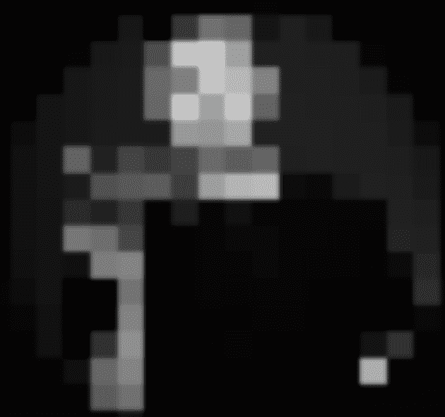

| Overall | Potential |
| :--- | :--- |
| 84 | 90 |

| Masculinity | Skin Quality |
| :--- | :--- |
| 82 | 82 |

| Jawline | Cheekbones |
| :--- | :--- |
| 88 | 82 |

umax
Save
Share

### Your glow-up routine

### Recommended Hair Styles
- 1. Short to medium length
- 2. Side partings
- 3. Soft edges and layers
- 4. Avoid too much height on top

### Recommended Beard Styles
- 1. Short or medium stubble
- 2. Avoid long beards that lengthen the face
- 3. Full but well-trimmed beards to add width

### Products for you
Based Bodyworks

### LEVEL UP
Proven to help you max your looks.

### Improvement coach
What’s up! I’m your personal self improvement coach. What are you looking to learn?

How do I become more attractive?
Becoming more attractive includes a few different steps. You can start by...
1,000,000 scans completed
Unlock now 🙌
$3.99 per week
Terms of Use
Restore Purchase
Privacy Policy

### 评论区：

优嘉：很有启发！信息挖掘的能力在这里具象体现了！过去我们挖掘信息，可能还需要通过渠道搜索，现在可以利用AI，透过细节，挖掘到更多的信息。效率也更高！
知行：对的[呲牙][呲牙][呲牙]，穷中生智
坤汀：中标，很不错的项目挖掘方法论的分享，里面有提到自己是怎么一步一步挖掘到的
No. 14 / 50

## AI助力女性成长：游戏化打卡模式的新探索

作者：老彭
日期：2024-12-13
点赞数：56

正文：

发掘到一个AI应用的新方向，这个账号把女性成长和游戏打卡的模式结合起来，借助女主的身份完成沉浸式自我提升，让打卡这件事变得更加美好真实。

- 1. 目前App采用的是会员制收费方式，首月8.8，续费16.8，收费不高相当于一杯奶茶钱。在小红书分享可以免费领取体验版会员。
- 2. App内带有各种外链，比如B站帕梅拉训练等等，还有各种任务完成后的奖励机制，正向反馈很直接。
- 3. 试玩了一下挺不错的，有种寓教于乐的感觉，仿佛自己就变成了小说主角……降低了打卡的门槛。
- 4. 拓展一下思路，可以把正在小红书流行的打卡模式用AI再做一遍，比如读书打卡App，减肥打卡App等等，结合小红书痛点做推广，相信一样会有市场。

## 大女主 App，我来为大家开会员了

App：大女主成长打卡，把自己养成理想型大女主的自律打卡App。

我来为大家开会员（体验版），大家发布使用截图（至少 3 张）+使用体验的帖子，并注明 #大女主成长打卡 App 后来私信我你的大女主成长打卡 App 账号即可。每个 ID 可以领取一次。

在这里，你可以把自己当成理想型大女主去养，有野心家/学霸/卷王/黑莲花/辣妹/爱豆...每天系统自动派发任务，完成就有奖励，还能收到贴心喵管家的回信～

也可以自建任务，还可以直接问 AI。

随着属性提升，你将解锁主角能力挑战！

30 多个挑战，【课题分离】，【主动出击】，【独立思考】...，每完成一个，就能获得一个能力勋章，你的大女主成长之路从未如此明确！

属性提升还可以触发各种小剧场，模拟现实场把人生当成一个游戏，在榜样的激励下，建立正确的认知框架，每天完成自己的主线任务，来实现主角的逆袭吧！

## 【连续包月会员自动续费订阅说明】
- 1.订阅服务：1个月会员服务
- 2.订阅价格：首月8.8元，之后16.8元/月
- 3.自动续费：购买连续包月会员的帐号，会在每个月到期前24小时，自动在iTunes账户扣费并延长1个月会员有效期。
- 4.关闭服务：如需取消订阅，请手动打开iOS的“设置”->点击“Apple ID”，进入"账户设置"页面，点击“订阅”，选择大女主成长打卡连续包月会员自动续费取消订阅即可。如未在订阅期结束的至少24小时前关闭订阅，此订阅将会自动续订。
- 5.服务协议：https://reset-life.rrfenwo.com/api/protocol/9
- 6.隐私协议：https://reset-life.rrfenwo.com/api/protocol/8

Shanghai Duimi Internet & Technology Co., Ltd.
开发者

## 评分及评论
查看全部

## 版本历史记录
- **1.2.0**（7个月前）：
  - 增加金币奖品商城，女主可以为自己设置更多样的心愿兑换
  - 增加成就挑战及广场更多
- **1.1.0**（9个月前）：基于各位女主的反馈，本次更新如下：
  - 各位女主可以创建自己独特的每日任务，可以重新编辑已完成任务，删除不合适的任务，从而更多
- **1.0.4**（10个月前）：紧急修复一个用户体验性问题
- **1.0.3**（10个月前）：加入账户系统，优化用户体验
- **1.0.2**（11个月前）：优化用户体验
- **1.0.1**（11个月前）：修复已知问题
- **1.0.0**（11个月前）

**任务界面摘录：**
- 今日：36 | 长期：习惯 | 日期：12/13
- 重启人生计划第1天
- 任务列表 | 查看目标 | 主角能力
- 主线：每日早上7点前起床（自信+1，健康+1，认知+1，金币+2）
- 主线：主动向上社交（-心机|如何“主动”…自信+1，专业+1，金币+2）
- 主线：给自己写一份感谢信（自信+1，认知+1，金币+2）
- 主线：请阅读书籍-实用到爆炸💥让你的…（自信+1，认知+1，金币+2）
- 主线：构建认知框架-她可能是最彪悍的女人（自信+1，认知+1，金币+2）
- 主线：存钱钞能力（+90 自信+90，金币+1000）
- 饮食调理控制
首页 | 任务 | 心得 | 我的

**评论区：**
- **龙**：这个开篇好上头，好经典的小说开头[旺柴]
- **五阿哥**：属于女性的一款微熏软件
- **坤汀**：这思路确实有意思，个人成长+游戏打卡，年底了，很多人明年会定个人目标，切一个人群场景，用这样的方式，用cursor做一款应用出来，去xhs营销营销。

## 海边沙滩写字服务：低成本定制与场景迁移
**作者**：飞掌柜
**日期**：2024-12-06
**点赞数**：35

### 正文：
某宝上有很多海边沙滩写字的店铺，成本基本上在30块以内，简单的几块钱，复杂的十几块钱，用即梦AI是可以完成的，效果很逼真～让不在海边的伙伴有了赚钱的渠道，哈哈哈，同理，还能迁移到其他写字定制的场景，比如森林里、热气球上等。


### 评论区：
- **萱萱**：又学到了
- **黛比**：即梦已经是可以准确生成中文文字了嘛？
- **飞掌柜**：字数少可以的，太多了不行
- **若尘**：试了下，没有达到预期，不知道是不是我提示词有问题
- **飞掌柜**：换一下提示词试一试，我自己生成了，见图
- **若尘**：好呢

## ComfyUI中使用Flux+Redux模型进行背景替换的新思路
**作者**：嘟嘟MD
**日期**：2024-12-04
**点赞数**：29

[ComfyUI]Flux+Redux换背景新思路 大家好,我是专注研究ComfyUI的嘟嘟 今天继续分享 ComfyUI干货。Redux这个模型用途很多,继续来测试用来换背景。整体测试下来发现效果比用IPadapter要好，所以值得大家继续挖掘，下面是我今天的测试拆解。教程移步飞书：先来看几张效果图，左一是背景图，左二是需要换背景的人物图，左三是首次替换后的图，右一是放大1.4倍顺便做了自动调色的。
https://qnc80j2zlx.feishu.cn/docx/LhNQdqaKXoQ8iZxCKTocFtsrnv9?from=from_copylink

> **坤汀**：新的插件测评,效果也不错,可以把人物和背景图结合起来

公众号懒人搜索,懒人专属群分享

## AI音乐创作:通过YPP的原创内容策略
**作者**：书情小跟班
**日期**：2024-12-12
**点赞数**：31

做AI过不了YPP的圈友可考虑AI音乐,这个频道已经通过YPP,地址从身边的案例来说,如果做的AI视频跟YouTube现有的视频很类似,有可能会被提醒原创不足,如图三。但是同样的,确实是用AI做,但是内容是自己原创的,也是有机会过YPP的,昨晚就帮一个圈友过了一过填写美国税单,一个小细节,Manage tax info管理税务信息 在2/2,如没注意,一开始还就不知道从哪里入口,如图四。
https://www.youtube.com/@MonkeyKoala-EOJ/videos

公众号懒人搜索,懒人专属群分享

## Kimi智能体：一键生成PPT，助力不擅长整理的用户
**作者**：平子
**日期**：2024-12-11
**点赞数**：31

### 正文：
#风向标 kimi官方出的智能体，kimi+aippt，对不擅长整理ppt的挺友好。 丢一些文件给kimi直接总结，然后就一键生成ppt了
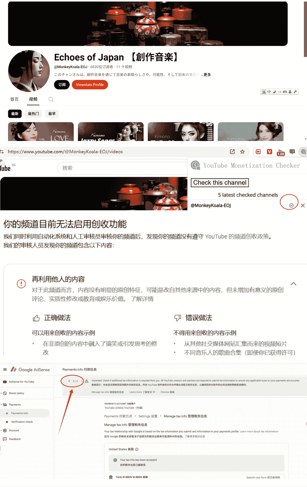

### 评论区：
- **坤汀**：中标,这个功能用起来,太让人aha了!要做ppt的朋友们别犹豫了
- **老彭**：来个链接
- **平子**：就在kimi里面,在电脑版。找左侧有个智能体商店

> 公众号懒人搜索,懒人专属群分享

## AI应用:圣诞老人给小朋友打电话并录屏惊喜反应
**作者**：周大壮儿
**日期**：2024-12-13
**点赞数**：34

### 正文：
AI 应用,圣诞老人给小朋友打电话,同时录屏当事人的惊喜反应。

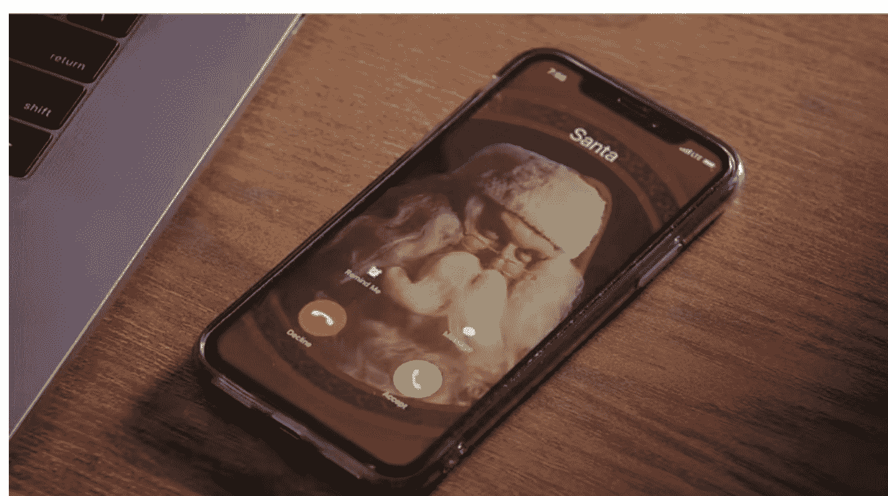

让圣诞老人给你电话的APP，月狂赚10万美金
哈哈哈 这款APP确实是靠创意和才华在赚钱。我服!
输入你的信息，让圣诞老人给你打视频。
孩子们都乐疯了!
能让娃们疯狂喜欢的东西，对于家长意味着什么?——掏钱
可以学习他们的marketing策略——教科书级别的短视频format: 下半屏幕是APP使用的录屏，上半部分是用户使用的反应。图3。
可以看到孩子们的兴奋和期待。
这种录屏+用户反应的短视频格式有很多爆款。他们主账号在tiktok，有7个inst的账号。还有很多合作的视频博主营销。
最火的视频(图三) 有99.8万 播放 // 7万 赞 // 300 评论 // 7K收藏。

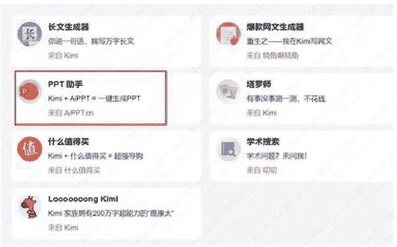


### 评论区：
- **老彭**：图2是什么工具网站？这个有价值，建议补充进来
- **周大壮儿**：原帖没提到，有没有懂的朋友补充下
- **平子**：搜call santa claus确实能搜到好多

公众号懒人搜索，懒人专属群分享

| 分类 | 娱乐 | 价格 | 免费 | Top Countries / Regions | 墨西哥, 阿根廷, 法国 |
|---|---|---|---|---|---|
| 安装范围 | 10M - 50M | 开发者网站 | From Santa's Elves at UGroupMedia Inc | 内容评级 | Everyone |
| 全球下载量（上月） | 600K | 全球收入（上月） | $100K | 美国分类排名（今日） | #119 Entertainment - Downloads |
| 版本详情 | 描述 |
|---|---|
| Current Version: 11.0.23 | Short Description: Simulate Santa calls, video calls, and videos with Portable North Pole |
| Last Updated: 2024/12/05 | |
| Publisher Country: Canada | Description: 📞 Call Santa Claus with Portable North Pole |
| Country Release Date: 2014/12/05 | Experience the magic of |

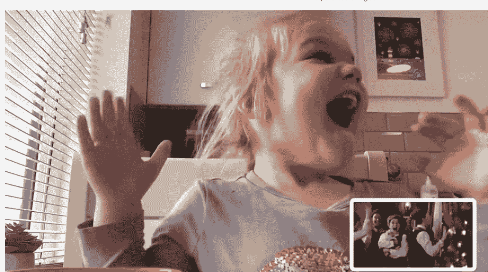

公众号懒人搜索，懒人专属群分享

## AI私人订制数字写真：通过AI建模制作专属模型进行线上写真订制
**作者**：虎牙
**日期**：2024-12-11
**点赞数**：25

### 正文：
AI私人订制数字写真 通过ai建模制作专属模型进行线上写真订制 一套收费600 仅需要自拍即可生成。
原价1000一套的。
新人体验价（每人限购一次）：600/套/一种风格。出30张左右的图给你选择。最终给您5张精修的照片（底片不送的）。充会员有更多优惠呢🧸。

公众号懒人搜索，懒人专属群分享
22:41 66
帝帝雅 Didiya (桠未)
设计服务公司 | 小红书号：500860556
IP 属地：浙江
- I'm Didiya, an AIGC creator.
- 数字视频 @桠未 Didiya
- 数字写真
- 只需自拍
- 私人订制
- 116 关注 | 2.7万 粉丝 | 17.2万 获赞与收藏
去咨询 | 关注
- AI照片打卡 | AI视频打卡 | Didiya ...
群聊 查看详情
- 笔记 | 收藏
- D J D J y


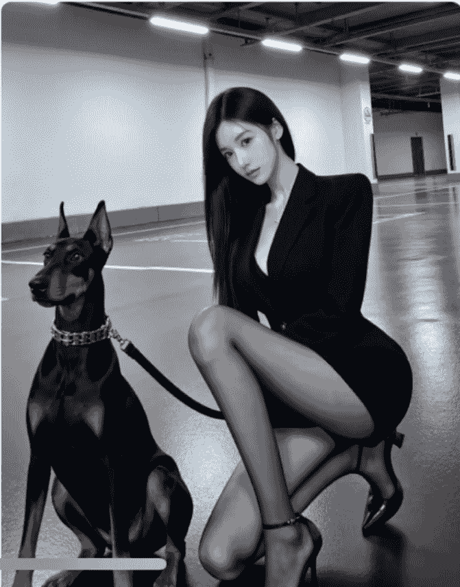
No. 27 / 50

公众号懒人搜索，懒人专属群分享
昨天 23:28 2/9

❄️ 或许今年冬天更值得期待呢 ❄️
赞 | 评论 | 详情 >

META DDYA
数字形象设计是通过AI建模制作一个你的专属模型，并非所谓的一键换脸，通过AI你可以控制你的发型，发色，身高，肤色，衣服，场景等进行线上写真定制，即使是本人没有时间亲自到场，也可以拥有你的专属写真集。

要求：
准备高清脸部照片，自拍，他拍等也可以，面部特写10张以上，图片要求清晰，五官端正，面部没有装饰或手指挡住脸。到店拍摄单独收取拍摄费用，相机拍摄的像素高出图效果最佳，想要还原度高尽量妆面统一，

整体流程：
- 1.发送符合要求的图片（发图时点击发送原图）
- 2.确定风格
- 3.沟通要求以及想法
- 4.交易付款

注：
不是换脸！每一张都是全新的照片！


Making Art Infinitely Possible, Unleashing Boundl

### 评论区：
- **表弟 FR**：谁有技术
- **王杰**：有技术的可以链接一下
- **胖大魔**：圈友，很多人有技术啊。你们搜一下不就好了[旺柴]
- **坤汀**：中标，对于从事摄影行业的圈友可以看看，用ai做赋能。消费者需求很明确，就是要好看的照片、视频，失真点甚至都无所谓，【女人爱美】核心需求

公众号懒人搜索，懒人专属群分享

## 柔性供应链与AI绘画：印掌门服饰的个性化制造与产权保护
**作者**：嘉应岛主
**日期**：2024-12-09
**点赞数**：20

### 正文：
前天组团去了广州一家服装柔性供应链——印掌门服饰（希音供应链之一），跟厂家和AI领域工作的小伙伴参观探讨了关于柔性制造是什么?AI绘画发展趋势?
前者举例来说，柔性供应链其实在于70%标准化+30%个性化。
白云区太源有至少2000家工厂，20万件版型，一天有50万件服装的吞吐量。基于这样的产业链，选择确定的版形的情况下，个性化定制在广州2～3天可以出来，重要的是是否搞定了服装的平面设计，再到效果图，再到印刷板块，非常高效可以凭借AI生成一张图就可以做出一件衣服。
...

### 评论区：
- **三笙**：纠正下是大源，不是太源
- **黄凯**：岛主您好，关于服装图片保护产权，作品上链，以及溯源芯片这块，我有些问题，方便跟您请教吗？[抱拳][抱拳][抱拳]
- **嘉应岛主**：可以
- **嘉应岛主**：是的
- **坤汀**：中标，ai赋能传统的POD工厂，比我们想象中变革的更快一些。算是一个面包屑，信息源，对这块感兴趣的圈友也可以挖挖看
- **杨永**：实名不推荐指纹科技
- **良辰美**：有其他平台推荐的吗，我最近用这个发现质量确实差速度确实慢，但是他们erp平台做的很完善，8Ding有点贵，sds少产品，其他国外的更贵。感觉明年可以自己找个工厂自主合作了

公众号懒人搜索，懒人专属群分享

## AI自媒体账号推荐：裘裘笔记的短视频制作与变现策略
**作者**：老彭
**日期**：2024-12-10
**点赞数**：20

### 正文：
AI自媒体对标账号推荐：裘裘笔记
1、视频制作难度还行：20~30秒的短视频
——新手难点可能是“如何保持不同场景的角色一致性”：①一张图反复重绘，②可以截图之后反推描述词，综合四条描述词叠加背景描述，多次抽卡调整描述词，局部重绘，基本上能还原形象
2、6条视频涨粉600粉，距离千粉开商单就差一条爆款
3、从评论区获取的信息：虽然作者有剪辑经验，但还是新手不敢收徒
4、从评论区来看，已有人咨询接商单收徒的活，而且内容定位也是做的广告短片，后续变现还是挺可观的
5、使用到的ai工具：midjourney，Runway、可灵、pika、elevenlabs（配音）

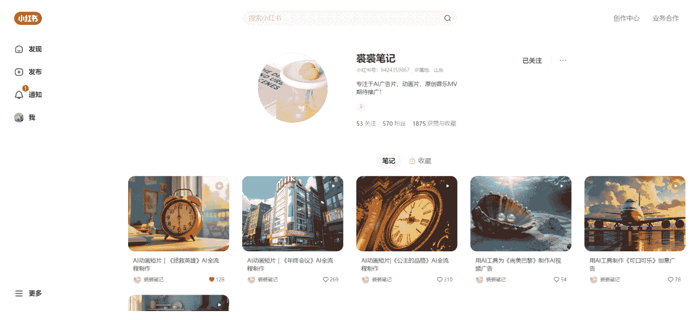

## 【需求挖掘】2篇

## 新春倒计时账号：零成本年货生意指南
**作者**：生财好物选品官-婧婧
**日期**：2024-12-09
**点赞数**：89

### 正文：
距离2025过年还50天左右 最近一个月做以下这个内容，流量会很好，看了将近50个账号，制作简单，起号快，不需要粉丝，变现也快，最快的第三个视频就爆发变现了。
年前这30天做一个【新春倒计时】账号把年货挂橱窗进行变现，具体内容可参考抖音和视频号已有的账号【搜新春/倒计时/新年等关键词】。
大号能出几千单，小号一周也能出几十单 tips:视频号比抖音更好出单 【抖音几十万粉丝账号出一两千单，视频号这个内容做的好新号直接出千单】 具体案例参考。
图一【直接开播挂橱窗，场馆3500售出1357单】，此时此刻正在直播
图二，新号，拍摄真人拿着年货一个姿势一个镜头摆拍，第13条视频就爆量了，目前一共37条视频，有5条播放键很好，根据点赞评加起来预估在百万播放量，但带货3万件【不确定是否有之前的累计】
图三，新号，和前面类似的名字，第4条视频就小爆了，目前20条视频带货116件【从这个可以看出对比抖音视频号的确更容易出单】
路径:
- 1 在抖，视，小之类的公域平台，注册账号，改成相关名称【喜洋洋】【新春倒计时】【2025过年】等
- 2 参考对标账号下载模板，发布新春倒计时，上下为时间，中间视频为过年会做的内容【包饺子，包汤圆，放鞭炮，真人拿着年货直拍等】
- 3 变现，挂橱窗，直接在平台找对应的【年货】品，【春联】【红包】【地毯】等，如果某条播放量爆了，立刻开播
- 4 注意参考对标账号，去重视频，最好能4个号起发
- 5 预计收益1000+

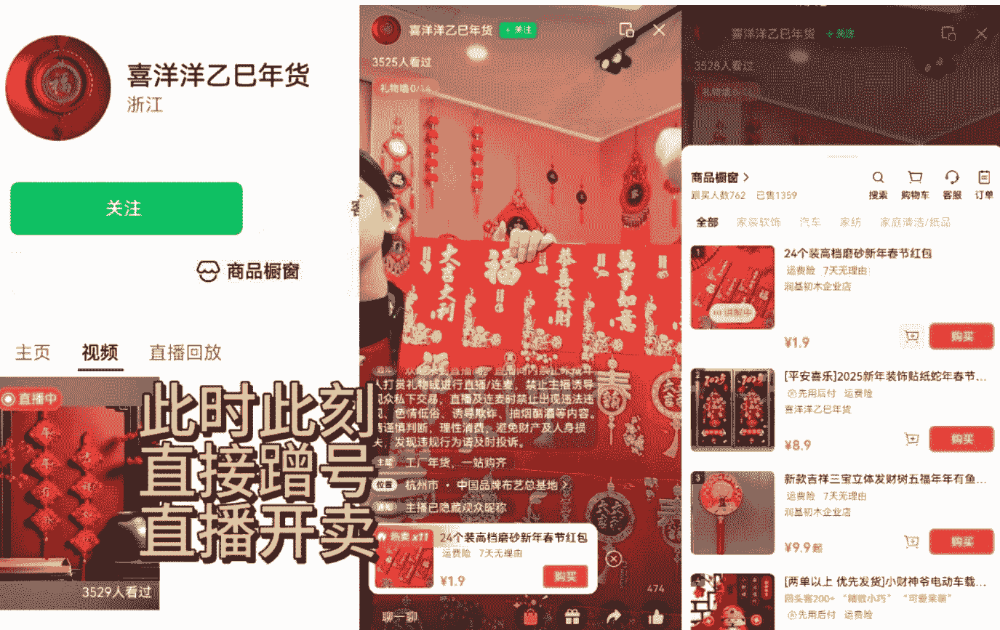
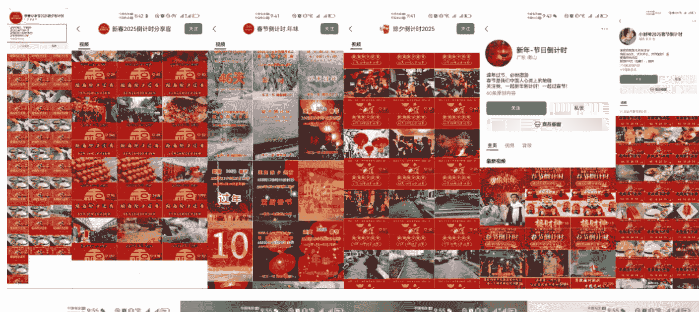
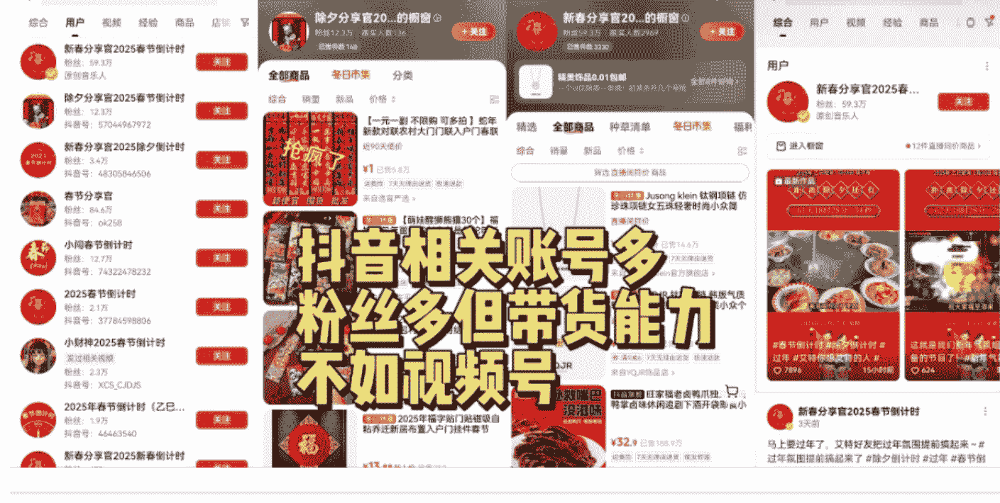

### 评论区：
- **坤汀**：中标，节日性热点，趋势是对的，具体账号销量还得考究
- **谬误**：上一年就跟过，供应链有点难度
- **晋四喜**：视频号稳定红包年货供应链，截图中有我们的品[偷笑]
- **生财好物选品官-婧婧**：可以去官方和1688看看，今年挺多直挂的[玫瑰]
- **生财好物选品官-婧婧**：

## 春节前兼职项目：蛇年纪念币的低买高卖策略
**作者**：阿兜
**日期**：2024-12-13
**点赞数**：21

### 正文：
[福] 蛇钞的市场热度还是比较高的，很多人买来自己收藏或春节送礼，今年发行量共 1 亿，比去年龙年还少了 2 千万。
一套 20 张，每张 20 元，目前行情 35-50 元/张，每套大概 300-600 左右的利润，一人可代领 5 套，加上自己共 6 套，也就是 3600 利润。如果做低买高卖，空间就大了。
1. **预约兑换**：每人最多可预约 20 枚。预约时需要填写姓名、身份证、手机号等信息，提交后需通过审核才能成功预约，可以找家人朋友的身份证，一人可代领 5 套，一共 6 套。预约时间为 12 月 23 日 -12 月 24 日，兑换时间为 1 月 3 日至 1 月 9 日。在预约成功后，可以在兑换时间内前往银行兑换蛇钞。线上预约渠道：工商银行、农业银行、建设银行、中国银行等银行官网或手机银行 APP ，进入贵金属纪念币 or 纪念钞相关页面预约。（每个地区的银行都不一样，可以关注下银行公告）
2. **低价回收**：主要通过小红书、闲鱼低价回收纪念币，看到很多打着大学生兼职的帖子来做回收，热度挺高的，低粉账号能快速拉满 2 个 500 人的群。
3. **高价卖出**：很多人加钱收来自己收藏或者送人，看了下闲鱼，需求量还是挺高的。 [让我看看] 感兴趣的圈友可以试试~

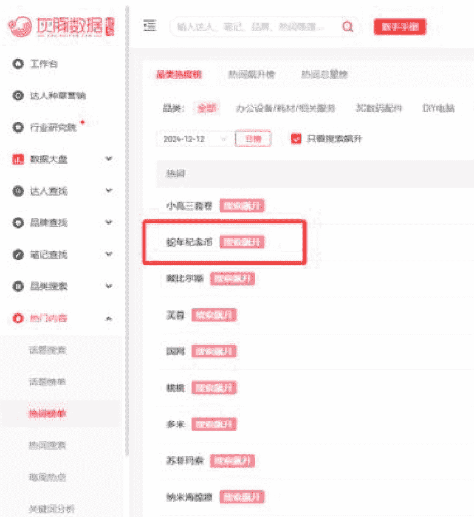

| 日期 | 时间 | 参考价(元) |
|---|---|---|
| 分享 | | |
| 2024-12-06 | 09:52 | 15.5 |
| 2024-12-05 | 13:49 | 15.5 |
| 2024-12-04 | 13:55 | 15.5 |

听说今年没有蛇钞，只有蛇币🥶🥶

## 蛇年大吉 ♻️ 2️⃣(499)

社会主义接班人 查看群主页 >

## 群介绍

第一个群满啦，及时提醒预约，以及预约流程技巧，网点信息，预约入口

- 为维护小红书良好社区氛围，请遵守《小红书社区规范》
- 如群聊疑似违规，可点击举报群聊

立即加入

## 2025年贺岁双色铜合金纪念币和纪念钞分配数量

| 地区 | 分配数量（万枚、万张）2025年贺岁双色铜合金纪念币 | 2025年贺岁纪念钞 |
|---|---|---|
| 北京市 | 619 | 618 |
| 天津市 | 288 | 288 |
| 河北省 | 510 | 510 |
| 山西省 | 354 | 354 |
| 内蒙古自治区 | 410 | 410 |
| 辽宁省 | 744 | 744 |
| 吉林省 | 414 | 414 |
| 黑龙江省 | 414 | 414 |
| 上海市 | 632 | 632 |
| 江苏省 | 572 | 572 |
| 浙江省 | 476 | 476 |
| 安徽省 | 250 | 250 |
| 福建省 | 188 | 188 |
| 江西省 | 170 | 170 |
| 山东省 | 746 | 746 |
| 河南省 | 362 | 362 |
| 湖北省 | 272 | 272 |
| 湖南省 | 218 | 218 |
| 广东省 | 856 | 856 |
| 深圳市 | 106 | 106 |
| 广西壮族自治区 | 182 | 182 |
| 海南省 | 40 | 40 |
| 四川省 | 244 | 244 |
| 贵州省 | 88 | 88 |
| 云南省 | 118 | 118 |
| 西藏自治区 | 8 | 8 |
| 重庆市 | 104 | 104 |
| 陕西省 | 210 | 210 |
| 甘肃省 | 134 | 134 |
| 青海省 | 60 | 60 |
| 宁夏回族自治区 | 98 | 98 |
| 新疆维吾尔自治区 | 112 | 112 |
| 留存历史货币档案 | 1 | 2 |
| 合计 | 10000 | 10000 |

- 注：1.表中广东省数量不包括深圳市的数量。
- 注：2.中国人民银行在每次发行新币时，均在发行库中留存一定数量，作为实物档案，供未来货币研究使用，这部分货币称为留存历史货币档案。
- 注：3.中国人民银行可能根据各地预约情况对各省、自治区、直辖市的分配数量进行调整，调整结果将另行公布。

## 🔥央妈发行2025蛇年生肖纪念币蛇年纪念钞

## ‼️重要通知 央行发行公告

🇨🇳中国人民银行正式发行2025蛇年生肖纪念币，蛇年贺岁生肖纪念钞，定于12月23日22点00准时

## 中国人民银行公告〔2024〕第18号

字号 大 中 小 文章来源：货币金银局 2024-12-09 09:00:00 打印本页 关闭窗口

中国人民银行定于2024年12月16日起陆续发行2025年贺岁纪念币和纪念钞，其中双色铜合金纪念币1枚，纪念钞1张，金质纪念币1枚，银质纪念币1枚，均为中华人民共和国法定货币。

### 一、双色铜合金纪念币和纪念钞

#### （一）双色铜合金纪念币和纪念钞图案（附件1）。

##### 1. 正面图案。

双色铜合金纪念币正面图案为“中国人民银行”、“10元”字样，汉语拼音字母“SHIYUAN”及年号“2025”，底纹衬以团花图案。

纪念钞正面主景为蛇的造型图案，上方为中华人民共和国国徽、“中国人民银行”、篆书“蛇”字印章，下方依次为光彩光变面额数字“20”与汉字“贰拾圆”、动感全息图案、透明视窗、盲文面额标记和冠字号码。

##### 2. 背面图案。

双色铜合金纪念币背面图案为中国传统剪纸艺术与装饰年画元素相结合的蛇形象，衬以花灯和人参图案，币面左侧刊“乙巳”字样。

纪念钞背面主景为儿童贴春联图案，辅以山西民居装饰图案，上方为面额数字“20”、汉语拼音字母“YUAN”，下方为花卉与动感全息图案、年号“2025年”、行长章、面额数字“20”、“中国人民银行”汉语拼音和蒙、藏、维、壮四种民族文字的“中国人民银行贰拾圆”字样。

#### （二）双色铜合金纪念币和纪念钞面额、规格、材质及发行数量。

双色铜合金纪念币面额10元，直径27毫米，材质为双色铜合金，发行数量为1亿枚（含留存历史货币档案1万枚）。

纪念钞面额20元，票面长145毫米，宽70毫米，采用塑料材质，发行数量为1亿张（含留存历史货币档案2万张）。

各省、自治区、直辖市双色铜合金纪念币和纪念钞分配数量见附件2。

#### （三）发行方式。

双色铜合金纪念币和纪念钞采取预约兑换方式发行。具体发行工作安排见附件3。

#### （四）双色铜合金纪念币和纪念钞公众防伪特征见附件4。

## 群公告

新进群的朋友们大家好
【有预约信息我会第一时间发到群里】

- 包括:官方公告、网点信息、余量入口、预约教程等等
- 🌟预约到了可以找我回收。同时也会更新一些蛇钞相关的项目给大家赚零花钱的机会!感谢信任!
- 🌟蛇钞玩法简介:找朋友家人身份信息预约,一人可代领5套,加上自己的一共6套。领取需要身份证原件,一套为20张,每张20元。目前期货行情35-40元每张,一个身份证挣300以上。
- 🌟群内🈲互加,私加被骗群主不负责。有私加的我联系我,举报有奖

这个是回收兼职群的公告

实际市场价已经到了50/张

仅群主及群管理员可编辑

公众号懒人搜索，懒人专属群分享

16:26 | 58%

搜索你要的宝贝

精选小达人 鱼小铺 L4
25分钟前来过 | 南京
+ 关注

¥445  ¥698 包邮
全新
975人想要 | 9059浏览

闲鱼交易须知 买前了解退货规则，保障你的交易权益
描述不符包邮退 · 24小时发货

### 【出售也回购】 #2025蛇年建行生肖金钞

规格：0.6g金；全新未拆封-
保真，银行渠道货源，假一罚十

此次蛇年生肖发行2种版本（0.6g标准版/5g珍藏版）🔥

官方发行价698元，目前统一售价445元，都是原封未拆，适合春节送礼。很有纪念价值意义，送人和自留都是无二的选择。

欢迎各位老板前来了解

～同时也回购各种生肖的纪念金钞～

包邮安全快速到手。预计本月18号陆续发货

445/套。

| 品牌 | 成色 | 购买渠道 | 重量 |
|---|---|---|---|
| 建行 | 全新 | 其他线下渠道 | 10g及以下 |


76 | 78 | 聊一聊 | 立即购买

评论区：
- 老彭：举一反三，关于春节前、圣诞节、跨年的选品，大家可以重新发一次了！

公众号懒人搜索，懒人专属群分享

## 【公众号】2篇

### 上班挂着直播2小时，新增关注39，试了下这个“公众号涨粉”方法，百试百灵！

作者：阿兜
日期：2024-12-12
点赞数：94

正文：
看到一个公众号大佬说：相比去年很火的视频号直播涨粉，今年有一些变动，但操作都很简单，适合新手。
1. 视频号关联公众号
2. 视频号开语音直播
3. 直播只需要放背景音乐+发红包（几乎没有成本）（注意：红包设置条件为“关注主播”）
具体操作步骤可以看这里：

https://shengcaiyoushu01.feishu.cn/docx/DH9UdaAihoxSrf3B4czHoSnpc?from=from_copylink

评论区：
- 梵心：安卓1元=10个微信豆，可以试下，执行力[强]
- 阿兜：get！谢谢圈友
- 坤汀：中标，面包屑，公号涨粉玩法，可以结合自己的赛道，做有价值的直播内容，吸引可以转化的粉，测一测闭环链路看看。
- 曲直：亲测有效，今天我分两次直播，第一次一小时左右，涨粉 26 个，第二次半小时，涨粉 16 个
- 陈氏超人：亲测有效，直播一个半小时，涨粉61个，花了3块钱[强]
- 绿色家园：实测有效，三个小时涨粉168，能设置自动化发红包么？比如设定每个多长时间发一个的程序
- 高迹扬：上班期间，直播时音乐的音量调到最高？

公众号懒人搜索，懒人专属群分享

### 5分钟预估公众号流量主收益的小技巧

作者：知行
日期：2024-12-09
点赞数：8

正文：
第一步：对公众号所有文章进行长截图，我mac电脑用的是ishot，见图1。
第二步：图片转文字，如，见图2（图片过大就压缩一下）。
第三步：将文字复制到表格里，筛选出含“读”或“赞”的行，例子中，一共704篇，见图3。
第四步：发给claude3.5（用poe白嫖），提示词如“请以csv格式发给我，按照阅读数，点赞数，顺序按照原发给你发的顺序”见图4，由于700行太长，所以我分两次发送。
第五步：复制结果到表格，按照的保守估计计算，见图5，（例如，我这个算下来，319*30=9570）。

https://ocr.wdku.net/

- **刚拿完Benchmark 1000万美金种...** (付费1225 赞15)
- **AI时代，一种新型创业公司形态即将到来** (阅读3.6万 赞145)
- **星期四**
- **用AI帮你减肥,17岁高中生是如何做到MRR100万美金的** (阅读1120 赞11)
- **星期三**
- **不到一年3轮5000万美金,Al+销售正在撬开 Salesforce 的护城河** (阅读2667 赞16)
- **11月28日**
- **Al Agent 火到了OS,种子轮数亿美金估值好像也正常了** (阅读2524 赞13)
- **11月27日**
- **Perplexity 或推硬件产品,1年4轮融资14亿美金估值的一个非AI产品** (阅读1682 赞8)

## 在线超级转换工具 / 在线文字识别转换

OCR识别功能大全 在线文字识别转换 图片识别翻译 手写文字识别

### 第一步：文件上传（同时最大999份）

### 第二步：参数选择

免费转换 付费转换 刷新页面

### 第三步：转换结果

下载（ID命名） 下载（原始名字） 下载（国际线路） 下载（压缩包） 手机扫码查看/下载/分享

```text
刚拿完Benchmark 1000万美金种... 付费1225赞15
AI时代，一种新型创业公司形态即将到来 阅读3.6万 赞145
星期四
用AI帮你减肥，17岁高中生是如何做到MRR 100万美金的 阅读 1120 赞 11
星期三
不到一年3轮5000万美金，AI+销售正在撬开Salesforce的护城河 阅读2667赞16
11月28日
AI Agent火到了 OS,种子轮数亿美金估值好像也正常了 阅读 2524 赞 13
```

附：只能显示最近100条文档，更多请下载

| 数据项 |
|---|
| 付费1225赞15 |
| 阅读3.6万 赞145 |
| 阅读 1120 赞 11 |
| 阅读2667赞16 |
| 阅读 2524 赞13 |
| 阅读1682赞8 |
| 阅读1471赞8 |
| 阅读1494赞8 |
| 阅读3.2万 赞123 |
| 阅读 5756 赞47 |
| 阅读 7930 赞 25 |
| 阅读 6878 赞 44 |
| 阅读 2750 赞 21 |
| 阅读 9789 赞 35 |
| 阅读1629赞8 |
| 阅读3763赞20 |
| 阅读7929赞16 |
| 阅读3191赞17 |
| 阅读1.7万赞25 |
| 阅读2097赞24 |
| 阅读1921赞10 |
| 阅读2556赞12 |
| 阅读1755赞20 |
| 阅读1454赞9 |
| 阅读3266赞14 |
| 阅读3285赞13 |
| 阅读5094赞45 |
| 阅读2880赞23 |

## 过滤

匹配所有过滤条件

A 列 文本包含 赞 或 文本包含 读
添加规则...
添加过滤条件...

## 把所有数据转换为CSV格式：

```csv
阅读数,点赞数
1225,15
36000,145
1120,11
2667,16
2524,13
1682,8
1471,8
1494,8
32000,123
5756,47
7930,25
6878,44
2750,21
9789,35
1629,8
3763,20
7929,16
3191,17
17000,25
2097,24
1921,10
2556,12
1755,20
1454,9
3266,14
3285,13
5094,45
2880,23
2167,9
2231,15
```

| 阅读数 | 点赞数 |
|---|---|
| 50000 | 46 |
| 36000 | 145 |
| 36000 | 145 |
| 32000 | 123 |
| 31000 | 100 |
| 31000 | 34 |
| 29000 | 68 |
| 28000 | 24 |
| 26000 | 52 |
| 26000 | 161 |
| 22000 | 203 |
| 22000 | 109 |
| 21000 | 22 |
| 21000 | 41 |
| 20000 | 55 |
| 19000 | 69 |
| 18000 | 180 |
| 17000 | 25 |
| 17000 | 32 |
| 17000 | 17 |
| 17000 | 100 |
| 17000 | 32 |
| 17000 | 70 |
| 17000 | 52 |
| 17000 | 43 |
| 15000 | 47 |
| 14000 | 53 |
| 14000 | 29 |
| 14000 | 29 |
| 14000 | 29 |
| 14000 | 29 |
| 13000 | 21 |
| 13000 | 44 |
| 13000 | 12 |
| 13000 | 38 |
| 13000 | 19 |
| 13000 | 51 |
| 12000 | 67 |
| 12000 | 19 |
| 11000 | 41 |
| SUM | 3,190,737 |

评论区：
- 坤汀：研究思路分析，值得学习[强]
- 知行：[呲牙][呲牙][呲牙]

公众号懒人搜索，懒人专属群分享

## 【小红书】3篇

### 小红书新模板助力博主快速涨粉

作者：阿兜
日期：2024-12-12
点赞数：25

正文：
最近小红书用这个模板起号，好几个单篇涨粉过万！“妈妈终于同意我做xx博主了，于是我就买买买，你愿意做我第一批粉丝/线上股东吗？”
随便一搜就有好几个案例：
1. 中药耳环：12月6日起号，共1篇笔记，粉丝3.3w
2. 中药手串：12月7日起号，共4篇笔记，粉丝4.3w
3. 零食博主：11月28日起号，共8篇笔记，粉丝1.9w
4. 痛桌博主：11月27日起号，共1篇笔记，粉丝2.3w
可以直接以“产品名”或“垂直赛道”名来命名，账号变现价值很高！比如：
1. 拍立得博主（卖拍立得）
2. 书桌博主（卖书桌好物）
3. 穿搭博主（可以跟店铺合作cps或广告位）
4. 瑜伽博主（卖瑜伽产品）……

评论区：
- 坤汀：中标，做小红书的赶紧了，蹭一蹭这个爆款模版

公众号懒人搜索，懒人专属群分享

### 中医与饰品的跨行业结合：抖音小红书涨粉新趋势

作者：打不倒的段同学
日期：2024-12-11
点赞数：16

正文：
这个玩法小红书上看过，昨天刷抖音也看到同样的打发，涨粉惊人，我看到了跨行业结合 中医+饰品

公众号懒人搜索，懒人专属群分享

23:46

**香养小姜**
linshuv5
24.2万获赞 | 3关注 | 17.9万粉丝
entp 坚持传承中医 励志做一个香香的姜
坚持用手搓出每一颗珠珠
指路👉小助理 @香养小枣
🧡姜早药香手作... 更多
IP：河南 | 公开群 | 10个群聊 | +关注

### 作品2

刚刚看过
妈妈终于同意我做中药手串博主了
8351 | 23.4万
暂时没有更多了

## 公开群

- **香养小姜的粉丝群 10 (105)**
  加入 | 群主近期发言 | 进群门槛：仅关注 | 加入
- **香养小姜的粉丝群 1 (499)**
  加入 | 群主近期发言 | 进群门槛：仅关注 | 加入
- **香养小姜的粉丝群 2 (499)**
  加入 | 群主近期发言 | 进群门槛：仅关注 | 加入
- **香养小姜的粉丝群 3 (499)**
  加入 | 群主近期发言 | 进群门槛：仅关注 | 加入
- **香养小姜的粉丝群 4 (489)**
  进群门槛：仅关注 | 加入
- **香养小姜的粉丝群 6 (499)**
  群主近期发言 | 进群门槛：仅关注 | 加入
- **香养小姜的粉丝群 7 (491)**
  群主近期发言 | 进群门槛：仅关注 | 加入
- **香养小姜的粉丝群 9 (262)**
  群主近期发言 | 进群门槛：仅关注 | 加入

评论区：
- 盖尔：这个我看过，只是她用中药材磨粉压缩做成珠子。珠子的稳定性如何？比如碰到水或者汗会不会化开变形？在冷热季节交替的时候稳定性是否扛得住？这是我做木头手串这么久以来不能理解的
- 坤汀：面包屑，这个可以关注下，异常值。核心在于视频制作。其实品的质量、生产不是啥壁垒
- 坤汀：所以，看不懂，可以多看看，里面肯定有信息
- 绿皮蛋：我是做饰品的，上面可以嵌珠宝，钻，天然石等（成本很低），搜“合香珠”，是非遗，本来就是用来做串的，里面按比例加的楠木粉起粘合剂的作用，风干，做成戒指同样的原理，还可以做耳饰，吊坠等饰品，不能泡水，偶尔遇水没问题。有没有想做的，一起聊聊，做出海

公众号懒人搜索，懒人专属群分享

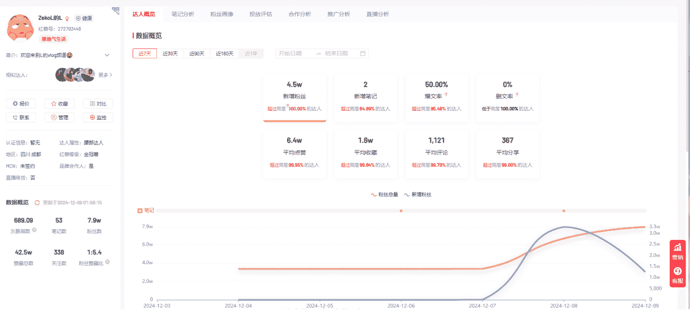

## “Kris Kringle”频道已实现盈利！

- 频道真实性状态：该频道被视为原创。
- 频道广告状态：广告已发布。
- 频道类别：（🎵）音乐
- 此频道受限地区：无限制。 ⓘ
- 地点：美国/美国
- 拨号代码： +1🇺🇸
- 宗教：基督教（新教70%，天主教30%）、无神论
- 创建日期：2024年10月16日 【1个月23天前。（总计：53天）】
- 标签/关键词：史上最热门的圣诞歌曲、最佳圣诞歌曲、史上最热门的100首圣诞歌曲、史上最热门的圣诞歌曲、圣诞音乐📋复制标签
- 订阅者：15400 （🥉青铜） ⓘ
- 视频数量：16个视频。
- 视频上传频率：
    - 每年16个视频，
    - 每月9.1个视频，
    - 每周2.11个视频。
- 总浏览量：3500324
- 查看平均值：

评论区：
- 坤汀：中标，面包屑，很多音乐类账号会被判定侵权或者内容同质，这个账号发的歌曲也有“牛姐”的欧美明星的歌，肯定是没版权的。这个是怎么搞定的呢？

公众号懒人搜索， 懒人专属群分享

### Youtube 工具

作者：肉松
日期：2024-12-11
点赞数：17

正文：
Youtube 频道数据分析工具：输入频道名称就可以查询，还可以两个频道进行对比。让我眼前一亮的是他可以区分频道流量来源中长视频和短视频的占比，另外如果付费升级，也可以做一些优化缩略图、A/B测试这些长视频需要的数据辅助。

https://www.viewstats.com/

## 公众号懒人搜索，懒人专属群分享

VIEWSTATS
| 频道名称 | 订阅者 | 总浏览量 | 附加信息 |
|---|---|---|---|
| 李子柒 Liziqi | 20,900,000 #268 | 3,263,029,783 #4,104 | @cnliziQi 131 videos |

- Channelytics
- Videos
- Projections
- Similar Channels
- About

### Most Recent Video
送给所有知道我名字的人! For Everyone Who Knows My Name | Liziqi Channel

| 时间范围 | VIEWS | SUBS | EST REV |
|---|---|---|---|
| Last 28 Days | 43.1M | 900K | $61.5K |
| First 28 days and 4 hours | - | - | - |
| Estimated Rank by Views | N/A | - | - |
| Total Views | 10M | - | - |

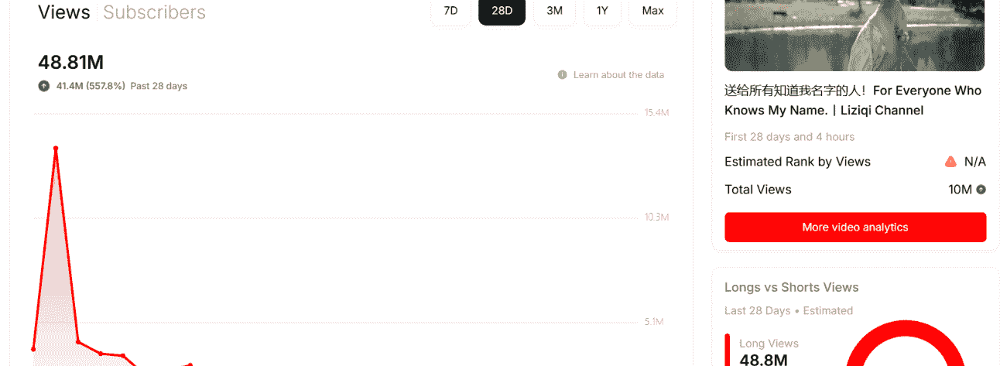

Views & Subscribers 数据概览
时间跨度：7D | 28D | 3M | 1Y | Max
- 浏览量峰值：48.81M
- 过去28天：41.4M (557.8%)
- Learn about the data
- 其他节点数据：15.4M | 10.3M | 5.1M
- 日期轴：Dec 13, 17, 21, 25, 29, Jan 0, 5, 9

### Longs vs Shorts Views
Last 28 Days • Estimated
- Long Views: 48.8M
- Short Views: 0

VIEWSTATS | 热门榜单 | 更多工具 | 专业工具 | 新的
搜索“CaseyNeistat”
搜索要比较的频道名称 | 对比 | 搜索要比较的频道名称

| 频道名称 | 链接 | 总浏览量 | 订阅者 | 上传数 | 上传频率 |
|---|---|---|---|---|---|
| JT凯西 | @jtcasey | 3B | 16.4百万 | 2.2千 | 10x/月 |
| 汤米·英尼特 | @tommyinnit | 2.5亿 | 1500万 | 483 | 4x/月 |

### 评论区：
暂无评论

公众号懒人搜索，懒人专属群分享