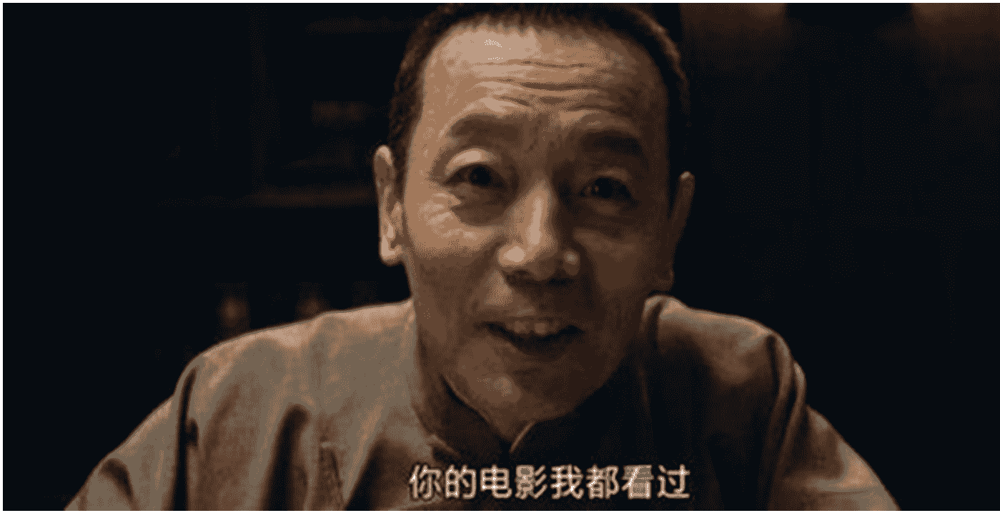
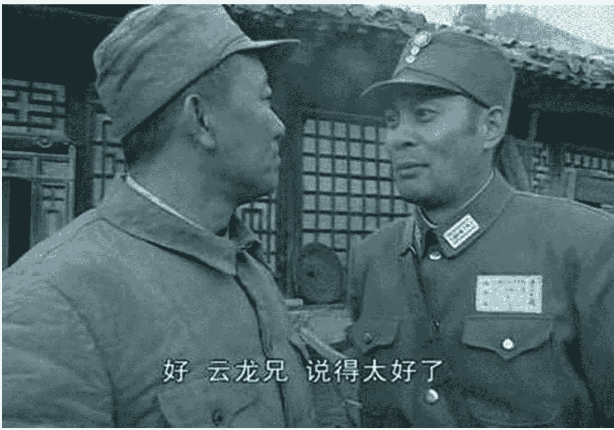

# 懒人专属群周报（第 期）

北京时间 2024 年 0 月 日 出品

懒人专属群群友大家好，我是小懒人~

第期《懒人专属群周报》，与君共读。

希望咱们专属群独有的《懒人专属群周报》可以作为群友们喜欢阅读的一份类似周刊的读物。

之前的离线版合集地址见咱们专属群总链接，小懒都有备份。

懒人微信：lazyhelper

微信：lazyhelper

## 目录

- [关系攻略（节选）](#)
  - [我的领导让我做违法的脏活儿，怎么办？](#)
    - 简答题
  - [公司组织的比赛，真的“特别蠢”吗？](#)
    - 习题
- [新闻评论](#)
  - [“TikTok 难民”涌入小红书](#)
    - TikTok 用户是怎样成为“难民”的？
    - 为什么是小红书？
    - 小红书接不住的流量
  - [扎克伯格讨好川普，全球事实核查事业遭遇打击](#)
    - 讨好川普的意图非常明显
    - 事实核查的困境
    - Facebook 上的信息环境将会如何变化？
- [懒人收藏夹](#)
  - 假如中美投资人也互晒账单
  - 掌握什么技巧才能不在单位里被领导欺负？
  - 最小阅读清单：为你学习新知找到一条最小路径
- 总结

## 关系攻略（节选）

作者：熊太行

## 我的领导让我做违法的脏活儿，怎么办？

> 忠诚这件事，不是你用尽一切手段去完成老板的目标。而是你在**工作这个框架内**，完成老板给你布置的任务。这件事要早弄清楚就能早受益!

最近有一条“刺死辱母者”的新闻，评论很多，争议也很多。

山东的一个女企业家苏女士借了当地地产商吴先生高利贷 100 多万，还了 180 多万和一套 70 万的房子之后还差 17 万。

吴先生手下的杜三带人催收，把她的头按在有大便的马桶里，后来脱了裤子用下体对着苏的脸。

警察来过，说不许打人又要走。苏银霞的儿子于欢拿起水果刀，捅死了杜三，还重伤了两个人，轻伤了一个人。

杜三死在路上。杀死杜三的于欢被判了无期徒刑。

关于法律和道德的解读很多，大多数人都是激烈地说：“维护自己的母亲……天经地义。”

我经常说，关系攻略不是我一个人对大家布道，而是一个我和大家一起成长的过程。

很多人问我说，熊老师教了很多套路，但是见招拆招的功夫，能不能多传一点，好，读今天这篇的，来着了。

我希望每个关系户，都应该尽快比别人多想一步，遇见事主要从关系的角度出发，去分析一件事。

把自己代入一个冲动的少年，其实是一种退步，我们可以看看死者杜三的角度吧，其实这个角度非常有意义。

杜三 30 多岁，他的老板吴老板涉黑，但是有一个公开身份是地产商。

杜三是给老板做打手，干脏活儿的。还曾经开车撞死过人没有被抓到。

杜三是烂仔，他主动走上了混社会的道路。我们关系户里肯定没有黑社会，但是我们恐怕难保不会被老板提出这样的要求，在工作中偷偷做点违法违规、或者至少不够光彩的事。

如果被派去干脏活儿，应该这样保全自己：

- “客气伤害原则”

“不好意思啊，这是我的工作。”

大家看古装片、小说都能看得出来，同样是杀人，自己要杀是这样的：

“你这狗贼！看看我是谁！”就怕对方不看自己。

但是为了工作杀人，那就是：

“得罪了，这也是朝廷的王法。”

如果雇主不是朝廷，有的还说“有人出价要你性命。”

在这一刻我能操纵你的生死，但动刀之前我会道歉，无非是一来迷信，怕冤魂缠身；二来是他担心对方不配合，杀起来费劲。一些老派的厨子杀鱼和杀鸡的时候也要道歉，念“鱼儿鱼儿你莫怪，你是人间一道菜。”

事实上，收债的杜三就是因为去侮辱、伤害自己的工作对象，才会最终激怒了少年，挨了刀子的。

现在很多专业催收都是不打不骂，吃住在对方家里，剥夺睡眠比拷打有效得多，熬鹰到 72 小时之后，对方基本会答应合作了。

客气伤害原则在正常工作中也有用处，比如当你要裁员和开除人的时候。

因为工作的缘故做一些可能给别人利益造成损失的行为，一定要客气。对方可能未必原谅你，但好声好气地说，能让你少很多麻烦。

真正的狠人都是文雅客气的。

## 利益接合部

这个概念，我们以后可能还会多次出现，老板和员工、上级和下级、哥哥和弟弟、父亲和儿子、CEO 和 CTO 可能有共同的利益，但他们一定有利益的分歧。

领导和你永远不会变成同一个人。公司利益和公司老板的利益，差别都是极大的。

人和人之间的利益差别，这条缝就是“利益接合部”。这是攻略人际关系要下手和下嘴的地方。

吴老板让马仔杜三负责去收债，吴老板渴望收回更多的钱，杜三从讨债里拿奖金，这一点上跟他是一致的。

但是杜三的利益还应该有一条：安全第一。一来不能打坏了债务人，二来不能让自己受到伤害。

对下令做脏活儿的老板要特别谨慎，因为他遇事可能会牺牲掉你。但是他的大胆很容易给下属一种错觉，一种老板无所不能、啥事都能搞定的错觉。杜三撞死了人没有坐牢，可能让他有了这种一手遮天的幻觉了。

比如如果遇到这种把老板利益当做自己利益的、愚忠愚孝的员工，分化对方的时候就要提醒对方利益接合部。

利益接合部可能增大或者变小，《亮剑》里，楚云飞是国军的团长，但却要和李云龙做朋友，这就是因为他是个团长，和阎锡山和蒋介石的利益都还很远。但是到了他当了军长，直接对蒋介石汇报，和蒋介石的利益接合部缩小了，就开始和李云龙性命相搏了。

当一个人从事高风险的工作的时候，他和上级的利益接合部就增大了，可以趁机突破。

过去的八路军说服、策反伪军，很多时候都是谈论利益接合部。“鬼子给你们发饷，但是打仗还让你先上！让你费八路的子弹呢！”

## 不要有任何侮辱

过去的土匪，只要上点规模，一般都不许奸淫妇女，在洪门和青帮两个大帮派体系里，“不奸淫妇女”也是一条戒律。

这不是说明土匪或者黑社会道德高尚，而是因为他们从血的教训里发现了这条戒律的好处。

- 争夺妇女会造成头领之间的失和。
- 侵犯妇女会损失收入，妇女是价值很高的绑架对象，去换钱再用钱去交换性更划算，而不是在战争或者抢劫中去获得性。
- 侵犯行为会导致一些富有家族感到羞耻，带来最大的敌意。

根据历史资料的记载，东北的胡子们一般绑到了少女或者妇女，都是立刻派人快马送信要酬金，因为大户人家的规矩一般是，被绑过夜，这媳妇就不要了。

要债这件事，债务人求饶，就是因为有债在，而不是你真的威风和厉害。当他偿还了债务之后，侮辱带来的后果他仍然记得，以后还会有各种的问题。

那个讨债的杜三，用裸露下体的方式去讨债，情商堪忧，心智有问题。考虑到被侮辱的女士年纪已经不轻了，他应该不是因为性冲动，而是因为那种控制别人命运的优越而做这件事的。

我们从事一些正常的工作也要注意：

对乙方或者下属，可以对工作要求苛刻，但是尽量不要去侮辱对方的审美或者工作能力，更不要针对对方的容貌嘲讽。

要知道贵司选择了这样的乙方，帮你安排了这样的下级。多半是因为他们便宜而你们太穷。

> 美国大兵有一个名言：“要记得你手里的武器永远是报价最低的公司生产的。”

## 关于各种脏活儿

和黑社会的打打杀杀相比，商场上的脏活儿可能是这些事：

- 暗地侮辱和中伤竞争对手；
- 行贿（包括性贿赂）；
- 伪造身份前往竞争对手那里卧底；
- 财务、人力上的违规违法行为。

我也收到好几位关系户的询问，做财务的居多，跟我说，领导要自己做风险极高的事，问我该怎么办。

我的回答很简单，那就是违法的事情不要干，就是因为“你的工作”这个大框架里，不包括“违法”这一项。

同样，之前也有关系户提到，说客户表示如果她愿意和自己睡觉，就愿意签下这个单。我建议是：

你入职的时候，如果“你的工作”这个框架里，不包括“陪人睡觉”，就不要做这件事。

如果你入职的时候，老板就说要你陪人睡觉。那就赶紧逃出去并且报警！这是一个火坑！

还有的人说，熊老师你说得很对，遗憾的是：我就是做不到，我这人对工作追求完美。领导布置了我就要全力做到。

我说：你认为的完美根本不对，真正的完美是遵守规则做事，时隔多年有人查、有人问，你都干干净净的，你的上级也不会受任何的牵连，当他 KPI 所迫做一些不体面的事的时候，记得把这个看法分享给她。

大部分的脏活儿，都是可以拒绝的。

P.S.

《白雪公主》里的后妈派出的猎人就是典型的“做脏活留余地”的人。

现实中，如果逼不得已要在正规公司做脏活儿的话，记得全部用电子邮件汇报。

## 简答题

你在对部门主管进行纪律培训，提到不应该对下属进行性骚扰。

有人问你为什么。

试着给他十个过硬的理由。

### 公司组织的比赛，真的“特别蠢”吗？

> 知识点：一种现象叫“虚假独特性效应”。一些能力强、做得不错的人容易犯这个错误。我们把才智和品德看作是超乎寻常的，用独特来完善自己的形象。

有关系户说，五四青年节他会参加公司的即兴演讲比赛，希望熊老师能够给一点建议。

问得好，我就来分析一下这种公司组织的比赛要注意什么。

一个比赛，要注意四个问题：

- 谁来讲；
- 讲给谁听；
- 有没有评判者；
- 要达成什么样的效果。

试着回答一下：

- 我来讲啊；
- 全公司人听啊；
- 领导啊；
- 看谁讲得好啊。

等等！

这就是一个直接的回答，但是我期待的回答，不是这个。

记得吗？我们是一个谈论人际关系的专栏，我们关注的是人与人之间权力的游戏。

试着从权力的角度，重新分析一下这个即兴演讲比赛。

- 没有权力的人，年轻同事们来参加演讲；
- 所有的年轻同事和老同事们听；
- 有权力的人来做判断，评估参赛者的实力；
- 有权力的人寻找出来出色的无权者，担任培养对象。

这是一个寻找培养对象的活动。

## 再强大的派别也需要年轻血液

一个公司也好，一个政党也罢，甚至小到一个家庭，青年群体都非常关键。很多时候，抓住了青年，就抓住了未来。

没有一个人或者一个公司里的小派别，能够在一个群体里一手遮天。就算是独资企业的老板，如果大家不信服他，执行上各种抗拒，他的工作也没法开展，一切制度，最终都要落在人上。

独裁也好，民主也罢，一个老大都需要有一批人忠于你、信服你、执行你的命令。

而且这个群体必须发展壮大，要不断吸收新的成员进来，而且不能只收裙带，一定要收能干活的人。

那天和我的朋友，编剧徐小疼老师聊天，她精通明史，跟我说：“海瑞一个人再强能做出什么来呢？东林党能够成党，关键在于他们收罗门生，给他们政治地位 (也就有了钱)，所以大家会抱在一起。”

历史上这种事一点也不罕见。

马其顿国王亚历山大大帝有一批贵族随从，叫做“伙友”，首席伙友是他的好基友。亚历山大是双性恋，亚历山大收罗最好的年轻人做伙友，他们是装备精良的骑兵，用来在最艰难的时候打开局面。

北欧神话里，诸神在人间会发生战争的时候会收罗一大批濒死的勇士，让漂亮的女武神瓦尔基里收集他们进宫殿，这些勇士被救回来之后天天喝酒打猎，准备用来最后跟霜巨人和洛克 (看过《雷神》的知道) 决战。即使是神，也需要更多年轻的支持者。

罗马军团把士兵分为步兵、青年兵、成年兵和后备兵 (老兵) 三类，这个很妙，你要和同批次的战友竞争，不能被同龄人瞧不起。优秀的年轻人会很快脱颖而出。

我知道有个银行的分行行长，会对下属的青年员工进行选拔考核，选出一批所谓的虎贲勇士，这些人高调、被人嫉妒，算是行长个人钦定的储备干部，定期召开学习分享会，行长需要做什么重要的工作，也不会再找别人，他们付出的代价是比别人辛苦，但获得的是领导身边工作的机会以及提点和指引。

## 明的人，暗的人

像那位行长那样，明摆着命名一支青年军，把大家都贴上我的标签，是非常大胆的做法，现实中可能太过高调了。如果不是大领导特别宠爱的人，一定会有人进谗言的。

而且副总怎么办？副总也要培养自己的力量，总不能等当上一把手才组织自己的小队，那就晚了。

现实中，你的人，我的人，大多都是暗的。往往是几个副头儿，每人会选择几个人，暗加笼络。

国企里组织一些这种演讲比赛、辩论赛。就是一个挑选自己人的很重要的场合。

挑那见识口才不俗的小伙子小姑娘，栽培一二，以后就是自己的人了。

所以领导根本就不在乎你辩论的是什么题目，演讲是什么题目。

他们在乎的是相貌、气质、台风、普通话 (有些比赛是英文演讲)、紧张不紧张。

你只要尽情展示自己的青春活力。

新到秀女一百名，皇上说大家一起跳个集体舞，你不会真觉得皇上热爱舞蹈艺术吧，当然是看谁活泼、谁柔软、谁懂事、谁眼波流转、谁顾盼生姿了！

前几天有个关系户跟我抗议，说“我订关系攻略，要看的是职场内容，说家庭和男女干什么？”我说你完全没打通，男女和家庭关系是职场的后院，同时男女之间的感情微妙细致，能够学到许多细腻的技巧，用在职场上就会特别厉害。

上下级关系和男女关系几乎完全是一回事。你看屈原老师写了那么多美人不爱我的诗，最后一归类，他算爱国诗人，他谈论的其实是和领导的关系。

人和人的相处之道有打通的地方，如果你仍然见山是山，见水是水，多爬楼看看那些评论，很多同学已经进步得很好，能够举一反三了。

## 自视甚高的人会被 pass 掉

这些看上去水平很低的比赛，还有一个功效，就是把一些自视甚高的年轻人筛掉。

我有个朋友，比我年轻几岁，我们就叫他 F 同学好了。

F 同学发现自己可能进了一个假的五百强公司，公司会组织一场辩论赛之类的比赛，然后出的题目都非常幼稚愚蠢。

F 是 985 高校毕业的，他决定不参加，不光不参加，他还坐在台下当笑话看。后来他分享给我，对我说他的公司怎么是这个样子。

> “最好别这样。”
>
> “？”
>
> “于一个国家一个民族来说，最优秀的一批青年辩论这种逻辑有问题的小儿科题目确实是不好的。但是我不太关心国家民族什么的事情，我只在乎你的境况。”

我给他讲了刚才我们说的那些道理，他恍然大悟，又心有不甘。

> “你也说这些题目很糟糕，那他们选出来的不是很差的人了吗？”

F 同学是不对的，差题目不一定选出来的是差人。但是差题目确实可能淘汰掉一些太好的人，比如一些本事很好，但自视甚高的人。

> “你觉得题目差，对，因为组织比赛的人没有上 985，也没有参加过高水平的辩论队，她们没有上过逻辑课，只是用搜索引擎从网上搜题。”
>
> “这个企业和这几个组织比赛的同事都是如此，有各种不令人满意的地方。”
>
> “有些人没本事，却努力进取争夺胜负。”
>
> “有的人有本事，却要远远地站着看笑话。”
>
> “你要是领导，你会栽培什么样的人呢？还要领导说通了所有的关节利害，请你下场竞技么？”

F 同学后来聊起听到这里的感受，说感觉脊梁上全是冷汗。

> “你是人才，但如果不愿意跟我示好，不愿意献上忠诚的表示，那我就安排你在基层岗位上打工。”
>
> “很多一辈子总在写材料和演讲稿的人，固然有狷介耿直的人，但更多的恐怕是不通套路，因为各种误会，不得不走上了耿直之路了。”
>
> “熊哥，我明白了。为什么会这样？”

这是一个好问题，这是我们的一种认识偏差，叫做“虚假独特性效应”，一些能力强、做得不错的人容易犯这个错误。我们把才智和品德看作是超乎寻常的，这样来完善自己的形象。

这也是为什么很多文笔好、学历高的人容易在体制内的单位觉得不爽，越出色，越容易从自视甚高变成自命不凡，最后变成怀才不遇。

如果成了一个清高的、怀才不遇的人，也不要太焦急。

你随时都有机会从这个孤岛上出来，但恐怕得放弃一点无聊的面子，去主动向一些你没那么欣赏的人示好。聪明人领导不会拒绝一个有本事的人的联盟提议。

## 一个容易被忽视的盟友

我们回到文章开头提到的那位关系户，想想他们公司团组织举行的比赛吧。

即兴演讲。

注意，是即兴。

非常难，众目睽睽之下的比赛。

大家有没有看过《奇葩说》？最近罗胖老师过去当评委了。

过去几季里，争夺哔哔 KING 的决赛是现场出题目和准备的。

精心准备观点抛出来，和临时定题目，然后谈论一件事，是完全不同的难度。即兴的演讲和辩论非常难，所以才有意思。

一个企业里搞即兴演讲，我估计是第一次，因为第二次就会明白，这事的观赏性不好，大多数参加者可能都会手忙脚乱，没有第二次比赛了。

但是，这至少说明，他们公司的团组织，有一个（可能是新来的）想改革、想做出成绩的负责人。

之前我在谈加薪的两部曲里，谈到了应该早点布局我们的人脉。

进到一个公司里，要尽可能和行政、人力、财务的同事交朋友，跟前台的关系也要搞好。

像这个有想法负责人，一定是一个雄心勃勃的人，这样的人要么能力极强，要么有很深厚的关系，值得去结交一下。

如果你表现出色，她的成绩能圆满完成，你也就收获了她的友谊，甚至明年的比赛当中，你可以帮助和辅导这个比赛，结交更多的后进学弟学妹，你们有了一个纵向的连接。

交朋友就是找借口，找尽借口对你好，给你钱。你看新闻联播里来一个外国元首访问，大家都有的说。

比如“两国是一衣带水的邻邦”“贵国是最早承认我们的国家”“虽然相距很远，但在很多问题上有多相同或相似的看法”。

你结交自己的圈子，也可以这样：“我们都是演讲比赛出来的”“都是公司辩论队的”，如果可以封闭培训一下的话，大家确实可能有挺深的情谊。

这不是私下结党，这是公开的，你不会受到嫉妒，有一个合法的部门帮你打掩护。

我经常提醒我的一些年轻朋友，要累一点，多付出一点时间和精力，在看上去没什么实际好处的地方。

可能是这样的比赛，还有一些别的事。不要锱铢必较，错过了最好的时光。

回头更一篇《为什么说 40 岁前，在工作上要全力当狗》，详尽解释一下这个道理。

## 习题

你刚刚赢得了公司组织的辩论赛并获得了最佳辩手，你的对手、也是你很有好感的女生却突然泣不成声。这时你应该：

- A. 继续和你的队友庆祝，并且心里暗骂对方是矫情婊，从此断了念想；
- B. 过去拥抱哭泣的人，把奖杯递到她的手里，告诉她这是我们所有人的胜利；
- C. 拿过话筒，对着各位领导念这段台词：李大人，所谓胜者为王，败者为寇。现在金牌在我熊某的手上，并非我赢了。大人为了大显我民声威而办的这场辩论争霸，哭了这么多人，在世人面前，其实我们都输了；
- D. 当然是输给她了！喜欢她怎么可以赢她！

答案是 B。

选 A 的人，真的不怕注孤生吗？

C 是《狮王争霸》的台词，暴露了选择者的年龄，这是控诉公司领导和比赛的组织者了，辩论确实不适合大多数公司，不过绝对不要明着这么来。

D 不要做，放水你会失去自己队友的尊敬。同时你放水照顾的人也未必领情。

B 是对的，因为女生已经用泣不成声成功地吸引了领导的注意力，至少证明了她是一个关心成功的人。比赛已经结束，要让所有人知道，我们现在是同事，是站在一起的。我们会把力量一致对外。和她扮演的“关系胜负、好胜自强”的形象相比，你的关心团结、携手共进，更让公司满意。

## 新闻评论

新闻实验室是小懒付费订阅的通讯录，年费 300 多。小懒整理分享，仅供专属群群友查阅。如有余力，可以自己到 Newsletter 上自费订阅。

## “TikTok 难民”涌入小红书

> 在搞笑的段子和其乐融融的交流氛围之外，“TikTok 难民”现象更多折射的还是冷酷的政治现实与过于稀缺的平台选择。

从昨天开始，小红书上涌入了大批外国人，他们自称“TikTok 难民（TikTok refugees）”，试着将自己在 TikTok 上的内容搬运到小红书，在这里重建自己的账号。

这个突如其来的现象很有趣，在中外网民的意外相遇中已经出现了不少段子，比如中国的学生把英语作业丢给外国用户，请他们帮忙完成。甚至有人感叹：世界大同了。不过，在搞笑的段子和其乐融融的交流氛围之外，“TikTok 难民”现象更多折射的还是冷酷的政治现实与过于稀缺的平台选择。从某种意义上说，我们都是平台时代的难民。

本期新闻实验室会员通讯，我尝试对这个新鲜现象做几个角度的解读。

### TikTok 用户是怎样成为“难民”的？

在川普的第一个任期内，TikTok 这款来自中国、大受美国年轻人喜爱的短视频社交平台，就开始遭受质疑和挑战。一些政客担心美国用户的数据被中国政府获取，也担心 TikTok 的算法受中国干预，让中国政府可以间接影响美国人看到的世界是什么样子的。尽管 TikTok 做了各种努力，证明自己的独立性，但都很难说服美国人。简单来说，在中美对抗的大背景之下，当红的 TikTok 被一些人认为给美国的“国家安全”带来严重威胁。因此，要求封禁 TikTok 的声音越来越大。

不过，由于法律制度的原因，美国人试图封禁 TikTok，经历了颇为漫长的过程。新闻实验室从 2019 年开始就通过会员通讯记录这个过程：

- 2019 年 11 月的 336 期，介绍了 TikTok 开始受到越来越多的担忧和质疑。
- 2020 年 8 月的 412 期，记录了川普的直接发难带来的 TikTok 危机。
- 2022 年 9 月的第 616 期，主题是 TikTok 在美国再次受到国会议员的质询和拷问。
- 2023 年 3 月的第 662 期，讨论的是知名度很高的 TikTok CEO 周受资听证会。
- 2023 年 11 月的第 717 期，写的是巴以冲突之中再次被卷入舆论漩涡的 TikTok。

5 年多之后的今天，TikTok 在美国的被封禁终于成为一件可能马上就要发生的事情——不过只是“可能”，仍然存在变数。

具体来说，去年 4 月，美国国会通过了一项法案，并由总统拜登签署成为法律，规定字节跳动必须在 9 个月内找到美国批准的买家，否则 TikTok 将在全美被下架。目前来看，这个期限将是 1 月 19 日。

字节跳动一直表示不会考虑出售 TikTok——背后的主要原因可能并非商业，而是在政治上不被中国政府允许出售，其实这也间接坐实了“TikTok 并不真正独立”的指责。今天有消息传出中美政府都有可能信任马斯克接手，但这也只是一个考虑之中的想法而已。

不愿出售也不想退出美国市场的字节跳动，通过法律手段发起了挑战，认为这样的法律违背了言论自由原则。最终从法律上给出结论的将是最高法院。1 月 10 日，在封禁大限的 9 天之前，最高法院举行了一场听证会和口头辩论。

听证会上传出的消息并不乐观。多位大法官在言辞之间看上去都倾向于将“国家安全”置于“言论自由”之上：

- 首席大法官 John Roberts 和大法官 Clarence Thomas 认为，这项法律针对的是作为非美国实体的字节跳动，而不是 TikTok。Roberts 说，国会关心的不是 TikTok 的内容，而是谁拥有这家公司。
- 大法官 Brett Kavanaugh 询问了中国政府利用美国人的数据“发展间谍、策反他人、勒索他人”的风险。
- 大法官 Ketanji Brown Jackson 表示，禁令更多的是源于对中国所有权的担忧，而不是言论自由。

接下来，TikTok 的命运有几种可能：

- 第一，最高法院支持封禁，1 月 20 日就职总统的川普也选择不去挽救 TikTok。这样的话，1 月 19 日，美国的应用商店里将会下载不到 TikTok。手机上已经有 TikTok 的用户还能使用，但是不能更新，这款应用逐渐就将淡出美国人的世界。
- 第二，在 1 月 19 日大限到来之前，拜登将死线延长，给 TikTok 更多的喘息时间，把它的命运交给川普决定。不过，这样的可能性并不大。
- 第三，最高法院支持封禁，TikTok 在 1 月 19 日从美国下线。第二天川普就职之后，开始“复活”TikTok——不过这并不是一件容易的事情，他需要得到两院的支持重新立法，推翻此前的法案。
- 第四，最高法院不支持封禁，这当然是 TikTok 最希望见到的结果。

以上我们更多是从 TikTok 的视角来看它在国际国内政治挤压当中的命运。不过，身为亿万富豪的张一鸣、周受资等人其实根本不用我们同情。值得同情的，还是 TikTok 上的创作者和用户们。

他们以“难民”自称，这个说法非常形象。在这个时代，平台就像是互联网上的国家，当用户被迫离开一个平台，就好像背井离乡的难民。和现实中的难民一样，平台难民面临的挑战至少包括：

- 现实中的难民没有太多的目的地可供选择；平台难民也只有很少的选项，因为平台早已呈现垄断状态。
- 现实中的难民没有办法带太多的个人物品，也不可能把原来的社会关系一起带往目的地；平台难民在迁移之后，也无法把之前的内容以及关注和粉丝关系带到新的平台。

设想另一种可能：如果平台都是以“联邦宇宙”（详见会员通讯 687 期和 585 期）的方式运行的，那么甚至都不会存在“平台难民”这样的概念。因为在联邦宇宙中，我们的内容和社交关系都属于我们自己，而不是属于平台，都可以很方便地从一个平台迁移到另一个平台。那更像是把自己的整个世界换个新的样貌，而不是抛弃一切、艰难地在新平台白手起家。

所以，从用户的角度来说，我们不仅可以质问大国的政客们为何要有如此纷争，而且也应该问问平台：为什么我们离开你们的时候（无论主动离开还是被动离开），都只能如此狼狈？

一个更有利于用户的平台世界什么时候才会来临？我今天正好看到一个最新的项目“Free Our Feeds”，它就是想要改变目前的寡头平台垄断，通过开放的协议，创造一个由互相联通的 app 和不同的公司组成的完整生态系统，这个系统会将人们的利益放在首位。这是一个很有野心的构想，希望它能取得实质性的进展。

### 为什么是小红书？

成为“TikTok 难民”的外国人们，为什么选择了小红书？

其实这也是一个非常有意思的问题，它能折射出平台与监管的许多侧面。

我们来一个一个地看，为什么其他平台没有难民们投奔的首选。

首先，为什么不选 Instagram？因为 Instagram 的母公司 Meta 就是积极推动 TikTok 禁令的幕后推手之一。扎克伯格非常清楚：把 TikTok 挤出美国市场之后，Meta 的生意会变得更好，所以他积极支持禁令。也因此，扎克伯格是 TikTok 难民们很讨厌的人。

第二，为什么不选抖音？因为抖音只有中国人才能用，只有中国的应用商店才能下载到，实名认证只能用中国身份证。字节跳动当初将抖音和 TikTok 区隔开来，就是为了适应中国和国外不同的监管环境。比如，一些在 TikTok 上发表的短视频，是无法在抖音上面发出来的。

第三，为什么不选 Lemon8（字节跳动旗下模仿小红书的海外 app）？其实也不是没选，Lemon8 的下载人数这两天也增加了很多。但是，正因为 Lemon8 也是字节跳动做的，如果禁令生效，它恐怕也难逃厄运。

其实正如上一个部分所说，平台垄断的年代，用户面前的选择真的不多。排除了以上选项之后，最合适的确实就只有小红书了。

而且，小红书作为一家中国公司，更有强烈的象征意义——对美国禁令不满的 TikTok 难民们，通过使用另一款中国 app 来表明自己的态度。

### 小红书接不住的流量

对音频社交平台 Clubhouse 有印象的朋友，可能会在这两天的某一些瞬间产生“昨日重现”的感觉——发生在小红书上的“中外民间友好互动”，让人想起 Clubhouse 当年连接起世界各地华人的场景。

但是，眼前的景象多半会比 Clubhouse 更加昙花一现。这波来自 TikTok 的流量，小红书是很难接住的。

最表面的原因是整个 app 的界面并没有准备好：一些功能缺乏翻译，也没有提供对帖子和评论的自动翻译按钮，更不用说大部分内容都是中文，对于不懂中文的用户来说其实没什么看的。

但这些其实是容易解决的，甚至增加英文内容都是靠钱可以砸出来的。真正无法解决的，还是监管与审核的问题，也就是促使字节跳动将抖音和 TikTok 完全分隔开来的那个原因。

等新鲜的劲头过去，迁入小红书的 TikTok 用户们很快就会发现：自己的帖子莫名其妙被限流了，给别人发的私信莫名其妙看不到，甚至账号莫名其妙就被封了……这样的体验会赶走大部分 TikTok 难民。而如果对这部分人采取不一样的审核尺度，又会让中国用户不满，一些用户已经在抱怨有的外国内容有意识形态问题了。

小红书一直没有做抖音和 TikTok 式的“分割为两个 app”，看起来奇怪，实际上是因为用户定位：小红的海外用户基本都是留学生等海外华人群体，对他们使用和国内同样的监管尺度是可以被接受的。

眼下一个看起来可能的方案，是在同一个平台内部进行基于 ip 和语言的屏蔽，让两拨人互相看不到。也就是说，他们看起来在使用同一个 app，实际上完全处在两个世界。但是，这样的难度非常大——那些本来就在外国做英文内容的中国人怎么办呢？软隔离永远不如硬隔离好使。

要不就紧急开发一个小红书海外版，在中国之外上线？想必小红书也不会投入这个资源和精力，因为做大之后又会面临被禁。

所以，如果 TikTok 在几天后真的被禁，我个人预测最可能的结果，还是大家一边骂骂咧咧一边回去用 Instagram，让无数人讨厌的扎克伯格又一次赚大发。

## 扎克伯格讨好川普，全球事实核查事业遭遇打击

距离川普第二任期的开始还有 10 天的时间，各路科技巨头已经纷纷为川普的就职典礼捐款（谷歌、Meta、亚马逊、Tim Cook、Sam Altman 都各捐了 100 万美元）。而 Meta 创始人兼 CEO 扎克伯格更是在几天前为川普送上了另一份大礼：他宣布将会减少对 Facebook 和 Instagram 平台上的内容审核，并终止与第三方事实核查机构的合作。

此前，川普等右翼人士一直抱怨 Facebook 等平台存在“政治偏见”，对右翼的言论施加了太多限制。如今放松限制，名义上是为了“言论自由”，但真实目的显然是冲着讨好川普去的。很多人担心，此番政策调整的结果，将是更多虚假信息和仇恨言论在全球最大社交媒体平台上的泛滥。

### 讨好川普的意图非常明显

这次 Meta 的政策调整包括三个方面:

- 结束第三方事实核查合作项目;
- 减少对言论的审查;
- 不再对政治类内容一概降权，而是根据用户的需求提供个性化的展示。

关于第三方事实核查项目，我们放到下一个部分去说。关于允许部分用户看到更多政治类内容，这一条没有太大争议。

引发最多争议的，显然是被放在中间的那一条，所谓“允许更多言论”(allowing more speech)。

《连线》杂志详细研究了 Meta 社区守则中的具体变化，发现其中值得注意的是关于“仇恨行为”的定义和处理。比如，Meta 现在允许用户称呼同性恋和跨性别为“脑子/精神有病”(mental illness)。另外，现在在 Meta 上宣称特定族群 (比如华人) 应该对新冠疫情负责也是被允许的了。CNN 则发现，现在 Meta 允许称呼女人为“家居用品”(household objects) 了。

Meta 还着重宣布：将取消对移民、性别认同和性别等话题的一些限制。

移民、种族、性别这些事关身份政治的话题，都是当下美国左右之争的焦点，也是右翼指责左翼施加了太多审查的关键话题。Meta 给出的这些具体例子，都是一声声狗哨，吹给川普及其粉丝听的。

具体宣布 Meta 此番政策调整的，是一个叫 Joel Kaplan 的人，他的职位是 Chief Global Affairs Officer，也就是全球事务负责人。实际上，他是这个月初才刚刚上任的，取代了前任 Nick Clegg。

Joel Kaplan 曾在共和党小布什政府担任负责政策的副幕僚长，他 2011 年加入 Meta，一直被外界认为是共和党密友。在 Meta 任职期间，他曾被指责“一边鼓吹政治中立，一边放大保守派声音。”

此次，Joel Kaplan 升任全球事务主管，并立马宣布这番重要的政策调整，这显然是 Meta 最近一系列讨好川普的动作的一部分。

其他动作还包括:

- 政策发布后，Joel Kaplan 马上到福克斯新闻接受采访。
- Meta 任命终极格斗冠军赛 (UFC) 首席执行官 Dana White 为董事会成员。Dana White 是川普的亲密战友，在去年的大选中积极为他站台。在选举之夜，他和特朗普一起站在胜利派对的舞台上，并发表演说感谢播客主播和右翼网红们的支持。
- 将负责信任与安全的团队从加州迁往得州。
- 和川普在位于佛罗里达州的海湖庄园俱乐部共进晚餐。

这一系列的动作，并不简单因为川普即将上任，更是因为川普的第二任期可能会给 Meta 带来威胁。特朗普钦点的联邦通讯委员会 (FCC) 主席 Brendan Carr 曾公开威胁 Meta，要求其停止事实核查，否则将面临 FCC 对其“230 条款”法律保护的审查。而联邦贸易委员会 (FTC) 指控 Meta 收购 Instagram 和 WhatsApp 以维持社交媒体垄断地位的诉讼将于四月开庭，FTC 主席 Lina Khan 已经表示希望川普不要放过扎克伯格。

所以，扎克伯格做的这些事情，归根到底都是为了保住公司的商业地位。他的主动讨好也得到了川普的认可。他在新闻发布会上说:“我认为他们已经有了很大的进步。”当一名记者问川普是否认为扎克伯格是因他过去施加的威胁而改变政策时，特朗普回答道:“很可能。”

### 事实核查的困境

接下来，我们详细聊聊 Meta 的第三方事实核查合作项目。

这个项目始于 2016 年。当年的美国大选是全世界关注社交媒体上虚假信息的开端，Facebook 也受到了极大的舆论压力。很多人呼吁 Facebook 对平台上的虚假信息做更多的识别和清理，但是扎克伯格知道，“宣称某条信息是虚假信息”是一件容易惹火上身的事情。用他对外的说法就是，Facebook 不愿意成为判断真假的裁判。

于是，他们找来了另一批裁判，那就是分布在全球各国的事实核查机构。

当然，并不是任何宣称自己在做事实核查的机构都可以入选，只有得到了国际事实核查网络（IFCN）认证的机构才有资格。获得认证的前提是：不隶属于任何政党或候选人，不倡导任何政策，并坚定不移地致力于客观性和透明度。每个机构都要接受严格的年度核查，包括独立评估和同行评审。

Meta 与这些机构之间的合作模式是：提供平台上流传较多并被认为可疑的内容，邀请事实核查机构帮助鉴定真伪。每月完成约定数量的事实核查任务后，事实核查机构可以获得一定的报酬。对于一些机构而言，Meta 的这个合作项目是主要的收入来源。

值得一提的是：事实核查机构只负责提供一则内容是真是假的判断，并不具备审查和删除内容的权限——只有 Meta 才有这样的权限。另外需要注意的是，Meta 一直将政客发表的言论排除在事实核查的目标之外。也就是说，他们在平台上说什么都不会被核查。

就在一年前，Meta 还将这个项目延伸到了 Threads。如今在川普胜选后突然掉转船头，令全球的事实核查机构感到措手不及，不少机构已经准备要裁员了。

扎克伯格此次宣称：事实核查机构的“政治倾向性太强”、“破坏的信任比创造的更多，尤其是在美国”。然而，IFCN 的创始人 Alexios Mantzarlis 提出，如果右翼的信息被更多核查，那只不过是因为右翼本身就散布了更多的虚假信息。

虽然很多人都为第三方事实核查项目的终止感到惋惜，但也有人觉得，事实核查对于制止平台上虚假信息传播的影响是有限的。那些更容易相信虚假信息的人，往往对事实核查本身嗤之以鼻，认为其带有政治偏见，甚至将事实核查视为对自身信仰的攻击。所以，就算事实核查机构标记某则内容为虚假信息，也很难明显降低这些人对它的传播意愿。

我们可以从中看出事实核查的困境：一方面，这件事情很难有商业模式，事实核查内容难以获得很大流量，没有科技公司或基金会的支持很难活下去；另一方面，事实核查对于虚假信息的传播生态难以产生重大影响。

### Facebook 上的信息环境将会如何变化？

尽管面临这些困境，但第三方事实核查机构合作项目的存在至少意味着，有部分信息会被具备能力的机构核查。

Meta 宣布，接下来，平台将依靠“社区笔记”（Community Notes）来帮助人们判断信息的真伪。这个功能是从 X 学来的，它允许部分用户对真实性存疑的帖子提供观点、补充信息，并展示持有不同观点的人之间形成的共识。

由用户主导的“社区笔记”，能取代专业事实核查机构吗？没有太多人有这个信心。毕竟，撰写“社区笔记”的用户也容易受到党派偏见的影响，相对缺乏专业的新闻素养和事实核查技能。

全球几十家事实核查机构在写给扎克伯格的公开信中说：“研究表明，许多‘社区笔记’从未被展示过，因为它们依赖于广泛的政治共识，而非判断准确性的标准和证据。”

这些机构还强调：“‘社区笔记’没有理由不与第三方事实核查项目共存；两者并不相互排斥。与专业事实核查合作的‘社区笔记’模式很有可能成为推广准确信息的新模式。”

如果我们看 X 的经验，“社区笔记”的作用是有明显限度的。比如，它很少出现在美国之外的内容上，这意味着美国以外的内容很少被核查——而恰恰是在美国之外的一些地方（比如缅甸、斯里兰卡），社交媒体上的虚假信息可能引发线下的大规模暴力和屠杀。另外，其实 X 上面的“社区笔记”不少都引用事实核查机构的结论——如果机构没了，那么笔记也是皮之不存毛将焉附。

在我读到的分析中，几乎所有人对于 Meta 旗下平台未来的信息环境都持悲观态度：虚假信息、阴谋论、仇恨言论等一定会变得更多。

科技记者 Casey Newton 采访了 Meta 的一些现任和前任雇员。其中一位说：“我真的认为这是种族灭绝的前兆。我们已经看到它发生了。真实的人的生命将受到威胁。我感到悲痛欲绝。”

这样的判断也许极端，但并非全无可能。有没有办法阻止这种悲剧的发生？一些人望向了欧洲——根据欧盟的《数字服务法案（Digital Services Act）》，Meta 等大型平台如果未能及时删除非法内容或违反其服务条款的内容，将被追究责任，罚款额高达其全球年收入的 6%。接下来，扎克伯格也许会为满足欧盟的要求而为欧洲用户提供不同的服务体验。而另一个可能是，他会和川普合作对抗欧盟施加给科技公司的管制。

接下来的川普四年，美国以及全球的信息生态一定会继续发生巨大变化，新闻实验室会继续记录和观察。

## 懒人收藏夹

### 假如中美投资人也互晒账单

记忆承载

随着网络上兴起中美网民之间互晒账单的活动，有读者请我做一期话题，找个美国投资人，和他们来个中美投资人之间互晒账单。

你想看的这个话题做不来的，原因有两个。

第一个是理论原因。

投资是因人而异的，你随机抽样一个美国投资人，一个中国投资人，这什么也不能说明。

第二个是现实原因。

我从 08 年起，做的就一直都是国际市场，你让我上哪儿给你找个做国内市场投资的外国人呢？

所以我找了一个同样做国际市场的美国投资人，我来和他话家常，唠唠嗑，聊聊日常花费的账单。

聊过之后发现，很多消费都是因人而异的，比如有人喜欢旅游，有人喜欢洗脚，无从对比。

我能够用来对比的是交叉部分，比如能源耗费，这一点任何一个家庭都绕不开。

你比如水电燃气。

我们不考虑能源价格，他生活在美国，我生活在中国，有汇率差，有成本差，无从对比。

我算的是能耗，同样面积下（双方层高是接近的，他们家 12 英尺，我们家 3 米 3），分别用了多少度电，多少吨水，多少立方米燃气。

结论就是他的消耗远大于我。

为什么呢？

我们先看用电量。

你比如地暖，我们中国人用地暖，白天的时候，或者家里没人的时候，地暖的温度是调低的，有人的时候再调高。

注意不是关掉，关掉重启是很耗能的，只是调低，意思是它保温即可，无需加热。

并且白天的时候，我们家所有窗帘都是拉开的，阳光照射到玻璃上，你冬天中午摸那个玻璃也是发烫的，温室效应，室内就像玻璃房。

那么等你晚上回家，这一屋子的热气，就使得地暖无需拼命工作，它的基础温度已经被晒高了。

再比如我家鱼池里的增氧，不是用电的，甚至不用太阳能，是两个出水口处安装了内压式增氧炮，就是一种利用变径，从外部引入空气，借助水流本身的动能，打氧。

我们家院子里的灯，都是太阳能的，因为产能太大，卷价格，国内太阳能板的价格已经便宜到被英国人买去替代水泥板用作院墙了。

至于新风，没人的时候不开，有人才开。开窗也就不开了，不开窗才开。

好，我们现在回过头来看他，我就举一个设备，空调。

## 他们家的空调是一直开着的

他们家的空调是一直开着的。

我问他，是因为你收入很高，不在乎电费，所以这样么？他说，大家都这样。

什么意思呢？就是说一个很普通的，月收入在 5000 美金以内的文员，生活中也这样。

人不在房间里了，还开着空调呢，有些不上心的，上班去了，还开着空调呢，更不上心的，一年四季都开着，恒温。

如果一个人，在生活中对于空调能耗这么高的电器都这么不上心，你指望他养成离开一个房间随手关灯的习惯么？

他对所有电器都是不在意的。他不会去晾晒衣服的，大晴天的，他也照样用烘干机，因为美国的社区不允许。

成龙大哥曾经骂自己的儿子，说他走到哪儿灯开到哪儿，离开时从来不关灯，就那么开一夜，白天还亮着。

成龙大哥是非常豪爽的人，对员工各种送车送表，但是，到了生活细节中你就会发现这是个经典的中国人。

他上个厕所大号，用纸巾都省着用。

我们国人在家里上洗手间，最后洗完手，都是用毛巾擦手的，很少有人用纸巾擦手。

毛巾是可以洗了反复用的，纸巾买来是要钱的。

你反观老美，都是用纸巾的。

难怪一到物资紧张，我们就去抢米和盐，他们就去抢卫生纸。

说完电我们再看燃气和水。

我们家有热水循环，就是三根水管，冷水管，热水管，回水管。

你一开水龙头，它就是热的，为什么呢？因为热水器一直在烧水，热水储备在回水管里。

那么我们想一个问题，冬天，那根回水管里的水，它是不是很快就冷了？当然会。冷了就得烧，烧热了又放冷，为了你迅速出热水，要多消耗很多能源。

所以我们是家里有人要用热水的时候，才开启热水器。否则你家里没人，或者不用热水，你一直热水循环，那就是无端端的能源消耗。

再比如用水。

他家有泳池，我家没有，我家有鱼池。

泳池是非常耗水的，你如果一周换一次水，几十吨就没了。你泳池中间再有个热水池，那玩意儿在室外散热，更是耗电无数。

反观鱼池，它只有第一次需要你灌水，后面那池子水，几年都不用换，全靠雨水给它更新。

实际上你越是不换水，那池子水越稳定，成天换水，锦鲤反而受不了。

仅一个差别，用水量就拉得非常大。

在同一个小区里，我们家是很耗水的，因为夏天用的是自来水浇花。

有的邻居家，人家的鱼池不养锦鲤，不放盐，是淡水。

所以人家是用鱼池里的水浇花，抽掉底层脏水浇花有养分，一降雨，它又满了。

相当于你在院子里有个超大水缸，你只是把雨水收集了，用来浇花，顺便养鱼。

这种都不算是国人勤俭的典范，更有会过日子的，人家院子里种满了瓜果蔬菜，一年四季的菜钱水果钱都省了。

我们可以看到，老美的确花了很多钱去买水电燃气卫生纸，这里面固然有他们房子普遍面积大，很多人家有花园，以及能源价格也不便宜的缘故。

但是，扣除这一切，有没有他们自身生活习惯的问题呢？

换言之，你究竟会不会过日子？

我聊天的这个美国投资人，如果你说他是个案，他挣得多，不在乎，那是一回事。

如果说，连那些月入不足 5000 美金的普通美国打工人，也那么不会过日子，甚至随手关灯，节约用纸，勤俭持家的态度都不如大明星成龙大哥的话。

那你怪谁呢？

至于他们的学费贵，医疗费贵，这是没法子的，无法通过勤俭持家来解决。

因为他们的医生挣得多，比佛利山庄里面可不只有明星，豪宅区里常常住着医生。

你反观国内汤臣一品，里面有几户医生？

也就是说，扣掉能够通过节流来解决的问题之外，人工费上面的高额花费，是无解的。

这就是我昨天第五个话题提到的，国内是低收入，低人工费，低价格体系下的经济圈，美国是高收入，高人工费，高价格体系下的经济圈。

站在一个美国人的角度，你不要想着省人工费，你省不来，你要省，就要想尽办法用来自于中国的服务取代你的本土服务。

反之，站在一个国人的角度，你想在本土挣到更高的人工费，那是如登天之难。

你比如中美双方的 GDP，很多人都讲，最近这几年，我们的 GDP 总量逼近美国的进程被打断了，美国的 GDP 加速前进。

讲这种话的自媒体，有没有了解过美国的 GDP 构成，我们的 GDP 构成？

美国 GDP 里面服务业占大头，而服务业里面三大构成是教育，医疗，律师。

假如我们想要 GDP 快速上升，那太容易了。

现在咱们的大学费用是 5000，你提升 10 倍，加到 5 万，依然远比美国的教育费用低。

医疗提升十倍，律师也让他普及化，凡事儿都不要私了，能打尽打，尽量打官司。

马上就会诞生一批高收入的教师，医生，律师，这些人收入高了之后，伺候他们的服务员的收入也就会水涨船高，整个人工都上去了。

GDP 分分钟超过美国。

这就是我昨天讲的高收入，高人工费，高价格体系下的经济圈。

问题是，这件事会不会迅速发生？

我昨天给你们分析过了，事实是明摆着的，上头到底想要什么，你理解了，就不会犯傻。

俗称挣钱这件事，不仅仅和风口有关，和你所处的经济圈到底要什么，到底在选择什么，也有关。

我昨天第一个话题把风口讲明白了，第五个话题把你这个经济圈到底在争什么也讲明白了。

两个话题你都研究明白了，你就会发现很多你以为是热门的选择，只是你娃儿还太嫩了。

段永平回访浙大，讲了一句话，让很多人深思，他说：做正确的事，用正确的方法做事。

这句话展开来讲，重点是什么？重点是，究竟什么才叫正确的事？怎么样的方法才是正确的方法？

就像我昨天花了五个话题讲，人人都想给孩子谋个出路，但是你有没有花过心思了解，到底哪些路是根本行不通的，而你却不自知的一遍遍的绕远路，走弯路？

这个过程就像很多月入不足 5000 美金的美国人，你都不愿意去了解你们家能耗怎么就这么高，那你就年年都这么高。

求学，择业，奔前程，生活中的哪一项，不是广义下的能耗呢？

## 掌握什么技巧才能不在单位里被领导欺负？

**记忆承载**

回答一个满级读者的问题。

按说这个问题的答案非常简单，就是增强你自己的市场竞争力，此处不留爷，自有留爷处。

如果你是销冠，领导也得给你按摩脚底板。

问题的关键在于这个提问的满级读者上岸了。

前面那条路就行不通了。

私企加班叫做加班，你们加班那是自愿的，不信你去劳动部门仲裁下，你都赢不了。

私企欠薪你可以讨薪，你们如果欠薪，那，你就权当自己是来服务的吧。

如果让你离开岸上去下海，你也找不到 offer，在这样一个基础下，这个问题还有解么？

我告诉你，解决方案有且仅有两条。

14 年前我在甲方就职期间，只见过两类人拽得跟二五八万似的，一类是我，一类是有后台的。

我当年为什么拽呢？因为当时我每天都都可以从国际市场上稳定的赚取相当于 3000 元人民币。

钱不多，但那年月房价便宜，绝对够当时的我生活，即便不领工资了。

还有一种人是什么呢，就是有后台，如果领导欺负他，对不起，领导的领导就会欺负领导的。

人的决策是一种机制。

你的领导也不会说好端端的我就非得欺负你，他又不是只有你一个下属。

换言之，你的对手并不是领导，而是同事们。

你不需要比领导有钱，也不需要比领导有权，你不需要正面对抗能够胜过他，不需要的。

你只要胜过同事们，就没有哪个不开眼的领导非要来欺负你。

这就是我 14 年前在甲方观察到的现象。

两种人不会被欺负，一种就是我不在乎你的薪水，你零薪水，我也不 care，另一种就是背后有人罩。

这两种人通常没有哪个脑子不开窍的领导非要去欺负一下，犯不着。

回头人没欺负了，自己倒闹个大笑话，失去了威望，不利于带队伍。

领导欺负下属的决策机制和古代君主御驾亲征是一回事，都是只有必胜的把握，他们才会出手。

如果不是必胜，那对不起，那就是隋炀帝征伐高丽，自己让自己没脸了。

回到咱们这个满级读者的问题。

你的问题就只有两种解法，你是不是上述两类人之一？

不是，你就忍着，人家打你左脸，你连右脸也得伸出去让人打。

这样的人，我当年在甲方见多了。

有的还是主管，但是上头知道你没地方去，知道你养家糊口需要这份工资，人家就是三日一小训，五日一大训，周周如此。

我见过有些人天天挨骂，天天加班，熬了十几年，最后依然被找个理由发配到边缘部门，再整个部门独立出去组建公司，回头公司倒闭，集体精简掉，有的。

甲方也开人的，只不过不像私企那么一对一，而是拐弯抹角，花样百出逼你走就是了。

有什么办法？没有办法的。

你要么就忍，要么就成为上面两种人之一，那就没人欺负你。

因为欺负你不划算嘛，人家看到柿子就想捏一下，看见榴莲他怎么不捏一下呢？

有人说，那怎么办呢？我也去开发个副业？每天多 3000 块收入？或者我认领导的领导做干爹？

呵呵。

你把事情想得太容易了。

你想想看，你在主业上花了多少年？这么多年投入下去，千军万马考上岸，换来的也不过是忍气吞声。

随随便便就能有副业的收入比主业还要多？

你觉得天底下的人都是猴子派来搞笑的么？这么容易人家职业的不去挣，让你个玩票的去挣？

而如果副业不能产生足够的收入，还要成天消耗你的时间，它又凭什么给你撑腰呢？

另一条同样不靠谱。

星爷电影里面，常威的干爷爷，那是随随便便能认的么？那么容易认，包龙星早认了。

还需要跑到青楼里偶遇龙袍才得以伸冤？

有些东西，你生来有就有，没有就没有。

你记住我这句话，后天认的任何义父，没有一个是来罩你的，都是来利用你的。

吕布可以四处喊义父在上，那是因为他自己武功天下第一，没这点利用价值，你喊破喉咙，也没有义父答应。

换句话说，生来没人罩你，这辈子就没有了。

你后天能找来的所谓后台，都是利用你的，不是来罩着你的。

一旦你没有利用价值，分分钟就把你当脏了的手套清理掉了。

而当你拥有利用价值的时候，实际上你已经不会受人欺负了。

吕布认不认义父，都没人来欺负他，他都是那个被老板按摩脚底板的销冠。

换言之，所有的路，最后都指向同一条路。

那就是你得打破当下的僵局，用我们那天的主题说，你得破开不利于自己的局面，否则年底再回顾，一年到头又白忙。

人怎么才能打破僵局？

你怎么可能随随便便就拥有一份比主业收入还要高的收入来源？

答案只有一个，除非你弄懂了某些商业领域里的秘密。

同样的道理，你生来不像常威那样亲爹是水师提督，又想要被上头的上头看得上，被利用一下。

除非怎么样？

除非你掌握了某些行业领域里的秘密。

这就是我那天第四部分里讲的，如何低成本的快速掌握商业世界里各个行业的秘密。

你不需要全掌握，你甚至不需要执行到底，你掌握多少，多少就是你安身立命的根本。

有了它的基础上，才能打通后面那些事儿，你才可能指望说我另有收入来源，你才可能抱得上领导的领导的大粗腿。

那才是起步的关键。

## 最小阅读清单：为你学习新知找到一条最小路径

**和菜头**

最小阅读清单，名词，指学习新知时需要的最低书目清单，但它其实应该是一种自学方法。

*

最小阅读清单或者最小阅读书目，不知道是从什么时候开始进入我的脑海。我不记得这是从别人那里得来的概念，还是我自己的创造。如果是后者的话，很明显这是我受了之前从事航空业的影响，它来自 MEL，也就是最低设备清单，指飞机起飞时允许使用的最低限度的设备列表。

一般人会以为，一架飞机起飞前地勤人员反复做检查，是为了确保每一个零件都能正常工作。只有确认之后，飞机才能起飞。但实际情况并非如此，飞机的零部件太多，如果要求每一个零件都能正常工作，那么飞机大部分时间只能停在地上等维修。

事实上，机务人员有一本手册，上面是一个清单，飞机的正常设备只要能够达到清单要求，那么飞机就可以在部分零件不工作的情况下起飞。比如说机舱某个厕所的门坏了，那么可以封闭这个厕所，飞机继续起飞。

你可以把这个最低设备清单理解为飞机起飞时所需要的最少设备列表，正如你在儿童时期认为一辆车就是方向盘加四个轱辘，外带一个平板，这种朴素的认知其实并没有错。

读书的情况也类似，尤其是进入一个新领域的时候。理想情况下，我们会认为通读这个领域内的所有书籍，可以帮助我们全面了解。

但生活就是在不理想的条件下，依然要把事情完成。

从现实的角度考虑，我们并没有那么多时间和精力，去逐一阅读某一领域内的书籍。我们又往往的确需要在短时间内入门，或者有所了解。

这时候最小阅读清单就显得尤为必要，你只需要阅读这个清单上的有限几本书籍，就可以大概了解相对应的领域，不再是个门外汉。

那么，现在的问题就变成：如何寻找最小阅读清单？

有些人因此心生幻想，觉得应该有个什么人，一早就写好了这样的清单，只需要自己找到，然后就能根据清单选书。我认为这样的人未必有，即便有，他的书单也未必适合你。因为每个人的知识层次和结构并不相同，统一的最小阅读清单要么会太深，要么会太浅。所以，这个工作其实是每个人自己的，你得自己亲手去创建。

最简单粗暴的方法是上阅读网站，比如说豆瓣。先找到一本这个领域内的经典著作，然后在这个条目下会有系统的相关书籍推荐，还会有网友建立的各种主题书单，它们都能构成一个阅读清单。

你可以根据书名和简介挑选出你认为适合自己阅读的基本，这就构成了一个最简单的最小阅读清单。又或者是你翻到这部经典著作的结尾部分，那里会有一篇文献索引目录，作者差不多会把同领域内的相关书籍全都开列出来，证明自己是在透彻研究各家学说之后才写的这本专著。同样的，你可以从中挑选一部分出来，尤其是作者反复多次引用的那些书籍，证明它们在整张知识图谱上的位置非常重要。

但我知道这样很难，而且偏学术化。那么，有没有更简单一点的方法呢？我认为是有的，只是路径可能会稍微曲折一些。

如今的人已经很少提到百科全书了，我认为一套百科全书可能是所有最小阅读清单的基础。

类似我小时候看过的《十万个为什么》，虽然它是一套童书，但是它却对各种知识作出了全面的梳理，读者因此对整个人类知识体系有了一个大概的了解。

有了这种基本了解，你才可能知道自己即将前往的领域在整张知识图谱上处于怎样的位置，而不是真的一无所知地裸奔前往。

如果这部分基础的认知是有的，也可以直接跳过，采取另外两条路径，其中一条是直接啃经典。找到这个领域内的开山之作，或者集大成之作，不管三七二十一就开始啃。

当然，这么做会让人很痛苦，不懂的部分总是会超过已知的部分，问题总是会比解答多。但也有好处，第一是你知道了大师的出发点是什么，想要解决什么问题。第二是你获得了一系列宝贵的问题，为你接下去的阅读提供了动力，指明了方向，你不再是泛泛阅读，而是带着问题去寻求解答。

另外一条路径会比较平缓一些，你要先找到两本书。一本是所谓该领域的通俗读物，就是有人用浅显易懂的方式，介绍这个领域是讨论什么问题，有什么流派，迄今为止取得过哪些进展，有什么关键性人物和关键性论点。

这种书往往都写得很通俗易懂，有时候可能会过于通俗，插入了太多趣闻和轶事，容易让人走神。毕竟，

这种书很难写，最好是大家写小文，但是大家未必写得出深入浅出的小文，能写也未必愿意花这个时间。

所以，只能指望那些热情但水平有限的人，多少也比你自己从零开始摸索要好。

所谓大家写小文，其实也不是很少见。如果你对古诗词感兴趣，可以去找王力教授的《诗词格律》来看看，写得简短明了，即便是一般文化程度的人也能学习格律的基本知识。如果你对相对论感兴趣，可以看看爱因斯坦亲自写的《狭义与广义相对论浅说》，里面只有电梯和火车，高中以上文化程度的人都能够从中获益。如果你对中国历史感兴趣，钱穆的小册子《中国历代政治得失》是一把很好的钥匙，有了它再去看《史记》《资治通鉴》可能会有完全不一样的感悟。

第二本是梳理该领域历史的书籍，任何一个领域无论发展到什么程度，总是有它自己的思想源流。于是，也就总是有人会去写回顾性或者荟萃性的书籍，介绍整个领域发展的历史沿革。它强调时间上的前后顺序，观点上的前后对照。你可以通过这种书籍，了解存在哪些重要人物，存在哪些重点书籍，以及哪些书籍的观点已经衰落，而哪些书籍的观点正在前沿。然后，你可能因此知道自己的兴趣所在，选择其中的某一段历史时期进行深入研读。

比如说，如果你喜欢哲学，那么杜兰特的《哲学的故事》值得花时间看一遍；如果喜欢物理学，爱因斯坦和英费尔德的《物理学的进化》算是很好的一个大纲。当然，所有这些例子可能对我，尤其是当年的我最为合适，相信你也能找到合适你的版本，去开启你阅读的第一站。

有了这两本书打底，你就可以参考它们的说法，找到自己最需要阅读的几本书，或者说是基本书也可以，构建你私人的最小阅读清单。

如果不出预料的话，其中一定有某一类观点会吸引你，让人心生共鸣，而且想要深入研读下去。

也就是说，你个人会倾向于其中的一个派别。那么，这时候你应该在最小阅读清单里勉强一下自己，加入一本其他派别强力反驳或者相互争论的一本书。因为在这种短兵相接里，双方可能会暴露出最真实的想法，攻击对方最脆弱的一环。

看人打架不单纯是看热闹，这种时候最能看清楚招式和问题。这样，用三到五本书就可以构成自己的最小阅读清单。

关于这种喜欢写驳论的作家，如果你喜欢文学，那么应该看看哈罗德·布鲁姆的《西方正典》《如何读，为什么读》等一系列书籍。很少看到火气那么大的文学批评家，看他的书，主要收获不单是他的立论，更有他火力全开，灭尽一切新潮文艺理论的狂暴。你可能未必会赞同他的观点，但是他的枪口却很少瞄错目标。

最后，还有一种很偏门的方法，我知道许多人在现实生活中就是那么做的。这类人知道自己时间少，缺乏耐性，所以他们的最小阅读清单上只会有一本书。选取这本书也只有一个标准，那就是能够吸引自己津津有味地读下去。他们会在一个大的书单里翻寻，看看前言和第一章，很快就决定放弃还是继续。如此反复多次之后，如同相亲一样找到一本合乎眼缘的书，然后根本不管它是入门通俗读物，还是进阶精读书籍，重点是小心地呵护自己的兴趣，让兴趣帮助自己完成第一本书的阅读。

接下去的事情就不用再劳烦别人开书单，他们已经大概知道自己要往哪儿走，去找什么看。许多人的文学阅读之路，大概就是这么开始的。

它最大的缺陷是容易让人停留在特定的一类书籍里，在那里安全又舒适，都懒得往外多看一眼。

总之，最小阅读清单并非是一张清单，它应该有无数张。同时，它也是一种学习新知的方法。

如果有一次成功的建立清单的经历，那么一个人也就等于是发现了一条自我学习的路径。它可以复用到下一次面对新领域的时候，而且也会因为不断重复使用而优化。不过，从本质上来说，是因为你发现了所有领域都有基本的模板和范式。

再一次，我为了我没有开列一个具体的书单而表示歉意，还是那句话，我不能代替你自己的探索和努力，因为那是你自己的事情。

### 懒人公众号导读：

小懒做个了网页，汇总一些公众号的原创文章列表，并用脚本自动更新，“文章荒”的话可以到这里看看有没有兴趣的内容：

地址：https://lazybook.fun/#/gzh/gzh_list

小懒在博客懒人收藏夹上面也更新了不少文章。

大家可以看看有没有兴趣的哈，小懒觉得体验还是不错的~

一些文章有访问密码，见咱们专属群群消息即可。

地址：https://www.lazyblog.top/

### 总结

本周周报到这里就结束了，合计 2.1 万字

小懒会准备好 PDF 和 epub 版本，方便大家多平台查阅。

## 公众号懒人搜索，懒人专属群分享

在茫茫互联网不断搜索查找优质内容，希望带给大家愈加有收获的内容。

大家的分享也很多，希望每个群友都有收获。

咱们专属群的更新记录可以查看这里：

https://lazybook.fun/#/blog/record2

平时大家如果需要找软件工具，可以到懒人手册上找看看先：

手册地址：https://lazybook.fun/#/

No. 21 / 21