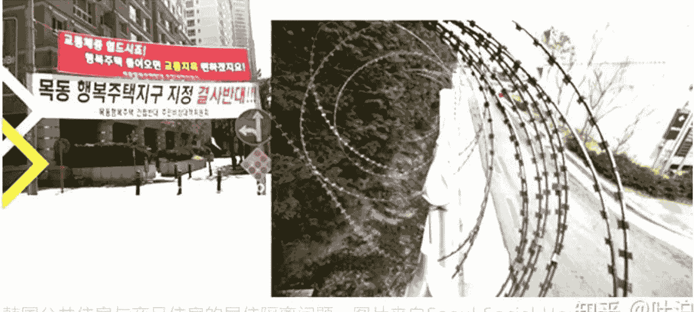
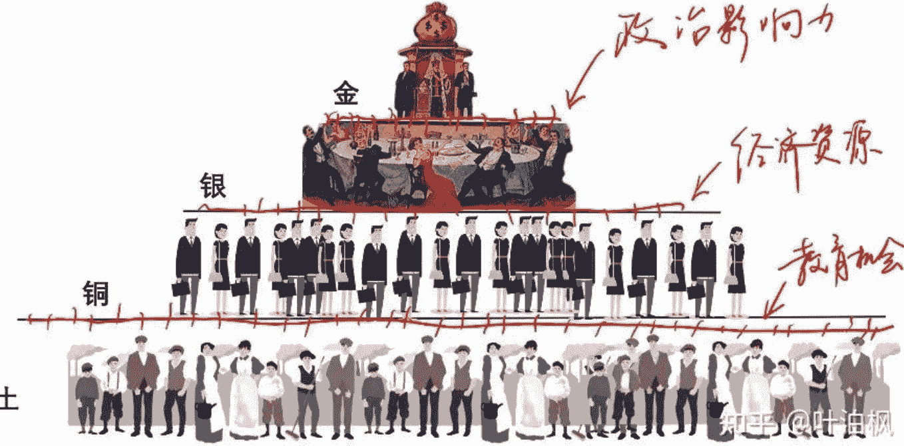
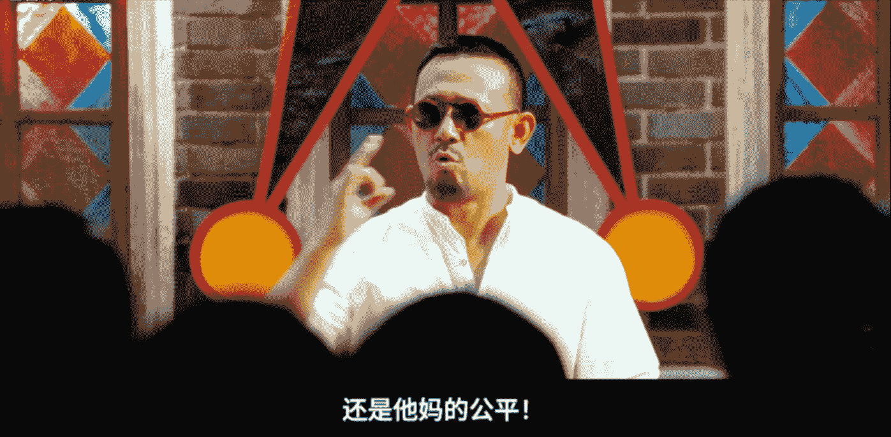
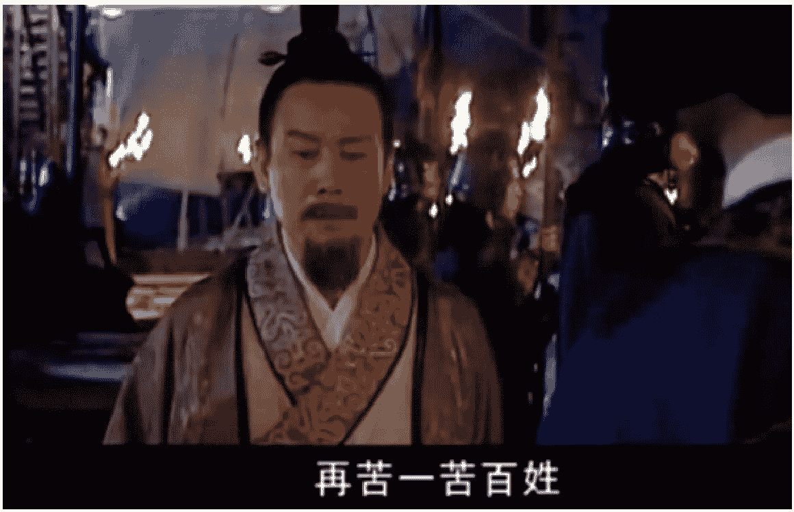

公众号懒人搜索，懒人专属群分享

# 时代洪流与个人抉择

250120 叶泊枫

整理：公众号懒人搜索，懒人专属群独享

懒人微信：lazyhelper

系列合集（包含付费文），小懒帮大家整理好了

考虑到内容毕竟多，除了 pdf 外还增加 epub 格式，方便大家导入微信读书查看~

## 社会是如何分层，并一步步走向固化的？

我前两天看了渤海小吏的《...高考“分层之战”和“人生破圈算法”》的视频，不得不说，他对权力游戏和人性法则的见解，已是炉火纯青。

特别是讲社会分层的那段，也勾起了我的表达欲。

我这篇主要讲社会机器里更细节的分层算法，以及是如何一步步走向固化的，之后也会讲到普通人怎么在固化社会去向上跃迁。

大家看完文章，最好再去找他的原视频对比着看，咱社团是个啥旗号来着？独立思考嘛！

为了让你有更好的阅读体验，我把总结放在前面：

- 1) 社会好比一台复杂机器，消费循环，债务周期，阶层流动……就像一个个零件，互相咬合，层层嵌套，我们身处其中，又是这些的零件的零件，只有了解其构造，方知它要带我们去向何处；

- 2) 虽然人们习惯用财富规模和社会地位来定位阶层身份，但真正的分层逻辑是——权力大小，资产高低，以及向上跃迁机会的多寡；

- 3) 上层提防中产，却对底层很友好。其最盼望者，是使下层可以充分向中层流动，再牢牢掌握中层向上的阀门；

- 4) 精英中层向上，要么被收编（联姻 or 站队），要么跳出规则异军突起；

- 5) 城市白领/小资是普通中层，最卷，因为上层看不上，又不够见识跳出规则看规则，只能去卷明规则；

- 6) 白领/小资的右翼部分，是消费主义的屠宰场，中翼是 YOLO(享乐主义) 的主阵地，左翼则是网络愤青基本盘；

- 7) 底层的特征：被动分配，无向上机会，无话语权。

- 8) 底层经济窘迫，限制了其文化选择和思维带宽，是传说中人口红利和下沉市场；

- 9) 人身依附逻辑 + 纵切和横切的统治手段 + 打压新兴领域，是阶层固化的原因；

- 10) 阶层固化的过程，是竞争逻辑走向世袭逻辑的过程，会使社会丧失竞争力，所以国家一定会打破固化。

## 01 社会机器的分层逻辑

假设你要设计一款在阶层社会打怪升级的游戏，你要怎么架构这个社会的分层？

从经济逻辑出发，现代社会一般分为两个阶级：工薪阶级 vs 食利阶级。

“薪”是什么？劳动报酬。

“利”又是什么？租、息、税。

这是按收入方式来进行的划分，很科学，对吧？

但不直观！

因为一个人可以既是食利者又是工薪族。

举个例子，你同事小赵，他跟你一起上班领工资，他或许工作能力不如你，甚至是你的下属。

但他家有好几套房在收租……

再说了，都是领工资的，某网红专家年薪 1500w，你月薪 1500 块，你该不会觉得自己跟他在同一个阶层吧？

所以大家更习惯用财富规模和社会地位来区分阶层。

因为这些东西是直接就能看出来的，底层仇富，仇得就是这些东西，上层炫富，炫得也是这些东西。

伟人也是这么分的——《毛选》的首卷首篇，便是著名的《中国社会各阶层分析·1925》。

伟人的分析，起始于一个重要命题——谁是朋友？谁是敌人？

- 1）上层：军阀、官僚地主、买办。

最厉害的肯定是军阀，比如后来当上总统的蒋介石，就是军阀里最大的那个。

官僚地主次之，他们在和平年代的目标是成为权臣，而在动乱年代，就是成为军阀。

买办是半封建半殖民地社会的特殊产物，最典型的就是民国时期的四大家族，他们是军阀官僚和跨国资本攫取利益的操盘手。

- 2）中产：民族资产阶级，小资产阶级。

民族资产阶级就是在国内开公司的民企老板，又叫实业资产阶级。

他们在国内受到军阀和官僚的压迫，在境外又受到国际资本的打压，所以他们有反封建反帝的动机。

但同时又提防“打马列牌”，因为他们的利益，说到底还是要剥削打工人。

所以民族资产阶级的目标，是既限制官僚又打压底层，他们是自由主义和社会达尔文主义的摇旗者。

再往下是小资产阶级，他们有一定资产，如自耕农；或者有技术，如工程师、文体明星、律师、教授等等。

小资产阶级在思想上，又分为右、中、左三类。

右派有生产结余，相对富裕，时刻想往上爬。

所以他们讨好官僚地主，而害怕动荡革命。

中间派刚好自足，自知上升无望，却也无下跌风险。

他们态度骑墙，既能看懂官僚地主的堕落腐朽，又怀疑革命，理由是地主和洋人来头很大，你们搞不定。

左翼，有负债，有失业和降薪风险，有阶层下跌的焦虑，接受过书本理论的宣传，所以最盼望革命。

- 3) 下层：半无产阶级。

比如半自耕农，他们除了种自己的地以外，还要租地主的地和借债才能勉强度日。

还有城市的小手工业者也是半无产阶级，有一定技术，但不可替代性很低，时刻有失业和返贫焦虑。

- 最底层的是无产者——除了自身体力啥也没有。

包括血汗工厂的工人、农村长工、临时工，以及游民无产者。

比如祥林嫂属于农村临时工，阿 Q 则是游民无产者。

又比如拉车的祥子，他有自己的车时，是半无产阶级；没车，但给人拉包月时，是有稳定工作的无产阶级；既没自己的车，也不拉包月，就是灵活就业。

最后车也没得拉，便也成了游民无产者。

他们都是最底层无产者，都没有未来。

看完这些，你肯定想把自己往里面套。

千万别，社会在发展，时代在进步，行情已经变了。

我们讨论伟人的分类方式，并不是要生搬硬套，而是要学习他解剖社会的思维工具。

在渤海小吏的视频中，社会层级被也简化为“上 - 中 - 下”三层：

- 1) 上层：权力所有者&高护城河生产资料所有者；

- 2) 中层：小型生产资料所有者&有产打工人；

- 3) 底层：无产者。

他的分层有贯穿上下的两条主线：一条是权力，从大到小；另一条是生产资料，但并非是从多到少，而是从高到底。

高护城河，指的是垄断地位和准入门槛。

没有护城河的地方，才是可以自由竞争的地方，也是我们普通人通过努力能够抵达的地方。

众所周知，韩国的阶层固化非常变态。

不是有个“含着金汤匙出生”的英文谚语嘛，韩国人就顺着搞出了一个“汤匙阶级论”——

他们根据父母的收入水平，把年轻一代分成了 4 个等级：

这套说法虽然流行，但并不合理。

因为很多权力可以兑现的资源并不会通过收入来直接体现。

比如韩国总统尹锡悦的收入比他老婆还低很多，更不用说那些财阀大佬了，但你能说总统的阶级比财阀低么？

我认为现代社会的阶层划分标准，除了前面提到的权力大小、资产高低，还有就是向上跃迁机会的多寡。

据此，我们可以拓展一下韩国的“汤匙阶级论”：

### 金汤匙——顶层官僚 + 垄断财阀

他们是绝对的统治阶级，既包括青瓦台掌门人，国会、检察院、韩国银行、军事委员会等实权部门的头头脑脑，也包括三星、现代等垄断财阀的实权人物，

金汤匙阶级的护城河非常高，非有奇遇不能进。

### 银汤匙——中产精英

银汤匙又分为上下两层，上层是企业老板，由于不像财阀那样居于垄断地位，博弈筹码少，只能向上依附。

要么依附官僚，要么依附财阀（上下游的产业链）。

韩剧《黑暗荣耀》里的河道英，就属于这个阶层。

银汤匙下层是各行业的高级人才。

比如高级职业经理人、大教授、大专家、大律师、名医、明星等等，是普通人通过努力可以达到的极致，

再往上，就得靠“上头有人”和逆天奇遇了。

《黑暗荣耀》里的朴妍珍、李莎拉就在这个阶层。

当然她们都不是靠个人努力，而靠的是“家族传承吾辈责”。

银汤匙上层和下层的差别，在于上层有可以代际传承的家族资产，下层则主要靠专业知识为更高层服务。

相对来说，中产的国际流动性最强。

一是他们的资产和技能比较受欢迎；

二是他们不像财阀官僚，和国内政治深度绑定。

### 铜汤匙——城市白领/小资

即脑力无产者，如企业中中层、普通公务员、个体户。

和底层的差别，在于铜汤匙有机会往上爬。

《黑暗荣耀》里的崔惠廷、孙明悟，以及女主文东恩，都在这个阶层。

伟人的思维工具再走一遍——铜汤匙内部，又分为右、中、左三类。

右翼是收入有结余，但又够不上中产的人群，

他们在思想上，企图往上爬，成为中产，

在消费上竭力模仿中产，是消费主义的屠宰场。

《黑暗荣耀》里的空姐崔慧婷，就被刻画得非常典型——一边挖空心思嫁二代，一边到处蹭包拍照。

但你看朴妍珍、李莎拉那几个真中产，谁炫包？人家都只当正常消费品而已。

中翼对阶层爬升不抱希望，但如果不生孩子的话，也无需担心阶层坠落，所以是享乐主义的主阵地。

韩国的 YOLO 文化，就是这群人搞起来的。

左翼滑落风险巨大，比如有 35 岁危机、房产暴雷等焦虑，所以他们对资本剥削和社会不公反应最为激烈。

“地狱韩国”等控诉性的舆论，就是左翼发出的。

### 土汤匙——社会基石

他们是城市商贩、劳动力密集型产业打工人、农民工……

文东恩的母亲和保姆姜贤南，都在这个阶层。

土汤匙特点是：

- 1）被动再分配。

他们没有参与分配的权力，因为他们的工作不可替代性很低，没有劳动议价权。

其收入与其说是工资，不如说是劳动力再生产的成本。

- 2）无上升希望。

虽说土汤匙都没有向上的希望，但根据其是否有稳定收入，情况又有所不同。

有稳定收入的，虽然经济窘迫，但生活有着落，知道自己上升无望，于是寄托下一代，给子女很大压力。

无稳定收入的，既无技术也无本钱，只能选择一些劳动价值很低的工作，抗风险能力极弱，省吃俭用，思想上抗拒消费主义，以玩物丧志论之，而且忽视子女教育，常常要求未成年子女帮衬劳动。

- 3）无话语权。

土汤匙虽然在经济权力上被广泛侵占，而且生活窘迫，

但他们并没有像铜汤匙左翼那样接受过理论训练，

既缺乏理解社会的思维工具，也缺乏必要的思维带宽。

一方面，他们生活的大部分时间，都被繁重的劳作所占据，

出于心理补偿机制，余闲又被奶头乐占据。

另一方面，不管是古代的小农经济，还是现代的工业社会，底层劳动者所从事的都是机械性的重复劳作。

在马克思所处的时代，人们就已经发现——机械性工作是去能力化的。

去掉的能力，主要就是思维能力！

经济窘迫叠加缺乏思维能力，就限制了土汤匙的文化选择——他们观察社会主要通过自己的双眼，见识主要来自于对照自身生活，对家长里短的兴趣甚于理论逻辑。

所以他们是抖音和神剧的常客，也是下沉市场的主流。

描述完毕，现在需要你把思路再收回来，去俯瞰一下阶层社会的全貌：

公众号懒人搜索，懒人专属群分享

现在你可以把自己往里套了。

网上也有人根据分工逻辑，将社会阶层划分为：

- 1、国家与社会管理者

- 2、企业主

- 3、经理人员

- 4、专业技术人员

- 5、办事人员

- 6、个体工商户

- 7、商业服务业员工

- 8、产业工人

- 9、农业劳动者

- 10、城乡无业 (失业、半失业者)

仔细想，他这也不叫分工逻辑，而是价值回报逻辑。

即你所做的工作，能获得多少资源分配，最终还是财富、权力、机会这些东西。

关键是很多东西也不是通过工作分配来的，比如王撕葱的地位，是工作得来的吗？

是世袭得来的。

合不合理到后面再说，事实逻辑得先捋清楚。

另一个需要注意的是，人们虽然习惯说“金字塔社会”，

但真实社会并不是金字塔式的，而是“倒图钉”式的：

上图还是 2005 年的结构模型，

经过这么多年的“大水漫灌”*(本质是使货币流向食利阶层，使债务流向工薪阶层)，这枚图钉的上部会更长更细，下部越来越宽......

现在知道为什么“下沉市场”这么大了吧？因为它真的很大！

## 02 阶层的流动算法

不管在什么年代，“下沉市场”的人都会有种强烈的受害者心态——他们觉得上层只会欺压下层，并不会照顾下层利益。

比如我们说支持房产税，很多人就讲——别想了，哪有人会对自已动刀？

他们觉得金汤匙和银汤匙都是人上人，都是为富不仁。

其实不是这么回事，金汤匙和银汤匙冲突起来反而更激烈。

金汤匙的目的是千秋万代、江山永固，

银汤匙的目的是百尺竿头，更进一步，

但顶层的坑位又是有限的，别人上去，就意味着有人要被挤下来。

因为权力蛋糕和经济蛋糕是完全不同的逻辑，它是不设增量的，别人多吃一块，你就少吃一块。

> 所以金汤匙必然对银汤匙百般防备，但对中下层却很友好。

因为在社会秩序正常的时候，下层很难直接挑战上层的位置。

因为中间隔着银汤匙——都不用上层动手，中层就给你阻了。

“旧时王谢堂前燕，飞入寻常百姓家”的故事，只会发生在秩序崩坏的时候。

什么时候秩序崩坏？

就是下层生活困苦又看不到希望的时候，反思了一把“王侯将相，宁有种乎？”

水能覆舟嘛，铜汤匙左翼 + 土汤匙，就是这个水。

所以对于金汤匙来说，最佳的博弈策略是：

第一，要让铜汤匙和土汤匙看到向上的希望。

因为他们是社会的主要建设者，得让他们卷起来。

看不到希望的话，傻子才卷！

第二，牢牢把持住银汤匙向上的阀门。

既不能让他们大批量向上，万一把自己给挤下去了呢？

也不能一点希望都不给，得维持着他们在桌子上和和气气的氛围。

最好的办法，就是设计出一条能被上层灵活掌握的护城河，让中层去跨：

> 比如说贷款环节、特殊资源的审批、持证经营所需的证照等等。

> ——@渤海小吏

第三，对于那种顶牛逼的银汤匙，成本最低的控制，是收编。

收编的形式通常有两种：

一是联姻；

二是入股。

古代科举放榜之后，豪门冲上去争着结亲，主考官则忙着搞师生团伙，都是出于这样的设计。

# 那么银汤匙怎么爬上去，成为金汤匙呢？

从“收编”这条路径看，银汤匙对金汤匙，都是百般讨好的。

因为能不能上，全看人家松不松手，这是社会机器运转的潜规则。

银汤匙很清楚，那些写在纸面上的明规则，是用来向下做交代的——为什么他能上，你不能？

因为他是名校海归，你是末流土鳖，你还能说什么？

金汤匙和银汤匙之所以是上层，和下层最大的差别就在于下层卷的是明规则，上层卷的是潜规则。

银汤匙作为社会精英，早就看穿了规则内外的游戏是怎么玩的，就算他们自己看不穿，身边的智囊也能帮他们看穿。

所以他们懂得跳出规则看规则，

要么顺应潜规则被收编 (联姻或站队)，

要么“不走寻常路”，去找一条上层没留意到的赛道，然后来个异军突起，一发不可收拾。

比如扎克伯格、马斯克这种 new money，都走的是这条路。

有人就问了，为什么会有金汤匙留意不到的领域？

他们不是通观全局么？

我们说，不管是“世袭”还是其他形式的潜规则传承，都有一个降维的趋势!

什么意思？

就是说世袭者的家业，会越来越简单，越来越没有科技含量，也就越来越缺乏竞争力。

而且还会因为利益结构复杂而变得反应呆滞，无法对时局变化起到有效应对。

比如封建王朝的末期，就是此种光景。

换成家族企业也一样，假如你创业成功，从市场竞争中存活了下来，你要怎么把打下的江山传递给子孙？

你能保证他们跟你一样英明神武么？

你保证不了！

想让后代衣食无忧、江山永固，只有两条路可走。

第一是垄断基础生存物资的生产、转运和销售。

这在古代，就是盐、铁、钱币，至于现代，你自己去想；

第二是占据那些不可再生的公共资源，并以私有财产的名义，往下传递。

这在古代，是土地、矿山、园林池苑……至于现代，你自己去想。

举个例子，HK 的 L 家，你看他们后来买的都是些什么资产？不是交通、电信就是自来水，再不然就是直接买地，总归都是些垄断、刚需性质的成熟产业。

他们才不搞创新，因为创新搞不好容易败家。

也就是说，世袭家族会越来越缺乏创新精神和竞争思维，“高护城河”既阻碍了外来者，也困住了他们自己。

注意，咱这聊的可不是“富不过三代”这种片汤话，

而是说“世袭”这种传承机制是降维的，这是属于上层人的熵增，其根子在不劳而获。

因为对抗熵增，必须持续做负熵，肯定要消耗能量。

想要轻松地绵延江山，注定会一代不如一代。

比如《黑暗荣耀》里的朴妍珍和李莎拉，明显就不如他们的父母辈有见识。

什么叫“有见识”？

不是说你会多国语言，会识别各种品牌的包包，会区分“地铁里的气味”，就叫有见识。

见识指的是对世道人心的领悟，是对社会机器运转的掌握和对人性法则的敏锐洞察。

这跟学习和思考的关系最大，跟你处在什么位置，关系并不大。

现在不是都说学历贬值么，很多人就在知乎提问——既然读完大学还是要送外卖的话，那读书还有什么意义？

长见识，就是读书最大的意义！

大家千万别被眼前的苟且给懵逼了心智，如果说这个世界上还有最后一点公平的话，那一定是读书长见识！

因为见识不会因为他是上层，就自动往他脑子里钻，平民也好，贵族也罢，都需要一点点去学，去思考，去领悟。

要知道在古代上层社会筑高护城河最有效的一招，就是知识垄断。

这是因为在印刷术和纸张发明之前，书籍、竹简都贵得要死，而且读书还意味着要脱产，下层哪负担得起呢？

那时候只有上层读得起书、长得起见识，所以他们说“唯上智与下愚不移”。

意思是上层人有见识，下层人啥也不懂，这是几千年都没变过的事。

长见识在以前是独属于权贵阶层的优越感，但现在不一样了，因为出版物和互联网的存在，在知识获得上，大家被拉到了同一维度，剩下就是拼悟性和自律了。

虽然但是，精英们在“长见识”上，还是有三重优势：

- 1) 他们吃过见过，相对更容易脱离低级趣味，从而专注于高价值目标，更懂自律；

- 2) 他们经济宽裕，相对更容易匀出思维带宽，去做长远规划；

- 3) 精英有更好的学习资源和学习意识，很多知识确实能自己学，这些道理你也能自己想明白，但代价就是花更多时间，走更多弯路，而精英们大多会找到合适的传道受业解惑者，10 分钟就给他讲明白。

所以从概率上讲，精英们更能做到跳出规则看规则。

他们不管是走潜规则被收编，还是不走寻常路搞异军突起，都不会把精力浪费到去和普通人卷明规则。

比如《黑暗荣耀》里的李莎拉，是个大名鼎鼎的海归艺术家，你猜她为什么不在韩国上大学？

# 在明规则里卷得死去活来的，是铜汤匙。

一方面他们很难看到向上的希望，毕竟上层看不上他们，他们自身也缺乏探索创新之路的见识和胆识；

二来他们也不占有任何高护城河的且可以代际传承的资产，所以有深刻的阶层滑落焦虑。

于是只能卷。

要么卷工作，期待从中层卷成高层，从小律师卷成大律师，从小老板卷成大老板……

要么卷子女教育，期待孩子像自己一样，是明规则下的卷王，这样至少能维持住阶层地位。

他们自己卷是一方面，修高壁垒，阻挡下一层的人向上，是另一方面。

铜汤匙右翼之所以热衷消费主义，既是想通过模仿中产，给自己营造财富幻觉，也在借用消费概念，使自己和底层隔开。

比如有人说他喝咖啡，你啃大葱——你们不是一路人。

所以对底层最狠的人是谁？

就是这帮人！

辅导班、学区房，这些明规则里的阶层壁垒，都是他们筑起来的。

其目的，也是为了用钱把底层隔开。

在韩国，公共住房和商品住房之间也产生了居住隔离的问题，拥有房产的居民不想和公共住房的居民共用服务设施，会在不同片区之间竖起围墙和铁丝网。甚至，不希望自己的孩子和公共住房的孩子一起上学。这种空间的隔离，最终会导致社会阶层的隔离。

他们就希望你家上民工学校，他家孩子上明星学校，你家孩子减负脑子里全是奶头乐，他家孩子去接受各种规划、各种培训。

也就是说，辅导班和学区房，并不是上层的设计，因为上层根本不在这个游戏里面，压根就不需要这些东西。

辅导班能说砍就砍，学区房也必然会面临政策风险！

然而也因为卷，越来越多的铜汤匙不生孩子。

左翼戾气深重，口号是——对“地狱韩国”最大的反抗，就是不再给他们生产奴隶。

中翼 YOLO，口号是——儿孙自有儿孙福，没有儿孙我享福。

甚至连一门心思往上爬的右翼也不生，在《黑暗荣耀》里，只有银汤匙的朴妍珍有孩子，铜汤匙的孙明悟、崔惠廷、文东恩，都没孩子。

土汤匙固然不像左翼愤青那样热衷表达不满，但却是公平触感最强烈的阶层。

因为他们在社会最底层，又经济困窘，他们可以接受的失败原因，只能是自己能力不行，认知不够，卷不过别人。

这也是上层社会和主流舆论一直在宣传的东西。

但如果让他们知道自己一开始就输了，那谁还愿意卷？

谁还愿意一直向上输送价值？

从这个意义上讲，张雪峰老师所起到的作用，和周公子鲶鱼是一样的，他们是在用截然不同的方式，告诉底层同一个事实——你一出生就输了！

阶层固化就是这个样子——都知道高护城河生产资料很重要，于是先来的先占了，再通过各种或明或暗的运作，将其变成“世袭”的，那后来者哪还有发展空间呢？

《大富翁》玩过没？当每个格子都被先手玩家买断后，其他玩家每走一步都在掉钱，出局就只是时间问题了。

## 03 阶层如何走向固化？

首先，除了最下层的土汤匙，上面的每个阶层都在挖护城河。

护城河从上到下，依次是：
- 政治影响力
- 经济资源
- 教育机会

随着护城河越挖越深，每个阶层都觉得自己的面前有一道天堑。

土汤匙面对的是天价学区房和辅导班，他们吐槽——想获得平等的教育机会怎么就这么难？

铜汤匙感慨学历贬值——985 毕业、大厂肝命，也追不上大城市的一套房。

银汤匙卷在普通人看不见的地方。

有个学术名词，叫“向上管理”，就是他们卷的方式。

换句话说，又叫向上依附。

古代的门阀为什么是“门”？

因为那时的依附逻辑是血缘、姻亲和裙带——你要么是他亲生的，要么是他亲戚，再不然就和他联姻，否则别想获得重任。

现代的学阀，其依附逻辑便是“学”——想拥有学术地位，想获得学术资金，就必须对某个学术权威进行人身依附。

人身依附逻辑，用现在的话讲，就是混圈子、搞关系。

有人说这个他会，他会敬酒、会来事，有特殊的社交技巧，所以他会搞关系。

屁，人家这“关系”是有优先排序的，

即：血缘＞裙带＞利益绑定＞伯乐＞情绪价值......

很多人表现出来的“会搞关系”，最多就是个会提供“情绪价值”。

这在血缘和利益面前，der 都不是。

而且上位者为了强化自己的权力效力，还会有意识地打压明规则，使下位者看不到明确的晋升通道，只能选择向上依附。

比如在古代，决定下级官僚升迁的是什么？

是高级官僚的提携和举荐，这比吏部的绩效考核重要得多，你说他们会提携谁？

人身依附逻辑会使上层集团板结化，慢慢的，就水泼不进来了。

所以即便是银汤匙，也会感到生意越来越难做——新工程、新项目看着很多，但他就是拿不到。

更严重的是，这种依附逻辑会沿着权力脉络，不断向下层社会延伸。

于是你会发现，许多领域很快就没了明规则的生存空间。

比如我有个在韩国留学的学生，读的是电气专业，他说韩国电力公社今年去他们学院开招聘宣讲的时候，明确说今年没有名额，但他们班还是 6 个人入职了这家国企，你说他们是怎么进的？

他有个韩国同学甚至光明正大在推特发文说：“我怕你会读书吗，首尔大学硕士都没那么容易进我单位！”

### 其次，为了转移矛盾，上层会采取纵切和横切的手法，来制造底层的互相对立。

所谓纵切，就是在弱势阶层中划出更弱势的。

因为上层不会轻易出让自己的利益，只会把一部分底层的利益，让渡给另一部分更有议价能力的底层。

比如美国，黑人被歧视了两百年，但黑人转过头又去歧视拉美裔和亚裔的新移民。

我国古代亦是如此，阶层等级越森严，封建教化越严重，女性地位就越低。

这是统治阶级为维持阶层社会而创造出的特定文化语境——将下层的不满转化为了对更下层的欺压。

在阶层社会，每个人都被剥削，每个人又都是剥削者。

比如你享受了便宜的外卖，感慨配送效率吊打欧美时，你有没有想过，这是以剥削底层劳动者为代价的呢？

而所谓横切，最典型的就是美国的“身份政治”。

建制派精英站队女权、LGBT 和新移民，

川普则打出反建制旗号——力挺新教徒和铁锈带老白男。

其实这些底层人，99% 的苦难都是相通的，但美国精英就是利用了那 1% 的差异，将他们分裂开来，使他们彼此对立，从而忽视了阶层矛盾。

同样的手法，还让想到非洲国家卢旺达。

比利时的殖民者为了更好地控制卢旺达，根据拥有牛的数量是否大于 10 头，以及身高体重、鼻梁高低、鼻翼宽窄、脖子长短等外貌因素，将卢旺达人强行划分为图西和胡图两族，并印在身份证上。

然后扶植人数少的图西族，打压人数多的胡图族。

经过几十年的撕裂，胡图人和图西人之间的矛盾越积越深，结果在 1994 年酿成了惨烈的大屠杀。

电影《卢旺达饭店》讲的就是这个故事：

| 项目 | 内容 |
| :--- | :--- |
| 导演 | 特瑞·乔治 |
| 编剧 | 凯尔·皮尔森 / 特瑞·乔治 |
| 主演 | 唐·钱德尔 / 苏菲·奥康内多 / 华金·菲尼克斯 / 尼克·诺特 / 哈基姆·凯 - 卡西姆 / 更多... |
| 类型 | 剧情 / 传记 / 历史 / 战争 |
| 官方网站 | www.mgm.com/ua/hotelrwanda/main.html |
| 制片国家/地区 | 英国 / 南非 / 意大利 / 美国 |
| 语言 | 英语 / 法语 |
| 上映日期 | 2004-09-11(多伦多电影节) / 2005-03-04(英国) |
| 片长 | 121 分钟 |
| 又名 | 卢安达饭店 (台) |
| IMDb | tt0395169 |

### 第三，金汤匙会本能地打压新兴领域。

前文说银汤匙向上突破的方式，除了被收编，就是“不走寻常路”。但金汤匙可以通过把持认证、资质、经营权限、银行贷款等权力资源，调控银汤匙向上的机会。

比如日本，泡沫危机之后，他们的科技树总是点错，很大一个原因就在于其银行资源完全被几个大财团把持，即使被浪费去给僵尸企业续命，也很少流入创新领域。

此举给银行制造了大量垃圾资产，在日本社会酿成了巨大的信用危机，

其危害比房价下跌要大得多，是日本“失落三十年”的真正罪魁。

还有个例子也能说明这个问题，在电影《一出好戏》中，一群人流落到荒岛上，组成了一个“原始”社会。

居于统治地位的小兴看到有可以搭救他们的轮船经过时，第一反应竟不是通知众人，而是隐瞒消息，何解？

因为回到文明世界，他的高层地位就没了。

所以乾隆皇帝拒绝开眼看世界，真的是出于天朝上国的自大吗？

我更愿意相信是他担心一旦开通海禁，就会诞生出能量巨大的资产阶级，威胁皇权。

出于统治便利的需要，他故意把帝国底层限制在低效的小农经济之中。

以上，不管是人身依附逻辑的延伸，还是纵切横切的统治手段，抑或是对新兴领域的打压限制，都会导致阶层社会越来越固化。

这是自上而下的分配结构决定的，不以任何人的意志为转移。

虽然不爽，但我们还是要搞明白——人类社会发展到目前这个阶段，还无法避免阶层分化。

因为社会资源有限，集中到少数精英手上，可以效率最大化。

比如在一个原始部落，大家都以捕猎为生，后羿每天能打到 10 只兔子，其他的 9 个猎手只能打 1 只。

这时天上掉下一把神弓，谁拥有它，谁的捕猎能力就会增加 10 倍，请问这把弓该给谁？

给后羿，部落捕到的兔子是 10*10+9=109 只。

给其他人，部落捕到的兔子是 10+1*10+8=28 只。

应该给后羿对不对？

那接下来的问题就是谁有权来做这个分配。

于是基于权力和经济资源分配逻辑的阶层社会就产生了，它本意是要提高资源的利用效率。

马克思主义消灭阶级的逻辑是——生产力高度发达，社会资源无限。

在上述例子中，相当于有无数把神弓随意取用，那就不存在分配问题了。

显然现阶段还不够发达，也就无法避免阶层分化，那么让谁来支配资源，便成了最重要的社会命题。

最简单有效的逻辑是——谁有能力利用好资源，谁就应该成为社会资源的支配者。

比如箭射得最好的后羿。

这就解释了为什么资本主义英国，可以吊打封建主义大清！

资本主义什么逻辑？

——谁能夺取资源，谁就可以支配资源。

这当然也有问题，因为夺取资源和利用资源，显然不是同一种能力。

但比封建世袭还是要强太多，因为世袭逻辑是——谁胎投得好，谁就可以支配资源。

投胎不是能力，是只能开一次盲盒的运气。

而且还因为一出生就赢，不必竞争上岗，反而是去能力化的。

擅长夺取资源的人 vs 开盲盒后躺在资源上的人，两者之间的差别，基本等同于石头和卵的差别。

阶层固化，说白了就是阶层的世袭化，必然使社会丧失竞争力。

所以国家有充分的动机，去拆掉下层向上流动的壁垒，这一点我们要坚信！

至于我们自己要如何向上跃迁，我后面再写，敬请持续关注。

以上，希望你拥有财富和幸福！

历史 3000 多份各类付费文章以及年费三千多的副业社群资源，见懒人专属群内部分享！

付费群，白嫖勿扰！

懒人专属群更新记录：

https://lazybook.fun/#/blog/record2

# 增长从哪里来？

这篇文章是接着《社会是如何分层，并一步步走向固化的？》写的，讲阶层流动。

这里其实有两个话题，社会分层，探讨的是“谁得到了什么”？阶层流动研究的则是“如何得到？”

基于对这两个问题的思考，你会得到两种公平观：

1. 认为凭什么 ta 有好工作而我没有？我也要有，应该大家都一样！

都一样，也就是均贫富，比如吃大锅饭，这种公平叫结果公平。

2. 认为均贫富不合理，人与人的差异与生俱来，有些人就是特别能干，让 ta 先富无可厚非，均贫富只会压抑劳动积极性。

我们需要确保的是所有人都有同样的机会去人尽其才，也就是机会公平，或者叫程序公平，制度公平。

历史上我们曾追求过“结果公平”，但失败了，现在更注重程序公平。

只是依然不断有人用“均贫富”来混淆，找杠抬。

那么什么样的分层程序是公平的呢？先看看见历史上都出现过哪些机制。

我最近读了两本书，对阶层流动的历史沿革有很精确的总结，一本是钱穆的《中国历代政治得失》，还有一本是王亚南的《中国官僚政治研究》。

首先是血统世袭，我们古代的皇权承继、分封世袭，靠的都是血统。

欧洲在大革命之前也是类似套路，以血统来区分贵族和平民，比如在《权力的游戏》中，你看个族徽和姓氏，就能大概猜到对方身份。

较真地讲，血统这套才叫封建，我们现在习惯把皇权专制以来所衍生出的官僚主义和思想禁锢统称为封建。

我国的封建制在战国时就瓦解了，当时群雄割据，列国纷争，谁先壮大，就能吃掉别人，否则就是被吃。

这么激烈的竞争环境下，只会搞享乐的世袭贵族，搞起竞争来简直是弱鸡，在专业的兵家、法家、墨家、纵横家面前，完全不够看。

本着谁好用就用谁的原则，“布衣卿相”开始进入权力中心。

秦国之所以能快速崛起，就是因为任用了一大批外籍外姓的职业经理人。

于是，以选贤任能为初衷的“征辟选拔”，逐渐取代了世卿世禄的“世袭继承”。

秦一统天下之后，为了强化中央集权，废分封，立郡县，不断往地方派驻中央选拔的官员，这套制度经汉武帝强化之后，就形成了权力结构从上到下、从中央辐射地方的官僚制，西方叫科层制。

但皇帝选官不可能每个都面试一遍吧？

于是就有了推荐制度，《陈情表》中，李密说：前太守臣逵察臣孝廉；后刺史臣荣举臣秀才。

这里的“察举”，就是推荐。

但推荐制也很快被玩坏了，虽说官位不能世袭，但可以我推荐你的孩子，你推荐我的侄子，利益裙带就这么形成了。

发展到东汉之后，这些盘根错节的利益网逐渐成了门阀。

比如袁绍，“四世三公”说明他们家本身就强，“门生故吏无数”，又说明被他们家推荐提拔的人都听他们的，你说这势力能不大么？

门阀垄断上层通道，并且制度化，还搞出了严格依据门第规模选官的“九品中正制”，以至于“上品无寒门，下品无士族”。

意思是你的出身就决定了你的高度，跟努力没关系，一出生就没有东西，这辈子大概率也不会有，所以跟世袭也没差了。

门阀坐大，到魏晋时，甚至敢和皇帝掰手腕——“王与马，共天下”。

你要是皇帝，你能忍？后来隋唐一统，皇帝携重整山河之威，就立即着手削弱门阀，办法是开科举——给寒门子弟开辟升迁通道，打破门阀垄断。

注意哈，这里的寒门可不是贫民，而是指门阀势力以外的其他贵族，要知道在印刷术发明之前，但凡能读得起书的，非富即贵，一个是书贵，另一个是读书要脱产，普通人家根本供不起。

但读书做官这条路，又是平民为数不多的青云路，贵是吧？脱产是吧？那就举整个家族之力，只培养那几个有天赋的年轻人。

他们中的幸运儿上去之后，再回头来“一人得道鸡犬升天”+“光宗耀祖”，范仲淹的“范氏义庄”，就是这么来的。

这样一来，宗族便取代门阀，成为地方上的山头势力。

你说皇帝会打击门阀，为什么不打击宗族？反而还动不动宣传“以仁孝治天下”，支持宗族？

首先，皇帝就是最大的宗族。

其次，宗族一家一姓，封闭性太强，远不如门阀强大，威胁不到皇权。

再次，宗族是地方妥协势力的代表，是完全的保守力量，老人政治嘛——族老们负责劝年轻人不要躁动，比三纲五常还好使。

《白鹿原》看过吧？甭管上头是带清还是北洋，又或是 KMT，宗族代表的核心诉求永远是苟着，而不是反抗。

试问哪个统治者不喜欢这样的宗族？

See？君权父权是一体的有没有？现代女性平权主义所反对的父权制（宗法制），本质是皇权集中的衍生品，而并非是“全体男性的红利”，如果认识不到这一点，再怎么吵也吵不到本质，而只会加剧底层的撕裂。

除了形成宗法制，利于统治，科举对皇帝的好处还有：

1. 利出一孔

意思是说，出身平民的你，想出人头地，就只能走读书做官这一条路。

而这条路又绝对控制在皇帝及高层官员手上，那么你就必须要向上进行人身依附，听话、温顺、忠诚。

2. 寓治于教

把四书五经、三纲五常列为必考，那些有志之士，就会自己往思想牢笼里跳，他们还以为是跳龙门呢。

以上，不管是荐举还是科举，初衷都是打破阶层固化，但最终都因为掌权者的自私，又变回了另一种形式的世袭。

这里面有一个非常明显的道理——坐稳高层，必须要有赏罚手段的支撑。

就像《黄粱梦》里演的那样，你趋炎附势，就赏；你拒不合作，就罚。

他们管这叫恩威并施——如果年轻人依靠制度升迁，那还有必要对上进行依附么？就控制不住了。

所以在自上而下的权力框架下，任何制度，最后都要让位于人治。

而由于人的自私性，就一定会陷入世袭和固化，进而变得低效——从上层看，无论努不努力都是上层，那努力干什么呢？

从下层看，无论怎么努力都上不去，那努力又有什么用呢？

既然世袭和固化是低效，那么相对的，竞争和流动便是高效的。

换句话说，“是龙得给我盘着，是虎得给我卧着”VS“能者上，劣者下”，到底哪个低效哪个高效，难道不是一眼分明的么？

所以每到王朝末期，阶层固化的低效体制，就会被竞争且流动的高效体制所击败。六国对秦国的失败，是血统制对选拔制 (变法 + 军功爵) 的失败; 大清对大英的失败，是封建制对市场制的失败。

改朝换代也是同样的逻辑，固然没有制度创新，但也是流动性强的组织，取代流动固化的。

所以什么是公平？

在竞争中实现的“能者上劣者下”就是公平，这出于人们对社会进步*的朴素追求。

世袭为什么不公平？因为不效率，会把社会带向失败。

你肯定听到过一个说法——发展要兼顾效率和公平，这个说法的吊诡之处在于，他认为效率和公平是互斥的，要效率，就要舍弃公平，真的是这样吗？

至少李达康肯定是这么认为的。

然而实际上，效率和公平是一体的，举一个在《社会是如何分层，并一步步走向固化的？》中举过的例子:

> 后羿天赋异禀，一天能捕到 10 只兔子，另外 10 名普通猎手，每人每天只能捕到 1 只，现在部落发现一把神弓，配给谁，谁的效率就提升 10 倍。
配给后羿，部落一天共抓到 10*10+10=110 只兔子;
配给普通猎手，只能捕到 10+1*10+9=29 只兔子。

于是这把弓给了后羿，后羿家先富，其他人家后富。请问这算是为效率牺牲公平吗？

当然不是，这个分配方式很效率，也很公平。

这里的公平，不在于把弓轮着让每个人都有机会用，而在于确认谁是后羿。

所谓机会公平，指的是每个人都有相同的机会发展自己，或许你才是后羿呢？

而是他想把弓给谁，就说谁是后羿。

也就是说，把资源给到能更好利用资源的人，就既是效率，也是公平。

公平的机制，会带来效率的极大提升，就是增长的源头!

李强老师在《当代中国社社会分层》中，系统阐述了改开 40 年来的分层机制变化，主要是三条脉络:

1. 用“市场竞争”代替“计划分配”;
2. 用“干出绩效”代替“熬资历”(体制外);
3. 用“高考”代替“身份审查和推荐”。

但也必须要理解到社会的复杂性，它不是静止不变，也不是泾渭分明，它是流动发展的。

而且历史有惯性，所以时不时看到古代社会的影子也很正常。

比如在《人民的名义》中，沙瑞金在常委会上批评山头主义，高育良狡辩说：在干部人事安排上，主管领导使用一些身边比较熟悉的干部也有情可原。熟悉的，知根知底，啥性情，啥能耐，心里大体有数，用着就放心嘛。

后来有一幕，高育良批评祁同伟说：你有些事情做得很不像话，一个大字不识的农民，也都被你安排做了协警，去看守停车场！

祁同伟没当回事：哎呀，zg 就是个人情社会嘛，你说我上来了，能放着那些乡亲们不管么？

高育良说：一人得道鸡犬升天在你身上应验了！下一步，你是不是准备把你们村上的野狗全弄到公安局当警犬，吃上一份皇粮啊？

高育良任用其子弟，结成汉大帮，祁同伟带着老家亲戚鸡犬升天，不就是变种的门阀、裙带和宗族吗？

某国企发文，不许直系三代应聘，但完全可以你儿子到我单位来，我女儿到你单位去——只要选拔解释权在少数人手里，他就总能找到漏洞去钻。

当漏洞被钻得越来越大，潜规则便会取代明规则，成为被少数人垄断的阶层通道，与世袭也就没差了。

又比如我们一直说古代黑暗，难道古代就没有开明的时候？其实也有，比如靠绩效升迁的“非军功不能侯”，还有司马懿家的大公子司马师。

别看这人是个门阀子弟，但绝对够英明，他当领导的时候，都是按才能和功绩提拔下属，而他的前任们，不是看关系，就是看钱。

他说，那些送钱上来的人，为的是捞更多钱，真有事让他们上的时候，肯定惜命；

而那些靠关系的人呢，最多就是用他的资源和你交换，并不会真的掏心掏肺。

只有那些出身寒门的人，原本毫无出路，是你给了他们出路，他们就会在你需要的时候和你站在一起，因为没了你就没了出路。

See？什么叫见识？什么叫领导力？这就是！

你要是碰到司马师这样的领导，你甚至可能会觉得“封建”也没那么糟糕嘛，只要敢打敢拼敢卖命，还是可以出人头地的。

但其实你多半碰到的是袁术那样的领导——为他拼命就只会没命。

然而司马师之所以是司马师，也是因为他要竞争——如果争不过曹爽，那被灭三族的，就是他们司马家。

历史 3000 多份各类付费文章以及年费三千多的副业社群资源，见懒人专属群内部分享！

付费群，白嫖勿扰！

懒人专属群更新记录：

https://lazybook.fun/#/blog/record2

## 走出历史周期律的关键，在于“觉民行道”！

我看《大明王朝 1566》的时候，一直有个疑问，

就是嘉靖这老小子总自比汉文帝，他们也确实有很多相似之处，

比如都是外藩出身，都高智商、擅权谋，也都笃信黄老搞“无为而治”，

但为什么汉文帝搞出的是文景之治，而嘉靖搞出的是“家家皆净”呢？

电视剧中的嘉靖，给人的印象是：修道，贪财，聪明，好面子……

历史上的嘉靖，也差不多就是这样，而且还有性怪癖、专权。

有人说，不对呀，嘉靖 20 年不上朝，怎么做到“专权”的？

李洁非老师在其著作《龙床》中讲：

> 嘉靖是罕见的运用思想、精神、心理因素，甚至仅仅靠语言来控制权力的专家。

> 对于维持自己的统治，他不必宵衣旰食，也不必殚精竭虑，只须只言片语，即足令臣工戒慎肃栗。

意思是，嘉靖是个极有心机的皇帝，而且悟到了权术的本质——不是勤政，也不是爱民，而是控制。

说得通透一点，就是驭人。

嘉靖驾驭群臣的套路有三个：

- 1）拉新打旧；
- 2）搞平衡；
- 3）特务统治。

这些套路，现在很多大公司的领导也喜欢用，所以大家学一学，或许用得上。

1）所谓拉新打旧，就是培植新人，打压旧人。

在《明朝那些事儿》中，最精彩的内阁斗争，就是从嘉靖朝开始的，张璁斗杨廷和，严嵩斗夏言，徐阶斗严嵩……

大臣们斗得死去活来，但在背后操盘的，全都是嘉靖——只有他，拥有稳稳的幸福。

他就像炒股高手一样，在新人崭露头角的时候买入、加注；

在旧人如日中天时逃顶，然后反手做空。

这样一来，任谁都无法积攒起足够撼动他的实力。

2）所谓搞平衡，就是剧里演的那样，任用严党搞钱，又用清流制衡严党，他则假装当裁判，居中节制。

为什么说假装呢？因为他早期是偏向严党的，毕竟钱是替他搞的，三七分嘛。

但后来严嵩老了，严党变质了，从“一心唯上”变成了“一心自肥”，嘉靖就容不下他们了。

3）他还搞特务统治，东厂锦衣卫遍布朝野。

嘉靖虽然从不搞微服私访，但到处都是他的监控和人形摄像头，官员百姓的一举一动，都在他的数据库里。

不过话说回来，会搞权力斗争，肯定不算缺点，甚至可以说是一个牛逼皇帝的必备素养。

特别像嘉靖和汉文帝这样“外藩出身”的皇帝，

原本是个小透明，突然天上掉馅饼，当上了九五至尊，可以说是无根无柢。

要资源没资源，要经验没经验，

更谈不上什么威望、班底、权力积累。

要是不会点手段，大概率会沦为权臣的傀儡。

(配图来自朕说历史)

嘉靖能当上皇帝，用权臣杨廷和的话讲，是：

> 兄终弟及，谁能渎焉。兴献王长子，宪宗之孙，孝宗之从子，大行皇帝之从弟，序当立。

这么长一串的身份，跟报菜名似的，就说明嘉靖和前任的正德皇帝是八竿子才打得着的关系。

原因是正德老兄玩了一辈子，御女无数，却没能玩出个儿子，不知道是不是有什么大病。

巧的是，他自己还是根独苗，于是皇位就便宜了堂弟，也就是今天要说的男主——嘉靖。

汉文帝坐上皇位的过程要波折得多。

众所周知，刘邦驾崩之后，掌权的是吕后。

吕后为了巩固权力，提拔了很多娘家人，并拼命打压刘姓皇族。

汉文帝刘恒虽是刘邦的第四子，但由于是一夜情的结果，所以不怎么受待见。

早早就跟着老娘跑到封地过日子，一直没什么存在感，反而躲过了吕后的清洗。

吕后一死，掌控朝局的是追随刘邦打天下的周勃、灌婴等功臣集团掌，他们斩杀诸吕，自然也不会放过吕氏拥立的小皇帝。

但大汉朝又不能没有皇帝，所以还得再立一个，选谁呢？

和吕氏有瓜葛的？

pass！

太有存在感不好掌控的？

pass！

他们选来选去，选中了刘恒，目测这个小伙子应该会很“听话”。

也就是说，权臣的拥立，才是嘉靖和汉文帝从小透明升上皇帝的直接原因，

而权臣想要的回报，自然是皇帝的“合作”。

所以嘉靖和汉文帝执政之路的第一关，便是来自权臣的试探和挑战。

嘉靖当时才 15 岁，碰到的第一个问题是“走哪个门”——文官集团想让他按皇太子的标准走侧门。

汉文帝遇到的第一个问题，是功臣集团首脑周勃发过来的“你过来，我和你谈谈”。

如果是你遇到这两题，你怎么破？

这在我们普通人看来，前者是形式主义，走哪个门，有什么所谓呢？

后者更无所谓了，谈谈？谈谈就谈谈呗，看老小子能翻出什么花样。

但嘉靖和文帝的政治敏感性极强，他们都看出了门道——这种小动作，其实是对皇帝的服从性测试。

所以嘉靖态度很鲜明，不行，非要走正门——我是来当皇帝的，又不是来当皇太子的！

文帝就更拽了：“你想谈什么？如果是公事，为什么不能当着大家的面谈？如果谈私事，那对不起，皇帝哪有私事？”

从这样的小故事就可以看出，这两位皇帝，都很有主见，都不可能被操控为傀儡。

嘉靖后来通过“大礼议”，利用官员们的投机心理，煽动文官集团互斗，并逐渐掌握了权力斗争的诀窍，从此把封建官僚玩弄于股掌。

汉文帝就更高明了，他玩了个“请客、斩首、收下当狗”的三连招：

- 1）先分封功臣集团，安抚他们，麻痹他们，这叫请客；

- 2）然后就拉陈平打周勃，并敦促功臣集团离开首都去往各自封邑，分化瓦解他们的抱团，这叫斩首；

- 3）最后精心挑选张苍接任丞相，这人虽是功臣集团的一员，但为人非常“老实”，安安分分给文帝当了 15 年的秘书，这就叫收下当狗。

看到这里，嘉靖和汉文帝是不是很像？

确实很像，不光如此，他们还在个人信仰上，都笃信道家的黄老之术，在政治上号称“无为而治”。

但汉文帝搞出的，是历史上公认的、可信度最高的太平盛世——文景之治，而嘉靖搞出来的却是“家家皆净”，差别在哪里呢？

春秋战国时期，百家争鸣，出了一大堆思想家哲学家，他们提出了各自关于治国理政的观点。

黄老之术，就是在那时形成的一款政治哲学，特指黄帝和老子的思想理论。

后世一般认为，这里的黄帝和老子是被“托名”了，名人效应嘛，弄个大 title 比较容易传播。

这套理论有三个方向：

一曰修身。

它融合了道家养身、儒家修德的观点。

二曰经世。

它认为君主应该“省苛事，薄赋敛，毋夺民时”，提倡无为而治，通过“无为”而达到“有为”。

这就很亚当·斯密了有没有？

无为致有为，简直就是战国版的“看不见的手”。

三曰致用。

也就是科技发明。

看出来没？所谓黄老之术，几乎就是道、儒、法、墨的整合版。

汉文帝确实掌握了黄老的精髓。

他一上台搞的就是“小政府、大市场”那一套，“轻徭薄赋”，鼓励百姓安定下来，安安心心搞生产。

汉文帝登基的第二年，就将农业税从十五税一减为三十税一。

又将人头税从 120 钱/年，减为 40 钱/年，丁男每一年出一次役，减为每三年出一次役。

没等上述减税措施落实，文帝就接着下令，直接免除了农业税，而且一免就是 13 年（《汉书·食货志》）。

记性比较好的同学可能会想到，我国在 2012 年全面免除了农业税，到现在也有十几年了。

但没有可比性。

因为现代社会，农业在经济中的占比非常低，而且抛荒严重，农业税在财政收入的占比中微乎其微，征收成本都快高于征收金额了，免除是大势所趋。

但在汉文帝时期，农业占整个国家 GDP 的 90% 以上，所以当时免除农业税，相当于现在的免收进城税，从这里可以看出汉文帝与民休息和藏富于民的决心。

有人就要问了，收这么少的税，他怎么维持国家机器的运转呢？

### 1）过紧日子。

汉文帝全家带头搞廉政建设，衣食非常朴素。

皇帝都这样，大臣谁敢搞铺张？

### 2）精简机构。

小政府嘛，汉文帝时期的官僚系统非常简洁精悍，只维持了必要的公共服务和军事建设，每年养活官僚阶层的财政支出只需几十万石。

相比于汉武帝末期，官僚系统每年 400 万石的财政消耗（郭建龙《中央帝国的财政密码》），汉文帝的行政班底可谓极其简洁了。

### 3）买卖爵位。

这是沿用的秦制，指允许富人通过捐献，获得一定的爵位，或免除罪过，这样就可以获得税收以外的财政收入。

有人说这是封建糟粕。

对，历史局限性嘛。

不过轻徭薄赋，精兵简政的效果是显著的，那就是国富民强。

司马迁在《史记》中非常生动地描述了这一盛世场景，被后世人无数次引用：

> 民则人给家足，都鄙廪庾皆满，而府库余货财。京师之钱累巨万，贯朽而不可校。

> 太仓之粟陈陈相因，充溢露积于外，至腐败不可食。众庶街巷有马，阡陌之间成群，而乘字牝者傧而不得聚会。

国库的钱太多了，穿钱的绳子都烂了；

仓库里的粮食吃不完，堆着发霉；

到处是成群的马匹，你要是骑一匹母马，都不好意思出门……

马这个事为什么单独拿出来讲呢？

一是因为司马迁所描述的画面太美，相当于现在的家家户户都有高档 SUV，你要是开一台奇瑞 qq，是没法合群的。

二是汉初太穷，高祖刘邦举办大型活动时，整个国家连 4 匹白色的马都凑不齐。

这么一对比，就能衬托出汉文帝时期的经济增长有多迅速了。

嘉靖不是也说自己笃信黄老，搞无为而治么？他怎么没有这样的成就呢？

因为嘉靖是个烂人！

他所信的黄老，既不是经世致用，也不是修身养性，而是炼丹修道求长生。

有人说，汉文帝不是也有过“可怜夜半虚前席，不问苍生问鬼神”的糊涂时刻么？

他那是被李商隐坑了。

汉文帝当时和贾谊聊完鬼神之后，感慨说：“吾久不见贾生，自以为过之，今不及也。”（《史记·屈原贾生列传》）

意思是，我以为贾生离开了这么久，我的学问该超过他了，没想到还是他更牛逼啊。

你看，原本是搞学术，硬生生被传成了搞迷信。

但嘉靖是真搞迷信，天天躲在西苑，设醮行、修道观，还把各种丹药吃了个遍。

他口口声声“朕四季常服不过八套”，但干的事情却是倭寇可以不剿，鞑靼可以不安抚，灾民可以不赈济，官员欠俸可以不发，唯独道观不能不修，仙丹不能不练。

如此上行下效，官员焉能不贪？

汉文帝的无为而治，指的是贯穿始终的“小政府”，而嘉靖的版本，却是“甩锅”——老子二十年不上朝，搞的是无为而治，如果有问题，那肯定是你们的问题！

可实际呢，他本人就相当于大明朝的户部尚书，账算得门儿清，搞钱无所不用其极。

钱不够用就掠之于民，民变在即，又掠之于商，商人吃完，就抄家贪官……可不就家家皆净了么？

为什么汉文帝和嘉靖都是绝顶聪明的统治者，却带来了截然不同的政治成果？

网上有很多人说，因为嘉靖的天赋点错了技能树，他把聪明才智，用在了权谋斗争和驾驭人心上了。

那些名垂千古的皇帝，像汉汤文武、唐宗宋祖，哪个不是权谋斗争的高手？

依我看，还是海瑞在《治安疏》中总结得到位，嘉靖是“以一人之心，夺天下人之心”。

用现在的话讲，就是极度的自私，为了满足自己的私欲，把全天下的人都当成了工具人。

严党是敛财工具人；

清流是看着严党的工具人；

天下苍生则是形同牛马的工具人。

但嘉靖也曾是个“屠龙少年”啊！

他即位之初，深感前朝弊政的祸害，对杨廷和大刀阔斧的除弊措施，均予照准。

不仅大力裁减皇家役仆和京官用度，连那些攀关系走后门的二代们，也处理了大半。

史料记载曰：“恩幸得官者大半皆斥去”。

这些举措，大大减轻了百姓的经济负担。

后来他所任用的张璁、桂萼、夏言等，也都是能干之臣，他们继续铲除积弊，革新吏治，颇有作为。

虽然在《明朝那些事儿》中，张璁、桂萼被描述为卑鄙的政治投机分子，但实际上他们非常有担当。

嘉靖一朝，之所以能人辈出，直接原因便是张璁改革了科举风气和官员选拔制度。

后来张居正改革所推行的一条鞭法，也是从桂萼手上孵化出来的。

所以海瑞对嘉靖执政初期的评价，非常正面：

> 天资英断，睿识绝人，可为尧、舜……

> 即位初年，铲除积弊，焕然与天下更始……

> 天下忻忻，以大有作为仰之。识者谓相辅得人，太平指日可期。

但嘉靖怎么就变恶龙了呢？

因为皇权专制所赋予的绝对权力，会腐蚀人！

当一个人享受至高无上的尊荣，可以毫无约束、毫无顾忌地做任何事，更有无数逢迎谄媚之人围在身边，挖空心思地百般讨好取悦……

时间一长，试问他如何还能用清醒的眼光看待世界、审视自我呢？

“那也有不受腐蚀的啊，比如汉文帝！”

但像汉文帝这样的皇帝，是极少数，我们普通人就是活十辈子，也未必能摊上一个！

在皇权专制时代，权力的本质是人，同一个位置，不同的人来坐，结局天差地别。

所以在封建统治的三四千年里，先贤们始终认为，只有坐在龙椅上的皇帝是有道明君，天下方能大治。

于是他们不厌其烦地游说君王，盼望能“致君尧舜”。

比如孟子，到处走，到处被人问：“先生何以教我？”

然后他一顿嘴炮输出，把诸侯们说得俯首贴耳。

宋明时期的理学家们心心念念的，也是教育君王，使皇帝陛下修德行、赞化育、修身养性、以德治天下。

这就叫“得君行道”！

即通过向君主说教，来完成自己“治国平天下”的抱负。

就好比海瑞，所谓“正君道、明臣职”，

其实就是劝皇帝：“求求你赶紧做个好人吧！”

那皇帝要是不干呢？

皇帝多数时候都是不干的！

历史上那么多皇帝，能听得进劝谏的，也就史书里反复被夸的那几位。

在我们的教材中，每次都是孟子赢了，但真正听了他的劝，以王道治天下的君主，又有哪个呢？

> 既然对着皇帝讲“孔曰成仁，孟曰取义”是扯淡，那要怎么做才能天下大治呢？

卡尔·波普在其著作《开放社会及其敌人》中，也提出过类似的问题：

> 怎样组织我们的统治结构，才能使堕落的或无能的皇帝不会造成太大的伤害？

我有段时间很迷王阳明，一直在思考他在贵州龙场所悟的道，到底是个什么道。

偶然间看到一位叫获麟采薇的网友说：

> 王阳明所悟的道，是放弃“得君行道”，转向“觉民行道”。

虽然我觉得王阳明的道，未必是这个，但“觉民行道”的说法还是一下把我给点醒了。

既然不能指望君主是道德圣人 + 完美君子，那么要想实现理想中清平盛世，单靠劝说君主，肯定行不通，鬼知道你碰到的是汉文帝还是嘉靖帝呢？

所以势必要换个路径！

知乎上曾有个热门话题，问的是“韩国人知道自己被财阀控制了么？”

这个问题的提法虽然有些傲慢，但对它的思考却非常有意义——假如韩国的问题都是财阀造成的，那是不是把财阀铲除了，问题就解决了呢？

不可能，因为就算肢解了三星，还会有四星、五星……

根源在于，只要韩国的社会土壤允许财阀的存在，就一定会有财阀生长出来。

所以觉民行道的要旨，就在于让韩国人都知道，不能有也不应该有财阀，

也要让大家知道，该如何限制资本无序增长，进而制约财阀。

也就是说，只有让老百姓都自觉起来，主动参与制度建设，才是人间正道。

“觉民行道”之所以很重要，还在于权力向来只对权力的来源负责。

皇权专制之下，权力结构是自上而下的。

朝廷官员的权柄和威仪，不是来源于百姓，而是来源于皇帝，你猜他们是愿意为天下苍生的生计奔忙，还是更乐于逢迎媚上？

很多人可能不知道，严嵩起初也是个正直少年。

大坏蛋刘瑾、江彬当权时，他辞官隐居近十年，有人几次请他出山，他都严词拒绝，理由是“奸臣当道”，不甘同流合污。

他死前的绝命诗，写的是“平生报国惟忠赤，身死从人说是非”。

这个明代第一大奸臣，竟然也好意思说“报国”、“忠赤”，是不是有点讽刺？

但你能说他不忠么？

他要是不忠，怎么可能在嘉靖手底下执掌内阁 20 多年呢？

嘉靖可是拉新打旧的高手啊。

所以他忠的是嘉靖，报的也是嘉靖。

因为嘉靖是他的权力来源，而不是天下苍生。

嘉靖一朝的权力结构已然定型，换谁来当首辅，又有什么差别呢？

徐阶难道不是靠写青词拍马屁上台的？

严党倒台后，清流们所干的不照样是“再苦一苦百姓”么？

严党固然腐败不堪，但清流也同样不对百姓负责，皆因百姓不是封建统治的权力来源啊！

1945 年 7 月，黄炎培等六位国民参政员应教员之邀，访问延安，留下了著名的“延安窑洞对”。

黄炎培说：

> 中共能否跳出“其兴也勃焉，其亡也忽焉”的历史周期率？

教员高兴地答道：

> 我们已经找到了新路，我们能跳出这周期率。这条新路，就是民主。

以上，从对汉文帝和嘉靖的对比中，引申出了以下讨论：

- 1) 在古代，指望“明君在位”而天下大治，终究是一场奢望;
- 2) “得君行道”走不通，因为大概率碰到的是被权力腐蚀的嘉靖，而不是不忘初心的汉文帝;
- 3) “觉民行道”的关键，就是唤起所有人的主人翁意识，让人人都负起责来!

# 为什么工作让人越来越不快乐？

细思起来就有点恐了，不知不觉，疫情已经跨越 3 个冬季。

可对于年轻人来说，比新冠还恐怖的传染病，似乎是焦虑和迷茫。

我发现越来越多的人，感到工作没有动力，职业发展没有希望，虽然他们按部就班地上班，循规蹈矩地工作，但怀疑和无力感，已经融进了血液，好像不论做什么，都提不起劲。

总之，他们不快乐！

有人说，不快乐是因为累，996、007，压得人透不过气。

也有人说，不快乐是因为看不到希望，工资涨幅永远也追不上房价涨幅，没有安居，没有乐业，没有希望！

有句话怎么说来着，对国家充满希望，对自己充满绝望。

往往这时候，一定会有人过来对你搞“爹味三重奏”：

- 1) 你应该调整心态，换个思路，把 996、007，看成是人生必经的磨练;
- 2) 他们当年如何如何;
- 3) 端出奋斗、狼性、成功学的鸡汤，趁热让你干掉。

既得利益者都有个特点，就是喜欢把结构性的、普遍性的社会问题，归结为个人的心态问题——你不快乐，是你有问题，你吃不了苦，受不了罪，你没有积极乐观的心态。

反正社会没问题！

不让你看到社会的问题，就可以遮蔽问题背后结构性的原因，就可以不做改变，就可以继续吃干抹尽。

所以本篇想要探讨的，就是普遍的不快乐，所反应的，究竟是什么样的社会问题。

## 01

*一切社会问题的源头，都是同一个，就是*人是什么？*

文艺复兴在历史上的地位为什么那么高？

因为从那时起，人们的目光开始从虚无缥缈的神，转向了有血有肉的人，哲学家的任务，也变成了思考人的现实生活，追求把人从各种思想枷锁中解放，使人的本质得到伸张。

什么叫本质？

就是使一件东西，成为这件东西的东西！

人的本质，即使人成为人的东西！

这个东西是什么？

叔本华说，是欲望——人有欲望，不能满足便痛苦。

边沁说，是自由意志——人能超越生物的本能，做出权衡和选择。

亚里士多德、笛卡尔、柏拉图说，是理性——因为人可以超越感官所接触到的信息，去评估、判断、做出预测……斯密显然也认同这个观点。

马克思认为，人的本质，是劳动！

“啥玩意儿？敢情打工是宿命呗？”

不要把劳动理解为搬砖嘛，狭隘了，具体是啥，后面再细聊。这会儿我们先站到先哲们的肩膀上，来捋一捋，人的本质到底是个啥。

在我看来，这个问题至少要从三个层面展开。

### 第一，人和动物的差别

人是万物灵长，由猴子进化而来，从非洲迁徙而来。

人有 23 对染色体，是基因的容器、保护壳，也是基因维持存在和繁衍的工具，是基因算法和自然规则共同作用的结果。

在《人类简史》中，尤瓦尔·赫拉利认为，人和动物出现差别的起点，是约 7 万年前的认知革命。

自那之后的智人，更新了思维系统和沟通方式，有了宗教、社会分层等虚构事物，使人们可以更有效地组织到一起，最终称霸地球。

这种有意识的、创造性的想象、虚构、传播和联结，是人与动物的分界。

马克思所说的劳动生产，其实是认知革命的一种反馈——人不仅仅履行基本的生物功能，还创造性地改造自然环境（比如使用工具），使之适应人的需要。

也是基于生产（增加物质创造，改善生存环境）的目的，人类才组建了社会关系。

### 第二，人和人的关系

群居，是许多动物躲避伤害、维持种群繁衍的生存策略。

人，便是典型的群居动物，不论进食、迁移、繁衍，皆以群体为行动单位。

人类社会的发展历程，是群居单位由小到大、由简单到复杂的过程，也是人类社会的分工，由粗放到精细的发展过程。

人类社会的组织结构经历过：最初的亲缘家族→氏族部落→区域民族→国家→国际组织......

结群而居、互相联系、交流协作，是人类的天性，在长期的进化过程中，逐渐内化成人类意识中对社会认同和公共秩序的渴望。表现为人需要被同类认可，被集体接纳，需要确认彼此在群体中的位置，这就叫社会关系。

人对社会关系的刚需，造就了阶级——人和人之间，既是合作的，也是彼此通过竞争区分差异的。

而这些差异，是人类社会分配资源、权力和财富的依据。

原始状态下，差异是体格上的，块头大的雄性，优先享用食物和性伴侣。

认知革命之后，人类有了意识，具备想象的能力，虚构出君权神授、皇帝受命于天（天子）的故事，便产生了教庭、贵族、平民的差异。

> 《人类简史》讲：“正因为所有的社会秩序和阶级都只是想象的产物，所以它们也十分脆弱。“

因为换一套故事，阶级的差异就是另一个版本。

思想启蒙之后的近现代社会，平等和私有制深入人心——生产资料占有的多寡，构成了阶级差异的基础。

而在金融资本占主导的当代社会，金融资产的占有的多寡，决定着人们在阶级序列中的位置。

在社会这个层面，马克思又总结道：“人是社会关系的总和。”

所以人的本质是什么？

从群居的进化方式看，是社会性。

从认知革命的角度看，是创造的意识。

生物性呢？不见了？为什么从生物属性出发，最后却脱离了生物性，而仅指出社会性和意识？

### 第三，人和机器的差别

在电影《芬奇》中，当机器人“杰夫”成长出独立意识，开始产生好奇、失望、开心、痛苦、不舍等一系列情绪，此时，你还能说他是“机器”吗？

机器人杰夫得知芬奇即将去世，感到悲伤和不舍。

人，显然是超越生物学意义的存在。

在美剧《西部世界》中，当机器人意识到自己是被制造出来的供人玩乐的机器时，她该是什么样的心情？

《西部世界》中的女机器人德洛丽丝

不妨假设一下，你身处《黑客帝国》的“矩阵宇宙”，而且是矩阵社会的顶层，生活奢靡且拥有几乎无限的自由，当你知道这一切都只是矩阵算法的控制时，你会是什么样的心情？

尽管算法产生的快感和在现实世界感受到的快感，并没有什么不同，但你真的会感到快乐吗？

诚然，有人体验了真实世界的痛苦，选择重新进入虚拟世界，但他除了要求要设计一段痛快的人生外，还要求抹除记忆，不是吗？

为什么他不能带着觉醒的记忆，在虚拟世界享受人生？

这和在游戏世界遨游的我们，有什么不同？

为什么人们在游戏中，可以感受到快乐，而觉醒者（知道一切都是假的）在虚拟世界，即使享受最美好的福利，感受到的也是痛苦？

原因在于，游戏世界是服务于人的，在游戏世界遨游的我们，可以自由地选择进入和退出，而矩阵世界是控制人的，觉醒之人所感受到的，是不自由，和无意义。

受限于科技发展，以前的哲学家可能没有想到过机器会变成人，人也可能会变成算法（意识上传），但我们这一代，已经能清楚分辨出人和机器的分界——复杂情绪（怀疑、痛苦、快乐等）和自由意志。

那现在我们应该怎样去定义人？

一种从自然生物进化而来，又超越生物学意义的，追求创造性的、追求社会关系的、追求自由的……意识。

看到这里，想必会有人较真意识起源的问题——谁也不知道我们所认知的世界，是不是真实世界，或许，我们就生活在矩阵中，我们的意识，只是程序的结果呢？

罗翔老师曾告诫说，用怀疑论看待一切，觉得什么都是假的，那任何问题都推进不下去，任何思考都没有意义。

因为只要来一句，你怎么知道俄罗斯进攻乌克兰是真实发生的，而不是矩阵在我们大脑中虚构的？那话题还能继续么？

对于那些没谱的问题，怀疑论属于抬杠，只有相信，思考才能继续，只有思考继续，才能更接近真实！

借着历代哲学家的肩膀，我们可以看到，人的本质需求是——创造性、社会性，以及自由！

当人性被压制，即：创造性受到打压，不被群体社会接纳，或者被控制，感受不到自由……人，就会痛苦！

## 02

现代社会，正趋于形成一种系统，身处其中的你我，必须主动成为工具人（放弃创造性），接受控制（舍弃自由），才能被群体社会接纳，否则就不被理解，进而孤立。

系统强迫你必须割舍人性的某些部分，你怎么可能不感到痛苦呢？

按马克思的说法，工作本应该是快乐的！

不理解？

前面说了，不要把劳动仅仅看作是搬砖。劳动的本质，是通过对周围环境的感知、体会、分析、思考解决办法、实施改造这一系列过程，来满足自我需要。

比如，你创作了一首小诗，与友人分享且受到称赞，快乐不快乐？你亲手修好了一件电器，使之完好如初，有没有产生过分享兴奋的冲动？

所以说，工作并创造价值，本应是人性的伸张，甚至是人的基本需求。

但在现实中，打工人往往觉得自己像个牲口或是机器——这从骡马人、工具人等自嘲梗日渐流行，就能看出来。

什么时候觉得自己像个人？

不工作的时候！

为什么有的打工人明明累极，却舍不得睡觉？刷手机，躺着发呆……

即使这样的行为毫无意义，也足以让他眷恋，为什么？

因为只有在不工作的时间，他才能夺回对身体的控制权，才觉得自己是个人。

我们说，这种人的本性受到压制，从而被扭曲为非人的、别的什么东西的状况，就叫异化。

PS：异化（ENTFREMDUNG）的应用非常广泛，指的是人对自己，对他人，对一切事物，都感到无意义、无归属的状态，我们这里只讲社会系统对人的异化。

比如在封建体系中，佃农，往往被异化为“会听话的牲畜”。

举例：电影《古田军号》中，短暂失去领导权的毛泽东跑到福建当起了教员，他指着黑板上大大的“人”字，对孩子们说：“什么是人呐？”

有一个穷到全家只有一件棉袄的小男孩站起来说：“人是地主，地主说我们是牛马，奶奶说我们不如牛马！”

这段对话很生动地描述了阶级关系对人的异化，令我印象深刻。

但是在资本主义的生产关系中，人们往往能够感受到异化所带来的痛苦，却不知道异化是怎么发生的。

因为在契约主导的劳动关系中，打工人进入任何生产环节，在形式上都是自愿的。

我们先看它是怎么发生的，再看为什么是自愿却不自由的。

马克思把资本主义生产关系对人产生的异化，归类为 4 个方面：

- 1) 人与产品的异化
- 2) 人与工作过程的异化
- 3) 人性的异化
- 4) 人与人之间的关系异化

PS：也有说 5 个方面，还包括人与自然的异化，但不影响我们正在讨论的话题，就不展开了。

一样样聊。

第一，在资本主义生产关系中，生产出来的产品属于谁？

资本家！

在前文例子中，你会为自己写出优美的诗歌而感到快乐，但在富士康工厂中，对于流水线上的工人来说，装配的是苹果这样伟大的作品，还是别的什么山寨电子品，有差别么？

没差别，因为在这样的雇佣关系中，打工人并不是为了伸张自己的创造性而工作，只是为了赚工资而工作。

赚工资的目的是购买商品，在消费主义的攻势下，人们越来越习惯用形形色色的商品来填充自己的生活，用炫耀性的消费品来定义自己的社会关系......商品本该是为人所使用的，但现在却反过来定义人，这就是最为典型的异化。

第二，生产活动（工作）本应该是人们确认自我价值、建立社会关系的方式。

比如，你会依据一个人的工作是牙医、科学家，或者清洁工，来识别他在社会网络中的位置。

但现在人们工作不是为了展示自己的功能和创造价值，而是为了赚工资——人们绞尽脑汁追逐的，是工资更多的工作，而不是更能体现其个人价值的工作。

在这种情况下，你觉得你的工作还能定义你的价值么？

第三，资本主义的核心，是以资为本，除了私有、占有，还有扩张、增殖。

以资本增殖为纲，意味着利润为王，就要想方设法降低成本，当然也包括人的成本。

工业化所追求的标准化和流程化，本质上都是在降低“人”的成本。

典型的例子就是工厂流水线，它显著提升了资本增殖的效率，但也把人异化成了机器零件儿。

简单说，你和你老板的利益是冲突的，你要收入增长，要工作稳定，就要追求不可替代性，而他则追求降低工人工作的复杂度，减少用人的成本。

你的工作 SOP 了，意味着很多人都能干，那么你的感受只可能是卷，因为你老板总能找到比你工作量更大的工具人。

你说你非常能干，你惊才绝艳，那他也一定找到比你成本更低的人。

工具人之间互相 pk 工作量和谁成本更低，不就是内卷么？

2021 年火了一篇爆款文，叫《困在算法里的外卖骑手》——算法的最终目标，是将骑手的体力压榨到极限，将成本降低到极限。

社会的算法也是这个逻辑，最终会将打工人的工资，压低至仅能维持劳动的再生产。

也就是说你上班赚到的钱，仅能够让你恢复体力，第二天继续上班。

就像电池，充电就是为了放电，直到老化，然后被丢弃，被替换。

你今天打工，为的就是明天能继续打工，那你打这工，还有意义吗？

人之所以为人，就在于人的需求，除了生存本能，还有情感需要以及价值实现，但资本增殖不管这个，它只管想尽办法压低成本，将人电池化。

卷在其中的人，不可以病，不可以老，不可以怀孕，不可以无用，否则就不被接纳，渐渐的，无意义感和无奈感就占据了人们的身心。

第四，人与人之间的关系，本应是情感和信任的连接，但资本主义将其异化为物与物的关系，钱与钱的关系。

因为资本增殖，要的不是社会总效用的增加，而是可交换价值的增加。

有点难理解是不是？

举个例子你就明白了。

你妈妈给你做一桌饭，有没有创造效用？

当然有，但不是可交换的价值。

保姆给你做一桌饭，你给她开工资，才属于资本增殖的过程。

所以资本主义鼓励什么？

它鼓励你妈妈去给别人做饭，获得工资，又鼓励你雇佣别人的妈妈做饭，付出工资。

是不是觉得很扭曲？那你的感受是对的，因为在这个过程当中，人与人之间的关系，被扭曲为了钱与钱之间的关系，所以越是大城市，就越不会有什么温情脉脉。

以上，异化其实用一句话就可以概括——人本应是生产的目的，却沦为了生产的手段。

异化的工作，既没有创造性的实现，又让人感到不自由，是对人性的否定，也是对快乐原则的否定。

异化的社会，把人对创造性和对自由的需求，同对社会性的需求割裂开了——想被社会接纳、被社会认可，你就必须舍弃创造性和自由；

想要获得创造性和自由，就不能被社会的一般价值观所认同。

这就是很多人在职场上进退失据的根源所在，投入工作，则需承受被异化的痛苦，不投入工作，又会承受被社会关系排斥的痛苦，不管如何行动，都有一部分作为人的基本需求被剥离了。

你以为异化就是造成你痛苦的全部原因了吗？

Too young!

## 03

是不是觉得社会节奏越来越快，快要跟不上了？

木心说“从前慢”，那意思就是“现在快”。

观察到这种现象的德国社会学家罗萨，将之称为加速社会。

当代社会是一个高度分工，环环相扣，相互依赖，链条无限长的协作网络，你工作的时间不是由你决定的，甚至也不由你老板决定，而是由客户、同事、上下游的各个环节决定。

比如某明星深夜爆个大瓜，新媒体小编是不是就得立刻起来加班？

大家都绑在同一条传送带上，别人加速，你就得加速，不然就会脱节，就会掉队，就会被挤出来。

有人说，那大家都慢下来不就行了？

不行！

因为任何社会都必须找出一个方式，来分配资源、财富、特权、名誉和社会地位。

最具正当性的分配原则，就是竞争。

竞争的逻辑，从上往下，用规训视角看，是鼓励奋斗、狼性、福报、消费主义等。

但从底层打工人的视角看，教育程度、工作收入、子女成就，炫耀性消费，乃至于婚姻，一切的一切，全都要用来搞“军备竞赛”。

只有赛赢了，才能获得更多的社会分配，既包括资源的，也包括心理的，如优越感。

竞争，要求你必须做更多事，不能停不下来，俗称内卷。

协作的逻辑和竞争的逻辑环环相扣，组成了一副名叫社会的绞肉机，越卷越快。

- 1) 它的驱动力，不光是欲望和贪婪，更多的，是恐惧与焦虑。

比如现在的年轻人，从中考、高考，到工作、买房……这一路，容错的机会非常低，只要一步没跟上，别人就会告诉你，你的人生完了。

- 2) 社会机器越转越快，维持转动的能量要求就越来越高，于是我们向它投喂的时间精力也越来越多，所以越来越累。

- 3) 社会加速得越来越快，但总有无法加速的部分，比如生态环境、决策方式（民主是要花时间的），以及人类的心理承载，都无法加速。

社会加速带来的心理过载问题包括：

### 首先是没有什么归属感。

俗话说“老家容不下灵魂，北上容不下肉身”，大城市房价太贵，小地方又没有就业，哪里都留不下，哪里都不是家。

而且家是个亲密概念，如果我们一次又一次地迁居，是无法对一个地方产生亲密感的，需要花很长的时间去和环境交互，使之成为我们生命体验的一部分，并产生情感联系，最终才能构成我们的身份认同。

同样的道理，也适用于我们接触到的物和周围的人。

以前，我们会和邻居相处很久，会发生很多故事，现在，周围的同事就像走马灯一样变换，你都来不及了解他们。

那个谁曾说，他在上海见过两千万人，但其实一个人也没见到！

总之，没有故事，没有回忆，就不会真正形成归属感，所以人们越来越孤独。

### 其次是强烈的压迫感和无力感。

现代社会因为高度协作和分工，形成了一种“人人都在流水线上”的局面。

你的工作节奏、个人时间，由“社会传送带”的运转决定，你只能被动参与，导致你所做的事，即便是你自愿的，也并非你真的想做的。

自愿却不自由，就会产生一种无从反抗的压迫感。

“加速的传送带”还带来了信息过载的问题。

为了迎合社会速度避免脱节，你需要参与很多的话题，补充大量信息，这个要看，那个也要知道……事务越积越多，让你始终处于一种要做的任务很多，而且总也做不完的焦虑之中。

更吊诡的是，算法还会不断诱导你，使你偏离自己的任务清单——在新媒体时代，人们很容易找到能“快速产生快感”的替代品，比如短视频、电子游戏。

相较于这些能即时产生反馈的“高速快乐品”，读书、读系统性长文等，都需要花费很长的时间，才能走完快乐机制。

而且人的意志力是消耗品，当你站上“名为上班的流水线”，你的意志力就一直处在消耗状态，你要反复控制自己的言行，不要得罪上司，不要得罪客户，不要令同事不快，不要辞职......

当你获得机会短暂抽离这个系统时，身心俱疲的你，会产生严重的补偿心理——你需要快乐，而你已经没有足够的意志力，来抵抗那些即时快感的冲击了。

只是刷完手机之后，又将面对更长的、更加遥不可及的任务清单，你体会到的是愈发窒息的空虚和焦虑。

### 再次，对时间快速流逝的焦躁感。

嗖一下，一年没了；又嗖一下，今年过完 1/4 了......

这种感觉是怎么来的？

通常来讲，如果你做一件很“有意义”的事时，你沉浸其中，你会忘记时间，但在结束后回想这一天，反而觉得它过得特别久。

比如我们经常说快乐的时间总是短暂的，但是在回忆中，那一天，则是长长的一天。

也就是说，在体验中快速流逝的时间，在记忆中会转变成延伸的时间。

反过来也成立，体验中异常缓慢的时间，在记忆中会变成啥也没干。

比如一场无聊的会议，进行中时，你觉得度日如年，过后回忆时，你只记得“无聊“。

但在加速系统中，这个情况变了，数字媒体带来了“体验短，记忆也短”的奇怪现象——刷完短视频后，停留在记忆中的时间并没有很长，而是毫无痕迹地消失了。

这有两方面的原因：

- 刷手机是“去感官化”的，只是眼睛、耳朵和部分大脑在做功。与之相对应的，旅行是沉浸式的深度体验。

- 数字媒体所生产的内容，有很多是无法和你产生“意义”上的共鸣的。

也就是说，你刷到的很多东西，它们在被生产出来的时候，是不考虑你的需求的，你被动接受，被动充当了流量。

虽然我们提倡雅俗共赏，但欣赏雅，需要一定的教育水平和认知基础，而俗，则所有人都能看。在一个流量为王的，以“快速生产快感”为主导的内容生态下，它一定是越来越俗的，是越来越没有意义的。

我对抗这套算法的窍门，就是提醒自己，一定要带着问题翻书、刷知乎。

这样一来，我看过的很多东西，就是有意义的，因为它解决了我的疑问，或者提供了某个启发思考的视角，总之它跟我产生了互动，就会在我的记忆中有更长期的停留。

以上，加速社会，用恐惧和焦虑驱动我们运转得越来越快，我们的时间精力被消耗的越来越多，使人产生疲惫、压力、不自由、焦虑等负面情绪。

# 总结

异化社会和加速社会互相重叠，既压抑了人性的基本需求，压制了创造性，禁锢了自由，扭曲了社会关系，又加剧了人们的心理负荷，使人在丧失归属感的情况下，承受越来越重的压迫感和焦虑。

在这样的系统中，你不可能感到快乐！

而且你无处躲藏，因为资本主义的生产关系和意识形态已经发展了几百年，早就无孔不入地渗透到了生活的方方面面，我们每个人，都被焊死在了社会化生产的传送带上。

你还很难反抗，不同于宗教社会和皇权社会，有一个直接的、具体的批判对象，在异化社会和加速社会中，你反抗谁呢？商品拜物主义吗？社会竞争的逻辑吗？别忘了你自己还主动参与其中呢！

是不是就真的没办法了？

当然有办法，后面的文章，我们就会讨论到，该如何在工作中获得快乐，以及如何创立一家能让员工快乐工作的公司，敬请期待！

历史 3000 多份各类付费文章以及年费三千多的副业社群资源，见懒人专属群内部分享！

付费群，白嫖勿扰！

懒人专属群更新记录：

https://lazybook.fun/#/blog/record2