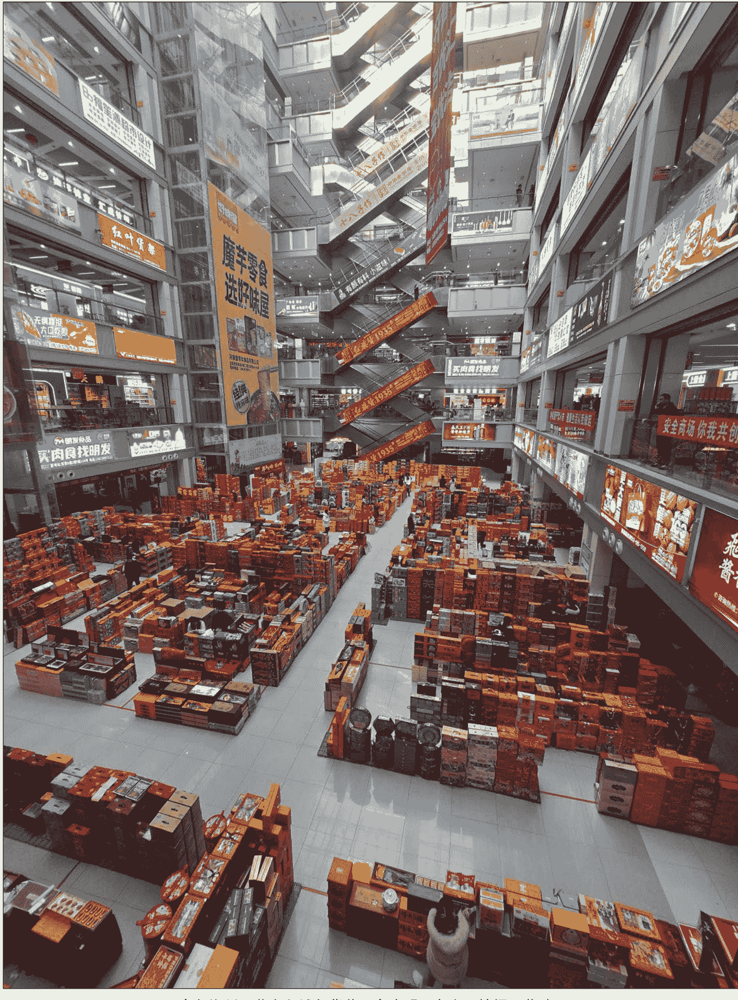

# 蛇年春节，将是财神爷含量最高的一年

250120

整理：公众号懒人搜索，懒人专属群独享

懒人微信:lazyhelper

超市里年货已经如期开工。假如要采购年货，今天这期节目应该能帮到你。即使你没有这个打算，也强烈建议你听听。因为今年的年货，是生肖一轮 12 年里，设计难度最高的。

为什么？因为今年是蛇年。从生肖的寓意上看，不如去年的龙年，再加上蛇与折同音，因此在年货设计上，生肖元素的加持难免打折。

这意味着，蛇年的年货设计，非常考验商家的水平，也能倒逼出很多有趣的解决方案。今天由消费行业专家黄碧云老师，带咱们盘一盘今年的年货趋势。

## 趋势一：财神爷含量最高

第一个趋势是，今年的年货，将是财神爷含量最高的一年。

因为年货的设计一直有个顺位优先级，假如生肖本身福气逼人，商家就会首选生肖作为年货元素。比如金龙赐福、金猪迎春、金牛接财，等等。假如生肖本身不够讨喜，那么年货元素就会顺延到第二顺位，财神爷。

你看去年的情况，2024 年的正月初五，这是迎财神的日子。同时也正好是 2 月 14 日，西方的情人节。但在这天，参与迎财神的人超过 90%，很少有人去迎爱神、月老、丘比特。从中你也能感受到财神爷的号召力。

上个月，黄碧云老师专程走访了很多线上和线下的渠道，还去了义乌的商贸城。果不其然，今年的年货元素里，财神爷成了绝对 C 位。比如，天猫上的多数年货，都采用了财神爷作为核心元素。像八方来财坚果桶、一锭发财饽饽礼盒、零食品牌王小卤推出了抓财手礼盒，里面是卤鸡爪。盒马里卖的盒装香蕉，盒子的形状是聚宝盆，礼盒取名叫，钱的味道。再比如，从微信视频号后台的选品池观察，带有暴富、发财的红色袜子，有大量单品月销超过万件。

再比如，黄碧云老师担任营销顾问的几个品牌，2025 年春节的营销重点，全都放在了财神节的活动上。还有不少公司都定制了钱袋子帆布袋，作为开年的礼品。

再比如，今年还有很多生鲜蔬菜店，故意把生菜写错，写成生财。结果成了店里的明星产品。

再比如，今年 1688 上的定制春节礼袋，花式非常丰富。但只要和财相关的，基本都是同类定制产品里的销量前三名。像小红书上最火的礼品袋之一，就叫公主请发财礼品袋。

换句话说，按照顺位优先级，生肖蛇可能无缘首选，而财神爷将成为今年年货元素的绝对 C 位。

## 趋势二：定制年货崛起

第二个趋势是，定制年货的全面崛起，与成品年货的大规模退潮。

什么叫定制年货？就是你自己给工厂下单，让工厂按照你的特定需求生产的年货。为什么要定制？很明显，你要是买现成的成品年货，一定是千篇一律，显得心意不够。除非你买特别贵的，但假如是送礼，你送别人的东西太贵，又会增加别人还礼的负担。这时，最好的选择就是自己定制一份年货。既能显得有新意，同时又不用花太多钱，也降低了别人还礼的负担。

这要放前些年，个人定制礼品成本很高。但现在，在 1688 这样的平台上，已经能够实现私人的小规模定制。一个年货礼盒，里面装上不错的坚果炒货春联之类，成本也就在 100 元到 150 元之间。根据黄碧云老师去 1688 走访获得的信息，今年 C 端消费者的定制需求明显变多。去年 12 月定制商品的需求量同比增加了 19.7%。一款定制的祝福卡片，一个月的销量能超过 1800 万张。

而与定制的增长相反的，是传统的成品礼盒销量大幅下降。很多地区的成品礼盒销量，同比下降了 40%到 50%。黄碧云老师采访了郑州百荣、长沙高桥市场、南昌洪城市场的经销商，获得的答案一致，各地的经销商今年都不敢大规模备货。因为年货类似于月饼，属于时效性强的商品，一旦过年期间卖不完，后续的出售难度就更极高。因此今年，很多商家都把重点放在了小包装和散装商品上。



换句话说，随着国内供应链能力的极大提升，定制年货的价格被打下来了，它正在成为大量个人消费者的首选。

## 趋势三：年宵花迷你化

第三个趋势，是年宵花，正在变得更小、更强、更淡。

年宵花，是春节前后开花的花卉的统称。比如墨兰、君子兰、蝴蝶兰等等。很多人都会在春节前买点年宵花摆在家里，开花时正值新春，有个好彩头。

这两年，年宵花的热度越来越高。比如盒马，去年卖爆过几款年宵花，比如银柳、冬青。而今年的销量比去年增长了 150%。其中卖得最好的年宵花产品之一，叫有钱花银柳福桶，销量同比增长了四倍。同时，今年的年宵花种类也越来越丰富，比如单头玫瑰、水仙百合、向日葵都是年宵花里的新宠。

那么，为什么现在的年宵花这么受欢迎呢？除了来自消费端的青睐，也有来自产品端的升级。黄碧云老师专门去云南考察了目前国内最大的鲜花种植基地，发现了这么几个非常微妙的变化。

首先，现在鲜花的花朵，通过人为干预变得更小了。为什么要让花朵变小？这背后有一个非常精巧的设计。种植基地专门测算了中国家庭使用的花瓶的尺寸，口径一般在 8 厘米。这个口径不算大，假如里面的花朵尺寸大，那么一个花瓶里顶多摆几枝，开花的时候还好，不开花时就显得很稀疏。而把花朵变小，即使不开花的时候，花瓶里也能摆上一束茂密的花枝，看起来也美观。说白了，把花朵变小，是为了维持开花前的美观度。

其次，鲜花的生命力在变强。现在的鲜花不像过去那么娇气，不需要套上专门的网套，这样就能降低运输成本，减少损耗，鲜花也能卖得更便宜。

最后，现在鲜花的气味经过人工干预变淡了。为什么要变淡？原因之一是，假如在广东等南方省份，即使是冬天和春天，天气也并不冷，花香太明显容易吸引蚊虫。

这就是为什么，现在的鲜花变得更小、更强、更淡。

你可以从中感受一下，鲜花行业的用户洞察，已经深入到了如此具体的细枝末节。

## 趋势四：宠物年货升级

第四个趋势是，宠物年货的消费升级。

宠物年货这两年热度很高。借用黄碧云老师的话说，今年宠物行业的底色，是宠物主人对宠物的一句喊话，我有的你也有，我没有的你也可以有。这意味着，人们在宠物方面，越来越舍得花钱了，甚至比对自己更舍得花钱。

关于宠物行业的具体趋势，黄碧云老师去调研了服务全国 3000 家超市的浩铖宠物，创始人陈一鑫分享了一组很有趣的细节。

比如，根据往年的经验，元旦到春节期间这 30 天左右的时间，劳动力输入城市，像北上广深，宠物用品都会销量暴涨。出行背包上涨，是因为主人过年要带着宠物一起出行。猫粮销量上涨，是因为宠物主人在出行前，可能会把宠物寄存在相关的门店，主人怕宠物粮食不够吃，都会比平时多买一点寄存在店里。

再比如，陈一鑫说，相比往年，今年他们公司增量最大的是猫窝和宠物衣服。这是因为，这几年短视频流行，有很多宠物主人在社交媒体上发自己的宠物视频。而带卡通造型的猫窝，或者国风主题的宠物衣服，特别适合拍摄。

再比如，陈一鑫的公司，销量最好的宠物猫零食之一，单包售价是 10 块，比很多人吃的零食还要贵。这个零食是液态的，猫正好不爱喝水，把零食做成液态，也能让猫多喝点水。

注意，我们要说的重点可不是这款零食本身，而是从中你能看出，现在的人们对宠物的关心程度。特别是春节前后，很多人想的都是，宠物也要一起过春节。这就带动了宠物用品春节期间的大幅度增长。

## 趋势五：消费卡券流行

第五个趋势是，消费卡券的深度流行。跟实体商品比起来，消费卡券提供的选择也越来越多。

比如，今年很多连锁品牌，包括星巴克、麦当劳、瑞幸咖啡等等，都在不断推出消费券。这背后有一个大背景，这就是，消费品牌的下沉。大量的消费品牌正在下沉到县城和三、四线城市。而在春节前推出消费券，其实是在承接一线城市返乡的消费需求。让这部分人在返乡后，依然能保持原来的消费习惯。

再比如，2024 年底，微信推出了送礼物功能。黄碧云老师访问过不少微信上的视频号商家，他们普遍看好这个功能。目前微信送礼上比较流行的品类，一是滋补品，送礼对象是长辈。二是本地生活类的商家，比如送你一张瑞幸咖啡的券，就相当于请你喝了一杯咖啡。而且这比买现成的咖啡要更灵活，想什么时间兑换都可以。

再比如，天猫也上线了送礼功能，而且天猫的商品池更丰富，能碰撞出的可能性也会更多。

黄碧云老师说，线上送礼功能带来的最大的改变，是把送礼从节日行为变成日常行为。这背后还有很大的想象空间。

除了前面说的，今年的年货趋势还有很多。比如，今年的春节是 8 天假，比往年多了一天。这意味着出游的人会变多，相应的，一次性毛巾、马桶垫，以及各类出游用品的销量会增加不少。

再比如，今年是 2025 年，假如按照第一批“00 后”24 岁研究生毕业。那么今年就意味着，第一批“00 后”已经普遍参加工作。这也将是第一个“00 后”大规模消费的春节。他们的消费习惯，肯定又会成为一个新变量。

而换个角度看，对于做事的人来说，一个不断变化、不断被搅动、不断有新变量加入的市场，这本身或许就是最好的年货。

关于这个话题，咱们先说到这。以上是零售咨询顾问，消费行业专家黄碧云老师带来的年货特辑。

黄碧云老师特意准备了一份年货清单，供你参考：

## 自备年货清单不踩坑

### 原味

| 细分口味 | 代表商品 | 口感特点 | 推荐理由 | 热量参考 |
|---|---|---|---|---|
| 原味 | 三胖蛋原味瓜子 180 克（红罐或金罐） | 好嗑肉大（多年推荐） | 普通品类中的高端品 | 500 卡 + |
| 原味 | 觅果紫衣带皮坚果腰果 208g | 个头大好去皮 | 买小罐不返潮 | 500 卡 + |
| 原味 | 觅果富硒带鲍鱼果仁混合果仁桶装 | 鲍鱼果肉厚，且核桃量少 | 低温慢烘，口味保持较好 | 500 卡 + |
| 原味 | 山姆开心果 2 斤装 | 开口率高 | 高性价比 | 500 卡 + |
| 原味 | 森宝南瓜籽仁 420 克 | 清香小脆 | 小众分类里的宝藏坚果 | 400 卡 + |
| 原味 | 高原露高原炒杏仁 | 微炒制的带着点微苦奶香味 | 小包装易携带 | 500 卡 + |
| 原味 | 吉百康长白山红松子 | 口子大好剥，选 950 质价比高 | 肉厚浓香 | 500 卡 + |
| 原味 | 西域美农西梅干 | 软化工艺，肉厚软甜 | 春节期间的肠道很需要 | 150 卡 + |
| 原乡味 | 尊杰原乡味烤肉肠、鸡爪鸡翅系列 | 轻酱香港式的原乡味，滋味入骨三分 | 皮骨易分离 | 150 卡 + |

### 酸味

| 细分口味 | 代表商品 | 口感特点 | 推荐理由 | 热量参考 |
|---|---|---|---|---|
| 酸辣蒜香味 | 脱骨侠蒜香无骨鸡爪 | 冬天开着暖气，啃着冷吃的鸡爪，味道冰爽十足 | 无骨更易吃 | 200 卡 + |
| 酸汤味 | 盒马红酸汤脱骨鸭掌 | 2024 年新晋流行口味，是从贵州红汤火锅来的口味灵感，轻爽微酸 | 春节解腻 | 230 卡 + |
| 酸甜味 | 花田熊鸡内金山山楂棒 | 软质口感，冰糖葫芦形状 | 小朋友爱吃，独立包装外出放包里也非常方便 | 100 卡 + |
| 酸味 | 九道湾紫苏/原味酸酱果 | 一口下去满嘴都是肉，紫苏香气很上头 | 地方小众零食有故事可分享 | 200 卡 + |
| 酸甜味 | 颜派青梅超大个头 (散装） | 满满一口超大满足 | 独立包装易分享能开胃 | 120 卡 + |

### 甜味

| 细分口味 | 代表商品 | 口感特点 | 推荐理由 | 热量参考 |
|---|---|---|---|---|
| 可乐味 | 莱宝可乐汽酒 | 精酿啤酒和可乐的碰撞，可乐味加入啤酒的泡沫里，入口后汽水味在嘴里乱撞 | 小小一罐，小酌小聚合适 | 250 卡 + |
|  | 口力大条装糖 Q 糖 | 好吃又有趣 | 春节期间的哄娃小神器 | 150 卡 + |
| 黄油味 | GPD 国潮黄油曲奇 | 经典口味，送礼颜值超高 | 国潮包装很中国 | 300 卡 + |
| 黄油味 | 韩洁蜂蜜黄油味混合果仁 | 薄脆皮脆扁桃仁 | 35 克包装易携带 | 400 卡 + |
| 麦芽糖味 | 冬己咸蛋黄麦芽饼 | 麦芽糖夹中间，咸甜相间 | 小包装易携带 | 400 卡 + |
| 蜜汁味 | 信礼坊猪肉脯 | 小小一片易嚼不柴 | 是普洱茶的最佳搭配 | 200 卡 + |
| 甜酒味 | 爽露爽米酒酿 | 甜酒酿的果冻香型 | 轻甜口感，颗粒足足的 | 100 卡 + |

### 微苦味

| 细分口味 | 代表商品 | 口感特点 | 推荐理由 | 热量参考 |
|---|---|---|---|---|
| 咖啡味 | 和情缤咖时焦糖饼干 | 经典产品，和咖啡绝配 | 偶尔小吃一片很解压 | 400 卡 + |
| 巧克力味 | 麦提莎麦丽素 465 克装 | 经典口味，口味接受度高 | 小小一粒，春节茶点分享合适 | 400 卡 + |
| 抹茶味 | 法丽兹夹心卷 | 自然抹茶清香，夹心丝滑 | 抹茶粉狂喜 | 400 卡 + |

### 咸味/调料

| 细分口味 | 代表商品 | 口感特点 | 推荐理由 | 热量参考 |
|---|---|---|---|---|
| 海苔味 | 张君雅五香海苔丸子 | 小小一个口味层次感十足 | 馋方便面又馋零食的但又怕胖的人小吃两个 | 200 卡 + |
|  | 小老板海苔海苔卷 | 经典食品，脆香十足 | 卷状更易拿 | 300 卡 + |
| 海鲜味 | 盐津铺子鱼豆腐 | 散装系列多口味可随意搭配 | 不腥只有鲜味 | 200 卡 + |
| 酱味 | 尊杰酱卤鸭掌 | 轻淡的酱卤味，又带着泡椒的酸辣 | 连骨髓都香 | 150 卡 + |
| 酱香味 | 舜华临武鸭肠/鸭肫 | 有酱香又辣味又带感 | 连肉丝都很入味 | 200 卡 + |
| 熏香味 | 罗大胡子熏鸭翅 | 入骨三分，骨头的汁髓都好吃 | 熏蒸口味有烤的香又有酱的入味 | 200 卡 + |
| 奶盐味 | 藤野一村奶盐小圆饼 | 小薄饼中的经典 | 包装很有质感 | 350 卡 + |
| 五香味 | 劲仔五香豆干 | 厚长条有嚼劲会入味 | 条装更好拿 | 150 卡 + |
|  | 西域美农风干牛肉 | 软化肉质，易嚼不柴 | 健身高蛋白 | 200 卡 + |
| 鲜虾味 | 啪啪通虾片 | 鲜虾味浓，且不油腻 | 经典食品 | 350 卡 + |
|  | 上好佳虾条 | 一口回童年 | 脆香偶尔小吃 | 350 卡 + |
| 咸蛋黄味 | 奔跑吧蛋蛋咸蛋黄方便拌面 | 蛋黄的价格吃出蟹黄拌面的口感 | 单包份量小，偶尔解馋 | 250 卡 + |
| 咸香味 | 老奶奶五香花生 | 轻轻一搓就掉皮 | 脆香不油 | 400 卡 + |
| 洋葱味 | 乐事酸奶油洋葱薯片 | 带着洋葱的甜味 | 乐事年年都有限定新口味 | 380 卡 + |
| 葱香味 | 三牛鲜葱酥饼干 | 叫鲜葱却没有冲鼻葱味 | 包装虽土但好吃 | 400 卡 + |

### 坚果风味

| 细分口味 | 代表商品 | 口感特点 | 推荐理由 | 热量参考 |
|---|---|---|---|---|
| 杏仁味 | 本宫饿了杏仁薄脆 | 所谓绿茶配甜，红茶配酸，乌龙茶配坚果，普洱配肉食，而这杏仁脆是百搭茶点 | 微甜 + 微苦的碰撞 | 350 卡 + |
| 花生味 | 加州原野鱼皮花生 | 穿越童年周期的经典零食 | 山姆同款 | 400 卡 + |
| 核桃味 | 西域枣夹核桃 | 东西好不好，先看配料表。西域美农的配料表比脸都干净 | 枣皮薄不卡牙，核桃去皮无苦涩味 | 300 卡 + |

### 奶制品

| 细分口味 | 代表商品 | 口感特点 | 推荐理由 | 热量参考 |
|---|---|---|---|---|
| 酸奶味 | 小妞比比酸奶牦牛奶酪块 | 入口即溶，满口奶香 | 每个都是独立小包装 | 200 卡 + |
| 椰奶味 | 佳达椰冻糖 | 很便宜又好吃 | 吃起来很 Q 弹 | 150 卡 + |

### 谷物传统

| 细分口味 | 代表商品 | 口感特点 | 推荐理由 | 热量参考 |
|---|---|---|---|---|
| 黑芝麻味 | 老磨金坊夹心芝麻球 | 芝麻很香，夹心很软 | 金泊纸包装很费列罗 | 350 卡 + |
| 南瓜味 | 桂格轻畅无米粥麦片贝贝南瓜味 | 有南瓜的糯香口感 | 燕麦粗粮代 GI 高纤维 | 150 卡 + |

### 果冻/甜品

| 细分口味 | 代表商品 | 口感特点 | 推荐理由 | 热量参考 |
|---|---|---|---|---|
| 草莓味 | 甄选坊草莓羊奶芙雪花酥 | 能拉丝草莓冻干很惊艳 | 草莓味复原度主，吃起来有拉丝感又包裹着草莓的轻脆 | 300 卡 + |
| 凤梨味 | 甘小鲜黑凤梨酥 | 表皮是 Q 软的皮，里面是凤梨夹心 | 凤梨夹心很惊艳 | 300 卡 + |
| 苹果味 | 盒马红苹果汁 | NFC 就是非复原乳就是指原果经过机器清洗后压榨出果汁，用瞬间杀菌的工艺后罐装果味不失真 | 小红书爆款 | 80 卡 |
| 桃子味 | zuo 一下蒟蒻果冻屁桃萌粒果冻 | 0 糖 0 卡热量低 | 嘬一口超顺滑 | 0 卡 |
| 鲜橙味 | 徐福记大福橘糖 | 桔子形状，童年回忆拉满 | 来个谐音梗：大吉大利 | 300 卡 + |
| 百香果味 | 盛香珍蒟蒻果冻 | 多种口味百香果很出彩 | 经典食品 | 0 卡 |
| 什果味 | 马卡龙综合口味小饼干 | 一包多种口味水果夹心 | 不看口味随手拿一个，开盲盒吃法 | 300 卡 + |
| 杂果味 | 罗马利奥水果糖 | 热带果汁的特点就是果味浓，平价款 | 果味浓含得久 | 200 卡 + |
| 蓝莓味 | 花田熊蓝莓味山楂棒棒糖 | 蓝莓味足，小小一串，好吃易带 | 冰糖葫芦形态好吃又好玩 | 100 卡 |
| 芒果味 | 含羞草芒果干 | 芒果味浓性价比高 | 一大片吃很过瘾 | 210 卡 + |
| 葡萄味 | 悠哈手剥葡萄系列 | 一口爆浆感十足 | 吃起来层次感足 | 150 卡 + |
| 柠檬味 | 茶颜悦色手剥软糖 | 一入口冰爽感十足再爆浆感 | 小小一包好吃过瘾 | 100 卡 + |

### 水果

| 口味 | 代表商品 | 口感特点 | 推荐理由 | 甜度参考 |
|---|---|---|---|---|
| 柑橘 | 融安金脆蜜桔 | 纯甜皮不口涩 | 挑选技巧：果形：椭圆形<br>颜色：皮色金黄且有光泽，油泡小而密<br>口感：果皮甘香，肉质味甜 | 18 度 |
| 核果 | 拉宾斯车厘子 | 选 3J 送礼有面但性价比高，自己吃能体会一口爆浆的快乐 | 挑选技巧：挑颜色鲜亮，有弹性的比较甜<br>挑选技巧：颜色：粉红或鲜红色<br>口感：鲜甜汁多、果肉软嫩、小核<br>手感：富有弹性<br>形状：圆珠状，粒大均匀、有晶莹透明之感。<br>要选大颗、颜色深有光泽、饱满、外表干燥、车厘子梗保持青绿的，暗枣红色比较好吃 | 16 度 |
| 柑橘 | 春见 | 易剥不脏手 | 挑选技巧：底部凹陷的粑粑柑成熟度高，果实饱满，汁水丰富。<br>选择个头小的，个头大的粑粑柑容易出现空包现象，水分不足，而且果皮厚容易压秤。好吃的粑粑柑捏起来软软的，口感更甜，汁水更多。选择颜色深的。深橙色的粑粑柑成熟度高，表皮粗糙的要比表皮光滑的更甜。 | 14 度 |
| 浆果 | 红颜草莓 | 香甜绵滑，入口香甜 | 挑选技巧：选草莓不要选个非常大，形状特奇怪的那种，要选大小一致的，小一点更佳，颜色不要特别红，里面最好带点白色的小点点的。冬天的草莓好吃，基本都是甜的。 | 15 度 |

### 清洁用品

| 细分品类 | 代表商品 | 特点 | 推荐理由 |
|---|---|---|---|
| 清洁工具 | 韩景泡泡免洗抹布 | 像抽纸一样抽一张就有洗洁精洗碗，洗完后还能当抹布用两次 | 春节洗油碗专用 |
| 一次性用品 | 宜洁大画西游系列旅行用品 | 一次性马桶垫、一次性毛巾、一次性浴巾都非常的实用 | 春节多一天假的出游必备 |
| 香薰片 | 止吾衣物香薰片 | 挂在衣柜里衣物自带清香 | 胖东来同款 |

## 公众号
- 懒人搜索
- 懒人专属群


历史 3000 多份各类付费文章以及年费三千多的副业社群资源，见懒人专属群内部分享！

付费群，白嫖勿扰！

### 懒人专属群更新记录

```
https://lazybook.fun/#/blog/record2
```

懒人微信：lazyhelper