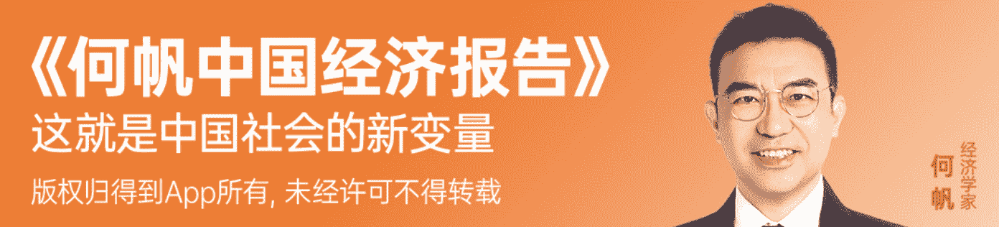
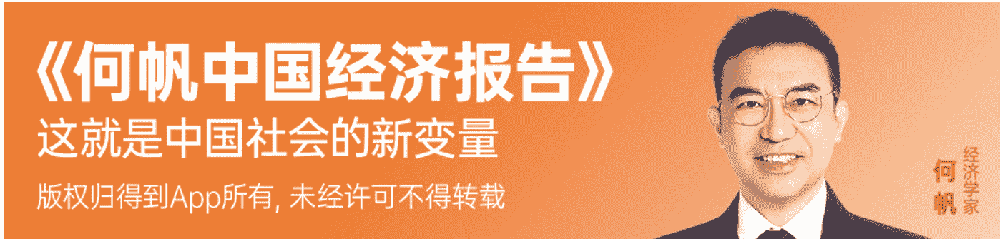
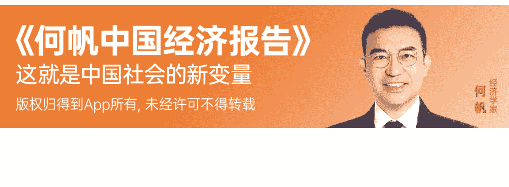
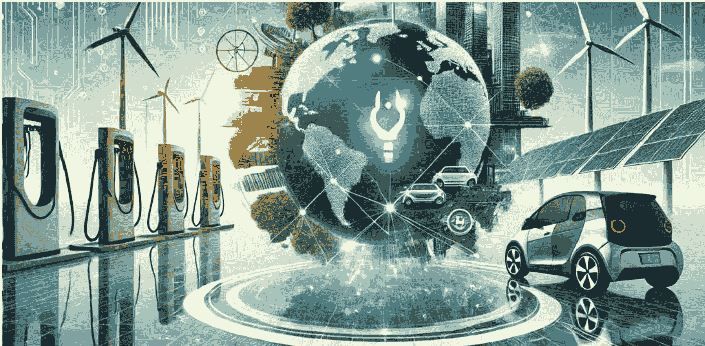
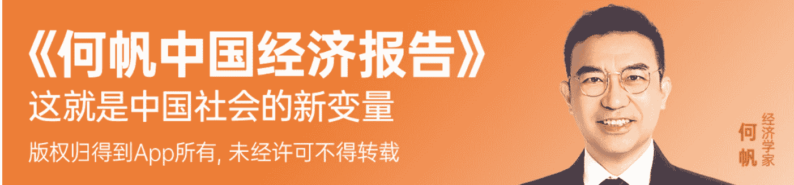
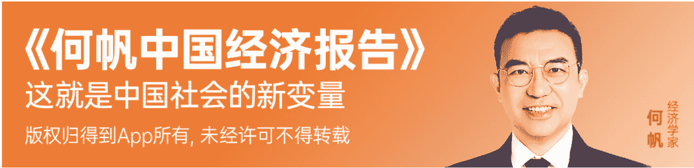
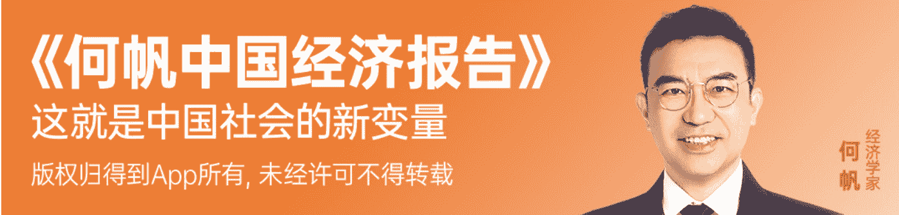
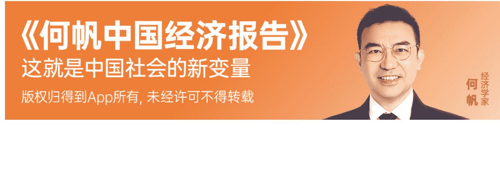
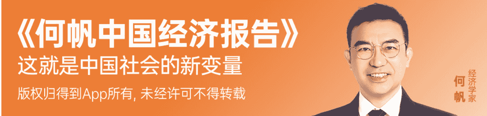
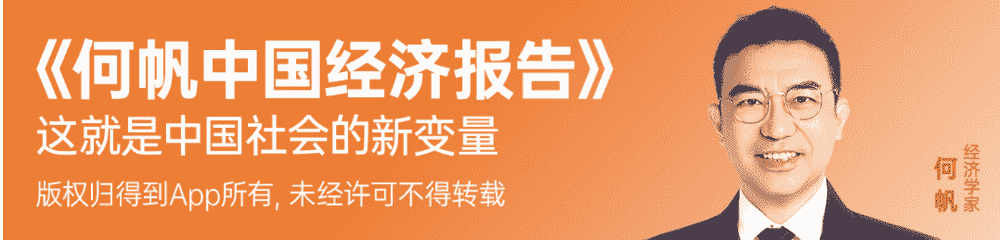

# 何帆中国经济报告 (2024-2025)

公众号懒人搜索，懒人专属群分享

群友们好，这是小懒人给大家的《通才计划》更新的课程。

得到上 99 元的课程《何帆中国经济报告 (2024-2025)》

已整理添加到专属群《通才计划》，几十份付费课程到咱们专属群总链接里自取。

通才计划目录：https://lazybook.fun/#!/data/13_course

懒人手册：https://lazybook.fun/#/

懒人专属群：https://lazybook.fun/#!/blog/group

专属群更新记录：https://lazybook.fun/#!/blog/record2

## 目录

何帆中国经济报告 (2024-2025)

目录

发刊词：光芒来自远处的山顶

- 1.
- 2.
- 3.
- 4.
- 5.

01 政策调整后，中国经济会如何反弹？
- 1. 为什么会有宏观政策的调整？
- 2. 为什么释放政策信号必须放大招？
- 3. 保增长是 2025 年的政策主线
思考题

02 美国经济到底好不好？
- 1. 美国经济到底怎么样？
- 2. 特朗普要是加征关税，中国该怎么办？
思考题

03 美国大选后，中美关系会怎么变？
- 1. 特朗普当选之后的变与不变
- 2. 比中国更强大的对手是谁？
- 3. 全球化有一天还会回来
思考题

04 2025 年，普通人的财富逻辑有什么变化？
- 1. 投资能跑赢通货膨胀，但不容易打败通缩压力
- 2. 通缩压力之下的财富逻辑
- 3. 重新规划家庭支出结构

### 思考题

05 怎样抓住中国未来的经济风口？
- 1. 为什么在过渡时期的生意很难做？
- 2. 为什么要提前布局，准备迎向新风口？
- 3. 准备好两套方案

### 思考题

06 哪个行业有可能成为新技术革命的主角？
- 1. 你是新技术革命的考官，而不是考生
- 2. 第一个候选者：人工智能
- 3. 第二个候选者：电动汽车
- 4. 第三个候选者：新能源行业

### 思考题

07 我拿下了市场，怎么又把它弄丢了？
- 1. 从增量市场到存量市场
- 2. 极飞是怎么差点丢掉市场的
- 3. 怎样才能做好大众品牌？

### 思考题

08 中国式的创新是从何而来的？
- 1. 熊彼特创新和德鲁克创新
- 2. 你的成功来自别人的努力
- 3. 今天的幸运，乃是历史的馈赠

### 思考题

09 2025 年，怎么做好跨境电商？
- 1. 东南亚是新手村
- 2. 美国是终极 Boss
- 3. 其它发达国家是支线 Boss
- 4. 新兴市场是精英怪

### 思考题

10 2025 年，想在海外建厂，我该怎样布局？
- 1. 反差场景
- 2. 本土化策略
- 3. 全链思维

### 思考题

11 全球化再起浪，企业出海怎样兼顾长短期布局？
- 1. 怎样利用海外的土地和资本？
- 2. 怎样找到和中国生产能力匹配的劳动力？

### 思考题

12 企业都出海了，国内经济会怎么变？
- 1. 用全球经济的模型理解中国经济
- 2. 未来中国经济将出现两条分流
- 3. 内需驱动的国内循环
- 4. 出海驱动的全球循环

### 思考题

13 为什么说内容已经成为企业竞争的第三个维度？
- 1. 竞争的三个维度
- 2. 回归第一性原理思考价格的本质
- 3. 围绕着“性价比 2.0"做好质量
- 4. 内容

### 思考题

14 短剧看起来那么 low，为什么会那么火？
- 1. 为什么短剧这么火爆？
- 2. 为什么短剧长不成参天大树？
- 3. 还有哪些被忽视的机会？

### 思考题

15 游戏《黑神话·悟空》是怎么爆火的？
- 1. 《黑神话：悟空》有多火爆？
- 2. 从野孩子到好孩子
- 3. 什么时候“入伙”最合适？

### 思考题

16 2025 年，企业如何用内容杠杆做好产品？
- 1. 文化逆袭规律
- 2. 时代精神演变规律
思考题

17 延迟退休，我该怎样做“全人生周期”的规划？
- 1. 现在的人生周期和原来的有什么不同？
- 2. 少年控制配速
- 3. 中年适度加速
- 4. 老年从心所欲
思考题

18 AI 来了，年轻人会不会失去人生的第一份工作？
- 1. 为什么第一份工作的竞争变得越来越激烈？
- 2. 年轻人怎么在职场上快速通关？
思考题

19 都在打掼蛋，你能学到什么策略思维？
- 1. 为什么说掼蛋是最豪迈的扑克游戏？
- 2. 为什么说掼蛋是一种典型的混搭创新？
- 3. 为什么说掼蛋的策略契合了转型时期的生存之道？
思考题

20 结语：人生长跑，不犯错、不停歇、不迷路
- 1. 人生就是一场 A+
- 2. 我的九字真经

## 发刊词：光芒来自远处的山顶

lazybro，你好啊。

我是何帆，又到了一年里为你送上我的经济报告的时候了。

### 1.

2018 年，我发了一个宏愿，要用 30 年的时间，每年写一份经济报告，记录中国从 2019 年到 2049 年的变化。今年已经是第 7 年。过去的 6 年里，有 26 万人加入我的报告，通过探索经济趋势，寻找自己新一年的发展方向。也欢迎你，加入我们。

今年，我跑了不少地方，从沿海到西北、从城市到山村；也看了不少行业，从人工智能到农业、从发射火箭到收破烂、从做游戏到拍短剧，我都很好奇，请教了不少高手，学到了很多。

朋友们问我，今年你看到的最大的亮点是什么啊？这时候，我却迟疑了。说实话，亮点并不太多，至少不是我想象中的那种亮点。我想象中的亮点是，疫情终于过去了，大家还不得大干一场？然而坦白说，并没有。相信你和周围的人聊天时也会遇到这种情况，有人会抱怨，活儿越来越不好干，钱越来越不好赚。

当然，这也情有可原。所谓“病来如山倒，病去如抽丝”，疫情三年，经济恢复可不是要慢慢来嘛。经历一段比较长的调整，这不是也很正常吗？

但你心里会很着急。这个调整，该有多长？三年五年，还是八年十年？要是八年十年，人一生中才有几个八年十年，这一辈子不就报废了？也有人更着急。他们会说，我这辈子就算了，那还有孩子呢。他们的好日子是不是走到头了？他们又该怎么办呢？

以我今年的调研所得和这么多年做趋势分析的经验，我可以告诉你：你可能得做好短期经济下行的准备，但也要做好再次迎接辉煌岁月的准备。

好消息正在未来等着你。光芒在远方的山顶。

### 2.

你现在好比正站在一个小山的山顶，远处还有一个更高的山，山顶上光芒万丈，但从这里到那个山顶，没有直达的缆车。要想过去，你得先下山，穿越峡谷，然后才能再上山，一步一步，登上新的山顶。

这给了我们一个启示：

为了上山，先要下山。

你肯定听说过老虎伍兹，全球知名的高尔夫球明星。1997 年，老虎伍兹就已经创了纪录，赢了大师赛。这不是已经到了事业的巅峰了吗？但他却做了一个大胆的决定，要改变自己的挥杆动作。这一调整不要紧，他的成绩马上就掉下来了。1998 年，他只赢得了一场赛事，而 1997 年他赢了四场。不过，人家老虎伍兹心中有数，果然，到了 2000 年和 2001 年，他登上了一个新的巅峰，实现了前所未有的连续四场大满贯冠军，球迷们把这一年称为虎年大满贯。后来，老虎伍兹又有几次调整挥杆，每一次都会经历短暂的成绩下滑，但每一次调整之后，他的球技就能达到一个新的高度。这代表了他对卓越的执着追求，以及愿意为长远目标做出短期牺牲的决心。

其实经济也是这样。在经历了一段时间的高速增长之后，想要实现新的增长，总要有一段的波动和蛰伏期。也就是咱们说的，为了上山，先要下山。

### 3.

知道了这一点，你心里就会踏实多了。请你先把目光放得长远，看到远处的更高的山顶。

为什么说光芒在远方的山顶呢？

因为通过今年的调研我就发现，新技术革命正在赶来的路上，全球化还会重回正轨，而老龄化将带来不少新的商业机会。

有人说，什么新技术革命，我怎么没有看到啊？其实，技术突破已经出现了，只不过现在还没有发现国民级的应用场景。打个比方，我们现在大概处于蒸汽机已经出现，但火车还没有问世的时候。不过，有了蒸汽机，火车的问世不过是个早晚的问题。火车不就是蒸汽机 + 车厢 + 轮子 + 铁轨吗？当所有的这些组件都凑齐了，那就只等有心人把它们拼起来，不在伯明翰就在曼彻斯特，不在曼彻斯特就在康沃尔，你不干，总有人干。人工智能、电动汽车、新能源，这都是我们这个时代的蒸汽机，它们会不断融合，不断溢出，直至改变每个行业、每个人的生活。

有人说，全球化明明在退潮，怎么可能会回来呢？其实，从大历史的角度去看，现在的全球化退潮不过是短期内的应激反应，因为过去的全球化列车开得太快了，有人晕车，所以得放慢速度。但你要相信，美国阻挡不了中国经济的崛起，也无法把全球供应链拆掉，从头再建。等到冷战一代长大的政治人物从历史的舞台上退下去之后，全球化还会回来的。现在只是航班延误，并没有取消航班。就算这一趟航班取消了，飞机还在，飞行员还在，空姐还在，随时可以起飞呀。到时候，飞机要起飞了，可别说，糟糕，我还没有订票呢，那就赶不上了。

有人说，老龄化会让经济增长放缓。别忘了，当年也有人说，孩子多了会让经济增长放缓。人们能活得更长久，活得更健康，对社会的贡献不是更大吗？过去，每一个中国家庭都想买房，所以才有了房地产这样的支柱行业。以后，每一个中国家庭都有养老的需求，那又会带来很多机会。当然，过去的房地产都是用高杠杆、高周转的模式，把规模做得很大，那是捡大西瓜。以后，捡西瓜的商业机会越来越少了，但遍地都有捡芝麻的机会，就问你想捡还是不想捡？

### 4.

好，看到了远处的山顶，那该怎么过去呢？在过去过程中，我们又该重点关注哪些沿途的风景呢？哎，这就涉及今年的报告我会给你分享些什么了。

在这份经济报告里，我会分五个模块，为你呈现我这一年调研的成果。

第一个模块，看宏观。

我会为你分析，政策调整后，中国经济将会发生怎样的变化；美国经济到底好不好；美国大选后，中美关系将会发生什么变化；在这些变化之下，我们普通人的财富逻辑又要发生什么样的转变等等。这些宏观问题是咱们经济报告的底色，也是我们个体行动的基础。

第二模块，找方向。

我会带你深入中国经济内部，看看未来中国经济有哪些风口，哪些行业可能成为新技术革命的主角，中国式的创新从何而来等等这些问题。希望这些问题，能帮你发现一些机会，给你吃下一颗定心丸。

第三第四模块，咱们聚焦于两个今年超级热的话题——企业出海和内容经济，看看具体要怎么做。

比如，怎么做好跨境电商？想在海外建厂，我该如何布局？为什么现在企业要重视内容？企业又该如何用内容杠杆做好产品？希望我调研采访过的企业、高手的案例，能给你带来一些启发。

第五模块，跑长路。

这份报告是经济报告，但兼顾宏观与微观，是我一贯的风格，我相信你学习这份报告，也是为了更好地生活。所以在最后一模块，我会为你分析，在延迟退休的大背景下，我们该怎样做好“全人生周期”的规划；在 AI 逐渐应用于生活的大背景下，年轻人会不会失去人生的第一份工作。

无论你是否是年龄阶段的人，相信都能在报告中，通过洞察当下，触摸历史的规律，预知未来的潮流，从而更踏实地迎接 2025 年的到来。

### 5.

历史的钟摆会来回摆，一会儿朝左，一会儿朝右，一会儿朝上，一会儿朝下。摸到了这个规律，你就会知道，有的时代是需要冲锋的，有的时代是要保持实力的。

最近有个词挺流行：漫长。漫长的季节、漫长的余生、漫长的历史。我特别能理解这种感觉，但也特别不服气。为了不让自己失去斗志，我今年还干了一件事。国庆期间，我到戈壁上参加了一场越野比赛，自导航、自补给，从下午出发，跑过日落、黑夜、日出，需要一口气在 22 个小时之内跑完 121 公里。

你猜怎么着？我这样一个跑渣，居然也跑完了。亲爱的朋友，这场越野赛，也是为你而跑的。因为说不如做，我用这样一个亲身去做的小事，告诉你这份年度报告最想传递给你的信息：所有那些郁闷和痛苦的时刻，都是可以熬过去的。我们会一步一步，一天一天地熬死它们。我们会奉陪到底。我们一定会等到来自未来的好消息。

我是何帆，期待和你在今年的报告里相见。

# 得到年度报告 2024-2025

# 《何帆中国经济报告》

# 课程表

## 发刊词：光芒来自远处的山顶

## 看宏观
- 01 政策调整后，中国经济会强劲反弹吗？
- 02 美国经济到底好不好？
- 03 美国大选后，中美关系会怎么变？
- 04 2025 年，普通人的财富逻辑有什么变化？

## 找方向
- 05 未来的中国经济有哪些风口？
- 06 哪个行业有可能成为新技术革命的主角？
- 07 我拿下了市场，怎么又把它弄丢了？
- 08 中国式的创新是从何而来的？

## 闯四海
- 09 全球化时代还会回来吗？
- 10 2025 年，怎么做好跨境电商？
- 11 2025 年，想在海外建厂，我该怎样布局？
- 12 企业都出海了，国内经济会怎么变？

## 做内容
- 13 为什么说内容已经成为企业竞争的第三个维度？
- 14 短剧看起来那么 low，为什么会那么火？
- 15 游戏《黑神话·悟空》是怎么爆火的？
- 16 2025 年，企业如何用内容杠杆做好产品？

## 跑长路
- 17 延迟退休，我该怎样做“全人生周期”的规划？
- 18 都在打掼蛋，你能学到什么策略思维？
- 19 AI 来了，年轻人会不会失去人生的第一份工作？
- 20 结语：人生长跑，不犯错、不停歇、不迷路

## 三十年之约，如期而至，敬请期待

*正式课程内容，请以上线版本为准*

# 《何帆中国经济报告》

这就是中国社会的新变量

# 《何帆中国经济报告》

这就是中国社会的新变量

版权归得到 App 所有，未经许可不得转载

何帆 经济学者

# 公众号 懒人搜索

懒人专属群

微信：lazyhelper

## 01 政策调整后，中国经济会如何反弹？

lazybro，你好啊。

我是何帆，欢迎回到我的年度报告。咱们在这份年度报告中要先从宏观讲起，再讲到中国经济在工业化、城市化、科技进步和人口变化等方面出现的小趋势，这些小趋势里都蕴含着新的机会。说完这些趋势和机会，咱们还要讲讲该怎么躬身入局，尤其是，怎么把这些观察融入到我们在 2025 年的行动计划中。

这一讲是第一讲，咱们先从宏观讲起。你也注意到了，从 2024 年 9 月份开始，宏观政策出现了一系列调整，保增长的信号越来越明显了，可是，市场好像还在观望。从宏观数据来看，经济开始回暖了，但从微观的体感来说，人们还是觉得不够暖和，信心还是没有完全恢复。这说话间就已经到 2025 年了，这一讲，我来帮你看清，2025 年会发生什么变化，你又该如何做好准备。

### 1. 为什么会有宏观政策的调整？

先讲一下为什么会有宏观政策的调整。在去年的年度报告中，咱们分析过中国宏观经济遇到的问题。中国经济遇到的最主要的问题是总需求不足。这个是纲，纲举目张。先要解决总需求不足的问题，然后才能推进其它的工作。总需求不足并不是什么疑难病症，这就是个常见病。市场经济条件下，把东西生产出来并不难，能把东西都卖掉才难，所以市场经济总是会出现总需求不足。总需求不足，家庭不愿意消费，企业不愿意投资，那可怎么办？这时候，政府就要挺身而出了。政府可以扩大支出，比如，多搞基础设施建设、多提供公共服务，以此带动经济回暖。这就是扩张性的财政政策。政府也可以降低利率，降低商业银行的存款准备金要求，给市场上提供更多的流动性，也就是说，大家手上的钱更多了，手头更活泛，就会增加消费和投资。这叫做扩张性的货币政策。所以，解决总需求不足的办法，就是同时用扩张性的财政政策和货币政策。

你看，宏观经济学就这么简单。

那好，咱们来梳理一下，9 月份以来都有什么新的政策。

9 月 24 日，央行推出了一揽子政策。首先，是降准降息。降准，也就是降低商业银行的存款准备金率，好让它们能有更多的钱贷出去。央行也降低了存贷款的利率。贷款利率降低了，大家就愿意多借钱。存款利率跟着降，是为了保持存贷款之间的利差，这可是银行最主要的盈利来源。要是商业银行的利润大幅度缩水，它们就会着急忙慌地收回贷款，整个经济也就跟着吃紧了。

央行的一揽子政策中还有针对房贷的。一是把原来的存量房贷利率降到和新发放的贷款利率差不多的水平，估计平均能降 0.5 个百分点，二是把二套房的贷款首付比例从 25% 下调到 15%，买房的压力就更小了。之所以要针对房贷出台新政策，是因为房地产市场还没有止跌回稳，那有房子的家庭心里就慌，不敢消费，地方政府少了一大块土地出让金收入，就不敢为促经济、改善民生多花钱，而且房子又和金融密不可分，搞不好还会引发金融市场上连锁式的动荡。

财政政策方面，最值得关注的是对地方债务的处理。我们在去年的年度报告中就讲过，中国地方政府的债务问题不是说债务规模太大，而是债务结构不合理，高成本的融资占比过大，增加了财政负担，也就是“最贵的钱”反而用得越多。我把去年这一讲的文稿放在文末，供你参考。对此，新的政策更切合实际。一方面，要把隐形的债务显性化，都放到阳光下面；另一方面，从中央安排资金，帮助地方政府化解债务压力。地方政府的资金压力减轻了，才能把拖欠企业的款项补上。所以，这都是一环扣一环的。

### 2. 为什么释放政策信号必须放大招？

我们需要看到这样一个现象：一系列宏观政策已经陆续出台，政策的效果正在逐步释放，而市场对这些信号的感知和反馈，也需要一个过程来逐步强化。

也许有人会提出疑问，是否政策的力度还不够？但如果深入探讨，“多大的力度才算够”，这个问题并不是那么容易下结论的。从政策规模来看，当前的投入已经远远超出了 2008 年“四万亿”的规模。

实际上，政策本身并没有问题，关键在于如何更好地传递政策信号，让市场能够准确理解政策意图。当前政策的执行风格更加谨慎和稳健，这也是为了确保调整过程更加平稳。有时，政策以低调的方式释放利好，可能需要更多时间让市场充分注意到。

为了更好地理解这种现象，我们可以借助一个重要的经济学概念——“信号传递”。政策是一种信号，它的目的是为了改变公众的预期。政府增加支出，不单单是政府要花钱，而是要用带头花钱这样的姿态告诉大家，我都花钱了，你们也可以跟着我花钱。可是，公众经常会看不懂政府要干啥，那他们就会站在一边观望。

怎样才能把信号传递出去，让别人接受到呢？经济学有一个建议：放大招。你要是想讲给大家听，不能用正常的音量播放，而是一开始就用最大的音量。听起来是不是很浪费？其实这样最经济。

我们来看生活中的一个例子。求婚这件事，不光是简单说一句“我爱你”就够了，还需要订婚戒指、婚礼、酒席，把整个过程认真对待，让所有人都见证，这样才能让彼此更有信心，感受到这份感情的真挚。而宏观经济政策也是如此。所以，有很多同学经常问我，一些宏观经济政策应该怎么解读，但其实，宏观经济政策用不着费心猜，因为它会给你足够强的信号，来说服你改变预期。

### 3. 保增长是 2025 年的政策主线

好，前面说了，还有一拨政策正在路上。那我们就来猜一猜，这会是什么样的政策。

还是回到分析的起点。我们遇到的问题是总需求不足，只有当居民愿意消费，企业愿意投资的时候，总需求才能起来。那我们还有什么招数？

从短期来看，货币政策最好使，因为它决策更快，央行公布一下新政策就行，不像财政政策，还得通过预算决算的审批。但是，货币政策毕竟是“大水漫灌”，钱放出去容易，但最终这些钱会流到哪里，那可说不准。如果大家对未来的预期还是很悲观，那央行把钱给了大家，大家会转手把这些钱都存起来，还是没法刺激经济增长。

所以，货币政策是配角，财政政策才是主角。如果我们在 2025 年看到了大招，那一定是出台了新的财政政策。好，财政政策又能干什么呢？

你可能听说过直接给大家发钱刺激消费的建议。发钱当然是有用的，但操作上有难度。更重要的是，发钱可能会鼓励大家不干活，这是政府更担心的。

那能不能给企业减税，刺激有效需求呢？也很难。增值税在中国的税收中占大头，但要是这边中央减税，那边儿地方政府就会提高征税的力度，最终的效果就不好说了。其次重要的是所得税，但所得税的规模不大，减税能起到的刺激作用有限。再说，并不是说一减税，企业就会增加投资。很多企业仍然会保持观望。

还有，能不能通过社保改革，提高人们的收入水平，从而增加有效需求呢？长期来看是必要且可行的，但短期内对消费需求的刺激作用有限。

如果以上这些政策的效果都不够理想，那最后的杀手锏就是政府增加投资。过去三十年，基建狂魔，成了中国的招牌之一。但是，你可能会说，“铁公机”都修完了，还能干啥？事实上，大量的基建建成之后还要维修，不然道路会变得坑坑洼洼，桥梁可能突然倒塌。那问题就大了。除了维护已有的基础设施，还有大量的新基建投资机会。比如说，为了应对老龄化，为了应对层出不穷的灾害天气，我们也需求大量的投资。除了这些旧基建、新基建，我们还需要为民众提供各种各样的公共服务。比如，房子是不是一定要买商品房？政府能不能提供更多的廉租房、人才房？教育能不能更均等化？学前教育能不能纳入义务教育？成人的职业培训是不是需要更多的政策扶植？老年大学够不够用？

你看，中国经济遇到的问题并不是像有的经济学家说的，政府管得太多了，企业没有活力了。相反，某些领域其实需要政府更多地介入，出台一些相关政策，人们的生活就会更轻松。

比如，买房、养娃、养老都让人觉得有压力。怎么才能减轻这种压力呢？一靠经济增长。经济增长起来了，人们就能更有信心。二靠公共服务，社会给每一个成员提供的帮助越多，大家就会有更多的获得感，就会更热爱这样的社会。而你看，经济增长和公共服务，都是可以通过积极的财政政策，增加政府支出而实现的，所以，短期的刺激政策可以和长期的改革政策完美地匹配起来。

好，总结一下。这一讲，我们谈到了宏观政策的调整对经济形势的影响。宏观政策会影响到你的行动计划。在去年的年度报告中，我给你推荐了一个姿势：卧倒。那是因为当时的宏观政策并不明朗，所以你得注意避开风险。

到了 2025 年，你不需要再卧倒了，因为宏观政策的方向已经很明显，保增长一定是 2025 年的政策主线。你可以站起身来了。但是，冲锋的号角还是没有吹响，所以，我再给你推荐 2025 年的最佳姿势，那就是要负重行军。不管包袱有多重，都要快快朝前走。如今，万事俱备，只等大招。大招到了，立刻冲锋。

### 思考题

接下来，我再给你出一道思考题吧。2025 年，你对自己所在的行业或企业有什么样的预期，你在新的一年有什么自己的计划？欢迎你在留言区里留言，跟大家分享。

好的，这一讲就先讲到这里，我是何帆，咱们下一讲再见。

延伸阅读：中国经济下一步走势怎么样？（2023）

## 02 美国经济到底好不好？

lazybro，你好啊。

我是何帆，欢迎回到我的年度报告，这是第二讲。上一讲，我们聊了中国宏观经济的前景，这一讲，咱们再聊聊美国经济。为什么关注美国经济呢？不仅因为它是全球最大的经济体，还因为中美经济之间的相互依存关系深刻影响着我们的生活。很多同学也会担心，这种相互依存的关系会不会直接影响我们的钱袋子。比如特朗普声称要对中国产品加征 60% 的关税，这样的政策会对哪些人和行业影响最大，又会带来怎样的连锁反应？更重要的是，假如真的发生了，我们应该怎么应对？上策是什么，下策又是什么？

### 1. 美国经济到底怎么样？

好，咱们先来聊聊美国的宏观经济。说到美国，很多人的印象是，那里不是越来越乱了吗？枪击、吸毒、满大街的流浪汉。这并不假，但要论宏观经济表现，美国要是说自己是老二，没有哪个大国敢说自己是老大。美国名气最大的经济学家之一保罗·克鲁格曼就说，美国经济形势好到不能再好的地步。

那他说得对不对呢？咱们来看看数据。先看 GDP 的增长率。2023 年，美国 GDP 的增长率是 2.5%，大幅度超过欧洲和日本。日本的 GDP 增长率为 1.9%，这还算不错的，欧元区的增长率是 0.5%，德国是负增长，英国几乎是零增长。2024 年 10 月，国际货币基金组织预测美国的 GDP 增长率为 2.8%，欧元区是 0.8%，日本是 0.3%，美国还是遥遥领先。

再看就业率。美国的就业形势也不错，到处都在招工。按照美国劳工统计局公布的数据，2024 年 11 月美国的失业率为 4.2%。比照欧洲，欧元区的失业率还保持在 6.3% 的水平，西班牙的失业率达到 11.2%，希腊的失业率也差不多是 10%，就连瑞典和芬兰的失业率也高达 8% 以上。美国不仅失业率比欧洲低，而且工资上涨水平超过了通货膨胀率，所以工人的经济压力相对较小。

说到通货膨胀，不得不说，这是美国经济遇到的一件最麻烦的事情。

新冠疫情之后，美国想要刺激经济增长，采用了扩张性的财政和货币政策，这本来是没错的，但有点用力过猛，结果，通货膨胀一下子就起来了。到 2022 年，美国的通货膨胀一下子飙升到 8% 以上。随后，美联储，也就是美国的中央银行，赶紧想办法控制通货膨胀。一轮操作下来，通货膨胀掉到了 2.6%。美联储其实已经很努力了，但还是没有完成目标。美联储的通货膨胀目标是 2%，你看，还差那么一点点。

按说，2.6% 的通货膨胀率也不高啊，但美国的民众不这么看。上个餐厅，逛个超市，到月底交房租，都会真切地感到物价太贵。在纽约吃个牛油果吐司要二三十美元，还得给小费。其实，美国服务业的价格确实在涨，但制造品的价格却不仅没涨，反而下跌了。只不过，涨价的部分大家记得清清楚楚，降价的部分却常常被忽略。

有人说通胀最影响低收入人群，所以他们最不满。这很难说得通。经济过热时期，非熟练劳动力才更容易找到工作，他们的工资其实是在上涨的。而且，中低收入劳动者往往没有太多积蓄，也不用担心积蓄缩水。那中产受影响更大吗？也不一定，毕竟股价房价涨得比通胀还快，手里有资产的中产赚得更多。

所以，问题可能不在通胀，而是贫富差距太大。普通人挣不到钱，富豪却越来越有钱有权，赢家通吃，输家自然有怨气。大家更愿意抱怨拜登政府没能及时控制通胀。这可能也是民主党在选举中失利的原因之一。结果就是，现在没有哪个政府敢对通胀问题掉以轻心。

### 2. 特朗普要是加征关税，中国该怎么办？

明白了这一点，咱们就可以接着讨论第二个问题。这跟咱们的关系更大。这不，特朗普当选美国总统了，那他上台之后，对中国经济会有什么影响？中美关系涉及方方面面，咱们到下一讲还会再聊。这一讲只说一件事：特朗普关税。为什么单拎出来这件事来说呢？因为这是特朗普最热衷的议题。特朗普喜欢关税，就跟小孩子喜欢圣诞礼物一样，那种热爱是发自内心的。你可能也听说了，特朗普声称，他上台之后要对中国产品加征 60% 的关税。

这对中国经济会有什么影响呢？影响可不小。摩根大通、彭博社、摩根士丹利等多家机构对这一政策的影响都有过预测，不同的机构有不同的分析，大体来说，预测的结果是，中国经济增长率可能会因此掉 1.6%-2%。这可是不能掉以轻心的，这意味着将有大量的出口企业倒闭，出口企业的工人丢了工作。

那我们该怎么办？

你可能会说，来而不往非礼也。怎么办？对着干呗。他征我们的关税，我们也征他们的关税。这种反制当然是有理有节的，但不一定有利，因为这种反制的效果是非对称的。究其根源，是因为中国每年向美国出口 5000 亿美元，而美国向中国出口不足 2000 亿美元。而且，美国进口的更多是最终产品，中国进口的还有很多中间产品，没有这些中间产品，中国的一部分生产就无法维持，所以虽然有反制，但中国不得不对很多中间产品进行豁免，这就让反制的效果又打了个折扣。

你可能会说，我们还有一招，那还可以让人民币贬值。人民币贬值，中国出口产品的价格更便宜，无非是降价促销呗，还是能卖得动。可是，别忘了，当前人民币的汇率已经处于较低水平，进一步大幅贬值的空间有限。如果出现大幅度的贬值，又会引发资本外逃的风险。所以，我感觉这一招也不好使。

既然这样的对策都有局限性，那上策应该是啥？兵书上讲，知己知彼，百战不殆。民间的谚语也说，打蛇要打七寸。所以，你得想想，特朗普最怕啥？美国经济的七寸在哪儿？

对了，就是通货膨胀。如果说特朗普最后的关税战打不下去，美国灰溜溜地撤了，那十有八九是因为高关税引发了高通胀，美国民众受不了啦。

有人会说，不至于吧。2018 年和 2019 年，特朗普第一次上台之后，美国就曾经对中国产品加征关税，那时候加征了 20%，大概让美国的通货膨胀率提高了 0.3%，影响不大啊。如果特朗普再加征 60% 的关税，对美国通货膨胀的影响不就是 0.9% 吗？这账可不能这样算。一开始加征关税的影响确实不大，但越到后面影响会越显著。

美国打第一轮关税战之后，很多企业绕道出海，寻找新的出口路径。有的企业去越南，有的企业去印度，但由于产业转移的速度太快，这些海外市场迅速出现了“瓶颈”，土地价格涨了，原材料价格涨了，劳动力成本也涨了。这说明，如果美国不从中国进口，就没有办法找到更便宜的地方。过去，正是因为大量物美价廉的中国产品，才压低了美国的物价水平。从 2022 年 3 月到 2024 年 10 月，美国制造品的价格从上涨 17.3% 迅速回落到下跌 2.9%，但服务业的价格只从上涨 5.1% 略微回落，变成上涨 4.7%，几乎没动。

除了害怕通货膨胀，特朗普还会害怕什么？他还害怕股市下跌。如果出现了通货膨胀，美联储就得加息，这一加息，美国股市可能就应声下跌。美国股市涨了这么长时间，很多人已经担心，这里面是不是泡沫太多。市场情绪往往是一瞬间就会转向的，要是美国股市跌了，楼市也会受到影响。

所以，在我看来中国经济和美国经济各有各的软肋。中国担心的是出口部门的就业，美国担心的是通货膨胀。那中国应该怎样利用美国经济的这个命门呢？

我的答案其实很简单，我们并不需要刻意改变现有的政策，只需要把信号更明确地传递出去就行。也就是说，我们在上一讲说到的继续扩大内需的政策就是应对关税战的最佳策略。内需扩大了，中国的经济增长就能稳住。出口企业可以在国内市场拿到更多的订单，出口部门的劳动力可以在其他行业找到更多的就业机会。中国经济遇到的挑战是通货紧缩的压力，美国经济遇到的挑战则是通货膨胀的压力，所以，实行经济刺激政策，能让中国走出通货紧缩压力的困境，这说明中国的政策空间更大。美国就不行了，美国一旦实行经济刺激政策，只能走入通货膨胀。

当然，在这个过程中，还可能出现出口企业经营困难，出口企业里的工人可能失去工作岗位等问题，所以，我们还可以再针对这些企业和工人采取相应的政策，比如可以培训工人，让他们能有个缓冲，学习新的技能，找到新的工作，也可以给企业提供一些补贴，帮助他们度过最困难的时期。

这个策略乍看起来不太过瘾，怎么别人都出招了，我们还不反制呢？但通过这一讲，你肯定明白了，不用总想着怎么一招致胜，更重要的是要保证自己不出错牌。不出错牌，就能继续留在牌桌上。我们的机会就是等着别人犯错。其实，他们犯错的概率更大。

好，总结一下。这一讲，我们说到美国经济。

美国经济形势总体不错，但遇到的最麻烦的问题是通货膨胀。

本来，通货膨胀下不去，就让美国很焦虑了，特朗普上台之后，又要加征关税。又想反通货膨胀，又想加关税，这两个目标是互相冲突的。通货膨胀才是美国经济的命门。

我们的最佳策略是你打你的，我打我的，稳坐钓鱼台。中国的内需起来之后，通货紧缩压力没了，通货膨胀的压力就到了美国那边。

### 思考题

接下来，我再给你出一道思考题吧。我们说到，贫富差距才是美国现在遇到的真正问题。过去的传统是，美国的富人除了要懂得“聚财之道”，还要懂得“散财之道”，比如福特会给工人涨工资，卡耐基会修建公共图书馆，洛克菲勒也有基金会，资助慈善事业。你觉得他们为什么要这样做呢？为什么现在美国的顶级富人却不这样做了呢？欢迎你在留言区里留言，跟大家分享。

好的，这一讲就先讲到这里，我是何帆，咱们下一讲再见。

## 03 美国大选后，中美关系会怎么变？

lazybro，你好啊。

我是何帆，欢迎回到我的年度报告，这是第三讲。上一讲，我们聊了美国经济的现状，以及特朗普再次当选后可能对中美贸易产生的影响。这一讲，咱们接着这个话题，聊聊中美关系。特朗普又当选美国总统了，你一定很关心，中美关系下一步会怎么走。

### 1. 特朗普当选之后的变与不变

我帮你问了几位美国朋友，他们有的是共和党，有的是民主党，有的在华盛顿，有的在硅谷。我直接问他们，你们怎么看未来的中美关系，收到的答案几乎是一样的：不知道。

为什么中美关系会变得这么扑朔迷离呢？这里面有不变的因素，也有新的变数。先说不变的。不变的就是美国政坛上形成的共识，即中国才是美国的对手。为什么他们会这么看呢？只有一个原因，那就是中国正在变得越来越强大，这是美国人难以接受的。举例来说，美国人自己心里也明白，以现在的力量对比，早晚有一天，美国的军舰就没法横行了。所以，把中国视为对手，与其说是对中国崛起的嫉妒，不如说是美国对自己力量衰落的担忧。

还有一个不变的是特朗普的性格。特朗普不是个典型意义上的政客，他想到什么就说什么。他有自己最感兴趣的话题，比如关税、难民，这些都是他一定会干的事情。他没有太多的意识形态束缚，每天总想着跟别人搞个交易，特别在意在交易中能捞到更多的好处。

那变数又是什么呢？熟悉特朗普圈子的美国朋友告诉我，特朗普第二次担任总统之后，手下的团队更加偏向亲信。这些人更激进，更有野心，也更难以预测，增加了中美关系的不确定性。还有一位美国朋友半开玩笑地说，特朗普能不能干完这一任都不好说。他可能会死于疾病，也可能会死于暗杀。要是那样，可就真热闹了。

### 2. 比中国更强大的对手是谁？

遇到这种七嘴八舌、真真假假的小道消息，我们该如何做出判断？

我认为，当细节的真实性很难判断的时候，我们可以把细节的权重降低，只看大的轮廓。虽然细节和局部可能失真，但我们可以争取保证总体上是准确的。

那我们该怎样去把握中美关系的大局？

让我给你讲一个我从朋友那里听来的故事。在特朗普还没有上台之前，美国就已经有反华情绪。我的这位朋友是一位退休的外交官。有一次，这位外交官宴请两位重量级的外宾，一位是曾经担任过美国财政部长，也当过哈佛大学校长的萨默斯，另一位是来自英国金融时报的首席评论员马丁·沃尔夫。这位外交官追着萨默斯问，中国做些什么，美国才会改变对中国的态度，中美关系才能重回正常的轨道？萨默斯支支吾吾答不上来。马丁·沃尔夫看不下去了，说，我来替你回答吧，如果中国和美国能重新和好，那除非是火星人入侵了。

马丁·沃尔夫一语道破天机。很多人讨论国际关系，总爱说这里有一盘大棋，那里有一盘大棋，其实，国际关系并没有那么复杂，本质上是人性的延伸。群居动物总要分“我们”和“他们”，美国将中国视为对手，并不是中国做错了什么，而是因为美国需要一个强大的假想敌来凝聚内部。敌人越强大，恐惧感越高，斗志也越容易被激发。为什么沃尔夫说火星人入侵，中国和美国就和好了呢？因为火星人入侵，那就是出现了比中国更强大的敌人，那一夜之间，中国就会变成美国的盟友了。

可是，你会问，上哪儿去找比中国更强大的敌人？其实有，只是美国还没有意识到，那就是中美双方经济关系深刻交织所带来的潜在风险。中美经济联系紧密，你中有我，我中有你。这种关系源于全球供应链的深度交织，不同生产环节分布在世界各地，形成了一个互相依赖的经济生态。

我来举个例子。在调研过程中，我经常会遇到一些很低调的中国企业，也没有太大的名气，但他们的客户往往都是最有名的跨国公司，而且是这些跨国公司的关键零部件的唯一供应商。他们会说，何老师，欢迎你来我们企业参观，但千万不要在书里写我们的故事。你看，这就是相互依存啊。一旦美国对中国断供，中国可能买不到尖端产品。但把全球供应链一层一层剥开，你会看到，尖端产品的供应商，以及它们供应商的供应商，有很多都是中国企业。离开了中国企业，尖端产品也未必能生产出来。别人或许能卡住你的命脉，但你也同样掌握着对方的关键开关，谁都离不开谁。要是美国强行要拆散全球供应链，那就相当于爆发了一场席卷全球的全面战争。

换一个角度来说，我们都在一个牌桌上打牌，有时候我们赢，有时候对手赢，这是很正常的。想要每一局都赢，那除非是作弊。就算是输了一局，也不是真输。真输是有人把牌桌掀翻了，大家都玩不成了，那就没有赢家了。

### 3. 全球化有一天还会回来

表面上看，贸易保护主义正一浪高过一浪。美国一定会用各种各样新的办法，企图遏制中国。欧洲也好，日韩也好，一直跟在美国的后面，亦步亦趋，就连一些新兴市场和发展中国家也跟着起哄。所以，你可能会问，都这种局势了，全球化怎么可能还会回来呢？

很简单，你要问一下，全球化退潮，背后是经济力量，还是政治力量。如果是经济力量，那可能就是彻底转向，再也不回头了。好，什么情况下，经济力量会导致全球化逆转呢？那一定是因为生产方式出现了重大变化。一种可能性是生产已经完全自动化，不需要工人，只需要机器人。而且，我们还必须假设只有欧美国家才能生产出机器人。它们不仅能生产出机器人，生产成本还全球最低。在这种情况下，制造业就会回归发达国家本土，不管想要什么，都可以在国内安排生产。另一种可能性是出现了大规模的移民，发达国家增加了大批劳动力，这批劳动力又年轻又便宜。那么，发达国家的制造企业就不需要去海外建厂招工了，想生产什么，在国内就能找到满意的工人。

遗憾的是，这两种情形都不可能出现。制造业依然需要大量的产业工人，而发达国家正在关紧移民的大门。于是，我们能看到，每一个国家想要提高生产效率，甚至只是想维持现有的生产和消费，就必须借助全球供应链。只要全球供应链还在，全球化就在。

所以，正像你看到的那样，现在的贸易保护主义，更多地是出于政治上的算计，而且是出于误解和偏见。所以，这些贸易保护主义政策在实施的过程中会遇到各种挫败。有些政策效果不理想，最终不了了之；有些政策事与愿违，不仅没有削弱对手，反而让对手变得更为强大；有些会带来意想不到的问题，把美国搞得焦头烂额。

俗话说，不撞南墙不回头。很多时候，局势最糟糕时，也可能是转机出现的前兆。现在，美国的政客们依然在算计谁能赢得更多，他们以为唯一的均衡解是：我赢你输。但一系列的碰壁之后，他们才会明白，这样下去唯一的均衡解是双方都输。那局势就会逆转。

如果我们判断全球化退潮就是一种政治现象，那我还要告诉你一个规律：大国之间的关系有可能在一夜之间逆转。比如在第二次世界大战期间，美苏还是并肩作战的盟友，战争刚刚结束，就变成了不共戴天的仇人。

为什么会是这样呢？我把自己观察国际关系的心得跟你分享一下。以前，我在观察国际关系的时候，习惯用更理性的分析框架，比如博弈论，或是复杂科学，但试了一圈，最后发现都不好使。最后，我发现对观察国际关系最有启发的学科其实是儿童心理学。你观察一下小孩子们。幼儿园的孩子在一起，今天会说，我不跟你玩了，你们也不要跟他玩。明天就会说，我还是跟你玩吧，但我们不要跟他玩。很多国际关系的变化，跟孩子们吵架是一样的，说变脸就变脸。

咱们再往深处想想，这其实是可以理解的。对美国来说，最重要的肯定是国内政治。所以，美国的政治决策大部分精力都用于国内的政治利益分配，往往耗尽了政治人物的精力。到了对国际问题决策的时候，他们可能就没时间好好考虑，做出通盘筹划。这就像考试时，考生把时间花在前面的选择题上，后面的思考题既不会做也没时间，随便涂几笔就交卷了。

明白了这一点，你大概就会心中有数，历史从来就不是线性前进的，而是在曲折中发展的。咱们中国人有一个最大的优势，就是我们的历史更悠久，经历的波折更多。所以，中国人的内心深处躲藏着一种充满沧桑感的历史观，我们知道盛极而衰、否极泰来，于是，几乎凭借着直觉，我们就能察觉出天道的轮回。那些看似气势汹汹的势力终将退出历史舞台，而我们坚持的时间比他们更长。我们依然没下牌桌，而且一把牌比一把的手气更好。

好，总结一下。这一讲，我们讲到中美关系的前景。

从短期看，中美关系不容乐观，因为新的变数太多，但是，从长期看，中美关系的基本格局没变，到了最糟糕的时候，局势反而可能就有转机。

我们也讲了全球化的前景，全球化虽然处在低潮，但以后还会有新的高潮。

### 思考题

接下来，我再给你出一道思考题吧。观察国际关系时，不仅要关注国家间的博弈，也要留意普通民众的情绪，不同年代的人对世界的看法往往截然不同。有人说，年轻一代比上一代更开放、包容，也有人说，年轻一代可能比上一代更封闭、排外。你的观察是什么？你觉得年轻一代怎么看外面的世界？欢迎你在留言区里留言，跟大家分享。

好的，这一讲就先讲到这里，我是何帆，咱们下一讲再见。

微信:lazyhelper

## 04 2025 年，普通人的财富逻辑有什么变化？

## 04 2025 年，普通人的财富逻辑有什么变化？

何帆中国经济报告（2024-2025）←进入课程

lazybro，你好啊。

我是何帆，欢迎回到我的年度报告。

前面三讲，咱们纵论天下，聊了中国和美国的宏观经济走势，也讲中美关系。这一讲，咱们来说说当宏观趋势变化之后，我们个人的财富逻辑会跟着发生什么变化，我们该怎么赚钱、怎么投资，个人的财富怎样才能保值和增值。

一提起财富的保值和增值，很多人马上会想到的问题是：哎，我该不该买房、买股票？可是，如果只能问出这一个问题，那十有八九，个人的财富是很难实现保值增值的。因为这样思考问题的格局太小，我们得跳出这个框框，用新的视角去看财富的逻辑。

### 1. 投资能跑赢通货膨胀，但不容易打败通缩压力

我先来问问你，你是什么时候习惯了问要不要买房、买股票的？一般来说，是在经济高速增长时期。经济增长快，你手上的钱也多了，这是好事。但高速增长时期也有坏消息，坏消息就是通货膨胀起来了，钱就不值钱了。这个通胀就是指物价上涨，也就是你去买鸡蛋牛奶、猪肉牛肉，或者是买衣服、买电器、买演唱会门票时的物价会上涨。但这个物价包括的是消费物价，不包括资产的价格。你买房、买股票，买的都是资产，能有效对抗通胀的影响。

我再告诉你一个基本规律：在经济高速增长时期，通货膨胀会上涨，但是资产价格上涨的速度更快。这就是为什么大家会关心买房、买股票。因为你想跑赢通货膨胀啊。实话实说，在经济高速增长时期，想要跑赢通货膨胀没那么难。如果你买的是地段好的房子，买的是蓝筹股，能赚多少不好说，但想赔钱是很难的。

可是，现在的宏观形势不一样了。经济增长放缓，物价水平也在回落，也就是当前经济中出现了“通缩压力”或“物价下行压力”。我们在日常生活中会觉得，物价下跌了还不好吗。虽然物价下跌看似是好事，但从宏观经济角度看，经济运行中如果长期承受这种压力，会导致家庭消费意愿下降，企业投资不足，需求萎缩，进而拖慢整体经济增长。

我再告诉你一个基本规律：在承受通缩压力的环境中，资产价格下跌的速度比物价下跌的速度更快。比如，你可以观察一下周围的房价变化，不少城市的房价都跌幅很大。为什么会是这样呢？这里面有两层逻辑。第一层是价格越便宜越没人买。第二层是杠杆的放大作用。想要借钱就要有抵押品，抵押品就是我们买的资产。资产价格跌了，能借到的钱就少，想买却买不了，这就雪上加霜了。

所以，靠投资可以跑赢通货膨胀，但却难以应对经济放缓期带来的下行压力。

在面临经济下行压力或物价下行压力时，过多的投资反而可能带来更大的亏损。这也是为什么这两年你常会听到一种说法，叫“现金为王”。要是买资产，收益率可能为负，现金虽然不能带来任何利息收入，好歹没亏呀。我的老师余永定说，他从来没有在股票市场上赔过钱，因为他从来也没有买过股票。

### 2. 通缩压力之下的财富逻辑

你看，财富的逻辑变了，咱们投资的思路就要调整。在经济放缓时期，不能再追求高收益了，能找到安全资产就很不错了。

什么是安全资产？能保住本金，多少再来点收益，就是安全资产了。退而求其次，虽然本金亏一点，但大头还能保住，不会随时被清零，也很不错了。

按照这样的思路去看，你在配置资产的时候需要注意几个原则：

- 第一，保险要买够，这样心里才踏实。
- 第二，买股票不能只看价格会不会涨，还得看会不会分红。
- 第三，买房子不能跟着感觉随便买，而是要仔细去看位置和配套的公共服务。
- 第四，如果有可能，不要只在国内投资，最好要有更多元化的投资组合。

把这些打底的准备工作做完，你才能去尝试风险更高的投资。

你要学会先锁定风险，然后才能放飞收益。

这一点非常重要，咱们再来反思一下：过去，你总是希望投资的收益高一点、再高一点，这其实不是因为你太贪婪，而是你对未来没有把握。你特别害怕，万一失败了怎么办，所以，在你的心理评估中，失败的成本是负的无穷大。所谓锁定风险，放飞收益，就是说，你一定要对失败的成本有个评估，哪怕是很模糊的评估，而且做好预案准备。有了这样的预案准备，你心里踏实了，该冒点风险的时候，你才敢冒险，这样才不会错失良机。

### 3. 重新规划家庭支出结构

过去，你肯定也听说过一种说法，说钱是挣来的，不是省下来的。这种说法在经济高速增长时期说得太对了，但到了经济低迷时期，这个说法就不一定合理。从成本收益的角度分析家庭日常支出，你会发现某些支出过大且不划算，而另一些支出则过少，这样的分配显然不合理。而如果重新调整家庭支出结构，你可能会发现，生活的压力其实并没有想象中的那么大。

我甚至听说过一种说法，有些年轻人提出一种新主张，叫“不结婚、不生娃、不买房”，没有压力，幸福指数就会明显提高。这种说法当然比较极端啊，幸福的家庭对大多数人来说，可能很难用金钱的成本来衡量。不过房子、教育的成本结构，确实是可以调整的。

先说买房吧，这成了中国人的执念。很多家庭的最大资产是房子，而最大负担则是房贷。如果房价一直上涨，贷款就贷了。可是，房价一路上涨的时代已经结束了。在房多客少的基本格局下，相对于贷款买房的成本来说，房租其实没有那么贵。而且就算你能买下一套房，也不一定住在自己的房子里。年轻人要上班近，家长想离学校近，老人想离医院近。在不同的人生阶段，我们对住房会有不同的需求，从这个角度来看，租比买更方便。所以，住房和买房的决策就会分离。

你可能在一个地方租房住，却在另一个地方买房子，作为一种投资，那思路就打开了，腾挪的空间也大了很多。

再说子女教育，这在中国家庭的支出中占的比重越来越高，但遗憾的是，如果把教育支出当做投资，那这项投资的收益率几乎为零，甚至为负。这是因为，考上大学不一定意味着就有好的出路。你可能会说，我可不是为了让孩子应付考试，我想带他去游历名山大川，培养他的才艺。这当然也有用，但性价比往往不好把握。比如，对孩子来说，去马尔代夫看个海，可能还不如在小河边摸鱼更快乐。说到才艺，就拿这些年越来越火的冰球运动来说吧。一位冰球教练很感慨地说，北京家长每年用于给孩子学冰球的支出高达五亿元。但从成果来看，他目前还没看到一个中国孩子能在 NHL——也就是北美冰球职业联赛上——打主力。正是因为有些家长过早地投入了太多的钱，反而让那些天赋不足的孩子把有天赋的孩子挤了出去。结果是家长的钱都浪费了，冰球运动却退步了。

你可能会说，我明知教育投资不划算，也要把最好的给孩子。那你也要重新调整在孩子身上的投入，与其在补习班上把钱都花完了，不如留到等孩子在社会上闯荡的时候再帮他。比如，找工作、创业、读研深造、组建家庭，这才是孩子真正想让父母帮忙的时候啊。

总结一下，不是说教育不重要，而是说真正重要的教育其实花钱并不多。

什么是真正重要的教育？孩子要身心健康、有好的学习生活习惯、有好的小伙伴、能接触大自然、能尽早地熟悉真实的世界……而这些，都不用花太多的钱。

你看，说到这里，有一个非常现实的问题就浮出了水面——我们花在房子和孩子上面的钱可能太多了，但花在自己和家人健康上面的钱往往太少了，可是这才是最重要的。随着生活水平的提高，人们的预期寿命也会延长，老年成了人生中最漫长的一个阶段。身体健康不健康，是影响晚年生活质量的最重要因素。

对健康的投入和买房、交学费不一样，健康不是花钱就能买来的。它要求你认真地考虑机会成本。比如，你得减少酒桌上的应酬，少加班、少熬夜，饮食作息有规律，坚持锻炼身体。

当然啊，说到这里你可能会感叹，这些道理你都懂，但往往没有动力去做事。你会觉得，在这些事情上花费时间，耽误了挣钱啊。但这实际上是丢了西瓜捡芝麻，因为你没有从人生全周期的角度去考虑成本和收益。打个比方，你觉得一台机器，在它的整个生命周期中哪一个阶段花钱最多呢？其实，买一台机器的花费大概占 1/3，维修保养的钱占 2/3。买一台机器不贵，维修机器才贵。同样的道理，人也是需要保养和维修的。

在健康方面的投入多一些，生病的概率就能减少，生活的质量就能提高。和治疗、护理带来的巨大支出相比，预防疾病才是最省钱的。

好的，这一讲我们讲到，宏观经济趋势变化之后，个人的财富逻辑也发生了变化。你学到了一个知识点：投资可以跑赢通货膨胀，但在经济放缓或物价下行压力下，投资的风险却可能更大。

你也了解到了，在经济下行压力时期，要学会先锁定风险，才能放飞收益。最后，你也学会了重新去思考家庭的支出结构，有些支出已经变成了沉重的包袱，你要学会想一想，能不能给自己减负，让生活的压力没那么大。

### 思考题

接下来，我再给你出一道思考题吧。你觉得，对你现在的工作和事业来说，什么知识和技能带给你的帮助最大？你又从哪里学到的，怎么学到的？欢迎你在留言区留言，跟大家分享。

好的，这一讲就先讲到这里，我是何帆，咱们下一讲再见。

## 05 怎样抓住中国未来的经济风口？

lazybro，你好啊。

我是何帆，欢迎回到我的年度报告。这是第五讲，我们来看看未来中国经济会有哪些重大的机会。

咱们在发刊词里说过，未来中国经济会有三个风口，一个是新技术革命，一个是老龄化，还有一个是企业出海。你说，明白了，那我赶紧换赛道，去投身这些大洪流，别着急，我还没说完呢。为了迎接这些风口，你必须有两套准备方案，一套用在短期，一套用在长期。短期是个过渡期，这个阶段你的目标不是 All in，而是不下牌桌；长期则要提前布局，等新的均衡点出现后再果断入场。

举个具体的例子吧，比如，你想进入养老行业，那与其去建养老院，不如先去办个月嫂公司。哎，月嫂公司，那不是照顾产妇和婴儿的吗？别着急，我来告诉你这里面的道理。

### 1. 为什么在过渡时期的生意很难做？

人们都知道老龄化是大势所趋。很多人跟你说，银发经济已经到来。可是，你有没有注意到，到现在为止，养老行业还是不温不火，就连最高端的养老院，到现在也没赚到钱。这是为什么呢？

我再来给你讲个小的变化。有家家政公司叫天鹅到家，专门提供月嫂上门服务。2024 年，天鹅到家发现了一个有意思的数据，他们在上海接到的订单中，有三分之一不是小夫妻付费，而是爷爷奶奶、外公外婆付费。年轻人不愿意生孩子，但老人会跟子女说，放心生吧，愿意生几个就生几个，生完娃，我们出钱请月嫂。

你看，老龄化带来的第一个变化，不是养老院多了，而是给月嫂买单的爷爷奶奶更多了。这背后的原因是啥？这是因为原来的“婴儿潮”，现在形成了一股“老人潮”。

这批老人身体还很健康，时间一大把，收入也不差。他们成了一股新兴的消费力量，出去游山玩水的是他们，跳广场舞的也是他们。这是一批乐龄老人、活力老人。他们忙着出去玩，顾不上带孙子孙女，而且他们的理念也变了，更认同专业的事情要交给专业的人去做，人家月嫂就是更专业，所以他们才会跟子女说，你们生娃，我们来付月嫂费。

可是，这一股“老人潮”却让提供老年产品和服务的商家犯了愁。别的消费群体，商业精英也好、潮流青年也好、甚至游戏宅男也好，都会通过消费彰显自己的独特性，实现一种身份认同感，但这群老人不一样，他们强烈地不认同属于自己的那个标签。这群老人最大的特点就是不服老。如果你提供的产品和服务特意标上是老人专用，会让他们觉得是冒犯——谁老了，你才老了呢。

那你说，这太难了，咱也不知道怎么讨好你，那咱不伺候了还不行？还真不行，因为老人是有需求的，很多需求都没有被关注到。举个例子，2024 年，一批中老年题材的短剧开始走红。它们的主角不再是年轻的小姑娘小伙子，而是大爷大妈。这种剧的相当一部分受众都是老年人。为什么老年人会突然喜欢短剧了呢？一来，现在的老年人已经不会用电视遥控器了，一上来就是复杂的菜单选择，搞得老人手足无措。二来，老人也有情感需求，但这些需求长期以来都被忽视、被压抑了。

所以，老龄化在过渡时期遇到的挑战是“老人潮”兴起，但这批消费者很难捕捉，这也是为什么我们说在过渡时期的生意很难做。

这批老年人看起来很有消费意愿和消费能力，但拒绝被贴上老人的标签。这会影响到广告投放的精准度，也会影响到企业的品牌定位。做老年品牌的企业会发现，自己很难直接打动用户的心。就算摸索了几年，商家找到了窍门，可以精准地捕捉到老人的需求，尤其是情绪和情感需求，又会遇到一个巨大的问题：这批老人又老了十岁，他们的需求变得大不一样了。

### 2. 为什么要提前布局，准备迎向新风口？

这是一个自然规律：五六十岁的时候还活蹦乱跳的老人，到了七八十岁可能就腿脚不方便了，身体的各项机能都会退化。五六十岁不需要别人照顾，到了七八十岁可能就需要别人照顾了。

那是不是说，到那时候养老院就能赚钱了？也不一定。我们要面对一个基本事实：根据国家卫生健康委员会的数据，90% 以上的中国老人会选择居家养老，7% 选择社区养老，只有 3% 选择进养老院。绝大多数老人不愿意住养老院，除了怕人笑话，担心去了养老院生活处处被限制，还有对家的依恋。

所以，当这批“老人潮”人口都到了七十岁左右，马上就会出现两种巨大的需求。一是房屋装修的需求，二是居家照护的需求。

先说房屋装修的需求。你有没有发现，咱们现在的房子，绝大部分都不适合老年人居住。比如，很多房子的地上铺的是瓷砖，那老人要是滑了一跤该怎么办？很多房子的门开得太窄，那要是有一天你坐上了轮椅，该怎么进房间？还有，老人的房子里，灯光很重要，要又明亮又温暖，厨房的台面高度要能调节，以便坐轮椅也能操作，在顺手的地方要装上紧急呼叫按钮，等等。我遇到了一位做电梯的企业家，他专门做小电梯，也就是在旧房子的外面加装电梯，或是在跃层的房子里面加装电梯。他告诉我，这几年生意火得不得了。因为很多房子都到了要改装的时候。

再说居家照护的需求。谁来照顾七八十岁的老人呢？指望他们的子女吗？但子女白天还要工作，没办法长时间陪护。那就用机器人来养老？这又太科幻了，毕竟，人与人之间的情感交流是很难用机器替代的。那怎么办？天鹅到家的创始人陈小华就在思考这个问题。他想出来的办法是，让月嫂去照顾老人。

月嫂这个行业正在萎缩。生育率不断下降，对月嫂的市场需求也会减少。而且，月嫂也有职业焦虑。公司里的月嫂经常来找陈小华，说，你也要考虑考虑我们的职业前景。天鹅到家内部规定，过了 58 岁就不能做月嫂了，原因是做月嫂经常要熬夜，一做就是 28 天、42 天连轴转。月嫂的年纪大了，这么劳累吃不消。怎么办？可以让她们去照顾老人啊。老年护理的工作强度相较于照顾新生儿要灵活一些，虽然有的老人需要较高强度的陪护，但有些老人的身体状况其实还不错，照护的要求并没有那么高。最重要的是，和大多数老人沟通不会像照顾婴儿那样困难，老人基本能理解和配合，没有太多交流障碍。很多老人一天三餐按时吃，睡觉也比较规律，工作强度相对温和。大部分护理工作的核心其实是防止老人出现意外，及时给予照看。从照顾经验上来说，月嫂们也非常适合转行做老年护理。毕竟，她们已经习惯了细致的照顾和耐心的陪伴，这对照顾老人来说是非常宝贵的经验。陈小华的一位朋友曾对他说：“小华，我到老了就一个要求，帮我找个月嫂来照顾我吧。人到老了，谁还不是个 baby 呀？”

你看，需求和供给居然如此完美地匹配了。

### 3. 准备好两套方案

好，我用老龄化这个案例，跟你解释了为什么面对未来，必须准备两套方案。咱们在发刊词里说过，现在，我们正站在一个小山的山顶，再往前走可能都是下坡路，但朝远处看，远处还有一个更高的山，那个山顶上光芒万丈。为什么光芒来自远方的山顶呢？因为未来会有新的巨大的风口。从我们现在的小山顶，到远处更高的山顶，没有直达的缆车，你必须先下山，穿越峡谷，到达山谷最低的谷底，然后才能一步步向上攀登，直至到达新的峰顶。也就是说，你必须先经历过渡阶段，才能到达新的均衡点。

正是由于必须先下山，再上山，所以企业需要同时准备短期和长期两套方案。

只有短期方案的企业会发现，虽然看似游刃有余，最终却会错过新的风口。因为你看得太短视，你只关注到落脚点的方寸之间，没有抬头去看方向，所以很容易迷路。只有长期方案的企业呢？它们很可能会感到焦虑和失望，明明已经看到远方的山，但“望山跑死马”，期待的变化总也不来。而且，由于忽视了眼下的环境，在竞争中可能会处于不利境地，没熬到胜利的那一天，先死在了黎明之前，那不是亏大了。

再说说咱们提到的其他两个巨大风口，一个是新技术革命，一个是企业出海。这两个风口和老龄化一样，也会经历过渡时期，最终才会到达新均衡点。

新技术革命将改变我们的生产和生活。这没有争议，但是，在过渡阶段，新技术革命遇到的风险是技术有突破，但杀手级应用尚未出现。虽然技术应用尚未全面展开，但投资者已经迫不及待地把钱投了进去。盲目乐观的情绪催生了资产价格泡沫。好消息是，有了泡沫才能有大规模投资，新技术所需的新型基础设施才能得以建成，但坏消息是，过早进场的投资者将亏损惨重。

企业出海呢？从长期来看，这将改变全球经济的生产格局。但是，在过渡时期，企业出海会遇到更多的地缘政治风险。而且，刚刚走出国门，不少企业不适应当地的情况，难免犯下这样那样的错误。还有，随着越来越多的企业出海，国内需求可能进一步萎缩，对企业出海的政策也可能会有调整。这咱们会留到后面的课程再详细解读。所以，出海的企业同样要准备好两套方案，一套是为了在未来三五年活下来的，另一套是为了在未来五年十年，甚至更长的时间内大展身手的。

好，总结一下。这一讲，咱们聊了怎样做好准备，迎接未来的风口。这一讲告诉你，要想上山，先要下山。跑过越野的朋友都知道，上山的路和下山路需要的技巧不一样。上山靠体能，下山靠技巧。下山的这段路，可能正好是你超越对手的机会。因为那些没有做好准备的企业会犯错，会受伤，会迷路，而你的机会就到了。

### 思考题

接下来，我再给你出一道思考题吧。这一讲，咱们重点说到老龄化趋势。最近，关于延迟退休的话题引起了热议。有人赞同，有人反对。我想听听你的看法。到了 60 岁的时候，你还想工作吗？如果想，那你想干啥？如果不想工作，你又想在退休之后干点啥呢？欢迎你在留言区留言，跟大家分享。

好的，这一讲就先讲到这里，我是何帆，咱们下一讲再见。

## 06 哪个行业有可能成为新技术革命的主角？

lazybro，你好啊。

我是何帆，欢迎回到我的年度报告，这是第六讲。咱们在上一讲说到，未来会有三个风口——新技术革命、老龄化、企业出海。围绕风口，上一讲咱们具体分析了老龄化在短期和长期给我们带来的挑战和机遇。这一讲，咱们再来说说未来的一个更大的风口，那就是新技术革命。

### 1. 你是新技术革命的考官，而不是考生

一说起新技术革命，你可能就会感到很焦虑。人家都是高科技啊，咱就是个门外汉，怎么能弄懂它们到底在说啥呢？这一讲，我来打消你的这种顾虑。我来告诉你一个更合理、更有用的观察新技术革命的方法。

首先，你要知道市面上那些讲新技术革命的书大多是在贩卖焦虑，因为他们把你放在考生的位置上。那些书都说，你看，新技术革命来了，人人都要去赶考，考得好的人才能被留下来，考得不好的人就要被淘汰。新技术革命一波接着一波，就像一场考试接着一场考试，你要不着急就怪了。

但其实，你不是考生，而是考官。在新技术革命考你之前，你得先考它。决定新技术前途命运的，不是看它的技术有多高深，而是看它能不能找到最广泛的应用场景。有一个标准，可以帮助我们评判哪一种新技术最有可能成为新的主角，那就是看它为谁赋能。一项新技术能给更多的行业赋能、给更多的人赋能，对经济的影响力就更大。

明白了这一点，咱们就来当一次考官。

有三个新技术革命的候选者，人工智能、电动汽车和新能源行业，按照到底为谁赋能的标准，咱们来评判一下这三位候选者，看谁更有可能成为未来新技术革命的主角。

### 2. 第一个候选者：人工智能

第一个候选者是人工智能。这可是近两年最热门的新技术。很多专家预测，人工智能会重新改写每一个行业。但这两年，我们看到的是，一方面，人们总是在惊叹，人工智能技术进步的速度怎么这么快，不仅能下棋，还能画画，不仅能翻译，还能做奥数题，真是太神奇了。可是，另一方面，人们又很困惑，说好了人工智能要改变世界，怎么等了这么久，还不见动静？

其实，人工智能的全面落地还早得很。这不是因为技术上不行，而是因为没有跑出来成熟的商业模式。我们来看一个最基本的问题。过去，像谷歌这样的互联网企业主要靠搜索引擎的广告费赚钱。企业愿意交这个钱，因为过去的广告投放是很粗放的。广告界有一句名言：“广告投入中只有一半是有用的，但哪一半有用，谁也不知道。”搜索引擎改变了这种局面，可以让企业精准地触达潜在用户。以后，大家都把人工智能 APP 当搜索引擎用了，那就会带来一个问题。如果人工智能 APP 代替了搜索引擎，互联网公司怎么把钱再赚回来？要不，和过去一样，向企业收费？好，那收费之后，怎么为企业提供服务？在人工智能中植入广告？那马上就穿帮了。要不，换一个思路，不向企业收费，而是向用户收费？那收入就会远远小于向企业收费。你看，搞出来人工智能的互联网企业，就连自己该怎么用这种新技术赚钱都没有整明白，更不用说帮助其他行业去应用了。

可是，毕竟我们已经用上人工智能了啊。从这两年的应用，我们能看出，在现阶段，人工智能有个重大的问题，就是它主要是给各个行业的精英赋能。也就是说，它只为少数人赋能。

我们用个简单的案例来思考这个问题。来看一个日常生活中的场景。当有了 Chat-GPT 之后，一个老师，一个学生，你觉得人工智能会为谁赋能？更具体地说，现在有一项工作，要写一篇论文，你觉得有了人工智能之后，对谁的帮助更大？

答案很简单，很可能对老师的帮助更大。我们再来想想背后的原因。不是说学生的学习能力不行，而是因为学生还没有入门，他没有一个具体的目标，没有做研究的经验，所以工具再好，他也不知道能用来干啥。而老师呢？他常年做研究，积累了很多经验，能判断人工智能做出来的东西好用不好用，为啥不好用，然后再去进一步调试和训练人工智能，这样就能让人工智能发挥更大的作用。

再举个例子。人工智能软件可以帮你翻译，但你的外语水平有多高，决定了你能够用它用到什么程度。如果你不懂英文，Chat-GPT 帮你把中文翻译成了英文，你只会觉得，哇，好厉害。如果你的英文水平很高，就能看出它到底哪里厉害，厉害到什么程度，还有哪些地方是可以改进的，于是，你才能进一步去调教工具。

所以，我们就能得出一个判断：

在目前阶段，人工智能更多地是为站在金字塔塔尖上的那一小群人赋能的。

这些精英有现成的事业，有明确的目标，所以可以用最直截了当的方式应用人工智能，也就是让人工智能帮忙降本增效。这些精英能拿到的数据更多，可以更好地调教人工智能模型。他们都有行业经验，可以给人工智能当“带路党”，帮人工智能找到在每个行业的应用场景。

### 3. 第二个候选者：电动汽车

说完了第一个候选者，人工智能，咱们再来看第二个候选者：电动汽车。电动汽车会成为新技术革命的主角吗？你可能半信半疑。一方面，你能看到，电动汽车的普及率越来越高，电动汽车替代传统的燃油汽车，这已是大势所趋。但是，另一方面，你可能会觉得，这不就是用一台新汽车代替了一台旧汽车吗？说到底，最后汽车的总数量增加了呢，还是会减少，还不一定呢。

其实，电动汽车带来的影响要更深刻。你可以回想一下当年从翻盖手机到智能手机的转变。买翻盖手机的时候，人们主要还是用它打电话，但有了智能手机以后，打电话的机会反而少了很多。那我们拿智能手机干啥？刷朋友圈、看短剧、打游戏、网购……你看，它已经变成了一个完全不同的新物种。

同样，电动汽车相对于燃油车也是个新物种。以后，电动汽车将改变对车的定义。燃油车是一种代步的交通工具，电动汽车却是一个可以移动的私人空间。为什么这么说呢？举一个简单的应用场景。当你开燃油车的时候，很难在车里睡觉。如果天太热，打开车里的空调，那是非常危险的。发动机持续运转却燃烧不充分，车厢里的一氧化碳浓度就会逐渐升高，可能引发一氧化碳中毒。电动汽车就没有这样的危险，你可以放心地躲进车里打个盹，休息一下。

这只是一个应用场景，你还可以想象出更多的应用场景：长途旅行的时候把车当成酒店，开到郊外把车当成餐桌，一个人躲进车里听音乐、打游戏、看视频……未来，车子会成为移动的私人空间，能和我们的生活更加紧密深刻地结合在一起。

沿着这样的思路，我们大致能得出一个判断：

和人工智能相比，电动汽车赋能的人群更为广泛。它能影响到那些在城镇里过上了中产以上生活的人群，改变他们的生活方式。

### 4. 第三个候选者：新能源行业

说完了人工智能和电动汽车，咱们再来看看第三个候选者：新能源行业。

你可能会奇怪，怎么会是它呢？一来，新能源行业不是正处在最灰头土脸的时候？硅料、硅片、电池组件价格都在下跌，这个行业的龙头企业都亏损了，难道还有希望？二来，新能源行业似乎也没有什么了不起的高科技。就说太阳能吧，从单晶硅、多晶硅，到组件、电池，每个生产环节的技术壁垒都不算高。一家企业能做，别的企业也都能做。大家拼到最后，卖的不过是原材料——它怎么能算高科技呢？

其实，这个行业注定是要改变地球的。没有能源，就没有工业化和城市化。所有行业的尽头都是能源。电动汽车，不就是用电池替换了传统的燃油发动机？以后，电动汽车的数量越来越多，会倒逼整个电网变得更智能化、更高效。人工智能的尽头也是能源。单说 Chat-GPT，每天的耗电量就已超过 50 万千瓦，相当于 1.7 万个美国家庭的能耗。这还只是在起步阶段。如果人工智能开始大规模落地，会用到多少电，可能会大大超出人们的想象。难怪微软、谷歌都已经开始投资核电站，而 OpenAI 的创始人之一山姆·奥特曼也自己掏钱，花了重金，投资核聚变技术。

有意思的是，各个国家都想发展新能源行业，最后异军突起、找到解决方案的反而是中国。今年，我读了一本书，叫《大国光伏》。作者刘家琦有个总结，特别好。他说，每个国家的光伏行业都有自己的基因，美国的新能源问题常被政治化，德国的政策与反核运动有关，而日本则专注能源自给，没怎么考虑国际市场。

中国的新能源行业跟这些国家都不一样。第一，中国新能源行业有强大的制造业基因。中国企业最注重的不是讨论，而是怎么用低成本把产品做出来，做好。第二，中国的新能源行业从一开始就走向了国际市场，尽管经历过欧美的反倾销，但中国光伏企业始终没有放弃全球市场。政府也支持企业走出去，通过国际竞争来甄别真正强的企业，这样一来，光伏行业的竞争力就不断提升了。

总之，如果从赋能的范围来看，在新技术革命里，新能源的影响力最强。因为它会影响到每个行业，每一个人——发达国家会受到影响，发展中国家也会受到影响；高科技行业会受到影响，农业也会受到影响；非洲部落的孩子会受到影响，印度农村的妇女也会受到影响……

好，总结一下。这一讲，咱们说到，决定哪个行业会成为新技术革命的主角，不是看它的技术有多高深，而是看它能为多少行业、多少人赋能。那些看起来有点土的行业，可能反而是未来新经济格局的基石。

### 思考题

接下来，我再给你出一道思考题吧。你是怎么用人工智能的，你最常用的是哪些 App？都用它们干什么？你有哪些心得体会？欢迎你在留言区留言，跟大家分享。

好的，这一讲就先讲到这里，我是何帆，咱们下一讲再见。

## 07 我拿下了市场，怎么又把它弄丢了？

lazybro，你好啊。

我是何帆，欢迎回到我的年度报告，这是第七讲。上一讲，咱们聊了未来的新技术革命，看哪种技术更可能成为主角。核心观点是，技术本身并不重要，关键看它能为谁赋能。今天，我们接着这个思路，换个视角，看看企业怎么在竞争激烈的市场中找到自己的“赋能”机会。

关于这个问题，最近不少同学问我：现在生意不好做了，新市场不好找，好不容易拿下一块市场，没多久又弄丢了，问题出在哪儿？其实，这背后反映的是一个大的趋势——从增量市场到存量市场的转变。竞争逻辑变了，我们也要调整打法。

这一讲，我们就从这个话题展开，聊聊在存量市场中，怎么抓住机会，又怎么守住自己的市场。希望能带给你一些启发。

### 1. 从增量市场到存量市场

先说一个大的背景。这个大的背景就是高速增长的时代已经结束了。在高速增长时代，人们关心的都是增量，想做生意的人关心的都是怎么开疆拓土。现在，经济增速放缓，我们进入了存量时代。那是不是说，到了存量时代就没有机会了呢？不是的，其实机会更多了，而且这些机会都是过去没有被发现过的。

为什么呢？因为虽然增速放缓了，但毕竟这么多年的经济增长，人们的收入水平都提高了。人人都想过上美好生活，于是，机会就更多了。

我来举个例子。咖啡原来在中国就是个小众产品，城里人，而且得是那些追求小资情调的城里人才会喜欢去买咖啡。但这些年喝咖啡的人越来越多了，很多小城市，甚至是小县城里都有了咖啡店。好，你说，何老师，谢谢这个信息。我正好在上海开咖啡店，太卷了，开不下去了，听了你的建议，我这就去县城，不是妥妥的降维打击。

要是按照在上海开咖啡店的思路去县城开店，很可能干不过当地的小店。消费群体不一样了。一样是年轻人，在上海的咖啡馆里，你见得多的是把咖啡放在手边，匆匆忙忙打开电脑做 PPT 的年轻人，到了小县城里呢，咖啡馆里坐的是四目相对、相亲谈恋爱的年轻人。消费者的口味也不一样。上海的咖啡馆可能会标榜自己用的是苏门答腊的曼特宁咖啡豆、牙买加的蓝山咖啡豆、肯尼亚的咖啡豆，县城里的消费者喜欢的却是加奶加糖的咖啡，因为喝奶茶喝习惯了。

这只是一个小案例，但你能感受到，存量市场上有广阔天地，大有可为。不过，想要抓住这些机会，你必须首先改造自己。

### 2. 极飞是怎么差点丢掉市场的

我再来给你讲一个故事，这个故事的主角是极飞。关注我的朋友对这家企业不会陌生，我从 30 年调研的第一年就开始跟踪这家企业，这是一家在广州的无人机公司。刚认识的时候，极飞的朋友问我，何老师，想不想到我们公司看看啊。我说，当然想啊。他们说，但你要做好心理准备，我们要带你去的地方有点远。我心里想，你一家在广州的公司，再远能远到哪里？韶关？云浮？

没想到，他们一下子把我拉到了新疆。

新疆的辽阔超出了人们的想象。极飞带我去的巴音郭楞蒙古自治州，比两个广东省加在一起还要大。极飞到新疆干嘛去了？他们去做农业植保机，也就是用无人机给新疆的棉花田撒药。农业这个行业的规模也不可低估。无人机行业的发展速度很快，已经形成了一个千亿级的市场，农业的规模远远超过无人机行业，这是一个万亿级的市场。你看，在被人忽视的边缘地带，最容易找到新技术的应用场景。

后来，极飞的无人机越卖越好，但烦恼也发生了。当地的农民买了他们的无人机，但却抱怨不好用，老是出问题。

这搞得极飞也很纳闷，我们的飞机在别的地方飞得好好的，怎么到了这里水土不服了？他们跑过去调研，发现有自己的问题。可是，也有农民在操作中的问题，比如，农民装农药的时候装得太多，飞机就无法起飞，或是出现了故障。

好，如果你是极飞，你会怎么处理这个危机事件呢？当然，你可以跟农民说，这不怪我们，是你们装药装的太多了。听到这样的解释，农民会买账吗？当然不会。农民会说，为什么手扶拖拉机多坐几个人照样开，你的飞机就不能多装？

你看，问题就出在这里。极飞的用户变了，但产品思路还没有变，这才出了问题。

极飞是一家有极客基因的科技企业。极客到什么程度？他们的梦想是在火星上种土豆。极飞早年的用户也是极客，也就是那些玩过航拍的年轻人，用户和企业惺惺惜惺惺。可是，现在，极飞的用户变了，从极客用户变成了大众用户。买无人机的都是农民，他们可没心情去欣赏什么高端的理想，或者先进的造型与工艺。一台无人机，在你眼里是法拉利，在农民眼里就是一台拖拉机。

所以，极飞并不是不努力，但过去的努力方向错了。想要服务好大众市场，就要有脱胎换骨的转变。什么才是好的产品设计？不是让自己觉得炫酷，而是要让用户感到舒服。过去，极飞总觉得无人机是飞机，自然要用航天材料来造。极飞的无人机是一体化机身框架，恨不得用一根碳纤维，一次成型。好看是好看，但农民会觉得很陌生。这就好比家里买了一台扫地机器人，好用是好用，但要是坏了，你就一筹莫展，不知道该怎么修。不像家里原来用的扫帚，就算坏了，你也不着急，因为你知道，找个铁丝或绳子把它扎起来，就能接着用。咱们再细想一下，天底下没有什么产品是零缺陷的，但为什么农民对无人机的意见这么大呢？因为一旦坏了，农民不知道该怎么修。要是拿到维修站去修，费时费钱，太麻烦了。

怎么解决这个问题？极飞改造了产品，把无人机设计成模块化结构，一部分坏了就能直接换，不耽误使用。材料也换成了农民熟悉的铝合金和注塑件，耐用、便宜，就算无人机再出故障，农民也能自己修，修好了接着干活，忙得不亦乐乎，哪里还顾得上投诉抱怨。

虽然思路变了，但追求极致的风格并没有改变。现在，极飞会认真琢磨每一个细节，把这种“土味”做到了极致。比如，把螺丝直接裸露在外，让农民一看就知道该拧哪个。

你看，经过不懈的努力，极飞终于成功地把无人机做成了拖拉机。

### 3. 怎样才能做好大众品牌？

从极飞的故事，我们能领会到一点：

我们常常会对存量市场有很多误解，要么是悲观地觉得，存量市场上的机会已经没有了；要么是武断地认定，现在的存量市场都是下沉市场，是更低级的市场。

但其实，存量很可能只是还没有被发现的增量而已。

在发掘机会的过程中，很多企业能迅速捕捉到，现在人口基数更大的市场是中低收入者。这个洞察本身是好事，只不过，他们一旦进入这个市场，常常就会陷入一个误区，把下沉和低级划等号；然后，开启疯狂杀价促销的模式，仿佛除了砍价，和这个市场上的用户不需要有任何交流和沟通。这是非常片面的，产品有高端低端之分，但品牌并无贵贱之别。做高档品牌不易，做大众品牌更难。大众品牌并非技不如人，只是追求的目标不同。

举个例子，在加州葡萄酒产地纳帕山谷，有一位教品酒的教授曾讲过一个故事。他说，他每年上课的时候都会给学员做一个现场小测验。他会拿出十几种不同的葡萄酒，跟学生说这都是各地的好酒，让学生品鉴，投票选出他们心目中最好喝的葡萄酒。其实，这些酒中既有价格昂贵的高端酒，也有价格低廉的大众酒——这一点教授并没有提前透露。为什么不告诉学生价格呢？因为价格会误导。人们总是觉得越贵的东西越好。有趣的是，在学生最终的评比中排名最高的竟是价格便宜的大众酒。教授每年都做这个测试，每年的结果都一样。那是不是说这些学生对葡萄酒的鉴赏水平太差？不是的，他们都是行业里的高手，有人是酿酒的，有的是开酒吧的，也有的是品酒师。他们对葡萄酒的知识和鉴赏力远超过大众一般水平。

为什么会有这样的结果呢？教授揭开了谜底。高端酒用的是最好的原材料、最好的设备、最好的工艺，所以追求的是把产品做到极致。每一种高端葡萄酒都个性鲜明，这就带来一个问题。喜欢的人特别喜欢，不喜欢的人特别不喜欢。在每个学员的评分表上排在第一的都是高端酒，排在倒数第一的也是高端酒。相反，大众酒不追求极致，而是追求全面，每个顾客都不能得罪。不能太甜，也不能太干，磨掉所有的棱角，在每一个维度都做到恰好满足大部分人的口味。所以，在学员的评分表上，排在第二第三名的都是大众酒。那要是算总分，自然是大众酒的分数最高。

所以，生产出大众产品的也是高手。可以预料，在存量时代，创新能力更强、发展潜力更大的很可能是一批看清了方向的大众品牌。

好，总结一下。这一讲，咱们聊了怎么在存量时代发现更多的市场机会，你也了解到，想要从小众市场进入大众市场，企业的经营理念就要发生大的调整，不是你自己觉得酷就行，而是要让用户觉得舒服。

### 思考题

接下来，我再给你出一道思考题吧。仔细观察你的身边，你很可能会发现一些过去的高端产品、奢侈品、小众产品，现在有了更多的用户。“旧日王谢堂前燕，飞入寻常百姓家”。你观察到的都有哪些案例呢？欢迎你在留言区留言，跟大家分享。

好的，这一讲就先讲到这里，我是何帆，咱们下一讲再见。

微信:lazyhelper

## 08 中国式的创新是从何而来的？

lazybro，你好啊。

我是何帆，欢迎回到我的年度报告，这是第八讲。上一讲咱们说到，在经济下行时期，你可能会发现，增量市场变成了存量市场，但小众市场也可能会变成大众市场，这就需要调整策略，做好准备。穿越峡谷之后，才能步步高升，到达新的山顶。

问题在于，我们该怎样做才能步步高升呢？

很简单。就一招：创新。只有创新，才能推动经济持续增长，才能让企业最终赢得竞争。

### 1. 熊彼特创新和德鲁克创新

可是，到底该怎么创新呢？讲创新的学者也不少，但他们讲的都不一样。我来给你介绍两个最有代表性的创新理论，你来评判一下，看谁说得对。

一个理论是由熊彼特提出来的。熊彼特是一个不安分的经济学家，他说创新就是“破坏性的创造”，也就是破坏掉旧的技术和商业模式，再创造出新的。而承担这个任务的是企业家。在他看来，企业家是有领袖气质的实干家，怀揣梦想、追求成功，还特别爱显摆。乔布斯、马斯克这些人就很符合他的定义。

但管理学家德鲁克却不这么看。他说，创新不是天才的灵感，而是管理者每天的日常决策。创新也不是一个人的英雄主义，而是一群人的协作。真正成功的创新来自稳健而务实的行动。比如，20 世纪 70 年代美国经济低迷，但创新仍然层出不穷。钢铁企业用短流程工艺大幅降低成本，击败了行业巨头；证券公司为追求稳健的中产，设计了低风险产品；美食和慢跑器械则抓住了人们对高质量生活的需求，开辟了新的赛道。

好，那熊彼特和德鲁克，他们两个谁说得对呢？他们说的都对，也都不对。经济高速增长时，更像熊彼特式的意气风发；经济低迷时，则更接近德鲁克式的谨慎务实。熊彼特相信辉煌岁月会再现，因为他经历过全球化的黄金时代；而德鲁克则警惕风险，因为他年轻时见证过经济危机和大萧条。经历塑造观点，时代决定信仰。

不过，历史的钟摆不会只朝着一个方向，有些时候是熊彼特式的创新更多，有些时候是德鲁克式的创新更多。以后，熊彼特创新还会东山再起，而未来的熊彼特创新，很可能正蕴藏在现在的德鲁克创新中。

### 2. 你的成功来自别人的努力

这么说有点抽象，我们再来看看实际案例。咱们讲过，人工智能、电动汽车和新能源行业是未来新技术革命的候选主角。你有没有发现，这三个行业都是中国最擅长的？可是，要说有什么原创性的技术突破，好像还真不多，我们多的是微创新，创新不是为了拯救世界，而是为了先让自己活下来。但正是这样的一点点累积出来的创新，积少成多，最终渐变出了质变。

这就是中国式创新的一个独特优势。这是一种集团式创新，一种打群架式的创新。单打独斗，别人可能更厉害，但架不住我们人多心齐，那最后就是我们赢了。

我们来看一个产业：民用航天。要是单独拿出来一个中国企业跟美国的 SpaceX 相比，差距还是很大，但中国企业跟进的速度很快。2024 年，SpaceX 展示了“筷子夹火箭”和垂直着陆回收技术，为实现火箭重复使用提供可能。中国的民用航天企业对这两种技术都有跟进，而且已经有了不错的成绩。比如，中国有一家航天企业叫蓝箭，在 2024 年 9 月 11 日成功地完成了 10 公里级垂直起降返回飞行试验，这就离商业发射的梦想越来越近了。

虽然我们有我们的短处，但也有别人没有的长处。在中国做民用航天，有一个马斯克做梦都想要的优势——强大的制造业配套能力。我来给你讲个故事。袁宇是蓝箭的研发负责人，他刚到蓝箭，就接到一个任务，要把火箭的发动机造出来。袁宇遇到一个难题，就是怎么把火箭发动机的喷管焊出来。这个喷管很薄，而且结构复杂。过去，能焊喷管的都是顶级的高手。

蓝箭是个民营企业，一没钱，二没人，怎么办？袁宇把能试的办法都试了，都走不通。一次出差途中，他忽然想起，欧洲曾经开发了一项激光焊技术，不然，我们也试试激光焊？可是，蓝箭自己不会做激光焊啊，那怎么办？

解决这个问题很简单，你只需要知道中国有一家大族激光。大族激光是这个激光行业的龙头企业，虽然从未涉足航天，但总工程师陈根余听完蓝箭的需求后，信心十足地说，这不是什么难事。说到做到，大族激光用不到八个月的时间，为蓝箭打造了一套机器人操作的激光焊接工作站，完美解决了喷管焊接和其他焊接难题。这套设备能焊不锈钢、高温合金，甚至还能把两种不同的材料焊接在一起。

为什么能这么快？因为这套设备像“攒机”一样，零部件都是现成的，机器人、冷水机、焊接枪头在中国这样的制造业大国都能轻松找到。唯一拖慢进度的是进口激光光源的手续，否则四个月就能交付。

尝到这个甜头，袁宇开窍了。蓝箭的研发不是关起门来自己干，而是到处“搬救兵”，找合作商一起开发。事实证明，这一招太好使了。你不懂没有关系，你的合作商懂就行。火箭发动机要用到燃料喷嘴，由于要求的精度高，所以成本很贵，一个喷嘴要花几百块钱，甚至上千块钱。袁宇又动脑子了，他想，以后我们要发射很多火箭，需要的喷嘴可能得上万个，能不能找一家专门做精密零件的企业，利用他们大规模生产的优势，把喷嘴的成本降下来？

怎么去找这样的企业呢？好办，袁宇直接在百度上搜。搜出来的第一个企业，他以前从未听说过。这家企业的工厂在江西鹰潭，原来是一家钟表厂，后来钟表行业没活儿了，他们就给手机、无人机等各种各样的行业生产精密部件。袁宇打电话过去，对方当天就给了回复，说，哎呀，你们这个东西有点难，所以我们先报一个贵一点的价格吧。

这个贵一点的报价，是原来价格的 1/10。便宜是便宜，那质量怎么样呢？质量绝对过关，你想，手机零部件要求的精度可比火箭零部件的精度高多了。不仅价格更低、质量更高，而且产量能大大提高。按照传统的加工工艺，一天大概只能生产十几个喷嘴，但这家企业用上了自动化设备，一天就能生产数千件。

你看，在一个行业里打破脑袋也想不出的解决办法，在另一个行业里却是每天都在干的日常操作。我们的成功，有时候其实来自于别人的努力。这就是中国创新的独特优势。

### 3. 今天的幸运，乃是历史的馈赠

这不是一个个案，而是一个新的宏观趋势。这些年，我在调研中看到不少在细分领域的制造业企业逐渐兴起。那是因为这些企业自己做得特别好吗？他们当然很努力，但祖国比他们更努力，他们的机会就来了。

我在西安采访了一家叫斯瑞新材的企业，这家企业是做铜和铬这两种金属的合金材料的，这是个很窄的赛道，窄到没有大企业愿意挤进来。斯瑞新材又是一家典型的守株待兔型企业，从来不主动出击，但运气就是这么好，一个机会接着一个机会。

第一个机会是中国要搞特高压。特高压电网需要高压真空开关，里面的触头材料用的就是铜铬合金。于是，斯瑞新材拿到了第一个大单子。第二个机会是中国要搞高铁，高铁的心脏是牵引电机，牵引电机里面的转子用的也是高性能的铜合金材料，斯瑞新材又上了高铁的车。第三个机会是医疗设备要搞国产化。像 CT 机这样的医疗影像设备里要用到 X 射线发射球管，过去都要从国外进口，斯瑞新材从 2015 年受到一家医疗设备企业的邀请，一起做球管零组件国产化技术攻关。到 2018 年，斯瑞新材已经开始向国内企业，甚至像西门子、西部超导这样的国外企业供货。然后，新冠疫情爆发了，一个意想不到的结果是医疗设备订单大涨。斯瑞新材稀里糊涂地又被拉到产业链里去了。

这就算完了？没有。斯瑞新材又接到一个新的订单，你猜是谁的？蓝箭。他们又进入了民用航天的供应链。这就算完了？还没有。大家都忙着搞人工智能，那你想，这些互联网企业的服务器要不要散热？散热板谁来做？这个活儿又交给斯瑞新材了。

你可能会问，这些机会以前怎么没有？那是因为以前中国的制造业专业化程度还没有这么高，而且严重依赖国外的技术和产品。这些机会来了，为什么总有中国企业接得住？那是因为我们已经有很多年的沉淀了。我走过很多城市，比如西安、武汉、长沙、沈阳、包头，这批内陆城市都有精细制造业的基础，那是因为我们在建国之初就开始在全国布局重工业。那时候建下这些工业费尽千辛万苦，而且到了后来，一批老旧企业似乎都到了要被淘汰的地步。可是，回头看看，当年打下的地基非常重要。到了时机合适的时候，这些老工业基地就能焕发生机，涌现出一批工程师技术员出身的企业家，能找到熟练的制造业工人，能遇到懂工业的官员。所以，它们才能再度崛起。

所以，你看，今天的幸运，乃是历史的馈赠。

好，总结一下。这一讲，我们讲到，

只有创新才能推动中国经济持续增长，而中国创新的独特优势就是集群创新，我们的成功，可能来自别人的努力，今天的幸运，乃是因为历史的馈赠。

### 思考题

接下来，我再给你出一道思考题，我们知道制造业复兴需要有工业基础，其他行业需不需要历史沉淀呢？请你给出案例，在留言区跟大家分享。

好的，这一讲就先讲到这里，我是何帆，咱们下一讲再见。

## 09 2025 年，怎么做好跨境电商？

lazybro，你好啊。

我是何帆，欢迎回到我的年度报告，这是第九讲。从这一讲开始，我们进入了一个新的模块，咱们来讲讲企业出海。这可是这两年最热门的话题之一。这一讲，咱们先来看看这两年非常火爆的跨境电商。跨境电商一火，带来了一个现象，那就是越来越多的中国企业家对海外市场有了兴趣。不过，他们首先面临的一个问题是，我该去哪儿？是去越南还是去墨西哥，是去中东还是去非洲，是去欧洲还是去美国？我从来没有见过中国的企业家对世界地理有着如此浓厚的兴趣。

答案是，你想去哪儿都行。这是一个开放游戏，允许并鼓励你到处探索。但是，为了让你更好地了解各个市场的特点，我在这一讲给你做了个攻略，很像打游戏时的升级打怪路线图。

### 1. 东南亚是新手村

东南亚是新手村。这个市场最大的特点是离中国近，近不仅意味着交通成本低，更重要的是中国企业对这个市场更熟悉。而且，东南亚的人口规模说小不小，说大不大。印度尼西亚有 2.8 亿人口，菲律宾 1.1 亿，越南 1 亿，泰国近 7000 万，马来西亚也有 3000 多万。放在全球范围内，这些国家都不算小国，但和中国相比，大概就是一个省或一个区域的规模。所以，想要出海的中国企业可以先在这里练练手，熟悉一下基本操作，升升级，把血条拉长，准备下一步的探险。

当然，和游戏里的新手村一样，你会发现来的人可真不少。比如说，东南亚最大的三家电商平台背后都有中国企业的背景——Shopee 背后是腾讯，Lazada 背后是阿里巴巴，TikTok 背后是字节跳动。当地市场对中国产品并不陌生，从服装到消费电子，不少"Made in Viet Nam"或"Made in Cambodia"的商品其实都由中国企业主导生产，比如申洲国际、江苏红豆集团在越南或柬埔寨的工厂。我还听到一个故事。中国代表团去东南亚访问，向东道主介绍情况，说中国愿意为东南亚输出更多的绿色能源技术。当地官员马上接口说，绿的我们要，黑的我们也要，我们的传统能源也不够，也要补上。

你看，东南亚这些国家心里都很清楚，离他们最近的大国就是中国，学会和中国合作，那就是巨大的机会。

### 2. 美国是终极 Boss

不过，要是做跨境电商，终极 Boss 还得是美国。这里不仅是全球第二大电商市场，规模大，潜力更大。美国的电商渗透率只有 16%，远低于中国的 47%，可以说是刚刚苏醒的巨人。虽然难啃，但一旦拿下，前景无限。

有意思的是，中国的三个电商平台也到了美国，这三家分别是 Temu，这是拼多多旗下的；TikTok Shop，这是抖音集团旗下的；还有希音（Shein），它来自广州。这三家电商平台各自都带了一批中国的跨境电商，这些跨境电商的背后又连着更多的生产企业。为了鼓励更多的企业进入他们的生态系统，电商平台会给先到者发补贴和奖励。这对想开店的商家有巨大的吸引力，毕竟，国内的电商已经卷到卷不动了。

这三家电商平台在美国市场上演了一场“三国演义”。希音来的最早，2012 年就到美国了。它的打法是“小单快反”，每天能发 7000 种新款，每一款 100-200 件就可以起订，快速迭代，善于制造爆品。希音的根据地在广州番禺，这里大大小小有上千家服装工厂，和希音同进同退，并肩作战。可以说，希音是从销售、生产和物流一路干起来的，更像蜀汉，血统正宗，打法传统。TikTok 呢？它从 2017 年进入美国，2024 年其美国用户已达到 1.7 亿人。有这么庞大的用户基础，再加上先进的算法，这就等于占据了一块最肥沃的土地。所以，TikTok Shop 更像是东吴，拼的是兵强马壮。Temu 来得最晚，但来势汹汹。你在中国用过拼多多，那肯定就能理解 Temu 的打法。他们会通过大规模的补贴吸引用户。只要你能拉五个人注册 Temu，就能得到 20 美元的奖励。美国的销售旺季是所谓的“黑五”。“黑五”就是黑色星期五，感恩节之后开业的第一天就是星期五。从这一天到圣诞节，都是美国人疯狂采购的日子。美国商店到了“黑五”之后打折促销，Temu 则来了个全场 1 到 3 折，数据线、T 恤、项链，统统都是 1 美元，还有各种新式打法，比如限时特卖、任意三件产品免费送。美国的消费者哪里见过这个啊，看得目瞪口呆。你看，Temu 的这种“挟用户以令商家”的做法，是不是有点像曹魏？实力超强却留有后招，咄咄逼人却又深藏不露。如今，亚马逊还是美国电商市场上当之无愧的老大，它的销售额超过了 3000 亿美元，Temu 大约是 200-250 亿美元，TikTok Shop 大约是 150-200 亿美元，看起来差距仍然很大，但它们的进攻速度太猛了。正是，中原逐鹿，未知鹿死谁手。以后，且有好戏看呢。

### 3. 其它发达国家是支线 Boss

不过，你有没有发现，同样是发达市场，美国这边热火朝天，但其他那些，像欧洲、日本、加拿大和澳大利亚，却一直不温不火，这又是怎么一回事呢？

先看欧洲，欧洲的经济规模其实也不小。欧盟 27 国，人口 4 亿多，人均 GDP 规模突破 4 万美元，虽然不及美国，但至少也是全球第二大经济体。不过，欧洲市场的风格和美国很不一样。欧洲不是一个统一的大市场，欧洲各国语言不一样、文化不一样、各有各的政策，这都会限制出海企业在欧洲快速发展。欧洲的消费习惯也不一样。简单地说，欧洲的消费者更“矫情”，总有一种挥之不去的优越感，对国外的产品看不上眼。他们会说，我是法国人，干嘛要买美国货？

那日本呢？我们过去都说，日本经济进入 20 世纪 90 年代之后就一蹶不振。但和最糟糕的时期相比，日本经济已经大有起色。不过问题在于，日本的国内市场自成一体、相对封闭，外国品牌想进去，那是出了名地难。所以，中国企业可能还得再多尝试，才能找到进去的门径。

除了欧洲和日本，还有加拿大和澳大利亚。在出海企业的作战图中，这两个国家经常会被忽略。尽管国土辽阔，但是，加拿大只有 4000 万人口，澳大利亚只有 2600 多万人口。这两个国家的 GDP 规模还比不过美国的加利福尼亚州和得克萨斯州。加拿大就是美国的后花园，所以出海企业去美国的时候，顺手就把加拿大的市场占了。澳大利亚则是孤悬海外，离哪儿都远。精明的跨境电商会先找主战场，不愿在这些边边角角过于恋战。

好，咱们这就看明白了，在企业出海这个游戏中，欧洲、日本、加拿大和澳大利亚都是支线 boss。有的玩家喜欢先一鼓作气拿下终极 boss，再好整以暇地回头收拾支线 boss。有的玩家喜欢先去打支线 boss，攒够实力之后，挑战终极 boss 更有信心。这两种打法，哪一种更好？其实都行，你怎么爽怎么来。

### 4. 新兴市场是精英怪

相比之下，企业出海时经常提到的一些新兴市场，比如中东、印度和墨西哥，更像游戏中的精英怪。可别小看精英怪，有的精英怪比 boss 还难打，也有一些精英怪不堪一击，菜得很。不过，一般说来，打精英怪掉落的经验值没有 boss 掉落的那么多。

先说中东吧，这里看起来是“钱多、机会多”，但其实没那么简单。石油国家富得流油，基建、航运、农业、新能源，样样都想搞，这吸引了一大批中国企业过去。但你会发现，欧美和日韩企业早就扎根了，印度、巴基斯坦人更是随处可见。中国企业毕竟是“新来的”，要想扎稳脚跟，找大企业带着干可能更靠谱，有人领路，才容易打开局面。

说完中东，再说印度。这个市场让很多中国企业又爱又恨。人多，年轻人更多，看着机会满满，有巨大的人口红利。但这里不像表面那么简单，这个国家犹如迷宫，进去容易，深入难。有人说，印度市场不好搞，那就找当地的印度人来搞啊！你不懂的事，他们懂。担心印度人不好管？那就找个马来人来管印度人。别担心他们之间有冲突，冲突多了，你反而成了那个解决问题的人，省心又高效。

说完中东和印度，再说说墨西哥。举个例子，墨西哥人对可乐的热爱让人惊掉下巴，一罐可乐比中国卖得贵两三倍，但依然卖爆。这说明什么？这个地方的人收入不高，但消费不少，有钱就要花掉，而且深受美国市场的影响。所以，你能猜到，在美国卖不掉、卖不完的东西统统可以拿过来卖。这真是个现成的捡漏机会。2023 年墨西哥的电商增速是 24%，排名全球第一，而且已经连续五年保持了两位数的增速。难怪不少中国电商已经心动了呢。

好，总结一下。这一讲，我们讲到中国跨境电商的出海路线图。

东南亚是新手村，美国是终极 Boss，其他发达国家是支线 Boss，而热门的几个新兴市场是精英怪。

其实，企业出海是一个开放世界的游戏，一开始你可能不适应，不知道该去哪儿，该干啥。慢慢熟悉了，你就会欲罢不能。你可以紧跟主线剧情，也可以先做支线剧情，甚至可以一直在大地图上探索。哪里都能去，到处都新奇。不管去哪儿，都会有不一样的经历、不一样的收获。你只需要记住一点：你的舞台不只是中国，而是全世界。

### 思考题

接下来，我再给你出一道思考题吧。如果有机会去看看世界，你最想去哪？最想了解当地的什么风土人情？或者，聊聊你曾经去过的地方，哪些经历让你印象最深？欢迎你在留言区里留言，跟大家分享。

好的，这一讲就先讲到这里，我是何帆，咱们下一讲再见。

## 10 2025 年，想在海外建厂，我该怎样布局？

lazybro，你好啊。

我是何帆，欢迎回到我的年度报告，这是第十讲。上一讲，我们聊了中国跨境电商的出海路线图，东南亚是新手村，美国是终极 Boss。这一讲，咱们接着说说中国企业出海。这些年来，我一直跟踪调研企业出海，看到了成功的，也看到了失败的。成功的案例有大企业，也有小企业，甚至是个体户。在一个相对陌生的市场中能站稳脚跟、脱颖而出，这是需要勇气和智慧的。那么，这些出海企业能给我们带来什么启发呢？想在海外建厂，能不能从它们身上学点经验？我帮你总结了三点。

### 1. 反差场景

第一个成功的经验，是寻找反差场景。什么意思呢？就是那些你能轻松生产出来，但国内用不上、海外却需求旺盛的产品。比如欧美市场上卖得很火爆的三种产品：清理泳池的机器人、电风扇和脱毛仪。

先看清理泳池的机器人吧。

咱们连扫地机器人都造出来了，做个泳池机器人当然不在话下。可问题是，中国很少有家庭拥有私人泳池。但是，放眼全球，有 2800 万户家庭配备了泳池。清理泳池，费时、费力，还不安全。中国有一家叫星迈创新的初创企业，把潜水艇的浮沉技术用到了泳池机器人上，结果轻松拿下了高端市场 85% 的份额。这就是典型的反差场景，别人有需求，而我们有技术。

再看电风扇。

对中国企业来说，这更是易如反掌。广东顺德、浙江慈溪、山东青岛都是电风扇生产大本营。可在中国，随着空调的普及，很多家庭更依赖空调过夏天。2020 年，全国每百户家庭空调拥有量达到了 117.7 台。但欧美国家不一样，很多家庭至今没装空调。过去几年，全球气温升高，夏季高温频频刷新纪录，不少人扛不住了，赶紧去买电风扇。而中国的企更是“脑洞大开”，从传统风扇到挂脖风扇、露营风扇，样式五花八门，精准满足了各种场景的需求。

还有激光脱毛仪。

对光学、半导体背景的中国企业来说，这类产品做起来毫不费力。比如奥克斯、美的、康佳，顺手就能推出一款激光脱毛仪。问题是，中国人体毛相对较少，需求不高。但在西方国家，脱毛是刚需。过去他们去美容院脱毛，既麻烦又昂贵，现在有了家用激光脱毛仪，随时随地就能解决烦恼，自然卖得火爆。

为什么要寻找反差场景呢？

这是因为，一旦中国企业出海，就会遇到一个问题：你想出去，别人也想出去。那你靠什么比别人强呢？比生产能力，大家都背靠中国的供应链网络，很容易打成平手。

你想脱颖而出，就必须找到那些“别人有需求，而你能轻松满足”的市场。

怎么找到反差场景？关键在于对本地需求的洞察。这种洞察来自于换位思考和破局思维。所谓换位思考，就是要把自己放在国外用户的生活场景中，去感知他们的诉求。所谓破局思维，就是站在局外人的角度，帮助用户找到一种不一样、更有效的解决方案。

通过对需求的洞察，你就能找到一片“蓝湖”。什么是“蓝湖”？它不是市场庞大的“蓝海”，而是一块规模不大、竞争较少的市场。这片湖虽小，但适合中国企业出海时作为第一个落脚点。等你站稳脚跟，市场做大了，竞争者自然会涌入，你的优势可能会被稀释。但没关系，蓝湖是你积累经验、获取先机的起点，值得一试。

### 2. 本土化策略

说完第一个成功经验，再来说说第二个成功经验。第二个成功经验是本土化策略。

出海最容易踩的坑，就是把中国市场的成功经验直接照搬到国外。许多人认为这是“降维打击”，然而结果往往是十有八九会吃亏。每个市场都很复杂，只是复杂的地方不一样而已。

就说跨境电商吧。你知道，国内现在最火的是直播带货，前有李佳琦，后有董宇辉，就连雷军、周鸿祎这样的老板也亲自下场了。我有位朋友看着直播赚钱，意气风发地跑到美国，豪掷资金在洛杉矶开了 20 多个直播间，准备大干一场。结果呢？当地根本没有合适的主播，网红们更愿意做轻松的短视频广告，没有人愿意坐几个小时直播。而美国消费者更不习惯这种形式，直播间人气冷冷清清，一场下来可能只赚 100 美元，甚至连 1 美元都没有。再加上洛杉矶高昂的房租、人工成本，这位朋友硬撑半年，亏了 200 万美元，一算 1000 多万人民币没了。凭运气挣来的钱，又凭实力亏掉了。

那正确的做法是什么？

要学会用本土化的思维去做事。比如，把产品寄给当地的娱乐博主或者细分领域达人，让他们发布短视频。效果好在哪？短视频既轻松又多样，一种产品，100 个达人能讲出 100 种不同的表述。再加上生产优势，中国企业还能更进一步，主动出击。一位西安的朋友告诉我，他们团队在西安就能帮国外达人拍各种风格的短视频，不论是美国风情还是拉美风情，都拍得惟妙惟肖，语言版本也随意切换。美国一条短片成本 150 美元，在西安，70 块钱就搞定。这就是中国的效率和优势。

还有一个现象很有意思：企业出海，尤其是借助跨境电商这种方式，年轻人往往干得更好。很多厂二代对父母的工厂提不起兴趣，但做起跨境电商却充满激情。他们跟国外的年轻博主更聊得来，更懂得如何表达、创意和设计。你会发现，全球的年轻人做的事情都差不多，但凡需要创意的活儿，年轻人上场总能带来惊喜。

出海还有一个窍门：少用精英，多用草根。

不少企业一出海就觉得要“高大上”，非得请外语专业的硕士去对接市场。结果呢？外语说得漂亮，销售却干不明白。一位做跨境电商的朋友请的外语硕士辞职了，没办法，他媳妇亲自上阵。虽然她的英语磕磕绊绊，但人家懂用户。一开口就是：“Lady boss, give you low price. (老板娘，给你最低价！)”气氛一下子活跃了起来。后来她遇到英语卡壳，也不怕，直接求救观众：“Who know how to say it in English tell me. (谁知道这个用英语咋说呢，快告诉我！)”你猜这么着？直播间里不少用户自发当起了翻译，还帮她带起了货。这就是草根精神，简单、直接、效果立竿见影。

这两个故事给我们一个启发：

中国企业有一个强大的优势，就是特别会服务草根用户。

你可别瞧不起草根用户。这个世界上，无论走到哪里，草根群众永远都是人数最多的，但又是最容易被忽视的。机会就在这里。不做自己最擅长做的事情，太可惜了。

### 3. 全链思维

说完了前面两个成功经验，咱们再来说第三个。第三个成功经验，是全链思维。什么是全链思维？就是企业出海，不是一个环节的单打独斗，而是一场协同作战。你得把生产、物流、仓储、销售、甚至资本运作这些链条全都打通，少了任何一环，可能都会“卡脖子”。

我来举个例子吧。你知道，中国电动汽车企业的产能急剧扩张，除了在国内市场上卖，还得开拓海外市场。不少车企瞄准了东南亚、中东、欧洲市场，准备大展拳脚。但他们遇到一个麻烦。当然，他们遇到的麻烦事可不止一件。比如，欧盟为了保护本地企业，向中国制造的电动汽车加征关税。不过，这都是意料之中的。我要说的是一件意料之外的麻烦事。那就是他们的车造好了，却运不出去。

怎么回事呢？原来，运输汽车需要专门的滚装船，就像把车开到渡轮上一样，开进去，到了目的地再开出来。可全球只有 700 艘滚装船，大部分都掌握在日本和韩国等国家的船商手里，中国企业能用的船少之又少。没有滚装船怎么办？有企业想了个办法，用集装箱运输。但集装箱成本高，而且电动汽车有锂电池，属于危险货物，运输流程更复杂，审批时间更长。有的车运到了西班牙港口，因为中国企业为了节约空间，把车固定在特殊的架子上，结果当地码头工人一见傻眼了：没见过这架势，不会卸！这批车，硬是卸不下来。

没办法，中国的车企只好自己造船。比如，比亚迪已经造出了“探索者一号”，这就是专门运汽车的滚装船，最多可以装 7000 台车。未来两年，比亚迪还有 7 艘滚装船将投入运营。别的汽车企业也在忙着造船。可是，这是一件让人意想不到的事情，可能没有哪个企业汽车会想到，造完汽车还得造船，造完船还得造仓库，甚至还得找码头工人。

这个案例告诉我们，

企业出海从来都不是一个企业、一个行业单打独斗。任何一个环节出现了短板，都有可能影响全局。

生产厂家把东西生产出来了，但找不到用户；跨境电商拿到了订单，但找不到供货商。生产厂家和跨境电商都搞定了，可能找不到仓库，找不到物流运输。因此，出海企业应该先选择生态系统较为成熟的平台，每个环节都找好合作伙伴，锻炼出协同作战能力，打胜仗的概率更高。

好，总结一下。这一讲，我们讲到，

中国企业出海有三个成功的小窍门，第一个是寻找反差场景，这样才能先找到一个生态位和落脚点；第二个是本土化策略，这样才能直接和国外的买家对话，赢得信任，建立中国产品的品牌；第三个是全链思维，企业出海不是单打独斗，而是集团作战，每个环节都很重要，缺一不可。

### 思考题

接下来，我再给你出一道思考题吧。同一个产品，放在不同场景里，可能有全新的商机。比如，无人机能航拍，也能撒农药；咖啡，有人爱浓缩的纯正，也有人偏好加奶加糖的花式风味。你能不能留心观察，找一找身边有没有这样的独特应用场景？欢迎在留言区分享你的发现。

好的，这一讲就先讲到这里，我是何帆，咱们下一讲再见。

# 公众号
懒人搜索
懒人专属群

微信:lazyhelper

## 11 全球化再起浪，企业出海怎样兼顾长短期布局？

lazybro，你好啊。

我是何帆，欢迎回到我的年度报告，这是第十一讲。上一讲，我们聊了中国企业出海的成功经验。你有没有发现一个现象，中国企业出海最热闹的时候，反而是在全球化退潮的背景下。这一点挺有意思：当全球市场变得更复杂、更难做的时候，反而有越来越多的中国企业选择跨出国门。为什么呢？很大程度上，这是为了对冲风险，比如有的企业在欧美市场受挫，就绕道越南、墨西哥找机会。

但话说回来，我们在今年报告的第 3 讲曾经分析过，尽管全球化曾经放缓，它的基础并未动摇。只要政治和市场条件稍有改善，全球化就可能再次加速。这就带来一个问题，如果哪一天全球化再度回暖，我们又该怎么办？假如欧美市场重新开放，企业是不是应该撤回到国内，或者回到欧美市场？

我的建议是，我们从短期规避风险出海时，就要带着长期扎根的视角来选择目标区域。不要只看当前某地的低成本优势，更要考量这个区域是否具有长期发展的潜力。即使全球化回暖，你依然可以继续深耕这些市场，而不是每次风向一变，就被迫“拆东墙补西墙”，不断调整布局。换句话说，企业的全球布局不能是随风摇摆的短期决策，而应该是着眼于未来的通盘考虑、长远谋划。这样，无论全球化的风向如何变化，你都能立于不败之地。如何做到呢？这一讲，我来帮你理清这个思路。

### 1.怎样利用海外的土地和资本？

要想做好全球生产布局，核心是找到更有效的生产要素组合，把资源用在最合适的地方。有哪些生产要素呢？最常见的就是土地、资本和劳动力。不同国家的情况不一样，做事的方法也不一样：人多、钱少的国家，靠人力干活更划算，适合做劳动密集型产业；钱多、人少的国家，就要靠技术和机器来提高效率。一个国家有什么样的生产要素，决定了它能用什么样的生产方式。

好，那我们就来挨个看看这三种生产要素。

先说土地。不少中国企业到海外投资，首先看中的就是土地便宜。但这其实忽略了一点，那就是中国的发展模式太不一样了。在国内，地方政府为了招商引资，什么都给你准备好了：平整的土地、通水通电的厂房、修好的道路，这叫“筑巢引凤”。政府先垫钱，等企业发展起来，人流、物流聚集了，第三产业一带动，地价也涨起来，政府再靠卖地把钱赚回来。所以，不管你走到中国哪个地方，硬件条件都差不多，该有的全都有。

可到了国外就不是这样了。当地政府可能既没那个经验，也没这个动力。所以你花钱买的地虽然便宜，但周边可能啥也没有：工厂建好了，没水、没电，路也不通。就算园区里设施跟得上，园区外的交通和物流可能还是个大问题。货运不到码头、离机场太远，光是这点就够让人头疼了。而且，当外来投资一多，地价立马就飙升，之前的“便宜”优势也就没了。

再说资本。资本是国际化程度最高的生产要素，哪里有利可图，它就往哪里跑，周游世界寻找最有利的投资机会。这也意味着，如果你是为了获得国外的资金支持，那其实没有必要特地跑到国外。只要你干得好，自然会有资本找上门来。我曾经问过一位来自美国的投资者，现在，跨国公司在中国的生意都没有那么容易了，你们是不是跟着也没有业务了？他说，不会啊，我们原来是帮助美国企业来买中国企业，现在，我们换了个思路，改为帮那些经营不下去的跨国公司找到中国的买家，把它们在中国的业务卖给中国企业。你看，这也是个风向标啊。

不过，出海的中国企业也会遇到新问题。比如，有的企业抱怨把外面的钱汇回国内太难，有的企业抱怨把国内的钱汇出去太难。这主要是因为中国有严格的资本管制，目的是为了防止那些投机资本大进大出，扰乱市场。但有时候，这也让真正需要资金流动的企业被卡住了。那怎么办？出海企业要想明白一件事：不能只盯着钱怎么进、怎么出，而是要学会在全球范围内灵活调度资金，提前规划好整个资金链，让钱流得更顺畅。

### 2.怎样找到和中国生产能力匹配的劳动力？

上面说到，土地也好，资本也好，都不是中国企业出海最需要关注的生产要素。那最需要关注的生产要素是啥？在我看来，应该是劳动力。也就是说，有远见的中国企业应该想办法找到能够和中国的生产能力更好地匹配起来的海外劳动力，以此解决国内制造业工人日益短缺的问题。

这背后有个大的宏观背景。

放眼未来，中国制造业即将遇到一个巨大挑战，就是熟练的制造业产业工人将日益短缺。

这不仅是因为生育率下降，未来的年轻人会更少，而且是因为整个经济结构和消费结构变了，服务业能够提供的就业机会更多，年轻人可能会不想进工厂。他们不喜欢工厂里单调乏味的工作。那你说，能不能提高工人工资、改善工作条件呢？当然可以，但是，这只能延缓，并不能阻止制造业工人短缺的趋势。那就不能加快生产自动化改造，用机器替代劳动？当然也可以，而且中国在这方面的技术进步快得很，但不是所有的行业都能实现生产自动化，所以，劳动力短缺依然是个大问题。有远见的中国企业必须考虑，该去哪里找到一批新的产业工人。

不过，说到海外的工人，不少出海的中国企业家都会直摇头。他们说，哪儿的工人也不如中国工人好使。

如今，中国工人是全世界公认的最勤奋、最有纪律性、水平最高的。但别忘了，20 世纪 80 年代，当中国刚刚实行改革开放，第一批海外投资者来到中国，他们对中国工人的印象却是：这些人太懒了。他们的观察是对的。那时的工人习惯了手捧铁饭碗，当一天和尚撞一天钟。那时候还没有出现农民工，一个刚刚从地里回来的农民，一转身就变成工厂里的工人，这在当时是不可想象的。

当然，后面发生的事情我们就非常熟悉了。到了 20 世纪 90 年代，我们终于找到了一种和中国的劳动力匹配起来的生产方式。国外投资者的资本来到中国的沿海地区，中国内陆的大量劳动力也来到沿海地区，资本和劳动在这里会师，沿海地区涌现出大批出口企业，为海外市场生产物美价廉的产品，并带动了中国制造业的提升。这不就是中国制造业崛起的核心秘密吗？

从这段经历，我们能悟出一个道理：

如果去掉刻板印象，就能在每一个国家、每一个地方发现当地人的长处和优点。如果激励机制对头，能唤醒人们对改变命运的信心，每个人都会有工作积极性。

我们来看两个来自一线的观察。先说印度女工。印度工厂里，女工的比例正在快速上升，比如富士康印度工厂，女性比例甚至高达 90%，其中有 20% 的女工是大学毕业，受过高等教育。别小看这些女工，在金奈，她们完成手机安装的接线速度一点不比中国深圳、东莞、昆山的工人慢。同样是操作切换，中国工人需要三步：放下镊子、整理、再拿起镊子，而印度女工能够巧妙地将镊子夹在手指间，省去了两个动作。这种小细节，累积起来，效率就提升了。

再说说墨西哥的工人。一提到墨西哥，很多人都说，哟，那里的人太懒了，给他们布置个事情，问啥时候能完成，听到的回答都是：明天。明天再问，还是回答明天。明天就是永远。可是，一位到墨西哥投资的中国企业家说，那都是墨西哥的白领，坐办公室的那帮人。你要是到了生产线上，就会发现，墨西哥工人看似嘻嘻哈哈、大大咧咧，其实干起活来毫不含混。一位在墨西哥城有工厂的中国企业家说，最热的时候，他的工厂里气温高达四十度，但所有的工人都在车间里大汗淋漓地干活，而且不管机器上有多脏，都直接上手去做。他们也有苦中作乐的方法。他们在车间里大声放音乐，一边工作一边哼歌。还有一位中国企业家说，如果让这些墨西哥工人把螺丝拧到三圈半，他们是一定会拧三圈半的，不会拧三圈或者四圈。他们可能缺少灵活性和创造性，但要说一线操作员工的交付，那是没有问题的。

能够找到和当地劳动力匹配起来的生产方式和经营管理方式，才能让出海企业在当地真正落地生根。当地的就业机会多了，经济就更繁荣，社会就更稳定，中国企业的投资环境才能进一步改善，中国企业的形象和地位也能大大提升。

经过这样的生产布局调整，又会对中国经济和全球经济带来深远的影响，咱们下一讲再接着聊这个话题。

好，总结一下。这一讲，我们讲到，

中国企业出海时不仅要关注短期的避险需求，还要关注长期的全球生产布局，其中找到能与中国生产能力匹配的海外制造业工人尤为关键。

能融入当地经济生态体系的中国企业，才算真正生下来根。

### 思考题

接下来，我再给你出一道思考题吧。我们经常会听到一个说法，说管理 80 后的办法对 90 后、00 后不管用了。你认同这样的看法吗？根据你的观察，90 后、00 后和 80 后有什么地方是一样的，又有哪些地方是不一样的？欢迎你在留言区里留言，跟大家分享。

好的，这一讲就先讲到这里，我是何帆，咱们下一讲再见。

## 12 企业都出海了，国内经济会怎么变？

lazybro，你好啊。

我是何帆，欢迎回到我的年度报告。这是第十二讲。前面三讲，咱们说到如何做跨境电商、企业如何出海、未来的全球化会有什么变化前景。像企业出海这样一个大趋势，一定会对中国经济有深远的影响。这一讲，咱们就来预测一下，当企业出海变成一股更大的潮流之后，中国经济乃至全球经济会跟着发生什么变化。

### 1.用全球经济的模型理解中国经济

我先来讲一个身边的小观察。你在祖国各地旅行的时候，或许会有这样的疑惑。比如，你来到一个小城市，这个城市没有什么大企业。一打听，当地人的收入也不高。但在街上转转，你会发现当地的物价并不低。这么高的物价，这么低的收入，也没有挡住当地人消费，人家该吃吃，该喝喝，滋润得很。

那为啥会是这样呢？咱们用个简单的全球经济模型来理解中国经济，这叫“菲律宾模式”。菲律宾有大量人口在海外打工，从事各种服务业工作，有的当保姆、有的当护工、有的当教师、有的当歌手。他们挣了钱就汇回国内，所以，菲律宾就有大量的侨汇收入。如果出去打工的人多，汇回来的钱多，菲律宾的国内经济就更繁荣。

再举一个例子，叙利亚现在备受关注。这个国家在中东算是一个比较穷的国家，它的旁边还有个国家叫黎巴嫩。黎巴嫩号称中东小巴黎，经济更繁荣一些。很多叙利亚人就会去黎巴嫩打工，把钱汇回家乡，支撑起国内消费。而黎巴嫩经济的好坏，直接影响中东局势。以色列情报部门就盯着这事：黎巴嫩经济好，叙利亚人有活干，社会稳定，以色列也能松口气。但一旦经济低迷，叙利亚人怨声载道，矛头很可能对准以色列，这时候，以色列反而要当心了。

用这种全球经济模型，你就能理解中国经济发生了什么变化。中国的各个地区之间有着日益紧密的经济往来。中国是个流动的国度，很少有人一辈子只呆在一个地方。很多人会离开家乡，在外地工作，但老家还有家人，挣的钱要汇回去。如果你把中国理解成一个迷你版的全球经济，就能理解为什么在内陆地区会有那些消费型的小城。这些城市有大量人口外出务工，他们就会把钱寄回来，赡养老人、抚养孩子、支援亲友。大城市的房价太贵，打工人买不起，不少务工人员就在家乡的县城里买房。于是，县城的市面就更繁荣了。正是由于这样的人口流动，使得沿海城市和内陆小镇都有了更多的活力。

### 2.未来中国经济将出现两条分流

不过，这种人口流动、资源汇聚的格局不会是一成不变的。随着中国经济的发展和企业出海潮的兴起，资源的流向正在悄悄发生变化。这种变化不仅会影响中国内陆的经济格局，还将重新塑造全球经济的分工与合作。接下来，我们先回顾一下过去的全球化格局，再看看未来可能出现的新趋势。

在之前的全球化格局中，角色分工很明确——资本在国外，需求在国外，技术也是国外的，只有劳动力在国内，主要集中在相对落后的内陆地区。理论上说，这个配置只能有两种选择：一种是劳动力直接走出去，就像当年华工去美国修铁路一样。但现在这个办法行不通了，因为全球对移民的限制越来越严苛。剩下的唯一选择，就是把国外的资本引到中国沿海地区，内陆的劳动力再到沿海打工。

这批工人大多长途跋涉，从家乡到大城市。他们也知道，自己在沿海地区待不久，家里还有老人和孩子，还有地。他们付出的成本不低，所以工作赚钱的意愿更强烈。这和从本地招工不一样。如果是本地工人，他们可以进工厂打螺丝，也可以去摆个小摊，啥都不想干，回家歇一歇也是可以的，所以本地工人进工厂打工的意愿没有那么强烈。中国的企业到了东南亚，比如泰国、越南，会发现本地工人比较松弛，而从老挝或柬埔寨过来的移民工人用起来更像国内的工人，这是一个道理。

但未来呢？全球化的格局正在悄然变化。未来，资本、需求、技术和劳动力，都不再局限于“国外”或“国内”，而是变得双向流动，甚至多方结合。这就出现了两条分流路径，一条是内需驱动的国内循环，另一条是出海驱动的全球循环。

### 3.内需驱动的国内循环

我们先来看第一条分流，内需驱动的国内循环。也就是说，国内的资本、国内的技术和国内的劳动力结合起来，生产出来产品和服务，满足国内的需求。

有人会质疑：光靠国内市场，你这是个封闭的经济体系，需求能撑得起来吗？这其实是个误解。打个比方，虽然全球市场的需求是增长的，但人类和火星还没做生意啊，地球本身也是一个“封闭系统”。所以，关键不在于出口到哪，而在于有没有一个足够大的市场、足够高的专业化分工。中国的基本国策就是要统一大市场，事实上，这个潜力还没有被完全释放出来。

这种内需驱动的趋势还会带来一个结果：劳动力的回流。也就是说，那些在沿海打工的务工人员，如果家乡的工厂也能提供不错的收入，他们就会选择回到离家更近的地方工作，顺便照顾老人和孩子。这对沿海城市，特别是依赖外向型制造业的中小城市，是个不小的挑战。这几年，学者们一直在关注收缩城市，他们发现，一些对外向型经济依赖程度最高的城市，比如东莞和义乌，都出现了收缩。沿海省份中位置相对偏僻的城市，比如广东的梅州、韶关和河源，出现了人口负增长。2024 年前三季度，汕头出现了 GDP 负增长。山东是沿海省份，但人口却呈现净流出。宁夏在内陆，但却是人口净流入。所以，以后中国的经济地理格局会出现很大的变化。

### 4.出海驱动的全球循环

除了向内的这股分流，还有一条向外的分流，出海驱动的全球循环。也就是说，国内的资本会和国外的劳动力结合起来，生产出来产品满足全球市场上的需求。

这其实也就是我们一直在关注企业出海趋势。这会带来一个变化：

未来，标签上写着“中国制造”的产品可能会减少，但全球制造的“中国浓度”会提高。

这是因为，这样的产业转移并没有削弱中国制造业的实力。制造业绕不开的最关键一环就是大规模量产的能力。机缘巧合，中国企业已经把大规模量产的能力发挥到了极致。比中国技术水平高的国家没有中国的市场规模大，其他那些市场规模大的国家没有完整的工业基础，而有完整工业基础的国家灵活创新能力不足。中国在全球化最鼎盛的时期实行了对外开放政策，在发达国家制造业大举外迁的时候接住了这一棒。当其他国家醒悟过来，机会的窗口已经悄然关闭。在中国之外，再无第二个国家能复制这一经验，替代中国成为新的世界工厂。

未来，中国企业出海将进一步补上中国制造业的短板。中国缺少高端品牌，于是，就有一批高端品牌陆续被中国企业收购。中国缺少细分行业的尖端技术，于是，中国企业开始收购日本、德国的“百年老店”，这些“隐形冠军”的继承人大多不愿意接着做，想要让自家的技术发扬光大，最好的办法就是和中国企业合作。中国企业既有技术，又有执行力。从现在的中国产品来看，都是价格便宜，质量也不错，但总是缺少一些美感。这是因为上一代中国人还忙着解决温饱问题，缺乏对美的敏锐感受。新一代的中国年轻人已经完全不一样，他们在电影、音乐、美术、设计、建筑等领域崭露头角，一出手就是国际水准。慢慢地，他们会让外国人看到一个不一样的中国：大气、雄浑、秀丽、温和。最终，“时尚”将成为新一代中国产品的代名词。

再上升到宏观的角度，我们又能看到一个变化。我们观察中国经济的角度会从关注 GDP，转为关注 GNP。GDP 是国内生产总值，衡量的是在一年之内，一国境内生产出来的产品和服务的市场价值总和。GNP 是国民生产总值，衡量的是一年之内，一国的企业生产出来的产品和服务的市场价值总和。这中间的区别是 GDP 是属地原则，GNP 是属人原则。举个例子，特斯拉在上海的超级工厂为当地贡献了 GDP，而中国企业的海外收入以后会为中国贡献更多的 GNP。也就是说，未来，我们将会更多去观察“中国人的经济”。

总结一下，这一讲我们说到企业出海会给中国经济带来什么样的影响。从生产要素组合方式的角度去看，以前流行的是国外的资本到中国的沿海地区，和中国的劳动力会师，

以后会出现经济分流，一部分劳动力会回到内地的家乡，和国内资本合作，满足不断扩大的内需市场，这又会带来沿海和内陆城市的浮沉。另一部分中国资本会到海外，和全球劳动力合作，满足规模更大的全球需求。

全球经济中的“中国浓度”会更高，观察中国经济的视角会从“中国的经济”变成“中国人的经济”。

### 思考题

好，我再给你出一道思考题吧。我观察到的一个现象是，其实现在工厂的工作条件有了很大的改善，但年轻人去工厂打工的积极性却越来越低。你觉得这是为什么呢？工厂采用什么样的办法，才能更好地吸引工人呢？欢迎你在留言区留言，跟大家分享。

好的，这一讲就先讲到这里，我是何帆，咱们下一讲再见。

## 13 为什么说内容已经成为企业竞争的第三个维度？

lazybro，你好啊。

我是何帆，欢迎回到我的年度报告。这是第四模块的第一讲。前三个模块里，我们一起看了宏观经济的大局、寻找了未来的方向，还分析了企业出海的关键策略。这个模块，我们来聊聊这两年非常火的一个话题：内容经济。

为什么要专门开辟一个模块来讲“内容经济”呢？因为时代真的变了。过去，价格和质量是企业竞争的关键，但今天，光靠这两点已经不够了。这一讲，咱们就来聊聊“内容”为什么会成为企业竞争的第三个维度，以及它和价格、质量究竟是什么关系。

### 1. 竞争的三个维度

先从我遇到的一件事情讲起。有一次，我出去讲课，下面坐的都是各行各业的企业家，他们做得都不错，但规模不算大，大多是中小企业。等我讲完，该提问的时候，有个小伙子站了起来。他说自己是个“厂二代”，刚接手家里的运动毛巾厂没多久。他家做得还不错，产品卖得挺好，市场占有率也不低，但他有点迷茫：运动毛巾这么小的品类，以后还能干出什么名堂？

这个问题很有代表性，很多企业主其实都有类似的困惑——在一个看似很小的市场里，企业的未来究竟在哪里？咱们就来帮他分析一下。这个小伙子，他父母能办起一家运动毛巾厂，而且坚持这么多年，肯定是因为他们做对了关键的事。第一，他们一定把成本控制得很好，价格有优势。第二，产品质量过硬，也跟上了功能升级的潮流。

既然这样，为什么小伙子还是觉得没前途？因为光靠价格和质量，只能让企业“活下来”。但像这个小伙子这一代人，他们不仅希望企业能生存下去，还希望企业能“活得爽”。那什么叫“活得爽”？就是企业能引领潮流，产品能打动人心，企业家还能从中感受到创造的成就感。只有这样的企业，才能建立品牌，找到自己的生态位。

要做到这一点，光有价格和质量还不够，还需要一个更高层次的竞争维度：内容。

我们可以把企业的这三个竞争维度想象成部队的战斗力。价格像陆军，是最基础的；质量像海军，灵活掌控局势；而内容，则像空军，高效精准，决定战场的最终胜负。这三个维度如今已经缺一不可。

接下来，我们就来一一拆解，看看这三个维度是如何协同作用的，以及为什么“内容”会成为当下企业竞争的核心。

### 2. 回归第一性原理思考价格的本质

我们先来看“价格”维度。

价格竞争是企业必须面对的第一个挑战。它就像战场上的陆军，是最基本的战斗力量。即使今天有了洲际导弹和航空母舰，战争的最终胜负还是要靠每一条街道、每一个战壕的争夺。

回到刚才那个做运动毛巾的小伙子，如果你是他，我给你的第一个建议就是回家向爸爸妈妈学习企业管理的基本功。中国的企业家，尤其是上一代，把“价格战”打到了极致。他们从产品设计到生产工艺，从库存管理到物流配送，每个环节都做到滴水不漏，让价格更有竞争力。

但是，光靠经验还不够。要真正掌握价格竞争的本质，就需要更高一层的思考——大道至简。

价格管理并不只是战术层面的降价促销，它还蕴含着商业的基本哲学，也就是所谓的第一性原理：回归本质。

什么意思？不要只盯着眼前的价格战，而是退一步，从产品的源头出发，重新审视从设计到生产的每一个环节。

最经典的案例就是埃隆·马斯克造火箭。埃隆·马斯克想把火箭送到火星上，去俄罗斯买火箭时被狠狠宰了一刀，开价 2100 万美元一艘。马斯克觉得太贵了，就自己动手算了笔账，把火箭拆成零件逐一核算成本，发现实际制造成本只有报价的 2%。于是，他干脆自己造火箭。可是，为什么在马斯克之前没人发现火箭造得这么贵？因为火箭过去是军工产品，靠政府订单维持，层层加码，成本被无限抬高。

### 3. 围绕着“性价比 2.0"做好质量

再来看“质量”维度。

价格竞争很重要，但局限性也很明显。想抢占先机，找到更多的破局点，还得学会质量竞争。就像战场上，海军比陆军更灵活，不用硬碰硬，可以在关键节点发起突袭，掌控主动权。

具体来说，价格竞争讲究谁便宜谁赢，而质量竞争则是各显神通。拿手机来说，比价格只能看谁卖得更低，但比质量可以看存储、续航、拍照等多个维度。甚至在同样主打拍照的手机里，还能细分出谁更美颜、谁更适合夜景。结果，企业之间不仅有竞争，还可以各自找到自己的优势领域，实现共存。

既然这样，你可能会问，能不能价格和质量协同作战、如虎添翼呢？当然可以。就像战场上，陆军和海军联合作战，可以实现远距离投放兵力，轻松掌控战场主动权。

价格和质量结合得好，就能创造“性价比”的优势。这也是企业脱颖而出的关键。

听到这里，你可能会说：性价比，说来说去，比的不还是谁的价格更低？

其实还真不是这样。那是在“性价比 1.0"的时代。那时候，人们收入水平不高，价格是必答题，质量是加分项。现在不一样了，性价比的逻辑也在升级，从“性价比 1.0"升级到了“性价比 2.0"时代。现在，消费者更聪明，更在意质量。你得先确保产品性能是最优的，同时价格不能太高，消费者才会觉得物有所值。

我来给你举个例子。几年前，我去足力健老人鞋调研时，问他们：“跳广场舞的大妈那么多，为什么不做专门的广场舞鞋？”他们试过，但不好卖，没有需求。我听了就没再问下去。前不久我又去了一趟足力健，发现最近卖得最好的鞋，居然是广场舞鞋。我一脸疑惑：“不是说不好卖吗？”他们告诉我，早期的广场舞鞋主打低价，一双不到 100 元，用料和技术也很普通。结果用户买回去，觉得没啥效果，反而觉得买亏了。后来他们调整策略，把质量提上去，价格也涨到 400 多元，用了更好的材料和工艺。用户一试，发现鞋子真的管用，跳几个小时也不累，口碑一下子就起来了。足力健的这个案例告诉我们，现在的消费者更在意“好货便宜一点”，而不是单纯的“便宜货”。性价比 2.0 的核心，就是质量和价格的平衡。

### 4. 内容

说完了价格和质量竞争，咱们再来说说企业竞争的第三个维度：内容。

内容正在改写商业规则。

过去，企业拼的是价格和质量，但现在光靠这两样已经不够了。为什么？因为今天的市场早就不是“靠价格取胜”的时代了，物质丰裕、竞争激烈，光是好质量、低价格已经难以区分你和别人。这个时候，内容就成了一个独特的分水岭。就像手机，有人买小米不是因为它功能多强大，而是因为认同小米的价值观，喜欢雷军的个人风格。

这就是内容的力量——它让品牌从“买东西”变成了“讲故事”。

更重要的是，内容不只是工具，更是一种新的生活方式，尤其是在年轻人这里。现在的年轻人，消费不是“我想买什么”，而是“大家怎么说”。去餐厅要翻小红书，选酒店要看大众点评。内容已经成了他们的决策指南。甚至可以说，内容不仅影响着“买什么”，更在决定“怎么看世界”。说到这儿，我想起有一次去一家新开张的网红餐厅，里面挤满了年轻人。我纳闷：不是工作日吗，这些人不上班？后来才反应过来，我问了个傻问题。对他们来说，来网红餐厅直播，就是“上班”。

那么，为什么会出现这样一个内容大爆发的时代呢？这是因为在需求和供给两侧，都发生了新的变化。在需求一端，消费者更注重产品和服务能提供的情绪价值，他们希望通过消费行为获得一种认同感。年轻一代喜欢新奇的东西、美丽的东西、有个性的东西。在供给一端，创作的门槛降低了，更多的普通人也能参与其中，过去没有被人看见的人间烟火现在有了展示的平台。

于是，很多行业开始意识到：我也得做内容，才能跟上节奏。举个例子。我觉得中国的酒店业正在弯道超车，在很多方面超过了国际知名酒店品牌。就说一个细节吧，传统酒店的大堂空荡荡，看似气派，其实是空间浪费。而中国的连锁酒店别出心裁，把大堂变成了“生活秀场”：有酒吧、咖啡馆、台球桌，甚至泡泡玛特和室内攀岩。这样的设计不仅吸引了年轻人，还打造了一个全新的商业生态。

你可能会说，酒店行业吗，多少跟文旅是有关系的，我们行业就是零售业、制造业，怎么跟内容挂钩呢？零售业里有一个品牌叫名创优品，他们的目标就是把自己从零售公司变成内容公司。他们发现，产品就是货架上的内容，消费者来购买产品，其实就是在消费内容。如今，名创优品海外 40% 的产品，国内接近 30% 的产品，都是 IP 产品。

这时你可能会想：“内容这么厉害，那我去搞流量，是不是就能成功？”可问题在于，很多人误把流量等同于内容，这就走偏了。举个例子，空军刚刚出现的时候，美国有个军官叫威廉·米切尔，他是个狂热的空军派。他认为，空军是战争主力，陆军和海军都该为空军服务。他甚至用飞机炸沉军舰来证明这一点。可现实是，没有陆军配合，空军的作用也有限。结果就是，威廉·米切尔得罪了各方，最终落得退役的下场。

同样，很多企业把内容生产等同于追求流量，这其实是犯了“米切尔式的错误”。在生产过剩、渠道短缺的时候，网红们确实靠流量拿到了高溢价，好像供应链都围着他们转。但你可能也注意到，网红的“产品生命周期”特别短，刚红没多久就过气，甚至一夜翻车，“见光死”的例子比比皆是。

这是因为，内容生产不能只朝下走，最终还是要朝上走的。接下来两讲，我们就来看看两个极具代表性的内容生产行业，一个是短剧，它还在朝下走，一个是游戏，它已经开始朝上走了。

好，总结一下，这一讲，咱们介绍了企业竞争的三个维度：价格、质量和内容。

我们用陆军、海军和空军来形容这三个维度的竞争力。你学会了，要用第一性原理去重新思考价格，要用性价比 2.0 的思路去规划价格与质量的策略组合，要重视内容的生产，但又不能脱离价格和质量的基础。

### 思考题

那我再给你出一道思考题吧。回到那个做运动毛巾的小伙子，你觉得他该怎么把这门小生意，做得更赚钱、更有趣、更有影响力呢？欢迎你在留言区留言，跟大家分享。

好，这一讲就先讲到这里，我是何帆，咱们下一讲再见。

## 公众号懒人搜索

### 懒人专属群

微信:lazyhelper

## 14 短剧看起来那么 low，为什么会那么火？

lazybro，你好啊。

我是何帆，欢迎回到我的年度报告。这是第十四讲。上一讲，我们说到企业竞争，除了价格和质量，还得关注第三个维度：内容。那么，内容该怎么做呢？现在大家都在说流量，是不是流量多，就说明内容做成功了？这个问题不好回答。流量多，一定有它的理由。但不一定赚得到钱，更不代表被真正认可。关键是，我们得看清本质，搞明白受欢迎的内容靠的是什么。

这一讲，咱们就拿一个新兴的行业，短剧，来做个案例分析。

### 1. 为什么短剧这么火爆？

啥叫短剧？顾名思义，就是特别短的剧，但到底多短才算短？传统电视剧一集 45 分钟，网剧缩到十几分钟已经够短了吧？还是不够，在真正的短剧玩家看来，一集一两分钟，甚至几十秒，才叫短。这么短的时间，就要求节奏推进也得非常快。6 秒钟给出人物身份，15 秒出现第一个转折，最后 10 秒还得留个悬念。

短剧不仅短，它还有个特点，相当一部分短剧是“竖剧”，它们竖着拍、竖着播。传统影视剧都是横着拍，画面开阔，像大片一样。短剧采用竖屏拍摄，画面也多是怼脸拍，很少用全景、远景，显然更加适配了手机观看的习惯。

短剧除了短、竖，还有个最重要的特点，就是爽。它抓住人性，调动情绪，让人一看就停不下来，忍不住点开下一集。具体来说，短剧可以分为两类，男频和女频。男频剧，总是在讲男主角的成长和逆袭，比如男主从困境中崛起，或者从被欺压到获得成功，充满反转。女频剧讲的多是千篇一律的情感故事，比如，各个年龄层的女主人公遇到了一个理想型的男主，两个人谈起了甜蜜浪漫的恋爱。有人吐槽说，你看这些短剧的内容，其实都很雷同，没什么新意。但实际上，恰恰是这种最简单直接的内容，反而更容易扩大受众圈层。我们之前讲品酒的案例时说，大众酒的最终排名高于高端酒，用在做影视内容里，道理也是一样的。从做生意的角度来看，当你在高端的艺术电影、商业大片里穷思竭虑的时候，倒不妨换个思路，寻找更广阔的天地和市场。

你可以设想一下，一些最基层的民众，可能看不懂，也可能没功夫看那些娓娓道来的长剧和大电影。但可以看进去短剧，为什么呢？恰恰就是因为它又短、又竖、又爽，抛弃了高深的叙事手法，甩掉了复杂的人物关系，节省了平铺直叙的时间，能够给人带来最直爽的快乐。你也就能够猜到，它的受众面该有多广，它打通了一个多么下沉的市场。我在山村的小卖部里看见卖货的阿姨在刷短剧，我在小区门口看到外卖小哥也在刷短剧。而短剧突然变得这么火，这背后也能看出一个问题，那就是最基层的民众的文化需求，长期以来都被忽视了。

不对啊，你可能会说，图书、电影、音乐节、演唱会，我们的文化娱乐活动好像越来越丰富多彩了啊。但是，这些内容基本上都是面向城市的中产以上阶层。如果我没钱买演唱会的门票，没时间坐在电影院里看完一部电影，我不认字，看不了书，或者，我在农村，找不到书店和电影院，那我该看啥？

你可能会说，不是也有文艺作品想反映底层的生活吗？是的，确实有，但切入点不同，受众圈层也不同。比如今年有一部叫《热辣滚烫》的商业电影，豆瓣评分 7.5，讲的是底层逆袭的故事：身材肥胖的主角在生活中四处碰壁，陷入谷底，最终靠学拳击减肥成功，获得了直面人生的勇气。这剧情听着挺爽，也斩获了不少好评。可下沉市场的观众怎么评价它呢？——“她学拳的钱哪来的？”“哪有老板会让你不上班去练拳？”“赢了比赛又怎么样？她又当不了职业选手，之后靠什么生活？”

你看，尽管故事很生动，但想要获得这种“爽感”是需要时间、需要门槛的。对于更多下沉市场用户来说，那些精心编排的叙事和他们的思考方式脱节太远，让人觉得不真实、难共情。

短剧之所以火得一塌糊涂，很大程度上就是抓住了一个市场需求的风口。长期以来，艺术电影也好，商业大片也好，哪怕是家长里短的肥皂剧，满屏胶原蛋白的偶像剧，其实都没有圈中最基层的民众文化需求。当然，说到这里，你可能觉得，短剧不就是些低俗的内容吗？但其实，如果你去仔细找，短剧里那些刻意猎奇、追求感官刺激的东西还真不多，想打擦边球的内容早就被封掉了。大部分短剧回应的，其实是情绪价值。逆袭神话也好，恋爱故事也罢，背后折射的都是人们内心的渴望——不甘沉沦，想要翻身。眼角带泪，心中有光。这才是短剧的社会基础。

你可能会说，想要逆袭，哪有那么容易，这不就是白日梦吗？你说的不错，生活当然不会给你提供什么平白无故就能突然逆袭的机会，但是，人能有这样的梦想，难道不值得尊重吗？一位做短剧的朋友跟我讲了一个有趣的现象。他说，中国的短剧出海并不像有些自媒体吹得那么成功。比如在印度，短剧根本火不起来。这挺让人意外的。要说拍影视，印度有宝莱坞，电影人才充足；要说底层观众，印度的人口更多，按理说短剧应该更有市场啊。原来，不是说印度拍不出短剧，而是观众没法和短剧共鸣。印度的穷人还在为温饱发愁，他们的心里装不下逆袭的幻想。再加上种姓制度的影响，很多底层人早已放弃了改变命运的希望，只能寄托来生。相比之下，只有在中国，人人平等的观念才更深入人心。既然人人平等，那人人都会有逆袭的梦想。有多少底层的梦想，就有多少短剧的赛道。你看，理解了短剧，才能理解底层中国。

### 2. 为什么短剧长不成参天大树？

短剧火了之后，不少人以为这是个风口，能赚大钱，于是纷纷涌入。

但现实是，拍短剧越来越不赚钱了。为什么？因为短剧的流量大多是“买”来的。你要花大量的钱去“投流”，也就是给平台交钱，才能让作品被更多人看到。制作短剧，90% 以上的成本都花在投流上，平台拿走了大头，制作方只能分点“面包渣”。再加上竞争激烈，制作成本水涨船高。举个例子，男频的战神类短剧，最初用几万块的摩托车就能体现主角很厉害，后来升级到跑车、别墅、直升飞机，越拍越卷。如果短剧制作还是这样的格局，那就只能停留在粗制滥造的水准上，而且卷到最后，大部分短剧都是没法赚到钱的。

这又是一个自己把自己卷死的案例。所以，虽然这个行业扩张速度很快，但它马上就会到达一个小山的山顶，然后就要走下坡路了。在目前的行业格局下，短剧长不成参天大树，只能长成野草。但是，如果你在一片荒漠中看到有一块地方长满了野草，这个信号说明什么？说明这块地的下面肯定有水。所以，短剧兴起的意义其实是提醒我们去关注深藏在下面的水源，这个水源就是来自基层民众的文化需求。

这里面蕴含着大量的未被重视的机会。

### 3. 还有哪些被忽视的机会？

我再给你举个例子。过去，农村最热闹的娱乐是看戏。戏班子一来，就热闹非凡。可后来乡村冷清了，戏班子也渐渐衰落。谁能想到，这几年随着手机普及和短视频崛起，民间戏曲居然又焕发了生机？

现在的戏曲圈子很有意思。一些你可能从没听过的“戏曲网红”，粉丝动辄百万。他们有专业演员，有草台班子的成员，还有票友。跟短剧不一样，这些戏曲网红没有一个正儿八经做过投流。那这么多粉丝是哪来的？很简单：老戏迷没走，而短视频让听戏变得更方便。一些原本不爱听戏的老人，退休后跟着广场上的人听了几段，慢慢也成了新票友。各地票友交流方便了，传播更快、范围更广，戏曲圈自然热闹起来了。更让人惊讶的是，喜欢戏曲的不只有老人，年轻人也开始入坑。他们可能是在《梦幻西游》、《原神》这些游戏里接触戏曲，或者被电影里的画面，甚至是被“戏腔古风歌曲”吸引入坑。老年人喜欢原汁原味，年轻人追求新鲜和创意。对老年人来说，戏曲是传统；对年轻人来说，它是潮流。

不过，这股热潮背后，还有被忽视的角落。我接触过一些剧团的年轻演员，他们拿着每月 1500 元的基本工资，有演出就能拿点补贴，没演出只能干耗着。可即便这样，他们依然选择留下，为了那份对戏曲的热爱，期待未来能更稳定、更有保障。

像这样的机会，其实还藏在许多被忽略的地方。比如足球。有一次，我在西安遇到一个创业者，他说自己在做足球俱乐部。我很惊讶：什么？现在还做足球？中国男足这些年表现平平，外界评价也不高，为什么还要选这个领域？

他说，过去，大资本进场，不懂球也不爱球，把市场搞得一团糟。如今大资本退出了，留下的是那些更守规矩、真心热爱足球的人。他们更懂如何服务球迷，聚拢社区。中国男足表现平平，可球迷没放弃。他们需要自己的俱乐部，表达对足球的爱和恨。你看，贵州的“村超”在网上火了，新疆的“村超”其实更火。新疆的阿图什是足球群众基础最好的地方之一，每年的足球比赛，都会吸引在全国各地，甚至在全世界各地做生意的阿图什人回乡呐喊助威。这里无论男孩女孩都爱踢足球，有足球场上场踢，没有就在院子里、泥巴地里踢。条件再简陋，也挡不住他们对足球的热爱。假如说，中国的足球都可能会有扬眉吐气的一天，你又有什么理由不相信，明天会更美好呢？

总结一下，这一讲我们说到了近几年非常火爆的短剧。短剧就像突然长出来的野草，它就是个信号，说明这里有地下的水源。这个地下的水源就是基层民众的文化需求，这种需求日益旺盛，但却没有受到市场的足够重视。

想要找到这些新的需求机会，你不能总是朝上看，也要放低视角，走到基层和边缘地带，才能发现隐藏的机遇。这才是做内容，最需要关注的变化趋势。

### 思考题

好，我再给你出一道思考题吧。现在有一种现象，叫“倍速播放”。年轻人看视频，都不再从头看到尾了，而是会用 1.5 倍，甚至 2 倍的速度快速播放，而且会跳来跳去地看。有人觉得，这种看法完全破坏了作品的美感；也有人觉得，高效又自由，挺好的。你平时会“倍速播放”吗？你觉得它为什么会这么流行？欢迎你在留言区留言，跟大家分享。

好的，这一讲就先讲到这里，我是何帆，咱们下一讲再见。

微信:lazyhelper

## 15 游戏《黑神话·悟空》是怎么爆火的？

lazybro，你好啊。

我是何帆，欢迎回到我的年度报告。这是第 15 讲。上一讲，咱们聊了短剧。短剧之所以火，是因为抓住了一个过去被忽视的文化市场，但它不会永远停留在“粗制滥造”上。行业迟早会洗牌，浮躁的外壳会被剥去，留下的是一种更成熟、更独特的创作形式。还是那句话，“先下山，再上山”，这也是文化演进的规律。

不信？那咱们今天换个角度，聊聊另一个行业——游戏。

### 1. 《黑神话·悟空》有多火爆？

说到中国的游戏，很多人都会摇头。不玩游戏的嫌它“误人子弟”，玩游戏的也嫌它“套路太深”。说实话，这些年中国的游戏行业在快速发展中走了不少弯路。对比一下国外，很多游戏公司靠的是“踏实做内容”。他们做出一款好游戏，然后卖给玩家，就像你买本书或者去餐厅吃饭，好坏市场说了算。开发者最关心的是怎么把游戏做得更有趣，让玩家自愿买单。

可是到了中国，这个逻辑变了味儿。这要从 2006 年说起，这一年，一款叫《征途》的游戏横空出世，打出了“免费玩”的口号。当时，别的游戏都靠卖点卡赚钱，而《征途》却告诉你，随便玩，不花钱。那它怎么赚钱呢？这才是商家的“高明之处”——所谓“免费”，其实是让玩家先上钩，然后再慢慢收割。道具、皮肤、神器、VIP、通行证……各种花钱的名目冒了出来，诱惑无穷。这种赚快钱的“氪金模式”，也渐渐成了中国游戏的最大特点。为了让玩家多多地“氪金”，游戏厂商会绞尽脑汁地设计一些无脑却让人上瘾的低劣机制，让玩家花更多时间陷在游戏里，完成任务、升级。用玩家的话说，这叫“肝”，因为熬夜就会伤肝。最后就是“又氪又肝”，玩家对游戏的沉迷不可自拔。

要是从敛钱的角度来说，这一套操作太成功了，氪金带来的收益远远超过卖游戏本身，但这就把规矩搞坏了。制造游戏的人不再是想着把游戏做得更好。那他们想的是啥？我用一位游戏从业人员的原话来说吧。他是这么说的：游戏研发和策划团队想的不是：“如何让游戏更好玩更丰富，而是研究如何让玩家成瘾，让他们习惯党同伐异，谩骂虐杀，以及进行更安全的在线现金活动（比如，虚拟物品交易等）。

说这句话的人叫冯骥，他在 2007 年写了一篇长文叫《谁谋杀了我们的游戏》，对游戏行业的各种乱象痛心疾首。

冯骥是谁？他是《黑神话·悟空》的制作人。2024 年，最火爆的游戏就是《黑神话·悟空》。毫不夸张地说，这是一款超出预期的神作。游戏发售第四天，销量就已经超过一千万套，这个纪录超过了很多最有名的游戏大作，比如玩游戏的朋友们都很熟悉的《艾尔登法环》、《巫师 3》和《使命召唤 9:战争艺术》。《黑神话·悟空》的成功大概相当于，村里能出个大学生就很不错了，结果他考上了清华。能考上清华已经很牛了，结果他到了清华，在学霸里还是能当学霸。

### 2. 从野孩子到好孩子

因为《黑神话·悟空》的成功，大家才忽然意识到，原来游戏行业发生了蛮大的变化。成功的不止是《黑神话·悟空》，在它之前，上海一家叫米哈游的游戏公司推出的《原神》，在全球和中国市场上都极为畅销。《黑神话·悟空》和《原神》都算大制作，那小游戏里也有一批让人眼睛一亮的优秀作品。比如椰岛是一家规模较小的游戏公司，他们做了一款小游戏叫《江南百景图》，你可以在游戏里建造江南园林，亲身体会中国的园林之美。

一句话，士别三日，当刮目相看。如今的中国游戏行业，早已不是当年那个不被看好的“野孩子”了。

打个不恰当的比方，中国的游戏行业特别像金庸武侠小说里的杨过。过去，“年少时期”的游戏行业，没人“管”没人“疼”，不被主流社会接受。在文化产业中，电影、文创甚至动漫都能得到扶持，唯独游戏行业被放在舆论的风口浪尖上。家长觉得游戏是害孩子学习的元凶，社会上的风评也不好，提到游戏总是跟“暴力”、“黄赌毒”挂钩。在那样的环境下，这个行业能活下来已经是奇迹了，更别提要“走正道”。可就像杨过一样，这个行业偏偏靠着一口气，硬是活下来了。大学不愿设立游戏专业，那就行业里自己培养人才；政策没明确，那就自己定规矩，先自律。靠着这些努力，它终于熬过了最难的日子。

终于，今天的游戏行业，早已不是当年的“野孩子”了。它开始被主流社会接受，甚至赢得了更多认可。为什么会有这样的变化呢？我觉得，最重要的原因是人变了——一代人谢幕了，另一代人登场了。

做游戏的人不一样了，玩游戏的人也不一样了。

先来看做游戏的人。

这一代年轻的游戏人，想的已经不是“怎么赚快钱”，而是“怎么把游戏做到极致”。

《黑神话·悟空》的团队，就是一群怀揣梦想的理想主义者。他们宁可拿着并不高的工资，也要把中国第一款 3A 游戏做出来。也许有人会觉得，游戏嘛，何必这么较真？但正是这种“认真的浪漫”，成就了他们。

其实，中国游戏人对细节的执着，早就有迹可循。比如，《剑侠 3》这款游戏，就堪称“细节控”的典范。游戏里有一段唐代宴会的剧情，开发团队为了真实还原当时的场景，不仅研究了唐代的饮食文化，还把“烧尾宴”这个历史上的宫廷盛宴完整复刻到游戏里。除了研究古代人怎么吃，他们还研究古代人怎么穿。十五年的时间里，这款游戏开发了 5000 多套服装，还成了玩家口中的“华南第一服装厂”。很多年轻人玩完游戏，就迷上了汉服，跑去淘宝买同款。

不仅做游戏的变了，玩游戏的也不一样了。过去，很多玩家只把游戏当作简单的消遣，甚至是“时间杀手”。

现在，玩家越来越关注游戏的内容和体验，甚至对文化表达也有了要求。

你再按照当初粗制滥造地那一套去糊弄玩家，买单的人只会越来越少。投资人也变得清醒了，过去那套赚快钱的逻辑，看似低成本，但能做成爆款的概率越来越小，倒不如像《黑神话·悟空》这样倾注心血，做好一个作品。要知道，好的内容会“说话”，它不仅能吸引眼球，还能带动一整个生态链。3A 游戏看似投入多、周期长，但门槛高了，竞争对手就少，成功的概率更高。

家长的态度也在变化。原来的父母不玩游戏，那他们就会把游戏看成让孩子不好好学习的罪魁祸首。

现在的父母会引导孩子正确地看待游戏。

一些开明的父母，比如像我这样的，会和孩子一起打游戏。这样我们交流的话题就更多。孩子看到自己打游戏比爸爸打得还好，一种自信心油然而生。爸爸会跟孩子说，那你注意到躲在小树后面的那个小妖怪没有？其实这个灵感来自莎士比亚的《暴风雨》，你要有兴趣可以读一读。这就叫寓教于乐。

### 3. 什么时候“入伙”最合适？

游戏行业的案例给我们一个启发：

当一个行业的从业人员发生较大的变化之后，这个行业很可能会随之出现重大的调整。从乱到治，是有信号可循的。

有的行业一开始会杀进来一批带点“江湖匪气”的从业者，他们胆子大，喜欢破坏规则，对机会嗅觉明显，有了他们，这个行业才会进入一个野蛮生长的阶段。但是，过了这个阶段，这个行业就要重新洗牌，规则会变得特别重要，竞争要靠实力而不是“牛皮”。于是，这群“草莽英雄”就会退出舞台，再上来一批特别有专业精神、合作意识的新人。

所以，如果你想要进入一个新兴行业，但乍一看，又觉得这个行业太 low，那先别着急，不要在最热闹的时候进入，那时候热闹是热闹，但也是最混乱的时候。可是，也不要因为这个行业一开始太混乱就戴上有色眼镜，行业的发展可能就需要这样的过程。有一次，我在一个挺偏僻的边疆地区调研，当地的朋友告诉我，最近几年有不少企业搬了过来。我说，可以啊，你们是怎么做到的？当地的朋友开了个玩笑，说，我们是靠“骗子”招商引资的。这里实在太偏僻，一开始，没人注意到这里的机会，想招商引资，来的却是一群“大忽悠”。当地的朋友也不着急，将计就计，把这出戏继续演下去，那群“大忽悠”回去就到处吹牛，结果把真正做实业的企业吸引过来了。一开始来的还是行业里没有什么竞争力的小企业，但他们来了之后做得很好，那行业里的大企业就注意到了，大企业会想，他们都能赚钱，我去了肯定更厉害。所以，一来二去，“骗子”就没了，来的都是有实力的企业。

所以，

最好的入伙机会，是等这个行业已经出现了一小群真正想干事的理想主义者，人不多，但抱团，大钱没赚到，但也能活下去。这就是一个信号。再坚持一段时间，可能就会出现行业的“大爆炸”。

好，总结一下，这一讲，我们聊了另一个做内容的案例：游戏行业。中国的游戏行业曾经被人诟病，但经过了一代人的时间，出现了很大的变化。诚心诚意想做好游戏的越来越多，社会对这个行业的接受度也越来越高。这提醒我们，

看一个行业的发展要有耐心，曾经处于低谷和混乱中的行业，经过了调整之后也会有完全不同的新面貌。很多做内容的文化行业，都是这样从低到高，由乱至治，实现文化逆袭的。

下一讲，咱们接着聊这个话题。

### 思考题

好，我再给你出一道思考题吧。你会打游戏吗？你最喜欢哪一款游戏？你觉得好的游戏是什么样的，不好的游戏又是什么样的。欢迎你在留言区留言，跟大家分享。

这一讲就先讲到这里，我是何帆，咱们下一讲再见。

## 16 2025 年，企业如何用内容杠杆做好产品？

lazybro，你好啊。

我是何帆，欢迎回到我的年度报告。这是第 16 讲。这个模块的前几讲，咱们讲了内容经济的重要性。企业除了要关注价格和质量，还要关注内容。咱们也讲了两个内容行业的案例。短剧是一个下沉的经典案例，下沉之后，才能发现潜在的市场需求。另一个是游戏行业，这个行业已经出现了上升的趋势。只有不断自我革新，才能赢得市场和社会的认可。

这一讲，我再跟你分享一下，要做内容必须要关注的两个规律。

### 1. 文化逆袭规律

第一个是文化逆袭规律。当我们去判断哪一个文化行业最有可能获得最大的影响力时，常常会发现一个规律：

那些最有生命力和创造力的文化，往往都是先从边缘和底层出现，最后才登堂入室，被公众接受，成为新的主流和经典的。

举个例子，让日本文化风靡全球的，不是高高在上的茶道、花道，也不是博人眼球的相扑，而是最初不起眼的动漫。为什么？因为日本动漫骨子里透着烟火气，是从市井生活里生长出来的，有一种热血、鲜活、向上的生命力。

先说动漫的起点——浮世绘。这是典型的市井文化，生于当时的“小透明”城市江户，也就是今天的东京。十七、十八世纪的江户不怎么“拿得出手”，政治中心在京都，经济中心在大阪，江户只能算个“小角色”。但它有一个独特的优势——烟火气最浓。这里的小市民多，大家日子过得紧凑，闲下来就琢磨怎么找点乐子，而浮世绘就是在这样的环境下冒出来的。

浮世绘画的都是老百姓爱看的东西：歌舞伎、武士、风景。你可以说它俗，但它接地气，没架子，用最简单的方式去打动人心。浮世绘的代表人物葛饰北斋，也是一个逆袭的典范。这位画了三万多幅画的“劳模”，穷得连饭都快吃不上，靠画纸包瓷器混日子。但正是这种扎根底层生活的经历，赋予了他的画作强烈的生命力。结果，瓷器包装纸上的画被一个法国画家发现了，这 一看不得了，立马成了欧洲艺术界的“香饽饽”。梵高、高更这些艺术大师都成了他的铁粉，争着模仿他的风格。你看，一个土得掉渣的草根产物，就这么打破了文化的鄙视链，从底层一路杀到艺术殿堂。

但浮世绘的故事只是个开始。它为日本漫画铺了路，而漫画又成了动漫的“前奏曲”。二战后，手冢治虫横空出世，他的《铁臂阿童木》不仅延续了漫画的热血风格，还玩了个大的——他把电影的叙事手法引入动漫，做出了一种全新的艺术形式。更绝的是，他不光会画，还一边画漫画一边拿了个医学博士学位，就问你服不服？这就是手冢治虫，一个从草根文化里杀出来的文化英雄，用满腔热血为动漫开辟了一条通往经典的大路。

后来，宫崎骏拿过接力棒，把日本动漫推向了全球巅峰。他的《千与千寻》拿下了奥斯卡，不光画面美得像梦，故事还讲得特别深刻。环境保护、科技伦理、战争与和平，这些宏大的议题在他的画笔下，全都显得真实又温暖。他的作品根植于生活，但又抬头看向星空。这种既有烟火味又有格局感的东西，怎么可能不打动人？

从浮世绘到《铁臂阿童木》，再到《千与千寻》，日本动漫的逆袭就是从底层一点点长出来的过程。起初你可能觉得它俗、幼稚、不起眼，但它的根扎得够深，带着烟火气和真诚，充满感染力，能够给人带来快乐和幸福。这种东西，怎么可能不逆袭、怎么可能不扶摇直上？

日本动漫的逆袭，只是一个特例吗？不是的。这样的案例俯拾皆是。比如，爵士乐从美国黑人的贫民窟里长出来，一开始没人搭理，连黑人自己都觉得 low，可最后成了“美国的古典音乐”。香港电影也有过辉煌的岁月，那些曾经被当成“烂片”的武打片、赌片、无厘头搞笑片，如今全都成了怀旧经典。你看，最接地气的东西，总能迸发出改变世界的力量。

前两个月，做短剧的人在一起开会，下面第一排座位上坐着王晶和曾志伟。大家都很好奇，他们来这儿干啥？后来一想，也对啊，他们那时候一个星期拍一部电影，那不就是当年的短剧吗。

了解了这个规律，你就会明白，越是在剧烈变动的时代，原本在底层、在边缘的那些文化越有可能实现逆袭。最有生命力的文化都是从土里长出来的，不是从天上掉下来的。来自边缘的、非主流的文化，在不知不觉中颠覆了旧的主流文化。所以，如果你想去寻找灵感和机会，不要朝上看，而要朝下看。

### 2. 时代精神演变规律

说完了第一个规律，咱们再来说说第二个规律：时代精神的演变规律。什么叫时代精神？我来给个定义吧。

时代精神就是能够和一个时代的绝大多数人们产生共鸣的那种气质。

它不是被说服的，而是被唤醒的。它没有办法被教导，只能被认同。

为什么了解时代精神的演变规律很重要呢？因为如果你拿错了剧本，演得再认真，观众也只会觉得你不合时宜。

我们正在经历一个变化，那就是从经济高速增长时期到经济放缓时期，时代精神发生了变化。这两种不同的时代精神，其实是在讲两个不同的故事。

那原来的剧本是什么？在经济高速增长时期，剧本是这样写的：这是一个高歌猛进的时代，到处都有机会。我看到别人抓住了机会，登上了时代的巅峰。我真的为他们高兴，同时我也用他们的故事激励我自己努力拼搏。如果说我还不够成功，那只是因为我还不够努力。我要学习，学习那些比我更强大的国家、企业和个人。在他们成功之后，就轮到我成功了。

在这样的剧本下，表演的方法也很简单：彰显成功。无论是卖车、卖房子，还是做培训，都在告诉人们，“选择我们，你会更成功”。如果你是企业管理者，讲奋斗故事就能激励下属。

可是，你有没有发现，现在这些招数都不灵了。原来讲奢侈生活，大家可能会很羡慕，现在更多的是无感甚至反感。人们对个人成功的关注少了，更在意如何让生活过得更有意义、更有温度。现在的年轻人崇尚一种更加务实的生活态度，哪怕生活条件不如意，他们也能够找到自己的节奏和方式。比如，网上有很多人分享如何用有限的预算过得舒适、自由。你看，从“炫富”变成了“分享真实生活”，这其实是一种价值观的转变。

成功学也不像以前那么火了。年轻一代更“人间清醒”。他们发现，每天都像打鸡血一样朝前冲，就没有时间去思考。慢下来，静下来，才有机会和自我对话，找到人生的意义。在电视剧《我的阿勒泰》中，有一段台词特别火爆。女儿跟妈妈说：“妈妈，我虽然笨手笨脚，但我还是个有用的人对不对？”妈妈却说：“啥叫有用？生你下来是为了服务别人的？你看看这个草原上的树啊、草啊，有人吃有人用，便叫有用。要是没人吃，它就这样待在草原上也很好嘛，自由自在的嘛！”年轻人恍然大悟：对啊，就应该活得像一棵树，我们自成风景。

如果你是上一代的成功人士，那和年轻人交流时可千万别端着，不然很容易被贴上“爹味”的标签。什么是“爹味”？就是一种居高临下的优越感。比如，有些人会一脸震惊地问：“不会吧，难道现在的年轻人都不喜欢奋斗了？难道他们只等着现成的享受？”没有比这个更让年轻人难以接受的指责。要知道，每一代人都有属于他们的挑战和课题。你在那个时代完成了属于你的任务，可能拿到了看似耀眼的成绩，但那是基于你特定的天时地利。你拿自己的经验去评判新一代，未免片面，也少了些共情力。

之所以会出现这些变化，就是因为时代精神变了，剧本也已经变了。

新的剧本是这么写的：第一，你已经尽力了。我们看到你很认真，真的想把事情做好。别人只看结果，而我们更看重过程。你的每一分努力都值得被肯定，你的每一点进步都值得被夸赞。第二，有些事情真的不是你的错。考学的时候差了几分没进理想的学校，找工作时没遇上心动的机会，或者经济压力让人捉襟见肘......这些都不完全是你的问题，很多时候外界的条件无法被掌控，没必要因为这些而苛责自己。第三，以后会好的。只要我们坚持不下牌桌，总有翻本的机会，所以，别着急，反正有我陪你。

好，那按照这样的剧本，又该怎么表演呢？

故事的主人公不再是那些遥不可及的大人物，而是我们身边的普通人。即便是大名鼎鼎的雷军，也得在直播间谦逊地说一句“谢谢打赏”。这不是作秀，而是抓住了一个真理：只有接地气、走进人心，才能赢得共鸣。高高在上的时代已经过去，平等交流才是真聪明。

主题上也要转变思路，曾经的主题是“奋斗”，如今是“陪伴”。要做“温暖人心”的东西。我们越孤独，越渴望连接，越渴望分享和交流。所以我们讲小人物的故事，就不能是一个人的孤军奋战，而是两个人、一家人、一群人的互相扶持。

当然啊，如果你只关心流量，那我可以指出一个不择手段的“歪招”：你可以找一个煽动情绪、制造对立的话题，马上就有人跟上来“撕”。但我也要告诉你，这种玩法百分之百是要作死的。因为你制造的不是共鸣，而是戾气。靠挑起对立来博眼球，只会让你陷入一条越走越窄的路，最终让自己付出代价。

好，总结一下，这一讲，我们介绍了

文化逆袭规律，边缘地带和来自底层的文化生命力最顽强，很可能实现逆袭。

我们也介绍了

时代精神演变规律，以前的台词是我要奋斗，现在的台词是我来陪你。

了解了时代精神，并不能帮助你马上涨粉，但可以让你避免犯下致命的错误。那些少数的、为人敬仰的、有着持久影响力的伟大作品，都有一个共同之处：它们和时代精神产生了共鸣。

### 思考题

好，我再给你出一道思考题吧。有人说，现在年轻人中流行着一种“躺平文化”，甚至是“丧文化”，你怎么看？欢迎你在留言区留言，跟大家分享。

这一讲就先讲到这里，我是何帆，咱们下一讲再见。

公众号懒人搜索，懒人专属群分享

## 17 延迟退休，我该怎样做“全人生周期”的规划？

lazybro，你好啊。

我是何帆，欢迎回到我的年度报告。这是第 17 讲。前四个模块，我们分析了宏观经济的大局、展望了未来的方向，还探讨了企业出海的关键策略，以及这两年非常火爆的内容经济。从这一讲开始，咱们进入了最后一个模块。这个模块要回到我们每个人的生活和工作。看了那么多的趋势，知道了那么多的道理，我们该怎么做，才能活得更好？我们在这个模块会去看人生的整个周期，少年、中年和老年。我们也会说到工作和生活的平衡，看看它们之间有哪些道理是相通的。

这一讲，咱们先来个全景式的扫描。我们来讨论一下，如果着眼于人生的全周期，我们该如何布局？

### 1. 现在的人生周期和原来的有什么不同？

先来看看，现在的人生周期和原来的有啥不一样。

原来的人生周期大概是这样：读完大学找工作，工作到 60 岁退休，退休之后大多能活到七八十岁。好，咱们取个整数，那大致就是 20 年少年，40 年中年，20 年老年。

现在的人生周期不一样了。大学毕业之后，不少人选择继续读研，就算不读研，也很少一份工作干到底，大概率要跳槽好几次。很多人到了 30 岁，才刚刚找到职业的归属感。再往后，因为生活水平提高、医疗条件改善，90 岁、100 岁的老人越来越多。你看，

现在是 30 年少年，30 年中年，40 年老年，少年和老年的时间拉长了，中年却被压缩了。

这还不算完，再叠加上经济周期的变化。以前是经济高速增长时代，中年的 40 年不仅工作时间长，收入增长也快，这 40 年足够让人扬眉吐气、改写命运。但现在经济增速放缓，中年缩短到 30 年，收入增长也放慢，刚想喘口气，可能就要“下台”了。

而且，少年阶段的时间被拉长，中年和老年“被啃”的概率就可能更大。很多年轻人 20 多岁还没经济独立，家长就成了最大“靠山”。所以你会看到，虽然就业竞争激烈，但不少年轻人也不着急，反正可以在家里“陪陪爸妈”，先当几年“职业子女”。可是这么一来，中年人的压力就更大了。一边要为自己的养老攒钱，另一边要给子女更多支持，甚至还得照顾家里的老年人，既烧钱又耗时间。

怎么办呢？我来给你提供一个思路。人生就像一场马拉松，配速很重要。安排好每个阶段跑多快，就能更好地分配实力，做到心中有数。借鉴这样的思路，我们也可以安排一下人生周期的配速计划。

我有三个建议：少年控制配速，中年适度加速，老年从心所欲。

下面我来一一解读。

### 2. 少年控制配速

先说少年阶段的配速。我们说，少年阶段的时间变长了，那能不能缩短呢？其实很难。这是社会发展的规律。技术越进步，社会体系越复杂，年轻人需要更长的准备时间才能融入。回到农业时代，孩子十几岁就能干活了，因为农活、手工业不需要太多学习。但工业革命后，学校制度出现了，青少年阶段变长了，还带来了“青春期问题”。未来可能还会再增加一个“成年的实习期”，让年轻人有机会探索、试错，为中年的稳定做准备。

既然缩短不了，那怎么办？我的建议是控制配速。跑马拉松的时候，教练会提醒你控制节奏，前几公里热身，别加速，到了 10 公里的兴奋感其实是假象，仍然要稳住。只有这样，后半程才不会跑崩。

人生也是同样的道理。家长里最常见的误区就是“不要输在起跑线”，于是孩子一上来就被推上百米冲刺的赛道。结果呢？孩子压力大到厌学，家长焦虑不堪，甚至抑郁、自闭的案例也越来越多。

有的家长会说，不拼不行啊，不上最好的幼儿园就进不了最好的小学，后面中学、大学全都没戏。真是这样吗？其实不然。就算没考上最好的大学，难道就没机会了？不是的。他完全可以几年后再考研。工作之后再去读书，会更有针对性和主动性，学习效果更好，家长的经济负担也会轻不少。

就算不去读研，一个没有那么卷，但更热爱生活的孩子，很可能会发现人生的通道打开了。未来的职业选择更多，每个职业做到顶级，能达到的成就也更大。比如，厨师的终点不再是大厨，可能是米其林连锁餐厅的创始人，也可能是全网最火的美食博主。

所以，少年时代是刚起跑的阶段，不必要一上来就拼尽全力，悠着点，慢慢来。对家长来说，这很可能意味着更低的经济负担；对孩子来说，这意味着更快乐、丰富的成长体验；对全家人来说，这意味着亲子关系更融洽。有什么不好的呢？

### 3. 中年适度加速

说完漫长的少年，咱们再来说说中年。中年的时间被缩短了，但压力却更重了。那这个阶段该怎么安排呢？

我的建议是中年适度加速。

你可能会说：“我已经够累了，还要加速？”但问题是，现在的中年和过去大不一样。上一代中年人总爱说自己“白手起家”，但别忘了，那是一个高速增长的时代。很多成就其实得益于时代的加持。以后的中年更难从自己所在的时代找到加持，那就要善于利用所有已有的资源，把这些资源当成你的跳板，这样才能实现加速。

不少家庭已经到了要传承的时候，可能是工厂、产品、品牌，也可能是信息、人脉。学者的孩子如果想成为学者，艺术家的孩子如果想成为艺术家，就可以利用信息优势少走弯路、先行一步。但传承其实比创业更难，因为约束条件比原来多了。学会了传承之道，才算把师傅的功力都接受过来，才能加速增长啊。

你可能会说，这不公平，我的先天优势不足，那不是劣势就越来越大了吗？说实话，这的确有差距。但资源从来都是只给有心人去用的。如果用心去找，就会发现，每个人的身边都有资源，能利用好这些已有的资源才能事半功倍。

举个例子。我在湖北黄石调研的时候遇到一个创业者。她开了一家餐厅，菜品很不错，很受欢迎。她想办成一家网红餐厅，但应该收拾成啥风格呢？网上各种选项，看得眼花缭乱，到底该怎么选？其实，最容易成功的办法就是做自己。这个创业者是土生土长的黄石人，她从小就很熟悉工厂和职工家属院的生活。现在，正好能赶上一波潮流。每个城市都在搞城市更新，黄石也不例外，黄石很想把自己工业城市的辉煌历史再现出来。巧得很，工业风恰好是一种流行的时尚。那如果做一家工业风的网红餐厅呢？肯定既怀旧又新潮。熟悉工业化时代的人觉得很怀旧，不熟悉的人觉得很新潮。搞得好，还有可能争取到政策支持。这不就是个多赢的结果吗？

所以，在这个时代，人到中年，要想加速发展，就不要再想着从头打地基、盖新房。已经盖好的房子太多了，如果能够找到位置绝佳、结构牢固的老房子，做好翻新和装修的工作，不是比盖新房更快、更省事？同样，这个时代的事业发展，不再是一个人的比赛，你可以把它改造成接力赛。中年就是接力棒，你要接住上一棒，接得稳，不掉棒，然后再传到下一棒。只跑一棒，不用从头跑，那你说，是不是就能适度加速呢？

### 4. 老年从心所欲

好，说完少年控制配速和中年适度加速，咱们再来说说老年。不同的老人有不同的选择，有人选择退休之后工作，有人选择不工作，这都挺好，不过，我们会发现，好的晚年生活有一个共同之处，那就是：有事做。

我在调研老人的时候发现，老人也是分阶段的。最值得关注的是刚刚退休、六十岁出头的老人。有意思的是，他们不认为自己和更老的老人是一代。比如，他们不去跳广场舞，因为他们觉得广场舞噪音太大；到公共汽车上，他们也不指望年轻人让座，他们以自己能站得住为荣。

这群老人里也有攀比，最受尊重的是有事做的老人。有的老人到外地打工，同伴们都很羡慕。是因为他们没钱吗？其实也不是，但打工让他们觉得自己还能被需要，还有竞争力，就觉得很得意。不去打工的老人会去上老年大学，他们在学习的过程中感受到自己在成长，有一种掌控感，这比跟一大群人混在一起消磨时光，让他们更有成就感。

从这群老人的身上，我们能得到一个启发。老人更看重的是个人成长，而不是单纯的集体生活。所以，趁还没到老年，我们就要先培养自己的兴趣爱好或第二技能。如果到了 50 岁，需要换赛道或找新工作，那兴趣爱好就是你的退路；即便不换工作，它也能让你在退休后找到一件让人兴奋又充实的事。当别人感慨“日渐衰老”，你却觉得：“艺无止境，我才刚刚起步呢！”这样的老人，乐观、有趣、健康，想想是不是很棒？

总结一下，这一讲，我们说到如今的人生周期和以前的不一样了，少年和老年比原来更长，但中年被压缩了。根据这种新的变化，我们要找到人生周期的配速计划。你了解到，

少年是刚起跑，得控制配速，中年有各种资源，要善于利用，适度加速，老年则要未雨绸缪，给自己找到一件想做的事、能做的事，让自己到了晚年还能体会到成长的快乐。

### 思考题

接下来，我再给你出一道思考题吧。你现在正处在人生周期的哪一个阶段，你对自己的下一个阶段，或是下一代的未来人生，有什么规划和想法？欢迎你在留言区留言，跟大家分享。

好的，这一讲就先讲到这里，我是何帆，咱们下一讲再见。

## 18. AI 来了，年轻人会不会失去人生的第一份工作？

lazybro，你好啊。

我是何帆，欢迎回到我的年度报告。这是第 18 讲。上一讲，咱们聊了该如何规划人生周期的配速。这一讲，咱们说说年轻人面临的一个重大挑战。那就是：在竞争日益激烈的环境中，年轻人该如何找到并抓住第一份合适的工作机会？这是许多人共同的困惑。那该怎么办呢？

### 1. 为什么第一份工作的竞争变得越来越激烈？

先来说说，为什么年轻人的第一份工作，竞争变得越来越激烈。我跟各行各业的精英交流，他们都会告诉我，有了 AI，年轻人的可替代性变得更强了。金融机构的首席经济学家跟我说，他们不需要研究助理了，AI 更好用。企业老板告诉我，他们不需要秘书了，AI 更好用。大学教授也告诉我，AI 比研究生干活的效率更高，而且麻烦事更少。AI 的能力不断提升，还能不断地调教，还可以随叫随到，永不休息、永不抱怨，听起来是比刚进入职场的小白更好用。但问题是，年轻人在学校里往往只能接触到课本知识，他们需要在第一份工作中，通过不断试错、磕磕绊绊，逐渐摸索出自己的价值观和处事原则。如今，他们连拿到入门券都竞争激烈，那以后该怎么办？

我来做一个预测吧。

未来很可能会出现两种趋势，一种是教育前置，一种是教育后置。

什么是教育前置？就是在教育的过程中，在孩子们还在上学的时候，就想办法让他们尽早地接触社会，掌握到真实的工作和生活中最有用的知识和技能。你可能会说，这不是早就有了吗？学生快毕业的时候都会去找实习机会啊。但是，实习岗位的竞争越来越激烈，就算是找到了，也可能只是打杂，接触不到核心的东西。

那除了实习，还有什么别的方法呢？我已经看到一些有前瞻意识的家庭在做这方面的尝试了。比如，企业家爸爸带着孩子去开会、见客户，喜欢越野的朋友带着孩子一起爬山。我还听说过有的孩子跑到养猪场里面实习、追着火箭发射拍照片、到茫茫戈壁荒漠寻找陨石……你可能会说，那普通人，没有那么广泛的资源，该怎么办呢？其实，让孩子接触社会的方法有很多，只要留心就能找到适合自己的方式，而且就在我们的身边。比如，孩子暑假去打个短工可不可以呢？周末去夜市摆个摊可不可以呢？甚至，在家里做个饭可不可以呢？你说，这些孩子都不感兴趣。那让他开个小红书，他感不感兴趣呢？写公号、开小红书，同样需要找选题、做策划、生产内容、和用户沟通，顺便还能锻炼孩子的时间管理能力。

如果你没有尝试教育前置，那很可能以后会遇到另一种趋势：教育后置。也就是说，未来的职业早期会变成教育的延伸，说得更直白一些，以后年轻人的第一份工作很可能是拿不到工资的，而是要向企业付费。

这可不是科学幻想。这样的例子已经在生活中出现了。你可能还记得，2024 年有一个社会新闻，说是一家金融机构招了一个实习生，结果这个实习生上班第一天就翘班出去打高尔夫球了，还在网上晒自己的公司一日游，结果引起轩然大波。后来才知道，原来这孩子是交了钱过来当实习生的。

当然，这种操作方式并不被提倡。但是，哪里有需求，哪里就有市场。以后，可能会有正规机构专门做实习生业务，不是劳务派遣公司做，就是教育培训机构做。所以，我才会在第四讲里提醒你，就算为孩子着想，也不能把钱都花在准备高考的补习班上，后面还有你没想到的需要花钱的地方呢。

### 2. 年轻人怎么在职场上快速通关？

听到这里，你可能会说，何老师，我的情况不同，我已经身在职场了，但我的烦恼一点也没少。我瞧得上的工作都瞧不上我，瞧得上我的工作我又瞧不上它。想支棱起来没有动力，想躺平又心有不甘，这到底该怎么办？

遇到这种情况，年轻人往往会有两种选择。一种选择是一言不合就辞职，另一种选择是换个赛道，比如考个编制，进入体制内。这两种选择其实各有局限。

先说说第一种选择。都说年轻人更有胆量整顿职场，不会惯着职场上那些臭毛病，这当然是一种社会进步，但从年轻人自身发展的角度去看，跳槽太频繁，就像一棵树总是被挪来挪去，没法扎根下去，那就长不成参天大树。

再说第二种选择，看似跳出了现在的环境，解决了当下的燃眉之急。但这是不是就是最优选择呢？其实也不是。这个世上没有一劳永逸的选择，漫长的人生总有许多不确定性，谁也无法笃定，你面前这条看似平坦的道路，走到后面是康庄大道还是死胡同。

那你会问，动也不是，不动也不是，年轻人到底该怎么办呢？

就像游戏里有通关秘籍一样，职场里也有快速通道。

我来跟你分享一个成功的捷径，那就是要找到好的导师。

就像令狐冲遇到风清扬，星球大战中的卢克·天行者遇到尤达大师一样，当英雄遇到了导师之后，那就直接开挂了。

为什么导师这么重要呢？我来讲讲导师的三个好处。

导师的第一个好处是给年轻人提供了一个成长的模板。

导师不是老师，老师只是教你知识，而导师教你的是格局、境界和方法。这里面的很多智慧都是只可意会，不可言传的。能言传的那部分智慧，也不是能用系统授课的方法讲述的，而是随时交流、随时点拨。所以，想学习最高明的智慧，你就要跟在高人的身边，耳濡目染。

导师的第二个好处是能提供信息优势。

这很容易理解，却常常被忽视。举个例子，我曾经在最顶级的大学，比如哈佛访学，也曾经去过一些二流的大学，和他们的学生交流。哈佛的学生发表论文的数量、质量明显高于二流大学。可是，经济学研究生的培养已经相当标准化了，一流大学和二流大学用的教材差不多，二流学校里不少学生努力的程度甚至超过一流大学的学生，但为什么差距还这么大呢？差距在内部信息。哈佛的导师会跟学生说，我正在关注这几个问题，你有兴趣的话不妨一起来做，所以这些学生一出手就站在学术的最前沿。二流学校的学生要去读文献、查资料、找题目，可是哪怕你读的是最新一期学术期刊，那也是人家一两年前做的研究了。不仅是学术圈，每一个圈子里都有自己的信息优势。什么是技术前沿，什么是最新动态，哪里有招人的信息，跟着导师混，哪怕就是听他讲八卦，你都能获得很多宝贵的信息。

导师的第三个好处是能帮你建立人脉网。

当你结识了大佬之后，就会发现高手不是一个一个出现的，而是一堆一堆出现的。高手的朋友还是高手，牛人的熟人也是牛人。那就好办了，你就能像挖红薯一样，一根藤带出来一大堆。

你可能会说，这么好的事情怎么会轮到我呢？你看，当别人都这么想的时候，恰恰就是你的机会。这几年，上一代人和年轻一代之间的代沟越来越大，这是个问题，但也带来了难得的机会。

机会同时给了上一代人和年轻一代。上一代人能有什么机会呢？那些懂得和年轻一代对话的企业会发现，自己挖到了宝。举个例子。我曾经采访过一家做医疗设备的企业。他们在员工培训的时候，专门分了两支队伍，一支是老员工，另一支是刚来的新员工。这两支队伍要比销售业绩。老板最初的想法是，老员工肯定比新员工的业绩好，正好可以利用这个机会，让老员工给新员工树个榜样。没想到新员工的业绩更好。老板也觉得奇怪，怎么会是这样呢？原来，新员工都是 95 后，在他们看来，这个活动规则清晰、目标清晰、又有团队之间的对抗，这不就是组队打个游戏吗？在游戏里组队该怎么分工合作，他们熟得不得了，那就照这样干呗。他们热情更高、执行能力更强。他们这是把工作当成游戏来玩了。

机会不仅给上一代人，也给了下一代人。告诉你一个很少有人知道的职场秘密：当手下巴巴地等着领导给自己加薪升职的时候，领导也在苦苦地寻找哪里有能提拔的人才。这其中的道理，你一想就明白了。当千里马固然很爽，但当伯乐的感觉更爽啊。有一位高人跟我说过，在职场上的前半场是拼个人，所以要像竖旗杆一样把自己高高竖起，但到了职场的后半场，就要拼团队，那就要像盖金字塔一样把底盘筑牢。问题在于，如果你不跟高人交流，他怎么会想到要提携你呢？

不同时代的高人都有共性。比如，段位越高，往往越平易近人。但不同时代的高人也有自己的时代烙印。比如，上一代人更喜欢用文字交流，而不是发表情包。那年轻一代想和高人交流的时候，是不是也要学会适应上一代的风格呢？当年，我的导师余永定不仅教我经济学，还关心我有没有足够的人文修养。他问我，都读什么小说呀？我是个文学爱好者，这对我应该不是什么难题，但我那时喜欢的是更新潮的现代文学，比如海明威、菲茨杰拉德、塞林格这种作家。余老师的喜好跟我不一样，他觉得俄罗斯小说和法国小说才是最好的。我一向觉得俄罗斯文学不好读，太沉重了，但听了余老师的话，也开始去读列夫·托尔斯泰和陀思妥耶夫斯基，渐渐发现自己能读懂了，还读得津津有味。所以，和长辈们聊天，你会发现自己能解锁很多技能、大大开阔眼界。

总结一下，这一讲，我们说了年轻人该怎么做好准备，才能在这个更复杂、更卷的职场上找到自己的机会。你学到了

两个建议：一是在学校期间就要尽可能地接触真实的世界，二是进入职场之后要尽可能地找到值得追随和学习的导师。

### 思考题

接下来，我再给你出个思考题吧。你觉得，如果想让孩子将来在社会上有更好的发展，应该让他们学习哪些技能，又该怎么教会他们呢？欢迎你在留言区留言，跟大家分享。

好，这一讲就先讲到这里，我是何帆，咱们下一讲再见。

## 19. 都在打掼蛋，你能学到什么策略思维？

我是何帆，欢迎回到我的年度报告。这是第 19 讲。前两讲，我们聊了人生的全周期规划，以及年轻人在职场中的成长策略。这一讲，咱们关注一个轻松一点的话题，聊一聊“掼蛋”。你可能会说，掼蛋有什么可聊的，它不就是个消遣吗？可是，你有没有想过，棋牌类的游戏那么多，为什么只有掼蛋这么流行？为什么它几年前还默默无闻，突然到了这几年火得不得了？这一讲，我们就来聊聊，从掼蛋的流行，能看出什么新的趋势。

掼蛋看似简单，其实也是有道、有术的。掼蛋之所以与众不同，是因为它有三个特点：第一，它是最豪迈的扑克游戏；第二，它是一种典型的混搭创新；第三，它契合了慢经济时代的策略调整。下面，我来一一解读。

### 1. 为什么说掼蛋是最豪迈的扑克游戏？

先说说，为什么说掼蛋是最豪迈的扑克游戏。这要从掼蛋的起源讲起。

别的扑克游戏都很难考证出一个确切的发明时间，但掼蛋不一样。掼蛋的诞生时间非常确定，是在 1969 年 10 月 1 日。为什么这个日子能如此确定呢？因为有个历史背景。

那是中国和苏联关系最紧张的时候。1969 年 3 月，在乌苏里江中心的珍宝岛上爆发了两国第一起边界武装冲突。几个月之后，在新疆民丰县铁列克提地区，双方又交手了一次。当时的气氛非常紧张，紧张到了什么程度？那时候，苏联的强硬派甚至叫嚣要朝中国扔核弹头。可以说，第三次世界大战似乎一触即发。

那怎么办？总要做好准备吧。所以当时我们采取了很多对策，比如，为了应对最糟糕的情况，很多机关、工厂、大学都搬出了北京。那是个大敌当前、全民皆兵的时候，各地都要安排值班。江苏省的淮安县也不例外。淮安县有个小伙子叫孙兆成，也被安排去值班。值班的休息时间，有几个朋友来找他，大家在一起聊天，聊着聊着觉得没意思，就想打个扑克。打个扑克也觉得没意思，几个人一合计，不如自己新创一种玩法。于是，他们在那天，自创了一种新的扑克玩法，这就是如今红遍大江南北的掼蛋。

那为啥叫掼蛋呢？在方言里，掼就是摔和砸的意思。农村里到了麦收的季节，农民会把扎成一包的麦子朝石砻上掼，麦粒就从秸秆上脱落了。打掼蛋的时候，拿到好牌，兴奋地一把甩出去，跟掼麦子的架势有的一比。所以，就有了掼蛋这个名字。孙兆成回忆说，当时，他们把四张以上的牌叫做炸弹，六张的炸弹可以炸同花顺，最厉害的牌是两个大王和两个小王凑在一起，这是王炸，他们管这叫核弹头。

你看，这是人类历史上，唯一一个在核战争阴影下被发明出来的牌类游戏。它是不是最豪迈的扑克游戏？掼蛋的潜台词就是：核战争我们都不怕，还有什么能难得倒我们！

为什么掼蛋之前没火起来？几年前流行的是另一种扑克游戏——德州扑克。当时，投资圈的大佬们都玩德州扑克，而且说这不是玩，从打德州扑克，可以判断创业者的性格，进而决定值不值得投资他们。其实，哪有这么玄乎，德州扑克之所以在中国流行，是因为华尔街的大佬都在玩。那时候，国内的老板们要去找资本，就得讨好这些投资圈的大佬，一来二去，老板们也兴起了打德州扑克。可是，这几年，发生了很大的变化，原来的投资大佬没那么风光了，要么没有钱，要么没有胆，不敢再投了。这时候，能在关键时刻伸出援手的，不再是那些动辄谈资本故事的大佬，而是一些更接地气、务实低调的人。这些人不爱打德州扑克，他们更爱打掼蛋。

所以，掼蛋起自淮安，却是在北京蹿红的，你就能理解，它为什么很快就能风靡全国。从京城传到外省，那是势不可挡的。于是，原来看起来很土的掼蛋，一下子成了新的时尚。这就是个趋势的转变，原来是外国喜欢啥，咱们这儿流行啥，那还是不够自信啊，如今终于变成了我们自己喜欢啥，就流行啥，更豪迈了。

### 2. 为什么说掼蛋是一种典型的混搭创新？

说完了掼蛋的起源，咱们再来说说掼蛋的特点。

打掼蛋的时候，你会觉得有点似曾相识，因为它跟“斗地主”、“争上游”、“双升级”等常见的扑克牌打法很像，所以新手也很容易上手。当然，它也有自己的特点，比如，跟一般的扑克游戏不一样，掼蛋要用两副扑克。不过，这也不是掼蛋的首创，就在离苏北不远的山东，流行一种扑克游戏，叫“勾机”，也是用两副扑克牌。所以，掼蛋就是把已经存在的扑克规则重新组合了，这才推陈出新，让人觉得既熟悉，又新鲜。这就是一种典型的混搭创新。

我再来告诉你一个冷知识。掼蛋源自淮北，这也很有意思。什么情况最容易出现混搭创新？当然是在交叉地带。在中国地理中，淮河流域就是这样的交叉地带。交叉地带经常也是边缘地带，所以很容易被忽视，但越是交叉地带，越有战略意义。

为什么说淮河流域是交叉地带呢？中国有南方和北方之分，那淮河流域应该算北方还是南方呢？说它是北方吧，它又很像南方，河道纵横交错，湖泊星罗棋布。说它是南方吧，它又不在长江以南。这里无险可守，没有高山，也没有宽阔的大河，可是，自古以来就是兵家必争之地。为啥呢？这有个讲究，明末清初有个地理学家叫顾祖禹，他说过一句很精辟的话，叫：“守江莫如守淮”。也就是说，想要统一中国，决定最终战局的是决战之前谁拿下了淮河流域。三国时期，曹魏占了淮河流域，孙吴却没有在意这块地方，最终魏国胜了，吴国灭亡。淮海战役是解放战争三大战役中投入军事力量最大的一次，华东野战军和中原野战军两支部队，经过两个月的激战，拿下淮河流域，好了，那就大局已定，蒋介石不可能再妄想隔江而治了。

从这个角度去看，像掼蛋这样的“混搭”式创新出现在淮北，那是再正常不过了。这里恰好是中国南方和北方的交汇之处，既是沿海，又像内陆，正好融合各方的经验，所谓集大成者也。

### 3. 为什么说掼蛋的策略契合了转型时期的生存之道？

说完掼蛋的起源和特点，再说说掼蛋的策略。比较一下德州扑克和掼蛋的制胜策略，你就会发现，游戏规则真的已经变了。德州扑克契合的是快经济时期的策略，而掼蛋契合的则是转型时期的策略。

为什么说德州扑克是快经济时期的策略呢？经济高速增长时期，每个人都想力争上游，大家信奉的是唯快不破。那是一个“个人英雄主义”的时代，而德州扑克的特点就是强调个人的水平，比的就是能不能看得准，看准了就要下手“狠”，赌的是 All in。押宝押对了，就能成为最终的赢家。

我们再来想想，为什么快经济时期，会更强调个人的判断能力呢？其实是因为经济趋势更为明朗，更容易判断商业机会。这和打德州扑克更容易记牌和算牌是一个道理。德州扑克只有一副牌，再去掉两张王牌，那就只有 52 张牌，所以它比较容易记牌。比如，你手上有两张 5，那外面肯定就还有两张，你很容易算出来可能会在谁家。打德州扑克的时候，自己手中的牌是已知，别人手里的牌是未知，要从已知推断出未知，就能让自己立于不败之地。

可是，到了转型时期，就不一样了。转型时期的变量更多、风险更大，更难判断未来的趋势，所以，争第一没有那么重要，“活下来”才更加重要。这跟打掼蛋又有异曲同工之处。掼蛋用两副牌，而且还有一张特殊的赖子。所谓的赖子，就是可以充当任何一张牌用，这一搅和，记牌和算牌的难度就陡然增加。我问过一些掼蛋的高手，他们说，自己最多只能记到 J 和 10，再小的牌就记不住了。记不住该怎么办？你必须学会在大致确定，但依然有很多模糊性的情况下决策。

掼蛋和德州扑克还有一个非常不一样的地方，掼蛋更讲究团队合作。一人赢是小赢，两人赢才是大赢。这就演化出了很多不同的策略，比如，弱牌可以强打，强牌可以弱打。所谓弱牌强打，指的是虽然自己的牌很烂，但是可以大胆出击，为队友开道，这样，己方的得分就会更高。所谓强牌弱打，是说虽然自己的牌好，但先不急着走，主动留下来断后，把对方挤到最后，让他们的得分更低。

### 思考题

所以，你经常会听到一种说法，叫不下牌桌。这个不下牌桌，不是不下德州扑克的牌桌，而是不下掼蛋的牌桌。用博弈论的术语来说，打掼蛋也不是一次博弈，而是多次博弈。你不可能每一局都赢，但只要还能留在牌桌上，就能等到机会。打掼蛋的朋友都知道，当玩家手中只剩下 10 张牌的时候需要报牌。为啥会有这样的规定呢？这说明越到后面，变数越多。哪怕到了最后一刻，都会出现变局，所以才要坚持不下牌桌啊。

很多企业家都意识到了不下牌桌的重要性。举个例子。2024 年，金沙江创投的合伙人朱啸虎接受采访的时候就说到，能够暴富的机会已经消失了，不能总是追求α，意思是说，不要总想着能跑赢大盘。朱啸虎曾经投资孵化过滴滴、饿了么、小红书等独角兽企业，他应该是最精通过去那套游戏规则的。但现在，连他也找不到机会了。那该怎么办？朱啸虎说，那就“先苟着，先留在牌桌上”。记者问，万一机会来了呢？朱啸虎说，不急。市场的变化不会那么快，等到局势明朗了再动手，完全来得及。

总结一下，这一讲，咱们聊了掼蛋的起源和流行，也讲了掼蛋的制胜策略。当经济趋势改变之后，我们就要意识到游戏规则变了，就要采取不同的制胜策略。掼蛋虽小，却也有道、有术。理解了这一点，你会对如何把握时局的变化体会更深。祝不下牌桌的你，最终都能赢到最后。

好，我再给你出一道思考题吧。从宏观的视角去看，很多风气的变化都有迹可循。比如，“鸡娃”的少了，养宠物的多了，怎么解释？因为“鸡娃”的成本太贵了，“鸡”不动了啊。再比如，跑步，甚至跑马拉松的人越来越多了，怎么解释？因为经济放缓时期，空闲的时间多了啊。你能不能从宏观的视角，再找到一些相关的变化呢？欢迎你在留言区留言，跟大家分享。

好，这一讲就先讲到这里，我是何帆，咱们下一讲再见。

## 2024 结语：人生长跑，不犯错、不停歇、不迷路

我是何帆，欢迎回到我的年度报告。这是最后一讲，年度报告要结束了。很多人都觉得 2024 年是充满挑战和变数的一年，这一年，我们经历了不少压力，也在摸索着新的方向和节奏。

这一讲，我想跟你汇报一下我在 2024 年完成的一件事。2024 年的国庆，我去甘肃瓜州的戈壁，参加了一场比赛，这是一场长距离越野比赛，要求参赛人员在 22 个小时之内跑完 121 公里。我们从下午 4 点起跑，到第二天下午两点是关门时间。我们要跑过各种地形：黑戈壁、风蚀雅丹、盐碱地、骆驼刺丛、山路、峡谷和溪流。全程自导航、自补给，也就是说，一边跑一边自己找路，吃的喝的都要背在身上。托各位的福，我这样一个跑渣，也顺利完赛了。

你可能和我一样喜欢跑步，也可能不喜欢跑步，但从这件亲身经历的事，我得到了几点启发，想跟你分享。这不仅仅是一段个人经历，更是我在挑战中找到方向的一个缩影。我希望，这些思考能为你迎接 2025 年提供一些启发，让我们一起走得更远、更踏实。

### 1.人生就是一场 A+

先说说我为什么要参加这场比赛。一个人干什么，不干什么，多多少少会受到时代背景的影响。你可能注意到了，喜欢跑步的人比以前多了。这是为什么呢？有一个原因就是经济增速放缓，人们的闲暇时间多了，而且新冠疫情之后，人们对身体健康更重视了。我也是在这几年，从一个从来不锻炼的运动小白，变成了重度跑步爱好者。可是，跑步就跑步呗，干吗还要去参加这样一场纯属找虐的长距离越野赛呢？

我参加的这场比赛叫 A+，这是玄奘之路戈壁挑战赛上的一个特殊项目。每年在甘肃瓜州，来自全国各地和海外几所大学的商学院学生都会举行一次戈壁挑战赛，比赛路线是为了致敬当年玄奘西天取经时走过的路。每个院校的队伍又分 A 队、B 队和 C 队。A 队是各校学生中跑得最快的选手。B 队要用四天的时间走完 121 公里，每天晚上到营地安营扎寨，睡在帐篷里。C 队只需要参加第一天的体验日。到 2024 年，已经是戈 19，也就是第 19 届戈壁挑战赛。之前，我参加过戈 15、戈 16 和戈 17，走的都是 B 队。我跑得太慢，又不是学生，参加不了 A 队。想要再增加一点挑战性，那就只有 A+ 了。A+ 是参赛者以个人名义报名，只是为了挑战自我。虽然我很想试试 A+，但毕竟有自知之明，A+ 远远超过了我的实力，所以，我一直不敢下决心去做。

到了 2024 年，我经常会听到有朋友抱怨说，“这个世界烂透了”。他们说，你号称是不可救药的乐观主义者，跟我们说说，怎么乐观起来？我说，这可不是不能乐观起来的理由啊。做为一个普通人，你肯定改变不了时代。我们总是说命运，啥是命运？命运就是你不能改变的事物啊。可是，命运或许会陷你于困境，但没法置你于死地。啥叫时代的一粒灰？你要是能看到它，避开它，那它就真是一粒灰。我说，咱们想个办法，把那些郁闷和痛苦的时光熬过去，不行吗？他们听完还是只摇头。我心里想，既然说也没用，那我来做一件事情让你们看看。

所以，我去跑 A+，是为了向大家证明，再长的路也能跑完，再难的路也能收获路边的风景，再痛苦的日子也能寻找到新的转机。我希望用一个人的不服输，唤醒更多人的斗志。跑完 A+，我才发现，人生其实不是马拉松。跟 A+ 比起来，马拉松太轻松了。人生其实就是 A+，是一场自导航、自补给的旷野奔跑。看起来无法完成的目标，其实咬咬牙，最后都能完成。你看，就连我这样的跑渣，不是也能跑完 A+ 吗。

### 2.我的九字真经

我说自己是跑渣，真的不是自谦。

让我告诉你一个典型的 A+ 选手是什么水平。这些选手之前大多跑过 A 队，也就是说，他们都是各自学校里的佼佼者。他们跑完一场马拉松不到三个小时，我的最好成绩是四个半小时，后来还退步到了五个小时。他们每个月的跑量大多在 300 公里以上，我天天忙着去调研，在备战的半年时间里，只有一个月的跑量超过了 200 公里。打个不恰当的比方，他们就像跑得最快、体型壮硕的边牧和拉布拉多，我就像一只短腿的柯基。差距就这么大。

那你为什么还要来听我讲经验呢？因为我的经验很可能比他们的经验更管用。他们关心的是夺冠，我关心的是完赛。夺冠可不是每个人都能实现的，你得有天赋、有实力、训练得最刻苦，这都不够，还得看运气。完赛就不一样了，只要方法对了，完赛并不难。关门时间 22 小时，我 21 小时 34 分 22 秒完赛——“柯基”其实也挺能跑的。虽然成绩很烂，但全程无伤。121 公里跑下来，连一个脚上的水泡都没有。

比赛完，我总结了一个九字真经：不犯错、不休息、不迷路。

为什么不犯错很重要？因为是跑长距离啊，哪怕是一点点小小的不舒服，都会被放大成巨大的问题。比如，鞋带没系好，就可能会磨出水泡，疼得跑不动。再比如，没有戴护目镜，戈壁上的狂风卷起沙子，就会迷眼睛，甚至会让人短暂失明。怎样才能不犯错？那就得把所有可能出现的问题都过一遍，准备好最坏情况下的预案。比如，为了晚上照明，我不仅准备了头灯，还自制了腰灯，没有腰灯，看不清路面平不平。再比如，为了防止过小溪的时候湿鞋，我准备了一次性胶鞋和专用的防水袜子，还多带了一双袜子备用。

你再想想，在最近一段时间，我们看到的一些“翻车事件”，是不是都是因为小事上疏忽大意，结果没想到后果那么严重？一家互联网企业的品牌总监，只不过发了几条短视频，最后被迫辞职。一家国际品牌的饮料公司的老总，只不过在一次活动中拉扯了一下上台的嘉宾，就引起众多用户的抵制。一个红极一时的头部主播，在卖月饼的时候做了虚假宣传，他可能觉得这有多大的事啊，但这成了他的谢幕演出。在转型时代，犯错太容易了。越成功、越优秀的人越容易犯错。他们因为成功而变得过于自信，因为过于自信而变得“不拘小节”。但是，如果没有像跑长距离时的敬畏之心，就很容易在小事情上吃大亏。所以，你要关注的不是怎么才能赢别人，而是怎么做才能不犯错。别人可能会因为犯错自己退出竞争。所以，别人犯错，就是你的机会。

说完不犯错很重要，我们再来说说为什么不休息很重要。我在比赛之前算了个账。在戈壁上，我跑步的配速是一公里要用七分半，快走的配速是一公里要用十分半，平均下来，能保持九分配速就很不错了。我算了算，一路上有九个检查点，如果每一个都休息十分钟，那就是九十分钟，相当于少走了十公里。如果每个检查点只休息五分钟，也相当于少走了五公里。稍不注意就会在休息上花太多时间。比如，刚出发后到第二个检查点，我也就是换了头灯，加了衣服，不知不觉就呆了 15 分钟。后半程，我在每一个检查点都没有休息。事实证明，真的不需要停下来很长一段时间休息。如果跑得太累，放慢脚步也是休息，调匀呼吸也是休息。

你再想想，身边是不是有很多人都去休息了？那他们为什么要这么做呢？他们可能会说，没有什么机会了，还折腾个啥。是的，眼下的机会可能少了，但穿越周期之后，机会不就多了？如果提前退场，或是没有提前布局，到时候机会来了也跟你无关啊。他们也可能会说，条件不一样了，干不了大事了。可是，干不了大事还干不了小事吗？每天试着完成一些小小的新任务，用这些小的进步滋养自己的豪情和斗志，通过尝试新鲜事物保持自己的好奇心和创造力。不知不觉，你就会发现，最艰难的一段路已经走完了。所以，别人休息，就是你的机会。

说完不犯错和不休息，咱们再来说说为什么不迷路为什么重要。在 A+ 比赛中，经常会有选手迷路，这也很正常，到了晚上，漆黑一团，即使带着头灯也看不清远处的路。不过，我还注意到一个有意思的现象，越是崎岖不平的路线越不容易迷路，在平坦而开阔的地段反而更容易迷路。这可能是因为，路难走的时候，选手们会认了，这条路就算难走也得走啊。可是，路好走的时候，选手们就会想，咦，有没有捷径可走呢？结果，想走捷径的时候反而迷路了。

你再想想，现在是不是比原来更容易失去方向？如果总想着去走过去熟悉的平坦大路，很可能会发现走到最后“此路不通”。过去总有大的风口，所以你能跟上大部队就行，随大流是不会出错的。现在找不到风口了，所以培养自己的方向感变得尤为重要。你要把日月星辰、山川河流，都当作参照系——听风声辨识方向，看树轮辨识方向，找北斗辨识方向。方向对了，心中大体有数。别人走的路跟你不一样，不一定代表着你走错了。所以，别人迷路，就是你的机会。

好，总结一下。这一讲，我跟你分享了 2024 年我跑完一场长距离越野赛的经历。希望这个跑渣跑完 A+ 的故事能给你一点励志。你会跟自己说，何老师能做到，我一定也能做到。我总结了完赛的“九字真经”：不犯错、不休息、不迷路，希望对你的工作和生活也能有所启发。

回想这场比赛，你说累不累？那是真累。值不值？我觉得很值。最难忘的回忆是到后半夜的时候，满天星斗，狂风怒作。我带着两根登山杖，用杖能帮自己慢跑的时候节省些体力。空旷的戈壁上，登山杖敲击着坚硬的土地，特别像和尚念经时敲木鱼的声音。那一刻，没有能让我恐惧，也没有能让我焦虑的东西，仿佛只有一件事可做：就这样一路跑下去，直到地老天荒。

我来了，我跑了，我熬过去了。有了这段经历，我可以特别有信心地说，我就是不下牌桌。我可以奉陪到底。我会和你一起，等到来自未来的好消息。

好的，今年的年度报告到这里就讲完了。当你听完这一讲的时候，我已经在调研的路上了。不久，我就会回来，跟你分享一路上的见闻。我们不见不散。

## 公众号

## 懒人搜索

## 懒人专属群

微信:lazyhelper