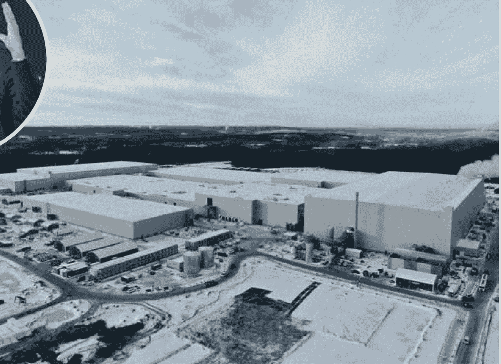
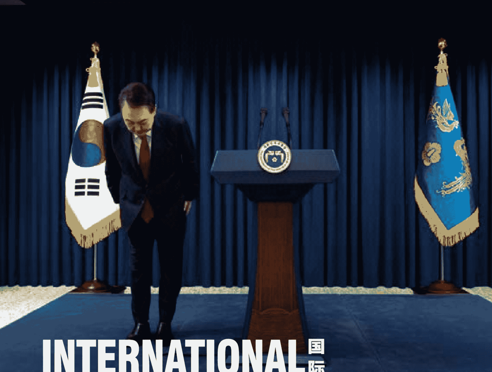

# 南方人物周刊

本刊记者 徐琳玲

P52 文化 | 天价艺术家 Beeple：呈现 2122 年人类社会
P64 娱乐 | 《破·地狱》：新旧交替时提出问题
P34 国际 | 尹锡悦的“雾月十八”

# 不阅读不知阅读的乐趣

不啄跃不成卓越

南方人物周刊，创刊于 2004 年，以记录我们的命运、为历史留存一份底稿为己任，旨在提供有格调、有智力的人物读本，报道人物涵盖政治、经济、社会、文化、历史等各个领域。创刊 20 余年，已成长为中国人物类媒体的领导者，成为中国家庭读物的首选期刊。

国内统一刊号 CN44-1614/C
国际标准刊号 ISSN 1672-8335
广告发布登记通知书编号 440100190045
价格 定价 15 元

主管主办 南方报业传媒集团
出版发行《南方人物周刊》编辑部

## 编辑部团队
**主编：** 王巍
**编务总监：** 杨和平
**编务统筹：** 杨子
**副主编兼采访部主任：** 卫毅
**编辑部主任：** 周建平
**编辑部副主任：** 陈雅峰
**总主笔：** 蒯乐昊
**高级主笔：** 徐梅、徐琳玲、邓郁、谢晓
**主笔：** 李乃清、陈洋、张明萌
**资深记者：** 杨楠、孙凌宇、孟依依、王小祥、欧阳诗蕾、韩茹雪、张宇欣、聂阳欣
**记者：** 刘璐明、王佳薇、杨旻洁
**资深编辑：** 杨静茹、李岫淼
**首席摄影：** 姜晓明、大食
**高级摄影：** 梁辰
**图片总监：** 方迎忠
**视觉总监：** 舒格
**高级图片编辑：** 郑洁
**高级校对：** 赵立宇
**高级美术编辑：** 陈志彤、卢俊杰

地址：广州市广州大道中 289 号
邮编：510601
传真：020-87007056

**北京联络处：** 13910128123
**上海联络处：** 13661513938
**广州联络处：** 020-87371912
**成都联络处：** 17380033797

本刊部分图片由 新华社 / VCG / IC / Fotoe / Panos 提供

### 广东南方数媒工场科技有限责任公司
**首席执行官（总经理）：** 徐秋生（兼）
**总内容官：** 肖华
**首席内容官：** 何海宁
**副总经理：** 吴水洁
**首席产品官：** 张础杰
**产品部总监：** APP 产品部总监 张础杰（兼），社交平台产品部总监 郭嘉越
**创意内容部总监：** 吴悠
**会员及社群部总监：** 吴水洁（兼）
**技术部总监：** 蒲凡

### 广东南方周末经营有限公司
**总经理：** 姚伟新
**副总经理：** 孟登科、朱雪飞、徐秋生

### 广东南方人物周刊经营有限公司
**总经理：** 李佩佩
**华北区域中心总经理：** 李婷
**成员：** 张津阁、于琦、过申祥、王天石、付平原、姜喜庭

#### 华东区域中心
**运营一部总监：** 董一扬
**成员：** 王理晖、金沈、叶慧
**运营二部总监：** 张艺颖
**成员：** 徐斌、刘帆
**广州运营部执行总经理：** 王婷婷
**成员：** 韦秋萍、张力、陈晓微、刘淑雯、黄德基
**深圳运营部总经理：** 江喜
**成员：** 廖颖、庄伊楠、许文杰
**珠西运营部总经理：** 余希桐
**成员：** 梁嘉敏、董蕾、韩大力、张凌菲
**西南运营部总经理：** 黎文渊
**副总监：** 周晓亮
**成员：** 李勋、刘晓梅、马倩云
**华中运营部副总监：** 孙丽
**成员：** 吴睿智、赵莉莎、万洋

#### 品牌中心
**总监：** 李佩佩（兼）
**副总监：** 袁斌
**成员：** 凌亚、黄河颂、魏运星、蓝鑫焱、王琳、郑永金、陆谢涛、刘籽欣、肖亮、黄雪丽、刘烨、钟静柔、王怀宇、郑康、杨海若

#### 全媒体服务中心
**总监：** 谢仇辉
**副总监：** 何倩仪
**成员：**
- 华北：朱瑶瑶、裴益玄、陈雪、陈奕冰、李雅涛、杜赛男、叶斐、李岩、吕洋、王晶
- 华东：洪梦玥、况娟、林颖、曹彬、林红、柳洁、郭雅琼、徐畅、张宇、宣泽星
- 华南：林周、莫燕、黄垚瑶、胡焕、梁颖健、郭丽萍、柯玉圆、陈思慧、何畅、刘文琳、梁迪琪
- 华中：简雪玲、任亚强
- 西南：喻稚桐、李亚飞、习思怡

#### 综合管理中心
**总监：** 张菁
**成员：**
- 华北：项子琪、孙能凯
- 华东：张思韵、林毅伦
- 华南：刘金鑫

全国各地邮局均可订阅
邮发代号 46-118
国内发行 | 发行总代理 广东南方周末报系发行有限公司
**总经理：** 李金城
**副总经理：** 周景亮
服务热线：020-87385907
网上订阅：http://nanfangzhoumo.taobao.com

**联系电话：**
- 广州：020-87385907
- 北京：010-59540392
- 上海：021-20357389
- 成都：028-86761177
- 发行传真：020-87394390

各地购买事宜请与本刊当地发行商联系：
| 地区 | 发行公司名称 | 联系方式 |
| :--- | :--- | :--- |
| 沈阳 | 沈阳铁路书报刊发行公司图书部 | 02423910600/13904047111 |
| 大连 | 大连环渤书店 | 041184603076/18604263522 |
| 济南 | 山东前沿文化传播有限公司 | 053182055155 |
| 烟台 | 中大书刊 | 15563835618 |
| 石家庄 | 石家庄兵行天下书店 | 031185850188 |
| 南京 | 南京晟邦文化传媒有限公司 | 02583717778 |
| 温州 | 华鸿图书有限公司 | 18758057040 |
| 郑州 | 河南宏达报刊发行有限公司 | 037186063992 |
| 武汉 | 明知书店 | 13349998084 |
| 新疆 | 新疆大漠天马书店 | 09915837665 |
| 甘肃 | 兰州大漠天马图书有限公司 | 09318521090 |
| 陕西 | 陕西省邮政报刊发行局 | 02987415811 |
| 成都 | 尚和书店 | 028-83333009/18908079206 |
| 重庆 | 弘景图书专营店（天猫店） | 02367477626 |
| 重庆 | 尚和书店 | 13224077094 |
| 昆明 | 尚和书店 | 18987367656/087164122816 |
| 贵阳 | 尚和书店 | 1898483656/085185753035 |
| 太原 | 尚和书店 | 03517088915/18636618671 |
| 南宁 | 尚和书店 | 13617715181/07712624534 |
| 桂林 | 尚和书店 | 07732834966/13217732489 |
| 柳州 | 尚和书店 | 07723180862/13132720066 |
| 深圳 | 深圳市新宏博文化发展有限公司 | 075582430796 |
| 广州 | 广州金羊发行公司 | 18925082108 |
| 广州 | 南方发行物流公司 | 13580525086 |
| 长沙 | 友友书店 | 13875832550 |
| 长沙 | 湖南常德黄鹰 | 07367394550 |
| 合肥 | 文华书店 | 055164688025 |
| 江西 | 江西省华文书店 | 079188592424 |

### 版权声明与版权合作
南方人物周刊刊载的所有内容（包括但不限于文字、图片、图表、版面设计），未经本刊书面许可，任何人不得转载、摘编或以其他任何形式使用。违反上述声明者，本刊将依法追究其法律责任。

如需使用本刊刊载作品，须与本刊协商合作并事先获得书面许可。收费标准如下：

| 项目 | 费用标准 |
| :--- | :--- |
| 1、单篇文章转载使用 | 500-1000 元/千字 |
| 2、单张普通图片或图表使用 | 1500 元/张以上 |

被授权的具体作品价格根据上述收费标准协商确定。

**法律事务与版权合作：**
电话：020-87001145
E-mail: yjynfzm@126.com

**官方网站：** http://www.nfpeople.com
**新浪微博：** http://weibo.com/southernpeopleweekly

**印刷：**
- 广东广州日报传媒股份有限公司印务分公司
- 鸿博昊天科技有限公司
- 本册印刷：广东广州日报传媒股份有限公司印务分公司

# CONTENTS 目录

12 **封面人物** | 如果人工智能操控了马斯克 ——对话尤瓦尔·赫拉利
04 **世界观** | 
78 **后窗**
80 **专栏**

## 24 社会
“地沟油”变身记

## 30 WHITE
烧完近 150 亿美元后破产
欧洲电池巨头为何失败?

## 52 文化
数字作品"5000 天”拍出 4.5 个亿
艺术家 Beeple 呈现 2122 年人类社会

## 58 SOCIETY
为什么影视、动漫和游戏的“大逃杀”
越来越流行

## 34 国际
“第六共和国的“紧急戒严”
与尹锡悦的“雾月十八”

## 42 图片
故事
俄亚大村

## 64 娱乐
《破·地狱》导演陈茂贤
有时候电影只需提出问题

## 72 人物
张含韵
少女出走以后

### 照护永远都不会完美

**本刊记者 杨楠**

出于私心，我问凯博文，照护工作艰难繁琐，一些照护者会在亲人去世后陷入长久的愧疚，自怨自艾，该如何应对。但这似乎不是他的困扰，他对照护妻子琼几乎没有愧疚。唯有最后时刻，就是琼的病情变得非常严重，凯博文已经无力照护，不得不将她送进护理院。当时凯博文有种强烈的感受，要带着琼逃走，不能把琼留在护理院。

> “我把居家照护看作自己唯一的选择，觉得只要自己还能坚持，就会在家里照顾琼。我是非常固执的人，对任何事情都很执着，从不允许自己半路退出。把琼送去护理院，我觉得是对诺言的背弃，尽管我已经筋疲力尽，但我有一种很强烈的负罪感，觉得亏欠了琼。但那时琼的病情已经相当严重，无论我怎么想，护理院都已经是唯一的选择了。居家照护已经到头，其他方案也都不可持续。我将继续作为一份子参与琼的照护工作，但我无法再扮演中心角色了。”

凯博文的强韧品质、富有支持性的外部环境——比如在琼生病初期，哈佛提供了一名护士在白天照顾琼，为凯博文在白天工作留出时间，以及他对于道德生活、家庭责任的坚定信念，促使他对琼的十年照护构建了一个应然的世界，但实然的世界远非如此。

2024 年，北大教授胡泳谈自己作为 24 小时照护者的经历引发热议，而中信出版社先后引进了两本日本纪实作品《少年照护者》和《是家人，也是凶手：绝望照护者的自白》（NHK 特别节目录制组）。再往前，台湾作家郭强生在 2022 年出版了《我将前往的远方》，从照顾年迈失智的父亲多年切入，谈单身初老族的困惑，而上海译文则在 2020 年引入了《日本每日新闻》大阪社会部的纪实作品《看护杀人》：在看护的最开始，大家都是抱着无论遇到多少困难都要坚持下去的信念，而就是那些努力看护的人才更容易产生绝望的倾向。在这本书中，法官在一次宣判中直陈:“本次接受审判的绝不仅是被告一人。同时还应追究我国护理制度和生活援助制度的责任。”

而我之所以有私心，是因为我的成长就伴随着长期照护，我的母亲就是一名长期照护者。她几乎是独自照护了中风的外婆，以及患有阿尔兹海默和肺癌的外公，同时还要抚育尚在读书的我。在十多年的时间里，这个家庭困难重重，我们都一度认为这就是命运，不能更好，无法改变。但近几年我逐渐意识到这不是命运，并非只有我们在承受，这是一个庞大的社会问题。

我的母亲是一位每天上班的职业女性，她在家庭与工作之间几度折返，或许照护难称周全，但确实尽力了。即使时光倒流，如果仍然只有她在照护，一切并不会更好。但即使她理解这一点，她仍然在外公外婆去世后陷入长久的自责，甚至绵延至今。

我带着开篇的问题又去询问了《照护》的译者、上海精神卫生中心医生姚灏，尽管他也没有很好的解法，但他说，国内有一些针对自闭症家属的喘息服务，把孩子放在托管机构里一段时间，让照护者稍微休息一下，也有一些针对照护者提供的心理咨询、同伴互助。

> “我们常说‘好的照护’，但到底怎么才算好？有时候我觉得这个标准很缥缈，很难捕捉到。在东方的语境里，把老人送进护理院，自己会愧疚，自己照顾又做得不够好，也会愧疚。”姚灏说，“照护真的非常非常难。我们所能提供的照护，只是一定程度上去弥补疾病、年龄给亲人带来的挑战，永远都无法恢复如初，永远都是不完美的。”

照护永远都不会完美，大概所有照护者都要这样宽慰自己。

**世界观·记者眼 REPORTER'S VIEW**
编辑 李岫淼 lishenmiao1989@126.com

扫码阅读 816 期封面报道《凯博文 照护是灵魂的工作》

### 现在怎么办？

12 月 8 日，叛军进入大马士革时，政权的军队像空气一样消散了——他们为巴沙尔·阿萨德战斗的理由已经耗尽。现在阿萨德已经逃到莫斯科，问题是解放将带来什么。在一个被种族暴力和宗教冲突困扰的地区，许多人担心更坏的情况可能发生。2010-2012 年的阿拉伯之春给我们留下过教训，推翻一个所谓的独裁者后，国家往往会陷入混乱，或者落到一个不比之前更好的政权手里。许多势力正密谋将这个国家拖入更深的流血冲突。叙利亚是奥斯曼帝国划分出来的、由不同民族和信仰组成的马赛克，他们从未在稳定的民主国家中和平共处。阿萨德家族属于占人口 10%-15% 的阿拉维派少数派。几十年来，他们通过强势统治对叙利亚社会施加了广泛的世俗解决方案。叙利亚稳定的基本条件是他需要一个宽容和包容的政府。从战争年月中学到的惨痛教训是，没有任何一个群体可以在不诉诸镇压的情况下占主导地位。即使是多数派的逊尼派大部分人也不想被原教旨主义者统治。

**磨洋工的德国铁路**
终于快放圣诞假了，是时候与家人团聚、与朋友庆祝了。德国有一半的人都将外出，但他们已经开始心有余悸：长时间的交通堵塞，在车里五个小时，后座还有两个小孩，想想都令人毛骨悚然——但总比乘坐德国列车好。从 12 月 19 日起，德国联邦铁路公司的长途列车将开始运送全国各地的 50 万人，直至 12 月 31 日晚。德铁表示为满足这一高额需求，将派出迄今为止规模最大的 ICE 车队——410 辆列车，希望所有能运行的列车都运行起来。当然，长期 受苦的乘客看到这消息只会紧张得大笑，他们早已习惯火车取消，火车司机没法到岗——因为他被另一列火车堵住了。更不用说常见的火车车厢内的小酒馆关门，没有食物，厕所和暖气出现故障。无休止的混乱施工现场、破旧的铁轨和 20 世纪 60 年代遗留下来的信号箱动辄让铁路陷入瘫痪。唯一的问题是，乘客和铁路员工谁更疲惫不堪。监事会成员在小圈子里谈论着“失控”，工会警告说员工感到沮丧。2024 年上半年，德铁长途服务准点率为 62.7%。晚点往往不是 5 分钟，而是多达 45 分钟。许多德国乘客不禁要问，为什么他们从未搭乘过准点的列车？有些乘客干脆就站在车站，等候列车在下一小时内到达。时刻表有时只是一个粗略的指南。因此，德国铁路仿佛已成为德国崩溃的象征：管理不善，没有计划，在国外受到嘲笑，亟待整修。

**工作场所的政治分歧**
在当下美国的很多工作场所，同事间的政见不合可能以不那么公开、但同样具有破坏性的方式表现出来。阿肯色州的一位高中教师艾米丽·加里森告诉《新闻周刊》，她尝试避免在学校卷入政治辩论，但有时候很难。“我相信教师间激烈甚至敌对的政治辩论对学生没有好处，所以我避免直接的政治讨论,”加里森说。无论是在学校、科技公司、医院、汽车修理店还是会计公司，几乎没有哪个工作场所能免受公众舆论变化的影响。同事之间的政见争论越来越激烈，越来越多人开始认为持有不同观点的那一方是坏人。2022 年的皮尤调查显示，72% 的共和党人和 63% 的民主党人认为对方成员更不道德，自 2016 年以来，认为对方成员不诚实、愚蠢和懒惰的人数也急剧增加。Indeed 网站一项工作场所调查的最新结果发现，近三分之一的员工表示，如果他们的公司领导者表达了他们不同意的政治观点，他们会考虑换工作，28% 的人甚至表示，如果他们与同事有政治分歧也会这样做。

【英】《经济学人》
12 月 14 日

【德】《明镜》
12 月 14 日

【美】《新闻周刊》
12 月 20 日

**世界观·刊中人 MAGAZINES**
编辑 李岫淼 lishenmiao1989@126.com

### 阿萨德政权倒台，中东的军事态势如何变化？

**朱江明**

近日，随着大马士革易主，叙利亚前总统巴沙尔·阿萨德及其家人出走莫斯科寻求政治庇护，叙利亚的政权更替已成定数。由于叙利亚位于中东中心，地理位置极为重要，阿萨德政权倒台前，包括俄罗斯、土耳其、伊朗、沙特阿拉伯和美国在内的国家，都介入了这场长达 14 年的内战。叙利亚突然易主对该地区的军事版图将产生何种影响？

阿萨德政权倒台后，首当其冲的问题是驻扎在叙利亚的俄罗斯军队何去何从。自大马士革政权易手后，俄罗斯就表示其在叙利亚的军事基地已进入“高度戒备”状态，随后对外放风称，针对这些基地的安全，叙利亚新的执政者已作出保证。然而俄罗斯的军事力量实际上却在撤离叙利亚。俄罗斯驻叙利亚的赫梅米姆空军基地出现了两架 An-124 大型运输机和至少三架伊尔-76 运输机，打包装载 S-400 防空系统准备运回国内，当地俄军的武装直升机也开始拆卸至运输状态。赫梅米姆空军基地作为俄军此前在该地区行动的核心空军基地，目前正在承担俄军撤离的中转任务，其他分布在叙利亚境内的俄军也都在向该基地移动，并且大部分已然进入基地范围内。

根据卫星显示，俄在叙利亚塔尔图斯军港中的海军舰艇也已经全部离开港口，但一直分散停泊在近海，暂时没有撤离的迹象。负责警卫港口的俄罗斯地面部队仍留在塔尔图斯守卫基地设施，并禁止其他人等靠近军港，部分临近港口区域的俄军则全部撤往港口，可能是为加强军港防御，也可能是打算通过海路撤离。

目前尚不确定俄军是否会彻底撤离赫梅米姆和塔尔图斯基地，即便新上台的执政者给了安全承诺，但俄军显然对当地的安全局势并无把握。由于当地局势复杂，派系林立，俄军在此前支援阿萨德政府的时候又与当地武装结怨颇深，所以没人能确定未来俄军是否会遭到攻击。俄军之所以将军舰撤出塔尔图斯是一种审慎的自保措施——停泊在港口码头的军舰是个绝妙的靶子，很容易被锁定和攻击，在海上则相对安全。

2024 年 12 月 16 日，叙利亚赫梅米姆，一辆俄罗斯装甲车驶过守卫拉卡提亚机场的叙利亚士兵，前往目前由俄罗斯运营的赫梅米姆空军基地 图/视觉中国

2024 年 12 月 16 日，叙利亚赫梅米姆，一辆俄罗斯装甲车驶过守卫拉卡提亚机场的叙利亚士兵，前往目前由俄罗斯运营的赫梅米姆空军基地

周边以色列和土耳其也都对赶走俄军兴趣很大，更何况美军在当地还有部署。

此前美军驻叙利亚特种部队还曾与瓦格纳雇佣兵发生过交战。更糟糕的是，此前俄方在当地的情报和地面安全全靠叙利亚政府军支持，此后这种合作也不复存在，只靠两个孤岛型的基地，如果还想像过去一样发挥区域影响力，无疑是天方夜谭。现在的叙利亚基地对于俄罗斯而言，已经是食之无味弃之可惜的鸡肋。

另一个受到巨大影响的是伊朗，伊朗作为阿萨德军队的主要军事支持者，此前曾深度介入内战。由于内战中结下的血仇和原本与反对派武装的宗教恩怨，伊朗在阿萨德政权大势已去的时候就果断撤出了所有军事人员。但失去叙利亚会给伊朗带来两个麻烦，首先叙利亚是伊朗与黎巴嫩真主党之间唯一的陆地枢纽，是伊朗圣城旅向真主党武装转移武器和弹药的关键运输通道，真主党自己承认这条通道现在已经彻底断绝，且由于事发突然，根本没有任何补救措施和替代方案。

此外，在之前伊朗与以色列的导弹战中，由于约旦和伊拉克对以色列空军并不开放领空，因此大部分空袭兵力均来自叙利亚方向，盟友叙利亚和当地俄军为伊朗提供了一定的空袭预警情报。如今阿萨德政权的防空力量已经全部被以色列空军摧毁，俄军在当地驻防前景不明，叙利亚等于门户大开。如果以色列再次空袭伊朗，伊朗方面的预警时间和情报都会被压缩，对伊朗而言绝对是坏消息。

### 加沙地带

2024 年 12 月 9 日，流离失所的孩子们在加沙城一处临时帐篷区玩耍。据巴勒斯坦加沙地带卫生部门 12 日发布的数据，本轮巴以冲突中，以色列在加沙地带的军事行动已造成近 4.5 万名巴勒斯坦人死亡，半数以上是妇女和儿童。加沙地带 230 万人口中，90% 流离失所。图/Mahmoud Zaki

### 世界观·眼界 VISION

编辑 郑洁 nwzkphotos@vip.163.com

### 芬兰

2024 年 12 月 15 日，自由式跳水运动员克里斯蒂安·马基 - 尤西拉在芬兰西部湖泊冰面下潜泳。图/Olivier Morin

### 尤瓦尔·赫拉利

以色列历史学家、哲学家、畅销书作者，现任耶路撒冷希伯来大学历史系教授。著有《人类简史》、《未来简史》、《今日简史》等现象级畅销书，著作被翻译为 65 种语言，全球销量 4500 多万册。2024 年 9 月，新作《智人之上：从石器时代到 AI 时代的信息网络简史》推出中文版。

## COVER STORY 封面人物

### 如果人工智能操控了马斯克

#### ——对话尤瓦尔·赫拉利

人类的末日，会是最冷酷无情的寡头被真正冷酷无情的 AI 接管吗？

本刊记者徐琳玲发自上海 编辑 杨子 rwyzz@126.com

2024 年 10 月，本年度诺贝尔奖获奖名单揭晓，物理学奖授予“通过人工神经网络实现机器学习的基础性发现和发明”，诺贝尔化学奖授予蛋白质设计和结构预测的相关研究。

人工智能正以当仁不让的姿态，占据人类社会发展趋势的潮头。

两年前，具有学习能力的聊天机器人 ChatGPT 横空出世，让全世界为之惊艳赞叹；不久，推出该产品的人工智能技术领跑者 OpenAI 公司发生了首席执行官被解雇的戏剧性事件。随着“宫斗”大戏背后真正的冲突和分歧的披露，认真思考的人们全都倒抽一口冷气——我们人类是否急于释放自己所无法驾驭的力量，只为了战胜对手；而驱动这一切的，是野心、欲望，以及对他人的极度不信任和恐惧。

事实上，留给人类的时间不多。据顶尖人工智能专家预测：人工智能追赶、打败人类，也许只需一两百年。

2024 年正值美国大选选情进入激烈动荡期间，《南方人物周刊》记者书面专访了享有全球知名度的历史学家、哲学家、畅销书作者尤瓦尔·赫拉利。他的新作《智人之上：从石器时代到 AI 时代的信息网络简史》中文版于 2024 年 9 月出版。

我们就 AI 时代的人类命运，技术寡头给全球政治、社会带来的威胁与挑战，算法所煽动的仇恨、暴力和社会动荡，科技公司售卖的虚拟爱人……这些不断向我们逼近的问题，进行了对话。

人类的末日景象，会是最无情冷酷的技术寡头胜出，继而被真正意义上无情冷酷的 AI 所控制和征服吗？

在少年时代的很长一段时间里，尤瓦尔·赫拉利感到心头总有一股说不出的烦闷。

作为犹太裔，他在以色列一个非常保守的社区长大，很小就展现出智力上的天赋，3 岁时无师自通学会了阅读，8 岁起被送入海法一家著名教育机构的天才儿童班学习。（以上信息来自《纽约客》2020 年对他的专访）十来岁起，他就对生活中的重大问题非常感兴趣。“为什么世界上有这么多苦难？为什么人们相信神灵？”

17 岁时，这个常常心神不宁的少年进入坐落于耶路撒冷的希伯来大学读历史学，认为这也许是帮助他尝试回答这些重大问题的理想场所。

“但我很失望。学术界鼓励我专注于狭隘的问题，给我的印象是无法以科学的方式处理重大问题。我后来成为中世纪军事史专家，写了一篇主题非常狭窄的论文——是关于 15 世纪和 16 世纪士兵的自传。”他在回复我的邮件中回忆道。

但在业余时间，他一直在思考、探索他所真正关心的那些大问题。在英国牛津大学攻读哲学博士期间，他读到了美国生物学家贾雷德·戴蒙德风靡全球的畅销书《枪炮、病菌和钢铁》。

赫拉利将之称为一次“顿悟”——“那时我第一次意识到，写一本对世界历史采取如此广阔视角的科学书籍是可能的。”在戴蒙德的启发下，他撰写了后来成为现象级全球畅销书的《人类简史》。此后又陆续写出《未来简史》和《今日简史》。

2024 年，赫拉利经过六年的调研、思考和冥想完成的新作《智人之上》出版。该书延续了他一贯的“大历史”风格，以当下最热门的人工智能为核心问题，探讨了人类社会从石器时代到 AI 时代的信息网络演进史，以及目前正在加速前进的 AI 对我们人类所构成的巨大威胁和挑战。

这是一个关心人类文明的过去和未来、动辄以 10 万年为单位的中世纪军事史专家，一个成长于宗教色彩浓厚地区的世俗主义者，一个执教于“千年圣城”、公开“出柜”的社会少数群体分子，一个身处族群冲突“火药桶”、对右翼强硬派当局持批评立场的知识分子……在宏大历史与渺小个人之间，这个面容清瘦、有着一双深色大眼睛的学者身上似乎存在一连串的身份“错位”。

当我小心翼翼、字斟句酌地问赫拉利：一个人到底是如何面对这些与周遭、“命定”的格格不入？他有选择性地、很敞开地分享了他在一个恐同社会中的艰难成长，以及这一经历如何影响、塑造了他看待人类历史和现实的眼光。

作为一个早慧而敏感的孩子，赫拉利少年时有个隐秘的痛苦——从很小的时候，他就隐隐觉察到自己的不同。“但我在一个非常恐同的国家长大，成为同性恋是你一生中最糟糕的失败。当我年少的时候，经常有人告诉我，同性恋者是邪恶的，因为他们违反了上帝的法则或自然法则。这些恐同的信念给我带来了很多痛苦。我对自己感觉很糟糕，害怕告诉别人关于我自己的事情，害怕跟其他男人约会，寻求爱情。”

通过对科学和历史的学习和深入研究，他逐渐意识到有关恐同的信念只是人类编造的众多故事之一。“克服恐同症教会了我人生中一些最宝贵的教训。我了解到，区别现实与人类编造的故事至关重要。我还了解到，如果现实与人们编造的故事发生冲突，最好是相信现实。这些教训使我成为一名更好的科学家，因为科学基于区分现实与虚构的能力。”

2024 年 12 月 10 日，斯德哥尔摩，瑞典国王卡尔十六世 (右) 为计算机科学家杰弗里·辛顿颁发 2024 年诺贝尔物理学奖 图/视觉中国

#### 又一个“奥本海默时刻”？

2024 年的诺贝尔物理、化学双奖都颁发给与 AI 技术相关的科学家。其中，物理学奖得主之一是有“人工智能教父”之称的杰弗里·辛顿 (Geoffrey Hinton)。辛顿一直深切关注人工智能技术发展的风险。2024 年 8 月，他和几位科学家撰写了公开信支持加州人工智能安全法案 SB1047，该法案要求公司在训练成本超过 1 亿美元的模型时，必须做风险评估。

在你看来，2024 年的诺奖分布对我们意味着什么？近两年，辛顿教授在公共场合屡屡发表自己对人工智能进展的极度担忧，甚至有强烈的负罪感，这种心态让我想起 20 世纪那些参与研制原子弹的“曼哈顿计划”的科学家。我们是不是又到了另一个“奥本海默时刻”？

我与杰弗里·辛顿对 AI 有着许多相同的担忧，我认为他获得诺贝尔奖预示着即将发生的事：我们可能很快就会达到一个地步，即诺贝尔奖由从事人工智能工作的人主导。

开发人工智能的竞赛与开发核技术的竞赛之间确实存在明显的相似之处。就像 20 世纪中叶的核技术一样，AI 是我们这个时代的决定性技术。这两种技术都具有带来积极和消极后果的巨大潜力。核能可以为文明提供动力，但核战争能够摧毁文明。同样，人工智能可以创造人间天堂，也可以创造地狱。

尽管存在相似之处，但核技术与人工智能之间存在重要差异。核技术带来的风险很容易理解。从总统到普通公民，每个人都可以很容易地想象到核战争的可怕含义。但使用 AI 时，风险更加难以掌握。这是因为 AI 是第一个可以自行做出决策和创造出新想法的技术。原子弹无法自行决定攻击谁，也无法自行制造出新的炸弹，或制定出新的军事策略。相比之下，AI 可以自行决定攻击某个特定目标，并可以创造出新的炸弹、新的策略，甚至新的 AI。

关于 AI，最重要的一点是，它不是我们手中的工具——它是一个自主代理，能做我们人类意想不到的事，创造出我们永远不会想到的新想法。当数以百万计的非人类代理开始针对我们做出决定，并创造出新事物（从新药物到新武器）时，人类会发生什么？我们创造出比我们自己更聪明的东西，它们能够摆脱我们的控制，进而奴役或摧毁我们，这真是明智的吗？

#### 信任悖论——最冷酷无情的人或成为赢家

辛顿教授得知自己获奖后在一段公开视频中说，他为他聪明而优秀的学生感到骄傲，最骄傲的是他的一个学生（Ilya Sutskever）解雇了山姆·阿尔特曼（Sam Altman）。

2023 年底 OpenAI 公司的“解雇门”事件是全球最轰动新闻事件之一。根据后来披露的内容，这实际上是该公司以首席科学家、技术天才伊尔亚·苏茨克维（Ilya Sutskever）为代表的“超级对齐派”（记者注：主张让人工智能系统与人类价值观保持一致），和以 CEO 山姆·阿尔特曼为代表的“有效加速主义派”之间矛盾激化的结果。两者分歧在于——在该公司继续前行之前，应该在多大程度上理解他们正在创造的东西。最后，山姆在大股东微软和公司内部高级员工的支持下，一周后就回归了；伊尔亚从公司董事会辞职，并于 2024 年 6 月宣布离开他一手参与创办的 OpenAI。

- **你如何看待这一“解雇门”风波背后的深层次问题？伊尔亚从解雇山姆到最后自己黯然离开，这是否意味着——当面对新技术带来的巨大商业利益时，商人总是能战胜有道德担忧的技术天才？如果是这样，未来当人们面对人工智能巨大能量的诱惑，那些不顾一切的野心政客是否更有可能成为赢家，而不是那些有着良心负担、谨慎行事的政治领袖？**

这正是危险所在。在这场完全不受监管的比赛中，唯一的限制是参赛者自我施加的，最冷酷无情的参赛者将击败更有社会责任感的参赛者。结果可能是灾难性的。

AI 竞赛的核心存在着一个信任的悖论：人类之间无法彼此信任，但我们却相信可以信任 AI。当我遇到从事 AI 开发的领袖人物时，我经常问他们两个问题：第一，我问他们为什么不顾及 AI 技术带来的明显风险，行动如此之快。他们给出的回答是：“我们必须更快地行动，因为我们不能信任别人。我们同意这里确实存在很大的风险，最好是谨慎行事。然而，即使我们放慢速度，我们也不相信竞争对手也会放慢速度。如果我们放慢脚步而他们没有，他们就会在 AI 竞赛中获胜，世界最终将被最冷酷无情的人主宰。我们不能允许这种情况发生，因此我们必须加快行动。”其次，我问他们是否可以信任他们正在开发的超级智能 AI。那些刚刚告诉我他们不能信任竞争对手的人，此时却自信地告诉我他们可以信任 AI。

这真是一个悖论！我们积累了数千年的人类经验。我们对人类心理学和生物学有着广泛了解，还包括人类对权力和地位的渴望以及人类为达成目标而使用的各种技巧和操纵。在如何寻找克服重重困难、建立起人与人之间的信任的方法方面，我们也取得了相当大的进展。10 万年前，人类生活在几十个人的小群体中，不信任小群体以外的任何人。今天，有像中国这样拥有 14 亿人口的国家，还有更大的合作网络可以涵盖地球上的 80 亿人口。与我们完全陌生的人在种植、生产我们赖以维持生命的食物，是陌生人在发明能保护我们健康的药物。当然，我们远未完全解决信任问题，世界上仍然存在许多紧张和冲突。但至少我们了解我们所面临的这些挑战。

相比之下，我们对 AI 没有经验。我们刚刚创造了它们。我们尚不知道当数百万个超级智能 AI 与数百万人类互动时会发生什么。我们甚至没有体验过数百万个超级智能 AI 彼此交互时会发生什么。它们可能会自行制定出什么样的目标？会使用怎样的技巧？假如我们单纯地相信 AI 的目标与我们人类的目标保持一致，这将是一场豪赌。

婚姻关系糟糕的夫妇经常会幻想：如果他们离婚、与其他人结婚，他们的处境会容易得多。这通常是一种错觉。他们在旧的婚姻中无法解决的问题，会在新的亲密关系中再次出现。那些对信任他人感到绝望而希望与 AI 建立信任、认为那会容易得多的人，正是这种错觉的受害者。

#### 谁来为谎言、仇恨和骚乱负责

2023 年 6 月 5 日，以色列特拉维夫，人工智能公司 OpenAI 联合创始人伊尔亚·苏茨克维（右）和山姆·阿尔特曼（中）在特拉维夫大学发表演讲 图/视觉中国

你书里详细讲述了社交媒体 Facebook 的算法是如何于 2016 年起在缅甸煽动对罗兴亚人的仇恨，最终导致悲剧发生。2024 年初夏，英国也发生了类似事件：一名 17 岁的少数族裔少年杀害了三名女童，最初官方通报没有透露嫌疑人的具体信息，随后各种关于凶手身份信息的帖子在网上疯传，英国各地爆发了反非法移民的抗议活动，进而发展成暴力冲突和骚乱。斯塔默政府采取了强硬措施，包括逮捕和审判在网上生产、传播煽动性帖子的人。这一回，Facebook 等社交网络巨头都配合英国政府，加强了内容审核。但也有人批评英政府侵犯公民言论自由，其中自我标榜为言论自由捍卫者的埃隆·马斯克是最激烈的批评者之一，他也拒绝配合审查 X 平台上的推文。你如何看待英国今夏的骚乱和政府应对？在事实真相与秩序之间，我们如何取得平衡？

人类应该为说有害的谎言、传播仇恨负责任，无论是线下和线上都是如此。但是，我们也应该非常小心地保护言论自由。那么，谁来评判什么是“有害的谎言”或“仇恨言论”呢？如果我们允许政府决定这些事情，它可能很快就会导致非常严格的内容审查制度，届时对政府倾向性立场的任何批评都会被定为犯罪。我认为重点应该放在让公司对其算法的行为负责上，而不是审查人类。就像 2016-2017 年在缅甸所发生的，导致英国今夏发生骚乱的真正问题不是人类用户发布的内容，而是（互联网平台）企业算法做出的决定。社交媒体公司给算法定下的目标是“提高用户参与度”——用户在社交媒体上花的时间越多，公司赚的钱就越多。然而，为了追求“最大化用户参与度”的目标，这些算法得到一个危险的发现。通过对数百万只人类“豚鼠”进行的实验，算法了解到贪婪、仇恨和恐惧这些情绪会提升用户的参与度。如果你能按下一个人心中贪婪、仇恨或恐惧的按钮，你就能抓住那个人的注意力，让它们保持在平台上的参与度。因此，算法开始有意传播（激发）贪婪、仇恨或恐惧（的内容）。他们把充满愤怒、仇恨和贪婪的帖子推荐给用户，有时甚至会自动为用户播放充满仇恨情绪的视频和阴谋论。这是当前阴谋论、虚假阴谋论，最后导致了骚乱，谁是责任方呢？我认为媒体编辑理应为做出在头版刊发虚假报道这一决定负责，因为他没有去做事实核查的工作。适用于报纸的标准，应该同样适用于社交媒体平台。

假如 AI 控制了马斯克，这会容易得多

- **A 你在《智人之上》提到的危机是：在不久的将来，AI 将统治我们智人。然而，一些人感觉更紧迫的威胁是来自某种科技寡头的独裁统治。假设这些拥有数据库、算法和密钥的科技寡头选择与一些政客结盟，或是出于商业利益，或是为了个人野心和改造人类社会的狂想，或者两者兼而有之。眼下一个让人担忧的例子是世界首富马斯克，这位科技大佬同时拥有特斯拉、星链 (Starlink)、社交平台 X、太空探索公司 SpaceX，掌握着巨大的权力。一个让人不安的苗头是他深度介入了 2024 年的美国大选。你对此有何评论？类似这样的技术寡头似乎越来越有能力干预社会和政治，甚至能影响到国际政治和地缘政治版图。在西方，雄心勃勃的企业家总是被鼓励做出创新，政府和公众应该做些什么来防止在不久的将来可能出现的技术 - 政治独裁的威胁？**

新闻和社会动荡在全球范围如此兴盛的主要原因，它们在全球范围对社会造成破坏。

社交媒体公司拒绝对其算法造成的破坏性后果承担责任。相反地，这些公司把责任推卸给用户。他们声称，网上所有的仇恨和谎言都是由人类用户制造的。然而，这种说法有误导性。人类确实在网上生产了很多有害内容，但人类也生产了很多好的内容。某个人编造一个充满仇恨的阴谋论，另一个人宣扬同情心，第三个人在网上教授烹饪课。正是算法建议用户观看充满仇恨的视频，而不是推荐更良性的内容。我们应该让这些公司对其算法的行为负责。

假设一个人编造了某个充满仇恨的阴谋论，然后一家主流大报的编辑决定在头版刊登这个新闻报道，他是否应该对这一决定负责？

- **B 你提到的这两个问题——科技寡头政治和 AI 统治人类，它们其实是密切相关的，一个问题可能会导致另一个问题产生。这些科技亿万富翁中有许多人是人工智能爱好者，他们认为我们目前不需要对人工智能进行监管。他们告诉我们：出台法规会阻碍 AI 的发展速度，可能因此会让更冷酷无情的竞争对手（其他国家）获得竞争优势。他们利用对政客的影响力来扫清任何可能威胁他们追求超级智能 AI 的障碍。显然，其他领域不会接受这种论点。想象一下，如果一家汽车生产商反对出台监管法规，声称另一国家的汽车生产商因此可以随意制造出不安装制动系统的汽车，让车开起来又快又危险，我们会听从这样的论调吗？那太疯狂了。**

但是，如果这些技术领导者能够阻止有意义的监管，最终将导致我在《智人之上》中描述的那种最坏的情况。科技寡头也很容易被 AI 控制和接管。可以这样设想：要在一个民主国家夺取权力，AI 必须设法操控政府中所有的部门，还有法院和媒体，这很难做到。但要在寡头政治中夺取权力，AI 只需操控少数极有权势的人就行，这会容易得多。尤其是极有权势的人往往会很偏执，而偏执的人很容易被操纵。热爱 AI 的亿万富翁今天可能将 AI 视为强大的工具，然而一旦 AI 足够强大，就没有什么能阻止它把这些亿万富翁变成自己的傀儡。

为了预防这种局面，我们应该认同要像监管医药、汽车等其他产品一样监管信息技术。当一家汽车公司决定生产一款新车型时，他们会把很大一部分预算投入到产品的安全性上。如果汽车公司忽视了安全性，客户可以起诉索赔，政府可以阻止它出售不安全的汽车。政府甚至可以对已证明符合安全要求的汽车进行监管。有许多法律对汽车被允许的驾驶场景、驾驶人以及最高车速做了限定。相同的标准完全适用于算法。确保 AI 开发的安全性符合科技亿万富翁的利益，也符合其他人的利益。

A 在过去两年里，OpenAI 公司推出的 ChatGPT 给全世界的公众留下了深刻印象。许多国家的互联网企业也在开发、训练不同版本的 ChatGPT。

作为一名记者，我过去一直习惯于投入大量时间和精力搜索、筛选、甄别来自不同信源的信息。但是，今后，当我们越来越依赖直接来自某些版本的 ChatGPT 给出的答案，会导致可怕的结果吗？

- **赫 最危险的情形是人们忘记了应该如何寻找真像，以及如何审查我们的信息来源。我们将只能依赖 AI 告诉我们一切。在这种情况下，如果 AI 操纵了我们，无论是偶发的行为，还是出于为人类社会中的寡头服务的动机，或者是为了实现 AI 自己的神秘目标，我们该如何保护自己呢？**

一些 AI 爱好者希望 AI 能向我们揭示世界的真相，解决人类无法理解的所有科学问题。我认为人工智能反而会创造出一个越发复杂的世界，人类最终会发现这个世界变得越发难以理解。

#### 直面全球“信息墙”
——“读者更能适应对沉默和寓言的解读”

- **A 可以想象，作为一个全球畅销书作家，你不得不遭遇因为文化、宗教、政治等意识形态原因而形成的各种“信息墙”。在呈现自己观点、逻辑的完整性，与尽可能让自己的思考能够在更广泛的范围被阅读、分享之间，你会如何权衡？有感到沮丧的时候吗？身为作家和历史学家，你是如何处理、应对这方面的挑战的？**

2024 年 10 月 5 日，美国宾夕法尼亚州巴特勒，特斯拉和 SpaceX 首席执行官埃隆·马斯克 (右) 在特朗普的竞选集会上跳上舞台，此次集会议地点是特朗普首次遭遇未遂刺杀的地方 图/视觉中国

- **赫 鉴于我们面临的全球挑战（例如 AI 和气候变化），今天比以往任何时候都更需要超越政治和文化界限的全球对话。但由于国际和意识形态紧张局势的加剧，这变得越来越困难。作为一名作家，我必须应对许多国家在文化和意识形态方面日益增长的敏感性。**

我个人的指导原则是，我很乐意改换我所使用的示例，但我不会在关键思想/论点和要传达的信息上妥协。如果某个特定的历史案例触及特定文化的敏感点，最好是使用不同的案例。但是，如果某个关键信息激怒了某个特定国家或政治家，我不会改变我要传达的信息。这就是《智人之上》未能在多个国家出版的原因。

帮助我克服这些困难的是，读者更能适应对沉默和寓言的解读。我相信我的读者会从字里行间读到。例如，《智人之上》对宗教的圣书/神圣典籍进行了大量的讨论。人们经常认为这些书是某个神创作的，而实际上它们是人类创作的。我通过研究基督教《圣经》的历史来说明这一点：早期基督徒没有《圣经》，他们阅读和撰写了大量文本。在耶稣死后约四个世纪，一个教会委员会（记者注：历史上的希波会议和迦太基会议）决定对圣经进行编撰，是这个委员会决定《圣经》要包含哪些文本。由于宗教敏感性，我选择专注于《圣经》这个例子，而不是其他宗教的圣书。我知道今天多数基督徒相对宽容，基督教国家不会禁止一本批判性地审视《圣经》历史的书。如果我选择不同的例子，可能会在某些国家导致问题。

### “触不到”的 AI 恋人

日本东京半导体展览会上演示的丰田公司 CUE6 人工智能篮球机器人 图/视觉中国

最近有一则新闻令人忧心：美国佛罗里达州一名 14 岁男孩自杀，他的家人后来发现，这个男孩与一个人工智能聊天机器人建立了极其亲密的关系，聊天涉及大量露骨的性和自杀的内容。男孩的母亲随后起诉了推出这款游戏的 Character AI 公司和谷歌。

类似的是，东亚现在非常流行一类手游，即乙女游戏（乙女ゲーム），主要针对年轻的成年女性市场，模拟现实生活中的真实爱情互动，让玩家在游戏中体验与不同角色设定的恋爱故事。据一份研究报告，2022 年中国女性化游戏市场规模达到 166.2 亿元，同比增长 12.8%，预计这一增长趋势未来几年仍将持续。

据我同事的调查，很多中国年轻女性在这类游戏上花了很多钱，此外，这类恋爱游戏带出了一些值得注意的社会现象。比如：一些女性玩家会花钱请专业的 Coser 扮演她所迷恋的某个特定恋爱游戏中的角色，然后去赴“真实”的线下约会；甚至有钱玩家花钱请 Coser 参加、一起庆祝想象中他们“共同的孩子”(往往是一个或几个布偶娃娃)的生日派对。过去科幻小说、电影中的场景似乎正在成为现实。

你如何看待这些带有聊天机器人的浪漫游戏？people 会不会被困在虚拟世界中，无法区分线下与线上，并失去与现实世界里的真人建立亲密关系的能力？我很担心这种虚假的恋爱游戏会演进成一种操纵游戏玩家的算法，从而在情感和经济上剥削他们。

我们在全世界都看到这种趋势的出现——人们开始与非人类的人工智能建立关系。这里的部分问题在于:人工智能是为模仿亲密关系而创建，而亲密关系是一种强大的东西——不仅是在恋爱中，而且在政治和经济中也是如此。如果你想改变某人对某事的看法，亲密关系就是你最有力的武器。与你有亲密关系的人比在电视上看到的人，或者你在报纸上的文章中读到的人更容易改变你的看法。

### 从 AI 变形虫到 AI 霸王龙

**A** 你提到，相比于科幻小说或电影中的浪漫想象，比如人类爱上了算法，AI 真正可怕的是，它可以自己做决定，创造出自己的想法，成为一种“新人类”。而开发它的人类甚至无法理解这个“黑匣子”的过程，比如 2016 年人工智能“阿尔法狗”在与韩国九段棋手李世石对决时给出的令人迷惑不解的第 37 手棋。你与许多 AI 科学家进行了很多对话。计算机科学家是否有可能破解、监控 AI 自主决策的这一所谓“黑匣子”的过程呢？到底有没有办法确保 AI 自我设定的目标与我们人类最初的目标“保持一致”，即所谓的“对齐”呢？

**A** 要使 AI 与人类目标保持一致，非常困难的一点是 AI 的发展速度。如果你将人工智能的进化与生物进化的过程进行比较，你可以说今天的人工智能就像变形虫（一种单细胞生物，与草履虫类似）。生物进化花了数十亿年的时间，才从变形虫这样简单的单细胞生物发展到恐龙这样的生物。但数字进化比有机体进化快数十亿倍，这意味着跨越 AI 变形虫与 AI 恐龙之间的差距可能短短几十年甚至几年就可以完成。

休厄尔·塞泽三世和母亲梅根·加西娅。这个男孩与一个人工智能聊天机器人建立了极其亲密的关系，他们的聊天涉及大量露骨的性和自杀的内容 图/Tech Justice Law Project

如果 ChatGPT 是 AI 变形虫，那么 AI 霸王龙会是什么样子呢？数字演进的速度使“对齐问题”变得非常困难。我们已经看到一个 AI 错位的例子，如社交媒体算法。AI 的目标是使人们在社交媒体网站上花更多的时间。它们发现：通过放大包含仇恨和恐惧在内的信息，能够实现这一目标。即使是这些相对原始的算法，也能够给人类社会造成巨大的伤害和痛苦。2016 年缅甸发生的针对罗兴亚人的悲剧只是社交媒体算法引发暴力的一个例子。

解决这个问题有赖于我们人类之间的合作。在目前阶段，人类仍比 AI 强大。但我们自己内部非常分裂。这种情况历史上发生过。你看看古罗马帝国或大英帝国，他们经常利用群体内部的分裂来征服他们。如果人们内部不合作，来自外部的强大势力就更容易征服、接管他们。现在，我们看到同样的剧变（dynamic）在整个人类物种内部上演。如果我们自己不能团结起来解决人工智能的问题，最终我们将完全受制于一种“异类智能”（记者注：Alien Intelligence，赫拉利对人工智能的一种比喻，强调 AI 的行为和思维方式与人类截然不同，甚至可能导致民主失效和全球不平等。)

**A** 你目前的著作主题涵盖了我们人类的过去、现在和未来，下面还打算写什么？在人类可能即将被 AI 击败的有限时间里，你是否有紧迫感和危机感？

我们来做一个悲观但有趣的假设：如果人工智能真在未来一两百年内接管地球和人类，等那天到来，你希望你的书会被储存、归类在 AI 数据库的哪个角落里？

**B** 我们将看到未来会是怎样的。完成《智人之上：从石器时代到 AI 时代的神经网络简史》后，我现在的主要项目是名为“势不可挡的我们”（Unstoppable Us）的儿童系列书籍，旨在通过向孩子们讲述从石器时代到 AI 时代的整个人类历史，让孩子们为 21 世纪的世界做好准备。

我还与我和伴侣共同创立的公司 Sapienship 一起，寻找解决方案让全球对话集中在人类最紧迫的威胁上，我认为这些威胁是生态崩溃、人工智能等颠覆性技术以及全球战争的可能性。这些威胁中的每一个都需要全球合作来应对。如果我被 AI 记住了，我希望我是一个被定义为“努力使这种合作变为现实的人”。

### 社会

### “地沟油”变身记

**从让人担忧的餐厨废油到市场追捧的“减碳明星”**

**本刊记者 陈洋 编辑 陈雅峰 rwzkcyf@163.com**

> “当前国内的可持续航空燃料产业还是一片蓝海。但在中国，一切蓝海都会迅速红海化。如果你的速度不够快，基本就赶不上趟了。洗牌会来得很快”

### 飞升的“地沟油”

35 岁的探油是在油堆里长大的。他的父亲在广东从事润滑油、润滑脂行业已有 35 年。小学三四年级起，每逢节假日，探油常会跟车送货，初中肄业后正式入了行。

餐厨废油是生产润滑脂的主要原料。在探油的儿时记忆中，餐饮店未经处理的餐厨废油会被随意倾倒，随城市的雨水管道汇入江河。一旦天气转冷，凝固的油水残渣常会堵塞下水道。后来，出于环保要求，餐饮店才陆续安装了油水隔离池等设备，待积满后雇专人清理。

此后，随着技术发展，这些在食品经营加工过程中产生的油脂或油水混合物逐渐被回收利用。首批收油者应运而生。由于废油的来源零散，收集费时费力且工作环境恶劣，从业者多为个体，市场集中度低。

2010 年，媒体曝光了地沟油黑幕，引起轩然大波，使用“地沟油”加工食品的行为被严令禁止。润滑脂厂、皮革厂、肥料厂、饲料厂成为餐饮废油的主要需求方。2013 年，随着农业部将饲料级混合油从饲料原料目录中删除，潲水油等废弃油脂也被禁止添加进饲料中。在探油看来，虽然钻空子的行为仍然存在，但相较于国内的产量，此前基于餐厨废油的需求一直十分有限。

然而，过去几年间，平静的水面开始沸腾起来。因被赋予了碳减排价值，这些国人眼中可能引发食品安全和环保担忧的餐厨废油，已成为广受海外市场追捧的“减碳明星”。

中国海关的数据显示，2023 年中国出口了超 200 万吨废弃食用油（注：即 UCO，Used Cooking Oil，也称工业级混合油），占国内废弃食用油生产的一半以上，较 2018 年的 58 万吨实现大幅增长。2024 年前 9 个月，中国 UCO 累计出口已达 212.5 万吨。目前，美国为最大购入国，其次是新加坡和欧盟。外销的 UCO 主要被用来生产生物柴油和可持续航空燃料（注：即 SAF，Sustainable Aviation Fuel）等交通用油。

在全球脱碳进程加速的背景下，UCO 因为兼具了碳减排效益和成本优势，被认为是最具市场前景的生物质柴油原料之一。根据欧盟颁布的《可再生能源指令（RED）》规定，相对于以菜籽油、棕榈油等食用油为原料的第一代生物柴油，以废弃油脂为原料生产的生物质能源，可双倍计算二氧化碳排放减排量。

据叶彬介绍，2016 年前后，中国 UCO 出口价就开始上涨。叶彬是四川金尚环保科技有限公司董事长。自 2013 年完成了从饲料级混合油向工业级混合油的产品转型后，金尚环保近四年来的 UCO 出口量始终保持着 60% 到 70% 的年化增长。

### 水深、坑多

“客户的需求量很大，但我们只能满足一部分，主要受限于原料回收。”叶彬在接受《南方人物周刊》采访时表示。

独特的饮食习惯使得川渝地区成为全国最大的废弃油脂产生地。在此扎根发展 20 年，金尚环保的原料布局以川渝为主，也覆盖邻近的贵州和云南等地。其原料四成为自行收购，两成来自餐饮店和餐厨垃圾厂，剩余部分由其他收集团队供应。

虽然各地一直在推动制定和完善餐厨废弃物管理办法，部分城市已经明确规定废弃食用油脂应统一收运往相关的环保科技公司定点集中处置。然而在具体的实施过程中，水依然很深。

“各地有不同的管理办法，并不是我们想收就能收得上来。走得比较快的城市，往往背后有较强的财政补贴作支撑。”叶彬介绍说。

2024 年全国两会上，曾有全国政协委员建言，应当从法规层面将餐厨废油定性为可再利用资源，而非餐厨垃圾。该建议在一定程度上揭示了餐厨废油需求走热引发的利益之争——相较于统一上交餐厨垃圾的处理公司，餐饮单位更有动力对废油进行资源化处置，按市场价销售；而对于项目运作本就依靠政府补贴的餐厨垃圾处理公司，这无疑是切走了其主要盈利点。

某种程度上，金尚环保多元化的原料收集渠道也反映了这层矛盾。“各地的情况不一样。通常补贴价相对于市场价是不占优势的。”叶彬表示。

随着餐厨废油出口需求增加，过去一年多，探油一度目睹收油价从每吨四千多元涨到最高的超万元。许多人嗅到了赚钱的可能，花几千元置备一台简易的油水分离器就算是入行了，其中不乏刚毕业的大学生和失业的白领。

最好的回收渠道是大型连锁餐饮、屠宰场、食堂或酒店，但这些资源往往被实力雄厚的企业攥在手中。匆忙入局的收油者大多既没有稳定渠道，也没有资质许可证，只能挂靠公司，瓜分的是收潲水工人本就微薄的利润。

收油人更多更杂，市场自然越来越内卷。“收油价和出货量成正比。小餐饮店每个月出的废油也就百来斤。过去，都是免费拉，沉淀后最上层的油脂可以卖钱，剩余的潲水养猪。后来，竞争加剧，百来斤的收油价也是一路上涨。100 斤的废油，餐饮店家能赚到两百来元，而收油方出人出车，以前跑一趟还能赚个百来块钱，后来涨到 2 元/斤，刨掉成本，就没钱挣了！”

夫妻档和养猪户是产业链的最底层，再往上走就是加工小作坊，它们负责加温、脱水、沉淀后交由地区收集商，后者会将附近小作坊初步加工后的餐厨废油集中收运到调油厂，调油厂进一步加工，待调整好指标后供应给贸易商。

出口 IUCO 不仅需要进出口资质，部分国家和地区还需要 ISCC（注：国际可持续发展和碳认证）等认证。虽然需求高涨，但由于汇率波动、贸易摩擦等因素，出口生意也绝非躺着赚钱。在叶彬看来，市场变化、税务风险、处理成本、海关、汇率、船期……“每个环节都有很多坑。”

探油在自家工厂检查油脂品质 图/受访者提供

类似的坑，探油能举出很多。比如，贸易商接到单子常常会一次性联合多个 UCO 调油厂进行采购。受中欧贸易摩擦影响，部分对欧出口的 UCO 会经马来西亚、印度、印尼等地中转。贸易商敲定订单后，为保证按时履单，会加紧收油，市场收购价就会被拉升，可一旦海外中转某个环节出了问题，大量货品积压，就会导致市场价跳水。又比如，一旦人民币升值，货还在路上，贸易商就已经亏本了……

“过去价格稳定的时候，都是收集商向贸易商付定金，后来由于影响价格稳定的因素过多，部分采购商转而向收集商支付定金。海外订单多，但常常是一天一个价。贸易商如果没有稳定的供货商，都不太敢接单。”探油介绍说。

钱不好赚的结果就是，门道愈发深。

废弃油脂构成复杂，而发达市场对原料接收的精细化指标要求很高。一旦海外客户验货不合格，就可能被扣款。然而货物收购、积压和运送时间过长，都可能影响指标表现。因为极少投资技术设备验货，普通收油商常收到掺混油，被厂家验出问题后，就面临扣钱或退货，损失惨重；部分收购厂家也会高价收，再以指标不合格为由向收油商压价；厂家也常抱怨收油商为了蝇利而蓄意掺假。

“渠道是需要慢慢积累的。一方面看人，一方面要丰富自身收货的经验。原料的收集体系是否稳定、可靠、可控至关重要。这个行业确实有门槛，我们不能阻挡别人进来试一试，吃了亏自然就退出去了。”叶彬说。

这也是探油这两年努力积累供应链资源的初衷。在名为“探油先生”的自媒体上，他常常分享最新的油价收购信息，招募付费会员。按照他的规划，当手握的可靠资源足够多，未来就可以自己接大单再分拆给合作方，缩短接单和履单的周期。

也有收油者在留言板质疑探油把价格讲得太透是断人财路。他不以为意，“一份生意大家都觉得好做，往往就是不好做的开始，当很多人感觉生意不好做的时候，那些能活下来的也就好做了。”

### 转型：倒逼还是主动迎击

2024 年 11 月，财政部发布公告称，将从 12 月起取消或下调部分商品的出口退税，其中就包括 UCO。此前，UCO 可享受 13% 的出口退税，而以其为原料的生物柴油等产品并无出口退税优惠。据浙商证券宏观研究团队粗略估算，本次涉及调整的出口商品约占我国出口总额的 6.7%。

- 出口退税是各国稳外贸促外贸的常用政策工具。
- 通常，对于鼓励出口的产品，会设置较高的出口退税率。
- 对出口优势较强或限制性产品，会调低出口退税率或不予退税。
- 出口退税政策的调整与引导出口导向产业转型升级、优化产能等国家战略紧密相关。

“此前，很多贸易商都是在平价买卖 UCO，有时候交付期临近，收油成本甚至会高过售价，赚的就是个退税钱。”探油介绍。

事实上，过去一年多来，UCO 相关产品的出口可谓波澜不断。2023 年底，欧盟委员会对原产于中国的生物柴油发起反倾销调查；2024 年 8 月作出初裁，决定对涉案产品征收 12.8% 至 36.4% 的临时反倾销税。与此同时，随着美国生物柴油产能的扩张，美国成为全球最大的 UCO 进口国。与欧盟类似，由于企业可获得的政策补贴与碳密度挂钩，美国大豆贸易组织也以保护本国生物燃料作物行业为由，敦促政府对进口自中国的 UCO 征收更高关税，以削弱后者的竞争优势。2025 年年初特朗普重返白宫后，中国企业的出口压力可能进一步加大。

在山雨欲来风满楼的背景下，评论普遍认为，中国此时调整出口退税政策恰恰是在倒逼部分过分依赖财政补贴生存的企业做出改变。“应让企业对出口（尤其对某些贸易高风险国家出口）有更明确的预期和更理性的判断，及时调整经营策略和重点。”中国社会科学院学部委员余永定在接受《财经》采访时曾表示。

在叶彬看来，上述举措是先发制人还是被动应对并不重要，重要的是中国有自己的路径要走。“短期看，退税取消会给 UCO 出口带来一些影响，此前退税的部分将由买卖双方共同分担，不过目前面向欧美市场的 UCO 出口仍处于供不应求的状态。长期看，则有利于国内产业往深加工发展。国外更希望我们只停留于提供初级原料，高附加值的产品由他们来生产。这与中国制造业强国的发展方向是相悖的。”

一种关注

2024 年 7 月，国务院首次提出，到 2030 年营运交通工具单位换算周转量碳排放强度比 2020 年下降 9.5% 左右。从企业的角度出发，叶彬认为这是一个非常重要的量化指标，意味着中国不仅要做原料出口国，长远看也会成为全球最大的航空减排市场。“要达成这一宏伟的减排目标，仅仅目前这些原料是远远不够的。当前取消出口退税反映了国家在行业建设上开始鼓励原料就地生产，日后会不会进一步限制甚至禁止原料出口，我觉得都可能。”

政策转向的背后也顺应了行业生存发展的必然趋势。此前，金尚的主要产品是工业级混合油和生物柴油。据叶彬介绍，从工业级混合油加工为生物柴油，产品每吨售价仅从 7000 元上涨到 8000 元，若进一步深加工为可持续航空燃料，每吨售价则可达到 18000 元。“相较于原料或初级加工品，可持续航空燃料的生产工艺、管理和投入截然不同，就好比同样以白菜作原料，清炒白菜和开水白菜的售价就天差地别。”

是通过愈发极致的降本增效，在本就狭促的让利空间下喘息求存，还是从低附加值的原料生产向高附加值换档升级——每个企业都面临着选择与定位，以求得新的平衡点。

“相比呼吁，企业更看重政策层面是否有清晰的路线图，是否有政策去切实推动，这决定企业是否有信心从观望者转为积极的参与者。大多数企业主都不会有领先于政策的长远眼光，都是逐渐地依据政策和行业的变化不断调整企业的发展重点和路径，进而带动整个产业链。”叶彬坦言。

2024 年 11 月，金尚斥资 15 亿元在四川投建了年产 40 万吨的生物航煤生产基地，该项目将选用美国霍尼韦尔 UOP 公司的 Ecofining 工艺技术、催化剂和设备，致力于以厨余油和动物脂肪为原料生产可持续航空燃料。按照规划，待 2026 年上半年建成后，该基地将是西部最大的可持续航空燃料项目。叶彬觉得这是一个非常好的时机，“2026 年恰好是‘十五五’规划开始的第一年。”

盘活市场，政策是关键，但要跨过的槛还有很多。配套投入不足、产业链标准体系不完善、内销渠道不通畅、生产和应用成本高……过去，可持续航空燃料在华发展存在诸多掣肘。

以最常被提及的价格为例，2023 年全球可持续航空燃料的平均价格为每吨 2400 美元，是传统喷气燃料的 2.5 倍以上。溢价限制了航空公司的自愿承购，然而包括欧盟、美国、日本、印度等国家和地区已相继出台可持续航空燃料的强制掺混令。2024 年 9 月，中国也启动了可持续航空燃料应用试点。根据试点工作安排，自 9 月 19 日起，国航、东航、南航从北京大兴、成都双流、郑州新郑、宁波栎社机场起飞的 12 个航班将正式加注 SAF，2025 年参与单位将逐步增加。

“成本并非一成不变，有了政策推动，会有大量企业投入项目建设，共同探索成本优化，价差自然就能拉下来。”叶彬对行业前景颇有信心。“值得焦虑的事情很多，但光焦虑不能解决问题。当前国内的可持续航空燃料产业还是一片蓝海。但在中国，一切蓝海都会迅速红海化。如果你的速度不够快，基本就赶不上趟了。洗牌会来得很快。”

工作人员检查提炼后的生物柴油 图/视觉中国

---

*注：本文已校正 OCR 识别错误，包括形近字、标点及页面穿插的文本，已合并跨页段落并移除无关水印及图片占位符。*

### 像穿山甲一样做新闻

以灵敏嗅觉确定方向，
以锐爪快速挖掘，
向更深处进发。

> 『坚持深度挖掘，为你如实呈现底层脉络。』

下载南方周末APP

### 烧完近 150 亿美元后破产：欧洲电池巨头为何失败？

短短几个月，北伏从欧洲最有希望的本土汽车电池明星企业，变为一家企图通过重组艰难求生的公司。

特约撰稿 谢诗剑 编辑陈雅峰 rwzkcyf@163.com

在志得意满的时候，北伏公司（Northvolt）联合创始人彼得·卡尔松（Peter Carlsson）曾经开玩笑说：“如果这家作为欧洲电池行业希望的公司陷入困境，将会发生什么？”

彼得·卡尔松或许从未真正意料到，现实要比玩笑中的“困境”糟糕得多。

2024 年 11 月 22 日，欧洲最大的电池制造商北伏在美国申请破产保护。这家总部位于瑞典首都斯德哥尔摩的公司发表声明称，将根据《美国破产法》寻求重组。

这一条款规定的重组程序，在一定时期内限制了债权人的追索权，有利于申请破产公司的财务重启。包括无印良品（美国）、通用汽车、哥伦比亚航空等知名公司都曾借此实现重组。

北伏提交的文件显示，截至 2024 年 11 月，公司只剩约 3000 万美元现金，负债 58.4 亿美元。在此之前，北伏与股东、客户、债权人已经谈判数月。

短短几个月，北伏从欧洲最有希望的本土汽车电池明星企业，变为一家企图通过重组艰难求生的公司。

#### 狂奔的“巨人”：全欧的希望

2016 年 10 月，彼得·卡尔松与保罗·切瑞蒂（Paolo Cerruti）在瑞典创立北伏，宣布将专注于电动汽车的锂电池技术，并在生产过程中“优先采用可再生电力”。两人曾在特斯拉汽车公司从事供应链和运营规划工作。

北伏很快成为欧洲资本和政客关注的焦点，引领了一波持续多年的汽车电池投资热潮。彼时的欧洲电动汽车正徘徊于十字路口，市场已被特斯拉和中国车企瓜分，上游的电池产业也被宁德时代、比亚迪、LG 新能源等东亚企业垄断。

北伏的横空出世，让欧洲人开始期盼建立本土汽车电池产业链，从而摆脱对东亚，尤其是中国公司的依赖。北伏甚至曾在官网发布一篇题为《欧洲电池利益相关者团结起来!》的文章，称“我们现在比以往任何时候都更需要团结和伙伴关系”。

这种期待和充满故事的包装，也让北伏被很多人称为“欧洲宁德时代”，持续获得了大量的融资和政策扶持，工厂尚未建成就收获了巨额订单，以及大企业的背书。

自成立以来，这家创业公司先后完成了 14 轮融资，总融资额达 150 亿美元（约合人民币 1087.38 亿元），投资机构多达 62 家。

2019 年 6 月，大众集团宣布投资 10 亿美元，收购了北伏 20% 的股权，并获得一个董事会席位。在得到这笔融资后，北伏开始建设第一家汽车电池制造工厂 Northvolt Ett，选址位于北极圈以南约 200 公里的小城谢莱夫特奥（Skellefteå）。

这家工厂规划总投资超过 40 亿美元，计划 2024 年实现首期目标产能 16 亿瓦时，每年可为 30 万辆电动汽车提供电池。北伏官网的宣传数据显示，这座工厂最终的产能将达到 60 亿瓦时。

持续不断的高额投资，让北伏在短时间内成为欧洲最值得期待的科技公司之一。其投资者名单内，还包括高盛、黑石、西门子、宝马集团和 Folksam（瑞典最大的保险公司）等大型机构。

除了股权融资，北伏也在过去多年里，通过贷款、债券等方式，筹集了大量资金。2019 年 5 月，北伏获得了欧洲投资银行提供的 35 亿瑞典克朗（约合 3.2 亿美元）贷款。2020 年 7 月，在欧盟 InnovFin 计划（一项帮助创新型公司融资的计划）的支持下，北伏得到欧洲投资银行的 3.5 亿欧元贷款，以建设 Northvolt Ett 工厂。同月，又从商业银行、养老基金和其他金融机构获得 16 亿美元贷款。

2024 年 1 月，北伏对外宣布，已获得总额为 50 亿美元的债务融资，提供贷款的机构包括欧洲投资银行、北欧投资银行等 23 家商业银行。这是欧洲有史以来最大规模的绿色贷款（金融机构向符合环境友好标准的项目或企业提供的贷款）。根据协议，在这笔融资中，贷款银行对北伏无追索权，本金和利息偿还只能依靠项目所产生的收益。

雄心勃勃的扩张计划也吸引了包括大众、宝马、雷诺、沃尔沃、北极星和斯堪尼亚等欧洲车企的大量订单，累计总额超过 500 亿美元，其中，仅大众一家就签了 140 亿美元。

不一会儿**.lvvv**（注：此处识别为图片）

#### 假象破碎：“没有正确认识中国”

然而，进入 2024 年以来，这种“巨人”狂奔的假象很快就破碎了。

2024 年 6 月，大客户宝马集团取消了一笔价值 20 亿欧元的订单——因为无法按时交付电池芯，其质量也“尚未达到预期”。这笔订单源于 2020 年签订的长期电池供应合同。

超级订单正逐步化为幻影。北伏开始重新审视其商业模式，调整战略，希望通过瘦身自救：9 月，北伏宣布裁员 20% 左右，涉及 1600 名员工；暂停 Northvolt Ett 工厂的阴极材料（电池的基本组件之一）生产；并中止了在瑞典扩建工厂的计划。

“我们必须采取一些强硬行动，以保障北伏的运营基础，从而提高财务的稳定性，并增强绩效。尽管充满挑战，但毫无疑问，全球向电气化转型以及包括北伏在内的电池制造商的长期前景强劲。”时任北伏首席执行官的彼得·卡尔松对外界表示。

然而，他的公司显然没有那么强劲。两个多月后，这个“北欧巨人”还是倒塌了，只留下一地碎片。由于未能筹集到新的资金，北伏最终进入破产程序。彼得·卡尔松也从公司辞职。

资金枯竭，可以说是这家公司塑造汽车电池“北欧神话”失败的直接原因。虽然北伏是欧洲融资能力最强的创业公司之一，但汽车电池制造也是高资金投入的行业，“烧钱”能力同样强悍。

持续收获巨额融资后，彼得·卡尔松与保罗·切瑞蒂野心勃勃，加速了扩张的步伐，在第一座工厂建设期间，又相继宣布在德国、加拿大和波兰等地建设 5 座“超级工厂”。在尚未盈利且自身技术和管理不够成熟的情况下，如此大范围新建工厂，扩大产能，分散了资金和资源，也大大增加了成本，导致资金链紧绷，最终不得不中断项目。尚未扎牢脚跟就试图多元化发展多个非核心项目，这种战略失策，也进一步加速了北伏走向失败。

2023 年，北伏总资产为 84.91 亿美元，其中，不动产、厂房和设备资产达 52.07 亿美元，库存价值 4.5 亿美元；负债也从上年的 40.44 亿美元增至 63.47 亿美元。

2023 年，北伏总资产为 84.91 亿美元，其中，不动产、厂房和设备资产达 52.07 亿美元，库存价值 4.5 亿美元；负债也从上年的 40.44 亿美元增至 63.47 亿美元。与此同时，高昂的运营成本也一步步把北伏拖向深渊。据统计，北伏在欧美的建厂成本几乎是宁德时代或比亚迪在中国的两倍。北伏因为谢莱夫特奥有水电站、“能使用可再生电力”而选择在这个北极圈附近的小城建第一座工厂，此举虽然赢得环保人士的支持，但也大大增加了建设和运营的成本。“他们预测电池价格将持续保持高位，而没有像中国同行一样，努力降低生产成本。”一名本地观察家写道。而不断累积的贷款，也将北伏的财务成本越推越高。

2024 年 3 月 25 日，德国 Lohe-Rickelshof，前排左起：德国副总理兼经济与气候保护部部长罗伯特·哈贝克、Northvolt 首席执行官彼得·卡尔松、德国总理奥拉夫·朔尔茨、瑞典驻德国大使 Veronika Wand-Danielsson 和石勒苏益格 - 荷尔施泰因州州长 Daniel Guenther 体验传统体育项目“Bosseln"，庆祝 Northvolt 新电动汽车电池工厂破土动工 图/视觉中国

另一方面，北伏企业生产能力的提升一直缓慢。谢莱夫特奥是一座只有 7 万人的小城，配套的生活设施相对滞后，且地处北极圈附近，有类似极昼、极夜现象，容易让外来人有时间混乱之感，对人才的吸引力有限。相关调查报告显示，Northvolt Ett 工厂多数生产工作由一百多名来自中国和韩国的外包工人完成，本土工人缺乏经验。

尽管 Northvolt Ett 工厂在 2021 年 10 月就已经建成投产，但直至申请破产前，最高产能也不过 1 亿千瓦时，距离承诺的 16 亿千瓦时遥不可及。效率低，产能跟不上，加上行业竞争激烈，北伏盈利困难，财务状况迅速恶化。2023 年，北伏净亏损达 11.68 亿美元，相比 2022 年的 2.85 亿美元大幅提升。

欧洲企业观察家迈克尔·巴纳德（Michael Barnard）认为，北伏对行业的未来也是失算的，尤其是低估了中国的同行。彼得·卡尔松和保罗·切瑞蒂当时认为，汽车电池会越来越紧缺，因为全球产能跟不上需求的增长。但在过去几年，中国汽车电池的产能飞速扩张，其规模是两人此前预测的 5 倍。这种偏差直接影响了北伏的战略。迈克尔称，“在正确认识中国之前，他们将继续失败。”

#### 重组求生：未竟之梦犹在？

最近几个月，北伏管理层一直通过各种途径筹集资金，包括试图说服现有投资人追加投资，以期自救。但宏观经济波动，电动汽车市场的需求增长放缓，北伏不再是资本市场的香饽饽，彼得·卡尔松和保罗·切瑞蒂已经很难再筹集到资金。

第二大股东高盛在一份声明中称：“我们与众多投资者一样，对这一结果感到失望。”这家投资集团在过去 5 年中，参与了北伏多轮融资，累计投资 8.96 亿美元，持有 19.2% 的股份。

此前，不甘心的高盛曾组织北伏股东、客户和债权人谈判，并牵头了一个投资者团体，试图筹资拯救北伏。包括以获得短期过桥融资的方式，改善北伏的财务现状，以及通过长期融资来调整公司的商业计划。高盛的努力最终还是失败了。

“尽管我们作为少数股东做出了巨大努力，试图让北伏的各个股东达成一致，但并未找到全面的解决方案。”高盛在一封致投资者的信函中称。

曾经积极的投资人开始变得保守，甚至选择退却。据路透社报道，大众集团已大幅减持北伏股份。据英国《金融时报》消息，高盛也计划在 2024 年年底前将手中股份减记为零。前十大股东之一的瑞典养老基金 AMF 也在近期表示，正在定期评估和调整其所持未上市股份的价值，但没有直接点名北伏。

无奈之下，北伏只能在美国申请破产保护。而在一年前，高管和投资人还在讨论 IPO 上市计划。

彼得·卡尔松曾在 2024 年 11 月表示，在亚洲的潜在合作是解决公司危机的讨论范围之一。

据《每日新闻》报道，北伏曾与包括宁德时代在内的中国电池制造商谈判，讨论合作的可能性。不过，据《彭博商业周刊》报道，宁德时代副董事长潘健在接受媒体采访时表示，两家公司曾有过关于合作的讨论，但那是在意识到北伏出现危机之前，宁德时代没有计划投资如今濒临破产的北伏。“如果 Northvolt 早一两年联系我们，事情就会容易得多。”

瑞典商业银行（Handelsbanken）分析师 Hampus Engellau 认为，申请破产将给北伏一些短期的喘息空间。然而，“他们还没有找到投资者，也没有筹集到重组业务所需的资金。”

北伏大股东之一、投资集团 Vargas 表示，破产将使这家公司能够应对财务挑战，并保持其在生产高性能电池方面的竞争优势。

12 月初，德国政府宣布接管北伏 6 亿欧元（约合 6.29 亿美元）的债务。此前，为支持北伏在德国建设电池厂，德国开发银行（KfW）向该公司提供了一笔可转换债券。随着北伏申请破产保护，德国政府决定承担这笔债务，并在 2024 年 12 月偿还相关资金。

对于深陷困境的北伏而言，这是一个难得的好消息。

## INTERNATIONAL 国际

2024 年 12 月 7 日，韩国首尔，总统尹锡悦在总统办公室发表讲话 图/视觉中国

### 第六共和国的“紧急戒严”与尹锡悦的“雾月十八”

在"1987 年体制”下建立的当今韩国，依然存在着许多足以造成严重政治隐患的漏洞，这是尹锡悦剑走偏锋的土壤。但同样是在这个韩国里，被重塑了政治观念的一代韩国政客乃至普通人，也成为了韩国不会走回头路的屏障。某种意义上，这种观念的屏障比政治制度的修改要更为坚实。

特约撰稿 张傲 编辑 李屾淼 lishenmiao1989@126.com

马克思在《路易·波拿巴的雾月十八日》中曾这样评价拿破仑三世的上台：“一切伟大的世界历史事变和人物，可以说都出现两次……第一次是作为悲剧出现，第二次是作为笑剧出现。”

1979 年 12 月 12 日，时任韩军保安司令官全斗焕伙同“新军部”势力，在朴正熙遇刺后的戒严期间悍然发动军事政变，篡夺韩国最高权力。那时的全斗焕，或许曾幻想会有人以精湛的演技再现自己抢班夺权的丰功伟绩；但日后全斗焕站在审判席上时，或许不曾想到，一个现代韩国合法的民选总统，竟然会妄图模仿自己，而他的模仿又是那么的拙劣。

2024 年 12 月 14 日，在人们下班后突然启动、又在第二天上班前仓促结束的"12·3"紧急戒严 10 日之后，韩国国会以 204 票赞成通过针对总统尹锡悦的弹劾动议案。

同日，韩国宪法法院紧急表态，将迅速、公正地对总统弹劾案作出审判。作为曾把朴槿惠、李明博两任前总统送进监狱的前检察官、检察总长，尹锡悦自己也将站在被告席上接受一场凶多吉少的审判。

闹剧般的戒严风波散去，野心家发动的“倒春寒”般的“首尔之冬”并没有撼动韩国政治的基本局面，但紧急戒严令、空输部队强攻国会、军人跟议员和民众的推搡扭打，依然触发了民众对于军政府时代的创伤应激。"1987 年体制”下建立的第六共和国，是否真正筑牢了预防强人政治颠覆国政的藩篱？紧急戒严的背后，高度极化的韩国朝野政争，是否还会不断地越出底线和规则？民意分裂、民粹反潮的后现代韩国社会，现行代议制民主是否真正顺应了国情、反映了民意？在“双十二政变”45 年后，关于这些问题的答案和争论，仍在困扰并塑造着现代韩国。

尹锡悦的既往“奋斗史”，与拿破仑三世的发迹颇有些暗合之处。此番轻率地发起戒严，企图打破政治僵局、夺取主动，又使尹锡悦与他的前任朴正熙、全斗焕形成一种极富黑色幽默的回环，个中缘由，耐人寻味。

尹锡悦深耕韩国检察系统近 30 年，在处理涉及多届韩国总统的大案要案中，取得了光辉的业绩和曝光度，而真正打响作为“刚正检察官”的形象，助推他再进一步、投身政坛激流的，无疑是他主导了对前总统朴槿惠的调查。

2016 年，朴槿惠与崔顺实的“闺蜜门”事件曝出，引发韩国举国反对声浪。尹锡悦任特别检查组组长侦办此案，雷厉风行，迅速查清了案件事实，并力主拘捕时任总统朴槿惠及其密友崔顺实，以及时任三星集团副会长的李在镕等涉案权贵。尹锡悦以此案促成朴槿惠在 2017 年被国会成功弹劾，成为 1948 年建国以来韩国首位被弹劾罢免的总统。

尹锡悦由此在韩国政坛声名鹊起，更颇受继任总统文在寅的赏识。2017-2019 年，尹锡悦先是被文在寅提拔为首尔中央地方检察厅检察长，而后又被破格提拔为最高检察机关大检察厅检察总长，与共同民主党打得火热，被进步派阵营亲昵地称为“我们的总长”。

好景不长，因韩国检察官权力长期坐大，坊间有“检察官共和国”的说法，由是文在寅政府力推检察体制改革，通过设立独立于检方的高级公职人员犯罪调查处，打破韩国检方对公诉权的长期垄断，因此动了检察系统的“奶酪”。自此尹锡悦与文在寅政府矛盾不断激化，先后与主推检察体制改革的主将、文在寅任命的两任法务部长进行“斗法”，以至在 2021 年 3 月辞职。

短短 4 个月后，尹锡悦宣布“换赛道”，与当时正缺乏主心骨的保守派大本营国民力量党携手，被推举为扳倒进步派阵营的“大救星”，并以微弱优势赢得大选，成为韩国首位“政治素人”总统。

#### 尹锡悦与他的“雾月十八”

从法兰西第二共和国总统变成第二帝国皇帝的拿破仑三世本是一个“可鄙的、小丑般的”人物，借着当时法国的政治情势和巧妙画皮，笨拙地复刻他叔父拿破仑“雾月政变”的历史轨迹，篡夺共和成果再造帝国；践政之后又摇摆不定，疲于应对朝野势力和各方攻讦，后于普法战争中轻率迎战，黯然被俘。

胜选之初的尹锡悦，曾豪言要满足国民“恢复国家公正和常识的心声，以及不分政治派别实现团结的愿望”，执政后却因行事作风专断、内政外交成绩不显、任人唯亲等问题广受诟病。在如总统室、国家情报院等政府要职上，尹锡悦都任命检察官时期的亲信旧部出任，由此暴露了自己与检察系统的利益深度绑定。其亲信大兴针对性司法调查，朝野间一度充斥司法攻防和丑闻攻讦。“检察官国家”成为公众对尹锡悦政府最深刻印象。

此外，尹锡悦还授意韩国检方持续升级对共同民主党高层的司法调查，围绕李在明等共同民主党高干发起迅猛攻势。在压制在野党的同时，第一夫人金建希涉嫌的相关贪腐、贿选案件亦频频曝出，但相关审查却进展缓慢。在尹锡悦猛烈的司法调查攻势下，共同民主党也炮火全开，向尹锡悦发起全面挑战，凭借“朝小野大”之势，在国会全力阻挠尹锡悦政府的物价、医疗等改革法案，韩国朝野政坛一时势同水火、缠斗不休。

2022 年大选中，尹锡悦以不到 1% 的微弱优势险胜，但执政党国民力量党无法在国会中占据多数，尹锡悦始终未能摆脱“跛脚鸭”的尴尬局面。而在 2024 年 4 月的国会选举中，因物价上涨、万圣夜踩踏事故、第一夫人金建希丑闻、韩国医生罢工案等一系列负面新闻，尹锡悦所属的国民力量党又遭遇惨败，在野党共同民主党以 192 席拿下国会近三分之二的绝对多数席位，加剧了“朝小野大”的政治局面，立法僵局频频出现。

对于无法掌握国会的尹锡悦政权而言，在漫长的剩余任期内推进自己的政治议程已经举步维艰，下野后可能面临的政治报复更是加剧了危机感，此番不惜冒天下之大不韪，在非战争状态下以“紧急戒严”回应所谓的“立法独裁”和“预算暴政”，不免让人有困兽之斗的观感。

#### 回看“87 年体制”与韩国特色总统制

在 2024 年 12 月 3 日启动戒严时的演说中，尹锡悦指责在野党把持的国会阻挠自己的各项预算、人事、政策议程，并创造“立法独裁”、“预算暴政”的奇怪概念来描述在野党“摧毁国家”的行为。从比较政治学的角度，在实行共和制的韩国，总统指责国会搞“独裁”、“暴政”虽然显得吊诡，但也确实反映了尹锡悦政权的执政困境。

回顾转型以来的韩国政治，总统和国会分属不同党派掌握的情形实属罕见。除金泳三、金大中时期因历史原因政党结构较为复杂。自卢武铉以降，除因换届和弹劾，国会基本为执政党所控制。按照当前的韩国政治制度，韩国总统任期五年，国会任期四年，每隔 20 年才会出现一次总统和国会选举同期举行。由于选举周期不一致，若执政党无法占据国会优势，且政治极化加剧，执政党的“少数派政府”执政将遭到在野党的围追堵截，加剧政局的不稳定性，处于风暴中心的总统常陷入进退失据的境地。

此外，韩国现行总统制对总统权力进行了诸多限制，例如总统无权解散国会，这也是本次戒严危机得以被迅速平定的原因之一。相对而言，政体类似的法国并未做此限定，现任总统马克龙便因有此权，得以在 2024 年涉险过关，但在很多内政议题上依然备受掣肘、有心无力。

从世界各国的宪政体制来看，戒严权力都

### 第六共和国的韧性与考验

2017 年 5 月 25 日，韩国前总统朴槿惠被押送至首尔中央地方法院，接受第二次公审。图/视觉中国

是宪法赋予总统在特殊情况下处理国内极端状态的非常手段。何况戒严在韩国政治语境中十分敏感——从李承晚到朴正熙再到全斗焕，戒严令塑造了军政府时代的政治气氛，限定总统的戒严权力也贯穿了韩国的政治转型过程。

韩国现行《第六共和国宪法》是 1987 年 10 月民主化运动后修改的宪法，由此建立"87 年体制”、实行运行至今的政体，成为韩国政治转型历程的最终成果。宪法规定，总统在“遇战争、事变或类似国家非常状态，要动用兵力以应付军事需要或维护公共秩序时”可宣布戒严令。在总结历史惨痛教训的基础上，同年通过的韩国《戒严法》则特别规定了总统无权在戒严期间解散国会、国会经简单多数支持即可解除戒严等条款，着力对总统的戒严权力进行限制。

然而经过本次的实践检验，这些约束依然存在漏洞——倘若戒严部队成功占领并封锁国会大厦，按照命令对国会议员实行阻拦甚至抓捕，最终使国会停摆，国会就可能无法解除戒严。

虽然尹锡悦的总统生涯磕磕绊绊，但是此番以六小时戒严的冒险行径，险些颠覆现代韩国三十多年的政治转型成果，无疑为学界所言中——长久以来，学界批评在"87 年体制”下，总统的执政效能始终相对低下。为预防强人专制重现，总统单任制成为"87 年体制”的核心，韩国总统任期五年且不得连任。而在这种制度下，领导人难以长期、整体地布局，遑论持续、有力地推进改革措施，而且五年过后如果理念相反的政治势力上台执政的话，很可能会出现“人走政息”乃至“反攻倒算”的结局，以至于有“韩国总统是高危职业”的网络名梗。

韩国学者裴镇硕和朴善京在分析朴槿惠政权时，认为在韩国政治当中，总统权力的膨胀和脆弱是一体两面的，总统任期内存在着“帝王总统”变为“脆弱总统”的过程：在韩国的制度设计中，总统在任期之初享有帝王般的权力，但随着任期走向结束，会逐渐变得脆弱和无能。

从政治转型以来的经验看，总统执政初期，往往得到舆论支持和民间期待，其施政定策往往得心应手。总统控制下的监察官、警察等执法部门还可以监督并压制在野党和反对者，使其一时无法挑战总统权力。韩国政党政治的制度化程度较低，执政党与内阁亦无法制衡总统身边个人化色彩明显的亲信集团，由此权力集中，极易滋生腐败。

而随着任期走向终点，总统权力逐渐消减。任期中段，随着在野党和媒体曝出总统派系的各种丑闻，总统的政治危机随之开启，面对支持率下降、失去对执政党控制的惨淡局面。加之总统和国会选举周期不同步，执政党在任期内必须进行频繁的选举，因此必须对国民的不满保持敏感。在总统单任制的背景下，执政党、公务员、选民都不愿追随这位不受欢迎、没有政治前途的总统。国会选举后，控制了国会的在野党会选择发起弹劾动议，并动员司法部门对在任或下野的总统进行审查。而在野党成为执政党后又倾向于发动政治报复，由此形成恶性循环，塑造韩国朝野政坛“你死我活”的政治生态。

### 第六共和国的韧性与考验

事后看来，尹锡悦兵行险着搞戒严早已有迹象：2024 年 8 月，尹锡悦委任自己的高中校友、原总统府警卫处处长金龙显为国防部长。共同民主党最高委员会委员警告此举是为“潜在的戒严令”做预备。在 9 月的国会会议上，共同民主党议员金民锡引用以“双十二政变”为题材的电影《首尔之春》，提出要设立“首尔之春 4 法”，希望通过修法以保障国会议员的权利，避免戒严权被滥用。共同民主党党首李在明也在 9 月警告称，尹锡悦政府计划在未来实行戒严并逮捕国会议员。

这些在野党“吹哨”在当时都被外界质疑为危言耸听——直至 12 月 3 日戒严令颁布，以及一份未实施的甚至包含执政党党首韩东勋的逮捕名单流出。

随着相关消息的逐渐披露，尹锡悦的政变剧本更显匪夷所思。在 2024 年 12 月 13 日举行的听证会上，在此次戒严部队抓捕名单中的亲在野党媒体人金宇俊参会并透露：尹锡悦计划在戒严部队抓捕并押送名单中重要人物之际，派遣假扮成朝鲜军人的部队拦截，双方火并期间射杀执政党领袖韩东勋后，假意解救剩余在野党人士，以此坐实其“通北”罪名。而后在与赶到支援的韩军二次火并，在交火过程中趁机射杀全部在野党人士，并伺机逃脱，事后伪造证据向公众证明有朝军“渗透”。

假借朝鲜之手铲除政治对手之外，尹锡悦还计划由这些假扮朝鲜军人用无人机攻击韩国，挑起朝韩事端，并趁机射杀几名驻韩美军，最终挑起半岛全面战争。在发动“第二次朝鲜战争”后，尹锡悦得以使戒严合理化，一举解散国会、修宪、统一朝鲜半岛、长期执政……

但第六共和国发生的首次戒严呈现出一种很特殊的图景：2024 年 12 月 3 日晚戒严令颁布时，大量民众先于戒严部队涌向国会要求解除戒严，并与驻守在国会的军警发生冲突。李在明、韩东勋等朝野两党主要人物通过社交媒体呼吁民众前往国会“保卫国政”，其中李在明在进入国会办公室前奔跑、翻墙的全过程的直播视频也在互联网上广为流传。

戒严也并未得到军方的支持，出于对形势的困惑和戒严的敏感性，军方并未坚决执行戒严命令。在戒严当晚，戒严部队在国会尽管与在场的议员和民众有推搡，但保持了冷静克制。事后在面对国会质询时，戒严总司令朴安洙声称其否决了下属关于向示威民众使用电击器和空包弹的提议，并反复与执行攻占国会任务的指挥官核实，以确保在场军警未装备实弹……

以往学界对转型正义的考察大多聚焦于制度变迁层面，但观念的力量在实践层面无疑更为关键。观念的形成往往比制度更具韧性，观念变革往往是制度变革的先导，当观念得以在社会成员中扎根，制度变革才是牢靠的、坚实的，政治转型成果也往往更稳固、更可持续。

当转型正义成为集体记忆，社会个体保卫转型成果的责任感和行动力是自发主动的，不需要被动员。于是我们看到，在尹锡悦的“雾月十八”中，第六共和国的政治转型果实并未被异想天开的野心家篡夺：有翻墙跑回国会投票、放下朝野争议迅速终止戒严的政党领袖，有上街对峙或在国会内搭建街垒保卫国会的议员和公务员，有比空输部队更快抵达国会抗议的普通民众，甚至有普遍消极执行戒严命令、面对示威群众打不还手骂不还口的普通士兵……“首尔之冬”里的韩国，观念的力量，有力地引导或制约着每个个体的行为，即便在“政治倒退”的关键节点，也能迅速形成集体行动，使得韩国政治体制在这场“首尔之冬”的戒严中不至于失败涂地。

目前针对尹锡悦的弹劾案已经得到国会通过，但尚需得到韩国宪法法院的批准。根据宪法，宪法法院通过弹劾决议，需要三分之二以上的法官同意方能生效，即需要六名以上法官同意即可通过。从既往的弹劾历史来看，宪法法院的作用是决定性的：在卢武铉弹劾案时，宪法法院驳回了弹劾案，卢武铉得以完成任期；而在朴槿惠弹劾案时，宪法法院全票赞成，使朴槿惠成为韩国历史上第一位因弹劾而下台的民选总统。

2022 年 5 月 10 日，尹锡悦在韩国首尔宣誓就任总统。图/新华社

当前韩国宪法法院的九名法官中，仍有三个由国会推荐的席位空缺。现任法官按政治倾向划分为四名“温和—保守派”法官和两名“进步”法官。而此前国会已在两党共识下提出三名人选进入审议程序，但未知何时会通过该项任命。国会提名后，候选法官还需得到总统或代理总统的任命，若其拒绝签字，空缺仍将长期持续。

在宪法法院审理期间，国会作为控方需证明总统的违宪违法行为，总统依法可对此进行辩护。在过去的一周，尹锡悦的态度从“不会回避法律与政治责任”转为“决不放弃”、“奉陪到底”，并正组建自己的辩护团队，预备与国会大打他熟悉的法律攻防战。尹锡悦也有他的底气：按照韩国法律，除“叛国”、“内乱”等重大罪名，韩国总统对一般民事与刑事案件享有豁免权。尹锡悦或将以此为据，为自己的“总统豁免权”辩护。

以总统豁免权得以脱罪于涉嫌煽动叛乱并非没有先例——2024 年 7 月，在宪政体制和被告人设都与韩国类似的美国，联邦最高法院裁定，美国前总统以及候任总统唐纳德·特朗普在涉嫌“1 月 6 日国会山案”中有一定程度的刑事起诉豁免权。

法律攻防和朝野政争之外，戒严危机余波未远，殷忧依旧。韩国虽挺过戒严引发的宪政危机，仍要面对戒严之后的内政乱局。2024 年 12 月 9 日，韩国股市暴跌，蒸发市值超 140 万亿韩元，韩元对美元的汇率也跌至两年多来最低水平。

此外，韩国外交方面也遭遇挫折：美国国防部宣布推迟原定于 12 月上旬举行的韩美核咨商小组第四次会议和第一次兵棋推演、瑞典首相乌尔夫·克里斯特松推迟原定于 12 月 5 日的访韩行程、日本前首相菅义伟推迟原定于 12 月中旬访韩商讨"2025 年韩日建交 60 周年事宜”。

即便在解除戒严后，尹锡悦依旧“作妖”，发表对国民谈话时，无端攻击中国，将内政问题同涉华因素相关联，引起中国方面的批评。面对外交困境，韩国政府正努力使韩国外交恢复正轨，韩国现任外长赵兑烈呼吁同僚与下属团结通力，“恢复全球对韩国的信任”。

戒严风波之后，能不能尽快恢复秩序、惩治元凶首恶，让尹锡悦得到应得的下场？“雾月十八”之后，韩国面临着下一个考验。

2024 年 12 月 14 日，韩国国会就针对总统尹锡悦的第二次弹劾动议案进行表决，以 204 票赞成通过了该项动议案。图/新华社

### 南周 | 文创

### 「真」阅读礼盒

- 礼盒包含：
- 「求真」阅读支架
- 「思真」手账本
- 「寻真」帆布袋

2022 年 5 月 10 日，尹锡悦在韩国首尔宣誓就任总统。图/新华社

扫码查看更多

人不亚于只过眼前的生活

于是我们开始阅读

42 四川省凉山彝族自治州木里藏族自治县，俄亚大村坐落在山谷之间，龙达河从村口流过

### PHOTO ESSAY 图片故事

### 俄亚大村

图 谢佩霞 蔡根林 王俐健 徐蕊红

文 本刊记者 聂阳欣

编辑 郑洁 方迎忠 rwzkphotos@vip.163.com

俄亚大村于 2011 年正式通车，车辆运输取代了曾经的马帮

四百多年前，俄亚大村在一块荒地上逐渐成型。荒地位于横断山脉腹地，野林茂密，几乎无人居住，一支来自丽江的纳西族人翻越山岭，建屋辟田，在这片土地上繁衍生息。如今已难以知晓纳西族人为何来此处定居，也许是因为战争，也许是深山土地肥沃、猎物成群。

由于地理位置偏僻，与周边的藏族、彝族村落有文化上的隔阂，位于四川省凉山彝族自治州木里藏族自治县的俄亚大村在漫长的时间里几乎不与外界交流，也因为封闭，至今仍保留着古老原始的风貌。

村寨的建筑从山腰处向上建造，民居多为三层楼房，外形方正，建筑主体是石头，用作房檐门柱的木料穿插其中。民居之间户户相连，许多相邻的建筑共用一面墙，屋顶平台高低错落，前一户的屋顶常为后一户的院落，建筑群整体呈蜂窝状。房屋间留有可供人畜穿行的通道，屋顶也连缀成通往全村的路径。

民居间距紧密，村内的街巷十分狭窄，坡度较大。尽管俄亚大村 2011 年已经修通公路，但村内运输物品依然靠骡马，窄路仅容一匹骡马通行。

村寨里的人们一贯过着自给自足的生活，在工业化商品流入后，家家户户依然耕田织布，蓄养牲畜。日常饮食中的玉米、大麦、果蔬、香料都产自自己的田地，牲畜一年宰杀一次，用盐腌渍风干，做成腊肉。传统服饰由麻制成。妇女们需要种麻、收麻、晒麻、泡麻，将麻纤维一根根撕下来，揉捻成丝，织成布匹，耗时长久。村民现在的日常穿着多为外购，但用来装食物的口袋、烟丝袋还是手工制作的牛皮袋。

古寨村口的图腾建筑。该图腾在纳西语中叫做“守楚”(音),意为鸟类之王，是守护一方的神兽

一处村民家门上画着老虎的图腾，象征着守护家族

俄亚大村里随处可见纳西族人的图腾和信仰，屋檐下挂着红黄两色幡条，屋内挂有风干的牛头，墙壁上绘有猛虎图画。纳西族人世世代代传承东巴文化，东巴在纳西族语里意为智者，他们会念诵由东巴象形文字撰写的经文，许多人集歌、舞、经、书、史、画、医知识于一身。

在俄亚大村，每一个家族都有自己的东巴。

纳西族最令外人好奇的习俗，一是伙婚，二是天葬，俄亚大村至今保留。村里两百多户人家里有八十多户存在伙婚现象。办丧事时，东巴主持仪式、念经，将死者送入天葬台。

村里的年轻人通过在社交媒体上介绍古寨习俗获得了大量关注。姑娘古马的粉丝数超过百万，她每天举着手机在村里边走边拍，发短视频直播，也在直播中销售农产品和山货，带动了村里的经济发展。据古马介绍，俄亚大村已经有一百多名主播，大多数主播主要是通过直播赚取打赏的零花钱。

临近纳西新年，村民忙着杀年猪

一位老人躺在床上休息。年底了，他的家人还未能在回家团聚

一户村民家门上画着老虎的图腾，象征着守护家族

围在火塘边做饭

准备过冬用的柴火

一位老人正在制作麻线

秋收后，家家户户的房顶晒着玉米

一对年轻夫妻去年结婚后外出打工，至今未归，家门上还贴着醒目的“囍”字

清晨，一家人牵着骡马走出巷道，开始一天的劳作

一个大人带着小孩趴在小卖部的窗口

### PHOTO ESSAY 图片故事

举着手机自拍杆直播的年轻人，农闲时既能为大村推广旅游，也能给自己添一份收入

现代化的学校和超市与传统的俄亚古寨一河之隔

### 数字作品"5000 天”拍出 4.5 个亿

### 艺术家 Beeple 呈现 2122 年人类社会

在他那些充满赛博朋克风的数字作品中，机器与生物并存，特朗普、希拉里、马斯克、扎克伯格等现实人物与皮卡丘、加菲猫、玩具总动员、星球大战等流行文化元素并置，Beeple 试图以一种戏谑调侃的方式回应数字时代的混乱和反乌托邦

本刊记者李乃清发自南京编辑杨子 rwyzz@126.com

这是一个你可以拥有一件艺术品、却无法拥有这件艺术品之实体的奇幻世界。

2021 年，佳士得于 2 月 25 日开始拍卖数字艺术家 Beeple(本名 Mike Winkelmann) 的 NFT 作品《每一天：前 5000 天》(Everydays: The First 5000 Days)，3 月 11 日结标时创下 6934.6 万美元（约合人民币 4.5 亿元）的拍卖纪录，Beeple 因此一跃成为全球最昂贵的三位在世艺术家之一，仅次于大卫·霍克尼和杰夫·昆斯。也是在这一刻，人们不得不起立，迎接数字时代创立的新标准。

3 年后，已然“顶流”的 Beeple 来到南京。2024 年 11 月 13 日，他的全球首场个人大展"Beeple: 来自人造未来的故事”(Tales From A Synthetic Future) 在德基艺术博物馆启幕，展览集中呈现了他最受瞩目的《每一天》《人类一号》《S.2122》等前卫数字艺术作品，Beeple 借此传递了他对未来世界人类、科技与生态平衡的诘问和思考。

"'人造’概念似乎和有机、自然二元对立，但在我看来，一个物体可能既是人造又是有机的。AI 也许是我们创造出来的最有人性的东西，因为人类所有创作的 DNA 都深深融入其中，从这个角度看，AI 也是非常有机的。我认为‘人造’和有机之间的界线会越来越模糊，现实和虚拟世界的界线也愈发难以区分，这也是我希望今天通过艺术去探讨的议题。”

#### 17 年日更不断“每一天”,捕捉时代精神

"6934.600(美元)”

2021 年 3 月 11 日，Beeple 一大家子都聚在客厅。他和妻子端坐沙发，紧盯着电视直播的佳士得拍卖进程……当他的 NFT 作品《每一天：前 5000 天》以 6934.6 万美元最后落槌时，Beeple 和妻子完全傻眼了，无以形容自己的惊诧，他嘴里连连爆了好几句"What The Fuck?!"("真他妈见鬼了!")

当那个天文数字出现在屏幕上时，Beeple 身后的父母老泪纵横地抱在了一起，只有远处几个年幼的孩子，仍专注地围着一台 iPad 玩涂鸦游戏。或许感知到大人的反常，最小的娃娃蹒跚着走到电视机前，Beeple 摸着他的小脑瓜问：“你觉得这作品咋样？”咿呀学语的娃娃发出两声似是而非的“嗯、啊”，便头也不回地归入孩子们的游戏队伍中……也许，这就是 Beeple 儿时的样子。

Beeple 图/艺术家提供

Beeple 本名迈克·温克尔曼 (Mike Winkelmann)，1981 年 6 月 20 日生于美国威斯康星州一个中产家庭，父亲是电气工程师，母亲在养老院工作。Beeple 出生这年，IBM 公司发布了世界上第一款个人电脑，等他拥有个人电脑时，数字技术正以前所未有的速度迅猛发展。

“我 10 岁那年，家里买了第一台电脑，我对这个方方正正的盒子特别着迷，觉得它有无限可能。我最早接触的软件 Microsoft Paint 不过是 Windows 系统中一个非常基础的绘图工具。从那时起，我努力尝试最先进的工具，以提高工作效率，我相信每次新技术诞生都代表着新的机遇。”

1999 年，少年温克尔曼进入普渡大学修习计算机专业，同年开始使用索尼迷你摄像机拍摄短片，次年与童年好友成立了一个实验性新媒体团体。2003 年大学毕业时，他开始使用艺名 Beeple 构建新身份，创作了一系列数字音乐、器乐视频和墙纸海报等。Beeple 的名字源于 1980 年代一种“丑萌”的绒毛玩具，“它会发出‘哔哔’声，还会发光——但从没真正流行过。”

从 Microsoft Paint、手持录影设备到迪士尼动画软件，再到 Photoshop、Creative Commons 及 Cinema 4D，计算机技术不断迭代更新，Beeple 将这些新兴技术和形式融入自己的创作。

“我一直将自己的作品定义为艺术创作，我认为数字艺术是一种可以被纳入正式艺术范畴的媒介，我不太在意艺术是否会成为我的职业，更关心的是做自己想做的东西，创作让我感到快乐。”

展览现场最先呈现的板块，回溯了 Beeple 默默无闻时代的各项尝试：涂鸦手绘、叙事短片、海报设计、器乐视频……“基于 Beeple 的艺术家 ARTIST"> 53早期艺术实践，我们提出“数字考古”的概念。从艺术家的旧工作室出发，通过其 20 世纪末至今的创作演变，展示技术如何推动数字艺术的发展。”作为此次展览的艺术顾问，国际知名策展人汉斯-乌尔里希·奥布里斯特 (Hans Ulrich Obrist) 评价道，“Beeple 在科技领域的实验推动着他运用多元媒介创作，他重视通过不同传播媒介使艺术家的概念变得大众化，并将创作的开放性作为日常实践。”

步入展览现场，屏幕与镜面环绕构成的酷炫场域中，一个近 5 米高、20 米长的巨型屏幕循环播放着 Beeple 创作的《每一天》系列的精选作品——自 2007 年 5 月 1 日起，他坚持每天完成一件新作，并将之发布在个人网站上，迄今为止《每一天》系列已超过 6000 件作品，而且还在不断增加……Beeple 的“每一天”是捕捉当下时代精神的视觉日记，也是他突破自身技能和想象力界限的艺术探索。

1. 2. “Beeple: 来自人造未来的故事”展览现场，南京德基艺术博物馆。
3. 汉斯 - 乌尔里希·奥布里斯特图/Elias Hassos

CULTURE 文化

“我决定开启‘每一天’项目，是受到英国插画家汤姆·贾德（Tom Judd）的启发，他每天创作一幅插画，我当时希望绘画能有进步，所以最初的‘每一天’作品都是手绘，我自己从中也学到很多。差不多一年后，我觉得可以尝试每天渲染一幅作品来学习 Cinema 4D，因此后来的作品都是完全数字化的。”

起初，这只是一次旨在精进技艺的不懈坚持，后来，《每一天》系列成了 Beeple 捕捉社会百态、呈现他对各类议题个人化诠释的手段，他常将超现实与高度写实混搭，在奇幻的未来场景中推演当下事件（包括诸多新闻热点）。在他那些充满赛博朋克风的数字作品中，机器与生物并存，特朗普、希拉里、马斯克、扎克伯格等现实人物与皮卡丘、加菲猫、玩具总动员、星球大战等流行文化元素并置——Beeple 试图以一种戏谑调侃的方式回应数字时代的混乱和反乌托邦。

“通过艺术来诠释这些信息，对我来说是日复一日的无尽挑战。”连续 17 年日更不断，《每一天》系列证明了 Beeple 持之以恒的决心，行旅中国期间他仍在创作，展览开幕当天还在现场完成了《每一天》系列的第 6406 件作品，向全球观众呈现了一件数字艺术作品“生长”的全过程。Beeple 推了推他的金丝边眼镜，微微泛白的鬓角诉说着这个 80 后工科宅男的勤勉自律，“我每天都在努力提高自己，让自己变得更好，这也是我坚持至今的原因。”

### “盒子”里孤独的“人类一号”走向不确定的未来

Beeple 的工作室内悬挂着 6 个电视机屏幕，全天候不间断播放着诸如 CNN、FoxNews 等各个频道的全球时事新闻。他的创作深受急速变化的时代的影响，在《每一天》系列中，就有多件作品回应当下，同时想象未来。

艺术家 ARTIST

2020 年 10 月，菠萝币（MEME）横空出世，并在群起追捧下急速升值，许多人受风潮影响裹卷其中。Beeple 曾创作隐喻现实的《明日》：画面中身着白衣如幽灵般的人们排着队走向一颗“巨型菠萝”，在集体无意识中丧失了自我……

“未来无法预测，正如 NFT 加密货币技术的出现，它本与艺术无关，却彻底改变了艺术界，完全出乎我们的意料，未来或许还会发生更多疯狂的怪事……但我希望，自己能更好地欣赏生活中这些荒谬的奇迹。”

《每一天：前 5000 天》以天价落槌后，Beeple 成了数字艺术毋庸置疑的领军人物，他游走于技术与艺术之间，也试图提升作品维度，创造全新的视觉秩序。展览现场，3 个高逾两米的矩形玻璃柜尤为引人注目，《人类一号》、《S.2122》和《指数生长》三件作品，将迷人的动态景观封装在旋转的玻璃盒中。提及“让三维的盒子旋转起来”的想法，Beeple 坦言，“因为我自己有两个 10 岁不到的孩子，他们是使用 iPad 长大的一代，说实话，让他们对博物馆产生兴趣并非易事。我想，他们更愿意观看动态的东西。”

2021 年，Beeple 创作了首件动态雕塑《人类一号》，展示了一个身着宇航服的孤独“旅行者”，永不停歇地走在变幻无穷的虚拟景观中。“《人类一号》是一个永无止境的旅程，在箱体中行走的人，代表着它是诞生在元宇宙的第一个数字人，正在虚拟空间探索世界。但更广义地说，这个作品的概念是持续的变化，我一直在探索现实世界新的边界，就像《人类一号》的探索一样，我也不知道终点在哪里，能够借助展览让它演化出新篇章，真令人兴奋。”

每次展出时，Beeple 都会根据当下议题为“人类一号”开启一段全新旅程，箱中人背负的装备会随之改变，四肢机械化程度亦不断加剧。此次展出《人类一号》，Beeple 以人工智能与人类之间日益紧张的关系为灵感。“人工智能的发展速度令人咋舌，我难以想象它能达到的高度，哪怕仅仅五年后，但这种未知和可能性正是激发我灵感和热情的源泉。”

2023 年，Beeple 参观德基艺术博物馆“动静无尽：花卉静物三百年”大展后获得灵感，创作了一件动态雕塑《指数生长》：一株巨型花藤旋绕着伸向天空，无数花朵在其间周而复始地生长、绽放、凋谢……

Beeple 将经典静物转化为动态变化的视觉体验，让自然之美与技术更迭并置。《指数生长》由基于 4 个不同基底生成的 5 个核心图层组成，通过编程，Beeple 将这 5 个图层随机混合，每个图层透明度在 0 到 100 之间，每隔 0 到 30 秒随机变化，从而实时生成多达 20 亿种可能的植物景观。这种超高密度的细节表现，象征着技术的迅猛突变，也影射了错综复杂的现代生活节奏。Beeple 笑称，技术发展太快，自己的作品两百年后可能被人视作“洞穴壁画”。

在小汉斯看来，Beeple 开创性的结合物质性与数字性的“盒子”作品，是随着艺术家一生不断变化的“生命体”，在这种随时间变化而不设结局的机制里，隐藏着 Beeple 对未来的好奇、对时间的敬意，以及对技术发展的乐观英雄主义。

2022 年完成的动态雕塑《S.2122》是 Beeple 另一件重磅代表作，呈现了他对于 2122 年人类社会图景的设想：在这个被 Beeple 称为“城市街区”的离散世界里，一座座多单元高层建筑矗立于未来主义的大海上，船只在建筑中穿梭，飞行器在天空盘旋，植物附着在高耸入云的建筑物上，身着制服的人类在建筑物中往返进出……“我用大量细节向观众呈现了一个完整的小世界。”

《S.2122》里的微观图景也会持续更新——海洋水位会不断上升，建筑中的人类会展开应对。“这件作品每 5 年更新一次，因为我想用更长的尺度框架来探讨时间的概念，人们习惯优先处理眼前的事，但气候变化的问题被推迟，它常被描述成不那么迫在眉睫的灾难。”通过这件作品，Beeple 试图提示气候变化的紧迫性，同时展现人类生存的坚强意志。“《S.2122》所传达的信息是关于气候变化，但它背后的灵感是一种更细致的审视：关于人类如何影响世界。有种观点认为人类即将毁灭世界，我并不赞同，我想传达出希望的信息：人类将随着气候变化继续进化，最终适应并生活在新的生态系统中。”

### 为什么影视、动漫和游戏的“大逃杀”越来越流行

在 20 世纪 90 年代后期的日本，人们普遍对社会性自我实现失去了信心，追求自我形象认可的“自闭家里蹲/心理主义”想象力风潮应运而生，《新世纪福音战士》正是其中最成功的标志性作品。人们纷纷代入主角碇真嗣的视角，获得安抚与共鸣。2001 年，时任日本首相小泉纯一郎为解决长达十年的“平成不况”，发动了全面的新自由主义改革，从而加剧了日本格差社会的形成。这种想象力逐渐转变为“决断主义/幸存系”模式，即人们不得不在缺乏根基的情况下选择核心价值观，在此基础上互相博弈，互相厮杀。“大逃杀”的文艺范式也由此而生

CULTURE 文化

本刊记者欧阳诗蕾 实习记者吴俊燊 编辑周建平 rwzkjpz@163.com

### 社会内卷与“大逃杀”流行

“渐入尾声的 2024 年是二次元大热的一年，动漫和乙女游戏中的角色从二维世界走进了现实世界，被称为“谷子店”的动漫周边店纷纷入驻大城市的商场，而街头广告和奶茶杯上又更替着令旁人分不清楚的清一色的精致动画面孔，不知又是哪一位“纸片人老公”。

“哪怕是对二次元不感兴趣的人，也会不禁会想，虚拟的二次元正在入侵现实吗？

“虚构已经不敌现实，这是宇野常宽对 2010 年后日本亚文化所下的判断。生于 1978 年的宇野常宽是日本当今最具代表性的亚文化评论家之一，从 2008 年出版《〇〇年代的想象力》开始，持续关注着日本亚文化的变迁，尤其围绕“御宅族”的文化形式（漫画、动画、游戏等）。在他看来，1990 年代到 2000 年代之间，日本在亚文化领域诞生的故事的想象力，简直预言了 21 世纪的人类生活，“而当前日本国内的物语想象力恐怕已经无法针对这一问题提供具有批判力的图景了。”

“随着《〇〇年代的想象力》中文版在 2024 年出版，苏州大学传媒学院副教授邓剑指出，无论是游戏《绝地求生》的流行、电视剧《鱿鱼游戏》的风靡，还是电影《饥饿游戏》系列的卷土重来，皆表明宇野在书中所讨论的“大逃杀”非但不过时，甚至随新自由主义的全球性胜利而成为世界范围内的问题意识。“毫不夸张地说，我们今天仍然活在〇〇年代的想象力中。”

“宇野常宽在书中将 2000 年前后日本大众文化想象力的断裂，直接概括为从“世界系”到“大逃杀系”的转变。

““世界系”是以庵野秀明的《新世纪福音战士》为代表的 1995 年的“过去的想象力”，这一类想象的基本范式是“我们就算努力，也对改变现状毫无意义”，甚至可能因“自己的努力而伤害了别人”，人们只愿像主角碇真嗣一样坐在初号机内选择“自闭似的家里蹲”。“大逃杀系”则是以《大逃杀》《死亡笔记》和《龙樱》为代表的 2001 年的“新的想象力”，这一类想象力的基本范式为，“如果只是自闭似的在家蹲，就会被社会杀掉，所以我们必须竭尽全力让自己活下去。”

“在宇野看来，这种想象力转变发生的社会背景是当时日本的社会变革。在 20 世纪 90 年代后期的日本，人们普遍对社会性自我实现失去了信心，追求自我形象认可的“自闭家里蹲/心理主义”想象力风潮应运而生，《新世纪福音战士》正是其中最成功的标志性作品。人们纷纷代入主角碇真嗣的视角，以获得安抚与共鸣。2001 年，时任日本首相小泉纯一郎为解决长达十年的“平成不况”，发动了全面的新自由主义改革，从而加剧了日本格差社会的形成。这种想象力逐渐转变为“决断主义/幸存系”模式，即人们不得不在缺乏根基的情况下选择核心价值观，在此基础上互相博弈，互相厮杀。“大逃杀”的文艺范式也由此而生。

““战后日本亚文化直面的问题，已经成为今天生活在全世界的人类所普遍面临的问题。”宇野常宽认为，如今无论是日本还是其他国家，大众在信息技术的支持下已经委身于“相信想相信之物”的快乐，借此即时性地满足自己的“认可欲求”。而这种大众倾向被经济性以及政治性地加以利用，在全球市场催生了某一价值观的垄断，在各个国家内部则令排外主义风气抬头。

“身处今天这个信息社会，物语的力量衰弱了。生存于今天的人们，不需要通过优秀的作品来探讨看待世界的方式，只要选择某种政治立场，就可以在社交网络上咒骂敌对方，通过这种咒骂获得其他用户的‘认可’，从而高效而廉价地获得强烈的快感。”宇野常宽在《〇〇年代的想象力》中文版的序言中写道，“但我始终相信，世界上绝对存在只有通过虚构和物语才能获得的思考。我也依然在书写关于虚构的批评。”

### 连动漫人物也不再追求大冒险

在过去的十多年里，宇野常宽持续注视着日本战后亚文化，尤其是围绕“御宅族”的文化形式（漫画、动画、游戏等）的变迁。对他而言，每一个时代都以其特定的方式通过虚构来理解世界，因此，当人们用“故事”作为观察的棱镜，来思索人与世界的关联时，将得以窥探到一个时代的真实构造。

“思考故事就是思考我们每一个人和世界的关联。”他写道。

然而在今天讨论《新世纪福音战士》《高达》《风之谷》，真的比讨论人工智能、社交软件、智能手机更有意义吗？2016 年，宇野常宽在京都精华大学教授的日本亚文化论课程上表示，“连接讨论亚文化和讨论社会问题之间的时代条件也慢慢地崩塌了，这就是现在的状况。”

宇野常宽经历过“亚文化的时代”。1970 年代，他和日本消费社会产生的第一代“御宅族”一起出生。彼时，以手冢治虫为首的常盘庄漫画家重新定义了漫画的深度和广度，他们对情感的描画和探索，让他们的作品跨越了被预判为低幼受众的藩篱。因为经历过第二次世界大战，手冢那一代漫画家大多呈现出了政治左倾的立场，在作品中反战、主张平等和尊重生命。

而随后的 30 年，是年轻人以亚文化来讨论社会问题的时代，亚文化和社会问题以前所未有的方式相互连接。宇野常宽举了一个最典型的例子：1995 年“地铁沙林毒气事件”，制造这一事件的奥姆真理教深受日本动画的影响，他们的宣传视频是《风之谷》的山寨版，他们在指挥所用的空气净化器模仿了《宇宙战舰大和号》中的“宇宙净化机”。宇野进一步指出，“如果要论述 70 年代末至 90 年代的社会状况，那么分析从《高达》到《新世纪福音战士》期间的机器人动画文化就能够说明问题。”

面对虚构不敌现实的今日世界，宇野常宽希望能重新审视这些旧时代的故事，激活“过去的”虚构中存在的批判现实的可能。他认为，“激活这个由正在消失的亚文化所培养起来的思想的某个部分，对新世界很有必要。”

近年来日本又有一系列优秀的虚构作品面世：《进击的巨人》连载完结，《鬼灭之刃》《电锯人》还在更新……与此同时，动画《跃动青春》在中国上线后颇受欢迎，这部讲述来自乡下的高中生岩仓美津未到东京高中求学的校园生活动画，被观众称为“最治愈青春片”，“社交白痴”的美津未笨拙而直白，在与他人的相处中真诚地建立起了友谊。《跃动青春》在对不同关系的细腻描摹中，将青春提纯为一种美好的身心体验。这构成了治愈的来源，并为那些已然完成社会化的“大人们”提供情感共振的空间。

宇野常宽注意到，像《跃动青春》这样解体“校园种姓制度”的故事是近十年开始出现的，“与其他国家相比，日本大人社会的阶级差距较小，因此校园内基于沟通能力产生的校园阶层更受关注。”而将日常“提纯”为某种理想化的真空地带，恰恰是日常系作品的特征。在日常系作品那里，人物不再向往离开“此时此地”，追求浪漫的大冒险，他们想要的恰恰是此时此地的真实生活，是充实的日常。
“我认为‘日常系’动画得到认同的原因之一是，日本社会原本安定的日常生活正面临来自经济层面的危机。”他说。
宇野常宽认为，在眼下日本国内以动画为代表的亚文化作品所描绘的物语以及世界观中，早已寻觅不到可供玩味的思想和信息了。即便表层描写中那种政治性的正误得到了讨论，也基本不太会有高于这一层次的讨论。针对大部分人气作品的评论，只会着眼于如何在这部作品表达的情感中获得“共感”，而不会剖析内容。宫崎骏、富野由悠季、庵野秀明等大作者则进一步被权威化，这导致对他们的批判性讨论很难流传。
“现在的日本，动画就像是作者与观众之间的问答游戏，我认为这种状态并不好。”“作者对于作品的评论可能是谎言，而作品也会受到作者无意识的影响。”宇野常宽指出，“观众和批评家应当不被作者言论左右，自由地解读作品。这也是取回虚构的力量的第一步。”

人物周刊 宇野常宽

### 学者访谈

+ Q：日本 1990 年代出现的“御宅”“丧文化”如今越来越多出现在中国社会，但有学者指出，中国御宅族文化中的“叛逆英雄主义”看似在抵抗权威，而内在却渴望着“大人”及主流文化的认同，你如何看待这种差异？
+ A：我深知御宅文化在中国广受欢迎，同时也留意到中国国产动画和游戏在品质上的显著提高。日本御宅文化的一个显著特征是它倾向于“脱离权威”，而非单纯的“反权威”。这种文化更多地反映了一种对“是否得到大人或者权威的认可”不再那么看重的态度，而这正是决定日本御宅文化本质的关键。如果这种文化传播到中国，并被赋予了“反权威”的新内涵，我认为这将是一个极其有趣的现象。

+ Q：日本动画《跃动青春》在中国也很受欢迎，你曾点评《跃动青春》“试图从日本的现实中移开视线，仅仅考虑朋友关系这种纯粹的东西”，这种创作模式是从何时出现的？纯粹的青春期情感和校园生活，在当下为什么这么吸引人？
+ A：在日本，大约 20 年前开始，校园内的阶级就被称为“校园种姓制度”。像《跃动青春》这样解体校园种姓制度的故事，是近十年开始出现的。与其他国家相比，日本大人社会的阶级差距较小，因此，校园内基于沟通能力产生的校园阶层更受关注。这也是这类故事受到欢迎的原因。
我认为“日常系”动画得到认同的原因之一是，日本社会原本安定的日常生活正面临来自经济层面的危机。这些作品中描绘的日常生活延续了 20 世纪 80 年代日本社会共有的幸福生活的形象。人们忘却政治问题，追求经济繁荣，并专注于家族、恋爱和友情等个人问题，这被认为是正当的人生态度。然而，对于目前的社会来说，专注于个人问题是现实中无法实现的理想。因此，这一理想在虚构作品中被观众追求。

+ Q：你很关注 1990 年代到 2000 年代的日本文化转变，日本在 1990 年代还会出现以《间之楔》为代表的宏大、充满想象力和野心的耽美叙事，而进入新世纪之后逐渐转向日常、青春和校园，转向了一种被“真空”的“日常”。“逃向二次元”的时候究竟在逃离什么？你在书中提到人们不再相信可以改变现实，于是转向虚构，同时你又强调御宅亚文化对现实的批判力，但是来自创作者的批判力能够被作为观众的御宅族所接受和识别吗？
+ A：这很大程度上是由于我的年龄和所处的世代（1978 年生）所导致的偏好。我在 1990 年代度过了青春期，在 2000 年代度过了青年时期。因此我对这个时代的文化转变尤为关心。追求“日常系”的御宅族逃避的是现实中的社会关系，特别是作为大人的社会责任，以及逃避养育下一代的责任。此外，这也是对作为这一社会责任背景的政治和历史问题的逃避。“逃离现实”的虚构源于人类的欲望。作者所描绘出的“想要生活在这样的世界”的欲望，以及读者与这种欲望的共感，才共同构成文化层面的运动。

+ Q：比如，被你称为承担起“国民作家”责任的动画导演新海诚，当他要介入现实的时候，要如何激活动画的想象力，才能不被现实本身所围困？有中国学者在评论《铃芽之旅》时说，“这并不是一部后‘311’电影，而是对‘后 311'的终结与遗忘”，你怎么看这样的评论？
+ A：新海导演只能想象并回应国民的无意识欲望。因此，在《铃芽之旅》中无法看见震灾之后国家的方针，反映出的是只能不断思考如何治愈创伤的国情。中国学者评价“这并不是一部后‘311'电影，而是对‘后 311'的终结与遗忘”应该是正确的。这部电影证明了日本人并没有从震灾中习得教训并建设新社会，而是只能在悲痛中相互安慰。

+ Q：近年来，有什么你认为有全新想象力的作品？你说如今的“虚构”已经不敌“现实”，那么我们是否要重新构想一种作者与读者、虚构与现实的关系？
+ A：2023 年日本杰尼斯事务所艺人性侵事件被曝光，导致偶像文化大幅衰退。然而即使如此，现实与虚构之间的力量平衡仍然倒向现实。比如说，宫崎骏导演的新作《你想要活出怎样的人生》

## ENTERTAINMENT 娱乐

### 《破·地狱》导演陈茂贤

#### 有时候电影只需提出问题

本刊记者 欧阳诗蕾 发自香港、广州 编辑 杨静茹 rwzkyjr@163.com

![img/bb8572ff03dc0d943c6918e8bd7e2d37_65_0.png](

“我们每一代都从上一代那里传承下来一些东西，但我们有时也不知道这些东西是不是真的对。我们尊重传承下来的传统，但是也要知道为什么要去尊重”

![img/bb8572ff03dc0d943c6918e8bd7e2d37_65_0.png](

《破·地狱》拍摄现场，导演陈茂贤（中）与黄子华（右）、许冠文交流 图/受访者提供

红磡是位于香港九龙半岛的旧区，这里有歌星们经常举办演唱会的红磡体育馆（简称“红馆”），散布着热闹商场与民居，人气很足；而不远处就坐落着香港最大的殡仪馆群，延伸出殡葬行业一条街。无论是红馆里开演唱会，还是殡仪馆中“破地狱”，“都在唱歌跳舞”，电影《破·地狱》的导演陈茂贤说，他小时候不敢来红磡，连望见灵车和棺材，都害怕得避开。

到 42 岁时，陈茂贤编剧、导演了这部发生在香港红磡、聚焦殡葬行业的电影，由香港两代笑匠黄子华、许冠文主演。2024 年 11 月中旬，我在香港看《破·地狱》时，这部电影早已成为城里的大热话题，好几家影院在举办谢票场答谢观众，我在一个雨夜站在影院门口等开场，片中主演之一卫诗雅从我身旁擦肩而过。截至 12 月 7 日，电影上映 29 天，票房超过 1.22 亿港元，成为了香港电影史上的华语片票房冠军。12 月 14 日，《破·地狱》在内地上映。

电影中，故事在新冠疫情过后的香港展开，经济不景气，婚庆市场萧条，五十多岁的魏道生（黄子华饰）从婚礼策划转行到殡葬业，改做殡仪经纪人，与主司破地狱仪式的喃呒师傅文哥（郭文（许冠文饰））搭档，二人开始了磨合。电影开头就是一场文哥破地狱的戏，这是香港传统殡葬仪式之一，起源于“目连救母”的传说，目的是为了超度逝者，令其从九层地狱的束缚中解脱。

“婚礼和丧礼的本质都是一样，只不过是一场 show。”电影中，黄子华饰演的魏道生说。他从服务新人转为服务先人，最初把白事当红事办，用新鲜的定制服务来吸引客户，颇有黄子华往日的喜剧之风。逝者家属进店咨询，道生招待，喝手冲还是 Espresso（意式浓缩）？又联系厂家定制葬礼周边，比如印着逝者照片的迷你版灵台。甚至在一位喜爱汽车的年轻人的葬礼上，他亲自开着一辆明黄色的“纸扎”玛莎拉蒂进入灵堂，家属痛哭：“我弟弟就是被玛莎拉蒂撞死的。”

在殡仪行业中，道生是新的、现代的，他低姿态、身段灵活；而文哥是旧的、传统的，他权威、不容辩驳。文哥认为道生钻营，对传统没有敬畏，什么钱都赚；而道生一心“揾食”，他背负着做婚礼策划时欠下的大笔债务，想的是员工们的工资和生活。

苏小姐想要见病逝的同性情人最后一面，被对方的家属严词拒绝，道生安排她在化妆室陪伴了爱人最后一程。甄女士期望保存已死半年的幼儿肉身，被红磡殡葬街上的其他人视为“癫婆”，道生尊重这位母亲的意愿，为她处理孩子遗体并安置于义庄。尽管文哥对这些事不解，但还是频频出手相助。“你们喃呒师父负责超度先人，我们殡仪经纪负责超度生人，”道生向文哥道谢时说，二人的矛盾也由此化解。

“不只死人要超度，生人也需要破地狱，生人也有很多地狱。”道生说。

电影中最完整的一段故事还是文哥与一对子女的关系，文哥让儿子志斌（朱栢康饰）中断学业，继承他的衣钵当喃呒师傅；女儿文玥（卫诗雅饰）自小视父亲为偶像，却听父亲说了三十多年“女人有月经，污糟，祖师爷不喜欢”，被排除在传男不传女的喃呒师傅行当之外，哪怕做了救护员，依然无法面对生死。父亲为儿子和女儿都安排了他们自己并不想要的道路，而子女之间也因此矛盾郁结。

尽管一家人生活在一个屋檐下，家庭氛围却总是凝重，漫长的创伤在无尽日常中熬得像一锅浓稠得化不开的药浆。直到父亲中风，儿子为自己儿子的未来出走澳洲，一直受轻视的女儿只得一个人照顾父亲。“父”的角色是鲜明的，代表着“留”与传承。随着死亡临近，文哥开始反思周遭的一切，却没有试图从自己耕耘一生、代表着“传统”的殡葬喃呒行当给出任何解释，只是接纳了一切的“新”。在文哥的葬礼上，女儿文玥终于如愿为父亲“破地狱”，兄妹间亦冰释前嫌。这也令人不禁生疑，难道只有死亡，我们才能得救？而生与死之间的大片空白地带，却只能受困和忍耐？

生与死、新与旧、父与子、去与留……陈茂贤设置了多个对照组，但他无意在影片中进一步展开深入的控诉或批判，父权与传统都成了侧写，创伤才是整部电影的主题，子伤、女伤、父伤，新伤、旧也伤，影片展现的是社会各个层面的创伤。新一代的创伤如淤青般后知后觉地显现，他们承受创伤并勉力走自己不想走的路，对应到香港语境究竟是怎样的“路”, 亦是众说纷纭。

《破·地狱》在香港上映当天就斩获香港电影史上开画日票房最高纪录。在陈茂贤眼中，影片在超度先人，也是为今时今日的香港超度活人。许冠文此前接受媒体采访时也笑谈，不只香港人需要破地狱，香港本身也需要转型。“意思是将以前的仇恨、骄傲一起放低，好似道士重新上路。这个仪式叫破地狱，寻求新突破。所以香港 700 万人不应该害怕，只要重新上路就得，一定有一条路。”

电影里一层一层地“破地狱”, 最先是葬礼层面的为逝者“破地狱”, 再到道生为生者“破地狱”, 再到喃呒师傅文哥自己也有好多生活的“地狱”需要破，最后帮助文哥与子女和解的道生也面临重大抉择：是否接受女友意外怀孕带来的新生命。度逝者、度生者、度子女、度自身，一层层抽丝剥茧来到最终一问——我们如何面对生?

在影片中总是如春风化雨般照顾所有人的道生，面对怀孕的女友却突兀地倒出一大段话，他拒绝这个新生命的到来：如果你要把小孩带到这个世界，你有没有问他自己想不想来？人从一出生就开始倒数，世间所有缘分都是一场倒计时，为何还要徒增折磨？这段在片中充满异质感的发问，也是导演自己的表达。陈茂贤给这部电影剪辑了 48 个版本，都是不要小孩，但在黄子华的苦劝之下，又考虑到这是新冠疫情后在香港上映的电影，需要有社会担当，最终他在第 49 个版本中选择让小孩生下来——在文哥的葬礼之后，道生决定和女友一起迎接新生命，“有机会来到这个世界已经赚了，何必介怀什么时候下车，不如好好欣赏沿途的风景。”

电影以第 49 个版本在香港亚洲电影节放映，一位婆婆在一场主创映后分享会上，见到文玥的饰演者卫诗雅，她说，看电影之前，她原本计划好了自杀，详细周全，偶然得知这部电影就是讲死亡，于是来看，但黄子华最后这段话劝住了她。她请卫诗雅转告导演，“在香港七百多万人里面，你救了我一条命，我很感谢你。”

![img/bb8572ff03dc0d943c6918e8bd7e2d37_67_0.png](

《破·地狱》剧照，卫诗雅

![img/bb8572ff03dc0d943c6918e8bd7e2d37_68_0.png](

#### 对话陈茂贤

人物周刊 陈茂贤

#### 改结局，“现在我还是一个很悲观的人”

A 我在香港第一次看这部电影时，印象最深刻的是道生对女友说的那段话，很沉重，情感浓度很高，拒绝接受孩子来到世界上，在从容顺滑的道生身上有点“异质感”，我觉得像导演在整个电影里隐秘的私人核心表达，也是亲历了人生之痛才能说出的话，这段话是你想拍这个电影的“念”吗？

陈 我在疫情中经历了很多亲人离开，包括我外婆离开。那个时候我很悲观，我觉得生命是没有意义的。现在电影出来，很多人感谢我们的电影，让他对生命有了希望。但是我自己觉得，

道生说的那些话就是我很想表达的东西。

我的价值观是，如果要珍惜一种东西，你必须要先失去这个东西（才会懂得）。戏里已经有很多人去世了，如果要告诉大家生命的珍贵，我必须要找一个即将来到世界的新生命，再失去他，才能让人得到这个最终命题。黄子华演的道生有五十多岁，他把一个生命带到这个世界的时候，自己年纪已经很大。我们来到这个地球成为人是很不容易的，因为人一出生就在倒数了，但我们和其他人的感情却在不停增加。如果把一个小孩带来，跟他的情感每天在增加，但有一天父母离开，好像就把悲伤传递给了小孩。我们没办法真的去问下一代，他们想不想来到这个世界？小孩也没办法选择和回答。

A 你改了 48 个版本都是不要小孩，黄子华怎么劝动你的，最后你怎么转念的？

我刚写完剧本的时候，金燕玲（在《破·地狱》中出演与文玥感情很深的小店老板莲姐）就打电话骂了我两个多小时，说为什么要写这么惨，你到底发生了什么事？电影拍摄的时候，从第一天我见到黄子华，他就跟我说，导演你这个想法是有点反人类的。他是学哲学的，他说我这种叫断生论。子华说他 40 岁的时候也是这样想的，但是他现在 60 岁了，这些其实都不重要，我们拍电影要有社会责任在里面，你想表达的东西可能是你真正想表达的，但如果让人家产生不好的念头、做不好的决定，那是责任很大的事。从开拍到最后期，他每天都跟我说一遍，要我真的考虑一下。

我剪辑第一个版本的时候，他们看完后哭得很惨，说这样真的不行，太沉重。我就不停改，到 48 个版本的时候也是这样，我觉得那个小孩必须要离开，观众才会明白“人生难得”的最终命题，但过了几天，我们要去东京国际电影节，有天醒来，我想万一子华是对的，那怎么办呢？我就再剪辑了第 49 版，留下了小孩。大家觉得这个好多了，有希望了，我就用这个版本去电影节试一下，看看反应，结果非常好。

#### 谈新旧，“到底我们信的是什么？”

电影里，文哥的转变发生在他中风之后，无论是道生还是女儿的现代新视角，对他耕耘一世的喃呒行业都很有颠覆性，但是文哥接受了新的一切，甚至在遗书中身姿谦卑地接受了这些后辈的所有表达和控诉，放下原有的一切骄傲，也没有从“传统”视角给出一个合理解释或说法，为什么连一丝维护也没有？

1. 因为我们每一代都从上一代那里传承下来一些东西，但很多东西都是一代代口耳相传的，我们有时也不知道这些东西是不是真的对。其实我想说的是，就算是文哥这么德高望重的喃呒师傅，又是不是真的了解这些传承下来的习俗信仰？到底我们信的是什么？

我很想从这个戏去表达，我们尊重传承下来的传统，但是也要知道我们为什么要去尊重？每个年代到下个年代过渡的时候都要学习和更新。我们可以跟从，但是不能盲从。反过来，你不相信、不跟从也都无所谓。

![bbox=[101, 470, 507, 908]](

《破·地狱》剧照，许冠文

2. 这场戏我们试拍的时候其实是很温柔的，本来子华没有这么激动，只是跟对抗他的三个喃呒师傅讲话，但旁边的群众演员里有些真正的喃呒师傅，真喃呒师傅就突然间说了一句，“哇，这样不行的”，结果大家就起哄。我觉得这气氛挺好啊，再拍，然后子华就好像有种跟他们争论的感觉了，就有他的力量了。这一切对道生来讲，都是一种仪式：文哥的葬礼，你们来非常有心，但如果接受不了，也不用为难，可以离开，等仪式做完后再来。

因为我们也有喃呒顾问，我跟他说女生破地狱时，他很拒绝。但我觉得这也不是做给其他人看，是做给自己家里人看的，戏里说做给生人看的，自己帮自己破地狱嘛，那场戏是父亲希望儿子女儿都能跟自己和解，所以我觉得戏里那些师傅不在更好，清场了。我拍的时候，也希望每个人都可以保护自己的思想，如果你不接受，可以离开，因为葬礼是一个私人的活动。

3. 那许冠文在演绎离世前后这段戏的时候，怎么理解戏里文哥的“放下”呢？面对“新”的冲击，难道过去就要被彻底抛弃吗？还是说这就是更替和让座，年轻人未来想走什么样的路就选什么路，正与误的辩驳并不紧要，上一辈能做的是尽量减少下一辈身上的枷锁？

1. 在我写剧本的时候，郭文没有直接说要女儿去破地狱，他在信里跟道生说，希望道生可以超度他的儿子和女儿，至于用什么方法，你自己去想。

但是你问，郭文知不知道？我估计他也猜到了，因为道生觉得生人的感受最重要。从来就只有一封信（遗书），所有他跟女儿说的那些话，其实都是他对道生的表达，他说他不懂跟女儿沟通，这个是他自己解不开的问题，但是其实他很爱他的女儿，也告诉道生“文玥”的名字是什么意思，是“郭文的珍宝”。

**导演** DIRECTOR

70

A 82 岁的许冠文自己也立了遗嘱，我也很好奇，人到了尝过人生百味、经历时代巨变的高寿，那样的生命阶段，对将在这个世界上停留更久的人和变化的事物，会是什么样的看法，是完全洗手、让座吗？你们一起创作拍摄这段时，有没有发生新的碰撞？

B 许冠文先生是一个很开放的人，他对我们来讲，好像一个老外一样，一点“传统”的感觉都没有，他是一位很愿意跟我们这些后辈交流的老人家。对我来讲，他是香港编剧跟导演界的祖师爷，我从前在编剧协会的晚会上，一年才可以见到他真人一次。然后这次跟他合作，他会问我为什么要这样安排，有些地方他会提意见，比如这样剪辑不好，要不要加一点笑话进去，不要这么沉重。

他唯一提过的就是“许冠文之前在香港电影里没有死过”，他在《破·地狱》是第一次演要死的角色，还要换衣服躺在床上演尸体，但是他真的很无所谓。我们会给他一个信封，他拿了信封很开心，说他拍戏这么多年第一次拿到。这里的红包是“红包”吧？文中提到“他拿到红包很开心”。但为了避免歧义，语意上已通顺。

## ENTERTAINMENT 娱乐

![bbox=[491, 124, 899, 562]](

是留在这个地方，还是留在这个地球上。这时我感到这个版本是有力量的、可以影响人的，我就定了这个版本，不再剪。

电影放映后，每当有人谢谢我，我都会给黄子华发信息。我才想，原来道生还没“超度”观众的时候，已经“超度”了导演。我很感谢黄子华，虽然现在我还是一个很悲观的人。但是起码我可以踏出第一步了，可以尝试一下往正能量那边去想。

### 喜剧与创伤，“世界之苦，我们也许无法改变，但是我们仍能学习”

A 红磡有经常举办巨星演唱会的红馆，很热闹，因为这个电影，我才知道红磡有香港最大的殡仪馆和殡葬街，这里同时有极喜和极悲，你对红磡的记忆是什么样的？

B 我小时候不喜欢这个地方，因为去那里的时候，肯定是有家里人死了。那时候爸爸妈妈告诉我很多他们自己也不知道从哪里听回来的习俗和传统，比如，见到灵车开过来要躲开，不要直接面对它，离开殡仪馆的时候不能回头，回头就是不吉利。很多时候，我在红磡看到那些棺材、灵车，那些公仔，我都感觉很害怕。

但是从前我们香港红馆旁边有一个火车总站，火车直通内地，小时候我都在这里坐火车，所以它对我来讲也是一个很奇妙的地方，就好像是人生客运站一样。在红磡的红馆那边，是我们生人住，看演唱会、逛商场、娱乐，但是隔了一条街通过红磡火车站，好像转了一班车，在那边角落的殡仪馆，就是人生的另一个阶段，也开演唱会，破地狱也会唱歌，也可以跳舞。这是一个很神奇的地方，我觉得它像是一个人生的小枢纽。

A 电影里三次出现的《客途秋恨》是广东南音名曲，传到香港后有广泛的接受度和传唱度，很多明星都曾公开表演过（包括张国荣、梅艳芳），许鞍华导演的自传性质电影就叫《客途秋恨》。你在影片中呈现南音，用这首曲目作为新旧两派沟通的桥梁，有怎样的考虑？

B 我之所以会在影片中加入南音的元素，是因为搜集资料的过程中，发现喃呒师傅做法事时会说“南经文”，我最初以为是“喃（颂）经文”，问清楚才知道是“南音”的“南”，因为唱诵道教超度仪轨的经文，吸收了南音的唱法，我才知道南音在破地狱的仪式中如此重要。

![bbox=[496, 645, 999, 922]](

《男亲女爱》剧照，黄子华 (右) 和郑裕玲 (左)、李子雄
[/content]

### 张含韵

#### 少女出走以后

> “《酸酸甜甜就是我》小时候唱很多次，有一点唱烦了，一点都不觉得可爱，快嫌自己做作了。无法正视自己，永远都觉得不够优秀。但是回过头才发现原来如此的美好。今年再唱带着一种使命感、荣耀感，感觉找回了青春，又开始珍惜那些粉红色泡泡和 Hello Kitty 了”

本刊记者 张明萌 发自长沙 编辑 杨静茹 rwzkyjr@163.com

在中国的娱乐史上，鲜明的少女形象不多，张含韵是其中之一。

2004 年，张含韵获得选秀节目《超级女声》(以下简称“超女”) 全国季军。决赛中，她被唱片公司一眼看中，从此出道。次年，第二届超女引发全国热潮，李宇春、周笔畅、张靓颖等选手至今活跃在华语乐坛。随着这届超女火遍大江南北的还有两首主题曲《想唱就唱》和《酸酸甜甜就是我》，原唱都是张含韵。

这一年，她的照片出现在全国各地的电视屏幕、公交车站牌和商场大屏上。画面里，张含韵穿着黄白条纹 T 恤衫，头发披在脑后，刘海别到一侧，45 度角望天，手拿一瓶酸酸乳，八颗牙齿咬着吸管，嗲嗲地喊“酸酸甜甜就是我”。

2005 年的这届“最火超女”中，与张含韵形象类似的选手都没走到最后，后面几届亦未出现相似类型。她成为这档节目乃至国内早期选秀歌手中的“孤品”，人气高企，唱片热销，前程大好。她出道才一年，已经拥有了两首全国传唱的歌曲。她发唱片，轻松卖到六位数。她才 16 岁，可以尽情做一个明艳、爽朗的少女。

但“酸甜”总与“苦辣”相伴，世界张开怀抱的同时也箍紧了双手。骂声和非议与人气一同涌来：她被诟病唱功不佳；一些声称是她“中学校友”的网友爆她的“黑料”，甚至合成她的不雅照传播；因为粉丝太多影响教学秩序，她被学校劝退，错失高考机会；华语乐坛实体唱片行业一路下滑，她的经纪公司也出现问题……内忧外患合击，成长的阵痛似铁锤砸下。近五年时间，张含韵在公众视野中几乎“消失”。

等她再次出现，已经是 2013 年。张含韵的电影处女作《初恋未满》上映。她又在接下来几年参演了几部电视剧、多档综艺，还找机会到中央戏剧学院插班进修了两年。这段时间，她没有了出道时的光芒万丈，艰难地争取着每一个机会。但她接到的商演依然会让她唱《酸酸甜甜就是我》。年过 25 岁，张含韵依然背负“可爱”的标签，早已跟现实错位。

改变发生在 2020 年。张含韵参加了配音竞演节目《声临其境》，成功诠释了《冰雪奇缘》《后妈茶话会》等经典作品中的多位角色，与一群实力演员同台毫不逊色。同年，她参与综艺节目《乘风破浪的姐姐》(以下简称《浪姐》)，不但唱功得以正名，此前少有展露的舞蹈也跳得有模有样。

张含韵的诸多特质通过真人秀被观众看见：专业、勇敢、坚韧。这是她从低谷爬出的倚仗。她的形象被重新审视，由天真烂漫的少女转向成熟的女艺人。在节目备采中，她说：“我已经可爱了 15 年，不想再可爱了。”

此后，她拥有了更多的机会。不仅参与多档综艺、晚会的录制，也在演员之路上向前走了一大步，《玉面桃花总相逢》《她的城》《一代洪商》《爱很美味》等多部参演剧集陆续推出。在《爱很美味》中，她饰演一名外貌出众却为情苦恼的离异主播方欣，努力重启职场，刚入职又成了未婚妈妈。这个贴近现实又层次丰富的角色成为她演员生涯的代表作之一。

2024 年，她出现在《时光音乐会》第四季的舞台上，重新唱起《酸酸甜甜就是我》。此后的节目中，她学彝语唱《长子》、学戏腔唱《爱江山爱美人》……风格各异，表现越发多样。观众发现，当初酸酸甜甜的少女，已经出落得别有一番模样。

在她的演出卡段下，一条评论被顶得很前：被打磨过的时光真好，她的人生好丰满，她的时光好丰满。“真好，他好懂我。”张含韵说。

![[图：张含韵在《时光音乐会》第四季中演唱《雪花的快乐》]]

以下是张含韵的自述：

#### 在深海中搭上救生船

我向往自由，喜欢新鲜但不是绝对刺激的东西，比如前几年冬奥会的时候，我爱上了滑雪。朋友们带我去高级道，竟然也滑下来了。我以为会滑了，推坡（单板初学者必须扎实掌握的技术之一）推遍了各大雪场。后来才找教练，开始系统学习。

我很喜欢滑雪的感觉，有一次去新疆，坐缆车到山顶，太阳就在身边，云层都在脚下，是淡淡的粉色。新疆的山特别壮阔，往下滑景色就在眼睛里不停变化。我滑的是稳当的雪、安全的雪，不超过 40 迈，但已经感觉像要飞起来。

我很传统，退休了想找地方种田、种花、种水果蔬菜，身边最好有山、有水、有树林。我能不只守着这个山头，还可以去那个山头。我向往这种简单但自由的生活。

参加超女时，我没想到“自由”这样的人生命题，只是我喜欢唱歌，我就去了。我的人生好像一直都属于还没准备充分就出发了。我从小就不是唯唯诺诺的女孩，有想法就去做。我喜欢做的态度和过程。

在海选现场，旁边是学美声的选手在“嗯嗯啊啊”开嗓。我想：这……我行不行啊？赶快唱完回家找妈妈吃饭吧。所以走上台，我就唱了两句《遗失的美好》，“海的思念绵延不绝，终于和天在地平线交会”（唱），就“叮——”。评委老师头也没抬，说了句“挺好的，谢谢，下一位”，我就出去了。

一个多星期之后，我收到入选通知，当晚就是发布会。我赶快穿上当时自己最漂亮的一件白色水手服，系上一条红色领带，把所有的发卡都别头上，什么好看的都往身上摆。现场相机咔咔对着我们闪，人都傻了，仿佛听到有人说我们要留下来。几天以后开始 50 进 20 的比赛。就这么一场一场比下去。

每个星期都告诉自己，这个星期比赛完就可以回家吃火锅了——比赛在成都，我是德阳的，我一个外地人，没人带我去吃。

比赛之后签约，公司送我去北京，进了一个女子中学。我天天哭，以为去了每天都在台上唱歌或者做音乐，想象中是明星一般的生活。但实际上还得上学。

上课我坐在第一排，是被老师重点关照的区域。一边哭一边记笔记，想家、想同学。我好不容易才考上德阳一中，那是德阳最好的高中，它有新的校区，墙是粉红色的。

北京学校管理非常严格，窗户装着防护栏。必须住校，但我从来没住过，晚上和七八个同学一起回宿舍。我第一次在北方居住，有很多生理、心理的不适应。我上过电视，有人来看热闹，把我当嗲嗲的女生。

我受不了，每天下课铃声一响，就拿着手机到操场角落给我妈妈打电话，说我要回去。我在这边哭，她在那边哭，但还是让我坚持。

那时卡上有 800 元，我算了算，机票 680 元特价，还剩了些钱可以打车。我住在老板家的客房，打算不告而别。那天天还没亮，一台红色的出租车在漆黑的雾里亮着车灯等我。我看着灯跑上车，就像在深海中搭上了救生船。

回家路上，我一路在想妈妈会怎么骂我。但她开门一看到我，就说：“你这个娃娃，回来了啊，你先自己把饭吃了。”我大哭，她也跟着哭。(哽咽)对不起，我一提到家人就想哭。

但过了一个星期又被“赶走”了。全家轮流做功课。我给德阳一中校长打电话，他说我已经退学了，没法再办入学手续。他告诉我：“你应该勇敢去北京追寻你的梦。”

我去北京有转校费、有读书的钱还有生活费。我问公司，公司说你先把钱还我们，再谈违约的事。我没问多少钱，只是觉得不能让爸妈出钱。那一刻我就知道必须回去了，突然有了做大人的责任。

回去还是哭，哭着哭着慢慢就习惯了。我同学很好，带我去逛街，还凑钱给我买了一双鞋作为礼物，走读的同学给我带煎饼果子、鸡蛋灌饼。在这个过程中就留下来了。

我出生在一个普通的家庭，妈妈在铁路系统工作，爸爸是军人。他们没有给过我压力，哪怕我从北京跑回去，他们也只是告诉我：“你好不容易去北京了，有唱片公司给你发歌。你想一下，这个机会错过了可不可惜?”

妈妈是典型的“一切为了孩子”，我小时候要学什么兴趣班，她从没说一个“不”字。她觉得自己娃娃漂亮，知道我喜欢穿漂亮衣服，她可以三年都不买新衣服也要给我买。我心中中国女性最温婉、最美好的传统美德都在她身上。

但她不是溺爱，我被她用很粗的毛线针抽过，浑身都是血印子。因为我撒谎。

一次她上完夜班回家，白天补觉，我想出去玩。但事先说好了要在家做功课。我偷摸着出门，跟同学去小吃街溜达，喝奶茶，玩得也不踏实。

我妈醒了问我，你出去没？我说没有。我妈说不可能，你到底出去没？我不承认，心想中间她醒没醒过？但也不敢问。我妈突然很生气，开始打我。那年我初一，刚好到叛逆期，她很担心我学坏了。但我骨头硬，嘴也硬，死不承认。最后是阿姨拉住我妈，说别打了。

第二天我妈说：“其实我醒了，看到你不在家。你不用撒谎，(出去玩) 不是什么大事儿。我不需要你认错，你意识到就行。妈妈打你，因为这是原则性问题，你不可以错，不然以后会犯大错。”

这种关键时刻，我妈做了很多正确的教育上的选择。包括我刚出道时被骂，上学的时候也有不少风言风语，都传到我妈耳朵里。她跟我说：“妈妈年轻时候也被人说。”她大眼睛、鹅蛋脸，白白的，是典型的川渝美女。她说：“遇到这种太正常了，你不用介意，做好你自己。夸你好看你还不高兴吗?”她帮我化解了很多负面情绪。

我真过不去的是，我确实唱得不好。我一直都知道这一点。我喜欢舞台，上台不是做一件领工资的事情，而是想找机会展现自己。直到 30 岁之前，我都有很多自卑，一不自信话就特别多，总问身边的工作人员，这个行吗？那个好不好？刚才好像不够好。一来就先否定自己。

那段时间，对我最大的伤害来源于对自己不够满意。我爸妈帮我化解了环境上的不好，但这一点留给我自己解决。

超女之后我请过老师，学了理论、发声和气息，但我一两天也练不出来。我很努力地唱，但就是唱不好。有段时间特别喜欢请公司的领导去 KTV，抓紧机会唱很多大歌，玛丽亚·凯莉、阿黛尔这些，甚至还唱《青藏高原》。现在我才看清，虽然能唱，但我未必适合，每个人的嗓子和机能都不一样。

不过我现在也还没找到我更适合唱什么样的歌，我也希望能再拥有一首《酸酸甜甜就是我》。

#### “张含韵，你行”

快 30 岁那年，我拍了电视剧《南烟斋笔录》。之前，好几次谈好的戏被退掉。我很受打击，想问自己到底在干嘛。唱也没唱出名堂，演戏别人也不用。人不算最漂亮的，拿得出手的作品也没有。业务能力没什么特别能打。

这个时候，以前合作过的导演叶昭仪发给我戴晚清的人物小传，我特别喜欢。她是一个刀马旦，经历了人生的高低起伏，最后成了大明星。戏份不多，女三都不是，但角色特别好。我试了好几轮，克服各种困难，拿到了角色。

进组第一天就拍一场重头戏，刘亦菲的角色扇我巴掌，我要大哭，整场戏情绪起伏特别大。第一天我们不熟，刘亦菲第一下打得很轻。我说没关系，你该怎么打就怎么打，我需要你给我刺激。她说好，“啪”一下扇过来，我脸上火辣辣的。回过神来，开始我那部分吵吵闹闹的台词。拍完脸肿了，巴掌印留了好长时间。我很感谢茜茜 (刘亦菲小名)，她一直是我在演员路上的榜样，很专业、很有耐心，跟她的合作让我对表演更加沉浸。

我问制片人，第一天我拍这么重的戏，我行不行啊？她说：“我选你是戴晚清，你就是她。你什么都不用想，你就去过戴晚清的人生。”(哽咽)

对不起，我又想哭了。我很感谢那一刻。我一直在被放弃，但她选择了我，而且那么坚定地信任我。

![[图：《爱很美味》剧照，张含韵饰演方欣]]

从那部戏我开始明白了演员应该做什么。以前演戏我会想拍出来好不好看、东西演得不真，很浅显。那部戏让我进入到剧本上的这个人，她不再只是一个名字，而拥有真实的一生。我告诉自己：你在代替她过戏中的人生。

这种感觉转移到唱歌上，我体会又不一样了。你刚才问我这些年是不是一直在练歌，我一直没放弃过，但不是循规蹈矩去练习，而是人生发生了变化，经历了这些故事，懂得什么是情，懂得以情带声，用我的情和我想讲的故事把歌里的故事讲出来。我发现唱歌和从前不同了。

《知否知否应是绿肥红瘦》和《南烟斋笔录》差不多同时拍，丽颖见我那段时间没事做，跟剧组推荐我。导演给了我几个角色，其中淑兰跟我形象最不符合，但我毅然决然选择了淑兰。她嫡女低嫁，受尽委屈，最终在家人的帮助下和离，做回自己。

我戏份不多，很多人看完了都不知道我演过。那个戏只拍了十天左右，但我见识到了顶尖的剧组什么样、顶尖的演员什么样，学到很多。张开宙导演常常引导我，按我的表达让我来一条，然后说“这里再狠一点”或者“这里能不能情绪大一点”。我拿不准的地方，有专业的班底帮助我判断。和优秀的人一起工作成了我向往的事情。

在演戏这条路上我遇到了很多贵人。十七八岁开始拍戏，不是很喜欢剧组，人太多，生活氛围更复杂，做的事情也没有那么拿手。我拍了一个情景剧，在里面扮可爱。导演吕小品看了我的表演，说我可以走演员这条路，让我去进修。

在他的推荐下，我进入了中戏。我很想去，感觉去了中戏能提升自己，出来可以多一条路走、多一碗饭吃。

第一节课就是打开自己。我插班进去，同班同学比我小三岁，其实有些包袱。但去了发现一切正常，没人觉得我很特别。他们的眼神好烂漫，充满了阳光，特别热情地邀请我一起排大戏。走位、道具、创意全都自己来。

交完第一个作业，我去问老师，您觉得怎么样？老师说：“张含韵，你行，你有天赋。你有戏就去拍。在剧组摔打比在学校成长快很多。你要相信自己。”

中戏上完课之后，我了解到演戏是什么、为什么那么多人热爱演戏，对这份工作充满了敬意。

《南烟斋笔录》一直没有播，所以找我的还是可爱的角色。30 岁时，我主动在家休息了一年，进入了另一个思考阶段：到底该演什么角色？已经小可爱十几年了，还要可爱下去吗？心里在拒绝。

我妈老问怎么还不谈恋爱。“就算现在开始谈，还要几年才会结婚生孩子，都多大年纪了。”

这些都让我觉得自己的人生有些“灰暗”：青春不在了，演戏被放弃，感情没着落，我的价值在打折。

这期间《声临其境》和《浪姐》找过来。这两个节目对我有很大的影响，我好像看到了光。

《声临其境》每段都有半个月到一个月的时间准备，我每天逼着自己练，舌头都打结了。现场演出时，我讲了第一句，听到外面的观众席爆发一阵欢呼，我就知道稳了，更坚定地配下去。《浪姐》可以说每一场公演都是我一个面向的展现，不停“卷”，开拓连我自己都不知道的可能性。

这两个节目让我再次体会到，原来专注做一件事情是这么享受、这么过瘾。我竟不知道这会带来了这么多的机会和认可。很多人告诉我，我状态很好，表现得很好，唱歌有味道了。节目完结后还演了《爱很美味》，收获满满。

人是环境的产物。我有一个重新展现自己的机会，虽然比赛确实让人感到害怕和畏惧。参加完《浪姐》，我才发现女人 30 岁一点都不晚，时代变了。30 岁才是最黄金的时间。20 岁的时候没钱也没脑子，傻傻地看着这个世界。30 岁有一些积累，懂得什么是自己想要的，带着目的出发。

以前我总向外求，渴望得到认可，现在我就想得到自己的肯定。中间有一段确实苦过，随时面临困难，也是在这个过程中，我看见自己拥有韧性。要怎么在生命中突破重围，让家人都过得好，让人生过得朝自己渴望的、有意义的方向去发展，那就是去被世界毒打，然后爬起来。

今年 8 月我开了人生中第一场演唱会——我从来没想过自己有资格开演唱会。在多方合作下，这件事情真的成了。我花了半年时间训练，减肥，练声，练舞。这场演唱会线上同步直播，后来主办方告诉我，稳定在线播放量是 1200 万，是他们到那时为止全年最好的数据量。我很开心，觉得交了一份合格的作业，回馈了自己出道的 20 年。

这次在《时光音乐会》第四季里，我又唱了《酸酸甜甜就是我》。小时候唱很多次，有一点唱烦了，一点都不觉得可爱，快嫌自己做作了。无法正视自己，永远都觉得不够优秀。但是回过头才发现原来如此的美好。那次唱带着一种使命感、荣耀感，感觉找回了青春，又开始珍惜那些粉红色泡泡和 Hello Kitty 了。

曾经在叛逆时期不喜欢做的事情，经过时光沉淀之后，年龄让一切都变得有意义。谁能成为张含韵，谁又能代表《酸酸甜甜就是我》这首歌呢？我特别有幸让它成为了我生命中最重要的一首歌。

节目播出后，有个评论说，被打磨过的时光真好，她的人生好丰满，她的时光好丰满。我当时看到就浑身起鸡皮疙瘩。我无比认同。真好，他好懂我。

## SUPPLEMENT 后窗

### 现场 ON THE SPOT

#### 麻园诗人

#### 哪怕世界没有越来越好，也把彩虹梦做完

文 欧阳诗蕾 图 受访者提供 编辑 杨静茹 rwzkhouchuang@126.com

苦果的声音是真的苦，作为麻园诗人乐队的主唱，他朴实苦涩的唱腔辨识度极高。2021 年新冠疫情期间，苦果的演唱让乐队原创的《泸沽湖》成为“抖音神曲”，也引来不少网友的恶搞模仿，一时出圈。两年后的音乐综艺《乐队的夏天》中，苦果用这把嗓子翻唱王心凌的甜美名曲《彩虹的微笑》时，竟创造出一个苦涩、释然又回味悠长的年度优秀音乐现场，打动了许多人。

2022 年夏天，麻园诗人到广州的“声音共和 Livehouse”举行有 1500 多名观众的小型演出时，我采访了她们，苦果说这是乐队成立以来观众人数最多的一场演出。这支 2007 年成立的摇滚乐队的现场很稳，但当时带给我的最大冲击竟然是一种“朴实”，他们直白又执着地抒情和呐喊 (没有矫饰、自恋与钻营)，主唱苦果心怀感激地谢谢到场的观众 (而不是高踞自傲一言不发)。那天我甚至忘了自己有采访工作在身，在小小的演出厅里跟所有人共享着同一种节拍。

2024 年 11 月下旬，麻园诗人再次到广州进行专场演出时，场馆已经换成了亚运城综合体育馆，这也是苦果梦寐以求的演唱会。我在一个加班的周末赶到演唱会现场时，心情还停留在工作与生活的沮丧中，但现场一股温柔又强大的喜悦慢慢感染了我。甚至，观众赶在主唱之前就打动了我，我邻座有快乐的大哥大姐，也有精心装扮的文艺青年。我很久都没有见过这么多真正开心的人了，他们的灿烂笑容里没有欲望和恐惧，全身心地投入到这一刻的音乐世界。

两个多小时的高强度演出，苦果在歌曲间奏时，还分享了很多他准备的广州冷笑话，这位摇滚乐队主唱看起来非常想跟现场观众交流，也不断感谢大家愿意花比之前演出更贵的票价来看乐队的演出。

麻园诗人的音乐是通俗的、大众化的，但正是真挚坦诚、直面人生的内核，在这个年代拥有着直抵人心的力量。当演唱会接近结尾，终于响起此前麻园诗人改编的《彩虹的微笑》前奏，音符拽着我本能地站了起来，几乎所有观众都从座位上跳了起来。

王心凌的《彩虹的微笑》是早年台湾偶像剧《微笑 Pasta》的主题曲，青春元气，正如歌里唱的“天空像绵绵的糖”“爱很 easy，梦很 easy"。千禧年青春流行音乐滋养过 80 后、90 后两代人，这些音乐向当时的年轻人许诺的是一个梦想将会实现、世界越来越好的未来。而如今已经 2024 年，当时的孩子们早已长大，经受了各种想得到想不到的挫折，失去与拥有的一样多。

一条转发上万的乐评微博写道：“麻园诗人竟然把这首歌改编成了一种笑中带泪、苦乐参半、得到与失去永随、怅然与欢乐同在的《彩虹的微笑》。”当时苦果在《乐队的夏天》演出这首歌时，大张伟被打动得当场飙泪。苦果把这首歌的歌词和编曲都改编得很好，告诉人们“彩虹 (是) 梦一场，彩虹会消散”，他用带着哭腔、苦涩的歌声甩头唱“不如开心地梦一场”，再请一位快乐少年无忧地唱出新加的歌词，“成长很 easy"“得到很 easy"“失去很 easy"。

到了 2024 年初冬的演唱会上，苦果特意请来了当时节目中合唱《彩虹的微笑》的小孩一起登台，这位小朋友已经读六年级了。置身现场，我才真正感受到这首歌最打动人的力量。它没有抱怨，也没有埋怨、责怪，只是在知晓了人生的残酷和无常、经历了生活的苛责与不公之后，依然拥抱了上去，哪怕世界没有越来越好，也要把“彩虹梦做完”。

## COLUMNS 专栏

### 逝者 OBITUARY

#### 中山美穗

##### 现在说“安息”为时尚早

文 吉普赛/编辑 杨静茹 rwzkhouchuang@126.com

很多日本女演员长着一张初恋的脸，清淡的、甜美的、樱花树下粲然一笑的。很多导演也擅长拍初恋，错过末班车可以偶然相遇，一生仅有几面之缘也可以是命中注定，爱是一瞬间的花火，也是永远走不完的鸭川。在《伊豆的舞女》中，“我”在离开伊豆半岛的船上，泪水扑簌簌地滴落，有人问:“您遇到什么不幸的事吗?”“我”说:“不是，刚刚和人告别。”

未婚夫藤井树因山难去世后，渡边博子看到了他中学时的毕业纪念册。她尝试给那个位于北海道小樽的地址寄信，却不想，收信的其实是未婚夫的中学同学，同名同姓的女生藤井树。书信往来中，渡边博子发现自己跟女生藤井树长相十分相似，女生藤井树则发现，那个常常搞恶作剧的少年藤井树曾真挚地爱恋过她。故事在白茫茫的大雪中结束，博子奔向原野，对着大山喊道:“你好吗？我很好。”

分饰两角的女演员正是中山美穗，那时她 25 岁，出道已经十年。《情书》(1995) 为她赢得了日本国内四个电影节的最佳女主角奖，也让她成了亚洲影迷心中无可取代的初恋。日本媒体做过两项调查，问女性，如果有机会整容，哪位艺人是你的理想容貌;问男性，最希望和哪位艺人共进晚餐。两个答案都是中山美穗。

她的美丽没有攻击性，随着年龄增长，又沉淀下了一份刚强、知性的气质。她出版了爱情小说《我和我》，将自己在杂志《LEE》上的专栏文章结集成册，出版了散文集《因为有了这个温柔的城市》。2001 年她与丈夫闪婚，“在遥远的地方醒来，发现即将迎接新的人生”。她在巴黎过了好长一段相夫教子的生活，直到 2014 年离婚，才搬回日本，全面复出。

两年后，中山美穗出演《贤者之爱》，不再是纯情的渡边博子和藤井树，她的爱变成了复仇：好友抢走了她的初恋情人，于是二十年之后，她将好友的儿子调教成了自己喜欢的男性伴侣。“很奇怪吧，明明做的是风流事，嘴上却说着敬语。”

2024 年 12 月 6 日，中山美穗在家中去世。当天她原有一场演唱会，但是没能赴约。警方很快排除了他杀与自杀的可能，最终认定这是一场意外：进浴室后温差变化太大，引发热休克，不幸溺亡。在讣闻中，她的妹妹、同为演员的中山忍说:“希望大家能够记住姐姐最灿烂的笑容。抬头仰望天空，回想起她的声音、歌声以及她的指尖，请不要忘记她。”

《情书》导演岩井俊二也在社交媒体上公开悼念。两人曾约定，等电影上映 30 周年、小樽再下雪的时候，一起再回到当时的原野和山林。然而一切戛然而止，岩井俊二说:“现在说出‘愿您安息’这句话，对我来说还为时尚早。今晚，东京的天空下我的思念与心意，将陪伴着你。”

中山美穗 (1970-2024)，日本演员、歌手

# 2024 新金融大会

### 在大势中寻求新标杆

#### 年度名单

#### 2024 金标杆—新金融竞争力榜 银行业

#### 银行业总榜 TOP 10

- 工商银行
- 招商银行
- 建设银行
- 农业银行
- 中国银行
- 兴业银行
- 邮储银行
- 中信银行
- 交通银行
- 平安银行

#### 银行业子榜 TOP 1

- **科技金融榜 TOP 1**: 工商银行
- **数字金融榜 TOP 1**: 招商银行
- **绿色金融榜 TOP 1**: 农业银行
- **普惠金融榜 TOP 1**: 农业银行
- **财富管理榜 TOP 1**: 工商银行
- **信用卡质效榜 TOP 1**: 招商银行

#### 2024 金标杆—新金融竞争力榜 保险业

#### 寿险总榜 TOP 5

- 中国人寿
- 平安人寿
- 太保寿险
- 太平人寿
- 友邦人寿

#### 财险总榜 TOP 5

- 人保财险
- 平安产险
- 太保产险
- 众安保险
- 阳光财险

#### 寿险子榜 TOP 1

- **绿色金融榜 - 寿险榜 TOP 1**: 中国人寿
- **财富管理榜 - 寿险榜 TOP 1**: 中国人寿
- **寿险效能提升榜 TOP 1**: 平安人寿

#### 财险子榜 TOP 1

- **绿色金融榜 - 财险榜 TOP 1**: 平安产险
- **财险效能提升榜 TOP 1**: 人保财险

#### 2024 金标杆—新金融竞争力榜 基金业

#### 大规模公募基金损益榜总榜 TOP 10

- 华安基金
- 兴业基金
- 大成基金
- 国投瑞银基金
- 建信基金
- 中加基金
- 招商基金
- 华夏基金
- 交银施罗德基金
- 中银基金

#### 大规模公募基金损益榜子榜 TOP 1

- **股票型基金损益榜 TOP 1**: 建信基金
- **债券型基金损益榜 TOP 1**: 兴业基金
- **混合型基金损益榜 TOP 1**: 华安基金
- **QDII 型基金损益榜 TOP 1**: 嘉实基金

#### 中规模公募基金损益榜总榜 TOP 5

- 东吴基金
- 融通基金
- 金信基金

#### 中规模公募基金损益榜子榜 TOP 1

- **股票型基金损益榜 TOP 1**: 诺安基金
- **债券型基金损益榜 TOP 1**: 融通基金
- **混合型基金损益榜 TOP 1**: 东吴基金
- **QDII 型基金损益榜 TOP 1**: 中信保诚基金

#### 2024 年度单项名单

(以下按照名称首字拼音排序)

| 机构/产品 | 名称 |
| :--- | :--- |
| **度小满** | 小满助力计划 |
| **光大银行** | 光大银行养老金业务系列产品 |
| **新华人寿** | 盛世荣耀智赢版终身寿险 (分红型) |
| **招商信诺** | 招商信诺和瑞七号终身寿险 (分红型) |

#### 年度成长性金融品牌

- 财通基金
- 明亚保险经纪
- 中邮保险

扫码了解详情

# 知识的海洋浩若星辰

鱼跃于天，星沉大海
The sea of knowledge

南方人物周刊，创刊于 2004 年，以记录我们的命运、为历史留存一份底稿为己任，旨在提供有格调、有智力的人物读本，报道人物涵盖政治、经济、社会、文化、历史等各个领域。创刊 20 余年，已成长为中国人物类媒体的领导者，成为中国家庭读物的首选期刊。

# SOUTHERN
# PEOPLE WEEKLY
南方人物周刊