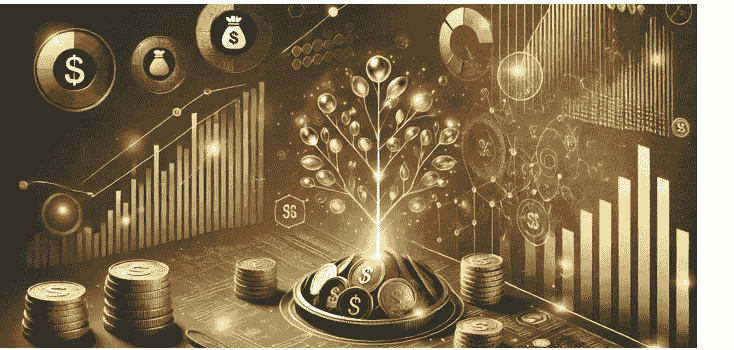
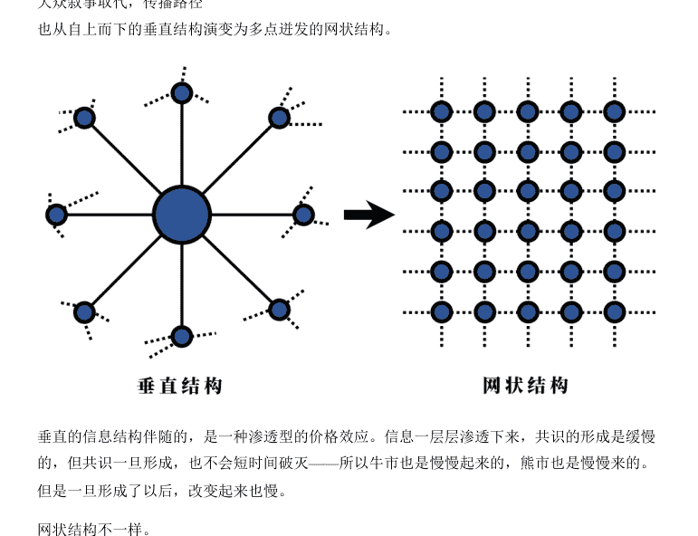
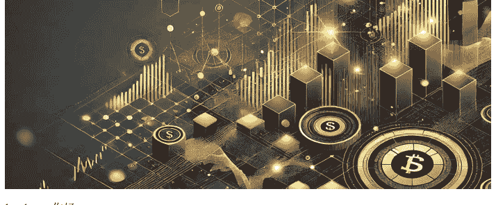
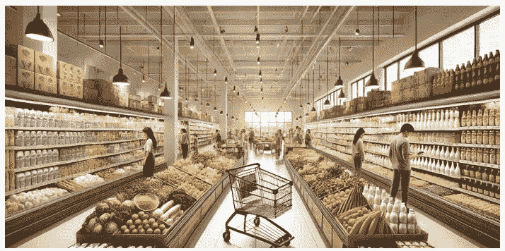
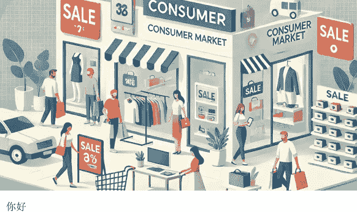
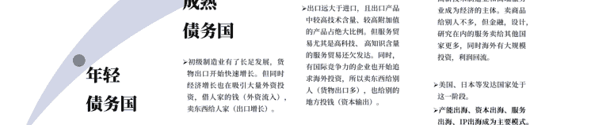
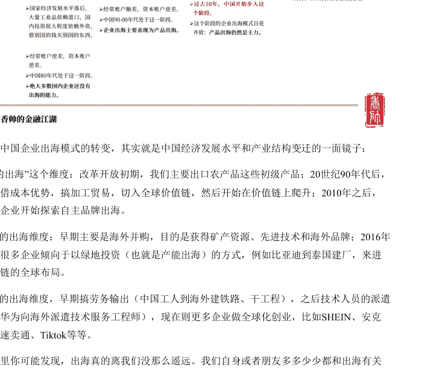
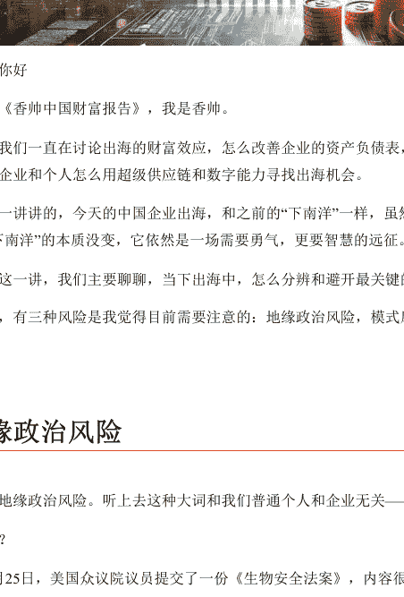

# 年度得到·香帅中国财富报告（2024-2025）

懒人专属群的群友们，大家好，这是小懒人给大家的《通才计划》更新的课程。

> **懒人专属群 - 通才计划介绍** 是小懒给群友们准备的各领域付费课程，以及高分电子书分享。

为防止泄露，课程仅供专属群群友。下载地址见小懒私信给大家的群文档。

整理通才计划的初衷是给群友带来一些**成体系的课程**。而不是碎片化阅读。

只有成体系的学习，才能相对全面地了解一个领域。

学习的目的不是为了输出，而是为了优化我们的思维决策力。

得到 99 RMB 的课程《年度得到·香帅中国财富报告 (2024-2025)》

已整理添加到专属群《通才计划》，几十份付费课程到咱们懒人专属群内总链接自取。

通才计划目录：<https://lazybook.fun/#/data/13_course>

懒人手册：<https://lazybook.fun/#/>

懒人专属群：<https://lazybook.fun/#/blog/group>

专属群更新记录：<https://lazybook.fun/#/blog/record2>

# 目录

年度得到·香帅中国财富报告（2024-2025）

目录

发刊词：世界变了，没有理由我们不变

01｜叙事：资产定价的新变量
- 什么是叙事？
- 叙事与资产价格：叙事影响预期，预期影响价格
- 为什么现在叙事影响尤为明显？

02｜A 股市场的“政策牛”：流行叙事的三个要素
- 2024 年 9 月的 A 股“政策牛”
- 流行叙事三要素
- 流行叙事的第一个要素：关己
- 流行叙事的第二个要素：重复
- 流行叙事的第三个要素：自我强化机制

03｜长期叙事与短期叙事：A 股市场的叙事如何影响交易市场？
- A 股市场的“政策叙事”交易
- 怎么判断长期叙和短期叙事
- 2025 年 A 股市场要参与吗？

# 04｜大众叙事：价值投资还有意义吗？

# 05｜超级传播者：美股“七巨头”到底有没有泡沫？
- AI 投资叙事中的超级传播者

什么叫超级传播者？

06｜黄金和比特币的资产变动逻辑是什么？
- 黄金价格波动的逻辑：抗通胀，避风险
- 2022 年之后的黄金新叙事：岛链化
- 比特币：从反抗叙事到交易叙事

07｜叙事逻辑下，该“择时换仓”还是“长期持有”？
- 价值投资的核心
- 该不该交易叙事

08｜怎么理解中国特色金融市场？
- 什么叫“中国特色金融发展理论”
- 互动 - 香帅邀请你来填问卷，查收你的财富坐标

09｜所有商业都需要一个好故事
- 那当下中国商业叙事需要什么样的“时代元素”呢？
- 第一，国产元素。
- 第二，亲民元素。
- 好的商业叙事到底意味着什么？

10｜县域经济爆火背后：熟人社会与本地天王
- 什么样的城市可以被称为“熟人社会”？
- 中国式熟人社会有什么特点
- 熟人社会里的商业模式是怎样的
- 因地制宜，做本地的天王

11｜消费市场的结构性变化：数字化、种草经济与长期服务
- 消费市场是决定企业生存发展的直接因素

12｜2025 年，中国消费市场会怎么演变？
- 中国消费市场增长可分为三个阶段
- 怎么看 2025 年消费市场

13｜中国出海 3.0：打破误解，抓住机会
- 什么是出海？
- 出海模式的转变

14- 企业求生之路：从产品出海到产能出海
- 萨缪尔森陷阱
- 以史为镜：从产品出口到产能出海

15- 出海的财富效应（上）：哪些企业能在出海中获益？
- 出海提升企业的收入和利润
- 哪些企业在出海中收益多？

16｜出海的财富效应（下）：投资者如何从出海中赚钱？
- 出海：更好的投资回报
- 出海概念股：定义和表现
- 出海黄金赛道
- 出海白银赛道
- 出海青铜赛道
- 出海黑铁赛道

17｜中小企业和个人怎么出海：超级供应链和数字能力
- 这次不一样：超级供应链和数字能力
- 超级供应链
- 数字能力
- 无国界企业

18｜如何分辨和避开出海风险？地缘政治、模式陷阱和文化制度
- 地缘政治风险
- 模式陷阱
- 制度和文化风险

## 发刊词：世界变了，没有理由我们不变

老朋友，新朋友，你好，欢迎来到《香帅中国财富报告》。我是香帅。

这是《香帅中国财富报告》陪你走过的第 6 年。想想也有点宿命感吧——这份系列报告出生在 2019 年底 2020 年初，回头看，那是历史的一个破折号。

之后的每年，都是“剧烈变化”和“重大转折”，听上去是虚词、大词，但个中滋味，创业的，开店的，体制内的，互联网，金融圈打工的，买房的，炒币的，北上广深的，出海求生的……每个人多多少少都有体感。体感如此强烈，波及面如此之广的原因是，当下的中国确实面临着一个过去 100 多年多重历史变化叠加的环境。

中美脱钩，大国博弈，和 20 世纪 50 年代的冷战格局或有类似之处；欧美的通胀和能源问题，和上个世纪 70 年代的高通胀，石油危机颇有类似之处；特朗普上台加关税，贸易保护主义抬头，和上个世纪 80 年代日美贸易战颇有类似之处；人工智能技术突破，则更类似 18-19 世纪工业革命后，人类社会所经历的包括财富累积方式，社会组织，分配模式，生活状态的颠覆式变化，远比 90 年代互联网技术带来的冲击更大。

### 表 1: 当下中国面临着一个过去 100 多年多重历史变化叠加的环境

| | **当今** | **过往** |
|---|---|---|
| **政治环境** | 2018 年至今：中美博弈 | 20 世纪 50 年代：美苏冷战 |
| **经济环境** | 2022 年至今：欧美高通胀及全球能源问题 | 20 世纪 70 年代：全球高通胀与两次石油危机 |
| **贸易环境** | 2018 年至今：特朗普加关税，贸易保护主义抬头 | 20 世纪 80 年代：美日贸易冲突 |
| **技术发展环境** | 2022 年至今：人工智能技术突破 | 18 世纪 60 年代 -19 世纪 40 年代：工业革命及之后技术发展 |

> 作图：香帅的金融江湖

刚才说到的任何一个历史时期，都伴随着巨大的财富变迁和社会重组，更何况这些历史时期的叠加呢。按照罗胖的说法，这种充满变数的时期，几乎没有什可以盖棺定论的事情和现象。所以，真正对人有帮助的，不是指东打西的结论，而是一个能看见那些流动的结构性变化的“水晶球” 。因为，找到变化的结构，才能适应变化、生存下来。

那从多个历史时期的变动叠加，我看到了哪些结构性变化呢？
当⽇下我看到的最大的结构性变化，就是“叙事”变化。

所谓叙事 NARRATIVE，是个学术化表达，通俗点说就是讲故事。

千万别觉得“讲故事”是个无⾜轻重的事情。我们⼈类本身⽂就是故⽂的动物。故⽂，是我们创造共同想象，凝聚共识，实现大规模合作，从⽽得到地球⾷物链顶端的核心能力。

举个最简单的例子，金融市场也是建立在叙事基础上的。比如股票是一个“风险共担，利益共享”叙事的产物。

这个叙事的力量有多强呢？当年美国想修建一条运河，打通美国东海岸到西部内陆，就是用这个叙事创造了共识，聚拢了资金和人力，完成了这个伟业，让伊利运河到哈德逊河之间的航程缩短一半，造就了纽约的繁华。

“叙事”背面反映的是人类社会的共识，人类也通过叙事塑造共识。

所以，敲一下黑板，叙事的方向，内容，和传播方式，会决定我们的预期和行为模式，从而深刻影响到我们的消费，营销，资产价格，以及投资行为。

当下，尤其是 2024 年，是一个“叙事”的内容和传播方式都面临激烈变化的时期：刚才说到的中美博弈，全球通胀，贸易战，AI 技术变革，特朗普，都是涉及世界政治格局，经济波动，经济增长，财富分配等重大叙事的变化。变化期很难有相对统一稳定的叙事，自然也就不会有稳定预期，反应在各种社会现象上，就会呈现出巨大的撕裂感，引起巨大的波动。

在梳理出“叙事”的框架后，回头再看 2024 年的很多现象，就会发现一条更清晰的脉络：

比如，美股市场为什么一会儿说衰退，一会儿说经济过热，还大肆交易“特朗普”？为什么黄金和比特币一路上扬？——这些现象背后，是资本市场的叙事化趋势。尤其在社交媒体的助推下，这种趋势改变了市场的信息结构，投资者预期，从而影响到资产价格的波动，甚至是交易策略。

再比如说，为什么胖东来，一个四线城市的连锁超市会变成 2024 年现象级的商业事件？为什么这么多老板做 IP，只有雷军能在几乎没有负面新闻的情况下爆火成国民级 IP？为什么今年县城经济比一线城市表现出色？“出海”到底是什么意思？为什么企业都在讨论“出海”？

——这些现象背后，是中国经济，中国内需，和中国消费持续了二三十年的“增长叙事”的变化。

这个变化让今天中国的商业环境，营销方式，目标用户心理，都在经历着一场场“结构性变迁”。

跟随着这根主线索，我们和每年一样，在各个城市和企业间奔波调研，在数据和文献中一次次辗转、苦恼、顿悟，也一次次感受到“叙事”对社会，对市场，甚至对我们自己认知、行为的塑造之力。2024 年 10 月份，我定下了今年《香帅中国财富报告》的结构：

第一部分，资产篇，关键词：叙事

这 8 讲课程中我们会分别讨论：

- 到底什么是叙事？叙事怎么影响资产价格？

- 社交媒体时代的叙事有什么特征？这些特征怎么影响像英伟达这些科技巨头的股价？

- 今年 A 股市场的“政策牛”是叙事吗？这个叙事还能持续吗？

- “中特金”（中国特色金融市场）理论下，人民币汇率，一级市场，二级市场，和金融从业者的职业特征会出现什么趋势？

- 黄金和比特币的叙事发生了什么变化？未来趋势怎样？

- 我们能提前判断叙事的真伪吗？能根据叙事做交易策略吗？

- 在叙事的逻辑下，我们该怎么去判断 2025 年中国经济复苏和资本市场的趋势，又怎么去思考自己家庭的财富增值保值，资产配置的框架？

第二部分，企业篇，两个关键词：种草和出海，分别包括 4 讲和 6 讲课程。

商业叙事有极强的时代性，爆火的商业现象背后其实都是时代情绪和时代需求的变化。

所以前 4 讲课程我会顺着“种草”这个叙事跟你讨论：

- 当下中国商业叙事的基本逻辑是什么？企业要抓住什么时代情绪，打造超级传播者，讲好 故事？

- 商业叙事的三个结构性变化是什么？面对这样的结构性变化，企业的营销，经营理念，甚至战略，需要做什么调整？

- 中国式的本地化、稳定化的熟人社会，会给中国企业的商业模式带来什么影响？

接下来的 6 讲课程中，我们沿着“出海”这个爆火的叙事继续探讨：

- 到底什么是出海？2024 年的中国企业出海，有什么根本性变化？不同类型的企业有什么出海机会？

- 不同行业的出海机会会有什么不同？从投资角度，什么样的企业在出海中收益最大？风险最高？

- 风险和收益分别怎么衡量？

- 什么是无国界企业？什么是全球本地化？中国企业能在超级供应链和数字能力的赋能下，开启一波新的创业潮吗？

写这个发刊词的时候，我正在出差回京的早班飞机上，机舱内乘客大多在补觉熟睡，我对着电脑屏幕奋笔疾书给你写这封信。

其实，我也正在发生变化。

之前我是一个在“写作”上仪式感很重的人。每年写书备课都“抛家弃子”将自己关在酒店的小房间里，蓬头垢面疯魔两个多月。因为任何一丁点打扰都会让自己觉得灵感丧失、思维停滞。但 2022 年之后很多事情变了：先是疫情，后来日程越来越紧，没法专门掏出两三个月的写作空挡，今年情况更特殊，家里小朋友上小学，处于幼小衔接的敏感期，情感和认知上也处于似懂非懂理解成人世界的敏感期。总之，是一个对母亲这个角色需求更强烈的时间节点。作为母亲，我放不下他，所以今年我也没法像往常一样“不羁放纵爱自由”，所以必须学会多线程的工作方式。
也就这样学会了。

今年 11 月的一天，我乘早上的高铁去杭州，上车喝杯咖啡开始对着资料写稿，居然思路如泉涌。晚上飞机落地回到家，正好来得及跟儿子聊了一会儿他的校园生活，说着说着小朋友发出了轻微的鼾声。我开了床头灯，接着刷了两本关于日本“平成废物”的书，给正在写的中国消费市场一章做参考。等关灯躺下的时候，发现挺好，既没有思路中断，也没有灵感丧失。那一刻，我清晰而强烈地意识到，所谓“人到中年”，就是你拥有了多重的角色，你需要协调，平衡，妥协，然后在这个打磨的过程中完成一个“结构性变化”。

可是，我想，这才刚开始呢，2025 年我还会有很多“结构性变化”：怎么适应 AI 辅助下的工作模式，怎么将自己和团队的研究真正放在“岛链化”的思考框架下，怎么保持体力精力，怎么陪伴父母和孩子，怎么在保持独立抽象思考的情况下和真实变化的世界更多地接触互动......

世界变了，没有理由我不变。

年龄和人生角色变了，没有理由我不变。

那一瞬间，我突然知道了今年，以及未来的《香帅中国财富报告》将会以什么姿态写下去——跟随变化，拥抱变化。

当然，也有些不变的，比如期望与你，与你们始终同行，悲喜共通的初心和决心。

欢迎你加入 2024-2025 年的《香帅中国财富报告》。我在这里等你。

> 关注公众号懒人搜索，懒人专属群分享

# 01 | 叙事：资产定价的新变量

lazybro，你好

欢迎来到《香帅中国财富报告》，我是香帅。

从今天这一讲开始，我们将会进入课程的第一个模块，资产篇。

2024 年的全球资本市场就是个“见证历史”的年份：黄金，比特币，都是多次创历史新高，被称为“券商更新报告的速度赶不上价格突破新高的速度”。美股是一边交易“美国衰退”，AI 泡沫，一边又不断创出历史新高。

中国更精彩，国债这种机构投资者为主的市场突然“历史性”涌入大批散户，10 年期长债则跌破 2%，历史上第一次来到"1 字头”时代，股市则是小作文漫天飞。

当然还有更多让人瞠目结舌的故事，比如川普胜选，“川大智胜”涨停；哈里斯败选，中国“哈尔斯”跌停；还有直播间里“一二三上链接”式的卖股票…..

总之，2024 年，资本市场是充满了“活久见”现象。

一个很自然的问题，为什么这些十年不遇，百年不遇的灰犀牛、黑天鹅会扎堆在今年跑出来呢？这意味着什么？接下来还会怎么演变？

我想跟你说的是，这些现象既不是黑天鹅，也不是灰犀牛。这些跌宕起伏背后，有一个共同的逻辑——叙事。

叙事，这也是我看到的，过去几年，尤其是 2024 年金融资产价格变化中最重要的影响因素之一。

## 什么是叙事？

什么是叙事？简单来说，叙事就是讲故事。人类最大的特点就是会讲故事、凭故事创造共同的想象，形成共识。

按照尤瓦尔·赫拉利在《人类简史》里的说法，我们智人本来就是叙事的动物。

再想想，认知革命以来，我们人类在两个不同的现实穿梭：一个是触手可及的客观世界，比如山川湖泊、汽车房屋等；另一个则是由我们的想象力和认知构建的虚拟世界，比如宗教信念，货币价值，股票价格，而这些主要就是由叙事构成的。

其实仔细想想，某种意义上，整个人类历史都是叙事的产物。比如说，为什么中国历史上的王朝更替或者农民起义，总是需要一个“承天命”的故事？从“王侯将相宁有种乎”到“汉高祖醉斩白蛇”，再到“刘秀当上天子”，都是在用一个更直观、更具传播力的故事，营造出某个共同的敌人或者塑造某种共同信念，从而激发出“同仇敌忾，万众一心”的力量。

但要说被“叙事”影响和塑造得最厉害的，资本市场肯定是其中之一。为什么？

因为叙事可以塑造信念，改变预期。而资产价格反映的就是预期。

举个例子：一个人得了胃病，很多年治不好，结果喝了几年某白酒给喝好了，然后得出了一个结论——“某某白酒能治胃病”，这其实就是一个典型的叙事。

假设这个故事在某个场合，或者因为某个名人，某个原因流行起来，那么市场上的投资者就会预期这款白酒的销量上升，利润更高，利好股价。因为有了这个预期，投资者开始买入这个股票，股价开始上涨，从而吸引更多投资者买入，股票价格继续上涨，市场预期被加强，形成一个正向的反馈机制。这个机制什么时候会被打破呢？取决于叙事是否会被证伪，是否能持续。越是难以证伪的叙事，生命力越强，比如比特币，比如"AI（人工智能）革命会带来生产力提高”。反之，像 A 股市场喜欢讲述的“会有几万亿元财政刺激”的政策叙事，就比较容易被证伪，所以市场预期更容易发生反转，资产价格也会随之波动。

一个苹果手机好不好用，你看得见摸得着能有“客观判断”，但苹果公司股票你看不见摸不着，更多靠“主观判断”，主观意识，就更容易受到叙事的影响。所以资本市场，从来都是叙事的“天堂”。

2024 年的 A 股市场上，各种叙事更是对股价造成了很大的影响——

比如说有一个网红叫“上海爷叔”，因为大胆预测 A 股将在“2024 年底到达 4165 点”"2026 年到达 14600 点”一炮而红。他给自己预测的行情起了个浪漫的名字，“爱在深秋”。随着 9 月 24 号 A 股的上涨，“上海爷叔”一夜封神。没有人关心精准到个位的“4165"和“14600"从何而来、能否实现，但“重大行情”加上“爷叔”的夸张表演，就有了病毒式传播的能力，引发更多人入市交易。

听起来很离谱？为什么这么离谱的故事居然真的能影响股价呢？而且一而再再而三地发生？

经济学的基本假设是“理性预期”，就是我们人类在做预期的时候是理性的，但现实中我们其实会发现，人类经常是不理性的。就扪心自问吧，面对金钱财富的波动，你贪婪吗？你恐惧吗？你盲从吗？你接受诱惑吗？

所以伟大的经济学家凯恩斯把这些贪婪、恐惧、盲从、诱惑称为动物精神，这些精神深藏在我们的基因里。

金融资产价格反映的是未来预期，而未来预期是看不见摸不着的，这也是为什么叙事对资本市场如此重要，很多叙事虽然听起来离谱，但因为它们触发了我们的动物精神，恐惧、贪婪、盲从等，让我们繁荣时候过度乐观，衰退时候过度悲观，所以资产的价格也会因此出现过度的波动。

经济学诺贝尔奖得主罗伯特·希勒有个研究证明了这个推测：如果人们是理性的，那么从长期来看，一家公司股票价格的波动应该和公司现金流（价值）的波动基本一致。但美股百年的历史数据显示，价格的实际波动是现金流波动的 5~13 倍，基本面远远不能解释价格的波动。这意味着，我们的预期总是处于过度反应之中。而叙事，就是引发这种过度反应的催化剂。

## 为什么现在叙事影响尤为明显？

尽管叙事这么重要，但在传统的金融研究中，“叙事”一直是边缘话题。一方面，“叙事”和社会学、新闻学、心理学都是交叉的，很难定义；其二，叙事本身就有随机性、突变性，做量化研究很困难。但是现在，不管是从交易还是从数字经济的角度，将“叙事”这个新变量引入资产定价的讨论中，已经变得越来越迫切。

为什么？

第一是时代需求。当社会缺乏共识和确定性的时候，叙事的力量会更强。当下全球处于政治、技术、经济大变动的历史时期，人类社会处于一种共识碎片化的状态。所以任何流行的叙事都可能影响很多人的行为，导致强烈的后果。

第二，也是最重要的一个原因。

（注：原文内容在 [PAGE 7] 处被截断，此处为处理后的文本结尾）

社交媒体改变了叙事。

首先，社交媒体让共识的形成和破灭都更快，市场预期变得异常脆弱，价格也更加跌宕起伏。

比如说，马斯克在推特（今已改名为 X）说了一句狗狗币的好话，狗狗币价格就暴涨，但他一个话风不对，狗狗币价格又暴跌。这其中的机制是怎样的？

马斯克的表态让无数他的粉丝更新了自己关于狗狗币的信息，加强了买入信心，大面积的买入推动价格上涨，使得买入信号更强，如此循环，买入越多，买入信号越强——因为社交媒体平台上，这种信息可以在极短时间内精准触达相关人群，这种价格反应就显得非常快速和激烈。但一旦上涨预期拉满，市场又会出现有趣的场景：没有对手盘，也就是没有人卖。但因为价格已经很高，市场的信念非常脆弱，有人其实在犹豫是否要卖出。这时候，任何负面的强信号出现，就可能触发投资者的卖出行为，然后在相反方向上形成螺旋，引发踩踏。

对于金融市场来说，这种现象并不陌生，它是引发资产价格过度波动的重要机制之一。但到了社交媒体时代，这种机制被前所未有地加强了。

其次，社交媒体降低了叙事门槛，让市场噪音变得更大，波动更频繁。

之前经济、金融都属于高门槛的专业性话题，是精英叙事逻辑，但在社交媒体平台上，这些领域的专业门槛被无限度地降低了。从精英叙事到大众叙事本身算一种进步，因为更多声音能被听见。但另一方面，在金融、经济这种“离钱很近”的领域中，会有大量良莠不齐的“大众叙事”——它们谙熟大众的爽点和痛点，善于从新闻事里抓取“流行叙事”所需要的元素进行重组，创造出大量似是而非又通俗易懂，更具传染性的故事——比如动辄以“货币大放水，你的钱没了”，比如“美国阴谋让人民币贬值”为标题的 10 万 + 热文、短视频——而超级发达的社交媒体平台，相对低的专业知识普及率，以及百姓强烈的财富焦虑，为这些叙事的流行提供了最佳土壤。

所以我们看到，中国资本市场上，叙事引起的资产价格波动更剧烈，“噪音交易”更严重。甚至政策制定也可能被这些流行叙事下的社会情绪，社会认知所影响。如果一个市场的叙事出现这种大规模劣币驱逐良币的现象，那么叙事的影响可能比我们想象的要更深远。也正因为此，理解叙事，不仅关乎市场的波动，关乎个体和机构的财富安全，也关乎我们未来的监管尺度和政策导向。

好，简单总结一下：

以上就是这一讲的内容，下一讲我们来讲，流行叙事是怎么影响资本市场的，我会上以 9 月 24 日 A 股暴涨暴跌为例，分析流行叙事的三个关键要素。我是香帅，我们下一讲再见。

# 02｜A 股市场的“政策牛”：流行叙事的三个要素

lazybro，你好

欢迎来到《香帅中国财富报告》，我是香帅。

上一讲我跟你讲了现在资产定价出现了一个新变量，叙事。

这一讲我们继续聊，叙事究竟是怎么影响资本市场的？

### 2024 年 9 月的 A 股“政策牛”

要理解这件事，2024 年最典型的案例当然是 9 月底以来的 A 股“政策牛”。不管你有没有买过股票，但只要用手机，大概率都被这波“牛市来了，00 后最大一次人生康波”的内容推送过，说不定心里也嘀咕过到底要不要入场。

先简单回顾一下这波“政策牛”：

因为二三季度经济复苏不如预期，A 股市场一直情绪低落，9 月份一直徘徊在 2800 点。

直到 9 月 24 日周一，国务院新闻办公室召开新闻发布会。会上央行潘行长一口气“祭出”几个大招：

降息 20 个基点；降低存量房贷利率；降低存款准备金率；设立货币创新工具支持股市——

| 9.24 一揽子增量宏观政策细则 |
| --- |
| 降息 20bp，7 天期逆回购操作利率从 1.7% 到 1.5%。 |
| 降准 0.5%，降准后银行业平均存款准备金率为 6.6%。 |
| 降低存量房贷利率，引导商业银行将存量房贷利率降至新发放房贷利率附近，预计平均降幅在 0.5 个百分点左右，每年减少家庭利息支出约 1500 亿元。统一首套房和二套房房贷最低首付比例，将全国层面的二套房贷款最低首付比例由 25% 下调至 15%。 |
| 创设证券、基金、保险公司互换便利：符合条件的证券、基金、保险公司使用自身拥有的债券、股票 ETF、沪深 300 成分股作为抵押，从央行换入国债、央行票据等高流动性资产。机构通过这个工具获取的资金只能用于投资股票市场。首期互换便利操作规模 5000 亿元。 |
| 创设股票回购增持再贷款，引导商业银行向上市公司和主要股东提供贷款，回购增持上市公司股票。人民银行将向商业银行发放再贷款，利率 1.75%，商业银行给客户办贷款的时候利率会加 0.5 个百分点，也就是 2.25%，首期 3000 亿，可以追加。 |

这边新闻发布会在开，那边市场已经开始躁动。几个小时之内，从外资投行到国内基金券商，从企业家到我们普通百姓，无一例外地被“宏观政策转向”的消息刷屏。当天 A 股上证指数迎来 4 年内最大单日涨幅，市场成交也创下 4 个月来的新高。接下来连着几天，A 股每天量价齐飞，到 9 月 30 日，国庆假期前最后一个交易日，A 股的“牛市叙事”已经开始发酵：创业板、科创 50 等指数同时创下历史最大涨幅，很多个股全线收涨，而且当天 A 股成交量，也创下历史新高 2.61 万亿。

国庆假期 A 股休市，港股续上这波涨势：10 月 7 日，恒生指数站上了 23000 点的高位。很多个股、很多指数都翻了好几倍。

人们的情绪变化更为显著：国庆假期出门吃饭，餐桌大家讨论股票，打车的时候司机会找你讨论股票，地铁里也会听到“你开户了吗”的对话。整个国庆假期，新开户高达 300 万左右（整个 10 月新开户数目 685 万，接近 2024 年前面 4 个月的总和），沉淀资金数万亿。

短短 10 天，A 股就彻底从“熊”转“牛”，尽管经济基本面没有改变。

那这次迅雷不及掩耳之势的市场“转向”，背后的逻辑是什么呢？脱口而出的答案是——政策转向，政策刺激。但问题在于，A 股“炒政策”不是一次两次，为什么这次势头这么猛？三五天就干出了往常几个月才能累积起来的声势呢？

答案是，叙事。

整体上，

一个能影响资本市场的流行叙事，需要有三个关键要素：关己、重复和自我强化。

这次 A 股“政策牛”，完美展现了叙事是怎么运转，流行，并影响资本市场的。

### 流行叙事的三要素

#### 流行叙事的第一个要素：关己

一个叙事要流行，必须和社会大众之间产生共鸣。

就说这次 A 股的躁动，如换个时间、地点，“政策转向”这么抽象的词语，其实很难获得如此大的流行度。但这次不一样的地方在于，这次“政策转向”正好切中了中国社会大众当下最大的共识——财富焦虑。

过去两三年，中国人的财富焦虑日益强烈。任何可以让财富增值、保值的故事和预期，都会触动大众心里最敏感的弦。

而且现在社会上逐渐形成了一个共识，一定要有较大的政策转向，政策刺激来促使经济复苏。

因为股市是“事前反应”的。资产价格会将市场预期充分反映出来，所以股市自然成为衡量“政策转向”的一杆秤。更何况，A 股本就是国内关注度最高的话题之一。中国日均活跃 A 股股民约 6000 万人，但涉及家庭人口超过 2 亿人。而且与各地楼市冷热不均，价格差异不同，全国人民面对的是同一个股市，价格涨跌的故事很容易在不同城市、不同年龄、不同阶层、不同收入的人群中获得类似的共鸣。

2024 年 A 股市场上其实一直不乏各种关于宏观政策的小作文。大家看似关心宏观政策转向，但根本上关心的是“与己相关”的财富问题：投资会回暖吗？消费会回暖吗？收入有希望上升吗？房价会止跌回暖吗？今年，即使是一个完全不知道什么叫财政或货币政策的人，如果问他，要不要宏观政策、宏观刺激，他一定会说要，因为这已经是社会共识。

换句话说，大众对于财富和政策挂钩这件事已经形成了共鸣，这种共鸣之前是没有这么强烈的

你看，因为在这个节点上，政策转向和你的家庭财富，你的收入，你能找到工作与否强相关，有了强烈的“关已度”，所以一个抽象的“政策转向叙事”才能这么快地、大规模地流行起来。

这就是流行叙事的第一个要素，叫作“关已度”。

#### 流行叙事的第二个要素：重复

孤立的叙事往往难以持久，叙事流行需要持续制造涟漪。

做过营销的同学对这件事更有体会 —— 还记得“送礼要送脑白金”“恒源祥羊羊羊”那些魔性洗脑的广告吗？重复是强化人类记忆的重要机制。

今天社交媒体对叙事的重复和强化，是叙事病毒式传播的最重要渠道。

比如说，国庆期间，你肯定或多或少看到过一些关于 A 股预测的煽动性的视频，包括上一讲课程里我们提过的“上海爷叔”。原来一个内容火了，也就火了。但现在的短视频平台，流行一种叫作“切片”的内容分发机制——

像“上海爷叔”这种爆款内容出来之后，很多做切片的账号就会紧紧跟上，通过正规或者非正规渠道进行“二次创作”，并进行分发转播，然后这些内容就很容易形成病毒一样的传播。

然后你会发现，相似的内容会在某段时间内不断以各种面目出现在视野里。因为一个成功的叙事很容易成为切片分发的对象，而切片分发又会重复、强化这个叙事。

而且，平台本身的流量分发机制也天然倾向于去重复已经流行的内容。

越是热追的话题越会被赋予更大的流量，形成一个叙事和流量曝光之间的正循环。所以你会发现，只要还在使用手机和社交媒体平台，即使你原来完全不关心股市，也会不自主地被一次次曝光在这场“牛市将至”的叙事中，信念不断被强化。因为流行，所以变得更流行。随着叙事强度和浓度的上升，我们的信念也面临着一次次冲击和重塑，直到最后进入叙事，甚至成为叙事传播的一部分。

这是流行叙事的第二个要素，重复。

#### 流行叙事的第三个要素：自我强化机制

什么叫自我强化机制呢？

给你举个例子，9 月 24 日市场上的政策转向叙事开始，9 月 25 号，国际著名投行高盛召开了一场电话会议，包括三个要点：

- 第一，有对冲基金在香港市场大举买入 A 股。
- 第二，本次 A 股上涨不是空头回补推动的。
- 第三，A 股还会继续上涨。

这个会议纪要很快在无数市场群里被转发开来，而且是一传十传百。消息传开进一步增强了买盘的信心，买盘涌入推动价格上涨，价量齐升的市场表现，又反过来证明了高盛这个纪要的正确性。

这样一来，“政策转向”的叙事和“股市上涨”的结果相互印证加强，这就是自我强化机制。

“自我强化机制”对机构投资者来说还有一重压力，也就是害怕踏空。机构是看“相对收益”的，一旦其他机构买入收益上涨，自己就可能面临资金回撤。这场叙事来的太猛，很多机构来不及测算增量政策的具体空间，所以抱着“不敢不买”的心态被动进场，推动价格进一步上涨，成为这个自我强化机制的一部分。

可能很多同学会问，资本市场上这样的流行叙事要参与吗？怎么参与？具体的细节，我会在关于“交易叙事”的课程里跟你再讨论。但这里可以提醒三点:

> - 当一个叙事出现的时候，可以用以上三大原则判断它是否能够流行并实现对资产价格的影响。
> - 叙事构筑在想象之上，流行叙事下的资产价格是非常脆弱的。
> - A 股和港股相比，对叙事依赖的程度更高，所以可以把港股作为 A 股的一个参照 —— 假如港股发生了同样的叙事，则这个叙事的持续度可能更久；反之，参与 A 股市场上的叙事需要更加小心。

好，简单为你总结一下：

这就是这一讲的内容。下一讲我们将介绍一下，既然投资市场对叙事依赖度高，那我们要关注什么样的叙事，哪些信号对我们的投资有启发和借鉴的价值。

我是香帅，我们下一讲再见。

### 公众号

## 懒人搜索

懒人专属群

### 微信:lazyhelper

公众号懒人搜索，懒人专属群分享

No. 13 / 77

# 03｜长期叙事与短期叙事：A 股市场的叙事如何影响交易市场？

**lazybro，你好**

欢迎来到《香帅中国财富报告》，我是香帅。

上一讲课程我们聊到 2024 年 9 月之后 A 股市场波动，是被一场流行叙事驱动的。

而且直到今天，这个叙事也还在持续。

所以今天这一讲，我就以 A 股市场的“政策叙事”这个话题，跟你聊一下“长期叙事”和“短期叙事”的差异，以及怎么用这个逻辑来做自己的投资决策。

### A 股市场的“政策叙事”交易

其实 2024 年前 8 个月，A 股市场已经有过 4 次比较大的跟政策相关的波动，市场上也出现了相关的政策叙事。

2 月—3 月，集中在新任证监会主席的“救市”政策和“两会”相关财政政策上；
4 月末开始，市场注意力主要围绕着房地产“松绑”的政策；
7 月份，“三中全会改革”成为核心；
8 月，“降息”是市场关注的重点。

每次和政策相关的交易，都伴随着市场上大量的“政策叙事”，随即引发市场的价格波动。

我在课程的文稿区放了一张表，反映的是今年 A 股市场政策相关交易之后的涨跌幅。

在那张表格里，你会看到，在"924 一揽子政策”之前，这 4 次政策叙持续的时间都不长，每次政策叙事交易的时间也不长，基本是周度范围内。而且，每次都将前期涨幅回吐了更多。通过数据我们可以观测到，前期政策叙事引发的涨幅越大，后期回调幅度也越显著，就算是"924"之后的这波市场波动，要是以 10 月 8 号的最高点 3674 点为基准，到 12 月 6 号的 3404 点，其实也回调了 7% 以上。

> 表 2024 年出台政策及 A 股交易最大涨跌

| 时间 | 政策 | 最大涨幅 | 后续的跌幅 |
| --- | --- | --- | --- |
| 2 月 | “救市”政策、改革措施、GDP 目标、财政赤字率以及特别国债等 | 10.59% | -2.01% |
| 5 月 | 房地产放松政策（保交楼、收储等） | 1.36% | -2.07% |
| 7 月 | 改革措施 | 2.05% | -3.29% |
| 8 月 | 降息 | 2.88% | -3.75% |
| 9 月 | 政策转向 | 23.39% | -7.36% |

简单的说，从 2024 年的数据和经验来看，A 股市场上交易“政策叙事”是一件风险很高的事情。

为什么呢？

其一，这些政策叙事引发的交易行情，往往反映的是一致的预期。

当前中国宏观政策的叙事中，不管是救房地产还是救股市，基本逻辑都是“救市，刺激”，因此预期是基本一致的。叙事越流行，预期越一致，价格调整越快。如果不是提前有仓位，一个人很难在一致预期的追涨行情中赚钱。

其二，在社交媒体的助力下，叙事容易产生拱火效应。

所谓“拱火效应”就是指社交媒体会给信息传播煽风点火，让“信息传播—价格变动”形成强反馈。当政策刺激后价格上涨，投资者的狂热和非理性被推向极致，于是会拉动价格更快地上涨，资产价格也更快形成泡沫。当然，负反馈也容易让投资者极度悲观，泡沫快速破灭。

“一致预期”和“拱火效应”这两个因素让交易政策叙事变得很难赚钱 —— 因为价格调整会非常快，甚至很短时间内就调整过度，你根本来不及。

更重要的是，目前这些叙事，都是短期叙事，而短期的流行叙事，是很容易被认为不及预期或者被证伪，然后消失甚至反转的。在市场上的绝大多数人其实是后知后觉的，所以一个叙事越流行，价格效应越大，就越容易“埋人”。

换句话说，叙事作为现在资本市场的一个重要因素，你不关注，不交易，也未必就是最佳策略，但是交易短期叙事，整体上亏钱的概率应该比赚钱大很多。

### 怎么判断长期叙事和短期叙事

那接下来就是灵魂拷问了：作为一个芸芸大众，我怎么判断长期叙事和短期叙事？

坦白说，很难，而且这两者之间也没有绝对分界线。但我们还是可以用叙事留存影响的时间作一些基础判断：

比如说，所谓的短期叙事很容易在短期（比如一个月，一个季度）得到验证，验证后就很容易被人抛弃，比如说政策叙事，一个政策即使如期出台了，市场也会 Buy the Rumor, Sell the Fact（买传闻，卖事实）。

长期叙事是长期留存在市场上，影响资产价格的主题。

短期流行趋势容易消散，而长期叙事不太容易。

现在长期叙事有两种类型：

一种是

历史叙事

。比如说 1929 年起源于美国的大萧条，20 世纪 90 年代的日本房地产泡沫，1987 年美股市场上出现的黑色星期一，2008 年金融危机——

这些故事，会和当下的热点结合，以各种变异的形式重新出现在市场上，影响人们的信念和行为。比如过去这两年，日本的资产负债衰退叙事，就不时出现在中国市场上并传播。

还有一种是

不确定的未来叙事

。比如中美贸易摩擦、AI 技术革命、比特币叙事，它们影响中长期未来，并且还在持续变化，所以也会持续地影响资本市场和资产价格。

### 2025 年 A 股市场要参与吗？

好，了解了长期叙事和短期叙事，以及他们对市场价格的影响后，我们再回到课程最开始很多人的纠结——

2025 年 A 股市场会是什么情况，该不该上车？

这种答案肯定仁者见仁，智者见智，但顺着叙事的逻辑，我们可以说——

如果出现了相对稳定的长期或者中长期叙事线索，市场是有机会的，反之，就是亏钱的概率比赚钱概率大。

比如说美股市场现在有两个叙事线索：一条是长期线索，AI 革命；一条中短期线索，特朗普冲击。2024 年美国市场上大大小小的价格波动，基本都是围绕着这两根线索展开的，2025 年也大差不差。

过去 20 多年，A 股市场很多时期也是有长期叙事主题：比如 2005 年之后的“股改”，2008 年之后的"4 万亿元”刺激，2016 年之后的“消费升级”，2018 年之后的“新能源革命”和“战略新兴行业”，

你想想，期间所有热门投资赛道，都和这些叙事主题有关。再想想，过去 10 年来涌现的“十倍股、百倍股”，如贵州茅台、宁德时代、比亚迪、亿纬锂能、片仔癀、立讯精密、爱尔眼科等，几乎也都是“消费升级”“新能源革命”长期叙事下的佼佼者。

但从 2021 年之后，这些主线都有减弱的趋势。A 股市场也一直没有找到长期叙事主题。然后到 2023 年，市场逐渐意识到，必须要宏观政策大力拉动，所以从 2023 年—2024 年，A 股市场就开始进入了一个“等政策”的阶段，资产价格开始随着各种政策的相关叙事起伏不定。

就像我们刚刚讲的，A 股市场上交易“政策叙事”是件风险很高的事情，亏钱的几率比赚钱的几率更高。

所以参与 A 股市场，还是尽量要找到中长期的叙事。现在观察下来，A 股市场上有两条较为长期的主线索:

第一，AI 叙事，毕竟这是全球市场未来最大的 BETA，也就是增长源泉。

第二，与中美脱钩相连的“国产替代”“自主可控”，以及“企业出海”的叙事。

前两个已经被反复炒作过多次，市场定价也可能已经反映得比较充分了。但“出海”对企业资产负债表的改善，其实还没有完全体现出来，企业出海的趋势也还在快速演进当中，所以 A 股市场上“出海”可能会是一个较为长期的叙事。关于出海和股市回报的话题我们在课程的后半段出海部分还会展开更细致的讨论。

但是，这两个叙事也会受到宏观大环境的影响。毕竟金融市场也是经济体的一个部分，不可能独善其身。而经济能否复苏，和宏观政策的发力程度是相关的。中国金融四十人论坛（CF40）的郭凯和张斌做过一些测算，按照他们的测算，大体上，如果 2025 年的宏观政策力度能满足 4 个条件，那么经济复苏是大概率事件，这 4 个条件分别是：

- (1) 广义政府支出要大于目标名义 GDP 增速（大概对应着要增加财政支出 12 万亿）；
- (2) 降息 100 个 BP（基点）以上；
- (3) 调整严控地方隐性债务的口径；
- (4) 对核心房地产企业进行债务重组，恢复房地产行业现金流。

而我们又知道，金融市场是反映“预期”的，资产价格会提前反映政策对经济基本面的改善。所以只要这 4 个信号里面出现 2 个或者以上，那么经济基本面应该会有较大改善，这时候 A 股的“政策叙事”也就不就是短期叙事，而是变成了真实存在的事实。换句话说，那时候参与市场，可能就具有了更大的确定性。

好，简单总结一下：

下一讲，我们将把视角转向一个更大的趋势：资本市场上精英叙事向大众叙事的转变。我们会讨论这种转变背后的原因，以及它如何重塑了市场格局。

我是香帅，我们下一讲再见。

# 年度得到·香帅中国财富报告

### 这就是财富增长的新动向

版权归得到 App 所有，未经许可不得转载

公众号

懒人搜索

懒人专属群

著名金融学者

香帅

微信：lazyhelper

# 04｜大众叙事：价值投资还有意义吗？

Lazybro，你好

欢迎来到《香帅中国财富报告》，我是香帅。

上一讲，我们已经聊过 9 月 24 日以来的 A 股市场波动，背后是一次关于政策的流行叙事。对于 A 股投资来说，我们要多关注长期叙事，少关注短期叙事。

接下来的两讲，我想要继续跟你聊的是，在社交媒体已经无孔不入的今天，叙事结构到底发生了怎样的变化，这对于我们的投资会有什么影响呢。

前几讲课程里我们说到了 A 股市场上很多黑色幽默的故事：

比如说“谐音概念”，随着美国大选临近，市场逐渐定价川普的上台，“川发龙蟒”从 9 月初到大选日上涨了 212%；还有“生肖概念”，因为动画片里面有葫芦娃大战蛇精的经典桥段，在蛇年来临前，中药股葫芦娃一连拉出六个涨停……

这些听上去无厘头的市场现象背后是时代的某种趋势：

精英叙事正在被大众叙事取代。

所谓大众叙事，就是普通人自下而上的故事传播。

这个现象，在今年的金融市场反复上演——

比如说 2024 年 4 月，中国政府要发行一笔 1 万亿的超长期特别国债——所谓超长期特别国债就是期限超过 10 年的国债，所谓特别就是在特定期期发行的具有特定用途，与一般国债相比，不计入赤字。这其实是一个正常的财政宽松举动，两会期间就做了安排。但是当时社交媒体上出现很多标题惊悚的短视频——“大放水、大通胀、关于你我的钱袋子、梭哈入场”等等吓人的大词层出不穷。也正因为吸引眼球，这些视频动辄就是百万观看，十万点赞，更产生了意想不到的市场后果：

大量散户涌入国债市场。5 月 22 日，第一期 400 亿超长期特别国债（“24 特国 01"）在交易所上市，开盘就上涨 13%，触发熔断，10 点复牌后再度大涨至 25% 被停牌，然后到晚上又暴跌 19%。之前国债市场 99% 是机构，很少会有这样强烈的情绪和冲动。但社交媒体上这种“通俗易懂”又似是而非的大众叙事，确实正在对市场传统的投资者结构形成巨大冲击。

中国市场不是特例，

美国市场也越来越被大众叙事引导，资产波动更加频繁。

比如说，2024 年 8 月，美国股市遭受了一次突如其来的“衰退”。起因是当月美国的失业数据触发了萨姆定律。

萨姆定律是预测经济衰退的统计规律：主要观察指标是"3 个月的移动平均失业率”，如果这个数和过去一年这个数的最低值之差超过 0.5%，就意味着失业率上升太快，经济会衰退。这个数从 1960 年以来预测的准确率非常高。美国 7 月份的失业数据确实触发了萨姆定律，然后美国社交媒体也开始大肆报道，于是 X（前推特）上，很多关于“触发萨姆定律，美国陷入衰退”的推文都是点赞过万、评论过千。就连中文社交媒体上都有大量标题含“萨姆定律”“美国衰退”等关键词的视频。

全球市场也突然开始交易“美国衰退”的叙事：标普 500 指数大跌，市值蒸发近万亿美元。

宏观数据的解读是一个非常高门槛的工作，单个数据的单月表现，很多时候有其他因素影响。只能做参考，不能下结论。当时实际上仅仅一周前，美国多个口径的经济数据都表现极其亮眼：GDP 增长超预期，消费，投资，都特别强劲。所以美联储（美国联邦储备委员会）主席鲍威尔当时亲自下场解释，说，萨姆定律是“统计规律”，不一定适用。

一个礼拜前那么多数据都显示美国经济基本面良好，不能因为一个数据就 180 度打方向盘。

但没人理会。在美国社交媒体的叙事里，美国经济在一夜之间就从夏天走到了冬天。更搞笑的是，“衰退交易”的第二周，另一个数据，美国 ISM 服务业指数出炉，显示美国经济不但没衰退，反而是扩张的。但到这时候，市场波动已经造成了数万美元的重新配置。

今年很多专业投资者都感到有些迷惘。“不是我不明白，是这个世界变化快”。

现在的资本市场似乎更动荡，市场群体似乎更疯狂。而要了解这些动荡和疯狂，我们需要理解这个背后资本市场的叙事方式的根本性转变。过去经济金融的领域，基本是专业人士的天下，信息传递呈现金字塔结构，从专业机构、专业财经媒体逐层向下渗透。但现在不一样了。现在不是由专业人士主导的精英叙事市场了，而是自媒体、机构、组织多点开花的大众叙事市场。

问题的关键不是专业分析，而是叙事引发的群体效应。这种大众叙事化，有着时代和技术两方面的因素。

人们处在一个高度不确定的时代。无论是政治、经济还是科技发展，都充满变数。越是没有确定性的环境下，人们越容易相信充满张力的故事，也就是课程里一直说的，叙事，NARRATIVE。

技术上，社交媒体彻底改变了信息传播结构。我在文稿区放了一张图，你可以看一下。如果说，原来的精英叙事是垂直结构的话，那现在的大众叙事就像一张网一样，每个人都可以是中心，每个人都能和其他人链接起来。这样的变化意味着权威被解构，一元化精英叙事被多元化大众叙事取代，传播路径也从自上而下的垂直结构演进为多点迸发的网状结构。

垂直的信息结构伴随的，是一种渗透型的价格效应。信息一层层渗透下来，共识的形成是缓慢的，但共识一旦形成，也不会短时间破灭——所以牛市也是慢慢起来的，熊市也是慢慢来的。但是一旦形成了以后，改变起来也慢。

网状结构不一样。

一个财经大 V，哪怕只有 10 万粉丝，但技术让他（她）可以有效更快速地影响这 10 万人，更容易在这个小群体中形成共识。当然，另一方面，这种局部的共识相对脆弱，只要一个强烈的负向信号，就可能让共识破碎甚至反转。

所以我们会看到，越来越多大众叙事在市场上流行，信息传播是多点迸发的网状结构，市场很快形成很多“小共识”。但这种共识相对脆弱，容易因为新的信息或相反的叙事而破碎。

例如，十个八个网红同用一个叙事，可能就有数百万人群的共识，然后有资金会利用这种共识，主动加入这些叙事，推动价格上涨，形成泡沫，从中牟利——比如之前提到的生肖概念叙事，还有 A 股市场某天忽然出现的“数字概念叙事”，先是爆炒代码后两位数字相同的股票，接着开始炒三个字且带有数字的股票。

这些都是大众叙事下形成的价格泡沫，但这些泡沫来得快，去得也快。早入场的可能就套利离场，但更多后期被叙事卷入的就被“割了韭菜”。换句话说，市场上的零和博弈游戏更多了。

所以现在整个市场处于一个泡沫天天见，但泡沫破灭带来的剧痛更局部更低烈度的环境。这种现象对传统的“价值投资”思路提出了挑战——

巴菲特说，如果你不想一辈子拥有一只股票，就永远不要拥有这个股票。但今天随着资本市场上的大众叙事变得越来越普遍，也有人在问，今天的“价值投资”是否是以前不一样了呢？

坦白说，我也没有答案，也不相信当下能得到确定性的答案——

最后讲个故事吧——

特斯拉是美国市场上“散户含量”最高的股票——散户比例最高，股民年龄结构也相对年轻，40 岁以下的千禧一代和 20 岁出头的 Z 世代在特斯拉股票中占有很大比例。而且和巴菲特的拥趸们不同，年轻的特斯拉股东不在乎什么现金流，他们主要关注的是“马斯克讲了啥”，换言之，社交媒体上这代年轻散户对“叙事”的敏感度更高——

你会觉得，特斯拉股东中的这些散户，算价值投资者吗？

一个开放性的时代面对的是开放性的问题，可能需要更开放式的思考模式。

好，这就是今天这一讲的内容，简单总结一下：

这一讲我们讲讲 了资本市场上大众叙事化的特征，下一讲，我将聚焦于“超级传播者”的角色，看看为什么像马斯克、黄仁勋这样的超级传播者，一句话或者一条社交动态就能够如此强烈地影响资产价格。

我是香帅，我们下一讲再见。

# 05｜超级传播者：美股“七巨头”到底有没有泡沫？

Lazybro，你好

欢迎来到《香帅中国财富报告》，我是香帅。

上一讲我们提到了如今叙事环境正在由精英叙事转向大众叙事。这一讲，我从一个大家很关心的话题聊起——

像英伟达这些美股“七巨头”的股价有泡沫吗？投这些股票的时候特别要注意什么？

### AI 投资叙事中的超级传播者

苹果、微软、英伟达、谷歌、亚马逊、Meta、特斯拉——这是大家熟悉的美股科技巨头，他们既是 AI 赛道的超级投资者，也是美股二级市场投资的押注对象。**2024 年**，美国银行对全球基金经理做了一个调研，发现几乎所有基金的首要策略都是“做多七巨头”。但在坚决做多的同时，基金经理心里是很矛盾忐忑的，差不多一半的人觉得“七巨头”股价有泡沫。

为什么呢？

因为 AI 赛道，现在处于高投资，但投资回报高度不确定的时期。

比如说英伟达。目前英伟达是领涨的 AI 龙头，因为它是做计算基础设施的，任何投 AI 应用的都得用到他们家芯片。所以它的增长相对其他巨头来说是更具有“确定性的”。但这个确定性，最后还是取决于其他公司能不能在 AI 应用开发上赚到钱，比如说，谷歌，他们开发的 AI 应用能否让用户的使用时长增加？能否提高广告的点击率，转化率？

如果能，那自然他们对英伟达产品和服务的需求更大，反之，这个需求就不可持续。

所以，现在美股甚至全球市场最大的悬念就是，这些科技巨头能在 AI 上赚钱么？

但现在这个问题压根儿没答案。

那他们股价涨跌靠什么呢？短期财报业绩有影响，但主要靠“信念”，共同信念。

现在 AI 赛道上，谁的信念对大家影响最大？英伟达创始人黄仁勋，毫无疑问是其中之一。

2024 年 8 月份就发生了一件事：当时英伟达遭遇了戴维斯双击，二季度财报不如预期，另外 AI 芯片 Blackwell 推迟上市——市场非常焦虑，8 月 28 号的财报说明会上，分析师和媒体拼命追问黄仁勋，“（英伟达的客户，主要就是其他几个大巨头）能否能从巨额 AI 赛道投入中真正赚到钱？”

当时黄仁勋给出了非常工程师式的回答，他花 10 分钟讲述了加速计算的作用和生成式人工智能的应用场景，但没对“赚钱与否”的问题提供更多的确定性。第二天，英伟达大跌 6.38% 为敬。7 个交易日的时间，英伟达股价整体累计下挫近 20%，达到 102.81 美元的低点。10 天内，市值蒸发了 6000 多亿美元。

两周后，9 月 11 日黄仁勋跟高盛公司 CEO 所罗门谈，所罗门问：“你最担心的是什么？”

这次黄仁勋吸取了教训，回答得很“马斯克”，“我现在找不出一个我们没合作的数据中心”(客户）对 Blackwell 的需求实在太大了，每个人都想成为第一个拥有它的公司，每个人都想拥有最多的产能。

基本就是说“没什么可以担心的”——

黄仁勋的信念给了市场巨大的信心。这边话音刚落，那边股价应声而起，5 个小时，英伟达股价上涨 8.15%，市值增加了 2000 多亿美元。之后一个月，英伟达股价继续波动上涨，市值从 29000 亿飙升到了 33000 亿美元。

你发现了吗？什么都没改变，业绩没变，Blackwell 上市时间仍然不知道。

但几千亿美元的财富起落，就在黄仁勋的“一念之间”，在市场对黄仁勋话语的诠释之间。

我们中国老话说一字千金，黄仁勋这一字是千亿金。

在 AI 赛道投资的叙事中，黄仁勋的角色如此重要，同样的，在关于特斯拉，狗狗币的叙事中，马斯克的角色也类似：2021 年马斯克在推特（现在的 X）上发表对狗狗币的推崇，狗狗币价格暴涨 600%，几个月后，他一句“狗狗币是场骗局”，让狗狗币一夜之间价值下跌 44%。市值少了 350 亿美元。

2024 年的特斯拉发布了 12 年来最差的财报业绩，但是当天马斯克就在财报电话会上给出了“强信念叙事”，说公司业绩会超过去年，产品会更好，当天特斯拉股价逆势上涨 13%。

黄仁勋也好，马斯克也好，在关于狗狗币，特斯拉，和 AI 赛道投资的叙事中扮演的角色，就叫“超级传播者”，现在的资本市场叙事中，超级传播者的影响变得越来越。尤其在那些缺乏确定性的投资项目和行业赛道上，超级传播者的信念比一些模糊的“事实”显得更重要。

### 什么叫超级传播者？

这个词来源于美国一名叫玛丽·马隆的妇女，在 19 世纪美国伤寒疫情中，她直接传播了 52 个人，间接传播者不计其数，因此也被称为“伤寒玛丽”——

她就是一场病毒的超级传播者。人类社会中，不管是病毒还是其他社会现象，总会有像“伤寒玛丽”这样的存在。他们就像一张网络中的枢纽节点，会形成巨大的传播网络效应。

资本市场的流行叙事，如果要形成传染性，也一定会有这样的超级传播者。

比如当年中国移动互联网赛道的叙事中，社交媒体赛道的叙事中，谁是超级传播者？马云，张小龙。

智能手机的叙事中，谁是超级传播者，乔布斯。

上一讲我们说到，现在的叙事，有“大众化”趋势，权威性、精英感被打破了，信息传播变成了多点进发的网状结构，所以上一讲课程里我们提到的“爱在深秋的上海叔叔”还有 很多直播间里活跃的网红等，都是局部的，或者短期的局部的超级传播者。

这里说一个有趣的事实，一个处于早期阶段的行业赛道，或者一个比较混乱的事情和环境下，超级传播者的“信念”和“表达”对资产价格的影响更大。

为什么？因为未来越不确定，市场越要依靠叙事来凝聚共识，所以超级传播者的影响也更大。

这也是为什么超级传播者，对于当下的资本市场是一个值得高度关注的现象。

有同学会问，超级传播者对资产价格具有这么大的影响，我们该怎么应对呢？

我觉得，

首先是尊重现实，承认超级传播者的价格影响力。

这也是我今年在认知上的一个更新。作为传统的科班出身的金融学者，我以前会觉得这些事情都是“噪音”，只看基本面就行了。但不确定的时代和技术变迁造就了今天资本市场的叙事化，超级传播者在共识塑造和破坏的过程中确实起到引发和催化的作用。这是我们必须面对和正视的。

在尊重现实基础上，

我们要冷静观察和拆解超级传播者的价格影响力。

超级传播者也是人，人的信念和表达往往具有脆弱性和不稳定性，所以我们会看到市场情绪的快速变化，市场价格波动也会更大——这其中，可能蕴藏着某些机会，但同样也意味着巨大风险。

市场上现在也有不少投资者开始追踪超级传播者，并交易超级传播者的叙事，做区间投资，早进早出——我身边就有资金追“上海爷叔”，他们并不相信“上海爷叔”的任何判断，只是单纯交易这个叙事本身。但整体上，这种交易还是风险太大，对我这种老派人来说，有点奇技淫巧的味道（当然另一方面我也尊重这种存在）。

另外，对于超级传播者信念的解读，其实市场也有巨大分歧。比如黄仁勋今年 9 月、10 月都在表达了对 AI 市场前景广阔的观点，但市场的理解却是两个极端。

所以，我可能还是觉得，即使在关注超级传播者这件事情上，我们也需要回到“长期主义”的框架下，长期密切追踪那些真正的超级传播者，比市场更早一步更深一层地理解他们的信念和叙事。这样我觉得可能就算是在叙事框架下的价值投资策略吧。

好，这就是这一讲的内容，我给你总结一下。

下一讲我们将来看看大家关心的黄金和比特背后又蕴含了怎样的时代叙事。

我是香帅，我们下一讲再见。

# 06｜黄金和比特币的资产变动逻辑是什么？

Lazybro，你好

你好，欢迎来到《香帅中国财富报告》，我是香帅。

上一讲我给你讲了超级传播者对于投资市场的影响，这一讲我们来看看黄金和比特币这两种资产的叙事逻辑。

前面我们提到过，2024 年全球投资市场有两个资产的价格屡创新高，被调侃为“研报标题更新速度跟不上价格创新高的速度”。

这两个资产分别是什么？没错，黄金和比特币。

这两种资产的持续暴涨背后，是关于它们的长期叙事的变化。今天这一讲，我们挨个讨论一下，黄金和比特币的叙事，到底出现了什么变化，未来这个变化能持续吗？

### 黄金价格波动的逻辑：抗通胀，避风险

我们先从黄金开始。

先回想一下，咱们为什么要买黄金？大部分人会脱口而出：黄金保值，抗通胀。

没错，在过去 100 年的黄金投资史中，黄金价格的起伏主要来自“抗通胀”和“避险”两个因素。

这里我们稍微回溯一下货币史：

在人类历史上，黄金已经充当了上千年的世界货币，黄金作为“价值储存，支付手段”的功能已经深入人心。1945 年布雷顿森林体系后，美元成为了世界货币，但当当时美元也仍然和黄金挂钩。直到 1971 年，美元和黄金脱钩，黄金才算是退出了世界货币的舞台。但作为人类历史最深入人心的货币，黄金成了美元货币体系的一个对冲——

每当出现通胀预期或者世界动荡的时候，人们会对现行货币体系产生怀疑动摇时，往往就奔向了过去世界的“白月光”，黄金。

比如说，2000 年互联网泡沫后，2008 年金融危机后，2020 年新冠疫情后，美联储都大力降息，实施量化宽松政策，这时候黄金价格就会上涨。

2024 年 10 月下旬，黄金价格突破 2800 美元/盎司，也和通胀预期有关。当时特朗普胜选概率增加，他的政策主张，包括加关税、财政扩张、收紧移民等，都会拉高通胀，所以市场提前对这种预期做出了反应。同样的，英国脱欧，中美贸易摩擦，俄乌冲突，中东争端……只要有动荡迹象，金价也会上涨，这和中国老话的“盛世古董，乱世黄金”一个道理。

（在课程文稿区里，我给你画了一张过去 20 年黄金价格走势图，标注了刚才说到的货币放水，世界动荡等事件，你对着图形就会更清晰地看出黄金“抗通胀”和“避险”两个特征）

### 2022 年之后的黄金新叙事：岛链化

看上去，这两年黄金价格的上涨，和如俄乌冲突，特朗普胜选带来的世界动荡有关，还是一个避险的逻辑。但实际上，在相似的表象下，底层逻辑已经有了微妙的区别。

我在 2021 年《香帅中国财富报告（2020-2021）》的第 4 讲曾经预测过，说黄金未来 2 年还有较大（e.g. 不低于 20%）的收益。当时我的逻辑是疫情后货币政策放水会带来的通胀预期。到今天，黄金的涨幅已经远远超过我的预计，但坦白说，黄金如此巨大的涨幅里，抗通胀的因素可能比我当年预计的要弱（原因是作为数字黄金的比特币充当了一部分抗通胀的功能），但是，世界政治格局在岛链化的因素要强得多

“岛链化”

是我 2022 年提出的一个词，描述的是俄乌冲突之后，全球一体化的平坦大市场变成了大岛相互独立，但之间仍有资金/贸易/人力的千丝万缕链状联系的局面，就像法国前总理德维尔潘形容的“一个世界，两个体系”——

从货币层面来说，这意味着原来美元作为单一世界货币的地位有了微妙变化。

俄乌冲突期间，美国冻结了俄罗斯 3000 亿美金的外汇储备。因为各国外汇储备主要是美元资产，所有很多国家的央行自然有“多元配置，分散风险”的需要。而独立于美元体系之外的大类资产并不多，黄金是重要的一个。

从 2022 年开始，全球黄金市场上的超级买家已经是各国政府，包括中国、印度、土耳其、俄罗斯在内的各国央行的购金需求增加了 5 倍。

我在课程文稿区里放了一张各国黄金储备的变化表，你可以看到，中国和印度央行购金量增长是最多的（表 1）。

#### 表 1 主要国家黄金储备量变化

| 国别 | 2021 年末（吨） | 2024 年第二季度（吨） | 变化（吨） |
| :--- | :--- | :--- | :--- |
| **俄罗斯** | 2,298.50 | 2,335.85 | 37.35 |
| **土耳其** | 512.6 | 584.93 | 72.33 |
| **印度** | 696 | 840.76 | 144.76 |
| **中国** | 1,948.30 | 2,264.32 | 316.02 |
| **美国** | 8,133.50 | 8,133.50 | 无变化 |
| **意大利** | 2,451.80 | 2,451.80 | 无变化 |
| **法国** | 2,436.50 | 2,436.50 | 无变化 |
| **瑞士** | 1,040.00 | 1,040.00 | 无变化 |
| **日本** | 846 | 846 | 无变化 |
| **荷兰** | 612.5 | 612.5 | 无变化 |
| **英国** | 310.3 | 310.3 | 无变化 |

总而言之，世界在从“全球化”走向“岛链化”，资产配置也开始在“一个世界，两个体系”的逻辑下演进，黄金价格的上涨，就是岛链化政治生态下新叙事的体现。

**2024 年**世界黄金协会的调研显示，

**29%**的央行打算在未来 12 个月内增加黄金储备，为 2018 年启动调研以来的最高水平；81%的央行预计未来 12 个月全球黄金储备将增加。

这些数据和调研都显示，目前“岛链化叙事”已经成为中长期黄金价格的一个基本支撑，在抗通胀和避险之外，黄金价格的涨落，可能会与全球“岛链化”的趋势密切相关。如果这个趋势还在持续，那么黄金价格就有一定支撑。当然，通胀和避险功能也仍然对黄金价格具有重要影响：比如说特朗普上台后，如果巴以问题、俄乌冲突能被解决，那么对黄金可能就是负向的冲击。

## 比特币：从反抗叙事到交易叙事

说完了黄金，我们再来看比特币。

我需要提醒一下，比特币在中国交易是违法行为。但你可能需要了解，在全球投资市场中，某种意义上，比特币和黄金是一个性质的资产：
- 它们都是现行主权信用货币的补充和替代；
- 它们都没有现金流支持，其价值主要基于人们的共同信念，也就是依靠叙事。

当黄金的叙事随着世界政治格局“岛链化”变化时，比特币的底层逻辑更发生了重大变化，美元体系对比特币已经从“限制”转向“收编”，比特币从美元体系的“边缘人”成为了数字美元体系中的“主流资产”。

两年前，在

**2022 年的《香帅中国财富报告（2022-2023）》**第 6 讲

中，我曾经详细讲述过，美国政府对比特币的态度在 2020 到 2022 年间发生 180 度的大转弯：从“非法，投机，低效”变成了“创新，重要”。这个转向，意味着美元体系对比特币从“限制”转向“收编”，将数字加密生态纳入美国金融监管体系。美联储主席鲍威尔说，“比特币就像黄金，以数字形式存在”

——这意味着，美国政府的算盘是，在数字美元体系里，再没有像黄金那样独立于美元体系的存在。比特币以数字黄金的身份，逐渐成为“数字美元”霸权中的重要组成部分。

**2022-2024 年**，美国更是按下了“收编”的加速键。野蛮生长了十多年的数字加密生态逐渐被纳入美国金融监管体系，美元信用也在数字世界里进行了“外延扩张”：**2024 年 1 月和 7 月**，美国证券交易委员会（SEC）分别首次批准了比特币现货 ETF 和以太坊 ETF，为很多美国机构投资者配置加密资产铺平了道路。

**2024 年**11 月，特朗普胜选让这场“收编”叙事进入了狂欢。在竞选阶段，特朗普就以“加密货币总统”来赢得更多支持，特朗普团队的坚定支持者，包括马斯克，彼得·蒂尔在内的一众大佬，很多是数字加密产业的支持者。这也是 11 月以来比特币的价格从不到 7 万美元直接冲破 10 万美元的原因所在。

当然，比特币的价格波动是远远大过黄金的，几个月翻倍不稀奇，几个月腰斩也不奇怪。和所有金融资产一样，比特币的价格也会过度反应，当然也会过度调整。但整体上而言，在“收编”的叙事下，美国金融市场对加密资产的定位，已经不再是“异形”，而是“数字美元体系”中的数字黄金。（我把 2022 年关于比特币和数字美元霸权的那一讲课程放在文稿里，感兴趣的话，可以自己再看看）

《香帅中国财富报告（**2021**-**2022**）》**15**｜博弈未来：比特币、美元和黄金

《香帅中国财富报告（**2022**-**2023**）》**06** | 数字美元霸权与数字资产新纪元

# 07｜叙事逻辑下，该“择时换仓”还是“长期持有”？

lazybro，你好

欢迎来到《香帅中国财富报告》，我是香帅。

前面几讲，我们谈到了现在资产定价中，叙事是一个新的要素，并且以 A 股、美股、黄金和比特币等资本市场为案例，聊到了叙事是怎么影响资产定价的。

这一讲我将回答很多同学关心的问题，既然叙事成为资产定价里重要影响因素，那我可以参与叙事，甚至交易叙事吗？如果要交易叙事，这里面需要注意什么呢？

## 价值投资的核心

相信很多同学都听过巴菲特的一句话，如果你不情愿在 10 年内持有一种股票，那么你就不要考虑哪怕是仅仅持有它 10 分钟。

听起来有点像鸡汤，但其实巴菲特是这么说的，也是这么做的。

2024 年，巴菲特旗下的伯克希尔增持了西方石油 1156 万股。西方石油是目前全球最大的页岩油生产商之一。股东大会上，巴菲特讲到了这笔投资的逻辑，很简单，他觉得这家企业“正在做正确的事情，对股东和国家都有价值”。所以他不关注一个月，甚至十年的油价怎么变化，他选择买这家公司股票的时候，就没想着要卖掉它。只不过是要求以一个合理的价格买入（也就是平时价值投资里说的“安全边际”）。

所以价值投资的逻辑是，如果没有长期价值，我不应该买入，如果有长期价值，我为什么卖出？

顺着这个逻辑，我们可以得到关于价值投资的两个推论：
- 1. 价值投资的本质是通过股权“分享被创造的新价值”;
- 2. 价值投资的核心在于持有，而不是交易。

这句话在今天可能会受到很多人的质疑，到目前巴菲特也没有买入英伟达。但从 2023 年至今的两年时间内，英伟达已经替股东创造了超过 800% 的收益，年化收益超过 200%。同样的，特斯拉从 2023 年至今的两年时间内已经替股东创造了 230% 的收益，年化收益 84%。

所以，这确实是个灵魂拷问——

我要买入英伟达吗？ 我买了英伟达就只持有不交易吗？

我们用数据做个思想实验。

2024 年 1 月，英伟达股价是 50 美元，到 2024 年 11 月，股价最高超过 150 美元，涨幅惊人，超过 200%。

但这不到一年的时间里，英伟达股价大起大落 4 次。一个投资者如果秉持着“大跌买入坚定增持，大涨卖出获利了结”的思路，分别在股价涨到 130 美元左右时候卖出，跌到 100 美元附近买入，一年内，只需要操作两次，那么他的收益率超过 600%，比持续持有的收益率翻了 3 倍。

No. 28 / 77

所以，现在很多 AI 赛道的投资者，比如著名的投资研究机构凯投宏观，还有花旗集团，都直截了当地建议客户说，在 AI 这种赛道

应该“择时换仓”，而不是长期持有或者敬而远之。

为什么？

逻辑就是前面讨论过的，即现在的技术条件下，像 AI 这种高度不确定性的投资，投资者的预期很容易变化——像黄仁勋这样的超级传播者，他的信念和表达能让英伟达的股价在几分钟之内大起大落，市值上下浮动超过千亿美金。

用更学术化的表达——叙事改变投资者预期的力度和速度都被放大了，资本市场进入了一个非稳态的“地质结构区”。这样的“地质结构”下，如果还是以不变应万变的“长期持有策略”投资者的风险暴露反而会更大。

实际上，2023 年的时候，芒格老爷爷说自己和巴菲特是“特定时代的产物”，他们受益于低利率，低股权价值，和充足机会——和当下环境是截然不同的。之前的《香帅的北大金融学课》中，我也曾经聊过这个话题。仔细想想，巴菲特钟爱什么？可口可乐，美国运通，卡夫亨氏——本质上都是美国品牌占领全球市场的佼佼者。换句话说，巴菲特、芒格的胜利是美式资本主义和全球化红利的胜利。任何传奇都是时代的传奇。所以，当下我们对巴菲特的价值投资理念，可能也要放在时代的框架下做更多的思考和迭代改进。

## 该不该交易叙事

比如说，刚才说到，价值投资的本质是通过股权“分享被创造的新价值”，它的核心在于持有而不是交易。第一点没有变化，但第二点，可能就更加见仁见智——

尤其现在很多人意识到，叙事对资产价格的影响越来越大之后，“交易叙事”也成了市场的一种风潮。比如说 2024 年 10 月份之后，美国市场最流行的策略就是“交易特朗普叙事”：

特朗普还没上台，美国国债就大跌，为啥？因为大家预期特朗普上台以后要加关税、限制移民，都是推高通胀的做法，所以市场先跌为敬，交易一波“特朗普通胀”；

特朗普当选后的一个月，特朗普的公司股价翻了一倍，尽管公司基本面任何改变都没有。

所以从本质上来看，交易叙事和之前的“波段交易”“择时交易”都有很大共通之处，所以交易叙事策略也面临着类似的难题：到底应该在什么时候入场，又在什么时候离场？

市场上有大量专业机构专门研究这些问题：

- 比如已经长红了三十年的“动量策略”就被验证有效。交易者们发现，涨、跌具有惯性，所以安全的方法就是应该买入一段时间持续涨，卖出一段时间持续跌的股票。
- 还有在 2020、2021 包括今年表现很好的 CTA 策略（商品交易顾问策略），其实就是利用商品市场和金融期货去赚波动的钱。

这些策略的本质都是去做波段交易。

整体上，捕捉波段有两类方法——

第一类根据价格和收益率指标进行判断。

举个例子，一个常见的分析指标叫移动平均值，就是说一个资产的价格突破了前面 20 天的移动平均值之后，就很可能继续向上。

其他的指标还包括 MACD（平滑异同移动平均线指标）、布林带、随机振荡指标、支撑与阻力线、动量指标、乖离率等等（未来有机会再专门找时间跟你详细讲这些技术指标）。这些指标的核心就是说，如果价格突破某个稳定状态，就可能会持续向上或者向下一段时间。

但这些指标也都有一个前提，就是假设价格中有比较多的信息。假如价格中“噪音”比较多，这种“趋势”很可能变成“坑”，直接把“入场者”给“埋”了。

第二类就是基于价格之外的信息，比如市场情绪、基本面和政策预期等等。

当较强共识开始形成时，大概就是波段启动时。这一类方法其实就和“交易叙事”的逻辑有很大重合，因为绝大部分的共识信息，都是通过“叙事”来完成传播的。

这种投资策略，其实更接近一门综合性的艺术，考较的是基本功、判断力、纪律性、甚至是那种“手感”。

这也是投资最有意思的地方——和前面那种量化的策略相比，这种方式看上去是没有门槛的，谁都可以干，但是实际上门槛很高，而且没法精确用“指标”来评估这个门槛。所以这个赛道上人最多，赔钱的概率也高。

所以这里敲一下黑板，任何听上去“一劳永逸，学了准赢不输的策略方法”，不说 100%，99% 是“坑”。

我们只能说，在交易叙事的时候，有些原则可以用来借鉴：

- 比如说芯片、AI，这些技术还不够成熟，市场空间还有待验证的行业，企业的估值就更依赖于叙事，这些赛道可能“交易叙事”就更有利；
- 而那些业绩容易短期内验证的成熟行业，比如公共事业、电力、银行等赛道，“交易叙事”发生错误的概率就很大。

在交易叙事的时候，也仍然需要“价值投资”和“长期主义”的理念。就像之前第 3 讲所说的，短期叙事尽量避免参与，在参与长期叙事交易的时候，要长期追踪超级传播者，比市场更早和更深地理解他们的叙事逻辑和理念——这个意义上，交易叙事和价值投资，也没有那么大差异。

最后还是想说，其实不参与交易叙事也是一种策略。

记得吗，我说过，投资是一场输家的游戏——最后活下来的不是打出致胜球的人，而是少犯错的人。

好，这一讲到这里就结束了，最后总结一下。

下一讲是第一模块资产篇的最后一讲，我将带你总体梳理一下中国特色金融市场的发展历程以及在中国特色金融市场的理论框架下，作为金融从业者、投资者，面对 2025 年的金融市场，需要注意什么。

我是香帅，我们下一讲再见。

lazybro，你好

欢迎来到《香帅中国财富报告》，我是香帅。

2024 年全球资本市场有很多“创历史新高”的资产，也有很多“活久见”的波动—— 前面 7 讲课程中，我们拆析了这些现象背后的“结构性变化” —— 叙事，讨论了社交媒体时代，流行叙事是怎么塑造我们的共识，改变我们的预期和行为，从而影响到资产价格的起落。

有时候会觉得我们人类吧，确实是注意力的动物。比如说 2024 年 9 月份之后，大家对金融市场的关注，主要集中在 A 股上。反而忽略了

2024 年其实是中国金融行业的一个重要拐点，是整个行业底层逻辑变化的一年。这个变化，就是中国特色金融发展理论的落地

这么说吧，这个理论意味着，中国金融行业有一个功能上的重新定位。这个功能定位，会直接影响到市场的机构设置，制度设计，产品发行，资金构成，甚至行业人员的薪酬结构

—— 这是真正会重塑金融市场格局，金融市场形态的长期力量。

用叙事经济学的语言来说，它意味着中国金融市场长期叙事的结构性变化。不理解这个变化，是可能会在方向上迷路的。

今天这一讲也是资产篇的最后一讲课程，我们来把这个问题梳理清楚。

## 什么叫“中国特色金融发展理论”

好，我们从破题开始，

中国特色金融发展理论

，什么叫“中国特色”？

一句话概括，

“与西方金融模式有根本区别”

。

在回答有哪些根本区别前，我们先简单回顾中国金融市场的发展历程。

直到上个世纪 80 年代，中国并没有严格意义上的现代金融行业。“资金融通”主要还是财政主导的资金分配机制，国有银行充当着渠道的角色。

上个世纪 90 年代初，我们开始试水资本市场，没有任何经验，所以一开始就是抄作业：以美国金融市场作为模版，借鉴新加坡，日本，中国台湾，中国香港等国家和地区的市场的微观机制设计。比如涨跌停板制度就是从中国台湾市场引入过来的，2016 年的熔断制度，是参考了美国市场来制定的。

总之，奉行的是

# 08｜怎么理解中国特色金融市场？

# 拿来主义

因为截至 2023 年底，中国金融业占 GDP 比重是 8%，高于美国的 7.8%，更远远高于欧盟 3.8% 和 OECD 国家 4.8% 的水平。未来金融业在 GDP 中的比重不一定会增加，甚至会出现一定程度的下降。但缩量不意味着金融行业不重要，而是要求金融行业要引导资金、资源到该去的地方。

所以未来中国金融市场的结构，形式，产品，和服务模式等方面，可能德国模式和日本模式比美国模式更具有参考价值。

如果你是投资者，需要注意风险防范会是未来金融工作的首位，强监管是大势所趋。

比如说市场上那些结构复杂的，不容易穿透的产品，监管的容忍度就会比较低。尤其规模大了之后就更容易受到限制。对包括债券，股票，汇率在内的很多市场波动率的容忍度，在监管层也是有上限的。因为风险控制也是高质量发展的一环。

当然，“高质量发展”是一个说起来容易做起来难的事情，需要政策部门在多重目标之间找到平衡点，完成政策思路到政策的落地。所以在这个过程中，我们会看到，“中特金”理论本身也会持续演化——

比如说“中特金”要求，

 金融要支持和服务于强国建设，民族复兴的实体部门

核心任务的根本需求

经济部分

经济核心内容是囊中产物

，这是基本原则，不能动。但是什么可以被定义成有利于“强国建设，民族复兴”的实体经济部门，这是可以随着经济环境，市场状态，和认知迭代而变化的。

另外，关于“中特金”理论，是科技院李扬教授和张晓晶教授都通过过非常正式和深刻的解读，总结下来，就是 8 大坚持 8大坚持，6 个核心要素，6 个体系，5 篇大文章以及 1 个强大的经济基础。我把他的解读也放在了课程文稿里，建议你听完这一讲课程之后去读他们的解读，读完之后再回来听一遍课程，可能就会更加理解，为什么我说“中特金”意味着中国金融行业底层逻辑的变化，这些结构性变化会深刻地影响到未来的市场，机构，产品，和从业者。

好，这就是“中特金”的内容，给你简单总结一下。

好，到这里，我们资产篇讲课程的内容就告一段落了。下一讲我们开始，我们从资本市场转入商业世界，去看看 2024-2025 年商业世界的两个重要叙事，“种草”和“出海”，会对我们的增长和财富带来什么影响。

我是香帅，我们下一讲再见。

关于“中特金理论”的解读文献：1. 李扬，《中国金融改革和发展的新阶段》 https://mp.weixin.qq.com/s/ XQSojGM5BmrpqrFe8cuhA 2.张晓晶等，《中国特色金融发展之路的历史逻辑、理论逻辑和现实逻辑（上）》 https://www.cssn.cn/jjx_ ijgc/202403/t20240301_8736026.shtml 3.张晓晶等，《中国特色金融发展之路的历史逻辑、理论逻辑和现实逻辑（下）》 https://www.cssn.cn/jjx_ ijgc/202403/t20240301_8736029.shtml  4.香帅的金融江湖，《“中特金”：以平常心，持久心发展金融》 https://mp.weixin.qq.com/s/pDrYA_RnLf0_bU4I pw9PCg ?

# 互动 - 香帅邀请你来填问卷，查收你的财富坐标

lazybro，你好

过去四年，累计共有 92492 位用户参与了我们团队编写的财富能力测试。家庭的房产选择、资产配置决策，个人的职业发展困惑，财富的分化变迁，女性、青年、老年财富的成长路径，都是我们一起完成的社会实录。感谢您躬身入局参与到这样一场与时间抗争，也与时间携手的 20 年的漫长旅程。每年的一份回答，都是我们的历史，细微但具象的历史。

这是今年 2024 年财富能力测试
- **Question 1**: 2024 wealth capability test
- 财富水平 - 抗风险能力 - 理财水平 - 风险
- 偏好 - 抗 AI 冲击能力
- 五大维度

的分值和解读。它能帮你记录下今年的财富轨迹，也能看到你对于新技术的应对能力。欢迎截屏保留结果。本次调研问卷的截止日期是 2024 年 12 月 31 日。个人信息全匿名处理，请放心填写。

2024 财富能力测试，查收你的 2024 财富坐标

从 2012 年工业化结束开始，到 2022 年城市化接近尾声，人口结构出现变化，全球化让位于岛链化时代，支柱产业房地产迅猛降速，以流量红利为造富土壤的消费互联网模式也进入瓶颈。今年，除了国家博弈、经济降速、产业转型的叙事，技术创新的浪潮再次汹涌。如何暴露在新世界、新订单、新秩序、新技术下，如何反应，如何新生？

每隔三年，五年，十年，答案将一字摆开，就能看见“增长”如何发生在自己身上。你或许就能看见自己不名一文又冲动热血的少年少女，到殷实富足也瞻前顾后的中年人。或许仍旧迷茫，但你能从审视中，感受到新机会、新增长的脉搏。

今年的这份测试，除了帮你记录自己 2024 年的财富能力坐标信息，我们还在问题中，探讨以下问题：

- 中国增长的行业在哪里？和之前相比，会有什么不同吗？
- 房地产行业在发生什么趋势性变化？大家手里的房子怎么样了？
- 人们在考虑什么样的资产配置方案，结果是怎样的？
- 多少人暴露在新技术冲击之下，多少人正在尝试、多少人已经找到了新机会？

在大家填写完成后，我们会在 2024-2025 年度财富报告里，告诉你平均下来，今年大家的财富故事是怎样的？大家有哪些焦虑和迷茫？又是怎样应对的？哪些路必须坚持下去？

今年这份测试，希望能陪着你，看到今年的一些变化，读懂你的困惑和焦虑，看见一些新机会。

2024 财富能力测试，查收你的 2024 财富坐标

##  09 | 所有商业都需要一个好故事

Lazybro，你好

欢迎来到《香帅中国财富报告》，我是香帅。

这一讲开始，我们要转向商业世界的叙事。

和资本市场相比，商业世界一直对“叙事”的感知力更强，理解也更正面。

比如，“品牌”本质上就是叙事：戴比尔斯（De Beers）的叙事是“钻石恒久远，一颗永流传”。路易威登（LV）的叙事则和那艘著名的泰坦尼克号游轮有关，据说当年泰坦尼克号沉船后，LV 硬箱因为良好的气密性浮在水面上，成为一部分人的救生筏。至于香奈儿（Chanel），其创始人本身就是关于“爱、自由和女性解放”的传奇故事代表。

但是，就像前文我们提到的，任何流行叙事都脱离不了时代。

路易威登叙事的背景是工业化早期，供给相对稀缺，品质意味着身份；
香奈儿声名鹊起的 20 世纪 20 年代，则正是经济发展使得解放女性劳动力成为必须。女性主义开始登上历史舞台。

##  那当下中国商业叙事需要什么样的“时代元素”呢？

复杂的时代会有很多不同元素。

比如说，从社会经济发展阶段来看，目前是一个生产能力极大丰富，而需求相对不足的时期，所以像品质逻辑的叙事就太卷。独特的体验逻辑，就可能更容易吸引人的注意力—— 现在 LV 要讲的故事的落脚点绝不会再是“气密性”，而必须传达某种价值观。

但在中国，成功的商业叙事有很强的中国性：

### 第一，国产元素。

像和这个元素相关的“国产平替”，就是叙事热点。

网红品牌徕芬就是以高价吹风机戴森的“国产平替”出圈的。2021 年创始人叶洪亲自下场拍视频讲“产品超戴森，价格比小米”的故事，2022 年又和一个投资人拍了个对话视频，激辩《吊打戴森的吹风机为什么做不大》。两个光头聊吹风机，又加深了这个故事的戏剧化色彩。当时是疫情后“中国供应链”这个概念流行时，徕芬在一个“高价电器”这个赛道的“国产平替”，一下子恰好击中了当时的社会情绪，又赶上内容平台的流量红利，单品打爆，做了几十亿的营收。

在之前那些高不可攀的洋产品上，“国产品牌”也是当红叙事，永远能激发故事传播的热情。

2024 年的小米 SU7 Ultra 就是个典型。10 月 29 日，小米的产品发布会《新起点》上，雷军讲了个“国产小米力压保时捷，全球最难赛道上刷新纪录”的故事，发布新品小米 SU7 Ultra 跑车，售价 81.49 万。

一条蜿蜒穿过森林栈道的木制小径，周围环绕着色彩斑斓的树木。

上方是深绿色、红色和蓝色的树叶，交织在一起，形成了一片树叶的天花板。

小径下方是一片绿色的草地，点缀着红色的小花，营造出一种自然宁静的氛围。

我是香帅，我们下一讲再见。

> # 年度得到·香帅中国财富报告

### 这就是财富增长的新动向

> 版权归得到 App 所有，未经许可不得转载

# 10 │ 县域经济爆火的背后：熟人社会与本地天王

Lazybro，你好

欢迎来到《香帅中国财富报告》，我是香帅。

上一讲中，我们说到，和资本市场一样，商业世界也在发生结构性变化——

今天这一讲我要跟你聊一个特别有意思的现象。你有没有发现，2024 年大家都在说一线城市消费不行了，但是四五线城市，特别是县城市经济反而挺稳的？

身边很多来自小城市的朋友也有类似感受，觉得在老家的同学朋友都感觉挺好的，幸福感受挺强，数据也确实显示，2024 年上半年，一线城市的消费增速为 -0.67%，而三四线城市的消费增速则高达 4.76%。在媒体文章中，这个现象被称为'"县域经济的韧性'"。

为什么在整个经济不景气的大环境下，县域经济会显示出这么强的韧性呢？

都说收入决定消费，但 2023 年一线城市居民人均可支配收入的平均值是三四线城市的 2.42 倍。

这个事我想了很长时间，得到的结论是，经济的韧性，不是简单看收入和消费水平就能解释的。县域经济中"中国式熟人社会”这个特殊结构起到了很大的作用。而这个结构，可能在未来一段不短的时间内，会影响企业的用户画像甚至是中国商业形态。

我们先来看看——

### 什么样的城市可以被称为‘熟人社会’？

先给大家分享一组数据。我们研究了中国城市的分布，大致可以分成四类：

第一类是人均 GDP 超过 2 万美元的，覆盖了 25 个城市，2.3 亿人口，就是那些高线城市，消费和收入水平跟日本、韩国差不多。

第二类是人均 GDP 在 1 万到 2 万美元之间的，111 个城市，覆盖 5.2 亿人口，对标波兰、俄罗斯的消费水平。

第三类是人均 GDP 在 5000-1 万美元中间的，覆盖 133 个城市，5.4 亿人口，跟巴西、泰国消费水平差不多。比如 2024 年爆火的胖东来，它的所在地是河南许昌，还有之前的网红城市山东淄博，去年爆火的哈尔滨，都属于这一类。

第四类包括 64 个城市，1.4 亿人口，GDP 低于 5000 美元，大概是越南、菲律宾的消费水平。

No. 39 / 77

No. 39 / 77

> # 年度得到·香帅中国财富报告
>
> ## 这就是财富增长的新动向
>
> 
>
> > 版权归得到 App 所有，未经许可不得转载
>
> 
>
> 

No. 39 / 77

看着这个城市和消费能力分类的地图，你一定能感受到，“中国”是一个复杂的有机体。任何机械地国别比较或者“中国消费/中国收入”这种打架的宏大概念，都未免简单。这张 2024 年，我调研了一些低线城市和城镇，愈发切身期待着“复杂”这个事：我们关注到的“北上广深”，还有长三角、珠三角，所代表的“中国消费”，与内陆广袤腹地的中国不是一个概念。而且，

这个差异远比“消费”“收入”这种词能表达的差异要大得多。

一个非常有意思的现象，在这么多城市里面，我们发现了——就是那些人口结构已经稳定的城市，大概覆盖了 2.82 亿人口。

以胖东来所在的河南许昌为例，我们观察一下过去 20 年它的人口变化：2000 年 410 万，2010 年 430 万，2020 年才 438 万。这说明什么？说明这个地方的人口结构、人际关系都已经稳定下来了。这跟北上广深、杭州、成都那种人口仍然持续流动的状态完全不一样。

这样的城市，很符合社会学家费孝通先生说的“熟人社会”。

### 中国式熟人社会有什么特点

费孝通先生说，

中国社会的基层是乡土性的

。但你千万别把这个乡土性理解成土气或者农村的意思。我的理解是，

它指的是一种生活方式和社会状态——人们的生活方式、心理状态、家庭结构、就业市场都处于一种相对稳定的本地化状态。

我是长沙人，小时候的长沙就是典型的熟人社会。你想啊，你的小学同学的妈妈可能是你中学同学爸爸的妹妹，所有人之间都有千丝万缕的联系，这就是熟人社会。

更重要的是，

熟人社会里还有一套非正式的社会支持系统。

我给你们讲个真实的例子：一个小县城里工作的年轻人，月薪才 2000 块钱，听起来很惨是不是？但是等等，他叔叔开店，让他媳妇去当店员，他爸妈还有套房子给他住，岳父家给买了车还经常给他们补贴.....你会发现，他的实际生活水平远超那个工资数字代表的水平。所以，在县域经济的熟人社会里，这套非常中国式的熟人社会互助网络和社会支持系统，构建成了一个稳态的社会结构，在这里结构中，人们的生活品质和工资水平并不是线性关系，而更多和消费倾向有关——退休金丰厚的老人可能比你想象的更节约，收入偏低的年轻人，他们的生活品质也可能比你想象的要高。

### 熟人社会里的商业模式是怎样的

在县域经济的这个熟人社会里，商业逻辑也是不一样的。

传统的中国社会经济活动中，个人是不具备信用主体功能的。县域经济里也存在这种类似性。

个人信用由他所属的家庭、宗族等共同体来承担。

这意味着，中国传统社会的商业信用从来都不是西方意义上的契约关系，而是一种以血缘、地缘为纽带的“共同体信用”。

这种信用结构的重要特征就是礼治而非法治。法治，更接近契约，所谓礼治，按照费孝通先生的说法，就是“一种行为的规矩熟悉到不假思索时的可靠性”。而这种可靠性的边界，则依赖于熟人社会——只有在熟人社会中，这些声誉、口碑、人格等信用机制才能发挥重要作用。

举个例子，胖东来和山姆的对比就特别明显。

山姆身处一二线城市的陌生人社会，着重于规则博弈，山姆的顾客交年费，为“标准”买单。

“标准”给予所有消费者稳定的预期——简单、高效地买到高品质但价格合理的商品。普通超市通常有几万个商品供顾客挑选，而山姆只会挑出约 5000 个的精选单品，为会员免除挑选商品的麻烦，帮助会员最高效地买货、付钱、走人。山姆的会员卡上也明确写着你有什么权益，我提供什么服务，咱们签个合同，一切按规矩来”。这就是典型的契约社会思维。

胖东来则属于爆火于四线城市的熟人社会，更倾向于重复博弈，顾客是为“群体认同，社会关系”买单。

胖东来说“不管你在哪儿买的衣服都可以来我这修补”——这明显已经超出了契约关系的界限，但在中国式熟人社会，这种看似“不理性”的服务恰恰最有效，因为它建立的是情感连接。

“你来我这儿就是回家，我不跟你讲规则，我就是服务好你，陪伴你，跟你建立感情。”——所以很多许昌当地人对胖东来衍生出了商业以外的情感支持和社会价值认同。

这种情感支持和社会价值认同也构成了熟人社会独有的商业逻辑——熟人社会中的长期信任一旦形成，就更容易形成口碑相传，以更低的代价实现品类扩张，形成虹吸效应。

所以，胖东来和山姆看似是服务模式的差异，实际反映的是社会结构的根本不同。

熟人社会的商业模式，并不能适应于陌生人社会，因为如果走出熟人社会，信任成本上升，管理成本上升，信任网络、情感认同这些优势可能就会变成劣势。

### 因地制宜，做本地的天王

有个朋友说，胖东来这样的企业，给他一个启示，就是未来的中国消费市场上，可能有一个物种，叫做“本地天王”，LOCAL KING，天王，但就在本地。

换句话说，对“本地化”这个词可能需要理解得更加入髓入心，比如说，之前那种复制粘贴标准化的打法在增量市场中极其高效，在今天这个经济环境和熟人社会的逻辑下，可能就需要进行调整。你把山姆的模式搬到县城，或者把胖东来的模式搬到北上广，都可能水土不服。为什么？因为社会结构不一样。

具体有哪些不一样？

首先，好服务的定义是不同的。

像“电影看一半不满意可以退票”这种模式在许昌可以实现，在北京可能就跑不通了。因为北京的人口流动性太大，长期关系的构建成本太高，往往还没等到开花结果，企业已经“歇菜”了。还有，有些社区小店提供免费热水、让人避避雨，在熟人社会，这种服务能带来的人情价值特别大，换个区域价值可能就弱很多。

第二，营销策略也不同。

熟人社会，一个好口碑能顶十个广告。为什么？因为信息在熟人网络里传播，可信度特别高，传播速度也快。投再多广告，都不如居民口碑相传来得有效。

第三，管理方式也不同。

有感情的服务其实对应的就是更有人情味，或者说更“礼治”的管理模式。这个管理上的挑战未来其实还挺大的，不光对老板，对员工也一样——

疫情后 985、211 大学生返回本地的比例是明显上升的，这种“熟人社会礼治文化”和在受契约化教育的年轻一代之间，怎么取得微妙的平衡，可能也是管理上的新命题。

可能很多同学会问，我所在的城市，是不是熟人社会呢？或者说，哪些城市有机会去采用熟人社会的商业逻辑呢？

我们团队帮你做了点功课，我们在中国百大城市中，按照几个原则，选出了 22 个城市，大概覆盖了 1.3 亿人口，是更接近熟人社会结构的。标准大体上是这样的：在 2023 年人口百大城市的底，

筛选出 2000 年（五普）—2010 年（六普）年均人口增速低于平均水平，以及 2010 年（六普）—2020 年（七普）年均人口增速低于后 25% 分位水平的城市。

我们把这些城市（标蓝并加粗）做成表格放在文稿里，供你参考。

但是你要注意，其实百大城市这个选择是有样本偏差的。但因为中国城市人口数据颗粒度不够细，所以我们做了这样的选择。你可以对着这几个原则，看看自己所在城市，也结合你自己的体感，判断你们是否具有熟人社会特征。

另外，其实即使在大一点的城市，有很多地方的某些品类的商品上其实也可能呈现熟人社会的特征，这就要根据本地和商品品类情况作具体判断。（未来有时间再跟你细聊）

### 表 中国百大城市中具有熟人社会结构的城市

（点击上方蓝色文字可以查看 pdf 列表）

| 序号 | 地区 | 区域 | 五普·六普年平均人口增速 | 六普·七普年平均人口增速 | 第五次人口普查 (2000) | 第六次人口普查 (2010) | 第七次人口普查 (2020) | 2021 人口变化 | 2022 人口变化 | 2023 人口变化 | 2023 年人口 |
| :--- | :--- | :--- | :--- | :--- | :--- | :--- | :--- | :--- | :--- | :--- | :--- |
| 1 | 重庆市 | 中西部 | -0.56% | 1.06% | 3051.28 | 288462.00 | 3205.42 | 3 | -1.34 | -21.91 | 3191.43 |
| 2 | 上海市 | 长三角 | 3.44% | 0.78% | 1640.77 | 230192.00 | 2487.09 | 1 | -13.11 | 11.56 | 2487.45 |
| 3 | 北京市 | 东部 | 3.75% | 1.11% | 1356.92 | 196124.00 | 2189.31 | 0 | -4.7 | 1.5 | 2185.8 |
| 4 | 成都市 | 中西部 | 1.90% | 3.31% | 1252.11 | 151188.00 | 2093.78 | 24.5 | 7.6 | 13.5 | 2140.3 |
| 5 | 广州市 | 珠三角 | 2.48% | 3.93% | 994.3 | 127008.00 | 1867.66 | 7.03 | -7.65 | 9.29 | 1882.7 |
| 6 | 深圳市 | 珠三角 | 3.98% | 5.38% | 700.84 | 103579.00 | 1749.44 | 4.78 | -1.98 | 12.83 | 1779.01 |
| 7 | 武汉市 | 中部 | 1.64% | 2.34% | 831.27 | 97854.00 | 1232.65 | 120.12 | 9.01 | 3.5 | 1377.4 |
| 8 | 天津市 | 沿海 | 2.77% | 0.69% | 984.87 | 129387.00 | 1388.6 | -14 | -1.0 | 1 | 1384 |
| 9 | 西安市 | 中西部 | 1.34% | 4.34% | 741.14 | 84678.00 | 1295.29 | 20.3 | -16.71 | 8.23 | 1307.82 |
| 10 | 郑州市 | 中西部 | 2.63% | 3.86% | 665.68 | 86265.00 | 1260.06 | 14.14 | 8.6 | 18 | 1300.8 |
| 11 | 苏州市 | 长三角 | 4.42% | 1.99% | 679.22 | 104660.00 | 1274.83 | 9.82 | 6.32 | 4.7 | 1295.8 |
| 12 | 杭州市 | 长三角 | 2.38% | 3.21% | 687.87 | 87004.00 | 1193.6 | 23.9 | 17.2 | 14.6 | 1252.2 |
| 13 | 石家庄市 | 东部 | 0.96% | 1.01% | 924.12 | 101638.00 | 1123.51 | -3.04 | 1.88 | 1 | 1123.35 |
| 14 | 临沂市 | 东部 | 0.10% | 0.93% | 994.26 | 100394.00 | 1101.84 | -0.67 | -2.59 | -4.93 | 1094.38 |
| 15 | 长沙市 | 中部 | 1.38% | 3.62% | 613.87 | 70410.00 | 1004.79 | 17.85 | 18.13 | 9.25 | 1051.31 |
| 16 | 东莞市 | 珠三角 | 2.46% | 2.45% | 644.57 | 82202.00 | 1046.66 | 5.32 | -9.98 | 8.83 | 1048.53 |
| 17 | 青岛市 | 沿海 | 1.52% | 1.42% | 749.42 | 87151.00 | 1007.17 | 15.1 | 8.54 | 2.94 | 1037.15 |
| 18 | 合肥市 | 长三角 | 1.59% | 2.31% | 639.21 | 74570.00 | 936.99 | 9.51 | 16.9 | 21.9 | 985.3 |
| 19 | 温州市 | 长三角 | 1.90% | 0.48% | 755.76 | 91221.00 | 957.29 | 5.8 | 3.4 | 8.2 | 976.1 |
| 20 | 宁波市 | 珠三角 | 2.46% | 2.15% | 596.26 | 76057.00 | 940.43 | 12.4 | 7.4 | 7.9 | 969.7 |
| 21 | 佛山市 | 珠三角 | 3.03% | 2.82% | 533.79 | 71943.00 | 949.89 | 9.38 | -6.03 | 6.31 | 961.54 |
| 22 | 南京市 | 长三角 | 2.71% | 1.53% | 612.62 | 80047.00 | 931.47 | 10.37 | 6.77 | 5.59 | 954.7 |
| 23 | 南阳市 | 中部 | 0.69% | -0.55% | 957.78 | 102630.00 | 971.31 | -8.63 | -1.4 | -11.8 | 945 | 77123666066066 |
| 24 | 济南市 | 东部 | 1.41% | 3.05% | 592.17 | 68140.00 | 920.24 | 13.36 | 7.9 | 2.2 | 943.7 |
| 25 | 潍坊市 | 东部 | 0.67% | 0.33% | 849.53 | 90862.00 | 938.67 | 0.64 | 1.8 | -4.85 | 936.95 |
| 26 | 沈阳市 | 东部 | 1.19% | 1.13% | 720.37 | 81062.00 | 9070.71 | 2.9 | 2.9 | 5.7 | 920.4 |
| 27 | 邯郸市 | 东部 | 0.90% | 0.26% | 838.68 | 91747.00 | 941.4 | -4.31 | -8.6 | -10.78 | 917.31 |
| 28 | 长春市 | 东部 | 0.73% | 1.68% | 713.54 | 76744.00 | 906.69 | 2.03 | -2.18 | 3.65 | 910.19 |

No. 43 / 77

No. 43 / 77

No. 43 / 77

还是想啰嗦一句，在复杂的中国市场，理解社会结构的差异，可能比掌握一两两个商业模式更重要。

这一讲我们讲了熟人社会、县域经济的特点，同时最后我也强调了，不是所有的商业模式都是可以这么简单地复制，你需要理解复杂中国的特性。庞大的中国经济体不能依赖局部经济的支撑，还是需要找到经济增长的新亮点，下一讲我就来跟你聊一聊近两年我观察到的一个增长点——种草，以及它背后消费者行为的深远改变。

我是香帅，我们下一讲见。

# 11｜消费市场的结构性变化：数字化、种草经济与长期服务

lazybro，你好
欢迎来到《香帅中国财富报告》，我是香帅。
上一讲我们说到，2024 年县域经济的韧性，其实和中国式熟人社会的稳态结构有关。

但县域经济也好，本地天王也好，这样局部的亮点不足以支持这么大体量的中国经济，所以我们还是要在全局上找到可持续的增长点。所以这一讲，我想跟你聊一下，中国消费市场的结构性变化，以及种草经济的崛起。

对于绝大部分的企业和商家来说，活的好不好，最直接的决定因素就是消费市场冷热——消费强，东西卖得出去，卖得起价，企业有利润，员工也活得滋润，反之就是企业卷，员工苦。但从 2022 年至今，中国消费市场确实是有些疲软：比如消费者价格指数 CPI，已经几年徘徊在零的边缘，社会零售总额的增速平均是 3.4%（截至 2024 年 11 月），和疫情前两年（2018-2019）相比下降了 60% 不止，比同期美国和日本的增速也低。

消费的量疲软是个现实，但并不意味着绝望。最近和零售企业的朋友聊得比较多，感觉大家已经有了一个共识：即总量疲软与结构变化并存。

举个例子，你发现了吗？2024 年“线下零售”的话题明显比“线上商业”火，除了胖东来和山姆外，名创优品和泡泡玛特也是话题之王，泡泡玛特股价大涨 50%，名创优品 60 亿元收购永辉……这种热点话题的转化，本身就是消费市场最重要的一个结构性变化，即——线上商业和线下商业中间的边界真的越来越模糊，消费决策也越来越数字化。

这件事是我博士生导师提醒的——我导师是加拿大人，多伦多大学商学院院长，10 月份她来上海，我俩在武康路一带逛街，决定要买杯奶茶。然后我自然就去小红书搜了一下，哪个奶茶适合老外，帖子里不少人推荐霸王茶姬——喝奶茶还讲个霸王别姬的故事。接着我搜了一下，附近 500 米有店，一路往店里走，顺手就在手机上下了单，到了店里有七八个人排队，我老板自觉站到队伍后面，我则走到另一侧，拎了两杯奶茶就出来了。为了告诉她什么叫“私域运营”，我又进了群领了张优惠券——我老板好奇地看着我这套行云流水的操作，忽然问，“呀，这是线上还是线下商业呢？”

## 消费市场是决定企业生存发展的直接因素

绝对的灵魂拷问啊。我瞬间明白了她的意思。看上去是连锁的线下零售，但无论是消费决策，还是支付交易，甚至背后的物流供应链，背后都是一套高效的线上数字系统。线下规模越大，所需要的线上能力就越强，同样的，线上能力越强，能支持的线下服务和体验也就越强。

一个线下零售企业的线上数智化程度越高，未来它相较于纯线上商业模式的优势反而更大，为什么呢？因为线下提供的是“人感”的服务和体验——而这两点，恰好也是当下消费市场面临的另一个结构性变化：基本的刚性需求越来越少，但弹性需求越来越多，所以企业需要从满足需求到激发需求。

所谓刚需，就是非要不可。我有个朋友说，“空调之上无刚需”。话有点夸张，但也算实情。以中国当下的供给能力，基本的刚性需求早被满足得七七八八了。现在只有哪些需求还在呢？除了娃以外，一个人爱美，怕死，怕孤独的需求倒是永无止境，但这些需求都抽象，很多时候你甚至感受不到它的存在，所以需要在具象场景里去激发这些需求——这种抽象需求和弹性需求确实是过去几年种草经济兴起的底层逻辑。

那怎么激发需求，激发欲望呢——这个问题的答案其实是今天中国市场第三个结构性变化——商品需求在转向服务需求，所以企业要以重复博弈的思维，把单次交易转化成长期服务。功能需求在转向情绪（审美）需求，所以企业要从品质逻辑转向体验逻辑。

之前有刚需的增量时代，只要能触达，就有机会把商品卖出去。所以从商家角度，“消费”是一次性交易。但是从个人角度思考，消费其实往往是生活场景里的一连串事件。

K 型分化越来越多的出现在同一个人的消费决策上:我们团队一个男孩，平时非常节约。5 块，10 块的优惠券都不放过，但是几千上万的手机电脑，都要“顶配”，女生也很典型，一边在拼多多上买各种白牌用品，但护肤品买几千一瓶的“海蓝之谜”不眨眼睛。为什么？

因为他们觉得消费不是为了吃饱穿暖，而是为了悦己。为“心头好”一掷千金，没毛病。

（关于 K 型分化的更多内容，你可以点击链接回顾： 《香帅中国财富报告（2020-2021）》发刊词 | 未来十年，你需要知道的财富变化新动向>）

这也是为什么我一直觉得，企业不应该在卷低价的路上越走越远，那是一条利润枯萎的不归路。这种过度的零和博弈会让行业，甚至整个社会的商业环境最终陷入几败俱伤的囚徒困境。而要卷低价，就需要找到这些结构性变化带来的机会——

比如说，在低绝对金额，高情绪价值的悦己型单品、单品类上做突破。

比如说，针对更细分的人群，在长期服务上做突破。

一句话，要种草。因为种就是播种，培育和激发，草就是欲望。内需不足就欲望不足，要去把它种出来、激发出来。

好，这一讲到这里就结束了，我们来总结一下。

这一讲就到这里，下一讲是商业世界部分的最后一讲。

我在第 3 讲（ 03 | 长期叙事与短期叙事：A 股市场的叙事如何影响交易市场？ ）的时候提到过，2025 年经济能否复苏，你可以看宏观政策是否满足 4 个条件中的一个或者两个。对于消费市场也是一样，我会在下一讲带你梳理一下，中国的消费市场经历了哪些阶段，有哪些特征。2025 年的消费市场如果要复苏，取决于哪些条件，你也可以根据这些判断提前部署商业策略。

我是香帅，我们下一讲再见。

> 年度得到•香帅中国财富报告 这就是财富增长的新动向
版权归得到 App 所有，未经许可不得转载

> 公众号
懒人搜索
懒人专属群
 
微信:lazyhelper

# 12｜2025 年，中国消费市场会怎么演变？

lazybro，你好

欢迎来到《香帅中国财富报告》，我是香帅。

上一讲我们讨论了几年消费市场出现的一些结构性变化，以及企业如何应对的问题。但结构的调整是个慢变量，而整体市场的当下冷暖，对企业有着最直接的影响。2024 年 12 月 11 日 -12 号中央经济工作会议又再次提出要“实施提振消费专项行动”，所以很多人都期望，也关注消费市场在总量上是否会有起色。

所以这一讲我们来讨论一下中国消费市场增长的几个阶段、特征，以及我对 2025 年消费市场回暖的可能性的个人看法。

### 中国消费市场增长可分为三个阶段

过去 20 年，我国消费增长大体可分为三个阶段：

第一阶段，2002-2012 年，这个阶段的特征是消费高速增长（8-9%，但因为 GDP 增速更快、所以消费占 GDP 的比重在下降（由 61.18% 的高峰下降至最低 49.96% 的比重）；这个阶段的消费增长主要在无形的产品上，比如很多家庭的电器，手机等耐用消费品的普及，食品、服装的品质上升等。所以这个阶段，居民感受到的生活水平上升是最显著的，而包括厂商，渠道在内的大小线下商家感受到的财富效应也是最显著的。

最近我跟很多线下零售聊，他们提到本世纪的前 10 年是最赚钱的时代。

第二个阶段是 2012 年到 2019 年，这一阶段消费也是比较高的增速（增速降低至 8% 左右，但高于 7% 的 GDP 增速，所以消费占 GDP 的比重持续上升）。这个阶段居民消费内容发生了颠覆性变化，从有形产品转向无形服务，过去增长最慢的品类，比如医疗卫生、保健、居住、体育、文娱增速最快，食品、家用电器的增长缓慢——居民“消费升级”这个概念流行也是这个时期，对应的是服务消费比例的上升和产品消费的品质上升。

这个阶段还发生了一件事——移动互联网普及和数字平台崛起，它让消费升级带来的财富效应快速向线上商家和平台倾斜集中。所以这一阶段消费市场的新贵主要是因各种原因进入线上商业领域的人群，当然，最大的财富效应产生在各大数字平台以及相关生态。换句话说，这个阶段，商家已经开始比较强烈能感受到“冷热不均”，但因为增量仍然巨大，冲淡了分化的体感。

第三个阶段则是疫情以后至今的四五年，这一阶段的消费增速骤降。2020 年至 2024 年 11 月，平均增速只有 3.82%，说是断崖式的下降并不为过。这个过程中当然也出现很多结构性变化，就是前一讲中我们讨论过的，服务消费增长强于商品消费，功能性消费让位于情绪体验消费，线上线下一体化。

——某种意义上，这几个结构性变化其实是疫情前消费市场变化的延续和演化。但最大的差异还是来自总量下降。

(我在课程文稿里做了一张表，给你把这三个阶段的消费增速，消费占 GDP 比例，消费内容，财富效应的不同特征都列了出来，你可以点击下载收藏)

| 阶段 | 消费增速 | 消费占 GDP 比例 | 消费内容 | 财富效应 |
|---|---|---|---|---|
| 第一阶段 (2002-2012) | 9.55% | 53.06% | 主要在有形的产品上，比如很多家庭的电器，手机等耐用消费的普及，食品服装的品质上升等。 | > 居民感受到的生活水平上升是最显著的，而包括厂商、渠道在内的大小线下商家感受到的财富效应也是最显著的。 |
| 第二阶段 (2012-2019) | 7.93% | 53.72% | 从有形产品转向无形服务，过去增长最慢的品类，比如医疗卫生、保健、居住、体育文娱增速最快，食品、家用电器的增长缓慢。 | • 居民“消费升级”概念流行，对应的是服务消费比例的上升和产品消费的品质上升 |
|  |  |  |  | • 移动互联网普及和数字平台崛起让消费升级带来的财富效应快速向线上商家和平台倾斜集中。 |
|  |  |  |  | • 最大的财富效应产生在各大数字平台以及相关生态。这个阶段，商家已经开始比较强烈能感受到“冷热不均”，但因为增量仍然巨大，冲淡了分化的体感。 |
| 第三阶段 (2020 至今) | 最终消费增速：4.70% 社会零售增速：3.82% | 54.51% | 服务消费增长强于商品消费，功能性消费让位于情绪体验消费，线上线下一体化。 | > 这几个结构性变化其实是疫情前消费市场变化的延续和演化。“最大的差异还是来自总量下降。” |

数据来源：Wind，截至 2024 年 11 月。
作图：香帅的金融江湖

### 怎么看 2025 年消费市场

要知道 2025 年消费能否回暖，首先要知道过去几年消费下降的真正原因。

关于这个问题，社科院的张斌老师有个研究，《消费不足的原因、影响和对策》，给了一个系统的思考框架。他的研究发现：现在的消费下降不是结构性原因而是周期性原因。所谓结构性原因就是不想花钱了。目前居民消费倾向是 0.67，就是每挣 100 元 (收入) 会消费 67 元 (支出)，与疫情前差距不大。

> ——我的理解是，这个结论对应的含义是，小打小闹的刺激，最多在边际上对消费市场有所改进，或者就把消费集中在某个品类，某个时间段内而已，很难在宏观层面起到“促进回暖消费”的作用。

消费下降是因为收入下降，而收入下降源自支出下降，因为一个社会运转是这样的，有人支出（买东西），企业有收入有利润，员工就有工资奖金，就有钱花。换言之，疫情后消费的下降主要是因为大家支出下降。其中你猜猜，谁支出下降最厉害？

绝大部分人可能没想到，不是我们老百姓支出下降厉害，而是政府支出下降更厉害。

政府支出最大的两块主要是政府广义支出（主要是各种财政支出，地方建设等项目）和房地产投资。

疫情前，政府广义支出增速超过 10%，房地产投资增速超过 9%；疫情后截至 2024 年 9 月，前者持续负增长，后者增速 -10%。而这两者加起来接近 50 万亿规模，占了 GDP 40% 以上。它们下降带动信贷走弱，然后企业和居民的收入都下降，导致税收和购房消费进一步下降，就变成了螺旋式下降。

用宏观的术语来讲，像我们居民这些消费吧，一般不会在短期内发生剧烈变化，这叫平滑的慢变量，而政府开支，信贷这些是可以短期就大起大落的，这就叫波动大的快变量。（打个通俗点比方，你家今年在股票房产上多投 500 万很可能，但吃饭旅游多花 500 万概率很小）

好，说到这里，我个人的推论就出来了：如果 2025 年消费市场要回暖复苏，最好、能最快见效的办法是什么？聪明的你应该已经听出了答案：对，政府大力花钱。政府钱从哪里来？一是税收，二是举债。

税收收入的增幅空间有限，政府也不会在这方面加剧下行风险。那就只能靠举债，所以像特别国债啊，金融债啊，还有地方隐形债这些口子都要放开而不是缩紧，就是让中央和地方都能多花钱——之前课程里，我给你讲到，2025 年经济能否复苏看政府广义支出增速能否超过名义 GDP 增速，其实就是这个道理。另外地方政府是下面干活的，也得花钱，钱从哪里来？也是从各种债务安排中来。所以，我们可以回答刚开始的问题了——2025 年消费市场回暖的可能性有多大？

我个人的看法是，真的取决于政府支出这个快变量怎么变。大白话：政府花钱多少。

只要有大体度的政府支出增加，消费市场短期内回暖就有可能。反之则不能。目前看，2025 年的政府支出力度应该比 2024 年要强一些，（因为隐债问题暂时没有看到明确解法）所以相应的，2025 年消费市场也许在边际上会有些微改善，但具体需要看后续政策的力度规模，但整个消费市场的复苏之路还有待观察。

回答完消费市场是否回暖的宏观问题后，我给你简单小结一下，同时结合上一讲的内容，回到企业角度思考微观答案——

当然，给定中国卷出来的数字能力和供应链能力，未来 5—10 年“出海”也是市场财富效应的一个重要突破口。所以从下一讲开始，我们要花比较多的时间来讨论当下出海中可能存在的财富效应。

这一讲就到这里，我是香帅，我们下一讲再见。

# 13 ｜ 中国出海 3.0：打破误解，抓住机会

lazybro，你好

欢迎来到《香帅中国财富报告》，我是香帅。

从这一讲开始我们将进入课程的第三个模块，出海模块。

出海是 2024 年中国最热门的叙事。但提到出海，很多人还会觉得是个大词，是大企业的事情。但实际上，“出海”是一个非常宽泛的概念，可以说，出海跟每个人都相关：你认识做出口的吗？知道 SHEIN，速卖通吗？不管是传统出口还是跨境电商，就是产品出海。你身边有朋友通过基金销售平台投资纳斯达克指数 ETF 吗？这是资金出海。公司派你或者同事去海外工作过吗？这叫人力出海。你玩过《黑神话：悟空》吗？这叫文化出海。可以这么说吧，今天中国社会，大部分人多少都和出海这个话题有很高的相关度。而未来中国增量财富创造，出海可能会是最重要的渠道之一。

所以在接下来的 6 讲课程，我们来梳理一下 2024 年中国企业出海的问题，看看其中的机会，风险，和挑战。

### 什么是出海？

到底什么是出海？一句话概括，就是中国的“物”“钱”“人”走出国境，寻找全球市场，拓展新的生存空间的历程。

比如说，“出口”就是商品走出去打入国际市场，出海就是商品、资金、服务、技术、资源、人才、数据全都走出去。按照钱，货，人三个维度，我们可以将当下的出海分成 8 种模式。

1. **产品出海**，就是把货物出口到海外市场。包括通过代理商出口的传统外贸，也包括最近热炒的跨境电商，比如 Temu、SHEIN。
2. **服务出海**：在海外设立服务网络，服务当前客户的海外需求，如菜鸟的物流网络、万里汇等跨境支付平台等。
3. **IP 出海**：就是把本国文化 IP、专利等等输出到海外市场，比如 2024 年的《黑神话：悟空》，比如礼新医药开发了一款新药授权给默沙东，都是这类。
4. **产能出海**：海外建厂，转移产能，搭建海外供应链体系。比如说比亚迪到泰国、墨西哥建厂。
5. **资本出海**：企业收购海外企业，比如安踏收购始祖鸟和 FILA。
6. **资金出海**：资金投资于境外股票、债券等证券市场。
7. **人力出海**：到海外市场创业或就业，都算人力出海。
8. **模式出海**：就是把国内的生产、运营模式全部复制至海外，进行本地化建设。这种方式往往叠加了上面说到的多种出海模式，很多头部企业和品牌都是采取这种方法。像蜜雪冰城，名创优品，泡泡玛特。

在课程文稿里我给你放了张表格，把中国企业出海的这 8 种模式的学术名词，特点，和典型案例都放在上面了，你可以点击下载保存。

| 表 中国企业出海的八大模式 |
| --- |
| **分类** | **出海模式** | **学术名词** | **特点** | **案例** |
| “物”的出海 | 产品出海 | 货物出口 | 企业将产能和人员留在国内，将产品销售到海外市场 | Temu、SHEIN 等跨境电商 |
|  | 服务出海 | 服务出口 | 在海外设立服务网络，便于服务当前客户的海外需求，如物流、跨境电商、信息等 | 菜鸟裹裹跨境物流服务 |
|  | IP 出海 | 文化服务出口、知识产权出口 | 企业将本国的文化 IP、知识产权 IP 等输出到海外市场 | 《黑神话：悟空》全球大卖 |
| “钱”的出海 | 产能出海 | 绿地投资 | 生产环节乃至供应链一体化的出海，主要模式是通过在海外建厂，搭建完整的海外供应链体系，将产能转移到海外 | 比亚迪在墨西哥建厂 |
|  | 资本出海 | 海外并购 | 企业通过取得海外企业的全部或部分资产或股份，对海外企业的产权及其经营管理实施部分或完全控制 | 安踏收购始祖鸟和 FILA |
|  | 资金出海 | 境外金融投资 | 资金流出境外，投资于股票、债券等证券市场，获取财务收益 | 中国机构和居民投资美股 |
| “人”的出海 | 人力出海 | 劳务输出 | 劳动者前往海外国家或地区工作，通常涉及跨国公司、海外工程项目、海外劳务派遣等 | 中国居民出国创业 |
| “物”+“钱”+“人”的出海 | 模式出海 |  | 企业将国内的生产、运营模式复制至海外，并在各区域搭建完善的销售网络，再叠加不同地区的差异化发展战略，以规模化和体系化实现本地化建设 | 蜜雪冰城海外扩张 |

现在你估计理解了，出海确实是一个非常宽泛的概念，影响到的人和事都比想象的要大很多。

### 出海模式的转变

那到今天中国企业出海规模、比例大概是怎样的呢？你可以通过关注国际收支平衡表来了解。

国际收支平衡表就是一个国家和其他国家之间的收入支出记录： “贷方”就是收入，比如出口会给中国带来外汇收入，那么就是“贷方”，而“借方”是支出，比如说进口，要用外汇，那就是“借方”。我们在新闻里经常听到的“贸易顺差”，就是出口大于进口，收入比支出多。相反就是贸易逆差。

## 萨缪尔森的国际收支“四阶段生命周期理论”与出海

国际收支平衡表有两种账户，一种叫经常账户，是记录实际资源流动的账户，包括有形的货物，无形的服务，还有人力资源，都叫实际资源流动；另一种叫资本账户，是记录资本输入、输出的账户。

通过国际收支平衡表，我们可以看到中国企业出海的过去、现在和未来。

为什么呢？

先给你介绍经济学诺贝尔奖得主萨缪尔森的国际收支

## 萨缪尔森的国际收支“四阶段生命周期理论”

——意思是，

一个国家由所谓的“穷国”转变为所谓的“富国”的过程中，其国际收支平衡表会经历四个阶段的变化:

- **（1）第一阶段：年轻的债务国**
- 国家经济发展水平落后，大量工业品依赖进口，国内投资也在很大程度上依赖外资，借别国的钱买别国的东西。
- 中国在 80 年代就处于这个阶段。用国际收支的专业术语叫“经常账户逆差，资本账户逆差”。

在这个阶段，绝大多数国内企业还没有出海的能力。

- **（2）第二阶段：成熟的债务国**
- 我们是在 90-00 年代就处于这个阶段（*注：原文"我们国"应为"我们中国"，下文根据语境处理*）。初级制造业有了长足发展，货物出口开始快速增长，但同时经济增长也在吸引大量外资投资，所以借人家的钱（外资流入），卖东西给人家（出口增长），这个叫“经常账户顺差，资本账户逆差”。

这个阶段的企业出海，主要就表现为产品出海。

- **（3）第三阶段：新兴债权国**
- 过去 10 年，中国开始步入这个阶段。这个阶段国家经济发展到了更高水平，出口远大于进口。而且，出口产品中，较高技术含量、较高附加值的产品占绝大比例。但服务贸易尤其是高科技、高知识含量的服务贸易还欠发达。同时，有国际竞争力的企业也开始追求海外投资，所以卖东西给别人（货物出口多），也给别的地方投钱（资本输出）。

这个阶段的企業出海模式，是一个百花齐放的时期:

产品出海仍然是主力，但已经开始有很多模式了。比如说 2023 年，

货物出口规模 32000 亿美元，服务出海的规模仅有 3321 亿美元，对外直接投资也仅有 1426 亿美元，尽管出海方式多了起来，但是规模还是以货物出口为主。

- **（4）第四阶段：成熟债权国**
- 这个阶段，一个国家的经济已经到较高水平，初级制造业向海外搬迁，而高新技术制造业和高端服务业成为经济的主体。这个时候，卖商品给别人不多，但金融，设计，研究在内的服务卖给其他国家更多，同时海外有大规模投资，产生利润回流。美国、日本等发达国家就处于这个阶段。那在这个阶段，

**产能出海、资本出海、服务出海、IP 出海将成为出海的主要模式**

目前，中国正处在第三阶段向第四阶段的演进过程当中。所以我们会看到两个趋势:

- 产品出海量很大，增长在逼近天花板。
- 产能出海、资本出海、服务出海等模式的增长势头更猛。

最近 10 年，中国货物出口金额年均增速从两位数下滑至 4%，
而 IP 出海金额（包括知识产权使用费和个人、文化和娱乐服务）的增速达到 20% 以上。换句话说，搞知识产权、个人文化娱乐服务出海是一个很大的风口和赛道。

我把“四阶段生命周期理论”给你画了出来，你可以点击下载收藏。

## 萨缪尔森的国际收支“四阶段生命周期理论”与出海

### 作图：香帅的金融江湖

所以，中国企业出海模式的转变，其实就是中国经济发展水平和产业结构变迁的一面镜子：

从“物的出海”这个维度：改革开放初期，我们主要出口农产品这些初级产品；20 世纪 90 年代后，我们凭借成本优势，搞加工贸易，切入全球价值链，然后开始在价值链上上升；2010 年之后，更多的企业开始探索自主品牌出海。

从“钱”的出海维度：早期主要是海外并购，目的是获得矿产资源、先进技术和海外品牌；2016 年之后，很多企业倾向于以绿地投资（也就是产能出海）的方式，例如比亚迪到泰国建厂，来进行供应链的全球布局。

从“人”的出海维度，早期搞劳务输出（中国工人到海外建铁路、干工程），之后技术人员的派遣（比如华为向海外派遣技术服务工程师），现在则更多企业做全球化创业，比如 SHEIN、安克创新、速卖通、TikTok 等等。

说到这里你可能发现，出海真的离我们没那么遥远。我们自身或者朋友多多少少都和出海有关系。

我自己在做这几讲课程的时候，其实心里有点小澎湃，就像再次穿越了那个激情燃烧的“中国经济奇迹”，看看见了中国企业的成长历程——

当时有个小案例很触动我。90 年代广东佛山有家企业叫新宝电器，开始给英国摩飞做“三来一补”（来料加工、来样加工、来件装配及补偿贸易），单纯组装，过程中他们慢慢掌握了生产技术开始自己画图纸，再接着就提供从研发、设计到生产、后期维护的全部服务，替全球很多小家电巨头做贴牌，光一家企业一度就占据全球小家电 10% 的销量，号称“全球小家电代工之王”。因为经验和技术积累越来越多，再之后，新宝就开始做自主品牌。还收购了英国和意大利的小家电企业——

随着技术，知识，人才的溢出，很多企业也跻身了小家电行业，开始了“弯道超车”。

到今天，中国小家电行业处于全球优势地位，产能占一半以上，产业链最完整。不少单品的技术和设计都处于全球领先，比如国外的扫地机器人主要是单扫功能，但国内机器人已具备拖地、自清洁、机械臂边拖等功能，迭代速度大大高于国外，价格也很有优势。

这个故事听上去是不是有点熟悉？

不仅仅是小家电，还有服装，玩具，家具，有机化学，光伏，机电产品，手机，新能源车……几十上百个行业中，都有相似的故事。

这个故事，很久之前的版本叫“衬衫换飞机”：中国生产 8 亿件衬衫，才买得起一架飞机。因为当时加工贸易处于价值链的底部，赚的是辛苦钱。

但是就像刚进入职场的年轻人，看似做的都是大量辛苦的“基础工作”，拿着菲薄的薪水，但善于学习的就能快速从中积累人力资本，完成跃迁。

中国企业也一样，在加入全球化开放市场体系之后，在干着苦活脏活累活的过程中，中国企业干中学，学中长，完成资金积累和技术进步，实现了价值链上的攀升，民营企业的规模快速扩大（2001 年到 2023 年，在进出口总额中，民营企业占比从 3.5% 提升到 55%），构成了一张庞大的中国超级供应链，占据全球制造业产能的 35%，在国际价值链中，中国企业也逐渐开始从“产品生产”转向“品牌输出”的角色。很多品牌，比如说海尔，华为，小米，SHEIN，比亚迪.....已经在全球站稳了脚跟。

在写完出海这部分的内容后，我其实燃起了很多希望，我觉得，以中国人这样的勤奋聪明，只要置身于一个开放体系，我们的企业就不会停止进化和升级的过程。而出海，就是其中最重要的一个途径。

有时候想想中文很奇妙，出海——中国属于大陆文明，“海洋”对我们来说就是远方，远方充满吸引，也充满艰辛，未来中国企业的出海之路，可能也像郑和下西洋，百万华人下南洋一样，痛并快乐着。

# 14 - 企业求生之路：从产品出海到产能出海

lazybro，你好

欢迎来到《香帅中国财富报告》，我是香帅。

上一讲我们说到，出海包罗万象，从跨境电商，美股投资，甚至在 YouTube 上做内容，其实都是出海。今天这一讲，我想跟你聊聊，当下为什么突然出海这个话题变得这么迫切，到底什么企业会像王志纲老师所说的那样，“不出海，就出局”呢？

我今年看上市公司数据的时候，才发现什么叫春江水暖鸭先知——2021 年开始，A 股上市公司境外收入增速已经大大超过境内收入增长。例如，工程机械行业 2022 年，境内收入同比下跌 20% 左右，而这两年的境外收入增速却高达 60%。

换句话说，企业已经在内需不足外需补，所以我们会看到，过去几年中国出口特别强，2021-2023 年，我国出口金额年化增长 9%。但事情总是一体两面：出口强是好事，但出口太强，有时候也是麻烦，比如会被指责所谓冲击其他国家相关产业，引发贸易摩擦甚至政治冲突。

### 萨缪尔森陷阱

什么叫“冲击其他国家相关产业”？

我给你举个例子，光伏产业。2002 年，全球光伏产业主要还是欧美日企业主导，中国企业占 1% 的份额。20 年过去，猜猜今天是什么比例？

中国占全球 90% 的产能，50% 以上的出口份额。

这对欧美日企业来说，意味着什么？破产清盘。2023 年，全美就 100 多家光伏企业破产。2024 年，像 SunPower、Titan Solar Power 这样的头部企业也都停业了。

这些数据对中国光伏行业来说，肯定是“产业升级”，但你换个角度看呢？但从欧美的视角来看，这就是所谓的中国冲击。近几年，西方出现了一个新词语——“产业黑洞化”，意思是在他们看来只要是中国掌握了核心技术的产业，全球其他国家相关产业就会寸草不生。

光伏行业不是特例，尤其最近几年，

中国在高端产业的实力越来越强，开始触及欧美的比较优势。

比如说，新能源车领域，中国已经有了相当的先发优势：2023 年，全球每四辆出口的新能源车中，就有一辆来自中国。2024 年 8 月，比亚迪已经是全球市场占有率最高（24.2%）的新能源车。这对欧美国家的汽车行业都产生了很大压力。在 2024 年 11 月的采访中，福特汽车 CEO 公开呼喊，“别管华为 TikTok 了，先救救美国汽车工业。”

这些压力、摩擦可以用一个词表示，“萨缪尔森陷阱”

萨缪尔森是美国著名经济学家，诺奖得主。他在 2004 年发表了一篇论文，当时引发很大争议。
他说，自由贸易条件下，如果中国停留在相对低端的劳动力密集型产业，那对美国是有利的；
但如果中国在美国具有比较优势的产业上，特别是在相对高端的产业上取得进步，美国就会受到损害。赶超者的经济规模越大，美国的损失就越大。所以萨缪尔森说，
“（如果）中国获得了原属于美国的比较优势，就会导致美国真实人均收入的永久性下降”

这就是“萨缪尔森陷阱”。

坦白说，当下中国很多产业的实力，确实已经让美国感到担忧。萨缪尔森陷阱在成为现实。

虽然产业升级值得庆祝。但是我们如果换位思考，就会知道，美国也不会就此罢休，在这些高附加值的行业上，他们一定会采取措施，限制中国企业。所以，从中国企业角度来看，就需要面对一个问题——哪些行业更可能被反制呢？

从欧美国家利益的角度，产值最高，对国民经济具有举足轻重作用的行业，一定是反制中国的重灾区。我们按照各行业增加值，把美国和德国的‘重点行业’列了出来。

美国的

化学品、食品、计算机和电子产品、机械、机动车，这 5 个行业就占了美国制造业产值的 54% 以上。

德国的

机动车、机械设备、食品、化工、电气设备，这 5 个行业占了德国制造业产值的 55% 以上，而且每个产业的产值都超过本国制造业总产值的 5%，属于牵一发而动全身的行业。

再稍微往前推一步，如果一个行业触及美国和欧洲国家的共同利益，那么欧美更容易在这些行业的反制上取得一致。比如说，软件技术，通讯设备都属于这个类型。而中国企业在这领域的出口也更可能落入“萨缪尔森陷阱”，受到他们的政治反弹和打压。

（我把这些行业列成了表格，放在课程文稿里。你可以点击下载收藏）

| 分类 | 美国制造业增加值占比 |
|---|---|
| 化学品 | 18.70% |
| 食品饮料和烟草制品 | 11.80% |
| 计算机和电子产品 | 10.80% |
| 石油和煤炭产品 | 7.60% |
| 机械 | 7.10% |
| 其他运输设备 | 6.70% |
| 金属制品 | 6.60% |
| 机动车、车身、拖车和零部件 | 6.20% |
| 其他制造 | 4.10% |
| 塑料和橡胶产品 | 3.40% |
| 初级金属制品 | 3.00% |
| 非金属矿产品 | 2.70% |
| 电气设备、电器和组件 | 2.70% |
| 纸制品 | 2.60% |
| 木制品 | 2.20% |
| 印刷和相关支持活动 | 1.50% |
| 家具和相关产品 | 1.10% |
| 纺织厂和纺织品生产厂 | 0.60% |
| 服装、皮革和相关产品 | 0.40% |

表 2 德国制造业细分行业增加值

| 分类 | 德国制造业增加值占比 |
|---|---|
| 机动车辆及机动车辆零部件 | 18.05% |
| 机械设备 | 13.84% |
| 食品和饲料 | 10.44% |
| 化工产品 | 7.50% |
| 金属制品 | 7.26% |
| 金属及其半成品 | 6.04% |
| 电气设备 | 5.65% |
| 橡胶、塑料制品 | 4.53% |
| 数据处理设备，电气和光学产品 | 4.37% |
| 维修、保养机械设备 | 3.31% |
| 其他车辆 | 2.53% |
| 玻璃和制品、陶瓷、石头和泥土 | 2.50% |
| 纸、纸板等制品 | 2.23% |
| 药品等产品 | 2.23% |
| 焦炉和矿物油产品 | 2.01% |
| 其他未分类制品 | 1.63% |
| 木材及木质、软木等制品 | 1.33% |
| 饮料 | 1.29% |
| 家具 | 1.10% |
| 印刷品，声音、图像和数据载体 | 0.82% |
| 纺织品 | 0.59% |
| 石头和泥土，其他矿产品 | 0.30% |
| 烟草制品 | 0.13% |
| 皮革及皮革制品 | 0.12% |
| 衣服 | 0.09% |
| 石油和天然气 | 0.09% |
| 采矿服务、石土开采 | 0.02% |
| 矿石 | 0.00% |

### 以史为镜：从产品出口到产能出海

大家都知道，过去几年，欧美国家的“中国威胁论”甚嚣尘上。不管欧美国家鼓吹的“中国威胁论”是否有失偏颇，我们仍然需要回答一个问题：

在相互依存、相互竞争的情况下，怎样做才能既保护中国和中国企业的根本利益，同时又回应欧美国家对于贸易失衡的关切？

尤其对于企业来说，就更需要回答，怎么办的问题。

我理解一个可能的答案就是，从产品出口到产能出海。

这一点上，日本企业的历史可能会给我们某些启示。

1987 年，美国国会议员们在白宫前面表演了一场“行为艺术”——砸毁了一台东芝收音机。为什么？就是当时日本汽车、电子等高科技行业飞速发展，大量向美国出口，引起了美国上下的强烈反弹。当时的总统里根（Ronald Reagan）公开表示：“如果我们不采取行动，全球将被日本的经济霸权所主导，我们的经济将变得无足轻重。”

80 年代，美国政府对日本汽车、半导体等多个行业发起了反倾销调查、限制进口等贸易制裁措施。然后，日本汽车行业也被迫同意“自愿”限制汽车对美出口——对美国出口轿车控制在 168 万辆以下，这一限制一直持续到 1994 年。

产品出口这条路已经没有增长空间了，日本车企那么大的过剩产能怎么办？

产能出海

。像丰田就开始去美国投资建厂，扩大本地生产，推出适合美国市场的新车型，还建设了销售网络。通过这些措施，丰田在美国的销售不降反增：从 1988 年到 2007 年，丰田在美国销量从 90 万辆上涨到 262 万辆。

2002 年我去加拿大留学，刚去的时候住在亲戚家，位于多伦多北约克的一个中产阶级社区。当时社区里几乎人手一辆 TOYOTA（丰田），但那时所有丰田都是北美本地产的。亲戚告诉我，在 20 世纪 80 年代初，路上跑的丰田全都是日本生产的。这样一个小小的变化背后，其实是日本汽车行业从“出口”到“出海”，市场销售的汽车，70% 以上是北美地产。

原来是日本“汽车出口”，现在是日本汽车品牌和日本汽车行业出海。

这个转变伴随着两张资产负债表的变化：

- 第一，日本企业资产负债表的科目变了。本土厂房、生产线固定资产这些科目变成了海外厂房、海外生产线和固定资产，同时境外营收的份额保持增长。
- 第二，日本国际收支平衡表上，经常账户盈余变成了境外收入和境外直接投资。

至此，日本经济走上了以对外投资和跨国公司为主导的发展道路——尽管在过去 30 年，日本经济萎靡不振，但日本企业获得了海外生存空间，维持了高速增长。从 80 年代到今天，丰田汽车的海外销量、营收和利润分别翻了 4 倍、25 倍以及 2437 倍。

历史总是有着相似的韵脚：

前面我们讲到的中国光伏产业，其实就在通过产能出海这个路径来求生。

2011 年开始，欧美各国已经开始对中国光伏产品进行反倾销反补贴的“双反调查”，还大幅提高关税这些反制让中国光伏产业遭到一次浩劫：企业盈利大幅下降，无数企业破产——2012 年，龙头企业晶澳科技净资产收益率同比大幅下降 36%；当时全球最大的光伏企业——尚德电力则更惨，2013 年 3 月破产重整。

2024 年 9 月，贸易制裁又来了。美国贸易代表办公室宣布将对中国太阳能电池、组件、硅料和硅片等加征 50% 的关税。但是，2024 年中国光伏企业面对这个新闻已经“无动于衷”。

为什么？

产能已经出海了。

10 年前开始，隆基绿能、晶科能源、天合光能等 20 余家光伏制造企业就开始在以东南亚地区为主的海外布局产能，绕道出口到美国。截至 2023 年底，东南亚 80% 以上的产能来自中国企业。而美国进口的光伏电池组件，80% 都来自东南亚。

当然，博弈总是动态变化的。现在美国商务部正式宣布对进口自东南亚的晶体硅光伏电池发起反倾销、反补贴调查。这意味着中国光伏企业的“曲线救国”路线（通过东南亚出口美国）受阻，计划再起波澜，

光伏企业必须走向更加多元化的出海道路，甚至开始谋划直接赴美建厂。

光伏只是大国博弈中的一个小侧面，未来十年，像新能源车，半导体，机械设备这几个行业都需要面对不断恶化的全球贸易环境。所以中国厂商也需要不断快速反应，推进从产品出海到产能出海的转变，在拉动实现互利互惠，在拉动海外当地经济的同时，优化自己的资产负债表，最终增强自己的全球竞争力。

好，这一讲到这里就结束了，简单总结：

下一讲，我们会继续讨论，出海对我们投资者来说意味着什么？企业的出海，能转变成我们投资的利润吗？

我是香帅，我们下一讲再见。

## 懒人搜索

微信:lazyhelper

# 15 - 出海：哪些企业能在出海外（上）：又能在出海外中获益？

lazybro，你好

欢迎来到《香帅中国财富报告》，我是香帅。

上一讲我们讲到，对于今天的中国企业来说，出海已经成为必须考虑的战略选择。但是，所有出海的决策，最终都会回到到底赚多少的终极问题上。所以接下来两讲，我们企业和投资者角度讨论一下，怎么判断出海的财富效应。

## 出海提升企业的收入和利润

先讲个故事。得到有一个号称“大奢路谢霆锋”的老师叫昆鹏。昆鹏告诉我，作为泡泡玛特的重度爱好者，他去每个地方，都会当地买系列，当做“搜集”的一种仪式。

年中去泰国玩的时候，

他去买拉布布系列，结果发现“一盒难求”，需要排队等。

而且泰国卖的泡泡玛特比国内贵不少。比如说一个 Dimoo 系列的盲盒，中国卖 69 元，泰国卖 380 泰铢（折合人民币约 80 元），贵了差不多 14%。泰国不是特例，泡泡玛特系列产品海外市场平均售价比国内高 5%~10%。

我们中国消费者角度，这就是个“爽”，对吧。但是从企业角度来说，这意味着利润上涨。

2024 年上半年，泡泡玛特的营收同比上涨了 62%，海外市场营收增长了 93%。而且盈利能力也大幅改善，净利润暴涨 93%。

换句话说，海外扩张已经开始提升企业的整体毛利率和营业利润率。

以史为鉴，可以知兴替。

从日本经验来看，在内需不足的情况下，出海确实给企业带来了收入增长和利润的提升。

1992 年，日本企业海外子公司的销售收入占比大概是 6.13%，

到 2023 年，这个比例上升到 24.24%。海外市场的重要性明显上升。更重要的是，海外子公司的营业利润率也明显比日本国内要高出好几个百分点。

举个例子，优衣库 65% 的营业收入都来自海外，像东南亚、南亚地区的利润率比日本本土高 2 个百分点以上。2024 年上半年，日本运动巨头 Asics（亚瑟士）在日本本土的营业利润率为 16.3%，但亚瑟士在大中华区的营业利润率超过 22%。

这些现实的案例和历史数据告诉我们什么呢？

告诉我们，出海不是目的，而是为了实现“企业增长”而采取的路径。

## 所以，判断一个企业是否要出海，出海财富效应有多强，
首先要看出海是否能给企业带来正向的资本回报率。

### 哪些企业在出海中收益多？

## 所谓资本回报率（Return on Invested Capital，简称 ROIC），就是指企业利润与投入资本之间的比例。这个指标很直观，就是看一个项目的产出是否比投入高。

资本回报率的公式是：

资本回报率 = 息前税后经营利润 / 投入资本

分子就是产出的利润，分母就是投入资本。

所以巴菲特说，判断项目是否优秀，标准特别简单：
要么分母特别小，就是投入资本少，回本赚钱容易；如果分母不小，投入不少，那就一定要回报多，重投入就要高回报。

我们也可以用到这个标准来判断一个企业出海是否有财富效应。

第一类是出海不需要很多投资，但营收增长会比较快。这一类主要集中在服务业和消费品企业，出海方式表现为服务出海，文化出海，模式出海。

我给你讲个典型案例。得到 App 中有个游戏行业大咖叫许怡然。他在 2018 年的时候投资了一个海外的网络文学阅读平台 Dreame，2024 年有超过 50 万本书上线，很长一段时间里在同赛道企业中营收、营收增长都排第一。为什么营收这么好呢？

因为国内网文太成熟了，很多人认为，国内网文在情节、梗和人物设计上要领先海外 10 年。

除了网文平台外，现在短剧制造公司出海也是降维打击。

中国一直希望文化输出，政府做了很多项目。其实在游戏，网文，短视频，短剧，社交等文化领域，中国已经有非常多的民营企业跑在了前面。

在东南亚，社交与互动游戏平台 Hago 已经成为当地人的必备软件，爱奇艺和腾讯视频海外版（WeTV）也缠斗正酣；

在非洲，排名第一的短视频社交平台 Vskit 和在线音乐平台 Boomplay，都是网易和传音合资的企业，传音集团旗下产品；

米哈游依靠《原神》，一跃成为全球最赚钱的网络游戏公司之一，2021 年至 2022 年，《原神》出海收入估计超过 20 亿美元，海外下载量超过 8000 万次。

这些领域都是投入不大，但因为我们在生态、模式和创作上有比较优势，所以增长非常快。对于这些企业来说，国内生态成熟，海外市场巨大，尤其欧美，付费习惯好，溢价高，企业出海的价更高。

除了软件，内容，短剧，游戏之外。凡是固定资产投资比较低，国内生态比较成熟的行业，出海带来的价值增量都相对较高。比如说计算机（尤其是软件开发）、通信行业，固定资产占比均低于 16%，边际成本递减。只要打造出一款爆款产品，就可以抢占市场。我在课程文稿里放了一张图表，你会发现，计算机，传媒，通信等行业，都属于这种固定资产占比较低的行业。

这是第一类，轻资产的出海。

第二类是则需要相当大的投资，所以出海要有正的资本回报率，一定是境外业务和境内业务的毛利率相差比较大，换句话说，就是境外业务毛利率比较优势最大。

我们团队梳理了上市公司 2023 年年报附录中的主营业务构成，从 5000 多家上市公司中筛选出 2980 家同时披露境内业务毛利率和境外业务毛利率的公司后，得到几个结论：

- 1. 整体上，中国企业出海还是处于有利可图。A 股 96 个细分行业中，71 个行业的境外业务毛利率高于国内业务。也就是说，理论上，境外业务对企业资产负债表上是有改进的。
- 2. 汽车服务、广告营销、油气开采、休闲食品、游戏、医疗服务、软件开发等 11 个行业，境外业务毛利率均达到 30% 以上，而且与国内业务毛利率之差高达 10% 以上。堪称最“有利可图”的出海行业。
- 3. 15 个行业的境外业务毛利率低于国内业务，属于即使有境外业务也对企业帮助可能不大的。例如，中药和白酒，以及海外品牌力欠缺的行业，例如证券、饰品、食品加工、房地产开发等。

（我在课程文稿里也放了一张图，你在上面可以看见出海最有利可图的 11 个行业，以及最不利可图的 15 个行业）

境外业务与国内业务毛利率对比
数据来源：Wind，截至 2023 年。
作图：香帅的金融江湖

好，这一讲到这里结束了，简单总结一下：
下一讲我们接着讨论，出海业务对公司营收利润的影响，会怎么在股价上体现出来？我们能否根据这些影响，选出更好的投资标的？

我是香帅，我们下一讲再见。

![年份得到 香帅中国财富报告 这就是财富增长的新动向 版权归得到 App 所有，未经许可不得转载]

公众号
懒人搜索
懒人专属群
![图片]
微信:lazyhelper

# 16｜出海的财富效应（下）：投资者如何从出海中赚钱？

![图片]

lazybro，你好
欢迎来到《香帅中国财富报告》，我是香帅。

上一讲我们讨论了，从企业角度来看，出海的财富效应会体现在哪些行业，哪些指标上，这一讲我们继续讨论，出海对企业经营业绩的影响，会不会体现在股票价格上呢？这对我们投资有什么帮助吗？

### 出海：更好的投资回报
先回答第一个问题。

没错，内需市场不太景气的时候，
企业的出海业务确实能给投资者带来更好的回报。

历史也是这么说的。
从 1992 年 -2012 年，这是日本股市“失去的 20 年”。尤其是 1995 年到 2012 年期间，
日经指数差不多腰斩，下跌了 47.3%
。但是海外业绩好的行业，市场表现远高于指数。精密仪器和运输设备这两个行业的股价涨幅甚至超过 40%（分别是 40.3% 和 42.6%）。绝对是万绿丛中两点红。而这两个行业的共性包括三条：
- （1）海外收入占比高
- （2）海外营收扩张速度快
- （3）利润率提升幅度快

实际上，
2024 年 A 股市场上，出海的“赚钱效应”也开始显现了。
现在公募基金在调研上市公司时，一个公司的“出海进展”是一个非常重要的部分，企业海外业务拓展好，很快就会反映在股价当中。

比如说上一讲说到的泡泡玛特，就是股市的优等生，从 2024 年年初到目前，股价上涨了 370.08%。

从全样本上看，
出海板块也带给了 A 股投资者更高的回报。

![图片]

为什么股市会给“出海”这么多溢价呢？
因为股价是前瞻的，反应的是对未来的预期，我们在上一讲里讲过，从目前来看，海外市场的毛利率普遍比国内市场高，企业如果能卷出去，对自己的资产负债表就可能是个改进。

### 出海概念股：定义和表现
在前面
第 13 讲（中国出海 3.0：打破误解，抓住机会）
课程里，我给你讲过“出海”也是资本市场的一个重要叙事。而且这个概念暂时还没有被反复炒作过，所以值得关注一下。那怎么挖掘出海概念股呢？

我们分两步做筛选：
第一步，从业务增长的角度找到适合出海的行业赛道；
第二步，从盈利能力的角度找到出海带来利润改善的企业。

首先找出海的赛道。我们按照海外业务成熟度和海外业务增速两条线索，将所有行业分成 4 个象限：
如果一个行业的境外业务收入占比高于 20%，那么证明该行业的出海进度相对领先，相反，如果境外业务收入占比低于 20%，则行业的出海进度相对滞后。

如果一个行业的境外业务过去三年增速高于 30%，那么证明该行业的出海潜力比较大，反之则出海潜力较小。

![图片]

数据来源：Wind，截至 2023 年。
作图：香帅的金融江湖

### 出海黄金赛道
如果一个行业境外业务成熟度已经很高（海外业务占比超过 20%），而且还能保持非常高增速（过去三年业务增速超过 30%），那就是“出海黄金赛道”。这个赛道上一共有 8 个行业，都是我们很熟悉的：
汽车、工程机械、医疗服务、光伏设备、电池和家用电器等。
一听这个行业名字你就明白了
，这些都是中国具有比较优势的高附加值行业（除了医疗服务外，基本都是高端制造业，包括新三样），中国企业站在全球技术前沿，龙头企业也是中国的（比亚迪，三一重工，无锡尚德，隆基绿能，宁德时代，海尔，等等），具有很强的品牌力，所以海外市场对我们的需求是很强劲的，算出海黄金赛道。

如果同行业的境外业务暂时还没挑大梁，但过去几年增速很高，我们就定义为“出海白银赛道”。这个赛道上有 24 个行业，典型的有
自动化设备、国防军工、交通运输、美容护理等
。和出海黄金赛道行业相比，这些行业中国企业的比较优势不是全方位的，而是点状的。

在自动化设备行业，中国企业长期依赖海外技术，但我们胜在应用场景丰富，某些工业领域的自动化、数字化、智能化解决方案实现了弯道超车。

### 出海白银赛道
如果一个行业对境外业务依赖已经比较大，但最近增速下降，甚至有缩减迹象，那么我们定义为“出海青铜赛道”，这个赛道包括 4 个行业，典型行业有
电子、纺织、制造、基础化工

等行业。

这些行业你一听也就知道，就是原来中国产品出口的主力，包括老三样的服装，鞋帽和玩具。这些行业过去依赖国内的低人力成本承接了大量海外订单，但随着我们国内劳动力价格的上升，这些产业也开始转移，本国产品出口的势头也在衰减。但像电子行业里又有一些产业升级的地方，所以青铜、白银、黄金之间也在动态变化。

### 出海黑铁赛道
最后当然就是境外业务也少，增速也慢的。出海黑铁赛道。这个赛道包括 9 个行业，大多是本地化色彩非常浓厚的成熟行业，比如说
银行、医药零售、房地产
等。

好，第一步业务增长的角度找到适合出海，的行业赛道，到这里基本完成。

很明显，从出海黄金赛道和出海白银赛道中挖掘出海概念股，可能成功概率更高。接下来我们进行第二步，从盈利能力的角度找到出海带来利润改善的企业 -
因为现在市场变化很快，所以我们选用 2023 年的盈利数据，定的标准是，2023 年毛利率高于 20%，且境外业务毛利率高于境内业务。当然为了避免小盘股股价中的炒作和波动，我们还定了一个筛选标准，要求入选出海概念股的公司 2023 年营业收入高于 100 亿。

基于这些标准，我们选了 30 个出海概念股。

根据这个股票篮子，我们编制了。出海 30 指数

这个指数从 2024 年年初至 12 月 15 日的平均股价回报率为 34%，同期上证指数涨幅是 14%。出海 30 指数的波动率是 1.86%，同期上证指数的波动是 1.28%，差别并不大。

我们也往前回溯了一下这个指数在 2023 年的表现，从 2023 年初到 2024 年 12 月 15 日的平均股价回报率为 61%，同期上证指数涨幅不到 10%。出海 30 指数的波动率是 1.61%，同期上证指数的波动是 1.04%，差别并不大。

所以整体上，出海概念股的表现是相当优秀的。我个人觉得，在未来相当长一段时间内，出海可能是 A 股市场上比较值得注意的叙事。当然投资永远不能凭借历史数据就预测未来 - 出海这个叙事会受到很多政治压力，比如说出海黄金赛道上产业是最有可能被美国打压的行业。所以很多信息我们都需要吸收底层逻辑，追踪市场信息，做动态决策。

## 2024 年。出海 30 概念指数

![图片]

数据来源：Wind，截至 2024 年 12 月 15 日。
作图：香帅的金融江湖

好，这一讲到这里就结束了，简单总结一下：
出海的财富效应到这一讲就讲完了。下一讲我们要继续讨论，在出海大背景下，我们企业和个人能够如何找到自己的生态位。

我是香帅，我们下一讲再见。

![年度得到·香帅中国财富报告 这就是财富增长的新动向 版权归得到 App 所有，未经许可不得转载]

公众号
懒人搜索
懒人专属群
懒人专属群
微信:lazyhelper
关注公众号懒人搜索，懒人专属群分享

# 17｜中小企业和个人怎么出海：超级供应链和数字能力

![图片]

lazybro，你好
欢迎来到《香帅中国财富报告》，我是香帅。

上两讲我们讨论了出海的财富效应。
看起来出海目前是条生存发展的新路径，那很多人心里涌上的疑问是，我呢？我能出海吗？我出海能干什么？我该怎么出海？

其实当时在做出海研究的时候，我都问过自己这个问题——
如果当下出海是个趋势，以中国这样的经济体量和规模，很容易形成生态，那这个生态对我来说有什么价值和意义？所以，今天这一讲我们讨论当下中国的出海潮有什么特征，以及我们可以怎么利用这些特征寻找到适合自己的出海模式？

### 这次不一样：超级供应链和数字能力
前面我们讲到了泡泡玛特凭借境外业务，成为 A 股市场的优等生。其实最近几年不少企业的海外扩张都呈现出类似“又快又贵”的特征，扩张速度快，海外市场价格也比较高——比如名创优品，蜜雪冰城，泡泡玛特。2024 年我在新加坡鱼尾狮公园边上看到海底捞、腾讯的广告牌，在伦敦牛津街，纽约时代广场看到名创优品商店——这些场景让我意识到这次中国企业出海，是不一样的——
同样是“中国制造”：以前我们产品出海，赚价值链底部的微薄利润，企业则是单兵作战，单点突破，现在我们“研发—产品—品牌—价值链”出海，呈现出“更高附加值、更高效率、更集成化的特征”——
这个变化背后离不开中国两个强有力的支持：
超级供应链和数字能力
。

### 超级供应链
比如说泡泡玛特 2023 年开了 55 家店，名创优品 2023 年开了 973 家店，比亚迪一年海外销售 24 万辆车，SHEIN 每天上新 2000 个 SKU，美国“黑五”一天发货量超过 3 亿单……是营销厉害？不是，真正的功臣是供应链——

![图片]

比如说 SHEIN，每年出货 10 亿件。而且从顾客按下“购买”按钮那一刻，到海外顾客拿到货，只需要 7—15 天。这样庞大的订单量会瞬间分散到珠三角的成千上万家工厂。这些工厂经过 SHEIN 的数字化改造，反应速度也大大加快，而且 SHEIN 的未销售库存水平可以从传统服装品牌的 40%-50% 降低至个位数水平。

SHEIN 供应链就是“中国超级供应链”的一个剪影。不只是规模大，更重要的是形成了强大的“连接力”。就像一张巨大的蜘蛛网，产业链上下游紧密协作，一有市场需求马上就能响应。

SHEIN 是快时尚服装的供应链，这不是特例。从小商品到服装鞋帽，家用电器、动力电池、新能源车，形成了一套更完备的供应链体系。供应链不但支撑着中国企业走出去，而且也随着企业自己在走出去。中国供应链在变成全球供应链出海，开始演进到“构建全球供应链生态圈”的新阶段。

### 数字能力
供应链解决了“货”的问题，那人和钱呢？靠什么解决呢？
答案是“数字能力”。

数字能力这个词有点抽象。举个例子，一个人也没有海外运营经验，也没有海外渠道，资金也不雄厚，甚至英语都不太懂，这个人能出海吗？听上去有点不靠谱，但现在 TEMU 有个全托管模式说，可以。

怎么做？

在后台上传自家产品，等待 Temu 买手来筛选产品，发起合作邀约。
和买手商谈价格，如果价格合适，就进一步确认订单细节。
把商品送到 Temu 在国内的仓库里。
到这里，你的“跨境出海之旅”就就结束了。此后的定价、营销推广、客户服务、跨境物流等环节都由 Temu 完成，就像把孩子送进了托儿所一样，Temu 这个老师给你全托管了。

全托管背后就是中国强大的数字能力，这种能力包括两个维度。

(1) 数字基础设施。

这个好理解。社交媒体、电商外卖、移动支付、地图导航等，不就是数字世界的路桥水电一样？中国是真的基础设施大师，不管数字世界还是物理世界，都非常强悍。

(2) 数字人力资本。

这个有点抽象。我讲个故事你就明白了。之前提到过，我博士生导师上次来中国我给她买奶茶，直接在线上下单，然后去店里拿了奶茶，店门口大堆等着拿奶茶的骑手，一路上到处都是拍短视频的人，晚上回到酒店，我在一个线上平台又给她叫了一个五星级按摩师，晚上 11 点来给她做个按摩。一天下来，我老板很感慨，一是方便，二是中国人确实勤快，但最重要的，她说，不管是消费的，还是提供服务的，不管是博士还是初中毕业生，都对数字化生存状态习以为常，这是数字消费者、数字劳动者，是过去 20 多年中国积累的数字人力资本。

这种人力资本体现在很多维度，比如说，现在很多年轻企业出海做短视频营销，做线上社群，私域运营，做电商服务……都是数字人力资本。

数字基础设施和数字人力资本，构成了中国企业出海的第二个能力，数字能力。

### 无国界企业
好，现在我们知道了，当下中国企业出海背后是两大能力：
超级供应链和数字能力。

这两种能力，
是所有中国企业都能共享的公共品。

就是每个企业都有机会使用的资源。这两个能力如此强大，它让我们企业能创造出很多新的模式，创造新的生态，找到新的活法。

比如说，无国界企业。
### 什么叫无国界企业呢？
我给你举个例子，河南郑州有个叫致欧家具的企业，国内没啥名气，但人家年销售超过 60 亿，是亚马逊家具品类的第一名。只不过它的产品 100% 销往美国和欧洲。而且它的营销也是全部在海外主流社交平台，用本地人做本地内容，另外它的物流仓储也是完全国际化的——虽然总部在郑州，

但“国界”的痕迹在这个企业身上很淡。

这就是无国界企业，也是近 20 年出现的企业新物种，它们被称为“天生全球化”（Born Global）的企业。这些企业的共同特征是：年轻，成立几年内就实现国际收入大幅增加。和传统企业先本土后国际化的路径不同，这些企业经常是国内还寂寂无名，国际市场已经极其亮眼。

中国有不少无国界企业。比如说长沙的安克，做充电器和数码配件的公司，成立仅十多年就实现了近 200 亿元营收，其中 96% 来自海外，是亚马逊的大玩家。

### 为什么有这样的发展速度？
两个原因：
供应链发达，数字化程度高，能采取轻更灵活的組織方式完成大规模的协作。

你看，这不就是中国两大能力吗？换句话说，在那些全球市场规模足够大，中国供应链也有比较优势得领域，还有机会将全球市场当作竞技场，长出无国界企业。

我们团队整理了中国上市公司数据后，整理出了 100 家有“无国界企业”特征的公司，然后对这些企业进行了一些分析后，得到了初创或者中小企业要成长为“无国界企业”成功的几个共性：

- （1） 充分利用好数字基础设施。
- （2）尽量扎根于国内某个产业供应链。
这两点好理解，是中国特有的公共平台，能降低初创企业进入市场门槛。
- （3）聚焦某个细分利基市场（也就是有溢价的细分市场）。
比如说在相机市场上，佳能、索尼等日本品牌已经占据绝对优势，你很难拼。但成立于 2015 年的 Insta360 就另辟蹊径，切入全景相机、运动相機赛道，很快做成了头部品牌。
- （4）国际化的管理团队。
这个也好理解，做全球市场需要国际化经验。即使创始人缺乏这方面特征，也一定要在早期就引入有国际化视野的人。

除了“无国界企业”外，其实很多消费品牌出海的机会也非常好，敲黑板，是消费品品牌。
### 为什么？
一是涉及地缘政治摩擦的几率相对较低；二是中国供应链优势大；三是数字营销模式容易复制到海外
——所以，基本中国超级供应链，打造全球消费品牌，有可能是个机会。

即使是个人或者很小的团队，其实也可以在这种出海生态中找到自己位置，比如卖专业技能服务，技术支持，物流服务，支付服务，法律服务，资金融服务，本地化服务，等等。一个古老的故事，说美国淘金热中，最赚钱的是卖铲子的。逻辑其实一致。

还是那句话吧，游戏规则变了，要么退出游戏，要么弄清楚新游戏规则，重新上路。
供应链优势加上数字能力，其实正在重塑中国企业的全球化路径。这条路注定不会平坦，但对于那些准备充分、有远见和耐心的企业和个人来说，机会也永远存在。
## 好，这一讲就到这里，总结一下这一讲的内容：
讲了这么多出海的光明面，但就像下南洋一样，出海求生永远是九死一生的过程，无数惊涛骇浪在前面等着。所以下一讲，也是出海部分最后一讲，我们来看看最关键的风险点在哪里，怎么尽量避开这些坑。

我是香帅，我们下一讲再见。

# 年度得到·香帅中国财富报告
这就是财富增长的新动向

版权归得到 App 所有，未经许可不得转载

公众号
懒人搜索
懒人专属群

微信:lazyhelper

# 18｜如何分辨和避开出海风险？地缘政治、模式陷阱和文化制度

lazybro，你好

欢迎来到《香帅中国财富报告》，我是香帅。

前面几讲我们一直在讨论出海的财富效应，怎么改善企业的资产负债表，怎么选择出海概念股，以及企业和个人怎么用超级供应链和数字能力寻找出海机会。

但就像上一讲讲，今天的中国企业出海，和之前的“下南洋”一样，虽然我们有更好的装备、经验，但“下南洋”的本质没变，它依然是一场需要勇气，更要智慧的远征。

所以今天这一讲，我们主要聊聊，当下出海中，怎么分辨和避开最关键的几种风险。

总结下来，有三种风险是我觉得目前需要注意的：地缘政治风险，模式风险，和文化制度风险。

### 地缘政治风险

第一个是地缘政治风险。听上去这种大词和我们普通个人和企业无关——实际上呢？

2024 年 1 月 25 日，美国众议院议员提交了一份《生物安全法案》，内容很简单，为了“美国国家安全”，美国联邦政府不允许与中国医药龙头企业有任何业务来往，药明康德、华大集团等 5 家公司都在内。药明康德是 CXO(医药合同外包服务)的全球龙头，美国市场的营收占其总营收一半以上，而市场预估如果这个法案通过，药明康德很可能会失去整个美国市场。

法案提出后仅 7 个交易日，药明康德的市值缩水了 34%，5 个多月时间市值缩水超过一半，整个医药合同外包服务板块市值缩水近 40%。

这种要命的“地缘政治风险”现在很多行业都存在，而且越是中国有技术领先比较优势的高端制造业，这种风险越大。比如

第 16 讲（16 | 出海的财富效应（下）：投资者如何从出海中赚钱？）

我们说到的“出海黄金赛道”，都是地缘政治风险较大的行业。

2025 年最迫在眉睫的就是中美贸易冲突这个风险。

特朗普 2025 年 1 月要正式上台执政，他和他的内阁都是坚定的贸易保护主义者，很有可能对中国实施更严厉的贸易制裁，甚至对部分中国商品征收更多关税——今年年初我在佛山跟一个小家电老板聊天，他们这个行业不算关税重灾区，但他也告诉我，如果关税加 20% 以上，他们工厂利润就基本没了，他也在考虑是否要转移产能或者退出游戏。

地缘政治风险会对企业的股价会造成直接影响，尤其是海外业务占比高的企业。为了能更清晰地描述这种风险对股价的影响，我们团队做了个量化研究，在资产定价模型里引入了地缘政治风险因子，构建了一个两风险因子的定价模型。公式里有个变量 (UCT) 代表中美关系紧张度 (US-Index），这是复旦和美国弗吉尼亚大学学者通过美国媒体对中美关系报道的语义分析设计的一个量化指标，衡量中美关系紧张度。比如说 2018 年贸易战期间，这个指数就上升了 38%-67%。

然后我们用 2018 年到 2023 年的 A 股数据对 42 个行业股价对中美关系紧张度的反应进行了回归分析，按照行业股价对中美关系紧张度的不同反应进行了分类：

中美关系紧张对行业股价有显著负向影响的：比如光学光电子、电机、汽车行业；

中美关系紧张对行业股价无影响的：比如光伏设备、电子元件、风电设备、传媒、基础化工等行业；

中美关系紧张对行业股价有较大显著正影响的：比如社会服务、环保、建筑材料、食品饮料、美容护理、农林牧渔行业。

## 表 4-5. 中美关系紧张度对不同行业股价的影响

| 对行业股价有显著负向影响 | 对行业股价无影响 | 对行业股价有较为显著正影响 |
|---|---|---|
| 光学光电子、电机、汽车行业 | 光伏设备、电子元件、风电设备、传媒、基础化工 | 社会服务、环保、建筑材料、食品饮料、美容护理、农林牧渔 |

数据来源：Wind, Rogers, John H., Bo Sun and Tony Sun (2024)。
作图：香帅的金融江湖公众号

整体上，汽车、石油石化、家用电器以及金融业受中美关系紧张度的影响程度最高，但食品饮料、纺织服饰这些消费行业股价对中美关系紧张度无感，甚至可能因为资金跷跷板的作用，在中美关系紧张的时候，他们的表现更好。

### 模式陷阱

从这个意义上说，消费行业出海的地缘政治风险系数没有那么高。

但是家家有本难念的经，

消费行业出海也有自己的陷阱——模式陷阱。

什么叫模式陷阱呢？

前些年我们的平台出海并购，特别喜欢用“输出”、“降维打击”这样的词语。

比如说 2016 年阿里巴巴去东南亚收购了 Lazada，派了很多“空降兵”，想要复制淘宝的成功模式。但结果却差点把整个东南亚业务搞砸。

为什么？

因为犯了一个典型的认知偏差：以为先进的商业模式在哪里都能成功。

实际上，东南亚市场的数字化程度远低于中国。在中国，一个 50 多岁做按摩的阿姨都知道怎么跟平台博弈流量，找到高客单价用户。但在东南亚，连商家都搞不懂这些复杂的后台操作。我们习以为常的“淘宝直通车”在那边就水土不服。

最近两年，Lazada 痛定思痛，开始在不同的消费市场采取差异化经营策略：

比如在新加坡、马来西亚等人均收入相对高的地区，主打品牌直供和正品保障；

在菲律宾等人均收入相对低的地区，则选择游戏和娱乐化为运营重点，让用户玩游戏赢大米提升用户黏性；

同时自建物流网络，推出全托管服务；

这样才开始扭亏为盈。

这是反面例子，正面案例也很多。

比如共享单车的模式当年风靡全球，美国也出了同款 App，LIME——开始运营也是不错的，但创始人孙维耀发现，在美国，骑自行车主要是年轻人的休闲运动，不是刚需。真正美国年轻人的原生需求是电动滑板车，尤其在非裔社区。然后孙维耀决定调整战略，上线共享电动滑板车。这个决定在当时遭遇了很多阻力，尤其中国国内的摩拜、Ofo 等共享单车正如日中天——一个那么成功的模式，你凭什么说人家不好呢？但孙维耀顶住了压力。2018 年，LIME 上线了“共享电动滑板车”，一经推出便大受欢迎。几年过去，LIME 已经发展成为一家非常赚钱的公司。2023 年创下 6.16 亿美元的营收纪录，利润超过 9000 万美元。

这些成功或者失败的案例里会发现有一条变化的线索：

从本世纪初开始，商业模式一直是"Copy to China"，即将成熟的国际商业模式引入中国市场。

但移动互联网时代后，中国涌现出一批原生商业模式创新，这些商业模式在中国经历了十亿级别用户迭代打磨，已处于全球领先地位，所以这些年另一种潮流是"Copy from China"，也就把中国原生的商业模式复制到其他市场上。

比如跨境电商全托管、兴趣电商、短视频直播电商、微信私域运营，以及蜜雪冰城、瑞幸等基于数字基础设施的连锁模式等，纷纷被复制到海外市场——

这种模式出海，也就是 Copy from China 的趋势还方兴未艾，但模式陷阱、坑也不小。

很多创业者认为，我们的模式打法是从国内“修罗场”市场中厮杀出来的，无论是组织能力还是产品力，都具有碾压性优势，所以在进入海外市场，尤其是亚非拉市场的时候，只要“输出复制”，小修改一下就行。但其实“本地化”是一个切骨入肉的过程——

有一个专门的学术术语叫 Glocalization（全球本地化）就是 Global（全球化）与 Localization（本地化）的合体——这个词的诞生，意味着人们已经意识到，跨国企业在全球化的过程，不可避免地会面临地理、文化、制度等多方面的摩擦。

真正的“本地化”，不是站在岸上远远观望，必须贴骨贴肉地融入当地社会。

### 制度和文化风险

说到文化制度，这其实是出海过程中最容易碰到，但其实最容易被忽略的风险。

当年福耀玻璃在美国建厂，曹德旺曹老板觉得美国工人缺乏时间观念，工作效率低，但是美国工认为中国工厂不够注重员工福利和安全——

福耀玻璃已经是中国企业全球化的教科书式成功案例，但碰到这种深层次的文化和价值观问题，仍然存在很大瓶颈。

这是文化，还有法规问题。2019 年，中国佳沃食品花了 9 亿多美元收购了智利三文鱼生产商 Australis Seafoods。结果收购完成后，发现这不是一个完全合法合规的资产，这个企业三文鱼的生产量一直超过了智利政府的合法生产上限。然后在 2022 年，智利监管部门要求企业减产 2.22 万吨，导致佳沃食品两年亏了 20 多亿，被实施退市风险警示。

这些问题在出海过程中天天会碰到。而且要是到印度、印度尼西亚这种市场上，还有宗教，种族等各种问题，企业要面对的制度、文化、治理风险，比想象中要大得多。

当然风险不是让我们止步不前的理由，而是要我们更加谨慎和专业。另外，这些领域的服务，其实也给很多机构提供了新的“钱从哪里来”的机会。

总之吧，既然要走出海这条路，就得把风险管理当作必修课，而不是选修课。

好，这一讲就结束了，简单总结一下：

好了，这是出海板块最后一讲，也是今年财富报告的最后一讲。2024 年其实是全球政治经济包括中国政治经济发生很大变动的时机，我把它称为叙事之年。这个时代已经面临着新的叙事方式，我们必须要找到这种叙事方法，才能正确找到“钱从哪里来”的方式。今年国内市场重要的叙事一个是种草，一个是出海。在这两个叙事底下，我们会看到风险和更多的机会。

这已经是 2024 年的年末了，希望我们有一个更加美好的 2025 年。

我是香帅，期望未来再见。

# 年度得到·香帅中国财富报告

这就是财富增长的新动向
版权归得到 App 所有，未经许可不得转载

**公众号**
懒人搜索
## 懒人专属群

微信:lazyhelper