## 徐弃郁·日本简史 30 讲 (公众号懒人搜索)

懒人专属群的群友们，大家好，这是小懒人给大家的《通才计划》更新的课程。

> **懒人专属群 - 通才计划介绍** 是小懒给群友们准备的各领域付费课程，以及高分电子书分享。
> 为防止和谐，课程仅供专属群群友。下载地址见小懒私信给大家的群文档。

整理通才计划的初衷是给群友带来**一些成体系的课程**。而不是碎片化阅读。

只有成体系的学习，才能相对全面地了解一个领域。

学习的目的不是为了输出，而是为了优化我们的思维决策力。

得到 129 RMB 的课程《徐弃郁·日本简史 30 讲》
已整理添加到专属群《通才计划》，几十份付费课程到咱们懒人专属群内总链接自取。

通才计划目录：[https://lazybook.fun/#/data/13_course](https://lazybook.fun/#/data/13_course)

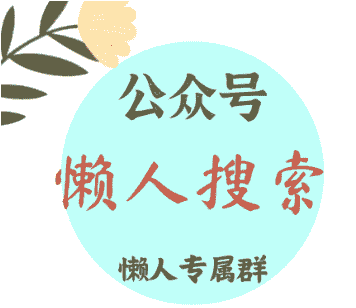

懒人手册：[https://lazybook.fun/#/](https://lazybook.fun/#/)

懒人专属群：[https://lazybook.fun/#/blog/group](https://lazybook.fun/#/blog/group)

专属群更新记录：[https://lazybook.fun/#/blog/record2](https://lazybook.fun/#/blog/record2)

## 目录

徐弃郁·日本简史 30 讲 (公众号懒人搜索)

目录

- 发刊词 | 重新认知这个熟悉又陌生的邻居
  - 为什么要学习日本历史
  - 这门课怎么讲
- 01 | 起源：日本人和日本文明从哪里来？
  - 日本人是从哪里来的
  - 日本文明从哪里来
  - 总结
- 02 | 吸收：大化改新体现了日本的哪些特质？
  - 大化改新前的日本
  - 大化改新的具体内容
  - 从大化改新看日本国家的特点
  - 总结
- 03 | 加速：“中日第一战”如何影响日本？
  - 白江口之战的背景
  - 白江口之战的过程
  - 白江口之战的影响
  - 总结
- 04 | 架空：幕府时代到底是如何开始的？
  - 幕府统治的建立
  - 幕府统治的特点
  - 总结
- 05 | 混战：“战国时期”为什么避不开？
  - 战国时期塑造了日本人的生活与文化习惯
  - 战国时期影响了近现代日本严格的等级观念
  - 战国时期强化了日本的商业和学习基因
  - 总结
- 06 | 侵朝：丰臣秀吉为何侵略朝鲜？
  - 丰臣秀吉的目标：侵略朝鲜，吞并明朝
  - 丰臣秀吉的失误：过度自信与轻视明朝
  - 失误的历史根源：失控的自信与升级的野心
  - 总结
- 07 | 锁国：江户时代为什么要实行极端锁国政策？
  - 固化：江户时代的大治与代价
  - 锁国：江户时代极端的锁国政策
  - 控制：极端锁国政策的缘由
  - 总结
- 08 | 开国：日本为什么只向“黑船”屈服？
  - 鸦片战争：日本开国的关键
  - 尊王攘夷：日本藩国的反抗
  - 幕藩之战：注定失败的幕府
  - 总结
- 09 | 集权：中央集权为何是明治维新的关键所在？
  - 集权：明治维新的关键
  - 尊王：精心设计的工程
  - 废藩：不可能完成的任务
  - 征兵制：集权成果的着重巩固
  - 总结
- 10 | 考察：岩仓使团为什么能够决定日本命运？
  - 人员核心：决策者就是考察者
  - 目标明确：成果直接转为政策
  - 行程紧凑：一年十个月十二国
  - 工作深入：考察范围广层次深
  - 清醒务实：有选择地学习西方
  - 总结
- 11 | 腾飞：近代亚洲为什么日本能够率先实现工业化？
  - 既有优势：强大的工商阶层
  - 政府入场：引领民间资本
  - 政府退场：扶持民间资本
  - 总结
- 12 | 借势：明治维新如何促成财阀的诞生？
  - 什么是财阀？
  - 财阀起源之：政府扶持
  - 财阀起源之：政治商人
  - 财阀起源之：扭转亏损
  - 总结
- 13 | 脱亚：明治维新避不开的负资产？
  - “脱亚”的提出与含义
  - “脱亚”的动机：发展国力
  - 总结
- 14 | 预谋：日本如何赢得甲午战争？
  - 主流的分析及存在的问题
  - 日本的战略意图和战略计划
  - 日本近代化的军事系统与财政金融体系
  - 总结
- 15 | 结盟：日本为什么能赌赢日俄战争？
  - 对于日俄战争的传统分析
  - 日本对于战争的战术准备
  - 日本对于日俄战争的战略筹划
  - 总结
- 16 | 变革：大正时代有可能改写日本历史吗？
  - 什么是大正民主
  - 大正民主产生的原因
  - 大正民主的具体内容
  - 大正民主不能阻止日本走上法西斯道路
  - 总结
- 17 | “突围”：日本走上法西斯道路的关键原因是什么？
  - 日本走上法西斯道路的基本原因
  - 日本走上法西斯道路的关键原因
  - 日本激进的社会氛围
  - 总结
- 18 | 默许：为什么少数中下级日本军官就可以发动“九一八事变”？
  - 日本瞄准东北的原因
  - 发动事变的中下级军官的特点
  - 日本文官政府的反应
  - 总结
- 19 | 升级：“卢沟桥事变”为什么必然发展成全面侵华？
  - 卢沟桥事变发展为全面侵华的偶然性
  - 卢沟桥事变发展为全面侵华的必然性
  - 总结
- 20 | 南进：日本为什么要冒险偷袭珍珠港？
  - 日本有利的外交局面
  - 线性思维主导下的南进决策
  - 日本偷袭珍珠港的原因
  - 总结
- 21 | 溃败：日本太平洋战争为何迅速由胜转败？
  - 日本迅速失败的表面原因：实力差距
  - 日本迅速失败的内部原因：军队力量失衡
  - 日本迅速失败的深层原因：线性思维
  - 总结
- 22 | 回溯：日本的“大东亚共荣圈”到底是怎么回事？
  - “大东亚共荣圈”的基本情况
  - 日本落实“大东亚共荣圈”的方法
  - “大东亚共荣圈”的历史渊源
  - 总结
- 23 | 改造：日本历史轨迹的第三次转向？
  - 战后改造的效果
  - 制度设计：出台战后宪法
  - 顶层布局：日本天皇“实用化”
  - 底层安排：土地改革
  - 总结
- 24 | 实用：战后日本为什么选择“一边倒”？
  - “吉田路线”的基本内容
  - “吉田路线”的根本原则
  - “吉田路线”背后的国家认知
  - 总结
- 25 | 复苏：战后日本如何创造经济奇迹？
  - 美国对日本的经济扶持
  - 日本传统优势助力
  - 总结
- 26 | 转变：中日为什么在 1972 年实现了邦交正常化？
  - “邦交正常化”背后的历史遗留
  - 战后日本对华政策的大框架
  - 日本转变对华政策的原因
  - 总结
- 27 | 震动：一本小册子为何引起世界关注？
  - 这本书的时代背景
  - 这本书的核心内容
  - 这本书背后的地区观
  - 总结
- 28 | 滋生：战后日本右翼为何崛起？
  - 日本右翼的源头
  - 战后初期的日本右翼
  - 60-70 年代的日本右翼
  - 80-90 年代的日本右翼
  - 总结
- 29 | 滑落：日本为什么会经历“失去的三十年”？
  - 对日本经济滑落的传统解释
  - 对日本经济滑落的有力解释
  - 日本经济是“衰落”还是“滑落”
  - 总结
- 30 | 展望：“令和”时代的日本会向何处去？
  - 日本在法律上有条件重走“军国主义”老路
  - 日本发展轨迹出现质变的可能性很低
  - 未来的中日关系走向
  - 总结

公众号懒人搜索，懒人专属群分享

## 发刊词｜重新认知这个熟悉又陌生的邻居

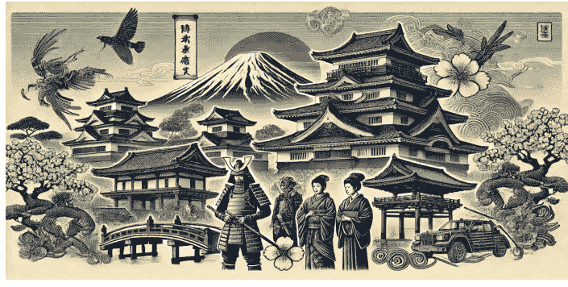

懒人专属群的群友，你好！

我是徐弃郁，欢迎来到《日本简史》。

## 为什么我们要学习日本历史

提到日本，估计很多人的第一印象都是“熟悉”。确实，从人的长相，到文字、诗歌、书法艺术，日本和中国都有很多相似之处。如果我们到日本去的话，可能身处异国的感觉不会那么明显，因为街面上很多告示和商店招牌都有不少汉字，基本都猜出个大概意思。实际上，日本也是我们周边国家中唯一还保留汉字的国家，越南、朝鲜、韩国都已经废除了。另外你也会发现，日本还有不少传统建筑几乎就是中国隋唐风格的翻版，在日本的京都、奈良这些古城尤其如此。身处其中的时候，我们很容易有种熟悉的、似曾相识的感觉。但是，如果再多接触一下，你会发现，日本这个国家对我们来说同时又是陌生的。

日本人想问题的方式、处理事情的方式和我们很不一样。就说一个非常直观的例子：我们中国人一般把单位工作和家庭生活明确区开，下班就下班了，但日本不一样。你肯定知道，不少日本企业就像一家长制的大家庭，日本员工下班以后再累也不能马上回家，而是要和同事们一起喝酒放松，相当于每天都要搞团建，否则的话会被大家看不起。

当然，最让我们不理解的可能还是日本那种。同样是...不再。
如果抛开...中，
对于这样...解它。
另一方面，俗话说“以史为鉴”，近代...析的。
毕竟日本...而且和其他...更加大起大落。
我们都...30 年”。
透过这种...教训。
你如果再...很矛盾的地方。
比如...全体，等等。这些颠覆印象的例子，又恰恰说明我们不了解日本。

所以你，日本这个国家对我们来说不光是既熟悉又陌生，而且经历大起大落，同时它的内部也存在不少矛盾。这样一个国家是怎么一步步走来的？为什么能够大起？又为什么大落？它的矛盾性怎么左右它的轨迹？这些东西当然值得我们细看。

最后，从日本和中国关系的角度来看，就是更为重要了。
历史上，日本曾经全力以赴向我们学习，也曾与中国近代战争。近代，日本更是侵略中国程度最深，造成我们民族灾难最大的国家。同时，我们也要看到，日本与中国的互动也是中国走向近代化、现代化的一个重要因素，向日本借鉴、学习，曾经对我们的发展起过重要作用。
直到今天，日本走过的一些路，踩过的一些坑，依然值得我们关注。

所以，对于这样一个国家，无论它是作为潜在对手也好，作为我们参考借鉴的对象也好，都是值得我们下功夫去研究的。

## 这门课怎么讲

好，说了这么多，课程里我会怎么讲呢？

简单地说，我会选择日本历史上三十个关键的时期或者事件，从你最熟悉的地方切入，挖掘日本这个国家发展轨迹中的深层逻辑。
同时也告诉你日本不为人知的一面，包括它的民族性格、行为方式、思维特点和国家认知。

从分段来看，
第一部分当然是古代日本。
你在这部分会发现，日本这个国家的很多特点其实都和它的地理环境有关系，而且日本在古代就和朝鲜半岛、中国大陆有着千丝万缕的联系。我们会讲日本向中国的学习，也会讲日本和中国唐朝的第一次战争和日本的强者崇拜。你从这一部分会发现日本这个国家的历史基因，会发现它今天的很多特点其实在古代就已经有迹可寻了。

第二部分就是近代日本。
我们会从日本的被迫开国和明治维新讲起，从日本在这一时期的经济起飞、对外侵略和战争探讨日本近代化道路的特点。在这部分，你可以看到一系列问题，像日本的财阀到底是怎么起来的？日本为什么会在战争道路上越走越远？日本为什么在战略上不断犯错？应该说，这些问题会帮助你看到一个和印象中不一样的日本。

最后我们会讲战后的日本。
这个阶段和现在就直接接轨了。日本在战后的起飞、中日邦交的恢复、日本从要向美国“说不”到经历“失去的 30 年”，这些问题对今天我们看待日本、看待未来的中日关系都有很大帮助，对于我们认识现代化道路的规律、看清前车之鉴，也非常重要。

总之，还是刚才说的，日本的历史和未来，是值得我们下功夫去研究的。
好，介绍的话就不多说了。让我们一起开启《日本简史》的旅程，一起认识这个既熟悉又陌生的邻居。
我是徐弃郁，我们课程里见。

# 《徐弃郁·日本简史 30 讲》

课程表 开启预售，11 月 18 日正式开更！

- 发刊词 | 重新认识这个熟悉又陌生的邻居

# 古代日本

- 01 | 起源：日本人和日本文明从哪里来？
- 02 | 吸收：大化改新体现了日本的哪些特质？
- 03 | 加速：“中日第一战”如何影响日本？
- 04 | 架空：幕府时代到底是如何开始的？
- 05 | 混战：“战国时期”为什么避不开？
- 06 | 侵朝：丰臣秀吉为何侵略朝鲜？
- 07 | 锁国：江户时代为什么要实行极端锁国政策？

# 近代日本

- 08 | 开国：日本为什么只向“黑船”屈服？
- 09 | 集权：中央集权为何是明治维新的关键所在？
- 10 | 考察：岩仓使团为什么能够决定日本命运？
- 11 | 腾飞：近代亚洲为什么日本能够率先实现工业化？
- 12 | 借势：明治维新如何促成财阀的诞生？
- 13 | 脱亚：明治维新避不开的负资产？
- 14 | 预谋：日本如何赢得甲午战争？
- 15 | 结盟：日本为什么能赌赢日俄战争？
- 16 | 变革：大正时代有可能改写日本历史吗？
- 17 | “突围”：日本走上法西斯道路的关键原因是什么？
- 18 | 默许：为什么少数中下级军官就能发动“九一八事变”？
- 19 | 升级：“卢沟桥事变”为什么必然发展成全面侵华？

- 20 | 南进：日本为什么要冒险偷袭珍珠港？
- 21 | 溃败：日本太平洋战争为何迅速由胜转败？
- 22 | 溯源：日本的“大东亚共荣圈”到底是怎么回事？

# 战后日本

- 23 | 改造：日本历史轨迹的第三次转向？
- 24 | 实用：战后日本为什么选择“一边倒”？
- 25 | 复苏：战后日本如何创造经济奇迹？
- 26 | 修好：中日为什么在 1972 年实现了邦交正常化？
- 27 | 震动：一本小册子为何引起世界关注？
- 28 | 滋生：战后日本右翼为何崛起？
- 29 | 滑落：日本为什么会经历“失去的三十年”？
- 30 | 展望：“令和”时代的日本会向何处去？

正式课程内容，请以线上版本为准

# 《徐弃郁·日本简史 30 讲》

- 得到 App 出品 -

《徐弃郁·日本简史 30 讲》
重新认知这个熟悉又陌生的邻居
版权归得到 App 所有，未经许可不得转载

徐弃郁
清华大学资深研究员

## 01 | 起源：日本人和日本文明从哪里来？

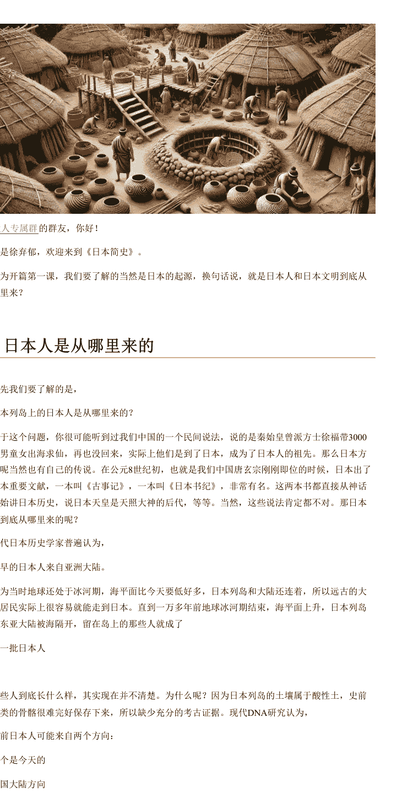

懒人专属群的群友，你好！

我是徐弃郁，欢迎来到《日本简史》。

作为开篇第一课，我们要了解的当然是日本的起源，换句话说，就是日本人和日本文明到底从哪里来？

首先我们了解到的是，日本列岛上的日本人是从哪里来的？

关于这个问题，你很可能听到过我们中国的一个民间说法，说的是秦始皇曾派方士徐福带 3000 童男童女出海求仙，再也没回来，实际上他们是到了日本，成为了日本人的祖先。那么日本方面呢当然也有自己的传说。在公元 8 世纪初，也就是我们中国唐玄宗刚刚即位的时候，日本出了两本重要文献，一本叫《古事记》，一本叫《日本书纪》，非常有名。这两本书都直接从神话开始讲日本历史，说日本天皇是天照大神的后代，等等。当然，这些说法肯定都不对。那日本人到底从哪里来的呢？

现代日本历史学家普遍认为，最早的日本人来自亚洲大陆。

因为当时地球还处于冰河期，海平面比今天要低好多，日本列岛和大陆还连着，所以远古的大陆居民实际上很容易就能走到日本。直到一万多年前地球冰河期结束，海平面上升，日本列岛和东亚大陆被海隔开，留在岛上的那些人就成了**第一批日本人**。

这些人到底长什么样，其实现现在并不清楚。为什么呢？因为日本列岛的土壤属于酸性土，史前人类的骨骼很难完好保存下来，所以缺少充分的考古证据。现代 DNA 研究认为，史前日本人可能来自两个方向：

一个是今天的**中国大陆方向**，一个是今天**俄罗斯的萨哈林岛（也就是库页岛）的方向**。

总之，都是从东亚和东北亚大陆上过去的。

这些原始的居民在日本列岛上定居，就逐渐发展出了自己的文明。

，绳子的绳，文化的文，可以说，这是日本文明史的起点。“绳文”这个名字其实也和这一时代的文化特点有关。日本列岛的这批远古居民虽然还处在使用石器、采集食物的原始社会，但他们是**世界上最早制作陶器的文化之一**。日本曾经出土过 1.2 万年前的陶片，这个还是很了不起的。而出土的这些陶器有一个共同特点，就是表面上有凹下去的花纹。这是在烧制之前用绳子压出来的，所以这个时代就叫做“绳文”。不过你注意，这些居民虽然很早就发明了陶器，但由于海洋把他们和大陆隔绝，缺乏外界的**刺激**，所以他们的生产和生活方式在以后的一万多年里一直处于一种**高度稳定的状态**，没有什么变化，一直**用着石器，靠食物采集生活**。

这种稳定或者说停滞到什么时候才被打破呢？到中国的秦汉时期，已经很晚了。

接下来的一个时代叫做**弥生**，弥勒佛的弥，生活的生。我插一句，这节课最主要的两个名词就是绳文和弥生，你可以记一下，这是日本早期历史最重要的两个时代。从时间来看，日本的这个弥生时代就是中国的秦汉时期。当时出现了一些**移民潮**，历史学家估计是因为大陆的战乱，有不少人从东亚大陆渡海来到日本列岛，其中一部分可能是朝鲜半岛南部的人，还有一部分是中国大陆的人。这些移民后来被称为“弥生人”，他们就在日本列岛定居了下来，并且和当地的绳文人通婚融合。

日本学界认为，今天大部分日本人是绳文人和弥生人共同的后代。所以你看，这就是日本人的起源。

当然，这些移民的到来对日本来说不光是形成了新的民族，更重要的是打破了长达一万多年的停滞期。这些大陆过来的移民带来了三样特别重要的东西：一是**水稻**；二是**青铜器**；三是**铁器**。

你想，在当时日本列岛居民还处于石器和食物采集阶段的时候，这些东西或者说技术的传入当然是革命性的，他们的生产和生活方式都出现了一个重大飞跃。

日本历史学界普遍认为，弥生时代是农耕文明在日本列岛正式确立的时代。

换句话说，由于大陆的影响，日本列岛在短短几百**年里一下子从依靠食物采集的原始社会跃进到了比**较成熟的农耕文明。所以这个弥生时代也是日本列岛在大陆的影响下实现飞跃的阶段。

### 日本文明从哪里来

No. 01 / 117

这种情况怎么产生的呢？

可能和地理环境有关。

有些日本学者就认为，日本列岛和中国大陆之间的海洋对日本来说非常合适：如果太宽，那么就阻碍了交流，日本吸收不到中国大陆的文明；如果太窄，那么中国的影响将过于强大，日本将完全成为中华文明的附属。所以日本的地理环境给了日本一种空间，可以有选择地吸收大陆文明特别是中华文明。

客观地讲，这种说法当然是日本人为了强调自己国家的独特性，但也不是完全没有道理。

## 总结

好，我们这一讲内容到这里就结束了，简单总结一下：

史前日本人来自亚洲大陆，他们在日本列岛定居，逐渐发展出绳文、弥生两个文明时期。早期历史的日本深受中国大陆的影响，不过对于这种影响日本并没有全盘吸收，而是有选择性地孕育出了自己独特的文化。

说到有选择地吸收中华文明，古代日本做的第一次重大努力就是中国隋唐时代的大化改新，也是下一讲的主题。

好，我是徐弃郁，我们下一讲再见。

## 02｜吸收：大化改新体现了日本的哪些特质？

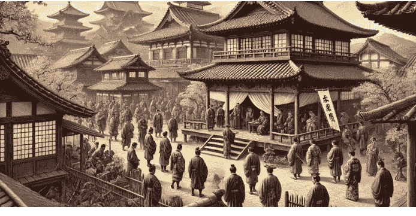

懒人专属群的群友，你好！

我是徐弃郁，欢迎来到《日本简史》。

上一讲我们介绍了日本早期历史中最重要的两个文明时期，绳文时代和弥生时代，当时的日本无论是在物质文明还是精神文明上，都深受大陆文明特别是中国的影响。这一讲我们就来说说这种影响在日本达到的一次小高峰——大化改新。

日本历史发展到七世纪中叶（也就是中国隋唐时期）迎来了一次重大变革，因为当时的日本天皇年号“大化”，所以这次变革也叫“大化改新”。这个大化改新有多重要呢？简单地说，就是把日本整个国家的发展阶段强行向前推进了一级，有的学者甚至形容说这一步相当于日本从西周时期直接迈入到隋唐时期。这种说法可能有点过，但不管怎么说，大化改新绝对是日本历史上一次里程碑式的变革。

纵观整部日本史，能和它相提并论的，只有 1200 多年以后的明治维新。那这么重要的一场变革，它到底给日本带来了什么改变呢？

要说这个问题，首先我们得知道一下大化改新之前的日本是什么样的。

### 大化改新前的日本

当时在日本的本州岛，也就是日本列岛中最大的岛上，有一个王国，叫做大和。后来日本人管自己叫“大和民族”，来源就在这里。这个王国势力越来越大，最后统一了日本列岛的大部分地区。但是这样一个国家在政治结构上还保留着相当原始的民族制度，就是以血缘关系为纽带的贵族世家是主要的政治单元，政权由他们共同把持，而底层老百姓则分别属于这些家族。说实话，这种结构和我们中国的西周确实有点相似。更重要的是，当时日本最高统治者——也就是后来的天皇，当时还被叫做大王，和中国的周天子也有点像。他并不是一个绝对的高高在上的权力中心，实际上只是贵族中最大的一个，地位远远比不上中国秦汉以后的皇帝。

在大化改新之前，日本的天皇基本上处于被架空的状态，一个叫苏我氏的大贵族世家把持了朝政，但这个时候有一批皇族和其他贵族的子弟从中国学习回来了。他们对隋唐的制度已经比较熟悉了，回国一看这种状态就完全没法容忍，君臣关系怎么可以这样呢？一定要改变。而且在这些人看来，日本之所以落后，就是因为天皇手里没权。所以这些人作为中坚力量，先是搞政变消灭了苏我氏，然后推出新的天皇，搞大化改新。你看，这就是大化改新的背景。

既然是这样一个背景，那你也能猜到，这场变革最主要的内容肯定是改变日本原来的政治结构。用最简单的话来说，就是要把天皇抬起来，把贵族压下去，让日本也走中国隋唐那种中央集权的大一统模式。

好，那具体怎么做呢？大化改新最重要的就是政治和经济领域的变革。

### 大化改新的具体内容

我们先来看政治。当时日本在政治上做了两件大事：

一是仿效唐朝，废除原来的氏族制度，建立一整套全新的官僚机构，官吏由天皇统一任命，同时按中国的州一县模式，在日本划分行政区。

你看，这不就是把权力集中到天皇手里了吗？

第二件事是仿效唐朝的律法，建立新的、完整的法律体系，进一步明确中央和地方、天皇和贵族之间上下级关系。

这里最出名的就是公元 8 世纪初颁布的《大宝律令》，正是这个法律把日本原来的称呼“倭国”正式改成了“日本”，而且也正式明确了天皇这个称呼。你看，这大化改新相当于是重新构建了一个国家。

除此之外，当时搞变革的那班人也知道，不能光改政治结构，经济上也要变。我们前面也说了，日本的贵族不光有自己的土地，还有自己的老百姓，这样他们的权力地位当然很独立了，所以大化改新也要把贵族的经济基础削弱。怎么办呢？

日本就模仿唐朝的均田制，相当于推行土地国有化，采取全国统一的税收和劳役制度。

听到这里你可能有种感觉，这大化改新怎么都是仿效中国、仿效唐朝呢？事实正是如此，日本的大化改新基本上完全以中国为模板，包括颁布的法典也几乎是照抄中国的，可以说是一次“全盘中化”。

讲到这里你也明白了，大化改新之所以重要，是因为它从政治上、经济上都对整个国家进行了一次重建。一般讲日本的大化改新，到这里也就差不多了。

但是我要告诉你，大化改新的重要性不光在于这场变革本身，还在于它体现了日本这个国家的两大深层特点。

### 从大化改新看日本国家的特点

先看第一个特点，就是在日本很难形成中央集权。

我们刚才说了大化改新的背景，那就是天皇被长期架空。但有意思的是，1200 年以后日本另一场重大变革——明治维新提出的口号，也是要让被架空的天皇重新拥有大权。你可能会觉得有点好笑，怎么日本天皇又被架空了？实际上这是理解日本的一个非常重要的切入点。日本的天皇很有意思，一方面他被说成是天神的后裔，好像高大神圣得不得了，另一方面又经常处于有名无实的状态，不断被贵族权臣、武士集团等等架空，中国秦汉之后皇帝那种至高无上的权力日本天皇可能从来都没有享受过。

那为什么会这样呢？这里就要说到日本和中国的一个重要区别了，那就是地理环境。

如果看地图会发现，日本没有大的平原，最大的关东平原只有一万六千平方公里，也就是北京各个区加起来那么大。更重要的是日本国土的 76% 属于山地丘陵，小规模的平原、盆地都被隔成一个个相对独立的地理空间，分布在全国。

你注意，在古代，这种地理特点不光阻碍各个地方之间的交流，而且会形成一种政治经济后果，那就是各个地方的经济、社会都很容易自成一体，中央权力很难有效延伸到地方。

另外，中国是大陆国家，容易受到北方游牧民族的大规模侵袭，而每一次这种大规模的外族入侵实际上都是对原来世袭贵族和地方豪强的一次扫荡。但日本是一个岛国，从来没有被哪个外来民族成功入侵过，所以它那种世袭贵族、地方豪强的势力就基本不受外力冲击，往往能经历持续上百乃至几百年的沉淀，形成一种非常牢固的权力结构。

这种情况下，强大的中央权力就更难形成了。

听到这里你可能有个疑问，日本实行中央集权的阻力那么大，那前面说的大化改新最主要的目标——中央集权到底有没有实现呢？坦率地讲，它只是部分实现了这个目标，贵族势力、地方势力在大化改新之后的日本仍然很强大。

举个例子，上面我们讲了大化改新仿照唐制建立了行政官僚体制，但你要知道，天皇任命的那些官员还是从贵族世家中选择的，本质上只是用一批新的贵族代替老的贵族掌权。

我这里多说一句，你应该很容易想到，这样的官员选举方式就形成了“门阀政治”。它的意思有两层：一是几个大家族或者几大势力共同掌握或者说瓜分政治权力，很难出现一家独大的情况；二是这些家族往往代代相传，延续这种政治权力。我这里强调一下，“门阀政治”是理解日本国内政治的关键。

这种情况不光贯彻了日本的古代史和近代史，即使是在今天的日本政坛上你还是能够看到这种印记。

好，除了很难形成中央集权这个特点之外，大化改新还体现出了日本的第二大特点，那就是对于这场变革有着空前的主动性，这一点也是理解日本的关键。

我们前面说过，日本大化改新基本就是一次“全盘汉化”，是在非常努力地吸收隋唐的文化。但日本和朝鲜半岛、越南不一样，它和中国并不接壤，并不直接面对中华文明的辐射。所以从这个意义上说，它对中华文明的模仿和学习实际上比别的地方更加主动，这是日本这个国家另一个非常突出的特点。

1200 年以后，明治维新时期日本则是极其主动地向西方学习。美国学者本尼迪克特曾经写过一本非常著名的书，叫做《菊与刀》，可以说是研究日本的必读书。书中就有这么一句评价：“在世界历史上，很难在什么地方找到另一个自主的民族如此成功地有计划地吸取外国文明”。这种日本与外来文化的互动，也是我们课程理解和观察日本的一个重要视角。

## 总结

好，这一讲的内容就在这里，我给你做个总结：

这一讲我们说到了日本历史上的第一次重大变革——大化改新，这次变革日本实际上完全以中国的隋唐为模版，可以说是一次“全盘汉化”。这次变革也反映出了日本的两大特点，一是很难形成强大的中央集权，二是面对外部优秀文化有着极强的学习主动性。

不过你也要注意，对于日本的这种特点我们也不要夸大。这种吸收外国先进文明的主动性并不是说日本这个国家天生爱学别人。这里有一个重要的原因是，日本作为一个靠近大陆的岛国，它对外来刺激是高度敏感的。实际上，日本大化改新的全面推进就和一次外来刺激有很大关系，这就是我们下一讲要说的中日第一战——白江口海战。

好，我是徐弃郁，我们下一讲再见。

### 只对事不对人：让大模型的假设更加科学
> 数据驱动决策

| 任务 | 大模型的结果 | 答案 |
| :--- | :--- | :--- |
| 对属于类别 | 对属于类别 | 对属于类别 |
| 排泄 | 排泄系统 | 呼吸 |
| 正常 | 正常 | 散热 |

虫子
虫子！
虫子！

## 白江口之战的过程

好，接下来我们再看白江口之战前的态势。当时，朝鲜半岛有三个国家：新罗、百济、高句丽，这三个国家先是接受了唐朝的册封，但后来由于内部政变，发生战乱。百济和高句丽结盟对付新罗，唐朝支持新罗，日本支持百济，结果就在白江口，也就是今天韩国西海岸锦江入海口那个地方，双方展开大战。

当时日本军队拥有战船约 400 艘，兵力约 4 万多人，加上百济军队一共将近 10 万。而唐军战船约 100 艘，兵力 1 万左右，加上新罗军队统共也只有 4 万左右。所以日本方面的数量优势很明显，也比较自信，但结果却是唐军大胜。对于这场战役的情况，中国《旧唐书》上的记载只有几句话：“四战捷，焚其舟四百艘。烟焰涨天，海水皆赤。”也就是说，经过四次战斗，唐军取得了胜利，焚烧了日本四百艘船只，烟火冲天，连海水都被鲜血染红了。可见当时的战况属于标准的一边倒，日本的海上力量基本全军覆没。

那为什么会出现这种情况呢？说白了，当时的唐军对日本军队属于降维打击。在指挥、战术、军事装备（包括盔甲、唐刀）这些要素上唐军可以说全面领先日军。另外，因为这场战役有相当一部分属于海战，所以舰船的质量也很关键。我前面说过，日本这个国家很有意思，虽然是岛国，但古代日本似乎对海不感兴趣，造船技术也一直不太好。即便到了明朝的时候，日本船只的结构和制造工艺依然很落后，船板的接缝处不像中国船那样用铁钉和榫卯技术，而是用铁片，缝隙也不像中国用麻筋桐油来填，而是用一种短水草塞一下，所以容易漏、容易裂，风帆设计也只适合顺风航行。你想，明朝的日本船尚且如此，更不用说唐朝时期的日本了。反观唐军的战船不仅坚固，而且高大，还有专门的火攻装备，所以在海战中完胜日军非常自然。那这样一场惨败对日本产生了什么影响呢？

## 白江口之战的影响

日本的反应是非常典型的。首先是采取了历史上第一次大规模的本土防卫措施，在海边筑造防御工事，修建烽火台，组建海防部队，等等。这实际上是一种短期的、应激式的反应。

更重要的是一种长期反应，那就是日本开始加速向中国学习的步伐。可以说，日本上层原来就对唐朝的文明很羡慕，但在白江口之战之前，根本没有想到自己和唐朝的差距这么大。当然，惨败以后，日本清醒得也很迅速。

白江口之战的第二年，日本天皇就出台一系列措施，推动从大化改新开始的国家体制变革，进入到一个明显加速的时期。

与此同时，日本开始全力以赴向唐朝学习，就像我们一开头说的，把遣唐使的规模一下子扩大到了原来的 3 倍。当时日本学习唐朝那种竭尽全力的程度，我们从遣唐使的死亡率就可以看出来。要知道，唐朝时期日本到中国的海路属于高风险旅程，日本的遣唐使绝大多数都在途中遭受过重重波折，很多船只甚至直接毁于风浪。据日本学者统计，历史上派出的遣唐使船只大约四十八艘，其中至少有四分之一在途中沉没。而人员损失就更大了，海难加上疾病，使得日本遣唐使的死亡率高达 50% 左右。而且我还要告诉你，作为遣唐使来到中国的，是日本在外交、科技、工艺、学术、宗教等各领域最顶尖的人才，完全属于社会精英。所以这种损失对当时人才原本就稀缺的日本来说尤其惨重。但即使面对这样的情况，日本方面仍然坚持派遣遣唐使，这也反映出它学习唐朝的决心和力度。

除了加大向中国学习的力度之外，白江口之战对日本的另外一个影响是，它促使日本拓宽了向中国学习的全面程度。

白江口之战以后，日本对唐朝的学习几乎到了全方位的地步。不仅把官僚制度、税收体系、土地制度、律法等这些国家运行的关键制度几乎原封不动地搬到日本，而且像礼、乐、书法等精神文化领域的东西也大量吸收，所以当时的日本可谓“唐风”极盛。

这里最典型的例子就是日本首都的设计。8 世纪初，日本建立新的首都，叫做平城京，地点就在今天日本的奈良市。你要看一下这个平城京的地图就会发现，它几乎完全是仿照唐朝长安的模式修建起来的，整个城市被东西向和南北向的街道划分得非常整齐，形成一格一格的方块，像棋盘一样。皇宫也是和长安一样，修建于城市中轴线的北端，皇宫南面是主干道，而且这条主干道的名字直接抄的长安城，也叫做朱雀大街。唯一不太一样的可能就是首都的面积，整个平城京面积上更小一些，相当于长安的四分之一。所以你看，当时日本学习唐朝的力度确实到达了某种极致。

讲到这里，白江口之战对日本的影响基本上就讲完了。

从这段历史，我们也可以看出日本有两个很有意思的特点。第一个特点你可能已经想到了，那就是 **强者崇拜**。你看，它被唐朝打败以后没有任何不服气，一旦看清自己和唐朝的差距，就开始拼命学习唐朝，模仿唐朝。这就是一种典型的强者崇拜，比它强它就认，而且全力以赴地学。第二个特点是什么呢？那就是 **转向迅速**。你看，日本从与唐朝强硬对抗到向唐朝全面学习，这个大弯转得非常之快。白江口之战的第二年，日本就和唐朝全面修好，第三年就重新向唐朝派出遣唐使，而且和唐朝的交流范围迅速扩大。应该说，这种转向速度之快，大部分国家很难做到。

这两个特点我们需要关注一下，日本这个国家的生存之道，发展之道，可能都在其中。在近代日本和现代日本的历史中，我们还会反复地看到这两个特点。

## 总结

好，这一讲的内容就到这里，我给你做个总结：

这一讲我们说到了中日历史上第一场战役，白江口之战。古代日本就不断介入朝鲜半岛，在白江口一战中被唐军打得大败。这场战役大大增加了古代日本向中国学习的力度和广度，从中我们也可以看出，日本这个国家明显的强者崇拜和转向迅速的特点。

好，我是徐弃郁，我们下一讲再见。

公众号懒人搜索，懒人专属群分享

## 04｜架空：幕府时代到底是如何开始的？

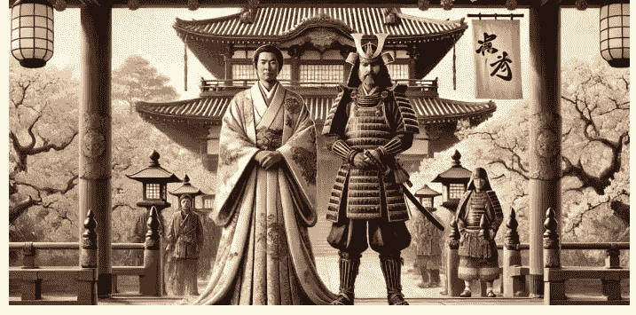

__懒人专属群__的群友，你好！

我是徐弃郁，欢迎来到《日本简史》。

上一讲我们说到了中日第一战，白江口之战，这场战役中日本的惨败也让它加大了全面向唐朝学习的力度。在此基础上，日本模仿隋唐形成了一定程度的中央集权，日本天皇的权力大大增加，最后定都在平安京，就是今天日本的京都。这个时期也被日本史学家称为“平安时代”。但是这种中央集权并没持续太长时间，很快，日本就进入了幕府统治的时代。

了解一点日本历史的人对“幕府”这个词一定不会陌生。在日本近代明治维新开始的时候，维新派打出的大旗就是“尊王倒幕”：尊崇天皇权威、推翻幕府统治，从而开启了一个新的历史进程。那这个幕府统治持续了多长时间呢？从开始到被推翻一共 600 多年，相当于从中国的南宋一直到晚清。你可以想象，这么长的幕府时代必定对日本这个国家产生了重要的影响，不了解幕府就不可能了解日本历史。那这个幕府到底是什么呢？它又是怎么开始的？这就是我们这节课的内容。

### 幕府统治的建立

首先我要告诉你是，日本历史上的幕府不止一个，前后包括镰仓、室町和江户这三个时期。这一讲我们要讲的是第一个幕府，也就是镰仓幕府。它是怎么建立的呢？我前两讲也提到过，因为日本的地理环境山地多、平原小，加上海洋阻挡了外族入侵，所以地方势力、贵族势力根深蒂固。大化改新虽然建立了以天皇为中心的中央集权，但持续的时间并不长，权力慢慢又回到了地方手里。

这里最典型的例子就是军队。日本模仿隋唐的一个重要内容就是建立一支庞大的常备军。但很快问题就来了，首先是钱的问题。大化改新后的日本建立了全国统一的税收制度，但后来实行不下去了，税收权力慢慢又回到了地方势力手里。天皇最后根本拿不出足够的钱来养军队。

其次是人的问题。日本天皇建立军队，当然是从各地征召士兵来守卫京城或其他大城市。但是有意思的是，日本各个地区相互隔绝比较厉害，乡土意识非常重，那些兵特别不愿意背井离乡，所以经常逃亡。

那这两个问题加起来，中央政府的军队慢慢就办不下去了，但政权还是需要武装力量的，那怎么办呢？只好外包。外包给谁呢？外包给地方势力手中的私人武装，也就是武士集团。

你看，天皇连军队都得外包了，说明日本当时的中央集权确实已经维持不下去了。

听到这里，熟悉历史的人都知道，快出事了。事实也是这样，这些武士集团逐渐集中到了两个贵族家族手里，一个叫平氏，一个叫源氏。两个家族又进行了一场火并，最后源赖朝领导的源氏家族胜出。这个源赖朝属于大枭雄式的人物，此时掌握了全国的武装力量。

好，事情发展到这一步，你会发现，日本改朝换代的条件都成熟了，源赖朝可以轻而易举地推翻天皇，自己上位。但有意思的是，事情并没有往这个方向发展，源赖朝没有自己当天皇，而是从天皇那里要了一个头衔，叫做"征夷大将军"，开始名正言顺地统掌全国军队。

更为特别的是，那他的办公地点在哪里呢？对不起，不在京城，不在天皇身边，而是在自己的大本营——镰仓。这个镰仓离天皇居住的京都有多远呢？400 多公里，一个在西边，一个在东边，对于日本的国土面积来说非常远了。即使今天你去日本的话，要在这两个地点来回一趟也是非常赶的，古代就更可想而知。你可不要小看这种地理上的距离，这相当于明确告诉全体日本人，国家现在有两个权力中心，一个是虚位，一个是实权。

源赖朝在镰仓的行政和军事班子叫做将军幕府，这就是镰仓幕府的开始。日本就此进入了幕府统治的时代。

### 幕府统治的特点

好，幕府时代怎么开始的讲完了。那幕府统治到底是什么样的呢？说实话，这种幕府统治很有特点，用现在的表达方式来说，是一种非常“日本”的政治形式，既不是中国那种中央集权的大一统，也不是欧洲中世纪那种封建制度。它有两个特征非常突出：

第一，君主被制度性架空。

幕府统治开始以后，日本就出现了一个双重领导的奇怪结构：名义上的最高领导还是日本天皇，但实权掌握在幕府将军手中。你可能会说，这种情况不奇怪啊，中国历史上也有过。像三国时期曹操挟天子以令诸侯，名义上最高统治者是汉献帝，实际上是他曹丞相。但你注意，这里有重要区别：中国这种情况是临时性的，因为汉朝皇帝最终要被取代；而日本这种结构却是制度化的，换句话说，天皇会一直保留，还是由他的家族传承下去，幕府将军绝对不会自己来当天皇，并且幕府将军这个职位也是世袭。

所以你看，这是清清楚楚两条线，是两个权力中心。

更重要的是，在中国，像曹操这种情况至少还需要以汉献帝的名义发个诏书什么的，但日本的幕府将军根本不需要这么做，军政大事直接向他请示，然后以自己名义发号施令就可以了。为什么呢？因为将军幕府的建立相当于把日本的整个政治制度给改变了：所有的实权都归了幕府，天皇只剩下礼仪和象征，所以具体的国家事项根本不需要通过天皇。

No. 21 / 117

我这里插一句，后来的幕府连天皇的行为举止也管起来了，它规定天皇的主要任务是读书，当然读什么书也有规定。然后天皇要了解本国的习俗，而且为了当好国家的象征，天皇的举止要“有古风”“不闲谈、不饲鸟兽、不踢球”。你看，这完完全全成为一种象征。

听到这里你可能要问了，那这样的天皇还保留着干什么呢？这就要说到日本传统里面很重要的一个特点。那就是和中国相比，日本人对于已有的权力等级要尊重得多，一般不会去颠覆这种等级。

要知道，在日本历史上哪怕是农民起义，也不是像中国历史上的那样要推翻原有的统治，而是往往有一个很具体的诉求，统治者如果满足这个诉求，起义也就平息了。像中国秦末陈胜、吴广起义提出的“王侯将相，宁有种乎”这种口号，在日本历史上难以想象。

而日本天皇的地位又非常特殊，他是处于整个权力等级的顶端，再加上民间信仰等等因素，更加不可能随意取代。所以在整个幕府时期，天皇可以一点权力都没有，甚至可以被幕府将军从头管到脚，但幕府将军不能自己当天皇。另外，幕府将军可以被取代，像镰仓幕府是源氏家族的，后来的室町幕府就是足利家族的，再后来就是德川家族的江户时代，但天皇这一支不能变。

换句话说，掌握实权的可以换，但虚的国家象征不可以换。

可以说，理解了这一点，就理解了日本社会的很多事情。

好，说到这里，你已经知道了幕府时代日本君主是如何被制度性架空了，最后我们再简单看一下幕府政治的第二大特征，那就是地方力量的强势。

前面我们说了，日本以天皇为中心的中央集权衰落，是导致幕府出现的主要原因，把天皇制度性地架空。这里你要注意，

## 总结

好，这一讲的内容到这里就结束了，我们来做个总结：

大化改新让日本天皇实现了短暂的中央集权，但由于财政和人口限制，武装力量只能依赖于地方武士集团，最后大权旁落，进入幕府统治时代。幕府统治有两大特征，一是君主被制度性架空，二是地方力量强势，幕府将军要依靠地方庄园主，也就是大名提供军事支持。

幕府和地方大名之间实际上是一种相互支撑的结构，幕府并没有绝对优势。如果幕府自己的力量压不住地方大名，那么这些大名可能会进一步坐大，甚至引发争夺权力的内战。而历史恰恰就是往这个方向发展的，在下一讲，日本将陷入一个空前的内乱时期，也就是日本历史上的“战国时代”。

好，我是徐弃郁，我们下一讲再见。

---

# 《徐弃郁·日本简史 30 讲》

# 重新认知这个熟悉又陌生的邻居

版权归得到 App 所有，未经许可不得转载

徐弃郁 清华大学资深研究员

> 公众号
> 懒人搜索
> 懒人专属群
> 微信:lazyhelper

# 05 ｜混战：“战国时期”为什么避不开？

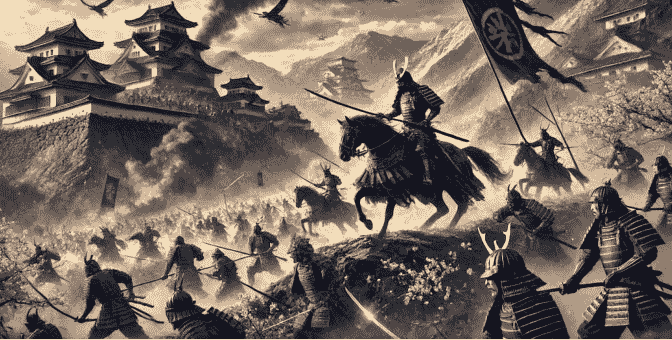

[懒人专属群] 的群友，你好！

我是徐弃郁，欢迎来到《日本简史》。

上一讲授到了日本的幕府时代，这个时代，天皇再度成为虚位，幕府掌握实权。实际上，日本进入幕府统治以后，地方势力依然比较强，一开始幕府还可以压得住这些地方势力，但后来幕府力量变弱，地方势力进一步坐大，最后直接参与到幕府将军的继位之争，导致了一场严重的内战，就是日本历史上著名的“应仁之乱”。这场“应仁之乱”结束以后，幕府的地位一落千丈，日本就此进入了地方势力割据混战的时期。这场混战持续了一百二十多年，日本人认为这段历史和我们中国的战国时期非常相似，所以就直接把这个阶段叫做战国。从了解日本、了解日本历史的角度来看，这个战国时期是无论如何都避不开的，因为这个阶段虽然长期战乱，但对日本这个国家的生长和发展来说非常重要。

为什么这么说呢？主要有三个方面的原因。

### 战国时期塑造了日本人的生活与文化习惯

从看得见的层面来说，战国时期的日本全面塑造了后来日本人的生活与文化习惯。

我这里介绍一个说法。日本有个著名历史学家叫做内藤湖南，他说过一句话，叫“‘应仁之乱’前无日本”。换句话说，我们相对熟悉的、和日本有关的东西，大多数都是从战国时期开始形成的。那这是怎么回事呢？我这里举几个例子，比如日本的和服，衣服的棉布用料和基本款式都是在战国时期确定下来的，在此之前日本人的衣服主要是麻布，式样也很不一样。

再看饮食，普通日本人一日三餐的习惯是从战国开始的，之前就是早晚两顿，像味噌、酱油这些日餐的主要调味料也是在战国时期出现的。

在居住方面呢，日本传统的那种薄木板房子就是从这一时期才开始大量出现，日本的榻榻米也是这个时候有的，之前只是在会客房间里铺一块木板。所以你看，后来日本人的“衣、食、住”这些基本生活习惯都是在战国时期形成的。

另外，像我们中国人熟悉的忍者、倭寇主要也是在这段时期活动，而且还出现了一大批非常有个性化的军政人物，比如织田信长、德川家康、丰臣秀吉等，后来日本电影都喜欢从这段历史取材。所以光从这些方面来看，你就会知道日本战国时期的重要性。

不过这些重要性总体来说还是面上的，实际上战国时期的日本还发生了一些深层次的变化，直接影响了这个国家的权力结构和政治文化。这些看不见的部分对于了解日本来说，可能更加重要。

### 战国时期影响了近现代日本严格的等级观念

我们先看一下权力结构。

战国时期日本的权力结构进行了一次大洗牌，这次洗牌的产物深刻影响了近现代日本的社会等级观念。

之前我们说过，日本的贵族世家一直很厉害，在京城、在地方的势力都根深蒂固，天皇也好，幕府也好，都需要依靠他们。但是随着日本进入战国时期，不光是幕府成了空架子，地方上的那些贵族大员很多也成了空架子，那权力到谁手里了呢？到了层级再往下的一些小贵族。这个过程很有意思，就像原来幕府架空天皇、地方贵族架空幕府一样，更小贵族也架空了原来的大贵族。

这些人成功上位，变成了地方上有兵有钱的真正实权派。你注意，这些割据一方的实力人物也叫“大名”，但前面多了两个字“战国”，叫“战国大名”，以区别于以前那些贵族世家的领主。你下次如果看书的时候看到“战国大名”这种名称，就知道指的不是那些原来祖上就很显赫的大贵族、大领主，而是那些在乱世中成功上位的小贵族。说实话，这种变化和中国战国时期确实很像，先是齐国这些诸侯国彻底架空了周天子，然后这些诸侯手底下的家臣又上位，取代原来的诸侯。所以从政治权力结构来看，日本的战国确实是一次全国性的大洗牌。

那这种乱世之中的洗牌带来了什么呢？这里就要讲到日本的家臣制度了。这个制度是从日本的第一幕府——镰仓幕府开始的，幕府将军把手下的武士分成不同等级，让他们效忠自己，同时明确各种义务。

到了战国时期，这种家臣制度就出现了两个重大变化，一是家臣体系大大扩展。

为什么呢？你想，原来就只是幕府将军建立了一整套家臣制度，但到了战国时期，割据一方的那些“战国大名”们，每个人手底下都建了一套家臣制度。所以从涉及的人数来看，从对社会的影响来看，战国时期的家臣制度都远远超过从前。

第二个重大变化是，家臣制度的等级和效忠规定更加严格。

这个和当时的环境很有关系，你想，在连绵不断的战乱中，一个集团内部的纪律和团结程度往往决定了它能否生存下去。所以不难理解，这一时期，各个战国大名对底下的家臣更加强调等级和效忠。不过还有一点更重要的原因，那些因为战乱而成功上位的小贵族，也就是“战国大名”发现，镰仓幕府建立的那套家臣制度、等级规定，好像不能完全保证底下武士的忠心，否则他们这些小贵族怎么可能成功上位呢？所以他们一旦上位后，最重要的事情就是要保证底下的绝对忠心，保证上下级之间有严格的相互义务，确保自己手底下人不会再成功上位。在这种情况下，日本的家臣制度得到了极大的强化，作为领主的战国大名必须严格履行自己的义务，而底下的武士也必须尽到全部的忠心，这种效忠和义务关系按严格的等级层层延伸，使所有人都形成一个非常紧密的集团。

这种家臣制度的发展对日本社会的影响可太大了。你知道，日本之前的社会等级就比较严格，而战国时期的家臣制度不光进一步强化了等级，而且进一步强化了各个等级之间的权力和义务。

日本历史学家就认为，战国大名在家臣团确立的身份等级制度，就是近代日本社会身份制的萌芽。

实际上不光是近代，即使在现代，日本社会都是一个等级森严、各级权利义务都很清楚的社会，这种家臣制度的影响在日本仍然可以见到。如果对此方面感兴趣的话，你可以去观察一下日本公司。有位在日企工作过很长时间的朋友告诉我，按照他的观察，实际上每个日本公司都是一个家臣团，老板相当于领主，对于员工终身负责，而员工则效忠到底，为公司奉献一切，哪怕是“过劳死”都可以，公司各个层级之间的等级都很森严，没有人会去打破规矩。

### 战国时期强化了日本的商业和学习基因

除了对社会等级观念的影响，战国时期给日本带来的另一个重大影响，那就是发展商业和学习西方。

你可能会觉得，战乱时期嘛，肯定是百业凋零，民不聊生，但日本战国的情况有点特别：因为战乱，原来对整个社会的各种约束和控制都变弱了，所以经济反而不错，人口也增加了，尤其是商业得到了很大的发展。

为什么呢？一方面是因为打仗需要各种补给和材料，商人在这方面非常有用，那些战国大名很依赖商人。另一方面，战国时期的日本缺乏一个权力中心，所以商业、贸易这些活动不受权力的支配，发展比较自由。结果战国时期反而成了日本商业社会的开端。

另外，战国时期也是日本学习西方的开始，劲头虽然不如当年向中国隋唐学习的时候，但仍然可以看出其中那种穷尽细节、追求彻底的精神。

就拿火绳枪来说吧，日本人管它叫“铁炮”，是从葡萄牙人那里传过来的。那些战国大名对这种新式武器非常关注，很快就采用了。不过，这个时期的火绳枪技术还不行，从装弹装药到完成发射耗时很长，一般情况下等你装填完毕要开第二枪的时候，敌人早就冲到眼前了。那怎么办呢？有一个战国大名叫织田信长，他的部队就反复琢磨，最后发明了“三批次射击的办法”，也就是把部队分成三批，一批装弹装药，一批准备瞄准，一批开枪射击。这样一来部队射击的速度就大大加快。你可能会说，好像以前欧洲军队就是这么做的。没错，只不过欧洲军队采取这种战术更晚，日本是世界上第一个使用这种战术的国家。

说到这个战术，我再提一场著名战役，叫“长篠山之战”。因为织田信长部队采用这种火绳枪战术，导致当时日本最强大的骑兵部队——武田家族骑兵几乎全军覆没。黑泽明导演过一本很有名的电影，叫《影武者》（也译成《影子武士》），电影最后就是描写的这场战役。说到这里你可能也发现了，战国时期日本发展商业和学习西方特点，都是二百多年以后日本明治维新得以成功的重要因素。

这也是为什么我们说战国时期对日本非常重要。

## 总结

好，说到这里这一讲就结束了，我们总结一下：

幕府和地方大名之间构成了相互支撑的关系，最后地方势力逐渐坐大，以“应仁之乱”开启了长达百年的战国时期。战国时期对日本的影响非常重要，首先，它塑造了近现代日本人的生活与文化习惯；其次，战国时期强化的家臣制度，深刻影响了后来日本社会的等级观念；最后，战国时期孕育了日本商业基因，开启了日本学习西方的先河。

那日本战国这种割据混战的局面到底是怎么结束的呢？这就要提到一个非常关键的人物——丰臣秀吉，这也是我们下一讲的内容。

好，我是徐弃郁，我们下一讲再见。

# 06 丨侵朝：丰臣秀吉为何侵略朝鲜？

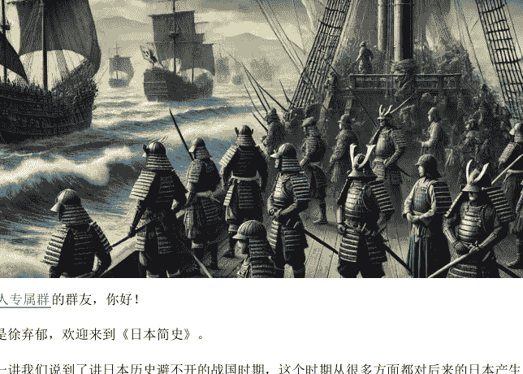

> “懒人专属群”的群友，你好！

我是徐弃郁，欢迎来到《日本简史》。

上一讲我们说到了讲日本历史避不开的战国时期，这个时期从很多方面都对后来的日本产生了深远的影响。在日本战国的末期，也出现了逐步统一的趋势。不过与此同时，日本做的却不是修生养息，而是突然大规模侵略朝鲜。作为朝鲜的宗主国，中国明朝政府自然派兵援朝。于是，继唐朝白江口海战以后，中日之间的第二次战争爆发了。

但这场战争可不像白江口海战那样迅速分出胜负，而是先后打了七年，所有参战方都损失惨重：朝鲜遭受的损失最大，人口减少约 20%，经济在之后的一百年内都没能恢复；中国明朝的代价也很高，国库基本打空，而且明军主力之一辽东军严重受损，无力阻挡努尔哈赤领导的后金崛起，为后来的满清入关埋下了伏笔；日本军队当然也损失惨重，后来的 200 多年里再也不敢对外用兵。所以你看，可以说这场战争没有一个国家是从中受益的。但讲到这里问题也来了，日本怎么会突然发动这么大大一场战争的呢？

### 丰臣秀吉的目标：侵略朝鲜，吞并明朝

我们先简单看一下这场战争的情况。当时日本经过了长期战乱以后出现了统一的趋势，一个强势的领主叫做丰臣秀吉就扮演了类似中国秦始皇那样的角色。但刚刚实现基本统一，丰臣秀吉就派出十几万军队渡海入侵朝鲜，后来明军入朝作战，日军向朝鲜南部败退，经过几年的谈判和拉锯作战，丰臣秀吉病死，日军无心恋战，全部撤出朝鲜。这就是简单经过。

那日本发动侵朝战争的目标是什么呢？你可能想象不到，不仅仅是要侵略朝鲜，更是要侵略中国，要吞并整个明朝。

这个还不是任何历史学家推测的，而是丰臣秀吉在发动战争之前，给朝鲜国王的国书中明明白白写的。而且这还不是他临时起意，在他还没有统一日本之前，丰臣秀吉就在给家臣的信中提出，“我日本国要让大唐俯首称臣”。特别说明一下，这里的“唐”指的是中国，而不是唐朝。你看，这就很有意思了，日本当时的人口估计是 1200 万，同一时期中国人口可能已经超过了 1 亿，面积更是远超日本。更重要的是，中国从隋唐以来一直在整个东亚都处于中心地位。所以那个时候的日本哪来那么大的自信，居然要吞并明朝呢？

### 丰臣秀吉的失误：过度自信与轻视明朝

对于这个问题，后来很多日本历史学家把原因都归因于丰臣秀吉的个性。因为这个人确实很特别，可以说是日本历史上出身最卑微的统治者，但个性极强，心里的条条框框也很少，所以才会有这样异想天开的目标。但说实话，这只是一部分原因，丰臣秀吉其实也有一定的实际考虑。

第一，他对日军的作战能力很有自信。此时他刚刚用武力统一日本，手中的军队在质量和数量上都创下了日本历史的新高，特别是火绳枪部队非常厉害，上一讲提到的三个批次的战术已经很成熟。在和中朝军队作战的整场战争中，日军的战斗力确实很强，一开始进攻朝鲜的时候，仅仅半个月左右就打下了当时作为朝鲜首都的汉城，大约两个月就打下了平壤。要知道，在当时的技术和交通条件下，这种速度已经非常惊人了。后来明军入朝，才遏制了日军的进攻，并且在攻城战中夺回平壤。但是我们也要看到，明军后来和日军的一系列作战中，并没有占到什么便宜，双方损失都比较大。明朝人对此也有评价，说中国派遣的军队不少，再加上朝鲜本国军队，但“我以两国全力，不能制倭死命”，换句话说，不能在战场上完全压倒对手。从这里你也可以看出来，丰臣秀吉的这种自信虽然过分，但也不是完全没有根据。

第二个理由就很有意思了，那就是他认为明朝的军事力量不行，根本打不过日本。他说，日本是“弓箭坚强之国”，而中国是“长袖国”，是“文弱”的，所以日本将像“大山之压卵”，轻易征服中国。那他怎么会有这种判断的呢？我告诉你，这是来自倭寇的经验。

倭寇这个词你肯定非常耳熟，主要指的是明朝时期，骚扰朝鲜和中国沿海地区的那些日本海盗。这个倭寇的成份非常复杂，和日本的战国时期很有关系。当时日本因为连年战乱，那些被打败的封建领主，加上那些失去领主的武士，开始把从海上抢劫中国和朝鲜看作一条出路，这些人构成了倭寇的主体。但是你要注意，我们所说的倭寇里面并不全是日本人，还有一部分是因为明朝的海禁政策，而断了生计的中国中小商人。这些人也加入倭寇，对中国沿海进行骚扰和抢劫。为首的人叫做王直，有的材料写做汪直，三点水的汪。据史料记载，丰臣秀吉在出兵之前就曾经仔细向王直的手下咨询明朝的军事实力，那些人就说了，明朝军力很弱，倭寇二三百人就可以在福建、江苏、浙江这些地方横行，而且很多时候可以做到“全甲而归”，用现在的话来说就是己方“零伤亡”。

那这些话是不是他们忽悠丰臣秀吉呢？也不是。但是你知道，明朝整体的军事部署就是重北轻南，主力部队都在北部防御蒙古和后金，南方的军事部署自然很弱。而倭寇骚扰的都是东南沿海地区，打的都是地方守备部队，几乎从来没有和明朝正规部队打过。而入朝作战的都是明朝在辽东这些地方的主力部队，所以日军一打就发现根本不是倭寇说的那么回事，明军战斗力至少和自己不相上下。所以你看，丰臣秀吉得出这种判断至少是犯了以偏概全的错误。

### 失误的历史根源：失控的自信与升级的野心

好，这两个理由，一个是过度自信，一个是看轻中国，似乎是丰臣秀吉个人犯的失误，但你如果从日本历史整体来看一下，会发现这其实并不偶然。

就拿过度自信来说，日本一般在取得成功之前，都是非常低调而且拼命努力，但一旦取得成功以后，很容易自信心爆棚，甚至可以说是失控。在后来的历史当中我们你就会看到，日本在日俄战争中打败俄国，在太平洋战争初期获胜，包括在 20 世纪 80 年代的经济巅峰时期，它都表现出了类似丰臣秀吉的这种自信心爆棚，对自己的判断、对形势的判断都出现了很大的偏差。另外看轻中国这一点也是这样。

> 公众号懒人搜索，懒人专属群分享

最典型的是 1937 年日本全面侵华的时候，认为中国不堪一击，三个月就能灭亡中国，结果光是淞沪会战就打了三个月。所以说，日本当时之所以会定下征服明朝这样一种高不可及的战争目标，过度自信和看轻中国是其中的两个重要原因。

但我还要告诉你，日本搞出这种战争目标的背后还有一个深层次的因素，而且这个因素将一直影响到二战期间。是什么呢？就是日本要效仿中国，在东亚建立以自己为中心的朝贡体系。

我们在前面讲白江口之战的时候就提到过，日本早在中国东晋时期就想把朝鲜半岛的百济、新罗等国列为自己的藩属。等到大化改新以后，一方面日本的国家建设上了一个层次，同时它对中国儒家的“华夷之辨”（也就是华夏和夷狄的区分）吸收也得更加彻底。到这个时候，日本建立自己朝贡圈的想法就很系统了，我们看一下。它把所有国家分为“化内”和“化外”两个部分，也就是教化之内和教化之外。其中“化内”肯定是指它自己，“化外”则分为三等：

首先是邻国，这个邻国只包括大唐一个国家，潜台词是大唐和自己平等；

第二等是藩国，就是给自己进贡的附属国，主要指朝鲜半岛的那些国家；

第三等就是夷狄，指的是日本列岛周边岛屿的那些原住民。更有趣的是，日本那时开始偶尔把自己叫做“中国”，意思是它才是整个东亚地区的中心国家。而到丰臣秀吉结束战国、统一日本的时候，这个朝贡体系的想法又来了一个飞跃，干脆把明朝的中国也纳入自己的藩国之列。所以你看，丰臣秀吉看似异想天开的战争目标背后，确实有着很深的历史根源，实际上就是几百年来日本建立自己朝贡体系的一个升级版。

## 总结

好，到这里，这一讲的内容就结束了。我们总结一下：

日本的战国时期在丰臣秀吉这里有了终结的苗头，但是统一还没有完全实现，丰臣秀吉就侵略朝鲜，甚至还想吞并明朝，这种想法的背后，是日本想建立自己的朝贡体系。

当然了，丰臣秀吉侵略战争的失败最后让这种建立升级版朝贡体系的想法泡汤了。日本被迫把这种想法搁置了两百多年，而且退到了一个很极端的、闭关锁国的状态。这就是日本最后的幕府时期——江户时代，也是我们下一讲的内容。

好，我是徐弃郁，我们下一讲再见。

> No. 30 / 117

## 公众号懒人搜索，懒人专属群分享

## 07 | 锁国：江户时代为什么要实行极端锁国政策？

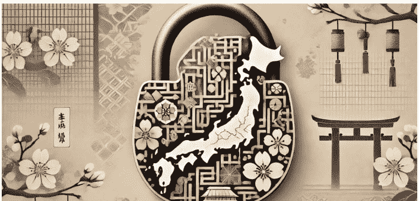

我是徐弃郁，欢迎来到《日本简史》。

前一讲我们讲了丰臣秀吉侵略朝鲜的战争。在丰臣秀吉病死后，另一个大领主德川家康在混乱中最终胜出，统一了日本，在江户（也就是今天的东京）建立了日本最后一个幕府。这就是江户时代，又被称为德川幕府时期，持续到明治维新才结束。这一讲，我们就来说说日本的江户时代。

### 固化：江户时代的大治与代价

这个时代非常有意思，它承接着前面一百多年的日本战国时代。总体来看，有点像我们中国说的从大乱到了大治。为什么说有点像大治呢？因为江户时代的日本高度稳定，一共 260 多年时间，没有爆发一场战争，甚至连稍微有点规模的农民起义都没有。再看经济，江户时代开始的一百年中，日本的耕地数量增加了将近一倍，说明农业发展迅速，另外商业也繁荣起来，江户、大阪这些城市的规模扩大很快，并且形成了强大的商人社会，著名的三井财团就是从江户时期的绸缎商人开始起家的。

但是我这里也要告诉你，这种像是大治的局面并不是没有代价的。这里面最大的代价就是日本社会的固化。要知道，德川幕府为了在一百多年的战乱以后，可以创造一个稳定有序的社会，几乎把所有日本人的等级和身份都固定了下来。

具体怎么做的呢？首先它把社会划成四个大的等级：士、农、工、商，士就是武士，只有武士能当官，其他等级的人都是平民，不许当官。而且，每个等级里面还有细分，比如农民就有不同等级的农民，分为地主、自耕农、佃农还有没有土地的农民。更重要的是，

江户时期不光是把等级固定了下来，实际上也把身份（或者说职业）也固定下来了。

你家如果是农民，那子子孙孙都必须是农民，如果是商人，那必须世代经商，统统都不许改行，更不能同时去做其他的职业。所以用一位日本学者的话来说，

> 在江户时代，几千万日本人就像被限制在几千万个小格子里，动弹不得。

这种影响直到今天还能看得到，你如果到日本去，会发现很多日本人从事的职业都有家族特点，往往是他（她）的父辈甚至是几代人都在干这种活。这和我们中国很不一样。

### 锁国：江户时代极端的锁国政策

不过，这种固化并不是这一讲的重点。这一讲重点要说的是另一种固化，那就是江户时代日本的“锁国政策”。

我们以前学中国历史的时候都知道，中国清朝在鸦片战争之前就奉行“闭关锁国”，后来在英国侵略者的坚船利炮面前才被迫打开国门。那日本的“锁国”是不是一回事呢？

首先要回答，是，日本和“锁国”和中国确实有一定相似的地方。这个“锁国”首先是对自己人的，就是禁止日本船只出海贸易，同时禁止民众去海外。这一点同时代的中日两国的做法都差不多，但到具体执行上，两国还是有区别的。

中国在这方面的执行力度在不同时期有差异，有时很严，有时相对放松，依据各方面情况而定。同时，因为地方太大等原因，海上走私贸易从来就没有停过。但日本的情况就不一样了。德川幕府宣布第一道锁国命令以后，在之后七年内又连发四道命令，力度非常大，而且很严酷，规定所有日本人都不准出国，如有违反将处死刑。那已经在外国的怎么办呢？规定不许回来，否则不问理由一律处斩。在走私贸易方面，日本因为地方小，再加上江户时代那种管理模式，也查禁得非常彻底。所以在德川幕府的统治下，之前在海上活跃了一百多年的日本海盗（或者说倭寇）、日本走私贸易船、合法贸易船，统统都不见了。

江户时代的“锁国”政策确实把整个日本都严密地锁了起来。

但是请你注意，我们今天的人往往会被“锁国”这两个字误导，觉得“锁国”就是完全封闭起来，不和外界交流。但其实不是这样。

而在对待外商方面，“锁国”政策往往都会留一个很窄的口子。当时清政府就留了广州这个口子和外商继续做贸易，日本在这方面的做法也有一点类似。

德川幕府宣布锁国以后，规定所有外商只能通过一个城市口岸和日本做生意，这个地方就是长崎，别的地方一律不许去。但和中国不一样的是，日本对谁来做贸易也做了严格限制，把之前的一些欧洲商人，像葡萄牙人、英国人全部赶走。后来葡萄牙商人派遣使者要求重新通商的时候，幕府干脆下令把使者处死，把船烧掉。

所有欧洲国家中，只有一个国家继续和日本做贸易，那就是荷兰。为什么只留下荷兰我待会儿再说。另外，还有一个国家，那就是中国。

### 控制：极端锁国政策的缘由

听到这里，你可能要问，那为什么日本要实行这种锁国政策呢？这里的关键就是对国家的控制问题，首先就和禁止天主教有关。这是怎么回事呢？因为当时罗马天主教会非常积极地往东亚派传教士，有不少传教士就搭葡萄牙商船到了日本（因为葡萄牙就是天主教国家）。但随着日本信教的人越来越多，德川幕府觉得问题大了。为什么呢？因为日本传统的宗教是佛教和神道教，而幕府长久以来都通过控制这两种宗教，来巩固自己的统治。而天主教大量传入当然会削弱佛教和神道教在日本社会的地位，从而间接地削弱幕府的权威。

所以德川幕府发布禁教令，命令所有传教士离开日本，同时对日本已经信教的人群开始镇压。几年以后，幕府发布“锁国”命令，主要目的之一就是巩固之前取缔天主教的成果，把日本人和欧洲传教士完全隔离。

锁国政策控制的另一个对象，就是各地的领主，也就是我们之前讲的“大名”。这个也很好理解，你想，如果日本保持之前的开国状态，那些大名可以自由地和外国做生意，不光可以积攒起大量的钱财，而且还能私下进口军火，时间一长，幕府又控制不了那些大名的了。而一旦“锁国”，那所有的外贸都在幕府的管控下，对那些大名的钱袋子、刀把子，幕府都一清二楚。

除了控制基督教传播和各地领主的势力之外，锁国政策的另外一个目的就是突显幕府的权威。可能是因为之前日本战国的教训太惨痛了，所以德川幕府上台以后非常注意突出自己的权威。它把日本各行各业全部设下限制也好，把国家整个“锁起来”也好，其实也都有显示权威的意思。这里就要说到荷兰商人了，我们前面提到中国和荷兰是仅有的两个被允许和日本做生意的国家。允许中国好理解，因为中国和日本传统上就有大量贸易往来，那为什么允许荷兰呢？首先，荷兰是新教国家，它和派遣天主教传教士无关，更重要的是荷兰人的身段比其他欧洲国家放得低。

要知道，荷兰为了能继续在日本做生意，必须接受一系列的条件，其中包括要和其他小国的使者一样去拜见幕府，而且不光要磕一连串的头，还要按照幕府将军的指令，一会儿脱衣服，一会穿衣服，还要被迫唱歌跳舞、扮演酒鬼。那为什么让他们做这些呢？其实很简单，就是为了向日本人和外国人显示幕府的权威：你看，我让他们干什么，他们就得干什么。

所以你看，江户时代日本的锁国政策，从内在动力到外在表现实际上都是和德川幕府加强了对国家、对社会的控制联系在一起的。正是因为如此强有力的控制，才使得日本出现了两百六十多年的稳定或者说固化状态。

## 总结

好，这一讲到这里就结束了。总结一下：

江户时代的日本实现了从战国时代大乱到大治的转变，但它的代价是社会的固化。此外，为了巩固自己的统治，江户时代的幕府实行了极为严格的锁国政策。但是国家也好、人也好，都不可能无限制地固步自封，一旦面临大的外力，就可能出现颠覆性的变化。这就是下一讲的内容——日本如何开国？

我是徐弃郁，我们下一讲再见。

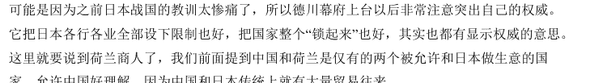

公众号
懒人搜索
懒人专属群
微信:lazyhelper

## 08 | 开国：日本为什么只向“黑船”屈服？

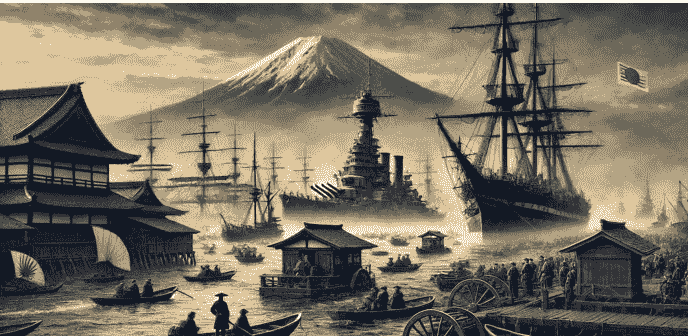

懒人专属群的群友，你好！

我是徐弃郁，欢迎来到《日本简史》。

上一讲我们说了日本江户时代持续了 200 多年的“锁国”政策，这个政策巩固了幕府的统治，而代价是国家的封闭和社会的固化。那么这个“锁国”政策是怎么打破的呢？讲到这个问题，很多书里都会提到“黑船事件”，说当时美国派出一支由海军准将佩里带领的舰队到达日本，这支舰队的船被漆成了黑色，日本人管它们叫“黑船”。日本人看到双方实力相差悬殊，就放弃抵抗，迅速签订条约，同意打开国门，锁国政策从此结束。

但是这种只是一般性的描述，虽然没有错，但忽略了很多东西。比如日本的国门确实是美国人佩里的舰队打开的，但美国舰队并不是第一个对日本提这种要求的西方国家。至少在 19 世纪初，俄国船和英国军舰都曾经到过日本，但幕府都没理会，而且还颁布了《异国船只击退令》，就是规定外国船只一旦接近日本海岸就可以开炮。此时距离佩里舰队到日本不到 30 年。所以这么一说，问题就来了：为什么日本之前那么有决心，结果佩里舰队一来就变了呢？是不是像有些书上说的，因为日本对外界的反应特别快，一看形势不对就马上认输？应该说，这两个问题是理解日本如何开国的关键。

### 鸦片战争：日本开国的关键

首先我们看一下，为什么日本 20 多年前还很有决心，20 多年后佩里舰队一来就屈服了呢？你如果把这段时间世界的大事年表列一下就会发现，这 20 多年时间里面东亚发生了一件大事，那就是第一次鸦片战争，中国清政府战败。要知道，日本这个国家对外界变化还是比较敏感的，即使在“锁国”状态下也不例外。

第一次鸦片战争对日本冲击非常大，觉得中国这么大一个国家都被打败了，那日本能不能抗得住西方的侵略？而且考虑这个问题的不光是日本的统治阶层，还包括一些知识分子。这些知识分子讨论问题还要更深一步，那就是诺大一个中国为什么会败给英国这样一个小国？当然，他们不可能想出准确的答案，但这说明，在佩里舰队到达之前，日本有不少人已经在考虑，一旦西方舰队来了该怎么办。所以说，从“锁国”到“开国”这个变化实际上是经过了比较长的考虑，而不是看到美国舰队才马上转变的。

### 尊王攘夷：日本藩国的反抗

好，接着再看另一个问题，日本是不是一看形势不对就马上主动认输？应该说，这种说法用来形容当时的日本幕府肯定没错。佩里的舰队到日本后，日本幕府知道大势已去，所以很快就和美国签订了条约。在“幕藩体制”下，幕府是中央决策者，但离不开地方上 200 多个藩国（也就是诸侯领地）的支持。那这些藩国什么态度呢？很有意思，多数都表示坚决不接受“开国”，而且明确指责幕府出卖了日本。很快，出现了“尊王攘夷”。什么意思？尊王就是要重新把天皇抬出来，因为你幕府丧权辱国，没有资格再发号施令了，让天皇来。“攘夷”就是要武装抵抗西方人。这个“尊王攘夷”派最主要代表是两个藩国，一个叫萨摩藩，位置在今天日本九州岛的南端，一个叫长州藩，在本州岛的最西端。这两个藩国都处在沿海地区，而且军备是各藩中最强的，所以也很自信。结果在“黑船事件”十年之后，这两个藩终于在行动上实现了“攘夷”：先是萨摩藩和英国军舰爆发了“鹿儿岛之战”，然后是长州藩炮击美、法等国船只，而英美法荷兰组成联军回击。你看，其实“黑船事件”后马上主动认输是处在中央政府地位的幕府，地方势力并没认输。但问题是，这两次“攘夷”行动的结果怎么样呢？这种结果没有什么悬念，这两个藩全部战败。不过到这个时候，真正戏剧性的事情发生了。那就是萨摩藩和长州藩马上意识到打不过西方军队，“攘夷”不可能，那怎么办？立即认输，谈判求和，换句话说就是及时“止损”。但打完仗也不只是求和的事情，西方人还要索赔款，结果这萨摩藩和长州藩也痛快答应了。不过你要注意，这里痛快认输只是第一步，真正重要的是第二步，这两个藩认输了以后居然马上就提出向敌人学习，而且这个学习的态度还很彻底，直接把自己的军队解散，出钱让英国人、美国人帮着训练新式军队。这种转变之快，当时英美这些西方人也感到奇怪。美国学者本尼迪克特写过一本关于日本非常有名的书，叫做《菊与刀》，书里就谈到了西方人对这一段历史的评论，说这些曾经是攘夷急先锋的藩出现了这么大的转变，确实体现出来了“现实主义和冷静态度”，但西方人对这种做法背后的复杂动力还是不好理解。实际从历史上看，这种被强者打败后的急转弯很有日本特色，之前讲“白江口之战”的时候就提到过，只不过当时是加紧向唐朝学习，此时是加紧向西方学习。

### 幕藩之战：注定失败的幕府

到这时，按理说在黑船事件这个问题上，幕府和藩国之间已经统一了战线，没有矛盾了。但这接下来的事情就更有意思了，双方不仅没有握手言和，反而矛盾更深了，甚至发展到兵戎相见。那双方新的矛盾是什么呢？

那就是向西方学习的力度问题。

原先幕府不是因为不战就打开国门被骂吗？但当当时骂幕府骂得最厉害，也是最积极的“攘夷”派此时突然转变风向，那他们还骂幕府呢？当然骂，不过此时不是骂幕府丧权辱国、被迫打开国门，而是骂幕府太保守，开国开得太慢，所以仍然是让幕府赶紧下台，让天皇成立新政府，搞大改革。所以你看，在和西方打过仗以后，实力最强的萨摩藩和长州藩从原来“攘夷”的急先锋一下子变成了开国维新的急先锋。

最后他们和幕府的矛盾激化，也就在他们败于西方三四年以后，萨摩和长州的军队打败了幕府军队，最后成功推翻幕府统治。

幕府为什么失败呢？不少书上说，因为幕府太保守，军队都是旧式军队，而萨摩藩、长州藩这些地方势力都是西方人训练的新式军队，所以最后较量的时候幕府只能失败。应该说，这个回答逻辑上没问题，但事实并不是这样。事实是，幕府也在引进西方的技术和资金，一方面在修建铁厂，一方面购买了至少一万多支步枪，而且还请了法国军事顾问，把原来的武士军队变成由步兵、炮兵和骑兵组成的新式军队。所以你看，幕府并不保守。当时的实际情况是幕府和反对派之间在展开一场竞赛，比谁能更快更有效地区开国维新。但问题是，在这场竞赛中幕府注定失败。

为什么？你想，幕府统治是建立在旧的政治和经济结构上的，我们前一讲说了，江户时期的日本好像是被无数条绳索固定下来的社会，而“锁国”是这些绳索中最重要的一条。等“锁国令”一取消，贸易和交流一下子暴涨，日本社会原有的结构马上就撑不住了，很多问题集中爆发。其中比较突出的就是物价，像大米的价格几年内就涨了 700%，社会骚乱、农民起义超过了过去两百多年中的任何一年。在这种情况下，幕府作为中央政府，当然要为所有这一切负责。但责任和矛盾集中到它头上，权力呢？就像我们之前讲的那样，幕府统治时期日本的国家权力仍然是分散的，幕府手中并没有足够的权力来应对这种乱局，更不可能来推进一次全国性的大变革。所以在责任和矛盾集中于幕府的时候，权力却没有集中到它手里。在这种情况下，幕府的倒台是必然的。

## 总结

好，到这里，这一讲就结束了。总结一下：

中国在鸦片战争中的失败对日本影响很大，所以美国舰队来日本后，幕府迅速放弃锁国政策。但是，地方藩国提出尊王攘夷的口号，向西方开战。失败之后，藩国立刻转变了态度。幕府和藩国的矛盾由是否开国之争，转变为向西方学习的速度之争。最后，内战爆发，幕府倒台。

不过，从日本的角度来说，要摆脱困境就必须大变革，推翻幕府只是第一步，接下来，日本将进入它近代史上最重要的变革，明治维新，这也是我们下一讲的内容。

好，我是徐弃郁，我们下一讲再见。

公众号
懒人搜索
懒人专属群

## 09 | 集权：中央集权为何是明治维新的关键所在？

重新加强天皇的权威。

所以明治维新一开始，他们就安排明治天皇到日本各地去巡视，让普通民众看到天皇，显示天皇确实在直接统治。要知道，在德川幕府统治的 200 多年里，日本天皇离开首都到外地的次数总共只有 3 次。而明治天皇出巡了多少次呢？他在位 45 年出巡了 102 次。所以你看，这个力度还是非常大的。另外明治政府还用期刊、报纸这些近现代的宣传工作，把日本一些所谓传统说法，像什么“日本是神国”，“天皇是天照大神的后代”这种充满上古传说的东西，都向全国各阶层灌输，而且进入学校教育。所以你看，日本明治维新的“尊王”就是一个精心设计的工程。

### 废藩：不可能完成的任务

但是，光“尊王”还不足以确立日本的中央权力。我们以前多次提到，日本这个国家由于地理、文化传统等原因，地方势力一直很强，很容易就把中央权力给架空了。所以明治维新在“尊王”的同时，还有相当一部分精力放在削弱地方势力，也就是原先那 200 多个藩主。

那怎么个削弱法呢？其实也不复杂，分为两步。

- 第一步，收权。

原来藩主在自己领地上基本可以说了算，属于高度自治。现在不行了，原有的地方自治权统一收归中央政府。两年以后，明治政府再走第二步，把 200 多个藩直接废掉，改设府和县，主管官员由中央政府统一任命，也叫“废藩置县”。

这和我们秦始皇废除分封制，改行郡县制很像。你想，这样一来，那些藩主祖上世世代代传下来的封地一下子就没，按理说，出现大规模反抗非常正常。而且从中国和西欧的历史来看，结束地方势力这种封建建国状态，都是要经过反复战争和较量的。但日本的情况比较奇怪，200 多位藩主都乖乖地接受了这一切，中央政府的“废藩置县”完成得非常顺利。当时英国驻日公使对此也非常惊讶，认为日本中央政府完成了一个“不可能的任务”。那为什么明治政府在这方面那么顺利呢？

首先得说一下实力对比的情况。当时虽然有 200 多个藩，但最强的几个藩，像萨摩、长州等等都是维新的强硬支持者，它们对国家的危机情况了解得比较清楚，行动坚决，其他的藩即使反对也不可能有大的效果。

第二个原因，那就得说到明治政府的提前设计了。客观地讲，明治维新的那些操盘手把问题还是想得很周密的，一方面他们对那些被废掉的藩主给出了很优厚的条件，不仅保证贵族头衔，而且俸禄非常高；另一方面他们也对那些藩主做了大量游说工作，说这一切都是为了日本这个国家的未来，激发他们的情感。当然，政治从来都是需要为最坏可能做准备，明治政府在这一点上也很现实，所以在宣布废藩的时候，政府提前把一万多最精锐的部队集中在首都地区，随时准备动手。可以说，正是在这几个因素的共同作用下，日本才能在短短几年内实现中央集权。

### 征兵制：集权成果的着重巩固

当然，为了巩固这一成果，明治政府还有非常关键的一步，那就是军队重建。日本不是要建设新的近代化军队吗？那参军的人从哪里来？很多人主张还是从传统的武士阶层中挑选，但最后明治维新的几个操盘手否决了这个方案，而是采取全国普遍义务兵役制，或者叫做征兵制。规定不论什么行业、什么家庭出身，年满 20 岁的男子都要服三年义务兵役。这样建立起来的一支新式军队和其他地方权力都没有关系，直接听从日本天皇或者说中央政府的命令。

为什么明治政府要这么做呢？其实也很简单，这样一来日本中央政府就有了一支可靠的军事力量，不用再担心地方势力坐大，另外因为各地的年轻人都来参军，混编在一起，这也有助于打破原来那种根深蒂固的地方意识。但最重要的是，这个措施解决了日本好几百年来的一个老问题——武士问题。

我们之前讲过，为什么日本会出现幕府统治？为什么幕府之下还有各个地方的藩主？因为国家的军事力量由专职的武士阶层组成，所以这个枪杆子阶层有自己的一整套逻辑和价值观，不仅容易架空天皇，而且很容易转化为地方割据势力。但是明治政府推出普遍义务兵役制以后，原来作为专职军人的武士就没有存在意义了，更重要的是武士阶层原来非常骄傲的那种身份感也没了，因为原来被他们看不起的农民、商人都来参军。

这就相当于是把武士的职业圈子彻底给废了，属于釜底抽薪，使得日本的地方势力不可能再搞武装割据了。

讲到这里我就要说当时的一件大事。就在义务兵役制实施的 5 年以后，萨摩藩这个地方出现了武士叛乱。你可能觉得奇怪，萨摩藩不是支持明治维新最积极的一个地方吗？怎么会出现叛乱呢？但奇怪的不只这个，我还要告诉你最后出来领导这场叛乱的还是明治维新的“三杰”之一，叫西乡隆盛，曾经是维新派最主要的军事领导人。这场叛乱的关键，还是在于武士阶层的不满，因为萨摩藩这个地方的武士群体非常庞大，当他们发现明治政府最后是要把武士阶层彻底废掉后，开始失控，最后演变成叛乱。有意思的是，叛军一开始根本看不上政府军，觉得那是由农民、商人这些老百姓组成的军队，和他们这些名门正派的武士没法比。结果却是叛军失败，而且用的时间不长，2 月起兵、3 月败退，9 月就彻底被平定了。别的地方一看，实力最强的萨摩武士都被政府军轻松打败，说明武装割据已经完全行不通。所以这场叛乱实际上是对明治政府的一次测试，它的失败也标志着明治维新的中央集权真正确立。

所以从日本明治维新建立中央集权的整个过程来看，这件事情本身就是一个大的系统工程，里面包含了各种设计，也包含了各种较量。

## 总结

好，到这里，这一讲就结束了。我们来总结一下：

明治维新的成功固然离不开一系列先进的国家政策，但其中最核心的是中央集权的建立。从推崇尊王到废除藩国再到重建军队，维新派系统设计了一整套工程，为明治维新的顺利进行奠定了坚实的基础。

可以说，实现中央集权是整个明治维新过程中最难、最关键的一步，也是其他所有变革的前提。

但是，有了足够权力以后，明治政府到底要把日本往什么方向变革？怎么变革？这些方向性问题的解决和一次影响深远的出国考察密切相关，这就是我们下一讲要说的岩仓使团。

我是徐弃郁，我们下一讲再见。

公众号懒人搜索，懒人专属群分享

## 10 ｜考察：岩仓使团为什么能够决定日本命运？

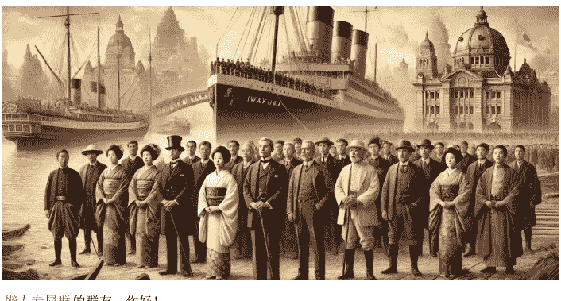

> 懒人专属群的群友，你好！
>
> 我是徐弃郁，欢迎来到《日本简史》
>
> 日本明治维新和一千多年前的大化改新一样，关键是两大部分，一是实现中央集权，二是向别国学习。上一讲我们围绕中央集权，讲述了维新派精心设计的系统工程。这一讲我们重点来看一下，日本是如何向别国学习的。说到学习别国，大化改新时期的日本就已经有这个习惯了，只不过那时它是学习唐朝，此时它是学习西方国家。但是学习西方到底学什么呢？怎么学习？日本自己的发展方向是什么？目标是什么？你一听就知道，
>
> 这些问题都是
>
> 方向性问题，最终将决定维新的成败。
>
> 但对于这些问题，搞明治维新的那帮人一开始并没有答案。那什么时候才有答案呢？这就要说到著名的
>
> “岩仓使团”
>
> 了。
>
> 1871 年，也就是明治维新开始的第四年，日本政府派出由
> 岩仓具视
> 率领的使团出国考察。考察结束以后，我们前面提到的那些方向性问题全部都明确了下来，日本马上出台具体政策，维新变革全方位深入。可以说，
> 岩仓使团的出访是日本历史上最重要的出国考察，甚至是决定日本国家命运的。
>
> 但是你要知道，在岩仓使团之前，日本的幕府也派出过好几个使团，还派出了留学生。如果我们再把视野放大一点，会发现近代史上，面临西方殖民威胁的其他国家也派出过不少这类使团。那问题也来了，
> 为什么只有“岩仓使团”的考察发挥了这么重要的历史作用？

### 人员核心：决策者就是考察者

> 要回答这个问题，首先我们可以看一下
> 使团的人员构成
> 。岩仓使团规模非常大，总人数超过 100 人，其中官员就有 46 人。有意思的是，这些官员非常年轻，除了率团的岩仓具视岁数较大（46 岁）以外，其余绝大多数都不到 40 岁，实际平均年龄只有 32 岁。
>
> 这样一支年轻的队伍肯定比较有利于吸纳新事物。

但你要注意，这些人也不是一般的年轻官员。作为领队的岩仓，当时职务是明治政府的右大臣，相当于政府的二号人物，另外财政、工业、外交等政府核心部门的一、二把手也都在使团里面，其中就包括后来出任政府首脑的大久保利通和伊藤博文。所以你看，
  这个使团成员不光人数多、规格高，而且普遍掌握实权。
  实际上当时明治政府是把一半的核心成员留守，另外一半的核心成员放在这个使团里。可以说在整个世界近代史上，把那么多政府核心成员放在同一个使团出访，这样的做法也是绝无仅有的。
  这反映出当时日本明治政府对这次出国考察的重视程度，同时你也可以看出来当时日本学习西方的意愿和决心。更重要的是，那些
  考察者本身就是决策者，他们考察的成果可以直接转化为政策，效率当然非常高。
  所以你看，光是使团的人员构成就说明，“岩仓使团”的出国考察和其他出访不一样。

### 目标明确：成果直接转为政策

另外，这个使团出访的主要目标非常明确，就是要考察西方为什么强大，日本该如何学习。

  更重要的是，在出访之前，使团就和留守的核心成员达成一致，在使团出访回国之前，政府不推出重大政策，一切等待出访回来再定。这什么意思？这就是说
此 次出访是下一步决策的必要条件，出访的成果将直接转化为政府实际操作。

  说实话，这种出访约定在历史上本身就非常罕见，这进一步说明了岩仓使团的任务不光明确，而且非常重大。实际上，在为使团送行的时候，留守的政府一把手（三条实美）甚至说：“内治外交，前途大业之成败，在此一举。”你看这个期待就更高了，
  把国家命运都和岩仓使团出访联系在一起。

### 行程紧凑：一年十个月十二国

那岩仓使团到了国外以后怎么样呢？说实在的，整个出访过程的安排也属于比较罕见的。使团原计划在国外访问 7 个月，应该说这个时间就不短了，但结果却又延长了一年多。你想，近百人的使团在国外整整待了一年零十个月，前后共访问了欧美 12 个国家，
  这种出国考察的广度和深度不光在日本是空前绝后，在世界上也极其少见。

  顺便说一句，这个开销当然也不可能小，有资料说，岩仓使团花掉的钱相当于明治政府一年财政收入的 2%。所以如果我们把这些都从投入的成本来看的话，那么岩仓使团投入的财力、人力和时间成本都是惊人的。

  所以你看，从人员构成、规模、投入和目标期望等这几个角度来说，岩仓使团都是一种很罕见的情况，取得成功的“势”已经非常强。当然，让这种“势”真正转化为成功的，还是使团那些成员的工作。

### 工作深入：考察范围广层次深

首先是岩仓使团的视野比较开阔，
  考察的内容包括政治制度、贸易、工业、金融、教育、文化风俗等各个领域。换句话说，他们这些人并不是带着一些具体问题到去西方找答案，更不是去购买一些现成的工厂或矿山，而是想去系统深入地了解西方。所以也可以说，
  考察的立意不低。

  另外就是这些人考察工作的扎实和勤奋程度了。从文献记载来看，岩仓使团的行程安排得非常有满，基本上是天天连轴转，白天到煤矿、工厂这些烟尘滚滚的地方参观考察，到了晚上就得赶快回旅馆把脏衣服换成礼服，然后参加晚宴和欧美上层社会进一步交流，可能还要到剧场去看节目。看节目的时候就要拼命打起精神，防止自己睡着。而使团中最勤奋的人之一，就是负责考察工业、贸易的
  **大久保利通**
  ，当时任明治政府大藏卿（相当于财政部长）。这个人对于近代工业几乎达到痴迷的程度，光是在英国苏格兰地区的 40 天考察中，就深入考察了 13 家制造业工厂。他的结论是，西方、特别是英国，之所以富强，主要就是因为工业的发展，而工业的发展又离不开良好的基础设施。要知道，
他的这个结论，直接决定了日本明治维新的经济政策走向。

更难得的是，
这些人在考察西方的成果时，不光看到了面上的技术、财富、工业和贸易，还看到了更深一层。

比如上面讲的大久保利通就看到了财产权保护对经济的促进作用。他认为，英美等国家之所以能广泛调动国民的积极性，根本原因就是他们的财产权受到法律的严格保护。所以使团回国后，马上就废除了一些随意处置个人财产的特权，后来更是把“不得侵犯日本臣民的所有权”写进了宪法。

另外还有一个重要成员叫
**木户孝允**
，这个人也看得很深，很远。

他抓住了西方发展背后的另一个重要因素，那就是系统的学校教育和科研投入。

他的结论是，日本要赶上西方，必须重视教育，说“立国之本，惟在用人，而期望人才千载相继而无穷者，（也就是想要人才源源不断），惟在于教育而已”。

这个结论对后来日本大力普及教育起了非常重要的作用。

总的来看，这种
**高强度、宽领域的考察**
让使团成员对西方确实有了深入了解。一位著名的使团成员用“始惊、次醉、终狂”来形容自己心理的变化：开始是惊讶，然后是沉醉，最终是狂热，也就是狂热学习西方。

### 清醒务实：有选择地学习西方

不过你也要注意，狂热归狂热，岩仓使团的主要成员同时还是保持了一份清醒。首先他们看到，
日本和西方之间的差距也不是不可克服的。

为什么？因为他们发现，西方文明真正的繁荣是在 1800 年以后才实现的，其中“最近的四十年表现得最为显著。”如果西方可以通过几十年实现如此进步，那么日本也完全可以奋起直道。另外就是
在“学谁”的问题上，使团也比较务实。

在他们看来，虽然英美的实力最让人羡慕，但它们的发展道路也好，政治体制也好，并不适用于日本，用前面提到的大久保利通的话来说，“不适用于习惯旧习，固守宿弊之国民”，意思是日本人比较固守传统，走不了英美的道路。相反，他们认为新近统一的德国，在国情方面和日本有诸多相似，可以成为日本学习的重点对象，这一条基本上是
**岩仓使团的共识**
。从后来日本明治维新的发展来看，无论是工业贸易，还是宪法，还是军事制度确实都体现出很强的模仿德国的色彩。

所以你看，岩仓使团的清醒和务实，也进一步保证了这次出访的作用和影响。

## 总结

讲到这里，岩仓使团的重要性和成功原因都讲完了。我们总结一下：

除了中央集权，学习西方是明治维新之所以成功的另一个重要因素，而岩仓使团在其中的作用至关重要，正是由于它们，明治维新的变革方向才得以确立。而岩仓使团之所以能够完成如此成功的考察，一方面在于考察人员足够核心、考察目的非常明确、考察行程十分紧凑；另一方面在于考察范围广层次深、人员工作及其勤勉、清醒且务实。

根据岩仓使团回国后提的各种建议，明治政府迅速采取了一系列措施，其中最基础、也最关键的就是经济政策。这也是我们下一讲的主题。

好，我是徐弃郁，我们下一讲再见。

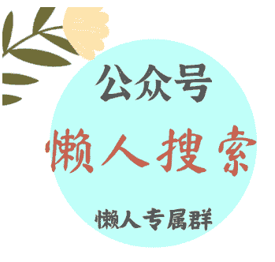

## 11 腾飞：近代亚洲为什么日本能够率先实现工业化？

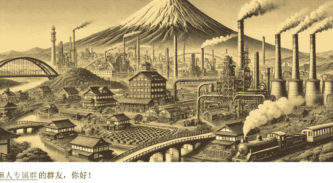

懒人专属群的群友，你好！

我是徐弃郁，欢迎来到《日本简史》。

上一讲，我们讲到决定了明治维新命运、乃至日本命运的岩仓使团。岩仓使团回国以后，日本政府很快就根据使团出访的成果，推出了

“富国强兵、殖产兴业、文明开化”

这三大政策。富国强兵、文明开化都好理解，那殖产兴业是什么意思呢？“殖”在这里可以理解为发展、扩长的意思，所以殖产兴业意思就是，发展经济生产，实现工业化。这也是三大政策中，最基础、当时日本政府最重视的政策。

那日本在这方面成功没有呢？我们看一下数据：从 1874 年这些政策全面推开到 1912 年日本明治天皇去世，三十八年间，日本的制造业产值增加了将近 4 倍，纺织业产值增加了将近 15 倍，钢铁产值增加了 26 倍，机械制造增加了 62 倍。你看，这个增长率就很高了。再从占比来看，制造业占 GDP 的比例从原来的 5% 上升到了 15.6%，出口产品中工业制成品的比例从原来的 3% 上升到了 31%。这说明，

“殖产兴业”这项政策是成功的，不仅让日本经济在量上面得到了快速扩张，而且在“质”上也觉了飞跃，从原来一个完完全全的农业国成了一个基本实现工业化的国家。

要知道，在近代史上的亚洲，做到这一点的只有日本一家。那问题也来了，日本为什么能做到这一家呢？这就是我们这一讲要回答的问题。

### 既有优势：强大的工商阶层

很多学者研究明治时期日本经济的时候，都指出了一个很有意思的现象，那就是

在明治维新开始的时候，日本已经有了一个很强的工商阶层。

怎么回事呢？这就要说到之前的江户时代了。我们在第 7 讲提到过，江户时代的日本严格规定所有人等级和身份，不许人们干身份限制之外的事。像地位高贵、掌握政治权力的贵族和武士就不能参与商业，因为这属于低贱的行业，只能由低贱的商人阶层来做。不过有意思的是，这种限制也产生了一个副产品，那就是把政治权力和商业利益隔离了。你看武士有政治权力吧？但他们不能进入商业领域，所以日本商人的社会地位虽然很低，但他们在商业这个特殊的领域之内却有相当大的话语权，不用担心贵族和武士阶层进来和他们争抢利益，所以反而发展起来了。时间一长，

江户时代的日本就形成了一个人数众多而且掌握大量财富的商人阶层。

他们手里的财富多大呢？有研究认为，美国佩里舰队到来之前，商人阶层掌握的财富占日本全国财富的 85% 以上，远远超过贵族和武士。所以当明治维新开始的时候，实际上日本已经有了一个非常强大的商人阶层，不可否认，这对明治时期工业和经济发展非常重要。

### 政府入场：引领民间资本

当然，

更重要的是当时日本政府的政策。

讲到这里，就得说一下岩仓使团中的一个重要成员，那就是我们前一讲提到过的大久保利通。他回国以后就成为日本工业化和经济发展的总负责人，

他的主要政策思路就来自欧美考察的两项经验：一是推进基础设施建设，二是发展工业特别是制造业

。但具体怎么做呢？这里有一个很重要的模式选择或者说道路选择问题。要知道，欧美的工业化道路几乎全是靠民营企业，走的是自由经济道路，那日本是不是也要和这些国家一样？在这个问题上，大久保利通的思路很清楚。他考察欧美的时候，最崇拜的是英国工业化的成就，最想学的也是英国，但他认为

日本在发展模式上不能学英国。

理由很简单，因为国情不一样。按他的说法，日本民众“气性薄弱”，整个国家“民智未开、民业未进”，在这种情况下日本政府必须担任引导者的角色。用他的话来说，国家和人民的贫富“虽依赖于人民致力于工业与否，但寻其根源，又无不依赖于政府官员诱导奖励之力”，所以

要自上而下地推动经济。

事实上，日本政府也是这么做的，而且力度非常之大。我们可以看一下当时日本政府内部的资源分配。当时日本政府负责“殖产兴业”的是三个部门，分别是大藏省、工部省和内务省。其中大藏省主要负责融资和资金调拨，工部省主要负责铁路、矿山和机械制造，内务省主管农牧业和农产品加工。在明治维新初期，这三个部门基本上成了日本政府最重要的部门，它们占了多少财政资源呢？这三个部门的经费占到了当时日本政府全部经费的 41%，人员占到 53%。这种极度优先的资源分配比例就说明，明治政府对于发展工业和经济不光是全力以赴的问题，甚至可以说是在孤注一掷。

那明治时期的日本政府主要做了哪些事情呢？

首先当然是基础设施，重点是修建铁路。

这也很好理解，因为铁路修建需要的投资规模大，回本的周期又长，当时日本民间资本普遍不敢投，所以日本最初的 180 多公里铁路全部是政府投资、政府经营。其中第一条铁路也就是东京到横滨的铁路通车的时候，日本明治天皇还出席通车典礼，而且邀请一些国外高官上车体验首次火车运行，军舰还鸣放 21 响礼炮。从这些细节安排你也可以看出，当时日本政府对铁路建设这件事情有多么重视。

政府推动工业化的第二个重点就是兴办制造工业。

当时下力气最大的是两类企业，一是和军工相关的，比如像造船厂，另一类是劳动密集型的纯民用企业，最著名的就是位于日本丰冈的生丝工厂。办这家工厂日本政府投了 20 万日元（要知道这在当时是笔巨款，日本那一年全国的出口总额也才 1700 万日圆），此外，政府还从法国专门进口最先进的机器，雇佣了 400 名女工。要知道，在当时的日本，这样一家工厂无论是规模还是技术都属于超一流的，绝对是示范。而且我告诉你，这一类工厂还真的有个名字，就叫模范工厂

，意思是日本政府希望先把这些工厂办起来，好给民间资本立个榜样，然后大家一起往这个方向发展。

从这些例子你可以看到，

明治政府为了推动经济和工业发展，它是直接“入场”

的，而且投入了大量财力和精力，对工业化起到了很大的推动。

不过，如果只讲到这里，明治维新的经济政策并没有显得那么特别。你想，清朝洋务运动的时候，清政府也搞过一些官办企业。这里真正特殊的一点就是，

明治时期日本政府的经济投入有一个明确的目标，那就是引领民间资本，一旦这个任务完成，也就是民间资本跟上了以后，政府是要从经济运行中“退出”

的。

实际上明治政府真正全力投入基建和制造业的时间不到 10 年，1880 年，日本政府颁布了“官业下放令”。什么意思？就是把原来政府经营的产业大量转卖给民间，让私营企业来经营，政府要“退出”了。

如果说一开始日本政府直接“入场”经济领域的力度巨大的话，那

日本政府这一拨“退出”的力度同样很大，给了私营企业大量的优惠政策。

就拿铁路建设来说，日本政府不光是允许民间资本修铁路，而且在第一个私营铁路工程的时候，政府直接免掉了私营企业修铁路所用土地的租金，这相当于白送了企业一大笔资金。此外，政府还出面担保，让所有参加项目的股东每年可以拿到本金 8% 的利息。为什么这样做呢？就是确保私营企业能够从市场上筹到足够的资本，然后给全国树立一个成功的先例。所以你看，这个力度确实可以。

那效果如何呢？应该说，日本政府这一拨“退出”政策的效果还是相当不错的。我们还是以铁路为例，因为在政府的精心保护下，第一个私营铁路项目非常成功，这就引发了日本全国性的铁路投资热潮。就在明治政府颁布“官业下放令”10 年以后，日本的私营铁路长度已经超过了官营铁路，20 年以后更是达到了官营铁路的 3 倍。整个日本的铁路运输和相关制造业也因此迅速发展，到 1912 年也就是明治天皇去世那一年，第一辆完全由日本企业自己制造的蒸汽火车开始上路。这就标志着日本铁路业完成了一个飞跃。

## 总结

好，这一讲的内容就到这里，总结一下：

岩仓使团考察回国之后，日本提出了“富国强兵、殖产兴业、文明开化”

三大政策，实现了从农业国向工业化的初步转变。其中明治政府适时的入场和退场扮演了重要作用。入场时期，日本政府投入巨大的人力和财力，进行基础设施建设、兴办制造工业。退场时期，日本政府通过减免租金、出面担保等方式，给予私营企业大量的优惠政策。

从这里我们也可以看到，明治维新日本经济和工业化发展中，政府这个“看得见”的手确实扮演了非常重要作用，无论是它的“入场”还是“退出”，都对日本经济产生了巨大的推力。

不过，我这里要补充一句，凡事都有利弊。日本政府这些做法也产生了一个重要的副产品，那就是日本的财阀由此出现。这也是我们下一讲的内容。

我是徐弃郁，我们下一讲再见。

## 12 借势：明治维新如何促成财阀的诞生？

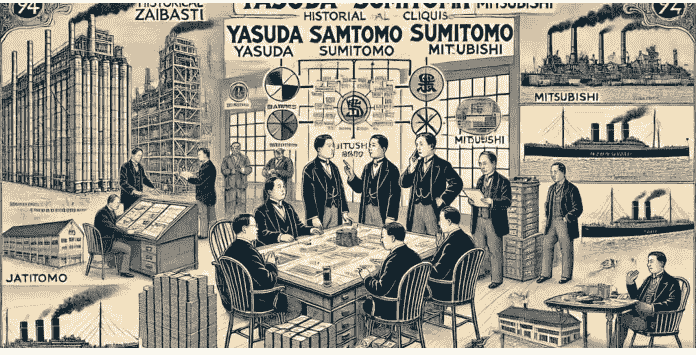

**懒人专属群**的群友，你好！

我是徐弃郁，欢迎来到《日本简史》。

上一讲我们说到，明治政府用入场和退场的方式，引领和扶持当时日本的民间资本，促进了经济的腾飞，实现了向近代工业化国家的转变。但是，在明治政府扶持日本民间资本的过程中，另外一种力量也成长起来，这就是财阀。

你如果经常看有关日本的信息，那对于

“财阀”

这个词肯定不会陌生。现在日本最出名的那些大企业基本上都起源于财阀，比如三菱重工就属于历史上日本的三菱财阀。

财阀对日本这个国家来说实际是一把双刃剑

，一方面它对日本工业化产生过重要的推动，特别是在明治维新后的现代化进程和二战前的工业扩张时期。但另一方面，日本在走向军国主义道路、发动侵略战争的过程中，财阀也起到了关键性的支持作用，而且大发战争财。所以二战结束后，盟军改造日本的一个重要步骤就是解散财阀，但它们仍然以其他的形式延续了下来，至今还在对日本的政治和经济发挥影响。

那到底什么是财阀呢？财阀又是怎么来的呢？可以说，如果这两个问题不回答，那可能就谈不上学过日本近现代史。

### 什么是财阀？

好，先简单说一下财阀。

财阀这个词来自日语，二十世纪初由日本的媒体首先使用，用来称呼那些具有垄断性质的经济巨头。

最著名的是四家：三井、三菱、住友和安田（这些名字你可能都不陌生）。二十世纪初差不多正好是垄断巨头的黄金时代，美国有美孚石油公司、卡内基钢铁公司等巨头，德国则有克卢伯公司、西门子公司，等等。

日本的财阀和欧美这些工业巨头类似，但是有

两个区别

：

第一，日本财阀是严格的家庭控制，自上而下，权力非常集中；而欧美的工业巨头相比起来更多是通过自由市场竞争和企业家精神发展起来的，管理层通常由专业经理人组成，而不是家族控制。第二，美孚、克卢伯这些巨头主要做工业，而多数日本财阀都是工业和金融混合生长。所以

日本的财阀和欧美的垄断型巨头比起来，内部控制力更强，对社会的综合影响力可能也更大。

那这些财阀到底怎么来的呢？这要从三个方面讲起。

## 财阀起源之：政府扶持

首先是明治政府对民间资本的扶持政策。

这就需要回到上一讲的主题——日本明治维新的工业化。我们上一讲说过，当时明治政府推动工业化的力度非常大，有的时候甚至可以用不计代价来形容。

一方面，明治政府大力给民间企业融资。

有个日本学者写了一本书叫《财阀的时代》，书里就讲明治政府给民间企业的融资的事情。他说，当时的日本政府是用国家财政的钱给私营企业贷款，支持它们发展，更重要的是这些贷款事实上大部分都没有按本金和利息完全返还。根据统计，明治维新经济政策全面推进后的七年里，日本政府给私营企业提供的贷款返还率只有 49%，还不到一半，但政府在大多数情况下仍然出具了“贷款已还清”的证明。所以当时明治政府给私营企业提供的贷款实际上不能算完全意义上的贷款，还包括了一部分补助金，相当于送给企业的。

另一方面，明治政府实行资产转让政策，也就是把官办企业卖给私人企业。

我们前一讲讲过，日本政府为了引导工业化，先是自己“进场”，开办各种所谓“模范”企业，为社会做示范，然后时机成熟以后又快速“退场”，让民间资本接受这些企业和资产。那政府资产转让的条件怎么样呢？我告诉你，非常优厚。

首先明治政府采取的是分期付款的方式，时间可以拖得很长，而且不收取任何利息。

你看，这就相当于把未付款项的利息送给企业了。

更重要的是，明治政府把这些官营资产卖得非常便宜，基本上都比原来政府的投入低很多。

比如我们上一讲曾经提到的富冈制丝厂，明治政府一开始的投入就达到 20 万日元，但转让的价格是多少呢？只有 12 万日元，转让的对象就是位居四大财阀之首的三井。不过，

在整个政府资产的转让过程中获益最大的，还是三菱。

比如明治政府为了发展造船业，兴建了一个重要企业叫做长崎造船所，这个企业政府先后投资了 113 万日元，但转让给三菱的价格只有 52.7 万，还不到政府投入的一半。更过分的是两个矿山，分别产金矿和银矿，政府先后投资了 1300 多万日元，结果卖给三菱的价格只有 173 万日元，占政府投资的七分之一还不到。

除了转让企业以外，

明治政府还转让其他类型的资产给民间资本。

这里又要说到三菱的例子。三菱一开始的主营业务是海运，1874 年，日本借口琉球船只遭遇台湾原住民袭击，出兵台湾。因为在 1874 年日本侵略台湾的战争中替政府运送军火，它成了日本第一家受政府保护的民营海运公司。

那这个“受政府保护”什么意思呢？就是它要保证承担政府的海运业务，作为交换，日本政府每年给它 25 万日元的补助金，更重要的是日本政府还把 30 艘从外国购买的蒸汽船无偿交给它使用，后来又以不到一半的价格卖给三菱。以我们今天的眼光来看，明治政府这种做法实际上有点超出支持私营企业发展范畴了，可以说是一种利益输送。有学者就指出，这实际上也是江户时代日本那些“大名”对商人阶层的态度：你替我办事，我给你好处。可以说，

当时正是因为这种利益输送，才使得日本的财阀迅速崛起。

## 财阀起源之：政治商人

不过，尽管明治政府通过给企业融资和资产转让的方式，大力扶持民间资本的发展，但为什么偏偏是三井、三菱这些企业形成了财阀呢？这就涉及到财阀兴起的另外一个原因：

政治商人

，也就是和政府关系密切的商人。

实际上，

我们现在熟知的日本大财阀，在历史上都和政府关系密切，被称为“政治商人”。

以四大财阀为例，三井早在江户时期就为德川幕府搞货币兑换，相当于为政府提供早期金融服务；住友也是在江户时期起家，受德川幕府委托开发铜矿；安田起家于江户末期，也是帮政府进行货币兑换。最晚的是三菱，三菱创始人因为追随当时一个著名的维新志士，因此和明治政府的核心层搭上了线，也成为了政治商人。

在明治维新全面展开的情况下，这些政治商人自然就成为政府各种优惠政策的主要受益者。

如果查一下数据你会发现，除了一部分出口型企业外，那些和政府关系密切的企业明显得到了大量融资，其中得到融资最多的就是后来成为大财阀的三菱，份额超过了明治政府对民间企业融资总额的三分之一，另外三井也得到了占政府对民间企业融资总额将近 10% 的融资。

这些政治商人不仅获得了明治政府的大量融资，而且也成为明治政府资产转让政策的受益者。明治政府明确规定，要让“资金充足、熟悉经营、有能力办好企业”的本国商人来接手这些国家资产，那些受到明治政府扶持的、在历史上就和政府关系密切的商人，自然成为最符合要求的对象。

从这个角度来看，财阀的兴起，

一方面是因为明治政府要扶持私营企业，另一方面是要奖赏那些给明治政府办事的政治商人。同时还有一个原因，那就是原来那些明治时期的官办企业有点撑不下去了。

### 财阀起源之：扭转亏损

这是怎么回事呢？很简单，

明治政府虽然决心很大，投入也多，但直接经营近代化的工业企业还是力不从心。

还是拿我们上一讲说的富冈制丝厂作例子，日本政府前期投入就达到 20 万日元，生产的生丝质量很高，建厂的第二年就在维也纳世界博览会上拿了二等奖。但有一个问题，那就是

亏损

。到建厂的第四年，富冈制丝厂亏损就达到了 22 万日元，超过了建厂的总投资，后来更是一直亏损，成为政府财政的一个沉重负担。另外我们上面提到了长崎造船所（就是后来转让给三菱的那家），也是严重亏损的企业。所以

在一定程度上，明治政府转让官营企业也有解决自身负担的意图。

而三井、三菱那些财阀拿到了政府的廉价资产以后，以一种进取精神把这些企业做了起来。像富冈制丝厂转让给三井以后，很快扭亏为盈，并成为了日本制丝企业的龙头，一直办到 1987 年。长崎造船所转给三菱以后，很快成为三菱重工业的起点，三菱也由此成为日本重工业特别是军事工业的龙头。

## 总结

好，到这里，这一讲就结束了，总结一下：

明治维新期间，财阀这一新兴力量逐渐兴起。作为政治商人，他们借助明治政府的融资政策和资产转让政策，扭转了官营企业的颓势，加快了资本的集中，使日本迅速有了能够在国际竞争中站住脚的大企业，对明治时期日本的工业化和经济起飞产生了积极作用。

但财阀的崛起对日本这个国家来说实际上是一把双刃剑，它控制了日本的经济命脉，阻碍了社会的流动，直到今天也没有根本的改观。如果我们把视野再放大一些，实际上日本整个明治维新也是一把双刃剑，既促进了日本近代化，又给东亚乃至世界带来了战争和灾难。

说到这种“双刃剑”效应，就必须讲一讲明治维新时期日本国民心态的变化，简言之，就是“脱亚”心态。这也是下一讲的内容。

我是徐弃郁，我们下一讲再见。

公众号 懒人搜索 懒人专属群

微信:lzyhelper

# 13-脱亚：明治维新避不开的负资产？

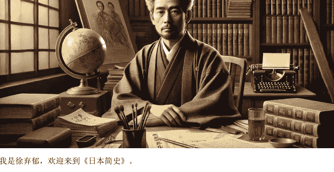

我是徐弃郁，欢迎来到《日本简史》。

上一讲，我们说到明治维新促成了财阀力量的兴起。其实，明治维新给日本带来的变化是全方位的，但主要集中在两个层面，一个是物质层面，也就是经济腾飞和工业化，另一个变化就是在日本的国家心理层面，这里的表现就是所谓的“脱亚论”。

可以说，要读懂日本，“脱亚”论是一个避不开的话题。

很可能听到过一种说法，就是日本一直想“脱亚入欧”。字面上看，就是日本不想当亚洲国家了，想当欧洲国家。不过我告诉你，这个“脱亚”论并没有那么简单，它的背后暗藏着明治维新给日本带来的一种深层次的心理变化，这个变化带来的问题和影响，跨越了一百多年，直到今天还在起作用。

### “脱亚”的提出与含义

首先要澄清一下，明治时期日本没有讲过“脱亚入欧”（那是后来的事情），当时提出的只是“脱亚”。而这个说法的源头，就是日本的一位著名人物，叫做福泽谕吉。这个人没当过什么官，但却是推动日本整个国家近代化的重要思想家，他全力以赴地办报纸、办学校，对日本思想界和教育界贡献非常大。日元的最高面值是一万日元，在 2024 年之前，那上面印的头像就是福泽谕吉，由此可以想象他在日本的影响。这个人 1885 年在报纸上刊登了一篇社论，当时没有标题，后人根据内容补上了标题，就叫“脱亚论”，这就是“脱亚”一词的由来。

这篇社论所说的是什么？其实内容也不复杂，归纳起来一共四点：

- **第一，** 西方文明的扩张已经成为潮流，福泽谕吉把西方文明比喻成麻疹，说它的扩张是挡不住的。各个国家要么主动接受，壮大自己，要么被动接受，也就是被侵略、被奴役。
- **第二，** 明治时期的日本已经在主动拥抱西方文明，他说，日本的“国民精神已经开始脱离亚细亚的顽固守旧”，向西方文明转移。你看，这里“脱亚”的一层意思已经出来了，就是日本自己要变，向西方文明转变。
- **第三，** 日本的两个近邻——中国和朝鲜，当时面对西方文明的扩张依旧固步自封，所以最后连自己的独立都维持不了。在这种情况下日本和中朝之间不是“唇齿相依”的关系，而是被连累了。因为西方国家看来，这三个国家都差不多，所以一旦看到中国和朝鲜落后，会以为日本也同样落后，日本的形象由此就被搞差了。
- **第四，** 结论。什么结论呢？那就是日本今后“与其坐等邻国开明，共同振兴亚洲，不如脱离其行列，而与西洋文明国共进退。”你看，这里“脱亚”的第二层意思也出来了，那就是在国际上站队的问题。那对中朝两国，日本该怎么办呢？文章说日本不必因为中国和朝鲜是亚洲邻国而给予同情，就像西方人那样对付它们就行。

与日本要向西方文明转变这层意思相比，“脱亚”论的第二层意思，也就是日本不能与中朝等亚洲国家为伍，更为关键。

### “脱亚”的动机：发展国力

说到这里，你要注意，“脱亚”的提出并不只是一种情绪的表达，往更深层里分析，实际上是一种心理状态的转变。要知道，从中国隋唐开始，日本就一直以中国为学习样板，而且在心理上一直把自己看成是中华文化圈的一部分。当南宋被蒙古所灭、满清入主中原的时候，日本不少人还为此悲痛，甚至有人觉得中国已经被蛮夷所征服，中华文化的中心已经转到了日本。这个想法在我们中国人看来，这可能有点可笑，但从另一个角度来说，这也反映出日本当时确实把自己定位成中华文化圈的一部分。

而到了“脱亚”论提出的时候，这种心理已经完全变了。日本不再把自己看成中华文化圈的一部分，对于中华文化特别是儒学开始激烈批判。

这里又要讲到福泽谕吉这个人了。福泽谕吉和当时不少日本人一样，有比较强的儒学家庭背景，他父亲更是一生致力于儒学。但福泽谕吉后来对儒学的批判却非常激烈，主要的攻击点在三个方面：

- **第一，** 是没用的。他认为儒学虚伪迂腐，把道德和政治混在一起，这样的路径根本解决不了近代的问题；
- **第二，** 儒学是阻碍。他把儒学等同于愚民和专制；
- **第三，** 过时。他认为儒学原先还有可取之处，在陶冶人心、使人文雅这方面，还是有好德的，但传承时间太久，已经腐败，所以日本年轻一代不值得再去学，要断然抛弃。

要知道，福泽谕吉的原话比我们归纳的还要激烈得多，感情倾向非常强。那他如此攻击、仇视儒学（其实包括整个汉学）是因为个人好恶吗？当然不完全是。用他自己的话来说：“我与汉学为敌到如此地步，乃是因为我深信陈腐的汉学如果盘踞在晚辈少年的头脑里，那么西洋文明就很难传入我国。”

所以你看，“脱亚”也好，告别儒学也好，明治时期这种深层的心理变化和现实需要完全连在一起，说到底都是为了发展日本国力。

说到这里，日本为什么要“脱亚”的动机基本上讲完了，现在的问题是，这种国家心理的变化到底产生了什么结果？

### “脱亚”的结果：陷入自我孤立的身份定位

首先我们要承认，这种所谓的“脱亚”心理对日本快速实现近代化客观上是有推动的，但另外，它对日本自己的身份定位产生了一种深远的影响。

当代有一种国际关系理论，叫做建构主义。这种理论认为一个国家的政策也好，行为方式也好，不光取决于它的实力，还取决于它自己的身份定位。这种理论就认为，日本当时提出“脱亚”，实际上就是一次典型的身份定位变化。

原来，日本认为它属于中华文明圈，圈子以外都是蛮夷。但从美国佩里舰队打开日本国门开始，这个标准一下子被颠覆了。日本觉得原来自己所在那个圈子是落后的，圈子外（也就是西方）才是文明的，这种颠覆性变化造成了日本一种高度的身份焦虑。这种高度焦虑不光推动日本拼命地学习西方，发展自己，而且还推动他们想要重新构建一个国家身份。

所谓“脱亚”就是否定原来身份，是日本重构身份的第一步。好，那第二步是什么呢？当然是要成为西方的一员了。不过这里问题也来了，日本很快发现，西方这个概念，并不完全是从发展水平的角度来定义的，种族也在其中起了重要作用。当过日本首相的伊藤博文曾经私下大骂，说东南欧的一些国家发展很差，“与山中野猿无异”，但西欧强国对它们还是高看一眼，“却不认可我东洋之进步”，根本原因就是种族不同，而这个问题又没办法克服。

所以你看，“脱亚”只是日本身份定位重构的第一步，但第二步实际上走不下去了。在这种情况下，日本的身份定位就成了一种非常尴尬、也非常孤立的状态：一方面“脱亚”，另一方面欧美又不承认它属于西方。

当时有个著名知识分子叫德富苏峰，被称为福泽谕吉之后日本第二大思想家，他就有过一个很精确的判断，说欧美不会真正认可日本，“日本乃广阔世界之一异客、一孤鸟。”说实话，个人也好，国家也好，一旦陷入这种“自我孤立”式的身份定位，那它的行为往往会更加极端。我插一句，说这句话的德富苏峰本人就是侵略扩张的狂热鼓吹者，战后被盟军判定为甲级战犯嫌疑人，不过最后没有被起诉。

## 总结

讲到这里，日本“脱亚”这个问题就全部讲完了，总结一下：

“脱亚”是由福泽谕吉提出的观点，包含明治日本向西方学习和拒绝与当时的其他亚洲国家为伍，两层含义，反映了当时日本想要发展国力的深层动机。但是这种心理也让日本陷入了“自我孤立”式的身份定位，某种程度上也预示了它对亚洲国家的野蛮侵略。

这也是我们下一讲的内容——中日甲午战争。

我是徐弃郁，我们下一讲再见。

## 14｜预谋：日本如何赢得甲午战争？

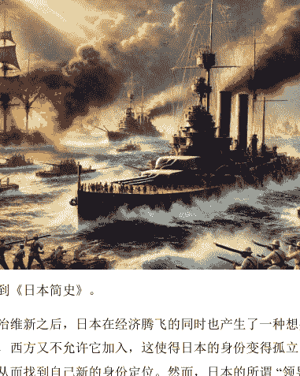

我是徐弃郁，欢迎来到《日本简史》。

上一讲我们提到，明治维新之后，日本在经济腾飞的同时也产生了一种想要“脱亚”的心理。但是，亚洲它不想加入，西方又不允许它加入，这使得日本的身份变得孤立了起来。日本希望能够成为亚洲的领导者，从而找到自己新的身份定位。然而，日本的所谓“领导”并不是以和平方式，而是对亚洲国家的野蛮侵略和殖民统治来实现，中日甲午战争就是其中的典型。

熟悉历史的都知道，在这场战争中，清朝惨败，北洋水师全军覆没，还出现了旅顺大屠杀等灭绝人性的事件。最后，双方签订《马关条约》，台湾和澎湖列岛被割让给日本，清政府赔偿日本白银 2 亿两，相当于日本当时 9 年的财政收入。这些赔偿款大量被用于日本的军事和教育，进一步提高了日本的国力，对日本历史产生了重要影响。

那么，日本到底为什么赢得这场战争呢？应该说，从甲午战争结束以后，围绕这个问题的讨论甚至争论就没有停过。在这一讲，我们从日本简史的角度探讨一下其中的答案，进而更加全面地了解明治维新给日本带来的变化。

### 主流的分析及存在的问题

好，我们先来看一下之前的分析。相当一段时间以来，关于中日甲午战争的分析主要聚焦在海战上，尤其是北洋舰队与日本联合舰队的黄海海战，也就是历史课本上邓世昌率领致远舰全体将士撞击日本军舰、最终以身殉国的那场战斗。时至今日，还有不少人在分析北洋舰队的指挥、战术、弹药、装备到底出了哪些问题，哪些是真问题，哪些是因为运气不好。

这些分析的最终落脚点，又集中在晚清和日本政府对海军建设的态度差异上。我们最常看到的一个对比就是，在晚清这边，为了给慈禧办大寿、修颐和园，不惜挪用海军军费，造成北洋舰队整整 6 年没有购入新舰；而在日本这边，明治天皇为了建海军不惜主动削减皇室的日常开支，而且每年从内阁拿出 30 万元用于海军。

李鸿章本人也说：“倭人于近十年来，船械愈出愈”，而“中国限于财力，拘于部议（也就是内部意见不统一），未敢撒手举办”。所以是晚清决策层的态度，决定了装备的差距，最后导致战败。

不过，如果再进一步分析，这种观点似乎存在两个问题。

第一，这场中日甲午海战到底在多大程度上是决定性的呢？要知道，对日本这样的岛国来说，海战确实是头等大事。因为当时两军第一阶段的主战场在朝鲜，日军部队需要通过海路运输，一旦海战失利，战争就不可能赢。但对中国来说不是这样，即使海上失败，仍然可以从陆地向朝鲜派兵。换句话说，海战对整个甲午战争不是完全决定性的。

第二，如果海战不是完全决定性的，那么最终具有决定意义的就是陆战，特别是在朝鲜的交战。但说到陆战，问题就很大了，如果说当时中日海军装备有差距还勉强说得通，但陆军不存在这种情况。要知道，当时在朝鲜的清军使用的枪和炮都比日军更先进，弹药也更充足，人数上也差不多，而且朝鲜老百姓还支持清军。那为什么这样清军还是惨败呢？所以说，日本在甲午战争中的胜利值得深挖。

### 日本的战略意图和战略计划

关于这个问题，特别值得一提的是日本的整个战略意图和计划。

其实，甲午战争并不是明治维新以来日本第一次对外战争。正如我们在第 12 讲讲到的，在甲午战争爆发的 20 年前，也就是 1874 年，日本就借口琉球船只遭遇台湾原住民袭击，毫无预兆地出兵台湾。但是，日本学者也承认，甲午战争和 20 年前这场突然的侵略很不一样——甲午战争不是突发性的，而是经过了十多年的预谋和规划。

这里我们不得不提到一个人，那就是被称为日本“近代陆军之父”的山县有朋。此人在幕府后期曾经是“尊王攘夷”的先锋人物，在我们第八讲讲到的“下关战争”中，他不光参战，而且受过重伤。到 1880 年，也就是甲午战争爆发的 14 年前，他当时作为日本的参谋本部长官，给明治天皇递交了一份战略文件，叫做《邻邦兵备略》，核心内容就是把清朝作为日本头号假想敌。

但这文件同时也指出，清朝通过洋务运动提高了军事实力，军事上领先于日本。那怎么办？日本决策层紧接着制订了明确的战略计划，就是在财政、军事采购、训练等方面全力以赴，用十几年培养能与清朝相匹敌的陆海军，而在此之前日本要努力和清朝摩擦。

你看，这样的战略意图和战略计划相互衔接，非常清晰。

到了战前，日本方面又拟订了更加具体的“作战大方针”（这是当时的叫法），把整个作战过程分为两个阶段：第一阶段，派遣部分军队进入朝鲜，牵制清军，同时日本海军联合舰队寻求机会与北洋舰队决战；第二阶段，则要视第一阶段的海战结果而定，包括三种作战方案：

- **甲方案，** 如果海战获胜，就夺取全部朝鲜，并派陆军在渤海湾登陆，在直隶平原，也就是现在河北省的中部和东部地区，与清军决战，这里的重心是中国大陆；
- **乙方案，** 如果海战未分胜负，则陆军夺取朝鲜的平壤并固守，海军防护朝鲜海峡的海上运输路线，这里的重心是朝鲜；
- **丙方案，** 如果海战失败，那么海军退守日本沿海，陆军全部撤回国内。这里的重心是本土。

所以说，日本从战略意图，到落实规划，再到具体的操作方案，实际上形成了一个层级分明的、体系化的战略计划。这就保证了日本整场战争有了一个稳定清晰的战略指导。

但听到这里，有人可能会问，有了一个稳定清晰的战略指导就能保证打胜仗吗？当然不是。这里的关键不仅在于这些战略计划本身，更在于它背后的东西。

### 日本近代化的军事系统与财政金融体系

要知道，这种体系化的战略计划绝对不是靠一两个天才人物能够搞起来的，它的背后需要一种强大的制度性支撑。

当时日本已经仿效德国普鲁士总参谋部，建立了自己的参谋本部。前面我们说的山县有朋提交的《邻邦兵备略》就是这个机构完成的。对中国的情报搜集和分析也是它牵头完成的，还形成了一份著名的战略文件，叫做《清朝征讨策案》，对晚清的各种情况进行了非常详尽的分析。

到甲午战争爆发时，日本又以参谋本部为基础，成立了名叫“大本营”的指挥中枢，这里包括内阁总理、枢密院议长、参谋总长、陆海军大臣、天皇侍从长这些军政官员。这样一个指挥中枢你一看就知道，就是为了协调全国力量进行战争的。

你把这种情况综合起来就可以发现，日本当时整个决策和组织体系已经完全实现了近代化。

那底下的部队呢？其实也一样，明治维新之后，日本不光实行了普遍义务兵役制，而且组建了以“师团”为主要架构的多兵种部队体制，也是近代化的。

所以你看，当时日本实际上是一个近代化的军事系统在进行战争。

而反观晚清，整个军队体系还是古代模式。可以说，在甲午战争的整个过程中，近代军队体系和古代军队体系的这种对比到处都是，不仅体现在战略筹划、情报、后勤这些大的方面，在细节部分也一样。

举个最简单的例子，当时陆上最关键的一场会战——平壤会战之前，作为日军统帅的山县有朋下达的是战前动员令，目的是激发己方将士的国家意识和战斗的热情，这是标准的近现代军队的做法。清军方面呢？平壤清军统帅叶志超开出的是一张赏金标准单，没提国家，没提军人职责，完全还是古代军队体系下的老一套。

讲到这里，我们再说一下这场战争的另一个关键指标——财政。

有说法认为，日本为了甲午战争基本赌上了身家性命，当时全靠国际资本输血才能打完这场仗。但如果你看一下日本当时的财政数据就明白，这种说法其实站不住脚。要知道，当时日本已经建立了近代化的财政金融体系，这意味着什么呢？这意味着日本可以用将来的钱和别人的钱来打仗。

甲午战争之前，日本预估的战争预算是 2.5 亿日元，当时政府手里的钱差不多 2500 万日元，只有百分之十，那还有百分之九十的缺口怎么办呢？很简单，政府发战争债券。结果在日本方面战争狂热的宣传下，这几批战争债券很快就被日本企业和日本老百姓抢购一空。那这笔债券是不是让日本政府完全透支了呢？我告诉你，这笔债券总额相当于当时日本中央政府一年财政收入的两倍，总数看上去不小，但相对于其他国家的战争债券并不突出。要知道第一次世界大战时期，美国发的战争债券差不多是联邦财政收入的 10 倍多，而英法德的战争债券更是远超美国。而且到甲午战争结束时，日本靠债券融来的钱并没有完全用完，还剩了 2000 多万日元。

所以你看，无论是在军事方面还是在财政方面，中日甲午战争都是一个近代化的国家体系和一个古代国家体系在对抗，后者的胜算从一开始就非常之小。

## 总结

讲到这里，日本打赢甲午战争的原因就讲完了。总结一下：

日本在甲午战争中的胜利主要有两方面的原因，一方面是因为它有一个层级分明的、体系化的战略计划，另一方面是因为有近代化的军事和财政体制作支撑。归根到底，这也是日本明治维新近代化的结果。

其实，日本真正赌上身家性命、而且依靠国际资本输血的战争并不是这场甲午战争，而是十年后的另一场大战——日俄战争。这也是我们下一讲的内容。

我是徐弃郁，我们下一讲再见。

## 15｜结盟：日本为什么能赌赢日俄战争？

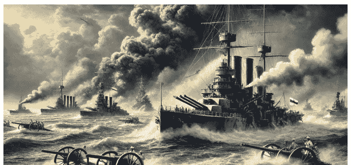

> **懒人专属群** 的群友，你好！

我是徐弃郁，欢迎来到《日本简史》。

上一讲我们说到，明治维新后，日本把成为亚洲领导者当作自己新的身份定位，甲午战争就是在这样的背景下爆发的，它是日本在明治维新后对外进行的第一场大规模战争，也给中华民族带来了空前的屈辱。这场战争让日本获得了第一个海外殖民地，也就是台湾和澎湖列岛，也让清政府被迫结束了对朝鲜的宗主权，日本得以进一步扩张在朝鲜的权利。

然而，当时的俄国也同样窥视朝鲜，希望通过控制中国东北和朝鲜来巩固它在远东的地位。在这样的利益冲突下，1904 年，日俄战争爆发，这是日本明治维新以后对外进行的第二场大规模战争，距中日甲午战争爆发恰好十年。但这两场战争日本的处境可差得非常之大。

如果说和腐朽没落的晚清作战，日本一开始就胜算很高的话，那日俄战争完全不同。从国家实力来看，当时日本的人口不到俄罗斯帝国的三分之一，军队规模不到俄军的二分之一，财政收入不到俄罗斯的八分之一，钢产量不到四十分之一。从两支军队来看，俄军属于欧洲久经沙场的老牌劲旅，而日军此前只打过甲午战争这样一场准近代化的战争。所以，日本在日俄战争中的整体上是处于明显劣势，此战属于典型的“以小博大”。

但结局出乎所有人的意料，日本胜利。双方签订《朴茨茅斯条约》，俄国把在远东的一系列权益转交给日本，在成为亚洲领导者的目标上，日本看起来又往前迈了一步。插一句题外话，美国总统西奥多·罗斯福还因为促成了双方停战、签订条约而获得了诺贝尔和平奖。

但问题是，日本为什么博赢了呢？

我在《俄罗斯简史》里面分析过俄国为什么失败，这门课我们就从日本的角度来看一下它为什么赢。或者说，日本到底做对了什么。

### 对于日俄战争的传统分析

很多人，特别是西方学者在分析日俄战争的时候，会重点关注日本和俄在远东这样一个局部地区的力量对比。沙俄虽然军力雄厚，但它的重点是在欧洲方向，在远东地区当时只有区区 9 万多人，而且西伯利亚大铁路也没有完全完工，运送兵力很不方便。反观日本，虽然总体实力较弱，但地理位置有利，可以在远东地区集中它所有的海陆军力量，所以局部反而占优势。

这种分析有没有道理呢？当然有，而且是日本能最终取胜的重要原因。

但你要注意，日本的这种局部优势即使存在，也是非常有限的。从整场战争来看，日本打得非常艰苦，其代价之惨重，和甲午战争完全不可同日而语。

就拿军队伤亡来说，日军在甲午战争中的伤亡总人数不到两万，但在日俄战争中，就以最激烈的旅顺口争夺战为例，日军仅仅是八月份第一次总攻，伤亡人数就达到 1.7 万人，已经超过甲午战争。到攻下旅顺时，日军投入的总兵力为 13 万人，伤亡达到了 5.9 万人。而在整场日俄战争中，日本总共动员军队 108 万人，战死 8.8 万人，受伤 37 万人，伤亡人数远远超过甲午战争。

### 日本对于战争的战术准备

好，那日本到底为什么能打赢这场战争呢？

这就要说到日本为这场战争的准备。和甲午战争一样，日本为了这场战争也做了将近十年的准备。我们如果复盘日俄战争的话，会发现和战争直接关联的几个环节，像情报搜集、军事训练、作战计划等等，日本基本上都做到了全力以赴，包括在很多细节方面都下足了功夫。

就以情报搜集为例，日本从甲午战争结束后不久就开展针对俄军的情报工作，投入非常巨大。有数据表明，日本的对俄情报开支几乎达到俄对日情报的 100 倍，动用的人力最多时候达到 4 万多人。在开战之前，俄军在旅顺港的要塞布防地图、俄海军的密码本这些关键情报均被日军掌握。所以当时担任俄国立远陆军总司令的库罗帕特金就非常感慨，说“日本人准备这场战争至少有十年之久，他们不但研究了该地区，还在该地区布满了特务，他们总能得到有关我军实力和作战计划的可靠情报”。

除了情报这类传统手段以外，日本还使用了一些新手段，比如国家宣传。应该说，传播有利消息、控制不利消息一直是参战方常用的手段，但是整个国家有意识、有组织地运用宣传工具为战争服务，却是近代的事情，而日本在日俄战争中的做法很多是属于开先河的。

比如说，战争爆发以后日本政府主动邀请西方的新闻记者、报刊编辑来分享战场信息。为什么呢？就是要通过西方人的笔和嘴，来宣扬有利于日本的形象，争取更多国际支持。这种做法我们今天看起来没什么，但当时可以说是首创。

另外，日本政府还对战场信息进行系统地管控，哪些可以公布、哪些必须保密，都经过政府严格地筛选和控制。

从某种意义上说，二战时期日本军国主义那种洗脑式的宣传在日俄战争时期已经成型。

所以你看，其实日本在所有的战术层面，都是以一种全力以赴的状态来进行的，有一种把事情做到极致的劲头。这一点确实是日本赢得战争的一个重要因素。

### 日本对于日俄战争的战略筹划

而我这里要进一步强调的是，战术上的极致准备并不是最重要的。有些关键事情在战争爆发之前就已经决定。

为什么这么说呢？你可以看一下战争爆发前的态势。

英国作为当时最强大的海上力量和日本结成同盟，太平洋地区的另一个强国——美国，实际也站在日本一边。这个态势太重要了，它决定了两个非常关键的因素：

第一是战争经费。

我们前面就提到，日本为日俄战争的预算开支远远超出了甲午战争。但当时的日本毕竟属于后发国家，财力不行，光靠增加税收和发国债解决不了问题，那怎么办？只能向国际市场借。要知道，此时英美资本绝对是国际金融市场的主导力量，而英日同盟相当于为日本提供了最强大的背书，所以日本能够迅速从国际市场筹到钱。那日本一共借了多少呢？7 亿日元，占日本战争总开支的 40%。不夸张地说，这笔钱直接决定了日本能不能打这场战争。

第二个关键因素是，俄军的海上调动受到日本同盟国的强大干扰。战争爆发以后，在亚洲的俄国太平洋舰队相当于是一支孤军，已经被日本海军封锁在港口，那其他地方的俄国舰队不得去增援吗？但这种增援可太不顺了。但不可否认。实际上，俄军的海上调动受到日本同盟国的强大干扰。

比如，从欧洲到亚洲的海上要道——苏伊士运河——在英国手里，那英国作为日本的盟国，当然就不允许俄国用，结果俄国舰队只能从非洲大陆南端的好望角大老远地绕到亚洲来，这一绕航程至少增加 3000 海里，也就是 5400 公里。那到了亚洲海域是不是就好了呢？也不是。因为当时英国在全世界有大量殖民地，亚洲的主要港口基本都在英国手里，俄国舰队没法停靠，更没法休整，只能疲惫不堪地往前赶，所以妥妥的是劳师远征。这些因素都促成了俄国舰队最终被日本全歼的命运。

那好，这么重要的战前态势是怎么来的呢？客观地讲，当时日本决策层的主动设计、积极筹划和外交努力起了非常大的作用。

这些当然不是战术层面的东西了，而是战略层面的筹划。

你可能也听说过，日本的特点之一，就是非常注重战术和细节，强调精益求精，但容易忽略大局和战略层面的东西。不过这里我要告诉你，日俄战争是个例外，这是日本历史上少有的注重战略并且在战略上取得成功的例子。

今天日本在做军事战略教学的时候，日俄战争的战略筹划是必修改案例。

所以你看，日本在日俄战争中，实际上是在战略、战术等各个层面、各个领域基本都把资源和能力运用到了极致。

用今天的话语来说，是因为日本为了这场战争做到了“ALL IN”，所以才赢得了这场日俄战争。

## 总结

好，到这里这一讲就结束了，我们来总结一下：

日俄战争是日本明治维新以后，对外进行的第二场大规模战争。这场战争继承了甲午战争的目标，那就是实现日本成为亚洲领导者的身份定位。尽管与当时的俄国相比，日本的整体实力处于劣势。但是，充分的战前准备与战略筹划，让日本能够以小搏大，最终赢得了这场战争。

当然日俄战争的胜利也对日本产生了深远的影响，除了军国主义狂热以外，这种孤注一掷式的战争冒险开始成为日本这个国家的路径依赖，为以后更大的战争灾难埋下种子。

好，我是徐弃郁，我们下一讲再见。

公众号懒人搜索，懒人专属群分享

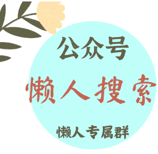

### 微信:lazyhelper

## 16｜变革：大正时代有可能改写日本历史吗？

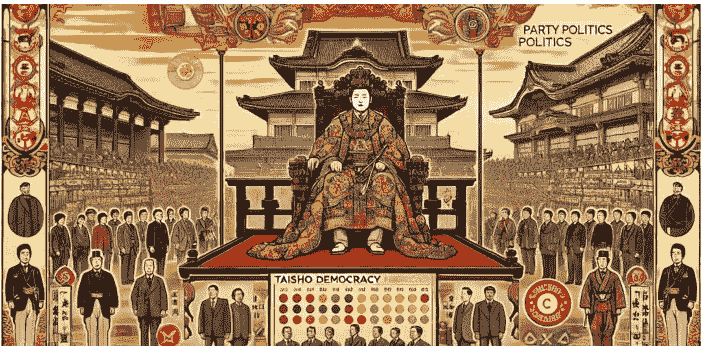

**[懒人专属群]**的群友，你好！

我是徐弃郁，欢迎来到《日本简史》。

上一讲我们说到，凭借极致的战术准备和积极的外交筹备，日本以小博大，打赢了实力远强于自己的俄罗斯，赢得了日俄战争的胜利。这场战争的胜利，让日本尝到了甜头，孤注一掷式的战争冒险开始成为这个国家的路径依赖。此后，日本在军国主义的道路上一路狂奔，最终走上了罪恶的法西斯道路。

不过，日本在走上法西斯道路之前，曾经出现过短暂的“大正德谟克拉西”时期，也就是所谓的“大正民主”时期。很多西方学者和日本学者对这段历史非常关注，认为这是日本真正向西方民主迈进的一段历程。如果“大正民主”能够持续发展的话，那么日本可能就不会走上后来的法西斯道路，日本历史乃至东亚历史都有可能改写。

那所谓的“大正民主”到底是怎么回事呢？它真的有可能让日本避免后来的法西斯道路吗？从日本历史的角度来看，这个问题确实非常重要。

### 什么是大正民主

我们先来看一下“大正民主”到底是什么。我们都知道，日本推行全面的维新运动是在明治天皇统治时期，这个明治天皇 1912 年去世了，新的天皇年号大正。

在这个大正天皇的统治时期，日本国内掀起了一股反对藩阀、要求实现普遍选举和政党政治的浪潮。这就是所谓的大正民主。

应该说，这普遍选举和政党政治都好理解，那什么是反对藩阀呢？这里的藩是指藩国，也就是日本历史上的封建领地；阀是军阀的阀，指的是政治势力。

反对藩阀，就是在反对藩国对政治权力的地域性垄断。

我们之前在讲明治维新的时候提到过，明治维新的主导力量来自几个地方势力，最出名的就是位于本州岛西南部的长州藩和位于九州岛最南端的萨摩藩，明治政府要害部门的领导岗位全部被这几个藩的人物瓜分了。比如日本海军的几个巨头（其中包括日俄战争时期日本联合舰队司令东乡平八郎）清一色来自萨摩藩，后来当上日本首相的山县有朋、伊藤博文则是长州藩的代表。这里我补充一个信息，这长州藩的位置在哪里呢？大致相当于今天日本的山口县

，日本前首相安倍晋三家族也来自这里，光是他们家就出了 3 个首相，1 个外相。你看，这种对重要权力的地域性垄断就是藩阀政治。大正天皇继位以后，很多人就开始反对这种垄断。我这里还要告诉你，反对藩阀是整个大正民主的起点，也是重点，像什么政党政治等等实际上都是围绕着这一点展开的。从这里你也可以看出来，日本“大正民主”的重点和十八、十九世纪欧洲国家近代民主化的进程不太一样，和欧洲近代民主化反对君主专制的口号相比，反对藩阀这种口号本身就很很有日本特色。

### 大正民主产生的原因

好，讲到这里另一个问题也出来了，那就是为什么在大正时期会出现这些政治趋势呢？这和大正天皇本人很有关系。要知道，在日本当时的政治结构下，天皇作用非常关键。之前的明治天皇是一个强势的统治者，在日本国内拥有很高权威，民间很多不满无形之中都被压下去了。但新继位的大正天皇可不一样，他继位的时候身体已经有很大问题，心理状态也不好，实际上不可能真正履行最高统治者的权力。

一来日本国内的局面一下子多元化了，不同的声音，特别是对明治时期藩阀的不满就释放出来，相当于打开了蒸汽阀的阀门，所谓的大正民主也由此开始。

除了大正天皇的因素以外，更加重要的当然是日本国内的经济社会变化。这就要说到第一次世界大战了。对日本来说，一战的爆发可谓天赐良机。这一点日本人看得很清楚了，当时日本决策层在讨论是否参战的时侯，明治时期的元老井上馨就说过，“大正新时代里的这次欧洲大祸乱，乃天助日本国运发展”。事实发展完全印证了这一点。日本不仅乘着西方列强专注欧洲的机会，迅速扩大在东亚、在中国的势力，而且还获得了巨大的经济好处。这又是怎么回事呢？其实很简单，因为当时欧洲这个传统工业中心陷自战火，这就会给日本工业一个填补充白的机会，可以迅速抢占原先欧洲国家的市场，同时还为交伕方提供各别军用品。结果在一战这四年时间里，日本的国民生产总值一下增加了 40%，而且债务情况也完成逆转，从一个欠债 15 亿的债务国变成了一个拥有 2.9 亿债权的债权国。更重要的是它的经济结构进一步变化，制衣品进口下降到进口总额的 50% 以下，工业制衣品出口占口总额的 90%。换句话说，一战使日本从一个初步工业化的国家，变成了一个工业化国家。

经济发展必然伴随着社会结构的变化。

日本经过第一次世界大战，工人的数量从大约 120 万人飙升到将近 200 万人，而资本不低于 10 万日元、雇佣工人 5 名以上的小则从不到 20 万一下增加到 30 万人，整个中产阶级家庭的数曾从之前的 5% 左右增加到了 12%。所以你看日本社会发生了急剧的变化，这些新兴的力量当然不愿意原来的藩阀垄断，要求更多的文治权利，这就构成了所谓的大正民主最基本的动力。

### 大正民主的具体内容

好，讲完了大正民主的原因，我们再来看一下它的具体内容。前面我们提到，日本的大正民主以反对藩阀政治为主要目标，要点是实行政党文治和实现普遍选举。应该说，这两个要点在一定程度上都实现了。

在政党文治方面，日本出现了第一个现代意义上的政党内阁。

在大正时代之前，日本的首相和内阁成员大多是来自藩阀精英的核心人物，他们主要是对天皇负责，而不是对议会或政党负责。而大正民主之后，议会中的政党开始在文治决策中扮演更加重要的角色，首相开始更多地由议会中的多数党领袖担任。1918 年，日本出现了历史上第一个平民出身的首相，原敬。

在普遍选举方面，日本取消了选举的财产限制，规定年满 25 岁以上的男子都有选举权，日本的参政人数因此在短短几年一下增加了 4 倍多。

知道了大正民主的背景、原因和具体内容，我们回到一开始的问题，如果“大正民主”能够持续发展，是不是真的能够让日本避免走上法西斯的道路？

答案是不会。你要注意，日本大正民主取得的这些进步并不像它表面看上去那么大。为什么这么说呢？

首先，日本的大正民主是在天皇制这个巨大的框架下进行的。

举个例子，在大正民主时期，日本思想界的领袖人物是一个叫做吉野作造的大学教授。这个人经历比较丰富，不仅在欧美游学多年，而且到过中国天津，担任过袁世凯长子袁克定的私人教师，同时他还在北洋政法学堂讲课，听课的学生里面有一些中国近现代史上的著名人物，其中就包括中国共产党创始人之一的李大钊。但是你注意，吉野作造在日本宣传西方民主思想的时候，用的词并不是“民主主义”，而是“民本主义”。这是为什么呢？因为民本的政治语境下，如果他用了“民主主义”这个就等于强调“主权在民”，就是由人民来行使国家权力，这样一来就和日本一直坚持的天皇制规定的“主权天皇”相冲突，这在当时的日本可是大逆不道的事情。所以你看，

其次，“大正民主”并没有解决当时日本的社会问题，甚至还为极探主义思想提供了滋生的土壤。

当时日本社会正处于急剧的变化之中，贫富分化、物价上涨这些问题越来越突出。“大正民主”一方面提高了民众的参政热情，另一方面又没能很好地解决这些问题，被不少民众寄予很高期望的第一个政党内阁很快就连入了政党之间相互攻击之日起，第一个平民首相原敬还被反对派刺杀。所以大正后期，日本很多人对所谓的大正民主都感到失望。

这种失望的结果，是导致对变革的反弹。

很多人觉得需要恢复秩序，需要进一步确立天皇的绝对权威，主张通过强力国家干预和民族主义政策解决问题，这与后来日本走法西斯道路有很大关联。有历史学家就指出，实际上大正后期正是日本法西斯主义萌芽和抬头的时期。

最后还需要说的是，日本国内的大正民主和日本的对外扩张相互之间完全不妨碍。

要知道，日本向北洋政府提出“二十一条”就是在大正时期。1915 年，日本向中国提出了“二十一条要求”，企图扩大对中国的特权和影响力，炮制二十一条的主要人物就像是日本推动大正大政实现的首相加藤高明。换句话说，大正大政的功臣完全可以是侵略扩张的推手。

另外从民意的角度来看，民众在大正时期反对藩阀、要求变革的同时，大部分日本人并没有对战争有什么反省，相反还好把对外扩张看成是解决国内问题的重要途径。

好，到这里这一讲就结束了，总结一下。明治天皇去世后，日本进入大正天皇的统治时期。但是，大正天皇实际上并没有履行权力。与此同时，由于日本一战期间经济的发展和社会结构的变化，新兴中产阶级、知识分子和工人阶级崛起，在当时的日本国内掀起了一股反对藩阀、要求实现普遍选举和政党政治的浪潮。

尽管日本大正民主有它的进步意义，但我必须提醒你的事，不用夸大它的历史价值。它既不可能阻止日本继续侵略扩张，也不可能防止日本走上法西斯道路，最终成为第二次世界大战的策源地。那日本到底怎么走上法西斯道路的呢？这是我们下一讲的内容。

我是徐弃郁，我们下一讲再见。

## 17 | “突围”：日本走上法西斯道路的关键原因是什么？

**懒人专属群**的群友，你好！

我是徐弃郁，欢迎来到《日本简史》。

上一讲我们说到，日本大正民主反对藩国势力对政治权力的垄断，实现了普遍选举和政党政治，出现了日本第一个真正意义上的政党内阁和平民首相。这些进步看似很大，但并没能阻止日本走向法西斯道路。

今天我们都已知，德国、日本、意大利这三个当年的法西斯国家是第二次世界大战爆发的罪魁祸首。不过，如果把这三个法西斯国家进行比较，你会发现日本的情况似乎有点不太一样，它既没有形成一个严格意义上的法西斯政党，也没有确立起真正的法西斯意识形态，更没有经历法西斯力量政变上台。

从整体上看，日本走上法西斯道路是一个渐进的、较长过程，其中带着非常浓厚的“日本特色”。

搞懂了日本为什么会走上法西斯道路，我们也就能够更深入了解日本和它所发动的战争。

### 日本走上法西斯道路的基本原因

那日本到底为什么走上法西斯道路呢？首先要说的是两条：第一是日本有着非常强的军国主义传统，崇尚武力，从幕府统治到明治维新都是如此，我们前几讲讲到的甲午战争、日俄战争就是重要证明。

第二是日本和德国、意大利这些国家有些相似的经历，那就是经济受到 1929 年美国“大萧条”的冲击。因为日本依赖国际贸易，尤其是对美国和欧洲的出口，而大萧条时期全球市场的崩溃导致日本经济受到的打击特别严重。失业率飙升，工厂倒闭，农民收入锐减。日本政府在应对危机方面表现不好，导致民众的不满不断上升，这样就为法西斯势力上台铺平了道路。这个可以说是诱因。

关于日本为什么走上法西斯道路，这两条原因说的比较多，分析得也比较中肯。但还有一个非常关键的原因，很多人忽视了，那就是第一次世界大战以后日本整个国家认知出现了重大变化。

### 日本走上法西斯道路的关键原因

那这是怎么回事呢？上一讲我们在说“大正民主”的时候就提到，日本的“大正民主”没能解决一些重要的社会问题，导致日本国内社会出现了一种强烈反弹，要求进一步加强天皇权威。但它只是日本整个国家认知变化的一小部分，日本最关键的认知变化在于，它认为西方国家在千方百计地阻挠日本的崛起，以至于产生了一种被包围的极端心理。

要知道，第一次世界大战对日本的影响非常大，日本不光在经济上获得了巨大发展，而且趁西方列强忙于欧洲的时候，趁机抢占了山东的权益。在一战结束后的巴黎和会上，中国代表团为了山东权益而力争，但和会还是认定日本在山东的所谓“权利”，最终中国代表团拒绝在和约上签字。这段历史我们都比较熟悉，有部电影叫做《我的 1919》讲的就是这段历史。

但你可能不知道的是，日本对巴黎和会也深表“失望”。

为什么呢？因为在日本看来，山东的权利已经是它的既得利益、囊中之物，更重要的是，它认为自己已经是列强之一，从中国掠夺权益只不过是重复西方列强做的事，所以巴黎和会应该只是走一个承认的过场。结果没想到，中国在和会上争取到了不少外交支持，日本在外交上搞得非常狼狈，所以虽然巴黎和会最后还是支持了日本的主张，但日本人对此还是非常不满。

在他们看来，这就是美国这些西方国家在阻挠日本。

巴黎和会并不是唯一让日本不满的事情。就在和会结束的两年以后，西方列强又通过了两个重要条约，一个是《华盛顿海军条约》，规定了列强之间的海军吨位比例。其中英美属于第一等级，日本是第二等级，海军吨位限制在美国 60% 的水平，高于法国、意大利等国。客观地看，这属于日本的一次外交成功，因为日本海军获得了仅次于英美的地位，而且说实话，如果日本真要和美国海军竞赛，它的国力也根本支撑不住。但当时大多数日本人可不这么看，他们认为这是英美存心限制日本，同时日本政府里有“卖国贼”，向英美屈服。

另外一个条约是关于中国的，叫做《九国公约》，相当于部分废除了日本强加于中国的“二十一条”，让中国从日本独霸恢复到了列强支配的局面，这让日本就更加痛恨了。

讲到这里我得强调一句，明治维新以后，日本总体形成了这样一个世界观，那就是国际社会就是一个弱肉强食的地方，所谓国际法和国际道义不过是西方列强用来掩人耳目的东西。

对于大多数日本人来说，经过甲午战争、日俄战争和第一次世界大战，日本已经成为一个完全意义上的强国，可以充分享受强者对弱者的权力了。在这样一种世界观之下，日本对巴黎和会、《华盛顿海军条约》和《九国公约》这些事情的理解就很简单，那是西方国家在千方百计地阻挠日本行使这种强者对弱者的权力。

而一旦形成这种认知，日本把自己和西方国家的所有竞争，甚至日本和中国之间侵略和反侵略的斗争都从这个方向来解读了。

看到这里你可能会感到奇怪，日本和中国的冲突从哪方面看都和阻挠日本沾不上边啊？日本怎么会这么解读呢？要知道，在日本当时的文献资料里面，涉及中国的经常提到中国的反日情绪，对日本占领的抵抗等等。但日本好像从来不会去想，为什么中国人会有这些反日情绪和抵抗，他们认为这都是因为西方国家特别是英美在背后支持中国。所以按着这个逻辑，日本把中国也算进了阻挠日本的阵营。

更极端的是，日本到二战前甚至流行一种“ABCD”包围圈的说法，A 指的是美国，America；B 指的是英国，Britain；C 指的是中国，China；D 你可能想不到，指的是荷兰，Dutch。为什么荷兰也算上呢？因为荷兰当时是今天印度尼西亚的宗主国，日本想抢占那里的资源，荷兰抵制，所以也算是包围日本的一员。你看，最终日本那种世界观导致的是一种自己“被包围”的极端心理。

### 日本激进的社会氛围

那怎么办呢？日本年轻一代开始想办法。他们的逻辑是这样的：既然被包围，那么当然要突围。

但怎么突围呢？当然是要准备大战，但日本的资源和西方比起来少得多，所以必须集中国家的全部力量。换言之，要改变国家的整体面貌。

这方面最著名的体现，就是所谓的“巴登巴登密约”。当时有三名日本年轻军官在德国著名的温泉疗养地巴登巴登会面，这三个人分别是永田铁山、冈村宁次和小田敏四郎，后来另一个军官东条英机也加入会面。因为篇幅有限，这几个人我就不介绍了，相信东条英机和作为侵华日军总司令的冈村宁次你都不会陌生。我这里只强调一下，前面三个人被称为日本陆军“三羽乌”（也就是“三杰”的意思），相当于当时日本青年军官的精英代表。这几个人密谋的结论是什么呢？

主要就是在日本建立所谓的“总动员体制”，形成以军队为核心的体系，为日后的大战作好准备。这几个人回国以后，先后又建立了一些秘密组织，其中主要目标除了推动建立所谓“总动员”体制以外，另外就是夺取所谓的“满蒙生命线”，也就是侵略中国的东北和蒙古，这个部分我下一讲还会说。总的来说，在 20 世纪 20 年代，日本军队中的青年军官或者说所谓的“少壮派”军官形成了一股强大的势力，这些人一方面推动把日本国家体制改造为准备大战的“总动员体制”，另一方面推动侵略扩张。

你看，这就是走上法西斯道路的巨大推力。

那青年军官是这样，日本社会上的年轻人呢？坦率地说，随着一战后日本对世界认知的变化，日本年轻一代整体上都体现得非常激进，反对社会生活方面的西方化，要求回归日本所谓“忠君”、“尚武”的传统，要求打破所谓的“ABCD 包围圈”，进一步侵略中国等等。你可不要小看这些日本年轻人，他们的狂热情绪对日本整个社会都产生了巨大影响。

比如“九一八事变”以后，日本一位很有名的教授叫做吉野作造（我们上一讲讲大正民主的时候提到过他），他就表示日本这样占领中国的土地是不义之举，这事不能干。结果在他回国时，一大批日本青年堵在码头要打死他，吓得他不敢上岸。更严重的是，这些日本年轻一代的激进行为都有一件合理化的外衣，叫做“忠君爱国”（也就是所谓忠于天皇），所以他们的所作所为不仅不会受谴责，往往还会受到同情。比如 20 年代末有位日本首相叫滨口雄幸，因为不想拼命扩充军备，所以和西方签订了海军军控协定，限制海军军备扩张，结果被所谓“忠君爱国”青年作为“卖国贼”刺杀。这里的关键是，刺客被抓后，立即获得了日本社会的广泛同情和支持，最后法院还给了他轻判。

## 总结

---

公众号懒人搜索，懒人专属群分享

> **《徐弃郁·日本简史 30 讲》**

重新认知这个熟悉又陌生的邻居

版权归得到 App 所有，未经许可不得转载

清华大学资深研究员

公众号

懒人搜索

懒人专属群

微信：lazyhelper

徐弃郁

## 日本瞄准东北的原因

要知道，在侵略东北之前，当时的日本国内就存在着一种说法，叫做“满蒙生命线”，意思是中国的东北和蒙古对日本来说，就像生命线一样重要。那这个说法怎么来的呢？这就要说到当时日本军队里的一些青年军官组织了。

我们在第十七讲就提到过这些组织，其中有一个组织叫做“木曜会”，就重点研究所谓“满蒙问题”。这个组织最著名的一个成员叫做石原莞尔，正是他策划了“九一八”事变。他早在 20 年代末就提出来，日本和美国之间迟早要进行一场决战，但日本是一个岛国，战略纵深不够，自然资源更加不够。那怎么办呢？结论就是，日本必须有一个资源丰富的战略后方，而从地理位置、资源的丰富性和战略的纵深性来考虑，最合适的就是中国东北和蒙古，所谓“满蒙生命线”就是这么来的。

而到 1931 年，也就是“九一八事变”爆发的那一年，日本国内更是大肆宣扬这个“满蒙生命线”理论。先是日本政客在议会公开提出“满蒙是日本生命线”的说法，然后日本主流报纸《每日新闻》又连发 30 多篇社论来进行论证。我告诉你，此时日本国内可以制造的侵略东北的理由除了所谓经济和战略需要以外，又增加了两条：

一条是“10 万英灵说”。

日本认为，在日俄战争时期，曾在中国东北死过 10 多万日本人，所以这块地方是他们所谓的“圣域”，也就是神圣的地方，必须抢占；

二是“满蒙非中国说”，就是说东北是满族的领土，不是中国的领土。这种论点在我们看来非常荒谬，但当时对日本国民的影响非常之大。可以说在“九一八事变”之前，大多数日本国民已经被鼓动起来，认为强占中国东北是日本的生存需要。此时，日本的国内氛围也好，或者说整个国家的认知也好，都向着支持“九一八事变”的方向发展。正是有了这些，少数日本军人发动的冒险才可能得逞。

但光是这些，还不能解释为什么仅凭少数中下级军官就能发动“九一八事变”。现在有不少人喜欢用日本文化中的“下克上”来解释。什么叫“下克上”呢？日本不是社会等级很森严吗？但就好像是一种自然的调剂，日本在等级森严的同时，又存在一种下级不服从、甚至主导上级的情况，这就叫“下克上”。

那这种解释有道理吗？当然有。但是你注意，在日本军队历史上，所谓“下克上”绝不是传统，只有在二战爆发前的十几年，才在所谓“昭和青年军官”这个群体中一再出现。

所以，要搞清楚为什么少数中下级军官就能发动“九一八事变”这个问题，关键还是要分析一下当时那批人。

## 发动事变的中下级军官的特点

首先，发动“九一八事变”的那些人并不是普通中下级军官，而是在日军内部已经有很大知名度和号召力的人物。

比如上面提到的事变最关键的主谋，石原莞尔，这个人狂热主张侵略扩张，同时头脑又冷静，还擅长周密规划，据说当时日军中极少数能读懂德国军事家克劳塞维茨名著《战争论》的人，被美国著名的地缘政治学家斯皮克曼称为“日本唯一的战略家”。

其次，发起事变的中下级军官均占据实权位置，这一点其实已经有不少研究资料提到了。的确，到“九一八”事变之前，前面提到的“木曜会”这些组织的成员有相当一批已经进入日本陆军的中层，军衔虽然不高，但岗位很关键。像石原莞尔在一线部队，是日本关东军的作战主任参谋，还有一些人在日本陆军总部，占据了好几个课长职位，就是上课下课的课，像东条英机就是参谋本部的动员课课长。那这些位置到底有多关键呢？先来说课长，日本的课长在级别上相当于我们的处长，但责任和权力更大，实际上是介于我们中国的处和局之间。

在日本的体制里面，这个职位是非常重要的，既负责上面决策的落地和执行，又为上面决策提供基础性支持，所以它实际上是决策层和执行层之间的枢纽。那石原莞尔那个主任参谋呢？其实也一样，参谋既负责关东军高层的各种作战计划制定，又负责向底下各部队传达命令，也是决策和执行之间的枢纽。从这个角度来看，你会发现，在“九一八事变”之前，那些中下级军官已经进入陆军中层，控制了日本军队决策层和执行层之间的连接点。

所以当这批人串通起来决心发动事变时，日本的决策层就已经很难阻止了。

最后，也是更重要的一点，是日本军方高层的支持和默许。

现在有些材料在讲“九一八事变”的时候，把石原莞尔这些中下级军官的作用抬得有点过头，好像就是这么一帮所谓“昭和青年军官”瞒天过海发动事变，造成既成事实，日本高层完全被他们牵着鼻子走。但这并不是事实。从现有的史料上看，至少日本军队的高层不仅知情，而且内部实际上多次讨论过类似问题。就在事变爆发的 5 个月之前，陆军参谋本部情报部部长就草拟报告，提出要从根本上解决所谓“满蒙问题”的大方向。在事变爆发前 1 个月，关东军参谋部就向日本陆军高层和日本驻朝鲜、台湾的司令表明了行动计划。更重要的是，就在“九一八”前夕，日本陆军总部派遣高级军官前往中国东北约束和监督关东军，这些高级军官反而主动“放水”，放任石原莞尔等人发动事变。所以你看，如果没有日本军方高层的支持和默许，那些中下级军官也不可能得逞。

## 日本文官政府的反应

简单地说，就是当时日本的文官政府。在事变之前，文官政府曾经试图通过日本天皇来约束日本关东军。在事变发生之后，文官政府又推行“事态不扩大”的政策，试图约束日本军队完全占领中国东三省的行动，但这些努力全部失败。最终，日本首相犬养毅因为反对在东三省成立“伪满洲国”，还被一帮日本海军青年军官直接刺杀。这还不算，更重要的是这批刺杀者在后来的审判中得到了日本国内舆论的强烈支持，说他们完全出于“忠君爱国”之心，最后全部从宽发落。

## 总结

到这里，这一讲就结束了，总结一下：

抱着突出“包围圈”的极端心理，日本将目光瞄准了中国东北，通过宣传所谓的“满蒙生命线”、“10 万英灵说”和“满蒙非中国说”，使得强占东北成为日本国民的共识。日本的少数中下级军官，由于本身具有知名度和号召力，并且占据了陆军实权的位置，再加上日本军方高层的默许，促成了“九一八”事变的发生。日本文官政府尽管反对并且试图约束事态的扩大，但全部以失败告终。

从这里其实我们也可以看到“九一八事变”对日本的影响。

一方面，事变进一步强化了日本那种极端的国家认知，把刺杀首相的凶手说成因为“忠君爱国”就是一个明显例子。

另一方面，日本国内的权力结构从此发生重大变化，所谓“大正民主”确立起来的文官政府彻底被军队压倒，而军队又把“九一八事变”看成是对外扩张的成功先例，渴望不断复制。从这个角度来看，“九一八事变”对日本也是一个历史关键节点。因为由此往后，日本对外侵略已经没有任何内部制约，通往全面战争、通往无条件投降的道路彻底打开。而下一个重要节点，就是“七七卢沟桥事变”，此后日本开始全面侵华，这也是下一讲的内容。

我是徐弃郁，我们下一讲再见。

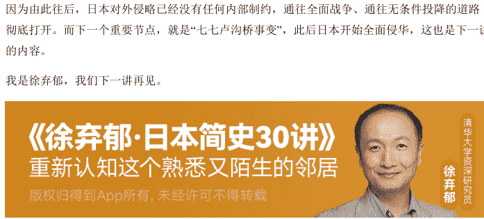

公众号

懒人搜索

懒人专属群

微信：lazyhelper

徐弃郁

No. 72 / 117

# 20 | 南进：日本为什么要冒险偷袭珍珠港？

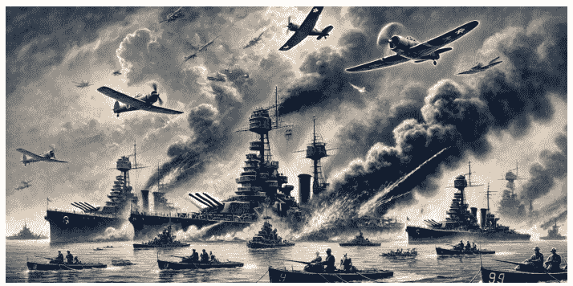

**[懒人专属群]** 的群友，你好！

我是徐弃郁，欢迎来到《日本简史》。

上一讲，我们讲了卢沟桥事变，日本侵华大方向的确定性、“下克上”做法的习惯性和整体国家认知的明确性，让卢沟桥事变发展成为全面侵华成为了一种必然。卢沟桥事变是日本帝国主义全面侵华战争的开始，也是中华民族进行全面抗战的起点。具体抗战的过程大家已经看过好多了，这里就不多说了。

1941 年 12 月，卢沟桥事变四年之后，日本偷袭了美国珍珠港。

如果说全面侵华意味着日本开启了一场几乎不可能赢的战争，那么偷袭珍珠港就意味着日本开启了一场必输的战争。

不过后来，很多人在分析日本的这次偷袭时，都感觉到奇怪，明明日本决策层很清楚，自己和美国的实力相差悬殊，那为什么还要去冒这样的险呢？仅仅是因为当时的日本太膨胀、太疯狂吗？

对这个问题，我们可以从宏观层面来回答，那就是在日本全面侵华这个冒险出问题以后，不得不以一个更大的冒险来挽救。

不过，如果我们深入到更加具体的层面，你会发现这个问题的答案要更复杂一些。

### 日本有利的外交局面

我们看一下珍珠港事件爆发的那一年，1941 年。此时中国的全面抗战已经打了四年，日本决策层也明白在中国的战争是打不赢了，但有意思的是，日本此时的外交局面却比“卢沟桥事变”后的任何时候都要有利。

这是怎么回事呢？

因为此时希特勒已经打下了大半个欧洲，正在秘密准备进攻苏联，所以中国抗战的两大外援——美国和苏联的注意力都在这个方向，在亚洲这边都不想再有事，都想争取日本保持中立。

就在 1941 年 4 月份，两件大事发生了：

第一件，苏联和日本签订中立条约，苏联承认伪满洲国，日本承认外蒙古，全部以我们中国的主权利益为代价；

第二件，日美通过谈判形成了基础草案，美国改变原来坚决不承认伪满洲国的立场，准备承认伪满。

这样一来，中国抗战的国际局面就变得非常艰难，但日本却遇上了“卢沟桥事变”以来最有利的外交局面：既能从侵华战争中抽身，又能继续保有中国东北这一侵略果实，还能在接下来的大国战争中待价而沽，谁给好处多就倒向哪一边。

听到这里，你是不是对日本后来的决定更加不好理解了：为什么日本不抓住这样一个难得的机遇，还是要一意孤行发动对美战争呢？首先你要知道，日本面对的外交局面看上去很有利，但它也是复杂的，利用这种局面需要精确的战略洞察和灵活的平衡能力。那日本有没有这种能力呢？坦率地讲，十八、十九世纪的大英帝国可能有这种能力，但日本是绝对没有。

### 线性思维主导下的南进决策

你要是看日本从 20 世纪 20 年代开始的各种决策和战略纲要，会发现它有着一种非常明显的线性思维。

日本的总体逻辑是这样的：因为欧美阻止日本崛起，所以日本要准备打破这种包围，而打破包围，最终要准备和西方的代表——美国决战，但日本的资源不足以支撑这种决战，所以要侵占中国东北和其他地方（也就是所谓的“满蒙生命线”）。

你看，这就很种“一根筋”的意思。关键是，从“九一八事变”到全面侵华，日本在中国掠夺了大量资源，但缺少它最想要的东西：石油。可以说，它抢的石油资源还远远抵不上因为战争而消耗的，所以日本还得继续扩张。

那往哪里去呢？要知道，当时荷属东印度群岛（也就是今天的印尼）是一个重要产油区。所以按照日本那种线性的战略思维，它迟早要选择这个方向扩张，也就是日本人所说的“南进”。

讲到这里我再补充一点，你可能听说过当时日本内部存在“北进”（就是北上打苏联）和“南进”之争。但从日本的历史资料来看，全面抗战爆发后，日本“北进”的主张就非常弱了。为什么？道理很简单，“北进”几乎完全依靠陆军，但日本陆军的大部队已经陷在中国战场，根本拿不出足够的兵力来进攻苏联，差多少呢？按照日军参谋本部的计算，兵力缺口将近 50%，但“南进”需要的兵力少得多。所以按军事逻辑来看，日本也选“南进”。

最后我们再来说一下，为什么日本偏偏要在 1941 年这个时机“南进”。原因很简单，因为此时是日本“南进”的最佳时机。东南亚当时是英美和其他欧洲列强的势力范围，但其他欧洲殖民国家基本上都被希特勒打败了，英国则自顾不暇，用当时日本高官的话来说就是“天佑”，抓不住这种机会就不要再干了。更关键的是，日本的战略思维也决定了它对当时局势的判断。

前面不是说苏联和美国都想争取日本中立吗？但日本并不认为这是一个多大的机会。在它看来，对苏中立和对美中立只需要一个就行，同时有两个是浪费。比如日本外相松冈洋右就说，我费那么多口舌把苏日中立条约谈下来，为的就是让军队不用担心北边，可以放心南进，如果军队不敢南进，那么保持和苏联的中立有什么用？你看，这就是一种特别典型的单向思维。

### 日本偷袭珍珠港的原因

但说到这里，此时日本是不是已经铁了心要和美国打一仗呢？我告诉你：还没有。从日本的历史资料来看，日本决策层早些时候就已经对“南进”进行了风险评估，评估结果还是基本正确的，那就是如果“南进”就意味着和英美开战，因为英美绝对不会坐视日本占领东南亚的资源。

但到 1941 年的时候，随着抓住机会“南进”成为日本决策层的主流，日本人对美国的判断也开始变化。往什么方向变呢？往有利于日本“南进”的方向变，换句话说，他们认为美国的反应不一定会很强烈，所以实际上“南进”的风险没那么大。那这么说有证据吗？日本认为，日美谈判有进展就是证据。美国 1941 年 4 月不是同意在伪满洲国问题上让步吗？在日本看来，这说明美国很想让日本中立，说明美国很需要日本，那既然需要日本，美国很可能还会容忍日本的“南进”。

如果说这种判断只是一厢情愿的话，那你再听日本的第二种判断：那就是日本占领一部分东南亚以后，手头的筹码更多，下一步可能迫使美国开出更好的谈判条件。坦率地讲，这就相当把美国政府当傻子，但我告诉你，这就是当时日本外务省的意见。总的来看，到 **1941 年年中的时候**，日本的所有分析在逻辑上都实现了“自洽”，没有什么风险判断再会动摇那种单向的、线性的战略思维了。

所以 1941 年的 7 月，日本的南进政策迈出了关键一步，就是进驻当时的法国殖民地——印支半岛（也就是今天的越南、柬埔寨和老挝）。

好，你注意，这步非常关键。因为在美国看来，日本一旦占领印支半岛，那么日本空军的作战范围就可以覆盖美英在东南亚的所有军事基地，这是绝对不能允许的。

所以美国的强硬程度完全出乎日本预料：7 月底，美国宣布冻结日本在美所有资产；8 月初，宣布对日本石油禁运；9 月初，宣布重新规定日美谈判的底线，那就是日本不光要从印支半岛全部撤军，还要从整个中国撤军。你注意，这里整个中国就包括了所谓的伪满洲国，意味着美国在中国问题上的所有让步全部收回。在这三条里面，石油禁运对日本打击最大，因为当时日本大约 85% 的石油从美国进口，一旦禁运，日本海军的油料就只能再用两年。但真正让日本高层绝望的，是美国要求日本从中国、包括伪满洲国撤军，因为这相当于要求日本把“九一八事变”开始的所有侵略成果都要吐出来，日本认为这相当于要求自己不战而降，已经没法谈了。所以就在 9 月初，日本决定对美开战，偷袭珍珠港。为什么要偷袭？因为日本实力不够，只能寄希望于偷袭来打美国个措手不及。

## 总结

这一讲到这里就结束了，总结一下：

**1941 年**的日本拥有十分有利的外交局面，苏联和美国为了专注于欧洲战场，都在争取日本的中立。然而，在线性思维主导下的日本，为了补充在中国战场消耗的军事资源，尤其是石油，过于乐观地估计了美国的反应，做出了“南进”决策，决定向东南亚扩张。美国对日本的南进行动进行了严厉的制裁，并要求日本从印支半岛和中国撤军。日本感到无路可退，最终以偷袭珍珠港的方式，对美开战。

讲完这个过程，我们也可以看出来，军国主义的日本沿着那种线性的、单向的战略思维，实际上一步一步把自己走进了一个死局，最后选项只剩下“二选一”：要么开战，要么投降。日本这个国家在战略层面的缺陷在这个过程中体现得非常充分，而在接下来的太平洋战争中，这种缺陷还会进一步放大，从而大大加速日本的最终战败。这也是我们下一讲的内容。

我是徐弃郁，我们下一讲再见。

公众号懒人搜索，懒人专属群分享

公众号懒人搜索，懒人专属群分享

懒人专属群的群友，你好！

我是徐弃郁，欢迎来到《日本简史》。

上一讲，我们围绕“九一八”事变，讲到了日本中下级军官在其中发挥的关键作用。事变之后，日本文官政府彻底被军队压倒，日本的对外侵略从此失去了内部制约，六年之后，也就是 1937 年，日本的目光从东北转向中国华北，“卢沟桥事变”爆发。

对中国来说，这一事件既是国耻，也是民族心理觉醒、全民族奋起抵抗的开始。但对于日本来说，这意味着它一下子陷入了一场缺乏准备的大规模战争，成为日本走向最终彻底失败的第一步。所以很有意思的是，一些日本军国主义分子在事后对“卢沟桥事变”表露过某种“悔不该当初”的情绪。比如侵华日军司令冈村宁次曾经说过，在卢沟桥事变之前，日本“如果那时候就停止了那种积极的对外政策就好了”。在这些人看来，如果没有“卢沟桥事变”，那么日本就不会全面侵华，不全面侵华就不会导致美国卷入，没有美国卷入日本也没那么容易失败，像东三省、台湾和朝鲜这些地方可能还在它手里。

这些人的观点当然都不值得批判，但它带来了一个问题，那就是“卢沟桥事变”是否必然会发展为全面侵华？它是日本事先计划好的、全面侵略中国的阴谋？还是日本军国主义者因为过度膨胀而误下的臭棋？应该说，了解这个问题对于了解我们抗战史、了解日本都非常重要。

## 卢沟桥事变发展为全面侵华的偶然性

我们来看事变本身。1937 年 7 月 7 日，日本华北驻军的一支部队在卢沟桥附近的宛平县城外搞所谓没演，借口一名士兵失踪，要求搜查宛平城，被中国守军拒绝后双方交火。这就是“卢沟桥事变”，也叫“七七事变”。不过你要知道，真正交火的时间不是 7 月 7 日，而是 7 月 8 日的凌晨。

这个事件当然是日军挑起的，那支日军部队的指挥官后来公开承认，是他开了第一枪。但挑起这场事变是不是日本高层早就计划好的呢？从目前的史料来看，情况并不是这样。

在事变之前，日本并没有一个全面侵略中国的完整计划。

在事变发生以后，日本内部也存在不同意见，其中最突出的代表就是曾经发动“九一八事变”的主谋石原莞尔。当时他已经被提拔为少将，是参谋本部作战部部长，非常核心的位置。他认为，日本侵占了中国东北和部分华北地区后，重点应该巩固、消化已有的侵略成果，打好未来持久作战的基础，同时对苏联和美国采取和解姿态，对中国不要急于扩大侵略，而是要推动国共之间的内战。要知道，这可不是他自己的意见，还被写进了日本最高一级的战略文件——《国防国策大纲》当中，时间就是卢沟桥事变的前一年。

听到这里你就不难理解，石原莞尔这些人得知“卢沟桥事变”这个消息后，第一反应就是千万不要扩大事态。原因很稳定，在他们规划里，还远远没到全面侵略中国的时候。所以在他们几个人的影响下，日本参谋总长下令日军部队控制事态。但在中国的日军部队呢？根本没有理睬这道命令，反而向华北地区不断集中，而且要求增援。在这种情况下日本决策层怎么办呢？

这里“卢沟桥事变”和“九一八事变”的一个重大区别就来了。

“九一八事变”以后日本政府在很长一段时间内要求“不扩大事态”，试图约束一线日军的行动，但“卢沟桥事变”发生后，日本高层“不扩大事态”的立场只持续了几天，之后迅速转变为支持对中国开战。

具体情况是，在日军参谋本部下令约束华北日军行动一个星期以后，日本决策层已经决定，调五个师团（大约 14 万人）增援华北日军，同时还向中国政府提出最后通牒。到这个时候，全面侵华正式拉开帷幕。

讲到这里你也会发现，从“卢沟桥事变”发展成全面侵华有一定的偶然性，但日本高层如此之快的转变方向本身就就说明，这里面有相当大的必然性因素在起作用。

那到底有哪些必然因素呢？

## 卢沟桥事变发展为全面侵华的必然性

第一，日本侵华的大方向是确定的。

实际上从“九一八事变”以后，继续侵略中国、特别是中国华北就是日本的大方向，日本内部的分歧只是在具体地点和时机选择上，我们就以发动卢沟桥事变的那批日军为例。这批日军是根据《辛丑条约》驻扎在中国华北的，被称为“华北驻屯军”。在“卢沟桥事变”的前一年（也就是 1936 年），这支部队实现了大幅度的扩编升格，部队司令从原先的少将升到中将，部队编制从原来的 2000 多人一下扩到了 5700 多人，增幅超过 180%。更重要的是，这支部队开始频繁演习，在 1936 年进行了 5 次大规模演习，1937 年 1 月到 5 月，就进行了 3 次大规模演习，进入 6 月后小规模演习没有间断。可以说，在日本侵略中国特别是中国华北的大方向下，“卢沟桥事变”的发生只是时间迟早的问题，事变升级到全面侵华也是时间问题。

第二，日本军队的“下克上”的做法是固有的。

我们上面已经说过，“卢沟桥事变”最终扩大为全面侵华，日本军队的自行其是起了很大作用。像华北驻屯军和关东军，都不理会参谋本部一开始要求部队约束的命令，而是不断激化事态。换句话说，日军又搞“下克上”了。为什么会这样呢？很简单，“九一八事变”给日本军队树了一个先例，只要侵略成功，就是日本的英雄，上级如果妨碍下级取得这种成功，那就绕开上级。

这里特别有意思的一件事情是，“九一八”事变时大搞“下克上”的石原莞尔这次的位置却反转了，他主张不扩大事态，试图约束华北日军。这时，很多日军中下级军官就特别不满：你石原莞尔当年可以自作主张搞出个“九一八事变”占领中国东北，现在自己功成名就了，就不许我们效仿你了？当时石原的一个直接下属就当面怼他：“满洲事件不是前辈的首创吗？我们不过是沿着你的路继续前进而已，那有什么错呢？”所以你看，在日军这种“下克上”的习惯做法下，日本在侵略中国这件事情上根本刹不住车，“卢沟桥事变”一旦发生，其升级为日本全面侵华就几乎成为定局。

但除了这两点以外，更加深层次的是第三个因素，那就是当时日本的整体国家认知。

我们在前面第 17 讲曾经分析过日本的这种国家认知，简单来说，就是日本被所谓的"ABCD"包围圈所包围，而对外扩张是突围之举，全社会都要支持，都要表现出所谓“忠君爱国”之心。

在这种大的认知视野之下，我们再看一下日本对中国的认知。

当时日本对中国的认知存在一种很强的双重性，一方面把中国称为“暴支”。

这里的支是当时日本对我们的蔑称，就是所谓“支那”。那“暴”什么意思呢？就是暴力、暴动的意思，也就是中国人反日、仇日，不断抵抗日本。有意思的是，当时的日本绝不会反思为什么中国人会这么做，他们的想法是，因为英美在背后支持中国人反日，所以解决的办法只能是进一步惩罚中国。你看，侵略者的逻辑从来都是一样的：你反抗，所以你有错，所以我要来占领。

而日本对华认知的另一面，就是所谓“弱支”。

认为中国很弱，打一打就退让了。要知道，“卢沟桥事变”发生的第四天，日本决策层开了一个重要会议，日本裕仁天皇只问了一个问题，需要多长时间才能解决所谓的“中国事变”。当时陆军大臣马上回答，“只要一个月”。你看，这句话充分体现出当时日本对中国的轻视。

## 总结

到这里，这一讲就结束了，总结一下：

卢沟桥事变发展为全面侵华看似是一种偶然，背后却有着极大的必然性。首先，当时日本侵华的大方向是确定的；其次，日本军队已经存在“下克上”的惯例；最后，在当时日本的整体国家认知下，对中国存在“暴支”和“弱支”这种认识。

正是因为这种认知，日本决策层完全忽视了中国正在发生的两个重大变化：一是 1936 年（也就是卢沟桥事变的前一年）西安事变和平解决，国共内战告一段落，整个国家正在形成一致对外的态势；二是中国人的民族心理迅速觉醒，抵抗日本侵略正在成为全民族的共同意志。这一点我们从当时中国方面的反应速度也可以看出来：“七七事变”的第二天也就是七月八日，中国共产党就通电全国，坚决抗日；事变后的第四天，国民政府严令华北的中国军队准备应对日军全面进攻；第六天，下达动员令，第十一天，也就是七月十七日，国民政府发表庐山宣言，表达了坚决抗战的立场。

此时，“卢沟桥事变”完全升级成为中国的全面抗战，日本也迈出了走向全面失败的第一步，四年以后，它将迈出同样关键的一步，那就是对美开战。这也是我们下一讲的内容。

我是徐弃郁，我们下一讲再见。

## 21｜溃败：日本太平洋战争为何迅速由胜转败？

懒人专属群的群友，你好！

我是徐弃郁，欢迎来到《日本简史》。

上一讲我们说到，在单一的线性思维下，日本错误判断了美国的反应，决定向东南亚“南进”。这个决策让美国放弃了在外交上争取日本，反之对其进行严厉制裁，让日本陷入了不投降就开战的死局，日本不得已选择了对美开战。

日本偷袭珍珠港标志着太平洋战争的爆发。

日本在这场战争中的表现很有意思：战争最初几个月，日军一路所向披靡，但半年之后，日军就在太平洋中部的中途岛战役中惨败，一年之后，日军又在太平洋西南部的瓜岛战役中惨败，从此就被动挨打，直到投降。光这么说你可能对日军这种衰败速度感觉还不明显，我们把它和当时欧洲苏德战场的德军作个横向比较。你会发现，德军遭遇莫斯科战役、斯大林格勒战役这些重大失败以后，依然能够向苏军发起成功的反击作战，直到战争爆发了两年之后，苏军才掌握了战场主动权。可以说，德国由胜转败用了两年的时间，但日军只过了一年就彻底丢掉了战场主动权，而且它的衰退几乎是直线性的，基本没有什么反复。

问题也来了，为什么日本“由胜转败”如此迅速呢？

### 日本迅速失败的表面原因：实力差距

对这个问题最直接、最常见的回答是：日本的整体实力和美国差距太大。

我们可能容易把当时的日本和后来 80、90 年代的日本混淆，实际上当时的日本经济在世界上的排名没有后来那么高，属于工业化国家里的穷国。它的经济实力比英、德、法这些国家要低，和美国相比这个差距就更大了。有些数据是经常被引用的，比如当时美国的国民收入是日本的 7 倍，钢产量是日本的 5 倍，日本在战争期间造了十几艘航母，而美国包括护航航母在内一共造了 147 艘。说实在的，这种差距确实让人感觉这仗没法打。

事实上，我还要告诉你，这种实力差距还直接影响到日军的作战决策，让他们在有些重大时刻会莫名其妙地犹豫，错失战机。

比如说，我们前面提到的瓜岛战役，这场战役是太平洋战争的一个重要转折点。战役初期，日本海军发动过一次非常成功的夜袭，以己方两艘战舰受轻伤的代价，几乎摧毁了当时这一海域的主要盟军舰队，打出了日本海军最高的战损比。更关键的是，盟军此时正在用大量船只向瓜岛运送部队和给养，舰队被打掉以后，这些运输船队就完全没了保护，成了日本舰队的活靶子。如果日本舰队此时扩大一下战果，那盟军损失会非常巨大，甚至整个瓜岛战役都会是另外一种结局。但事实上，这支日本舰队见好就收，赶紧撤退。为什么呢？因为日本海军参谋长曾经专门嘱咐过这支舰队的指挥官，说日本工业实力不足，承受不起损失，作战时一定要注意保全自己的舰队。所以你看，这种实力差距不光使日军在客观上处于劣势，而且还影响了日军的主观判断，只能使日军失败得更迅速。

但是你注意，这并不是日军快速失败的唯一原因。如果仔细看一下当时的日本军队，你会发现实际上这台战争机器内部是存在巨大问题的。

### 日本迅速失败的内部原因：军队力量失衡

首先就是内部协调问题，尤其是日本陆海军之间的协调。

可以这么说，当时日本海军和陆军之间的不协调（或者说相互竞争）是世界之最。双方争地位、争资源，已经“卷”到了不惜代价的程度。举个例子，航空力量对陆军和海军不是都很重要吗？但日本军队的航空工业体系不是统一的，而是分成完完整整的两个体系，陆军一个，海军一个。这已经让人很惊讶了，但更有意思的是，这陆军和海军这两个航空工业体系相互之间还严格保密，绝不分享。我说一个很离谱的事情，日本陆军曾经引进了一款德国战斗机引擎，海军一看也想要，但它没要求陆军分享，而是花了一模一样的价钱，又从德国买了一模一样的引擎。对于这种做法，德国人也不理解，据说还问过一句话：“难道日本陆军和海军是敌人吗？”

如果说这种不协调只是导致了资源浪费的话，那接下来的例子就更严重了。偷袭珍珠港后的最初几个月，日本军队攻势很猛，陆军打下了新加坡后，从英军手里缴获了当时世界上最先进的雷达。但是陆军对海军严格封锁消息，关起门来自己研究，结果日本海军由于雷达技术落后，导致在中途岛海战中吃了大亏。你也可以想象，在装备发展上这样相互掐的，在作战时候的配合也不可能好。要知道，太平洋战争和中国战场是不一样的，中国战场主要是陆地作战，而太平洋战争主要是海空和岛屿作战，日本陆军和海军是并行的两大作战主体，这两大主体缺乏协调，这仗就更没法打了。

除了内部协调的问题以外，日军内部的力量配置也存在严重的不均衡。

二战时期的日本军队有个特点，只重视作战，不重视支持作战的其他力量，比如后勤、情报等等。

先说后勤。日军的后勤是出了名的差，以海上运输力量为例，日本的海军力量在战争初期可以直逼英美，但海上运输力量就差远了。比如日本一开始进攻新加坡的时候，英国为了撤退，临时拼凑了一些商船，但即便如此，这支临时运输船队的吨位就已经超过了日本全国的军事运输吨位。超过了多少？超过了 72%。所以你看，日本作战力量和运输力量之间的不均衡是很厉害的。

日军重作战、轻后勤的另一个表现就是忽视对运输船队的护航，所以美军潜艇能够轻易取得重大战果。

这一大段我们可以和同时期发生在大西洋的潜艇战做一下对比：在大西洋，德国潜艇一共击沉盟军商船 1400 万吨，自己被打沉 800 多艘潜艇，相当于一艘德国潜艇换盟军 1.75 万吨；但在太平洋这边，美军潜艇一共击沉日本商船将近 500 万吨，自己只损失 52 艘潜艇，相当于一艘美国潜艇换日本 9 万多吨。而根据日本历史学家（池田贞太）的考证，日军因为被潜艇击沉而丧生的人数居然达到 9.7 万人，相当于 3 个半甲种师团。可以说，日本海军的反潜，也就是对抗对手潜艇的能力，差到了让人吃惊的程度。

说了后勤力量配置的不均衡，再说情报。

你可能听过一个说法，就是日本间谍潜入美国珍珠港详细搜集情报，从而确保了日军偷袭成功。这个说法是真的，但我告诉你，这种情报工作充其量是仅限于对于更宏阔的“面”，比如美军的战法研究、动员能力等等，日军的情报工作做得非常差。我说一件事情你就明白了，日军针对美国的情报部门叫做英美情报课，这个部门什么时候建立的呢？说起来你可能不相信，是偷袭珍珠港六个月以后才建立的，而且刚开始甚至没有专门的情报分析人员。所以这就决定了，与美国相比，日本在战时情报工作各个方面都存在巨大差距。距。到战争后期，日军情报部门干脆摆烂，开始瞒报、谎报战况。比如 1944 年日本和美国在台湾海域的作战中，日军明明只击伤了美军 2 艘巡洋舰，但报的战果却是击沉美军航母 11 艘、战列舰 2 艘、巡洋舰 3 艘，还有其他战果一大堆。这种离谱的状况当然进一步加速了日本的失败。

除了这种实力差距和内部的严重不均衡以外，

日军还存在一个更重大的缺陷，那就是线性的、单向的思维模式，这是日军迅速失败的一个深层次原因。

### 日本迅速失败的深层原因：线性思维

其实我们上一讲分析日本为什么偷袭珍珠港时就提到过这一点，而在太平洋战争中，这种思维缺陷暴露得就更加充分。北京大学“战争与战略研究丛书”曾经翻译过一本很有意思的书，叫做《大本营情报参谋战记》，是一个日军参谋的回忆录。书里面提到了一个比较有战略头脑的日军中将，他对日军这种思维缺陷就进行过很尖锐的批评。他认为，

日本军队从来只是从“点”和“线”去考虑问题，而不会从一个整体性的“面”来思考。

比如日军在战争初期打得很顺，但对于如何运用这些胜利根本没有想法，只会一根筋地往前打，希望通过尽可能多的占地盘来让美国屈服。而事实上，在太平洋多占地盘的做法根本不可能让美国屈服，只会让日军本来就很单薄的实力被拉扯到一个极限，很快成为强弩之末。而日军从进攻转入防御以后，又提出了所谓的

“绝对国防圈”

。什么是“绝对国防圈”呢？就是要守住已经占领的全部地盘。那怎么守呢？就是在这个“绝对国防圈”边缘的主要岛屿上驻军，而这些岛屿之间怎么相互支撑、怎么让海空力量形成整体，日军统统没有考虑。书里对此的评价是，此时日军连“线”都不考虑了，只考虑“点”，最终日军在太平洋到处都是分散的点，美军一旦进攻，各点之间“连一名士兵，一个饭团的增援都不会有”，守军“除了玉碎以外别无选择”。事实上，后来的战争就是这么打的。

## 总结

好，这一讲到这里就结束了，总结一下：

偷袭珍珠港标志着太平洋战争的爆发，而日本只维持了一年的战场主动权，就开始直线性败退。这种迅速的失败当然是由于日本和美国的实力差距，但更重要原因是日本军队内部力量的失衡与力量配置的不均。而日军还存在一个更重大的缺陷，就是线性的、单向的思维模式。

讲到这里，你可能会发现，其实前面我们说的日军那些重大问题，实际上都和这种思维模式相一致，或者说它们的根源正是这种底层思维的缺陷。所以你看，

实力差距是日本太平洋战争失败的基础，而底层思维的缺陷则是它失败的加速器。

了解这种底层思维，有助于你进一步了解日本。

我是徐弃郁，我们下一讲再见。

**公众号**

*懒人搜索*

懒人专属群

微信：lazyhelper

## 22｜回溯：日本的“大东亚共荣圈”到底是怎么回事？

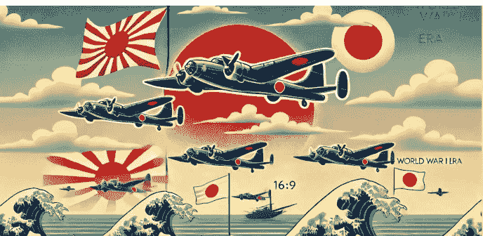

懒人专属群的群，你好！

我是徐弃郁，欢迎来到《日本简史》。

上一讲，我们分析了日本在太平洋战争中直线溃败的原因，其中当然有和美国的实力差距等因素，但深层的原因，是日本底层思维的缺陷。

不过，仅仅从军事行动的角度来了解二战时期的日本，有点显得过于单一了。在二战期间，日本除了军事侵略以外，还在它占领的东亚和东南亚地区搞过一个“大东亚共荣圈”。这个名词相信我们绝大多数人都不陌生，后来因为日军的暴行、因为日本的迅速战败，很快它就被扫进了历史垃圾堆。但是你要注意，这个所谓的“大东亚共荣圈”虽然昙花一现，但它很重要。

作为日本在历史上唯一实践过的地区性安排，对这个所谓的“共荣圈”进行深入分析，不光可以帮助我们更好地了解日本当时的政策，而且可以把握它的一些底层观念，从深层次了解这个国家的脉络和走向。

### “大东亚共荣圈”的基本情况

好，我们先来看一下所谓“大东亚共荣圈”的基本情况。“大东亚共荣圈”这个概念是在 1940 年，也就是珍珠港事件的前一年正式提出来的。两年之后，随着日本军队占领了东南亚和部分太平洋岛屿，日本开始真正实施这个“大东亚共荣圈”计划。那这个所谓“共荣圈”有多大呢？实际上它包括了日军占领和控制的全部地盘：朝鲜、中国沦陷区、东南亚和部分太平洋岛屿，总面积达 700 多万平方公里，人口 5 亿多。你看，这个规模应该说相当之大。

那日本搞这么大一个所谓“共荣圈”到底想干什么呢？

首要目标当然是经济，或者说得更直白一些，就是资源。

我们之前也说过，日本偷袭珍珠港、冒险和美国开战的一个重要动机，就是为了抢夺东南亚的战略性资源，所以一旦得手以后，它马上开始搞规划，所谓“大东亚共荣圈”很大程度上就是一个经济掠夺规划的产物。

第二个目标是政治，换句话说就是拉拢当地民心，巩固日本统治。

用日本人自己的话来说，就是“在极力开发其资源的同时尽量拉拢民心。”

第三个目标是文化，就是把这个所谓“共荣圈”打造成一个日本的文化圈。

### 日本落实“大东亚共荣圈”的方法

好，到这里，所谓“大东亚共荣圈”的基本情况都介绍完了。但是我告诉你，真正的看点并不是这些，而是日本在这个过程中的一些手法。为了落实“大东亚共荣圈”这个概念，日本主要打了两张牌。

第一张牌是所谓的“解放牌”。

在当时，这是日本最突出、也是宣传力度最大的口号，号称日本要从西方殖民者手里“解放”亚洲。日本人说，亚洲为什么落后呢？因为有西方的殖民统治。现在日本发动战争，把西方殖民者赶走了，所以亚洲人可以在日本领导下，共同建设一个亚洲人自己的共同体，这就是“大东亚共荣圈”。你看，这个说辞很漂亮吧？更重要的是，日本在这方面可不只是说说而已，它采取了很多措施，

首先在政治上给一些东南亚国家所谓的“独立”地位。

比如在印度尼西亚，日本军队刚刚实现占领，就把印尼独立运动的领导人苏加诺从监狱放出来，还给他政府职务。我这里插一句，苏加诺后来是印尼的第一任总统。在今天的马来西亚，日本也把马来人放到政府领导位置，对于菲律宾和缅甸这两个国家，日本则干脆“指导”其“独立”。当然，这种独立是要打引号的。就在盟军全面反攻的时候，日本搞过一个“大东亚会议”，当时日本首相东条英机主持，菲律宾和缅甸这两个所谓独立国家的领导人也参加了，那其他主要参会代表还有谁呢？还有两个中国人，一个是伪“满洲国”总理张景惠，另一个是伪国民政府主席汪精卫。所以你看，日本给东南亚国家的这个所谓独立其实就是和伪满、汪伪一样的地位。

与此同时，

日本还在打另外一张牌，也就是说文化牌，或者说是种族牌。

日本的说辞是，西方殖民者都是白种人，日本和其他亚洲国家都属于黄种人，同属亚洲文化，所以这个“大东亚共荣圈”必须清除西方影响。当时日本的“去西方化”

措施范围很广，包括大规模查禁西式教育，英语、荷兰语的教育都不允许搞了，有关英、美地理、历史和文化方面的书籍统统列为禁书。另外，大部分西方色彩浓厚的地标建筑也被拆除，比如我们上海外滩的赫德铜像、胜利天使像，都是在这一时期被拆掉的，然后作为宝贵的战略资源被日本人回炉。当时的日本还给了这些措施一个很高大上的说法，叫“去殖民化”

。

讲到这里你可能心里也在犯嘀咕，日本这种做法还能有人信？坦率地讲，这个问题回答起来还真有点难。对于中国、朝鲜这些饱受日本侵略的国家，日本这种说法、做法当然完全无效，但在东南亚，情况就有点复杂了。因为日军占领那边时间并不长，虽然我们很多材料都会讲日军在东南亚的各种暴行，但你要知道，日军在东南亚的暴行主要针对的是两类人：一类是盟军的战俘，还有一类就是当地的华人。像日本在东南亚屠杀最厉害的地方，就是华人聚集的新加坡，新加坡开国领导人李光耀当年就差点被日军杀掉。而对于当地的土著居民，日本的暴行相对少一些，再加上它的这套所谓“解放亚洲”的欺骗性宣传，所以

东南亚对日军占领的反抗也相对弱。

当地一些主要的抗日力量，比如马来亚共产党领导的人民抗日军其实没有多少马来人，基本上都是华人。

在当时所谓“大东亚共荣圈”里，各国对于日本这种欺骗性做法的反应是存在差异的。

换句话说，对于某些特定地区，日本这种做法并非完全无效，这一点我们要清楚。

### “大东亚共荣圈”的历史渊源

我这里还要强调的是，日本这套所谓“解放亚洲”的说法和做法并不是当时几个人灵机一动想出来的，而是有着很长的思想渊源。我们前面讲明治维新的时候，讲到过福泽谕吉的“脱亚论”，但实际上日本当时还存在一种思想，叫做“亚洲主义”

或者是

“泛亚主义”

。这部分思想很杂，有些人真心主张亚洲国家（包括中国、日本、朝鲜在内）互助自强，但相当一部分人是把反对西方殖民当成一个借口，实际目标是让日本自己取而代之。

日本的“亚洲主义”有一个特色，就是高度强调东西方之间的文化差异和种族差异，把东西方之间基本说成是水火不容的。

对此中共早期领导人李大钊曾经评论过，说日本故意强调东西方对立，实则就是为它自己的帝国主义服务，目标就是“禁他洲人之掠夺而自为掠夺”，也就是禁止西方掠夺，为的是由它单独来掠夺。

除了高度强调东西方之间的不相容，

日本的亚洲主义还有另一个基本特点，那就是日本要当亚洲的盟主。

这方面的日本给出的理由很有意思，除了强调日本发展程度最高，最有资格当盟主以外，还强调了自己文化上的正统地位。这是怎么回事呢？日本认为，东亚文化的中心原来在中国，但中国反复遭到外族入侵，已经很不纯正了，这个中心早己经转移到了日本。要知道，这种观点日本一直反复宣扬，到建立所谓“大东亚共荣圈”的时候，它更是被抬到了无以复加的程度。这里就触及到一个深层次的问题，那就是

日本在极力要当亚洲盟主的时候，它心中的参照实际上还是过去的朝贡体系。

我们在前面第 6 讲就提到过，日本在古代就想建立自己的朝贡体系：日本是中心，其他都是藩属，而且这些藩属按其文明程度也分为三六九等。而要你看一下日本搞的所谓“大东亚共荣圈”，会发现这种逻辑再次显现了：在这个所谓“共荣圈”里日本当然是中心，而且是唯一的工业区，再往下一级是中国（也就是“七七事变”以后日本的占领区），允许有一些轻工业，再往下是伪满洲国（也就是中国东北），允许有一些初级的基本工业，再往下是南洋各地，也就是东南亚国家，那就是纯粹的农矿产品供给地，只允许存在特产加工业。所以你看，这种设计的等级非常分明，说到底还是日本在历史上试图建立自己朝贡体系的一种翻版。

## 总结

到这里，这一讲就结束了，总结一下：

二战期间，日本出于经济、政治和文化目标，想要在占领区建立“大东亚共荣圈”，为此打出了解放亚洲和去西方化两张牌。日本所谓的“大东亚共荣圈”虽然是当时战争期间的产物，但它并不是凭空出现的，而且是有很深的历史渊源，可以追溯到明治维新时期目的的“亚洲主义”观念，反映了日本底层的文化观和地区观。

到 1945 年 8 月 15 日，日本裕仁天皇通过广播宣布无条件投降，9 月 2 日，正式签署投降书。中国人民浴血抗战十四年，终于迎来了最终的胜利。日本想要通过侵略中国进而成为亚洲领导者，建立“大东亚共荣圈”，与美国决战的“梦想”，随之破碎。战后的日本，进入了美国的军事占领期，由美国将军麦克阿瑟主导，进行战后改造。这场战后改造的效果如何呢？这就是我们下一讲的内容。

我是徐弃郁，我们下一讲再见。

## 23｜改造：日本历史轨迹的第三次转向？

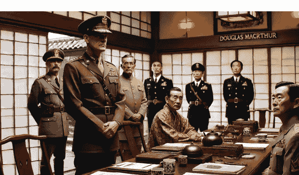

懒人专属群的群友，你好！

我是徐弃郁，欢迎来到《日本简史》。

上一讲我们说到，日本在占领东南亚和太平洋一部分岛屿后，大打“解放亚洲”和“去殖民化”两张牌，开始着手落实所谓的“大东亚共荣圈”。这个计划虽然是在 1940 年提出的，但是它的渊源可以追溯到明治维新时期的“泛亚洲主义”。1945 年 8 月 15 日，这一计划随着日本战败一同流产，日本由此进入了由美国军事占领时期。

我们前面讲过，日本历史上有两次最著名的改革，一次是大化改新，一次是明治维新，两次改革都改变了日本历史的进程。那有没有第三次这样的改革呢？坦率地说，二战结束以后的六年里，日本也发生了非常巨大变化，只不过这种改变不是日本人自己发起的，而是由外部强加的，所以这次改变与其说是改革，不如说是改造。而这场改造的领导者，就是驻日盟军最高司令、美军五星上将麦克阿瑟。

### 战后改造的效果

对于这场改造，我们先看一下它的不足之处：

第一，改造是由美国单独实施的，而且以美国的利益为导向；第二是不彻底，尤其是很多战犯没有受到应有的惩罚，像靖国神社这样的军国主义象征也没有铲除。可以说，日本在战争罪行上的反思远不如德国，麦克阿瑟的战后改造要负起责任。

不过，除了这些不足以外，麦克阿瑟对日本的战后改造成效到底如何呢？回答这个问题之前，我们看一下

后来美国、日本的一些极端派对战后改造的反应。

前几年，

美国有些对华极端强硬派曾经表示

，

美国战后对日本的改造其实是犯了一个错误。为什么这么说呢？因为美国过于成功地把一个野蛮的日本文明化、和平化，而这样一个日本在阻挡中国崛起的时候，最多只能当美国的跟班，而当不了第一线的先锋。再看

日本一些右翼人士的观点

，

他们对战后改造非常痛恨，认为这是把日本这个国家“阉割”了，从此无法成为一个正常国家。

所以你看，这些极端派的观点，其实也从反面告诉我们，

麦克阿瑟对日本的战后改造虽然存在很多不足，但总体上还是比较有效果的，日本的整个轨迹出现了明显改变。

讲到这里关键问题了，麦克阿瑟主持的战后改造前后加起来甚至不到 6 年，而日本军国主义传统至少可以追溯到明治维新，将近百年。那这短短 6 年的改造怎么能够产生效果呢？从历史的角度看，当时的战后改造到底抓住了哪些关键？

### 制度设计：出台战后宪法

很多人在谈日本战后改造的时候，往往会强调日本战后的宪法。应该说，这部宪法的诞生很有戏剧性。

当时盟军最高司令部是让日本人自己拿一个新宪法草案，以取代战前的宪法。结果呢，日本人一本正经地工作了 3 个月，拿出来的完全是一个换汤不换药的版本。所以美方得出结论，日本人不可能拿出新宪法，那怎么办？自己来。盟军最高司令部的民政局长惠特尼准将带着 24 个专家，一周之内就拿出了一部完整的新宪法。这部宪法确实非常重要，相当于把日本整个国家的国体、政体都做了重新规定，废除了明治时期遗留下来的封建残余（比如贵族的特殊权利等等），还对日本军事力量的使用做了限制。

那有人可能会想，这是否是美国宪法的翻版呢？还真不是，从法学角度来说，这部宪法的蓝本是英国式的代议制。

到这个时候，日本人还以为美国人在研究他们的版本呢，结果得到通知：你们拟的版本不符合要求，我们自己搞了一个，而且必须全部接受。说到这里，日本战后新宪法的产生过程你就清楚了，如果要记的话就记两条：第一，这部宪法属于“推翻重来”，由美国单方面强加给日本；第二，这部宪法以英式代议制为蓝本。如果说日本战后改造要找一个象征或集中体现的话，那非战后宪法莫属。

不过，宪法只是一种制度设计，宪法本身不可能保证自己正常运行。所以问题是，当时的日本为什么会老老实实地实行这部新宪法呢？

这当然和日本文化中的崇尚强者有关，和历史上面对白江口之战后的唐军、强迫日本开国的美国佩里舰队一样，日本人很现实，被打输了就认输。

但除了这种文化因素以外，当时盟军最高司令部的政策也非常关键，他们可不止是强加了日本一部新宪法，而且对日本的经济、政治、教育、国防进行了几乎是全方位的改造。其中，有两个关键措施尤其值得说一下吧。

### 顶层布局：日本天皇“实用化”

第一个关键措施是以实用主义的方式对待日本天皇。日本裕仁天皇在战争问题上实际负有关键责任，但麦克阿瑟并没有惩办他。为什么呢？因为他发现，日本天皇对日本人号召力太大了。本来日本军队还要搞本土决战、“一亿玉碎”，但天皇一说投降，日本人真的就全体投降了，连违抗命令的都没有。这里有一个极端例子，那就是 8 月 15 日日本天皇宣布投降以后，最后一支“神风特攻队”在一名日军中将率领下起飞，但为了不违抗天皇的命令，这队飞机并没有对美军发动自杀式进攻，而是在美军舰队上空盘旋一圈后冲向大海。这些事情让麦克阿瑟印象深刻。另外，日本投降的时候和纳粹德国还不一样，它兵员损失没那么大。有数据说还剩七百万部队，加上几十万警察，这些人如果到处搞暴动的话，50 万驻日美军将疲于应付。所以麦克阿瑟决定保留日本天皇，然后利用天皇来稳住日本人。但稳定日本只是第一步，第二步就是让日本天皇来做示范，接受美军的改造。

要知道，有不少日本人抗拒新宪法，是因为新宪法把天皇的实权全部剥夺了，只留一个虚位。针对这种情况，麦克阿瑟就让天皇自己来表态接受新宪法，这样日本从官僚到老百姓都没人吱声了。

更重要的一步，

麦克阿瑟让天皇自己来否定自己。

这是怎么回事呢？要知道在日本传统宗教当中，天皇是“神”的后裔，这一点我们其他国家很难理解，但日本情况就是这样。所以民众对天皇的服从和崇拜有很强的宗教性在里面，这也是为什么日本军国主义分子都把所谓“为天皇而死”作为最大荣耀。而麦克阿瑟的做法是，让日本天皇自己公开宣布，说自己是人而不是神，而且也不存在什么“日本国民优越于其他民族”的说法。不光这样，麦克阿瑟还让日本天皇穿上便装，以一个干干瘦瘦的中年人形象，到田间地头去见日本老百姓，和他们说话。你可不要小看这个安排，要知道之前普通民众根本看不到日本天皇，即使日本天皇出行，也一定是身穿军礼服，摆出威严的样子，和民众保持绝对距离。而现在日本天皇走到老百姓中间了，老百姓发现他就是个普通人，军国主义者宣扬的所谓天皇的“神”性一下子荡然无存。

所以你看，

麦克阿瑟保留日本天皇实际上是给自己保留了一个非常有用的工具

，很多事情让日本天皇出面，效果比美军自己出面好得多。听到这里，你是不是想到之前讲的某段日本历史了呢？没错，就是幕府时期，当时幕府将军支配着处于虚位的天皇，统治全国。我也要告诉你，麦克阿瑟当时确实有一个绰号，就叫

“蓝眼睛的幕府将军”

。

如果说麦克阿瑟保留并利用日本天皇是从日本社会的顶层下手的话，那么他另外一项关键措施瞄准的是日本社会的底层，那就是土地改革。

### 底层安排：土地改革

简单地说，盟军最高司令部看得很清楚，日本军国主义猖獗有其社会根源，那就是广大农民没有土地，大多数农民是佃农，他们耕种的土地属于地主，农民必须向地主支付租金以获得耕地的使用权。所以，对外扩张就成了号召这些无地农民的最好借口。为此，麦克阿瑟也搞了土地改革，效果怎么样呢？仅仅几年时间，日本农民自有耕地的面积从 11% 一下子跃升到 86%，89% 的日本农民有了足够自己耕作的土地。听到这里你也可以理解，为什么说

战后改造不仅动到了日本的精神根基（因为动到了天皇），也动到了日本的社会根基。

## 总结

好，到这里，这一讲就结束了，总结一下：

战后日本进入了盟军改造期，美国将军麦克阿瑟主导了战后的改造。从制定新宪法，再到保留天皇，再到土地改革，美国从制度设计、顶层布局、底层安排等多个层面对日本进行了全方位改造。

那这样的一场改造的影响到底怎么样呢？有一个例子比较能说明问题，20 世纪 70 年代日本有个激进作家叫三岛由纪夫，他想搞兵变，所以向 800 多名日本自卫队员喊话，号召他们以传统的武士道精神去保卫天皇。结果呢？不但没有任何人响应，还招来一片嘲笑，大意是“都什么年代了还搞这个”。所以说，美军的战后改造还是在相当程度上改变了日本。

但说到这里，我们只讲了美军的改造，那改造的对象——日本到底是什么样一种反应呢？日本政府和社会是不是完全被动地在接受改造？这就涉及了另外一个非常重要的问题，那就是日本的战后路线确立。这也是我们下一讲的主题。

我是徐弃郁，我们下一讲再见。

《徐弃郁·日本简史 30 讲》
重新认知这个熟悉又陌生的邻居
版权归得到 App 所有，未经许可不得转载 
徐弃郁
清华大学资深研究员
徐弃郁

公众号

**懒人搜索**

懒人专属群

[图片]

微信:lazyhelper

## 24 | 实用：战后日本为什么选择“一边倒”？

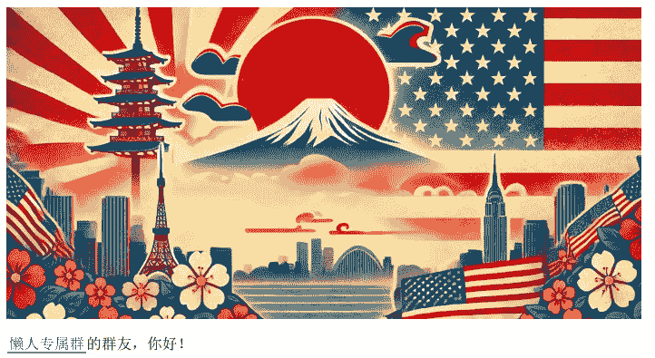

懒人专属群的群友，你好！

我是徐弃郁，欢迎来到《日本简史》。

上一讲我们说了战后美国对日本的改造和影响。在驻日盟军最高司令麦克阿瑟的主导下，美国对日本进行了全方位的改造，包括出台新宪法、实行土地改革等等，继大化改新、明治维新之后，日本的历史轨迹由此出现了第三次转向。

但是被改造以后的日本又要往何处去呢？在当时美苏冷战的背景下，日本和当时的西德一样，都选择了向美国“一边倒”。在很多人看来，日本的“一边倒”属于被动接受，因为日本在二战中被美国打败了，此后又被美军占领，又接受美国的改造，自然就完全听美国指挥了。但我告诉你，这只是部分事实，真实的历史要复杂得多。客观地说，战后日本向美国“一边倒”既有被迫成分，同时也有日本根据自己利益进行的主动设计，其中还包括了日本自己的身份定位和发展道路这样的核心考虑。

我还要告诉你的是，这样一种系统的考虑和设计在历史上有一个专有名词，叫做“吉田路线”。可以说看懂了“吉田路线”，日本战后五十年的轨迹就都清楚了。

好，那个“吉田路线”到底是怎么回事呢？

### “吉田路线”的基本内容

这就要说到战后上台的日本首相吉田茂了。吉田茂这个人很有特点，身材矮壮，精力充沛，特别喜欢抽雪茄，在政治上他既有世界眼光，又高度务实，属于日本政坛上非常少见的类型。美国总统尼克松曾经写过一本书，叫《领袖们》，对和他打过交道的各国领导人一一做了评价。书里对吉田茂的评价很高，而且篇幅不短，有兴趣的话你可以找来翻一下。

吉田茂当首相的时候已经 68 岁了，正好是战争结束的第二年，麦克阿瑟对日本的改造刚刚开始。吉田茂上台以后的政策很简单，就是拿出所谓“战败者的风度”，输了就是输了，配合美军改造。但等到改造快结束的时候，有一个重大问题就出来了，那就是美军占领期要结束，日本要和二战各交战国签订和约。

从国际法的角度来说，和约一旦签订，日本作为战败国被占领的状态也要结束。

那为什么这是个问题呢？这就要说到当时的世界格局了，冷战已经开始，世界分成了两大阵营，所以这个和约涉及到和哪个阵营签的问题。

从国际法的角度，这个和约日本必须和之前所有交战国签。

但美国的立场是，日本只需要和美国这边的阵营签就可以，苏联那边不用管。这样一来苏联阵营当然强烈抗议，日本国内也是一片反对之声。日本的左翼力量就坚决要求和包括苏联在内的所有交战国签和约，为此还征集了几百万人的集体签名。但吉田茂的选择是听美国的，单独和美国阵营签约。

1951 年 9 月 8 日，日本与美国阵营的盟国在旧金山签署了《旧金山和约》，规定第二年美国占领期结束，日本恢复国家主权。

讲到这里，我还要说一下这个《旧金山和约》的另一个重大问题，那就是与中国签约。

当时中国内战基本结束，新中国已经成立，按理来说应该由日本和新中国政府签订和约，但美国却选择了败退台湾的蒋介石政府。那吉田茂怎么办呢？这里我要说一句，吉田茂并不属于那些顽固反共反华的日本政客。他看得很明白，按道理日本应该是和新中国签和约，而且从日本的利益来说（这里主要是贸易利益）也应该和新中国签，这些他在自己的书里都写得清清楚楚的。但应该归应该，他在实际决策的时候还是选择了“一边倒”，听美国的话，和蒋介石政权签约。所以我们说，美国主导的这个《旧金山（对日）和约》在法理上存在非常大的问题，为后来的中日关系也埋下了很多隐患。

但《旧金山和约》的问题还不止这些，和它绑在一起的还有另一件引起重大争议的事情，那就是美国要求日本在签和约的同时，再和美国签一个同盟条约。

为什么呢？因为和约一签，相当于日本的被占领状态就结束了，美军要撤出。那美军不想撤怎么办？就再签一个同盟条约，规定美军以盟军的身份驻扎在日本。对此，日本国内当然也是一片反对声，因为这个同盟条约不光使日本明确处于从属地位，而且驻日军基地实际上成为日本的“国中之国”，日本政府根本无权管辖。日本人一看，这还算什么独立国家啊，所以当时日本报纸还发明了一个词，说签订了这样的同盟条约，日本的独立不能叫独立，应该叫做“从属性独立”，主张拒绝美国。还有一部分人主张干脆中立，美苏两边都不靠。那对于这些意见，吉田茂一概不理。

1951 年，在《旧金山和约》签署的同一天，日本和美国签署了《日美安全保障条约》，这也是今天我们要看到的日美同盟的由来。

好，听到这里你也发现，吉田茂在日本战后几乎所有重大问题上都听美国的，基本不顾事情的是非曲直。那换来了什么呢？

### “吉田路线”的根本原则

日本不少历史学家认为，吉田路线最大的成功就是用最短的时间结束了战败国的身份。

这里又要说到《旧金山和约》了，因为排除了苏联和中国等国家，美国在对日和约上可以说是一手包办，像老盟友英国的反对意见也被它压下，日本由此得到了非常宽大的和约条款。甚至连吉田茂本人都承认，《旧金山和约》对战败国来说“过于宽大”了。不仅如此，和约签订五年之后，美国又推动日本加入了联合国，相当于恢复了日本的国际地位。所以你看看，吉田茂的“一边倒”确实有很多实用主义的考量，实际上是用主动配合美国来换取日本的利益。

不过讲到这里你也要注意，日本的“一边倒”并不意味着对美国的要求全盘照收。这里最典型的例子就是重整日本军备。要知道，美国一开始是想把日本彻底非军事化，后来又允许日本保留少量部队，到朝鲜战争爆发以后，美国就转而要求日本重新大规模武装了。美国这个态度的转变，把日本国内那批旧军人和右翼势力高兴坏了，但吉田茂坚决不同意。为此，他还和前来施加压力的美国国务卿杜勒斯正面硬刚，说无论从哪方面看，日本都不能也不应该大规模武装，日本的军事力量只能维持自卫所需要的最低水平。要知道，吉田茂在这方面非常强硬，一度甚至成为日本右翼刺杀的对象。

那他为什么这么做呢？

其实和之前配合美国一样，他这里的考虑也是实用主义的：第一，既然美军要驻扎在日本，那么日本的安全当然由美军负责，日本没必要在军队上多花钱；第二种考虑可能就更深远一些，在吉田茂看来，军备上投入过多恰恰是日本过去的一个重要教训，不光老百姓勒紧裤腰带，而且还导致整个国家热衷武力扩张，最终酿成灾难。所以日本应该省下军费，把钱和资源用在发展经济上，这才是日本重新成为一个大国的基础。

### “吉田路线”背后的国家认知

讲到这里，所谓“吉田路线”的基本轮廓就已经出来了，那就是在美国的军事保护下，走一条轻军备、重经济的道路。

我这里还要强调的是，这个“重经济”还不只是重视经济发展，它还包括了一种自我认知的变化。

这是怎么回事呢？用吉田茂本人的话来说，日本是个岛国，国土狭小，资源贫乏，人口又密集，如果用过去自给自足的眼光来看，这些全部都是短板，甚至是致命缺陷。而战前那些军国主义者正是因为这种视角和想法，所以眼睛都死盯着什么“满洲”、“满蒙”，想搞一个自给自足的经济圈。但吉田茂说，如果跳出这个视角，用一种全球贸易国家的眼光来看，日本原来的这些短板可能就变成了优势，可以把世界原料产地和消费市场联结起来，集中精力把自己打造成一个“大进大出”的贸易枢纽和产业枢纽。所以你看，在吉田路线里面，日本对自己的认知和定位也发生了变化，它是想要把自己融入到整个世界贸易体系中去的，所谓“贸易立国”和“产业立国”都体现了日本这种新的定位。

## 总结

好，到这里，这一讲就结束了，总结一下：

战后的日本，选择了一条以实用主义为核心的“吉田路线”。在这条路线的指引下，日本“一边倒”地选择了美国阵营。这种选择看似被动，背后却有着日本的主动设计，它想要在美国的保护下，走一条轻军备、重经济的发展道路，把日本打造成为全球贸易和产业枢纽。

所以你看，所谓吉田路线看似简单，实际上包括了很多现实考虑和变化。这样的一种方针路线发挥作用最直接的地方，当然就是经济领域。这也是我们下一讲的内容。

我是徐弃郁，我们下一讲再见。

## 25 | 复苏：战后日本如何创造经济奇迹？

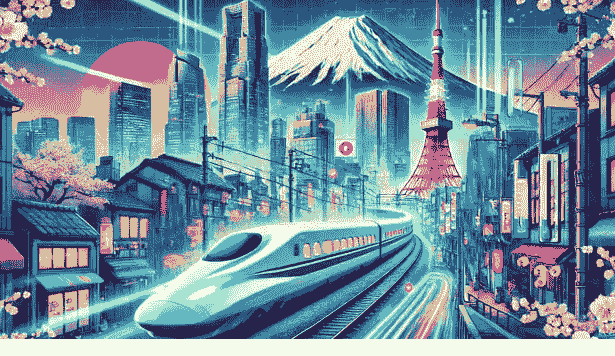

懒人专属群的群友，你好！

我是徐弃郁，欢迎来到《日本简史》。

上一讲我们说到了战后日本的“吉田路线”，这条路线以实用主义为原则，主张向美国阵营一边倒，在美国的军事保护下，走一条轻军备、重经济的发展道路。那“吉田路线”想要发展经济的目标实现了吗？

我们都知道，日本在二战结束时基本上被炸成一片废墟，但从 50 年代开始，日本经济就开始复苏。

从 1955 到 1970 年这段时间是它的经济高速增长阶段，实际 GDP 的复合增长率，也就是每年增长的平均速度达到 9.6%。到 1968 年，日本经济总量就超过当时的西德，位居世界第二。

从人均 GDP 来看，日本经济的发展速度也非常惊人：

1970 年日本人均 GDP 在世界上排在第 33 位，1985 年上升到第 18 位，1987 年人均 GDP 超过美国，1989 年成为世界第 8。

更重要的是，日本经济的发展质量也有了极大提高。

20 世纪 50 年代，“日本制造”还是粗制滥造的代名词，到 80 年代就成了高品质产品的象征。平心而论，日本在战后五十年中确实创造出了世界历史上罕见的“经济奇迹”。问题是，日本是如何创造这种奇迹的？

对于这个问题，强调最多的可能是两个原因：一是美国扶持，二是日本人的苦干。

### 美国对日本的经济扶持

关于美国的扶持，很多材料都会提到朝鲜战争。

当时美国为了应付这场战争，从日本大量订购军需用品，日本的生产和消费一下子被刺激起来了。

这个刺激有多明显呢？朝鲜战争刚刚爆发三个月，日本就结束了布料配给制度，买布和买衣服有钱就行，不再需要凭票了，同时报纸上还刊登出这样的标题：《再见，靠典当度日的生活》。所以说，朝鲜战争美国巨大的军需要求，使得日本经济彻底走出了谷底。

但我告诉你，这只是美国扶持的一小部分。我们前一讲就提到，日本战后是“贸易立国”，要把自己打造成国际经济体系中的一个贸易枢纽，所以贸易尤其是出口贸易对日本非常重要。根据统计，1955 年－1982 年，日本的出口增速年均 18.6%，占世界出口的比重从 2.4% 增加到 8.4%。这就产生了一个问题，日本这么大的出口增长谁来吸收呢？同时你也要知道，日本一直严格保护国内市场，限制进口和外来投资的，这就又带来另一个问题：其他国家难道就不担心贸易失衡吗？凭什么对日本商品这么敞开市场？这里就要说到美国对日本真正重要的扶持——对日本开放美国市场。

要知道，从日本经济复苏开始，美国都是它最主要的出口市场。日本对美出口增长非常快，20 世纪 60 年代的增幅甚至达到了 560%。那美国产业界有反应吗？当然有。比如 50 年代日本纺织品大量倾销美国的时候，美国的纺织行业就招架不住了，美国国会要求对日本纺织品提高关税，要对日本的倾销行为实行报复。结果这个提案被美国政府坚决否决，为什么？当时的国务卿杜勒斯讲得非常明确，日本这个盟友对美国来说太重要，绝不能搞贸易报复，否则用杜勒斯的话来说，“日本几乎一定会发展与共产主义中国的紧密关系”。到了 60 年代，日本对美国的出口增幅更大，美国工业界的反应也更加强烈，但当时美国约翰逊政府仍然决定，“政府应坚决抵制美国工业界要求缩减日本进口产品的做法”。更重要的是，美国政府不光对日本开放自己的市场，对于欧洲市场、东南亚市场美国都帮着日本做工作。所以你看，美国实际上是为日本创造了一个良好的外部贸易环境，这对日本经济发展确实太关键了。

### 日本传统优势助力

好，讲到这里我们再看日本方面为经济发展做的努力。我们都知道，日本战后几乎成为一片废墟，但同时你也要看到，它只是一个被打残了的工业化国家，不是一个落后国家。

为什么？因为日本和当时的德国一样，有两个条件是落后国家不具备的：一是受教育人口比例高；二是拥有一批有经验的企业。要知道，现在日本出名的大企业除了索尼和本田这两家以外，其余都是战前就发展起来的，这就使得日本在经营、管理等方面有比较好的人才和组织基础。

有了这两个基础条件，接下来就是日本的主观努力了。日本在战后做了很多事情，比如进一步加大教育投入，提升高等教育水平。比如实行“模仿 + 赶超”的制造业发展模式，日本 60 年代非常流行的一句话是：“第一台（机器）进口，第二台国产，第三台出口”，就是这种发展模式的真实写照。但关于日本的努力，我这里要强调的，是三个带有很浓厚日本传统的因素，这些因素你都可以很容易地在历史上找到对应。

哪三个因素呢？

第一个就是政府干预。

美国东亚问题专家查默斯•约翰逊前几年写了一本书，叫做《通产省与日本奇迹》。这本书的主要观点，就是日本经济的复苏、发展和西方国家不一样，不是以市场为主导，而是和明治维新高度类似，由政府提供强有力的组织和指导。

标题上的这个通产省就是日本政府内部主管经济的部门，它发挥了非常关键作用，不光是制定产业政策，而且干预企业的投资和发展方向。书里举了个例子，那就是 50 年代开始美军在日本有大量的“特别采购”，其实就是购买军需品，日本企业把东西卖给美军以后手里就有美元了。但这些美元怎么用不是这些企业说了算的，而是通产省说了算，它要监督这些企业必须把这些美元用在基础工业投资上，其中 70% 集中在电力、钢铁、化工、机械等行业。所以，60 年代日本工业起飞和通产省就有极大的关系，后来日本企业的海外开拓也是受到通产省的大力推动。

再看第二个因素，日本独特的企业文化。

日本著名企业家、索尼公司的创始人盛田昭夫曾经说过，日本企业管理的全部秘密在于“家庭意识”。

这是怎么回事呢？要知道，二战以后日本企业实行了员工“终身雇佣制”和“年功序列工资制”，就是日本企业一般不开除员工，同时也不鼓励自己员工之间争个你死我活，而是讲究资历和为企业服务的年头。这样一来，员工和企业高度捆绑，就像一个大家庭，只要企业繁荣，员工相当于一辈子有了保障，生老病死都由企业管，所以非常积极，主动加班成为常态。所以日本人的工作时长是发达国家里面最高的，平均每人每年的工作时长比美国人高 10%，比德国人高 30% 多。那日本怎么会形成这样一种企业文化呢？有学者就指出，实际上日本公司就像传统日本社会的“藩”，藩国的藩，员工就是武士，企业主就是藩主。以前，藩主和武士的主从关系一旦形成，那就世世代代生活在一起，藩主要照顾武士，武士要誓死效忠藩主。所以你看，这其实也是历史传统在现实中的折射。

最后再看一下第三个因素，也是这几年讨论很多的一个话题，那就是日本的“工匠精神”，或者叫做“匠人精神”。

那这种精神是否就是对完美和极致的追求呢？当然是，不过从稻盛和夫这些日本企业家的描述来看，它还有更深一层的意思，那就是通过专注于这种常人看起来非常枯燥的细节，从中体会一种对天地、对神灵的敬畏之心。实际上就是把它上升到人生观的层面，要从这个过程中得到精神上的满足。如果再深挖一下，你会发现日本这种“工匠精神”有一个非常重要的基础，那就是他们的职业观。

一旦干上了某一行，就不要再东张西望，专心致志把它做好。所以日本有很多企业虽然规模很小，但它专注于做一两个产品，几代人坚持不懈地做，直到把“精”、“深”，做成自己的护城河。而且这些企业往往也很长寿，在世界 200 年以上的企业当中，日本企业占了 56%，而且绝大多数都是这种中小企业。听到这里，你可以复习一下前面第 7 讲的江户时期，那个时期长达两百多年，日本社会被细分成好多职业和工种，然后必须世世代代做下去，不许转行。

日本人现在的“工匠精神”也好，职业观也好，明显带着这种江户时代的烙印。

所以你看，政府干预、企业文化和工匠精神，这三个因素都和日本的历史传统有关。如果把这三个因素加起来，你会发现日本经济或者企业发展的一个重要特点就出现了，那就是利于动员全体力量向确定的目标冲刺。

当市场标准是“精”、“深”的时候，日本企业的优势往往会更明显，这也是战后日本经济创造“奇迹”的关键所在。

## 总结

到这里，这一讲就结束了，总结一下：

战后的日本在“吉田路线”的指引下，走上了轻军事、重经济的发展道路。在战后五十年的时间里，创造了罕见的经济奇迹。这种经济奇迹的实现，一方面离不开美国的扶持，尤其是对日本开放美国市场，另一方面也离不开日本固有传统的助力。明治时期的政府干预、幕府时期的家臣制度、江户时代的身份固化，跨越时间，发展成为日本企业的特有的集体意识、工匠精神，成为了战后日本经济发展的优势。不过最后我也要补一句，优势和劣势并非一成不变。在新的情况下，日本的这些优势可能会转变成它的劣势，即所谓“成为萧何、败也萧何”。这些问题我们后面第 29 讲再谈。下一讲我们把目光转向战后的中日关系。

好，这一讲到这里就结束了。我是徐弃郁，我们下一讲再见。

## 26 | 转变：中日为什么在 1972 年实现了邦交正常化？

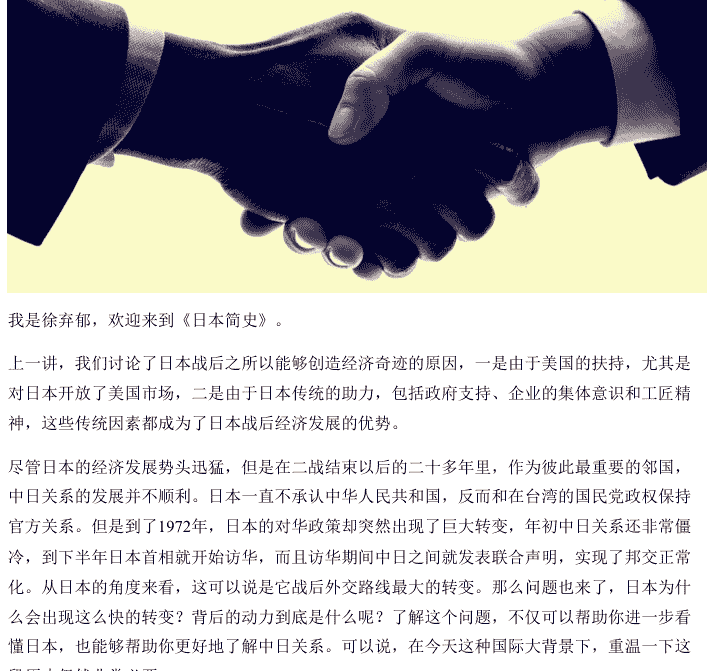

我是徐弃郁，欢迎来到《日本简史》。

上一讲，我们讨论了日本战后之所以能够创造经济奇迹的原因，一是由于美国的扶持，尤其是对日本开放了美国市场，二是由于日本传统的助力，包括政府支持、企业的集体意识和工匠精神，这些传统因素都成为了日本战后经济发展的优势。

尽管日本的经济发展势头迅猛，但是在二战结束以后的二十多年里，作为彼此最重要的邻国，中日关系的发展并不顺利。日本一直不承认中华人民共和国，反而和在台湾的国民党政权保持官方关系。但是到了 1972 年，日本的对华政策却突然出现了巨大转变，年初中日关系还非常僵冷，到下半年日本首相就开始访华，而且访华期间中日之间就发表联合声明，实现了邦交正常化。从日本的角度来看，这可以说是它战后外交路线最大的转变。那么问题也来了，日本为什么会出现这么快的转变？背后的动力到底是什么呢？了解这个问题，不仅可以帮助你进一步看懂日本，也能够帮助你更好地了解中日关系。可以说，在今天这种国际大背景下，重温一下这段历史仍然非常有必要。

### “邦交正常化”背后的历史遗留

在讲日本对华政策变化之前，我们先看一个非常有意思的问题。曾经不止一次有学生问我，说 20 世纪 60、70 年代，我们中华人民共和国和西方逐步打开外交关系的时候，与法国、美国这些国家建立外交关系，官方用词都是“建交”，但是 1972 年和日本建立外交关系的时候，官方用词为什么是“邦交正常化”呢？为什么不用“建交”这个词呢？

你可别小看这个用词差别，实际上它点出了当时中日关系里面一个关键点，那就是两国战争状态是否结束的问题。你可能会觉得有点不可思议，日本 1945 年就投降了，后面二十多年里中日之间也没打仗，怎么还有战争状态这个说法呢？这就是一个国际法问题了。按照国际法，两国之间如果仗打完了但和约没有签，那从法律上讲战争状态就没有结束。比如朝鲜半岛，20 世纪 50 年代，双方签订的是停战协定，而不是条约，所以从法律上说半岛仍然处在战争状态。

那中日之间是什么情况呢？我前面也讲过，对日本的《旧金山和约》是美国一手包办的，中华人民共和国政府没有在和约上签字，所以中日之间当时不光是没有外交关系，而且战争状态也一直没有任何正式结束。所以，1972 年我们在建立外交关系的同时，才正式结束了两国之间的战争状态。当时《中日联合声明》的第一条是：“自本声明公布之日起，中华人民共和国和日本国之间迄今为止的不正常状态宣告结束”，说的就是这个意思。听到这里你也明白了，当时我们和日本建交为什么不用“建交”，而要用“邦交正常化”。

### 战后日本对华政策的大框架

好，解释完了这个词，我们就可以来看日本的政策变化了。总体上说，战后日本在大方针上基本都听美国的，外交方面尤其如此。因为，冷战背景下，外交就相当于是站队。所以日本从二战结束到 1972 年，对中国的态度和美国完全保持一致：不承认中华人民共和国、不搞官方交往。

但是我也要告诉你，日本这种政策框架虽然一直没变过，但每一届政府的具体态度是有区别的。比如一开始的吉田茂政府出于务实考虑，就想和我们发展官方联系，但被美国硬压下去了。尼克松在他的书里说过，吉田茂早在《旧金山和约》之前就想承认新中国，但遭到美国的严厉警告，说如果日本敢这么做，那美国国会就拒绝批准和约。吉田茂只能屈服。此后尼克松本人也曾经前往日本，当面警告吉田茂，不许和中国建交。

但后来上台的首相岸信介就完全不一样，他对中国的敌视政策非常主动，根本不需要美国的压力。岸信介这个人值得一说，他是日本前首相安倍晋三的外祖父，曾经在伪满洲国任要职，战后作为甲级战犯嫌疑人被关押了三年，最终没有被起诉。后来，他又重返政坛，成为日本首相。有日本学者就指出，他和部分政要对新中国不仅敌视，还存在战前日本军国主义者那种蔑视心理。日本有个著名的学者叫做南原繁，战后当过日本东京大学首任校长，他就说过，“部分日本人内心还残留着陈旧的中国观，在日本政治家中，日本具有历史连续性的蔑视中国心理结构依然存活，这种心理被冷战反共政治赋予物质性力量”。应该说这个分析非常到位。所以在岸信介当首相期间，日本对中国的敌视政策就不是被迫的，而是主动的。

而且就在这段时间，中日之间还发生了一些很严重的事件，其中之一就是“长崎国旗事件”。那是怎么回事呢？当时中日通过民间渠道在日本长崎举办中国邮票和剪纸展览，结果两名暴徒冲进会场扯下悬挂的五星红旗，但当地警察局拒绝关押这两人。更过分的是，岸信介本人对此完全是一种嘲讽的态度，说“如果因为（国旗）被扯下来而愤怒，那干脆就别挂”。所以你也可以想象，这个人当政的时候中日交流降到了冰点，民间渠道也被打压得很厉害。

所以你看，日本在对华政策上听美国的，但听的程度有差异。美国相当于给日本的对华政策套了一个大框架，日本在里面还是有自己发挥的空间，有时往积极方向推，有时往消极方向做。但是无论怎么做，日本都不能突破美国的框架。这就是当时日本对华政策的情况。

### 日本转变对华政策的原因

好，那为什么 1972 年日本这么快就转变了对华政策呢？当然是因为大框架出现变化了。1971 年下半年，美国总统尼克松突然宣布，要在第二年年初访华。这对世界格局来说是一个巨大震撼，意味着美国要放弃长达 20 年的敌视中国的政策。更重要的是，美国这个决定事先对日本严格保密，日本事先根本没有得到任何消息，当时日本政府还在联合国大会上很起劲地搞反华提案呢。结果尼克松这么一宣布，日本政府一下子就傻眼了：我这么紧跟着你和中国作对，结果你招呼也不打一个就把我卖了。日本社会当然更是一片哗然，觉得政府太蠢，简直丢人丢到家了。在这种国内压力之下，原先坚持敌视中国的那届政府很快倒台。那新上台的日本政府怎么办？当然是赶快转变对华政策。所以你看，日本 1972 年对华政策出现的大转变首先就是因为美国政策这个大框架变了。

但是我这里也要告诉你，这种大框架的变化只是必要条件。日本对华政策在这么短的时间里发生这么大的变化，还有一个重要的推动力就是中国方面持之以恒的工作。中华人民共和国成立以后，中国政府针对当时中日关系的客观现实，提出了“民间先行、以民促官”的思路，在官方往来冻结的情况下，大力推动中日民间交流。但这种民间交流可不全是民间人士在弄，中国的高层领导甚至是最高领导人都亲自参加。比如说，毛泽东主席曾经多次为来访的日本代表团题字，把自己的书法作为礼物赠送给日方。有统计表明，毛泽东主席赠送自己书法作品最多的就是对日本代表团。周恩来总理则是中日民间外交的具体决策者，他在将近 20 年的时间里亲自接待了 323 个日本代表团。这种扎实、细致的工作感动了很多日本人，越来越多的人在日本国内奔走呼吁，要求承认中华人民共和国。比如日本公明党的创始人池田大作就在日本政府坚持反华的情况下，率先提出“日中邦交正常化倡言”，在日本国内引起了巨大反响。应该说，这种民间交流带来的结果虽然不直接，但是属于“滴水穿石”的类型，在日本社会逐步培养起了一种民意基础，带来一种潜移默化的影响。一旦时机到来，中日邦交正常化就是水到渠成的事情。

这里我们就要说到实现中日邦交正常化的日本首相田中角荣了。应该说，田中角荣本人就属于受到中日民间交流影响的日本政治家，在中日关系方面表现得非常积极。早在当选首相之前，他就向中国政府传话，表示一旦上台，立即实现中日复交。结果他 1972 年 7 月当选首相，9 月就访华，9 月底实现中日邦交正常化。所以，虽然美国总统尼克松率先访华，但日本在和中国恢复邦交方面的努力却比美国大得多，速度也快得多。周恩来总理对田中角荣说“你比尼克松勇敢”，指的就是这一点。

## 总结

好，这一讲到这里就结束了，总结一下：

战后日本的对华政策，虽然有一定程度的发挥空间，但总体上与美国保持一致。中华人民共和国成立以后，提出了“民间先行、以民促官”的思路，大力推动中日民间交流。1972 年，在美国转变对华政策的大背景下，中日随之恢复邦交。讲到这里我们可以看出，日本对华政策虽然总体上必须和美国保持一致，但美日这种“主”、“从”关系并不绝对。日本在具体问题上仍然有自己的发挥空间，有时甚至是比较大的空间。应该说，这种特点到今天仍然存在，值得我们关注。

我是徐弃郁，我们下一讲再见。

## 27｜震动：一本小册子为何引起世界关注？

懒人专属群的群友，你好！

我是徐弃郁，欢迎来到《日本简史》。

在上一讲我们说过，中日邦交正常化之所以拖到 1972 年才实现，关键在于日本对华政策和美国高度捆绑。事实上，在二战结束以后，日本几乎所有重大政策都要看美国脸色，很少敢说“不”的。但是，到了 1989 年，日本国内突然出版了一本书，题目就叫做《日本可以说不》，这本书不光轰动了全日本，更是引起了世界的震动。反应最强烈的当然是美国，中国、东南亚、包括俄罗斯和欧洲也对这本书也很关注，不少机构甚至为此组织了专门研讨会，研讨的核心问题就是，日本下一步到底要干什么？是不是准备要公开挑战美国？我们中国当时第一时间也把这本书翻译过来了，你那时候如果看到的话会发现，它就是薄薄的一本，可以说就是一本小册子。那问题也来了，为什么这样一本小册子会引起如此巨大的震动呢？

### 这本书的时代背景

这首先就要说到当时的时代背景。在 20 世纪 80 年代，日本正在迎来它经济发展的巅峰时期，工业品出口额跃居世界首位，对外直接投资跃居世界首位，1987 年人均 GDP 超过美国，跃居西方 7 国集团的首位。更重要的是，它在尖端的半导体、精密机床等科技领域也居于世界领先地位。在和美国的经济关系中，日本也越来越占上风，一方面贸易顺差不断增加，在 80 年代的前 5 年对美贸易顺差扩大了整整 4 倍，另一方面日资也在美国市场高歌猛进。就在《日本可以说不》出版的这一年，日本在美国进行了两次标志性收购：一是日本索尼公司收购美国著名的哥伦比亚电影公司，二是日本三菱集团收购了美国纽约洛克菲勒中心 51% 的股份。要知道，纽约洛克菲勒中心一直以来都是美国全球经济地位的标志，所以在当时很多人看来，三菱那次收购就象征着日本崛起、美国衰落。

那美国对于日本的经济崛起什么反应呢？到 80 年代，美国开始在贸易、货币等方面采取强烈的反制行动，美国国内也不断“抵制日货”，甚至出现了美国议员在国会山外面抢大锤砸日本电器的场景。这在日本看来，就是美国人开始急眼了，这说明什么？恰恰说明日本的成功啊。

所以在这个阶段，日本政府虽然对美国还是保持服从姿态，但日本社会、尤其是工商界的心态变了，觉得日本经济的崛起和全球扩张是不可阻挡的。

当时一位著名日本企业家曾公开宣称，对于日本企业来说，市场占有率不达 100% 不算成功，因为成功必须意味着对手的彻底失败。你听这话就能感觉到，当时日本企业界那种自信心爆棚的状态。在这种心态下，当时大多数日本人认为日本超越美国就是个时间问题。

好，结合这样一种背景，你就可以明白《日本可以说不》为什么在日本国内外引起震动了。

一方面，因为它确实反映出了日本人当时的一种普遍情绪；另一方面，日本经济和科技实力确实发展到了相当高的水平。

### 这本书的核心内容

那书里到底写的什么呢？实际上这本书的内容还是比较简单的，核心意思可以分为三层。

第一层意思是，日本正在不断崛起，美国正在不断衰落，日本超越美国大势所趋。

在书里面，表达这层意思的章节标题就有不少，我这里挑几个念一下，比如“日本的尖端技术控制着美苏军事力量的心脏”、“目光短浅的美国日益衰落”，等等。而且这本书还多次解释为什么如此，比如日本讲集体主义，优于美国的个人主义，日本企业文化优于美国企业文化，日本人更勤劳，更有责任心，更重要的是日本人比美国人考虑更加长远。书里面有一段话，说日本人总是考虑未来 10 年需要什么，而美国人考虑多长远呢？只考虑未来 10 分钟，所以美国只会越来越不行。

你听到这话，可能会觉得有点不对劲？美国人怎么会只考虑未来 10 分钟呢？实际情况是，作者问的是一位美国金融投机人士，挣的就是快钱，所以说考虑未来 10 分钟的趋势就投入资金。但作者偏偏就理解成美国人只考虑未来 10 分钟，而且他还在美国专门作了“10 分钟还是 10 年”的演讲。更有意思的是，写这段话的人还不是作为政客的石原慎太郎，而是索尼创始人盛田昭夫。这样一个了不起的企业家居然仅凭一位金融投机人士的回答，就得出“日本人考虑未来 10 年、美国人考虑未来 10 分钟”这样的结论，可能唯一的解释就是日本人当时实在是太自信了。所以我们从另一个角度来看，《日本可以说不》这本书，基本上也是 80 年代日本强烈自信心的一次集中展示。

再看书的第二层意思，那就是表达一种强烈不满。

这本书反复指出，战后的日美关系一直处于严重不对等的状态，日本在美国那里只能唯唯诺诺。更重要的是，美国还很不公平，把日美关系中的所有问题包括贸易逆差在内，全部都怪在日本头上。我这里插一句，这部分有些东西说得并没什么问题，特别是批评美国在贸易、人权方面的不公正做法，我相信今天不少人也会有共鸣。

第三层意思更简单，那就是结论：日本受够了，要勇敢地对美国说“不”。

书里主张日本说“不”的地方，不光是在贸易、科技、外交这些方面，而且还包括美国最在意、最敏感的日美军事关系。要知道，美国当时之所以和日本签订同盟条约，一方面是冷战的需要，要借助日本的实力；另一方面也是控制日本的需要。

这个美日同盟实际上是剥夺了日本的独立作战能力，在美国看来，这一点是美日关系最重要的基础，绝对不能变，否则一切都有可能发生。

但这本书偏偏还指出，日本在军事上也应该单干，而且如果单干的话，效率会更高，效果会更好。所以你看，这书还触及了美国最大的禁忌。如果把上面三层意思综合起来，你就可以理解，为什么当时这本书会引起如此巨大的震动。

### 这本书背后的地区观

不过，这本书有意思的地方不只是这些。从认识日本的角度来说，还有一点非常值得关注，那就是它表现出来的地区观。

这本书强调，日本是亚洲的中心。

为什么呢？因为日本经济迅速发展，不断实现产业升级，而替换下来的产业转移到亚洲其他国家和地区，当时著名的“亚洲四小龙”，包括韩国、新加坡和中国的台湾地区和香港，就是依靠这种转移繁荣起来的。要知道这个观点当时在日本很普遍。日本经济学家还提出了一个完整的理论框架，叫做“雁阵模式”。就是亚洲地区的经济发展模式应该和大雁飞行一样，有领头雁，然后有第二梯队、第三梯队。按日本人的设计，领头雁自然是日本，大雁两翼也就是第二梯队指的是“亚洲四小龙”，它们承接从日本转移出来的产业；大雁的身体是“亚洲四小虎”（这是当时的叫法，包括印尼、马来西亚、菲律宾、泰国），它们承接从“四小龙”淘汰下来的产业；最后是雁尾，就是中国大陆和其他东南亚国家。

你看，按照这样一个模式，东亚（包括东南亚）就成了一个以日本为中心的地区经济结构，而且等级非常分明，运行有序。这样一个结构是否让你想起什么呢？没错，很像日本过去的地区体系设想，古代日本是要仿照中国建立日本为中心的朝贡体系，二战时期是要建“大东亚共荣圈”，都是这种以日本为中心、等级分明的模式。从这个角度上看，《日本可以说“不”》的地区观又一次体现了日本过去的某种传统。这种传统并没有消失，这也正是我们需要引起警觉的地方。

## 总结

到这里，这一讲就结束了，总结一下：

20 世纪 80 年代，日本迎来经济发展的巅峰时期，日本人普遍认为超过美国只是时间问题。在这种背景下，日本右翼政客石原慎太郎和日本索尼公司创始人盛田昭夫共同完成了一本名为《日本可以说“不”》的书籍，书中表达了日本超越美国的自信、对美国的不满和决心对美国“说不”的态度。同样重要的是，这本书继承了传统的“以日本为中心”的地区设想，明确表达了日本是亚洲中心的观点。这值得我们警觉。

说到这里就要讲到日本右翼了。我们前面就说过，《日本可以说“不”》的作者之一就是一个著名的右翼政客。那么日本右翼到底是怎么回事？他们想干什么？这就是我们下一讲的内容。

我是徐弃郁，我们下一讲再见。

## 28 | 滋生：战后日本右翼为何崛起？

懒人专属群的群友，你好！

我是徐弃郁，欢迎来到《日本简史》。

上一讲，我们提到了《日本可以说“不”》这本书给世界带来的震动。之所以引起世界这样的反应，一方面是因为这本书表达的观点，呈现出了日本历史上似曾相识的过度自信，和传统中“以日本为中心”的危险的地区观；另一方面是因为书籍作者的身份比较特殊。一位是日本索尼公司创始人盛田昭夫，另外一位是日本右翼政客石原慎太郎。

在关于日本的新闻中，“日本右翼”这个词你可能会经常会听到。近年来，中日关系中的很多波折，包括 2012 年钓鱼岛“非法购岛事件”、政客参拜靖国神社等等，都和这个“右翼”有密切关系。所以在很多人印象里，日本右翼就是专门针对中国、给中日关系搞破坏的那批人。但是我告诉你，这种看法其实并不准确。实际上，日本右翼是一个比较复杂的概念，特别是在二战以后，它还经历了一个演变和崛起的过程。

那到底什么是日本右翼？战后它又是怎么崛起的？可以说，要了解今天的日本，这两个问题都是绕不开的。

### 日本右翼的源头

好，我们先说一下日本右翼。

作为一种政治势力，日本右翼至少可以追溯到明治维新。

当时日本不是全面向西方学习吗？结果不少日本人发现，西方文化的冲击太厉害，那日本社会的传统价值观、社会习俗怎么办呢？所以当时有一批人就组织起来，要抵制西方文化，要保卫日本的传统，包括武士道精神、神国史观，等等。（我这里插一句，这个神国史观就是把日本的历史和神话混在一起，说日本天皇是神的后代，日本是神之国）。这就是日本右翼的源头。

### 战后初期的日本右翼

当然，传统的右翼组织随着日本战败，基本都被摧毁了。

现在我们说的日本右翼指的是二战以后发展起来的那批势力。

他们和战前的右翼有一定区别，而且在各个阶段也有变化，但他们一个共同的特点，那就是拒绝反思战争、主张回归日本的传统价值观。

什么传统价值呢？日本右翼人士可能会列一长串价值，但核心就是天皇高于一切，全体国民为天皇尽忠，说白了就是战前的状态。

当然，听到这里你可能马上就发现，战后右翼日本的这种主张似乎是冲着美国去的，因为驻日盟军最高司令麦克阿瑟改造日本的重点就是这个，他要将天皇从天上拉回人间。但是，因为当时日本处于盟军占领期，战后日本右翼一开始并没有把他们的核心主张拿出来，公开的立场是反共、亲美。有些学者把这个当成是日本右翼在这一阶段的真实主张，并不准确，这只是权宜之计。

当时日本一个非常著名的右翼分子（赤尾敏）说过，亲美反共就是谋略。

### 60-70 年代的日本右翼

等到 60 年日本经济起飞以后，日本右翼马上开始拿出了他们的核心主张，就是回归日本的传统。

那具体怎么做呢？

- 第一，修宪，因为和平宪法是战后美国强加给日本的，所以要修改或者干脆废除；
- 第二，改制，战后的民主制度也是美国强加的，而且是对天皇神圣地位的否定，所以要改变或者推翻；
- 第三，废约，或者叫“反安保”，因为“美日同盟条约”的正式名字是《日美安全保障条约》。日本右翼认为，美日同盟把日本矮化为了没有正式军队的国家（因为日本自卫队的法律地位和真正的军队还是有点差别），而驻日美军侵犯了日本主权，所以主张日本收回美军在日本的基地，并且建立真正的国家军队。

把这三个具体方面加起来，你就会发现，此时日本右翼的核心主张是在反共的同时反美，而这个反美的重点，就是反对美国对日本的战后改造。

也就是在这个阶段，日本右翼搞出了一件大事，那就是政变。这是怎么回事呢？日本当时有一个非常有名的作家，叫三岛由纪夫（我们在讲麦克阿瑟对日本进行战后改造的时候提到过他）。这个人在政治上绝对是右翼，和《日本可以说“不”》的作者、著名右翼政客石原慎太郎的关系非常好。三岛由纪夫这个人对日本所谓的传统精神非常狂热，甚至还组建了自己的私人武装团体，叫“盾会”（盾牌的盾）。组织武装要干什么呢？当然要搞政变，要重振日本传统的武士道精神，要保卫天皇。

1970 年 11 月，他真这么干了，而且整个过程非常有戏剧性。我简单说一下：当时三岛由纪夫带着 4 个手下到日本陆上自卫队的一个地区司令部，说要“献宝刀给司令鉴赏”。应该说这个情节对中国人来说就很熟了，《三国演义》里曹操以献刀为名刺杀董卓等等，都是这个风格。结果三岛由纪夫借机把陆上自卫队的领导给绑架了，然后登上阳台，对着 800 多名自卫队官兵进行了一番慷慨激昂的演说，呼吁大家当“真正的武士”，跟他一起推翻宪法，使自卫队成为真正的军队，保卫天皇和日本的传统。那有人响应吗？一个也没有，还遭到了嘲笑，说这都什么年代还搞这个。三岛一看不成功，那就按武士道的传统，自杀。

这个事情你听了可能会觉得有点搞笑，但它当时在日本国内的影响非常大。

一方面，这件事本身就是 60－70 年代日本右翼崛起的一个标志，另一方面它又刺激了日本右翼的进一步生长。

所有右翼团体都把三岛由纪夫看成是英雄，还给他东京搞了一场公祭，不少右翼分子还说是三岛由纪夫开启了日本的“新右翼”。

### 80-90 年代的日本右翼

好，我们再看 80－90 年代，这是日本右翼进一步崛起的阶段。

## 28｜总结（续）

为什么呢？关键原因当然是日本的国力进一步增长，面对美国更有底气了，上一讲我们聊的《日本可以说不》这本书就是在这个时候出版的。

在这个阶段，日本右翼的重点转移到为战争罪行辩护上。

为什么呢？这里一个重要原因就是，经历过战争的一代人正在老去，代际更替正在到来，这个时候，那段战争历史的解释权就成为一个争夺的对象。一方面，有些日本政治家对过去的侵略战争公开道歉，比较著名的就是村山富市首相在二战结束 50 周年纪念日上上的讲话，那次讲话可以说是日本政治家对战争罪行反省最彻底的一次。但另一方面，日本右翼在历史问题上也采取了猛烈的攻势。

首先要说的就是参拜靖国神社问题。

你可能有好多次听到新闻上说，日本某个政要又去参拜靖国神社了，然后中日关系就会出现强烈震动。但你要知道，这个事情就是从 20 世纪 70 年代末、80 年代初开始的。那个时候日本右翼在靖国神社上搞了一系列手脚，先是把东条英机等 14 名甲级战犯的牌位移入靖国神社，搞所谓“合祭”，也就是将普通士兵和战犯共同祭祀。此后，日本右翼又推动日本首相等政府高官前往祭扫。从此以后，靖国神社就成为日本右翼搞事情的标志性地点。

除此之外，就是关于战争罪行的一系列辩护。

这方面日本右翼的说法非常多，简单整理一下的话，可以归为四大类：
- 第一是所谓“史料不实论”，就是日军战争期间的暴行被夸大了，实际上不存在，这方面最突出的就是否定南京大屠杀。
- 第二是“自卫战争论”，也就是把日本发动侵略战争说成是“被迫的”、“自卫的”，是为了打破所谓的“ABCD 包围圈”。这个 ABCD 包围圈我在第 17 讲介绍过，这里就不重复了。
- 第三是“美英同罪论”。什么意思？日本是侵略过其他亚洲国家，但美国英国不也侵略过亚洲吗？为什么只盯着日本？你看，这个逻辑就很奇特。
- 第四种就更极端了，叫“解放战争论”，干脆说日本发动战争是为了把亚洲国家从英美手中解放出来，不仅无过，而且有功。

所有这些论点加起来，你会发现，在他们眼里，侵略战争和武士道精神、神国史观这些所谓“传统”实际上是一个整体。

曾经有一位日本学者（他是反战人士）告诉我，这些东西和日本从明治维新到二战那段历史是高度捆绑的，在日本右翼看来，那是日本最强大、也最有精神的时期，战后日本经历的所有经济、社会问题，都是因为日本被迫放弃了这些传统。

在这位学者看来，日本人的执拗、狭隘和渴望强大这三项因素加起来，形成了日本右翼的社会心理土壤。

## 总结

到这里，这一讲就结束了，总结一下：

日本右翼起源于明治维新时期，在日本向西方积极学习的同时，右翼势力主张抵制西方文化，保卫日本传统武士道精神和神国史观。随着日本战败，传统的右翼组织被摧毁，战后右翼势力出现，他们拒绝反思战争，也主张天皇高于一切的传统价值观。随着日本经济的发展，战后右翼势力大致经历了反共亲美、反共反美、为战争罪行辩护三个阶段。有观点认为，日本人的执拗、狭隘和渴望强大，这三项因素共同形成了日本右翼的社会心理土壤。

坦率地说，如果这个社会心理土壤的观点站得住脚的话，那么日本右翼的生命力也许会超过很多人的预期。不仅国力上升会助长其崛起，国力的衰退可能也会刺激它发展。对此，包括中国在内的国际社会应该有一个长远的心理准备。

我是徐弃郁，我们下一讲再见。

## 公众号

懒人搜索
懒人专属群

微信:lazyhelper

## 29｜滑落：日本为什么会经历“失去的三十年”?

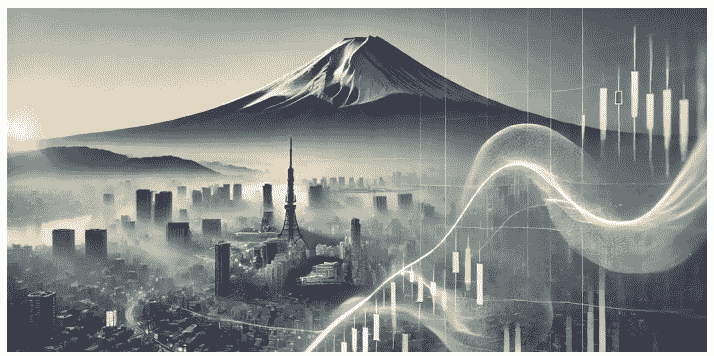

懒人专属群的群友，你好！

我是徐弃郁，欢迎来到《日本简史》。

上一讲，我们说了日本右翼的起源和发展。根据战后右翼在上世纪 50 到 80 年代的变化，我们大概可以看出，日本经济发展的势头越猛，右翼拒绝反思战争、主张回归日本传统价值观的声音就越大，表态也越明目张胆。日本右翼那时候普遍认为，日本经济超过美国只是迟早的事情。

在 20 世纪 80 年代，世界上相当一部分人也是这么认为的。但出人意料的是，从 90 年代开始，日本经济增长迅速放慢，很多日本人把 20 世纪 90 年代之后的三十年称为“失去的三十年”。那这种落差有多大呢？我们可以把 1995 年的经济数据和 2024 年的简单比较一下。1995 年的时候，日本 GDP 占美国的将近 73%，现在只占美国的 15% 左右；那时日本的人均 GDP 是美国的 1.5 倍多，现在美国反过来是日本的将近 2.6 倍。

再看企业，1995 年是世界 500 强企业这个榜单第一次出炉，当时进入 500 强的日本企业总数达到 149 家，仅略低于美国的 151 家，但这 149 家日本企业的营业收入超过了美国和欧洲上榜企业的总和。另外，挤进前十名的日本企业有 6 家，其中位居榜首的就是日本的三菱。从这个你也可以看出当年日本企业在全球独占鳌头的状态。但到 2023 年，日本企业只有 41 家上榜，进入前 20 名的只有丰田一家（排在第 19 名）。这样一比的话，前后的落差确实有点触目惊心，那么问题也来了，为什么日本经济会经历这样的落差呢？

### 对日本经济滑落的传统解释

对这个问题的讨论和争论当然非常多了，可以说是一个经久不衰的热门问题。

比较常见的解释有两种：第一种解释就是人口老龄化。说老龄化导致日本劳动人口减少，消费不振，最后经济衰退。

第二种解释是日本在金融上中了美国的计，或者说被美国狠狠地整了一下。

这种解释认为，1985 年美国把日本、西德、法国和英国拉进一个《广场协定》，联合干预外汇市场，让美元贬值。但这个协定最大的后果则是日元升值，进而引发日本经济出现巨大泡沫，90 年代初日本央行强行刺破泡沫，日本经济由此衰退。那这两种说法对不对呢？

先看老龄化的解释。

现在大家都知道日本人口老龄化非常严重，但在 90 年代的时候，这个问题还没真正到来。1990 年，日本人口普查表明，15－64 岁的人口（也就是劳动人口）占总人口的 69.5%，达到战后最高峰，而劳动人口的总量是在 1995 年到达最高峰。

所以用人口老龄化至少没法解释 90 年代日本经济下跌。

再看第二种金融解释。

### 对日本经济滑落的有力解释

应该说这个说法可能是流传最广的解释，而且日本的泡沫经济和最后强行刺破泡沫确实是 90 年代日本经济下跌的直接原因。但问题是，那时日本实体经济还是相当强的。要知道，当泡沫破裂的时候日本人并不慌。为什么？一是因为这个泡沫是他们主动刺破的，属于“刮骨疗毒”；二是因为日本科技产业和制造产业的优势都还在，所以日本觉得没事，暂时跌一下，很快就能恢复。但结果是，日本经济再也没有恢复到之前的水平。所以你看，仅仅用金融泡沫破裂也不能解释日本经济为什么出现这么大的落差。

这个根子可能还得从日本的实体经济、特别是它的最强项——高端制造业来分析。

日本有一位资深的产业人士叫汤之上隆，他大约在 10 年前出版了一本书，题目是《失去的制造业》。这本书很有意思，他把日本制造业特别是半导体产业和二战时日本著名的“零式”战斗机相类比。要知道，日本“零式”差不多是二战最著名的战斗机之一，在太平洋战争初期，“零式”压倒了美军所有战斗机。但两年以后，美军投入新型战斗机，日本“零式”就此没落，双方交换比居然达到 1:19（也就是击落一架美军新型战斗机，日本要损失 19 架零式）。

这本书认为，“零式”战斗机由盛转衰反映出来的问题，和半个世纪以后的日本半导体产业几乎一样。那主要有哪些问题呢？

首先就是过度自信。他说，日本人在追赶的时候非常谦虚，善于学习，但一旦领先就变得特别自信，只愿意在原有的优势领域进一步挖掘，不愿意再去开拓别的赛道。40 年代“零式”战斗机是这样，90 年代半导体也是这样。你要看这本书的话会感觉，作者对这一点非常痛心。

第二是过度追求最优。这点就比较有意思了。你可能还记得，我们在第 25 讲分析战后日本经济的成功时，专门讲过日本人的“工匠精神”（或者叫“匠人精神”）。正是这种持之以恒的专注、对“精”、“深”的追求，造就了日本制造业的辉煌。但是，物极必反，日本企业在这方面可能做过头了。

书里举了几个例子，首先就是动态随机存取存储器，也就是 DRAM。日本半导体厂商把质量追求推到极致，做出了保质期长达 25 年的 DRAM，可以说不惜工本。但问题是，后来使用 DRAM 的主要是个人电脑（PC 机），你知道 PC 机一般 5 年就要替换的，但日本企业还在坚持 25 年质保，所以这个精益求精就成了它给自己挖的陷阱。还有一个例子是汽车上用的气囊芯片，丰田公司要求这种芯片达到零缺陷的标准，但实际上这个标准根本没有必要，因为激活这个芯片的概率本身就已经非常低了。结果日本半导体企业还是非常敬业，一个劲地投入、测试，到企业都入不敷出了也不肯放弃。这本书认为，这种过度追求最优给日本企业带来了两大问题：一是不必要的成本迅速增加；二是全部精力都盯着眼前的局部，因为过度强调精益求精，结果是没有多余的精力和眼光来放眼全局，最终错过了关键的发展时机，特别是错过了半导体产业中逻辑芯片的兴起。

第三是创新窘境。什么叫创新窘境呢？就是巨头企业只知道满足现有客户的要求，只在现有技术轨道进行创新，但忽视对新的、颠覆性赛道的投入，缺乏应变能力。

这三点我们如果仔细琢磨一下，会发现这些批评指的是同一个方向，那就是日本的企业文化。

我们之前也讲过，日本企业文化强调集体主义、工匠精神和长远规划，这些特点使它们在渐进式或者叫延续性技术产业中非常占优势，一步一个脚印，产品越做越精细，技术力量越来越雄厚。但是，如果面对更新迭代迅速，甚至充满颠覆性创新的产业，日本企业的这种企业文化可能反而成了负担。而 20 世纪 90 年代末到 21 世纪初，恰恰又是信息技术革命的爆发期，技术和市场的颠覆效应不断出现，再加上泡沫破裂带来的金融冲击，使得日本企业在这波浪潮中丢城失地。其中最具象征性的例子之一，就是曾经拥有全球 DRAM 市场 80% 的日本企业尔必达被美国企业收购。另外，像曾经是全球科技龙头的索尼公司，2000 年的时候市值达到 1250 亿美元，2012 年只剩下不到 100 亿美元。所以我们从这个角度来看，日本经济在一个时代辉煌的秘诀，可能也正是它在另一个时代遭受挫败的关键原因。

### 日本经济是“衰落”还是“滑落”

讲到这里，你可能发现，我在这一讲没有用过衰落这个词。为什么？因为日本经济和它巅峰时期相比肯定是下滑不少，但是不是就已经“衰落”了，这个我们需要慎重。我们还是以高科技产业特别是半导体产业为例子。

日本企业错过了逻辑芯片这个关键的发展赛道，在全球半导体市场上的份额一降再降，现在全球半导体巨头中已经看不到日本企业的名字。但是，日本半导体产业似乎还不能不用“衰落”两个字来形容，特别是在半导体制造的设备和材料这些重要领域，日本企业依然处于全球首屈一指的地位。

就拿材料来说，现在芯片制造需要 19 种主要材料，其中 14 种材料的主要供应商都是日本企业，占全球市场的份额都超过了 50%。另外，我们现在被卡脖子最厉害的一个领域就是光刻机，这里涉及的一项关键技术是光刻胶，而这方面也是日本的强项，光是三家日本企业就占了最新一代光刻胶专利的 80% 以上。

另外，我们也不能低估日本企业的韧性和适应能力。还是前面讲到索尼公司，在 2012 年市值创下最低点后，居然一路“回血”，10 年后市值又增加了 10 倍。

## 总结

好，这一讲到这里就结束了，总结一下：

20 世纪 90 年代，在几乎所有的人都以为日本经济会超过美国时，日本的经济开始滑落，至今都没有恢复。对于滑落的原因，传统的解释是人口老龄化和金融问题，但这两种解释并不充分。更深层的解释，可以从日本高端制造业滑落的原因里找到，或许它的企业文化需要负不小的责任。

但是，我们这一讲分析日本经济如何从巅峰滑落，并不是要做一个“盖棺定论”的总结，而是要从日本经济的这段历史体会大国经济的周期，从而借鉴其中的教训。关于日本的历史我们就说到这里，下一讲，我们一起来聊聊日本的未来。

我是徐弃郁，我们下一讲再见。

## 30 | 展望：“令和”时代的日本会向何处去？

懒人专属群的群友，你好！

我是徐弃郁，欢迎来到《日本简史》。

我们前面二十九讲说的都是历史上的日本。这一讲我们就沿着历史的轨迹，尝试着聊一下日本的未来。2019 年 5 月 1 日，日本第一位二战以后出生的天皇德仁即位，年号“令和”。这个“令和”什么意思呢？要知道，从我们第二讲说的大化改新以后，日本天皇有据可查的 247 个年号都出自中国古代典籍，而这个“令和”是首次选自日本古籍的年号。这部日本古籍名叫《万叶集》（一万两万的万，树叶的叶），是在公元八世纪（大约是我们唐朝中期）编写的。书里面收集的《梅花歌》里有两句诗：初春令月、气淑风和，“令和”就取自这里。当时的日本首相安倍晋三解释说，这意味着寒冷的冬天将过去，和暖的春天将来临，是对未来充满希望的意思。

应该说，安倍的这种解释可能确实反映了日本社会当时的一种心态。我们就拿之前的两个年号“昭和”和“平成”来说吧。从 1926 到 1989 年，“昭和”这个年号用了快 63 年。在这个时期，日本经历了对外侵略和几乎是毁灭性的战败投降，但也经历了世界瞩目的经济复苏和繁荣，可以说是大起大落。但随后的“平成”时代就不一样了，它从 1989 年开始，到 2019 年结束，整整 30 年。这 30 年被认为是日本经济与社会成熟的时期，但是我们前一讲提到过，这也是繁荣过后的衰退期、低迷期，很多日本人说的“失去的 30 年”和“平成”30 年基本重合。所以你也可以理解，为什么年号“令和”中寒冬过去、春天到来的意思特别能反映日本人的期待。

这种期待能不能变成现实呢？换句话说，日本能不能重新走出一条上升曲线？这可能是日本人最关心的问题。而对中国、韩国和朝鲜这些邻国来说，更关心的是，日本这个国家曾经给整个东亚地区带来深重的灾难，那它会不会为了摆脱长期低迷的困境，再走原来的军国主义老路呢？我相信，有不少人都有这个担心或者说是警觉。

### 日本在法律上有条件重走“军国主义”老路

首先要说的是，这种担心肯定不是空穴来风。要知道，日本不少右翼势力把日本经济和社会发展的低迷，归咎于日本战后那种所谓“不正常状态”，尤其是归咎于战后的和平宪法，认为它对所谓日本的“阳刚之气”、“尚武精神”造成严重打击，所以整个社会软弱无力，走不出低谷。按这样一种逻辑，他们开出的药方当然就是要修改和平宪法，恢复所谓的“正常国家”地位。你可不要以为这只是日本民间那些右翼组织的想法，事实上，在日本政界，持这种观点的人也不少。更重要的是，最近十年内，日本政府确实在不断向这个方向行动。

就拿法律领域来说吧，我们都知道日本战后有部和平宪法，约束了日本发展和使用武力。但你要知道，发挥约束作用的可不仅仅是这门宪法，底下还有一系列具体的法律和法规，这些是实实在在在限制日本的。

我给你举个例子，日本有一项法规叫做《武器出口三原则》，实际上就是禁止日本向国外出口武器装备。这条法规的后果，就是日本军工企业根本没有办法形成规模效应，没有规模效应生产成本当然就高，所以日本生产的武器装备的价格至少是美国同样武器的两倍。你一听就知道，这条法规实际上就是限制日本军工能力的。但我告诉你，这条法规在 2014 年被大幅度修改，实际已经没有什么限制作用了。而且在之后的十年里，其他限制性法律法规也基本上被改掉，现在只剩下一部和平宪法。而且，从现在日本国会的情况来看，修宪的力量已经满足了法定的多数。换句话说，日本如果真要“修宪”，至少法律程序上的障碍已经不存在了。

### 日本发展轨迹出现质变的可能性很低

那日本会不会真的往军国主义的老路上走呢？应该说，日本政界确实有一股势力，要恢复所谓的“正常国家”地位，要重振军事力量，这是我们需要高度警惕的。不过与此同时，我们也要看到，今天和二战前的形势差别还是很大。

首先是大国格局不一样了，尤其是中国的崛起，使得整个东亚地区呈现中美“双强”格局，日本和中美的实力地位存在明显落差。

另外，未来美国对日本的控制力度不会减弱。有些人认为，美国现在和中国的竞争加剧，所以很可能给日本一些让步，好让日本进一步加入对中国的遏制。但从最近十年的情况来看，美国对日本的控制一点没减，特别是在军事方面。一旦日本流露出在核能力、远程导弹这些敏感技术方面的需求，美国政府马上进行敲打，一点都不手软。另外，在主战装备的核心技术方面，日本也和以前一样，仍然受到美国的封锁。换句话说，你不要看日本自卫队有很多美军的先进武器，但只是给日本用，或者是由它制造组装而已，但核心技术它是拿不到的。更重要的是，美军在日本的军事基地已经成为一种“不可更改的存在”。这个词是一名日本学者发明的，意思是早先日本政府还会和美国商量一下基地的削减问题、搬迁问题，而现在干脆连提都不敢提了。所以从这个角度来说，日本右翼追求的那种所谓“正常国家地位”实际上根本不可能实现。

再来看日本自身的情况。要知道，现在日本大多数民众对重振军事力量这种话题不感兴趣，特别是年轻一代。日本政府为了吸引年轻人当兵，给出了很多优惠条件，但反响非常一般。2023 年度，日本自卫队计划招募 19000 多人，实际招了多少呢？只有 9900 多人，相当于计划人数的 51%，比 2022 年又下降 15 个百分点。应该说，这一点非常反映日本社会的现实。

另外日本社会还有一个严重问题，那就是老龄化。它的老龄化到底有多严重呢？根据日本政府 2024 年的数据，现在日本 65 岁以上的人口占到总人口的 29.4%，将近三分之一，而 80 岁以上的人口也已经占到 10%。与此同时，日本社会还有一个“少子化”问题，就是出生率低。这样的结果，就是日本人口连续 15 年减少，到 2024 年 1 月 1 日，它的总人口是 1.2 亿，比 2023 年又减少 86 万，跌幅创下 1968 年有统计以来的最高纪录。这样的社会倾向和人口现实摆在这里，你也可以发现，一些日本政客想让日本再度成为军事大国的设想其实没什么基础。换句话说，日本下一步的发展轨迹出现质变的可能性很低。

### 未来的中日关系走向

那在这种情况下日本和中国的关系会怎么样呢？说实话，因为历史问题和来自美国的压力，日本对华政策几乎不太可能有什么改善。但是中日经济之间我中有你、你中有我的相互依存程度非常之高。中国已经连续十几年都是日本最大的贸易伙伴，是日本出口的第二大市场，也是日本进口的最大来源国。日本政界和企业界对此心知肚明，所以即便现在美国一直在施压日本和中国搞“脱钩”，但实际上日本方面一直在消极抵抗。比如，从进口依赖的角度看，现在美欧都在大力宣扬要减少所谓对中国的依赖，但日本的情况完全相反，它进口的主要商品中属于对华“高度依赖”的品类从 2019 年的 22% 上升到 2024 年的将近 40%。从企业的情况看，约 30% 的在华日企表示计划进一步扩大业务，这一比例在各国在华外资企业中名列前茅。所以，从日本的角度来说，和中国的经贸联系是日本经济走出低谷的重要途径，不可能放弃。

从我们的角度来说，日本是离我们最近的发达工业国家，它的技术能力和发展水平，包括它在战后发展的起起落落，踩过的各种坑，实际上仍然值得我们认真借鉴。

一句话，中日关系有着实实在在的利益基础，这种基础未来依然会发挥重要作用。

## 总结

好，这一讲到这里就结束了，总结一下：

“令和时代”反映了日本人想要走出“失落三十年”，重新走出一条上升曲线的期盼。但东亚邻国更关心的是，日本是否会为了这个目的重走军国主义老路。从法律程序上看，日本重走军国主义道路是可能的。但从如今的世界格局和日本本身的社会情况看，日本发展轨迹出现质变的可能性非常低。关于未来的中日关系，日本对华政策不会出现太多的变化，但仍旧会保持非常紧密的经济关系，这种共同的利益基础，很可能在未来的中日关系中发挥重要的作用。

好，日本简史到这里就讲完了。我是徐弃郁，谢谢你的一路陪伴。