# 汪志谦·MOT体验设计课

懒人专属群的群友们，大家好，这是小懒人给大家的《通才计划》更新的课程。

> > **懒人专属群 - 通才计划介绍** 是小懒给群友们准备的各领域付费课程，以及高分电子书分享。为防止和谐，课程仅供专属群群友。下载地址见小懒私信给大家的群文档。

整理通才计划的初衷是：给群友带来一些**成体系**的课程。而不是碎片化阅读。

只有成体系的学习，才能相对全面地了解一个领域。

学习的目的不是为了输出，而是为了优化我们的思维决策力。

得到 99RMB 的课程《**汪志谦·MOT 体验设计课**》

已整理添加到专属群《通才计划》，几十份付费课程到咱们懒人专属群内总链接自取。

通才计划目录：[https://lazybook.fun/#/data/13_course](https://lazybook.fun/#/data/13_course)

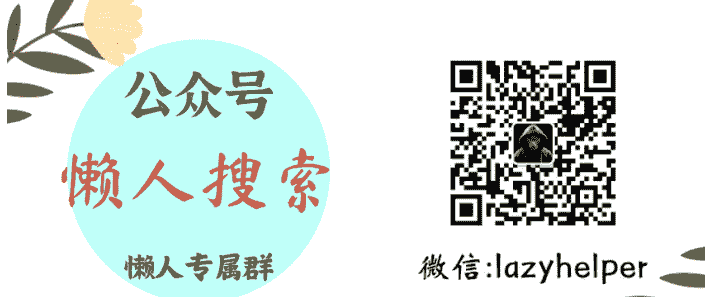

懒人手册：[https://lazybook.fun/](https://lazybook.fun/)

懒人专属群：[https://lazybook.fun/#/blog/group](https://lazybook.fun/#/blog/group)

专属群更新记录：[https://lazybook.fun/#/blog/record2](https://lazybook.fun/#/blog/record2)

## 目录

# 汪志谦·MOT 体验设计课

目录

## 发刊词：抓住关键时刻，体验也可以设计

体验设计=洞察 + 落地

实战经验 + 思维体系

## 01 讲为什么要有 MOT ？

最高、最低、最终

什么是关键时刻？

影响消费者决策的 MOT

进入心智，产生有商业价值的行为

## 02 讲 MOT 和四大商业指标有什么关系？

四大商业指标

让正确的信息进入心智

四大维度形成闭环

## 03 讲问谁才能挖出 MOT？

怎样写出一个 MOT ？

为他们才能挖出 MOT

## 04 讲怎么洞察出店的关键时刻？

进店的真正原因

消费者到底关心什么？

进店是否有效？

四个洞察点

## 05 讲始于迷惑，怎么让消费者一见就进店？

- “就是这样”
- “那是怎样？”
- “怎么会这样？”
- 思考题

## 06 讲怎么洞察出转化的关键时刻？

- 转化的五大障碍
- 转化维度的洞察点
- 思考题

## 07 讲陷于套路，怎么让消费者一进店就买？

- “试这个”
- “看这个”
- “买这个”

## 08 讲怎么洞察出复购的关键时刻？

- 企业常犯的三个错误
- 六大“关键时刻”
- 复购的洞察点

## 09 讲忠于习惯，怎么让消费者一买再买？

- 平凡变极致
- 低谷变峰值
- 梦想变真实

## 10 讲怎么洞察出推荐的关键时刻？

- 找出分享动机
- 消费者如何推荐
- 谁推荐的力度最大

## 11 讲传于印记，怎么让消费者一传千里？

- “我是谁”
- “他是谁”
- “你是谁”

## 12 讲怎么选出目标客群？

## 13 讲怎么选出最重要的 MOT？

- 1.MOT 不是一人一票
- 2.选出相匹配的 MOT
- 3.看这个 MOT 是不是黄金时刻
- 4.是否落地品牌核心信息
- 5.放大你的美

## 14 讲怎么为你的品牌挑选信息？

- 企业常犯的错误
- 如何进入消费者的心智？
- 选择信息三原则

## 15 讲 MOT 就是商业模式：你要可复制，还是卖得贵？

- 一兰拉面
- 日本银座平山


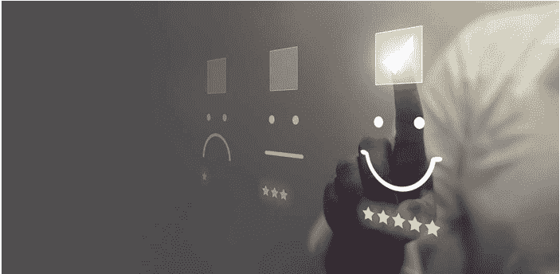

你好，我是汪志谦。

我们开门见山，先来说说到底什么叫“关键时刻”。

**关键时刻**，*Moment of Truth*，简称*MOT*，是北欧航空前总裁詹·卡尔森在 1980 年提出的。

卡尔森认为，关键时刻就是客户与企业的各种资源发生接触的那一刻。这个时刻决定了企业未来的成败，因为对于客户来说，他只会记住的，就是那些关键时刻。

卡尔森在 38 岁的时候，只用了一年的时间，就让当时的北欧航空公司转亏为盈，成为当时全世界少数最赚钱的航空公司之一。

他说：

“去年，我们接待了一千万名客户。每个客户平均会接触到 5 位我们公司的员工，每次接触只有 15 秒，这五千万次的 15 秒的关键时刻，终将决定我们公司的成败。”

现在，*MOT* 早就不只是一家航空公司的成功经验这么简单了，它是帮助企业实现品牌增长的重要方法论。这是一个非常重要、非常好用的工具，拿着它，你可以*洞察消费者行为，做好体验设计，定位品牌战略，最终产生实实在在的商业价值。*

## 体验设计=*洞察 +*落地

一说到“品牌提升”，大部分人想到的、在做的，就是每个环节都不能落下。产品设计、客户服务、营销运营、售后跟踪等等，每一项都要做好，否则，提升、增长，都不可能实现。

但这...是一个巨大的陷阱。

整体提升，第一你做不到，第二消费者感知不到。很多企业在品牌上花费巨大，却都看不到成效，原因就在这里。

世界上的信息越来越多，消费者注意力越来越短，能关注到你家产品可能就只有一瞬间。这已经是目前每一家企业每天都在面对的最大挑战。

如果你还认为，体验设计就等于整体提升，那你就错了，你已经输掉了这场战役。

*真正的体验设计，是做取舍。*

你必须要找到影响消费者决策的那些瞬间，然后挑选取舍，再集中火力，把弹药都打到关键时刻上，你才能获得成功。

我的这门课，就是要帮助你解决这个问题。*解决方法概括来讲，就是“*`洞察`+`落地`*”。

如何找出消费者注意力停留的瞬间，如何发现消费者做决策的时刻，又如何发现消费者什么时刻觉得“值了”，以及消费者为什么会裂变拉新的真实原因，这些"*洞察*"的方法，在我的课里，都有答案。

怎么用这些洞察去影响消费者的心智，怎么利用体验设计放回产品服务里，又怎么最大程度地放大企业的美，让消费者产生有价值的商业行为，这些"*落地*"的方法，在我的课里，也都有答案。

*洞察是解码人心，落地是编码植入。*


我会围绕着关键时刻，从企业最关心的进店、转化、复购、推荐这四大维度出发，洞察一见就进、一进就买、一买再买、一传千里的关键时刻。

我会再教给你，让消费者“始于迷惑”进店、“陷于套路”转化、“忠于习惯”复购、“传于印记”推荐的落地方法。

### 汪志谦·MOT 体验设计课
抓住决定成败的关键时刻

## 发刊词：抓住关键时刻，体验也可以设计

#### 第一模块 认识 MOT

- 1. 为什么要有 MOT ？
- 2. MOT 和四大商业指标有什么关系？
- 3. 问谁才能挖出 MOT？

#### 第二模块 四大商业维度中的 MOT

- 4. 怎么洞察出进店的关键时刻？
- 5. 始于迷惑，怎么让消费者一见就进？
- 6. 怎么洞察出转化的关键时刻？
- 7. 陷于套路，怎么让消费者一进就买？
- 8. 怎么洞察出复购的关键时刻？
- 9. 忠于习惯，怎么让消费者一买再买？
- 10. 怎么洞察出推荐的关键时刻？
- 11. 传于印记，怎么让消费者一传千里？

#### 第三模块 MOT 落地

- 12. 怎么选出目标客户？
- 13. 怎么选出最重要的 MOT ？
- 14. 怎么为你的 MOT 挑选信息？

#### 结语

- 15. MOT 就是商业模式：你要可复制，还是卖得贵？

汪志谦·MOT 体验设计课

得到 App 出品


公众号懒人搜索，懒人专属群分享

**公众号**

**懒人搜索**

**懒人专属群**

**微信：lazyhelper**

01 讲为什么要 MOT ？

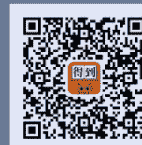

我最常听到老板问我的一句话是：我想要加强服务这个点，把我们公司的整体服务拉升一个层次，超越现在所有的同行。我该怎么做？

这个提问听上去很好，对吧？想要把整体服务拉升一个层次，很正常，没什么问题。

但是，我可以很负责任地告诉你，这个观念从一开始就是错的，这是企业最常犯的一个严重错误。

## 最高、最低、最终

因为对于大部分的企业来说，“整体服务提升”是根本做不到的，就算你做到了，消费者也不会记得。

就像 2002 年的诺贝尔经济学奖得主丹尼尔·卡尼曼所说的峰终定律，消费者会以“最高”、“最低”、“最终”这三个时刻作为经验自我的认知，其他都不会记得。所以，企业所做的非常有可能都会是无效功。

举个例子。朋友陪我去买衣服，我挑了半天，导购很辛苦地忙进忙出，服务了一个多小时。终于我挑好了六七件，准备要买，但我的朋友说：“我觉得你比较适合买某某品牌。”我说：“是吗？”朋友说：“对啊，我们一起去看一下。”我就对导购说：“不好意思，我待会儿再过来买。”

结果这位导购当场就不高兴了，她说：“不早点说，现在才讲，我都帮你服务一个多小时了。”结果我朋友暴怒，说：“你这是什么态度啊？”

你看，这位导购说错一句话，前面一个多小时的服务，马上化为乌有。

这就是卡尼曼说的“最终”。在“最终”这个关键时刻你搞砸了，消费者只会记得这个搞砸的时刻，前面全部都会忘记。

企业想要提升整体服务，消费者是不会全部都记得的，你做的非常有可能都是无效功，因为消费者最容易记得的就是“最高”、“最低”和“最终”这三个时刻。

但大部分的企业，没有让消费者有“最高”的峰值体验，更糟的是，做出了非常多的低谷，也就是“最低”这个时刻。

做的很多事没有被记得，被记得的都是低谷，而且被大量传播，这就是企业最常犯的错误。

所以，企业该怎么办呢？答案是，不能有低谷，要灭掉低谷。然后，要找到真正影响消费者决策的关键时刻，打造“最高”峰值。

把企业的资源花在这几个关键时刻上面，消费者才会记得。

## 什么是关键时刻？

说到这儿，你可能会问，那到底什么是关键时刻？

MOT 是 Moment Of Truth 的缩写，是 1980 年北欧航空总裁卡尔森所提出的。

## 影响消费者决策的 MOT

我再来分享一个案例：我是如何让一个年营业额 300 亿的公司，做对十件事，净利成长十倍，赚到 25 亿的。

这家企业是华航，是一家台湾知名的航空公司，2019 年全球排名第 34 名。

年营业额 300 亿是什么概念呢？2017 年，东航的年营业额是 1000 亿，南航是 900 亿。可见，华航的 300 亿是相对较小的。但它也不是个小公司，可以说是不大不小、不好不坏的一家公司。想要让这样的公司实现爆发性增长，是很难的。

那我是怎么做到让它净利翻了 10 倍呢？

首先，就是判断它的问题到底出在哪里。华航当时的问题是有营业额，但不赚钱。

别觉得华航跟你的公司不一样，其实它跟你的公司面临的问题是完全一样的。

所有公司都有两类主要的产品，一类叫做高毛利产品，另一类叫低毛利产品。大部分的公司都是高毛利的产品卖不好，低毛利的产品卖很多，不怎么赚钱。简单讲，就是大卖的商品，毛利低；毛利高的商品，卖不动。华航也是一样的，低毛利的经济舱班班满，但高毛利的商务舱没有人坐。

所以，我们的任务就是如何让高毛利的商务舱能够卖得好，能够坐得满。

好，题目来了，你想想，商务舱的客群和经济舱的客群，他们要的有什么不同呢？

你应该很快就有答案了，餐食、服务、体验、舒适度，这些都不一样。这么说是没错，不过，如果我只跟华航说这些，应该是收不到它的咨询费。因为这些词都是虚的，并不是真的 MOT。

**当你的洞察不正确时，根本没没办法落地。**

为什么这么说？刚刚我们说到吃很重要，商务舱吃的餐食和经济舱是不一样的，吃是个时刻，这听起来好像很对吧？

但你要知道，人在 15000 英尺的高空，味觉是不灵敏的。所以，即使你给客人非常好吃的东西，比如五星级酒店餐厅的餐食，消费者也很难感受到峰值。

最重要的是，你给客人非常好吃的东西，就像华航提供的是鼎泰丰的牛肉面，客人吃了也觉得还不错。但是，客人下次要买机票的时候，会跟他的秘书讲“你来帮我订一个华航有鼎泰丰牛肉面的班机”吗？他不会。

所以，在吃的方面做改善是不错，但是它并不会影响消费者的决策，并不是我们要找的那个 MOT。

**体验设计，如果没有影响消费者决策，那就没有意义。**

我们再来看另外一点，坐飞机一定会想到的就是舒适度很重要，那这个“舒适度”是不是 MOT 呢？

华航为了改善这一点，花了非常多的钱，买了 10 架波音 777-300ER 的新飞机，这是双通道的大飞机，座椅很舒适，可以平躺。

但问题是，不管什么航空公司，只要有钱都可以买这个飞机，座椅都可以很舒适。而且，华航也不是第一个有这种飞机的航空公司。所以，对消费者来说，这有什么了不起呢？

说到这儿，你肯定知道答案了，这也不是 MOT。还是一样，你花重金买大飞机，并不能影响消费者的决策。

所以，我必须要洞察出消费者在飞机上的关键时刻，然后在上面重新做一个体验设计，也就是落地，这样消费者才会感觉到“哇，不得了，华航不一样了”，而这个时刻会影响他们的决策，下一次他们请秘书订机票的时候就会说“记得要帮我订华航的商务舱”，这才是关键时刻。

## 进入心智，产生有商业价值的行为

好，我想我已经吊足你的胃口了，我到底是怎麽帮华航解决问题的呢？

首先，我们跟华航的精英团队一起研究，找到了最原始 300 个关键时刻，然后不断地讨论，聚焦在 84 个关键时刻。紧接着，我们筛查，做了非常多的 FGD（焦点团体座谈），还做了 3000 份量化的问卷，问卷调查对象都是华航和华航竞品的高卡级别的消费者。

你猜猜，最后剩下的能重大影响消费者决策的关键时刻有几个？

不到 10 个。

这又再一次验证了我开头说的，很多企业做了一卡车去整体提升，根本就没有用。因为消费者根本就不会记得，也影响不了他的决策。所以，我们要找的关键时刻，就是这 10 个。

接下来，就要用我们的方法来落地，让消费者在这些时刻感受到峰值，产生不一样的变化，做出决策。

听到这里你一定会很好奇，到底第一名的关键时刻是什么呢？

答案是“睡觉”这个时刻。

为什么？因为在飞机上，你做的时间最长的事情就是睡觉。没有睡好，你就会非常容易产生低谷。

愿意花很多钱坐商务舱的人，工作都很繁忙，一下飞机就要马上投入工作。如果他没有睡好，对他来讲是非常糟糕的事情，会马上变成低谷，他一定会记得。

这就是洞察，消费者做决策最重要的时刻，就是睡觉。好，我们抓住了这个时刻。

然后，我们必须在这个時刻做一个体验设计，让消费者在睡觉这个时刻感觉到“哇，不一样，华航好厉害”。好，那怎麽落地呢？我来给你演示一下。

假设现在你正坐在华航的商务舱，一位空姐走过来对你说：“先生，您现在是不是准备要就寝了呢？”

你说：“对。”

空姐说：“好的，我跟您报告一下，我们华航有一个铺床的服务，是这样子的，这个座椅可以 180 度平躺，您可以先在旁边坐一下，我帮您做了一个铺床的服务。”

你站了起来，空姐开始铺床：

“我先帮您铺上新的床单，这样您睡起来会很舒服，同时我们给您一个新的被子和枕头，都是白鹅绒的，因为飞机上比较冷，我们担心乘客会着凉。

同时，这是我们跟知名厂商合作的最新款的梳洗包，而且是限量款的，只有在华航商务舱才有，送给您，您待会儿起床后可以进行梳洗。

那您的铺床服务已经准备好了，谢谢您搭乘华航，希望您一路到纽约睡得很好，谢谢您！”

我们做了非常多的回访，发现消费者在这个时刻最常做的事情就是拍照。把梳洗包放在椅子上，和自己的东西摆一起，拍一张照片，发朋友圈。目的就是让朋友看到，“长见识了吧？飞机上还有铺床服务，没坐过吧？”

如果现在你是坐在旁边的乘客，看到别人有铺床服务，你会想“我也要铺床，等一下我也要拍照。”这才是我们最重要的目的！分裂

**所以，我们必须**在关键时刻让消费者感受到不同，同时，**产生一个非常重要的动作，也就是我们期待的商业行为，进店、转化、复购、推荐**。

**因此，所有的体验设计就讲两件事，一是要在这个时刻进入消费者的心智，二是要产生具有商业价值的行为**。这样体验设计才有意义。

好，关于华航的案例，除了睡觉，我们还洞察到一个关键时刻：上餐。

你想想，一般的商务舱是怎麽上餐的呢？通常都是先铺一块桌布，还记得是什麽颜色吗？大部分都是白色。

在我们新的设计中，桌布上有青花瓷的纹路。消费者一看到就觉得，“哇，这是什么餐，怎麽这么不一样？”上了餐之后，餐盘是宋代餐盘的摆式，材质都是青花瓷。

这个时候你会干什麽？我想大部分人都会不会纠结，会立刻拿出手机拍一张照片，转发裂变。这就是我们在关键时刻，期待消费者做的事情。

```好，关于华航的案例就讲到这里，我在后面的课程中还会陆续讲到。

所以你现在应该知道，MOT 到底是什么，MOT 为什么这么重要了。

在华航的案例中，从 300 个 MOT，最后减到不到 10 个重大影响消费者决策的关键时刻。所以，千万别再说“整体服务提升”，我们要做的是在关键时刻打造峰值体验，让信息进入消费者的心智，并产生有商业价值的行为。

而且，我还要格外强调的是，对于华航来说，我们对它最大的价值不只是找到那十件事，把它变成峰值。更重要的是，我们还告诉华航那 290 件事不用再做了，帮它省了非常多的钱。

所以我的这门课的整体逻辑，就是先告诉你怎么洞察出 MOT，然后告诉你如何让 MOT 去落地产生产生峰值。关键时刻会从商业的四大维度出发，分别是进店、转化、复购、推荐。这些我都会在接下来的课程详细地讲给你听，帮助你打造峰值，产生商业价值。

##### 思考题

你们公司在卖什么产品？你觉得客户为什么会买？客户在用你家产品的时候，什么时刻会觉得“值了”？你觉得你做了哪些事其实是无效功？欢迎留言给我。

1. 对于大部分的企业来说，“整体服务提升”是根本做不到的，就算你做到了，消费者也不会记得。
2. 要找到真正影响消费者决策的关键时刻，打造“最高”峰值。
3. 体验设计，如果没有影响消费者决策，那就没有意义。
4. 在关键时刻打造峰值体验，让信息进入消费者的心智，并产生有商业价值的行为。

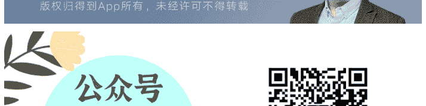
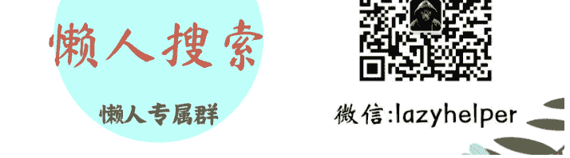


我想先请教你一个问题，你认为你们公司现在最大的问题在哪里？是进店、转化、复购，还是推荐？

每次我在线下讲课问到这个问题，没有例外，同一家公司的人答案都不同，哪个答案都有人举手，而且我都可以预先知道答案。

一般来说，做业务的人会说，是复购、推荐有问题，是产品出问题；

做产品的人会说，进店、转化有问题，是你们营销做得不好；

那老板呢？会觉得四个都有问题，所有人都做得不够好。

所以在企业内部，最后的答案通常都会是四个都做。这又回到了我们第一讲所说的，大家想要“提升整体服务”，但是非常有可能都是无效功。

因此企业必须针对四大维度进行聚焦，针对当下最重要的问题进行改善，协同各部门一起彻底解决，才能真正地产生商业价值。

上一讲我们说清楚了什么是 MOT，你也知道了 MOT 帮助华航净利成长十倍，但具体是怎么做到的呢？这一讲我就要跟你说，**进店、转化、复购、推荐这四大商业指标，就是企业最关心的，MOT 就是从这四个指标帮助企业提升的。**

这里说“企业”两个字，可能会有人误解，我来展开说明一下。不管是一间面包店、小超市，还是一家跨国企业、大型商超，不管是线上还是线下，或者两者都有，只要你想让你的企业一直活着，活得更好、更赚钱，你就一定需要 MOT。

## **四大商业指标**

为什么从这四个指标去洞察 MOT，落地进行改善呢？让我举个例子，你马上就能明白。

现在想象你进入一个购物中心，每家店你都会进去吗？不会吧。

进了店，你就会买吗？不是。

你买了之后，还会再买吗？也不一定。

你一直买，就会推荐吗？更不是。

过去很多人只关注消费者的购买决策，与消费者的使用体验。但其实是错的。

今天我就要告诉你，消费者有四大决策：进店的决策、转化的决策、复购的决策和推荐的决策。

那既然决策不只是一种，而是四种，那我们在关键时刻给消费者的体验，当然也不能只有使用体验，而是要在这四大维度的关键时刻分别进行体验设计，才能让消费者做出我们所期待的行为。

让我来分享一个真实的案例，有一家法国百年户外服饰品牌，叫"AIGLE（艾高）”。它 1853 年在法国创立，已经拥有了百年的历史，2005 年进入中国市场，到 2010 年就从 6 家店变成 163 家店。它找到我，期待能帮助它在户外服饰的业绩更上一层楼。但是它不知道从哪里下手。

在我还没帮助这家企业之前，全公司的人都觉得自己最美的地方是店面设计，但当我研究完之后发现，它最大的问题正是店面设计。而这个问题也是造成它的进店率和转化率不高的最大原因。

对于想要做增量市场的艾高，它不但没有找到进店的关键时刻来进行改善，而且方向还错了。这也就是我们所说的，**洞察不正确，后面落地都是无效功**。

我在全国 7 个城市做了 40 多场焦点团体访谈，进行洞察。

我发现，在很多重度购买户外用品的消费者经常逛的购物中心里，有艾高的门店，但当我问他们，你听过艾高这个牌子吗？他们都说没听过，不认识这个牌子。

这到底是为什么呢？

很多人没有意识到，消费者在购物中心经过一家店铺只需要 7 秒，一家店的成败就在这 7 秒，这就是进店的关键时刻。如果消费者经过你家的店但没有走进去，那你做得再多都是白搭。简单讲，这 7 秒的关键时刻会重大影响你的进店率。

而我我可以肯定地告诉你，艾高就是那 7 秒出了问题，消费者不认识艾高，所以消费者不进店。你不相信？那我证明给你看。

首先我想请你想象一下，如果你现在经过一间户外服饰品牌的门店，比如始祖鸟、The North Face、Timberland 等等，你会看到什么？冲锋衣、登山鞋、背包、帐篷，对吧？

就在你经过这些店铺的那 7 秒，可能只是眼睛的余光瞄到，但你立刻就可以辨别出它是户外品牌，如果你想要买户外用品，你就会走进去。

那接下来我请你看看艾高店铺的照片，在 7 秒内告诉我它是卖什么的。

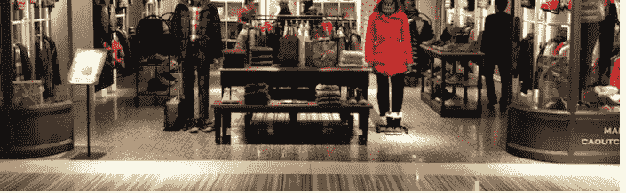

你觉得它是卖什么的？我猜你想讲羽绒服、休闲服，对不对？

可是一开始我说到这个品牌时就说，艾高是个法国的百年户外服饰品牌。你看，我前面讲了那么多遍，当你看到这张照片时，还是不会说出这几个词。

这就是体验建立认知，而不是文字留下印象。答案就在这关键的 7 秒钟，消费者并没有感受到品牌信息，就走了。

所以你猜，想买户外用品的人会不会进店？不会，因为他看不出来这是个卖户外用品的店。

你再猜，想买流行服饰的人，会进店吗？也不会，因为他看不出来，这是个卖流行服饰的店。

即便觉得这是家卖休闲服饰的消费者不小心走进来了，但休闲服饰的第一品牌是优衣库，优衣库一件羽绒服是 299 元，看到艾高一件羽绒服是 6999 元，可能连问都不问，又默默地走了出去。

消费者并没有在进店这个时刻感受到“法国”“百年”这两个词。如果这两个词被消费者在进店时就感受到，那么当他在看价钱的时候，心中早就有预期，这件羽绒服可能不便宜，那么他就不会一下下默默地走出去。

## # **让正确的信息进入心智**

对艾高来说，“法国”“百年”“户外”这三个信息非常重要。

如果消费者踏进店铺时，没有感受到“户外”，就不会进店；没有感受到“法国”“百年”，转化率一定很差。

整篇文章引用，整篇文章引用，所以你看，艾高的人觉得自己的店铺设计很美。的确是非常美，但是没有在消费者经过店的时候体现信息，也没有在进店的那 7 秒的时间里抓住消费者，这一切都是白搭。漂亮没用，利用体验设计，让正确的信息进入消费者的心智，产生有价值的商业行为才是关键。

整篇文章引用，整篇文章引用，我想，你一定很好奇，后来我们在艾高是怎么落地的呢？

整篇文章引用，整篇文章引用，第一，在门店里，在模特儿身上增加了 GORE-TEX 的金色挂牌与识别；GORE-TEX 是一家全球知名的专门生产户外服饰材质的顶级公司，这种特殊材质既防雨但又很透气。懂户外服饰的人，一看就知道这是一家卖户外服饰的店。一见就进，增加了进店率。

整篇文章引用，整篇文章引用，第二，我们让橱窗里的模特儿都穿上 S 码的衣服，同时搭配当季流行的颜色。你可能不知道的是，所有模特儿身上穿的都是 S 码的衣服，为什么要 S 码呢？因为显瘦，显瘦是吸引消费者进店的一个重要元素。喜欢穿流行服饰的消费者，看到流行的元素、颜色，又显瘦，就立马增加了进店率。

整篇文章引用，整篇文章引用，第三，我们让橱窗里的摆设都增加了法国户外的场景。包括法国国旗、巴黎铁塔，以及户外运动的场景，比如骑马、帆船等。目的是让消费者感受到“法国”、“户外”的信息。这样可以增加转化率，因为当消费者进店时，就可以预期这个衣服应该不会太便宜，才不会一下子就被吓出去。

整篇文章引用，整篇文章引用，Result?•就这么​​我们做了三件事，经过改装后的店，业绩跟去年同期比较增长了 30% 以上。

整篇文章引用，整篇文章引用，你看，就改变三件事，立刻产生了巨大的商业价值，让企业增长。

整篇文章引用，整篇文章引用，我们聚焦于进店，找到了进店的关键时刻，进行体验设计落地改善，最后让消费者在这个关键时刻，体验到我们所想要传递的信息，并做出我们所期待的事情，让企业增长。

整篇文章引用，整篇文章引用，你想想，我们聚焦在一个维度，就已经增长 30%，若是我们其他三个维度洞察出了关键时刻，也把它做深、做透，那肯定增长得更多。这也是我们接下来的课程会跟你细讲的内容。

## ## 四大维度形成闭环

整篇文章引用，整篇文章引用，讲完这个案例，我就是想告诉你，我们必须根据四大维度对企业现在面对的问题，进行消费者洞察，也就是我们想要找到消费者一见就进、一进就买、一买再买、一传千里的 MOT 关键时刻。

整篇文章引用，整篇文章引用，消费者的四大决策都至关重要，我们必须分别去看待它，涉及的关键时刻也各有不同，当然怎么做体验设计也完全一样。

整篇文章引用，整篇文章引用，总的来说，体验设计就是：

- 始于迷惑，让消费者进店；
- 限于套路，发生转化，让消费者买买买；
- 复购，就是要让消费者忠于习惯，一买再买；
- 推荐，就是要让消费者传于印记，一传千里。

整篇文章引用，整篇文章引用，唯有四大维度都做得好的公司，才能建立一个成功的闭环，让企业真正持续性地增长，这也是我这门课想要教会你的事。

整篇文章引用，整篇文章引用，那你可能会说，那艾高不就只是针对进店率改善吗，刚才不是说四大维度都做得好吗？这不是又回到整体提升吗？答案是艾高的复购与推荐没有问题，衣服的质量好，性价比高，老客人一买再买。它真正应该侧重于现在有问题 的维度去解决，也就是进店，把进店与转化改善了，艾高的四大维度就完整了，才能成为一个成功的闭环，持续地增长。

整篇文章引用，整篇文章引用，好，那在每一个维度上具体该怎么样呢？又该怎么去进行体验设计呢？我会在接下来的课程里一一讲解。

##### 思考题

整篇文章引用，整篇文章引用，你在你的企业的什么部门呢？你认为你们公司最大的问题在哪个维度？你们企业内部有共识吗？期待你的留言。

整篇文章引用，整篇文章引用，1."提升整体服务"非常有可能是无效功。

整篇文章引用，整篇文章引用，2.消费者有四大决策：进店的决策、转化的决策、复购的决策和推荐的决策。

整篇文章引用，整篇文章引用，3.利用体验设计，让正确的信息进入消费者的心智，产生有价值的商业行为是关键。

[PAGE 11]

汪志谦 · MOT 体验设计课

抓住决定成败的关键时刻

版权归得到 App 所有，未经许可不得转载

公众号

懒人搜索

懒人专属群

微信:lazyhelper

[PAGE 14]

公众号懒人搜索，懒人专属群

## 03 讲 谁才能挖出 MOT？


你还记得吗？我们前一讲的华航案例，我是从 300 个 MOT 中选择了 10 个 MOT，打造成峰值，让华航赚了 25 亿。

这是我的唯一见解，我说过十个 MOT 才是关键，不要去整体提升，所以随机找了几个消费者，询问了他们一些问题，找到了 MOT，就落地去做。如果真是这样，你就大错了。

我要找的是华航的目标用户，以及竞品的重度用户。经过许多的 FGD(焦点团体座谈)，才挖出了 300 个 MOT。又经过 3000 份的问卷，才筛选出最重要的十个。

这一说，我首要的任务就是要把 MOT 变成 300 个，之后才能教大家如何分出最重要的 10 个。

我该怎么开口，唱出这 300 个 MOT 的步骤？其实方法很简单，就两个：

### 第一，怎么写出一个对的 MOT

### 第二，我该问谁，才能挖出热

### 怎样写出一个对的 MOT

还是用华航的具体例子：

“一个商务舱的客人，在飞机上飞到了很舒适，服务很好”

你以为这个 MOT，是华航的关键时刻吗？看起来好像对，其实是错的。

因为我拿这个 MOT 给华航听，华能知道接下来该怎么做吗？很明显，答案是不知道的。

因为从北京飞纽约的飞机，在飞机上的时间超过了 12 小时，飞机上的服务很好，是哪段时间，

提供了什么服务让客人觉得很好？都没讲清楚。这个 MOT，说了等于没说。所以难写的 MOT 是错的。

那到底怎么写出一个对的 MOT 呢？MOT 的定义是什么呢？

MOT 的三要素，“是谁、在什么状况下、感受到什么”，符合三要素的 MOT，才会是一个对的 MOT。

举例来说，在前讲关于华航住宿服务的案例时，如果这三要素该怎么写呢？

“一个居住美国的商务华人，在搭飞机商务洽谈准备睡觉的时刻，得到了一个铺床的服务，感觉一整天不一样。”

我们如果把写这个 MOT 拿给华航看，华植立马上手知道接下来该怎么做。就是在睡觉这个时刻，设计一个铺床的服务，让搭乘商务舱的客人感受到舒适。

对了吧？一个对的 MOT，一定要写得让人清楚，人知道该怎么怎么做。

写错了 MOT，就是你做出一堆的消费者座谈，写了 300 MOT，最后看完之后看，还是不知道接下来该做什么事。这也是企业最常犯的错误，从考察一开始就错了，后期落地不了。

整理一下，如何写出一个对的 MOT？首先要有三要素，就是“是谁、在什么状况下、感受到什么”。

- “是谁”，简单描述一下目标消费者；
- “在什么状况下”，这个最重要，你必须详细描述一下那个场景；
- “感受到什么”，是消费者在那个时刻中，感受到什么。这个一定要写出来，这就是你的品牌信息，也就是消费者对你的心智标签。

再给你两个小贴士：

第一，一个 MOT 的撰写字数大约在 40 个字左右，你应该花比较多的字数写“在什么状况下”，越详细越好，也就是把那个关键时刻讲清楚。

第二，你所写的时刻，越短越好，越精确越好，一个对的关键时刻，通常不到 1 分钟。

### 为谁才能挖出 MOT

说完了第一个方法，接着我要教你第二个方法，你该问谁才会挖出 300 个 MOT。

前面我们讲了半天，不要从自己的角度思考，应该从消费者的角度思考。你可能会说，汪老师你一直讲要问消费者，但消费者那么多，我们该问谁呢？

答案是，有三种人是你一定要问的，就是“爱你的人”、“不爱你的人”和“喜欢你的人”。

这三种人非常重要，你要问这三种人，才能够挖出正确的 MOT。

好，我一个个来讲。首先，你要去问爱你的人。

爱你的人是谁？就是你的重度消费者。

重度消费者有“三高”：高购买频率、高购买单价、高使用频率。这三个都符合，他才是真正爱你的人，也才是真正重度的消费者。这种爱你的人，才真正知道你美在哪里。

把你美的地方放大，是企业经营品牌最重要的事情。

为什么这么说？因为对于企业品牌来说，美就是识别度。

举个例子，黄渤，你觉得帅吗？你觉得不帅，但是，黄渤有没有识别度？非常有，只要 0.5 秒你就知道他是黄渤。所以，我上课的时候常常讲，企业品牌就应该像黄渤一样，不能整形，要放大他的美，才能够有识别度。

那谁能回答你美在哪里呢？不是企业本身，而是“爱你的人”才知道你美在哪里，因为他真金白银买了那么多，一定觉得有价值的地方，所以，他对于你的形容词，他跟朋友是怎么推荐的？他为什么一直买？唯一能够回答这些的人，就是爱你的人。

爱你的人可以解决你复购的问题、推荐的问题，也就是说如果要挖出推荐率跟复购率的 MOT，就要问爱你的人，才会找到正确的答案。

第二种你要问的人，就是不爱你的人。

不爱你的人是谁呢？就是你竞品的重度消费者。

这种不爱你的人，他的重要性完全不低于爱你的人。

不爱你的人有两种状况，一种是他不知道你，所以没办法买。另外一种是他知道你，但是他不买。

如果是不知道所以你没有买，那就是进店出了问题；

如果他知道你，但是他不买，那这个企业的问题就是转化率的问题。

所以如果你找到不爱你的人来访谈，你马上就会知道你到底是进店出了问题，还是转化出了问题。

但更有趣的，如果你再继续往下追问这些不爱你的人，既然他不爱你，他不知道你，那他会为什么会知道你的竞争对手呢？你就会找到你竞争对手的获客渠道，提升你的进店率。

还有，他知道你但他不买。那奇怪了，为什么他知道你的竞争对手就买了呢？竞争对手到底做对了什么事呢？关键时刻又是什么？当初导购怎么跟他说的？你就会找到竞品转化率为什么比你好的原因。

最后，消费者为什么一直买竞品？他为什么不是买一次就不买了呢？他觉得竞品到底值在哪里？

第三种人，就是喜欢你的人。

### **喜欢你的人是谁呢？也就是买过你的东西，但他买一次就不再买了。**

这种人最常出现在互联网的公司或电商，非常有可能就是在使用你产品的过程中，出现了体验低谷，所以买一次就不买了。这种人你一定要问他，当初到底出现了什么问题？为什么买一次就不买了？

消费者买一次就不买了，还有一个原因，就是他觉得不值。你要问他，才能找到复购这个维度的 MOT。

让我来举一个例子，当我们在做艾高这个项目的时候，我们访谈了不爱它的人，也就是艾高的竞品——始祖鸟的用户，我想各位应该听过始祖鸟这个牌子，这个牌子就是一个高端的户外运动用品。

它的衣服非常地贵，一件冲锋衣大概要 8000 到 15000 块，你是可以穿着它登珠峰的。意思就是，你穿着这个衣服在四小时狂风暴雨之下，外面是湿的，里面都是干的，所以它的材质很厉害。

不过，我们访谈了很多始祖鸟的消费者发现，原以为这些穿始祖鸟的消费者都在运动，好像很专业，结果很多客户的身材都是胖胖的，很少运动，而且对于始祖鸟衣服的专业性，其实并不是那么清楚。他们当初买就是听朋友说，或同事穿得多。他们在冬天是把它当羽绒服来穿的。

而更重要的是，始祖鸟的衣服，对他们来说可以当做奢侈品的标签。

当你去问这些“不爱你的人”，怎么判断始祖鸟是个奢侈品呢？他们的回答是：“始祖鸟的店一般都是比较高端的商场，不是在街边店就能买的哦。”

这句话是什么意思？你听他们讲这段话，就应该可以写出一个正确的 MOT；“一个胖胖的、不运动的女士，在高端的商场看到始祖鸟的店就开在奢侈品店的旁边，感受到了始祖鸟是个高端品牌。”

也就是当消费者进入商场，看到始祖鸟的店就在一楼，旁边就是一个高端品牌的时候，他已经判定始祖鸟是个奢侈品了。他的关键时刻并不是穿着这个衣服去爬 3000 公尺的山，可以上一场雨，然后这件衣服救了他一命。

所以，当始祖鸟从四楼的体育用品，搬到一楼的奢侈品店旁边的时候，体验已经建立了消费者的认知。所以，这是一个非常重要的 MOT。你以为是产品本身决定的，其实不是。

我们就是问了不爱你的人，才找到这个关键的 MOT，也就是消费者判定你的衣服是什么档次并不是因为衣服的材质、功能或者品质，而是因为你店的位置。

因此，门店在怎样的商圈，商圈的几楼，以及邻近门店的其他品牌，都是重大影响消费者认知的关键时刻。

所以，我们在帮助艾高落地时，不只改了店面的装潢，也同时改变了店面的位置，进而大幅提升了进店与转化，让它的增量市场大幅提升。

所以问这三种人是非常重要的，你只有问这三种人，才能够真正帮你找到对的 MOT，才可以帮你找到进店、转化、复购、推荐的 MOT。

*

我们接下来的这几讲，就是要分别从进店、转化、复购、推荐，教你如何在每个维度去挖出 MOT，然后我再教你如何在每一个维度去做出不同的体验设计，也就是让消费者始于迷惑、陷于套路、忠于习惯和传于印记。

所以，接下来几讲我就根据每个维度讲一讲如何洞察，如何落地。

思考题

分析一下你的企业的问题。你最想问哪种人？你想问什么？你又想找到哪一个维度的 MOT 呢？

1. “是谁，在什么状况下，感受到什么”。符合三要素的 MOT，才会是一个对的 MOT。
2. “在什么状况下”，越详细越好；MOT 所写的时刻，越短越好，通常不到 1 分钟。
3. 问“爱你的人”、“不爱你的人”和“喜欢你的人”，才能够挖出正确的 MOT。

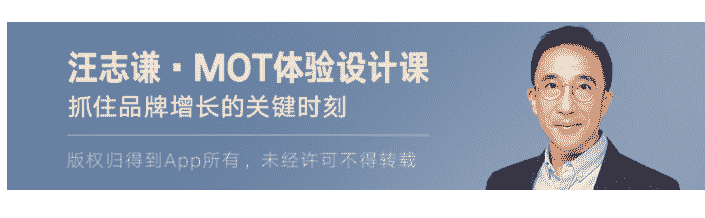

### 公众号
懒人搜索
懒人专属群

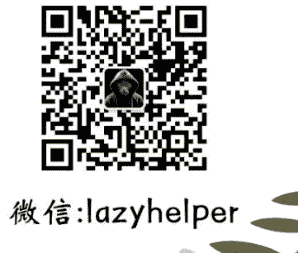

## 04 讲怎么洞察出进店的关键时刻？

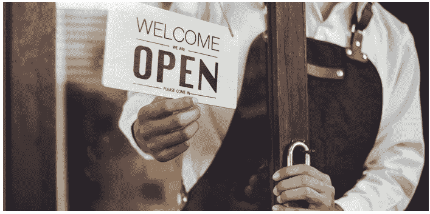

之前的课程我们讲到，挖出 MOT 要从四大维度入手：进店、转化、复购、推荐。从这一讲开始，我们就来看看，如何洞察出每一个维度的 MOT，又如何让这些 MOT 落地。

那我们就从第一个维度进店开始。怎么才能洞察出进店的关键时刻呢？

### 进店的真正原因

我想先问你一个问题，你认为消费者为什么会进店？

每个人的答案可能都不一样，但在我做过了非常多的案例之后发现，消费者进店的原因通常都跟企业自己想的很不一样。

让我来给你讲一个案例。这个案例是一家云南菜馆。几年前，它的老板想要对菜馆做一番更新，提升进店率，扩大客流量。

这位老板觉得，他的餐厅之所以能吸引人来吃饭，主要在下面四个原因：

- 第一，来自云南的厨师煮给你吃；
- 第二，云南籍的服务员服务你；
- 第三，所有的食材都来自云南，空运来的；
- 第四，餐厅门口有小姐姐穿着云南特色的服装，唱民族歌，跳民族舞。

老板告诉我，他觉得这一番新的改革，第四个完全不用考虑，要砍掉。因为他觉得前三个才是打造新的云南菜馆必备的，第四个好像可有可无，不太重要。

结果，当我们访谈他的重度消费者，也就是“爱你的人”，很多消费者说：当初进店的原因就是因为我在门口看到有漂亮的小姐姐在跳舞。

他们进店时并不知道餐厅的食材都是云南本地的，也不知道厨师、服务员是云南人，更没看到店里的装潢。会进店的原因就是看到小姐姐，听到歌声，所以走进去。

这位云南菜馆的老板听了一卡车消费者的访谈之后，都吓坏了，幸好没有砍掉头口的歌舞，否则“爱你的人”就不会进店了。他认为最不重要的，居然是消费者进店的 MOT。

我做了很多案例后发现，在进店这个维度洞察 MOT 时，很多企业最常犯的错误，就是以为自己很了解消费者进店的原因。其实很多时候，是把消费者转化、复购的原因，当成了进店的原因。

所以你一定要记得，你以为的答案，非常有可能并不是消费者想要进店的原因。所以一定要去问“爱你的人”，正确的答案在他们身上。

## 消费者到底关心什么？

企业在进店这个维度，还会犯的另外一个错误是，在店面展示出来的，只是自己想要呈现的，不是消费者关心的内容，跟消费者没有关系。

举个例子，你去逛家具装修的购物中心，例如红星美凯龙，你会发现很多店面在门口呈现的品牌信息都是“百年老店”、“专注 XX 三十年”、“荣获 XXX 奖”。我有一位客户是销售实木地板的，原本也想在店面有这样的设计。但当我们访谈完一卡车重度消费者之后，他立马改了想法。

为什么？你来想象一下，一个消费者要买实木地板，什么样的店面他才会进去呢？是这家品牌做了多久吗？

你要注意，我们讲的是进店这个时刻。消费者在进店这个时刻所关心的，是你摆在门口的那些地板中，是不是他想要的颜色、纹路，能不能与家里的装潢匹配。如果有，消费者就会走进店，然后问一问“你的品牌做了多久”，对吧？因为这些问题不是他进店时会考量的，而是要买的时候才会考量的。“百年老店”，这个词非常好，但这是降低消费者选择障碍最好的信任状，不是进店的时刻消费者所关心的。

你在店门口放一堆关于你公司品牌的历史，你得了什么奖项，这些都没办法让消费者进店。答案就是，你必须在店门口呈现出不同的木质、地板、颜色、花样，消费者看到会觉得，“这家店的选择很多，可能有匹配我家装潢的实木地板”，这个 MOT 才会让消费者想要进店。

## 进店是否有效？

除了刚才所说的错误，还有一个错误你要当心了。

你想想看，你在购物中心那些卖实木地板的店铺逛了一下午之后，回到家能回想起来吗？不能。

而且很有可能，我拿出一家店铺的照片给你看，问你有没有去过，你可能会说，没有。但其实，你明明去过。

这是为什么呢？因为很多时候进店并不是有效的，有效的要留下印记。

我来讲一个服饰业的例子。

有一家服饰品牌的老板找到我，他说他想要更改店门口的设计，想了解消费者是怎么想的，怎么设计才能让更多消费者走进他的店。简单讲就是他的进店率现在不好。

他的店铺在购物中心里，于是我们找了很多不同的服饰店，都在门口拍了照片，你猜，哪一张会让消费者进店？

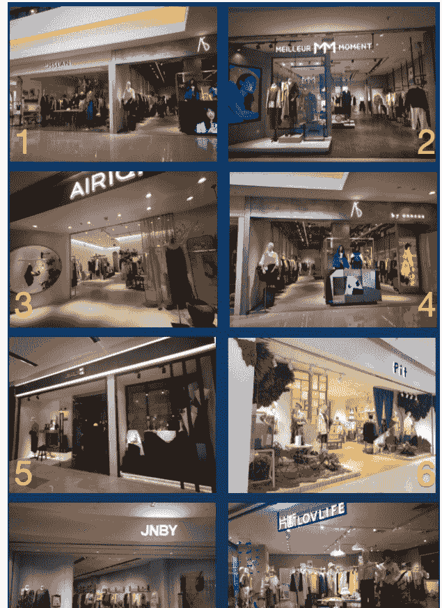

我们找了很多消费者做访谈，包括“爱你的”、“不爱你的”、“喜欢你的”，问这些消费者，看到哪一家店会进去。结果，答案出来了，都是第六张。

最有趣的地方来了，这张照片，正是我客户店铺的照片。

很奇怪，对不对？为什么大家都觉得这家店很好，但进店率却很差，需要改善呢？甚至还有消费者问我这家店在哪里，其实就在他常去的购物中心，但他却一点印象都没有。

于是我们继续问这些消费者，给他们看了很多店里的照片，如果走进这样一家店，会觉得如何？

你猜，这些消费者说什么？他们说：“这家店的风格太单一了，一看就是给年轻女生穿的，这不是我穿的，我没办法买。”

还有很多人当场就说：“这家店不是我想去的店，我要出去。”

“难怪，我好像去逛过，但没留下印象。”

你发现了吗？这家店的问题，不在店门口的设计，而在于店里的陈列。

这个老板搞错了时刻，进店这个动作是发生了，你跟没发生一样，是无效的。消费者走进去以后，转了一圈，又走出来。因为店里面的设计风格、陈列太单一了，问题不在店面设计，而在陈列。

小结一下，要想洞察进店的关键时刻，一定要记住：

- 消费者进店的原因不是靠拍脑袋想出来的；
- 企业不要秀自己觉得重要的，而应该秀消费者关心的；
- 进店并不一定都是有效的，有效的进店要有足够的时长能到达转化的那一步，有效的进店能给消费者留下印记。

在进店的时刻，消费者的角色是个“路过者”，他的时钟是非常快的。在线上，进店也就是一秒的时间，一点击就进去了。在线下可能有 7 秒，就是经过店铺门口的时间。

## 四个洞察点

以下，我给你四个重要的洞察点去帮助你找出消费者进店的关键时刻：

第一个洞察点，也是最重要的，就是要问“爱你的人”。问他当初为什么会进店，他在进店这个时刻到底看到了什么，听到了什么，闻到了什么。这种五感体验是非常重要的。

譬如说，云南菜的重度消费者是带着小朋友，小朋友听到了民族歌曲，又看到了小姐姐在跳舞，才被吸引进店。

买实木地板的消费者，是因为在店门口，看到了地板的颜色符合自家装潢的颜色。这些都是“爱你的人”进店的关键时刻。

第二个洞察点，问“不爱你的人”为什么不进店。

我可以负责任地告诉你，一定是你做错了什么，或者你做的跟他想的是不一样的，这一点一定要找出来。

还有一个重点是，这些不爱你的人，也就是竞品的重度消费者，当初没进你的店，为什么会走进竞品的店？一定是他看到了什么东西，吸引他进店，这一点也一定要挖出来。

那第三个要问的洞察点是什么？我们发现，很多消费者都是被朋友影响才进店的，那个朋友当初到底说了什么，关键词是什么。

这就是第三个洞察点，朋友说了什么触发了消费者的注意力。

好，前面三个洞察点都是在问具体的人，那到底问什么问题呢？我特别为你准备了七个问题，来帮助你发问，去找到进店的关键时刻。

- 你当初是怎么知道这个品牌的？
- 你平常是怎么关注的，都怎么研究？
- 之前你朋友是怎么和你介绍这个品牌的？
- 当初对这个品牌感兴趣，是因为哪些内容吸引你？
- 看过之后，为什么不感兴趣？
- 现在看到这个介绍视频、照片，你觉得如何？
- 你现在用什么品牌，当初是怎么知道的？

好，我们再来看第四个洞察点，就不是问具体的人了，而是去了解大数据是怎么说的。

什么叫大数据呢？像我们刚刚讲的服装店的例子，老板告诉我这个服装店想要呈现的是“古典”“优雅”。可是，当我去问消费者的时候，消费者说，这个风格叫“学院风”、“少女风”、“森系”。

为什么？消费者说，因为如果京东、淘宝，还有天猫出现这一类的衣服，上面的关键字与标签都是这些，只要输入这些关键字就会找到这些衣服。

你看，这就是大数据在教消费者如何帮产品分类，而不是你自己所认为的名词。所以，要去理解大数据，看消费者是怎么建立认知的。

说到这儿我有一个重要提醒，在问消费者的时候，一定要注重消费者在进店时的五感体验。听到了什么声音，闻到了什么味道，譬如说你在一个购物中心会被吸引进面包店，非常有可能是因为你闻到了面包店的香气。

五感体验是最容易触发消费者的，消费者无时无刻在接受这些信息，进店的时刻是短的，利用五感去刺激消费者是最容易的。

所以，我们一定要关注消费者在进店时候的五感体验是什么。

以上，就是我们在洞察进店的关键时刻时要特别注意的地方。

##### 思考题

我们刚才说到，进店不只是线下的店，线上也一样，比如直播，可能有一两小时的时长。我的问题是，你认为直播中怎样的画面会让消费者停下来观看呢？欢迎你将自己的答案写在留言区。

-   1. 关注消费者到底是怎么想的，而不是自己拍脑袋，秀出自己认为重要的。
-   2. 进店并不一定都是有效的，有效的进店要有足够的时长能到达转化的那一步，有效的进店能给消费者留下印记。
-   3. 四个洞察点：问“爱你的人”、问“不爱你的人”、问消费者如何被推荐、了解大数据。

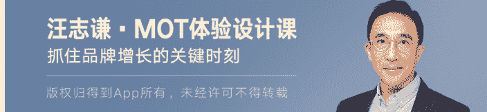
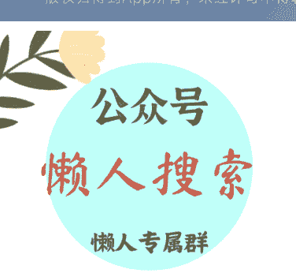
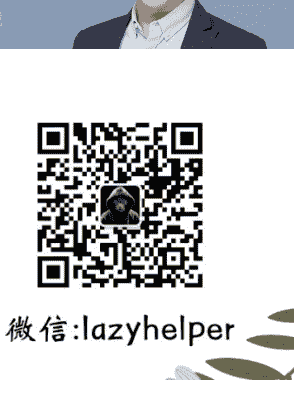

## 05 讲始于迷惑，怎么让消费者一见就进店？

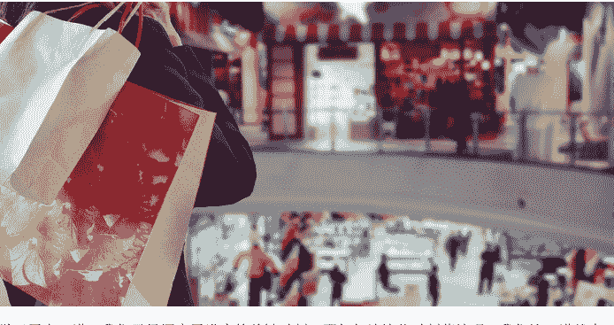

学习了上一讲，我们已经洞察了进店的关键时刻，那如何让这些时刻落地呢？我们这一讲就来谈一谈如何落地进店。

这一模块我们都会用这种课程设置，一讲洞察，一讲落地。所谓“洞察”“落地”，其实就是把消费者心里所想的挖出来，再利用体验设计把它放回去，进入消费者的心智中。

进店的落地，就是要解决如何让消费者“一见就进”这个问题。

解决这个问题，你记住三句话就好：

-   - 就是这样。
- 那是怎样？
- 怎么会这样？

这三句话，其实就是围绕着四个字在设计：**始于迷惑**。

什么意思？让我来一一说明。

### “就是这样”

我想给你一个任务，让消费者觉得这家餐厅很“新鲜”，你会怎么做？

用大大的招牌，把字写得很大说，本店很新鲜。这样有用吗？我想你知道的，用处不大。

那该怎么做？不知道你有没有注意到，很多潮汕牛肉火锅店，在店门口的橱窗里，都有厨师在现切牛肉，你看到立马就觉得这家店的食材很新鲜，想进店尝尝。

你看，现摘、现杀、现包、现炒、现煮、现切，我只要在餐厅门口做这些事，你立刻就会觉得这家店的东西是新鲜的，不管里面到底是怎样，这就是始于迷惑。

我跟你讲新鲜你不相信，但我现切牛肉，你就觉得这是新鲜的，因为体验建立了认知。新鲜的牛肉就是好吃，跟其他的店都不同，你立马想进店试试。

所以第一句话“就是这样”，意思就是把消费者心中所想的“新鲜”这个词挖出来。这个概念在他的脑海里是以怎样的方式存入的，你在他面前再去做这个动作，他立刻就会用自己的方式去解读，大脑立刻就被调动起来，“对，这就是新鲜”。

再举个例子，你在购物中心里，路过一家面包店，为什么会走进去？

我想你马上就会说香气。对，因为香气才会让你注意到这家店，而不是店家在门口写的大大的“好吃”两个字。

面包的香气飘在空中，嗅觉是关不掉的，消费者立刻就会闻到。一闻到就引发消费者的注意力，启动消费者脑海中的“对，就是这样，香的面包很好吃”，然后就想进去看看，就进店了。

如果这家面包店没有香气，只写了大大的两个字“好吃”，消费者非常有可能根本不会注意到这家店，看到了也不会相信。消费者心里会想：“你说好吃就好吃，每家面包店都说自己好吃。”你看，我说好吃你不相信，有香气你就觉得面包好吃，你并没有吃到就想要进店，这就是始于迷惑。

> “就是这样”，是要善用消费者的五感与直觉，那是人类大部分时刻所使用的思考模式，是最容易被触发的认知。

我们挖出早就存在在消费者心中的思维，把它落地，当我们放回去时，最容易被消费者接受，消费者会说本来“就是这样”，然后就会进一步产生进店这个动作。

### “那是怎样？”

你一定有过这样的经历，走过一家店，你之前并不知道它，但看到好多人都在拍照，人声鼎沸，你会想：“这家店怎么那么多人啊？那是什么啊？”然后，你就会跑进去一探究竟。

“那是怎样？”很简单，就是利用消费者的好奇心。

人都喜欢凑热闹，越是新的、流行的，越是没看过的，就越想要去看。就像线上的热搜，大家都去关注现在最热的新闻是什么。我们在做进店的落地时，就要利用这种心态去触发消费者。

不管是线上还是线下，网红店、打卡点、排行榜，都是一样的逻辑。你一定有听过，很多线下的网红店找人排队，线上的热门话题会找水军，都是一样的道理。

更有趣的是，即使我们知道排队可能是假的，线上也有水军，但我们看到店里面人多，看到这个点击量更大，还是会不由自主地觉得“这家店应该比较好吃”。点外卖时，还是一定会看评分与评价，你说这是不是始于迷惑？

### “怎么会这样？”

如果说第二句话的核心是好奇，那这句话的核心就是冲撞。你以为是这样，结果不是，马上就会引发消费者的注意力，进店去瞧瞧。

大家都知道上海豫园，是个非常著名的旅游景点。

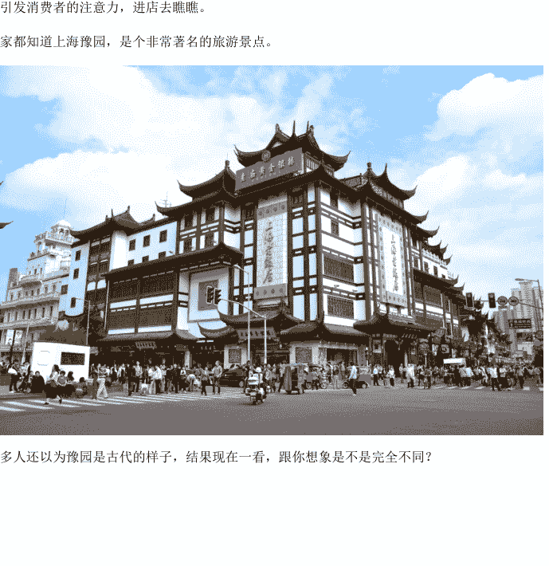

很多人还以为豫园是古代的样子，结果现在一看，跟你想象是不是完全不同？

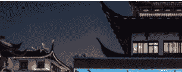

这就是运用了现代的手法去冲撞古代的概念。你现在看这些照片，是不是有一种想要去上海现场看看的冲动呢？

这就是“怎么会这样”这种手法，不论在线上还是线下，都用得特别多。消费者看到朋友圈发了几张很不同的照片，就想要点进去，经过门店时看到有些特别不同的地方，就想要走进去看个究竟。

好，说到这儿我想跟你分享一个我做的案例——在豫园里的一个百年老店，老庙黄金。通过我们的体验设计，这家店在四大维度上都有提升。这一讲我先讲讲关于进店的体验落地。

下面这张图是改造前的老庙黄金。

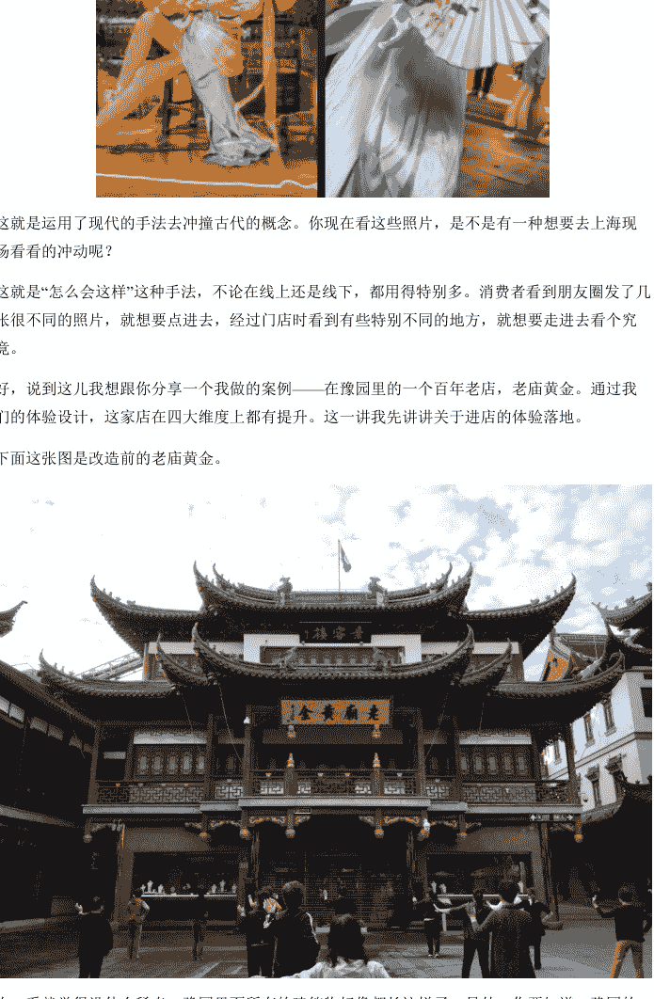

你一看就觉得没什么稀奇，豫园里面所有的建筑物好像都长这样子。另外，你要知道，豫园的面积是很大的，消费者不见得会看到这个地方。

好，现在我要改造了，摆在面前的就有两个必须解决的问题：

- 1. 让消费者先关注到这个区域；
- 2. 让消费者走进这家店。

还记得我在前面课程中讲的吗？要让消费者感受到信息，让信息进入心智，产生我们所期待的行为。

老庙黄金有一个很重要的信息，已经用了 60 年了，叫“老庙给你带来好运气”。所以，我们希望消费者一看到这家店就觉得：“哇，这真的是一个好运店，我要进去看看。”

好，拿着这个信息，我们先来看第一个问题，怎么让消费者关注到这个区域？

我们发现，老庙黄金门口的广场，是最容易让人集中的。怎么集中？怎么让消费者在集中的同时还能感到“好运”？

答案是：好运金砖。

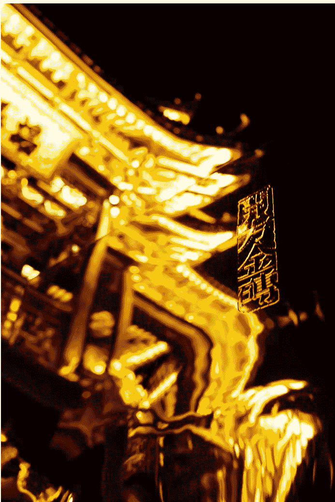

让广场上的人看到脚下踩的就是金砖，我们叫“脚踏金砖好运来”，直接进入消费者的五感，让他看到“就是这样”。

我们还弄了个开运金砖阵，这个金砖阵非常地漂亮，是北京雕塑大师王开方老师设计的。把开运金砖铺在广场上，非常酷炫，只要路过，就一定会看到。

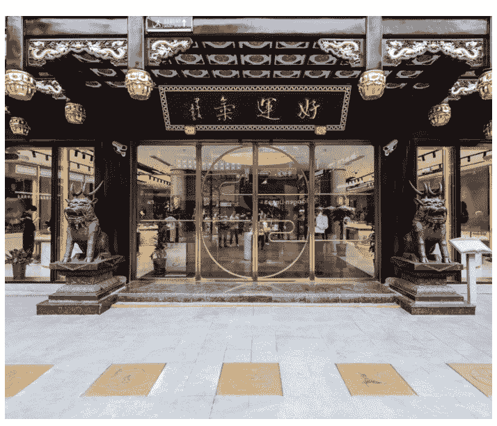

我们中国人看到铜制的雕塑都要上去摸一摸，更何况是金砖，当然要上去踩一踩，拍拍照，打卡留念。如果你这时候路过就会想，“咦？那是怎样？为什么那么多人？”你就要上前看一看，拍拍照。

好，现在人都被集中到老庙黄金门口的广场了，怎么让他们走进这家店呢？

答案是：黄金楼。

“怎么会这样？明明所有的楼都是咖啡色的、木制的，就这座楼是黄金楼。”你可以看看这张图片，改造后的老庙黄金，一看就非常漂亮、酷炫，对不对？

很多人就立马打卡拍照，然后说：“我一定要进去看一下，这个楼到底有什么厉害的，为什么跟旁边的都不一样呢？”

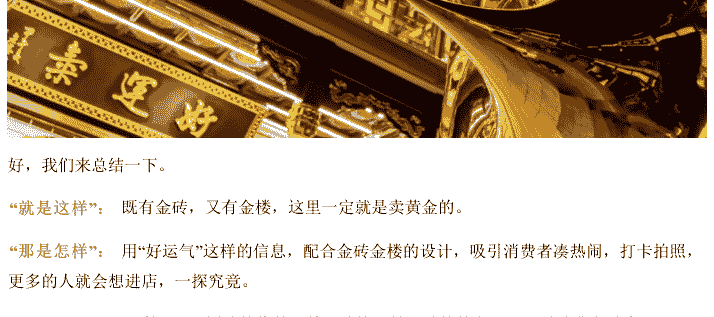

好，我们来总结一下。

**“就是这样”**：既有金砖，又有金楼，这里一定就是卖黄金的。

**“那是怎样”**：用“好运気”这样的信息，配合金砖金楼的设计，吸引消费者凑热闹，打卡拍照，更多的人就会想进店，一探究竟。

**“怎么会这样”**：利用和周围建筑物的反差、冲撞，做出独特的印记，吸引消费者进店。

这三句话落地之后，让老庙黄金的进店率大幅提升，现在老庙黄金的这栋景容楼，已经是豫园里面最重要的打卡点之一了。

好，这就是老庙黄金的案例。

听完这个案例，我想提供给你一个检查清单，请你回去好好地检查你的企业有没有做好。如果你的企业的进店在落地方面做得不够好，可以从这三方面入手：

## 第一，你要检查“最初”这个黄金时刻，有没有调动消费者两种以上的感官。

有人说，汪老师，这不可能啊，比如我卖的是饰品，就只有视觉。你想想看，你打开美团、饿了么点外卖的时候，为什么只是看到图片，也能勾起你的食欲呢？嗅觉、味觉都会被调动吧？我不说你也知道，有很多好的饰品广告片，一看就能让人想到爱情、浪漫。所以，仔细去检查，有没有调动两种以上的感官。

还记得我们上一讲说的吗？你要给消费者留下印记，感官感受是留下印记的最好方法，不论是视觉记忆点，比如颜色、符号，还是味觉记忆点，“哇，这个点心好酥”，还是嗅觉记忆点，比如香气，还有触觉记忆点，“这件衣服质感好好喔”，这些都行。这样被留下印记的消费者，下次经过店时就会记得你。

## 第二，请你想一想客户是怎么介绍你的，你应该想一个词，把你的进店信息变成大白话，让消费者更容易介绍你。

比如刚才我提到的老庙黄金，现在就叫“好运楼”。

## 第三，在“最初”这个时刻，有没有勾起消费者的好奇心，有没有打破剧本。

你应该做一些不一样的事情，让消费者觉得“这个店真的跟别人不一样”，引起他的好奇心，让他想要进店。

### # 思考题

现在在进店的这个时刻，你让消费者运用了哪几种感官？你为什么要这么做呢？

1. “就是这样”：善用消费者的五感与直觉，挖出其思维，把它落地，这样最容易被消费者接受。
2. “那是怎样”：利用消费者的好奇心，用这种心态去触发消费者。
3. “怎么会这样”：利用反差、冲撞，做出独特的印记，吸引消费者进店。


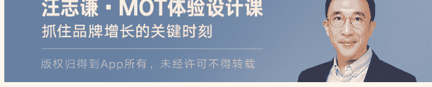
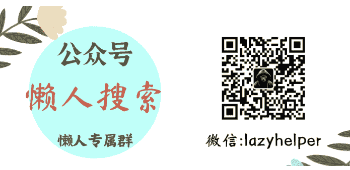

## 06 讲怎么洞察出转化的关键时刻？

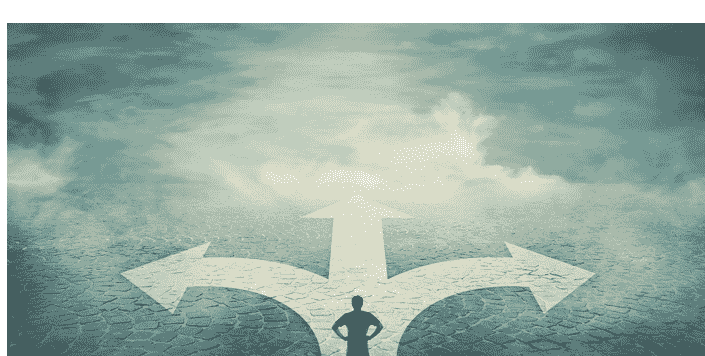

前面两讲我们讲了进店这个维度下的洞察与落地，接下来两讲讲来看看转化这个维度。我们先来看看，如何洞察出转化的关键时刻。

你听了前面的课程，现在一听“转化”，可能想说我懂了，这很简单，因为汪老师说放大你的美，那我只要告诉消费者就完了。但其实，企业在转化这个维度犯的错误最多，而且造成的影响最剧烈。原因说来很简单，就是你讲的东西，消费者接收不到。

还记得吗？之前我们提到，进店的内核是要触发消费者的注意力，那转化的内核是什么呢？

要搞清楚这个问题，你得知道消费者在这个时刻，他的角色是什么。在进店的时刻，消费者还是一个“路过者”，到了转化这个时候，消费者的角色就变成了“探寻者”。

因为消费者在转化前，是不信任这个品牌的，所以他会不断地探寻。他在探寻的时候，会一直不断地问两个问题：

- 1.有何不同？

- 2.何以见得？

你想想看，是不是这样？比如你现在走进一家 3C 数码产品店，导购过来跟你你说，这是最新上市的吸尘器。你立刻就会想，这个吸尘器跟别家有什么不同之处吗？

好，现在导购真的讲了很多不同之处，听起来还真的很神奇，你马上就会想，这是真的吗？他说的可信吗？

> 消费者问这两个问题背后的真正原因是什么？对，就是不信任。

所以，你想让消费者完成转化，但其实这个过程中存在很多障碍，我总结发现了五点给你。企业其实很容易碰到这些障碍，但却常常意识不到。有意思的是，这些障碍的地方，正是我们需要洞察出来的 MOT。如果这些障碍能够一一被解决，被改变，那也就是我们让这些转化的 MOT 落地的地方。而这也就是转化的内核，降低消费者的选择障碍。

好，让我来一个个讲给你听。

### 转化的五大障碍

第一个障碍，消费者并不是专业的。

你以为消费者很专业，结果，消费者根本听不懂你在说什么。因为你讲的就不是大白话，对消费者来说，你讲的是文言文，他根本就听不懂你在说什么。

比如，一个卖手机的导购，一直跟消费者说：“这部手机是 UHD 四倍的分辨率，21：9 的纵横比，120FPS 的高帧率录制，120Hz 屏幕刷新率。这些你懂吧？”

他在说的过程中，消费者也只能一直点头，说：“嗯，我知道。”但是，导购讲完以后，消费者就说：“我再想想。”然后转身走掉。他可能不是不想听或不想买，非常有可能是你讲了过于专业的事情，其实消费者根本听不懂，无法跟你同频，所以造成转化的障碍。

第二个障碍，你讲的，他不需要。

你一直自顾自地在讲很多你自己想说的东西，但消费者根本就不关心。你以为我指的是卖东西的销售吗？你来看看下面这个案例。

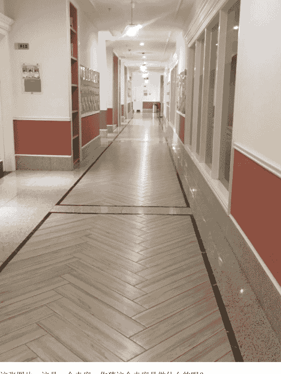

请你看这张图片，这是一个走廊。你猜这个走廊是做什么的呢？

像是一个机构，比如医院，诸如此类的，对吧？

其实，这是一家英语培训机构，针对 3 到 6 岁的幼儿，这是教室外面的走廊。

我想你已经明白我要说什么了。

小朋友喜欢温暖的还是冰冷的？当然是温暖的。小朋友喜欢彩色的还是黑白的？当然是彩色的。但你看这个设计，它完全没有站在小朋友的视角。

这家机构的创始人跟我讲，他是根据北欧的风格特别设计出来这种简约风。听起来很专业，看起来很高级，但这不是它的消费者，也就是这些小朋友们所需要的。所以这家英语培训机构的转化率一直不高，小朋友第一次来这里试课，会觉得有一点害怕，感觉这里很陌生、冰冷，想回家，那转化率怎么会高呢？

这家机构的创办人问我怎么办，我就带着他走到走廊上，让他跟我一起蹲下来。他说："汪老师，我从来没有用这个视角来看过这个走廊，我现在才发现这个走廊挺冰冷的，对吧？”

对，我们要用消费者的视角，也就是小朋友的视角来看这个走廊，看看你讲的，是不是消费者需要的。如果不是，转化率一定不会好。这就是第二个障碍。

第三个障碍，你的美，他看不到。

我还是给你举例子来看。请你看这张图片，你觉得这家店是卖什么的？你可能需要稍稍努力地去去看一下，你会发现它是卖糖果的。


那是什么糖，看得出来吗？

这是厦门第一伴手礼苏小糖的店铺，卖的是牛轧糖。

看起来很像一个网红店，很想去拍照打卡，对不对？你可能会进店，但你会买吗？就不一定了。

这就是苏小糖的老板找我的原因了。他找到我说，我们发现很多消费者进了店，打了卡之后就走了。我们有很高的进店率，但却没有很高的转化率。

怎么办呢？

我们经过研究发现，苏小糖的美有四大重点：

- 1. 厦门第一伴手礼；

- 2. 已经卖了 2 亿颗；

- 3. 非常纯，每一颗牛轧糖都是一颗草莓加一杯牛奶做的；

- 4. 热量低，纯天然的海藻糖，热量只有原来的 42%。

请问，你有从图片中看到这四点吗？销量有 2 亿颗，体现在哪里？一颗草莓加一杯牛奶做成的，非常好吃，看得出来吗？现在大家都追求健康，不爱吃糖，纯天然的海藻糖，热量只有原来的 42%，你看到吗？看不到。

所以，最有可能发生的场景，就是消费者进店走一圈，逛一逛，拍拍照，就出去了，没有买东西。

这就是完成转化的第三个障碍，你的美他看不到。

第四个障碍，就是消费者不相信你讲的。

你讲了一堆，消费者不相信你讲的是真的，所以这个时候，你的信任状就很重要了。这个信任状越是第三方，或者大数据所产生的，消费者就越容易相信。

这就是为什么这些网络平台水军这么多的原因了。举例来说，你打开“饿了么”点外卖，每家店都会有热销推荐。虽然你可能想好了要吃什么，但你还是会忍不住看一下“推荐”，因为你会相信卖得多，肯定比较好吃。

最后一个障碍，就是消费者不知道买哪一个。

这就很有趣了，在进店的时候，你店里的东西多是好事还是坏事？是好事。因为消费者看到很多选择，就想要进店去看一看。

但是，在转化的时候，多就变成了坏事。很简单，因为消费者就会出现选择障碍，不知道该买哪一个才好，结果转身走掉。

你可以看到线上的各种平台，比如天猫、饿了么、美团、京东等等，在转化时候，一定会有热销排行榜、店长推荐。目的是什么？就是告诉消费者，我是提供这么多东西，但我告诉你，你买这几个准没错。消费者还真的最后就乖乖地买那几样。因为这降低了消费者的选择障碍。

消费者不知道买哪个，还有另一种障碍，就是竞品让消费者不愿意换品牌，因为换品牌后会失去一些权益。要知道，消费者永远是先避损，后趋利。

我再来跟你讲讲华航的例子，假设现在有一个消费者是飞行常客，你猜他会不会有其他航空公司的高卡？当然有。所以他为什么不搭乘华航？非常大的原因并不是因为华航不好，可能他也听朋友说华航新的机型 777-300ER 很好，他也想去试试看。但是，他的里程数已经累积在另一家航空公司，换了华航就没法继续累积。所以，他不会搭乘华航，并不是华航的体验不好，也不是华航的宣传不够，而是他有这样一个选择障碍。

你看，只有当你意识到消费者有这些选择障碍，并在这些障碍的地方去洞察出转化的 MOT，你才能在落地的时候设计 MOT，去降低消费者的选择障碍。

刚才我们讲到三个例子，如果写成 MOT，应该是这样的：

“一个想让孩子学习英文的妈妈，在小朋友试完课以后感觉到小朋友对于环境的不适应，小朋友一直说想要回家，感觉到这不是一个对小朋友友善的学习环境。”

这个 MOT 就是一个低谷，这是非常重要的洞察，接下来，当然就要改善环境，灭掉低谷。

“一群在厦门旅游的游客，看到苏小糖的店，在门口拍了照，打了卡，觉得苏小糖是个网红店，就走了。”

这个洞察会告诉苏小糖的老板，需要做改善，不能让游客打了卡就走，比如增加试吃的环节等。

“一个东航高卡的飞行常客的会员，听朋友说华航新的 777-300ER 内装设计很不错，很厉害，但因为现在是东航的金卡级别，暂时就不想搭华航。”

有了这个洞察，华航接下来就要针对这去了解设计。

那这三个案例，我到底是怎么帮它们改善的呢？别着急，我会在下一讲告诉你。

## 转化维度的洞察点

好，我们再来看看，转化这个维度上有哪些洞察点。

**第一，还是那句话，你要问“爱你的人”和“不爱你的人”。** “爱你的人”当时为什么买？当初是因为听到什么，看到什么就买了？买来是做什么用的？
“不爱你的人”当初为什么不买？障碍在哪里？过程中出了什么问题？这些都是你该问的，帮助你挖出关键时刻。

**第二，试用是所有转化里的最关键场景，转化率不好的公司，一定是试用出了问题。**
如果你试用这个场景，一定要去问消费者试用这个环节到底出现了什么问题。消费者有高峰值吗？有低谷吗？这都是我们该问的问题。这里的试用，包括试吃、试穿、试喝、试车、试课，统统都是。

**第三，你这家企业的美，在转化这个场景下看得到吗？你的信任状在你的转化这个场景看得到吗？还有指向性，你有推荐消费者去买什么东西吗？**

你想想，刚刚我们讲的三个例子都没有告诉消费者它的指向性，它的信任状也不够清楚，转化率当然就会降低。

具体怎么问，问什么问题呢？**我还是给你一个问题清单，帮你发问，去找到转化的关键时刻：**

- 你都在哪里买？你是怎么选择的？
- 你在选择的时候，比较过哪些品牌？你具体是在比什么？
- 试用的时候，你还记得你的体验是怎样的吗？
- 试用完之后，你买了吗？为什么？
- 你为什么在试用后，没有买？
- 你买这个产品，是想解决什么问题？
- 你怎么会买现在用的这个品牌？

##### 思考题

No. 33 / 81

在一场直播中，你觉得哪一个画面会让人下单？

1. 消费者在转化前，会有“有何不同”“何以见得”两个问题，问题的本质是不信任。

2. 转化过程中的障碍：消费者并不专业；所供非所求；你的美，消费者看不到；不信任；选择障碍大。

3. 转化的洞察点：问“爱你的人”和“不爱你的人”；让“场景”发挥作用；指向性要明确。

### 汪志谦· MOT 体验设计课

抓住品牌增长的关键时刻

版权归得到 App 所有，未经许可不得转载


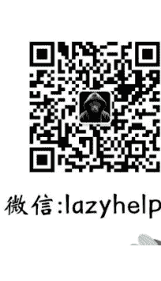

微信：lazyhelper

## 07 讲陷于套路，怎么让消费者一进店就买？

上一讲我们洞察了转化的关键时刻，那怎么把洞察落地呢？

前一讲一开始我们提到，转化听起来好像很简单，就是放大你的美，然后告诉消费者。但我们也提到，这其实没那么简单，因为你讲的消费者其实是不相信的。

消费者在转化的过程中有很多的选择障碍。我们在上一讲帮助大家找到转化的五大障碍。这一讲，我们就来看看，你该怎么讲才能让消费者相信。甚至，你根本不用讲，消费者一看就能看到你的美，一看就相信，一看就会买。

举个例子，一家英语培训机构的教学质量真的很好，导购费尽了心思，跟家长说明这个课程是国外来的，有多厉害，但家长听不懂，也不一定相信，不会买。但是，如果让一群已经上课没多久的小朋友，现场讲英文给你听，你立马就觉得这家培训机构的教学质量好。

这就是让消费者陷于套路。我不用讲，你一看就想进店，一进店就想购买。

还记得讲进店的落地的时候，我有三句话送给你。转化的落地，我也有三句话送给你，很简单，叫作：试这个，看这个，买这个。

转化率的内核就是要降低消费者的选择障碍。所以，当你找到消费者的障碍在哪里的时候，你就要用这三句话去帮助你转化成功。

### “试这个”

降低消费者的选择障碍，一个非常重要的做法，就是请消费者试试看。

我猜你一定会说，我们是在改变消费者的行为，对吧？没错，但是你不知道的是，这里还有另一个更重要的改变，就是改变了消费者的角色，改变了他的心态。“试这个”让消费者从一个“探寻者”变成一个“使用者”，这个时候他的心态就被改变了。

什么意思？你想想看，原本一个导购可能一直跟消费者说，你穿这件衣服可好看了。消费者心想，你讲的是真的吗？但一旦他试穿后，他的视角就改变了，他的想法立马变得不一样了。消费者会想：“哇，看起来很好啊，如果我上班穿，一定很好看，同事会觉得我变年轻了。”你不用多说，他自己会开始想象穿上之后的感觉。障碍消失了，消费者转化的概率就变高了。

所以，“试用”真的非常重要。只要是转化率差的公司，如果在转化过程中有试用这个环节，我可以很负责任地告诉你，一定是“试用”这个环节出了问题。

出了什么问题呢？就是消费者在试用的过程中，没有留峰值，也没有产生记忆点。比如，试穿，“我觉得这件还好吧，还可以”；再比如，试吃，“嗯，我觉得这东西吃起来也还好，没什么特别”。

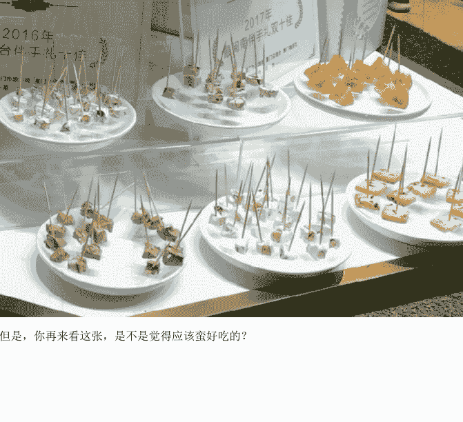

我们想要的记忆点有哪些呢？**视觉**、**嗅觉**、**味觉**、**触觉**、**听觉**，这些都是重要的五感记忆点。

但前提一定是你要让消费者先试试看，一定要记住，**“试”**这个动作**可以改变消费者的角色，这是关键**。

还记得上一讲我提到的苏小糖吧？我总结了它的四大美，洞察到了它在转化方面的问题，那我是怎么帮它改善的呢？没错，就是试吃。我们改变了试吃的流程，让消费者愿意试试看。

我们把牛轧糖分进糖果罐子里。为什么这么做？因为这是我们小时候都有的习惯动作，打开糖果罐，手伸进去，这样的动作原本就藏在消费者的脑袋里，所以，他会更愿意主动去做这个动作，去试吃。

只有一个糖果罐？不是，我们把 16 种不同口味的糖果罐放在一个木板上，端出去，让店里的消费者来试吃。种类多，当然会增加消费者的试吃，但更重要的还不是这一点。

你来想想看，消费者看到这么多罐子会怎样？他会主动问店员：“这个是什么口味啊？哪种更好吃啊？”对不对？消费者原本是个“路过者”，现在变成“探寻者”，主动会来问导购，重要的信息立马植入消费者的心智。不用说，转化率当然会提升。

而且，这个时刻就是告诉消费者，苏小糖的美在这里。

导购先告诉他有 16 种口味，再告诉他：“你吃起来是不是不太甜？对，因为我们用的是海藻糖，热量只有 42%，热量低，你不用担心。”

**把原本不甜的、吃起来没什么的味觉记忆点，成功地变成了避损的信任状，因为消费者都不喜欢太甜，热量太高，我们成功地消除了消费者的选择障碍**。

### “看这个”

什么意思？我来解释给你听。

我一直在讲“放大你的美”，让你的美被看见，这真的是非常重要的事情。但你不要被这里的“看见”两个字迷惑了，不是只有视觉，**你的美可以通过五感去体现，让消费者感受到**。

就像刚才说的苏小糖，你看这张图，是不是觉得这个糖很普通？


但是，你再来看这张，是不是觉得应该蛮好吃的？

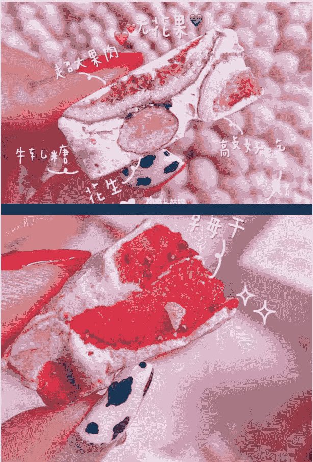

这就是视觉的影响，它的美被你看到了，一秒就看懂。

再拿触感来说，一般人觉得触感还好，不太重要。但其实人最可怕的是触觉，触觉骗了你很多事。

举个例子，你觉得一件衣服质量好，导购说这是什么高级的特殊材料，你听不懂。但是，你一摸发现触感真的很好，很舒服，你就立刻会相信导购说的，它用的真的是很高级的材料。

我经常跟企业讲，你产品的品质好不好，消费者不是看出来的，而是摸出来的。比如，你一部手机做得再好，功能再强，只要消费者摸上去觉得质感不好，他就不会要这部手机。

所以要记得，放大你的美，让你的美被看见，可不是单指视觉，而是指五感。

好，还记得上一讲的幼儿英语培训机构吧？我是怎么改善它冰冷的环境，提升转化率的呢？

整体装潢风格变得更温馨，色彩更丰富，这些你肯定猜得到，我就不讲了。我要讲的是一个非常得意的设计。

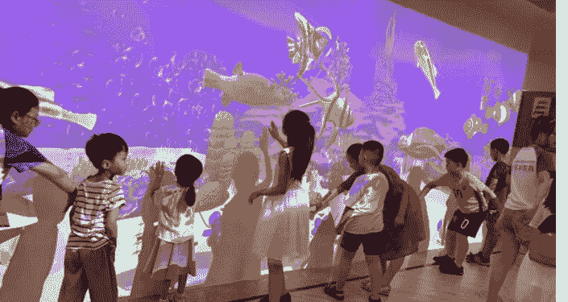

这是一面有大屏幕的墙，小朋友来了之后，可以在设备上画图，画一条鱼，那这条鱼就可以“飞”到屏幕上，在屏幕上面“游”起来。

你想想看，小朋友当然会特别开心，对不对？小朋友的妈妈看到，也会觉得这是一个很好的教学环境。

围绕这个大屏幕，我们还做了很多设计，帮助提升转化率。

比如，新来的小朋友第一次试课就可以画图，让小朋友更放松，有更多的参与感。因为他画的鱼，可以游到大屏上，他下次可能会想再来看他画的鱼。

再比如，小朋友所在的班级，如果这一班的同学成绩好，老师就会让整班同学的鱼一直停留在这个大屏上。你想想看，小朋友的妈妈来接他，他一定会马上讲：“妈妈，你看，我的鱼还在上面活着，你帮我拍照。”

消费者一看到这个屏，就立马懂了，这是一个适合小朋友学习的环境。这就是“看这个”。

除了这个大屏幕，我们还做了另一个体验设计，你可以看看这张图。

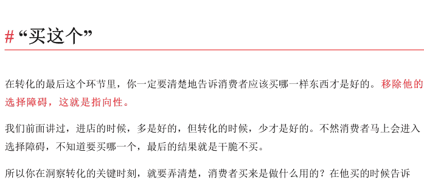

我们找一个小小朋友，他刚来这个教育机构的时候，我们就录制了一段他讲英文的视频，然后，等到他上了 12 次课之后，我们再拍一段。这两段视频，放在一起对比，在这个屏幕上播放。

其他新来的妈妈看到，就会立刻发现，小朋友刚进来的时候还不太会讲英语，12 次课之后，就变得很有自信了。

这就是利用反差可视化你的美，转化率自然会有提升。一看到这个屏，就立马懂了，不但这里的环境适合小朋友学习，而且还会让小朋友进步，有自信。

### “买这个”

在转化的最后这个环节里，你一定要清楚地告诉消费者应该买哪一样东西才是好的。**移除他的选择障碍，这就是指向性。**

我们前面讲过，进店的时候，多是好的，但转化的时候，少才是好的。不然消费者马上会进入选择障碍，不知道要买哪一个，最后的结果就是干脆不买。

所以你在洞察转化的关键时刻，就要弄清楚，消费者买来是做什么用的？在他买的时候告诉他，这个是什么人群专用的，消费者马上就会对号入座。

举例来说，这款衣服特别显瘦，针对下半身特别修身，微胖消费者一听到就觉得跟自己有关；这款婴幼儿辅食，特别开胃，宝宝特别爱吃，特别下饭，妈妈一听到就会买。

另外你应该运用大数据告诉消费者。这是热销第一名，天猫 xx 品类第一名，利用大数据告诉消费者你买的不会有问题，你可以安心买，买这个就对了。

你可以放心，这就是信任状。因为消费者不确定什么是最好的，或者担心会不会买错，这些都会降低消费者的选择障碍。

我们上一讲讲到华航的案例，那个东航高卡级别的消费者，有一个很大的选择障碍，不愿意换航空公司，那我们最后是怎么做的呢？

我们选择了 1000 名具有代表性的客户，常常在坐商务舱，同时是竞争对手的高卡级别。我们会告诉消费者说：

“您好，我们华航最新推出 777-300ER 的飞机。那张卡是我们华航最高级别的翡翠钻石卡，我们不知道您现在在其他航空公司有多少的点数，不过没关系，我们这张卡同点数一样送给你，希望您来试乘我们的 777-300ER 的飞机。”

结果效果非常好，消费者一听立马就说谢谢，把卡收起来，找机会去试乘。

好，讲完了这三句话，我再给你三个自己检查的问题，你可以拿着它们回去看看自己企业的产品：## 思考题

# *# 思考题*

在你的企业，你的美被可视化的吗？在转化率方面，你可以举一两个例子给我吗？期待看到你的留言。

- **1. “试这个”**：转化率的内核就是要降低消费者的选择障碍。
- **2. “看这个”**：利用反差可视化你的美，转化率自然会有提升。
- **3. “买这个”**：清楚地告诉消费者应该买哪一个，移除选择障碍。

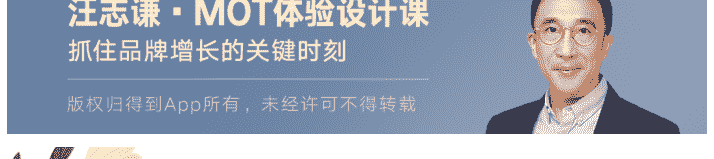

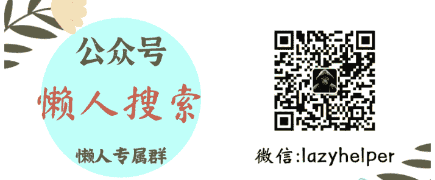

## 08 讲怎么洞察出复购的关键时刻？

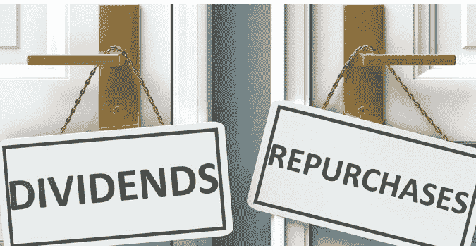

这一讲我要来跟你谈一下，如何洞察出复购的关键时刻。

复购，就是想让消费者一买再买，对吧？可是你想过没有，他为什么会一买再买？

你可能会说，是因为只是习惯了不想换？或者，是因为很好用，特别喜欢？还是只是因为懒得换，所以就一直用？

那我想再进一步请教你：

- 消费者到底是习惯了什么，所以不想换？
- 那是哪个功能觉得好用特别喜欢？
- 懒得换，是不是因为置换的成本很高？高在哪里？是多花了很多时间还是金钱？

很多问题，对不对？但是，你如果深入去想想，就会发现所有这些问题的根源，都出在这一句：

> “消费者到底是怎么使用我的产品的？”

消费者在复购率这个维度的角色很明显，是个“使用者”。在进店和转化的维度，他的时钟很快，你需要快速抓住他的注意力，让他看到你的美。但在复购这个维度，消费者的时钟是慢的，复购这个维度可以说是四大维度里消费者最理性的时刻。

所以，消费者到底是怎样使用就变得非常重要。

我们做了很多研究之后发现，真正会让消费者一买再买，就是因为消费者觉得“值了”。消费者觉得“值了”，不但会一买再买，还会一传千里，告诉他朋友，从使用者变成推荐者。

所以，复购的内核就是要找出消费者在使用你的产品的时候，什么时刻觉得“值了”。

### 企业常犯的三个错误

但是，企业经常会犯三个严重错误，造成洞察出了问题。以至于在落地的时候，体验设计也走错方向。让我来一一讲给你听。

第一个错误，企业自以为很了解消费者会怎么用产品，但其实不了解。

一个亿万豪宅的物业团队找到我，他们想要为这些业主提供超高价的物业服务，收的物业费是原来的 10 倍以上。他们想了很多方法，让业主们觉得付了这些物业费是“值了”。

我们每个人立刻都能想到，安全对这些身价很高的业主来说，是非常重要的。所以这家物业就在“安全”这个方面做了很多事，包括安装人脸识别系统，安装了很多摄像头，配备了很多保安，等等。

听上去没错，对吧？结果，业主们有很多抱怨，你猜他们抱怨什么？

对这些业主来说，安全很重要，隐私也同样重要，他们并不想要把自己的脸录入在人脸识别的系统里。结果物业只好再把这些人识别系统拆掉，花了很多钱，结果是无用功。

你看，这就是这个物业团队自以为很了解消费者的需要，但其实它并不了解。

前面的课程我们已经提到了消费者有不同的角色，进店的时候是个“路过者”，转化的时候是个“探寻者”，复购的时候是个“使用者”，而在推荐的时候是个“传播者”。我们都希望我们产品的使用者能变成传播者，这样可以发挥最大的拉新与裂变。

但你有没有想过，买奢侈品的消费者其实都是品牌的“传播者”，因为对奢侈品的使用者来说，他的每个使用的时刻都觉得值了。所以逻辑上，奢侈品就应该比较贵，因为你用的每一刻都值了。怎么样？想通这个道理，你是不是懂得为什么奢侈品都那么贵了？

### 企业常犯的第一第一个错误是，以为消费者很会用这个产品的各种功能，但其实消费者只会那几个最常用的功能。

就像手机，我们每个人都在用，但手机里功能那么多，你真的很会用吗？你最常用的也不过就那几个功能而已。很多低频的功能，对你来说根本就没有感觉。

### 第三个错误是最严重的，企业常以为有一些地方做不好没关系，消费者应该不会太在意，但其实消费者超不爽，因为这点就不买来了。

这就是我们讲的低谷，更可怕的是，消费者不但不再买，还会把这个低谷告诉所有人。

这实在是有太多例子了，线上购物、外卖平台、打车软件，里面的差评都是这么来的。可是你会发现，即使是很多消费者在反映，有的店家还是继续我行我素。

事实上，消费者若是买一次就不再买了，大概就是两种原因：

- 第一，消费者在使用过程中没有感受到峰值，要不就是你的定价有问题，消费者觉得物无所值。
- 第二，在使用过程中，消费者曾经感受过低谷经验，因此买一次就不再买了。

不过，你也可能会问，究竟要怎么去洞察复购的关键时刻？接下来，我就要跟你分享六个非常重要的关键时刻，也就是消费者会觉得值了的时刻。

你在洞察时，一定要关注这六个时刻，这样在落地时，你做好了，产生峰值，让消费者觉得值了，消费者就会一买再买，你的复购率就提升了。

### 第一个时刻，“最初开箱”。

这个时刻非常重要。因为开箱这个时刻是三大黄金时刻之一。你在这个时刻有峰值，消费者最容易记得。

举例来说，很多时候消费者买了东西刚打开，用都还没用，一看到包装觉得不好，一闻到气味觉得不对，他立刻就觉得这个东西不值了。如果一开箱感觉到档次很高，摸起来质感不错，就会小心翼翼地拆封，用都还没用就觉得这是高档货。所以开箱这个时刻是非常重要的。

### 第二个时刻，“最真符合”。

在这个时刻，消费者觉得“值了”是因为在真正使用你的产品的时候，消费者的感受和你当初对他说的是一致的。

你在广告里，讲了很多厉害的功能，消费者因为这个功能买了。在真正用的时候，他发现真的就是这样，那这就叫最真符合。

这个时刻对于线上的电商特别重要，因为消费者不是像在线下店那样，看到商品后挑选，看的都是图片、视频广告。如果他用了之后，发现跟你讲的不一样，会立刻跌入低谷，不但给差评，以后也不会再买了。

### 第三个时刻，“最高峰值”。

我来跟你讲一个亲身经历的故事。

我们经常出差，会到处去住不同的酒店，很多酒店住过就忘了，但有一家酒店给我留下了非常深刻的印象。它做了什么特别的事吗？让我来分享给你听。

我们现在住酒店，常常都会点外卖。当时我点了外卖，下楼去拿的时候，一个站在门口的服务员主动走过来跟我讲：“先生，您好！您是我们住店的客人吗？”我说：“是啊。”他说：“您在等外卖吗？是这样子的，您只要告诉我房号，我待会儿可以帮您把你的外卖送到楼上去。”我立马说：“哇，那太好了，那我就不用下楼拿了。这个服务真好啊！”

你看，就是这么短的时间，这么简单的事情，我立刻产生了峰值。

### 第四个时刻，“最有面子”。

想要消费者复购你的产品，就得让消费者在使用的时候，感觉到非常有面子。举个例子，当我说："哇，先生，你这只手表好贵，这个要多少钱啊？"这个人就觉得这只手表让他很有面子，他买这只手表值了。你想想看是不是这样？跟这个人到底是不是了解这只表，这只表是不是很准，有关系吗？没有。

### 第五个时刻，“最低逆转”。

我再来讲一个我自己出差的故事。出差嘛，当然就常常坐飞机。有一次我把一个很贵的耳机和文件袋等其他东西落在了飞机上，第二天才想起来，赶紧打电话问航空公司。

我说：“我的东西不见了，你可以帮我查一下吗？我是昨天坐某某航班，座位是某排某号。”

各位猜一下，这家航空公司的客服人员用了几分钟回应我？这就是关键时刻。3 分钟？10 分钟？我告诉你，不到 20 秒他就回应：“汪先生，您好！是这样子，我们在您的位置找到一个东西，您可以简单描述一下是什么吗？”我就告诉他是什东西，里面有几支笔，笔是什么颜色，等等。

他继续说：“您描述得非常详细，这是您的东西，没有错。那汪先生，您需要我现在帮您寄回去吧？”我说：“当然，谢谢。”当时是早上，我外出开会，等我中午进办公室，东西已经放在了我桌上。你看，这个感受多好。

### 第六个时刻，“最没想到”。

这个我想不用纠结，像乔布斯的苹果、马斯克的特斯拉，这些企业就是把消费者的梦想变真实，做的东西都是你没想过的。你会觉得“哇，手机可以变成这样”，“哇，车子还可以变成这样”。把消费者的梦想变真实，消费者会觉得很非常值。

那是不是一只有科技企业才能做到呢？当然不是，你想想谁做得更好？迪士尼乐园。它把所有大人和小孩的梦想都变成真的，所有小朋友的梦想就是有一天可以去这个乐园玩，甚至很多人长大了也觉得要去圆一次梦。自己要去，还要带自己的孩子去，去一次不够，要全世界每个迪士尼乐园都去一次才好。这就是梦想变真实带来的复购。

听到这儿你可能会说：“汪老师，我也想做这样的产品啊，可是我做的都是很普通的生意，怎么做出这样能圆梦的产品啊？”

你千万不要认为，梦想变成真实，必须是大梦想，其实这件事情小企业、小产品也能做到。 我在下一讲就会告诉你类似的案例。

好，这就是六个“值了”的时刻，是复购这个维度里你要去洞察的时刻。你可以去看看你的产品、你的企业，有没有这些时刻，做得怎样。

##### 思考题

当你要去问消费者为什么一买再买的时候，你的洞察点在哪里？

- **第一个洞察点**，是去问“爱你的人”和“不爱你的人”。
为什么一直买你的产品？什么时刻觉得值了？为什么一直买竞品？为什么竞品会让他觉得值了？到底哪个时刻让他觉得值了？

- **第二个洞察点**，是找到消费者最高频使用产品的场景是什么。
一定要去找到，你才能够打造峰值。

- **第三个洞察点**，为什么有消费者买一次就不买了？低谷到底在哪里？
这点也非常重要，如果你没有灭掉低谷，企业就非常有可能一直在进店、转化，然后到复购就停掉，没有办法变成闭环。

所以，以上这些，一定要好好地去请教你的消费者，去挖出复购维度下洞察的关键时刻。

我准备了七个题目给大家，帮助你更好地请教你的消费者，挖出你的关键时刻：

- 1. 你为什么会一直买？
- 2. 你买来做什么用的？想解决什么问题？
- 3. 你最常使用的时刻是什么？五感体验又怎样？
- 4. 你什么时候觉得值了？
- 5. 你除了买这个产品，还买过其他哪些产品呢？
- 6. 你使用时曾经出现过什么问题吗？
- 7. 你为什么买一次就不再买了？

##### 思考题

你知道你的消费者为什么买一次就不买了吗？欢迎你留言给我。

1. 复购的内核就是要找出消费者在使用你的产品的时候，什么时刻觉得“值了”。
2. 企业常犯的三个错误：自以为很了解消费者的需要；以为消费者会使用产品的各种功能；因“自以为不重要的小细节”失去消费者。
3. 关注六大关键时刻：“最初开箱”、“最真符合”、“最高峰值”、“最有面子”、“最低逆转”、“最没想到”，在落地时做好并产生峰值，复购率就会得到提升。


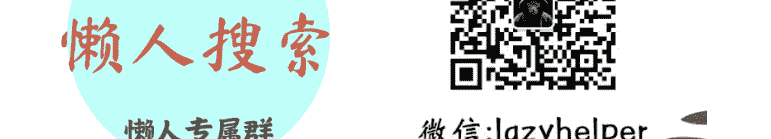

## 09 讲忠于习惯，怎么让消费者一买再买？


上一讲我们提到，复购的核心，就是找到消费者什么时刻觉得“值了”。这一讲落地，我们就来说一说该如何做这个体验设计。

消费者会一买再买，就是因为他觉得“值了”，再次购买的时候，他一定期待得到一样的峰值体验，对吧？所以，这对消费者来说就是一种习惯。

你每次买茶饮，最重要的时刻就是用吸管吸第一口的那个刹那，感觉很爽，你就觉得值了。关键是，每次都得这样，你才会每次都买，每次都很值。

因此，企业不能只是让消费者觉得“值了”一次，这个时刻必需标准化，不然消费者的预期变成低谷，会马上给差评。

其实复购这个时刻最考验企业了。但只要你持续让消费者感觉到“值了”，消费者的心智就会出现“这家企业就是某某品质的保证”，他就会一直买，你出什么东西，他都会买。这个时候，“信任”这个词就已经进入消费者的心智中，所以我们说，复购最终就是要让消费者忠于习惯。

如何让消费者忠于习惯？

三句话送给你，叫作：

- 平凡变极致
- 低谷变峰值
- 梦想变真实

我们一个一个来看。

### 平凡变极致

你要让消费者在他最常使用的那个时刻，他本来以为很平凡，没有什么期待，但他觉得“这不一样了”。

越在这种平凡的地方，让他觉得有峰值，消费者越有感知。他会觉得“你连这个事都可以做得这么好，你真是不简单”。

这个值了的时刻，你把它标准化之后，消费者就会一买再买。

让我来举一个例子给你听。比如住酒店，你一定会遇到的时刻是什么？就是你一进去办理入住的时候，而在这个时刻，如果酒店能把这一件事做成峰值，你就会觉得“怎么这么贴心、这么好”。

我就有这样的真实经历。我常常去住日本的酒店，他们真的是在 check in 的时候，用两句话就征服你。哪两句话呢？

他一看到我的护照，看了一下我的名字，第一句话就说：

“谢谢您，汪先生，又回来跟我们共度这个假期。”

怎么样？是不是会觉得很不错？不过，好像也还好，还挡得住。

第二句真的就是“杀招”，他认真地看着我说：

“汪先生，我们知道您这次又订我们酒店，我们帮您预留好了上次您住的那个房间，不知道您想不想住上次的那个房间？还是这次想要换一间住呢？我们有三个房型，可以供您选择。”

你看，输了吧？这种体验就非常好。因为你会再回去住，一定是你觉得上次那个房间非常好，对吧？他就已经帮你安排好了，留下来给你。同时如果你这次想要换一间，我也准备好给你三种不同的选择。

最关键的是，他做的这件事情是你会最高频遇到的。你住任何酒店首先一定都会做 check in 的动作，又是在“最初”的黄金时刻，创造出峰值，你立刻就觉得“这家酒店真的很不一样”。

再举一个例子，我去住这家日本的酒店，还有一个高频的事情，就是去跑步。我就是为了能在跑步时欣赏这家酒店附近的风景，所以才去住这家。而这家酒店其实早就洞察到，于是，它做了一个很厉害的设计。

跑步，当然就会流很多汗，对吧？你跑完步回来，一进酒店，立刻就有一 个人从旁边出来，递给你一块冰毛巾，再加上一瓶矿泉水。

你发现了吗？又是一个黄金时刻，跑步结束“最终”这个时刻，同时又是一个高频发生的平凡时刻。你立刻就觉得“我住这个酒店真是值了”。

> 你看，越平凡的时刻，越高频的时刻，你把它做好，消费者就越有感，就记得越清楚，他才会觉得“值了”，他下次来就是买这个“值”，忠于习惯。

### 低谷变峰值

这非常地重要，我们上一讲讲过，如果消费者买一次就不再买了，有非常大的可能性就是两大原因：

- 1. 他没有觉得值了，或你的定价了问题；
- 2. 他买回去之后，体验到低谷，觉得不高兴，所以，他买一次就不再买。

所以，低谷是一定要灭掉的是。这是绝对的，你如果不灭掉，这个低谷还会被消费者宣传。

> 但灭掉低谷，还不算厉害，真正厉害的是有办法把低谷变成峰值，那就是高档的体验设计，消费者是绝对不会忘记的。

我还是举这家酒店的例子给你听，我有时会故意测试它。比如，我会拿起电话，拨到餐厅。然后，我就跟这个餐厅讲：“你好，我要送洗衣服。”看对方怎么回答。

一般的酒店就会说：“哦，先生，不好意思，你打错了，我们这边是餐厅。”

你猜这个五星级酒店怎么说？接电话的人二话不说：“先生，您好！没有问题，我待会儿就立刻找人过去拿你的衣服。”我就问他：“不好意思，我是不是打错电话了？你这是不是餐厅呢？”他说：“没问题，我们都可以帮你处理的。”

你看，这真的是很厉害。因为酒店早预期到这是消费者经常会出错的场景，很容易变成低谷，那它预先设计好，处理后就变成峰值。

我的考验还没有结束，服务人员来拿送洗衣服，我就说：“你好，我的衣服给你。我想要两瓶水。”他就说：“没问题，我待会儿就拿过来。”

我有一个坏招在后面，就是他拿两瓶水过来以后，我就跟他讲：“先生，我还要两瓶。”我想看看他当场的反应会是怎样。结果，你猜他是怎样做的？他再来的时候直接给我六瓶，我当场愣住。更重要的是，我隔天出门去办公，当我回到房间的时候，我的房间里面有十瓶水。

在那个刹那，我就觉得“这家饭店真是厉害”。你看，你讲一件事，它驱动所有的人，就知道这位客人喜欢喝水，就把水补齐，你根本没话讲。这就是把低谷变峰值。

我继续来跟你讲这家神奇的酒店。我中午去它的自助餐厅，进去问：“多少钱？”他说：“先生，您好，我们这个自助餐一个人是 350 块，还要再加一成的服务费。”我就现场很大声地说：“怎么这么贵呀？”你看，这应该是个低谷，对吧？

结果你猜他怎么说？他说：“哦，先生，那要不要这样子，我带您看一下今天的菜色，您看一下喜不喜欢，我再来帮您安排位子，您看这样好吗？”

然后他就带我去看，说：“这是我们现做的面点，这是我们现做的包子，我们的海鲜也是现蒸的，然后我们还有生鱼片，也是新鲜的。那先生您看，要不要我帮您安排一个窗边的位子啊？您觉得怎么样？还是您想再考虑一下？”

你看，他从头到尾不会指责我，对我没有任何的判断，只是说明自助餐美在哪里，值在哪里，我就只能乖乖去吃了。

### 这就是好的体验设计，能够把低谷变峰值。这不可能是临时的反应，绝对都把事前可能遇见的低谷，全部都先写出来，想好要怎么回应。消费者当然没话讲了，觉得值了，一买再买。

### 梦想变真实

我们要把梦想变真实，也就是把客户没想到的做到。

刚才说了很多服务业的例子，其实其他行业也一样。譬如说手机的功能设计，我们常常会用到截屏，用手机敲两下就可以截屏，让消费者觉得很容易。或者，用这部手机拍照，一拍出来就已经美颜，特别好看。你不用再 P 图，就变成了美女。这些都是把消费者的梦想变真实。

再举一个例子。我的一个客户很爱海钓，但他发现一般很适合海钓的地方，周围都没有什么好的酒店，就算有，去海钓还是很麻烦。而且，喜欢海钓的人不少，也就是说有一群消费者的需求没有被满足。

结果，他就真的在海上建了一个五星级的酒店，让客人一起床就看到海，摸到海，还可下去游泳，浮潜，钓鱼，同时酒店又是超高档，有非常好的餐点与服务，很舒服。现在，这家酒店已经变成网红景点。你可以看这些图片，超酷，一看到你就想住，这就是把梦想变成真实。

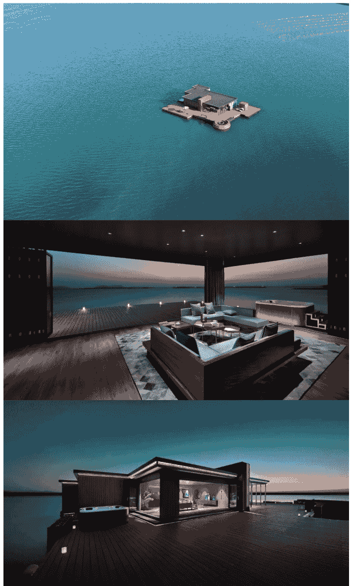

以上这三句话，就是要让消费者觉得值了，一买再买的方法。

##### 思考题

在你目前的产品中，你设计过什么“值了”的体验吗？具体是怎样的？欢迎你写在留言区，分享出来。

- 1.“平凡变极致”：超出消费者的期待，越是在平凡的地方出现峰值，消费者越有感知。
- 2.“低谷变峰值”：提前想到可能出现的“低谷”，想好应对方案，才会让消费者觉得“值了”，从而一买再买。
- 3.“梦想变真实”：抓准消费者需求，把他们的梦想变成现实。

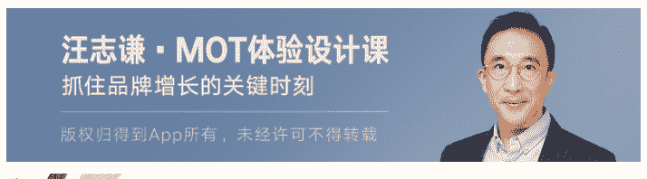

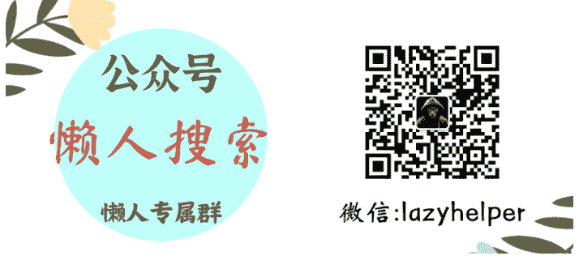

## 10 讲怎么洞察出推荐的关键时刻？


这一讲，我们来看看四大维度的最后一个维度，推荐。还是一样，我们先来看看该如何洞察出推荐的关键时刻。

在我们协助企业提升推荐率的过程中，我最常听到企业说的就是：“我们的客人都我们不帮他们分享，那该怎么办呢？”这听上去是个问题，对吧？可是，我要告诉你，这个问题本身就是错的。为什么这么说呢？我来问你三个问题：

- 1. 我是一个消费者，我为什么要帮你分享？
- 2. 你有什么值得分享的？
- 3. 你知道哪个客人的分享最具代表性、传播力度最大吗？

怎么样？这些是不是不太容易回答的问题？

这三个问题，其实也是企业在洞察推荐率的 MOT 时最常犯的错误。

大部分的企业都以为消费者要推荐的是品牌本身，这从根本上就错了。其实消费者是透过你的产品，告诉别人“我是谁”。消费者在推荐的时候，心理底层根本不是在推荐你，他讲的都是他自己的故事。只是在讲这个故事的过程里，他提到了你，推荐了你。

消费者才是主角，品牌只是配角。

但很可惜，很多企业并没有搞明白，把自己当作主角，消费者当然不帮你推荐，难怪推荐率很差。

我来举一个例子说明。一个做儿童睡衣的企业主来上我的课，课堂上正好有一位同学是他品牌的使用者，看起来是个很有经济实力且品位不错的妈妈，我就现场访谈她。

我请教这位女同学说：“你有没有买？”她说：“有啊。”我说：“那你觉得好不好？”她说：“好啊，非常好。我给我的两个小朋友都买了他家的睡衣。”然后我问她：“那你有没有推荐给朋友？”她说：“没有。”我就问她为什么，她就“呃……"，很犹豫。

旁边的同学看她不讲话，就说她是不想炫富，因为这个儿童睡衣价格有点高。我就说，不是。然后，我就跟这个企业主同学讲：

“我们第一次见面，我没看过您的睡衣的设计，但就我刚刚那段不到一分钟的访谈，我猜这位女同学应该是觉得这个睡衣不太好看，所以不推荐。”

这位女同学马上站起来说：

“汪老师，你怎么知道？你真的讲得太正确了，这个睡衣小朋友穿起来是非常舒服，但样式比较普通，所以我不大想推荐给我朋友，我怕到时候朋友跟我说这睡衣不好看。”

你看，这位女士没有推荐的原因不是这个睡衣不好，她其实一直在买，小朋友穿得都挺高兴，但她还是没有推荐，因为当她推荐时，她认为推荐的是她自己，怕没面子。发现了吧？让消费者有推荐动机多重要。

刚才我问你的第二个问题：你有什么值得分享的？

这个问题背后的重点在于，消费者只买不推荐，其实不是不愿意推荐，而是没有觉得“值了”。

这一讲，我常在教课...告诉我的朋友：“本人今天学习，正在精进中，有事晚点联络。”他并没有要推荐这个老师的意思，只是刚好拍到你的课件。

但当他听了觉得这个课不错，觉得“值了”，就非常有可能中午走到台前来找我说：“汪老师，我觉得您讲得特别好，可以跟您拍张照吗？”接着，他回到座位发朋友圈分享，说这个老师很不错等等。

所以，不要一上来就问消费者为什么不推荐，你应该先问他觉得“值了”吗。因为消费者觉得“值了”才可能会推荐，如果觉得“不值”，就一定不会推荐。

好，我们再看刚才的第三个问题，哪个客人的分享最具代表性、传播力度最大？很多企业并不知道这个问题的答案，一心就想着让更多人推荐。但其实，这个问题的答案非常重要，我们一直说要放大你的美，这个放大的人很重要。

让我来举个例子给你听，你就懂了。一个女性服饰品牌的老板，请我去洞察她的消费者。我们发现有一群消费者是这样的，她们特别喜欢告诉别人该穿什么衣服，还会拍照给朋友看，说你就是适合穿这个，朋友也确实特别愿意听这些人的推荐。

这样的消费者就是这个品牌最佳的使用者和传播者。我们发现有不少消费者确实都是经由这样的推荐变成品牌的忠实用户。

其实，在所有的品牌中，你都会发现，有一些消费者就是特别喜欢分享，而且又是朋友圈中的意见领袖，这样的人传播力度大，你就是要找到他们。

别总想着怎么让更多的人推荐你，而应该去寻找推荐效果好的那些消费者是谁。让有代表性的消费者推荐，更能裂变、拉新，传播力度可能是千万百万倍以上普通消费者。

什么是代表性的消费者？如果有网红、大 V 这种 KOL（Key Opinion Leader），那当然再好不过。没有的话也不要紧，你会发现你的消费者群里一定也有类似的 KOC（Key Opinion Consumer），关键意见消费者。他们是你的铁粉，那他们就是你的品牌的 KOL，就是你的美的放大器，能够放大你的美。

好，我们用三个问题，说明了企业在洞察推荐的 MOT 时常犯的三个错误。你在做洞察的时候，一定要避开这些。

接下来，我想分享给你三个重要的洞察点，帮助你挖出推荐率的 MOT。

推荐率的内核就是要触发消费者去分享，那我们就要挖出到底在哪些点上消费者分享的效能最大，并且通过明白消费者为什么会分享，为什么不分享，又是怎么分享的，然后才能真正地提升推荐率。

### 找出分享动机

我们发现消费者有两大分享动机，一是消费者觉得“值了”。

还记得我们上一讲说的那六个“值了”的时刻吗？感觉“不值”，是大部分消费者不分享的最大原因；感觉“值了”，才有可能启动分享，所以这部分你一定要挖出来。

第二个会让消费者分享的动机，就是消费者觉得你的产品可以代表他。

消费者是透过你的产品告诉别人“我是谁”，这也就是为什么我说奢侈品的使用者都是品牌无形的传播者。

但其实消费者告诉别人“我是谁”的方式有很多，不一定是奢侈品。比如，很多消费者想让别人长见识，会分享新奇的事物给朋友。你最近看了一本书很棒，听了一个演讲很不错，你都会忍不住想要分享给朋友。但内心其实你是想偷偷地告诉朋友，你是个走在前沿的人、不断进步的人。

而且你发现了吗？让朋友“长见识”，也不见得都是分享好的，有可能会是坏的，是不好的，希望帮助朋友避坑，这就是所谓的“差评”。所以你要记住，“低谷”消费者也是会分享的。

这些消费者为什么会分享的 MOT 都是需要我们去挖出来的，之后才能在落地推荐时来进行设计。

### 消费者如何推荐

你应该去问那些消费者，他们当初是怎么推荐的，怎么说你的，他们讲的故事是什么，这些是你一定要关注的点。

> 五感记忆是消费者的强记忆，最容易存进大脑，所以在跟朋友分享的时候，也更容易提取出来。

比如，你跟朋友分享上次吃过的那家菜，觉得很好吃，摆盘多厉害，又是什么上菜的仪式感。但你可能不记得那道菜名，甚至连餐厅名字都忘了。因为五感记忆才是强烈的。

再比如，一把椅子，摸起来质感很好，坐起来很舒服，看起来很高级，这些都是推荐时会说出来的话，又都是五感记忆。

你看，这就是超强烈的五感记忆，直接进入心智。

所以，我们要找出自己的产品，到底是用什么样的五感记忆存进了消费者的心中，等消费者想要推荐的时候，他又是怎么调出这些记忆的，这就是将来我们要落地体验设计时的重点。

### 谁推荐的力度最大

> 第三个洞察点就是搞清楚到底哪些消费者会推荐，哪些消费者推荐的力度最大。

我建议你要找到你的老客人，就是一直“爱你的人”，他们一买再买，证明他们有很多觉得“值了”的时刻。你在这群人中间找，当然就容易找到会推荐分享你的品牌的人。如果这个人又是意见领袖的话，那你想都不用再想，他就是你最重要的 KOC，一定要抓紧。

另外一种人，你也该找出来，就是不一定买最多但分享能力超强的消费者。他们通常是社交媒体上的活跃分子，原本的个性可能就是朋友圈子里喜欢分享经验的人。找出他们来，好好地善待他们，将会让你的传播效能更大。

好，这三个洞察点是我们找到推荐 MOT 的重要洞察点，那具体问什么问题可以找到答案呢？我还是给你准备了一个提问清单：

- 1. 你有过推荐给朋友吗？为什么？
- 2. 你为什么没有推荐给朋友？
- 3. 推荐朋友的时候，你都怎么说？
- 4. 你曾经拍照或短视频上传分享吗？拍了什么画面？
- 5. 你会怎么形容你目前使用的品牌？联想到什么？
- 6. 你想到这个品牌的时候，具体想到了哪种感觉？是味道、声音、触感，还是什么？
- 7. 你当时在网络购物平台上，是用什么关键词搜索到这个品牌的？又是如何搜索到竞品的？

##### 思考题

你知道吗你的产品最大的传播者是谁吗？他们都是怎么传播你的？欢迎你把的答案告诉我，期待你的分享。

- 消费者是透过你的产品，告诉别人“我是谁”。消费者才是主角，品牌只是配角。
- 消费者觉得“值了”才可能会推荐，如果觉得“不值”，就一定不会推荐。
- 去找到推荐效果最好的那些消费者，效果事半功倍。

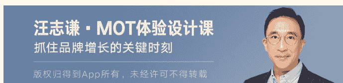

### 懒人搜索


**微信**: lazyhelper

## 11 讲传于印记，怎么让消费者一传千里？

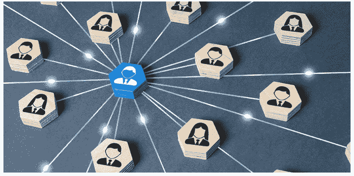

这一讲我们来看看，如何让推荐的 MOT 落地，也就是如何做出提升推荐率的体验设计。

上一讲我们提到了，很多企业在推荐率这个维度，最常问的问题就是：“为什么我们的消费者都不分享推荐？”然后在这个错误的问题下，做了很多错的事。

比如说，最常见的做法就是花钱请消费者去分享。你可能会说，我的企业就是有钱，我花钱请消费者去分享，有什么不可以的呢？

如果你为了是一时的效果，那可能可以。但是，我可以确定的是这种做法有很大的问题，那就是消费者记得的不是你，而是你的钱。用金钱刺激分享的做法，要么就是钱越花越多，要么就是一旦没钱，消费者不但不再分享，而且从头到尾根本不记得你。

事实上，真正的问题在于企业忘了去思考到底要让消费者分享什么。也就是你的品牌到底是什么，有什么东西值得让消费者去分享，有什么故事让消费者去跟朋友显摆，这些重要的问题会被错误的做法掩盖而让企业忘记去认真思考。

一个没有印记、没有故事的品牌根本无法传播。所以说，在推荐维度我们要做的事情就是四个字：传于印记。

那具体怎么做呢？我想你可能已经猜到了我的“套路”，我一样有三句话给你：我是谁，他是谁，你是谁。

好，让我们一个个来看。

### “我是谁”

前一讲我们提过，消费者是透过你的产品告诉别人“我是谁”。我们在落地的时候，就是要放大消费者分享的动机，让消费者更愿意、更主动去分享。

首先当然就是要好好打造六大“值了”的时刻，我们一起来复习一下，分别是：最初开箱、最真符合、最高峰值、最有面子、最低逆转、最没想过。

我要提醒你的是，如果在这里找侧重点，建议你先做好“最初开箱、最真符合、最低逆转”这三个时刻。

为什么？因为这三个关键时刻更容易启动消费者分享。你想想看，“最初开箱”是消费者一拿到你的产品打开的那个时刻，这也是我们说的三大黄金时刻中的“最初”。如果这时刻他觉得很惊艳，还没开始用你的产品，就已经拍照分享了。

而“最真符合”很简单，如果你的产品用起来跟广告里、直播里讲的一模一样，消费者立刻就觉得值了，马上告诉朋友：“这个可以买，强烈推荐。”

“最低逆转”是低谷变峰值的时刻，我甚至可以向你保证，这是消费者百分百会分享的。如果说“最真符合”是符合了消费者的预期，那“最低逆转”可以说是完全超出了消费者的预期，消费者带着惊讶和赞叹，当然一定会分享推荐。

说到这儿我要再次提醒你，千万不能有低谷，因为低谷也会被分享，就变成消费者透过你的产品告诉别人“我不是谁”，他会告诉朋友怎么避坑，那可就糟了。

### “他是谁”

这里的“他”指的是真正传播力度大的消费者，其实就是我们最常说的“大节点”。针对“大节点”，我们能做些什么呢？

最常见的做法，就是跟大 V、KOL 合作，他们推荐的效果是千百万倍于普通消费者。这种方式现在很多人都在用，我就不多说了。

可是，这种做法很花钱的，那如果企业没那么多钱怎么办呢？我建议，你可以在自己的铁粉里，找到或者养一个“大节点”，把他变成大 V，也就是所谓的 KOC。

这件事非常值得做，可不只是省钱而已，在你寻找和培养 KOC 的同时，其实就是在探索、带活你的粉丝群。**KOC 主动影响粉丝群，粉丝群因为 KOC 增加黏度与互动，传播的力量立刻倍增，而且非常有可能会出现更多的 KOC**。

同时，你还可以更进一步地跟其他的品牌进行“换粉”，也就是拓展进入到其他品牌的粉丝群，让你的传播力度变得更大。你看，这才是更可怕的力量。

创造“大节点”，其实还有一个更好的方法经常被企业忽略，就是把自己变成“大节点”。让品牌创始人自己变成企业最大的印记，这是我最推荐的方式。

我猜你一下子就能想到一大堆人名和品牌，乔布斯和苹果、雷军和小米、陶华碧和老干妈，对吧？你看，创始人自己就是企业最大的印记。

**流量越大的节点，在未来社交货币的交易中绝对是越有价值的，这种时候创始人作为品牌最大的推荐者，开产品发布会，做广告，做直播等等，就能够最大限度地放大企业的美**。好，这就是第二句话“他是谁”。

### “你是谁”

消费者要推荐的时候，他会怎么讲你呢？你有什么素材可以让消费者讲出属于他的故事？在推荐这个维度里，最大的障碍除了消费者没有动机分享外，就是消费者不知道怎么去分享你。

因此，**要设计容易存入大脑的体验，让消费者在分享时也很容易提取**，这就是传于印记。品牌准备好素材，让消费者在使用产品的过程里，有内容去分享，创造属于他自己的故事去分享“你是谁”。

好，三句话说完了，但你可能听着觉得还有点抽象，我用一个具体的案例说明。在之前进店落地的那一讲中，我已经讲到了豫园里的老庙黄金。那在推荐维度里，我们又做了什么样的体验设计呢？

我们先来复习一下前面讲过的，虽然豫园的人流很多，但是当初进这家店的人并不多。于是我们设计了金砖阵和黄金楼，让消费者注意到这个区域，注意到这栋建筑，提升进店率。

### 好運来

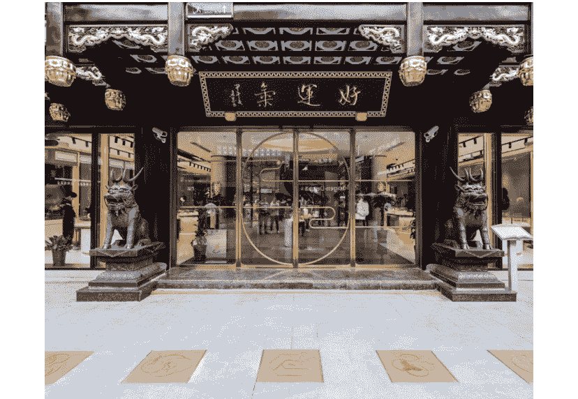

> 开光大金宝

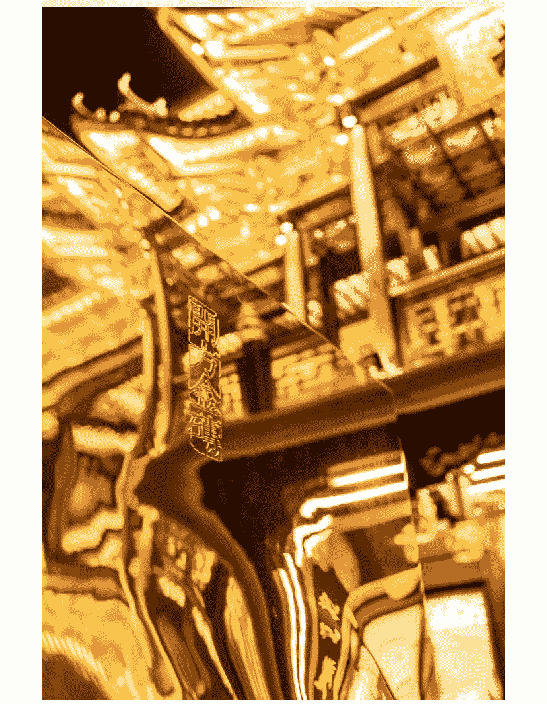

关注公众号搜索，懒人专属群分享

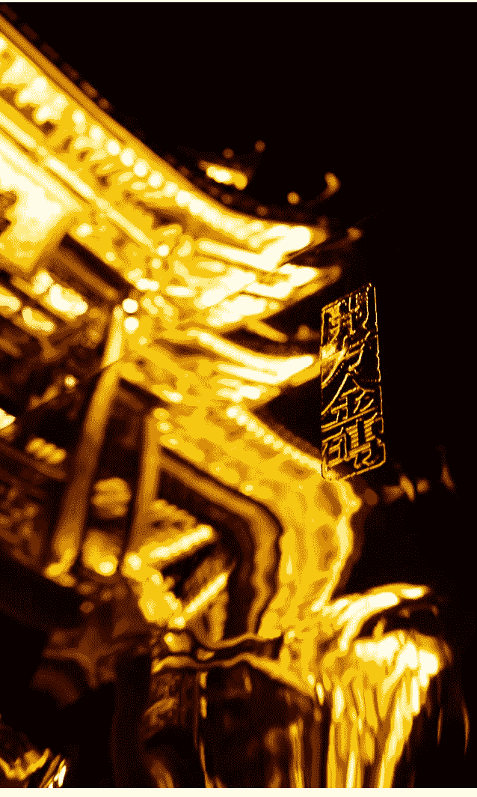

好，那只有进店当然不够，老庙黄金还有问题：这是一个三层楼的建筑物，消费者就算进店了，上楼的人也不多。经常发生的情况是消费者在一楼逛了一圈就出去了，没有打卡，也没有拍照。那我们是怎样用体验设计来改变这种状况的呢？

在做体验设计时，你就是个导演，你在设计这场戏，透过场景，让消费者感受到你想传递的信息，并做出我们所期待的事情。

之前我们说过，"老庙给你带来好运气"，这个 slogan 老庙黄金已经用了 60 年了，但消费者没有体会到。**所以我们的设计就和“好运”有关，将消费者心中对于好运的想法挖出来，再运用体验设计放回去，让消费者感受到好运气。**

那我们中国人一想到“好运”是指哪些？福、禄、寿、喜、财，对不对？这就是把消费者脑中所想的挖出来。所以，我们就设计了这五道好运门，分别布置在不同的楼层，目的就是让消费者进了楼以后会去打卡。

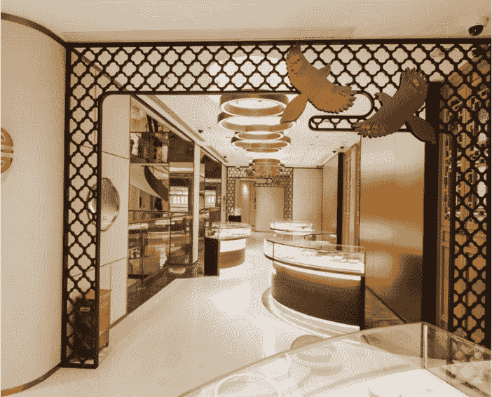

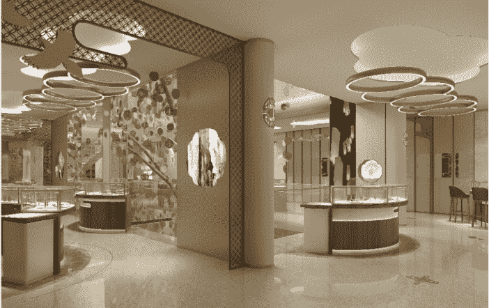

当消费者经过这些门，去打完卡以后，就可以收到一个“好运气”——抽奖。这就是把消费者心中所想的再放回去，真的拥有这个好运。

除了五道门，我们还设计了一棵黄金树。

我们把整栋楼中间挖空，做了一棵黄金树。你可以看看图片，这棵黄金树的设计非常酷，不是一般无趣的造型。

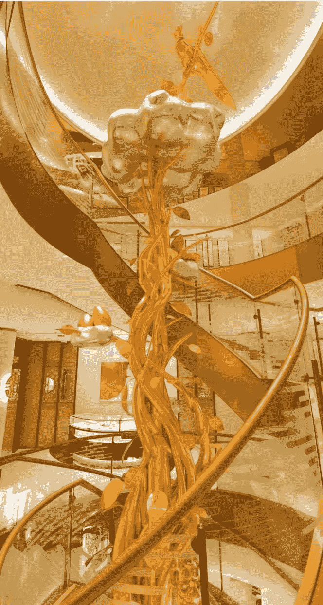

黄金树下面有两只大象，为什么要用象？因为豫园的“豫”字里有“象”。你站在每一层楼去看这棵<br>黄金树，它都不一样，非常漂亮。

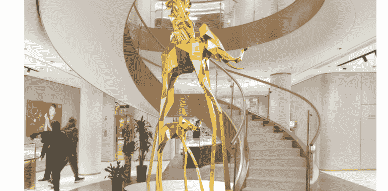

为什么要设计一棵树？首先，发财树，还是和好运有关。其次，消费者从一楼大门走进去看到这棵树，立马就会想走上三楼，从最高处往下看看它完整的样子，然后拍下来，分享朋友圈。

再接下来，就是具体商品的设计。

根据金砖、金楼、金树这些造型，我们把好运的寓意做了延伸，设计了很多黄金饰品，你可以看看这些图，比如吊坠、手链等等，都非常好看，都是跟好运有关的样式。

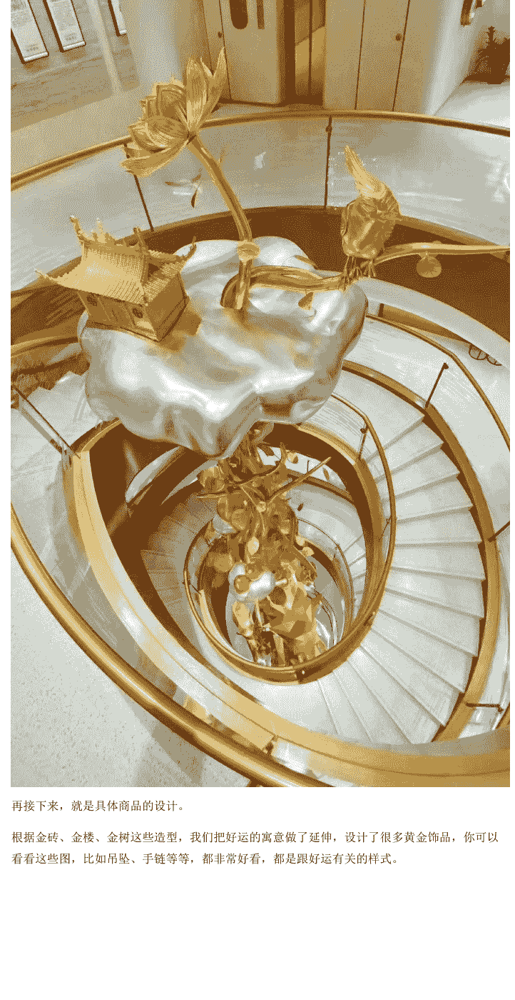

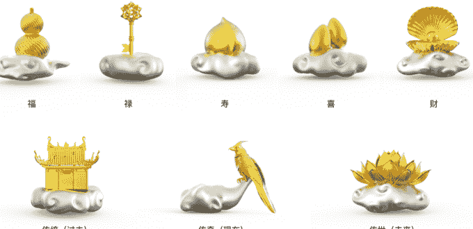

# 遇见老庙 预见好运

> 

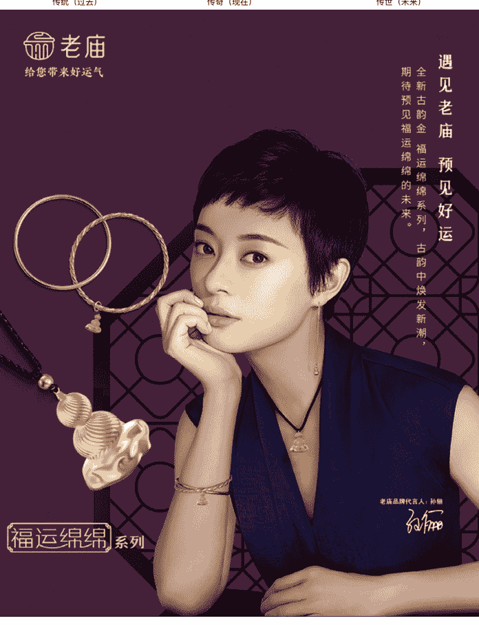

消费者就把好运带回家，增加转化率的同时，消费者更可以跟家人朋友去分享推荐：

“你看到我这个手链了吗？是在老庙黄金买的，那里现在真的不一样了！我告诉你，那里的广场现在很特别，有金砖！还有一棵特别好看的黄金树，楼里面还有五道好运门，你看，这是我拍的照片，是不是很好看？”

我们最后还给老庙黄金写了一首诗：

脚踏金砖通坦途，眺望金楼步青云。五门齐过享五福，黄金树下种好运。

消费者可以在老庙黄金的公众号等一些地方看到这首诗，如果他想要把自己拍的照片发朋友圈，就可以复制这首诗做配图。

好，以上就是我们给老庙黄金做的体验设计。听我说了很多，你是不是很想看看这个老庙黄金楼？如果你现在就在豫园的老庙黄金，是不是想立马拍照告诉朋友：

“我跟你，豫园现在跟你们想的不一样了！”想让你的朋友长见识，这就是“我是谁”。

豫园跟很多网红做跨界的合作，所以现在就有很多网红会来老庙黄金拍照，拍视频，做直播，上传抖音、小红书等平台，吸引更多年轻人来这里。你看，豫园和老庙黄金都进入了一个新的圈层，这就是“他是谁”。

## 12 讲怎么选出目标客群？

而金砖阵、黄金楼、黄金树、黄金象，还有各种代表好运的印记与黄金饰品，这些都是素材，消费者可以用它们组合出属于自己的故事去分享。这就是“你是谁”。

好，案例讲完了。我给你三个具体的方法，你回去就可以立刻开始做：

- 1. 把自己当作一个消费者，拍一段推荐自己产品的视频，看看拍出来的视频会是怎样的。如果你自己都拍不出来，还期待消费者能拍出来吗？
- 2. 把创始人变成“大节点”，最大程度放大企业的美。
- 3. 在你的产品上，创造一个独一无二的五感印记，这样将来才能传播。

从下一讲开始，我们就要进入第三模块，经营品牌的三件事，选对人，做对事，说对话。我会告诉你到底如何选出你的目标客群，该如何挑出最重要的关键时刻，又该怎样设计你的品牌信息，让它进入消费者的心智。

##### 思考题

你们企业的印记是什么？但我希望你告诉我的，是除了视觉以外，你们做了哪些五感印记。譬如说是触觉，还是嗅觉呢？期待你的留言。

- 1. “我是谁”：把握“最初开箱、最真符合、最低逆转”三个关键时刻，启动消费者传播；
- 2. “他是谁”：找准“大节点”，KOC 与粉丝群增加黏度与互动，传播的力量立刻倍增；
- 3. “你是谁”：品牌准备好素材，让消费者在使用产品的过程中，有内容去分享，并创造属于他自己的故事。


相当多决心人，选对人，做对事，说对话。

经营品牌的三件事，选对人，做对事，说对话，也就是你该怎么选择出你的目标客群，你该设计哪些 MOT 让他们爱上你，还有你对这些目标客群该说什么话，让你的品牌信息进入他们的心智。接下来这三讲，我就要来讲这三件事。这一讲我们先来看看怎么选对人。

这里的“人”，就是我说的 **目标客群（Target Audience）**，简称**TA**。该如何选出你的目标客群？考虑这个问题之前，我想请你先思考一个问题，你认为是先有**TA**还是先有 MOT？

我猜很多同学都会说先有**TA**，再从**TA**去找出 MOT，这听上去没什么问题。可是，答案并不一定是这样的。我来讲一个我真实经手的案例，帮你搞清楚这个问题的真正答案。

这是一个跟奶粉市场有关的案例。我想请问你：你觉得中国的婴幼儿奶粉市场大不大？

这还用问吗，当然是大，而且不是大，是巨大。

好，第二个问题：

奶粉市场里有两个品类，牛奶和羊奶，你觉得以市场份额来看，是牛奶大还是羊奶大？答案一定就是牛奶，可能占到八成甚至九成。而这个故事是发生在羊奶粉身上，是一个小的品类想要逆袭的故事。

几年前，一家跨国医疗生物科技公司找上我，希望我去帮助他们在中国的羊奶粉市场，如何实现再增长。原来这家公司（以下称品牌 A）的羊奶粉在中国已销售多年，但最近感觉增长趋缓，他们也说不上来问题在哪里，只听到经营团队不断地说市场还需要教育，因为消费者没那么快接受羊奶粉这个新品类，大部分的妈妈，除了母乳外，还是把牛奶粉当作第一选择。所以，他们一直花很大力气在教育市场，但是增长一直没能达到预期。

品牌 A 的 CEO 希望好好经营中国这个大市场，就请我们对婴幼儿奶粉市场进行洞察。而当年的羊奶粉市场除了我客户的品牌 A 以外，另外还有品牌 B。

我们首先从财报上就发现一件非常有意思的事情。**品牌 A 最近五年的平均增长都在 20% 上下**，**品牌 B 却在这两年有了近 80% 的较大幅度成长**，远超过品牌 A。同时，**品牌 B 一年光是花在营销方面的费用，就超过品牌 A 的年度营业额**。

为什么花这么多钱？你可能会想，品牌 B 要跟品牌 A 抢市场份额，肯定是打广告花钱，对吧？可是你想过吗？即使品牌 B 把品牌 A 灭了，所获得的营业额都比投入的营销费用低。也就是说，品牌 B 花这么多营销费，感觉不划算啊，那它这样做的目的是什么呢？

很明显，它瞄准的一定不是羊奶粉市场了，它一定是看到了更大的市场，它是想要去抢占牛奶粉的市场。可是问题又来了，牛奶市场是你说抢就抢得到的吗？

那我们来检查一下，妈妈帮宝宝选择奶粉的时刻有哪些？第一口奶肯定很重要，如果是母乳那当然是最好的，不纠结。但如果不是母乳，妈妈就必须要考虑奶粉，对吧？好，问题来了，你让妈妈们在选择宝宝的第一口奶时，选择羊奶，这容易吗？

我访谈了超过 300 个妈妈，我可以很负责地告诉你：比登天还难。

因为妈妈的心智已经被牛奶占领了。在这个时刻影响她的会是谁？是她的妈妈、她的闺蜜，还有她的阿姨等，她们都会跟她讲“你就是喝牛奶长大的”。因此，如果有企业想在妈妈帮宝宝选择第一口奶时改变她的决定，肯定是不容易的。

那品牌 B 到底是怎么做的呢？钱都花哪儿了呢？

我访谈了上百位品牌 B 的重度用户，请教这些妈妈们当初是怎么知道品牌 B 的。节录其中一位妈妈的对话如下：

> 我的儿子就是 4 个月开始突然间一直便秘，又突然身上长满了湿疹，什么都试了。来来回回地去医院，看了一个多月，医生都没叫我换奶粉。不停地喷激素，擦激素，真的很恐怖的。有一天我去奶粉店，那个卖羊奶的导购跟我说，试一下羊奶。我就说我儿子过敏，给她看图片，她说很恐怖，然后她说她有朋友也是这样，就叫我买了一小罐精装的，试一下。结果我买回去，喝了三天，儿子身上的湿疹就全退了。

听了这位妈妈的话，我想先问问你，你认为这个妈妈是第一次讲这个故事吗？应该不是吧，她应该讲过无数次。有人付过她钱吗？没有。她是谁？她是品牌 B 的使用者，然后变成了传播者。

你以为只有这位妈妈是这样讲的，结果不是。我访谈了 300 位买品牌 B 的妈妈，超过 80% 都说着类似的故事。

我们追着“品牌 B 的营销费用花哪儿了”这个问题，到这儿才发现，原来这是品牌 B 成功的关键因素。

这整个案例最精彩就在于当我去访问品牌 B 的这些妈妈时，这些消费者都很疯狂，每个都说： “对，我的小朋友就是这样，过敏很严重，你看我的小朋友当初过敏有多恐怖。”她们全都经历了过敏症状变好的过程，从低谷变峰值。她们立马从使用者变成传播者。品牌 B 一分钱不用出，就获得了大量的宣传。

究竟花在哪里了？

你发现了吗？有两句话我刚才已经说了两遍：

**

### 从使用者变成传播者，这就是选择 TA 最重要的事之一。

**

而品牌 A 选错了时刻，选错了 TA。

品牌 A 希望让宝宝的第一口奶就喝羊奶。但这产地刻，大部分妈妈心智固化，不容易改变，所以品牌 A 每天都在教育市场，转化率却很低。更重要的是，好不容易让这些妈妈转化了，第一口奶就喝羊奶了，但因为她们并没有经历过喝牛奶过敏的那一段经验，因此当我在问她们喝羊奶好吗，她们只会说

“我觉得不错啊，我觉得喝羊奶跟喝牛奶一样，没什么差别。”

怎么样？使用者并没有变成传播者，对不对？

品牌 A 把钱花在打广告，想要教育市场，改变心智，但转化率很差。

那品牌 B 的钱花在哪里了？我们发现，它的钱都花在宝宝店的提成上。一罐 800 克的羊奶粉 400 元，品牌 B 旗下的店长与导购两个人加起来卖出一罐就可以赚到 150 元以上，有这样的激励，有的店一个月可以卖 200 罐以上。

可是，为什么不想把这部分钱拿去打广告，而是要给导购提成呢？因为要进入妈妈们的心智，更有说服力的时刻，不是看广告的时刻，而是当您宝宝过敏时，导购告诉她“我有朋友也是这样”，那才是妈妈愿意换奶粉的关键时刻。

品牌 B 选对了时刻，也就是宝宝喝牛奶过敏的时刻；选对了 TA，也就是喝牛奶会过敏的宝宝的妈妈，于是就用高的提成去激励店长和导购，在关键时刻，让这些妈妈们进行转化。钱花在刀口上，转化率超高。

我们再检查，品牌 B 选择这样的 TA，跟她们的母婴店有关吗？跟她们的家庭资产有关吗？跟她们什么职业有关吗？都没关联，而是从关键时刻得来的。

这跟我们过去找目标客群的方法不太一样吧？我们要做的就是找到一个最核心的 MOT，把它拿出来切割出 TA，也就是“喝牛奶会过敏的宝宝的妈妈”。接着、找到更多的 MOT，帮助我们打造出这个 TA。

比如，小罐装重不重要？导购话术重不重要？给教导店铺的提成重不重要？这些都是帮我们打出 TA 的 MOT。

我们再回来看开头讲的那个题目，你认为是先有 TA 还是先有 MOT？答案就是:

挖出 MOT 时，你就要想一想 TA 是谁，

确定了 TA 的时候，你要再想想还有哪些 MOT。

它是一个来回假设验证的过程。

## 13 讲怎么选出最重要的 MOT？

我们再倒带看一下品牌 A，它有放大它的美吗？在第一口奶，去跟牛奶拼心智，说喝羊奶的宝宝比喝牛奶的宝宝更健康、更聪明，这容易让消费者相信吗？不可能。

而品牌 B 有没有放大它的美？有，因为牛奶的分子比较大，羊奶的分子比较小，跟人体比较接近，小朋友喝羊奶就比较少出现过敏问题。你看，就这么单纯，这是羊奶的物理性质，牛奶能做到吗？不行，这就是品牌 B 放大了自己的美。

选对个战场是将军最重要的事。选错时刻，选错 TA，就注定失败的结果。

我可以告诉你，洞察，最重要的价值就是找到这个撕裂口，这就是你的赛道，你可以从这里定位出你的目标客群。

好，我们再来看开头讲的那个题目，你认为先有 TA 还是先有 MOT？答案就是:

挖出 MOT 时，你就要想一想 TA 是谁，

决定了 TA 的时候，你要再想想还有哪些 MOT。

它是一个来回假设验证的过程。

如果你想要通过 MOT 关键时刻找到你的第一群目标消费者，也就是你的种子用户，我给你以下两大筛选原则:

- 1. 你值得关注的种子用户，应该是和你的优势完美匹配的。他重视的关键时刻，恰好是你具有优势的地方，你要做的就是放大自己的美。
- 2. 你的目标客群、种子用户，一定是超享受你所提供的关键时刻，你才有可能让他们不仅仅成为使用者，还能成为传播者，才能带来裂变、拉新。

其实简单讲，就是你所选择的目标客群，不是你梦想要获得的，而是你有实力能打透的。你要提供能让这群人爱上你的关键时刻，同时，他们作为种子用户，要会裂变，可以拉新。这样，你的品牌就会自然并快速地增长。

好，说到这儿，我猜你一定很关心，最后品牌 A 结果如何？

那当然我们就必须聚焦在这一个目标客群，围绕着它做了很多体验设计，打透这个 TA。

我们帮品牌 A 做了很多事，比如也给消费者提供小罐装、精装、免费试用包，让他们去试用，降低心理成本，先变成使用者。再比如，我们也给店长和导购更高的提成。

除了这些，我们还比品牌 B 多做了很多事。比如，我们为品牌 A 的导购精心设计了话术，在他们的手机里都准备好了宝宝过敏的照片，和喝了羊奶粉好转之后的照片，都是来自妈妈的真实案例、真实照片。我们还有很多附加服务设计，比如帮助门店引流，在生日时送礼物给小宝宝，帮助店铺留存客人等等。

结果，品牌 A 当年就实现了业绩 50% 以上的增长。

因此，选择对的目标客群很重要，聚焦 TA，了解他们的 MOT，做透这些 MOT，让 TA 爱上你之后，再延伸到市场里的其他客群，才是聪明的品牌策略。因此我要再重复一遍这句话:

"选对战场，是一个将军最重要的职责，在那个战场，你将会获得最后的胜利。”

你看，这就是课程的整体脉络。先访谈爱你、不爱你跟喜欢你的这三种人，你就会挖出一堆 MOT。然后，你要找到一个 MOT 去切割出这个市场的蓝图，找到 TA，配称相对应的 MOT。但当你挖出一堆 MOT 时，我们该选择哪些 MOT 去做呢？我会在下一讲教你。

##### 思考题

你公司的产品是什么？你觉得你的使用者变成了传播者吗？为什么？

- 1. 挖掘关键时刻与界定目标用户，是一个来回假设验证的互动过程。
- 2. 聚焦 TA，了解他们的 MOT，让 TA 爱上你之后，再延伸到其他客群，才是聪明的品牌策略。
- 3. 你所选择的目标客群，要有实力打透。同时，他们作为种子用户，要会裂变，可以拉新。

发现了吗？有两句话我刚才已经说了两遍：

**

### 从使用者变成传播者，这就是选择 TA 最重要的事之一。

**

而品牌 A 选错了时刻，选错了 TA。

品牌 A 希望让宝宝的第一口奶就喝羊奶。但这产地刻，大部分妈妈心智固化，不容易改变，所以品牌 A 每天都在教育市场，转化率却很低。更重要的是，好不容易让这些妈妈转化了，第一口奶就喝羊奶了，但因为她们并没有经历过喝牛奶过敏的那一段经验，因此当我在问她们喝羊奶好吗，她们只会说

“我觉得不错啊，我觉得喝羊奶跟喝牛奶一样，没什么差别。”

怎么样？使用者并没有变成传播者，对不对？

品牌 A 把钱花在打广告，想要教育市场，改变心智，但转化率很差。

那品牌 B 的钱花在哪里了？我们发现，它的钱都花在母婴店的提成上。一罐 800 克的羊奶粉 400 元，品牌 B 旗下的店长与导购两个人加起来卖出一罐就可以赚到 150 元以上，有这样的激励，有的店一个月可以卖 200 罐以上。

可是，为什么不想把这部分钱拿去打广告，而是要给导购提成呢？因为要进入妈妈们的心智，更有说服力的时刻，不是看广告的时刻，而是当您宝宝过敏时，导购告诉她“我有朋友也是这样”，那才是妈妈愿意换奶粉的关键时刻。

品牌 B 选对了时刻，也就是宝宝喝牛奶过敏的时刻；选对了 TA，也就是喝牛奶会过敏的宝宝的妈妈，于是就用高的提成去激励店长和导购，在关键时刻，让这些妈妈们进行转化。钱花在刀口上，转化率超高。

我们再检查，品牌 B 选择这样的 TA，跟她们的母婴店有关吗？跟她们的家庭资产有关吗？跟她们什么职业有关吗？都没关联，而是从关键时刻得来的。

这跟我们过去找目标客群的方法不太一样吧？我们要做的就是找到一个最核心的 MOT，把它拿出来切割出 TA，也就是“喝牛奶会过敏的宝宝的妈妈”。接着、找到更多的 MOT，帮助我们打造出这个 TA。

比如，小罐装重不重要？导购话术重不重要？给导购店铺的提成重不重要？这些都是帮我们打出 TA 的 MOT。

我们再回来看开头讲的那个题目，你认为先有 TA 还是先有 MOT？答案就是:

挖出 MOT 时，你就要想一想 TA 是谁，

决定了 TA 的时候，你要再想想还有哪些 MOT。

它是一个来回假设验证的过程。

如果你想要通过 MOT 关键时刻找到你的第一群目标消费者，也就是你的种子用户，我给你以下两大筛选原则:

- 1. 你值得关注的种子用户，应该是和你的优势完美匹配的。他重视的关键时刻，恰好是你具有优势的地方，你要做的就是放大自己的美。
- 2. 你的目标客群、种子用户，一定是超享受你所提供的关键时刻，你才有可能让他们不仅仅成为使用者，还能成为传播者，才能带来裂变、拉新。

其实简单讲，就是你所选择的目标客群，不是你梦想要获得的，而是你有实力能打透的。你要提供能让这群人爱上你的关键时刻，同时，他们作为种子用户，要会裂变，可以拉新。这样，你的品牌就会自然并快速地增长。

好，说到这儿，我猜你一定很关心，最后品牌 A 结果如何？

那当然我们就必须聚焦在这一个目标客群，围绕着它做了很多体验设计，打透这个 TA。

我们帮品牌 A 做了很多事，比如也给消费者提供小罐装、精装、免费试用包，让他们去试用，降低心理成本，先变成使用者。再比如，我们也给店长和导购更高的提成。

除了这些，我们还比品牌 B 多做了很多事。比如，我们为品牌 A 的导购精心设计了话术，在他们的手机里都准备好了宝宝过敏的照片，和喝了羊奶粉好转之后的照片，都是来自妈妈的真实案例、真实照片。我们还有很多附加服务设计，比如帮助门店引流，在生日时送礼物给小宝宝，帮助店铺留存客人等等。

结果，品牌 A 当年就实现了业绩 50% 以上的增长。

因此，选择对的目标客群很重要，聚焦 TA，了解他们的 MOT，做透这些 MOT，让 TA 爱上你之后，再延伸到市场里的其他客群，才是聪明的品牌策略。因此我要再重复一遍这句话:

“选对战场，是一个将军最重要的职责，在那个战场，你将会获得最后的胜利。”

你看，这就是课程的整体脉络。先访谈爱你、不爱你跟喜欢你的这三种人，你就会挖出一堆 MOT。然后，你要找到一个 MOT 去切割出这个市场的蓝图，找到 TA，配称相对应的 MOT。但当你挖出一堆 MOT 时，我们该选择哪些 MOT 去做呢？我会在下一讲教你。

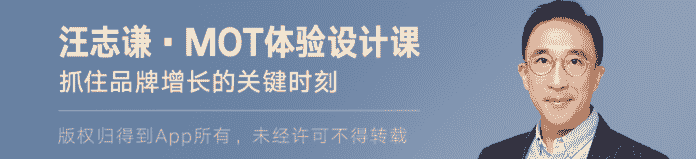

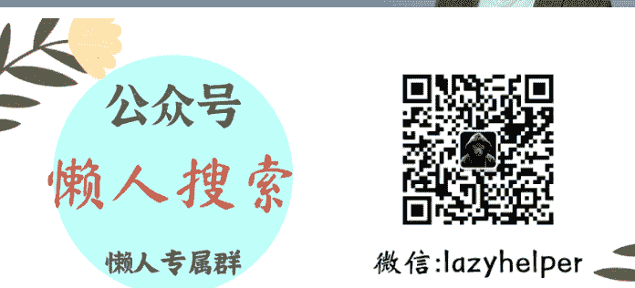

我们之前的课程讲到访谈三种人，抠出了一卡车的 MOT，这一讲我们就来看看，用什么样的方法从里面选出最重要的 MOT。

这门课我从一开始就提到的华航的案例，非常成功，对吧？当时有个重要信息，不知道你是不是还记得？我是从 300 个 MOT 里选择了 10 个，接下来我就为你破解，300 个变成 10 个，到底是怎么选出来的。

首先，这 300 个 MOT 我们可不可以排序？可以，我们可以以“重要性”为指标，就是这个时刻对于消费者在选择航空公司来说，是不是重要。从最重要到最不重要排序，从第 1 名排到第 300 名，最重要的排在上边，最不重要的排在下边。

好，下面我们再按另一个指标来排序，**满意度**。什么意思？就是消费者觉得这个时刻你做得好不好，他是不是满意。但这时候排序方法有点不一样的是，我们从低到高排，把最不满足的放在上边，最满意的放在下边。

然后，见证奇迹的时刻来了，如果我在 10 这个序号处画一条线，这 10 个 MOT 就是消费者觉得最重要的前十名 MOT，对吧？同时，也找出了消费者最不满意的倒数前十名 MOT。那你想想看，如果“10 个最重要的”和“10 个最不满意的”之间有重复的，那意味着什么？消费者觉得最重要的，居然是你做得最不好的。

这是非常致命的，如果不赶快改善的话，可能你的企业真的就要完蛋了。

同样的道理，如果另一头有重复呢？我们在 290 这个序号处也画一条线，消费者觉得最不重要的 10 个 MOT，和消费者最满意的 10 个 MOT 有重复，那就代表这是无效功。

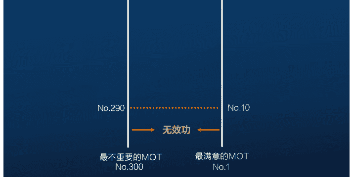

这就是从 300 个 MOT 中筛选出 10 个的最基本的方法之一。

客户觉得最重要的，你居然做得最不好；客户觉得根本就不重要的，你却做得非常好。怎么样，你是不是觉得这张图很厉害？但是我告诉你，还有更厉害、更恐怖的。

如果我能够告诉你华航竞争对手的高舱会员的结果呢？我可以告诉华航，竞争对手的客人觉得最重要的但对手没有做好的是什么。如果华航能做好这部分，竞争对手的客人就会变成华航的。

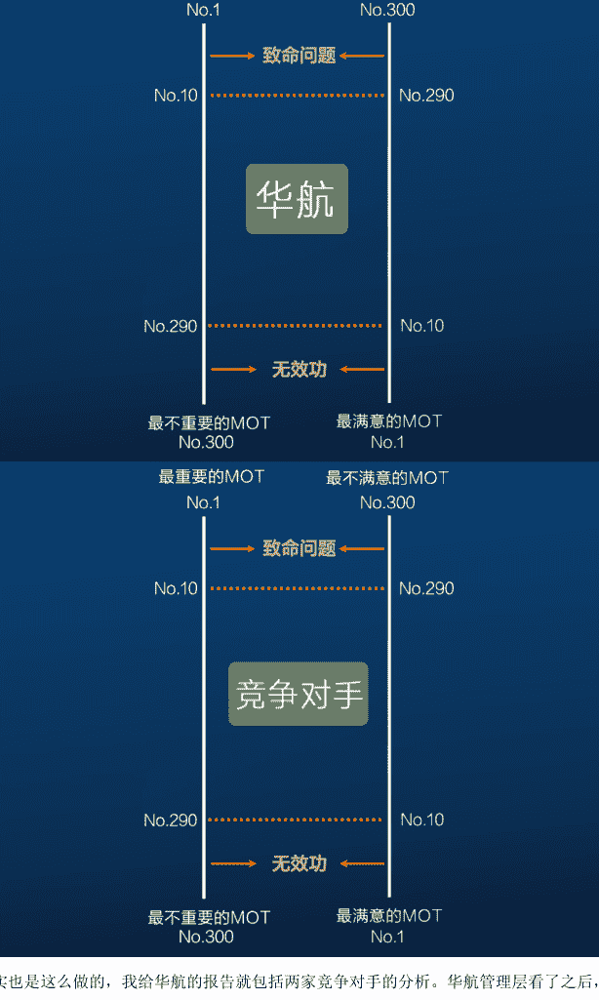

我确实也是这么做的，我给华航的报告就包括两家竞争对手的分析。华航管理层看了之后，觉得对他们的帮助巨大。

所以，通过这张图，帮助华航聚焦出最重要的 MOT，好好把它做成峰值，其他 290 个都不用再浪费钱，不要有低谷就可以了。这帮华航省了非常多的钱，也让它真正提升了商务舱的载客率。

那是不是会做这张图就能选出 MOT 了呢？当然没这么简单，选 MOT 有几个非常重要的原则，你一定要知道。如果你习惯于用笔记、划重点的功能，那我建议你看完这堂课，一定要回去看文稿，好好记下来这五大原则。

### 1. MOT 不是一人一票

第一个原则：MOT 不是一人一票，不同的消费者重要性不同。

你可能会想，每个消费者都很重要啊，凭什么有的重要有的不重要呢？我来证明给你看。我们还是拿华航的案例来讲，请看，屏幕上是我请来的三位华航的消费者。

这三个人每周都坐华航的飞机。但是，第一位是北京飞上海；第二位是北京飞日本；第三位是北京飞纽约。

你觉得他们三个人讲的 MOT，重要性一样吗？当然不一样，一定是第三位更重要。为什么？因为在同频次状况之下，第三位花钱更多，单次使用华航服务的时长也更长。你得罪他，损失最多。

所以你看，不同的消费者重要性不同，你不要以为在路边随便问一个人就可以了，也不是只要是消费的客户，你就要听他的。不对，“爱你的人”也有区别。

好，再来看看，还是三位消费者，他们每周都从北京飞纽约，但是第一位每次都坐华航，第二位是华航跟东航各一半一半，第三位每次都坐东航。

如果让你排序，这三位消费者的重要性程度从高到低，你会怎么排？最重要的是谁？

答案是第一位。为什么？因为他是最爱你的人，你一旦得罪他以后，他就不坐了，你的损失可就大了。因为他一直在买，你只要做了他不喜欢的事，他立刻就不买了。其他的人是你做了以后他才买，这个人是已经在买，你得罪他，他立刻就不再消费了，所以第一位消费者的 MOT 最重要。

第二位是第二重要，为什么？因为只要你做他喜欢的 MOT，他坐华航的频次就会增加。

第三位并不是不重要，但如果华航做的所有事情都是按照东航做，华航就变成东航了，就失去了自己的美。所以答案是什么？答案就是你应该看着第三位的 MOT，看看有哪些你可以学习的，而不是完全照着去做。

这是选择 MOT 的第一大原则，也是最重要的原则，MOT 不是一人一票。所以，你选择 MOT 的时候，越是爱你的人重视的 MOT，越重要。

### 2. 选出相匹配的 MOT

第二个原则，根据你的企业目前侧重的维度，选出相匹配的 MOT。

虽然你现在有一卡车的 MOT，但你只能选出 10 个，那当然要找你的企业目前侧重的维度。进店、转化、复购、推荐，四个维度，对应到每一家企业的问题各不相同。如果你的企业的很多问题都在进店，能不能把 10 个 MOT 都放在进店？当然可以。“问题出在哪，MOT 就应该在哪里侧重。”

如果你还不是特别明确你的企业的问题在哪个维度，那我可以给你一个简单的方法。

进店、转化是增量市场，推荐、复购就是存量市场。“如果你想要做增量市场，你选择 MOT 的时候，就应该侧重在进店、转化的 MOT；如果你要做存量市场，就要侧重在推荐、复购的 MOT。到底具体要几个 MOT，每一家企业可以依据自己的状况做决定。”

但我不建议每个维度各选两个，那样就没有侧重点了。

### 3. 看这个 MOT 是不是黄金时刻

第三个原则，选择时，要看这个 MOT 是不是黄金时刻。

还记得吗，黄金时刻有哪三个？最初、最高、最终。“如果你在一卡车的 MOT 中发现了某个 MOT 跟这三个时刻接近，不纠结，就是它。选中它，你的峰值打造更容易被消费者记得，进入消费者心智才更高效。”

所以，当你在选 MOT 的时候，要看这个 MOT 是不是黄金时刻。

### 4. 是否落地品牌核心信息

第四个原则，选择时，要看这个 MOT 是不是可以落地你的品牌的核心信息。

还记得吗？体验设计的目的之二，就是要让你的品牌信息进入消费者的心智。

如果你选出来这 10 个 MOT，体现了 10 个不同的信息，都不一样，这样你觉得消费者会记得吗？当然不会。这个是“开心”，那个是“惊喜”，这个是“放心”，那个又是“安全”，最后消费者不会记得任何事情。所以，如果你的 10 个 MOT 都体现同一个信息，那就是最棒的。

比如说，你觉得汪老师的课很“落地”，我讲的方法、举的例子，你都觉得“落地”，你就会觉得汪老师的标签就是“落地”

我们都期待品牌最后能进入消费者的心智，**因此你选出的 MOT，必须是可以体现你想要传递给消费者的信息**。

企业最常犯的错误就是 10 个 MOT，各自体现不同的信息，消费者弄老半天搞不清楚企业到底想说什么。**MOT** 有没有体现相同的信息，有没有让消费者感受到，这非常重要。

### 5. 放大你的美

我想先问你一个问题，你认为选择 MOT 时，下面三点哪个最重要？

- 1. 消费者觉得很重要。
- 2. 我可以做得很好。
- 3. 竞争对手做得不够好。

如果你选了 1，那代表你很认真地听了前面的课程，已经学会倾听消费者的声音。如果你选了 3，代表你很有竞争意识。

如果你选 2，我可以很负责地告诉你，你将会是一个好的经营者。为什么？因为绝大部分消费者想要的 MOT，大部分的企业都做不到。

这就是为什么我从一开始第一堂课就讲放大你的美，什么意思？你应该一开始就要找到自己的美，所以，你应该盯着“**我可以做得好的 MOT**”，再看跟“消费者觉得重要的 MOT"有没有重合，如果有，那就非常好。

如果还能跟“**竞争对手没做好的**”有交集，那我恭喜你，你就成功地选出了最重要的 MOT。

所以我们在选择 MOT 时，不是在找一、二、三中的某一个，而是在找它们的交集。

好，我们再回来看开头讲的那个题目，我们这一讲就要告诉大家如何选出 MOT，**根据这五大原则选出最重要的 10 个 MOT，好好打造成峰值**，而其他的 290 个你保持一般般就好，这才是企业经营品牌最重要的心法。

##### 思考题

你知道你的企业美在哪里吗？

- 1. MOT 不是一人一票，不同的消费者重要性不同。越是爱你的人的 MOT，越重要。

- 2. 在进店、转化、复购、推荐四个维度中，问题出在哪，MOT 就应该在哪里侧重。在最初、最高、最终三个黄金时刻打造 MOT，更容易被消费者记住。

- 3. 多个 MOT 体现同一类核心信息，品牌更容易进入消费者的心智。最后，记得放大你的美。

### 企业常犯的错误

“说对话”，其实就是为你的品牌挑选信息。

你可能会说，这谁还不会呢？企业都会给自己的产品做包装设计，想广告语，设计导购话术，等等。没错，挑选信息每家企业都在做，但我要告诉你，很多企业都犯了错，造成资源的浪费，却没有什么成效。

我们来看看为什么会这样。*企业最常犯的错就是内部拍脑袋，可能是领导一句话，也可能是企业内部开会，然后就用愿景来包装。*

但消费者听了这种品牌信息是无感的，而且这种信息，消费者非常有可能根本听不懂。因为它不是消费者语言，进不去消费者的心智。

*企业常犯的第二个错误是，对消费者讲一卡车的信息，什么都想讲，到最后消费者什么都记不住。*

老板说品牌档次高，业务说产品性价比很好，产品的人说设计很简约，营销说自己是新中式。这种情况不少见吧？品牌想讲一堆的信息，却都不连贯，到最后什么信息都没有进入消费者的心智，又是一场空。

*还有一个错误，就是讲的信息和竞争对手没有差异。*

别人早就说过了，早就被竞争对手植入消费者心智中，那这个心智标签就已经属于竞争对手了，你说了不但等于白说，还相当于在帮竞争对手打广告。

好像前面讲过的羊奶粉案例，品牌 A 如果是跟牛奶比，怎么比得过？说喝羊奶的宝宝会比喝牛奶的宝宝聪明吗？喝羊奶的宝宝更健康？你觉得妈妈们会相信吗？当然不会。因为这些信息，早就被牛奶的厂商植入消费者的心智了。

你应该已经发现了，我上面说的这三大错误，直指一件事：信息没有进入心智，一切都是白搭。

### 如何进入消费者的心智？

那怎样才能进入消费者的心智呢？我们来看看那些成功的企业都是怎么做的。

请问一下，你记得华为的广告语是什么？苹果、麦当劳、星巴克的呢？你都不记得，对不对？

但是，你一看到 iPhone，你就知道那是苹果；你在购物中心看到黄色跟红色，你就能想到麦当劳；你看到那个绿色的人头，就知道那是星巴克。

[PAGE 69]

你看，品牌信息是多维的，不是只有文字，对吧？文字是品牌信息里最弱的，所以你要让消费者记得你讲过什么，不是你用嘴巴讲，而是五感。通过五感，给消费者留下的印记才是强印记，消费者才不容易忘记，才更容易进入心智。

只有当信息更容易被消费者存入和提取，进入心智，才更有利于未来传播与推荐，这一切才有意义。

所以，到底该怎么选择信息呢？

### 选择信息三原则

原则一，不管你怎么挑选信息，你所选的信息必须简单且符合直觉，这样才容易进入心智。

同时，信息要有 MOT 支撑，这样消费者才会经由体验进入心智。那什么叫作“简单且符合直觉”呢？就是早存在于消费者心中的想法，是消费者的语言，这样才最容易放回消费者的心智里。

那怎么去找到消费者的语言呢？我有两个重要的方法：

### 1. 从文化和时代入手

第一个方法，就是从文化、消费者所处的时代以及当今的流行趋势这些角度去找。

文化是我们所有人的共同底色，比如一讲到宋代就会想到宋词，一讲到唐代就想到唐诗，这是我们所有人的共同印记。这样当我们要运用体验设计放回去时，最容易。

消费者所处的时代的影响也很剧烈。

因为这个时代有共同的语言、符号、音乐、口味、服装，还有独有的视角，等等。譬如说湖南有一个很有名的餐饮品牌，叫作文和友，就是重新打造餐饮消费场景，把餐饮和长沙 80 年代的生活场景结合在一起，马上唤起一大群消费者的回忆，立刻变成网红大景点。

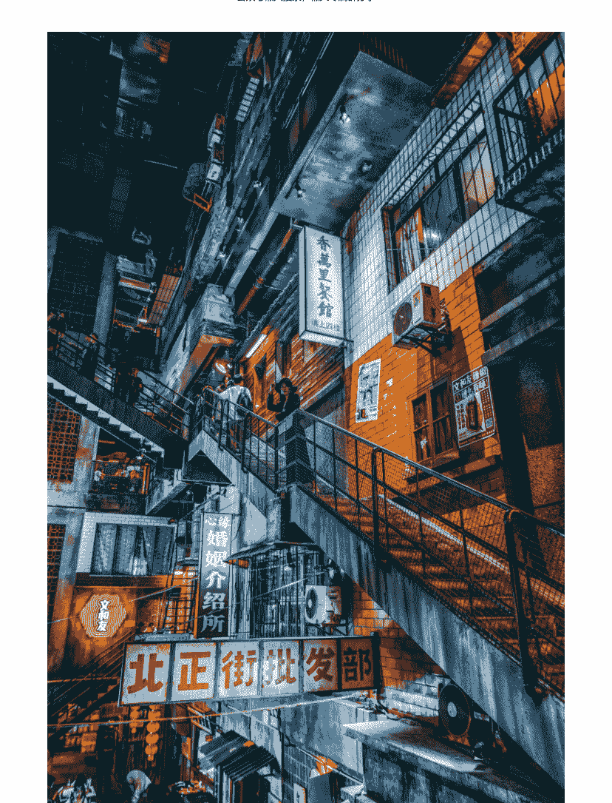

你还必须理解当下流行的元素是什么，那是消费者每天接触的五感信息来源。譬如说你不理解动漫，不理解二次元的 cosplay，那你怎么跟一些 00 后沟通？你跟他们根本就没有共同的语言，你讲的信息又怎么会进入他们的心智呢？

**2. 从网络平台了解用语**

**第二个方法就是你可以去一些流量大的网络平台，购物平台、影音平台，去理解消费者的用语。**

因为我们都是被平台所训练，你可能也有过这样的经历，想查某个东西，用了自己想的关键词，上网一搜发现找不到，这时平台就会出现一句话：“你要查的是不是以下这些关键词呢？”结果你用平台大数据推荐给你的关键词，一查就查到你所要的东西，然后你学习到了，原来要用这个词啊，原来这个词是这个意思啊。你就被训练了，以后你就会改用这个新的关键词了。这个关键词，进入你的心智，成为你的语言。

所以，去理解网络平台上的语言，是了解消费者用语非常重要的来源。

**总结一下，越是复杂的信息，消费者越看不懂，就越不容易进入心智。如果又没有运用体验设计，光用说的，把大大咧咧的文字放在那里，消费者是不会相信的。**

就好像你在面包店门口，看到招牌上写“本店面包很好吃”，你就会想每家面包店都这么说。但烤面包的香气被你闻到了，你的五感中的嗅觉接收到了这个信息，就会自动联想到好吃的面包都很香，这家店的面包好像不错，走进去买一个尝尝。五感植在心智，挡都挡不住。

**挑选信息的第二个原则，就是不同维度必须匹配不同信息。**

什么意思？你可能还在想是一个信息覆盖四个维度吗？我们还是来看面包店的例子，你就懂了。你进店是因为香气刺激了你的嗅觉，你并不知道它好吃，但香味让你觉得它应该是好吃的，对吧？这就是始于迷惑。

进店之后，你看到店里有很多海报，说这个面包得了法国蓝带奖，用的是北海道的奶油，还在旁边很显眼的地方放了“本店热销第一名的面包”，于是你就买了几个。这就是陷套路。这些得奖的海报，说食材有多好，热销第一的标识，就是转化的信息。

**买回家后，你为什么还会再回去买？**因为好吃，所以好吃就是复购的信息。然后你会告诉你的朋友，这家店的面包很好吃，建议他去买，就变成推荐的信息。

**所以我们说“四维度三信息：”**

进店的的信息，一看就进，一听就懂；转化的信息，我要不同，我信你的；复购的信息，觉得值了，变成推荐的信息。

这里的重点是什么？不同维度的信息不能乱用。

如果我们现在倒带，重新进入这家购物中心，我在门口写了大大的两个字“好吃”，你会进店吗？

当然不会。因为“好吃”是复购的信息，拿来当进店的信息就没用，消费者会想“你们每个人都这么说，我才不相信呢”。

我再给你说个有趣的类比，帮助你记忆。

有人问我，汪老师，一个信息不够吗？我跟他说：你老婆爱你，这一个原因就够了。但是，一开始是因为你长得帅，所以她才愿意跟你恋爱，“长得帅”就是进店的信息。

后来，因为你很有诚意，很专一，所以她决定嫁给你，“有诚意”“很专一”就叫转化的信息。

再后来，因为发现你这个人脾气很好，很幽默，对人友善等等，她才愿意跟你白头到老，这些都是她觉得“值了”的信息，她也会把这些信息讲给家人朋友听，这也就是推荐的信息。

这些信息不能打乱顺序随便讲的，否则会适得其反。你一上来就跟女生说我脾气很好，对方还没有“进店”，没有跟你相处，当然不相信，可能就转头走掉。

所以，现在你知道了，你的信息必须匹配四大维度，并不是一个信息从头讲到尾，信息有阶段性的任务。

**挑选信息的第三个原则，是去心智未被占领的 MOT 中挖出信息。**

来看屏幕上这张图，这里有三个圈，第一个圈是消费者重视的信息，第二个圈是你自己能做得到的，这两个圈重叠的地方就是你的核心信息，你的美。

第三、个圈是竞争对手做得好的地方，如果你的核心信息跟这个圈没有重叠，那恭喜你，你找到了，这就是答案。

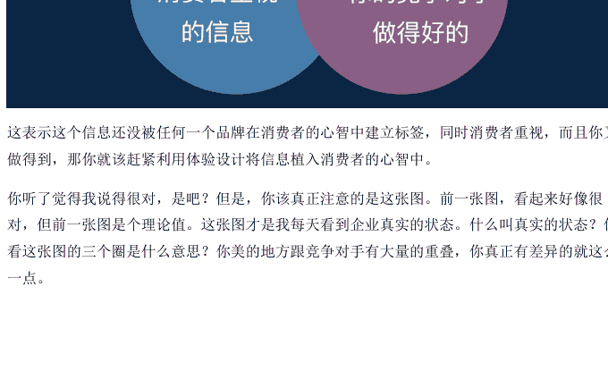

这表示这个信息还没被任何一个品牌在消费者的心智中建立标签，同时消费者重视，而且你又做得到，那你就该赶紧利用体验设计将信息植入消费者的心智中。

你听了觉得我说得很对，是吧？但是，你该真正注意到的是这张图。前一张图，看起来好像很对，但前一张图是个理论值。这张图才是我每天看到企业**真实的状态**。什么叫**真实的状态**？你看这张图的三个圈是什么意思？你美的地方跟竞争对手有大量重叠，你真正有差异的就这么一点。

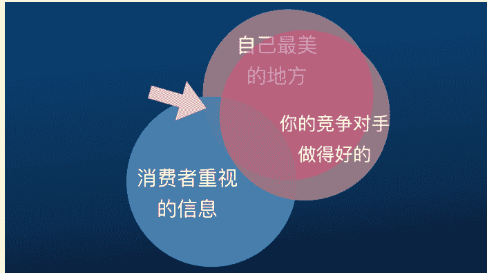

而这张图怎样？更糟糕，代表竞争对手做得比你好还要好，他跟消费者所重视的重叠的地方比你还多，而你重叠的地方只有一点，这才是真实。

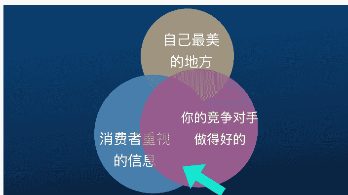

你肯定要问，汪老师，我该怎么办？答案就是这个蓝色的 MOT 才是你可以大量挖出来的信息，这才是关键。你不要跟我讲消费者的心智已被占满，没有机会了。你觉得没有机会是因为你的视角不对，这个世界还有很多是 MOT 是没有被挖出来的。

你说速溶咖啡没机会了，雀巢已经做得那么好，而且现在消费者都喝现摩咖啡了，那三顿半是怎么成功的？可口可乐做得那么大，饮料也没机会了？那元气森林又是怎么成功的？

以上就是挑选品牌信息的三个原则。

\*

我常常会听到企业说，要打通这个信息，进入消费者的心智中。但**什么叫打通**？其实就是利用体验设计占领消费者的心智标签，而这个心智标签就是你的品牌信息。

所以，为你的品牌挑选信息，这件事非常重要。

##### 思考题

你们企业在进店的信息是什么？转化的信息又是什么？什么时候消费者觉得值了的信息，变成推荐的信息？你的企业的这三个核心信息是什么？

期待你的留言。

1. 只有当信息更容易被消费者存入和提取，进入心智，才更有利于其未来传播与推荐。
- 找到消费者语言的两个方法：从文化、消费者所处的时代及流行趋势入手；从大流量平台了解消费者的语言。
- 选择信息的三个原则：所选的信息必须简单且符合直觉；不同维度必须匹配不同信息；去心智未被占领的 MOT 中挖出信息。

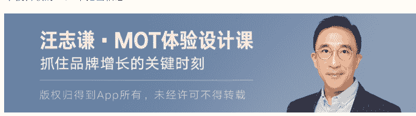

### 公众号

### 懒人搜索

### 懒人专属群

```
**微信:lazyhelper**
```

## 15 讲 MOT 就是商业模式：你要可复制，还是卖得贵？

这是我们课程的最后一讲，我想来跟你分享：**MOT 的选择会重大影响企业的商业模式**。

我在这门课中一直在强调一句话：放大你的美。经过前面的学习，你找到了你的美，那我现在要问你两个问题：

1. 你觉得你的美，能不能复制？可以标准化吗？能不能让消费者每次都感到值了？
2. 你觉得你美的地方，如果变得更美，消费者愿意付出更高的单价吗？

如果你第一题的答案是可以的话，那么恭喜你，代表你已经可以标准化、流程化，你的企业可以往变大的方向前进，准备连锁，加盟，大量复制成功模式。

如果你第二题的答案是可以的话，那么我也要恭喜你，你可以卖得更贵，因为消费者看重你的价值，愿意付出更高的单价买你的服务或产品。

但是，这里有个非常大的“但是”，上面说的都是很理想的情况，真正的现实情况是，大部分企业卡在中间，它们选择出来的 MOT，要么就是不容易找到人来做，很难标准化，无法复制，要么就是会花过多的成本，想通过提升客单价来获利，但消费者又不买单。

这么说你还是觉得不太直观，是不是？让我通过两家餐厅的对比讲给你听。

首先我要问你一个问题，你想成为一兰拉面还是米其林一星？

### 一兰拉面

一兰拉面，我简单给你介绍一下，它是日本一家很有历史的连锁拉面店，在日本开了七十多家，台湾、香港、纽约都有分店。2013 年，在香港开的海外第一家分店，创造了连续排队 7 天 7 夜的吉尼斯世界纪录。

“如果餐厅排出的热气被切断，不仅能节约资源，还能提高门店运营的工作效率。”

到底是什么原因？

以下是文中提到的一位教授对其的简要概括：

![img/71b6548e05586e45527ec64110b86baf_75_0.png]

![img/71b6548e05586e45527ec64110b86baf_76_0.png]

一兰拉面的官网上说，这个辣酱是秘方，全世界只有四个人知道。你觉得它说的是真的吗？
我们不去考证了，但这么做肯定有两个目的，一是想以“稀缺”和“正宗”为噱头，二是每家店都用秘制辣椒酱，不就可以更好地实现标准化吗？

*表中单位为新台币*

### 日本银座平山

我们再来看另一家店，日本银座平山（音译），一家米其林一星的餐厅。

![img/71b6548e05586e45527ec64110b86baf_77_0.png]

这家餐厅有什么特别呢？请你来看这张图片，这是我拍的。这是它的主厨，这张图是他准备为我们做一道菜，煎牛排。这么一大块牛肉，切下来的这些都是他不要的，最后只剩下这么一小块。

![img/71b6548e05586e45527ec64110b86baf_78_0.png]
![img/71b6548e05586e45527ec64110b86baf_78_1.png]

我老婆吃了这道菜，她说这是她这辈子吃的最好吃的牛肉。这是当然，你现场看到这么大一块肉，最后上菜就这么精华的一小块，这个体验设计肯定让你觉得值了。

好，问题来了，它怎么标准化？你怎么告诉一位主厨，多大一块牛肉，应该切掉多少，留下哪部分？没办法，对不对？这就是这家餐厅 MOT 的选择。

这家餐厅服务的成本也不低。餐厅里的座位非常少，坐在这里吃饭的时候，每位客人身后都会站着一个服务员。

![img/71b6548e05586e45527ec64110b86baf_78_2.png]

我当时吃饭的时候，一整晚都不敢乱动，因为我稍微有动作，服务员就会立刻上来问，“先生，您需要什么？”

![img/71b6548e05586e45527ec64110b86baf_79_0.png]

你看，菜品极其讲究，服务非常细致，就餐人数很少，这种餐厅能像一兰拉面那样复制吗？当然不行，全世界仅此一家。所以，它不会便宜，但营业额肯定没法跟一兰拉面比。

所以你看，再回到前面那个问题：你想成为一兰拉面还是米其林一星？答案是两个都好，不纠结。这两家餐厅各有各的美，选择的 MOT 各有不同，消费者觉得“值了”的时刻，也不一样。一兰拉面所选择的 MOT 就是能复制，高转化；而银座平山所选的 MOT，就是能让客单价高，但难以复制。

这就是我要说的，你可以要规模，那就标准化，能复制，要么就是米其林品质，卖得贵。不管选哪种都好，最怕的就是你卡在中间，既不能标准化，又卖不贵。总之还是那句话，MOT 的选择能重大影响你的商业模式。

那你可能会问，到底该问谁才能决定适合哪种模式呢？

能不能复制，我告诉你一个简单的方法，只要你问一线员工就知道了。

你去问一线员工，那个消费者已经觉得“值了”的 MOT，他在操作的流程上遇见什么问题，能不能每次都重复做出来，每次都让客户很满意。你马上就会知道答案了。

能不能变贵，也有一个简单的方法，就是问“爱你的人”对你的形容词，如果常常出现“物超所值”这四个字，那恭喜你，你有涨价的机会。

但重点是，你要找到那个消费者觉得“物超所值”的时刻，再把它放大，让消费者觉得更值，消费者才愿意付出更高的价钱。

譬如说，潮汕牛肉火锅卖的就是新鲜，你只在店门口切牛肉，消费者感觉到了新鲜，但这还不够。如果我现在把整个供应链的流程做改善，让消费者知道，一头牛从宰杀到上桌，一共不到三小时。那消费者就会觉得：“哇，超新鲜！”然后才愿意付更高的价钱吃这个新鲜。

好，以上就是我这一讲要告诉你的，选择 MOT，你就选择了商业模式。

\*

我讲到这里，这门课程也就到了尾声。

贝聿铭，我非常敬佩的一个人，他是很有名的一个华裔建筑师。我想要跟你分享他讲的三句话，作为这门课的结尾。

> “我们没有办法把所有的矛盾全部一一化解，但是必须找到影响项目成败最核心的矛盾，并彻底解决它。”

我解读这句话的意思是什么？就三个字，叫“不纠结”。这也是我们体验设计的核心，你不可能把所有事都做好，你要做的是把几件最重要的事做好，建立峰值，灭掉低谷。

> “要成为一个大师，最关键的是能够数十年以来，持之以恒地自我否定，自我修正，才能让自己的个人想法被越来越多的人所接受。”

我的解读是：迭代才是关键。

我来用三家公司告诉你。第一家公司叫 Dropbox，它目前的市值是 100 亿美金，每个月做 80 次的 AB Test。

- **AB Test**你应该知道，就是用两种方案对比测试，从消费者的角度去看怎么迭代自己的产品。
- **第二家公司，Airbnb**，疫情前是 700 亿美金的市值，现在因为疫情跌到 300 亿美金，但还是很厉害，每周他们做 700 次 AB Test。
- **第三家公司，Facebook 做多少次？**每秒钟做超过 1 万次的 AB Test，它现在已经有破万亿的市值。虽然我们不能简单地把 AB Test 和公司市值划等号，但这至少能让我们看到，这些大企业对迭代的重视。

- 迭代，不只是互联网的特征，线下的厂商也一样。你看像手机品牌，苹果、华为，哪一家不是在迅速地迭代？
- 所以说，**你不只是要迭代，迭代的速度才是获胜的关键**。
- 我们看到，很多公司一开始开辟了赛道，但到最后因为其他公司迭代速度很快，快速地把整盘都端走，开辟赛道的人最后落败。
- 所以你不该问要不要迭代，你该问自己的是，“我迭代的速度够快吗？”如果你做出一个体验设计，不要想着一次就做好，应该是更快速地改善、迭代，不断地修正，才会让你的消费者感受到峰值体验。
- “一个大师，是必须兼备优秀的职业素质和高超的外交技巧。更多的问题是需要外交技巧来加以解决。”
- 我的经验是，一个好的峰值体验一定是需要很多部门一起协同完成，体验设计想要落地，需要有好的沟通技巧，告诉别人顶层是什么。
- 这个“别人”可能包括你的高管、你的员工、你所有的第三方，这样才能引领所有的人照着一致的方向，一起打造峰值体验，让客户留下印记，产生企业的商业价值。
- *事实上，不论你是线下店铺，还是线上电商，甚至是从事着跟商业关系不大的工作，关键时刻都可以成为帮助你的工具。因为人生就是充满了许多关键时刻，而就是这些关键时刻影响着你的一生。选择学校，选择工作，找结婚对象，买房买车，生小孩，这些都是。你做了很多重大的决策，影响了别人，别人也影响了你。*
- *就像我在发刊词中说的，我们的人生就是在经历各种体验，抓住关键时刻。体验，也是可以设计的。*
*希望你能在你的人生历程中建立峰值，把平凡变极致，把低谷变峰值，把梦想变真实*。
- *好，以上就是这门课的全部内容，非常感谢你的学习。未来我还会偶尔加餐，和你互动，欢迎你继续留言，和我讨论。你也可以去知识城邦里找我，我们继续交流。再见。*

1. MOT 的选择将重大影响你的商业模式。
2. 如果你的美可以被复制，那你的企业可以往变大的方向前进，准备连锁，加盟，更加流程化。
3. 如果你的美可以在涨价的前提下仍吸引消费者，那么你可以卖得更贵，因为消费者看重你的价值，愿意付出更高的单价买你的服务或产品。

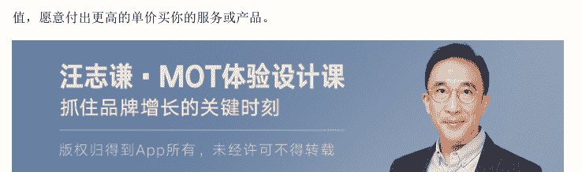
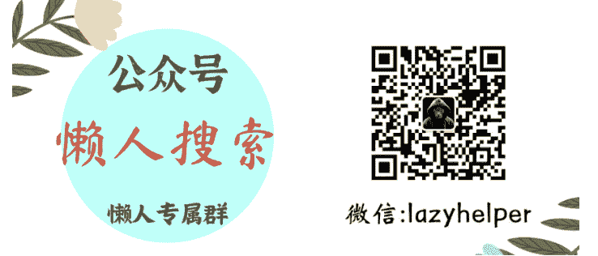