# 证券市场周刊
## 第十八届 (2024) 卖方分析师水晶球奖

## 卖方分析师水晶球奖

### 创建优质食品平台

科技让农业更强、让农民更富、让生活更美

大有谷集团成立于 2023 年 1 月，是一家基于数字平台的优质食品企业。集团以“科技让农业更强、让农民更富、让生活更美”为使命，致力创建优质食品平台。

大有谷集团依托母公司大北农集团 30 年在种植业、养殖业、数字农业、食品等领域的产业基础和科研优势，将通过自主创新和产学研合作，强化在“源头好货、加工增值、区块链、全链服务”等方向的领先优势，推动农业生产组织化、产业化、科技化、智能化、品牌化发展。

### 红利资产再受追捧

廖宗魁

A 股市场仍持续在 3400 点附近震荡，但风格和结构却有了悄然的变化。之前两个月由于风险偏好有所提升，市场更偏重小盘股和科技板块。但进入 12 月后红利资产再度受到热捧，以四大行为代表的高股息股票纷纷创出历史新高。

为什么市场风格再度切换至红利资产呢？

国债收益率持续下行，股债收益比明显上升。在中央经济工作会议定调“适度宽松的货币政策”后，债券市场对未来降息的预期较高，开始纷纷抢跑增配国债。10 年期国债收益率下行至 1.7% 附近，12 月累计下行近 30 个基点。伴随利率中枢的下移，中证红利指数股息率则超过 5%，以股息率衡量的股债相对吸引力进一步提升。

而银行股是高股息、高分红的典型代表。以四大行为例，按照 2023 年年度分红和 12 月 23 日的收盘股价测算，即便是在年内股价已经大涨的情况下，四大行的股息率仍在 4.5% 左右，而且四大行的现金分红比例近些年持续稳定在 30% 左右，且在 2024 年都实施了中期分红。

在利率中枢下移的背景下，险资投资收益率面临一定的压力，拉长久期或增配高股息的股权投资是险资投资端的一种选择。截至三季度保险公司持有股票及证券的投资规模增长至 4.1 万亿元，创出历史新高。政策鼓励中长期资金入市，险资的股票仓位还可能进一步提升，有望对红利风格形成持续的资金面支持。

比如，近期据港交所披露，平安资管在场内继续增持建设银行 H 股股份，目前平安资管合计持有 120.54 亿股建行 H 股股份，占建行 H 股总数的 5.01%。而且此前平安资管已经多次增持工行股票，其持有工行 H 股的比例已经达到 15%。

相关监管政策也对红利股有所支持。12 月 17 日，国务院国资委印发《关于改进和加强中央企业控股上市公司市值管理工作的若干意见》表示，中央企业要引导和推动控股上市公司牢固树立投资者回报意识，通过增强现金分红稳定性、持续性和可预期性，增加现金分红频次，优化现金分红节奏，提高现金分红比例等方式提高投资者尤其是中小股东获得感。

中国结算发布了《关于对沪、深市场 A 股分红派息手续费实施优惠措施的通知》，自 2025 年 1 月 1 日起，对沪、深市场 A 股分红派息手续费实施减半收取的优惠措施，即按照派发现金总额的 0.5‰收取分红派息手续费，手续费金额超过 150 万元以上的部分予以免收。上述相关举措出台有利于进一步加大上市公司尤其是国央企的分红力度，进一步增加了红利股的吸引力。

随着 A 股上市公司市值管理相关制度不断完善，中央企业经营指标体系持续更新，加大股东回报、提高分红频次和比例成为重点关注领域之一，相关央国企高分红公司有望受益。

此外，由于 9 月底整体市场大幅反弹，而这一期间中证红利指数的估值抬升要小于整个市场，也小于其他板块的估值提升，这导致红利指数的相对吸引力提升。目前市场成交量略有下降，前期游资、散户资金主导的风格有所退潮，而机构资金正在接力。市场风格的变化只是短期的行为特征，决定未来市场能否继续稳健上涨的关键，还是 2025 年企业盈利能力能否得到实质性提升。

## 卷首语

### 封面专题

### 卖方研究环境生变 竞争格局保持稳定

低利率环境、权益产品的 ETF 趋势和公募基金费率改革促使卖方研究商业模式面临转型，竞争格局也在重构。卖方研究机构正通过优化研究服务质量、拓展服务范围和提升研究能力来重构业务模式，以寻求新的增长点和竞争优势。

## 卷首语 / Preface

- 01 红利资产再受追捧

## 一周财经 / Weekly Economics

- 06-07

## 宏观 / Macro-Economics

- 08 国债收益率因何下行
12 月以来，债市资金正抢跑降息预期推动 10 年期国债收益率下行，体现了 2025 年央行或降息 30-40 个基点的预期。近期权益市场却表现较为平淡，风格上也转向红利资产。

- 10 美联储鹰派降息
特朗普当选后政策的不确定性增大，美国“再通胀”的风险增加，美联储不得不减慢降息步伐。美债利率和美元指数的上行，可能会给非美货币和权益市场短期带来压力。

## 公司与产业 / Company & Industry

- 24 全方位扩内需：消费增量在哪里？
本轮以旧换新主要集中在汽车、家电和家居领域，时间主要从 2024 年下半年尤其是四季度开始放量。因此，2025 年以旧换新继续推行将使全年受益。从品类上，中央层面已经透露出扩大品类的意愿。而地方政府在具体执行中，产品品类已经扩大。

- 28 可穿戴设备升级方向渐明 AI 眼镜成下一个风口

- 30 股价创新高，高分红高速公路股受青睐
2024 年以来，高股息资产持续获得资金青睐。山东高速和粤高速 A 作为高分红代表，派息比例常年维持在较高水平，股息率显著高于无风险利率，同时改扩建项目正在积极推进，助力业绩未来持续增长。

- 32 春节档预热 电影股的春天值得期待

- 34 华润系增持背后的投资逻辑

- 36 氨基酸：酝酿新景气周期 头部公司有望受益

- 38 博通市值破万亿美元启示：国产芯片可另类突围
定制 AI 芯片厂商博通四财季业绩超预期，而且，公司 CEO 透露博通正与美国三大云计算厂商联合开发定制 AI 芯片，这一消息直接推动公司市值突破万亿美元。多方数据证明定制 AI 芯片行业极具成长潜力，国内多家上市公司在该方向也早有布局。

- 40 龙头月内最大涨幅超 2 倍 激光雷达看到盈利曙光
激光雷达作为高精度、高可靠性的传感器，在新能源汽车智能驾驶扮演着关键的角色。随着中国厂商大规模放量以及对技术降本的持续探索，车载激光雷达成本快速下探，目前已经占据优势地位，业绩也有所表现。

- 42 化债落地加速
环保行业多重“修复”预期大增

- 45 以旧换新激发更换需求
机床产业链进化加速

- 47 两部委力挺
破净股估值修复的三大主线
沪深两市超 400 家跌破净资产的上市公司，数量占比只有不到 10%，市值占比超过 20%，无论是从市净率还是从市盈率看，这一板块都具有估值提升的空间。

## 民间智慧 / Investment Wisdom

- 50 “双轮驱动”模式再次上演

## 基金 / Fund

- 52 机构兴趣提升，红利 ETF 扩容正当时
监管部门引导上市公司现金分红已经显现出明显的效果。2024 年前三季，上市公司累计分红 4171 亿元，同比增长 86.62%。与此同时，由于投资者尤其机构投资者配置需求强烈，红利 ETF 的数目及规模也都翻倍。

- 54 个人养老金投资扩围，
2 万亿指数基金进入 Y 时代

## 市场策略 / Marketing Strategy

- 56 红利资产再度看好

- 58 2025：政策强劲 慢牛可期

- 59 AI 模型迭代推动应用落地
智能眼镜发展浪潮或已到来

## 聚焦 IPO / IPO Focus

- 60 北交所受理企业数量居首
创业板终止和注册生效企业数量最多

## 私家书斋 / Reading

- 62 美国财富不平等的幂律分布

## 金融 / Finance

- 66 成交量放大叠加互换便利工具
券商自营业绩弹性凸显
从竞争格局来看，马太效应下头部券商集中度进一步加强；从业绩弹性角度来看，上市券商自营业务增速的大幅攀升为业绩高增的主要推手。在资本市场政策信号不断向好的背景下，成交量放大叠加互换便利工具，有望增厚券商净利润弹性空间。

- 71 存款定期化趋势缓解
银行按揭贷需求修复

- 72 资本充足率改善叠加注资补充
5 家中资大行达标 TLAC 压力不大

- 74 投资收益承压
考验险企资产负债匹配能力

- 76 银行红利行情贯穿全年
“高股息”逻辑切换待验证

- 80 央企市值管理纳入业绩考核
助力资本市场高质量发展

## 投资圆桌 / Investor

- 83 从股息再投资视角分析贵州茅台拆股

- 85 以福建高速为例看收费年限到期影响

- 87 辣味休闲零食的持续性增长

- 89 从本田和日产合并看汽车行业竞争
微弱的客户黏性、低复购率和高单价造就的精明消费者、不太复杂却又多变的技术、对就业和 GDP 的巨大促进作用，共同造就了汽车行业的激烈竞争格局。

- 91 贝叶斯思维与理性决策

## 数据荟萃 / Data

- 93-96

广告
封二 大有谷
封三 周刊广告
封四 国台酒业

新闻线索征集
本刊接受社会大众提供的与上市公司、机构及其他证券类信息相关的新闻线索，我们接受实名或匿名的线索爆料，在确定信息有效的情况下本刊会在线下与您取得联系，所以请务必留下有效的联系方式。
电话：010-85650530 010-85651348
邮箱：tougaolk@163.com
hzbjb@hongzhoukan.com

免责声明
本刊版权所有，翻印必究。本刊所列示数据是基于本刊从已公开信息获取，不代表本刊观点，亦无法保证该等信息的准确性和完整性，文中列示数据仅为撰写文章所需进行的引述，请不要作为投资参考之用，亦并非作为购买投资标的邀请。在任何情况下，本刊的信息或所表述的意见，并不能够作为任何人进行投资的建议，本刊不对任何人的投资行为所引致的任何损失负任何责任。

您可以扫一扫新媒体阅读《证券市场周刊》

请扫描二维码关注《证券市场周刊》
新浪微博

主管 中国中信集团有限公司
主办 中国证券市场研究设计中心

社长：王波明
常务副社长：于颖
副社长：赵岩

编辑委员会：(按姓氏笔画)
于颖 王波明 李恒春 李高超
郭贵龙 戴小京

执行委员会：陈建华 陈静 李然 苗苗 王云
出品人：郭贵龙
执行主编：李高超

### 宏观编辑室

- 常务副主编：李恒春
- 副主编：袁京力
- 主编助理：杨练
- 总编室主任：李恒春 (兼)
- 公司部主任：袁京力 (兼)
- 金融部主任：杨练 (兼)
- 研究部主任：刘俊梅
- 宏观部主任：廖宗魁
- 机构部主任：吴晓兵
- 编辑：何凌枫 王东岳 杜鹏 杨现华 易强
  吴新竹 胡楠 薛宇
- 新媒体运营主管：邢野
- 助理：王丹
- 信息技术部主管：吴潇
- 美术编辑：殷治海 周晔 (兼)
- 总编室：闫彬
- 总经理：陈静
- 副总经理：齐国华
- 广告总监：吴淑杰
- 总经理助理兼湖南办事处主任：文亮
- 上市公司服务总监：齐国华 (兼)
- 大区主任：赵晓云 高琴 王晶 谷孝芹
  李芳芳
- 行政总监：王樱霖
- 发行部总监：高云竹
- 发行部执行总监：张有为
- 印制总监：杨东利
- 行政助理：郭思慧
- 品牌经理：王丹
- 运营助理：韩颖

法律顾问：付明德 (中银律师事务所) 李江 (中兆律师事务所)

编辑部：(010)85650530 tougaolk@163.com
广告部：(010)85650242 85722332
发行部：(010)85651339 capitalweek_kf@163.com
市场部：(010)85650507
读者服务热线：(010)85650313
发行总代理：北京联办财讯文化传媒有限公司
发行总经理：刘霄
广告总代理：北京联办蓝讯文化传媒有限公司
广告总经理：刘霄
发行：北京联办财讯文化传媒有限公司
印刷：北京盛通印刷股份有限公司
刊址：北京市朝阳区朝外大街 22 号泛利大厦 10 层
邮政编码：100020
图文传真：(010)85650525
开户银行：兴业银行北京朝阳支行
账号：321600100100032565
开户单位：北京联办财讯文化传媒有限公司
广告许可：京朝工商广字 0080 号 (1-1)
刊号：ISSN 1004-6291 CN11-3043/F
国外发行：中国图书贸易进出口总公司
国外发行代号：W1222

### 市场编辑室

- 常务副主编：李然
- 副主编：林伟萍
- 内容主管：王宗耀
- 新媒体内容主管：栾振芳
- 首席主笔：张越
- 主笔：谢长艳 张桔 承承 李壮 吴海珊 惠凯
- 编辑：刘增禄 王飞 齐永超
  汪佳蕊 苏华 秦佳丽
- 行业编辑：边惠宗 彭祖江 袁月
- 公司调研部主管：袁文斌
- 公司研究：张中汉 韩硕
- 网媒部总监：徐博雅
- 助理：刘丽
- 媒介主管：曲大宇
- 网媒运营：赵佰锋
- 发行经理：高倩
- 技术经理：水新斌
- 技术主管：缪然
- 软件工程师：屈圣凯
- 网络运维：王彬沣
- 设计经理：李彤成杰
- 平面设计：刘宗宾

### 研究中心

- 主任：明君
- 首席内容官：林中
- 首席策略官：阮国宸
- 研究主任：陈方正

### 运营中心

- 总经理：陈建华
- 上市公司服务总监：杜洪杰
- 区域主任：赵艳梅 王磊 赵敬鲁 郝金梅
  尚彦飞 焦建中 郑全红 崔成硕
  徐颖 杨培顺 张富伟 姜虹
  姜翠沙 刘培培

04 2024/12/28 证券市场周刊 第 49 期

### 投资者服务中心

总经理：苗苗

首席顾问：姚万义

教学服务部总监：丛静

服务主管：张璐君

服务专员：吴淑娟 王慧

客户部经理：王红

客户经理：苏红超 刘爱凤 杨永立 田园 郑颖 陈香雨 徐贵平 于渊龙 刘强 陈静 王成渊 左军华

增值服务部总监：葛齐

推广专员：吕卉 张华宇

### 综合管理中心

总经理：王云

行政主管：赵雅迪

行政助理：李燕青 郭莹 李爱军

人事经理：王紫微

客服部经理：赵婧

杂志社地址：北京市朝阳区朝外大街 22 号泛利大厦十层 编辑部地址：北京市东城区新中街 68 号聚龙花园 7 号楼北段三层 邮政编码：100027

刊号：ISSN 1004-6291 CN11-3043/F

广告总代理：北京财讯正兴文化传媒有限公司 总经理：李世杰

发行总代理：北京联办财讯文化传媒有限公司 总经理：刘霄

印刷总监：杨东利

上海办事处：(021)68879443 深圳办事处：(0755)83683559

### 广告业务

开户单位：北京财讯正兴文化传媒有限公司 开户银行：北京银行红星支行 开户帐号：01090330400120120051629

### 发行·图书业务

国外发行：中国图书贸易进出口总公司 代号：W1753

开户单位：北京财讯正兴文化传媒有限公司 开户银行：北京银行红星支行 开户帐号：01090330400120120051629

### 会议活动

开户单位：北京财讯正兴文化传媒有限公司 开户银行：北京银行红星支行 开户账号：01090330400120120051629

服务热线：(010) 85650488 微信服务：hzkfxb01(微信号) 官方网址：www.hongzhoukan.com 官方微博：www.weibo.com/hzkstock 投诉邮箱：service@hongzhoukan.com 新闻热线：(010)85651311

总编室：(010)85650144/1348 杂志订阅：(010)85651165 广告热线：(010)85650626/7698 媒体合作：(010)85650603 会务报名：(010)50876622

投资者服务微信号：18500204922 投资者服务电话：(010)85651425、18500204922 投资者邮箱：quanyi85651425@163.com 手机报订阅：移动手机发送 HZK 到 10658000(8 元/月)

### 图说

高频数据显示，12 月中国经济景气度或维持韧性。
在生产端，12 月生产或维持韧性，延续平稳。全国高炉开工率环比小幅回落，六大发电集团日均耗煤环比回升，汽车半钢胎开工率小幅回落，PTA 开工率环比保持高增，但 PTA 产业链江浙织机负荷率环比小幅回落，整体来看，生产维持基本稳定。

在需求端，工业需求环比季节性放缓。12 月螺纹钢需求或有所放缓，螺纹钢开工率和价格环比走低，水泥需求有所走低，价格环比下降，石油沥青生产环比走弱，但石油沥青库存环比下降，或因季节性原因导致工业需求环比放缓。12 月居民出行需求环比走弱，乘用车零售环比延续高增长，预计 12 月服务消费或有所放缓，但零售销售有望延续回升态势。从领先指标来看，12 月韩国出口增速保持高增，运费价格环比回升，或指向中国出口增速维持韧性。12 月 30 大中城市商品房销售同比和环比均延续回暖态势，房企拿地意愿亦有所回升。

> ——摘自中邮证券宏观经济研究报告

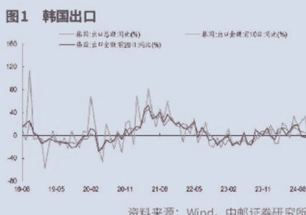

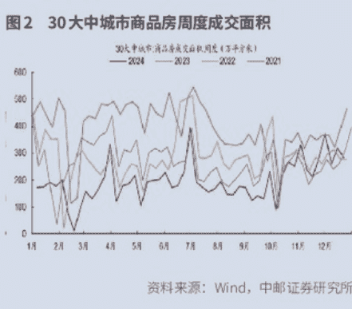

### 速读

#### 中介机构要发挥“看门人”作用

12 月 23 日，国务院总理李强主持召开国务院常务会议，审议通过《国务院关于规范中介机构为公司公开发行股票提供服务的规定 (草案)》。会议强调，要发挥好中介机构资本市场“看门人”作用，防止中介机构与发行人不当利益捆绑，严厉打击财务造假、欺诈发行等违法行为，切实保护投资者合法权益，促进资本市场健康稳定发展。

#### 财政部提高 2025 年财政赤字率

12 月 23 至 24 日，全国财政工作会议在北京召开，总结 2024 年财政工作，研究布置 2025 年重点任务。会议指出，2025 年要实施更加积极的财政政策，持续用力、更加给力，打好政策“组合拳”。一是提高财政赤字率，加大支出强度、加快支出进度。二是安排更大规模政府债券，为稳增长、调结构提供更多支撑。三是大力优化支出结构、强化精准投放，更加注重惠民生、促消费、增后劲。四是持续用力防范化解重点领域风险，促进财政平稳运行、可持续发展。五是进一步增加对地方转移支付，增强地方财力，兜牢基层“三保”底线。

#### 严厉打击大股东违规减持

中国证监会持续强化对股东减持行为的监管，严厉打击、从严惩处违规减持行为，维护市场交易秩序。12 月 22 日，新易盛、天顺股份两家上市公司均发布公告，公司实控人因涉嫌违反限制性规定转让股票被证监会立案。新易盛公告，公司控股股东、实际控制人、董事长高光荣于 2024 年 12 月 20 日收到证监会签发的《立案通知书》，因“涉嫌违反限制性规定转让股票”等行为被立案调查。天顺股份公告，公司实际控制人王普宇于 2024 年 12 月 20 日收到证监会下发的《立案告知书》，因王普宇涉嫌信息披露违法违规及违反限制性规定转让证券，证监会决定对王普宇立案。

#### 证监会回应退市风险名单

12 月 23 日晚间，针对网上流传的一份“退市风险名单”，该名单称 36 家公司将被退市、66 家公司将被实施退市风险警示，导致微盘股的大跌，中国证监会发布了答记者问。证监会新闻发言人王利表示，退市是有严格标准的，请广大投资者多从法定渠道了解相关信息，防止被不全面、不准确的信息所误导。相关媒体报道指出将会退市的 36 家退市风险警示（*ST）公司，据了解，有不少正在或者已经通过改善经营、并购重组、破产重整等方式化解退市风险，相关情况请以公司信息披露为准。证监会将依法平稳推进退市监管，维护市场平稳运行。

#### 香港互认基金扩容落地

12 月 20 日，中国证监会修订发布《香港互认基金管理规定》，并自 2025 年 1 月 1 日起实施。《管理规定》从三方面对基金互认规则作了优化。一是适度放宽互认基金客地销售比例限制。现行监管规则要求，香港互认基金客地销售规模应不高于基金总资产 50%，

### 金融机构整改问题

#### 涉资金超 755 亿元

12 月 22 日上午，审计署受国务院委托，向全国人大常委会报告了 2023 年度中央预算执行和其他财政收支审计查出问题的整改情况。在审计查出问题的整改情况中，审计署报告提到，金融机构通过清理违规业务、优化信贷投向等整改问题涉及资金 755.56 亿元，主要涉及的问题有两方面：

- 一是对偏离服务实体经济定位问题。中国人民银行、金融监管总局制定专项工作方案，督促有关金融机构加强信贷业务管理切实治理和防范资金空转。对违规改变贷款投向问题，6 家金融机构对信贷数据进行二次检验，不断提升统计质量；对信贷投放虚增空转问题，有关银行完善存贷款考核指标体系，停止即贷即收；等额存贷余额

- 较审计时下降 66%。二是对金融资源供给结构不够优化问题。针对重点领域“加”的成色不足问题，4 家银行督促挪用科技创新贷款的企业提前结清 465.62 亿元，并严格贷后管理减少空转套利空间。针对限制领域“减”的力度不够问题，4 家银行印发加强经营状态异常企业融资管理的通知，推进“僵尸企业”债务和风险资产处置，已通过重组、诉讼等收回贷款 91.01 亿元，如实下调风险资产分类。

### 美国债务可持续性

#### 面临挑战

12 月 19 日，美国财政部公布最新国际资本流动报告（TIC）显示，10 月份外国投资者持有的美国国债规模从 9 月份的 8.6729 万亿美元减至 8.5955 万亿美元，美国前十大“债主”中，包括日本、英国、加拿大等盟友在内，有 7 个在当月选择了减持。《经济日报》报道称，美国国债总额结束了 5 个月增长趋势再度下行，且减持面扩大，原因复杂。从短期因素看，这与美债价格在美联储启动降息后遭遇罕见的持续下跌脱不了干系；从中长期因素看，美国债务增长近乎失控，侵蚀了外国投资者对美国国债的信心，由于对美国偿债能力的怀疑不断增加，抛售美债避险无疑是理性选择。美国国债总额已突破 36 万亿美元关口，巨额财政赤字是导致美国联邦政府债务总额攀升的主要原因。2024 财年，美国联邦政府财政赤字达到 1.83 万亿美元。同时，由于利率近年长期处于高位，美国正在“财政赤字 - 发行国债 - 支付利息 - 更大财政赤字”的恶性循环中越陷越深。

### 数说

#### 365.65 亿元

2024 年以来，随着投资者投资海外的热情逐步升温，北上互认基金逐渐吸引市场目光。国家外汇管理局数据显示，截至 10 月底，北上互认基金累计净汇出金额达到 365.65 亿元，较去年底的 174.36 亿元增长超过 191 亿元。这也意味着北上互认基金的年内规模已实现翻倍。

#### 40%

数据显示，2024 年以来，工中建四大行 A 股股价涨幅均超过 40%，其中，中国银行、建设银行涨幅超 42%，工商银行涨幅超 50%，农业银行更是涨超 53%，四大行股价均创出历史新高。

#### 3.85 万亿美元

在圣诞来临前夕，美股迎来一波“圣诞行情”。截至 12 月 23 日收盘，苹果公司市值突破 3.85 万亿美元，有望在年内成为全球首个进军 4 万亿美元俱乐部的公司。这相当于德国和瑞士股市主要上市公司的市值总和。

#### 3000 亿元

为保持银行体系流动性充裕，12 月 25 日，中国人民银行开展 3000 亿元中期借贷便利 (MLF) 操作，期限 1 年，最高投标利率 2.30%，最低投标利率 1.90%，中标利率 2.00%。操作后，中期借贷便利余额为 50890 亿元。

### 国债收益率因何下行

廖宗魁

> 12 月以来，债市资金正抢跑降息预期推动 10 年期国债收益率下行，体现了 2025 年央行或降息 30-40 个基点的预期。近期权益市场却表现较为平淡，风格上也转向红利资产。

12 月以来，债市经历了一轮非常强劲的上涨。10 年期国债收益率跌破 2% 后，进一步下行至 1.72%，月内已累计下行近 30 个基点，30 年期国债收益率也下行至 1.95% 附近。

资产供给有所收缩，市场缺乏资产配置，呈现“资产荒”特征，从而推动国债收益率不断下行。10 年期国债收益率从 2024 年初接近 2.6% 的水平一路下行至 2024 年 3 月初的 2.3% 附近，累计下行超 30 个基点。

央行降息的推动下，国债收益率继续下行。这一阶段央行进一步加大对长端利率指导，7 月 1 日央行宣布将开展借券操作，债市随后有所震荡。但随着 7 月 22 日央行超预期降息，整体利率曲线继续下移。到 9 月中旬，10 年期国债收益率一度逼近 2.0% 附近。

11 月底，市场利率定价自律机制工作会议召开，优化非银同业存款利率自律管理和在存款服务协议中引入“利率调整兜底条款”，这一疏通利率传导堵点的政策引燃了近期国债收益率的下行。随着 12 月 9 日中央政治局会议给出了更加积极的宏观政策定调，尤其是“适度宽松的货币政策”定调，债市开始抢跑未来的降息预期。此外，在实体融资需求偏弱、整体流动性充裕的情况下，今年政府债券的供给又弱于往年，“资产荒”也是推动今年以来国债收益率不断下行的重要原因。

### 2024 年债市回顾

2024 年债市依然呈现出单边牛市，过程中虽然受到央行提示风险、稳增长政策发力、股市上涨等因素的扰动，但并未改变趋势。2024 年债市走势大体可分为几个阶段：

- 第一阶段为 2024 年初至 3 月初，10 年期国债利率不断下行。年初政策侧重防范资金空转，在一揽子化债下，资金供给有所收缩，市场缺乏资产配置，呈现“资产荒”特征，从而推动国债收益率不断下行。10 年期国债收益率从 2024 年初接近 2.6% 的水平一路下行至 2024 年 3 月初的 2.3% 附近，累计下行超 30 个基点。

- 第二阶段为 3 月中至 6 月末，债市处于震荡期。随着前期利率下行至较低位置，央行在此阶段开始不断提示长端利率风险。4 月监管部门叫停手工补息，资金出表导致存款类机构流动性出现收紧。4 月 23 日《金融时报》报道央行有关部门负责人接受采访，提示利率风险。这一阶段 10 年期国债收益率在 2.23%-2.38% 区间震荡。

- 第三阶段为 7 月初至 9 月底，在央行降息的推动下，国债收益率继续下行。这一阶段央行进一步加大对长端利率指导，7 月 1 日央行宣布将开展借券操作，债市随后有所震荡。但随着 7 月 22 日央行超预期降息，整体利率曲线继续下移。到 9 月中旬，10 年期国债收益率一度逼近 2.0% 附近。

- 第四阶段为 9 月底至今，一系列增量政策密集出台后，债市短期出现明显调整，但 12 月后国债利率再度进入下行通道。9 月 24 日国新办发布会推出降准降息、存量房贷降息、创设新货币政策工具支持股市等一揽子政策，9 月 26 日政治局会议强调要促进房地产市场止跌回稳等。受此影响权益市场大涨，债市出现明显调整。不过，12 月 9 日政治局会议定调 2025 年货币政策为“适度宽松”后，资金开始抢跑降息预期，10 年期国债收益率在跌破 2% 后，进一步下行至 1.72%。

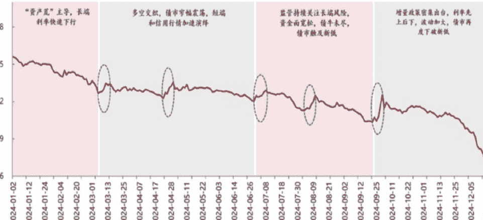

数据来源：wind、iFind、民生证券研究院

从原理上看，国债收益率它既会反映经济基本面（经济增长、通胀、政策等因素），也会受到资金供需的影响，短期也会受到风险偏好变化的干扰。在不同的时期，不一样的因素可能起到主导作用。

在 9 月底，虽然政策面也呈现超预期宽松的预期，但由于风险偏好大幅下降，体现为权益市场快速大幅上涨。此时风险偏好在短期内就主导了国债收益率的变化，使其有所上行。此外，二季度由于央行不断提示长债利率风险，政策上的干预使国债收益率盘整震荡。

不过，上述两个因素在 2024 年的国债收益率走势中只是起到短期的作用，驱动国债收益率趋势性下行的关键因素主要是：物价水平偏低、货币政策自 9 月底后趋于宽松。

从国债收益率和物价水平的关系看，国债收益率代表的是市场的名义无风险利率，如果物价水平快速上涨，则会推动国债收益率上行；相反，如果物价水平持续偏低，国债收益率会趋于下行。1-11 月 CPI 同比增长 0.3%，低于 2020-2023 年平均 1.4% 的水平。

从资金供需看，一方面，在化债的大背景下，地方债供给节奏放缓、城投债供给也有所缩量，导致高票息资产供给减少；另一方面，“手工补息”的整改以及自律机制疏通存款利率下行的堵点，引发资金向理财、货基、债基等广义基金转移，这些资金配置债券的需求提升，深化了“资产荒”格局。

从政策面看，12 月 9 日的政治局会议和 12 月 11 日 -12 日的中央经济工作会议对货币政策的定调为“适度宽松”，上一次定调“适度宽松”的货币政策还要追溯到 2008 年和 2009 年的中央经济工作会议，当时政策利率、存款准备金率都有较大的下调，而社会融资规模和货币供应量增速随后明显回升。此次中央经济工作会议指出，要“适时降准降息，保持流动性充裕”。所以，年底债市资金开始抢跑降息预期。

### 隐含了多少降息

目前的国债收益率水平到底反应了多少未来的降息预期呢？

华泰证券近期对银行、券商、基金、保险、私募等投资者进行了问卷调查。结果显示，半数投资者预计 2025 年 10 年期国债收益率会下探至 1.5%，多数的投资者预计 2025 年将降息 40 个基点。

不过，与债市抢跑未来大幅降息不同，近期权益市场对货币政策宽松的反应略显平淡。12 月 10 日上证综指一度逼近 3500 点，但随后则慢慢回落至 3400 附近。这也表明，当前债券市场和权益市场对未来政策和经济基本面的定价存在一定的分歧。

华泰证券认为，虽然短期看债市仍有惯性，但长端利率已经反映了 30 个基点以上的降息预期，对 2025 年政策空间已提前定价。国债收益率要向下突破需要有新的触发剂，票息保护弱化后，交易的重要性明显提升，而趋势性逆转需要看到再通胀实现和融资需求回升。

国盛证券也认为，中期机构调整可能会约束国债收益率的下行空间。首先，资产负债的倒挂在中期难以持续，这可能成为市场风险的观察因素之一。目前银行一方面发行高成本存单，另一方面却增配低于存单的利率债。过去四周，银行存单净融资规模在 1.3 万亿元，而 2023 年同期仅有 2300 亿元。目前 1 年期 AAA 存单利率 1.63%，高于 7 年期以内的国债收益率，与 10 年期国债利率相差很小，银行增配国债难以覆盖存单成本。同时，资金价格（R007）与存单利率继续倒挂。银行在融资成本与资产收益倒挂情况下，并没有相应缩表，而是继续扩张金融资产规模。可能部分是由于年末的规模诉求，而年后这种诉求的下降，可能会导致银行配债节奏的下降。

其次，目前债市已经反映了较多的政策宽松预期，如果没有更强预期政策推动，利率下行空间也会受到一定程度的约束。从以往经验来看，作为短端利率代表的存单与资金价格高度相关，当前的存单价格已经反映了一定程度的降息预期。如果假定未来降息 30 个基点，根据年初以来 R007 与 7 天逆回购利率（OMO）的平均利差为 24.9 个基点，R007 或保持在 1.45% 左右，而存单与 R007 年初以来平均利差 9.5 个基点，存单利率则可能在 1.54% 左右。10 年国债与存单利率年初以来平均利差在 17.7 个基点，则对应的 10 年国债可能在 1.72% 左右，因此当前利率水平已经反映了一定程度的降息。

再次，如果利率进入震荡阶段，负利差环境下可能导致市场的去杠杆。目前资金价格高于大部分短债利率，跨年之后，资金能否有足够宽松仍有一定的不确定性。如果长端债券进入震荡阶段，没法进一步提供资本利得，那么负利差情况下，市场可能降低杠杆，进而减弱对长债的配置需求。

### 美联储鹰派降息

廖宗魁

> 特朗普当选后政策的不确定性增大，美国“再通胀”的风险增加，美联储不得不减慢降息步伐。美债利率和美元指数的上行，可能会给非美货币和权益市场短期带来压力。

12 月 18 日，美联储结束了年内最后一次议息会议，决定将联邦基金利率从 4.5%-4.75% 降至 4.25%-4.5%，是连续第二次会议决定降息 25 个基点。至此，美联储本轮降息周期已经连续第三次会议降息，三次合计降息 100 个基点。

虽然美联储如期降息，但却对未来政策释放出了偏鹰派的信号。在降息当日美股大跌，道琼斯指数跌 2.6%，标准普尔 500 指数跌 3%，创 2001 年来最大降息日跌幅；而 10 年期美债利率则上升至 4.57%，美元指数升值至 108 上方。与 9 月份第一次降息时相比，在短短三个月里，10 年期美债利率上行了近 90 个基点，美元指数则升值了约 7%。

美联储公布的官员关于未来基准利率预测的点阵图显示，2025 年将只会降息两次，合计 50 个基点，要明显少于 9 月时给出的降息 100 个基点的预期。

美联储主席鲍威尔在新闻发布会上表示，通过 9 月以来 100 个基点的降息，当前政策限制性已经大幅缓解，接下来需要更加“谨慎”，未来行动会更慢。特朗普当选后可能实施激进的关税政策，让美联储不得不提前考虑“再通胀”的风险，所以开始给降息踩刹车。

#### 为“再通胀”做准备

为什么美联储降息了，反而美股大跌，美债利率和美元指数都上行呢？市场并不会太在意已经发生了的政策，而会对未来将要采取的政策会有更大的反应。

美联储虽然 9 月份以来已经累计降息 100 个基点，但相比以往的降息周期，美联储的利率终点会更高。市场此前一度预期的持续大幅降息并未成为现实，相反，在特朗普当选的背景下，美联储对未来通胀的担忧有所增加，近期美国经济的表现也使美联储不用那么着急行动。

在新闻发布会上，鲍威尔给出了放缓降息步伐的几个重要理由：

其一，美国经济活动仍较强。2024 年第三季度美国 GDP 环比年增长率为 2.8%，与第二季度大致相同。消费者支出的增长保持强劲，设备和有形资产投资有所增强。这使得美联储将 2024 年美国经济增长的预测从 9 月的 2% 上调至 2.5%，2025 年经济增长的预测也稍提高至 2.1%。

其二，当前美国失业率不高。相较于 9 月时美联储对劳动市场快速下行较为担忧，近期的失业率和非农数据仍表明劳动市场整体稳定缓和。此次美联储会议的与会者认为，劳动力市场的风险和不确定性相较之前有所改善。

其三，“再通胀”风险增加。鲍威尔明确表示，过去两年通胀显著缓解，但仍略高于美联储 2% 的长期目标。在 11 月结束的 12 个月里，总 PCE 价格同比上涨 2.5%，剔除食品和能源后的核心 PCE 价格上涨 2.8%。

美联储已经开始着手评估关税对通胀的潜在影响。鲍威尔提到了 2018 年 9 月的 Teal Book（政策备忘录）中关税对通胀影响的评估。

美联储官员对 2025 年通胀的预测为 2.5%，相比 9 月大幅上调了 0.4 个百分点。而特朗普上台后产生的政策不确定性，可能是美联储上调未来通胀预期的主因。鲍威尔表示，“一些委员确实将政策不确定性视为他们增加通胀不确定性预测的原因之一。关于不确定性这一点，这是很常识性的逻辑：当路径不明时，你会放慢脚步。这类似于在雾夜开车或走进一个摆满家具的黑屋子，你会减速。这可能影响了部分委员的判断。”

有一种很流行的预判未来美联储政策路径的方法，即“泰勒规则”：美联储的基准利率是通胀率与失业率的线性组合。根据 12 月美联储官员的利率点阵图，其对长期通胀的预测为 3%，长期失业率的预测为 4.2%，如果采取相等权重的话，按照“泰勒规则”得到的终点基准利率中枢则为 3.1%，与点阵图中显示的 2026 年的基准利率基本一致。

#### 市场会如何反应

如果把这一轮美联储的降息定性为“预防式”的，那它与历史上 1995-1996 年的降息可能有更多的相似之处。在 1995-1996 年降息周期中，美国经济在 1995 年下半年就见底并逐步回升，当时 10 年期国债利率和美元指数也在联储降息阶段中先行见底：美元指数在 1995 年降息早期阶段即触底回升，而 10 年期美债收益率亦在联储最后一次降息之前先行触底。

华泰证券认为，特朗普正式入驻白宫后，如果推进扩张性财政政策，则通胀预期可能面临上行风险，并阶段性推升美元指数和美债利率。历史上，美国宽财政基本出现在产出缺口负向扩张的阶段，以对冲经济下行压力，1980 年至今，美国仅有两轮“顺周期式”宽财政，第一段为特朗普上一届任期中的 2017 年下半年至 2019 年下半年，第二段为拜登政府时期的 2022 年下半年至 2023 年上半年，两轮“顺周期式”宽财政均带来了美元的持续走强。

考虑财政赤字扩张必然带来国债增发，因此将通过美国国债一级市场的供需渠道对美债利率形成扰动，或通过推升风险溢价渠道推高 10Y 美债利率。

不过，事情的发展很少是线性的。中金公司认为，就像 1995 年美联储降息停止半年那样，美股一度出现回调，美债利率冲高，但也提供了再度交易的机会。节奏上看，2025 年 1 月 20 日特朗普就任后将出台何种政策，美股四季度业绩的开启，以及 2025 年 1 月美联储会议都值得关注。

中金公司进一步认为，美债利率底部抬升，低点已过，但 4.5% 以上可提供交易机会。结合最新的中性利率，测算长端美债利率的合理中枢为 3.9-4.1% 左右。

近期美元的不断走强，也给非美货币带来了不小的贬值压力。年初以来，截至 12 月 21 日，日元贬值达 10%，澳元贬值约 9.4%，欧元、英镑、加元和瑞郎贬值在 6% 左右，离岸人民币汇率贬值约 4.4%。虽然人民币也面临一定的贬值压力，但相对其他主流非美货币仍相对坚挺。

由于特朗普未来的政策存在很大不确定性，未来一段时间全球资产价格的波动可能会增大，资金的风险偏好会有所下降。

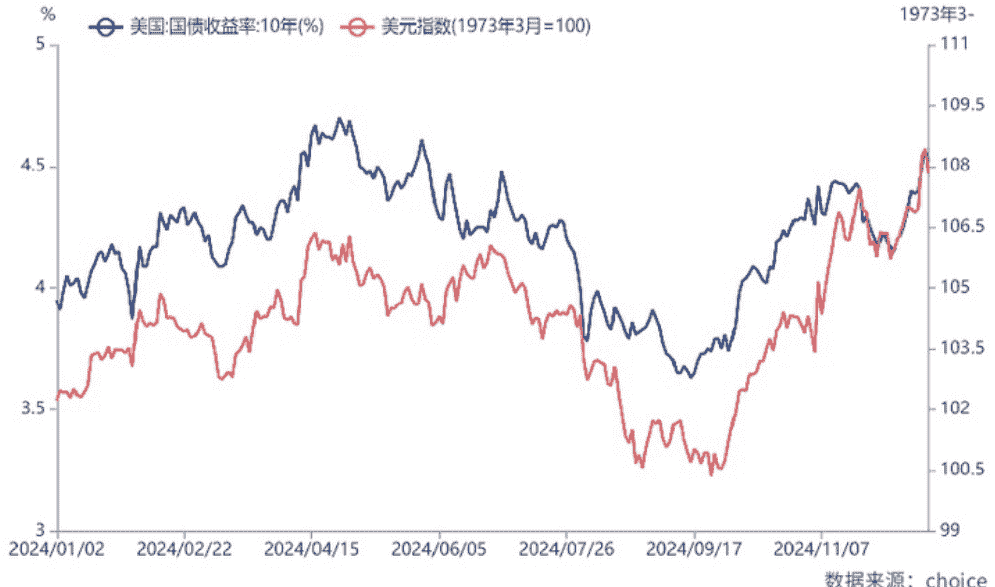

## Cover Story
### 封面专题
### 卖方研究环境生变
#### 竞争格局保持稳定

吴晓兵

低利率环境、权益产品的 ETF 趋势和公募基金费率改革促使卖方研究商业模式面临转型，竞争格局也在重构。卖方研究机构正通过优化研究服务质量、拓展服务范围和提升研究能力来重构业务模式，以寻求新的增长点和竞争优势。

2024 年，A 股市场总体呈现“先抑后扬”格局，特别是随着下半年一揽子增量政策的持续出台，市场企稳回升，并呈现多方面积极变化。从全年走势看，上证指数一度在 2 月初触及低点 2635 点，至 9 月底，在一系列政策利好和资金面改善的推动下，出现了强势反弹并创下年内新高，市场成交量持续放大。

伴随着 A 股市场的跌宕起伏，卖方研究也在 2024 年再次行至十字路口，监管等外部环境的变化对行业构成新的机遇与挑战，竞争格局及业务模式也在重构，以寻求新的增长点和竞争优势。

### 多项外部因素生变
卖方研究业务趋向多元化

2024 年，卖方研究面对的外部环境出现巨变，对行业构成新的机遇与挑战。

货币环境方面，低利率时代到来，颠覆了资管行业以固定收益为基础资产的投资模式，影响到银行理财、保险资金、“固收+”基金、信托等资管产品的投资结构和策略，进而影响以这些机构对卖方研究的需求。

股市方面，A 股在 2024 年呈现巨大的“N 型”走势，年初和年末各有一波大幅上升行情，特别是 9 月下旬以来的上涨伴随着历史最高的成交量水平，给证券行业带来转机，对作为券商重要部门的卖方研究所也构成利好。

在需求端，卖方研究最大收入来源公募基金行业出现了 ETF 等被动型产品替代主动权益的格局，给以公司研究为主的研究模式构成挑战；同时，公募基金管理费率调整、佣金分配政策优化等多重因素，促使卖方研究所向探索多元化服务模式、开拓更多收入来源转变。

监管方面，中国证券业协会强调各券商应加强合规管理，有效防范业务风险，积极应对研究业务转型，加强人才梯队建设。年末，由于个别事件，针对卖方研究的监管有进一步强化趋势。

面对当前市场环境下所面临的挑战和转型压力，卖方研究通过服务多样化来努力适应新形势。

## 低利率时代卖方研究助力
机构实现多元化资产配置

随着年末长期国债利率的快速下降，中国迈入低利率时代。

长期低利率环境将颠覆资管行业以固定收益为基础资产的投资模式。在过去，固定收益产品因其相对稳定的收益而成为资管行业的重要组成部分。但在低利率环境下，固定收益产品的收益率下降，导致银行理财、保险资金、“固收+”基金、信托等资管产品不得不调整其投资结构和策略，寻求新的投资机会和收益来源。

习惯了较高固定收益率的客户在面临资产再配置需求时，有可能转向权益端寻求解决方案。这就要求卖方研究提供适合上述低风险偏好机构权益产品的研究和服务，意味着卖方研究在权益类资产的研究上仍大有可为，未来，帮助客户在低利率环境下实现资产多元化配置的。能力，将是卖方研究的重大课题之一。

随着低利率环境的深化，各类型客户需求日趋专业化、多样化，要求卖方研究适应市场变化，提供更加多元化和深入的研究服务，走国际化、智库化、产研结合等多元化发展路径。

## ETF 崛起对个股研究模式构成颠覆性影响

2024 年以来，ETF 等被动型产品的崛起成为公募基金行业发展的大趋势。随着 ETF 等被动型产品的流行，投资者对个股研究的需求减弱，这对当前卖方研究所 80% 研究力量配置在行业个股研究上的研究模式构成颠覆性影响。

ETF 的崛起促使卖方研究必须重新审视自身的战略定位和研究方向。卖方研究需要从传统的个股研究转向更具前瞻性的研究内容，或者重新审视现有的业务模式。这意味着卖方研究需要更多地关注行业趋势、宏观经济环境以及被动投资策略的研究，通过提供行业研究、宏观分析和多元化的投资咨询服务，来帮助投资者更好地理解市场动态和投资机会。

权益类产品的 ETF 趋势也预示着卖方研究竞争格局面临重塑，软佣模式面临极大变数，卖方研究的商业模式可能发生改变。

当前，不少券商研究所开始行动，以改革创新推进转型，并持续探索多元化服务模式，开拓更多收入来源。这包括加强产业研究以及智库研究等路径的投入。

为了适应市场和产品结构的变化，部分卖方研究所通过调整组织架构，将行业研究配置从“大而全”逐步向“精而专”转化，以更好地服务于被动型产品和组合配置的研究需求。

总的来看，ETF 等被动型产品的崛起不仅改变了卖方研究的需求结构，也推动了卖方研究向更加多元化和科技化的方向发展。未来，有可能出现卖方研究所通过研究和收入模式的转型实现弯道超车。

## 因应公募基金费率改革

### 卖方研究让研究回归本源

公募基金交易费率的下降导致卖方市场收入规模收缩，卖方市场竞争可能进一步加剧。多家卖方研究所在 2024 年启动了全面改革，主旨是让研究回归本源，即更加专注于提供高质量的研究服务，更加注重深度和创新，而不仅仅是数量上的产出。在新形势下，卖方研究所通过提升研究实力，以适应佣金政策改革，研究实力更强的机构有望受益。

面对激烈竞争，券商研究所开始探索多元化的服务模式，以开拓更多的收入来源。这包括加强产业研究和智库研究等路径的投入，以提升市场竞争力。研究业务的重心也从服务外部机构投资者逐步转为外部和内部并重，推动内部业务模式的重塑和优化。这涉及到以投行业务为核心，研究、股权投资、资产管理、

### 第十八届 (2024) 水晶球奖评选上市公司榜单

### 2024 年度最佳投资者关系管理上市公司榜单

| 序号 | 简称/代码 |
|---|---|
| 1 | 工商银行 (601398) |
| 2 | 泸州老窖 (000568) |
| 3 | 顺丰控股 (002352) |
| 4 | 宁波银行 (002142) |
| 5 | 通威股份 (600438) |
| 6 | 中煤能源 (601898) |
| 7 | 中国铁建 (601186) |
| 8 | 万泰生物 (603392) |
| 9 | 合盛硅业 (603260) |
| 10 | 天齐锂业 (002466) |
| 11 | 长春高新 (000661) |
| 12 | 天坛生物 (600161) |
| 13 | 天风证券 (601162) |
| 14 | 中控技术 (688777) |
| 15 | 第一创业 (002797) |
| 16 | 大唐发电 (601997) |
| 17 | 天能股份 (688819) |
| 18 | 中直股份 (600038) |
| 19 | 万物云 (02602.HK) |
| 20 | 贵阳银行 (601997) |
| 21 | 金力永磁 (300748) |
| 22 | 申通快递 (002468) |
| 23 | 百克生物 (688276) |
| 24 | 佐力药业 (300181) |
| 25 | 天立国际控股 (01773.HK) |
| 26 | 永安期货 (600927) |
| 27 | 明源云 (00909.HK) |
| 28 | 日发精机 (002520) |
| 29 | 沃特股份 (002886) |
| 30 | 哈尔斯 (002615) |

### 2024 年度最佳 ESG 管理上市公司榜单

| 序号 | 简称/代码 |
|---|---|
| 1 | 顺丰控股 (002352) |
| 2 | 赛力斯 (601127) |
| 3 | 中金公司 (601995) |
| 4 | 恒力石化 (600346) |
| 5 | 荣盛石化 (002493) |
| 6 | 龙湖集团 (00960.HK) |
| 7 | 恒生电子 (600570) |
| 8 | 长春高新 (000661) |
| 9 | 人福医药 (600079) |
| 10 | 水井坊 (600779) |
| 11 | 中航科工 (02357.HK) |
| 12 | 天士力 (600535) |
| 13 | 信维通信 (300136) |
| 14 | 国联股份 (603613) |
| 15 | 华大基因 (300676) |
| 16 | 卫龙美味 (09985.HK) |
| 17 | 金石资源 (603505) |
| 18 | 拉卡拉 (300773) |
| 19 | 千方科技 (002373) |
| 20 | 佐力药业 (300181) |
| 21 | 瑞丰银行 (601528) |
| 22 | 阳光保险 (06963.HK) |
| 23 | 南华期货 (603093) |
| 24 | 凌云光 (688400) |
| 25 | 亚厦股份 (002375) |
| 26 | 药师帮 (09885.HK) |
| 27 | 沃特股份 (002886) |
| 28 | 久日新材 (688199) |
| 29 | 凯恩股份 (002012) |
| 30 | 朗坤环境 (301305) |
| 31 | 君亭酒店 (301073) |
| 32 | 登康口腔 (001328) |
| 33 | 郑州银行 (002936) |

### 2024 年度最具投资价值上市公司榜单

| 序号 | 简称/代码 |
|---|---|
| 1 | 泸州老窖 (000568) |
| 2 | 北京银行 (601169) |
| 3 | 通威股份 (600438) |
| 4 | 浙商证券 (601878) |
| 5 | 伟明环保 (603568) |
| 6 | 惠泰医疗 (688617) |
| 7 | 爱玛科技 (603529) |
| 8 | 迈富时 (02556.HK) |
| 9 | 爱施德 (002416) |
| 10 | 伟星新材 (002372) |
| 11 | 时代天使 (06699.HK) |
| 12 | 阳光保险 (06963.HK) |
| 13 | 九方智投控股 (09636.HK) |
| 14 | 天立国际控股 (01773.HK) |
| 15 | 喜临门 (603008) |
| 16 | 金龙羽 (002882) |
| 17 | 大胜达 (603687) |
| 18 | 圣诺生物 (688117) |

### 上市公司 2024 年度技术进步奖榜单

| 序号 | 简称/代码 |
|---|---|
| 1 | 恒生电子 (600570) |
| 2 | 商汤 (00020.HK) |
| 3 | 福斯特 (603806) |
| 4 | 优必选 (09880.HK) |
| 5 | 甘李药业 (603087) |
| 6 | 四维图新 (002405) |
| 7 | 迈富时 (02556.HK) |
| 8 | 杉杉股份 (600884) |
| 9 | 清新环境 (002573) |
| 10 | 华中数控 (300161) |

### 2024 年度最佳总经理/总裁/CEO 榜单

| 序号 | 简称/代码 |
|---|---|
| 1 | 甘李药业 (603087) 都凯 |
| 2 | 九号公司 (689009) 王野 |
| 3 | 爱施德 (002416) 周友盟 |
| 4 | 华中数控 (300161) 田茂胜 |
| 5 | 同飞股份 (300990) 张浩雷 |

### 2024 年度最佳公关团队榜单

| 序号 | 简称/代码 |
|---|---|
| 1 | 水井坊 (600779) |
| 2 | 九号公司 (689009) |
| 3 | 国联股份 (603613) |

### 2024 年度最佳董事长榜单

| 序号 | 简称/代码 |
|---|---|
| 1 | 合盛硅业 (603260) 罗立国 |
| 2 | 卫星化学 (002648) 杨卫东 |
| 3 | 浙商证券 (601878) 吴承根 |
| 4 | 天坛生物 (600161) 杨汇川 |
| 5 | 伟明环保 (603568) 项光明 |
| 6 | 九号公司 (689009) 高禄峰 |
| 7 | 信维通信 (300136) 彭浩 |
| 8 | 掌趣科技 (300315) 刘惠城 |
| 9 | 卫龙美味 (09985.HK) 刘卫平 |
| 10 | 南都电源 (300068) 朱保义 |
| 11 | 容百科技 (688005) 白厚善 |
| 12 | 钱江摩托 (000913) 徐志豪 |
| 13 | 南华期货 (603093) 罗旭峰 |
| 14 | 三维通信 (002115) 李越伦 |
| 15 | 格林达 (603931) 蒋慧儿 |
| 16 | 佳讯飞鸿 (300213) 林菁 |
| 17 | 佩蒂股份 (300673) 陈振标 |
| 18 | 永信至诚 (688244) 蔡晶晶 |
| 19 | 新潮能源 (600777) 刘斌 |

### 2024 年度行业专家荣誉奖项榜单

| 序号 | 简称/代码 |
|---|---|
| 1 | 九号公司 (689009) 刘淼 |
| 2 | 南都电源 (300068) 相佳媛 |

机构服务相互协同的全平台服务链条。

### 2024 年度最佳董秘榜单

| 序号 | 简称/代码 |
|---|---|
| 1 | 中国铁建 (601186) 靖菁 |
| 2 | 恒力石化 (600346) 李峰 |
| 3 | 合盛硅业 (603260) 高君秋 |
| 4 | 卫星化学 (002648) 沈晓炜 |
| 5 | 天齐锂业 (002466) 张文宇 |
| 6 | 天风证券 (601162) 诸培宁 |
| 7 | 中控技术 (688777) 房永生 |
| 8 | 第一创业 (002797) 屈娅 |
| 9 | 大华股份 (002236) 吴坚 |
| 10 | 爱玛科技 (603529) 王春彦 |
| 11 | 天能股份 (688819) 胡敏翔 |
| 12 | 万物云 (02602.HK) 黄旻 |
| 13 | 四维图新 (002405) 孟庆昕 |
| 14 | 中文在线 (300364) 王京京 |
| 15 | 盛和资源 (600392) 郭晓雷 |
| 16 | 爱施德 (002416) 吴海南 |
| 17 | 伟星新材 (002372) 谭梅 |
| 18 | 福田汽车 (600166) 陈维娟 |
| 19 | 南都电源 (300068) 曲艺 |
| 20 | 申通快递 (002468) 郭林 |
| 21 | 金石资源 (603505) 戴水君 |
| 22 | 千方科技 (002373) 史广建 |
| 23 | 百克生物 (688276) 张喆 |
| 24 | 联创电子 (002036) 卢国清 |
| 25 | 恒邦股份 (002237) 夏晓波 |
| 26 | 立中集团 (300428) 李志国 |
| 27 | 英唐智控 (300131) 李昊 |
| 28 | 富满微 (300671) 罗琼 |
| 29 | 永安期货 (600927) 黄峥嵘 |
| 30 | 英利汽车 (601279) 苗雨 |
| 31 | 恒信东方 (300081) 宫泽茹 |
| 32 | 华中数控 (300161) 陈程 |
| 33 | 三维通信 (002115) 任锋 |
| 34 | 格林达 (603931) 章琪 |
| 35 | 恒林股份 (603661) 汤鸿雁 |
| 36 | 佳讯飞鸿 (300213) 郑文 |
| 37 | 大胜达 (603687) 胡鑫 |
| 38 | 日发精机 (002520) 祁兵 |
| 39 | 圣诺生物 (688117) 余啸海 |
| 40 | 中晶科技 (003026) 李志萍 |
| 41 | 智微智能 (001339) 张新媛 |
| 42 | 哈尔斯 (002615) 邵巧蓉 |
| 43 | 申昊科技 (300853) 朱鸳鸯 |
| 44 | 君亭酒店 (301073) 施晨宁 |
| 45 | 永信至诚 (688244) 张恒 |
| 46 | 登康口腔 (001328) 杨祥思 |
| 47 | 联合水务 (603291) 许行志 |
排名不分先后

### 2024 年度最佳证代 (IR) 榜单

| 序号 | 简称/代码 |
|---|---|
| 1 | 天齐锂业 (002466) 付旭梅 |
| 2 | 长春高新 (000661) 李季 |
| 3 | 大华股份 (002236) 李思睿 |
| 4 | 中直股份 (600038) 夏源 |
| 5 | 中文在线 (300364) 杨帅 |
| 6 | 爱施德 (002416) 陈菲菲 |
| 7 | 金石资源 (603505) 张钧惠 |
| 8 | 联创电子 (002036) 赖文清 |
| 9 | 千方科技 (002373) 康提 |
| 10 | 天立国际控股 (01773.HK) 王晓梅 |
| 11 | 派克新材 (605123) 文甜甜 |
| 12 | 众信旅游 (002707) 吴冉婧 |
| 13 | 明源云 (00909.HK) 邹游 |
| 14 | 沃特股份 (002886) 李燕开 |
| 15 | 中晶科技 (003026) 叶荣 |
| 16 | 凯恩股份 (002012) 董成龙 |
| 17 | 君亭酒店 (301073) 周芷意 |
排名不分先后

### 第十八届 (2024) 水晶球奖评选基金公司榜单

### 2024 年度最佳投资者教育基金公司榜单

| 序号 | 简称/代码 |
|---|---|
| 1 | 南方基金 |
| 2 | 天弘基金 |
| 3 | 博时基金 |
| 4 | 鹏华基金 |
| 5 | 景顺长城基金 |
| 6 | 银华基金 |
| 7 | 中欧基金 |
| 8 | 华宝基金 |
| 9 | 农银汇理基金 |
| 10 | 华商基金 |
排名不分先后

### 2024 年度最佳 ESG 管理基金公司榜单

| 序号 | 简称/代码 |
|---|---|
| 1 | 南方基金 |
| 2 | 博时基金 |
| 3 | 国泰基金 |
| 4 | 景顺长城基金 |
| 5 | 银华基金 |
| 6 | 国投瑞银基金 |
| 7 | 东方红资产管理 |
| 8 | 创金合信基金 |
| 9 | 财通资管 |
排名不分先后

综上，低利率环境、权益产品的 ETF 趋势和公募基金费率改革促使卖方研究商业模式面临转型，竞争格局也在重构。卖方研究机构为适应市场变化和监管要求，正通过优化研究服务质量、拓展服务范围和提升研究能力来重构业务模式，以寻求新的增长点和竞争优势。

## 水晶球奖
### 助力卖方研究行业发展

国内卖方研究迄今已经走过了 20 年的路程，并成长为中国资本市场的重要推动力量，“卖方分析师水晶球奖”伴随卖方研究共同见证了资本市场的发展壮大，并挖掘出了中国最优秀的证券研究机构及分析师，促进了中国资本市场健康发展。

近几年来，监管部门对卖方分析师评选活动的监管大大加强，“卖方分析师水晶球奖”因应形势做出了相应调整，2024 年继续坚持以合规为导向，进一步提高活动组织水平、完善活动规则、加强信息披露，刻画下卖方研究在 2024 年的竞争格局图谱。

十八年来，“卖方分析师水晶球奖”通过引入独立第三方机构，对评选选票的真实性、数据录入及计算的准确性与合规性、统计结果与公布数据的一致性提供独立计票及全程见证。2024 年的投票手册由寄出到回收，均由计票机构德勤华永会计师事务所独立完成，实现了投票手册与主办方的隔离，是三公原则的重要实践。

当前，中国经济迎来重要转型阶段，资本市场的定位也获得高度重视，推出了一系列利好政策。新形势下，机遇与挑战并存，希望卖方研究能够找到更好的行业形态、实现更高的研究水平、具备更强的服务功能。

## Cover Story 封面专题

| 研究领域 | 单位名称 | 分析师 | 分数 | 名次 |
| :--- | :--- | :--- | :--- | :--- |
| 宏观经济 | 华创证券 | 张瑜、陆银波、文若愚、高拓、殷雯卿、付春生、李星宇、袁玲玲、夏雪 | 53470 | 第一名 |
| 宏观经济 | 广发证券 | 郭磊、陈嘉荔、陈礼清、钟林楠、王丹、吴棋滢、贺骁束、文永恒 | 48180 | 第二名 |
| 宏观经济 | 浙商证券 | 李超、林成炜、孙欧、廖博、潘高远、费瑾、陈冀 | 45920 | 第三名 |
| 宏观经济 | 方正证券 | 芦哲、张佳炜、王洋、潘京、占烁、李昌萌 | 45790 | 第四名 |
| 宏观经济 | 长江证券 | 于博、宋筱筱、刘承昊、蒋佳榛 | 33830 | 第五名 |
| 宏观经济 | 国盛证券 | 熊园、刘新宇、杨涛、刘安林、穆仁文、朱慧 | 29980 | 入围 |
| 宏观经济 | 天风证券 | 宋雪涛、林彦、张伟、孙永乐 | 20510 | 入围 |
| 策略 | 广发证券 | 刘晨明、郑恺、李如娟、许向真、倪庚、赵阳、余可骋、逸昕、陈振威、杨泽棠、侯蕾 | 73410 | 第一名 |
| 策略 | 国联证券 | 包承超、邓宇林、张晓春、吴安东、万清昱、肖遥志、周长民 | 54050 | 第二名 |
| 策略 | 兴业证券 | 张启尧、张忆东、张倩婷、程鲁尧、胡思雨、张勋、陈禹豪、陈恭懿、林怡、李彦霖、迟玉怡、吴峰、杨震宇、陈东元 | 52370 | 第三名 |
| 策略 | 申万宏源 | 傅静涛、林丽梅、金倩婧、王胜、陆灏川、程翔、黄子函、刘雅婧、冯晓宇、郝丹阳、韦春泽、李一民、董易 | 44030 | 第四名 |
| 策略 | 民生证券 | 牟一凌、王况炜、方智勇、梅锴、吴晓明、沈心怡、纪博文、胡悦 | 42680 | 第五名 |
| 策略 | 中信建投 | 陈果、张玉龙、徐建华、张雪娇、夏凡捷、王程畅、何盛、李家俊、姚皓天、郑佳雯、邱季、赵子鹏、毛晨、陈添奕 | 23850 | 入围 |
| 策略 | 天风证券 | 吴开达、林晨、吴黎艳、肖峰 | 21280 | 入围 |
| 金融工程 | 长江证券 | 覃川桃、秦瑶、刘胜利、邓越、郑起、鲍丰华、蔡文捷、冷旭晟、邓元哲 | 48530 | 第一名 |
| 金融工程 | 兴业证券 | 郑兆磊、刘海燕、宫民、沈鸿、占康萍、乔良、张博、薛令轩 | 44740 | 第二名 |
| 金融工程 | 国信证券 | 张欣慰、张宇、杨丽华、胡志超、陈梦琪 | 41950 | 第三名 |
| 金融工程 | 申万宏源 | 邓虎、朱岚、蒋辛、沈思逸、杨俊文、奚佳诚、张杰、马骏、张滔 | 34140 | 第四名 |
| 金融工程 | 国盛证券 | 林志朋、刘富兵、缪铃凯、沈芷琦、梁思涵、杨晔、张国安、赵博文 | 32270 | 第五名 |
| 金融工程 | 广发证券 | 安宁宁、罗军、史庆盛、张超、陈原文、李豪、周飞鹏、张钰东、季燕妮 | 30910 | 入围 |
| 金融工程 | 开源证券 | 魏建榕、张翔、傅开波、高鹏、苏俊豪、胡亮勇、王志豪、盛少成、苏良、何申昊 | 29000 | 入围 |
| 债券 | 华西证券 | 刘郁、姜丹、田乐蒙、肖金川、黄晓曦、郑日诚、黄佳苗、董远、曾禹童、钱青静 | 58160 | 第一名 |
| 债券 | 华创证券 | 周冠南、张晶晶、靳晓航、许洪波、宋琦、王紫宇、张文星 | 51800 | 第二名 |
| 债券 | 天风证券 | 孙彬彬、孟万林、隋修平 | 48270 | 第三名 |
| 债券 | 兴业证券 | 黄伟平、左大勇、吴鹏、徐琳、蔡琨、罗婷、罗雨浓、常月、栾强、杨雪芳 | 46770 | 第四名 |
| 债券 | 中金公司 | 陈健恒、许艳、杨冰、王瑞娟、范阳阳、王海波、东旭、雷文斓、韦璐璐、李雪、魏真真、邱子轩、汪晴、张星星 | 36600 | 第五名 |
| 债券 | 浙商证券 | 杜渐、王明路、汪梦涵、沈晨萍、郑莎、崔正阳、唐嵩、李艳 | 32020 | 入围 |
| 债券 | 国投证券 | 尹睿哲、李豫泽、李玲、刘冬、胡依林、赵心茹、毛庆秋 | 26920 | 入围 |
| 农林牧渔 | 长江证券 | 陈佳、顾乾屹、高一岑 | 86630 | 第一名 |
| 农林牧渔 | 广发证券 | 钱浩、郑颖欣、周舒玥、李雅琦 | 61080 | 第二名 |
| 农林牧渔 | 天风证券 | 陈潇、吴立、林毓鑫 | 43530 | 第三名 |
| 农林牧渔 | 浙商证券 | 钟凯锋、张心怡、江路 | 25670 | 第四名 |
| 农林牧渔 | 华创证券 | 雷轶、肖琳、陈鹏、顾超、张皓月 | 23620 | 第五名 |
| 农林牧渔 | 国盛证券 | 张斌梅、樊嘉敏、沈嘉妍 | 17220 | 入围 |
| 农林牧渔 | 光大证券 | 蒋山、李晓渊 | 16240 | 入围 |
| 食品饮料 | 华创证券 | 欧阳予、董广阳、范子盼、沈昊、彭俊霖、田晨曦、刘旭德、杨畅、严晓思 | 48580 | 第一名 |
| 食品饮料 | 天风证券 | 张潇倩、陈潇、唐家全、何宇航、谢文旭 | 46660 | 第二名 |
| 食品饮料 | 长江证券 | 董思远、徐爽、范晨昊、朱梦兰、石智坤、冯萱、陈硕旸 | 33280 | 第三名 |
| 食品饮料 | 广发证券 | 符蓉、郝宇新、高鸿、胡慧、吴思颖、廖承帅 | 32860 | 第四名 |
| 食品饮料 | 开源证券 | 方勇、方一苇、陈钟山、张恒玮 | 30700 | 第五名 |
| 食品饮料 | 东北证券 | 李强、阚磊、吴兆峰、王铄、丁敏明、陈科诺 | 29100 | 入围 |
| 食品饮料 | 华西证券 | 寇星、卢周伟、沈嘉雯、吴越 | 25150 | 入围 |
| 纺织和服饰 | 浙商证券 | 马莉、詹陆雨、邹国强、李陈佳、王长龙、周明蕊、黄振星 | 72510 | 第一名 |
| 纺织和服饰 | 长江证券 | 于旭辉、魏杏梓 | 52410 | 第二名 |
| 纺织和服饰 | 申万宏源 | 王立平、求佳峰、王盼、刘佩、李璇 | 50470 | 第三名 |
| 纺织和服饰 | 国金证券 | 杨欣、赵中平 | 36470 | 第四名 |
| 纺织和服饰 | 广发证券 | 糜韩杰、左琴琴、李咏红 | 34320 | 第五名 |
| 纺织和服饰 | 国盛证券 | 杨莹、侯子夜、王佳伟 | 32900 | 入围 |
| 纺织和服饰 | 中国银河证券 | 郝帅 | 26050 | 入围 |
| 轻工造纸 | 浙商证券 | 马莉、曾伟、褚远熙、洪百慧、钟烨晨、马远方、陈钊、刘梓晔 | 72280 | 第一名 |
| 轻工造纸 | 长江证券 | 蔡方羿、米雁翔、仲敏丽、应奇航 | 66910 | 第二名 |
| 轻工造纸 | 申万宏源 | 屠亦婷、黄莎、庞盈盈、张海涛、丁智艳 | 65200 | 第三名 |
| 轻工造纸 | 国盛证券 | 姜文镪 | 44180 | 第四名 |
| 轻工造纸 | 国金证券 | 张杨桓、赵中平、尹新悦、龚轶之、叶思嘉 | 26380 | 第五名 |
| 轻工造纸 | 广发证券 | 曹倩雯、张雨露 | 25300 | 入围 |
| 轻工造纸 | 海通证券 | 郭庆龙、高翩然、吕科佳、王文杰 | 11940 | 入围 |
| 煤炭 | 国盛证券 | 张津铭、刘力钰 | 73300 | 第一名 |
| 煤炭 | 长江证券 | 肖勇、赵超、叶如祯、庄越 | 57120 | 第二名 |
| 煤炭 | 民生证券 | 周泰、李航、王姗姗 | 41860 | 第三名 |
| 煤炭 | 开源证券 | 张绪成 | 37450 | 第四名 |
| 煤炭 | 海通证券 | 李淼、王涛、吴杰、朱彤 | 37290 | 第五名 |
| 煤炭 | 信达证券 | 左前明、李春驰 | 34960 | 入围 |
| 煤炭 | 广发证券 | 沈涛、安鹏、宋炜 | 29250 | 入围 |
| 石油化工 | 长江证券 | 魏凯、侯彦飞、王岭峰 | 63840 | 第一名 |
| 石油化工 | 天风证券 | 张樨禨、黄凯、朱韬宇、姜美丹 | 60250 | 第二名 |
| 石油化工 | 申万宏源 | 马昕晔、刘子栋 | 41730 | 第三名 |
| 石油化工 | 东吴证券 | 陈淑娴 | 38250 | 入围 |
| 石油化工 | 国联证券 | 许隽逸、陈律楼 | 28550 | 入围 |
| 基础化工 | 申万宏源 | 马昕晔、任杰、赵文琪、邵靖宇、刘子栋 | 56250 | 第一名 |
| 基础化工 | 长江证券 | 马太、王明、叶家宏 | 51740 | 第二名 |
| 基础化工 | 中银证券 | 余嫄嫄、徐中良 | 50400 | 第三名 |
| 基础化工 | 华创证券 | 杨晖、郑轶、王鲜俐、侯星宇、吴宇 | 33030 | 第四名 |
| 基础化工 | 国海证券 | 董伯骏、李永磊、贾冰、陈云、杨丽蓉、李娟廷、李振方 | 28680 | 第五名 |
| 基础化工 | 开源证券 | 金益腾、龚道琳、张晓锋、毕挥、蒋跨跃、徐正凤 | 27730 | 入围 |
| 基础化工 | 民生证券 | 刘海荣、费晨洪、李家豪、刘隆基、曾佳晨、李金凤 | 22050 | 入围 |
| 电子 | 中泰证券 | 王芳、杨旭、游凡、李雪峰、张琼、王九鸿 | 43240 | 第一名 |
| 电子 | 广发证券 | 耿正、王亮、邹正林、谢淑颖、焦鼎、张大伟、任思儒、王钰乔、李佳蔚 | 42730 | 第二名 |
| 电子 | 长江证券 | 杨洋、谢尔曼、王泽罡、钟智铧、蔡少东、张梦杰 | 40430 | 第三名 |

# 第十八届（2024）卖方分析师水晶球奖总榜单

### 封面专题

| 研究领域 | 单位名称 | 分析师 | 分数 | 名次 |
| :--- | :--- | :--- | :--- | :--- |
| 电子 | 中银证券 | 苏凌瑶 | 37000 | 第四名 |
| 电子 | 华创证券 | 岳阳、耿琛、熊翊宇、吴鑫、高远、姚德昌 | 32410 | 第五名 |
| 电子 | 山西证券 | 高宇洋、傅盛盛、徐怡然 | 32050 | 入围 |
| 电子 | 国金证券 | 樊志远、刘道明、刘妍雪、邵广雨、邓小路、丁彦文 | 19290 | 入围 |
| 非金属类建材 | 长江证券 | 范超、张佩、李金宝、李浩、董超 | 97630 | 第一名 |
| 非金属类建材 | 民生证券 | 李阳、赵铭 | 45400 | 第二名 |
| 非金属类建材 | 广发证券 | 谢璐、张乾 | 45240 | 第三名 |
| 非金属类建材 | 中泰证券 | 孙颖、聂磊、刘铭政 | 35190 | 第四名 |
| 非金属类建材 | 天风证券 | 鲍荣富、王涛、林晓龙、王雯、熊可为、朱晓辰、任嘉禹 | 32660 | 第五名 |
| 非金属类建材 | 华源证券 | 戴铭余、郦悦轩 | 16750 | 入围 |
| 非金属类建材 | 国盛证券 | 沈猛、陈冠宇 | 13690 | 入围 |
| 钢铁 | 长江证券 | 王鹤涛、肖勇、赵超、叶如祯、易轰、王筱茜、许红远、肖百桓 | 99050 | 第一名 |
| 钢铁 | 民生证券 | 邱祖学、张弋清、孙二春、任恒、李挺 | 56090 | 第二名 |
| 钢铁 | 国盛证券 | 笃慧、高亢 | 45270 | 第三名 |
| 钢铁 | 中信建投 | 王介超、覃静、王晓芳、郭衍哲、汪明宇、邵三才 | 31720 | 入围 |
| 钢铁 | 光大证券 | 王招华、戴默 | 31250 | 入围 |
| 有色金属 | 长江证券 | 王鹤涛、肖勇、赵超、叶如祯、易轰、王筱茜、许红远、肖百桓 | 101510 | 第一名 |
| 有色金属 | 民生证券 | 邱祖学、张弋清、孙二春、任恒、李挺 | 85120 | 第二名 |
| 有色金属 | 中信建投 | 王介超、覃静、王晓芳、郭衍哲、汪明宇、邵三才 | 33200 | 第三名 |
| 有色金属 | 国信证券 | 刘孟峦、杨耀洪、焦方冉、马可远 | 20220 | 第四名 |
| 有色金属 | 天风证券 | 刘奕町、曾先毅、陈凯丽 | 15900 | 第五名 |
| 有色金属 | 中泰证券 | 郭中伟、谢鸿鹤、安永超、刘耀齐、陈沁一 | 13580 | 入围 |
| 有色金属 | 浙商证券 | 沈皓俊、金云涛、王南清 | 13120 | 入围 |
| 家电 | 国联证券 | 管泉森、孙珊、贺本东、崔甜甜、莫云皓 | 68210 | 第一名 |
| 家电 | 天风证券 | 孙谦、宗艳、赵嘉宁 | 50110 | 第二名 |
| 家电 | 开源证券 | 吕明、周嘉乐、张霜凝、林文隆 | 34840 | 第三名 |
| 家电 | 国投证券 | 李奕臻、韩星雨、余昆、陈伟浩、杨小天 | 32550 | 第四名 |
| 家电 | 长江证券 | 陈亮 | 25220 | 第五名 |
| 家电 | 广发证券 | 曾婵、袁雨辰、高润鑫、符超然、陈尧 | 21770 | 入围 |
| 家电 | 兴业证券 | 颜晓晴、苏子杰、王雨晴 | 20740 | 入围 |
| 汽车及零部件 | 长江证券 | 高伊楠、张永乾、王子豪、张扬 | 51480 | 第一名 |
| 汽车及零部件 | 海通证券 | 刘一鸣、张觉尹、房乔华、王猛 | 44600 | 第二名 |
| 汽车及零部件 | 国联证券 | 高登、陈斯竹、黄程保、辛鹏、唐嘉俊 | 41870 | 第三名 |
| 汽车及零部件 | 民生证券 | 崔琰、白如、马天韵 | 41150 | 第四名 |
| 汽车及零部件 | 东吴证券 | 黄细里、刘力宇、杨惠冰 | 34590 | 第五名 |
| 汽车及零部件 | 国信证券 | 唐旭霞、杨钐、唐英韬、孙树林 | 25360 | 入围 |
| 汽车及零部件 | 中泰证券 | 何俊艺、刘欣畅、毛葵玄、白臻哲 | 24970 | 入围 |
| 机械 | 长江证券 | 赵智勇、臧雄、倪蕤、曹小敏、刘晓舟、屈奇 | 66570 | 第一名 |
| 机械 | 广发证券 | 代川、孙柏阳、朱宇航、汪家豪、方舟舟、王宁、蒲明琪 | 58470 | 第二名 |
| 机械 | 中银证券 | 陶波、曹鸿生 | 57800 | 第三名 |
| 机械 | 浙商证券 | 邱世梁、王华君、何家恺、周艺轩、王家艺、王洁若、李思扬、张菁、胡飘、王一帆、陈姝姝、刘村阳、姬新悦、周向昉、孙旭鹏、吴天佑 | 35400 | 第四名 |
| 机械 | 国投证券 | 郭倩倩、辛泽熙、高杨洋、赵梦妮、宋子豪、胡园园 | 35260 | 第五名 |
| 机械 | 天风证券 | 朱晔 | 18070 | 入围 |
| 机械 | 东吴证券 | 周尔双、李文意、韦译捷 | 16170 | 入围 |
| 电力设备 | 长江证券 | 邬博华、曹海花、叶之楠、司鸿历、袁澎、任佳惠 | 72010 | 第一名 |
| 电力设备 | 东吴证券 | 曾朵红、阮巧燕、岳斯瑶、谢哲栋、郭亚男、徐铖嵘、朱家佟 | 54590 | 第二名 |
| 电力设备 | 财通证券 | 张一弛、张磊、付正浩 | 47730 | 第三名 |
| 电力设备 | 中银证券 | 武佳雄、李扬、许怡然 | 39450 | 第四名 |
| 电力设备 | 天风证券 | 孙潇雅、张童童、高鑫、王彬宇 | 38930 | 第五名 |
| 电力设备 | 中信建投 | 朱玥、许琳、任佳玮、王吉颖、陈思同、雷云泽、屈文敏、胡颖、郑博元 | 23030 | 入围 |
| 电力设备 | 西部证券 | 胡琎心、刘小龙、章启耀、侯立森 | 20080 | 入围 |
| 医药生物 | 平安证券 | 叶寅、倪亦道、韩盟盟、裴晓鹏、何敏秀 | 41360 | 第一名 |
| 医药生物 | 方正证券 | 周超泽、许睿 | 34650 | 第二名 |
| 医药生物 | 中信建投 | 贺菊颖、袁清慧、王在存、刘若飞、朱红亮、李虹达、朱琪璋、刘慧彬、吴严、郑涛、袁全、赖俊勇、魏佳奥、王云鹏 | 32350 | 第三名 |
| 医药生物 | 兴业证券 | 孙媛媛、黄翰漾、东楠、杨希成、王佳慧、董晓洁、汪文博 | 30450 | 第四名 |
| 医药生物 | 信达证券 | 唐爱金、曹佳琳、章钟涛、史慧颖 | 30180 | 第五名 |
| 医药生物 | 国盛证券 | 张金洋、胡偌碧、杨芳、陈欣黎、宋歌、徐雨涵 | 26380 | 入围 |
| 医药生物 | 华创证券 | 郑辰、刘浩、李婵娟、高初蕾、王宏雨、万梦蝶、张艺君、朱珂琛 | 25590 | 入围 |
| 公用事业 | 长江证券 | 张伟华、司旗、宋尚骞、刘亚辉 | 77730 | 第一名 |
| 公用事业 | 华源证券 | 刘晓宁、查浩、邹佩轩、戴映炘、蔡思、邓思平 | 55580 | 第二名 |
| 公用事业 | 广发证券 | 姜涛、郭鹏、许子怡、郝兆升 | 54340 | 第三名 |
| 公用事业 | 天风证券 | 郭丽丽 | 41190 | 第四名 |
| 公用事业 | 兴业证券 | 蔡屹、史一粟 | 41000 | 第五名 |
| 公用事业 | 长城证券 | 范杨春晓、于夕朦、王泽雷、何文雯、邓逐原、何郭香池、杨天放、张靖苗 | 35850 | 入围 |
| 公用事业 | 海通证券 | 吴杰、傅逸帆、余玫翰 | 22840 | 入围 |
| 建筑和工程 | 国盛证券 | 何亚轩、程龙戈、廖文强、李枫婷、池之恒 | 80630 | 第一名 |
| 建筑和工程 | 长江证券 | 张弛、张智杰 | 68350 | 第二名 |
| 建筑和工程 | 广发证券 | 耿鹏智、尉凯旋 | 47380 | 第三名 |
| 建筑和工程 | 天风证券 | 鲍荣富、王涛、王雯、林晓龙、朱晓辰、熊可为、任嘉禹 | 45000 | 第四名 |
| 建筑和工程 | 财通证券 | 毕春晖 | 39320 | 第五名 |
| 建筑和工程 | 海通证券 | 张欣劼、郭好格、曹有成 | 25020 | 入围 |
| 建筑和工程 | 国投证券 | 苏多永、董文静、陈依凡 | 11550 | 入围 |
| 交通运输 | 长江证券 | 韩轶超、赵超、鲁斯嘉、张银晗 | 72840 | 第一名 |
| 交通运输 | 申万宏源 | 闫海 | 62480 | 第二名 |
| 交通运输 | 中银证券 | 王靖添、刘国强 | 48770 | 第三名 |
| 交通运输 | 华创证券 | 吴一凡、吴晨玥、梁婉怡 | 40860 | 第四名 |
| 交通运输 | 广发证券 | 许可、周延宇、李然、钟文海、王航 | 33030 | 第五名 |
| 交通运输 | 兴业证券 | 张晓云、肖祎、王凯、袁浩然、陈尔冬、胡杉 | 26550 | 入围 |
| 交通运输 | 中信建投 | 韩军 | 24150 | 入围 |
| 通信 | 国盛证券 | 宋嘉吉、黄瀚、赵丕业、邵帅、石瑜捷、孙爽、任鹤义 | 57710 | 第一名 |
| 通信 | 天风证券 | 唐海清、王奕红、康志毅、余芳沁、袁昊、林竑皓、陈汇丰 | 57370 | 第二名 |
| 通信 | 广发证券 | 韩东、李璟菲、戎志强、尹艺霏 | 45710 | 第三名 |
| 通信 | 长江证券 | 于海宁、黄天佑、祖圣腾、李烨 | 43360 | 第四名 |
| 通信 | 兴业证券 | 章林、代小笛、仇新宇、朱锟旭、许梓豪 | 35870 | 第五名 |
| 通信 | 中信建投 | 刘永旭、阎贵成、武超则、杨伟松、汪洁、曹添雨、尹天杰 | 32490 | 入围 |
| 通信 | 中银证券 | 庄宇、吕然、袁妲 | 27650 | 入围 |

| 研究领域 | 单位名称 | 分析师 | 分数 | 名次 |
| :--- | :--- | :--- | :--- | :--- |
| 计算机 | 国盛证券 | 刘高畅、杨然、赵伟博、陈芷婧、陈泽青 | 41130 | 第一名 |
| 计算机 | 长江证券 | 宗建树、余庚宗 | 35450 | 第二名 |
| 计算机 | 国信证券 | 熊莉、库宏垚、艾宪 | 32950 | 第三名 |
| 计算机 | 兴业证券 | 蒋佳霖、孙乾、陈鑫、杨本鸿、张旭光、杨海盟、桂杨 | 31320 | 第四名 |
| 计算机 | 天风证券 | 缪欣君、王屿熙 | 25810 | 第五名 |
| 计算机 | 申万宏源 | 洪依真、黄忠煌、施鑫展、胡雪飞、崔航、刘洋 | 24840 | 入围 |
| 计算机 | 广发证券 | 刘雪峰、吴祖鹏、李婉云、周源 | 22260 | 入围 |
| 批发和零售贸易 | 长江证券 | 李锦、罗祎 | 60510 | 第一名 |
| 批发和零售贸易 | 广发证券 | 嵇文欣、方心诣、孟鑫、包晗 | 44000 | 第二名 |
| 批发和零售贸易 | 东吴证券 | 吴劲草、石旖瑄、张家璇、谭志千、阳靖、郗越 | 40020 | 第三名 |
| 批发和零售贸易 | 兴业证券 | 代凯燕、熊超、徐鸥鹭、金秋、张彬鸿、韩亦佳、宋婧茹、严宁馨、周路昀 | 35850 | 第四名 |
| 批发和零售贸易 | 财通证券 | 于健 | 29850 | 第五名 |
| 批发和零售贸易 | 国海证券 | 芦冠宇、李宇宸 | 24140 | 入围 |
| 批发和零售贸易 | 海通证券 | 李宏科、曹蕾娜、张冰清、汪立亭 | 21590 | 入围 |
| 银行 | 浙商证券 | 梁凤洁、邱冠华、陈建宇、徐安妮、周源 | 56520 | 第一名 |
| 银行 | 中泰证券 | 戴志锋、邓美君、马志豪 | 46670 | 第二名 |
| 银行 | 广发证券 | 倪军、王先爽、李佳鸣、文雪阳 | 42640 | 第三名 |
| 银行 | 长江证券 | 马祥云、盛悦菲 | 32110 | 第四名 |
| 银行 | 海通证券 | 林加力、董栋梁、徐凝碧 | 30360 | 第五名 |
| 银行 | 国盛证券 | 马婷婷、陈惠琴、倪安峰 | 29950 | 入围 |
| 银行 | 中信建投 | 马鲲鹏、李晨、杨荣 | 29880 | 入围 |
| 非银行金融机构 | 广发证券 | 陈福、刘淇、严漪澜 | 59630 | 第一名 |
| 非银行金融机构 | 海通证券 | 孙婷、何婷、任广博、曹锟 | 53020 | 第二名 |
| 非银行金融机构 | 兴业证券 | 孙寅、徐一洲、唐亮亮、周安桐、开妍、陈静、张博 | 47070 | 第三名 |
| 非银行金融机构 | 华创证券 | 徐康、贾靖 | 36230 | 第四名 |
| 非银行金融机构 | 长江证券 | 吴一凡、谢宇尘、戴永飞、程泽宇 | 29700 | 第五名 |
| 非银行金融机构 | 东吴证券 | 胡翔、葛玉翔、武欣姝 | 25450 | 入围 |
| 非银行金融机构 | 中信建投 | 赵然、吴马涵旭、沃昕宇、亓良宸、李梓豪 | 25000 | 入围 |
| 房地产 | 广发证券 | 乐加栋、邢莘、张春娥、谢淼、李怡慧、辛恬、胡正维 | 63420 | 第一名 |
| 房地产 | 长江证券 | 刘义、袁佳楠、薛梦莹、宋子逸 | 50830 | 第二名 |
| 房地产 | 中银证券 | 夏亦丰、许佳璐 | 49950 | 第三名 |
| 房地产 | 申万宏源 | 袁豪、曹曼、邓力、陈鹏 | 46830 | 第四名 |
| 房地产 | 招商证券 | 赵可、曹钧鹏、李盛天、区宇轩 | 25590 | 第五名 |
| 房地产 | 兴业证券 | 靳璐瑜、阎常铭、洪波、王沁雯、宋词 | 24590 | 入围 |
| 房地产 | 国盛证券 | 金晶、肖依依、周卓君、夏陶 | 22130 | 入围 |
| 社会服务业 | 长江证券 | 赵刚、杨会强 | 55260 | 第一名 |
| 社会服务业 | 财通证券 | 于健 | 43600 | 第二名 |
| 社会服务业 | 兴业证券 | 代凯燕、熊超、徐鸥鹭、金秋、张彬鸿、韩亦佳、宋婧茹、严宁馨、周路昀 | 42610 | 第三名 |
| 社会服务业 | 广发证券 | 嵇文欣、方心诣、孟鑫、包晗 | 40820 | 第四名 |
| 社会服务业 | 东吴证券 | 吴劲草、石旖瑄、张家璇、谭志千、阳靖、郗越 | 36390 | 第五名 |
| 社会服务业 | 天风证券 | 何富丽、来舒楠 | 22350 | 入围 |
| 社会服务业 | 国信证券 | 钟潇、张鲁、杨玉莹、曾光 | 19760 | 入围 |
| 传播与文化 | 广发证券 | 旷实、叶歆婷、周喆、徐呈隽、卢丝雨、章驰、毛玥 | 74600 | 第一名 |
| 传播与文化 | 东吴证券 | 张良卫、周良玖、张家琦、陈欣、郭若娜 | 53300 | 第二名 |
| 传播与文化 | 华创证券 | 刘欣、廖志国、刘文轩、赵海楠 | 49760 | 第三名 |
| 传播与文化 | 国海证券 | 杨仁文、方博云、谭瑞峤 | 41230 | 第四名 |
| 传播与文化 | 申万宏源 | 林起贤、袁伟嘉、任梦妮、夏嘉励、赵航 | 37130 | 第五名 |
| 传播与文化 | 中信建投 | 杨艾莉、杨晓玮 | 21350 | 入围 |
| 传播与文化 | 天风证券 | 孔蓉、王梦恺、杨雨辰、曹睿、李泽宇、樊程安吉 | 21050 | 入围 |
| 中小盘和新兴产业 | 天风证券 | 吴立、孔蓉、戴飞、周新宇 | 62810 | 第一名 |
| 中小盘和新兴产业 | 开源证券 | 任浪、赵旭杨、周佳、张越 | 51210 | 第二名 |
| 中小盘和新兴产业 | 长城证券 | 刘鹏、黄淑妍、付浩、高海飞、蔡航、荣泽宇、孙培德、卢潇航、罗丽文、陈玥桦、袁紫馨 | 45730 | 第三名 |
| 中小盘和新兴产业 | 中信建投 | 秦基栗、邓皓烛、林赫涵 | 40030 | 入围 |
| 中小盘和新兴产业 | 中泰证券 | 冯胜、杨帅、宋瀚清、蔡星荷、万欣怡 | 34560 | 入围 |
| 军工 | 广发证券 | 孟祥杰、吴坤其、邱净博 | 68920 | 第一名 |
| 军工 | 兴业证券 | 石康、李博彦、丁志刚、董昕瑞、徐东晓、郭亚男 | 65800 | 第二名 |
| 军工 | 长江证券 | 王贺嘉、王清、张晨晨 | 61800 | 第三名 |
| 军工 | 申万宏源 | 韩强、武雨桐、穆少阳 | 29830 | 第四名 |
| 军工 | 中信建投 | 黎韬扬、任宏道、王春阳 | 23870 | 第五名 |
| 军工 | 国金证券 | 杨晨、温晓、任旭欢 | 23600 | 入围 |
| 军工 | 国联证券 | 吴爽、叶鑫 | 20260 | 入围 |
| 新能源 | 长江证券 | 邬博华、曹海花、叶之楠、司鸿历、袁澎、任佳惠 | 77260 | 第一名 |
| 新能源 | 财通证券 | 张一弛、张磊、付正浩 | 57600 | 第二名 |
| 新能源 | 东吴证券 | 曾朵红、阮巧燕、岳斯瑶、谢哲栋、郭亚男、徐铖嵘、朱家佟 | 54680 | 第三名 |
| 新能源 | 天风证券 | 孙潇雅、张童童、高鑫、王彬宇 | 45170 | 第四名 |
| 新能源 | 中信建投 | 朱明、许琳、任佳玮、王吉颖、陈思同、雷云泽、屈文敏、胡颖、郑博元 | 29630 | 第五名 |
| 新能源 | 国金证券 | 姚遥、陈传红、苏晨、宇文甸、张嘉文、陆强易 | 22430 | 入围 |
| 新能源 | 国海证券 | 李航、邱迪、王刚、李铭全 | 22040 | 入围 |
| 环保 | 广发证券 | 郭鹏、陈龙、荣凌琪、陈舒心 | 92220 | 第一名 |
| 环保 | 长江证券 | 徐科、任楠、贾少波、李博文 | 84860 | 第二名 |
| 环保 | 东吴证券 | 袁理、任逸轩、陈孜文、唐亚辉 | 78570 | 第三名 |
| 环保 | 国盛证券 | 杨心成、沈佳纯 | 30550 | 入围 |
| 环保 | 国投证券 | 周喆、邵琳琳、姜思琦 | 25530 | 入围 |
| 北交所 | 中信建投 | 张玉龙、秦基栗、赵子鹏、毛晨、邱季、邓皓烛、林赫涵 | 45240 | 第一名 |
| 北交所 | 申万宏源 | 刘靖、王雨晴 | 37580 | 第二名 |
| 北交所 | 天风证券 | 吴立、何富丽、陈潇、张雪 | 34730 | 第三名 |
| 北交所 | 开源证券 | 诸海滨 | 29710 | 入围 |
| 北交所 | 东吴证券 | 朱洁羽、易串串 | 25220 | 入围 |
| 海外 | 兴业证券 | 张忆东、洪嘉骏、宋健、李彦霖、余小丽、张博、韩亦佳、宋婧茹、翁嘉源、李静云、求培培、迟玉怡、严宁馨、孙钟涟、张忠业、周路昀、杨希成、李梦旋、张弘彬、余克清、张悦、马睿晴、陈雅雯 | 65530 | 第一名 |
| 海外 | 天风证券 | 孔蓉、吴立、王梦恺、杨雨辰、曹睿、李泽宇、樊程安吉 | 46900 | 第二名 |
| 海外 | 国海证券 | 陈梦竹、张娟娟、马川琪、尹芮、袁冠、罗婉琦、廖小慧 | 44600 | 第三名 |
| 海外 | 东吴证券 | 陈李、张良卫、曾朵红、朱国广、袁理、黄细里、周尔双、黄诗涛、孟祥文、陈淑娴、胡翔、吴劲草、王紫敬、马天翼、高子剑、李勇、房诚琦 | 32850 | 第四名 |
| 海外 | 光大证券 | 付天姿、陈彦彤、张宇生、殷中枢、陈佳宁、王明瑞、王箦、赵越、杨朋沛、黄铮、吴佳青、汪航宇 | 29330 | 第五名 |
| 海外 | 国信证券 | 张伦可、陈淑媛、王学恒、张熙、徐祯霆 | 23900 | 入围 |
| 海外 | 中信建投 | 崔世峰、于伯韬、许悦 | 22650 | 入围 |

### 封面专题

## 第十八届 (2024) 卖方分析师水晶球奖公募榜单

### 宏观经济

| 研究领域 | 单位名称 | 分析师 | 分数 | 名次 |
|---|---|---|---|---|
| 宏观经济 | 浙商证券 | 李超、林成炜、孙欧、廖博、潘高远、费瑾、陈冀 | 37970 | 第一名 |
| 宏观经济 | 方正证券 | 芦哲、张佳炜、王洋、潘京、占烁、李昌萌 | 36740 | 第二名 |
| 宏观经济 | 华创证券 | 张瑜、陆银波、文若愚、高拓、殷雯卿、付春生、李星宇、袁玲玲、夏雪 | 34770 | 第三名 |
| 宏观经济 | 广发证券 | 郭磊、陈嘉荔、陈礼清、钟林楠、王丹、吴棋滢、贺骁束、文永恒 | 27230 | 第四名 |
| 宏观经济 | 长江证券 | 于博、宋筱筱、刘承昊、蒋佳榛 | 20130 | 第五名 |
| 宏观经济 | 国盛证券 | 熊园、刘新宇、杨涛、刘安林、穆仁文、朱慧 | 19430 | 入围 |
| 宏观经济 | 东方证券 | 孙金霞、曹靖楠、王仲尧、陈至奕、孙国翔 | 12200 | 入围 |

### 策略

| 研究领域 | 单位名称 | 分析师 | 分数 | 名次 |
|---|---|---|---|---|
| 策略 | 广发证券 | 刘晨明、郑恺、李如娟、许向真、倪康、赵阳、余可骋、逸昕、陈振威、杨泽蓁、侯蕾 | 47960 | 第一名 |
| 策略 | 国联证券 | 包承超、邓宇林、张晓春、吴安东、万清昱、肖遥志、周长民 | 37100 | 第二名 |
| 策略 | 兴业证券 | 张启尧、张忆东、张倩婷、程鲁尧、胡思雨、张勋、陈禹豪、陈恭懿、林怡、李彦霖、迟玉怡、吴峰、杨震宇、陈东元 | 36520 | 第三名 |
| 策略 | 民生证券 | 牟一凌、王况炜、方智勇、梅锴、吴晓明、沈心怡、纪博文、胡悦 | 31280 | 第四名 |
| 策略 | 申万宏源 | 傅静涛、林丽梅、金倩婧、王胜、陆灏川、程翔、黄子函、刘雅婧、冯晓宇、郝丹阳、韦春泽、李一民、董易 | 30280 | 第五名 |
| 策略 | 天风证券 | 吴开达、林晨、吴黎艳、肖峰 | 17980 | 入围 |
| 策略 | 中信建投 | 陈果、张玉龙、徐建华、张雪娇、夏凡捷、王程畅、何盛、李家俊、姚皓天、郑佳雯、邱季、赵子鹏、毛晨、陈添奕 | 12750 | 入围 |

### 金融工程

| 研究领域 | 单位名称 | 分析师 | 分数 | 名次 |
|---|---|---|---|---|
| 金融工程 | 长江证券 | 覃川桃、秦翔、刘胜利、邓越、郑起、鲍丰华、蔡文捷、冷旭晟、邓元哲 | 34580 | 第一名 |
| 金融工程 | 国信证券 | 张欣慰、张宇、杨丽华、胡志超、陈梦琪 | 33650 | 第二名 |
| 金融工程 | 兴业证券 | 郑兆磊、刘海燕、宫民、沈鸿、占康萍、乔良、张博、薛令轩 | 31740 | 第三名 |
| 金融工程 | 申万宏源 | 邓虎、朱岚、蒋辛、沈思逸、杨俊文、奚佳诚、张杰、马骏、张滔 | 26740 | 第四名 |
| 金融工程 | 国盛证券 | 林志朋、刘富兵、缪铃凯、沈芷琦、梁思涵、杨晔、张国安、赵博文 | 22020 | 第五名 |
| 金融工程 | 开源证券 | 魏建榕、张翔、傅开波、高鹏、苏俊豪、胡亮勇、王志豪、盛少成、苏良、何申昊 | 19550 | 入围 |
| 金融工程 | 广发证券 | 安宁宁、罗军、史庆盛、张超、陈原文、李豪、周飞鹏、张钰东、季燕妮 | 18010 | 入围 |

### 债券

| 研究领域 | 单位名称 | 分析师 | 分数 | 名次 |
|---|---|---|---|---|
| 债券 | 华西证券 | 刘郁、姜丹、田乐蒙、肖金川、黄晓曦、郑日诚、黄佳苗、董远、曾禹童、钱青静 | 35360 | 第一名 |
| 债券 | 华创证券 | 周冠南、张晶晶、靳晓航、许洪波、宋琦、王紫宇、张文星 | 32800 | 第二名 |
| 债券 | 兴业证券 | 黄伟平、左大勇、吴鹏、徐琳、蔡琨、罗婷、罗雨浓、常月、栾强、杨雪芳 | 29920 | 第三名 |
| 债券 | 天风证券 | 孙彬彬、孟万林、隋修平 | 29070 | 第四名 |
| 债券 | 浙商证券 | 杜渐、王明路、汪梦涵、沈蕙萍、郑莎、崔正阳、唐嵩、李艳 | 22370 | 第五名 |
| 债券 | 国投证券 | 尹睿哲、李豫泽、李玲、刘冬、胡依林、赵心茹、毛庆秋 | 19070 | 入围 |
| 债券 | 中金公司 | 陈健恒、许艳、杨冰、王瑞娟、范阳阳、王海波、东旭、雷文斓、韦璐璐、李雪、魏真真、邱子轩、汪晴、张星星 | 16700 | 入围 |

### 农林牧渔

| 研究领域 | 单位名称 | 分析师 | 分数 | 名次 |
|---|---|---|---|---|
| 农林牧渔 | 长江证券 | 陈佳、顾贶乾、高一岑 | 61080 | 第一名 |
| 农林牧渔 | 广发证券 | 钱浩、郑颖欣、周舒玥、李雅琦 | 42180 | 第二名 |
| 农林牧渔 | 天风证券 | 陈潇、吴立、林毓鑫 | 29880 | 第三名 |
| 农林牧渔 | 华创证券 | 雷轶、肖琳、陈鹏、顾超、张皓月 | 18470 | 第四名 |
| 农林牧渔 | 国盛证券 | 张斌梅、樊嘉敏、沈嘉妍 | 14270 | 第五名 |
| 农林牧渔 | 浙商证券 | 钟凯锋、张心怡、江路 | 14220 | 入围 |
| 农林牧渔 | 国海证券 | 程一胜、熊子兴、王思言 | 12320 | 入围 |

### 食品饮料

| 研究领域 | 单位名称 | 分析师 | 分数 | 名次 |
|---|---|---|---|---|
| 食品饮料 | 华创证券 | 欧阳予、董广阳、范子盼、沈昊、彭俊霖、田晨曦、刘旭德、杨畅、严晓思 | 36280 | 第一名 |
| 食品饮料 | 天风证券 | 张潇倩、陈潇、唐家全、何宇航、谢文旭 | 25710 | 第二名 |
| 食品饮料 | 开源证券 | 方勇、方一苇、陈钟山、张恒玮 | 23600 | 第三名 |
| 食品饮料 | 广发证券 | 符蓉、郝宇新、高鸿、胡慧、吴思颖、廖承帅 | 22010 | 第四名 |
| 食品饮料 | 长江证券 | 董思远、徐爽、范晨昊、朱梦兰、石智坤、冯萱、陈硕旸 | 20730 | 第五名 |
| 食品饮料 | 华西证券 | 寇星、卢周伟、沈嘉雯、吴越 | 18000 | 入围 |
| 食品饮料 | 东北证券 | 李强、阚磊、吴兆峰、王铄、丁敏明、陈科诺 | 16550 | 入围 |

### 纺织和服饰

| 研究领域 | 单位名称 | 分析师 | 分数 | 名次 |
|---|---|---|---|---|
| 纺织和服饰 | 浙商证券 | 马莉、詹陆雨、邹国强、李陈佳、王长龙、周明蕊、黄振星 | 52610 | 第一名 |
| 纺织和服饰 | 长江证券 | 于旭辉、魏杏梓 | 39710 | 第二名 |
| 纺织和服饰 | 申万宏源 | 王立平、求佳峰、王盼、刘佩、李璇 | 38720 | 第三名 |
| 纺织和服饰 | 国盛证券 | 杨莹、侯子夜、王佳伟 | 25250 | 第四名 |
| 纺织和服饰 | 国金证券 | 杨欣、赵中平 | 24870 | 第五名 |
| 纺织和服饰 | 广发证券 | 糜韩杰、左琴琴、李咏红 | 19120 | 入围 |
| 纺织和服饰 | 中国银河证券 | 郝帅 | 15000 | 入围 |

### 轻工造纸

| 研究领域 | 单位名称 | 分析师 | 分数 | 名次 |
|---|---|---|---|---|
| 轻工造纸 | 浙商证券 | 马莉、曾伟、褚远熙、洪百慧、钟烨晨、马远方、陈钊、刘梓晔 | 51830 | 第一名 |
| 轻工造纸 | 长江证券 | 蔡方羿、米雁翔、仲敏丽、应奇航 | 50260 | 第二名 |
| 轻工造纸 | 申万宏源 | 屠亦婷、黄莎、庞盈盈、张海涛、丁智艳 | 45700 | 第三名 |
| 轻工造纸 | 国盛证券 | 姜文镫 | 31180 | 第四名 |
| 轻工造纸 | 广发证券 | 曹倩雯、张雨露 | 17050 | 第五名 |
| 轻工造纸 | 国金证券 | 张杨桓、赵中平、尹新悦、龚轶之、叶思嘉 | 15080 | 入围 |
| 轻工造纸 | 海通证券 | 郭庆龙、高翩然、吕科佳、王文杰 | 6040 | 入围 |

### 煤炭

| 研究领域 | 单位名称 | 分析师 | 分数 | 名次 |
|---|---|---|---|---|
| 煤炭 | 国盛证券 | 张津铭、刘力钰 | 49100 | 第一名 |
| 煤炭 | 长江证券 | 肖勇、赵超、叶如祯、庄越 | 38920 | 第二名 |
| 煤炭 | 民生证券 | 周泰、李航、王姗姗 | 32610 | 第三名 |
| 煤炭 | 信达证券 | 左前明、李春驰 | 29810 | 第四名 |
| 煤炭 | 开源证券 | 张绪成 | 25600 | 第五名 |
| 煤炭 | 海通证券 | 李淼、王涛、吴杰、朱彤 | 23240 | 入围 |
| 煤炭 | 广发证券 | 沈涛、安鹏、宋炜 | 13150 | 入围 |

### 石油化工

| 研究领域 | 单位名称 | 分析师 | 分数 | 名次 |
|---|---|---|---|---|
| 石油化工 | 长江证券 | 魏凯、侯彦飞、王岭峰 | 44440 | 第一名 |
| 石油化工 | 天风证券 | 张檎樨、黄凯、朱韬宇、姜美丹 | 38700 | 第二名 |
| 石油化工 | 申万宏源 | 马昕晔、刘子栋 | 27580 | 第三名 |
| 石油化工 | 东吴证券 | 陈淑娴 | 21050 | 入围 |
| 石油化工 | 国联证券 | 许隽逸、陈律楼 | 19550 | 入围 |

### 基础化工

| 研究领域 | 单位名称 | 分析师 | 分数 | 名次 |
|---|---|---|---|---|
| 基础化工 | 申万宏源 | 马昕晔、任杰、赵文琪、邵靖宇、刘子栋 | 36900 | 第一名 |
| 基础化工 | 长江证券 | 马太、王明、叶家宏 | 32840 | 第二名 |
| 基础化工 | 中银证券 | 余嫄嫄、徐中良 | 27350 | 第三名 |
| 基础化工 | 国海证券 | 董伯骏、李永磊、贾冰、陈云、杨丽蓉、李娟廷、李振方 | 23980 | 第四名 |
| 基础化工 | 开源证券 | 金益腾、龚道琳、张晓锋、毕挥、蒋跨越、徐正凤 | 20230 | 第五名 |
| 基础化工 | 华创证券 | 杨晖、郑轶、王鲜俐、侯星宇、吴宇 | 19780 | 入围 |
| 基础化工 | 民生证券 | 刘海荣、费晨洪、李家豪、刘隆基、曾佳晨、李金凤 | 19350 | 入围 |

### 电子

| 研究领域 | 单位名称 | 分析师 | 分数 | 名次 |
|---|---|---|---|---|
| 电子 | 中泰证券 | 王芳、杨旭、游凡、李雪峰、张琼、王九鸿 | 31990 | 第一名 |
| 电子 | 广发证券 | 耿正、王亮、邹正林、谢淑颖、焦鼎、张大伟、任思儒、王钰乔、李佳蔚 | 31730 | 第二名 |
| 电子 | 长江证券 | 杨洋、谢尔曼、王泽罡、钟智铧、蔡少东、张梦杰 | 28130 | 第三名 |
| 电子 | 华创证券 | 岳阳、耿琛、熊翀宇、吴鑫、高远、姚德昌 | 22860 | 第四名 |
| 电子 | 山西证券 | 高宇洋、傅盛盛、徐怡然 | 20600 | 第五名 |
| 电子 | 中银证券 | 苏凌瑶 | 19950 | 入围 |
| 电子 | 国金证券 | 樊志远、刘道明、刘妍雪、邵广雨、邓小路、丁彦文 | 13890 | 入围 |

### 非金属类建材

| 研究领域 | 单位名称 | 分析师 | 分数 | 名次 |
|---|---|---|---|---|
| 非金属类建材 | 长江证券 | 范超、张佩、李金宝、李浩、董超 | 69830 | 第一名 |
| 非金属类建材 | 民生证券 | 李阳、赵铭 | 37100 | 第二名 |
| 非金属类建材 | 广发证券 | 谢璐、张乾 | 31490 | 第三名 |
| 非金属类建材 | 中泰证券 | 孙颖、聂磊、刘铭政 | 24790 | 第四名 |
| 非金属类建材 | 天风证券 | 鲍荣富、王涛、林晓龙、王雯、熊可为、朱晓辰、任嘉禹 | 17510 | 第五名 |
| 非金属类建材 | 华源证券 | 戴铭余、郦悦轩 | 11250 | 入围 |
| 非金属类建材 | 国盛证券 | 沈猛、陈冠宇 | 10240 | 入围 |

### 钢铁

| 研究领域 | 单位名称 | 分析师 | 分数 | 名次 |
|---|---|---|---|---|
| 钢铁 | 长江证券 | 王鹤涛、肖勇、赵超、叶如祯、易轰、王筱茜、许红远、肖百桓 | 69650 | 第一名 |
| 钢铁 | 光大证券 | 王招华、戴默 | 20450 | 第二名 |
| 钢铁 | 广发证券 | 宫帅、李莎、王乐、陈琪玮 | 9890 | 第三名 |
| 钢铁 | 国海证券 | 谢文迪 | 6500 | 入围 |
| 钢铁 | 国金证券 | 李超、王钦扬、黄舒婷 | 3490 | 入围 |

### 有色金属

| 研究领域 | 单位名称 | 分析师 | 分数 | 名次 |
|---|---|---|---|---|
| 有色金属 | 长江证券 | 王鹤涛、肖勇、赵超、叶如祯、易轰、王筱茜、许红远、肖百桓 | 72010 | 第一名 |
| 有色金属 | 民生证券 | 邱祖学、张弋清、孙二春、任恒、李挺 | 63970 | 第二名 |
| 有色金属 | 中信建投 | 王介超、覃静、王晓芳、郭衍哲、汪明宇、邵三才 | 18300 | 第三名 |
| 有色金属 | 国信证券 | 刘孟峦、杨耀洪、焦方冉、马可远 | 15970 | 第四名 |
| 有色金属 | 浙商证券 | 沈皓俊、金云涛、王南清 | 10370 | 第五名 |
| 有色金属 | 天风证券 | 刘奕町、曾先毅、陈凯丽 | 8700 | 入围 |
| 有色金属 | 中泰证券 | 郭中伟、谢鸿鹤、安永超、刘耀齐、陈沁一 | 8480 | 入围 |

### 家电

| 研究领域 | 单位名称 | 分析师 | 分数 | 名次 |
|---|---|---|---|---|
| 家电 | 国联证券 | 管泉森、孙珊、贺本东、崔甜甜、莫云皓 | 50210 | 第一名 |
| 家电 | 天风证券 | 孙谦、宗艳、赵嘉宁 | 29610 | 第二名 |
| 家电 | 国投证券 | 李奕臻、韩星雨、余昆、陈伟浩、杨小天 | 26250 | 第三名 |
| 家电 | 开源证券 | 吕明、周嘉乐、张霜凝、林文隆 | 25890 | 第四名 |
| 家电 | 长江证券 | 陈亮 | 14320 | 第五名 |
| 家电 | 兴业证券 | 颜晓晴、苏子杰、王雨晴 | 13490 | 入围 |
| 家电 | 浙商证券 | 闵繁皓、张云添、文煊 | 12000 | 入围 |

### 汽车及零部件

| 研究领域 | 单位名称 | 分析师 | 分数 | 名次 |
|---|---|---|---|---|
| 汽车及零部件 | 长江证券 | 高伊楠、张永乾、王子豪、张扬 | 39030 | 第一名 |
| 汽车及零部件 | 国联证券 | 高登、陈斯竹、黄程保、辛鹏、唐嘉俊 | 31920 | 第二名 |
| 汽车及零部件 | 民生证券 | 崔琰、白如、马天韵 | 31550 | 第三名 |
| 汽车及零部件 | 东吴证券 | 黄细里、刘力宇、杨惠冰 | 22640 | 第四名 |
| 汽车及零部件 | 海通证券 | 刘一鸣、张觉尹、房乔华、王猛 | 22450 | 第五名 |
| 汽车及零部件 | 中泰证券 | 何俊艺、刘欣畅、毛龚玄、白臻哲 | 18620 | 入围 |
| 汽车及零部件 | 国信证券 | 唐旭霞、杨钐、唐英韬、孙树林 | 17360 | 入围 |

### 机械

| 研究领域 | 单位名称 | 分析师 | 分数 | 名次 |
|---|---|---|---|---|
| 机械 | 长江证券 | 赵智勇、臧雄、倪蒆、曹小敏、刘晓舟、屈奇 | 48670 | 第一名 |
| 机械 | 广发证券 | 代川、孙柏阳、朱宇航、汪家豪、范方舟、王宁、蒲明琪 | 40820 | 第二名 |
| 机械 | 中银证券 | 陶波、曹鸿生 | 33800 | 第三名 |
| 机械 | 国投证券 | 郭倩倩、辛泽熙、高杨洋、赵梦妮、宋子豪、胡园园 | 26760 | 第四名 |
| 机械 | 浙商证券 | 邱世梁、王华君、何家恺、周艺轩、王家艺、王洁若、李思扬、张菁、胡飘、王一帆、陈姝姝、刘村阳、姬新悦、周向昉、孙旭鹏、吴天佑 | 21650 | 第五名 |
| 机械 | 天风证券 | 朱晔 | 13220 | 入围 |
| 机械 | 东吴证券 | 周尔双、李文意、韦译捷 | 11870 | 入围 |

### 电力设备

| 研究领域 | 单位名称 | 分析师 | 分数 | 名次 |
|---|---|---|---|---|
| 电力设备 | 长江证券 | 郭博华、曹海花、叶之楠、司鸿历、袁澎、任佳惠 | 54010 | 第一名 |
| 电力设备 | 东吴证券 | 曾朵红、阮巧燕、岳斯瑶、谢哲栋、郭亚男、徐铖嵘、朱家佟 | 37640 | 第二名 |
| 电力设备 | 财通证券 | 张一弛、张磊、付正浩 | 30780 | 第三名 |
| 电力设备 | 天风证券 | 孙潇雅、张童童、高鑫、王彬宇 | 27630 | 第四名 |
| 电力设备 | 中银证券 | 武佳雄、李扬、许怡然 | 22050 | 第五名 |
| 电力设备 | 国金证券 | 姚遥、苏晨、宇文甸、张嘉文 | 13070 | 入围 |
| 电力设备 | 西部证券 | 胡瑶心、刘小龙、章启耀、侯立森 | 12130 | 入围 |
| 电力设备 | 中信建投 | 朱明、许琳、任佳玮、王吉颖、陈思同、雷云泽、屈文敏、胡颖、郑博元 | 12130 | 入围 |

### 医药生物

| 研究领域 | 单位名称 | 分析师 | 分数 | 名次 |
|---|---|---|---|---|
| 医药生物 | 平安证券 | 叶寅、倪亦道、韩盟盟、裴晓鹏、何敏秀 | 25260 | 第一名 |
| 医药生物 | 方正证券 | 周超泽、许睿 | 23000 | 第二名 |
| 医药生物 | 信达证券 | 唐爱金、曹佳琳、章钟涛、史慧颖 | 21380 | 第三名 |
| 医药生物 | 中信建投 | 贺菊颖、袁清慧、王在存、刘若飞、朱红亮、李虹达、朱琪璋、刘慧彬、吴严、郑涛、袁全、赖俊勇、魏佳奥、王云鹏 | 20050 | 第四名 |
| 医药生物 | 国盛证券 | 张金洋、胡偌碧、杨芳、陈欣黎、宋歌、徐雨涵 | 18630 | 第五名 |
| 医药生物 | 兴业证券 | 孙媛媛、黄翰漾、东楠、杨希成、王佳慧、董晓洁、汪文博 | 18400 | 入围 |
| 医药生物 | 华创证券 | 郑辰、刘浩、李婵娟、高初蕾、王宏雨、万梦蝶、张艺君、朱珂琛 | 18140 | 入围 |

### 公用事业

| 研究领域 | 单位名称 | 分析师 | 分数 | 名次 |
|---|---|---|---|---|
| 公用事业 | 长江证券 | 张韦华、司旗、宋尚骞、刘亚辉 | 56780 | 第一名 |
| 公用事业 | 华源证券 | 刘晓宁、查浩、邬倜轩、戴映炘、蔡思、邓思平 | 36130 | 第二名 |
| 公用事业 | 广发证券 | 姜涛、郭鹏、许子怡、郝兆升 | 34040 | 第三名 |
| 公用事业 | 兴业证券 | 蔡屹、史一粟 | 30150 | 第四名 |
| 公用事业 | 长城证券 | 范杨春晓、于夕朦、王泽雷、何文雯、邓逐原、何郭香池、杨天放、张靖苗 | 28450 | 第五名 |
| 公用事业 | 天风证券 | 郭丽丽 | 26940 | 入围 |
| 公用事业 | 海通证券 | 吴杰、傅逸帆、余孜翰 | 15840 | 入围 |

### 建筑和工程

| 研究领域 | 单位名称 | 分析师 | 分数 | 名次 |
|---|---|---|---|---|
| 建筑和工程 | 国盛证券 | 何亚轩、程龙戈、廖文强、李枫婷、池之恒 | 63330 | 第一名 |
| 建筑和工程 | 长江证券 | 张弛、张智杰 | 49800 | 第二名 |
| 建筑和工程 | 广发证券 | 耿鹏智、尉凯旋 | 31430 | 第三名 |
| 建筑和工程 | 财通证券 | 毕春晖 | 29020 | 第四名 |
| 建筑和工程 | 天风证券 | 鲍荣富、王涛、王雯、林晓龙、朱晓辰、熊可为、任嘉禹 | 27350 | 第五名 |
| 建筑和工程 | 海通证券 | 张欣劼、郭好格、曹有成 | 15470 | 入围 |
| 建筑和工程 | 国投证券 | 苏多永、董文静、陈依凡 | 9250 | 入围 |

### 交通运输

| 研究领域 | 单位名称 | 分析师 | 分数 | 名次 |
|---|---|---|---|---|
| 交通运输 | 长江证券 | 韩轶超、赵超、鲁斯嘉、张银晗 | 55990 | 第一名 |
| 交通运输 | 申万宏源 | 闫海 | 44730 | 第二名 |
| 交通运输 | 华创证券 | 吴一凡、吴晨玥、梁婉怡 | 28710 | 第三名 |
| 交通运输 | 中银证券 | 王靖添、刘国强 | 25670 | 第四名 |
| 交通运输 | 广发证券 | 许可、周延宇、李然、钟文海、王航 | 20830 | 第五名 |
| 交通运输 | 兴业证券 | 张晓云、肖祎、王凯、袁浩然、陈尔冬、胡杉 | 19700 | 入围 |
| 交通运输 | 中信建投 | 韩军 | 14600 | 入围 |

### 通信

| 研究领域 | 单位名称 | 分析师 | 分数 | 名次 |
|---|---|---|---|---|
| 通信 | 天风证券 | 唐海清、王奕红、康志毅、余芳沁、袁昊、林竑皓、陈汇丰 | 42470 | 第一名 |
| 通信 | 国盛证券 | 宋嘉吉、黄瀚、赵丕业、邵帅、石瑜捷、孙爽、任鹤义 | 41160 | 第二名 |
| 通信 | 长江证券 | 于海宁、黄天佑、祖圣腾、李烨 | 32860 | 第三名 |
| 通信 | 广发证券 | 韩东、李璟菲、戎志强、尹艺霏 | 29360 | 第四名 |
| 通信 | 兴业证券 | 章林、代小笛、仇新宇、朱锟旭、许梓豪 | 25720 | 第五名 |
| 通信 | 中信建投 | 刘永旭、阎贵成、武超则、杨伟松、汪洁、曹添雨、尹天杰 | 20840 | 入围 |
| 通信 | 中银证券 | 庄宇、吕然、袁妲 | 14400 | 入围 |

### 计算机

| 研究领域 | 单位名称 | 分析师 | 分数 | 名次 |
|---|---|---|---|---|
| 计算机 | 国盛证券 | 刘高畅、杨然、赵伟博、陈芷婧、陈泽青 | 31780 | 第一名 |
| 计算机 | 国信证券 | 熊莉、库宏垚、艾宪 | 24950 | 第二名 |
| 计算机 | 长江证券 | 宗建树、余庚宗 | 22450 | 第三名 |
| 计算机 | 兴业证券 | 蒋佳霖、孙乾、陈鑫、杨本鸿、张旭光、杨海盟、桂杨 | 20320 | 第四名 |
| 计算机 | 天风证券 | 缪欣君、王屿熙 | 17960 | 第五名 |
| 计算机 | 东吴证券 | 王紫敬、李康桥、戴晨、王世杰、张文佳 | 17300 | 入围 |
| 计算机 | 申万宏源 | 洪依真、黄忠煌、施鑫展、胡雪飞、崔航、刘洋 | 15840 | 入围 |

### 批发和零售贸易

| 研究领域 | 单位名称 | 分析师 | 分数 | 名次 |
|---|---|---|---|---|
| 批发和零售贸易 | 长江证券 | 李锦、罗祎 | 46310 | 第一名 |
| 批发和零售贸易 | 广发证券 | 嵇文欣、方心诣、孟鑫、包晗 | 32600 | 第二名 |
| 批发和零售贸易 | 东吴证券 | 吴劲草、石旖瑄、张家璇、谭志千、阳靖、郗越 | 25670 | 第三名 |
| 批发和零售贸易 | 兴业证券 | 代凯燕、熊超、徐鸥鹭、金秋、张彬鸿、韩亦佳、宋婧茹、严宁馨、周路昀 | 21200 | 第四名 |
| 批发和零售贸易 | 国海证券 | 芦冠宇、李宇宸 | 19990 | 第五名 |
| 批发和零售贸易 | 海通证券 | 李宏科、曹蕾娜、张冰清、汪立亭 | 18040 | 入围 |
| 批发和零售贸易 | 财通证券 | 于健 | 15700 | 入围 |

### 银行

| 研究领域 | 单位名称 | 分析师 | 分数 | 名次 |
|---|---|---|---|---|
| 银行 | 浙商证券 | 梁凤洁、邱冠华、陈建宇、徐安妮、周源 | 43970 | 第一名 |
| 银行 | 中泰证券 | 戴志锋、邓美君、马志豪 | 35270 | 第二名 |
| 银行 | 广发证券 | 倪军、王先爽、李佳鸣、文雪阳 | 25540 | 第三名 |
| 银行 | 国盛证券 | 马婷婷、陈惠琴、倪安峰 | 20800 | 第四名 |
| 银行 | 长江证券 | 马祥云、盛悦菲 | 17710 | 第五名 |
| 银行 | 中信建投 | 马鲲鹏、李晨、杨荣 | 17030 | 入围 |
| 银行 | 光大证券 | 王一峰、董文欣、赵晨阳 | 16050 | 入围 |

### 非银行金融机构

| 研究领域 | 单位名称 | 分析师 | 分数 | 名次 |
|---|---|---|---|---|
| 非银行金融机构 | 广发证券 | 陈福、刘淇、严漪澜 | 40880 | 第一名 |
| 非银行金融机构 | 海通证券 | 孙婷、何婷、任广博、曹锟 | 34520 | 第二名 |
| 非银行金融机构 | 兴业证券 | 孙寅、徐一洲、唐亮亮、周安桐、开妍、陈静、张博 | 34270 | 第三名 |
| 非银行金融机构 | 华创证券 | 徐康、贾靖 | 26280 | 第四名 |
| 非银行金融机构 | 中信建投 | 赵然、吴马涵旭、沃昕宇、亓良宸、李梓豪 | 18250 | 第五名 |
| 非银行金融机构 | 长江证券 | 吴一凡、谢宇尘、戴永飞、程泽宇 | 17500 | 入围 |
| 非银行金融机构 | 东吴证券 | 胡翔、葛玉翔、武欣姝 | 14750 | 入围 |

### 房地产

| 研究领域 | 单位名称 | 分析师 | 分数 | 名次 |
|---|---|---|---|---|
| 房地产 | 广发证券 | 乐加栋、邢莘、张春娥、谢淼、李怡慧、辛恬、胡正维 | 47020 | 第一名 |
| 房地产 | 长江证券 | 刘义、袁佳楠、薛梦莹、宋子逸 | 35330 | 第二名 |
| 房地产 | 申万宏源 | 袁豪、曹曼、邓力、陈鹏 | 34080 | 第三名 |
| 房地产 | 中银证券 | 夏亦丰、许佳璐 | 26950 | 第四名 |
| 房地产 | 兴业证券 | 靳璐瑜、阎常铭、洪波、王沁雯、宋词 | 19240 | 第五名 |
| 房地产 | 招商证券 | 赵可、曹钧鹏、李盛天、区宇轩 | 16990 | 入围 |
| 房地产 | 国盛证券 | 金晶、肖依依、周卓君、夏陶 | 15980 | 入围 |

### 社会服务业

| 研究领域 | 单位名称 | 分析师 | 分数 | 名次 |
|---|---|---|---|---|
| 社会服务业 | 长江证券 | 赵刚、杨会强 | 44060 | 第一名 |
| 社会服务业 | 财通证券 | 于健 | 27800 | 第二名 |
| 社会服务业 | 兴业证券 | 代凯燕、熊超、徐鸥鹭、金秋、张彬鸿、韩亦佳、宋婧茹、严宁馨、周路昀 | 27310 | 第三名 |
| 社会服务业 | 广发证券 | 嵇文欣、方心诣、孟鑫、包晗 | 26870 | 第四名 |
| 社会服务业 | 东吴证券 | 吴劲草、石旖瑄、张家璇、谭志千、阳靖、郗越 | 21690 | 第五名 |
| 社会服务业 | 国信证券 | 钟潇、张鲁、杨玉莹、曾光 | 17610 | 入围 |
| 社会服务业 | 天风证券 | 何富丽、来舒楠 | 14700 | 入围 |

### 传播与文化

| 研究领域 | 单位名称 | 分析师 | 分数 | 名次 |
|---|---|---|---|---|
| 传播与文化 | 广发证券 | 旷实、叶敏婷、周喆、徐呈隽、卢丝雨、章驰、毛玥 | 52750 | 第一名 |
| 传播与文化 | 东吴证券 | 张良卫、周良玖、张家琦、陈欣、郭若娜 | 38700 | 第二名 |
| 传播与文化 | 华创证券 | 刘欣、廖志国、刘文轩、赵海楠 | 38010 | 第三名 |
| 传播与文化 | 国海证券 | 杨仁文、方博云、谭瑞娇 | 33930 | 第四名 |
| 传播与文化 | 申万宏源 | 林起贤、袁伟嘉、任梦妮、夏嘉励、赵航 | 24230 | 第五名 |
| 传播与文化 | 天风证券 | 孔蓉、王梦恺、杨雨辰、曹睿、李泽宇、樊程安吉 | 11350 | 入围 |
| 传播与文化 | 中信建投 | 杨艾莉、杨晓玮 | 10150 | 入围 |

### 中小盘和新兴产业

| 研究领域 | 单位名称 | 分析师 | 分数 | 名次 |
|---|---|---|---|---|
| 中小盘和新兴产业 | 天风证券 | 吴立、孔蓉、戴飞、周新宇 | 45260 | 第一名 |
| 中小盘和新兴产业 | 开源证券 | 任浪、赵旭杨、周佳、张越 | 38110 | 第二名 |
| 中小盘和新兴产业 | 长城证券 | 刘鹏、黄淑妍、付浩、高海飞、蔡航、荣泽宇、孙培德、卢潇航、罗丽文、陈玥桦、袁紫馨 | 34480 | 第三名 |
| 中小盘和新兴产业 | 中信建投 | 秦基栗、邓皓烛、林赫涵 | 26630 | 入围 |
| 中小盘和新兴产业 | 中泰证券 | 冯胜、杨帅、宋瀚清、蔡星荷、万欣怡 | 24660 | 入围 |

### 军工

| 研究领域 | 单位名称 | 分析师 | 分数 | 名次 |
|---|---|---|---|---|
| 军工 | 广发证券 | 孟祥杰、吴坤其、邱净博 | 49370 | 第一名 |
| 军工 | 兴业证券 | 石康、李博彦、丁志刚、董昕瑞、徐东晓、郭亚男 | 48550 | 第二名 |
| 军工 | 长江证券 | 王贺嘉、王清、张晨晨 | 41900 | 第三名 |
| 军工 | 申万宏源 | 韩强、武雨桐、穆少阳 | 19030 | 第四名 |
| 军工 | 国联证券 | 吴爽、叶鑫 | 16110 | 第五名 |
| 军工 | 中信建投 | 黎韬扬、任宏道、王春阳 | 15270 | 入围 |
| 军工 | 国金证券 | 杨晨、温晓、任旭欢 | 15200 | 入围 |

### 新能源

| 研究领域 | 单位名称 | 分析师 | 分数 | 名次 |
|---|---|---|---|---|
| 新能源 | 长江证券 | 邬博华、曹海花、叶之楠、司鸿历、袁澎、任佳惠 | 55660 | 第一名 |
| 新能源 | 东吴证券 | 曾朵红、阮巧燕、岳斯瑶、谢哲栋、郭亚男、徐铖嵘、朱家佟 | 37880 | 第二名 |
| 新能源 | 财通证券 | 张一弛、张磊、付正浩 | 36050 | 第三名 |
| 新能源 | 天风证券 | 孙潇雅、张童童、高鑫、王彬宇 | 30620 | 第四名 |
| 新能源 | 国海证券 | 李航、邱迪、王刚、李铭全 | 17440 | 第五名 |
| 新能源 | 中信建投 | 朱玥、许琳、任佳玮、王吉颖、陈思同、雷云泽、屈文敏、胡颖、郑博元 | 17230 | 入围 |
| 新能源 | 国金证券 | 姚遥、陈传红、苏晨、宇文甸、张嘉文、陆强易 | 16780 | 入围 |

### 环保

| 研究领域 | 单位名称 | 分析师 | 分数 | 名次 |
|---|---|---|---|---|
| 环保 | 广发证券 | 郭鹏、陈龙、荣凌琪、陈舒心 | 65620 | 第一名 |
| 环保 | 长江证券 | 徐科、任楠、贾少波、李博文 | 60460 | 第二名 |

### 研究领域 | 单位名称 | 分析师 | 分数 | 名次
| :--- | :--- | :--- | :--- | :--- |
| 环保 | 东吴证券 | 袁理、任逸轩、陈孜文、唐亚辉 | 56370 | 第三名 |
| 环保 | 国盛证券 | 杨心成、沈佳纯 | 21800 | 入围 |
| 环保 | 国投证券 | 周喆、邵琳琳、姜思琦 | 16030 | 入围 |
| 北交所 | 中信建投 | 张玉龙、秦基栗、赵子鹏、毛晨、邱季、邓皓烛、林赫涵 | 28090 | 第一名 |
| 北交所 | 申万宏源 | 刘靖、王雨晴 | 25980 | 第二名 |
| 北交所 | 开源证券 | 诸海滨 | 24210 | 第三名 |
| 北交所 | 天风证券 | 吴立、何富丽、陈潇、张雪 | 22580 | 入围 |
| 北交所 | 东吴证券 | 朱洁羽、易申申 | 17270 | 入围 |
| 海外 | 兴业证券 | 张忆东、洪嘉骏、宋健、李彦霖、余小丽、张博、韩亦佳、宋婧茹、翁嘉源、李静云、求培培、迟玉怡、严宁馨、孙钟涟、张忠业、周路昀、杨希成、李梦旋、张弘彬、余克清、张悦、马睿晴、陈雅雯 | 44630 | 第一名 |
| 海外 | 国海证券 | 陈梦竹、张娟娟、马川琪、尹芮、袁冠、罗婉琦、廖小慧 | 36150 | 第二名 |
| 海外 | 天风证券 | 孔蓉、吴立、王梦恺、杨雨辰、曹睿、李泽宇、樊程安吉 | 31000 | 第三名 |
| 海外 | 光大证券 | 付天姿、陈彦彤、张宇生、殷中枢、陈佳宁、王明瑞、王赟、赵越、杨朋沛、黄铮、吴佳青、汪航宇 | 21580 | 第四名 |
| 海外 | 国信证券 | 张伦可、陈淑媛、王学恒、张熙、徐祯霞 | 20800 | 第五名 |
| 海外 | 东吴证券 | 陈李、张良卫、曾朵红、朱国广、袁理、黄细里、周尔双、黄诗涛、孟祥文、陈淑娴、胡翔、吴劲草、王紫敬、马天翼、高子剑、李勇、房诚琦 | 19800 | 入围 |
| 海外 | 中信建投 | 崔世峰、于伯韬、许悦 | 12200 | 入围 |
| 金牌领队 | 长江证券 | 邬博华 | 37960 | 第一名 |
| 金牌领队 | 广发证券 | 许兴军 | 26760 | 第二名 |
| 金牌领队 | 浙商证券 | 邱冠华 | 21640 | 第三名 |
| 金牌领队 | 天风证券 | 赵晓光 | 15070 | 第四名 |
| 金牌领队 | 申万宏源 | 郑治国 | 12950 | 第五名 |
| 金牌领队 | 海通证券 | 荀玉根 | 10700 | 入围 |
| 金牌领队 | 中信建投 | 武超则 | 9650 | 入围 |
| 最具影响力机构 | 长江证券 | | 48010 | 第一名 |
| 最具影响力机构 | 广发证券 | | 38880 | 第二名 |
| 最具影响力机构 | 中信建投 | | 13150 | 第三名 |
| 最具影响力机构 | 申万宏源 | | 12150 | 第四名 |
| 最具影响力机构 | 天风证券 | | 11150 | 第五名 |
| 最佳研究机构 | 长江证券 | | 46760 | 第一名 |
| 最佳研究机构 | 广发证券 | | 31470 | 第二名 |
| 最佳研究机构 | 中金公司 | | 13050 | 第三名 |
| 最佳研究机构 | 国盛证券 | | 12350 | 第四名 |
| 最佳研究机构 | 天风证券 | | 9280 | 第五名 |
| 最佳服务机构 | 长江证券 | | 38050 | 第一名 |
| 最佳服务机构 | 广发证券 | | 21400 | 第二名 |
| 最佳服务机构 | 国盛证券 | | 14950 | 第三名 |
| 最佳服务机构 | 天风证券 | | 14850 | 第四名 |
| 最佳服务机构 | 华创证券 | | 12910 | 第五名 |
| 北京地区金牌销售经理 | 华创证券 | 张昱洁、张菲菲、刘懿、张婷、侯春钰、顾翎蓝、蔡依林、刘颖、过云龙、闻星宇、张效源、许冠祎、车一哲、张羽驰、时一郎、骆振琳、王凯鸿 | 14370 | 第一名 |
| 北京地区金牌销售经理 | 兴业证券 | 许婧、芦佳滢、曲巧巧、赵晓昂、唐梓娟、周瑞、冯辰、金宁、包悦、林致远、李雾、赵林顿、陆正元、董宇嘉、张捷、袁源、李秋平、陈映中、闫冬昱、游杰、白光宇、陈萌、刘扬、黄山峻、庞文惠、董友谊、吴振媛、邓梁斯、王晨成 | 12150 | 第二名 |
| 北京地区金牌销售经理 | 浙商证券 | 宫瑞晗、夏佳慧、陈思诺、张鹤、李慕梓、刘子源、李玟君、刘青、潘英乔、梁文婷、张博文、崔雨薇、雷雨溪、李浩然、曹宇宣、赵梦、董贞君 | 10200 | 第三名 |
| 北京地区金牌销售经理 | 东吴证券 | 安娜、汤婷、卢亚英、程艺、金羽豪、黄海珠、韩琳、钟倩男、梅沁、颜玮、王莹莹、张琛、王朝阳、陈睿、郭欣然、苏琪 | 9650 | 第四名 |
| 北京地区金牌销售经理 | 民生证券 | 张航旗、陈含月、马涵、刘泽群、高美洁、刘梦莹、来趣儿、刘昱君、詹一羊、任雨青、孔令祺 | 9040 | 第五名 |
| 上海地区金牌销售经理 | 浙商证券 | 王敏、黄凯、赵劲秋、蔡天琦、蔡晨、单来娟、方郑、管迪、黄青、罗敬云、刘芳依、黄林涛、陆晓良、王甜、姜楠、邓楠、吕程、杨小欧、王靖萱、张扬浩、李栋、尹家港、李佳璇、周雨婷、武君书、李子雯、李若琳、尹君歌、李天润、王刚、崔译丹、张钦洋、汪海洁、王彦凯、田雨萌、山雨菲、李颖、朱竑立、刘中一 | 20910 | 第一名 |
| 上海地区金牌销售经理 | 兴业证券 | 顾超、赵蔓、王立维、郝丽斐、尹昭、余杨绡绡、王萍、杨雨、唐恰、金成屹、闫越、黄陈杰、邓佳、黄拓、夏天、吴西施、吕凡、王杰、王奕涵、付步涵、王雨茜、范文琪、王悦涵、冯倩、张雪君、李思琪、王倩蓉、宋思思、邹瑞华、罗敏、张惊鸿、闾旭、陈天蛟、江婷、林星辰 | 18250 | 第二名 |
| 上海地区金牌销售经理 | 国海证券 | 龚泓月、陈婧玮、张新新、李梦荷、许婧、宋晓菲、沈孟佳、田珊、陈天琰、黄雨生、杨洁菲、丁韵倩、叶馨蔓、吴菲然、吴艾君、王妍、徐旭东、江畅、崔曦文 | 16700 | 第三名 |
| 上海地区金牌销售经理 | 东吴证券 | 武晋婧、俞雅敏、杭静、谢彤、秦凯、韩青、宋林秋、罗媛、刘茜、陆梦杰、杨铭、陈奕舟、朱纹佳、马昕妍、王馨卉、刘昕彤、王宇辉、张祎晶、黄龚晗、谢怡红、李迪、刘彦琪、阚钰、官明、赵已诺、董尚文 | 15290 | 第四名 |
| 上海地区金牌销售经理 | 民生证券 | 王溪、卢倩、张馨月、卢俊、陆颖、张妤元、孙斯雅、张叶、詹雯、王薇、刘雨晴、章嘉婕、赵蕾、周亚竹、雷颖、张晨、南彬彬 | 14460 | 第五名 |
| 深广地区金牌销售经理 | 东吴证券 | 封彦竹、姚珂、先琳、闫娜、吴芳虹、张梦宇、刘玥、陈维彤、李奇睿、祝如玉、俞云帆 | 12950 | 第一名 |
| 深广地区金牌销售经理 | 兴业证券 | 丁翔、杨剑、高佳慧、叶佩池、黄可歆、方晨、周欣、杜劲良、张珍岚、郁子然、张沛霖、刘镇宁、黄宸钰、袁逸凌、周璨、陈烨珩、由雅男、方婧力、彭斯宇、张煜、张雨荷、李飞、陈蕴轩、常轶凡、汤泓、李昂 | 9180 | 第二名 |
| 深广地区金牌销售经理 | 华创证券 | 张娟、段佳音、罗颖茵、汪丽燕、张嘉慧、王春丽、王越、周玮、王世韬、温雅迪、耿嘉妍、江赛专、谭雯欣 | 8810 | 第三名 |
| 深广地区金牌销售经理 | 浙商证券 | 高欣、余海伦、翦心如、邓棋、欧亚菲、赵璇、谭凌岚、陈艺丹、张家麟、徐晨萌、徐高妍子、李若鸿、李嘉源、赵中钲、王若舟 | 6830 | 第四名 |
| 深广地区金牌销售经理 | 方正证券 | 彭珊、王栋、李振婷、茹帅、桑卓雅、李宣萱、孔怡茹、欧银雪、李艳文、胡亦真 | 6410 | 第五名 |

## Company & Industry
公司与产业

### 全方位扩内需：消费增量在哪里？

杨现华

本轮以旧换新主要集中在汽车、家电和家居领域，时间主要从 2024 年下半年尤其是四季度开始放量。因此，2025 年以旧换新继续推行将使全年受益。从品类上，中央层面已经透露出扩大品类的意愿。而地方政府在具体执行中，产品品类已经扩大。

无论是 2024 年 12 月 9 日召开的中央政治局会议，还是随后的中央经济工作会议，扩内需成为核心议题。中央政治局会议提出要大力提振消费，全方位扩大国内需求。中央经济工作会议提到 2025 年九项工作重点中，将提振消费置于首要位置，体现了对扩大内需的高度重视。

随着消费品以旧换新等扩内需、促消费等政策的一步步落地实施，中国居民消费需求持续释放。当前，汽车报废补贴、以旧换新拉动汽车销售走好，家电、家装补贴也都对各自产业收入增长贡献大有裨益。

在 12 月 20 日举行的新闻发布会上，商务部已经明确表示，正在与有关方面一道，抓紧研究制定明年有关“大规模设备更新和消费品以旧换新”的相关政策。而且，首要提到，要会同相关部门加力扩围实施消费品以旧换新政策。

从相关部门透露出的信息看，汽车、家电和家居等补贴政策明年有望继续延续。在此基础上，以旧换新也有望进一步扩容，那么，哪些行业会收到政策的提振呢？除了国家层面外，各地方的补贴也不容小觑。地方发放的消费券等将重点瞄准了线下消费领域。

### 补贴显效果

国家统计局日前发布的数据显示，2024 年 11 月，社会消费品零售总额 43763 亿元，同比增长 3%。增速虽慢于 10 月的 4.8%，但也处于下半年以来的较快水平。

具体产品中，除了生活必需的粮油、食品类之外，家用电器和音像器材类增长了 22.2%，家具类增长了 10.5%，汽车类增长了 6.6%，这三类是增长最快的产品类别。

即使将时间放大到 1-11 月，家用电器和音像器材类涨幅居前，家具涨幅居中，汽车的跌幅也在明显收窄。汽车、家电和家装正是以旧换新等补贴政策集中的领域。

汽车以旧换新和报废补贴政策是于 2024 年 4 月底才开始推出实施的，7 月实施细则出炉，8 月提高补贴标准，对报废更新的个人消费者，补贴标准由购买新能源乘用车补 1 万元、购买燃油乘用车补 7000 元，分别提高至 2 万元和 1.5 万元。

各地也出台了汽车置换更新补贴政策，效果细则出炉和加码后，效果开始显现。

在上述发布会上，商务部透露，截至 12 月 19 日，全国汽车报废更新近 270 万辆，汽车置换更新超 310 万辆，超 3330 万名消费者购买相关家电以旧换新产品超 5210 万台，家装厨卫“焕新”补贴产品超 5300 万件，电动自行车以旧换新超 100 万辆。

以旧换新促进消费的同时，也自然提升了二手市场的增长。11 月，全国二手车交易量 178.6 万辆，同比增长 8.1%；全国报废汽车回收量 103.2 万辆，同比增长 141.6%。二是废旧家电回收量显著增长。1-11 月，全国废旧家电回收量 61.6 万吨，同比增长 7.7%。

补贴也起到了积极作用。商务部 8 月 2 日的数据披露，截至目前，全国汽车报废更新补贴申请突破 45 万份。

汽车报废补贴、以旧换新拉动汽车销售向好。

在 8 月 16 日补贴升级后，截至 8 月 31 日，全国汽车以旧换新平台已收申请超 80 万份。不到一个月，新增申请接近翻倍。

截至 11 月 18 日，全国汽车报废更新和置换更新补贴申请均突破 200 万份，两者合计超过 400 万份。截至 12 月 9 日，全国汽车以旧换新补贴申请量合计突破 500 万份，其中，报废更新超 244 万份，置换更新超 259 万份。

中金公司指出，2024 年以来，以旧换新政策逐步推进。本轮以旧换新主要包括汽车、家电和家装等。这些品类受到的带动作用较为明显。

商务部数据显示，截至 2024 年 12 月 13 日，消费品以旧换新政策整体带动相关产品销售额超 1 万亿元，其中汽车以旧换新带动乘用车销售量超 520 万辆、家电超 4900 万台、家装厨卫超 5100 万件、电动自行车近 90 万台。

商务部全国家电以旧换新数据平台显示，截至 12 月 6 日 24 时，2963.8 万名消费者购买 8 大类家电产品 4585 万台，带动销售 2019.7 亿元，其中一级能效产品销售额占比超过 90%。

伴随近期各地深入开展家电以旧换新工作，政策效应进一步显现。全国家电以旧换新销售额突破 1000 亿元用了 79 天，从 1000 亿元到 2000 亿元仅用 40 天，消费潜力加速释放。

虽然 3 月后以旧换新品类销售额增速提升较小，在加大以旧换新支持力度以后，以旧换新领域零售额同比增速有所提高，带动社会零售总额增速回稳。

中金公司指出，包括汽车、家电、家具、建筑装潢材料在内的四类以旧换新商品在 7 月、8 月、9 月和 10 月的零售总额同比增速分别为 -0.8%、-2.5%、6.2% 和 12.6%。

中金公司拆分数据后表示，从 8 月到 10 月，家电、家具、汽车和建筑装潢单月销售额同比增速分别提升 35.8%、11.1%、11% 和 0.9%。本轮以旧换新的目前主要受益行业为家电、家具和汽车，建筑装潢零售额改善暂时有限。

家具主要涉及家居品类。与汽车等大件商品消费不同，受到上游地产不景气及居民消费信心不足两大因素的共同影响，2024 年初以来，家居相关关消费景气度持续走低。基于此，国家以旧换新重点之一放在此处，显示了一揽子刺激政策精准施策的特点。

### 地方配套补贴加力

7 月底国家发改委安排 3000 亿元左右的特别国债用于支持地方汽车、家具等消费品以旧换新，配合各省市陆续出台的配套政策。其中，提到各地区要重点支持旧房装修、厨卫等局部改造、居家适老化改造所用物品和材料购置，促进智能家居消费等。

中金公司跟踪数据显示，截至 2024 年 11 月底，共计 31 个省份参与本轮活动，其中超一半省份启动时间位于 9 月中下旬至 10 月上旬，补贴形式主要分为审核补贴、满减补贴、立减补贴，绝大部分省份采用立减补贴。进入 11 月后，补贴使用加速，其中部分省份已提前结束本轮补贴活动。

从活动效果来看，全国 10-11 月家居家装消费呈现复苏态势。国家税务总局增值税发票数据显示，10 月份家具零售、卫生洁具销售收入同比分别增长 16.9% 和 23%，11 月份更呈现加快增长趋势，同比分别增长 36% 和 18.8%。

1-11 月，家具零售业、卫生洁具零售业销售收入同比分别增长 16.8% 和 12.5%，较零售业总体增速分别高 12.3 个百分点和 8 个百分点；商务部以旧换新专题新闻发布会数据显示，截至 10 月 24 日，各地家装厨卫“焕新”补贴产品达到约 630 万件，累计带动销售额 190 亿元。

截至 11 月 10 日，全国已补贴厨卫局改相关产品达 1038 万件，家具家装相关产品 820 万件。截至 12 月 13 日零时，消费品以旧换新政策整体带动相关产品销售额超 1 万亿元，其中家装厨卫“焕新”带动相关产品销售超 5100 万件。以旧换新补贴政策有力推动家居家装消费呈现复苏态势。

中金公司指出，从本轮补贴的时间线来看，超一半省份活动于 9 月到 10 月开始，补贴比例集中在 15%-20%，补贴品类涉及定制橱衣柜、沙发、床垫等家居产品。截至 11 月底，统计共 31 个省级行政区参与本轮活动。

此次补贴有力带动全国 10-11 月家居家装消费复苏，中金公司测算补贴对家居家装消费的拉动系数达 1.17-1.75。格局上由于经销商资质等限制，头部企业更为受益。

订单量环比增长 162%，全国橱柜定制订单环比上涨 136%。“双 11"期间，拼多多、京东家居家装行业销售额超 20%，天猫、京东、抖音家具行业销售额超 40%。京东平台 500 多个家电家居品类成交额同比增长超 200%。

现。从具体企业上说，中金公司认为，国内市场占有率较高的企业或将更为受益。比如家电方面，大家电品类龙头市场占有率高，补贴受益最明显；其次内销占比高、具备业绩修复弹性的龙头。

从股市看，本轮以旧换新谁在受益呢？中金公司指出，从市场表现来看，3 月以旧换新行动方案发布后，家用电器和汽车板块有一定相对表现，在行动方案发布的 1 个月、3 个月内相对万得全 A 指数涨幅分别高出 4.2、3.1 个百分点，家居和装修建材表现则弱于市场。

### 以旧换新谁在受益

如前所述，在家居补贴上，由于经销商资质等限制，头部企业更为受益。在政府补贴的基础上，各头部公司通过进一步叠加企业补贴和经销商门店补贴力度，积极布局以旧换新政策机遇，推动了家居消费增长，提升了市场活力。

7 月加大支持力度后，家居板块有相对表现，7 月加大支持力度的 1 个月后、3 个月后、至 12 月 13 日，相对万得全 A 指数涨幅分别高出 3.2、3.3、8.7 个百分点。同期家电相对万得全 A 指数涨幅分别为 8.6、6.6、-0.1 个百分点。

在 12 月召开的中央经济工作会议上，中央已经明确，2025 年要加力扩围实施“大规模设备更新和消费品以旧换新”政策。商务部也已经明确表示，正在与有关方面一道，抓紧研究制定明年的相关政策。

同时以旧换新补贴政策下对品牌及加盟商参与门槛的审核要求，有利于提升行业集中度。线下端看，中金公司从 10 月前端门店接单数据可以观察到，终端客流量景气度明显好转。同时客单价在补贴刺激下有一定回升。

需要注意的是，中金公司指出，行业相对表现也可能受到季节性因素影响，例如家电在夏季进入旺季，指数相对涨幅较大，秋季相对涨幅则有所回落。

从中央的表态不难预测，2025 年以旧换新仍将持续。2024 年汽车、家电和家居等主要领域已经受惠于国家政策。那么明年继续实施的以旧换新扩容范围将指向哪里，哪些行业又将受益于扩容后的以旧换新政策呢？

具体来看，头部公司在线上端通过电商平台天猫、京东、抖音进行政策推广和补贴发放，扩大活动覆盖面。各平台降价促销叠加地方政府补贴政策，带动家居家装行业销售迎来显著提升。

### 地方促销费的尝试

首先明确的是，汽车、家电和家居等以旧换新政策是在下半年，尤其是四季度显现出更大效果的。因此从时间上说，继续实施以旧换新政策后，明年上半年，甚至是前三季度都将“受益”于 2024 年以旧换新的低基数。

中金公司跟踪的数据显示，截至 11 月 12 日，苏宁门店 Home 家装专区咨询量环比上涨 50%，上海、南京、济南、太原等多个城市门店家装局改订单量环比增长 162%，全国橱柜定制订单环比上涨 136%。“双 11"期间，拼多多、京东家居家装行业销售额超 20%，天猫、京东、抖音家具行业销售额超 40%。京东平台 500 多个家电家居品类成交额同比增长超 200%。

从企业业绩来看，3 月以旧换新行动方案发布以来的 2024 年二季度、2024 三季度两个季度，以旧换新相关行业的营业收入增速和净利润增速仍呈偏淡趋势，2024 年以来三个季度汽车板块净利润同比增速为 14.9%、19.9% 和 7.3%，家电板块为 11.4%、8.2% 和 4.9%，家居板块为 10%、-2.7% 和 -11.5%。

以汽车补贴为例，中汽协公布的最新数据显示，2024 年 11 月，中国汽车产销分别完成 343.7 万辆和 331.6 万辆，汽车产销量环比、同比继续实现双增长。其中，乘用车月度产销首次突破 300 万辆。1-11 月产销累计完成 2790.3 万辆和 2794 万辆，同比分别增长 2.9% 和 3.7%。

家电、汽车板块虽然增速较缓，但净利润仍保持正增长。同时，从同期零售额来看，随着各地以旧换新政策陆续推进，本轮以旧换新的带动作用在 9 月之后显现的更为明显，对业绩的提振有望在 2024 年年报中有所体现。

2023 年，中国汽车产销量分别完成 3016.1 万辆和 3009.4 万辆，同比分别增长 11.6% 和 12%，这是中国汽车市场首次突破 3000 万辆大关。

按照目前的销售节奏，12 月的销销量只需达到 206 万辆，中国的汽车销量就将再次突破 3000 万辆。上一年 12 月，中国汽车销量为 315.6 万辆，即使同比持平，我国汽车销量也将突破 3100 万辆。

在公布 11 月数据时，中汽协已经预计，2024 年全年汽车销量有望突破 3100 万辆，其中新能源汽车销量有望超过 1300 万辆。1-11 月，新能源汽车销量累计完成 1126.2 万辆，新能源汽车新车销量达到汽车新车总销量的 40.3%。

从时间上看，2025 年全年都有望受益于补贴政策，汽车、家电和家居的促销费周期将持续拉长。其次从品类上看，也有扩容的空间。

中金公司指出，对于更新频率偏低的产品，如汽车和大家电，若能将补贴范围从仅以旧换新适度扩大到新购买补贴，或允许一定限度的交叉抵扣，“以旧换新”，可刺激的潜在需求或将更广。

此外，对于除了上述三大件产品外，此前 2024 年 11 月 8 日全国人大常委会后的新闻发布会上，财政部部长蓝佛安表示，2025 年将“扩大消费品以旧换新的品种和规模”。

中金公司表示，当前以旧换新政策具备一定的扩容空间。首先，此前部分省份已在国家规定的补贴范围基础上对其他品类进行以旧换新补贴，其中部分品类的补贴或具备推广到全国的空间，例如多个省份的家电补贴额外涵盖空气净化器、微波炉、电磁炉、电饭煲、电风扇、净水器等。

另外，部分地区对消费电子如手机、平板电脑、智能穿戴设备等进行补贴，这类产品的需求单位为个人，相比于各类家电的需求单位为家庭，其潜在需求量更大，若能扩大相关补贴实施范围或将触及更多潜在需求。

比如山西围绕汽车、家电等领域共出台 9 项实施细则。10 月份又及时增加了取暖器、电饭煲等 15 类小家电，补贴品类达到 30 种。截至 12 月 18 日，全省参与消费品以旧换新超 150 万人次，带动消费超 300 亿元。

11 月底，江苏发布补贴政策，手机、平板电脑、数码相机（含机身、套机，不含镜头等配件）和智能手表等都纳入了补贴范围。补贴标准为产品成交价的 15%，最高可优惠 1500 元。

贵州也对消费者购买 3000 元 (含 3000 元) 以下国产手机、平板电脑这两类数码产品，按照产品购置发票金额的 20% 给予一次性补贴，单件补贴不超过 600 元。

早在 9 月底，广州市“家电产品以旧换新活动”补贴品类在 8 类家电 (已包含电脑) 产品基础上，进一步支持数码 3C 类产品。对购买手机、平板、智能穿戴类产品的消费者，订单金额超过 500 元的，给予手机类产品售价 10% 的补贴，上限 1000 元，给予平板和智能穿戴类产品售价 15% 补贴，上限 2000 元。

广东省其他部分地市也同步推出消费电子产品补贴活动，除手机、平板电脑、智能穿戴设备外，深圳市额外对消费级无人机、消费级机器人、3C 服务器、投影仪、智能运动装备 (含运动相机) 等产品给予售价 15% 的补贴，上限 2000 元。

因此，德邦证券指出，中央经济工作会议对做好明年“两新”、“两重”工作提出了明确要求，要在总结和延续今年好的经验做法基础上，进一步扩大超长期特别国债发行规模，加大政策支持力度。

德邦证券表示，“两新”即推动新一轮大规模设备更新和消费品以旧换新方面，2025 年支持“两新”的超长期特别国债资金将比今年大幅增加，研究将更多市场需求广、更新换代潜力大的产品和领域纳入政策支持范围。备受市场关注的消费电子国补或已在路上，呼之欲出。

除了补贴外，各地方还发放消费券促进线下消费回暖。早在 2024 年 9 月，上海就发放 5 亿元服务消费券，面向餐饮、住宿、电影和体育等四个领域。其中，餐饮 3.6 亿元、住宿 9000 万元、电影 3000 万元、体育 2000 万元。

2024 年 11 月初和 12 月初，上海又接连发售两轮餐饮消费券。上海市商务委数据显示，前两轮“乐品上海”餐饮消费券累计共发放超过 603 万张餐饮消费券，资金撬动比约为 4.2。

自 2024 年 9 月 28 日第一轮发放以来，截至 11 月 26 日，餐饮消费券发放期间全市线下餐饮消费合计 583.9 亿元，同比增长 11.4%，参与活动的上海市正餐企业 10 月份营业额同比降幅明显收窄。10 月全市商圈日均客流总量同比增长约 10%。

2024 年 11 月底，广州也宣布，启动发放 1 亿元“食在广州”政府餐饮消费券，以美食为媒进一步引导激发消费活力。第一轮消费券发放分四个周期，主要在 12 月分发完毕。消费券将持续至 2025 年上半年开展，分三轮、多周次进行滚动发放。

北京已经开始发放涉及 2025 年的消费券了。发放时间从 2024 年 11 月至 2025 年 4 月。各地消费券的发放也都是下半年或者说是第四季度集中实施展开的。进入 2025 年后，地方政府将有充足的时间进行消费券的发放，以促进线下经济的增长。

## 可穿戴设备升级方向渐明 AI 眼镜成下一个风口

吴新竹

> AI 的进步有望为新兴智能硬件创造更多的内容和应用场景，而 AI 技术亦是系统级芯片架构的重要组成部分，为边缘计算设备提供更强大的处理能力，可穿戴设备正在迎来多方位 AI 升级，市场回暖趋势显著。

人工智能技术在消费电子硬件产品端侧的落地，为声学传感器、精密光学器件等精密组件产品带来更广阔的市场需求，同时为智能眼镜、AR（增强现实）等新兴智能硬件产品带来快速发展的新机遇。A 股多家公司将 AI 智能硬件作为战略性产品，持续重点发力；代工厂商积极推动新品迭代，借助国际客户新品发布实现产品销量的持续增长；国产 SoC（系统级）芯片可满足 AI 耳机端侧对语音处理、高速音频传输等的需求，部分上市公司 2024 年前三季度业绩大增，新产品的研发将进一步打开成长空间。

芯片技术、显示、光学等各种技术在视觉硬件中初露锋芒，光学显示、计算及感知更新迭代，虚拟现实等视角产品有望打破传统印象，赋予消费者全新的使用体验。

未来随着硬件技术的不断创新，上游硬件公司的业绩有望取得突破，以 AR 眼镜为代表的 AI 硬件有望发展为“下一代计算终端”，引领核心组件的销量上行。

### 盈利增速回升

可穿戴设备 2024 年三季度，全球 TWS 耳机 (真无线耳机) 市场继续保持增长势头，出货量达到 9230 万台，同比增长 15%，出货量前五名依次为苹果、三星、boAt、小米和华为，腕戴设备出货量前五名依次为华为、苹果、小米集团、三星和步步高。近年来光学显示技术的突破与 AI 的赋能使 AR 产品受益良多，研究机构预测 2024-2027 年全球 AR 硬件出货量将由 86 万件增长至 641 万件，年均复合增速达 95.3%。

中国的苹果与安卓系代工厂商的可穿戴设备类业绩呈复苏态势。歌尔股份 (002241.SZ)2024 年三季度单季实现营收 292.64 亿元，同比增长 1.7%，扣非归母净利润为 8.62 亿元，同比增长 149.62%。该公司三季度耳机与 VR（虚拟现实）新品开始量产爬坡，对毛利率有所影响，伴随良率提升带来的规模效应，毛利率有望改善。

德邦证券指出，ODM、OEM 整机代工厂在 TWS 产业链中的成本占比约为 40%，歌尔股份深度参与 TWS 整机制造环节，智能硬件业务收入占比近 50%，除了 A 客户以外，该公司与华为、OPPO、vivo、小米等国产品牌也建立了深度合作关系，覆盖苹果和安卓双阵营，有望对 TWS 业务形成强力支撑。

自 2020 年起，“果链”的另一家代工龙头立讯精密 (002475.SZ) 承接大客户手机组装和手表组装订单。目前苹果手表内置了记录情绪、用药情况以及跟踪心脏相关的重要信息、跟踪月经周期等多种健康功能，未来随着大客户健康功能不断完善，以及立讯精密与大客户合作的持续加深，国海证券预期该公司智能手表组装业务的成长空间较大。

安卓系锚定中低价格区间，主打差异化竞争，可穿戴类产品中的白牌产品已逐步向智能手机品牌厂商聚拢。华勤技术 (603296.SH) 在可穿戴产品上和核心安卓客户开展了合作，并获取了较高的份额，2024 年预计全年智能手表出货量将超过 50% 的增长，TWS 耳机出货量也有望翻倍增长，该公司预计未来在可穿戴产品上有望持续提升。

龙旗科技 (603346.SH) 的 AI PC、AI 智能眼镜等产品都已成功量产出货，该公司与全球互联网头部客户合作的第二代智能眼镜产品销量继续保持增长态势。

佳禾智能 (300793.SZ) 在智能穿戴产品业务的发展已显成效，截至 2024 年三季度穿戴类产品占营收的 6.65%，同比增幅明显，其中智能手表业务呈明显增长趋势，前期导入客户已经开始逐步放量，该公司在持续加强电声及穿戴相关产品技术储备及研发投入有所增加，方向包括主流蓝牙真无线耳机，智能 AR 眼镜，智能手表手环等。

### SoC 芯片拾级而上

2024 年 10 月底，苹果手机的人工智能助理 Apple Intelligence 正式上线，可以帮助用户优化写作，为信息、邮件和消息生成摘要，体验交互更自然、功能更丰富的 Siri，以及对图片进行 AI 编辑等。

可穿戴设备上升为信息收集与端侧 AI 处理的重要入口，SoC 芯片有助于提升产品效率、降低能耗同时减小体积，对智能手机到各种互联设备的使用都至关重要。

以 Meta Quest 3 头显产品为例，据拆解，VR 整机包含组装的成本为 428 美元，其中芯片环节成本为 156 美元，占比 36%。

XR 硬件的芯片主要由 SoC 主控芯片、RAM 运存、ROM 内存以及电源管理、通信、解码芯片等组成。SoC 芯片技术是一个将计算处理器和其它电子系统集成到单一芯片的集成电路，可以处理数字信号、模拟信号、混合信号，甚至射频信号。

随着 AI、5G 连接和边缘计算时代的来临，SoC 继续演进以适应不断复杂的处理要求。AI 技术成为 SoC 架构的重要组成部分，为边缘设备提供了更强大的智能处理能力，随着消费者消费水平的提升以及智能手机渗透率的提升，SoC 市场有望保持旺盛的需求。研究机构预计全球 SoC 市场规模将从 2022 年的 1548 亿美元增长至 2032 年的 3278 亿美元，年复合增长率为 8%。

中科蓝讯 (688332.SH) 曾以性价比走量的方式占领市场。2024 年前三季度，该公司实现营业收入 12.48 亿元，同比增长 18.91%，扣非净利润为 1.75 亿元，同比增长 26.45%。随着中科蓝讯的产品进入多家大厂终端品牌供应商体系，智能穿戴类的产品营收有较大幅度的提升，对该公司毛利率改善具有一定贡献。

中科蓝讯讯龙三代芯片已被搭载于 AI 高音质开放式耳机中，是市场上第二款支持豆包大模型 AI 的耳机产品，中科蓝讯还与字节跳动旗下的云服务平台展开了深度合作，讯龙三代 BT895x 芯片已可向用户提供适配豆包大模型的软、硬件解决方案。该公司 BLE 芯片目前已应用于荣耀个人护理，运动健康产品，AB569X 芯片已应用于印度品牌的智能手表中。

瑞芯微 2024 年前三季度营业收入及净利润均实现高速增长，其中三季度单季营业收入为 9.11 亿元，同比增长 51.36%、环比增长 29.12%，创单季度营收新高，扣非归母净利润为 1.67 亿元，同比增长 224.03%。通过产品结构的调整和供应链的支持，该公司毛利率已企稳并开始进入上升通道。

瑞芯微 AIoT 各产品线需求呈现群体性增长，旗舰系列在各条产品线形成多层次、满足不同需求的产品组合，并发挥 NPU 在 AI 算法实现上的优势，促进在 AIoT 多产品线的占有率持续提升。此外，三季度瑞芯微的新产品处在快速导入目标领域的头部客户阶段，增量价值将在未来持续释放。

### 争相投入视觉智能硬件

在 VR/AR 产业链中，整机代工作为必不可少的环节占据一定价值量，如 Quest 3、PICO 4 和索尼 PS VR2 中代工的价值量占比分别为 7%、5% 和 6%。歌尔股份具有 VR/AR 产品关键零部件、模组的设计与制造能力，产品矩阵涵盖光学器件及模组、声学器件、整机组装等，是 Meta、Pico、索尼等头部品牌的代工厂商，在 AI 眼镜以及 XR 领域与多位头部国际大客户合作。

华勤技术预计，其美国客户的 VR 产品即将在 2024 年年末量产，该公司 AIoT 领域的产品 2025 年会有批量供应，华勤技术也在积极参与客户的下一代 VR/AR 及穿戴类创新类产品的前期预研以及联合开发。

在内容场景方面，一体式 AR 眼镜多主打信息提示、翻译、提词器、导航等。分体式 AR 眼镜集中在传统的观影、游戏娱乐层面。AI 大模型的出现与结合应用，正在为 AR 眼镜带来新的场景内容与功能赋能，AR 眼镜通过办公等场景的拓展，试图寻找新的市场增量，有望成为“下一代计算终端”。

目前 AI 智能眼镜发展仍处于探索期，多家公司布局积极探索 AI 智能眼镜方案，包括传统手机厂商、互联网大厂、初创公司等，有 AI 大模型搭建能力的企业有望成为 AR 产业先行者，业内预计到 2025 年将有更多大厂进场竞争，推动 AI 智能眼镜的发展趋向成熟。到 2030 年后，AI+AR 技术将发展到成熟阶段，AI 眼镜有望与智能手机规模相当，成为下一代通用计算平台和终端。

## Company & Industry

### 公司与产业

### 股价创新高，高分红高速公路股受青睐

杜鹏

2024 年以来，高股息资产持续获得资金青睐。山东高速和粤高速 A 作为高分红代表，派息比例常年维持在较高水平，股息率显著高于无风险利率，同时改扩建项目正在积极推进，助力业绩未来持续增长。

两只高速股再创历史新高。2024 年 12 月 16 日，粤高速 A(000429.SZ) 创下历史新高，距离上次新高仅有两个半月时间。在随后的五个交易日，又有四天均再度创下历史新高。山东高速 (600350.SH) 作为同行，也不甘落后，于 12 月 17 日创下历史新高，距离前次新高也是只有两个半月时间。

山东高速和粤高速 A 创下的历史最高价分别为 10.25 元/股、13.51 元/股，相比 2024 年初股价涨幅分别为 54.83%、68.03%，而同期上证指数上涨 12.65%。如果从 2020 年疫情低点算起，两者股价至今最大涨幅分别为 242.81%、192.42%。

截至 12 月 23 日收盘，山东高速和粤高速 A 总市值分别为 481 亿元、278.52 亿元。两者主营业务均是高速公路，并不具有炒作的热门概念，为何股价走势能够远远跑赢大盘，并且不断创下历史新高呢？

### 高速股上行

2024 年以来，具有高分红特征的高速公路股票受到机构青睐。特别是 2024 年 9 月下旬 A 股市场转暖之后，机构资金此前配置在债券等固收资产的收益率持续下降，有大量资金需要增配权益资产，A 股市场和港股市场的股票资产迎来增量资金。

这些“由债入股”的增量资金中，无论是此前相对偏好债券配置的大型机构投资者，还是此前相对偏好固定收益类银行理财产品等的个人投资者，他们由于自身固有的风险偏好，仍将选择风险适当的产品。

其中，如果股票分红的规模和稳定性较高——即“高股息资产”，其收益结构或和债券资产具有相似性，一定程度上是股票中的“类债资产”。而在低利率时代下，这种高股息资产持续获得流出固定收益产品的资金青睐，资金面持续向好。

高速公路就是这类资产的典型代表。高速公路作为基础设施，具有天然的垄断性和排他性。一旦建成通车，便能够长期、稳定地收取通行费，形成稳定的现金流。这种稳定的现金流为高速公路企业提供了可靠的收益来源，使得企业能够持续为股东提供较高的股息。

上海证券认为，高速公路板块具备较多优质标的，其业务、分红均较为稳定，在中长线能带来相对稳定的回报预期。同时，在市场风险偏好承压时，企业以净资产作为支撑，具备较强的防御属性。此外，高速公路行业进入了成熟平稳期，因此企业扩张投资的高峰期已过，每年预计有较为充沛的现金用来分红，较多企业近年来也不断提高其分红比例。

### 高股息

再创历史新高的山东高速和粤高速 A，均是高速板块中的高分红代表。2020 年，山东高速做出了将 2019 年度分红比率从 36.12% 提高至 60.07% 的决定。同年 7 月，公司发布规划，承诺“在符合现金分红条件的情况下，未来五年，公司每年以现金形式分配的利润不少于当年实现的合并报表归属母公司所有者净利润的百分之六十。”

2021 年，在疫情影响利润下降 35% 的情况下，山东高速将 2020 年度分红比例提高至 89%，保持每股分红不下降。公司 2020-2023 年每股分红分别为 0.38 元、0.38 元、0.4 元、0.4 元，保持分红绝对值的稳中有进，2021-2023 年股利支付率分别为 63.05%、63.52%、61.66%。公司表示将持续做好投资者回报工作，保持分红的稳定性和连续性。

粤高速 A 也是常年保持高分红。自公司 1996 年上市以来，每年均实施现金分红，从 2016 年度起，公司将年度现金分红比例提至年度归属母公司所有者净利润的百分之七十，自公司上市以来累计分红 101.62 亿元。2021-2023 年，公司股利支付率分别为 70.09%、70.11%、70%。

粤高速 A 已在《公司章程》中对利润分配做了相应的规定，同时每三年制定规划，明确了公司利润分配的决策机制和利润分配政策的调整原则。

在创下历史新高之后，两只高速股的股息率依然有一定吸引力。山东高速和粤高速 A2023 年现金分红总额分别为 20.33 亿元、11.44 亿元，按照 12 月 23 日收盘市值计算的股息率分别为 4.23%、4.11%。

山东高速和粤高速 A 均是中证红利指数成分股。国海证券统计结果显示，历史看，中证红利股息率/10 年期国债收益率大于 1.5 倍的时候，中证红利指数通常处于较好的机会区，小于 1 倍的时候通常风险更大。受益于国债收益率的快速下行，截至 12 月 7 日，中证红利指数股息率/10 年期国债收益率进一步提高至 2.55 倍，显著高于 1.5 倍的水平，同样说明以中证红利指数为代表的高股息资产配置价值较高。

政策上的利好，可以进一步提升对两只高速股未来分红的期待。

2024 年国务院发布新“国九条”，明确了“强化上市公司现金分红监管，加大对分红优质公司的激励力度，增强分红稳定性、持续性和可预期性”等内容，有望提高未来上市公司及红利资产的长期分红水平和稳定性。并且，近期这一预期再度受到强化。

12 月 17 日，《关于改进和加强中央企业控股上市公司市值管理工作的若干意见》提出，同时中国结算也发布通知将对沪深市场 A 股分红派息手续费实施减半收取的优惠措施。在多重利好下，预计未来上市公司的分红意愿有望持续强化。

### 推进改扩建谋增长

近年来，山东高速营收保持较快增长，2021-2023 年同比增速分别为 24.61%、14.09%、18.62%，2024 年前三季度继续增长 10.94%。利润方面虽有波动，但总体保持稳定，2023 年扣非净利润同比增长 18.17%，2024 年前三季度扣非净利润虽然下滑 7.51%，但是三季度增长 6.99%，明显好转。

粤高速 A2023 年营业收入和净利润分别同比增长 17.04%、28.01%，2024 年前三季度营收虽然下降 5.03%，但是净利润同比增长 0.01%，其中三季度净利润和扣非净利润分别增长 6.45%、5.21%。多家券商认为，三季度业绩超出市场预期。

改扩建是高速股增长的重要方式。

对于山东高速而言，核心路产改扩建接近尾声，投产后贡献新增量。京台高速方面，德齐段改扩建已于 2021 年 7 月中旬完工通车；济泰段改扩建已于 2022 年 10 月通车；齐济段改扩建截至 2024 年 9 月末路基工程累计完成 84%，路面工程累计完成 60%，桥涵工程累计完成 83%。济菏高速方面，改扩建工程截至 2024 年 9 月末路基工程完成 99.99%，路面工程完成 98.22%，桥涵工程完成 98.69%，房建工程完成 93.01%，交安工程完成 92.37%，绿化工程完成 85.52%，机电工程完成 72.15%。

此外，山东高速旗下潍莱高速改扩建已通过董事会审议，新中标 G220 东深线东营南王村至滨州界段改建工程特许经营项目。公司核心路产改扩建逐步接近尾声，完工后车流量提升、费率增长叠加收费期限延长，有望带来利润中枢上移。

信达证券发布研报称，山东高速作为全国高速公路龙头之一，山东省内外的优质路产贡献稳定现金流，其中核心路产改扩建接近尾声有望催化利润中枢攀升，看好公司长远发展和优质股东分红回报。

粤高速 A 改扩建项目也在持续推进。截至 2024 年中，为增强公司可持续经营能力，公司相继参与了江中高速、惠盐高速、京珠高速广珠段和广澳高速等多条高速公路的改扩建工程，并正筹备广惠高速的改扩建。兴业证券称，改扩建项目总投资估算为 154.25 亿元，剔除地方政府承担费用，广珠东公司承担约 130.04 亿元，其中资本金为总投资估算的 35%，粤高速 A 按持股比例承担资本金出资额约 34.14 亿元，资本金以外建设资金通过银行贷款解决。2024 年上半年投入资金 4.76 亿元，累计投入 21.25 亿元，项目进度为 15.47%。经测算，该项目资本金内部收益率 5.75%。

招商证券研报指出，粤高速 A 持续受益于区域经济增长及核心路产改扩建带来远期车流量及通行收入增长，当前参控股路产中，京珠高速广珠段、广肇高速正处于改扩建中，广惠高速改扩建项目积极筹备，后续有望带来增量。

### Company & Industry 公司与产业

### 春节档预热 电影股的春天值得期待

胡楠

中国电影市场在持续复苏中，由于先前积压的影片在 2023 年集中释放，以及优质电影制作周期较长等原因，中国电影市场 2024 年出现高开低走的情况。截至目前，多部国产优质电影已于年底完成制作，多部影片已经定档大年初一上映，2025 年春节档或将迎来大爆发。

2025 年春节档临近，根据猫眼专业版，截至 2024 年 12 月 22 日，全国共有 5 部影片定档大年初一上映。其中，《射雕英雄传：侠之大者》《哪吒之魔童闹海》《封神第二部：战火西岐》《唐探 1900》等影片关注度较高，猫眼想看人数分别为 34.40 万、26.70 万、26.01 万、16.70 万人。

距离 2024 年结束仅剩 8 天时间，中国年电影市场 2024 年总票房为 416.13 亿元。年末贺岁档上映了《好东西》《破地狱》《误判》等影片，且《好东西》《破地狱》分别斩获 6.57 亿元、1.34 亿元的票房。但从目前已有的数据来看，预计 2024 年电影市场总票房将低于 2023 年票房水平。

2024 年，中国电影市场呈现高开低走的趋势，元旦档、春节档、五一档票房数据均已追平或超过 2019 年水平，但暑期档、十一档等重要档期票房数据却不及预期。导致 2024 年电影市场低开高走的核心原因在优质影片供给不足，随着市场供给逐渐改善，电影市场或将于 2025 年走出谷底。

从最新排片数据来看，2025 年春节档大片云集，《哪吒之魔童闹海》、《封神第二部：战火西岐》《唐探 1900》等影片延续了前作的超高人气，2025 年电影市场将迎来开门红。

### 触底主因：供给不足

在 2024 年上映的诸多影片中，既有《热辣滚烫》《飞驰人生 2》《抓娃娃》这样的喜剧大片，又有《周处除三害》《九龙城寨之围城》等动作影片，还有《死侍与金刚狼》《异形：夺命舰》等引进电影，上述影片均取得了不错的票房成绩。

但从整体数据来看，2024 年，中国电影市场票房呈现高开低走的趋势。据猫眼专业版数据，2024 年元旦档，国内电影市场总票房为 15.36 亿元，相比 2023 年元旦档增长了 9.81 亿元，且超过 2018 年的市场峰值 12.71 亿元；观影人次也恢复至 3330 万，超过 2019 年水平；平均票价则由 2023 年同期的 44.00 元下降至 41.80 元，票价上涨的趋势暂时缓解。

在随后的 2024 年春节档，中国电影市场迎来爆发。热门影片《热辣滚烫》《飞驰人生 2》《熊出没·逆转时空》《第二十条》分别实现票房 27.24 亿元、24.04 亿元、13.92 亿元、13.42 亿元。上述电影的优秀表现推动春节档总票房增至 80.51 亿元，相比 2023 年与 2019 年分别增长 12.85 亿元与 21.47 亿元；观影人次创出近 7 年来的新高，达到 1.63 亿人次；平均票价为 49.10 元，相比 2023 年同期减少 3.20 元。

需要关注的是，2024 年春节过后，中国电影市场票房并没有延续春节档的强势增长态势。五一档电影市场票房、观影人次以及平均票价等多项数据与 2019 年大体持平。

另外，2024 年暑期档总票房超过 20 亿元大关的仅有《抓娃娃》一部影片，其票房为 32.54 亿元。排名第二的《默杀》票房为 13.50 亿元，排名第三的《异形：夺命舰》票房为 6.42 亿元。

相比之下，2023 年暑期档总票房超过 20 亿元的电影共有 4 部，分别为《孤注一掷》《消失的她》《封神第一部》《八角笼中》，票房分别为 35.27 亿元、35.23 亿元、24.82 亿元、22.04 亿元。而且，2024 年十一档与贺岁档，电影市场票房依旧未明显好转。

从多方数据来看，优质影片供给不足是导致中国电影市场高开低走的核心原因。据猫眼专业版数据，2024 年，票房超过 5 亿元的电影共有 17 部。而 2019 年与 2023 年，票房超过 5 亿元的电影数量分别为 28 部、30 部。

进一步来看，导致优质影片供给不足的原因主要有两方面。第一，由于 2023 年外部环境优化叠加电影市场报复性修复，先前积压的影片集中释放，致使 2024 年优质供给提前兑现。

据财报数据，2023 年，电影产业链主要公司业绩均有所修复。万达电影 (002739.SZ) 营业收入为 146.20 亿元，同比增长 50.79%，扣除非经常性损益后归属于母公司股东的净利润为 7.19 亿元，同比扭亏为盈；光线传媒（300251.SZ）营业收入为 15.46 亿元，同比增长 104.74%，扣除非经常性损益后归属于母公司股东的净利润由 2022 年的 -7.87 亿元增至 3.88 亿元。

导致 2024 年优质影片供给不足的第二个原因在于优质电影制作周期较长，普遍需要 1 年至 2 年的时间，在集中释放后，优质供给相对有限。

据灯塔专业版数据，2023 年票房前 50 的国产电影，从备案到上映的平均时间为 2.78 年，中位数为 2.17 年。而 2024 年票房前 50 的国产影片平均备案和上映间隔平均时间为 2.71 年，中位数为 2.55 年。

需要指出的是，对于 2025 年中国电影市场没有必要过于悲观。公开信息显示，经过将近一年的制作，《唐探 1900》《封神第二部：战火西岐》等多部国产热门 IP 电影已经制作完成或者接近制作完成。

而且，《美国队长 4》《碟中谍 8：最终清算》《侏罗纪世界 4》等多部引进大片也将于 2025 年上映，电影市场优质片源供给不足的问题将在 2025 年得到改善。

### 春节档值得期待

春节档作为电影市场的第二大档期，无疑成为各大制片方争抢的档期。截至目前，已有 5 部电影先后宣布定档 2025 年春节档，分别为《射雕英雄传：侠之大者》《熊出没·重启未来》《哪吒之魔童闹海》《封神第二部：战火西岐》《唐探 1900》。

除了《射雕英雄传：侠之大者》之外，其余 4 部电影均是大 IP 影片，前作或者系列前作都有着不俗的票房表现。例如，《哪吒之魔童闹海》前作《哪吒之魔童降世》于 2019 年上映，其票房高达 50.03 亿元；《唐探 1900》系列前作《唐人街探案 3》总票房为 45.23 亿元。即便是《熊出没·重启未来》的前作《熊出没·逆转时空》总票房也有 20.54 亿元。从上述 IP 电影历史票房表现来看，即将上映的 4 部 IP 电影同样具备成为黑马的潜力。

具体至上市公司层面，据猫眼专业版数据，《哪吒之魔童闹海》的主投主控方与发行公司均为光线传媒。2019 年，凭借前作《哪吒之魔童降世》优秀表现，光线传媒业绩创出历史新高，其 2019 年营业收入为 28.29 亿元，扣除非经常性损益后归属于母公司股东的净利润为 8.68 亿元。

另外，企查查数据显示，光线传媒实际控制人王长田通过 Vibrant Wide Limited 持有中国电影票务平台猫眼娱乐 (01896.HK)24.00% 的股份。并通过光线传媒子公司香港营业持有猫眼娱乐 16.70% 的股份。作为同一控制人旗下的企业，具有上下游关系的光线传媒、猫眼娱乐在电影发行的过程中可以发挥良好的协同作用，这也意味着《哪吒之魔童闹海》有着不错的宣传、发行资源。

《唐探 1900》出品方名单中的上市公司包括万达电影、猫眼娱乐、中国儒意 (00136.HK)、中国电影 (600977.SH)。2024 年上半年，万达电影国内拥有已开影院 918 家，7641 块银幕，其中，直营影院 706 家，6380 块银幕，轻资产影院 212 家，1503 块银幕。市场占有率方面，万达电影累计市场份额为 16.90%，直营影院市场份额为 14.60%，位居行业第一。

更为重要的是，随着中国电影市场的复苏以及“儒意系”的接手，万达电影成功走出低谷，业绩也扭亏为盈。2023 年与 2024 年前三季度，其营业收入分别为 146.20 亿元、98.47 亿元，扣除非经常性损益后归属于母公司股东的净利润分别为 7.19 亿元、8250 万元。

中国电影则拥有丰富的院线资源，2024 年上半年，公司下属全资、控股院线公司 4 家，分别为中数院线、中影院线、中影南方和辽宁北方。参股院线公司 3 家，分别为新影联、四川太平洋和江苏东方。

另外，报告期内，中国电影共发行影片 354 部，实现总票房 188.85 亿元，占全国票房总额的 87.76%。其中，公司主导或参与发行国产影片 297 部，累计票房 152.11 亿元，占当期全国国产影片票房总额的 90.08%。

从出品公司所能提供的发行、影院资源来看，《唐探 1900》有可能成为 2025 年春节档的一匹黑马。

与前作《封神第一部》相同，《封神第二部：战火西岐》的主投主控方仍为北京文化（000802.SZ）。据财报数据，北京文化处于亏损的状态，2023 年及 2024 年前三季度，公司扣除非经常性损益后归属于母公司股东的净利润为 -1.87 亿元、-4754 万元。如果《封神第二部：战火西岐》总票房超过前作，北京文化业绩则有可能在 2025 年走出低谷，并实现扭亏为盈。

### Company & Industry 公司与产业

### 华润系增持背后的投资逻辑

杜鹏

华润集团增持自家旗下三只医药股，是基于对增持对象价值的认可及未来持续稳定发展的信心。从增持对象经营来看，有的业绩即将见底反转，有的是连续高分红和高增长，投资价值凸显。

近日，华润集团出手增持旗下医药上市公司股票，引发市场广泛关注。
2024 年 12 月 19 日，东阿阿胶 (000423.SZ) 公告称，控股股东之一致行动人华润医药投资，于 11 月 8 日至 12 月 18 日累计增持公司股份 642 万股，占公司总股本的比例为 1%。按照 12 月 20 日收盘价 63.2 元计算，增持金额约 4.07 亿元。公告表示，后续还将增持不超过总股本的 0.2%。
前一日，博雅生物 (300394.SZ) 公告称，控股股东华润医药控股，于 11 月 8 日 -12 月 18 日累计增持公司股份 504 万股，占公司总股本的比例为 1%。按照 12 月 20 日收盘价 30.78 元计算，增持金额约 1.55 亿元。公告同样表示，后续还将增持不超过总股本的 0.2%。
更早的 12 月 11 日，江中药业 (600750.SH) 发布的公告显示，控股股东拟自 10 月 22 日起 12 个月内增持公司股份，拟增持金额不低于 0.6 亿元，不超过 1.2 亿元。工行南昌东湖支行拟为华润江中增持，提供不超过 0.84 亿元的贷款额度，贷款期限 12 个月。

上面三家上市公司穿透到底层的实控人，均为中国华润有限公司。对于增持目的，公告表示，基于对公司价值的认可及未来持续稳定发展的信心；同时为提振投资者信心，切实维护投资者利益，促进公司持续、稳定、健康的发展。截至 12 月 20 日收盘，东阿阿胶、博雅生物、江中药业总市值分别为 407 亿元、155 亿元、137 亿元。

### 业绩有望反转

博雅生物是华润大健康板块的血液制品平台，以血液制品业务为主，旗下拥有 3 家成员企业，20 个单采血浆站，产业分布在江西、江苏、安徽、湖南、四川、山西及海南等地，拥有 3 大类 9 个品种 23 个规格血液制品产品。

2024 年前三季度，博雅生物实现营业收入 12.45 亿元，同比下降 43.16%，净利润 4.13 亿元，同比下降 11.07%，扣非净利润 3.36 亿元，同比下降 6.96%。

虽然业绩下降，但大股东还是表示了看好。这背后的逻辑或许在于，博雅生物业绩较大概率可以见底反转。博雅生物 2024 年前三季度业绩下降，主要是去年剥离资产所致。

2023 年 9 月 25 日，博雅生物完成了向华润医药商业集团有限公司，转让广东复大医药有限公司（以下简称“复大医药”）75% 股权的相关工商变更登记手续，转让价格 3.65 亿元。2023 年 10 月完成了向华润双鹤，转让贵州天安药业股份有限公司（以下简称“天安药业”）89.681% 股权的相关工商变更登记手续，交易价格约 2.60 亿元。

复大医药主要从事血液制品的流通，2023 年 1-6 月营业收入和净利润分别为 5.36 亿元、2681 万元。天安药业主营业务包括生产销售药品、保健食品等，主要产品有二甲双胍肠溶片等，2023 年 1-6 月，天安药业实现营业收入 5989.83 万元，净利润 738.06 万元。

因此，在剥离上面两家非主业子公司后，对博雅生物业绩造成较大扰动。而从 2024 年四季度开始，剥离造成的扰动因素开始消失。

事实上，在剔除掉上述因素之后，博雅生物主业是增长的。2024 年前三季度，公司血制品业务实现营收 10.89 亿元，同比增长 0.39%。国元证券称，公司血制品业务整体稳健增长，同时公司新产品 PCC 与 VIII 因子加速放量，预计未来仍有望保持较快增长。

采浆量是预判未来业绩的关键指标。2024 年前三季度，博雅生物采集量 387.44 吨，同比增长 12.39%，显著快于血制品营收增速。这主要归功于，在大股东赋能加持之下，博雅生物浆站拓展逐步落地。

内生方面，2024 年 7 月，泰和浆站、乐平浆站获得《单采血许可证》，进一步提升博雅生物原料血浆的供应能力。

外延方面，博雅生物 2024 年 7 月 17 发布公告称，斥资 18.2 亿元收购绿十字香港控股有限公司 100% 股权，进而间接控股拥有 4 个浆站的血液制品企业绿十字（中国）生物制品有限公司，包括桃江浆站、砀山浆站、寿县浆站和宁国浆站。2023 年，四家浆站采浆量为 104 吨，2024 上半年采浆量为 52.1 吨，收购绿十字使公司的采浆能力大幅提升。

国元证券认为，整体来看，华润入主后，博雅生物持续加速通过内生和外延的方式拓展浆站，采浆量获得大幅提升，核心竞争力不断增强。博雅生物提出“十四五”力争浆站数量、采浆规模翻番。

产品方面，博雅生物持续加大研发投入，不断丰富管线。根据 2024 年中报披露，公司多款产品取得不同程度的进展。

来自迈博汇金的国联证券研报认为，目前市场上第四代静丙产品定价较高，博雅生物第四代静丙在上市申请阶段，有望于明年获批上市，产品上市后有望对公司吨浆利润起到正向作用。

为满足未来采浆量快速增长的需要，博雅生物新建血液制品智能工厂，预估 2027 年转产，按 2 天 1 批投料，全年累计投浆 750 吨，逐年递增至 2029 年达产 1200 吨，项目总投资为 21.85 亿元。

### 高分红和高增长

华润集团增持东阿阿胶和江中药业的逻辑，主要是看中高分红和高增长。

东阿阿胶历来重视投资者回报，自 1996 年上市以来，已累计年度分红 25 次，平均分红比例为 64.38%，累计分红总额为 77.32 亿元。其中 2023 年分红总额度，首次突破十亿元即 11.46 亿元，分红比例达 99.60%。2024 年 4 月，公司发布了历史首次中期分红安排，分红总金额为 7.37 亿元，占 2024 年上半年净利润的 99.77%。

江中药业同样如此。自 1999 年重组上市以来，公司累计现金分红金额占期间归属于母公司所有者净利润合计数比例超 55%。近三年，公司增加派息次数，进一步提升派息比例，2021-2023 年股利支付率分别为 108.33%、121.02%、115.52%。2024 年上半年，公司首次推出中期分红，现金分红总额 3.15 亿元，占净利润的比例为 64.36%。

12 月 20 日，东阿阿胶和江中药业每股收盘价分别为 63.2 元、21.79 元，总市值分别为 407 亿元、137 亿元。2023 年两者现金分红总额分别为 11.46 亿元、8.18 亿元，对应目前的股息率分别为 2.82%、5.97%。

在高派息基础之上，东阿阿胶业绩还连续实现高增长。从最近三年来看，公司 2021-2023 年营业收入同比增速分别为 12.89%、5.01%、16.66%，扣非净利润同比增速分别为 992.97%、98.6%、54.7%。进入 2024 年之后，公司业绩继续保持高增长，前三季度营收和扣非净利润分别同比增长 26.28%、52.33%。

东阿阿胶主要从事阿胶和阿胶系列及其他中成药等产品的研发、生产和销售。

对于过去几年的高增长，开源证券分析称，主要得益于 2019 年公司积极调整营销策略，探索并实践新营销模式；同时主动降库存，控制发货，拉动终端销售，夯实终端基础，2019-2023 年公司存货周转天数、应收帐转周转天数持续缩短，促使近几年公司经营业绩提升。

东阿阿胶通过绩效考核以及薪酬改革，激发队伍活力、全面提升组织效能，具体来看，2019-2023 年公司人均创收从 59.75 万元逐年提升至 128.2 万元，人均创利从 -8.96 万元提升至 31.29 万元。

中泰证券预计，随着 9 月开始逐渐进入秋冬滋补旺季，下游零售药店备货需求旺盛，公司阿胶系列产品产销两旺，带动业绩的亮眼表现。

江中药业过去几年业绩，也是保持连续增长。2022 年和 2023 年，公司营收同比分别增长 32.63%、13%，扣非净利润同比分别增长 19.42%、38.97%。进入 2024 年之后，前三季度营收虽然有所下降，但是扣非净利润同比增长 9.52%。

江中药业主营业务包括 OTC 业务、大健康业务、处方药业务三大板块。

中信建投认为，整体来看，随着江中药业营销组织架构调整的影响逐步弱化，OTC 板块四大品类矩阵稳步增长，大健康产品结构持续优化，处方药集采影响或将边际减弱，叠加运营能力持续改善，业绩增长潜力有望稳健释放。

### Company & Industry 公司与产业

薛 宇

作为典型的周期性行业，氨基酸价格主要受到行业供需的影响而呈现周期性波动。此前由于行业需求萎缩，供应能力显著增加，行业价格明显下降；而随着去库存不断进行，行业需求开始逐步回暖，价格也迎来反弹。

近期，氨基酸龙头梅花生物 (600873.SH) 开启并购大门。该公司于 2024 年 11 月底公告称收购一家日本企业旗下的氨基酸资产。

而另一个好消息是公司的主打产品氨基酸价格近期也开始反弹。2022 年以来，氨基酸行业由于海外需求萎缩，出口量减少，而国内供应能力显著增加，因此氨基酸价格整体出现下滑。且因行业扩产，行业竞争激烈，价格整体维持弱势，不过随着库存的逐步消耗，国内出口开始好转，2024 年三季度以来，由于下游补货需求等因素影响，氨基酸的价格迎来反弹。

### 价格反弹

氨基酸经历较长一段时期的行业低迷期之后，近期两大主要品类苏氨酸及赖氨酸价格抬升。根据博亚和讯，价格方面，2024 年三季度苏氨酸，98.5% 赖氨酸，70% 赖氨酸均价分别为 10.86 元/公斤、10.63 元/公斤、5.29 元/公斤，同比分别变化 -4.57%、7.50%、-15.02%，环比分别变化 5.42%、2.07%、-2.52%。从海外需求来看，苏、赖氨酸需求强劲。2024 年三季度国内赖氨酸出口量为 26.72 万吨，同比增长 4.88%，环比增长 0.51%；赖氨酸出口均价为 0.93 万元/吨，同比增长 11.36%，环比增长 3.98%。三季度国内苏氨酸出口量为 17.17 万吨，同比增长 11.86%。

本次氨基酸价格回暖是因为补库存带来的需求增长。氨基酸行业是典型的周期性行业，由于苏氨酸和赖氨酸主要原料为玉米，因此长期价格走势会受到玉米价格的影响，但就短期而言，价格主要受到供需因素的影响。

产能方面，根据民生证券的梳理，赖氨酸行业经历了 2010-2015 年，以及 2016-2020 年两轮扩张 - 收缩期。2010 年 -2013 年，赖氨酸行业迎来一轮扩张，2013 年前三产能合计约为 56%；2014-2015 年，行业面临行业整合出清，产能从 2014 年的约 368 万吨降低至 2015 年的约 320 万吨，行业前三产能下降至 51%。2016-2018 年，随着新一轮产能扩张加上新厂家进入市场，行业集中度持续下降，2018 年末，全球赖氨酸产能达到约 389 万吨，行业前三产能进一步降低至 48%。2019-2020 年，行业再次进入整合期，2020 年末，行业前三产能集中度提升至 50% 左右。截至 2021 年年末，全球赖氨酸产能降低至 386 万吨，行业前三产能集中度降低至 49%。

苏氨酸供应集中度更高。2010 年以来，国内苏氨酸产能实现快速扩张，此后随着落后产能的淘汰，全球领先苏氨酸生产企业的市场份额逐步确立；2015 年末，苏氨酸行业前三产能集中度约为 60%；2016 年开始，全球主要苏氨酸生产企业相继扩产，行业产能龙头集中趋势显著；2020 年，行业前三产能集中度增长至 84%；2021 年，全球苏氨酸产能降至 108 万吨，行业前三产能集中度降低至 80%。

2019 年以来，由于氨基酸行业产能的不断扩张，行业整体利润水平收窄，这持续导 2020 年，虽然在 2021 出现了反弹，但 2022 年又掉头向下，2023 年因现有企业扩产叠加部分厂家产能优化，行业竞争激烈，价格整体维持弱势，不过随着库存的逐步消耗，国内出口开始好转，带动价格反弹，而进入 2024 年下半年，由于因国内中秋、国庆以及海外圣诞节的补货需求等因素影响，氨基酸的价格迎来一定修复。

## 格局稳定

自 2022 年行业陷入下行时，龙头企业在赖氨酸实现了市场扩张，在苏氨酸也基本保持了稳定。

氨基酸行业集中度较高，其中，赖氨酸和苏氨酸产能占比较高的上市公司主要为梅花生物、星湖科技 (600866.SH)。截至 2024 年 12 月 23 日，两家上市公司合计市值超过 400 亿元。

公开信息显示，全球赖氨酸生产厂商有 19 家，前三名上升至 56.5%，梅花生物以年产 100 万吨的规模，占全球赖氨酸产能的 26%，居行业第一，星湖科技排名第二，市场份额约 20%。前三名的市场份额较 2021 年底又有了集中。

目前，赖氨酸新增产能主要集中于龙头公司，集中度还会逐年提升，苏氨酸龙头扩产完成，行业中长期无新增产能。据博亚和讯，未来仍有部分产能投放计划，但主要集中头部企业，其中梅花生物公告拟建设 60 万吨 80% 赖氨酸产能，公司预计该项目将于 2024 年底具备开工条件，新增产能或将于 2025 年完成建设；阜丰集团拟技改扩增 12 万吨 98.5% 赖氨酸产能，公司预计该项目将于 2025 年 12 月投入运营，此外山东东晓生物规划建设 12 万吨 70% 赖氨酸产能已通过环评审批。2023 年全球苏氨酸产能 124 万吨，行业前三产能集中度 78%。尾部产能的出清基本于 2022 年完成，此后新增产能主要集中在头部公司，截至 2024 年 12 月，行业暂无新产能规划。

梅花生物目前有吉林白城、内蒙古通辽、新疆五家渠三个主要生产基地，年产 95 万吨味精产能、100 万吨赖氨酸产能、50 万吨苏氨酸产能。2024 年前三季度，公司实现营收 186.81 亿元，同比下降 8.99%；实现归母净利润 19.95 亿元，同比下降 7.65%。根据三季报，报告期内苏氨酸、饲料级缬氨酸、赖氨酸等产品销量已经迎来增长，但主要产品味精、黄原胶及淀粉副产品市场销售价格下降，从而导致主营业务收入减少。

梅花生物还通过收购不断扩展产品品类。2024 年 11 月 23 日，梅花生物发布公告称，公司拟以 105 亿日元 (折合人民币约 5 亿元左右) 收购麒麟控股的全资子公司协和发酵旗下的食品氨基酸、医药氨基酸、母乳低聚糖业务及资产。基于梅花生物在氨基酸产品方面多年积累的优势，有望进一步提升公司整体业绩表现。

伊品生物于 2022 年被星湖科技收购，其赖氨酸、苏氨酸产能分别为 80 万吨、26.5 万吨，均位列全球第二。伊品生物是全球动物营养氨基酸及味精细分领域重要企业。星湖科技收购伊品生物后，其业绩实现大幅提升，营收从 2021 年的 12.35 亿元增长至 2022 年的 174.86 亿元，同比增长 329.51%；归母净利润从 2021 年的 1.06 亿元增长至 2022 年的 6.08 亿元，同比增长 299.85%。2023 年营收及归母净利润分别达到 173.74 亿元、2.51 亿元，增幅分别为 -0.64%、11.45%，实现扣非后净利润为 7.27 亿元，其中伊品生物扣非后净利润实现 6.75 亿元。2024 年前三季度，公司实现营收 127.90 亿元，同比增长 0.48%；实现归母净利润 6.77 亿元，同比增长 38.38%。

## 长期需求增长无忧

中金公司表示，中长期看，苏赖氨酸供需格局向好。从需求端来看，国内豆粕减量替代及海外需求旺盛将驱动氨基酸产量持续提升。

中国养殖业的饲料配方结构以玉米、豆粕为主。饲料的主要功能成分是能量和蛋白，在中国主要畜禽饲料配方结构中，能量饲料原料占比一般为 65%，其中玉米约占 50%-55%；蛋白饲料原料占比一般为 30%，其中豆粕约占 15%-20%。豆粕是大豆压榨生产食用油后得到的副产物，因其蛋白含量高、氨基酸组成与动物需求相近，全球在动物养殖中广泛使用。

中国豆粕产需基本平衡，但大豆进口依存度较高，玉米进口总量维持在较高水平。据 Wind 和汇易网数据，2023 年中国大豆进口量高达 9950 万吨，2011-2023 年进口依赖度保持在 80% 以上；玉米进口依赖度较低，2011-2023 年进口依赖度基本保持在 10% 以下，但进口总量仍然处于较高水平，2023 年在 2130 万吨。中国饲用豆粕主要来源于进口大豆压榨生产，考虑原材料大豆进口依赖度高，饲用豆粕同样存在进口依赖问题。根据中国饲料工业协会报道，2022 年，中国饲料粮中，玉米、豆粕的消耗量为 20000 万吨、6580 万吨，进口来源占比为 10.0%、99.1%。

开源证券指出，国内饲料粮增产受限且国际豆粕价格波动较大，推进和实现豆粕减量替代已成为缓解饲料粮供需结构性矛盾、夯实国家粮食安全的重要举措。2018 年以来，国内重视保障饲料粮供给安全，积极推行豆粕减量替代行动。2023 年 4 月，农业农村部印发《饲用豆粕减量替代三年行动方案》，提出饲料中豆粕用量占比要在确保畜禽生产效率稳定的前提下，每年下降 0.5 个百分点以上，到 2025 年要降至 13% 以下。

## 博通市值破万亿美元启示：国产芯片可另类突围

### 公司与产业

胡楠

> 定制 AI 芯片厂商博通四财季业绩超预期，而且，公司 CEO 透露博通正与美国三大云计算厂商联合开发定制 AI 芯片，这一消息直接推动公司市值突破万亿美元。多方数据证明定制 AI 芯片行业极具成长潜力，国内多家上市公司在该方向也早有布局。

2024 年 12 月 13 日，定制 AI 芯片厂商博通总市值突破 1 万亿美元，并创出单日最大涨幅。随后，公司股价在次一个交易日又继续上涨，盘中创下 251.88 美元的历史新高。相比之下，通用 AI 芯片厂商英伟达股价则出现小幅下跌。

导致博通市值突破万亿美元的主要原因在于其四财季财报以及乐观的市场预期。财报显示，博通四财季营业收入为 140.54 亿美元，同比增长 51.20%，净利润为 43.24 亿美元，同比增长 22.70%。

另外，博通 CEO 还表示，公司正在与美国三家大型云计算厂商开发定制 AI 芯片。因此，华尔街多家投行纷纷上调博通股票目标价，例如，高盛将公司目标价从 190 美元上调至 240 美元，巴克莱将博通目标价从 200 美元上调至 205 美元。

需要指出的是，在定制 AI 芯片领域，国内寒武纪 (688256.SH)、百度 (09888.HK)、腾讯控股 (00700.HK) 等企业也早有布局，并取得了一定的成绩。而且，在下游客户方面，国内阿里云、天翼云、移动云、腾讯云均位列全球十大云计算厂商名单，这也为国内定制 AI 芯片的发展提供了必要的需求。

### 英伟达 GPU 竞品的前世今生

AI 芯片是一种专为高效运行人工智能算法而设计的特殊处理器，这种芯片基于人工神经网络模型，模拟生物神经元工作机制，通过大量处理单元进行计算，以实现负载的数学运算和数据处理。

由于英伟达 GPU 在 AI 芯片领域的市场占有率较高，绝大部分人将英伟达 GPU 与 AI 芯片直接画等号。但实际上，市场上主流的 AI 芯片主要分为三类，第一类是以 GPU 为代表的通用芯片，第二类是以 ASIC 为代表的专用芯片，第三类则是以 FPGA 为代表的半定制化芯片，其中，GPU 与 ASIC 为 AI 芯片的主要技术路径。

据慧博投研数据，在三大主流 AI 芯片中，GPU 更适用于 AI 训练，其原因在于 AI 训练过程需要处理大量的数据和复杂的计算，对芯片的计算能力、内存宽带和并行处理能力要求非常高。GPU 由于拥有众多的计算核心和高宽带内存，可以同时处理大量的数据样本和复杂的计算任务，能够加速 AI 模型的训练过程。而且，在训练过程中，由于需要不断的调整模型的参数和结构，GPU 的灵活性使其更适合这种频繁的调试和迭代。

不过，GPU 也存在一些局限性。例如，在功耗方面，GPU 的功耗相对较高，且由于其通用的架构设计，在执行特定任务可能存在功耗的浪费。

在此情况下，兼具成本与能耗优势的 ASIC 成为各大云计算厂商在推理领域的首选 AI 芯片。ASIC 是一种为了专门目的或者算法而专门定制的芯片，根据运算类型，ASIC 又细分为 TPU、DPU、NPU 芯片。TPU 是谷歌发明的 AI 处理器，主要支持张量计算；DPU 则是用于数据中心内部的加速计算；NPU 则是对应了上一轮 AI 中的 CNN 神经卷积算法，后来被大量 SoC 进了边缘设备的处理芯片中。

据国泰君安研报，ASIC 成本与能耗低于 GPU 的原因在于其相对简单的硬件结构，ASIC 是为了特定任务而设计，减少了很多针对通用加速计算的不必要的硬件设计，因此，其成本明显降低。

值得一提的是，ASIC 单卡算力与 GPU 相比仍有一定的差距，例如，谷歌 TPU v6 和微软的 Maia 100 算力约为英伟达 H100 的 90.00% 与 80.00%。不过，两者单价显著低于 H100，故在推理场景中，ASIC 更具有性价比。

据 Marvell 数据，2023 年，定制芯片仅占数据中心加速计算芯片的 16.00%，其规模约为 66.00 亿美元。随着 AI 计算需求的增长以及定制芯片占比的提升，预计 2028 年数据中心定制计算芯片市场规模将到 429.00 亿美元，2023 年至 2028 年年均复合增长率为 45.00%。

博通 CEO 对 ASIC 市场预计更为乐观，其在业绩说明会上表示，随着三大云计算厂商计划使用博通产品构建百万 XPU 集群，预计 2027 年博通 AI ASIC 市场机会将在 600.00 亿美元至 900.00 亿美元。

## 国产芯片突围

作为 AI 芯片的主要应用领域，全球云计算市场保持高速增长。据中国信通院统计，2023 年，中国云计算市场规模达到 6165.00 亿元，较 2022 年增长 35.50%，高于全球云计算增速。

而且，随着 AI 发展带来的云计算技术革新以及大模型规模化应用落地，中国云计算产业将迎来新一轮增长曲线，预计到 2027 年，中国云计算市场规模将超过 2.10 万亿元。

据 Choice 数据，2024 年前三季度，阿里云收入为 817.54 亿元，同比增长 5.55%。2024 年上半年，中国电信天翼云收入为 552 亿元，同比增长 20.40%；中国联通的联通云收入为 317 亿元，同比增长 24.30%；中国移动云业务收入为 504 亿元，同比增长 19.30%。与此同时，国内腾讯云、华为云、百度云收入也保持稳定增长。与北美市场相似，中国云计算市场的高速发展也为国内 ASIC 芯片厂商提供了大量需求。

据慧博投研数据，寒武纪是国内 AI 芯片领域的独角兽企业，采用公司终端智能处理器 IP 的终端设备出货量已经超过 1 亿台。而且，公司云端智能芯片及加速卡也已在国内主流服务器厂商产品中得到广泛应用。

2024 年，寒武纪股价由最低点的 95.85 元最高涨至 700 元，市值最高接近 3000 亿元。不过，公司业绩仍处于亏损的状态，2022 年至 2023 年及 2024 年前三季度，寒武纪营业收入分别为 7.29 亿元、7.09 亿元、1.85 亿元，同比分别增长 1.11%、-2.70%、27.09%。扣除非经常性损益后归属于母公司股东的净利润分别为 -15.79 亿元、-10.43 亿元、-8.62 亿元，同比分别增长 -42.20%、33.97%、9.07%，亏损有所收窄。

从数据来看，持续性的高研发投入是导致寒武纪出现亏损的主要原因。2022 年至 2023 年及 2024 年上半年，公司研发投入金额分别为 15.23 亿元、11.18 亿元、4.47 亿元，占当期营业收入的比例分别为 208.92%、157.53%、690.92%。

另外，截至 2024 年上半年，寒武纪共有 727 名研发员工，占公司总人数的比重为 74.79%。其中，78.82% 的研发人员拥有硕士及以上学历。

寒武纪高研发投入取得了成果，据慧博投研数据，在推理芯片领域，寒武纪先后发布 MLU100、MLU200、MLU370 和玄思 1001 等 4 个系列共 8 个产品。值得一提的是，思元 370 芯片采用 7nm 制程工艺，是寒武纪首颗采用 chiplet 芯片技术的 AI 芯片，也是国内第一款公开发布支持 LPDDR5 内存的云端 AI 芯片，其算力是寒武纪第二代云端推理产品思元 270 算力的 2 倍。

更为重要的是，370 系列在高密度云端推理领域具有明显优势，其 MLU370-X8 提供 256TOPS 的峰值算力，高于英伟达的 L20。与国内云端推理芯片相比，在 150W 功耗推理卡中，MLU370-X4 峰值算力和昆仑芯 R200、燧原 I20 相同，均为 256TOPS。在高密度云端推理领域，MLU370-S4 的能耗比为 2.56，具有一定的能耗优势。

除了寒武纪之外，华为、百度等企业也先后发布自研 ASIC 芯片。华为于 2018 年 10 月发布了昇腾 910 和昇腾 930 两款 AI 芯片，其中，昇腾 910 是一款最大功耗仅为 8W 的 AI 芯片，可用于推理端。2023 年 9 月，华为发布昇腾 910B，单精度算力大幅提升，并接近英伟达 A100 水平。

百度在 2018 年发布 1 代昆仑芯片，截至目前，昆仑芯片已经经历两轮迭代。需要指出的是，与寒武纪、华为 AI 芯片不同，昆仑芯片适用云、端等领域，并在自动驾驶、智能交通等领域已经落地。

腾讯也先后发布三款自研芯片，分别为紫霄、沧海、玄灵。其中，紫霄主要用于 AI 推理，并在语音撰写、OCR 等腾讯业务场景中得到应用；沧海则主要用于视频转码，目前已量产并投用数万片；玄灵主要用于智能网络，定位于云主机的性能加速，减少主 CPU 网络功能的占用。

### 公司与产业

## 龙头月内最大涨幅超 2 倍\n激光雷达看到盈利曙光

薛宇

> 激光雷达作为高精度、高可靠性的传感器，在新能源汽车智能驾驶扮演着关键的角色。随着中国厂商大规模放量以及对技术降本的持续探索，车载激光雷达成本快速下探，目前已经占据优势地位，业绩也有所表现。

自 2024 年 11 月 25 日晚间发布三季度业绩以来，中概股上市公司禾赛科技 (HSAI.Q) 的股价大幅上涨，从 11 月 26 日至 12 月 23 日，从每股 4.75 美元最高涨至 14.4 美元，累计最高涨幅超过 2 倍。根据三季报，禾赛科技三季度营收和毛利率均超预期，公司 2024 年三季度实现营收 5.39 亿元，同比增长 27%，大幅超出公司管理层指引上限；毛利率超市场预期达 47.7%，GAAP 净亏损环比缩窄至 7000 万元。交付量方面，三季度激光雷达产品总交付达 13.4 万台，同比增长 183%。

随着传统旺季的到来，禾赛科技指引四季度激光雷达交付量超 20 万台，对应收入接近 1 亿美金，毛利率超过 40%，并预计四季度单季度 GAAP 净利润将达到 2000 万美元，同时预计 2024 年全年 Non-GAAP 净利润实现扭亏为盈。这也就意味着，中国激光雷达厂商或将盈利拐点。

### 智能化催生新机会

在电动智能车的科技浪潮中，汽车产业的价值链正在重塑。新能源汽车将传统汽车产业价值链向上下游大幅延伸，其中，上游产业链延伸至动力电池技术和智能科技产业，下游产业链则延伸至终端消费者市场的零售、用户生命周期服务、电池回收等。

随着技术的不断进步，智能化水平已成为新能源汽车竞争的新焦点。目前，智能辅助驾驶和自动驾驶技术正在高速发展，从基本的车辆控制辅助到高阶智驾辅助，从简单的功能到向高度集成、智能化的复杂系统的转变，其功能也在不断升级和完善。

随着汽车电动化和智能化的进程不断演进，高阶智能驾驶持续发展，乘用车的 ADAS(高级辅助驾驶系统) 逐渐升级。以中国市场为例，乘用车整体市场 L2 级及以上的智能辅助驾驶装车率提升显著。根据乘联会联合科瑞咨询发布的数据，2024 年 1-8 月，中国新能源乘用车 L2 级及以上的 ADAS 功能装车率达到 66.6%，同比大幅提升 21.0 个百分点。

ADAS 系统从结构功能上来看，可以分为感知层、决策层和执行层，分别对应驾驶员的眼睛、大脑和手脚。感知是智能驾驶的先决条件，其探测的精度、广度与速度直接影响智能驾驶的行驶安全。感知层获取的数据可直接影响决策层的判断与执行层的操作，因此，汽车传感器又是感知层的核心部件。激光雷达作为高精度、高可靠性的传感器，则在汽车感知架构中扮演着关键角色。

智驾渗透率情况和激光雷达装机量的走势是相互匹配的。2023 年下半年以来，中国乘用车激光雷达市场的集中放量，与 L2 级及以上智驾渗透率快速上扬的节奏一致。车载端的应用将作为激光雷达的主力下游持续发力，未来激光雷达在乘用车端的搭载率将随着智驾渗透率的提升继续提升。

根据 Yole 预测，到 2027 年车载端将占激光雷达下游总份额的 42%；炽识咨询认为全球车载激光雷达解决方案行业的市场规模则有望在 2030 年突破万亿人民币。

根据国家标准《汽车驾驶自动化分级》指引，驾驶自动化分为 6 个级别，从 L0-L5 分别为应急辅助、部分驾驶辅助、组合驾驶辅助、有条件自动驾驶、高度自动驾驶、完全自动驾驶。目前中国自动驾驶应用主要以 L1 和 L2 为主，渗透率逐渐提升。自动驾驶迈向更高级别，激光雷达重要性在持续提升。中国量产乘用车自动驾驶等级正逐步从 L2 向 L3+ 过渡，据中商产业研究院统计数据，2022 年中国在售新车 L1-L4 自动驾驶渗透率分别为 24%、35%、9% 和 2%；随着政策对 L3、L4 级自动驾驶的支持，预计到 2023 年，L2 级自动驾驶渗透率将扩大至 51%，L3-L4 渗透率也将快速增长。激光雷达有望成为自动驾驶迈入 L4+ 的关键，汽车之心表示，2024 年激光雷达的车端渗透率有望突破 1% 大关。

### 技术降本成效显著

目前自动驾驶技术路线分为两种，一种即以激光雷达等多传感器融合为代表的路线，另一种是以特斯拉为代表的纯视觉路线。纯视觉路线以摄像头为主导，成本较低，但由于摄像头精确度较低，对算法和计算能力的要求更高。超声波雷达、毫米波雷达、激光雷达等雷达类测距传感器融合方案精确度更高，尤其激光雷达性能表现优越，更低技术壁垒，成为自动驾驶与高阶辅助驾驶的主流路径，但由于技术尚未完全成熟，量产的成本高昂。不过，随着技术不断发展，激光雷达的价格已经大幅下降，并且机构指出，未来随着车企的大规模使用，成本还有望进一步降低。

在量产车自动驾驶领域，特斯拉的纯视觉路线在成本方面有明显优势，在技术和数据方面存在较高壁垒。特斯拉已于 2021 年开始尝试取消销售车型上的毫米波雷达和超声波雷达，仅配备 8 个摄像头，总成本仅约 200 美元。

对比之下，激光雷达的成本就要高得多。此前激光雷达由于整体使用量较小，固定成本相对较高，整体价格较高，价格可达上万美元。近几年随着技术不断发展，乘用车激光雷达成本已经大幅下降。未来随着车企的大规模使用，激光雷达成本还有望进一步降低；同时，激光雷达成本下降有望进一步推动出货量增长，降价和出货量彼此之间相互促进。华创证券指出，目前行业内逐渐形成共识，当激光雷达规模达到 10 万的量级，价格将降至 1000 美元左右。以法雷奥为例，2021 年出货 16 万只，价格已经低于 1000 美元。随着技术升级带来的成本下降和激光雷达的需求增长，激光雷达的生产规模有望持续扩大。根据观研天下数据，激光雷达的平均单价预计将从 2021 年的 6500 元下降到 2022 年的 4550 元，预计到 2030 年车载激光雷达单价将进一步下降到 1719 元。

目前技术降本的成效显著。以速腾聚创 (02498.HK) 为例，2024 年上半年，公司 ADAS 产品单价同比下降 29.46% 至 2597 元，主要是由于伴随公司产品芯片化、集成化的技术进步，以及量产规模的提升带来成本下降，使公司具备在保持毛利率的同时通过降价扩大产品应用范围的能力。在单价下行的背景下，公司通过规模效应的显著提升实现了毛利率的增长，2024 年上半年公司销售毛利率同比增加 9.67 个百分点至 13.55%，其中 ADAS 产品毛利率由 -35.5% 大幅转正至 11.2%。

### 中国厂商后来居上

上海证券认为，中国坐拥全球最大的新能源汽车市场，本土激光雷达厂也在各车企端持续量产上车；同时各类别的机器人产品也在快速发展。

数据显示，在自动驾驶和乘用车 ADAS 两个车载激光雷达领域内，中国厂商都在过去 3 年时间里逐渐累积市场份额。据 ICV 统计，2021 年车载激光雷达市场的主要厂商中，还有法雷奥 (28%)、Luminar(7%)、Cepton(7%)、大陆 (7%)、电装 (7%) 等海外第一梯队和其他激光雷达厂商。然而 2023 年，禾赛科技、速腾聚创和图达通 3 家中国厂商的收入份额，就已经达到了 Yole 所测算的全球 77%。

2017 年以前，Velodyne 基本垄断高性能车载激光雷达市场。但 2016 年起，数十家创业企业涌入车载激光雷达行业，中国厂商也开始崭露头角。2017 年，禾赛科技推出了旋转式远距激光雷达产品 Pandar40，又于 2018 年底发布了旗舰升级版 Pandar40P。此后，禾赛科技陆续切入 L4 级自动驾驶公司、无人车队客户的供应链体系。截至目前，禾赛科技已经进入了全球绝大多数 L4 玩家客户，并在 2023 年在 Robotaxi 激光雷达领域达到 74% 的全球份额。

在乘用车 ADAS 的应用领域，与大多数海外厂商的主流选择不同，中国主要的激光雷达厂商更倾向于自建产线，通过提高产品集成化和产线自动化程度兼顾成本。从 2022 年开始，随着搭载国产激光雷达的车型陆续上市并开启交付，如前所述，中国厂商率先实现业绩释放。根据浦银国际的统计，2023 年，禾赛科技、速腾聚创和图达通三家中国厂商的激光雷达装机量之和，占全球总量的 79%；三者的收入之和，全球市场份额从 2022 年的 65% 进一步上升到 77%。

## Company & Industry
### 公司与产业

## 化债落地加速 环保行业多重“修复”预期大增

王东岳

2024 年 12 月以来，伴随化债资金持续落地，环保行业进入资产负债表修复期。在现金流改善、利息费用下降、减值冲回增厚盈利、分红比率提升、项目新增潜力释放等多重改善预期下，环保行业或将迎来价值重估。

2024 年 11 月，中央出台财政“组合拳”，新增 6 万亿元地方政府再融资专项债额度，并从 2024 年起通过地方政府专项债置换隐性债务。

近期，伴随各地化债资金的加快落地，财政支付落实情况得到明显改善，上市公司回款速度大幅提升。12 月 5 日和 12 月 14 日，瀚蓝环境 (600323.SH) 和东江环保 (002672.SZ) 先后发布应收账款回款公告，透露环保行业现金流改善信号。

多家券商分析指出，应收账款回款速度的提升不仅能够有效改善环保行业上市公司的现金流和负债结构，还能有效降低利息费用，乃至一次性冲回增厚利润。同时，资金改善带来新增投资需求潜力释放和高分红预期，有望推动环保行业迎来业绩预期和估值预期的“戴维斯双击”。

为支持地方化解存量债务风险和清理拖欠企业账款，2022 年下半年开始，中央筹划推出了一系列化债解决方案。2024 年前三季度，财政部进一步安排 1.2 万亿元债务限额，支持地方化解存量隐性债务和消化政府拖欠企业账款。

### 年末应收账款回款加速

11 月 8 日，全国人大常委会审议通过了近年来力度最大的化债举措，财政部推出"6+4+2"的化债组合拳，其中包括分三年增加 6 万亿为债务限额，用于支持地方置换各类隐性债务；连续五年每年新增 8000 亿元，合计 4 万亿元地方政府专项债券，补充政府性基金财力，专门用于化债，直接增加 10 万亿元地方化债资源。力求解决地方债务压力，降低资金成本，节约利息支出，以实现提升流动性、畅通资金链条、扭转经济预期和促进经济企稳回升的目标。最新消息显示，截至 12 月 18 日，2024 年年内 2 万亿元存量隐性债务置换额度已全部分配完毕，距离化债方案推出历时仅 40 天。

近日，A 股上市公司瀚蓝环境和东江环保先后发布应收账款回款公告，进一步印证化债推进力度的同时，也透露出行业复苏的积极信号。

12 月 17 日，东江环保发布《关于应收账款回款的公告》，公司下属全资子公司厦门绿洲环保产业有限公司（下称“厦门绿洲”），近日收到厦门市生态环境局拨付的 2024 年度废弃电器电子产品处理专项资金，金额为人民币 1.12 亿元。

公开信息显示，11 月 27 日，财政部发布了《关于下达 2024 年废弃电器电子产品处理专项资金预算的通知》，并同时公布《2024 年废弃电器电子产品处理专项资金预算表》。根据《专项资金预算表》，厦门绿洲成为获得废弃电器电子产品处理专项资金企业之一。从下发通知到企业资金到账，间隔时间仅为 20 天。

此前的 12 月 5 日，瀚蓝环境发布《关于存量应收账款回款的进展公告》。公司披露，在相关政府的支持下，自 2024 年 10 月初以来已经收到存量应收账款回款约 4.4 亿元。

瀚蓝环境表示，自三季度以来，公司与各地政府积极推进完善和落实费用拨付机制，加快回款速度，并推动垃圾处理费等收费机制逐步完善，各项工作有序推进。公司将继续保持与相关政府的沟通，争取年内再解决 10-15 亿元存量应收账款。

年报数据显示，2023 年年末，瀚蓝环境应收账款账面余额约为 32.8 亿元；截至 2024 年三季度末，公司应收账款账面余额为 48.64 亿元，较年初增长 48.29%。按照公司预期测算，2024 年四季度，瀚蓝环境回款有望达到 14.4 亿元至 19.4 亿元，占公司当期应收账款账面余额 29.61%-39.88%，回款能力显著提升。

## 减少计提 降低利息 改善盈利预期

华泰证券分析指出，本轮化债规模扩大，思路更加务实，或将成为环保行业基本面和估值修复的起点。

环保行业的业务属性决定了其收入来源依赖于政府付费。以瀚蓝环境所在的垃圾焚烧行业为例。根据东吴证券测算，目前，垃圾焚烧公司约有 52% 的收入源自财政支付，其中包含垃圾处理费（26%）、省级补贴（10%）和国家补贴等（16%），剩余 48% 的营业收入主要来自于电网企业支付。而如市政环卫、水环境治理、生态修复等行业，业务收入几乎全部有赖于财政支付。

近年来，受地方债务问题影响，环保类上市公司的应收款项占公司资产比重呈现明显上升趋势。

根据东吴证券统计，2015-2019 年，A 股环保板块上市公司的应收类资产占当期总资产的比重平均值约为 15%，占当期净资产均值约为 32%。2020 年至 2024 年三季度，环保板块公司应收类资产占当期总资产的比重均值已上升至 18%，占当期净资产的比重均值上升至 44%，增幅分别提升 3 个百分点和 12 个百分点。

同时，与其他行业相比，环保板块应收类资产占总资产的比重也明显偏高。据统计，截至 2024 年三季度末，A 股 31 个申万一级行业应收类资产占总资产比重平均约为 11%，占净资产比重约为 27%；与平均值相比，环保板块应收类资产占总资产比重的均值高于 31 个行业平均值近 7 个百分点，占净资产比重较全部行业均值高近 17 个百分点。

此外，从账龄角度来看，2017 年以来，环保板块 1 年内应收项目占比从 2017 年的 70% 跌至 2024 年上半年的 55%。其中，水务运营和垃圾焚烧板块 1 年内应收项目占比分别较上年同期减少了 11 个百分点和 6 个百分点，降幅位列前二；与之对应，环保板块 3 年以上应收项目占比从 2017 年的 6% 逐渐上升至 2024 年上半年的 15%。

由于受到应收账款规模增长和账期拉长等因素影响，2018 年起，环保企业年信用减值损失对企业利润影响逐年提升。

根据东吴证券统计，2015-2017 年，环保板块资产减值损失占当期营业收入的平均比重均值约为 1.6%，占当期归母净利润的平均比重约为 13.1%；2018-2023 年，环保板块资产减值损失占当期营业收入的平均比重均值上升至 3.6%，占当期归母净利润的平均比重上升至 56.5%，分别提升了 2 个百分点和 43.4 个百分点。

最新数据显示，2024 年前三季度，环保板块减值损失占当期归母净利润的比重为 16.4%，较 2023 年同期提升 1.5 个百分点。其中水务运营板块前三季度计提信用减值损失 4.33 亿元，较 2023 年同期增长 1503.7%，信用减值损失占归母净利润较去年同期提升 5.4 个百分点。

对此，东吴证券表示，化债措施推行后应收回款有望得到改善，存量减值冲回将对利润表现产生积极影响。中信建投证券认为，地方化债方案的落实直接有利于环卫企业的应收回款，对于信用减值损失占比较大的公司，回款加速将带动公司盈利能力的显著改善。

天风证券表示，化债政策对企业账款的短中期均将产生不同程度的影响。短期来看，化债政策直接通过新发债券等形式筹措资金，偿还此前拖欠的企业账款。伴随政府化债的持续推进，企业面向政府和国央企的应收账款总额的可能下降，应收账款和合同资产的减值能被冲回较大额度。

而从中期来看，政府化债将有效缓释地方政府当期债务压力、减少利息支出，优化地方政府财政支付。伴随政府支付能力提升，环保公司回款承压带来的隐性成本（如财务费用、管理费用）也会随之下降。

近年来，在应收账款回款周期拉长影响下，环保类上市公司的资金周转率有所下降，与之相应，企业的有息负债和财务费用持续增长。

根据瀚蓝环境披露，2021-2023 年，公司短期借款由 8.56 亿元增至 22.47 亿元，年均增长 62.02%;长期借款由 79.64 亿元增至 99.38 亿元，年均增长 11.71%；应付债券由 10.56 亿元增至 20.33 亿元，年均增长 38.75%,公司利息费用由 4.75 亿元增至 5.14 亿元；东江环保披露，2021-2023 年，公司一年内到期的非流动负债由 2.62 亿元增至 17.78 亿元，年均增长 260.5%,长期借款由 11.73 亿元增至 27.16 亿元，年均增长 52.17%,利息费用由 1.35 亿元增至 1.85 亿元。

按照财政部此前披露的数据，由于法定债务利率大大低于隐性债务利率，置换后将大幅节约地方利息支出，五年累计可节约 6000 亿元左右。

## 分红潜力提升 价值有望重估

受应收账款居高不下，收入、利润增速放缓等因素影响，自 2022 年以来，环保板块整体估值水平受到压制。

## Company & Industry
### 公司与产业

东财 Choice 统计数据显示，截至 12 月 24 日，申万一级环保行业的市盈率和市净率分别位于近十年历史 37% 分位点和 11% 分位点。同时，根据国泰君安统计数据，截至 12 月 24 日，环保固废板块平均市盈率（PE,TTM）约为 13.6 倍，市净率（PB）约为 1.1 倍；水务公司平均市盈率约为 12.7 倍，市净率约为 1.99 倍。

东吴证券分析指出，环保行业中的固废、水务等板块多为 BOT/BO 模式，特许经营期一般在 25 年至 30 年，运营期内具备稳定可预期的盈利和现金流。因此，化债不仅带来一次性的三表修复，更重要的是政府付费能力修复后，未来现金流回收的确定性强化。

根据东吴证券测算，2020 年以来，包括瀚蓝环境、三峰环境、绿色动力、兴蓉环境、洪城环境、永兴股份在内的 6 家 A 股环保公司回款率均值，由 2020 年的 81%（分布区间 67%~92%）降至 2023 年的 75%（分布区间 66%~81%），下降了近 6 个百分点。东吴证券表示，若上述 6 家公司的 2023 年当期回款率均提至 90%，则预计其经营性现金流净额将合计增厚 57 亿元，自由现金流从 5 亿元提至 62 亿元，增幅达 45%。因此，一揽子“化债”政策的推出，在解决存量包袱的同时有望进一步释放出行业成长性，在资金盘活后使环保主业能够获得更好的发展。

此外，伴随化债推进及环保盈利稳定性凸显，环保红利资产估值有望提升。

2024 年 4 月，新“国九条”推出后，对拟上市和已上市公司的现金分红问题持续释放出强约束信号。同时，在国债利率的持续下行背景下，高股息、高分红行业受到资金追捧。

国泰君安证券表示，2024 年以来，十年期国债收益率平均值为 2.23%。截至 2024 年 12 月 24 日，十年期国债收益率下降至 1.70%。融资成本下行背景下，环保红利资产配置价值明显。以中证红利指数为例，从股息率来看，当前中证红利指数股息率 5.26%，位于历史 76.32% 分位点；从风险溢价来看，中证红利指数股息率与十年国债收益率差值 3.55%，位于历史 93.25% 分位点。红利资产股息率相对于国债利率的配置性价比持续凸显。

12 月 24 日和 25 日，A 股高股息资产连续走强。工商银行、农业银行、中国银行、建设银行等银行个股股价再度刷新历史新高。其中，工商银行以 2.28 万亿元的总市值，上升成为 A 股总市值排名第一公司。根据东财 Choice 数据统计，截至 12 月 25 日，A 股银行板块年内累计涨幅已超过 35%，上涨幅度仅次于非银金融板块涨幅，在 31 个申万一级行业中，位居涨幅排名第二。其中，国有四大银行涨幅均超 40%，中国银行、建设银行涨幅超 43%，工商银行、农业银行涨幅超 50%。

> 地方化债方案的落实直接有利于环卫企业的应收回款，对于信用减值损失占比较大的公司，回款加速将带动公司盈利能力的显著改善。

广发证券表示，结合环保公司新签项目订单情况梳理，行业资本开支在 2022 年迎来重要收缩转折。2022 年后，“存量时代”股息投资策略愈发有效。伴随着环保行业二十余年的扩张周期步入尾声，固废、水务及大气等行业已逐步迈入成熟阶段，资本开支收缩下分红比例呈现明显提高趋势。

以垃圾焚烧行业为例。东财 Choice 数据显示，2024 年前三季度，垃圾焚烧板块经营性现金流净额合计约为 103 亿元，同比增长约 19%；同期，行业资本开支合计 62 亿元，同比下降 17%，自由现金流为 41 亿元，同比大幅增长 215.39%。

对此，广发证券分析认为，“化债”政策加码下的环保“三重受益”逻辑。一方面，应收账款有望加速收回、改善三张表质量，例如坏账计提减少甚至冲回增厚当期利润、应收降低改善负债结构提升现金流等。

同时，相关政策刺激地方环保相关新增投资需求释放，板块未来订单需求预期提升，长期成长性得到认可。在存量资产质量改善、未来成长性提升背景下，环保板块有望迎来业绩预期和估值预期的戴维斯双击。

申万宏源证券认为，市政环保具有盈利稳定、特许经营等特点，伴随行业发展成熟，现金流改善，公司分红有望持续提升，市政水务及固废领域有望涌现出一批高股息标的。股息率提升不仅有利于运营类环保公司的估值修复，还将带动环保红利资产价值重估。

## 以旧换新激发更换需求 机床产业链进化加速

吴新竹

机床行业处于应用周期的起点，国产厂商不断以高性价比获取市场份额。航空工业、新能源汽车等产业的逐渐成熟为高端机床创造了发展机遇，未来机器人产业的智能化升级亦将推动工业母机向高端迈进。

2024 年下半年以来大规模设备更新的加速，机床更新需求逐渐增加，推动工业母机产业链整体向高端化演进。中国中端机床性价比优势明显，机床出口实现量价齐升，随着国内机床产业链逐渐完善，高档机床国产化率及性能持续提升。以五轴机床为代表的中高端机床市场需求逐渐释放，A 股相关上市公司突破技术封锁，产品性能不断提升，产能建设有序推进，国产替代进程明显加速。

以新能源汽车产业为代表的民用市场和以航空军工为代表的特殊市场需求正在成为工业母机的新一轮增长引擎，以五轴联动机床、高精度磨床为代表的高附加值产品增速有望跑赢行业。中国汽车产业链和电子制造业具备较强的规模化降本优势及研发创新能力，有能力实现人形机器人产业的商业化落地，而工业母机是人形机器人核心零部件批量化生产降本的核心，上下游有望共享规模效应带来的成本摊薄。

### 拐点初现

数控机床近年以来进口数量呈下降趋势，出口数量呈上升趋势，而出口价格远低于进口价格，2024 年 10 月每台出口和进口均价分别为 690 美元和 51255 美元，国产机床尚存较大升级空间。

2023 年以来，推动工业母机发展的利好政策频出，不仅在宏观层面支持工业母机产业发展，微观层面税收抵减扣除政策更进一步驱动机床企业加大研发投入，2024 年下半年大规模设备更新方案加速，推动工业母机产业链整体向高端化演进。

机床上一轮销售高峰在 2011-2014 年，2020 年中国机床保有量约为 800 万台，其中使用年限超过 10 年的超龄机床占比超 60%，研究机构估计面临翻新和报废阶段的机床总数不少于 480 万台，更新需求市场空间规模庞大，2024 年开始有望迎来更换需求拐点。

截至 2024 年 10 月，中国金属切削机床和成形机床的累计产量分别为 56.7 万台和 13.6 万台，同比分别增长 7.4% 和 7.1%，两类机床累计增速实现连续 4 个月正增长。

A 股机床上市公司持续扩张，秦川机床 (000837.SZ) 2023 年定增项目聚焦五轴机床、核心零部件量产。项目建成后，该公司预计高端五轴加工中心年产能将达 248 台，滚珠丝杠/精密螺杆副产能将达到 38 万件，新能源车零部件产量为 144 万只，各类高端复杂刀具产能为 19.47 万件。

豪迈科技 (002595.SZ) 机床业务致力于多轴复合加工机床，产品以五轴居多，已推向市场的数控机床产品包括直驱转台、立式五轴加工中心、精密加工中心、超硬刀具五轴激光加工中心等系列化产品。该公司机床业务 2024 年上半年收入增速超过 140%，1-9 月营业取得增长，预计山东豪迈数控机床有限公司 2024 年会实现一定数额的利润。

## 核心部件国产替代加速

历史上日本数控机床行业的崛起为后发国家提供了样本。在出口战略上，日本避开了与美、德等国家一流高档数控机床的竞争，是以需求量大、应用面广的中高档数控机床为主攻方向，尤其重视加工中心产品，其产品在美、欧市场受到欢迎。

机床产品主要结构包括结构件、控制系统、传动系统、驱动系统和刀库、刀塔组件及其他零部件，关键零部件数控系统成本占比为 30%,控制系统、传动系统、驱动系统三部分合计成本占比达 55%。目前本土高端机床的精密数控系统、电主轴、滚珠丝杠、数控刀架、数控系统、伺服系统等已形成一定的生产规模。

五轴联动数控技术是解决航天、航空发动机叶轮、叶盘、叶片、船用螺旋桨等关键工业产品切削加工的主要手段，电主轴既是五轴机床构成的刚需，也是耗材，通常机床全生命周期要对电主轴进行三到五次的专业维修或更换。

华工科技 (000988.SZ) 具备自主研发的第五代三维五轴激光+AI 切割智能装备，2024 年上半年智能制造业务营业收入 17.27 亿元，同比增长 17.24%。

科德数控 (688305.SH) 在银川实施“高端机床核心功能部件及创新设备智能制造中心建设项目”，该项目通过新建厂房及配套先进设施等系列化手段实现电主轴和五轴创新设备的规模化生产。该公司出于对后续可达年产 1100 台机床的考虑，每年不仅有 1100 台电主轴是新售机床的刚需，同时要做出售售后维护和独立对外销售的产量储备，故设定项目达产后电主轴产量近 1300 台套，以响应市场需求。

2023 年全球滚珠丝杠市场销售额达到了 136 亿元，预计 2030 年将达到 202.2 亿元，全球滚珠丝杠核心厂商有 THK、NSK、上银科技和 SKF 等，前四大厂商占据全球大约 47% 的份额。海通国际认为，相比于高端数控机床用丝杠，车用丝杠的精度要求和技术壁垒较低，国内供应商有望凭借高效的研发能力、规模化的降本能力和快速同步服务响应能力等优势占据市场主导地位。

贝斯特 (300580.SZ) 高精度丝杠副和导轨副在得到国内机床厂商的成功应用后，2024 年三季度与机床商签订了批量滚动交付订单，其中代表滚珠丝杠副最高制造水平的 C0 级丝杠副实现突破，获得了客户的首批订单；应用于新能源汽车 EMB 制动系统滚珠丝杠副也完成了首次客户交样。贝斯特拟稳步推进在海外的投资设厂，2024 年下半年泰国分公司已正式开工建设，力争该项目能早日落地、达产增效，抓住国际化发展机遇。

海天精工 (601882.SH) 重视核心零部件的自主可控，自主研发了动力刀塔、力矩电机驱动转台、非标伺服刀库、机械双摆铣头等中高端机床核心零部件，以及航空航天、新能源汽车领域高速电主轴等核心部件，拥有大港精工、堰山精工、大连精工三大生产基地。在性价比方面，近年来该公司龙门、卧式加工中心销售均价每台保持在 20-24 万美元，远低于进口龙门加工中心 40-50 万美元和卧式加工中心 30-40 万美元的价格。该公司综合毛利率超过 28%,销售净利率达到 16% 以上。

## 上下游联动

机床所承担的加工工作量一般占到所有工业品总制造工作量的 40%-50%,机床作为金属制品的核心设备，与金属制品业产值直接相关。历史上汽车工业及出口需求对日本机床产值的增长功不可没，电子工业及计算机技术的先进地位，也为日本的机电一体化开辟了道路。下游产业的发展给予了日本机床工业配套支持，使得日本机床产品开发投入市场的速度超过美国和德国。

科德数控与航空航天等用户多次交流技术、验证应用和升级产品，使公司的五轴联动数控机床产品的可靠性及稳定性得到提升，推动了该公司五轴联动数控机床的产业化进程。

开源证券认为，以航空军工为代表的特殊市场需求将成为工业母机的新一轮驱动，而以五轴联动机床、高精度磨床为代表的高附加值产品增速有望跑赢行业。五轴联动机床一般配备 2 个编码器和 3 个光栅尺。国内具有编码器量产和高端光栅尺供货能力的厂商主要为奥普光电，军工行业高景气也为该公司光电测控仪器、复合材料等业务增长提供保障。

随着全球节能减排标准趋严，以及近年来混合动力汽车销量增长，涡轮增压器渗透率仍不断提升。2024 年 1-10 月所有乘用车的涡轮增压器配套比例达到 48%,其中燃油车内的配套比例达到 72%,插混车内的配套比例达到 50%。贝斯特已实现对行业主要头部客户全面业务覆盖并且随着新增产能的释放，该公司涡轮增压器业务有望保持稳定增长。贝斯特汽车零部件业务建立了规模化、智能化生产的技术和管理体系，利用产业化验证平台，不断提升滚动功能部件质量、效率。

机器人产业受益于 AI 的进步正迎来拐点，而工业母机作为制造机器的机器，人形机器人放量依赖于工业母机的工艺迭代升级。东兴证券指出，从人形机器人整机成本来看，核心零部件分别是传感器、电机、丝杠和减速器，与工业母机核心零部件高度重叠。随着人形机器人市场不断扩张，其核心零部件产业链配套亦将持续迭代升级，推动工业母机向高端迈进的同时，共享规模效应带来的成本摊薄，进而提升工业母机公司的盈利能力。

## 两部委力挺 破净股估值修复的三大主线

袁京力

沪深两市超 400 家跌破净资产的上市公司，数量占比只有不到 10%，市值占比超过 20%，无论是从市净率还是从市盈率看，这一板块都具有估值提升的空间。

破净股市值管理在 2024 年底频频受到监管部门的关注。

最新的动作来自国务院国资委。2024 年 12 月 17 日，国资委出台相关文件，要求用好市值管理“工具箱”，从并购重组、市场化改革、信息披露、投资者关系管理、投资者回报、股票回购增持等六方面改进和加强控股上市公司市值管理工作。

这是管理部门在一个月左右的时间内第二次发布类似文件。

此前的 11 月中旬，中国证监会也发布了相关市值管理的文件，其中，对长期（过去连续十二个月）低于净资产的上市公司要制定详细的计划来提升估值。

从 A 股市场来看，虽然长期低于净资产的股票并不多，截至 2024 年 12 月 23 日，破净上市公司数量占沪深交易所上市公司之比不到 10%，但市值占比却超过 20%。Choice 数据显示，沪深 A 股有超 400 只个股股价低于净资产，主要涉及房地产、建筑装饰、银行及非银金融、能源与化工、交通运输和公用实业等，其中，截至 2024 年 12 月 23 日，银行、石油化工指数分别为 43.97% 和 19.43%，在所有板块中表现较好。

在政策暖风推动下，可以预见，上市公司未来的资本动作将会更多，这对破净股的估值提升将构成正面提振。结合机构研究来看，未来在现金分红及回购、资产注入、基本面反转、并购重组等方面将是可以值得期待的。

### 两部委力挺的背后

在短短一个多月内，证监会和国资委先后出台文件，对上市公司市值给予规范，其中破净公司的市值管理也是重点关注领域。

此次国资委出台的《关于改进和加强中央企业控股上市公司市值管理工作的若干意见》（下称“《意见》”），对央企控股上市公司的市值管理提出意见，其中，对于破净公司，《意见》认为，高度重视控股上市公司破净问题，将解决长期破净问题纳入年度重点工作，指导长期破净上市公司制定披露估值提升计划并监督执行；对业务协同度弱、股票流动性差、基本失去功能作用的破净上市公司，鼓励通过吸收合并、资产重组等方式加以处置。

此前的 11 月 15 日，证监会出台的《上市公司监管指引第 10 号——市值管理》，对于长期破净公司，该文件规定：长期破净公司应当制定上市公司估值提升计划，并经董事会审议后披露……长期破净公司未披露上市公司估值提升计划的，证监会可以按照《证券法》的相关规定采取责令改正、监管谈话、出具警示函的措施。

管理部门的持续表态，让破净公司的市值管理高度上升，这也与破净公司的市值占比不无关系。虽然数量占比不大，但破净上市公司市值占比却很高。Choice 数据显示，截至 2024 年 12 月 13 日，沪深 A 股一共有 405 家上市公司股价低于净资产。

从数量看，破净上市公司占 A 股数量之比不足 10%，但其市值达到 18.67 万亿元，占沪深交易所总市值超过 20%，在 2025 年经济工作要“稳定股市”的背景下，提升破净公司估值对 A 股的稳定将发挥重要作用。

从利润角度看，上述破净净资产公司总利润为 2.6 万亿元，沪深 A 股上市公司 2023 年合计利润为 5.3 万亿元，破净板块的净利润占比接近 50%。从利润构成看，上市银行和非银金融企业占据了主要部分，合计利润达到 2.11 万亿元，其他非金融企业合计利润为 0.49 万亿元。

### Company & Industry 公司与产业

其中，上市银行 42 家、上市非金融企业 10 家，金融业合计达到 52 家，上述金融企业合计市值达到 12.5 万亿元；此外则是非金融上市公司 353 家，合计市值为 6.17 万亿元，其中行业上市公司较多的有房地产（46 家）、基础化工（35 家）、建筑装饰（29 家）、交通运输（28 家）、钢铁（19 家）等。

华西证券认为，分企业性质看，长期破净公司中央国企占比超过 60%；分行业看，长期破净公司集中在银行、房地产、建筑装饰、交通运输、钢铁等行业。

事实上，除了跌破净资产这一低估指标，按照金融企业与非金融企业区分，上述破净板块的市盈率也不高，其中，以 2023 年的净利润和当前的总市值算，金融企业的市盈率只有 6 倍，非金融企业的市盈率不足 13 倍，均远低于沪深主板的估值，这也为市值管理和估值提升提供了空间。

### 现金分红及回购、增持

虽然过去两年沪深指数曾经历了一些调整，但银行板块却表现突出，2023 年及 2024 年以来分别上涨 7% 和 44.79%，除了来自以中央汇金公司为代表的国家队增持，最重要的就是现金分红所带来的高股息率推动。事实上，这种逻辑还体现在石油、移动运营商龙头、部分分红率较高的高速公路个股上。

从分红规模看，2019-2023 年，A 股全部上市公司和国央企业分红总额整体呈现出上升趋势，2023 年国央企业累计分红总额 10390.06 亿元，占 A 股上市公司的 46.58%，是上市公司分红的主力军。从分红意愿看，2023 年国央企业分红数量占比 77.92%，高于地方国有企业（67.91%）和民营企业（73.74%）。

除了银行股，上述非金融企业也有提高股息率或者回购的底气。Choice 数据显示，即便包含有 46 家具有较高负债率特征的房地产企业，上述 353 家破净非金融上市公司的资产负债率约为 50%，账面货币资金 + 交易性金融资产的金额合计超过 6000 亿元。从这一角度看，上述破净企业具有提升股息率的空间。

除了此前具有高分红的电信、石油化工，破净股里的央企建筑、医药业中的流通企业值得关注。

随着“化债”的推进，地方政府资金压力有望得到缓解，央企建筑股积累的应收账款和长期应收款有望加速回笼，这类公司经营现金流有望好转。

国投证券认为，建议关注低估值基建龙头、基建设计龙头、国际工程优质标的和地方基建龙头国企。
- 首先是低估值建筑央企：财政预期加码叠加化债落地实施，建筑央企经营指标有望改善，央企市值管理全面推开，助力低估值央企估值提升。
- 其次基建设计标的：基建设计企业位居产业链前端，受益化债落地和财政加码预期，龙头业绩稳健、竞争力更强，股东资源赋能充分，存在资产重组可能性。
- 第三是出海优质龙头：基于发展战略角度，在“一带一路”沿线国家的业务布局投入力度或加大，建议关注海外业务占比高，海外订单持续增长，海外细分领域竞争力突出的国际工程服务商。
- 最后还有优质地方国企：业务所在区域财政状况相对占优，公司自身经营稳健，围绕主业进行产业链拓展，现金流或 ROE 表现亮眼。

医药流通企业目前形成的市场格局是以国药控股为代表的央企、以上药集团为代表的地方国企及以九州通为代表的民企，市场格局相对稳定，企业的盈利也稳定增长，不过此前受下游医院回款较慢的影响，导致这类上市公司估值较低，长期股价处于净资产以下或者净资产附近徘徊。随着医保资金的加速拨付，医药流通企业的资金状况也会变得更好，从而推动这些公司提高分红或者并购谋求新的增长，这类企业提升股息派现率的动向值得关注。

中泰证券认为，医药生物行业中，央国企集中在对资金和资源壁垒较高的中药、流通以及血制品行业。2024 年 12 月下旬东阿阿胶、博雅生物积极响应号召，控股股东华润医药分别增持 1% 股份，体现了央企的担当。随着国资委的考核进一步细化，以华润三九、东阿阿胶、国药一致、国药股份等为代表的优质央国企，未来有望进一步通过回购、增持、股权激励等方式加强市值管理和提高股东回报。

### 底部反转

2025 年，随着中央加大化债力度的推进及财政赤字的提升，中国经济增长前景可期，这也让此前跌破净资产的很多行业具有业绩反转的可能。

在行业分类看，很多破净股跟房地产及其产业链相关，除了 46 只房地产开发，钢铁、建筑材料、建筑装饰也有涉及，这三大行业上市公司之和超 50 家上市公司。

东吴证券认为，2024 年四季度以来一揽子增量政策推出，近年来“力度最大”的化债措施出炉，中央财政加杠杆驱动财政积极扩张，地方化债落地有望解决“堵点”，预计 2025 年基建投资增速有望加快，地产投资降幅有望收窄，推动实物需求企稳回升，基建地产链条景气度有望改善。除了房地产产业链，基础化工也是破净股较多的行业之一，共有 35 家上市公司跌破净资产。长江证券认为，长期破净国央企（化工）有一定修复估值的意愿和能力：意愿方面，市值管理被注入纳入国央企考核范围，修复估值的动力更强；能力方面，国央企往往现金流充裕，更易行使回购股份、并购重组、现金分红等市值管理工具；民企方面，有些公司因为所在行业处于景气底部，如涤纶长丝、硅化工、氯碱化工等，业绩不佳，未来随着工序改善，公司盈利恢复，那么估值也有望提升。

在破净的 353 只非金融上市公司中，公用事业股票有 17 只，其中火电公司占比较大，共有 6 只，主要以地方国资经营的火电公司为主。

由于此前煤炭价格的上涨，火电股曾经经历了较大亏损，这也导致火电股大面积跌破净资产，虽然其业绩自 2023 年开始好转，但从 2024 年煤价依然处于下降通道看，火电股的估值依然没有走完。

广发证券认为，短期火电锚定净资产的修复能力、长期电改加速公用事业化。

过去由于煤价的暴力上涨和绿电建设需求提升，火电公司在承受巨额亏损的同时，通过发行永续债和提升负债率维持生计。好在受益于煤价回落和长协比例提升，火电度电利润回升至相对较好水平、现金流也得到修复。现金流的改善将有效缓解负债压力，叠加火电高盈利的保持可以加速修复净资产。长期来看，火电的调节价值挖掘将使得盈利稳定，走向公用事业化。补偿机组冗余的容量电价已经落地，同时广东浙江已开始推行高频煤电联动，叠加长协比例提升，火电的周期波动性将得到平滑、走在盈利稳定的路上。展望未来，盈利稳定、分红率提升，火电公用事业化将得到验证。

### 并购重组预期

与金融企业具有良好的盈利水平不同，上述 353 家破净非金融企业盈利水平分化较大，以 2023 年的数据为例，其中有 75 家企业利润为负，这些上市公司绝大部分 2024 年前三季度净利润依然为负数，在盈利无实质改善的情况下，通过并购重组改善业绩将是一个重要手段。

从市值角度看，截至 2024 年 12 月 23 日，353 家破净非金融上市公司中，有 125 家市值低于 40 亿元，其中有 41 家净利润为负，这些小市值的公司同样具有通过并购重组改善业绩的动机。据 Choice 数据，上述 353 家破净非金融企业中，有 40 家属于中央企业下属控股上市公司。按照国资委“对业务协同度弱、股票流动性差、基本失去功能作用的破净上市公司，鼓励通过吸收合并、资产重组等方式加以处置”的要求，其中涉及的央企小市值公司更值得关注。

东北证券认为，从近期的政策导向来看，央国企可能成为 2025 年稳经济的重要角色，从年初的设备更新，到“并购六条”、政策采购，到重视央企市值管理，从中可以看到央国企的重要地位，预计后续可能仍然会持续推进央国企的改革、投资等，同时产业并购重组也为重要方向。

除了中央企业，地方政府旗下的国有破净企业也是并购重组的主力。据 Choice 数据，在上述 353 家破净非金融上市公司中，有 150 家属于各地地方国资企业。

根据 Wind 数据，2010 年以来地方国企完成的重大并购重组事件合计 387 件。其中 2015 年、2016 年并购重组事件数量达到高峰，2020 年交易额达到高峰。按并购重组形式划分，前三种分别为发行股份购买资产、协议收购、二级市场收购，数量分别为 216 件、99 件、21 件，占比分别为 55.8%、25.6%、5.4%。

对于如何把握这类重组机会？浙商证券认为，筛选出在增长放缓的公司同一实控人旗下、同一行业内的地方国有资产，通过对已上市的地方国企的财务数据进行筛选，筛选标准为：公司营收增长较慢，2022 年、2023 年、2024 年前三季度收入均同比下滑；同产业链内兄弟公司，实控人旗下有其他申万二级行业相同的上市公司。

## Investment Wisdom 民间智慧

### “双轮驱动”模式再次上演

主持人 尹星

#### 历史上的 1 月

**主持人**：本周热点果然就是红利、成长及消费类轮动，且指数稳定性尚可，皆在泛舟算中。

**泛舟**：临近年底，指数表现都不会差，更何况现在是牛市震荡阶段，即便震荡背景是牛市！年底大家都懂，基金要冲净值，同时也有稳指数的需求。所以这周大指数至少不会跌，离 2025 年还有两个交易日，指数波动不会大，大伙还是多思考怎么看清楚热点，选好标的更实际些。

**主持人**：马上就 2025 年了，市场有什么要注意的么？

**泛舟**：反正这轮是牛市，目前处于牛市震荡期，别看太远，没意义。

**主持人**：那 2025 年 1 月有什么需要关注的点么？

**泛舟**：历史上的 1 月，各指数的胜率都比较低，在 40% 左右。且目前两市成交金额已经下滑到了 1.3 万亿元左右。这意味着，短线的活跃度相比 10、11 月都会有所下滑。不过票还是每天都能选得出，毕竟还有 1.3 万亿元，记得今年三季度沪指日均成交金额在 2400 亿元左右，那时一样能找到能练的票。更何况当下。

**主持人**：你之前也说过，短线机会与两市成交金额有关，与指数的波动相关性不大。

**泛舟**：是的，现在的市场属于钱多、情绪高亢、政策给力，市场活跃度足够了。只是由于后续还有中美贸易及我们政策落地的节奏及效果等因素，所以指数在这个阶段里会呈现震荡整理的格局。

**主持人**：指数震荡整理，主题热点大放异彩。

**泛舟**：2013 年 -2014 年及 2019 年到 2020 年也都和现在差不多，属于指数箱体震荡，主题投资盛行。大伙在这个阶段少操心指数的事，指数出现宽幅震荡反而是布局的机会。指数扭扭捏捏的波动，那就安心做热点做个股。2025 年我们加油继续干！一定要把这轮牛市吃足。

#### 机构资金重掌“话语权”

**主持人**：本周萧萧伤愈归队，两周前你聊到，年末资金紧张，会导致市场陷入震荡期，这两周市场的持续震荡主因是风格切换，还是仅仅由于年末资金紧张？

**海风若雨萧萧**：每年的岁末总会出点新状况，今年初一度出现了量化资金的踩踏，当然，这与市场流动性不足有关。这两周的震荡，我认为调整已经进入尾声，是时候再出发迎接春季行情了。当然，我不认为当下的市场存在明显的风格切换可能性，一个显而易见的事实是，汇率依然在 7.28 附近弱势震荡，所以市场风格一边倒的演绎成低估值价值蓝筹概率依然很低。高股息板块经过两年的持续挖掘，也就剩下银行、电力、公用事业这几个分支逻辑还能说通，能打的剩下也不多了。这几个分支只有约 200 家个股，而且高股息板块股价往上走，本身就是伴随国债收益率下行趋势。当下 1.7% 的国债收益率应该也没多少下行空间，除非大规模提升分红比例，股息率模型下，高股息板块的上行空间也就那么回事。

**主持人**：本周微盘股引发全场关注。

**海风若雨萧萧**：我认为，当下小微盘的调整更多的是反应“主力”的切换，而不是风格的切换。9 月底井喷行情以来，有两个多月的时间，市场量化 + 游资主攻“三低”属性的个股，但是，“树长的再高也不可能长到天上去”，之前我们就研判过，消费属性的板块特点是股价的弹性是有的，行业的弹性是没有的。抓着面包、火锅丸子、百货一顿疯狂输出，本身就是市场进入“炒无可炒”阶段的表征。市场转而重视产业背景、行业趋势这些基本面因素，机构性资金可能正在重掌市场“话语权”，本周算力逻辑、机器人逻辑再度走强，也是一种市场表征。时下行情可能更加类似 2022 年四季度—2023 年二季度行情的特点，一边是低估值高分红蓝筹股板块走强，稳定住指数环境，一边是 AI+ 风格的成长股板块走强，“双轮驱动”模式再次上演。

### 重视趋势性大题材

**主持人**：本周指数继续维持震荡，但分化严重，之前骄阳看好的豆包算力和 AI 眼镜方向爆发，之前连板的垃圾股持续暴跌，怎么看待后面？

**骄阳**：后面我觉得继续这样，这就是所谓的慢牛，类似 2020-2021 年那样。除了红利外，当下最有希望走出趋势的方向就是 AI 核心股，国产算力和核心应用端是很有希望走出大趋势的。上周说的高速连接、液冷等龙头本周大幅上涨，就是基于这样的逻辑。

**主持人**：本周字节的核心算力润泽为什么没有表现呢？板块分化挺明显，但是当下不少品种位置挺高的，有新的补涨方向吗？

**骄阳**：润泽从 30 元到 61 元直接翻倍了，不得好好整理一下吗，毕竟那么大的市值。它可以说是先锋，是算力和核心应用端的锚，它高位横住，其他的相对滞涨的逐渐跟随上来，这样才对路。如果说它不涨了，其他细分看它脸色全都跌下去，那就说明这个题材不是机构认可的。现在说明是机构认可，才会去不断挖掘各个细分，而且明显不是补涨，直接就来主升。而且这个主升，仅仅是对应当下情绪阶段，很可能还没有反映出 2025 年的市场爆发。所以这里就算某个细分领域的龙头出现拉高后震荡，也还是上升趋势中的调整，很难轻易改变趋势。至于新的补涨方向，本周小米跟进算力竞赛了，开盘金山云直接暴涨 40%，这样其他大厂的核心算力供应商就要多注意了，一出消息，可能就立刻爆发。

**主持人**：AI 眼镜好像也出现了分化？怎么从中选择机会？

**骄阳**：我觉得参考算力方向，本周在数据中心龙头震荡的情况下，涨的是算力硬件，也可以说是上游。那么对应 AI 眼镜，找上游相对可能更好，因为上游才真正受益下游爆发，产生确定性业绩。

**主持人**：月初重点聊到的胖东来，除永辉外，另一个标的中百集团概念本周起二波了，能反映出什么？

**骄阳**：胖东来这个首发经济才是真的首发经济，而不是说你研发了个新产品就是首发经济了，没有流量的首发是假首发。临近年末，这个逻辑或许还能在微信红包这个赛道上复制。港股的核心龙头微盟集团用 5 天 1.5 倍的涨幅已经打好样儿了，A 股里面和它类似的公司可能成为核心。

(文中个股仅为举例分析，不作买卖推荐。)

扫码学习
市场情绪分析及投资方法

交易日更新让学习不间断

51

## 机构兴趣提升，红利 ETF 扩容正当时

易 强

监管部门引导上市公司现金分红已经显现出明显的效果。2024 年前三季，上市公司累计分红 4171 亿元，同比增长 86.62%。与此同时，由于投资者尤其机构投资者配置需求强烈，红利 ETF 的数目及规模也都翻倍。

中国证券登记结算公司 (下称“中国结算”)12 月 17 日发布的《关于对沪、深市场 A 股分红派息手续费实施优惠措施的通知》让红利资产有了更多被青睐的理由。

根据上述《通知》，自 2025 年 1 月 1 日起，中国结算对沪、深市场 A 股分红派息手续费实施减半收取的优惠措施，即按照派发现金总额的 0.5‰收取分红派息手续费，手续费金额超过 150 万元以上的部分予以免收。

同日，国资委也发布央企市值管理的文件，引导控股上市公司牢固树立投资者回报意识，增加现金分红频次、优化现金分红节奏、提高现金分红比例；

在上述两项政策的刺激下，次日 (12 月 18 日) 各红利指数尤其央国企红利指数皆表现不俗。其中，中证红利指数涨幅 0.62%，中证国企红利指数涨幅 0.67%，中证央企红利指数涨幅 1.00%，港股通央企红利指数涨幅更是达到 1.22%。

事实上，自 2023 年 12 月证监会发布《上市公司监管指引 3 号——上市公司现金分红 (2023 年修订)》以来，在低利率环境之下，红利资产受到资金尤其机构资金追捧。截至 12 月 23 日，上述 4 只红利指数 2024 年以来涨幅分别为 10.17%、11.76%、22.07% 及 27.20%。

同期，红利 ETF(跟踪各种红利指数的 ETF) 的数目由年初的 20 只增至 39 只，合计规模由 420 亿元增至 966 亿元。从中报数据来看，上半年末机构投资者所持份额占比为 56.83%，较年初提升 2.69 个百分点。

### 政策频出，分红力度加大

从中国结算 12 月 17 日发布的公告来看，上述《通知》出台的目的即在于“加大上市公司分红激励力度，推动增强投资者回报”。

国资委同日引发的《关于改进和加强中央企业控股上市公司市值管理工作的若干意见》则指出，中央企业要指导控股上市公司综合考虑行业特点、盈利水平、资金流转等因素，“制定合理可持续的利润分配政策，增强现金分红稳定性、持续性和可预期性，增加现金分红频次，优化现金分红节奏，提高现金分红比例”。

华泰证券发布的研报称，上述两项政策“方向一致”，“将有效减少分红金额本就较大的公司增加分红频次的成本，鼓励上市公司提高分红频次与金额”。

从数据上看，2023 年 12 月证监会发布《上市公司监管指引 3 号——上市公司现金分红 (2023 年修订)》之后，上市公司分红力度明显加大。

根据上述指引，上市公司董事会应该根据不同情况，提出差异化的现金分红政策。

如果上市公司存在未按照规定制定明确的股东回报规划，未在定期报告或者其他报告中详细披露现金分红政策的制定及执行情况，章程有明确规定但未按照规定分红等情况，证监会将依法采取相应的监管措施。这些监管措施将记入上市公司诚信档案，“上市公司涉及再融资、资产重组事项时，其诚信状况应当在审核中予以重点关注”。其结果是，根据东方财富 Choice 数据，2024 年前三季度，实施分红的上市公司由 2023 年同期的 249 家增至 855 家，累计分红由 2023 年同期的 2235 亿元增至 4171 亿元，增幅达到 86.62%。

从行业来看，在 31 个申万一级行业中，2023 年前三季实施了分红的行业有 28 个 (不含银行、房地产和综合行业)，2024 年则是全部 31 个行业都实施了分红，且全部同比正增长。

### 红利 ETF 高潮起

在政策鼓励及上市公司的响应之下，叠加低利率环境，使得红利 ETF 在 2024 年成为公募基金最大亮点之一。

根据东方财富 Choice 数据，2024 年上市的红利 ETF 数量为历年之最。截至 12 月 23 日，年内上市的红利 ETF 达到 19 只，占到红利 ETF 总数 (39 只) 的 48.72%。

从历史上看，2006 年 11 月，市场上出现第一只红利 ETF 即华泰柏瑞红利 ETF。

不过，第二只直至 2010 年才出现，第三只 2018 年才出现。其后，2019 年至 2021 年成立的红利 ETF 分别有 4 只、3 只及 2 只，2022 年则没有红利 ETF 上市，2023 年为 8 只，2024 年进入高潮。

投资范畴方面，2024 年之前上市的 20 只红利 ETF 中，有 19 只是股票 ETF(仅跟踪 A 股指数)，跨境 ETF(跟踪海外市场 [含港台] 的指数) 仅有 1 只。2024 年上市的 19 只红利 ETF 中，股票 ETF 有 12 只，跨境 ETF 有 7 只，占到年内上市总数的 36.84%。

与此相应，标的指数的种类也更加丰富。

2024 年以前上市的红利 ETF 跟踪的指数有 14 种，其中 13 种为 A 股指数，1 种为跨境指数。

2024 年上市的红利 ETF 跟踪的指数有 10 种，而且其中有 5 种是新增品类，即上证国企红利、中证 800 红利低波、中证国新港股通央企红利、中证港股通央企红利、国证港股通红利低波指数。该 5 种新增品类中，后 3 种为海外市场指数。

总的来说，截至 12 月 23 日，红利 ETF 跟踪的标的指数共有 19 种，其中，中证红利及红利低波指数皆有 6 只 ETF 产品，红利低波 100 指数有 4 只 ETF 产品，国新港股通央企红利指数排在第三位，有 3 只 ETF 产品。

从对应 ETF 的资产规模来看，19 种红利指数中，以跟踪上证红利指数的 ETF 规模最大，截至 12 月 23 日为 221 亿元，占到红利 ETF 总规模的 22.94%，其次是跟踪中证红利及中证红利低波指数的 ETF，分别为 181 亿元和 143 亿元，占比分别为 18.78% 和 14.81%。

从公募机构的角度看，布局红利 ETF 的公募机构越来越多。

根据东方财富 Choice 数据，2023 年底共有 17 家公募机构旗下有上市红利 ETF。

截至 2024 年 12 月 23 日则已增至 25 家，新增的 8 家是富国、广发、大成、国泰、万家、泰康、银河及新华基金。

其中，富国、广发及万家一出手就是 2 只产品。2024 年 5 月和 7 月，富国基金分别成立了红利低波 ETF 和央企红利 ETF。3 月和 6 月，广发基金分别成立了红利 100ETF 和国新港股通央企红利 ETF。3 月和 8 月，万家基金分别成立了红利 ETF 和港股央企红利 ETF。

截至 12 月 23 日，红利 ETF 规模排在前三的公募机构依次是华泰柏瑞、景顺长城和易方达，分别为 352 亿元、93 亿元和 89 亿元。

## 机构投资者尤其险资增配

从持有人结构来看，机构投资者对红利 ETF 的兴趣有所提升。

数据显示，2023 年底红利 ETF 份额总规模为 261 亿份，其中，机构投资者持有 142 亿份，占比 54.14%。上半年末红利 ETF 份额规模增至 478 亿份，机构投资者所持份额增至 272 亿份，所持份额占比为 56.83%，提升 2.69 个百分点。

以规模最大的华泰柏瑞红利 ETF 为例，年初其份额规模为 56.81 亿份，上半年末增至 58.10 亿份，增量为 1.29 亿份，同期机构投资者所持份额规模由 15.95 亿份增至 22.05 亿份，增量为 6.10 亿份。

也就是说，机构投资者流入的资金不仅完全覆盖了个人投资者赎回的部分，还超出 1.29 亿份。

从数据上看，险资正在加大红利 ETF 的配置力度。

以大家人寿保险股份公司为例子。

上半年末，“大家人寿保险股份公司 - 万能产品”是招商中证红利 ETF、华泰柏瑞红利 ETF、景顺长城红利低波 100ETF 及华宝标普红利 ETF 等 4 只红利 ETF 的第一大持有人。

与此同时，“大家人寿保险股份公司 - 分红产品”还分别是招商中证红利 ETF、华泰柏瑞红利 ETF 及景顺长城红利低波 100ETF 的第四、第六及第十大持有人。

仅就上述 4 只红利 ETF 而言，截至上半年末，大家人寿保险股份公司重仓持有的份额合计资产净值 31.77 亿元。而在 2024 年年初，这家保险公司不是其中任何一只红利 ETF 的十大持有人，重仓持有的份额合计为零。

除了上述 4 只红利 ETF，上半年末“大家人寿保险股份公司 - 万能产品”还是易方达红利 ETF、华泰柏瑞红利低波 ETF 及天弘红利低波动 ETF 等 3 只红利 ETF 的第二大持有人，重仓持有的份额合计资产净值 18.14 亿元。

同期，“大家人寿保险股份公司 - 分红产品”则是易方达红利 ETF 及华泰柏瑞红利低波 ETF 的第四大持有人，重仓持有的份额合计资产净值 3.03 亿元。

## 个人养老金投资扩围，2 万亿指数基金进入 Y 时代

易强

新增 85 只 Y 类产品来自 30 家基金公司，其中 28 家公司已设立养老目标 FOF 的 Y 类产品，2 家公司是初次成立 Y 类产品。这些 Y 类产品依托的股票指数基金规模接近 2 万亿元。这次扩容在在一定程度上对 Y 类养老目标 FOF 形成竞争关系。

2024 年 12 月 12 日，中国证监会官网更新了《个人养老金基金名录》，将个人养老金基金由此前的 199 只扩充至 284 只，新增 85 只皆为指数基金。自此，个人养老金基金进入指数基金时代，指数基金则进入 Y 时代。因为在公募产品分类中，“Y”是个人养老金基金独有的标志。不过，这些 Y 类产品并非新成立的基金，而是基于现有主基金增设的 Y 类产品。从证监会官网文章来看，《个人养老金基金名录》的更新是“加快发展多层次多支柱养老保障体系的重要举措，有利于更好发挥资本市场财富管理功能，构建完善‘长钱长投’的政策体系”。中信建投也表示，个人养老金作为重要的中长期资金，其扩容能够助力活跃资本市场、提振投资者信心”。对基金公司来说，Y 类产品的扩容提供了一个赢得更多投资者的机会。而且，基于个人养老金账户“退休支取”的特性，这些投资者可能更具黏性。

根据《个人养老金基金名录》，此次新增的 85 只 Y 类产品来自 30 家基金公司，其中 28 家公司已设立养老目标 FOF 的 Y 类产品，2 家公司是初次成立 Y 类产品。整体而言，设立了 Y 类产品的基金公司已经由 54 家增至 56 家，其中 26 家只设立了养老目标的 Y 类产品。不过，Y 类指数基金规模须待定期报告发布之后才能见分晓。至于 Y 类养老目标 FOF 的规模，根据东方财富 Choice 数据，截至三季度末为 73.44 亿元。数据同时显示，Y 类产品所依附的 85 只指数基金跟踪了 16 种指数，其中包括 12 种宽基指数及 4 种红利指数。截至 12 月 23 日，这 85 只指数基金资产净值合计 1.98 万亿元。同期，全市场指数基金（含 QDII 指数基金）规模合计 4.58 万亿元。

### 优化产品供给

证监会更新《个人养老金基金名录》的主要背景是个人养老金制度全面推广至全国。

根据人社部、财政部、税务总局、金融监管总局、证监会 12 月 12 日联合印发《关于全面实施个人养老金制度的通知》(简称《通知》)，个人养老金制度于 12 月 15 日推广至全国。

根据上述《通知》，个人养老金制度不仅要扩大实施范围，还要优化产品供给、提高管理服务水平、完善领取条件和办法。优化产品供给方面，首先提到的即是丰富产品种类。具体内容主要有以下三个方面。其一是在现有理财产品、储蓄存款、商业养老保险、公募基金等金融产品的基础上，将国债纳入个人养老金产品范围。二是将特定养老储蓄、指数基金纳入个人养老金产品目录，推动更多养老理财产品纳入个人养老金产品范围。三是鼓励金融机构研究开发符合长期养老需求的个人养老储蓄、中低波动型或绝对收益策略基金产品等金融产品，合理确定个人养老储蓄的期限和利率。就公募产品而言，在个人养老金制度的试点阶段，个人养老金账户只能投资养老目标 FOF，到了全面实施阶段，则可以投资指数基金。

证监会最新版《个人养老金基金名录》显示，此前个人养老金基金有 199 只，皆为 Y 类养老目标 FOF，现在则是 284 只，新增 85 只皆为 Y 类指数基金。

### Y 类指数基金特征

根据东方财富 Choice 数据，这 85 只 Y 类指数基金跟踪的标的指数共计 16 种，其中 12 种为宽基指数，4 种为红利指数。

12 种宽基指数中，有 7 种是横跨沪深板块的指数，包括中证 A50、中证 A500、中证 A100、中证 500、中证 800 等 5 种“中证系”宽基指数，以及沪深 300、科创创业 50 指数。其余 5 种宽基指数是上证 50、深证 100、创业板 50、创业板指及科创 50 指数。

上述指数皆有其特征，市场表现及估值水平也各不相同，可供风险偏好不同的投资者进行选择。

根据相关通知，金融机构提供个人养老金投资咨询服务时，要根据个人投资风险偏好和年龄等特点，推荐适当的个人养老金产品，要“加强对金融消费者、投资者的保护，充分保障参加人的知情权和自主选择权”。

从对应产品数量上看，跟踪沪深 300 指数的 Y 类产品有 20 只，跟踪中证 A500 及中证 500 指数的产品分别有 19 只和 14 只。截至 2024 年 12 月 23 日，该 3 种指数 2024 年以来涨幅分别为 14.64%、13.40% 和 7.17%，PE（TTM）分别为 12.89 倍、14.74 倍及 28.08 倍。

其余 9 种宽基指数对应的产品皆不足 10 只，创业板指、科创 50 及科创创业 50 相对较多，分别有 6 只、4 只和 4 只。截至 12 月 23 日，后 3 种指数 2024 年以来涨幅分别为 15.68%、17.21% 及 15.41%，PE（TTM）分别为 33.94 倍、85.75 倍及 38.38 倍。

上述 4 种红利指数包括中证红利、红利低波、红利低波 100 及 300 红利低波指数。其中，中证红利指数有 3 只 Y 类产品，红利低波有 2 只，其余两种指数皆各 1 只。截至 12 月 23 日，该 4 种红利指数 2024 年以来涨幅分别为 10.17%、16.03%、11.08% 及 21.58%，PE（TTM）分别为 7.44 倍、7.48 倍、8.08 倍及 8.62 倍。

由于这些 Y 类产品都是主基金增设的产品类型，其投资收益完全来自主基金，因此，投资者有必要了解主基金的规模及持有人结构。

根据东方财富 Choice 数据，Y 类产品对应的 85 只主基金中，有 11 只 2024 年 11 月才成立，包括 10 只中证 A500ETF，以及 1 只沪深 300 指数基金。

其余 74 只主基金中，可以查到上半年末持有人结构的产品是 64 只，可以查到年初持有人结构的产品是 62 只。

数据显示，截至上半年末，上述主基金份额规模合计 6570 亿份，较年初增加 1763 亿份，增长 36.68%。同期，机构投资者所持份额由 2101 亿份增至 4807 亿份，增长 82.72%，机构投资者所持份额占比由 43.72% 升至 58.44%，提高 14.72 个百分点。

显然，从数据上看，上半年主基金资金流入迹象明显，其中又以机构资金为主。

进入 2024 年三季度之后，资金继续保持流入态势。截至三季度末，主基金份额规模为 7786 亿份，较上半年末增长 18.52%，同期资产净值由 1.16 万亿元增至 1.87 万亿元，增长 60.65%。

进入四季度之后，资金仍在流入。

截至 12 月 23 日，主基金份额规模为 9601 亿份，较三季度末增长 23.31%，同期资产规模增至 1.98 万亿元，增幅 6.18%。

### 养老目标 FOF 有压力

对基金公司来说，Y 类产品的扩容提供了一个赢得投资者的机会。而且，基于个人养老金基金账户“退休支取”的特性，这些投资者可能更具黏性。根据东方财富 Choice 数据，扩容的 85 只 Y 类指数产品来自 30 家基金公司，其中 28 家公司已经成立 Y 类养老目标 FOF 产品。

也就是说，有 2 家公司是初次成立 Y 类产品。这 2 家公司是鹏扬基金和西部利得。前者成立的产品是鹏扬中证科创创业 50ETF 联接 Y，后者成立的产品是西部利得中证 500 指数增强 (LOF)Y。

在基金公司中，鹏扬与西部利得的股票指数基金的规模属于规模居中的梯队。因此，相较于规模较大的基金公司，上述两只 Y 类产品对这 2 家基金公司的意义应该有所不同。

与此同时，Y 类指数产品的出现，在某种程度上可能会影响到 Y 类养老目标 FOF 的生存空间。

作为个人养老金制度试点阶段的投资标的，Y 类养老目标 FOF 成立两年来其规模尚未做大。东方财富 Choice 数据显示，截至三季度末，其规模合计 73.44 亿元，占到养老目标 FOF 总规模的 11.39%，较年初提高 3.20 个百分点。

至于养老目标 FOF 本身，三季度末规模为 645 亿元，较年初下降 9.28%。同期股票指数基金（含 QDII 指数基金）规模由年初的 2.95 万亿元增至 4.45 万亿元，增长 50.79%。

## 红利资产再度看好

低利率环境和鼓励政策支持下，高股息板块再度引起重视，以险资为代表的绝对收益类投资者对红利资产配置需求也在提升。再加上当前红利资产的估值和交易热度已整体不高，短期红利性价比或有所上升。

近期市场对红利资产的关注度又有所提高，随着 11 月市场波动加大，成长风格略逊，红利风格重新占优。12 月以来，红利资产整体表现更强，红利板块如煤炭、公用事业、钢铁、银行等涨幅居前。

展望 2025 年，多家机构也将红利看作新一年的市场主线之一，红利资产仍将是长线资金的主要配置对象。

### 低利率背景下的优选

兴业证券认为，随着国内货币政策转向“适度宽松”，利率下行趋势较为明确，当前 10 年期国债利率已降至 2% 以下，银行理财产品收益率也持续下行，资产荒背景下，红利资产的配置性价比进一步显现，当前中证红利指数的股息率约 5.1%，与长债利差已走阔至 3.5 个百分点。

持有同样看法的华鑫证券也认为，当前 10 年期国债利率跌破 2%，存款搬家、险资腾挪利好红利类含权资产；美债高企、社融疲弱、通胀低位，叠加成长风格赔率优势趋弱下，高景气进一步上行空间有限，重新看好红利风格回归。

国泰君安也认为，以中证红利指数为例，从股息率来看，当前中证红利指数股息率 5.26%，位于历史 76.32% 分位点；从风险溢价来看，中证红利指数股息率与 10 年期国债收益率差值 3.55%，位于历史 93.25% 分位点。红利资产股息率相对于国债利率的配置性价比持续凸显。

国盛证券预计 2025 年降息仍有空间，10 年期国债到期收益率或继续下行，无风险利差有望扩大，红利资产仍是长线资金较好的配置方向。

对于以险资为代表的长线资金而言，红利资产是重要的配置品种。临近岁末年初，以险资为代表的绝对收益类投资者对红利资产配置需求也在提升。

兴业证券分析，一方面，随着国内长债收益率持续下行，权益相对债券的配置性价比提升，盈利稳定、能够提供较高分红回报的红利资产吸引险资等绝对收益类资金进一步增配。另一方面，岁末年初，以险资为代表的机构资金对红利资产配置需求也相对较高。从保费的流入节奏来看，1 月份通常是全年保费收入最高的月份，约占全年保费收入的 20%，保费流入所带来的险资配置需求也为红利板块提供了重要的增量资金。

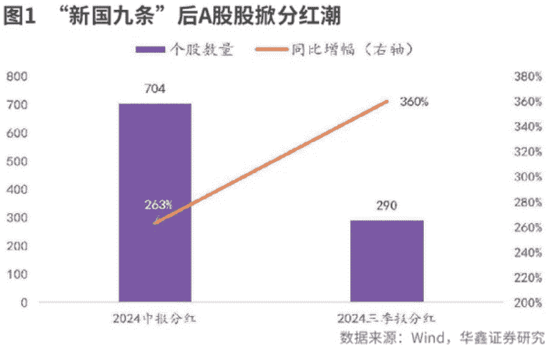

**图 2 具备低负债、高现金流特质的企业现金分红比例更高**
| 现金分红比例所处分位数组别 | 现金分红比例 | 资产负债率 | 净利润现金含量 |
| :--- | :--- | :--- | :--- |
| 0-10% | 0% | 63 | 154 |
| 10-20% | 9% | 49 | 143 |
| 20-30% | 15% | 48 | 124 |
| 30-40% | 22% | 44 | 156 |
| 40-50% | 27% | 47 | 182 |
| 50-60% | 32% | 47 | 201 |
| 60-70% | 37% | 46 | 199 |
| 70-80% | 46% | 42 | 185 |
| 80-90% | 60% | 38 | 203 |
| 90-100% | 130% | 37 | 290 |
数据来源：Wind, HTI, 海通国际 注：数据为 2018-2023 年均值

**图 3 国有五大行加权平均股息率比无风险利率仍具备比价优势**

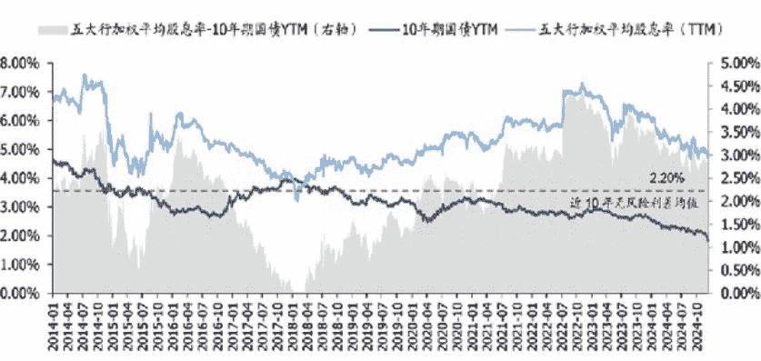

注：1.图表数据截至 2024 年 12 月 20 日; 2.图表所示股息率 (TTM) 为日收益为权重计算的加权平均值

数据来源：Wind，国盛证券研究所

**图 4 保险权益资产仓位 2024 年二季度开始快速提升**

保险资金运用余额：股票 + 证券投资基金：占比

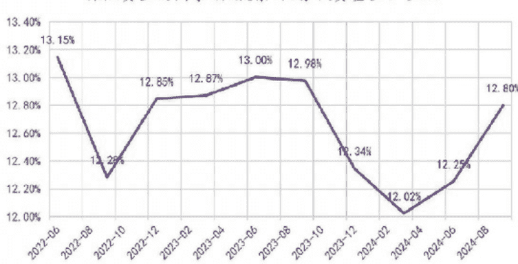

数据来源：Wind，华鑫证券研究所

板块提供了重要的增量资金。此外，近期红利/低波类 ETF 出现明显流入，指向有更多的市场投资者正在加大对红利类资产的配置力度。

华鑫证券认为，市场风险偏好抬升，叠加前期险资在银行、公共事业、运营商等稳健型红利类资产上已有较重仓位，险资投资范围扩张，近期举牌个股股息率明显下沉且行业布局扩散，消费板块等中长期盈利能力稳定、分红意愿较强的个股同样契合险资长期投资理念。

# 上市公司多分红受到认可

根据华鑫证券的统计，截至 2024 年 12 月 20 日，已有 704 家上市公司公布了中报分红方案，同比增长 263%; 290 家公司发布了三季度分红方案，同比增长 360%。A 股分红制度化、高频化方向发展。

兴业证券表示，近期分红手续费调降、市值管理等资本市场政策相继落地，进一步加强了对上市公司的分红引导。与此同时，11 月以来，上市公司分红行为也呈现出诸多积极变化，分红意愿、频次持续提升，近期多家行业龙头首次发布中报分红、三季报分红、甚至春节前特别分红预案等，进一步增强股东回报，也提升了市场对红利资产的关注度。

## 投资品种更需甄别

当下的红利资产处于什么样的市场热度？海通国际表示，从代表性指数看，目前红利板块估值处在历史低位、交易热度处中位水平。从交易指标看，代表性红利指数的关注度同样有所降温。从代表性行业看，红利板块中多数行业热度均已处在历史中等偏下水平。从代表性个股看，整体热度处在历史中等水平附近，但存在结构性差异。

由于红利策略的超额收益与市场行情具有明显的负相关性，因此判断短期市场表现对于红利资产的相对走势较为重要。近期市场交易热度显示 A 股整体情绪有所降温，11 月中旬以来融资余额流入速率也在逐渐放缓，对应到宽基指数走势自 11 月中以来逐渐步入震荡。海通国际认为，在此背景下，红利资产获得超额收益的胜率或提升，再加上当前红利资产的估值和交易热度已整体不高，短期红利性价比或有所上升。

华鑫证券表示，在利率下行、国内宏观景气拐点仍需时间、上市公司分红明显高频化制度化、险资 OCI 账户配置需求仍在的背景下，泛红利资产依旧存在长期占优基础。随着高股息板块行情的出圈，市场对于红利资产研究明显精细化，红利不再局限于银行、公共事业、运营商等稳健型红利类资产上，尤其是在当下市场风险偏好明显抬升之际，组合更应该挖掘更多中长期盈利能力稳定、分红意愿较强的个股。

国盛证券建议关注高股息、低估值，以及业绩稳增长、风险计提充分的银行标的，还可综合考虑交易因素，流通性较好、可转债强赎后抛压较小的标的。

国泰君安认为，对比主要红利行业的龙头公司，固废水务公司估值有相对优势，资产负债表更具修复潜力，配置价值明显。

财通证券建议提前布局消费红利和港股红利。央企红利更受益于并购、市值管理等政策利好，其中筛选股息率相对高 + 基本面稳固的标的胜率和赔率俱佳。消费红利当前相对估值低位，拥挤度之前也至低位，近期看热度有在修复，未来可以展望更多消费端有力政策支撑，当前可考虑提前布局。港股红利当前相对 A 股红利低位，历史港股红利往往能承接 A 股红利行情外溢，南向资金流入港股红利增加为前瞻指标; 当前南向流入港股红利正在增加。

## 2025:政策强劲 慢牛可期

本刊特约 玄铁

年关临近，2025 年行情如何？乐观来看，A 股蓝筹估值的洼地效应显著，以权重股估值抬高为标志的慢牛行情大概率到来。

### 牛市引擎：政策利好延续

周二（12 月 24 日），标普 500 收于 6040 点，年内涨幅达 26.63%，这一涨幅在过去 16 年里列第四位，较 2009 年的低位累计上涨逾 8 倍。16 年里，空头缴械投降成为常态。有媒体调查包括美银等在内的十家顶级投行，多数预测标普 500 指数明年涨幅低于 11% 的历史均值，平均目标位为涨幅一成至 6550 点附近。其中九家看多，仅法兴持中性观点（预测明年年底为 5800 点）。

相比美股的牛长熊短，A 股仍未摆脱牛短熊长的格局。对比来看，美国、日本、印度大牛市的本质是资金推动，是产业资本（上市公司注销式回购）和国内外投资者增加股市配置的共振效应。A 股慢牛长牛也可期，目前只欠耐心资本齐至的东风。

证监会日前强调：坚决落实“稳住楼市股市”重要要求。可行路径是协同构建完善“长钱长投”的制度环境，让长投者赢。乐观来看，低利率环境已率先让蓝筹回报吸引力大增。截至周三（12 月 25 日），全国性银行指数年内上涨 46.91%，平均市盈率和市净率分别为 6.42 倍和 0.38 倍，15 家样本股的股息率中位数为 6.63%。

### 做多中国：2025 年有望飘红

不少圆桌会议的熟面孔、瑞士 Zulauf 咨询公司的负责人 Felix Zulauf 预测，美股牛市将在 2025 年见顶。看空因素至少包括：美联储资产负债表降至约为 7 万亿美元；美元被高估 15%~20%；赢家集中持股大型科技股。

短线来看，美股强势上涨惯性仍在，A 股则有望延续跨年度行情。在 A 股 34 年历史里，沪综指新年开门红有 21 次，明年开门红和全年飘红的概率较大。

年 K 线图显示，沪综指两阴夹一阳形态仅出现三次，分别为 2003 年（当年上涨 10.27%）、2012 年（涨 3.17%）和 2017 年（涨 6.56%），这三年均是长熊周期中下跌中继。截至周三，沪综指年内涨幅约为 14%，放量上攻，年度成交逼近 2015 年的历史天量水平。量在价先，后发力仍强劲。

在 2023 年底，笔者唱多 2024 年中国股市的最大理由，是年 K 线沪深 300 不会四连阴，恒指不会五连阴。这种暴跌明显脱离基本面，因为道指仅有一次年 K 线三连阴，背景是 1920 年代的大萧条。当下，继续唱多 2025 年中国股市，最大依据是政策牛仍在。国家全面救市不会半途而废，且政策工具箱里重磅利好极多。不妨听下日前发出的政策最强音：要与各种不确定因素抢时间……不断巩固经济回升向好势头。

至简策略是，将央企权重股未来几年的注销式回购尺度向苹果公司看齐，年度回购金额接近当年净利润。目前，工行全部 A 股总数约为 2696 亿股，扣除汇金和财政部的持股，所剩约 347 亿股，对应市值约为 2408 亿元，远低于其今年前三季度的净利 2690 亿元。工行 A 股和摩根大通的市盈率分别为 6.63 倍和 13.45 倍，存在着估值鸿沟。

### 风格轮换：多为延长繁荣

12 月 12 日，沪综指创本月新高，微盘股指数创年内新高，北证 50 则提前在 11 月 8 日率先见顶。三者周三收盘价较年内峰值分别缩水 7.65%、15.2% 和 24.7%。小市值股缘何跑输大盘？答案是监管出现新动向。12 月 16 日，上交所组织券商开展 12 月的自查工作。本周二，深交所启动了“理性投资伴我行”专项工作。量化交易和“炒小炒差”现象先后成为监管重点。谨慎来看，加强监管更多是为了延长牛市繁荣时间，而非人为地砸碎估值泡沫。

本周，《国务院关于规范中介机构为公司公开发行股票提供服务的规定（草案）》获通过，地方政府激励新股上市的奖励措施被禁止。此举倒逼地方政府转向大力支持并购，明年是并购大年（提升存量估值）的概率远大于 IPO 大年（稀释存量财富），这是培育蓝筹牛市的制度红利。

与此同时，工行等权重股本周屡创新高，几个显眼的数据在财经网页上刷屏：在 5381 只 A 股中，451 家央企的总资产规模占比约 60%，利润占比约 52%，股票市值占比仅为 32%。央企股缘何被低估？在中证指数编制中，样本股的自由流通股数剔除了持有比例超过 5% 的大小非，央企权重占比因此降低。

同花顺数据显示，中移动、工行和建行总市值分别为 2.48 万亿元、2.47 万亿元和 2.22 万亿元，年内涨幅分别约为 21.8%、55.1% 和 45.3%，三者均未能进入沪深 300（年内涨幅约为 16.2%）前十大权重股的名单。可见，今年以来，权重股占比低，阻碍了 A 股赚钱效应的发酵，未能像标普 500 一样更具可操作性。

(作者系职业投资人。文中个股仅为举例分析，不作买卖推荐。)

## AI 模型迭代推动应用落地

### 智能眼镜发展浪潮或已到来

本刊特约 梁杏

随着 AI 大模型不断迭代升级，终端应用渗透率也在持续提升。上周闪极发布旗下首款 AI 眼镜，核心部件国产化率达九成以上，接入多款国内大模型。国内厂商在 AI 眼镜技术上持续突破，相关厂商将受益于终端放量。

### AI 模型不断升级 终端应用大规模落地

近期备受关注的 OpenAI 连续 12 天的发布会结束，在最后一天，OpenAI 宣布了 o3 系列模型，包括 o3 和 o3 mini，整体能力较 o1 模型再次提升。目前 o3 系列仅为成果宣布，正在推进外部安全测试，预计有望在明年 1 月底左右推出 o3 mini，后续再推出完整版。

根据 OpenAI 介绍，o3 代码能力接近甚至超越人类专业程序员。另外在美国数学竞赛 AIME 2024 中，o3 的准确率高达 96.7%，与 o1 的 83.3% 相比，有了显著的提升。此外，o3 成为首个突破 ARC-AGI 的模型，也意味着具备了理解人类复杂逻辑和抽象的能力。

另一方面，国内大模型的进展超出市场预期。上周字节跳动正式发布豆包视觉理解模型，该模型不仅在数学、物理、图表、代码等方面加强推理能力，而且千 tokens 输入价格仅为 3 厘，一元就可处理 284 张 720P 的图片，比行业价格便宜 85%。

从豆包的使用量来看，据 IT 商业科技网，2024 年 11 月豆包 APP 的 MAU（月活跃用户数量）已高达 5998 万人，紧随 OpenAI 的 ChatGPT 之后，位列全球第二、全国第一。另据量子位消息，11 月平均每天有 80 万新用户下载豆包。

当然市场更加关注新终端品类的推出，特别是近期 AI 眼镜的关注度较高。2021 年 Meta 与雷朋开始对 AI 眼镜的尝试，联名推出初代智能眼镜 Ray-Ban Stories，在两年内只卖出了 30 万台。而二代眼镜在 2023 年 9 月推出，今年 4 月搭载 Llama 模型后，根据 VR 陀螺数据，2024 年上半年累计出货量就超 100 万台。

有 Meta 与雷朋的成功案例之后，国内外科技巨头争相布局 AI 眼镜。今年 11 月，百度发布首款搭载中文大模型的小度 AI 眼镜，产品重量 45 克，搭载 1600 万像素超广角摄像头，具备第一视角拍摄、边走边问、识物百科、视听翻译、智能备忘等功能。

上周闪极发布首款 AI 眼镜产品“闪极 AI 拍拍镜”，接入数十家大模型，还可以通过内置的 AI 应用商店实现对于各种 AI 能力的灵活调用。随着 AI 端侧各项应用发展态势良好，相关产业链有望持续受益。

### 眼镜价格下沉 推动零部件放量

由于人类所接受的信息 80% 是来自于视觉，AI 眼镜作为智能终端具有交互方式的天然优势。此外 AI 大模型在图片、视频、音频等方面的多模态能力取得突破后，眼镜就成为 AI 落地优质载体。

据 Wellsenn XR 预测，2029 年 AI 智能眼镜年销量有望达到 5500 万副；2035 年，AI+AR 智能眼镜最终实现传统智能眼镜的替代，达到 70% 的渗透率，成为下一代通用计算平台和终端。

与同类竞品相比，闪极 AI 眼镜最重要的特点是价格下探。Meta 与雷朋眼镜的售价为 299 美元起，而闪极 AI 眼镜仅售 999 元，表明其综合成本的优势，也有利于让更多消费者体验到可穿戴智能设备的便利。

零部件层面，闪极 AI 眼镜主芯片、触控和语音芯片、存储、扬声器、麦克风、电池等，核心部件国产化率高达 9 成以上，因此也会给国内半导体芯片、消费电子产业链带来需求成长的机会。

目前消费电子整体处在复苏周期，地方消费补贴陆续出台，未来更大范围的政策支持也有望落地。AI 有望催化手机、PC 等的换机周期，同时也对硬件方面产生新的要求，推动产业链创新升级。

同时端侧大模型的应用，会使得 AI 服务器的数据传输量面临挑战，算力需求增长较快。字节已经在全球布局数据中心，国内如京津冀、大湾区等，海外包括东南亚、中东等地区，因此算力基础设施建设和自主可控成为重要投资主线。

数据中心算力领域中，目前服务器与交换机，以及交换机与交换机之间接口速率已经从 100G、400G 快速向 800G、1.6T 等演进。未来以高速率光模块为代表的通信设备板块，仍然有较好的业绩兑现能力和投资机会。

> (作者系某公募指数投资总监。文中基金仅为举例分析，不作买卖推荐。)

## 北交所受理企业数量居首

### 创业板终止和注册生效企业数量最多

刘榕

截至 12 月 24 日，京沪深交易所年内受理企业 46 家，北交所贡献近九成；年内终止企业和注册生效企业各 436 家和 96 家，创业板分别贡献 34.63% 和 40.63%；此外，年内北交所、创业板及科创板上市委会议审议通过率均达到 100%。

2024 年已近尾声，京沪深交易所在这一年的 IPO 审核从受理、会议审议到注册生效或终止都呈现出与往年截然不同的特征。

### 受理企业以北交所为主

截至 12 月 24 日，三大交易所年内共受理 46 家 IPO 企业。创业板和沪市主板均为零贡献，北交所贡献 41 家，另外五家则分别来自深市主板和科创板。

北交所受理的 41 家企业中，专注于工业废水处理技术研发、工艺设计、运营管理的北京今大禹环境技术股份有限公司还没完成首轮问询回复便主动撤回材料终止审核，专业从事汽车自动变速器摩擦片研发、生产和销售的江苏林泰新材科技股份有限公司则已发行上市，其余 37 家均还在审核中。

深市主板只在 6 月受理了 1 家 IPO 企业——专注于天然铀和放射性共伴生矿产资源综合利用业务的中国铀业股份有限公司，目前因财务资料更新而中止审核，尚未完成首轮问询回复。

科创板共受理 4 家企业。6 月和 9 月各受理一家企业，分别为专注于高端绿色电解成套装备、钛电极以及金属玻璃封接制品研发、设计、生产及销售的西安泰金新能科技股份有限公司，和聚焦于特色存储、数模混合和三维集成等业务领域的半导体特色工艺晶圆代工企业武汉新芯集成电路股份有限公司，目前这两家公司均尚未完成首轮问询回复；11 月受理两家企业，分别为从事机器人关节高精密减速器的研发、设计和生产的浙江环动机器人关节科技股份有限公司和专注于 12 英寸硅片研发、生产和销售的西安奕斯伟材料科技股份有限公司。

这与三大交易所在 2023 年的受理情况迥然不同。2023 年，三大交易所共受理企业 474 家，其中北交所 158 家，创业板 113 家，科创板 74 家，深市主板 52 家，沪市主板 77 家（其中沪深主板不包含因注册制实施而受理的平移企业）。

### 上市委会议通过率有所提高

截至 12 月 24 日，三大交易所年内共召开 57 次上市委会议，不及 2023 年全年的四分之一，会议审议 55 家企业，53 家通过会议审议，过会率 96.36%，高于 2023 年的 93.27%。

从各板块来看，在上市委会议召开次数、会议审议企业数量及过会企业数量上，北交所和深市主板分列首末位。

截至 12 月 24 日，北交所年内共召开 25 次上市委会议，为上年全年的 36.23%；会议审议 23 家企业，为上年全年的 32.86%，全部通过会议审议，其中江苏天工科技股份有限公司和陕西科隆新材料科技股份有限公司均经历了在首次会议审议中被暂缓审议，二次会议审议方才通过的审核过程。

科创板年内共召开 10 次上市委会议，为上年全年的 30.3%；10 家企业参加会议审议，为上年全年的 27.78%，全部通过会议审议。

沪市主板年内共召开 10 次上市委会议，为上年全年的 25%；参加会议审议的企业数量为 10 家，为上年全年的 20%，其中 9 家通过会议审议。

创业板年内共召开 9 次上市委会议，为上年全年的 12.68%；参加会议审议的企业数量为 9 家，为上年全年的 8.33%，全部通过会议审议。

深市主板年内共召开 3 次上市委会议，为上年全年的 12.5%；参加会议审议的企业数量为 3 家，为上年全年的 9.09%，其中 2 家通过会议审议。

从过会率来看，北交所、科创板和创业板过会率均达到 100%，均高于其 2023 年过会率。2023 年，这三板块过会率分别为 91.43%、88.89% 和 92.59%；沪深主板过会率分别为 90% 和 66.67%，低于其 2023 年过会率。2023 年，沪深主板过会率分别为 96% 和 100%。

创业板年内终止企业 151 家，比上年全年增加 42 家，是终止企业数量最多的板块。其中 94 家在问询期间主动撤回材料终止审核，约占同类终止企业数量的 26%，比上年全年增加 4 家；50 家在通过上市委会议审议后主动撤回材料终止审核，约占同类终止企业数量的 86%，比上年全年增加 42 家；7 家在提交注册后主动撤回材料终止注册，占同类终止企业数量的 70%，比上年全年增加 2 家。

沪市主板年内终止企业 78 家，比上年全年增加 39 家。其中 71 家在问询期间主动撤回材料终止审核，比上年全年增加 33 家；5 家在通过上市委会议审议后主动撤回材料终止审核，比上年全年增加 5 家；1 家未通过上市委会议审议，和上年全年持平；1 家在提交注册后主动撤回材料终止注册，这也是沪市主板首家终止注册的企业。

科创板年内终止企业 75 家，比上年全年增加 14 家。其中 71 家在问询期间主动撤回材料终止审核，比上年全年增加 20 家；3 家在通过上市委会议审议或会议结果为暂缓审议后主动撤回材料终止审核，比上年全年减少 1 家；1 家在提交注册后主动撤回材料终止注册，比上年全年减少 3 家。

沪市主板和科创板年内均有 15 家企业注册生效，分别为上年全年的 35.71% 和 22.39%，且两板块的注册生效企业中均有 9 家企业已发行上市。

深市主板年内有 7 家企业注册生效，为上年全年的 26.92%。其中 3 家企业已发行上市。此外，深市主板还有一家注册生效企业在注册有效期内未能如期发行——主要从事激光切割设备研发、生产和销售业务的广东宏石激光技术股份有限公司（下称“宏石激光”）。

创业板年内有 39 家企业注册生效，为上年全年的 34.82%。其中 30 家企业已发行上市。而且，创业板也有一家注册生效企业在注册有效期内未能如期发行——深圳华强电子网集团股份有限公司（下称“华强电子网集团”）。

### 终止企业数量创业板居首

截至 12 月 24 日，三大交易所年内有 436 家企业终止审核或终止注册，比上年全年终止企业数量增加近 50%。

其中 366 家在问询期间主动撤回材料终止审核，59 家在通过上市委会议审议后主动撤回材料终止审核，1 家未通过上市委会议审议，10 家在提交注册后主动撤回材料终止注册。

分板块来看，截至 12 月 24 日，北交所年内终止企业 78 家，比上年全年增加 34 家。

其中 76 家在问询期间主动撤回材料终止审核，比上年全年增加 37 家；1 家在通过上市委会议审议后主动撤回材料终止审核，比上年全年减少 1 家；1 家在提交注册后主动撤回材料终止注册，和上年持平。

深市主板年内终止企业 54 家，比上年全年增加 12 家，是终止企业数量最少的板块。54 家终止企业全部在问询期间主动撤回材料终止审核，比上年全年增加 13 家。

### 注册生效企业数量创业板最多

截至 12 月 24 日，三大交易所年内有 96 家企业注册生效，是上年全年注册生效企业数量的 30%。其中 69 家企业已发行上市，还有 2 家企业在注册有效期内未能如期发行。

分板块来看，截至 12 月 24 日，北交所年内有 20 家企业注册生效，为上年全年的 27.4%，其中 18 家企业已发行上市。

深交所官网显示，华强电子网集团于 2023 年 9 月 13 日获证监会批复注册生效。和宏石激光类似，这一注册生效结果也没有及时披露，而是在注册生效有效期过了五个月后的 2024 年 2 月 20 日才予以披露。

9 月 13 日，华强电子网集团间接控股股东深圳华强（000062.SZ）发布公告称：“公司子公司华强电子网集团于 2024 年 2 月 8 日收到中国证券监督管理委员会（下称“中国证监会”）发布的《关于同意深圳华强电子网集团股份有限公司首次公开发行股票注册的批复》，该注册批复自中国证监会同意注册之日（2023 年 9 月 13 日）起 12 个月内有效。华强电子网集团未在 2024 年 9 月 12 日前实施本次股票发行，前述注册批复到期自动失效。华强电子网集团仍为公司合并报表范围内的子公司，前述注册批复到期失效不会对公司的经营活动产生重大影响。”

## 美国财富不平等的幂律分布

本刊特约 姚斌

经济学家托马斯·皮凯蒂曾引导世人关注所得分配向金字塔顶尖集中的现象，这使人注意到顶层群体惊人的所得增长。《金融化与不平等》的作者德克萨斯大学奥斯汀分校社会学教授林庚厚和科罗拉多州立大学社会学系助理教授梅根·尼利，他们都专注于研究“不平等”的问题。他们看到了美国的不平等程度在过去 40 年间急剧上升，其不平等加剧趋势相当惊人。

### 不平等来自经济金融化

经济不平等是我们这个时代最迫切的社会问题。自 1980 年代以来，最为人所知的不平等趋势是所得分配向金字塔的顶层集中。从 1980 年到 2014 年，在美国占比 1% 的顶层人的所得在税前国民所得中的占比近乎倍增，从 10.7% 增至 20.2%。这些人多是企业高管、律师和金融业人士，以及依靠投资食利的富裕家庭。最顶层的所得增长更加惊人：顶层的 0.1% 在国民所得中的占比，从约 1% 增至约 5%。

美国这种不平等加剧并不是技术进步和全球化的自然或必然的结果，而是金融崛起。自 1980 年代以来，金融崛起借由三个互相关联的机制扩大了不平等。将国家的资源从生产部门和家庭转移到金融业，但并未贡献相应的经济效益；将企业的发展导向金融市场，削弱了资本与劳动力的依赖关系；将经济不确定性从社会组织转移到个人身上，使家庭对金融服务的需求增加。

银行业新模式崛起，就是导致国家资源大量转移至金融业的成因。1980 年初，非利息收入占美国商业银行总收入不到 10%，但其重要性随后不断上升，2000 年代初增至占总收入超过 35%。也就是说，现在银行业者总收入逾 1/3 来自非传统银行业务，大银行尤其如此。例如，在 2008 年金融危机之前，摩根大通的利息收入约为 520 亿美元，但非利息收入高达近 940 亿美元，其中一半来自投资银行和创投的业务，1/4 来自交易业务。2007 年，美国银行约 47% 的总收入来自非利息收入，包括存款账户服务和信用卡服务产生的收入。

随着美国企业将重心从生产活动转移至金融活动，购买金融资产而非购置商店、厂房和机器，劳动力不再是创造利润的关键要素，从事生产工作的劳工变得没那么有价值。对许多企业来说，最重要的客户不再是自家产品的消费者，而是自家股票的投资者。美国非金融企业至 20 世纪初以来，一直有提供某一程度金融服务的传统。身为第一家提供贷款的汽车制造商，通用电气于 1919 年成立通用汽车金融服务公司，为顾客和经销商购买汽车提供融资服务。这促使福特汽车于 1959 年成立福特汽车信贷公司，克莱斯勒在 1964 年成立克莱斯勒信贷公司。提供信贷成为美国汽车制造商的标准做法。

在企业经营多元化的过程中，金融逐渐从一门会计和预算编制技术升级为一门决策科学。因为这些企业不再专注于某项特定产业，金融专业人员开始取代特定行业专家成为企业高管。在他们眼中，企业的每一个单位都是可买卖的金融资产，应根据其盈利能力加以评估，据此决定扩大业务或裁员卖出。随着金融人员主导企业管理层，加上股东价值运动导致企业更渴求获利，于是企业“在缓慢增长的经济中快速发展”出新方向。

## 读书介绍：

金融崛起迅速扩大了美国的经济不平等。在这个过程中，家庭债务大增是非常重要的一环。

金融资产无疑是财富差距巨大的主要原因。股票和债券占富裕家庭资产组合的比例愈来愈大，而其他金融资产的重要性也随着时间的推移而提高。

从全球范围看，最富阶层的资产，包括那些通过继承获得的巨富，在过去几十年的增长速度都非常快，其增速要远远高于社会总财富的平均增速。

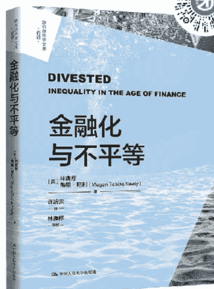

一些企业甚至模仿对冲基金，动用资金投资于金融市场。试图重塑零售业的爱德华·兰珀特就是一个好例子。西尔斯和凯马特于 2005 年合并后，兰珀特将公司的零售业务产生的现金流拿来进行投机交易。在 2008 年金融危机的前一年，西尔斯 1/3 的税前利润来自金融投机交易。当时，兰珀特还因为他看似高明的金融操作被誉为下一个巴菲特。

同样的，安然在 2001 年破产之前，与其说是一家能源公司，不如说是一家大宗期货和衍生工具交易公司。安然创立了电力交易市场，它的交易大厅每天处理 25 亿 -30 亿美元的大宗期货交易。一名华尔街分析师在 2000 年估计，标准普尔 500 指数成分股近 40% 的盈利来自放款、交易、创业投资和其他金融活动，当中的 1/3 由非金融企业赚取。

金融崛起迅速扩大了美国的经济不平等。在这个过程中，家庭债务大增是非常重要的一环。1980 年以前，美国家庭债务平均约为年度可支配所得的 65%。随后 20 年间，家庭债务稳步增加，与可支配所得的比率在 2002 年甚至达到 100% 以上。这种趋势于 2008 年持续，并在大衰退爆发时达到 132% 的历史高点。中产阶级家庭的财富比有钱人少，但能比穷人容易获得信贷，他们在金融化时代背负了更多债务。

### 10% 家庭拥有 80% 股票

经济金融化改变了家庭财富。自 20 世纪最后 25 年以来，美国的财富不平等显著加剧。现在愈来愈少的美国家庭有能力长期累积财富，而资本集中在少数人手上扩大了富豪与其他人的差距。金融资产无疑是财富差距巨大的主要原因。股票和债券占富裕家庭资产组合的比例愈来愈大，而其他金融资产的重要性也随着时间的推移而提高。于是，财富最多的 10% 家庭拥有市场上约 80% 的股票，管理这些资产的金融公司因为财富高度集中和家庭之间财富差距巨大而得益。

如同所得不平等，财富不平等在过去一个世纪的演变呈明显的 U 型曲线。20 世纪初的财富平等非常严重，美国 1% 的顶层家庭拥有全国约 1/4 的财富。1929 年的大崩盘以及两次世界大战的大规模破坏，缩小了贫富之间的财富差距。1950-1970 年代，财富不平等保持在较低的水平。在此期间，底层 90% 的家庭在全国财富中的占比从 20% 增至 35%。这种趋势于 1980 年代逆转。虽然美国全国的财富继续增加，但经济增长的成果几乎全部落入最富有的 20% 的家庭。

财富日益集中在有钱人手里，他们将财富和财富造就的更好人生机缘传给子孙后代。所谓的人生机缘是指，一个人获得的资源和机会，决定了这个人的生活质量和改变生活质量的能力。自 1970 年以来，有钱人在照顾、教育和培养年幼的孩子这些方面的投资已经是原本的 3 倍，贫富家庭幼儿的发展因此出现了显著的差距。对富裕家庭来说，“输人不输阵”已经变成了“赢人又赢阵”的局面。

顶层的 1% 群体可以把更多的金钱投资于金融市场，进而加剧财富不平等。社会学家利萨·凯斯特认为，财富进一步集中在有钱人手里，部分原因在于中上层的投资方式与众不同。富裕家庭可以承受金融市场的波动，他们因此更有可能投资在高风险、高回报的金融资产上。金融化时代开始以来，股市兴盛带给这些家庭非凡的回报。中产阶级则将大部分财富放在房地产上，而美国的房地产回报率却低于股票，而且较难变现。

在财富不平等加剧的同时，资产配置差异也扩大了。在最富有的 1% 家庭中，商业利益平均占总资产的 37%，也就是说，开公司做生意仍是最富裕家庭的关键财富来源。但自从 1990 年代中期以来，金融资产已经超过了商业利益，从 1989 年占最富裕家庭总资产的 32% 增至 2016 年的 42%。期间，股票所占的比例倍增，从占总资产的 12% 增至 25%，而汽车和房屋等非金融资产的重要性则显著降低，从占总资产的 30% 降至 20%。

10% 的顶层家庭当中的其他 9% 的家庭也呈现类似趋势。1989 年，股票占这些家庭总资产的 10%，后来增至 28%；总金融资产所占的比例从 36% 增至 51%。汽车和房地产之类的有形资产从占总资产的 45% 降至 34%。接下来的 40% 家庭也呈现类似趋势：1989 年 -2016 年，股票占这些家庭总资产的比例从 6% 增至 15%，总金融资产所占的比例则从 27% 增至 35%。

但居于底层的另一半家庭情况就大不相同。在林庚厚和梅根·尼利研究的那段时期，股票占这些家庭的总比例从 2.5% 增至 5.3%，但总金融资产所占的比例从 20% 跌至 18%。非金融资产仍占这些家庭财富的绝大部分——高达 80% 左右。也就是说，这 50% 家庭没有盈余可以用来投资于家庭的未来。如果有钱，他们通常先买一所房子或买一辆汽车来维持生活。在美国，这些资产是有助于稳定家庭生活的必需品，但对累积财富没什么帮助。

于是，相较于财富的整体分配情况，股票集中在少数人手上的程度十分严重。美国最富有的 1% 的家庭控制着美国人拥有的约 40% 的股票，随后的 9% 的家庭同样拥有约 40% 的股票。底层 90% 的家庭总共仅拥有 20% 的股票。最富有家庭的股票投资规模巨大，他们持续将愈来愈大比例的股票投资交给基金经理管理。过去 30 年间，专业管理的股票占富裕家庭总持股的比例从 40% 大增至 75%，而底层 90% 家庭直接持股比例则一直徘徊在 10% 左右。

### 财富和收入的历史动态

法国著名的经济学家托马斯·皮凯蒂曾在十五年中致力于对财富和收入的历史动态研究，著有《21 世纪资本论》。他通过研究 19 世纪到一战前欧洲国家所经历的财富及不平等的发展过程，同时观察最近几十年来全世界巨富阶层爆炸式的财富增长趋势，作出如下解释：从长期来看，资本收益率明显超过经济增长率。两者之差导致初始资本之间的差距一直延续下去 (资本持有者只需将资本收入的一小部分用于保持自己的生活水平，而将大部分用于再投资)，从而造成资本的高度集中。

皮凯蒂的研究与林庚厚和梅根·尼利研究互为印证。在财富分配最平等的社会，最富裕的 10% 人群占有国民财富的约 50%。自 2010 年以来，在大多数欧洲国家尤其是在德国、法国、英国和意大利，最富裕的人群占有国民财富约 60%。最令人惊讶的事实无疑是，在所有这些社会里，半数人口几乎一无所有，最贫穷的 50% 人群占有国民财富一律低于 10%，一般不超过 5%。在法国，最富有的 10% 占有总财富的 62%，而最贫穷的 50% 只占有 4%。在美国，最上层的 10% 占有总财富的 72%，而最底层的半数人口仅占 2%。在这样一个社会，最贫穷的半数人口一般都是庞大数目，一般占总人口的 1/4，他们根本没有什么财富，或者顶多几千欧元。

一个无法逃避的现实是：财富非常集中，社会中大部分人几乎意识不到它的存在，于是一些人想象财富是超现实或神秘的实体。这就是为什么系统研究资本及其分配如此重要的原因。即便是财富分配最上层的 10% 人群内部也极不平等。最上层 1% 的人群财富比重一般约为 25%，其余 9% 的人占比约 35%。因此，第一集团成员的富裕程度是社会成员平均值的 25 倍，而第二集团的成员是社会平均值的 4 倍。尤其在 20 世纪 70 和 80 年代，前 1% 人群的收入出现了令人眩晕的增长。从全球范围看，最富阶层的资产，包括那些通过继承获得的巨富，在过去几十年的增长速度都非常快，其增速要远远高于社会总财富的平均增速。

此外，财富的构成在这个人群中差异也很大。最上层 10% 几乎每人都拥有房产，但随着财富层级的上升，房地产的重要性急剧下降。在最上层的 1% 中，金融和商业资产明显超过房地产。尤其在最巨量的财富中，股票、合伙企业股权几乎占据全部。房产是中产阶级和小康阶层最喜欢的投资形式，但真正的巨富总是主要由金融和商业资产构成。

最贫穷的 50% 和最富裕的 4% 之间是中间的 40%，这个“财富中产阶层”占有国民财富总额的 35%。然而，财富分配中间的 40% 几乎和最底层 50% 一样贫穷，那中产阶层也就不存在了。大多数人几乎一无所有，而绝大部分社会资产只属于少数人。这不是数量极少的少数人：最上层 10% 所涵盖的精英远多于最上层 1%，但在最上层的 10% 和 1% 人群中，斜率极其陡峭。所以，从最贫穷的 90% 到最富裕的 10% 是一个突然的转变。

达到这种高度不平等的第一种方式是“超级世袭社会”（或“食利者社会”）：在这样的社会中，继承财富非常重要，财富集中度达到极端水平——最上层 4% 人群一般占有全部财富的 90%，仅最上层 1% 就占有 50%。达到这种高度不平等的第二种方式主要是美国在过去几十年间创造的。非常高的收入不平等可能是一个“超级精英社会”的结果，也可以称为“超级明星社会”。其收入层级顶端是非常高的劳动收入，而非继承财富收入。美国劳动收入不平等的加剧在很大程度上遵循了“精英”逻辑。这可能预示着，未来将出现一个新的不平等世界，比以前的任何社会都更极端。

今天，随着收入阶层的逐步提升，劳动收入的地位逐步削弱。目前，资本收入超过劳动收入只存在于收入分布中最高 0.1% 的人群中。最高 10% 人群的资本收入中很大比例来自股息及利息收入。以法国为例，9% 人群的资本收入比重在 1932 年和 2005 年均为 20%，而在最高 0.01% 人群中，这一数字却上升到了 60%。1% 人群的绝大部分收入是资本收入，特别是利息和股息。很显然，只有拥有足够多资产的人，才更可能到达整个收入层级的顶端，使得资本收入占据主导。

### 至关重要的经济机制

资产管理具有规模经济的效应，即资产管理规模越大，平均收益率就越高。假如一个投资者的资产丰厚，那么他比那些输不起的普通人就会更加愿意承担风险，也更能沉住气。因此，最富阶层的资产，包括那些通过继承获得的巨富，在过去几十年的增长速度都非常快，其增速要远远高于社会总财富的平均增速。这样的机制会自动导致资本分配的两极化，使得富者愈富，贫者愈贫。

如果最富的 0.1% 人群可获得 6% 的投资收益，而全球平均财富的增长率只有 2%，那么经过 30 年的发展，最富的 0.1% 人群将拥有全球 60% 的财富。即便 0.1% 的富人的资本收益率只有 4%，在经过 30 年发展后，他们也将占有全球财富总额的 40%。财富分布顶端差距扩大的力量将再次超越全球范围内的赶超和弥合差距效应，因此全球财富排名前 10% 和 1% 的人所拥有的财富比例会大幅升高，中产阶层和中上阶层的财富将更多流向超级富豪。

一旦财富超过某个规模门槛，就会以极高的速度增长，不论财富的拥有者是否还在继续工作。从 1990 年 -2010 年，微软公司创始人比尔·盖茨的财富从 40 亿美元增长到 500 亿美元，欧莱雅集团的继承人利利亚纳·贝当古的财富从 20 亿美元增长到 250 亿美元。这两人的财富在此期间以年均 13% 的速度增长，经通货膨胀因素调整后的实际增速约为每年 10%-11%。也就是说，这辈子从来没有工作过一天的利利亚纳·贝当古的财富增速与高科技巨擘比尔·盖茨的财富增速相同。

所以，一旦财富形成，资本就会按照自身规律增长，而且只要规模足够大，财富可能会连续高速增长数 10 年。一旦财富达到一定的规模门槛，资产组合管理和风险调控机制就可形成规模效应优势，同时资本所产生的全部回报几乎都能用于再投资。这是最为基本但至关重要的经济机制，对财富的长期积累和分布有着重大的影响。

经济学家西蒙·库兹涅茨在 1953 年提出“库兹涅茨曲线”理论。该理论认为，任何情形下的不平等都可以用“钟型曲线”来解释。皮凯蒂认为这个理论的产生在很大程度上是基于错误的原因，并且它的实证基础十分薄弱。有意思的是，无论是林庚厚和梅根·尼利，还是托马斯·皮凯蒂，都没有指出这种高度不平等的其实就是典型的幂律曲线。

因为幂律分布具有马太效应的特性，所以就会凸显“强者愈强，弱者愈弱”或“富者愈富，贫者愈贫”的局面。这种高度不平等自然会引发许多重大问题，但这不是本文所要讨论的。从林庚厚和皮凯蒂等人的研究来看，财富累积的途径主要来自传承与创业，拥有巨量的股权或债权是财富聚集的主要成因。未来的高度不平等问题去向何方，我们不知道。但历史自会开创新的道路，往往就在最出人意料之外。

(作者为资深投资人士)

## 成交量放大叠加互换便利工具 券商自营业务业绩弹性凸显

本刊特约 杨千

> 从竞争格局来看，马太效应下头部券商集中度进一步加强；从业绩弹性角度来看，上市券商自营业务增速的大幅攀升为业绩高增的主要推手。在资本市场政策信号不断向好的背景下，成交量放大叠加互换便利工具，有望增厚券商净利润弹性空间。

2024 年前三季度，上市券商业绩略有承压，但三季度显著好转，尤其是自营业务收入弹性凸显。三季度，上市券商整体收入和利润水平大幅回暖，但前三季度整体小幅下滑，ROE 水平略有下降。

前三季度，上市券商调整后营业收入同比下降 6.3%，归母净利润同比下降 6.1%；三季度单季，上市券商调整后营业收入同比增长 21.6%，归母净利润同比增长 41.6%；上市券商前三季度平均年化 ROE 为 5.5%，较 2023 年同期下降 0.7 个百分点。

分业务来看，上市券商前三季度自营业务收入大幅提升，其余各业务条线收入均有所下滑：自营、资管、经纪、信用和投行业务收入同比增速分别为 28.5%、-3.6%、-13.5%、-28.2% 和 -38.7%，自营业务收入大幅提升。

从投资角度分析，在 beta 层面，随着央行降息降准等利好政策的不断推出，券商板块的“反身性”在当下时点拥有较明确的顺逻辑，自营业务的弹性已凸显，整体板块静待业绩催化剂。在 alpha 层面，成交量快速放大改善券商基本面，经纪业务 + 两融业务收入占比高的高弹性券商较为受益；互换便利下券商加杠杆逻辑放大净利润弹性空间，央行创设的新的货币政策工具“证券、基金、保险公司互换便利”支持股票市场稳定发展，提振投资者信心。互换便利下券商加杠杆能力增加，净利润弹性空间放大，有望增厚净利润提升 ROE 水平。此外，“推动头部券商做强做优”的信号发出，利好头部及有兼并重组预期的券商，支持头部券商通过兼并重组等方式，做大做强，打造航母级别头部券商成为确定性较大的市场预期。

从竞争格局来看，马太效应下头部券商集中度进一步加强；从业绩弹性角度来看，上市券商自营业务增速的大幅攀升为业绩高增的主要推手。在资本市场政策信号不断向好的背景下，成交量放大叠加互换便利工具，有望增厚券商净利润弹性空间。

2024 年前三季度，上市券商归母净利润有所下降，但三季度实现大幅提升。具体来看，上市券商三季度单季实现归母净利润 389 亿元，同比增长 41.6%，较 2023 年同比大幅增长；上市券商前三季度实现归母净利润 1018 亿元，同比下降 6.1%，主要为 2024 年上半年业绩低迷所致。

### 三季度业绩显著提升

从 ROE 及净资产来看，行业整体 ROE 水平小幅下降，净资产稳步增长。上市券商 2024 年年化 ROE 水平小幅下滑：前三季度，上市券商年化 ROE 为 5.5%，较 2023 年同期下滑 0.7 个百分点。

虽然 ROE 同比下滑，但上市券商 2024 年净资产规模稳步提升：前三季度，上市券商净资产规模合计 2.6 万亿元，同比增长 4.5%，行业依靠净资产规模扩张实现增长的逻辑延续。

从盈利性角度分析，上市券商的权益乘数和资产周转率小幅提升，2024 年前三季度的平均权益乘数为 5，较 2023 年同期提升 0.2；资产周转率为 3.1%，较 2023 年同期提升 0.3 个百分点，但净利润率下降是 ROE 下滑的主要原因：2024 年前三季度，上市

### 图 1 2021-2024Q1-3 证券公司调整后营业收入情况

调整后营业收入（亿元） 同比增速（%，右轴）

注：调整后营业收入=营业收入 - 其他业务成本 数据来源：Wind、天风证券研究所

### 图 2 2021-2024Q1-3 证券公司归母净利润情况

归母净利润（亿元） 同比增速（%，右轴）

数据来源：Wind、天风证券研究所

券商平均净利润率为 27.7%，较 2023 年同期下降 6.7 个百分点。

在收入结构方面，上市券商自营业务稳居首位，占营收的比重超过四成；从收入结构的占比来看，自营、经纪、资管、信用和投行业务分列营收占比贡献前五位。2024 年前三季度，自营、经纪、资管、信用和投行业务占比分别为 44%、22.3%、11.2%、8.3% 和 7.3%。

从收入结构的变化来看，上市券商自营业务收入占比大幅提升，资管业务收入占比小幅提升，其余业务均小幅下降。自营业务收入占比大幅提升，较 2023 年前三季度增长 11.9 个百分点；资管业务收入占比小幅提升，较 2023 年前三季度微增 0.3 个百分点；经纪、信用和投行业务收入占比分别下降 1.9 个百分点、2.5 个百分点和 3.9 个百分点。

从收入结构归因分析来看，2024 年前三季度，上市券商自营业务收入显著提升，其余业务条线均承压拖累业绩。上市券商前三季度自营、资管、经纪、信用和投行业务收入同比增速分别为 28.5%、-3.6%、-13.5%、-28.2% 和 -38.7%。

除自营业务外各业务条线收入均下滑，投行承压明显，拖累上市券商整体营收。2024 年前三季度，上市券商自营、资管、信用、经纪和投行业务对整体业绩增速的贡献分别为 9.1%、-0.4%、-3%、-3.3% 和 -4.3%。

### 自营业务业绩弹性凸显

分业务来看，股基日均成交额小幅下降导致经纪业务收入略有下滑，但 2024 年三季度降幅收窄：三季度单季和前三季度，上市券商整体经纪业务收入均出现下滑，实现经纪业务收入 205 亿元、658 亿元，较 2023 年同期同比分别下降 14.6%、13.5%，但 2024 年三季度较 2023 年同期降幅收窄。

市场交投活跃度下降是经纪业务下滑的主因，市场交投清淡、股基日均成交额同比增速下降明显导致经纪业务收入普遍下降。市场交投活跃度有所下滑，两融存量规模震荡收缩，截至 2024 年 9 月底的两融月均余额为 14401 亿元，较 2023 年同期下降 9.5%。

2024 年 7 月 10 日，证监会批准暂停转融券业务及上调融券保证金比例，以稳定市场，切实维护投资者利益，此举影响证券公司的两融利息收入，进一步导致信用业务收入空间的收窄。2024 年前三季度股基累计日均成交额为 9209.6 亿元，较 2023 年同期下降 8.6%，其中，第三季度累计股基日均成交额仅为 8045.6 亿元，较 2023 年同期同比下降 12.3%。

交投活跃度下滑导致两融规模收窄，拉低信用业务收入。2024 年三季度单季和前三季度，上市券商整体信用业务收入均有所下滑，实现信用业务收入 78 亿元、244 亿元，同比分别下降 25.6%、28.2%。

两融利息收入占信用业务收入的大头，两融规模收窄影响信用业务收入。从信用业务收入结构来看，参考 2024 年上半年上市券商的两融利息收入占总信用收入的 37.2%，由此推断两融利息收入的变动会大幅影响信用业务的整体收入。

投行业务主要受监管政策边际变化的影响，2023 年 8 月 27 日，证监会出台了对 IPO 和再融资业务的政策新规，逆周期调节融资节奏，阶段性暂停再融资和收紧 IPO 致证券承销规模下滑，从而导致投行业务收入下滑。2024 年三季度单季和前三季度，上市券商实现投行业务收入 76 亿元、215亿元，同比分别下降 33.4%、38.7%。由于资本市场回暖，行业自营收入显著受益，自营业务收入显著上升。2024 年三季度单季和前三季度，上市券商实现自营业务收入 562 亿元、1299 亿元，同比分别增长 176.7%、28.5%。

上市券商金融资产规模稳步上升，截至 2024 年三季度末，上市券商金融资产规模合计 63230 亿元，较 2023 年同期增长 5.7%，增幅较 2023 年同期略有收窄，金融资产规模整体呈现稳步上升的趋势。

2024 年前三季度，权益市场和债市均呈上行趋势。前三季度权益市场反弹，指数大幅增长，上证综合指数涨幅较 2023 年同期上升 11.5 个百分点至 12.2%；债市表现为稳定上涨，中债综合指数涨幅较 2023 年同期上升 1.7 个百分点至 4.9%。

市场的较好表现使得 2024 年前三季度投资收益率上升，推动自营业务收入显著改善。上市券商前三季度投资收益率同比提升 0.4 个百分点至 2.2%，推动自营业务收入实现大幅增长，尤其是三季度单季。

受公募费改的影响，资管业务收入小幅下滑，主动管理业务改善业务结构。资管业务收入整体保持稳定，公募基金费改为下滑主因。2024 年三季度单季和前三季度，上市券商资管业务收入较为稳定，实现资管业务收入 109 亿元、330 亿元，同比分别下降 5%、3.6%。受到公募基金费改的影响，管理费调降拉低券商并表公募基金收入。

尽管业务收入小幅下滑，但资管规模小幅回升，主动管理业务提升管理费率。截至 2024 年三季度末，券商资管规模为 6.3 万亿元，较 2023 年同期增长 3.3%。从业务结构来看，集合资管规模为 2.6 万亿元，同比下降 0.1%；定向资管规模为 3.1 万亿元，同比增长 6.4%。从整体大趋势来看，券商集合资管规模占比提升趋势明显，资管业务向主动管理业务转型提升管理费率。

从成本端来看，营业成本略有下降，管理费用为成本端的核心组成部分。2024 年前三季度，上市券商营业成本为 1740 亿元，同比下降 5.3%。从收入结构占比来看，管理费用为券商营业成本的核心组成部分，占成本的比重持续提升。2024 年前三季度，管理费用占成本的比重高达 97.6%，较 2023 年同期上升 0.5 个百分点。信用减值损失、税金及附加和其他资产减值损失占比为 1.3%、1.1%、0.05%，较 2023 年同期分别下降 0.4 个百分点、0.1 个百分点、0.03 个百分点。

值得注意的是，从归母净利润角度来看，2024 年头部券商集中度大幅提升，马太效应凸显。2024 前三季度，头部前 5 家上市券商贡献了整体 52% 的归母净利润，行业集中度大幅提升，相较于 2023 年同期提升 8.1 个百分点；头部 5 家券商分别为中信证券、华泰证券、国泰君安、招商证券和中国银河，招商证券在 2024 年前三季度挤入头部阵容中。

同样，从调整后营业收入角度来看，2024 年头部券商集中度也进一步增强，实现强者恒强的局面。2024 年前三季度，头部前 5 家上市券商分别为中信证券、华泰证券、国泰君安、广发证券和中国银河，头部阵容出现小幅变动，广发证券取代招商证券位列前四，中国银河取代中金公司位列前五；2024 年前三季度，头部前 5 家上市券商贡献了整体 41.6% 的调整后营收，集中度相较于 2023 年同期提升 1.9 个百分点，其中，龙头中信证券的行业地位持续加强。

### 图 3 2021-2024Q1-3 证券公司年化 ROE

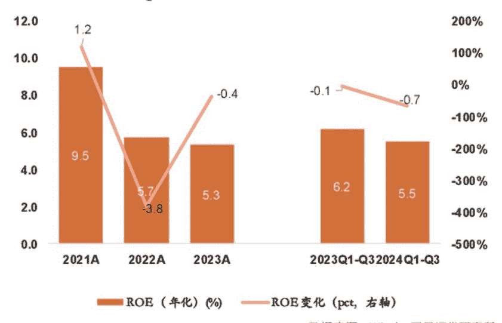

### 图 4 2021-2024Q1-3 证券公司净资产情况

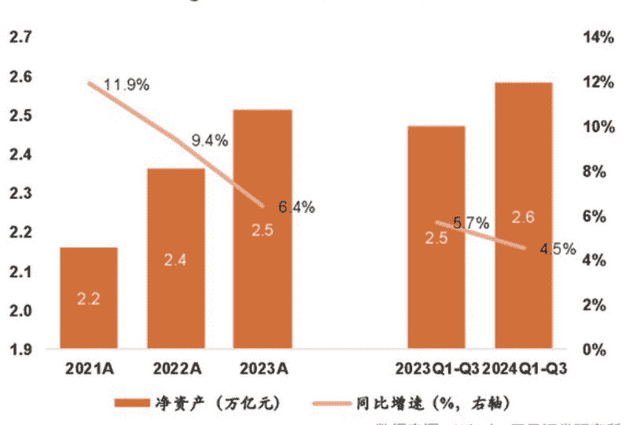

## 互换便利加杠杆逻辑再现

此外，上市券商自营业务增速的大幅攀升为业绩高增的主要推手，自营业务业绩弹性高。从归母净利润角度来看，2024 年前三季度，红塔证券和东兴证券同比增速超 100%。前三季度归母净利润同比增速最高的前 5 家上市券商分别为红塔证券、东兴证券、第一创业、华林证券和山西证券，其中，红塔证券和东兴证券归母净利润同比增速超 100%。

从调整后营业收入角度来看，2024 年前三季度，红塔证券同比增速超 80%。前三季度，调整后营业收入同比增速最高的前 5 家上市券商分别为红塔证券、华林证券、第一创业、东兴证券和南京证券，其中，红塔证券在前三季度归母净利润和调整后营业收入的同比增速皆位居第一。

业绩弹性高的自营业务的大幅增长是上市券商营收同比实现高增的主要推动力。2024 年前三季度，调整后营收同比增速排名前五的券商中，自营收入皆对业绩增速贡献最大，比例均在 30% 左右及以上，其自营收入对业绩增速的贡献均超其营收同比增速，自营业务盈利能力及业绩弹性凸显。

展望未来，政策利好刺激市场交投活跃度大幅提升叠加互换便利加杠杆逻辑，有望改善券商基本面、增厚净利润，提高券商净利润弹性空间。

自 2024 年 9 月 24 日央行降息后，一揽子刺激经济的政策源源不断发布，旨在提振资本市场，吸引投资者入市，当前资本市场大幅回暖，成交量快速放大，直接改善券商经纪业务与两融业务的基本面，行业演绎已从分母端（风险偏好的提升）转移至分子端（净利润增速的提升）。

值得一提的是，互换便利工具的推出，进一步改善券商自营业务的弹性。2024 年 9 月 24 日，国新办新闻发布会提及央行将创设证券、基金、保险公司互换便利，以维护资本市场稳定、提振投资者信心，首批额度为 5000 亿元。10 月 21 日，互换便利的首次操作已顺利落地，央行公告显示，目前获准参与互换便利操作的证券、基金公司共有 20 家，且首批申请额度已经超过 2000 亿元。互换便利提高了券商加杠杆的能力，增加了券商净利润的弹性空间，未来在资本市场回暖的情况下，券商有望增厚净利润从而提升 ROE 水平。

券商板块在当下时点拥有较明确的顺逻辑，自营业务的弹性或已凸显。此轮政策框架清晰，力度超出市场预期，旨在吸引居民侧资金入市，券商未来业绩增长可期。

本轮政策周期始于 2023 年 7 月 24 日政治局会议，带动居民重新审视股市与楼市的关系。此次政治局会议时隔多年再次提出“要活跃资本市场，提振投资者信心”，与此同时，会议对地产市场定调“适应我国房地产市场供求关系发生重大变化的新形势”，正反之间带动居民重新审视楼市与股市的关系，为居民大类资产配置的迁移定下基调。

2024 年 4 月 12 日，新“国九条”明确将资本市场与人民群众的财富管理需求挂钩。新“国九条”强调，“必须突出以人民为中心的价值取向，更加有效保护投资者特别是中小投资者合法权益，助力更好满足人民群众日益增长的财富管理需求。”本次政策的目的非常明确，在于吸引居民侧资金入市，并通过资本市场满足人民群众的财富管理的需求。

2024 年 9 月 24 日，国新办新闻发布会发布“资本市场托底 + 降息降准 + 楼市新政”，展现提振经济、促进市场企稳的决心和信心。

2024 年 9 月 26 日，政治局会议定调地产“止跌回稳”进一步改善预期，地产企稳是“因”，流动性释放效应带动资本市场上行是“果”，“止跌回稳”这四个字的辩证关系分为两层——止跌 + 回稳（房价托底，同时上涨的可能性较小）。此次会议首提“促进房地产市场止跌回稳”的明确目标，意在以政策实现房价企稳，带动居民预期改善。房价的企稳是实现地产“去金融属性、重居住价值（房住不炒）”的重要一步，起到盘活房产资产、带动地产市场流动性改善的作用，地产投资资金的流动性释放将为资本市场带来居民侧的增量资金。

在此轮政策“稳地产 + 推动资本市场高质量发展”的政策框架下，资本市场有望接棒地产市场，成为居民资产配置的核心，助力满足居民财富增值保值需求的定位。更为重要的是，政策明确通过解决股市和楼市两大问题实现“稳信心”目标，此次政治局会议从过去简单的“稳投资”、“稳消费”细化到“稳房产”、“稳股市”两条具体实施路径，正视“稳信心”目标的实现来源于楼市和股市的稳定。

## 券商股弹性有待获充分释放

此轮行情的开始与背景均与 2014-2015 年相似，2014 年至 2015 年的券商行情可以拆解为酝酿期、主升期、震荡期和寻顶期四个阶段：第一阶段从 2014 年 7 月 28 日至 2014 年 11 月 20 日，是券商行情的酝酿阶段；第二阶段从 2014 年 11 月 21 日至 2015 年 1 月 7 日，是券商行情的主升阶段；第三阶段从 2015 年 1 月 8 日至 2015 年 2 月 27 日，是券商行情的震荡阶段；第四阶段从 2015 年 3 月 2 日至 2015 年 6 月 12 日，是券商行情的寻顶阶段。

复盘 2014 至 2015 年的市场行情可知，无论从绝对收益角度还是相对收益角度分析，券商股的弹性获得充分释放，尤其是第二阶段超额收益非常明显。

在绝对收益视角下，券商板块弹性充分释放。行情累计绝对收益为 216%，除第三阶段震荡期外，各阶段均获得正向绝对收益表现，酝酿期、主升期、震荡期、寻顶期阶段内绝对收益分别为 34%、106%、-8.6%、25%；在相对收益视角下，第二阶段超额收益最为明显，第三、第四阶段仍有配置价值。相较于沪深 300 指数，券商板块累计实现超额收益 80%；第二阶段超额收益最为明显，阶段内实现超额收益 62%；第三、第四阶段仍有配置价值，第四阶段前半程依然跑赢指数。

从券商板块交易拥挤度（交易拥挤度 = 券商板块成交额占比 - 券商板块流通市值占比）分析来看，券商板块在整个行情中均存在超额成交，交易拥挤度在第二阶段达到峰值。酝酿期券商板块成交额占比和交易拥挤度处于相对低位，成交额占比/交易拥挤度均值分别为 4.35%、2.66%；主升期成交额占比和拥挤度迅速放大，成交额占比/交易拥挤度均值分别为 12.9%、10.1%，峰值为 19.7%、16.5%；震荡期成交额占比和拥挤度维持高位；寻顶期成交额占比和拥挤度均发生回落。

从交易视角来看，当前全行板块成交和拥挤度仍处于相对低位。与 2014-2015 年券商行情的主升期对比，当前券商板块成交量、成交量占比和拥挤度仍有较大差距。12 月 6 日，券商板块成交额为 785.9 亿元，占全市场成交额的比例为 4.32%，交易拥挤度仅为 2.12%。与 2014-2015 年券商行情相比，本轮行情演绎至今券商板块的成交额及占比、交易拥挤度等指标仍然处于相对较低的位置。

从估值角度分析，在政策大利好不断刺激下牛市行情初现，券商板块估值或仍有提升空间，行情有望延续。当前券商板块 PB 估值分位数仍低于 50%，从 2014 年至今统计的券商 PB、PE 估值水平来看，截至 2024 年 12 月 6 日，券商板块的估值仍处于历史较低水平，PB 分位数为 45.3%，PB 估值为 1.55 倍；PE 分位数为 87.0%，PE 估值为 29.98 倍。

在政策利好不断出现的情况下，牛市行情初现，券商板块当前估值或仍具有提升空间：自 9 月 24 日以来的系列活跃资本市场的大利好政策打开了牛市行情，2025 年券商板块有望在接下来的牛中延续估值提升行情。

从券商板块投资逻辑来看，成交量快速放大改善券商基本面，经纪业务 + 两融业务收入占比高的高弹性券商较为受益。参考 2014-2015 年的券商行情，连续降息降准叠加杠杆催生大牛市行情，交投活跃度急剧提升，演绎有史以来较强的上行行情，在该行情下，经纪业务、两融业务占比高的券商弹性更佳，更能获取超额收益。2014-2015 年的行情是估值提升行情的演绎，经纪 + 两融业务占比高的券商弹性更加突出，盈利增速更高，更能获取超额收益。

目前，全市场日均成交量较之前快速放大，自 9 月 24 日以来，超过 16 个交易日成交量超过 2 万亿元，若未来市场持续回暖，成交量维持在 1.5 万亿元左右，券商基本面的改善将较为可观。

另一方面，随着互换便利工具的推出，券商加杠杆逻辑放大净利润弹性空间。互换便利带动非银机构增量资金入场，重点关注券商板块的加杠杆逻辑。9 月 24 日，国新办新闻发布会上提及央行将创设证券、基金、保险公司互换便利，以维护资本市场稳定、提振投资者信心，首批额度为 5000 亿元，政策明确非银机构可用质押品包括债券、股票 ETF、沪深 300 成分股和公募 REITs 等开展互换操作，通过这项工具获取的资金只能投向资本市场，用于股票、股票 ETF 的投资和做市。

互换便利首批申请额度已超 2000 亿元，机构数量为 20 家。10 月 18 日，证监会已批准 20 家非银机构开展互换便利操作，首批申请额度已超 2000 亿元，发挥维护市场稳定运行的积极作用。首批获批的非银机构为：

- 证券公司：中信证券、中金公司、国泰君安、华泰证券、申万宏源、广发证券、财通证券、光大证券、中泰证券、浙商证券、国信证券、东方证券、银河证券、招商证券、东方财富证券、中信建投、兴业证券
- 公募基金：华夏基金、易方达基金、嘉实基金

根据测算，考虑原有主动权益规模，叠加互换便利的影响下，调整后营收和净利润增速的边际变化显著，互换便利下券商加杠杆逻辑放大净利润的弹性空间。互换便利打开券商净利润弹性空间，有望增厚净利润提升 ROE 水平。

> (作者为专业投资人士)

## 存款定期化趋势缓解
### 银行按揭贷需求修复

本刊特约 刘大芳

11 月，信贷收支数据对宏观情况的描述与社融数据一致，信用修复效能尚需积累，银行按揭贷款需求延续修复凸显政策对居民信心及预期的修复已初见端倪。资本市场高股息策略仍具投资价值，银行股红利价值仍受投资者青睐。

截至 11 月末，全国性大行存贷增速差为 -1.39%，较 10 月末降幅扩大 0.91%；其中，四大行存贷增速差为 -1.65%，降幅环比扩大 0.92%；中小银行增速差仍持续高于国有大行（11 月末为 -0.74%），且增速差持续收敛，降幅环比收窄 0.15%。从结构上看，各类银行活期存款同比均多增，定期和非银存款增长放缓。

### 中小银行信贷放缓 国有大行配债加速

11 月，国有大行、中小银行存款同比分别少增 10608 亿元和 1673 亿元，剔除非银存款后，各类银行存款同比均多增。根据开源证券的分析，11 月存款数据有如下特征：

- 第一，国有大行及中小银行企业活期存款增长显著改善，同比分别多增 4222 亿元和 1990 亿元，M1 降幅亦同步大幅收窄，这一方面源于"9.24"新政后一线城市房企销售边际回升，居民存款向房企销售款转化，房企现金流边际修复；另一方面，再融资专项债发行后部分用于偿还政府对企业的拖欠款，形成企业账户上活期存款沉淀。
- 第二，各类银行个人及企业定期存款同比均少增，国有大行单位定期存款单月净流出，存款定期化趋势阶段性改善。在低利率环境下居民的储蓄行为亦发生变化，过往利率变动向银行负债端传递较慢，银行负债成本呈刚性特征，故定期存款具有较高的性价比，而随着挂牌利率调降的效果逐步显现，长期限存款到期后面临再投资的选择。

考虑到"9.24"新政后资本市场边际修复，同时长期债券收益率持续下降亦使理财产品吸引力上升，故部分 3-5 年期长期限存款客户在存款到期后，会选择将资金投入资本市场或转为活期存款持币观望。此外，银行为缓解高息负债对息差的压力，通过考核的方式控制高成本存款新增规模，故 11 月存款定期化趋势略有缓解。

- 第三，国有大行及中小银行非银存款 11 月单月同比分别少增 12720 亿元和 2683 亿元，形成存款增长的主要拖累。这一方面源于 2023 年同期的高基数，另一方面 11 月理财增长较好（单月增长约 6000 亿元），资金由储蓄存款先向非银存款转化，当非银机构向银行买债时，会造成银行资产端债券及负债端非银存款的同步减少。此外，从"9.24"新政发布到 11 月已有月余，进入 11 月后资本市场略有降温，资金或由证券保证金账户流出向一般性存款转化。

11 月，国有大行和中小银行境内贷款同比分别少增 294 亿元、3621 亿元，进入四季度，中小银行信贷增长有所放缓。从结构上分析，第一，企业需求仍待企稳，11 月，存款类金融机构企业贷款同比少增 5178 亿元，或源于四季度银行信用投放动力趋弱以及化债政策下部分高息城投贷款被再融资专项债置换。第二，居民按揭需求边际修复，11 月，存款类金融机构个人中长期贷款同比多增 794 亿元，贡献主要来自消费贷，新政对居民购房需求的提振，以及居民按揭提前还贷行为的放缓均推动按揭规模企稳回升。此外，11 月，国有大行中长期贷款同比多增 95 亿元，而中小银行同比少增 1615 亿元，或反映化债对中小银行信贷规模的影响较大。

11 月，国有大行债券投资同比多增 4402 亿元，而中小银行同比少增 2927 亿元，反映不同类型银行配债行为的差异。开源证券认为，这一方面源于年内 2 万亿元的再融资专项债发行主要由国有大行承接，国有大行仍有充足的配置需求；另一方面，四季度长期债券收益率加速下行，部分中小银行或卖出部分债券提前锁定收益。

总体来看，11 月，信贷收支数据对宏观情况的描述与社融数据一致，信用修复效能尚需积累，但政策对居民信心及预期的修复已初见端倪。伴随政治局会议对逆周期调节力度“超常规”的定调，资本市场红利高股息策略仍具投资价值，银行股红利价值仍受投资者青睐。此外，经济复苏的投资逻辑逐步显现，客群基础好，零售业务具有优势的银行，在经济修复中获益或更明显。

> (作者为专业投资人士)

## 资本充足率改善叠加注资补充
### 5 家中资大行达标 TLAC 压力不大

本刊特约 刘大芳

中国国有大行 2024 年三季度末平均核心一级资本充足率、一级资本充足率、资本充足率为 12.46%、14.11%、18.3%，较 2023 年年末提升 49BP、44BP、81BP。资本充足率向上改善同时有注资补充计划，再叠加 TLAC 债券按计划发行且尚有较大追发空间。基于此，未来中国 G-SIBs 的 TLAC 监管达标压力不大。

2024 年全球系统重要性银行（G-SIBs）名单公布，有 5 家中资国有大行获选，分别是工商银行、中国银行、农业银行、建设银行、交通银行。全球系统重要性银行名单自 2011 年起由金融稳定委员会（FSB）公布，该名单根据前一年全球银行机构的各项经营指标进行评分和分级。G-SIBs 的评级主要依据五个维度：规模、关联度、可替代性、金融机构基础设施、复杂性和跨境业务，每个维度都赋予相同权重。

在得分表现上，排在榜单前十的有工商银行（299 分，第 6 名）、中国银行（282 分，第 8 名），农业银行、建设银行、交通银行分列第 11 名、第 12 名、第 29 名。未获选但参与统计前 40 名的有兴业银行（103 分，第 33 名）、招商银行（103 分，第 34 名）、中信银行（88 分，第 38 名）、浦发银行（87 分，第 39 名）。

### 中国 G-SIBs 或如期达成 TLAC 要求

根据监管要求，四大行将于 2025 年年初达标总损失能力（TLAC），交通银行完成时间设为 2027 年年初。在《全球系统重要性银行总损失吸收能力管理办法》（下称“《办法》”）实施后，国内 G-SIBs 的 TLAC 资本要求分为两个实行阶段：

- 阶段一：全球系统重要性银行应当自 2025 年 1 月 1 日起，TLAC 风险加权比率和 TLAC 杠杆率分别不低于 16% 和 6%
- 阶段二：自 2028 年 1 月 1 日起，TLAC 风险加权比率和 TLAC 杠杆率监管标准分别提高至不低于 18% 和 6.75%

《办法》指出，针对 2022 年 1 月 1 日之后被认定为全球系统重要性银行的商业银行（如 2023 年入选的交通银行），应当自被认定之日起三年内满足本《办法》规定的外部总损失吸收能力要求。2022 年 4 月，监管部门公布了 TLAC 非资本债券的核心要素，为银行发行 TLAC 债券提供了依据。2023 年，随着《商业银行资本管理办法》的公布，系统重要性银行的资本要求进一步明确。

2024 年全球系统重要性银行名单中有 9 家中资银行参与统计，5 家入围分组名单。工商银行、中国银行、农业银行、建设银行、交通银行延续入围表现，分档与 2023 年保持一致。从分组情况来看，工商银行、农业银行、中国银行、建设银行四家国有大行继续位列第二档；2023 年首次入围的交通银行 2024 年仍位于第一档。

中国 G-SIBs 均已完成首期 TLAC 债券发行，未来仍有较大增发空间。

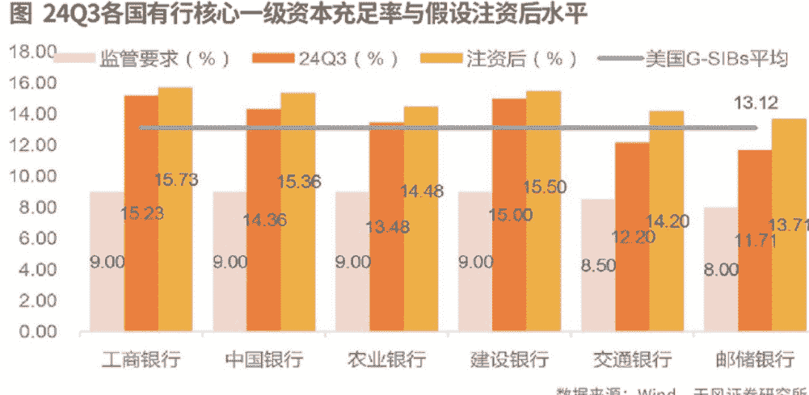

根据各银行发布的公告，2024 年，工商银行、中国银行、农业银行、建设银行和交通银行计划发行 TLAC 债券额度上限分别为 600 亿元、1500 亿元、500 亿元、500 亿元和 1300 亿元，合计 4400 亿元。目前，中国全球系统重要性银行总计发行 2100 亿元，与原定上限比不过半数。

随着风险加权资产（RWA）增速的放缓，有利于银行 TLAC 达标。2024 年以来，监管对银行业“规模情结”的要求明显下降，信贷处于“挤水分”状态，叠加信贷需求不足等因素导致商业银行风险资产增速趋于下降。截至 2024 年第三季度，国有大行风险资产平均增速降至 2.19%，较 2023 年年末下滑 9.17 个百分点。

截至 2024 年三季度末，中国国有银行平均核心一级资本充足率、一级资本充足率、资本充足率分别为 12.46%、14.11%、18.3%，较 2023 年年末分别提升 49BP、44BP、81BP。由于各级资本充足率向上改善，为四大行 TLAC 达标减少额外资本需求。

根据静态测算，考虑内源性资本补充途径，预计四家国有大行可能暂无 TLAC 资本缺口，2025 年年初可以顺利满足 TLAC 监管规定。此外，现行商业银行风险加权资产增速呈下行趋势，资本充足率向上改善同时有注资补充计划，再叠加 TLAC 债券按计划发行且尚有较大追发空间。基于此，未来中国 G-SIBs 的 TLAC 监管达标压力不大。

## 国有大行资本补充计划稳步推进

当前，中国 G-SIBs 现行资本充足率已高于监管规定，且仍有注资补充计划。在高于监管要求的基础上，国有大行注资补充核心一级资本工作正按计划进行。2024 年 9 月 24 日，金融监管总局在国新办发布会上提出为国有大型商业银行补充核心一级资本计划，定增将按照“统筹推进、分期分批、一行一策”的思路有序实施。10 月 12 日，财政部国新办发布会提到，将发行特别国债支持国有大行核心一级资本补充工作，提升抵御风险和信贷投放能力；财政部已会同有关金融管理部门成立跨部门工作协调机制，为各家国有大型商业银行加快完成相关工作提供高效服务。

目前，财政部正在等待各家银行提交资本补充具体方案，各项相关工作正在有序推进。这是继 1998 年财政部发行特别国债向国有四大行注资 2700 亿元后，该项工具被再次启用。

根据天风证券的测算，假设资本补充规模约在 1 万亿元的规模，而且，在“一行一策”的指导思想下，考虑当前工商银行和建设银行核心一级资本安全垫较高，农业银行、中国银行稍优于美国 G-SIBs，邮储银行与交通银行资本充足率稍弱，因此，分别假设注资补充核心一级资本充足率 0.5%、1%、2%。测算结果显示，各大行 ROE 可能因注资下行 0.29%-1.65%。

在注资价格方面，天风证券以 PB=1、PB=0.8、PB=现价（2024 年 12 月 12 日市场数据）三种情况进行测算：

- 第一种情况：如果 PB=1，国有大行 EPS 可能摊薄 0.04-0.17 元，股息率下滑约 1.64%-2.59%。
- 第二种情况：如果 PB=0.8，国有大行 EPS 相对摊薄 0.05-0.21 元，股息率下行 1.14%-1.85%。
- 第三种情况：如果 PB=现价，国有大行 EPS 摊薄幅度可能在 0.06-0.24 元，股息率小幅走弱 0.28%-1.25%。

从上述分析可知，目前，国有大行一级核心资本充足率已高于资本监管要求，而且与美国 G-SIBs 资本缓冲水平没有显著差距，因此，国有大行整体对于资本补充的需求可能不会非常急迫。

目前来看，未获选但排前三十至四十名的中资银行与现有 G-SIBs 相比仍有差距，短期内可能仍难以入围。在近 10 年得分表现上，招商银行、浦发银行正处于向上的趋势中，兴业银行近年表现相对稳定，中信银行较 2023 年略有下滑。

从具体评分细项来看，在规模上，四家未上榜银行距离中国 G-SIBs 的规模有较大差距，但与海外入选企业分差区间仅为 25-54 分；关联度和可替代性整体表现较弱，复杂性和跨境业务维度与国内外 G-SIBs 得分均值差大体在 100 分之内。

整体来看，兴业银行、招商银行、中信银行、浦发银行与目前获选的国内外全球系统重要性银行尚有一定程度的差距，随着企业在海外业务的拓展、规模的扩张以及业务的稳健发展，预计未来将给上述四家银行带来积极的改善。

(作者为专业投资人士)

## Finance 金融

## 投资收益承压考验险企资产负债匹配能力

本刊特约 文颐

随着资产端收益压力的增大，叠加权益市场的持续波动，保险公司资产端显著承压。此外，优质非标资产的陆续到期给险资增厚投资收益带来一定的压力。预计未来险企将进一步增持具有高分红、高资本增值潜力、高 ROE 属性的上市企业，匹配保险行业资产端长期、稳定的需求。

近期，30 年期国债收益率向下突破 2%，作为以配置固收类资产为主的绝对收益型机构，险资资产收益承压。12 月 18 日，据港交所披露的公告，平安资管在场内增持 6725.5 万股建设银行 H 股股份，耗资约 4.24 亿港元。此次增持后，平安资管合计持有 120.54 亿股建设银行 H 股股份，占该行 H 股总数的 5.01% 和总股本的 4.82%。

随着资产端利率的不断下行，叠加权益市场的持续波动，保险公司资产端显著承压；此外，优质非标资产的陆续到期给险资增厚投资收益带来一定的压力。与此同时，在新金融工具准则下，以公允价值计量且其变动计入当期损益（FVTPL）类权益资产加剧利润表波动。保险公司通过举牌上市公司能够实现一定的会计利润平滑，降低权益工具的投资收益波动；但举牌也要求险企具有战略性产业眼光，一级市场和二级市场视角相结合。

由于险资“破局”的关键或集中在权益类资产及长期股权投资等方向，预计未来险企将进一步增持具有高分红、高资本增值潜力、高 ROE 属性的上市企业，匹配保险行业资产端长期、稳定的需求。

作为绝对收益型机构，险资较少进行信用下沉，在存量负债成本相对固定的背景下，险资投资收益压力进一步增大。在资产收益承压、“资产荒”压力进一步加大的背景下，险资开启新一轮“举牌潮”。

## 险资投资收益压力增大

2024 年以来，以长城人寿、中国太保、瑞众人寿等为代表的保险公司纷纷加大对优质上市公司的举牌，主要行业集中在公用事业、交运、银行等领域，具备高分红及相对稳定的 ROE 水平。

值得关注的是，平安资管近期分别举牌工商银行 H 股及建设银行 H 股，港股配置性价比逐步受到保险资金的重视。2020 年以来，保险负债端因增额寿险高增得以迅速扩张，为满足资产负债匹配及投资收益要求，保险资金对红利类权益资产的需求提升，低估值、高分红的港股资产受到险资举牌次数显著增加。此外，保险资金利用港股折价优势和企业所得税免征政策，进一步增加权益投资收益。

分类更为透明但权益投资或直接加大利润表的波动。2023 年 1 月 1 日，保险行业全面实施 IFRS9 和 IFRS17 新会计准则，分别为险企负债端及资产端会计计量方式带来一定的变化。IFRS9 的实施对险资资产端金融工具计量带来较大的影响，分类更为客观。

按照会计核算方式，资产分类更为透明，IFRS9 将金融资产分为三类：以公允价值计量且其变动计入当期损益的金融资产（FVTPL）、以公允价值计量且其变动计入其他综合收益的金融资产（FVOCI）、以摊余成本计量的金融资产（AC）。

新金融工具准则对资产分类的调整直接加大险企利润表的波动性，在新准则下，更多权益类资产被划分为 FVTPL 科目，如基金、无法通过 SPPI 的固定收益类资产等大量权益资产被指定为 FVTPL 计量，直接加大利润表波动幅度。

此外，按照新金融工具准则规定，权益资产被指定为 FVOCI 后，该决策不可撤销，只有分红可计入损益，处置时买卖价差不得计入损益，只能计入留存收益，因此，保险公司将大量权益资产归入 FVTPL 后，资本市场变动导致的金融资产公允价值变动对利润表的影响变大。

长期股权投资具备中长期稳健投资价值，但需警惕减值风险。按照长期股权投资会计准则的要求，当持有上市公司有表决权股份具有重大影响时，保险公司应当按照长期股权投资法中的权益法进行确认和计量。保险公司按照 A 股上市年度实现净利润和其他综合收益 (OCI) 而产生的所有者权益的变动中应当享有的份额确认当期投资收益和其他综合收益，并调整长期股权投资的账面价值，且在实际收到现金股利时相应地减少长期股权投资的账面价值。

当险资举牌上市公司时，上市公司的股价波动并不会体现在保险公司的当期损益中，只有其当期净利润会影响保险公司投资收益。因此，从会计准则的维度来看，险资举牌上市公司具有一定的平滑利润波动的作用。但通过长期股权投资法计量投资也需要注意可能的减值损失风险。

从会计准则的角度看，险企需要在资产负债表日判断资产是否存在可能发生减值的可能，若资产的市价当期大幅度下跌是表明资产可能发生减值，而对于存在减值迹象的资产且其可收回金额低于账面价值的，需要计提资产减值损失，从而可能对险资投资收益带来一定的负面影响。因此，险资主要选择低估值、高股息率和高 ROE 等具备中长期稳健投资价值的标的，投资行业则主要集中在银行、公用事业、基建等。

## “偿二代”二期过渡期延长

12 月 20 日，国家金融监督管理总局发布《关于延长保险公司偿付能力监管规则 (II) 实施过渡期有关事项的通知》(下称“《通知》”),《通知》明确“对于因新旧规则切换对偿付能力充足率影响较大的保险公司，可于 2025 年 1 月 15 日前与金融监管总局及派出机构沟通过渡期政策，金融监管总局将于 2025 年 2 月底前‘一司一策’确定过渡期政策。”

保险资金权益投资比例受到偿付能力监管指标的限制，在一定程度上影响保险公司增加权益投资的意愿和能力，预计相应政策调整将在一定程度上打开险资权益配置空间。“偿二代”二期工程对保险公司实际资本的认定更加严格，提高部分险资投资特定资产的认定标准，导致保险公司的实际资本减少，进而影响保险公司偿付能力充足率，由此导致保险公司偿付能力充足率普降。

“偿二代”二期规则实施后，偿付能力对保险公司资产配置的约束从“软约束”变为“硬约束”，保险公司在资产端资本占用与收益的平衡难度加大，需要通过精细化管理提升资本使用效率，为此调整权益配置系数，为进一步鼓励险资配置权益资产提供空间。

此外，根据监管要求，权益类资产相较于固定收益类资产通常具有更高的风险权重，保险公司权益类资产配置具有更高的资本消耗。根据《保险资产风险分类办法 (征求意见稿)》(下称“《办法》”) 的规定，权益类资产的风险分类标准相较于固定收益类资产更为严格，导致其资本消耗增加，从而限制了保险资金入市的规模和积极性。

《办法》显示，保险公司权益类资产监管比例最高可占上季度末总资产的 45%，当前保险行业权益投资规模占比约为 12%，仍有较大的提升空间。随着过渡期的延长，以中小保险公司为代表的险企或将打开一定的权益配置空间，预计主要配置方向以 OCI 高分红股票为主。

(作者为专业投资人士)

## Finance 金融

## 银行红利行情贯穿全年“高股息”逻辑切换待验证

本刊特约 文颐

> 从中长期而言，低利率环境下银行的红利逻辑仍是确定性较强的布局方向，银行板块将继续承接增量资金，估值重塑进程加快。待经济好转获得数据的进一步验证，银行主线或将从“高股息”逻辑切换至“基本面复苏”逻辑。

2024 年前三季度，42 家上市银行实现营业收入 4.28 万亿元，同比下降 1.05%，城商行板块增速领跑同业。就第三季度而言，上市银行营收同比增长 0.89%，增速由负转正，增速环比扩大 3.07 个百分点，主要原因为债牛驱动非息收入高增长。具体到子板块，2024 年前三季度，国有大行、股份制银行、城商行、农商行营收同比增速分别为 -1.19%、-2.49%、3.93%、2.15%。

前三季度投资收益与公允价值变动收益推动其他非息收入实现 25.61% 的高增速，是支撑营收的唯一正增长项。

2024 年前三季度，42 家上市银行实现归母净利润 1.66 万亿元，同比增长 1.43%，国有大行、股份制银行、城商行、农商行归母净利润同比分别增长 0.79%、0.85%、6.67%、4.88%。三季度，上市银行归母净利润同比增长 3.53%，增速环比提升 2.07 个百分点，拨备继续反哺净利润。

具体来看，35 家银行归母净利润实现正增长，7 家银行负增长，银行间进一步分化；其中，浦发银行实现 25.86% 的高增长，领跑行业；其次是杭州银行和常熟银行，增速均超 18%，经济强韧的区位优势、贷款需求高景气、资产质量优异、信用成本低均是净利润增长的重要动力。

上市银行前三季度营收增速由负转正，其他非息收入是支撑营收的唯一正增长项。从营收结构来看，受到存量房贷利率下调、LPR 下降和有效信贷需求不足的影响，上市银行前三季度净利息收入同比下降 3.19%，但受益于存款利率下调以及监管对高息揽储行为的管控，负债成本有所减轻，第三季度净利息收入降幅有所收窄。

## 政府债券支撑社融增量

从社融数据来看，偏弱的总量与结构反映了当下内需不足问题仍较为突出。2024 年前 11 个月，社会融资规模累计增量为 29.4 万亿元，比上年同期少 4.24 万亿元。截至 11 月末，社会融资规模存量为 405.6 万亿元，同比增长 7.8%，增速处于历史低位。在社融结构中，1-11 月人民币贷款均同比少增，为严重拖累项，社融增量则主要靠政府债券支撑。

在信贷方面，前 11 个月有 9 个月人民币贷款同比少增。从居民端来看，消费需求仍有待提振，11 月短期贷款偏弱，中长期贷款在降低存量住房贷款利率等房地产刺激政策下于 11 月出现边际修复的迹象；从企业端来看，短期与中长期贷款连续 12 个月和 9 个月同比少增。社融数据继续走弱除了金融核算方法优化带来的“挤水分”扰动，需求不足仍是主要原因。

从上市银行的角度来看，贷款投放增速放缓，对公强，零售弱。由于高基数效应与有效需求不足，2024 年以来，上市银行总资产规模扩张速度降至 10% 以下。前三季度贷款增速下降 6.43%，信贷投放节奏继续放缓，除了实体融资需求这个主要影响因素外，金融监管机构加强了对资金空转和虚增存贷款的打击力度也是重要原因之一。

在手续费及佣金净收入方面，上市银行前三季度中间业务收入同比下降 10.75%，降幅环比有所收窄，主要是因为 9 月份一揽子新政后，资本市场活跃度显著好转，投资者风险偏好的修复带动银行财富管理业务边际回暖。在其他非息收入方面，2024 年以来长端利率持续下行，债市表现较好，

城商行受益于区域经济优势，贷款增速仍能保持两位数，股份制银行贷款增长乏力，或与零售端贷款恢复缓慢有关。具体到贷款结构，上半年，上市银行同比新增贷款中，公司、个人贷款增量占比分别为 76.71% 和 16.85%，较 2023 年分别下降 2.41 个百分点、1.06 个百分点，反映当下银行贷款投放“对公强、零售弱”的特征。

随着宏观调控定调更加积极，信贷投放有望实现温和稳健复苏。中央经济工作会议表示，要实施更加积极的财政政策，提高财政赤字率，加大财政支出强度，增加发行超长期特别国债，增加地方政府专项债券发行使用，优化财政支出结构，提高资金使用效益。预计这一系列举措将直接扩大公共投资规模，从而激发基础设施建设、产业升级以及社会民生等领域的资金需求，而地方政府专项债券的发行与使用，则能进一步激活地方政府的投资动力，促进地方经济的蓬勃发展。随着这些投资项目的逐步落地实施，有望有力推动企业端信贷需求的增长，预计 2025 年政府债继续成为社融增量的重要支撑项。

中央经济工作还会议表示，将实施适度宽松的货币政策，适时降准降息，降准能够释放更多的流动性，增加银行的可贷资金规模，而降息则能够直接降低企业的贷款利息支出，提高其融资意愿。这些政策不仅有利于企业扩大生产和投资，提升信贷需求的可负担性，也促进了居民的消费和购房需求，从而间接推动了信贷投放的复苏。

此外，中央经济工作会议将大力提振消费、提高投资效益，全方位扩大国内需求作为 2025 年的重点任务，凸显了消费在经济发展中的重要性不断上升，2025 年促消费政策的范围和力度有望有所突破，前期受到零售端拖累的股份制银行或具备更大的修复弹性。

## 存款成本改善效果加速释放

在国内经济增速放缓、投资和消费需求显著减弱的前提下，商业银行净息差资负两端利率不对称下降，从 2019 年的 2.2% 降至 2024 年三季度末的 1.53%，低于 1.8% 的监管合意水平。

在资产端方面，受融资需求收缩、政策利率持续下调等因素的影响，贷款加权平均利率从 2019 年年末的 5.74% 降至 2024 年 9 月末的 4.15%，降幅达 159BP，这主要是由于 LPR 与存量房贷利率的多次下调。在负债端，经济增速放缓也导致居民储蓄意愿增强，定期化趋势延续，尽管政策利率不断下调，但银行存款成本仍呈现显著的刚性特征。

具体来看，2024 年三季度，上市银行加权平均净息差降至 1.53%，同比下降 18BP。上半年生息资产收益率和计息负债成本率分别为 3.47% 和 2.06%，负债成本比 2023 年年末有所改善。

根据东莞证券的预计，2025 年银行资产端收益率或仍在下滑趋势中。从定价来看，2025 年资产端收益率受制于 LPR 下调、存量按揭贷款调降以及化债政策的影响将延续下行态势。

首先，在 LPR 调降方面，2024 年 2 月、7 月和 10 月 LPR 进行了 3 次下调，1 年期和 5 年期 LPR 分别调降 30BP 和 65BP，贷款重定价将使得资产端价格继续承压。

其次，在存量按揭贷款利率调整方面，截至 2024 年 10 月末，大部分存量房贷已完成批量调整，对于加点幅度高于 -30BP 的存量房贷利率，将统一调整到不低于 -30BP，且不低于所在城市目前执行的新发放房贷加点下限（如有），使得利率水平靠近全国新发放房贷利率附近，预计平均降幅 0.5 个百分点左右。截至 2024 年 9 月末，个人住房贷款利率已降至历史新低 3.31%。由此判断，按揭贷款占比更高的国有大行受到的影响更大，其次是股份制银行。

最后，在置换隐性债务方面，11 月 8 日，《国务院关于提请审议增加地方政府债务限置换存量隐性债务的议案》通过，从 2024 年开始，连续五年每年从新增地方政府专项债券中安排 8000 亿元，补充政府性基金财力，专门用于化债，累计可置换隐性债务 4 万亿元。近三年密集安排 8.4 万亿元，显著降低了近几年地方需消化的隐性债务规模，让地方卸下包袱、轻装上阵。同时，由于法定债务利率大大低于隐性债务利率，置换后将大幅节约地方利息支出，根据估算五年累计可节约 6000 亿元左右。

银行参与化债，利息收入减少，资产端结构上的调整也会影响资产端的收益率。结合中央经济会议表示将实施适度宽松的货币政策，适时降准降息，2025 年 LPR 等利率政策仍有进一步向下调整的预期，银行资产端收益率或仍在下滑趋势中。

相比资产端，2025 年银行负债端后续表现或更为积极。在存款成本上，自 2022 年 9 月以来，商业银行共历经 6 轮存款利率的调降，上一次调降为 2024 年 10 月。6 轮调降后，活期挂牌利率下降了 20BP，1 年期、3 年期和 5 年期整存整取挂牌利率分别下调了 65BP、125BP 和 120BP，长期限挂牌利率下调幅度更大，在最新挂牌利率中，国有大行的 5 年期整存整取利率已降至 1.55%。

中央经济会议提出，“实施更加积极有为的宏观政策”、“实施更加积极的财政政策”和“实施适度宽松的

## Finance
金融

货币政策，表明 2025 年政策层面将加大稳增长力度的明确意图，继续通过调整利率等货币政策工具来引导市场利率下行的预期更加强烈，在此背景下，存款利率或仍有进一步下调的空间。

至于高息揽储方面，市场利率定价自律机制发布了倡议，明确禁止通过手工补息高息揽储，并要求银行遵守存款利率授权上限。除手工补息外，多家银行已正式下线智能通知存款产品。同时，长期大存单也被部分银行停售或缩减额度，除金融基础设施机构外的其他非银同业活期存款应参考公开市场 7 天期逆回购操作利率合理确定利率水平，以减轻负债成本压力。

根据央行披露的数据，二季度规范手工补息为银行节省利息支出超过 800 亿元。2024 年上半年，上市银行负债端已出现改善迹象，加权平均负债成本较 2023 年下降 3BP 至 2.06%，36 家上市银行的负债成本较 2023 年改善。预计 2025 年存款成本改善效果将持续释放，一定程度对冲资产端的下行压力，进而带动净息差降幅收窄。

为制约银行板块估值提升的主要因素。

从地方债角度来看，第四轮化债正在稳步推进中，银行地方债敞口的资产质量有望获得改善。为应对土地财政走弱、地方债务以及地方财政收支平衡压力加大的形势，2023 年至今，中国正在推动第四轮化债。2023 年 7 月，中共中央政治局会议提出，要有效防范化解地方债务风险，制定实施一揽子化债方案。财政部安排了超过 2.2 万亿元地方政府债券额度，支持地方特别是高风险地区化解存量债务风险和清理拖欠企业账款，地方政府债务风险得到了整体缓解。

化债的推进有助于改善银行地方债敞口的资产质量，降低信用风险。化债政策的推行对地方隐性债务进行了有效转化，将其从原本高风险的状态转变为规范且透明的地方政府债券，降低了银行的信用风险敞口，减轻银行的减值损失，释放盈利水平。大部分上市银行的涉政资产并未进入不良，并未进行计提，虽然化债很难直接带来银行不良贷款率等表观指标的改善，但长期来看，随着化债压力的减轻，银行将有更多资源用于支持优质企业的融资需求，进一步降低不良贷款率，实现良性高质量增长。

## 地方债、房地产信用风险担忧缓解

截至 2024 年三季度末，上市银行不良贷款率为 1.25%，其中，国有大行、股份制银行、城商行和农商行的不良贷款率分别为 1.29%、1.22%、1.06% 和 1.09%。具体来看，42 家上市银行中有 26 家银行不良贷款率较 2024 年上半年改善，16 家银行的不良贷款率控制在 1% 以下。

截至 2023 年年末，全国纳入政府债务信息平台的隐性债务余额比 2018 年摸底数减少了 50%，债务风险可控。2024 年 11 月 8 日，全国人大常委会表决通过了《国务院关于提请审议增加地方政府债务限额置换存量隐性债务的议案》，增加地方政府债务限额 6 万亿元，用于置换存量隐性债务。从 2024 年开始，中国将连续五年每年从新增地方政府专项债券中安排 8000 亿元，专门用于化债，累计可置换隐性债务 4 万亿元。同时明确 2029 年及以后到期的棚户区改造隐性债务 2 万亿元，仍按原合同偿还。上述三项政策协同发力，此次用于化债的组合拳规模达 12 万亿元。

同时，随着地方政府偿债能力的增强，银行在为地方政府提供融资时能够享受更稳定优质的利息收入，保持盈利水平稳健，这有助于改善市场对银行资产质量的悲观预期，从而推动银行估值的修复。若用交运、水利、电力、建筑业、租赁和商务服务业来估算地方城投贷款敞口，则该敞口占比较高的成都银行、重庆银行和杭州银行可能在化债中更加受益。

尽管近年来银行整体不良贷款率稳中向好，但在房地产市场较为低迷及地方政府债务负担日益加重的双重压力下，市场对于房地产领域与城投债风险敞口的担忧显著升温，这已成为制约银行板块估值提升的主要因素。2028 年之前地方需消化的隐性债务总额从 14.3 万亿元大幅降至 2.3 万亿元，平均每年消化额从 2.86 万亿元减为 4600 亿元，不到原来的六分之一，化债压力大大减轻。这是近年来出台的支持化债力度最大的一项措施，这无疑是一场政策及时雨，将大大减轻地方化债压力，可以腾出更多的资源发展经济，提振经营主体信心，巩固基层“三保”。

从房地产角度来看，房地产贷款不良压力有望加速缓释，这主要得益于房地产政策力度的不断加大，房地产市场止跌回稳动能增强。2024 年 9 月以来，中央及有关部门多次部署促进房地产市场平稳健康发展工作，政策力度持续加大。12 月 12 日，中央经济工作会议表明，牢牢守住不发生系统性风险底线，持续用力推动房地产市场止跌回稳。加力实施城中村和危旧房改造，推动构建房地产发展新模式，稳妥处置地方中小金融机构风险。

10 月以来，房地产市场呈现出积极的变化趋势，进入 11 月，楼市交易更趋活跃，市场预期得以改善，整体正稳步朝止跌企稳的方向发展：
- 一是市场交易活跃度显著提升，自 10 月起，房地产市场交易总量呈现回升态势，而 11 月的新建商品房销售情况实现进一步的改善，11 月单月销售面积与销售均实现了正增长。
- 二是房价出现回稳势头，11 月，70 个大中城市新建商品住宅销售价格环比上涨的城市数量较上月增加 10 个百分点，二手住宅销售价格环比上涨的城市数量则较上月增加 2 个百分点。
- 三是市场预期继续改善，11 月的房地产业市场预期指数较上月上升 1.1 个百分点。

一揽子促进房地产市场止跌回稳的措施初步显现成效，房地产市场的供需两端有望得到有效调整，银行对公房地产贷款不良压力有望加速缓释。在需求端，通过降低存量房贷利率、降低二套房首付比例等刺激购房需求，推动房地产销售回暖，从而帮助房企改善现金流，降低违约风险，并间接减少了银行的不良贷款。在供给端，收储商品房用作保障房以及回收存量闲置土地加速房企消化库存，加快资金周转，降低财务风险，提升房企的偿债能力，进一步降低银行贷款的违约风险。

在上述这些措施共同作用下，不仅帮助房企重构财务结构，恢复其可持续发展的能力，银行的不良贷款率和不良生成也将受益逐步回落，前期压制银行板块的因素有望逐步缓释。后续仍需继续关注楼市销售的改善情况与房企化债的进程，以及其对银行贷款的传导效果。对公房地产规模占比更高的股份制银行后续边际改善的空间更大。

展望 2025 年，稳增长、扩内需、化风险政策定调积极，根据东莞证券的预计，前期经营压力较大的银行业基本面预期有所改善：第一方面体现在“全方位扩大国内需求”的政策定调，有望推动信贷投放实现温和修复；第二方面是监管持续引导存款成本改善，预计将带动银行净息差降幅收窄；第三方面是近期化债、稳楼市等政策加速推出，银行相应的信用风险担忧缓解，利好资产质量的改善。

从资金面角度考虑，随着市场利率的快速下行，高股息资产的配置价值凸显：一是险资增配高股息板块并将其计入 FVOCI 的趋势或将持续并增强；二是随着市值管理、互换便利、回购增持再贷款等政策的深入推进与落实，预计资金还会继续朝着与政策导向相符的破净低估、红利高股息方向聚集流动；三是随着市场环境的变化以及新“国九条”对资本市场审美的重塑，以沪深 300ETF 为代表的被动权益资金扩容态势或将延续，占比最大的银行将继续承接被动资金的流入，推动银行股实现价值重估。

## 高股息、低估值凸显防御属性

2024 年年初至 11 月 29 日，申万银行业上涨 25.97%，跑赢沪深 300 指数 14.85 个百分点，在申万 31 个行业中排名第二。而且，银行各子板块实现全面普涨，农商行上涨 30.35%、城商行上涨 29.61%、国有大行上涨 27.45%、股份制银行上涨 22.62%。

从个股来看，除兰州银行以外，银行个股实现全线上涨，其中，沪农商行、南京银行、浦发银行、成都银行和杭州银行涨幅超 40%。前三季度，在资本市场剧烈震荡与低利率环境下，基本面较为稳健、高股息、低估值的银行板块防御属性凸显，成为资金避风港的优选。

复盘银行板块年初至今的行情走势，整体以震荡上行为主，红利逻辑贯穿始终，具体可分为五个阶段：阶段一为年初至 3 月末，以逆周期调节政策驱动为主，运用降准、降再贴现利率、降息等政策端持续发力，提振投资者情绪。阶段二为 3 月末至 5 月初，以业绩驱动为主，业绩优异的城商行、农商行涨幅领先，如杭州银行、常熟银行区间涨跌幅超 13%。阶段三为 5 月初至 5 月 22 日，主要以地产利好驱动为主，重磅政策“四箭齐发”，房地产贷款资产质量改善预期提升，提振银行板块估值。阶段四为 5 月末至 8 月末，银行中报陆续发布，行业仍面临较大的经营压力，期间板块以震荡为主。阶段五为 9 月 24 日至今，9 月 24 日，国内政策密集出台，推出降准、降息、降低存量房贷利率、补充银行资本金等增量政策，市场风险偏好明显提升，科技成长板块占优，银行板块中小银行上涨弹性更大，但银行整体跑输沪深 300 指数。

展望未来，在经济好转获得验证前，银行板块将继续承接坚守红利的增量资金，估值重塑加速进行中。从中长期而言，2025 年 1 月“新国九条”正式实施，在资本市场审美重塑过程中，低利率环境下银行的红利逻辑仍是确定性较强的资金布局方向，银行板块将继续承接增量资金，估值重塑进程加快。待经济好转获得数据的进一步验证，银行主线或将从“高股息”逻辑切换至“基本面复苏”逻辑。

截至 12 月 25 日，银行板块的 PB 估值为 0.66 倍，处于近 10 年 33.1% 的历史分位点，其中，国有大行、股份制银行、城商行和农商行的 PB 分别为 0.69 倍、0.58 倍、0.65 倍和 0.61 倍。所有个股均破净，最高为招商银行 0.99 倍 PB。

(作者为专业投资人士)

## 央企市值管理纳入业绩考核
助力资本市场高质量发展

本刊特约 方斐

资本市场改革重心已由融资端转向投资端，市值管理是提升上市公司质量的关键环节。对比 2009 年以来指数的涨跌幅情况可以发现，中央企业 100 指数与上证指数、沪深 300 的走势呈现出较强的相关性。做好央企市值管理对于稳定资本市场、提振投资者信心具有重要作用。

2024 年 12 月 17 日，国务院国资委发布《关于改进和加强中央企业控股上市公司市值管理工作的若干意见》，这是继 2024 年 11 月证监会发布市值管理《上市公司监管指引第 10 号——市值管理》后，国资委在中央企业层面发布的市值管理指导意见。

早在 2005 年，在股权分置改革启动、股份全流通的背景下，市值管理的必要性应运而生。市值管理包含价值创造、价值经营、价值实现三个阶段，价值创造是市值管理的基础，高水平的市值管理离不开上市公司优秀的基本面，企业通过创新技术、提高生产效率、改善公司治理结构、引入 ESG 理念等方式提升盈利能力和成长性，最终体现为内在价值的提升；除了内涵式增长，并购重组快速扩大市场份额和增强市场竞争力、引入战略投资者进行混改等外延式扩张方式也是价值创造的核心环节。

价值经营是市值管理工作的核心要素，当上市公司内在价值和市场价值出现偏差后，企业通过有效管理内在价值，凭借回购、增持、分红、再融资等手段进行市值管理，传递积极的信号提振资本市场信心。价值实现是市值管理的目的，为了使上市公司的股价能够客观反映自身内在价值和市场预期，建立良好的投资者关系、提升信息披露质量应当成为企业应有的常态化机制。

2014 年，《国务院关于进一步促进资本市场健康发展的若干意见》（2014 年版“国九条”）在“提高上市公司质量”中提出“鼓励上市公司建立市值管理制度”，这也是市值管理首次被写入资本市场纲领性文件。由于缺乏规范性、指导性意见，某些上市公司通过操纵信息披露、内幕交易等违法违规行为来影响股价，进行“伪市值管理”，严重损害了投资者利益和信心。

2024 年，国务院发布《关于加强监管防范风险推动资本市场高质量发展的若干意见》（2024 年版“国九条”），强调“制定上市公司市值管理指引”，在监管“长牙带刺”、有棱有角的总基调下，资本市场迈入高质量发展阶段，上市公司市值管理也将步入强监管周期。

### 图 1 2018-2023 年中央企业分红规模占比情况
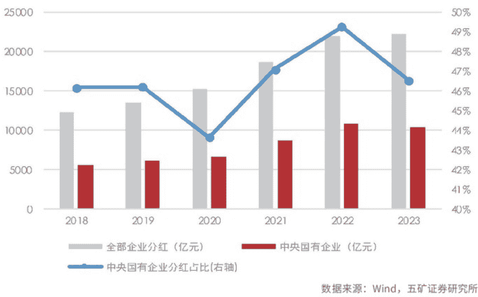

## 市值管理成提升上市公司质量关键环节

资本市场改革重心已由融资端转向投资端，市值管理是提升上市公司质量的关键环节。2024 年 1 月，证监会副主席王建军在接受采访时提出“建设以投资者为本的资本市场”，“只有广大投资者有实实在在的获得感，资本市场平稳健康发展才能有牢固的根基，从而真正实现稳市场、稳信心。”资本市场的投资端和融资端是一体两面，只有加强投资端建设，提升广大投资者的获得感，才能为资本市场提供源源不断的资金来源，从而实现资本市场的高质量发展。

2024 年，新“国九条”压实上市、交易、减持、分红、退市等全链条各环节责任，全面提升上市公司的可投资价值回报投资者。2024 年 9 月 24 日，在“金融高质量支持实体经济”新闻发布会上，证监会主席吴清重点提及“市值管理”，会后征求意见稿火速落地。

11 月 15 日，证监会发布《上市公司监管指引第 10 号——市值管理》，作为新“国九条”"1+N"的配套政策，《上市公司监管指引第 10 号——市值管理》在提升上市公司质量的基础上，更加强化了投资者回报。

当下资本市场大力打造投资端建设，提升上市公司质量不仅是资本市场高质量发展的内在要求，也是“以投资者为本”理念的体现。作为提升上市公司质量的关键环节，上市公司市值管理也将开启规范化发展新篇章。

中央企业是国民经济的支柱，做好央企市值管理对于经济稳增长、提升资本市场稳定性有重要作用。中央企业关系到国家安全与国民经济的命脉，在中国国民经济和资本市场中都承担着重要的使命。

截至 2024 年 12 月 17 日，中央企业上市公司总数为 462 家，占 A 股上市公司总数的 8.59%；总市值为 94.63 万亿元，占 A 股总市值的 31.04%。从行业分布看，中央企业广泛分布于金融、电子、生物医药、电力设备、国防军工、公用事业等核心行业和关键领域，是国有经济发挥主导作用的骨干力量。

通过对比 2009 年以来指数的涨跌幅情况可以发现，中央企业 100 指数与上证指数、沪深 300 的走势呈现出较强的相关性。因此，做好央企市值管理对于稳定资本市场、提振投资者信心具有重要作用。

## 用好“市值管理”工具箱 强化央企正向激励

2024 年 1 月，国资委表示“正进一步研究将市值管理纳入中央企业负责人业绩考核”，4 月，新“国九条”也提出“研究将上市公司市值管理纳入企业内外部考核评价体系”，12 月，央企市值管理的纲领性文件《关于改进和加强中央企业控股上市公司市值管理工作的若干意见》（下称“《意见》”）落地，中央企业将作为市值管理的“排头兵”，助力资本市场高质量发展。

《意见》强调用好“市值管理”工具箱，强化正向激励。《意见》共九条，从切实维护投资者权益出发，旨在促进资本市场健康稳定发展，规范中央企业开展市值管理工作。

《意见》的主要内容如下：第一，以提高上市公司发展质量为目的，发挥中央企业稳定资本市场的重要作用。《意见》第一条点明央企市值管理的作用，即“着力提高上市公司发展质量”，以央企高质量发展为前提，在稳步提升经营效率和盈利能力（价值创造）的基础上，夯实市值管理工作基础，切实发挥央企在建设现代化产业体系、构建新发展格局中的科技创新、产业控制、安全支撑作用。

第二，明确央企市值管理“工具箱”。在价值经营环节，《意见》鼓励：1.提高投资价值的并购重组。在大力发展新质生产力的背景下，央企应该高度重视科技创新，赋能中小企业科技创新成果，通过并购重组加快布局战略性新兴产业和未来产业。2.树立投资者回报意识，提高投资者尤其是中小股东的获得感。增加现金分红频次，优化现金分红节奏，提高现金分红比例。3.将股票回购增持作为一项长期性基础性工作，建立常态化股票回购增持机制。2024 年 9 月 24 日以来，央行创新货币政策工具股票回购增持再贷款火速落地，这项货币政策工具将构成央企常态化回购增持机制之一。

在价值实现环节，《意见》提出：1.主动加强投资者关系管理：积极出席控股上市公司集中路演、业绩披露等活动，向投资者阐明控股上市公司的战略定位、功能使命、愿景目标等；实事求是介绍企业生产经营情况和成果；广泛邀请投资者、行业分析师、媒体等走进企业、了解企业，增进市场认同。2.全面提高信息披露质量：进一步健全以投资者需求为导向的信息披露制度，增加必要的主动自愿披露，提升上市公司透明度；完善环境、社会责任和公司治理（ESG）管理体系，高水平编制并披露 ESG 相关报告，在资本市场中发挥示范作用；维护中小投资者知情权，切实维护企业形象和品牌声誉。

第三，高度关注长期破净公司，切实做好国有资产保值增值。《意见》高度重视控股上市公司破净问题，提出“将解决长期破净问题纳入年度重点工作”，“指导长期破净上市公司制定披露估值提升计划并监督执行”。根据《上市公司监管指引第 10 号——市值管理》，长期破净公司是指股票连续 12 个月每个交易日的收盘价均低于其最近一个会计年度经审计的每股归属于公司普通股股东的净资产的上市公司。此外，“国有企业保值增值”是国有企业考核的硬性目标。央企上市公司披露估值提升计划应以 PB(市净率)≥1 作为估值提升目标。

第四，强化正向激励，将市值管理纳入中央企业负责人经营业绩考核。《意见》强调“将市值管理作为一项长期战略管理行为”，将市值管理纳入中央企业负责人经营业绩考核，强化正向激励。通过建立与市值相关联的激励机制，是市值管理价值经营的重要环节，将负责人考核与市值管理效果绑定，有利于激发企业内生活力。

分红是央企最常使用的市值管理工具，央企也是 A 股市场上的分红主力军。相对于并购重组、回购，目前分红是央企最常使用的市值管理工具。从分红规模来看，2019-2023 年，A 股全部上市公司和中央企业分红总额整体呈现上升趋势，2023 年，中央企业累计分红总额为 10390.06 亿元，占 A 股上市公司的 46.58%，是上市公司分红的主力军。从分红意愿来看，2023 年，中央企业分红数量占比 77.92%，高于地方国有企业的 67.91% 和民营企业的 73.74%。2023 年 12 月，证监会发布《上市公司监管指引第 3 号——上市公司现金分红（2023 年修订）》，明确鼓励现金分红导向，推动提高分红水平。

2024 年，新“国九条”提出“强化上市公司现金分红监管”，《上市公司监管指引第 10 号——市值管理》和《关于改进和加强中央企业控股上市公司市值管理工作的若干意见》将分红作为市值管理工具箱的重要工具。

2024 年 12 月 18 日，中国结算发布“2025 年 1 月 1 日起，对沪、深市场 A 股分红派息手续费实施减半收取的优惠措施”的通知。在政策端的大力支持下，中央企业作为国民经济的支柱、稳定资本市场的重要力量，将持续运用分红工具做好市值管理。

### 央企板块“低估值”+“高股息”特征明显

2016 年以来，中证央企指数 (000926.CSI) 的 PB(LF) 明显低于主要权益指数上证指数、沪深 300、中证 800，但股息率明显高于其他三个指数，板块呈现出明显的“低估值”+“高股息”的特征。基于此判断，在“中特估”+“央企市值管理”的背景下，中央企业 2025 年将继续维持高分红水平。

另一方面，《上市公司监管指引第 10 号——市值管理》指出“长期破净公司应当制定上市公司估值提升计划”，破净国企估值将迎来修复空间。在宏观政策超常规逆周期调节的背景下，房地产政策优化，化债力度空前，银行基本面有望迎来修复。

从投资的角度来看，央企板块红利价值的配置机会值得重点关注，尤其是在受益本轮以市值管理为核心的央企改革红利、估值中枢较低的银行板块。

## 从股息再投资视角分析贵州茅台拆股

本刊特约 莫浩然

关于贵州茅台拆股，股东意见并不统一。从股息再投资的角度来分析，如果投资者意图做贵州茅台的长期持有者，且持有股票的资金量低于 974 万元，那么拆股会增加其股息再投资的便利性，提高其未来的潜在收益。因此，从提高大多数股东的投资边际效益角度看，贵州茅台拆股或许是更优的选择。

2024 年 12 月 17 日贵州茅台召开了三季度业绩说明会，其中最受广大投资者关注的问题，莫过于“拆股”。

董事长张德芹表示：“关于是否拆股，股东观点也不完全统一，有人赞成，有人反对。两种观点都是站在为茅台好的角度，各有利弊。拆股与不拆股，也均有成功的案例可以借鉴。站在公司董事会的角度，我们需要从公司健康稳定可持续发展、股东长期利益等角度系统考虑，审慎决策。”

张德芹关于“股东观点不完全统一”的表述确实反映了现实情况。

部分支持拆股的投资者认为，拆股能提升交易量活跃度，吸引更多新资金涌入，进而推动茅台股价攀升，对股东利益有利。然而，持反对意见的投资者则认为低股价会降低投资门槛，导致股价波动加剧。此外，部分股东还认为贵州茅台股价高企有助于维护茅台酒的高端形象。这些说法都有各自的道理。

但是，从股息再投资视角出发，笔者认为拆股更符合贵州茅台股东利益诉求。

### 高股价阻碍大部分股东进行股息复投

表面看，股票拆分仅仅是股价的调整，公司内在价值并未改变，然而其对股息再投资的影响却是显著的。

截至 2024 年 12 月 25 日，一手茅台股票的价格高达 15.3 万元，若进行 1 拆 10，价格将降至 1.53 万元；若 1 拆 100，仅需 1530 元。

以贵州茅台本次中期分红为例，每股派发股息 23.882 元，若用此次中期分红的股息再买入一手茅台股票，需持有 64 手以上，即持有市值 974 万元以上的贵州茅台股票，方能凭借此次中期分红买入 1 手贵州茅台股票。

绝大多数茅台股东做不到。

截至 2024 年 9 月 30 日，贵州茅台总股本 12.56 亿股，股东户数为 20.16 万户，剔除前十大股东持有的 9 亿股后，余下股东每户平均持有 1766 股，每户市值约 269 万元。

以此平均数估算，莫说中期分红再买入，即便将 2024 财年所发股息全部累加，大部分股东也难以用股息买入一手贵州茅台股票。

可以说，倘若不拆股，绝大多数贵州茅台投资者将被挡在股息再投资这一复利增长的大门之外。

### 高股价拉低多数股东复利收益

股息再投资是价值投资者实现收益增长的重要路径，然而由于贵州茅台股价太高，使得多数股东的实际收益落后于少数资金雄厚的大股东。

以接近股息再投资的后复权收益计算，自贵州茅台上市之日持有至今的投资者，回报增长高达 359 倍，年化收益率达 28.5%。

我们再计算一下不进行股息再投资的收益情况。

贵州茅台 2001 年 8 月 27 日上市首日股价为 34.51 元，现在的股价为 1530 元，经过历次送转股，最初的 1 股约变为现在的 5 股，相当于现在的股价是最初的 221 倍。

上市以来，茅台总分红金额为 3014.41 亿，以目前股本做粗略估算，当下每股拿到的历史分红约为 240 元。为了简化计算，假定股东在收到分红后一直持有至今。

据此计算，不进行股息再投资的收益为 23.3 年 255 倍，年化收益率 26.8%。尽管该数字已然很高了，但股息再投入带来的 1.7% 的额外回报率，使得进行股息再投的投资者相较未投者多赚取 41% 的收益。

同样是最初投资 100 万元，23.3 年之后的今天，股息再投资多赚了 1 亿元。以当前股价推算，2024 财年贵州茅台股息率约为 3.3%，这意味着持有茅台股票市值在 464 万元以下的投资者，无法利用股息复投，致使投资贵州茅台的复利雪球难以滚动。

因此，从保障大多数贵州茅台股东获得股息再投资机会的视角出发，拆股无疑是更优的选择。

### 不拆股将拉低大部分股东的收益

过去 23 年，贵州茅台的利润年化增长约 28%，增速惊人，不过白酒行业的黄金发展期已然落幕，如今贵州茅台体量也已相当庞大，未来公司利润增速放缓在所难免。在此背景下，股息将越来越成为贵州茅台投资者获利的关键因素。

我们可以通过一个思想实验来说明这一点。

假设未来 23 年，贵州茅台的年化利润增速为 12%，市盈率恒定为 25 倍，分红率 90%。

情形一：不进行股息再投资。

投资者将收到的股息留存，不参与复利过程。

假定初始投资净值为 1，23 年后，持有股票净值为 13.6，股息部分净值为 3.33，总计净值 16.88，年化收益率 13.1%。

情形二：股息参与再投资。

投资者每逢收到股息，便以当年分红除权价格购入茅台股票。第一年底净值为 1.12/(1-0.036)=1.16，如此循环往复，至第 23 年底净值为 31.50，股息再投资年化收益率 16.18%。

情形二不仅净值近乎是情形一的两倍，且持有的股数多出 132%，这意味着进入第 24 年，情形二可比情形一多获取 1.32 倍的股息。

所以，未来茅台增速放缓，股息日益成为茅台投资者的重要回报源，若无法实现股息再投资，投资者潜在收益将折损大半。在此背景下，贵州茅台的高股价，已然成为制约股东未来投资收益的负面因素。

### 拆股提升流动性

一些不支持茅台拆股的观点认为，单股股价较高，投资门槛会更高，可以有效规避投机，维持股价稳定。在他们看来，一手股票的价格越便宜，流动性也越高，估值就越高，不利于已有茅台股东的再买入。

事实上，茅台在 A 股市场的流动性已然位居前列，每日成交额高达四五十亿元，换手率日均约 0.2%，年换手率将近 50%，除大股东贵州茅台集团，近乎每年所有股东全部更替一轮，流动性已然相当充沛了。

即便目前一手贵州茅台的价格高企，也未妨碍三年前股价攀升至 2527 元，也未阻挡随后股价从 2627 元下跌到 1245 元。那些以保护散户为由反对拆股之人，既高估了茅台过往及当下股东的投资定力，也高估了小散户所能调配的资金规模。

再者，投机效应向来是双向的，拆股的确会增强茅台股票的流动性，但无论股价后续是向下波动、低估后愈发低估，还是向上攀升、高估后愈发高估，对于价值投资者而言都是利好局面。

### 拆股的潜在代价

有必要厘清一个概念，当下所谓的“拆股”并非字面意义上简单直接地将单股拆分成若干股，实际上，现行规则已不允许这种粗暴拆分。

自 1993 年证监会颁布《关于上市公司送配股的暂行规定》之后，A 股市场多是通过转增股的手段来扩充流通股数量，具体又细分为资本公积送转股与盈余公积送转股两种情形。

资本公积，本质上是企业接收投资者超出其在企业注册资本（或股本）所占份额的那部分投资，当公司把这多出的资本公积转化为股本时，此即为资本公积转增股本。盈余公积，则是企业依照规定从净利润中提取的积累资金，将其转化为股本，这也是企业扩充股本的常用方式之一。

尽管这两种送股模式达成的结果相近，但在税务处理环节却存在细微差别。

用资本公积中的股本溢价转增股本，个人股东不需要缴纳个人所得税。

而用盈余公积转增股本，会被税务局视为公司向股东分配了股息，然后股东又将这部分股息用于增加股本，所以需要缴纳个人所得税。根据税法规定，个人股东应按照“利息、股息、红利所得”项目，适用 20% 的税率缴纳个人所得税。但依然适用“持有股票超过一年的投资者可以暂免征收个人所得税”的规则。

就茅台拆股而言，倘若管理层选用盈余公积转增股本这种方式，将面临缴税问题。但一旦实施拆股，更多股东将能够顺利进行股息再投资，提高潜在收益，笔者认为这点代价是值得的。

(作者为资深投资人士。本文不构成投资建议，据此投资风险自负)

## 以福建高速为例看收费年限到期影响

本刊特约 成一虫

从福建高速这个样本可知，改扩建现有高速公路的年化回报率不到 4%，收费到期清算退市反而能有 7%—8%。所以，对于中小股东、价值投资者来说，多数高速公路上市公司提高分红率，反而是投资价值最大化的一条路。

近几年 A 股的红利股走势很好，其中就包括高速公路股。有些高速公路公司股息收益率比较高，但未来面临着收费年限到期的问题。在这种情况下，投资者应该仔细研究现有高速公路还有多少剩余收费年限，是不是可以通过改扩建来延长收费期限。

19 家 A 股与港股的高速公路公司中，多数剩余收费期限还比较久，超过 10-15 年。主要原因是，能够纳入上市公司的资产通常属于车流量较大、盈利能力不差的高速公路，可以通过改扩建来延长 25-30 年的收费期。沿海地区繁忙的高速公路普遍在 2010 年之前已经扩建；稍差的高速公路前几年扩建或正准备扩建。至于亏损的路段，因为车流量少没法扩建，但它们的收费到期不算利空，毕竟对上市公司业绩只有拖累。

### 现有案例的处理

对于投资人来说，可以关注和研究那些剩余收费期限不长的高速公路公司，从底线思维角度来思考这些高速公路的收费年限，如果到期免费、公司清算，该如何估值。

现有的案例中，有 20 多年前已经扩建过的个别案例，比如粤高速旗下的广佛高速，2021 年底收费到期并无偿移交政府。但粤高速继续负责广佛高速公路管养，代垫管养支出，并全额计提坏账准备。广佛高速长度不到 16 公里，以前非常赚钱，盈利能力较强。粤高速持有 75% 权益，幸好权益里程只占公司全部权益里程的 4%。

另一个可能停止收费的案例是香港上市民企华昱高速旗下的深圳一小段高速公路，两年多内也即将到期，从目前情形来看，估计会被政府收回，而上市公司已经转型白酒行业。

### 从三种选择判断福建高速估值

福建高速主要运营管理三条高速路段：福泉高速公路（收费里程 167 公里）、泉厦高速公路（收费里程 82 公里）、罗宁高速公路（收费里程 33 公里）。此外，公司参股浦南高速公路（收费里程 245 公里）。其中，泉厦高速收费期至 2035 年 9 月，福泉高速收费期至 2036 年 1 月，罗宁高速收费期至 2028 年 3 月。

公司实现营业收入 14.77 亿元，同比增长 0.79%；实现高速公路通行费分配收入 14.63 亿元，同比增长 1.18%。其中泉厦段实现分配收入 5.98 亿元，同比减少 1.33%，福泉段实现分配收入 7.96 亿元，同比增长 2.60%，罗宁段实现分配收入 0.69 亿元，同比增长 7.72%。也就是说，上市公司盈利主要来自福泉、泉厦高速公路（合称沈海高速福厦段），资产相对简单，我们拿它来作为分析的样本。

福厦高速已改扩建过一次至双向八车道，泉厦是 10 年 9 个月后收费到期，福泉则是 11 年。在这种情形下，上市公司后续有几种选择：一是再次扩建至 10-12 车道或更多，从而申请延长收费期；二是收购大股东其他路产，三是卖壳重组。

我们分别对比进行分析，看看如何影响公司估值。

福建高速现在市值大约 103 亿元，静态市盈率（PE）与 TTM 的 PE（最近四个季度市盈率）都是 11 倍，市净率（PB）0.88 倍。2022 年年报称分红每股 0.15 元，2023 年年报称分红每股 0.12 元，2024 年中期分红 0.05 元。

2024 年半年报显示，报告期内，按股价 3.76 元算，分红收益率大约是 3.2%-4%。

目前福建高速的资产负债率只有 18%，负债 31 亿元，其中包括 3.99 亿元债券、4.31 亿元租赁负债。2024 年前三季度经营活动现金流净额是 15.26 亿元，大幅高于同期归母净利润（7.93 亿元）。高速公路主要成本之一是折旧，它影响净利润，不影响现金流，所以利润的现金含量非常高。2023 年经营活动现金流净额是 21 亿元，同期净利润是 9.02 亿元。2022 年经营活动现金流净额是 17.62 亿元，同期净利润是 8.40 亿元。

福厦高速 2007 年后从四车道扩建到八车道共投资 141 亿元。考虑到物价上涨因素，按近期相似案例进行保守估算，再次扩建的公里造价是 1-3 亿元，总投资估计需要 300-600 亿元，工期 2-4 年。目前，这段高速公路当中 68 公里长的泉厦高速有规划进行双层十六车道扩容，总投资 270-360 亿元。数据显示，泉厦高速 2023 年通行费收入 12.5 亿元，总投资进行 30 年折旧平均每年就要 10 亿元左右，贷款 200 亿元的财务费用也要 4 亿元，显然很难有盈利。尽管目前贷款利率低，但高速公路造价远高于一二十年前。

扩建的另一个主要麻烦是车流量不容易增长。从 2019 年至 2024 年前 9 个月，福厦高速的通行费收入增长不多，2019 年是 26 亿元，2023 年为 28.7 亿元，2024 年前三季度整个上市公司营收同比为 -0.57%。未来纵然扩建，这一路段的通行费也可能难有明显增长，原因一是福厦高铁以及其他邻近且平行的高速公路（沈海复线福鼎—诏安高速公路、在建的晋江同安高速、泉厦金高速）竞争，二是客货运量增速逐年放缓。估计多数高速公路都会面临这两个影响。

而扩建投产后的折旧、财务费用、养护费估计每年增加 10 多亿元以上，在现有固定资产计提完折旧后，每年净增加成本几亿元。换言之，上市公司目前一年大约 9 亿元的归母净利润面临大幅缩水。

假设上市公司 6 年后开始扩建，届时积累百亿元自有资金，投资 300 亿元（其中贷款 200 亿元），赶在 2035 年前获得收费延期 30 年（收费公路新条例的影响），则 2035 年以后的历年净利润可能降至 4 亿 -5 亿元左右。考虑到公司可能会持续 15-20 年以上每年分红都是 4 亿元左右，取永续年金折现，当前市值 103 亿元对应的折现率约为 3.9%。即持股年化回报率 3.9%。

至于收购控股股东现有的高速公路资产，也存在有减利的问题。福建省内高速公路路段最好的就是福厦高速，控股股东 2022 年净利润只有 5.85 亿元，而上市公司同期有 8.4 亿元。上市公司 2007 年底收购了罗宁高速公路，至今过了 16 年，到 2023 年按年报显示仍是亏损；2023 年的通行费收入只有 1.39 亿元，还不如 2007 年（1.69 亿元）、2008 年（1.75 亿元）。收购可能会导致公司分红减少，或者净资产收益率（2023 年 ROE 为 8.18%）减少。况且，控股股东还没有注入上市公司的路产主要是统贷统还性质，收费期均只有 15 年；浦南高速倒是经营性质，但 2033 年到期，且每公里年收入仅 200 多万元，还不如罗宁高速的 400 万元。

福厦公路整体还有大约 11 年收费期。11 年后卖壳或退市的话，如何估值？假设 11 年后退市，壳价值为零，这 11 年所有的净利润都用来分红（因为要退市，所以不需要有资本性开支，不用收购路产），同时 11 年后清算时资产负债表中的 110 多亿元固定资产归零（折旧计提干净了，每年进入成本，在税前利润之前就抵扣），届时净资产还有 110 多亿元，清算费用、员工遣散费、资产减值、资产变现折价等影响应该不会超过 10 多亿元。

那么就可以测算这些年的分红与清算残值折现后是多少钱。按 8% 折现率，假设每年分红 0.32 元（分 10 年，每年 8.7 亿元净利润），11 年后清算，清算后能有净资产 100 亿元，则合计现值 105.89 亿元，低于目前净资产（117 亿元），但略高于当前市值（103 亿元）。这说明持股的年化回报率会有 8% 出头。根本原因是目前市盈率约为 11.4 倍、市净率小于 1，未来盈利不变或微减，清算退市成本不高，则年化回报率接近市盈率倒数（8.77%）。

假设分红收益率还是保持目前 4% 的水平（即每年只分红 4 亿元），11 年后退市时清算残值大约 150 亿元现金（多了历年滚存利润），通过现金流折现，可算出持股的年化投资回报率接近 7%。如果 11 年后，有福建省属国企借壳，且壳价值能卖一些钱，则持股的年化收益率有机会更高。

从福建高速这个样本可知，改扩建现有高速公路的年化回报率不到 4%，收费到期清算退市反而能有 7-8%。所以，对于中小股东、价值投资者来说，多数高速公路上市公司提高分红率，不要改扩建（除非车流量有较大的增长潜力），不要收购集团盈利能力差的路产，反而是投资价值最大化的一条路。

> (作者为资深投资人士。本文不构成投资建议，据此操作风险自担)

## 辣味休闲零食的持续性增长

本刊特约 明辉

为了满足消费者多样化、个性化的需求，休闲食品各品牌展开了差异化竞争，其中辣味休闲食品得益于年轻消费群体喜辣习惯，增速较快。参考知名食品公司发展史，这些辣味休闲零食品牌还需要不断提升品牌力、丰富产品矩阵，拥抱新渠道，形成健康多元的渠道结构，才能可持续增长。

科技的进步与发展的最终目的，应该是使得人们的休闲时间越来越多，消费是所有经济活动的目的，生产只是手段。

目前国家在大力鼓励发展体育、娱乐等产业，整个社会已经有越来越多的人选择慢下来，选择享受生活，休闲化。如此，围绕着社会多样化、趣味化休闲之中的零食产业，也有了巨大的发展空间。

伴随着 Z 世代成为消费主力军，除了物质层面的需求满足，精神层面的“自我奖赏”同样是重要的消费驱动力。其中，“小零嘴满足”成为追求美味、获得情绪健康、放松和缓解压力的重要方式。而不断增长的零食需求，也推动着行业发展更趋细分化、多元化。艾媒咨询数据显示，从 2010 年到 2023 年，中国休闲零食规模呈现持续快速增长的趋势，预计 2027 年行业市场规模达 12378 亿元，未来五年复合增长率将保持在 10% 以上。

为了满足消费者多样化、个性化的需求，各品牌展开了差异化竞争，其中辣味休闲食品得益于年轻消费群体喜辣习惯，增速较快。

### 卫龙美味：不止于辣条

近十年来在中国最为流行的小零食莫过于“辣条”。辣条主要原料是小麦粉和辣椒，起源于湖南平江县，湖南平江县有悠久的酱豆干制作历史，也是平江县食品工业的重要组成部分。为了改善口味，当地企业在传统酱豆干的配方上做出了调整，加重了甜味和辣味，产品面向市场后获得了广泛的认可。

从辣条短短十余年风靡全国的历程来看，其重要的特征有以下几点：一、脱胎于传统食品，辣条的口味模仿平江县传统食品酱豆干，辣味的口味风格突出；二、制作工艺简单，易于模仿和传播，价格实惠，即便在不发达的区域也能取得市场份额；三、风味突出，易于保存，大量添加辛辣调味料的食品本身即有防腐的特质，加上强烈的特殊风味，容易获得市场的认可。

湖南辣条风靡全国后，河南省也迅速加入，其配方基本维持不变，并出现了辣条生产的代表性企业卫龙美味。根据尼尔森数据，卫龙辣条产品连续 3 年保持全国销量第一，市占率为 30%，是第二名的 5 倍，第 2-10 名市场份额合计 20%。

翻看卫龙美味 2024 年上半年财报，营收 29.39 亿元，同比增长 26.3%；净利润 6.21 亿元，同比增长 38.9%。辣条营收占比 46.1%，同比下降 9.3 个百分点。但占比最高的是公司不断研发、推出多年的更健康的蔬菜制品（魔芋爽等），2021-2023 年，蔬菜制品营收分别为 16.64 亿元、16.93 亿元、21.19 亿元，同比分别增长 42.5%、1.8%、25.1%。2024 年上半年，蔬菜制品营收 14.61 亿元，同比增长 57%，营收占比 50%，超越辣条，成为公司第一大营收支柱。

魔芋爽仅用几年时间飞速成长为新的第一大单品，借助了辣条业务建立起的渠道和品牌优势，证明了公司打造大单品的能力。魔芋爽连续 3 年保持全国销量第一，市占率为 70%，第 2-10 名合计 20%，9.9 元魔芋盒持续热卖。海带产品连续 4 年全国销量第一，保持高速增长势头。

公司充分受益于吃辣浪潮，接受的人有成瘾性，在部分学生中也成了社交品。目前动态估值 2024 年 15 倍市盈率左右，并且保持着 60% 以上的派息比例。

### 有友食品：泡椒风味的渠道突破

不同于辣条起源于湖南，龙头企业在河南，有友食品则是天时地利扎根于西南美食泡椒凤爪之中。2024 前三季度，有友实现营收 8.9 亿元，同比增加 16.8%；归母净利润 1.2 亿元，同比增加 14.3%。第三季度实现营收 3.6 亿元，同比增加 28%；归母净利润 0.45 亿元，同比增加 75.2%，业绩远超预期。

分产品看，2024 年第三季度泡椒凤爪占比 63%，同比增长 4%，老单品高基数下仍维持平稳增长。其他产品为猪皮晶、竹笋、鸡翅、豆干等西南传统辣味食品，鸭掌新品在新拓展的会员制仓储式超市渠道实现快速放量。分渠道看，第三季度线上、线下营收分别为 0.22 亿元、3.35 亿元，同比分别增长 401%、23%，公司积极进入抖音、小红书等内容电商，线上渠道受益于低基数高增长。

有友已形成泡卤休闲产品矩阵，凤爪行业百亿元规模，鸭掌赛道加速扩张。根据欧睿数据，2024 年凤爪零食规模有望达到 110 亿元，其中泡椒凤爪、其他凤爪规模分别约 35 亿元和 75 亿元，2024-2028 年有望维持 7%-8% 的复合增速；2024 年有友是泡椒凤爪行业绝对龙头，市场份额约 50%。2024 年鸭掌行业市场规模约为 10 亿元，行业处于初期发展阶段，2024-2028 年有望维持 30% 以上复合增速，2024 年行业龙头为有友，市占率约 40%。

有友目前主要以传统商超及流通渠道为主，对比其他上市零食企业平均 35%-40% 的新渠道占比，公司目前新渠道占比仅 19%，有较大提升空间。其中会员超市渠道、量贩零食渠道公司布局处于初期，可以持续观察公司未来的增长潜力以及规模效应能否推升公司净利率。尤其是对费用投放要求极低的会员制超市渠道，后续有望成为贡献收入增量与带动渠道扩张的关键引擎。三季度有友收入同比、环比增长 28%、40%，利润同比、环比增长 75%、37%，收入开始加速增长。

有友具备一定的品牌和产品力，消费者认可度高，具备一定溢价，公司受原料涨价影响多次对泡椒凤爪产品提价，掌握定价权。新兴渠道拓展取得初步成果，华东市场潜力巨大，2024 年第三季度无骨鸭掌产品进入山姆渠道，月销超 2000 万元。

公司账上 10 亿元现金，没有有息负债，故连续 4 年派息比例超过 90%，股息率接近 4%。

2024 年市场预期 1.5 亿元利润，目前 30 倍市盈率，考虑到公司成长有可能刚起步，并参考传统零售龙头恰恰食品在成长期估值区间 20-35 倍市盈率，目前估值合理偏高，需要观察 2025 年能否展开新的成长。

### 劲仔食品：鹌鹑蛋能否接力成为十亿大单品？

劲仔食品诞生于湖南，独辟深海小鱼制品这一零食赛道，其产品矩阵具有鲜明的差异化特点。深海小鱼冲破十亿元大单品规模，做到了市场第一，占收入比维持在 60% 以上。

公司自 2011 年起进军休闲鱼制品蓝海市场，经历两个阶段的发展，最终形成细分赛道领军站位。

第一个阶段 (1991-2018 年)，典型的大流通与大单品起量通路，通过电视明星助推小鱼铺市、且产品力获得认可，鱼制品销量在 2017 年跃居行业第一。第二个阶段 (2021 年第三季度至今)，开启新一轮增长周期，伴随市场需求多元化、流量去中心化，公司快速推动小鱼干的品规改革，释放核心单品的强产品力，并从单一传统渠道转型为多元化渠道，而后在 2022 年推出新品鹌鹑蛋，成功打造第二增长曲线。

2023 年，劲仔完成此前定下的上市后“三年倍增”阶段性目标。2024 年又提出未来三年“再造一个劲仔”，这也意味着，未来三年劲仔业绩年复合增长率需要达到 26%。

公司在半年报中提到，禽类制品 (包括鹌鹑蛋和手撕肉干) 收入 2.58 亿元，同比增长 51.10%，保持快速增长趋势。事实上，以鹌鹑蛋为主的禽类制品在 2023 年营收已经突破 3 亿元，鹌鹑蛋确立为企业重点培育的下一个“十亿级”大单品。

看公司 2024 年三季度，实现营收 6.42 亿元，同比增长 12.94%。同期，公司销售商品获取现金同比增长 14.5%，略高于营收增长。三季度，公司营收增幅同比回落 32.98 个百分点，环比回落 7.96 个百分点，高基数下增幅收窄，但整体仍保持了较高的增长水平。2024 年前三季度，公司实现营收 17.72 亿元，同比增长 18.65%，全年有望保持 15% 至 20% 的增长水平。

公司保持了三年的高增长，但由于上市后估值偏高，股价一直在震荡消化估值，目前已经由 50 多倍市盈率下降到 20 倍左右，合理很多。可见，即便高增长也不能脱离估值的锚，成长股也要有合理的估值才可以。

(作者为资深从业人士。本文不构成投资建议，据此投资风险自负)

## 从本田和日产合并看汽车行业竞争
本刊特约 陈嘉禾

微弱的客户黏性、低复购率和高单价造就的精明消费者、不太复杂却又多变的技术、对就业和 GDP 的巨大促进作用，共同造就了汽车行业的激烈竞争格局。

2024 年 12 月，日本第二大汽车制造商本田株式会社，和日本第三大汽车制造商日产汽车，宣布开始合并谈判。同时，最大股东为日产汽车的三菱汽车，也宣布将加入合并协商。这个日本汽车业巨大的合并计划，将创造一家世界排名第三的汽车公司，仅次于日本丰田汽车和德国大众集团。

本田和日产的合并，只是汽车行业竞争大历史中的一小段。纵观上百年的汽车产业发展史，企业之间的竞争极其激烈，汽车公司的破产、倒闭、合并等等商业行为层出不穷。

早在 2008 年，沃伦·巴菲特就曾经描述过美国汽车行业在历史上的惨烈竞争：“在 1930 年代，美国有大概 2000 家汽车制造公司。但是到了今天 (2008 年)，则只剩下 3 家，而且过得还都不怎么样。汽车行业的发展对社会贡献巨大，但是对投资者来说却非常不友好。”

回到中国的汽车行业，2015 年以前，中国的汽车产业似乎竞争不算激烈，但那只是因为在经济高速发展中，需求过于旺盛导致的暂时现象。从 2020 年前后开始，随着中国汽车产业进入以纯电车、混合动力汽车大幅增长的新能源时代，中国汽车行业中的竞争也变得空前激烈。

汽车行业为何竞争一直如此剧烈？主要商业逻辑究竟有哪些？

### 微弱的客户黏性

汽车行业激烈竞争的最主要原因，在于非常微弱的客户黏性。即使消费者开了很长时间的通用公司的汽车，换车时，仍然几乎可以选择市场上任何一个品牌的汽车：多年通用汽车的驾驶体验，对通用公司留住消费者并没有太大帮助，因为绝大多数汽车开起来都差不多。

对于其他汽车公司来说，事情也都一样：很难有汽车公司能够在自己的消费者群体中建立足够的黏性。尽管一些豪华汽车品牌，比如特斯拉、玛莎拉蒂、保时捷，得以在消费者心目中建立一定的品牌忠诚度，但是随着时间的推移，这种忠诚度也很难经历消费者改换门庭的考验。

其实，在商业社会中，难以获得客户黏性是绝大多数行业的通病，包括造纸、航空、海运、个人电脑、房地产等等，这也造就了许多激烈的竞争。相比之下，少数一些能够获得客户黏性的行业，才是商业社会中的异类，它们的利润率往往让人艳羡。

### 低复购率、高单价、精明的消费者

如果只是没有客户黏性，汽车行业的竞争还不至于如此激烈。第二个原因，来自超低的复购率、超高的总价，以及由此产生的精明消费者。

根据商品的复购率和单价两个指标，我们可以把商品大致分为四类：复购率高、单价低，复购率高、单价高，复购率低、单价低，复购率低、单价高。

由于复购率高、单价高的商品几乎不存在（饥荒年月的粮食可以算做此类），复购率低、单价低的商品市场太小（比如中小学校偶尔采购的运动会奖章），因此绝大多数商品都属于两个分类：复购率高、单价低，复购率低、单价高。

比如，婴儿纸尿裤、猫粮、日常零食、饮料，都属于复购率非常高、但是单价很低的商品。由于每次购买总价低，消费者很少愿意花太多精力去琢磨商品好坏，而由于复购频率高、短期印象停留相对深刻，消费者每次复购时，往往以自己上一次消费体验为参照物。

所以，对于高复购、低单价的商品，只要上一次用的还不错，消费者往往不愿意去尝试新的品牌，也不在乎每次在自己熟悉的产品上稍微多花一点点钱。由此，企业也就比较容易锁定客户、赚取利润。

反之，汽车的单价可谓超高，每辆车动辄十几万元、乃至几十万元，对社会大众来说相当于好几年的工资净收入，而复购率又非常低，因此消费者在购买新车时，会花大量的心思去琢磨、比较各种汽车之间的性价比。

与此同时，由于汽车的复购率超低、使用时间超长，因此在使用过程中，无论是再优秀的汽车产品，往往也会产生不少故障。这和每个月都要买的、几乎不会给消费者带来不好体验的猫粮、婴儿纸尿裤等，是完全相反的。在使用期的后端，消费者对于汽车往往会发现不少问题，这种抱怨会导致消费者有可能倾向于尝试新的汽车品牌和产品。

因此，在低复购率、高单价的作用下，消费者的品牌忠诚度难以提高，挑挑拣拣则持续不断。对于汽车企业来说，这也就意味着它们的日子充满艰难，彼此之间的商业竞争容易变强。

### 不太复杂却又多变的技术

汽车行业激烈竞争的第三个重要原因，在于汽车虽然是一种大件消费品，但是从本质上来说，其技术并不算很复杂。

在《竞争优势：透视企业护城河》一书中，作者布鲁斯·格林沃尔德和贾德·卡恩提出了一个理论，所有的工业产品到最后都是一个 (简单的) 烤面包机。也就是说，无论再复杂的工业产品，如果存在大量需求、大量生产，那么其技术壁垒终究会被攻克，生产它们终究会像生产一个烤面包机那样简单。

在现实商业中，由于人类的商业技术还没有发展到尽善尽美的地步，因此这种“任何产品都是烤面包机”的终极境界，目前还没有完全到来。比如，大型客机、高端芯片、光刻机、高端医疗设备等少数几个行业，还没有成为“烤面包机行业”，其中头部企业仍然拥有非常可观的技术壁垒，也就容易赚取高额的利润。

虽然汽车是一个巨大的行业，但是这种行业体量是由于其巨大的需求所造成的，并不主要来自多么高端的技术。于是，现有的汽车公司就很难保持技术上的领先，一直遭到来自竞争对手的挑战。

同时，作为消费品中技术含量相对较多的产品，层出不穷的技术创新又一直被应用在新汽车中。而在每一次汽车产品被新技术升级改变时，多种多样的技术路径都会降低汽车公司走对技术路径的可能性。

以新能源技术为例，摆在传统能源车企面前的新能源技术，至少包括了纯电、混动、氢能、增程、插电等多种技术路径。一旦在技术变革中走错道路，对于汽车公司的打击是巨大的。这种技术路径的不确定，也就更增加了汽车行业竞争的剧烈性。

### 就业和 GDP 的必争之地

汽车行业巨大的社会属性，导致许多经济体在发展本地经济时，都会考虑从汽车产业入手。这种多方参与的格局，进一步推动了汽车行业在全球的激烈竞争。

从对社会的意义、也就是社会属性来说，汽车行业由于其巨大的体量、上游可以带动的诸多产业链，包括钢铁、橡胶、石化、机械、电子、纺织等等，导致汽车产业对于本地 GDP 和就业的贡献非常巨大。因此，对于许多负责任的当地政府来说，发展汽车产业是振兴本地经济的必由之路。

同时，由于上述所列举的汽车行业的种种特性，使得新汽车企业打入汽车行业成为可能。日本、韩国、中国的经济在崛起时，本国的汽车企业都取得了巨大的发展，并且对全球汽车市场带来一轮又一轮的冲击。

同时，作为一种商品，汽车相对容易运输，运费相对货物价值来说占比很低，同时在运输中也不易损坏，因此也使得汽车成为一种优秀的国内国际贸易产品。

在这些因素的共同作用下，对于许多经济体来说，发展汽车行业、挑战现有汽车企业、加入汽车行业的大竞争，既有利于发展本地、本国经济、促进就业，也是一种胜率不低的方法，因此，几乎所有中大型新兴经济体，都会加入汽车行业的竞争中，国际贸易之间的摩擦也永远少不了汽车的身影。而如此众多的全球参与者，也就进一步加剧了汽车行业的竞争。

所以微弱的客户黏性、低复购率和高单价造就的精明消费者、不太复杂却又多变的技术、对就业和 GDP 的巨大促进作用，共同造就了汽车行业的激烈竞争格局。这种竞争格局在过去百年中塑造了全球汽车产业，也会在将来持续给汽车产业与汽车公司带来挑战。对于投资者来说，我们必须充分理解这种挑战，才能在投资中做到有效应对。

(作者为九圜青泉科技首席投资官。本文不构成投资建议，据此投资风险自负)

## 贝叶斯思维与理性决策
本刊特约 王雁飞

对贝叶斯思维的常见认知误区是用它来进行预测，事实上，贝叶斯思维教会我们，决策是一个动态的过程，它要求我们不断地收集信息、评估证据，并根据新的证据调整信念，在这个过程中，一个可纠错的反馈闭环是成功的关键。

贝叶斯定理用得最多的地方，是帮助我们找到某个现象背后的原因，也就是说，贝叶斯定理可以用来做信息推断和决策。做信息推断时，如果用 B 表示观测的现象，A 表示背后的某一个原因，那么贝叶斯定理可以写成的公式形式是 P(A|B)=P(A)P(B|A)/P(B)。其中，公式左边的 P(A|B) 就是我们信息推断中的条件概率，即在观察到现象 B 的情况下原因 A 发生的概率；公式右边第一项 P(A) 是在看到现象之前，我们对于原因本身成立的概率的评估；第二项 P(B|A) 是在某原因情况下能够观测到该现象的概率；第三项 P(B) 描述了观测到的现象发生的概率。P(A) 被称作“先验概率”，P(A|B) 被称作“后验概率”，P(B|A) 被称作“似然概率”。

举个生活中的例子说明贝叶斯定理在决策中的应用，比如我今早出差，要做出是否带伞的决策。通过查看天气预报知道了早上下雨的概率是 80%，有些纠结。但我观察到一个现象——街上有人打伞。这时我会调整对下雨概率的估计，具体来说，我们想知道后验概率 P(下雨 | 打伞)，首先已知先验概率 P(下雨) 为 80%，P(打伞 | 下雨) 约为 100%，P(打伞)=P(下雨)P(打伞 | 下雨)+P(不下雨)P(打伞 | 不下雨)=80%×100%+20%×5%=81%，那么 P(下雨 | 打伞)=P(下雨)P(打伞 | 下雨)/P(打伞)=80%×100%/81%=98.77%。通过观察到有人打伞，我会迅速调整后验概率，果断作出带伞出门的决策。

贝叶斯思维是一种科学的、符合直觉的信息推断方法，可以广泛用于包括投资决策在内的各种决策情境。一个常见的贝叶斯认知误区是用它来进行预测。从贝叶斯定理内容可知，它只能根据现象推断原因，即以果推因，比如通过观察到带伞而判断当下下雨的概率。投资中很多工作涉及预测，都无法运用贝叶斯定理进行推断，比如试图通过收集到的信息去判断股价会不会涨、猪价未来会不会涨、某个企业业绩会不会增长等等。

Timberland 是一个拥有很好品牌力的运动鞋商，但彼时股价下跌，他提出了一个疑问：为什么这家好公司的股票遭受重创，为什么没有分析师动心并去研究它？经过一番调查，李录发现是公司面临一大堆诉讼。他下载了法庭案件的每一份文件，逐字逐句的仔细研究，发现所有诉讼都围绕一个问题——盈利指引。过去公司一直提供盈利指引，后来不提供了，这惹怒了一众股东并把公司告上了法庭。

李录不断搜集证据，从最初观察到股价下跌，再到观察到面临诉讼，再到观察到盈利指引问题，不断调整对当时股价下跌的一个原因——“公司经营恶化”的主观概率，相应提高了另外一个原因“业绩非相关事项”的主观概率。这就是一个典型的贝叶斯思维过程，正如他所说的“你必须有非常活跃、非常好奇的头脑，这种头脑不会满足于任何虚假的答案。”

我们的投资决策中也会经常出现这样的情况：自己的持仓股票中，有一家企业季度业绩不及预期，我们要判断是否是因为“生意变坏”导致的，从而做出是否卖出的决策。以目前的白酒行业为例，行业竞争格局依然稳定，头部企业常年保持较高毛利率，过去十几年增长较为稳定，资本回报率领先于全市场。在这种先验概率 P(A) 非常强大的情况下，我们不要轻易因为观察到季度业绩变动而做出“生意变坏”的后验结论，尚需要更多证据来辅助判断。但如果是一家处在技术革新较快、竞争激烈行业中的企业，那么业绩变坏背后“生意变坏”的嫌疑就要大一些。

贝叶斯定理还可以用于债券投资中。在信用风险评估中，使用大量的历史数据，根据行业、评级、规模等估算先验概率，然后再将客户资产状况、信用记录、收入情况、社会关系等多个指标作为节点，建立贝叶斯网络模型，通过观察每个节点之间的条件概率关系，提高判断的准确度。

### 在投资中的运用

### 可纠错的反馈闭环

贝叶斯定理的其核心思想——利用先验概率和新的证据来调整信念——是非常直观和富有启发性的。

第一个启示是要建立概率思维。投资决策不是非黑即白，世界上没有完美公司，投资者也很难获得全部的信息。通常我们要在有限的信息之上，在宏观、基本面、估值、市场环境等诸多因素之间寻求平衡，或许投资中最无奈的地方在于即便信息足够充分也不一定得出可靠答案，因为答案往往是呈概率分布的。如果一个事件背后有两个可能原因 A 和 B，黑白思维会选择 A，但概率思维会说“A 的概率是 51%，B 的概率是 49%”，虽然概率思维最后也选择了 A，但两种选择背后的信息量截然不同。通常情况下投资者的决策是所谓的“灰度决策”，我们不得不意识到每个决策有限的适用条件，接受决策的缺陷以及意料之外的后果。

第二个启示是要认识到先验概率的重要性。某种罕见病检测结果准确度为 99%，某人检测结果为阳性，那么患病的概率是 99% 吗？不要忘记该疾病是一种罕见病，其实患病概率没有那么大。先验概率思维提醒我们，听到一些坏消息时不必反应过度，因为很多事情可能并没有我们想得那么糟。

肯定先验概率的重要性不代表我们要根据先验概率作决策。理性思维是要着眼于未来，过去好的未来不一定好，投资不能建立在历史统计的基础之上。这是一种典型的频率思维。频率思维与概率思维的区别是，前者是静态的，后者是依赖于前者并不断变化的。统计数据显示，净资产回报率（ROE）高的企业长期回报不错，但不能仅仅因为企业的 ROE 很高，就做出投资决定，这是机械的频率思维。

第三个启示是作为推断基础的信息本身很重要。只有寻找到足够强的信息，才有可能纠正之前的判断，但有效的信息需要满足一些条件，如巴菲特说“一条信息要有价值，必须满足两个标准，第一，必须是重要的，第二，必须是可知的”。不是所有的信息都能扭转先验概率，只有正确且重要的信息才可能对强大的先验概率产生影响。信息筛选过程中，会出现有偏采样的问题，即我们在收集信息时有一种证实偏向——倾向于收集有利于自己的结论的信息。

一个克服有偏采样的方法，就是刻意去收集那些反对自己观点的证据。就像前文观察到打伞现象后，你也要考虑到这个打伞的人是否有防晒的动机，或者是否有新的证据证明他常年打伞，或者继续观察是不是有其他行人没有打伞。

第四个也是最重要的启示是保持头脑开放。投资中常犯的一个错误是，很多人获得一个信息、观察到一个现象后，下意识的思考过程是这样的：大脑被某个预设的原因所锚定，然后强化这个特定原因的正确性。这样容易导致我们做出非理性的决策，正像李录说的“用理性的语言来维护自己预设立场，听起来有理，实际是自我辩护”。

理性决策的基础是开放式思维，某个现象背后的原因往往是多方面的，我们一开始就要为不同的原因分别设定不同的先验概率，然后去寻找证据，进而调整不同原因的先验概率、获得后验概率，也就是头脑开放、不做预设、实事求是。投资中当你有了一个好主意时，要做的是努力推翻而不是证实这个主意。

爱因斯坦有个著名的问题:“你所经历过的最大的挑战是什么？”埃隆·马斯克对此足足思考了 30 秒，给出了一个非常精彩的回答:“确保你有一个可纠错的反馈闭环 (making sure you have a corrective feedback loop)”贝叶斯思维教会我们，决策是一个动态的过程，它要求我们不断地收集信息、评估证据，并根据新的证据调整信念，在这个过程中，一个可纠错的反馈闭环是成功的关键。这种思维方式鼓励我们保持谦逊和好奇，不断地学习和适应，而不是固守成见。它不仅仅是一个数学工具，它是一种生活哲学，一种让我们在不确定的世界中做出更理性选择的智慧。■

(作者为海南大学“一带一路”研究院经济研究中心副研究员。本文不构成投资建议，据此投资风险自负)

## 市场震荡上行 3400 点失而复得
王飞

| 涨幅前十 (%) | 跌幅前十 (%) | 涨幅前十 (%) | 跌幅前十 (%) | 涨幅前十 (%) | 跌幅前十 (%) | 涨幅前十 (%) | 跌幅前十 (%) | 涨幅前十 (%) | 跌幅前十 (%) |
| :--- | :--- | :--- | :--- | :--- | :--- | :--- | :--- | :--- | :--- |
| 中船系 | 2.35 | WEB3.0 | -8.47 | PEEK 材料 | 5.62 | ChatGPT | -1.33 | 央企煤炭 | 2.35 | 拼多多合作商 | -5.23 | 光模块 (CPO) | 7.84 | 西部大基建 | -1.67 | 生物育种 | 5.67 | 拼多多合作商 | -2.80 |
| 央企银行 | 2.26 | 虚拟人 | -8.27 | 高速铜连接 | 4.48 | 华为鸿蒙 | -1.15 | 银行精选 | 1.13 | WEB3.0 | -4.15 | 高速铜连接 | 7.70 | 水泥制造精选 | -1.63 | 海南自贸港 | 3.56 | 光模块 (CPO) | -2.22 |
| 锗镓 | 1.66 | 在线教育 | -7.69 | 光伏逆变器 | 3.64 | 脑机接口 | -1.03 | 煤炭开采精选 | 1.11 | 锗镓 | -4.10 | 光通信 | 5.63 | 电力股精选 | -1.45 | 鸡产业 | 3.38 | GPU | -2.00 |
| 航运精选 | 1.47 | 最小市值 | -7.65 | 充电桩 | 3.06 | 网络安全 | -1.02 | 央企银行 | 1.05 | 抖音平台 | -3.97 | 东数西算 | 4.45 | 火电 | -1.24 | 水产 | 3.16 | MCU 芯片 | -1.88 |
| 银行精选 | 1.40 | 短剧游戏 | -7.43 | 钒钛矿电池 | 2.84 | 中船系 | -0.81 | 炒股软件 | 0.94 | 网红经济 | -3.75 | 6G | 4.43 | 央企煤炭 | -1.19 | 饲料精选 | 3.06 | 人形机器人 | -1.67 |
| 大基建央企 | 1.20 | Kimi | -7.29 | 拼多多合作商 | 2.72 | IDC(算力租赁) | -0.77 | 汇金持股 | 0.89 | 虚拟人 | -3.66 | 智能音箱 | 4.11 | 大基建央企 | -1.18 | 乡村振兴 | 2.92 | 半导体精选 | -1.62 |
| 央企 | 1.17 | 网络游戏 | -7.29 | 西部大基建 | 2.71 | 华为 HMS | -0.70 | 光模块 (CPO) | 0.74 | 数字货币 | -3.65 | 存储器 | 4.10 | 煤炭开采精选 | -0.87 | 动物保健精选 | 2.72 | 东数西算 | -1.48 |
| 汇金持股 | 0.78 | 百度平台 | -7.29 | 次新股 | 2.59 | 最小市值 | -0.67 | 保险精选 | 0.63 | 网络安全 | -3.62 | 液冷服务器 | 4.04 | 医药电商 | -0.84 | 猪产业 | 2.65 | 光通信 | -1.46 |
| 保险精选 | 0.61 | Sora | -6.90 | 炒股软件 | 2.51 | 数据安全 | -0.63 | 大基建央企 | 0.57 | 水利水电建设 | -3.47 | AI 算力 | 3.75 | 血液制品 | -0.84 | 通用航空 | 2.43 | 高速铜连接 | -1.44 |
| 中特估 | 0.40 | 中文语料库 | -6.80 | 高送转 | 2.43 | 东数西算 | -0.55 | GPU | 0.56 | 医保支付改革 | -3.38 | GPU | 3.47 | 央企 | -0.83 | 人造肉 | 2.41 | 汽车芯片 | -1.37 |

| 涨幅前十 (%) | 跌幅前十 (%) | 涨幅前十 (%) | 跌幅前十 (%) | 涨幅前十 (%) | 跌幅前十 (%) | 涨幅前十 (%) | 跌幅前十 (%) | 涨幅前十 (%) | 跌幅前十 (%) |
| :--- | :--- | :--- | :--- | :--- | :--- | :--- | :--- | :--- | :--- |
| 惠丰钻石 | 29.99 | 豆神教育 | -19.95 | 九洲集团 | 20.06 | 飞天诚信 | -11.77 | 同星科技 | 20.01 | 埃夫特-U | -20.01 | 派诺科技 | 29.95 | 莱美药业 | -16.97 | 和顺电气 | 20.04 | 青木科技 | -13.87 |
| 晶华微 | 20.01 | *ST 吉药 | -15.51 | 线上线下 | 20.01 | 天玑科技 | -10.96 | 申昊科技 | 20.00 | 筑博设计 | -16.83 | 金信诺 | 20.04 | 云维股份 | -10.06 | 雄塑科技 | 20.03 | 锐捷网络 | -12.53 |
| 力量钻石 | 20.01 | *ST 迪威 | -15.44 | 胜蓝股份 | 20.01 | 汇洲智能 | -10.05 | 鼎通科技 | 20.00 | 斯莱克 | -12.68 | 亿通科技 | 20.03 | 克劳斯 | -10.02 | 川环科技 | 20.01 | 云天励飞-U | -11.54 |
| 四方达 | 19.10 | *ST 中程 | -14.79 | 显盈科技 | 20.00 | 佳力图 | -10.04 | 长盛轴承 | 19.98 | 利尔达 | -10.96 | 趣睡科技 | 20.01 | 汇洲智能 | -10.02 | 威士顿 | 20.00 | 莱美药业 | -10.99 |
| 正丹股份 | 15.51 | 新研股份 | -14.52 | 通业科技 | 20.00 | 开开实业 | -10.02 | 远航精密 | 15.30 | 和顺电气 | -10.95 | 曼恩斯特 | 20.01 | 高争民爆 | -10.01 | 康农种业 | 19.86 | 惠丰钻石 | -10.67 |
| 普利制药 | 14.69 | 新迅达 | -14.49 | 长盛轴承 | 20.00 | 精伦电子 | -10.02 | *ST 中程 | 13.10 | 银信科技 | -10.79 | 博创科技 | 20.00 | 鼎信通讯 | -9.97 | 神农种业 | 16.33 | 南凌科技 | -10.61 |
| 澄天伟业 | 11.76 | 悦康药业 | -14.46 | 世纪恒通 | 19.99 | 城地香江 | -10.02 | 申菱环境 | 13.04 | 紫天科技 | -10.77 | 凯淳股份 | 20.00 | 西藏天路 | -9.95 | 汇金科技 | 14.30 | 云维股份 | -10.07 |
| 欧圣电气 | 11.17 | 佳云科技 | -14.11 | *ST 中程 | 19.83 | 建艺集团 | -10.01 | 海光信息 | 11.26 | 星徽股份 | -10.61 | 科泰电源 | 20.00 | 上海凤凰 | -9.94 | 罗博特科 | 12.59 | 沙钢股份 | -10.05 |
| 雷神科技 | 10.74 | 金通灵 | -13.67 | 青木科技 | 16.84 | 爱婴室 | -10.00 | 百大集团 | 10.04 | 光云科技 | -10.49 | 恒烁股份 | 20.00 | 日出东方 | -9.94 | 盈建科 | 12.18 | 新里程 | -10.03 |
| 恒进感应 | 10.65 | 丝路视觉 | -13.51 | 新潮新材 | 16.23 | 视觉中国 | -10.00 | 香飘飘 | 10.03 | 飞天诚信 | -10.45 | 润禾材料 | 19.99 | 福成股份 | -9.91 | 新特电气 | 11.66 | 得润电子 | -10.01 |

## 数据荟萃

## 沪市/深市主板观察

王飞

### 沪市主板周排行榜

| 涨幅前十名 (%) | | | 跌幅前十名 (%) | | | 换手率前十名 (%) | | | 成交金额前十名 (亿元) | | 涨跌幅 (%) | | 自由流通市值前十 (亿元) | | 涨跌幅 (%) |
| :--- | :--- | :--- | :--- | :--- | :--- | :--- | :--- | :--- | :--- | :--- | :--- | :--- | :--- | :--- | :--- |
| 600693 东百集团 32.87 | | | 600355 精伦电子 -26.65 | | | 600255 鑫科材料 199.45 | | | 603019 中科曙光 345.94 | -0.93 | | 600519 贵州茅台 8396.13 | 0.46 | |
| 603686 福龙马 30.25 | | | 600679 上海凤凰 -24.73 | | | 603207 小方制药 172.64 | | | 603986 兆易创新 282.03 | -1.10 | | 601318 中国平安 4928.80 | 1.24 | |
| 603959 ST 百利 27.76 | | | 603499 翔港科技 -24.38 | | | 603803 瑞斯康达 134.61 | | | 600171 上海贝岭 254.49 | -0.85 | | 600036 招商银行 4165.07 | 3.77 | |
| 600397 安源煤业 27.37 | | | 600272 开开实业 -23.07 | | | 600889 南京化纤 133.34 | | | 600839 四川长虹 243.01 | 1.51 | | 600900 长江电力 3457.06 | 1.40 | |
| 600580 卧龙电驱 25.58 | | | 603319 湘油泵 -23.01 | | | 603215 比依股份 116.50 | | | 601933 永辉超市 230.56 | 10.77 | | 600030 中信证券 2703.35 | -0.40 | |
| 603500 祥和实业 21.87 | | | 600892 大晟文化 -22.63 | | | 603350 安乃达 115.40 | | | 601138 工业富联 201.46 | 2.68 | | 601166 兴业银行 2584.11 | 4.48 | |
| 605066 天正电气 21.64 | | | 600193 创兴资源 -22.58 | | | 600679 上海凤凰 106.64 | | | 601127 赛力斯 187.13 | 3.04 | | 601398 工商银行 2325.73 | 5.97 | |
| 603958 哈森股份 21.01 | | | 600898 *ST 美讯 -22.52 | | | 603042 华脉科技 104.07 | | | 601398 工商银行 176.39 | 5.97 | | 601899 紫金矿业 2214.45 | 1.86 | |
| 600673 东阳光 20.97 | | | 603429 集友股份 -22.38 | | | 603887 城地香江 100.46 | | | 600030 中信证券 171.24 | -0.40 | | 600276 恒瑞医药 1792.40 | -0.32 | |
| 603777 来伊份 20.21 | | | 600198 大唐电信 -21.96 | | | 600272 开开实业 99.90 | | | 600519 贵州茅台 152.85 | 0.46 | | 601328 交通银行 1770.78 | 2.80 | |

### 深市主板周排行榜

| 涨幅前十名 (%) | | | 跌幅前十名 (%) | | | 换手率前十名 (%) | | | 成交金额前十名 (亿元) | | 涨跌幅 (%) | | 自由流通市值前十 (亿元) | | 涨跌幅 (%) |
| :--- | :--- | :--- | :--- | :--- | :--- | :--- | :--- | :--- | :--- | :--- | :--- | :--- | :--- | :--- | :--- |
| 002730 电光科技 61.17 | | | 002199 东晶电子 -31.86 | | | 000880 潍柴重机 191.13 | | | 000063 中兴通讯 565.39 | 7.22 | | 000333 美的集团 3560.40 | 1.92 | |
| 000880 潍柴重机 45.91 | | | 002717 岭南股份 -31.57 | | | 002449 国星光电 169.81 | | | 000977 浪潮信息 381.15 | 3.63 | | 000858 五粮液 2493.74 | -0.48 | |
| 002364 中恒电气 42.08 | | | 002122 汇洲智能 -30.13 | | | 002272 川润股份 166.35 | | | 002281 光迅科技 266.94 | -2.49 | | 002594 比亚迪 2344.90 | 2.17 | |
| 002137 实益达 31.83 | | | 002181 粤传媒 -29.97 | | | 001314 亿道信息 161.35 | | | 002130 沃尔核材 239.35 | 17.07 | | 000651 格力电器 1893.26 | 4.16 | |
| 000759 中百集团 28.38 | | | 000004 国华网安 -27.82 | | | 002369 卓翼科技 151.87 | | | 000938 紫光股份 235.06 | 6.98 | | 002475 立讯精密 1855.87 | 0.17 | |
| 002577 雷柏科技 26.39 | | | 000681 视觉中国 -27.82 | | | 000759 中百集团 141.52 | | | 002617 露笑科技 231.81 | 2.80 | | 000725 京东方 A 1391.84 | -1.14 | |
| 002518 科士达 24.45 | | | 002058 威尔泰 -26.71 | | | 002617 露笑科技 137.11 | | | 002085 万丰奥威 214.23 | 6.75 | | 000063 中兴通讯 1229.83 | 7.22 | |
| 001258 立新能源 21.49 | | | 002076 星光股份 -26.65 | | | 002137 实益达 134.57 | | | 000681 视觉中国 185.58 | -27.82 | | 002415 海康威视 1128.86 | 0.58 | |
| 002067 景兴纸业 20.81 | | | 000595 宝塔实业 -26.11 | | | 002717 岭南股份 133.34 | | | 002241 歌尔股份 185.27 | -4.56 | | 002371 北方华创 1116.76 | -0.46 | |
| 002272 川润股份 17.60 | | | 002848 高斯贝尔 -24.63 | | | 002995 天地在线 130.09 | | | 002851 麦格米特 164.80 | 8.10 | | 000001 平安银行 965.39 | 1.81 | |

注：统计表中不包含科创板和创业板公司。

## 科创板/创业板观察

王飞

### 科创板周排行榜

| 涨幅前十名 (%) | | | 跌幅前十名 (%) | | | 换手率前十名 (%) | | |
| :--- | :--- | :--- | :--- | :--- | :--- | :--- | :--- | :--- |
| 688668 鼎通科技 34.19 | | | 688165 埃夫特-U -22.50 | | | 688130 晶华微 120.10 | | |
| 688676 金盘科技 18.55 | | | 688658 悦康药业 -17.97 | | | 688691 灿芯股份 112.58 | | |
| 688041 海光信息 18.30 | | | 688320 禾川科技 -17.69 | | | 688716 中研股份 87.21 | | |
| 688141 杰华特 16.02 | | | 688343 云天励飞-U -16.14 | | | 688416 恒烁股份 71.25 | | |
| 688633 星球石墨 15.68 | | | 688031 星环科技-U -15.16 | | | 688693 镭威特 69.81 | | |
| 688567 孚能科技 13.06 | | | 688225 亚信安全 -15.13 | | | 688668 鼎通科技 69.28 | | |
| 688629 华丰科技 10.33 | | | 688003 天准科技 -15.13 | | | 688380 中微半导 68.64 | | |
| 688208 道通科技 9.36 | | | 688001 华兴源创 -13.85 | | | 688365 光云科技 64.11 | | |
| 688322 奥比中光-UW 9.26 | | | 688217 睿昂基因 -13.15 | | | 688343 云天励飞-U 63.56 | | |
| 688136 科兴制药 7.82 | | | 688316 青云科技-U -13.06 | | | 688629 华丰科技 62.16 | | |

| 成交金额前十名 (亿元) | 涨跌幅 (%) | | 自由流通市值前十 (亿元) | 涨跌幅 (%) | |
| :--- | :--- | :--- | :--- | :--- | :--- |
| 688981 中芯国际 507.38 | 3.43 | | 688981 中芯国际 1584.28 | 3.43 | |
| 688041 海光信息 295.76 | 18.30 | | 688041 海光信息 1374.61 | 18.30 | |
| 688256 寒武纪-U 240.39 | -3.53 | | 688256 寒武纪-U 1314.70 | -3.53 | |
| 688008 澜起科技 222.01 | 4.08 | | 688012 中微公司 835.66 | 0.25 | |
| 688525 佰维存储 119.13 | -2.37 | | 688008 澜起科技 735.03 | 4.08 | |
| 688012 中微公司 103.31 | 0.25 | | 688111 金山办公 589.85 | 0.35 | |
| 688343 云天励飞-U 90.81 | -16.14 | | 688271 联影医疗 492.47 | 1.86 | |
| 688018 乐鑫科技 85.44 | -11.32 | | 688036 传音控股 364.38 | -0.71 | |
| 688676 金盘科技 83.45 | 18.55 | | 688126 沪硅产业 312.62 | -5.08 | |
| 688111 金山办公 81.75 | 0.35 | | 688169 石头科技 307.84 | -2.31 | |

### 创业板周排行榜

| 涨幅前十名 (%) | | | 跌幅前十名 (%) | | | 换手率前十名 (%) | | |
| :--- | :--- | :--- | :--- | :--- | :--- | :--- | :--- | :--- |
| 300718 长盛轴承 49.44 | | | 300010 豆神教育 -26.33 | | | 301536 星宸科技 238.03 | | |
| 300913 兆龙互连 32.73 | | | 300386 飞天诚信 -23.83 | | | 301165 锐捷网络 165.57 | | |
| 301067 显盈科技 29.34 | | | 300006 莱美药业 -23.00 | | | 301067 显盈科技 159.63 | | |
| 300548 博创科技 28.84 | | | 300805 电声股份 -22.47 | | | 300921 南凌科技 159.38 | | |
| 301315 威士顿 28.81 | | | 300242 佳云科技 -22.30 | | | 301110 青木科技 155.28 | | |
| 300547 川环科技 28.47 | | | 300071 福石控股 -22.09 | | | 300499 高澜股份 147.99 | | |
| 300153 科泰电源 26.53 | | | 300310 宜通世纪 -20.63 | | | 301252 同星科技 147.44 | | |
| 300959 线上线下 26.36 | | | 300245 天玑科技 -20.43 | | | 301315 威士顿 146.53 | | |
| 300757 罗博特科 20.22 | | | 301009 可靠股份 -19.72 | | | 300959 线上线下 144.64 | | |
| 300843 胜蓝股份 19.32 | | | 301010 晶雪节能 -18.35 | | | 301182 凯旺科技 143.48 | | |

| 成交金额前十名 (亿元) | 涨跌幅 (%) | | 自由流通市值前十 (亿元) | 涨跌幅 (%) | |
| :--- | :--- | :--- | :--- | :--- | :--- |
| 300059 东方财富 531.74 | 1.69 | | 300750 宁德时代 6490.07 | -0.27 | |
| 300308 中际旭创 269.79 | 7.67 | | 300059 东方财富 3195.89 | 1.69 | |
| 300750 宁德时代 260.08 | -0.27 | | 300760 迈瑞医疗 1466.37 | 3.18 | |
| 300442 润建股份 215.10 | -4.72 | | 300308 中际旭创 1153.14 | 7.67 | |
| 300033 同花顺 201.78 | 1.03 | | 300124 汇川技术 1076.08 | -0.10 | |
| 300474 景嘉微 196.77 | 2.23 | | 300274 阳光电源 1051.74 | 2.15 | |
| 300502 新易盛 191.56 | 0.60 | | 300498 温氏股份 884.04 | 0.71 | |
| 300274 阳光电源 153.90 | 2.15 | | 300502 新易盛 782.26 | 0.60 | |
| 300458 全志科技 144.61 | -0.09 | | 300033 同花顺 593.57 | 1.03 | |
| 300383 光环新网 134.43 | 4.67 | | 300015 爱尔眼科 576.57 | -2.06 | |

## 北交所/港股/美股市场观察

王飞

### 北证 A 股周排行榜

| 涨幅前十名 (%) | 跌幅前十名 (%) | 换手率前十名 (%) | 成交金额前十名 (亿元) | 涨跌幅 (%) | 流通市值前十 (亿元) | 涨跌幅 (%) |
| :--- | :--- | :--- | :--- | :--- | :--- | :--- |
| 871245.BJ 威博液压 25.27 | 920082.BJ 方正阀门 -25.94 | 920082.BJ 方正阀门 161.68 | 872808.BJ 曙光数创 23.48 | 4.53 | 835185.BJ 贝特瑞 238.54 | -4.90 |
| 872190.BJ 雷神科技 21.99 | 838262.BJ 太湖雪 -21.68 | 832662.BJ 方盛股份 144.16 | 872190.BJ 雷神科技 20.83 | 21.99 | 832982.BJ 锦波生物 191.19 | 1.65 |
| 837403.BJ 康农种业 19.86 | 870726.BJ 鸿智科技 -21.07 | 920002.BJ 万达轴承 123.40 | 839725.BJ 惠丰钻石 19.24 | 17.14 | 872808.BJ 曙光数创 129.62 | 4.53 |
| 839725.BJ 惠丰钻石 17.14 | 836504.BJ 博迅生物 -20.64 | 839725.BJ 惠丰钻石 116.93 | 430139.BJ 华岭股份 17.25 | -12.08 | 830799.BJ 艾融软件 112.23 | -8.17 |
| 833914.BJ 远航精密 12.99 | 832149.BJ 利尔达 -20.26 | 871478.BJ 巨能股份 116.74 | 832522.BJ 纳科诺尔 16.37 | 10.13 | 835368.BJ 连城数控 73.69 | -8.47 |
| 832522.BJ 纳科诺尔 10.13 | 873223.BJ 荣亿精密 -19.56 | 837046.BJ 亿能电力 100.59 | 835640.BJ 富士达 15.08 | -3.97 | 430139.BJ 华岭股份 73.58 | -12.08 |
| 832662.BJ 方盛股份 9.10 | 831641.BJ 格利尔 -18.76 | 838227.BJ 美登科技 89.48 | 830799.BJ 艾融软件 12.40 | -8.17 | 836077.BJ 吉林碳谷 68.58 | -9.67 |
| 832171.BJ 志晟信息 7.60 | 832145.BJ 恒合股份 -17.72 | 920106.BJ 林泰新材 85.47 | 920082.BJ 方正阀门 10.34 | -25.94 | 832522.BJ 纳科诺尔 61.51 | 10.13 |
| 920008.BJ 成电光信 5.75 | 871981.BJ 晶赛科技 -17.38 | 835892.BJ 中科美菱 84.60 | 835174.BJ 五新隧装 9.75 | -0.92 | 834599.BJ 同力股份 60.03 | -3.95 |
| 873169.BJ 七丰精工 5.34 | 838227.BJ 美登科技 -16.54 | 872190.BJ 雷神科技 79.12 | 873593.BJ 鼎智科技 9.31 | -10.84 | 835640.BJ 富士达 55.79 | -3.97 |

### 港股主板周排行榜

| 涨幅前十名 (%) | 跌幅前十名 (%) | 换手率前十名 (%) | 成交金额前十名 (亿元) | 涨跌幅 (%) | 流通市值前十 (亿元) | 涨跌幅 (%) |
| :--- | :--- | :--- | :--- | :--- | :--- | :--- |
| 2496.HK 友芝友生物-B 75.63 | 0328.HK ALCO HOLDINGS -41.78 | 2013.HK 微盟集团 98.29 | 0700.HK 腾讯控股 177.53 | -2.11 | 0700.HK 腾讯控股 35807.54 | -2.11 |
| 0871.HK 中国疏浚环保 53.37 | 0673.HK 中国卫生集团 -31.48 | 0328.HK ALCO HOLDINGS 55.82 | 1810.HK 小米集团-W 156.59 | 7.90 | 9988.HK 阿里巴巴-W 14531.53 | 2.81 |
| 0632.HK 中港石油 42.47 | 6122.HK 九台农商银行 -28.57 | 9987.HK 百胜中国 47.55 | 0981.HK 中芯国际 153.00 | 8.30 | 0941.HK 中国移动 14480.80 | 0.86 |
| 1226.HK 中国投融资 41.30 | 2048.HK 易居企业控股 -27.88 | 1007.HK 龙辉国际控股 46.27 | 9988.HK 阿里巴巴-W 121.71 | 2.81 | 0939.HK 建设银行 14398.33 | 4.02 |
| 1026.HK 环球实业科技 39.36 | 0723.HK 信保环球控股 -20.95 | 2465.HK 龙蟠科技 44.66 | 3690.HK 美团-W 116.61 | -2.46 | 0005.HK 汇丰控股 12507.12 | 1.55 |
| 3896.HK 金山云 36.03 | 2562.HK 狮腾控股 -20.72 | 2550.HK 宜搜科技 37.41 | 2013.HK 微盟集团 98.32 | 30.35 | 3690.HK 美团-W 7827.99 | -2.46 |
| 2142.HK 和铂医药-B 34.33 | 2593.HK 草姬集团 -19.88 | 1635.HK 大众公用 24.29 | 1398.HK 工商银行 82.46 | 6.61 | 0883.HK 中国海洋石油 7701.38 | 4.36 |
| 1005.HK MATRIX HOLDINGS 32.73 | 0274.HK 复兴亚洲 -19.35 | 1797.HK 东方甄选 16.50 | 0939.HK 建设银行 71.20 | 4.02 | 1810.HK 小米集团-W 6504.84 | 7.90 |
| 2013.HK 微盟集团 30.35 | 1007.HK 龙辉国际控股 -18.66 | 1468.HK 京基金融国际 16.11 | 0941.HK 中国移动 47.52 | 0.86 | 1299.HK 友邦保险 5644.73 | 2.74 |
| 1153.HK 佳源服务 30.30 | 0970.HK 新耀莱 -18.33 | 9959.HK 联易融科技-W 15.69 | 0883.HK 中国海洋石油 42.50 | 4.36 | 9999.HK 网易-S 4217.31 | -0.70 |

### 标普 500 成分股周排行榜

| 涨幅前十名 (%) | 跌幅前十名 (%) | 总市值前十 (亿美元) |
| :--- | :--- | :--- |
| 博通 (BROADCOM) 11.43 | ETSY -5.23 | 阿里巴巴 2051.25 |
| 特斯拉 (TESLA) 7.85 | 百富门 (BROWN FORMAN)-B -4.34 | 拼多多 1373.08 |
| 超微电脑 6.81 | 嘉年华邮轮 (US) -4.25 | 网易 592.77 |
| 微芯科技 (MICROCHIP) 5.33 | EPAM SYSTEMS -2.85 | 京东集团 575.09 |
| 蓝威斯顿 (LAMB WESTON) 5.14 | BATH & BODY WORKS -2.72 | 携程集团 499.39 |
| 超威半导体 (AMD) 4.91 | 挪威游轮控股 -2.12 | 百度集团 309.45 |
| 英特尔 (INTEL) 4.71 | 泰勒科技 (TYLER TECHNOLOG) -2.08 | 理想汽车 268.65 |
| 通用汽车 (GENERAL MOTORS) 4.57 | PARAMOUNT GLOBAL -2.06 | 贝壳 223.79 |
| MONOLITHIC POWER SYSTEMS 4.49 | 富美实 (FMC) -2.03 | 腾讯音乐 204.56 |
| 百思买 (BEST BUY) 4.47 | EBAY -1.85 | 百济神州 196.63 |

### 中概股周排行榜

| 涨幅前十名 (%) | 跌幅前十名 (%) | 总市值前十 (亿美元) |
| :--- | :--- | :--- |
| 宝盛 163.20 | 益盛鑫科技 -36.67 | 阿里巴巴 2051.25 |
| 禧图 104.83 | 聪链 -31.93 | 拼多多 1373.08 |
| MICROALGO 57.46 | 物农科技 -18.69 | 网易 592.77 |
| 明成 53.96 | 华赢控股 -17.71 | 京东集团 575.09 |
| 中国苏轩堂药业 40.62 | 安高盟 -16.67 | 携程集团 499.39 |
| 中进医疗 39.53 | 新世纪物流 -16.00 | 百度集团 309.45 |
| 荣志集团控股 35.79 | 多尼斯 -15.94 | 理想汽车 268.65 |
| 中金科工业 35.66 | 蘑菇街 -15.66 | 贝壳 223.79 |
| 佳裕达 34.67 | 有信科技 -15.19 | 腾讯音乐 204.56 |
| 承创互连 33.78 | 1 药网 -14.53 | 百济神州 196.63 |

## 本周创历史新高个股 40 只

王飞

| 代码 | 名称 | 周涨跌幅 (%) | 月涨跌幅 (%) | 今年以来涨跌幅 (%) | 最新总市值 (亿元) | 最新市盈率 (TTM) | 上市日期 | 上市板 | 所属申万三级行业名称 |
|---|---|---|---|---|---|---|---|---|---|
| 300718 | 长盛轴承 | 49.44 | 59.99 | 62.05 | 87.33 | 37.52 | 2017-11-06 | 创业板 | 金属制品 |
| 000880 | 潍柴重机 | 45.91 | 58.11 | 84.17 | 63.28 | 35.91 | 1998-04-02 | 主板 | 底盘与发动机系统 |
| 300913 | 兆龙互连 | 32.73 | 112.78 | 129.27 | 178.11 | 151.15 | 2020-12-07 | 创业板 | 通信线缆及配套 |
| 871245 | 威博液压 | 25.27 | 35.71 | 189.49 | 20.19 | 89.51 | 2022-01-06 | 北证 | 工程机械器件 |
| 688041 | 海光信息 | 18.30 | 23.24 | 118.77 | 3603.89 | 190.96 | 2022-08-12 | 科创板 | 数字芯片设计 |
| 300563 | 神宇股份 | 18.16 | 35.69 | 342.16 | 124.29 | 160.01 | 2016-11-14 | 创业板 | 通信线缆及配套 |
| 002130 | 沃尔核材 | 17.07 | 59.67 | 291.88 | 368.14 | 42.05 | 2007-04-20 | 主板 | 其他电子Ⅲ |
| 603296 | 华勤技术 | 12.38 | 16.56 | 29.59 | 740.69 | 26.71 | 2023-08-08 | 主板 | 消费电子零部件及组装 |
| 301536 | 星宸科技 | 11.52 | 93.16 | 75.50 | 354.53 | 166.30 | 2024-03-28 | 创业板 | 数字芯片设计 |
| 301187 | 欧圣电气 | 10.30 | 23.63 | 83.71 | 62.76 | 26.74 | 2022-04-22 | 创业板 | 清洁小家电 |
| 002837 | 英维克 | 9.67 | 8.44 | 92.75 | 301.10 | 61.89 | 2016-12-29 | 主板 | 其他专用设备 |
| 002851 | 麦格米特 | 8.10 | 49.78 | 149.11 | 331.78 | 59.48 | 2017-03-06 | 主板 | 其他电源设备Ⅲ |
| 300679 | 电连技术 | 7.68 | 10.22 | 49.22 | 260.12 | 45.85 | 2017-07-31 | 创业板 | 消费电子零部件及组装 |
| 600710 | 苏美达 | 6.54 | 13.36 | 48.87 | 131.98 | 11.62 | 1996-07-01 | 主板 | 贸易Ⅲ |
| 001965 | 招商公路 | 6.51 | 16.99 | 48.59 | 948.71 | 14.45 | 2017-12-25 | 主板 | 高速公路 |
| 601398 | 工商银行 | 5.97 | 12.52 | 52.39 | 24663.31 | 6.77 | 2006-10-27 | 主板 | 国有大型银行Ⅲ |
| 000429 | 粤高速 A | 5.74 | 18.44 | 74.18 | 292.71 | 17.91 | 1998-02-20 | 主板 | 高速公路 |
| 600548 | 深高速 | 5.56 | 14.31 | 53.45 | 285.68 | 13.21 | 2001-12-25 | 主板 | 高速公路 |
| 688205 | 德科立 | 5.48 | 35.25 | 127.05 | 111.64 | 109.38 | 2022-08-09 | 科创板 | 通信网络设备及器件 |
| 601288 | 农业银行 | 5.36 | 10.40 | 53.87 | 18584.10 | 6.72 | 2010-07-15 | 主板 | 国有大型银行Ⅲ |
| 301498 | 乖宝宠物 | 5.00 | 17.71 | 96.59 | 310.83 | 53.14 | 2023-08-16 | 创业板 | 宠物食品 |
| 301110 | 青木科技 | 4.80 | 31.08 | 139.75 | 62.17 | 63.73 | 2022-03-11 | 创业板 | 电商服务 |
| 601229 | 上海银行 | 4.62 | 10.49 | 67.31 | 1287.12 | 5.65 | 2016-11-16 | 主板 | 城商行Ⅲ |
| 301383 | 天键股份 | 4.45 | 48.32 | 19.36 | 89.39 | 46.04 | 2023-06-09 | 创业板 | 消费电子零部件及组装 |
| 601988 | 中国银行 | 4.18 | 9.38 | 44.45 | 16132.45 | 6.93 | 2006-07-05 | 主板 | 国有大型银行Ⅲ |
| 600919 | 江苏银行 | 3.74 | 7.29 | 54.74 | 1781.91 | 5.69 | 2016-08-02 | 主板 | 城商行Ⅲ |
| 601939 | 建设银行 | 3.42 | 9.90 | 42.11 | 21925.96 | 6.58 | 2007-09-25 | 主板 | 国有大型银行Ⅲ |
| 300984 | 金沃股份 | 2.39 | 63.79 | 57.37 | 36.19 | 136.63 | 2021-06-18 | 创业板 | 其他通用设备 |
| 600368 | 五洲交通 | 2.36 | 33.68 | 74.91 | 83.70 | 12.36 | 2000-12-21 | 主板 | 高速公路 |
| 301165 | 锐捷网络 | 2.18 | 51.36 | 99.28 | 421.65 | 78.93 | 2022-11-21 | 创业板 | 通信网络设备及器件 |
| 300811 | 铂科新材 | 1.58 | 16.61 | 52.26 | 160.96 | 45.55 | 2019-12-30 | 创业板 | 磁性材料 |
| 001389 | 广合科技 | 0.31 | 22.79 | 0.79 | 221.14 | 35.82 | 2024-04-02 | 主板 | 印制电路板 |
| 688213 | 思特威-W | -0.26 | 16.93 | 50.36 | 332.88 | 94.32 | 2022-05-20 | 科创板 | 数字芯片设计 |
| 600889 | 南京化纤 | -0.64 | 18.88 | 275.00 | 79.13 | -32.02 | 1996-03-08 | 主板 | 粘胶 |
| 300870 | 欧陆通 | -1.22 | 32.03 | 156.32 | 113.33 | 36.63 | 2020-08-24 | 创业板 | 其他电源设备Ⅲ |
| 688279 | 峰岹科技 | -2.32 | 9.39 | 32.34 | 153.37 | 65.36 | 2022-04-20 | 科创板 | 数字芯片设计 |
| 002281 | 光迅科技 | -2.49 | 32.86 | 97.74 | 444.41 | 66.44 | 2009-08-21 | 主板 | 通信网络设备及器件 |
| 688256 | 寒武纪-U | -3.53 | 16.24 | 383.18 | 2722.24 | -355.76 | 2020-07-20 | 科创板 | 数字芯片设计 |
| 300622 | 博士眼镜 | -4.50 | 14.14 | 190.11 | 95.54 | 83.84 | 2017-03-15 | 创业板 | 专业连锁Ⅲ |
| 002827 | 高争民爆 | -14.19 | -7.43 | 64.05 | 75.27 | 59.94 | 2016-12-09 | 主板 | 民爆制品 |

## 本周连涨天数居前个股

王飞

| 代码 | 名称 | 连涨天数 | 周涨幅 (%) | 收盘价 (元) | 所属申万三级行业 |
|---|---|---|---|---|---|
| 688676 | 金盘科技 | 9 | 18.55 | 43.72 | 输变电设备 |
| 000880 | 潍柴重机 | 8 | 45.91 | 19.10 | 底盘与发动机系统 |
| 600894 | 广日股份 | 8 | 5.88 | 13.50 | 楼宇设备 |
| 002518 | 科士达 | 7 | 24.45 | 24.38 | 其他电源设备Ⅲ |
| 002730 | 电光科技 | 7 | 61.17 | 14.36 | 能源及重型设备 |
| 600673 | 东阳光 | 7 | 20.97 | 11.19 | 综合Ⅲ |
| 600803 | 新奥股份 | 6 | 5.75 | 20.79 | 燃气Ⅲ |
| 601021 | 春秋航空 | 6 | 3.79 | 57.80 | 航空运输 |
| 603959 | ST 百利 | 6 | 27.76 | 4.05 | 化学工程 |
| 871245 | 威博液压 | 6 | 25.27 | 40.55 | 工程机械器件 |
| 000852 | 石化机械 | 5 | 9.74 | 6.65 | 能源及重型设备 |
| 000938 | 紫光股份 | 5 | 6.98 | 28.96 | IT 服务Ⅲ |
| 002353 | 杰瑞股份 | 5 | 8.52 | 35.90 | 能源及重型设备 |
| 002364 | 中恒电气 | 5 | 42.08 | 11.48 | 其他电源设备Ⅲ |
| 002597 | 金禾实业 | 5 | 4.26 | 23.51 | 食品及饲料添加剂 |
| 002922 | 伊戈尔 | 5 | 12.93 | 18.78 | 其他电子Ⅲ |
| 600505 | 西昌电力 | 5 | 12.53 | 12.48 | 电能综合服务 |
| 600875 | 东方电气 | 5 | 7.14 | 16.05 | 综合电力设备商 |
| 601166 | 兴业银行 | 5 | 4.48 | 19.35 | 股份制银行Ⅲ |
| 601601 | 中国太保 | 5 | 3.33 | 34.10 | 保险Ⅲ |
| 000415 | 渤海租赁 | 4 | 0.77 | 3.94 | 租赁 |
| 000501 | 武商集团 | 4 | 14.57 | 11.09 | 百货 |
| 000615 | ST 美谷 | 4 | 6.93 | 3.86 | 医美服务 |
| 000712 | 锦龙股份 | 4 | 1.88 | 15.21 | 证券Ⅲ |
| 000759 | 中百集团 | 4 | 28.38 | 10.81 | 超市 |
| 000908 | *ST 景峰 | 4 | 12.39 | 4.90 | 化学制剂 |
| 001223 | 欧克科技 | 4 | 1.96 | 43.61 | 其他自动化设备 |
| 001226 | 拓山重工 | 4 | 3.65 | 26.95 | 工程机械器件 |
| 001358 | 兴欣新材 | 4 | -1.58 | 22.99 | 其他化学制品 |
| 002014 | 永新股份 | 4 | 6.14 | 10.89 | 塑料包装 |
| 002032 | 苏泊尔 | 4 | 1.96 | 53.69 | 厨房小家电 |
| 002048 | 宁波华翔 | 4 | 0.62 | 13.04 | 车身附件及饰件 |
| 002097 | 山河智能 | 4 | 0.26 | 7.62 | 工程机械整机 |
| 002111 | 威海广泰 | 4 | 1.81 | 11.28 | 航空装备Ⅲ |
| 002150 | 通润装备 | 4 | 2.61 | 12.95 | 金属制品 |
| 002200 | ST 交投 | 4 | 0.33 | 6.08 | 园林工程 |
| 002245 | 蔚蓝锂芯 | 4 | 7.32 | 11.00 | 锂电池 |
| 002251 | *ST 步高 | 4 | -0.74 | 4.00 | 超市 |
| 002265 | 建设工业 | 4 | 13.14 | 23.50 | 底盘与发动机系统 |
| 002328 | 新朋股份 | 4 | 1.99 | 6.16 | 其他汽车零部件 |
| 002389 | 航天彩虹 | 4 | 0.16 | 18.68 | 航空装备Ⅲ |
| 002577 | 雷柏科技 | 4 | 26.39 | 21.79 | 其他计算机设备 |
| 002625 | 光启技术 | 4 | 9.25 | 48.05 | 航空装备Ⅲ |
| 002664 | 信质集团 | 4 | 8.91 | 14.54 | 汽车电子电气系统 |
| 002726 | 龙大美食 | 4 | 8.05 | 7.92 | 肉制品 |
| 002768 | 国恩股份 | 4 | 1.71 | 23.83 | 改性塑料 |
| 002793 | 罗欣药业 | 4 | -3.06 | 4.12 | 化学制剂 |
| 002818 | 富森美 | 4 | 2.57 | 14.76 | 商业物业经营 |
| 002820 | 桂发祥 | 4 | 1.56 | 13.71 | 烘焙食品 |
| 002911 | 佛燃能源 | 4 | 6.41 | 12.79 | 燃气Ⅲ |
| 002925 | 盈趣科技 | 4 | 2.00 | 16.29 | 消费电子零部件及组装 |
| 002932 | 明德生物 | 4 | -0.89 | 18.86 | 体外诊断 |
| 002989 | 中天精装 | 4 | -3.37 | 20.92 | 装修装饰Ⅲ |
| 002993 | 奥海科技 | 4 | 3.09 | 43.70 | 消费电子零部件及组装 |
| 300109 | 新开源 | 4 | 1.07 | 16.99 | 其他化学制品 |
| 300278 | 华昌达 | 4 | -6.44 | 6.83 | 工控设备 |
| 300405 | 科隆股份 | 4 | 9.51 | 5.87 | 其他化学制品 |
| 300476 | 胜宏科技 | 4 | 7.73 | 48.20 | 印制电路板 |
| 300547 | 川环科技 | 4 | 28.47 | 24.41 | 底盘与发动机系统 |
| 300548 | 博创科技 | 4 | 28.84 | 45.70 | 通信网络设备及器件 |
| 300629 | 新劲刚 | 4 | 0.17 | 22.99 | 军工电子Ⅲ |
| 300679 | 电连技术 | 4 | 7.68 | 61.38 | 消费电子零部件及组装 |
| 300719 | 安达维尔 | 4 | 0.95 | 19.08 | 航空装备Ⅲ |
| 300765 | 新诺威 | 4 | 2.84 | 27.55 | 原料药 |
| 300803 | 指南针 | 4 | 8.72 | 104.88 | 垂直应用软件 |
| 300849 | 锦盛新材 | 4 | 0.85 | 14.32 | 化妆品制造及其他 |
| 300956 | 英力股份 | 4 | 12.34 | 21.66 | 消费电子零部件及组装 |
| 300975 | 商络电子 | 4 | -2.04 | 12.02 | 被动元件 |
| 301005 | 超捷股份 | 4 | 2.78 | 31.80 | 其他汽车零部件 |
| 301035 | 润丰股份 | 4 | 3.49 | 49.23 | 农药 |
| 301093 | 华兰股份 | 4 | -0.69 | 23.05 | 医疗耗材 |
| 301179 | 泽宇智能 | 4 | 7.55 | 20.38 | 电网自动化设备 |
| 301206 | 三元生物 | 4 | 2.19 | 28.00 | 食品及饲料添加剂 |
| 301220 | 亚香股份 | 4 | 6.67 | 36.46 | 食品及饲料添加剂 |
| 301221 | 光庭信息 | 4 | -2.51 | 50.55 | 汽车电子电气系统 |
| 301259 | 艾布鲁 | 4 | 1.59 | 49.05 | 综合环境治理 |
| 600038 | 中直股份 | 4 | 1.48 | 39.02 | 航空装备Ⅲ |
| 600054 | 黄山旅游 | 4 | 1.30 | 11.71 | 自然景区 |
| 600397 | 安源煤业 | 4 | 27.37 | 3.49 | 动力煤 |
| 600538 | 国发股份 | 4 | 0.00 | 4.99 | 医药流通 |
| 600580 | 卧龙电驱 | 4 | 25.58 | 18.90 | 电机Ⅲ |
| 600601 | 方正科技 | 4 | 8.91 | 4.89 | 印制电路板 |
| 600765 | 中航重机 | 4 | 2.51 | 20.79 | 航空装备Ⅲ |
| 600794 | 保税科技 | 4 | 1.07 | 3.77 | 仓储物流 |
| 600859 | 王府井 | 4 | 2.02 | 16.14 | 百货 |
| 600862 | 中航高科 | 4 | 5.11 | 25.29 | 航空装备Ⅲ |
| 600893 | 航发动力 | 4 | 2.90 | 41.19 | 航空装备Ⅲ |
| 600958 | 东方证券 | 4 | 4.45 | 11.02 | 证券Ⅲ |
| 601116 | 三江购物 | 4 | 2.40 | 11.50 | 超市 |
| 601121 | 宝地矿业 | 4 | 2.01 | 7.09 | 铁矿石 |
| 601137 | 博威合金 | 4 | 13.90 | 20.98 | 其他金属新材料 |
| 601200 | 上海环境 | 4 | 1.46 | 8.35 | 固废治理 |
| 601369 | 陕鼓动力 | 4 | 2.09 | 8.81 | 能源及重型设备 |
| 601877 | 正泰电器 | 4 | 2.82 | 23.36 | 配电设备 |
| 601900 | 南方传媒 | 4 | 1.38 | 15.38 | 教育出版 |
| 601933 | 永辉超市 | 4 | 10.77 | 6.89 | 超市 |
| 603016 | 新宏泰 | 4 | 14.10 | 38.68 | 配电设备 |
| 603061 | 金海通 | 4 | 3.53 | 77.63 | 半导体设备 |
| 603101 | 汇嘉时代 | 4 | 5.99 | 9.56 | 多业态零售 |
| 603158 | 腾龙股份 | 4 | 0.85 | 8.34 | 底盘与发动机系统 |
| 603199 | 九华旅游 | 4 | 1.82 | 34.62 | 自然景区 |
| 603291 | 联合水务 | 4 | 6.23 | 11.42 | 水务及水治理 |
| 603307 | 扬州金泉 | 4 | 0.08 | 36.93 | 鞋帽及其他 |
| 603308 | 应流股份 | 4 | 6.45 | 14.20 | 金属制品 |
| 603350 | 安乃达 | 4 | 12.01 | 39.46 | 电机Ⅲ |
| 603359 | 东珠生态 | 4 | 3.80 | 5.47 | 园林工程 |
| 603377 | ST 东时 | 4 | 5.73 | 2.40 | 培训教育 |
| 603500 | 祥和实业 | 4 | 21.87 | 8.36 | 轨交设备Ⅲ |
| 603536 | 惠发食品 | 4 | -3.16 | 12.24 | 预加工食品 |
| 603589 | 口子窖 | 4 | 1.30 | 39.89 | 白酒Ⅲ |
| 603638 | 艾迪精密 | 4 | 2.34 | 17.08 | 工程机械器件 |
| 603767 | 中马传动 | 4 | 4.21 | 12.87 | 底盘与发动机系统 |
| 603950 | 长源东谷 | 4 | 14.70 | 18.88 | 底盘与发动机系统 |
| 603969 | 银龙股份 | 4 | 3.20 | 6.77 | 金属制品 |
| 605060 | 联德股份 | 4 | 9.26 | 17.46 | 其他通用设备 |
| 605066 | 天正电气 | 4 | 21.64 | 7.42 | 配电设备 |
| 605090 | 九丰能源 | 4 | 1.81 | 28.11 | 燃气Ⅲ |
| 605158 | 华达新材 | 4 | 9.77 | 12.13 | 其他金属新材料 |
| 605488 | 福莱新材 | 4 | 16.18 | 21.54 | 膜材料 |
| 688087 | 英科再生 | 4 | 7.00 | 30.10 | 其他塑料制品 |
| 688115 | 思林杰 | 4 | 2.59 | 43.91 | 仪器仪表 |
| 688281 | 华秦科技 | 4 | 3.89 | 95.95 | 航空装备Ⅲ |
| 688282 | *ST 导航 | 4 | -2.22 | 31.24 | 航天装备Ⅲ |
| 688533 | 上声电子 | 4 | 5.34 | 36.50 | 汽车电子电气系统 |
| 688633 | 星球石墨 | 4 | 15.68 | 28.55 | 能源及重型设备 |
| 688719 | 爱科赛博 | 4 | -3.07 | 28.74 | 其他电源设备Ⅲ |
| 873169 | 七丰精工 | 4 | 5.34 | 15.00 | 金属制品 |
| 920008 | 成电光信 | 4 | 5.75 | 32.91 | 军工电子Ⅲ |
| 000526 | 学大教育 | 3 | -2.79 | 44.33 | 培训教育 |
| 000620 | 新华联 | 3 | -2.47 | 2.37 | 住宅开发 |
| 000627 | 天茂集团 | 3 | 6.34 | 5.03 | 保险Ⅲ |
| 000802 | 北京文化 | 3 | -2.84 | 7.18 | 影视动漫制作 |
| 000803 | 山高环能 | 3 | -4.40 | 5.22 | 电能综合服务 |
| 000815 | 美利云 | 3 | 2.04 | 11.52 | IT 服务Ⅲ |
| 002140 | 东华科技 | 3 | 0.20 | 10.20 | 化学工程 |

## 本周连跌天数居前个股

王飞

| 代码 | 名称 | 连跌天数 | 周涨幅 (%) | 收盘价 (元) | 所属申万三级行业 |
|---|---|---|---|---|---|
| 600898 | *ST 美讯 | 12 | -22.52 | 1.17 | 消费电子零部件及组装 |
| 600462 | *ST 九有 | 8 | -21.71 | 1.37 | 通信终端及配件 |
| 688065 | 凯赛生物 | 8 | -6.45 | 39.31 | 其他化学制品 |
| 836504 | 博迅生物 | 8 | -20.64 | 18.57 | 医疗设备 |
| 600892 | 大晟文化 | 7 | -22.63 | 4.00 | 游戏Ⅲ |
| 688626 | 翔宇医疗 | 7 | -7.93 | 31.22 | 医疗设备 |
| 000711 | *ST 京蓝 | 6 | -18.72 | 1.52 | 综合环境治理 |
| 000752 | ST 西发 | 6 | -6.97 | 8.54 | 啤酒 |
| 002115 | 三维通信 | 6 | -14.44 | 7.29 | 通信工程及服务 |
| 002181 | 粤传媒 | 6 | -29.97 | 6.38 | 大众出版 |
| 603358 | 华达科技 | 6 | -4.84 | 32.06 | 其他汽车零部件 |
| 603386 | 骏亚科技 | 6 | -10.67 | 12.31 | 印制电路板 |
| 603826 | 坤彩科技 | 6 | -9.60 | 20.24 | 非金属材料Ⅲ |
| 830809 | 安达科技 | 6 | -15.10 | 5.34 | 电池化学品 |
| 000040 | ST 旭蓝 | 5 | -22.22 | 1.05 | 光伏发电 |
| 002005 | ST 德豪 | 5 | -18.97 | 1.58 | 厨房小家电 |
| 300056 | 中创环保 | 5 | -15.59 | 13.10 | 大气治理 |
| 300149 | 睿智医药 | 5 | -11.61 | 6.70 | 医疗研发外包 |
| 300177 | 中海达 | 5 | -16.24 | 11.76 | 军工电子Ⅲ |
| 300487 | 蓝晓科技 | 5 | -4.96 | 48.94 | 合成树脂 |
| 300533 | 冰川网络 | 5 | -14.71 | 20.24 | 游戏Ⅲ |
| 300678 | 中科信息 | 5 | -7.17 | 38.61 | IT 服务Ⅲ |
| 301025 | 读客文化 | 5 | -14.93 | 10.03 | 大众出版 |
| 600272 | 开开实业 | 5 | -23.07 | 14.24 | 医药流通 |
| 600605 | 汇通能源 | 5 | -8.73 | 33.34 | 商业物业经营 |
| 603039 | 泛微网络 | 5 | -7.26 | 49.21 | 横向通用软件 |
| 603822 | 嘉澳环保 | 5 | -14.00 | 47.80 | 其他化学制品 |
| 603963 | *ST 大药 | 5 | -15.79 | 2.56 | 中药Ⅲ |
| 688146 | 中船特气 | 5 | -8.40 | 29.88 | 半导体材料 |
| 688359 | 三孚新科 | 5 | -7.94 | 40.47 | 电子化学品Ⅲ |
| 831526 | 凯华材料 | 5 | -14.72 | 27.46 | 电子化学品Ⅲ |
| 831641 | 格利尔 | 5 | -18.76 | 13.12 | 照明设备Ⅲ |
| 832000 | 安徽凤凰 | 5 | -13.44 | 19.65 | 底盘与发动机系统 |
| 832145 | 恒合股份 | 5 | -17.72 | 9.47 | 环保设备Ⅲ |
| 832802 | 保丽洁 | 5 | -16.08 | 16.02 | 大气治理 |
| 833230 | 欧康医药 | 5 | -10.66 | 14.58 | 原料药 |
| 833509 | 同惠电子 | 5 | -14.75 | 15.38 | 仪器仪表 |
| 833575 | 康乐卫士 | 5 | -8.64 | 17.23 | 疫苗 |
| 870726 | 鸿智科技 | 5 | -21.07 | 20.71 | 厨房小家电 |
| 873223 | 荣亿精密 | 5 | -19.56 | 10.49 | 金属制品 |
| 873726 | 卓兆点胶 | 5 | -16.34 | 22.94 | 其他专用设备 |
| 002042 | 华孚时尚 | 4 | -11.05 | 4.51 | 棉纺 |
| 002122 | 汇洲智能 | 4 | -30.13 | 3.85 | 机床工具 |
| 002369 | 卓翼科技 | 4 | -14.68 | 7.44 | 消费电子零部件及组装 |
| 002856 | 美芝股份 | 4 | -19.11 | 9.31 | 装修装饰Ⅲ |
| 300630 | 普利制药 | 4 | -2.00 | 6.87 | 化学制剂 |
| 600088 | 中视传媒 | 4 | -3.03 | 19.52 | 影视动漫制作 |
| 600679 | 上海凤凰 | 4 | -24.73 | 14.15 | 其他运输设备 |
| 688590 | 新致软件 | 4 | -4.39 | 17.65 | 垂直应用软件 |
| 831627 | 力王股份 | 4 | -13.76 | 20.69 | 蓄电池及其他电池 |
| 871753 | 天纺标 | 4 | -5.84 | 29.65 | 检测服务 |
| 873122 | 中纺标 | 4 | -4.02 | 52.02 | 检测服务 |
| 873167 | 新赣江 | 4 | -13.87 | 14.90 | 原料药 |
| 000425 | 徐工机械 | 3 | 3.09 | 7.67 | 工程机械整机 |
| 000518 | 四环生物 | 3 | -18.05 | 2.77 | 其他生物制品 |
| 000636 | 风华高科 | 3 | -4.19 | 14.86 | 被动元件 |
| 000708 | 中信特钢 | 3 | -2.20 | 11.56 | 特钢Ⅲ |
| 000766 | 通化金马 | 3 | -3.56 | 15.17 | 化学制剂 |
| 000819 | 岳阳兴长 | 3 | -1.60 | 17.17 | 其他石化 |
| 000921 | 海信家电 | 3 | 1.02 | 29.67 | 空调 |
| 000932 | 华菱钢铁 | 3 | -1.39 | 4.26 | 板材 |
| 001212 | 中旗新材 | 3 | -1.54 | 24.96 | 其他建材 |
| 001896 | 豫能控股 | 3 | -1.07 | 4.61 | 火力发电 |
| 002003 | 伟星股份 | 3 | -0.22 | 13.82 | 辅料 |
| 002011 | 盾安环境 | 3 | 2.67 | 11.15 | 家电零部件Ⅲ |
| 002046 | 国机精工 | 3 | 2.06 | 14.35 | 磨具磨料 |
| 002077 | 大港股份 | 3 | -7.22 | 16.46 | 集成电路封测 |
| 002192 | 融捷股份 | 3 | -3.82 | 33.27 | 锂 |
| 002202 | 金风科技 | 3 | -3.62 | 10.39 | 风电整机 |
| 002242 | 九阳股份 | 3 | -4.63 | 10.72 | 厨房小家电 |
| 002307 | 北新路桥 | 3 | 2.81 | 4.02 | 基建市政工程 |
| 002344 | 海宁皮城 | 3 | 1.67 | 4.88 | 商业物业经营 |
| 002459 | 晶澳科技 | 3 | -3.56 | 14.08 | 光伏电池组件 |
| 002460 | 赣锋锂业 | 3 | -3.07 | 35.96 | 锂 |
| 002488 | 金固股份 | 3 | -2.94 | 10.25 | 轮胎轮毂 |
| 002508 | 老板电器 | 3 | -1.41 | 21.60 | 厨房电器 |
| 002529 | 海源复材 | 3 | -11.04 | 8.62 | 其他专用设备 |
| 002531 | 天顺风能 | 3 | -7.59 | 8.04 | 风电零部件 |
| 002705 | 新宝股份 | 3 | 1.41 | 15.15 | 厨房小家电 |
| 002739 | 万达电影 | 3 | -2.36 | 12.41 | 院线 |
| 002760 | 凤形股份 | 3 | -5.11 | 17.28 | 磨具磨料 |
| 002796 | 世嘉科技 | 3 | -5.07 | 13.85 | 通信网络设备及器件 |
| 002827 | 高争民爆 | 3 | -14.19 | 27.27 | 民爆制品 |
| 002876 | 三利谱 | 3 | -13.42 | 27.67 | 面板 |
| 003006 | 百亚股份 | 3 | -7.20 | 23.47 | 生活用纸 |
| 003022 | 联泓新科 | 3 | -3.32 | 14.27 | 光伏辅材 |
| 300006 | 莱美药业 | 3 | -23.00 | 4.05 | 化学制剂 |
| 300077 | 国民技术 | 3 | -12.14 | 25.77 | 数字芯片设计 |
| 300118 | 东方日升 | 3 | -5.09 | 12.50 | 光伏电池组件 |
| 300199 | 翰宇药业 | 3 | -15.39 | 13.30 | 化学制剂 |
| 300280 | 紫天科技 | 3 | -9.40 | 20.52 | 广告媒体 |
| 300310 | 宜通世纪 | 3 | -20.63 | 7.77 | 通信工程及服务 |
| 300347 | 泰格医药 | 3 | -8.39 | 55.79 | 医疗研发外包 |
| 300432 | 富临精工 | 3 | -3.86 | 14.95 | 电池化学品 |
| 300456 | 赛微电子 | 3 | -6.48 | 18.47 | 集成电路制造 |
| 300459 | 汤姆猫 | 3 | -16.76 | 6.11 | 游戏Ⅲ |
| 300480 | 光力科技 | 3 | -5.31 | 13.72 | 能源及重型设备 |
| 300492 | 华图山鼎 | 3 | -3.29 | 75.04 | 工程咨询服务Ⅲ |
| 300494 | 盛天网络 | 3 | -12.01 | 12.16 | 游戏Ⅲ |
| 300530 | 领湃科技 | 3 | -9.74 | 18.25 | 其他化学制品 |
| 300554 | 三超新材 | 3 | -3.45 | 23.80 | 磨具磨料 |
| 300564 | 筑博设计 | 3 | -17.91 | 12.97 | 工程咨询服务Ⅲ |
| 300573 | 兴齐眼药 | 3 | -5.97 | 73.22 | 化学制剂 |
| 300676 | 华大基因 | 3 | -5.11 | 43.41 | 诊断服务 |
| 300705 | 九典制药 | 3 | -5.23 | 22.63 | 化学制剂 |
| 300724 | 捷佳伟创 | 3 | -1.08 | 64.90 | 光伏加工设备 |
| 300762 | 上海瀚讯 | 3 | -11.22 | 21.84 | 军工电子Ⅲ |
| 300770 | 新媒股份 | 3 | -2.92 | 41.93 | 电视广播Ⅲ |
| 300772 | 运达股份 | 3 | -2.85 | 13.65 | 风电整机 |
| 300805 | 电声股份 | 3 | -22.47 | 12.56 | 营销代理 |
| 300827 | 上能电气 | 3 | -6.80 | 43.33 | 逆变器 |
| 300832 | 新产业 | 3 | 5.69 | 69.11 | 体外诊断 |
| 300836 | 佰奥智能 | 3 | -7.54 | 44.38 | 其他专用设备 |
| 300840 | 酷特智能 | 3 | -14.25 | 19.61 | 非运动服装 |
| 300842 | 帝科股份 | 3 | -4.18 | 42.20 | 光伏辅材 |
| 300850 | 新强联 | 3 | -7.23 | 19.64 | 风电零部件 |
| 300856 | 科思股份 | 3 | -1.97 | 26.39 | 化妆品制造及其他 |
| 300859 | 西域旅游 | 3 | -10.04 | 37.10 | 自然景区 |
| 300861 | 美畅股份 | 3 | -3.64 | 20.62 | 磨具磨料 |
| 300879 | 大叶股份 | 3 | -2.72 | 16.79 | 农用机械 |
| 300957 | 贝泰妮 | 3 | -2.51 | 44.64 | 品牌化妆品 |
| 301015 | 百洋医药 | 3 | -4.46 | 25.50 | 医药流通 |
| 301031 | 中熔电气 | 3 | -4.12 | 104.00 | 其他电子Ⅲ |
| 301036 | 双乐股份 | 3 | -6.81 | 40.52 | 涂料油墨 |
| 301080 | 百普赛斯 | 3 | -3.48 | 43.00 | 其他生物制品 |
| 301153 | 中科江南 | 3 | -8.35 | 28.00 | 垂直应用软件 |
| 301155 | 海力风电 | 3 | -7.46 | 54.61 | 风电零部件 |
| 301198 | 喜悦智行 | 3 | -14.16 | 11.76 | 塑料包装 |
| 301211 | 亨迪药业 | 3 | 3.63 | 20.55 | 原料药 |
| 301266 | 宇邦新材 | 3 | -4.12 | 35.57 | 光伏辅材 |
| 301267 | 华厦眼科 | 3 | -3.86 | 20.18 | 医院 |
| 301358 | 湖南裕能 | 3 | -1.77 | 45.60 | 电池化学品 |
| 430047 | 诺思兰德 | 3 | -6.02 | 12.50 | 其他生物制品 |
| 430139 | 华岭股份 | 3 | -12.08 | 27.30 | 集成电路封测 |
| 430198 | 微创光电 | 3 | -11.93 | 11.52 | 安防设备 |
| 430489 | 佳先股份 | 3 | -13.31 | 17.71 | 其他化学原料 |
| 430510 | 丰光精密 | 3 | -12.81 | 17.70 | 金属制品 |
| 430564 | 天润科技 | 3 | -12.66 | 15.59 | IT 服务Ⅲ |

## 融资统计 (12 月 20 日~12 月 26 日)

| 代码 | 简称 | 期间涨跌幅 (%) | 融资余额 (亿元) | 融资余额占流通市值 (%) |
|---|---|---|---|---|
| 300059 | 东方财富 | 0.85 | 274.12 | 6.66 |
| 601318 | 中国平安 | 1.06 | 232.42 | 4.04 |
| 600519 | 贵州茅台 | 0.04 | 171.82 | 0.90 |
| 600030 | 中信证券 | 0.20 | 150.24 | 4.08 |
| 688981 | 中芯国际 | 13.21 | 96.07 | 5.00 |
| 600900 | 长江电力 | 0.21 | 92.13 | 1.28 |
| 000063 | 中兴通讯 | 8.44 | 87.72 | 5.31 |
| 002594 | 比亚迪 | -0.19 | 86.72 | 1.68 |
| 601127 | 赛力斯 | 3.98 | 77.63 | 3.78 |
| 600036 | 招商银行 | 3.84 | 72.27 | 0.89 |
| 600418 | 江淮汽车 | 2.96 | 71.75 | 8.43 |
| 601166 | 兴业银行 | 3.67 | 71.31 | 1.79 |
| 603019 | 中科曙光 | 3.61 | 70.79 | 6.12 |
| 300750 | 宁德时代 | -3.17 | 68.89 | 0.60 |
| 000725 | 京东方 A | -1.13 | 68.75 | 4.25 |
| 601688 | 华泰证券 | 0.67 | 66.86 | 5.06 |
| 002714 | 牧原股份 | -1.54 | 64.18 | 3.02 |
| 002230 | 科大讯飞 | -1.53 | 61.84 | 5.27 |
| 000858 | 五粮液 | -0.74 | 61.25 | 1.11 |
| 002625 | 光启技术 | 8.39 | 59.56 | 6.11 |
| 300308 | 中际旭创 | 10.83 | 56.79 | 3.60 |
| 601012 | 隆基绿能 | -2.59 | 53.30 | 4.34 |
| 600837 | 海通证券 | -0.79 | 51.05 | 4.67 |
| 300033 | 同花顺 | 0.61 | 49.70 | 3.01 |
| 000977 | 浪潮信息 | 7.54 | 46.08 | 5.69 |
| 601668 | 中国建筑 | 0.84 | 45.84 | 1.83 |
| 601919 | 中远海控 | 2.03 | 45.77 | 2.38 |
| 000001 | 平安银行 | 2.33 | 45.41 | 1.97 |
| 600703 | 三安光电 | -0.71 | 45.24 | 7.22 |
| 600016 | 民生银行 | 1.24 | 44.39 | 3.07 |
| 600150 | 中国船舶 | -1.24 | 43.95 | 2.74 |
| 601888 | 中国中免 | -1.37 | 43.81 | 3.25 |
| 000002 | 万科 A | -5.06 | 42.84 | 5.87 |
| 300418 | 昆仑万维 | -5.92 | 41.80 | 8.27 |
| 688008 | 澜起科技 | 13.00 | 41.51 | 4.53 |

| 代码 | 简称 | 期间涨跌幅 (%) | 净买入额 (亿元) | 买入额占成交额 (%) |
|---|---|---|---|---|
| 688981 | 中芯国际 | 13.21 | 9.21 | 18.07 |
| 002085 | 万丰奥威 | 14.09 | 7.63 | 14.54 |
| 000063 | 中兴通讯 | 8.44 | 6.27 | 15.98 |
| 688256 | 寒武纪-U | 2.39 | 6.13 | 14.10 |
| 300223 | 北京君正 | 0.19 | 4.88 | 19.44 |
| 300308 | 中际旭创 | 10.83 | 4.24 | 16.17 |
| 002851 | 麦格米特 | 23.23 | 4.09 | 17.72 |
| 002384 | 东山精密 | 7.61 | 3.97 | 17.04 |
| 002281 | 光迅科技 | 13.87 | 3.63 | 14.55 |
| 688120 | 华海清科 | -2.34 | 3.63 | 16.54 |
| 688008 | 澜起科技 | 13.00 | 3.43 | 17.12 |
| 300442 | 润泽科技 | 0.35 | 3.42 | 13.44 |
| 600415 | 小商品城 | -3.52 | 3.31 | 18.99 |
| 601138 | 工业富联 | 5.14 | 3.30 | 12.61 |
| 002130 | 沃尔核材 | 21.76 | 3.29 | 13.91 |
| 002625 | 光启技术 | 8.39 | 3.05 | 15.23 |
| 301165 | 锐捷网络 | 25.00 | 2.65 | 12.04 |
| 688525 | 佰维存储 | 10.00 | 2.63 | 14.43 |
| 300757 | 罗博特科 | 19.36 | 2.59 | 16.96 |
| 600584 | 长电科技 | 2.73 | 2.39 | 12.90 |
| 300474 | 景嘉微 | 14.38 | 2.31 | 14.85 |
| 002277 | 友阿股份 | 0.92 | 2.30 | 10.27 |
| 600050 | 中国联通 | 0.56 | 2.24 | 17.30 |
| 688676 | 金盘科技 | 17.79 | 2.23 | 16.33 |
| 300913 | 兆龙互连 | 59.49 | 2.20 | 11.29 |
| 600171 | 上海贝岭 | 13.64 | 2.18 | 9.65 |
| 601127 | 赛力斯 | 3.98 | 2.15 | 13.48 |
| 603019 | 中科曙光 | 3.61 | 2.06 | 15.98 |
| 688012 | 中微公司 | 0.53 | 1.98 | 12.30 |
| 601985 | 中国核电 | 2.62 | 1.94 | 12.35 |
| 300563 | 神宇股份 | 25.92 | 1.88 | 13.13 |
| 688668 | 鼎通科技 | 47.38 | 1.82 | 17.57 |
| 002837 | 英维克 | 14.69 | 1.73 | 11.80 |
| 600621 | 华鑫股份 | 10.28 | 1.62 | 16.93 |
| 600839 | 四川长虹 | 5.14 | 1.56 | 10.85 |

| 代码 | 简称 | 期间涨跌幅 (%) | 净买入额 (亿元) | 净买入额占自由流通市值 (%) |
|---|---|---|---|---|
| 300992 | 泰福泵业 | 22.55 | 0.74 | 5.95 |
| 688668 | 鼎通科技 | 47.38 | 1.82 | 4.86 |
| 300913 | 兆龙互连 | 59.49 | 2.20 | 4.61 |
| 301165 | 锐捷网络 | 25.00 | 2.65 | 4.58 |
| 002277 | 友阿股份 | 0.92 | 2.30 | 3.67 |
| 300921 | 南凌科技 | 2.04 | 0.73 | 3.37 |
| 002085 | 万丰奥威 | 14.09 | 7.63 | 3.15 |
| 301390 | 经纬股份 | -12.35 | 0.27 | 2.96 |
| 000530 | 冰山冷热 | -17.61 | 0.72 | 2.72 |
| 301157 | 华塑科技 | -1.43 | 0.22 | 2.67 |
| 301101 | 明月镜片 | 7.03 | 0.76 | 2.64 |
| 300563 | 神宇股份 | 25.92 | 1.88 | 2.56 |
| 301383 | 天键股份 | 22.59 | 0.59 | 2.52 |
| 300930 | 屹通新材 | -4.26 | 0.21 | 2.49 |
| 688662 | 富信科技 | 16.55 | 0.40 | 2.45 |
| 688365 | 光云科技 | 9.33 | 0.50 | 2.34 |
| 301536 | 星宸科技 | 29.41 | 0.80 | 2.31 |
| 300991 | 创益通 | 12.01 | 0.38 | 2.31 |
| 603341 | 龙旗科技 | 13.94 | 0.57 | 2.27 |
| 301202 | 朗威股份 | 10.32 | 0.31 | 2.25 |
| 301286 | 侨源股份 | 13.35 | 0.32 | 2.22 |
| 600337 | 美克家居 | -14.41 | 0.32 | 2.21 |
| 000936 | 华西股份 | 9.93 | 1.00 | 2.19 |
| 688676 | 金盘科技 | 17.79 | 2.23 | 2.17 |
| 300223 | 北京君正 | 0.19 | 4.88 | 2.16 |
| 300700 | 岱勒新材 | 7.48 | 0.42 | 2.12 |
| 001359 | 平安电工 | -1.31 | 0.25 | 2.08 |
| 002685 | 华东重机 | 2.56 | 1.08 | 2.08 |
| 600621 | 华鑫股份 | 10.28 | 1.62 | 1.99 |
| 002328 | 新朋股份 | 5.14 | 0.61 | 1.98 |
| 688216 | 气派科技 | 3.64 | 0.21 | 1.96 |
| 301251 | 威尔高 | 14.51 | 0.41 | 1.92 |
| 688691 | 灿芯股份 | 12.88 | 0.41 | 1.91 |
| 603330 | 天洋新材 | -11.55 | 0.34 | 1.90 |
| 688377 | 迪威尔 | 4.59 | 0.46 | 1.88 |

## 融券统计 (12 月 20 日~12 月 26 日)
王飞

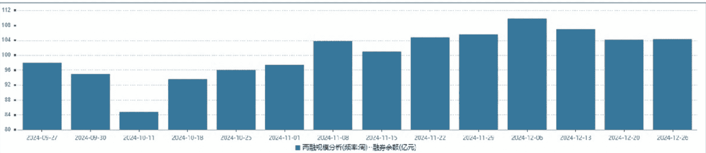

### 融券余额居前个股
| 代码 | 简称 | 期间涨跌幅 (%) | 融券余额 (亿元) | 融券余额占流通市值 (%) |
|---|---|---|---|---|
| 600519 | 贵州茅台 | 0.04 | 1.09 | 0.01 |
| 600036 | 招商银行 | 3.84 | 0.73 | 0.01 |
| 600839 | 四川长虹 | 5.14 | 0.46 | 0.09 |
| 601398 | 工商银行 | 6.78 | 0.42 | 0.00 |
| 600010 | 包钢股份 | -3.57 | 0.42 | 0.05 |
| 601318 | 中国平安 | 1.06 | 0.41 | 0.01 |
| 000858 | 五粮液 | -0.74 | 0.40 | 0.01 |
| 600418 | 江淮汽车 | 2.96 | 0.37 | 0.04 |
| 600030 | 中信证券 | 0.20 | 0.37 | 0.01 |
| 601006 | 大秦铁路 | -1.46 | 0.35 | 0.03 |
| 000333 | 美的集团 | 2.07 | 0.34 | 0.01 |
| 600900 | 长江电力 | 0.21 | 0.33 | 0.00 |
| 300059 | 东方财富 | 0.85 | 0.32 | 0.01 |
| 002625 | 光启技术 | 8.39 | 0.32 | 0.03 |
| 300750 | 宁德时代 | -3.17 | 0.31 | 0.00 |
| 601288 | 农业银行 | 5.16 | 0.28 | 0.00 |
| 601099 | 太平洋 | -1.75 | 0.27 | 0.09 |
| 601998 | 中信银行 | 2.51 | 0.26 | 0.01 |
| 601919 | 中远海控 | 2.03 | 0.25 | 0.01 |
| 002594 | 比亚迪 | -0.19 | 0.24 | 0.00 |
| 002384 | 东山精密 | 7.61 | 0.23 | 0.04 |
| 601088 | 中国神华 | -1.13 | 0.23 | 0.00 |
| 601888 | 中国中免 | -1.37 | 0.22 | 0.02 |
| 688981 | 中芯国际 | 13.21 | 0.22 | 0.01 |
| 603000 | 人民网 | -4.38 | 0.21 | 0.08 |
| 000568 | 泸州老窖 | -0.52 | 0.21 | 0.01 |
| 600895 | 张江高科 | 0.69 | 0.20 | 0.05 |
| 002130 | 沃尔核材 | 21.76 | 0.20 | 0.06 |
| 000988 | 华工科技 | 6.28 | 0.20 | 0.05 |
| 000063 | 中兴通讯 | 8.44 | 0.20 | 0.01 |
| 688041 | 海光信息 | 23.61 | 0.19 | 0.01 |
| 600104 | 上汽集团 | 2.78 | 0.19 | 0.01 |
| 000651 | 格力电器 | 4.10 | 0.19 | 0.01 |
| 600436 | 片仔癀 | -1.14 | 0.18 | 0.01 |
| 000002 | 万科 A | -5.06 | 0.18 | 0.02 |

### 融券净卖额居前个股
| 代码 | 简称 | 期间涨跌幅 (%) | 净卖出额 (亿元) | 融券卖出额占成交额 (%) |
|---|---|---|---|---|
| 601398 | 工商银行 | 6.78 | 0.13 | 0.13 |
| 601288 | 农业银行 | 5.16 | 0.09 | 0.12 |
| 600926 | 杭州银行 | 3.10 | 0.08 | 0.61 |
| 600588 | 用友网络 | -4.98 | 0.07 | 0.64 |
| 600036 | 招商银行 | 3.84 | 0.06 | 0.19 |
| 601009 | 南京银行 | 1.62 | 0.06 | 0.38 |
| 601099 | 太平洋 | -1.75 | 0.06 | 0.43 |
| 601998 | 中信银行 | 2.51 | 0.06 | 0.32 |
| 601988 | 中国银行 | 5.16 | 0.06 | 0.16 |
| 601857 | 中国石油 | 6.53 | 0.06 | 0.13 |
| 688981 | 中芯国际 | 13.21 | 0.05 | 0.03 |
| 002472 | 双环传动 | 9.33 | 0.05 | 0.21 |
| 300339 | 润和软件 | -2.69 | 0.05 | 0.10 |
| 002966 | 苏州银行 | 2.79 | 0.05 | 0.58 |
| 002429 | 兆驰股份 | 17.68 | 0.05 | 0.08 |
| 002384 | 东山精密 | 7.61 | 0.05 | 0.08 |
| 000568 | 泸州老窖 | -0.52 | 0.05 | 0.22 |
| 300699 | 光威复材 | 12.99 | 0.05 | 0.16 |
| 600171 | 上海贝岭 | 13.64 | 0.05 | 0.08 |
| 600919 | 江苏银行 | 5.05 | 0.05 | 0.10 |
| 601899 | 紫金矿业 | 1.96 | 0.04 | 0.18 |
| 601138 | 工业富联 | 5.14 | 0.04 | 0.04 |
| 600000 | 浦发银行 | 8.50 | 0.04 | 0.21 |
| 002008 | 大族激光 | 0.53 | 0.04 | 0.21 |
| 600839 | 四川长虹 | 5.14 | 0.04 | 0.11 |
| 600143 | 金发科技 | 7.00 | 0.04 | 0.29 |
| 600938 | 中国海油 | 4.61 | 0.04 | 0.08 |
| 300474 | 景嘉微 | 14.38 | 0.04 | 0.04 |
| 601456 | 国联证券 | 0.45 | 0.04 | 0.11 |
| 600188 | 兖矿能源 | -1.47 | 0.03 | 0.30 |
| 600673 | 东阳光 | 22.19 | 0.03 | 0.16 |
| 688072 | 拓荆科技 | -0.72 | 0.03 | 0.11 |
| 600157 | 永泰能源 | -5.21 | 0.03 | 0.03 |
| 688041 | 海光信息 | 23.61 | 0.03 | 0.03 |
| 603501 | 韦尔股份 | 2.65 | 0.03 | 0.09 |

### 融券净卖率居前个股
| 代码 | 简称 | 期间涨跌幅 (%) | 净卖出额 (亿元) | 净卖出额占自由流通市值 (%) |
|---|---|---|---|---|
| 688181 | 八亿时空 | 1.54 | 0.02 | 0.07 |
| 002429 | 兆驰股份 | 17.68 | 0.05 | 0.04 |
| 600588 | 用友网络 | -4.98 | 0.07 | 0.03 |
| 600751 | 海航科技 | -6.60 | 0.01 | 0.03 |
| 601456 | 国联证券 | 0.45 | 0.04 | 0.03 |
| 600720 | 中交设计 | -1.22 | 0.01 | 0.03 |
| 002472 | 双环传动 | 9.33 | 0.05 | 0.03 |
| 300699 | 光威复材 | 12.99 | 0.05 | 0.02 |
| 688363 | 华熙生物 | -2.60 | 0.02 | 0.02 |
| 002023 | 海特高新 | -1.33 | 0.01 | 0.02 |
| 600621 | 华鑫股份 | 10.28 | 0.02 | 0.02 |
| 301511 | 德福科技 | -3.60 | 0.01 | 0.02 |
| 603881 | 数据港 | 5.86 | 0.01 | 0.02 |
| 600143 | 金发科技 | 7.00 | 0.04 | 0.02 |
| 601608 | 中信重工 | -1.57 | 0.01 | 0.02 |
| 688665 | 四方光电 | 16.54 | 0.00 | 0.02 |
| 601099 | 太平洋 | -1.75 | 0.06 | 0.02 |
| 601998 | 中信银行 | 2.51 | 0.06 | 0.02 |
| 300363 | 博腾股份 | -3.23 | 0.01 | 0.02 |
| 603650 | 彤程新材 | 3.03 | 0.01 | 0.02 |
| 002966 | 苏州银行 | 2.79 | 0.05 | 0.02 |
| 002008 | 大族激光 | 0.53 | 0.04 | 0.02 |
| 600673 | 东阳光 | 22.19 | 0.03 | 0.02 |
| 600597 | 光明乳业 | -2.02 | 0.01 | 0.02 |
| 603228 | 景旺电子 | 12.90 | 0.02 | 0.02 |
| 600038 | 中直股份 | 2.36 | 0.02 | 0.02 |
| 300357 | 我武生物 | -2.00 | 0.01 | 0.02 |
| 688100 | 威胜信息 | 4.04 | 0.01 | 0.02 |
| 002030 | 达安基因 | -4.89 | 0.01 | 0.02 |
| 600171 | 上海贝岭 | 13.64 | 0.05 | 0.02 |
| 600859 | 王府井 | 1.52 | 0.02 | 0.02 |
| 688577 | 浙海德曼 | -3.71 | 0.00 | 0.02 |
| 603197 | 保隆科技 | 2.55 | 0.01 | 0.02 |
| 688658 | 悦康药业 | -13.03 | 0.01 | 0.02 |
| 605123 | 派克新材 | -3.54 | 0.01 | 0.02 |

**Data 数据荟萃**

## 券商最新研报荐股一览
王飞

### 最新买入评级的个股
| 代码 | 简称 | 机构名称 | 研究员 | 研究日期 | 最新评级 | 目标价位 (元) | 最新收盘价 (元) |
|---|---|---|---|---|---|---|---|
| 000063.SZ | 中兴通讯 | 华鑫证券 | 毛正 | 2024-12-24 | 买入 | | 40.08 |
| 000063.SZ | 中兴通讯 | 长城证券 | 侯宾 | 2024-12-23 | 买入 | | 40.08 |
| 000063.SZ | 中兴通讯 | 招商证券 (香港) | 梁程加 | 2024-12-23 | 强烈买入 | | 40.08 |
| 000422.SZ | 湖北宜化 | 首创证券 | 翟绪丽 | 2024-12-27 | 买入 | | 13.09 |
| 000425.SZ | 徐工机械 | 广发证券 | 代川 | 2024-12-25 | 买入 | 9.46 | 7.67 |
| 000426.SZ | 兴业银锡 | 中邮证券 | 魏欣 | 2024-12-25 | 买入 | | 12.21 |
| 000568.SZ | 泸州老窖 | 华创证券 | 沈昊 | 2024-12-25 | 强推 | 206.00 | 129.55 |
| 000625.SZ | 长安汽车 | 华龙证券 | 杨阳 | 2024-12-24 | 买入 | | 13.84 |
| 000680.SZ | 山推股份 | 中银证券 | 陶波 | 2024-12-23 | 买入 | | 9.66 |
| 000739.SZ | 普洛药业 | 华福证券 | 盛丽华 | 2024-12-26 | 买入 | | 15.93 |
| 000858.SZ | 五粮液 | 浙商证券 | 杨骥 | 2024-12-22 | 买入 | | 142.52 |
| 000893.SZ | 亚钾国际 | 东北证券 | 喻杰 | 2024-12-26 | 买入 | | 21.56 |
| 001323.SZ | 慕思股份 | 华福证券 | 李宏鹏 | 2024-12-25 | 买入 | | 37.29 |
| 001330.SZ | 博纳影业 | 国泰君安 | 陈筱 | 2024-12-22 | 增持 | 10.66 | 6.66 |
| 001965.SZ | 招商公路 | 国泰君安 | 岳鑫 | 2024-12-26 | 增持 | 16.81 | 13.91 |
| 002061.SZ | 浙江交科 | 中信证券 | 孙明新 | 2024-12-24 | 买入 | 5.00 | 4.22 |
| 002061.SZ | 浙江交科 | 天风证券 | 鲍荣富 | 2024-12-24 | 买入 | | 4.22 |
| 002130.SZ | 沃尔核材 | 招商证券 | 刘伟洁 | 2024-12-22 | 强烈推荐 | | 29.22 |
| 002149.SZ | 西部材料 | 国泰君安 | 彭磊 | 2024-12-22 | 增持 | 23.69 | 18.00 |
| 002149.SZ | 西部材料 | 国盛证券 | 余平 | 2024-12-23 | 买入 | | 18.00 |
| 002219.SZ | 新里程 | 华安证券 | 谭国超 | 2024-12-26 | 买入 | | 2.87 |
| 002273.SZ | 水晶光电 | 华泰金控 | 谢春生 | 2024-12-22 | 买入 | 30.40 | 22.55 |
| 002332.SZ | 仙琚制药 | 西部证券 | 李梦园 | 2024-12-27 | 买入 | | 10.19 |
| 002429.SZ | 兆驰股份 | 华泰证券 | 樊俊豪 | 2024-12-26 | 买入 | 8.28 | 6.15 |
| 002429.SZ | 兆驰股份 | 天风证券 | 孙谦 | 2024-12-24 | 买入 | | 6.15 |
| 002432.SZ | 九安医疗 | 东吴证券 | 朱国广 | 2024-12-23 | 买入 | | 42.10 |
| 002444.SZ | 巨星科技 | 申万宏源 | 王珂 | 2024-12-25 | 买入 | | 31.52 |
| 002444.SZ | 巨星科技 | 浙商证券 | 邱世梁 | 2024-12-24 | 买入 | | 31.52 |
| 002444.SZ | 巨星科技 | 国海证券 | 张钰莹 | 2024-12-22 | 买入 | | 31.52 |
| 002475.SZ | 立讯精密 | 东北证券 | 李玖 | 2024-12-24 | 买入 | | 41.35 |
| 002594.SZ | 比亚迪 | 方正证券 | 文姬 | 2024-12-26 | 强烈推荐 | | 286.28 |
| 002600.SZ | 领益智造 | 国元证券 | 彭琦 | 2024-12-23 | 买入 | 8.29 至 10.78 | 8.54 |
| 002653.SZ | 海思科 | 开源证券 | 余汝意 | 2024-12-25 | 买入 | | 33.82 |
| 002752.SZ | 昇兴股份 | 中信证券 | 李鑫 | 2024-12-25 | 买入 | 7.30 | 6.57 |
| 002765.SZ | 蓝黛科技 | 东北证券 | 李恒光 | 2024-12-22 | 买入 | | 9.18 |
| 002831.SZ | 裕同科技 | 浙商证券 | 史凡可 | 2024-12-23 | 买入 | | 27.51 |
| 002847.SZ | 盐津铺子 | 东兴证券 | 孟斯硕 | 2024-12-25 | 强烈推荐 | | 60.66 |
| 002870.SZ | 香山股份 | 中信证券 | 李景涛 | 2024-12-23 | 买入 | 38.00 | 32.74 |
| 002870.SZ | 香山股份 | 浙商证券 | 郑景毅 | 2024-12-23 | 买入 | | 32.74 |
| 002946.SZ | 新乳业 | 华龙证券 | 王芳 | 2024-12-27 | 买入 | | 14.40 |
| 300014.SZ | 亿纬锂能 | 东吴证券 | 曾朵红 | 2024-12-27 | 买入 | 70.00 | 47.03 |
| 300035.SZ | 中科电气 | 国泰君安 | 徐强 | 2024-12-26 | 增持 | 17.27 | 14.31 |
| 300072.SZ | 海新能科 | 中信证券 | 黄杰 | 2024-12-26 | 买入 | 5.00 | 3.70 |
| 300119.SZ | 瑞普生物 | 华泰金控 | 樊俊豪 | 2024-12-26 | 买入 | 23.65 | 18.62 |
| 300199.SZ | 翰宇药业 | 方正证券 | 周超泽 | 2024-12-25 | 强烈推荐 | | 13.30 |
| 300203.SZ | 聚光科技 | 国盛证券 | 杨心成 | 2024-12-24 | 买入 | | 15.76 |
| 300207.SZ | 欣旺达 | 华泰证券 | 申建国 | 2024-12-25 | 买入 | 26.68 | 22.88 |
| 300298.SZ | 三诺生物 | 华福证券 | 陈铁林 | 2024-12-27 | 买入 | | 25.92 |
| 300487.SZ | 蓝晓科技 | 长江证券 | 马太 | 2024-12-22 | 买入 | | 48.94 |
| 300638.SZ | 广和通 | 招商证券 (香港) | 梁程加 | 2024-12-24 | 强烈买入 | | 21.63 |
| 300681.SZ | 英搏尔 | 开源证券 | 孟鹏飞 | 2024-12-22 | 买入 | | 27.05 |
| 300699.SZ | 光威复材 | 中信证券 | 付宸硕 | 2024-12-26 | 买入 | 41.00 | 36.43 |
| 300699.SZ | 光威复材 | 国泰君安 | 彭磊 | 2024-12-26 | 增持 | 42.38 | 36.43 |
| 300699.SZ | 光威复材 | 中信建投 | 黎韬扬 | 2024-12-26 | 买入 | | 36.43 |
| 300699.SZ | 光威复材 | 招商证券 | 周铮 | 2024-12-25 | 强烈推荐 | | 36.43 |
| 300703.SZ | 创源股份 | 天风证券 | 孙海洋 | 2024-12-26 | 买入 | 17.25 至 20.70 | 17.08 |
| 300750.SZ | 宁德时代 | 东吴证券 | 曾朵红 | 2024-12-27 | 买入 | 446.00 | 262.00 |
| 300819.SZ | 聚杰微纤 | 中信证券 | 冯重光 | 2024-12-22 | 买入 | 20.00 | 13.36 |
| 300870.SZ | 欧陆通 | 长城证券 | 侯宾 | 2024-12-22 | 买入 | | 111.99 |
| 300938.SZ | 信测标准 | 华创证券 | 范益民 | 2024-12-22 | 强推 | 31.72 | 25.81 |
| 301263.SZ | 泰恩康 | 德邦证券 | 周新明 | 2024-12-22 | 买入 | | 15.46 |
| 301325.SZ | 曼恩斯特 | 华泰证券 | 申建国 | 2024-12-26 | 买入 | 59.85 | 54.52 |
| 301536.SZ | 星宸科技 | 华鑫证券 | 毛正 | 2024-12-25 | 买入 | | 84.20 |
| 600012.SH | 皖通高速 | 国泰君安 | 岳鑫 | 2024-12-27 | 增持 | 20.06 | 16.93 |
| 600131.SH | 国网信通 | 长江证券 | 邬博华 | 2024-12-23 | 买入 | | 19.71 |
| 600150.SH | 中国船舶 | 东吴证券 | 周尔双 | 2024-12-23 | 买入 | | 36.44 |
| 600153.SH | 建发股份 | 广发证券 | 郭镇 | 2024-12-22 | 买入 | 10.58 | 10.39 |
| 600163.SH | 中闽能源 | 华泰金控 | 王玮嘉 | 2024-12-23 | 买入 | 6.72 | 6.14 |

| 代码 | 简称 | 机构名称 | 研究员 | 研究日期 | 最新评级 | 目标价位 (元) | 最新收盘价 (元) |
| :--- | :--- | :--- | :--- | :--- | :--- | :--- | :--- |
| 600186.SH | 莲花控股 | 华西证券 | 寇星 | 2024-12-23 | 买入 | | 4.90 |
| 600210.SH | 紫江企业 | 国投证券 | 罗乾生 | 2024-12-23 | 买入 | 10.44 | 6.86 |
| 600276.SH | 恒瑞医药 | 浙商证券 | 孙建 | 2024-12-24 | 买入 | | 46.10 |
| 600312.SH | 平高电气 | 国金证券 | 姚遥 | 2024-12-23 | 买入 | 23.40 | 19.63 |
| 600372.SH | 中航机载 | 招商证券 | 王超 | 2024-12-25 | 强烈推荐 | | 12.48 |
| 600377.SH | 宁沪高速 | 国泰君安 | 岳鑫 | 2024-12-26 | 增持 | 18.38 | 15.05 |
| 600415.SH | 小商品城 | 东吴证券 | 吴劲草 | 2024-12-26 | 买入 | | 13.75 |
| 600415.SH | 小商品城 | 方正证券 | 周昕 | 2024-12-25 | 强烈推荐 | | 13.75 |
| 600519.SH | 贵州茅台 | 华创证券 | 欧阳予 | 2024-12-26 | 强推 | 2600.00 | 1,528.97 |
| 600519.SH | 贵州茅台 | 民生证券 | 王言海 | 2024-12-27 | 推荐 | | 1,528.97 |
| 600519.SH | 贵州茅台 | 财通证券 | 吴文德 | 2024-12-26 | 买入 | | 1,528.97 |
| 600519.SH | 贵州茅台 | 方正证券 | 王泽华 | 2024-12-26 | 强烈推荐 | | 1,528.97 |
| 600522.SH | 中天科技 | 德邦证券 | 李宏涛 | 2024-12-24 | 买入 | | 14.76 |
| 600577.SH | 精达股份 | 国盛证券 | 杨义韬 | 2024-12-22 | 买入 | | 8.02 |
| 600598.SH | 北大荒 | 中信证券 | 盛夏 | 2024-12-24 | 买入 | 18.00 | 15.05 |
| 600600.SH | 青岛啤酒 | 华创证券 | 欧阳予 | 2024-12-25 | 强推 | 90.00 | 79.75 |
| 600600.SH | 青岛啤酒 | 广发证券 | 符蓉 | 2024-12-25 | 买入 | 91.82 | 79.75 |
| 600600.SH | 青岛啤酒 | 华泰证券 | 龚源月 | 2024-12-25 | 买入 | 94.12 | 79.75 |
| 600600.SH | 青岛啤酒 | 国盛证券 | 李梓语 | 2024-12-26 | 买入 | | 79.75 |
| 600600.SH | 青岛啤酒 | 方正证券 | 王泽华 | 2024-12-25 | 强烈推荐 | | 79.75 |
| 600673.SH | 东阳光 | 中信证券 | 黄亚元 | 2024-12-25 | 买入 | 13.00 | 11.19 |
| 600673.SH | 东阳光 | 国盛证券 | 杨义韬 | 2024-12-23 | 买入 | | 11.19 |
| 600718.SH | 东软集团 | 浙商证券 | 刘雯蜀 | 2024-12-23 | 买入 | 15.20 | 10.49 |
| 600754.SH | 锦江酒店 | 广发证券 | 嵇文欣 | 2024-12-26 | 买入 | 33.40 | 27.08 |
| 600754.SH | 锦江酒店 | 西部证券 | 李雯 | 2024-12-25 | 买入 | | 27.08 |
| 600754.SH | 锦江酒店 | 东吴证券 | 吴劲草 | 2024-12-25 | 买入 | | 27.08 |
| 600754.SH | 锦江酒店 | 华西证券 | 许光辉 | 2024-12-25 | 买入 | | 27.08 |
| 600754.SH | 锦江酒店 | 国金证券 | 叶思嘉 | 2024-12-24 | 买入 | | 27.08 |
| 600761.SH | 安徽合力 | 东海证券 | 谢建斌 | 2024-12-25 | 买入 | | 18.19 |
| 600809.SH | 山西汾酒 | 华创证券 | 沈昊 | 2024-12-25 | 强推 | 285.00 | 187.79 |
| 600809.SH | 山西汾酒 | 国盛证券 | 李梓语 | 2024-12-25 | 买入 | | 187.79 |
| 600967.SH | 内蒙一机 | 浙商证券 | 邱世梁 | 2024-12-24 | 买入 | | 8.85 |
| 600968.SH | 海油发展 | 华创证券 | 杨晖 | 2024-12-22 | 强推 | 5.38 | 4.28 |
| 600987.SH | 航民股份 | 广发证券 | 糜韩杰 | 2024-12-22 | 买入 | 8.44 | 7.09 |
| 600989.SH | 宝丰能源 | 德邦证券 | 王华炳 | 2024-12-26 | 买入 | | 16.28 |
| 600998.SH | 九州通 | 广发证券 | 罗佳荣 | 2024-12-26 | 买入 | 6.48 | 5.26 |
| 600998.SH | 九州通 | 银河证券 | 程培 | 2024-12-26 | 推荐 | | 5.26 |
| 601058.SH | 赛轮轮胎 | 德邦证券 | 王华炳 | 2024-12-24 | 买入 | | 14.34 |
| 601100.SH | 恒立液压 | 东吴证券 | 周尔双 | 2024-12-24 | 买入 | | 52.99 |
| 601155.SH | 新城控股 | 东吴证券 | 房诚琦 | 2024-12-26 | 买入 | | 12.31 |
| 601179.SH | 中国西电 | 华泰证券 | 刘俊 | 2024-12-22 | 买入 | 9.20 | 7.88 |
| 601330.SH | 绿色动力 | 国泰君安 | 徐强 | 2024-12-22 | 增持 | 7.52 | 6.72 |
| 601330.SH | 绿色动力 | 申万宏源 | 莫龙庭 | 2024-12-23 | 买入 | | 6.72 |
| 601330.SH | 绿色动力 | 东吴证券 | 袁理 | 2024-12-23 | 买入 | | 6.72 |
| 601611.SH | 中国核建 | 广发证券 | 耿鹏智 | 2024-12-24 | 买入 | 12.60 | 9.26 |
| 601766.SH | 中国中车 | 中信证券 | 刘海博 | 2024-12-24 | 买入 | 9.70 | 8.35 |
| 601778.SH | 晶科科技 | 中邮证券 | 杨帅波 | 2024-12-24 | 买入 | | 2.95 |
| 601890.SH | 亚星锚链 | 中信证券 | 刘海博 | 2024-12-23 | 买入 | 10.00 | 8.08 |
| 601898.SH | 中煤能源 | 长城证券 | 肖亚平 | 2024-12-24 | 买入 | | 11.85 |
| 601966.SH | 玲珑轮胎 | 德邦证券 | 王华炳 | 2024-12-25 | 买入 | | 18.67 |
| 603166.SH | 福达股份 | 信达证券 | 丁泓婧 | 2024-12-26 | 买入 | | 7.54 |
| 603170.SH | 宝立食品 | 华泰金控 | 龚源月 | 2024-12-26 | 买入 | 19.60 | 15.28 |
| 603170.SH | 宝立食品 | 华泰证券 | 龚源月 | 2024-12-23 | 买入 | 19.60 | 15.28 |
| 603197.SH | 保隆科技 | 招商证券 | 汪刘胜 | 2024-12-24 | 强烈推荐 | | 38.70 |
| 603214.SH | 爱婴室 | 浙商证券 | 汤秀洁 | 2024-12-25 | 买入 | | 23.15 |
| 603218.SH | 日月股份 | 中信证券 | 华鹏伟 | 2024-12-23 | 买入 | 18.00 | 12.37 |
| 603298.SH | 杭叉集团 | 光大证券 | 陈佳宁 | 2024-12-25 | 买入 | | 18.26 |
| 603298.SH | 杭叉集团 | 国盛证券 | 张一鸣 | 2024-12-24 | 买入 | | 18.26 |
| 603298.SH | 杭叉集团 | 浙商证券 | 邱世梁 | 2024-12-24 | 买入 | | 18.26 |
| 603308.SH | 应流股份 | 国金证券 | 满在朋 | 2024-12-24 | 买入 | | 14.20 |
| 603338.SH | 浙江鼎力 | 太平洋证券 | 崔文娟 | 2024-12-26 | 买入 | 75.59 | 63.55 |
| 603757.SH | 大元泵业 | 东北证券 | 濮阳 | 2024-12-26 | 买入 | | 20.52 |
| 603818.SH | 曲美家居 | 华泰金控 | 樊俊豪 | 2024-12-26 | 买入 | 3.74 | 2.90 |
| 603818.SH | 曲美家居 | 华泰证券 | 樊俊豪 | 2024-12-23 | 买入 | 3.74 | 2.90 |
| 603979.SH | 金诚信 | 浙商证券 | 沈皓俊 | 2024-12-24 | 买入 | | 37.20 |
| 605117.SH | 德业股份 | 华泰金控 | 申建国 | 2024-12-22 | 买入 | 119.32 | 83.10 |
| 605369.SH | 拱东医疗 | 招商证券 | 梁广楷 | 2024-12-23 | 强烈推荐 | | 29.10 |
| 605488.SH | 福莱新材 | 华鑫证券 | 张伟保 | 2024-12-24 | 买入 | | 21.54 |
| 605555.SH | 德昌股份 | 天风证券 | 孙谦 | 2024-12-22 | 买入 | | 22.51 |
| 605589.SH | 圣泉集团 | 德邦证券 | 王华炳 | 2024-12-24 | 买入 | | 23.98 |
| 688012.SH | 中微公司 | 申万宏源 | 李天奇 | 2024-12-22 | 买入 | | 197.35 |
| 688036.SH | 传音控股 | 华安证券 | 陈耀波 | 2024-12-24 | 买入 | | 93.34 |
| 688041.SH | 海光信息 | 民生证券 | 吕伟 | 2024-12-24 | 推荐 | | 155.05 |
| 688056.SH | 莱伯泰科 | 西南证券 | 邹桂龙 | 2024-12-22 | 买入 | 40.95 | 30.40 |
| 688100.SH | 威胜信息 | 招商证券 | 梁程加 | 2024-12-23 | 强烈推荐 | | 39.00 |
| 688120.SH | 华海清科 | 国泰君安 | 肖群稀 | 2024-12-26 | 增持 | 269.56 | 168.34 |

### Data 数据荟萃

### 一致评级不断调高的个股 (按参与机构数量由高到低排序)

| 代码 | 简称 | 最新评级机构数 | 一致评级 | 环比调整幅度 (%) | 一月前评级机构数 | 一致评级 | 环比调整幅度 (%) | 二月前评级机构数 | 一致评级 | 环比调整幅度 (%) | 三月前评级机构数 | 一致评级 | 最新收盘价 (元) | 3 个月内涨跌幅 (%) | 证监会行业 |
|---|---|---|---|---|---|---|---|---|---|---|---|---|---|---|---|
| 600809.SH | 山西汾酒 | 49 | 1.16 | 0.51 | 49 | 1.18 | 0.10 | 48 | 1.19 | 0.00 | 48 | 1.19 | 187.79 | 3.81 | CSRC 制造业 |
| 002594.SZ | 比亚迪 | 46 | 1.28 | 0.00 | 46 | 1.28 | 0.54 | 46 | 1.30 | 0.00 | 46 | 1.30 | 286.28 | 6.18 | CSRC 制造业 |
| 603606.SH | 东方电缆 | 41 | 1.39 | 0.11 | 38 | 1.39 | 0.27 | 37 | 1.41 | 0.00 | 37 | 1.41 | 52.68 | 11.37 | CSRC 制造业 |
| 002475.SZ | 立讯精密 | 40 | 1.23 | 0.15 | 39 | 1.23 | 0.00 | 39 | 1.23 | 0.64 | 39 | 1.26 | 41.35 | 7.63 | CSRC 制造业 |
| 601100.SH | 恒立液压 | 35 | 1.37 | 0.00 | 35 | 1.37 | 0.00 | 35 | 1.37 | 0.00 | 35 | 1.37 | 52.99 | -1.63 | CSRC 制造业 |
| 300014.SZ | 亿纬锂能 | 35 | 1.31 | 0.00 | 35 | 1.31 | 0.21 | 31 | 1.32 | 0.96 | 36 | 1.36 | 47.03 | 34.60 | CSRC 制造业 |
| 002463.SZ | 沪电股份 | 34 | 1.26 | 0.00 | 34 | 1.26 | 0.00 | 34 | 1.26 | 0.20 | 33 | 1.27 | 41.02 | 17.60 | CSRC 制造业 |
| 002304.SZ | 洋河股份 | 34 | 1.32 | 0.00 | 34 | 1.32 | 0.25 | 36 | 1.33 | 0.00 | 39 | 1.33 | 84.02 | -1.47 | CSRC 制造业 |
| 603197.SH | 保隆科技 | 33 | 1.36 | 0.59 | 31 | 1.39 | 0.15 | 28 | 1.39 | 0.66 | 31 | 1.42 | 38.70 | 13.16 | CSRC 制造业 |
| 600031.SH | 三一重工 | 33 | 1.24 | 0.76 | 33 | 1.27 | 0.33 | 35 | 1.29 | 0.00 | 35 | 1.29 | 16.63 | -3.26 | CSRC 制造业 |
| 603195.SH | 公牛集团 | 32 | 1.44 | 0.00 | 32 | 1.44 | 0.83 | 34 | 1.47 | 0.74 | 36 | 1.50 | 72.03 | -1.72 | CSRC 制造业 |
| 603501.SH | 韦尔股份 | 32 | 1.38 | 0.30 | 31 | 1.39 | 0.15 | 28 | 1.39 | 0.36 | 27 | 1.41 | 105.70 | 16.95 | CSRC 制造业 |
| 000651.SZ | 格力电器 | 31 | 1.42 | 0.00 | 31 | 1.42 | 0.35 | 30 | 1.43 | 0.46 | 31 | 1.45 | 45.06 | 1.53 | CSRC 制造业 |
| 601058.SH | 赛轮轮胎 | 30 | 1.20 | 0.00 | 30 | 1.20 | 0.65 | 31 | 1.23 | 0.00 | 31 | 1.23 | 14.34 | -0.14 | CSRC 制造业 |
| 605117.SH | 德业股份 | 30 | 1.30 | 0.00 | 30 | 1.30 | 0.00 | 30 | 1.30 | 0.00 | 30 | 1.30 | 83.10 | -4.92 | CSRC 制造业 |
| 603596.SH | 伯特利 | 30 | 1.23 | 0.20 | 29 | 1.24 | 0.45 | 27 | 1.26 | 0.25 | 26 | 1.27 | 45.68 | 8.79 | CSRC 制造业 |
| 002991.SZ | 甘源食品 | 30 | 1.20 | 0.17 | 29 | 1.21 | 0.19 | 28 | 1.21 | 0.68 | 29 | 1.24 | 87.95 | 47.86 | CSRC 制造业 |
| 601899.SH | 紫金矿业 | 29 | 1.21 | 0.00 | 29 | 1.21 | 0.00 | 29 | 1.21 | 1.08 | 28 | 1.25 | 15.30 | -11.92 | CSRC 采矿业 |
| 601128.SH | 常熟银行 | 29 | 1.31 | 0.00 | 29 | 1.31 | 0.58 | 30 | 1.33 | 0.29 | 29 | 1.34 | 7.45 | 7.66 | CSRC 金融业 |
| 002601.SZ | 龙佰集团 | 28 | 1.39 | 0.00 | 28 | 1.39 | 0.18 | 25 | 1.40 | 0.72 | 28 | 1.43 | 17.51 | -5.35 | CSRC 制造业 |
| 603589.SH | 口子窖 | 28 | 1.54 | 0.00 | 28 | 1.54 | 0.00 | 28 | 1.54 | 0.00 | 28 | 1.54 | 39.89 | -3.18 | CSRC 制造业 |
| 000963.SZ | 华东医药 | 28 | 1.14 | 0.00 | 28 | 1.14 | 0.27 | 26 | 1.15 | 0.16 | 25 | 1.16 | 36.10 | 17.36 | CSRC 批发和零售业 |
| 000975.SZ | 山金国际 | 28 | 1.21 | 0.00 | 28 | 1.21 | 0.20 | 27 | 1.22 | 0.70 | 28 | 1.25 | 15.42 | -11.58 | CSRC 采矿业 |
| 002353.SZ | 杰瑞股份 | 28 | 1.43 | 0.00 | 28 | 1.43 | 0.29 | 25 | 1.44 | 1.50 | 26 | 1.50 | 35.90 | 24.48 | CSRC 制造业 |
| 002078.SZ | 太阳纸业 | 28 | 1.25 | 0.00 | 28 | 1.25 | 0.00 | 28 | 1.25 | 1.56 | 32 | 1.31 | 14.58 | 5.96 | CSRC 制造业 |
| 000938.SZ | 紫光股份 | 27 | 1.41 | 0.39 | 26 | 1.42 | 0.00 | 26 | 1.42 | 0.42 | 25 | 1.44 | 28.96 | 42.31 | CSRC 制造业 |
| 600938.SH | 中国海油 | 27 | 1.11 | 0.00 | 27 | 1.11 | 0.11 | 26 | 1.12 | 0.00 | 26 | 1.12 | 28.88 | 4.00 | CSRC 采矿业 |
| 600570.SH | 恒生电子 | 27 | 1.26 | 0.00 | 27 | 1.26 | 0.00 | 27 | 1.26 | 0.00 | 27 | 1.26 | 29.41 | 55.61 | CSRC 信息传输、软件和信息技术服务业 |
| 300973.SZ | 立高食品 | 27 | 1.30 | 0.00 | 27 | 1.30 | 0.63 | 28 | 1.32 | 1.81 | 33 | 1.39 | 40.66 | 34.68 | CSRC 制造业 |
| 300673.SZ | 佩蒂股份 | 26 | 1.27 | 0.27 | 25 | 1.28 | 0.29 | 24 | 1.29 | 0.71 | 25 | 1.32 | 17.51 | 40.42 | CSRC 制造业 |
| 603899.SH | 晨光股份 | 26 | 1.23 | 0.00 | 26 | 1.23 | 0.75 | 23 | 1.26 | 0.15 | 30 | 1.27 | 30.60 | 3.03 | CSRC 制造业 |
| 688083.SH | 中望软件 | 26 | 1.31 | 0.00 | 26 | 1.31 | 0.34 | 28 | 1.32 | 0.00 | 28 | 1.32 | 88.74 | 13.75 | CSRC 信息传输、软件和信息技术服务业 |
| 000528.SZ | 柳工 | 26 | 1.15 | 0.00 | 26 | 1.15 | 1.16 | 25 | 1.20 | 0.77 | 26 | 1.23 | 11.50 | 0.70 | CSRC 制造业 |
| 300033.SZ | 同花顺 | 25 | 1.32 | 0.00 | 25 | 1.32 | 1.62 | 26 | 1.38 | 1.39 | 25 | 1.44 | 308.98 | 130.17 | CSRC 金融业 |
| 002001.SZ | 新和成 | 25 | 1.44 | 0.00 | 25 | 1.44 | 1.04 | 27 | 1.48 | 0.00 | 27 | 1.48 | 22.11 | 9.46 | CSRC 制造业 |
| 002223.SZ | 鱼跃医疗 | 25 | 1.24 | 0.48 | 27 | 1.26 | 0.52 | 25 | 1.28 | 0.29 | 24 | 1.29 | 36.95 | 7.48 | CSRC 制造业 |
| 603993.SH | 洛阳钼业 | 25 | 1.32 | 0.00 | 25 | 1.32 | 0.33 | 24 | 1.33 | 0.32 | 26 | 1.35 | 6.82 | -16.01 | CSRC 采矿业 |
| 601628.SH | 中国人寿 | 24 | 1.21 | 0.00 | 24 | 1.21 | 1.04 | 20 | 1.25 | 0.48 | 26 | 1.27 | 42.52 | 8.39 | CSRC 金融业 |
| 600588.SH | 用友网络 | 24 | 1.38 | 0.00 | 24 | 1.38 | 0.63 | 25 | 1.40 | 0.00 | 30 | 1.40 | 11.63 | 21.91 | CSRC 信息传输、软件和信息技术服务业 |
| 300662.SZ | 科锐国际 | 24 | 1.46 | 0.00 | 24 | 1.46 | 0.45 | 21 | 1.48 | 0.10 | 25 | 1.48 | 22.36 | 30.30 | CSRC 租赁和商务服务业 |
| 600161.SH | 天坛生物 | 24 | 1.21 | 0.23 | 23 | 1.22 | 1.38 | 22 | 1.27 | 0.18 | 25 | 1.28 | 20.90 | -7.69 | CSRC 制造业 |
| 300866.SZ | 安克创新 | 24 | 1.29 | 0.00 | 24 | 1.29 | 1.40 | 23 | 1.35 | 0.00 | 23 | 1.35 | 97.52 | 39.02 | CSRC 制造业 |
| 603786.SH | 科博达 | 24 | 1.29 | 0.00 | 24 | 1.29 | 0.66 | 22 | 1.32 | 0.08 | 28 | 1.32 | 64.80 | 22.52 | CSRC 制造业 |
| 002241.SZ | 歌尔股份 | 23 | 1.52 | 1.09 | 23 | 1.57 | 0.16 | 21 | 1.57 | 0.00 | 21 | 1.57 | 26.98 | 37.02 | CSRC 制造业 |
| 600066.SH | 宇通客车 | 23 | 1.48 | 0.00 | 23 | 1.48 | 0.00 | 23 | 1.48 | 0.00 | 23 | 1.48 | 25.37 | 2.55 | CSRC 制造业 |
| 688692.SH | 达梦数据 | 23 | 1.26 | 0.00 | 23 | 1.26 | 0.62 | 21 | 1.29 | 0.00 | 21 | 1.29 | 346.50 | 41.08 | CSRC 信息传输、软件和信息技术服务业 |
| 688208.SH | 道通科技 | 23 | 1.30 | 0.00 | 23 | 1.30 | 0.73 | 21 | 1.33 | 1.19 | 21 | 1.38 | 39.71 | 55.66 | CSRC 制造业 |

## 一周行业指数及重点行业个股表现 (12 月 23 日~12 月 27 日)

刘增禄

### 二级行业指数一周表现

| 板块名称 | 周涨跌幅 (%) | 近三个月涨跌幅 (%) | 换手率 (%) | 成交额 (亿元) |
| :--- | :---: | :---: | :---: | :---: |
| SW 炼化及贸易 | 4.98 | 4.77 | 11.31 | 321.32 |
| SW 国有大型银行Ⅱ | 4.97 | 9.54 | 2.11 | 550.11 |
| SW 电机Ⅱ | 4.09 | 44.68 | 29.66 | 422.21 |
| SW 黑色家电 | 3.94 | 65.69 | 33.05 | 567.62 |
| SW 股份制银行Ⅱ | 3.90 | 8.40 | 2.04 | 479.52 |
| SW 城商行Ⅱ | 3.33 | 12.42 | 5.13 | 337.75 |
| SW 农商行Ⅱ | 3.10 | 13.25 | 6.92 | 114.85 |
| SW 其他电源设备Ⅱ | 2.97 | 65.23 | 34.82 | 710.12 |
| SW 油气开采Ⅱ | 2.89 | 9.06 | 6.37 | 94.02 |
| SW 航运港口 | 2.69 | 7.05 | 5.21 | 285.48 |
| SW 乘用车 | 2.66 | 23.56 | 6.86 | 618.16 |
| SW 保险Ⅱ | 2.61 | 9.76 | 5.61 | 324.70 |
| SW 航空装备Ⅱ | 2.55 | 31.41 | 14.80 | 660.78 |
| SW 商用车 | 2.36 | 27.16 | 11.07 | 309.41 |
| SW 铁路公路 | 2.35 | 13.07 | 8.71 | 306.01 |
| SW 油服工程 | 2.23 | 7.44 | 13.27 | 75.82 |
| SW 综合Ⅱ | 2.15 | 43.72 | 14.01 | 152.25 |
| SW 白色家电 | 2.05 | 2.15 | 13.21 | 353.45 |
| SW 燃气Ⅱ | 1.66 | 12.69 | 8.02 | 109.51 |
| SW 通信设备 | 1.56 | 45.65 | 34.38 | 3,367.85 |
| SW 种植业 | 1.39 | 24.49 | 19.32 | 176.82 |
| SW 电力 | 1.36 | 4.20 | 12.88 | 1,366.20 |
| SW 元件 | 1.30 | 35.61 | 28.77 | 1,244.52 |
| SW 房屋建设Ⅱ | 1.30 | 10.96 | 12.93 | 156.71 |
| SW 轨交设备Ⅱ | 1.14 | 14.31 | 17.31 | 257.35 |
| SW 证券Ⅱ | 0.96 | 29.76 | 8.64 | 2,084.36 |
| SW 航海装备Ⅱ | 0.93 | 2.48 | 8.84 | 171.50 |
| SW 航空机场 | 0.93 | 19.28 | 5.55 | 228.83 |
| SW 工程机械 | 0.86 | 8.70 | 25.64 | 362.77 |
| SW 电网设备 | 0.82 | 14.61 | 20.94 | 1,113.37 |
| SW 其他电子Ⅱ | 0.78 | 57.97 | 33.35 | 765.17 |
| SW 装修建材 | 0.70 | 20.93 | 14.11 | 217.10 |
| SW 摩托车及其他 | 0.64 | 26.69 | 17.24 | 172.42 |
| SW 造纸 | 0.59 | 19.15 | 17.13 | 193.74 |
| SW 饲料 | 0.58 | 23.58 | 14.65 | 96.33 |
| SW 基础建设 | 0.48 | 19.99 | 17.11 | 491.63 |
| SW 饮料乳品 | 0.47 | 26.84 | 17.14 | 250.99 |
| SW 普钢 | 0.36 | 13.41 | 5.72 | 218.30 |
| SW 非白酒 | 0.35 | 16.90 | 10.68 | 99.80 |
| SW 物流 | 0.34 | 7.40 | 10.85 | 282.83 |
| SW 通信服务 | 0.32 | 25.90 | 42.37 | 1,257.59 |
| SW 消费电子 | 0.31 | 27.34 | 34.81 | 2,337.40 |
| SW 一般零售 | 0.27 | 56.42 | 26.86 | 1,205.75 |
| SW 养殖业 | 0.26 | 4.03 | 12.13 | 195.12 |
| SW 煤炭开采 | 0.23 | -2.78 | 5.61 | 409.07 |
| SW 半导体 | 0.19 | 68.55 | 26.67 | 5,936.17 |
| SW 化学原料 | 0.07 | 12.08 | 9.41 | 362.87 |
| SW 金属新材料 | 0.01 | 37.85 | 22.68 | 400.70 |
| SW 医疗器械 | -0.15 | 14.79 | 11.05 | 579.35 |
| SW 白酒Ⅱ | -0.22 | 3.45 | 7.58 | 525.47 |
| SW 工业金属 | -0.29 | -0.02 | 9.03 | 627.00 |
| SW 汽车零部件 | -0.30 | 27.05 | 17.62 | 2,273.79 |
| SW 贵金属 | -0.41 | -8.06 | 9.80 | 155.68 |
| SW 家电零部件Ⅱ | -0.68 | 33.17 | 22.95 | 371.82 |
| SW 调味发酵品Ⅱ | -0.74 | 16.77 | 9.79 | 89.14 |
| SW 旅游零售Ⅱ | -0.78 | 7.95 | 2.78 | 37.47 |
| SW 环境治理 | -0.93 | 25.48 | 12.60 | 490.76 |
| SW 冶钢原料 | -1.01 | 12.98 | 4.84 | 41.22 |
| SW 军工电子Ⅱ | -1.02 | 36.90 | 19.65 | 970.08 |
| SW 专业工程 | -1.03 | 21.87 | 15.85 | 276.87 |
| SW 电池 | -1.10 | 30.29 | 13.02 | 1,153.90 |
| SW 家居用品 | -1.11 | 18.46 | 15.98 | 259.86 |
| SW 计算机设备 | -1.12 | 37.05 | 29.42 | 1,933.06 |
| SW 小家电 | -1.13 | 13.69 | 23.26 | 170.71 |
| SW 农化制品 | -1.15 | 15.84 | 11.39 | 417.34 |
| SW 休闲食品 | -1.16 | 41.95 | 27.04 | 297.17 |
| SW 化学制品 | -1.21 | 13.02 | 16.05 | 994.96 |
| SW 多元金融 | -1.25 | 21.79 | 7.90 | 278.29 |
| SW 小金属 | -1.31 | 15.80 | 9.69 | 213.75 |
| SW 专用设备 | -1.31 | 31.21 | 19.30 | 1,399.55 |
| SW 食品加工 | -1.32 | 11.29 | 16.45 | 172.63 |
| SW 医疗美容 | -1.34 | 19.03 | 7.18 | 31.76 |
| SW 化学纤维 | -1.42 | 31.87 | 17.90 | 265.09 |
| SW 自动化设备 | -1.47 | 50.06 | 22.72 | 1,235.10 |
| SW 地面兵装Ⅱ | -1.49 | 21.99 | 14.68 | 113.23 |
| SW 化学制药 | -1.53 | 13.21 | 12.31 | 1,047.78 |
| SW 玻璃玻纤 | -1.55 | 15.59 | 8.12 | 103.85 |
| SW 水泥 | -1.59 | 12.06 | 17.72 | 182.61 |
| SW 能源金属 | -1.64 | 20.32 | 7.19 | 173.99 |
| SW 橡胶 | -1.70 | 25.65 | 15.64 | 97.59 |
| SW 中药Ⅱ | -1.74 | 11.26 | 9.42 | 472.22 |
| SW 光伏设备 | -1.78 | 14.29 | 13.09 | 935.26 |
| SW 纺织制造 | -1.84 | 14.48 | 10.60 | 110.79 |
| SW 生物制品 | -1.86 | 9.30 | 5.98 | 241.81 |
| SW 航天装备Ⅱ | -1.91 | 32.50 | 9.82 | 97.18 |
| SW 焦炭Ⅱ | -1.95 | 14.03 | 15.36 | 58.34 |
| SW 农产品加工 | -1.98 | 19.23 | 9.70 | 90.46 |
| SW 环保设备Ⅱ | -2.02 | 19.91 | 13.41 | 109.31 |
| SW 光学光电子 | -2.05 | 37.73 | 24.75 | 1,664.62 |
| SW 非金属材料Ⅱ | -2.13 | 34.80 | 24.02 | 107.64 |
| SW 特钢Ⅱ | -2.21 | 7.62 | 8.76 | 85.23 |
| SW 风电设备 | -2.25 | 30.82 | 14.51 | 241.28 |
| SW 包装印刷 | -2.28 | 26.35 | 17.89 | 258.23 |
| SW 通用设备 | -2.29 | 41.54 | 24.72 | 2,270.95 |
| SW 饰品 | -2.34 | 12.28 | 11.07 | 80.34 |
| SW 塑料 | -2.50 | 25.61 | 17.03 | 366.69 |
| SW 动物保健Ⅱ | -2.52 | 25.46 | 8.43 | 33.30 |
| SW 化妆品 | -2.68 | 15.18 | 19.43 | 130.00 |
| SW 酒店餐饮 | -2.82 | 11.70 | 17.44 | 79.94 |
| SW 农业综合Ⅱ | -2.85 | 46.40 | 16.78 | 12.42 |
| SW 个护用品 | -2.90 | 30.37 | 18.28 | 59.08 |
| SW 房地产开发 | -2.99 | 13.70 | 9.74 | 757.67 |
| SW 医药商业 | -3.01 | 12.54 | 13.46 | 209.48 |
| SW 贸易Ⅱ | -3.09 | 17.37 | 12.79 | 109.70 |
| SW 服装家纺 | -3.48 | 23.74 | 21.36 | 367.54 |

### 炼化及贸易板块个股一周表现 (4.98%)

| 代码 | 简称 | 周涨跌幅 (%) | 周收盘价 (元) | 周换手率 (%) | 市盈率 (倍，TTM) | 流通 A 股 (万股) | 周净主动买入量占比 (%) |
| :--- | :--- | :---: | :---: | :---: | :---: | :---: | :---: |
| 603353 | 和顺石油 | 13.36 | 17.23 | 36.66 | 73.59 | 17041.80 | -2.54 |
| 002221 | 东华能源 | 8.18 | 10.05 | 6.33 | 95.85 | 146088.99 | 1.17 |
| 601857 | 中国石油 | 6.95 | 8.92 | 0.64 | 10.08 | 16192207.78 | 0.08 |
| 600028 | 中国石化 | 4.23 | 6.65 | 0.99 | 15.62 | 9484182.49 | 0.14 |
| 600506 | 统一股份 | 3.87 | 19.88 | 74.65 | 617.74 | 14770.69 | -2.77 |
| 601233 | 桐昆股份 | 2.21 | 12.02 | 4.28 | 32.20 | 239589.81 | -0.10 |
| 600688 | 上海石化 | 2.00 | 3.06 | 2.09 | -50.11 | 732881.35 | 0.13 |
| 603798 | 康普顿 | 1.68 | 9.08 | 7.66 | 40.71 | 25644.97 | -1.84 |
| 000703 | 恒逸石化 | 1.49 | 6.13 | 1.67 | 48.85 | 364733.77 | -0.04 |
| 600346 | 恒力石化 | 0.59 | 15.28 | 0.98 | 17.05 | 703909.98 | 0.02 |
| 603223 | 恒通股份 | 0.58 | 10.40 | 11.28 | 63.02 | 55319.04 | -1.49 |
| 002493 | 荣盛石化 | 0.55 | 9.15 | 0.74 | 48.07 | 949828.13 | -0.01 |

| 代码 | 简称 | 最新评级机构数 | 最新一致评级 | 最新环比调整幅度 (%) | 一月前评级机构数 | 一月前一致评级 | 一月前环比调整幅度 (%) | 二月前评级机构数 | 二月前一致评级 | 二月前环比调整幅度 (%) | 三月前评级机构数 | 三月前一致评级 | 最新收盘价 (元) | 3 月内涨跌幅 (%) | 证监会行业 |
| :--- | :--- | :---: | :---: | :---: | :---: | :---: | :---: | :---: | :---: | :---: | :---: | :---: | :---: | :---: | :--- |
| 002444.SZ | 巨星科技 | 22 | 1.27 | 1.08 | 19 | 1.32 | 2.40 | 17 | 1.41 | 0.00 | 17 | 1.41 | 31.52 | 12.25 | CSRC 制造业 |
| 603129.SH | 春风动力 | 22 | 1.36 | 0.00 | 22 | 1.36 | 0.00 | 22 | 1.36 | 1.14 | 22 | 1.41 | 154.00 | 4.76 | CSRC 制造业 |
| 688472.SH | 阿特斯 | 22 | 1.18 | 0.00 | 22 | 1.18 | 2.27 | 22 | 1.27 | 0.33 | 21 | 1.29 | 12.18 | 5.91 | CSRC 制造业 |
| 300012.SZ | 华测检测 | 22 | 1.36 | 0.00 | 22 | 1.36 | 0.00 | 22 | 1.36 | 0.44 | 21 | 1.38 | 12.76 | 5.89 | CSRC 科学研究和技术服务业 |
| 300627.SZ | 华测导航 | 22 | 1.32 | 0.38 | 21 | 1.33 | 0.00 | 18 | 1.33 | 0.76 | 22 | 1.36 | 41.61 | 38.84 | CSRC 制造业 |
| 601021.SH | 春秋航空 | 22 | 1.27 | 0.00 | 22 | 1.27 | 1.14 | 22 | 1.32 | 0.38 | 21 | 1.33 | 57.80 | 6.15 | CSRC 交通运输、仓储和邮政业 |
| 301162.SZ | 国能日新 | 21 | 1.14 | 0.18 | 20 | 1.15 | 0.00 | 20 | 1.15 | 0.42 | 24 | 1.17 | 47.10 | 41.19 | CSRC 信息传输、软件和信息技术服务业 |
| 600926.SH | 杭州银行 | 21 | 1.48 | 0.00 | 21 | 1.48 | 0.60 | 22 | 1.50 | 0.60 | 21 | 1.52 | 14.65 | 8.76 | CSRC 金融业 |
| 603170.SH | 宝立食品 | 21 | 1.38 | 2.32 | 19 | 1.47 | 0.00 | 19 | 1.47 | 1.62 | 26 | 1.54 | 15.28 | 23.33 | CSRC 制造业 |
| 600406.SH | 国电南瑞 | 21 | 1.29 | 0.00 | 21 | 1.29 | 0.81 | 22 | 1.32 | 0.38 | 24 | 1.33 | 25.07 | -3.76 | CSRC 信息传输、软件和信息技术服务业 |
| 300294.SZ | 博雅生物 | 21 | 1.24 | 0.00 | 21 | 1.24 | 0.00 | 21 | 1.24 | 1.66 | 23 | 1.30 | 31.00 | -2.67 | CSRC 制造业 |
| 000034.SZ | 神州数码 | 21 | 1.19 | 0.00 | 21 | 1.19 | 0.50 | 19 | 1.21 | 2.43 | 26 | 1.31 | 35.53 | 36.81 | CSRC 批发和零售业 |
| 688568.SH | 中科星图 | 21 | 1.29 | 0.00 | 21 | 1.29 | 0.81 | 22 | 1.32 | 0.00 | 22 | 1.32 | 52.24 | 76.90 | CSRC 信息传输、软件和信息技术服务业 |
| 002043.SZ | 兔宝宝 | 21 | 1.33 | 0.00 | 21 | 1.33 | 0.00 | 21 | 1.33 | 1.19 | 21 | 1.38 | 12.06 | 10.14 | CSRC 制造业 |
| 002821.SZ | 凯莱英 | 20 | 1.15 | 0.00 | 20 | 1.15 | 0.66 | 17 | 1.18 | 0.80 | 24 | 1.21 | 77.00 | 10.94 | CSRC 制造业 |
| 600760.SH | 中航沈飞 | 20 | 1.10 | 0.00 | 20 | 1.10 | 0.00 | 20 | 1.10 | 0.76 | 23 | 1.13 | 50.46 | 23.56 | CSRC 制造业 |
| 300596.SZ | 利安隆 | 20 | 1.40 | 0.00 | 20 | 1.40 | 0.00 | 20 | 1.40 | 0.00 | 20 | 1.40 | 30.48 | 19.76 | CSRC 制造业 |
| 603556.SH | 海兴电力 | 20 | 1.25 | 0.89 | 21 | 1.29 | 0.00 | 21 | 1.29 | 0.55 | 26 | 1.31 | 37.23 | -16.49 | CSRC 制造业 |
| 002156.SZ | 通富微电 | 20 | 1.20 | 0.00 | 20 | 1.20 | 0.26 | 19 | 1.21 | 0.00 | 19 | 1.21 | 30.80 | 55.09 | CSRC 制造业 |
| 300791.SZ | 仙乐健康 | 20 | 1.25 | 0.00 | 20 | 1.25 | 0.89 | 21 | 1.29 | 0.36 | 20 | 1.30 | 27.21 | 7.46 | CSRC 制造业 |
| 300661.SZ | 圣邦股份 | 20 | 1.45 | 0.00 | 20 | 1.45 | 1.25 | 18 | 1.50 | 0.66 | 19 | 1.53 | 86.60 | 20.46 | CSRC 制造业 |
| 300759.SZ | 康龙化成 | 19 | 1.37 | 0.00 | 19 | 1.37 | 1.32 | 19 | 1.42 | 0.58 | 27 | 1.44 | 26.03 | 16.78 | CSRC 科学研究和技术服务业 |
| 603236.SH | 移远通信 | 19 | 1.37 | 0.00 | 19 | 1.37 | 0.79 | 20 | 1.40 | 0.00 | 20 | 1.40 | 71.27 | 71.73 | CSRC 制造业 |
| 600901.SH | 江苏金租 | 19 | 1.42 | 0.00 | 19 | 1.42 | 0.00 | 19 | 1.42 | 0.00 | 19 | 1.42 | 5.21 | 4.83 | CSRC 金融业 |
| 601666.SH | 平煤股份 | 19 | 1.32 | 0.00 | 19 | 1.32 | 0.00 | 19 | 1.32 | 0.86 | 20 | 1.35 | 9.83 | 0.72 | CSRC 采矿业 |
| 000960.SZ | 锡业股份 | 19 | 1.37 | 0.00 | 19 | 1.37 | 0.00 | 19 | 1.37 | 0.79 | 25 | 1.40 | 14.45 | 1.05 | CSRC 制造业 |
| 000683.SZ | 远兴能源 | 19 | 1.32 | 0.44 | 18 | 1.33 | 0.60 | 14 | 1.36 | 0.45 | 16 | 1.38 | 5.85 | 0.52 | CSRC 制造业 |
| 603733.SH | 仙鹤股份 | 19 | 1.21 | 0.00 | 19 | 1.21 | 1.88 | 21 | 1.29 | 0.81 | 22 | 1.32 | 20.72 | 24.00 | CSRC 制造业 |
| 603658.SH | 安图生物 | 19 | 1.26 | 0.00 | 19 | 1.26 | 1.23 | 16 | 1.31 | 0.14 | 22 | 1.32 | 44.68 | 7.07 | CSRC 制造业 |
| 603529.SH | 爱玛科技 | 19 | 1.32 | 0.00 | 19 | 1.32 | 0.44 | 18 | 1.33 | 0.42 | 20 | 1.35 | 41.06 | 15.69 | CSRC 制造业 |
| 600027.SH | 华电国际 | 19 | 1.26 | 0.00 | 19 | 1.26 | 0.92 | 20 | 1.30 | 1.20 | 23 | 1.35 | 5.81 | 5.44 | CSRC 电力、热力、燃气及水生产和供应业 |
| 002459.SZ | 晶澳科技 | 19 | 1.37 | 0.79 | 20 | 1.40 | 0.72 | 21 | 1.43 | 0.00 | 21 | 1.43 | 14.08 | 25.71 | CSRC 制造业 |
| 601766.SH | 中国中车 | 18 | 1.33 | 0.00 | 18 | 1.33 | 0.00 | 18 | 1.33 | 0.88 | 19 | 1.37 | 8.35 | 9.44 | CSRC 制造业 |
| 002959.SZ | 小熊电器 | 18 | 1.44 | 0.00 | 18 | 1.44 | 0.14 | 20 | 1.45 | 1.25 | 26 | 1.50 | 49.91 | 23.78 | CSRC 制造业 |
| 002064.SZ | 华峰化学 | 18 | 1.28 | 0.41 | 17 | 1.29 | 0.98 | 12 | 1.33 | 0.60 | 14 | 1.36 | 8.36 | 12.67 | CSRC 制造业 |
| 001328.SZ | 登康口腔 | 18 | 1.39 | 0.00 | 18 | 1.39 | 0.00 | 18 | 1.39 | 0.57 | 17 | 1.41 | 32.08 | 32.45 | CSRC 制造业 |
| 600028.SH | 中国石化 | 18 | 1.11 | 0.00 | 18 | 1.11 | 0.35 | 16 | 1.13 | 0.82 | 19 | 1.16 | 6.65 | -1.48 | CSRC 采矿业 |
| 300628.SZ | 亿联网络 | 18 | 1.39 | 0.00 | 18 | 1.39 | 0.00 | 18 | 1.39 | 1.53 | 20 | 1.45 | 39.62 | 13.33 | CSRC 制造业 |
| 000739.SZ | 普洛药业 | 17 | 1.24 | 0.79 | 15 | 1.27 | 0.00 | 15 | 1.27 | 1.67 | 15 | 1.33 | 15.93 | 8.15 | CSRC 制造业 |
| 300567.SZ | 精测电子 | 17 | 1.29 | 0.00 | 17 | 1.29 | 0.00 | 17 | 1.29 | 3.36 | 21 | 1.43 | 69.10 | 39.03 | CSRC 制造业 |
| 688100.SH | 威胜信息 | 17 | 1.41 | 0.00 | 17 | 1.41 | 0.64 | 16 | 1.44 | 0.00 | 16 | 1.44 | 39.00 | 8.09 | CSRC 制造业 |
| 600729.SH | 重庆百货 | 17 | 1.29 | 0.00 | 17 | 1.29 | 0.98 | 15 | 1.33 | 0.00 | 18 | 1.33 | 29.55 | 37.76 | CSRC 批发和零售业 |
| 300763.SZ | 锦浪科技 | 17 | 1.53 | 0.00 | 17 | 1.53 | 0.66 | 18 | 1.56 | 0.00 | 18 | 1.56 | 63.55 | 1.03 | CSRC 制造业 |
| 002558.SZ | 巨人网络 | 17 | 1.18 | 0.00 | 17 | 1.18 | 0.35 | 21 | 1.19 | 0.24 | 20 | 1.20 | 12.97 | 26.54 | CSRC 信息传输、软件和信息技术服务业 |
| 001914.SZ | 招商积余 | 17 | 1.47 | 0.00 | 17 | 1.47 | 0.74 | 16 | 1.50 | 0.00 | 16 | 1.50 | 10.72 | 7.31 | CSRC 房地产业 |
| 002299.SZ | 圣农发展 | 17 | 1.29 | 0.00 | 17 | 1.29 | 0.34 | 13 | 1.31 | 0.12 | 16 | 1.31 | 14.95 | 26.16 | CSRC 农、林、牧、渔业 |
| 600438.SH | 通威股份 | 17 | 1.41 | 0.00 | 17 | 1.41 | 0.58 | 23 | 1.43 | 0.00 | 23 | 1.43 | 22.05 | 13.43 | CSRC 制造业 |

**数据荟萃**

## 一周市场热点及重点板块个股表现 (12 月 23 日~12 月 27 日)

刘增禄

## 市场热点题材指数一周表现

| 板块名称 | 周涨跌幅 (%) | 近三个月涨跌幅 (%) | 换手率 (%) | 成交额 (亿元) | 板块名称 | 周涨跌幅 (%) | 近三个月涨跌幅 (%) | 换手率 (%) | 成交额 (亿元) | 板块名称 | 周涨跌幅 (%) | 近三个月涨跌幅 (%) | 换手率 (%) | 成交额 (亿元) |
| :--- | :--- | :--- | :--- | :--- | :--- | :--- | :--- | :--- | :--- | :--- | :--- | :--- | :--- | :--- |
| 宇树机器人 | 8.23 | 68.21 | 52.96 | 903.38 | 高铁 | 2.31 | 17.26 | 18.95 | 648.70 | 乡村振兴 | 1.43 | 18.03 | 10.55 | 414.98 |
| 原油储运 | 6.30 | 5.84 | 7.85 | 188.76 | 航空发动机 | 2.28 | 29.06 | 13.36 | 304.13 | 中非合作 | 1.42 | 19.28 | 13.30 | 1453.84 |
| 小基站 | 6.23 | 48.01 | 37.16 | 961.09 | 磁电存储 | 2.24 | 19.01 | 36.68 | 734.50 | 换电站 | 1.40 | 23.26 | 17.41 | 890.39 |
| 高频 PCB | 5.88 | 32.16 | 25.05 | 336.59 | EDA | 2.21 | 42.86 | 18.34 | 911.57 | 维生素 | 1.40 | 11.05 | 8.16 | 88.40 |
| 页岩气 | 5.84 | 4.74 | 11.94 | 260.14 | 宽带提速 | 2.09 | 32.26 | 35.60 | 1923.34 | 铜产业 | 1.39 | -2.23 | 9.53 | 279.69 |
| GPU | 5.70 | 107.92 | 22.64 | 1716.98 | 覆铜板 | 2.08 | 39.33 | 20.35 | 190.82 | 电动物流车 | 1.38 | 18.35 | 18.18 | 768.51 |
| 天然气 | 5.37 | 5.20 | 12.09 | 526.83 | 英伟达产业链 | 2.07 | 27.97 | 23.64 | 3365.28 | 虚拟电厂 | 1.36 | 8.07 | 18.91 | 642.22 |
| 可燃冰 | 5.33 | 4.22 | 8.97 | 381.88 | 共享汽车 | 2.02 | 17.01 | 22.26 | 570.28 | 食盐 | 1.32 | 2.65 | 4.92 | 14.93 |
| 基站 | 4.49 | 35.36 | 31.60 | 2414.62 | 光伏逆变器 | 1.99 | 8.17 | 27.21 | 467.71 | 独角兽 | 1.31 | 26.81 | 25.86 | 983.32 |
| 高速铜连接 | 4.31 | 36.54 | 58.99 | 1377.38 | 老经济 | 1.98 | 7.72 | 3.65 | 3624.48 | 生物实验室 | 1.26 | 12.05 | 11.29 | 162.78 |
| 网络设备 | 4.20 | 44.87 | 26.66 | 1284.26 | 炒股软件 | 1.92 | 97.19 | 21.21 | 952.75 | 六氟磷酸锂 | 1.24 | 10.06 | 7.24 | 249.81 |
| 跨境支付 | 4.13 | 11.87 | 22.85 | 2025.11 | 新型煤化工 | 1.92 | 12.82 | 7.64 | 154.11 | 数据资源 | 1.19 | 19.51 | 19.06 | 378.42 |
| 光通信 | 3.96 | 37.35 | 36.80 | 2407.20 | 电动车 | 1.85 | 62.41 | 27.84 | 169.44 | 新经济 | 1.18 | 22.85 | 9.14 | 9030.75 |
| PVDF | 3.79 | 29.83 | 14.47 | 213.23 | 尾气治理 | 1.83 | 19.35 | 13.30 | 116.80 | 家电 | 1.15 | 14.58 | 21.09 | 1735.95 |
| 华为星闪 | 3.75 | 52.22 | 39.38 | 1759.76 | 人民币贬值 | 1.82 | 18.19 | 19.62 | 519.53 | 芯片 | 1.13 | 69.50 | 27.28 | 6759.62 |
| 培育钻石 | 3.68 | 56.79 | 59.70 | 205.99 | 大飞机 | 1.81 | 23.64 | 10.84 | 754.58 | 第三方支付 | 1.12 | 68.06 | 15.60 | 1288.42 |
| 光模块 (CPO) | 3.68 | 51.15 | 45.18 | 1440.87 | 4G | 1.76 | 52.63 | 45.24 | 1258.43 | 5G | 1.08 | 45.68 | 28.04 | 7546.52 |
| 新质生产力 | 3.50 | 16.47 | 13.39 | 2647.34 | 飞行汽车 | 1.73 | 31.49 | 23.92 | 773.06 | 头盔 | 1.08 | 29.73 | 28.53 | 207.20 |
| IPV6 | 3.43 | 45.61 | 26.70 | 1413.99 | 铝空气电池 | 1.70 | 9.74 | 5.60 | 172.92 | 固废处理 | 1.08 | 15.64 | 11.55 | 188.98 |
| 聚丙烯 | 3.29 | -0.12 | 5.63 | 193.05 | 智慧农业 | 1.68 | 16.97 | 7.62 | 119.50 | 华为汽车 | 1.07 | 27.17 | 17.80 | 1656.10 |
| 银 | 3.25 | 13.38 | 4.36 | 3114.82 | 6G | 1.65 | 51.20 | 37.96 | 1991.29 | 垃圾发电 | 1.07 | 16.17 | 11.10 | 105.39 |
| 超级电容 | 3.17 | 17.92 | 10.80 | 238.87 | 快递 | 1.65 | 0.97 | 6.17 | 84.92 | AIPC | 1.06 | 63.48 | 20.61 | 5802.39 |
| AI 算力 | 3.04 | 65.70 | 36.84 | 4653.30 | 电路板 | 1.64 | 37.64 | 30.04 | 1018.86 | 老基建 | 1.06 | 11.55 | 10.98 | 1065.53 |
| 燃料电池 | 3.00 | 23.84 | 11.87 | 838.75 | 设备更新 | 1.63 | 19.72 | 12.69 | 3293.25 | 油气开采 | 1.04 | 6.90 | 13.10 | 199.12 |
| 充电桩 | 2.92 | 19.48 | 30.58 | 864.95 | 空气能热泵 | 1.62 | 6.92 | 17.35 | 640.45 | 新能源汽车 | 1.04 | 25.60 | 12.65 | 2288.35 |
| 核电 | 2.87 | 34.23 | 12.28 | 628.68 | 火电 | 1.61 | 7.41 | 8.35 | 385.65 | 服务器 | 1.04 | 103.95 | 28.14 | 1963.82 |
| 大豆 | 2.80 | 13.61 | 13.87 | 47.52 | 小鹏汽车产业链 | 1.58 | 24.84 | 17.78 | 698.43 | 信创产业 | 1.02 | 36.44 | 13.37 | 6292.20 |
| 氢能 | 2.73 | 20.60 | 12.60 | 948.40 | 液冷服务器 | 1.57 | 44.10 | 36.92 | 1018.94 | 铝产业 | 1.01 | 12.20 | 10.05 | 265.03 |
| 新能源整车 | 2.68 | 24.72 | 11.22 | 896.23 | 水电 | 1.55 | 1.84 | 9.40 | 312.92 | 航母 | 1.01 | 12.96 | 9.89 | 585.75 |
| 超硬材料 | 2.67 | 49.51 | 45.54 | 224.96 | 绿电 | 1.54 | 1.44 | 4.74 | 662.03 | 国产化创新 | 1.00 | 20.75 | 14.11 | 4702.98 |
| 呼吸机 | 2.66 | 13.31 | 23.14 | 234.72 | 配电网 | 1.51 | 22.76 | 28.67 | 288.40 | 数据中心互联 | 0.98 | 21.45 | 39.64 | 1050.85 |
| 富士康产业链 | 2.62 | 17.47 | 22.09 | 731.43 | 啤酒 | 1.51 | 15.80 | 12.15 | 54.54 | 高端装备制造 | 0.98 | 19.20 | 6.62 | 2761.78 |
| 集装箱 | 2.57 | 6.37 | 6.18 | 368.16 | 工业互联网 | 1.45 | 16.53 | 19.77 | 2454.64 | 碳纤维 | 0.97 | 15.02 | 12.77 | 286.98 |
| 挖掘机 | 2.55 | 4.36 | 5.69 | 112.00 | PPP | 1.45 | 11.94 | 11.07 | 706.98 | 东数西算 | 0.97 | 76.92 | 40.19 | 3500.25 |
| 丙烯 | 2.31 | 8.64 | 6.51 | 44.47 | 蚂蚁金服 | 1.43 | 14.39 | 10.64 | 674.41 | 智能电网 | 0.96 | 10.26 | 21.88 | 632.31 |

## 宇树机器人概念个股一周表现 (8.23%)

| 代码 | 简称 | 周涨跌幅 (%) | 周收盘价 (元) | 周换手率 (%) | 市盈率 (倍，TTM) | 流通 A 股 (万股) | 周净主动买入量占比 (%) | 代码 | 简称 | 周涨跌幅 (%) | 周收盘价 (元) | 周换手率 (%) | 市盈率 (倍，TTM) | 流通 A 股 (万股) | 周净主动买入量占比 (%) |
| :--- | :--- | :--- | :--- | :--- | :--- | :--- | :--- | :--- | :--- | :--- | :--- | :--- | :--- | :--- | :--- |
| 300718 | 长盛轴承 | 49.44 | 29.23 | 115.07 | 37.52 | 19386.42 | -2.36 | 301325 | 曼恩斯特 | 13.30 | 54.52 | 50.88 | 50.73 | 5789.47 | -5.80 |
| 002137 | 实益达 | 31.83 | 11.10 | 134.57 | 2218.53 | 39645.90 | -37.42 | 603350 | 安乃达 | 12.01 | 39.46 | 115.40 | 36.22 | 2841.52 | -0.96 |
| 600580 | 卧龙电驱 | 25.58 | 18.90 | 61.62 | 100.85 | 130262.26 | -1.00 | 002896 | 中大力德 | 10.13 | 41.65 | 71.39 | 86.53 | 15117.13 | -7.18 |
| 002067 | 景兴纸业 | 20.81 | 4.47 | 71.35 | 57.86 | 104478.58 | -20.42 | 688322 | 奥比中光-UW | 9.26 | 47.33 | 29.06 | -131.24 | 25706.48 | 1.49 |
| 300843 | 胜蓝股份 | 19.32 | 37.12 | 92.78 | 65.68 | 15569.58 | -7.49 | 603119 | 浙江荣泰 | 8.57 | 22.80 | 15.77 | 37.58 | 20387.95 | -0.04 |
| 603980 | 吉华集团 | 13.50 | 5.13 | 46.82 | -68.43 | 67683.34 | -7.85 | 603165 | 荣晟环保 | 7.79 | 13.15 | 27.03 | 12.05 | 27261.24 | -1.49 |

## 调查真相

### 说出真话

### 出口的结构优化与韧劲

### 钠电池产业化进入快车道

- 文章搜索
- 投票入口
- 联系我们

## 扫二维码，关注

《证券市场周刊》官方微信、微博

获取最新动态及资讯

- 官方微信
- 官方微博

## 国台十五年

### 高端年份酱酒

GUO TAI

建议零售价

1499 元/瓶

茅台镇第二大酿酒企业

贵州国台酒业集团股份有限公司