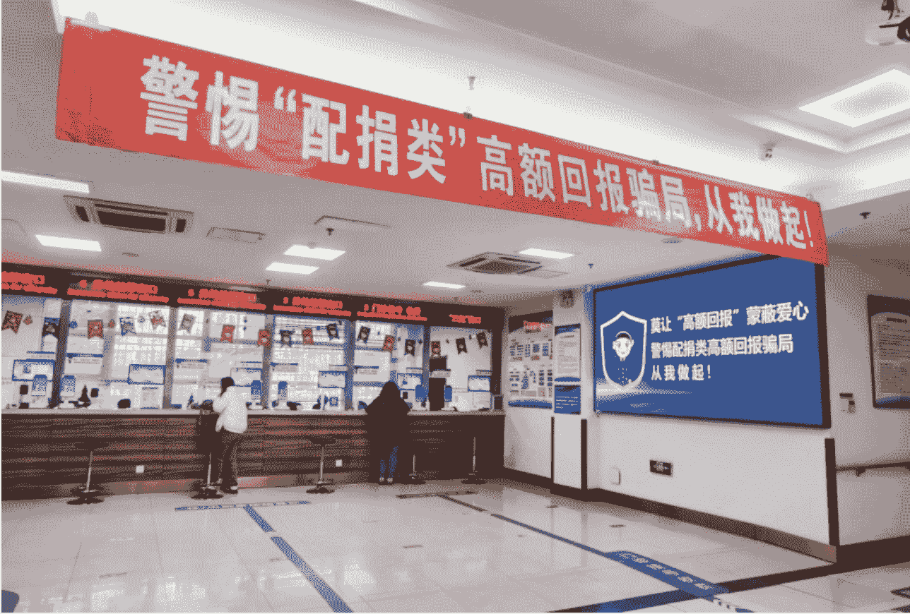
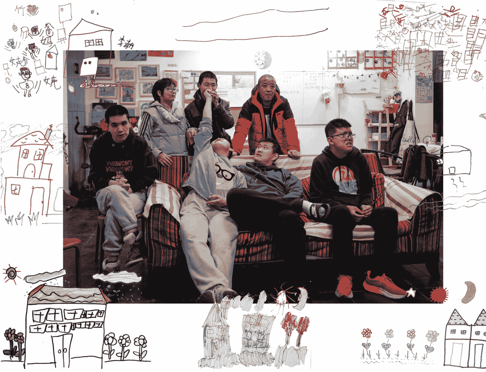
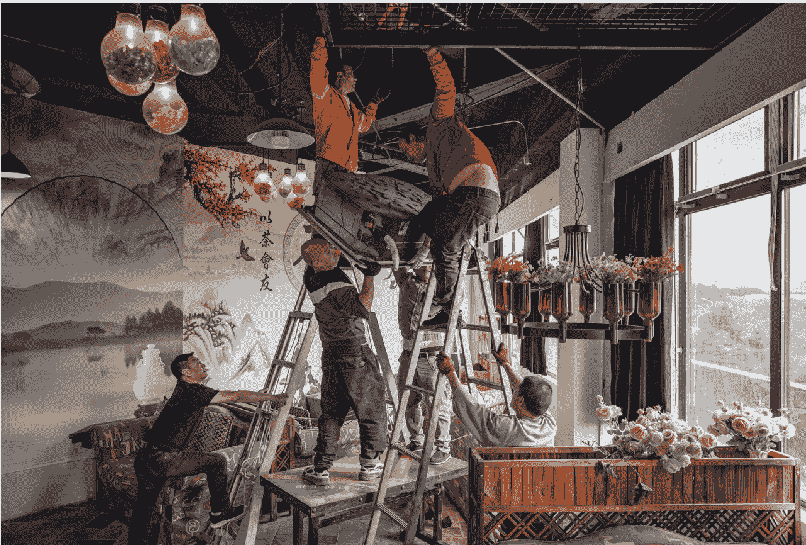
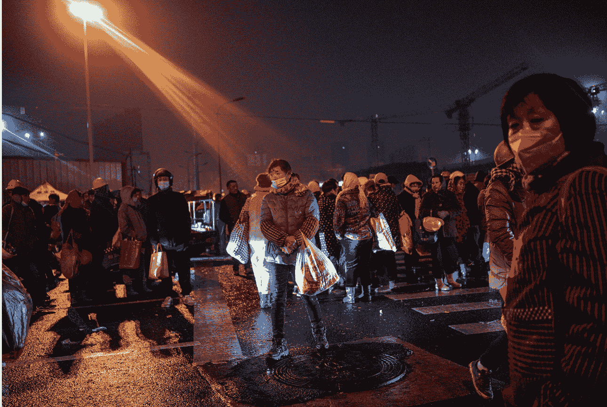
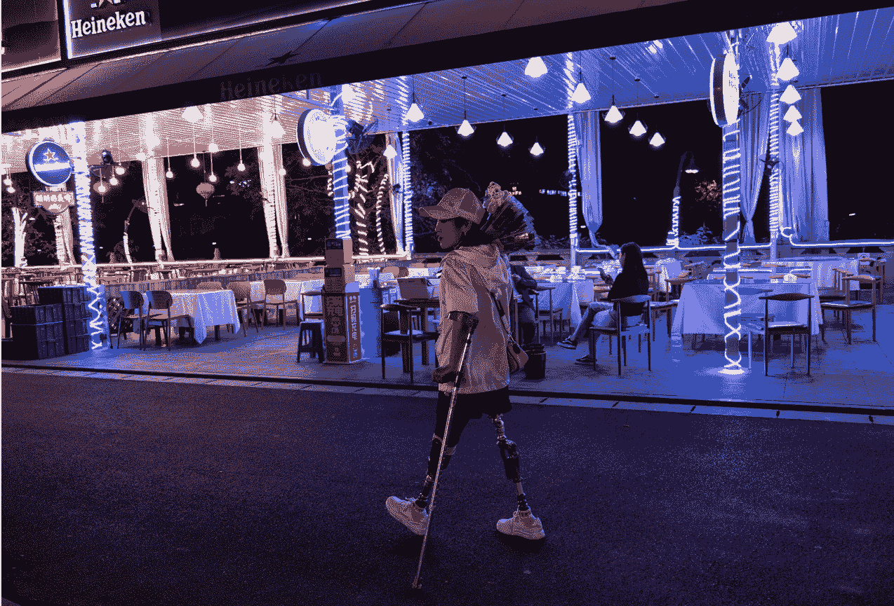
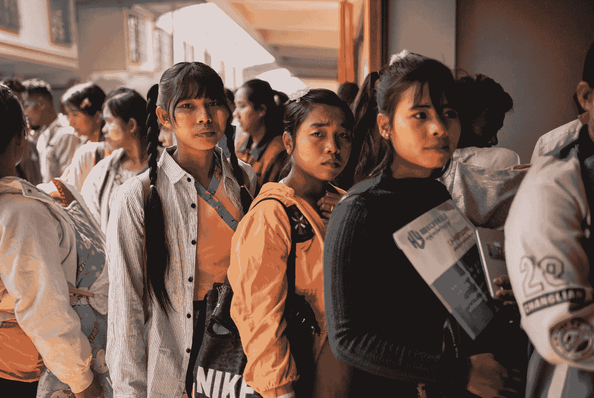
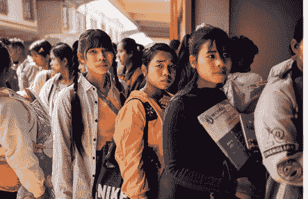
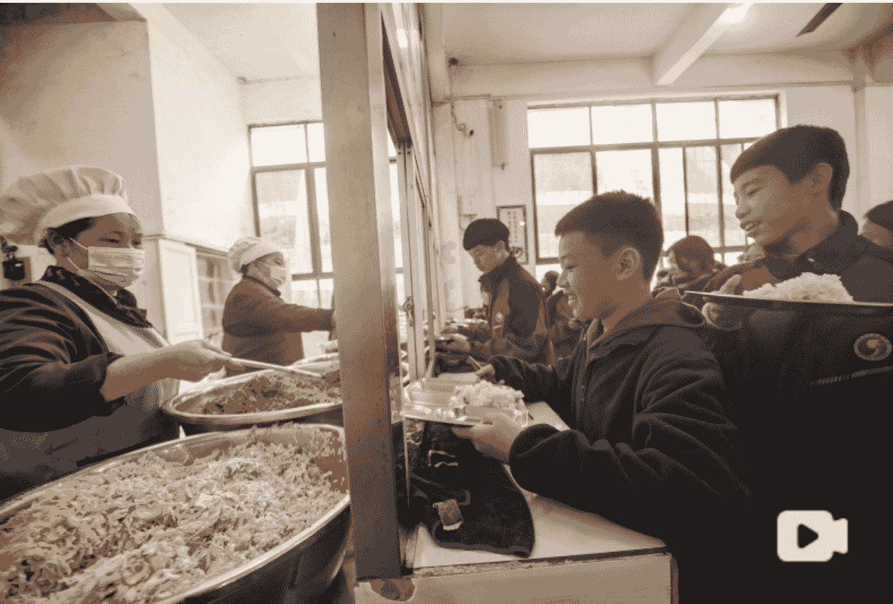

# 财新周刊
Caixin Weekly

## 竞逐 AI 2.0 时代
“四小龙”谢幕，“六小虎”登场，人工智能时代更替，大模型泛化能力是未来核心变量

P.40

## 财新观察 | 在养老保障改革中掌握主动

## CAIXIN| 听文章
近来，与养老保障相关的消息频频见诸报道。自 2024 年 12 月 15 日起，个人养老金制度在全国推开。2025 年伊始，中国开始渐进式延迟法定退休年龄。这些措施回应了长期以来全社会关于养老金可持续问题的关切，一定程度上增强了现行养老保险制度的稳定性，为养老保障制度深化改革赢得了时间和空间。养老保障制度事关亿万民众的福祉，通过进一步深化改革使之更公平、更可持续，是中国发展改革进程中必须直面的问题。

中国养老保障制度建立 30 多年来，经过不断改革、完善，已基本形成三支柱结构，其中第一支柱——基本养老保险覆盖超过 10 亿人，规模堪称全球之冠。不过，三支柱之间并不平衡，且一系列历史欠账尚未补足，公平性、财务可持续性等方面的挑战日益凸显。近年来，随着人口规模和结构变化，特别是劳动年龄人口减少和少子老龄化程度加深，养老金支付缺口从隐忧渐渐走向现实，尤其是东北等地。由权威人士撰文而成的《党的十九届五中全会〈建议〉学习辅导百问》指出，在现行制度框架下，全国企业职工基本养老保险基金预计到 2029 年当期将出现收不抵支，到 2036 年左右累计结余将告耗尽；如不实施延迟法定退休年龄政策，养老保险抚养比将从 2019 年的 2.65:1 下降到 2050 年的 1.03:1。多家专业机构的研究也预测，距离企业职工养老保险基金耗尽仅剩 10 年左右的窗口期。在此严峻形势下，酝酿多年的延迟退休迈入实施阶段。

应该说，最终推出的延迟退休方案中，“小步调整、弹性实施、分类推进、统筹兼顾”的基本原则贯穿了整个设计，一方面有助于促进人力资源开发利用和增加劳动力有效供给；另一方面，根据精算平衡原则，通过延长缴费年限、缩短待遇领取时间，将在一定程度上纾解养老金收支压力。当然，其实际实施效果取决于未来的个人延退选择、待遇调整幅度、人均预期寿命、就业情况、工资水平、养老保险覆盖率等多项参数，且随着社会经济条件不断变动，很难简单测算，无疑应当把不利因素考虑够、向理想情境努力。在现行社保体制下，养老保险全国统筹、财政补贴、国有资本划转等渠道均可以为养老金“输血”。随着人口深度老龄化，养老金问题仍要重视。为此，不少专家学者呼吁，在实施延迟退休之后，需要进一步深化养老保险制度改革，从根本上缓解养老金收支之间的张力，增强制度运行的可持续性。

中共二十届三中全会审议通过的《中共中央关于进一步全面深化改革、推进中国式现代化的决定》在“健全社会保障体系”部分要求：“完善基本养老保险全国统筹制度，健全全国统一的社保公共服务平台。健全社保基金保值增值和安全监管体系。健全基本养老、基本医疗保险筹资和待遇合理调整机制，逐步提高城乡居民基本养老保险基础养老金，加快发展多层次多支柱养老保险体系，扩大年金制度覆盖范围，推行个人养老金制度。发挥各类商业保险补充保障作用。”这些要求应当成为今后养老保障改革的指针。

多年来，为应对日益显露的养老金缺口风险，政府、学术乃至商界人士逐渐形成两种不同的改革思路。一种路径是在现有“统账结合”框架下改变政策参数，如退休年龄、缴费年限、待遇计发月数等。另一种路径则着眼于结构性改革，调整社会统筹和个人账户基金的规模。应该看到，当下养老保险制度的深化改革面临两难抉择：如果提高企业的缴费率，往往会加大企业当期成本；如果降低给付替代率，则容易损害退休者的权益。欲从源头上解决基金收支和代际抚养的矛盾，就必须思考如何补足历史欠账，并增加对个人积累的激励，进而提高制度的支付能力和可持续性。更重要的前提则是宏观经济保持长期健康发展。

作为养老金的第二、三支柱，企业年金、个税递延型商业养老保险曾被寄予厚望，不过，目前覆盖率有限。个人养老金制度已从试点推向全国，欲取得显著效果，同样需就要解决激励机制问题。除了让参保人获得切实的经济利益，深化养老保险制度改革还要注意公平性问题，逐渐缩小机关、事业单位与企业的退休人员之间、城乡之间、区域之间的养老金待遇差距，稳定社会公众尤其是年轻人的预期。换言之，代际公平也是改革绕不过去的课题。

深化养老金体系改革也离不开养老金融，离不开资本市场的健康成长。作为“五篇大文章”之一，养老金融亟待更多地从概念落到实处；通过市场化投资实现养老金保值增值，是加拿大等曾经身陷养老金危机的国家摆脱困境的有效举措，值得借鉴。中国养老保障改革任务繁重且紧迫，越主动，越成功。■

更多报道详见：【专题】养老算账

## 最新封面报道 | 竞逐 AI 2.0 时代

CAIXIN| 听文章
CAIXIN| 看视频

点我打开视频

文 | 财新周刊 刘沛林

2024 年是生成式人工智能 (AI) 飞速发展的一年。时至年末，经过一年多战算力、战模型、战融资的“百模大战”，中国六家估值超过 10 亿美元的“独角兽”AI 创业公司，被市场视为“大模型六小虎”头部阵营，暂时稳住阵脚。

这“六小虎”分别为：智谱 AI、MiniMax、百川智能、月之暗面、阶跃星辰、零一万物，前四家当前估值已过 200 亿元。

“六小虎”之所以受资本青睐，是团队背景、模型能力、产品形态等各要素的综合结果。六家公司创始人近期分别接受财新采访，在他们看来，中国的 AI 大模型在某些指标上已基本拉平和领先者美国 OpenAI 公司的距离。

未来挑战则来自两方面：首先是算力。先进算力芯片进口被美国限制，不过中国大量的数学和 AI 人才正在不断通过算法优化，跟住海外领先模型的能力。其次是竞争。面对国内字节跳动等互联网巨无霸公司在应用开发和流量上的优势，寻找差异化的应用方向，是大模型创业公司活下去的关键。

2019 年 6 月成立的智谱 AI，由清华大学孵化，创始团队中的首席执行官（CEO）张鹏、唐杰均来自清华大学计算机系，唐杰是该系副主任、教授。智谱 AI 也是“六小虎”中成立最早、迄今规模最大的公司，员工近千人。2022 年 8 月，智谱成为国内第一家发布自研预训练语言大模型的创业公司。目前，“智谱清言”App 拥有 2500 万用户，年化收入（ARR）超过千万元。张鹏此前向财新称，智谱 AI 希望成为中国的 OpenAI，因此在企业级、消费级领域都有业务部署。

2021 年 12 月，在视觉 AI“四小龙”公司商汤科技（00020.HK）负责通用人工智能技术（AGI）的闫俊杰，离职创办 MiniMax，2022 年在国内推出了 AI 虚拟社交产品 Glow，很快积累百万用户，后因牌照问题遭应用平台下架，直至 2023 年 8 月获得牌照后重推与 Glow 相似的产品“星野”，其海外版本 Talkie 凭借和名人的对话聊天“出圈”，连续数月成为美国下载排名前五的娱乐应用。MiniMax 目前团队在 400 人左右。

2024 年 7 月 5 日，上海，世界人工智能大会 (WAIC 2024) 在世博展览馆举行，MiniMax 的展台。

闫俊杰向财新称，自 2024 年 4 月推出生产力工具海螺 AI 后，目前全球网页端月活跃用户（MAU）接近 1000 万。据财新了解，MiniMax 目前整体估值达 30 亿美元左右，旗下 Talkie、海螺 AI 和星野 AI 三款产品年化收入 7000 万美元，主要商业模式是广告和用户订阅。

“六小虎”中的其余四家，均在 OpenAI 聊天机器人 ChatGPT 爆火后的新一轮大模型创业潮中成立。搜狗创始人王小川拉上曾任搜狗公司首席运营官（COO）的茹立云于 2023 年 3 月成立百川智能，成立半年估值就超 10 亿美元。百川目前主攻大模型在医疗、教育、金融等行业的落地应用。

百川智能联合创始人茹立云告诉财新，公司目前有 400 人左右，随着业务扩张，希望 2025 年人数能翻 1 倍。百川智能开始商业化已半年左右，预计 2025 年订单签约额在 10 亿—20 亿元水平：“我们现在是忙不过来的状态，2025 年无论是 2B（企业级）还是 2C（消费级），大模型应用都会全面爆发，只是 2C 还需解决变现、大厂竞争压力的问题。”

2024 年 9 月 23 日，美国纽约，OpenAI 首席执行官萨姆·奥尔特曼在“用安全可靠的人工智能推动可持续发展”活动上发表讲话。图:Bryan R.Smith/视觉中国

2023 年 4 月，阶跃星辰和月之暗面先后成立。截至目前，阶跃星辰团队约 300 人，创始人姜大昕曾任微软全球副总裁、微软亚洲互联网工程院首席科学家，是自然语言处理领域的全球知名学者。在一级创投市场，阶跃星辰得到了微软原全球执行副总裁沈向洋的支持。

“未来 1—2 年，第一个大模型的商业化闭环就会跑出来，2B 会有回报收入，而 2C 需要先建立生态。”姜大昕告诉财新，大模型带来了生产效率提升、内容生成门槛降低两个变量，因此阶跃星辰分别推出了“跃问”和“冒泡鸭”两个 2C 产品，主打多模态输出；而在企业级应用市场，阶跃星辰也和 OPPO、荣耀合作，希望成为移动端侧的 AI 助手。

月之暗面创始人杨植麟是“六小虎”创始人中惟一的“90 后”，本科毕业于清华大学计算机系，博士毕业于美国卡内基梅隆大学 (CMU)，其团队中有多名来自旷视科技等公司的技术骨干。月之暗面因为 2024 年初推出长文本功能而一炮走红，一度带动 A 股市场出现所谓“月之暗面”概念股。

杨植麟在 2024 年 11 月的一次采访中称，聊天机器人 Kimi Chat(Kimi 智能助手) 上线一年至今，目前全平台 MAU(月活跃用户) 3600 万。杨植麟称，月之暗面是业内规模最小，而人数和 GPU(图形处理器) 资源比例最高的公司：“我们不希望把团队扩得太大，人数太多不利于创新，业务上我们也做了一些减法。”

早已从职业经理人身份转型投资人的李开复，2023 年 3 月再次出发 AI 创业，组建大模型公司“零一万物”，希望从底层基座开始，打造完整的上层应用生态。“在 PC（个人电脑）、移动互联网时代，创业公司专注做一件事、先验证正确性再快速迭代是更合理选择；但在大模型时代，算力资源远少于硅谷的前提下，中国大模型公司必须要有 AI Infra（基础设施）能力。”李开复对财新指出。

然而，大模型仍处在技术快速发展期，最终会否像互联网一样成为开源、免费的底层技术尚未可知。国内除了阿里云积极推进开源大模型，量化投资机构幻方量化旗下的 DeepSeek（深度求索）公司推出的开源模型，接连以较低的训练成本和不输顶尖闭源模型的性能而惊艳开发者社区，Meta、谷歌亦积极布局开源，也降低了大模型的开发门槛。小米、OPPO、vivo、荣耀、理想汽车等终端厂商纷纷以自研或合作方式切入大模型赛道。

在中国，大模型创业更加不易。一方面，AI 算力、融资能力与 OpenAI 等国外同行相比，有一个数量级的差距。中国头部大模型创业公司仅有千卡的算力规模，想要使用万卡集群还需和算力中心合作，融资最多的中国大模型创业公司累计融资额不过 100 亿元左右，估值刚刚超过 200 亿元。算力中的“卡”，是对算力硬件设备的通称，若要训练万亿参数的大模型往往需要数千张英伟达 GPU 算力卡，或同等甚至更大规模的华为等国产厂商算力卡，训练数月时间。

美国大模型头部三家创业公司中，OpenAI、电动车巨头特斯拉 CEO 马斯克（Elon Musk）创办的 xAI 均已在建 10 万卡的算力集群；Anthropic 也和亚马逊合作，使用数十万张亚马逊自研 AI 训练芯片训练下一代模型。融资方面，OpenAI 成立以来累计融资额超过 100 亿美元，估值高达 1570 亿美元 (约合 1.15 万亿元)；xAI 累计融资额更是超过 120 亿美元，截至 2024 年 5 月估值达到 240 亿美元 (约合 1752 亿元)；Anthropic 也获得了累计超过 80 亿美元的融资。

另一方面，“六小虎”等初创大模型公司，还需与积累深厚的中国一众老牌互联网“大厂”竞逐产品力。截至目前，阿里、腾讯、百度和字节跳动，都已推出基座模型以及包括大语言、文生图、文生视频的各类应用。

初创大模型公司的 2C 类产品想要成为超级应用，必须从互联网公司统治的流量生态中虎口夺食；2B 产品中，互联网公司都有云计算业务，它们基于绑定算力和云服务的 AI 功能，在商业推广上效率更高。而创业公司一旦选择和大客户合作，很难避免走向高度定制化。

此前一轮的 AI 视觉“四小龙”，无一例外都沦为项目制公司，严重限制了产品的标准化能力。中小客户预算少、场景需求各异，AI 大模型的泛化能力仍需经历市场的残酷验证。

“包括效率工具和 AI 陪伴等应用都是有发展空间的，但最杀手级的产品和商业模式目前尚未显现。”心资本创始合伙人韩彦对财新指出，目前 AI 应用还处在互联网发展历史阶段中的“门户网站”时期，达到移动互联网的繁荣水平尚需时日。“虽然还在早期阶段，但很有可能这个时代的张一鸣 (字节跳动创始人)、王兴 (美团创始人)、黄峥 (拼多多创始人) 已经下场了，只是新时代的‘抖音’目前还看不清。”

在算力、资金、竞争等环境条件的严苛局限与挑战之下，中国的大模型创业者只能更加着力于软件、算法等优化，尝试用更少的算力资源训练模型，试图以“四两拨千斤”之势，打开技术路线突破的法门。

李开复认为，中国大模型公司的优势在于成本、人效、资源利用率。他举例称，零一万物融资额不到 OpenAI 的 10%，但训练成本只有 OpenAI 的 3%，推理价格是 OpenAI 的四十分之一。“用美国的打法当然打不过美国的公司，但在中国可以有市场，在海外也有机会，例如‘一带一路’沿线国家。”

2024 年上半年起，“六小虎”的模型能力陆续达到了 OpenAI 的 GPT-4 水平，中文能力则已超越 GPT-4，开始将商业化的思考付诸实践。

“从 2023 年开始，国内产业界在市场巨大的期望之中，在技术上追赶、证明自己，现在找到了自己需要的节奏。”王小川在 2024 年 9 月的一场活动中称。

大模型的泛化能力是 AI 2.0 时代的核心变量，此前一轮以 AI 视觉公司为代表的时期被市场称为“AI 1.0 时代”——在这一阶段，AI 不具备理解、生成能力，基本是以一套解决方案适配不同企业场景的定制交付模式；AI 算法也是根据具体任务编写，针对不同任务需要不同算法规则。而在 AI 2.0 时代，大模型通过对大量数据进行学习，逐步具备与普通人类相当的“智力”，可以嵌入移动应用、直接和大众对话，也可以嵌入企业解决方案。

"AI 2.0 的提升就在于更泛化、更通用，大模型在底层承担大部分能力，上层加入行业技能（Know How）、数据，可以演变出无数的新机会。“姜大昕对财新说。

※财新数据专题《AI"六小虎"成色如何》，结合本篇深度报道和企业资料、核心团队等多维数据资讯，数据通 Pro 会员专享。

## 字节跳动跃进
所有试图做面向消费者应用的创业公司，在 2024 年都感受到了字节跳动从技术到流量全方位、饱和式攻击的威力。

在文本生成赛道，月之暗面一度抢得先机。月之暗面早在 2023 年 11 月就上线了 AI 对话机器人 Kimi 智能助手，一开始在一众聊天机器人产品中并不突出；2024 年 3 月，更新后的 Kimi 智能助手的长文本阅读能力从 20 万字提升至 200 万字，相当于可以一次性精读约 500 个文件。这使得该应用迅速在高校师生、金融行业分析师之间普及，当月 Kimi 智能助手访问量增长超过 300%。

月之暗面此后决定砍掉面向海外市场试水的几款产品，全力优化国内的 Kimi 智能助手，并加大了产品的市场投放，希望与百度文心一言等对话类大模型产品竞争。

“Kimi 当时在各大网站、Web 端上线了各种导流位，我们曾内部估算过他们一个多月的投放成本就得 2000 多万元。”一位百度 AI 产品经理向财新称。

长文本一火，字节跳动、阿里、百度及其他大模型创业公司迅速跟进推出类似产品。字节跳动 2024 年 5 月才推出的 AI 对话助手“豆包”，借助能在抖音投流买量的“独家”优势一跃后来居上，成为过去半年增长最快的移动应用。

据移动数据调研机构 QuestMobile 测算，截至 2024 年 11 月，豆包 App 在活跃率 (日活用户/月活用户)、单月人均使用天数方面居工具类 AIGC(人工智能生成内容) 应用之首，并以 5651.8 万月活用户成为国内规模最大的 AI 原生应用;排在其后的是 Kimi 智能助手，月活达 2282.43 万;百度智能助手文小言月活也在 1000 万以上，但与豆包差距悬殊。

前述百度 AI 产品经理估算称，豆包的每天投放花费超过 900 万元。这或意味着豆包月投放成本近 3 亿元，这在业界是遥遥领先的。

挟流量和资本之力，字节跳动还有低价“杀手锏”。字节跳动云服务平台火山引擎甫一推出豆包大模型，就以低于行业均价 99% 的价格，拉开了中国云厂商大模型价格战的序幕;此后阿里云、腾讯云等厂商均被动跟进调降自家大模型价格。2024 年 12 月，字节跳动再发布豆包视觉理解模型，又给出了低于行业均价 85% 的定价。

字节跳动副总裁李亮告诉财新，想要吸引更多开发者和企业，特别是吸引中小企业使用大模型，就得“又好又便宜”。字节企业客户的多元化程度高，火山引擎推豆包大模型时也有规模化优势，同时通过技术优化大幅降低推理成本:“不仅豆包大模型在降低使用成本，其实从全球来看，OpenAI、Gemini 都在不断降价。”

低价驱动之下，豆包大模型调用量激增。火山引擎总裁谭待称，豆包大模型在 2024 年 5 月刚推出时，日均 Tokens(字符串) 使用量是 1200 亿;7 月增长至 5000 亿;9 月为 1.3 万亿;而截至 12 月 15 日，日均 Token 的数据已突破 4 万亿，7 个月时间增长超过 33 倍。截至目前，豆包大模型已与八成主流汽车品牌合作，并接入多家手机、PC 等智能终端，覆盖终端设备约 3 亿台。

一名国内大模型公司创始人向财新称，其公司起初也曾主攻文字生成，希望成为“中国的 ChatGPT"，但产品用户增长难有突破。“最后就是拼资源、拼用户量，创业公司如何打得过字节跳动？他称，除了享有流量资源，豆包 App 还凭借庞大的产品团队令移动端用户体验明显高于其他同类产品，而创业公司很难负担如此庞大的产品团队。

另一名国内大模型公司创始人也认为，打造 2C 超级应用，要看能否打造足够的差异化，避开互联网厂商的“射程”是关键。“Kimi 之前有一波小量，但现在字节跳动饱和式攻击，已经完全把它盖住了。你在“大厂”的射程里做一个类似 ChatGPT 的产品没有任何机会，做 2C 要做出差异化。”

寻找差异化，是大模型创业公司们的共识。过去三个月，MiniMax 旗下的海螺 AI 在网页端获得了较快的用户增长。海螺 AI 在 2024 年 4 月发布时主打文本生成，四个月后发布的文生视频功能是推动用户增长的主力。

闫俊杰介绍，一开始并未将文生视频作为产品功能，只希望让内容社区应用星野 AI 的内容动起来，“当时只有中文界面，突然在海外社区火起来，成为 9 月到 10 月全球增长最快的 Web 端 (网页端) 产品，现在访问量也是海外最大同类产品 Runway 的 3 倍左右”。

## 封面报道 | 竞逐 AI 2.0 时代

“我们判断，在文生视频领域，中国公司数据质量更高、做得更好，可以打赢美国硅谷的二线 AI 公司。目前海外用户评测显示，海螺的视频能力是强过 Sora（OpenAI 旗下文生视频应用）的。”闫俊杰称，Sora 只是 OpenAI 研发的产品之一，而创业公司的机会在于“局部战争”。

闫俊杰认为，在产品形态上，相比 AI 工具，AI 内容产生的消费价值更大。

“内容生态会有多个产品，比如移动互联网生态中，抖音、小红书、微信公众号共存；而工具类产品的未来一定会收束，AI 时代一定会诞生新的内容平台。”他指出，目前星野 AI 的定位是“一个娱乐向、偏幻想内容的平台”，未来随着模型错误率降低，计划推出 AI 生成现实内容的平台。

闫俊杰透露，2023 年 9 月上线的星野 AI 的次月留存率达到 70%。一名互联网厂商人士对此向财新分析，移动端聊天类应用的次月留存率基本是 40%—50%，但不同产品留存率有较大波动，例如“娱乐向”产品会在学生假期留存率走高，生产力产品则是在开学后留存率变高。

上述人士进一步指出，互联网厂商对话类产品都希望做得“又大又全”，但这类产品市场竞争更大，未必能做透用户的每个场景，因此创业公司仍有细分赛道的机会。“例如，百度文小言的日活可能和 Kimi 差不多，但用户习惯用 Kimi 做文章总结，而文小言、豆包都不是能给用户明确定位印象的产品。”他说。

智谱 AI 则瞄准智能体（Agent），2024 年初就推出了类似 OpenAI 的应用商店概念的智能体商店。张鹏向财新称，智能体商店原本是智谱 AI 试水的方向，后来发现自己做智能体更能产生价值。2024 年 5 月以来，智谱陆续和小鹏、荣耀、三星、华硕几家终端厂商签约合作。

2024 年 11 月 29 日，智谱 AI 发布 PC 端的智能体 GLM-PC，开启邀测，并采用强化学习算法，将 10 月开始内测的移动端智能体 AutoGLM 进行了升级，实现跨设备、跨应用的复杂操作。

“理论上，只要是为人类设计的应用，在 GLM-PC 学习之后它都能够执行。这是一种系统级、跨平台的能力。”张鹏指出，由于 PC 和工作任务的高复杂度，仍需用户提供精准指令，“目前距离帮助用户办公仍有较大难度。”

## 2B 能否规模商用？

中国软件市场私有化、定制化要求高，此前发展数十年都未长出微软、谷歌、Meta 等平台型科技公司。在上一轮以 AI 视觉为主的创业热潮中，“四小龙”为满足项目方要求，团队扩张至数千人，实质都是重人力的项目公司。

“六小虎”正是希望通过大模型的泛化能力，寻找更广阔的应用场景，避免重蹈“四小龙”覆辙。

茹立云 2018 年卸任搜狗 COO 后，创办了 AI 教育公司葡萄智学，提供 AI 儿童语言培训。他向财新指出，大模型对于产品能力有本质的提升，例如在大模型之前，AI 只能实现英语语言的评测，而大模型可以真正实现“AI 老师”，和儿童进行语言上的理解和交流；此前，AI 也只能对人类进行心理健康评估，但在大模型加持下，可以实现从评估到干预，过程中无需人类医生介入。

“AI 1.0 时代只是一个模式的创新；而大模型解决的是供给的问题，能造出大量的顶级专家，人值多少钱、AI 就可以值多少钱。”茹立云比喻称。目前，金融、教育、医疗行业是百川智能的重点。他解释，做医疗垂类大模型需要几千卡的资源，而传统医疗信息化提供方缺乏掌握模型核心技术的能力，因此竞争对手并不多。对百川智能来说，也需要传统医疗信息化公司提供项目落地场景。

茹立云介绍，2023 年底，百川智能的模型能力已达 GPT-3.5 的水平，落地金融的智能问答、客服，以及教育等场景；随着 2024 年 5 月模型能力达到 GPT-4，落地医疗行业的时机成熟。2024 年 8 月，百川智能和北京儿童医院达成合作，计划推出具备儿科医院知识、通过儿科执业医师考试的儿童健康大模型，面向家庭需求的“私人儿科医生”，面向基层普通医生的“数字儿科医生”，面向儿科专家的“临床科研助理”，以及面向儿童慢性病管理的“管理机器人”等应用场景。

为了解决纯软件或 SaaS（软件即服务）难推广的难题，百川智能推出面向教育、医疗、金融等行业的软硬一体机。茹立云透露，一体机方案中软件价值占比 40%。其中，医疗行业进入门槛高，对结果准确性要求严，预计还需 3—5 年，“AI 医生”才能拿到 AI 医疗器械三类证。“目前 AI 医生的严重问题错误率可以降至 1%，明显低于人类医生，最大的挑战是寻求政策上的突破。AI 影像已经纳入医保，AI 医生也将沿着这一路径推进。"

韩彦是百川智能的投资人，在他看来，AI 医生能否实现，一方面取决于模型能力的提升速度；另一方面，医疗产业和医保、政府政策高度相关，最终还是政策决定 AI 医生能否落地应用。

同样从 2B 市场切入的零一万物，则选择主攻标准化程度高的零售行业营销内容，推出数字人直播服务、营销视频生成服务，以数字人直播店取代真人直播。零一万物联合创始人祁瑞峰对财新称，直播带货一名主播背后，一般需要运营、写稿两名支持人员，但在 AI 生成内容辅助下，已实现一名运营人员可以支撑 20 名主播，店铺直播成本下降了 90%。“一个店铺一天可能省不了多少钱，但中国光餐饮就有 700 万家店，这是一个巨大的市场空间。"

零一万物的客户及合作方、服务于酒店等行业销售软件的公司直客通 CEO 刘华称，数字人直播目前在许多案例中的产出已是真人的 50%，例如真人直播 2 小时能卖 20 万元，数字人直播能卖 10 万元，但成本仅为真人的十分之一。“零售门店单店销售额存在浮动，营销人力成本高很容易造成单店亏损，AI 生成内容降低成本能确保盈利。”他说。

祁瑞峰指出，中国大模型公司在企业级市场更有优势。欧美企业由于严格的数据合规要求，试用大模型进展慢于中国。此外，包括 OpenAI、Anthropic 在内的欧美大模型公司本身不做企业客户私有化部署服务，而国内公司的优势在于工程、交付能力：“中国大模型公司在国内‘卷’出来之后，绝对有立足全球的能力，尤其企业级应用反而可能走在美国前面。

“尽管我们目前把重心放在模型和 2C 上，但也没有说不做 2B，只是不会像 AI 1.0 时代那样一单一单地做。”姜大昕指出，“大模型不是靠人堆出来的，我们会克制团队规模扩张。

但韩彦指出："2B 业务履约成本高、毛利低，即便是大模型也最终会走 AI‘四小龙’的老路。”他认为，大模型最终会和互联网技术一样普及，并不需要太多的服务商。

## 技术跟得住吗？

2024 年 12 月 26 日，国内私募机构幻方量化旗下 DeepSeek 发布新一代开源大模型 DeepSeek-v3，自称模型能力与闭源的 GPT-4o 相近，而训练仅需 2048 张英伟达 H800 AI 芯片，单次训练成本约为 557.6 万美元。

DeepSeek 低廉的训练成本引发热议。计算机科学家、OpenAI 创始团队成员 Andrej Karpathy 在社交媒体上发文称，DeepSeek-v3 能力的模型在业界一般需要 1.6 万张 GPU 的集群训练，例如 Meta 发布的 Llama-3-405B 在类似集群上花费了 3080 万 GPU 小时，而 DeepSeek 仅使用了 280 万左右的 GPU 小时。

“这是在资源受限的情况下，是对研究和工程的一次令人印象深刻的展示。”Andrej Karpathy 评价 DeepSeek-v3 称。

一名“六小虎”技术负责人向财新指出，DeepSeek-v3 公布的仅是单次训练成本，而一次完整的训练包括预实验、数据生成和清洗等步骤，实际训练成本会更高；而训练同样能力的模型，在前人试错完成后，后来者训练成本一定更低。

以工程能力弥补算力差距，是中国 AI 产业界共同的努力方向。自美国 2023 年限制英伟达 AI 芯片向中国出口后，算力就成为中国 AI 产业最大的短板。随着时间推进，国内创业公司和美国同行的差距在不断拉大。OpenAI、xAI、Anthropic 等美国大模型公司单集群 GPU 用量正在突破 10 万块，马斯克还在推进雄心勃勃的孟菲斯数据中心扩容计划，预计在该数据中心增加 100 万块 GPU，声称未来增加到 10 亿块 GPU；Anthropic 的算力集群则包括数十万张亚马逊自研 AI 芯片。

目前国内大模型创业公司算力主要来源于自有算力，由国家“东数西算”工程下各地建设的算力集群和云厂商等提供，地方政府对于算力租用的补贴，也使得国内创业公司使用国产算力的成本相较于租用或自建英伟达算力更低。

市场有观点认为，中国大模型公司应该做应用、商业化产品，而不是盲目追求实现 AGI。但“六小虎”仍不甘心，希望通过算法架构的优化，跟住 OpenAI 等国外领先者的技术发展。

李开复向财新称，通过预训练模型和 AI 基础设施的整体优化，零一万物训练的与 GPT-o1 对标的 Yi-Lightning 在 2000 张 GPU 上训练了一个月就得以练出，训练成本仅为 300 万美元左右，大幅低于国外大模型厂商的训练花费。他认为，尽管美国会在基础模型上保持一定领先优势，但中国团队的聪明、勤奋、努力也不容忽视，中国团队更擅长用最少的资源训练出性能优秀的模型。

一个对中国有利的趋势是——技术迭代正在放缓。当地时间 2024 年 12 月 13 日，OpenAI 联合创始人、前首席科学家伊利亚·苏斯克沃（Ilya Sutskever）在机器学习顶级会议 NeurIPS 2024 上指出，数据就像 AI 的化石燃料，但数据已被穷尽，实现 AGI 需要找到新路径。

算法、算力和数据被称为 AI 的“铁三角”，OpenAI 发展到 GPT-4 是通过不断扩大数据的规模来实现的，国内大模型公司此前也跟随这一技术路线：只要扩大训练参数规模，模型能力就能得到提升（scaling law）；而 OpenAI 迟迟未发布 GPT-5、未能继续证明扩大规模的有效性，其于 2024 年 5 月、9 月推出的 GPT-4o、o1 两个模型，分别代表了多模态理解、强化学习两条技术路线。

GPT-o1 模型面市后，月之暗面加班加点，赶在 2024 年中国国庆节假期后率先在国内推出“Kimi 智能助手探索版”，原理类似 o1 模型，通过强化学习大幅提高了 AI 搜索的推理能力。月之暗面称，Kimi 探索版的搜索量是普通版的 10 倍，一次搜索即可精读超过 500 个页面，能对不同信源进行交叉比证。此后，月之暗面又推出了用强化学习增强的数学模型。

“预训练大模型还有半代到一代的发展空间，这个空间基本会在 2025 年释放出来，届时领先的预训练模型性能会达到极致。”杨植麟介绍，预训练语言模型遇到瓶颈后，在强化学习和多模态两条路径中，强化学习优先级更高，“大模型下一步的能力就是思考（强化学习）和交互（多模态），多模态是必要的，但思考才是大模型能力上限的决定性因素。”

强化学习的概念并不新，“六小虎”此前均有研发布局，o1 发布后，各家将更多研发资源从预训练语言大模型转向强化学习。一名“六小虎”研发负责人向财新称，其公司在 2024 年 6 月就上线了与 o1 原理相似的 AI 搜索功能，“o1 其实只是 OpenAI GPT-5 推迟发布之下无奈推出的产品，数学和代码都比较简单、有标准答案，单纯推出一个数学模型只是在炫技”。

姜大昕指出，谷歌 DeepMind 此前的 AlphaGo、AlphaFold 均通过强化学习实现，o1 强在数学和代码能力两个维度扩大了强化学习的泛化性。“o1 还是个早期阶段，上限仍很高，未来能否理解抓手机和抓一块橡皮泥的力度是不一样的？现在既然 o1 已经证明了可行，我们也要复刻一个。”姜大昕透露，阶跃星辰已在研发类 o1 模型，预计很快在产品中上线相关功能。

姜大昕指出，接下来，技术发展对底层算力的消耗将是一个量级的提升，即便是 OpenAI 也用了几万张卡、训练几个月才推出 o1 预览版，正式版到 12 月才上线：“国内现在就是比拼算法，谁能先在算法层面实现泛化，再拼用更低算力去训练一个更大的强化学习模型。”

“无论 OpenAI 的 Sora 还是 o1，到目前为止，它们在算法上并没有让我们大吃一惊。”姜大昕指出，OpenAI 有充足的算力资源供给，可以在更多技术路线上下注，而国内大模型公司资源有限，无法承受失败的风险，被迫选择跟随。“OpenAI 不会告诉你它是怎么做的，但只要它放出来一个东西，就证明了这条路是可以走通的。我们的策略就是 6 个月内赶上它，先跟跑、再卡位，再结合应用做创新。”

茹立云也认为，2024 年中国头部大模型公司已经达到 GPT-4 的水平，随着算法的优化，每三个月参数可以缩小一半，但能力维持不变。“如果 GPT-5 出来，国内可能也需要半年到一年时间跟进，等到国内开始对标 GPT-5 训练时，需要的参数可能仅是 OpenAI 的十分之一。”

作为投资人，韩彦的看法更为冷静。他认为，GPT-5 需要高达 10 万张卡，再之后可能需要几十万张卡，国内任何一家公司都没有这么多卡。“目前国外技术曲线放缓，对中国是有利的，中国应该先做应用。追 AGI 的本质，是拼算力、拼顶尖人才，而这两方面中国相比美国都是欠缺的。”

## 融资能烧多久？

2024 年下半年，大模型成为中国一级市场投融资最活跃的赛道，“六小虎”融资消息不断。

12 月 17 日，智谱 AI 宣布完成新一轮 30 亿元融资。智谱 AI 称，新投资方包括多家战略投资者，有新进入的国有资本，以及君联资本等老股东跟投。该轮融资将用于智谱 GLM 大模型系列的研发。仅仅 2 个月前的 9 月 5 日，中关村科学城公司宣布以投前 200 亿元估值领投智谱 AI 一轮融资，用于支持国产基座大模型技术创新与生态发展。据财新了解，这轮融资额也有数十亿元。

百川智能也在 2024 年 7 月宣布完成 50 亿元 A 轮融资，并以 200 亿元估值开启 B 轮融资。A 轮投资方包括阿里、小米、腾讯、亚投资本、中金，还有北京市人工智能产业投资基金、上海人工智能产业投资基金、深创投等国资产业投资基金。

茹立云称，2023 年公司刚成立后更看重算力资源，因此更多拿的是云厂商的投资；而随着大模型进入商业化阶段，能够提供商业化场景的产业股东凸显重要性。

2024 年 12 月，阶跃星辰完成新一轮数亿美元融资，上海国有资本投资有限公司和腾讯作为新股东参与，而老股东启明创投和五源资本都予以跟投。

此外，零一万物、月之暗面、MiniMax、阶跃星辰都在 2024 年完成了数亿美元的融资。

“六小虎”的投资人几乎涵盖主流投资机构，包括各地政府投资平台，市场化基金和阿里巴巴、腾讯、米哈游等互联网产业资本。

然而，大模型对资本需求巨大，目前各家融资也只是“勉强够用”。一位大模型公司人士告诉财新，为了不被落下，基座模型 3 个月就需要重新训练一次，训练一次成本约在 3 亿元；而一些多模态模型训练时间可能长达 5—6 个月，成本更高。此外，大模型公司的基座模型研发团队均超过 100 人，人力成本亦占创业公司的大头。

“中国大模型公司在技术上落后 OpenAI 半年到一年，商业化可能晚两年。通过技术领先性，OpenAI 已经换取了较高的利润和市场认知，形成了正循环。我们达到的第一个目标是不算研发成本的单个业务不亏损。”闫俊杰称。

闫俊杰强调，大模型创业公司核心竞争力还是打造产品的差异化，融资能力只是一部分。

> “急功近利对公司发展伤害很大。”他认为，创业公司跟随 OpenAI 的技术路径，可大幅降低研发成本，“钱和时间是相关的，如果你是第一个做出 GPT-4o 的，所需要的计算资源和第二个做出的可能差 10 倍。”

> “六小虎”的融资规模远难企及 OpenAI 等国外同行。韩彦认为，无论中美，大模型创业公司均需要大公司“输血”，但美国主要大模型厂商只有 OpenAI 和 Anthropic 两家，而中国头部创业公司就跑出了六家，还有诸多二、三线大模型公司在努力生存；在商业环境上，美国市场有成熟的 SaaS 软件生态，大模型公司通过 SaaS 模式落地能产生真实收入；此外，国内互联网“大厂”对大模型公司的竞争压力也超过美国。“字节跳动是个披着‘大厂’资源外衣的创业公司，它会从各个方向上淘汰掉不及格的创业公司，在美国就没有这样的‘大厂’选手。

韩彦指出，此前投资人投基座大模型公司最看重技术领先型和人才密度，“但有一个变量，大模型公司可能转化成一个 AI 应用公司，到了这一层面，技术领先性就没有那么重要了，PMF（产品市场匹配度）就成了核心，先得选定自己的战场”。

他认为，中国大模型创业公司需要技术能力、人才密度、融资能力、政府关系、商业化能力、“大厂”关系、数据获得能力和算力等，但目前能做到的创业公司凤毛麟角。

一名地市场化基金投资人向财新称，该基金从来不投 AI 大模型公司，而是投资上层 AI 应用，一方面是因为基座大模型是拼资源的“战也争”，创业公司在国内难以赢过字节跳动等互联网厂商；另一方面，开源模型随时会颠覆创业公司的闭源模型。“现在一代模型花费是 1 亿美元，下一代可能是 10 亿美元，国内大模型创业公司很难融到这么多市场化的钱，最后只能和地方国资或云厂就商绑定。”他认为。

多位投资人向财新称，能否获得政府支持是大模型初创公司未来留在“牌桌”上的关键。例如，智谱 AI 因为获得就北京市国资支持而被资本市场看好，阶跃星辰则获得了上海市国资的支持。

“有北京、上海国资支持的公司，接下来会更容易获得市场更多的‘配资’。”一家国字头基金管理人告诉财新，大模型公司对地方算力中心而言是盘活算力需求的重要方地：“有实力的地方政府都想要一家未来的 (大模型) 巨头，特别是错过上一轮互联网巨头的上海等地。”

不过，一位上海市天使了母基金人士向财新指出，当前的资本市场环境比 AI 1.0 时代更具挑战性，持续“烧钱”的大模型公司上市十分困难，“现在，单纯的 AI 大模型的故事已经很难找到上市过程中的基石投资人”。■

相关阅读：封面报道之二 | AI 视觉“四小龙”掉队

更多报道详见：【专题】AI 全景

## 最新封面报道之二 | AI 视觉“四小龙”掉队

### CAIXIN | 听文章

### 封面报道 | 竞逐 AI 2.0 时代

### 文 | 财新周刊杜知航 余聪

人工智能（AI）聊天机器人 ChatGPT 发布两年后，中国最大的 AI 视觉公司商汤科技（00020.HK），正在向大模型公司战略转型。

2024 年 12 月初，商汤董事长兼 CEO 徐立宣布将公司业务架构变为"1+X"：“1”即生成式 AI 相关业务，包括提供算力的“大装置”、AI 基础模型和应用；“X”是智能汽车“绝影”、家庭机器人“元萝卜”、智慧医疗、智慧零售等，这些业务将拆分并独立融资。

商汤曾经的支柱业务“智慧城市”已难觅踪影。智慧城市主要以计算机视觉功能 (CV) 支持城市安防、交通、城管和气象监测等应用场景，2021 年占商汤总收入近半，但这部分业务在过去三年快速缩水，人员持续裁撤。“看看其他三家‘小龙’的下场，商汤早就该拆、该裁，拖到现在太晚了。”一名熟悉商汤投资业务的人士对财新说，商汤管理层在这波 AI 大模型风潮中反应太慢。

商汤、旷视、依图和云从科技（688327.SH），被市场称为 AI 视觉“四小龙”。它们在谷歌阿尔法狗（AlphaGo）战胜围棋世界冠军李世石的上一轮 AI 热潮中创业，2016 年前后搭上中美资本快车，但到 2019 年陷入“死亡之谷”（新技术在到达成熟生产前的泡沫破裂阶段），技术难以泛化应用，政府订单缩减、坏账堆积。另一边，资本市场热点也快速转移，AI 视觉概念逐渐沉寂。

这轮 AI 热潮被后来者称为"AI 1.0 时代”，主要基于 2012 年以来计算机深度学习技术在图像识别、自然语言处理等特定任务领域的突破，需要花费巨大成本收集与标注数据，但数据或应用之间都类似“孤岛”，彼此割裂。直到 2022 年底 OpenAI 推出 ChatGPT 之后，迎来了以生成式 AI 为显著特征，能够自主学习和持续优化，快速涌现大模型、多模态产品，乃至平台化、基座化的所谓"AI 2.0 时代”。

商汤、旷视、依图和云从科技，被市场称为 AI 视觉“四小龙”。

商汤是目前“四小龙”中惟一彻底向 AI 2.0 战略转型的公司，但它既不能像大模型初创公司那样频繁融资，也没有互联网“大厂”的流量和云计算生态。在传统安防领域，商汤期待用新的视觉识别模型降低成本，但市场竞争激烈，价格战随时爆发。

依图和云从仍然困守安防行业，两者早就放弃此前大力宣传的 AI 医疗业务，在“饥一顿饱一顿”的项目制商业模式下备受考验。

而 2024 年 11 月底终止 5 年上市进程的旷视，公司法定代表人、联合创始人、董事长兼 CEO 印奇甚至抽身而走，带着部分团队加入重庆汽车公司力帆科技——此为吉利汽车旗下三级公司。印奇成为这家公司的董事长，主要推动研发包括智驾等在内的新技术。一名熟悉旷视的人士对财新称，在持续裁员后，旷视集中力量投入物流机器人和汽车等业务，老业务公有云和手机业务则已盈利。

## 项目制泛化难

在公司营收连续两年低增长甚至负增长后，商汤 2024 年三季度营收同比增长 21%；其中生成式 AI 收入激增超过 10 亿元。然而，财报发布次日其港股大跌约 5%。

市场关注到，商汤的应收账款持续恶化，应收款项从 2023 年底的 79.12 亿元上升至 2024 年上半年的 83.24 亿元——其中，超过一半账期长达两年以上；超过 3 年的环比增加近六成至 24.35 亿元；2—3 年的有 29.39 亿元。

商汤过往有大部分收入来自智慧城市业务，这类业务的付款批核程序较长，现金回收极具挑战性。AI 视觉技术应用于人脸识别、交通违章识别、气象监测和工业质检等领域，多数是 2G（对政府客户）或 2B（对企业客户）业务。AI 视觉“四小龙”在创业初期不仅都获得丰厚的国资投资，还拿到了不少地方政府的项目订单。

云从脱胎于中科院重庆研究院，但总部设在广州，概因其拿到了来自广州市政府的近 20 亿元 B 轮融资。商汤 2014 年创立于北京，之后重心转至上海，在上海建设了 3.2 万平方米的商汤科技大厦作为中国总部；并在上海市政府支持下，建设了超大型 AI 计算中心；而商汤 B2 轮融资也由上海政府背景的赛领资本领投。

2021—2022 年是 AI 视觉产业的高光期。商汤于 2021 年 12 月登陆港股，云从则于 2022 年 5 月挂牌科创板。2019 年上市受挫的旷视在 2021 年 3 月转战 A 股，当年 9 月过会，五年后却无果而终。2020 年 11 月申请上市的依图科技，则在次年 7 月就终止了 IPO 进程，随后出售医疗业务。

一名熟悉依图上市情况的人士对财新称，依图是母公司设在开曼群岛的红筹公司，融了美元基金，部分外资股东并不配合境内上市流程中的股权穿透调查。正因很快放弃上市，依图在“瘦身”上做得更早，2021 年 5 月和 9 月就做了两轮大裁员。据依图招股书，2020 年 6 月，依图员工约 1507 人。但依图对财新称，公司目前有几百人规模，已实现盈利。

“四小龙”冲刺上市时，项目制模式还在巅峰时期。“云从的安防主业收入占比达到 80% 多，拿到了成都天府新区、南昌卫健委、海关总署等政府业务；金融业人脸识别或系统风控之类 2B 业务就很少，而 2B 项目收入规模往往不及政府业务收入规模。”一名云从前员工说。

单纯的 AI 视觉能力很难泛化，因为每识别一批人脸就需新训练一遍 AI，因此单个项目均需重复投入研发，这样的人力密集型模式一度被市场调侃“人工智能是人工大于智能”。

三年新冠疫情后，政府项目数量骤减，一些正在做的项目也接近尾声。“我甚至羡慕商汤的‘元萝卜’下棋机器人，虽然市场质疑其需求，但至少是个拿得出手的产品。我们开发了鼠标，但在 C 端销售渠道上和科大讯飞比没有突出优势；开发过物联网小家具，更是无疾而终。”前述云从人士回忆称，云从在 2023 年底加上外包还有 1000 人左右，到 2024 年上半年缩减到六七百人。

顺利上市的商汤也不好过。2022 年 6 月 30 日，商汤港股解禁首日，股价暴跌近 50%，跌破发行价。2023 年 8 月，商汤大裁员。据多名员工透露，当时商汤的智慧交通部门裁员 10%—15%，质量中心解散。

2023 年 11 月，商汤被美国机构 Grizzly Research 做空，理由就是其政府合同收入占比还有四成，而后续收入来源急剧减少，应收账款高风险。不过，商汤回应该报告并无依据，包含了推测及误导性结论。12 月，“黑天鹅”事件发生。商汤的旗帜性人物——公司创始人、执行董事汤晓鸥突然在上海逝世，终年 55 岁。2014 年，汤晓鸥团队的 AI 人脸识别算法准确率首次超过人眼，因此获得数千万美元天使投资，成立商汤科技。虽然近年汤晓鸥淡出商汤日常运营，但一直引领公司经营、技术走向，其本人在 2023 年初当选第十四届全国政协委员。

汤晓鸥去世后，商汤控股权一度悬而未决，直到 2024 年 10 月官方资料才显示汤晓鸥夫人、港交所董事总经理兼集团行政总裁顾问杨秋梅，继承了商汤约 20% 股份，成为第一大股东。据财新了解，当年商汤上市时受到美国制裁，急需更换基石投资人，杨秋梅其间作了很大贡献。但在经营理念上，杨秋梅和徐立有不同看法。前述熟悉商汤投资业务的人士对财新提到，徐立作为公司董事长兼 CEO，在公司持股比例仅为 2.55%，这是一个失衡点。

2023 年起，商汤持续推进架构调整，把原本四个主营业务——智慧城市、智慧商业、智慧生活和智能汽车，变为生成式 AI、传统 AI 和智能汽车三个板块，生成式 AI 的营收占比在 2024 年上半年已达六成。

2024 年 10 月底，商汤再次裁员，汽车业务“绝影”部分裁员，智慧交通部门约裁减 20 人，少数被裁人员转岗安防业务，或继续做智慧交通旧项目运维。

## 转战大模型

2023 年春节，ChatGPT 在中国“火出圈”，为陷入资本寒冬的 AI 行业带来新希望。

云从在 2023 年 1 月底称，国内头部企业一定会沿着 ChatGPT 验证成功的范式推进国产大模型产品。这一表态帮助云从股价一周内上涨了 92.8%。当年 5 月，云从发布了“从容”大模型。

但云从的转型无论财务还是业务都效果不彰。2024 年三季度，云从营收 1.05 亿元，同比下降 41.84%。股价也自 2023 年 4 月每股最高 44 元跌到 9 月的 7.25 元/股；目前在 15.37 元/股的发行价上下徘徊。

在 9 月的云从业绩发布会上，投资者质询从容大模型为何迟迟不开放 C 端访问。云从董事长周曦对此回应，“公司专注于 2B 和 2G 市场，对 C 端市场保持开放态度和持续跟进”。云从官方则表态，“在新技术发展过程中，需要进行初期投入，预计随着技术大规模变革，AI 市场可能在 2027 年迎来爆发式增长”。

但一名视觉 AI 公司管理层人士直言，云从声称做“大模型”只是满足“市值管理”的需求，其定增被监管叫停后，已很难有资金支持进一步转型：“既没钱买卡（英伟达的 GPU 芯片），也没有技术实力训练。”云从在 2023 年 3 月底推出不超过 36.35 亿元的定增募资方案，到 2024 年 4 月将募资额调低到 18.52 亿元，但到 8 月即宣布终止该项定增。

商汤在 2023 年 4 月推出大模型系列“日日新”（SenseNova），还配套发布“代码小浣熊”等 AI 工作软件。商汤当时对财新指出，商汤的算力基座——SenseCore AI 大装置完成 2.7 万块 GPU 的部署，已支持超过 10 个大模型训练项目。

生成式 AI 业务开始帮助商汤扭转此前视觉技术业务的颓势。2024 年上半年，商汤营收同比增长 21% 至 17.4 亿元；亏损 24.77 亿元，同比收窄 21.2%。商汤同时在 2C 端逐步开放，发布了聊天机器人“商量” (SenseChat)、角色扮演应用“商量拟人” (SenseChat-Character) 和图片生成应用“秒画” (SenseMirage) 等。

前述熟悉商汤投资业务的人士称，商汤的大装置算力业务做得不错，但基于算力的平台服务 (PaaS) 一直做不起来。PaaS 提供的是 API 和 SDK 这样的工具服务，客户使用时无需关心下面的算力硬件怎么运作，这样的服务各大云厂商已经有了；而大装置只能靠算力价格战，这让烧不起钱的商汤处于不利地位。

大模型的春风也“吹走”了不少“四小龙”的人才。据不完全统计，2022 年底以来，超过 10 位“四小龙”高层或科学家离职，转赴大模型创业，其中包括从商汤去 MiniMax 的闫俊杰和贠烨祎、从旷视去月之暗面的周昕宇、2019 年离开依图并在 2023 年 2 月创立澜码科技的周健等。一名熟悉旷视的人士对财新说，原本在寒冬时期大家都还能稳住，但这波大模型热了，视觉公司留不住那些希望加入技术浪潮的人才。

“四小龙”寄望于普及视觉理解大模型。“这是一种新的安防大模型，能读懂视频的内容，根据语言指令找出视频中的对象，例如告诉模型寻找骑车不戴头盔的人，模型就能帮忙找出来。”一名视觉技术人士称。

早在 2023 年底，依图便开始宣传新的安防大模型。依图科技总裁段爱国告诉财新，传统模式下，单一视觉模型的开发需耗时 1—2 个月，花费数万元；而在大模型时代，基于预训练模型，算法上线第一天即可具备基本能力，仅需少量标注（100—1000 条），成本降低至百元量级，系统可以在线训练，微调周期缩短至每周的尺度。

周曦 2024 年下半年在投资人说明会上提到，对于 AI 市场，在视觉领域，由于技术已相对成熟，需求的到来可能更为迅速；预计到 2025 年左右，随着视觉模型的原生应用和收费模式变革，云从将迎来新的增长点和变化。

商汤副总裁、智慧城市与商业事业群总裁张果琲称，具备大模型能力的智慧城市业务，只需花原来十分之一甚至更少成本就可完成部署，成本能下降一个数量级。他还称，首先，商汤不担心近几年新涌现的大模型创业公司抢占 B 端市场，因为市场还足够大；其次，赢得 B 端客户信任的、能够高质量做交付的公司并不多。

在视觉识别大模型领域的初创公司中，美国 OpenAI 公司推出了 GPT-4o 模型，具备实时语音、文本、图像交互能力；Anthropic 的 Claude 3.5 Sonnet-200k 也具有强大的视觉理解能力。国内智谱、阶跃星辰、月之暗面和 MiniMax 都已发布视频理解模型。2024 年 5 月，阿里通义开源了视觉理解模型 Qwen-VL。

竞争形势并不乐观，段爱国对此认为，开源或通用大模型难以满足领域场景需求，其数据分布和领域知识不够精准，真正的竞争力在于对业务的深刻理解、模型能力的不断提升，以及围绕实际应用的数据飞轮机制。他对比 OpenAI 的 GPT-4o 和依图的天问大模型称，GPT-4o 的路线从语言出发，是语言 + 视觉；而天问大模型从视觉出发，是视觉 + 语言。在适用场景上，天问适用于任意室内外场景，数量少于 GPT-4o 的 1000 万种话题，但准确率可以高于 GPT-4o。

综合实力强劲的互联网“大厂”，已经挑起新一轮的大模型价格战。2024 年 12 月 18 日，字节跳动旗下火山引擎发布“豆包”视觉理解模型，通过火山引擎开放给企业客户，定价低于行业均价 85%。火山引擎总裁谭待称，“让每家企业用得起”是视觉理解模型的定价逻辑。

一名熟悉商汤大模型业务的人士对财新说，在大模型的 2B 市场上，最大的竞争对手是字节跳动，大家的销售模式一样，都是大模型加云服务。但在字节的流量诱惑面前，小公司客户往往选择流量，商汤虽然可以侧重中大型客户，但这个模式难免重蹈安防业务的项目制模式。

## 杀入智驾“红海”

除了大模型，商汤和旷视都将视线转向汽车智能化市场。这一市场目前是所有 AI 公司的兵家必争之地。

2017 年夏天，商汤开始和本田汽车合作研发自动驾驶技术，包括适合乘用车场景的 L4 级自动驾驶方案。该项目由商汤科技联合创始人、首席科学家王晓刚牵头。然而，商汤的 L4 乘用车后续鲜有进展披露。2021 年 4 月，本田中国与国内创业公司 AutoX 开始自动驾驶道路测试合作；当年下半年，本田宣布与通用合作，在日本进行 L4 级自动驾驶技术相关的测试。

商汤方面回应财新称，与本田的智能驾驶合作主要在基础研发领域，而非量产项目。目前，本田与商汤的量产合作主要集中在座舱领域。

商汤最早实现量产上车的是智能座舱功能。2018 年末，威马汽车第一款量产车 EX5 上市，商汤为其提供了人脸识别、驾驶员疲劳提醒等功能。但威马汽车在 2023 年 10 月就曝出危机，目前已进入破产重整程序。

2021 年 4 月的上海车展中，商汤推出 SenseAuto 智能汽车解决方案，包含智能驾驶、智能座舱两大板块，智驾板块首次对外发布高速领航辅助（L2）方案。

2022 年，商汤成立“绝影”智能汽车事业群，王晓刚担任 CEO，主要业务就是智能座舱、智能驾驶。2024 年半年报显示，“绝影”智能汽车业务收入 1.68 亿元，同比增长 100.4%，占总收入比重从 2023 年的 5.9% 升至 9.7%。

商汤“绝影”在 2023 年实现高速领航辅助量产，三个量产交付客户分别是广汽集团、哪吒汽车和一汽集团。在座舱大模型产品方面，“绝影”已上车小米 SU7、上汽智己多款车型。

作为汽车供应商，量产之外更重要的是出货量。2024 年 11 月，商汤对外称，已与超 30 家车企合作，覆盖 100 多款车型，预计到 2024 年底量产交付超 350 万辆。王晓刚告诉财新，目前公司智能座舱、智能驾驶收入占比相当，但在出货量上座舱明显高于智驾。

目前，商汤“绝影”座舱功能出货量最大的是 DMS（驾驶员疲劳提醒）系统，即用车内摄像头监测驾驶员开车是否专注。这项技术的门槛并不高，客单价也比较低。前述熟悉商汤投资业务的人士称，过去商汤可能在人脸识别技术上有优势，但现在算法都是开源的了：“在国内开源就意味着免费，现在大家就只是‘卷’价格，其实商汤做得很痛苦。”

智能驾驶显然是用户付费意愿更强，也更赚钱的领域。王晓刚称，现在团队更多研发投入集中在智驾部分，因为智驾本身的技术栈比较深，而且需要较多资源投入。

2024 年 11 月，商汤基于地平线 J6E 和 J6M 芯片，推出 AD Pro 和 AD Max 两个量产智驾方案，其中 AD Max 能够实现城区无图 NOP。公司称，基于 J6 平台的智驾方案预计 2025 年二季度量产交付；而端到端智驾方案预计 2025 年四季度能够交付落地。

实际上，无论智能座舱还是智能驾驶，商汤契合了行业大势，但产品竞争力待考。目前基于地平线 J6 芯片做方案的厂家就包括轻舟智航、知行科技等垂直智驾公司，但王晓刚强调性价比：“原来大家都用 11 个摄像头，我们用 7 个摄像头就可以做，这样能降低传感器的成本。”

商汤在汽车领域的人力成本超过大部分同行。目前，商汤“绝影”人员规模超过 1000 人，而轻舟智航团队规模在 300 人左右。2024 年 10 月，商汤“绝影”暗自裁员。前述熟悉商汤投资业务的人士称，“绝影”的人才都是按 AI 企业标准招聘的，用人成本很高，但现在量产项目有限，参照其他智驾企业团队规模和产出，商汤人员过于饱和，还需要进一步裁员:“商汤应该在交付、市场板块加强人手;它做技术的人很多，但交付能力一直是短板。”

针对组织调整，王晓刚坦承，“之前项目相对分散，现在团队要更加聚焦在量产方面”。

2024 年 11 月，商汤“绝影”官宣与奇瑞汽车旗下自动驾驶公司大卓智能达成战略合作。一名智能驾驶供应商人士称，商汤和其他智驾 Tier 1(一级供应商) 的角色不太一样，更偏重于学术研究，量产能力较弱。他还也称，“商汤主要负责软件算法的开发”,大卓算法能力较弱，二者合作有所互补。

目前高阶不走量、低阶不赚钱，是所有智驾赛道之选手面临的困境。高阶方案在新车宣传上吸睛，但实际上车量不大，供应商还要和自研的主机厂抢活。低阶方案虽走量但就竞争激烈，德国博世集团等传统零部件“大厂”仍处优势地位。曾经的明星企业禾多已经消失在业界。

知情人士指出，商汤“绝影”目前还没有展示出独特的商业化能力，过去一直依赖上市公司输血，后续独立后将不得不面临生死存亡的挑战。

同样也布局汽车赛道的旷视则早早绑定车企。旷视早前孵化了智能驾驶公司迈驰智行，主要和“吉利系”车企合作。印奇上任的力帆科技刚走完濒临破产的“鬼门关”,2019 年末陷入经营危机，2020 年 8 月招募重整投资人，该年底吉利和重庆政府出手力帆的重整，新公司定位为换电出行品牌。

前述熟悉商汤投资业务的人士认为，最终市场上可能只会留下几家头部智驾公司:“伺候车企则是个苦活、累活，所以现在很多做智能驾驶的公司都转向了机器人，因为它们的技术栈是互通的。”

更多报道详见:【专题】AI 全景

## 最新财新周刊｜仲裁法出台 30 年首度大修 如何提高仲裁公信力对接国际规则

## CAIXIN｜听文章

文｜财新周刊 覃建行

两家在中国设立的外资公司于一份商业咨询协议中约定，与本协议有关的任何争议在新加坡国际仲裁中心根据相关规则仲裁解决。两公司一为外商独资企业，股东为新加坡企业法人；一为外商投资企业，大股东亦是新加坡企业法人。后两公司因服务费支付问题发生纠纷，一公司向中国法院起诉，作为被告的另一公司以约定仲裁为由提出管辖权异议。

该案经过一审、二审，苏州市中级法院最终支持了管辖权异议，认定案涉合同具有涉外因素，当事人之间属涉外民商事法律关系，双方约定将纠纷提交外国仲裁机构进行仲裁，不违反法律规定，遂裁定驳回原告的起诉。这是 2024 年 12 月 16 日，苏州中院公布的商事仲裁司法审查典型案例之一。

这个案例可能会让不少人感到诧异，虽然两公司系外资，但都是在中国境内注册的企业法人，为何有纠纷到中国法院起诉会被驳回？这是因为具有“涉外因素”是当前司法实践中判断涉外仲裁协议有效性的前提条件，而有效仲裁协议可以排除法院的主管权。

2024 年 11 月 22 日，中国国际经济贸易仲裁委员会专门组织召开专家会议，就十四届全国人大常委会第十二次会议近期审议的《中华人民共和国仲裁法 (修订草案)》进行专门研讨。图：中国国际经济贸易仲裁委员会官网

仲裁是中国法律规定的非诉纠纷解决制度，也是一种国际通行的争议解决方式。一名国际仲裁机构在华代表向财新介绍，仲裁与法院诉讼有相似性，都可作出有约束力的裁决，亦可强制执行。不同之处在于，仲裁庭不属于公权力机构，当事人可协议选定仲裁员，约定仲裁员人数、适用规则等，概言之可以“定制”争议解决的程序；仲裁不公开审理，保密性强，且一裁终局，仲裁裁决在国际上可得到更广泛的执行。依据 1958 年在纽约制定的联合国《承认及执行外国仲裁裁决公约》（下称《纽约公约》），仲裁裁决可在 170 多个国家和地区获得承认与执行。

中国的民商事仲裁制度由 1994 年颁布、次年生效的《仲裁法》设立。截至 2024 年 9 月初，中国共设立 282 家仲裁机构，仲裁员和机构工作人员达 8 万余人，累计办理案件 500 多万起，涉案标的额 8 万多亿元，当事人涉及全球 100 多个国家和地区；2023 年全国仲裁机构共办理仲裁案件 60.7 万件，标的总额 1.16 万亿元，其中涉外案件 3100 余件，涉外标的额 1700 亿元。

随着仲裁事业发展，《仲裁法》已启动颁布 30 年来的首次全面修订。2024 年 11 月 4 日，《仲裁法（修订草案）》提请立法机关初次审议。修订草案共 8 章 91 条，司法部部长贺荣在作说明时表示，此次修订主要把握三点：一是坚持问题导向、目标导向，着眼于解决仲裁制度和实践中的突出问题，着力提高仲裁公信力和国际竞争力；二是坚持守正创新，延续现行仲裁基本原则、制度的同时，对接国际通行的经贸规则，着重对涉外仲裁制度进行完善；三是坚持系统观念，兼顾我国各类仲裁委员会差异，综合考虑不同仲裁纠纷特点，统筹仲裁工作实践进程，为相关改革创新留出制度空间。

初次审议后，草案通过中国人大网等渠道公开征求意见。财新了解到，草案聚焦国内仲裁和涉外仲裁，引入多个新制度的同时强化了对仲裁的监督，也使得仲裁独立性等问题引起关注。

## 修法回应现实需求

中国仲裁制度的发展以《仲裁法》1994年颁布为界。在此之前，大致有两类仲裁机构：一是负责涉外仲裁的中国国际经济贸易仲裁委员会，二是依据《经济合同法》《技术合同法》等单行法由行政机关设立的特定领域仲裁委员会。《仲裁法》颁布后，中国建立起了民商事仲裁制度，前述第二类仲裁机构随着单行法废止已退出历史舞台，但亦有个别单行法规定的劳动仲裁、体育仲裁存在。

《仲裁法》于1994年8月31日由第八届全国人大常委会第九次会议通过，1995年9月1日起施行，迄今为止仅有两次个别条文的修改。其间，仲裁制度发展也面临行政化色彩浓厚、仲裁机构法律定性不明确、涉外制度缺乏以及内部治理不足等问题。

2014年中共十八届四中全会提出“完善仲裁制度，提高仲裁公信力”的改革任务。2018年9月，十三届全国人大常委会立法规划公布，《仲裁法》修改被列为第二类立法项目，即需要抓紧工作、条件成熟时提请审议的法律草案。同年12月，中共中央办公厅、国务院办公厅印发《关于完善仲裁制度提高仲裁公信力的若干意见》，要求研究修改《仲裁法》。

2021年7月，司法部研究起草的《仲裁法（修订）（征求意见稿）》公开征求意见，引发业内广泛关注。之后经历三年时间，修订草案于2024年7月31日获国务院常务会议原则通过，至11月4日提请全国人大常委会首次审议。按立法程序，法律草案一般经三次审议才会交付表决。

据《仲裁法》，仲裁活动由当事人意思自治，双方协议选定仲裁委员会解决纠纷，达成仲裁协议后除协议无效的，一方向法院起诉也不会被受理；当事人还可约定仲裁庭人数、依规选定仲裁员，享有申请回避等权利；仲裁实行一裁终局，同一案件裁决一次即产生法律效力；当事人对裁决不服，只能寻求司法审查救济，向法院申请撤销仲裁裁决或不予执行该裁决。为支持一裁终局的制度权威，避免成为仲裁“变种”的上诉程序，司法审查通常以形式审查为主。

草案延续了上述制度设计，对另一基础概念“仲裁范围”也仅作个别字词调整。其规定：平等主体的自然人、法人、非法人组织之间发生的合同纠纷和其他财产权益纠纷，可以仲裁，但婚姻、收养、监护、扶养、继承纠纷以及行政争议不能仲裁。

一名在北京知名仲裁机构任职的专家对财新表示，“仲裁范围”未排除民事案件，使得大量涉及消费者的个人纠纷进入商事仲裁领域，一裁终局适用此类案件容易引发其他矛盾，建议修法对此有所区分。

财新了解到，消费仲裁纠纷常见于格式条款争议。通常经营者出于一裁终局的便利性，在合同中设置有利于己的以仲裁解决纠纷的格式条款，除非该条款无效，否则消费者在后续维权中将受限于此。尽管《民事诉讼法》司法解释明确经营者“未采取合理方式提请消费者注意”的，以格式条款订立的“管辖协议”无效，但由于《仲裁法》《消费者权益保护法》未对仲裁格式条款作出规定，前述司法解释能否适用于仲裁格式条款存在分歧，因为仲裁与诉讼之间是谁“主管”的区别，不是诉讼内部谁管辖的问题。

有效的仲裁协议是开展仲裁的前提条件，依现行法，仲裁协议应具有请求仲裁的意思表示，约定仲裁事项和选定的仲裁委员会。修订草案扩大了仲裁协议的认定方式，规定一方当事人在申请仲裁时主张有仲裁协议，另一方当事人在首次开庭前不予否认的，经仲裁庭提示并记录，视为当事人之间存在仲裁协议。草案还明确了仲裁庭“自裁管辖权”，现行法规定当事人对仲裁协议效力有异议，可请求仲裁委员会决定或法院裁定，草案新增仲裁庭作为有权决定协议效力的主体。仲裁庭“自裁管辖权”是一项国际仲裁立法上普遍接受的原则，草案引入此被认为有利于同仲裁国际惯例接轨。

北京大学国际仲裁研究中心主任傅郁林介绍，现行法建立事先审查仲裁协议效力的机制，其立法本意是为了避免实体争议裁决作出后再审查出仲裁协议无效而浪费司法资源，司法解释规定当事人向法院起诉确认仲裁协议效力一经法院立案受理，则仲裁程序中止，实践中这项制度存在滥用的情况，大量向法院申请“确仲”的案件被驳回，消减了仲裁的效率优势和司法资源，因此立法预留了由仲裁庭决定仲裁协议效力的权力。

仲裁庭由仲裁员组成。现行法规定，通过考试取得法律职业资格且从事仲裁工作满八年，或从事律师工作满八年，或曾任法官满八年，又或从事法律研究、教学工作并具有高级职称等的可被聘任为仲裁员，草案新增“曾任检察官满八年”等新情形，并明确《监察官法》《法官法》《检察官法》等法律规定有关公职人员不得兼任仲裁员的，从其规定；其他公职人员兼任仲裁员的，应当遵守有关规定。这一规定明确了司法人员不得兼任仲裁员，但有受访意见指其未进一步限制行政官员兼任仲裁员。

## 仲裁机构如何定位

现行《仲裁法》采用了“机构仲裁”的立法模式，即仲裁活动开展必须基于仲裁机构，不允许无机构的临时仲裁庭仲裁。为了确保仲裁不受行政干预，现行法规定仲裁委员会独立于行政机关，与行政机关没有隶属关系，仲裁委员会之间也没有隶属关系；仲裁委员会可以在直辖市和省级政府所在地的市设立，也可以根据需要在其他设区的市设立，不按行政区划层层设立，仲裁委员会由政府组织有关部门和商会统一组建，在省一级司法行政部门登记。1994年11月和次年5月，国务院办公厅两次印发通知，对重新组建独立于行政机关的仲裁机构提出要求。截至2024年9月初，全国已设立282家仲裁委员会。

长期以来，仲裁机构的法律地位并不明确。虽然《仲裁法》明确仲裁委独立于行政机关，但仲裁委并不是民间组织，众多仲裁委的常设办事机构——秘书处或办公室是事业单位属性。在多名受访者印象中，各地仲裁委发展和管理水平差异较大，既有北京仲裁委、深圳国际仲裁院等头部市场竞争力强的仲裁机构，也有大量行政色彩浓厚的仲裁机构，依赖财政拨款，市场竞争力弱，在其中任职的人多有公务员或事业单位身份。

2019年7月9日，曾担任广州仲裁委主任近14年的广州市政协常委陈忠谦被通报落马，同月15日时任广州仲裁委党组书记、主任王小莉官宣被查，四个月后广州仲裁委副主任李非淆主动投案一事获得官方证实。时任广州市委党校政法教研部副教授张微撰文分析了广州仲裁委的体制机制缺陷，其认为，仲裁委性质定位模糊不清倒逼管理体制改革，仲裁委主任权力过分集中是腐败的“总病根”，仲裁委成员兼任仲裁员是“越位、错位”。

《仲裁法》此次修订一大重点即聚焦仲裁机构自身建设问题。修订草案明确，仲裁委应建立健全内部治理结构，建立健全民主议事、投诉处理等制度，加强对其组成人员、工作人员及仲裁员在仲裁活动中违法违纪行为的监督。

草案将仲裁委定性为“公益性非营利法人”。非营利法人是《民法典》规定的一种法人类型，即为公益目的或者其他非营利目的成立，不向出资人、设立人或者会员分配所取得利润的法人，包括事业单位、社会团体、基金会、社会服务机构等。

中国政法大学教授宋连斌在多家仲裁机构任仲裁员，在他看来，“非营利法人”的定性有助于完善仲裁机构内部管理体制，法人治理结构包括权力、执行、监督三部分，这就要求仲裁委既要遵守《仲裁法》，也要遵守其他法律对非营利法人的规定。财新了解到，业界对此规定接受度较高，但具体表述在后续审议中仍有完善空间，如有观点认为，仲裁委到司法行政部门登记，与非营利法人到机构编制管理系统、民政部门等主体登记的现行规定不符。

对仲裁委主任权力过大的意见，集中在指定首席仲裁员方面。现行法规定仲裁庭由三名仲裁员或一名仲裁员组成，三人庭设首席仲裁员。三人庭由当事人各自选定或各自委托仲裁委主任指定一名仲裁员，第三名仲裁员由当事人共同选定或共同委托仲裁委主任指定，该第三名仲裁员是首席仲裁员。首席仲裁员拥有主持庭审，以及仲裁庭不能形成多数意见时的决定权。

让当事人自主选择首席仲裁员是尊重仲裁意思自治的体现，但实践中双方当事人共同选定首席仲裁员的概率很低，通常由仲裁委主任指定，这就留下了寻租的操作空间，前述知名仲裁机构人士就提到，“有些特别差的机构甚至说运作首席仲裁员”。对此，修订草案新增一种选择，当事人约定第三名仲裁员（即首席仲裁员）由其各自选定的仲裁员共同选定的，从其规定。

修订草案引入外部行政监督。第23条规定，国务院司法行政部门具有依法指导、监督全国仲裁工作，完善监督管理制度等职责；省级政府司法行政部门依法指导、监督本行政区域内仲裁工作，对违反本法规定的仲裁委及其组成人员、工作人员，可责令改正、警告、通报批评，处上一年度收费金额1%以上10%以下的罚款、没收违法所得、限期停止仲裁活动、吊销登记证书等处罚。

第23条作为一项新增规定，在业界引发热议。傅郁林的担忧是该条若最终入法，将给行政干预打开方便之门。她说，《仲裁法》作为一部程序法，多个环节都可能成为行政介入的理由，且该条设置的处罚权限过于模糊，也没有救济程序；仲裁程序和仲裁规则是当事人合意选择，是否违反《仲裁法》司法审查时法院会判断，而不应由行政机关判断；她建议删除第23条或是删除该条第2款对省级司法行政部门的赋权内容。

财新了解到，还有意见认为，第23条有待完善，主张应慎提“管理”，以避免引发外界对仲裁可能受到行政干预的疑虑，影响中国仲裁的独立性和公信力，国际主流的外部监督是通过行业协会进行的。1994年《仲裁法》颁布时已规定，中国仲裁协会是仲裁委员会的自律性组织，根据章程对仲裁委员会及其组成人员、仲裁员的违纪行为进行监督。此次修订草案保留此规定。但在过去的30年间，成立中国仲裁协会的工作进展缓慢，直至2022年10月14日该协会才在民政部登记成立。业内人士称，中国仲裁协会尚未实质开展运作，行政机关在这一行业协会中发挥怎样的作用亦有争议。

傅郁林建议，考虑建立具有独立性的以行业自治与行业自律为主旨的仲裁协会，以替代司法行政部门承担行业管理职能。协会的人员构成应当符合行业自治的宗旨，不能成为各级司法行政部门“退休人员俱乐部”。在她看来，行政机关对仲裁进行监督的最适当途径是仲裁机构的登记和退出，严格审核准入门槛，同时允许一批缺乏竞争力的仲裁机构退出。

## 完善涉外仲裁制度

现行《仲裁法》第七章是关于涉外仲裁的特别规定，修订草案将该章适用范围从“涉外经济贸易、运输和海事中发生的纠纷的仲裁”扩大为“具有涉外因素的纠纷的仲裁”。

财新了解到，“具有涉外因素”的提法沿用了司法实践对涉外仲裁协议的判断标准，但《涉外民事关系法律适用法》等法律及司法解释未直接使用“涉外因素”的概念，而是以列举的方式界定了“涉外民事关系”,“涉外因素”也参考此进行判断。因此，有意见认为修法应明确“涉外因素”的认定标准或是之后通过司法解释明确，增强法律条款操作性。

修订草案在第七章还增设仲裁地条款。仲裁地指当事人解决纠纷约定选择的某个国家或地区，是确定仲裁程序适用法、证据规则、仲裁裁决的国籍及司法管辖法院的重要依据。国际仲裁中对仲裁协议效力认定等较为宽松的地方，更容易成为优选仲裁地。据草案，当事人可以书面约定仲裁地，作为仲裁程序的适用法及司法管辖法院的确定依据，仲裁裁决视为在仲裁地作出。修法还支持中国仲裁机构到境外设立业务机构，允许境外仲裁机构在国务院批准设立的自由贸易试验区内设立业务机构。

宋连斌分析，仲裁地在国内实践中已有运用，此次是通过立法确认，相比中国仲裁机构“走出去”或境外仲裁机构“引进来”，开放仲裁地更灵活、对仲裁机构成本更低，只要当事人约定中国作为仲裁地就可以适用中国《仲裁法》。

涉外仲裁的“临时仲裁”制度入法也受到广泛关注。修订草案规定，涉外海事中发生的纠纷，或在国务院批准设立的自由贸易试验区内登记的企业间的涉外纠纷，当事人除可选择仲裁委员会仲裁，还可选择在中国境内约定的地点，由符合该法所规定条件的人员组成仲裁庭按照约定的仲裁规则进行仲裁。这表明，现行法限定的“机构仲裁”在涉外仲裁领域有所放开，允许不属于任一机构的临时仲裁庭审理案件。

临时仲裁通行于国际仲裁领域，与机构仲裁同是《纽约公约》所确立的仲裁形式。两者相比，临时仲裁更具灵活性，赋予当事人在仲裁员选择、仲裁规则适用等多方面的自由选择权。中国《仲裁法》仅允许机构仲裁，长期以来业界对开放临时仲裁多有呼吁，认为增加临时仲裁有助于增加中国仲裁制度的开放性、国际化。但反对意见认为临时仲裁不依托于机构，担心恶意串通虚假仲裁等乱象损害他人权益。对此，草案设置了备案制度，规定临时仲裁组庭后应在三日内将组成情况、仲裁规则向仲裁协会备案。

中国法学会仲裁法学研究会常务理事李轩介绍，临时仲裁通常是两方当事人各指定一名符合法定条件的仲裁员，双方再共同指定第三名仲裁员作为首席仲裁员，三名仲裁员临时组成仲裁庭来裁决争议，这三名仲裁员可能互不隶属于同一仲裁机构甚至不是任何一家机构的仲裁员。

他认为，草案规定仍有完善空间，比如从整部法律看，备案应指向中国仲裁协会备案，虽然临时仲裁现阶段发生概率较小，但全部要求向中国仲裁协会备案对其也是不可承受之重。

李轩表示，目前有的地方成立了省一级仲裁协会，可以考虑修法允许设立省级仲裁协会，通过省级仲裁协会备案，又或是考虑直接规定向仲裁地的中级法院备案。现行法律法规明确，中级法院具有对仲裁协议和仲裁裁决效力进行司法监督和对仲裁中财产保全、证据保全、行为保全进行司法审查和支持的权力，作为过渡性措施，其认为建立法院备案机制似乎也是一个修法选项。

一名在多家机构任仲裁员的律师对财新说，备案制度将使临时仲裁时变成“准机构仲裁”，备案将对仲裁的保密性造成影响，留下干预的空间。

前述国际仲裁机构在华代表认为，临时仲裁在中国讨论热度高，但客户接受程度低，原因是中国没有临时仲裁的传统，以及不符合中国目前的监管环境；政府希望加强对仲裁的管理，而临时仲裁往往很难管理，比如一方希望挑战仲裁员合法地位要求回避等情况出现时，很容易陷入程序僵局。

财新注意到，2024年7月1日施行的海南地方立法《海南自由贸易港国际商事仲裁发展若干规定》已率先在国内放开临时仲裁，海南自贸港注册的企业等主体之间商事纠纷地可依规进行临时仲裁。有意见认为，应在临时仲裁条款的“国务院批准设立的自由贸易试验区”后加入“自由贸易港、临港新片区等特殊经济区域”的表述，从而使该条款更具包容性，给以后预留空间，避免频繁修法。

修订草案还明确仲裁委员会、仲裁庭可以依照有关国际投资条约、协定，按照争议双方约定的仲裁规则办理国际投资仲裁案件。在上述国际仲裁机构在就华代表看来，此项规定很有必要，因为现行法在适用范围上要求“平等主体”之间的相关纠纷，但国际投资仲裁是发生在外就部投资者和东道国之间的仲裁，这两者不是平等主体，而是投资人和东道国，对此业界亦建议拓宽《仲裁法》的适用范围。他也说，就可仲裁性而言立法要减少禁止性规定，尽可能让更多争议通过仲裁解决。

此外多名受访者对财新表示，修法在完善涉外仲裁制度的同时，仍有一大难点仍需解决，即如何与强化对国内仲裁的监管进行协调，他们认为，公权力过度介入仲裁领域会影响国际社会对中国仲裁机构独立性的判断，增加外界选择中国作为仲裁地的顾虑，从而不利于提升中国仲裁的国际竞争力，希望接下来的修法程序能有所应对。

注：本文刊发于《财新周刊》2025年第01期，原题为：财新周刊 | 建言《仲裁法》大修

# 最新财新周刊|地方专项债制度再调整

# CAIXIN|听文章

文|财新周刊程思炜

伴随2015年新《预算法》实施而正式推出、为地方政府建设融资“开前门”的地方政府专项债券，迎来十年来最大一次制度调整。

国务院办公厅2024年12月25日公开《关于优化完善地方政府专项债券管理机制的意见》(下称《意见》)，在继续拓宽专项债资金投向、扩大专项债作项目资本金范围和比例的同时，提出若干突破性举措，包括在北京等10个省份及河北雄安新区开展项目审核权下放到省级的“自审自发”试点；允许地方安排财政补助、调度其他项目收入等偿还专项债本息等。《意见》还重申加快专项债券发行使用，严禁用于发放工资、养老金及支付单位运行经费、债务利息等既定要求。

上述调整的问题导向鲜明。近年来，各级审计频繁查出专项债资金闲置、挪用，“钱等项目”或“项目等钱”现象普遍存在，债券资金使用效率不高。而多地曾被曝光的专项债资金挪用，一定程度上正是地方财力不足、包括专项债付息在内的刚性支出压力加大的缩影，更凸显优化规范专项债管理机制的迫切。

山东2020年度审计的1453亿元专项债券资金中，就有4市20县将其中29.04亿元出借给乡镇、企业等周转使用，有的用于购买理财产品或其他项目建设。北京市2021年度审计发现，4个区的10个政府债券项目违规将债券资金用于人员补贴、经常性支出等，涉及金额2.34亿元。河南省审计厅披露，2021年度宝丰等14个市县挤占挪用专项债券资金33.91亿元，用于与债券项目无关的人员工资等。

同时，随着规模快速扩大，专项债的偿付风险也在不断上升。据财政部数据，近年来，专项债券利息支出每年增加1000亿元以上，2023年达到7360亿元，2024年1—10月已达6943亿元。原本制度设计中，地方政府专项债券对应具体项目发行，要求项目具备一定收益，应当由项目自身产生的专项收入和对应的政府性基金收入偿还。然而，在基建投资回报日益下降的情况下，地方申报专项债项目虚增收益的现象并不鲜见，加之近两三年房地产市场下行，以土地出让收入为主的政府性基金收入大幅缩水，专项债还本付息能力受到冲击。

华西证券首席经济学家刘郁认为，此次专项债项目审核权下放，试点地区发行专项债无需再报国家发改委、财政部审核，有利于各省份自主安排专项债资金，提高发行和使用效率，从而带动2025年专项债发行节奏前置，而非类似2024年明显后置。这有利于尽早形成实物工作量，基建行业景气度可能因此受益。专项债用途转为按负面清单管理，相当于直接扩大了资金使用范围，有利于增加地方政府自主权，储备更多元化的项目。此外，专项债偿还资金拓宽有利于缓解土地出让金下滑带来的付息压力，使得偿付风险进一步弱化。

此前专项债制度已几经调整，包括多次扩大和调整专项债资金投向、允许专项债作项目资本金、允许地方根据实际调整专项债资金用途等。一名政府投融资研究者直言，此次专项债机制调整的部分举措，例如扩大偿债资金来源，属于“实践倒逼的政策”。

中央财经大学中国公共财政与政策研究院院长乔宝云对财新表示，专项债最初借鉴美国市政债（municipal bond）中的项目收益债（revenue bond）设计，但有细微差异，主要考虑到像美国项目收益债那样每一个项目都做到未来收益就能够偿还债务比较困难，因此把专项债并入政府性基金预算，要求区域内专项债项目能够实现融资收益平衡，但同时也强调单个项目的收益要求。与美国项目收益债不同，地方政府专项债在中国的财政体制和治理机制下还承担平抑经济波动的功能。

他认为，此次专项债制度调整，包括审批权下放、扩大偿债资金来源等措施，体现专项债正在更多发挥平抑经济波动的功能。在当前经济欠佳的形势下，也需要专项债更多作为财政刺激政策的载体发挥作用。不过，应重视潜在风险，比如一般公共预算和政府性基金预算之间原本有防火墙，但由地区统筹更多资金偿还专项债后，实际也让项目外的更多主体绑在一起，公众号懒人搜索，懒人专属群分享。

北京市忠慧律师事务所主任安新华对财新表示，整体看，此次专项债新政旨在为地方政府专项债投向领域、偿债资金来源“松绑”，给予地方政府更大的自由度和空间。但同时，地方政府也将因此承担起更大的责任，比如后续的债务清偿问题、资金使用绩效问题、债务治理能力等，这些都对地方政府的治理体系和治理能力提出了更高要求。未来最重要的，应当是专项债项目的规划、投资、建设、运营整体绩效的提升。

## 项目审核权下放

此前地方政府专项债券由31个省份和大连、青岛、宁波、深圳、厦门5个计划单列市以及新疆生产建设兵团发行，但项目审核权仍在中央，由国家发改委和财政部分别从投向领域、前期工作与项目融资收益平衡方面审核把关，审批通过后才能发行。

此次纳入专项债自审自发试点的地区包括，北京、上海、江苏、浙江（含宁波）、安徽、福建（含厦门）、山东（含青岛）、湖南、广东（含深圳）、四川10个省份和河北雄安新区。

《意见》称，这是选择了部分管理基础好的省份以及承担国家重大战略的地区，发挥经济大省挑大梁作用。据财新从知情人士处了解，湖南由于专项债管理工作较好，主要从申报项目的收益情况、债券使用进度、到期及时还本、审计发现问题等方面考量，最终成功争取被纳入试点。

中国财政科学研究院金融研究中心主任赵全厚对财新称，原来地方准备完专项债项目，需要等中央审批，而发改和财政两个部门的审批节奏、通过率都不一样，平均要等待一两个月，因此常出现实物工作量不够的问题。具体来说，在上年提前下达部分专项债额度以及当年分批下达专项债额度时，都须再由中央审批具体配到哪些项目，而现在（自审自发试点）就不需要上报中央，省里就能确定。

对试点以外的地区，《意见》要求打通在建项目续发专项债券“绿色通道”，对已通过国家发改委、财政部审核且需要续发专项债券的在建项目，无需重新申报，经省级政府审核批准后可直接安排发行，同步报发改委、财政部备案。

前述政府投融资研究者称，近两三年地方反映最多的问题之一就是在建项目续发专项债受阻，比如一个项目由于建设周期较长，需要分年申请多期专项债资金，有时出现前期项目申请使用专项债资金后，后续要么财政部、要么发改委审核不通过的情况。

专项债资金闲置、使用效率低已成痼疾，历年各级审计多有披露。审计署对 2023 年度专项债管理审计发现，522 个项目 279.24 亿元债券募集资金当年即闲置或被挪用，2021 年度审计发现 33 个地区 217 亿元专项债券资金闲置一年以上。

海南省对 2016 年—2019 年地方政府债券审计发现，有 4 个市县 32.04 亿元到 2019 年末仍未使用，最长滞留时间达到三年。河南省审计厅查出 2021 年度商丘等 47 个市县 155.75 亿元专项债资金长期滞留闲置，其中 38.26 亿元资金因财政部门未及时分配下达，滞留国库超 90 天，滞留时间最长达 672 天；117.49 亿元资金在项目单位闲置超 6 个月，闲置时间最长达 15 个月。江苏省审计厅抽查 62 个市县 2022 年度专项债发现，到 2022 年末，54 个市县有 337 个项目的专项债资金未全部投入使用，结存金额 220.44 亿元，其中 91.23 亿元结存一年以上。

审计署及地方各级审计大多指出，专项债资金闲置是因为地方项目储备不充分、前期手续不足、项目发行安排不规范以及中央相关部门项目审批不合理等。一名中部省份财政厅人士对财新称，除了提高项目审批效率，还要提高地方推进专项债项目的积极性。近年来，财政部对区域债务率持续管控、审计加强，专项债项目要求有真实收益，一些地方积极性可能不高。

国家信息中心 2021 年 8 月的一份报告称，个别地方政府习惯于用财政下拨不需要偿还的资金来搞公益性项目建设，对其他方式项目投资不积极，甚至怕新增债务被追责问责，但凡举债项目都不敢上，对专项债项目储备工作被动应付。

此次专项债项目审核权下放到省级，亦对省级政府带来挑战。安新华认为，新政意味着省级政府要更多承担起债务治理责任，把具有较好偿债能力的公益性项目选拔出来，还要在项目后续资金到位以后，把项目建设运营真正做好。未来，债务全面治理、债务风险管理、资金有效使用，全都由省级政府负主要责任。省级政府应当构建完善专项债项目全生命周期绩效管理体系，设定科学合理的绩效目标和指标体系，确保项目在每个阶段都能实现预期效益。

对外经济贸易大学国际经济贸易学院教授毛捷对财新指出，如果自审自发试点效果好，下一步可能全面推行。一旦全面推开，就意味着地方专项债基本由地方政府负全责，这在经济比较发达、制度建设比较完善的地区问题不大，但在全国，尤其一些融资平台存量债务比较多的地区推广，可能还需更谨慎。

《意见》对试点以外地区还要求建立“常态化申报、按季度审批”，各地专项债项目经省级政府审批后，应在每年 10 月底前完成下一年度项目的集中报送，并在次年 2 月底、5 月底、8 月底前分别完成该年度二季度、三季度、全年项目的补充报送。国家发改委、财政部全年向各地开放信息系统，每年 3 月、6 月、9 月、11 月上旬定时采集地方报送数据，并于当月内下发审核结果。

这可能改善专项债发行节奏波动较大、部分年份发行进度明显靠后的情况。比如 2020 年新增专项债发行靠前，上半年已完成全年用于项目建设的专项债额度的超六成，到当年 10 月底基本全部发行完成。而 2024 年上半年新增专项债仅发行 1.49 万亿元，占全年 3.9 万亿元额度约 38%，此后在 8 月和 9 月才加快集中发行。目前债市普遍预期，2025 年新增专项债发行节奏将明显前置。

## 防范偿付风险

目前中国地方政府发行的债券可分为一般债券和专项债券，区别之一在于偿债资金来源。一般债全部由狭义口径的财政收入即一般公共预算收入偿还，为公益性项目筹资；专项债则由对应的政府性基金收入和项目专项收入偿还，因此要求项目具备一定现金流。

《意见》扩大了上述专项债偿债资金来源，首次提出“对专项债券对应的政府性基金收入和项目专项收入难以偿还本息的，允许地方依法分年安排专项债券项目财政补助资金，以及调度其他项目专项收入、项目单位资金和政府性基金预算收入等偿还”。《意见》重申省级政府承担兜底责任，要求实现省内各市县区域平衡，确保按时足额还本付息，严防专项债债券偿付风险。

前述中部省份财政厅人士表示，地方安排偿还专项债的财政补助资金，应来自地方自有财力。

赵全厚解释称，这意味着省级对本区域政府专项债务负总责，是债务风险化解的最后负责人，比如某个市县做不到融资收益平衡，省级可以用其他市县专项债项目多余的收益来偿还，通过调剂方式实现平衡。

安新华认为，新政允许专项债偿债资金由省级统筹，有助于解决期限错配问题。一些专项债项目基于其公益性而收益有限，或者一些 10 年期或 20 年期的长期项目在建设和运营初期收益有限，后期才能产生较大或更长远的收益，而在特定阶段（如建设期和运营初期）很难实现自身的融资收益平衡。

据赵全厚了解，实践中已经有一些调度其他项目收入还专项债的类似做法，例如一家高速公路公司管理多条高速公路，其中一条用专项债资金建设，可以用其他盈利的高速公路收入来补这条公路的现金流，属于经营性交叉补贴。再如，用于农村公路的专项债券，可以用旅游观光收益或者土地平整涉及的耕地占补平衡资金来补充偿债资金。

实践中的这些做法，或出于不断上升的专项债偿还压力，尤其是刚性的利息支付压力。据财新向多名地方财政人士了解，专项债券到期本金偿付大部分依赖借新还旧，到期的利息按规定不得通过再融资偿还，而单纯依靠单个的项目收益又很难保障利息支付。在专项债项目收益情况总体欠佳以及近两年土地出让金大幅下滑的情况下，付息问题愈发突出。

据刘郁测算，2021 年—2023 年，专项债付息支出占政府性基金收入的比例分别为 4.8%、8.3% 和 10.6%，其中黑龙江、天津等部分省份专项债付息比例达到 30% 以上。由于土地出让收入大约占政府性基金收入的近九成，说明土地出让金下滑的背景下，专项债付息压力在逐年提高。

惠誉评级公共融资评级分析师赵雨晴则按照专项债利息支出占政府性基金支出的指标测算，2023 年这一比例达到 7.7%，仍低于现行国务院有关政府性债务风险应急处置预案设定的 10% 红线。

但中国国际经济交流中心副理事长王一鸣近日表示，部分省份法定债务的利息支出超过当地财政收入的 20%。财新根据财政部数据计算，截至 2024 年 11 月末，地方政府法定债务余额中，专项债占比在 64% 左右，近年来呈上升态势。

一些省份审计也在提示专项债偿还风险，例如宁夏回族自治区审计厅对 2023 年度 27 个市县 242 个专项债项目重点审计，其收益与融资平衡方案预测 2023 年底实现收入 121 亿元，实际无收益，无法依靠项目收益还本付息，财政支出压力大。

从多地审计情况看，地方政府专项债收益情况欠佳，既有项目运行执行不及预期的因素，江苏 2022 年度审计抽查 2019 年以来的 346 个专项债项目发现，有 275 个近三年资金平衡方案预期收益未实现，其中 255 个未达预期的 50%，涉及专项债券本金 508.52 亿元；也有地方申报项目时包装虚增收益的原因，山东省审计厅在 2022 年度审计报告中就曾指出，有的专项债项目收益测算脱离实际，偿债能力差。

毛捷对财新表示，与美国市政债的“谁发行、谁偿还”模式相比，中国地方政府专项债的“自发自还”在省级政府层面实现，省级发债筹集资金大部分转贷给市县政府使用，实际由省级政府代市县偿还。从融资成本、融资便利的角度，这存在一定合理性，但难以避免信息不对称的道德风险。比如近几年一些地方专项债项目出现“捆绑发行”“肥瘦搭配”现象，一笔债涉及几十甚至上百个项目，不仅加大了管理难度，也不便市场通过债券定价准确捕捉风险。

为发挥专项债撬动投资的作用，现行政策鼓励金融机构支持专项债项目配套融资，对这类专项债项目的现金流要求相对更高。一名西部省份大行信贷部人士对财新表示，目前对专项债项目的配套融资主要是放贷给一些城投企业，《意见》对专项债配套融资影响最大的措施就是扩大偿债资金来源，相当于从原来要求的项目融资自平衡，转为区域平衡。相比项目现金流，未来审批人可能更关注是否会新增区域隐债。

在此前海南、深圳探索建立政府偿债备付金制度的基础上，此次《意见》提出鼓励有条件的地方建立专项债券偿债备付金制度，“自审自发”的试点地区要加快建立，同样是为防范专项债偿债风险。

## 更多发挥稳经济功能

地方政府专项债券推出后快速扩容，新增限额在 2018 年跃升至 1.35 万亿元，2019 年达到 2.15 万亿元，2020 年以来年度新增专项债限额未低于过 3.65 万亿元，且总体呈上升趋势。据企业预警通统计，截至 2025 年 1 月 2 日，地方政府专项债券存量规模超 30.8 万亿元。

规模快速增长的背后是过去近十年来，专项债被视为稳增长、财政逆周期调节的重要工具。此次管理机制调整也旨在进一步发挥专项债稳经济的功能。

根据《意见》，专项债投向的负面清单领域包括完全无收益的项目，楼堂馆所、形象工程和政绩工程，除保障性住房、土地储备以外的房地产开发，主题公园、仿古城 (镇、村、街) 等商业设施和一般竞争性产业项目。未被纳入负面清单的项目，均可申请专项债资金。赵全厚表示，《意见》从原来以正面清单为主，转为用负面清单形式来规定专项债资金投向领域，变相扩大了使用范围。

此前政策鼓励的专项债重点投向领域几经转变。2017 年财政部明确要求专项债对应项目发行后，先后推出土地储备、收费公路和棚户区改造三类项目融资收益平衡的专项债品种，此后三年间大量专项债投向土地开发和棚改，2018 年、2019 年土储和棚改专项债发行量占比均超当年总量的 60%。

由于宏观形势变化和防范房地产领域风险，中央自 2019 年末起叫停土地储备和棚改专项债，2020 年开始专项债明显偏重基建投资，经过数次扩围，至今逐步形成交通基础设施、能源、市政和园区基础设施、农林水利、生态环保、医疗旅游教育等公用事业、收费公路、物流、棚改、保障房、新基建等重点投向领域。

安新华认为，此前关于专项债投向的分类很难覆盖地方公益项目建设的特殊需求，负面清单制度有助于最大限度发挥专项债制度的灵活性。

为扩大专项债的作用，2019 年起中央明确专项债可用作部分领域符合条件的重大项目资本金，这对项目现金流要求较高，项目收益在偿还专项债本息后还剩余专项收入的，具备融资条件。专项债可作项目资本金占总规模的比例上限最初为 20% 左右，到 2020 年提高至 25%。

《意见》扩大了专项债可作项目资本金的范围，倾向新质生产力、民生领域。在原来的铁路、收费公路、干线机场、内河航点枢纽和港口、城市停车场、天然气管网和储气设施、城乡电网、水利、城镇污水垃圾处理以及供水 10 个领域基础上，新增了信息技术、新材料、生物制造、数字经济、低空经济、量子科技、生命科学、商业航天、北斗等新兴产业基础设施，算力设备及辅助设备基础设施，高速公路、机场等传统基础设施安全性、智能化改造，以及卫生健康、养老托育、省级产业园区基础设施。《意见》还将专项债作项目资本金比例的上限，从占全省项目建设专项债之总规模的 25% 提高至 30%。

不过，自允许专项债作项目资本金以来，这一撬动投资的政策并未充分使用，此次新政的后续效果有待观察。赵全厚对财新称，地方主要担心审计对专项债作资本金的要求比较严格。

据粤开证券首席经济学家罗志恒测算，2020 年—2024 年专项债用作项目资本金的规模分别为 2631.1 亿元、3207.9 亿元、2777 亿元、3022.1 亿元和 3047.8 亿元，分别占当年用于项目建设的专项债的 7.3%、9%、6.9%、8.3% 和 9.8%，均未超过此次调整前的上限。

刘郁认为，《意见》强调要确保专项债额度向项目准备充分、投资效率较高、资金使用效益好的地区倾斜，提高专项债券规模与地方财力、项目收益平衡能力的匹配度。实际上，2024 年以来已有所倾斜，当年各省份新增专项债额度同比增长较多的主要是浙江、江苏等省份，而 12 个化债重点省、市中仅贵州小幅增长，其余省份额度均同比下滑。她预计，2025 年专项债额度分配或进一步向经济大省倾斜，这也有助于提高资金使用效率。

更多报道详见：#专题新闻 | 地方债化解：争议与探索

## 最新财新周刊 | 银行股大涨背后

### CAIXIN | 听文章

文 | 财新周刊 朱亮韬 范浅蝉 武晓蒙

2024 年银行股板块“高歌猛进”，全年上涨超过 34%，涨幅领跑 A 股 31 个申万一级行业。这一势头在新的一年还能继续吗？

从数据看，银行股大涨与银行经营业绩和基本面似乎发生背离。上市银行 2024 年三季报显示，营收、净利润、息差等关键指标都难言乐观：2024 年 1 月至 9 月，42 家 A 股上市银行的营业收入同比下降 1.05%，拨备前利润同比下降 2.12%，归母净利润同比增长 1.43%；净息差 1.57%，同比下降 19 个基点（BP）。银行业营业收入的支撑，仍是“债市大牛”带动的投资收益大增；而作为银行主业的利息净收入，在 42 家 A 股上市银行中，有 30 家的利息净收入同比下滑。

从信贷投放看，央行数据显示，2024 年前 11 个月人民币贷款增加 17.1 万亿元，同比少增 4.48 万亿元，预计 2024 年全年的人民币贷款也将同比少增，这将是 13 年来首次出现信贷投放同比少增的情况。

不少市场人士注意到了这种背离。平安证券金融业近期研报分析，持续降息以及“资产荒”愈加严重，对银行经营的负面影响较为显著；但在股票配置层面，无风险利率持续下行，使得银行股基于高股息的类固收配置价值进一步凸显。

经济下行、银行基本面承压，股价却持续上涨，背后反映了怎样的交易逻辑？

浙商证券银行业分析师梁凤洁、邱冠华等发布的研报指出，除了从微观和行业视角看银行，更要用策略思维看银行；分析银行基本面，既要看“边际美”，更要看“相对美”，银行的商业模式决定了银行经营的稳定性比较好，若在经济平缓下行期，银行业绩具有“相对美”；此外，无风险利率下行和风险偏好下降共振，增量资金入市，带来红利资产行情。

2024 年高股息银行股大涨，更多缘于资金面持续宽松，以及“资产荒”之下，低风险偏好资金对于有确定回报的红利类资产的一致追逐，这一交易逻辑也带动了 2024 年债市的“史诗级牛市”。数据显示，2024 年 10 年期国债收益率下行 88BP，30 年期国债收益率下行 83BP，而 3 年期以内国债收益率更是下行 120BP 左右。

> “中央经济工作会议定调 2025 年实施适度宽松的货币政策，这已经是非常宽松的一个等级，放出来这么多流动性，如果没有相匹配的资产，大家只能追逐国债或者高股息银行股这种有相对确定性的资产了。”一家股份行金融市场部负责人解释道。

展望未来，浙商证券前述研报指出，有四种情形可能导致目前的银行股行情结束：经济趋势回升、无风险利率转为上升，市场风险偏好抬升，系统性风险暴露，以及超额股息率被消灭。

而可能影响上述几种情形的关键变量，是宏观调控政策。一些市场人士认为，当前市场对于 2025 年货币政策和财政政策的落地存在“预期差”，这种情况可能导致资金更加持续追逐低风险资产。“2025 年低利率的环境是确定了的，但是大家都在观望财政政策怎么落地。”一家股份行的资产负债部负责人谈道。

2024 年 12 月 30 日，在中国银行间市场交易商协会组织部分债券市场投资机构召开的座谈会上，部分机构认为，当前债券市场对 2025 年货币政策适度宽松预期存在过度透支，更加积极的财政政策实施需要履行相应程序，建议加强政策协调和预期引导。

※财新数据专题《银行股“高歌猛进”》，结合本篇深度报道和股价趋势、商业银行净息差等行业多维数据资讯，数据通 Pro 会员专享。

## 高股息受追捧

继 2023 年“中特估”行情推动银行股大涨后，2024 年银行板块继续高歌猛进，且涨势向高股息的中小银行扩散。

根据 Wind 数据，截至 2024 年 12 月 31 日收盘，A 股银行板块年内涨幅为 34.39%，不仅跑赢 A 股大盘，而且在 31 个申万一级行业中居首。

在 42 家 A 股上市银行中，除了兰州银行 (001227.SZ) 股价年内跌去 1.27%，其他 41 家银行 2024 年股价全线飘红。其中，上海银行 (601229.SH) 股价以 68.98% 的涨幅一马当先，沪农商行 (601825.SH)、成都银行 (601838.SH)、浦发银行 (600000.SH) 三家银行股价年内涨幅也超过 60%。

国有大行表现可圈可点。临近年末，六大行盘中股价多次刷新历史最高纪录。例如，建设银行 (601939.SH/00939.HK)、工商银行 (601398.SH/01398.HK)A 股股价在 2024 年 12 月 25 日盘中分别达到 9.02 元/股、7.04 元/股的历史高点。从年内股价涨幅来看，农业银行 (601288.SH/01288.HK)、工商银行、中国银行 (601988.SH/03988.HK)、建设银行、交通银行 (601328.SH/03328.HK) 分别上涨 54.74%、52.39%、45.24%、42.43%、42.16%；邮储银行 (601658.SH/01658.HK) 涨幅略低，为 37.55%。

H 股银行股价分化较为明显。2024 年渝农商行 (601077.SH/03618.HK) 股价涨幅最高，达到 76.01%；而广州农商银行 (01551.HK) 股价下跌 24.54%，在 H 股上市银行中垫底。

浙商证券研报指出，2023 年上市银行分红比例较 2022 年有所提升，是推动本轮银行股行情的重要因素之一。2023 年度上市银行整体分红比例 29.3%，较 2022 年度提升 0.8 个百分点；分红比例为最近十年第二高，仅次于 2014 年。

此外，2024 年多家银行首次增加了中期分红。据财新统计，截至 2024 年 12 月 31 日，A 股和 H 股合计有 22 家上市银行计划进行 2024 年中期分红，拟派息金额超 2500 亿元。其中，包括平安银行 (000001.SZ)、民生银行 (600016.SH/01988.HK)、中信银行 (601998.SH/00998.HK) 在内的九家银行已完成派息，合计分红金额超 300 亿元。

此前透露将于 2025 年春节前实施分红的国有大行，近期陆续公布了派息日期。A 股方面，工行定于 2025 年 1 月 7 日派息，打响大行“红包雨”的第一枪；交行则将在 1 月 24 日为大行中期分红画上句号。H 股派息相对较晚，例如中行定于 2 月 19 日实施分红。六家国有大行 2024 年中期分红累计约 2048 亿元，在所有上市银行中期分红规模中占比约八成。

招商证券研报称，由于 2025 年初是银行中期分红派发的高峰期，对部分红利类投资者而言，需要在派发前的最后交易日之前买入对应股票，以获得半年度分红，所以 2024 年底、2025 年初会出现部分银行标的的中期分红抢筹行情。

尽管分红比例提升，但以股息率（每股分红总额/当前股价）衡量，投资者持股期间获得的现金分红回报率并未出现显著上升。浙商证券研报数据显示，2023 年银行板块的平均股息率为 6%，比 2022 年高 0.3 个百分点；最近五年（2019 年至 2023 年），银行板块平均股息率 4.9%，在 22 个二级行业中排第二。

银行股的股息率一直较高，为何却在最近一年多支撑了持续上涨行情？浙商证券研报分析，随着理财打破刚兑、房地产周期下行、经济动能走弱，无风险利率震荡走低，当前无风险利率（10 年期国债收益率、5 年期存款利率）低于 2%，显著低于目前银行股的股息率水平，导致银行股的性价比突出。

根据 Wind 数据，截至 2024 年 12 月 31 日，民生银行、平安银行、厦门银行（601187.SH）分别以 8.38%、8.25%、8.16% 的股息率领跑 A 股上市银行；六大行 A 股股息率则分布在 6.48%—7.20% 之间，其中邮储、交行股息率相对较高，中行略低。

由于 H 股价格普遍低于 A 股，在分红金额相同的条件下，H 股股息率略高。渝农商行、民生银行、建行等六家银行 H 股股息率超过或持平于 10%；其他五家大行中，中行、邮储、交行、工行 H 股股息率在 9.42%—9.82% 之间，农行则为 8.56%。

值得注意的是，中期分红的时间会对股息率造成扰动。招商证券研报提醒，由于 Wind、iFind 终端默认的股息率计算方式为“过去 12 个月滚动每股实际分红总额/当前股价”，对于已发放中期分红的银行，过去 12 个月分红金额包含了 2023 年年度分红和 2024 年中期分红，相当于 1.5 年的分红；而尚未派发或不派发中期分红的银行，股息率显示为 2023 年单年分红，这可能导致股息率排序失真。目前 A 股股息率排名前十的银行中，有九家均已实施 2024 年中期分红，上市银行在 2025 年 1 月集中派息后，股息率排序可能还会发生变化。

银行股性价比相对较高，也是因为目前银行板块的整体估值仍处于历史低位，尽管股价大幅上涨，但 42 家 A 股上市银行的市净率仍全部低于 1，处于“破净”状况，即每股股价低于每股净资产。截至 2024 年 12 月 31 日收盘，银行板块的平均市净率仅为 0.61，最高的招商银行市净率为 0.98，民生银行的市净率最低，为 0.33；其他银行大多在 0.5 左右。

浙商证券研报指出，2024 年股价涨幅靠前的银行股包括两类：一类是低估值、高股息的，第二类是业绩增速改善或者业绩较好的。2025 年看好“低估值 + 高股息”的中小银行。

## 增量资金何来

国信证券金融业首席分析师王剑曾撰文指出，从市场增量资金来看，2024 年银行股大涨主要来自保险资金和沪深 300ETF 等低风险偏好资金的扩张。由于无风险利率不断下行，且居民风险偏好下降，2023 年以来保费收入实现了不错的增长，成为资本市场增量资金的主要来源，而大行由于稳定的高分红，长期受到保险资金的青睐。另外，2024 年年初由于流动性风险等因素，资本市场大幅回落，为了维稳市场、缓解流动性危机，中央汇金加大了 ETF 的增持力度。

一家大型券商研究大类资产配置的宏观分析师对财新指出，上市银行股因为有“波动小 + 高股息”的特点，使其难得具备了类似信用债的特点，很受保险公司等大体量资金多元化配置需求的青睐。“对于保险和银行理财这种大体量资金，除了在利率债上加久期，肯定还需要多元化的投资来分散风险。银行股这种高股息的红利股就满足了这部分配置需求，这些配置型的资金是冲着银行股的高股息、高分红而来的。”

一家上海公募基金的债券基金经理也对财新表示，2024 年能观察到很多保险资金对于银行股的增配，主线交易逻辑还是高股息的红利题材。“交易红利股的这条主线大部分人还是认可的，因为在长期低利率环境下，这一类资产至少能提供稳定的回报和现金流。”他指出，一旦配置型的资金使得银行股上涨成为趋势后，也会吸引很多交易型资金进入，“现在关注红利资产的资金太多了”。

浙商银行资金营运中心此前撰文指出，保险资金配置银行股的另一个优势是，新会计准则 IFRS 9 实施以后，可以将高股息类股票放到 FVOCI 类科目，即以公允价值计量且变动计入其他综合收益的金融资产，股息分红计入当期损益，二级市场股价的公允价值变动计入其他综合收益，因此在新会计准则下高分红资产的配置价值和平滑权益类资产波动的作用明显提升。

业内人士分析，另一类推动银行股大幅上涨的增量资金，是 2024 年规模增长迅速的指数基金，尤其是跟踪沪深 300 指数、上证 50 指数的宽基 ETF。

数据显示，截至 2024 年底，全市场 ETF 规模为 3.74 万亿元，较 2023 年底增加 1.74 万亿元，增长 82.58%。

前述浙商银行资金营运中心的文章分析，银行股是沪深 300 等宽基指数的权重股，在沪深 300 指数中的合计权重逾 13%，随着被动基金扩容，被动股票型基金的银行持仓持续提升。

展望未来，部分市场人士对于股息逻辑行情能否持续已产生一些分歧。如广发证券银行业分析师倪军在近期关于银行股投资的研报中表示，短期来看，展望 2025 年 1 月，无风险利率下行驱动高股息重估的趋势将于 1 月中旬达到高峰，但也可能是本轮持续三年高股息重估的尾声。中期结合对年度大类资产配置的看法，本轮重估行情幅度和时间长度大概率低于过去两年，因此基于股息逻辑的交易需要及时兑现，并随着宏观政策落地转向复苏逻辑。

部分上市银行的前十大股东也在逢高出售股份以求获利了结。如 2024 年 12 月 23 日，浙商银行第七大股东山东省国际信托股份有限公司公告称，将在三个月内通过大宗交易方式减持不超过浙商银行总股本 1% 比例的股票。其公告时的浙商银行股价，较 2023 年 5 月通过司法拍卖买入股份的价格已上涨逾 30%。

## 基本面隐忧

2024 年银行股领涨 A 股的同时，也一直伴随着不少市场人士对银行业基本面的担忧。尤其是在当前经济下行、有效需求不足的环境下，银行业面临信贷投放难题。

央行公布的金融数据显示，2024 年前 11 个月人民币贷款增加 17.1 万亿元，同比少增 4.48 万亿元，预计 2024 年全年的人民币贷款也将同比大幅少增。央行历年的金融统计数据显示，这将是自 2011 年全年人民币贷款同比少增 3901 亿元后，13 年来首次出现同比少增。

有银行业内人士对财新分析，这可能和 2024 年金融总量数据“挤水分”有关。在 2024 年 6 月的陆家嘴论坛上，人民银行行长潘功胜在演讲中指出，一些金融机构仍然有着很强的“规模情结”，并且以“内卷”、非理性竞争的方式实现规模的快速扩张，这是不应该的；对于一些不合理的、容易消减货币政策传导的市场行为加强规范，包括促进信贷均衡投放、治理和防范资金空转、整顿手工补息等。

前述股份行金融市场部负责人对财新谈道，2024 年能感觉到有关部门对信贷数量的指导要求比往年明显弱化，“往年年底的时候，（因为有数量上的要求）各家银行基本上把子弹全都打光了，但 2024 年底大家有点为 2025 年储备项目的意思”。

他认为这是比较务实的转变。“用包括票据套利等方法冲量，其实疫情期间一直在用，但这种信贷规模的持续增长跟经济本身的实际情况是相悖的。如果再持续下去，也确实跟服务实体、不能资金空转、高质量发展等一些政策精神是相违背的。”

前述股份行资产负债部负责人则指出，2024 年确实有打击资金空转等一些行动，但信贷增量数据回落也和实体经济的有效需求不足密切相关，因为“大家找不到好客户去做投放”。另一位大行金融市场部人士也称，目前银行业对数量规模增长的要求淡化了，但“现在的问题不是投放能力，而是需求问题”。

由于 2024 年信贷增量的低基数，多位受访的银行业人士对于 2025 年信贷同比数据改善持乐观态度。广发证券资深宏观分析师钟林楠的近期研报分析，实体信贷 2024 年明显收敛，主要受需求端偏弱、供给端推动结构性优化和防空转等因素影响；2025 年“防空转、挤水分”政策影响减弱、续贷政策调整推动银行信贷政策优化，新增实体信贷应会趋于改善。

商业银行通常会在年初制定新一年信贷投放计划。近日，据财新从一家国有大行总行相关部门人士处了解，其所在银行 2025 年贷款增量预计在 2 万亿元以上，比 2024 年略多一些，其中公司贷款占将近一半，其他依次是普惠小微贷款、个人贷款、信用卡等；在公司贷款中，预计以基建、能源、制造业为主要投向。“整体来说需求依然不足，只要是国家允许的领域，我们都鼓励投。”他说。前述股份行资产负债部负责人也表示，预计 2025 年贷款增量能和 2024 年基本持平。

“2025 年的贷款增速预计会好于 2024 年。”一位股份行总行相关业务人士表示，2024 年全市场信贷需求整体偏弱，人民币贷款同比少增且增量结构发生了一定变化。少增主要在于零售贷款：一方面是因为个人房贷受房地产市场影响较大，另一方面信用卡贷款增长受交易量下滑影响；对公贷款增量相对好些。“9·24 新政”以来，国家推出了一些新举措，对市场影响较大，预计 2025 年信贷增长或将出现向好趋势。

"2025 年的贷款增速预计会好于 2024 年。”一位股份行总行相关业务人士表示，2024 年全市场信贷需求整体偏弱，人民币贷款同比少增且增量结构发生了一定变化。少增主要在于零售贷款：一方面是因为个人房贷受房地产市场影响较大，另一方面信用卡贷款增长受交易量下滑影响；对公贷款增量相对好些。“9·24 新政”以来，国家推出了一些新举措，对市场影响较大，预计 2025 年信贷增长或将出现向好趋势。

“2025 年资产负债管理工作的重点是调整好结构。在贷款结构调整方面，由于票据融资收益率偏低，会适当控制票据业务的增长，保证一般性贷款增长；同时，大力推动零售贷款增长；对公贷款要投放到符合政策导向的行业和领域，做好科技金融、绿色金融、普惠金融、养老金融、数字金融‘五篇大文章’。”前述股份行总行相关业务人士说。

## 息差和风险挑战

给银行业基本面带来压力的因素还包括，持续的低利率环境对银行息差管理的挑战依然存在，以及银行零售贷款领域的不良贷款暴露风险值得关注。

“信贷投放有压力，低利率环境下息差也在收窄，业绩压力确实蛮大的，银行营收和利润的压力都很大。”前述上市股份行资产负债部负责人对财新直言，当前环境下银行业的经营属于在“硬扛”阶段。

“现在需要在低利率环境下去解决经济中的问题，但银行的风险确实在积累，银行需要一定的息差水平来支付包括人员在内的各种成本。”前述大行金融市场部人士表示，存款负债端的利率降速比贷款端要慢，2025 年息差继续收窄是注定的趋势，“规模越小的银行可能越难，大型银行可能人均成本相对低一些”。

2024 年 12 月召开的中央经济工作会议已经明确，2025 年将实施更加积极的财政政策和适度宽松的货币政策。多位业内人士谈道，“适度宽松”的货币政策意味着 2025 年的利率水平还将继续下行，但财政政策的实施因为需要一系列法律上的程序，落地情况能在多大程度上突破往年力度和框架都还需要观望。

中央财办分管日常工作的副主任、中央农办主任韩文秀近日在《人民日报》发文提到，2025 年实施更加积极的财政政策，要提高财政赤字率、增加赤字规模，增加发行超长期特别国债和地方政府专项债券，加大财政支出强度，确保对经济增长形成有力拉动。同时，政策着力点要更加精准，更加重视惠民生、促消费、增后劲。要优化财政支出结构，加强重点领域保障，提高资金使用效益。

“过往一直坚持的 3% 财政赤字率能突破到多少，以及财政政策的着力点是否真的会转到民生和消费方向上，都将是重要信号。”前述券商宏观分析师向财新表示，2024 年 12 月 10 年期国债收益率从 2.0% 左右快速下行到 1.7% 下方，这是对 2025 年货币政策力度的预期拉满了，但是对财政政策怎么落地还在观望，这中间可能会有“预期差”。

另一个影响银行基本面的因素是信用风险。一系列化债和支持政策推进后，房地产和地方政府隐性债务的风险或有所缓释，但其对产业链上下游的传导仍不容忽视。此外，2024 年上升较快的零售贷款信用风险在 2025 年或将持续暴露。

中银研究报告指出，对于房地产领域，2024 年 9 月中央政治局会议首次明确了促进房地产市场止跌回稳的政策导向，从促需求、去库存、防风险、新模式等角度作出了更全面的部署，有助于缓解供需矛盾、扭转市场预期；而企业和居民房产价格的稳定有助于提升银行信贷资产安全性、稳定性。在隐性债务化解领域，财政部增加地方政府债务限额 6 万亿元，叠加地方政府专项债共计 10 万亿元用于置换存量隐性债务，有望缓解城投债务偿债压力。但住宿、餐饮行业受到前几年疫情的沉重打击，经营韧性较弱，修复进程缓慢，并且这些行业中小企业较多，与居民消费密切相关；而居民消费受就业、收入增长预期等因素影响，完全恢复尚需时日，影响住宿、餐饮营收增长，制约中小微企业的还贷能力。

此外，个人贷款不良风险上升亦值得关注，不少上市银行 2024 年个贷不良率较上年同期有所上升。

中银研究分析师认为，2025 年不良贷款余额预计将继续增长，但低于整体贷款增速，助力不良贷款率逐步保持在 1.55% 左右；一系列政策将缓解房地产、地方政府隐性债务风险，但住宿、餐饮等普惠小微风险需持续关注。

前述大行总行相关部门人士对财新表示，2025 年，其所在银行主要关注房地产、普惠金融、个人贷款以及个别区域的地方债务风险。

前述股份行总行相关业务人士称，对公方面房地产依然是重点关注领域，同时会持续关注与之相关的建筑行业；在零售贷款中，住房按揭贷款、消费贷、小微贷的情况将是关注重点，信用卡已相对稳定。

值得注意的是，一位资深银行业人士告诉财新，自从《商业银行金融资产风险分类办法》不再强制将重组贷款划分至不良贷款后，不少地银行重组贷款规模明显上升，实际的资产质量压力或不止于账面不良率。上市银行年报数据显示，截至 2024 年 6 月末，A 股上市的国有大行、农商行重组贷款规模分别较年初增长 52%、59%；全国性股份行、城商行增幅相对较小，但也分别增加了 13%、16%。近期，监管政策已明确将金融机构的重组资产列入资产管理公司（AMC）收购范围，是继此前将债委会项目纳入 AMC 收购范围之后的又一政策突破。■

## 最新财新周刊 | 公募基金 2024 年八成扭亏数量多规模小、投资者难觅获得感

CAIXIN|听文章

文 | 财新周刊 岳跃

已连亏两年的中国公募基金，终于在 2024 年扭亏为盈，85% 的产品在年内取得正收益。不过，最能体现基金经理真本领的主动权益类基金，未能跑赢大盘。

2024 年 A 股走势跌宕起伏。前三季度市场疲弱，“9·24 新政”组合拳推出后，市场开启反弹，但随后进入震荡期。全年历经跌破 2700 点、“3000 点保卫战”“3300 点拉锯战”后，结束了连续两年的下跌态势。上证指数全年上涨 12.67%，最终收于 3351.76 点，深证成指上涨 9.34%，收于 10414.61 点；沪深 300 上涨 14.68%，创业板指上涨 13.23%，上证 50 上涨 15.42%，科创 50 上涨 16.07%，而北证 50 下跌 4.14%。

相比之下，权益类公募基金 2024 年整体跑输主要股指。股票型基金 2024 年全年平均业绩 8.82%，中位数为 9.78%；混合型基金年均收益为 3.66%，中位数为 4.15%。不过，与 2023 年（-9.33%、-13.83%）和 2022 年（-20.08%、-16.54%）的收益率相比，已扭亏为盈；其中超七成的权益类基金在 2024 年取得正收益。

截至 2024 年末，中国公募基金资产规模接近 32 万亿元，存续产品共 12359 只（各类份额合并统计）。从存续产品类型结构看，仍以货币型基金（370 只、13.03 万亿元、占比 40.85%）和债券型基金（3767 只、10.39 万亿元、占比 32.57%）为主，合计占比超七成；而股票型基金（2655 只、4.07 万亿元）和混合型基金（4645 只、3.51 万亿元）合计占比为 23.76%，虽然较 2023 年的 23.05% 微增，但仍处于历史偏低水平。

从 2024 年的新发基金看，也多以债券型基金为主，占比超七成；主动权益类基金新发规模仅有 224 亿元，占比不到 2%，其中不少产品还是“踩线”成立。根据三季报披露的持仓资产类别情况，截至 2024 年三季度末，指数型基金持有 A 股市值达 3.16 万亿元，而同期主动权益类基金持有 A 股市值为 2.89 万亿元；这也是被动型基金持有 A 股市值首次超过主动型基金。

国务院 2024 年 4 月印发的《关于加强监管防范风险推动资本市场高质量发展的若干意见》（即新“国九条”）提出，“大力发展权益类公募基金，大幅提升权益类基金占比”。证监会近年来反复强调，要加强基金公司投研能力建设。在不及预期的种种数据面前，中国公募行业仍有较长的路要走。

> *财新数据专题《公募基金扭亏_但持有人难言获得感》，结合本篇深度报道和各类基金收益率、发行规模等多维数据资讯，数据通 Pro 会员专享，公众号懒人搜索，懒人专属群分享

## 绩优基金重仓 AI 产业链

2024 年，在 19481 只（各类份额分开统计）运作满一年的基金中，16514 只取得正收益，即 85% 的公募基金在年内赚钱。其中，“大摩数字经济”以 69.23% 的年收益位列第一，超过亚军“财通景气甄选一年持有”（51.85%）、季军“南方中国新兴经济 9 个月持有”（50.40%）近 20 个百分点。

“大摩数字经济”是外商独资公募基金公司摩根士丹利基金管理（中国）有限公司旗下产品。基金经理雷志勇是北京大学计算机软件与理论硕士，曾任中国移动网络运营支撑主管，后转行金融业；他是 2019 年 4 月开始担任基金经理的。

值得一提的是，“大摩数字经济”2023 年 3 月成立，此后近一年时间少有人问津，C 类份额一直低于 5000 万份、A 类份额在 2 亿份出头。但从 2024 年一季度开始，该基金突然受到关注，C 类份额在三个季度内增加到 10.14 亿份，A 类份额增至 4.67 亿份。

该基金 2024 年三季报披露的持仓数据显示，重仓股基本来自信息传输、软件和信息技术服务业，包括中际旭创 (300308.SZ)、新易盛 (300502.SZ)、沪电股份 (002463.SZ)、天孚通信 (300394.SZ)、海光信息 (688041.SH)、深南电路 (002916.SZ)、歌尔股份 (002241.SZ)、工业富联 (601138.SH)、润泽科技 (300442.SZ) 和英维克 (002837.SZ)。

雷志勇在 2024 年三季报中表示，“本基金聚焦于以数字化、智能化为代表的数字经济板块，配置的 AI 算力仓位本季度表现较好”，“我们认为 AI 引领的数字化、智能化创新有望给社会发展注入巨大动能。本基金将继续围绕数字化、智能化方向精选个股，力争实现基金资产的增值”。

此外，“财通景气甄选一年持有”“南方中国新兴经济 9 个月持有”“工银新兴制造”“银华数字经济”这四只基金的年度收益率都超过 50%。从 2024 年三季度末的持仓看，它们大多重仓人工智能产业链相关板块，如 AI 算力、半导体等。

“财通景气甄选一年持有”基金经理金梓才在 2024 年三季报中表示，“我们看好 AI 的产业趋势，已经连续四个季度超配海外算力。我们认为大模型作为这轮生成式人工智能产业革命的核心竞争力，算力就是受益于大模型持续迭代的核心基础设施”。

值得一提的是，金梓才共管理七只基金，包括录得 51.85% 年收益率的“财通景气甄选一年持有”在内，共有四只产品进入年度收益排行榜前十；另三只产品年度业绩分别为 48.62%、48.09%、46.82%。

同时也难发现，这些绩优基金多来自中小基金公司，有的产品规模甚至到了清盘警戒线。在往年的基金业绩榜单中，也经常出现类似“迷你基金”霸榜的情况。业内一般认为，相较于数十亿元规模的大型基金产品，中小基金调仓更灵活，策略也相对激进，在市场出现板块轮动时更易抓住机会。

如果考察三年长期业绩，景顺长城基金经理鲍无可管理的“景顺长城沪港深精选 A”，以 39.74% 的区间收益率排在普通股票型基金的第一名，也是此类产品中惟一一只业绩超过 30% 的产品。在偏股混合型基金三年业绩榜单中，第一名是万家基金黄海管理的“万家精选 A"，其间收益率为 69.57%；鲍无可管理的“景顺长城价值领航两年持有期”以 45.76% 排第二。

与此同时，“金元顺安优质精选”“淳厚瑞明”“富荣价值精选”“华商智能生活”“华商新兴活力”“天治新消费”等多只基金在 2024 年的亏损超过 30%。

排名垫底的“金元顺安优质精选 C"全年亏损 36.45%。该基金 2023 年的收益率高达 28.6%，大幅跑赢同期沪深 300（-11.38%）的表现。基金经理周博洋的另一只产品“金元顺安产业臻选”，在 2024 年亏损29.10%。周博洋管理的基金中，仅混合债基“金元顺安丰祥”在年内获得正收益（3.17%）。据基金季报数据，亏损主要是在 2024 年上半年造成的；其 2024 年三季报披露的重仓股多在电力、铁路公路和家电行业。

在业绩排名垫底的十只基金中，华商基金高兵一人管理的产品就有三只，分别是“华商核心成长一年持有”“华商新兴活力”“华商智能生活”，年亏损都超过 30%。高兵早年间是普华永道的审计师，2010 年加入华商基金，一度是市场的明星基金经理。他提出的“三无主义”（无框架、无理念、无风格）曾引发市场争议；他称不再想用任何框架和理念束缚自己，“什么能涨就买什么，一切为了产品净值服务”。

## 基金数量多、规模小

2024 年，新发公募基金 1123 只，规模约 1.17 万亿元，平均每只产品成立规模约 10.48 亿元。不过，细分来看，这些新发产品主要是债券型基金，合计规模超 8300 亿元、占比超七成；而股票型基金和混合型基金合计规模约 3100 亿元、占比 26.5%。

从产品形态看，在 2024 年的新发基金中，指数型产品数量近 480 只，发行规模近 5400 亿元，规模占比达 46%。其中，股票指数产品、债券指数产品的占比分别为 25%、21%。在股票指数产品中，以跟踪中证 A500、中证 A50 指数的品种为主。相比之下，主动权益类基金 2024 年新发规模仅 224 亿元，占比不到 2%，其中不少都是 2 亿至 3 亿元的产品，属于“踩线”成立。

有业内人士表示，从理论上讲，老基金因为运行时间长，形成了相对稳定的投资风格及风控手段，且在市场中经受过磨炼，现在如果还有较高的净值，多半可以认为运行是相当成功的。这样的基金，一方面有历史业绩可供参考，另一方面在多年运行中积累的经验也是十分宝贵的资源，它们理应受到资金的追捧。

“但现实情况是，很多这样的老基金规模并不大，平时也没有太多的资金申购，在市场上并不那么受到关注。相反，那些刚刚获准发行的基金，虽然没有过往业绩可供参考，只有对拟任基金经理的介绍，却能吸引很多资金参与申购。”这位业内人士说。

在这种现象背后，一方面与规模驱动的行业盈利模式有关，持续营销老基金的收入不及新发基金，渠道“卖新不推老”；追逐赛道和主题的新发基金也更容易迎合市场热点，能快速吸引资金。另一方面，因为投资者普遍存在“新鲜感偏好”，对净值为 1 元的新产品更感兴趣，没有历史业绩、想象空间更大。

老基金历史业绩透明，业绩表现不佳的产品，持续营销的难度较大。即使老基金表现良好，投资者也会担心“高位买入”的风险。新基金被认为在建仓期内有更多灵活性，容易被认为具备“低位布局”的优势，而老基金可能因持仓较重被视为“进场时机不好”。

从单只基金的规模看，2024 年并没有规模超百亿元的新基金出现，规模最大的是 80.88 亿元的“平安宁波交投 REIT”。从基金公司看，华夏基金新发基金数量最多，有 54 只，易方达以 51 只紧随其后；但后者新增规模 420 亿元，高于前者新增规模的 306 亿元。

值得一提的是，中国公募基金年度新发数量虽然从 2019 年开始已稳稳站上 1000 只大关，但单只基金的发行份额总体呈下降趋势。也就是说，基金越发越多、规模越来越小。

以混合型基金为例，2024 年新成立基金的平均份额仅 2.82 亿份，这是中国公募基金有史以来混合型基金平均起始规模的最低值。新发混合型基金在 2007 年的平均规模最高，为 86.51 亿份；2020 年之前，平均规模也都没有低于过 5 亿份，而 2023 年降为 4.22 亿份，2024 年进一步降至 2.82 亿份。根据监管要求，募集份额少于 2 亿份、募集金额少于 2 亿元，基金不能成立。

市场皆知的公开秘密是，即使一些新发规模仅 2 亿元出头的基金，背后亦有不少“帮忙资金”。当基金达到最低募集门槛成立之后，“帮忙资金”立刻抽离，剩下一堆“迷你基金”挣扎续命，想尽各种办法避免出现“连续 50 个交易日基金资产净值低于 5000 万元”等情形，否则面临清盘。

在基金募集期间，部分基金公司会与银行、券商等机构签订抽屉协议，后者提供资金支持，规模也多为 2 亿元；基金公司会按照“帮忙资金”的期限，匹配一些风险可控的投资标的，例如活期存款、回购、短债等，当基金结束建仓后，“帮忙资金”撤资。强势的资金方甚至会向基金公司提出补亏保本的要求。

一般在季度末时点，基金公司和销售机构为了保有规模排名也会找“帮忙资金”突击营销、季末冲量，并会从销售端传导到投资端，使不少基民被引导“赎旧买新”。此类行为一直是监管关注的重点。从 2021 年一季度开始，中国证券投资基金业协会每季度公布基金销售机构的保有量数据，目的在于引导行业重视保有量规模、发力持续营销。

但在 2024 年，这一发布制度有所调整，一季度后至 9 月有长达半年的时间未公布数据。据悉，为了避免销售机构的短期化行为，从而引导长期投资和价值投资，监管决定将该数据的发布频率降至每半年一次。

2024 年 12 月 13 日，“东方鑫裕稳健一年持有期混合”在延长募集期近两个月后，仍未满足最低成立要求而募集失败；这是 2024 年内第 14 只发行失败的基金。年内发行失败的 14 只基金，包括 10 只混合型产品和 4 只指数类产品；总体数量与 2023 年持平。与以往中小公募基金公司募集失败为主不同，嘉实基金、汇添富等大型基金公司均在 2024 年有产品募集失败。

从已清算基金的数量看，2024 年共有 290 只基金因触发合同终止等原因而清盘，同比增加 11.5%，数量创 2018 年（431 只）以来的新高。其中，股票型基金在 2024 年清盘 80 只，创历史之最；混合型基金清盘 146 只，也创 2018 年（251 只）后之最。同时，已诞生七年的 FOF 基金，在 2024 年清盘数量高达 25 只；其中有“博时养老目标日期 2040 五年持有”等多只养老目标 FOF 清盘，市场戏称“人还没退休，产品先‘退休’了”。

2024 年 7 月 11 日成立的“国联先进制造混合”，运作不到四个月，便于 2024 年 10 月 31 日匆忙清盘。该基金经过两个多月的募集，最终有效认购户数 264 户，初始份额 2.56 亿份；而根据清算报告，该基金最后的份额仅剩 33.92 万份。三季报显示，这只本应主要投资于先进制造业的基金，股票持仓仅 6.02%，说明清盘前尚处于建仓阶段。

针对“迷你基金”存续期间的费用，监管层在 2024 年作出指导，要求基金公司自主承担相关信息披露费、审计费等各类固定费用，不再从基金资产中列支。

## 难言获得感

尽管大多数公募基金在 2024 年取得正收益，但在不少基民看来，自己并没有赚到钱。

从权益类基金的收益分布看，72.28% 的产品在年内赚钱，27.72% 在年内亏钱。但这代表的是持有区间为一整年的业绩表现，实际上，不少基民因各种原因存在短期持有、“赎旧买新”“高买低卖”“割肉卖出”“落袋为安”等行为，最终导致 2024 年的获得感不强。

细分来看，在 2024 年取得正收益的权益类基金中，收益率在 10% 以下的最多，占比达到 42.37%；收益率在 10% 至 20% 的有 21.58%。而这些基金取得正收益，不少都与 2024 年三季度之后 A 股市场的特殊行情有较大关系。

2024 年 9 月 24 日国新办举办的新闻发布会，介绍了金融支持经济高质量发展有关情况，宣布了超预期的一揽子政策，包括降低存款准备金率和政策利率、降低存量房贷利率和统一房贷最低首付比例，以及创设新的货币政策工具用于支持股票市场稳定发展。这一系列举措被称为"9·24 新政”。

“9·24 新政”是 2024 年内行情的拐点，风险偏好此后明显转变，行情轮动加快，计算机、电子、机械、传媒等板块集体出现一波行情。若以 9 月 24 日为时间节点，在此之前，全市场共有 10057 只基金在年内取得正收益，占比 51.62%。这说明至少有超过 30% 的基金是在"9·24 新政”之后才开始赚钱的。

不少渠道人士表示，2024 年跌宕起伏的行情对基金营销极具挑战，监管一直鼓励的“逆向销售”在实践中有诸多难点。行业皆知，当市场环境较好时权益类基金更容易销售，且此时投资者自发申购基金的热情也更高，基金公司很难作出减少发行和限制申购的商业决策；而在市场低位时，如果逆向增加新权益类基金发行，则会面临无人问津的窘境。

对于“逆向销售”，一方面需要引导投资者在合适的时点投资基金，避免盲目地追涨杀跌；另一方面也需要在平日做好投资者教育，重视持续营销，例如宣讲基金定投的有效性，帮助投资者理性投资。

“本质上，应该是金融素养的提升，要让投资者真正理解长期投资的理念，帮助他们理解市场短期波动的正常性，不要一有风吹草动就赎回，把投资基金变成炒股。”一家公募基金的市场部人士说，“应该加快向账户管理式的投顾机制全面转型。”

但也有长期关注公募行业的研究人士认为，基金公司追热点、押行业、赌赛道，所谓“明星基金经理”和“爆款”产品频出，但往往基金经理管理的资产规模因超出自己能力范围而纷纷跌下神坛，基民对基金公司投研能力的质疑之声较多。加之各种考核机制和商业模式仍主要与规模和流量挂钩，尽管有关费率改革的举措不断推行，但真正让基金从业者的利益与投资者的利益一致，仍任重道远。

中央金融办、证监会 2024 年 9 月联合印发的《关于推动中长期资金入市的指导意见》强调，要加强基金公司投研核心能力建设，制定科学合理、公平有效的投研能力评价指标体系，引导基金公司从规模导向向投资者回报导向转变，努力为投资者创造长期稳定收益；还提出，要推动公募基金投顾试点转常规。

基金投顾至今已试点地五年，参与机构达 60 家，包括 29 家证券公司、25 家公募基金、3 家银行与 3 家第三方独立销售机构。从部分试点机构的调研情况看，投顾也参与者的获得感有所改观。

中欧基金旗下基金销售子公司中欧财富发布的《2024 年基金投顾白皮书》称，投顾服务客户的账户之平均盈利水平，较非投顾服务客户提升了接近 12%；投顾用户的平均持有时间远高于非投顾用户的持仓天数；“这说明在基金就投资的过程中，接受投顾来管理账户的用户对待市场起伏会更有耐心。这也帮助用户收获了更高的收益率”。

不过，仍有不少投顾试点机构还是“卖方”思维、“重投轻顾”，以赚取代销佣金为主要盈利模式，并非市场期待的“买方投顾”。此外，投顾类资产的规模也一直较为有限。据证监会公布的数据，截至 2023 年 3 月底，基金投顾服务资产总规模达 1464 亿元，覆盖投资者约 524 万户，10 万元以下的个人投资者占比 94%。

据财新了解，在不少投顾服务存量规模中，有很大一部分是所谓的“大 V 投顾组合”，甚至还有货币基金，投顾机构未能真正发挥应有的作用。如何建立投资者对投顾机构的信任，如何从组合跟投模式向以客户账户为核心的资金规划和资产配置模式转型，仍是行业普遍面临的挑战。■

注：本文刊发于《财新周刊》2025 年第 01 期，原题名为：财新周刊 | 公募基金扭亏

## 专栏|应对外部不确定性

### CAIXIN|听文章

文 | 高占军

国家金融与发展实验室 (NIFD) 特聘高级研究员

2025 年一个很大的外部不确定性，就是特朗普即将实施的一揽子政策可能带来的溢出效应，及其对美联储货币政策的潜在影响。

这种影响实际上已开始显现。比如，美联储在 2024 年 12 月 18 日降息 25 个基点，这完全符合市场预期，但宣布降息后，美国的股、债同时暴跌。为什么？原因是虽然降息一如预期，但美联储对未来通胀的预测发生了重大调整：美联储主席鲍威尔在 12 月 18 日的新闻发布会上坦承，美联储 2024 年“对通胀的预测有点儿崩溃！”怎么理解？原来，9 月美联储预期 2025 年美国的通胀会达到 2.1%，但 2024 年 12 月的最新预测是 2.5%，较三个月前整整提高了 0.4 个百分点。对如此专业的全球顶级中央银行而言，这确实是一个有点儿“崩溃”的预测。由此，一个合逻辑的结果便是：若未来通胀保持相对高位，那么美联储降息的节奏会缓、幅度会小，故而股、债均大跌便是自然的了。

这清楚地表明，美联储的货币政策在特朗普就任前正显示出更大的不确定性。在前述发布会上，鲍威尔提到不少公开市场委员会成员在其经济预测模型里，已提前把特朗普可能采取的政策参数纳入考量。而在不久前的 2024 年 11 月，鲍威尔还曾信誓旦旦地表示，美联储在决策货币政策时，不会提前猜测新总统上任后会实施怎样的政策及政策的影响。换句话说，他确信美联储制定政策不会提前考虑这些因素。但刚过去一个多月，情况便发生了根本变化。相比之下，这进一步说明，2025 年面对的外部不确定性，在特朗普就任后还会进一步增强。

对于中国，一个较为实质的影响是需求。若特朗普大打贸易战，中国出口多半会下降，且外资出走、内资“出海”的势头很难避免，两者都会冲击需求。正如笔者此前所分析的，为迎接挑战，中国应储备充足、针对性强的增量刺激和改革措施，并通过拉动内需以弥补需求缺口。

在特朗普任期内，美国的强美元与高利率可能持续更长时间，这会限制中国货币政策宽松的空间，使得扩张财政政策的必要性进一步提升。所以，弥补需求缺口，中国需要更多依靠财政政策。令人欣慰的是，中国目前完全具备加大财政政策实施力度的基础，笔者将其归纳为空间、成本、机制和共识四大基本条件。

第一，空间。与美国相比，中国加大财政政策力度有足够空间。美国国会预算办公室预测未来十年美国赤字率的平均水平为 5.5%；2024 年为 6.7%，在前几年疫情高峰时曾高达近 15%。在美国经济处于充分就业状态时，其未来十年的赤字率平均还能达到 5.5%，说明其财政政策是极度宽松的。这一预测还没考虑特朗普下一步税收和移民政策的影响，若把这两项政策包含进来，赤字率会更高。所以，对比之下，中国的空间无疑是比较大的。

第二，成本。中国目前的利率水平已降至较低水平，十年期国债收益率不到 1.7%，而实际 GDP 为 5% 左右，名义 GDP 也只是略低于 5%。成本远低于回报，正是实施更加积极的财政政策、增发更大规模国债的一个非常重要的条件。

第三，机制。货币与财政政策的协调配合机制日益健全，工具与手段逐渐丰富，紧密程度也日益提高，这提供了一个非常重要的保障。

第四，共识。对于扩大财政政策，各方正凝聚起更广泛、深入的共识。这无论在重要官方文件、相关部门的政策实施，还是在专家学者的研究中，均有体现。这种共识来之不易。

具备上述四大基本条件，中国可实施更加积极的财政政策。积极的财政政策的实施方向，既要着力解决当前面临的紧迫问题，也应兼顾长远。其中，房地产和地方财政属当前紧迫问题，而提高居民收入分配比重、实现农业转移人口市民化和增加人力资本投资是立足长远。增量和超常规政策，力度应足够大，且必须坚决、持续，方能彻底改变预期，真正拉动需求，从而扭转包括物价在内的一些关键指标的黏性，确保经济健康发展。■

## 最新财新周刊|Robotaxi 赶考

CAIXIN|听文章

CAIXIN|看视频

点我打开视频

文 | 财新周刊 翟少辉

国内无人驾驶政策“绿灯”再次亮起。2024 年 12 月 30 日，武汉市人大宣布，《武汉市智能网联汽车发展促进条例》已获湖北省人大常委会批准，将自 2025 年 3 月起施行。2024 年最后一天，北京市人大常委会表决通过了《北京市自动驾驶汽车条例》，该条例将于 2025 年 4 月起生效。

广州的地方立法也即将落地。《广州市智能网联汽车创新发展条例》已报广东省人大。多名了解进展的人士告诉财新，条例有望于 2025 年 1 月或 2 月完成复核。

自动驾驶行业特别是无人驾驶出租车 (Robotaxi) 企业对这些进展寄予厚望。一名业内人士认为，地方立法有望明确 Robotaxi 的商业化路径，可为后续政策提供法律依据。更重要的是，三大自动驾驶重镇接连“开闸”，或意味着中国持续近半年的“政策冷静期”基本告一段落。

Robotaxi 是典型的“强政策依赖”行业。2023 年下半年至 2024 年上半年，聚焦全无人驾驶，政策密集释放，顶层框架和地方细则不断推进。一度沉寂的 Robotaxi 赛道因此再度活跃，并且迅速走向高光时刻。百度宣称，旗下公司萝卜快跑从 2024 年 6 月 19 日起，在武汉实现几乎覆盖全市的无人驾驶网约车服务。这是 Robotaxi 首次大规模接受国内公众检阅。

不料争论随之而来，关于无人驾驶冲击出租车、网约车司机生计的讨论最为激烈。接近监管方的人士称，百度在武汉引发舆论争议，是各级政府对自动驾驶态度转向稳健的直接原因。

此后，国内无人驾驶新政策几近休眠。“之前我们都忙不过来，几乎每个月北上广深都在放政策。武汉的事情出来后，各地政策节奏明显放缓了。”前述业内人士回顾称，这在行业内引发普遍焦虑。

北京原本规划在 2024 年内开启“五站 (火车站) 两场 (机场)”至示范区的自动驾驶接驳路线测试，但实际只有大兴机场和北京南站的测试路线真正启动。广州也曾计划在 2024 年夏季开通白云机场、广州南站到市中心的接驳定点路线，规划亦被延缓。

Robotaxi 企业不能等。行业几度洗牌，仍坚守在全无人驾驶赛道的公司所剩无几，家家都咬紧牙关，希望撑到柳暗花明的那一天。

一名曾参与自动驾驶创业的硅谷 AI 科学家形容，中国自动驾驶行业仿佛进入“加时赛”，谁也不敢松懈。“美国自动驾驶行业已经过了整合期，一批公司退赛，剩余企业没有一决胜负的紧迫感。”他说。

随着国内政策大门重新打开，Robotaxi 将接受一场大考。广州市智能网联汽车示范区运营中心主任吴证明告诉财新，以广州来看，Robotaxi 企业最核心的政策诉求基本都会得到满足，接下来企业需要尽快降低成本，逼近盈亏平衡点，才能更大规模地投放车辆。

总部位于广州南沙的小马智行 (NASDAQ: PONY) 提出，Robotaxi 业务要在 2025 年实现单车运营毛利由负转正。“只有单车毛利转正，才意味着每多投放一辆车都是能赚钱的，否则车队规模越大，亏钱越多。”一名小马智行人士称，单车运营成本打平，将是 Robotaxi 商业化向好的起点。

### 武汉得失

2024 年夏季，萝卜快跑在武汉铺开全无人运营，迅速置身舆论聚光灯下。多名业内人士回顾评论称，百度这次尝试有得有失，无论如何，自动驾驶从此不再仅仅是“王谢堂前燕”。

“萝卜快跑在武汉的动作，对行业而言最大的作用是让 Robotaxi 被公众看见，让大家意识到这不是科幻电影，是走进现实的事物。”前述小马智行人士说。他还透露，萝卜快跑在武汉曝光度最高的那段时间，小马智行在北京、广州的无人车订单同步激增，单日峰值达到 25 单，需求几乎翻倍。

中国公众原本就乐于尝试新事物。彭博行业研究在 2024 年 11 月末公布的报告中提出，相比美国和欧洲消费者，中国消费者对自动驾驶有更高的接受度。据该机构调研，仅 11% 的中国消费者明确表示不愿尝试自动驾驶；在欧洲和美国，该比例分别高达 36%、37%。

按照国际自动机工程师学会的标准，汽车自动驾驶技术分为 L0 至 L5 共六个级别。L1 至 L2 为辅助驾驶技术，L3 及以上为自动驾驶。L4 指在绝大部分场景下，车辆可实现自动驾驶，不需要人类驾驶员干预，Robotaxi 是其典型应用之一。

L2 已经展示出商业价值，引来车企争相竞逐。不少国内企业将具备领航辅助驾驶能力的高阶智驾称为“L2+"。据市场调研机构盖世汽车研究院测算，2024 年 9 月，L2 及以上级别智驾系统在国内量产乘用车的渗透率达到约 49%，同比提高约 8 个百分点。

L4 与 L2+ 在一定程度上共享了消费者的认同。“消费者可能并不清楚底层技术逻辑上的差异，但他们通过使用 L2+，相信了机器可以替人“开车。”前述业内人士分析说，Robotaxi 企业不需要从零开始进行市场教育。

吴征明认为，自动驾驶技术公司此前偏重技术研发，开展过小批量测试和试运营，而规模化运营 Robotaxi 车队是不同维度的工作。“一旦转入商业化，技术成了底线，难度转移到了车队规模化投入、运营维护和网络体系的构建，这是新挑战。”他说。

他预测，政策落地后，若企业能顺利上量，广州上路的 Robotaxi 数量有望在 2025 年增至千辆规模，在 2027 年至 2028 年达到万辆。

小马智行预计，国内 Robotaxi 的投放规模有望在 2029 年至 2030 年前后达到 10 万辆，届时 Robotaxi 在整体出行市场的份额约为一到二成。小马智行自身准备在 2025 年推动无人驾驶车队规模翻两番，即提升至 1000 辆。

但在甩开膀子行动之前，行业还应深入分析萝卜快跑在武汉的得失。企业和监管方都要思考，当前就业形势下，“机器换人”触动社会敏感神经，如何避免 Robotaxi 被贴上“科技野蛮人”的标签？

实际上，萝卜快跑引发的舆论声量与其车队规模并不匹配。百度董事长李彦宏曾在 2024 年 8 月称，当时萝卜快跑约有 400 辆 Robotaxi 在武汉运营，在当地网约车市场的份额仅为 1%。

据武汉官方在 2024 年 5 月上旬发布的数据，当时武汉日均运营网约车数量为 2.94 万辆。百度曾规划，2024 年内将武汉的无人车数量提升至千辆。以此推算，即使这一目标顺利完成，萝卜快跑在当地网约车市场的份额也只是刚超过 3%，几乎难以对司机就业造成实质性冲击。

一名自动驾驶企业区域负责人分析称，萝卜快跑在武汉引发网约车、出租车司机群体的抵触，可能是由于其初期定价过低，被认为是恶意竞争。

一名接近监管方的人士指出，萝卜快跑计划以低价策略打开市场，出行行业其他从业主体对此进行了过度解读。“Robotaxi 在出行领域对人的替代，是五到十年的过程。铺天盖地的商业宣传会让从业者觉得替代在两年内就能完成，引发极大焦虑。”他说。

一名自动驾驶行业人士称，其公司内部预测，Robotaxi 要在国内网约车整体市场实现 20% 以上的份额，至少还需三到五年时间。长远看，Robotaxi 会和人类司机并存。“司机能提供很多人性化的服务，比如帮乘客拿行李，无人车是无法实现的。”他说。

前述接近监管方的人士认为，从近期政策进展看，各级政府对此前舆情的思考已基本结束，结论是技术升级趋势不可逆，就好比汽车替代马车；但另一方面，自动驾驶车辆作为道路交通具，会牵扯到社会面影响，其社会化导入要做长期准备。

“原来可能就是觉得要往前冲，一些地方有招商引资的心态。但自动驾驶不是制造业工厂，不是把核心企业引进来、保证它有足够的生产资料，就立刻能开工生产实现突破。”该人士称。

## 政策依赖

自动驾驶车辆不需要司机，能够 24 小时稳定运营，还可以借助“车车互联”“车路协同”等外部因素，提升城市道路交通安全以及通行效率。普及自动驾驶能够提升城市整体经济活力。

然而任何一座城市都不能在朝夕之间变身自动驾驶的王国。交通活动参与者众多，自动驾驶车辆要想实车上路，不仅依赖技术进步，还关乎城市管理、社会伦理、公众意见。行业公认，技术和制度需要滚动前行，政策条件与技术水平对自动驾驶行业的重要性不相上下。

彭博新能源财经智能出行分析师吕京弘对比中美两国情况指出，中国有清晰的顶层指导意见，构筑了自上而下较为明确的政策体系。“美国到现在都还没有联邦政府层面的明确政策，州与州的法规可能存在些许差异，在数据上报等细节上，州法规还可能和 NHTSA(美国国家公路交通安全管理局) 的指引存在冲突。”她说。

2024 年 12 月下旬，NHTSA 公布了一项针对自动驾驶汽车的“自愿性国家评估与监管框架”提案，计划允许更多没有踏板、方向盘等传统控制装置的车辆对外销售和商业化。吕京弘认为，提案如果通过，美国自动驾驶法规体系将更加完善，有助于美国企业部署、运营和管理自动驾驶车辆。

吴征明指出，国内政策没有在技术路径上“做选择题”，而是搭建了并存发展体系。

关于如何实现 L4 级自动驾驶，业内有多种路径方案。以小马智行、文远知行（NASDAQ:WRD）为代表的科技公司希望直接从 L4 切入运营，力求“一步到位”;另一条技术路径是从 L2 起步，逐步演进至 L3、L4。整车企业多沿着第二条路径前进，亦有一部分自动驾驶科技公司近年转为这一路径的拥趸。

工信部、公安部和交通部在 2018 年 4 月推出的《智能网联汽车道路测试管理规范 (试行)》，即指向 L4 路线。该指引是目前全国数十座城市开展自动驾驶道路测试工作的主要依据。

2021 年 7 月，上述三部门进一步推出《智能网联汽车道路测试与示范应用管理规范 (试行)》，替代 2018 年的试行规范。新版规范允许经路测证明安全可靠的车辆开展载人载物“示范应用”。测试示范道路扩展到包括高速公路在内的公路、城市道路和区域。

2023 年 11 月，前述三部门与住建部联合印发《关于开展智能网联汽车准入和上路通行试点工作的通知》。自此，以量产车为载体、从 L2 逐级演进至 L4 级的技术路径亦有了顶层制度安排。

在单车智能之外，针对强调基础设施与汽车协同作用的“车路云一体化”技术路径，工信部、公安部、自然资源部和住建部在 2024 年 1 月发布《关于开展智能网联汽车“车路云一体化”应用试点工作的通知》。同年 7 月，20 座城市入选应用试点。

“这意味着所有技术路线都打开了政策通道。”吴征明说，“有些像‘赛马机制’，不管哪条路径成功，国内产业都可以把握住机会。”

地方政府则扮演细化和落实的角色。据中国汽研智能中心副总工程师杨良义介绍，自动驾驶上路测试、示范运营，主要依靠地方政府的管理和技术规范来指导，各项细致要求涵盖车辆准入、牌照、保险、安全员和关键数据记录等方面。

以广州为例，2017 年前后，广州引进小马智行、文远知行两支自动驾驶初创团队，确立了自动驾驶研发的企业主体，此后开始推进智能网联道路测试。随着企业技术上取得进展，广州在 2021 年 7 月进一步确立“混行试点”方案。

该方案提出，以自动驾驶车辆的导入率或投放量为衡量标准，分阶段提升试点区域的混行比例。方案还对事故报告、定责和先行赔付机制作出要求，明确了运营主体、第三方机构、辖区交警、保险公司、事故责任方以及相关保障基金各自对应的职责。

“地方条例正式落地后，运营区域会逐渐扩大。”吴征明判断，在 2025 年，广州在城市中任何一个地方都可能搭乘到 Robotaxi，到 2026 年，广州任何一个地方都可能搭乘到无安全员的 Robotaxi。

“商业”“无人”和“全域”是 Robotaxi 企业的三项核心政策诉求。广州曾于 2024 年 2 月对地方条例公开征求意见。根据该市工信局此前公布的反馈说明，主管部门将支持企业在广州市探索开展车内无驾驶人员的 Robotaxi 商业化示范运营，还将推动南沙、黄埔等先行示范区全域开放，并探索在其他区域采用“负面清单”模式逐步开放。

小马智行副总裁莫璐怡认为，之前由于没有完善的法律支撑，各地区只能以自动驾驶示范区的方式先行先试。随着地方立法逐步落地，未来政策和运营空间都会更为广阔。

莫璐怡还称，新政策出台，也意味着政府可以对自动驾驶实施更多维度监管，有利于维护市场公平秩序，保护行业长期发展。

吴征明亦认为，早期技术不够成熟、需要政策解绑时，政府可以适当放松限制；在下一阶段，随着企业对政策需求的增长，政府应逐步加强监管。

## 如何赚钱

2024 年 12 月 10 日，通用汽车宣布，将不再为其 Robotaxi 子公司 Cruise 提供研发资金。Cruise 成立于 2013 年，通用汽车在 2016 年斥资 10 亿美元将其收入麾下。收购 Cruise 以来，通用汽车已累计向其投资约 100 亿美元。

小马智行副总裁张宁称，通用汽车决定退出 Robotaxi 赛道，证明了 Robotaxi 的高门槛。“如果再多投 10 亿或是 20 亿美元就能成功，通用也不会放弃。”他分析称，在美国市场，Robotaxi 的投入门槛基本在百亿美元，即使在资金利用效率较高的中国，投入门槛亦高于 10 亿美元。

事实上，自动驾驶行业自诞生起就面临“如何赚钱”的拷问。“Robotaxi 不是不可能成功，而是前期投入和技术难度极高，非常难熬过去。”前述硅谷 AI 科学家说，“可能要先研发十年，再运营五年，之后才能讨论赚钱的事情。”

L4 公司普遍押注的 Robotaxi 业务目前还难以产生可观收入。文远知行于 2024 年 10 月下旬登陆美股市场，招股书中没有单独披露 Robotaxi 业务营收，仅称该部分收入仍相对较低。

一个月后，小马智行在美成功 IPO。据招股书，2024 年前三季度收入中，Robotaxi 业务的贡献刚刚超过 10%。前述小马智行人士称，公司目前要靠 Robotruck(自动驾驶货运) 和技术授权与应用两大业务“养家”，Robotaxi 定位于未来最大的增量方向。

通用汽车放弃 Cruise，进一步在全行业拉响警报，表明 Robotaxi 公司即使背靠大型企业也不能高枕无忧，他们亟须获得自我造血能力。这亦是新一轮政策释放前，行业人士坐立不安的背景所在。

值得注意的是，政策“绿灯”前方也非一马平川，Robotaxi 需要持续“通关打怪”。实现商业化运营后，Robotaxi 运营公司会继续背负重资产。上述硅谷 AI 科学家估算，一家 Robotaxi 公司可能需要车队规模达到 10 万辆以上，才能步入舒适区间。

“美国除了几个超大都市区之外，人口密度有限，车的空载率很高。而在中国，出租车和网约车整体单价不高。一边是量上不去，一边是价上不去，各有各的挑战。”他说。

当前，Robotaxi 的每公里平均成本仍高于传统出租车。彭博行业研究认为，硬件是成本居高不下的因素之一。

中国市场的情况略为乐观。得益于汽车电动化、智能化飞速进展，包含传感器在内的自动驾驶硬件成本正快速下探。张宁称，国内 L2+ 产品上量，将车规级传感器价格“打了下来”，L4 公司也从中获益。“如果只靠 L4 渐进式量产，体量不足以导致供应链价格大幅下降。”他说。

激光雷达是最贵的硬件之一。据吕京弘介绍，2017 年和 2018 年前后，国内代表性企业的 L4 产品还处于一代车、二代车阶段，它们普遍采用机械旋转式激光雷达，单颗价格高达 7.5 万美元。这些企业的最新一代无人车多采用半固态激光雷达，整套成本可控制在 2000 美元上下。

规模效应是另一个成本要素。在政策允许范围内快速扩大车队规模已是 Robotaxi 企业当务之急。

张宁称，运营车辆越过 1000 辆是一道关键门槛，之后供应链成本将相对可控，运营成本也将有优化空间。小马智行此前以百台规模进行采购，在汽车行当属于小量订单，议价并不容易。“虽然 1000 辆也没那么大，但能谈到的价格区间可以较上一代大幅下降。”他说。

与总收入相关的还有定价策略。莫璐怡称，小马智行不希望通过低价来获得用户，而是希望以略高于普通快车的价格提供比肩专车的服务，让消费者愿意为服务质量支付溢价。她举例称，Waymo 定价较普通网约车高出约两成，却在旧金山实现了较高的订单量。

Waymo 是谷歌旗下的自动驾驶公司，也是行业的先行者，其全无人 Robotaxi 主要集中在美国旧金山和凤凰城。截至 2024 年 10 月末，Waymo Robotaxi 车队的周订单数量已超过 15 万单。

在旧金山等地，Waymo 是网约车巨头 Uber 的竞争对手。Uber CEO 达拉·科斯罗萨西（Dara Khosrowshahi）于 2024 年 10 月末称，在 Waymo 运营的区域内，其 Robotaxi 的市场份额达到了 7%—13%，且乘客的服务评价较高。在奥斯汀和亚特兰大，双方又是合作伙伴，计划 2025 年初通过 Uber 平台在这两座城市提供 Robotaxi 服务。

在 Robotaxi 领域，自动驾驶技术公司与出行平台、车企的三方合作已较为普遍：车企负责整车量产，出行平台提供服务场景和获客渠道，科技公司提供自动驾驶技术和运营解决方案。咨询公司罗兰贝格指出，这种“金三角”协作模式逐渐成为 Robotaxi 行业的共识。

在中国，小马智行在高德地图、如祺出行、锦江出行等平台上线，也同时和广汽、丰田和北汽等整车企业合作。前述小马智行人士称，与网约车平台合作，是 Robotaxi 商业化初期最现实的落地途径。

文远知行亦和广汽、日产等车企联手打造产品，并通过和如祺出行、Uber 等出行平台的合作推广服务。2024 年 12 月初，文远知行与 Uber 合作推出的 Robotaxi 服务正式落地阿联酋。

## 路径之争

受高阶智驾迅猛发展的鼓舞，L2+ 赛道上的整车企业和技术公司亦在尝试闯入 Robotaxi 市场。2024 年 10 月，特斯拉发布了 Robotaxi 产品 Cybercab。特斯拉 CEO 马斯克当时称，Cybercab 成本低于 3 万美元，计划在 2026 年投放市场。赶在特斯拉发布会前，小鹏汽车董事长何小鹏通过社交媒体宣布，公司计划在 2026 年正式推出 Robotaxi 产品。

上汽集团旗下智己汽车与初创自动驾驶公司 Momenta 合作，亦瞄准 L4 和 Robotaxi。12 月初，智己汽车对外展示 Robotaxi 车型时透露，其服务将在上海浦东至迪士尼路段率先落地。12 月 30 日，智己方面宣布，公司于当日获得 L4 级路测牌照。

L4 企业希望挑明两种路径的本质区别。“功能和责任是两回事。”张宁对财新强调，辅助驾驶和 L4 全无人驾驶的核心差异在责任划分，当前最优秀的辅助驾驶本质上仍是 L2。

“大家可能觉得 L2+ 相比传统 L2 有非常大的功能提升，但它仍然不会对事故负责，底层出发点和 L4 完全不同。”张宁说，L2+ 可以随时退回给司机接管，但 L4 不允许。

“重雷达、重地图、重规则”是外界对 L4 的普遍印象。当前车企争相角力高阶智驾，信息轰炸式的宣传传递出降低对雷达、高精地图和规则的依赖才代表先进的意味。

Robotaxi 公司不接受这种认知。张宁称，激光雷达在 L2+ 智驾系统整体成本中占比接近两成，车企降低对激光雷达的依赖，实际上包含着应对市场价格战的考量。

对于车企弱化高精地图权重，张宁认为，能在更多城市开启智驾对车企卖车至关重要，而高精地图需要频繁更新且成本较高，自然成为车企智驾方案“大跃进式开城”的阻碍。

现在能够提供 Robotaxi 服务的企业仍主要是 Waymo、百度、小马智行和文远知行等自动驾驶技术公司。吕京弘认为，这证明了这些科技公司在技术能力、工程师储备上具备非常明显的优势。

政策要求和既有案例都表明，从封闭道路到公开道路，从有安全员到无安全员，从不载客到载客，没有企业在推出 Robotaxi 服务前可以跳过这些路测步骤。“对整车企业来说，如果希望未来两到三年启动 Robotaxi，如何在有限的时间内完成逐级路测是一大挑战。”吕京弘说。

L4 公司的短板或在数据总量。前述硅谷 AI 科学家称，L4 公司都希望用最好的工程师、最优的算法实现自动驾驶，它们仅依靠小批量测试车队采集数据，难以覆盖真实世界中各类罕见场景。

杨良义介绍称，目前行业普遍使用“三支柱”方式验证自动驾驶，即在实验场地验证性能，通过仿真手段验证大量场景和功能里程，再通过实际道路测试验证适用性。

“验证效率没有那么高，可能要几十年才能验证完。但要让自动驾驶拖个几十年再上路，也不太可行。”杨良义说，不过技术在进步，行业仍在持续努力解决上述问题。

Momenta CEO 曹旭东在 2023 年末提出的思路是，要通过与整车企业进行 L2 量产合作，实现十万、百万直至千万数量级的装车量，从而产生海量数据训练算法，最终攻克 L4 的数据短板。

吕京弘亦提出，车企有成规模的量产车上路，意味着可以回传大量数据，“车企还会有大量的司机‘手开’数据，这对于‘端到端’的发展非常有帮助”。

传统的自动驾驶技术方案将系统分为感知、预测、规划、控制等独立模块，由不同团队分头解决后汇总输出结果。“端到端”是 AI 范畴下深度学习概念，指模型在只输入原始数据的情况下，就可以输出最终结果。在自动驾驶领域，“端到端”的运作逻辑更像人类驾驶过程——眼睛看到信息，大脑决策，手脚直接执行，其学习过程即用人类开车的数据训练机器开车。

该技术路线由特斯拉在 2022 年末提出。此后，中国车企蜂拥而上。

吴征明指出，“端到端”的功能上限高，下限也低，整车企业敢于使用，是因为 L2+ 方案中有人类驾驶员兜底接管，不必过于担心系统失效。L4 的概念内涵包括去掉驾驶员，工程方案对系统失控几乎“零容忍”，短期内只能有限度地使用“端到端”。

张宁反对神化“端到端”，亦不认同 L4 存在数据短板。他称，10 亿公里的里程并不代表 10 亿公里的有效数据。“人类手开数据中也有很多杂乱无章的，有人路怒，有人超速，还有人压线。”他说，“把这些数据回传、筛选后，最终能用的可能还不如我们用 L4 服务产生的有效数据多。”

张宁还进一步呼吁，企业要拿出有硬实力的产品和体验，而非靠技术宣讲做营销，行业不应该陷入“口水仗”。

在 Robotaxi 市场上，L4 公司拔得头筹，赢得首批步入考场的机会。其他参与方也在谋划着入场时间表，两种技术路径的竞争将在未来数年持续存在。

阅卷人始终是市场和消费者。前述自动驾驶行业人士表示，乘客最在乎能否安全、准时抵达目的地。■

## 最新财新周刊 | 汽车企业重拾内燃机

### CAIXIN | 听文章

**文 | 财新周刊 安丽敏**

听起来有点儿不可思议——内燃机正在助力新能源汽车销售，就连当初高举颠覆燃油车大旗启动造车的新势力也不得不承认这一点。实际上，2024 年 12 月，销量排名前三的造车新势力都主打增程式混动产品。

市场上其他品牌，如阿维塔、小鹏汽车 (NYSE:XPEV)、极氪 (NYSE:ZK)、广汽埃安，纷纷掉转方向，加开增程式混动产品线，甚至风头无两的小米汽车也开始亦步亦趋。

据中国汽车工业协会 (下称“中汽协”) 统计，2024 年前 11 个月，国内销售纯电动汽车 673.8 万辆，同比增长 15%；插电和增程式混动汽车的规模不如纯电动汽车，只有 451.9 万辆，但同比增速达 85.2%，是纯电动汽车的 5.7 倍。

中汽协专务副秘书长许海东预计，2025 年新能源汽车销量将增至 1600 万辆，混动汽车将与纯电动汽车平分秋色。

插电和增程式混动汽车都有内燃机。插混汽车有内燃机和电池两套驱动系统，可根据行驶环境使用纯电驱动或两套系统同时工作；增程式混动汽车中，内燃机地位进一步弱化，它不直接参与驱动，只在电池电量不足时烧油发电。从技术角度看，它们是燃油车向纯电动汽车过渡的中间产品。

2020 年下半年，特斯拉 (NASDAQ:TSLA) 引爆电动汽车行情。行业一度认为，纯电动汽车会完全替代燃油车。欧盟和美国加州先后宣布在 2035 年禁售燃油车，多家大型车企明确宣布停止开发新型内燃机，“内燃机已死”的论断此起彼伏，资本也认为纯电动汽车才是风口。

上述判断过于乐观了。至今，全球车企中能够仅靠纯电动汽车盈利的只有特斯拉，其他仅有纯电产品的车企无不在亏损泥潭中挣扎。动力电池能量密度还不够高，充电设施短板依然存在，电动汽车似乎遇到

## 最新财新周刊|特别报道:大病救助黑洞

## CAIXIN|听文章

文 | 财新周刊 蒋模婷 汤涵钰 崔笑天，黄蕙昭 (特约), 邢丹荻 (实习)

对于一些在河北三河市燕郊镇求医的人们，2024 年冬天格外阴郁。这个紧邻首都北京的乡镇坐落着中国疑难危重血液病患者最集中的河北燕达陆道培医院，周边因此形成有“小白村”之称的白血病病友社群。过去一年半，当地的公安部门先后接到过五起涉案金额千万元级别的大病家庭诈骗案报案，其中的新案件纷纷在这个冬天曝光。

如果以核心组织者命名，五起案件分别是：2023 年 6 月的张强案（2024 年 3 月报案）、2023 年 9 月的柯善孝案、2024 年 2 月的钟楚杰案、2024 年 10 月的马婵娟案和 2024 年 11 月的黄南案。其中，柯善孝案受害人于 2023 年底前陆续收回涉案款项，钟楚杰则于 2024 年 10 月被汕头市潮南区人民法院以诈骗罪判处有期徒刑 13 年，其余案件仍处于侦查或审理过程中。

这些诈骗案中，组织者以“配捐”为名，要求患者家庭将钱财汇往个人或社会组织账户，承诺在一定期限内返还本金和“配捐额”。配捐是一种筹款模式，指个人捐款后，爱心企业或慈善组织出钱为每一笔个人捐赠额外“加码”，意在鼓励捐款。而患者家庭通过向自己的筹款项目里打款，套取配捐，一度成为大病救助领域公开的秘密。

柯善孝案曾在 2023 年秋天轰动一时。柯善孝既是患者家属，也是中华少年儿童慈善救助基金会（下称“儿慈会”）前工作人员，凭此曾在病友间博取广泛信任。随着柯善孝在 2023 年 9 月被采取强制措施，儿慈会在 2024 年 6 月被罚停止活动三个月，柯善孝案成为中国大病救助的标志性事件，揭开了愈演愈烈的“配捐”黑箱一角：患者家庭拿到的回款，并非都是被套取的“配捐”，而是组织者通过公益广告投流，甚至灰色产业“钱生钱”的产物（参见本刊 2023 年 9 月 25 日第 38 期封面报道《灰色生命线》）。

2024 年 12 月 13 日，多名诈骗案受害人聚集在白血病病友社群中心“抗白家园”。这里的店主在马婵娟案中扮演“中间人”角色。图：丁刚

令不少人意外的是，“黑箱”揭盖，公益行业“地震”，并没有遏制大病诈骗反复上演。据财新了解，黄南案受害人超过 200 人，马婵娟案受害人超过 70 人，两起案件涉案金额初步预计均超过 2000 万元，规模比起一年多前发生的柯善孝案，有过之而无不及。比起柯善孝，马婵娟在公益圈内小有名气，至少在 2018 年开始便在大病救助领域活跃，曾在儿慈会儿童大病救助项目"9958"地方团队任职。

2024 年 12 月 18 日，公安部刑事侦查局、民政部慈善事业促进司首次联合发布风险提示，称近年来，一些不法分子利用互联网，假借慈善名义或假冒慈善组织，以“捐赠返现”“捐赠返利”“配捐”“投流”“公益理财”等名义实施诈骗等违法犯罪活动，提示社会公众提高识别防范相关骗术的意识和能力。

频发的诈骗背后，是迫切、强烈的大病救助需求。艾瑞咨询一项针对大病网络众筹用户的报告显示，筹款患者各类疾病的平均治疗费用达 39.3 万元，其中罕见病、恶性肿瘤患者的治疗费用超过 45 万元，均高于各地 10 万—20 万元的医保封顶线。

如果将中国多层次医疗保障制度想象为一座三层沙漏，最上层的主体为包含职工医保、居民医保在内的基本医疗保险，辅以城乡居民大病保险；中间是补充医疗保险、商业医疗保险、慈善捐赠等填补的补充层；底端剩余的小部分则由政府医保、民政医疗救助组成托底层。

2024 年 12 月 24 日，河北三河市，仍坚守在燕达陆道培周边的大病救助机构“爱心苗圃”组织了“快乐学校”平安夜活动，活动结束后，患儿躲到桌子下面玩耍。对平时担心感染、很少出门的患儿来说，这是为数不多的可以和玩伴玩耍的时间。图：丁刚 (下同)

何蕊展示这些年她记录的儿子的病历，每天吃的药、吃的东西，喝了多少水、尿了多少尿，都有详细记录。

在这套框架中，中国大病保险和救助制度不断调整、完善。例如 2009 年，随着新一轮医改方案启动，民政部发布《关于进一步完善城乡医疗救助制度的意见》，对患大病的城乡生活困难家庭，要求各地用三年左右时间建立医疗补助制度。至 2023 年，中国医疗救助总支出 746 亿元，门诊和住院共救助 1.5 亿人次，其中资助参加基本医疗保险的人数达 8000 万。2012 年起，各地城乡居民基本医保当中，开始试点建立大病保险，当时仅纳入 20 个病种。2015 年，城乡居民大病保险正式在全国建立，只要缴纳城乡居民基本医保即自动参保，且不限病种。10 余年来，大病保险累计惠及近亿患者。2023 年，全国大病保险报销人数达 1156 万人，人均减负约 8000 元。

但大病救助仍是世界性难题。在中国国家医保基金连续多年紧平衡运行、“保基本”的大背景下，主体层供给有限，不少大病家庭掉入补充层、托底层。然而，公益行业发展失序、医疗资源分布不均、救助信息不对称等多重结构性原因，却可能导致补充、托底失灵，让他们陷入更深的黑洞。受骗，往往是悲剧的最后一环。

了市场瓶颈。在中国市场，混动产品的风头盖过纯电产品就是重要信号之一。

欧美市场都开始质疑过去的判断过于激进。近两个月，欧盟需求不振，汽车行业出现大范围裁员潮。在欧洲生产电车的成本较高，未来市场反弹还要寄希望于燃油车。多个车企呼吁放松 2025 年二氧化碳排放要求，为行业创造宽松环境。

欧盟本来准备在 2026 年对 2035 年禁售燃油车进展进行第一次审查。车企认为欧洲汽车行业转型无法按原定时间表实现，调整势在必行，因此希望审查提前进行，让靴子尽快落地。

美国的市场结构和欧洲类似。当选总统特朗普即将于 2025 年 1 月宣誓就职，尽管特斯拉 CEO 马斯克是他最重要的助选者，特朗普仍然可能宣布取消用来扶持电动汽车发展的税收优惠政策。

作为全球最大的新能源汽车市场，中国的情况也出现了不确定性。2025 年中国新能源汽车销量占比有望突破 50% 大关，提前十年实现主管部门设定的目标。剧烈转换给传统车企和内燃机行业带来空前压力，“油电同权”呼声四起。

2024 年 11 月，工信部一名官员称，国内大力发展新能源汽车，也要重视内燃机技术，激发传统能源汽车和内燃机厂发展合力。据财新了解，主管部门可能会考虑降低部分燃油车税种税率。

在全世界三大重要汽车市场，车企都在“重拾内燃机”，但专业人士强调，燃油车的高光时刻已经过去，汽车行业转型方向不会动摇。

清华大学车辆与运载学院教授帅石金认为，从碳中和角度看，风、光电力将是主要能源，行业不应再期盼传统内燃机回归主流，使用零碳燃料的新能源内燃机才是方向。帅石金同时是清华大学航空发动机研究院副院长和燃烧能源中心副主任。

2024 年 11 月，中国环境科学研究院首席科学家丁焰在公开场合介绍，正在制定的国家第七阶段机动车污染物排放标准（下称“国七”）将会更名，由过去污染物排放控制标准改为“污染物和温室气体协同控制标准”。

这意味着碳排放将被纳入内燃机排放考核。丁焰认为，未来关键是引导汽车企业加速导入零排放技术。

## 内燃机“逆袭”

2024 年 11 月，欧洲车市整体低迷，电动汽车、插混汽车销量和汽柴油车同样惨淡，惟一的亮点是油电混合动力汽车（下称 HEV）。当月，欧洲的 HEV 销量同比增长 18.5%，市场份额同比增长 5.7 个百分点至 33.2%，销售规模连续三个月超过传统汽油车。

HEV 车型比插电式混动汽车更接近燃油车，车辆搭载电池很小，仅在车辆起步时提供动力，车上电池依靠车辆行驶动能回收等方式充电，不需要外部充电设施。

丰田汽车是 HEV 的鼻祖和佼佼者。丰田汽车会长丰田章男一直对电动汽车持保留态度。他曾在公司内部发言中称，全球各地能源条件和基础设施有很大差别，无论电动汽车技术如何发展，纯电动汽车最多只能占据 30% 的市场份额。

丰田章男上述表态曾经引发批评浪潮，现在意外开始收获认可。2024 年 9 月，意大利总理称，欧盟禁售燃油车政策是“自我毁灭”。12 月 22 日，欧洲汽车工业协会发出公开声明，呼吁推迟实施 2025 年的二氧化碳减排目标。

欧洲汽车工业协会主席 Luca de Meo 称，当前纯电动汽车市场份额不及预期，车企无法达到 2025 年二氧化碳减排目标，可能会因此支付罚款、减产或亏本销售电动汽车，损失总额将达 160 亿欧元。

欧盟委员会已宣布在 2025 年 1 月召开汽车行业战略对话，但 Luca de Meo 称，坐等不是办法，政府应当在 2025 年之前采取行动。

电动汽车在欧洲没有成本优势。德国于 2023 年 12 月提前取消电动汽车购车补贴，法国收缩了补贴范围，电动汽车销量应声下跌。欧盟充电基础设施建设还不完善，电费成本受俄乌冲突影响也异常高昂。多种不利因素反映出电动汽车在欧洲还没有进入市场驱动阶段。

中国的电动汽车供应链最完善，各方面条件要比欧洲好得多，但电动汽车短板仍然比较明显。北方冬季气温低，电池续航里程会大幅衰减，充电时间也会更长；电动汽车在长途出行时，车主更加为补能焦虑，很多家庭不会将电动汽车作为购车首选，而是作为第二辆车使用。

内燃机显然并非一无是处。插电和增程式混动汽车综合了燃油车和纯电动车的优点，能够破解上述困境。

Aurobay 极光湾技术规划部部长刘国庆告诉财新，在现有技术条件下，电动汽车提高续航里程只有靠增加电池数量，这会增加汽车重量，抬高购车成本，而在消费者日常用车场景下，大量电池又不会派上用场。极光湾是吉利汽车（00175.HK）子公司，同时与雷诺、沙特阿美组建了动力总成合资企业。

刘国庆称，中国新能源汽车监测数据平台显示，每天行驶里程小于 100 公里的车辆占比高达 95%。这意味着电动汽车追求长续航是资源浪费，但又不得不备好充足的电池应对其他 5% 的场景。

插电式混动汽车可以匹配较小的电池满足日常需求，用内燃机来应对少数使用场景。“很多对电动汽车很难的挑战，对插电式混动汽车来说很轻松。”刘国庆说。

插电式混动汽车也能提供类似纯电动汽车的体验，比如支持车辆越来越多的智能化和娱乐功能。刘国庆看好内燃机发展前景，他判断，当所有补贴鼓励措施全部退出后，纯电动汽车会像丰田章男预测的那样只占据约 30% 的市场，插电和增程混动汽车占有 50%，燃油车仍有 20% 份额。换言之，带内燃机的汽车将拥有七成市场空间。

内燃机对于商用车更加重要。商用车分为卡车和客车两大类，卡车根据重量和应用场景不同分为轻卡、中卡和重卡。新能源汽车在乘用车领域突飞猛进，但在商用车领域占比仍然较低。

据中汽协统计，2024 年前 11 个月，国内新能源乘用车累计销售 965.9 万辆，市场占比达 48.5%；同期，国内新能源商用车累计销售 46.2 万辆，市场占比仅 17.2%。

中汽数据有限公司产品与技术战略部商用车研究室高级工程师贾国瑞介绍，新能源在商用车领域两极分化，在轻型商用车领域占比更高，而在长途重载卡车领域，新能源比例很低。

电动重卡搭载电池量大，电池自重占用运力，充电时间也太长。当前正在尝试中的氢燃料电池解决方案还不具有经济性。2024 年前 11 个月，氢燃料电池汽车累计销售约 5000 辆，同比增长 11.7%。

贾国瑞称，商用车领域也在探索类似乘用车的混动路线。他认为，乘用车混动技术令内燃机迎来“第二春”，商用车亦能借鉴。

## 长期仍有挑战

行业内对内燃机前景持不同观点的大有人在。他们认为，内燃机回稳是阶段性的，长期来看，内燃机受到的政策约束只会越来越多。

欧盟计划从 2025 年开始实施“欧七”排放标准。博世智能出行集团中国区董事会总裁王伟良曾在受访时称，“欧七”标准非常极限，要求污染物排放接近于零，“欧七”将是欧盟最后一个污染物排放标准，中国正在制定的“国七”标准会达到类似效果。

据财新了解，“国六”标准就比“欧六”严格，“国七”标准同样可能会比“欧七”更加严格。

车企达到各类排放标准并没有技术障碍，主要挑战在于成本高昂。标准持续提升，最终会令内燃机失去经济性。这对车企意味着，与其大举投入内燃机开发，还不如直接转向新能源汽车。

除了污染物排放限制，内燃机还受不断加严的油耗和碳排放等标准约束。2024 年 8 月，工信部就《乘用车燃料消耗量评价方法及指标》征求意见，提出到 2030 年企业平均燃料消耗量需低至 3.3 升/百公里。油耗标准降至这一刻度，几乎是“判燃油车死刑”，在社会上引发轩然大波。

标准制定部门紧急解读称，3.3 升油耗并不是针对特定单一车型，而是指向车企所有类型产品，即企业当年所产车型总油耗的平均值。车企有多种方式达标，比如降低燃油车油耗，引入电动汽车等零排放产品，插电式混合动力产品也能明显拉低均值。

即便如此，油耗标准叠加降碳目标，仍然进一步压缩了内燃机生存空间。工信部在上述标准编制说明中称，汽车碳排放总量约占全国的 7.5%，中国承诺在 2030 年实现“碳达峰”，汽车行业要同步实现目标。

此消彼长，电动汽车势必要抢夺燃油车市场份额。一名车企技术人士指出，只要电动汽车的体验持续改善，经济性持续优化，电动汽车和混动汽车的市场格局就会再次调整。例如在中国南方地区充电基础设施完善的区域，纯电动汽车渗透率就在节节攀升。

彭博新能源财经发布的数据显示，2024 年中国乘用车电池组价格首次跌破 100 美元/千瓦时。行业内曾认为这是电动汽车成本能够与燃油车抗衡的拐点，在此之后电动汽车将大规模替代燃油车。

电池技术还在不断进步，技术短板未来可能都会逐一补上。宁德时代 (300750.SZ) 董事长曾毓群在一次访谈中称，电池企业都在寻找成本更低、性能更高的电池，宁德时代在同时探索多种新技术，包括能够适应低温环境的电池和成本更低的钠离子电池等。固态电池被视作“下一代电池”，有潜力实现更高能量密度。宁德时代等电池企业正在全力角逐。

帅石金虽是内燃机技术专家，也认可电动汽车更适合“碳中和”时代。他认为，电能转换为机械能的效率极高，远超内燃机燃烧化石能源的能量转换率。

内燃机前景在行业内极具争议，其中既包括技术层面的对比和讨论，也折射出重构市场版图的矛盾冲突。

燃油车以内燃机和变速箱为核心部件，电动汽车则是电池和电机，大部分燃油车企和零部件企业不具备电池和电机技术能力。市场上每多卖出一辆电动汽车，就相当于燃油车少卖了一辆。内燃机前景之争包含了更多利益考量。

约从 2020 年开始，欧盟大规模扶持电动汽车，并积极打造当地电池和原材料供应链。2024 年 11 月，欧洲明星初创电池企业 Northvolt 宣布在美国申请破产保护。这一事件标志着欧盟的努力没有收获显著成效。除了与中国电池企业和供应链合作，欧盟车企没有找到有效降低成本的路径。

欧洲原本是传统燃油车高地，汽车产业内部自然会出现重新审视内燃机价值的论调。

不愿具名的汽车行业人士称，为了应对全球变暖和气候变化，欧美政商两界推动汽车行业达成了电动化转型共识。在现实情况和利益面前，这一共识可能比较脆弱。他举例称，2023 年底，德国出现财政预算危机，首先叫停了电动汽车补贴。特朗普也会考虑本国汽车产业的诉求，放宽美国燃油车经济性指标。

中国同样有大量燃油车和内燃机产能，当前面临产能放空、拖累经济增速风险。内燃机行业人士明确感受到寒意袭来：“大学招生时，内燃机不再是受欢迎的专业方向。”近期“油电同权”“新旧动能转换过快”等话题屡屡在国内引发热议，反映出行业转型期的复杂性。

## 押注新能源燃料

内燃机行业寻求转型机会迫在眉睫。丰田章男曾公开称：“我们要消灭的是碳，而不是内燃机。”王伟良也指出，内燃机是一个能量转换装置，如果使用的是零碳燃料，内燃机自然也就变成了零碳内燃机。

行业里将这种零碳燃料统称为 e-fuel (电子合成燃料)。中国内燃机学会称，e-fuel 是指通过可再生电力电解水制取氢气，再通过催化反应将氢气与二氧化碳结合形成的液体燃料。该过程可以看作是将电能转化为碳氢链燃料，因此 e-fuel 被称为电子合成燃料。e-fuel 使用的是从空气中捕集的二氧化碳，燃烧后并不会增加新的二氧化碳，属于零碳燃料。

e-fuel 是内燃机希望所在。贾国瑞介绍，在全球范围，e-fuel 的概念更加宽泛，当前正在探索的三个主要方向是氢、氨和醇，内燃机需要根据燃料特点改进。

欧盟计划于 2035 年起只销售零排放汽车，使用 e-fuel 的车型可以豁免。欧盟所指的 e-fuel 是由可再生甲醇进一步合成，基本接近汽油，现在的内燃机就可直接使用，不需要另行匹配开发。

帅石金的研发方向是氢内燃机。他告诉财新，氢内燃机与广为外界所知的氢燃料电池是两种技术路线。氢燃料电池技术是通过化学反应产生电，再驱动汽车；氢内燃机则是将氢作为燃料，直接燃烧转化为机械能驱动车辆。

帅石金称，各类 e-fuel 都是在电解水制成氢气基础上合成的，每个合成环节都会增加大量成本，比如从空气中捕集二氧化碳难度很大，合成过程中，能量会有损耗且需要使用催化剂。“那不如直接用氢。”帅石金说。相比氢燃料电池，氢内燃机对氢气纯度要求并不太高，成本也比氢燃料电池核心反应部件更低。

博世也在开发氢内燃机。王伟良称，博世计划在 2026 年实现量产。他判断，氢内燃机即将进入市场导入期，“打破平静只需要一声春雷，我相信会很快”。

和氢燃料电池技术路线一样，氢内燃机技术也需要配套建设氢气运输、储存和加注设施。国内主管部门扶持氢燃料电池汽车已有十余年，配套基础设施建设仍然困难重重。市场机构香橙会氢能研究数据显示，截至 2024 年 11 月，中国氢燃料电池汽车总保有量约为 2.7 万辆，建成的加氢站仅有 439 座。

氨气是 e-fuel 另一个研究方向。和氢气一样，氨气燃烧之后不产生二氧化碳，而且氨气比较容易液化，不像氢气一样需要低温或者高压储存。贾国瑞称，行业内也在开发氨内燃机，但氨气燃烧速度慢、能量密度低，这些特点更适用于船舶，而不是汽车。

相对容易落地的 e-fuel 是甲醇，但甲醇是否属于零碳燃料，与其制取方式和原料有很大关系。比如，煤制甲醇工艺成熟，但煤制甲醇就不是零碳燃料。

远程新能源商用车集团重卡产品工程院副院长苏茂辉介绍，相比煤制甲醇，更进一步的做法是由电解水制取氢气，再与二氧化碳催化制成甲醇。在当前阶段，二氧化碳可以从一些工业企业排放中捕集，未来原料来源可以逐渐转为空气捕集，符合零碳燃料要求。

博世在一份甲醇研究报告中称，工业企业的二氧化碳本来也会排放到空气中，捕集之后制成甲醇再燃烧，也没有增加新的二氧化碳，具备绿色属性。

苏茂辉称，相比氢气和氨气，甲醇可以先落地，再循序渐进实现零排放，在经济性方面更有保障。远程汽车已经推出了甲醇轻卡、重卡和客车产品。

帅石金认为，技术路线要想商业化，关键看应用成本。保时捷与合作伙伴在智利建设了生产欧盟标准 e-fuel 的工厂，其成本显著高于以上三类燃料，可能是当前汽油价格的 10 倍甚至更多。

无论哪种路线胜出，前期成本都不会低于成熟燃料。从业人士希望主管部门能够像扶持电动汽车那样，支持就新能源内燃机发展。

国内主管部门定义的“新能源汽车”包括插电（含增程）式混动、纯电动和燃料电池三类，享受多类政策激励或优惠。新能源内燃机并不在范围之内。

内燃机行业人士称，限制内燃机的出发点包括减少石油外部依赖、确保能源安全等，内燃机显得“灰头土脸”。他认为，新能源汽车替代过程可能会很漫长，最终形态也难以判定，多元化发展才是应对之道，主管部门应着眼长期，给内燃机留出适应、进步的空间。

> “企业首先要活下去才有余力应对未来竞争，现实情况是，有内燃机的产品更容易盈利，企业会怎么选？”不愿具名的车企人士称，在海外市场，内燃机更是主流，内燃机的命运还没有就此注定。■

## 为何在医疗保障和救助制度不断完善的今天，大病患者仍频繁卷入筹资诈骗？能否治本？

## 诈骗再起

离河北燕达陆道培医院两公里处、病人家属集中租住的潮白人家小区，门口有一家零售店，墙上漆着绿字“抗白家园”。小店形制狭长，面积不到 30 平方米，货架上分门别类地摆着病人常用的日用品和食品，售价比一般实体店低廉不少。

店主赵宏伟身材魁梧、面阔口方，病友们亲切称其为“老赵”。据熟悉人士介绍，他女儿曾是河北燕达陆道培医院（下称“燕达陆道培”）的白血病人，他的微信昵称至今定格在为女儿加油的话语。女儿痊愈后，老赵留了下来，如今已是第九个年头。几年前，他从其他病友处接手抗白家园，继续为病友提供实惠商品，同时进一步把小店发展成社群中心，公众号懒人搜索，懒人专属群分享。

老赵爱好交际、能言善道。走进小店的病人家属，常被他挽留在一张茶几前，烧一壶热茶，一聊就是几十分钟。老赵也喜欢结交公益圈的朋友，还在儿慈会"9958"等公益项目里当过志愿者。在很多病友心目中，老赵“什么人都认识”，认识了老赵，其他病友、医生、公益组织，就都接上线了。

2021 年 9 月，河北燕郊潮白人家小区一出租房内，一名患儿看向窗外。因为身体原因，他没办法和正常同龄孩子一样去上学、去玩耍。图：丁刚

陈芳华在老赵面前哭过。那一天，她看着不到两岁的儿子进了医院移植仓，准备接受造血干细胞移植手术，出了住院部的门，迎面开来一辆殡仪车。儿子一岁半就确诊了白血病，这个"90 后”妈妈第一次和孩子分离。“这个门关上，我给他送进去，不知是死是活了。”她在老赵的店里崩溃了，一直哭，老赵不停地安慰她。老赵和她一样，来燕郊前在天津求医，两家人因此更觉亲近。

她怎么也不相信，这样一个人会害她。陈芳华在病友群里见过，老赵过去几年陆续有在做“配捐”，从没听说他出过事。2024 年 8 月，陈芳华听人说老赵那里有项目，两个月分两笔回款，5 万能“配”5000。她信任老赵，觉得老赵还开着店，跑不了，东拼西凑 30 万元，投了进去。

陈芳华自认不是个轻易上当的人。身为柯善孝案的受害人，她曾通过中间人向某私人账户转款 10 多万元以获取“配捐”，所幸案发不到两个月，儿慈会就返还了钱款。自那以后，她“吃一堑长一智”，再也不参加任何“走私账”的项目。

“快乐学校”平安夜活动上，一名患者戴着口罩做手工。“快乐学校”是爱心苗圃为无法返校的白血病患儿提供的教学及集体活动项目。图：丁刚

结果小心了一年，新涉足一个项目又上当。老赵让她把款项汇往四川成都市新都区心悦善行社工中心（下称“成都心悦善行”）。公开资料显示，这家机构注册于 2015 年，性质是民办非营利组织，登记管理机关和业务管理机关分别是成都市新都区民政局和成都市新都区红十字会。“查过是正规机构，我就放心了。”

投出去一个月，先回来了 16.5 万元，再过一个月却没了动静。这批参与的 30 个病友被老赵拉了个群，群里气氛日益焦灼。11 月初，老赵也坐不住了，承诺出发去管“上家”要钱。到这时，病友们才知道，老赵的“上家”叫马婵娟。

马婵娟在大病救助圈小有名气。多名公益人士向财新回忆，马婵娟曾在儿慈会"9958"项目安徽团队工作，且与河南、贵州等多个地方团队关系密切。媒体报道中以"9958 志愿者”身份出现的马婵娟，最早可追溯到 2018 年，后来她又在社交媒体平台注册过“重庆公益爱心妈妈”等账号，在多起大病救助个案中活跃。

陆陆续续地，通过老赵这样的中间人接触，或者直接联系马婵娟的受害人，在贵州、河南、重庆等全国各地报案，并在线上汇聚在一起。受害人以白血病患儿家庭为主，也包括神经母细胞瘤、肾上腺脑白质营养不良等其他儿童大病。

受害人向财新出示的转账记录显示，他们在 2024 年 8—10 月，依照指点向一系列私人和机构账户汇款，后者包括四川成都新合和公益服务中心、山东菏泽市牡丹区吴店镇社区社会组织联合会、菏泽市牡丹区红帆社会组织发展服务中心（下称“菏泽红帆”）、贵州道真仡佬族苗族自治县百益社会工作服务中心（下称“道真百益”）和贵州遵义市致善社会工作服务中心（下称“遵义致善”）等。

财新查询全国慈善信息公开平台“慈善中国”，发现平台未公示上述组织的公募资格。如果没有公募资格，按照法律规定，不能对外发布公益筹款项目。

受害人郑盼盼甚至没有向指定账户汇款。她在 2024 年 7 月于腾讯公益平台，向贵州省慈善总会、贵州省厚德公益基金会两个非大病救助类的筹款项目打款，走的是平台的捐款链接。“马婵娟叫我不要投多，一个链接不要超过 10 万元，一个链接不要超过 5 万元”。郑盼盼分成若干笔，一共投了 12.65 万元。不久后，马婵娟把一名自称是遵义致善工作人员的微信推送给她，称其会负责在 1—2 个月内给她回款。最终杳无音信。

贵州省厚德公益基金会的工作人员告诉财新，基金会确实曾和马婵娟合作，帮助道真百益开展筹款项目，还向该项目打款 29 万元。目前所筹资金已被马婵娟挪走，基金会正准备对她提起诉讼。该工作人员还称，马婵娟正是遵义致善和道真百益的实际控制人。腾讯公益负责人回复财新称，平台已联系上述两家基金会，基金会将在投诉用户提供必要信息后跟进处理。

不同渠道流入的救命钱最终去了哪里？资金崩盘前，马婵娟到底想要如何“钱生钱”？

## “庞氏骗局”溯源

如果是一些病友理解的“套捐”，即病友将钱投进正规筹款项目，套取配捐款，必须首先找到一家具有公募资格的机构，在配捐活动期间发起筹款项目。如果是圈内曾流行的“投流”，即利用患者家属的钱款为筹款项目广告引流，再将筹得款项返回大病家庭，可以通过组织、企业向部分互联网平台广告部门投放，但需要经过平台审核。

一位直接联系马婵娟的受害人则向财新反映，马婵娟曾告诉他们，自己做“公益理财”“被骗了”。据《中国慈善家》报道，有受害人提供的合同材料显示，2024 年 6—7 月，遵义致善与张某略签订 7 份合同；7—8 月，道真百益和孙某签订 2 份合同。这些合同以“公益组织理财服务协议”为名，金额总计超过千万元。

这些“公益理财”合同的实际性质高度存疑。《慈善法》和《慈善组织保值增值投资活动管理暂行办法》规定，慈善组织可以实现为财产保值、增值进行投资，但必须合法、安全、有效，必须经决策机构组成人员三分之二以上同意，且对投资形式、投资财产有严格限定，例如不得直接买卖股票、商品及金融衍生品类产品，不得以投资名义向个人、企业提供借款等。

财新随受害人从警方了解到，马婵娟已被警方采取强制措施。经初步调查，马婵娟案涉及十几个账户，这些账户内的资金经马婵娟之手后，有三个主要流向：湖北长阳土家族自治县慈善协会、高文杰和孙某。

其中，孙某正是上述“公益理财”合同中的孙某，高文杰则是公益圈人士。据儿慈会官方微信公众号，高文杰在 2022 年 7 月曾作为中华儿慈会紧急救助部山东分中心主任应邀出席活动。湖北长阳土家族自治县慈善协会于 2023 年 2 月成立，登记管理机关是长阳土家族自治县民政局，不具备公募资格，目前账户已被冻结。

财新尝试联系了前述所有组织和人员，多数拒绝回应或无人接听。山东菏泽市民政局告诉财新，11 月 22 日接到举报电话后，即责令当地涉事机构停止所有活动，目前已移交公安部门处理。成都心悦善行联系人称，2023 年，原负责人已将机构转让，“找了中介，不知道这个机构最后由谁接手了”。

综合来看，马婵娟案的性质或许不是单纯的“套捐”“投流”或“公益理财”，可能是多种模式的混合，还可能涉及更为隐秘的灰色产业，有待官方后续调查结果的公布。

> “如果告诉我们是投资，谁也不会投的！”一名重庆受害人哀叹，“因为她是马婵娟，因为有正规组织，我们才认为，有人在做公益，想给我们钱。”

事实上，大病诈骗“黑箱”里的“投资”，有时随意得令人吃惊，甚至根本不是投资。2021 年，钱伟认识了同为患儿家长的钟楚杰。白血病患儿免疫力差，最怕感染，钱伟刚到燕郊时，钟楚杰还主动上门帮他洗出租屋里的空调。2023 年中，钟楚杰告诉钱伟，他有福建省商盟公益基金会的人脉，可以跟着他“做项目”，还给了他们一份基金会的救助申请表格，要求他们按时填写资料、提供发票。虽然要往私人账户打款，但有“基金会”背书，参与者还陆续收到了部分回款，钱伟没有丝毫怀疑。

然而 2024 年 3 月，钟楚杰突然告诉病友，他已经向警方投案自首，钱还不上，“进赌场了”。根据判决书，2023 年 9 月至 2024 年 2 月，钟楚杰以非法占有为目的，虚构通过其转账给基金会可获取“配捐”名额及收益金的事实，骗取 62 名被害人 1100 多万元，期间先后返还 470 多万元以骗取被害人信任，总计诈骗 640 多万元。钱款实际用于钟本人的赌博和生活开销。

另一案件中，张强将“救命钱”借给了企业。据受害人反映，张强及其中间人不晚于 2023 年 2 月开始，以“配捐”为名，要求病友向私人账户汇款，2023 年 6 月起不断拖延回款，直到 2024 年 3 月受害人报案。受害人提供的录音证据显示，张强将部分钱款汇往蔡某江曾任高管的、位于辽宁省盘锦市的一家石油化工企业，蔡据说是张的表哥。2024 年 11 月，该企业工作人员向受害人表示，企业已收到警方通知，也确实收到过张强的汇款，但是“我们已经全部还清了，光利息就还了 100 多万”。张强案涉及 50 个以上受害人和千万以上钱款，目前张强已被警方采取强制措施，钱款具体走向尚不明朗。

无论案件性质如何，“配捐”这个正常的公益概念，已演变成“黑箱”统一的盖子。也有受害人坦言，他们并不在乎“黑箱”里是什么。“我根本不认识什么马婵娟，”受害人刘君汇过一个“公账”、两个“私账”，“我就是相信老赵，让他去操心。至于这个钱后来去干了什么、去了哪里、还有多少，我不知道。”

这种外人看来难以理解的草率信任，在病友群体中很常见。一场大病，多次举债，有时足以摧毁一个人曾珍视的种种社会关系。“只有病友，能理解病友。”刘君说，“我们是抱团取暖。”

患白血病前，周玲是一名建筑设计师，在北京有房有车，家庭资产超过千万元。但是，第一次移植失败后，前夫反对她继续治疗。她没听，去了燕达陆道培。进移植仓的前一天，前夫要求她卖掉婚内仅有的一套房产。她不同意，前夫赶来医院，骂声响彻整个病区。

自那以后，周玲独自在燕郊求医、生活、照顾孩子，和前夫起诉离婚。八年治疗“长跑”，她做了三次造血干细胞移植，花去 420 万元，从而立迈入不惑。其间，一个朋友向她介绍投资项目，借了她 60 多万不还，她把朋友告上法庭。2023 年，她在微信群里认识了黄南。不久后，她们在燕达陆道培见上了面，一见如故。

2024 年 9 月，周玲开始在黄南那里做项目。黄南自称手头“项目多”“只做成人”，是多个“配捐”群的群主，集结了 200 名以上患者。她每半个月或一个月在群里放出“配捐”名额，要求抢到名额的病友向不同的私人账户打款。有人在群里质疑真假时，她总是异常愤慨，报出自己的住址、病房，“有本事你来找我”。

> “我觉得她人就在燕郊，病还没治好，就算崩盘也不会（那么快）。而且，我确实相信她不会骗我。”周玲说，“我是先过爱情关，再过友情关。”

东窗事发后，黄南称，她也是受害者，被“上线”孟某龙骗了，孟某龙也是一位病友，在 14 家基金会里有任职。不过，黄南并未给出任何一家真实的公募机构或组织名称，财新也并未检索到孟某龙在任何一家基金会的任职记录。财新采访的多名黄南案受害人，均表示黄南并未向他们提供过机构账户，走的都是“私账”。

虽然情节各异，但相同的是，受骗令大病家庭的经济和精神进一步滑向崩溃边缘。一位张强案受害人，追讨“救命钱”半年多未果，2024 年 11 月，10 岁的女儿因欠费停药，不久后永远闭上双眼。“我女儿那么聪明、那么可爱，就这样没了。我受不了了，不要这样子对我。”

张成自己经老赵介绍，给菏泽红帆的账户转了 10 万元，老婆瞒着他在黄南案里投了 20 万元。“我跟我老婆讲，等女儿的病治好了，我们（的婚姻）也完了。”寒风中，张成红着双眼说，“我跟她说过，黄南那里都是私人账户，不可靠。20 年的夫妻，竟然这点信任都没有；竟然我们这么倒霉，两个案子都摊上了。”

值得关注的是，财新采访的 24 位受害人中，半数以上表示自己以前做过配捐。没做过的，也观察过身边病友“确实拿到钱了”。这是很多人受骗前说服自己的最后一个筹码。

他们拿到的钱，仅仅是经典“庞氏骗局”中，用其他受骗者钱款垫付，以骗取信任、继续实施诈骗的钱吗？财新 2023 年的调查披露了另一种灰色现实：不少以“配捐”名义被层层上收的患者家属资金，实际进入了商业化广告投流渠道中，成为微博、朋友圈里“救救白血病孩子”等募捐广告；公益广告的出演人，可能是真实的大病救助当事人，也可能是经过安排与设计的“剧本角色”。这一链条上，患者家属款项从志愿者私人账户中“进”，公众爱心捐赠则从基金会对公账户中“出”，出借公募资质的基金会和志愿服务机构按比例分成，病友是高昂投流费用的直接支付人。

而在更早以前， “套捐”是主流模式。这可以追溯到 2015 年腾讯"99 公益日”横空出世，配捐广为人知开始。一名前 9958 项目志愿者李瑜（化名）还记得 99 公益日第一年，整个团队都为 1:1 的超高配捐比激动，“我一年能捐 1 万，我就把这 1 万的配额全都放在那一天，就等着那一天配捐”。病友和部分公益组织工作者很快意识到，与其等待公众的捐款再配捐，不如自己把钱投进去。病友自筹，甚至借贷“套捐”的现象滋生。

同一时期，越来越多草根机构在燕达陆道培聚集，成为连接病人和公益基金会的枢纽。这得益于互联网筹款平台的全面发展。2018 年前后，腾讯、微博、字节跳动等多家互联网平台推出了公益筹款的流量扶持计划。“那时候，在头条、天天快报上投一个大病求助，靠文案、靠故事，一天筹到 100 万元都是可能的。”一白血病病友组织者回忆。

“互联网 + 大病救助”的潮流下，以儿慈会为代表，公募基金会发展出与一线组织“抱团”筹款的新模式：病友可以向地方或医院附近的服务组织求助，后者收集信息、撰写文案，并通过自己熟悉或有过合作的公募基金会“挂牌”到互联网平台上筹款。这种模式在官方发放公募资质有限的情况下，极大助力了中国公益行业，尤其是民间组织的成长，也让公众捐款量快速上涨，但同时留下了监管与合规漏洞。

野蛮生长滋生出暗面。业余从事大病救助超过十年的志愿者薛飞告诉财新，当时，夸大病情，甚至盗用、虚构信息，利用互联网平台无底线扩大影响的“炒作式筹款”便开始蔓延。他认为，这种发展的最大弊端是，大病救助的概念、内涵、规范，并没有在社会上深入人心。公众接触到的，只是情节越来越离奇、越来越击穿底线的个案“卖惨”。

针对个案的大病筹款中，家庭社会经济条件越好的病患，能筹到的钱越多。多份研究显示，在轻松筹、水滴筹等大病众筹平台中，仅 10% 的用户能筹集到全部目标资金；若无平台流量扶持或媒体报道的加持，家庭社会经济条件比较糟的病患，也很难通过公募基金会“挂牌”到互联网平台筹到资金。

而越是贫困、弱势的人，越需要“破圈”，争夺更大范围的曝光和关注。“你说你惨，我说我更惨，下一个就编，我比你们都惨。”薛飞说。劝募滑向流量博弈，代价却是社会信任在一次次“爆雷”后崩塌。

对大病家庭来说，他们只感受到筹款越来越难。于是，很多人开始自愿参与、配合各类吸附在大病救助上的灰色“产业”。例如，燕达陆道培一度挤满各类个人求助平台的“筹款顾问”，承诺为大病家庭负责文案、投流，从中收取 30%、50% 甚至 70% 的“推广合作”费。另一类人则许诺帮忙接触公益组织，为其争取“配捐”，再从中“提点”。

如此情状下，诈骗几乎成为必然。进入公众视野的大案，最早可追溯到 2017 年，一名叫刘建的男子以“北京同梦基金会”的名义，动员了燕达陆道培医院约 120 名白血病病友参与“配捐”，筹集资金超千万元后失联。

而柯善孝案发，标志着近十年来积累的发展和乱象一起“洗牌”。该事件曝光后，民政部深入调查已长达一年，互联网公益平台集中整顿，大病救助相关善款一度冻结，地方慈善组织迎来一轮又一轮自查、排查、上报。

公益行业急需重建信任。2023 年 9 月，腾讯公益、新浪微公益、字节跳动公益、支付宝公益等陆续暂停了儿慈会、9958 或大病救助类项目。2024 年 4 月初，各省级慈善组织被要求“在国家有关政策明确前”立即停止投放互联网募捐广告。6 月 11 日，民政部通报对儿慈会调查处理情况，停止其活动三个月，列入社会组织严重违法失信名单。而至 12 月，民政部再度开展全国性的慈善组织检查和执法工作，大病救助项目是排查重点。

同时，曾颇为盛行的卖惨式医疗救助公益广告被多个互联网平台封禁。据财新了解，字节跳动公益已经在 2022 年 10 月后禁止公益广告投放医疗救助、残障关怀项目类型的素材，并设置公益广告合作白名单，由第三方对合作机构进行背调。

腾讯公益慈善基金会副秘书长刘琴向财新强调道，腾讯公益自 2016 年已禁止个人求助项目获取配捐，并逐步清退了平台上的个人求助项目；从 2021 年开始，不断加强运用风控技术手段；此外，腾讯已完全禁止大病救助公益项目广告的投放。

然而，挣扎在生死线上的大病家庭遇上公益行业“阵痛”，却意味着新的救助支持未现，旧的筹款渠道加速收缩。他们的直观感受是，能来钱的配捐越来越少。“以前一个月就有好几个‘项目’，现在两三个月能做上一个就不错了。”周玲说。

来燕达陆道培的公益组织和基金会也少了许多。“好多基金会把大病项目都停了，改去做教育、助学、助老这类国家提倡，更能争取政府购买机会的项目。一般基金会对陆道培医院印象不好，也不敢往这边拨款了。“爱心苗圃健康援助中心（下称“爱心苗圃”）创办人、2016 年便来到燕郊帮助患者的孙映辉谈起这一年来的变化，“大病救助现在是越来越难”。

2014 年开始，薛飞见证了大病救助的多次起落。他向财新展示了病友间流传的一份长达 57 页、超 3 万字的救助指南，其中网罗了各类基金会、慈善组织和媒体爆料途径。但在吴花燕事件、水滴筹地推医院扫楼事件、西安善行基金会涉嫌虚构项目广告推流筹款、大病众筹灰色产业链事件等一系列丑闻后，“现在这些方法策略依托的环境和原有信任崩塌得差不多了，可直接申请的资助项目也越来越少。”他叹息道。

## 白血病患者背水一战

纵观陆道培医院患者牵涉的多起诈骗案，许多受骗家庭已穷尽种种“明面”的筹款方式。成都的白血病患者江蓉是一位单亲妈妈，父母在老家没有收入，第一次治疗全靠自己的信用卡和亲戚借款。2024 年复发后，她先通过水滴筹筹了 5 万元，但远远不够治疗费用。作为成年人，她从红十字基金会仅申请到 3000 元，近期向民政局申请低保，材料又被反复打回。迫不得已，江蓉发起二次筹款，这次凑了 8000 元。

最终引他们“上钩”的、形形色色的“项目”，其实没有许诺很高的回报。在财新采访的受害人中，许诺最高配捐/本金比的是 10:1（“5 万配 5000”），最低的低至 49:1（“9.8 万配 2000”），即便如约拿到，相对大病家庭的整体负担，不过是杯水车薪。

“做配捐，真的只是为了挣点生活费，”陈芳华说，“治病还是靠自己，更没有人指望靠它发财。”

值得重视的现象是，受害人虽涉及多个病种，但白血病人明显是受骗人数最多、资金需求最“凶猛”的群体。他们经历了什么？

陆道培医疗集团是来自天南海北的白血病家庭绕不开的终点。在病友口中，这里是“白血病患者的最后一站”，而来到这里，仍然面临无休止的求生战役。

公益界人士对此存有疑惑。“陆道培医院在病友间口碑很好，结果变成公益圈里一个名声特别差的地方。诈骗都跑到这里来，背后是不是有什么原因？为什么这里是患者的最后一站，而不是别的公立医院？”孙映辉反问道。

陆道培医疗集团由造血干细胞移植先驱陆道培于 2012 年创立。创立十年后，这家民营医院做造血干细胞移植病例的数量居全国第二，异基因造血干细胞移植病例则是全国第一。

医疗集团下有 4 家医院，燕达陆道培在其中创立最早、营收最高。这里有 460 张床位、54 个移植仓，每年满负荷运转，2025 年床位还会扩充。充到 800 张。据公开资料，2022 年，有 1.7 万人次在燕达陆道培住院，有 767 人次在这里接受移植。

聚集在燕郊的病友认为，这里移植快、医生医术高、态度好。这个说法随着病友群散播全国。数位病友对财新回忆了在老家省级医院求医受到的冷遇，他们心生不信任感，认为来到陆道培是一个正确的决定。

白血病是一种血癌，血液中异常细胞迅速增殖，让健康的红细胞、白细胞和血小板减少，患者不仅免疫功能低下、易出血，异常细胞还会浸润其他器官，导致肝、脾、淋巴结肿大。儿童白血病是发病率最高的儿童肿瘤，其中 70% 都是急性淋巴细胞白血病，其次是急性髓系白血病，约占 15%—20%。

患儿根据病情不同，划分为高危、中危、低危，主要接受化疗，只有少部分高危或复发患儿才需要接受造血干细胞移植——陆道培医疗集团乐于接受并治疗这部分患者，将此视为自身的特色和专长。深圳市儿童医院血液肿瘤科主任、儿童造血干细胞移植专家刘四喜告诉财新，移植是否成功，与医生的技术和经验息息相关，“造血干细胞移植技术代表了内科的最高水平”。

广西患儿晓树 2020 年确诊急性淋巴细胞白血病，当时只有四岁，血小板低到 3×10^9/L，只有正常值的四十分之一。妈妈何蕊带他从老家钦州的医院，到省会城市南宁的医院，再到燕达陆道培。辗转求医的每一个细节和画面，何蕊都记得清清楚楚。

一开始，听说何蕊是农村家庭，钦州的医生劝她踏实在本地治疗，医保报销的比例高些。但何蕊打听到，老家很多患儿都去了南宁的一家三甲医院，她也想试一试。恰逢“五一”门诊放假，又赶上新冠疫情，这家三甲医院办不了住院，只能天天去急诊排长队输血。“当时很崩溃，觉得孩子病情很严重，应该优先。”但医生摆了摆手，“你以为就你们家是白血病吗？这些小光头都是”。

办上住院后，何蕊发现病房的空调发霉了，可她没敢质疑。很多人为了在这里住院，打电话、找关系，“等到约床的电话像中奖一样”，没人敢走。“大家就只能自己保护自己，吃饭赶紧吃完戴口罩。”

但她有点难接受的是，这家三甲医院要求重做骨髓穿刺。何蕊压着孩子趴在那里，两个医生用铁钉一样粗的针向脊髓里面扎，扎了三四次，都没有顺利取样，“我儿子哭得很厉害，我也跟着哭，我说能不能轻一点？医生说第一次就是很难扎中的。我没敢说，这不是第一次，他在钦州做过”。

直到第三个医生过来，说扎得太深了。“我当时真的好想骂人。他说你治不治？不治你就回家，谁让你得这个不好的病？不可能每一次都是主任经手，要培养新医生。”何蕊理智上可以理解，情感上无法接受。骨穿结果出来后，晓树被划为高危患儿。他在这家医院住了 20 多天，做了一个化疗疗程，被医生告知需要马上出院，还有人在等待床位。

这种对当地医院诊疗能力的担忧与对就医体验的不满，并非孤例。省际医疗资源的不平衡，让越来越多的病友转而选择陆道培，即便这意味着他们会花上更多的钱——当地的医保报销比例约为 60%，陆道培则只有 30%，还有翻了 3 至 5 倍的床位费，以及更多的院外购药。以床位费为例，陆道培的移植仓日费用约在 1500 元，防止感染的层流床 450 元，普通病床 200 元；而公立三甲医院的移植仓日费用约在 300 元，层流床 150 元，普通病床 60—80 元。

根据公开资料，陆道培医疗集团的年收入中，医保结算的部分仅占 30%—40%。

此外，部分复发、难治的白血病患者面临公立医院入院难。多位白血病患儿家长讲述，自己曾前往北京顶尖三甲医院求医，但即便是高危患者，移植仓仍然动辄要排两个月以上，“等不起”。周玲则提到，自己是在北京一家公立三甲医院做的第一次移植，但复发后，医生并不愿意操刀二次移植，认为其风险过高。她执意要再试一次，才转到了陆道培。

这背后或有死亡率考核、医保控费等多重原因。一位从事儿童白血病救助的公益人士告诉财新，出于保护儿童福祉的考虑，多地地方政府会统计 5 岁以下儿童死亡率，但在实践中，有时会演变成对医院的考核，令医院对收留危重、难治患儿抱有顾虑。

陆道培医院最初打动何蕊的只是一个细节，经过老乡引荐，她向一个病友咨询陆道培就诊的开销。“他直接给我推了（陆道培一个）主任的微信。他说，‘我们每个人都有主任的微信、电话’。

主任告诉她，化疗 20 万元、移植 40 万元。何蕊拼命借钱凑了 20 万元，一家人赶到燕郊，晓树抵达后立即住上了院。经医生评估，晓树还没到需要移植的地步，在当地做了 12 次化疗，长达两年半，2022 年 12 月停药后回家，2023 年 10 月查出复发，医院推荐做 CAR-T（嵌合抗原受体 T 细胞免疫疗法，一种细胞基因疗法）联合造血干细胞移植。

这一方案尚未积累很多的临床证据。中国医学科学院血液学研究所杨文钰等在 2023 年底发表的《中国儿童急性白血病的诊治现状及展望》一文中指出，关于 CAR-T 治疗后是否桥接移植，国外研究有不同的声音，有些认为 CAR-T 治疗后应尽早移植，也有研究结果表明 CAR-T 治疗后是否桥接移植，不影响患者的无事件生存率。中国对于复发难治的急性淋巴细胞白血病患儿临床实践建议，CAR-T 治疗后 3—6 个月桥接移植，但是否生存获益尚需进一步开展临床研究。

并且，晓树使用的 CAR-T 尚未获批，处于临床试验阶段，患儿作为受试者使用，财新未在药物临床试验登记平台查到相关的备案记录。其制备的公司为双赢科创，这家药企的大股东是北京陆道培血液研究院。在医生的描述中，“CAR-T 只是为了缓解，把恶性肿瘤打下来，然后 (45 天内) 桥接移植”。

值得注意的是，中国对于复发难治的儿童白血病没有统一的标准疗法，而是以公立三甲医院牵头，分为三大协作组，每个协作组之下有数十家医院参与。这意味着对同一名患儿可有不同治疗方案，很难判定使用某些药物或疗法是否属于过度治疗。这三大协作组分别是：中国抗癌协会儿童肿瘤协作组 (CCCG)、中国儿童白血病协作组 (CCLG)、华南儿童癌症协作组 (SCCCG)。他们对患儿的高中低危分层有别，用药类别和强度也有别，五年生存率大致相似。

造血干细胞移植是治疗复发难治白血病患儿的主要手段。要先找到合适的供者，少数来自骨髓库，多数来自患儿的父母或近亲。随后，医院会对患儿做高剂量放化疗，清除淋巴细胞，摧毁体内现有的造血功能及免疫功能，在无菌的移植仓内保护起来，再将供者的造血干细胞移植到体内，为患儿重建造血功能及免疫功能。

被多位病友津津乐道的是陆道培高于平均的移植成功率——对于小于 18 岁的急性髓细胞白血病患者，在陆道培接受异基因移植后的五年生存率为 72.5%，美国行业的平均值是 65%，中国行业的平均值只有 60%。急性淋巴细胞白血病差异更大，小于 18 岁的患者在陆道培接受移植后的五年生存率为 72.6%，美国行业的平均值是 65%，中国行业的平均值低至 43%。这一数据来自陆道培的招股说明书，实现五年生存在医学上也被认为是临床治愈。

不过，医学界关注的指标更多。刘四喜向财新分析，对移植成功率的评估，最基本的是看造血干细胞是否成功植入体内并扩增，更重要的则是患儿的远期结局是否良好：一是看患儿是否生存，二是看肿瘤是否复发，三是是否出现严重的感染或器官排异。这代表不仅要看重生存时间，还要看重生活质量。

一些患儿和家庭术后的生活质量不及预期。很多病友最初乐观地认为，白血病与其他癌症不同，只要在这里凑够钱移植上，就有七成以上的胜算，一旦五年内不复发就是好了、“脱白”。他们没想到，一旦运气不好，之后的感染、排异、复发会成为无底洞。

周玲算过一笔账，在移植后的五年内，要做 23 次大查，一开始每个月复查，一年后隔 3 个月复查，三年后可以降低为隔半年复查，五年时最后一次复查。顺利的话，每次大查开销是 1 万多。不顺利的话，“那个费用就很高了，无法预估”。

刘四喜表示，影响移植预后有三大因素，第一是肿瘤复发，第二是细菌、病毒、真菌的感染，第三是排异，即移植物抗宿主病（GVHD）。排异时，供体的免疫细胞会将患儿的组织器官视为“外来物”进行攻击，引发全身性炎症反应。排异可能发生在任何组织和器官。

海外的造血干细胞移植以全相合（同胞捐献、骨髓库配型）为主，中国以半相合（亲属捐献）为主，后者的排异发生率更高。

病友间流传着一句话：“肠排要钱，肺排要命。”陈芳华的儿子罹患白血病，三年前做完移植。但他一直在排异，从急性肠道排异、皮肤排异，到现在的筋膜层排异、眼睛排异。肠道排异一个半月，花了 60 万元，用了很多医保目录之外的药。因为排异，孩子“身上的关节，腿也不好蹲，手也伸不直，眼睛怎么也没有眼泪”。

而一个感冒，就可能引发肺部排异，此时患儿的细支气管会狭窄、扭曲或完全闭塞。“肺排直接把我家整垮了。”山东病友高原的孩子经历了肝排、眼排、肠排，花了 27 万元，如今又经历肺排。他眼看着孩子日渐虚弱，血氧指数掉到 80 多，天天吸氧，医生建议他考虑肺移植，那又要准备 60 万元。

此外，还要注意移植带来的其他并发症。何蕊回忆，孩子移植后出仓时，嘴唇是白色的，毫无血色，肚子被腹水撑得很大，发生了移植后致命性肾相关性并发症血栓性微血管病（TMA），每天排不出尿，只能靠药物利尿。

复发更为可怕。“我们的头上永远挂着一把刀，你不知道它什么时候又落下来。“一位广西病友告诉财新，她的孩子化疗后复发，移植后又复发，现在要去二次移植。她回忆，2017 年化疗时起码花了 60 万元，2019 年移植时，家中卖了房子，至少花了 100 万。再移植一次要花多少，谁也没底。

一个令人吃惊的事实是，即便单病例治疗费用高企，但陆道培医疗集团还在亏损，其港股 IPO 上市之路也多有波折。2020 年至 2022 年，集团收入分别为 11.6 亿元、13.7 亿元、16.8 亿元，亏损分别为 1.2 亿元、4.1 亿元、5.5 亿元。其中，燕达陆道培这家医院一年接待约 1 万名患者，服务收入分别为 8.7 亿元、8.6 亿元、8.7 亿元，九成以上收入来自住院服务，住院患者平均每次就诊支出 4.5 万元。

除去昂贵的治疗费用，多位病友向财新提及更隐性、庞大的照护成本。

很多夫妻在孩子确诊的第一时间双双辞职。能单人辞职的，一般靠家里老人“搭把手”。不止一个孩子的，要把没生病的孩子托给亲戚朋友。“一个孩子至少要配两个大人”，陈芳华说，“一个在病房里陪护，一个在外做饭、送饭、消毒衣服。”

白血病患儿术后感染风险高企，需要全天候的精细照料。一位深圳的患儿父亲举例说，饭菜从锅里舀起来，必须要放到高温蒸过、微波“打过”的碗里，再立刻盖上盖子，控制饭菜接触空气的时间。叶菜不能吃，只吃能削皮的蔬菜。水只喝瓶装水，桶装水都不行。

何蕊租住在燕郊的小屋已一年有余，屋里的净化器整天开着，每天用消毒灯全屋消毒。她心里细细地算着一笔账：晓树化疗时花了 50 万，复发后移植到现在花了 60 万，总计 110 万元。每月租金 2100 元、水费加煤气 100 元、电费 300 元。晓树的衣食住行加上防护、消毒用品，再花掉 5000—6000 元。除了照顾晓树的起居饮食，她每天还要记录晓树的喝水量和尿量，称体重、量血压、量血氧，记录治疗情况和药量，记满了三四本。

这些白血病家庭面临的困境，成为大病家庭最典型、最极端的缩影。支出不断，收入又被切断。这些家庭只能卖掉房子，借遍亲戚朋友，背负网贷负债。据报道，中国人口福利基金会曾测算，一次大病花费的交通、住宿等非医疗成本是直接医疗成本的 1.5 倍，这一部分在救助体系中却常被忽略。

2024 年 9 月，何蕊经老赵介绍，向成都心悦善行汇款 10 万元，10 月收回了 5 万和 5000 元“配捐款”。当天老赵说，有一个新名额，依旧"10 万配 5000"。何蕊就从抖音、支付宝等平台又凑了 5 万借款，加上此前的回款，分别打给了菏泽红帆和一个私人账户。这笔钱再没有回来。

“根本没有生活来源，有这个（配捐）谁不想挣钱啊？”一位病友苦涩地说，“我们这个群体上当，是很容易的！”

## 怎样切断恶性循环

庞大的疾病负担、照护成本，重压在这些“赤手空拳”的大病家庭身上，但他们穷尽了基本保障和托底帮扶的可能性之后，作为补充渠道的社会救助水源也逐渐枯竭。

从曝光机会上看，各大互联网筹款平台已经全面拒绝公益组织发起的个案筹款，对医疗救助类项目集体筹款的审批也愈加谨慎，病友群体“被看见”的机会急剧收缩。随着儿慈会终止 9958 项目在各地的救助站，传统“大型公募基金会 + 一线服务组织联合劝募”的合作链条摇摇欲坠，一些一线服务组织试图向地区性、小型的公募机构“借壳”活动，合规模式更不明晰。

在庞大、无处可去的救助需求下，灰产仍然潜行。财新获知，儿慈会风波后一年里，慈善广告投流渠道锐减，投流收益已经“低到不能再低”，但“两微”平台 (微博、微信) 卖惨式引流广告仍现。民间还出现了买卖社会组织资质的暗流：有业内人士透露，曾经接到许多“卖不卖基金会”的咨询，其中“民非开价 40 万，基金会 400 万元以上”。

诈骗和慈善灰产无疑需要严查，但大病救助何处去？患者和公益人士陷入迷惘。越来越多的声音呼求，要阻止大病诈骗反复上演，根源仍在社会支持体系建设。

多位受访公益人士指出，一方面，大病救助资源供需缺口客观存在；另一方面，救助体系和救助对象间信息极不对称，现有资源未被充分利用。目前，国家医保外的支持体系主要靠病人互助，或病人和民间筹款组织对接，很多人刚开始“两眼一抹黑”，过程中极易被不法分子盯上。“许多人意识到，即便在专业的公益机构之中，也会有害群之马。”一名公益界资深人士告诉财新。

北京春苗慈善基金会 (下称“春苗基金会”) 专注儿童先天性心脏病家庭救助，副秘书长杨雅对财新提及，阜外医院小儿外科中心作为国内最大规模的先心病诊疗中心之一，有 5—8 家慈善组织的救助基金，但 81.9% 的家长都不了解相关慈善资源信息。“现有的医保政策在变得越来越好，很多重大疾病也有相应的社会救助项目，但很多家庭并不知道医保的流程该怎么走、社会救助项目该怎么申请。”

一个国际上广为接受的解法，是由专业的医务社工为大病家庭提供资源对接、心理支持等全方位帮扶。杨雅表示，对于社会救助递送和医保政策咨询，医务社工是特别重要的岗位和专业，春苗在一线推广医务社工服务，就是为了保障已有的社会救助和医保福利能够让尽可能多符合条件的人享受到。

孙映辉估算，目前在燕达陆道培和周边居住的患者家庭共有两三千个，几乎只有病友互助。“如果每 10 个困难家庭有 1 名社工，帮他们看看政策、对接正规项目，一下子也能感觉轻松多了。”

2011 年起，春苗基金会成立“小苗医疗”医务社工服务项目，并在阜外医院小儿外科门诊旁开设了“医务社工”基金门诊。春苗基金会秘书长崔澜馨解释，医务社工要结合社会学和医疗专业知识，为患儿家庭创造一个支持性的环境。这有三项核心干预办法：筹集资源解决其医疗、生活方面的实际困难；在求助家庭旁边有一个协同者，能够一直支持家庭走过治疗各个困难阶段；以及增强家长对疾病与治疗的认知，让他们有信心、有动力继续治疗。

当前，中国这类医务社工资源相当稀缺。崔澜馨举例，欧美等发达国家每 100 张床位能配备一名医务社工，中国香港、台湾也能实现平均 200 张床一名，但大陆地区还远达不到这样的普适化服务，“很多头部医院一两千张床位，只能配一名”。

这意味着社会组织不得不筛选服务对象，将资源给予最为困难的群体。目前，春苗整个医务社工团队只有 26 个人，其中每名社工能同时服务 15—20 个家庭，为其提供个案服务、小组支持等，一年最多能有 70 个家庭结案。

作为社工机构的爱心苗圃仅有八名员工。除了孙映辉自己，另外七个都是患者家属，大部分人已拿到或正在备考社工证。手上稍宽裕的时候，孙映辉给每人开每月 3000 元左右工资。但这也难长久，“人家 (家属) 过一两年都要回 (老家) 去”。这些社会网络的帮助看似微弱，影响却可能深远。

何蕊第一次带着晓树来到燕郊时，人生地不熟。他们从广西出发，乘早上 9 点的飞机，傍晚五六点才到。同乡会的一个老乡知道他们要来，直接在医院门诊等着，带他们找主任、办住院，去抗白家园买需要的东西。

晓树一天没吃东西，何蕊不知道去哪里做饭，是老乡回家给孩子煮了一份面。“我说不用麻烦，他说没事没事，大家都是这样过来的。”

2020 年的这碗热面，何蕊最近参加医院活动时忆起，还是感动得掉泪。

能否让民间自发的社会网络“托举”更为系统化？政策面并非没有关注。早在 2009 年，中共中央、国务院《关于深化医药卫生体制改革的意见》就提出要发展医务社会工作。“医疗机构设立医务社工岗位”等表述随后多次出现在国家卫健委的《进一步改善医疗服务行动计划》中。2024 年 9 月，国家卫健委办公厅等四部门印发《关于医学人文关怀提升行动方案 (2024-2027 年) 的通知》，再次提及要加强社工和志愿者服务。

尽管如此，民政部培训中心 (北京社会管理职业学院) 教授赵晓芳 2023 年一篇论文指出，当前政策将医务社工职能定位为处理医疗纠纷、增进医患沟通的措施，未充分凸显其作为专门性职业的价值，面临“边缘化”与“工具化”的职业困境。

另据中国医院协会医院社会工作暨志愿服务工委委员会主任委员季庆英公开场合发言，截至 2022 年底，全国共有医务社工 4833 名，其中专职人员仅占 18.1%。

一直以来作为慈善组织大病救助重心的公众筹资，也亟待“破旧立新”。曾从事筹款行业的公益人杨箐总结，如果说设置医务社工、监督医院收费标准是为患者“节流”，那从“开源”角度，应尽快恢复公益慈善行业在公众心中的形象，重新打通大病救助筹款“阳关道”。

“这次诈骗的案子，看上去与公益筹款无关。但关键是这些家庭为什么会走到这一步？是因为他们已经没有阳光下的渠道了。”杨箐直言。

一系列大病诈骗风波后，监管从互联网慈善募捐“扩围”至个人求助平台。2024 年 12 月，民政部公示了三家拟指定的个人求助网络服务平台，包括水滴筹、轻松筹和暖心惠民。按现行《个人求助网络服务平台管理办法》规定，除此之外的任何组织或个人将不得以个人求助网络服务平台的名义开展活动。但专家呼吁，监管不可演变为新一轮大病救助“清场”。“光靠严管没有用。”北京师范大学法学院副教授、公益慈善与非营利法治研究专家马剑银坦言。

而在杨箐看来，公益慈善行业若想回归正轨，必须首先明确医疗救助类项目设计不得采取个案救助形式，“一旦公益组织筹款时把群体性救助变成个案，所有人性的弱点就会暴露。不管是谁给的配捐，最后都会不可避免地变成套捐”。只有把这一点卡死，才有机会让互联网募捐平台对大病项目重启配捐，患者家庭才能获得新的筹款机会。这需要政策引导、行业自律，建立规范的财务制度和监管。

马剑银解释，对于由慈善组织发起的“非特定资助”的群体性筹款项目，即便最后钱款还是会拨给具体受益人，但使用过程会受到监督，例如哪些受益人可以被纳入、相应投入多少捐赠款，假使筹集的钱超过预期目标，多余的费用怎么处理等。

这些精细化的项目设计，才能体现出慈善组织“第三次分配”的专业性。问题在于，有的中国医疗救助类公益组织的发展搭上了互联网筹款的快车，“发现了这一条捷径后，就只在这条路上狂奔，已经不知道该怎么群体性地做筹款，丧失了作为一个公募组织应该具有的筹款能力。”杨箐提出。

从公众角度来看，群体性项目似乎也因“讲不出故事”，对比个案难有吸引力。孙映辉在 2024 年 3 月就尝试开展了一项为大病重疾家庭募捐的群体性项目，至今只筹得 3730 元，仅有 113 人次参与。

马剑银认为，监管需要更加精细，重视慈善组织内部治理能力的提升，对合规性、项目设计等加以引导。他举例说，群体性大病救助筹款，同样可以挑选代表性案例讲故事，但前提是慈善组织在项目说明中充分告知公众，并积极科普个人求助和慈善救助的不同。“很多组织没有这方面的意识和能力，也没有人去教他们。”

受访公益人士和学者向财新反复强调的另一方面，是慈善在大病救助中的“补充者”定位——面对大病救助这样的世界性难题，公益行业无法“孤军奋战”。国家医疗保障体系，甚至整个社会，都需要直面结构性问题。

“我想做一个中国大病救助的‘小岗村’。”湖北恩施州巴东县原县委书记陈行甲，2016 年辞职后创办了深圳市恒晖公益基金会（下称“恒晖基金会”）。他告诉财新，除了现存医疗保障体系不足以满足大病家庭的全部需求外，大病患者面临的另一结构性困境是医疗资源分布不平衡，欠发达地区的大病家庭在当地缺药、缺医生、缺救助资源，不得已辞职赴外地求医。

2017 年，恒晖基金会与北京新阳光慈善基金会、深圳市拾玉儿童公益基金会共同牵头，发起“联爱工程”公益项目，以儿童白血病入手，探索大病救助新模式。他们先后选中广东河源市、青海省、甘肃省作为“试验田”。

在陈行甲看来，破解系统性困局，要从“患者、医生、药物”三方面综合入手。他用联爱工程的尝试举例：患者方面，一是提供“全人全过程”的医疗社工服务，二是慈善医保补充报销。在试点地区，联爱工程将医保目录项目整体报销比例提升至 90%—100%。2023 年 9 月落地甘肃后，联爱工程一年内救助了 237 名患儿，补充报销费用超过 1000 万元。医保目录外，联爱工程还承担了甘肃白血病患儿平均 3—5 年的治疗周期内第三方检测的费用，以及一种目录外的突破性抗癌新药报销。

医生方面，联爱工程为当地头部医院骨干提供外出培训机会，同时协助他们也与国内最顶尖的公立医院血液科之一“结对”，每月开展一次疑难病例线上会诊。在项目帮助下，河源市人民医院从无到有建立了儿童血液科。陈行甲介绍，项目在甘肃落地以来，所有救助家庭都选择了省内就医。

药物方面，则与高校公共卫生学院合作，对白血病治疗中常用且有效的医保外药物开展卫生技术评估（HTA）。例如 2018 年和 2019 年被纳入国家医保目录的两种白血病药物培门冬酰胺酶和伊马替尼，联爱工程曾向国家医保部门提供相关评估报告。

陈行甲告诉财新，自己 2011—2016 年在巴东做过调研，当地贫困人口中，因病致贫率高达 48.7%。“我想做的不仅是公益事业，更是社会实验，”他说，“我想拿出丰富的数据、经过实践验证的政策建议，最终有一天，帮助国家和社会找到因病致贫的解决办法。

毕竟数据背后，是一个个家庭真实的苦痛。晓树化了疗的第一年，何蕊感到非常漫长。到了第五年，失序的生活已成为常态。晓树复发时，她崩溃过，如今前一轮治疗借的钱还没还完，又被卷入诈骗，损失 15 万元。被问及未来有什么打算？“没有打算。他 (孩子) 好了，就行了。”何蕊说。

### 文中患者、受害人、杨箐为化名

## 科学 | 重启马航 370 搜寻，科学家能做什么？

### CAIXIN | 听文章

文 | 小庄

科普作家

2024 年年末，一个有些突然的消息引起了很多人的注意——马来西亚交通部部长安东尼·洛克在 2024 年 12 月 20 日向媒体宣布，他们决定重启对马航 370 航班客机的搜寻。承担这次任务的是一家名为“海洋无限”的水下探测公司，双方签订的合同遵循“不找到，不收费”原则，也就是说，只有在找到飞机主体残骸的情况下，这家公司才会获得金额为 7000 万美元的报酬。

如果不是这条新闻，我们可能都未曾意识到，那架搭载着 227 名乘客和 12 名机组人员消失在雷达屏幕上的波音 777，已经杳无音信超过十年了。这期间，除了少量几块机身碎片漂流到了遥远的非洲东海岸，它没有给世人发送过任何可以追踪其藏身地的信息。

就在 2014 年 3 月 8 日它失踪的当天，搜救打捞行动便开始进行，持续了 1046 天，直到 2017 年 1 月 17 日，马来西亚、澳大利亚和中国三方政府经过协商而决定暂停，第一阶段的搜寻工作才宣布告一段落。技术人员用现代回声探测技术扫描了 12 万平方公里的印度洋海底，一无所获，马航 370 自此成为人类航空史上最大的未解之谜。

“海洋无限”此次也不是第一次介入马航 370 事务。当由澳大利亚运输和安全局主导的第一阶段搜寻结束之后，马来西亚政府曾在 2018 年 1 月同意该公司进行过四个多月私人资助的搜寻。他们在第一阶段基础之上，继续扫描了超过 12 万平方公里的海底，仍以一无所获告终。

时隔六年之后，“海洋无限”决定卷土重来，因为他们配备了更加强大的工具，远程控制能力有了质的飞跃；人工智能软件提升，不但增强了水下成像和扫描能力，还可以进一步提供整体协助。此外，最重要的是，科学家们从来没有忘记过马航 370，十年来，他们一直在设法开拓可以找到它的新手段。

## 沿着第七弧线做贝叶斯计算

当我去回溯“十年前到底发生了什么”时，最为惊叹的一个事实就是，马航 370 最初的搜寻方向和区域几乎完全是由数学计算来确定的。在一度铺天盖地的新闻报道和网络阴谋论之中，这一点曾被大多数人所忽略。

回到 2014 年 3 月 8 日，一架波音 777-200ER 客机，于当地时间午夜 12:42，世界协调时 16:42（后面出现的时间都用世界协调时），从吉隆坡国际机场起飞，目的地为北京。起飞约 37 分钟后，吉隆坡空管中心通知它即将进入胡志明空管扇区，提醒它切换无线电通信频率，飞机给出的答复是：“晚安，马来西亚 370。”这是马航 370 的最后一次无线电通信，此后不到两分钟，它的应答信号就从所有空管雷达屏幕上消失了。由于正处于两个辖区的交换处，这一异常被发现已经是 15 分钟之后。

凌晨时分，救援行动在雷达信号消失的海域展开，没有发现任何踪迹。过了几天，调查人员从一些军用雷达的回波记录中重新发现了它，才知道它并没有着陆或坠海，而是在应答信号消失的同时，掉转航向，先是向西南方向飞到槟城附近，然后向西飞越安达曼海，于 18:22 飞到了军用雷达也探测不到的区域。

种种迹象表明，飞机上似乎有人刻意关闭了应答器，并且在穿过军用雷达监视区时，也是沿着雷达站之间的边界线飞行，以免引起军事设备的警觉。然而幸运的是，飞机尾部的无线电天线还在工作，它可以与一颗位于东经 64.5°地球同步轨道上名为 3F-1 的英国卫星通信。这个通讯系统的设置是，如果用户 (MH370) 在一个小时内没有活动，国际海事卫星组织的计算机就会自动发送询问信号“你在吗”;如果没有回复，用户将被注销，如果回复“是的，我在”，则被认为会话处于活动状态——这被称为“电子握手”。

在马航 370 从空管雷达屏幕上消失之后，它与 3F-1 之间的“握手”发生了七次，最后一次的时间是 00:19。这不仅让我们确认了马航 370 从军用雷达上消失后仍飞行了六小时之久，还使得技术专家们可以计算出它和卫星之间的距离，从而确定搜寻方向与区域。

在计算中，需要用到两个参数——突发定时偏移 (BTO) 和突发频率偏移 (BFO)。在卫星发出“你在吗”信号与飞机回答“是的，我在”之间，由于光的传播速度和设备的响应速度会有一个时间差出现，这个时间差与飞机—卫星距离成正比，把两者的对应画成一系列谱线，就是突发定时偏移。另外，由于多普勒效应，卫星和飞机的相对运动，也会改变它们之间传输的无线电信号的频率，由此造成了突发频率偏移。根据 BTO 分析，可以把从 18:25 到 00:19 的七次“握手”事件，划分为七道弧线，而马航 370 真正从空中消失的位置，就应该在第七弧线附近。

当然，如果仅仅凭借飞机和卫星之间的距离，那么这个位置有可能在南边，也有可能在北边。如果飞机往北飞，那差不多进入哈萨克斯坦境内。不过，有几个因素让分析人员排除了这个可能性：其一是，往北的话将要经过多国领空，但当天没有其他军用雷达监视到嫌疑信号;其二是，BFO 值更支持往南飞的计算值。

况且，BFO 还提供了另一个重要的信息。航班相关数据分析团队的重要成员伊恩·霍兰德（Ian Holland），后来在一篇名为《MH370 突发频率偏移分析及其对飞行结束时下降率的影响》的论文中写道，00:11 和 00:19 这两次相隔很近的“握手”的频移显示机身正在迅速下降，他们算出来的向下加速度是 0.68g——这意味着 00:11 飞过第六弧线时，飞机已经处于失控和燃油耗尽状态，也和马航 370 所携带的燃油量极限相符。

根据波音公司的资料，波音 777 尾部有个辅助动力装置，通常不使用，但使用时可以为飞机的电气和液压系统提供动力。当马航 370 的发动机因燃油耗尽而停止之际，很可能这个辅助动力装置就启动了，同时也恢复了通信装置的电力，造成其重启并发送登录请求，亦即最后一次“握手”。有了这个关键点，再利用波音的无发动机飞行模拟器，就能确定飞机最后入海位置的相关参数。

上述解释看起来很符合逻辑。于是，结合卫星数据、飞机巡航动力学、飞机操纵动力学的一系列贝叶斯计算，搜寻团队沿着第七弧线以东划定了飞机残骸所在区，并在接下来不断的修正调整中扩大着搜寻区域。

## 俯冲急坠还是受控迫降

在南印度洋的茫茫海水中寻找马航 370，是人类有史以来规模最大的搜索行动。2014 年 6 月至 2016 年 6 月，多个国家的勘探船（中国海军“竺可桢号”也有参与）前赴后继，覆盖了一条宽达 75—160 公里的弧形搜索带，以布罗肯海脊为中心，从巴达维亚海山的东侧延伸到盖尔文克断裂带，长约 2500 公里。其间产生的回声数据揭示了印度洋深处前所未有的详细地貌，成为一笔巨大的地质财富。

然而，即便如此，也没有获得任何对寻找残骸来说有实质意义的发现，不能不说是让人极度沮丧的一件事。出现这样的结果，有两个可能：第一，飞机没有落在搜寻区域中；第二，飞机的确落在了搜索区域内的海底，但由于地形复杂、数据质量低或设备问题，未能被鉴别出来。

特别是针对第一种可能，研究中就存在各种假设和解释。2015 年 7 月，有人在印度洋的法属留尼汪岛东侧海滩发现了一块飞机襟副翼，经波音公司检测，确认属于马航 370。这是失踪发生以来找到的第一块马航 370 碎片。那之后，陆陆续续又有 20 多块碎片在非洲东海岸的不同地区被找到。

在对这些碎片的高清照片做出检查分析之后，一位不属于马航事件调查团队的加拿大航空事故调查员拉里·万斯（Larry Vance）提出，残骸上的痕迹足以推翻马航 370 经历高速俯冲才坠毁的原有结论。他于 2018 年出版了《马航 370：谜团解开》一书，其中写道：

> 根据官方调查提出的方案，MH370 撞击海洋时的空速至少为 380 海里/小时，换算过来为 641 英尺/秒，B777-200ER 的长度为 209 英尺。计算显示，以 641 英尺/秒的速度计算，飞机整个 209 英尺的长度撞击水面需要 0.326 秒。换句话说，流体动力多轴向力会在 1/3 秒内摧毁整架飞机，从机头到机尾。为了帮助你了解这个速度有多快，正常眨眼大约需要 1/3 秒，因此，我们可以毫不夸张地说，如果 MH370 真的是在高速俯冲坠毁时撞击水面的，那么从机头到机尾，它从开始到最终坠入水中，也就在眨眼之间。还必须意识到，撞击发生时，飞机的任何部分都不会明显减速。换句话说，飞机尾部撞击水面的速度几乎与机头撞击水面的速度相同。现在再看看图，你认为找到的副翼能够在这样的撞击中毫发无损地幸存下来，这合理吗？你认为襟翼可以经受如此极端的撞击，而且看起来仍然如此吗？答案只有一个——不可能。

万斯认为，更可信的解释是，飞机在人为受控状态下迫降到了水面上，襟翼上的挤压痕迹和磨损都能够证实这一点。这种迫降在航空史上已有先例。2009 年发生在纽约的全美航空 1549 号航班灾难中，机长萨利·索伦博格就通过极限操作让机身停在了哈德逊河上，这一事件还被导演克林特·伊斯特伍德拍成了电影《萨利机长》。

这一看法得到其他几位独立调查员的支持。就在一个月前，2024 年 12 月 3 日，剑桥大学出版社旗下《航行期刊》（The Journal of Navigation）在线刊登了澳大利亚塔斯马尼亚大学研究员文森特·莱恩（Vincent Lyne）的文章《最后两次马航 370 通讯显示受控向东下降》，其中通过对 BFO 数据进行重新计算，提出了不同于官方报告的飞行路线和入海位置。

万斯和莱恩的解释都指向了一个让人不寒而栗的假设，即马航 370 是在一位熟练的飞行员——极有可能就是机长扎哈里·艾哈迈德·沙阿（Zaharie Ahmad Shah）——的操纵下，飞往了一个位于印度洋的深洞，目的就是让人们永远找不到他们。

在找到确切证据之前，我们都只能对这样的猜测保持沉默。而最确切的证据，也许只存在于那架消失的客机上，它还在冰冷、黑暗的某处，静静等待。

## 大胆假设，小心求证

如何才能找到马航 370？其实，除了对卫星信号的反复解读，科学家们还在借助一系列其他的手段去接近真相。

当第一块襟副翼被发现的新闻出现在电视上，美国佛罗里达大学的古生物学副教授格雷戈里·赫伯特（Gregory Herbert），从屏幕中看到了附着在侧剖面那密密的藤壶，他立刻就明白自己应该做点什么。赫伯特的学科背景是稳定同位素地球化学。藤壶这种喜欢寄生在鲸鱼、海龟体表或附着在船底、礁石等硬物表面上的甲壳动物，是他用来了解海洋温度的一个工具。

藤壶每天都会分层生长，类似于树木每年产生的年轮，而每一层都将记录下生长时周围的化学环境。不同的氧同位素在不同的海面温度下沉积，通过测定氧 18 的含量，就能确定生长层每天经历的温度。把这些温度数据去和流经印度洋的不同温度流进行匹配，也许就能追溯到马航 370 的漂流路线。

2023 年 8 月，赫伯特团队在《地球和空间科学进展》（Advancing Earth and Space Sciences）上发表文章称，他们已经解锁了襟副翼上取下来的几个藤壶所经历的海面温度时间序列，并在计算机模拟中，将 5 万个襟副翼投放到沿着藤壶初始温度值定义的海洋带的不同位置漂流，同时将这些虚拟藤壶经历的温度数据与真实藤壶的温度数据进行比较，以此重建出了藤壶（襟副翼）的漂流路径。

《自然》旗下的《科学报告》（Scientific Reports）则在 2024 年 5 月报道了英国卡迪夫大学的数学家乌萨马·卡德里（Usama Kadri）的一个方法。他提出利用水听器可以更有效地缩小搜索窗口，增加找到残骸的几率。水听器是全面禁止核试验条约组织在“冷战”时期启动的一种用来探测水下声音和压力波的仪器，最初目的在于确保超级大国不会秘密测试核武器，而近些年，它们也被用来作为一些水下异常事件的监控。

这项研究重点关注的，是来自西澳大利亚卢文角和印度洋岛屿迪戈加西亚岛观测站，因为它们均位于离第七弧线只有数十分钟的信号传输范围内，并且在马航 370 被认为坠毁的时间也都处于运行状态。在可用数据中，卡德里遴选出了一个相关信号作为潜在候选信号。他并且大胆地假设，其实我们可以模拟马航坠毁时释放的能量当量，沿着第七弧线去做一些受控爆炸测试，看可不可以找到相似的压力幅度。

英国利物浦大学自主系统教授西蒙·马斯克尔（Simon Maskell）正在和已退休的英国航空航天工程师理查德·戈弗雷（Richard Godfrey）联手，对来自“弱信号传播报告器”（WSPR）的信号进行分析。WSPR 是一个传输协议，供全世界的无线电爱好者使用，他们可以向最远 1 万公里外的接收器发送低功率测试信号，这些信号存储在一个共享的 WSPR 数据库中。当飞机飞过发射器和接收器之间时会产生干扰信号，也将被记录下来。

戈弗雷从数据库中找出了马航 370 失踪当天，在南印度洋上空发生的 130 次 WSPR 信号干扰，认为它们可能是其最终飞行路径的证据。马斯克尔及其团队则利用统计工具来确定戈弗雷的假设是否有效，并希望这一分析能够帮助定义新的搜索区域，为再一次搜寻提供有用信息。■

## 专栏·暮年絮语 | 衰老的现实与希望

### CAIXIN | 听文章

文 | 钱理群

学者

奥地利哲学家让·埃默里的著作《变老的哲学》中，有一个细节让我过目难忘：一位正在变老的女性，每天早晨在镜前梳妆时，都会因为面部皮肤上生出的黄斑瘤而对自己心生厌恶；“镜子中逐渐老去的自己，不再是自己认识的自己”“却又实实在在的就是现实的自己”，这种厌恶与爱形成一个矛盾的复合体。或许这反映了所有变老之人的感受——我还是我吗？

《最好的告别》的作者阿图·葛文德医生说，“老年是一系列的丧失”。首先是身体的失能：失聪，耳朵听不到了;失明，眼睛看不见了;失去行动能力，双腿走不动了;失去自理、自治力，不能穿衣洗漱、上下床、进厕所，无法独立生活。接着是心理、文化的失能：失去与人交往的兴趣与能力，不喜欢周围的人，逃避集体活动，不再是群体性的人;另一面，封闭在家中，也和大自然隔绝，人与自然天生的亲密性的丧失;有的人发展到极端，拒绝家族与家庭的亲情，“自恋忧郁症”就发展到了极端。

这其实就是人区别于动物的本性的丧失，我把它概括为“五大丧失”:精神性、社会性、个性的丧失，记忆力消退导致历史性存在的丧失，以及语言能力的丧失后进入失语状态。最后保留、存在的，是“身体的自我”“身体才是人最后的本色”“我们最后的牢笼和避难所”。

这确实残酷无情!如何应对？在我看来，有不可或缺的两个方面。首先，我们的应对必须建立在“清醒的现实主义”基础上，即承认与正视衰老与死亡的不可回避，身体与文化逐渐消失的趋势不可避免;同时，我们又要坚持“有限度的理想主义”，即“尽人事，听天命”，最大限度地发挥智慧与韧性，把我们能够做的努力都做到以后，就顺其自然。结果 (而且还是“恶果”) 早就定下来了，我们的期待，只是希望在发展过程中比较有利于人的最后生存。

这里提出的“过程”观念是一个关键：人最终必要经历身体与文化的衰老，死亡无法避免；但其中有一个过程和一段时间——五年、十年、三四十年都难以预计。这就有了发挥我们主观能动性的机遇。我们应该从变老之人身体养护和养老文化的维护与建构上做点努力。

葛文德提出“人生目标的收敛”命题，明确指出，进入衰老期的老人，必须对自己人生目标与动力作出调整。他具体提了四条：缩小活动范围；减少交往；将注意力放在存在而非做事上；关注当下，而不是未来。这其中的核心是“当下存在”。这意味着人生追求的一大调整，现在是回归“当下的自我”的时候，关键是“存在”——我“活着”，又有人“搀扶”，这就够了。人生的文章要做在“当下怎么活”——活得安全，活得安宁，活得自在。“在医学知识和身体局限范围内，过尽可能体面的生活。”

我的思考再深入一步：这样“体面”的活法，应建立在维护与建构养老文化的基础之上。我给自己与养老院里的老人提出目标：尽管文化的衰老与身体的衰老一样不可避免，但还是可以（也应该）延缓其速度。养老院里的晚年生活，不仅要尽力延缓身体的衰老，更要延缓文化（精神）的衰老，下足功夫。我提出了养老院四大“文化建构”的设想：

- 一，建构属于老人的“文化享受”。享受不限于物质的满足：好吃，好喝，好玩，好乐，好穿;更在于对背后的吃的文化、喝文化、玩文化、乐文化、穿文化的感悟、品味与欣赏。在物质与精神的双重满足中，老人能够获得休闲人生的乐趣、意义与价值。

- 二，建构养老院里的“家庭文化”。即使老人离开家庭，到养老院安度晚年，仍需建构养老院自有特色的家庭文化。我和王金波老师也是养老院居民、儿童文学家。王金波老师建议：继承中国诗教传统，实行亲子共读，每周抽一定时间，让爷爷、奶奶和孙子、孙女一起读中国古典诗词，那真是其乐无穷，受益者绝不只孩子。

- 三，前文谈到，老人会因身体衰老而闭门不出，失去与大自然接触的机会；我也因此主张，只要有可能，老人还是要多到庭院走走，不仅是锻炼身体，更要以我的老师林庚先生主张的那样，以婴儿好奇的眼光，重新发现大自然，与养老院的一草一木进行精神、文化的交流。

- 四，更要建构与维系社区文化。在养老院里人与人之间如何相处，也是个大问题。我因此倡议构建扬善抑恶的社区文化：每个老人都以善待，同时又保持一定距离。

应该说，在日趋衰老过程中，这四大文化对老人生活的影响也是变化的，总的趋向是越来越退缩到个人与家庭。葛文德因此说，“未来是有限的，不确定时，你的关注开始转向此刻此地，放在日常生活的愉悦和最亲近的人身上。”这是有道理的。■

## 显影 | 财新视觉 2024 回顾 借一点光，照无声处

向喧嚣炫目的流量借一点光，照亮某一方幽暗无声处

这世间缺少光亮吗？

太阳每天照常升起，流量的聚光灯无远弗届，手指与屏幕弹触间仿佛便已阅尽繁华沧桑、生老病殁。注意力的分配旱涝悬殊，流量过剩处眩光夺目，更多“不可见”的无助者蜷聚于幽暗无声处。严肃新闻的题中应有之义，便是使重要却被忽视或遮蔽之事变得可见。

抑郁少年丘杰夫这张一半阳光一半阴影的肖像，是微妙的视觉隐喻，映射着一念天堂一念深渊的情绪缠斗。高进手推肩拉双亲一前一后两张轮椅的画面，是独生子女失能父母照护困局的真实写照，类似的困局还有孤独症患者在父母离去后的社会生存难题。盲人群体的养老服务的适配探索刚刚起步，疏于职业防护而罹患尘肺病的青年与厄运抗争，白血病痊愈者镜头前感念重生。

2024 年 10 月，杭州建德“幸福书院”，曾被诊断为抑郁的丘杰夫站在窗边。曾经的他双眼无神，高三时，要握紧拳头才能完成一场考试，如今正一步步恢复。青少年抑郁的康复已成为不容忽视的难题，与此相伴的是照护家长里，超一半有抑郁倾向或高抑郁风险。详见《书院里的青少年抑郁疗愈实验》

2024 年 5 月，山东济南，独生子高进带着爸妈去动物园提前庆祝母亲节。他需要一人控制两辆轮椅。近几年，他的父母双双失能却又都抗拒住养老院，加之经济拮据，北漂 15 年的他只好回到山东，成了父母惟一的照护者。详见《独生子女父母养老之困》

2024 年 8 月七夕节，盲人养老院郑州院区组织老人去 KTV 唱歌，盲人们在管家的引导下相扶前行。当前，社会养老已是重大挑战，而残障人群的养老问题更是难上加难。这家养老院，是中国内地首家专为视障人士设计的养老院。详见《盲人养老院初探》

2024 年 1 月，北京大兴，心智障碍伙伴们在生活助理的陪伴下一起看电视。照片四周的图画为他们各自画出的理想生活。据统计，30 岁以上的孤独症谱系障碍人士中近九成除家无处可去。2021 年起，10 位家长出资摸索组建了能长久服务他们的社区家庭。详见《当孤独症孩子成年后》

2024 年 5 月，成都某出租屋内，徐结躺在床上吸氧。1994 年出生的他因从事大理石切割装修工作患上尘肺病。7 月 18 日不幸离世。在台面切割、义齿制造、水电安装等行业中，年轻的尘肺病患者开始增多。

> 详见《“90 后”尘肺病人》

魏书瑶，现年 17 岁，2019 年 9 月确诊白血病，2022 年 6 月停药。摄影师商华鸽为白血病痊愈的孩子拍摄肖像，请他们闭上眼睛回忆病中的一个秘密，不仅是记取劫后余生的幸运，更重要的是对病耻感的破除。图：商华鸽 (特约) 详见《抗癌归来的少年》

亲子人伦是永恒的命题。马航 MH370 失事十年间，河北农民栗二有为失联的儿子写下 3000 首诗。被拐卖的杨妞花和众多同病相怜者等人贩子余华英的死刑判决。徐志芳反复流产备孕十年终于得偿所愿。

2024 年 12 月，备受关注的余华英拐卖儿童案在贵州省高院重审二审开庭。当日，法院驳回余华英上诉，维持一审死刑判决。受害者之一杨妞花在庭审结束后的第二天，和姐姐回家给父母上坟。在埋葬父母的山头，她和姐姐抱在一起。详见《余华英案背后的寻亲人》

2024 年 3 月，辽宁大连，女童淇淇的母亲贺美玲坐在卧室床上，拿着淇淇的照片端详。淇淇的父亲王久章头发花白，坐在床的另一端，沉默寡言。2019 年，13 岁的蔡某某将 10 岁女童淇淇诱骗至家中，欲与其发生性关系，遭到拒绝后将其杀害。2024 年 3 月，河北邯郸又发生了低龄未成年人杀人埋尸案，再次揭开了大连女童淇淇的母亲贺美玲的伤疤。详见《少年杀人背后：一个破碎家庭的丧女之痛》

2024 年 5 月，江西南昌，江西妇幼保健院，徐志芳和丈夫宋加兴坐在医院病床上。准备剖腹产的前一天晚上，徐志芳卸下了所有插在身上的药管子，也准备迎接“卸下”期待了十年的孩子。图：蔡颖莉 (特约) 详见《不孕夫妻十年求子路》

谋生之路多非坦途。曾经拥有 12 间幼儿园的敬雅真关停了其中 8 所并背负巨债，餐饮行业闭店潮推高了二手设备回收市场。中年人漂泊在异国他乡左支右绌，日结工在凌晨四点的街头等待雇主，16 年前在汶川地震中失去双腿的李应霞靠走唱卖花养活自己，躲避战火的缅甸青年北上中国期盼一份工作。

2024 年 7 月，贵州贵阳，敬雅真坐在倒闭许久的幼儿园内怀念从前。她曾经拥有 12 所幼儿园，过去 4 年，8 所关停。详见《民办幼儿园退潮》

2024 年 10 月，北京上地一家开业近 20 年的餐厅撤店。餐饮业新陈代谢迅速，餐饮回收成了餐饮业的“晴雨表”。图：吴雨祥（实习）详见《餐饮业“入殓师”》

2023 年 11 月，日本东京，陈振华在租住的“鸽子窝”附近的公园坐滑梯散心。移居日本后，他一度抑郁。详见《中年日漂》

2023 年 12 月一天凌晨，安徽合肥，站塘路附近的零工市场，大批日结工站在路边等待工作。随着房地产业的不景气，以及建筑行业“清退”超龄农民工规定日趋严格的落实，越来越多农民工失去相对稳定的长期工作，被迫走上街头等待零散不定的日结工作。详见《日结工的漫长等待》

2024 年 4 月，四川都江堰“水街印象”，李应霞结束一天的走唱，手捧玫瑰寻找最后的卖花机会。2008 年汶川大地震发生时，她就住在水街，被压在废墟里近两天。如今，这里已灯火璀璨、酒吧大排档林立。详见《汶川震后十六载：“折翼”歌手重建人生》

2024 年 3 月，云南瑞丽中国姐告自贸区一劳务中介门口，缅籍劳工排起长队。2024 年初，缅甸内战尚未平息，北上中国成为不少缅国人逃离战乱的选择。详见《从缅甸战乱中逃离》

2024 年 7 月，黑龙江绥芬河，来自海参崴的俄罗斯人吉玛抱着一名中国女孩在餐厅跳舞。过去近 30 年间，以黑河、绥芬河为代表的边境城市，一度因民间互市的繁荣而火爆，随后跨境电商兴起，专门做跨境运输的“拎包客”又应运而生；近几年，俄罗斯人的购买力已经大不如前，中国人购买俄罗斯商品的热情不减，黑河、绥芬河等地又成为俄货的集散地。详见《边城生意》

2023 年 11 月，埃塞俄比亚，咖农采摘瑰夏咖啡。中国咖啡消费量近年呈增长趋势。2022 年中国进口咖啡制品中，埃塞进口金额排名第一。详见《在瑰夏的故乡寻找精品豆》

2023 年 11 月，浙江山下湖镇，开蚌工捧着刚收获的淡水珍珠。作为全国最大的珍珠集散市场，山下湖镇一时风光无两，行业乱象也开始凸显。详见《疯狂的珍珠》

成为“网红”似乎是很多问题的答案。开封王婆、菏泽郭有才各领流量数十天，哈尔滨因宠粉跃升顶流，深圳东门商街成为直播胜地，乡村留守老人也在有心人的运营下成为短视频内容常客。观光者涌入全红婵老家，更多低龄孩童被送往跳水学校期待成为下一个“全红婵”。游客在“炮火”中参演“跟着团长打县城”的旅游项目不亦乐乎；夜骑开封的时髦突如其来，又转眼间悄然沉寂。

2024 年 1 月，深圳东门，一名主播直播跳舞。2023 年下半年这里一夜翻红，成为直播界“圣地”。图：郭可婧（特约）详见《深圳老街的直播江湖》

2024 年 4 月，安徽毛营村，小六带着老人们拍短视频。他是曾被竞相报道的公益创作者。但暗流涌动，他也面临着债务难关。详见《“老年蹦迪团”外传》

2024 年 8 月，广东湛江市体育运动学校里练习跳水的队员。全红婵曾在该校接受跳水启蒙，近几年很多家长慕名将孩子送来。详见《追逐全红婵》

2024 年 1 月，北京，“地下”偶像演出现场。中国此类偶像团体近年逐渐兴起，团体数翻了几倍。图：昱辰（特约）详见《成为兼职偶像》

2023 年 12 月，洛阳，穿汉服的姑娘骑车参加跨年活动。如今，汉服同袍已然带出一个从服装生产到销售租赁的百亿元产业。详见《汉服拓疆 20 年》

房地产爆雷的多米诺骨牌效应未消，恒大海花岛芳草萋萋，沈阳绿地国宾府成为玉米地和牛羊圈，数十位业主在昆明“方舟天地”的烂尾楼里安营扎寨，等待不知何时会来的复工收楼。

2024 年 5 月，海南省儋州，海花岛 3 号岛木棉园周边堆放着大片建筑垃圾。2024 年初，这里被怀疑违规使用海砂建房。这已不是海花岛第一次被曝出负面新闻，曾经的地产“神盘”如今争议不断。图：星冉（特约）详见《恒大海花岛浮沉》

聚光灯飘忽不定，职业新闻摄影人也常叹其来去无踪，多少热点转眼便作陈迹。“要有光”是被滥用神谕式的口号，时常失之盲目乐观。倒不如更谦卑也更坚定一些：每一次透过镜头的凝视与传播，便是向喧嚣炫目的流量借一点光，照亮某一方幽暗无声处。

2024 年 7 月，江西宜春，接近九岭矿山的花桥乡，远远就能看到宜春时代采矿场的繁忙景象。中国新能源车销量获得爆发式增长，“亚洲锂都”宜春也随之声名大噪。但随后锂价一路下行，扩张过快的后遗症地在宜春显现出来。详见《“锂都”后遗症》

2024 年 7 月，一匹普氏野马走在夕阳下的新疆卡拉麦里山自然保护区。对于这个被圈养了百年的物种，何时才能真正完成野化，还需时间来给出答案。详见《野马还乡 40 年》

图片编辑 | 董德

## 财新视觉 2024 回顾

## 借一点光，照无声处

向喧嚣炫目的流量借一点光，照亮某一方幽暗无声处

- 01.2024 年 10 月，杭州建德“幸福书院”，曾被诊断为抑郁的丘杰夫站在窗边。曾经的双眼无神，高三时，要握紧拳头才能完成一场考试。如今已一步一步复原，青少年抑郁的康复已成为不容忽视的难题。与此相伴的是照护家长里，超一半有抑郁倾向或高抑郁风险。

- 02.2024 年 8 月七夕节，盲人养老院郑州院区的组织老人去 KTV 唱歌。盲人们，在管家的引导下相扶前行。当下，社会养老已是重大挑战。而残障人群的养老问题更是难上加难。这家养老院，是中国内地首家专为视障人士设计的养老院。

- 03.2023 年 12 月，安徽合肥，站塘路附近的零工市场，大批日结工站在路边等待工作。随着房地产业的不景气，以及建筑“清退”超前农民工规定日趋严格的落实，越来越多农民工失去相对稳定舒适的长期工作，被迫走上街头等待朝不保夕的日结工作。

- 04.2024 年 7 月，黑龙江绥芬河，来自海参崴的俄罗斯人吉玛抱着一名中国女孩在餐厅跳舞。过去近 30 年间，以黑河、绥芬河为代表的边境城市，一度因民间互市的繁荣而火爆，随后跨境电商兴起，专门做跨境运输的“拎包客”应运而生。近几年，俄罗斯人的购买力已经大不如前，中国人购买俄罗斯商品的热情不减。黑河、绥芬河等地又成为俄货的集散地。

## 这世间缺少光亮吗？

太阳每天照常升起，流量的聚光灯无远弗届，手指与屏幕接触间仿佛便已阅尽繁华沧桑、生老病死。注意力的分配旱涝悬殊，流量过剩则目光夺目，更多“不可见”的无助者隐匿于幽暗无声处。严肃新闻的题中应有之义，便是使重要却被忽视或遮蔽之事变得可见。

抑郁少年丘杰夫这张一半阳光一半阴影的肖像，是微妙的视觉隐喻，映照着一些天堂一念深渊的情绪。高进手推肩拉双亲一前一后两张轮椅的画面，是独生子女失能父母照护困局的真实写照，类似的困局还有孤独症患者在父母离去后的社会生存难题。盲人群体的养老服务的适配探索刚刚起步，疏于职业防护而罹患尘肺病的青年与厄运抗争，白血病痊愈者镜头前感念重生。

亲子人伦是永恒的命题。马航 MH370 失事十年间，河北农民栗二有为失联的儿子写下 3000 首诗。被拐卖的杨妞花和众多同病相怜者等来了人贩子余华英的死刑判决，徐志芳反复流产备孕十年终于得偿所愿。

谋生之路多非坦途。曾经拥有 12 间幼儿园的敬雅真关停了其中 8 所并背负巨债，餐饮行业闭店潮推高了二手设备回收市场，中年人漂泊在异国他乡左右支绌，日结工在凌晨四点的街头等待雇主，16 年前在汶川地震中失去双腿的李应霞靠走唱卖花养活自己，躲避战火的缅甸青年北上中国期盼一份工作。

成为“网红”似乎是很多问题的答案。开封王婆、菏泽郭有才各领域流量数十天，哈尔滨因宠粉跃升顶流，深圳东门商圈成为直播胜地，乡村留守老人也在有心人的运营下成为短视频内容常客。观光者涌入全红婵老家，更多低龄孩童被送往跳水学校期待成为下一个“全红婵”。游客在“炮火”中参演“跟着团长打县城”的旅游项目不亦乐乎；夜骑开封的时髦突如其来，又转眼间悄然沉寂。

房地产爆雷的多米诺骨牌效应未消，恒大海花岛芳草萋萋，沈阳绿地国宾府成为玉米地和牛羊圈，数十位业主在昆明“方舟天地”的烂尾楼里安营扎寨，等待不知何时会来的复工收楼。

聚光灯飘忽不定，职业新闻摄影人也常叹其来去无踪。多少热点转眼便作陈迹。“要有光”是被滥用神谕式的口号，时常失之盲目乐观。倒不如更谦卑也更坚定一些：每一次透过镜头的凝视与传播，便是向喧嚣炫目的流量借一点光，照亮某一方幽暗无声处。

- 05.2024 年 1 月，北京大兴，心智障碍伙伴们在生活助理的陪伴下一起看电视。照片四周的画面为他们各自画出的理想生活。据统计，30 岁以上的孤独症谱系障碍人士中近九成除家无处可去。2021 年起，10 位家长出资摸索组建了能长久服务他们的社区家庭。

- 06.2024 年 6 月，河北邯郸，栗二有站在北胡村的麦田里。他的儿子栗延林是马航 MH370 航班的失联者之一。10 年间，栗二有写下了近 3000 首诗，表达对儿子的思念。

- 07.2024 年 12 月，备受关注的余华英拐卖儿童案在贵州省高院重审二审开庭。当日，法院驳回余华英上诉，维持一审死刑判决。受害者之一杨妞花是庭审结束后的第二天，和姐姐回家给父母上坟。在埋葬父母的山头，她和姐姐抱在一起。

- 08.2024 年 5 月，山东济南，独生子高进带着爸妈去动物园提前庆祝母亲节。他需要一人控制两辆轮椅。近几年，他的父母双双失能却又抗拒住养老院，加之经济拮据，北漂 15 年的他只好回到山东，成了父母唯一的照护者。

- 09.2024 年 3 月，辽宁大连，女童淇淇的母亲贺美玲坐在卧室床上。拿着淇淇的照片端详。淇淇的父亲王久章头发花白，坐在床的另一端，沉默寡言。2019 年，13 岁的蔡某某将 10 岁女童淇淇诱骗至家中，欲与其发生性关系，遭到拒绝后将其杀害。2024 年 3 月，河北邯郸又发生了低龄未成年人杀人埋尸案，再次揭开了大连女童淇淇的母亲贺美玲的伤疤。

- 10.2024 年 5 月，江西南昌，江西妇幼保健院，徐志芳和丈夫宋加兴坐在医院病床上。准备剖腹产的前一天晚上，徐志芳卸下了所有插在身上的药管子，也准备迎接“卸下”期待了十年的孩子。

## 副刊 | SUPPLEMENT

- 11.2024 年 3 月，云南瑞丽中国瑞吉自贸区一劳务中介门口，缅甸劳工排起长队。2024 年初，缅北内战尚未平息，北上中国成为不少缅甸人远离战乱的选择。

- 12.路书运，现年 17 岁，2019 年 9 月确诊白血病，2022 年 6 月停药。摄影师商华鸽为白血病变愈的孩子拍摄肖像，请他们闭上眼晴回忆病中的一个秘密，不仅是汲取后余生的幸运，更重要的是对病耻感的破除。图：商华鸽 (特约)

- 13.2024 年 5 月，成都某出租屋内，徐结躺在床上吸氧。1994 年出生的他因从事大理石切割装修工作患上尘肺病，7 月 18 日不幸离世，在台面切割、义齿制造、水电安装等行业中，年轻的尘肺病患者开始增多。

- 14.2024 年 4 月，四川都江堰“水街印象”，李应霞结束一天的走唱，手拿玫瑰寻找最后的卖花机会。2008 年汶川大地震发生时，她居住在水街，被压在废墟里近两天。如今，这里已灯火璀璨、酒吧大排档林立。

## 财新周刊 Caixin Weekly

- 15.2023 年 11 月，日本东京，陈振华在租住的“鸽子窝”附近的公园坐滑梯散心。移居日本后，他一度抑郁。

- 16.2024 年 7 月，贵州贵阳，敬雅真坐在倒闭许久的幼儿园内怀念从前。她曾经拥有 12 所幼儿园，过去 4 年，8 所关停。

- 17.2024 年 10 月，北京上地一家开业近 20 年的餐厅撤店。餐饮业新陈代谢迅速，餐饮回收成了餐饮业的“晴雨表”。图：吴雨祥 (实习)

- 18.2023 年 11 月，埃塞俄比亚，咖农采摘瑰夏咖啡。中国咖啡消费量近年呈增长趋势，2022 年中国进口咖啡制品中，埃塞进口金额排名第一。

- 19.2023 年 11 月，浙江山下湖镇，开蚌工捧着刚收获的淡水珍珠。作为全国最大的珍珠集散市场，山下湖镇一时风光无限，行业乱象也开始凸显。

## 副刊 | SUPPLEMENT

- 20.2024 年 11 月起，上万名郑州大学生组团夜骑在网络走红。11 月 9 日下午，郑开大道非机动车道实行禁行措施。

- 21.2024 年 10 月，河南开封家乡旅游区上演“跟着团长打县城”。国庆期间，该体验项目成功“出圈”，频频登上热搜。

- 22.2023 年 12 月，洛阳，穿汉服的姑娘骑车参加跨年活动。如今，汉服电商已然带出一个从服装生产到销售租赁的百亿元产业。

- 23.2024 年 8 月，广东湛江市体育运动学校练习跳水的队员。全红婵曾在该校接受跳水训练，近几年很多家长将孩子送来。

- 24.2024 年 4 月，安徽亳州，小六带着老人们拍短视频。他是曾被报道的公益创作者，但暗流涌动，他也面临着债务难关。

- 25.2024 年 1 月，航拍哈尔滨冰雪大世界。年初，哈尔滨成为冬季冰雪游顶流。

- 26.2024 年 1 月，北京，“地下”偶像演出场。中国此类偶像团体近年逐渐兴起，团体就翻了几倍。图：昱辰 (特约)

## 财新周刊 Caixin Weekly January 8, 2025

- 27.2024 年 1 月，深圳东门，一名主播直播跳舞。2023 年下半年这里一度翻红，成为直播界“圣地”。图：郭可婧 (特约)

- 28.2024 年 5 月，山东菏泽，一名郭有才的模仿者在公厕中坚持自播。这些主播追随不断变换的热点，期待着泼天富贵。

- 29.2024 年“五一”，河南开封“王婆相亲”舞台前，慕名前来相亲的男女、追逐流量的主播挤满了每个能看到舞台的位置。

## 2024 年新闻回顾

- 30. 2024 年 5 月，海南省儋州，海花岛 3 号楼木棉园周边堆放散落大片建筑垃圾。2024 年初，这里被怀疑违规使用海砂建房，这已不是海花岛第一次被爆出负面新闻。曾经的地产“神盘”如今争议不断。图：星冉（特约）
- 31. 2024 年 8 月，昆明“方舟天地”楼盘，杨文鹏站在买的公寓楼里。他用毕生积蓄 55 万元购买了这里的商铺和公寓，遭遇烂尾。
- 32. 2024 年 3 月，沈阳绿地国宝府，别墅群停工，烂尾，大部分土地已经被重新开盘，楼盘、种植被压缩，更有附近的养殖户在别墅群里养起了牛。
- 33. 2024 年 3 月，河北廊坊一小区发生爆燃，爆炸威力较大，波及面较广，附近建筑玻璃被震碎，路面多辆汽车受损。事故造成 7 人死亡、27 人受伤。
- 34. 2024 年 9 月，海南文昌龙楼镇茂山村，韩思导和请来的工人一起把倒伏的槟榔树扶起来。台风“摩羯”重创海南的槟榔种植业。
- 35. 2024 年 9 月，海南文昌市铺前镇木兰湾，倒塌的风机。台风“摩羯”造成海南重大损失，大量用户电力供应、通信中断，部分房屋倒塌，基础设施、服务业、农业等遭受严重破坏。
- 36. 2024 年 11 月，北京密云不老屯镇的天文台的道路被淹没。2024 年秋季，北京密云水库涨水，蓄水量创历史新高。
- 37. 2024 年 7 月，江西宜春，临近九岭矿山的花桥乡，远远就能看到宜春时代采矿场的繁忙景象。中国新能源车辆获得爆发式增长，“亚洲锂都”宜春也随之声名大噪，但随后锂价一路下行，扩张过快的后遗症在宜春显现出来。
- 38. 2024 年 7 月，一匹普氏野马走在夕阳下的新疆卡拉麦里山自然保护区。对于这个被圈养了四年的物种，何时才能真正完成野化，还需时间来给出答案。

## 逝者 | 吉米·卡特：审时度势促成中美建交

### CAIXIN | 听文章

文 | 财新周刊 徐和谦 曾佳

2024 年 12 月 29 日，美国第 39 任总统吉米·卡特（Jimmy Carter）在佐治亚州普莱恩斯小镇的家中去世，享年 100 岁。

卡特 1924 年 10 月 1 日出生在佐治亚州的一个农业小镇。他早年在美国海军服役，1946 年获得美国海军学院的学士学位，随后被选派进修核反应堆技术和核物理的研究生课程。1953 年，卡特父亲去世，他退伍回到家乡接管家族农场，并很快成为地方社区的领导者。

1962 年，卡特当选佐治亚州议会参议员；1970 年成功竞选为佐治亚州州长。1974 年任民主党全国委员会竞选主席，同年底正式宣布参选美国总统。1976 年 4 月，他赢得了民主党的总统竞选提名，同年 11 月击败身陷“水门事件”阴影之下的时任总统福特，当选美国总统。

1977 年 1 月至 1981 年 1 月间，卡特担任美国第 39 任总统。他接续了尼克松、福特时代以来与中国关系正常化的路径，并在上任后宣布，中美关系是美国全球政策的一个中心因素。在美苏霸权竞逐进入高潮的背景下，卡特称，中国是保持全球和平的一支关键力量。

自 1978 年 7 月起，中美两国在北京开始了密集的建交谈判，前后进行了六次会谈。在谈判的最后阶段，出于保密和政治敏感性的考虑，卡特将对华谈判的工作圈子缩到最小，甚至不让美国国务院知道谈判细节，免得引起美国国会和公众的反弹，仅由自己和国安顾问布热津斯基亲自起草大部分发送给邓小平的建议和答复。1978 年 12 月 16 日，两国政府分别在北京、华盛顿同时宣布，中国和美国决定自 1979 年 1 月 1 日起建立外交关系。卡特政府并同意与台湾当局“断交、废约、撤军”。双方还认为，中美关系正常化不仅符合中国人民和美国人民的利益，而且有助于亚洲和世界的和平事业。

1979 年 1 月 29 日，卡特在白宫接待了赴美访问的邓小平，给刚建交的中美关系注入强劲动力。卡特在欢迎辞中说，“我们两国关系的正常化，今天又迈进了一步”“这种正常化能带动我们一同走向一个多样化的和平的世界”。邓小平则在祝酒辞中表示：“我们两国曾在 30 年间处于相互隔绝和对立的状态，现在这种不正常的局面终于过去了。”

卡特始终认为，与中国建交是他作为美国总统取得的最伟大的成就之一，是最正确的决定。1980 年连任失败后，卡特仍未忘情在他手中实现历史性突破的中美关系，此后在不同时期多次访问中国。

在卡特主掌白宫期间，美国缓和了与苏联的关系，美苏达成了《第二阶段战略武器会谈条约》。他还促成了实现埃及与以色列之间和平的戴维营协议，签署了美国向巴拿马逐步让渡巴拿马运河管理权归属的《巴拿马运河条约》等。

卡特任期内，其政府历经了美国中东盟友伊朗巴列维王朝的溃败、伊朗伊斯兰革命的崛起，以及美国驻德黑兰大使馆遭闯入、美国人质遭到胁持等事件，这都冲击了卡特的威信和国内形象。

1980 年 4 月，卡特政府启动美军武力营救在德黑兰被困人质的行动，因筹划不周、军事器械故障、跨军种沟通协调失误和气候等因素失败，这成为卡特 1980 年底连任选举中败给里根的主因之一。

在美国内政方面，卡特政府任内组建了美国能源部，实施全面能源计划，放松了对能源、交通、通信和金融的行业管制；成立了联邦层级的教育部，致力协调各州教育政策，并提升美国教育的公平性。

卡特的总统生涯以低迷的内政执政满意度画上句点，但卸任后几十年来，他一直活跃在国际舞台上，积极呼吁声援人权、消灭饥馑和贫困。1982 年，卡特中心成立，致力于在全球推动公平选举和就人权议程、国际公共政策问题的讨论和冲突的调停解决。2002 年，卡特被授予诺贝尔和平奖，以表彰他在埃塞俄比亚、波黑、海地就等地的“国际冲突中谋求和平解决方案的不懈努力”。

终其一生，连卡特自己也坦然接受了外界对他历史角色的论定——他更善于做一个优秀的美国前总统，而不是在任的美国总统。2023 年 2 月，将届白寿之年的卡特宣布不再寻求任何医学治疗，在家中进入“临终关怀状态”。这一状态持续了近两年。他的夫人罗莎琳·卡特于 2023 年 11 月进入临终关怀不久后过世。

在内政上，卡特主政风格优柔寡断，往往被认为不够果决，也无法雄辩捍卫自己的政策立场，最终在连任选举中大败于里根，在美国共 50 个州当中只赢下 6 个。但随着时间推移，卡特对美国外交政策的价值影响和其清廉自持的品格，则越来越获得美国公众肯定。■

## 前瞻 | 黎巴嫩将举行总统选举

### CAIXIN | 听文章

文 | 财新周刊 胡暄

黎巴嫩议会将于 2025 年 1 月 9 日再次选举新任总统。自 2022 年 10 月黎巴嫩前任总统米歇尔·奥恩 (Michel Aoun) 卸任以来，该国总统职位始终处于空缺状态，僵局已超过两年。

黎巴嫩总统由 128 个议席的黎巴嫩议会提名投票选出，任期为 6 年。在第一轮投票中，若总统候选人获得议会三分之二多数票 (86 票)，则自动当选。若没有候选人获得三分之二多数，则进入第二轮投票，获得过半数选票（65 票）的候选人可当选为总统。根据规定，总统选举投票必须有三分之二以上的议员出席，总理则由总统与议会协商后任命。

自 2022 年 9 月以来，黎巴嫩议会已先后举行 12 轮总统选举投票。由于受伊朗支持的黎巴嫩真主党与反对真主党的基督教政党分歧严重，并且双方都未掌握议会三分之二多数，历次投票均无人当选。

这使得该国政治运作在过去两年陷于事实瘫痪。

黎巴嫩议会的最近一次总统选举投票于 2023 年 6 月举行。在当时的第一轮投票中，真主党支持的候选人弗朗吉耶（Sleiman Frangieh）获 51 票，反对阵营推举的阿祖尔（Jihad Azour）获 59 票，均未达到当选门槛。随后，真主党阵营拒绝参与第二轮投票，导致出席投票的议员数少于三分之二，选举未进入第二轮，此后僵局持续，直到 2024 年 9 月，议长贝里（Nabih Berri）呼吁重启选举。

真主党支持的弗朗吉耶仍是即将举行的选举中的热门人选，但他始终遭到黎巴嫩多数基督教政党的强烈反对。他在 2024 年 12 月 18 日承认，在当前以色列军事打击重挫真主党、邻国叙利亚政权更迭的情况下，他当选的可能性已经下降。

另一个热门人选是现任黎巴嫩陆军司令约瑟夫·奥恩（Joseph Aoun）。不过，黎巴嫩宪法规定部队司令在任期间及卸任后的两年内不得被选为总统，奥恩参选或将面临宪法障碍。

除了严峻的国内政治挑战，黎巴嫩当前还面临经济与地缘多重危机，其中，2019 年 8 月爆发的金融危机导致其经济陷入衰退，一年后的 2020 年 8 月，首都贝鲁特的港口又发生严重爆炸事故，死伤逾 7000 人，超过 30 万人流离失所，令其本已严峻的经济状况雪上加霜。

2023 年 10 月本轮巴以冲突爆发后，黎巴嫩真主党与以色列在边境地带的冲突日渐升温。以色列 2024 年 9 月对黎巴嫩发动大规模空袭，并炸死真主党领导人纳斯鲁拉，2024 年 10 月又对黎南部发动了地面进攻。

2024 年 11 月 26 日，以色列和真主党达成为期 60 天的停火协议。但在协议生效后，双方已多次发生交火，当地局势仍然脆弱。

## 国风 | 学生营养餐整改涉 40 亿元 1200 人

### CAIXIN | 听文章
### CAIXIN | 看视频
点我打开视频

文 | 财新周刊 范俏佳

农村义务教育学生营养改善计划 (营养餐计划) 专项资金整改情况出炉，已整改问题涉及资金 40.39 亿元，完善制度 248 项，处理处分 1200 人。

2024 年 12 月 22 日，在第十四届全国人民代表大会常务委员会第十三次会议上，审计署审计长侯凯受国务院委托，向全国人大常委会报告 2023 年度中央预算执行和其他财政收支审计查出问题的整改情况（下称“报告”），公布农村义务教育学生营养改善计划专项资金后续整改情况。

2024 年 6 月，国务院审计工作报告披露，农村义务教育学生营养改善计划专项执行中存在部分补助资金管理使用较混乱、部分供餐单位违规经营、餐食采购招标和供餐监管等不够规范严格问题。表现为农村学生营养餐补助被挪用于偿还政府债务、基层“三保”等支出，供餐单位违规经营，偷工减料、以次充好供餐，餐食采购招标和供餐监管过程中权力寻租等。如有 5 县教育部门与中标供应商合谋，通过供应商分红、捐赠等套取 4216.02 万元，用于发放福利等。

对于部分补助资金管理使用较为混乱问题，报告介绍，针对直接挪用问题，66 县已原渠道归还、支付拖欠补助等 19.51 亿元；针对变相挤占问题，41 县和 1533 所学校已通过原渠道归还或上缴财政后重新安排等整改问题涉及资金 2.7 亿元；针对串通套取问题，4 县终止与原供应商的供货协议或重新招标；1 县补拨资金 72.96 万元提高供餐标准，弥补学生受损权益。

对部分供餐单位违规经营问题，121 县处理处罚学校负责人 237 名，解除与 147 家违规食材供应商合同等，追回资金或罚款等 4.2 亿元，并完善供应商准入和退出机制，强化食材出入库检查。

对于餐食采购招标和供餐监管等不够规范严格问题，25 县终止通过直接指定等方式违规确定的供应商合同并重新招标，追回涉事企业不当获利等 8.96 亿元；35 县取消串标供餐企业投标资格、招标代理公司代理资质等，已追回资金等 4.53 亿元；针对监管权力寻租问题，8 省已追责问责徇私枉法的供餐监管部门和学校工作人员等 384 人。

农村义务教育学生营养改善计划专项资金使用管理问题受到重视。2024 年 11 月，教育部办公厅印发《中小学校园食品安全和膳食经费管理工作指引》的通知，进一步规范中小学校园食品安全和膳食经费管理，指导各级教育行政部门和中小学校全面、准确落实学校食品安全和膳食经费管理有关法律法规和政策要求。

## 心智 | 新年的“重启按钮”

### CAIXIN | 听文章

文 | 蓝玲

岁末年初总是一个充满仪式感的时刻。它不仅是日历上的一个节点，更是心理上的“重启按钮”。在这样的时刻，反思往往成为最常用的工具。

反思能够帮助我们从过去的经验中提取智慧，为未来的行动提供指引。然而，许多人却容易陷入一些误区，使反思从助力变成了负担。

## 误区一：回顾变成自我指责

许多人在反思时，常常不自觉地陷入“我本可以做得更好”的思维陷阱。这种自责的声音可能被无限放大，最终让反思变成情绪上的自我折磨，不仅无助于解决问题，反而削弱自信心与行动力。

要避免这一思维，可以尝试培养心理学家克里斯汀·内夫提出的“自我同情”。它包括三大核心要素：善待自己（宽容看待自己的不足）、共同人性（认识到每个人都会犯错）、正念（接纳当下的情绪与体验）。

## 误区二：只关注失败，忽略成就

人类的大脑天生倾向于关注负面信息，这种现象被称为负面偏差。从进化的角度来看，关注潜在的威胁有助于生存。然而，在现代社会，这种偏差却可能让我们对自己过于苛刻。如果反思时只看到错误与不足，忽略值得肯定的成就，就容易陷入无助，甚至对未来失去信心。

为平衡这种偏差，需要将注意力转向自己的进步与成就。例如，回顾一年的工作表现时，不仅要看到未完成的目标，还要关注自己克服了哪些困难、取得了哪些成果。

## 误区三：回顾过于笼统，没有具体行动

人们在思考未来或回顾过去时，往往倾向于使用抽象的高层次语言，而非具体的低层次语言。高层次的思维，如“我要变得更好”，虽有助于宏观理解目标，但难以指导具体行动。反思时，应避免使用“总是”“从来没有”等过度概括的语言，而是聚焦于具体事件。例如，与其说“我总是拖延”，不如说“在完成某任务时，我拖延了 3 天”。

反思的最终目的是促进行动，因此需要将其转化为具体的行动计划，明确“接下来我该做什么”。行动心理学的集大成研究者彼得·格尔维茨提出的“执行意图”包含情境触发点，明确何时何地采取何种行动，有助于提升行动力。执行意图通过“如果......那么......"的句式设定目标。例如，可以将“我要多运动”具体化为“如果是周一早上 6 点，我就去小区附近的公园跑步”。

你还可以借助微习惯，将反思后的行动计划分解为小而具体的步骤。例如，“每天写一句话的日记”比“我要养成写作习惯”更容易执行。

反思的意义不在于纠结过去，而在于为未来积蓄力量、明确方向。以下是三种反思练习，可以帮助你更好地总结过去、规划未来。

## 1. 年度感恩清单

感恩是一种重温幸福的过程。空闲时，不妨拿出一张纸，列出过去一年中让你感到温暖或对你产生重要影响的十个人，并回忆你们之间的交往。你们可能共同经历过一些大事，比如他们在你人生关键时刻给予了巨大帮助；也可能是一些微不足道的小事，比如一次温暖的对话。

列清单时尽量具体。例如，不要只写“我感激爱人”，而要详细描述: “这一年压力很大，爱人的陪伴让我一次次从崩溃边缘恢复过来，重新振作并取得了一些小成就。"

感恩练习能够帮助我们把注意力从“我没有什么”转向“我已经拥有的”。这种视角的转变让我们学会用积极的眼光看待生活，发现即使过去的一年充满挑战，也依然有许多值得珍惜的瞬间。

## 2. 失败的意义重构

意义重构是通过重新审视和解读负面事件，赋予其新的意义。我们常将失败归因于能力不足或命运不公，这往往会加重挫败感和无助感。借助意义重构，我们可以将失败视为学习和成长的契机，从而改变对自身和事件的看法。

回顾过去一年中让你难以释怀的事情，写下具体的情境与感受。然后回答以下问题：这件事教会了我什么？它对我的人生整体有什么影响？如果重新选择，我会怎么做？如果朋友遇到这种情况，我会如何安慰和支持他？

在重构失败的意义时，尽量避免自责或归咎于他人。相反，要用一种建设性的方式去理解失败。例如，在回答“如果重新选择，我会怎么做”时，也将反思转化为具体的行动计划，这不仅增强掌控感，还提高未来的执行力。

尽管意义重构很重要，但要避免过度赋予失败之积极意义，以免忽视真实的感受。同时，也要警惕完美主义思维。失败是人生的一部分，关键在于从中学习，而不是执着于下一次做到万无一失。

## 3. 年度关键词提炼

通过提炼年度关键词，为复杂的经历提炼一个核心概念，可以帮助简化认知，更清晰地理解和记忆过往。这一过程不仅有助于整理和提取信息，还能通过赋予经历新的意义，帮助调节情绪，促进心理成长。

回顾过去一年的经历，试着为这一年提炼一个关键词。这个关键词可以概括你最重要的感受、经历或成长方向。例如，“成长”可以代表克服困难，“坚持”则体现了在困难中依然没有放弃。你也可以用关键词为未来设定目标，比如将新一年的关键词定为“突破”，以便专注于新的挑战与突破点。关键词无须涵盖所有经历，只需抓住你认为最重要的部分即可。

祝愿我们在新的 一年里，怀着感恩之心，总结过去的经验，以一个关键词为指引，开启更加充实而有意义的旅程。■

更多精彩请阅读：【专题】心智

## 天眼 | 真相待寻

### CAIXIN | 听文章
### 图 | Yonhap/IC photo

当地时间 2025 年 1 月 2 日，韩国务安，务安坠机事故的清理和搜寻行动持续进行。2024 年 12 月 29 日上午 9 时 7 分许，由泰国曼谷起飞的韩国济州航空 7C2216 号航班于韩国全罗南道的务安机场降落时坠毁。机上 175 名乘客和 6 名机组人员除两名乘务员获救，其余 179 人全部遇难。1 月 1 日，韩国国土交通部表示，已提取飞机上两个黑匣子中的一个，即驾驶舱语音记录器的数据，并将尽快完成相关数据转换工作；另一个黑匣子，即飞行数据记录器，因部分破损，难以在韩国国内提取数据，将送往美国进行分析。■