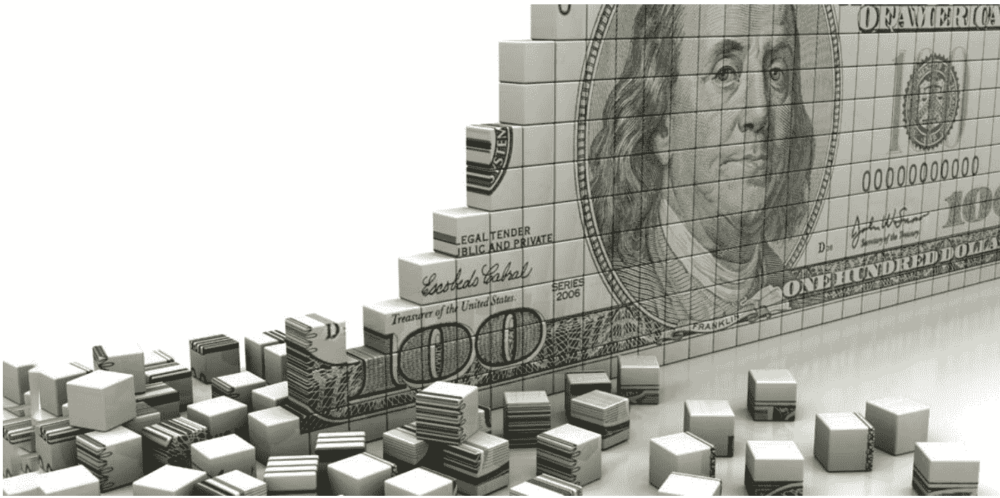
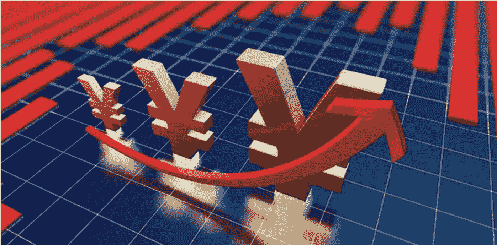
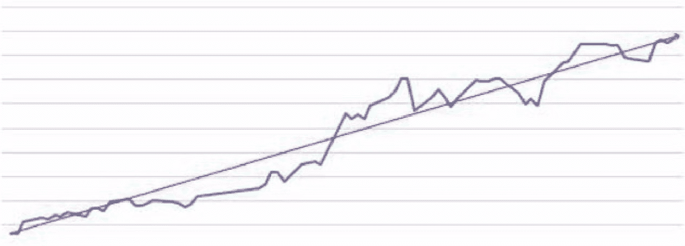

# 跟香帅学金融思维 20 讲

> 公众号懒人搜索，懒人专属群 分享

群友们好，这是小懒人给大家的《通才计划》更新的课程。

得到上 99 元的课程《跟香帅学金融思维 20 讲》

已整理添加到专属群《通才计划》，几十份付费课程到咱们专属群总链接里自取。

通才计划目录：https://lazybook.fun/#/data/13_course

懒人手册：https://lazybook.fun/#/

懒人专属群：https://lazybook.fun/#/blog/group

专属群更新记录：https://lazybook.fun/#/blog/record2

## 目录

01 | 金融世界观：解锁金融的关键密码
- 什么是金融世界观？
- 金融的本质
- 金融的演化

02 | 一万美金赠品里的秘密
- 一万美金赠品里的秘密：时间就是金钱
- 金融工具：把时间转变成财富

03 | 南北战争中的第二战场
- 南北战争的胜负手居然是“债券发行”
- 纽约繁荣的背后也是金融“资金集聚”的力量

04 | 现代人如何抵御风险？
- 保险：让社会分担分散个体的风险
- 股票：让更多人“利益共享，风险共担”
- 风投、创投：让社会分担创业创新风险

05 | 构筑完整的“金融世界观”
- 金融世界观：金融赋能人类 VS 金融的破坏性
- 如何构筑这个金融世界观？千里之行，始于一张全年金融学地图

06 | 王的信用：中央货币财政体系
- 中央集权与国有经济——中国金融制度的根源
- 历史照进现实：官办金融

07 | 分权制衡：银行货币信用体系
- 圣殿骑士团奠定了欧洲的金融基础
- 相互制约的信用网络成为现代金融体系的核心
- 美国金融市场的“优良基因”

08 | 金融市场上的二道贩子们：信息不对称——理解金融中介机构的关键
- 理解金融中介机构的关键：信息不对称
- 金融市场上的中介机构

09 | 金融工具和金融市场：风险共担和利益共享
- 什么是金融工具？
- 债务关系
- 债券
- 股票

10 | 债权：人类最古老的金融行为
- 债务：可以量化和货币化的责任
- 债务合同：有强制力的显性金融契约
- 债务机构：信用分布的中心化

11 | 从“债”到“债券”中间经历了什么？
- 债券是债务关系的凭证
- 债券是可转让交易的标准化合同

12 | 国债：从金融角度回答“李约瑟之问”
- 金融导致东西方大分流？
- 税收和发债的第一个区别是资金筹集时间不同
- 税收和发债的第二个区别是契约关系不同

13 | 金融市场的“暗器”：金融衍生品
- 衍生品：实现风险的转移、再分配的金融合同
- 衍生品如何交易：套期保值和投机套利

14 | 期权：你的“选择权”也是一种金融产品
- 期权与定金的差别
- 期权的风险管理功能
- 对赌投机功能
- 中国权证泡沫

15 | 如何利用“预期思维”让自己增值？
- 预期与金融市场
- 预期思维

16 | 如何用“贴现思维”思考个人价值？
- 折旧（耗损，成本）是决定资产贴现率的重要因素
- 什么样的资产能减少折旧，降低贴现率，提高价格？
- 启示：未来和长期原则

17 | 复利思维的加速度效应
- 加速度思维
- 如何实现加速度

18 | 风险思维：守住底线，大胆突破
- 风险思维是一种底线思维
- 风险思维还是一种突破思维

19 | 如何把杠杆思维运用到生活中？
- 借力思维
- 硬核思维

20 | 信用思维：金融行业的灵魂
- 信用、金融、货币和社会
- 信用思维的两个层次

## 01｜金融世界观：解锁金融的关键密码

lazybro，你好，我是香帅。

为了帮助很多老同学来积极复习，也帮助很多新同学能够更快地进入到课程里面，我们跟得到的小伙伴一块商量，决定把这门课程做一次升级，这样我想不管是老同学还是新同学，都能够更快、更有效地吸收课程的内容。

### 什么是金融世界观？

首先，我们从第一个模块开始。第一个模块是金融世界观，我把它分了两部分，一部分是讲金融的本质，另外一部分讲金融的演化。

这里很多同学会问，我们听说过世界观，但是什么叫作金融的世界观呢？其实我觉得这件事很简单，就是我们怎么看待金融这件事情。我很喜欢的一位美国教授叫威廉·戈茨曼，他就说金融其实就像一个时光机器，它不能够移动我们的身体，但是它把我们的资金在时间的维度上移来移去，目标是什么呢？是为了降低未来生活的不确定性，使我们在有限的时间内，能够过得更好一点。

我在学金融 20 年以后，对金融有一个看法，就是原来大家都觉得金融嘛，是跟钱离得最近的一门学科，但是我后来越来越觉得，金融其实是跟哲学离得最近的一门学科。为什么这么讲呢？因为金融的本质和我们的人生很像，为什么这么讲？你看金融和人生都一样，就是两个密码，第一个密码是时间，第二个密码就是不确定性。

我们总在说我们要过好自己的人生，这是什么意思？其实就是对一个不确定的未来做好各种规划，让自己过得更好一点。同样的，金融是什么？它是把资金价值进行跨时间和跨空间的转换和安排，目标也是为了降低未来生活的不确定性。

我们生活中有太多的金融现象，比如说买房、房贷。你用你未来的收入作为抵押，从银行贷款买房，这是不是也是平滑你的消费，然后降低未来生活的不确定性。

同样的，搞保险、搞信托是为了什么？是为了隔离风险，是为了让自己的财富能够得到更好的继承。买股票、买债券是干什么？同样的道理，也是想通过金融工具，然后在未来能够获得所谓的“睡后收入”，就是睡觉以后还能够拥有的收入。

所以你看，不管形形色色的金融市场也好，金融工具也好，金融制度也好，其实说来说去就是一件事情，就是要理解时间维度上的不确定性，然后利用形形色色的工具、制度、市场，来对这些不确定性进行安排，降低这种不确定性。所以对我来说，这就是金融的世界观。

### 金融的本质

在这个世界观底下，我们怎么来理解金融的本质呢？其实就是三个维度，第一个维度是时间，第二个维度是资金积聚，第三个是风险共担。在课程里，我给了几个小故事，比如说 90 年代就有一个美国的经销商推出了一个买一万美金的车，赠送一万美金的活动。当时就引起了很大的轰动，然后结果大家发现这个一万美金的赠品是 30 年以后兑现的一万美金，如果以当时 8% 的贴现率来计算的话，大家就会发现，其实那笔一万美金只剩下了 994 美金。这就是金融里面最重要的一点，有很多金融工具都是来替时间定价的，时间是有价值的。这是金融的本质之一。

### 金融的演化

理解了金融的本质之后，我们再来探讨一下金融的市场是怎么演化出来的。大家可能平时老会听到有一句话，就是中国和欧美的这种金融市场很不一样。比如说有中国特色的资产估值体系，那很多人就会问了，老师，资产估值不应该全世界都是一样的吗？为什么会有中国特色呢？在我们过去的认知里面，总觉得市场经济只有一种模式，但是随着各个国家发展不同的市场经济后，我们才意识到：

任何一个市场，它都是背靠着自己的历史文化背景，还有制度演化出来的，金融市场当然也不例外。

比如说欧洲的金融市场是怎么起来的？这个事可以回溯到 11 世纪的十字军东征。十字军东征以后，很多欧洲人就要到耶路撒冷就是圣地去朝拜，但路途很遥远，所以这个时候十字军就成立了一个军事组织叫作圣殿骑士团，就是为了保护这种去朝圣的人。

在这个过程中，他们就发现人身安全好一点，其实最不安全的是什么？是钱。因为那个时候也不像我们现在都是这种电子货币，路途那么遥远，你要背那么多钱，路上又不方便，然后又风险很大。而圣殿骑士团是什么？是一个超越于国家主权之上的这么一个军事机构。所以你看，圣殿骑士团有武力，并且发展了给朝圣者保管财物的功能，在这过程中收取一定的费用。你看这是什么？这不就是我们现代银行的雏形吗？

后来他们发现这个业务越做越大，比这种保卫人身安全的业务范围要大得多。不但是替朝圣的人保管财务，欧洲各个比较富裕的阶层，都把财物交给他们打理和保管。大家都知道欧洲小国林立，所以每一个小国的国王都没有说是有一个绝对的垄断性的力量。法国国王、西班牙王室都会把自己的财物托管给圣殿骑士团，甚至还去找他们借钱。所以，你看这个时候圣殿骑士团已经充当了一个什么样的作用？它已经不是一个军事组织了，而是一个信用和金融机构。

到 14 世纪左右，圣殿骑士团发展得太好，就引起了法国国王的不满，然后联合西班牙国王把它给灭了。但是，圣殿骑士团留下来的金融遗产就变成了散布在整个欧洲的一个信用体系，包括意大利后来零零星星的那种银行，包括后来的债券市场、股票市场，都跟这部分金融遗产有相当大的关系。

在圣殿骑士团这个故事里面，有一个点很少被人注意，但其实是非常重要的，就是为什么圣殿骑士团能够成为欧洲的一个金融机构？本质上是因为欧洲没有绝对的君主，所以各国之间是一个分权制衡的。然后圣殿骑士团作为一个超主权的组织机构，恰好充当了这个信用网络中间的一个枢纽节点。所以你看，这就奠定了欧洲金融市场的底色，我把它称为分权制衡的银行货币信用体系。

好了，说完了欧洲，咱们再来看中国，中国就完全不一样了。大家都知道，咱们中国在政体上是非常早熟，秦朝的时候就已经完成了大一统。然后到了汉朝的时候，不但是大一统，还有“官山海”这种国有经济。所以，当我们去想中国的信用主体的时候，脑子里出现的第一个画面是什么？像欧洲那样的一个网状结构吗？当然不是，是一个柱状的结构，我把它称为“王”的信用。所以整个中国社会从古到今就有一个信用主体，从古到今都没有太多的变化，中国的社会里面都只有一个大的信用主体，王的信用。整个社会的很多金融活动，都是围绕着这个信用主体的财政需求来的。

到了近代之后，虽然说经历了一次现代化的洗礼，但是这个从上至下，王的信用这个底层的逻辑并没有太多的变化。举个大家特别熟悉的例子，我们的 A 股市场是怎么来的呢？就是 20 世纪 90 年代的时候，一方面国企改革，国企当时很困难，另外一方面那时候中央财政也很困难，而我们正好是处于一个全国经济发展特别高速的时期，搞建设是需要钱的。而且中国老百姓有一个什么特征呢？储蓄率特别高，我们这几代人都知道有钱要把它存起来。

所以你看，一方面大量的储蓄存在银行里，另外一方面搞建设没钱。当时的顶层领导人就听到了国外有这么一个好东西，就是用股份制、用股权这么一个模式，就把老百姓很高的储蓄率转化成我们搞建设的资金，然后转化成给我们国有企业解困的资金。比如大家熟悉的国家开发银行，它其实是中央的第二财政。

从古到今，中国的金融市场的底色也没有发生太大的变化，叫什么？高度集中的中央货币财政体系。讲完金融的本质和金融演化之后，我想你的脑子里应该已经有了一个初步的金融世界观，其实金融活动就是对价值、对金钱进行跨时空的更优配置，所以包括时间、资金集聚，还有风险共担这三大要素。金融市场天然都是因地制宜从土里长出来的，所以欧洲的金融市场我们会看到有银行、货币、信用体系的一个特征，而中国的金融市场天然带有中央货币财政体系的特征。

好，这就是第一个模块的内容，希望能够帮助你顺利地开启接下来的金融之旅。

## 02 | 一万美金赠品里的秘密

lazybro，你好，我是香帅。

我想先和你谈谈金融的本质。很多人对金融有一种很“敬畏”的心理，觉得金融门槛很高，是富人的游戏，要有很多闲散的资金，你才会和金融发生关系。其实，今天我要告诉你的是，只要你活在时间的河流里，你一定会和金融发生关系，这就是我们今天要上的第一课，叫做金融的第一定理——时间的价值。

### 一万美金赠品里的秘密：时间就是金钱

“时间的价值”这个概念，它听上去有点抽象，那么我先给你讲个故事，你就明白了。上个世纪 90 年代的时候，美国汽车经销商当时在大力推销一款价值 1 万美金的车，但是当时美国的汽车市场已经特别的饱和了，所以市场的销售情况一点儿也不好。有的车行就不惜血本打折，打折到 15% 销售，但是效果也不是特别理想。

这个时候，有一个特别懂金融的经销商他就想出了一个“免费送车”的主意，怎么说呢？就是买一辆车，送一张面值 1 万美金的 30 年期的美国国债。1 万美金的车，送价值 1 万美金的债券，这听上去像什么？免费拿了一辆车。这个诱惑实在是太大了。所以很多根本就不打算买车的人这时候就开始争先恐后地往车行跑，生怕去晚了，这个天上掉的馅饼砸不到自己，所以车行的生意一下子变得特别的火爆。

但是，聪明的你估计已经注意到了，这个赠品不是 1 万美金的现金，而是“面值 1 万美金的 30 年期的折价国债”，换句话说，你拿到的“1 万美金”是 30 年后付给你的 1 万美金。

按照 90 年代中期平均 8% 左右的国债利率算，折算到 30 年后，这个面值 1 万美金的债券只剩下 994 美金。

也就是说，销售商其实只给了你 994 美金的礼物，让利幅度只有 9.94%，比那个 15% 的打折力度差远了。

30 年后的 1 万元 (给定 8% 的利率水平)，到今天只值 994 元！

这意味着什么？这意味着 30 年的时间被折掉了 9000 多美金，所以，时间在这里被量化成了具体的金钱——这，就是金融里最基础，也最重要的一个概念，叫“货币的时间价值”（time value of money）——这个概念说起来神秘高深，但是你仔细想一下，不就是我们平时里老挂在嘴边的“时间就是金钱”吗？

### 金融工具：把时间转变成财富

所以在金融里面，“时间就是金钱”这是客观存在的事实。

好了，现在你明白了，货币的时间价值在金融里边是可以度量，计算，和用来支付的，那么我们再看看这么一个金融概念在每个人的生活中会有什么影响？

现在我给你做一个假设，假设你能够坐上时光机器，让时间倒回到 2007 年的 12 月，你 22 岁毕业，家里这时候给了你 10 万元，你面临着一个关于这个钱的财务安排，你可以吃光用光身体健康了，但是你也可以做下面这些安排：

你可以存在银行里，按照这种长期的、定存的利率来算的话（5 年期存款平均定存利率 5.85%），十年前你存的 10 万块钱，现在你可以拿到多少呢？大概是 18 万元。

你也可以把这这笔钱买股票，假设你买的是中石油，10 万块钱剩下多少呢？4 万块钱。

如果你当时很有眼光，买的是腾讯的股票，10 万块钱变成了多少钱呢？现在是 360 万块钱。

你还可以在北京买一个小房子，当时海淀区的五道口一个不错的小区大概是一万块钱出头，你能够买个 30 平米左右的房子，拿 10 万付个首付，然后再咬牙从银行借个 20 万房贷。那么到今天，这套房子现在值多少钱呢？大约在 330 万元左右。

看到没有，在十年之前和十年之后，因为你运用了完全不同的金融工具，一笔数额不大的金钱，十万块钱产生了完完全全不一样的时间价值。

但是，还要告诉你一点，时间的价值还不仅仅体现在这样的数字上，它对你的人生会产生更大的影响。

现在我们还是把时光退回到 2007 年，这一年你大学毕业，还面临着其他的人生决策，在找工作的时候，你是使尽浑身解数挤进了一家像诺基亚这样的 500 强公司，还是一家被成立不久，求贤若渴的创业公司，比如说 58 同城用薪水加股票期权的方法招到了麾下？不到十年的功夫里，你很努力，你在诺基亚已经干到了中层，可是诺基亚已经大势已去，你开始在人才市场上寻觅下家。而如果你选择了 58 同城的话，应该已经是业务骨干了，“一个亿”的小目标也已经实现了，为什么呢？因为 58 同城已经在美国上市成功了。

所以你看，十年前的决策，在十年之后，都深刻地改变了你的处境，你的生活，甚至改变了你的未来。所以我们看到的可能是不同决策的影响，但是你往深层次想一想，你就会发现，这些财富数值的变化，其实是金融工具把我们拥有的相同时间（未来十年）进行了深度的加工，都化成了完完全全不一样的时间价值。

所以说，“一寸光阴一寸金”这句话是客观存在的事实。古代人类只是模模糊糊地意识到，时间是有价值的，这也是利息最早出现的根源。近现代我们的金融学进一步拓展了这种思想——你可以将“时间”看作一种原料，这些金融工具就干了一件什么事呢？它把这种时间维度里面的风险全部给曝露了出来，然后对这种原料进行加工，做成不同的产品。换一句话说，用金融术语来说，金融就是为时间定价，而我们这些购买金融产品，做出金融决策的人，就是购买了不同的未来价值。

好了，刚才我们从个人的案例说明了不同的金融产品加工而成的时间价值可能产生千万倍的差异——有人可能说，哎呦，这是中国吧？可能放在外国就不太一样了。我要告诉你的是，金融的选择所带来的时间价值差异，全球都是一样的。

给你举个小例子：1986 年的时候有一个人在美国，假设他买了 1 万美金的政府债券，另一个人买了 1 万美金的微软的股票，你猜猜看，2017 年的时候，这两个人的生活发生怎样的差异？买债券的这个人的 1 万美金变成了 8 万美金，而买微软股票的这个人的 1 万美金已经变成了 1086 万美金。

所以你看，同样的故事它会发生在不同的国家，不同的地区：

一模一样的原始财富，经历完全一样的时间，但是因为选择了不同的金融产品，不同的金融工具，就完全改写了未来财富的格局。

你看，金融工具像不像一个一个的时光机器？它没有移动我们的身体，但是移动了我们的金钱，也改变了我们的处境。

我特别喜欢的著名的金融史专家 William N. Goetzmann 说过，“金融技术就像我们建造的时光机器……它拓展了我们想象和计算未来的能力，然后塑造了一个关于可量化、可交易的时间维度，让我们人类越来越变成时间的生物。”

至于金融是怎么对时间进行加工转化，而个人、企业、国家在不同的时间点上，要怎么选择合适的金融工具，做出正确的金融决策呢？这就是今年我们这个专栏跟你一一讨论的问题。

期待你和我一起，找到属于你的最好的时光机器。

这里是香帅的北大金融学课，帮你站在高处，重新理解财富。

## 03 | 南北战争中的第二战场

lazybro，你好，我是香帅。

今天我要给你分享的是关于金融的第二定理——资金的集聚。昨天我们讲到，人类面临时间的约束，除了时间的约束之外，另外一个最大的约束是什么呢？资金的约束。经济学上会告诉你这叫“稀缺”。但是，想一想你就会明白，人类的资金约束不是每天每时每刻都在发生，而是会在某些关键的节点上面临着缺一笔钱的困境。

比如对你个人来说，结婚，买房，生病，出国留学……在这些节骨眼上我们特别需要迅速地筹集一大笔资金。那么企业更是这样，创业的时候，研发投入，项目投产……每个发展的关键节点上，我们都需要依靠大量资金的助力。那么那些听上去更宏伟的事物呢？比如战争胜负，城市兴亡……这些会和金融无关，不需要资金的集聚吗？

今天我要给你讲两个小故事，你就会明白，越是这些伟大的事物，越是要求大资金的快速集聚和有效配置，而这种功能，只有金融能够实现。

### 南北战争的胜负手居然是“债券发行”

第一个故事是关于美国南北战争的故事。作为美国唯一的一次内战，北方当时取得了压倒性的胜利，废除了黑奴制度，彻底地改变了美国的命运。但你可能不知道的是，在这么一场伟大战争的背后，其实是金融的较量。

战争开始时，北方军队节节失利，战争资金就开始告急。北方的联邦政府必须在短时间内筹集到一大笔长期资金，否则军队的开支就维持不下去。所以财政部就决定发行 5 亿美金的国债，但是，当时军事上非常不利，没有银行家愿意认购，北方的政府变得非常被动。

这个时候，费城一个叫库克的银行家就挺身而出。他说我来改变思路，我不再向“为富不仁”的金融大亨来兜售债券，我转向普通的美国家庭来兜售债券。他就做了下面几件事情：

- 为了让普通家庭都有购买力，他就劝财政部把债券发行的面额降低，一直降到 50 美金；
- 雇佣了大量的金融中间商，深入中部、西部的各个农村，各个小地方去，进行这种地毯式的销售；
- 他发动大规模的宣传攻势，在媒体和传单上他都传达一个信息：买债券是一个“爱国 + 投资”的双赢举动：一方面你可以享受国债 6% 的利息，而且利息是免税的，另一方面，只要北方取得胜利，这个债券就会大涨价，你可以分享国家的胜利果实。

这么一个销售策略大获成功，库克在一年之内为北方联邦政府筹集了 4 亿的资金，这些资金马上就被转换成了粮食，军备，医药，源源不断送到了战场上。

同时，战争打了这么久，南方的资金也开始告急了，军队的补给跟不上，军队战斗力就下降。有一个很著名的小说叫《飘》，里面就写了这么一段情景，南方的士兵们都衣不蔽体，食不果腹，但这个时候，南方联邦又作了一个特别错误的金融决策，为了筹集战争资金，他们在一年内印刷发行了 17 亿的钞票，这些钞票“哗”地涌到了南方的市场上，南方物价飞涨，整个南方的经济就迅速地崩溃了。

所以从这个故事你看出了什么？

资金集聚的效率最后决定了军事力量的对比，所以在战争的胜负手背后，其实是金融的力量。

难怪有一个南方的将军最后说：“我们不是输给了北方的士兵，而是输给了北方的金融。”

### 纽约繁荣的背后也是金融“资金集聚”的力量

现在你知道了，南北战争的胜负手背后其实是“资金集聚的效率”。那么城市兴衰呢？大家现在都知道纽约是世界第一大城市，但是其实在 19 世纪的时候，它还是一个特别无名的港口小城。纽约奇迹般地崛起，主要依靠的是一条河流，伊利运河。

在这条运河修建以前，美国西部的一吨面粉运到东部，要绕过密西西比河，路上要 3 周时间，运费成本大概是 120 美金，但这条运河修通以后，运输时间直接下降到 8 天，运费的成本直接从 120 美金下降到 6 美金。这么一来，相当于在美国东西部打穿了一条交通血脉，到 19 世纪中期的时候，纽约的外来货运量飞速上涨，一下子就占据了美国整个货运量的 62%，人口也从 10 多万激增到 100 多万。

所以历史学家们都说，纽约的奇迹其实是伊利运河的奇迹。可是你不知道的是，这条运河的背后也是金融的力量。

修运河这种工程看上去很美好，但是首要问题是什么？就是钱。当时估算下来，这个投资最少要 700 万美金，折合到现在，就是 2 亿美金。当时美国全年的财政收入才 2200 万美金，联邦政府根本不可能来支持这样的项目。而老百姓也不知道这个运河会不会替他们创造什么效益，也不愿意纳税支持这个项目，眼看着这么一个宏伟的计划就要泡汤了。

在这么一个历史关头，又是华尔街的银行家出现了：他们说，“我们来帮助纽约州发行伊利运河债券”。大家对伊利运河能否成功还没有一个很强烈的预期，所以他们，“我们就搞一个金融创新”，采取分期发债的方式，第一笔发行的资金就用来修第一段运河（这笔债券是华尔街的第一个工程债券，也是美国官方记载的第一个市政债券）。那这个时候，华尔街强大的销售网络就起到了巨大作用，第一笔债券很快就销售一空，而且销售到美国、欧洲的市场上去了，100 万美金的资金迅速到位，工程就能够如期地开工。两年之后，第一段运河一开通以后就大获成功，当年的收益就高达 25 万美金。

这样的一个收益，很快地就刺激了投资者的热情，伊利运河的债券就开始受到市场和投资者的热捧，资金开始源源不断地进来，工程的速度也大为加快，到 1825 年的时候，整条运河就通航了，当年就有一万多艘船使用了这条运河，美国国内的贸易和全球的贸易都源源不断地涌入纽约，纽约瞬间就变成了美国东部乃至世界的贸易和金融中心。

和南北战争一样，我们眼睛里看到的是纽约繁荣的奇迹，而这种奇迹的背后，其实也是金融的力量，没有近现代的金融工具和市场的发展，这种跨地区、跨时间的大规模资金集聚，其实根本就是没有办法想象的。

这里是香帅的北大金融学课，帮你站在高处，重新理解财富。

## 04 | 现代人如何抵御风险？

lazybro，你好，我是香帅。

我们都知道，风险其实是人类社会无法避免的一个部分。死亡、疾病、失业、汽车事故……这些都可能对我们的生活造成很大的影响。那企业就更是如此了，农业是靠天吃饭的，工业的投入大，失败概率高，面临着很多的不确定性。

在古代社会的时候，我们人类社会对风险承受的能力是很弱的。主要靠什么呢？靠家庭、宗族来实现风险共担。你看，古代书生进京赶考，是不是经常会依靠自己宗族里的一个富裕人家来接济？哪一家有孤儿寡母的话，大概也只能仰仗祠堂里的家长。这些风险共担机制是以“血缘”、“地域”为纽带的，它很脆弱，也很难量化，所以不可能大规模推广。所以人类经济活动就会受到很大局限。但是，现代金融市场和金融工具就改变了这一切。

### 保险：让社会分担分散个体的风险

一个特别有意思的例子是：美国的农业保险。2012 年的夏天，美国遭受了自 1956 年以来最严重的旱灾，玉米是受灾最严重的作物，中西部有的地方甚至颗粒无收。这要放在古代的中国，我们会看到大批的农民马上就陷入绝境，一个不小心就可能“民不聊生，流寇四起”了。

但令人庆幸的是，美国的农业保险特别地发达，它是这么一个机制：全国所有的农户都缴纳一定的保费，一旦参保的农户发生问题，这些资金就会被用来补偿他们的损失。因为有了农业保险，所以在 2012 年这次罕见的天灾中，种玉米的农民发现，他们的收入不但没有下降，反而上升了。

为什么呢？因为当年受灾，玉米减产，市场上玉米的收购价就会上涨，当时上涨了 60%，而保险赔偿金额是按照历史产量乘以市场价格来共同计算的，所以一个农民在受灾前一公顷玉米的收入大概是在 1000 美金左右，现在因为整个市场的玉米收购价格上去了，所以他最后拿到的赔偿金额居然能够达到 1280 美金。这么一算下来，因为有了这么一个保险机制，农民可以完美地对冲风险，然后获得了特别大的人生安全感。

所以说，

保险这种风险共担的功能，让我们人类获得了很大的自由。对自然的依赖减小了，我们个体承受的风险也被分散到了社会群体中间。

这是保险的功能，下面我再给你举个例子，看看金融的风险分担还会给人类社会带来什么其他的变化？

### 股票：让更多人“利益共享，风险共担”

大家都知道，荷兰在 17 世纪的时候，是全世界最强大的海上帝国，这个帝国的形成，其实是和一个金融工具的风险共担功能密切相关的。

16 到 17 世纪的时候，荷兰有一个“东印度公司”，它想开拓远洋海上贸易，但是远洋贸易面临两个约束：

- 第一，造船的耗资太大；
- 第二，海上贸易的不确定性特别大，你要光靠船长或船员他们自己的力量就很难完成这样的探险。

为了解决这个问题，聪明的荷兰人就设计了一套机制：他们让荷兰人民来购买东印度公司的“股票”，只要你购买了这个公司的股票，你就能按照认购的比例，分享东印度公司远洋贸易的利润，这就叫“利益共享”；但是万一探险失败的话，你投入的资金就算沉没了，这叫“风险共担”，通过这么一个“利益共享，风险共担”的机制，远洋贸易的资金风险就被分摊到了购买股票的国民身上。借此，东印度公司筹集了大量资金，船员们也就没有了后顾之忧，大胆地踏上了远征东方的航线，开创了荷兰的海上帝国时代。

### 风投、创投：让社会分担创业创新风险

有人会问，荷兰这都是 400 多年前的事情了，现在金融风险的共担，还对我们有用吗？当然有用，比如说现在最流行的风投、创投就对企业鼓励创新、创业起到巨大的推动作用。很多人下海创业，但是创业不是好玩儿的，它是九死一生的游戏，不要说普通人，就算是亿万富翁，一个不小心也可能倾家荡产。

像特斯拉的创始人，著名的科技狂人埃隆·马斯克，他从小就梦想着要探索宇宙，2002 年的时候，他已经很有钱了，创立了一个造火箭的私人企业，叫"SpaceX"，他野心勃勃地说，“我要实现未来人类星际移民的计划”。最开始的时候，他觉得自己是亿万富翁，应该单枪匹马地干。但是万万没想到，火箭发射不是闹着玩儿的，每发射一次就是耗资上亿美金，从 2006 年到 2008 年，SpaceX 多次发射失败，所以即使是贵为亿万富翁的马斯克也差点破产。所以在这之后，马斯克就痛定思痛，决定开始接受外部融资，当时的 100 多家风投机构，像世界知名的基金、科技巨头都参与到了这次风投中，光 2015 年年初的 E 轮融资，像富达基金、Google 这种机构就投了 SpaceX 一共十亿美金。

好了，现在有了风投的背书和风险共担，马斯克的胆子就更大了，步子更快，所以他的项目推进得也越来越快。到 2010 年的时候，SpaceX 的“猎鹰 9 号”运载火箭就顺利地把一个“龙飞船”模型送入了预定的轨道，这一下子就开创了历史，历史上从来没有一个私人企业能够成功发射火箭，但是 SpaceX 成功了。成功以后，SpaceX 就接受了大量火箭发射业务，甚至美国的国家航空航天局也准备让他们替国际空间站来运送货和航天员。

所以从这个故事你也可以看到，和荷兰人海上探险一样，马斯克的天空之旅也是这么一个金融“风险共担”的产物，没有风险投资的支持，可能在梦想实现之前，SpaceX 已经“死亡”了。

所以我们会说，股票也好，风投也好，这些金融工具，都使得我们人类对风险的承受能力突破了地域和时间上的限制，个体、企业都被赋予了更大的能量，我们人类经济活动的范围也就被大大地拓展了。

这里是香帅的北大金融学课，帮你站在高处，重新理解财富。

### 公众号

#### 懒人搜索

#### 懒人专属群

微信:lazyhelper

## 05 | 构筑完整的“金融世界观”

lazybro，你好，我是香帅。

前三天，我给你讲了金融的三大定理：时间、资金和风险，它们是构筑你金融世界观的第一步。今天我想顺着这个话题，给你讲两件事情：

- 所谓完整的金融世界观到底是什么？
- 这一年里，我们怎么来构筑这样一个金融世界观？

### 金融世界观：金融赋能人类 VS 金融的破坏性

首先，我来给你讲一下，什么叫做完整的金融世界观，这里面要包括两个方面的内容，一方面，你要认识到金融的力量；另一方面，你也要知道金融的负面效应。

前三天我们已经从时间、资金、和风险的维度，详细地讲解了金融是怎么替我们人类赋能的：金融能帮我们加工时间，集聚资金和分散风险。这三种能力，被我们称为“金融三大定理”。

但是，换个角度来思考问题的话，这些金融的巨大能力是不是也可能导致负面效果？当然是这样，比如社会上有很多被人诟病的金融现象，其中，最为人所知就是“马太效应”和“道德风险”。

**马太效应：** 金融能够数百倍地放大社会财富的累积，但是问题是，这种能力并没有被整个社会所共享。古话里说“人往高处走，水往低处流”，资金也一样，它会很自然地就向那些具有更多的初始财富、更多初始权力的人流过去。而金融的杠杆效应越大，就越容易出现这种“穷者越穷，富者越富”的马太效应。一个很强的佐证就是，过去的几十年里，随着全球金融市场的发展，社会的贫富差距确实越来越大。比如在 2012 年，全美有 42% 的财富集中在全美最富的 1% 的人手里。而我们中国这个数字可能还要更极端呢。

**道德风险：** 由于金融和未来时间是相连的，而未来是看不见摸不着的，所以金融市场天生就具有很大的信息不对称。巨大的财富诱惑再加上巨大的信息不对称，人性的贪婪和欲望难免会被放大，很多人就会利用自己的信息优势来获取不义之财：比如说，在 2008 年全球金融危机中，很多华尔街的人员其实都知道那些次贷产品质量特别差，但是他们不管，他们只管能把这击鼓传花的游戏玩下去，能够把产品卖下去，他们就用这种复杂的金融模型来包装，欺骗投资者。普通投资者，就特别容易掉进这种“道德风险”的坑里边。

### 如何构筑这个金融世界观？千里之行，始于一张全年金融学地图

刚才我们讲了一个完整的金融世界观，你要一方面认识到金融的力量，学会在合适的时间里面选择合适的金融市场，作出有利于自己的投融资决策；但是你也要认识到金融的负面效果，避开金融的雷区，避免陷入到马太效应的坑里。

要做到这些，光有“概念”和“框架”还不够，你还需要有很多的金融基础知识。这其实也就是这门课程的初心所在，想要用一种简单明了的方法来弥补我们这个社会在金融知识上的不平等。

为了这个目标，我将这些基础知识分成了六个板块，我称它们为“金融之术”，在接下来的一年中，我会把这些金融知识一点点地交付给你。

- **金融机构：** 首先我会带你先了解金融中介机构。这个板块里，你会听到关于银行、投资银行、基金这些金融中介机构的起源、功能、运作模式，以及它们背后的金融学逻辑。
- **金融工具：** 接下来，我会给你介绍金融机构是怎么开拓市场的——用金融工具。这个板块，你将会听到股票、债券、金融衍生产品，它们的本质和特征，它们的应用逻辑，以及相关的金融交易制度。
- **投资者决策：** 在了解了金融工具和金融机构之后，接下来的课程，我们将更多地回到我们投资者这个决策自身，在“投资者决策”这个板块里，你会了解到关于资产配置、证券选择、非理性决策的一系列内容。比如说，如何根据自己和家庭的抗风险能力和收入水平来决定你的投资方向；比如给定投资额度，你是选择腾讯的股票，还是茅台？你在几百支货币基金里到底选哪支？买多少？比如你怎么在投资决策里面如何克服你人性上的弱点：恐慌，畏惧等等。
- **公司决策：** 再接下来，我们会进入“公司决策”这个板块。我们要继续讨论，企业在什么阶段适用于什么方法筹资？是债券还是股票？什么阶段你上市最好？赚了钱以后，要不要给股东分红？分多少？如果你是企业老板，要不要给自己的职员股权激励，给多少？怎么给？当市场上有兼并收购压力的时候，你怎么跟别人对抗？
- **金融的监管、创新和危机：** 完成了上面几个板块之后，我们会进入另外一个更有高度的学习阶段，这个时候就要学会去理解“监管、创新、危机”里的金融周期。为什么金融市场需要监管？为什么金融机构会搞金融创新？为什么说创新和监管是猫捉老鼠的游戏，会导致金融危机？这些金融监管、创新、危机会对我们的生活和投资产生什么影响？
- **科技金融：** 最后一个板块也是现在最热门的话题，科技金融。在这个板块里，我们要讨论金融行业发展的未来。比如互联网是怎么打破金融、商业和社交之间的场景界限的？比如区块链、比特币、数字银行这些新名词、新产品会不会改变我们的生活？在人工智能时代，人类的信用关系到底会不会被重塑？更重要的是，未来的金融到底会变成什么样子？这些问题你都将在这个板块里得到答案。

当你完成这六个板块的内容学习后，你就对金融市场的构架已经有了完整的体感，你的金融世界观就已经形成坚实的大厦了。最后我会让你把这些知识上升到一个“道”的阶段，你得把学到的这些知识化成金融思维，运用到生活的方方面面中去：求职、求学、创业、婚姻、家庭、生活……

运用金融思维，你就可以成为一个把风险、收益权衡得特别好的人。用金融的术语说，你不但应该在投资上做一个价值投资者，更要在人生上做一个价值投资者。

这里是香帅的北大金融学课，帮你站在高处，重新理解财富。

微信:lazyhelper

## 06 | 王的信用：中央货币财政体系

lazybro，你好，我是香帅。

关于中国金融市场的负面报道咱们都听得很多，“乐视陷入信用大坑”、“e 租宝庞氏骗局”、“银行理财大坑”……很多人都会有一种感觉：咱们中国的金融市场真是乱象丛生。

为什么不搞点“拿来主义”，把欧美发达的金融市场的产品和监管照葫芦画瓢，放到中国市场上来呢？

每次我听到这种说法，就特别想告诉他们，所有的金融市场都不是凭空出现的，它的形成背后都有一个强大的历史制度根源，这种根源不同，你是不能完全“拿来”的。比如说，欧洲的金融市场产生于一个“小国林立、分封而治”的大背景。而中国的金融市场，是从一个中央集权的帝国内部演化出来的。

这两种市场基因不同，移植没有那么简单。

今天我们先讲中国的金融市场的制度根源，讲完以后你就会理解刚才提到的金融现象。

### 中央集权与国有经济——中国金融制度的根源

中国早期的金融是很发达的，在世界上处于绝对领先的地位。比如说秦朝时有统一的货币；汉朝的时候商业信用特别发达；到了唐朝，这种货币经济发展到高峰，出现了完整的商业汇票体系——飞钱，也出现了银行的雏形——柜坊；宋朝则更是发明了世界上最早的纸币——交子，比欧洲早了 400-500 年。

为什么在早期的时候，我们就有这么发达的货币金融体系呢？这和我们“中央集权的帝国制度”和“官山海”的国有经济体制是密切相连的。

大家都知道，秦始皇建立了一个高度中央集权的帝国，在这个制度下，皇帝是“天子”，拥有至高无上的绝对权威。全国很容易就形成了一个统一的市场。货币统一了，市场也统一了，中间没有阻碍了。在这样一个统一的市场和货币体系之下，货币金融体系才能发展起来，所以秦始皇的这个举措对后世的货币金融体系影响深远。

另外一个就是汉武帝时期的“官山海”政策。我们知道汉武帝穷兵黩武，所以上台后中央财政感到捉襟见肘了。桑弘羊就给他出了一个主意，把盐、铁这种利润最丰厚的行业，全部收归国有，实现国营专卖。这个金融举措，替汉武帝筹集到了大量的经费，加强了中央集权的控制，也控制了地方势力的膨胀。后世的皇帝都发现，原来这种国营经济的控制方式，才是真正能够加强中央财政力量的金融举措，到后来，除了盐铁以外，什么茶叶、丝绸等几乎所有重要的经济物资都被收归了国有，成为了我们国家几千年绵延下来的一个很重要的金融制度。

整体而言，

中华帝国的金融是围绕着中央财政，自上而下的一个货币经济体系，我们就可以直接把它称为“中央货币财政体系”。

这种体系，在早期社会生产力低下，资金聚集能力很低的情况下，它是具有强大动员能力的，这也就是我们早期的货币经济为什么特别发达的原因。

但是凡事有利就有弊，这也是一把双刃剑。

到明清以后，这种制度的弊端就开始显露了。最大的弊端是什么呢？由于整个体系里面，只有一个人有权威和绝对信用，那就是皇帝。所以历史上，我们只看到有官家的、皇家的信用，没有民间的信用，所以民间信用的意识就培养不起来。

一个特别有意思的例子，就是山西的票号。山西的票号在明清年代已经发展得特别庞大，连慈禧都要向他们借钱。但是随着时代的变迁，随着外资洋行的进入，山西票号很快就衰落下去了，为什么？其实最重要的就是山西票号这样的机构，毕竟是民间的金融机构，它还是缺乏一种强大的资金筹集能力。而且老百姓对他们也不够信任，万一换一个地方官给你抄个家，或者朝代更迭，你的所有财产就没有了。所以山西票号整体来讲，它的筹资能力比较弱，这和我们民间信用薄弱有很大关系。

#### 历史照进现实：官办金融

所以这种双刃剑一样的中央货币财政体系，就是我们中国金融市场的制度根源。

历史都是延续的，我们现在的金融市场，看上去和古代的货币金融体系有很大的不一样，但其实根子还是很像，它还是中央货币财政体系的翻版，就是国家一直要把金融资源捏在自己手里，替国家来“集中力量办大事”。我们现在在市场上看到的几乎所有的金融制度，都是自上而下，为中央财政目标而实施的“顶层设计”。

一个典型的例子是 A 股市场。它设立的目标是替国有企业解困。在上个世纪 90 年代的时候，中国的经济变得很困难，大量的国有企业都快破产了，把国有银行也快拖垮了，所以国家这时急需替国有企业输血，找到新的融资渠道。A 股市场就是在这个一个大背景下设立的，所以为了替国有企业融资、输血，早期就设了很多歧视性的条款，比如配额制，就是为了把这种上市筹资的名额分配给各个地方的国企，各个部委的国企。还有不准流通的法人股，相当于同股不同价，意味着让老百姓用更高的价格买流通股，让国企来圈钱。这一切都是为了实现“为国有企业解困”这个目标。后来 A 股市场虽然经历了多次改革，但是直到现在，市场上还是有很多计划的痕迹、一些歧视性的条款，所以市场上留下了很多权力寻租的空间，因此常常会出现官商勾结，内幕消息乱飞的怪现状，其实这是跟我们中央货币财政体系的制度根源紧密联系在一起的。

除了 A 股市场，还有很多这种现象。比如为什么我们的银行的利率会那么低呢？其实是因为国家要“集中力量办大事”，所以国家就要把老百姓这些储户的钱，用较低的价格吸纳进来，然后让廉价资金流入那些国家重点扶持的行业。所以银行一方面压低居民的存款利率，另一方面对中小型民营企业，让它们拿不到贷款，或者即使能拿到贷款，也拿到的是一个极高的贷款利率，这样就形成一个巨大的“利息剪刀差”，然后吸取资金，扶持那些国家要扶持的行业。

这其实和咱们历史上发生的情况一样，这种中央控制大量资源的方式也不是说完全没有好处：因为国家控制了这些资金以后，会把大量资金投向能源、电力等基础建设。在发展中国家里面，我们中国的工业体系是特别完整的。这个基础是从 50 年代以后慢慢地打下的，我们 50 年代以来的重工业基础，以及 90 年代以后全国城市的基础设施建设，都和中央能控制大量资金，投向基础设施建设是有很大关系的。

但是，后果也和历史很相似：由于中央控制了所有资金，控制了大量资源，所以只有官方的信用，没有民间的信用，民间信用就极度脆弱，整个社会就缺乏信用意识。国家垄断了金融资源后，老百姓的理财需求被压抑得很厉害，最后只能在各种灰色地带冒泡。比如 90 年代的时候，各种“非法集资”案件。前两年的互联网理财、P2P，为什么一点就着呢？

还有市场上为什么有那么多资产泡沫，见啥炒啥，石头、香烟、邮票……这一切的现象，看上去是独立的事件，但是背后的制度根源都是一个，就是从秦汉以来的“中央货币财政体系”。

所以我们会说，不管是古代发达的货币经济，还是到现在的一个落后的金融市场，金融市场演化这种事情，特别像一个人的基因，优点和缺点都刻在你的基因里。我们“中央货币财政体系”的制度根源，替我们创造过很多机会，但是也给我们制造了很多麻烦。

我们现在进行的金融改革，就像改造基因一样，不是一蹴而就的事情。这也就是我为什么一开始说，简单粗暴的拿来主义是行不通的。

这里是香帅的北大金融学课，帮你站在高处，重新理解财富。

#### 本课取材于《香帅的北大金融学课》
#### 站在高处，重新理解财富
版权归得到 App 所有，未经许可不得转载

著名金融学者
香帅

### 公众号

#### 懒人搜索

#### 懒人专属群

微信:lazyhelper

## 07丨分权制衡：银行货币信用体系

lazybro，你好，我是香帅。

昨天我给你讲了中国的金融市场是怎么演化过来的，今天我接着给你讲欧美的金融市场又是怎么演化过来的。

大家都知道，中国和欧美的发达金融市场差距不小，比如说美国平均一个人有 3 张信用卡，我们是平均 3 个人才有一张。再比如说，欧美市场的征信记录特别完整，一个人如果失信一次，他可能会被封锁很长时间。但是你看咱们中国市场，泛亚的创始人早就陷入了债务纠纷，但是一直都没人知道，居然还让他继续在金融市场上行骗了这么长时间。这些现象很容易让人觉得，欧美市场是天生的“信用市场”，而中国人天生没有信用观念。

就像我昨天说的，任何金融现象、金融市场的背后，都有一个历史演化的过程。现代欧美的金融市场，也不是一开始就像现在这样成熟的，它是从 11 世纪之后慢慢发展起来的，起源是从一个叫“圣殿骑士团”的机构开始的。今天我要讲的就是，欧美的金融体系到底是怎么从这样一个机构发展到现在这样的。首先我们看看“圣殿骑士团到底是个什么机构”。

### 圣殿骑士团奠定了欧洲的金融基础

很多人是在电影《达·芬奇密码》里听过“圣殿骑士团”这个名字，历史上，这个机构是真实存在的。开始的时候，它是个军事机构。

中世纪时，欧洲基督教的地盘被伊斯兰教占领了。到了 11 世纪，教皇进行十字军东征，很快就进入了基督教的圣地耶路撒冷，然后把它开放给欧洲各地的朝圣者来朝拜。圣殿骑士团就是为了保护这些朝圣者而建立的。

但是很快地，这些骑士团的人就发现了：保护朝圣者可以作为一门生意来做。因为朝圣的路途很遥远，朝圣者带很多财物不安全，需要一个异地托管财物的体系。但是，欧洲当时小国林立，壁垒重重，不可能由哪一个国家建立这样一个跨国的异地财务托管体系，只有像圣殿骑士团这样遍布欧洲的武装军事力量才能干这件事。所以圣殿骑士团发现开展这样的业务既方便，也特别赚钱：朝圣者可以在欧洲存钱，然后在耶路撒冷取用，跨国异地的汇兑就变得特别流行。很快地，这种业务就超出了保护朝圣者的范畴，在整个欧洲扩展开来。

在财务托管、货币汇兑的基础上，骑士团发现原来金融业务才是最赚钱的业务，所以他们拓展了业务：替英国国王保管他的王冠，替英国国王征收税费，替英国和法国经营皇室的债务、债券，还替各国的贵族进行信托理财。拥有了资金实力以后，当各国国王交战需要用钱的时候，骑士团就会给他们贷款。所以圣殿骑士团的势力就越来越大，到 14 世纪，这些汇款、存贷、理财、支付等标准的信用中介业务已经随着圣殿骑士团的拓展在整个欧洲流行起来，不单单是国王贵族，很多的普通百姓也开始在圣殿骑士团这里做储蓄理财业务。所以说，欧洲在 14 世纪的时候，整个社会已经有比较强的金融意识，而圣殿骑士团所扮演的正是“银行”的角色，而且扮演了一个欧洲金融启蒙者的角色。

### 相互制约的信用网络成为现代金融体系的核心

那为什么圣殿骑士团这样的类银行信用机构能在欧洲发展起来，而中国却没有出现这样的机构呢？这和欧洲当时的大环境是密切相关的。

要知道当时欧洲正陷入长期分裂的状态，就像《权力的游戏》中一样，当时欧洲有很多像“雪诺”这样的领主，各自统领着大大小小的土地，分封而治。这些小统治者不能像中国的帝王一样拥有绝对无上的权威和信用，也不能随意征兵、征税，因为一旦征兵、征税，领地上的人就跑到别的领主那儿去了。

所以，如果一个领主想通过打仗扩张，就必须借钱。因为没有人有绝对实力可以借钱不还，所以借钱要有借有还，借钱的业务就慢慢壮大了圣殿骑士团的实力。是当时欧洲分裂的局面给圣殿骑士团留下了发展空间，按照金融史的说法，当时欧洲的政治力量软弱无力，大家分权制衡，所以整个社会出现了一个治理结构上的真空，骑士团恰好弥补了这个真空。

在这种大环境中，即使是贵族、国王，也不能轻易违反承诺，不守信用。所以不是因为欧洲人更高尚，而是因为大家都没有绝对权力，是相互制衡的，制衡的过程中就产生了信用关系网络。这和昨天我们说的中国不一样，我们中国是只有皇帝有信用，民间信用都非常脆弱，不太可能形成一个信用关系网络。

14 世纪之后，随着英国、西班牙、法国几个大国的兴起，骑士团慢慢衰落下去。它衰落以后，欧洲还是有一个社会结构上的真空地带，接着，其他的信用机构就发展起来，取代了它的地位。

比如一开始，意大利北部的银行业兴起，在地中海地区取代了圣殿骑士团的作用，为各国贵族和平民提供金融服务。到 16 世纪，北欧小国荷兰的股票证券票据市场也开始崛起，成为欧洲的票据结算中心。17、18 世纪之后，英国、法国的银行业也慢慢开始发展，尤其是伦敦的债券交易所很快成为欧洲乃至全球的债券交易中心。

这一系列的金融业务，都延续了圣殿骑士团的金融遗产，在这个基础上，欧洲就逐渐形成了以“银行为中心”的、“分权制衡”下的信用体系，我把它称为欧洲的“银行货币信用体系”。这个体系，就是我们现在看到的欧美金融市场的雏形。

### 美国金融市场的“优良基因”

一个有趣的问题是，圣殿骑士团是从欧洲发展起来的，但是，现在全球最发达的金融市场为什么是美国？那为什么现代金融体系，在欧洲起源，会在美国取得这么大成功呢？

这其实和美国立国的基因有很强的关系。美国建国时，是由 13 个北美殖民地组成的联邦制国家，13 个殖民地之间独立性很强，恰好和当年欧洲的情况特别类似，所以 13 个殖民地之间很容易形成“分权制衡”的行政体制和信用网络。更巧合的一点是，美国南北战争统一了美国后，形成了统一的市场，随后，联邦政府又把货币也统一了。所以说，美国当时的条件是得天独厚，结合了中华帝国“集中”和欧洲大陆“分权”的优越性，所以美国很快青出于蓝，“金融立国”就成了美国立国的基因。所以“金融立国”是美国和其他国家最大的一个分野，也是为什么 20 世纪以来，我们看到的“美国奇迹”背后的一个历史根源。

从圣殿骑士团到意大利银行业，到荷兰证券市场，再到英法银行体系和美国的“金融立国”，现代欧美金融市场也不是一蹴而就的，也是从“银行货币信用体系”一步步演化过来的，而这个演化的过程不是凭空想象出来的，是和欧美大陆的地理环境、政治环境紧密联系在一起的。

我们所看到的欧美信用社会的形成，是由于欧洲分权制衡的形态所决定的。

结合昨天我们讲到的中国金融制度的演化历史，你就会明白，历史是一个路径相依的过程，简单的“拿来主义”，可能会造成的结果就是我们古话说的“橘生淮南为橘，橘生淮北为枳”。

这里是香帅的北大金融学课，帮你站在高处，重新理解财富。

#### 本课取材于《香帅的北大金融学课》
#### 站在高处，重新理解财富
版权归得到 App 所有，未经许可不得转载

著名金融学者
香帅

### 公众号

#### 懒人搜索

#### 懒人专属群

微信:lazyhelper

## 08丨金融市场上的二道贩子们

lazybro，你好，我是香帅。

很多人一谈到金融市场，脑子里会迅速地浮现出银行、投资银行、华尔街这些金光闪闪的名字。但你可能不知道的是，这些金光闪闪的名字背后，它们干的其实都是中介的活儿，就跟我们平时碰到的留学中介、租房中介，没有本质上的差别，都是“信息”的二道贩子。

为什么金融市场上充满了中介机构呢？这就是我们今天要讲的内容：信息不对称。

“信息不对称”正是金融市场上最核心的特征，而金融中介机构就是用来消除这些信息不对称的。

### 信息不对称——理解金融中介机构的关键

到底什么是“信息不对称”？其实就是交易的一方对另一方不够了解。这可能就会导致交易失败，或者市场失败。金融中介对于消除信息不对称有很重要的作用，在我们生活中，其实也充满了信息不对称。要留学，你会去找一个留学中介；要租房，你会去找一个租房中介；要找工作或招人，你会去找一个猎头公司；要找对象的时候，你还可能去找一个婚姻中介机构。

金融市场是天生具有信息不对称的地方。

因为金融做的是信用的交易，换句话说，金融市场上交易的是很难看得见、摸得着的东西。

比如说你买一套万科的房子，这个房子的地段怎么样？是不是学区房？房子质量如何？你可以去看房嘛，你总是可以感知，可以衡量的。但是假设让你买万科的股票，你买的究竟是什么？你买的是万科未来的发展前景，万科未来的现金流，这个概念即使你是万科的业主，你也很难说清。除非你对房地产的冷热能做出准确判断，对万科的内部管理能做出准确评价，对万科所有的楼盘销售都了如指掌，甚至对万科的土地储备都有特别深刻的认识。

我们平时总是说，金融是虚拟经济，其实也就是在说金融市场和其它的商品市场是完全不同的，不会有一个苹果的中介、梨子的中介。但是在金融市场上，由于交易的是未来，是看不见，摸不着的，所以交易中天生具有信息不对称的问题。很自然地，金融市场上就产生了各式各样的金融中介机构，来解决这个信息不对称的问题。很典型的就是我们平时总是听到的信用评级机构、会计师事务所、审计事务所、律师事务所……它们都在各个维度上消除金融市场上的信息不对称，使得这个市场能够更好地运行。

当然，平时听得最多的金融中介机构还是券商和银行。“券商”——我们中国叫“券商”，国外叫“投资银行”，它对于消除直接融资市场的信息不对称有特别重要的作用。

### 金融市场上的中介机构

我先来说投资银行。可能很多人在《货币战争》里面听说过“罗斯柴尔德家族”这个名字，其实罗斯柴尔德家族是欧洲市场上特别著名、特别古老的一个投资银行，它对于撮合很多融资市场的交易，降低整个金融市场上的信息不对称，做出了很多的贡献，其中最著名的一个例子就是中国的“吉利”去收购欧洲的“沃尔沃”，罗斯柴尔德银行就在中间起到了特别关键的作用。因为吉利是一家来自中国的草根企业，而沃尔沃是一家具有悠久历史传统的企业，当地收购的法规和我们也不太一样，而且他们的工会力量很强。

罗斯柴尔德家族跟欧洲的很多企业都保持着密切的接触，所以在这个过程中，他们就帮助吉利去跟沃尔沃的供应商、工会，还有员工进行充分的沟通，去消除交易中的不信任。另外，罗斯柴尔德的这个团队，还帮助吉利去疏通了当地的政府关系，进行知识产权谈判，甚至还为吉利安排了当地的融资。所以很多人都说，“吉利收购沃尔沃”这么一个经典的案例，如果没有罗斯柴尔德银行在中间的斡旋，是不可能完成的。从这里我们也就可以看出，投资银行或者券商在降低信息不对称，撮合金融市场交易的过程中间发挥的巨大作用。

我们生活中接触最多的就是银行，那银行是怎么来降低市场上的信息不对称的呢？

银行把我们所有人的钱收集起来，然后把它放贷出去，靠中间这个存贷差来赚钱。所以它一定要保证这个贷款能够收回来，才能赚钱。如果借了钱的人全都违约、跑路的话，那这家银行很快就破产了。所以，银行一定要对贷款人的资质、信用做特别详尽的调查，这样才能够保证自己的利润。因此银行具有一种动力，就是去给贷款人做出准确的评价。你的评价越准确，你提供的贷款人的信息越多，储户就越觉得安全，甚至愿意用低一点的价格把钱存在你的银行，也就是说银行提供的信息越准确，它就越赚钱。

一方面，它可以拿到更低成本的资金；另一方面，它可以判断哪些人有能力承受更高的贷款利率，哪些人的违约率比较高，保证银行自己能有更高的收益。所以它在这个收集、分析、判断信息的过程中，就一点一点地降低了整个市场的信息不对称，然后形成一个良性循环，把整个金融市场的信息不对称都给降下来了。所以，我们老是说，银行在我们的金融体系里处于一个特别重要的位置。就是因为它从很早的时候开始，就替我们把整个金融市场的信息不对称降低了，保证了我们金融市场的运行。不管我们从哪个维度来讲，你都可以看出，没有金融中介机构，金融市场是没有办法运行的，在金融市场这么一个天生具有信息不对称的地方，高度中介化是必然的趋势。

从下个礼拜开始，我们就会进入“金融中介机构”这个板块的学习。在这个板块里面，我会给你详细地讲述银行、投资银行、基金这几个最重要的金融中介机构的特征、运行规律、制度安排。当你了解了所有的金融中介机构的整个运行规律以后，你对整个金融市场的体感一定会更好。

这里是香帅的北大金融学课，帮你站在高处，重新理解财富。

公众号
懒人搜索
懒人专属群
微信:lazyhelper

## 09丨金融工具和金融市场：风险共担和利益共享

lazybro，你好，我是香帅。

这一模块也是内容很丰富，主要讲的是金融工具和金融市场。

看过《人类简史》的同学可能就会知道，把智人和其他哺乳动物分离开来的，就是我们人类会使用工具。比如在远古的时代，我们用石头、火、轮子做成各式各样的工具，大大地提高了我们的生活和生存的效率。

同样的，医学的工具是什么？镊子、手术刀、酒精这些东西。所以，工具在本质上就是专业化的代名词，和人类社会的专业化分工程度是密切联系在一块的。从这个意义上讲，工具是我们人类生存的杠杆，而金融工具加工的东西很特殊，叫作时间。

### 什么是金融工具？

而我们都知道，在时间的维度上最大的要素是什么？是风险。所以金融工具，尤其是那些现代金融工具，其实就干了一件事情，就是把那些看不见、摸不着的风险进行度量，然后进行加工，然后制作成产品进行交易，创造了一个金融市场。

这件事情听上去很玄，但是你仔细想一下就会明白，在金融工具出现之前，我们人的肉身和金钱其实是不可分离的。而且我们的人和金钱都一样，在时间的维度上，是一个单向行驶的。

但是，自从出现了金融工具以后，它做了一件事情，把这种金钱、价值和我们人的肉身给分离开来。金融工具把金钱作为一个单独的要素给抽离出来，让它去穿越时间。所以，有了金融工具后，你会发现你的金钱坐上了时光的机器，可以倒回到过去，也可以穿越到未来，财富创造的效率和速度也大大地提高了。

为什么我特别喜欢威廉·戈兹曼的观点？他说金融工具也好，金融市场也好，就是金钱的时光机器，然后它把我们的金钱和人身分离分来，让他们可以在时光中间任意地穿梭，然后提高了人类的效率，降低了人类生存的不确定性。

如果我们仔细观察人类增长的历史，你就会发现一个很有意思的点，人类增长的曲线和现代金融工具、现代金融市场的出现，基本上是一条重合的线。也就是说，金融市场的发展是引导了人类增长的这么一根曲线的。所以这是为什么我们老说，现在全球最强大的国家美国是金融立国的。为什么我们老说现代社会就是金融社会？它背后有一个很根本的要素，就是金融工具、金融市场的出现，使得人类增长的效率大大提高了。

我们这个模块要讲两个特别重要的金融工具，也就是平时听着很普通的股票和债券。实际上我们平时看到的所有的金融工具，包括金融衍生品、资产证券化等，都是基于这两个工具给演化出来的。不管是股票还是债券，它们的本质其实都是一样的，它们就是对时间和风险来进行加工，然后形成产品，然后再创造一个市场。

那它们的共同点是什么呢？它们的共同点是，它们本质上就是创造了一种风险共担和利益共享的机制，然后创造流动性，然后把社会的财富还有风险在横向和纵向的维度上进行重新分配。

那它们的不同点在哪里呢？就是风险共担和利益分配的机制是不完全一样的。

### 债务关系

理解金融一定要从理解债务关系开始，我曾经在一次线下课跟大家讲过一句话，我说

金融是整个人类社会关系的数字化表达。

听上去很玄，对不对？但其实你想一下，人类社会是什么？人类社会不就是各种关系的一个组成吗？我们再去往深里想，各种人际关系，其实都是一种债务关系。

我给你们举个很小的例子，比如说我们在生活中间经常会碰到一群朋友大家轮流请客这件事情，这中间其实就是什么？这其实就是一种隐性的债务关系。

我们每个人都轮流请客，但是如果有一次或者有几次，其中一个人或者几个人老是借故说我要上厕所，或者说今天轮到他请客的时候，我身体不舒服。如果这样的事情发生多了，我们会把它视为什么？视为一种隐性的债务违约。要么是对他进行鄙视，或者就干脆把他踢出这个债务的圈子，就是我不让你存在在我的债务关系网络中间了。

除此之外，你看我们和父母之间的赡养关系，和子女之间的抚养关系，甚至夫妻关系现在很多人都要签婚前的合同，然后婚后还有一个财产分配的问题。你看本质上这些关系都是债务关系，只不过这些债务关系有些是隐性的，有些是显性的，有些是柔性的，有些是强制性的。

如果我们去看人类社会发展的一个历程的话，

我们就会发现，社会的进步实际上是隐性的债务关系越来越清晰的一个过程。

但为什么隐性的债务关系要让它变得更清晰呢？一个很简单的道理，因为隐性的债务关系它没有强制性，执行的成本会非常高。

我们都知道一个社会，它的关系越复杂，那么它的债务关系也就越复杂。它实际上相当于一张非常复杂的网状结构。我们可以想，如果一个人、几个人在这个网状结构里面违约了，就会导致整个社会债务关系的这个网状结构变得非常的混乱，然后债务关系混乱以后，违约得不到惩罚，那么大家都违约，然后社会的债务关系就会越来越乱，一直导致这个社会关系的崩塌为止。

所以，国家和国家之间存在债务关系，机构和机构之间存在债务关系，个人和机构、个人和个人之间都存在着债务关系。像我们现在这么一个复杂的社会，你要让这种复杂的债务关系变得非常简化，你就要使得债务关系可以简单清晰地执行。

为了让这个东西可以执行，你要干什么呢？就是要把隐性的债务关系合同化、显性化，这就是什么？这就是债券。

### 债券

债券是什么？债券就是一种标准化的契约，它就是使得这种一对一的债务关系可以规模化，然后可以量化，所以就可以用更低的成本来执行。

这种话听上去特别抽象，但是大家可能会问，那我为什么要把它具象化，要把它规模化、标准化，有什么用处呢？用处太大了，这么说吧，现代社会的进步和债券的发展是密切联系在一起的。

曾经有学者问过一个问题，就是说中国发展那么早，我们是四大文明古国，而且是唯一一个源远流长留存下来的文明古国。而且我们古代的金融发展得很早，全球最早的纸币就在我们这里，全球最早的金融体系都发展在我们这儿。但是，为什么工业革命反而没发生在中国呢？这就是著名的“李约瑟之问”。

从金融角度回答这个问题没有这么难，当时就有学者做过研究，把全球的国家分成两组，一组是靠发债的，一组是靠收取税收的。然后就会发现依靠发债的这一组主要是欧洲这些国家。他们就发展得很早，工业革命的萌芽很早。而依靠税收的这一组国家比如像我们国家，还有一些东方国家，工业革命的步子就是要晚很多。

从金融的角度来理解东西方的大分流，根本不是从我们以为的 17、18 世纪开始的，而是从更早的时候，也就是不同的国家是采取发债的模式来进行国家发展，还是采取税收的方式来进行发展。

不同的地区和国家采取不同的模式是有它历史渊源的。我们想一下，像欧洲威尼斯这种小国，在 12 世纪就开始采取发债的模式了，为什么呢？因为大家都知道那时候欧洲都是小国，都没有力量去向国民征税，但是又要打仗，要去抢夺土地，要钱怎么办呢？于是国王、军队就向人民借债，发行一个标准化的合同向全体国民借债。

那国家用什么还呢？我们去打仗、去抢夺了土地，然后把国家搞更加强盛了，以国家未来的命运作为抵押，然后向你来借债。你看，这样就把国民的命运和国家的命运牢牢地绑定在了一起。像 17、18 世纪以后，英格兰就把发债、打仗、掠夺土地的这一套机制发展到了一个高度成熟的地步。

那中国大家都知道，咱们是中央集权，政治上非常早熟，朝廷对民间拥有非常垄断性的权力，我们是有能力收税的，所以我们一直是依靠税收。

税收和发债最不一样的点在哪里呢？

时间维度。

你想，收税是什么？收税是以当下为基准的，社会上这么多钱，我是政府，我要替大家来办事，所以我就跟你们收一笔税收，然后大家集中力量办大事。你看，他是一个以当下为基准，分蛋糕的模式。我拿得多你就拿得少，你拿得多我就拿得少。

发债是以未来为基准的，相当于说向未来借面粉回来做蛋糕，是一个做蛋糕的形式。咱们借了面粉回来，试着看把这个蛋糕能做得多大，做大以后，大家再在新的蛋糕上来做切分。

所以，现在你知道了，发债的根本是立足当下，是切蛋糕。如果碰到一个外生冲击，这个蛋糕缩小了的话，税收经常就不能够支持国家的运转。比如说在古代的时候，为什么碰到一次天灾就老是会流寇四起，朝廷不稳呢？因为税收是一种非常刚性的财政手段。古时候这个蛋糕是靠天吃饭的，你今年农业歉收，蛋糕缩小了，政府还是要切一大块的话，老百姓没饭吃了，就变成了一个流寇四起，社会不稳定的局面。

所以，我们在中国历史上看到的很多王朝更替，其实都跟这个税收有关系。就是因为碰到一个天灾之后，这个蛋糕缩小了，税收这种刚性的方法就没有办法支撑运转。

发债这种方式明显更具有弹性，因为它是把风险给分散掉了，不但是在整个群体里面分散，我承担一点，你承担一点，万一碰到天灾，这个债务我们就重新讨论一下，看是不是你也再少收一点，我也少给一点。所以它相当于把风险给分散了，不但是说在整个群体里面分散，而且还是在未来和过去里面去进行分散。

所以这样一来，你就会发现发债这个模式更具有弹性，而且更具有发展的动力。这也是为什么，你看我们现在中国到了今天开始老是会强调中国一定要发展信用市场，中国一定要大力发展债券市场，而且是信用债市场。实际上，这句话里面的本质意思就是，

我们国家希望自己的金融体系更有弹性，能够更多地（进行）金融风险的分散，能够更好地、更大力度地支持未来的发展。

所以，这就是一个债券的来历和债券在整个现代社会起的一个重要的作用。

### 股票

紧接着来讲股票，到现在为止，很多人都认为股票是起源于荷兰的。这话也没错，但是实际上股份制这个概念要更早，它起源于哪里呢？起源于古罗马。

而且其实古罗马的股份制跟我们今天看到的股份制非常像。当年是什么呢？古罗马建国以后，也是一样要搞市政建设，你建设古罗马城要钱，要钱的话就要集聚资金了。富人们倒是愿意投钱，但是你需要解决这个问题，就是我今天给你投了钱，你这个项目未来能挣多少钱，我能够拿到多少回报，要不我凭什么给你投钱呢？所以这些事情都是需要被精确衡量出来的，如果不能够精确衡量出来的话，责权利不清晰，就没有人愿意干这件事情了，

所以确权是风险共担和利益共享机制里面最最重要的第一步，而古罗马的股份制也就是从确权开始的。

古罗马为了解决这个风险共担和利益共享的问题，他们就创立了一个叫合伙人制度。大家一块来搞市政建设，然后我们投的钱按份额来。比如说一百块钱就是一个份额，你投五百那就是五个份额，你投一千那就是十个份额。所以，把它标准化以后大家就好办了，反正就是我投 5 个份额、你投 50 个份额，未来这个项目有了收益以后，我们不就按照同等的比例，进行利益分配就行了吗？这不就精确地衡量了吗？

但是，慢慢地过程中间又产生了问题，就是要解决一个流动性的问题。为啥呢？因为一个市政项目它不是说今年做了，明年就做完。它可能是一个长期的项目。但是我今年投了钱，我明年可能想退出来，还有的就是在这个过程中间如果这个项目很长，有的人可能都去世了，我想把这个权利转移给我的子女，这件事情要怎么来解决呢？如果不解决的话，可能我就不愿意投这个项目了。对不对？

这时候法律体系就开始涌现了，就出现了法人的概念。因为你看我们作为一个人，我是可以有流动性的，我是可以进行财产传承的。但是，原来这种股份是没有的，现在他就把这个股份合伙制，把股份制企业做成了一个叫法人，就是在法律上具有人格的这么一个意思。法人的意思就是你没有呼吸、没有血肉，但是我从法律上承认你的这个权利，你是可以转让的、可以交易的，还可以传递继承。你看，法人这个概念一下子就有了这种人格化的形象，然后也就具有了永续性。

这种合伙人制度不但解决了风险共担、利益共享的问题，而且还解决了流动性的问题。

再紧接着下来又有一个问题，就是有限责任的问题。因为每个人都是有风险厌恶情绪的，但是创新本身是有成本的。比如说罗马城要搞一个创新项目，我愿意投钱，我愿意把我现在的钱投进去，但是我觉得如果这个项目失败了，还要有债务，要我的子子孙孙都来承担的话，那我可能就不愿意投了。

一个人特别是作为一个单独的个体，他经常承受不了这种创新的成本。就举个很简单的例子，现在我们愿意拿自己的一笔钱去承担这个风险，但是我自己上有老下有小，我拖家带口，不能说因为我自己一个人的债务或者我自己想去创新，就把我全家老小全给拖下水对不对？所以在这种风险承担上，必须有一个割断的机制，这就是有限责任。

所以这个时候股份制就越来越清晰了，我们就创造了一个显性的合约，让你的利益共享有一个上限，让你的风险共担也是有一个下限的，然后把企业法人的财产和我个人的财产还做一个分割。这一步特别特别重要，为什么？因为你会让那些真正具有创新精神、有创新意识的人，可以大胆的、没有顾忌的去做创新项目。

我们都知道，正式的股份制是从荷兰的东印度公司开始的，但是你想当时很多船员、船长他们愿意去冒险，但是第一，他们没有钱，对不对？所以就需要来集聚资金。第二，他们也需要把自己的人生、自己的家庭做一个妥善的安排，万一自己这笔钱没有了，我自己也赔不起，我自己的家庭老小也要保住。所以这就是股份制里面几个非常重要的，

- 第一个是确权
- 第二个是保证流动性
- 第三个是保证有限责任

我觉得诺奖得主弗里德曼讲的一句话特别有意思。他说，

> 一个社会要进步真的要允许体面的失败，而股份制的出现正是用一种显性合约的方式，允许了这种体面失败的存在，从而大大地推动了整个社会的进步。

这一点上英国和美国做得特别好，而这也是为什么他们能够一直在现代社会保持领先的一个重要原因。英国有一个著名的经济学家讲过一句话，他说工业革命不得不等待一场金融革命？这句话的意思是什么呢？像蒸汽机这些发明创造其实早在 14 世纪就出现了，但是为什么工业革命没有能够发展成工业社会呢？本质上是因为没有一个风险共担和利益共享的机制。一直到股票、债券这种金融工具的出现，才使得资金的集聚、风险的共担、利益的共享和对创新精神的鼓励成为了可能，这才让那些发明创造被推动成了工业革命。这是英国的例子。

美国大家都知道，你看美国大概在整个 20 世纪保持了一个特别领先的状态，你们去想，美国的兴盛和 20 世纪 60 年代硅谷风投的兴起，是密切联系在一起的。风投是什么意思？就是社会上有很多闲钱，然后我们愿意把大量的资金投进去，去鼓励那种看上去甚至是很不靠谱的创新项目，但是大量的真正优秀的项目，就是在这个过程中发展起来的。如果你没有风投这种机制的话，你就不可能产生这么多的创新成果。

想一下就知道了，大家老是问马斯克这种人为什么在美国、为什么不在中国，甚至也不在日本，日本也挺发达的。本质上就是这种风险共担、利益共享的机制是不是足够发达，这正是金融工具所带给我们的宝贵价值。

总结一下，股票也好，债券也好，它就是一种很特殊的技术，是一种很特殊的工具。它就是对时间来进行加工。因为在时间的维度上，最大可能地暴露了风险，然后我们用这种金融工具和金融技术对风险进行加工分散，然后在整个人类社会里面，实施风险共担和利益共享的分配机制。

所以你从本质上理解，股票和债券本质上是没有太大差异的，只不过它们的风险共担和利益共享的机制设计不太一样而已。我觉得你学完这个模块以后，你理解的并不是说股票和债券这两个工具本身，而是金融对我们整个社会的影响，对人类社会增长的影响，会有更深的理解。

这里是香帅的北大金融学课，帮你站在高处，重新理解财富。

微信:lazyhelper

## 10| 债权：人类最古老的金融行为

lazybro，你好，我是香帅。

我想市面上很少有人意识到，“债”其实是人类最古老和最根本的金融活动。

我们的社会其实本质上就是形形色色的债务关系的总和，债务关系存在的广泛性，一定是远远超过你的想象的。

比如说很多人小的时候，肯定都听你妈妈骂过自己：“你这个讨债鬼”。你不要看这是句玩笑话，其实它背后有很深的金融学的含义。

在印度梵文的典籍《梨俱吠陀》里面就说，

> “自出生开始，人就是债务……只有当他牺牲自己后，才能从死神手中赎回自己”。

类似这样的表达在西方的宗教文学典籍中也大量地存在着，意思是什么呢？就是说我们人类存在的本身就是一种债务形式，而债务的期限就是你的生命长度。作为人类最原始、最古老的金融活动，债的存在有很多种形式，从隐性的债务关系到显性的债务合同，再到规模化、标准化的债券市场。

但不管以什么方式存在，债的本质不会变。它就是信用杠杆，是帮助人类社会突破自身资金约束的工具，更重要的是，债的存在和国家货币的发行都是紧密联系在一起的。所以在接下来的三周里面，

我将会从“时间的价值”、“信用杠杆”和“国家信用，债务理论”几个维度，来帮助你彻底地理解“债”这个现代社会最基础和最根本的金融工具。

今天是这个模块的第一课，我们先来了解债的本质和演化。

### 债务：可以量化和货币化的责任

首先从人类社会的角度看，债是什么呢？债就是一种可以量化和货币化的责任，你可能没有意识到，我们生活中的很多行为其实本质上是债务关系。比如说你和一群朋友出去聚会吃饭，“轮流请客”可能是一种约定俗成的习惯。那么一旦这个群体中有一个人打破这种默契，比如说轮到他买单的时候他就人间蒸发了。时间长了，这个人一定会受到这个小群体的排挤，为什么呢？因为他的这种行为会被视为违背了一种隐性的债务关系。

中国传统社会中碰到红白喜事都会去“凑份子”，这其实也是一种隐性的债务关系。它是在整个经济资源比较匮乏的情况底下，人们为了应付一些不确定性的外在冲击，而设计的这么一种多边的信贷网络，所以它在本质上也是隐性的债务关系。

但是随着社会变得越来越复杂，人们就开始发现隐性的债务关系没有办法支撑整个社会的信用交换，显性的债务关系，比如说以金融契约呈现的债务关系就开始变得更加地普遍了。

### 债务合同：有强制力的显性金融契约

在中国春秋战国的时候，这种以金融契约呈现的债务关系已经变得非常常见，有个叫“冯驩折券”的小故事，我们可以从中看出“信贷关系”在当时的发展。

春秋时期有著名的四公子，其中一个就是齐国的孟尝君。他家财万贯，然后给自己的佃农发放了很多的贷款，有一年收成不好，就有很多款项没有被收回来，所以孟尝君就派自己门下的食客冯驩去收钱。结果这个门客去了以后，当着所有乡民的面一把火把所有的债务合约都烧了，说是债务全免。等回来以后孟尝君就问他，你为什么要这么做？冯驩回答说，这些农民还不起债，你如果逼他们逼得太狠只会适得其反，现在赦免一次债务是替你收买人心，必有回报。后来证明这个门客确实很有远见，在孟尝君落难的时候就被这些乡民保护了起来。

但更重要的是，从这个故事里我们可以看到，春秋时期已经是用显性的金融契约、金融合同来维系“债务关系”了。在这些合同中间，包含着债务关系的很多细节，像借款的额度、还款的期限、利率水平、违约责任等，和现代的债务合约的要素几乎是一样的。其实不仅仅是在中国，在欧洲很多的地方也出现了类似的具有强制力的债务合约，比如说公元前 1000 多年《汉谟拉比法典》上就记载着对债务违约的惩罚机制。

所以说这种显性的金融契约的出现，是社会发展的必然，也促进了整个社会信用关系的发展和演化。

首先，随着人类社会的发展，经济规模变得越来越大，所以人际交往的金钱关系也会越来越复杂。那么我们刚才说的这种隐性债务的关系就失灵了，为什么呢？第一，它规模有限，你不可能向陌生人去凑份子，也不可能轻易地和陌生人形成债务关系，所以隐性的债务关系是不具备规模性的。第二，这种关系不具备强制力，某个人这次不请客了，或者某一家拒绝凑份子，在社会上最多受到的是道德上的谴责，但是并没有一个法律规范能够对这种违约的行为进行惩罚。而我们知道维系一个持续的债务关系的核心是“有借有还”，如果每个人都不还钱的话，形成一个违约的链条，整个社会的债务关系就会破裂，那整个社会也就运行不下去了。

所以一种具有强制力的显性的金融契约就需要出现，而为了明确这种债务关系中的责任、权利和义务，这种契约必须包括两个部分：一个是关于债务的权利和义务的细节，比如说我们刚才说到的借款额度、还款期限、利率水平、违约责任。第二个是更重要的，就是一整套背后支持的法律和行政体系。

换一句话说，

为了适应社会债务关系的复杂化，整个社会的法律和行政机制必须不断地发展。而反过来讲，成熟的法律行政体系又能够支持更加复杂的债务关系，促进资金在整个社会上的流动和配置。

随着社会生产力的发展，更大规模和更复杂的融资需求就开始出现了，一些专门的中心化的金融机构也开始出现，来帮助更有效地实现这些借贷需求。

### 债务机构：信用分布的中心化

比如说世界各地在不同时期出现的典当行、钱庄、银行，就是这种中心化的信用机构。在前面的课程里我给你讲过，全球历史上出现过各种各样的银行雏形 (024| 延展话题：历史上的银行)，你会发现不管是以哪一种形式存在，

银行这个机构的作用就是完成借贷的过程，把复杂的多边债务网络变成单对多的债务关系，提高整个社会的资金配置效率。

在这个过程中社会的分工会进一步地细化，“融资”也开始成为一门专门的行业，也就是金融行业。

那到了这里，其实你还面临着一个问题，不管是单边的债务契约还是债务机构，都缺乏流动性。比如说当你借钱给另外一个人，约定为期一年，但是现在还没有到期，你却面临着要用钱的这么一个时刻，这就会比较麻烦。所以这种流动性的约束就开始产生了另外的需求——债务的合同要可以转让和交易的需求，那么一种非常重要的债务契约形式又开始出现在历史舞台的中央，这就是我们明天要讲的债券。所以整体上看，债是我们人类社会最原始的金融活动。一切的金融现象，银行也好，资本市场也好，还有股票也好，

它们在本质上都是借贷行为，都牵涉到债务关系，所以对债务的理解是理解金融工具和金融市场的核心逻辑。

这里是香帅的北大金融学课，帮你站在高处，重新理解财富。

微信:lazyhelper

## 11 | 从“债”到“债券”中间经历了什么？

lazybro，你好，我是香帅。

在很多人心目中，股票市场就是金融市场的代名词，其实这是个误解，在这个星球上最大的一块金融市场是债券市场。债券市场到底有多大呢？按照 2016 年的数据，全球的债券市场是 100 万亿美元，是全球 GDP 的 1.25 倍。在这个数字面前，我们前面讲的各种基金规模就都显得不是特别大了。

那么为什么债券的市场可以占到整个金融市场这么大的份额呢？如果你认真听了昨天的课的话，你就会发现在昨天的课程里，我一直用的是“债”而不是“债券”。

其实从“债”到“债券”的诞生，正是我们金融历史上最伟大的一次金融创新。

所以今天我就要给你详细地讲讲，为什么“券”这个字这么重要。

### 债券是债务关系的凭证

首先我们来看一下，到底什么是债券？先给你一个债券发行的场景。2015 年的时候，恒大地产集团发行了一个叫"15 恒大 01"的公司债，募集 50 亿资金，这个债券每张面值是人民币 100 元，期限是四年，票面的利率是 5.3%，每年付息一次。就是每个买债券的人都相当于借钱给了恒大集团，而这个“券”就是证明这个债务关系的凭证。

你可能会有疑问，我们平时互相借钱的时候不也互相打借条吗？那么债券和这种借条有什么区别呢？实际上债券和我们平时打的借条有本质性的不同，其中最重要的就是，债券的发行有一套规范的流程和统一的标准，每张债券的票面价值、还本期限、债权利率、评级、发行价格、交易价格都是一样的。

换一句话说，就是债券是一个标准化的债务合同。

这么一张标准化的债务合同有什么好处呢？

- 第一，它实现了债务的小额化，降低了投资的门槛。
比如说借 50 亿的资金风险很大，交易成本也很高，我们通过发行面值 100 块钱的债券，50 亿的资金借款需求就被切割成了 5000 万份，也就是大笔的资金被切割成小笔投资，所以更多的投资者可以参与进来，使得资金的募集变得更加容易。

- 第二，它降低了交易成本，创造了流动性。
这种标准化的合同条款，大大地降低了恒大借债的交易成本，而且容易实现转让和交易。比如说你买了债券以后急需用钱，那你只要将债券转手即可，由于这个合约是标准化的、同质化的，那经手你这个债券的投资人，他也不用再跟恒大重新签署债务合约，所以这就使得这种债券的转让和交易变得更加容易，同时就创造了一个具有流动性的二级市场（在交易过程中，人们根据对现金的急需程度、资金的贵贱程度、恒大履约还款的概率等等因素，每天债券换手的交易价格可能都会有所波动）。

### 债券是可转让交易的标准化合同

刚才我给你讲的这个例子，其实反映了债券的基本特征，它是一种标准化的合同，节约了交易成本，容易实现一对多的融资目标，就像把西瓜切成小块一样，它把大笔的资金筹集化整为零，使更多的人可以参与到这个交易中。所以说，小额的、标准化的合同容易转让和交易，产生二级市场，从而创造流动性。那你可能会好奇，为什么债券会形成这种小额的标准化合同呢？要记住，这并不是任何的法律和监管规定所促成的，而是人类在自己的债务融资需求中慢慢地演化而形成的。

世界上第一个债券产生在 12 世纪，在欧洲的威尼斯发行的。威尼斯当时卷入了战争，而我们 知道打仗是最烧钱的，威尼斯当时税收是有限的，它很难承受这么大的战争开支，那怎么办呢？这时候威尼斯政府就想了一个办法，搞金融创新，强迫每位市民按照祖传的遗产数额借钱给政府，但是同时威尼斯政府也承诺每年支付 5% 的利息，就是从未来的税收里面抽取出来，这就产生了债券的一个雏形：债务人承诺以未来的某个收入来源去支付债券的利息。这样一来就把这 么一个点对点的单边“借条”，转化成了机构一对多的，对所有人都同质的、标准化的债务合同。

在这个过程中，很多欧洲小国的政府都发现，它们的巨额债务被切割成了无数小块，就实现了国家债务的“降维”，让普通市民也可以投资和购买，所以就让更多 的投资者参与到这个市场里面来了。比如 1380 年的时候，佛罗伦萨政府就发行了一个债券（Monte Comune），当时大概是每六个佛罗伦萨人里面就有一个是政府的债权人，而在接下来的几个世纪里面，欧洲很多的城邦国家都不断地改进债券的发行方式。

它们发现政府可以用未来的税收支付适当的利息，进行大规模的融资，这一下就相当于把税收 的死水变成了金融的活水。

在这些国债、市政债的发行过程中，

原来很难转让和交易的非标准化的“债务合同”，就慢慢地转化成了可以转让和交易的“标准化合 同”，而这一步对人类社会的发展有着不可估量的作用。

可转让的这种标准化、同质化的合同，让大规模的融资成为了可能，人们现在可以在债券的二 级市场上买卖债券，调整和平衡自己投资和短期现金的需要。而且单张债券对应的数额很小，参与者众多，所以如果一个人临时要用钱的话，可以到市场上“吆喝”一声，就把这个债券卖出去 一点，有闲钱的人可以来买，这样就很容易形成一个活跃的二级市场。有了二级市场上充足的 流动性担保，原来因为担心自己未来万一要用钱而不敢投资的人，现在就可以高枕无忧地参与 到债券市场上了，这就让更多的普通老百姓参与到了债券乃至整个金融市场的投资活动中。通 过债券的二级市场，资金的供给方和需求方得到了更好更快的匹配，整个社会的资金使用效率 也被大大地提高了。

到最后我们再来跳出债券，回答开始我提出的那个问题。为什么把“债”变成“债券”？或者说为什 么有了券以后就能占领这么大的一个市场份额？

你不妨把“券”这个词拆开来形象地理解，它就是用一把刀来切割庞大的债务关系。

在债券的演化过程中，金融家们把那些笨重的、缺乏流动性的债务合约，变成了易于在资本市 场上交易的、面额较小的、流动性较强的债务工具，在今天这个过程就被称为证券化。这种使 不可转让的权利变成可以自由转让的证券的过程，其实已经超越了债的范畴，可以广泛应用到 其他的金融工具上。我们在后面课程里还要讲到的股票的“票”、资产证券化的“券”，追本溯源其 实都是这种转换的过程。

这里是香帅的北大金融学课，帮你站在高处，重新理解财富。

微信:lazyhelper

公众号懒人搜索，懒人专属群分享

## 12 | 国债：从金融角度回答“李约瑟之问”

lazybro，你好，我是香帅。

历史上，有一个著名的“李约瑟之问”：为什么直到公元 16 世纪，还在科技、文化、经济领域处于领先地位的中国没有产生现代科学，也没有发生工业革命？换句话说，为什么四百多年来，中国会落后于西方？这个问题其实有很多解释，包括科举制度、小农经济、外族入侵等等。但是，金融的因素却一直没有得到足够的重视。

今天，我就帮你从金融的角度来理解这个困扰了我们人类社会长达半个多世纪的谜题。

### 金融导致东西方大分流？

著名的金融学者 James Macdonald 曾做过研究（《A free nation deep in debt: financial roots of democracy》），他发现了一个很有趣的历史现象。如果我们把公元 1600 年的国家分为两组，你可以发现，一组国家是藏宝于国库，中国的明朝国库的白银有 100 多万两，印度是 6000 多万两，而土耳其帝国的藏金是 1600 多万块。另一组你会发现是负债累累，英国、西班牙、法国、荷兰、意大利等城邦国家，这些都是天天在外面借债、发债的国家。但是你会发现，从公元 17 世纪到 20 世纪，400 年间，历史发生了奇妙的逆袭。这些负债累累的国家，现在基本上都是发达国家，而那些曾经的“财主帝国”都变成了发展中国家。

我们如果以人均的 GDP 来看，中国在公元 1000 年到 1200 年间（宋朝）达到了顶峰。之后的 1000 年就开始停滞不前。而隔海的欧洲，从无法望中华帝国之项背，到走出黑暗的中世纪，一直保持着非常稳健的增长。而这个转折点，不是大家以为的发生在 17 世纪，而是发生在 12 世纪左右，也就是欧洲的债券市场开始起源的时候。

所以，尽管很多人仍然把十六、十七世纪作为东西方大分流的开始，但是最近的学术界已经有越来越多的人认为，在 12 世纪左右，东西方的分流已经开始。

其中，驱动力之一就是金融模式的分流，西方的财政金融体系开始大规模地使用国债，而中国依然主要依赖财政税收体系。

为什么发债与否的金融模式会影响到一个国家的发展道路呢？这里我们首先要看看发债的目的是什么，发债这个手段的替代品又是什么。国债发行的目的很简单，就是替国家融资，解决国家的财政支出。现代社会的财政支出你一定知道，主要是国家的公共服务，包括国防军事、司法、教育、基础设施建设等等。

那财政收入的另外一个来源是什么呢？自然是你很熟悉的税收。

### 税收和发债的第一个区别是资金筹集时间不同

下一个问题就是税收和发债的区别到底在哪里呢？

首先是资金筹集的时间概念不一样。

税收是一种财政手段，针对的是当下的居民收入，相当于“切蛋糕”，

重新在政府和居民中间分配资源，然后居民的份额就变小了。

而发债则是一种金融手段，用国家的未来收入做抵押，相当于“借面粉”，

将未来的蛋糕做大再进行资源分配。换句话说，发债是一种以时间换空间的融资模式，尤其是当民间的投资回报率超过国债的利率时，整个社会的财富就是增长的。

在我们刚才举的这些例子里，这些欧洲小国通过发债，将未来的收入转移到了当下，平滑了国家在不同时期的资金需求。所以，避免了一次性征税对于社会，对于居民产生的冲击。而你一定知道，税负过重，民不聊生，往往是一个国家动乱的根源。

实际上从现代来看，这种多发债少征税的思路也正是美国崛起的金融逻辑。

政府通过发债，从国内外吸收廉价的资金，让居民手里的资金份额更大，通过投资再实现整个社会的财富增长。

### 税收和发债的第二个区别是契约关系不同

那除了资金筹集的时间概念不同之外，债和税的第二个区别是契约关系不一样。

税收是全民性的，强制性的，而发债是局部性的，契约化的。

这种选择既和各个国家的政权模式密切相关，又对各个国家未来的政治经济发展模式产生了极为深远的影响。

细心的同学不难发现，刚才我们讲的那些“藏宝于库”的大多是中央集权式的帝国，而那些通过举债藏富于民的大多是分封制环境里成长出来的欧洲国家。

另外一个你不能忽略的事实是，人类历史上，像二战以来，长达 70 年的和平时期是很罕见的。大部分时候，人类社会都是金戈铁马，抢夺资源，所以战争开支是各个国家最大的财政支出。而税收需要依靠强大的国家暴力机器，一旦遇到大的战乱，税收很快就会导致涸泽而渔，民不聊生，而造成帝国解体，或者是改朝换代。

而欧洲国家，一直处在激烈博弈的状态中，它缺乏大规模的征税能力，只能借债。而且因为整体社会比较穷，所以早期欧洲国债的购买者并不是普罗大众，而是那些掌握着大量资源的富有家族。比如说欧洲的罗斯柴尔德家族，就曾经是英国国债和美国国债的最大买家之一。所以国债用一种契约的方式，把这些贵族手里的资源进行了时间维度上的优化配置，同时也实现了欧洲各种政治力量的制衡。

所以，国债是以契约关系，明确了居民和国家中间的债务关系，允许国家以未来信用做抵押进行融资。一个具有流动性的国债二级市场，把国家信用从虚拟的概念转化为可以循环使用的活水，这些变化对整个现代国家概念的塑造有着重大的意义。为了保证债权债务关系的清晰，这就需要一套法律制度来维护这个契约的执行，所以国家和政府的权力就会受到限制和约束，欧洲的契约社会和法制社会也就这样开始慢慢形成了。所以，从金融的角度看，东西方大分流的李约瑟之问就似乎已经有了答案。

我们国家在明清以后，传统社会的形态更加趋于稳定，财政危机周期性的发作，到了不可收拾之际，就以王朝更替结束了。

而欧洲的各国，学会了“向未来融资”的金融手段，获得了强大的资金支持，使他们能够向外扩展，掠夺资源。同时民间的力量发展起来，社会的流动性增大，极大地激发了社会的创造力，为工业革命奠定了物质和思想基础。

在两种金融模式的驱动下，国家的力量此消彼涨。到 19 世纪的时候，世界格局已经彻底地被改变了。欧洲在现代社会的几乎所有领域，科学、文化、政治、经济都已经将曾经的中华帝国远远地甩在了身后。

我在第一周的课程里曾经跟你讲过，金融是时光机器，也是杠杆，它使得我们人类能够突破自身的能力约束，追求更好的生存，国债对于国家能力，乃至现代国家概念的塑造也提供了一个最好的证据。

这里是香帅的北大金融学课，帮你站在高处，重新理解财富。

公众号懒人搜索，懒人专属群分享

#### 本课取材于《香帅的北大金融学课》站在高处，重新理解财富

版权归得到 App 所有，未经许可不得转载

著名金融学者 香帅

公众号 懒人搜索 懒人专属群

微信:lazyhelper

## 13 | 金融市场的“暗器”: 金融衍生品

跟香帅学金融思维 20 讲 ←进入课程

lazybro，你好，我是香帅。

其实在金融的江湖里，股票和债券像什么呢？就像刀和剑，它们是最基础的武器。

那么还有一种金融工具是什么呢？叫做金融衍生品，金融衍生品在金融江湖里的地位，就像江湖里的暗器一样，用的人很多，评价却总是呈现一个两极化的趋势。

一方面，很多经济学的诺奖得主都认为衍生品是金融领域最重要的创新。

事实上也确实如此，到 2017 年的时候，全球金融衍生品的交易量已经是股票交易量的 10 多倍了，品种也覆盖了大宗商品：外汇、国债、利率，几乎所有的金融机构：银行、投行、基金，都要大量地使用金融的衍生品来对冲自己的投资风险。

但另一方面，金融衍生品仍然不被金融圈视作“主流”，而且每次到金融危机的时候，它就会被推到风口浪尖上，被当作枪靶。

比如 2003 年，巴菲特就公开宣称，“金融衍生工具是金融界的大规模杀伤武器”。2015 年，我们国家发生了股灾，首当其冲被拿出来“鞭打”的也是衍生品工具，股指期货。

那么金融衍生品到底是什么？为什么会在短短的几十年内席卷金融业，又为什么会遭遇这么多非议和质疑呢？在接下来的两周里，我要给你从衍生品的本质和特征出发，给你讲述衍生品天使和魔鬼的两张面孔。

很多同学会对“金融衍生品”这个词感到陌生，但是大多听过“期货”这个名词。比如 A 股股灾中饱受批评的股指期货，还有 2017 年年初曾引发很多大爷大妈追捧的大宗商品的期货。期货其实就是最基础的金融衍生品之一。今天，

我们就以期货为例，弄清楚到底什么是衍生品，它到底又有什么作用。

### 衍生品：实现风险的转移、再分配的金融合同

首先我们来看到底什么是衍生品。

期货（Futures）和另外一种衍生品，远期（Forwards）联系非常紧密。但是这些概念你听上去都很抽象。要理解这些概念，我先给你讲一个案例。

日本德川幕府（17-19 世纪）时期，日本的大米是可以用来交税的。当时日本全国的大米都会运往大阪，大阪的边上有一个小镇叫堂岛，水陆交通都特别发达，很自然地形成了大米的集散地。但是米价其实是波动很大的：在春荒的时候，米价就可能狂飙，到秋收的时候，米价又会狂跌。不管是米商还是农民，都面临着很大的价格波动的风险。

为了锁定这种价格的波动，米商和农民就会事先去约定，在未来的某个时间，用某一个固定的价格交易一定数量的大米。

比如说，现在一包米是 5 两银子，米商和农民约定，三个月以后，用 5 两 2 钱银子一包的价格从农民手里去收购 10 包大米。这么一份合约，就是一份“远期（Forwards）”合约。“5 两银子”在这个合约里面是“现货价格”，也就是现在的价格；“5 两 2 钱银子”是“远期价格”，也就是三个月以后的未来的价格。“三个月”这个期限叫“交割期限”，这个合同的价值会随着什么变化呢？它会随着大米价格的变化而变化。所以，

大米就是这个远期合同的“基础资产”，而这个“远期合约”就是大米的衍生品，这就是衍生品的来历。

签了这个合约以后，米商和农民双方都有好处。你看，即使未来三个月，米价像坐了过山车一样地起起伏伏，农民和米商都可以按照之前约定的价格来交易，等于避免了米价的过度波动。换句话说，远期合约通过锁定价格的波动，实现了风险的转移和再分配。

这就像是跷跷板，这个合约维持了跷跷板两边的平衡，不让任何一方因为承受过重的压力而下坠。所以“远期合约”其实是历史上的第一种衍生品，它解决了价格波动的风险问题。

但是，这时候另外一个问题又出现了：因为远期合同是一对一的，也就是说根据交易双方的需求量身定做的。一方面，违约风险会比较大；另一方面，因为是一对一的，你是根据交易双方的需求来签订的，所以你的特定的合同，转手的时候会比较困难。用我们金融术语来说，就是这种合同“流动性不好”，很难产生一个很大的二级市场。

那怎么解决这个问题呢？就是把它进行标准化。

在十八世纪的时候，堂岛的大米交易所就发行了一种“米票”，也就是一个标准化的远期合同。每张米票，会约定在某个时间用某个价格交易一定数量的大米，其中大米的等级、包装、重量、交割的时间、地点都被固定下来。这样每一个人拿到的都是统一的米票。这种标准化的远期合约，就叫“期货（Futures）”。

从那之后，大阪的堂岛也就形成了世界上最早的期货市场。

从这两个例子里面你可以看到，不管是远期还是期货，其实都是衍生品，都衍生于大米这么一个基础资产。而且它们的逻辑都是类似的：

它们是一种金融合约，就像木耳必须从枯木上衍生出来一样，这个合约的价值必须衍生于某种基础资产。

在我们的例子里面，这个基础资产就是大米。除了大米以外，任何有价格波动的商品都可以作为基础资产。

在古代社会，农产品靠天吃饭，所以价格波动是最大的。早期的期货主要是以农产品为主。其实现在我们大家很熟悉的比特币，也产生了“比特币期货”。任何可能在未来产生价格波动的商品，你都可以对它进行期货的交易。

### 衍生品如何交易：套期保值和投机套利

在衍生品的交易中，有两种投资模式。一种叫“套期保值”，另外一种叫“投机套利”。通过这两种交易，衍生品可以实现“风险转移”和“价格发现”的功能。

这些词语，你听上去肯定感觉到非常地抽象和陌生，下面，我跟你一个个地来解释。

首先，什么是套期保值呢？套期保值其实就是说，在你拥有现货的情况下，建立一个与现货大小相同，但是方向相反的期货头寸，以锁定价格风险。这句话你听上去可能觉得很抽象，但理解起来挺简单的。

比如说一个农民，他现在卖出了 10 包大米的现货，那他又有一点什么担心呢？就是说未来如果价格上涨，自己现在卖出这么多大米的话，会不会吃亏啊？所以他现在就以一个固定的价格买入一个 10 包大米的期货合同，这样一来，他等于就把未来大米的价格锁定了。即使未来大米价格上涨，他也不会有什么损失。

实际上现在全球的商品市场上，很多的企业都干着这种套期保值的活。比如说一个炼油厂要用大豆来榨油。但是大豆是有一定的保质期的，而且仓储的成本也很高。他又担心未来大豆价格会上涨，所以就购入一个期货合约，锁定这种价格波动。还有航空公司也是一样，航空公司要使用大量的燃油，它们担心燃油的价格会上涨，所以要锁定燃油的价格风险。同理，钢厂要锁定铁矿石的价格风险。

套期保值是衍生品存在的核心逻辑。它可以锁定未来的价格波动，对风险进行转移和重新分配，然后用来满足不同人群的风险偏好。这是衍生品的第一个作用，套期保值，进行风险转移。

在这种期货交易的过程中，又产生了第二个作用，叫投机套利。这是怎么产生的呢？这跟期货交易中的一个保证金制度是有关的。堂岛的大米交易所的米票，是针对自己的会员发行的，当时为了吸引更多的人参与进来，交易所就采取保证金制度，也就是说你只要缴纳合同金额的一小部分就可以参与大米的交易。比如说一个合约是 50 两银子，这个保证金是 10% 的话，你只要交 5 两银子就可以参与到交易中了。

而且这种米价在不停地波动，米票的价格也在不停地波动。所以，这时候就开始出现了一拨不买大米，只专门交易米票的人，这种纯粹对赌价格波动的交易就是期货中间的投机套利交易。而且这种交易有一个特征，就是杠杆率特别地高，就像我们刚才说的，因为有保证金制度的存在，所以期货交易一般都是高杠杆的交易。

不管是做套期保值交易，还是做投机套利交易，像期货这样的衍生品的价格，它最大的好处是什么呢？它交易的是某种商品的未来价格，所以这种价格会汇聚人们对未来某个商品的信息和判断。而且市场的流动性越好，也就是转手得越多，汇集的信息也就越多，就越能够正确地反映基础资产。

比如说大米未来的供求关系和价格趋势，这就是期货的价格发现功能。通过这种价格发现功能，期货市场能够掌握一个商品的定价权，石油、铁矿石，这些大宗商品的价格都是在期货市场上决定的。

但是直到上个世纪的七十年代，期货还主要局限在“商品”领域，包括农产品和工业品。主流的金融圈，尤其是华尔街，对于这种包括期货在内的衍生品交易毫不关心。

但是没有预料到的是，在七十年代以后的十年间，一场对“基础资产”的革命创造了一个特别庞大，而且复杂的金融衍生品市场。

这个金融世界的新物种，将会改变人们对商品的认知，也会改变全球资产管理的格局，也引发了金融市场最针锋相对的观点。

这些问题，我在下面的课程里还会跟你一一再讨论。

这里是香帅的北大金融学课，帮你站在高处，重新理解财富。

## 14 | 期权：你的“选择权”也是一种金融产品

lazybro，你好，我是香帅。

今天我们要讲一个比较有趣的衍生品，

期权（option）：“期”是指未来，“权”就是选择权，所以这个产品交易的是“未来的选择权”。

这个概念又是很抽象的，我给你举个例子吧。比如说这个月底 iPhone 要上市，你想买一个，但是你又不确定到时候这个月的奖金是不是能到手。所以你现在就跟商家签个合约，向商家去付一小笔定金，约定月底来买。那到了月底，万一你没钱，或者说你不想买了，也没有关系，这个合约就自动过期作废了，定金当然就归了商家。这个合约，其实就包含着“期权”的概念。

### 期权与定金的差别

你可能会恍然大悟了，说得这么玄乎，期权不就是平时我们买东西时候的“定金”吗？这句话有一定的道理，某种意义上，定金和期权是很像的，都是用一小笔资金来锁定未来某个商品所有权转移的权利。但是期权和定金还是有很大不同的。

- **第一，** 期权包含的权利更多样：
  你看，定金一般是单向的，也就是说你缴纳定金的时候，一般是获得未来某个商品的购买权。但期权是双向的，市场上既有赋予你买入权利的“看涨期权（call option）”，也有赋予你卖出权利的“看跌期权（put option）”，put option 就是说允许你在某个约定的时间，以一个约定的价格卖出一定数量的商品。

- **第二，** 期权是一个标准化的合约，流动性很好：
  定金一般是一个固定的金额，但是期权是一个标准化的合同。所以它会规定商品的品种、品质，买入和卖出的价格，到期日等等条款。那这个好处是什么呢？我们在前面的课程里说过，标准化合约的好处就是容易转让和交易，形成一个有流动性的二级市场。

到这里，你可能还有一个小问题，什么样的交易合约容易形成二级市场呢？你想一想就明白了。

- **第一，** 没有价差肯定就没有交易，
  所以要有价格波动，波动还比较频繁的那些商品，就容易形成二级市场。像苹果手机这种全球统一定价的产品，它就很难形成严格意义上的期权市场了。

- **第二，** 产品最好具有标准化、批量化的特征，
  像齐白石的画，梵高的画，这就很难形成标准化的合同。所以，一般能衍生出期权的会是标准化的，量产的，价格波动频繁的商品。这也是为什么在市场上你看到的期权的基础资产，一般会是农作物、原材料，什么黄豆、石油、黄金等等，或者是汇率、股票这些标准化的金融合同。

### 期权的风险管理功能

听上去期权的基础资产和期货的基础资产似乎很像，

期权和期货的不同到底在哪里，作用到底是什么呢？

期权是一种在远期和期货的基础上发展起来的衍生品，它的作用就是提供了更多的风险管理功能。比较正式的期权交易大概是在十六七世纪的荷兰产生的，那个时候欧洲的国际贸易特别发达，很多商人手里都持有远期或者是期货的合约，但是他们又担心这个商品的价格会下跌，所以就想找人来分担这种风险。比如说付一点钱给对方，约定在某一个日期可以以一个约定的价格将这个商品卖给对方，这种赋予卖出权利的合约就是我们前面说的看跌（卖出）期权。同样的道理，另外一些卖出远期合同的人，担心未来的价格上涨了，他会吃亏，所以他也要付一点钱，约定在未来的某个时期以一个约定的价格从对方手里买入商品。所以这种赋予买入权利的合约就叫做看涨（买入）期权。为这个权利所付出的价格就是“权利金”，也就是期权的价格。

到这里，你可能已经明白了，

在期货交易中，双方的权利和义务是对等的、相连的，而期权是把商品交易中的权利和义务分拆开了，就专门对权利进行定价。

从这个意义上讲，你会发现，购买期权的人就像购买了一种权利，这种权利可以在价格上涨或者下跌的时候帮助自己把风险锁定，相当于保险。而卖出期权的人赚取的则是一个保险费。所以期权比期货的金融属性要更强，是纯粹的风险管理产品。

### 对赌投机功能

此外，

因为期权交易的就是一个商品买卖的权利，所以它的价格会远远地低于它的基础资产的价格。这样一来，就相当于为买期权的人提供了一个高杠杆，所以期权也非常容易用作对赌和投机的工具。

跟你讲一个我身边人的小故事，我有一个朋友，21 世纪初的时候，刚博士毕业，手里钱不多，大概就是 10 万元左右的本金。当时他在香港市场上看中了一只股票，十来块钱，而这个股票又是有期权的。它的一个买入期权，就是一个 call，是几毛钱。当时我这个朋友面临着两个选择，他可以买 1 万股这个股票，或者干脆就胆子大一点，买 20 万个买入期权。这两种选择不是都没风险，它们都有风险，但是股票一般不会血本无归，而买入期权，这更像赌博，赌对了，你就发财了，要是在到期日之前，股价没有比你约定的买入价格，也就是行权价格高的话，这 20 万个买入期权就等于打了水漂，他的 10 万元也就会灰飞烟灭了。所以很多人都认为，期权和赌博确实是有几分相似的。当时我朋友思前想后，决定赌一把，买了 20 万个买入期权。很幸运，这个股票在一个多月时间内涨到近 10 块钱，所以这个买入期权的价格也涨到 10 块钱以上，所以他的资产猛然地从 10 万块钱上涨到近 200 万。

这种逆袭的事情，在期权市场上特别多。它主要是利用什么呢？就是因为你买入期权的价格比基础资产的价格要低，所以它等于有一个杠杆效应。你一旦赌中了价格走势，就很容易发财。

但是，高收益的另一面自然也就是高风险了，到了这个到期日，这个合约就作废了。那么期权的价格也就等于了 0。你没有赌中这个价格趋势的话，自然地就血本无归。

我讲的这个朋友，大概花了 5 个多月的时间，实现了资产从 10 万到 500 多万的突破，结果后面又赌错一两次，几乎全军覆没，一年之内又被打回了原形。

我读博士的时候，曾经在一个北美的金融论坛里面玩，里面类似的故事天天在期权市场上演。

正因为这种特征，所以股票的期权一直被人诟病得很多，很长时间内不少人认为，期权和赌博是同义词，你只要用少量资金就可以在金融市场上兴风作浪，可以引起更大的波动。但是也有很多学者认为，

期权是提供了一种灵活的做空工具，因为你卖出期权可以看跌期权嘛，所以会使得这些市场上的负面信息很容易地就进入到价格中，所以会促进市场朝着更有效的方向发展。

### 中国权证泡沫

这几年，我们国家的金融业界和监管层就一直在讨论，“A 股市场应不应该正式启动个股期权”的问题。支持的人认为，A 股市场一直以来估值过高，所以引入期权就等于引入一个很有效的做空工具，它会解决 A 股市场估值过高的问题。反对的人就认为，引入期权，会导致市场投机之风盛行，引发危机。很多人还有一个误解，就是以为中国从来没有期权市场，其实不是的。我们国家曾经在 1992 年和 2005 年分别发行过权证（share warrant），权证是一种特殊的股票期权。它不是交易所发行的，而是公司直接发行的，它的标准化程度要偏低一点。但是和期权一样，权证你也可以买入卖出，允许你买入的叫做“认购权证”，允许你卖出的叫做“认沽权证”。因为卖出不需要持有股票，所以认沽权证就可以看作是一种卖空工具。

像深圳的宝安集团、五粮液集团都曾经发行过权证。但是，在 90 年代初，甚至到 21 世纪初的时候，A 股的市场上就缺乏基本的金融知识，很多散户根本就不知道权证、期权是什么东西，就更分不清“认沽”和“认购”的意思了，就光知道市场上来了“一种可以赚钱的东西”。就像大家现在疯狂去排队买那种网红的奶茶一样，当时很多散户都挤着，拼命地去抢购权证，结果发生了很多笑话：比如说一个权证的价格居然会远远地高于股票本身的价格。股票跌，认购权证的价格反而暴涨。还有到了到期日，权证价格本来应该为零的，结果我们国家市场上发生过到了到期日，权证价格居然暴涨的情况。所以，这些疯狂的炒作行为，就迫使我们的监管层两次叫停了中国的权证市场。

但是这几年以来，

有越来越多的研究都认为，中国的 A 股市场太缺乏做空的工具了，所以负面的消息没有办法及时地反映到股价中，导致 A 股的定价过高，

就产生了像我们课程里原来说过的，像 A/H 股有价差这些现象。当时我们国家迈出的第一步就是推出了我们昨天讲过的股指期货。很多人就说，下一步应该讨论引入个股期权，让个股的市场定价更加有效。

这里是香帅的北大金融学课，帮你站在高处，重新理解财富。

微信:lazyhelper

## 15 | 如何利用“预期思维”让自己增值？

lazybro，你好，我是香帅。

我总结了 6 种我认为最重要的金融思维：

预期思维、贴现思维、复利思维、风险思维、杠杆思维和信用思维。

所以，今天要讲的是

预期思维

，

这个词看似简单，它其实是金融最重要的底层思维，也是金融市场的底层逻辑。

### 预期与金融市场

要理解预期思维，首先就要理解，到底什么是预期。字面上这很好理解，对吧？“预”就是关于未来，涉及的是不确定性。那“期”就是判断和估计，关于未来情况的估计和判断就是预期。

那金融和预期，天生是联系在一起的。我稍微推理一下你就明白了，资金融通是金融的基础功能，那它的本质是什么呢？资金融通，其实就是一方用自己的未来作为信用的抵押物，获得另外一方的资金。然后，双方去共享这些资金可能创造的增长和收益。在传统社会里的借苗还谷，现代社会里的银行贷款，债券股票，都是建立在这个基础上的。

那换句话说，资金能够在社会上实现流动，本质上是因为融通的双方关于未来形成了某种共同的预期。

预期越乐观，资金流动的规模就越大，速度就越快，资金市场也就越发达。

反之，预期越悲观，资金流动的规模就萎缩，速度就下降，资金市场就崩塌。

那系统学过我们前面课程的同学应该还有印象，金融其实是在十四到十八世纪，欧洲的国债和股票市场兴起为分水岭的，在这之后，咱们才有了大规模、大范围、长时间、低成本的现代资金融通市场。而这个转变的根本，就是预期模式的变化。

这个结论听上去很抽象，咱们不妨用莎士比亚的名著《威尼斯商人》做个对比的例子。

在《威尼斯商人》里边，主人公叫安东尼奥，他是个挺体面的商人，而且挺讲义气，为了朋友的婚姻大事，用自己出海的商船作为抵押品，去找犹太商人夏洛克借了 3000 块钱。结果，不幸，后来他的这个船出事了，没法还款，就被夏洛克逼着要割他一磅肉来欠债肉偿。

这个故事我想我们同学都耳熟能详。但是我猜，很少有人会注意到其中的一个细节：你看，在这里边，安东尼奥其实是一个挺成功的商人，对吧？他海上贸易也做得不错。但是，即使是这样一个人，他的资金筹措能力仍然是非常弱。借 3000 块钱要用整整一船货物，也就是大量的实物资产来做抵押。

你如果对我们前面的课程还有印象的话，你很快就应该反应过来了。所以，其实在现代金融市场之前，所有的资金融通都需要实物抵押。那么真正将实物抵押转换成信用抵押，是什么时候开始的呢？就是从欧洲国家发行国债开始的。

一个国家要发展，要打仗，却没钱，那就只能将尚未实现的未来增长，比如说税收作为抵押品来筹集资金了。换句话说，当国债这个模式出现以后，资金融通市场才真正地和未来预期联系在一起。而信用这个时候也才开始成为一种和未来相连的资产。

所以，未来的增长和现在的预期判断变成了一个内生的关系。那股票出现以后，就将这种关系更往前推进了一步。然后在此之后，一个国家，或者说企业、个人，它的资金实力就不再受限于原始的积累了，而取决于什么呢？取决于你给市场，给社会的预期。

预期越乐观，越长期，越稳定，那么你能获得的资金就越多，期限就越长，而且成本就更低。

你脑子里转一下，环顾一下全球，现在哪个国家的筹资能力最强？美国。哪个企业的筹资能力更强？谷歌、阿里、亚马逊这种大型的互联网数字企业。为什么呢？就是因为市场对它们的预期非常地乐观、长期，而且稳定。

好了，顺着这个逻辑思考下去，你就会明白，为什么咱们金融市场特别喜欢的一个词语叫

预期管理

。它的意思是说，

你要用尽一切办法给市场传达信号，让市场相信你的未来，这样才能最大限度地撬动资金资源，加大未来预期成为现实的概率。

所以说，现代金融市场是一个关于预期的市场，通过预期，人类的经济活动和金融活动就形成了一个特别强大的螺旋。

### 预期思维

注意，到这里的时候，我想咱们对预期和金融市场之间的关系已经很清楚的了。那我们可以追问另外一个问题，

预期思维到底是什么？

其实，基于刚才的讨论，我觉得，

咱们可以把预期思维理解成一种关于未来前瞻式的思维方式

课程里，我跟你说过很多次，比如说工业革命不得不等待一场金融革命，金融是资金的时光机器等等。这些论断，其实都在说一件事情，什么意思呢？金融，尤其是现代金融是人类社会拥有的一种能力，就是借用未来为现在提供动力的能力。更深层次地说，

金融市场是不在意过去的，一切金融资产的价格都取决于它的未来预期

那肯定有同学问，我们为什么经常用历史数据来预测未来资产呢？这是因为价格服从某些随机数的分布规律，所以，历史数据可以帮助我们分析和理解这种分布。但只要碰到强大的外生冲击，这种分布的规律改变了，那基于历史数据的分析就会经常产生误导了。

所以，课程里我给你强调过好几次，金融的模型和数据分析都只能作为决策的参考，因为，这些分析都是 backward looking，就是往后看的。而在现实世界的演化里，这些规律时刻可能面临变化，甚至是根本性的变化。

好了，咱们再回到正题，就是预期思维。你发现了吗？由于预期对金融市场的影响，这就使得预判、信心、信号，这些非常虚的词语，实际上拥有了很强大的能力。

关于未来的想象、判断和信念，会塑造你今天的状态。

这句话再翻译一下，什么意思呢？人会成为你想要的样子，这么一句滥俗的鸡汤，它背后其实是有深刻的金融逻辑的。它的本质上就是说，预期能够重塑一个人的现在和未来。

我的研究领域有很大一块是讲资产定价的，在定价理论中，预期占有很重要的地位。去年，我和我的一个 co-author，就是我的论文合作者讨论过，实际上咱们可以把一个人看作一个金融资产，比如说一个白领的工资和薪酬，基本上可以看作市场给你的定价。而这个价格怎么决定呢？就是市场对你的预期所决定的。和其他的金融资产类似，假设市场认为你有持续学习、提升的空间和能力，或者说认为你在公司会安心工作，也就是说对你的预期越长期、稳定，乐观，认为你的风险越低，那给你的定价，也就是你的薪酬水平和上浮的弹性自然也就越高。

说到这里，你可能就懂了，你要提高自己的市场价格，关键的一步就是要提高市场对你的预期。记住啊，是关于你未来的预期，而不是关于过去的盖棺定论。也就是说，你所有的行为都必须给市场强烈清晰的信号，你有未来增长潜力。

那可能有同学要问了，怎么给市场这种信号呢？还是我那句话，个体的意志性这么大，咱们没有办法给出一个统一的答案，但共同点就是要随势。

什么叫势呢？就是趋势。比如说未来十年，甚至三十年，只要不发生极端的战争，整个世界的数字化就是不可抗拒的浪潮、势能。所以，你要给市场更乐观的预期，你就必须显示出你的技能是未来所需要的，而不是在未来可以被取代的。

一旦这种预期被市场认可，你就会发现，自己作为一个资产的价格会“嗖嗖嗖”地往上涨。

一个非常典型的例子，就是传统媒体行业已经夕阳西下，无可挽回了，对不对？但是你去看一看，现在市面上绝大部分自媒体大咖，其实都是从传统媒体跳槽出来的。

我认识好些这样的人，他们有个共同的特点，就是对过去毫不留恋，对于那些并不清晰的将来具有强大的好奇心和去改变的意志力。其实，这就是我认为的预期思维。你只有具有这种预期思维，才能够顺利地转型。

其实，在今天这种技术迭代、社会飞速转型的当下，我觉得预期思维真的不是一种奢侈品，而是一个标配。

不管是国家、企业还是个人，预期会内生于自己的决策，然后塑造我们当下的状态。

这里是香帅的北大金融学课，帮你站在高处，重新理解财富。

## 16 | 如何用“贴现思维”思考个人价值？

lazybro，你好，我是香帅。

今天我们讲的是第二篇，

贴现思维

。

首先讲一下什么叫贴现。“现”是“现在”，“贴”是“折扣”，所以，贴现你可以视作是未来价值和现在价值之间的折算。这个折算比例就是贴现率。比如此说明年的 100 块钱，现在值 95 块钱，这一年贴现率就是 5%。如果明年的 100 块，现在值 90 块，贴现率就是 10%。

所以，贴现率越高，现在的市场价格越低，反之，贴现率越低，现在的市场价格就越高。

反正学过我们课程的同学可能都意识到了，现代金融学，其实就是围绕着怎么正确地计算贴现率而展开的。

我们前面课程讲了很多这方面的术，今天要把这些术上升到思维模式的层面。因为这种思维，不但是金融市场的核心，更是我们生活中很多长期决策，比如职业、婚姻选择中必备的一种思考模式。

这是个很抽象的概念，我们用一个故事来讲清楚，这是一个流传很广的庸俗的鸡汤故事。

一个华尔街精英，碰到了一个漂亮女孩，这个女孩一直想找一个大款结婚。然后他就跟这个女孩说，结婚啊，其实相当于一次长期投资，双方来进行资产置换，看上去你貌美，我多金，是一个公平买卖，对不对？实际上我很不划算。

为什么呢？因为随着时间流逝，你渐渐年老色衰，而我的经验能力增加。换句话说，女孩这个资产在贬值，而男方这个资产在升值。所以，如果我们的婚姻维系很多年，比如说三十年，折算回今天的价值，我现在的价值就很高，你现在的价值就会偏低。所以说，从我的角度出发，进行长期投资不合算，更优的策略是进行一个短期合同。

这应该只是个故事，编出来是为了讽刺那些很庸俗的婚恋观。但是，你从这个故事里可以看出，它具有典型的贴现思维。

为什么这么说呢？就是因为

按照金融学原理，一个资产现在的价值，就等于未来所有价值贴现回今天价值的总和

。

很多人不能理解的地方就是，我们怎么给这两位的人力资本算贴现率，然后这种算法对我们的人生决策到底有什么作用呢？好，我们一个个地来说。

### 折旧（耗损，成本）是决定资产贴现率的重要因素

首先，你发现没有，谈贴现其实是在替未来定价。而这个在替未来定价的过程中，有一个概念是很多人忽略的，就是实际贴现率和名义贴现率之间的区别。

平时我们说到贴现率的时候，其实经常没有意识到，资产是有折旧和损耗的，所以，实际的贴现率应该是名义贴现率加上一个折旧率。

公式：实际贴现率 = （名义）贴现率 + 折旧率

比如说刚才这个故事里，如果我们把人看作资产，男方拥有的是能力资产，女方拥有的是美貌资产。

我们现在假定双方都面临同样的名义贴现率，但是，美貌是一种折旧很快，耗损很高的资产。时间越长，折旧越快。所以，算下来，女孩会有更高的折旧率。即使名义贴现率一样的情况下，女主角会面临着更高的实际贴现率。

记住我开始说的话，贴现率越高，现在的价值越低。所以，这么一算下来，女主角现在的价值就会变得比较低。从这个角度讲，男主角确实不划算。

但是，你别忘了，美貌资产这个事儿，其实对男方也是成立的。男生为什么那么在意秃头和大肚子？因为在现代社会中，颜值是人力资本里的一个重要组成部分。

我不是开玩笑，顶尖的经济学期刊曾经有研究就告诉我们，从长期来看，长得好看的人比一般人的收入要高出 5% 到 10%。而且你知道吗？可能更出乎你意料之外的是，这个规律在男同学中更加显著。也就是说好看对于男同学的收入提高是更重要的。

所以，你去想，为什么现在的医美、健身行业这么流行啊？这是因为现代社会是一个以服务型为主的社会，颜值或者说美貌在人力资本中的比重越来越大。所以，大家现在就越来越有动力去降低资产的折旧率，也就是降低自己的实际贴现率，提高自己的市场价格。

你已经明白了，贴现率主要看名义贴现率，但是还要看折旧率。

### 什么样的资产能减少折旧，降低贴现率，提高价格？

从我们自身的角度，你可能会想，什么样的资产折旧率会低，甚至不折旧，反而增值呢？回答这个问题，我们不妨将人力资本分成两类：

一类，我把它称为自然人力资本，比如说容貌、体态、身体素质，这些你想一想就知道了，在时间维度上肯定是自然折旧，你再怎么努力，也只能降低，而不能消除折旧和耗损。

另一类则是后天习得的人力资本，比如说知识、技能、智慧等，这些资本在时间的维度上可以进行累积，只要你的累积速度超过知识、技能的更新速度，你的资产就不但不会折旧耗损，反而可能增值。

这么一想的话，古人说的：书中自有黄金屋，其实就有了很强的金融含义了。因为，知识资本的折旧率很低，甚至是负的，所以，那些以知识为生的人，在更长的时间维度上，他们面临的实际贴现率就更低，所以，他们的市场价格，也就是收入会更高。

这一点，在现代更明显。

中国西南财大一个调查抽样研究的结果，2015 年，中国家庭的平均财富中，教育程度是最显著的变量。大学文化家庭的财富中位数是 99 万，而小学文化家庭的财富中位数是 13.8 万，前者是后者的 7 倍。

现在你总算明白，你爸爸妈妈让你好好读书的用意了，按照金融学的观点来看，他们就是希望在长期降低你的人力资本的折旧率和贴现率，提高你的市场价格。

再顺着这个思路想下去，你就发现很多全球性的社会现象都可以得到解释了。

为什么医生、教授这些职业有越老越吃香的趋势？为什么这些职业在婚恋市场上也比较受欢迎？因为这些职业所依靠的人力资本不怎么折旧，反而可能增值。所以，在长期合同的框架底下，他们的实际贴现率比较低，市场价格自然也就比较高了。

现在再回到开始的这个故事，我猜这种故事会让很多的女权主义者很不爽。那现在，你可以用金融思维对那位男主角进行批判了：

你看，并不是只有男方有能力资产，女方也可以有。而也并不是女方的容貌、体态会折旧，男方一样受到这个问题的困扰。所以，双方的价值最后取决于在长期的努力程度。

### 启示：未来和长期原则

在刚才进行对人力资本贴现率讨论的过程中，我觉得其实我们现在就可以得到关于贴现思维最重要的原则了。我把它称为

**未来和长期原则**

因为在贴现的框架下，你必须以更长远的未来为起点考虑问题。任何短视的行为，可能使我们在瞬间提高市场价格，但是在内部会埋下高耗损、高折旧的根子，时间一长，这些成本就会显露出来，使得企业或者说个人资产的实际贴现率极速上升，然后价格回落。

用这种思维又可以解释很多现象，比如说 ofo 小黄车，很短期内的高速增长给了小黄车超常的市场溢价。也就是说因为预期中的高增长，小黄车的名义贴现率被定得非常地低，所以，它的价格非常高。

但是投资者们却忽略了一个点，就是折旧率。像它的内部管理的混乱、战线的过度夸张，这些隐性的成本耗损没有被计算进去，但是时间一长，这些成本耗损就全部显性化了。等它显性化以后，小黄车的实际贴现率就会极速上升，然后导致市场估值一落千丈，落了一个墙倒众人推的局面。不但企业，个人生活也是完全适用同样的原则的。

在我们金融学的框架下，我们的一生，可以看作是资产的动态变化过程。所以，贴现率不是固定的，而是时间的函数。任何希望提高自身价格的选择，我们都必须满足两点：

第一要高增长；第二要低折旧

。因为只有这样，你才能够真正地降低贴现率，达到自己长期升值的目的。

这里是香帅的北大金融学课，帮你站在高处，重新理解财富。

## 17｜复利思维的加速度效应

lazybro，你好，我是香帅。

今天我给你讲的是第三篇，叫**复利思维**

复利被称为全世界第八大奇迹，我想关于这个事儿你们已经了解得很多了。所谓复利，本来是一种计算利息的方法，就是在下一期，这一期的利息要计入本金来计算。通俗地说，就是利滚利。

那这种利滚利的威力有多大呢？在课程里，我给你举了一个例子，一笔 24 美元的资产，如果从 1626 年开始以 9% 的投资回报率进行复利增长，增长 374 年，到 2000 年的时候，就会变成 2386 万亿美元。

要强调的是，2386 万亿美元，这是一个现实生活中根本看不到的天文数字。你要知道，2018 年全球最大的公司微软的市值不到 1 万亿美金，而美国全年的国民生产总值不过是 20 万亿美金。24 美元经过 374 年间不断地，以每年 9% 的速度增长，会形成一笔相当于 2000 多个微软，或者 100 多个美国国民生产总值的巨额财富。

用我们中国的老话来说，这种复利的力量，就是水滴石穿，就是积跬步以至千里。所以，我们平时谈的复利思维，它主要扣住的是“长期”和“增长”这两个关键词。“复”你可以理解成重复不间断，“利”则是增长，是进步，是利润。但是，我觉得这个理解还不够。

今天，我们要把这个思考往更深层次推进一步，你会发现，复利思维其实是一种加速度思维

### 加速度思维

回到我们刚开始的例子，微不足道的 24 美金经过 374 年，每年 9% 的速度增长，变成了 2000 多个微软，100 多个美国的财富。

追究一下，这笔财富的增长过程，你会看到这么一个数字。到第十年的时候，这笔投资其实没有增加多少，只不过是从 24 美元变成了 56.8 美元。到第 50 年的时候呢，变成了 1784.6 美元。数字本身并不是很令人惊奇，对不对？但是呢，到了第 200 年的时候，这个数字就变得惊人了。一直到第 374 年就变成 2000 多万亿美元。

| 初始财富：24 美元 复利利率：9% 时间跨度：374 年 | 第 10 年 (1636) | 第 50 年 (1676 年) | 第 200 年 (1826 年) | 第 374 年 (2000 年) |
| :--- | :--- | :--- | :--- | :--- |
| 财富 | 56.8 美元 | 1784.6 美元 | 7.3 亿美元 | 2368 万亿 |

你发现这些数字里面的秘密了吗？这就是随着时间的推移，复利导致了绝对值的增长，它呈现出一个加速的趋势的。

时间越久，这种绝对值的加速就会越快。

所以，当初始财富很低，比如说只有 24 美元的时候，在相当长的时间内，复利的效果不会特别明显。但是，一旦跨过一定的阈值之后，绝对财富累积的速度就会变得非常非常地显性了。

这个趋势，它在企业的增长上也是非常明显的。你看全世界小微企业的生存周期都很短，中国尤其短，只有两三年，其原因就是其初始值太低，即使复利增长，早期企业的绝对规模和实力还是弱小。所以，抵御外界风险的能力是比较低的。

这就是中国最顶级的战略专家曾鸣老师曾经说过过的，企业首先要完成的是从 0 到 0.1 的突破。在达到 0.1 这个生存阈值之前，随时都会面临着翻船的风险。所以，在这个阈值之前，任何长期战略的远景都没有生存本身重要。

那同样，在我们个人成长上，经常也会碰到这个阈值带来的问题：哎，我努力了很久，但是，看得见的效果却并不是很明显。而这种感觉，它经常会伴随着很大的挫败感，让人坚持不下去。

比如说背单词这个事儿吧，很多人会停留在一本单词书的前面几页。当年我考 GRE 之前就是这样子，背一阵子，觉得词汇量没有什么显著提高，反复几次也没有什么效果。一直到快最后考试被逼急了，拼命地花一周时间死磕，把整本书背完，不管中间忘掉多少。然后再花一周时间背完第二遍。

这个时候奇迹出现了，在第三遍的时候，我很明显地感觉到单词在脑子里开始呈现出有序的排列，而不同单词之间的联系开始浮现。所以，第三遍大概只花了不到 5 天就完成，而且明显能感觉背的效果要好很多。然后，接着到第四遍、第五遍，就完全是越过山丘的感觉了。到第六遍的时候，大概只花了一天多时间，很多词汇一眼扫过去，例句已经自动地呈现在脑海里面了。

好，到这个时候，你再做 GRE 的题，题感就完全变了，因为生词没有了，数学部分、逻辑部分的理解基本上就没有了障碍。你再加一点点套路式的训练，很快就能拿到高分了。

更重要的是，经过这么一次 GRE 的特训之后，你会发现自己读英文文献的难度降低了好多，在英语学习上就能够进入一个相对正向的反馈机制了。

所以，换句话说，

无论如何要经过一个阈值之后，复利的加速度才能显现，复利效应才能够真正地实现。

### 如何实现加速度

好了，说到这里你可能会明白，复利中的加速度其实是复利奇迹的来源。而实现这个加速度必须跨过一个小阈值，也就是要实现从 0 到 0.1 的突破。

那如果你的初始值很大，比如说官二代、富二代投资，比如说北大、清华的人毕业找工作，硅谷的精英自己创业，你自然会发现复利效应更容易实现。

但是，对于绝大多数的我们来说，这个初始值都是比较低的，那么，

怎么才能完成财富或者成长路上的阈值突破，实现复利效应呢？我的答案是初始速度要快。

还是回到开始的例子，一笔 24 美元的小额资金，每年 9% 的收益，复利增长，到 1 万美元要花 70 年时间，到百万美元要花 124 年，177 年以后破亿。很明显，最早的 1 万美元的积累花费了更长时间，后面慢慢地有了加速度。

那假设这笔初始资金更小，只有 10 美元的话，那给定 9% 的增速，到 1 万美元要花多少时间呢？要花 81 年。可是，如果我们改变增长速度，以 15% 的速度进行复利增长，事情就会起变化了，到 1 万美元只要花 50 年，88 年后到达百万美元，116 年后破亿。

所以，你会发现，只

要增长速度够快，初始值造成的差异很快就可以忽略不计，而且可以实现逆袭，更快地实现复利的加速度效应。

那这个逻辑，放在企业和个人成长上也是一样，甚至更明显。在起步的阶段，你必须竭尽全力保持高速增长，争取在最短的时间内突破阈值，进入加速度的进程，这样才能让你在后期获得复利的红利。

就像我刚才说的背单词的小例子，如果没有第一、二遍的死磕式的狂背，后面的一切都是空话。同样地，很多创业企业为什么要在开始阶段狂飙猛进，跟自己，跟产品，跟市场死磕？都是为了更快地实现从 0 到 0.1 的突破，开始加速度，让自己和他其他竞争者的差距拉大。

所以，当不少同学来跟我抱怨复利的效果在自己身上并不显著的时候，我经常会问他们一个问题：你的速度够快吗？你有没有把自己逼到墙角，再纵身一跃而过？

如果你认为自己的赛道是对的，但是又看不到努力坚持的效果，那最好的办法是什么？就是加速、加速，再加速，直到突围为止。

初始速度不够的话，实现复利效应会耗费长得多的时间。所以，从这个意义上再来看复利思维，你就会发现，复利思维不仅仅要求一个长期增长框架，更基本的是要求足够的初始速度，突破阈值，才能真正地抓住复利的加速度，实现复利的红利。

这就是今天的内容。

这里是香帅的北大金融学课，帮你站在高处，重新理解财富。我们下堂课再见。

微信:lazyhelper

## 18 | 风险思维：守住底线，大胆突破

lazybro，你好，我是香帅。

今天要讲的是第四篇，“风险思维”。

“风险”可能是金融里最重要的词语。我们专栏 370 多篇课程，提到风险的有 235 篇。从某种意义上说，金融学就是风险学：怎么测量风险，怎么给风险定价，怎么替这些风险产品创造市场流动性，怎么样在流通中实现风险在时间维度上的转移和社会维度上的重新配置。金融市场，本质上就是关于“风险”这个虚拟商品的市场。

那么金融学在面对风险的时候是如何处理的？这种思维对我们普通人来说有什么用？这一篇金融思维方法论就来讲这个问题。

### 风险思维是一种底线思维

说到金融风险，你最熟悉的可能就是波动率。下面有一张图，表示的是某个金融资产一段时间里的收益率，中间那根直线是均值，曲线则表示收益率的上下波动。当学术圈里说“最小化风险”的时候，通常是指利用分散化，将波动变小，也就是让这根曲线变得波幅更窄。

问题是——作为投资者，你会介意那个向上的波动吗？我猜很少有人会介意，人性决定了我们真正畏惧的是向下的那部分波动。所以现实投资世界里，我们经常会听到一个词：

**最大回撤**

。当一个基金经理告诉你，他的产品如何牛的时候，通常会说“市场下行的时候回撤非常小，最大回撤只有 5%"。

这个话的意思是，在一个给定的时间段里，比如说一年，这个基金净值的最高点到最低点的幅度仅仅只有 5%。这个指标用来描述你买入这个产品可能会出现的最糟糕的情况——数值越大，表示可能碰到的糟糕情况越糟。

这个风险指标甚至比波动率更重要。因为控制最大回撤，本质上是控制风险的下限——

在对抗风险的过程中，我们并不是要消除向上的波动，而是希望下行的那个底部能够被控制。

这意味着，风险思维本质上是一种

### 底线思维

——我们专栏里还有两篇课程，《投资是一场输家的游戏》《投资的世界里，活得久才是王道》，其实讲的就是类似的道理：

决定投资结果的，不是赢而是输。输得少的，能熬过最难时刻，活下来活得久的，就是赢家。

江浙一带民营企业家，有不少穿越了 90 年代以来的数十次宏观调控和经济周期，积累了极为可观的财富，问诀窍，就是一条：无论什么时候都控制负债率，一旦碰到经济下行，快速降杠杆。

听上去容易，但做过企业的人可能都会知道，经济上行信贷宽松的时候要控制加杠杆的欲望，经济下行的时候壮士断腕，都是非常艰难的事情。

### 风险思维还是一种突破思维

底线思维是风险思维中比较容易理解的部分，但是很少有人意识到，风险思维的另一面其实是突破思维。

最近《邵恒头条》里说了一个有趣的金融现象——近十多年，优质的淡水资源以及相关行业开始成为投资玩家，尤其是高净值人群的投资标的。头条里举了个例子，美国有个叫 Invesco 的投资公司，旗下有三只和水资源相关的 ETF 基金，一只专门投资美国，一只专门投资国际市场，一只聚焦于水资源相关的技术，这三个基金的回报率在 8%~11% 之间。换句话说，如果 10 年前你投资了 100 万元在这个基金上，现在你的财富大概是 216 万到 285 万元。

很多人能理解贵金属可能升值，具有投资价值，但是最普通的“水”，居然也可以变成投资品，还带来这样高的回报率，确实有点匪夷所思。

这就是我所说的

### 突破思维

。绝大部分普通人是“不确定性 (风险)”的接受者，理所当然地将“现在的不确定性”当做一个静态的概念，但实际上，人类面临的“不确定性 (风险)”是个不断变化的过程。你如果不能突破“当下”，就无法去接触未来。

比如说 1935 年，全球谷物产量是 5 亿吨，到 2018 年，这个数字是 26 亿，增加了 4.2 倍。中国的水稻产量更典型，上个世纪 30 年代不过 100 公斤左右的亩产，现在则是快 500 公斤——而同期全球人口却只增长了 2.3 倍。换句话说，直到 20 世纪早期，粮食短缺还是人类社会面临的最大的风险之一。所以当时农产品期货的交易特别活跃，芝加哥农产品期货交易所也是世界上最炙手可热的金融交易所。

但是现在，随着技术进步带来的粮食产量飞跃，半个多世纪以来，尽管人口增长，但人均的粮食占有量是不断上升的，粮食价格也在下降通道中。曾经被视为人类社会最大风险之一的粮食短缺的风险变得不再是人类社会的主要风险。

但是，随着全球人口的快速增长和环境的恶化，很多最普通的自然资源反而变得“短缺”，所以从 70 年代开始，绿色金融兴起，以清洁能源、碳排放为标的的金融产品开始越来越为人们所重视，90 年代之后，淡水、森林等资源也开始进入人们视野，变成金融产品，而且都获得不错的回报。

这种产品的开发者，就是具有“突破思维”——风险是相对概念，会随着时间、地点，甚至人种的变化而变化。所以风险解决方案一定不能仅仅着眼于当下，将现有风险视为理所当然，而是要从未来回溯到现在，动态思考。如果不能突破现有思维框架，寻找到未来的风险趋势，是无法完成“替风险定价，实现风险的转移和配置”，和“帮助人类社会抵御风险”愿景的。

所以，

风险思维是个非常二元对立的思维。一方面是要守住安全下限，另一方面则是要大胆突破当下框架的约束

。具有这种思维模式的人，通常都更容易成功——他们既对底线有非常清晰的认知，但又能快速进行认知迭代，并将认知付诸现实行动。

这就是今天的内容。这里是香帅的北大金融学课，帮你站在高处，重新理解财富。我们下堂课再见。

本课取材于《香帅的北大金融学课》
站在高处，重新理解财富

版权归得到 App 所有，未经许可不得转载

著名金融学者
香帅

### 公众号
懒人搜索
懒人专属群

微信:lazyhelper

## 19｜如何把杠杆思维运用到生活中？

lazybro，你好，我是香帅。

今天要讲的是第五篇，

**杠杆思维**

。这一讲我们就来说说，怎么把杠杆思维运用到生活中。

有很多人没有意识到，杠杆原理其实是人类社会最基本的驱动力之一，这个原理在生活中几乎随处可见，从剪刀到起重机，从天平到自行车。在金融市场上，杠杆更是第一性原理，咱们个人买房也好，企业负债经营也好，都是利用杠杆。所以，

金融机构干的就是提供杠杆的活

。

那杠杆到底是什么呢？

按照物理学的解释，在力的作用下，能够绕着固定点转动的这么一个机械，比如说硬棒，那就是杠杆。那人类为什么要使用这种装置呢？按照最古老的杠杆原理的论述，也就是我们再熟悉不过的阿基米德的话，给我一根足够长的杠杆和一个支点，我就能撬动整个世界。

所以说，

对于人类社会来说，杠杆的本质就是放大效用，你去用小的力量撬动大的力量。那在金融领域，就是用少量资金撬动大量资金。

回到我们课程里的第二篇，也就是金融的第二原理“资金集聚”，用金融工具、合约、制度、市场，去把散落的资金组织和聚集起来，配置到更有效率的地方去，这样的集聚就可以很多倍地放大资金的效用。企业贷款、个人房贷，都是利用这样的放大效用，使用这种金融工具，我们就获得了用小资金撬动大项目，获得了更快速度和更大幅度增长的机会。金融这个行业就是杠杆的行业，就是资金使用的放大器。

那你要注意一点的是，这种放大效应是有两个特征的：

第一，它是不分方向的，你的收益可以放大，损失也可以被放大。

杠杆用得越激进，这种放大效应就越强烈。

第二，放大效应的最终结果，取决于资金使用的地方。

如果你的资金是被配置在一个低效的，或者是错误的地方，那么，这种放大效应就更容易形成泡沫。那如果有大规模的配置错误，甚至就可能造成全局性的崩盘。

更重要的是，杠杆的这些基本逻辑并不只适用于金融市场，就像我说的，杠杆原理是人类社会最基本的驱动力，因为它包含着两种特别重要的思维模式。一种，我把它称为借力思维，另一种叫硬核思维。

### 借力思维

  以小力撬动大力，这就是杠杆的核心。人发展的根源在哪？就在于我们能找到各种杠杆，以更少的能量创造更大的能量。

  吴军老师的《科技史纲 60 讲》中就讲过，科技的进步就是人类生存的最大杠杆。比如说长矛的发明，使我们智人在同等的力量、体积的情况下，投掷的距离有了急速的进步，成为种群竞争的胜者；同样的，蒸汽机、电脑、通讯技术的发明，都是让人类获得了更大的能力。

  换句话说，杠杆思维是借力的思维，因为给定生物的天然或者天生的禀赋差异，它并不是那么巨大。谁要能拿到最优的、最长的那根杠杆，最成功地借力，谁就能够在竞争中脱颖而出。

  这样的道理在人类社会关系、个人的成长中是非常适用的。为什么你要进入更好的学校学习，到更好的企业工作？因为学校也好，企业也好，都是杠杆。同样的专业，985 大学的毕业生就能够得到更多的面试机会，同样的创业项目，BAT 出来的创业者就会得到更多 VC 的关注，更容易拿到启动资金。

  同样的，你周边的人际关系网络也是你的杠杆，一个能够拥有密集和高能社交网络的人，就会让人感到能量巨大，其实本质上就是他们能够以更低的能耗，更高效地完成事情，去创造新价值。

  所以说，企业也好，个人也好，它的发展过程中，找到合适的杠杆是非常重要的。所谓合适，就是平时说的，适合自己，也就是能力杠杆。那更重要的是什么呢？就是适合某个时间节点，也就是时间杠杆。

  我觉得对我们这种普通家庭出生的人来说，这个杠杆真的是起着决定性的作用，比如说为什么 80 年代到 90 年代初，成立的很多制造企业是成功的？为什么在 2000 年之后，中国的城市居民的财富暴涨？这背后因为有两个巨大的杠杆，一个是中国的工业化，一个是城市化，凡是用到了这两个杠杆的企业和个人就容易致富，容易成功。

  那还有同样的，为什么 08 年开始，原来很多好的行业和企业都不行了？尤其从 2013 年开始，很多商业模式都发生了巨大的改变呢？因为原来那种工业化和城市化的杠杆在消失，取而代之的是中国进入了后工业化时代，数字化、社会结构的网络化开始成为新的杠杆。像李佳琦的成功，抖音的崛起，都是这种杠杆之力的一个小小侧面而已。

  如果你弄错时间的杠杆，你就没有办法借到时代的力，这是很难成功的。所以，找到正确的杠杆是每个人的必修课，这也是今年年底我们想在跨年演讲上推出的产品的一个初心，就是去帮助普通人寻找到我们的时间杠杆。

  这是杠杆思维的第一条，借力的思维。

### 硬核思维

  你会发现，除了借力之外，杠杆原理中还有一个核心词是什么呢？支点。没错，如果你没有支点的话，多长的杠杆都是白做工，如果支点不是实实在在，而是虚的，那就更麻烦，因为它会导致短期内一个虚幻的放大效应。换句话说，杠杆效应要在正确的方向上起作用，硬核是一个必要的条件。

  这个在金融市场上非常好理解。企业负债经营，如果是个优秀项目，杠杆经营就是放大收益，反之呢，很有可能就拖累企业破产。那如果整个市场的金融杠杆是缺乏实体经济和项目的内核的话，那就是所谓的资金空转，杠杆的线路越长，导致的虚幻的收益泡沫就越大，然后市场就会陷入一个击鼓传花的恶性循环里面，最后崩塌。

  这几十年来的金融危机，像 1998 年的亚洲金融危机，2008 年次贷危机，本质上都是债务危机，就是因为缺乏实体经济的支持，杠杆被无限度地放大而导致的。这也就是诺奖得主罗伯特·希勒先生说的，好金融，坏金融，它们之间的区别在哪里？就是金融的杠杆效用是不是有好的项目、好的实体经济、好的核心的支持。所以，为什么中国政府一直强调，不允许资金空转，金融要服务实体，也就是说金融杠杆要有硬核作为支持。

  这个道理其实在人类成长上就更显著了，这个杠杆的支点是什么呢？就是个人的核心竞争力。

### 核心竞争力

  一个缺乏核心竞争力的人，就是缺乏核心资产的金融产品。这种产品的杠杆没用，即使短期有用，也是泡沫。

  给你举个特别有意思的例子。社会上有一类人，各种饭局、应酬不断，张三、李四、王五麻子全都认识，你就会觉得他能量很足。但是，你发现他真正办个事儿的时候，这些应酬的关系根本没用。所以，他这种所谓的杠杆，因为没有支点，都是白费力气。

  而一个具有硬核的人，你就会发现，借力周边就变得非常容易。只要你有内核在，杠杆是容易得到的。所以，从这个意义上讲，杠杆是创造的而不是碰到的。

  这里是《香帅的北大金融学课》，帮你站在高处，重新理解财富。我们下堂课再见。

## 20｜信用思维：金融行业的灵魂

lazybro，你好，我是香帅。

  今天是我们金融思维的最后一篇，信用思维。把这个词放在最后，因为这个词最重要。它不仅仅是金融行业的灵魂，也是人类社会关系的灵魂。

  要理解这句话，我们首先“信用”这个词开始说起。

### 信用、金融、货币和社会

  “信用”的英文词叫 credit，拉丁语词源就是“相信”的意思。一个个体（机构）的承诺是否可靠，就是“信用”。

  信用可以用来干什么呢？

  在非货币化的环境，信用意味着更强连接的关系网络，更低成本获取资源的能力。比如说一个村里，信用好的小伙子更容易娶上媳妇、租借农具，以及获得其他资源。

  到了货币化的环境中，信用就是钱。

  比如说中国古代官员的“信当”，就是拿大皮箱装点不值钱的东西，送到当铺里，承诺到期赎回。一般官职高，或者衙门俸禄偏高的人，信当额度也高。

  现代也是同样逻辑，信用卡是钻石卡、白金卡，或者是普通卡，意味着你的信用等级不同，可以获得的“授信额度”也大相径庭。

  顺着人类历史演化的路径看，就会觉得很有意思：

  信用本来是“信任”，是人际和社会关系网络构建的粘合剂，这种信任通过血缘、婚姻、族群，或者组织结构等种种要素构建在时间轴上。货币的产生使得很多类型的“信任”变成了标准化的、可量化、可交易的资产。

  更深层次地说，货币产生之后，个体之间的信任才得以被标准化和量化，才产生了流动性，有了“市场交易”，也才可以“使用”，被转化成了“信用”。

  先有“信”，通过货币化，才能“用”。

  这就是我曾经说过的，货币是一种显性的信用，信用是隐性的货币。像包括英镑、美元、人民币在内的“现代货币”的支撑就是背后主权国家的信用。

  再想想金融市场的产生，各种金融工具的出现意味着什么呢？意味着更多的个体（包括个人、国家、企业、机构）可以将自己的“信用”转化成资金——债券的等级，股票的定价，其实都是在评估这个机构的信用值多少钱。

  所谓“金融深化”，就是更多个体的信用可以跨越更大的地理空间和更远的时间维度进行估值，转化成流动的资金。换句话说，金融就是“货币化信用”的交易市场，整个金融业就是一个如何建立“信用”，如何衡量估算“信用”，并使其产生流动性的行业。

  一个高度金融化的社会，必然是一个货币化信用非常发达的社会。

  我曾举过例子，公认的金融发达的美国，在信用等于资金（资本）这个问题上，体现得淋漓尽致：公司雇佣员工的时候要查个人信用得分，一个人可能因为水电煤这样小事上的“失信”，导致失去好的工作机会。当然，对于信用得分高的个体，也会有相应的奖赏机制——更便捷的贷款通道，更低的融资成本，更多的资源获取能力。

  所以，当我们经常说相比中国，美国是信用社会时，其实我们是在说，美国是一个更加货币化的信用社会。而货币化所代表的“标准化”和“数量化”使得“信用”更容易下沉到个体，也更容易产生流动性，形成市场。

  形成市场有什么好处？最简单的经济学原理告诉我们，市场是迄今为止最有效的资源配置机制，市场价格是最有效的信号，信用市场会促使信用社会走上良性的循环。

  顺着这条线索思考下去，我们就会得到结论：数字化时代其实就是金融化时代，是金融从机构信用下沉到个体信用的时代，也是个体信用资本化的时代。

  一是因为个人生活场景不断被数字化，形成某个维度上的信用（可用的信任），比如芝麻信用分、微信支付分，还有官方基于银行数据形成的个人征信分数——这些产品都直接将个体信用和资本相连。

  二是随着技术的发展，信用奖惩制度的执行成本更低，货币化信用市场也就具有了法律制度基础。

### 信用思维的两个层次

  理解了上面这些逻辑后，信用思维其实就不难懂了：

  一个人具有信用思维，意味着他（她）能够更快速“立信”并更高效“使用”它们，即：信用思维是一种将“信任”转化为资本的思考方式。

  举个现在大家很熟悉的例子，直播的顶尖流量李佳琦。一个人一年销售额上十亿，顶一个大型商场。他“立信”于“亲验有效”和“全网最低价”，然后通过直播这个模式，将粉丝的信任转化成了自己在美妆电商销售中的资本。

  报道中有两个小故事很触动我。一个是家乡同学的产品通过李佳琦的妈妈来“打招呼”，一向孝顺的李佳琦发了脾气，坚决拒绝；另一个是一旦发现对手，比如说薇娅直播中的价格比自己低，他就会高度关注——这两个小细节说明，李佳琦非常明白自己的“资本”和“估值”是建立在“信任”基础上的。而信任，是正反馈很强的情绪，说强大特别强大，一旦崩塌，也可以变得非常脆弱。

  你别看现在网红经济炒得火热，其实它的本质和之前的品牌经济是同一个逻辑——都是围绕着一个核心立信，通过市场快速、规模化地转化成资本，只不过网红经济中，更立体具象的个人取代了抽象的品牌而已。

  多啰嗦一句，很多道理其实是相通的，罗胖讲的“信用飞轮”和刘润老师讲的“增强回路”，其实也是这个思维模式在不同维度的诠释和应用。

  说到这里，我觉得“信用思维”的构建路径也就出来了。

  比如说，一个人要怎么立信，怎么使用？怎么转化成资本？最简单的答案就是把自己当做一个品牌来进行经营。

  评估这个品牌在所处关系网络中的位置，判断其竞争力，然后找最容易形成“增强回路”的点来快速突破，获取细分市场上的优势。

  幸运的是，现在我们面临的微粒时代里，整个社会的技术和商业基础设施都足够完备，而且还在不断进化中，为个体信用资本化创造了有利条件，也使得信用思维真正有了用武之地。

  今天的内容就到这里。这些金融思维，不仅仅是财富增长的方法论，更是我们人生增长的方法论。希望勤奋听课的你能将这些思维方法运用到自己的投资和人生决策中，更好地站在高处，理解财富，理解人生。

