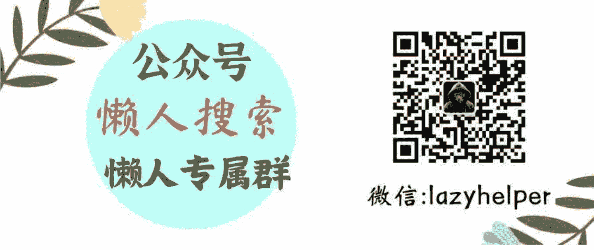
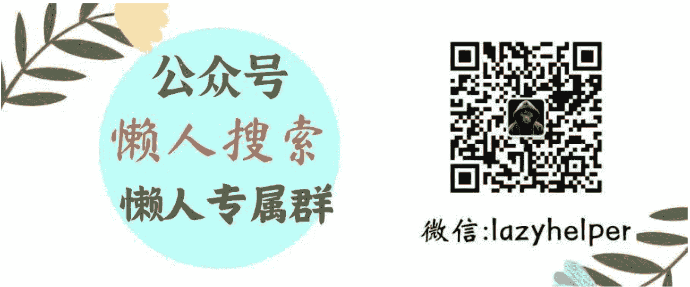

# 万众期待乙巳年生肖解析大文！你只要照着做，一整年都会财福顺利！(超细节整理)

250201 灏泽神棍

整理：公众号懒人搜索，懒人专属群分享

仅整理分享，不代表公众号和小懒观点

年度最重要的文章，终于在大家的期待下，写完并发布了！

实不相瞒，每一年的生肖大文灏泽在撰写时都会颇感压力，因为这里面涉及到的细节与逻辑实在是太多太多。既要结合大环境的背景、还要考虑趋势的变化，更重要的是每一个生肖各自的情况以及喜忌，也都完全不同。因此，别看仅仅是一篇文章，可是写完后，每次灏泽都是筋疲力竭之感。

但是，只要能让你看完后清楚今年自己的大致情况，并能因此做出更加理性稳重的抉择，顺顺利利一整年，那么我一切的努力，都是值得的。

同时今年的内容，也会和往年略有区别，那就是诸多兄弟姐妹希望今年的生肖大文，能多给一些具体实际的建议，并且尽可能生活化以便落地。没问题，兄弟姐妹们的期待，愿意当然会采纳，所以在经修正调整后，本文万余字字字皆精华，没有半点废话。不多啰嗦，就让我们用这篇文章作为起点，迎接注定会暴富的乙巳年吧！！！

## 属鼠：稳中求进，安心即福

2025 年你来说是沉淀与积累的一年，听灏泽一句劝，今年千万不要急功近利更不要急吼吼的去投机、做生意、搞偏财。总之，任何跟“一夜暴富”有关的事儿，属鼠的兄弟姐妹都要避开，否则很容易功小失大。

相反，今年你适合把精力放在本职工作的精进上，比如考证书、提升技能、刷新资历和目标明确的建立上级人脉。这些长远来看能为你打开加薪的努力，都会以今年作为起点生根发芽并茁壮成长最终让你收获丰厚果实。

如果实在在手痒想投资，不妨试那些大平台的王牌定投，细水长流更安心。

### 事业小提醒
办公室里偶尔会有“抢功劳”的小风波，甚至会出现小人蹭鼻子上脸的情况，遇到这类情况别急着生气，用行动证明自己的价值，比如主动承担重要项目，你的踏实会被贵人看在眼里。

### 感情暖心贴士
单身的鼠宝们，今年桃花可能藏在熟人圈里！多参加朋友聚会，或者让家人帮忙牵线，脱单率更高。已婚的你，记得每天留 15 分钟和伴侣聊聊生活琐事，哪怕只是吐槽天气，也能让感情升温。

灏泽还要再唠叨一句，那就是属鼠的人普遍善于开拓人际并且能很好的把人脉都给串联起来，今年更是要给我做好这个中央空调的工作，自己会很受益的。

### 健康小锦囊
肠胃是你今年的重点保护对象，少吃外卖，周末给自己炖点汤多吃优质蛋，暖胃又暖心，尤其是少吃生冷和猛辣。另外，睡前放下手机，试试冥想或泡脚，睡眠质量会提升不少。

### 生肖鼠——灏泽寄语：天德照拂，以智化险
乙巳年天干为木，地支属火，对子鼠而言是“水火既济”之年。流年遇“天德”“福星”吉祥，整体状态稳中有升。但因“劫煞”隐现，需防小人暗中作梗。

**正年点睛：** 子水与巳火暗合，宜以柔克刚。事业上多与属猴、龙人合作，可得助力；财运避免合伙投资，正财为主。健康注意水火失衡（如失眠、炎症），可佩戴黑曜石平衡气场。

> 赠君一言：“闲时煮茶听雨，忙时步步生莲”，顺天时而动，自有福荫相随。

## 属牛：厚积薄发，贵人相助

牛牛们，2025 年是你“闷声发大财”的好时机！财富上，只要别作妖别乱搞事儿，今年你的正财收入会渐渐稳定，还可能收到意外奖金或分红。所以越是这样的情况，越是要守正出奇，先确保自己的主业不出错，再用空闲的精力去下一步闲棋试试手。而不能反其道而行之，因为某些小事儿初期有了不错的回应，就甩开膀子横冲直撞，不要忘记大环境依然还不是特别温暖，牛牛又是以性情稳重踏实闻名，因此更是要务实为上。

另一方面，牛牛今年千万要克服自己的懒劲儿，不要总觉得自己的本职工作搞定了，就休息躺平了，只要有机会就一定要创造和直属上级、熟识上级的沟通交流机会，会有奇效！至于想创业的牛牛，今年上半年适合筹备计划，顺便聚拢一些朋友大家配一配资源，顺便再把细节打磨一下，等到下半年再正式启动会更顺利。

### 事业小提醒
今年切忌别总是一个人埋头苦干，你的贵人气运不差！遇到难题时，大胆向信任的前辈请教，对方的一句话可能让你少走半年弯路。而且，主动让正确的人看到你的努力和认真，真的会在今年起到极佳的升迁助力。

### 感情暖心贴士
单身的牛牛，今年相亲别排斥，穿一件浅蓝色衬衫或连衣裙去见面，能极佳的提升第一眼好感度。然后就是对自己看中的对象，不要羞涩，大方以朋友的身份约出来一起吃饭看电影，然后不要暗戳戳的一直两个人活动可以多聚几个靠谱的朋友，一起互相鼓鼓劲儿，顺水推舟也就能成功。已婚的牛牛，记得在纪念日准备一份小惊喜，比如手写一封信，比昂贵礼物更打动人心。

### 健康小锦囊
今年注意腰椎，久坐容易腰酸背痛，买个护腰靠垫，每小时起身拉伸一下。周末去公园散步，呼吸草木清香，心情和身体都会轻盈起来。

### 家居小妙招
客厅的茶几上放一个圆形玻璃花瓶，插几支新鲜的向日葵，象征“向阳而生”，财福和心情都会亮堂堂。

### 生肖牛——灏泽寄语：三合太岁，顺势腾飞
丑牛与巳蛇、酉鸡成“三合局”，乙木生助丑土，此年贵人旺盛。主盘见“将星”“金匮”，特别利职场晋升与财富积累，但“白虎”凶星提醒注意口舌之争。

**正年点睛：** 春夏宜进取，秋冬宜守成。东南方办公可聚财气，投资优先考虑土金行业（地产、科技）。感情逢“红鸾”暗动，已婚者防烂桃花，可在家中西北方挂中国结化解。

> 赠君一言：“深耕自有丰收日，莫羡他人摘花急”，厚德载物之年，稳扎稳打方成大道。

## 属虎：乘风破浪，大胆突破

2025 年是你打破常规的一年，虎虎生风一定要给我做到敢打敢拼，不要再畏缩萎靡了。财富上，争取尝试跨界合作，比如副业与主业结合，比如自己坚定不移的开始经营个人 IP，然后充分的把个人专业能力去进行变现，会有意想不到的收入。再不济，也要尽可能认真的去学习一些自己感兴趣的新技能，哪怕是做生意、做投资，也要确保自己是能力先行筹码在后。

如果硬要灏泽表个态，那就是你必须今年给自己设定季度性的新能力学习目标，比如这三个月先学会图文的撰写，后三个月学会视频的拍摄剪辑，再后三个月学会建立自己的社群。

### 正年建议
虎虎今年宜动不宜静，一定要搞一些正向的积极的小折腾出来，会很有收获。但投资忌跟风，尤其别轻信“熟人内幕消息”，还有那些让你只要拿钱就能让别人助你生财的机会，这点尤其要记住。还有就是，虎虎今年的小琐事小烦心会比较多，各种冲动消费也会不少，硬要说完美规避吧也没啥很好的办法，只能建议你凡事三思而后行。

### 事业小提醒
如果对现在的岗位感到厌倦，下半年跳槽机会不错。所以今年上半年尤其要把同事和上级关系都给稳一稳，另外就是不要计较代价尽量多在一些高难度的项目，成不成不重要这份经验和资历，能让你面对新的机会时更自信从容。

### 感情暖心贴士
单身的虎宝们，今年容易遇到热情直率的对象，用我自己的话来说，就是比较快速会对你上头，而且比较快能鸳鸯戏水。但凡事快的过分，总有其风险，所以别急着确定关系，多观察对方是否适合你的生活习惯。已婚的你，偶尔和伴侣分开旅行几天（比如闺蜜游/兄弟游），小别胜新婚哦！

### 健康小锦囊
今年你尤其注意喉咙和呼吸道，雾霾天出门戴好口罩，平时用罗汉果泡水喝。情绪波动时，试试拳击或跑步，大汗淋漓后烦恼全消。

### 家居小妙招
玄关处挂一串风铃，进门时清脆的声音能驱散负能量，让家成为你的充电站。

### 生肖虎——灏泽寄语：刑害太岁，以静制动
寅虎与巳蛇呈“寅巳相刑”，又遇“孤辰”“贯索”不是特别好，此年易遇是非耗财。然乙木为寅虎之根，绝处藏生机，关键时刻常有意外转机。

**正年点睛：** 正月、七月需格外谨慎，重要决定避开巳时（9-11 点）。佩戴朱砂手串可化刑伤，财务交接务必留凭证。感情多沟通少猜疑，卧室床头放鸳鸯戏水图可增姻缘和合之气。

> 赠君一言：“疾风知劲草，岁寒见松筠”，蛰伏修身之年，静待云开月明。

## 属兔：柔中带刚，静待花开

2025 年对你而言是“温柔但有力量”的一年，重点在守不在攻。财富上，正财一样也会收入稳定，虽然不至于有大的提升，但也是很好的状态了。另外尤其要避免借钱给别人，熟悉的人也好不熟悉的人也好，你都要学会用委婉体面的方式去坚定的拒绝，实在抹不开面子给一个小红包也行，但是大钱绝对不要出，有出无回。

今年属兔的兄弟姐妹，还适合稍微用一丁点点小钱，在正规的投资领域做一点小尝试，你的状态会很不错，要么会赚到收益要么会收获经验，这是很不容易的。

### 事业小提醒
今年在事业上遇见团队合作时，会比较容易遇到意见不合的情况，而且很容易三言两语后话赶话就发生不必要的争执。听灏泽一句劝，你不妨先耐心倾听对方的想法，再用“我觉得这样调整会不会更好？”的句式提出建议，既保留和气又推动进度。

### 感情暖心贴士
单身的兔兔，今年容易遇到温柔体贴的对象，但对方在大的关系推进上可能会比较被动。也就是说，有温暖有关心有陪伴，但是就是很难进入正式的关系，至少 Ta 不会明确主动推进。那就别顾虑太多，只要原则上 Ta 是个不错的对象，那就值得你进一步的确定夯实关系。至于已婚的你，和伴侣一起养一盆植物，共同照料的过程会让感情更紧密。

### 健康小锦囊
注意颈椎和眼睛疲劳，用电脑时记得每隔 1 小时做“转头望窗”的拉伸（转头看窗外远景 5 秒，重复 3 次）。晚上用热毛巾敷肩颈，瞬间缓解僵硬。

### 家居小妙招
卧室床头柜放一个粉色或米色的香薰蜡烛，睡前点燃 10 分钟，薰衣草或檀香的味道能助你一夜好眠。

### 生肖兔——灏泽寄语：木火通明，慧心巧思
乙木兔逢乙巳双木生火，形成“食神生财”格局。命主“太极”“文昌”闪耀，利学术创作、灵感迸发。但“灾煞”提示需防文书纠纷与意外磕碰。

**正年点睛：** 春夏穿青绿衣衫旺运，秋冬用红色文具增效率。投资侧重文化、教育产业，忌涉足水产相关项目。健康注意肝火旺盛，晨起饮用菊花枸杞茶可调和阴阳。

> 赠君一言：“笔墨绘就千秋意，心灯照亮万里程”，才华绽放之年，谨记欲速则不达。

## 属龙：顺势而为，光芒自显

2025 年是你“低调绽放”的一年，各方面遇到好的机会，都可以在确保不会伤及自己根基的前提下，进行勇敢的尝试。用灏泽的主观逻辑来说，就是只要你每天睡眠充足，剩余所有的时间都用来摸索尝试事业都是极佳的选择。至于财富方面，投资的气运不错，但别贪心，尤其是出现反弹和回本的情况，赶紧先把本给保住不要急功近利。然后今年一定要养成“长线布局持续精进”的态势，更要关注新能源、科技领域的长期项目，小份额投入更稳妥。

### 事业小提醒
职场中可能会遇到嫉妒你能力的人，换而言之就是背后的阴损小人，面对这种人你一定要保持谦逊但不必过度妥协。遇到挑衅时，用一句“谢谢你的建议，我会考虑的”去尝试化解，没必要过分回应自证，你的大将风范自会赢得尊重。

### 感情暖心贴士
单身的龙宝，今年容易在职场或学术场合遇到心动对象，主动请教专业问题是不错的破冰方式。另外，就是各种美术、艺术、读书会啥的场合也不错，这种场合接触到的异性，普遍认知高逻辑强，所以反而容易直奔主题。已婚的你，记得在伴侣加班时留一盏夜灯，这份无声的关怀比情话更暖心。

### 健康小锦囊
注意心脏和血液循环，少吃油炸食品，多吃紫甘蓝、蓝莓等抗氧化食物。早晨空腹喝一杯温水，坚持一个月会发现皮肤透亮许多！还有就是拆快递时，今年尤其要注意刀锋犀利，不要被伤及。

### 家居小妙招
在书房挂一幅山水画或风景照片，水流方向朝向屋内，象征“财源入宅”，工作时思路也更清晰。

### 生肖龙——灏泽寄语：火土相生，龙跃九天
辰龙得巳火暖土，乙木疏土，形成“杀印相生”贵格。流年遇“紫微”“龙德”吉星，权威地位提升，但“暴败”星警示勿得意忘形。

**正年点睛：** 农历三月、九月运势登顶，重要事项集中此时推进。办公室摆黄水晶洞聚财，签约避开午时（11—13 点）。感情忌强势控制，赠送和田玉饰品可柔化关系。

> 赠君一言：“潜龙勿用藏锋刃，飞龙在天济苍生”，功成名就之年，谦和之心保长安。

## 属蛇：蛰伏蓄力，智者从容

2025 年是你“以静制动”的关键年，注意静不是啥都不干，而是有目标、有方向的，把有限的几件重点大事儿搞定即可。财富上，适合处理旧账或赎回长期理财，重新根据目前的大环境进行布局，蛇属小龙但有更强的生命力，所以同样可以考虑各种高科技产业但尽量避免医药。今年属蛇的很容易因为冲动而购买大件奢侈品，以及其他听上去有用，但实则完全不必要的物件。听灏泽一句劝，不妨尝试二手和租用，同时不妨把钱花在技能培训或个人成长上，长远的回报更高。

### 事业小提醒
职场中可能有暗流涌动，比如同事私下拉帮结派，并进而对你形成孤立的态势。对于这种情况，不用害怕，保持中立，专注做好分内事，你的专业能力就是最好的护身符。

### 感情暖心贴士
单身的蛇宝，旧人可能重新联系你，是否复合还是要冷静，不要因为熟悉和亲切而忘记了彼此当初的问题。真的要破镜重圆，前提一定是彼此都比曾经更成熟，不会在昔日的老问题上重蹈覆辙。已婚的你，和伴侣一起整理老照片，回忆过去的甜蜜会重燃爱火。

### 健康小锦囊
免疫力是今年的重点，多吃菌菇类食物，补充维生素 D。如果总感觉疲惫，试试早上 10 点前晒 20 分钟太阳，吸收自然阳气。

### 家居小妙招
厨房保持干净整洁，尤其灶台不要堆杂物，生火旺的地方干净了，你全家气运都会上升。

### 生肖蛇——灏泽寄语：值太岁·灵蛇涅槃
巳蛇临太岁，逢“剑锋”“伏尸”凶星，传统谓“本命年犯太岁”。然乙木为“印星”护体，凶中藏吉，破而后立之象显著。

**正年点睛：** 立春后宜穿红色内衣裤，佩戴蛇形生肖牌化劫。正东方放置水生绿植（如富贵竹）可调和火气。重要投资宜托付属鸡、牛人协助，以成“巳酉丑”三合局。

> 赠君一言：“烈火炼真金，劫波渡慈航”，蜕变革新之年，心怀善念自得天助。

## 属马：自由驰骋，张弛有度

2025 年是你“收放自如”的一年，但也别太放纵，要把这份洒脱的心境用在实实在在为自己带来好处的方面。财富上，适合开拓新收入渠道，比如做些生活分享和个人 IP 和长线投资等，但别同时启动太多项目，选 1-2 个专注深耕。属马的兄弟姐妹普遍灵动，精力好、动力强、心态乐呵，但问题就在于很难像牛牛那样在某个领域做到极致的深耕。这一点，今年你一定要克服和修正，会为你带来非常巨大的好处。

### 事业小提醒
如果工作中感到束缚，今年可以主动申请调岗或外派，新鲜环境会很好的激发你的潜力。当然，要去也是去安全、稳定的地方，避免有高度危险的地方，如果硬要去那也绝对要确保企业本身靠谱，这点真的要慎重。另外，今年在签署、续签合同时务必逐条确认细节，避免口头承诺的陷阱。

### 感情暖心贴士
单身的马儿，今年在社交平台上交友需谨慎，见面首选公共场合，而且不要心猿意马的急吼吼进入关系，无论男女都是如此。并且尤其要注意做好防范措施，万万不能疏忽，衣着上恋爱时可以穿红色或白色衣服能提升桃花气场。已婚的你，每月和伴侣来一次“无手机晚餐”，专注聊天的时光会让感情更纯粹。

### 健康小锦囊
注意脚部保养，甲沟炎很容易变严重，久站后泡脚时加一把艾草，活血又祛湿。情绪焦虑时，听轻音乐或做瑜伽拉伸，瞬间平静下来。

### 家居小妙招
阳台种几盆绿萝或薄荷，生机勃勃的植物能吸收浊气，让你每天回家都神清气爽。

### 生肖马——灏泽寄语：水火既济，蹄疾步稳
午马与巳火阴阳相济，得“月德”“地解”吉星照拂，险处逢生之象。然“小耗”星现，钱财易有琐碎流失，需提前规划。

**正年点睛：** 办公桌摆马踏飞燕铜像催旺事业，财务文件存电子备份防遗失。感情避免异地纠缠，佩戴粉晶项链增强情缘。健康注意心肾不交，亥时（21—23 点）泡脚最宜养生。

> 赠君一言：“追风赶月莫停留，平芜尽处是春山”，破障前行之年，细水长流方见海阔天空。

## 属羊：以柔克刚，福气自来

2025 年是你“被温柔眷顾”的一年，本质上是非常好，很多事儿的收获是自己不用太努力，也能获得的。财富上，会有家人或朋友带来的资源机会，比如合伙开店、介绍客户等，大方接受帮助的同时，记得用礼物或请客回馈对方。就，今年的羊羊一定要维持两个核心：不主动的去承担大事儿，也不主动的去破冰开拓，做好支援和配合。但凡有好的机会到了自己手里，确保滴水之恩涌泉相报的原则即可。当然，今年的大环境依然还是赚到了实惠后，就把实惠揣进兜里别再拿出来作为筹码博弈了，落袋为安。

### 事业小提醒
职场中避免卷入八卦是非，听到流言时微笑岔开话题就好，不要再在背后为了参与感而一并发表负面评价。切记，今年的羊羊很容易祸从口出，并引发莫名其妙而是毫无意义的麻烦。另外，如果遇到不公平待遇，千万记得提前留下文字记录，悄悄记录工作成果，必要时用事实说话。

### 感情暖心贴士
单身的羊宝，今年桃花藏在兴趣圈里！报名烘焙课、徒步团，志同道合的人更容易产生火花。已婚的你，睡前给伴侣一个晚安吻，微小习惯能守护爱的温度。

### 健康小锦囊
注意皮肤敏感和开裂蜕皮问题，换季时精简护肤，多用成分简单的保湿霜。心情低落时，吃一颗黑巧克力或香蕉，血清素瞬间提升。

### 家居小妙招
客厅沙发旁放一盏盐灯，暖光不仅能净化空气，晚上开灯时还能营造温馨氛围。

### 生肖羊——灏泽寄语：木火生辉，和顺致祥
未羊与巳火成“木火通明”之象，又得“八座”“天解”吉星加持，整体运势上扬。唯“浮沉”星扰，需防突发变故打乱计划。

**正年点睛：** 农历六月、十二月运势最佳，重要合作可择此期。佩戴羊脂白玉平安扣挡灾，投资避开土木工程类。感情多参加茶道、花艺活动，易遇良缘。

> 赠君一言：“春风化雨润无声，守得云开见月明”，贵人提携之年，以柔克刚万事亨通。

## 属猴：灵动应变，笑对起伏

2025 年是你“随机应变”的智慧年。财富上，很可能有意外之财，比如中奖、退税等，但别沉迷投机也别整天期待奇迹重现。属猴的兄弟姐妹普遍灵活应变，而且习惯性会喜欢做事取巧，所以也容易在今天的时代下吃亏。一定要学会调整自己的习惯性心态，转而开始拥抱长期深耕主义这才是真正意义上的正道。要把自己善于“审时度势、准时摘果子”的本能，进化成“懂得提前布局趋势，进而培育出一片属于自己的果园”的格局。对于自己赚到的钱，存好守住，将其化作自己可靠殷实的底牌。乙巳年的你，一定要控制自己的心猿，静下来多读一本书多看一篇好文多踏踏实实的把一件有收益的事儿做好。如此，今年就算大成。

### 事业小提醒
今年你在职场中会很容易遇到突发状况，比如临时改方案或紧急出差，这当然是很让人烦躁的事儿。没办法，轮上了如此的年份，只能坦然的面对，与其抱怨倒不如保持幽默感，把“又要挑战新任务啦！”当成口头禅，压力会变成动力。

### 感情暖心贴士
单身的猴宝，吸引你的对象可能和你性格相反，试着给对方机会，差异或许能互补。已婚的你，和伴侣玩桌游或密室逃脱，一起解决问题的乐趣能让感情升温。

### 健康小锦囊
注意用眼过度，工作时设置"20—20—20”护眼法则（每 20 分钟看 20 英尺外景物 20 秒）。多吃胡萝卜和蓝莓，明目又抗疲劳。

### 家居小妙招
门口地毯下放五帝钱或金色硬币，进门踩一踩，寓意“踏财而来”，还能防小人哦！

### 生肖猴——灏泽寄语：六合太岁，智取乾坤
申猴与巳蛇“六合”，得“太阴”“岁合”吉星拱照，此年贵人多为女性长辈。然“亡神”星暗藏，谨防乐极生悲。

**正年点睛：** 西南方放铜葫芦聚财，重要谈判选申时（15—17 点）。感情忌暧昧不清，已婚者宜赠伴侣金饰稳固关系。健康注意呼吸道，晨练时口含一片生姜驱寒湿。

> 赠君一言：“灵猿巧攀青云梯，莫忘低头嗅青梅”，机缘涌动之年，留三分清醒守真心。

## 属鸡：精雕细琢，自有光华

2025 年是你“打磨匠心”的一年。

财富上，适合深耕主业，比如考行业高级证书、争取权威认证，用更精简的形容来说就是让自己成为一名专业的匠人。

另外灏泽再点通一句关键送给你：你不用担心自己的能力，很多事儿都是沾上手了，自然硬着头皮就学会的。

所以这句话……你懂么？

和其他的生肖不同，属鸡的兄弟姐妹，今年不要去求得具体的“物质”，也不要因此而感到失望。

有了全新且更加浑厚的实力，你还怕自己没有赚钱的机会？

这就叫平平无奇却又蕴藏无限生机，只是这种状态是需要他人提醒你你才能沉下心去落实拥有的。

切记，这个世界的不变公式，就是身价和能力提升后收入自然水涨船高。

事业小提醒：今年在工作上要务必谨慎，很容易遇到烦心的纠缠小事，切记细节决定成败，重要文件务必备份并标注日期。留档、留痕，即是专业也是对自己的保护。

遇到挑剔的客户，把对方的要求逐条列成清单，逐一攻克，别把别人的负面评价挂在心上，坦然处之即可，就让自己在事上磨功夫吧。

### 生肖鸡·灏泽寄语：三合吉庆，金鸡玉振

酉鸡与巳蛇、丑牛成“三合贵局”，又逢“三台”“将星”助力，事业财运双旺。唯“官符”星现，合同文书需再三审核。

正年点睛：佩戴金丝楠木手串增旺文昌运，投资贵金属、珠宝行业有利。

感情避免旧事重提，卧室挂双鱼戏水图可化矛盾。健康注意脾胃虚寒，小米粥配红枣最养人。

> 赠君一言：“雄鸡一唱天下白，守得初心见月明”，扶摇直上之年，居安思危方得长久。

## 属狗：忠诚守护，心安为家

2025 年是你“温暖他人亦被温暖”的一年。

财富上，适合为家人花钱，比如给父母买保险、装修房子，这些支出未来会转化为福气回流给你。

当然，也要注意如果家人是那种不知感恩只把你当血袋的坏人，那这份钱不花也罢。

另一方面，今年的狗狗是很适合主动的向他人伸出援手，并在合理范围里提供帮助的，这从福德的角度来说不仅仅会获得很好的回馈，另一方面也能因此广结善缘。

如果要论实打实的财富进账，狗狗可能今年不是在第一梯队里的，可是要论人脉、贵人的积累，那狗狗可是绝对的冠军。

当然假如硬要论及财富，那么狗狗也可以今年自己做一点小小的投资，虽然效果不会太好，但也算是练手了。

不怕的，明年就是一番全新的局面，今年咱们就好好休息休息，开心的度过这一年吧。

事业小提醒：职场中可能被临时委以重任，虽然辛苦但能展现你的责任心，所以一定要确保事交你手不出错事由你办人放心的态度。

当然，还有很重要的一方面就是一定要时时刻刻保持跟上级汇报和请教的态度。

完成项目后，记得主动申请应得的奖励，比如调休或奖金，脸皮一定要厚千万不要太低调隐忍，别人不会因此而欣赏反而会忽视你的存在。

感情暖心贴士：单身的狗狗，长期暗恋可能有结果！情人节或对方生日时，送一本写满心意的日记本，含蓄又真挚。

虽然这样的行为多少有一点土气，但却的确很感人至深。

已婚的你，和伴侣一起做志愿者，分享善意会让爱情更有深度。

健康小锦囊：注意膝盖和关节保暖，阴雨天穿护膝，睡前用生姜水泡脚。焦虑时抱抱宠物或毛绒玩具，触觉温暖能快速安抚情绪。

家居小妙招：厨房或餐厅的角落挂一串辣椒或大蒜装饰，既能驱邪纳福，红火火的颜色还能增进食欲～

### 生肖狗—灏泽寄语：火土燥热，静心守正

戌狗遇巳火生土，形成“火炎土燥”之局，虽有“天厨”福星，但“黄幡”“飞刃”凶星扰攘，易生疲累纷争。

正年点睛：多穿蓝、黑色衣物平衡五行，西北方位放鱼缸化解燥气。投资农业、水利项目较稳妥，忌餐饮业扩张。感情多赠伴侣水性植物（如睡莲），以柔化刚。

> 赠君一言：“烈日当空心清凉，守得云开见月明”，韬光养晦之年，淡泊宁静即是福。

## 属猪：豁达心宽，福泽绵长

2025 年是你“随心而行”的洒脱年。

财富上，会有意外惊喜，比如老朋友还钱、二手物品卖出高价。但消费时别冲动，先列愿望清单，一周后还想买再下手。

猪猪们今年也是消费欲很猛的一年，我的意见当然也是要求你管住手，但是猪猪今年如果有兴趣是可以多尝试把自己的老旧物件进入二手市场进行流转的。

因为和别的生肖不同，属猪的今年的财运是建立在“细水长流流转不息”的基础之上的，所以单纯的花出去肯定不行，但是有花有赚那就对自己有很好的催旺作用。

不要小看这件事儿，这其实就是一种做生意的方式，而做生意是一通百通的。

另外，属猪的兄弟姐妹，今年如果做长线投资未来也能获得比较好的收益，所以如果有重大财务决策，今年可以睁大眼睛开始关注了。

换而言之，猪猪今年虽然洒脱，但是恰恰要控制好这份洒脱，让自己去具体的解决和推进一些重大事项。

以后，会获益无穷。

事业小提醒：职场中遇到复杂任务时，拆解成小步骤一步步完成，像吃蛋糕一样，一口口吃掉压力！遇到挫折就对自己说：“没事，先吃顿饭再说！”

因为今年，猪猪的确是会比较容易遇到情绪波动的情况，所以在没人开解的情况下，只能自己安慰自己，然后逐步逐步把事儿给化解处理。

怎么办呢？灏泽也只能抱抱你。

感情暖心贴士：对了，单身的猪宝，今年桃花在旅途中！独自旅行时主动帮路人拍照，缘分可能就此开启。

同时我也的确鼓励你多去繁华安全的地方旅游，今年的猪猪心情太重要了。

已婚的你，和伴侣每月一次“童年重温日”，一起打游戏、吃零食，找回最简单的快乐。

健康小锦囊：注意水肿问题，晚餐少吃重口味食物，用红豆薏米水代替奶茶。心情烦躁时，去菜市场逛逛，人间烟火气最治愈人心～

家居小妙招：客厅角落放一个陶瓷存钱罐，每天投几枚硬币，积少成多的过程会让你对生活更有掌控感。

### 生肖猪—灏泽寄语：冲太岁·否极泰来

亥猪与巳蛇“巳亥相冲”，又逢“大耗”“栏杆”凶狠，传统谓“冲太岁”之年变动剧烈。然“驿马”星动，危中有机，远方可觅转机。

正年点睛：立春后宜拜太岁，佩戴虎形饰品（寅亥合）化冲。重要决定宜咨询属兔、羊人意见。健康注意水火之厄（烫伤、泌尿系统），多食黑豆、莲子滋补。

> 赠君一言：“浪急方显舵手勇，雨骤更见青松直”，破旧立新之年，心怀希望必见虹霓。

历史 3000 多份各类付费文章以及年费三千多的副业社群资源，见懒人专属群内部分享！

付费群，白嫖勿扰！