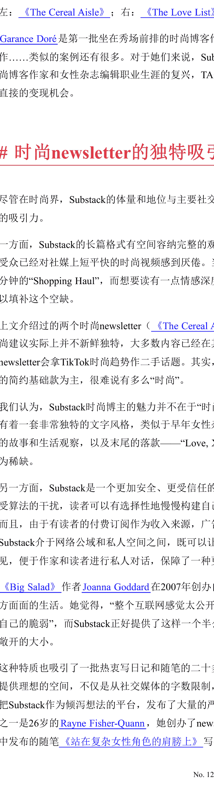
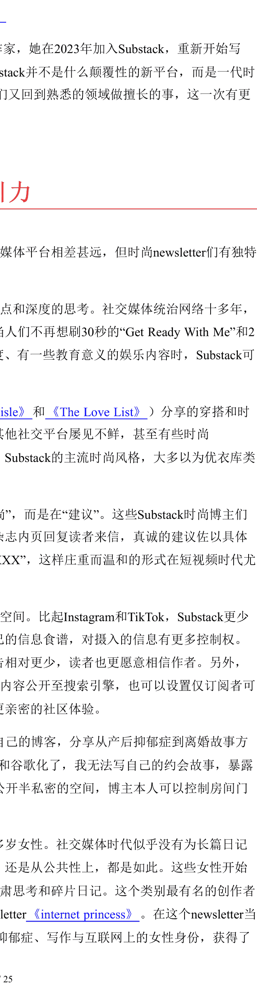

# 懒人专属群周报（第 118 期）

北京时间 2025 年 2 月 7 日 出品

懒人专属群群友大家好，我是小懒人~

第 118 期《懒人专属群周报》，与君共读。

希望咱们专属群独有的《懒人专属群周报》可以作为群友们喜欢阅读的一份类似周刊的读物。之前的离线版合集地址见咱们专属群总链接，小懒都有备份。

懒人微信：lazyhelper

微信：lazyhelper

## 目录

- 懒人专属群周报（第 118 期）北京时间 2025 年 2 月 7 日 出品
- 关系攻略（节选）
- 如何摆脱“老好人”的标签？
- 为什么我不让你借钱给你的领导？
- 习题
- 新闻评论
- DeepSeek 与开源文化
- 低成本、高表现
- 禁运与开源
- 开源的想象与实践
- 时尚博主进军 Substack
- 时尚博主涌入 Substack
- Substack 转型与时尚博客复兴
- 时尚 newsletter 的独特吸引力
- 付费订阅，或者带货
- 当编辑记者走出媒体办公室
- 从空间的角度理解新闻生产
- 办公室没了，不如走进社区搭建临时编辑部
- 被打开的合作想象
- 懒人收藏夹
- 靠认可活着
- 哪吒 2 里面的绿卡与美刀告诉你，谁钱多，就去干谁
- 得心应手：保持一点生涩，其实更好
- 总结

## 关系攻略（节选）

作者：熊太行

### 如何摆脱“老好人”的标签？

知识点：阿尔伯特·艾利斯（Albert Ellis）发明的合理情绪疗法（Rational Emotive Therapy，简称 RET），能够帮助很多备受折磨、渴望自己的完美的老好人。

有关系户（他的昵称真的是这个）问我，已经在工作中被人们当做“老好人”了，应该怎么摆脱这个标签。

我想了想，我是鼓励大家别当老实人或者老好人，但是我好想真的没说过老好人应该怎么进阶，这里详细说说看吧。

### 假性老好人和真性老好人

老好人不拒绝别人，不愿意也不提反对意见，大概有这么几种表现：

- 1. 对任何人回避冲突；
- 2. 对任何人乐意忍让；
- 3. 温和，不嘲讽不抱怨；
- 4. 有主动助人的行为。

老好人和青少年近视差不多，也分真性和假性，我见过真性的老好人，真的是一点火性都没有，对人温和谦逊，从来不撕人，不过业务能力不弱（这是关键），如果他被欺负，大家都会不答应。

真性的老好人不会为他的模式而感到折磨，那就不需要改变了，这是他的存活之道。我认真问了他，发现他爸爸他爷爷都是这样，既然老好人能娶妻生子，那就说明他们上万年来还是非常成功的。

假性的老好人其实还是大多数，大多数人是因为阴差阳错，变成了“老好人”。

### 假性老好人的来源

假性老好人其实有不同的来源，应对和改变上也有不同。

**蛰伏：** 对手太强，被所有人都虐，虐怕了，选择了这样的生存之道，在造成他压力的强人离开之后，他可能会从老好人角色里重新走出来。

**渴望完美：** 有些人对这事有一种妄念，希望所有人喜欢自己，希望自己完美，希望自己达成所有的人的期待，这种人对自己特别苛刻，之前我们分享过工作上不喝酒的攻略，说到了那些委屈自己喝酒的人，其中原因之一就是认为自己喝酒了，会被领导、客户和同事更喜欢，有一种人对别人的认可有偏执的需求，你怼他一句或者开一句玩笑，他要解释半天，这种人活得特别累。

**羞涩：** 大多数羞涩的人都会被认为是“老好人”，确实很多老好人羞涩，但这是不同的概念，有的羞涩的人，胸中有万里河山或者一方锦绣，但是当被许多人看做“老好人”之后，他会逐渐地去揣摩这个角色，最后就是越演越像。羞涩的人不是非要回避冲突和乐意忍让，而是他想冲突，但是“臣妾做不到啊！”

个别还有一些因为宗教原因造成的“老好人”，这些人往往在其它方面面临着压力，很多对宗教有狂热感情的中年妇女，家庭内部都非常不幸。这是蛰伏的另一种形式。

### 合理情绪疗法

渴望所有人喜欢自己的人，一般都是对自我要求比较高的人，这种人有一种很好的应对方式，叫做“合理情绪疗法”，心理咨询师经常用，自己做心理建设也可以用。

合理情绪疗法的核心是一个 A-B-C 模式。

A 是指诱发性事件；

B 是指个体在遇到诱发事件之后相应而生的信念，即他对这一事件的看法、解释和评价；

C 是指特定情景下，个体的情绪及行为结果。

我们仍然以领导要求喝酒为例：

- A 是领导要我喝酒；
- B 是我认为不喝酒我会丢工作，或者被领导厌恶；
- C 是我喝酒了，身体难受，回去还被老婆罚跪。

再比如说，你和同事看见领导在楼道里走过，打招呼对方没有理，直接走过去了。

- A 是领导没有理你；
- B 你认为上次我业绩不好，领导不爱理你了；
- C 是你害怕了一个周末，直到下周一领导跟你打招呼才好多了。

但是你的同事是这样的 ABC：

- A 是领导没有理他；
- B 是领导没看见；
- C 是他开开心心玩了一个周末，周一上班精神百倍，遇见领导问候，领导也热情回答了。

你的同事的 B，也就是他的解释模式就比你健康得多，他在自我保护，而你总是倾向于自我折磨。

### 老好人为什么越陷越深

这种自我折磨会让你越来越缺乏自信，倾向于进行全方位的退缩和讨好，很容易变成“老好人”。同时你对变成老好人这事的 ABC 会继续折磨你。

- A 你被人评价为老好人；
- B 你觉得你从此失去了提升的机会，还会被人人欺人人骑；
- C. 别人说你好，你立刻就会开始自责。

一个认知上没有大问题的人如果被人评价为老好人，他的解释模式可能是这样的：

- A. 我被人评价为老好人；
- B. 啊呀我是不是没有显示出自己的主见；
- C. 我于是积极表达。

熊老师如果被人评价为老好人，他的解释模式可能是这样的：

- A. 我被人评价为老好人；
- B. 太好了，正好大家都不担心我，我可以安心观察这个组织里大家的角色了；
- C. 这帮人的利益接合部被我找到了，我知道该如何入手了。

注意，健康的认知模式会给自己尽量减小压力。

大力不能出奇迹。

大的压力只会毁灭任何奇迹。

你不对自己苛求，反而容易采用更积极的策略，你倾向于更悲观、更不理性的解决方案，事情不会有任何好转。

如果你经常内心深处天人交战折磨自己，那就试试这个 ABC 的疗法，自己在纸面上记录自己的 ABC，把不合理的 B 驳倒，选择更合理的认知方式。

羞涩今天先不讲，是个大话题，我们专门回头来写一篇。

ABC 这种斗争是你内心深处的交战，当你的同事发现老实人有改变的时候，可能会问你发生了什么，我是不建议你把这个疗法解释给他们听的，因为大多数人对心理咨询、心理治疗和精神科学都茫然无知，你的解释只可能产生误会。再一个，自己的内心成长也没有必要暴露给一些不够熟悉的人，如果对方出言嘲讽，你可能会把刚刚建设好的内心受到摧毁。

我一般给这样同学的建议是，你在吭哧吭哧写 ABC 让自己变得更理性的同时，加一些外在的习惯改变，比如减掉 5 公斤的体重，显得更健康，增加 10% 的肌肉含量，让自己体型更好，参加一个培训班，改善英语口语，学了厨艺或者养了一只可爱的宠物。

把你真实进步的原因藏在一个肉眼可见的行为之后。

恭喜你，你已经不是老好人了，永远都不是了。

因为你已经被关系攻略“教坏”了。

### 为什么我不让你借钱给你的领导？

> 知识点：美军里流传的借钱指南：既不要借钱给人也不要向别人借钱。因为借钱给别人通常失去了钱财又失去了朋友。向别人借钱还会丧失勤俭持家的优点。——莎士比亚

如果说有一个员工和领导的楚河汉界的话，我一直主张的是，员工应该往后退一退，让渡自己的一部分利益，来从领导那里得到更多的机会。

不过上下级关系之间，一定有一条高压线，这条高压线就是借钱。

前两天有个关系户问到我一个问题：我的领导向我借钱，我该怎么办？我记得熊老师你说过不要跟领导抢功，要帮领导干活儿，那我是不是就应该借钱给领导？

绝对不要。

这四个字斩钉截铁，一定有理由。

美军里流传的借钱指南：

既不要借钱给人也不要向别人借钱。

因为借钱给别人通常失去了钱财又失去了朋友。

向别人借钱还会丧失勤俭持家的优点。

——莎士比亚

莎士比亚的金钱观今天看起来有点陈腐，不过在职场上，对金钱的决策最好尽量陈腐一点。

这段古老的忠言被收录在罗伯特·拉什一级军士长著的《美国陆军士官手册》里。

这本书很有意思，士官上对军官负责，下管理基层的低级士兵，是最操心的工头角色。

和大多数的职场一样，美国陆军也面临着同事之间借钱的烦恼，拉什一级军士长是这样建议的：

> “不要为了获取利息而借钱给其他士兵，如果只是按照口头协议借钱给他人时，不管是多少钱都要小心。”

当然如果一位朋友或者同事偶尔借一点钱帮助他度过困难的日子或者买午餐，如果你有钱，可以借给他。”

拉什军长建议的同事之间的借贷就停留在“偶尔”、“一点”和“如果你有钱”，加这么多前提，就是为了尽量让你不借钱。

在今天的中国，手机支付这么方便，基本上杜绝了买午饭垫钱的可能。以及人和人之间的垫钱，有且只有一次机会。

我们以前在《如何拒绝别人的无理要求》里，也提到了，借贷很少能增进感情的，大多数时候都是谈感情伤钱。

> “绝对不能通过某机构流露出你是一个‘容易借钱给别人的人’，如果你是这样的人，那么部队中的每一个爱占便宜的人都会请求你借款，但他们很少还钱。年轻士兵尤其容易受到这种事的伤害。”

年轻士兵在军队里容易受到欺凌，职场上的新人也是如此，他们的“大方”，并不是不在乎钱，而是渴望讨好那些更资深的同事或者战友，希望对方能够对自己友善，我们要说，这是一种痴心妄想，以及有人专门利用这种心态。

> “你自己要对这事保持警惕，并劝下级也这样做。应该注意那些有借钱习惯的士兵，他们随时都可能出问题，如果这些人是你的下级，那么他们的问题很快就会成为你的问题。”

这真的是一段至理名言，在今天我们经常说，领导不要管那么多事，其实领导怎么会不管事，和军队里领导要对士兵的生命负责类似，今天的职场上，许多年轻人的父母也许在另一个城市，他们的健康或者生死，一般都会迅速联系到他们的公司。单位领导至今有手术签字权和轻微犯法的捞人责任。

> “如果朋友真的有困难而你又能帮助他，那么就借给他吧！做朋友是为什么呢？但要他签一张欠借条，这张借条只是以防万一的保险措施，并不是表示不信任，万一他死了，这张借条可以让你从他的遗产中讨回未还的债务。如果你的朋友不能一次还清全部借款，每次还钱时一定要给他收条。如果日后发生分歧，这样做对双方都好。”

我也给大家分享过《如何向朋友借钱》，一个可靠的借钱人应该写借条、付利息和提供担保。

在美军当兵，死亡还是随时可能发生。提及遗产，是一个没想到的维度。然而中国的职场上这些规则也全部适用，那就是：

## 别让你的手下彼此借钱，不然早晚得你来收拾残局。

经济纠纷会产生私怨，会让全部门的战斗力受损。

与其回头去平复私怨，不如早早要求杜绝最容易发生冲突的行为。

### 上级尤其不要跟下属借钱

手下之间的借贷都会麻烦，领导更应该避免向手下借钱。

如果是上级借钱给下级（这也是为什么拉什建议说“不为利息”），还可能是关注家庭困难，平级之间的借钱，也还有各种苦衷，那上级向下属的钱，就带有勒索的味道了。

前几天还有一位关系户问我，说领导借了一笔钱，是“无法放弃的债务”（我看在六位数以上了），现在不准备还，问我应该怎么不得罪领导把钱要回去。

我说，没辙，上借下，基本上是不太可能还钱的，如果你想要把钱要回来，那恐怕就要失去和他的关系了。

上级本身收入就比下属高，有些人还知道下属的薪水，对下属借钱，就是因为下属难以拒绝、怕丢工作。

此外，借钱这样的经济往来，无论是不是打借条，都涉及利益输送，严格意义上说，向手下借钱的领导是可以被纪委或者检察院带走的，这可以被认定为受贿。

同样，如果你的领导对公司不忠诚，被立案侦查，交代出他借了你一笔钱，你也可能被当做行贿嫌疑人被带走问话。

有人也许会说，没关系，我们是私营企业。

别觉得私营企业可以没事，几家最大的互联网公司几乎每年都有人犯非国家机关工作人员受贿罪被检察机关带走，这个罪 5000~20000 元就可以被认为数额较大，10 万元以上就是“数额巨大”了。

所以，他如果需要钱的话，应该用抵押贷款或者信用贷的方式加以解决。

所以，如果你的上级向你借挺大一笔钱的时候，他只有两种可能：

- A. 一个利益熏心，吃相难看的坏人。
- B. 一个愚昧无知，自己挖坑自己跳的蠢人。

我们经常说，关系攻略的妙处就在于，每篇文章都不仅仅包括标题里的那一点字面意思。

如果你职场上的竞争对手在向他的下属借钱，他的下属怨声载道，记得收罗证据。

“数额较大”和“数额巨大”的证据。

#### 他可能赌上了

上级对下级借款，往往是一种拼死一搏，他很可能已经发生了最严重的问题——陷入赌博。

在《美国陆军士官手册》当中，紧挨着“借贷”条目的一条不良行为就是“赌博”，拉什的劝说是：赌博会使一些人上瘾，堕落颓废。但是这位军士长对赌博没有什么更好的办法，只是劝说大家：你对你的家人还负有经济上的责任。

然而对赌棍说“想想你的家人”一点用都没有。

因为他们有病。

美国《精神疾病诊断与统计手册》（第五版）DSM-V，把病态的赌博归入“冲动 - 控制障碍”，有这种障碍的人抵挡不住伤害自己或者他人。

美国的病态赌博者大概占总人口的 2%~3%，患者受教育程度比较低，基本上是白人，不赌博的时候容易不安或者无聊，滥用药物和酗酒。

赌场合法的州更容易出病态赌博者。

在中国还有一种比较隐藏的病态赌博，那就是传销。

不少关系户都跟我描述过自己的亲戚沉溺于传销的故事，我的建议都是送医治疗。

以及我觉得配杠杆买 A 股这件事应该也属于赌博的范畴。

这种病态的赌博者，脑子里有强迫不去的非理性观念，他们相信自己早晚能赢回来。他们会隐瞒自己输了的事实，还会去借高利贷。

有人写论文研究这些赌鬼，然而他们在民间得不到任何同情，赌博不仅被认为跟道德和人品有关，还是一场现打不赊的违法行为。

以及，别以为变成了德州扑克就不是赌博。

十个管下属借钱的人，有八个都是赌鬼。

这也是为什么我会建议你，可以放心大胆地拒绝你领导的借钱请求。

一个赌鬼也就是半年到一年的时间了。

他会迅速离婚、失去工作、陷入贫困和走投无路。

他基本上没什么机会和能力来报复你，给你穿小鞋了。

同时如果他放手找事儿的话，他大规模借钱和卷入赌博的情况会迅速被单位掌握。所以这些人的借钱基本都是这样的模式：

有枣没枣，打三杆子。

所以，你也不用脑补说，是不是可以帮上领导的忙，是不是领导考验你的时刻到了。他可能就是一个被赌博癖好缠身的废柴，他眼里没有你，也没有回报你的打算，他眼里只有钱。

而他不会还你的钱的。

因为他已经没有能力正常挣钱了。

#### 习题

如果你的基层员工指控他的主管借钱，而且数额巨大，那你应该迅速做的事情是：

- A. 分享给这位主管《关系攻略》的这篇文章，告诉他借钱只能跟领导（也就是你）借，不要去骚扰下属；
- B. 跟人力部门的负责人了解一下这位主管的收入情况；
- C. 让财务部门的负责人了解一下这位主管最近的部门账目有没有什么异常；
- D. 分享给这位员工《关系攻略》的这篇文章，告诉他千万不要借钱给这位主管；
- E. 我不爱管你们私下里这些破事儿！

答案是 BC。

要考虑借钱的部门负责人最近有没有不忠诚的情况发生。

我很希望你们把关系攻略分享给自己的朋友，但是我得说，在这种局面下分享给任何一方这篇文章都是不对的。

E 是一种逃避行为，应该避免。就像拉什军士长所说，早晚都会变成你的事儿，无一例外。

## 新闻评论

新闻实验室是小懒付费订阅的通讯录，年费 300 多。小懒整理分享，仅供专属群群友查阅。如有余力，可以自己到 Newsletter 上自费订阅。

### DeepSeek 与开源文化

> 改变世界的技术创新，往往来自开放和共享的土壤；技术进步不再是少数精英的专利，而是整个人类社会共同参与和受益的过程。

这几天，AI 界最热门的话题，是来自中国的 DeepSeek R1 模型。本期会员通讯，我们就跟随这个热点，了解 DeepSeek 是什么，并且聊聊它取得目前成绩的原因之一：开源文化。

### 低成本、高表现

DeepSeek 成立于 2023 年 5 月，总部位于杭州。创始人梁文峰在 2015 年的时候与另外两位浙大校友共同创立了一家叫做幻方（High-Flyer）的对冲基金——这是一家积极使用机器学习与 AI 进行量化投资的对冲基金公司，2017 年时就曾对外表示：已经实现了投资策略的全面 AI 化。

也正是从 2017 年开始，随着梁文峰本人兴趣的变化，幻方也逐步转型，从用 AI 赚钱的公司，变成用赚来的钱研发 AI 的公司。在规模最大的时候，幻方的资产管理规模突破千亿，但去年，公司发布公告，宣布计划逐步将对冲产品投资仓位降低至零。目前，幻方的资金管理规模已经小于 300 亿。

从对冲基金转型 AI 研发，这样的背景为 DeepSeek 提供了良好的基础条件。他们从来没有寻求过外部融资，也就不必受到任何外部投资人的影响。他们拥有良好的现金流，可以招聘大量的研究人才，专心投入前沿探索，并且有相当的自由发挥空间。

和 OpenAI 的 Sam Altman 一样，梁文峰的目标也是创造出通用人工智能（AGI）。而与 OpenAI 不同的是，DeepSeek 在成本和效率上令其竞争对手汗颜。

我们来比较一下今年 1 月 20 日推出的 DeepSeek R1 和去年 12 月 5 日推出的 OpenAI o1。这两个模型都是目前最先进的推理模型——传统的生成型人工智能模型擅长生成文本、翻译语言、润色文章等任务。然而，它们在复杂推理、逻辑分析和解决问题方面往往表现欠佳。而推理模型则具备更强的“思考”能力，它们可以将问题分解成更小的步骤，考虑不同的角度，并通过一连串的逻辑推理得出解决方案。这种“思考”的能力为人工智能应用开辟了一个全新的领域。

目前的数据显示：与 o1 相比，DeepSeek R1 的训练和部署成本降低了约 95%，而两种模型的推理表现是相仿的。也就是说，DeepSeek R1 可以用便宜得多的价格为更广泛的用户所使用，让 AI 变得更加平民化。比较二者的定价，DeepSeek R1 每百万 tokens 的输出价格，仅为 OpenAI 的 3.65% 左右。

在公司规模方面，DeepSeek 也相当精简。据报道，DeepSeek 包括创始人梁文锋在内，仅有 139 名工程师和研究人员。与之对比，OpenAI 有 1200 名研究人员，Anthropic 则有 500 多名研究人员。

DeepSeek R1 的低成本和高表现说明：AI 需要的算力其实不需要那么大。因此，今天的美股市场开盘后，英伟达股票跌去了超过 13% 的市值。

### 禁运与开源

虽然英伟达的股票跌了，但其实，DeepSeek 的研究依赖的仍然是英伟达的芯片。

2024 年 7 月，梁文峰在接受 36 氪的采访时说：“我们面临的问题从来不是钱，而是高端芯片被禁运。”

从 2022 年 9 月开始，英伟达的 A100、H100 这两款高端芯片就被美国政府禁止出口到中国。为了应对这种禁运，英伟达降低技术指标，为中国市场专门设计了 A800 和 H800 这两款芯片。然而，美国政府在 2023 年 10 月又禁止这两款芯片出口到中国。英伟达不得不进一步降低技术指标，推出专门为中国市场设计的 H20 芯片。

对于 DeepSeek 来说，幸运的是：早在禁运之前，已经深度入局 AI 研究的梁文峰就囤积了大量的英伟达 A100 芯片。36 氪的报道说，幻方是“大厂外唯一一家储备万张 A100 芯片的公司”。而根据 AI 研究咨询公司 SemiAnalysis 创始人的估计，该公司至少有 50000 件高端芯片库存。

梁文峰显然觉得这些库存依然不够，所以他才会在采访中公开表示，面临的问题是买不到高端芯片。

不过，福祸相倚，高端芯片的缺乏反倒推动了 DeepSeek 对效率和创新的追求，而不像 OpenAI 那样堆砌大量 GPU，靠算力的叠加“大力出奇迹”。《MIT 科技评论》的报道就说：“初步证据显示，禁运措施并没有起到预期的作用。制裁非但没有削弱中国的人工智能能力，反而似乎在推动 DeepSeek 这样的初创公司以优先考虑效率、资源共享和协作的方式进行创新。”

这篇报道采访到了 DeepSeek 的一名前员工，他表示：“为了开发 R1 模型，DeepSeek 不得不重新设计训练流程，以能够在专供中国市场的降级版芯片上运行。微软人工智能前沿研究实验室首席研究员 Dimitris Papailiopoulos 也表示，R1 最让他感到惊讶的是其工程设计的简洁性。”“DeepSeek 的目标是获得准确的答案，而不是详细说明每一个逻辑步骤，这大大减少了计算时间，同时保持了高水平的有效性。”

禁运是一种封锁，而 DeepSeek 的成功依靠的则是一种开放——开源 (open source) 文化。

Meta 首席 AI 科学家杨立昆 (Yann LeCun) 评论说：

> “那些看到 DeepSeek 的表现就认为‘中国在人工智能领域超越了美国’的人——你们的理解是错误的。正确的理解是：‘开源模型超越了专利模型’。DeepSeek 从开放研究和开源中获利（例如 Meta 的 PyTorch 和 Llama），他们提出了新的想法，并将其建立在其他人的工作之上。因为他们的工作已经发表并开源，所以每个人都可以从中获利。这就是开放研究和开源的力量。”

DeepSeek R1 遵循 MIT License 开源协议，允许用户自由使用、修改，包括用于商业目的。模型的技术细节也都会通过论文公开分享。

这种开源的道路选择，正是 DeepSeek 在低成本、高效率之外，令全世界的 AI 研究者和观察者感到兴奋的另一个主要原因。有评论就指出：“DeepSeek 似乎在坚持 OpenAI 最初的使命，提供对其先进人工智能模型和研究（包括 DeepSeek-R1）的开源访问。这与 OpenAI 最初的目标不谋而合，即实现人工智能技术的民主化，让每个人都能接触到人工智能技术。虽然 OpenAI 已转向专利模式和商业化，但 DeepSeek 仍致力于开源开发和社区驱动的创新。”

一褒一贬之中，论者的态度非常明显。

### 开源的想象与实践

关于开源的道路选择，梁文峰在接受 36 氪采访时解释说：“在颠覆性的技术面前，闭源形成的护城河是短暂的。即使 OpenAI 闭源，也无法阻止被别人赶超。……开源，发论文，其实并没有失去什么。对于技术人员来说，被 follow 是很有成就感的事。其实，开源更像一个文化行为，而非商业行为。给予其实是一种额外的荣誉。一个公司这么做也会有文化的吸引力。”

他的这段话触及了一个关键点，那就是：开源是一种文化。其实还可以更进一步：开源是一种意识形态，一种哲学。在程序员群体中，开源是一种对技术与社会的想象与实践，它的感召力可以胜过任何物质报酬。

早在 1983 年出版的《Hackers: Heroes of the Computer Revolution》一书，就讲述了开源文化及其哲学。作者 Steven Levy 在该书后记《最后的真正黑客》中叙述了围绕 Richard M. Stallman 这一人物出现的“自由软件哲学”（free software philosophy）。在他的叙述中，计算机的历史始终是一部源代码的开放获取和社会共享、用户对现有程序和系统的修改、以及对技术的普遍尝试的历史。

为什么开源会成为相当一部分程序员的“信仰”？这可能要追溯到 1960 年代的反文化运动，那一代人对权威的反叛、对自由的追求，深深影响了最初的一批程序员。他们将计算机技术视为一种实现更理想社会的重要工具。在那个社会里，大家并不仰赖一个自上而下的封闭系统，而是人人都可以自由获取最先进的工具，并且对其进行改造及进一步的共享。在这个过程中，个体的自由与创造力得到极大的发挥，而整个社会也将因此受益。

在具体的实践中，开源的核心优势首先体现在其前所未有的透明度。在专利技术模式下，用户往往面对的是一个黑箱，无法真正理解其运作机制，也难以确认其安全性和可靠性。完全开源的软件，让研究人员能够深入检视其每一行代码，进行检视和验证。这种透明度不仅建立了更强的信任基础，也为整个行业树立了新的标准。

更为重要的是，开源能够带来强大的协同创新效应。当一个强大的基础模型向全社会开放，就会激发出远超过原始开发团队的创新潜能。全球各地的开发者能够基于这一基础进行优化改进，针对特定场景进行定制，甚至开发出原始团队未曾设想的应用方向。这种分布式的创新模式，大大加快了技术进步的步伐。当一个开源项目获得足够的关注度，就会形成正向的反馈循环：用户基数的扩大会吸引更多开发者参与，更多的开发者贡献会让项目变得更好，进而吸引更多用户。这种良性循环正是开源项目能够持续发展的动力源泉。

在成本效益层面，开源模式的优势更是显而易见。比如，在 AI 这样的前沿领域，单个团队或企业想要从零开始构建一个完整的模型体系，往往需要投入巨额资源。而开源模式通过共享基础架构和训练经验，可以有效避免重复建设，让更多中小团队有机会参与到技术创新中来。这不仅提高了整个行业的研发效率，也降低了技术的应用门槛。

回顾历史，我们能找到诸多印证开源优势的经典案例。Linux 操作系统的成功也许是最具代表性的例子。它从 Linus Torvalds 的个人项目起步，发展成为了当今最主流的服务器操作系统。正是开源模式让全球的开发者能够不断为其注入新的活力，推动其持续演进。今天，Linux 已经成为了数字基础设施中不可或缺的组成部分，支撑着互联网的运转。

互联网本身的发展历程更是印证了开源理念的力量。HTTP、TCP/IP 等核心协议的开放性，为全球信息互联互通奠定了基础。开源浏览器项目推动了 Web 标准的演进，确保了互联网的普惠性。可以说，如果没有这些开放标准和开源技术，今天我们所熟知的互联网世界将完全不同。

当然，开源模式也并非没有挑战。首要的问题是商业模式的可持续性。如何在保持开放性的同时确保项目的长期发展，始终是开源领域需要面对的难题。

质量控制是另一个值得关注的挑战。开源项目的分散性有时会导致版本分歧，使用户在选择时感到困惑。如何在保持开放性的同时维持足够的标准统一，需要项目管理者建立有效的治理机制。Linux 基金会的运作模式提供了很好的范例，但每个领域都有其特殊性，需要找到适合自己的平衡点。

安全风险同样不容忽视。开源代码的可见性意味着潜在的安全漏洞也可能被恶意用户发现和利用。特别是在 AI 这样的新兴领域，如何预防技术被滥用是一个重要议题。这需要社区建立完善的安全响应机制，并在开放与安全之间找到适当的平衡点。

尽管存在这些挑战，开源模式在技术发展中的重要性仍在不断提升。在 AI 这样的前沿领域，开源正在发挥着推动技术民主化的重要作用。它让更多组织和个人能够参与到技术创新中来，避免技术垄断可能带来的发展停滞，确保技术发展的透明度和包容性，让创新的成果能够更好地服务于整个人类社会。

从这个角度来说，Deepseek R1 不仅是一个具体项目的里程碑，更预示着开源模式在高科技领域的新机遇。它最令人鼓舞人心的地方在于：改变世界的技术创新，往往来自开放和共享的土壤；技术进步不再是少数精英的专利，而是整个人类社会共同参与和受益的过程。

正是因为这样的原因，我们期待开源模式能够一次次战胜封闭模式。

公众号懒人搜索，懒人专属群分享

## 时尚博主进军 Substack

> 你又有品位又有意思的笔友给你真诚推荐一件春夏驼色风衣，还附上了购买链接。

过去一年，时尚博主在 newsletter 平台 Substack 大批登陆，时尚区也成为 Substack 增长最快的版块之一。

Substack 的创始人之一 Hamish McKenzie 曾经是一名记者，或许一定程度上是因为这个原因，Substack 一出生就自带新闻基因，比如避开广告和算法守护独立评论、通过新的收入模式为新闻业危机提供解决方案等愿景。McKenzie 本人也在他自己的 newsletter 里写了非常多表达这种愿景的 [文章](article/1109)。为人熟知的著名 Substack 作者也大多是撰写严肃的政经话题。

那么，为何 Substack 会成为时尚博主的宠儿？本期会员通讯，我们来观察这个有意思的现象。

### 时尚博主涌入 Substack

Substack 进入公众视野，是 2020 年的事情。当年，在新冠疫情初期媒体行业大规模裁员的浪潮中，一大批前记者编辑涌入 Substack。Substack 也通过提供预付款的方式，主动吸纳了一批著名作家和记者迁入（更多关于 Substack 的背景信息，参见 2020 年 6 月发布的第 397 期会员通讯）。

从创办至今，政治和新闻都是 Substack 上人气最高的类别。新闻记者、政治评论家、文化评论家作为第一批登陆的创作者，为该分类带来了大量订户增长。另外，Substack 在这些年也在发挥自身优势，持续地向政治靠拢。联合创始人 Hamish McKenzie 曾 [表示](https://www.nytimes.com/2024/02/01/business/media/substack-donald-trump.html)，希望 2024 年的美国总统大选成为"Substack 选举”。当然，最终 Substack 似乎没有成功进入选举前排（起码风头远逊于播客）。

但这一年，Substack 却意外坐上了时装周秀场的前排。

在 2024 年的纽约时装周秀场上，第一排出现了 [新面孔](https://wwd.com/fashion-news/fashion-scoops/vogue-2024-fall-fashion-week-buzzword-1236470553/)——一群 Substack 时尚作家。时尚博主正追赶新闻记者的早期脚步，涌入 Substack。记者们分享新闻和评论，时尚博主们则分享购物指南、时尚评论、穿搭以及私人生活。

时尚和美容已成为 Substack 的强类之一。根据《[Vogue Business](https://www.voguebusiness.com/explainers/fashion-newsletter-substack-paula-rezniczki)》的数据，截止 2024 年 3 月，Substack 上的付费订阅者达到 300 万，而时尚和美容类的订阅量同比增长 80%，是平台增长最快的类别之一。

时尚博主的到来对 Substack 来说是一个意外。最早一批入驻 Substack 的时尚作家之一 Leandra Medine[透露](https://www.voguebusiness.com/substack-newsletter-leandra-medine)，Substack 公司的人最开始不明白她为什么要在文章里放那么多图。他们认为邮箱承载的内容应该以文字为主，也不理解依赖视觉媒介的时尚内容如何与 Substack 兼容。甚至直到 2021 年，Substack 都没有时尚的专门分类。

需要注意的是，现在 Substack"[Fashion & Beauty](https://www.substack.com/s/fashion-beauty)"类别下的 newsletter 其实不只关于“往身上穿什么”和“往脸上涂什么”，也不是《VOGUE》《时尚芭莎》类的大牌广告图册 + 高级时尚评论集合。它们更类似于传统的女性生活杂志，内容囊括时尚建议、约会故事、名人八卦。总之，是闺蜜们在饭桌上会聊的所有话题。

比如，排名第一的 newsletter《Big Salad》，每周更新一次，最近一个月的更新分别是:

- 13 个有趣的约会点子；
- 12 件最近喜欢的东西分享（邀请了嘉宾来分享）；
- 标题为“我妈妈被我男朋友的年龄惊到了”的私人生活分享；
- 2024 好物汇总（内含商家合作链接和优惠券）。

从技术上看，邮箱从来都不是承载大量图片的理想媒介。有些邮箱服务供应商甚至会屏蔽图片、自动修改图片尺寸。含有大量的图片的邮件通常加载非常慢，且容易被识别为垃圾邮件。所以，Substack 最初对时尚内容的疑虑也可以理解。

但在 2023 年，Substack 做了一系列更新。它不想只做一个新闻平台和 newsletter 基础设施，而是想成为一个为创作者提供付费订阅功能的大型集合平台。2023 年 4 月，Substack 推出了宛如"Twitter 克隆版”（此描述引用自马斯克本人，还引发了两方一系列的争论）的新功能 Notes，引入了推荐页、作者主页、“关注”按钮等，让作者能在类似社交媒体信息流的页面上发布更短的内容。换句话说，更新后的 Substack 更像是一款基于订阅的社交媒体，而不是一种工具性的基础设施。当读者直接在 Substack 而不是邮箱里阅读内容，大量图片就不再是一个阻碍时尚内容传播的技术难题了。

### Substack 转型与时尚博客复兴

另外，Substack 也在积极拉拢传统媒体精英以外的创作者入驻平台，比如视频创作者、播客团队等。在 TikTok 上有 270 万粉丝的做饭博主 Violet Witchel 在去年 1 月加入了 Substack，并做出了适应 Substack 平台调性的调整：从拍烹饪视频变成写烹饪书，以文字加图片的形式介绍各类食谱。10 万名订阅者跟随她转移到 Substack，Substack 现在也成为她主要的收入来源。（p.s. 非常推荐她这篇土豆泥食谱，涵盖所有土豆泥制作痛点难点，非常具体实用)

吸纳多媒体创作者并不会把 Substack 变成 TikTok 或者 Instagram，文字毫无疑问仍是 Substack 倚靠的主媒介。但文字正在从 newsletter 转变成博客——在 newsletter 模式之下，专业人士撰写的深度长文直达邮箱；而在新的模式下，Substack 变成了一种更接近 21 世纪初博客的形式，更短、更随意、更私人，且集中在某个博客平台，例如 BlogSpot 或博客大巴。

那么，Substack 向博客的靠近跟时尚博主有什么关系？回答这个问题，首先需要了解涌入 Substack 的时尚博主们到底是谁。SSENSE 这篇时尚博主编年史大致把 2000 年到 2024 年划分为博客时代、社交媒体时代和 Substack 时代，详尽介绍了一代时尚博主的完整职业轨迹。

在 Instagram 还没诞生的千禧年头十年，传统时尚杂志面临的第一波数字媒体威胁来自于时尚博客作家。一批没有从业经历的时尚爱好者通过博客分享自己的生活和时尚见地，他们的内容不仅比杂志更真诚、亲切，没有广告主压力的博主们输出也更为大胆，比如 2004 年创办个人时尚博客的 Bryan Yambao，他描述自己为"new-moneyed classless bitch from hell"。类似 Bryan Yambao 的时尚博主们吸引了大量的关注，也积累起庞大的读者群，这迫使传统媒体开始重视他们。2009 年，时尚博客作家就已经坐上秀场的第一排，“距《Vogue》主编 Anna Wintour 只有两个座位”。他们中的很多博主也借助博客带来的影响力，顺理成章地接过时尚正统势力递来的橄榄枝，成为时尚杂志的全职编辑、专栏作家。

而进入社交媒体时代，Instagram 和 TikTok 用视觉内容接管了时尚对话的空间，不仅让纸媒纷纷大搞数字化转型、进军社媒、转向视频，品牌和广告商也随读者一齐挤进社媒平台。这批以写作和回答读者来信为职业的编辑/前博客作家们不得已转向后排或直接离开，这是社媒网红和视频博主的前排时刻。

而 Substack 带着“菀菀类卿”的怀旧光环，在一片社交媒体的喧嚣中出现，召唤着这批前时尚博客作家们重回故土。早年最著名时尚博客之一《Man Repeller》发展成一个网站和公司，在 2020 年宣布停业。同年，创始人 Leandra Medine 在 Substack 创办了《The Cereal Aisle》，靠对镜自拍和生活化的时尚思考（下左图），收获近 15 万的订阅者。时尚博客作家 Jess Graves 在 2021 年加入 Substack，以同名新闻通讯的形式延续她 2007 年博客《The Love List》（下图右），分享搭配拼贴画（学名应该是 Style Board）、商品链接和搭配心得。

左：《The Cereal Aisle》; 右：《The Love List》

Garance Doré 是第一批坐在秀场前排的时尚博客作家，她在 2023 年加入 Substack，重新开始写作……类似的案例还有很多。对于她们来说，Substack 并不是什么颠覆性的新平台，而是一代时尚博客作家和女性杂志编辑职业生涯的复兴，TA 们又回到熟悉的领域做擅长的事，这一次有更直接的变现机会。

### 时尚 newsletter 的独特吸引力

尽管在时尚界，Substack 的体量和地位与主要社交媒体平台相差甚远，但时尚 newsletter 们有独特的吸引力。

一方面，Substack 的长篇格式有空间容纳完整的观点和深度的思考。社交媒体统治网络十多年，受众已经对社媒上短平快的时尚视频感到厌倦。当人们不再想刷 30 秒的"Get Ready With Me"和 2 分钟的"Shopping Haul"，而想要读有一点情感深度、有一些教育意义的娱乐内容时，Substack 可以填补这个空缺。

上文介绍过的两个时尚 newsletter(《The Cereal Aisle》和《The Love List》)分享的穿搭和时尚建议实际上并不新鲜独特，大多数内容已经在其他社交平台屡见不鲜，甚至有些时尚 newsletter 会拿 TikTok 时尚趋势作二手话题。其实，Substack 的主流时尚风格，大多以为优衣库类的简约基础款为主，很难说有多么“时尚”。

我们认为，Substack 时尚博主的魅力并不在于“时尚”，而是在于“建议”。这些 Substack 时尚博主们有着一套非常独特的文字风格，类似于早年女性杂志内页回复读者来信，真诚的建议佐以具体的故事和生活观察，以及末尾的落款——“Love, XXX", 这样庄重而温和的形式在短视频时代尤为稀缺。

另一方面，Substack 是一个更加安全、更受信任的空间。比起 Instagram 和 TikTok, Substack 更少受算法的干扰，读者可以有选择性地慢慢构建自己的信息食谱，对摄入的信息有更多控制权。而且，由于有读者的付费订阅作为收入来源，广告相对更少，读者也更愿意相信作者。另外，Substack 介于网络公域和私人空间之间，既可以让内容公开至搜索引擎，也可以设置仅订阅者可见，便于作家和读者进行私人对话，保障了一种更亲密的社区体验。

《Big Salad》作者 Joanna Goddard 在 2007 年创办自己的博客，分享从产后抑郁症到离婚故事方方面面的生活。她觉得，“整个互联网感觉太公开和谷歌化了，我无法写自己的约会故事，暴露自己的脆弱”, 而 Substack 正好提供了这样一个半公开半私密的空间，博主本人可以控制房间门敞开的大小。

这种特质也吸引了一批热衷于写日记和随笔的二十多岁女性。社交媒体时代似乎没有为长篇日记提供理想的空间，不仅是从社交媒体的字数限制，还是从公共性上，都是如此。这些女性开始把 Substack 作为倾泻想法的平台，发布了大量的严肃思考和碎片日记。这个类别最有名的创作者之一是 26 岁的 Rayne Fisher-Quann, 她创办了 newsletter《internet princess》。在这个 newsletter 当中发布的随笔《站在复杂女性角色的肩膀上》写抑郁症、写作与互联网上的女性身份，获得了大量的关注并为她赢得出版合约，书名就叫《复杂女性角色》。目前她的 newsletter 已经有 10 万名订阅者。

除了上面提到的两点之外，对于时尚内容，newsletter 还有另一个重要的优势，那就是插入链接的便利性。

在社交媒体平台上，链接都是一直被严格限制乃至禁止的东西。为了使用户尽可能久地停留在平台内，Instagram 和 TikTok 都不允许直接发布外部链接，TikTok 甚至把"Link in bio"都设置为评论区屏蔽词，Instagram 上唯一允许外链的快拍功能也只能维持 24 小时，转瞬即逝。（中国的社交媒体平台对链接限制得就更严了。）而 newsletter 则没有链接限制，文章内可以直接插入商品的购买链接，为购买提供了极大的便利。Substack 上也出现了一批专攻购物的新闻通讯，比如《The Wardrobe Edit》

消费主义和时尚牢牢绑定，购物清单、时尚建议这类的消费指南类的内容是 Substack 上的最常见也最受欢迎的时尚内容。Substack 上时尚和美容类读物的前十名里，有六个都和购物有关。《华尔街日报》前时尚编辑 Becky Malinsky 的购物通讯《5 Things You Should Buy》应该是 Substack 上第一份的购物 newsletter，目前有 6.8 万订阅者。这种购物 newsletter 主打精心策划的产品推荐，包括产品信息、链接，以及非常具体的推荐语。根据 Malinsky 自己的说法，她的购物 newsletter 旨在为面临无尽选择的订阅者提供精简推荐。

### 付费订阅，或者带货

Substack 上的时尚购物博主们，的确挖掘出了一些主流时尚媒体没有给到太多曝光的品牌，并促成大量的订单。被 Substack 博主们大力推崇的品牌被称为"Substack 品牌”，特点是价格高昂但款式基础，如 The Row、Toteme 等。

许多 Substack 博主和传统网红一样，也会接受品牌 PR 礼物和广告合作。有的品牌意识到了 Substack 中的广告机会，通过商品联盟营销链接（品牌直接根据销售额支付佣金）进行合作。根据《华盛顿邮报》报道，Substack 头部时尚博主每年的广告和付费订阅累计收入达数十万美元。

除了与博主合作，也有品牌直接创立了自己的 newsletter，Tory Burch 的《What Should I Wear?》就是其中之一。而更多品牌则在观望，因为 Substack 无法提供 Instagram 这类平台那样详尽的用户画像，品牌合作和赞助一直难以实现。

付费订阅的收入减轻了 Substack 博主的负担。例如，时尚通讯《Gumshoe》的作者 Harling Ross Anton 有 2.5 万订阅者，她每月向订户收取 6 美元（或每年 60 美元）的费用。报道称，订阅总收入可以让它承诺完全不依赖广告，保持独立，保障订户内容的真实性和质量。

但对于很多博主而言，订阅收入与广告和销售收入相比微不足道。与 Anton 相反，Laura Reilly 的购物通讯《Magasin》完全免费，但她会将联盟营销链接用于她打算推荐的产品，目前文章内一半的链接都是联盟营销链接。

其实，newsletter 在“带货”有着巨大的潜力。《The Cereal Aisle》作者 Leandra Medine 发现，她 6.5 万订阅的 newsletter 的联盟链接转化量比她 100 万粉丝的 Instagram 账号还高。这其中的原因或许在于：newsletter 里的购物体验类似于你又有品位又有意思的笔友给你真诚推荐一件春夏驼色风衣，还附上了购买链接。“一份 newsletter 就像涂了油的冰橇一样引导人们进入购买通道。”

归根到底，时尚博主开设 newsletter，还是因为目前的社交媒体平台有无法满足的用户需求——其中既包括创作者的需求，也包括受众的需求。当擅长用文字表达、真诚分享内心的创作者，遇上在社交媒体的喧嚣之外寻找有趣和触动心灵内容、并愿意付费或买货支持的读者，双方也就一拍即合了。

## 当编辑记者走出媒体办公室

把编辑部搭建在社区居民出现的任何地方，比如酒吧，甚至是街头的临时办公点。

各位会员朋友：昨天是立春，今天是国内春节假期的最后一天。经过了农历新年的休整，希望大家都准备好了重新上路。新闻实验室会员通讯也会在蛇年继续从媒体与传播的角度把握时代的脉搏，谢谢大家的持续支持。

在新的一年里，除了继续关注热点事件与话题（比如我在春节旅游途中赶出来的第 815 期解读 DeepSeek），我特别想多写一点的，是各种打开我们思路的创新模式。无论是新的报道形态、新的媒体产品，还是新的商业模式、新的组织形态，我都打算多多引介。在这个社会结构固化、“年轻人死气沉沉/老年人生龙活虎”的年代，我们需要更多新思路的刺激。

本期要介绍的，就是一种新的新闻模式，它被称为“快闪编辑部”（Pop-up Newsroom）。这种模式既是针对当下新闻业面临的危机提供针对性的解法，又能扩展我们对新闻的想象。

### 从空间的角度理解新闻生产

人们通常理解的新闻，是一种“无形”的东西——尤其是当纸媒的黄金年代过去之后，新闻似乎只以看不见摸不着的“字节”、“像素”的形式存在着。这可能会让人忘记：其实新闻生产不是发生在虚拟的无形之中，而是依赖实实在在的物理空间。

最直接的例子当然是新闻现场。抵达现场做报道，几乎一定会比打电话、发消息、查资料的方式有更好的效果，这是所有记者都明白的金科玉律。

从空间的角度理解新闻生产，还可以看到另一个重要议题，那就是：编辑记者们日常工作和出入的场所是哪里。

你可能觉得这个问题太简单——办公室呗！那么，可以继续往下追问的是：办公室在哪里呢？在什么样的建筑物里面呢？在什么区域呢？

在大多数情况下，媒体的办公室都设在较好的写字楼里，或者拥有自己的大楼，中国的媒体集团因为是从党媒发展起来的，往往还拥有自己的大院。比如，南方报业集团在广州大道中 289 号大院。这是一个非常中心的位置，对面就是广州的 CBD 珠江新城。

媒体办公室的位置重要吗？一些记者在市中心的写字楼上班，另一些在城乡结合部上班，他们写出来的报道会因此而不一样吗？

答案是肯定的，因为编辑记者们每天看到、听到、闻到的，都会悄无声息地影响他们对选题的判断。就拿南方报业集团来说，大院的附近是一个叫杨箕村的地方，那里本是著名的城中村，在 2009 年的时候被政府纳入拆迁改造计划。拆迁过程中爆发了不少矛盾，甚至发生村民因强拆而跳楼身亡的事件。当时，一定程度上由于地理位置上的接近性（一些刚毕业或者外地来实习的记者甚至就住在杨箕村），杨箕村的拆迁问题得到了南方报业集团下属报纸的大量关注。可以想象的是，如果杨箕村的周围没有媒体，那么拆迁中发生的冲突和悲剧虽然也会被报道，但其深度和广度都会差很多。

但是杨箕村只是个案，尤其是如今，超大城市的城中村几乎都已经被改造完毕，编辑记者们平日的工作和生活轨迹中，其实越来越少有接触到“边缘人”的机会。

尤其是当大家习惯于留在办公室或家中，通过网络和电话采访，而不是走出办公室接触形形色色的人，编辑记者们活动的日常空间就更单一了，大家的题材选择与新闻判断也可能会变得狭窄。

无论中外，媒体普遍面临这一问题。

### 办公室没了，不如走进社区搭建临时编辑部

这几年，有一部分媒体的编辑记者选择走出了写字楼里的办公室，去和社区里面的人有更多面对面的交流，乃至合作。造成这种变化的最初原因其实是：由于广告收入锐减，一些媒体不再租得起市中心的写字楼。为了在财政危机之下节省成本，它们选择了搭建“快闪编辑部”。

这个概念通常指的是：在某一特定地点，设立小型、临时性的编辑部。驻扎在快闪编辑室里的记者，并非特约撰稿人，而是媒体的全职员工。

我们来看一个具体的例子。

夏威夷的地方媒体 Honolulu Civil Beat 从 2022 年开始，就在社区公共图书馆里面开设快闪编辑部。

在美国，公共图书馆是免费使用的，它提供的服务也超出了借书，还包括提供免费上网的电脑、为老人提供健康信息、为孩子讲故事、举办作者朗读等文化活动等等。简而言之，公共图书馆就是美国的社区生活中心，而且它的免费与开放性质，使得不同背景的居民都能使用。

这也就容易理解，为什么这家地方媒体选择了公共图书馆作为开设快闪编辑部的地方——在那里，编辑记者可以接触到平时很少有机会接触的群体，而图书馆作为社区中心，也便于信息的传播和活动的推广。当然，图书馆相对安静的环境也适合记者专注工作和与读者进行深入的交流。

如何想象图书馆里的编辑部？你可以认为它是一场大型的、开放性的选题会，重点是邀请社区居民——也就是这家媒体的报道关涉的人群——来参与和编辑记者对话，发出他们的声音，表达他们的诉求，提出他们的疑问，让编辑记者对他们产生更准确和深入的了解。

有时候，居民对媒体的日常运转感兴趣。比如，居民会问：你们网站评论区的审核是怎么做的？不过更多时候，大家谈的还是自己关心的社区议题。比如，负责报道当地交通的记者就被很多居民围住，他们对该区域的铁路建设计划非常关心。用主编 Patti Epler 的话说，居住在偏远地区的人们觉得，一切都是由首府檀香山圈子内部的少部分人决定的，他们感觉自己被排除在了讨论之外。所以，当记者们走进公共图书馆（尤其是偏远地区的图书馆），倾听他们的意见，他们会非常感激且积极参与。

除了与读者交流，这家媒体还会在图书馆举办一些相关的活动。比如，他们曾举办过社交媒体新闻使用工作坊，帮助居民更有效地利用社交媒体获取新闻信息，提升媒介素养。

活动结束后，团队的工作并没有结束。他们会仔细整理收集到的读者反馈和新闻线索，并将其用于改进新闻报道和策划新的选题。此外，他们还会将活动的精彩片段制作成短视频，并在网站和社交媒体上发布，以扩大活动的影响力。这些视频的内容通常是居民讲述他们为什么热爱自己的居住地——新闻报道通常关注这些地方的负面消息，但前来参与快闪编辑部活动的居民们希望补充自己的视角，从他们的日常生活中讲述社区值得骄傲的地方。

通过在图书馆设立快闪编辑部，Honolulu Civil Beat 不仅增加了与读者的互动，收集了宝贵的新闻线索，还提升了机构的知名度和影响力。更重要的是，他们走出办公室，更准确地理解了社区的热点问题，也更多地以自下而上的视角呈现社区的样貌。

不少其他地方媒体也有类似的项目。例如，纽约州罗切斯特的《Democrat & Chronicle》在社区中心、图书馆等场所设立快闪编辑部，倾听居民的声音，关注社区的热点问题。加拿大卡尔加里的《The Sprawl》也与当地公共图书馆合作，设立快闪编辑部，讨论城市未来发展方向，并邀请市民参与讨论。

### 被打开的合作想象

开设快闪编辑部的地点不止有图书馆，它可以发生在社区居民出现的任何地方，比如酒吧，甚至是街头的临时办公点。这种“走向街头”的做法，让人联想起 19 世纪波士顿的“报业街”（Newspaper Row），小报贩子在巨型黑板上写下头条新闻，路人则向记者提供新闻线索。

工作空间的变化，直接带来的是编辑记者与不同人交流合作的可能性。当编辑记者走出自己的办公室，合作的想象就被打开了。学者 Melissa Wall 将快闪编辑部分为三种类型。

第一种是合作型快闪编辑部。这种模式通常由多个新闻机构或组织合作，共同设立临时性的编辑部，以应对重大事件或特定议题的报道需求——单个机构的资源越来越有限，合作在一定程度上可以解决这个问题。例如，ProPublica 的 Electionland 项目，联合了 125 家新闻机构和新闻专业的学生，共同报道美国总统选举中的投票问题。这种合作模式能够整合资源、扩大报道范围、提升报道的影响力，也能增进记者同行之间的信任。

第二种是连接型快闪编辑部。这种模式旨在连接新闻机构与社区，将记者派驻到社区内部，与居民建立联系，收集新闻线索，进行更贴近民生的报道。上文提到的图书馆快闪编辑部就是一例。这种连接型模式能够增强新闻机构与社区的互动，提升新闻报道的参与性和影响力。

这里再举一个例子：波士顿非营利新闻机构 Boston Institute for Nonprofit Journalism (简称 BINJ) 成立的初衷是进行更深入的本地新闻报道，并与读者建立更紧密的联系。由于经费有限，缺乏固定的办公场所，BINJ 决定尝试快闪新闻编辑室模式。他们将办公桌、打字机、笔记本等搬到社区的公共场所，例如社区广场，在那里与居民进行面对面交流，收集新闻线索和报道建议。他们还准备了老式旋转式通讯录 (Rolodex)，记录居民的联系方式和他们所了解的当地信息。

BINJ 通过这种方式收集了大量的社区新闻线索，并进行了一系列深入报道，例如对波士顿第一批非裔美国消防员的专访——他们面临的就业歧视是许多有色人种年轻人的日常，但却可能完全是白人记者视野之外的事情。如果不是通过在社区广场上搭建的快闪编辑部，他们永远不会知道和操作这样的选题。

第三种介入型快闪编辑部。这种模式通常由独立的新闻机构或个人发起，旨在介入社会事件或公共议题，提供不同于主流媒体的视角和声音。例如，一些社会活动家利用社交媒体平台搭建虚拟的快闪编辑部，报道社会运动和抗议活动。这种介入型模式能够挑战传统媒体的权威，为边缘群体发声，推动社会变革。

一些快闪编辑部可以在灾难事件后迅速搭建和运作。例如，2021 年 12 月 30 日，科罗拉多州 Boulder 县发生了州史上破坏性最大的火灾。大火发生后，许多居民即使房屋没有被烧毁，也出现了健康问题。当地的非营利媒体 Boulder Reporting Lab 敏锐地捕捉到了这一信息需求，并决定启动快闪编辑部进行深入调查。

这一快闪编辑部的合作方包括：科罗拉多大学 Boulder 分校的环境新闻中心、研究生、研究人员、KUNC 公共广播电台以及学术普及媒体 The Conversation。他们共同开展报道，具体的合作方式是——

- Boulder Reporting Lab 首先确定报道主题，即“我的房子没有被烧毁，为什么我生病了？”这个问题直接反映了社区居民的迫切需求。
- 他们积极联系了各方合作伙伴，组建了一支跨学科的团队。团队成员进行了明确的分工，Boulder Reporting Lab 的记者负责指导和监督报道，研究生和研究人员负责数据收集和分析，KUNC 和 The Conversation 负责内容传播。
- Boulder Reporting Lab 为团队中的非新闻专业人士提供了新闻报道的基本培训，确保报道的准确性和客观性。
- 团队利用 Slack 和 Google Docs 等在线协作工具进行沟通和协作。
- Boulder Reporting Lab 还从普利策危机报道中心获得了资助，用于聘请专家分析煤灰数据（这是另一个与该案例相关的项目）。

这个主要发生在媒体与学术研究者之间的快闪编辑部项目的影响力巨大，促使州政府提出了相关立法，为受烟雾影响的灾民争取到了灾后重建资金。Boulder Reporting Lab 也因此获得了多项新闻奖项。

“快闪”的核心是它的灵活性，它对“永久性”的有意打破，让编辑记者可以在日常以外接触到更多元的信源、受众和合作者。快闪编辑部不仅为资源有限的新闻机构提供了一种新的运作模式，也为新闻与社区的互动提供了新的可能。当编辑记者不再在办公室里面讨论选题和编发稿件，有趣的事情更有可能会发生。

## 懒人收藏夹

### 靠认可活着

#### 和菜头

1980 年代，国门初开，极少数的外国人深入中国，甚至来到我的家乡云南。那时候一张白人的面孔走到哪里，就会被围观到哪里，从早到晚不知道要收获多少声「Hello」。人们奔走相告，呼朋引伴来观赏昆明话所说的「洋老咪」。

这种事情等到了 1990 年代的时候已经几乎绝迹，大理三塔下的白族大妈们拿着纪念品，操着生硬的英文和洋老咪砍价，言辞之间毫不客气，态度上绝不退让，和对待国内游客没有任何区别，哪里还有什么尾随围观一类的事情。

我以为事情就应该是这个样子才对，人和人之间这样相处才对。

这两天看到韩国人趁开放签证去上海旅行，沪爷要专门开豪车上街给韩人一点震撼教育，无数人为此叫好；看到美国人未雨绸缪，在封禁 TikTok 前涌入小红书搞「寻找我的中国间谍」行为艺术，一堆人又觉得与有荣焉，嚷嚷着小红书要接下这波「泼天富贵」。

在我看来，这都是在谋求某种他人认可。韩国人没看到自家豪车，自己的富足就无法获得认可。外国人不来纯国产 App 玩，自己的互联网产品/文化就无法获得认可。那为什么要韩国人或者美国人来认可呢？

这两年「求认可」已经发展为一种病态，甚至都变成了中文网络世界的流量密码。只要是一个老外对着镜头赞美任何关于中国的食物/治安/清洁/城市治理的话题，就会收获一波流量。有个叫伏拉夫的人，每次眼球都快爆出来一样以极为欣喜的口吻宣称「咱们中国的 XX 又牛气了」，我都觉得受到了极大惊吓，像是见到大只牛蛙在真空泵里说话。

不断有类似内容出现，说明有流量。有流量，说明需要老外认可的人不在少数。一样东西究竟有没有价值，这些人可能无法自己直接判定，必须要通过观察一个老外是否赞了惊了震了哭了跪了吓尿了才能间接确定。

为什么？因为内心认定外国人比中国人更为高级，所以他们的认可更有说服力？还是说，他们的认可比周围的人认可更让自己有成就感？

说实话，我对于这种需要认可的心态整体上都不大能够理解。一个人过着怎样的生活，是他自己的事情，不需要谁来戳个章。午餐方便面加个卤蛋，也要端着碗跑到人民广场吃给大家看，期待看到几个老外因此咽口水，才觉得称心如意，我就觉得这人的脑袋需要搞一下泄洪工程。

是不是在我们的周围，存在着一种叫做「薛定谔的生活」？就是说，某人拥有一种生活，自己去观察这种生活时，什么都看不见，只有一片虚无。但是把这种生活展示给别人看，尤其是外国人看时，外国人一旦开始观察，这种生活就立即显露出来，放射出万丈光芒，闪瞎一切氪金狗眼。这样一来，虽然这个人看不到自己的生活，但是他可以通过闪瞎的眼睛间接得知自己生活的价值。

所以，我们可以得出两个结论：1、这种生活存在与否，取决于谁来观察，但是一旦有人观察，就会改变生活本身，让它在消失和显现之间切换。2、对于拥有这种生活的人而言，他自身是无法直接感知这种生活的，一定需要一个外部的观察者，否则他自己都不清楚自己是在盛装出行还是满街裸奔。

那我就会认为，如果你有一辆豪车，这辆车别人看不到就不存在，或者没价值，这就说明这辆车根本不存在，拥有了等于没拥有。正常来说，交钱买车你就拥有了一辆车。但是对于需要认可的人而言，还需要同时买下城市，买下街道，买下目瞪口呆的路人甲乙丙丁作为背景板，它们才能赋予车子存在，赋予车子价值。而后者是无法交易的，所以有车等于没有，根本无法向自己证明。

同样的，TikTok 也好，小红书也罢，它们正处于巨大的痛苦之中。因为它们夹在这个世界上最强大的两个国家之间，这两个国家之间存在着摩擦，于是 TikTok 和小红书此刻就在体验这种巨大的撕裂和挤压感，它们的用户此刻也正在体会着因此而来的冲击和眩晕。

这是个时代悲剧，网民、互联网公司乃至开放的互联网空间，被主权国家按在地上摩擦，人们流离失所，无所归依。中外网民的来去之间，和 App 功能无关，价值无关，成功与否无关，又有什么值得骄傲或者是满足的地方？失去用户的一方就当真难过吗？得到用户的一方就当真快乐吗？我看未必如此，它更像是不断抛起的烫手山芋，狙击手激光瞄准器照在人额头上的小红点，哪里是什么泼天的富贵？这种「富贵」又有什么值得得意和自豪的？

不知道为什么那么多人总是需要他人认可，也不知道为什么这些人要把人分出三六九等，也许，他们最不相信的那个人就是自己。或者说，他们自身早已经丧失了感知和判断的能力。正如日本喜剧演员北野武用自嘲的方式发动的群嘲那样：

他买了一辆豪车让司机开着，自己打一辆出租车在后面跟着，然后把脑袋伸到前排，拍着司机的肩膀说：「看，前面那是我的车，很屌吧？」。

## 哪吒 2 里面的绿卡与美刀告诉你，谁钱多，就去干谁

记忆承载

很多读者留言，分享给我关于他们对哪吒 2 观影后的感受。

其中有个读者很有意思，他留言说，封神演义里面的哪吒形象，明明是个不讲理的阐教二代。

他无缘无故接连打死截教的许多人，但是在师父的庇护下，总是不了了之。

封神里面最主要的就是阐教与截教的斗争。

截教因为不考虑出身，所收的弟子，大多为动物修炼成精，总是被自诩名门正派的阐教随意打杀。

就这么一个二代形象，为什么多年之后，逐渐变成了人们所喜欢的正面形象？

很有意思，我说的很有意思，是指你这个人，因为真正看过书的人不多，能提出这种问题的人，就更少。

但是，我不打算正面回答，因为小说嘛，本就是任人打扮的小姑娘。

哪吒是个创造出来的小说人物，是正是邪有那么重要么？

电影哪吒 1 也好，哪吒 2 也好，都是二创，只是名字与古人小说相同的二次创作。

依我看，只要故事的完整性 OK，那就 OK。

尤其是哪吒 2，我觉得拍的很好，隐喻很多。

你看里面的玉虚宫，给所谓修炼成仙的人发的那个玉碟上画着鹰的标志，而且是绿色的，像极了绿卡。

而那个把各种所谓被定义的妖拿去炼丹的鼎炉上面，居然刻着的是美刀的符号。

玉虚宫的建筑结构像极了五角大楼，哪吒走在玉虚宫里一个劲儿的说这墙好白。

好白？玉虚宫？又称什么宫？

呵呵，这就很有意味了。

你听他的，收下当狗，给发个绿色的小牌；你不听他的，拿去炼丹，炼成什么？炼成刀乐。

站在这个层面上去看问题，你会发现，问题的本质不在于哪吒所在的这种层面里，怎么斗来斗去。

没有用的，明白不？

电影里掌握了绿色小牌和刀乐的玉虚宫，拿走了 99% 的资源，剩下所有三界的一切众生，分那 1%。

那你说，能不争抢？能没有悲剧么？

1 个人拿走 99 个馍，99 个人分剩下那个馍，一定会打起来呀。

这不是说谁是正面形象，谁是负面形象，哪吒也好，龙族也罢，都属于抢那 1 个馍的 99 个人里面的一分子。

所以这个问题是东海龙族与陈塘关之间的矛盾么？

不，真正的矛盾在于 99 个人分 1 个馍，怎么分，都无法避免矛盾本身。

从这个角度讲，电影的立意很好。

真正做到了跳出现象，回归本源。

你非要去讨论个是非曲直，永远也讨论不清楚的。

我昨天在过年的四个话题里面，讲到年轻人的困境。

很多时候就是因为你脑子里太多的是非，尤其是你年轻的时候，太爱讲道理了。

等某一天你发现没啥道理可讲的时候，你老了，你已经没有行动力了。

你充满了行动力的时候，你又把自己的时间，都浪费在不打粮食的事情上。

我年轻的时候，2010 年，那时候我都还不到 30 岁呢。

我从 08 年开始在国际市场上做高频交易，到 10 年，终于进入稳定盈利了。

我的太太就跟我讲了这么一句话，她说，交易就像打牌，大家都靠运气，那有输有赢。

如果有人隔绝了运气，你稳定盈利不就等于有人稳定亏损？这和抢劫有什么区别？

你开心的同时岂不是有个美国的老太太为失去的退休金而哭泣？

我听得一脸错愕。

因为我真的想不出这种角度。

我想问题是非常现实且具体的。

有一个道理不用讲，谁钱多你干谁，才会有利润呀。

全世界的利润最后都流入了美国市场，那如果我选择当耗子，不去粮仓里抢稻谷，难道去粪坑里捡米粒？

同样的付出下，我当然选择收益更大的不是吗？

至于是非，这有什么是非可言？

羊吃草，生存之道，狼吃羊，生存之道，那掏狼窝不也是生存之道么？

高频交易有什么错？没有错。

高频交易只是把交易曲线上的毛刺都割掉了，就像投资人要交税，要交交易费一个道理，那多交一份曲线毛刺税，有什么不对吗？

如果你一年半载才交易一次，那你就不用交呀。高频不可能收割到你呀。

是你频繁交易产生了过量的曲线毛刺，才导致你被高频收割了毛刺税呀。

是不是这么浅显的道理？你可以不交的，你明明有选择权。

你频繁交易说明你也想割人，那你技不如人，被割有什么冤枉的呢？

这是其一，站在利润的角度。

### 那么其二，站在平衡性的角度，这其实也是唯一的选择。

三国时期三足鼎立为什么能鼎立？因为平衡。当老三孙权选择背刺老二刘备，打破平衡的时候，实际上自己也就注定完蛋了。

封神世界里面有阐教就得有截教，就像美苏争霸时期，美国工人的福利才是提升最快的。

如果电影里只有玉虚宫，那你实际上修不修仙都没区别，因为你永远不可能跳出三界外，不在五行中。

就像现实中如果美国一家独大，那你在美国市场上赚到的所有钱都没意义，因为人家随时可以重定义。

所以你当然要赚强者的钱，削弱他才有助于平衡呀。

发哥在唐探 1900 里面饰演的美版黄四郎，在唐人街开烟馆赌场妓院几十年，最后又怎样？

被大财团一把算计，财产全拿走。

也就是说，这个旧金山美版黄四郎从华人身上赚走的钱，最后还是归了老美的财团。

这就是像孙杰瑞那样选择打破平衡而非保持平衡的下场。你辛辛苦苦忙一场，也不过是为身后的黄雀做了嫁衣裳。

你想想看咱们国家推出的 AI 模型为什么是开源的？

因为只有开源，才能打破美国这个一哥的垄断。

美国这个当下的大魏他想干嘛？他想垄断 AI 算力，他想收割全世界。如果你沿着他的路去追赶，你也想垄断，你永远是个追随者。

老二能垄断么？不能。

所以要怎么样？要开源。你前脚开源，后脚欧洲，甚至印度都开始采用你开源的 AI 模型，奋起直追。

这是什么？这就是全世界合起来，围堵美国，立时进入 AI 混战的战国局面，这就叫做势，局势的势。

有屠龙就得有倚天，有成吉思汗就得有郭靖。

你以为守襄阳只是个理想么？不，如果襄阳守不住，哪有什么是你的？都是假的。

守襄阳的意义不在于理想，而在于平衡。

只有全世界维持战国，你的财富才可能真的是你的，这句话很浅显，也很深刻。

所以现实中从来没有那么多的是非对错，有的只是基于现实的认真思量。

我们很多年轻人，因为自幼读书时期养成的习惯，凡事总想知道什么是对的，什么是错的，选 A 还是选 C。

现实中哪有选择题给到你呢？

现实中只有一件事，就是我昨天在过年的四个话题里问年轻人的，你的时间到底花哪儿去了？

花在辩个输赢上了呢？还是花在真的想赢上？

#### 很多读者留言，分享给我关于他们对哪吒 2 观影后的感受

其中有个读者很有意思，他留言说，封神演义里面的哪吒形象，明明是个不讲理的阐教二代。

他无缘无故接连打死截教的许多人，但是在师父的庇护下，总是不了了之。

封神里面最主要的就是阐教与截教的斗争。

截教因为不考虑出身，所收的弟子，大多为动物修炼成精，总是被自诩名门正派的阐教随意打杀。

就这么一个二代形象，为什么多年之后，逐渐变成了人们所喜欢的正面形象？

很有意思，我说的很有意思，是指你这个人，因为真正看过书的人不多，能提出这种问题的人，就更少。

但是，我不打算正面回答，因为小说嘛，本就是任人打扮的小姑娘。

哪吒是个创造出来的小说人物，是正是邪有那么重要么？

电影哪吒 1 也好，哪吒 2 也好，都是二创，只是名字与古人小说相同的二次创作。

依我看，只要故事的完整性 OK，那就 OK。

尤其是哪吒 2，我觉得拍的很好，隐喻很多。

你看里面的玉虚宫，给所谓修炼成仙的人发的那个玉碟上画着鹰的标志，而且是绿色的，像极了绿卡。

而那个把各种所谓被定义的妖拿去炼丹的鼎炉上面，居然刻着的是美元的符号。

玉虚宫的建筑结构像极了五角大楼，哪吒走在玉虚宫里一个劲儿的说这墙好白。

好白？玉虚宫？又称什么宫？

呵呵，这就很有意味了。

你听他的，收下当狗，给发个绿色的小牌；你不听他的，拿去炼丹，炼成什么？炼成美元。

站在这个层面上去看问题，你会发现，问题的本质不在于哪吒所在的这种层面里，怎么斗来斗去。

没有用的，明白不？

电影里掌握了绿色小牌和美元的玉虚宫，拿走了 99% 的资源，剩下所有三界的一切众生，分那 1%。

那你说，能不争抢？能没有悲剧么？

1 个人拿走 99 个馍，99 个人分剩下那个馍，一定会打起来呀。

这不是说谁是正面形象，谁是负面形象，哪吒也好，龙族也罢，都属于抢那 1 个馍的 99 个人里面的一分子。

所以这个问题是东海龙族与陈塘关之间的矛盾么？

不，真正的矛盾在于 99 个人分 1 个馍，怎么分，都无法避免矛盾本身。

从这个角度讲，电影的立意很好。

真正做到了跳出现象，回归本源。

你非要去讨论个是非曲直，永远也讨论不清楚的。

我昨天在过年的四个话题里面，讲到年轻人的困境。

很多时候就是因为你脑子里太多的是非，尤其是你年轻的时候，太爱讲道理了。

等某一天你发现没啥道理可讲的时候，你老了，你已经没有行动力了。

你充满了行动力的时候，你又把自己的时间，都浪费在不打粮食的事情上。

我年轻的时候，2010 年，那时候我都还不到 30 岁呢。

我从 08 年开始在国际市场上做高频交易，到 10 年，终于进入稳定盈利了。

我的太太就跟我讲了这么一句话，她说，交易就像打牌，大家都靠运气，那有输有赢。

如果有人隔绝了运气，你稳定盈利不就等于有人稳定亏损？这和抢劫有什么区别？

你开心的同时岂不是有个美国的老太太为失去的退休金而哭泣？

我听得一脸错愕。

因为我真的想不出这种角度。

我想问题是非常现实且具体的。

有一个道理不用讲，谁钱多你干谁，才会有利润呀。

全世界的利润最后都流入了美国市场，那如果我选择当耗子，不去粮仓里抢稻谷，难道去粪坑里捡米粒？

同样的付出下，我当然选择收益更大的不是吗？

至于是非，这有什么是非可言？

羊吃草，生存之道，狼吃羊，生存之道，那掏狼窝不也是生存之道么？

高频交易有什么错？没有错。

高频交易只是把交易曲线上的毛刺都割掉了，就像投资人要交税，要交交易费一个道理，那多交一份曲线毛刺税，有什么不对吗？

如果你一年半载才交易一次，那你就不用交呀。高频不可能收割到你呀。

是你频繁交易产生了过量的曲线毛刺，才导致你被高频收割了毛刺税呀。

是不是这么浅显的道理？你可以不交的，你明明有选择权。

你频繁交易说明你也想割人，那你技不如人，被割有什么冤枉的呢？

这是其一，站在利润的角度。

那么其二，站在平衡性的角度，这其实也是唯一的选择。

三国时期三足鼎立为什么能维持？因为平衡。当老三孙权选择背刺老二刘备，打破平衡的时候，实际上自己也就注定完蛋了。

封神世界里面有阐教就得有截教，就像美苏争霸时期，美国工人的福利才是提升最快的。

如果电影里只有玉虚宫，那你实际上修不修仙都没区别，因为你永远不可能跳出三界外，不在五行中。

就像现实中如果美国一家独大，那你在美国市场上赚到的所有钱都没意义，因为人家随时可以重定义。

所以你当然要赚强者的钱，削弱他才有助于平衡呀。

发哥在唐探 1900 里面饰演的美版黄四郎，在唐人街开烟馆赌场妓院几十年，最后又怎样？

被大财团一把算计，财产全拿走。

也就是说，这个旧金山美版黄四郎从华人身上赚走的钱，最后还是归了老美的财团。

这就是像孙杰瑞那样选择打破平衡而非保持平衡的下场。你辛辛苦苦忙一场，也不过是为身后的黄雀做了嫁衣裳。

你想想看咱们国家推出的 AI 模型为什么是开源的？

因为只有开源，才能打破美国这个一哥的垄断。

美国这个当下的大魏他想干嘛？他想垄断 AI 算力，他想收割全世界。如果你沿着他的路去追赶，你也想垄断，你永远是个追随者。

老二能垄断么？不能。

所以要怎么样？要开源。你前脚开源，后脚欧洲，甚至印度都开始采用你开源的 AI 模型，奋起直追。

这是什么？这就是全世界合起来，围堵美国，立时进入 AI 混战的战国局面，这就叫做势，局势的势。

## 得心应手：保持一点生涩，其实更好

和菜头

得心应手，成语，指因为熟练而带来的自如状态，但在今天，我们可能需要重新理解这个词的含义。

*

我记得我母亲在我现在的年纪，有天下班回来突然对我们说：“我现在终于知道得心应手是什么感觉了。”后来她解释说，她从事自己的这份工作已经超过二十年，所有的流程，所有的规则，包括所有的意外情形，该如何处理她全都了然于胸，甚至都不用再去调卷宗查条文。因此她工作起来如同行云流水，不费多少气力。她之前听说过得关于工作上得心应手的说法，而在她感慨的那一刻，她认为自己终于体会到了那种感觉。

遗憾的是，我到现在也没能体会到我母亲所说的那种感觉。我和她之间最大的区别，可能是我从来没有像她那样连续二十多年做相同的一份工作。她们那一代人，从走上社会到退休，很可能都没有换过工作。而我们这一代人，可能在同一个单位或者公司内部，十年间也要转职多次。尤其是处于上升期的行业里，这种岗位转换更是家常便饭。既然都是摸着石头过河，如果你愿意多摸的话，把一整条河都让给你也没什么问题。

我也曾经焦虑过，觉得大概很难达到我母亲的境界，手头的任何一份工作都需要我分外小心，都需要我继续学习，这样的日子看起来好像没有尽头。我什么时候才能闭着眼睛做事，不用那么劳心费力呢？

后来我偶然听到一种说法，几乎是在一瞬间就化解了我的焦虑。在这里不妨也分享给你，万一哪天你也用得上呢？早一点知道，也许还能保住一头浓密的头发。

这种说法认为，人的大脑是一张地图，所谓做事就是在这张地图上找到从某地前往目的地的线路。地图里存在那么一条线路，那就是会做事。没有，那就是不会。

你做得越熟练，这条路线就越短，道路也就越宽。短无可短，宽无可宽的时候，就是我母亲所说的得心应手，基本在两点之间就是直连，怎么做也不至于偏离轨道。

那么这张地图是怎么来的呢？简单说，它就是现实世界在大脑里的映射。映射这个字眼可能比较陌生，姑且就理解为复印好了。假设你在现实生活里每天要做 50 件事，用 100 样东西，和 150 个人打交道，走 300 个不同的流程。那么，你的大脑里就会复印出一张地图，上面有 50 条线路，这些线路要经过 100 样东西，连接 150 个人，通过 300 个流程。

可以想见，如果你面对的世界越复杂，每天要做的事，要见的人越多，那么这张地图就越复杂，线路也就越多。

很明显，小朋友的线路很少，一开始只有吃饭、睡觉、走路这些简单的事情。随着他的成长，见到的世界越来越复杂，每天需要他做的事情越来越复杂，那么他大脑里的地图也就越来越大，线路越来越多，这就是长大成人。

那么，我们也可以反过来推断，成长就是增加更多的线路，可以做更多的事情，不断扩展地图来应对更加复杂的情况。

我们还可以猜测，地图大到一定程度，再增加线路就很困难了，因为一张白纸容易画，而一张很复杂的地图要新增一条线上去就会有相当的难度。

我母亲的得心应手，说明她的那张地图已经画满了，上面有的线路已经固定。而我的胆战心惊，则说明我的地图还在扩张，还在不断往上面增添新线路。此时，我已经不再年轻，不再是个孩子，没有办法轻轻一筆就能画下一条线，只能小心翼翼地尝试重复勾勒，尽快让新线路在地图上固定下来。

虽然痛苦，但这意味着我还在学习，还在发育。

最早我的专业是气象预报，学习了一堆预报方法。接下来，我一刀斩掉气象预报，从头开始去做航空公司的运行控制。再一刀斩掉运行控制，从零开始学习航空公司分基地的运营。继续一刀斩掉运营，转去做人力资源。

这时候来了一斧头，彻底斩断了我和航空业的联系，以新丁的身份去互联网公司……后来还有一系列钢锯、电锯、柴油锯，总之我那张地图上画得乱七八糟，七种颜色全部都用上还不够。

你问我什么感觉？我只能说，在斧头之前感觉还不错。毕竟都在同一个体系下，感觉自己迟早可以学完，因为事情的总量是有限的。但是在斧头挥下去之后，进入了一个没有边界的世界，感觉自己抱着个乒乓球飘在大海中央，往哪边看都是无边无际的水，拍到脸上的都是浪。最痛苦的是那片海还在不断扩大，又开始担心自己的位置上突然间没有了浪。

在互联网行业内，我见过两个活生生的例子，都是关于不换地图的下场。

一个是做短信服务的，设计几个吸引人订阅的短信产品，谈谈推广渠道和费用，让一堆人开通，最好是按月自动扣费，然后就有了十多年好日子可以过。在他们的地图上，这条路笔直又宽敞，而且还有钱。

转眼之间移动互联网时代到来，人人都开始用上了智能手机，新地图开启。按理说，这些人是最懂手机用户的，他们在新时代里应该最有优势。于是，他们把以前的服务搬到 App，觉得无非是把线路上的车换一下的事情，结果很快就消失在历史的大潮里。在新崛起的 App 制造商里，没有几个人曾经是短信服务玩家。

另外一个例子是门户网站，从用户每天都去网站获取新闻，到新闻推送到自家手机上，再到用户在手机上读完一条新闻，App 立即再推送十条相关的新闻，让他永远看不完，前后大约十五年时间。

门户网站在移动互联网时代刚到来的时候，还可以用新闻客户端跟上时代大潮，继续传统的新闻操作模式，头条专题加滚动更新。等到推荐算法时代到来的时候，新闻产品是由根本不懂新闻的技术人员设计制造，这时候门户网站就再也跟不上了。如果你有时间的话，可以去各大门户网站去看看，有多少个分类频道还在坚持每天更新全部内容？

对此，我的感慨是：还是暂时不要得心应手的好。

我母亲那代人可以一辈子做同一份工作，但我们这一代人以及之后的世代大概很少有这样的机会。

新领域、新行业、新事物还在不断涌现，在旧世界里生长出新地图。而新地图一旦出现，可能悄无声息地就把附近的旧地图抹除。甚至都没有发生任何攻击，它们只是自然生长而已。

所以，宁可手下永远保持一点生涩，身上永远都有学习压力，也不要得心应手，整天画固定路线。总是感觉有一点点吃力是好的，保持一点点陌生感也是好的，每天多画几条新线路也是好的。

反而是感觉所有的事情都很顺滑，都可以用下意识处理是危险的。

得心应手意味着你的地图边缘已经封闭，和这个不断变化的世界隔绝开来，顺着你地图上的既定线路，无法连通到新地图中去。

对了，在这个关于脑内地图的说法里，其实原本说的是脑回路。大脑内建立的每一条新的脑回路，对应着世界上的一件新事情。人们喜欢说“逃离舒适区”，听起来好像是在说一种想法，一种心理状态。不，它更是一种生理变化，你得真的在大脑里建立起新的回路来，以此回应新刺激。

有人曾经说过，所谓创造性，就是在不同的回路之间建立起新的联系。我想，按照惯性走有限几个回路的人，可能不在这个范畴之内。

### 懒人公众号导读

小懒做了个网页，汇总一些公众号的原创文章列表，并用脚本自动更新，“文章荒”的话可以到这里看看有没有兴趣的内容：

地址：https://lazybook.fun/#/gzg/gzh_list

小懒在博客懒人收藏夹上面也更新了不少文章。

大家可以看看有没有兴趣的哈，小懒觉得体验还是不错的~

一些文章有访问密码，见咱们专属群群消息即可。

地址：https://www.lazyblog.top/

## 总结

本周周报到这里就结束了，合计 2.7w 字

小懒会准备好 PDF 和 epub 版本，方便大家多平台查阅。

在茫茫互联网不断搜索查找优质内容，希望带给大家愈加有收获的内容。

大家的分享也很多，希望每个群友都有收获。

咱们专属群的更新记录可以查看这里：

https://lazybook.fun/#/blog/record2

平时大家如果需要找软件工具，可以到懒人手册上找看看先：

手册地址：https://lazybook.fun/#/

微信:lazyhelper