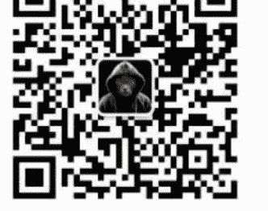

# 2025，你“想”怎么赚钱？

250208 圆方你怎么看

整理：公众号懒人搜索，懒人专属群独享
懒人微信:lazyhelper

![插图]

## 前言

2025，你能赚到钱的最大秘密，就是在 2025 年，你要“想”赚到钱!

昨天的文章《2025，教你如何赚钱!》，花了 1000 多字，和大家好好聊了“想赚钱”，这三件事，今天我们继续 2025 的赚钱之旅。

为什么昨天先聊“想赚钱”这三件事的“定义”。因为在很长时间的工作中，圆方越来越深刻的认识到了一个问题：

“自己知道≠自己懂得”，“自己懂得≠别人知道”，“别人知道≠别人懂得”

从“知道”到“懂得”之间，有着巨大的鸿沟，而自己和他人之间，也有着巨大的鸿沟。

在昨天的文章中，有两位伙伴的留言，就比较具备代表性：

一位说：确实停留在“想”这个环节有点多了，关键在行动上，一点点改变!

另一位说：“想到和得到的中间，还有两个字：做到!”祝愿自己和大家在圆方的启发下，找到并用好“过河的桥或船”!

虽然圆方非常认可“行动”的重要性，但是这两位伙伴大概率没有真正理解“想”的意思。圆方的回答是：不行动，往往是因为“想”不清楚！所以今天，就更系统的帮大家梳理一下，到底应该怎么，想！

## 01

在昨天的文章《2025，教你如何赚钱!》里面已经非常明确说的：

什么是“想”，什么是“想赚钱”，不是简单的在脑海中有一个念头“我想赚钱”。而是要把你“想”的这个内容，完完整整，系统完善的“相”，在你的大脑里构造出来。你“想”的越清楚，达成的路径越清晰，你脑海中的“相”就浮现在你面前。你“赚钱”成功的可能性就越大。

我们很多人，可能从小就会悔恨自己“行动力”差，经常把一件事情没有做好，又或者干脆没有去做，归因到自己的“行动力不足”上面。

但是，今天，请你一定一定一定要大声告诉自己：

没有行动力不足，只有认知不到位！
没有行动力不足，只有认知不到位！
没有行动力不足，只有认知不到位！

## 02

为什么一定要记住这句话？

因为“行动力不足”是一个主观的感受，“它”可以作为我们把事情搞砸的理由。

正如同说有人自己“懒”，说自己“脾气不好”，说自己“是什么什么星座”，自己是"1 人，又或者 E 人”。这些统统可以看作是不作为的“理由”。

但并不是解决问题的“方案”，因为这些理由“无法改进”。

但是“认知”，是可以改变，是可以提升的。

举个例子，有的人喊了一辈子减肥，可能一直都没有减下去，一直说自己“行动力不足”。但是突然一天医生告诉他，你 3 个月内不瘦，就没办法做一个手术，寿命就只有半年了。你猜，他会瘦下去么？一定会的。

那为什么之前行动力不足，现在行动力就强了呢？

举个例子，大家都觉得坚持写公众号很难，每天写一千字要了老命。但是，如果告诉你，你每写 1000 字就可以赚 10000 块，100% 兑现。那这个时候，你觉得你能坚持每天写 1000 字么？一定可以。而且每天想写 10000 字。

那为什么之前行动力不足，现在行动力就强了呢？

因为“认知”，改变了。

## 03

那有哪些“认知”，一直在阻碍自己“赚钱”呢？

简单说，主要有三个方面：
- 一、目标不明确，缺乏清晰方向：
  如果我们对对自己想要达成的目标没有清晰的概念，没有一个确定的目标，就会像在茫茫大海中航行却没有指南针一样，不知道该往哪个方向前进。例如，一个人只是模糊地觉得自己想要创业，但对于具体要从事什么行业、提供什么产品或服务等关键要点都没有想清楚，那么他就很难真正鼓起勇气迈出行动的第一步。
- 二、方法不确定，不知从何入手：
  如果我们实现目标的方法和途径没有清晰的思考时，往往就会陷入无从下手的困境。比如，一个学生想要提高数学成绩，但不知道是应该多做练习题、还是参加课外辅导班，亦或是针对自己的薄弱知识点进行专项突破，就会在行动上犹豫不决，最后可能什么都不做，一刷手机又过了一天（大家上学的时候都有类似的感受吧）。
- 三、动力不充足，看不到价值意义：
  如果对做一件事情的价值和意义没有深入的思考和理解，就很难产生足够的动力去行动。比如许多人见短视频行业兴起，便跟风开账号妄图轻松赚大钱。他们认为拍几条视频就能吸粉获利，却忽视了通过内容输出打造个人品牌、提升影响力这些深层次价值。

仅因初期播放量低、收益少就放弃更新，就无法实现短视频变现，错失行业红利。

上面都是些是反面案例，我们设想一下：

如果一个投资，目标很明确，方法很清晰，结果很确定（比如穿越到十年前让你去买比特币），你还会行动力差么？绝！对！不！会！

## 04

或许看到这里，很多伙伴会吐槽：

你说着轻巧，我是不想有“明确的目标，清晰的方法，确定的结果”么？

我是真没有！难道圆方你做什么事情都赚钱，不赔钱？难道你就不犯错？难道你的目标都明确，方法都清晰，结果都确定？

当然不是。

不过你想，当年遵义会议之后，毛主席带领红军开始长征的时候。他的目标明确吗？他的方法清晰吗？他的结果确定吗？

当然不是！

然后你再想，特朗普在宣布竞选美国总统的时候，都不说上一次，即便是这一次，在竞选刚开始他的目标明确吗？他的方法清晰吗？他的结果确定吗？进群加微信 pep854

当然也不是！

但是这阻碍他们两位去“想”了吗？没有！

而我们绝大多数人的问题，不是想的对不对，而是压根就没有认真去想。昨天有个留言很好，就是我们一直在用战术上的勤奋来掩盖战略上的懒惰。

## 05

我们每天的生活，80% 的时候是潜意识在驱动。而我们的潜意识，是按照我们“相信”的未来，去运行的。

这里说一个“秘密”，

这个“相信”，是通过反复的“观想”来改变的。你把你“想”的计划，每天拿出来看一遍，看十遍，大概也就两三周的时间，你会发现，计划就慢慢照进现实了。

你会发现，原本你不会的技能，突然就会了，你不认识的人脉，突然就来了，你不拥有的资源，突然就有了。

所以，在 2025，你能赚到钱的最大秘密。就是在 2025 年，你要“想”赚到钱。

所以最后布置一下作业，在昨天答案的基础上，大家可以继续优化。

0：2025，自己要如何整合资源，用合作的方式去，获得什么样的收益？

注意 1：写收益的时候，要写三个维度，在金钱物质上，在能力成长上，在资源拓展上。

注意 2：写收益的时候，必须要量化。比如不是说赚很多钱，而是说要赚 100 万。比如能力成长上，不说什么有提高，要说考取什么什么证。

注意 3：写收益的时候，要有画面感。比如赚了 100 万，去买了一辆车。

KR1：要达成这个目标，自己需要提升哪些能力或专业知识？

KR2：要达成这个目标，自己需要去认识谁，跟谁深度链接上？

KR3：要达成这个目标，自己需要实打实去投入多少钱跟时间？

祝所有小伙伴，2025 都能赚到钱。

### 历史 3000 多份各类付费文章以及年费三千多的副业社群资源，见懒人专属群内部分享！

### 付费群，白嫖勿扰！

### 懒人专属群更新记录：

https://lazybook.fun/#/blog/record2