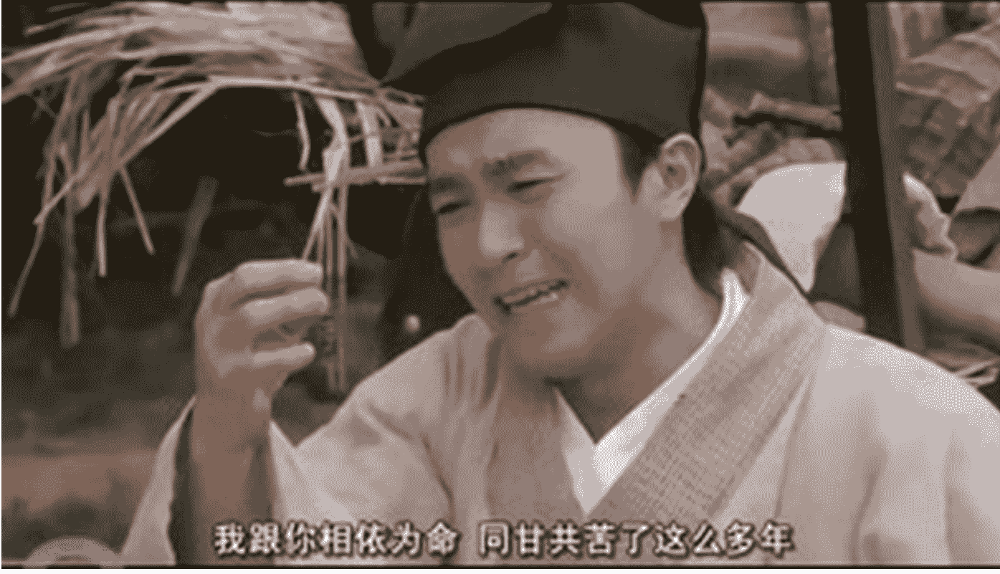
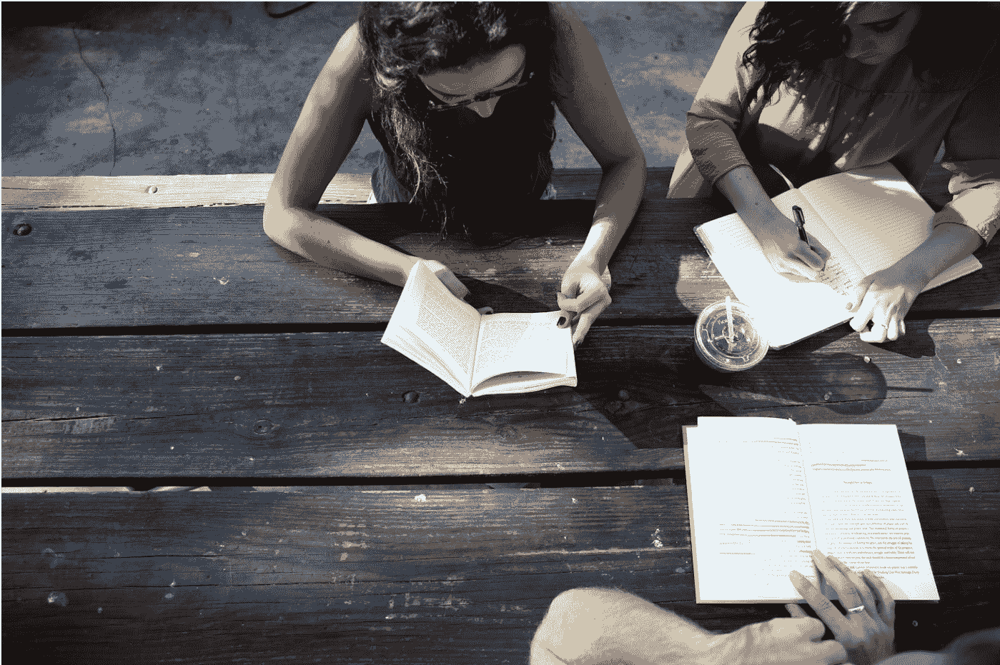
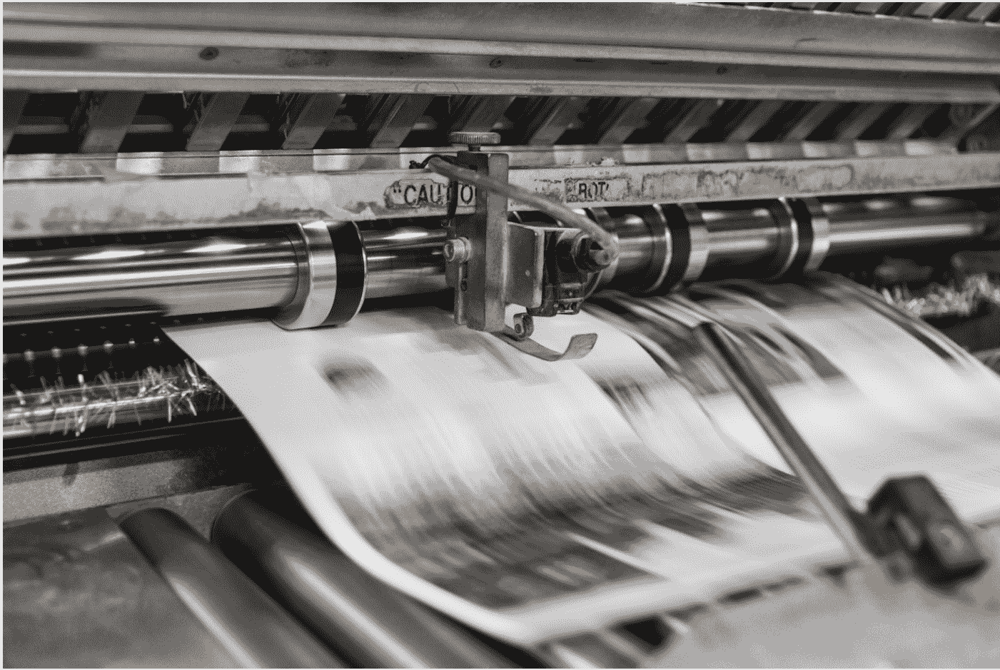
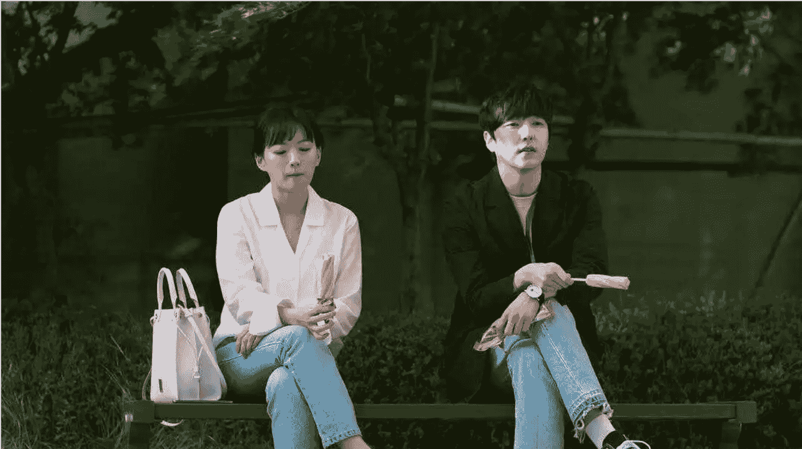
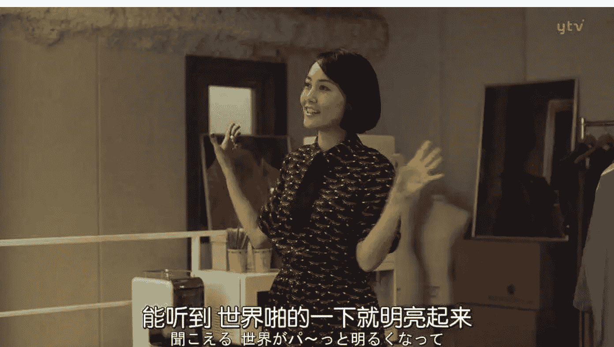
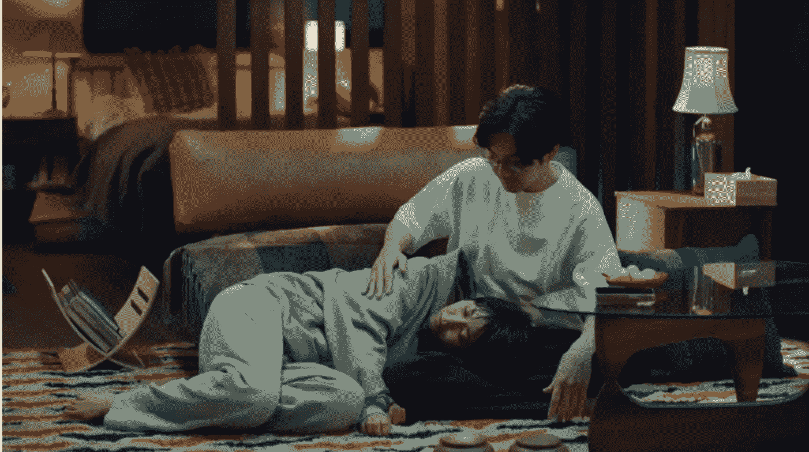

# 懒人专属群周报（第 118 期）

北京时间 2025 年 02 月 14 日 出品

懒人专属群 群友大家好，我是小懒人~

第 118 期《懒人专属群周报》，与君共读。

希望咱们专属群独有的《懒人专属群周报》可以作为群友们喜欢阅读的一份类似周刊的读物。之前的离线版合集地址见咱们专属群总链接，小懒都有备份。

懒人微信：lazyhelper

## 目录

- 关系攻略（节选）
- 怎样经营自己的微信朋友圈？
- 习题
- 小人攻略
- 习题
- 新闻评论
- 弃用智能手机的年轻人
- “手机和河里的垃圾没什么区别”
- 从周日聚会到纸质通讯
- 特权、徒劳，抑或满足真实的需求？
- 香港青年记者的职业选择与坚持
- 年轻人与新闻业
- 年轻记者的三种类型
- 年轻记者适应新环境的策略
- 懒人收藏夹
- 撒谎：别跟底层代码作对
- 生活不是真人秀
- 没爱情可以，没自己不行
- 总结

公众号懒人搜索，懒人专属群分享

## 关系攻略（节选）

作者：熊太行

### 怎样经营自己的微信朋友圈？

知识点：健康心理学，致力于研究人们应该怎样调整心理来保持健康。“健康”，指的是一种躯体和精神上稳定、充满活力的状态。

这篇文章探讨的是微信朋友圈应该发哪些内容，之前我们说过，不要在自己的微信朋友圈里发泄负能量，不要扮演一个特别“丧”的角色。

《马男波杰克》的主角波杰克，是一个从小被父母折磨，长大后自己无法成长的角色。

我们有关关系户同学问我，怎么发朋友圈才是合适和得体的？

我现实中也接到过这样的提问，回答是这样的：

你作为别人朋友圈的读者，希望看到的是什么内容？

- 1.这人最近在忙什么？

有没有可能合作。

- 2.这人最近状态怎么样？

如果旺就走近，衰就远离，需要帮助就伸把手。

- 3.这人有没有什么好玩的事情分享？

一些有趣或者有想法的人，本身朋友圈就是一个小媒体。

写作者要展示自己，这条朋友圈状态发出来，它描绘的是我的生活，代表了我的气质。但同时又要让别人舒服，不会是单纯的炫耀，对别人有冒犯感。

健康心理学对积极生活有一套自己的看法，如果把它运用到朋友圈管理的话，大概就是这些提议：

- 1.永远不要说自己不好的事情

我们之前说过，朋友圈不要发负能量，比如绝对不要说自己胖、丑、平胸，哪怕是自嘲也尽量不要，如果图片上的你太胖，你的描绘一定是跟健身、控制饮食和运动在一起——你提及的是建设性的意见和解决方案。

同样，以己推人，如果有人在朋友圈自嘲或者自黑，他可不是要拉你一起黑自己，如果不是那种特别开得起玩笑的十年以上的朋友，你的回复一定就应该是：“你不胖！”“挺好的呀！”“试试划船器吧！”

#### 2.观察你喜欢的人的朋友圈

大家都是活一辈子，遇见的事情差不多，如果发现某个朋友写同一件事，见识上比你高明，态度上比你阳光，有更多的赞，那就是去学习和效仿。

你们描绘同一件事为什么会不一样，你的反应、想法，你在描绘自己感受的时候，是不是有不得体，冒犯人的地方？

我们经常说某人情商低，很多时候就是该人做事非常不得体，他缺乏一种观察别人，向别人学习和借鉴的能力。

要知道社会上的很多规则是约定俗成的，成年后没有人教你这些规则，你必须经常对比自己和他人的行为，才能理解自己是不是符合了这些规范。

比如大家一起吃饭喝酒，你是可以扭身就走，然后发个消息给大家就行，但是回到桌上之后向大家道别，再离开显然是更得体的法子。以及你进了电梯，一定是脸朝着门站，没有人会警告你说屁股对着门站电梯不道德，然而大家一定觉得你很奇怪。

#### 3.结交一些特别的好朋友

你可以发一些分组朋友圈状态给他们，有的时候遇到好的文章或者提及某人，还可以选择"@某好友”提醒她看，这些一定要偏私人一点，你是在和对方分享感受。

#### 4.显示自己安排生活、管理时间的能力

天天晒吃喝玩乐会显得玩物丧志，每天晒加班则是令人生厌的。最好的办法是“在什么山上就唱什么歌”，当你工作的时候，就要斗志满满，谈及远大的未来。而当你休息的时候，哪怕娱乐很无聊，你也要珍惜休闲的时光。

如果你在工作的时候怨声载道，想要好好睡一觉，在黄金周又抱怨人太挤，你的妻子建议的那个度假地点看的全是人，还不如回去加班。这会让你的朋友圈看起来是一个生活不能自我管理之人，人们会远离这样的人。

#### 5.“我是一个什么什么样的人”

你一定有优点，要时时提醒你的新老朋友，有的朋友可能刚刚打开跟你交往的电梯，往下撸你的十条朋友圈，一定要有对你自己的判断和评价。

就像过去的说明文总要说：猪浑身是宝，肉可食，皮可以制革，毛能做刷子。

你也要经常强调自己的特长，不要太刻意。

比如如果是我，就会这么说：

> “自从拿了心理咨询执照之后……帮了不少的朋友。”

> “川藏线上骑行了二十几个来回之后……”

> “色狼驱逐小套装，口哨和一支防身用笔……”

如果你什么都不会，如果你什么都没有，如果你跟人沟通都困难，公开场合讲话两眼一翻当场就能厥过去，那也有优点：

> “我是一个好的倾听者，而且嘴特别严（没错，我跟别人根本说不了话）。”

大家别小看这样的表达，和你刚认识的朋友会迅速给你打一个标签——他遇到问题和麻烦的时候，会把你当做这个领域的专家，或者至少你可以推荐专家。

所以你要经常重复一点：

#### “朋友，我身上有你要的能力和品质，来和我交朋友吧！”

#### 6.暂时的逃离和倾诉

当你要发一些破坏性很强的负能量的时候，尽量选择逃离你现在所处的环境，如果是工作压力，就要暂时离开办公室，出去走访客户或者开个小会，行政去趟社保局，财务走一趟税务局，路上拍张风景、花草，轻度的逃离是一种健康的减压方式。

如果你要吐槽，可以和你的好朋友吐槽，最好是你的朋友也愿意吐槽他的压力给你听，互相比惨是有效果的。

我上次说过，不要在朋友圈发负能量，这里再强调一次，尤其不要发含糊其辞、指桑骂槐的负能量。对号入座最容易群伤了。

就算你没有得罪人，担心你的人一拥而上，都问你发生了什么事，你也要解释半天，4 个小时没干任何正经事，说的就是你。

#### 7.谈论失败

许多害羞的人在遇见失败、挫折的时候，没法忍受那种压抑在心的尴尬，一定要说出来给别人听才觉得好受一些。

> “今天犯了个错误……”

如果忍不住一定要发在你的朋友圈，记得要提及这场失败当中的积极因素——

> “今天犯了个错误，上了地铁发现有座儿，坐下想玩手机的时候摸出来一个空调遥控器。”

这条朋友圈是个老段子，就算是你的真事儿，也只能证明自己很呆，一群人都会点赞。

> “今天犯了个错误，上了地铁发现有座儿，坐下想玩手机的时候摸出来一个空调遥控器，也好，现在我是附近最有权力的人了。”

在这条状态下面加一个地点，是 XXX 空调厂，下面就会有一帮人哈哈哈哈。

如果一定要谈论失败的话，那就要加一点幽默感在里面。

如果对自己的幽默感没有信心，那就不要谈论任何失败了。

#### 8.展示一些独处的时间

如果一定要比较的话，晒宠物比晒娃强，晒娃比秀恩爱强。不要真觉得“撒狗粮”是温暖的事，其实没那么多的人真的关心你的家庭生活，刚才我们说过了，看朋友圈的目的就是为了收获朋友的信息，同时观察你是否还像以前一样强。

提及男朋友的行业或者服务的公司是有用的，但发两个美化得没了人样的照片，就是毫无价值的。现在的微信和朋友圈越来越转向工具属性，成为工作的工具——越来越多的生人出现在朋友圈里，把个人生活过多展示出来，其实已经是不明智、不得体的了。

和晒宠物、娃和男女朋友相比，一些独处的时间反而是有情绪的，有趣的。

要知道阅读你朋友圈的人会有介入你生活的偷窥感，如果你看上去是一人独处，拍摄的都是风景或者偶尔自拍，阅读者的感受是和你一起经历了一些事，如果是双人自拍或者有人为你拍摄，阅读者就很难走入这个场景——因为人已经太多了，他是一个闯入者，一个第三人了。

所以聪明的，善于展示自己魅力的女性绝对不拍男友，偶尔自拍也是偶尔晒一些有声望的名人，就要让聚焦点聚集在自己身上，看上去好像自己一个人在浪迹天涯。

夜间跑、瑜伽、钓鱼、看花、放风筝、喝茶、做手工，都可以显得很像一个人在做。

以及，其实一个人做这些事，真的挺好的。

这是放空自己和排解压力的一个好机会。

重温一下，朋友圈就是两条半，它们分别是：

- 我挺忙，但很好；
- 我很强，且有用；
- 我这人很有趣（可选）。

#### 习题

以下几件事里，理想的朋友圈素材是（多选）：

- A.朋友从未知渠道淘来的线装书，我正在读；
- B.最近要去参加某个魔都的活动，那几天有没有朋友在附近？
- C.你对潜水领域的某些心得，顺便批评一下那些口水化的旅游潜水攻略名不副实；
- D.升级系统之后，你的手机变成一块砖，不过你用了 30 分钟及时搞定，还写了一个简单的攻略；
- E.我刚把一个不懂事的餐厅服务员臭骂了一顿，这样的人就该好好教育一下。

答案是 A、B、C、D。

A 是典型的“我很强”；
B 是“我很忙，但很好”；
C 和 D 都是我有用。

对一些受教育程度收入水平比较低的服务人员，不应该当众批评大骂或者怒吼。这是非常不体面的。

你的朋友圈读者也不想从你这里看到教育服务员的攻略或者骂人技巧，有人也许看得津津有味，他并不在乎你的形象。

如果权益被侵害，你应该找他的领导投诉，而不是公开骂他。

把自我情绪管理不良的情况展示给朋友圈看是不明智的。

## 小人攻略

> 知识点：君子喻于义，小人喻于利。今天的知识点来自最古老的中国人际关系学。孔夫子说出的大道理，经过关系角度的解读，可以直接用于实战。

关系户 Z 同学问我：

“公司楼下的保安天天装大爷，居然还找上我的茬了，真是太嚣张了。不想白受这气，请军师受我锦囊妙计，治一治这些那什么眼看人低的。是时候请军师出山了！”

我就用了四个字：

“给他包烟。”

Z 同学也很惊讶：

我为啥要去讨好他？

正好，熊老师一直在写的“小人攻略”，刚刚完成了。

### ｜什么是小人

我们一般管这种掌握了一小点权力就使劲用，往苛刻里用的人，叫做“小人”。

今天我们说某某是个小人，那就是说这个人爱挑拨离间和打小报告。

其实小人的本意，是格局小、胸怀小，仅仅受利益驱动的人。

所以你看没人承认自己是小人，你认识的最奸诈的人，发朋友圈的时候，也说他自己最近犯小人。

孔子是第一个爱讲君子和小人的老先生，他描绘了很多君子的特点，比如：

君子成人之美，不成人之恶，小人反之。

君子不器（应该成为通才，而不是工具）......

但他没有给君子和小人任何一个详细的定义。

但是所有的描述里，最基础的是这条：

君子喻于义，小人喻于利。

### ｜两种世界观的不同

君子喻于义，小人喻于利。这两句的意思是：

君子用义来理解世界，小人用利来理解世界。

汉朝的大儒董仲舒解读这条的时候，用的是身份的高低，意思是，身份地位高的人讲义，身份低的人讲利。

钱穆先生在《论语新解》里，认为董仲舒这种解读为身份没有必要。如果你还没有读《论语》，从钱穆的解读开始就可以了。

因为身份低的人当中也有君子，讲道理就是君子。

身份高的人里也有小人，只用利益来理解世界就是小人。

后面的一些描绘其实都是基于这个义和利的世界观的。

君子怀德，小人怀土。君子怀刑，小人怀惠。

君子惦记着自己的朋友，因为这人三观正，小人惦记着我得让他照顾我，他是我的老乡。

君子总是担心会犯法惹事，小人总是惦记着别人对自己的好处。

君子周而不比，小人比而不周。

君子待人忠信，但不整天勾结在一起。小人整天混在一起，却没有忠信可言。

### ｜小人的短板

小人不见得是恶人，很多时候都是普通人，甚至是可怜人。

我们最基本的同情和怜悯一个人不是因为他是君子，而是因为他是我们的同类。

孔子用小人，不用恶人，有他的道理。

孔子是君子，他要让学生也做君子，所以他传授关于小人的知识。如果小人不可救药，那君子和小人的课可以转化成一堂武术课，让子路来教大家武术，见一个小人就当场打死，这个世界就算是太平了。

但他教的是相处之道，不是因为他心软，孔子杀过少正卯，他对敌人根本就不会手软，他要君子和小人相处，就是因为君子必须要和小人共同前进。

小人是由世界观、过往经历造成的，不一定是道德不好。

孔子根本不是什么酸儒，他做过鲁国政法口的负责人，代理国相，套用今天话说，这人做过公安厅厅长兼代理省长，这老爷子在他的时代，就是一本行走的《关系攻略》。

他的最重要一课就在这里：小人可以被利益驱策。

和君子相比，他们格局小、目光短浅，看不到远一点的目标，所以往往因为眼前的利益或者一些无聊的情绪发泄而得罪重要的人。

这是小人最讨厌的地方，你看他做蠢事，气得都心疼。

### ｜底层的小人

Z 同学提到的保安，是一个城市里的底层行业。同样一个村出来，送餐送快递的要比当保安的多挣一倍，甚至两倍。

我们有的时候看见有的保安员欺负拾荒的、为难送餐员，其实按照规章拦住他们就够了，没必要说难听话侮辱人。

这就是小人世界观，他们会亲近给他们提供利益的人，对“反正我也从你身上得不到好处”的人，就是非常刻薄的。他们会滥用自己的一点点小特权。

计划经济时代，是一个只要你有工作，人人都能有点小特权的时代。

那个时候，如果你不认识卖肉的，他就会把各种不好的肉卖给你，而如果认识的话，你的肉票换来的可能是排骨和五花。卖肉的职工也要用自己的特权去交换，不然的话他买不上衣服料子或者自行车缝纫机。

那个时候出门出差坐火车大家都要聊天，就是为了拉关系，很简单：“哎，你给我找张自行车票，以后你买肉找我。”

计划经济对普通人心灵的侵蚀相当厉害，很多现在 50、60 年代出生的父母所信奉的逻辑，就是那个时代的产物。

今天底层的小人在很多时候仍然这样直来直去，比如驾校的师傅，说烟就是要烟，说摸女学员大腿就摸大腿。需求明白，你也好应对。

要躲开这种底层的小人，变得富有和强大是最根本的解决方案。如果你家楼下的保安不可理喻，那他一定挣得特别少，你的房子或者你公司的写字楼太便宜，就会这样。你遭遇摸大腿的驾校，也是因为它收费低，价格便宜。

倒不是说好的楼盘能够雇的保安和驾校师傅都是君子，这不现实，但是薪资待遇够好，小人一般不会闹事——他们的世界是利益驱动的。

这也是为什么我会跟 Z 同学建议，如果你进门或者进车归保安管，一包烟给他，能省很多麻烦。你去恐吓一个身份地位极低的人，浪费精力，还可能造成逆反，他可能在小处使坏。

聪明的人到某个新住处或者新公司的时候，就应该主动跟这些保安什么的打招呼，闲聊几句，如果需要对方帮忙，再给一点小恩小惠结好一下，他是君子再好不过，他若是小人，这是为消灾惹祸花点钱。

### 身边的小人

诸葛亮对他的领导刘禅说：“亲贤臣，远小人。”问题是有的小人没法远。

他可能是舍友、同学、邻居、亲戚甚至是至亲。

一些还在校园里的关系户会跟我说一些和同学、室友之间的烦恼。

有同学说，宿舍里有人深夜打游戏，或者是在屋里抽烟，不知道该怎么制止这样的人。

这样的人就是小人，过去我们上学的时候，别的宿舍还有人带女生回来在宿舍里，夜间上下铺一起晃酸爽极了。

宿舍里另外几个人都死人一样不反应，或者是敢怒而不敢言。

这些都是小人，他们不愿意牺牲哪怕一点利益，比如晚上不玩游戏、出门去抽烟，出去租一个房间。

对付这样的小人，不能怕他。小人怕性子刚正的人，你不用和小人成为最好的朋友，你只要让他明白，站在你对面很麻烦就够了。

“某某，你是个生性豁达洒脱的人，我很羡慕，不过我这个人身体的缘故，闻不了烟味儿/听不了半夜打游戏/受不了上下铺一起晃，我是希望你能珍惜你我之间的友谊和交情，到外面的抽/打/睡。”

如果对方开始跟你假装好，那就是起了效果。

有的人会“完了，完了，你这人真没劲……”

这会儿千万别接软话，冷冷地看着。等他做保证。

“好了好了，我改了就是。”

别担心这样的小人会不会趁你睡着捅你一刀什么的。因为宿舍里最可怕的，其实是刚硬耿直、倔强而沉默寡言的那个人，而现在，这个角色是你正在扮演的。他还怕你捅他一刀呢。

当然，最终的解决方案是实力的强大，所以我会劝学生们，如果宿舍里的气氛不好，就等到睡觉再回来，腾出来的时间去和其它年级、其它专业的学生交际，或者去职场上认识优秀的人。

你的朋友多了，力量强了，一来能替代你宿舍里的关系，二来所有的人都对人脉广的人敬重三分。

不要担心你和同宿舍的同学不亲近，你们都工作之后，要同气连枝互相扶持，每个人有自己的资源，会有很多可以交换、合作的机会，那个时候不亲也亲。你们的旧交情会保证你们彼此忠诚的可能性更大，你们的交往更像是君子之交。

而都在学校的时候，彼此能给对方的无非是互相抄作业、帮打饭的服务，那很容易变得像小人之交，会亲近，但是很难保证忠诚。

### 职场上的小人

最好是默认职场上的人都是小人。

小人理解世界的方式是利益。

对了，职场上就尽量只考虑利益，尤其是当你是个小头目、小领导的时候。情怀、理想那是对自己的要求，你应该用利益来驱使所有的下属。尽量做到公正。如果他们认同你的品德或者情怀，你们能更彼此忠诚，更加紧密团结。

君子和小人根本就不是势不两立的。

君子要想成长，要想成事，跟小人和解是非常必要的。

明朝有个大太监叫做冯保，是万历年间的东厂厂公，冯保这个人有点文化，《清明上河图》上还有过他一个印，他过去毛笔字写得好，从小太监一路爬上来，太监这行就这点好，确实没有“公二代”。

冯保和张居正用阴谋搞掉了首相高拱，万历初年的格局是冯保、太后和张居正分享权力，因为冯保在内部的协调，张居正的改革很有成效。

冯保是个绝对的小人，但他是个能人，张居正和冯保的联手，维持了万历初年最好的政治局面。我们知道民族英雄抗倭名将戚继光，是他们俩的政治盟友，他给冯保送金钱，给张居正送女人。

你要当英雄，必须要懂小人手段，必须要能用小人。

#### ｜小人也需要尊重

以前曾经在电影频道看过一部电影，名字想不起来了。

故事大概发生 1970 年代末到 80 年代初，王志文演的角色的师母去世，他跑去联系太平间冷柜，结果看太平间的老汉有酒有肉大模大样地看着这个知识分子：

“谁没了呀？”

“老太太。想找个位置。”

“喝口？”

老头指着一个特别脏的杯子。

王志文敦敦敦喝了两口。

“不就着点儿”老头指指猪头肉。

王志文上手抓了一块儿。

老头很满意，让别人家来把死人挪走，给主人公的师母挪位置。

他觉得主角“看得起他”。

这个老头是个典型的小人，为他喜欢的人，就会去伤害别人的利益。

但是他又和单纯为利益的小人有不同，他会对知识分子的对他的尊重特别看重。

### 敲黑板！

如果你遇见身份比你低、见识比你差的小人想要结交你，千万要处理好，如果得罪这样的人，就会特别特别麻烦。

最近有人爱说：“今天你对我爱答不理，明天我让你高攀不起。”这是君子的做法了。

小人则是：“今天你对我爱答不理，明天我让你车轮没气。”

小人对大人物的仰慕，很容易因爱生恨。西方的超级英雄片是这样的，一个人想要模仿蜘蛛侠，觉得被慢待，就去研究黑科技，成了他的大对头。

小人可不仅仅是同性，《天龙八部》里，马夫人康敏喜欢乔峰，但是乔峰没收到她的情感讯号，她就要动手筹划阴谋，毁掉这个英雄。

现实中对小人表白的拒绝，可能会导致国破家亡。

清兵入关之后，大明的兵部尚书史可法经营江南，依仗的就是军阀高杰，这个人出身盗贼，是真正的小人，但是服史可法的一身正气。

后来高杰被叛将杀死，部队群龙无首，高杰的夫人姓邢，是个女中豪杰，她建议史可法收自己的儿子为义子。这个提议不过分，邢夫人不是君子，但也同样仰慕君子的品质和人格。

这个提议要是做到了，军队就是史可法的了，过去他一直苦恼的就是没有自己的兵。

各位，别说义子，为了大局，真的娶了寡妇都是可以的。但是史可法是个进士，总是觉得有个贼儿子不好，最后他安排高杰的儿子认了一个太监做义父。

## 影响小人的学问

其实孔子也曾经给出过答案：

> “君子之德风，小人之德草，草上之风必偃。”

君子的品德，就像是风。

小人的品德，就像是草。

风一吹过，草就会倒下来。

史可法影响了高杰，没有从心里接纳他和他的女人、他的儿子。

被影响的小人，怎么不可能成为君子、成为英雄呢？

超级英雄电影里，叫做“能力越大、责任越大。”

你要是君子，就对小人有责任，你要更主动，不可以爱惜羽毛，事败了再推在小人身上。

我们把影响小人提到的几点再提一遍：

1. 照顾好他的利益（不能剥夺他已有的）；
2. 给他公正（不能对别人比他好太多）；
3. 同时显示自己坚韧的内心；
4. 对他言传身教潜移默化；
5. 不拒绝小人的爱和好意。

我有几个朋友，是那种特别温和特别体面的人，从来不会粗声大气地说话。

他们不会炫耀自己有什么身居高位的朋友，但是跟他们出去吃饭，他会对服务员、门卫都客气友好。

去他家拜访，他们家附近的物业保安都认识他，邻居他都认识，这样的朋友一般来说，都是可交的君子。他会为境况不如自己的亲友谋划工作。

做到这点其实并不需要花很多时间和很多钱，微笑、友好的表示和一点小礼物就够了，最关键的，还是去结交别人的时候，对别人的认识，是敷衍了事，还是真心的友好。

> “欲齐其家者，先修其身。”——《大学》

我非常喜欢《西游记》，在猴王学艺的那一段，他来到三星洞，听见一个樵夫在唱着好听的歌谣，就上前行礼，称呼人家“老神仙，你若不是神仙，怎么有神仙的话呢？”

樵夫赶紧客气，“那神仙与我舍下相邻。他见我家事劳苦，日常烦恼，教我遇烦恼时，即把这词儿念念，一则散心，二则解困。”

我们都在暗中行走，一个个头和我们擦肩而过，我们用套路，我们用策略，我们寻找他们的弱点下手。

偶尔，我们会发现一两个闪亮的灵魂，打着一盏小小的纸灯。

你也可以把灯打起来，告诉别人：我也是，我在这儿。

P.S.

### 小人的破坏力：

中美团结几乎被一个看厕所的破坏过。

这是前驻美大使章文晋夫人张颖女士的一段回忆，说的是 1980 年代中期中美关系最好的时候（黑鹰直升机就是那会儿卖给中国的）里根总统访华，到中国来爬长城，长城脚下有一个贴瓷砖马赛克的高级厕所，然后总统和夫人使用完之后就锁上了。

这个时候国务卿夫人想上厕所，张颖女士陪着她去，看厕所的人死活不开门，说奉上级指示，让美国总统夫妇使用厕所，国务卿是啥，我不知道。

好说歹说不行，后来大使夫人就陪国务卿夫人和另外几个美国老太太去附近村里的旱厕解决，好家伙，一条大坑波浪翻。

大家互相搀扶着上完厕所，心情都很恶劣。其实当时如果有五十斤粮票塞进看厕所的手里，这事儿就解决了。

#### 习题

你喜欢和认可的领导从别的部门调来一个人，做你们的副头，坊间传闻此人是公认的小人，这个时候你应该做的是：

- A. 告诉领导这个人很危险，应该远离；
- B. 仔细研究一下小人的优点，小人渴望得到什么，研究一下怎么和他相处；
- C. 和领导去谈一谈，探探领导对此人的看法，问问自己怎样配合；
- D. 发动部门群众一起抵制奸党，让他干不下去；
- E. 搜寻小人的资料、见见熟悉他的人，了解他的过去。

答案是 BCE。

在发生变动的时候，首先要做的是情报搜集工作。首先要知道这个人是不是如传言所说。

其次应该研究这个人追求的利益。问问领导对此人使用上的一些看法。

不要急于采取决定，大多数的小人是应该可以合作的。

以及，所有的部门，没有小人配合，事都是做不成的。

## 新闻评论

新闻实验室是小懒付费订阅的通讯录，年费 300 多。小懒整理分享，仅供专属群群友查阅。如有余力，可以自己到 Newsletter 上自费订阅。

## 弃用智能手机的年轻人

> 对于今天的年轻人而言，成长的经历被污染了、变得廉价了。“我是谁？”变成了“我看起来怎么样？”

不少人都有卸载某些社交媒体 App 然后又重新装回来的经历，少部分人甚至尝试过在一段时间内完全不使用社交媒体。但是，这样的尝试往往无法持续太久。几乎每个人或多或少都能说出智能手机和社交媒体对身心健康可能带来的一些危害，但能在日常生活中真正远离它们的人非常少。

本期新闻实验室会员通讯，我们一起来了解一场从高中生开始的弃用智能手机运动。这群年轻人组建了一个“卢德派俱乐部”（Luddite Club），这个名字来源于 18 世纪英国纺织工人领袖内德·卢德——他当时带头砸烂了纺织机，反对用机器代替人力，由此成为反工业化、反科技的代表人物。

在这个时代做一个不使用智能手机和社交媒体的“卢德派”，究竟是一种基于反思的自我解放，还是一种逆时代潮流的徒劳？了解这群年轻人的经历，或许可以帮助我们思考这个问题。

### “手机和河里的垃圾没什么区别”

故事始于新冠疫情封锁期间。根据《纽约时报》的报道，当时正在读高中的美国女生 Logan Lane 发现，自己的社交媒体使用已经完全失控了。她属于从小就沉迷于 Instagram、Snapchat 和 TikTok 的一代人，疫情封锁期间更是从早到晚都活在手机上。

“我无法控制自己不去发布好看的照片。我在网上装作一副无所谓的样子，但实际上我很在意社交媒体上面的一切。”她回忆道。她在意朋友们发出来的完美自拍，也在意别人对自己帖子的点赞数量。

故事的转折点是一场“顿悟”。Logan 后来在 MoMA（现代艺术博物馆）做了一场分享，她回忆说，有一天，她坐在一条运河旁边，突然萌生了把 iPhone 扔进水里的冲动。“我觉得手机里的垃圾和运河里漂浮的污染物没什么区别。”

于是，她下决心删掉了 Instagram，告别了社交媒体，并且把手机放到了一个盒子里。这让她的生活发生了巨大的变化——生活在纽约布鲁克林的她，第一次从图书馆借出纸质书并且在公园里独自阅读，第一次在坐地铁的时候开始欣赏涂鸦。她甚至还结识了一群年轻的涂鸦艺术家，跟随他们在皇后区的货运列车车站场学习车厢涂鸦创作。她的作息变得规律起来，不再深夜刷手机，而是每天早上 7 点不靠闹钟就能自然醒来。她的父母注意到，女儿开始定时回家吃晚饭，热切地分享着一天的见闻。

Logan 在那场分享上还抛出了这样的犀利论述：“对于今天的年轻人而言，成长的经历被污染了、变得廉价了。‘我是谁？’变成了‘我看起来怎么样？’“

弃用智能手机不久之后，在一场地下朋克音乐会上，Logan 遇到了一个同样不使用智能手机的女生。“她还是个高一新生，但她的阅读量令人难以置信。”Logan 回忆道。两人在公园边喝苹果酒边吃甜甜圈，分享着各自作为“卢德派”的经历。这次偶遇成为了“卢德派俱乐部”的第一次会议，而那位早期的同道者至今仍是俱乐部的核心成员。

其后，随着最初的两名成员不断向外推广她们的理念，这场始于 2021 年的小规模反叛运动在美国多个城市开枝散叶。加入“卢德派俱乐部”的年轻人们重拾真实的人际关系和生活体验，并且每周固定举行线下见面活动。

### 从周日聚会到纸质通讯

在卢德派俱乐部成立的最初两年里，每个周日，无论刮风下雨甚至下雪，成员们都会在布鲁克林的一间公园集合，不使用手机。在公园里远离人群的一处土丘上，这群年轻人找到了属于自己的精神领地。

在这里，他们坐在木头上，围成一圈。有人专注地速写，有人安静地画水彩画，有人闭目倾听风声，还有许多人沉浸在厚重的书籍中——陀思妥耶夫斯基的《罪与罚》、斯皮格曼的《鼠族》，或是波爱修斯的《哲学的慰藉》。他们崇拜亨特·汤普森和杰克·凯鲁亚克这样放荡不羁的作家，热衷于阅读批判技术的作品，如冯内古特的《自动钢琴（Player Piano）》。

天气好的时候，他们会在公园里搭起吊床，躺在里面舒服地看书。

俱乐部的成员们深受乔恩·克拉考尔的《荒野生存（Into the Wild）》影响，这本书讲述了一个出身富裕家庭的大学生毕业后在阿拉斯加荒野独居然后死去的故事。一位俱乐部成员说，“我们都认为人类不应该被禁锢在建筑物和工作中，书中那个人经历的才是真实的生活。社交网络和手机并不是真实的生活。”

最初的两年里，成员们都是高中生。他们也在各自的高中尝试邀请同学加入，虽然也发展到一些新成员，但总体来说，愿意加入卢德派俱乐部的同学是很少的，放弃智能手机上的社交生活对于大部分人来说还是太难了，真正加入的同学或多或少都是不合群的那种年轻人。

后来，随着成员们先后进入大学，卢德派俱乐部也有了新的发展。

Logan Lane 作为俱乐部创始人，仍然坚守着最初的理想。现年 19 岁的她在欧伯林学院（Oberlin College，一所顶尖的文理学院）主修俄罗斯文学，同时致力于将卢德派俱乐部发展成一个正式的非营利组织。她们发行了一份仅提供纸质版的通讯《卢德派快报（The Luddite Dispatch）》，并建立了一个简单的网站来传播理念。

到 2025 年，卢德派运动已经在全美多个城市生根发芽。从西雅图到佛罗里达西棕榈滩，从弗吉尼亚里士满到华盛顿特区，都有了卢德派的分支。

卢德派的招募方式也变得更加组织化。在费城的天普大学，成员们在校园里张贴写着“加入卢德派俱乐部，建立有意义的连接（Join the Luddite Club For Meaningful Connections）”和“你是否希望与科技，特别是社交媒体建立更健康的关系？卢德派俱乐部欢迎你和你的想法（Do You Desire a Healthier Relationship With Technology, Especially Social Media? The Luddite Club Welcomes You and Your Ideas）”的传单。她们还会随身携带老式的翻盖手机，随时展示给感兴趣的同学看。

在布鲁克林科技高中，卢德派成员在学校博览会上设立展台，展示写着“真相将使你获得自由”（The Truth Will Set You Free）的海报。她们将俱乐部塑造成一个充满创意的社交空间，成员们一起进行即兴表演、说唱对决和制作独立小志（zine），使其成为校园里的“酷孩子俱乐部”。

俱乐部成员们有意保持组织的精简性，不追求快速扩张，而是注重吸引真正认同其价值观的成员。正如 Logan 所说：“我们在招募成员时确实遇到困难，但我们并不介意。我们都因这个独特的理念而团结在一起。要成为卢德派俱乐部的成员，需要有一定程度的格格不入。”

### 特权、徒劳，抑或满足真实的需求？

看上去，卢德派俱乐部是一件很酷的事情，但它也引发了诸多争议。

在早期，成员们面临的质疑是：有人认为卢德派俱乐部带有精英主义色彩。发起人 Logan 也承认：有人说他们是一群富家子弟，而“放弃智能手机”其实是一种特权——有的人因为要打工、要照顾家人等种种原因，并没有弃用智能手机的自由。

这种观点让 Logan 觉得很困扰，她差点因此解散掉俱乐部。后来说服她没有解散的理由是：历史上大多数的革命，其实都是由有一定特权的人发起的，比如切·格瓦拉，就出身于名门望族。“我们并不期望每个人都使用翻盖手机，我们只是看到了智能手机和精神健康之间的关系。”俱乐部成员们这样自圆其说。

其实，就算是 Logan 也没有全然摆脱手机的特权——她的父母为无法随时追踪女儿的行踪而感到焦虑。最终，在父母的坚持下，Logan 同意携带一部翻盖手机。

当成员们进入大学之后，社会生活一下子丰富了很多。由此导致的结果是：拒绝智能手机的成本更高了。

比如，美国的大学生们常常参加狂欢派对等夜生活。这些活动结束的时候往往是凌晨，如果没有一部智能手机打车的话，既不方便，也不安全。所以，有卢德派俱乐部的成员只能妥协——添置了一部智能手机，主要用于打车和确保自身的安全。

另一种让大家觉得很难放弃的智能手机 app 是：约会软件。美国大学生里面几乎人人都在用约会软件，拒绝使用智能手机的人就只能被许多的关系和活动排除在外了。

在打车、约会等日常需求的诱惑之下，并非所有俱乐部成员都能在大学生活中坚持卢德派的理念。有成员就表示，在大学开学第一天就重新开始使用智能手机了。重新与社交媒体上的人们连接起来的感觉，让她感到开心，但也有些担忧——当使用翻盖手机的时候，去哪里、和什么人聊天，都是很有心的；可是，有了智能手机之后，一切变得容易，却也不怎么走心了。

也有不少成员在坚持，以翻盖手机和笔记本电脑来满足日常生活和学习的需求。

有意思的是，创始人 Logan Lane 最近做了一份与卢德派理念相关的实习工作——她在一家叫做 Light Phone 公司实习，这是一家生产极简主义手机的初创公司。他们生产的手机除了打电话和发短信之外，几乎做不了什么其他事情。

为什么这样的极简手机会有市场？因为有一些人群需要和智能手机保持距离，比如：想要摆脱智能手机成瘾、提升工作效率的自由创意工作者；保守的宗教家庭；从色情内容成瘾症当中戒断和恢复的人……

在实习的过程中，Logan 对于“打工人被要求 24 小时在线”这一点也有了更多的观察和感受，她觉得这是一个非常糟糕的现象。如今，她仍然坚持着自己的理想，使用翻盖手机与父母保持联系，同时梦想着有一天根本不用任何手机。

“卢德主义”这个词带有逆潮而动、盲目拒斥的意味，但“卢德派俱乐部”的青少年们，看起来要比历史上的卢德运动清醒很多。他们并没有盲目地拒斥一切技术，他们会在不同的人生阶段对自己的选择做出调整。而他们中的大多数人没有放弃的，是警惕技术对个人生活的影响与侵蚀，保留自己做决定的主动权。

这场始于一小群青少年的反叛运动，注定小众。但是它承载的是一种普遍性的体验和需求，那就是年轻一代想要找回那些被科技剥夺的真实人生体验。只不过，卢德派俱乐部的成员们比大多数人更大胆、更有行动力一些。

## 香港青年记者的职业选择与坚持

依然会有年轻人投身其中，他们分为三种类型。

在每个月的“你问我答”环节里，经常有朋友问我香港的媒体现状，以及在香港教新闻的感受。的确，2019 年以后的香港发生了很多的变化，媒体行业更是处于变化的前排。

不过，就像包括中国内地在内的许多其他地方一样，香港的新闻业也展现出了它的韧性。其中一个方面的体现，就是依然会有年轻人投身其中，成为这个行业的新鲜血液。

这些年轻人为什么依然选择做记者？最近我的几位同事在学术期刊《The International Journal of Press/Politics》上发表了一篇论文，详细揭示了这群人的职业选择与坚持。

### 年轻人与新闻业

香港有 7 间大学开设有新闻传播专业：香港中文大学、香港大学、香港浸会大学、香港城市大学、树仁大学、珠海学院、恒生大学。对一座 700 万人的城市来说，新闻传播人才的持续供应是充足的。

但是，这些毕业于新闻与传播学专业的年轻人，并不一定会投身传媒业。其中，会成为记者的，更可以说属于少数。这并不是一种新现象，而是长期以来如此。香港的媒体市场规模有限，能够提供的岗位数量有限，而且记者的收入一直不高。相比起来，在香港当老师或者公务员会有明显高得多的薪酬待遇，更不用说金融、地产等商业领域。

再加上记者的工作时间往往很长，还经常要在周末和假期加班，所以香港媒体的人员流动性很高。记者在进入婚育阶段之后，往往会选择跳槽到更加稳定的行业。

在种种不利因素之下，依然有年轻人选择做记者。一个很自然能想到的原因是：他们有理想抱负，能在一个相对自由的环境下能够做出好的、有影响力的报道，这种职业成就感是金钱买不到的。

如果是这样的话，那么，当这种环境出现收缩，一些此前能做的报道不再可能的时候，为什么还会有年轻人愿意入行呢？

### 年轻记者的三种类型

为了回答这个问题，研究者在 2022 年 9 月到 2023 年 1 月之间访谈了 26 名在香港媒体工作的年轻记者。他们当中入行最久的已经工作了 4 年，而最资浅的则只工作了 2 个月的时间——绝大部分都是在港区国安法颁布之后入行的。他们供职于 12 家媒体，包括 4 家报纸、4 家广播电视台、3 家网络媒体，以及 1 家国际媒体。从政治倾向上面说，有 17 位记者都来自偏向民主派的媒体。

根据此前的研究，影响新闻职业选择的因素主要包括四个方面：童年和青少年时期对新闻职业的想象；新闻教育；重要的社会事件；职业榜样。他们和这 26 名年轻记者做的访谈也围绕这几个方面展开。

基于这些访谈，研究者们总结出了年轻记者们的三种类型。每种类型都对应着不同的职业想象、入行原因，以及入行之后适应环境的方法。

第一种可以被称为初心型理想主义者（原文是 aspiring idealists，中文是我的翻译）。在 26 位受访者中，有一半属于这个类型。

这类记者的特点是：他们在进入大学前就建立起了对新闻工作的理想认知和价值追求。研究发现，有多方面的因素影响了他们的早期新闻想象：

- 家庭影响：报社记者 Tina 的故事最具代表性。她来自一个积极关注政治的家庭，从小就跟随母亲参加社会运动。她回忆说，小时候经常需要依靠新闻来理解复杂的政治议题，而这些报道塑造了她对世界的认知。一档时事讽刺节目更是她童年最爱的电视节目之一。
- 传奇故事的影响：不少受访者提到，真实或虚构故事当中的记者形象启发了他们的职业选择。报社记者 Brenda 在中学时期接触到水门事件的故事，被调查记者的形象深深打动。电视记者 Kenneth 则提到，上中学时看过一部关于记者的本地电视剧，这让他第一次认真思考新闻工作。这些关于新闻业的文艺作品往往戏剧性地展现新闻工作的价值，为年轻人提供了理想化的职业想象。
- 榜样的力量：初心型理想主义者往往能明确说出自己的职业榜样。财经记者 Edith 对调查性报道特别感兴趣，她将这种兴趣归因于对柴静的崇敬。柴静关于空气污染的纪录片《穹顶之下》，展现了 Edith 理想中的新闻工作——通过深度调查推动重要社会议题的改变。报社记者 Keith 将一位纸媒记者前辈视为榜样，他认为这位前辈代表了一种老派的坚持：对新闻敏感、对真相执着、对质量不含糊。
- 标志性事件的影响：对于今天香港的“初心型理想主义”年轻记者而言，2014 年的雨伞运动是他们成长历程中最关键的事件——那时候，他们还在读中学。多位受访者提到，这场运动让他们亲身体会到新闻媒体的重要性。电视记者 Nancy 说，当她在电视上看到警察向示威者发射催泪弹的画面时，她意识到记录真相的重要性，开始认真考虑成为一名记者。同样，记者 Nora 回忆，当时警察殴打被铐示威者的画面被电视台拍下，这样的画面坚定了她从事新闻工作的决心。

第二种年轻记者被称为“被社会化的理想主义者”（socialized idealists）。在 26 位受访者中，有 9 人属于这个类型。与初心型理想主义者不同，这类记者并没有“从小立下记者志向”，而是在大学教育和实习过程中，逐步建立起对新闻工作的理想认知的。研究者通过访谈发现了这个群体的如下特点：

- 入学时的不确定性：香港不少大学的新闻传播专页同时涵盖新闻、广告、公关和创意媒体等方向，为学生提供了多种职业选择。报社记者 Todd 在进入新闻学院时并未打算成为记者，但他通过实践课程上的采访作业逐渐爱上了新闻工作。记者 Bella 最初倾向于从事广告，但在制作了一个关于本地社区的图片故事后，对新闻产生浓厚兴趣。
- 教育者的影响：与初心型理想主义者相比，被社会化的理想主义者更多提到新闻教育的影响。Bella 将一位资深记者出身的讲师视为自己的榜样。她说，这位老师经常“深入讨论新闻原则，强调记者应该细致、批判，关注公民所关注的事。”值得一提的是，Bella 其实并不在那位讲师所在的学校读书，她甚至专门跨校旁听这位讲师的课程——这表明，新闻教育的影响并不局限于大家修读的正式课程，大学提供的是一个自由探索的机会。
- 实习经历的重要性：实习是新闻教育的重要组成部分，也是学生首次接触“真实”新闻工作的机会。实习单位的资深同事在这个阶段往往扮演着重要的知识和价值传递者角色。记者 Zenia 回忆她在一家国际媒体实习时，被一位资深同事对细节的严谨态度和对调查的专注精神所打动。记者 Dora 则提到，在一家媒体的中国新闻部门实习期间，她被前辈们面对权贵时的勇气所激发。

- 2019 年运动的影响：如果说 2014 年的雨伞运动对初心型理想主义者们产生了重要影响，那么 2019 年的反修例运动则是被社会化的理想主义者们成长中的关键时刻。不同的是，他们是以记者的身份经历这场运动。一些受访者近乎偶然地参与了新闻报道。比如，Lilian 原本在报社担任非采编类工作，但由于抗议活动规模庞大且人手不足，她被调往前线采访。同样，Molly 本无意从事新闻工作，但在 2019 年受邀为一家网络媒体撰写特写报道后，开始了她的新闻生涯。

- 从社会运动中得到的不同领悟：论文提到，受访者们从 2019 年的社会运动中学到了不同的东西。假新闻的泛滥让 Brenda 认识到公众需要依靠正规的新闻媒体获取信息。Todd 在担任学生记者期间，观察到许多“非专业记者”(如公民记者和其他学生记者) 的“不当行为”，这促使他认同中立、专业报道的重要性。Dora 则表示，报道抗议活动让她体会到“新闻工作的力量——能够贴近现场，忠实记录事件”。

第三种年轻记者是“实用主义者”(pragmatists)。在受访的 26 位记者中，有 4 人可以归入这个类型。与前两类记者相比，实用主义者较少强调新闻工作的使命和职责，他们更关注职业的实际层面，如工作的趣味性、灵活性，以及社交和知识积累的机会。这类年轻记者的特点包括：

- 路径依赖：报社记者 Lester 的经历颇具代表性。他回忆道，儿时读到 2012 年特首选举丑闻的报道时觉得“很酷”，这促使他选择了新闻专业。但在学习过程中，他发现自己对新闻的热情远不及同学。即便在 2019 年反修例运动期间实习，这段经历对他的影响也相对有限。当被问及为何最终选择入行时，Lester 说：“我没想过其他选择，就是顺着这条路走下来。”类似地，记者 Charles 表示：“毕竟读了四年新闻，要是不做这行就太浪费了……转行也很难，很难与其他专业的毕业生竞争。”这种说法反映出某种路径依赖，即职业选择更多是基于既有投入的实用考量。

- 对“手艺”的重视：实用主义者在谈论新闻工作时，往往更关注技艺而非价值。这一点在他们谈论榜样时特别明显。Charles 和 Britney 最初表示没有特定榜样，在追问下才提到一些工作能力出众的同事。电视记者 Isaac 从小就想成为新闻主播，他能详细讲述著名主播的表达技巧，但较少谈及新闻工作的社会意义。

- 现实的妥协：值得注意的是，实用主义者并非完全无视新闻工作的价值。尽管对新闻社会角色的阐述较为模糊，但 Lester 仍坚持认为记者能为社会作出贡献。Isaac 也批评过一家本地广播电视机构以削减成本为名解雇优秀记者的做法。然而，实用主义者更容易接受建制派媒体的工作环境。Lester 说，理想情况下他想做调查报道，但还是选择了在建制派报纸担任教育记者，因为他认为这个岗位“可以忍受”。同样，虽然 Isaac 对本地社会新闻更感兴趣，但他选择了财经新闻台工作，理由是“工作相对轻松……出入高级餐厅或酒店，至少不用那么忙碌”。

## 年轻记者适应新环境的策略

这些记者在入行之后，是如何面对新闻从业环境的收紧的？论文总结了两种应对策略。

第一种叫“适应性的韧性”(adaptive resilience)。通俗来说，这种策略就是：既承认现在必须针对环境做出调整，又强调要坚持做有意义的新闻工作。在国安法颁布后的香港，这首先体现在对工作单位的选择。两类理想主义者都倾向于选择相对自由主义倾向的新闻机构。如 Tina 选择在一家自由派报纸担任法庭记者，她认为这是少数几个仍能进行有意义新闻工作的岗位。

记者们普遍注意到法律风险增加、自我审查加剧以及新闻编辑室控制收紧等现象。相比建制派媒体，自由派媒体的自我审查更为明显。报社记者 Kitty 提到，她的一篇涉及敏感议题的报道被意外撤下。当她质询编辑时，得到的只是模糊的“规避风险”解释。

年轻记者通常较少担心法律风险，因为主要责任在高层管理者。但他们需要适应新的游戏规则。Quinn 提到编辑要求记者为争议性说法提供更强有力的事实依据。Kenneth 则表示在向政府官员提问和引用官方言论时需要格外谨慎。

不少年轻记者都提到，“趁现在能做就做”。他们觉得环境还会进一步收紧，那么就珍惜当下的空间。

第二种应对策略叫“基线维持”(baseline maintenance)。与适应性的韧性不同，“基线维持”策略体现为：搁置对使命职责的期待，回避敏感话题，只维持最基本的专业水准。采用这一策略的记者往往选择政治敏感度较低的报道领域，或转向建制媒体的相对“安全”岗位。例如，被分类为实用主义者的 Lester 和 Isaac 选择在建制媒体工作，他们认为只要不用做明显的宣传式报道，这样的工作就是可以接受的。即便如此，这些记者仍在尝试坚守某些专业底线。Lester 就曾多次就编辑压下某些报道的决定提出异议。

值得注意的是，并非只有实用主义者才采用基线维持策略。初心型理想主义者 Edith 就是一个案例。他从本地报纸财经版转至国际金融媒体，这在香港通常被视为职业发展的上升轨迹。但 Edith 坦言，专注财经新闻既是规避风险的选择，也受到稳定收入的吸引。她明确表示不再思考实现新闻公共服务理想的问题，而是将工作视为拿薪水的方式而已。

总的来看，这则研究既给出了香港新闻业的一些希望，也指出了背后的重要挑战。即便在严峻的环境下，仍有年轻记者在努力坚持专业理想，这构成了新闻业韧性的重要源泉。尽管他们可能只是少数，但对于自由派新闻工作在“蛰伏时期”的存续仍然具有重要意义。

不过研究者也提到：批量制造出两类理想主义者的重大社会事件（2014、2019）在今天的香港不会再重演了，这会不会使得今天的青少年更少树立新闻职业理想？我个人觉得：完全有可能，但是看中国内地的情况，即便在管控严格得多的情况下，新闻理想这种东西也没有完全断掉，一批批的年轻人当中都有理想主义者的身影。这也许是人性的本质使然吧，它并不会因为环境的变化而消逝。

## 懒人收藏夹

### 撒谎：别跟底层代码作对

和菜头

> 撒谎，动词，一般认为是违背道德的行为，但它也可以从其他角度理解。

---

有人问我：“当撒谎对自己有利的时候，为什么要说实话？”其实通过提出的问题本身，我们可以看出更多东西来。问这话的人，是站在功利的角度去看撒谎。如果一个人以功利作为判断事物的最高标准，的确可能在处理问题的时候快刀斩乱麻，看起来干脆爽利。但是现实生活要复杂很多，快刀不是想挥舞就能挥舞的。

我来分享一个发生在我身上的真实案例：

高二那年，我去昆明陆军总医院动一个外科小手术。在住院部外科病房，认识了一位很年轻的士官，算起来是我父亲他们学校的学生。他已经动完手术，正处于恢复休养阶段。那是个精力非常旺盛的四川小伙子，自称是部队专门培训的特种兵，经常参加军事大比武。

他给我绘声绘色地形容，比赛时他要怎么跑过一段障碍赛，然后腾身而起，在空中解开扣好的子弹带，大拇指一顶，弹出弹夹，顺手插上弹夹，在落地的瞬间开出第一枪。他又教我真男人要练习俯卧撑，连续做到 1000 个以上身材自然好。说到高兴处，拉着我在病房地板上练习用五指做俯卧撑，我练了一下还是决定放弃，否则可能又得去骨科。

我们相处很融洽，他给我讲真男人如何锻炼，随时展示一身腱子肉。我则带着他跑去住院部后面的护士宿舍，他面皮薄，而那时候我还是个孩子，由我出面帮他要漂亮护士姐姐的电话号码。

有一天我们经过住院部护士站门口，那里有扇玻璃窗，上面贴着我们的床位和个人资料。当时只要是需要开刀的都收入外科，病因也都直言不讳，骨折就写骨折，痔疮就写痔疮。我看了一眼他的资料，上面写着胃 Ca。当时我心里就猛地一跳，以我高二的英文水平，也能猜出 Ca 就是 cancer，看他生龙活虎的样子，怎么会是胃癌患者？他指着资料问我，这个 Ca 是什么意思？我反问他：医生是怎么说的？

他说医生告诉他，他有严重的胃溃疡，所以不得不把胃部切除了很大一块。知道医院没有告诉他实情，我也决定撒谎。我说那就是了，这就是胃溃疡的意思。接着，他又感叹说自己的胃是因为吃了太多方便面给弄坏了，面条太软，对胃不好。我表面上很平静，但是内心翻江倒海。晚上我父亲来探视，我拉他到一边说了这件事，他告诉我不要声张，等出院回家他再告诉我详情。

接下来的日子很煎熬，士官依然每天拉着我聊天，抱怨他刀口早已经长好，但是医院却不肯放他回部队，只能在病房坚持锻炼，免得生疏了一身的本事。

等我出院之后，我父亲告诉我说，医生打开了那位士官的腹腔，发现已经没有多少手术治疗的必要，摘除了胃部的病变区域之后，让他留院休养，算是一种照顾。又过了两三个月后，我父亲有天回家告诉我说，那个士官刚刚病逝。

这件事情在很多年里都横在我的心头。毫无疑问，我对那位年轻的士官撒了谎，没有告诉他关于病情的实情。但我的谎言又的确出自一种善意，因为他当时毫无觉察，一门心思准备返回部队，继续他的军校生涯。如果我告诉他实话，他的所有希望破灭，谁也不知道他会发生什么，也许整个人的精神气都会垮掉，缩短他所剩无多的时间，未免有些残忍。

按照一开始的利己原则，好像撒谎也没有什么的问题。因为院方和我都在撒谎，可以看作是一种为他人考虑的利他行为，但是，这同样可以解释为利己。起码在我这里，我不希望因为说了实话而破坏我们之间的关系，更不希望他被真相打击变了个人，这会让我的内心遭受谴责，所以好处最后都落在我的身上。

既然如此，为什么在后来的那么多年里，哪怕我努力从纯功利的角度去看，但我还是放不下这件事呢？

现在，我有了另外一种解释。

为什么撒谎之后人会不舒服？因为我们知道真相是什么，谎言强烈地提醒着我们真相的存在。面对真相，编造出另外一套说辞来，我们永远都不可能用这套说辞真正替换掉真相，也不可能说服自己真去相信这套说辞。

当一句谎言说出口，它就牢牢绑定了一个真相，无论我们走到哪里，都会感受到真相的重量，犹如背负了一笔永远的债务。

这不是心理建设所能解决的，也不是奉行某种价值观所能解决的，因为对真相的渴求是写进我们 DNA 里的基础模块，如果不是追求真实的话，那么人类早就因此而灭绝了。

因为谎言是一笔债务，为了维持这笔债务，不至于让自己说出极力隐瞒的真相，那就总是要额外消耗一些心力。

如果这样的债务太多，那么可能让人心力憔悴。有太多真相要去隐瞒，有太多说辞需要去背诵，相当于要自己去生编一个世界，然后小心翼翼地生活在其中，不要打破脆弱的墙壁，显露出里面埋藏着的无数个真相。

这样的生活让人不堪重负，如果真是从利己的角度去衡量，完全必要去这样难为自己。这就是为什么说出真相，说出实话会让人有种如释重负的感觉。

除此之外，利己这种想法中关于自我的部分，是不是牢靠也需要打一个问号。什么是对自己有利？听起来这根本不是个问题，每个人都拥有自我意识，自我意识当然可以判定什么对自己有利。但人类是一种社会化动物，每个人生下来就在人群之中，否则就是野兽，不能具备正常人类的情感和理性。

那么，所谓的自我意识，多大程度上是自己生长出来的？多大程度上又是外界输入和塑造的？那个说“给我苹果”的小朋友，他关于“你我”的区别，给予和接受的区别，不都是母亲拿着一个苹果来来去去构建出来的么？当一个人说“撒谎对自己有利”的时候，那个所谓的“自己”，是真正的自己，还是被周围的人构建出来的那个自己？

所以，根本都不需要到道德层面去讨论撒谎，只是从生物进化的角度来考虑，就可以知道：人是群居的社会化动物，群体早就把共同生活的规则植入了每一个人的大脑，并且伪装成是每个人自我意识的一部分，让人觉得“这是我自己想要那么做”，从而使得个人选择和个人行为，在所谓的利己思想的指导下，暗中有利于群体利益，人类种群因而发展和壮大。

不撒谎，说实话，这是写入了人类大脑中的底层代码，因为这么做有利于群体。而如果你非要反着来，自我厌恶和自我否定会是一种生理层面的痛苦。

回到今天一开始我和士官的往事，类似的撒谎行为可以解释为说出“善意的谎言”，是一种利他的体现。所以，这种谎言受到内心的抵触较少，每个人对善意的谎言也有更高的包容度。但即便如此，在极为特殊的情况下，比如说我的谎言和士官最后的时日有关，和生死这样的大事有关，那么连这种善意的谎言在多年后也依然要受到内心的反复检视，还是会产生内在的冲突。

在这种两难处境中，会让底层代码出现故障，于是才会让人意识到它的存在。认为只要对自己有利，撒谎也没有关系，这太小看了人类的生物特性。甚至不用他人的眼光，只需要在自己面前放一面镜子，能够看到自己的镜像，一个人的行为也会产生自我约束和自我规范。洗手间和电梯里总是会安装镜子，那真的只是为了美观吗？银行商店的摄像头完全可以隐蔽安装，但是如此醒目地挂在外面，真的只是因为经费问题吗？

认为撒谎没有关系的人，最好不要有独自面对自己的机会，因为那时候任何主义、任何思想大概都不会起作用。

## 生活不是真人秀

槽边往事

不是人人都可以把自己的生活变成一场真人秀，随时都能占据娱乐头条。但是能做到的人，则可以将自己的生活变成一场漫长而盛大的真人秀，算是娱乐工业的极致。

这场真人秀的主题叫做陪伴成长，粉丝目睹主人公生命中的一切变化，跟着进入对方的家庭和感情生活，见证其中的矛盾冲突，起伏转折，然后大家一起一点点老去。就像是一群人都有了一个公共亲戚，对这位亲戚生活中的大事小情都了若指掌，于是所有人也就克服了当代都市生活的疏离冷漠，一同生活在一个虚拟的大型村庄里。

大小 S 给我的感觉就是如此。

当初李敖劝两姐妹多读一点书，那是旧式文人的考量。认为一个人活在这个社会里，必须要用读书来充实自己。认为一个人拥有了巨大的影响力，就对自己的受众负有某种启蒙的责任。小 S 听完撇撇嘴，并不在意。

时代早就变了，印刷业作为传媒业基础的时候，李敖要去读书，要开笔战，要表达异议，民众才愿意听他。等到电视成为传媒业基础的时候，吸引民众不再需要文字，而是需要真人出镜。李敖嬉笑怒骂形诸文字，根本比不上两姐妹的喜怒哀乐尽收镜头。哪怕是李敖自己，最后也上电视做节目，但是依然脱不开文字，手头总有复印稿和书籍，用小棍子一边指着一边说。而大小 S 并不需要，她们吃个晚餐都可以直接让观众消费，让大家讨论两天。

她们并不启蒙，她们负责娱乐，她们的生活或者说她们的存在方式，就是她们的表达---我敢那么活，并且我敢那么活给你们看。

所以在大 S 过世之后，当我看到各种人的缅怀文字时，总是会感觉到强烈的恍惚。无法区分生活和表演，无法区分真实和虚幻。大小 S 所谓「依照自己的心意活着」，这里的「心意」是完全出自自己的意愿，还是一早就带着某种设计，认为唯有这样做才适合自己给自己设定的这个角色？是真人秀在继续，还是生活在继续？是命运在推动，还是剧情在推动？一句话很难说得清楚。

但是人们的确从中看到了自己想要看的东西。「做自己」、「随心所欲」、「反抗父权」、「勇敢投入去活」......诸如此类，人们看到的东西都彼此不同，相同的是他们都认为在这对姐妹身上真正存在这些东西，而且为自己亲眼所见，而且不止一次一年。奇妙的是，他们并没有推开家门，真正进入大小 S 的生活，一切都是来自娱乐新闻，来自镜头和采访。只是这种新闻报道数量惊人，以至于足够填充起一种真实生活所需要的诸多必要细节，让人忽略了自己并没有看到在镜头之外的更多东西。

如果问我，我会说我对大 S 的生活一无所知，我对小 S 的生活一无所知，我所知的都是镜头愿意给我的，娱乐新闻愿意给我的，而这一切都是她们两姐妹愿意透露的，愿意展示的。我想，这应该和事实无关，和真实无关，从中我什么都看不出来，既不会让我得到鼓励，也不会让我得到启发。我只是好奇一件事：现代传媒能在多大程度上模糊真人秀和生活之间的那根线？

我自己不认为生活是一种真人秀，也不认为传媒侵入生活是一种合理选项。依照我的想法，个人生活应该尽量避开人群，尽量避开传媒。不单纯是出于隐私考虑，更多是为了避免彼此震荡反馈---你在生活中做了一件事，传媒捕捉加以聚焦放大，引发社会讨论，这种放大了的讨论会反过来影响到自己的心情和想法。由于有了新的的心情和想法，就会产生的新的行为，新的行为诱发更大的社会讨论---于是双方都会想办法去操控对方，双双脱出原先的正常轨道---一方不再是真正想要那样生活，另一方并不满足于只是作为观众存在，最后是双方生活在一起。

就像是现在，大 S 的财产如何分配，孩子抚养权如何归属，又会变成新的一轮讨论热点。当然，这里面不会缺乏一些固定角色，比如说前婆婆，前老公，现老公，即将出场的孩子后妈，于是甚至是在人已经不在之后，剧情还会自动继续上演，一路会有新的剧透，会有新的剧情发展，一轮又一轮。

以前我觉得这个世界很坚固，一切如我所见。现在我看这个世界觉得摇摇晃晃，如同海市蜃楼，水中倒影，都是虚像幻影而已。也许，我们此刻的生活，连带着地球上的这整一个世界，也处在另一个隐形的巨大摄像头之下。此刻我们从容不迫，看似全心投入各自的生活，只是因为我们还没有发现那个镜头的存在。一旦知道有那么个镜头存在，真不知道这世界会变成什么样子。

## 没爱情可以，没自己不行

看理想

今天是情人节，但我们并不打算聊爱情。爱人之前先爱己，也许是更迫切的课题。

这几年已经有无数的声音提醒我们要“爱自己”，但很少有人告诉我们怎么做才是真正的“爱自己”。而所有我们对理想伴侣的期盼，其实都可以是我们用来尝试爱自己的方式。

心理学博士、心理咨询师曹雪敏，将借助《亲密关系》一书和我们聊聊怎么爱自己。

### 01. 如何开启爱的自我对话？

对话，也就是沟通。《亲密关系》提到，沟通是传递信息以达成意图的过程，信息传递的质量和结果取决于传递者的编码特点和接受者的解码特点，还会受到噪音和干扰的影响。

其中，“编码”可以理解为“怎么表达”，“解码”可以理解为“如何解读”，“噪音”可能是个体的情绪，也可能是环境的氛围等等。

我们可能会因为焦虑而词不达意，或者因为偏见而误解他人。这时候，“焦虑”和“偏见”就是“噪音”。沟通这件事，难就难在编码和解码不一致，很可能受到噪音的干扰。

编码和解码，完全因人、因事、因情境而异，而这也就意味着，无论是言语沟通还是非言语沟通，都没有标准答案。一场好的沟通不仅需要注意对方说了什么、做了什么，还需要留意双方的情绪、想法和处境等。

对亲密关系来说，沟通是增进了解、传达爱意的重要途径。沟通如果出现问题，不仅无法感受到彼此的爱意，冲突还容易变得频繁甚至升级，双方的爱也会被消磨。

> 我们过去总是关注怎么和别人沟通，实际上怎么和自己沟通才是更重要的事。

在和他互动的过程中，当我们是信息传递者时，我们编码的过程其实也是自我对话的过程。

比如，在编码时我们需要问自己：“我怎么说才能更好地传达我的意图？他的解码特点能确保他理解我说的内容吗？我的肢体语言有没有起到好的作用？”

而当我们是信息接受者时，好的解码过程也是自我对话的过程。比如，在心里问自己：“我理解的是对方想要表达的意思吗？我要不要和对方确认下？”。

当沟通的两个人都能有意识地在自我对话中把编码和解码做得更接近沟通意图时，沟通也就会更顺畅。

![图片]

《浪漫的体质》

情绪管理、压力管理、坚持和自律的背后，也都包含自我对话。很多时候，心理困扰的来源不是外界，而是来自存在于我们内心的批评者，不停地告诉我们：“你不够好”，“你不够努力”，“都是你的错”，“你搞砸了”，“你完蛋了”，等等。

在我们没有觉察并培养自我对话的能力时，我们的自我对话更大程度上受到和他人的影响。

想象一个小孩，他的好朋友不小心打碎了家里的花瓶，好朋友却非要说是他做的。

### 02. 没有答案的事，该怎么归因？

生活中有很多“为什么”，我们可能永远都没法知道答案，比如他为什么断崖式分手、为什么他不回我消息等等。

《亲密关系》这本书里提到，对伴侣的行为有两种归因方式，一种是维持苦恼型的归因，一种是改善关系型的归因。

比如，同样是伴侣似乎忘了恋爱纪念日，维持苦恼型的归因可能是：他不爱我，他不在乎我；而改善关系型的归因可能是：他最近可能太忙了，我提醒他一下。

再比如，同样是伴侣突然送了个礼物，维持苦恼型的归因可能是：他可能做对不起我的事，或者他就是一时兴起，我要调查或者盘问一下他；而改善关系型的归因可能是：他希望做点什么来让我更开心，我要让他看到我的开心，我也要送个小礼物给他。

维持苦恼型的归因认为，伴侣的负面行为都是故意的、习惯性的，改不了；而正面行动都是无心的、偶然的，维持不了。但改善关系型的归因认为，伴侣的负面行为是偶然的，对行为原因做出了善意的理解，还会肯定伴侣的体贴和慷慨。

在亲密关系中，改善关系型的归因更有可能让两个人减少痛苦、增加开心，也更能激发建设性的积极互动。

用改善关系型的归因来猜测答案，更大程度上是为了改善我们和自己的关系，更爱自己、更尊重自己、对自己和未来更有信心。

以断崖式分手为例，维持苦恼型的归因是“他是不是就没爱过我”或者“我肯定是哪儿做错了让他失望了”这样的答案。而改善关系型的归因，可以试着从对方身上找答案。

可能是因为Ta缺少应对复杂情绪和状况的能力，也可能是Ta的心理创伤在你们的相处过程中突然被触发了。或者Ta遇到了新的吸引Ta的对象，没有足够的忠诚度和责任感来维持一段稳定的关系，也没有成熟的心智和能力来体面地告别。

#### 《浪漫的体质》

当然，如果你回顾过往，发现自己在相处方式上确实有问题，比如曾很多次在吵架的时候人身攻击对方，或者好几天不理对方，也不曾好好倾听过对方，等等。那对方可能是积累了失望，终于绝望了，于是下决心分手。

即使是这样，我们依然可以采取改善关系型归因——的确是我搞砸了这段关系，但我也终于意识到了问题，也有了机会去成长为一个更好的自己。

心理咨询师凯瑟琳·吉尔迪纳的《早安，怪物》一书，讲述了五位“不爱了”的来访者的原生家庭创伤。

Ta们曾经采取“我是个怪物，我只配得到这样的对待”等自我攻击的归因，或者“所有人都是坏人，所有人都会伤害我”这样对世界丧失希望的归因。后来渐渐采取了对自我感受更好一些、对世界多些信心的归因方式。

来访者丹尼的父亲对他极度冷漠，丹尼永远无法知道原因，因为父亲在酗酒的浑浑噩噩中去世了。在咨询师的引导下，他采用了能更理解自己也更悲悯人的脆弱性的答案。

比如，他作为一个孩子，在孤苦无依的环境里，只能认同强势的大人们和文化来获得生存保障，即使Ta们伤害了自己。

再比如，他的父亲深爱过他们的家和曾经的生活。正因为如此深爱，丧失对未来的希望时，才更无法面对无能的自己和糟糕的现实，以至于酗酒度日。

这样想，丹尼慢慢接纳了父亲，接纳了自己的脆弱性，也相信了爱曾存在，并且之后依然可以存在。

在咨询中，我和来访者也经常面临着许多痛苦却无法求证的“为什么”。这个时候，其实没有标准答案，更接近人性规律的，更能让来访者唤起自尊、自爱和信心的，就是好的答案，也是对来访者来说更有用的答案。

主动选择这样的答案的过程，也是一场爱的自我对话，也许可以让你拥有更多选择爱或选择不爱的勇气。

### 03. 不背叛自己，何以成为可能？

亲密关系中还有一个重要议题，就是承诺。其实，承诺不仅出现在和Ta人的亲密关系中，也发生在我们与自己的相处中。

比如，很多人会在新年许下关于改变和成长的承诺——要保持身心健康，要升职加薪，要减肥，要考公上岸，要脱单恋爱等等。

《亲密关系》提到了三种承诺：个人承诺、道德承诺和强迫承诺。简单来说就是：我想要、我应该和我必须。

在亲密关系中，我们总是更关注个人承诺，也就是“因为我爱你，所以我想要这么做”。尤其当我们崇尚爱的自由时，个人承诺似乎成了唯一要考虑的因素。但是，如果想要一段长期稳定的亲密关系，这三种承诺都很重要。

#### 《无法成为野兽的我们》

对一段亲密关系来说，个人承诺让关系有主动幸福的动力，道德承诺令关系的情感哪怕在低谷，关系质量也维持在一个相对不低的基准线，而强迫承诺会让人在冲动想离开的情况下，有一个冷静再思考的缓冲带。

这也是为什么想找一个好的爱人，有一段好的亲密关系，要关注Ta的感情，也要关注Ta的人品和所在的环境，因为人品和所在的环境往往是道德承诺和强迫承诺的根基。

在和爱自己有关的承诺上，我们也可以试着用好这三种承诺的力量，以“要保持身心健康”这一新年愿望展开。

- 个人承诺是唤起自己对健康状态的憧憬。
  - 比如，想象健康会带来哪些愉悦的场景、会有哪些目标得以实现。换句话说，是想象未来的、改变后的自己，让未来的自己召唤现在的自己，也让现在的自己向未来的自己承诺。
  - 可以设定初步的健康方案，尽可能把方案和个人幸福结合起来。如果你喜欢大自然，就承诺自己会经常去户外跑步或者登山，这样在享受自然的同时也锻炼了身体。
  - 同时，为自己的健康承诺设立奖励机制，当自己坚持完成一个月的运动计划后，就奖励自己一个喜欢的东西，强化动力。整个过程保持记录，也让自己看到自己做到了什么，比如可以准备一个挂墙的年历，今天做到了就在年历上的今天给自己画一朵小红花。

- 道德承诺或许是考虑对Ta人的责任。
  - 比如，意识到健康不仅仅是自己的事情，可以向家人、恋人等承诺为了彼此更好的生活和情绪，也为了自己的健康，会减少饮酒和抽烟等等，请Ta们一起来督促自己。
  - 或者也可以加入一些健康生活的社群。这个社群有共同的准则和目标，比如互相鼓励、分享健康知识等。承诺遵守社群的规则，积极参与活动，也是一种道德承诺。

- 强迫承诺则与“如果做不到就会失去什么”的恐惧有关。

#### 《无法成为野兽的我们》

在社交平台上公开自己的新年计划就是一种强迫承诺，让社交压力成为坚持下去的一种紧箍咒。如果你的朋友们是支持型的朋友，你也希望从Ta们那儿得到认可，这么做或许有积极作用。但如果不是，这样做可能会带来额外的干扰。

除了社交强迫承诺，还有经济强迫承诺。比如，提前给信任的朋友打笔钱，设定好做到多少返还多少、如果没做到就逐步归对方之类的规则。

在承诺前，要分辨好承诺背后是自主动机还是受控动机。受控动机很容易就失去动力不干了，只有自主动机才能带来真正的个人承诺，也能让人有动力愿意花心思来设计更适合自己的道德承诺和强迫承诺。

让三种承诺协同作用，意味着我们既用好了希望的力量，也用好了恐惧的力量。

产生放弃的念头时，出于个人承诺、道德承诺和强迫承诺，我们可能会再三思考，然后分别因为希望感、责任感和对失去的恐惧感，咬咬牙坚持。如果还有一直相伴的伙伴，伙伴是一起前进的动力之一，也能在我们想要放弃的时候，推我们一把、拉我们一把。

这样我们就同时拥有了前进的发动机和放弃的拦路虎。

## 尾声

### 为什么要先爱自己再爱Ta人？

心理学家斯滕伯格提出经典的爱情三角理论：完整的爱是激情、亲密和承诺。

激情，是性的唤醒和欲望，也是所有让你辗转反侧、心动不已，甚至有时候嫉妒痛苦的原因。不过，只有激情的爱很多时候只是一种迷恋，会很快地消退。

亲密，是两个人在一起，彼此觉得温暖又安全。亲密包括了热情、理解、沟通、支持和分享等爱情中常见的成分，让爱深入和持续。但如果只有亲密，没有激情和承诺，只能算是喜欢，很多友谊就是这样。

承诺，是指投身于爱情和努力维护爱情的决心。换句话说，承诺是活在当下也是面向未来，是一种认知上的决策。但爱情如果只有承诺，那只是一种空虚的爱，缺少动力和爱的细节。

对于短期关系来说，激情和承诺或许可以单方面形成，但亲密需要两个人一起努力。而对于长期关系来说，激情、亲密和承诺都需要两个人一起努力。关系中的爱成长或者消失的过程，也是这三个元素变化的过程，经营亲密关系，也是在经营这三个元素。

能不能经营好亲密关系，感情的作用有限，更重要的是双方的能力，尤其是亲密和承诺的能力。

很多时候，一个人无法与另一个人保持亲密，并不是不想而是不会。因为Ta也未曾与自己保持过亲密，很少进行爱的自我对话，所以不知道怎么和另一个人展开爱的对话来增进亲密。

### 《大豆田永久子与三名前夫》

这一点在男性身上会更常见。因为性别偏见文化宣导的男性气概，并不倡导带着爱来自我对话，也不鼓励他们向内自我探索。如果再加上固定型思维的影响，他们也很少去学习改进，只会跟自己说：“只要我功成名就，伴侣会有的，爱也会有的，而且会有很多。”

而遗憾的地方在于，功成名就总是小概率，保持功成名就更不容易。很多人带着对未来的幻想，对伴侣和孩子关于爱的期盼视而不见，不断地向外求，不断地令家人失望，最终自己也会失望。

除了亲密，承诺的能力也并不容易。爱自己的承诺尚且会事与愿违，爱Ta人的承诺只会更复杂。只有当我们努力实践了爱自己的承诺，才能在坚持的细枝末节中，学会如何用理性与行动来践行承诺，也才更有可能在爱Ta人的承诺中迁移这些能力。

所以我更主张先爱自己再爱Ta人，也更主张尽可能和一直好好爱自己的爱人在一起。

只有先好好地爱自己，才更有能力来实践“相爱”这件事。也只有当我们原本就爱自己，才更能判断对方是不是真的爱我们、有没有能力爱我们。即便两个人一时爱得不够好，也能互相引导、一起成长。

更重要的是，当两个人原本就一直在爱自己，会更懂得爱背后要经历的翻山越岭，才能更珍惜彼此的心意、能力和付出。如果想要长久的高质量亲密关系，务必明智地选择伴侣，然后精心呵护并滋养你们的亲密关系。

如果有一天当我们谈到爱与被爱，感受到的不再只是憧憬，而是沉甸甸的责任和压力，或许我们会更有机会建设高质量的亲密关系。

《亲密关系》这本书就全方位地展现了爱与被爱的种种艰难，也揭开了藏在亲密关系之下的暴力、痛苦与伤害。要认识真实、完整的亲密关系，就必须直面这些艰难与阴影。

如果你清醒地看见了真实又完整的亲密关系，还是愿意投入，祝福你能幸运地遇到合适的伴侣，更祝福你始终爱自己，用更好的“爱自己”来引领更好的“相爱”。

## 懒人公众号导读

小懒做个了网页，汇总一些公众号的原创文章列表，并用脚本自动更新，“文章荒”的话可以到这里看看有没有兴趣的内容：

地址：https://lazybook.fun/#/gzh/gzh_list

小懒在博客懒人收藏夹上面也更新了不少文章。

大家可以看看有没有兴趣的哈，小懒觉得体验还是不错的~

一些文章有访问密码，见咱们专属群群消息即可。

地址：https://www.lazyblog.top/

## 总结

本周周报到这里就结束了，合计2.7w字

小懒会准备好PDF和epub版本，方便大家多平台查阅。

在茫茫互联网不断搜索查找优质内容，希望带给大家愈加有收获的内容。

大家的分享也很多，希望每个群友都有收获。

咱们专属群的更新记录可以查看这里：

https://lazybook.fun/#/blog/record2

平时大家如果需要找软件工具，可以到懒人手册上找看看先：

手册地址：https://lazybook.fun/#/

