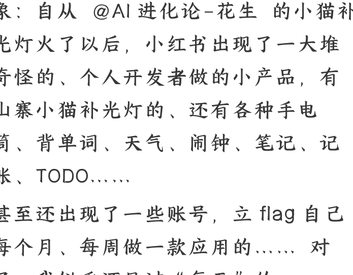
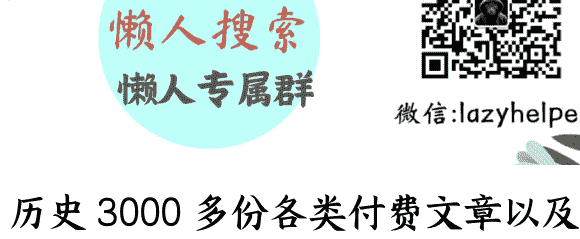

# AI 编程赛道第一课：Build a business, not an App

## 250214 生财精华
整理公众号懒人搜索 **懒人专属群** 独享
懒人微信 lazyhelper

相信很多朋友都发现了这么一个现象：自从 @AI 进化论 - 花生 的小猫补光灯火了以后，小红书出现了一大堆奇怪的、个人开发者做的小产品，有山寨小猫补光灯的、还有各种手电筒、背单词、天气、闹钟、笔记、记账、TODO......

甚至还出现了一些账号，立 flag 自己每个月、每周做一款应用的.......对了，我似乎还见过“每天”的。

他们的主要共同点有两个：

- 一、号称自己和小猫补光灯一样，不会写代码、只靠 AI、很快就做好了。
- 二、不赚钱。

为什么明明不赚钱，大家还趋之若鹜呢？

因为 —— 大多数人以为，做产品的唯一门槛是编程、AI 编程可以帮他们搞定。然而事实是，做产品的唯一的门槛是「洞察需求」，编程从来不是门槛。

我们所处的这个美好世界，并不需要第二个小猫补光灯和第 1 万个 TODO、记账、笔记、天气、闹钟、手电筒。我们要构建的不是一个产品，而是一门生意。

Build a business, not an App。

## 一、Build a business, not an App

先讲个我自己的故事。

2017 年，我在前东家工作，带领团队从 0 到 1，一年时间内做出来了一款千万级日活的输入法产品。产品主要来自口碑传播、自然流量、Google Play 商店官方推荐，并未消耗公司太多的推广费用。当时，我自己觉得很牛，也许你会这么觉得。

那一年，我竟然没有拿到公司的十佳团队或十佳员工！

我差一点就愤然辞职。不仅我自己觉得郁闷，当时还有很多其他部门的同事纷纷找我私聊，问我是不是得罪了老板。

我准备好了一封长信，义愤填膺地质问老板到底是怎么回事。老板马上给我打来了电话，耐心地给我上了这一课 —— Build a business, not an App。老板告诉我，我的身份不是普通员工，而是一个团队的领导者。虽然这个产品日活超过千万级，但是亏损严重。

一方面，成本很高，团队好几十号人呢；另一方面，产品基本没有收入，输入法产品很难变现（连广告都没啥位置可以放、更别提付费了，你见过有几个人为了输入法付费的？），至少我当时没有想到或者看到能够让产品盈利的希望。

作为团队领导者，做一款产品，你刚开始不盈利并没有太大问题，但你得规划一个逐渐走向盈利的路径吧？你得有一个长远而言的 Business Model 吧？但我没有。我连这个意识都没有。我只是不断消耗公司的资源，做出来一些看起来很牛的产品数据，满足自己的虚荣，却让公司不断在付出代价，看不到希望。

沟通完后，我用了一晚上来消化情绪，删除了辞职信。第二天，我开始认真琢磨怎么把产品变成一门生意，开始了新一年的奋斗。

第二年底，我成功地让团队盈利了，拿到了优秀团队，还获得了惊掉我下巴的大幅度的涨薪和股票激励。

此外，我还获得了一些无形资产：当时我就意识到，以后如果我出去找工作，似乎再也不需要写简历了——我和我团队的一些核心干将，已经在行业内积累了相当大的知名度，隔三差五都有好多猎头来松土。

我的故事讲完了。

不知道你怎么看待这一段故事？

也许，你很可能会认为我是被 PUA 了。从 0 到 1、一年做出千万级日活的产品，这样的经历在全行业内都很难复制。

但是我并不这么认为。我自始至终都非常感谢前公司，幸好它没有在 2017 年给我优秀团队。否则，我会成为一个巨婴，学不到 Build a business, not an App 的一课。这是让我成为今天的我的关键一课。

今天的我已经在经营着自己的公司，我时刻提醒自己：我们是来做生意赚钱的，不是来亏钱自嗨的。不管你什么日活月活，我就问你，没钱你怎么活？

在 AI 编程的帮助下，原本不会写代码的你可以每周（或者每天）做一个新产品，但如果这个产品是第 1 万个 TODO、记账、笔记、天气、闹钟、手电筒，没有 Business Model，你只是在自嗨而已。

Build a business, not an App。

怎么办？别急，不难。

## 二、新人构建 Business Model 最简单的方法

让我们回归到常识，做生意的本质，无非是“低买高卖”。

如果我们打算尝试用 AI 编程做产品赚钱，第一步，我们应该干什么呢？

很多朋友认为第一步是“学习用 AI 编程”。我的建议是，先别急着学 AI 编程，第一步你应该通过 Affiliate 卖别人的产品，跑通 Business Model。

至于 AI 编程，等你验证 Business Model 成立后再学也不迟。如果你团队有其他同学，你甚至可以不学。

### 步骤：

- 一、找到一个别人做的、有 Affiliate 合作伙伴功能（分销功能）的成熟产品。关键词：成熟产品、分销比例大于 30%。
- 二、通过你的方式，获取用户。方式包括投放广告、社交媒体推广等等。关键词：能批量复制放大。
- 三、测算收益。你是否能够三个月内盈亏平衡？比如，你本周花了 100 美元的流量成本，能否在 3 个月内，通过分销比例，赚回来这 100 美元？1000 美元呢？
- 四、做决定

  - 如果可以盈亏平衡，或者差得不多，那你就可以开始学习 AI 编程、或者开始组建懂 AI 编程的人了。你完全可以做一个和它类似的产品、稍微做出一些差异化和亮点，继续使用你的投放方式，赚更多。
  - 如果不能盈亏平衡，或者差得太多，请继续测试。要么尝试其他获取流量的方式、要么尝试投放其他的产品。

让我们举一个例子

https://looka.com/ 这款产品就很不错。（它的分销计划注册地址在这里 https://looka.com/affiliate-program/）。产品力方面，它是同领域的佼佼者，非常优秀；分销比例方面，它给出了 35% 的比例（行业中等偏上水平）、并且有一个很慷慨的 Bonus 奖励。根据官方测算，最好的情况下，当你帮它卖出的销售额时，你竟然可以分到 683，你赚了大头、它赚了小头。

你可以选择它，投入美元进行测试，看看是否能够赚回来 1000。比拼获取用户的效率，才是真正的比赛！写代码，只是迷惑外行的障眼法，会写代码的人很多，能赚钱的人很少。

请注意，在测试用户获取的时候，请不要选择“不可复制”的渠道，比如“发朋友圈、发 Twitter”。虽然它的流量获取看似成本很低，但是它无法复制、无法放大。

当你通过努力，发现自己可以通过别人的产品验证好你的低买高卖逻辑，那么就可以着手做自己的类似产品了。你可以学习 AI 编程，并且找到一些开源的类似产品来修改。

looka 这款产品是一款用 AI 做 logo 的产品，它的开源替代品是比较多的。请你找到一个 60 分的开源替代品，然后在 AI 编程的帮助下修改到 90 分，成为你自己的产品。例如 https://www.logo-creator.io/这就是一个开源的、60 分的 AI Logo Maker。它的源代码在这里 https://github.com/Nutlope/logocreator。

我了解到，咱们生财有术里，已经有不少小伙伴正在尝试用这样的方式在起步了。同时，如果我们留心观察广告投放平台，也会发现大量 Affiliate 链接的影子——很多的广告（尤其是 SEM 的长尾词和短视频平台的广告），并不是产品官方在投放，而是别人那种 Affiliate 在投。

## 三、新人构建 Business Model 的第二简单的方法

我们仍然从常识出发，做生意的本质，无非是“低买高卖”。

这个公式放大到极致：如果“买”是免费的，那哪怕“卖”1 分钱，也是赚。

是的，第二个方法是：**专注于可放大、可积累的免费流量**。只要你的流量是免费的，那无论赚多少钱，都是稳赚不赔。

**怎么搞免费流量呢？一句话总结** —— **找到平台的供需失衡点**。关键词：平台、供需失衡。

### 如果我们做的是「网站」

- 平台：Google 搜索引擎
- 方式：SEO
- 供需失衡点：某个词的搜索流量比较大、供给不足（搜索结果不能很好地满足用户需求 or 搜索结果不多）
- 举例：在 2025 年 1 月，因为 TikTok 下架，有海量的老外在 Google 搜索"RedNote"这个词，那个时候，这个词的 Google 搜索结果并没有太多有效的结果、并不能很好的满足用户的需求。因此，有一些聪明的、手快的朋友，在短短一两天内，上线了很多和 RedNote 相关的网站，包括帮老外在 RedNote 起中文名的产品、翻译 RedNote 的产品等等。由于供给稀缺，这一批网站在很短的时间内，出现在了 Google 搜索结果首页，从而获取到了可观的免费流量，完成了冷启动。

### 如果我们做的是「App」

- 平台：应用商店，包括 iOS App Store、Google Play
- 方式：ASO
- 供需失衡点：某个词的搜索流量比较大、供给不足（搜索结果靠前的产品做得烂 or 相关产品不多）

举例：2022 年，咱们生财有术的圈友@智华 在参加我的蓝海挖掘小航海时，通过这样的方式，找到了一个产品品类。某个搜索词有稳定的搜索流量，而当时所有搜索结果的产品都做得挺烂。他立即行动，当年就取得了不错的结果，未来几年保持增长，去年已经成为品类第一。上个月我和智华吃饭时，他告诉我团队已经有好几十号人了，年利润 8 位数。

### 如果我们做的是「内容」

- 平台：公众号、小红书、抖音、TikTok
- 方式：做一个持续抢热点的阵地
- 供需失衡点：某个偶然事件突然火了，有一瞬间的供需失衡机会窗口
- 举例：2025 年 1 月底，DeepSeek 火了。在公众号/抖音/小红书战场：第一批做 DeepSeek 教程、第一批做 DeepSeek 爱国小故事的人火了；在知识星球战场：第一批做 DeepSeek 星球的人火了，有的 DeepSeek 星球已经有过万人；在抖音直播战场：直播 DeepSeek、卖 DeepSeek 课的人火了。

误区：请注意，关键词是“持续”“阵地”。如果你没有阵地，你只能抢这一次的热点，明天的饭在哪儿根本不知道，那就不值得去做，你可以认为这个热点和你没有关系。

一个把热点变成阵地的成功例子：在 2023 年初，ChatGPT 刚刚火的时候，有一个聪明的开发者叫 Wong2，它创建的浏览器插件"ChatGPT for Google"，也火了，成功抢到了热点。但是，比他更加聪明和厉害另有其人：有另外一个团队，高价收购了这一款插件，并且成功把“热点”改造成了“阵地”——一款体验和口碑都超级好、也超级赚钱的产品，它叫 Monica，https://monica.im/。

### 总结

1. Build a business, not an App
2. 如果你没有想好 Business Model，那不要急着做 App。
3. 尝试构建 Business Model 无外乎是低买高卖，两种方式：一、先用别人的产品测试，你能否做到低买高卖 二、当流量免费时，无论卖多少钱都是低买高卖。
4. 真正的战场，不是比拼谁做 App 做得快，而是比拼获取用户的效率。无论是否有 AI 编程，这个道理从来没变过。

祝大家赚大钱！谢谢！

历史 3000 多份各类付费文章以及年费三千多的副业社群资源，见懒人专属群内分享！

付费群，白嫖勿扰！

懒人专属群更新记录：

[https://lazybook.fun/#/blog/record2](https://lazybook.fun/#/blog/record2)