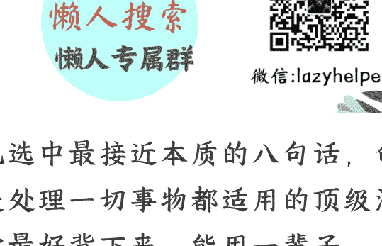

# 人类社会的本质是什么？

250214 知乎高赞

整理公众号懒人搜索懒人专属群独享

懒人微信 lazyhelper

毛选中最近本质八句话，句句都是处理一切事物都适用的顶级法则，

你最好背下来，能用一辈子。

第一句话，谁是我们的朋友？谁是我们的敌人？这个问题是革命的首要问题。正确归因的能力，是一个人真正清醒且能够进入人生上升螺旋的开始。透过表象看本质，抓住本质找规律，运用规律才能改变世界。这句话能成为毛选开篇的第一句话，就是因为这是一句无限接近于底层规律的话。原文里讨论的是阶级问题，放在生意里照样适用。谁赚我的钱，我赚谁的钱，这个问题的经营的首要问题。谁买单，谁就是我的客户。找到并满足客户需求的新方式，就是我们生意经营的方向。反向应用一下，同理，谁赚我的钱，我的需求就是对方核心利益的方向，那对方就是我可以借力、借势、借资源的对象。

第二句话，任何过程如果有多数矛盾存在的话，其中必定有一种是主要的，起着领导决定的作用，其他则处于次要和服从的地位。研究任何过程，如果是存在两个以上的矛盾的复杂过程，那就要全力找出它的主要矛盾，捉住这个矛盾，一切问题就迎刃而解了。这段话来自于**矛盾论**，现在大家都在热捧的马斯克的**第一性原理**，其实也有类似的意思，但远远不如教员的这段话深刻。我们人生的轨迹是由无数的选择串联起来决定的，而人的时间和精力是有限的，所以面对选择时，一定要认清矛盾的本质，分清主次关系，这是最重要的前提，没有之一。

第三句话，大方向虽然在一个时期中是不可变更的，然而大方向内在的小方向则是随时变更的，一个方向受了限制，就得转到另一个方向上去，一个时间之内，大方向如果受了限制，就连这种大方向也得变更了。**路径依赖**是我们成长过程中最大的陷阱。知识在有的时候其实也是个诅咒，就是你一旦知道了，就再也回不到不知道的状态。这两者的叠加就导致了大部分时候我们的人生是在惯性的作用力下发展。你以前在某个领域里的成就越大，这个惯性就越大。你习惯了某种思维，习惯了某一类方法，习惯了和某一些人打交道的方式，这些习惯会在无意之间把你推向连自己都察觉不到的错误方向。时代变化得很快，时时要提醒自己，不墨守成规，不固执己见，踩踩刹车，慢下来，才能在人生的岔路口上选对方向，否则你只会越错越远。

第四句话，击溃战对于雄厚之敌不是基本上解决胜负的东西，歼灭战则对任何敌人都立即起了重大的影响。对于人，伤其十指不如断其一指。对于敌，击溃其十个师不如歼灭其一个师。我们一生会遇到形形色色的敌人，一段该放但是放不下的感情，一个该竞争但是竞争不过的对手，一次该开始但一直拖延的任务等等。面对这些挑战，记住教员的教诲，一定不要打消耗战，而是要选择歼灭战，把一个长期的复杂的大目标拆解成一个又一个连续的、有足够把握能完成的小目标，把一个大战略拆解成一个又一个小的必赢之战。以小博大，靠的不是运气，而是步步为营的策略和执行力。

第五句话，读书是学习，使用也是学习，而且是更重要的学习，常常不是先学好了再干，而是干起来再学习，干就是学习。很多人现实生活中最大的问题就是思想上的巨人，行动上的矮子。这类人会给自己贴一个很避世的标签，叫做完美主义者，就是做什么事都希望准备得面面俱到以后才开始。但事实上是你只有在开始了以后，才能发现你在这之前做的 90% 的准备其实都是用不上的。背后的原因非常简单，就是你所做的所有看起来很重要的准备都是基于你过去的经验，但你接下来要做的却是个新事儿。所以绝大多数的问题只有在实践的过程中才能显现出来。于是最小代价最快实施才是你切入一个新的开始最重要的策略和原则。

第六句话，改造客观世界，也改造主观世界，改造自己的认识能力，改造主观世界和客观世界的关系。这段话听起来稍微有点绕，我把教员**实践论**当中的另一句话拿出来，放在一起，方便你理解。感性和理性两者的性质不同，但又不是互相分离的，他们在实践的基础上统一了起来。没错，两句话其实都是指向一个核心问题，就是如何处理主观和客观之间的矛盾。方法提炼出来，就是坚持学习，学习再学习。坚持实践，实践再实践。我们对于这个世界的认识和能力的提升，就是在学习和实践之间交替成长的，就像我们交替迈开左右腿走路一样，互相独立，但又完整统一，然后积跬步方能至千里。

第七句话，如果我们打不赢，不怪天也不怪地，只怪自己没有打赢。有的人在回顾自己失败的时候，全都是外在的客观原因，大环境不好了，遇到猪队友了，消费降级了，对手太强了，总之都是外界的问题，都是别人的问题，唯独他就不看看自己有没有问题，究其源头，其实就是这个人内心深处不接受、不承认自己失败这个事实。但失败有什么好丢人的呢？人间世事有几个常胜将军？你就记住了，所有那些我们改变不了的原因，都叫借口，都是理由。我们能改变得了的，才是面对失败归因的关键。接受失败，找出我们自身的问题，在这些内在的原因上下手，才能有更多赢的机会。

第八句话，十分急了，办不成事，越急就越办不成，不如缓一点，波浪式地向前发展，就同人走路一样，走一阵儿就要休息一下。急就会躁，躁就会错。急是心理上的，躁则是行为上的。你要知道，凡事都有他的动机，也有他的时机，你总是想提前解决问题，但事实证明，你心急了只会提前忧心，太早焦虑反而会让事情变得更糟。所以不管任何事情，一定要找到那个最适合你的节奏。是的，不要被任何人干扰。节奏这个东西没有最好的，也没有最坏的，只有最合适的。

最后额外送你一句精华总结版，我不做解读，点赞收藏下来，你可以慢慢品。实践出真知，矛盾是一切的源头，也是一切结束的关键。

历史 3000 多份各类付费文章以及年费三千多的副业社群资源，见懒人专属群内分享！

付费群，白嫖勿扰！

懒人专属群更新记录：

https://lazybook.fun/#/blog/record2