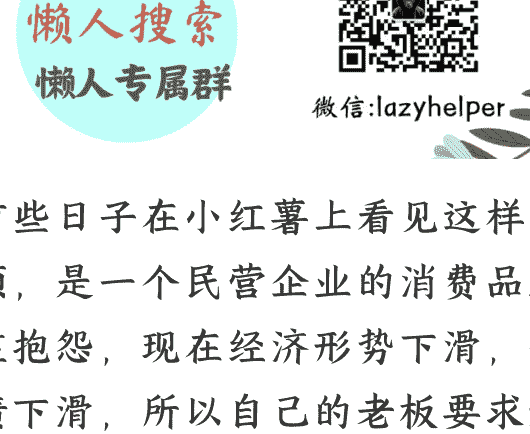

# 行业本质与工种带来的思考

## 250217 屠龙胭脂井

整理：公众号懒人搜索，[懒人专属群](#)独享
懒人微信：lazyhelper

我前些日子在小红书上看见这样一个视频，是一个民营企业的消费品牌的总监抱怨，现在经济形势下滑，销售业绩下滑，所以自己的老板要求她一个品牌总监，下场去做销售，为销售业绩负责。

她在思考要不要转型，或者是去找其他工作，但是她的困惑是找其他工作，是不是其他老板也这样做，或者说这样做是不是就是对的。

这个问题，激发了我很多的思考。首先我想起了一个故事。

这个故事是一年多以前，我有幸参加了一个企业家培训，培训中的一个演讲嘉宾是香飘飘集团的董事长蒋建琪。

蒋总讲了他的创业经历，讲了香飘飘曾经卖出了一亿杯纸杯奶茶的辉煌经历。然后他讲到，随着奶茶店的兴起，香飘飘面临了转型的困境：纸杯奶茶粉的奶茶，再也卖不出去了。

这个时候，就有人给他建议，让他利用香飘飘的品牌力，去做香飘飘的奶茶店。

蒋总对这个建议，反复思忖，他想了好几天。

最后他说：“我创业 20 多年，在国企改制的时候，带着一个亏损的罐头工厂，转型成饮料工厂，做出了香飘飘。”

这 20 年，我干的是食品工业。食品工业我是懂的，如何管理食品工厂，如何找到瓶装饮料的销售渠道，如何把工厂做到最高的食品工业的标准。

但是，奶茶店是另一个行业。看似都是卖奶茶，但是他们是服务业，而我们是食品工业。

我要转型，必须在食品工业内转型，而不是把整个企业弄到一个我不熟悉的行业。”

因此，他后来的转型，就是收购了一个柠檬茶品牌，叫“兰芳园”，在瓶装饮料这个赛道，进行品类创新：

随着时代的发展，把香飘飘那种不健康的饮料，改成健康的低糖的柠檬茶，守住食品工业的高标准，守住瓶装饮料的销售渠道（也就是维持好他以前的旧关系：进入超市的货架渠道、餐馆的饮料柜子等等这些瓶装饮料的销售渠道）。

他明白，在自己 20 年的创业过程中，积累的竞争优势，就是瓶装饮料的生产，和占据瓶装饮料的销售渠道（超市货架、餐馆饮料柜、无人售货机饮料柜等)。

自己的劣势是产品和品牌再也不适应时代的发展了：所以他要搞新的适应时代发展的品牌和产品。

他也深刻明白，奶茶店的流程与食品工业完全不同：要流程化门店的制作和销售。使得每一杯的奶茶，虽然是现场制作，但是能保障口味、卫生和感知上的稳定性。

而且还要服务得快，门店多————
这完全是另一套东西。

所以香飘飘在他的带领下，正确地转型了：而不是跟风开奶茶店，贸然进入一个自己不懂的领域。

讲完蒋总这个故事，我想大家都明白了：我们看事情，要看一个事物的本质。

虽然大家都是卖奶茶，但是蒋总他们在食品工业，奶茶店在服务行业：不是一个工种，也不是一个行业。

下面我再给大家讲一个故事。这个故事是我自己的亲身经历。

去年冬天，我在思考要不要赞助深圳时装周的 Vogue 活动的时候，深圳时装周的对接小伙伴来 pitch 我，说他可以在 Vogue 活动的时候，找几个大网红来销售我们的产品，保障我的销售 ROI（投资回报率）能达到 3 倍：

也就是我给他们的活动每投一块钱，他们的网红能蹭 Vogue 的流量，帮我赚回来 3 块钱。

> “小伙子，我真的不是不尊重你们，也不是看不起你们，只是你们时尚行业，与我们电商行业，是两个行业。”

跟上面香飘飘的道理一样，虽然我们都卖美妆，但是时尚杂志本质是广告行业：

通过明星和漂亮的模特给人种草，然后去拉商单广告，让品牌商去投各种平面广告，或者整合营销的广告。

但不论是哪种广告，时尚产业的核心是广告业：时尚是隶属于广告业的。

电商行业的本质是零售业。零售行业有零售行业的专业技能一如何进行销售能打动个体消费者，如何通过说服工作，帮助她下单，完成这个销售周期，并且做好售前和售后工作。

在我看来，一个品牌，有很多不同的工种，每个工种的分工是不一样的：

- **品牌**是空军：品牌的任务是通过搞各种活动，掀起巨大的风浪，让消费者都知晓这个品牌，并且是花费越少越好。

这个工种就像战争中的空军一样：用最少的炮弹，轰炸出最好的结果。
所以品牌这个工种的人，最好来自广告业和时尚行业。

- 公关是空军的雷达和辅助：公关的作用，是在品牌轰炸的过程中，不要轰错目标，且万一轰错了目标，赶快进行补救。
当品牌蹭热度或者掀起话题的时候，公关必须从各个角度想到，有没有无辜的人受害，会不会被人利用舆论。
所以公关这个工种的人，最好来自新闻行业和舆论行业。

- **营销**是地面坦克和重装甲部队：营销的作用是根据品牌的轰炸，赶快制定地面迅速推进的机制：如何把品牌的轰炸结果进行固化，用多大的打折力度，动用哪些经销商和网红。
就像坦克部队一样：迅速推进和重型推进。

- **销售**是陆军作战队：就像每个陆军战士要负责把每个街道的巷战打赢一样，每个销售要负责拿下每一个真实的客户。否则空军的品牌轰炸或者是坦克部队的推进，都没用了。

- 售后和客服是陆军辅助：在地面部队，还需要有很多辅助。就像打仗得有战地医院一样，我们销售也得有客服，这些客服就像战地医院一样：救死扶伤。把陆军的失误全部弥补上。

所以上面这两个工种，需要找有实际销售经验、以及能够完全与人打交道的人。就像陆军不能找怕血的人一样，销售也不能找羞涩的人。

- **Communication**在空军与坦克兵之间做通讯兵。
- **市场**是海军陆战队：核心客户群就是领海，守住领海的外围，并且帮助陆军。
- **咨询**就是作战指挥室：帮助指挥官来决定如何排布兵种。

从这个层面来说：整合营销，就是当一个三军统帅，进行排布。

每一个 CEO 都是三军统帅，每一个兵种的领导都必须是这个兵种最优秀的人：然后我们根据自己的资源和目标，对各个部门的目标、任务和执行难度都进行排布。

这样才是整合营销：你要先认识到人的特征和专业，认识到他们来自不同的工种，来自不同的背景，长处不一样，作用不一样。

虽然都是卖美妆，但是有些人是来自广告业，有些人是来自零售业，有些人是来自舆论行业，有些人来自传播行业，你要把这些的专长整合起来。

那么我们就回到一开始的问题：品牌总监能不能为销售业绩负责？不能

她原本是一个空军指挥官，她只能为轰炸效果负责：地面战争需要陆军的指挥官。

同样地，时尚杂志的小伙子，能不能为我的销售负责 ROI=3 的回报率呢？不能，他虽然是广告行业的，但是广告行业的专业是卖广告，不是直接卖美妆。

业绩这件事，虽然说确实跟战争一样，最后会打得血糊糊，大家可能在大决战时期得一起上——
———但是这个最终的血糊糊，不能让我们忽略战略计划：我们要用什么样的工种，打出什么样的结果，必须跟这个工种，这个行业的本质有关。

一个品牌商，是一个综合军队，最优秀的士兵和指挥官，来自不同的行业，我们必须把他们有机地组合在一起，而不是一着急就让空军下场干陆军的活儿。

所以，我们必须明白，表面看似一致的东西，实质并不一致：就像都卖奶茶，不一定是一个行业。我们都卖胶原蛋白，也不都是一个行业工种：注射剂是医疗美容行业，而化妆品是奢侈品和消费品行业。

每个行业里面，都要寻找适合这个行业的综合工种。

那么回到最初的问题：是不是所有民企的老板都要求品牌总监为销售业绩服务，我是不是应该转型呢？

答案是：良禽必须择木而栖。如果一个老板不能先认知到工种不同，再认知到自己是三军统帅，你转型也没用。

整合营销，是把三军统帅在一起：而不是随便乱打，让空军到地面上拽手雷。

这点对于我们每个人的职业选择，都是一个重要的着眼点。

 

历史 3000 多份各类付费文章以及年费三千多的副业社群资源，见懒人专属群内分享！

付费群，白嫖勿扰！

### **懒人专属群更新记录：**

[https://lazybook.fun/#/blog/record2](https://lazybook.fun/#/blog/record2)