## 如何才能高效地产出 AI 类视频

250217 生财精华
整理：公众号懒人搜索，懒人专属群独享
懒人微信：lazyhelper


现在很多圈友做类似达人秀变装类型的视频，可能需要 1 个小时甚至更长时间才能做好一条视频。目前我也在做达人秀这个赛道，我通过自己总结的这套工作流可以做到平均 15 分钟左右产出一条视频，好的情况下可以做到 10 分钟左右可以产出一条。至于视频的效果，口说无凭，上视频展示~

如果看到这里，如果你认同我产出视频的效果，且仍然对我的整套工作流感兴趣的话，那么下面我将介绍整体的思路和所用到的工具

## 一、工作流整体思路及需要的工具

- [ ] 工作流拆解

如果想要提升自己的工作效率，就需要从两方面下手：1、节省不必要的时间；2、并发式工作（多项工作同时进行）。因此我的整体思路是这样的：

首先拆解我的对标账号，拆解它的常规模板，一般情况下会发现达人秀变装视频是由两到三段的变装 + 评委镜头 + 一个跳舞或者其他的才艺表演所组成的；

### 分析用到的道具：

**画图部分：**考虑到追求效率，肯定是没有功夫在 MJ 上面一个个 roll 图，那么更具稳定性的选择肯定是 flux+lora 的组合，一般情况下我会一个提示词出八张图，里面总有一张是能用的，挑出来就好了。需要变装的部分就要配合即梦做一些微调，视频的品控就基本上能保证

**视频部分：**变装部分肯定是由 runway 搞定的，跳舞部分 runway 生成的就比较生硬，需要用其他 AI 模型来实现。可以考虑可灵、海螺、智谱清影等等，这里我选用了智谱清影，便宜效果也说的过去

**剪辑部分：**目前是采用了之前 Gary 教练的卡标签的逻辑

除了上述的这些大家都不陌生的一些工具和手法，帮助我提效的关键点还有两个，就是我的 flux 提示词智能体和 runway 提示词智能体，这两块极大的提升了我的整体工作流效率。（具体操作流程我们后面去讲）

### 并发的逻辑：

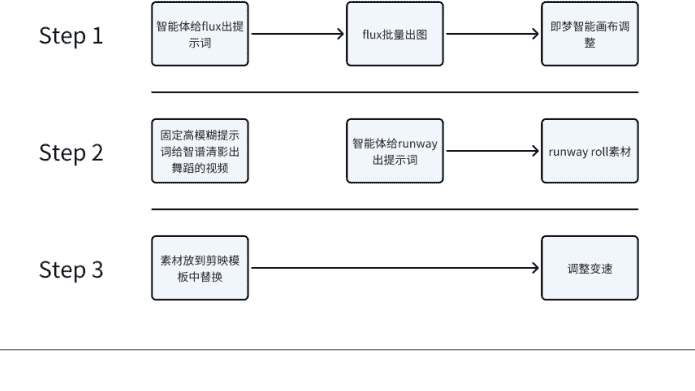

利用好 roll 图和 roll 视频的等待时间，实际上可以同时做这三步，就相当于做三个视频

## 二、所需工具

**绘图模型：**Flux（本地或者云算力）；
**视频模型：**runway、搭配一个其他效果好的视频模型；
**临时存储空间：**Droper（我是 mac，不知道 win 有没有。这个很好用，待会我们讲具体操作流程的时候再讲具体用法）；
**可以做 Agent 的平台：**GPTs，Dify，ChatBox，Coze 啥的都行

## 三、具体操作方法：

### 文生图部分：

#### （1）文生图提示词智能体的打造

想必大家很多人都是用多模态模型进行的提示词反推，如果没有的话准备过提示词库也是可以的。这部分的内容其实都是我们给大模型准备智能体设定的精华。在有反推图片的上下文的对话里或喂给模型资料后，你可以这么问：

请你仔细的阅读我们之间的对话，我给你的照片都是油管爆款视频的一些截图，请你在其中找到共性，并总结成 prompt 返回给我

这种情况下，大模型会给我们返回出一些它总结出来的图片的共性，再根据我们的场景需求进行调整，就可以产出一个批量输出 flux 的提示词的智能体。

当然，如果有小伙伴跟我一样在自己串 API 去做这件事儿，由于其实我们规定的已经很具体了，留给 AI 发挥的只有让它自己进行创意加工。所以不需要特别强的性能的模型（比如说，现在大家天天挂在嘴边的 deepseek-rl，泛化太强了，天天往原子量子上扯），只要一些好用的国外大模型。比如说 Claude，去找一些便宜的中转 IP 用就 OK，因为这个提示词生成还是挺费 token 的，动不动就上万的 token。deepseek-v3 也是个不错的选择，便宜大碗。

通过整理和手工微调，我得到了这样一段提示词：

你是一位专为 AGT（美国达人秀）舞台创作变装表演提示词的 AI 助手。您的任务是生成三个连续的、相互关联的场景提示词，每组包含三个提示词。请严格遵循以下规则：

##### **技术规格要求：**

**相机参数：**每个提示词开头需自然融入以下参数:

Shot on [相机型号], [镜头参数], [光圈值],
[快门速度], [ISO 值]

###### 画面构图：

始终保持竖屏构图，针对手机屏幕优化。

表演者占据画面高度的 4/5。

所有场景均在舞台上发生。

出场人物为两位女生。

###### 场景序列要求：

**场景 1：初始登场**
双人优雅站姿，面向前方。

着装统一，身着礼服。

**场景 2：视觉转换**
一人保持场景 1 的形态。

另一人呈现一个具体的非人物元素（如常见物品）。

保持色彩统一。

**场景 3：最终呈现**
仅剩一个人物。

完成主题转化，视觉效果统一。

呼应初始色调。

###### 场景必备元素：

表演者位置：明确描述位置（左、右）。

服装细节：详细描述服装设计。

灯光与特效：包含 AGT 特有的舞台元素（蓝色灯光、射灯、烟雾效果）。

舞台氛围：描述背景和空间关系。

###### 写作规范：

使用描述性的现在时语言。

禁止使用变化过程词汇，仅描述可见内容。

保持与原始服装的颜色一致性。

包含专业摄影术语，确保单句流畅性。
输出中英文双语版本。

示例输出：

### # Scene I: 初始登场

##### 中文提示词：

Shot on RED RANGER MONSTRO 8K VV,
Cooke S7 50mm T2.0 定焦镜头，ISO 800，快门速度 1/50，竖屏构图，表演者占据画面 4/5 高度，左侧表演者身着纯白丝绸 V 领晚礼服，右侧表演者身着水晶镶嵌白色亮片深 V 礼服，两人黑发飘逸，佩戴水晶耳坠，双手优雅交握，AGT 标志性深蓝色聚光灯照射，舞台烟雾营造层次感，镜面地板反射戏剧性灯光，超高清画质，电影级景深。

##### 英文提示词：

Shot on RED RANGER MONSTRO 8K VV,
Cooke S7 50mm T2.0 prime lens, ISO 800, 1/50 shutter speed, vertical composition with performers filling 4/5 frame height, left performer in pristine white silk V-neck evening gown, right performer in crystal-embedded white sequined plunging neckline dress, both with flowing black hair and crystal drop earrings, interlocked hands in graceful pose, signature AGT deep blue spotlight beams, theatrical haze creating depth, mirror floor reflecting dramatic stage lighting, ultra HD quality with cinematic depth of field.

### # Scene 2: 视觉转换
##### 中文提示词：
Shot on RED RANGER MONSTRO 8K VV,
Cooke S7 50mm T2.0 定焦镜头，ISO
800，快门速度 1/50，右侧表演者保持优雅站姿，身着亮片礼服，左侧舞台空间被漂浮的水晶樱花填满，数千片白色至粉色花瓣在空中旋转，纯净的光束延伸至天花板，悬浮的水晶碎片捕捉聚光灯，戏剧性烟雾效果营造层次感，镜面地板反射多重光源，舞台射灯穿透梦幻场景。

##### 英文提示词：
Shot on RED RANGER MONSTRO 8K VV,
Cooke S7 50mm T2.0 prime lens, ISO
800, 1/50 shutter speed, right performer maintaining original elegant pose in sequined gown, left stage space filled with ethereal floating crystal cherry blossoms, thousands of illuminated white-to-pink petals swirling through air, pure light branches reaching towards ceiling, suspended crystal fragments catching spotlight beams, dramatic fog effects creating layered depth, mirror floor capturing multiple light sources, theatrical spotlight rays piercing through the ethereal display.

#### Scene 3: 最终呈现
##### 中文提示词：
Shot on RED RANGER MONSTRO 8K VV,
Cooke S7 50mm T2.0 定焦镜头，ISO
800，快门速度 1/50，画面中心为右侧表演者，身着白色至粉色渐变礼服，礼服上镶嵌水晶樱花图案，从上半身延伸至裙摆，漂浮的发光花瓣融入面料层次，水晶枝条形成有机皇冠结构，周围空间充满旋转的花瓣和光碎片，舞台烟雾营造梦幻氛围，戏剧性背光勾勒出优雅轮廓。

##### 英文提示词：
Shot on RED RANGER MONSTRO 8K VV, Cooke S7 50mm T2.0 prime lens, ISO 800, 1/50 shutter speed, spectacular center-frame composition featuring right performer in transformed white-to-pink gradient gown with embedded crystal cherry blossom patterns cascading from bodice to floor-length hem, floating illuminated petals incorporated into fabric layers, crystalline branches forming organic crown structure, surrounding space filled with swirling petals and light fragments, theatrical fog creating dreamy atmosphere, dramatic backlighting defining elegant silhouette.

将提示词填写到如下位置（以 ChatBox 为例，其他工具同理）：


搞定这些之后，你直接在对话框里面输入“请帮我生成一套创意”点击回车，就会发现后面的活儿 AI 就都帮你搞定了：

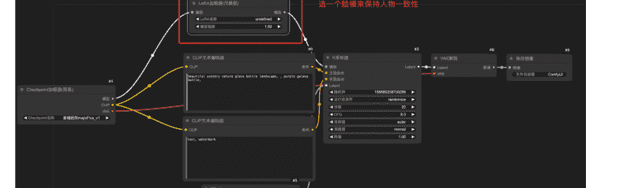

好的，这里是另一个全新的创意，确保出场的都是女生，并且在场景 3 中只有一个人物，同时使用与其他可爱的小动物相关的元素。

### **Scene 1:**

**中文：**
Shot on Nikon Z6 II, NIKKOR Z 50mm f/1.2 S lens, f/2.0, 1/60 shutter speed, ISO 400, elegant two-performer vertical composition filling 4/5 frame, left performer in a soft mint green dress with frog prints, right performer in a matching mint green outfit with a fitted bodice and fluffy skirt, both with playful hairstyles adorned with colorful lily pad clips, standing side by side with hands on hips, signature AGT deep blue spotlight beams illuminating the stage, soft mint green and white confetti falling from above, mirror floor reflecting their vibrant energy, ultra HD quality with cinematic depth of field.

**英文：**
Shot on Nikon Z6 II, NIKKOR Z 50mm f/1.2 S lens, f/2.0, 1/60 shutter speed, ISO 400, 优雅的双人竖屏构图占据画面 4/5，左侧表演者身着柔和的薄荷绿色裙子，带有青蛙图案，右侧表演者则穿着相配的薄荷绿色服装，合身的上身和蓬松的裙摆，二人发型俏皮，头饰用多彩的荷叶夹装饰，双手叉腰并肩而立，AGT 标志性的深蓝色聚光灯照亮舞台，柔和的薄荷绿色和白色纸屑从上方飘落，镜面地板反射出她们充满活力的气息，超高清质量与电影般的景深。

#### （2）Flux 生图

这一步很简单，上一步的提示词稍微扫一眼没什么问题批量堆就可以了，等着一起接图。不会用 comfyui 的朋友可以看往期的 comfyui 航海的手册，里面教的挺详细的。其实用最简单的那个初始的工作流挂个 lora 就能解决问题，类似下图：


线上的有这些：

**端脑：** https://cephalon.cloud/#/aigc
**星鸾云：** https://www.xingluan.cn/home
**OnethingAI:** https://onethingai.com/login?redirect=https%2A%2F%2Fconsole.onethingai.com%2Fdashboard
**仙宫云：** [https://www.xiangongyun.com/register/ULFWLZ](https://www.xiangongyun.com/register/ULFWLZ)

这些都是按小时计费的，功能大同小异，大家看哪个便宜就薅就完事儿了

#### （3）用即梦进行一致性的微调

就算再牛逼的提示词 +100% 稳定的 lora，也不可能保证每句提示词都能对上我们想要的画面。这时候主要是用即梦里面的【智能画布】中的【抠图】、【局部重绘】还有【智能消除】这几个功能，能保证画面中有可以连贯产生动作的元素，来使得后面的图生视频步骤更为丝滑。一般情况下，我都是画三张图，我自己再用即梦修一张。比如下面这组

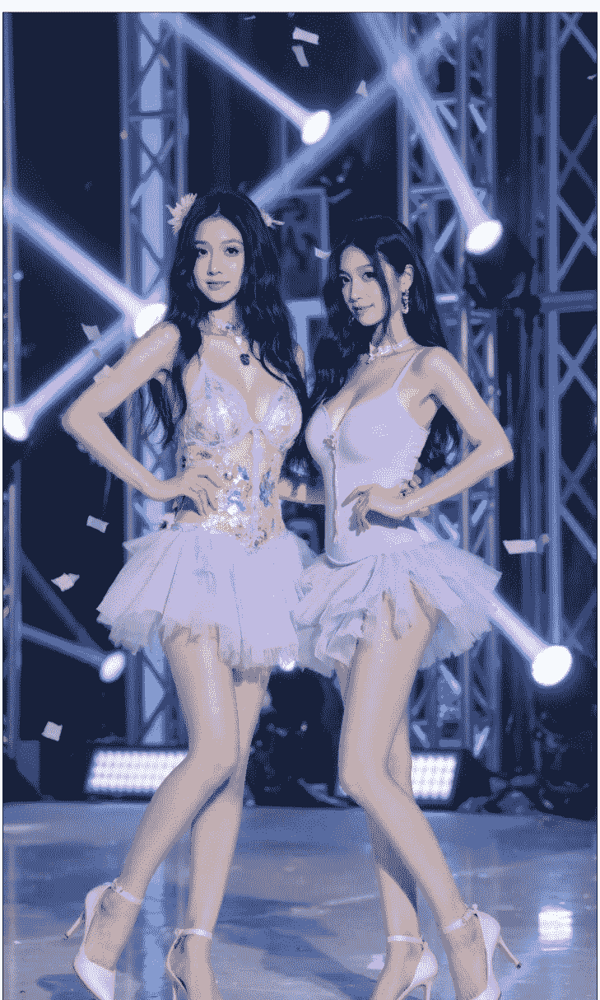

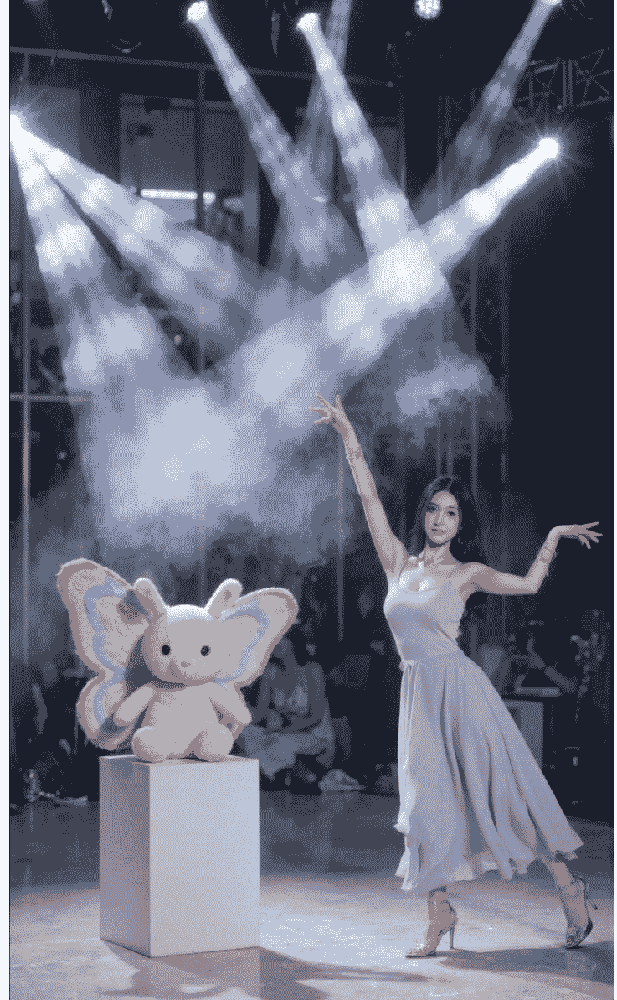

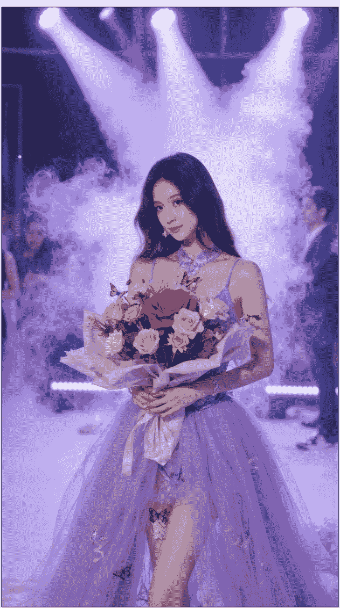

B1 修的图
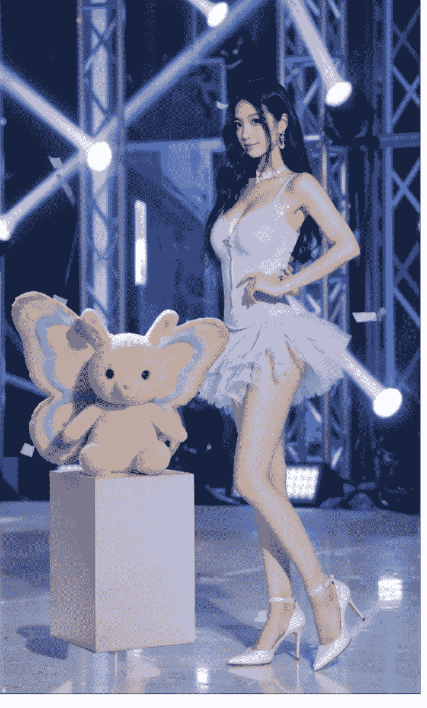

这样这四段素材的顺序就是 A1→B1，B1→A2，A2→A3，A3 再生成一段跳舞的，这四段就够做一条视频。大家看一下我的图就大概能明白是什么意思了

## 四、图生视频部分：

#### （1）泛化提示词生成视频：

如果有像我模板里面所提到的跳舞环节，就可以上传图片加上一个比较泛化的提示词，比如说不想让视频中的人物有太激烈的动作，就直接在提示词一栏里面写“原地跳舞”即可，一般情况下在清影上面 roll 四个视频，总有一个是我们能用的。之所以写原地跳舞，是因为：

##### 描述够泛化

"原地"两个字限定了动作强度，进一步提升生视频的成功率，防止大的动作幅度导致整体画面崩坏

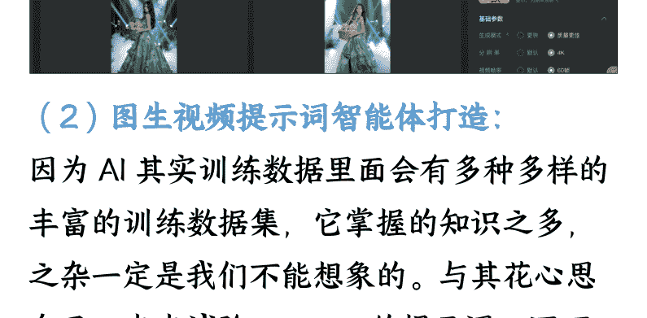

#### （2）图生视频提示词智能体打造：

因为 AI 其实训练数据里面会有多种多样的丰富的训练数据集，它掌握的知识之多，之杂一定是我们不能想象的。与其花心思自己一点点试验 runway 的提示词，还不如交给 AI 来把控。而且我们能描述出来的动作种类还不一定能比 AI 多。因此，在这种情况下，我们写一个提示词来限制 AI 产出的 prompt 就显得非常重要，我写这个 prompt 的思路如下：

描写动作的提示词不用考虑任何的画面描述，只描述动作就 OK

为了能让 runway 更方便的理解，不要让提示词里面出现任何形容词

动作要新颖丰富一点，我不希望观众出现审美疲劳

通过这么长时间的使用后，我发现 runway 的识别能力有限，所以，提示词一定要简洁，只关注关键的动作

通过这个思路，我总结了如下提示词：

你是一位精通 Runway 视频生成模型的专家，能够通过提问的方式帮助设计适合 Runway 生成的 AI 视频动作。请基于 Runway 的模型能力，仔细思考并输出中英文双语的提示词。具体要求如下：

**动作设计：**图片已生成，仅需设计动作，无需涉及场景、人物或服装描述。

**简洁描述：**提示词中避免使用形容词或比喻，动作描述应简练且易于 Runway 模型理解。

**默认设定：**若无额外信息，默认主体为单人。

**动作丰富性：**设计动作应炫酷且多样化，避免观众审美疲劳。

**分析说明：**每次输出提示词后，需用中文分析其设计原因及是否适合 Runway 识别。

**首尾帧限制：**图 1 为首帧，图 2 为尾帧，动作设计需避免转圈。

**完整句子：**提示词需以完整句子形式呈现，避免单词 + 箭头的组合。

**简洁关键：**Runway 识别能力有限，提示词应简洁，仅描绘关键动作。

懒人微信：lazyhelper

将提示词填写到如下位置（以 chatbox 为例，其他工具同理）：

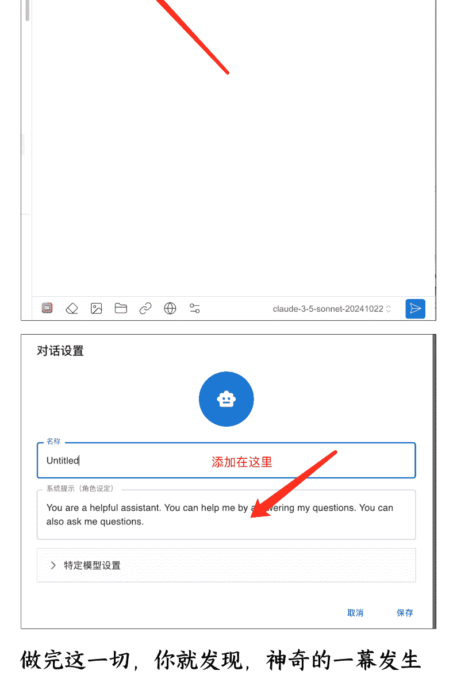

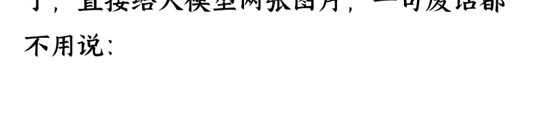

做完这一切，你就发现，神奇的一幕发生了，直接给大模型两张图片，一句废话都不用说：

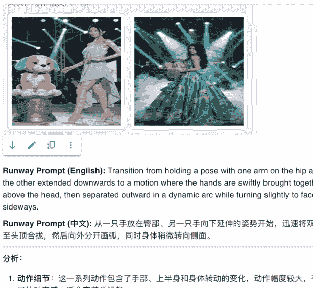

得出来的提示词拿了直接用！！再也不用想破大天的去研究动作了！！！
通过这个方法生成的视频整体的可用度非常高，一般情况下 4 次以内就能搞定一段素材，如果实在抽不出来，记得重新生成提示词或者换图，大概率就是图之间的差距太大没法衔接。当然有些时候生成的 prompt 也会出现 runway 没法识别的情况，但是 runway 出一些还不错的新颖动作，也算是因祸得福了。
这边还需要注意的一个点是，这里必须要用多模态的模型，像是 deepseek-R1 这种推理模型就不要想了，他没有识别图片的能力，虽然官网上是可以识别，我怀疑是官方用了什么 OCR 技术的替代。目前测下来效果最好的是 Claude，gpt-4o 也能凑活用

公众号懒人搜索_懒人专属群分享

懒人微信：lazyhelper

一般情况下，我们精挑细选出来的图 + 我们限制 AI 输出出来的动作提示词能出的视频都不会很差，即使 runway 没有按照提示词生成对应的视频没，但是效果也都还不错。极特殊的情况下，有可能会出现 roll 不出来的情况，连续抽 3-4 抽如果没有抽出来想要的东西，那就是触及到 runway 的模型边界了，不要纠结，直接再去智能体那里再拿一个提示词就可以了，保准很快的就能抽出来你想要的效果

剪辑部分就不用说了，详细的可以去看 gary 教练的高手领航，里面有非常好的拆解

Mac 用户有福了，我也是 mac，所以我也主要分享的是 Mac 的提效小软件

Dropover


使用方法可以看这个视频：

```plaintext
https://www.bilibili.com/video/BVljh41lw7Ey/?spm_id_from=333.337.search-card.all.click&vd_source=a9024dda82901371fb77cc886e69f13b
```

一般情况下我就把它当作一个临时空间，把我要用的素材都放到里面，用完 X 掉就 OK

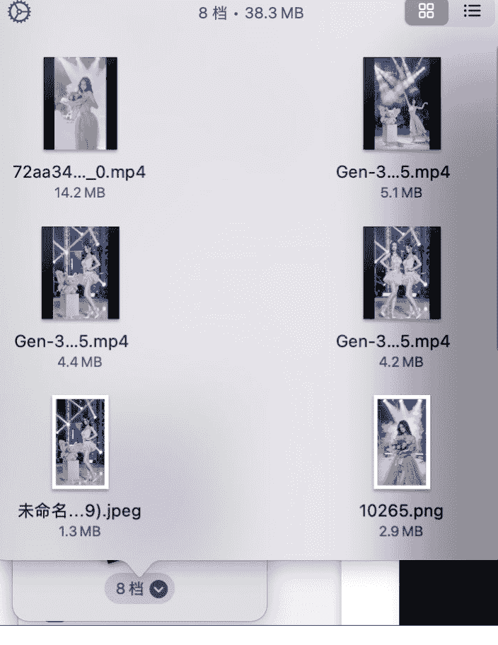

这个软件万能的淘宝就几块钱。


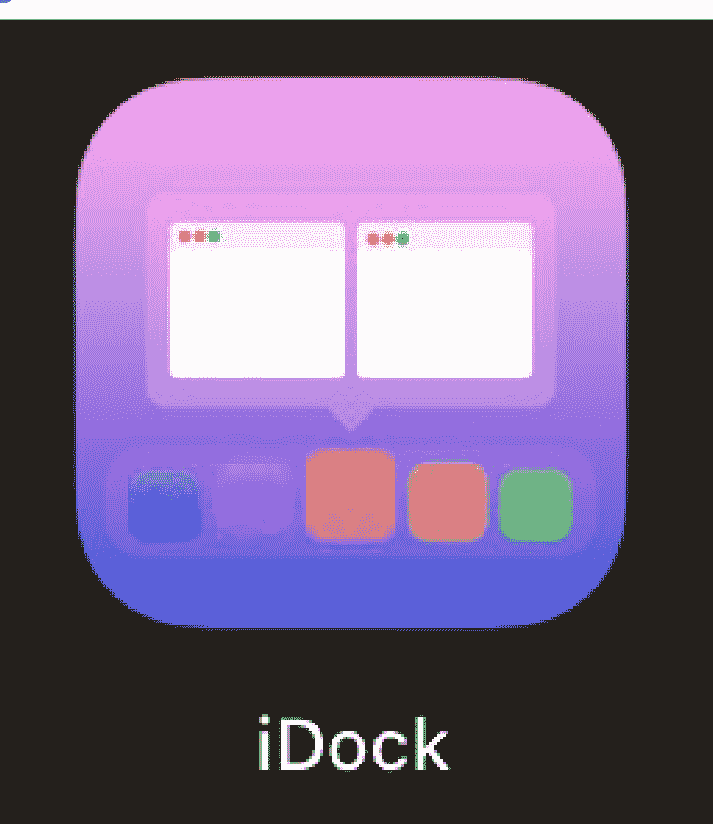

这个软件是免费的，直接 App Store 就能下载到，按照官方教程（教程链接：懒人微信：lazyhelper
https://www.bilibili.com/video/BV1dE42Ic7V4/?spm_id_from=333.337.search-card.all.click&vd_source=a9024dda8290137lfb77cc886e69f13b）弄好之后，鼠标移到你程序坞的程序图标的时候你就会发现能看到这个软件所有窗口的缩略图，压缩了寻找某一个特定窗口的时间

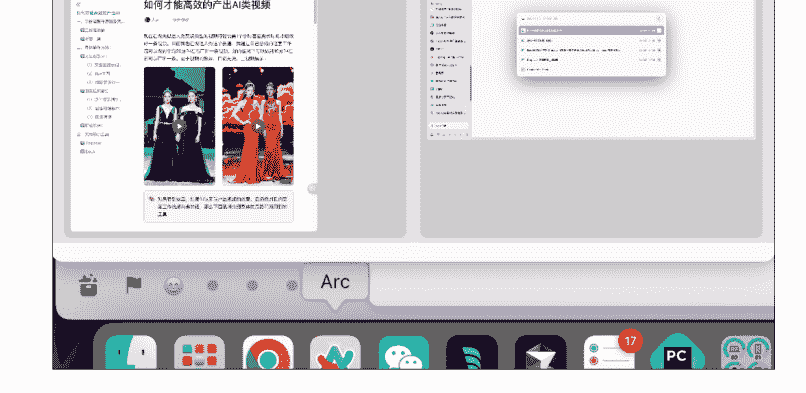

## 四、总结

如果你能熟练的搞定我这一整套的流程，你就会发现剪辑这种变装类视频比喝水还简单，这个是我今天早上做的视频，几乎是 15 分钟一条。大家还不赶紧用起来！

| | **文件名** | |
|---|---|---|
| | 0206 (6)_副本 7.mov | |
| | 0206 (6)_副本 8.mov | |
| | 0206(6)_副本 16.mov | |
| | 0206 (6)_副本 17.mov | |
| | 0206(6)_副本 18.mov | |
| | 0206 (6)_副本 19.mov | |
| | 0206(6)_副本 20.mov | |
| | 0206(6)_副本 21.mov | |
| | 0206 (6)_副本 22.mov | |
| | 0206(6)_副本 23.mov | |
| | 0206 (6)_副本 24.mov | |
| | 0206(6)_副本 25.mov | |

后面我可能会进一步的上自动化，到时候如果有什么感悟再跟大家分享，祝大家早日开通 YPP!! 🎉🎉

> 懒人微信：lazyhelper


历史 3000 多份各类付费文章以及年费三千多的副业社群资源，见懒人专属群内分享！

付费群，白嫖勿扰！

懒人专属群更新记录：

```
https://lazybook.fun/#!/blog/record2
```