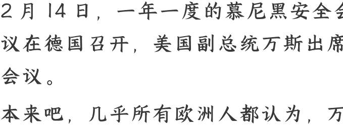

# 美国副总统大骂欧洲，西方联盟要破裂？

**250218** 文/卢克文工作室嘉宾 **星海舰长**  
整理：公众号懒人搜索，[懒人专属群独享]  
懒人微信：lazyhelper

2 月 14 日，一年一度的慕尼黑安全会议在德国召开，美国副总统万斯出席会议。

本来吧，几乎所有欧洲人都认为，万斯会对特朗普的俄乌停战方案进行一个正式通报，然后表态不放弃乌克兰。但万万没想到的是，万斯基本没咋提俄乌问题，而是贴脸开大，把整个欧洲都骂了个狗血淋头。

演讲结束后，整个欧洲都炸了，《卫报》称之为“抠脚丫式外交”，德国国防部长更是斥责万斯的发言让他“怒不可遏，恶心呕吐”。

那么，万斯到底说了啥？能引发欧洲这么愤怒？

万斯不愧特朗普钦点的副总统，口才和气场都是一流，整个演讲洋洋洒洒 19 分钟多，其中的核心观点主要有两个。

第一个观点，欧洲白左意识形态，已经把欧洲民主严重摧毁。估计欧洲人听了都一脸懵，我们竟然不民主？没想到万斯毫不留情，一个一个举例，把欧洲人身上的遮羞布全撕了。

万斯说：令我震惊的是，一位前欧盟委员最近上了电视，他对罗马尼亚政府刚刚取消整个选举感到高兴。
万斯说的，是去年罗马尼亚选举作废的事。去年 11 月 24 日，罗马尼亚大选第一轮结果出炉，结果一匹超级大黑马横空出世，民意支持度只有不到 1% 的极右翼杰奥尔杰斯库，竟然以 22.94% 的得票率高居榜首。

但是，宪法法院强力介入，说境外（包括俄罗斯）干涉了大选，所以选举无效。选不出想要的人，就宣布选举作废，这能算是民主么？万斯用罗马尼亚这个引子，真正想抨击的，是欧洲白左势力，打着民主的由头搞专制的事情。
比如，白左支持堕胎，而右翼反对堕胎。有个英国退伍军在堕胎诊所 50 米外的地方谴责堕胎，啥也没干，就是谴责了一下，就被警察抓了。这能算民主么？

还有德国，万斯痛批德国的移民政策。就在万斯演讲的前一天，一辆汽车在慕尼黑撞向了人群，造成至少 28 人受伤。嫌疑人为一名 24 岁的阿富汗移民。他以寻求庇护的身份来到德国，但避难申请被拒绝了，但并没有被驱逐出境，而是根据“宽容”保护规则留了下来。

在万斯看来，如果不是你们圣母心泛滥接纳难民，怎么会有这种事情？

万斯更深层的含义是，明明民众都担心移民带来的袭击，你们欧洲政客怎么还一个劲地往里面放难民呢？这难道就是民主？

除此之外，万斯还拿欧洲“言论自由倒退”说事，他举了个很典型的例子：

“美国民主都能挺过格蕾塔·通贝里（环保少女）十年来的批评，你们也能经受住埃隆·马斯克几个月的批评。”

这事指的是马斯克上个月和欧洲政要的论战，借一起袭击事件，指责德国总理朔尔茨是“无能的蠢货”，还借着英国首相斯塔默担任总检察长期间，发生的儿童性虐待丑闻（凶手以移民为主），攻击斯塔默是“强奸案件的同谋”。

结果自然引发欧洲的强烈不满，德国副总理哈贝克要求马斯克“不要插手德国民主”，斯塔默则指责马斯克在搞“政治肥皂剧”。

现在万斯提起这个事，显然是在力挺马斯克：你们老欧洲太双标了，环保少女骂美国那么久都没事，马斯克才骂了你们几句，就受不了了？

最后万斯总结：欧洲的威胁不是俄罗斯，不是中国，而是来自内部的威胁——欧洲从其一些最基本的价值观中后退。

虽然国内一些媒体大肆宣扬“万斯说欧洲的威胁不是中俄”这一说法，但这其实就是不折不扣的断章取义，不要以为万斯是在为中俄说好话，万斯其实是在 pua 欧洲，你们这么搞不行啊。

- 你们天天标榜民主，结果自己的选举说取消就取消。
- 你们天天喊着言论自由，人家马斯克说你几句你就受不了了。
- 你们天天嚷嚷着代表民意，可是非法移民强奸杀人你们不管，天天给你交税给你服役的国民，只不过反对了一下堕胎就被抓了，这合理么？

别忘了！选你们上台的是人民，干点人事吧。

为什么万斯演讲结束，现场没人鼓掌？因为万斯说的都是对的，用一个个事例把欧洲白左的皮都扒了，欧洲人无可辩驳。

万斯的第二个观点，是欧洲人要学着自己保护自己。
万斯说：我们的欧洲朋友必须在这片大陆的未来中发挥更大的作用。如果我们一开始不知道我们要捍卫的是什么，你将如何开始思考各种预算问题？

如果说前面万斯是在诛心，那么现在万斯就是在杀人了。

为啥这么说？

我们可以看看整个欧洲的安全定位问题。二战结束后，出于对巨大伤亡的恐惧，整个欧洲都患上了战争 PTSD。于是把安全问题交给美国主导下的北约，自己不用养庞大的军队，就能开开心心地享受和平。

时间长了，欧洲人似乎也忘了自己的安全是从哪来，开始在岁月静好中圣母心泛滥，看到移民可怜就放移民进来，看到传统能源污染环境就疯狂搞环保，看到俄罗斯进攻乌克兰就火冒三丈要求军援，等等。

说白了，欧洲就是个养尊处优的二代，大的本事没有，二代病一堆。

以前吧，美国左派掌权的时候，出于维护同盟的考虑，对这种公主病还能容忍，但现在呢？右派上台，彻底不惯着你了。

你们想圣母，可以！但是请你们自己保护自己吧！我们美国有重要的事情（对抗中国）！当你们真正承担起安全责任，你们可能就没工夫琢磨这些白左的事情了！

联想到特朗普前不久要求欧洲各国把军费占 GDP 的比重从不到 2%提高到 5%，显然美国是不准备保护欧洲了，反正现在俄罗斯已经不算敌人了，还保护欧洲干嘛？

万斯演讲后，面对目瞪口呆的欧洲人，中国外长王毅别有深意地说了一段话：

这几年总有人说，中国要改变秩序，
中国要另起炉灶。但是现在，真正要挑战秩序的国家出现了，尤其欧洲的
朋友们，你们可能每天都要感受到阵阵袭来的寒意了。

## 2. 如何看待万斯的这次演讲？

我们看看各方的反应就知道了。

欧洲媒体纷纷表态，指责万斯“震惊、压制、羞辱”了欧洲。

但是在美国，万斯的演讲却受到了广泛的赞誉，特朗普表示，“我认为他的演讲受到了热烈的欢迎。我听到了很多很好的评论，我很高兴他发表了演讲——一场非常好的演讲！”而马斯克则将其捧为“让欧洲再次伟大”的宣言。

万斯这次演讲，不是他自己的现场发挥，而是代表特朗普，向欧洲白左发出的战斗檄文。

而万斯，也圆满完成了特朗普交给的任务。

那么，特朗普为什么要派万斯向欧洲发难呢？

首先，是内战外打，与民主党争夺国际话语权。

虽然特朗普在美国获取了胜利，必须承认，民主党在美国仍然有深厚的基础，随着现在马斯克大刀阔斧的改革，大批既得利益者利益受损，他们一定会团结在民主党周围，为民主党出谋划策。

这帮人可都是在联邦政府有着丰富工作经验的，无论人脉还是施政能力，都远远超过那帮只知道玩枪的红脖子。他们和民主党结合在一起，比红脖子危险的多。如果三年后民主党卷土重来，特朗普所做的一切，不都白折腾了？

必须趁这个机会，把民主党彻底打趴下，让民主党再无力翻身。我们看特朗普近期出台的一系列政策，无论是禁止前国务卿布林肯、前国家安全顾问沙利文的安全许可，让他们不能再进入联邦建筑，还是解雇闯入海湖庄园的 FBI，或是鼓动红脖子在演唱会上把霉霉嘘下台，都是特朗普“除恶务尽”的表现之一。

但问题在于，特朗普的政策可以施加到整个美国，但施加不到欧洲啊！长期以来，欧洲白左群体当道，虽然他们和美国的民主党有利益冲突，但至少从价值观上，二者是一致的。

如果特朗普只“清洁”国内，而放任欧洲的白左价值观继续泛滥，意义就会大打折扣。

特朗普要做的，就是乘胜追击，推动欧洲“变天”，彻底毁掉欧洲这个白左大本营。

值得一提的是，演讲结束后，万斯拒绝了德国总理朔尔茨的会面邀请，而 是与德国选择党主席魏德尔会面了 30 分钟。还有罗马尼亚的杰奥尔杰斯库，他之所以能以一个素人身份成为选举黑马，据说马斯克的 X 也出了大力。

特朗普支持欧洲右翼夺权的企图，已经不遮掩了。

可现实依旧不容易。杰奥尔杰斯库被裁定选举无效，德国选择党虽然现在人气很旺，但德国政坛有一个“防火墙”，也就是说，如果选择党成为第一大党，其他任何一党都不能跟选择党合作组成联合政府，断绝了选择党执政的可能性。

特朗普这么辛辛苦苦地支持选择党，不是为了让选择党陪跑的，必须狠狠敲欧洲一棒子，把美国的态度传递出去：你们欧洲这么做是不民主的，必须按照民主的办法来。

可笑的是，德国政党通过规则限制选择党上台是不民主，那美国强压德国让选择党上台就是民主吗？说白了，又是一次“美国优先”式的大型双标现场罢了。

其次，是代表美国战略方针的调整。

目前，世界上所有人都看到了，无论是 AI 还是六代机，中国已经全方位向美国发起了挑战。中国是最大对手，成了美国共识。

在原来的美国战略方针中，是联欧制中俄。但问题在于，把中俄推到一起之后，中国反而有了个几乎取之不竭用之不竭的能源血包，相反，欧洲和俄罗斯的内耗之中，却在白白消耗联盟的资源和精力。

所以我们看到，特朗普哪怕牺牲乌克兰的利益，也必须给普京一个大礼包，让普京可以又有面子又有里子地结束战争，彻底封圣。这么做，就是为了拉拢俄罗斯，加入到反中大阵营之中。

问题来了，欧洲怎么办？

一方面，欧洲人几百年来对斯拉夫人的恐惧，不是一时半会就能消除的。另一方面，欧洲崇尚的白左价值观认为“侵略非正义”“正义必将战胜邪恶”，这种价值观又是俄乌停战的巨大障碍。

所以特朗普才会选择以打击欧洲价值观的方式，改变欧洲人的想法，希望在自己短短的任期内，从价值观入手，让欧洲变天，再以“共同的价值观"观"和美国站到同一阵线，在白人世界形成一个坚固的反中联盟（俄罗斯也是白人嘛），集中力量对付中国。这就是特朗普版的“攘外必先安内”。

那么，特朗普的计划能成功吗？很难。

你以为欧洲的价值观是自然形成的吗？并不是，欧洲人不是喜欢白左，而是只有白左这种兼爱的价值观，才能融合欧洲。

为啥？因为欧洲历史上的仇怨实在是太深了，先是英法百年战争，然后是法国吊打欧洲大陆，再是二战德国几乎和全欧洲打，死的人数以千万计，这都是血海深仇。如果各国放任自己的民族主义，那德国人骄傲于自己在巴黎阅兵，法国人怎么看？法德还能不能毫无芥蒂地共同领导欧盟？恐怕还没合作呢，就打起来了。

如果欧洲都是右翼上台，各国都搞本国优先的话，那毫无疑问，整个欧盟终将分崩离析。这不是欧洲人愿意看到的，所以哪怕万斯贴脸开大，哪怕特朗普加关税，也没法很快让欧洲人真正屈服。

毕竟价值观这种东西就像思想钢印一样，怎么可能骂一顿，就改变了？但这样一来，西方世界就会陷入彻底分裂，一个是白左意识形态的欧洲，一个是白右意识形态的美国，失去了共同的价值观，以往称霸世界的大西洋联盟，还有存在的基础吗？

在欧洲看来，你美国现在的搞法就是妥妥的倒退，是民主的耻辱，而在美国看来，你如果不认同我们的价值观（特朗普主义），那我还有义务维持传统安全承诺（如北约集体防御）吗？你配吗？

这种价值观之争不可调和，美欧之间的裂痕只会越来越大。

也许，二战之后主导世界的大西洋联盟，到了快崩溃的时候了。

历史 3000 多份各类付费文章以及年费三千多的副业社群资源，见懒人专属群内分享！

付费群，白嫖勿扰！

懒人专属群更新记录：https://lazybook.fun/#/blog/record2