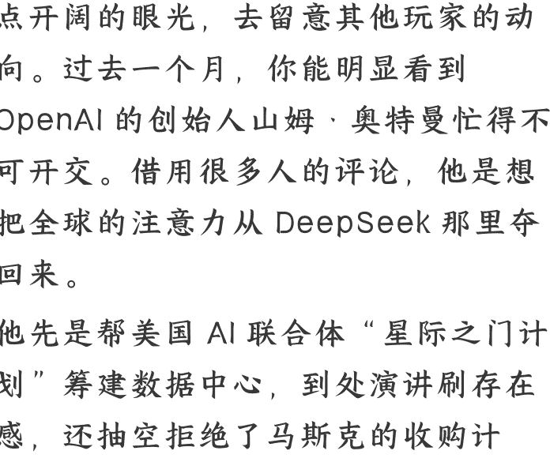

# 当 DeepSeek 遇到老龄化：AI 迎来“小米时刻”

2025.02.20
整理：公众号懒人搜索，[懒人专属群](https://qy.wechat.com/)独享
懒人微信：lazyhelper

DeepSeek 的热度越高，我们越需要一点开阔的眼光，去留意其他玩家的动向。过去一个月，你能明显看到 OpenAI 的创始人山姆·奥特曼忙得不可开交。借用很多人的评论，他是想把全球的注意力从 DeepSeek 那里夺回来。

他先是帮美国 AI 联合体“星际之门计划”筹建数据中心，到处演讲刷存在感，还抽空拒绝了马斯克的收购计划。其中最受关注的，是 2 月 10 日凌晨，奥特曼在自己的网站上发表的博客。

在博客中，奥特曼从经济学的视角，给出了有关 AI 前景的三个观察。在这儿要插一句，奥特曼实际上并不是一个 AI 技术专家，而是一个 AI 的投资与经营专家。因此，他在经济学上的判断，往往比技术方面的更有参考意义。奥特曼提出了这么三个观点。

## AI 前景的三个观察

- 第一，AI 的能力和投入资源是对数关系。简单说，想让 AI 变聪明 1 倍，需要资源翻 10 倍。资源投入越多，AI 进步越明显，但这个进步到后面会越来越难。类似于考试，从 60 分提高到 80 分容易，从 80 分提高到 100 分要难得多。
- 第二，AI 的使用成本每年大约降低 10 倍。这个判断是基于过去两年 GPT 的成本下降做出的，从 2023 年初的 GPT-4 到 2024 年中的 GPT-4o，单位成本下降了大约 150 倍。而更低的使用成本，势必会带来更广泛的 AI 应用。
- 第三，AI 带来的社会经济价值是呈超级指数增长的。奥特曼认为，AI 的智能水平是线性增长的，而这种增长带来的社会经济价值，是超级指数型增长的。从社会经济角度看，AI 就像当年的晶体管，会广泛应用到经济的每个角落。

奥特曼还说，随着 AI 的普及，到 2035 年，每个人能够调用的智力资源，都相当于 2025 年全人类智慧的总和，十年后，人人都会有一个超级大脑。

总之，奥特曼坚定看好 AI 前景，也在呼吁各方继续加码对 AI 的投入。基于奥特曼的这个判断，短期内，我们的生活可能还感受不到什么颠覆，但面向未来，AI 给社会和经济带来的长期影响也许会持续不断。

尤其是在 DeepSeek 引发新一轮的震动之后，各个行业都在进一步引入 AI。咱们看几条最近的新闻。

比如，文旅行业。旅游应用马蜂窝宣布接入 DeepSeek，代表产品是"AI 游贵州”，主要是为旅游用户提供完整的旅游规划服务。比如你告诉它，帮我规划一个 5 天贵州亲子游，它就会帮你筛选适合带孩子去的景点，然后自动计算时间和行程，并且结合天气，生成一份劳逸结合的行程表。

再比如，金融行业。国内的保险、证券、银行等金融机构都在开展 DeepSeek 模型的本地部署，金融行业有大量涉及海量数据处理的工作，AI 在这类任务上的性价比非常高。

再比如，汽车行业。吉利、岚图、东风等汽车厂家宣布，自家系统已经与 DeepSeek 大模型实现深度融合，有人还说，汽车的智能化正处在拐点前夕，DeepSeek 很有可能催化智能座舱应用的成熟。

再比如，手机行业。华为、荣耀、OPPO 手机都宣布接入 DeepSeek，同时，移动、电信、联通三大运营商也宣布接入 DeepSeek 开源大模型，并且专门为了它优化了环境和算力。

总之，DeepSeek 似乎给所有科技行业都提了一个醒，随着 AI 成本降低，它也许早晚会渗透到各行各业。

顺着这个趋势，今天，咱们主要来关注一个具体的领域，这就是养老。你可千万别觉得，AI 这样的新技术是年轻人的世界，是前沿行业的舞台。事实上，AI 普惠之后，它在养老产业同样有巨大的想象空间。
不久前，自媒体《银发财经》专门讨论了这个问题。

## 养老产业与 AI

首先，从宏观的层面上，老龄化是一个全球化的趋势，只是不同国家的速度不同。按 65 岁及以上老年人占总人口的比例来算，从 7% 的老龄化到 14% 的深度老龄化，中国用了 21 年，法国用了 126 年，英国用了 46 年，德国用了 40 年，日本用了 24 年。从 14% 的深度老龄化到 20% 的超级老龄化，德国用了 36 年，日本用了 11 年，而中国，预计会用 10 年左右。

当然，面对这个趋势，各个行业都在紧锣密鼓地布局。比如，老年文旅、老年康养，还有各式各样的产品和服务，这也将催生大量的新机会。根据日本学者大前研一的观察，假如各个行业都能积极对待老龄化，那么老龄化不仅不会成为负担，还可能会成为新的经济引擎。

那么，具体到 AI 领域，老龄化会带来什么呢？

## 一个节点、四个方向

咱们用一个节点、四个方向来说明。

### 一个节点

一个节点，指的是，老年人会迎来 AI 的“小米时刻”。也就是，那些又便宜又好用的 AI 会大批量出现。

智能手机领域发生过的事，也许会在 AI 领域重演一遍。iPhone 刚出现的时候，只是少数人能拥有的高级数码玩具。而后来，以小米为代表的一批厂家，把智能手机的价格打了下来，打到了千元左右的价位。这个价格让智能手机迅速普及，老年人也成为智能手机的用户。而普及之后就是适配，几乎所有的手机品牌和应用软件都推出了适老化版本。

同样，ChatGPT 刚出现的时候，有人把它叫做 AI 的"iPhone"时刻，它第一次让人知道，AI 不再是实验室专属的前沿产物，而是能够深刻改变世界的强大工具。此时的 AI 就像当年的 iPhone，好，但是贵。而 DeepSeek 的出现，把大模型的推理输出，降到了和一次谷歌搜索差不多的成本。这是一个具有指标意义的时刻，说明这项技术或许真正迈过了普惠的节点。

### 四个方向

那么，当 DeepSeek 让 AI 进入了“小米时刻”之后，有哪些新机会将会出现呢？《银发财经》认为，有 4 个方向，是可以立即发力的。

- 第一个方向是：养老看护。当下，养老机构普遍面临人手不足和护理员流动性高的问题。而以 DeepSeek 为基础的 AI 应用，可以帮助解决这个问题。比如，通过 AI 应用来培训一线护理人员，提高他们的学习能力、知识水平和专业技能，同时，对护理人员开展心理安慰和疏导，给他们足够的情感支持，进而降低流动性。

目前，AI 在心理支持方面的应用已经有很多。比如今年 1 月底，有科技媒体报道，微软计划把自己旗下的 AI 助手 Copilot，发展成 AI 心理治疗师。微软最近还公示了一项专利，全称叫做《在会话中提供情感关怀》，在 AI 助手中引入了情感对话、疾病咨询、心理测试等功能，目的是做用户的私人心理治疗师。

- 第二个方向是：老年人的文娱康养服务。过去，所有的技术和娱乐往往是最后才普及到老人，面向老年人的文娱服务，往往是低质量的。这是因为，人力、信息成本高昂，行业往往只把最低成本的服务内容提供给老人。而当老年人占比超过 20% 之后，他们已经成为一个需要被优先考虑的用户群体。而 AI 恰好能用比较低的成本，提升老年文娱服务的质量。比如，老年人旅游，可以用 AI 做路线规划、活动安排，并且兼顾健康监测。老年婚恋，可以用 AI 来做信息核查，减少老年人受骗的可能。

- 第三个方向是：把服务普及到农村和边远地区的老人。比如，生成方言语音助手，用老年人能听懂的语言给他们传递信息。现在的老年版微信里，已经有消息朗读功能了，但是只支持普通话。很多农村地区的老人，文化水平不高，也听不太懂普通话，就可以通过 AI 做出本地方言助手，跟老人无障碍交流。再比如，建立医疗数据库。很多边远地区医疗服务相对落后，而借助 AI 设备，医疗机构可以把握每一位老人的健康状况，及时提供服务。

- 第四个方向是：推动老年智能设备的进步。AI 可以让智能设备更适配老年人。比如，老年人可以用模糊指令和智能设备互动，老人说一句“心口闷”，设备就能准确理解这句话，立马开始监测心率。再比如，老年人不适应智能屏幕操作，AI 可以在触摸、震动、语音对话这些信号上加强理解能力，这样一来，老人就能获得更好的操作体验。

好，说到这，我们为你简单概括了《银发财经》对于 AI 养老应用的构想。当然，这个观察可能也未必百分百全面。但是，好消息是，加入行动的人越来越多。

比如，就在今年年初，腾讯研究院启动了《AI 向善语料库共创行动》，联合很多专业养老机构，一起搭建一个为老年人解决问题的“专业语料库”，后续计划用这个语料库指导更多具体的养老 AI 服务。

再比如，澳大利亚新南威尔士大学的团队研发了一款人工智能应用叫 Viv，定位是虚拟护理员，能够为阿尔茨海默患者提供情感陪伴。

再比如，定位于居家养老的 Sensi AI，能够监测老年人的跌倒情况、认知能力以及相关的身体指标，等等。类似的创新还有很多。

过去一年有个说法很流行，叫做，所有的行业，都可以在老龄化的趋势下重做一遍。这不仅包括文旅这样的传统行业，也包括 AI 这样的新兴领域。最后，也祝你能把握更多的机会。关于这个话题，咱们先说到这。

历史 3000 多份各类付费文章以及年费三千多的副业社群资源，见懒人专属群内分享！

付费群，白嫖勿扰！

懒人专属群更新记录：

https://lazybook.fun/#/blog/record2

懒人微信：lazyhelper