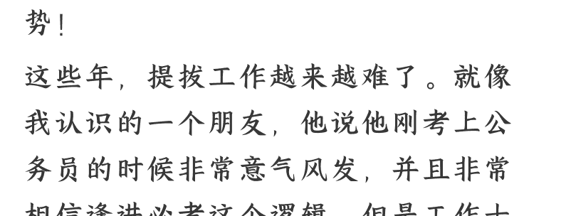

# 未来十年，体制内提拔底层逻辑和普通人的破局之道（全网独家深度好文）

2025-02-20 费曼的小茶馆

整理：公众号懒人搜索，_懒人专属群_独享

懒人微信：lazyhelper

### 前言

全文 5500 字，说透未来提拔的大趋势！

这些年，提拔工作越来越难了。就像我认识的一个朋友，他说他刚考上公务员的时候非常意气风发，并且非常相信逢进必考这个逻辑，但是工作十来年以后，当他也走上了领导岗位，掌握到更多的体制内核心机密以后，他发现原来世界非常大，很多逻辑和游戏规则是远远超过他过去的认知的。

我们中国人是很聪明的，任何制度刚开始的时候都觉得滴水不漏，但是时间久了都会被人找到漏洞，或者被人另起炉灶找到新的玩法来延续传承过去的既得利益。

我和他深入讨论过一些内幕以后跟他说，我们要看清内幕固然重要，但是这些内幕之外，属于我们普通人的空间和机会在哪里？我们应该如何规划和努力？为什么总有些人，看起来平平无奇却总能提拔？我们要看清未来形势，找到适合自己的人生道路、职场道路，说一说我们普通人，未来十年体制内提拔底层逻辑和破局之道，全网独家内容，给你醍醐灌顶的启发。今天的文章和大家分享以下内容：

- 一、逢进必考时代，提拔的几种逆天操作是什么？
- 二、未来十年，体制内提拔晋升路径的三个方向是什么？
- 三、未来我们该如何看待提拔新时代新形势？
- 四、我们应该如何提前规划路径，实现仕途提拔与人生整体的圆满成功？

## 一、逢进必考时代，提拔的几种逆天操作是什么？

刚才前文里说到我认识的那个朋友，他说他过去非常相信逢进必考，觉得大多数关系户都被逢进必考的漏洞堵住了，但是当他后来接触到人事工作以后，各种各样的逆天操作让他大开眼界，也就是干部提拔工作的门道太多了，这里说一说其中的一些套路。

一是从国企到行政。最常见的套路就是毕业以后先进入一些地方性国企，尤其是自留地国企，走，先解决个人身份问题，然后提拔到领导岗位，国企领导到一定级别以后，就可以进行调任，接着进入机关单位。这里大家比较熟悉的例子就是周公子，读书就是个民办学院，然后进入国企，如果他努力点到一定级别以后，说不定哪天就去政府部门任职了。

二是从高校到地方。这些年高校简直是针扎不进水泼不进的独立王国了，年轻人高学历进去以后大概率是非升即走的牛马，但是关系户进去可以搞行政直接领导他们，大家是否还记得江西省赣州市安远县县长李秋平，因涉嫌侵犯一位中央国家机关在安远县挂职锻炼的女干部已被停职的新闻。他大学考的应该是专科，毕业之前学校升级的三本（看校名大概率，从南昌职业技术师范学院改名江西科技师范学院）毕业后就在江西省水利水电学院（现江西水利职业学院）工作，后来又调动到的国企，再后来到地方当县领导，这样的情况非常之多，不少高校到地方的领导都是这个套路。

三是从其他事业单位到行政。最常见的套路就是所谓的人才引进和事业单位招考，其实很多地方的人才引进政策是非常水的，起码是相对宽松的，包括事业单位招考的难度和可操作空间，都是行政单位不能比的，不少人通过相对宽松的方式入了事业单位编制，然后在单位提拔到一定层级，比如正科级以后，再进一步提拔副处级的时候就到了行政单位。我记得以前一个办公室的 985 高材生开玩笑说，自己辛辛苦苦 985 考进来，努力工作多年以后，结果被当初萝卜坑事业单位进来的人领导。当然这是玩笑，但是玩笑里确实也有一些无奈和心酸。

四是从偏远地区到发达地区。虽然每年国考省考非常热门，但是确实总有些艰苦偏远地区确实没人报名，这个很简单，考编不异地，异地不考编的教训大家都懂，但是对于有些人来说，唯一的门槛就是所谓的考试制度，只要进来了获得了身份，一切都不是问题，所以这些年，我见过考全省最偏远最没人报考的地方，然后试用期结束就顺利调入省城核心区最高薪单位的；在省内偏远地区服务期满以后，就进入办公厅等核心部门的等等，此类现象也并不罕见，相信很多读者也都见过。

五是更牛逼的操作。以上说的都是明面的，大家看得到的，虽然每一步对普通人来说都是不可企及的，但至少每一步都起码符合程序的，或者说是有一定政策依据的。其实还有很多更牛逼的，根本不考就入职的，你又能奈何？《人民的名义》高育良有句台词："xxx 这里我有几个名额，我亲自掌握的。”这样的情况，对于高层级的人来说，确实就是这样，这样的情况我们其实也了解的不少，只能说这些事情，确实就不方便拿出来讨论了，但是确实存在，游戏规则制定者可以创造一切游戏规则，更可以超越一切游戏规则，以及重新定义一切游戏规则。

## 二、未来十年，体制内提拔晋升路径的三个方向是什么？

第一部分的内容给大家介绍清楚了，主要是想告诉大家，提拔晋升的几条超常规路径是什么，未来会是什么情况。所以未来各个层级的领导岗位，尤其是高层级的领导岗位，很大一部是要有这些人准备的。我们普通人是和普通人竞争的赛道，在普通人竞争的赛道里，我们也有我们的空间。接下来要说的，就是未来几个方向几条路径，我们该如何选择。说白了，未来十年体制内发展路径会全面分化。就是不同的体制内人士、不同的体制内单位、不同的体制内发展路线，未来是完全不同的几个概念。属于我们没关系没背景的普通人，能够选择的路径有以下几个层级。

- 一是高层次社会治理型人才路径。这个社会治理，大到国家治理层面，小到市级治理层面，本质都是一个道理。这里除了一部分肯定是高层次阶层传承下来的干部子弟以外，还有一些是从清北之类的顶级学校里面，专门定向选调优质博士硕士毕业生进行定向培养，其中的优秀分子，未来和高层领导子女一起治理天下（当然，随着高等教育的一再贬值，高学历人才才能够选择的路径越来越窄，未来不断下沉到基层，从过去 20 年前的国家治理型人才成为基层社会治理型人才是大势所趋）。普通家庭的子女，除非天赋异禀能够考上清北（或者次一级的学校也行），同时官场生涯能力突出，工作实绩确实突出，廉洁自律等各方面也做得还不错（起码没有大问题大把柄），同时运气也好，比如跟对了领导，上层路线没有暴雷，工作任期没有一些意外问题和事故，如此一步一步不断向上。能这样上去的人，那确实令人心服口服，必须要承认，确实有一些人足够优秀也足够好运，确实走通了这条路径，三十几岁就当上了副厅级，成为了地方政府实权领导，后续大概率前途远大。

- 二是中下层次社会事务型人才路径。这里的中下层社会事务型岗位，就是各个层级单位的中下层岗位，包括从省厅处长到基层股长，从部委省直机关，到基层偏远乡镇，其实都是一个道理，说白了就是干活的牛马岗位。这些中下层的岗位，高层次权贵子女是不会去的（不可能是他们人生发展的终点和久留之地，过过水刷刷履历另当别论），这些肯定留给各路高校毕业生，采取最严格的逢进必考的形式，类似高考一样，确保一个社会的底线公平，也尽可能笼络消化一部分学历精英人才，一定程度上起到了保持社会流动性和维护社会稳定的作用。我们绝大多数非顶级名校的毕业生，能够通过国考省考考入体制内的大多数人，其实走的都是这条路，这条路其实也是很难进来的，能走进这条路的人，已经是非常优秀的了，所以各位读者朋友，尤其如果大家都是传统文科生的话，其实虽然大家在自己的工作岗位可能都有不如意，但其实都已经做到了文科生能够选择的最佳结局了。

- 三是进入自留地路径。包括但不限于比如一些垄断央企，一些大型平台公司城投公司，一部分优质事业单位，和体制内一部分常年不进人只调人的清闲单位。主要为了解决高能量人士子女就业，不需要统一招考，灵活度比较高，待遇也不错；同时也为了解决一部分领导家属配配偶工作调动问题，也会腾出一部分岗位出来解决他们。这样的单位和岗位，总体来说确实吸纳的普通人少，但是也不排除总要有一些干活的普通人。当然，这种岁月静好的自留地，主要是针对自留成员本身的，我们普通牛马进去了，要有思想准备，在这里我们的发展上限是最低的，我们的负重前行，才能最大程度保证他们岁月静好。总之一句话，普通人没有简单的道路，简单的工作，简单的岗位了，属于普通人的套利机制的空间越来越小，越来越被锁死了。

## 三、未来我们该如何看待提拔新时代新形势？

文章写到这里，恐怕有些朋友会有些丧气，觉得不太开心。但是我这里要告诉大家，我们没关系没背景考进来的人，心态一定要平和正常，要正确看待未来的新时代新形势，最好的心态是什么？

一是要服气要知足。我一个之前在外企工作过的朋友说，自己作为牛马阶层，还是非常感谢高考和公招的，搁以前推荐继承年代，连参加竞争的机会都没有，当年自己刚毕业的时候也是目标远大，非大企业不进，而且总觉得能混出个名堂，事实证明自己干的也不错。但是认清形势后发现，不管怎么搞，照样是牛马。最基本的一点，工作地的房子买不起。后来想通了去了一个二线城市进了体制内，发现身边一些没有经过社会毒打的年轻同事天天抱怨，他经常劝导他们，说要不是现在编制都要考，我们这样的牛马阶层是没时间到体制内来混日子的，所以还是要知足常乐。虽然我们工作接触的都是做生意的和一部分官员，人家能到那个位置，自然有他的门道，这个必须要认，我们没有这个门道，就不要和人家去较劲了。

二是要有代际传承思维。好日子是奋斗出来的，并且不是一代人的奋斗就能搞定的。很多年轻公务员总觉得过去老一辈公务员日子好，但是别忘了，他们的好日子很大程度是他们父辈就奋斗出来的，他们属于原始股东以及原始股东二代。现在有些人，看到人家有背景提拔快，有些领导家属、各种关系户在清闲岗位，或者某人原生家庭好、或者自己嫁得好日子好过各种高消费，就天天和这些人攀比，其实仔细想想，自己要要不是逢进必考，连认识这些人的可能性都没有，他们今天的幸福生活，也是历史进程 + 个人努力 + 代际积累才有的。这个世界一跃登天的人有，但是是极少数中的极少数，我们绝大多数普通人，至少要经过三代人的努力，才能实现阶级跃迁，所以我们要努力，但是也不好过度着急。

## 四、我们应该如何提前规划路径，实现仕途提拔与人生整体的圆满成功？

一是立足中下层次社会事务型人才路径，尽量实现向社会治理型人才的转变。大家都知道现在基层苦基层累，尽管现在说了基层减负，但是中长期看，基层干部职工作为食物链相对非顶部的人群，不管怎么说命运都是身不由己的，其实越是基层工作越辛苦，越是官小职务低工作越难干，所以为什么我们一直呼吁大家遴选，就算不遴选也要尽可能提拔个一官半职，就像前一阵一个年轻人给我说，说他在基层提拔了班子副职，最大的好处就是工作基本上不需要用电脑了，工作时间也灵活了，上班时间一个人在办公室还可以锻炼锻炼身体，甚至看看闲书。所以一定要遴选出来，或者在基层某个一官半职，摆脱食物链低端的职场位置和生存处境。实际上这一年多来，我写了这么多付费文章，无非讲的就是两件事，一是遴选，二是提拔，这就是体制内最核心的两件事。

二是抓紧明确个人路线，及时尽早发力。如果是明确走基层实干路线的朋友，包括区县和乡镇街道这两个层级的干部，如果要走基层路线，想在基层进入领导班子序列，那么就要先问清楚自己几个问题：一是自己实干能力如何，想不想干点实事？二是处理具体群众实际困难问题能力如何？三是自己应对复杂关系的能力如何？从这个角度讲，如果你这个人比较灵活甚至比较“油腻”，相对来讲其实是合在基层混的，如果是下决心在这个层面走实干路线的年轻人，那么抓紧找贵人、接资源是第一位的。抓紧是否两个层次的贵人。局长副局长，组织部长。此外，第二条路就是走遴选路线。如果你是没有太多关系背景，同时社交组织协调能力偏弱，同时和单位同年龄段干部比起来没有太大发展优势的话，那么这类同志我建议抓紧提前谋划遴选路线。

三是明确个人发展目标及上限。作为每一个奋斗者，我们当然需要有奋斗目标。但对于我们的奋斗目标，我们要合理的心理预期。如果没有特殊的关系背景，就是凭借自己的智商和情商，比如在基层单位，我们如果是在本单位提拔，那么到了班子副职就差不多了，比如基层各个政府职能部门副职，基层街道乡镇班子副职等。当然如果有贵人相助，我们当然有可能更进一步，尤其是如果遴选到两办、组织部之类的部门，格局视野打开，可选择余地更大。如果以地级市为例（直辖市、副省级城市、一般省会城市也差不多这个套路，但是因为级别高，层级对应更复杂，不方便举例，大致对号入座既可），一般来说，能当到处级干部，比如市局层面的局长副局长，其实就差不多了。因为在地级市层面，要当副厅级干部，这个必须要省里面的领导们帮忙了，就像《人民的名义》里面反映的冰山一角，普通人就不要去趟这个浑水了，没这个先天根基，勉强搭上线了未来也很可能也是当炮灰的对象。

(推荐阅读 2025 年 1 月 5 日文章《体制内“工具人化”时代，如何真正掌握权力，避免工具人命运？（全网独家深度好文）》，帮你深入理解权力运行规律，真正成为权力的主人)

四是其他方面多努力，追求完整圆满的人生。人这一生除了当官，我认为还是应该有点其他的追求，那就是追求相对完整圆满的人生。一味追求所谓的仕途对普通人来说是不对的，上面一段说的，副厅级以上干部，到这个层次虽然高，但是风险也大，可以说是战战兢兢如临深渊如履薄冰，普通人不是祖坟冒青烟根本不用考虑，不是人力所能及，即便到了那也是高处不胜寒，官场上炙手可热煊赫一时的人固然不少，但是许多人到最后都未能善终。所以说，人生除了仕途还有其他，我们要利用剩下的精力，在其他方面多方面努力，比如有的人选择多花时间看书写作，不断提高自身认识水平和知识素养；比如有的人想办法搞点副业搞点钱改善下生活质量；有的人多花时间培养点爱好，享受下生活；其他的就是努力经营好婚姻家庭，把自己的身体照顾好多健健康康活几年，把孩子培养好尽可能别太拉胯，其实能把这几点做到就足够了，事业、家庭、子女、身体健康等等各方面都还不错，其实已经是普通人的上限了，毕竟整体游戏规则摆在这里，我们普通人是没法突破规则去玩游戏的。(推荐阅读 2024 年 11 月 18 日文章《四代八位清华人官场经历的提拔与人生启示（全网独家）》，站在巨人肩上，全面提高个人格局层次，实现思维层次降维打击）。

历史 3000 多份各类付费文章以及年费三千多的副业社群资源，见懒人专属群内分享！

付费群，白嫖勿扰！

懒人专属群更新记录：

[https://lazybook.fun/#/blog/record2](https://lazybook.fun/#/blog/record2)