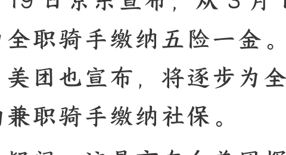

## 250221 文/卢克文工作室嘉宾 寻微三忧整理：公众号懒人搜索，[懒人专属群](https://t.cn/A6g3wHjX)独享

懒人微信：lazyhelper

2 月 19 日京东宣布，从 3 月 1 日起逐步为全职骑手缴纳五险一金。同一天，美团也宣布，将逐步为全职及稳定的兼职骑手缴纳社保。

毫无疑问，这是京东向美团挥出的第二拳，美团被迫应战。

就在不久前，京东凭借“0 佣金拉拢品质商家”高调杀入外卖行业，誓要击碎美团高筑的行业壁垒，但反响平平，于是干脆掉头向骑手抛出橄榄枝。

从美团的快速反应来看，这一拳确实打得肉疼了。近十年没有落实的福利保障一夜之间就成了板上钉钉的事情了。

于是，不少人高呼“京东良心”，终于逼着美团狠狠地出了一次血。然而，事情真的这么简单吗？全国上千万的骑手群体真的能从中获益吗？

### 「01」

不得不承认，外卖刚刚兴起的那几年，高收入一度是外卖员的代名词。

那时动不动就听到，谁谁一天跑多少单，月入过万。搞得月薪 2500 的我，也盘算着是不是买辆电动车勇闯外卖天涯。

跑单不需要太多的技术含量，单价却很高，10 元左右，按一小时跑 4 单算，时薪就有 40 元，比肯德基兼职高一倍，也难怪有这么多人蜂拥而至。而这正是外卖行业的龙头们想看到的局面。

以美团为例，从 2019 年开始，外卖员的单价开始持续下降，原本的每单补贴变成了阶梯式的激励。

拿深圳举例，每个月 600 单以内每单 7 元，要想恢复到 10 元，每个月就要跑 1100 单以上，全月无休的情况下每天至少要跑 36 单，也就是 9 个小时，还不算吃喝休息的时间。

注意，这还是在深圳，如果是三四线城市，订单量小，单价更低，大多数外卖员都只能在最低档徘徊，算下来一个月也就只能拿 5、6 千。

也许有人会说，三四线城市拿 5000 也不错啊。

不错吗？错！

企业员工的 5000 和外卖员的 5000 完全不是一个概念，光是一个普通的感冒，有医保和没医保的花费就不是一回事，正是这个原因，关于骑手舍不得就医的新闻屡见不鲜。

#### 那自己交灵活就业社保呢？

理论上可行，但很多地方，个人只能交医疗和养老，无法缴纳骑手最常用到的工伤。如果说生病是偶发情况，那么交通意外，就是骑手们每天都会面临的危险。

说到这里，就不得不提到外卖配送的算法机制了。

目前，骑手平均送单时间被严格限制在了 40 分钟乃至 30 分钟以内，某些地方甚至 25 分钟。为了不超时，骑手们不得不选择逆行、闯红灯、把电动车开得飞起。

你以为骑手是在炫车技，其实是在赌命，而这个赌盘他们不得不开，遵守交规就意味着超时，一两次可能还好，累计几次就等着被限制接单吧。

频频出现的触目惊心的车祸引起了有关部门的重视，骑手的保障终于在 2022 年 7 月迎来了转机，人社部宣布在 7 个地区试行新职伤险。

简单来说，就是专门为骑手群体制定的特殊险种。

这个政策的出发点好不好？肯定好，但企业执行的时候又变味了。新职伤险的保费构成主要有两个来源：固定保费 + 随单保费。

固定保费就是骑手每天交 3 块钱左右，随单保费就是从每一单里面按一定比例抽取

所以，骑手一天大概要交 5 元左右的保险费。而且这笔钱是每天都要交的，也就是说即便你休息，也要扣除最基础的 3 元保费，如果不交就没法接单。

仔细算一算，一个骑手一年要自费缴纳上千元的保费，要知道，居民城乡医保一年也才 400 元。

虽然一个是意外险，一个是医疗险，两者不太能直接相提并论，只要用到时能足额赔付，这笔钱还是值得的，但实际上事情并不简单。

首先是五花八门的各种险，除了人社部牵头设置的新职伤险以外，各个平台也有自己的险，比如雇主责任险、意外伤害险、职业伤害保障等等。

这些保险大多由商业保险公司承保，很多骑手在签合约的时候也顾不上看密密麻麻的保险条款，有的甚至连保险条款都没见到，就被站长强拉着签字了。

所以，很多骑手对于保险的概念，就是每天从自己账户中扣走的几元钱。其次是理赔问题，因不了解保险的保障条款，一旦发生意外，很有可能因为不符合某一项条款直接被拒赔或者少赔。

最让骑手们噤若寒蝉的是一旦申请保险赔付，很有可能会触发“隐藏惩罚”。

某平台在骑手申请理赔期间会冻结账号，如果二次申请则有可能直接封禁骑手账号。

这不妥妥地变相阻止骑手申请理赔吗？

### 「02」

很多人把京东的这次官宣看作是“屠龙勇士”挥出的正义一击，理由很简单，它倒逼着美团跟进了骑手的社保待遇。

那我们不妨来仔细拆解一下京东的公告，原文是这样的：

> 自 2025 年 3 月 1 日起，将逐步为京东外卖全职骑手缴纳五险一金，为兼职骑手提供意外险和健康医疗险。

这里有两个关键词，“逐步”和“全职”。

事实上，在美团的公告中，也出现了“逐步”这个词，美团此前对于普及新职伤险的做法是优先大城市和稳定骑手，京东的“逐步”大概率也是如此。

唯一的差别只能是时间进度。

这个进度由什么决定？没错，由成本控制决定。

京东的骑手目前约有 130 万，全部由达达集团签约，该集团目前正在和京东商谈合并。假如这些人全部变成全职，按照一人一年 1.2 万的社保成本，京东每年就要为这些骑手支付 156 亿的社保成本。

而根据京东财报，京东对于额外成本的控制应该在 10 亿左右，也就是说，目前的这 130 万人大约只有不到 10% 的人能顺利变成全职，享受五险一金。

当然，也不是全部骑手都想变成全职的，关于这一点，我们放到最后说。

那京东会怎么平衡这个矛盾点呢？

只剩下唯一的变量了，那就是对于“全职”的定义。

要知道，法律是没有“全职骑手”这个概念的，骑手最早就是众包，众包怎么可能全职呢？于是，关于“全职”的定义权是掌握在京东手里的。

具体怎么定义还不知道，但我们不妨推测一下：

- 第一种，按在线接单时长算，比如每天在线 8 小时，实际配送时间占比多少多少。
- 第二种，按实际接单量计算，比如设置每日接单最低数额，持续多长时间不满足则取消全职资格，超过多少有奖励等等。

> 懒人微信：lazyhelper

如果按时间计算，配送量可能会减少，赚的就少；如果按接单量计算，遇到卡餐、系统故障或者算法限制的时候，你该怎么办？

无论哪一种，其实都不是骑手能完全掌握的。美团其实也是一个道理，公告是这么写的：

> 预计自 2025 年第二季度开始实施，逐步为全职及稳定兼职骑手缴纳社保。

跟京东相比，美团是全覆盖，但对于兼职骑手设置了“稳定”门槛，至于什么叫“稳定”，无非也就是上面提到的两种情况，定义权也是在美团手里。

有一个细节不知道大家注意到没有，京东是明确缴纳五险一金的，美团交的是社保，公积金不属于社保。众所周知，公积金无非两个用途：买房和看病。

对于要买房的人来说，送外卖不是长久之计，既然如此，那是不是全职跟他就没有太大关系，兼职的意外险和健康医疗险也足够了。

对于要看病的人来说，真到了要提取公积金来看病时，那一定不是小毛病了，公积金那点钱大概率是杯水车薪（毕竟公积金的钱不多），属实是有点鸡肋。

不过话又说回来，公积金也算是变相的强制储蓄了，你说它是京东的亮点也好，噱头也罢，总之，有总比没有好。

### 「03」

讲了这么多，我们最后再来聊聊一个可能被大家忽略的问题：缴纳社保，到底有多少骑手会愿意？

社保是按照一定基数去缴纳的，并且工资越高，缴的钱就越多，比如月入一万，就要缴纳 1000 多元，即使是月入 5000，也要缴纳近 700 元。

对于有着稳定工作的企业员工来说，是可以接受的，但骑手群体的流动性很大，送餐只是过渡或者负债上岸，有多少人会将其作为终身事业呢？显然，他们更愿意把钱留在手里。

因此，这场给骑手缴纳社保的博弈游戏存在太多的变量，其中既有企业的文字游戏，又有骑手自身的真实意愿，绝非是谁好谁坏这么简单。

相较于缴纳社保本身而言，社会对骑手这个群体的关注才是重点，需要制定出真正符合他们需求的风险保障机制，而不是仅仅局限在“交不交社保”的思维里。

多的副业社群资源，见懒人专属群内部分享！

付费群，白嫖勿扰！

### 懒人专属群更新记录：

[https://lazybook.fun/#/blog/record2](https://lazybook.fun/#/blog/record2)