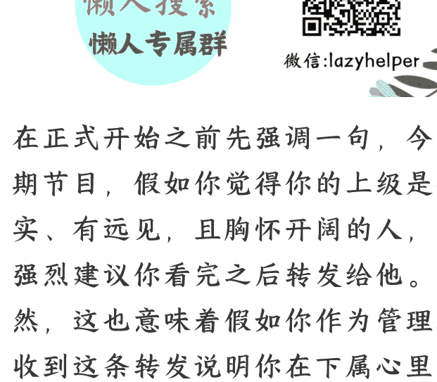

# 向职场形式主义开炮，好公司正在这样做

**整理：**公众号懒人搜索，懒人专属群独享
懒人微信：lazyhelper

在正式开始之前先强调一句，今天这期节目，假如你觉得你的上级是个务实、有远见，且胸怀开阔的人，那么强烈建议你看完之后转发给他。当然，这也意味着假如你作为管理者，收到这条转发说明你在下属心里绝对是个值得追随的人。

我们今天要说的，是今年开年以来很多公司和组织出现的一个趋势，对抗形式主义，提高真实效率。

咱们先说三个标志性事件。假如今年年底，回顾这一年的商业趋势时，年初这三件事或许会被认为是引爆企业全年降本增效大潮的引线。

第一件事，是 1 月 22 日，美的集团董事长兼总裁方洪波签发了内部文件《关于简化工作形式的要求》，向中国境内员工提出简化工作方式的六大要求。包括：

- 内部沟通禁用 PPT，假如其他场合要用到 PPT，一律要求白底黑字且在一页纸之内。
- 严禁他人代写材料，包括董事长、总裁在内，自己的材料自己写。
- 严禁下班时间开会，严禁形式主义加班。
- 严禁微信群内喊口号、举拳头等形式主义，减少微信群数量。
- 严禁手工发日报，管理者带头使用数字化看板。
- 严禁内部送礼，严禁除规定团建活动以外的吃吃喝喝。

这个内部文件在网上公开之后，你懂的，美的这个看起来很传统的企业，一夜之间成了无数人眼中的，别人家的公司。借用脱不花老师的话说，这说明，职场苦形式主义，久矣。

第二件事，是 2 月 5 日，名创优品集团的公众号发布了一篇推文，题目是《叶国富：让简单成为我们的灵魂》。叶国富在其中提出了六个要求。包括：
- 严禁一切形式主义。
- 简化沟通形式，内部沟通严禁使用 PPT，含工作汇报、总结规划、述职答辩等。
- 坚持会议 333 原则，内外部会议以 30 分钟为宜，最长不超 1 小时，汇报资料不超过 3 页，重要事项经过 3 次讨论后无果就要及时叫停。总之，少开会、开短会、开有用的会。
- 精简决策环节，内部任何决策，参与决策者不得超过 3 人，提升各级管理者的专业力、领导力、判断力，严禁事事汇报，层层汇报。
- 提升审批效率，秉承今日事今日毕与事不过夜原则，各项 OA 审批流程实现一日三批。
- 坚持数字化提效，全面拥抱人工智能大潮。

这是名创优品的内部规定，我大概数了一下，字数比美的集团稍微多一点点，但都没有超过 400 字，一分钟就能读完。你看，一个强调简化的号召，本身就要足够简化。

第三件事，是 2 月初，马斯克登上了《时代》周刊的封面。美国当地时间 2 月 7 日，《时代》预告了最新一期的杂志封面，是马斯克坐在一张大桌子前面，桌子两边是美国国旗和总统旗。注意，这可不是一般的桌子，它叫坚毅桌，是美国总统的专用桌子，象征着总统在白宫的权力。

马斯克为什么能坐在总统的坚毅桌前？主要就因为他在主导特朗普政府的降本增效。自从特朗普上任，专门成立了一个政府效率部，简称 DOGE，由马斯克牵头。既然主打效率，那么这个小组本身肯定也得强调效率。据说整个政府效率部不算马斯克，一共只有 6 个人，清一色的小伙子。年纪最小的 19 岁，最大的也不过 25 岁，而且几乎全是理工科出身。你要把这 6 个人凑到一起，不知道的还以为在拍《生活大爆炸》续集呢。这相当于一群 00 后，要对美国政府一干 50、60、70、80、90 后开刀。

在成立的 20 天里，马斯克的政府效率部已经对美国国防部、美国教育部、美国联邦航空管理局、美国国际开发署、美国财政部陆续出手。根据这个团队自己公布的消息，在运作的前 80 个小时，他们已经取消了超过 4.2 亿美元的政府合约。

当然，马斯克的行动，跟一般公司单纯的降本增效还不太一样。

一来，马斯克能否完全做成这些事，现在还存在变数。美国历史上不是没有组建过类似机构，但大都收效不大。比如，里根政府在 1982 年组建过专家团队，负责评估政府开支，并提出优化方案，但最终获得实施的方案寥寥无几。

二来，按照很多美国媒体的评论，马斯克的行动里或许裹挟着很多政治目的。还有媒体管这个政府效率部叫夺权小组。况且根据很多媒体的分析，关于马斯克公布的成果，在真实性上或许存疑。

好，回到正题，咱们先把政治动机放一边，至少从政府效率部的设置看，降本增效，对抗形式主义，这已经成了今年很多组织的关键议题。

注意，降本增效这个概念本身不算新，但是今天，很多公司在摸索的过程中，确实有了很多新的洞察。接下来，咱们就展开说说。

## 第一，内部提效也好，对抗形式主义也罢，它的收益比我们想象中更大

它不是锦上添花，而是能够决定一家公司的生死。

比如，被马斯克收购的推特，现在叫 X。根据 2 月 5 日《华尔街日报》的报道，X 在 2024 年的收入是 27 亿美元，被收购之前年收入能达到 50 亿美元。看起来好像没以前赚钱了。但你知道它去年的利润是多少？是 12.5 亿美元，而收购前的年利润是 6.8 亿美元。没错，收入少了一半，但利润增加了一倍。为什么？关键原因之一，就是马斯克接手后那通暴风骤雨似的裁员。裁掉了 80% 的人，成本降低了 66%。原本正在下沉的 X，通过马斯克这么一轮操作，居然活过来了。

注意，我们可不是要说裁员有理，只是想通过这个例子说明内部提效的重要性。

而名创优品也不小，经营的门店数已经有 7420 家。而根据麦肯锡的统计，一名普通员工一年花在制作 PPT 上的时间是 127 小时，按照一周工作 40 小时算，就是三周多一点。没错，一个普通员工，一年中有小一个月的时间在做 PPT。而根据 Adobe 的调研，其中有 25% 到 40% 的时间是用来做排版和动画设计。即使是单单省下这笔绣花的时间，也能够让公司省下巨大的成本。

再比如，有时候内部提效还可能涌现出创新。像字节跳动，很早前就在内部设立了效率工程部。从业务上看，字节跳动业务是信息的制造、推荐和分发。同样，张一鸣也把这个逻辑搬到了公司内部。公司围绕信息的传递与分发设立了效率工程部，主要目标就是提升内部效率。为此，他们还开发了专门的应用，而这个应用，就是后来的飞书的雏形。

换句话说，消灭形式主义也好，降本增效也罢，这些事的收益都比我们想象中要大。它可能决定一家企业的生死，也可能是催生新业务的契机。

## 第二，当我们在说消灭 PPT 的时候，我们到底要消灭的是什么？

每逢对抗形式主义，PPT 大概率是头号靶子。国内很多公司都颁布过 PPT 禁令，比如美团、字节、百度等等。而最早发起消灭 PPT 的公司之一，是美国的亚马逊。早在 2004 年，贝索斯就禁止所有亚马逊的高管使用 PPT。现在国内的很多互联网公司都是在效仿当年的亚马逊。

为什么要禁用？这就要说到，PPT 的特点与局限。

首先，根据哈佛商学院的分析，结构化文档的信息密度是 PPT 的 3 到 5 倍。斯坦福的研究结论是，以图表为主的那种特别好看的 PPT，大概会丢失掉 70% 的背景信息。注意，这可不是说 PPT 不好，而是它有它的优点与局限。

现在很多公司有一个共识，PPT 是说服工具，文档是思考工具，数据看板是决策工具。没错，PPT 是用来怂恿别人的，假如你要对甲方做一个广告提案，或许 PPT 合适。这也是为什么多数关于 PPT 的禁用针对的是内部，而不是对外沟通。按照丹尼尔·卡尼曼的观点，PPT 属于视觉演示，它激活的是大脑的快系统，适合传播，但不适合复杂决策。

其次，禁用 PPT 不是为了省时间，而是为了节省无效时间。要知道，很多公司在禁用 PPT 之后，非但没有省下时间，反倒增加了时间。

比如亚马逊，从 2004 年禁用 PPT 之后，开始推行六页备忘录制度，也就是，在会议开始之前，发起者需要提供一个篇幅为 6 页的文档。其中要包括这场会议涉及的目标、关键信息、战略重点等等。这个文档要在开会前发给参会者。而且这个六页备忘录，通常需要迭代 3 轮。根据 MIT 的统计，这份备忘录的准备时间比 PPT 还要多 30%，但是，它能让会议的决策效率提升 40%。

再比如，特斯拉是用工程笔记 + 数学推导替代 PPT。奈飞在禁用 PPT 后，使用的是文字报告 + 数据看板，会议时间平均缩短了 33%。桥水基金是用问题树和决策日志记录来弥补 PPT，据说这让决策错误率下降了 18%。再强调一句，问题树、工程笔记，还有亚马逊的六页备忘录，任何一个都要比 PPT 复杂。

换句话说，砍掉 PPT，不是单纯地为了省时间，而是给深度思考留出余地，给决策效率加上发动机。假如只是简单地把 PPT 一刀切，岂不是从一种形式主义走到了另一种形式主义？

最后，再分享一个观察。你发现没有，这些效率部门的称呼里，普遍带着两个字，工程。效率工程部带着工程，马斯克的政府效率部也全由工程师组成。仔细想想这其实有点奇怪，企业运行应该是管理学上的事，为什么要交给工程师呢？

这可能也是因为，工程师思维的一个特点。很多人的思考顺序是，从条件到结果。先看手头有什么条件，再去琢磨应该去做什么事。但工程师思维正好反过来，是先定目标，再破除约束条件。也就是，先把最终的那张大图画出来，再看其中缺哪些环节，缺哪些能力，然后想办法补齐。

而在一些高难度任务面前，无论是调整一家公司，还是进化我们自己，咱们也许都需要一点工程师的魄力。

关于这个话题，咱们先说到这。

历史 3000 多份各类付费文章以及年费三千多的副业社群资源，见懒人专属群内部分享！

付费群，白嫖勿扰！

懒人专属群更新记录：

https://lazybook.fun/#!/blog/record2