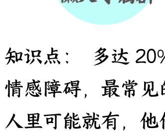
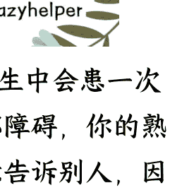
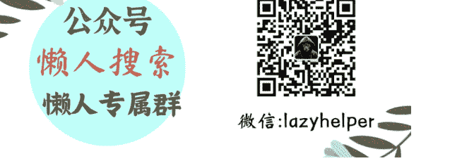

## # 如何帮助可能患有精神疾病的亲友

250221 关系攻略 - 熊太行
整理：公众号懒人搜索，*懒人专属群*独享
懒人微信：lazyhelper

**知识点：** 多达 20% 的人一生中会患一次情感障碍，最常见的是抑郁障碍，你的熟人里可能就有，他们不愿意告诉别人，因为他们见了太多对病人的嫌弃。

有位同学留言问我：自己妹妹的反常情况。

这位妹妹和姐姐合租，最近总是不理人、阴沉着脸，不愿意沟通，下班就待在房间里不出来。

这激怒了自己的姐姐。但是在我看来，这件事更令人担心。

我的建议是，试着跟她认真谈一次，看看能不能问清原因。

如果长达三个月都这样，影响社交能力和工作能力的话，那就最好是强制送医，父母不在这座城市，姐姐要负起责任来，直系亲属有这个权力。

这位前关系户“饼 X"(ID 隐去)的批评如下：

看到熊大劝某姐姐将妹妹送去强制就医的建议觉得好可怕，她毕竟没有犯精神病，动手伤害到人。即便作为姐姐也没有强制的权力实在忍受不了可以分开住，侧面关注她。她是一个社会人（应该是想说成年人吧），不可以有因为有血缘关系就天然拥有处置权力的念头。

抛开语法上的错误，这是一种极度不信任的态度了，所以我也没准备客气。

我回复了她，请托工作人员给她退订，我来支付这个费用。

我当然知道对这样一个评论不理不睬更好，少一个订阅，是商业上的损失。

但是这也是我一直坚持的态度，就是有所不为。

退掉之后再详细地解释为什么要退掉，这里面有哪些宝贵的知识，是因为这些东西值得分享给大家。

「｜一种充满道德优越感的庸见」

“饼 X"的言论，是这个社会上特别典型的一种庸见。它混合着乡愿（烂好人的假道德）、心理学知识的匮乏和对现代医学的恐惧感。以及，一种深深的、令人难过的自私。

我让一个姐姐强制妹妹去医院检查，不是准备让姐姐迫害妹妹，也不是准备让姐姐谋夺妹妹的家产，两个在外地工作合租的姐妹能有多少财产呢？

前几天有同学说，为什么最近关于婚恋的话题很多，我开玩笑说，春天来了啊。

其实春天也是另一部分人最艰难的时刻。

抑郁症患者，春天容易生病，春天和秋天的自杀率非常高，春天又比秋天高。

“饼 X"只知道一点，那就是精神病人可能打人，她也只关心这一点。

其实有问题的人有很多种，焦虑障碍、心境障碍、人格障碍、精神分裂症……大多数的病人都打不人，精神科医生把他们关进病房，固然有防止一部分人伤害别人的成分，但更重要的一点是，这些病人本身就很容易受到伤害。

抑郁障碍和双相障碍都属于心境障碍，在美国，21%的女人和 13%的男性在一生中患过抑郁障碍，即使在精神科医学最发达的美国，也有一半多的重度抑郁症患者得不到专业的医疗服务。人们不理解，冷嘲热讽地听任他们毁灭的。

20%的抑郁症患者会复发，终身服药，很难有婚恋的机会。

当然了，可能有的人很幸运，永远都不会有得病的亲人、朋友和熟人。

对这种一个抑郁症患者都不认识的人，他们对抑郁症是鄙视、漠视或者调笑的态度，这也是为什么一个人会觉得精神病人只要不打人就不该管，她根本不在乎这些人死不死。

## 「｜对病人家属的偏见」

不理解的人不仅仅歧视病人，而且歧视家属，他们把家属看做是能力受损的人（养出了得病的女儿）或者是道德有缺陷的人（居然把老爸送进精神病院）。

除了一些中心城市，中国的大多数精神专科医院的条件都不太好。这也容易理解，如果你是一个市长，也会优先把卫生预算投入到老年病或者肿瘤医院的条件改善上，因为日后你可能用得着，而不会把钱投给精神专科医院。

即使是条件再好，很多病人也不愿意入院，出来之后往往和身边的人控诉自己的亲人送自己就医。

而这些完全不知道精神疾病是怎么回事的道德模范们往往会发动对病人家属的谴责。还有的则是出于愚昧而大包大揽，对病人家属说："抑郁什么？让他跟我喝酒，我来开导他！"
他们不了解究竟有多么危险，也根本不清楚抑郁必须要药物治疗。
那种滋味不好受，你如果在乎他们指指戳戳，不再把病人送医，病人可能就会陷入危险当中。不在乎这种批评的话，家庭的社会声誉又会受损。
病人家属要么变成冷血亲人，要么放任亲人自杀或者毁灭，二选一。
我每次遇到家里有病人的朋友，都会鼓励他们，要勇敢，不要被那些人所影响，听医生的，那些人无知又道德感爆棚的人，不要理他们。

## 「｜对精神科的偏见」

在 2 月份武昌火车站的精神残疾人斩首案发生之后，许多人都呼吁政府把所有的精神病人都关进医院去。这是一种很严重的误解，那个嫌疑人是精神发育迟滞，学校里把有这类障碍的人称呼为“弱智”。
这不太罕见，每 1000 人里有十几个，农村里发病率比城市高。这个病会让人社会适应能力很差，但不是一种攻击性的障碍。
轻度的精神发育迟滞是可以学习和工作的，如果有人去过培智学校这样的特殊学校就知道，那里的很多孩子都很可爱，也掌握了足以养活自己的手艺。影视作品里也有《肥猫正传》《傻阿甘》这样的电视剧。
精神科也不是惩罚机构，而是治疗机构，封闭管理一些必要的束缚行为主要是因为防止病人出事受到伤害。

过去的精神科确实有过很多野蛮的做法，比如给人洗胃、裹着湿床单来减轻症状，但随着现代医学的发展，正在越来越文明，那种电小孩子治网瘾的，那叫医生里的败类。

> 「｜媒体的偏见」

我的书架上一直摆着一本《变态心理学》，我做媒体的时候时不时就要用到他们。

有些媒体人的知识结构是有缺陷的，我总是对一些新闻系在校生和年轻记者说，如果要做社会新闻，变态心理学是必须要读的。

有几年，媒体做了好几件事，就是发动网友冲进精神病院解救病人，说病人是“被精神病”的，有的医院真的迫于压力就把人放了。

我还记得有些媒体记者是这么为对方的健康背书的。“我跟她聊了一下午，觉得她思路清楚，没有精神疾病的迹象。”

如果你能下判断，要医生干什么？

有一年，河南有一个青年饿死了，当地的一家报纸过去写，父母娇惯酿成恶果，一个青年饿死了。说他爸妈下地干活去，真的在他的脖子上套了一圈饼，后来父母相继去世，这人很少做饭，就这么饿死了。

然而这不是娇惯，这个青年的许多症状都是精神分裂症的症状，他的那种类型是会退化的，到最后基本上是吃饭都没有动力，他需要的是救助，被饿死就是一个巨大的悲剧。

就这样还有媒体去挖掘教育意义，还有一个导演要过去拍电影，觉得这是一个教育父母不要娇惯的好机会。

就是这样一个对心理学和精神病学轻视的国度，偏偏有着“最好”的围观群众，挑唆着病人和家属对决也就罢了，还要对提供帮助的人一通黑化。

我得说一句，抑郁症要服药，要看精神科医生，心理咨询师只能起辅助作用。我们考这张执照的时候，我们有位老师忧心忡忡：

> “美国有很多科班出身、医学学位的精神科医生，还有心理学学位的心理咨询师，许多人有两个资格，而各位考下这个执照，并没有开药治病的权限。遇见有精神疾病的人，迅速转介他们去医院，是我们的本分。我们很缺人，也非常落后，很多同学本身专业不是医学或者心理学，但是求助者仍然需要我们，以后的事拜托大家了。”

老师说的是实话，那个课堂上没有大夫。

中国没有“心理医生”，我们持有人社部心理咨询执照的只能叫心理咨询师。而有医师资格，又通过了卫生部的心理治疗师考试的，那可以叫心理治疗师，这些人一般本身就是精神科医生，能处理绝大多数的问题。

心理咨询师能处理的情况最少，受训的时间也最少。但是社会需要很多这样的人，这样的职业的从业者只要负责、用心，可以帮助很多人。

当有人落水，我伸手去拉她的时候，我不介意有人围观拍照，也欢迎有人加油助威，但是请不要在我伸手想要拉人的时候指指点点：

你看他好变态哎，居然要拉人手！还是人嘛。

如果发现亲朋好友性格大变，有明显的效率上的改变或者性格变得古怪，不要犹豫，赶紧陪他去看精神科，如果他的直系亲属不在身边，要及时通知他的亲属，很多疾病都是这样，越早治疗，情况就会越好。

至于这种提议会不会导致对方的怨恨，这件事是这样：

提议一个人的家人带他去看精神科，一定会被人觉得不舒服。但是和亲人朋友因为抑郁而有生命危险相比，被他的家人责怪，甚至就此绝交，都不是什么大事。

《笑傲江湖》里，岳灵珊跟着林平之走了，仇人可能就跟着他们。任盈盈劝令狐冲跟自己一起跟踪保护，但令狐冲担心女友猜疑，犹豫不决。

这时任盈盈是这样说的：“事不宜迟，咱们就追赶前去，别要为了避甚么嫌疑，致贻终生之恨。”

“致贻终生之恨，致贻终生之恨！”

令狐冲念了两遍。

我要说，这就是任盈盈最可爱的地方，她从最凶险的黑木崖上出来，遇事有决断、下手狠辣，但会劝自己的爱人更有决断，以结果为重，不要婆婆妈妈。

我曾经劝过许多抑郁的朋友就医，偶尔也有人不理解，等到情况改善之后，他们的家人都很感激我，他们和我的交情都不错。

热诚相助身边的人，大家都看在眼里。这是大男人、大女人的为人处世之道。

和拯救生命相比，一点点因为无知的批评和诋毁，又算得了什么。

## p.s

尽管大多数精神病人都没有攻击性，但邻居们不会喜欢精神病人，有精神病人的家庭可能会被房东驱逐。如果是老年人，还可能被养老机构拒绝进入。

一些社区会登记精神病人，有的地区会给照顾精神病人的家属一些补贴，一个月在几十元到两百元之间，这是一种文明的进步。

## **习题**

帮助有自杀风险的精神病人的家属求医，可以求助于（多选）：

A.心理咨询师；
B.精神科医生；
C.班主任和辅导员；
D.110 和 120；
E.老中医。

答案是 A、B、C、D。

手上有空闲病床精神科医生是可以迅速让病人变得安全的人，如果有亲友得病或者疾病复发，要尽快联系有床位的医院。

心理咨询师可以给病人家属提供一些建议和指导，但是咨询中心只是公司，没有收留病人的资质，也没有相应的条件。

如果你在校园这种比较特殊的地方，就要求助于班主任、辅导员，因为他们代表着学校的态度，必要的时候他们是可以做一些决定的。

遇到不认识的人发病，110 和 120 是可以协助送医的，如果亲属发病时抗拒送医，非常危险，警方也是可以提供协助的。

没有一种有效的精神科药物是传统医学发现的，没有任何证据证明中医对抑郁症有效，大多数的好转都是安慰剂效应。

老中医确实有一些镇静安神的药物，比如朱砂，这种汞的化合物会让人的神经变得迟钝一些。千万不要因为怀疑孩子多动症、注意力不集中就带他去看中医，承受那样的副作用是不划算的。

历史 3000 多份各类付费文章以及年费三千多的副业社群资源，见懒人专属群内部分享！

付费群，白嫖勿扰！

## **懒人专属群更新记录：**

https://lazybook.fun/#/blog/record2