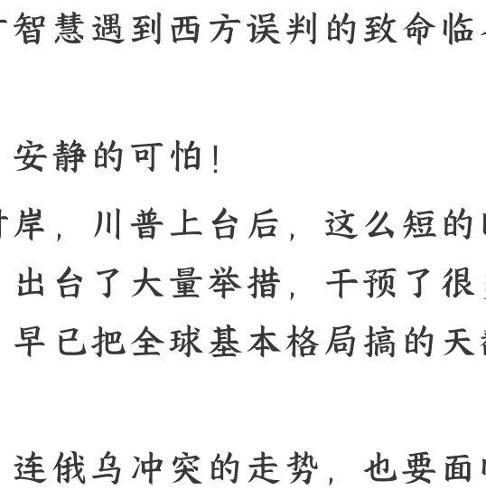
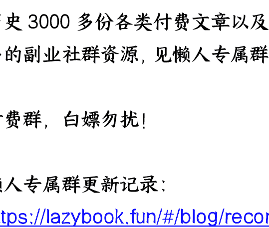

# 无声惊雷：当东方智慧遇到西方误判的致命临界点

**整理**：公众号懒人搜索，

*懒人专属群独享*

懒人微信：lazyhelper

**无声惊雷**：

当东方智慧遇到西方误判的致命临界点

**中国，安静的可怕！**

大洋对岸，川普上台后，这么短的时间里，出台了大量举措，干预了很多事务，早已把全球基本格局搞得天翻地覆。

甚至，连俄乌冲突的走势，也要面临重大逆转。

现在，大家都开始担心，美国“联俄抗中”的阳谋再次启动成功。

更为担心的是，当懂王把很多简单的事情处理完，最后就要集中火力对付我们。然而，村里依旧安静的可怕，连承诺的降准降息至今没有落地。

手握大量军武大杀器，面对美国的步步紧逼，我们却纹丝不动。

**到底在等什么？**

**到底看到了什么？**

到底是什么促使了村里的“巨大战略定力”？

这篇文章，A 森将把全新的思考和研究成果，一次性说清楚。同时，大家还可以看到川普布的“大棋”的真正杀伤力。

当你们看完这篇文章后，将会惊呼，剧情竟然如此炸裂和“精彩”。

有些东西，A 森就在这里说了，以后其它渠道就不便再展开了，懂的都懂。

这篇文章撰写的过程中 A 森思潮澎湃，自认为是近期写得非常优质的一篇长篇，各位多多支持。

我们今天所生活的这个二战后的世界，基本格局，从来没有发生真正的改变。在半岛战争结束后，全球的基本力量，就是美苏中三足鼎立。

即，只有这 3 个力量，才是真正做到完全的战略自主可控。至于其它国家，都是披着主权国家皮的隐形殖民地。

现如今，依旧是美俄中三足鼎立。

对比冷战期间的区别是，我们变成了老二，俄罗斯（苏联）沦丧到了老三。但是，从地缘政治博弈角度，这个大三角博弈，很有结构型的特征。

具体而言，大三角博弈体系内，老三反而更安全、更有自由度、更容易被纵容；老二则更加危险，更受到压制，更容易失去自由度。

因为，老大为了确保江山永固，从理性的角度，应该拉拢老三，打击老二。

这就是尼克松访华战略的真实原因，也是朝鲜战争后我们没有被美国扔蛋的原因，更是普京在俄乌冲突前颇为自信自己可以处理乌克兰危机的核心思路。

进一步来看，美国的著名地缘战略思想家，米尔斯海默，也一直鼓励美国政坛“联俄抗中”。事实上，现在川普要做的事情，就是要尊崇米尔斯海默的理论。

甚至，我们可以看到，美国精英们鼓噪，我们跟他们的关系是“新版修昔底德陷阱”，也是基于上述逻辑的推演。

理解了这点，我们就明白，从大三角博弈体系来看，我们今天所面临的挑战是多么艰巨，一步错就有可能满盘皆输。

因为，我们具有上述结构型的弱势，反而俄罗斯倒是有结构型的比较优势。但是，这就是当今世界的全部真相？

如果就这么简单，我们可以拉拢俄罗斯，或者直接结盟，那就不好办了吗？

况且，俄罗斯已经吃了这么大的亏，战后经济复苏难度极大，这个机会点是有的。究其原因是，这个国际体系是一个“三层嵌套的蛋糕结构”。

以上的逻辑，仅仅只是整个国际体系真实情况的，第一层，也就是美国精英们所说的中美博弈是时代主旋律。

如果我们进一步考察，全球实际生态的第二层，就完全不是这么回事了。
第二层的实际生态是，新自由主义（进步主义）与反新自由主义（回归传统）之间的博弈。

新自由主义是以“科技—金融—全球隐形殖民”的体系建构出的一套全球化体系，主打一个政治正确的新自由主义话术，实现对整个体系的把控。

但是，这个体系的分配机制从来是很不公平的，甚至是存心打击欧美的传统文化、白人中产家庭和强化对全球长期进行铸币税的掠夺。

当创新周期进入尾部，这个矛盾就越来越激烈。

所以，就产生了一大批的反新自由主义（回归传统）的力量。川普、普京、德国选择党等等，都是此中翘楚。

由此来看，俄乌冲突不仅仅是拱火，不仅仅是做局让美国建制派捞钱，更是西方两大阵营的一场“圣战”。

我们毕竟还不是全球化的执牛耳者，尤其是在思想、文化和道统方面。

于是，在上述的冲突中，我们反而是老三，俄罗斯是老二，我们获得了一种结构型的优势和自由度。

可是，如果我们再往深处去思考，事情远没有这么简单。这个世界还有第三层，更加深度的困境。

第三层，现有产业面临投资回报边际递减效应冲击，与没有新产业之间的博弈。

没有新的产业做，可是，老产业已经无法带来更多就业、利润、财税、消费、投资。

于是，各国就相互进行存量博弈的争夺，甚至不惜对其它国家进行毁家灭国。

这个问题不解决，第一层和第二层的问题也没有办法解决。

由于我们已经比所有国家更早实现了产业升级总动员，所以，这一层，我们反而即将成为老大，美国是老二，俄罗斯是老三。

为了帮助大家更快理解，以下 A 森给大家做一个总结：
全球国际体系现状，呈现出“三层嵌套的蛋糕结构”。

第一层，美国精英认定是中美博弈。

第二层，全球实际生态，是新自由主义（进步主义）与反新自由主义（回归传统）之间的博弈。

第三层，现有产业面临投资回报边际递减效应冲击，与没有新产业之间的博弈。

上述三层，还要相互影响，相互交叉，相互联动。

## 三层，各有各的优势对比

如果从第一层来看，我们就是老二，我们是处于不利位置的；

如果从第二层来看，我们就是最小方，我们处于某种结构型优势。

如果从第三层来看，我们即将成为老大，我们有比较优势和制度优势。这就直接决定了我们可以做什么，我们不可以做什么。

所以，不是我们有战略定力这么简单，更不是我们怂。

认知，决定出路，更决定国运和未来。

当前美国人是盯着第二层的逻辑，打第一层的牌。

我们则是，盯着第三层的逻辑，利用第二层的优势，规避第一层的弱势。

用上述“三层嵌套的蛋糕结构”，我们基本上可以解读出绝大多数的地缘政治经济逻辑，甚至是国内的很多政策推导。

那么，川普的套路到底是什么？他真的是胡乱出牌，还是另有深意？

结合上面提到的美国人的认知维度，我们就可以看出川普作为“真小人”的核心思路。先说结论，川普 2.0 的老辣和心机，确实可以平视民主党了。进群加

我们始终不要忘记，川普首先是“顶级商人”。

川普很清楚，今天全球就三个国家有完全的战略独立自主性。

他对普京的认同，首先是认定普京是反新自由主义的大人物，是半个自己人，这和民主党的认知正好相反。

对于干疮百孔的美国实体经济，不仅放大美国财政压力，影响美国的国内效率，还使得美国在上述第一层逻辑中，渐渐失去更多的优势。

他也完全不认同民主党的做局，因为成本太高，还有一大堆反噬效应所以，我们看看川普近期的很多套路，就会发现，这个人不得了。

要知道，加拿大和墨西哥跟美国的经济捆绑非同小可，关系也是非同小可。这就直接断了全球很多国家的“侥幸心理”。

于是，川普利用 IVI 的谈判，就可以逼印度多买美国能源、少买俄罗斯能源。

逼拉美国家为美国的非法移民等各种内政问题买单，相当于转嫁美国内部的治理成本。逼日韩去美国加大投资。

逼台积电加速去美国，最好就几年内就全部搞定。

其次，以俄乌冲突停战斡旋作为“暗渡陈仓”的招数。

乌克兰交出大量乌西核心资源，欧洲为了自身安全不得不交保护费、并开放市场，俄罗斯对美国开放市场。

这里，川普提议俄罗斯回归 G7，就是凭空创造筹码，来努力获得俄罗斯的各种利益。

再次，充分利用中东危机，逼中东土豪买单，并投资美国。

也就是说，加沙议题，也是“暗渡陈仓”。

光光通过上述组合拳，川普就真的可以从全球获得最顶级的制造业回流、大量投资、各种保护费的收取等等真金白银的好处。

这里改为：仅仅通过上述组合拳，川普就真的可以从全球获得最顶级的制造业回流、大量投资、各种保护费的收取等等真金白银的好处。

况且，通过审计美国政府部门，也可以捏住很多其它盟友国家大佬们的把柄，逼他们就范。这些做法，其实还有深意。

一方面，美国就可以重新获得出口收入。

一方面，美国可以强化自己在现有全球贸易体系的话语权和主导权。

一方面，美国还可以阻击中国的一带一路计划引爆的全球基建行情。

一方面，美国可以修复自己的美元体系，更多的获得实体经济方面的信用背书。

看上去是胡闹，其实，每一步棋，很有算计，不输民主党的。

这里，我们适度总结一下，大家就可以看出川普 2.0 的战略。

抢台积电，逼日韩去美国本土投资，印度疯狂买美国能源，中东阿联酋本来就是川普集团的深度合作伙伴，用以色列逼中东国家交钱和交项目，用乌克兰停战抢夺乌克兰、欧洲、俄罗斯；同步，各种手法对付中国的生意。

可以说，这个比民主党还来钱。

“保护费 + 安全保障 + 关税战 + 停战斡旋”，看似好像就这点花头，其实人家用的是风生水起。

至于加拿大和墨西哥，这也是一步妙棋。

- 连他们都被打劫了，其它国家也就没有奢望，乖乖投降。
- 很多美国自己的治理成本，直接摊给这两个国家。
- 强化这两个国家给自己输血。
- 阻击墨西哥的转口贸易，打击中国。
- 最坏的情况下，北美自由贸易区的分工体系进一步强化。

但是，无论是川普还是拜登，有一个要点，始终没有去处理，也是最关键的点。

就是，川普没有办法改变美国国内最根本的生态，人人都想要当贵族、吃福利、搞垄断租金。

这个问题，拜登也无解，所以拜登就搞了一整套对外拱火、金融战、科技战。川普也无解，所以对外直接抢。但是，本质问题，都想绕过。

这两位都没有办法搞整风运动，所以，也就没法进行内部总动员、财政全面整固、资源重新整合以便提升效率。

也因此，我们要明白，不是美国人看不到“三层嵌套的蛋糕结构”中的第三层逻辑，而是看到了也无法改变。既然如此，那么，就只能紧盯第二层，拼命微操第一层。

上一轮滞胀（1966～1982 年），美国内部的学潮和工潮很厉害。

美国的精英们的策略是，对内进行奶头乐生活方式的推进，对外转移产业外包。这样美国的精英们就可以长期统治，又可以防止大滞胀再次回归。

现如今，全球大滞胀又来了，美国的精英们怎么可能不以史为鉴？！

也恰恰是这个因素，我们在第三层中，获得了巨大的优势，是美俄双方都不具有的优势。

从田忌赛马的角度，我们重新来复盘一下：

第一层，我们很不利。
第二层，我们有优势。
第三层，我们优势比较明显。

既然如此，弱化第一层，强化第三层，套利第二层，就是最明智的举措。

如果有一天，在第一层中，我们也成为老大而非老二，那么，中美的攻守易势才会完全到来。

我预计，就在 2030～2032 区间。

你可以认为，我们是战略定力，更可以认为我们实际是很强硬的。

因为，大三角博弈体系内，如何笑到最后，才是关键。

同时，当力量发生对比，我们也要防止俄罗斯的背刺。

现在俄罗斯是不会，可当我们三个层次都是老大了，那就难说了。

毕竟，俄罗斯的心是在西方，俄罗斯一直认为自己是“第三罗马”。

历史 3000 多份各类付费文章以及年费三千多的副业社群资源，见懒人专属群内部分享！

付费群，白嫖勿扰！

懒人专属群更新记录：[https://lazybook.fun/#/blog/record2](https://lazybook.fun/#/blog/record2)