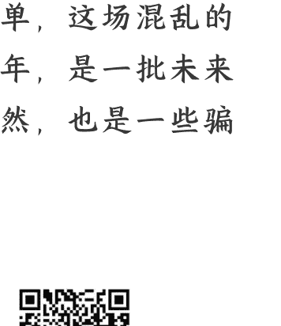

## 本轮复苏，会持续多久？

2025-02-24 顾子明

整理：公众号“懒人搜索”，**懒人专属群独享**

懒人微信：lazyhelper

从 23 年底政府转为乐观，并表示重归国内资本市场以来，由于跟很多人感受的实际温差巨大，这一年多来饱受质疑。

直到 24 年 9 月那一波后，质疑声才渐渐低了下去，随着近期民企座谈会的召开，以阿里腾讯为代表的新质权重股较一年前翻倍，很多曾经质疑的读者也开始转为询问这一波复苏会持续到什么时候。

为了少给自己惹麻烦，本篇设置为收费。

今天就跟大家推演一下，这一波的反弹/繁荣会持续多久，因为涉及对一些政治正确和传统观念的打击。跟西方国家享受了资本主义的红利，就要接受资本主义经济周期的洗礼类似，中国实施的是社会主义制度，享受了制度优势的同时，经济也要接受政治周期的冲击。

直观感受就是，我们在“一放就乱，一管就死”的周期中不断地轮回。

中央为了刺激经济和就业，放权给地方，很快经济就回暖了，但伴随着地方的无序扩张，各种乱象频出，中央又不得不收权限制，导致经济和就业承压，最终，中央又不得不再次转为放权。

这种轮回，在建国之初尤为显著，但这里没必要展开，就带大家回看一下过去十年。

起于 2014 年，我们开启了双创放权，为中国带来了强劲的互联网浪潮，但是也带来了股市泡沫、P2P 金融灾难、影子银行、房价飙涨等一系列的问题，以及乐视、万达、海航、安邦、华信、明天等一众企业的无序海外扩张。

于是 2017 年，我们又开启了供给侧改革，进入管的阶段，伴随着贾老板、王老板、陈老板、吴老板、叶老板、肖老板一个接一个的陨落，经济活力也开始了断崖式的下滑。

故而 2018 年，我们开启了科创放权，为中国带来了强劲的科技红利，各类含科量资产一路飙升，但是也带来了平台经济的无序扩张，资本开始染指国计民生的骨干领域，甚至还有人敢乱放炮。

于是 2021 年，我们又开启了反垄断，进入管的阶段，一个个垄断企业先后被分拆，医疗、地产、教育等一个个重点行业被整改，大基金被审计，金融有棱有角，经济活力又一次开始了断崖式的下滑。

终于，到了 2024 年，我们开启了新质放权，并在刚刚结束的民企座谈会上，把一大批的饥饿猛虎放下。

这一次的由收转放，由于一些众所周知的原因，管的时间比以往略长了一点，从 21 年持续到了 24 年，再加上，从双创到科创再到新创，由于科技含量的不断激增，每一次的收益群体都要大幅缩减，使得这一轮很多人的体感就会变得很差。

但无论如何，新的经济周期，还是来了，经济发展与活力，也回来了。

所以我们也会看到，中国民营经济比重最高的浙江，也会受“一放就乱，一管就死”的周期而起起伏伏。

当然，大家关注的是，这一波会持续多久。

从 2014 年的双创，到 2018 年的科创，再到 2024 年的新创，本质都是中央“放权”，因为中央也不知道最终会搞出来什么，这段时间允许地方和企业来搞活经济，“法无禁止即可为”。

这段时间的初期，也是很多灰色机遇借机横行和无序扩张的时间，2014 年那一波，是 P2P、影子银行，和随后骗补的新能源汽车，2018 年那一波，是区块链拟货币，和一批顶流的基金经理。

此后两年多的时间里，都是国内新产业的风口探索期时间，很多法律边缘的探索都被视为允许，也是很多人逆天改命的时间点。

中央短期的无序放任，是因为要给一批新时代的领军者，有机会和契机，打破旧的秩序。

回想 2014 年时，美团王兴 35 岁，字节张一鸣 31 岁，滴滴程维 31 岁，摩拜胡玮炜 32 岁，饿了么张旭豪 29 岁，

回想 2018 年时，未来的“美利坚一字并肩王”马斯克和很多新能源造车者还被认为是骗子。

所以我们再来看这一轮 35 岁的宇树王兴兴，40 岁的 AI 深度求索梁文锋和游戏科学杨奇，也不需要惊叹他们有多年轻，接下来还会涌现一批更年轻打破旧秩序登顶云霄。

当然，这场无序的风口并不会持续很久，“一放就乱”之后，必然要迎来“一管”。

2014 年的双创后，是 2017 年的供给侧改革，2018 年的科创后，是 2021 年的反垄断，2024 年的新质后，也将面对 2027 年前后的某个行动。

这个行动跟西方资本主义周期一样，是不可避免的，是中央对前几年放权的一种调整，将其中发现的一些错误进行修正。

区别，不过是资本主义是靠市场调节，社会主义航行是靠舵手。

大概两年后，行业的无序发展就会结束，一批肥猪从风口跌落，各种庞氏骗局与大忽悠退到沙滩上，剩下的那些真英雄们，开始兼并重组，

所以短期的结论很简单，这场混乱的阶梯还大约会持续两年，是一批未来之星登顶的机会，当然，也是一些骗子和野心家的机会。

历史 3000 多份各类付费文章以及年费三千多的副业社群资源，见懒人专属群内部分享！

付费群，白嫖勿扰！

### **懒人专属群更新记录：**

> https://lazybook.fun/#!/blog/record2