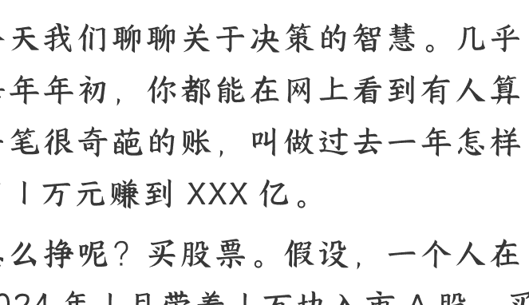
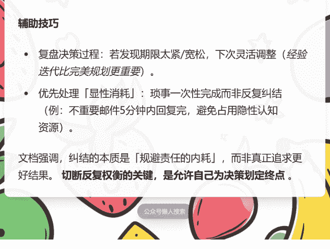

# 怎样拥有“不纠结”的智慧？

250224

整理：公众号懒人搜索，懒人专属群独享

懒人微信：lazyhelper

今天我们聊聊关于决策的智慧。几乎每年年初，你都能在网上看到有人算一笔很奇葩的账，叫做过去一年怎样用 1 万元赚到 XXX 亿。

怎么挣呢？买股票。假设，一个人在 2024 年 1 月带着 1 万块入市 A 股，买了深中华 A，那么 1 万块会变成 2.7 万。2 月全仓买克来机电，变成 8.3 万。3 月买金盾股份，变 25 万。假设他每个月都能买到涨幅最大的那只股票，那么 11 月买进日出东方能赚到 51 亿，等到 12 月买入再卖出中百集团，这笔钱将变成 162 亿。

同样，还有人用类似的方式算过港股。涨幅更大，1 万块入市，从 2024 年 1 月到 2024 年 12 月，假如每个月都买到涨幅最大的股票，那么这笔钱在年底会变成 2.6 万亿。

怎么样？听完后有没有追悔莫及的感觉？

其实，完全没必要后悔。首先，股市存在很多变量，前面只是理论上的马后炮，未必代表真实情况。

其次，我们也可以算一下做成这件事的概率。前几天，得到 App《决策算法 100 讲》的主理人喻颖正老师算了一下，结论是，你想真正做到这一点几乎不可能。

A 股大概有 5000 只股票，买到涨幅最大的那只的概率，就是 5000 分之一。而连续 12 个月买到涨幅最大的股票，就是 12 个 5000 分之一相乘。这个概率是多少呢？可以对比地球上的沙子。假设地球上的每粒沙子都是一张彩票，你要抽中唯一的一等奖，概率已经很低了吧？而连续 12 个月买到涨幅最大股票的概率，比抽中这粒特定沙子的概率还要低几百亿亿倍。

注意，我们要说的重点不是股市，而是这背后的那个更普遍的真相。这就是，那种每次都能选对最佳答案的连续最优解，多数时候只存在于理论层面。诺贝尔经济学奖得主赫伯特·西蒙说过，真正的决策往往受限于时间、认知与资源的约束，有限理性才是我们的常态。

有人曾经算过，一个现代人每天大概要做 3500 次决策。包括饮食、工作、社交等等方面。之前康奈尔大学做过统计，美国人光是在饮食方面的决策每天就超过 200 个。包括食物的摆放、包装、餐具选择等等。再看咱们国内，《2023 外卖行业研究报告》里提到过一个数字，国内外卖用户日均浏览店铺超过 20 家。其中 35% 的人会在添加购物车之后取消订单，然后重新选择别的餐厅。

当然，多数人并不会因为外卖这种小事纠结。但换个角度，人在决策这个事上，总难免会陷入低性价比时刻。在一些不重要的小事上花费太多的思考。

之前法国哲学家让·布里丹提出过一个思想实验。有一头非常饥饿的毛驴，被放置在两堆等量的干草中间，而且这头毛驴到两堆干草的距离完全相等。最后，毛驴始终无法决定该吃哪一堆，愣是给饿死了。这个现象还有个名字，叫布里丹毛驴效应。

那么，怎样才能尽可能不纠结，把决策的性价比尽量提高呢？前段时间，喻颖正老师在《决策算法 100 讲》里专门回答了这个问题。喻老师说，有一个特别简单的决策原则能够帮到你，叫做满意原则。也就是，把决策的衡量标准从“最优解”转换为“我满意”。

其中有三个关键步骤，分别是，**定标准、控参考、敢决定**。

第一步，定标准。是给你的主观满意度设置一个相对可衡量的标准。

毕竟，满意与否是种感受，它很难量化。因此就更需要建立一套标准。也就是，到底是什么决定了你的满意度。是最终的结果？是过程中的成本？还是你对整件事的主观感受？

比如买房，需要考虑的是自己的预算，能接受的房子的面积，以及自己对买房这件事的渴望程度。这三者达到平衡，它就大体符合了你的满意标准。

再比如，雷军年轻的时候设定，自己每个小时的机会成本是 5000 元。假如一件事低于这个价值，他就会反思值不值得去做。就像很多投资人，都会给自己的投资设定一个决策阈值，只有预期回报率超过这个阈值时，才考虑要不要投入。

再比如，棒球比赛。美国职业棒球联盟的赛季长达 6 个月，其间有 162 场比赛，几乎每天都要比。你若要是能赢得三分之一的比赛，就能有机会去博一把冠军。而反过来说，这也意味着，即使是冠军球队，一个赛季里也要输上三分之一，大概 50 场比赛。你看，基于这个概率，选手就要想，是不是每一场比赛都必须拼尽全力？哪些比赛是必须赢的？哪些比赛可以稍微节省一点体力，去应对更关键的比赛？

换句话说，不是每一场比赛都必须拼尽全力，不是每一个决定都一定要达到最优，我们要追求的是适合自己的标准，自己满意就好。

第二步，控参考。也就是，不要去随意做比较，拉高自己的期望值。

比如买车，很多人容易陷入“比较陷阱”。原本是奔着一辆基础款去的，结果发现只要加一万多就能升豪华版，再加两万还能升级到限量版配置。结果以此类推，带着基础款的预期，却买回了一辆顶配版。等交完钱才想起来，这不是我最初想要的啊。

换句话说，人的很多感受并不是完全由自己决定的，而是在比较中产生的。之前有人做过一个实验，请一群志愿者看杂志封面，封面上全都是俊男靓女，很养眼，看得人心情大好。但是，这个实验还有后半段，研究者在俊男靓女的照片后面，附上了这些模特的身高、体重，还有三围数据。更损的是，在这些数据旁边还有个空白栏，要求看的人把自己的身高、体重、三围也写上去，并且与模特的数据做对比。

结果，你懂的，没有一个人开心。原本很养眼的照片，现在越看越不顺眼。一场好好的欣赏，因为比较，变成了一场羡慕嫉妒恨的激发。

再比如，复旦大学经济学院的教授兰小欢说，很多炒股人的幸福感很低。原因不在于他们挣了多少钱，而是容易陷入“比较”的黑洞。股票系统是公开的，即便是你挣钱了，你也会看到别人挣得更多，于是就开始后悔。

按照经济学家卡尼曼的观点，我们对事物的判断，往往不取决于它的绝对价值，而是取决于参考点。说白了，除了警惕不好的选项，我们也要警惕那些乍看之下“更好”的选择。

第三步，敢决定。当你搞清楚自己的需求，并且排除了不必要的参照系之后，就要进入做决定环节。

关于做决定，有个非常好用的工具。估计你可能听说过，叫 37% 法则。这个法则是由著名数学家梅里尔·弗勒德提出的。简单说，你可以把决策的过程分为两个阶段，前 37% 的阶段和 37% 之后的阶段。

假设，我要开店，整条街上有 100 家空置的店面可供选择。那么，按照 37% 法则，我需要先考察总数 100 家的 37%，也就是 37 家。而且在这个阶段不要做决定，看到再好的也要忍住。而过了 37% 之后，从第 38 家店铺开始，只要遇到一家比之前的店铺都好的，就赶紧做决定。

同样，这个策略还可以用在找工作、相亲、买车等等很多场合。比如找工作，有十家公司进入你的备选，那么你可以先面试三家但不做决定，从第四家开始，一旦遇到好的就赶紧决定。

注意，这个方法不能确保绝对的最优解，但是能让最优解的出现概率最大化。这是性价比相对更高的决策方法。

其实，前面这些方法，假如用一句话总结，不外乎四个字，满意就好。比如作家余华，早年间当过牙医。最开始转行写作的时候给很多杂志投过稿，而且投稿的次序一定是按照杂志发行量从高到低。不管写成什么样，先投给《人民文学》和《收获》这样的头部杂志。即使被退稿，没关系，把要求降一点接着投其他的，投《北京文学》，投《上海文学》。万一还不行，就寄给地方杂志。总之，绝对不纠结，退稿就退稿，大不了换一家接着投，整个过程自己满意就行。

换句话说，满意原则不等于没有进取心，而是学会在有限理性和现实资源当中，找到更适合当前自己的选项。

借用喻颖正老师的一句话，不是所有机会都需要你抓住，不是所有选择都值得你穷尽。有时候，说“够好了”，恰恰是最理性的选择。

关于这个话题，咱们先说到这。

## 怎样才能不纠结呢？

> "250224 懒人 AI"
>
> **整理公众号 [懒人搜索] 懒人专属群独享**
>
> 懒人微信 lazyhelper"

### 核心原则

当面临两个难以抉择的选项时，往往说明二者优劣差异不大，多数纠结源于过度归因未来责任。解决方法如下：

#### 1. **设定「强制决策期限」**

- 将决策拆分为「信息收集」和「思考权衡」阶段，为每个阶段明确截止时间。

- **例：**搜索用餐选项最多花 20 分钟；30 分钟后必须选定餐厅。期限到了立即停止信息搜集或停止纠结，直接行动。

#### 2. **接纳「可承担风险」的思维**

- 意识到多数纠结的选项后果差异极小，即使选错也能承担后果。

- 降低对完美决策的执念，接受「基于当下信息的最优解」，无需为未来不可控因素自责。

#### 3. **明确「归因边界」**

- 将决策与后续结果解绑，避免潜意识将未来所有负面事件归咎于当前选择。

- **提醒自己：**当下的选择只是基于现有条件的合理行动，无法为未发生的变数负责。

### 辅助技巧

- **复盘决策过程：**若发现期限太紧/宽松，下次灵活调整（经验迭代比完美规划更重要）。

- **优先处理「显性消耗」：**琐事一次性完成而非反复纠结（例：不重要邮件 5 分钟内回复完，避免占用隐性认知资源）。

文档强调，纠结的本质是「规避责任的内耗」，而非真正追求更好结果。**切断反复权衡的关键，是允许自己为决策划定终点**。

## 历史 3000 多份各类付费文章以及年费三千多的副业社群资源，见懒人专属群内分享！

付费群，白嫖勿扰！

**懒人专属群更新记录：**

https://lazybook.fun/#/blog/record2