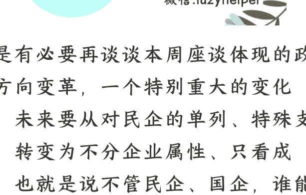

# 不会出现支持民企发展的新一轮政策热潮：潮，未来企业身份不重要

250225 大树乡谈  
整理：公众号懒人搜索，**懒人专属群**独享  
懒人微信：lazyhelper  

还是有必要再谈谈本周座谈体现的政策方向变革，一个特别重大的变化是，未来要从对民企的单列、特殊支持，转变为不分企业属性、只看成绩，也就是说不管民企、国企，谁能拿出国家期待的成绩，谁就是英雄，就能得到更多支持；如果拿不出来，不管民企、国企，都不要期待获得单独的政策优待。

这跟过去非常不一样。

这几年，舆论上一直很关注民营经济，这也是长期的惯性，也就是重视民营经济的"56789"，但这种说法也回避了民企存在的众多问题，比如对劳动者过于苛刻。2018 年召开座谈时，重点是安抚，在会前近一年时间，不断释放安抚民企的信号，对当时出现的民营经济“离场论”、公私合营论等进行批驳，特别关注在贸易战压力下，民营企业信心低迷问题。
因此 2018 年时，非常低姿态地表达了对民企困难的理解，详细解读政策，并表态解决民企面临的关键问题。

在下一步支持性政策上，2018 年说得非常具体。明确要从六个方面抓好政策落实：

- 减轻企业税费负担
- 解决融资难融资贵问题
- 营造公平竞争环境
- 完善政策执行方式
- 构建亲清新型政商关系
- 保护企家人身和财产安全等

而在谈到对民营企业家的要求时，也非常肯定，注意最后一点是“形成更多具有全球竞争力的世界一流企业”，看重民企参与国际竞争。

但这一次差别很大。

首先是召开的时机。坦率的说，小镇对今年突然召开新一次座谈感到很奇怪，没错，这一次就是“突然”。如果是类似 2018 年那样鼓舞信心，那么应该在 2023 年刚放开的时候召开，亦或者 2024 年上半年召开也是一个不错的时间点，当时也有相关部门对稳定民营信心采取了一些行动，这种背景下召开是顺理成章的。

然而，2025 年一开年突然召开了，之前没有任何的铺垫，仅仅是外媒提前几天突然释放消息，还是因为参会企业太多，根本就不可能瞒住。一次最高层级的座谈，需要充分发挥作用，通常需要前期进行充分的铺垫。

而且这一次如果参考 2018 年的情况，召开的必要性是不足的。并没有什么突发的冲击，特朗普上任，也是早就确定的事，其他方面没什么变化，更没有恶化，反而是中国民营企业从 2024 年四季度开始连续突破。比如华为推出高端产品，纯自主的原生鸿蒙，深度求索推出最新的 RI 大模型。但按照常理，这类突破不需要上升到最高级别。

今年的座谈跟 2018 年的报道也有很大区别。小镇认为有两大变化特别需要关注的。

## 第一个变化：对民营企业家的要求发生变化，增二减一

减去的就是前面提到的“形成更多具有全球竞争力的世界一流企业”，也就是期待民营企业家承担国际竞争力提升的重任。

虽然最近一年多民营企业有了很多国际级的创新突破，但仍然是点、线的突破，整体上并没有扭转跟随的模式，就如梁文峰去年说的“大部分中国公司习惯 follow，而不是创新”，中国夺取国际竞争制高点的行动，才刚刚开始，而不是结束，按理说也应该继续提一下。

但偏偏没提。

这也罢了，关键是新增的两点。

一是“要坚定不移走高质量发展之路”。在座谈会上，有一句非常重要的讲话，习说“现在，”国民经济已经形成相当的规模、占有很重的分量，推动民营经济高质量发展具备坚实基础”，听话要听音，这话可以理解为对民营经济的肯定，但更多的是提出要求，更是对民营经济当前发展情况的总体判断。

**即：认为民营经济总规模已经很大了，但是质量不足，下一步的重点不是继续扩大规模，而是要朝向高质量发展。**

那么什么是高质量？

过去这些年被打击、整顿的显然不是高质量发展方向，互联网行业的资本无序扩张显然也不是。就看这次座谈，互联网行业虽然还有 6 家参会，但是 DeepSeek 和科大讯飞显然跟传统互联网大不一样；奇安信的参会以及坐在第一排也有些奇怪，可能有些特殊渠道，毕竟奇安信主要做政府向业务，而且营收主要来自地方，这几年压力很大，很需要参会，方便后续进行业务沟通；而传统互联网企业只有三家参会，而且没有任何一家获得发言机会。

可以初步判断，对互联网的态度并没有因为一次座谈就发生变化，仍然是要求健康、高质量发展，具体要看会不会重启蚂蚁、滴滴的上市，亦或者阿里云能上市也可以作为一个重要参考，如果都没有，那么就不要觉得互联网又行了。

二是“要积极履行社会责任”。

这个要求可以直接理解为对民营企业的批评，正因为社会责任履行不够甚至很差，所以才需要专门强调，尤其是劳动关系。这从本周京东、美团为外卖骑手缴纳社保的变动可以侧面印证，自 2021 年，八部门联合发布《关于维护新就业形态劳动者劳动保障权益的指导意见》，相关部门一直希望美团做一个表率，提高对外卖骑手的劳动保障水平，但进展极为缓慢，这次突然落地了，显然是听明白了，劳动保障已经不仅仅是主管部门的要求了。

## 第二个变化：对下一步民企工作的部署也发生重大变化

不再像 2018 年那样非常具体，更多是谈原则。而最突出的变化是不再提“保护企业家人身和财产安全”，而是替代为违法查处，原话为“各类所有制企业的违法行为，都不能规避查处”。

还是要听明白话，这是针对民企的座谈，提出的要求显然是说给民企听的。也就是说民企不再被专门、特殊保护，而是要一视同仁，民企违法也要依法查处，不能因为是民企，就有特权，这也是跟 2018 年差别最大的一处。

要注意今年反腐的新变化，是重点打击行贿。懒人微信：lazyhelper

综合上述，可以很明显的感受到变化。

对民企的态度发生了变化，当然仍然支持民营经济，只是不再单独拿企业属性说事，不会因为是民企就一定要单独、重点保护。这也是因为自 2018 年以来，在民企保护方面已经有了很大提升。

但更重要的是，要为最核心的国家战略服务，未来国家核心战略就是科技创新、先进制造，要支持更多新兴、未来产业发展，也就是未来最核心的政策就是产业政策，支持民营经济的政策优先度要放在扶持新兴产业的产业政策之后。

可以套用“白猫黑猫”的老话，以后“不管国企民企，谁能拿出创新性成果，就是好企业”。

于是可以看到这次参会的 31 位企业家，制造业占比极高，发言的 6 位中 5 位来自先进制造，新希望集团从属于农业加工业，半农半工，而且事关粮食安全。

其他 25 家企业，除了互联网行业的 6 家，基本都与制造业相关，而且在科技创新方面具有独有特点的专精特新和小巨人企业集中参会，这些企业在各自领域都代表业内先进水平，不少在过去的一年多里，接受过高层调研。

## 概括下参会标签：先进制造、新兴产业、未来产业、专精特新

综合上述，未来方向很明确了。

这次座谈，可以说是一次表彰会，对过去在国家期待的科技创新、先进制造领域表现突出的民企进行表彰，号召全国所有企业向这些企业学习。以后要踏踏实实搞实体产业、搞先进制造、搞科技创新，而不是搞虚头巴脑的东西，不要总是想着赚钱，而是要真正去创新、去履行社会责任。

基于上述变化，未来与民企相关的政策肯定要发生大的变化。不必再拿民营经济占比等作为标志了，什么民企投资增速、民投融资额、民企规模增长等等曾经重视的指标，以后越来越不重要。

不管民企、国企，都是中国的企业，谁能拿出成绩，谁就是英雄。所以接下来，也不会推出专门扶持民营企业的政策，而是会有更多扶持未来产业的产业政策，谁有本事谁就能得到国家的偏爱。

历史 3000 多份各类付费文章以及年费三千多的副业社群资源，见懒人专属群内部分享！

付费群，白嫖勿扰！

## 懒人专属群更新记录：

[https://lazybook.fun/#/blog/record2](https://lazybook.fun/#/blog/record2)